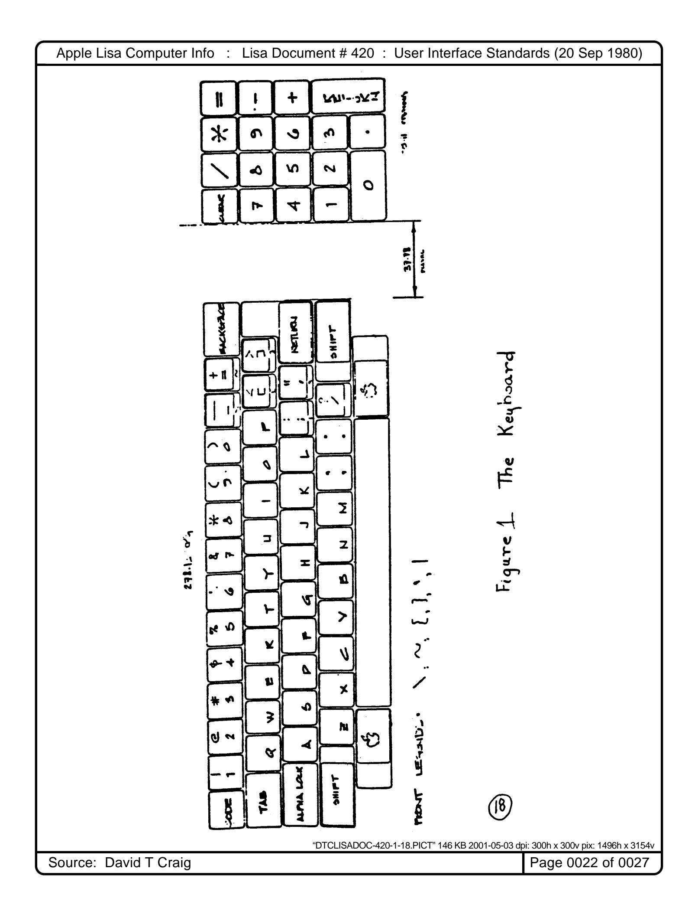
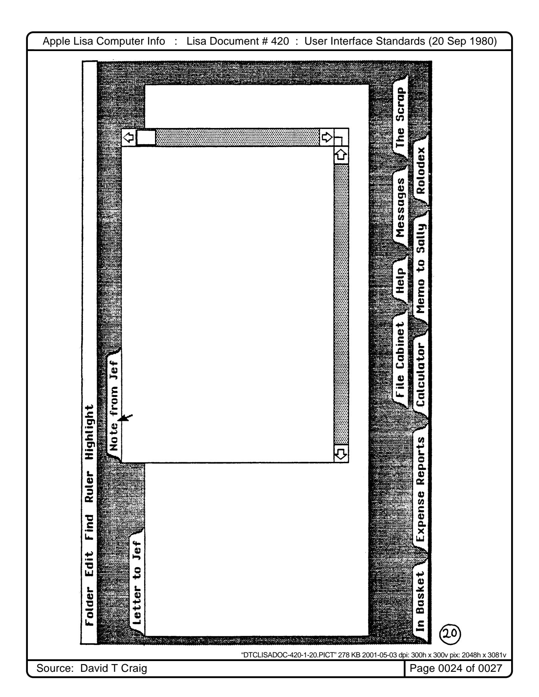
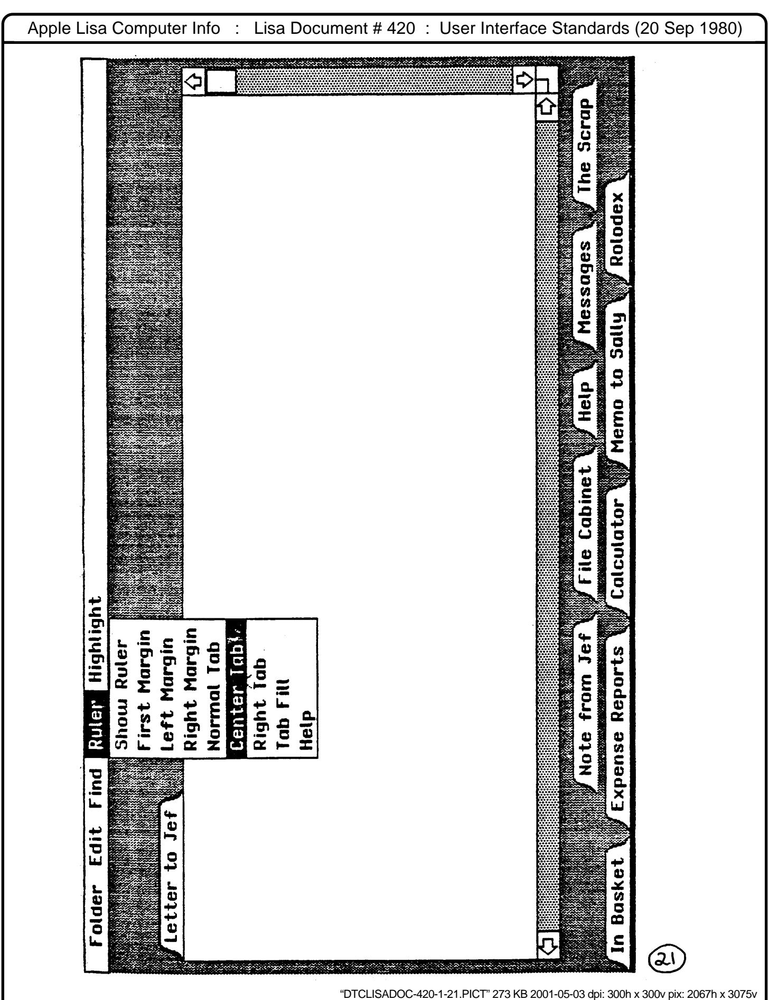
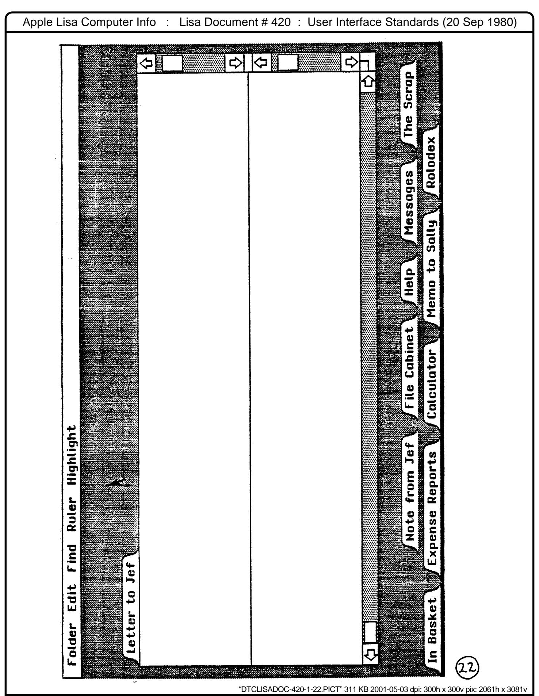

"DTCLISADOC-420-0-00.PICT" 154 KB 2001-05-03 dpi: 300h x 300v pix: 1795h x 2707v Apple Lisa Computer Info : Lisa Document # 420 : User Interface Standards (20 Sep 1980) Source: David T Craig Page 0001 of 0027


"DTCLISADOC-420-0-01.PICT" 149 KB 2001-05-03 dpi: 300h x 300v pix: 2091h x 2979v

Source: David T Craig Page 0002 of 0027

| Apple Lisa Computer Info<br>:<br>Lisa Document # 420 : User Interface Standards (20 Sep 1980) |
|-----------------------------------------------------------------------------------------------|
|                                                                                               |
|                                                                                               |
|                                                                                               |
|                                                                                               |
|                                                                                               |
|                                                                                               |
|                                                                                               |
|                                                                                               |
|                                                                                               |
|                                                                                               |
|                                                                                               |
|                                                                                               |
|                                                                                               |
|                                                                                               |
|                                                                                               |
|                                                                                               |
|                                                                                               |
|                                                                                               |
|                                                                                               |
|                                                                                               |
|                                                                                               |
|                                                                                               |
|                                                                                               |
|                                                                                               |
|                                                                                               |
|                                                                                               |
|                                                                                               |
|                                                                                               |
|                                                                                               |
|                                                                                               |
|                                                                                               |
|                                                                                               |
|                                                                                               |
|                                                                                               |
|                                                                                               |
|                                                                                               |
|                                                                                               |
|                                                                                               |
|                                                                                               |
|                                                                                               |
|                                                                                               |
|                                                                                               |
|                                                                                               |
| "DTCLISADOC-420-0-02.PICT" 55 KB 2001-05-03 dpi: 300h x 300v pix: 2079h x 1232v               |
| Source: David T Craig<br>Page 0003 of 0027                                                    |

| _          |               |                |          |              |       |     |     | 1    |
|------------|---------------|----------------|----------|--------------|-------|-----|-----|------|
|            |               | a              |          |              |       |     | •   | . 1  |
|            |               |                |          |              | •     | • • | •   | . 1  |
| 2.         | Mouse and Cu  | irsor          |          |              | •     | ٠   | •   | . 2  |
| 3.         | Pointing, C   | licking, and   | Draggi   | ng           | •     |     |     | . 2  |
| <i>i</i> . | Yorkoard .    |                |          |              | _     |     |     | . 2  |
| 4 •        | Keyboard .    |                | • • •    |              | •     |     |     |      |
| ٥.         | memory · ·    |                | • • •    | • • • • • •  | . • . | • • | •   |      |
| 6.         | Mass Memory   |                | • • •    |              | •     | • • | •   |      |
| 7.         | Initializat:  | ion • • • •    |          |              | •     |     | •   | . 3  |
|            |               |                |          |              |       |     |     | . 3  |
|            |               |                |          |              |       |     |     | . 3  |
|            |               |                |          |              |       |     |     |      |
| 10.        | Folders •     | • • • • • •    |          |              | •     | • • | •   | •    |
|            |               |                |          |              |       |     |     |      |
| 12.        | Open and Clo  | osed Folders   |          |              | •     |     | •   | . 4  |
| 13.        | The System 1  | Pont           |          |              |       |     |     | . 4  |
| 14.        | The Astine    | Foldor         |          |              | _     |     |     | . 4  |
|            |               |                |          |              |       |     |     |      |
|            |               |                | • • •    |              | •     | • • | •   |      |
| 16.        | Moving a Fo   | lder • • . •   |          |              | •     | • • | •   |      |
| 17.        | Growing the   | Active Folde   | er       |              | •     | • • | •   | • 5  |
| 18.        | Scrolling     |                |          |              | •     |     |     | . 6  |
| 19.        | How to Scro   | 11             |          |              | _     |     |     | . 6  |
| 20         | Calda Wdama   |                |          |              | Ī     |     |     |      |
| 20.        | Split views   | • • • • •      | • • • •  |              | •     | •   | • • |      |
| 21.        | The Selection | on · · · ·     | • • •    |              | •     | •   | •   |      |
|            |               |                |          | lections     |       |     |     |      |
| 23.        | Marking a S   | election       |          |              | •     | •   | • • | . 8  |
| 24.        | The Menu Ba   |                |          |              |       |     |     |      |
|            |               |                |          |              |       |     |     |      |
| 23.        | making a me   | nu choice      |          |              | •     | •   | •   |      |
| 26.        | menu items    | that bo Noth:  | ing • •  |              | •     | • • | •   |      |
| 27.        | Contents of   | the Menu Bar   | r and M  | enus         | •     | •   | • • | . 10 |
| 28.        | Making Menu   | Choices From   | n the K  | eyboard      | •     | • • | •   | . 10 |
| 29.        | The Dialog    | Box            |          |              | •     |     |     | . 11 |
| 30.        | Taxt Edition  | c Philosophy   |          |              | _     |     |     | . 11 |
| 21         | Text Dultin   | g Inilosophy   |          |              | •     |     |     | . 12 |
| 31.        | Typing rrin   | ting Characte  | ers .    |              | •     | •   | • • | . 12 |
| 32.        | Keys that A   | lter the Mean  | ning of  | Other Keys . | •     | • • | • • | • 14 |
| 33.        | Shift         |                |          |              | •     | •   | • • | • 12 |
| 34.        | Alpha Lock    |                |          |              | •     |     |     | . 12 |
| 35.        | Annie Key     |                |          |              |       |     |     | . 13 |
| 36.        | Whate wea     | • • • • • •    |          |              | •     | •   |     | 13   |
|            |               |                |          |              |       |     |     | . 13 |
| 37.        | Repeating K   | eys • • • •    | • • • •  |              | •     | • • |     |      |
| 38.        | Type Ahead    |                |          |              | •     | • • | • • | • 13 |
|            | Backspace     |                |          |              | •     |     |     | . 13 |
| 40.        | The Backspa   |                |          |              |       |     |     | . 14 |
| 41.        |               | ce bullet .    |          |              |       |     |     | . 14 |
|            | Tab           | • • • • • •    |          | • • • • • •  | •     | • • | • • |      |
| 42.        | Return • •    | • • • • • •    | • • • •  |              | •     | •   | • • | • 14 |
| 43.        | The Edit Me   | nu • • • •     |          |              | •     | • • | • • | . 14 |
| 44.        | Cut           |                |          |              | •     | •   | • • | . 15 |
| 45.        | Paste         |                |          |              |       | •   |     | . 15 |
|            | Copy · · ·    |                |          |              |       |     |     | . 16 |
|            | • •           |                |          |              |       |     |     | . 16 |
|            | Undo          | • • • • • • •  | • • • •  |              | •     | •   | • • |      |
|            | _             | uments and Fo  |          |              | •     | • • | • • | . 16 |
| 49.        | The Scrap     |                |          |              | •     | • ( | • • | . 16 |
|            |               | ation Folder   |          |              | •     | •   |     | . 16 |
|            |               | ofile Folder   |          |              |       |     |     | . 17 |
|            |               | _              | _        |              | •     | - ' | •   | . 19 |
|            | /             | ast page: 23   | <b>ን</b> | Screenshots  | •     |     | , 🕶 | . 17 |
|            | -             | , <sub> </sub> | _        | =            |       |     |     |      |

"DTCLISADOC-420-0-03.PICT" 196 KB 2001-05-03 dpi: 300h x 300v pix: 1928h x 2895v

Source: David T Craig Page 0004 of 0027

LISA USER INTERFACE STANDARDS DOCUMENT

Project leader Bill Atkinson

20 September 1980

CONFIDENTIAL AND PROPRIETARY PROPERTY OF APPLE COMPUTER INCORPORATED

## O. INTRODUCTION

The LISA User Interface has two main goals, simplicity and integration. We want LISA to be easy to learn and easy to use, so we try to do things in a simple and intuitive manner and to build on concepts already familiar to LISA users. An integrated system with a consistent user interface is easier to learn and to use. An integrated system is also more powerful than a group of seperate programs that don't interact.

This LISA User Interface Standards Document presents the external view of what LISA looks like to the user, and expresses a set of guidelines that the LISA development team will use in an effort to achieve simplicity and integration.

We want all Apple-supplied applications to have the same "feel" to the user, so that learning is minimized when going from application to application. Where possible, the same operation in two programs should be done in the same way and behave the same to the user. A given user action should have a consistent meaning throughout the system. Principles used in constructing system features should be extensible to similar occasions, in order to minimize user frustration.

It is hoped that outside vendors will find it to their advantage to use these conventions as well.

## 1. DISPLAY

The display is a black-and-white bit-mapped CRT having 360 scan lines of 720 dots each, with the screen's surface perpendicular to the surface on which the computer sits. Normal presentation of graphics or text consists of black lines or characters on a white background. The screen image has a 3:4 aspect ratio (long axis horizontal) and is physically located above a movable keyboard.

LISA User Interface Standards

Page 1

20 September 1980

"DTCLISADOC-420-1-01.PICT" 182 KB 2001-05-04 dpi: 300h x 300v pix: 2159h x 2741v

"DTCLISADOC-420-1-02.PICT" 244 KB 2001-05-04 dpi: 300h x 300v pix: 2158h x 2921v

This User Interface Standards Document describes an interface compatible with the existing LISA keyboard hardware without modification.

### 5. MEMORY

A LISA computer will have at least 128 Kbytes of main memory, of which 32K is dedicated to the display. Thus system overhead, fonts, memory resident program segments, and memory resident data cannot require more than 96 Kbytes of storage.

## 6. MASS MEMORY

The user interface is transparent with respect to the kind and amounts of mass storage provided. All that is assumed here is that there is enough to implement the interface described and to support applications using the interface. The minimum LISA will include two high density mini-floppies; an optional hard disk may be available later.

### 7. INITIALIZATION

The user is not required to do any initialization when the computer is turned on. There is no sign-on unless protected things will be used. When first turned on, after inserting the Apple-supplied diskettes, LISA comes up executing a program (i.e. displays a collection of folders) to teach the use of the mouse, and possibly other system features.

## 8. IN EVERYDAY OPERATION

Before turning off LISA, the user runs a cleanup program which brings each folder to a clean stopping point and then informs the user that power may be removed. When LISA is turned on again with the same diskettes in place, the display will be restored to its previous state. Each user may easily customize her LISA by leaving commonly used objects in convenient places on the screen.

# 9. WHAT THE SCREEN LOOKS LIKE

Across the full width of the top of the screen there is always a thin band of white with a collection of menu titles in it; it is called the Menu B ar and is described in section 24.

The rest of the screen is gray and represents a desktop. Documents on that desk are presented in images that look much like traditional file folders. Many of these folders may sit on the desk at the same time, they may overlap, and they may be moved about on the desk, discarded, or filed away in a filing cabinet.

LISA User Interface Standards

Page 3

20 September 1980

"DTCLISADOC-420-1-03.PICT" 205 KB 2001-05-04 dpi: 300h x 300v pix: 2141h x 2909v

Source: David T Craig Page 0007 of 0027

## 10. FOLDERS

Each folder shows a view of a single document, and provides a structure for manipulating the view of that document by scrolling, moving, growing, and closing the folder down to a tab.

A folder may be used to group together a collection of related documents to be filed away and retrieved together. The filing system is still in design, and the grouping mechanism will be determined by it. Two possibilities are a folder containing other closed folders (only tabs visible), or a folder with a table of contents to select which document is currently visible. In any case, each folder only shows one document at any time.

## 11. BASIC FOLDER APPEARANCE

A folder is drawn as a white rectangle (filled in by the application) with a thin (one pixel) black border. Every folder has a tab, which looks like a tab on a standard manilla folder. The tab is always above the upper left corner of the folder. It is called the title tab.

The rectangular portion of the folder that holds the folder's contents is called the body of the folder.

## 12. OPEN AND CLOSED FOLDERS

Each folder may be either open, (its body and tab both visible), or closed, (only its title tab visible). Each folder remembers two locations on the screen, one where it resides when open and one for when it is closed. If a folder is open, double-click the mouse button on its title tab to close it and move it to its closed location. If a folder is closed, double-click the tab to open it and restore it to its open position and size.

# 13. THE SYSTEM FONT

The text in title tabs, menu titles, and menu items is usually written in the standard system font. This font is not normally available to the user. It will also be used in the dialog box for the system side of user-system dialogs, to make it plain who said what.

## 14. THE ACTIVE FOLDER

One folder is distinguished by its title tab being drawn in a thicker line, and by having two light gray scroll bars on its right and bottom edges. This is the active folder. It is the only folder whose contents may be directly modified by the user. Passive folders may be modified by the system, or as a consequence of actions performed by the user on the active folder.

LISA User Interface Standards

Page 4

20 September 1980

"DTCLISADOC-420-1-04.PICT" 217 KB 2001-05-04 dpi: 300h x 300v pix: 2159h x 2897v

Source: David T Craig

# 15. MAKING A FOLDER ACTIVE

Pressing the mouse button while pointing anywhere on a passive folder makes that one the active folder, and the previously active folder becomes passive. A folder may also be made active or passive by an application. If this might happen when the user is not expecting it or may not be looking at the screen, a beep should occur as notification.

Even a closed folder can be made the active folder. Since its body is not visible no scrollbars appear; only its thickened tab distinguishes it as the active folder.

## 16. MOVING A FOLDER

An open folder may be moved by placing the cursor on its title tab, and then pressing and holding down the mouse button while moving the cursor. A flickering outline of the entire folder will track the cursor. Releasing the mouse button moves the folder instantaneously to the new position indicated by the flickering outline.

A closed folder may also be moved by dragging its title tab. The process is the same as for an open folder except that no flickering outline is given and instead of the jump at the end, the whole tab is dragged along continuously with the cursor until the button is released.

The open and closed locations of a folder are independent. Dragging a closed folder changes only its closed position, and dragging an open folder changes only its open position.

Since pressing the mouse button on any part of a folder makes it the active folder, moving a folder leaves it active and on top of any other folders that it might overlap.

# 17. GROWING THE ACTIVE FOLDER

The grow icon, located just beyond the right bottom corner of the active folder, (where the scrollbars intersect), is used to change the size of the active folder. (See illustrations.)

If you press the mouse button with the cursor in the grow icon, a flickering outline of the folder will appear and its lower right corner will follow the cursor as long as the button is held down. When you release the button, the application will "resize" the folder, that is, adjust its lower right hand corner at a position at (or close to) the lower right hand corner of the flickering outline. The application can restrict the minimum and maximum dimensions of the folder.

LISA User Interface Standards

Page 5

20 September 1980

"DTCLISADOC-420-1-05.PICT" 220 KB 2001-05-04 dpi: 300h x 300v pix: 2142h x 2915v

"DTCLISADOC-420-1-06.PICT" 228 KB 2001-05-04 dpi: 300h x 300v pix: 2143h x 2915v

"DTCLISADOC-420-1-07.PICT" 192 KB 2001-05-04 dpi: 300h x 300v pix: 2148h x 2903v

In text, the selection is usually a contiguous span of characters nighlighted in inverse video. When it contains no characters, it appears as a blinking vertical line which we sometimes call the caret.

In graphics the selection will probably be highlighted by the 'marching ants' technique used in the forms editor.

When a document is passive, its selection becomes only dimly highlighted, such as characters on a gray background or halted 'ants'. Blinking selections stop blinking in a passive document. When the document is once again made active, its selection is restored to full highlighting.

# 22. VISIBILITY OF OPERATIONS ON SELECTIONS

When an operation (such as replacement) is performed on a selection not even partly visible in the folder, the active folder is automatically scrolled so that at least part of the selection is visible in the folder. The scrolling is performed before the operation is executed.

# 23. MARKING A SELECTION

A selection in the active folder is defined and marked by pointing and dragging with the mouse. As the mouse is dragged, the size of selection increases or decreases. This is visible to the user, who sees the selection's highlighting expanding or shrinking as the mouse is moved about.

There are several special ways to make a selection other than simply dragging from one end to the other. The first of these is double- and triple-clicking to select larger entities.

Double clicking in text (releasing the button and pressing again within 1/2 second) selects the entire word surrounding the position of the initial click and extends the selection by words while dragging. Punctuation and spacing are taken a character at a time when extending by words.

Triple clicking in text selects the entire paragraph surrounding the initial position and extends by paragraphs.

More than three clicks separated by less than 1/2 second are interpreted as three clicks.

In a folder which presents a split view of a document, dragging from one view pane into another will extend the selection to the portion of the document visible in the second view pane.

LISA User Interface Standards

Page 8

20 September 1980

"DTCLISADOC-420-1-08.PICT" 209 KB 2001-05-04 dpi: 300h x 300v pix: 2255h x 2931v

Source: David T Craig Page 0012 of 0027

If you start a selection and then drag outside the entire folder while still holding the mouse button down, the document in the folder will scroll to show more. When the other end is in view, move the cursor back into the folder to stop scrolling and release the button to complete the selection.

If a selection is too long for the above methods to be practical, or if an incorrect selection is made and the user wants to adjust it without starting all over, then "SHIFT-BUTTON" may be used. If either SHIFT key on the keyboard is being held down when the mouse button is pressed, then instead of starting a new selection, an endpoint of the selection (the one on the same side of the initial "anchor" point of the selection as the cursor is) is adjusted just as if the button were already down during a normal selection that started on the other end.

## 24. THE MENU BAR

Across the full width of the top of the screen there is always a thin band of white called the menu bar. It is tall enough for one line of characters, and displays the titles of a set of menus which currently make sense. Most of the menus operate on the selection in the active folder. Some may operate on the active folder as a whole; or on a group of related folders, or even on the whole LISA system. The menu bar is the main means by which a user tells LISA what to do.

The menu bar contains a number of words, each of which is the title of a "pull-down" menu. If the cursor is moved with the button up to one of the menu titles, the cursor shape changes to an apple. If the mouse button is pressed, the menu title becomes highlighted in inverse and the associated menu pops out, hanging down below the menu bar.

If you drag the cursor across the menu bar while holding down the button, each menu will pop out in succession and you will be able to see all the menu items that are currently available to you.

Each menu is a list of choices among a collection of commands, objects or other menus. The items in a menu may be arranged linearly, or in an array, and may be textual, graphical or even dynamic.

Menu choices are directives, not state indicators (e.g. Turn Printer On rather than Printer Off). However, often the user can tell what states (if any) are in effect (see below).

## 25. MAKING A MENU CHOICE

If you drag down into the menu, the first menu item becomes highlighted. As long as you are pointing inside the menu, the menu item nearest the cursor will be highlighted. To select a menu item, drag down until that item is highlighted, then release the button to indicate your choice and initiate the action. The menu disappears immediately, but the menu title remains highlighted until

LISA User Interface Standards

Page 9

20 September 1980

"DTCLISADOC-420-1-09.PICT" 256 KB 2001-05-04 dpi: 300h x 300v pix: 2158h x 2914v

Source: David T Craig

the action has been completed.

If you move outside the menu rectangle before releasing the button, none of the menu items will be selected. The menu remains visible until the button is released or the cursor is moved over another menu title in the menu bar.

# 26. MENU ITEMS THAT DO NOTHING

When an application knows that a menu item would have no effect, it may dimly highlight that item. Such an item can be invoked anyway, if the user wishes. Note that when the command is one that changes a state (e.g., Bold or Turn Printer On), the dim highlighting also provides feedback to the user about the current state.

# 27. CONTENTS OF THE MENU BAR AND OF THE MENUS

The list of menu titles in the menu bar and the contents of those menus will change as a function of the active folder and the selection in that folder. Submenu titles may also be brought up by making a selection in one of these main menus. When submenus are used, they should appear toward the right in the menu bar and should not cause any of the main menus to disappear. Thus in a heirarchical menu, the user can always get to a given menu item by the main menu; sometimes she can take a shortcut if the submenu is already in the menubar.

## 28. MAKING MENU CHOICES FROM THE KEYBOARD

To increase the speed with which menu choices can be made in keyboard-intesive applications, a limited number of menu items may be chosen directly from the keyboard, without using the mouse.

To invoke a menu choice from the keyboard, hold down either APPLE key while pressing another key that is associated with that choice. Only commands in menus whose titles are currently in the menu bar can be invoked in this way. If no command in the menu bar is associated with the key, a beep is sounded.

The user learns the keys that invoke menu commands during normal system use because each menu item that can be invoked from the keyboard is tagged with an apple symbol and the legend of the associated key. To find out all the commands accesible from the keyboard, bring up each menu by dragging across the menu bar; each menu item that is tagged with an apple and keycap legend is also available from the keyboard.

LISA User Interface Standards

20 September 1980

Page 10

There are eight APPLE key combinations that are universally associated with certain common commands:

APPLE-Z: Cut APPLE-B: Bold
APPLE-X: Paste APPLE-I: Italic
APPLE-C: Copy APPLE-: Underline
APPLE-U: Undo APPLE-N: Normal

The other printing keys can be associated with different commands in different folders, but any one key must have only one meaning within one folder. Consistency is encouraged betwen folders of an application, that is, if the same command name appears in two folders of the same application, then the same keystroke should invoke them. Furthermore, applications should avoid assigning the same keystroke to different commands in different folders when a mistake by the user would be dangerous or even likely.

## 29. THE DIALOG BOX

Sometimes just choosing a menu item isn't enough. When a further parameter needs to be typed in, a white band the full width of the screen and of variable height extends down below the menu bar, prompts for the parameter, and provides a place for it to be echoed as it is typed. This box is called the Dialog Box, and it is a little akin to a system console terminal.

The Dialog Box is also provides a place for the system or an application to put up prompts, interactive dialog, error messages, etc. without writing all over the user's document or changing the active folder. Applications may grow and shrink the dialog box vertically as needed, or just leave it up as a fixed size. The Dialog Box, unlike the Menu Bar, may be overlapped by a folder; if the dialog box obscures a folder, pressing the mouse button in that folder will bring it to the top. Pressing inside the Dialog Box when it is obscurred will bring it back to the top without changing the active folder. When necessary, an application may even put a scroll bar on the dialog box.

## 30. TEXT EDITING PHILOSPHY

The User Interface text editing features are available across all applications when text is being typed. Each application may augment these with special editing functions for its own objects. The word processor, of course, is a superset of this text editing equipment.

LISA User Interface Standards

20 September 1980

"DTCLISADOC-420-1-11.PICT" 211 KB 2001-05-04 dpi: 300h x 300v pix: 2127h x 2904v

Page 11

To avoid unnecessary modes, commands are postfix rather than prefix. Some object is selected, and then an action on that object is specified. This allows the user time to check that the object has been selected correctly. It avoids modes, since the user may start a new task by making a new selection without having to terminate or cancel anything explicitly.

## 31. TYPING PRINTING CHARACTERS

When a character is typed, the current selection is deleted from the document and the character replaces it. If there is no active folder, and thus no current selection, or if the current selection cannot be replaced by text (as in an all-graphics application with no captions), then a beep is sounded when typing is attempted.

If typing makes the caret go beyond the folder edge, the document will be scrolled back so the caret is visible.

When the user starts to type, the caret stops blinking. When the user stops typing and the system has caught up, the caret starts blinking again.

32. KEYS THAT ALTER THE MEANINGS OF OTHER KEYS

The SHIFT, ALPHA LOCK, APPLE, and CODE keys are neither command keys nor printing character keys. When any other key is pressed, its meaning hinges partially on what combination of those four keys is currently depressed.

## 33. SHIFT

On keys with two legends on top, SHIFT designates the upper legend instead of the usual lower legend.

On alphabetic keys, SHIFT designates upper case instead of the usual lower case.

On the numeric keypad, SHIFT has no effect.

SHIFT also modifies the meaning of BACKSPACE and the mouse button, as explained elsewhere in this document.

# 34. ALPHA LOCK

ALPHA LOCK physically locks down when pressed from the up position, and returns to the up position when pressed again. It designates upper case on alphabetic keys, but has no effect on other keys.

Page 12

LISA User Interface Standards

20 September 1980

## 35. APPLE KEY

APPLE makes the key pressed with it invoke the comand (if any) that is associated with that key in the menus of the Menu bar. It beeps if no command is associated with that key.

APPLE also modifies the meaning of BACKSPACE, as explained below.

## 36. CODE

CODE pressed with a key looks up that key in the abbreviation folder and acts as if the expansion of that abbreviation were pasted from the Scrap (see Section 12). For unformatted text, it is the same as typing that text in full.

Certain CODE combinations are reserved, namely:

```
CODE - ... ~ CODE | ... ~ {
CODE | ... | {
CODE | ... | }
CODE | ... | {
CODE | ... | }
```

### 37. REPEATING KEYS

All keys except for the shift, code, apple, and apple-shifted keys repeat with a certain frequency starting after a certain time delay and stopping when the key is released. The repeat frequency and delay are specified in the User Profile. The repeat frequency of the backspace key may be specified separately from the other keys.

# 38. TYPE AHEAD

All characters including commands invoked with the Apple key may be typed ahead. The initial press of a key always types ahead, but auto repeat characters will not be typed ahead. Mouse button— ahead is normally disabled, but may be turned on by the User Profile.

When an application detects a keyboard error, it may beep, delay a short time, then flush the type ahead buffer.

The length of the type-ahead buffer is sufficient to hold a line of text.

# 39. BACKSPACE

BACKSPACE is not a character, but an editing command executed whenever a certain key is pressed. If the selection contains characters, BACKSPACE does nothing. If the selection is just a caret, BACKSPACE deletes the character to the left of the caret and places it in the backspace buffer.

LISA User Interface Standards

20 September 1980

"DTCLISADOC-420-1-13.PICT" 178 KB 2001-05-04 dpi: 300h x 300v pix: 2144h x 2908v

Source: David T Craig Page 0017 of 0027

Page 13

APPLE-BACKSPACE means "backword", that is, it deletes characters to the left of the caret and places them in the backspace buffer until the first character of a word has been deleted.

## 40. THE BACKSPACE BUFFER

This is a LIFO stack in which characters backspaced over are stored, and from which they may be retrieved a character at a time by pressing SHIFT-BACKSPACE (un-backspace) or a word at a time by pressing APPLE-SHIFT-BACKSPACE (un-backword).

This buffer is cleared when the mouse button is pressed or a key other than BACKSPACE or its shifts is typed.

## 41. TAB

TAB is a character. In the word processor TAB is used to advance to the next tab stop, (See the Word Processor ERS for details). Within a field of a form TAB means to accept the entire field as it is, check the field, and if the edit check passes, advance to the next field. Shift-TAB does the same except advancing to the previous field after accepting the entry.

If the edit check fails, a beep is sounded and the typeahead buffer is flushed. If the edit check passes, the field is accepted by the form, and the next field is automatically selected in its entirety.

### 42. RETURN

RETURN is a character. It may be part of a search pattern, for example, which is not true of BACKSPACE. In the word processor, RETURN is used to delimit a paragraph. When RETURN is typed, the selection is deleted, and a mandatory line break inserted.

RETURN has a somewhat different meaning within a field of a form. If the entire field is selected, RETURN means the same as tab. If the selection is anywhere in a single line field, RETURN means the same as tab. If the selection is just a caret and is at the end of the last line of a field, RETURN means the same as tab. Otherwise if the selection is in a multi-line field, RETURN deletes the selection and inserts a line break. If the additional line of text doesn't fit within the field, RETURN will just beep.

Shift-RETURN acts the same as RETURN.

# 43. THE EDIT MENU

One menu almost always available in the menu bar is the edit menu. It contains the basic editing commands Cut, Paste and Copy, and the general command Undo. It may also contain Bold, Italic, Underline, and Normal. Each of these commands may be invoked in the normal way with the mouse, or from the keyboard via their apple key shortcuts.

LISA User Interface Standards

20 September 1980

"DTCLISADOC-420-1-14.PICT" 229 KB 2001-05-04 dpi: 300h x 300v pix: 2123h x 2913v

Source: David T Craig Page 0018 of 0027

Page 14

## 44. CUT

Choosing the Cut command from the Edit menu places the current selection in the scrap folder, and deletes it from the active folder.

An attempt to Cut when the selection contains no characters makes no change to the document or to the scrap folder. The user is warned that Cut will not work when the selection contains no characters since the menu item is dimly highlighted at those times.

If there was no scrap folder when Cut is first executed, one is automatically created and placed on the desk as a closed folder.

If there is some text in the scrap folder and a new selection is cut from a document (not necessarily from the same document or folder as the previous cut), the old scrap text is lost (unless an Undo is the very next command) and the material just cut becomes the contents of the scrap folder.

When a selection is cut, the remaining text in the document (if any) is "pulled in" following the normal word-wrap rules. If words or sentences are cut, and the wrong number of spaces remain for proper typography, the system fixes things up automatically.

Tot all portions of all documents are cuttable, e.g. protected portions of forms. In first release, at least, the entire Scrap Folder is not only read only, but it is also impossible to make selections in it.

# 45. PASTE

This command replaces the active selection with the contents of the scrap folder. The contents of the scrap folder may be graphical or textual, however if the type of material does not correspond with what is allowed by the application, a warning sounds, and the Paste is not made. In many applications an explanation will appear in the Dialog Box.

After a paste of textual material, the selection is a caret located immediately after the material that was pasted into the document. If words or sentences are pasted, then spacing around the pasted text is made typographically correct.

When a Paste is done, the material in the scrap folder is unaltered. Repeated Pastes done without an intervening cut result in a number of copies of the material in the scrap folder being made.

LISA User Interface Standards

Page 15

20 September 1980

"DTCLISADOC-420-1-15.PICT" 206 KB 2001-05-04 dpi: 300h x 300v pix: 2148h x 2865v

# 46. COPY

The copy command places a copy of the selection in the scrap folder just as with CUT: in fact everything is the same except that the selection is not changed or deleted.

### 47. UNDO

The Undo command undoes the last command you issued

Undo is a command, thus a second Undo undoes the first
Undo. Undo applies to all edit menu commands, and in later releases
it will apply to more and more commands until eventually it will
apply to all.

Simply changing what is selected does not count as a command. Therefore, after a command is invoked, the user can Undo until another command is invoked

A series of keystrokes on the keyboard including printing characters, RETURN, TAB, all CODE-shifted characters, and all variations of BACKSPACE, with no intervening changes of selection and no command invocations , is considered a single command for Undo purposes. For example, if a word is selected, and the user types over it (even if he types more backspaces than characters) and then he invokes Undo in that folder, then the text is restored to its condition before the first character /as typed, and the original word is again selected.

## 48. UTILITY DOCUMENTS AND FOLDERS

Certain documents are created by the system and are permanently in

## 49. THE SCRAP

The Scrap Folder is used for CUT-PASTE and COPY-PASTE operations. See Section 12.

# 50. THE ABBREVIATION FOLDER

The Abbreviation Folder contains a table of abbreviations accessible with the CODE key. When the code key is held down and another key is typed, the entry for that key in the Abbreviations Folder is pasted in to replace the active selection. Entries in the Abbreviation Folder may be edited so the user can use abbreviations for common phrases, inside address, etc. For first release, the abbreviations might only be textual, but eventually they should include graphics too as in a logo or signiature.

LISA User Interface Standards

Page 16

20 September 1980

"DTCLISADOC-420-1-16.PICT" 192 KB 2001-05-04 dpi: 300h x 300v pix: 2205h x 2902v

"DTCLISADOC-420-1-17.PICT" 51 KB 2001-05-04 dpi: 300h x 300v pix: 2100h x 2919v

Source: David T Craig Page 0021 of 0027







Source: David T Craig Page 0025 of 0027



Source: David T Craig Page 0026 of 0027


Source: David T Craig Page 0027 of 0027