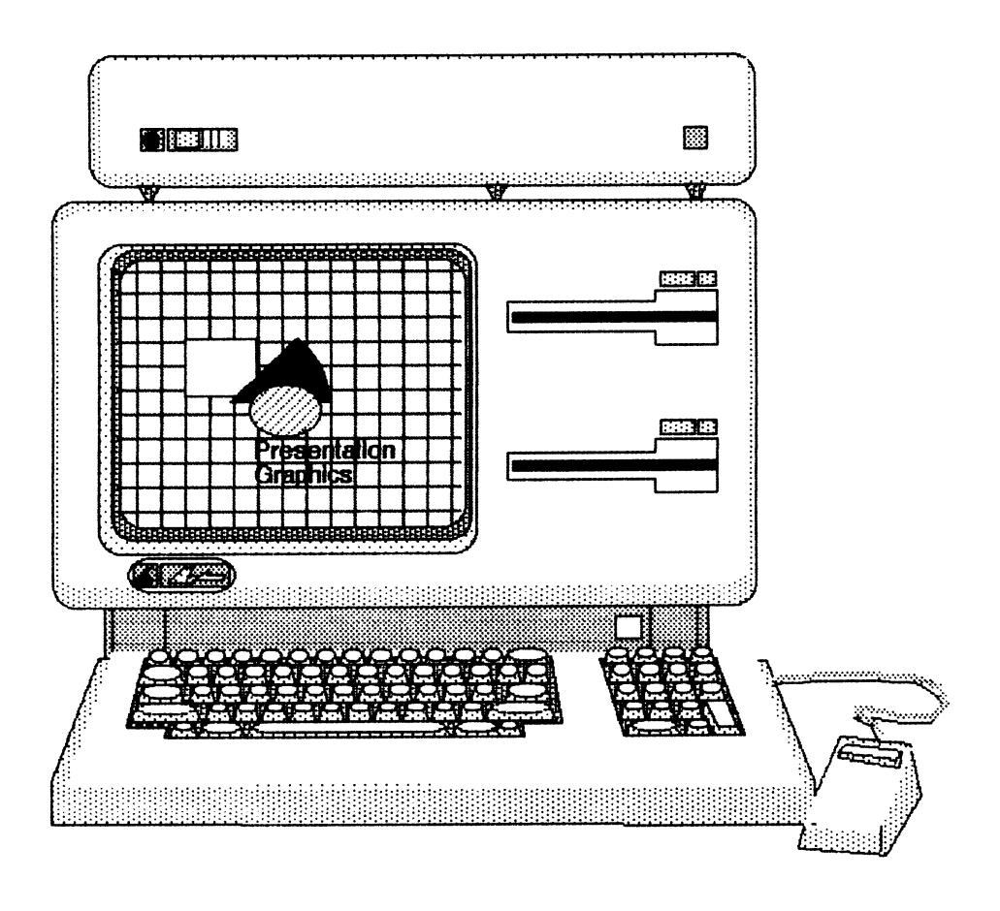
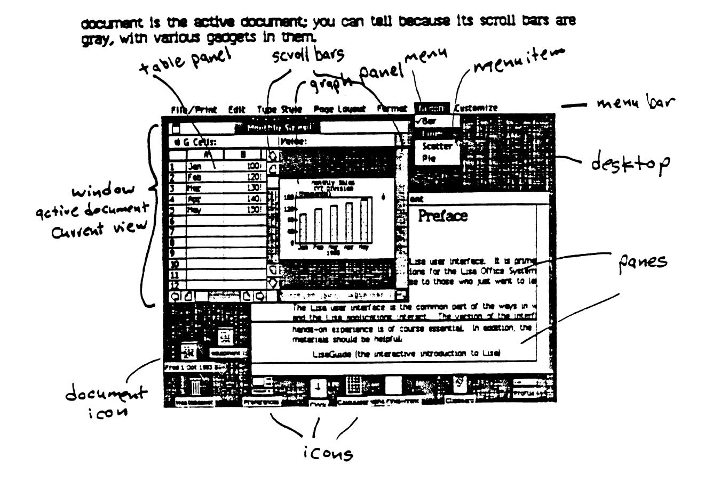
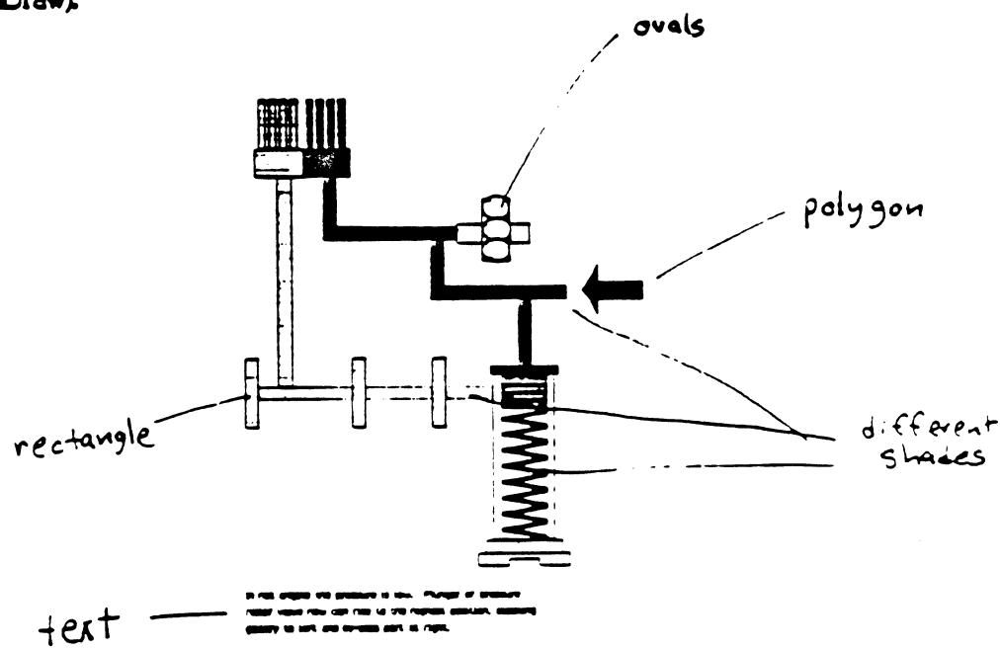
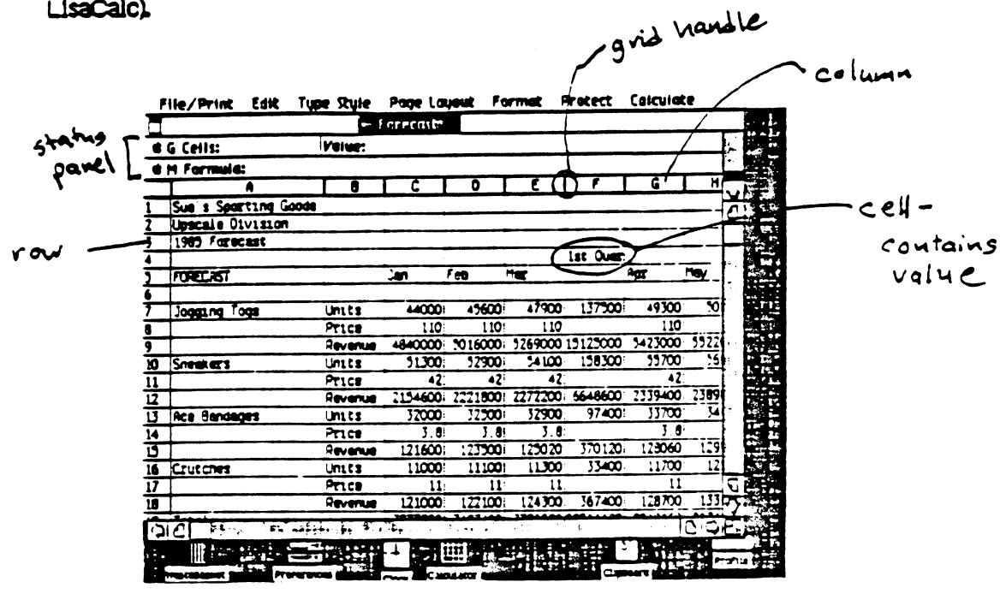
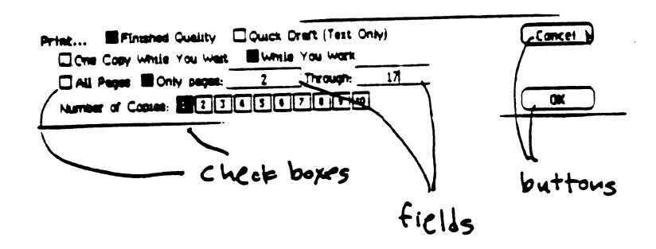
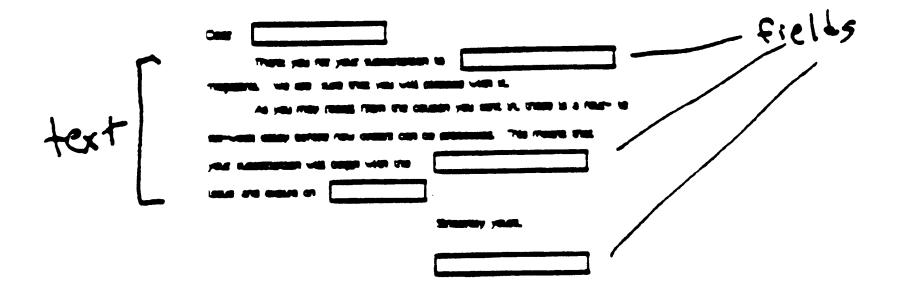
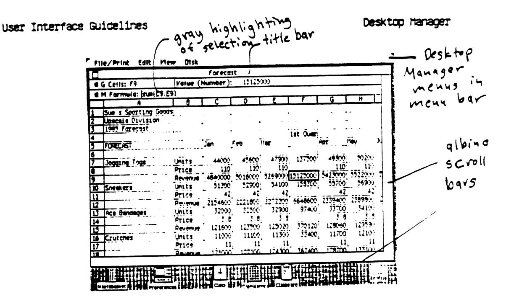
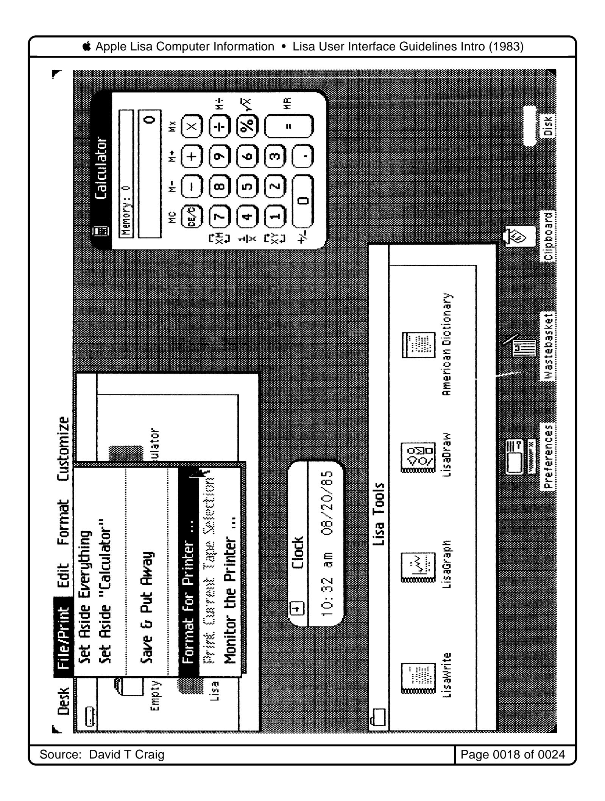
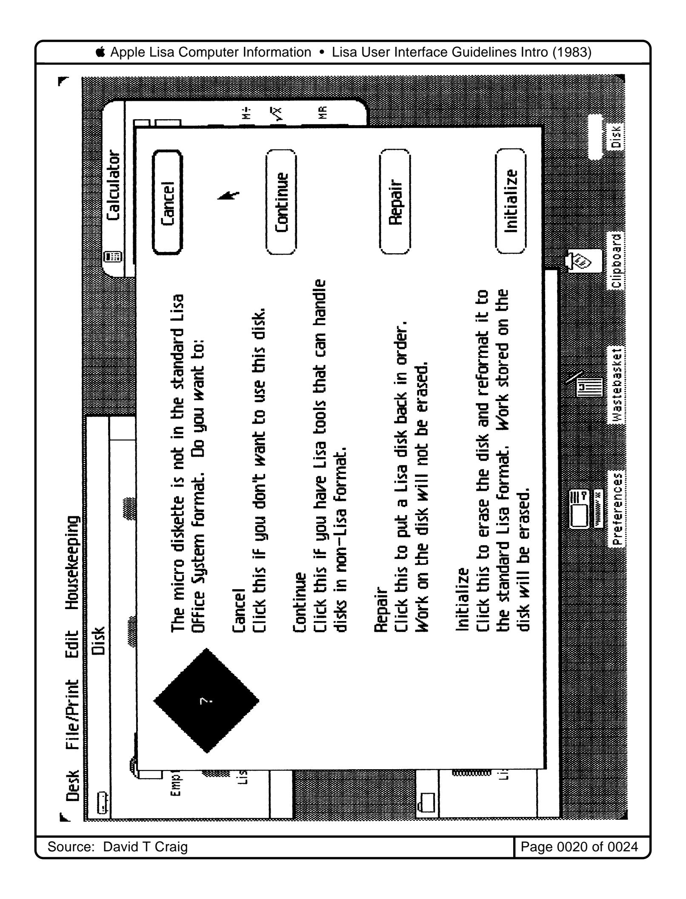
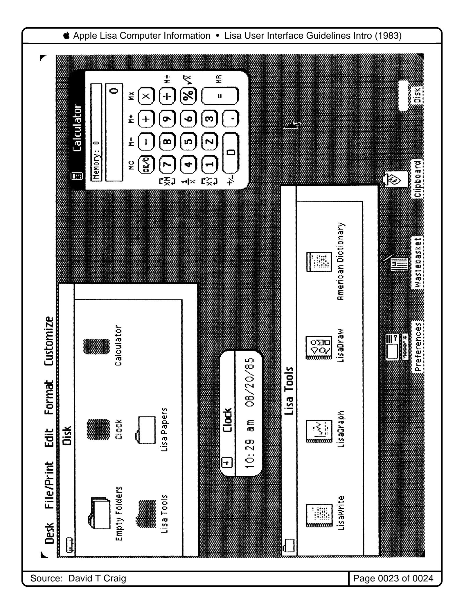

Source: David T Craig Page 0001 of 0024

# **Preface**

This document describes the Lisa user interface. It is primarily for people who want to develop applications for the Lisa Office System using the Toolkit, but may also be of use to those who just want to learn more about the Lisa interface.

The Lisa user interface is the common part of the ways in which the user and the Lisa applications interact. The version of the interface described in this document is the "ideal" version. Usually, but by no means always, it matches the way the applications already released behave. However, there are many deviations from this standard in these applications. Wherever the behavior of an application and the behavior in this document disagree, the user should assume that this document describes the way we think the interface should behave, rather than the way it does behave.

Each section of this document consists of three parts:

- 1) A general description of the feature from the user's point of view.
- 2) Under the heading Details, additional nitty-gritty details about the feature. These details are of interest only to those planning to develop applications.
- 3) Under the heading Implementation, a brief discussion of what a developer needs to know in order to implement the feature. Mostly, this just tells you whether the feature is provided by the Toolkit, and if so, by which component. For more details, refer to the Lisa Applications Toolkit reference manual.

A note on terminology: This document mostly doesn't distinguish between things that are done by the Toolkit and things that are done by an application that uses the Toolkit. Therefore, when we say "the application does this or that," it may be that actually the Toolkit does it, but from the user's point of view, it is all done by the application. The only place where the distinction between the application and the Toolkit is relevant is in the Implementation sections.

To get the most from this document, you should be pretty familiar with the Lisa Office System. It is especially helpful to have learned to use LisaWrite, LisaDraw, and either LisaCalc or LisaGraph. Where relevant, this document takes examples from these and the other first release applications.

For those who want to become more familiar with the Office System, hands-on experience is essential. In addition, the following materials should be helpful:

LisaGuide (the interactive introduction to Lisa)
Lisa Owner's Guide, section B, Lisa Fundamentals

Ibid., section D, Desktop Manager Reference Guide

Any tool manual, Section C, Chapter 1, Overview

Ibid., Section C, Chapter 2, passim

Source: David T Craig Page 0002 of 0024

Overview

# Chapter 1 Overview

The Lisa system is both a hardware system and a software system. This document describes the software interface; a brief description of the hardware is in Appendix A.

## 1.1 Interface design principles

The Lisa user interface was designed with the following principles in mind:

- 1) It is easy to learn and to remember because the basic operations are natural and intuitive. They are natural because they resemble things people do when they aren't using computers, and they are intuitive because they work the way people would expect without giving it much thought. For example, when the user moves the mouse around, the pointer moves so quickly and conforms so closely to the path of the mouse that the user is not really aware of the steps that intervene between the mouse movement and the pointer movement. If the "reaction time" of the pointer were much slower, the user would be aware of the delay, and mouse movement would seem less intuitive.
- 2) It is consistent among applications. Whenever two applications do the same thing, they tend to do it in the same way.
- 3) It is nich enough to fit many types of applications. Currently, the applications available include text-oriented applications (Lisawrite), graphics-oriented applications (Lisawrite), table-oriented applications (Lisawrite) and Lisawrite), table-oriented applications (Lisawrite) and Lisawrite) and one graphics-table hybrid (Lisawrite). More categories, particularly forms, will be added later.
- 4) It is friendly and permissive. Whenever possible, the system tries to put a logical interpretation on user actions.

The most important principle for creating a permissive user interface is the applition of modes.

## 1.1.1 Modes

A mode is a state of the system that the user has to formally begin and end, and that restricts the operations he can perform while it is in effect. Experience has shown that it is hard for users, especially naive users, to learn and to use mode-based systems because of the number of arbitrary operations they have to memorize.

We have avoided modes in the Lisa user interface, but we haven't eliminated them entirely. We have used them wherever their value as the solution to a problem outweighs their inconvenience. Some examples are:

- 1) When the application sends the user an alert message warning him of a potentially serious problem, the user must acknowledge the message and deal with the problem before doing anything else. An example is entering an invalid formula in LisaCaic. The user must correct the formula before making a selection outside the cell.
- 2) when the cost of an operation in disk space, memory, or time is high, a mode can help ensure that the user's intentions are completely clear before

1-1

Source: David T Craig

Page 0003 of 0024

Overview

the application performs the operation. For example, in LisaList, adding or removing a column is a major operation because it restructures the data base. Therefore, the user must bring up a special table to specify the change, and then explicitly indicate when she is ready to add or remove the columns.

3) Some modes are used because they correspond to the most natural way to do something. An example of this is the drawing modes in LisaDraw. Without modes, LisaDraw would not be able to give appropriate feedback while the user draw a free-hand curve or a straight line. To make the modes more natural, the metaphor of a paint palette has been introduced.

Some things that might appear to be modes really aren't. In particular, toggling a global switch does not necessarily put the user in a mode. The criterion is whether the switch restricts what the user can do. For example, the Show Margin/Tab Ruler command in Lisawrite doesn't create a mode, because it doesn't prevent the user from doing something he could otherwise have done. On the other hand, Show Formulas & Values in LisaCalc is a mode because, when this option is in effect, the user can't edit cells. This type of mode should be avoided.

## 1.1.2. Select-then-choose paradigm

The characteristic way of doing things in Lisa is to first select the thing to be operated on (usually with the mouse), then choose the appropriate menu item. You can think of this as "object followed by verb." There are two exceptions to this two-step rule:

- 1) Trilings that you do directly with the mouse, not with a menu item. Example: moving an icon from one part of the desktop to another.
- 2) Menu Items that operate on something other than the current selection. These are usually Items that affect the whole active document. Example: The Type Style menu in LisaList and LisaCaic affects the whole document, regardless of what is selected, as long as the document is active.

## 1.1.3 What you see is what you get

Lisa applications try to match the appearance of the document on the screen to the way the document would look if it were printed. This principle is called visual fidelity, or "what you see is what you get" (wys/wyg). Of course, the different properties of the two media make it impossible to match exactly, but it is very helpful to users to match as closely as possible. For example, fonts are designed to look as similar as possible on the screen and on paper. Other features such as column width in tables, margins in LisaWrite, and shadings in LisaOraw are kept the same when the document is printed as when it is displayed on the screen. The goal is to make it unnecessary for the user to go through a separate formatting stage when she wants to print a document.

## 1.2 Basic model

Figure 1-1 shows the Lisa screen at a typical moment. The background of the screen is called the desktop; it is the domain of the Desktop Manager. On the desktop are various icons, which can be opened up to display their contents. Some of the icons represent documents. Right now, two documents are open; that is, their contents are displayed on the screen. One of these is a LisaWrite document, and the other is a LisaGraph document. The LisaGraph

Overview

within a window show the document in the same way, but they show two different parts of the document. The Lisawrite document whose window appears benind the LisaGraph window is split into two panes.

## 1.3 Styles of interaction

The Lisa user interface has several different styles of interaction between the user and the application. In the first release applications, four styles can be identified: text, graphics, tables, and forms. Each of these styles is appropriate for different situations. Some applications use one style almost exclusively; others use different styles in different panels; still others are hydrids, using two or more styles simultaneously.

## 131 Text

The text style applies to any information the user enters from the keyboard. Text can be thought of as one long string of characters that is arranged in words and paragraphs. Nearly every application uses text somewhere; it follows the same rules in every context in which it occurs.

Figure 1-2 shows a window containing a typical text document (from Lisawrite). Terms applicable to text are illustrated in the figure. These terms are discussed later in this document.

Figure 1-2. Lisawrite Document

## Octails:

Implementation: In the Toolkit, text is supported by the Text building block. Text that is copied or moved between applications is supported by the Universal Text Interface building

1-4

Source: David T Craig

Page 0006 of 0024

Overview

block.

## 1.3.2 Graphics

The graphics style is used for information that is conveyed through pictures rather than words. In some products, such as LisaDraw, the user draws pictures using the mouse; in others, such as the Desktop Manager, the user manipulates pictures drawn by the application. A graphics application can be thought of as a collection of objects that are either separate or arranged in groups. A separate object can be operated on without affecting any of the other objects.

A graphics object is either a geometrical shape (as in LisaDraw) or a bit map (as in the Desktop Menager).

Figure 1-3 snows a window containing a typical graphics document (from LisaDraw).

Floure 1-3. LisaDraw Document

Details: A geometrically defined object can be scaled more smoothly than a bit map, but a bit map object can show finer detail.

Implementation: In the Toolkit, geometrically defined objects are supported by the Structured Graphics building block, and bit map graphics are supported by the Bit map graphics building block. Quickdraw is also available for custom graphics.

## 1.3.3 Tables

Tables show data arranged in a rectangular array of rows and columns. The individual unit in the array is a cell. (This is called a field in LisaList documentation.) A cell is a box that may or may not contain a value. Some

1-5

Source: David T Craig

Page 0007 of 0024

Overview

operations are performed on cells, others on values. The value in a cell is a text string that can contain several paragraphs, or be limited by the application to a single one-line paragraph.

Figure 1-4 shows a window containing a typical table document (from LisaCalc).

Figure 1-4. LisaCalc Document

Details: Currently, no application supports more than one paragraph in a call. Implementation:

## **1.34** Forms

A form is a request for information that the application makes to the user. It consists of a fixed arrangement of text fields, check boxes, and cuttons. The user provides the requested information by filling in the fields and checking the boxes. A form is therefore more restrictive than the other styles in the range of operations the user can do. A dialog box is an example of a form.

Figure 1-5 shows a window containing a typical form (from the printing dialog box).

Source: David T Craig Page 0009 of 0024

Apple Lisa Computer Information • Lisa User Interface Guidelines Intro (1983)

Source: David T Craig Page 0010 of 0024

Desktop Hanager

# Chapter 5 Desktop Manager

Filling operations are covered in the Lisa Owner's Guide; this section gives some details about the relationship between an application and the Desktop Manager.

## 5.1 General scheme

Some applications limit the size of a document to one whose contents can be kept in memory at the same time (for example, LisaCalc). In these applications, any changes the user makes to the document are kept in memory. When the user saves the document, the changes are made to the document on the disk. If the user chooses Revert to Previous Version, the changes are nullified.

In other applications, the user can create documents that are too large to fit into memory (for example, LisaList). In this case, the application keeps a file containing the changes to the document. When the user saves the document, the application updates it based on the material in the change file.

#### Details:

Implementation: The Toolkit implements all Desktop Manager operations on the assumption that the application is following the LisaGalc model (whole document in memory). If it instead follows the LisaList model or some other model, the application must redefine certain methods to specify supplementary behavior.

## 5.2 Desktop Manager operations

This section covers those aspects of Desktop Manager operations that the application needs to know about.

## 5.2.1 Activate

The active window is the one the user is currently working on. At most one window on the desktop can be active at a time.

A window becomes active in one of the following ways:

- 1) The user opens the document when it is closed. To open the document, the user either clicks twice on its icon, or chooses Open from the File menu when the icon is selected.
- 2) The user clicks in the document's window when it is deactivated (see section 5.2 for deactivation). The window is exactly the same as it was when the user deactivated it, including the current selection and the position of the document within the window.

An active-Lisawrite document is shown in Figure 8. LisaCalc

5-1

Source: David T Craig Page 0011 of 0024

Figure 8. Active LisaCalc Document

Details: When a window is active, it has the following characteristics:

- 1) Scroll bers are shown in the window.
- 2) The title ber is highlighted.
- 3) The application's nerus are in the neru bar.

Implementation: Automatic in the Toolkit.

## 5.2.2 Deactivate

The user deactivates a window by clicking outside of it. When she does this, the document stays just as it is; the application does not ask her to finish doing anything. When the user reactivates the window, the application picks up where it left off.

A descrivated <del>Lisawriter</del> document is shown in Figure 9.

5-2

Source: David T Craig

Floure 9. Deactivated LisaCalc Document

Details: When the user deactivates a window, the display changes in the following ways:

- 1) The scroll ber portion of the window is shown in white.
- 2) The title bar is no longer highlighted.
- If a selection is visible in the window, it is highlighted with a gray pattern rather then in inverse video.
- 4) The menus for the application disappear from the menu bar.

Implementation: Automatic in the Toolkit. The Toolkit provides a gray pattern for dinhighlingting, but the application can use its own pattern if it wents. Alternatively, it can nake the dinhighlighting look like a regular selection or like a deselection if necessary for sesthetic reasons.

## 5.2.3 Set Aside

when the user sets aside an open document, the Desktop Manager deactivates it, and its window is shrunk back to the original icon. Just as with a deactivation, the state of the document remains unchanged, so that when the user opens it again, he can pick up where he left off.

To set aside a document, the user chooses Set Aside from the File/Print menu. If the user double-clicks on the icon in the left side of the title bar, one of two things happens:

- 1) If the document was on the desktop the last time she opened it, it is set aside.
- 2) If the document was in a container (disk or folder) the last time sne opened it, the Desktop Manager puts up an alert message, asking her whether sne wants the document to be set aside or put away. [This may go away.]

Desktop Manager

Details: When a document is set aside, the application does not post edits to the document's save file, so that if the user opens the document again and chooses Revert to Previous Version, the document reverts to the last version that he saved.

#### Imlerestation:

### 5.2.4 Save & Continue

Save & Continue saves all changes to the document without closing its window. The appearance of the window, including the current position and selection, remain unchanged.

Some applications, such as LisaList, save documents at times other than when the user has explicitly saved them from the File/Print menu. If it is necessary for an application to do this, it should warn the user that this is happening.

#### Details:

Implementation: By default, an active document has two files associated with it: The Save file, written to only when the document is saved, and the Suspend file, which contains the document heap and which is swapped out from time to time. Saving the document deletes the Suspend file.

## 5.25 Save & Put Away

Save & Put Away can happen in one of three ways:

- 1) If the window is open, and the user chooses Save & Put Away, the Desktop Manager deactivates the document, saves it contents, and returns its icon to the location of its ghost. It then returns the icon to the container it was in most recently.
- 2) If the user has set aside the document on the desktop, and then chooses Save & Put Away, the Desktop Manager saves the contents of the document on the container it was in most recently.
- 3) If the user has set aside the document on the desktop, and he moves its icon to a container, the Desktop Manager saves the contents of the document on that container.

Details: Some tools (eg LisaCalc and LisaList) must do some end processing and consistency checks before a document can be put away. If the document is put away when its window is closed, the Desktop Hanager issues an alert message talling the user that the document must be put away when it is open. The application also issues an alert message if the there are I/O errors or not enough disk space.

Implementation: An application keeps a flag called "fCanPutBack" [???] to indicate whether putting away the document could cause invalid data. If this flag is false, then the Desktop Hamager puts up an alert nessage; otherwise, it puts away the document as instructed.

## 5.26 Suspend

The Desktop Manager suspends a document that is open or set aside in the following cases:

- 1) The user turns the power off on the Lisa.
- 2) The user ejects a diskette that contains the application, part of the document, or both.

If the document is open or has been set aside, then its current state is frozen. When the user subsequently reopens it, it should appear exactly the same as before. If the user has saved and put away the document, a suspend should have no effect.

Desktop Manager

#### Ontails:

## Implementation:

## 5.2.7 Resume from save

when the user reopens a document after she has saved it and put it away, the application restores its appearance to the way it was when it was saved. That is, panels are split the same way and scrolled to the same location, and the same selection is shown.

[??? -- this is a change -- comments?]

### Details:

Implementation: The Toolkit keeps track of splits and scrolling, even after a save; the application can override these settings.

## 5.2.8 Resume from suspend

when the user powers on the Lisa after a suspend, or reinserts the disk whose ejection caused the suspend, the Desktop Manager restores the screen to the way it was when the documents were suspended, except that no information is shown in the windows. Instead, in each window, a message appears telling the user to click in the window if he wants to see the document.

The window that was active when the Lisa was suspended is shown with an active title bar, but its menus are not in the menu bar. It has an active size control, but the rest of its scroll bars are shown in gray with no active elements [this is also a change].

If the user clicks in the scroll bars or title bar of a suspended window, rather than in the window itself, then its document becomes the active document. The user can resize or move it, but its contents are not displayed until the user clicks in the main part of the window. At that time, the document should appear exactly the same way it did when it was suspended.

Details: If, instead of clicking in a suspended document, the user requests that it be put away, the document is put away by the Desktop Hanager, not by the application, and is therefore still suspended.

## Implementation:

## 5.2.9 Revert to Previous Version

Revert to Previous Version restores a document to the way it was the last time it was saved. Usually, this means the last time the user explicitly saved it, but in some applications, such as LisaList, this can mean the last time the application saved it.

If a document is not memory-resident, the application keeps changes to the document separate from the original version of the document, as described above (section 5.1). If the document is memory resident, the application keeps a separate, unchanged copy.

Details: Suspend, deactivate, and set aside do not affect the contents of the current version. If the user reactivates the document and chooses Revert to Previous Version, the version he gets is the last one established by a save before the suspend, deactivate, or set aside.

Implementation: Automatic in the Toolkit for LisaCalc-style applications. For LisaList-style applications, the Toolkit routines are assisted by application methods.

