## Second Beta Draft

date: 22 July 1986

writer: John Huber Apple Technical Publications, Mailstop 22-K

Here is your copy of the second beta draft of *Human Interface Guidelines*, which will be laserset and distributed through APDA (Apple Programmers and Developers Association).

This is *really* your last chance to make substantial changes or suggestions. *I know*, I told you that before—but the book has been enlarged and reorganized since then. After the final draft is circulated, only the most essential changes will be considered. If you don't have time to review the entire document, at least look at the parts dealing with your own area of interest or expertise.

#### Review Meeting

A review meeting will be held in the Dallas Conference Room, fourth floor of the Four-Phase Building from 3 to 5 pm on 18. Mark your calendar now, then either bring this draft (with your written comments) to the meeting—or send it to me at mailstop 22-K.

August

Thanks!


# Apple Human Interface Guidelines

[second] beta Draft Part No. 030-nnnn 22 July 1986

Writer: John Huber Apple Technical Publications

[The text on this page was supplied by Apple's Legal Department for the reverse of the title page.]

© Apple Computer, Inc. 1986 All rights reserved.

**Notice:** The Apple Human Interlace is proprietary to Apple Computer and is protected by both literary and audio-visual copyrights and patents. Unauthorized use or copying of the interlace is not permitted and is a violation of Apple's intellectual property rights.

# Apple Human Interface Guidelines

# Table of Contents

```
ii Foreword
1 Chapter 1: Design Philosophy
1 The Roots of Apple's Desktop Interface
2 The Spirit of the Interface
2 WYSI\VYG
2 Human Control
2 Dialog
3 Ease of Learning
3 Consistency
4 Perceived Stability
4 See-and-Point versus Remember-and-Type
5 Immediate Feedback
5 Forgiveness
6 A View of the User
6 Human Tasks
6 Active Users
7 Symbolic Representations
7 Recognition versus Recall
7 Learning
8 Metaphors from Non-Computer Worlds
8 A Model for Programming
8 Event Loops
9 Modelessness
10 Keeping the User Informed
10 Visual Integrity
10 User Initiation
10 Reversible Actions
11 Plain Language
11 The Screen
11 Graphic Communication
11 Visual Consistency
12 Simplicity
12 Clarity
13 Some Graphic Rules of Thumb
14 Keeping the Promise to Disabled People
14 Vision Disabilities
14 Physical Disabilities
14 Hearing Disabilities
15 Other Disabilities
15 Manuals
```

```
Chapter 2: Human Interaction: Pointing, Selecting, and Editing
17
       The Pointing Device
18
         What About the Cursor? (a Digression)
18
         Mouse Actions
19
         Double Clicking
         Insertion Points and Pointers
20
21
       The Keyboard
21
          Character Keys
22
         Modifier Keys
23
          Typeahead and Auto-Repeat
23
         International Keyboards
23
       Arrow Keys
         Appropriate Uses for Arrow Keys
24
24
         Moving the Insertion Point
25
         Modifier Keys With Arrow Keys
26
          Making a Selection With Arrow Keys
27
          Extending or Shrinking a Selection
          Undoing a Selection
27
27
       Selecting
28
          Types of Objects
          Selection in General
31
             Selection by Clicking
31
             Range Selection
31
             Extending a Selection
31
             Making a Discontinuous Selection
31
          Selection by Data Type
33
33
             Selections in Text
35
             Selections in Graphics
35
             Selections in Arrays and Tables
38
       Editing Text
38
          Inserting Text
39
          Backspacing
39
          Replacing Text
39
          Intelligent Cut and Paste
40
          Editing Fields
42
       Chapter 3: Screen Elements
42
       The Desktop
43
       Menus
45
          The Menu Bar
          Choosing a Menu Command
46
          Appearance of Menu Commands
46
             Grouping Commands in Menus
46
             Special Visual Features
47
49
             Reserved Apple Key Combinations
```

```
50
        Standard Menus
          The Apple Menu
The File Menu
51
52
53
               New
53
                Open
54
                Close
55
                Save
56
                Save As
56
56
                Revert to Saved
                Page Setup
57
                Print
57
                Quit
57
           The Edit Menu
58
                The Clipboard
59
                Undo
60
                Cut
60
                Copy
                Paste
60
                Clear
61
                Select All
61
                Show Clipboard
61
           Font-Related Menus
61
61
                Font Menu
62
                FontSize Menu
63
                Style Menu
63
        Icons
64
        Palettes
66
        Windows
66
           Document Windows
           Opening and Closing Windows
66
           Multiple Windows
67
           The Active Window
68
69
           Moving a Window
           Changing the Size of a Window
69
69
           Window Zooming
72
        Scroll Bars
73
           Scrolling with the Scroll Arrows
       Scrolling with the Scroll Arrows
Scrolling by Windowful
Scrolling by Dragging the Scroll Box
Automatic Scrolling
Splitting a Window
73
73
74
74
76
        Panels
77
        Controls, Dialogs, and Alerts
77
           Controls
78
              Buttons
78
              Check Boxes and Radio Buttons
78
78
          Dialogs
           Alerts
80
```

| 83 | Appendix A: Localization Guidelines |
|----|-------------------------------------|
| 83 | General Guidelines                  |
| 84 | Macintosh Localization              |
| 84 | Text                                |
| 84 | Line Spacing                        |
| 84 | Font Selection                      |
| 84 | Upper— and Lowercase                |
| 85 | Menus                               |
| 85 | Menu Bar Height                     |
| 85 | Menu Items                          |
| 85 | Menu Titles                         |
| 85 | The International Utilities Package |
| 85 | The Script Interface System Package |
| 85 | Dialogs and Alerts                  |
| 85 | Some Useful Routines                |
| 87 | Appendix B: Bibliography            |

# Foreword

This book provides guidelines for creating pleasing, useful, consistent, easy-to-learn software for any computer in the Apple® product line, and provides the rationale behind the Apple desktop interface. Various Apple hardware systems can accommodate this interface in varying degrees. Because of the abundance of tools in its ROM, the Macintosh<sup>TM</sup> system is the one in which this interface is most fully implemented.

There are two major advantages to using ROM-based tools and resources: compatibility and efficiency. The more a program bypasses or replaces these tools or resources, the more likely that sooner or later it will become incompatible with new products or new features. Though you may know a more direct way of getting the information, or a faster way of doing the operation, it's best to use the system-provided features that will ensure hardware independence. You should, for example, access the variable that gives you the current size of the screen rather than hard-coding screen constants into the program. You can also write your program so that it can access, through device drivers, any peripheral device that happens to be installed on the computer being used—even peripherals that aren't yet developed. And don't write new code if you don't have to—find out what wheels have already been invented for your computer, and use them!

A human interface is not merely a visual display—in fact, it is possible to have a human interface with no visual display at all. A human interface is the sum of all communication between the computer system and the user. It is the part of the system that presents information to the user and accepts information from the user. It is the way in which the user accesses the functionality of the computer.

The human interface comprises features that are generally applicable to a variety of applications, but not all of the features are found in every application. In fact, some features are hypothetical because they *anticipate* future needs, and may not be found in any current applications.

You'll get the most from this book if you already have some experience with a desktop—based Finder program and with some application programs that use windows, pull-down menus, and a mouse—preferably one each of a word processor, a spreadsheet or data base, and a graphics application. You should also be familiar with the concepts of pointing, clicking, and dragging with the mouse.

Although you can find examples of most of the features described in this book by looking at existing applications, no one program has fully implemented these guidelines, and perhaps none ever will. Taken together, MacWrite, MacPaint, and MacDraw come close to containing the full set of features as implemented on the Macintosh computer. While there are some very good programs that deviate in some degree from these guidelines, emulate them only with good reason. The interface, and therefore these guidelines, will continue to evolve as Apple, and you, learn more about how people use computers.

You'll find detailed implementation specifications in the technical documentation for the particular Apple computer for which you're developing software. You can also contact Apple Developer Relations about becoming a registered developer.

Remember that there are programming environments (as opposed to application programs) that use human interface techniques that may be inappropriate paradigms for application programs.

The best time to familiarize yourself with the human interface is *before beginning to design* an application. Good application design happens when a software developer has absorbed the spirit as well as the details of the human interface.

# Chapter 1

# Design Philosophy

# The Roots of Apple's Desktop Interface

The fIrst Apple desktop interface, introduced in 1983, drew on work done elsewhere. At SRI International in the 1960s, the Augmentation Research Project introduced the idea of integrated media that would augment human intelligence. This project also introduced "intelligent cut and paste." The mouse, too, was developed at SRI.

The concept of overlapping windows that can be moved around on a screen, much as papers on a desktop, was developed at Xerox as part of the Smalltalk interactive environment. The graphical menu, one that is always on the screen, originated with CAD systems. Smalltalk features a mouse; two ofits three buttons are used to call menus that "pop up" under the pointer, varying according to which button is pressed and where the pointer is on the screen.

The desktop metaphor, with icons to represent objects, was developed around 1974 at Xerox and evolved into the Star workstation that was introduced in 1981. The Star's ."plain paper" metaphor means that, for example, that the user can edit a graphic that has been pasted in a text document without leaving the text editor (the tool that created the graphic is always available). Star's impact on software development has been dramatic.

Though the plain paper metaphor was thought too complex at that time, other Smalltalk features influenced Apple's Lisa project. Scroll bars and consistent text editing were adapted to the Lisa. Lisa's Filer was originally a remember-and-type interface that gave the user the feeling of asking an agent (the Filer) to carry out a task. But after seeing the introduction of the Star, the Lisa team redesigned the Filer, making the desktop metaphor and icons a high priority and taking advantage of Lisa's bit-mapped graphics to provide the directness and visualness they wanted.

Several now-common interface features appeared ftrst on the Lisa: the menu bar (because most people read left-to-right and top-to-bottom), the one-button mouse (users never have to think about which button to press), dialog boxes, the Clipboard, and the Trashcan. Until Lisa, users couldn't drag icons or make them zoom into overlapping windows.

Here are the key design concepts of the Lisa, introduced in 1983:

- bit-mapped display and windows
- mouse as pointing device consistent human interface (and its byproduct, and ease of learning)
- the office desktop metaphor
- multitasking

(

(

Except for multitasking, all of these features were incorporated in the smaller and less expensive Apple Macintosh, introduced in 1984. The Macintosh's popularity and obvious ease of use caused many loyal Apple II users to want a desktop interface for that family of

computers. Now, several programs are available that give Apple II users the benefits of the mouse, windows, pull—down menus, and icons.

# The Spirit of the Interface

This section outlines the principles behind the Apple human interface—the *spirit* of the interface. These principles are not limited to the present "desktop" interface—they are more general than that and will still be valid when new interface metaphors are found. For example, computers will always provide views of information, but not necessarily by means of "windows."

#### WYSIWYG

A fundamental principle of the Apple Desktop Interface is that the user sees on the screen exactly what he will later get on paper. On the Macintosh, this principle is taken to the extent that the size of an object on the screen is exactly the size it'll be when printed on paper. People who use applications such as MacWrite or MacPaint take for granted the idea of WYSIWYG (What You See Is What You Get). Applications violate this principle when, for example, they display editing marks that are supposed to represent how a text sequence or image will appear on paper.

Users should not have to make any mental transformation between their computer work and the end products of that work. The computer itself can handle these transformations. In this sense, the computer really becomes a thinking tool as well as a simple production tool.

### **Human Control**

People want to feel in control. They want to make the decisions, not leave them to the computer or the software designer. Rather than having to remember all available options, they want to be able to select from alternatives presented to them on the screen. As they gain confidence, they expect to be able to get their work done with a minimum of fuss. Pull-down menus, dialog boxes, and desk accessories (such as Control Panel and Chooser) put the user in control of the computer.

People also appreciate being able (but not being required) to control the superficial aspects of their work environment—such as the arrangement and size of objects on the screen. That's why the Macintosh Finder lets users view their documents in different ways (by icon, by date, by size) and why the Control Panel offers control over sound volume, desktop background pattern, and so on. Messy screens and disorganized folders are acceptable if the *user* creates the mess! Applications should never override preferences the user has set with the Control Panel—if the user has set sound volume to zero, the computer should be silent.

### Dialog

Good human interface involves a friendly dialog between the person and the computer. If dialog is not clear, the user becomes confused and frustrated. One measure of the success of an interface is the user's ability quickly to learn it and to be efficient and productive with it.

In person—to—person terms: you send me a message; I receive and decode it and offer a reply. When a message is not clear, one of us requests clarification. A computer equivalent might be: the user selects a program icon and then chooses Open from the File menu. The computer interprets that message as "open the XXX application"—and does it. Or the user selects a disk icon and chooses Erase from the Special menu. With a dialog box, the computer asks for clarification of risky operations—for example, "Are you sure you want to erase 1985 Tax Info?"

# Ease of Learning

Tools are easy to learn when they start with what the user already knows. Concrete metaphors, when made plain, let users apply their non-computing experience to a new environment. Most people today are used to desks, calculators, file folders, and paper. They write messages on paper, move papers around on desktops, store collections of related papers in file folders, and toss unwanted papers into trash baskets. They keep drawing tools and calculator close at hand. The Apple desktop interface is based on these familiar things. The way users directly manipulate data in the computer resembles the way they manipulate physical things on a physical desktop.

The goal is to let the user accomplish what needs to be done spontaneously and intuitively, rather than making him or her think: "Let's see; to do C, first I have to do A and B and then..." With pull-down menus, for example, the user can choose a desired operation directly and quickly, with a greatly reduced error rate.

As a general rule, the more often a thing is done, the easier it should be to do. Only things that are rarely done (or are hazardous to the user's data or sanity) should even approach being difficult to do.

When computers are easy to learn and use, people make fewer mistakes and enjoy what they're doing!

# Consistency

Two kinds of consistency are important to the human interface. Programs should be both consistent within themselves and with one another. One of the primary purposes of the Apple human interface is to support consistency between applications.

People usually divide their time among several applications; they get confused and irritated when they have to learn a completely new interface for each application. As a developer, you will not only save your customers from this confusion and irritation when you make your program consistent with others—you also save yourself time and resources by taking advantage of work already done.

Consistency is easier to achieve on computers that supply, in toolboxes, many of the routines used to implement the human interface. Though you probably want to avoid writing routines that have already been made available, you should be aware that implementing the full human interface may require writing additional code that isn't supplied.

In the quest for consistency, don't feel that you're limited to existing features. New ideas are essential to keep the interface growing. For example, a journaling or macro capability

is an inevitable extension of the interface. But the bread-and-butter features, the kind that every application has, should certainly work the same way in all programs so that the user can easily move back and forth between applications. If your application has a feature that's described in these guidelines, you should implement the feature exactly as the guidelines describe it—but if you want to try something different, remember that a feature is probably less confusing to users if it's completely different than if it *half* complies with the guidelines.

## Perceived Stability

Computers easily adapt to the kind of rapid change that can disorient people. To give people a sense of stability, the Apple Desktop Interface provides a two-dimensional space on which objects are placed. The placement of these objects is constant unless the user moves them. The menu bar is always at the top of the screen, providing a stable element which frames changing displays. Most applications fill the screen when launched, but because users can usually move and shrink documents, the desktop is always there, as a stabilizing element.

It is not necessary that the desktop be literally complete. Lots of features of "real" desktops—pencil sharpeners and gravity, to name just two—can safely be omitted. Stability results from a *consistent illusion*. It is the *perception* of stability that is critical.

## See-and-Point versus Remember-and-Type

The Apple Desktop Interface is visual and spatially oriented. Objects—whether text, applications, documents, lines, or controls—appear on the screen in well thought out and consistent ways. The screen provides an environment in which people can work effectively, taking full advantage of the power of the computer at their fingertips while still enjoying a reasonable and sensible human environment. Because users must be able to address different parts of the screen, to access the activities represented by objects, pointing is an essential part of the interface. The mouse is currently the most common pointing device, but there are other kinds of input devices that do the same job.

Even more than the WYSIWYG principle, the emphasis on "see-and-point" explicitly adapts to the way people think and work. The user can access, at any time, any available action, simply by pulling down the appropriate menu then using the mouse to select an action. If the user is unsure of what to do, she can quickly scan through all available options and choose one of them.

Even the best of the more traditional command-line interface requires the user to remember (out of context) and type a command to the computer. This makes unreasonable demands on the user's memory—especially when the commands are complex or cryptic. This is especially galling to the new or infrequent user, but it distracts *all* users from the task and focuses their attention instead on computer interaction.

The remember-and-type approach has some advantages for some users. When the user is completely certain of what she wants to do, a simple keystroke can be the fastest way to do it. Some applications include keyboard equivalents for the most often needed menu items. This is a logical extension of the desktop interface, and makes it more effective in particular instances—but keyboard equivalents are an alternative way to access menu items. Users who are learning a new application, or who are browsing through their options, must always be able to do this through menus.

The remember-and-type interface makes more options available to the user than the screen can display at one time. In contrast to the see-and-point interface, where what you see is *all* you get, the remember-and-type interface can *conceal* options. But when you include a large number of options in a see-and-point application, pull—down menus can become cluttered.

### Noun, then Verb

Users generally do things in two distinct steps. First, they select the object—a document, an application, a block of text—by clicking on it. Second, they select the operation to be performed on this object—print, open, cut, paste, etc. This noun—verb sequence implies action, where the computer plays the role of getting particular objects to perform according to the user's wishes.

#### Immediate Feedback

Since users are constantly in charge of their own actions, they require very direct and immediate feedback on particular actions. They need to know that a particular action is being performed or has been completed. For example, the user knows a particular document is opened when its window fills the screen. When an item is highlighted, the user knows that she has selected it. When a menu name is selected, the menu itself becomes visible. When the pointer is temporarily deactivated while a process is being completed, it turns into a watch to indicate that it will be some time before it is active again. When the user selects a paintbrush as a tool for drawing, the pointer changes into the shape of the paintbrush.

### Forgiveness

Control, dialog, ease of learning, direct manipulation, and feedback all encourage exploration. Even though users demand full documentation with their software, they don't really want to read manuals. (Do you?) They'd rather figure out how a system works the same way they learned to do things when they were children: by exploration, with lots of action and lots of feedback. Applications like the Finder and MacPaint have changed people's expectations of how computers are learned and used, and the most successful applications are the ones that follow up on their promise.

"Permission to explore" means that applications allow the user to do anything reasonable. Let the users know that they can't "break" anything and that they can always cancel risky operations. The user, not the system, decides what to do next. Event—driven programming means that an application cannot predict the sequence of tasks it will be expected to perform. Programs must determine, from moment to moment, what to do by looking for input from the user.

Now and then, computer users, like other mortals, make mistakes or explore a bit farther than they really want to. A computer system should be forgiving, always warning users when they're entering risky territory, then allowing them either to back gracefully away from the situation—or to plunge ahead, knowing exactly what the consequences are. Even actions that are not particularly risky should be reversible. Tell the users about any exceptions to this pattern.

Error messages should appear infrequently. If the user is constantly subjected to a barrage of error messages, something is wrong with the design of the program. If your application

includes on-line help, you might want to design it so that error conditions automatically trigger the help system.

# A View of the User

People are extremely complex and varied. A theory of human existence that would provide a framework for the design of human—computer interaction seems a long way off. It would be oversimplified anyway, because computers themselves change the way people think, feel, and behave. Computer design and human activity will therefore evolve together. But if computer designers avoid making sound models for human—computer interaction, there can be no evolution in the field. If a designer is to provide a consistent world that a person can enter with ease and effectiveness, it is important to have a specific model of how people behave.

The Apple Desktop Interface represents the result of a great deal of concern with the human part of human—computer interaction. It has been designed explicitly to enhance the effectiveness of people. This approach has frequently been labeled "user friendly," though "user reasonable" is probably more appropriate. It has been thought of as the ideal interface for beginners, though it would be more useful to think of it as good for people in general. It has been labeled "simple," though "direct" and "effective" make more sense. And it has been described as "easy to learn," though "accessible by humans" would be as true.

The following sections discuss the differences between these contrasting descriptions, and describe the Apple Desktop Interface in the context of the model of human—computer interaction that it assumes.

#### **Human Tasks**

Not very long ago, most personal computer users were also programmers. In fact, many of them were computer builders as well, because personal computers were available only as kits. Today, most personal computers are seen as *tools* that magnify a person's ability to perform all kinds of tasks that formerly were done without computers. The Apple Desktop Interface provides an environment in which people can perform their many tasks in a consistent and familiar computer environment—one that supports these human tasks. *Tasks* are critical. Ideally, the computer supports the performance of tasks without being a separate focus for the user's attention.

The desktop interface is optimized for non-programmers, for people involved in tasks other than strictly computer tasks, but it is not *just* for them. In fact, much of the early development of computer interfaces was aimed at enhancing the programmer's working environment (it was once thought that *everyone* should program). But even programmers often have non-programming tasks, and the interface also serves them well. It is a *human* interface, for non-computer human tasks.

#### Active Users

Unless people are actively involved in what they are doing, they don't remember what they've done and don't learn much from the experience. Computer interactions require that users participate in the exchange with the computer. It is unfortunate when users react in a non-planned way to the computer's actions. The Apple Desktop Interface is designed explicitly to maximize the individual's involvement in computer activities. Most of the time, users have a wide range (not simply a constrained set) of possible activities from which they choose.

Users can customize the interface to their tastes and tasks. Consider the Control Panel, which allows them to choose (or create) background desktop patterns, set the sound volume, and so on. User can arrange icons on the desktop in whatever way helps them categorize and find things. And they can choose from several ways to view files and documents. All this relieves the computer designer from having to create a system that matches every person. Instead, the designer creates a general model that individual users can tailor to their individual needs.

## Symbolic Representations

One of humanity's best developed talents is the ability to manipulate symbolic representations—to communicate with a variety of languages, from written or spoken verbal languages to visual and gesture languages. The Apple Desktop Interface acknowledges the importance of visual elements to communication, adding these to more traditional textual systems. Users have a primarily visual context in which to interact with the computer, and they are provided with tools with which they can create new visual objects.

In this sense, the interface is a consistent visual language. (It is not really a desktop at all, nor is it any other "real thing.") Icons, some very realistic and others highly symbolic, are an important part of this language. Spatial layout and consistent graphical elements (such as stripes to indicate activity in a window, and highlighting to indicate selection) give users a great deal of information about ongoing activity as well as letting them participate in this activity.

# Recognition vs. Recall

People recognize objects more effectively than they can recall the same objects. In other words, they can say that they want a certain object, or they they have seen it before, better than they can *list* the same objects out of context. Further, when contextual cues are provided, both recognition and recall improve. The Apple Desktop Interface carefully provides a consistent visual context for events, and relies on recognition ("see-and-point") rather than on recall ("remember-and-type"). This lets mental activity focus on the task at hand rather than on remembering commands.

This approach does not, however, dictate the display of all possible options at one time. In the current implementation of pull—down menus, most of the time most menu items are invisible to the user. The important thing is that they are immediately *accessible*.

# Learning

People learn best when they get consistent feedback that lets them observe patterns. The interface's consistent environment promotes learning. It also encourages exploration without penalty. For example, the user can try something out before really understanding it, without fear of grave consequences. In the best cases, the interface even encourages "mistakes," showing users how *not* to do things so that they can generate an effective model for interactions. It does this by providing extensive messages that warn users when they are entering into dangerous waters (for example, "Do you really want to erase your entire disk?").

The user's skill with the interface will increase with experience; it is not expected that everything should be understood at first glance. The appropriate focus is on ease of learning and on safety—not on simplicity or superficiality.

# Metaphors from Non-Computer Worlds

Most people now using computers don't have years of experience with several different computer systems. What they do have is years of direct experience with their immediate worlds. To take advantage of this prior experience, computer designers frequently use metaphors for computer processes that correspond to the everyday worlds that people are comfortable with.

The desktop itself is the primary metaphor for the Apple Desktop Interface. It appears to be a surface on which users can keep tools and documents. Elements of this metaphor are seen plainly in the icons that represent the documents and file folders that appear on the desktop, as well as in the actions (open, close, and so on) that can be performed on those objects.

Other metaphors are possible, within this particular interface, that can enhance ease of use, and many actions simply do not correspond to any articulated metaphor. Consider MacPaint's toolbox. You can reconcile it with the desktop by thinking of these tools as sitting on your desktop, but this isn't necessary. This alternative metaphor is successful because it makes sense for the task at hand, without fundamentally contradicting the prevailing metaphor. After all, the major principles of the desktop interface are consistency and clarity—not "desktop-ness."

Many activities of the Apple Desktop Interface don't match any particular physical intuition or specific metaphor. For example, scroll bars clearly belong to the computer domain, bearing only a loose relationship to real scrolls. Pull—down menus aren't much like restaurant menus, except in providing a choice from alternatives. And the complete absence of a desktop in some applications is not disconcerting.

# A Model for Programming

ROM-based tools provide programmers with a great deal of help in implementing the interface. Still, providing a consistent and well-designed interface, so that users can keep computing issues out of their minds, requires a great deal of effort by programmers. It also requires an approach to programming that is quite different than most people are accustomed to, for the task is not to simply "get the job done," but to create an environment that lets the user get a job done.

# Event Loops

The concept of the event loop is absolutely essential when programming for this interface. The programmer must anticipate the entire range of activities that a user might perform at any moment. The more traditional approach is to limit the user's alternatives, often by presenting a series of menus, each with limited number of alternatives, and each of which disappears (sometimes never to be found again) when the user makes a choice. Another approach is to have single buttons that on certain occasions return the user to the "main menu."

The user of the Apple Desktop Interface, on the other hand, can at any time perform a wide range of actions—quit, open a file, rearrange the icons on the desktop. To enable this enormous flexibility, programmers must also consider how to block the activities that are not appropriate at a given time.

# **Modelessness**

A mode is a state that the application user has to "enter" and "leave" (such as the edit or insert mode of many word processing programs). A mode restricts the operations that the user can perform while the mode is in effect. Because people don't usually operate modally in real life, having to deal with modes in computer software reinforces the idea that computers are unnatural and unfriendly. Computer users should never have the feeling that they're being forced to navigate through a series of twisting passages in order to get to another part of the program. All appropriate tools and functions should be immediately available at all times. Using a computer should feel more like a one-room office where all tools are immediately at hand than like a suite where some tools are in one room and other tools are in other rooms.

Modes are particularly confusing when a user "enters" one unintentionally. When this happens, familiar objects and commands may take on unexpected meanings and the user's habitual actions cause unexpected results.

Most conventional software uses modes heavily. It's tempting to use modes because they sometimes make programming easier. But if you yield to the temptation too frequently, users will consider using your application a chore rather than a satisfying experience.

This is not to say that modes are never used in applications. Sometimes a mode is the best way out of a particular problem. Most of these acceptable modes fall into one of the following categories:

- Long-term modes with a procedural basis, such as doing word processing as opposed to graphics editing. In this sense, each application program is a mode, but consistency between applications makes this acceptable.
- Short-term "spring-loaded" modes, in which the user must constantly do something in order to maintain the mode. Holding down the mouse button or a key is the most common example of this kind of mode.
- Alert modes, where the user must rectify an unusual situation before proceeding. Keep these modes to a minimum.

Other modes are acceptable if they do one of the following:

- They emulate a familiar real-life situation that is itself modal, like picking up differentsized paintbrushes in a graphics editor. MacPaint and other palette-based applications are examples of this use of modes.
- They change only the attributes of something, and not its behavior. The boldface and underline modes of text entry are examples.
- They block most other normal operations of the system to emphasize the modality, as in error conditions incurable through software. "There's no disk in the disk drive" is an example.

If an application uses modes, there must be a clear visual indication of the current mode, and the indicator should be near the object being most affected by the mode. A good example is MacPaint's changing pointer, which looks like a pencil, paintbrush, spray can, eraser, or whatever--depending on the function ("mode") the user has chosen. It should also be very easy to get into or out of the mode (such as by clicking on a palette symbol).

### Keeping the User Informed

It is easy to say that the user is in charge of computer interactions. More difficult is to give the user the information he needs to make reasonable choices. Users should have more information than just the absolutely essential—that's what dialog boxes and alert boxes are for. For example, instead of just being told that a particular action is not possible, the user should have a brief explanation why. Instead of just performing a necessary activity, the system should describe it and request the user's acknowledgement (through an OK box).

### Visual Integrity

In traditional programming, the visual appearance of the screen is somewhat arbitrary, and often a relatively low priority. In contrast, applications using the Apple Desktop Interface require a very high precision in visual layout and the definition of elements. It is the screen display that carries most of the information in this interface.

Programmers have excellent tools to meet this requirement—including fonts, graphic display routines, and tools such as pull—down menus, scroll bars, and so on—but substantial visual planning is still required. Distinguish different objects visually on the screen. Consider the customizing the user may do. And be sure each display makes sense as a whole.

#### User Initiation

Programmers are often tempted to take care of many details for the user, keeping the user unaware of much that is going on, and often completing actions on the user's behalf. The concept of user control does not allow this. Though the user doesn't need to know all about the code or the functioning of the hardware, the user does require a functional description. The user makes decisions, not the system. This concept is also pragmatic, given the general approach of programming for this environment: because the user, at any given moment, is selecting from a wide range of actions, it is usually not possible for the system to determine just what is "best" for the user.

#### Reversible Actions

Because the Apple Desktop Interface encourages exploration, users can very easily choose a path they didn't really intend to take. This is all right, unless the results are so unpleasant that users regret their exploration and hesitate to do it again. For this reason, almost everything the user does can be reversed. If a user starts to print a document, then decides against it, he can stop the printer. If a user moves an icon from one place to another, then decides it belongs somewhere else, she can move it again.

When users initiate operations that can't be reversed, the program should explicitly tell them that and give them the opportunity to back out. For example, if I indicate that I want to replace one document with another, ask me to confirm the request before it's carried out. When I quit working on a document, ask me if I want to incorporate the changes made since the last save.

### Communication in Plain Language

The computer must communicate in plain language. Don't use computer jargon that impresses or intimidates more than it informs or clarifies. Because the desktop interface doesn't support traditional system prompts, and because most of its actions are determined when the user selects from available possibilities, there is seldom need for many words. When words are needed, it usually happens in dialog boxes, when the user is asked to choose among alternatives or to acknowledge a situation.

#### The Screen

All interactions between user and application take place in the context of the screen. Though it does not represent a functional description of the Apple Desktop Interface, the screen is the stage on which the interactions are made visible. The programmer's task is to make the screen to mirror ongoing activities, to make explicit which actions are possible, and to make clear the consequences of any particular action.

# **Graphic Communication**

Good design must communicate, not just dazzle. It must inform, not just impress.

Clear communication is the real point of graphic design. Graphic design is utilized in things we see every day—from billboards to business cards to books. In the desktop interface, everything the user sees and manipulates on the screen is a graphic of some sort. As much as possible, all commands, features, and parameters of an application, and all the user's data, appear as graphic objects on the screen.

These graphics are not merely cosmetic. When they are clear and consistent, they contribute greatly to ease of learning, communication, and understanding. In order for the graphic to be successful in the interface, there must be a balance between the creativity of the graphics and the user's satisfaction and success in understanding the interface.

All user interface graphics should be designed with the medium of the computer screen in mind. Computer screens are of a particular size, aspect ratio, and bit depth. A 512K Macintosh has an aspect ratio that produces approximately square pixels that are either black or white. An Apple II doesn't have a square aspect ratio, nor is it black and white. If you design your icons and graphics on the target screen, rather than on paper, you will take advantage of whatever that screen has to offer and have the best design possible.

## Visual Consistency

Visual consistency means that "what you see is what you get." Its purpose is to construct a consistent and believable environment for users (in this case a desktop environment). Users can easily transfer their skills from a real desktop to the computer desktop. This transfer of skills is one of the most important benefits of a good interface, especially for beginning users. Since concepts like storing documents in folders and throwing things away in the trash are the same in both the real world environment and the desktop environment, users do not have to re-learn these in order to begin to work.

The principle of visual consistency is the foundation for the design of the graphics on the screen. Things look like what they represent. Icons are the best example of this. Most icons represent items normally found in offices—documents, folders, and trash cans. Whenever possible, the icons on the screen should look like familiar objects. Further, the appearance of an icon should suggest its function. For example, if the icon looks like a trash can, it should also function like a trash can, and you should be able to throw things away in it. (Application icons for the most part do not have a counterpart in the real world; they rely on the context of the environment to be understood.)

Photographic realism is not essential. The important thing is that the user gets the intended meaning. A caricature often does this better than a completely realistic picture.

If two objects function differently, it's important that they look different. There are certainly times when something does not have a real world equivalent, like databases or program files; in this case a symbol that conveys the basic concept can be tested on users.

If images don't efficiently convey meaning, the user is lost in an environment of random objects, and communication breaks down. Remember the principle of a friendly dialog between the user and the computer. Graphics—the icons, windows, dialog boxes, and so on—are the basis of this dialog and must be designed with this in mind.

### Simplicity

The oldest, and still the best, design maxim is *simple design is good design*. Don't clutter the screen with too many windows, overload the user with complex icons, or put dozens of buttons in a dialog box. Because there isn't a lot of space in an icon or dialog box, the messages conveyed there must be simple and straightforward. For example, the icon of a trashcan should be a simple representation of that familiar object; the essence of trashcans distilled into a single image that people can easily understand. Simple designs are easy to use and to learn and and help give the interface a consistent look.

Keep in mind that the icons, menus, and other graphic elements on the screen together make up a basic language that the user and the computer use to communicate. The user selects an icon and chooses an action from a menu. Together these actions tell the computer something, like open MacPaint. In order for this language to work well, the messages must be simple.

If you expect your application to be used in more than one country, be aware of cultural differences. Words aren't the only things that change from country to country. Telephones and mailboxes, to name just two examples often used in telecommunications programs, don't look the same in all parts of the world. Either make your graphics culturally neutral, or be prepared to create alternate graphics for various cultures.

# Clarity

Understand the purpose of the graphic before you begin design work. What is the purpose of a dialog box? Are you allowing the user to choose settings? To move files? To edit a pattern? Or to change a name? Users need to be able to find their way around in a dialog or alert in order to know how to respond to it. Sometimes a picture is not the answer—there may be times when words are better. What information is being requested? Where do does the user enter it? How does the user make the thing go away? What title in the button makes the most sense?

Make graphics clear and readable. Try them out on end users, not just on your fellow artists or programmers. The path that the user's eye and mind take through a dialog box must be as clear as a pane of glass. The most important part of the graphic should be recognized first, then the second most important part, and so on. Use visual clues such as arrows, movement, and the arrangement of elements to direct the eye to the correct place. The default button in a dialog box, with a darker outline than that of the other buttons, is a good example of this. The symbols used in different kinds of alerts tell the user if the alert is a note, caution, or warning. The placement of certain elements tells users immediately what they are dealing with: an icon in the upper left corner of a box mean it is some kind of alert; the double line around a dialog box (instead of the normal title bar) distinguished it from a window.

Animation, when used sparingly, is one of the best ways to draw the user's attention to a particular place on the screen (the quickest way to find a pointer on a busy screen is to move the mouse, causing the pointer to move). Animated pointers can be used to reassure the user, during a lengthy process such as saving a large document to disk, that the system is alive and well.

#### Some Graphics Rules of Thumb

- Icons should be memorable. If they're not immediately recognizable, they should be easily learnable.
- Don't unexpectedly change the way the screen looks. For example, don't scroll automatically more than necessary and don't redraw objects unnecessarily.
- The Apple desktop is a two-dimensional world. Resist the temptation to design icons with a three dimensional or perspective effect, unless there's no other way to convey the information. If several three-dimensional icons appear on the screen together, it's inevitable that they'll have several different perspectives, interfering with the illusion of reality. A drop shadow below and to the right of windows and menus is used, however, to visually separate overlapping two-dimensional objects (see Figure 1).


Figure 1. Drop Shadows

# Keeping the Promise to Disabled People

Computers hold tremendous promise for people with many kinds of disabilities. Computers can magnify the productivity and mobility of disabled people even more than for other users. But too often, computers perversely become obstacles rather than enablers, because many disabilities make it hard to use standard computers and software. In most cases, thoughtful hardware design is the solution, but there are things that software designers can do, too.

Many of the modifications that make programs easier for disabled people to use are simple and inexpensive to make, and they often have a welcome and unexpected side effect—the programs are easier for *everyone* to use. Although sidewalk curb cuts are designed to help people who rely on crutches and wheelchairs, they are used and appreciated at least as much by the more able—bodied population. Similarly, keyboard shortcuts for mouse activities are provided because using the mouse is difficult for people with motor problems—but other users take advantage of them as well.

For more information on the needs of disabled people, contact Apple's Office of Special Education Programs.

#### Vision Disabilities

People with vision problems have the most trouble with the output display. The Macintosh's ability vary the size of display text makes it easy to accommodate the needs of many people with vision problems. Software can be designed with a "zoom" feature that automatically increases the size of characters on the screen. Some systems even allow changing the size of the system font (but consider the effect this would have on the width of title bars and of the menu bar).

Color can present problems for many people. Don't let people's ability to use your software depend on their ability to distinguish one color from another. Be sure that all information contained in color—coded portions of the display is also presented in some other way (capitalization, position, highlighting).

# Physical Disabilities

Many people can use keyboards only with mouthsticks or similar devices. They can press only one key at a time. They need software that allows them to press the modifier key first, then the character key, rather than requiring that both are pressed simultaneously. The modified state is in effect for just the one keypress, then reverts to the unmodified state. Hitting the modifier key twice causes the computer to lock in the modified state; a third press of the modifier key unlocks the modification. (If software does require that two or three keys be pressed at once, at least choose the keys such that a person can do it with one hand.)

# Hearing Disabilities

People with hearing problems generally have little difficulty using computers, except when important cues are given only with sound. Software should never rely solely on sound to

provide important infonnation to the user. Supplement all audible messages with visible cues.

# **Other Disabilities**

People with cognitive or verbal impairments are greatly helped by clear and simple language, icons with obvious meanings, and carefully designed displays. Don't make the user's success depend on his or her ability to *remember* many different things. Another way to make computers easier for both disabled people and others is to provide macros, making it possible to combine a number of keystrokes and mouse movements into *one* keystroke.

# **Manuals**

Many people have difficulty using the instruction manuals that usually accompany software products, either because they have difficulty reading the words or because they physically can't handle books. These people appreciate having at least the most important part of the manual's text in electronic form, so that they can display or print it in oversize characters, print it with a Braille printer, or have it read to them through a speech synthesizer. All users benefit from manuals in electronic fonn, which can quickly be searched for specific topics and keywords.


# Chapter 2

# Human Interaction: Pointing, Selecting, and Editing

The computer and the human user interact mainly through an **application program** (often called simply an *application*). An application is any program that allows the user to manipulate any kind of information within a computer system. When an application is active, it's in control of all communications between the user and the system. The active application's menus are in the menu bar, to the right of the standard menus.

A document is where an application stores the data that the user creates. Each document is a unified collection of information—a business letter, list, worksheet, chart, animation sequence, or piece of music. A complex application, such as a data base system, might require several related documents. Some documents can be processed by more than one application; but each document has a *principal application*, which is usually the one that created it. If other applications can process the same document, they are called the document's *secondary applications*. Opening a document, whether through a menu or through double clicking its icon, launches the application that originally created that document (assuming the application is on a mounted disk or in memory).

The only way the user can access the document is through a window. A window is a view into the document—if the document is larger than the window, the window is a view of a portion of the document. The application puts one or more windows on the screen, each window showing a view of a document or of auxiliary information used in processing the document.

Generally, it is unwise to allow multiple windows for the same document. It confuses the relationship of windows to icons ("which window do I close to close the document?"). If multiple views are desirable, the window can be split. The part of the screen underlying all the windows is called the **desktop**.

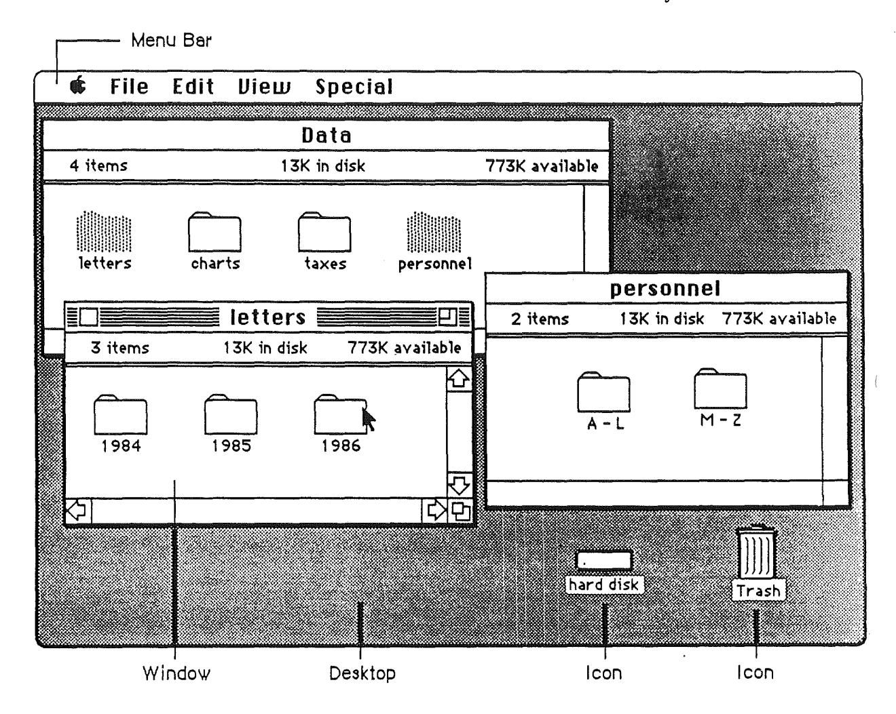

Figure 2. Desktop, Windows, and Icons

The Finder is an application program that lets the user organize, copy, move, rename, and delete documents, and to launch other applications. When the Finder is active, and the user opens either an application or a document belonging to an application, the application becomes active and displays the document window. In a single-application environment, only one application can be active at a time, that application has control of all windows (except desk accessories), and the user returns to the Finder to change from one application to another. Multiprocessing will eventually allow several active applications to share the screen, each having control over its own windows, and the user will be able to switch applications directly, without returning to the Finder.

# The Pointing Device

The pointing device makes possible the direct manipulation that is a central part of the desktop interface. To communicate with the computer, the user manipulates graphical objects on the screen. This manipulation is direct because the user can grab (or seem to

grab) an object, then indicate what is to be done with it. How do you "grab" an object that yu see only as a two-dimensional representation on a glass screen? By pointing at it with a pointing device.

The standard pointing device is the mouse, but there are other devices (track balls, for example) that perform the same functions. The mouse is a hand-held device, usually (but not necessarily) connected to the computer by a long, flexible cable. There's a single button on the mouse. The user holds the mouse and rolls it on a flat, smooth surface. A pointer on the screen follows the motion of the mouse. A pointer is a screen object that moves in response to mouse movements. Pointers can take different shapes according to the context of the application. Two of the most common pointer shapes are crosshairs and arrows.

Simply moving the mouse (without pressing the mouse button) just moves the pointer. Most actions take place only when the user positions the pointer over an object on the screen, then presses and releases the mouse button.

#### What About the Cursor? (a Digression)

Traditional character—oriented command—line interfaces rely on a "cursor" to indicate the insertion point (the place on the display where the next character that is typed will appear). Because there is just one insertion point, one cursor is sufficient. The user uses arrow keys (sometimes called "cursor keys") to move the cursor around the screen.

The desktop interface requires that the cursor's functions be divided between *two* screen elements. An "insertion point" shows where the next characters to be typed will appear. In addition, the "pointer" (logically attached to the mouse or other pointing device) shows where the insertion point should be moved to.

In a graphical interface, pointing at objects then selecting operations from a menu replaces the "command line." The screen is full of objects the user can point to; using arrow keys to move a cursor is an unsatisfactory way to point to them.

#### Mouse Actions

Beyond moving the pointer, the basic mouse actions are clicking, pressing, and dragging.

Clicking has two components: pushing down on the mouse button and then quickly releasing it while the mouse remains stationary (if the mouse moves, dragging—not just clicking—is what happens). Some uses of clicking: to select an object, to select an insertion point, to make a menu visible. The effect of clicking should be immediate and evident. If the function of the click is to initiate a command, the selection happens when the button is pressed, and the command is initiated when the button is released. Double clicking involves a second click that follows immediately after the end of a first click. Some uses of double clicking: to open an object, to select a larger object than one that can be selected by a single click. There's more about double clicking later in this chapter. Applications can also define triple clicking, but this is not recommended.

**Pressing** means holding the mouse button down for a time while the mouse remains stationary. Pressing on the scroll bar's arrows, for example, causes scrolling until the user releases the mouse button. For certain kinds of objects, pressing on the object has the same effect as clicking it repeatedly. For example, *clicking* a scroll arrow causes a

document to scroll one line; *pressing* on a scroll arrow causes the document to scroll continuously until the user releases the mouse button or reaches the end of the document.

**Dragging** means pressing the mouse button, moving the mouse to a new position, and finally releasing the mouse button. Dragging can have different effects, depending on what's under the pointer when the mouse button is pressed. The uses of dragging include selecting blocks of text, choosing a menu item, selecting a range of objects, moving an object from one place to another, and shrinking or expanding an object.

Some objects, especially graphic objects, can be moved by dragging. The application either moves the entire object, or attaches a dotted outline of the object to the pointer and moves the outline as the user moves the pointer (when the user releases the mouse button, the application redraws the complete object at the new location).

An object being moved can be restricted to certain boundaries, such as the edges of a window. If the user moves the pointer outside the boundaries, the application stops drawing the dotted outline of the object. If the user releases the mouse button while the pointer is outside the boundaries, the object doesn't move. If, on the other hand, the user moves the pointer back within the boundaries again before releasing the mouse button, the outline is drawn again.

In general, moving the mouse changes nothing except the location, and possibly the shape, of the pointer. (Pointer shape is discussed elsewhere in this book.) Pressing the mouse button indicates the intention to do something, and releasing the button completes the action. Pressing by itself should have no effect except in well-defined areas, such as scroll arrows, where it has the same effect as repeated clicking.

Mouse-ahead (analogous to the keyboard's typeahead) saves, in a memory buffer, any mouse actions the user performs when the application isn't ready to process them. The application can then carry out these stored processes when it has time. Alternatively, the application can choose to ignore saved-up mouse actions, but should do so only to protect the user from possibly damaging consequences.

### Double Clicking

As stated already, double clicking involves a second click that follows immediately after the end of a first click. If the two clicks are close enough to one another in terms of time (as set by the user in the Control Panel) and of screen location, then they constitute a double click. Its most common use is as a shortcut way (but *never* the only way) to perform an action. For example, clicking twice on an icon is a faster way to open it than selecting it and choosing Open; clicking twice on a word to select it is faster than dragging through it.

Some applications support selection by double clicking and triple clicking. As always with multiple clicks, the second click extends the effect of the first click, and the third click extends the effect of the second click. For example, in a text-oriented application, the first click selects an insertion point, the second click might select the whole word containing the insertion point, and the third click might select the whole sentence. In a graphics application, the first click might select a single object, and double and triple clicks might select successively larger sets of objects.

Three clicks is probably the practical limit, and even that is difficult for many people. If an application defines the effect only of single and double clicking, a third click should have no effect. If triple clicking is defined, then the fourth click should have no effect.

Double clicking is a shortcut for those users physically able to use it. For example, users with a little experience like to be able to launch an application by double clicking on its icon rather than clicking on it to select it and then selecting Open from the File menu. Again, double clicking should never be the *only* way to accomplish a task. Many novice users, children, and disabled people have a hard time double clicking.

To allow the software to distinguish efficiently between single clicks and double clicks on objects that respond to both, an operation invoked by double clicking an object must be an enhancement, superset, or extension of the feature invoked by single clicking that object. Triple clicking is also possible; it should similarly represent an extension of a double click.

#### Insertion Points and Pointers

Each pointer has a **hot spot**, the portion of the pointer that must be positioned over a screen object before mouse clicks can have an effect on that object. The hot spot should be intuitive, such as the tip of an arrow pointer or the center point of a crosshair pointer. Mouse clicks have effect only when the pointer's hot spot is positioned over the target object's **hot zone**.

Don't confuse the user by changing the pointer's shape without a reason. You might want to have the pointer change shape to give feedback on the range of activities that make sense either in a particular area of the screen or in a current mode. Sometimes, the result of mouse actions depends on the item under the pointer when the mouse button is pressed. Where an application uses modes for different functions, the pointer can be a different shape in each mode. For example, in MacPaint, the pointer shape always reflects the currently selected tool.

Figure 3 shows some examples of pointers and their effect. An application can use additional pointers as needed for other contexts.

| <u>Pointer</u> | <u>Name</u>           | Used for                                                                         |
|----------------|-----------------------|----------------------------------------------------------------------------------|
|                | Arrow                 | Scroll bar and other controls, size box, title bar, menu bar, desktop, and so on |
| Ţ              | l-beam                | Selecting and inserting text                                                     |
| +              | Crosshairs            | Drawing, shrinking, or stretching graphic objects                                |
| ₹}-            | Plus Sign             | Selecting fields in an array                                                     |
| 4              | Wristwatch            | Showing that a lengthy operation is in progress                                  |
|                | Spinning<br>Beachball | Showing that the system is still alive during a lengthy operation                |

Figure 3. Pointers

During a particularly lengthy operation, when the user can do nothing but wait until the operation is completed, the pointer may change its shape and become a status or progress indicator. This indicator lets the user know that the system hasn't died—it's just busy. The standard pointer used for this purpose is a wristwatch. During even longer operations, the beachball pointer spins to provide positive feedback that all is well.

# The Keyboard

The keyboard is used primarily for entering text. (Thanks to the point and click features of the desktop interface, users don't have to use the keyboard to type commands.) The keys on the keyboard are arranged in familiar typewriter fashion. Because keyboards vary from one computer to another, no specific one is illustrated here.

There are two kinds of keys: character keys and modifier keys. A character key sends characters to the computer. A modifier key alters the meaning of a character key if it's held down while the character key is pressed, or alters or amplifies the meaning of a mouse action.

# Character Keys

Character keys include keys for letters, numbers, and symbols, as well as the Space bar. If the user presses one of these keys while entering text, the corresponding character is added to the text. Other keys, such as the Enter, Tab, Return, Backspace, and Clear keys, are also sent to the application as character keys; the result of pressing one of these keys depends on the application and the context.

"

The Enter key tells the application that the user is through entering information in a particular area of the document, such as a field in an array. Most applications add information to a document as soon as the user types or draws it. However, the application may need to wait until a whole collection of information is available before processing it. In this case, the user presses the Enter key to signal that the information is complete. Both Enter and Return can be used to dismiss dialog and alert boxes. (See "Dialogs and Alerts.")

The Tab key is a signal to proceed: It signals movement to the next item in a sequence. Tab often implies an Enter operation before the Tab motion is perfonned.

The Return key is another signal to proceed, but it defines a different type of motion than Tab. A press of the Return key signals movement to the leftmost field one step down (just like a carriage return on a typewriter). Return can also imply an Enter operation before the Return operation. Both Return and Enter can also be used to dismiss dialog and alert boxes. (See "Dialogs and Alerts.")

During entry of text into a document, Tab moves the insertion point to the next tab stop, Retum moves it to the beginning of the next line, and Enter is ignored.

The Backspace key deletes text or graphics. Generally, Backspace deletes a selection without putting it in the clipboard, and to delete the character t.o the left of the insertion point. Using the clipboard and Backspace in text is described in "Text Editing."

The Clear key has the same effect as the Clear command in the Edit menu; that is, it removes the selection from the document without putting it in the Clipboard. Using this key is also explained in "Text Editing." Because not all Apple computers have Clear keys, no application should ever *require* use of the Clear key.

# Modifier Keys

Modifier keys are the keys on the keyboard that alter the way other keystrokes are interpreted. They are the Shift, Option, Caps Lock, Control, and Apple (or Command) keys. Not all Apple keyboards contain all of these keys. These keys sometimes affect the way the mouse button is interpreted as well. While one of these keys is being held down, the effect of the other keys (or the mouse button) may change. Many applications It is important that these keys be used consistently from program to program, as outlined in these guidelines.

The Shift and Option keys let the user choose between the characters on each character key. Shift gives the uppercase letter on alphabetic keys, or the upper character on two-character keys. The Shift key is also used in conjunction with the mouse for extending a selection. (See "Selecting.") Option gives an altemate character set interpretation, including intemational characters, special symbols, and so on. For example, in most Macintosh fonts, Option-4 produces the ¢ symbol, Option-r produces ®, Option-g produces ©, and so on. Shift and Option can be used together, in combination with a character key, to produce yet other symbols-for example, Option-Shift-? to produce the Lcharacter so important to Spanish writers.

Caps Lock latches in the down position when pressed, and releases when pressed again. When down it gives the uppercase letter on alphabetic keys. Caps Lock has the same effect on alphabetic keys that the Shift key has, but Caps Lock has no effect on any other keys.

The Apple key key is variously labeled with an Apple symbol, with a cloverleaf symbol, or with both. It has also been known as the Command key or Open Apple key. Pressing a character key while holding down the Apple key usually tells the application to interpret the key as a command, not as a character. (See "Commands.") In some applications, the Apple key is used with other keys to provide special functions or shortcuts-for example, Macintosh's Apple-Shift-3 to save a screen snapshot to disk.

# Typeahead and Auto-Repeat

If the user types when the computer is unable to process the keystrokes immediately, or types more quickly than the computer can handle, the extra keystrokes are queued for later processing. This queuing is called typeahead. There's a limit (it varies according to the computer) to the number of keystrokes that can be queued, but the limit is usually not reached unless the user types while the application is perfoIming a lengthy operation.

When a character key is held down for a certain amount of time, it starts repeating automatically. This feature is called auto-repeat. The user can set the delay and the rate of repetition with the Control Panel desk accessory. An application can tell whether a series of keystrokes was generated by auto-repeat or by pressing the same key several times. It can choose to disregard keystrokes generated by auto-repeat; this is usually a good idea for menu commands chosen with Apple-key combinations.

Holding down a modifier key has the same effect as pressing it once. However, if the user holds down a modifier key and a character key at the same time, the effect is the same as if the user held down the modifier key while pressing the character key repeatedly.

Auto-repeat does not function during typeahead. It operates only when the application is ready to accept keyboard input.

# International Keyboards

The international keyboard has one more key than the U.S. version. The layout of the international version is designed tb conform to the International Standards Organization (ISO) standard. The U.S. keyboard resembles standard American office typewriters. International keyboards have different labels on the keys in different countries, but the overall *layout* is the same.

# Arrow Keys

Some Apple keyboards include four arrow keys: Up Arrow, Down Arrow, Left Arrow, and Right Arrow.

/

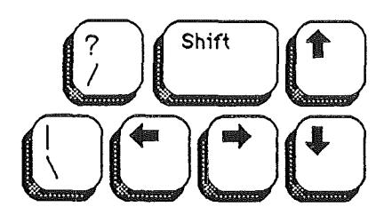

**Figure** 4. Macintosh Plus Arrow Keys

#### **Appropriate** Uses **for the Arrow** Keys

The arrow keys *don't replace the pointing device.* They can be used as a shortcut way to move the insertion point, and (under some circumstances) to make selections. These are the minimum guidelines for arrow keys; you can expand on them where things are left undefined, if you do it in the spirit of the whole guidelines.

It's up to you to decide whether it's worth the effort to create arrow-key shortcuts for mouse functions. Many users find that remembering a key combination on the order of Command-Shift-Left Arrow is more trouble than it's worth and they'd rather use a mouse anyway. Many others prefer using the keyboard under certain circumstances. And some people have difficulty using a mouse; they appreciate being able to use the keyboard instead.

An application should use the arrow keys only when appropriate to the task. Applications that deal with text or arrays (word processors, spreadsheets, and data bases, for example) have an insertion point. This insertion point can be moved both by the mouse and by the arrow keys. Graphics applications, on the other hand, have no insertion point.

As a general rule, arrow keys are used to move the insertion point and to expand or shrink selections. Arrow keys are *never* used to duplicate the function of the scroll bars or to move the pointer. In a graphics application, arrow keys can be used to move objects in one-pixel increments.

These guidelines apply both to moving the insertion point and to making selections. Making a selection works the same way as moving the insertion point, except that the Shift key is held down. When Shift is used together with an arrow key, it signifies that the user wants to make a selection, much like using the Shift key while clicking the mouse.

#### **Moving the Insertion Point** ,-

The Left Arrow and Right Arrow keys move the insertion point one character left and right, respectively.

Up Arrow and Down Arrow move the insertion point up and down one line, respectively.

Horizontal screen position is maintained in terms of screen pixels, but not necessarily in tenns of characters. (Character boundaries seldom line up vertically when proportional

fonts are used.) When the insertion point moves to a new line, it may also move slightly left or right, to the nearest character boundary on the new line. During successive movements up or down, the application should keep the insertion point as close as possible to the original horizontal position as it moves from line to line.

#### Moving the Insertion Point in Empty Documents

Various text editing programs treat empty documents in different ways. Some assume that an empty document contains no characters, in which case clicking at the bottom of a blank screen causes the insertion point to appear at the top. In this situation, Down Arrow cannot move the insertion point into the blank space (because there are no characters there).

Other applications treat an empty document as a page of space characters, in which case clicking at the bottom of a blank screen puts the insertion point where you clicked and lets you type characters there, overwriting the spaces. Down Arrow moves the insertion point straight down through the spaces.

Whichever paradigm you choose for your application, it's vital that you're consistent.

#### Modifier Keys with Arrow Keys

Holding down the Apple key while pressing an arrow key should move the insertion point to the appropriate edge of the window. If the insertion point reaches the edge of the window, then the document is scrolled one windowful in the appropriate direction and the insertion point moves to the same edge of the new windowful. Apple—Up Arrow moves the insertion point to the top of the window, Apple—Down Arrow to the bottom, Apple—Left Arrow to the left edge, and Apple—Right Arrow to the right edge (but not past the last character).

The Option key is reserved as a "semantic modifier" key. The application determines what the semantic units are. For example, in a word processor, where the basic semantic unit is the character and the next larger one is the word, Option–Left Arrow and Option-Right Arrow might move the insertion point to the beginning and end, respectively, of a word. (Movement of the insertion point by word boundaries should use the same definition of word that the application uses for double clicking.) The next larger semantic unit could be defined as the sentence, in which case Option–Shift–Left Arrow and Option–Shift–Right Arrow would move the insertion point to the beginning and end, respectively, of a sentence. In a programming language editor, where the basic semantic unit is the token and the next larger one might be the line, Option–Left Arrow and Option–Right Arrow might move the insertion point left and right to the beginning and end of the line, respectively.

In an application (such as a spreadsheet) that represents itself as an array, the basic semantic unit would be the cell. Option—Left Arrow would designate the cell to the left of the currently active cell as the new active cell, and so on. Using modifier keys with arrow keys doesn't do anything to the data; Option—Left Arrow just performs an Enter and moves the selection to the next cell to the left.

Though the use of multiple modifier key combinations (such as Command-Option-Left Arrow) is discouraged, it's all right to use the **Shift** key with any *one* of the other modifier keys for making a selection. (See "Making a Selection With Arrow Keys.") Keep in mind that if multiple keys must be pressed simultaneously, they should be fairly close together—otherwise many people won't be able to use that combination.

#### Making a Selection With Arrow Keys

To use arrow keys to make a selection, the user holds down Shift while pressing an arrow key. Application programs that depend (as TextEdit does) on the numeric keypad should not use these Shift-Arrow key combinations. This is because the key codes for the four Shift-arrow key combinations are the same as those for the keypad's +, \*, /, and = keys. If the use of Shift-arrow for making selections is more important to your application than is the numeric keypad, the following paragraphs tell how it should work.

After a Shift-arrow key combination has been pressed, the insertion point moves and the range over which it moves becomes selected. If both the Shift key and another modifier key are held down, the insertion point moves (as defined for the particular modifier key) and the range over which the insertion point moves becomes selected. For example, Shift-Left Arrow selects the character to the left of the insertion point, Command-Shift-Left Arrow selects from the insertion point to the left edge of the window, and Option-Shift-Left Arrow selects the whole word that contains the character to the left of the insertion point (just like double clicking on a word).

A selection made by using the mouse is no different from one made by using arrow keys. A selection started with the mouse can be extended by using Shift and Left or Right Arrow.

The two ends of a selected range have different characteristics and different names. The **anchor point** is the location of the insertion point when selection was started. The **active end** is the place to which the insertion point moves to complete the selection. Once selection begins, the anchor point cannot be moved except by beginning a new selection. To extend or shrink a selection, the user moves the active end as specified here. As the active end moves, it can cross over the anchor point.

In a text application, pressing Shift and either Left Arrow or Right Arrow selects a single character. Assuming that the Left Arrow key was used, the anchor point of the selection is on the right side of the selection, the active end on the left. Each subsequent Shift—Left Arrow adds another character to the left side of the selection. A Shift—Right Arrow at this point shrinks the selection. Figure 5 summarizes these actions.

| 1. | Insertion point is within a word: | word |
|----|-----------------------------------|------|
| 2. | Shift- is pressed:                | ward |
| 3. | another Shift- 🖛 :                | word |
| 4. | Shift-→:                          | ward |
| 5. | three more times Shift-           | word |

Figure 5. Selecting With-Shift-Arrow Keys

Pressing Option—Shift and either Left Arrow or Right Arrow (in a text application) selects the entire word containing the character to the left of the insertion point. Assuming Left Arrow was used, the anchor point is at the right end of the word, the active end at the left. Each subsequent Option—Shift—Left Arrow adds another word to the left end of the selection, as shown in Figure 6.

1. Insertion point is within a word:

another word

2. Option-Shift- is pressed:

another word

3. another Option-Shift- ::

another word

Figure 6. Selecting With Option-Shift-Arrow Keys

Pressing Command—Shift—Left Arrow (in a text application) selects the area from the insertion point to the left edge of the window. The anchor point is at the right end of the selection, the active end is at the left. Each subsequent Command—Shift—Left Arrow scrolls the document one windowful left and extends the selection to the left edge of the new window.

#### Extending or Shrinking a Selection

To use arrow keys instead of the mouse to extend or shrink a selection, the user holds down the Shift key (plus any defined modifiers) while pressing an arrow key. The arrow key moves the insertion point at the active end of the selection.

#### Undoing a Selection

When a block of text is selected, pressing either Left Arrow or Right Arrow deselects the range. If Left Arrow is pressed, the insertion point goes to the beginning of what had been the selection. If Right Arrow is used, the insertion point goes to the end of what had been the selection.

# Selecting

Before performing an operation on an object (or several objects), the user must select it, usually by clicking on it, to distinguish it from other objects. Selecting the object of an operation before identifying the operation itself is a fundamental characteristic of the Apple human interface. The pattern is usually something like this:

- 1. The user selects an object (a noun, the thing to be operated on).
- 2. The user selects an operation (a verb, the thing to be done).

This is sometimes called the "noun-verb paradigm" or "Hey, you! Do this!"

There is always a visual cue to show that something has been selected. For example, text and icons usually appear in inverse video when selected. In some situations, other forms of highlighting may be more appropriate. The important thing is that there should always be immediate feedback, so that the user knows that the click had an effect.

Selecting an object doesn't alter the contents of a document. Making a selection shouldn't commit the user to anything; there should never be a penalty for making an incorrect selection. The user can undo any selection by making any other selection.

How something is selected depends on what it is. Although there are many ways to select objects, they fall into easily recognizable groups. Users get used to selecting objects in a

certain way, and applications that use these methods are easier to learn. Some of these methods apply to every type of application, and some only to particular types of applications.

# **Types of Objects**

It's useful to distinguish among the three types of objects with which an application can deal: text, graphics, and lists (or arrays). Strictly speaking, *everything* on a Macintosh screen is displayed graphically, because the Macintosh has no text mode.

The rest to some fai nt meani ng make pretence But Shad\v'e11 neve r devi ates into se nse. Some beams of \v'it on other souls may fall, Stri ke through and make a 1ucid interval; But Shad\v'ell's genuine night admits no ray, His risi ng fogs prevail upon the day.

MacFlecknoe

Page 1

Text

| Advertisi<br>ng   | 132.9 |  |
|-------------------|-------|--|
| Manufacturi<br>ng | 121.3 |  |
| R&D               | 18.7  |  |
| Inte<br>rest      | 12.2  |  |
|                   |       |  |
| Total             | 285.1 |  |
|                   |       |  |

Arrey

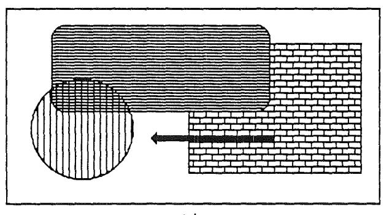

Graphics

**Figure** 7. Three Ways of Structuring Infonnation

**Text** can be arranged on the screen in a variety of ways. Some applications, such as word processors, might consist of nothing but text, whereas others, such as graphics-oriented applications, might use text almost incidentally. It's useful to consider all the text appearing together in a particular context as a block of text. The size of the block can range from a single field, as in a dialog box, to the whole document, as in a word processor.

Regardless of its size or arrangement, the application sees each block as a one-dimensional string of characters. Text is edited the same way regardless of where it appears.

Graphics are pictures, drawn either by the user or by the application. Graphics in a document tend to consist (but do not have to consist) of discrete objects, each of which can be selected individually.

Arrays are one- or two-dimensional arrangements of fields. One-dimensional arrays are called lists, two-dimensional arrays are called tables or forms. Each field, in turn, contains a collection of information, usually text, but possibly graphics. A table can be easily identified on the screen, because it consists of rows and columns of fields (sometimes called cells) separated by horizontal and vertical lines. A form is something the user fills out, like a tax form or credit-card application. The fields in a form can be arranged in any appropriate way; nevertheless, the application regards the fields as in a definite linear order.

Each of these three ways of presenting information retains its integrity, regardless of the context in which it appears. For example, a field in an array can contain text. When the user is manipulating the field as a whole, the field is treated as part of the array. When users want to change the contents of the field, they edit the field in the same way as they would any other text.

This section discusses first the general methods of selecting and then the specific methods that apply to text applications, graphics applications, and arrays. Figure 8 compares some of the general methods.


Figure 8. Selection Methods

#### Selection in General

This section covers the topic of selection without regard to the kind of data involved: selection by clicking, range selection, extending a selection, and discontinuous selection. In all cases, inverse video indicates what has been selected.

#### Selection by Clicking

The most straightforward method of selecting an object is by clicking on it once. Most things that can be selected are selected this way. The result of double clicking depends on the context: double clicking on an application icon selects it and opens it, a shortcut for selecting then choosing open from the File menu.

#### Range Selection

The user selects a range of objects by dragging through them. Although the exact meaning of the selection depends on the type of application, the procedure is always the same:

- 1. The user positions the pointer at one corner of the range and presses the mouse button. This position is called the **anchor point** of the range.
- 2. Without releasing the button, the user moves the pointer in any direction. As the pointer is moved, visual feedback indicates the objects that would be selected if the mouse button were released. For text and arrays, the selected area is continually highlighted. For graphics, a dotted rectangle expands or contracts to show the range that will be selected. (If possible, the view should scroll to allow extending the selection beyond one windowful.)
- 3. When the feedback shows the desired range, the user releases the mouse button. The point at which the button is released is called the active end of the range.

#### Extending a Selection

A user can change the extent of an existing selection by holding down the Shift key and clicking the mouse button (Shift-Click). Exactly what happens next depends on the context.

In text or an array, the result of a Shift-click is always a range. The position where the button is clicked becomes the new endpoint or anchor point of the range; the selection can be extended in any direction. If the user shift-clicks within the current range, the new range will be smaller than the old range.

Extended selections can be made across the panes of a split window. (See "Splitting Windows.")

#### Making a Discontinuous Selection

In graphics applications, objects aren't usually considered to be in any particular sequence. A selection is extended by adding objects to it, and the added objects do not have to be adjacent to the objects already selected. The user can add either an individual object or a range of objects to the selection by holding down the Shift key before making the additional

selection (Shift-click). When this happens, the objects between the current selection and the new object are not automatically included in the selection. This kind of selection is called a **discontinuous selection**. If the user holds down the Shift key and selects one or more objects that are already highlighted, the objects are deselected.

In the case of graphics, *all* selections are discontinuous selections because graphic objects are discrete. This is not the case with arrays and text, however. In these two kinds of applications, an extended selection made by a Shift-click always includes everything between the old selection and the new endpoint. To provide for discontinuous selection in these applications, Apple-click is included in the human interface.

To make a discontinuous selection in a text or array application, the user selects the first piece in the usual way and holds down the Apple key before selecting the remaining pieces. Each piece is selected in the same way as if it were the whole selection, but because the Apple key is held down, the new pieces are added to the existing selection instead of replacing it. If one of the pieces selected with Apple-click is already within an existing part of the selection, then instead of being added to the selection it's removed from the selection. Figure 9 shows a sequence in which several pieces are selected and deselected.


Figure 9. Discontinuous Selection Within an Array

Not all applications support discontinuous selections, and those that do might restrict the operations a user can perform on them. For example, a word processor might allow the

user to choose a font after making a discontinuous selection, but wouldn't allow the user to type replacement characters (which part of the selection would they replace?).

## Selection By Data Type

This section covers the topic of selection according of the *kind* of data involved: text, graphics, and arrays.

#### Selections in Text

In most applications, the user is required at some point to edit text. The principle of consistency (both within and between applications) requires that text be selected and edited in a consistent way, regardless of where it appears.

A block of text is a string of characters. A text selection is a substring of this string, which can have any length from zero characters to the whole block. Each of the text selection methods selects a different kind of substring. Figure 10 shows different kinds of text selections.

| Insertion point            | Life is just a bowl of Apples! |
|----------------------------|--------------------------------|
| Range of characters        | Life is just a bowl of Apples! |
| Word                       | Life is just a bowl of Apples! |
| Range of words             | Life is just a bowl of Apples! |
| Discontinuous<br>selection | Life is just a bowl of Apples  |

Figure 10. Text Selections

The insertion point is a zero-length text selection. The user establishes the location of the insertion point by clicking somewhere in the text. The insertion point then appears at the nearest character boundary. If the user clicks anywhere to the right of the last character on a line, the insertion point appears immediately after the last character. If the user clicks to the left of the first character on a line, the insertion point appears immediately before the first character (unless the document is filled with space characters).

The insertion point shows where text will be inserted when the user begins typing, or where cut or copied data (the contents of the Clipboard) will be pasted. After each character is typed, the insertion point is moved to the right of the insertion.

If, between the mouse-down and the mouse-up, the user drags (moves the pointer more than about half the width of a character), the selection is a range selection rather than an insertion point.

The user selects a whole word by double clicking somewhere within that word. If the user begins a double click sequence, but then drags the mouse between the mouse-down and the mouse-up of the second click, the selection becomes a range of words rather than a single word. As the pointer moves, the application highlights or unhighlights a whole word at a time.

A word, or range of words, can also be selected in the same way as any other range; whether this type of selection is treated as a range of characters or as a range of words depends on the operation. For example, in MacWrite, a range of individual characters that happens to coincide with a range of words is treated like characters for purposes of extending a selection, but is treated like words for purposes of "intelligent cut and paste" (described later in "Text Editing").

The following is the definition of a word in the United States and Canada. In other countries, the definition differs to reflect local formats for numbers, dates, and currency. A word is defined as any continuous string that contains only the following characters:

- a letter (including letters with diacritical marks)
- · a digit
- a nonbreaking space (Option-space or Apple-Space)
- a currency symbol (\$, ¢, £, or ¥)
- · a percent sign
- · a comma between digits
- · a period before a digit
- · an apostrophe between letters or digits
- a hyphen, but *not* a minus sign (Option-hyphen) or a dash (Option-Shift-hyphen)

If the user double-clicks over any character *not* on the list above, that character is selected, but it is not considered a word.

These are examples of words:

```
$123,456.78
shouldn't
3 1/2 (with a nonbreaking space)
.5%
```

These are examples of nonwords:

```
7/10/6 blue cheese (with a breaking space) "Wow!" (The quotation marks and exclamation point aren't part of the word.)
```

In some contexts—in a programming language, for example—it may be appropriate to allow users to select both the left and right parenthesis in a pair, as well as all the characters between them, by double clicking on either one of them. The same could be implemented for both square and curly brackets. This would mean that the user could select the entire expression

```
[x+y-(4*3)^{n-1}]
```

simply by double clicking on [ or ].

The user selects a range of text by dragging through the range. A range is either a range of words or a range of individual characters, as described under "Selecting Words."

If the user extends the range, the way the range is extended depends on what kind of range it is. If it's a range of individual characters, it can be extended one character at a time. If it's a range of words (including a single word), it's extended only by whole words.

#### Selections in Graphics

There are several different ways to select graphic objects and to show selection feedback in existing applications. This section uses the MacDraw paradigm, but other situations may require other solutions.

A MacDraw document is a collection of individual graphic objects. To select one of these objects, the user clicks once on the object, which is then bracketed with four "handles." (The handles are used to stretch or shrink the object, and aren't discussed here.) Figure 11 shows some examples of selection in MacDraw.

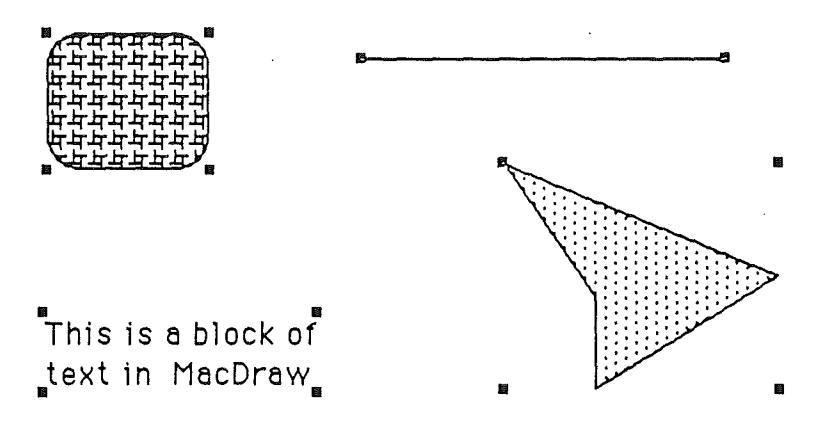

Figure 11. Graphics Selections in MacDraw

There are two ways to select more than one object. A range selection includes every object completely contained within the dotted rectangle that encloses the range as the user drags the mouse. A discontinuous selection includes only those objects explicitly selected.

#### Selections in Arrays and Tables

An array is a one- or two-dimensional arrangement of fields. The user can select one or more fields, or part of the contents of a field.

To select a single field, the user clicks in the field (Figure 12). The user can also select a field by moving into it with the Tab or Return key.

| r- | CI'<br>IC | ere<br>k h | o<br>t | se<br>ec<br>t | Hewei i | field, |
|----|-----------|------------|--------|---------------|---------|--------|
|----|-----------|------------|--------|---------------|---------|--------|

| state      | capital        |
|------------|----------------|
| Alaska     | Juneau         |
| Arizona    | Phoenix        |
| California | Sacramento     |
| Colorado   | Denver         |
| Hawaii     | Honolulu       |
| Idaho      | Boise          |
| Montana    | Helena         |
| Nevada     | Carson City    |
| New Mexico | Santa Fe       |
| Oregon     | Salem          |
| Utah       | Salt Lake City |
| Washington | Olympia        |
| Wyoming    | Cheyenne       |

| state      | capital        |
|------------|----------------|
| Alaska     | Juneau         |
| Arizona    | Phoenh<        |
| California | Sacramento     |
| Colorado   | Denver         |
|            | Honolulu       |
| Idaho      | Boise          |
| Monhna     | Helena         |
| Nevada     | Carson City    |
| New Mexico | Sanh<br>Fe     |
| Oregon     | Salem          |
| Utah       | Salt Lake City |
| Washington | Olympia        |
| Wyoming    | Cheyenne       |

Figure 12. Field Selection in an Array

To select part of the contents of a field, the user must first select the field. The user then clicks again to select the desired part of the field. Because the contents of a field are either text or graphics, this type of selection follows the rules outlined above.

A table can also support selection of rows and columns. The most convenient way for the user to select a column is to click in the column header. To select more than one column, the user drags through several column headers. The same applies to rows.

Figures 13, 14, and 15 show column, range, and discontinuous selections in arrays.

| Click | here |
|-------|------|
|-------|------|

| state      | capital        |
|------------|----------------|
| Alaska     | Juneau         |
| Arizona    | Phoenix        |
| California | Sacramento     |
| Colorado   | Denver         |
| Hawaii     | Honolulu       |
| Idaho      | Boise          |
| Montana    | Helena         |
| Nevada     | Carson City    |
| New Mexico | Santa Fe       |
| Oregon     | Salem          |
| Utah       | Salt Lake City |
| Washington | Olympia        |
| Wyoming    | Cheyenne       |

to select a column

| state          | capital        |
|----------------|----------------|
| Alasia         | Juneau         |
| Ariex a        | Phoenix        |
| Eshio nis      | Sacramento     |
| Ealor site     | Denver         |
| Hawaii         | Honolulu       |
| ldsho          | Boise          |
| l londaria     | Helena         |
| [{k:::3d3      | Carson City    |
| Ne:: 1 1/2 100 | Santa Fe       |
| Dregon         | Salem          |
| Jtah /         | Salt Lake City |
| Washington     | Olympia        |
| W.froming      | Cheyenne       |

Figure 13. Column Selection in an Array

| state      | capital        |
|------------|----------------|
| Alaska     | Juneau         |
| Arizona    | Phoenix        |
| California | Sacramento     |
| Colorado   | Denver         |
| Hawaii     | Honolulu       |
| Idaho      | Boise          |
| Montana    | Helena         |
| Nevada     | , Carson City  |
| New Mexico | Santa Fe       |
| Oregon     | Salem          |
| Utah       | Salt Lake City |
| Washington | Olympia        |
| Wyoming    | Cheyenne       |

| capital        |
|----------------|
| Juneau         |
| Phoenix        |
| Sacramento     |
| Denver         |
| Honolulu       |
| Boise          |
| Helena         |
| Carson City    |
| Santa Fe       |
| Salem          |
| Salt Lake City |
| Olympia        |
| Cheyenne       |
|                |

Drag through this area

and release to make this selection.

Figure 14. Range Selection in an Array

| state      | capital        |
|------------|----------------|
| Alaska     | Juneau         |
| Arizona    | Phoenix        |
| California | Sacramento     |
| Colorado   | Denver         |
| Hawaii     | Honolulu       |
| Idaho      | Boise          |
| Montana    | Helena         |
| Nevada     | Carson City    |
| New Mexico | Santa Fe       |
| Oregon     | Salem          |
| Utah       | Salt Lake City |
| Washington | Olympia        |
| Wyoming    | Cheyenne       |

Figure 15. Discontinuous Selection in an Array

The Tab key cycles through the fields in an order determined by the application. From each field, the Tab key selects the "next" field. Typically, the sequence of fields is first from left to right, and then from top to bottom. When the last field in a form is selected, pressing the Tab key selects the first field in the form. If there's a good reason, an application may guide the user through the fields in some order other than the order in which the fields appear on the screen.

The Return key selects the first field in the next row. If the idea of rows doesn't make sense in a particular context, then the Return key should have the same effect as the Tab key.

# **Editing Text**

In addition to the operations described in "The Edit Menu," there are ways to edit text without using menu commands.

# Inserting Text

To insert text, the user selects an insertion point by clicking where the text is to go, then starts typing. As the user types, the application continually moves the insertion point to the right, as each new character is added.

Applications with multiline text blocks should support **word wraparound**. That is, no word should be broken between lines.

## **Backspacing**

When the user presses the Backspace key, one of two things happens:

- <sup>o</sup> If the current selection is one or more characters, it's deleted.
- <sup>o</sup> If the current selection is an insertion point, the character to the left of the insertion point is deleted.

In either case, the insertion point replaces the deleted character (or characters) in the document. The deleted characters don't go into the Clipboard, but the deletion can be undone by immediately choosing Undo.

# **Replacing Text**

If the user starts typing when the selection is one or more characters, the characters that are typed replace the selection. The deleted characters don't go into the Clipboard, but the replacement can be undone by immediately choosing Undo.

# **Intelligent Cut and Paste**

"Intelligent" cut and paste is a set of editing features that takes into account the need for spaces between words--even when users can select words by double clicking.

To understand why this feature is helpful, consider the following sequence of events in an application *without* intelligent cut and paste:

1. A sentence in the user's document reads

*Returns are only accepted* if*the merchandise is damaged.*

The user wants to chage this to

*Returns are accepted only* if*the merchandise is damaged.*

- 2. The user selects the word *only* by double clicking. The letters are highlighted, but neither of the adjacent spaces is highlighted.
- 3. The user chooses Cut, clicks just before the word if, and chooses Paste.
- 4. The sentence now reads

*Returns are accepted onlyifthe merchandise is damaged.*

To correct the sentence, the user has to remove the extra space between *are* and *accepted,* and add one between *only* and if. At this point he or she may be wondering why people bother with computers at all.

If an application supports intelligent cut and paste, foe rules are:

- <sup>o</sup> If the user selects a word or a range of words, highlight the selection, but not any adj acent spaces.
- <sup>o</sup> When the user chooses Cut, if the character to the left of the selection is a space, discard it. Otherwise, if the character to the right of the selection is a space, discard it.
- <sup>o</sup> When the user chooses Paste, if the character to the left or right of the current selection is part of a word, insert a space before pasting.

## *Hwnan Inteiface Guidelines*

If the left or right end of a text selection is a word, follow these rules at that end, regardless of whether there's a word at the other end.

This feature should be used only if the application supports the full defmition of a word (as detailed in "Selecting Words"), rather than the defmition of a word as "anything between two spaces." These rules apply to any selection that's one or more whole words, whether it was chosen with a double click or as a range selection.

#### Example 1:

| 1. | Select a word,             | to<br>with<br>Drink<br>me<br>_<br>thine<br>eyes.     |
|----|----------------------------|------------------------------------------------------|
| 2, | Choose Cut.                | to<br>with<br>thine<br>Drink<br>mel<br>eyes.         |
| 3, | Select an insertion point. | to<br>th<br>Dri<br>nk<br>me<br>wi<br>eyes.<br>~hi ne |

4, Choose Paste, Drink to me with only Ithine eyes.

## Example 2:

| 1, | Select a word.            | lIIII<br>HowI<br>brown<br>cow |
|----|---------------------------|-------------------------------|
| 2, | Choose Cut.               | Howll<br>brown<br>cow         |
| 3, | Select an insertion point | How~ brown<br>cow             |
| 4, | Choose Paste,             | How<br>brown<br>cow<br>now~   |

**Figure 16.** Intelligent Cut and Paste

Note that the selected text is not necessarily the exact same range that will be cut and, eventually, pasted, This apparent violation of the principle that that the user should *see* exactly what is happening provides a welcome and useful function.

# **Editing Fields**

If an application isn't primarily a text application, but does use text in fields (such as in a dialog box), it may not be able to provide the full text-editing capabilities described so far. It's important, however, that whatever editing capabilities the application provides under these circumstances be upward-compatible with the full text-editing capabilities. The following list ranks the capabilities that can be provided, in a continuum from the minimum set to the most sophisticated features: .

- The user can select the whole field and type in a new value.
- The user can backspace.
- The user can select a substring of the field and replace it.

- The user can select a word by double clicking.
- The user can choose Undo, Cut, Copy, Paste, and Clear, as described in "The Edit Menu."
- Intelligent cut and paste is fully implemented.

An application should also perform appropriate edit checks. For example, if the only legitimate value for a field is a string of digits, the application issues an alert message if the user types any nondigits. For example, the alert message might interrupt the erring user to remind that the letters I and I can't be used in place of the numerals I and I and I and I the application could wait until the user is through typing before checking the validity of a field's contents. In this case, the appropriate time to check the field is when the user clicks anywhere other than within the field or presses the Return, Enter, or Tab key.

(

# Chapter 3

# Screen Elements

# The Desktop

The primary metaphor in the desktop interface is the desktop itself, the screen element that underlies all the rest. The desktop gives a sense of apparent stability. The desktop stays the same, for example, while the contents change; the menu categories remain constant within an application. Though the desktop has a default "pattern," the user can, through the Control Panel, change it at any time.

The three basic subsystems of the desktop are menus, icons, and windows.

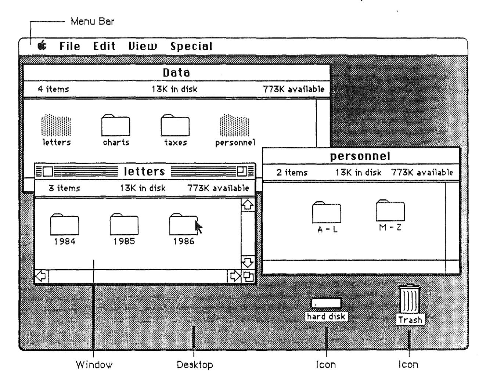

Figure 17. Desktop, Menu Bar, Windows, and Icons

# Menus

The menu structure consists of the menu bar (which displays the menu titles), the menus, and each menu's menu items.

Once a user has selected the object, text, or whatever, that he wants to do something to, he chooses an operation from a menu. The menu bar extends across the top of the screen and displays the title of each available menu. A menu itself is not visible until the user selects it be pressing its title. Figure 18 shows an example of a menu bar that extends across the top of the Macintosh screen.

**Figure 18.** Menu Bar [Fig. 1 in Inside Mac's Menu Manager Chapter]

If the user moves the pointer to the Edit portion of the menu bar and presses the mouse button, the Edit menu appears, as shown in Figure 19.

**Figure 19.** Menu [Fig. 2 in 1M's Menu Manager Chapter]

Menu items should be either verbs or adjectives. Use verbs (or verb phrases) to show the user what can be *done-Copy,* Find, and Show Page, for example. Use adjectives (or adjective phrases) to let the user specify an attribute of a selected object-Chicago [font], Underline, and Double Space, for example. Menu items usually apply to the current selection, although some apply to the whole document or window.

When you're designing an application program, don't assume that *everything* has to be done through menus. Menus are often the best method, but sometimes it's more appropriate for an operation to take place as a result of direct user manipulation of a graphic object on the screen, such as a control or icon. Alternatively, a single menu item can execute complicated instructions if it brings up a dialog box for the user to fJlI in.

#### **The Menu Bar**

/

(

The menu bar contains a number of words and phrases that are the titles of the menus associated with the current application. Each application has its own menu bar. The names of the menus do not change, except when the user opens a desk accessory that then adds a new menu to the menu bar.

Nothing but menu titles can appear in the menu bar. If *all* the operations in a given menu are currently disabled (that is, the user can't choose them), the menu title should be dimmed (drawn in gray) but should remain visible in the menu bar. The user must always be able

to pull down the menu and see the names of the operations even when none of them can, at the moment, be chosen.

#### Choosing a Menu Item

To choose a menu item, the user positions the pointer in the menu bar and over the menu's title, and presses the mouse button. The application highlights the title and displays the menu.

While holding down the mouse button, the user drags the pointer through the menu. Each line is highlighted in turn. When the user releases the mouse button, the operation that's highlighted is chosen. As soon as the mouse button is released, the menu item blinks briefly, the menu disappears, and the operation is executed. The menu title in the menu bar remains highlighted until the operation is completed.

Nothing actually happens until the user chooses the operation. The user can *look* at any of the menus without making a commitment to do anything. The user can also move the pointer all over the screen (except back into the menu bar) without losing sight of the menu, as long as the mouse button is pressed. Moving the pointer away from the menu, and then releasing the button, is one way to close a menu without choosing an operation.

The most frequently used operations should be at the top of a menu. The least frequently used (such as Quit) should be at the bottom.

#### Appearance of Menu Items

The itemss in a particular menu should be logically related to the title of the menu. Names must be terse, preferably one word with the first letter capitalized. If it's necessary to use more than one word (Save As or Page Setup, for example), the first word should be capitalized, as well as other important words in the name. In addition to the names, three features of menus help the user understand what each item does: grouping, toggles, and special visual features.

#### Grouping Operations in Menus

As mentioned earlier, menu items can be divided into two kinds: verbs (actions) and adjectives (attributes). An attribute stays in effect until it's canceled, while an action ceases to be relevant after it has been performed. A single menu can contain both actions and attributes, but the actions should be grouped together and the attributes grouped together. The two groups are separated by dotted lines.

Another reason to group operations is to break up a menu so it's easier to read. Operations grouped for this reason are logically related, but independent. Operations that are actions are usually grouped this way, such as Cut, Copy, Paste, and Clear in the Edit menu.

Attribute operations that are interdependent are grouped, either as mutually exclusive groups or as accumulating groups.

In a mutually exclusive attribute group, only one item in the group is in effect at any one time. The item that's in effect is preceded in the menu by a check mark. If the user chooses a different item in the group, the check mark is moved to the new item. An

example is MacWrite's Font menu, where only one font at a time can be in effect for a particular selection. Radio button controls, where pressing one button disables all the others, are also mutually exclusive.

In an accumulating attribute group, any number of attributes can be in effect at the same time. One of the items in the group cancels all the others. An example is MacWrite's Style menu, where the user can choose any combination of Bold, Italic, Underline, Outline, or Shadow—but Plain Text cancels all the others. Check-box controls, in which all, none, or any other number of the boxes may be in effect at a time, are also examples of accumulating attributes.

Another way to show the presence or absence of an attribute is by a **toggled operation**. In this case, an attribute has two states, and a single menu item allows the user to toggle between the states. You can show the user that an operation is toggled either with check marks or by changing the wording.

MacWrite's View menu is a good example of check marks that indicate the state of a toggled attribute. When View by Icon has been chosen, there is a check mark to the left of "by Icon" and all other views in the menu are not checked.

Here's an example of changing the wording in a toggled menu item. When rulers are showing in a program that uses rulers, one item in the Format menu is Hide Rulers. If the user chooses this item, the rulers are hidden, and the name changes to Show Rulers. Use this technique only when the wording of the items makes it obvious that they're opposite sides of the same thing—Undo and Redo are another good example.

#### Special Visual Features

In addition to the way menu items are name and grouped, menus have other features that provide added information:

- An ellipsis (...) after a name means that after that item is chosen, more information will still be needed before the operation can be carried out. Usually, the user must fill in a dialog box and click an OK button or its equivalent. Don't use the ellipsis when the dialog that will appear is merely a confirmation or warning (for example, "Save changes before quitting?").
- Check marks indicate attributes that are currently in effect.
- The application dims an item when the user can't choose it. If the user moves the pointer over a dimmed item, that item isn't highlighted.
- If an item has a keyboard equivalen (if it can be chosen from the keyboard as well as from a menu), its name in the menu is followed by the Apple (or cloverleaf) symbol and a character. To choose an item this way, the user presses the character key while holding down the Apple (Command) key.

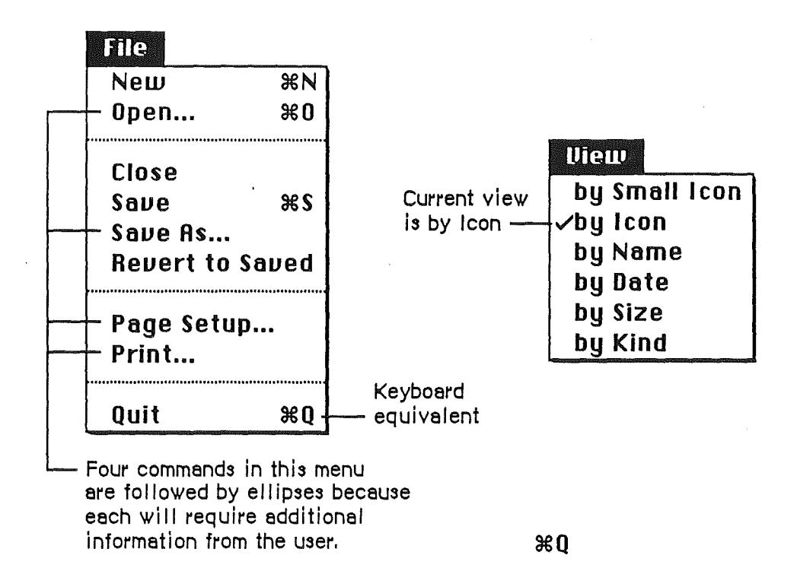

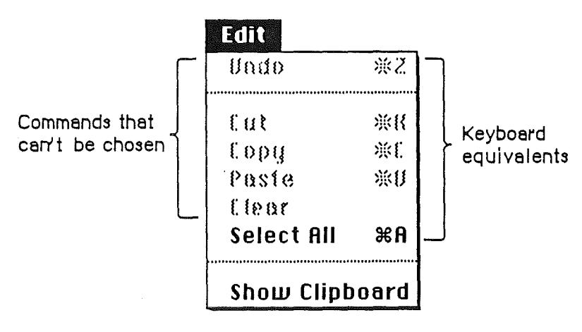

Figure 20Visual Features of Menus

## *Scrolling Menus*

Dont't worry about menus getting too long to fit on the screen. A routine in ROM causes menus to scroll when they get that long.

### *Reserved Apple Key Combinations*

There are several menu items, particularly in the File and Edit menus, that commonly have keyboard equivalents. Keyboard equivalents are provided for people who prefer to keep their hands on the keyboard instead of using a pointing device to choose operations from menus. For the sake of consistency, several of those keyboard equivalents should be used only for the operations listed below and should never be used for any other purpose.

Keyboard equivalents for menu operations are case-independent. In other words, both Apple-S and Apple-s mean *Save.* The keyboard equivalent for *Help* in the Apple menu is shown as Apple-?, but it doesn't actually require that the Shift key be used. The keyboard equivalents are shown in the menus as capital letters just for consistency and aesthetics. Modifier-key combinations other than the ones listed here should also be case-independent. Except for its usual function of providing uppercase characters, the Shift key should be used as a modifier key only as a last resort.

| Menu<br>Apple |       |
|---------------|-------|
| Apple-?       | Help  |
| Menu<br>File  |       |
| Apple-N       | New   |
| Apple-O       | Open  |
| Apple-S       | Save  |
| Apple-Q       | Quit  |
| Edit<br>Menu  |       |
| Apple-Z       | Undo  |
| Apple-X       | Cut   |
| Apple-C       | Copy  |
| Apple-V       | Paste |
|               |       |

Many desk accessories (which are accessible from *all* applications) use the Clipboard and must be able to depend on the keyboard equivalents for Undo, Cut, Copy, and Paste.

The keyboard equivalent for Quit is important in case there's a mouse malfunction. The user can still leave the application in an orderly way (with a dialog box that accepts the Return key as a Yes response), saving any changes to documents that haven't already been saved.

Note that the Edit menu's four reserved letter keys are in close proximity to each other and to the Apple key, allowing easy one-hand operation.

The keyboard equivalents in the Style menu are less strictly reserved. Applications that have a Style menu shouldn't use these keyboard equivalents for any other purpose, but applications that have no Style menu can use them for any purpose. Remember that you

risk confusing users if a given key combination means different things in different applications.

#### Style Menu

Plain text Bold Italic Underline Apple-P Apple-B Apple-I Apple-U

There is a keyboard operation that has no menu equivalent It is Escape, or Apple-period, which can be used to stop the current operation.

Several other menu features are also supported:

- A menu item can be shown in Bold, Italic, Outline, Underline, or Shadow character style. This should be done only in the style menu, to illustrate the text styles.
- A menu item can be preceded by a special character such as .y or •. Icons can also appear in menus, but because of their size they require two lines.
- Applications can have special kinds of menus for special situations-for example, MacDraw's Fill menu.


Figure 21. MacDraw's Fill Menu

# Standard Menus

One of the most effective ways to make applications consistent with one another is to use standard menus. The operations controlled by these menus occur so frequently that it saves considerable time for users if they always match exactly. Do *not* make up your own menus and then give tl?em the same names as standard menus.

Three of these menus, the Apple, File, and Edit menus, appear in almost every application. The Font, FontSize, and Style menus affect the appearance of text and appear only in applications where they're relevant

### The Apple **Menu**

(

Desk accessories are mini-applications that are always available, via the Apple menu, while the Finder or any other application is in use. Not all systems automatically alphabetize the list ofinstalled desk accessories.


**Figure** 22. Apple Menu

Only those desk accessories installed in the current system fIle can be called from the Apple menu. There are some desk accessories that are linked to a particular application-for example, spelling checkers that appear in the Apple menu only when a word processing application is active. The list of desk accessories is expanded or reduced according to what's available. There can be more than one accessory on the desktop at one time, as shown in Figure 23.

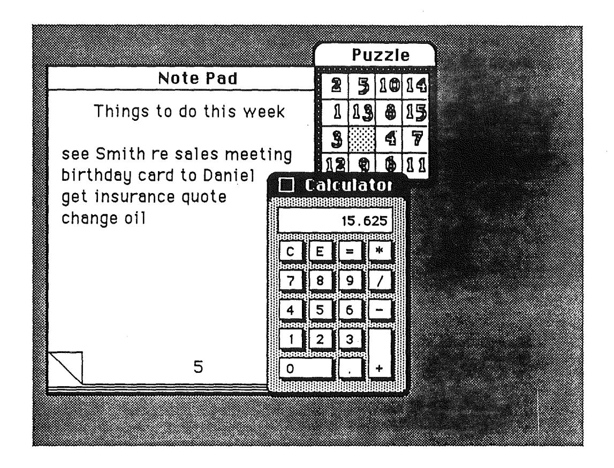

**Figure** 23. Some Desk Accessories

The Apple menu also contains the *About...* menu item. Choosing this item brings up a dialog box with the name, version number, and copyright information for the current application, as well as any other information the application developer wants to display. The *Help* item is also commonly in the Apple menu. In some applications, the *Help* and *About...* functions are combined in one menu item.

#### **The File Menu**

The File menu lets the user perform certain simple filing operations without leaving the application and returning to the Finder. It also contains Print and Quit. All of these operations are described below.

| Close<br>Save<br>Save<br>As<br>•••<br>to<br>RelJert | 3€S<br>SalJed |
|-----------------------------------------------------|---------------|
| Setup<br>Page<br>Print                              |               |
| Ouit                                                |               |

Figure 24. Standard File Menu

### *New*

(

This is used to open a new, untitled document for the current application. The user names the document the first time it's saved. New is disabled when the maximum number of documents allowed by the application is already open.

### *Open*

This is used to open an existing document. To select *which* document, the user is presented with a dialog box. This dialog box shows a list of all the documents, on the disk whose name is displayed, that can be handled by the current application.

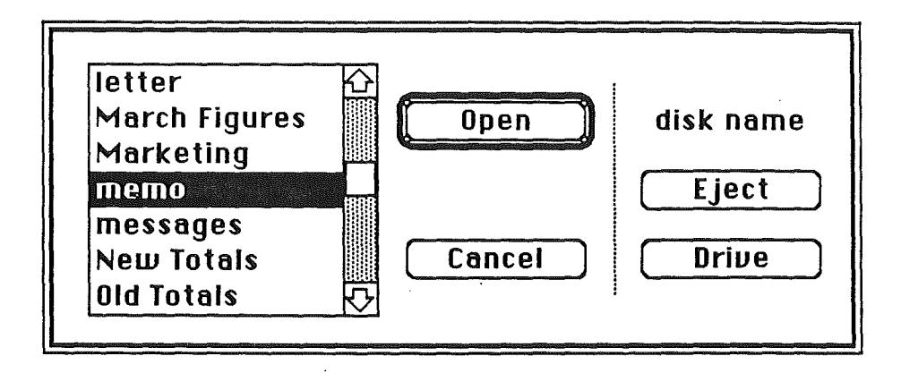

Figure 25. Open Dialog Box

In the case of Macintosh's ROM-based Hierarchical File System (HFS), the user also has the opportunity to browse through various folders, or subdirectories. The user can scroll this list forward and backward. The dialog box also gives the user the chance to look at documents on another disk or to eject a disk.

Using Open, the user can open only a document that can be processed by the current application. To open a document that can be processed only by some other application, the user must ordinarily leave the application and return to the Finder.

When an application starts up by putting an empty untitled document on the screen, the Open option can remain enabled (not dimmed) even if the application allows only one open document at a time. In this case, selecting Open from the File menu simultaneously closes the empty document (why save an empty document?) and opens another.

#### Close

This is used to close the active window, which may be a document window, a desk accessory, or any other type of window. Clicking in a window's close box is the same as choosing Close.

When the user chooses Close or Quit, and the active document has been changed since the last save, the Close dialog box appears, asking Save changes before closing? A great deal of work can be lost if a user mistakenly clicks No instead of Yes. To avoid confusion, all applications should use the same standard close dialog box. This is especially important to Switcher users, who often move from one application to another and become less aware of

subtle differences between applications.

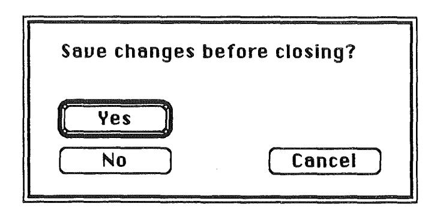

Figure 26. Standard Close Dialog Box

Yes and No, the two direct responses to the question, are placed together on the left side of the box. Yes is the default button. Cancel, which cancels Close, is to the right, separate from Yes and No.

The text of the question is generally Save changes before closing? but if the user sees this message after choosing Quit, the text would instead be Save changes before quitting? If the application supports multiple windows, the text is Save changes to [document name] before closing? Regardless of the text of the question, the box should always look the same and appear in the same place on the screen.

#### Save

This menu item lets the user write (to the appropriate disk file) the active document, including any changes made to the that document since the last time it was saved. The document remains open. Users appreciate seeing, at this point, a message (or at least a wristwatch pointer) telling them the document is indeed being saved.

If no changes have been made since the last save, the Save option should be dimmed. Save becomes available as soon as any change has been made to the document—the user can save changes as often as she likes. If Save isn't dimmed and the user chooses Save even though no changes have been made, an application shouldn't simply ignore the Save request—it should instead display a brief message noting that no save is being done, and why.

If the user chooses Save for a new untitled document (one the user hasn't named yet), the application presents the Save As dialog box (shown below). This dialog box allows the user to name the document before the application continues with the save. The active document remains active.

If there's not enough room on the disk to save the document, the application says so. The application then suggests that the user can choose Save As instead, to save the document on another disk.

### *Save As*

This menu item saves a *copy* of the active document under a new name provided by the user. The result is two documents, identical except for their names.

When the user opens a document, makes changes to it, and then chooses Save As, the changes are not made to the original document. The changed version of the document is saved under the new name. The active document is no longer the one the user opened, but rather the new one with the new name. .

If no changes had been made to the original document when Save As was chosen, then there are two identical documents having different names.

### *Revert to Saved*

Revert to Saved discards all changes made to the active documentsince the last time it was saved or opened. The document on disk is reopened. Before all this happens, an alert box is used to confmn that this is what the user wants. (This follows the principles that users be allowed to make informed decisions and change their minds.)

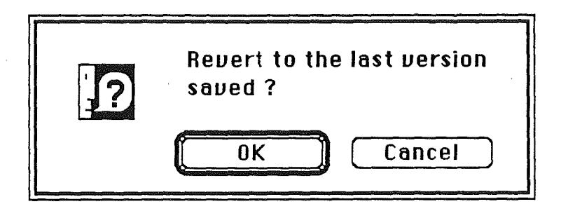

**Figure** 27. A Revert to Saved Dialog Box

#### *Page Setup*

Page Setup lets the user specify printing parameters such as the paper size and printing orientation (different applications will provide different option as needed). These parameters are saved with the document when the document is saved.


Figure 28. A Page Setup Dialog Box

#### Print

This lets the user specify various parameters, such as print quality and number of copies, and then prints the document. The parameters apply only to the current printing operation and are not saved with the document.

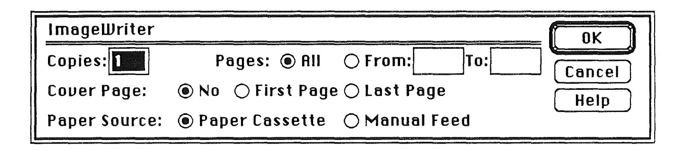

Figure 29. A Print Dialog Box

#### Quit

This menu item lets the user leave the application and return to the Finder. If any open documents have been changed since the last time they were saved, the application presents the same alert box as for Close, once for each open document. If more than one document is open, applications should display, in the alert box, the name of each open document.

#### The Edit Menu

There are two important principles behind the Edit menu:

- Anything the user can do, the user can also undo.
- Data can easily be moved from one part of a document to another part, from one document to another, and even between documents that are created by different

applications or desk accessories. A system file called the Clipboard (a holding area for text or graphics) makes this possible.

The Edit menu allows access to the operations that delete, move, and copy objects, as well as Undo, Select All, and Show Clipboard. You can add other items to the Edit menu if your application requires them—and if they're related to the standard items already there.

All applications should support Undo and cut and paste. This requires that the first five lines in the Edit menu must be exactly as shown in Figure 30: Undo followed by a dotted line, then Cut, Copy, Paste, and Clear. This is important even if your application doesn't itself make use of undo and cut and paste—those features are available to desk accessories only through the Edit menu.

| Edit           |      |  |  |
|----------------|------|--|--|
| Undo (lest)    | ₩Z   |  |  |
| 01             | 0011 |  |  |
| Cut            | *H   |  |  |
| Copy           | ₩C   |  |  |
| Paste          | ₩U   |  |  |
| Clear          |      |  |  |
| Select All     |      |  |  |
| Show Clipboard |      |  |  |

Figure 30. Standard Edit Menu

#### The Clipboard

The Clipboard holds whatever is cut or copied from a document. Its contents stay intact when the user changes documents, opens a desk accessory, or leaves the application. An application can show the contents of the Clipboard in a window and can choose whether to have the Clipboard window open or closed when the application starts up.

The Clipboard window looks like a document window. The user can see its contents but cannot edit them. In most other respects, the Clipboard window behaves just like any other window.

Every time the user performs a Copy on the current selection, a copy of the selection replaces the previous contents of the Clipboard. The previous contents of the Clipboard remain available in case the user chooses Undo.

Althought it appears to the user that there's only one Clipboard, each application can create its own. It is available to all applications that support Cut, Copy, and Paste. The user can see the Clipboard window by choosing Show Clipboard from the Edit menu. If the window is already showing, it's hidden by clicking the close box or choosing Hide Clipboard in the Edit menu. (Show Clipboard and Hide Clipboard are a single toggled item.)

Because the content of the Clipboard doesn't change when the user moves from one application to another, or when the user opens a desk accessory, the Clipboard is used for transferring data among compatible applications and desk accessories.

If the Clipboard file is moved from one disk to another, the contents move with it, replacing any existing Clipboard file on the target disk.

#### Undo

The Undo menu item reverses the effect of the previous operation. Not all operations can be undone. The application determines *which* operations can be undone. The general rule is that operations that change the contents of the document can be undone, whereas operations that don't change the contents of the document cannot be undone.

Most menu items (whether chosen from the menu or by a keyboard equivalent) can be undone. A typing sequence (any sequence of characters typed from the keyboard or numeric keypad, including Backspace, Return, and Tab, but *not* including keyboard equivalents of menu items) can also be undone.

Operations that can't be undone include selecting, scrolling, and splitting the window or changing a window's size or location. None of these operations interrupts a typing sequence. For example, if the user types a few characters and then scrolls the document, an Undo operation doesn't undo the scrolling but *does* undo the typing. Whenever the location affected by the Undo operation isn't currently showing on the screen, the application should scroll the document so the user can see the effect of the Undo.

The actual wording of the Undo line, as it appears in the Edit menu, is *Undo Typing* or *Undo Cut*—whatever the last undoable operation was. If the last operation can't be undone, the line reads simply *Undo* and is dimmed to indicate that it's disabled.

| Edit<br>Vndo Typing #2 |    |  |
|------------------------|----|--|
| Cut                    | жн |  |
| Сору                   | ₩C |  |
| Paste                  | ₩U |  |
| Clear                  |    |  |
| Select All             |    |  |
| Show Clipboard         |    |  |

Figure 31. Undo in an Edit Menu

If the last operation was Undo, the menu item is *Redo xxx*, where *xxx* is the operation that was undone. If this item is chosen, the Undo is undone.


Figure 32. Redo in an Edit Menu

The Apple-Z key combination is reserved as a keyboard substitute for Undo/Redo in the Edit menu and should be used for no other purpose.

#### Cut

The user chooses Cut either to delete the current selection or to move it. A move is eventually completed by choosing Paste.

When the user chooses Cut, the application removes the current selection from the document and puts it in the Clipboard, replacing the Clipboard's previous contents. The place where the selection used to be becomes the new selection; the visual implications of this vary among applications. For example, in text, the new selection is an insertion point; in an array, it's an empty but highlighted cell. If the user chooses Paste immediately after choosing Cut, the document is just as it was before the cut.

The Apple-X key combination is reserved as a keyboard substitute for the Cut operation in the Edit menu and should be used for no other purpose.

#### Copy

Before the user can copy something, she must first select it. Copy puts a duplicate of the selection in the Clipboard, but the selection also remains in the document. The user can then choose Paste to insert the Clipboard's contents somewhere else.

The Apple-C key combination is reserved as a keyboard substitute for Copy in the Edit menu and should be used for no other purpose.

#### Paste

Paste is the last stage of a move or copy operation. It inserts the contents of the Clipboard into the document, replacing the current selection. If there is no current selection, it's

inserted at the insertion point (or at the application's equivalent of an insertion point). The user can choose Paste several times in a row to paste multiple copies. After a paste, the new selection is the object that was pasted, except in text, where it's an insertion point immediately after the pasted text. The Clipboard remains unchanged.

The Apple-V key combination is reserved as a keyboard substitute for Paste in the Edit menu and should be used for no other purpose.

#### Clear

When the user makes a selection and then either chooses Clear from the Edit menu or presses the Backspace key or Clear key, the application deletes the highlighted selection. Unlike Cut and Copy, the Clear operation does not put the selection in the Clipboard. The Clipboard is unchanged and the new selection is the same as it would be after a Cut.

#### Select All

Select All selects every object in the document. In a word processing application, Select All selects every character.

#### Show Clipboard

Show Clipboard is a toggled item. When the Clipboard isn't displayed, it is *Show Clipboard*. If the user chooses *Show Clipboard*, the Clipboard window is displayed and the wording in the menu changes to *Hide Clipboard*.

#### Font-Related Menus

Three standard menus affect the appearance of text. The Font menu lets the user determine the font of a text selection or of the characters she's about to type. The FontSize menu lets the user determine the size, in points, of the characters. The Style menu lets the user determine such aspects of the text's appearance as boldface, italic, and so on.

A font (also often called a typeface) is a set of typographical characters created with a consistent design. All the characters in a font share such features as the thickness of vertical and horizontal lines, the degree and position of curves, and the use of serifs. Serifs are fine lines added to the main strokes of a letter. The text of this book is set in various sizes and styles of a serif font. This sentence, on the other hand, is set in a sans serif font, which has no serifs.) The characters in a font can appear in many different point sizes, but all have the same general appearance, regardless of size. Because fonts can be either fixed-width or proportional, an application can't make assumptions about exactly how many characters will fit in a given area.

#### Font Menu

The Font menu lists only those fonts that are currently available. A check mark indicates which font is currently in effect.

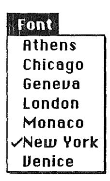

Figure 33. A Font Menu with Some Common Fonts

#### *FontSize Menu*

Font sizes are measured in points. A point is a typographical unit of measure equivalent to In2 inch. The FontSize menu lists the nine standard sizes. The font size currently in effect is indicated with a check mark. (See Figure 34.) Not every font is available in all sizes; the sizes that are available for the selected font are shown outlined in the FontSize menu. A font can be scaled to the other sizes, but scaled fonts usually suffer in appearance on the screen and when printed by some kinds of printers.

This sentence is in lO-point type. This sentence is in 12-point type. This sentence is in 14 point type.

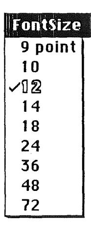

Figure 34. FontSize Menu with Standard Font Sizes

If there's insufficient room in the menu bar for the word FontSize, it can be abbreviated to Size. If there's insufficient room for both a Font menu and a Size menu, the sizes can be put at the end of the Style menu.

#### Style Menu

Text-oriented application programs, such as word processors, have a Style menu that is almost a standard menu. See Figure 35.

The operations in the standard Style menu are Plain Text, Bold, Italic, Underline, Outline, and Shadow. All except Plain Text are accumulating attributes. This means that the user can choose all of them, none of them, or any combination of them. It is important that each attribute can be individually toggled on and off. If a user has accumulated several attributes (bold, italic, and underline for example), and wants to eliminate bold and italic (keeping underline), he doesn't want to have to choose Plain (which turns off all three attributes) then start over by choosing underline.

A attribute that's in effect for the current selection is preceded, in the Style menu, by a check mark. The absence of the check mark indicates that the attribute is not in effect for the current selection. Choosing Plain Text cancels all the other choices.

| Style            |    |
|------------------|----|
| √Plain Text      | ₩P |
| Bold             | ₩B |
| Italic           | ЖI |
| <u>Underline</u> | ₩U |
| Outline          |    |
| Spagom           |    |

Figure 35. Standard Style Menu

Other menus use plain 12-point Chicago for their text, but the Style menu can be self-documenting by using, for example, shadowed 12-point Chicago to list the shadowed attribute. Apple key combinations can be used as keyboard shortcuts to the Style menu.

### **Icons**

Icons are graphic representations of disks, applications, folders, documents, and the trash can. The user can drag icons around on the desktop (if it can't be dragged, it's not an icon).

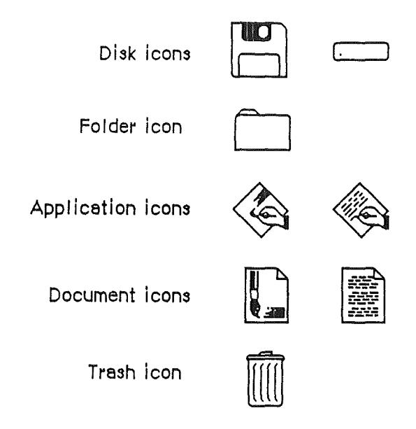

Figure 36. Five Kinds of Icons

Icons can contribute greatly to the clarity and attractiveness of an application. They can provide concrete representations of abstract concepts such as open, select, and save. The use of icons instead of words also makes it much easier to translate programs into other languages. Wherever an explanation or label is needed, consider using an icon in addition to (or instead of) text—but, like everything else, don't overdo it!

### **Palettes**

Some applications use palettes as a quick way for the user to change from one operation to another. A palette is a collection of small symbols, usually enclosed in rectangles. A symbol can be an icon, a pattern, a character, or drawing that stands for an operation. When the user has clicked on one of the symbols (or in its rectangle), it is distinguished from the other symbols (by highlighting, for example), and the previously highlighted symbol goes back to its normal state. Figure 37 shows two palettes from the MacPaint application.

Drawing tool palette, with paintbrush selected


Pattern palette with solid black selected

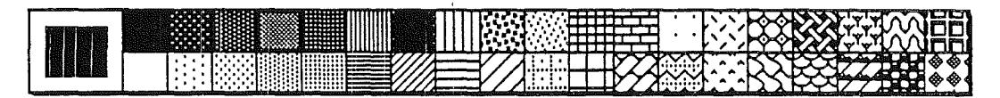

Figure 37. Two Palettes

Typically, the symbol that's selected determines what operations the user can perform. Selecting a palette symbol puts the user into a mode. Modes are generally discouraged (see "Modelessness") but can be justified when changing from one mode to another is almost instantaneous and when the user can always see at a glance which mode is in effect. Changing the shape of the pointer is one way to indicate that a mode has been set. Like all modal features, palettes should be used only when they're the most natural way to structure an application.

A palette can be either part of a window (as in MacDraw) or a separate window (as in MacPaint). Each system has its disadvantages. If the palette is part of the window, then parts of the palette may be concealed if the user makes the window smaller. On the other hand, if it's not part of the window, then it takes up extra space on the desktop. If an application supports multiple

documents open at the same time, it might be better to put a separate palette in each window, so that a different palette symbol can be in effect in each document.

# Windows

There are several kinds of windows: Document windows, dialog windows, and alert windows. Most of this section deals with document windows; dialogs and alerts are discussed together at the end of this section. Because controls appear only in windows, they are also discussed throughout this section.

Each kind of window is made up of several parts, some of which are optional. The application determines the *content* of the window. This section is about a window's structural components (title bar, size box, close box, zoom box, and scroll bars).

#### **Document Windows**

Document indows are the areas on the screen where applications can display the information contained in a document. Because a document may contain more information than the window can display at one time, the window provides a view of a portion of a document. Document indows also provide a graphic representation of opening, closing, and other operations performed on documents. Windows are usually, but not necessarily, rectangles. Figure 38 shows a standard document window and its components.


Figure 38. Standard Window

#### Opening and Closing Windows

Windows come up onto the screen in different ways as appropriate to the purpose of the window. The application controls at least the initial size and placement of its windows.

A standard window has a close box. When the close box is clicked, the window goes away, accompanied by a visual cue such as animation showing the window shrinking into the folder or icon from which it was opened.

The application in control of the window determines what's done with the window visually and logically when the close box is clicked. To the user's eye, a window, once closed, can seem either to retreat into an icon or to simply disappear. In reality, the information in the window may be saved (this is the usual case) and will still be there when the window is reopened, or the window is empty each time it's opened.

When a document is closed, the user must have the choice whether to save any changes made to the document since the last time it was saved.

If an application doesn't support closing a window with a close box, it shouldn't include a close box on the window.

#### Multiple Windows

Some applications can keep several windows on the desktop at the same time. Each window is in a different plane. Windows can be moved around on the desktop much as pieces of paper can be moved around on a real desktop. Each window can overlap those behind it and can be overlapped by those in front of it. Even when windows don't overlap, they retain their front-to-back ordering.

Each application may deal with the meaning and creation of multiple windows in its own way. Different windows can represent:

• separate documents being viewed or edited simultaneously

• related parts of a logical whole (such as the listing, execution, and debugging of a program)

• different views of the same information (such as a spreadsheet and a graph that represent the same numbers

The advantage of multiple windows is that the user can isolate unrelated blocks of information. The disadvantage is that the desktop can become cluttered, especially if some of the windows can't be moved. Some applications provide, in the menu bar, a Windows menu. This menu allows the user to quickly choose a window even though it may be out of sight under other windows.

Figure 37 illustrates multiple windows.


Figure 37. Multiple Windows

## The Active Window

Of all the windows that are open on the desktop, the user can work in only one window at a time. This window is called the active window. All other open windows are inactive. Things can be happening to documents in inactive windows, but the user can work only with the active window. For example, if the user chooses Close from the File menu, only the active window is closed.

To make a window active, the user clicks anywhere in it. Making a window active has two immediate consequences:

- The window changes its appearance. Its title bar is highlighted. The scroll bars, close box, zoom window box, and size box appear.
- The window "moves" to the frontmost plane, so that parts that had been covered by other windows become visible.

Clicking in an inactive window does nothing except activate it. To make a selection within the window, the user must click again. When the user clicks in a window that has been deactivated, the window should be reinstated just the way it was when it was deactivated, with the scroll box in the same position and the same selection highlighted.

When a window becomes inactive, the visual changes that took pl.ace when it was activated are reversed. The title bar becomes unhighlighted. The scroll bars, close box, zoom window box, and size box disappear. Although the information within the window remains visible (except where obscured by other windows), any selection i3 deselected. Figure 39 shows the vis~al difference between active and inactive windows.

#### Moving a Window

Although each application has its own way to initially place windows on the screen, the user can move an active window—to make more room on the desktop or to uncover a window it's overlapping—simply by dragging it by its title bar. A dotted outline of the window follows the pointer until the user releases the mouse button. At the release of the button the full window is redrawn in its new location. Moving a window doesn't affect the appearance of the document within the window; the document moves right along with the window.

The act of moving an inactive window makes it active—unless the user holds down the Apple key while moving the inactive window, in which case the window moves, in the same plane, without becoming active.

The application should ensure that a window can never be moved completely off the screen.

#### Changing the Size of a Window

If a window has a size box in its bottom right corner, where the scroll bars come together, the user can change the size of the window—enlarging or reducing it to the desired size.

Dragging the size box attaches a dotted outline of the window to the pointer. The outline's top left corner stays fixed, while the bottom right corner follows the pointer. When the mouse button is released, the entire window is redrawn in the shape of the dotted outline.

If a window can be moved, but not resized, then the user ends up constantly moving windows on and off the screen. If the user moves the window off the right or bottom edge of the screen, the scroll bars are the first things to disappear. To scroll the window, the user must move the window back onto the screen again. If, on the other hand, the window can be resized, then the user can change its size instead of moving it off the screen, and still be able to scroll.

Resizing a window doesn't change the position of the top left corner of the window over the document or the appearance of the part of the view that's still showing; it changes only how much of the view is visible inside the window. One exception to this rule is a command such as Reduce to Fit in MacDraw, which changes the scaling of the view to fit the size of the window. If, after choosing this command, the user resizes the window, the application changes the scaling of the view.

Applications determine the minimum and maximum window size, which schould depend on the physical size of the display. If the tries to shrink the window below its minimum size, the attempt is ignored.

#### Window Zooming

The more open documents on a desktop, the more difficult it is for the user to locate, select, and resize the one to be worked on. Some Apple computers have a feature in ROM that allows users—with a single mouse click in the window's **zoom window box**—to drag and size the active window to a size and location they select, and then to return the window to full size with another click. If this feature is present, the zoom window box (shown in Figure 40) is present at the right end of the window's title bar. Because window zooming

#### *Hwnan Inteiface Guidelines*

is not available on all Apple computers, application programs must check the ROM and, if the feature is not present, bypass it. Note also that window zooming does not involve the variable magnification you get with a zoom lens).

Application developers are encouraged to use the zoom window function on systems that make it available. The application should neither modify the shape or interpretation of clicking on the zoom window box nor build additional icons in the title bar.

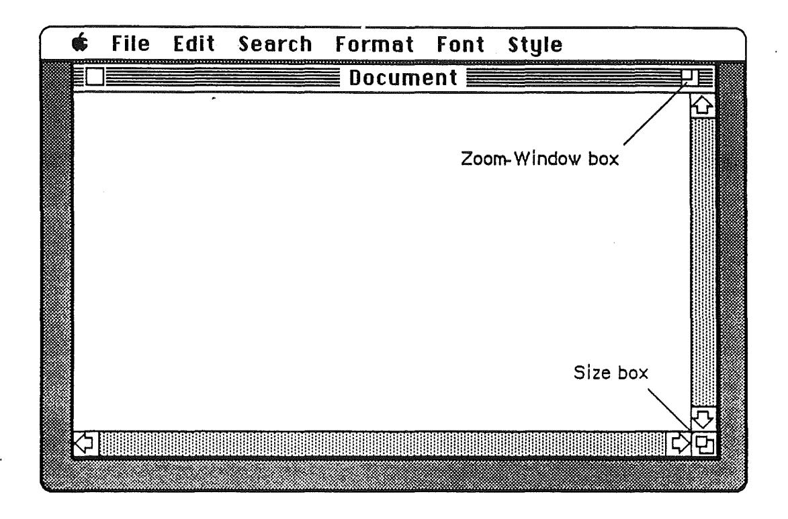

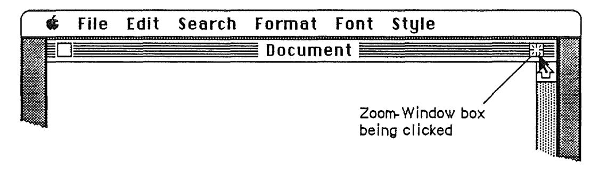

Figure 40. Window in Standard State

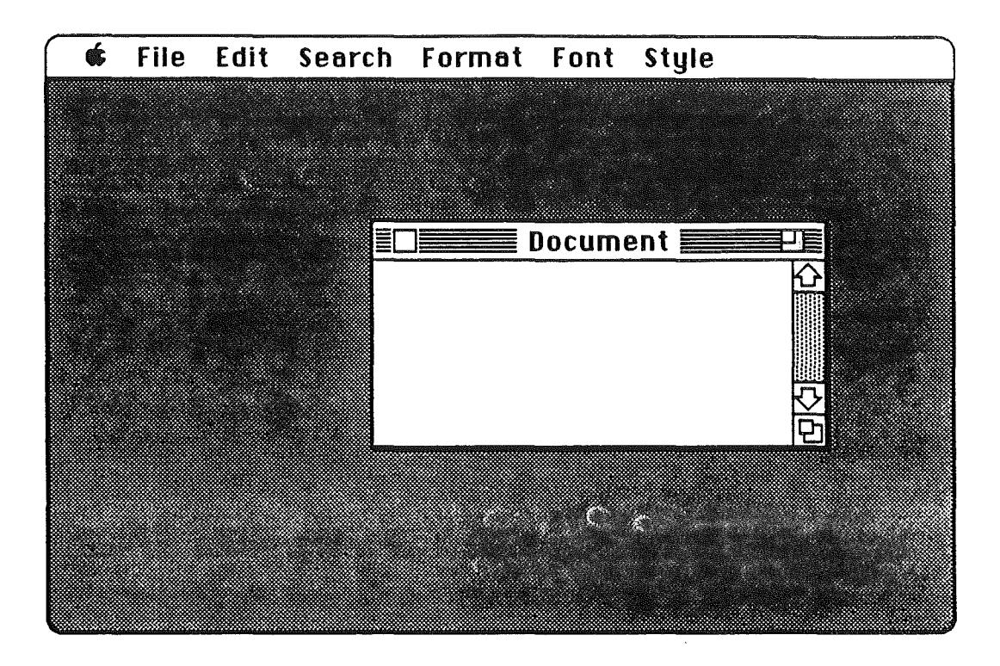

(

(

Figure 41. Window in User-Selected State

The application detennines the standard state of the window. This is generally the full screen, or close to it, and should be the size and location best suited to working on the document. As often as they want, users can specify the user-selected state of the window, generally the size and location best suited to organizing the desktop so that documents can be found and selected.

The application program supplies values for the size and location of the window's standard state as well as the initial values for the size and location of the user-selected state. The standard state should be the most useful size and location for normal operations within the program-usually the full screen. If the application doesn't supply a standard state, the full screen (minus a few border pixels) is assumed.

The user can't change the standard size and location, but the application can change it within context. For example, a word processor might defme the standard size and location as wide enough to display a document whose width is specified in the Page Setup dialog. If the user invokes Page Setup to specify a wider or narrower document, the application might change the values for the standard size and location to reflect that change.

Explicit dragging or resizing of the window is handled according to these guidelines, regardless of the presence or absence of the zoom window feature. The effect of dragging or resizing depends on the state of the window and the degree of movement. In the

Macintosh computer, the user must drag or resize a window at least seven pixels to cause a change in the user-selected state.

#### Scroll Bars

Scroll bars are used to change which part of a document view is shown in a window. Only the active window can be scrolled.

A scroll bar is a light gray rectangle having on each end an arrow in a square box. A window can have either a vertical scroll bar or a horizontal scroll bar, or both. Vertical scroll bars are on the right side of the associated window; horizontal scroll bars run along the bottom of the window. Inside the scroll bar is a white rectangle called the scroll box. The rest of the scroll bar is the gray area.

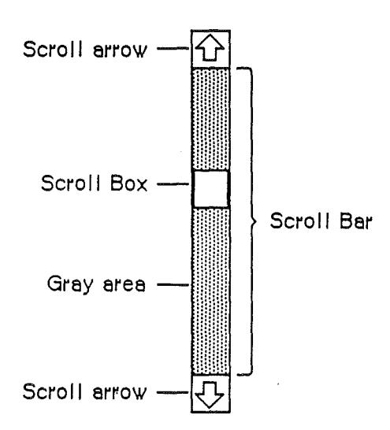

Figure 42. Vertical Scroll Bar

A scroll bar represents one dimension (either top to bottom or left to right) of the entire document. The scroll box represents the relative location, in the whole document, of the portion currently seen in the window. The insertion point is linked to the scroll box. If the user "moves" the document by clicking either a scroll arrow or in the gray area, the scroll box moves along with it. If the user drags the scroll box, the document "moves" along with it. If the document is no larger than the window, the scroll bars are inactive (the scrolling apparatus isn't shown in them). If the document window is inactive, the scroll bars aren't shown at all.

There are three ways to move the document under the window: by sequential scrolling, by "paging" windowful by windowful through the document, and by dragging the scroll box. To experience these first hand, try them out in an application such as MacWrite.

### Scrolling With the Scroll Arrows

Clicking or pressing one of the scroll arrows lets the user see more of the document in the direction of the scroll arrow, so it moves the document in the *opposite* direction from the arrow. For example, when the user clicks the top scroll arrow, the document moves down, bringing the view closer to the top of the document. The scroll box moves toward the arrow being clicked.

Each click in a scroll arrow causes movement a distance of one unit in the chosen direction, with the unit of distance being appropriate to the application: one line for a word processor, one row or column for a spreadsheet, and so on. Within a document, units should always be the same size, for smooth scrolling. Pressing the scroll arrow causes continuous movement in its direction.

#### Scrolling by Windowful

Clicking the mouse anywhere in the gray area of the scroll bar advances the document by a windowful. The scroll box, and the document view, move toward the place where the user clicked. Clicking *below* the scroll box, for example, brings the user the next windowful toward the bottom of the document. Pressing in the gray area causes the display of consecutive windowfuls until the user releases the mouse button, or until the location of the scroll box catches up to the location of the pointer. Each windowful is the height or width of the window, minus one unit overlap (where a unit is the distance the view scrolls when the scroll arrow is clicked once).

In both the above schemes, the user moves the document in increments until it's in the desired position under the window. The user can also move the document directly to any position by dragging the scroll box to the corresponding position in the scroll bar. To move the scroll box, the user drags it along the scroll bar; an outline of the scroll box follows the pointer. When the mouse button is released, the scroll box jumps to the position last held by the outline, and the document jumps to the position corresponding to the new position of the scroll box.

#### Scrolling by Dragging the Scroll Box

If the user starts dragging the scroll box, and then moves the pointer a certain distance outside the scroll bar, the scroll box stops following the pointer and snaps back to its original position. If the user then releases the mouse button, no scrolling occurs. But if the user, still holding down the mouse button, moves the pointer back *into* the scroll bar, the scroll box again begins to move up and down with the pointer.

If a document has a fixed size, and the user scrolls to the right or bottom edge of the document, the application displays a light gray background between the edge of the document and the window frame.

Some applications put the page number inside the scroll box so that the user can see the page number change as the document scrolls.

#### **Automatic Scrolling**

There are three instances when the application, rather than the user, scrolls the document. These instances involve some potentially sticky problems about how to position the document within the window after scrolling.

- The first case is when the user moves the pointer out of the window while either selecting by dragging or while moving a selection with the mouse or with arrow keys. The window keeps up with the selection by scrolling automatically in the direction the pointer has been moved. The rate of scrolling is the same as if the user were pressing on the corresponding scroll arrow or arrows.
- The second case is when the user performs an operation on a selection that isn't currently showing in the window. When this happens, it's usually because the user has scrolled the document after making a selection. In this case, the application scrolls the window so that the selection is showing before performing the operation.
- The third case is when the application performs an operation whose side effect is to make a new selection or move the insertion point. An example is a search operation, after which the object of the search is selected. If this object isn't showing in the window, the application must scroll the document to show it. Another example: After a paste operation, the insertion point is after the end of the thing that was pasted.

The second and third cases present the same problem: Where should the selection be positioned within the window after scrolling? The primary rule is that the application should avoid unnecessary scrolling. Users prefer to retain control over the positioning of a document. The following guidelines should be helpful:

- If part of the new selection is already showing in the window, don't scroll at all. An exception to this rule is when the part of the selection that isn't showing is more important than the part that is showing.
- If scrolling in *one* orientation (either horizontal or vertical) is enough to reveal the selection, don't scroll in both orientations.
- If the selection is smaller than the window, position the selection so that some of its context is showing on each side. It's better to put the selection somewhere near the middle of the window than right up against the corner.
- Even if the selection is too large to show in the window, it might be preferable to show some context rather than to try to fit as much as possible of the selection in the window.

#### Splitting a Window

Sometimes users want to see (and work on) two separate parts of a document simultaneously. They can do this by splitting the window into independently scrollable panes.

Applications that support splitting a window into panes place split bars at the top of the vertical scroll bar and to the left of the horizontal one. Pressing a split bar attaches it to the pointer. Dragging the split bar positions it anywhere along the scroll bar. Releasing the mouse button creates a new split bar at that location and splits the window there, and divides the appropriate scroll bar into separate scroll bars for each pane.


Figure 43. Types of Split Windows

After a split, the document looks the same, except for the split line lying across it. But there are now separate scroll bars for each pane. The panes are still scrolled together in the orientation of the split, but can be scrolled independently in the other orientation. For example, if the split is vertical, then vertical scrolling (using the scroll bar along the right of the window) is still synchronous; horizontal scrolling is controlled separately for each pane, using the two scroll bars along the bottom of the window.


Figure 44. Scrolling a Split Window

To remove a split (to return the window to a single pane), the user drags the split bar to either end of the scroll bar.

Even though there can be multiple panes, there can still be only one selection (the highlighted selection may appear in all of the panes, in none of the panes, or in any number in between). If a change is made in one pane, the change is reflected in all panes where that portion of the document is visible. If the application has to scroll automatically to show the selection, the pane that should be scrolled is the last one the user clicked in. If the selection is already showing in one of the panes, no automatic scrolling takes place.

#### **Panels**

If the application divides a document window more or less permanently into different areas, each having a different content, these areas are called **panels**. Unlike panes, which show different parts of the same document but are functionally identical, panels are functionally different from each other but might show different interpretations of the same part of the document. For example—one panel might show a graphic version of the document while another panel shows a text version, or one panel might show a numerical representation of some data while another shows a graph based on the same data.

Panels, like windows can have scroll bars and can be split into more than one pane. Whether to use panels instead of separate windows is up to the application. Multiple panels in the same window are more compact than separate windows, but they have to be opened, moved, and closed as a unit.

# Controls, Dialogs, and Alerts

The "select-then-choose" paradigm is good enough whenever operations are simple and act on only one object. For those times when a command requires more than one object or needs additional infOImation before it can be executed, the Apple human interface provides two additional features:

- Dialogs, to allow the user to provide the needed additional information before a command is executed
- Alerts, to notify the user whenever an unusual situation occurs

Because both of these features lean heavily on controls, controls are described in this section, even though controls are also used in other places.

### Controls

(

(

Performing actions on a system in an indirect fashion reduces the user's sense of direct manipulation. To give users the feeling that they're in control of their computers, many of an application's features are implemented with controls: graphic objects that, when manipulated with the mouse, cause instant action with visible or audible results. Controls also can change settings to modify future actions.

There are several types of controls. Buttons, check boxes, radio buttons, and scroll bars are all available from the Macintosh Toolbox. You can also design your own controls, such as the thermometer and gauge shown in Figure 44.


Figure 45. Controls

#### Buttons

A button is a small object labeled with text. Clicking or pressing a button performs the action described by the button's label. Label each button according to the *result* of pressing it. If the question is *Save Changes?* then *Save* and *Don't Save* are more meaningful than *Yes* and *No*. If one button in a group is the default button, it has a darker border than the other(s).

Buttons usually perform instantaneous actions, such as completing operations defined by a dialog box or acknowledging error messages. They can also perform continuous actions, in which case the effect of pressing on the button (holding it down) would be the same as the effect of clicking it repeatedly.

Two particular buttons, OK and Cancel, are especially important in dialogs and alerts. They're discussed under "Dialogs" and "Alerts."

#### Check Boxes and Radio Buttons

Whereas buttons perform instantaneous or continuous actions, check boxes and radio buttons let the user choose among alternative values for a parameter.

Check boxes act like toggle switches (comparable to the text attributes in the Style menu). Check boxes are used to indicate the state of a parameter that must be either off or on. The parameter is on if the box is checked; otherwise it's off. The check boxes appearing together in a given context are independent of each other—any number of them can be off or on.

Radio buttons typically occur in groups. They're called radio buttons because they act like the buttons on a car radio. They're mutually exclusive—at any given time, exactly one button in the group is on. Clicking one button in a group turns whichever button was on before.

Both check boxes and radio buttons are accompanied by text that identifies what each button does.

#### Dials

A dial displays the value, magnitude, or position of something in the application or system. Some dials also allow the user to alter that value. Dials are predominantly analog devices, displaying their values graphically and allowing the user to change the value by dragging an indicator. Dials may also have a digital display.

The most common example of a dial is the scroll bar. The indicator of the scroll bar is the scroll box that represents the relative position of the window over the whole length of the document. The user can drag the scroll box to change that position.

#### Dialogs

Commands in menus normally act on only one object. If a command needs more information before it can be performed, it presents a dialog box to gather the additional

information from the user. The user can tell which commands bring up dialog boxes because they're followed by an ellipsis (...) in the menu.

A dialog box is a rectangle that may contain text, controls, and icons. There should be some text in the box that indicates which command caused the dialog box to appear and what the function of the box is.

The user sets controls and text fields in the dialog box to provide the needed information. When the application puts up the dialog box, it should set the controls to some default setting and fill in the text fields with default values, if possible. One of the text fields (the "first" field) should be highlighted, so that the user can change its value just by typing in the new value. If all the text fields are blank, there should be an insertion point in the first field.

Editing text fields in a dialog box should conform to the guidelines detailed under "Text Editing."

When the user is through editing an item,

- Pressing the Tab key accepts the changes made to the item and selects the next item in sequence.
- Clicking in another item accepts the changes made to the previous item and selects the newly clicked item.

Dialog boxes are either modal or modeless.

A modal dialog box is one that the user must explicitly dismiss before doing anything else, such as making a selection outside the dialog box or choosing a command.


Figure 46. A Modal Dialog Box

Because it restricts the user's freedom of action, this type of dialog box should be used only sparingly. In particular, the user can't choose a menu item while a modal dialog box is up and therefore can do only the simplest kinds of text editing. For these reasons, the main use of a modal dialog box is when it's important for the user to complete an operation before doing anything else.

A modal dialog box usually has at least two buttons: OK and Cancel. OK dismisses the dialog box and performs the original command according to the information provided; it can be given a more descriptive name than "OK." Cancel dismisses the dialog box and cancels the original command. It should always be called "Cancel."

A dialog box can have other kinds of buttons as well. These may or may not dismiss the dialog box. The **default button** (the safest or most likely choice in the current situation) is boldly outlined to call attention to it. The default button is the one that takes effect if the user presses Return or Enter on the keyboard instead of one of the screen buttons. Pressing the Return or Enter key has the same effect as clicking the default button. If there's no default button, Return and Enter have no effect.

A special type of modal dialog box is one with no buttons. This type of box just informs the user of a situation without eliciting any response. It usually describe the progress of an ongoing operation. Because it has no buttons, the user has no way to dismiss it. Therefore, the application must display it long enough for the user to read it before taking it down.

A modeless dialog box allows the user to perform other operations without dismissing the dialog box.


Figure 47. A Modeless Dialog Box

A modeless dialog box is dismissed by clicking in the close box or by choosing Close. The dialog box is also dismissed implicitly when the user chooses Quit. It's usually a good idea for the application to remember the contents of the dialog box after it's dismissed, so that, when it's opened again, it can be restored exactly as it was.

Controls work the same way in modeless dialog boxes as in modal dialog boxes, except that buttons never dismiss the dialog box. In this context, the OK button means "go ahead and perform the operation, but leave the dialog box up," whereas the Cancel button usually terminates an ongoing operation.

A modeless dialog box can also have text fields. Because the user can choose menu commands, the full range of editing capabilities can be made available.

#### Alerts

Every user of every application is liable to do something that the application won't understand or can't cope with in a normal manner. Alerts give applications a way to respond to errors not only in a consistent manner, but in stages according to the severity of the error, the user's level of expertise, and the particular history of the error. The two kinds of alerts are beeps and alert boxes.

Beeps are used for errors that are both minor and immediately obvious. For example, if the user tries to backspace past the left boundary of a text field, the application could beep instead of displaying an alert box.

An alert box looks like a modal dialog box, except that it's somewhat narrower and appears lower on the screen. An alert box is primarily a one-way communication from the system to the user. The only way the user can respond is by clicking buttons or by pressing Enter or Return. Alert boxes, therefore, might contain dials and buttons but usually not text fields, radio buttons, or check boxes.


Figure 48. A Typical Alert Box

There are three types of alert boxes:

- Note. A minor mistake that wouldn't have any disastrous consequences if left as is.
- Caution. An operation that may or may not have undesirable results if it's allowed to continue. The user is given the choice whether or not to continue.
- Stop. A serious problem or other situation that requires remedial action by the user.

An application can define different responses for each of several stages of an alert, so that if the user persists in the same mistake, the application can issue increasingly helpful (or sterner) messages. A typical sequence is for the first two occurrences of the mistake to result in a beep, and for subsequent occurrences to result in an alert box. This type of sequence is especially appropriate when the mistake is one that has a high probability of being accidental (for example, when the user chooses Cut when there's no text selection).

How the buttons in an alert box are labeled depends on the nature of the box. If the box presents the user with a situation in which no alternative actions are available, the box has a single button that's labeled OK. Clicking this button means "I've read the alert." If the user is given alternatives, then typically the alert is phrased as a question that can be answered "yes" or "no." In this case, buttons labeled Yes and No are appropriate, although variations such as Save and Don't Save are also acceptable. OK and Cancel can be used, as long as their meanings aren't ambiguous.

The default button is boldly outlined and takes effect if the user presses Return or Enter.

Use icons whenever possible. Graphics can better describe some error situations than words, and familiar icons help users better distinguish between alternatives. Icons should contain no words, and they should contain no symbols unique to a particular culture.

Generally, it's better to be polite than abrupt, even if it means lengthening the message. The role of the alert box is to be helpful and make constructive suggestions, not to give orders. But its focus is to help the user solve the problem, not to give an academic (no

matter how interesting) description of the problem itself. It's important to phrase messages in alert boxes so that users aren't left guessing the real meaning. Avoid computer jargon.

Make alert messages self-explanatory. The user should never have to refer to a book or reference card to fmd out what an alert message means. Test your alert messages to be sure they tell the user exactly what needs to be done.

The best way to make an alert message understandable is to think carefully through the error condition itself. Can the application handle this without an error? Is the error specific enough so that the user can fix the situation? What are the recommended solutions? Can the exact item causing the error be displayed in the alert message?

*i'*(

# Appendix A

# Localization Guidelines

# General Guidelines

Compared to writing the actual code, localization can be easy and painless. If you pay attention early on to the details of localization, you'll ensure that international markets are available for your product in the future. You'll also allow English—speaking foreign users to buy the English version of your software and still be able to use it with their native languages. To create fully easily localized software, you must follow certain guidelines for the use of text, fonts, sorting and date/time display.

Here are some tips to make your software more useful in cultures other than your own.

- Make quoted strings that will have to be translated easy to find. No *text* the user sees should be in the program code itself. Storing all these words in resources will make translation easier.
- If your program relies on properties of the ASCII code table or uses data compression codes that assume a certain number of letters in the alphabet, remember that not all alphabets have the same numbers of characters. German, for example, has thirty characters, not just twenty-six.
- Don't assume that all languages have the same rules for punctuation, word order, and alphabetizing. In Spanish, questions both begin and end with a question mark. The roles of commas and periods in numbers is sometimes the reverse of what you may be used to—in some countries the number 3,546.98 is rendered 3.546,98. Use the Macintosh's international resources.
- Don't let your program rely on strings having particular lengths. After translation, nearly all strings will be either longer or shorter.
- Laws and customs vary. The elements of addresses don't always appear in the same order. In some countries, the postal zone code precedes the name of the city, in other countries it's the reverse. In some countries, postal zone codes contain letters as well as numbers. The rules for amortizing mortgages and calculating interest rates vary from country to country—even between Canada and the United States.
- Keyboards vary from country to country. Some characters appear on some keyboards and not on others. Keystrokes that are easily performed with one hand in your own country may require two hands in another. In France and Italy, for example, typing numerals requires pressing the Shift key.
- Units of measure and standard formats for time and date differ from country to country. For example, "characters per inch" is meaningless in the metric world—that is, almost everywhere. In some countries, the 24-hour clock prevails. Such culture-dependent information can be read

from resources so that the application automatically works correctly in countries where those resources have been properly set up. Always use the Macintosh's international resources instead of coding such information directly into your program.

• Mnemonic shortcuts that are valid in one language may not be in others. Make sure all such shortcuts are also in resources.

# Macintosh Guidelines Localization

This section is specific to the Macintosh family of computers. For full details, see *Inside Macintosh*.

The Macintosh Resource Manager allows the separation of code and data. Data (in the form of resources) can be edited with a number of tools such as REdit and ResEdit. Changing the appropriate resources lets you change the appearance of an application (dialog boxes, messages, menus, etc.) without re-building the application code.

#### **Text**

For legibility, some non-Roman characters need higher resolution than Roman characters. On the Japanese Macintosh Plus, for example, this requires the system font to be larger than normal: it must allow for 16-by-16 pixel characters. The Macintosh Plus' ROM sets the system font size and family according to new low-memory globals. For example, it is possible to specify text in dialogs and menu bars to be 14-point New York. Applications should not change the system font or font size: this should be left to the user or the system. Applications can use SysFontSize to get the default font size to use for their text.

#### Line Spacing

Most Macintosh fonts have blank space above all the letters, to allow for diacritical marks as with Ä or Ñ. If text is drawn using a standard font immediately below a dark line, for example, it will appear to be separated from the line by at least one row of blank pixels (for all but a few exceptional characters). Pixels in some non–Roman fonts, on the other hand, can extend to the top of the character, and appear to merge with the preceding line. To avoid character display overlap, applications should leave blank space around text (as in dialog editText items) or add leading before the first line of text and after the last line of text, as well as between lines of text.

#### Font Selection

The choice of script (English, Kanji, Arabic, etc.) depends on the fonts chosen by the user. If an application does not allow the user to change fonts, or allows the user only to select a global font for the whole document, then the user is restricted in the choice/mix of fonts.

#### Upper- and Lowercase

If text must be either upper or lower-cased, the application should call the IUTransliterate routine (in the Script Interface System Package) to perform the operation. The UprString routine in the Macintosh Rom is designed to be used by the File system and as such does not handle diacritical marks or non-Roman scripts correctly.

# Menus

/

(

\

### Menu Bar Height

The menu manager uses the system font and the system font size in setting up the height of the menu bar, 'and of the items in menus. Because the system font size can vary, the height-of the menu bar can also vary. When determining window placement on the screen, do not assume that the menu bar height is 20. Applications should use the low memory variable MBarHeight (instead of 20) as the height of the menu bar.

### Menu Items

If a menu contains too many items to display at once, the menu scrolls to reveal the hidden items. The Macintosh Plus ROM provides for scrolling of menus that are too long, but long menus complicate the user interface. No more than 16 items should appear in a single menu.

#### Menu Titles

Applications should avoid using too many .lnenus: translation into other languages may widen each of the menu titles, forcing some far to the right (possibly conflicting with the Switcher) or even off the screen.

# The International Utilities Package

The International Utilities Package (Pack6) provides routines for dealing with sorting, currency, measurement systems, date and time formatting. It is important that the routines in this package are used, as opposed to the System Utility routines contained in the Maciritosh ROM, because the ROM routines are not as accurate and can't be localized for different countries (because they are used by the File System).

# The Script Interface System Package

The SIS package (pack8) contains'routines that allow an application to function correctly with non-Roman scripts (Japanese and Arabic, for example). It also contains useful utility routines for text processing and parsing.

# Dialogs & Alerts

Give text room to grow during localization. For example, don't create a screen-sized dialog box that is completely fJlled with text. Some languages require more characters than English does, to convey equivalent messages.

When creating parameterized text, be sure the localizer will be able to rearrange the sentence as needed. For example, if an alert box sentence is to say "There was a problem doing AD to the 1\1." then the localizer will be able to correctly order the noun and prepositional phrase for different languages.

Avoid hard-coding positions for drawing text or graphics. If possible, use a UserItem for positioning or dynamic display or PIer to display static graphics.

# Some Useful Routines

GetFontInfo GetResource IUMagString Font Manager Resource Manager Int'l Util Package

Calculate ascent/descent/leading. Load resource into memory.

Sorting strings

# Appendix B

# **Bibliography**

Most of these entries were suggested by a member of the Human Interface Group. For this draft only, that person's initials appear in SMALL CAPS at the end of each entry. Reviewers: please make more suggestions, or add annotations to the entries already here.

#### Articles

- Licklider, J. C., et al. "The Computer as a Communication Device." *International Science and Technology*, 76, 21-31. (KH)
- Schneiderman, B. "Direct Manipulation: a Step Beyond Programming Languages." *IEEE Computer*, 16 (8), 57–69. (KH)
- Smith, D. C., et al. "Designing the Star User Interface." Byte, 7 (4), 242-282. (KH)
- Tesler, Larry. "The Legacy of the Lisa." *Macworld*, September 1985, pp 17–22. How the Lisa changed personal computing, by a member of the Lisa design team. (JH)

#### Books

- Apple Computer, Inc. *Inside Macintosh*. Reading, Massachusetts: Addison-Wesley, 1985, four volumes. Chapters on memory management, assembly language, the Resource Manager, QuickDraw, the Font Manager, the Toolbox Event Manager, the Window Manager, the Control Manager, and so on.
- Berryman, Gregg. Notes on Graphic Design and Visual Communication. Los Altos, California: William Kaufmann, 1984. Deals with logos, colors, many other topics. (KK)
- Bertin, Jaques. Semiology of Graphics. Madison: University of Wisconsin Press, 1983. (AW)
- Card, S. K., et al. The Psychology of Human-Computer Interaction. Hillsdale, New Jersey: Lawrence Erlbaum Associates, 1983. (KH)
- Diethelm, Walter. Signet Sign Symbol. Zürich: ABC Verlag, 1976. (AW)
- Dreyfuss, Henry. Symbol Sourcebook, an Authoritative Guide to International Graphic Symbols. New York: Van Nostrand Reinhold, 1984. Foreword by R. Buckminster Fuller. Symbols are grouped by subject areas. Includes index. (KK)
- Engelbart, D. C. Augmenting Human Intellect, a Conceptual Framework. Menlo Park, California: Stanford Research Institute, 1962. (KH)

- Favre, Jean-Paul and Andre November. *Color and Communication.* ZUrich: ABC Verlag, 1979. (AW)
- Frutiger, Adrian. *Type Sign Symbol.* ZUrich: ABC Verlag, 1980. (AW)
- Goldberg, A. *Smalltalk-80, the Interactive Programming Environment.* Reading, Massachusetts: Addison-Wesley, 1984. (KH)
- Guedj, R. A., et aI. *Methodology ofInteraction.* Amsterdam: North-Holland, 1980. (KH)
- Heckel, Paul. *The Elements ofFriendly Software Design.* New York: Warner Books, 1984.
- Hunt, Morton. *The Universe Within.* New York: Simon and Schuster, 1982. (AW)
- Medley, Rudolf. *Handbook ofPictorial Symbols.* New York: Dover Publications, 1976. (AW)
- Norman, Donald A. and Stephen W. Draper, eds. *User Centered System Design.* Hillsdale, New Jersey: Lawrence Erlbaum Associates, 1986. Compilation of articles by nineteen authors. (KH)
- Simpson, Henry. *Programming the Macintosh UserInteiface.* New York: McGraw-Hill, 1986. (JH)
- Whitney, Patrick and Cheryl Kent, eds. *Design in the Information Environment.* New York: Knopf, 1985. (AW)

# **Periodicals**

- *• Ergonomics.* (KH)
- *• International Journal ofMan-Machine Studies.* (KH)
- Proceedings of Human Factors Society. (AW)
- *• SIG-CHI Bulletin.* The joumaI of ACM's SIG-CID (the Association for Computing Machinery's Special Interest Group on Computer and Human Interaction). Once a year, the Bulletin is devoted to the proceedings of SIG-CID's annuaI meeting. (JH)

# GUIDELINES FOR LOCALIZABLE SOFI'WARE

Alexis Gerard, Apple International, May 1986.

# 1) Graphics Character Set:

When defining the character set, characters used in International countries should be included.

- a) I am attaching for your reference a table showing the additional characters which are substituted in the ASCII table for localized versions of the Apple II.
- b) In addition, there are a number of characters which were not included in the All ASCII table due to space limitations. They are:
- i, i, i, 6, a, a, T, (and their caps versions), and a, r, 6, u.

# 2) Diacritical.:

(

( \

A number of accented characters are customarily generated diacritically, i.e. a ~dead key" stroke produces the accent, then the character'is added. These are:

i, i, i, 6, a, i, a, T, a, and the caps versions of these, and a, a, La, a, a, r, 6, u.

## 3) Conventions:

- a) Date format: Users should be able to:
- enter dd mm yy or mm dd yy, or yy mm dd, and to use either a numeric or alpha format for the month,
  - Use either a space, a slash (I) a dot (.) or a dash (-).'as separators.
- b) Time format: Users should be able to select between 12 and 24 hour clocks.
- c) Unit of measure: Users should be able to specify print options using either inches or centimeters.

## 4) Programming practices:

The following are a summary of the practices which should be observed to make code easily localizable:

- Text strings should be kept in separate source files.
- If custom routines are used instead of the ones in ROM , to perform screen 110, they should be isolated in a self-contained module.


- Sorting routines should also be kept in separate modules ( they probably do not work in a foreign language).
- Any graphic symbol should be approved by Apple's Human Interface Group.
- <sup>s</sup> Strings should not be concatenated to build longer messages or cut to form a singular form or change the meaning of a word.
- Data compression should not be used: the algorythm would probably not work with the extended character set of a foreign language.
- Documentation should be provided outlining the structure of each program so that a translator will be able to understand what each source code file does. If necessary, include special notes just for the translator.
- A build procedure should be provided of sufficient detail to allow a translator with minimal technical knowledge to create a running version· of the program without intervention from the author.

I "

• Commands, help screen, key strokes and any other table which might contain text, should be kept completely separate from the code and accessed only by symbolic addresses.

