# Human Interface Guidelines for Mac OS 8


May 1996 © Apple Computer, Inc. 1994 - 1996

Apple Computer, Inc. © 1994-1996 Apple Computer, Inc. All rights reserved.

No part of this publication may be reproduced, stored in a retrieval system, or transmitted, in any form or by any means, mechanical, electronic, photocopying, recording, or otherwise, without prior written permission of Apple Computer, Inc., except to make a backup copy of any documentation provided on CD-ROM.

The Apple logo is a trademark of Apple Computer, Inc. Use of the "keyboard" Apple logo (Option-Shift-K) for commercial purposes without the prior written consent of Apple may constitute trademark infringement and unfair competition in violation of federal and state laws.

No licenses, express or implied, are granted with respect to any of the technology described in this book. Apple retains all intellectual property rights associated with the technology described in this book. This book is intended to assist application developers to develop applications only for Apple-labeled or Apple-licensed computers.

Every effort has been made to ensure that the information in this manual is accurate. Apple is not responsible for typographical errors. Apple Computer, Inc. 1 Infinite Loop Cupertino, CA 95014 408-996-1010

Apple, the Apple logo, Finder, and Macintosh are trademarks of Apple Computer, Inc., registered in the United States and other countries. Adobe, Acrobat, and PostScript are trademarks of Adobe Systems Incorporated or its subsidiaries and may be registered in certain jurisdictions.

Helvetica and Palatino are registered trademarks of

Linotype-Hell AG and/or its subsidiaries.

ITC Zapf Dingbats is a registered trademark of International Typeface Corporation.

QuickView™ is licensed from Altura Software, Inc.

Simultaneously published in the United States and Canada.

**Even though Apple has reviewed this manual, APPLE MAKES NO WARRANTY OR REPRESENTATION, EITHER EXPRESS OR IMPLIED, WITH RESPECT TO THIS MANUAL, ITS QUALITY, ACCURACY, MERCHANTABILITY, OR FITNESS FOR A PARTICULAR PURPOSE. AS A RESULT, THIS MANUAL IS SOLD "AS IS," AND YOU, THE PURCHASER, ARE ASSUMING THE ENTIRE RISK AS TO ITS QUALITY AND ACCURACY.**

**IN NO EVENT WILL APPLE BE LIABLE FOR DIRECT, INDIRECT, SPECIAL, INCIDENTAL, OR CONSEQUENTIAL DAMAGES RESULTING FROM ANY DEFECT OR INACCURACY IN THIS MANUAL, even if advised of the possibility of such damages.**

**THE WARRANTY AND REMEDIES SET FORTH ABOVE ARE EXCLUSIVE AND IN LIEU OF ALL OTHERS, ORAL OR WRITTEN, EXPRESS OR IMPLIED. No Apple dealer, agent, or employee is authorized to make any modification, extension, or addition to this warranty.**

**Some states do not allow the exclusion or limitation of implied warranties or liability for incidental or consequential damages, so the above limitation or exclusion may not apply to you. This warranty gives you specific legal rights, and you may also have other rights which vary from state to state.**

## Contents

```
Introduction 5
Windows 6
 Window Controls 6
   Collapse Box 6
   Zoom Boxes 7
   Title Bar Icon 7
   Draggable Border 7
   Placard 8
   Window Header 8
 Utility Windows 9
Dialog Boxes 11
   Movable Alert Box 13
Controls 14
 Bevel Buttons 14
 Disclosure Triangle 15
 Little Arrows 15
 Sliders 16
Appearance Manager Primitives 17
 Group Boxes 17
   Primary Group Boxes 17
   Secondary Group Boxes 20
 Separators 22
Menus 23
 Tear-Off Menus 23
 Grid Menus 24
 Flippy Menus 27
 Custom Menu Layouts 28
 Pop-Up Menus 29
 Menu Titles 29
 Icons in Menus 30
Fonts 31
```

## Figures

| Figure 1  | Document wIndow<br>6                                  |
|-----------|-------------------------------------------------------|
| Figure 2  | Horizontal and vertical zoom boxes<br>7               |
| Figure 3  | Placard for window status<br>8                        |
| Figure 4  | Window Header<br>8                                    |
| Figure 5  | Basic utility window design<br>9                      |
| Figure 6  | Title bar placement for utility windows<br>9          |
| Figure 7  | Controls in utility windows<br>10                     |
| Figure 8  | Dialog box designs<br>12                              |
| Figure 9  | Movable alert box design<br>13                        |
| Figure 10 | Bevel button<br>14                                    |
| Figure 11 | Disclosure triangle<br>15                             |
| Figure 12 | Little arrows<br>15                                   |
| Figure 13 | Slider<br>16                                          |
| Figure 14 | Tick marks<br>16                                      |
| Figure 15 | Primary group boxes in an active dialog box<br>18     |
| Figure 16 | Primary group boxes in an inactive dialog box<br>19   |
| Figure 17 | Secondary group boxes in an active dialog box<br>20   |
| Figure 18 | Secondary group boxes in an inactive dialog box<br>21 |
| Figure 19 | Separators in a dialog box<br>22                      |
| Figure 20 | Separators<br>23                                      |
| Figure 21 | A tear-off menu<br>24                                 |
| Figure 22 | A grid menu<br>24                                     |
| Figure 23 | State changes of cells<br>25                          |
| Figure 24 | States of grid menu cells<br>26                       |
| Figure 25 | A flippy menu<br>27                                   |
| Figure 26 | Custom menu layout<br>28                              |
| Figure 27 | Pop-up menu<br>29                                     |
| Figure 28 | Icons in menus<br>30                                  |
| Figure 29 | Examples of system fonts<br>32                        |

## <span id="page-4-0"></span>Introduction 0

This document provides an introduction to the human interface guidelines for Mac OS 8. It discusses what's new for Mac OS 8 and previews new human interface elements.

This document is evolving and is the first in a series of drafts of the book *Human Interface Guidelines for Mac OS 8*. This book will replace *Macintosh Human Interface Guidelines* when Mac OS 8 ships. Until that time, you need to continue to follow the guidelines in *Macintosh Human Interface Guidelines*. Much of the information in *Macintosh Human Interface Guidelines* will continue to be valid and will be carried forth into *Human Interface Guidelines for Mac OS 8.*

In addition to reading this document, you should also read *Human Interface Toolbox*. It contains information that you need to know to implement your application's human interface.

#### ▲ **WARNING**

This document is preliminary and incomplete. All information presented here is subject to change in later developer releases. ▲

In order to be compatible with the new appearance of Mac OS 8, it is essential that you use the Mac OS 8 Toolbox. By using the Mac OS 8 Toolbox, you ensure that your application appears consistent with the rest of the system regardless of which theme the user chooses to display. You should avoid custom drawing procedures whenever possible because the system appearance style can change at any time.

Introduction **5**

## <span id="page-5-0"></span>Windows 0

This section describes changes to the document window appearance and utility window appearance introduced with Mac OS 8.

#### Window Controls 0

This section describes the new controls that appear in a document window. Figure 1 shows a document window in the Apple Default Appearance.

**Figure 1** Document wIndow

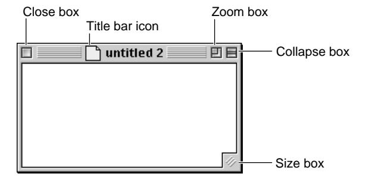

#### Collapse Box 0

The collapse box is a new control that provides the option to collapse a window so that only the title bar is showing. It replaces the WindowShade feature in System 7.5. You should include a Collapse box in all windows that your create using the document window panel. There may be extenuating circumstances that would compel you not to include a Collapse box, however, these cases should be rare.

#### <span id="page-6-0"></span>Zoom Boxes 0

In addition to the standard, zoom there are now two additional versions, a horizontal zoom box and a vertical zoom box. You decide whether to include the standard zoom box, or one of the new zoom boxes in your application's windows depending on the content that a user creates in the windows. The vertical zoom box allows windows to grow vertically when the user clicks the control. The horizontal zoom box allows windows to grow horizontally when the user clicks the control. The zoom boxes are shown in Figure 2 in the Apple Default Appearance.

**Figure 2** Horizontal and vertical zoom boxes


You can use the horizontal or vertical zoom box to reveal more content in a window if there isn't room for a disclosure triangle. For example, in the alarm clock, it's best to use a disclosure triangle to reveal the controls that change the clock's setting, but you could use a horizontal zoom box for this purpose. In general, people won't expect to find a control for progressive disclosure in a window title.

#### Title Bar Icon 0

The document window appearance for Mac OS 8 includes an icon in the title bar next to the title of the document. This icon is a proxy for the Finder icon and behaves in the same ways. For example, dragging the icon to a different location in the Finder moves the document to that location. Only items with Finder representations should include the icon in the title bar.

#### Draggable Border 0

Document windows now have dimensional borders on all sides so that users can drag a window from any side rather than just by the title bar. See [Figure 1](#page-5-0) for an example.

Windows **7**

#### <span id="page-7-0"></span>Placard 0

You can include the standard placard in your window frame to provide status information. The placard appearance changes per theme so be sure to use the placard panel and don't create your own. The placard appearance is shown in Figure 3.


#### Window Header 0

If your window needs a header, there is now a standard appearance for it that is provided by the Mac OS 8 Toolbox. The basic design for the window header is shown in Figure 4.


You can provide status information in the window header such as the Finder does for the columns in its windows.

#### <span id="page-8-0"></span>Utility Windows 0

Utility windows have an updated appearance in Mac OS 8. They have a drag region on the frame of the window indicated by the border design. Now users can drag a utility window by any side rather than just the title bar. Figure 5 shows utility windows in the active and inactive states.

**Figure 5** Basic utility window design

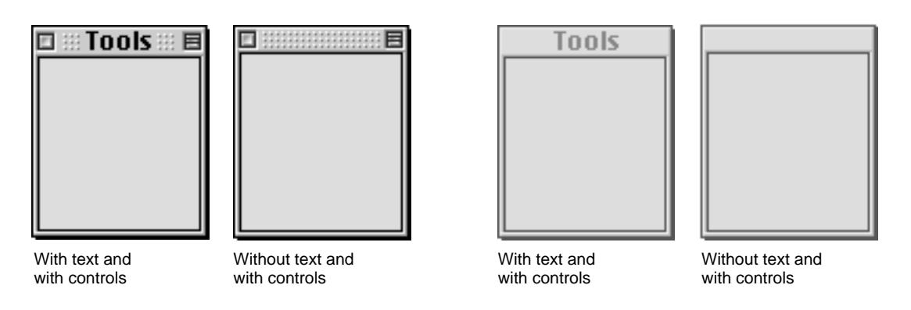

You can decide where to put the title bar. It can be on the top of the window or on one of the sides of the utility window. Figure 6 shows a utility window with the title bar across the top and a utility window with a title bar on the left side. You can also specify that the title bar appear on the right side.

**Figure 6** Title bar placement for utility windows


Windows **9**

**Figure 7** Controls in utility windows

<span id="page-9-0"></span>You can include a size box, a zoom box, a collapse box, and a close box in a utility window. Figure 7 shows various combinations of controls in the title bar of the utility window.

**Active utility window with text and with all controls Active title bars with text** Title bars with close box, zoom box, and collapse box Title bars with close box and collapse box Title bars with close box **Active utility window without text and with all controls Active title bars without text**

Title bars without controls

### <span id="page-10-0"></span>Dialog Boxes 0

Mac OS 8 introduces new appearances for the standard modal, modeless, and movable modal dialog boxes, and alert boxes. It also introduces a new movable alert box. [Figure 8](#page-11-0) shows a modeless dialog box, a movable modal dialog box, and a modal dialog box.

Note that the modeless dialog box has a draggable border so that users can drag from any side of the dialog box to move it. Mac OS 8 supports keyboard navigation to all controls within dialog boxes. You specify the tab ordering when you create the dialog box. The Mac OS 8 Toolbox now provides the default button appearance and behavior when you specify which button is the default.

Dialog Boxes **11**

**Figure 8** Dialog box designs

<span id="page-11-0"></span>A modeless dialog box

A movable modal dialog box

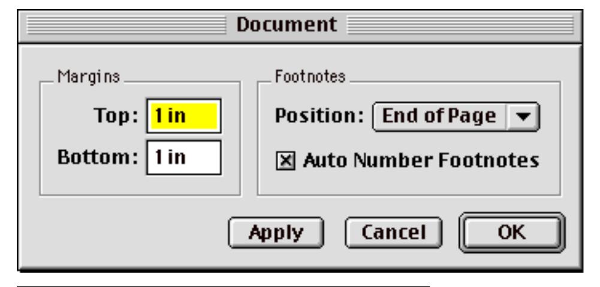

A modal dialog box

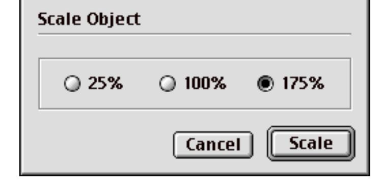

#### <span id="page-12-0"></span>Movable Alert Box 0

The movable alert box appearance combines the traditional alert box design with a title bar that allows users to drag the alert box around. This ability gives users the chance to see what may be obscured beneath the alert box if it appears on top of the content it addresses. In general, you should always use the movable alert box where you previously used the alert box. The user still must dismiss the alert box by clicking a button. However, you should make the movable alert box modal only to your application so that the user can switch to another application while the alert box is displayed. Figure 9 shows the new movable alert box design.

**Figure 9** Movable alert box design


Note that the alert box now has a colored frame and colored background on the alert icon. Remember to follow the guidelines in *Macintosh Human Interface Guidelines* regarding language in dialog boxes and dialog box messages.

Dialog Boxes **13**

## <span id="page-13-0"></span>Controls 0

The Mac OS 8 Toolbox now provides support for several controls that you previously had to implement. Note that all controls now have a focused state that indicates which control will receive keyboard input for keyboard navigation.

#### Bevel Buttons 0

Bevel buttons appear in toolbars and in windows to provide access to features. Bevel buttons won't necessarily have a bevel in every theme. You can put icons, pictures, and text on bevel buttons. Bevel buttons have several states. They appear in the available, pressed, on, mixed, and disabled states. Note that the on state combines the appearance of a pressed button with an unselected icon so that the user can visually identify the icon. Figure 10 shows an example of a bevel button with a 32-by-32 pixel icon.

**Figure 10** Bevel button

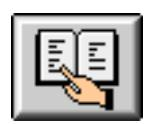

You can put black-and-white icons on bevel buttons. In this case the icons maintain their black and white look and state transitions.

When you have an icon or a picture on a bevel button, you should leave at least one pixel of space between the image and the border of the button. To determine this space, consider how the image looks with more or less space around it. Too much space makes the image look like it is floating in a sea of gray. Too little space makes it look cramped.

Generally you should center any image or text on the button face. There are times when the image may need an extra pixel or two of space to visually

<span id="page-14-0"></span>balance the image. If the image appears to lean one way or another, you can create a visual balance by placing the image slightly off center.

#### Disclosure Triangle 0

The disclosure triangle used in Finder windows to allow users to expand containers, such as folders, without opening them is now provided by the Mac OS 8 Toolbox. Figure 11 shows the disclosure triangle. You can use it as means of progressive disclosure to reveal more information in a list view. See the chapter, "Controls," in *Macintosh Human Interface Guidelines* for a further description.

**Figure 11** Disclosure triangle

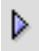

#### Little Arrows 0

The Mac OS 8 Toolbox provides the little arrows control that you use to increment or decrement values in a series. Figure 12 shows the little arrows control. See the chapter, "Controls," in *Macintosh Human Interface Guidelines* for a further description.

**Figure 12** Little arrows


Controls **15**

#### <span id="page-15-0"></span>Sliders 0

Sliders are now provided by the Mac OS 8 Toolbox. A slider is a control that displays a range of values, magnitude, or position of something in the system or an application. You can use a pointed indicator or a rectangular indicator. Figure 13 shows a horizontal slider and a vertical slider without labels or tick marks.

**Figure 13** Slider

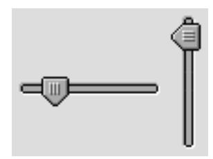

If it makes sense for your slider, you can include tick marks that indicate values in the range. The Appearance Manager provides tick marks as a primitive. You need to handle the tracking and feedback for the tick marks. Figure 14 shows an example of the tick marks.

**Figure 14** Tick marks


See the chapter, "Controls," in *Macintosh Human Interface Guidelines* for a further description.

## <span id="page-16-0"></span>Appearance Manager Primitives 0

The Appearance Manager includes visual elements that you can use to organize information in dialog boxes and palettes. These elements are called primitives. Unlike controls, they have no behavior associated with them.

#### Group Boxes 0

The Appearance Manager now provides primitives that you use to draw boxes around content within a dialog box. There are two levels of group boxes; primary group boxes and secondary group boxes.

#### Primary Group Boxes 0

You use a primary group box to organize visually related items in a dialog box or window. You should use a group box where you have a set of two or more related controls. Don't include a group box for just one control because adding too many elements to a dialog box creates visual clutter that makes it hard for people to discriminate the key elements. Figure 15 shows an appearance for primary group boxes in an active dialog box.

<span id="page-17-0"></span>**Figure 15** Primary group boxes in an active dialog box


[Figure 16](#page-18-0) shows an appearance for primary group boxes in an inactive dialog box.

<span id="page-18-0"></span>**Figure 16** Primary group boxes in an inactive dialog box


You can use a control such as a pop-up menu or a checkbox as a title for the setting in a group box. If you use a pop-up menu as a master control, it changes the settings that appear in the group box as the user changes the choice in the menu. If you use a check box for a master control, it enables the settings contained in the group box when the check box is checked.

You must implement the control as a separate entity from the group box itself. For information on implementing a group box with a control as its title, see "Introduction to the Mac OS 8 Toolbox" chapter in the document *Human Interface Toolbox*.

#### <span id="page-19-0"></span>Secondary Group Boxes 0

You use a secondary group box to organize visually related items within a primary group box. The secondary group box appearance gives it a subordinate appearance related to the primary group box. The appearance aids in the perception of the organizational hierarchy. Figure 17 shows an appearance of secondary group boxes in an active dialog box.

**Figure 17** Secondary group boxes in an active dialog box

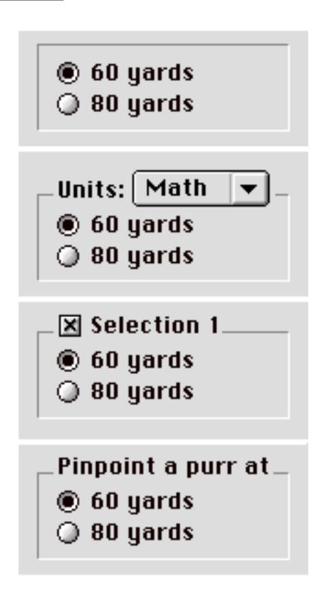

<span id="page-20-0"></span>Figure 18 shows an appearance for secondary group boxes in an inactive dialog box.

**Figure 18** Secondary group boxes in an inactive dialog box


As with the primary group box, you can use a control such as a pop-up or checkbox as a title for the setting in a group box. The same rules apply to the case of the secondary group box.

#### <span id="page-21-0"></span>Separators 0

You use vertical and horizontal separators in dialog boxes to visually distinguish areas with separate settings. Figure 19 shows an example of a control panel with a vertical separator and two horizontal separators that serve to group related settings without the complexity of group boxes.

**Figure 19** Separators in a dialog box


You can use a vertical separator or a horizontal separator or both. The appearance of the separators is shown in [Figure 20](#page-22-0).

<span id="page-22-0"></span>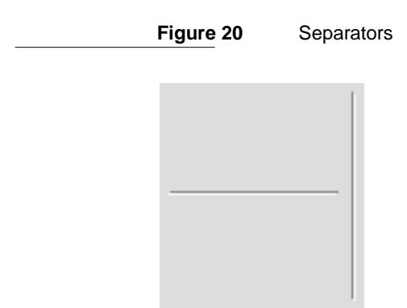

## Menus 0

This section describes changes to the standard menus previously available. The Mac OS 8 Toolbox includes support for tear-off menus with a new appearance, grid menus, flippy menus, and extended keyboard navigation in menus. This section also contains some general information about menus.

#### Tear-Off Menus 0

The Mac OS 8 Toolbox provides support for tear-off menus. For information about the contents and behavior of tear-off menus, see *Macintosh Human Interface Guidelines*, pages 92-95. In Mac OS 8, tear-off menus have an indicator between the top of the menu and the menu bar to visually alert the user that the menu can tear off, as shown in [Figure 21](#page-23-0).

Menus **23**

<span id="page-23-0"></span>**Figure 21** A tear-off menu


When a menu is torn off, it has the appearance of a utility window [\(page 9\)](#page-8-0).

#### Grid Menus 0

Grid menus provide support for palette-type features in the menu bar. Grid menus can contain choices such as tools or colors, as shown in Figure 22. Grid menus can be in the menu bar, pop-up from a tool palette as a hierarchical menu, or pop-up from a pop-up button in a dialog box.

**Figure 22** A grid menu


Most grid menus are good candidates to be tear-off menus. (See ["Tear-Off](#page-22-0)  [Menus"](#page-22-0) for more information.) The size of the grid is limited by the placement of the palette when the menu is torn off of the menu bar. Long, narrow menus make better use of screen space when in palette state. Also consider where the user will put the menu when it's torn off. Generally palettes end up near the edge of the screen.

<span id="page-24-0"></span>Each theme dictates what the bevel that separates cells looks like. The bevel itself is three pixels wide. You should create cells of at least 8 pixels by 8 pixels in order to provide a target that users can easily locate and click. For cells that contain icons, the minimum size should be 18 pixels by 18 pixels so that you can include a 16-pixel by 16-pixel icon plus a one pixel space on each side of the icon to allow a visual affordance. (To create icons for these menus, follow the icon design guidelines in *Macintosh Human Interface Guidelines*.)

Each cell has three states; available, selected, and active. The available state has no emphasis. The selected state shows a selected mechanism for the cell over which the user has the pointer with the mouse button pressed. The checked state indicates the cell currently in effect (if any). Figure 23 shows the states of cells that contain two different types of content.

**Figure 23** State changes of cells

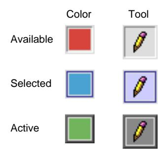

Menus **25**

<span id="page-25-0"></span>The state changes and mouse tracking are all handled by the Mac OS 8 Toolbox. Figure 24 shows each of the states of a cell in a menu.

**Figure 24** States of grid menu cells


To create a grid menu, you specify the width and height of the menu, the size of the cells, each cell's content, and if the menu tears off. For more information on implementing grid menus, see the "Introduction to the Mac OS 8 Toolbox" chapter in the document *Human Interface Toolbox*.

You can implement features such as colors, patterns, or tools in a grid menu or using icon buttons in a toolbar. Grid menus have the tracking behavior of menus and change the current choice when the user releases the mouse button. This behavior is more flexible than icon buttons (the user must press and release the mouse button without moving the mouse). However, you can't include other controls or behaviors for the items, such as checkboxes, in a grid menu.

With bevel buttons you can implement checkbox behavior. Also, bevel buttons in a toolbar provide better visual feedback than a grid menu since the bevel button appearance shows which elements are active, while a grid menu must be open or torn off to show its status. You can implement a toolbar of bevel buttons in a utility window.

#### <span id="page-26-0"></span>Flippy Menus 0

Flippy menus allow you to include extensions to existing menu commands that appear when the user presses the option key before opening the menu. You should only include modifications to existing commands, not entirely different commands. An example of an alternate command is Close and Close All, as shown in Figure 25. For the alternate version of a command, show the keyboard equivalent Command–Option–*key*.

**Figure 25** A flippy menu

| File  |            |
|-------|------------|
| New   | <b></b> ₩N |
| Open  | жо         |
| Close | ₩W         |
| Save  | <b>%</b> 5 |
| Print | ЖΡ         |
| Quit  | жQ         |


**Pull-down menu Pull-down menu with option key pressed**

The user can tear off the version of the menu that is currently open.The user can't flip a torn-off menu to display the alternate commands. However, the user can still open the version in the menu bar to show these commands. You need to provide support for the flipping and do the menu tracking while the menu is open.

When you create a flippy menu, set the menu width to the length of the longest string so that the menu doesn't change width when the user opens the alternate version of it. You can provide support for allowing the user to flip the menu while it is open. This behavior allows the most flexibility for the user.

Changed items have no distinct visual appearance. Don't change every item in a menu. Only change those items that require a modification and those that

Menus **27**

<span id="page-27-0"></span>make sense. Flippy menus are not a means of providing additional space for menu commands. If you have flippy menus in your application, don't use the Option key in other keyboard equivalents because that changes the meaning of the Option key. If the Option key already functions in a specific way with your menus, don't use it to also flip menu commands. Its meaning should be consistent within an application. If a modifier key is used to alter the behavior of push buttons in dialog boxes, make sure that there is a consistent behavior for each modifier key.

#### Custom Menu Layouts 0

You can combine different types of menus in one menu using the custom menu layout. This design provides the ability to combine menus with different grids into one menu as shown in Figure 26. A separator distinguishes the choices in each area of the menu, just as a separator distinguishes groups of textual menu commands.

**Figure 26** Custom menu layout


You can use a custom menu layout to create a menu that doesn't use standard commands. For example, you could create a keypad menu using a custom layout. Another use for a custom layout might be to implement a compass

<span id="page-28-0"></span>menu where a user could choose a direction by clicking the appropriate direction rather than choosing a text command that represented the direction.

You should only use a custom menu layout when it's essential rather than just for effect. Don't use a custom menu layout when a standard menu works.

#### Pop-Up Menus 0

Pop-up menus have a new appearance and new behavior in Mac OS 8. They are now provided by the Mac OS 8 Toolbox. The menu and the arrow are now one control that have the button appearance when closed. The menu always descends from the button regardless of its location on the screen. Figure 27 shows the new pop-up menu appearance.

**Figure 27** Pop-up menu

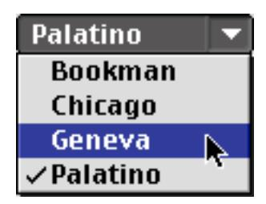

#### Menu Titles 0

The menu bar extends across the top of the screen and contains words and icons that serve as the title of each menu. It should be visible and always available to use. Nothing should ever appear on top of the menu bar or obscure it from view. The menu bar should always contain the standard menus—the Apple menu, the File menu, (or the Document menu in OpenDoc), the Edit menu, the Help menu, and the Application menu. The Keyboard menu is an optional standard menu that appears when the user installs a script system other than the Roman Script System. The titles of the standard menus never change.

The titles of the Apple, Keyboard, and Application menus are icons rather than words. Other menus should have words as titles since most users don't recognize an icon in the menu bar as a menu title.

Menus **29**

#### <span id="page-29-0"></span>Icons in Menus 0

In Mac OS 8 you can include icons in menus where they help to clarify the meaning of a menu item. For example, you could include icons with the menu items for alignment in a text menu, as shown in Figure 28.

**Figure 28** Icons in menus

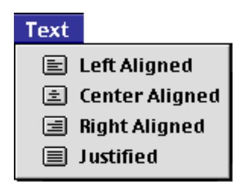

It may also help to show an icon in a menu item that represents a more complex feature such as rotating to indicate the direction of the movement.

## <span id="page-30-0"></span>Fonts 0

In Mac OS 8, there are two sizes of fonts used in all human interface elements. The big system font replaces Chicago 12. It is used for most headings and text. The small system font replaces Geneva 10 and Geneva 9 which were used for some labels and explanatory text. There is also an emphasized version of the small system font which can be used for headings of group boxes [\(page 17\)](#page-16-0).

There are multiple system fonts. There is a constant set of system fonts that the user cannot change by adding or removing fonts. You need to use the system fonts for display in any and all interface elements. Special characters that appear in the interface, such as keyboard glyphs (the character that represents the Command key), are available through the system fonts. Therefore, you shouldn't create custom menus to display special characters, but use the existing characters. Each theme specifies a default font to appear in all of its elements. The user can change which font is displayed using a control panel.

For layout purposes when you are designing your dialog boxes, you can use Chicago 12 as a guide because each big system font uses the same metrics. You can use Geneva 10 for layout purposes for the small system font.

When you create your dialog boxes, specify the big system font or the small system font, then regardless of which font a theme specifies or the user has installed and chooses, your dialog boxes appear appropriately. Don't call fonts by name. If you feel you must override a panel's default font, see the "Introduction to the Mac OS 8 Toolbox" chapter in the document *Human Interface Toolbox* for more information. [Figure 29](#page-31-0) shows examples of the small system font and the big system font in a dialog box using one of the system fonts.

Fonts **31**

**Figure 29** Examples of system fonts

<span id="page-31-0"></span>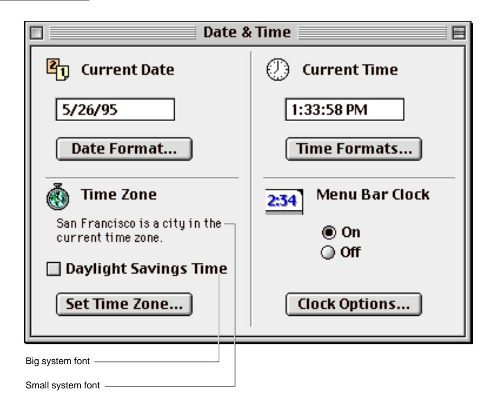

Don't use Geneva 9 point font any longer. It doesn't have the non-Roman characters necessary for use on localized systems, the keyboard glyphs, or Unicode support. Instead, use the small system font wherever you were using Geneva 9 point.

All system fonts print well at 300 dpi and 600 dpi. The big system font is a bold-like font that dithers on a black-and-white monitor so that it is readable. This Apple manual was written, edited, and composed on a desktop publishing system using Apple Macintosh computers and FrameMaker software. Line art was created using Adobe ™ Illustrator and Adobe Photoshop.

Text type is Palatino<sup>®</sup> and display type is Helvetica<sup>®</sup>. Bullets are ITC Zapf Dingbats<sup>®</sup>. Some elements, such as program listings, are set in Adobe Letter Gothic.

WRITER
Lori E. Kaplan

DEVELOPMENTAL EDITOR
Laurel Rezeau

ILLUSTRATOR
Sandee Karr

PRODUCTION EDITOR
Gerri Gray

Special thanks to

Pat Coleman and Elizabeth Moller