# Newton 2.0 User Interface Guidelines


#### **Addison-Wesley Publishing Company**

Reading, Massachusetts Menlo Park, California New York Don Mills, Ontario Wokingham, England Amsterdam Bonn Sydney Singapore Tokyo Madrid San Juan Paris Seoul Milan Mexico City Taipei

#### Apple Computer, Inc.

© 1996, 1994 Apple Computer, Inc. All rights reserved.

No part of this publication may be reproduced, stored in a retrieval system, or transmitted, in any form or by any means, mechanical, electronic, photocopying, recording, or otherwise, without prior written permission of Apple Computer, Inc., except to make a backup copy of any documentation provided on CD-ROM. Printed in the United States of America.

No licenses, express or implied, are granted with respect to any of the technology described in this book. Apple retains all intellectual property rights associated with the technology described in this book. This book is intended to assist application developers to develop applications only for Apple-labeled or Apple-licensed computers.

Every effort has been made to ensure that the information in this manual is accurate. Apple is not responsible for printing or clerical errors.

Apple Computer, Inc. 1 Infinite Loop Cupertino, CA 95014 408-996-1010

Apple, the Apple logo, APDA, AppleLink, AppleTalk, LaserWriter, Macintosh, and Newton are trademarks of Apple Computer, Inc., registered in the United States and other countries.

Balloon Help, Espy, Geneva, the light bulb logo, MessagePad, NewtonScript, Newton Toolkit, New York, QuickDraw, and System 7 are trademarks of Apple Computer, Inc. Adobe Illustrator and PostScript are trademarks of Adobe Systems Incorporated, which may be registered in certain jurisdictions.

FrameMaker is a registered trademark of Frame Technology Corporation.

Helvetica and Palatino are registered trademarks of Linotype Company.

ITC Zapf Dingbats is a registered trademark of International Typeface Corporation.

Simultaneously published in the United States and Canada.

#### **LIMITED WARRANTY ON MEDIA AND REPLACEMENT**

**ALL IMPLIED WARRANTIES ON THIS MANUAL, INCLUDING IMPLIED WARRANTIES OF MERCHANTABILITY AND FITNESS FOR A PARTICULAR PURPOSE, ARE LIMITED IN DURATION TO NINETY (90) DAYS FROM THE DATE OF THE ORIGINAL RETAIL PURCHASE OF THIS PRODUCT.**

**Even though Apple has reviewed this manual, APPLE MAKES NO WARRANTY OR REPRESENTATION, EITHER EXPRESS OR IMPLIED, WITH RESPECT TO THIS MANUAL, ITS QUALITY, ACCURACY,** 

**MERCHANTABILITY, OR FITNESS FOR A PARTICULAR PURPOSE. AS A RESULT, THIS MANUAL IS SOLD "AS IS," AND YOU, THE PURCHASER, ARE ASSUMING THE ENTIRE RISK AS TO ITS QUALITY AND ACCURACY.**

**IN NO EVENT WILL APPLE BE LIABLE FOR DIRECT, INDIRECT, SPECIAL, INCIDENTAL, OR CONSEQUENTIAL DAMAGES RESULTING FROM ANY DEFECT OR INACCURACY IN THIS MANUAL, even if advised of the possibility of such damages.**

**THE WARRANTY AND REMEDIES SET FORTH ABOVE ARE EXCLUSIVE AND IN LIEU OF ALL OTHERS, ORAL OR WRITTEN, EXPRESS OR IMPLIED. No Apple dealer, agent, or employee is authorized to make any modification, extension, or addition to this warranty.**

**Some states do not allow the exclusion or limitation of implied warranties or liability for incidental or consequential damages, so the above limitation or exclusion may not apply to you. This warranty gives you specific legal rights, and you may also have other rights which vary from state to state.**

ISBN 0-201-48838-8 1 2 3 4 5 6 7 8 9-MA-0099989796 First Printing, May 1996

#### **Library of Congress Cataloging-in-Publication Data**

Newton 2.0 user interface guidelines / Apple Computer, Inc.

p. cm. Includes index. ISBN 0-201-48838-8

1. User interfaces (Computer systems) I. Apple Computer, Inc. QA76.9.U83N49 1996

005.265—dc20 96-20168

CIP

# Contents

Figures xiii

| Preface   | About This Book<br>xxi                                                                                                                                                                                                                                                                                                                                                                                                                                                                                                                                  |
|-----------|---------------------------------------------------------------------------------------------------------------------------------------------------------------------------------------------------------------------------------------------------------------------------------------------------------------------------------------------------------------------------------------------------------------------------------------------------------------------------------------------------------------------------------------------------------|
|           | Who Should Read This Book<br>xxi<br>What's in This Book<br>xxii<br>Related Books<br>xxii<br>Visual Cues Used in This Book<br>xxiii<br>Developer Products and Support<br>xxiii                                                                                                                                                                                                                                                                                                                                                                           |
| Chapter 1 | Newton and Its Users<br>1-1                                                                                                                                                                                                                                                                                                                                                                                                                                                                                                                             |
|           | Understand Newton<br>1-1<br>Know Your Audience<br>1-2<br>What People Do With Newton<br>1-3<br>Accessibility<br>1-3<br>Observe Basic Human Interface Principles<br>1-4<br>Metaphors<br>1-4<br>Direct Manipulation<br>1-6<br>Feedback<br>1-7<br>See and Point<br>1-7<br>Consistency<br>1-7<br>User Control<br>1-8<br>Forgiveness<br>1-8<br>Stability<br>1-9<br>Aesthetic Integrity<br>1-9<br>Design for the Newton System<br>1-10<br>Observe the Built-In Applications<br>1-10<br>Use the Common Pool of Data<br>1-10<br>Keep Applications Simple<br>1-11 |

Use Screen Space Wisely 1-11 Check the Screen Size 1-11 Involve Users in the Design Process 1-13 Define Your Audience 1-13 Analyze Tasks 1-13 Build Prototypes 1-14 Observe Users 1-14 Ten Steps for Conducting a User Observation 1-15

## Chapter 2 Container Views 2-1

How Views Look 2-3 View Controls 2-3 View Title 2-4 View Border 2-6 Matte Border 2-6 Striped Border 2-7 Wavy Border 2-7 Plain Border 2-8 Drop Shadows 2-8 View Fill 2-9 Main Views 2-9 Title or Folder Tab 2-10 Primary Controls and Status Bar 2-11 Separator Bars 2-11 The Main View's Border 2-13 Auxiliary Views 2-14 Slips 2-15 Notification Alerts 2-17 Confirmation Alerts 2-18 Status Slips 2-20 Title and Message 2-21 Progress Indicator 2-22

Close, Stop, or Cancel 2-23 User Decision 2-24 Palettes 2-24 Drawers 2-26 Roll Views 2-27 How Views Work 2-28 Opening Container Views 2-28 View Display Order 2-28 The Backdrop 2-29 What Is Active 2-29 View Position 2-30 Position of a Main View 2-30 Position of Auxiliary Views 2-31 Closing a View 2-32 Closing a Main View 2-32 Closing a Slip 2-33 Closing a Drawer 2-33 Moving a View 2-33 Changing a View's Size 2-34 Scrolling 2-36 Scrolling With Scroll Arrows 2-37 Universal Scroll Arrows 2-38 Local Scroll Arrows 2-39 Four-way Scrolling 2-41 Automatic Scrolling 2-43 Scrolling Performance 2-44 Overview 2-44 Overview Contents 2-44 Overview Button 2-46 Switching to and from an Overview 2-47 Scroll and Overview in an Overview 2-48 Closing an Overview 2-49 Nonfunctional Scroll and Overview Controls 2-49

| Buttons<br>3-2                           |     |
|------------------------------------------|-----|
| Text Buttons<br>3-2                      |     |
| Text Button Sizes<br>3-3                 |     |
| Naming Text Buttons<br>3-4               |     |
| Naming Take-Action Buttons<br>3-4        |     |
| Naming Cancel- and Stop-Action Buttons   | 3-5 |
| Picture Buttons<br>3-7                   |     |
| Designing Picture Buttons<br>3-8         |     |
| Button Behavior<br>3-9                   |     |
| Button Feedback<br>3-9                   |     |
| Button States<br>3-10                    |     |
| Button Placement<br>3-11                 |     |
| Button Spacing<br>3-12                   |     |
| Large Buttons<br>3-14                    |     |
| Close Boxes<br>3-14                      |     |
| Where to Use a Regular Close Box<br>3-15 |     |
| Where to Use a Large Close Box<br>3-15   |     |
| Radio Buttons<br>3-16                    |     |
| Checkboxes<br>3-18                       |     |
| Sliders<br>3-20                          |     |
| Hot Spots<br>3-21                        |     |
| Standard Newton Buttons<br>3-22          |     |
| Analog Clock Button<br>3-23              |     |
| Info Button<br>3-23                      |     |
| Recognizer Button<br>3-24                |     |
| Keyboard Button<br>3-25                  |     |
| New Button<br>3-26                       |     |
| Show Button<br>3-26                      |     |
| Filing Button<br>3-27                    |     |
| Action Button<br>3-28                    |     |
| Item Info Button<br>3-29                 |     |
| Rotate Button<br>3-30                    |     |

```
List Pickers 4-2
 Elements of List Pickers 4-2
   Check Marks 4-3
   Icons 4-3
   Item Names 4-3
   Table of Items 4-4
   Unavailable Items 4-5
 Organization of List Pickers 4-6
 Sources of List Pickers 4-7
 Position of List Pickers 4-8
 Using a List Picker 4-9
   Picking an Item 4-9
   User Editing of Pickers 4-11
   Scrolling 4-12
   Index Tabs 4-13
 Hierarchical List Pickers 4-14
Number Picker 4-16
Date and Time Pickers 4-17
Overview Pickers 4-19
 Contents of Overview Pickers 4-19
 Position of Overview Pickers 4-20
 Using an Overview Picker 4-21
   Picking Items 4-21
   Scrolling Items 4-22
   Creating New Items 4-23
Standard Newton Pickers 4-23
 Info Picker 4-24
 New Picker 4-25
 Show Picker 4-26
 Action Picker 4-26
 People Picker 4-27
```

| Chapter 5 | Icons | 5-1 |
|-----------|-------|-----|
|           |       |     |

Designing Effective Icons 5-1 Thinking Up an Icon Image 5-2 Make Shapely Icons 5-3 Design for the Newton Display 5-3 Avoid Text in Icons 5-4 Make All Sizes of an Icon Look Alike 5-4 Use Icons Consistently 5-5 Think About Multicultural Compatibility 5-6 Extras Drawer Icons 5-6 Extras Drawer Icons Together 5-6 Extras Drawer Icon Size 5-8 Extras Drawer Icon Shape 5-9 Extras Drawer Icon Names 5-9 Animating an Extras Drawer Icon 5-9 Title Icons 5-11 Button Icons 5-12 Icons in a Picker 5-12

## Chapter 6 Data Input 6-1

Input Fields 6-1 Tapping 6-3 Pickers 6-3 Scrolling Lists and Tables 6-4 Radio Buttons 6-6 Checkboxes 6-7 Sliders 6-7 Writing, Drawing, and Editing 6-8 Text Input 6-8 Simple Input Line 6-9 Labeled Input Line 6-10 Text Input Lines that Expand 6-11 Paragraph Input 6-12 Structured List Input 6-12

```
Shape Input 6-13
 General Input 6-14
 Recognition 6-15
   User Control of Recognition 6-16
   Deferred Recognition 6-18
   Forcing Recognition 6-19
   Configuring Recognition 6-19
 Editing 6-21
   Selecting Text and Shapes 6-22
   Erasing Text or Shapes 6-24
   Joining Words 6-26
   Breaking Paragraphs 6-26
   Inserting Space in Text 6-26
   Inserting New Text 6-27
   Replacing Text 6-29
   Correcting Misrecognized Text 6-29
   Changing Capitalization of Text 6-31
   Changing Paragraph Margins 6-31
   Removing Extra Space from Paragraphs 6-31
   Duplicating Text or Shapes 6-31
   Changing Shapes 6-31
   Moving Objects 6-32
Typing 6-32
 Displaying Keyboards 6-33
 Keyboard Position 6-34
 Keys 6-34
   Character Keys 6-34
   Return 6-35
   Tab 6-35
   Del 6-35
   Shift 6-35
   Caps 6-35
   Option 6-36
   Arrow Keys 6-36
 Type-Ahead and Auto-Repeat 6-36
```

Error Handling 6-37 Error Correction 6-37 Error Detection 6-38

## Chapter 7 Routing and Communications 7-1

The In/Out Box 7-2 The In Box 7-3 The Out Box 7-4 In/Out Box Items 7-4 Viewing Items in the In/Out Box 7-5 Viewing Routing Information 7-6 Routing Outgoing Items 7-7 Action Button and Picker 7-8 An Action Button's Location 7-9 Action Picker Contents 7-10 Building an Action Picker 7-11 Routing Slips 7-12 Sender Picker 7-13 Recipient Pickers 7-15 Choosing a Printer 7-15 Choosing Fax or E-mail Recipients 7-16 Transport Picker 7-18 Send Button and Close Box 7-18 Other Routing Slip Elements 7-20 Format Picker 7-20 Preview Button 7-23 Sending Out Box Items 7-24 Routing Incoming Items 7-24 Receiving In Box Items 7-25 Receiving Remote In Box Items 7-26 Disposing of Received Items 7-26 Putting Away Received Items 7-27 Putting Away Items Automatically 7-28 Filing Items That Are Put Away 7-28 Extending the Tag Picker 7-29

Routing Status 7-29 Stopping a Send or Receive in Progress 7-31 Transport Preferences 7-32 Routing Alternatives 7-34 Routing by Intelligent Assistant 7-35 Programmed Sending 7-36

## Chapter 8 Newton Services 8-1

Automatic Busy Cursor 8-2 Notify Button and Picker 8-2 Alarms 8-4 Unacknowledged Alarms 8-5 Alarm Etiquette 8-5 Sound 8-6 Find 8-6 Text Searches 8-7 Date Searches 8-8 The Scope of a Search 8-8 Customizing the Standard Find Slip 8-9 Initiating or Canceling a Search 8-11 Search Status 8-11 Search Results 8-11 Filing 8-13 Filing Button and Slip 8-14 A Filing Button's Location 8-15 A Filing Slip's Contents 8-16 Editing Folders 8-18 Folder Tab 8-19 Intelligent Assistant 8-22 Invoking the Assistant 8-22 Interpreting the Request Phrase 8-23 Assist Slip 8-24 Task Slips 8-27 Help 8-28

Preferences 8-30

System-wide Preferences 8-30 Application Preferences 8-31

Appendix Avoiding Common Mistakes A-1

Info Button A-1

New and Show Buttons A-1

Screen Size A-1

Tapping v. Writing A-1

Picker Placement and Alignment A-2

Field Alignment A-2

Close Box Size A-2

Button Location A-2

Button Spacing A-2

Button Size A-3

Capitalization A-3

Picker Icons A-3

Dismissing a Slip A-3

Take-Action Button A-3

Fonts A-4

Keyboard Button A-4

Punctuation to Avoid A-4

Extras Drawer Icons A-4

Storage A-5

Date and Time Input A-5

## Glossary GL-1

## Index IN-1

# Figures

| Chapter 1 |                 | Newton and Its Users<br>1-1                                                        |  |  |  |
|-----------|-----------------|------------------------------------------------------------------------------------|--|--|--|
|           | Figure 1-1      | Metaphors help people quickly grasp how<br>software works<br>1-5                   |  |  |  |
|           | Figure 1-2      | Users should feel they are directly controlling<br>something tangible<br>1-6       |  |  |  |
|           | Figure 1-3      | An application adjusts its size, position, and layout to<br>fit the screen<br>1-12 |  |  |  |
| Chapter 2 | Container Views | 2-1                                                                                |  |  |  |
|           | Figure 2-1      | Examples of container views<br>2-2                                                 |  |  |  |
|           | Figure 2-2      | Standard controls for manipulating views<br>2-4                                    |  |  |  |
|           | Figure 2-3      | Various title styles<br>2-5                                                        |  |  |  |
|           | Figure 2-4      | A matte border indicates a movable view<br>2-6                                     |  |  |  |
|           | Figure 2-5      | A striped border suggests routing<br>2-7                                           |  |  |  |
|           | Figure 2-6      | An alert box has a thick wavy border<br>2-8                                        |  |  |  |
|           | Figure 2-7      | Some views need the simplicity of a<br>plain border<br>2-8                         |  |  |  |
|           | Figure 2-8      | Sparing use of some types of shadows is OK<br>2-9                                  |  |  |  |
|           | Figure 2-9      | A title or a folder tab tops a main view<br>2-10                                   |  |  |  |
|           | Figure 2-10     | A status bar anchors primary controls at the bottom<br>of a main view<br>2-11      |  |  |  |
|           | Figure 2-11     | Separator bars separate multiple items in a<br>scrolling view<br>2-12              |  |  |  |
|           | Figure 2-12     | Main views have matte or plain borders with<br>rounded corners<br>2-13             |  |  |  |
|           | Figure 2-13     | Examples of auxiliary views<br>2-14                                                |  |  |  |
|           | Figure 2-14     | Users can move most slips<br>2-15                                                  |  |  |  |
|           | Figure 2-15     | Dismissing slips that complete actions<br>2-16                                     |  |  |  |
|           | Figure 2-16     | A notification alert tells the user something<br>important<br>2-17                 |  |  |  |
|           | Figure 2-17     | A Snooze button enables a user to dismiss an alert<br>temporarily<br>2-18          |  |  |  |

| Figure 2-18 | A confirmation alert tells the user about a grave<br>situation<br>2-19              |
|-------------|-------------------------------------------------------------------------------------|
| Figure 2-19 | A status slip reports on a lengthy operation<br>2-20                                |
| Figure 2-20 | A sequence of status messages traces the steps<br>of an operation<br>2-22           |
| Figure 2-21 | A gauge in a status slip measures elapsing<br>progress<br>2-23                      |
| Figure 2-22 | A status slip can report a condition that demands<br>a user decision<br>2-24        |
| Figure 2-23 | A palette provides handy access to useful<br>settings<br>2-25                       |
| Figure 2-24 | A drawer slides open and closed<br>2-26                                             |
| Figure 2-25 | Where to position a small auxiliary view<br>2-31                                    |
| Figure 2-26 | Dragging a view's drag handle moves<br>the view<br>2-34                             |
| Figure 2-27 | Dynamically adjust a view's position, size, and layout<br>to fit the screen<br>2-35 |
| Figure 2-28 | A view may change size in response to user<br>actions<br>2-35                       |
| Figure 2-29 | Ready to scroll Notepad notes into view from<br>above or below<br>2-36              |
| Figure 2-30 | Scrolling by tapping a down arrow<br>2-37                                           |
| Figure 2-31 | The universal scroll arrows at the bottom of a<br>MessagePad screen<br>2-39         |
| Figure 2-32 | How scroll arrows work in the Date Book's<br>Day view<br>2-40                       |
| Figure 2-33 | Scroll arrow color may indicate what scrolling<br>will reveal<br>2-41               |
| Figure 2-34 | A control for scrolling in four directions<br>2-42                                  |
| Figure 2-35 | An alternate control for scrolling in four<br>directions<br>2-42                    |
| Figure 2-36 | Automatic scrolling<br>2-43                                                         |
| Figure 2-37 | How an overview relates to a detail view<br>2-45                                    |
| Figure 2-38 | The Overview button at the bottom of a<br>MessagePad screen<br>2-46                 |
| Figure 2-39 | Getting an overview<br>2-47                                                         |

| Chapter 3 | Controls    | 3-1 |                                                                              |
|-----------|-------------|-----|------------------------------------------------------------------------------|
|           | Figure 3-1  |     | Tapping a button initiates an action<br>3-2                                  |
|           | Figure 3-2  |     | A text button's name states what the<br>button does<br>3-2                   |
|           | Figure 3-3  |     | Leave standard margins between a button's name and<br>its borders<br>3-3     |
|           | Figure 3-4  |     | Name buttons distinctively wherever possible<br>3-5                          |
|           | Figure 3-5  |     | Where to use a button named Cancel<br>3-6                                    |
|           | Figure 3-6  |     | A Stop button lets a user halt an operation<br>3-6                           |
|           | Figure 3-7  |     | A picture button depicts what the button does<br>3-7                         |
|           | Figure 3-8  |     | Where to use borders with small, self-bordered<br>picture buttons<br>3-8     |
|           | Figure 3-9  |     | Tapping a button highlights it<br>3-9                                        |
|           | Figure 3-10 |     | A button disappears when it isn't available<br>3-10                          |
|           | Figure 3-11 |     | Where to put buttons in a view<br>3-12                                       |
|           | Figure 3-12 |     | Group buttons by function<br>3-12                                            |
|           | Figure 3-13 |     | Regular spacing between buttons on a<br>MessagePad<br>3-13                   |
|           | Figure 3-14 |     | A Close box compared to a large Close box<br>3-14                            |
|           | Figure 3-15 |     | Where to use a regular Close box<br>3-15                                     |
|           | Figure 3-16 |     | Where to use a large Close box<br>3-16                                       |
|           | Figure 3-17 |     | Only one radio button in a cluster can<br>be selected<br>3-17                |
|           | Figure 3-18 |     | Each checkbox can be on or off<br>3-19                                       |
|           | Figure 3-19 |     | One checkbox vs. two radio buttons<br>3-20                                   |
|           | Figure 3-20 |     | A slider used for data input<br>3-21                                         |
|           | Figure 3-21 |     | Providing feedback for small, transparent<br>hot spots<br>3-22               |
|           | Figure 3-22 |     | How the Analog Clock button works<br>3-23                                    |
|           | Figure 3-23 |     | Where an Info button goes<br>3-24                                            |
|           | Figure 3-24 |     | Where a Recognizer button goes<br>3-24                                       |
|           | Figure 3-25 |     | The Recognizer button indicates the type of<br>recognition in effect<br>3-24 |
|           | Figure 3-26 |     | Where a Keyboard buttons goes<br>3-25                                        |
|           | Figure 3-27 |     | Where a New button goes<br>3-26                                              |
|           | Figure 3-28 |     | Where a Show button goes<br>3-26                                             |
|           | Figure 3-29 |     | Where a Filing button goes<br>3-27                                           |
|           | Figure 3-30 |     | A Filing button reports where a data item                                    |

is stored 3-28

|           |                | orientation<br>3-31                                                                       |
|-----------|----------------|-------------------------------------------------------------------------------------------|
| Chapter 4 | Pickers<br>4-1 |                                                                                           |
|           | Figure 4-1     | The parts of list pickers<br>4-2                                                          |
|           | Figure 4-2     | A list picker can contain a two-dimensional table<br>of items<br>4-5                      |
|           | Figure 4-3     | Remove unavailable items from a list picker<br>4-5                                        |
|           | Figure 4-4     | Grouping items in list pickers<br>4-7                                                     |
|           | Figure 4-5     | Pickers can pop up from buttons, labels, and<br>hot spots<br>4-8                          |
|           | Figure 4-6     | How a list picker should align with its label<br>or button<br>4-9                         |
|           | Figure 4-7     | Using a list picker from a button<br>4-10                                                 |
|           | Figure 4-8     | Using a list picker from a label<br>4-10                                                  |
|           | Figure 4-9     | List pickers that are too long to display all at once<br>have scroll arrows<br>4-12       |
|           | Figure 4-10    | A lengthy picker can include scroll arrows and<br>index tabs<br>4-13                      |
|           | Figure 4-11    | How a two-level hierarchy of list pickers works<br>4-15                                   |
|           | Figure 4-12    | A number picker simplifies specifying a numerical<br>value<br>4-16                        |
|           | Figure 4-13    | Time pickers specify a time, a time range, or a<br>time offset<br>4-17                    |
|           | Figure 4-14    | Date pickers specify one date or a date range<br>4-18                                     |
|           | Figure 4-15    | The parts of overview pickers<br>4-20                                                     |
|           | Figure 4-16    | Entering a new value in an overview picker<br>4-22                                        |
|           | Figure 4-17    | An Info picker lists information items<br>4-24                                            |
|           | Figure 4-18    | The New picker lists types of data items that users<br>can create<br>4-25                 |
|           | Figure 4-19    | The Show picker lists alternate ways to see an<br>application's data<br>4-26              |
|           | Figure 4-20    | The Action picker lists commands for acting<br>on data<br>4-27                            |
|           | Figure 4-21    | A People picker excerpts items from the Names File<br>and Owner Info applications<br>4-28 |

**Figure 3-31** Where an Action button goes 3-29 **Figure 3-32** Seeing an Item Info slip 3-30

**Figure 3-33** A Rotate button lets users change the screen

| Chapter 5 | Icons<br>5-1 |                                                                                  |  |  |  |  |
|-----------|--------------|----------------------------------------------------------------------------------|--|--|--|--|
|           | Figure 5-1   | Distinctive icon shapes are easier to recognize than<br>rectangular icons<br>5-3 |  |  |  |  |
|           | Figure 5-2   | Avoid text in icons<br>5-4                                                       |  |  |  |  |
|           | Figure 5-3   | Small icon resembles large icon<br>5-5                                           |  |  |  |  |
|           | Figure 5-4   | Use icon elements consistently<br>5-5                                            |  |  |  |  |
|           | Figure 5-5   | The good, the bad, and the ugly in Extras<br>Drawer icons<br>5-7                 |  |  |  |  |
|           | Figure 5-6   | Large icons crowd the Extras Drawer<br>5-8                                       |  |  |  |  |
|           | Figure 5-7   | An icon's mask either highlights or animates<br>the icon<br>5-10                 |  |  |  |  |
|           | Figure 5-8   | Combining an icon with its mask to animate<br>the icon<br>5-11                   |  |  |  |  |
|           | Figure 5-9   | An icon in a slip title should decorate<br>and inform<br>5-11                    |  |  |  |  |
|           | Figure 5-10  | An icon can label a button<br>5-12                                               |  |  |  |  |
|           | Figure 5-11  | Icons can help communicate picker item<br>functions<br>5-13                      |  |  |  |  |
| Chapter 6 | Data Input   |                                                                                  |  |  |  |  |
|           |              | 6-1                                                                              |  |  |  |  |
|           | Figure 6-1   | Users enter and edit data in input fields<br>6-2                                 |  |  |  |  |
|           | Figure 6-2   | How a picker works for data input<br>6-4                                         |  |  |  |  |
|           | Figure 6-3   | Data input using scrolling lists with or without<br>checkboxes<br>6-5            |  |  |  |  |
|           | Figure 6-4   | With radio buttons, a user can select one value<br>for a field<br>6-6            |  |  |  |  |
|           | Figure 6-5   | With checkboxes, a user can select more than one<br>value for a field<br>6-7     |  |  |  |  |
|           | Figure 6-6   | A slider used for data input<br>6-7                                              |  |  |  |  |
|           | Figure 6-7   | How an unlabeled text-input line works<br>6-9                                    |  |  |  |  |
|           | Figure 6-8   | How labeled text input lines work<br>6-10                                        |  |  |  |  |
|           | Figure 6-9   | How expandos work<br>6-11                                                        |  |  |  |  |
|           | Figure 6-10  | Interface element for multiple-line or paragraph<br>text input<br>6-12           |  |  |  |  |
|           | Figure 6-11  | A user can rearrange a structured list by dragging<br>topic markers<br>6-13      |  |  |  |  |
|           |              |                                                                                  |  |  |  |  |
|           | Figure 6-12  | Interface element for shape input<br>6-14                                        |  |  |  |  |

| Figure 6-14 | The Recognizer button and picker give users control<br>over recognition<br>6-16 |
|-------------|---------------------------------------------------------------------------------|
| Figure 6-15 | Users may need to control recognition separately<br>in a slip<br>6-17           |
| Figure 6-16 | In an Alpha Sorter picker, users select a sort key<br>for ink text<br>6-19      |
| Figure 6-17 | Selecting words and shapes<br>6-23                                              |
| Figure 6-18 | Orientations of the scrubbing gesture<br>6-24                                   |
| Figure 6-19 | Scrubbing a little or a lot<br>6-25                                             |
| Figure 6-20 | Joining two words<br>6-26                                                       |
| Figure 6-21 | Breaking a paragraph into two paragraphs<br>6-26                                |
| Figure 6-22 | Inserting space in text<br>6-27                                                 |
| Figure 6-23 | A caret marks the text insertion point<br>6-27                                  |
| Figure 6-24 | The Caret picker lists 14 hard-to-write characters and<br>three actions<br>6-28 |
| Figure 6-25 | How a Correction picker works<br>6-29                                           |
| Figure 6-26 | How a Corrector view works<br>6-30                                              |
| Figure 6-27 | The four built-in keyboards<br>6-32                                             |
| Figure 6-28 | A Keyboard picker lists alternate on-screen<br>keyboards<br>6-33                |
| Figure 6-29 | A keyboard can be embedded in a data<br>input slip<br>6-34                      |

#### Chapter 7 Routing and Communications 7-1

| Figure 7-1 | The In/Out Box application displays either the In Box<br>or the Out Box<br>7-3 |
|------------|--------------------------------------------------------------------------------|
| Table 7-1  | Meanings of status words in the In/Out Box<br>headers<br>7-5                   |
| Figure 7-2 | A Show button provides access to alternative<br>views<br>7-6                   |
| Figure 7-3 | Viewing routing information in an Item Info slip<br>7-7                        |
| Figure 7-4 | An Action picker lists the transports available<br>for sending<br>7-8          |
| Figure 7-5 | An Action button at the bottom of a view affects the<br>entire view<br>7-9     |
| Figure 7-6 | An Action button above an item affects only<br>that item<br>7-10               |
| Figure 7-7 | An Action picker can include two kinds<br>of actions<br>7-11                   |

|           | Figure 7-8      | A routing slip shows sender, recipient, and type<br>of transport<br>7-13     |  |  |  |
|-----------|-----------------|------------------------------------------------------------------------------|--|--|--|
|           | Figure 7-9      | Changing the sender's name or location<br>7-14                               |  |  |  |
|           | Figure 7-10     | Choosing a printer in a routing slip<br>7-16                                 |  |  |  |
|           | Figure 7-11     | Choosing fax or e-mail recipients in a<br>routing slip<br>7-17               |  |  |  |
|           | Figure 7-12     | Switching to another transport in a group<br>7-18                            |  |  |  |
|           | Figure 7-13     | Setting format and content options in a<br>routing slip<br>7-20              |  |  |  |
|           | Figure 7-14     | Format choices vary by transport and class<br>of data<br>7-21                |  |  |  |
|           | Figure 7-15     | A format can get supplemental information in<br>an auxiliary view<br>7-22    |  |  |  |
|           | Figure 7-16     | Previewing outgoing page images<br>7-23                                      |  |  |  |
|           | Figure 7-17     | The Out Box's Send picker lets users send items to<br>output devices<br>7-24 |  |  |  |
|           | Figure 7-18     | The Receive picker lists the transports available<br>for receiving<br>7-25   |  |  |  |
|           | Figure 7-19     | Connection setup varies by transport<br>7-26                                 |  |  |  |
|           | Figure 7-20     | The Tag picker disposes of currently selected<br>In Box items<br>7-27        |  |  |  |
|           | Figure 7-21     | Status slips apprise users of lengthy transport<br>activities<br>7-30        |  |  |  |
|           | Figure 7-22     | Accessing transport preferences from the In/Out Box's<br>Info picker<br>7-32 |  |  |  |
|           | Figure 7-23     | Some common preference items for<br>transports<br>7-33                       |  |  |  |
|           | Figure 7-24     | A Call routing slip sets up an outgoing<br>phone call<br>7-34                |  |  |  |
|           | Figure 7-25     | Routing with the Intelligent Assistant<br>7-35                               |  |  |  |
| Chapter 8 | Newton Services | 8-1                                                                          |  |  |  |
|           | Figure 8-1      | A busy cursor indicates the system is temporarily<br>engaged<br>8-2          |  |  |  |
|           | Figure 8-2      | The Notify button signals an ongoing action or<br>deferred alert<br>8-3      |  |  |  |
|           | Figure 8-3      | The Notify picker lists ongoing actions and<br>deferred alerts<br>8-3        |  |  |  |
|           | Figure 8-4      | An alarm notification alert's Snooze button can<br>postpone the alarm<br>8-4 |  |  |  |

| Figure 8-5  | A standard Find slip specifies what to find and where                           |
|-------------|---------------------------------------------------------------------------------|
| Figure 8-6  | to look<br>8-7<br>Specifying text or date searches in a Find slip<br>8-7        |
| Figure 8-7  | Specifying a date in a Find slip<br>8-8                                         |
|             |                                                                                 |
| Figure 8-8  | Searching specified applications<br>8-9                                         |
| Figure 8-9  | A custom Find slip displays application-specific<br>criteria at the top<br>8-10 |
| Figure 8-10 | A status slip shows the progress of a Find<br>operation<br>8-11                 |
| Figure 8-11 | A Find overview lists items that match search<br>criteria<br>8-12               |
| Figure 8-12 | The Find slip reports which found item is currently<br>displayed<br>8-13        |
| Figure 8-13 | A Filing slip names available folders and storage<br>locations<br>8-14          |
| Figure 8-14 | A Filing button at the bottom of a view affects the<br>entire view<br>8-15      |
| Figure 8-15 | A Filing button above an item affects only<br>that item<br>8-16                 |
| Figure 8-16 | A Filing slip can include storage locations, folders,<br>or both<br>8-17        |
| Table 8-1   | Headings for radio button clusters in<br>Filing slips<br>8-18                   |
| Figure 8-17 | Slips for entering and editing folder names<br>8-19                             |
| Figure 8-18 | A folder tab allows users to filter a view<br>by folder<br>8-20                 |
| Figure 8-19 | A Folder picker can list available storage<br>locations<br>8-20                 |
| Figure 8-20 | A folder tab can include a digital clock and<br>calendar<br>8-21                |
| Figure 8-21 | A folder tab can include a view title<br>8-21                                   |
| Figure 8-22 | The Assist button makes the Assistant try a written<br>action request<br>8-23   |
| Figure 8-23 | An Assist slip appears when the Assistant needs<br>more information<br>8-25     |
| Figure 8-24 | The Assistant's Please picker lists known actions and<br>recent phrases<br>8-26 |
| Figure 8-25 | Online help has a topical outline and concise<br>instructions<br>8-28           |
| Figure 8-26 | The Prefs application shows system-wide<br>preference settings<br>8-30          |
| Figure 8-27 | A preferences slip contains application-specific<br>settings<br>8-31            |

# About This Book

*Newton 2.0 User Interface Guidelines* describes how to create software products that optimize the interaction between people and devices that use Newton 2.0 software. The book explains the whys and hows of the Newton 2.0 interface in general terms and in specific details.

*Newton 2.0 User Interface Guidelines* helps you link the philosophy behind the Newton 2.0 interface to the actual implementation of the interface elements. Examples from a range of Newton software show good human interface design. These examples are augmented by descriptions and discussions of the reasoning behind the guidelines.

This book also contains examples of how *not* to design human interface; they are marked as such and appear with a discussion that points out what's inappropriate and how to correct it.

# Who Should Read This Book

This book is for people who design and develop software for Newton devices. If you are a designer, a human interface professional, or an engineer, this book contains information you need to design and create software that fits the Newton model. It also provides background information to help you plan your software product's design.

Even if you don't design and develop software for Newton, reading this book will help you understand the Newton interface. This understanding is useful to managers and planners who are thinking about developing Newton software, as well as to people who are studying human interface design in general.

This book assumes you are familiar with the concepts and terminology used with Newton devices, and that you have used a Newton device and its standard applications.

# What's in This Book

This book begins with a chapter that describes Newton devices such as the Apple MessagePad, what people do with them, and how they differ from personal computers. The first chapter also presents important principles you should keep in mind when designing Newton software, and explains how to involve users in designing the interface. The rest of the chapters define various parts of the Newton 2.0 interface. They describe each interface element in general language and show examples of how to use the elements correctly. For the more technical reader, the book specifies dimensions, spacing, and other specific implementation details for the Apple MessagePad. The book concludes with a list of common interface mistakes and a glossary.

# Related Books

This book does not explain how to create Newton software with Newton Toolkit, the Newton development environment. For that you'll need to refer to these other books, all of which come with Newton Toolkit:

■ *Newton Programmer's Guide***.** This set of books is the definitive guide and reference for Newton programming. This book explains how to write Newton programs and describes the system software routines that you can use to do so.

- *Newton Toolkit User's Guide.* This book introduces the Newton Toolkit (NTK) development environment and shows how to develop Newton applications using Newton Toolkit. You should read this book first if you are a new Newton application developer.
- *Newton Book Maker User's Guide.* This book describes how to use Newton Book Maker and Newton Toolkit to make Newton digital books and to add online help to Newton applications. You have this book only if you purchased the Newton Toolkit package that includes Book Maker.
- *The NewtonScript Programming Language.* This book describes the NewtonScript programming language.

# Visual Cues Used in This Book

Throughout this book you'll see visual cues to certain types of information.

- **Boldfaced text** indicates that a new term is being defined and that a definition of the word appears in the glossary.
- This symbol indicates an example of the correct way to use a Newton interface element.

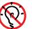

■ This symbol indicates an example of the wrong way to use a Newton interface element. It specifically calls out common mistakes.

# Developer Products and Support

APDA is Apple's worldwide source for hundreds of development tools, technical resources, training products, and information for anyone interested in developing applications for Apple computer platforms. Customers receive the *Apple Developer Catalog,* which

features all current versions of Apple development tools, as well as popular third-party development tools. APDA offers convenient payment and shipping options, including site licensing.

To order product or to request a complimentary copy of the *Apple Developer Catalog,* use the following information:

APDA

Apple Computer, Inc.

P.O. Box 319

Buffalo, NY 14207-0319

Telephone 1-800-282-2732 (United States)

1-800-637-0029 (Canada) 716-871-6555 (International)

Fax 716-871-6511

AppleLink APDA

America Online APDAorder CompuServe 76666,2405

Internet APDA@applelink.apple.com

If you provide commercial products and services, call 408-974-4897 for information on the developer support programs available from Apple.

<span id="page-24-0"></span>Before you can begin to design an application, it is crucial that you have a clear picture of what a Newton device can do and how people will use your Newton software. This chapter introduces some high-level concepts that will help you clarify that picture. In addition, this chapter presents some basic principles of user interface design that apply to all types of software. The chapter concludes by detailing how to conduct user tests of your product during its development.

## Understand Newton 1

Newton is a software and hardware technology designed for a family of products in the category of personal digital assistants (PDAs), such as the Apple MessagePad. The goal of Newton technology is to help people and businesses become more productive by simplifying basic tasks and making it easier for people to manage bits and pieces of information while on the move. Information entered on a Newton device can be moved to a desktop machine or a mainframe computer, where it can be manipulated in powerful applications.

Understand Newton **1-1**

<span id="page-25-0"></span>Newton is not a small portable computer with another graphical user interface. There may be similarities between portable computers and Newton devices, but the differences summarized below are more important than the similarities when it comes to designing a user interface for an application.

| Newton                                                                                      | Portable Computers                                                                            |
|---------------------------------------------------------------------------------------------|-----------------------------------------------------------------------------------------------|
| Focused function                                                                            | General purpose                                                                               |
| New architecture optimized for<br>mobility and communications—<br>use it anywhere, any time | Derived from desktop computer<br>architecture, which is optimized<br>for stationary operation |
| Tapping, writing, and drawing<br>with a pen                                                 | Typing, pointing, and clicking with<br>mouse and keyboard                                     |
| Intelligent assistant                                                                       | Scripting and macros                                                                          |
| New and custom applications                                                                 | Existing desktop applications                                                                 |
| It's a communications assistant                                                             | It's a personal computer                                                                      |
| Simple                                                                                      | Complex                                                                                       |

To take advantage of its distinguishing features and capabilities, Newton has distinctive user interface elements.

# Know Your Audience 1

Identifying and understanding your target audience are among the most important first steps when you start designing your product. To create a product that people can and will use, study the people who make up your target audience.

It's useful to create scenarios that describe a typical day in the life of a person you think uses the type of product you're designing. Think about the different work spaces, tools, and constraints and limitations that people deal with. You can also visit actual work places and study how people do their jobs.

Analyze the steps necessary to complete each task you anticipate people wanting to accomplish. Then design your product to facilitate those tasks,

<span id="page-26-0"></span>using a step-by-step approach by thinking of how a person might get from one place to the next in a logical fashion.

Involve users throughout the design process and observe them working in their environment. Use people who fit your audience description to test your prototypes and development products. Listen to their feedback and try to address their needs in your product. Develop your product with people and their capabilities, not computers and their capabilities, in mind. For more information, see ["Involve Users in the Design Process" on page 1-13](#page-36-0).

## What People Do With Newton 1

The features and capabilities that make Newton what it is also strongly influence what people want to do with Newton devices. These expectations indirectly affect the user interface of Newton software. An application must make it easy for people to accomplish the following tasks on demand:

- Capture information fragments—write, sketch, pick from lists, specify dates and times, and select options
- Organize information—file, sort, schedule, prioritize, copy, delete, and format
- Retrieve information—find, recall, browse, skim, read, and view
- Send and in some cases receive information by various means—print, fax, mail, and direct transfer

## Accessibility 1

Your software needs to appeal to and be useful to people with a wide range of abilities and backgrounds. There are likely to be members of your target audience who are different from the so-called average user that you envision. Users will undoubtedly vary in their ages, styles, and abilities. They may also have physical or cognitive limitations, linguistic differences, or other differences you need to consider. Identify how the individuals in your target audience differ and what special needs they may have.

Know Your Audience **1-3**

<span id="page-27-0"></span>Make your application accessible to people around the world by including support for worldwide capabilities in your designs from the beginning of your development process. Take stock of the cultural and linguistic needs and expectations of your target audiences.

# Observe Basic Human Interface Principles 1

Effective software adheres to certain basic principles no matter whether it runs on a Newton PDA, a personal computer, or a high-powered computer workstation. These principles are based on the capabilities and processes not of the machine but of the human operator—how people usually think, act, and work.

## Metaphors 1

Wherever possible, model the actions and objects in your program on something from the real world. This trick especially helps inexperienced users quickly grasp how your program works. Folders are a classic metaphor. People file things in folders in the real world, so they immediately understand the concept of filing data items in folders on a Newton. Other common metaphors include scrubbing to delete data, tapping buttons to make things happen, sending and receiving things through an in box and out box, setting dates and times on calendars and digital clocks, and homing in on information with alphabetic index tabs. [Figure 1-1](#page-28-0) illustrates some Newton metaphors.

Metaphors suggest a use for objects and actions in the Newton interface, but that use doesn't define or limit the implementation of the metaphor. For example, a paper folder has a limited storage capacity, but a folder on a

<span id="page-28-0"></span>**Figure 1-1** Metaphors help people quickly grasp how software works


Newton doesn't have to be constrained by the same limitation. Newton folders can hold a limitless number of items (up to the storage capacity of the hardware), and this is an advantage that the Newton can offer. Try to strike a balance between the metaphor's suggested use and the ability of the Newton to support and extend the metaphor.

Naturally you can't find a metaphor for everything. Be sure to use the established metaphors, but if you can't come up with a solid metaphor for another object or action, then do without. Don't distort the real world into a caricature in a slavish attempt to find a metaphor.

## <span id="page-29-0"></span>Direct Manipulation 1

Your product should let users feel that they are directly controlling something tangible, not abstract. Make sure objects on the screen remain visible while a user performs actions on them, and make the result of the user's actions immediately visible. For example, a user can reschedule a meeting in the built-in Date Book application by dragging the meeting's icon from one time to another. Figure 1-2 illustrates direct manipulation.

**Figure 1-2** Users should feel they are directly controlling something tangible

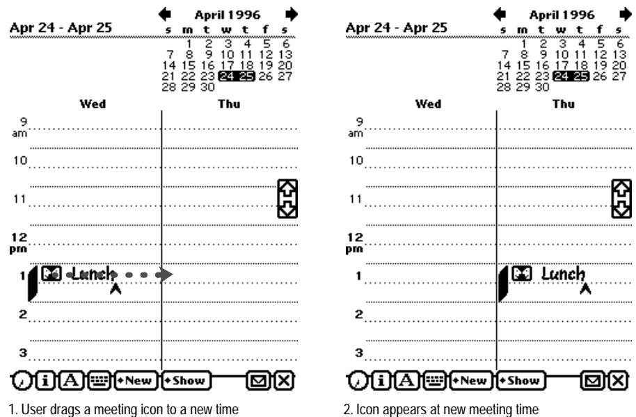

## <span id="page-30-0"></span>Feedback 1

In addition to seeing the results of their actions, users need immediate feedback when they operate controls and ongoing status reports during lengthy operations. Have your application respond to every user action with some visible change. For example, make sure every button highlights when a user taps it. Audible feedback also helps, but can't be the primary or sole feedback because people may use Newtons in places where they can't hear or where they must turn off the sound.

The system automatically provides feedback when it's temporarily busy by displaying the busy cursor. During operations that last more than a few seconds, your application should display explanatory messages and show elapsing progress.

## See and Point 1

A Newton application is better than a person at remembering lists of options, commands, data, and so on. Take advantage of this situation by presenting lists and letting users choose from them. People can concentrate on accomplishing tasks with your program instead of remembering how to operate it. As a bonus, your program controls its inputs and doesn't have to check as many error conditions.

## Consistency 1

It's likely that people will use other Newton software besides yours—at the least they will use some of the built-in applications and services. You can turn this likelihood to your advantage by designing your application's interface to be consistent with other Newton applications. Both you and your application's users benefit if they can build on prior experience when learning how to use your application.

<span id="page-31-0"></span>You can make your application consistent visually and behaviorally by incorporating standard Newton interface elements in it. Visual consistency helps people learn and then easily recognize the graphic language of the interface. For example, users learn to recognize a black diamond as the source of a pop-up list of choices. Behavioral consistency of the interface means people only have to learn once how to do things such as erasing and scrolling. Then they can explore new functions and applications using the skills they already have.

## User Control 1

Allow users, not your application, to initiate and control actions. Keep actions simple and straightforward so users can easily understand and remember them. Provide ample opportunity to cancel operations before they begin, and wherever possible allow users to gracefully stop an operation that's underway. Be careful about unleashing agents, experts, or wizards that will do things behind a user's back.

## Forgiveness 1

People make mistakes, so your program should make it easy for them to correct their mistakes. Let them use the Undo button to reverse their last action. People need to feel they can experiment without damaging the system or their data. Create safety nets for people so they feel comfortable learning and using your product.

Always advise people when they begin an operation that has potentially dire consequences. Display a warning and have the user confirm the operation before proceeding. This doesn't mean you should have users confirm every action. Frequent warning messages suggest something is wrong with the program design—obviate some of the warnings by making more actions reversible.

## <span id="page-32-0"></span>Stability 1

Personal digital assistants introduce a new level of complexity for many people. To cope with this complexity, people need some stable reference points. The Newton interface is designed to provide an environment that is understandable, familiar, and predictable. It defines a number of regular interface elements to foster a perception of stability, including view borders, view titles, folder tabs, standard buttons, and standard button locations. Each of these elements has a specific look and a regular, predictable behavior. In addition, the interface defines a clear, finite set of basic data objects—text, ink text, shapes, and sketches—and a clear, finite set of editing commands with which users can create and manipulate the objects. Your application can share and enhance the stability by using the regular interface elements and handling data objects in the customary manner.

## Aesthetic Integrity 1

People primarily see software as a functional product, not a fashion product. This means you want them to notice what your product does, not how it looks. Don't succumb to the temptation to load up with the latest interface fads; they'll quickly become dated. Since people will spend a lot of time with your product, design it to be pleasant to look at for a long time. A spare, clean interface will stand up to repeated viewing much better than a highly decorative interface. For example, the built-in Setup application has lots of non-functional decorative elements to make a user's first Newton experience a friendly one, but the built-in applications that people use daily have none of that decoration.

Make sure you follow the graphic language of the interface. Don't invent new interface elements to replace existing ones, and don't change the function of standard interface elements. If you change the look of standard interface elements, people will actually try to make up functional reasons for the differences. If you square off the corners of your buttons, use unique view borders, or use a different symbol to designate a pop-up, people will waste time trying to figure out what your custom elements do that the standard ones don't. It won't occur to people that you merely have your own notion of how the interface elements should look.

# <span id="page-33-0"></span>Design for the Newton System 1

In addition to the general user interface principles presented in the previous section, you should keep in mind the guidelines in this section as you design software specifically for the Newton system.

## Observe the Built-In Applications 1

Your software will coexist with built-in Newton applications and services. On an Apple MessagePad they include the Notepad, Names File, Date Book, In/Out Box, Filing, Routing, Find, Assist, and others. If your application has functions analogous to those in the built-in applications and services, use the same mechanisms. Users will be accustomed to them and will expect other software to work in the same way. You can most easily match the builtin applications and services by using the system proto templates in the Newton Toolkit.

You can extend the Newton interface if you need to, but make sure your extensions retain the original look and feel.

## Use the Common Pool of Data 1

All built-in Newton applications and services can access a common pool of data, and so can your Newton software. This pool is the information a user enters into the Newton device. Since all applications have access to this data, a user can work more efficiently—because each piece of information needs to be entered only once. Thereafter, the data can be accessed and used in many different ways. Your application can read and write this data. Put it to the user's advantage.

## <span id="page-34-0"></span>Keep Applications Simple 1

Newton isn't designed for complex tasks or applications that require viewing a large area or multiple windows of data at a time. Applications that require the user to keep track of several pieces of information at once probably won't work well because the user must either move around a lot within the application, or deal with many simultaneous or layered views. Studies show that users become confused in those situations.

Remember that people will use Newton while on the move, in places where there's no place to sit or to set it down. In such settings, it's easiest to use applications with simple, straightforward screens and an obvious path through the information. Make sure that your application's controls are clearly identified, that there aren't too many "places" for the user to navigate through, that you don't display too many container views at once, and that the user can easily see what to do. Minimize writing; tapping to pick from a list of alternatives is easier.

## Use Screen Space Wisely 1

Because the user's hand is usually held close to a Newton device, it's best to keep tappable controls at the bottom of the screen, have the user enter data in the middle of the screen, and display titles and other descriptors at the top of the screen. This way, the most important information (the user's information) isn't obscured each time he or she taps a button. If you need to display controls on the side, make sure your application allows users to move the controls to either side of the screen, according to whether they are right- or left-handed.

## Check the Screen Size 1

A Newton application's **main view**—the visual object that serves as the application's base of user operations—can be any size. If your application's main view does not fill the entire screen, keep in mind that whatever is visible behind your application will be operable. In this situation, users can

<span id="page-35-0"></span>get confused about what's frontmost—and therefore about what will be scrolled when the scroll arrows are tapped and which view is currently in use.

Also keep in mind when designing your application that future Newton devices may have larger or smaller screens than current Newton devices. To work with different screen sizes, a Newton application must check the screen size and make adjustments as needed to the size and location of the things it displays so that everything fits. If you want your application to work in either of the two display orientations available on an Apple MessagePad 120, your application needs to be able to adjust the position and configuration of everything it displays for regular or sideways orientation of the display. Figure 1-3 shows how the built-in Notepad application and the on-screen keyboard adjust their size, position, and layout when a user rotates the display.

**Figure 1-3** An application adjusts its size, position, and layout to fit the screen


Sideways orientation on a MessagePad 120

# <span id="page-36-0"></span>Involve Users in the Design Process 1

The best way to make sure your product meets the needs of your target audience is to show it to the kinds of people you hope will buy it. Do they understand what it's for and what to do with it? Can they use it? Can they keep track of where they are? Does it help them? You can do this during every phase of the design process to help reveal what works about your product as well as what needs improvement.

When you give people an opportunity to use your product or a mock-up of it, they will inevitably find some undiscovered flaws. You can implement significant changes to your product during its evolution and thereby save yourself lots of time and money and save your users from frustration. By identifying and focusing on users' needs and experiences, you can create products that are easier to assemble, learn, and use. These improvements can translate into competitive advantages, increased sales, and enhanced customer satisfaction.

## Define Your Audience 1

There are several steps to involving users in your design process. The first step, done at the beginning of a project, is to define the users and then do an analysis of the target audience. You want to determine what these people are like, how they might use a product like yours, if they have any similar products, and what features they would like to see in your product. By doing some research on your target audience, you can find out if what you're including in a product is desirable and useful.

## Analyze Tasks 1

The second step is to analyze the tasks people will be doing with your product. You need to do a task analysis for each task you anticipate that your users will do. Look at how they perform similar tasks without a Newton.

<span id="page-37-0"></span>Then look at how the Newton can facilitate the tasks. To help plan a task analysis, imagine a scenario in which someone uses your product. List each task a person might perform in that scenario, then break each task apart into its component steps. This allows you to identify each step that a person goes through in order to complete the task. Order the steps according to how people do them. When you feel you have all the steps listed and ordered, read the list back to someone and see if that person can use the steps you've listed to accomplish the task.

## Build Prototypes 1

For the third step, apply the information you've collected about your users, their skills, and the tasks you envision them performing to create a prototype of your design. Prototyping is the process by which you develop preliminary versions of your design to verify its workability. You can use a variety of techniques to construct prototypes of your design. Creating storyboards is one technique—you draw out the steps your users will go through to accomplish a task. Another technique is to build a simulation of the product in prototyping software that animates some features or demonstrates how the product will work.

## Observe Users 1

Once you have a prototype drawn or mocked up, you can begin to show it to people to get reactions to it. The fourth step, called user observation, lets you test the workability of your product design by watching and listening carefully to users as they work with your prototype. Although it is possible to collect far more elaborate data, observing users is a quick way to obtain an objective view of your product. Before you do any testing, take time to figure out what you're testing and what you're not. By limiting the scope of the test, you're more likely to get information that will help you solve a specific problem. You can use the information you gather about your target audience to help you pick participants for your user observation; find people who have the same demographic background and experience level as the typical user in your target audience. Your participants will work through one or

<span id="page-38-0"></span>more specific tasks. These tasks can be based on the task analyses that you performed earlier in the design process. After you determine which tasks to use, write them out as short, simple instructions. Your instructions to the participants should be clear and complete but should not explain how to do things you're trying to test. See the following section, "Ten Steps for Conducting a User Observation," for more information; it includes a series of sample steps on which you can base your own user observation.

During the user observation, record what you learn about your design; you'll be using this information to revise your prototype. Once you've revised your prototype, conduct a second user observation to test the workability of the changes you've made to your design. Continue this iterative process of creating prototypes and conducting user observations until you feel confident that you've fully addressed the needs of your target audience.

## Ten Steps for Conducting a User Observation 1

The following steps provide guidelines that you can use when conducting a simple user observation. Remember, this test is not designed as an experiment, so you will not get quantitative data that can be statistically analyzed. You can, however, see where people have difficulty using your product, and you can then use that information to improve your product.

Most of these steps include some explanatory text with sample statements that you can read to the participant. Feel free to modify the statements to suit your product and the situation.

**1. Introduce yourself and describe the purpose of the observation (in very general terms). Most of the time, you shouldn't mention what you'll be observing.**

Set the participant at ease by stressing that you're trying to find problems in the product. For example, you could say something like this:

- <sup>n</sup> "You're helping us by trying out this product in its early stages."
- <sup>n</sup> "We're looking for places where the product may be difficult to use."
- <sup>n</sup> "If you have trouble with some of the tasks, it's the product's fault, not yours. Don't feel bad; that's exactly what we're looking for."

- <sup>n</sup> "If we can locate the trouble spots, then we can go back and improve the product."
- <sup>n</sup> "Remember, we're testing the product, not you."

#### **2. Tell the participant that it's OK to quit at any time.**

Never leave this step out. Make sure you inform participants that they can quit at any time if they find themselves becoming uncomfortable. Participants shouldn't feel like they're locked into completing tasks. Say something like this:

n "Although I don't know of any reason for this to happen, if you should become uncomfortable or find this test objectionable in any way, you are free to quit at any time."

#### **3. Talk about the equipment in the room.**

Explain the purpose of each piece of equipment (hardware, software, video camera, tape recorder, microphones, and so forth) and how it will be used in the test.

#### **4. Explain how to think aloud.**

Ask participants to think aloud during the observation, saying what comes to mind as they work. By listening to participants think and plan, you'll be able to examine their expectations for your product as well as their intentions and their problem-solving strategies. You'll find that listening to users as they work provides you with an enormous amount of useful information that you can get in no other way.

Some people feel awkward or self-conscious about thinking aloud. Explain why you want participants to think aloud and demonstrate how to do it. For example, you could say something like this:

- <sup>n</sup> "We have found that we get a great deal of information from these informal tests if we ask people to think aloud as they work through the exercises."
- <sup>n</sup> "It may be a bit awkward at first, but it's really very easy once you get used to it. All you have to do is speak your thoughts as you work. If you forget to think aloud, I'll remind you to keep talking. Would you like me to demonstrate?"

#### **5. Explain that you will not provide help.**

It is very important that you allow participants to work with your product without any interference or extra help. This is the best way to see how people really interact with the product. For example, if you see a participant begin to have difficulty and you immediately provide an answer, you will lose the most valuable information you can gain from user observation where users have trouble and how they figure out what to do.

Of course, there may be situations in which you will have to step in and provide assistance, but you should decide what those situations will be before you begin testing. For example, you may decide that you will allow someone to struggle for at least three minutes before you provide assistance. Or you may decide that there is a distinct set of problems on which you will provide help. However, if a participant becomes very frustrated, it's better to intervene than have the participant give up completely.

As a rule of thumb, try not to give your test participants any more information than the true users of your product will have. Here are some things you can say to the participant:

- <sup>n</sup> "As you're working through the exercises, I won't be able to provide help or answer questions. This is because we want to create the most realistic situation possible."
- <sup>n</sup> "Even though I won't be able to answer your questions, please ask them anyway. It's very important that I capture all your questions and comments. When you've finished all the exercises, I'll answer any questions you still have."

#### **6. Describe in general terms what the participant will be doing.**

Explain what all the materials are (such as the set of tasks, disks, and a questionnaire) and the sequence in which the participant will use them. Give the participant written instructions for the tasks.

If you need to demonstrate your product before the user observation begins, be sure you don't demonstrate something you're trying to test. For example, if you want to know whether users can figure out how to use certain controls, don't show them how to use the controls before the session. Don't demonstrate what you want to find out.

#### **7. Ask if there are any questions before you start; then begin the observation.**

#### **8. During the observation, remember several pointers:**

- <sup>n</sup> Stay alert. It's very easy to let your mind wander when you're in the seventh hour of observing users. A great deal of the information you can obtain is subtle.
- <sup>n</sup> Ask questions or prompt the participant. Make sure you have a tester protocol that spells out how frequently you prompt and what you say. Your interruptions shouldn't be frequent, but when a participant is hesitating or saying, "Hmmm," ask what the participant is thinking about.
- <sup>n</sup> Be patient; it is very easy to become impatient when someone is taking a long time. The participant is doing you a favor and is probably somewhat nervous. Anything you can do to alleviate the participant's insecurities and put the participant at ease will provide you with much richer data.

#### **9. Conclude the observation.**

Do the following when the test is over:

- <sup>n</sup> Explain what you were trying to find out during the test.
- <sup>n</sup> Answer any remaining questions the participant may have.
- <sup>n</sup> Discuss any interesting behaviors you would like the participant to explain.
- <sup>n</sup> Ask the participant for suggestions on how to improve the product.

#### **10. Use the results.**

As you observe, you may see users doing things you never expected them to do. When you see participants making mistakes, your first instinct may be to blame the mistakes on the participant's inexperience or lack of intelligence. This is the wrong focus to take. The purpose of observing users is to see what parts of your product might be difficult to use or ineffective. Therefore, if you see a participant struggling or making mistakes, you should attribute the difficulties to faulty product design, not to the participant.

Be sure to schedule time between your sessions to make notes and review the session. Jot down any significant points. If you used videotape or audio cassette tape, mark in your notes the specific parts of the tape that you may want to review.

To get the most out of your test results, review all your data carefully and thoroughly (your notes, the videotape or cassette tape, the tasks, and so on). Look for places where participants had trouble and see if you can determine how your product could be changed to alleviate the problems. Look for patterns in the participants' behavior that might tell you whether the product was understood correctly.

It's a good idea to keep a record of what you found out during the test. You don't need elaborate video equipment; a hand-held video camera will work. In fact, you don't even have to use video equipment. You can use a tape recorder to record what is spoken during the session. The important point is that you create some kind of objective, factual record of the session that you refer to later. That way, you'll have documentation to support your design decisions and you'll be able to see trends in users' behavior. You might want to write a report that documents the process you used and the results you found. After you've examined the results and summarized the important findings, fix the problems you found and test the product again. By testing your product more than once, you'll see how your changes affect users' performance.

<span id="page-44-0"></span>pictThis chapter describes **container views,** in which an application shows the user text and graphic information, and in which the user interacts with the information and the application. The chapter presents specifications and recommendations about the appearance and behavior of these container views, including how to display them on the screen, how users interact with them, and how they interact with each other. There are several kinds of standard container views whose regular looks enhance the visual stability of Newton applications. The standard views provide predictable ways to see and interact with all the different kinds of information people can create and store on Newton devices. [Figure 2-1](#page-45-0) shows examples of container views.

There are conventions for opening, closing, moving, scrolling, and getting an overview of container views. This means that no matter which application people use, they know how to control container views on the screen and how to adjust container views in the available screen space.

**Figure 2-1** Examples of container views

<span id="page-45-0"></span>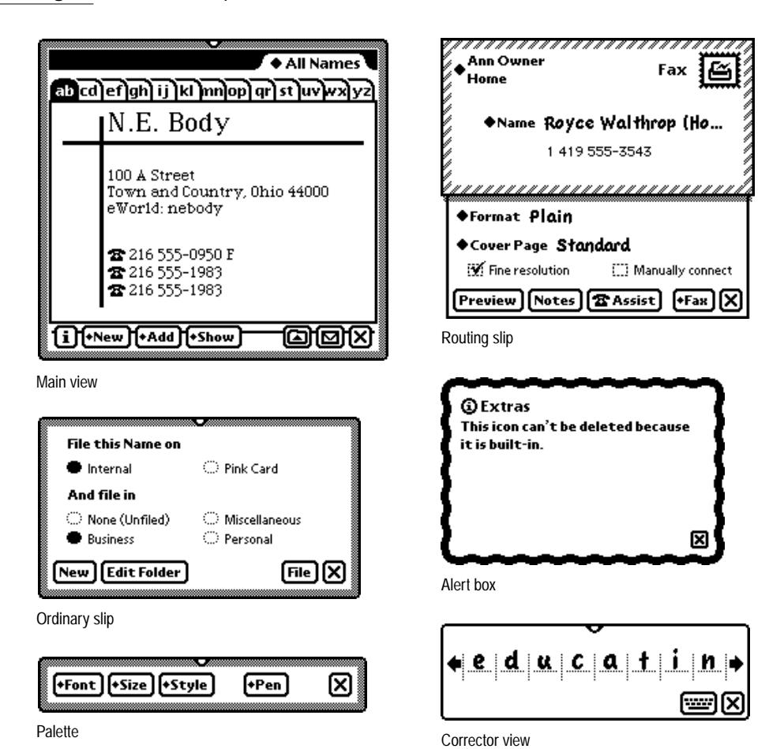

<span id="page-46-0"></span>When people manipulate container views on the screen, they see immediate visual feedback. As a user drags a movable container view, the view keeps up with the user's pen, reinforcing the user's sense of direct manipulation. When people open and close container views, they see a representation of such actions. These mechanisms emphasize that the user is in control and can directly manipulate "real" interface objects such as container views.

# How Views Look 2

Nothing makes an application look more like it belongs—or less like it belongs—on a Newton device than the appearance of its container views. This section describes the key visual attributes of container views:

- controls
- title style
- border style
- fill pattern

## View Controls 2

There are several standard controls for manipulating container views. These controls include the drag handle, folder tab, Close box, local scroll arrows, universal scroll arrows, and Overview button. The first four controls are part of the container view they affect. The latter two controls are not part of the container view they affect. [Figure 2-2](#page-47-0) points out the standard view controls.

For details on container view controls, see ["Moving a View" on page 2-33,](#page-76-0) ["Folder Tab" on page 8-19](#page-260-0), ["Close Boxes" on page 3-14,](#page-107-0)["Scrolling" on](#page-79-0)  [page 2-36](#page-79-0), and ["Overview" on page 2-44](#page-87-0).

How Views Look **2-3**

<span id="page-47-0"></span>**Figure 2-2** Standard controls for manipulating views

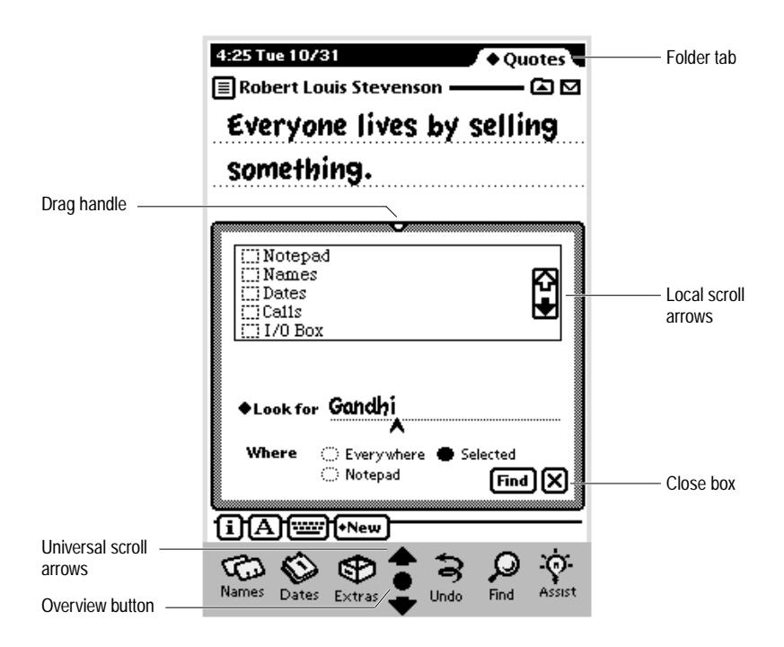

## View Title 2

A container view should have a title at the top unless the view's identity is obvious from its contents. Ordinarily a title consists of text in the bold style of the system font, an optional small icon, and a triple underline, all centered at the top of the view. If the title of a subordinate view is long or instructional, you can left-justify it and omit the icon and the triple underline. [Figure 2-3](#page-48-0) compares different types of titles.

<span id="page-48-0"></span>

The title only identifies the container view's contents. The title is not a control that the user can tap to change a setting, alter a state, or initiate an action. Controls that do these things are described in [Chapter 3, "Controls."](#page-94-0) For example, if you want users to be able to change a view's title, have them tap a button or choose from a picker in the status bar.

A view title should not end with a colon. The title's position, size, and font make a colon unnecessary and distracting.

You capitalize view titles according to conventional rules for book titles. That is, you capitalize the first word of a title, and you capitalize all other words except articles (*a, an, the*), coordinating conjunctions (for example, *and, or*), and prepositions of three or fewer letters.

On an Apple MessagePad use 10-point text for the title. The optional icon must be no more than 11 pixels tall.

How Views Look **2-5**

## <span id="page-49-0"></span>View Border 2

Every container view is framed by a border. (A border is not visible if its view fills the screen.) Primarily, a view's border serves to demarcate what's in the view and what's not. Secondarily, certain borders identify special types of container views.

In general, Newton views are rectangular and have rounded corners. Use square-cornered borders only when you have a specific need for a particular look.

A view's border is not visible if the view completely covers the screen. For example, a MessagePad 120 user does not see the border of a view that measures 240 × 320 pixels. The view has a border, but it is off-screen.

#### Matte Border 2

The most common type of view border, called a **matte border,** consists of a thick gray band edged on the outside by a thin black line**.** Users expect views with matte borders to be movable (see ["Moving a View" on page 2-33](#page-76-0)). Figure 2-4 shows the matte border.

**Figure 2-4** A matte border indicates a movable view

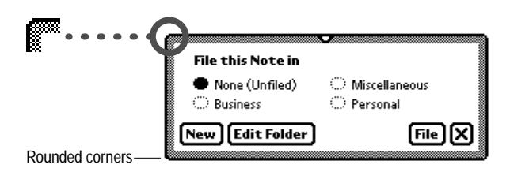

On an Apple MessagePad a standard matte border is five pixels thick with a corner roundness of five pixels and an inset of one pixel.

#### <span id="page-50-0"></span>Striped Border 2

A border made of pairs of short, slanted lines edged by a thin black rectangle is used around views known as **routing slips** (see ["Routing Slips" on](#page-217-0)  [page 7-12](#page-217-0))**.** It's no accident that this border looks something like the border traditionally printed on airmail envelopes, because routing slips are analogous to postal envelopes. Figure 2-5 shows a routing slip border.

**Figure 2-5** A striped border suggests routing


The paired short lines in a striped border slant 45 degrees to the right.

#### Wavy Border 2

A view with a heavy black wavy border is called an **alert box.** It contains an important message that a user must acknowledge. There are two types of alert boxes; they are described in ["Notification Alerts" on page 2-17](#page-60-0) and ["Confirmation Alerts" on page 2-18](#page-61-0). [Figure 2-6](#page-51-0) shows the wavy border of an alert box.

How Views Look **2-7**

<span id="page-51-0"></span>**Figure 2-6** An alert box has a thick wavy border


#### Plain Border 2

For simplicity, some container views require a plain black border made of medium-weight lines. Figure 2-7 shows examples of views with plain borders.

**Figure 2-7** Some views need the simplicity of a plain border


#### Drop Shadows 2

It's possible to add a drop shadow to a view's bottom and right borders, but this ersatz 3D look is not appropriate for Newton applications. Don't use drop shadows just because you like the way they look or because you want to make a Newton application look like a personal computer application. Although you shouldn't use drop shadows, you can use another type of shadow that tells users something about a view. For example, a shadow

<span id="page-52-0"></span>reinforces the notion that there are two parts to a routing slip—an outer part above the shadow and an inner part below it. Figure 2-8 shows acceptable and unacceptable uses of shadows in the Newton interface.

**Figure 2-8** Sparing use of some types of shadows is OK


## View Fill 2

Standard container views by default are filled with white, not with black or a pattern. If you want users to see through a container view to the views beneath it, you can make it transparent.

# Main Views 2

Nearly every application has a main view that serves as a base of operations. An application's main view may also be called the **application base view.** But strictly speaking, the main view is a user's concept and the application base view is a programmer's concept. An application base view is the view that contains all the other views that make up the application. A main view is a center of user operations.

Main Views **2-9**

<span id="page-53-0"></span>Applications are not limited to one main view. The built-in Names File and Date Book applications, for example, have several main views each.

## Title or Folder Tab 2

An application's main view should have an ordinary, underlined title at the top unless the view's identity is obvious from its contents. An application's main view cannot have an ordinary title at the top if the application allows users to file information in folders. In this case a **folder tab** must go at the top of the main view. A folder tab shows the name of the folder whose data is currently displayed in the view, and a user can choose a different folder by tapping the folder tab. A folder tab can include a view title or a digital clock and calendar, but does not have to include either of them. (For more information on folders and folder tabs, see [Chapter 8, "Newton Services."](#page-242-0)) Figure 2-9 compares a main view with a title to another main view with a folder tab.

**Figure 2-9** A title or a folder tab tops a main view


## <span id="page-54-0"></span>Primary Controls and Status Bar 2

An application's primary controls go at the bottom of its main view, usually on a **status bar.** A status bar is not strictly required, but it helps to visually anchor the controls. Figure 2-10 shows sample status bars with assorted controls.

**Figure 2-10** A status bar anchors primary controls at the bottom of a main view


Each application can have a different set of controls, but an application's main view must have a Close box unless the application is the backdrop (see ["The](#page-72-0)  [Backdrop" on page 2-29](#page-72-0) and ["Closing a Main View" on page 2-32](#page-75-0)). Close boxes and other standard status-bar controls are described in ["Close Boxes" on](#page-107-0)  [page 3-14](#page-107-0) and ["Standard Newton Buttons" on page 3-22](#page-115-0).

On an Apple MessagePad, the status bar is a black line two pixels thick, with end points two pixels from the right and left edges of the application's main view.

## Separator Bars 2

In a view that may display more than one variable-sized item at once, like the notes in the Notepad, a **separator bar** heads each item. A separator bar identifies the item below it and carries controls that apply only to that item. [Figure 2-11](#page-55-0) shows some separator bars in the Notepad.

Main Views **2-11**

**Figure 2-11** Separator bars separate multiple items in a scrolling view

<span id="page-55-0"></span>

A user creates a separator bar, also called a divider bar, by drawing a line across the view or by tapping a New button on the view's status bar. Tapping the New button always scrolls to the last item and adds a new blank item below it. Making the line gesture adds a new blank item below the line, before the following item.

A separator bar is a heavy black line with various buttons and text. At the left end of each separator bar is a picture button, called the **Item Info button,**  which indicates the type of item below it. Next to that button is the item's title, displayed in the bold style of the system font. For more information on the Item Info button, [see "Item Info Button" on page 3-29.](#page-122-0)

At the right end of each separator bar is an Action button for routing the item. If the application allows users to file items in folders, a Filing button appears on each separator bar next to the Action button, and the name of the item's folder appears next to the Filing button whenever the view is showing the items of all folders. For more information on those buttons, see ["Action](#page-213-0)  [Button and Picker" on page 7-8](#page-213-0) and ["Filing Button and Slip" on page 8-14](#page-255-0).

On an Apple MessagePad, the separator line is two pixels thick and the title is in 9- or 10-point text.

## <span id="page-56-0"></span>The Main View's Border 2

Every application's main view must have a border, even if the border is not visible because the view fills the screen. Generally, an application's main view should have a rounded-corner matte border (as described under ["View](#page-49-0)  [Border" on page 2-6\)](#page-49-0). Alternatively, a main view can have a plain roundedcorner black border. A matte border is a better choice if the view is movable (or might be movable on a large screen), because users historically have associated matte borders with movable views and plain borders with stationary views. Figure 2-12 shows the two border styles.

**Figure 2-12** Main views have matte or plain borders with rounded corners

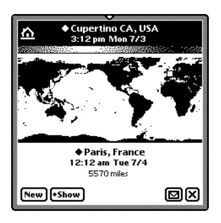


A movable main view is preferable to a fixed view. If users can't move your application's main view, they may have to close your application to work on another application beneath it. If you want a user to be able to leave your application open, make its main view small, matte-bordered, and movable.

It's possible for a stationary main view to have a different border style and still look like it belongs on a Newton device. You need a strong reason—something more than personal preference—to give your application's main view anything other than a rounded-corner black border or a rounded-corner matte border.

Main Views **2-13**

# <span id="page-57-0"></span>Auxiliary Views 2

When an application needs to display and input more information than will fit in its main view, it displays an auxiliary view. There are several types of auxiliary views, as shown in Figure 2-13 and detailed in the following sections.

**Figure 2-13** Examples of auxiliary views


Ordinary slips give users the space they need to make detailed settings and to input or change data


Status slips tell users what is happening


during lengthy operations Palettes give users handy access to useful settings and information

<span id="page-58-0"></span>An auxiliary view appears in front of the view to which it is subordinate. For details on the customary position of a slip and the front-to-back ordering of views, ["How Views Work" on page 2-28.](#page-71-0)

## Slips 2

The most common type of auxiliary view is called a **slip.** An application can use slips to get detailed user input. For example, the Date Book application displays essential information about meetings and events in its main view but has users input or change details in meeting and event slips. In addition, an application can use slips to display and allow users to change incidental and infrequently accessed information such as the title of an item or preference settings. Slips can also request responses and present alternatives that specify how an action should be completed. For example, a slip for routing e-mail should insist the user enter an e-mail address, without which the e-mail cannot be sent, and the slip offers numerous options that affect what the e-mail message includes.

Most slips are movable, but some are stationary. Movable slips provide more flexibility for someone using your application. If a user wants to see something under a movable slip while the slip is open, the user can drag the slip out of the way. To see something under a stationary slip, a user has no choice but to close the slip. Figure 2-14 compares slips that move with slips that can't.

**Figure 2-14** Users can move most slips


Movable slips should have a drag handle and a matte border


Stationary slips do not have a drag handle or a matte border

Auxiliary Views **2-15**

<span id="page-59-0"></span>Movable slips should have matte borders, and stationary slips should not. For instance, routing slips are stationary and have special striped borders. Border styles are described in ["View Border" on page 2-6.](#page-49-0)

A slip contains text and controls and may contain icons, pictures, and input fields. Each slip contains some text to indicate the purpose of the slip and what caused the slip to appear. In some cases this text is a title for the slip.

Most slips have a Close box or large Close box in the bottom right corner, and some slips have additional primary controls at the bottom. For instance, a Close box alone is not enough in a slip whose purpose is to prepare for and initiate an action. In this case users must be presented with a choice for dismissing the slip: take action or cancel. A text button named with a verb such as Do or Find clearly means "Take this action with the settings I've made in this slip." A large Close box located next to one of those take-action buttons thus means "Ignore these settings and cancel the action." The alternative combination of buttons—a text button named Cancel to mean "cancel" next to a large Close box to mean "take action"—is ambiguous. Figure 2-15 compares these two alternatives.

Close (take action?)

Better— Clear choice Worse— Vague choice Take specific action Close (don't take action) Cancel

**Figure 2-15** Dismissing slips that complete actions

<span id="page-60-0"></span>In the absence of a take-action button, a Close box means simply, "I'm done with this task."

Close boxes and text buttons are covered in [Chapter 3, "Controls."](#page-94-0) Input fields follow the guidelines given in [Chapter 6, "Data Input."](#page-168-0)

## Notification Alerts 2

An application uses a particular type of auxiliary view, a **notification alert,** to provide messages about error conditions, warn users about potentially undesirable situations or actions, and announce alarms. Use a notification alert to convey information that is useful to the user but doesn't present any threat such as a loss of data.

The notification alert's wavy black border visually distinguishes it from operational slips. A user responds to a notification alert by tapping its Close box, thereby acknowledging the message and putting away the slip. Figure 2-16 shows a notification alert.

**Figure 2-16** A notification alert tells the user something important

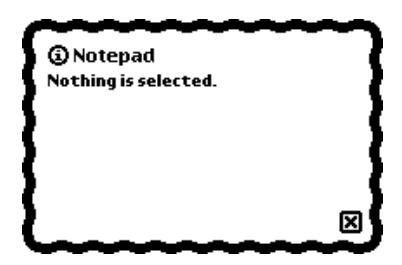

Some notification alerts have a Snooze button, which enables a user to temporarily dismiss the alert. The alert reappears after an interval of time chosen by the user. For example, this is the type of notification alert the built-in Date Book application uses for its reminder alarms. [Figure 2-17](#page-61-0)  shows a notification alert with a Snooze button (for more information, see ["Alarms" on page 8-4](#page-245-0).).

Auxiliary Views **2-17**

<span id="page-61-0"></span>**Figure 2-17** A Snooze button enables a user to dismiss an alert temporarily


Before closing a notification alert, a user can tap the small circled *i* in the upper left corner to display the date and time at which the notification appeared. While any notification alert is open, the user can scroll through recent messages by using the universal scroll arrows (as described under ["Universal](#page-81-0)  [Scroll Arrows" on page 2-38\)](#page-81-0). The Newton operating system logs notification messages, handles notification message scrolling, and provides the small circled *i* and its functionality.

When you write notification messages, use phrasing that make sense to users. Use simple, nontechnical language; don't provide system-oriented information that a user can't relate to. When possible, give users information that helps explain how to correct the problem. Be as specific as possible; if appropriate, use the name of the application or the name of the view to which the message applies. For example, "The Expense Report slip doesn't scroll" is more helpful than "This view doesn't support scrolling."

## Confirmation Alerts 2

An application uses a **confirmation alert,** which has the same wavy border as a notification alert, to have the user confirm or cancel an action that may have far-reaching consequences. For example, confirmation alerts appear before the Newton puts into effect changes the user has made to folder names. Use a confirmation alert to warn the user in advance of a potentially

<span id="page-62-0"></span>dangerous situation. For example, a confirmation alert appears before Newton restores anything from the backup on a storage card.

A confirmation alert has no Close box. Instead, it has labeled buttons, usually one named OK and another named Cancel. The user taps OK to continue the far-reaching or potentially hazardous action or taps Cancel to cancel the action and do something else. Figure 2-18 shows a confirmation alert with OK and Cancel buttons.

**Figure 2-18** A confirmation alert tells the user about a grave situation


Take care to phrase the confirmation message so that it makes sense with either the Cancel button or the OK button. For instance, the message "You've modified one or more items. Do you really want to cancel?" is not as clear as "Disregard all changes? (can't undo)"

Instead of an OK button, you can use a button whose label describes the result of accepting the message in the confirmation alert. For example, in a confirmation alert that warns about the consequences of restoring from a card, you could have a button named Restore instead of OK. Likewise, you could replace the Cancel button with one that more precisely describes the action, such as Don't Restore.

Confirmation alerts are modal. While a confirmation alert is displayed, the system restricts users to interacting primarily with that confirmation alert. The system ignores all taps outside a confirmation alert. (A user can write outside a confirmation alert, however.)

Auxiliary Views **2-19**

## <span id="page-63-0"></span>Status Slips 2

When an application begins an operation that takes more than a few seconds to complete, the application should display a message describing its busy status. The application can display the status message in a view that's already displayed, or it can display the message in a **status slip.** Figure 2-19 shows a typical status slip.

**Figure 2-19** A status slip reports on a lengthy operation


A status slip contains some or all of the following items:

- An icon visually identifies the application or the operation in progress.
- A title names the application or the operation in progress.
- A message provides additional information about the operation in progress (for example, "Searching Names...", "Connecting to desktop", and so on).
- A progress indicator shows that the system is busy, and may show elapsing progress.
- A Stop or Cancel button allows a user to halt the ongoing operation.
- A Close box allows a user to put away the status slip without halting the ongoing operation.

<span id="page-64-0"></span>A status slip does not take the place of the Newton busy cursor, which appears automatically at the top center of the screen when the system temporarily cannot respond to user input (see ["Automatic Busy Cursor" on](#page-243-0)  [page 8-2](#page-243-0)). Your application should display a status slip when it begins an operation that takes more than a few seconds to complete.

#### Title and Message 2

Either the title or the message text in a status slip should begin with a gerund, such as *preparing* or *sorting*, and end with three periods (. . .), not a single period, a hyphen, a dash, or an ellipsis character (…). For example, when searching more than one application, the built-in Find service displays "Find" on the first line and a message similar to "Searching in Names..." (the message is continuously updated with the name of the application currently being searched). Other applications use the title and message text differently. When receiving e-mail, for example, the first line could display the current phase of the operation and the second line could display specific information being used in that phase. [Figure 2-20](#page-65-0) illustrates.

The title should be in the bold style of the system font, and the message should be in the plain style of the system font. The icon size should correspond to the title height. On an Apple MessagePad, use 9-point text for the title and 9-point text for the message.

Auxiliary Views **2-21**

**Figure 2-20** A sequence of status messages traces the steps of an operation

<span id="page-65-0"></span>

#### Progress Indicator 2

The progress indicator, if present in a status slip, can take different forms. It can be a simple "barber pole" gauge, which animates a set of diagonal stripes while the operation progresses but does not indicate how much of the operation has been completed. Alternatively, if it's possible to quantify the progress of the operation that's underway, then a status slip should include a progress gauge that indicates relative completeness of the current operation as a shaded portion of the entire gauge. [Figure 2-21](#page-66-0) shows two examples of progress gauges.

<span id="page-66-0"></span>**Figure 2-21** A gauge in a status slip measures elapsing progress


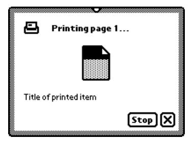

#### Close, Stop, or Cancel 2

A status slip usually has a large Close box and a Stop button or Cancel button. Tapping the Stop button or Cancel button halts the operation that's in progress. If halting the operation takes more than a few seconds, the application should change the status message to "Stopping..." or "Canceling..." while halting is in progress.

Make an effort to choose the button—Stop or Cancel—that most accurately describes the action that will occur. *Stop* suggests halting an operation that has already begun. In contrast, *Cancel* suggests a user has decided to take a different tack—without any action having taken place.

Tapping a status slip's Close box closes the status slip but does not stop the operation it was monitoring. To alert the user that an operation is in progress, the application registers the operation with the system's Notify service, causing the Notify button to blink at the top of the screen (see ["Notify Button](#page-243-0)  [and Picker" on page 8-2\)](#page-243-0). The user can open the status slip by tapping the Notify button and choosing the operation from the Notify picker that pops up. If an application completes an ongoing operation while the status slip is closed, the application must unregister the operation so the Notify service will remove it from the Notify picker.

Close boxes and text buttons are covered in [Chapter 3, "Controls."](#page-94-0)

Auxiliary Views **2-23**

#### <span id="page-67-0"></span>User Decision 2

Besides reporting on the progress of an ongoing operation, a status slip can report a condition that requires a user to choose one of two alternatives. This type of status slip contains an icon, a message of up to three lines, and two text buttons. This type of status slip does not have a progress indicator, Stop button, Cancel button, or Close box. Figure 2-22 shows an example of a status slip that demands a user decision.

**Figure 2-22** A status slip can report a condition that demands a user decision

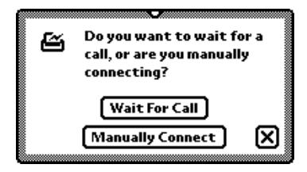

## Palettes 2

A **palette** is a small container view that gives a user instant access to useful settings or information. For example, a user can use the Styles palette (from the Extras Drawer) to set the font, size, and style of any selected text or to change the line weight of a drawing. [Figure 2-23](#page-68-0) shows the Styles palette.

A palette must be movable, so it has a rounded-corner matte border and a drag handle, like a slip. A palette can have a title, but typically a palette's contents make its function clear without a title.

A palette floats on top of main views and on top of slips that are already open. For details on the customary position of a palette, the front-to-back order of container views, and how container views move, see ["How Views Work" on](#page-71-0)  [page 2-28](#page-71-0).

<span id="page-68-0"></span>**Figure 2-23** A palette provides handy access to useful settings

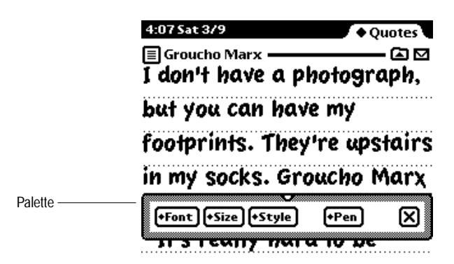

A palette has a Close box, or a large Close box if a text or picture button is adjacent, but the user may leave the palette open indefinitely. This has several ramifications, one being that a user must be able to move the palette to get at whatever it is covering. In addition, changes a user makes in a palette should take effect right away. Immediate feedback lets the user see that the input had the desired effect. If your application doesn't respond immediately to new settings of checkboxes, radio buttons, and other controls, it's less clear to the user when the input goes into effect. (For descriptions of close boxes, radio buttons, checkboxes, and other controls, see [Chapter 3, "Controls."](#page-94-0))

Palettes that remain open take up screen space, a valuable commodity on smaller screens. Therefore, use palettes sparingly. Don't use a palette where you can use a slip instead (such as in situations where the user can make the appropriate settings and then close the slip). Don't use a palette in place of controls in the status bar.

Auxiliary Views **2-25**

## <span id="page-69-0"></span>Drawers 2

A **drawer** is a container view that slides open and closed at the bottom of the screen or at the bottom of another container view. Figure 2-24 shows the Extras Drawer.

**Figure 2-24** A drawer slides open and closed

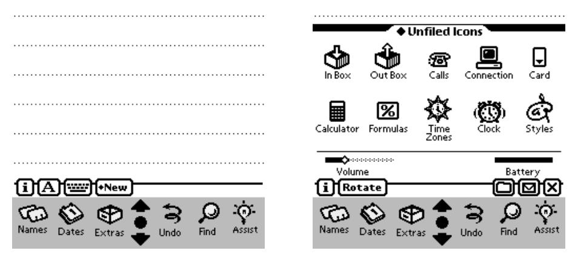

The Extras Drawer closed The Extras Drawer open

A drawer can be used for the main view of an application or for an auxiliary view. It can have a a title, a folder tab, or neither, depending on its function and contents. A drawer must have a Close box.

# <span id="page-70-0"></span>Roll Views 2

In a **roll view** several discrete, fixed-size subviews are arranged one above another like pictures on a filmstrip. A roll view invariably contains more subviews than can be displayed in full detail at once. To see a subview that's not currently displayed, a user can scroll through the subviews. Alternatively, a user can see an overview consisting of one-line subview titles.

In most applications, users don't find roll views useful. Studies show that users tend not to use scrolling to access different subviews, finding it easier to pick from a list than to remember the relative position of subviews. Usually it makes more sense to implement the subviews of a roll view as individual slips, and list their titles in an overview. For example, the overviews of the built-in Preferences and Formulas applications list the titles of individual slips, and users cannot scroll from slip to slip.

For more information on scrolling and overview, see ["Scrolling" on page 2-36](#page-79-0) and ["Overview" beginning on page 2-44](#page-87-0).

Roll views bear some resemblance to the paper roll structure of the Notepad, but there are several major distinctions. For one, users can create new notes in the Notepad but cannot create new subviews in a roll view. Users can also vary the length of notes in the Notepad, but a roll view's subview sizes are fixed. Moreover, a roll view's summary cannot scroll and can display at most 16 one-line subview descriptions. There can be more than 16 subviews; to see beyond the 16th subview, a user must scroll subview by subview, starting with the 16th one.

Roll Views **2-27**

# <span id="page-71-0"></span>How Views Work 2

Container views provide immediate feedback about actions a user may take, such as opening, closing, moving, and scrolling. The remainder of this chapter describes these behaviors.

## Opening Container Views 2

Opening a container view makes it visible and gives the user access to it (unless it is partly or completely obscured by another container view that's already open). Some of an application's container views open in response to user actions. Tapping an icon in the Extras Drawer may open an application's main view; tapping a button, tapping a text label marked with a black diamond, or choosing from a picker may open a plain slip, a confirmation alert, or a palette. In addition, an application may open status slips, notification alerts, and other views on its own.

## View Display Order 2

A Newton user can keep more than one application open at a time (memory permitting). Each open application has its own pile of container views. At the bottom of an application's pile of views is its main view. An application's auxiliary views appear on top of the main view in the order in which they were opened. (Technically, it is the application base view that contains all of an application's other views. Usually the main view is the base view, but you can organize your application differently if necessary.)

A user can bring a view with a matte border and drag handle to the front by tapping the drag handle.

## <span id="page-72-0"></span>The Backdrop 2

A Newton device always has at least one application open, and it is called the **backdrop.** The backdrop's main view is at the bottom of the display order. The backdrop cannot be closed, so its main view has no Close box. For example, the backdrop on an Apple MessagePad 120 is initially the Notepad. A user can change the backdrop with the Extras Drawer application.

## What Is Active 2

On a Newton device there is no single active view or active application, because all visible views and applications are active. Most views, both movable and stationary, allow users full access to the visible parts of other views. If a user can see a place to tap, write, or draw outside a view, the user can usually do it. A user can even interact with some applications that aren't visible by using the system's Find service or its Intelligent Assistant service (described in [Chapter 8, "Newton Services"\)](#page-242-0).

Naturally, a small movable view affords the most access to other views behind it. A stationary view only allows access to what a user can see around it. A large movable view—larger than half the height or width of a Newton device's screen—will always block some part of what's behind it. (A user can't move a view partially off the screen.)

It is possible for an application to take over the screen, putting users in the state, or mode, of being able to work only inside one view. The application temporarily suspends access to other views that may be visible. It forces the user to make decisions before doing any other actions, such as adding or changing information in a visible application. Users can cancel a modal view, they can respond to a message in it, or they can use a modal view to set parameters or assign values that become content in a view to which the modal view is subordinate. If users tap in other views, nothing happens. Users must attend to the one modal view and must close it before they can use other views. Users can put away a modal view only by tapping one of its controls.

How Views Work **2-29**

<span id="page-73-0"></span>Although modeless views give users more flexibility, modal views have the advantage of being less ambiguous. Nothing a user does in a modal view should take effect until the user taps a button to confirm the state of the modal view. A modal view avoids intermediate states that can occur with a modeless view, where a user's changes take effect without the user being aware that this is happening.

You can use modal views when your application needs information before it can continue. A modal view is fairly simple to implement, but that doesn't mean that you should use modal views too freely. You should rarely restrict the user's actions by forcing the user into a mode.

## View Position 2

When designing an application, you must decide where to position the application's main view, ordinary slips, and palettes. The system takes care of positioning routing slips, status slips, notification alerts, and confirmation alerts. In making these decisions consider the type of view, its size in relation to the main view (or the screen), what other views you know will also be open, and how the view's content relates to the other open views.

The positions at which views open affects the usability of your application and of the whole Newton device. Each view that opens may obscure part of the other views already open.

Equally important are users' preferences. If a user moves a view, your application should maintain that position.

#### Position of a Main View 2

The initial position of a main view that fills the screen is obvious. Most smaller main views are centered horizontally but are off-center vertically. Usually there is about three times as much uncovered screen space below the view as above it. Some main views, such as the built-in Find and Assist views, are centered at the bottom edge of the visible screen area.

<span id="page-74-0"></span>If the main view is movable, your application should save its position before closing it, and should reopen it in the position at which the user left it. Keep users in control.

#### Position of Auxiliary Views 2

When a user opens a slip, palette, or other auxiliary view, your application should initially position it directly over the view to which it relates. This arrangement reinforces the relationship between the auxiliary view and its related view, and also puts the auxiliary view near the user's focus. In general you should horizontally center a small auxiliary view over its related view, and place it near the top of the related view, leaving about one-fourth of the uncovered portion of the related view visible above the auxiliary view. Figure 2-25 shows the best position for a small auxiliary view.

**Figure 2-25** Where to position a small auxiliary view

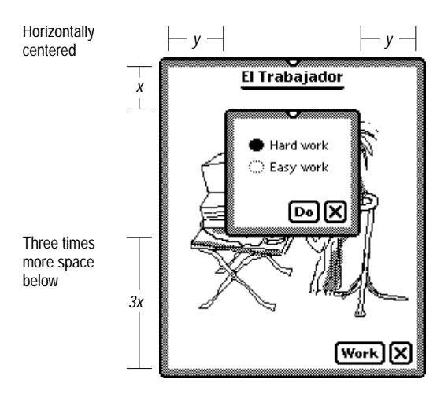

Keep an auxiliary view within the bounds of its related main view (its parent view). If an auxiliary view hangs outside its parent view, the Newton system draws and refreshes the auxiliary view unpredictably. Moreover, the auxiliary

How Views Work **2-31**

<span id="page-75-0"></span>view does not get any pen input from outside the parent's bounds. These restrictions have no practical effect on an auxiliary view that is attached to the root view instead of an application's base view.

## Closing a View 2

Closing a container view makes it go away. Most views close in response to user actions. If a view has a Close box (and most views do), a user can close the view by tapping the Close box. A view may also have other controls that close it. In addition, an application should close a status slip on its own when it finishes the operation that occasioned the status slip.

An application determines what happens visually, audibly, and logically when a user closes the application's views. The user may see a visual effect and hear a sound effect, or the view may seem simply to disappear. The Newton system determines the visual and sound effects when a user closes a notification alert, confirmation alert, or routing slip.

#### Closing a Main View 2

Tapping the Close box in an application's main view closes the application. The main view goes away, together with any of the application's auxiliary views that are also open.

Because a Newton device is personal, most applications should maintain their state while closed, even if the Newton device goes to sleep or a user turns it off. An application that involves an ongoing task should save its state before closing, and it should return to that saved state the next time it opens. State information to be saved and restored includes newly and partially entered data, the positions of all movable container views (including the main view, if it is movable), and anything else the application will need to recreate what the user sees at the time the application closes.

An application doesn't need to save and restore its state if the application involves discrete, short-term tasks—a dictionary, e-mail, and so forth.

#### <span id="page-76-0"></span>Closing a Slip 2

A user can close any slip except a confirmation alert by tapping the Close box at the slip's lower right corner. The slip goes away, and the application accepts any changes a user made in the slip unless the slip has a take-action button next to the Close box (as described in ["Slips" on page 2-15](#page-58-0)). If a user taps a take-action button, such as Do or Find, the slip goes away and the application initiates the named action with the settings the user made in the slip. If a user taps a Close box that is next to a take-action button, the slip goes away and the application does not initiate the named action.

To close a confirmation alert a user taps the OK button (or other affirmative button) to authorize the pending action, or taps Cancel (or equivalent) to cancel the action.

#### Closing a Drawer 2

A user can close a drawer by tapping its Close box. Alternatively, a user can close a drawer that has no other views open in front of it by tapping the same button that opened the drawer. If a drawer is open but another view is in front of it, tapping the drawer's button twice closes the drawer. (The first tap brings the drawer to the front.)

## Moving a View 2

Users expect to be able to move views that have matte borders. To move a view, a user puts the pen on the drag handle and drags to a new location. [Figure 2-26](#page-77-0) points out a drag handle.

Moving a view doesn't affect the appearance of its contents. A main view can't be moved off the screen, and an auxiliary view can't be moved outside the bounds of the main view (unless the auxiliary view is a child of the root view).

How Views Work **2-33**

**Figure 2-26** Dragging a view's drag handle moves the view

<span id="page-77-0"></span>

1. User drags the keyboard view's drag handle up 2. Keyboard view moves up

## Changing a View's Size 2

Your application determines the size of its views. It should base its view sizes on the screen size of the Newton device on which it is running, since Newton screens can come in a wide range of sizes. For example, a container view that fills the screen on an Apple MessagePad 120 (which measures 240 × 320 pixels) will not fill the screen on a MessagePad 100 (which measures 240 × 336 pixels). The same image would be too tall to fit on a screen of a MessagePad 120 that a user has rotated to the wide orientation (320 × 240 pixels). An application can dynamically determine the screen size, and based on that information can calculate appropriate view sizes. An application may also need to adjust view layouts according to the aspect ratio of the screen. [Figure 2-27](#page-78-0) shows how the built-in Calculator adjusts its size and layout when a user rotates the display.

<span id="page-78-0"></span>**Figure 2-27** Dynamically adjust a view's position, size, and layout to fit the screen


Regular orientation on a MessagePad 120

An application may grow or shrink one of its views in response to user actions, but users should not be allowed to change view size directly. Do not allow users to resize a view by dragging a corner of it. Figure 2-28 shows how the Filing slip changes size after a user creates a new folder.

**Figure 2-28** A view may change size in response to user actions


1. Before creating a new folder

2. After a user creates the Quotes folder

How Views Work **2-35**

## <span id="page-79-0"></span>Scrolling 2

An application that deals with multiple instances of similar information multiple notes in the Notepad, multiple names in the Name File, multiple days in the Date Book, and so on—can't display all the instances at once in a single view. People **scroll** the information to move currently displayed information out of view and bring other information into view. The information appears to roll out at one edge of the view and roll in at the opposite edge. Figure 2-29 shows a conceptual view of notes ready to be scrolled in the Notepad's main view.

**Figure 2-29** Ready to scroll Notepad notes into view from above or below

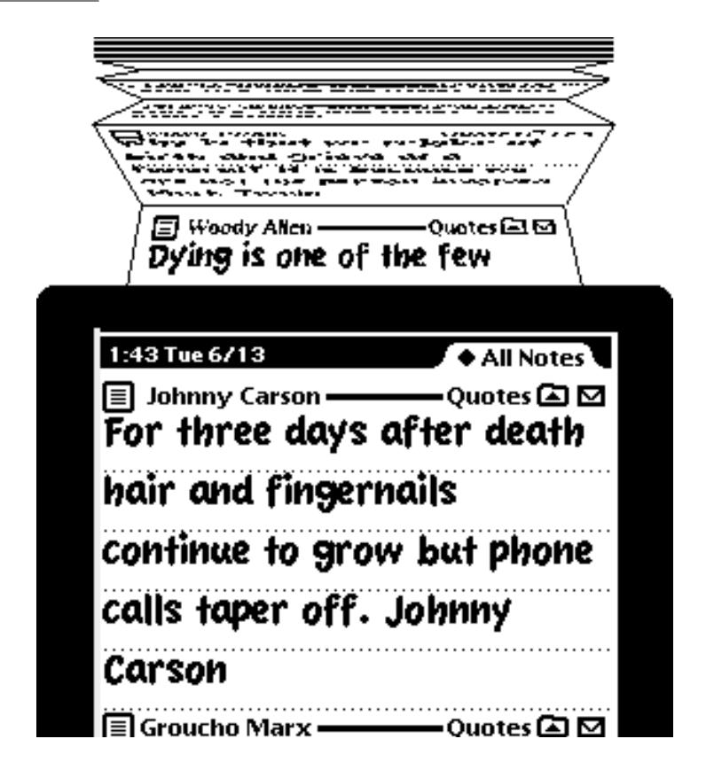

#### <span id="page-80-0"></span>Scrolling With Scroll Arrows 2

A user scrolls information in a view by tapping scroll arrows on a Newton device. Scroll arrows always come in pairs, each arrow pointing away from the other and toward information that is currently hidden. Tapping an arrow means "Show me more of the information that's hidden in this direction." For example, when a user taps a scroll arrow that points down, the information moves up, bringing up what was just below the view. Pressing and holding the pen on a scroll arrow causes continuous movement in the appropriate direction. Figure 2-30 shows the change when a user scrolls the Notepad by tapping a down arrow.

**Figure 2-30** Scrolling by tapping a down arrow

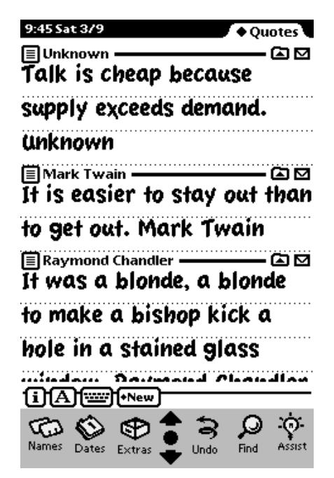

1. Before tapping the down arrow 2. After tapping the down arrow

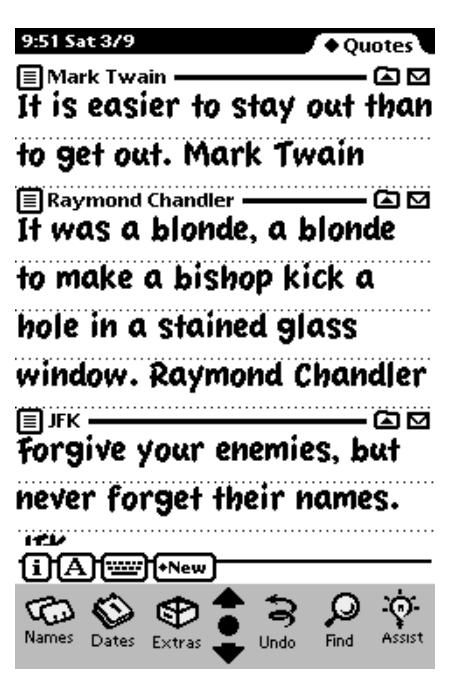

How Views Work **2-37**

<span id="page-81-0"></span>Each tap on a scroll arrow moves one unit in the chosen direction. Your application determines how much one unit is. For example, the Notepad moves one note for each tap on the arrow; for a note longer than the view, each tap scrolls the number of displayed lines minus one. The Names File application moves one "card" for each tap. The Date Book's day-at-a-time view moves one day for each tap, and the week-at-glance view moves a week per tap. Time Zones moves from city to city alphabetically. If your application's information falls naturally into sections, each tap on a scroll arrow should scroll one section. If not, scroll a screenful minus one line at a time (a "page").

Whether your application should scroll smoothly or unevenly depends on the type of information being scrolled. With smooth scrolling, each tap on a scroll arrow moves the same amount. That is how the Date Book, Names File, Calculator, and Time Zones applications work, for example. In some cases, uneven scrolling is better than smooth scrolling. The Notepad scrolls by uneven increments—note by note—to take advantage of a user's visual memory of where he or she wrote things.

While scrolling up by uneven increments, an application may encounter an item that is too large to display all at once. Since the application can't show the whole item, it must either show the bottom of the item or the top of the item. The appropriate response depends on whether the view scrolls page-bypage or continuously like a roll of paper. A view that scrolls continuously should scroll up to the bottom of an item that is too large to show all at once. A view that scrolls page-by page should scroll up to the top of an item that is too large to show all at once. For instance, the Notepad (which scrolls like a roll of paper) scrolls up to the bottom of a note that is taller than the height of the Notepad main view. In contrast, the Out Box (which scrolls detail items page-by-page) would scroll up to the top of the same note.

#### Universal Scroll Arrows 2

Newton devices have two universal scroll arrows for user control of scrolling. The universal scroll arrows are part of the Newton system; they are not attached to one view. On an Apple MessagePad 120, they are located in the center of the screen, below the display area. [Figure 2-31](#page-82-0) shows the universal scroll arrows.

<span id="page-82-0"></span>**Figure 2-31** The universal scroll arrows at the bottom of a MessagePad screen


Any view can have its scrolling controlled by user taps on the universal scroll arrows, but they only affect one of the open views. To be affected, a view must meet two requirements. First, the view must be set up during application development to receive taps on the universal scroll arrows. Second, it must be in front of all other open views that have also been set up to receive those taps. It is entirely possible for the view that is affected by the universal scroll arrows to be partially or completely covered by other open views that were not set up to receive scroll-arrow taps. (A view that receives scroll-arrow taps also receives taps on the Overview button, which is described in ["Overview" on page 2-44](#page-87-0)).

There is no convention for indicating what will scroll when a user taps a universal scroll arrow. Users must learn by experience what will scroll when they tap the universal scroll arrows.

Generally, the universal scroll arrows should scroll most of the information in a view. An application should not use the universal scroll arrows to scroll part of the information embedded in a view. For instance, the built-in Date Book application uses the universal scroll arrows for scrolling from day to day, not for scrolling from hour to hour or month to month.

#### Local Scroll Arrows 2

For scrolling part of the information embedded in a view, an application should use local scroll arrows. For instance, the Date Book has a set of local scroll arrows for scrolling from hour to hour and another set for scrolling from month to month. [Figure 2-32](#page-83-0) illustrates the Date Book's use of scroll arrows.

How Views Work **2-39**

**Figure 2-32** How scroll arrows work in the Date Book's Day view

<span id="page-83-0"></span>

Usually each tap on a local scroll arrow scrolls one item of information. If a user presses and holds the pen on a local scroll arrow, items scroll by continuously. After five items have scrolled by, the application can begin scrolling page by page. For scrolling purposes, the size of a page is one less than the number of items that fit in the view. As a shortcut, a user can doubletap a local scroll arrow to scroll a page. These two forms of accelerated scrolling are optional, but an application that features accelerated scrolling should behave as described here.

A view can contain local scroll arrows even if it does not respond to the universal scroll arrows. The local scroll arrows shouldn't scroll the whole view; they should only scroll some part of the view.

<span id="page-84-0"></span>Local scroll arrows can use color—white or black—to indicate whether scrolling will bring more items or any more empty space into view. An arrow is black if tapping it will bring more items into view. An arrow is white if tapping it will not bring more items into view. Figure 2-33 illustrates the use of color in local scroll arrows.

**Figure 2-33** Scroll arrow color may indicate what scrolling will reveal


If you implement local scrolling in your application and want users to easily recognize your local scroll arrows, make them look like the arrows in the built-in applications. Do not design your own scroll arrows or make them look like scroll arrows on personal computers.

#### Four-way Scrolling 2

A view that allows the user to pan up, down, left, and right across a map, drawing, or other large document must provide a four-way (two-dimension) scrolling control. The four-way scroller should be centered at the bottom of the view. [Figure 2-34](#page-85-0) shows how the standard four-way scroller looks.

How Views Work **2-41**

**Figure 2-34** A control for scrolling in four directions

<span id="page-85-0"></span>

There's an alternate four-way scroller that may be better in some situations. The alternate scroller is more compact than the standard scroller, but users find the standard scroller easier to target. Figure 2-35 shows the alternate four-way scroller.

**Figure 2-35** An alternate control for scrolling in four directions

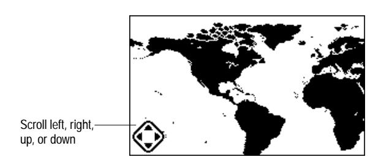

#### <span id="page-86-0"></span>Automatic Scrolling 2

In the discussions of scrolling behavior and appearance in the previous sections, the user controls scrolling by deciding which scroll arrow to use and how long to use it. Most of the time the user should be in control, but sometimes an application should scroll a view automatically. When your application performs an operation and the effect is to select something that's not currently visible, your application must scroll to show the new selection. For example, when the user searches for some text, your application locates the desired text. If this text appears in a part of the information that isn't currently visible, your application should scroll the information to show the found text. Figure 2-36 shows the effect of automatic scrolling in the Names File.

**Figure 2-36** Automatic scrolling


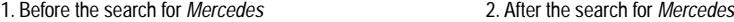


An application should not scroll automatically any more than is necessary to bring a selection into view. Users want to control what shows in a scrollable view. If part of a selection is showing in the view after the user performs an operation, don't scroll at all. For example, if the user increases the text size of a lengthy selection so that the bottom part extends out of view, your application should not automatically scroll to the end of the selection.

How Views Work **2-43**

#### <span id="page-87-0"></span>Scrolling Performance 2

Scrolling the contents of a view can sometimes seem slow. Here are some techniques you can use to improve scrolling speed:

- Implement the accelerated scrolling behavior described in ["Local Scroll](#page-82-0)  [Arrows" on page 2-39](#page-82-0).
- Scroll multiple lines at a time, rather than just a single line at a time, when the user taps a scroll arrow.
- Reduce the number of child views that need to be redrawn, if possible. For example, make a list that is implemented as several paragraphs (each a separate view) into a single paragraph.
- Set the view fill to white. Many views need no fill color, so you may be inclined to set the fill color to none when you create such a view. However, it's best to fill the view with white if you don't need a transparent view. This can increase the performance of your application because when the system is redrawing the screen, it doesn't have to update views behind those filled with a solid color such as white.

## Overview 2

In addition to scrolling, an application that deals with multiple instances of similar information can show an overview of the information—a view of the forest instead of the trees. From the overview a user can select a part of the information to see in detail. [Figure 2-37](#page-88-0) shows a conceptual view of the Notepad's overview.

#### Overview Contents 2

An overview is not another view displayed on top of the current view; an overview is the same view in a different format. Instead of showing individual data items in full detail, an overview presents a summary list of multiple data items.

**Figure 2-37** How an overview relates to a detail view

<span id="page-88-0"></span>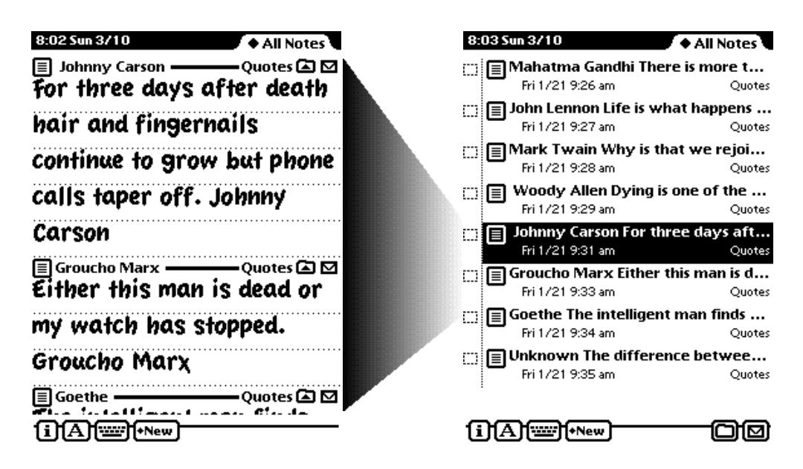

An overview commonly takes the form of a table of contents. It lists the titles or names of items that can be viewed in more detail. Together with the name or title of each item, the overview lists a a key bit of information about the item. For instance, the Notepad lists the first part of each note next to its title. The Names File lists a phone number with each name. The Call Log lists the date and time of each call. And the Extras Drawer lists each item's size and where it is stored.

If an item's title or supplemental information is too long for the space available in an overview, the application can use an ellipsis to indicate there is more information.

Next to each item in an overview there may be a small icon that symbolizes the type of item—note, checklist, or outline in the Notepad; person, company, group, or place in the Names File; and so forth. The overview may also have a checkbox next to each item so a user can select one or more items and act

How Views Work **2-45**

<span id="page-89-0"></span>on the selected items with controls in the status bar, such as a Filing button or Action button (see ["Primary Controls and Status Bar" on page 2-11](#page-54-0)). A gray line separates checkboxes from data items.

If an overview lists items that users may have filed in folders, the overview should have a folder tab at the top so users can determine which folder's items are displayed (see ["Folder Tab" on page 8-19\)](#page-260-0). If listed items cannot be filed in folders, the application can organize the overview by some other criterion, such as by date. For example, the Date Book groups meetings and events by date, starting with the displayed date.

#### Overview Button 2

The control for seeing an overview is the round black button located between the universal scroll arrows. On an Apple MessagePad the Overview button is at the center of the screen below the display area. Figure 2-38 shows the Overview button.

**Figure 2-38** The Overview button at the bottom of a MessagePad screen

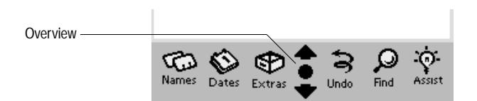

Like the universal scroll arrows, the Overview button is a function of the Newton system and is not attached to one view. The Overview button affects one open view. To be affected a view must be set up during application development to receive taps on the Overview button. In addition, the view must be in front of all other open views that have also been set up to receive those taps. The view that is affected by the Overview button may be partially or completely covered by other open views that were not set up to receive Overview-button taps. (A view that receives taps on the Overview button also receives taps on the universal scroll arrows, which are described in ["Universal Scroll Arrows" on page 2-38](#page-81-0)).

#### <span id="page-90-0"></span>Switching to and from an Overview 2

To see an overview, a user taps the Newton device's Overview button. The detail item that was displayed should either be centered in the overview or at the top of the overview. Figure 2-39 shows the change when a Names File user taps the Overview button.

**Figure 2-39** Getting an overview


1. Before tapping the Overview button 2. After tapping the Overview button

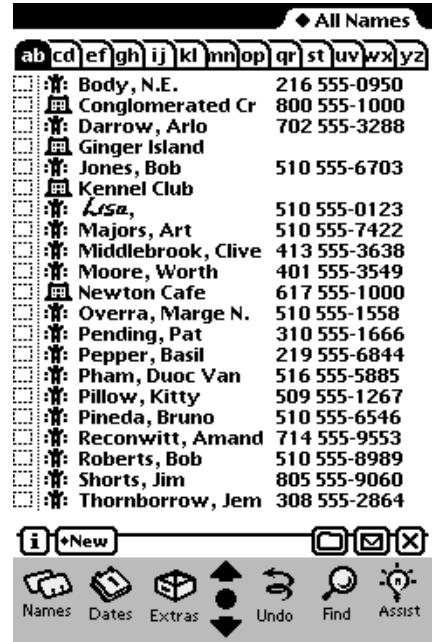

To see an item in detail, a user taps its title in the overview. Tapping an item listed in the overview closes the overview and displays the detail view for the item that was tapped. Your application could also take different actions depending on where the user taps an entry in the overview. For example, in a Names File overview, tapping the left part of a line, where the name is

How Views Work **2-47**

<span id="page-91-0"></span>displayed, causes the normal view of the tapped name to appear; but tapping the right part of the line, where the telephone number is displayed, initiates a phone call.

If an application spends more than a few seconds preparing an overview, it should display a status slip with a message such as "Preparing overview..." (see ["Status Slips" on page 2-20\)](#page-63-0).

#### Scroll and Overview in an Overview 2

An overview should respond to the universal scroll arrows and the Overview button. When a user taps a scroll arrow, your application should scroll all the currently visible items out of view except the last item. After scrolling, there should always be one item still visible from before scrolling. When scrolling the last item into view, the application can leave more than one item still visible from before scrolling so that the overview remains full of items; users can't do anything with empty space in an overview.

When a user taps the Overview button, the overview goes away and the detail view reappears, showing the same item as before the overview appeared. Thus, repeatedly tapping the Overview button switches back and forth between the overview and the detail view. Avoid any temptation to use the Overview button to zoom up or down multiple levels of detail or to step through a hierarchy of views, because the user can easily become confused about whether the next tap will go up or down.

An application that doesn't have a list-style overview can use the Overview button to toggle a view between two levels of detail or magnification. If there are more than two levels of zooming, the Overview button must always toggle between the same two levels, preferably the biggest and smallest levels. For access to other levels, use another type of control described in [Chapter 3, "Controls."](#page-94-0) For example, you could use a button on the status bar—the Show button or a special Zoom button or zoom-looking picture button. For completeness, the magnification control should provide access to all levels, including the two levels controlled by the Overview button.

#### <span id="page-92-0"></span>Closing an Overview 2

Tapping the Close box has the same effect whether a view is displaying item detail or an overview—the application closes. Tapping a Close box in an overview does not switch to item detail.

## Nonfunctional Scroll and Overview Controls 2

Some views scroll or display an overview, but not both. Rather than doing nothing when a user taps a nonfunctional scroll or overview control, a view should provide feedback. If a view that scrolls but doesn't have an overview is frontmost and a user taps the Overview button, the view should notify the user with a message such as "This view does not have an overview." Likewise, if a user taps a scroll arrow when a view that doesn't scroll is frontmost, the view should notify the user with a message such as "This view does not scroll." To avoid confusing users, don't begin messages about not scrolling or not having an overview with "This application" unless the message applies to every one of the views in your application. Furthermore, better messages state the title of the view in place of the generic "This view" or "This application.

If the frontmost view has local scroll arrows but doesn't respond to the universal scroll arrows and doesn't let views behind it receive universal scroll arrow events, then the view should display a message that explains why the universal arrows don't work or what the user must do to make them work. Under these circumstances a message such as "You must close this view to use the universal scroll arrows" is clearly more accurate than "This view does not scroll."

No view has to receive taps on the Overview button and universal scroll arrows. If the frontmost view was not designated during application development to receive taps on those controls, the taps go to the next lower view that was so designated. For example, a slip or other auxiliary view can simply let its main view respond to the Overview button and the universal scroll arrows.

How Views Work **2-49**

<span id="page-94-0"></span>Controls are graphic objects that cause instant actions or audible results when the user manipulates them with the pen. Some controls change settings that modify future actions. Other controls allow users to make choices or to assign parameters in a range. Controls display existing choices so that they are visible to users. Because of their appearance and behavior, controls enhance the user's sense of direct manipulation.

This chapter describes the appearance and behavior of the following basic Newton controls:

- Text and picture buttons
- Close boxes (regular and large)
- Radio buttons
- Checkboxes
- Sliders
- Hot spots

This chapter ends with brief descriptions of standard Newton buttons that appear in the status bars of many applications: the Analog Clock, Info, Recognizer, Keyboard, New, Show, Filing, Action, Item Info, and Rotate buttons.

## <span id="page-95-0"></span>Buttons 3

A **button** is a small graphic object that performs an action when tapped. The action that the button performs is described by text or a picture on the button, as shown in Figure 3-1.

**Figure 3-1** Tapping a button initiates an action

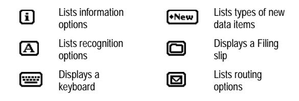

## Text Buttons 3

A **text button** is a rounded rectangle containing text that names the button's function. Figure 3-2 shows some typical text buttons in a slip.

**Figure 3-2** A text button's name states what the button does

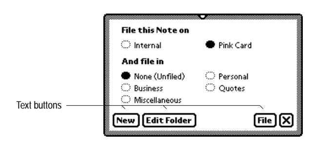

#### <span id="page-96-0"></span>Text Button Sizes 3

A text button should be the same height as the large Close box (described under ["Close Boxes" on page 3-14](#page-107-0)) and wide enough for its name to fit centered on one line in the bold style of the system font. Make the button wide enough to leave as much space at the sides of the text as there is space above the text.

On an Apple MessagePad, make text buttons 13 pixels tall (not counting the 2-pixel black border). Use 9-point text in the bold style of the system font for the button name. Leave three pixels between the button's bottom border and the baseline of the text, and make the button wide enough to leave three or four pixels between the name and the button's left and right borders. In a group of buttons, you can make all buttons uniformly narrower if you must, but always leave at least two pixels of white space at the right and left ends of the text. Figure 3-3 shows the preferred spacing between the name and border of a text button on an Apple MessagePad.

**Figure 3-3** Leave standard margins between a button's name and its borders


Buttons **3-3**

<span id="page-97-0"></span>If your application has buttons whose names change during the operation of the application, the application must resize the button when its name changes so that the spacing always conforms to the guidelines.

#### Naming Text Buttons 3

Keep button names short. Never use more than three words for a button name, and try to limit button names to one word. Capitalize button names like book titles. That is, always capitalize the first and last words of the name, and capitalize all other words except articles (*a, an, the*), coordinating conjunctions (for example, *and, or*), and prepositions of three or fewer letters. Since button names should seldom be more than two words, almost all words in button names should be capitalized.

Avoid punctuation and symbols in button names. Except for very common symbols such as an ampersand (&), users find symbols ambiguous. Do not use ellipses (…) in the button name even if tapping the button displays another slip. However, a button name should begin with a diamond symbol (◆) if the button pops up a picker. (For complete information on pickers, see [Chapter 4, "Pickers"](#page-126-0)).

#### Naming Take-Action Buttons 3

A user typically reads the text in a slip until it becomes familiar, and then relies on visual cues, such as button names or positions, to respond. To assist users in quickly spotting which button in the slip initiates an action, name the take-action button with a specific verb such as Print, Fax, or File. These words are self-sufficient, whereas vaguely affirmative names such as OK and Yes require the user to scan other parts of the slip to verify what action the button initiates. [Figure 3-4](#page-98-0) compares a specific button name to a generic button name in the same context.

<span id="page-98-0"></span>**Figure 3-4** Name buttons distinctively wherever possible


There are cases where a button named OK or Yes serves best. You may want to name a button with a vague affirmative to encourage the user to look elsewhere in the slip for a complete description of a pending action with far-reaching consequences. Another place to use OK or Yes is in a slip where you simply can't name the action to be taken with one or two words. If you name buttons with generic words, be sure other text in the slip makes clear what action the button initiates.

#### Naming Cancel- and Stop-Action Buttons 3

A slip with a button that initiates an action also needs a means of canceling the pending action. On a Newton device you ordinarily use a large Close box (described under ["Close Boxes" on page 3-14](#page-107-0)), not a button named Cancel, to dismiss a slip and take no action. However, you can use a button named Cancel to complement an OK or Yes button. [Figure 3-5](#page-99-0) shows where to use a Cancel button and where not to use one.

Buttons **3-5**

<span id="page-99-0"></span>**Figure 3-5** Where to use a button named Cancel


A button named Cancel should close the view it's in and return the application to the state it was in before the view appeared. Cancel means "Dismiss the operation I started, with no other effects." A Cancel button should not be the only button that can close a view; in such a view, use a Close box instead.

Rather than Cancel, use a text button named Stop to allow a user to halt an operation that's underway, especially if this button is next to a large Close box. In that context a Cancel button may look to some users like a duplicate of the Close box. Figure 3-6 illustrates the use of a Stop button.

**Figure 3-6** A Stop button lets a user halt an operation

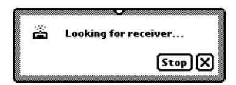

## <span id="page-100-0"></span>Picture Buttons 3

A **picture button** is a small picture (an icon) that represents the button's function. The picture is usually bordered by a rounded rectangle, like a text button with a picture instead of a text name. Figure 3-7 shows several picture buttons.

**Figure 3-7** A picture button depicts what the button does

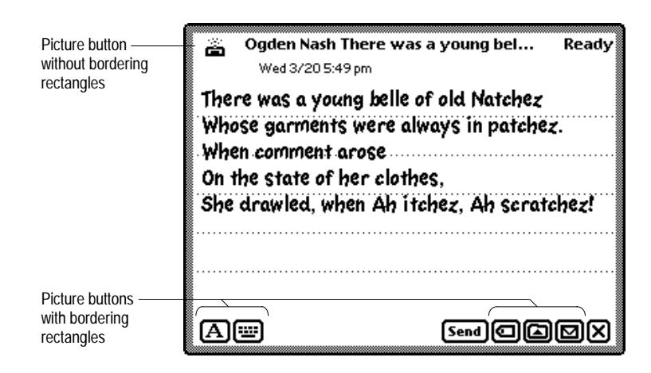

A picture button should be as tall as the large Close box (described under ["Close Boxes" beginning on page 3-14](#page-107-0)) and wide enough to enclose the picture. Leave white space between the picture and the interior edge of the button border. On an Apple MessagePad, make picture buttons with borders 13 pixels tall (not counting the 2-pixel black border), and leave at least one pixel of white space between the picture and the border.

Picture buttons on a status bar definitely need bordering rectangles to match the other items there and to isolate the pictures from the bar. Conversely, picture buttons on separator bars do not touch the bar and often look better without bordering rectangles. For example, the Filing button and Action button must have a border when they are on a status bar, but look better without a border on a separator bar. A button looks good without a border if

Buttons **3-7**

its picture has an unbroken line around it—a sort of self-border. Figure 3-8 shows where you should omit picture button borders and where you should keep the borders.

**Figure 3-8** Where to use borders with small, self-bordered picture buttons


#### Designing Picture Buttons 3

Picture buttons are tempting to use because they are more compact than text buttons. But designing an unambiguous picture small enough for a picture button is very hard. A button's function may be more evident if you label it with a short name instead of a picture.

Avoid pictures that look like the buttons of other applications, such as Names and Dates. Users may think your look-alike button will open the corresponding built-in application, and may be confused if your buttons do something else.

## <span id="page-102-0"></span>Button Behavior 3

Although text buttons and picture buttons look different, their basic behavior is the same. Both types of buttons provide similar feedback to the user, and an application disables both types the same way.

#### Button Feedback 3

When a user taps a text button or a picture button, the button highlights (inverts) to give visual feedback to the user that the item has been tapped. Figure 3-9 shows how several buttons look when highlighted.


A button stays highlighted as long as the user continues to press the pen on that button. When the user lifts the pen from the highlighted button, the action associated with the button takes place. Your application must continue to highlight the button until the action is complete. In the case of a button that displays an ordinary slip (not a status slip), the button stays highlighted only until the slip appears. In the case of a button that pops up a picker (described in [Chapter 4, "Pickers"\)](#page-126-0), the button stays highlighted as long as any action initiated by the picker is in progress.

Keeping the button highlighted provides the minimal feedback to the user that Newton is still working. When an action begun by a button takes more than a few seconds, your application should provide more feedback by displaying a status slip that names the action underway (as described in ["Status Slips" on](#page-63-0)  [page 2-20](#page-63-0)).

If your application uses buttons made from system protos, the system automatically adjusts button highlighting in response to a user's pen movements. When a user slides the pen away from a highlighted button while still pressing

Buttons **3-9**

<span id="page-103-0"></span>the pen on the screen, the button becomes unhighlighted. The button tracks the pen movement as long as the user keeps pressing the pen. If the user slides the pressed pen back over the button, it is highlighted again. If the user lifts the pen while the pointer is not over the button, nothing happens. The display of electronic ink is turned off while the pen is tracked. A button is not highlighted if a user initially presses the pen outside the button and slides the pressed pen over the button.

#### Button States 3

Text buttons and picture buttons are never dimmed (displayed in gray instead of black) in a Newton application. If a button is not available, your application should make it disappear. If you want it to be available, your application should make it reappear. Figure 3-10 shows how to disable a Newton button.

**Figure 3-10** A button disappears when it isn't available


<span id="page-104-0"></span>A button can disappear and reappear with no visual effect or with a subtle visual effect such as zoom closed and zoom open. Generally, buttons should not flash as they appear. Visual effects that attract the eye virtually compel immediate action, as if they were shouting, "Tap me now!"

## Button Placement 3

Text buttons and picture buttons are easiest to use at the bottom of the view that contains them. In that position a user's hand won't cover the view while tapping a button. Buttons that affect all items in a main view should go on a status bar at the bottom of the main view (see ["Primary Controls and Status](#page-54-0)  [Bar" on page 2-11\)](#page-54-0). The status bar is optional if the main view is small, like the main views of the built-in Connection, Card, and Time Zones applications. Buttons at the bottom of a slip or other auxiliary view are generally not on a status bar.

In a view that displays multiple items, each item is headed by a separator bar (see ["Separator Bars" on page 2-11](#page-54-0)). Buttons that apply to only one item do not go at the bottom of the view. Instead, the buttons are attached to each item's separator bar, and they scroll along with the item when a user scrolls the view. For example, a Filing button and an Action button go at the right end of each separator bar (see ["Filing Button" on page 3-27](#page-120-0) and ["Action](#page-121-0)  [Button" on page 3-28](#page-121-0)). Other buttons can go on a button bar that floats near the end of an item. [Figure 3-11](#page-105-0) shows buttons on a separator bar, buttons on a floating button bar, and buttons on a status bar.

It's possible for your application to add buttons to another application's status bar. For example, your application could add a button to the backdrop application's status bar so users could bring your application to the front without going through the Extras Drawer. This could be a boon or a nightmare depending on how crowded the status bar is in the backdrop application. If you want to add a button to another application, make sure users can disable the feature.

Buttons **3-11**

**Figure 3-11** Where to put buttons in a view

<span id="page-105-0"></span>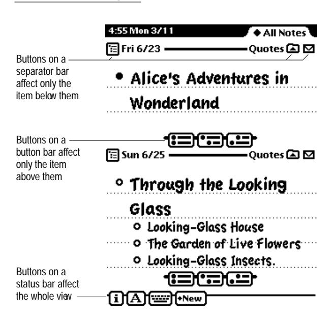

#### Button Spacing 3

Group text and picture buttons with similar functions together. Users assume buttons near each other are related. Generally, buttons that directly control or take action are on the right, and buttons that affect content or appearance are on the left. Separate the left and right groups with blank space, if the number and sizes of buttons permit. Figure 3-12 shows buttons groups at the right and left sides of a container view, with a gap separating the two groups.

**Figure 3-12** Group buttons by function


<span id="page-106-0"></span>Avoid spacing consecutive buttons so close together that they look cramped. On an Apple MessagePad, space consecutive buttons in a group three pixels apart, and leave four pixels between buttons and the view's border. If you must, you can reduce the space between consecutive buttons to two pixels, but no less. Figure 3-13 illustrates the MessagePad guidelines.

**Figure 3-13** Regular spacing between buttons on a MessagePad


If your application changes a button's name, it should dynamically resize the button and maintain the correct spacing between buttons. Your application should maintain the correct spacing between buttons when a user rotates the display (with the Extras Drawer). Accommodate the changing width of a view by adding or taking away space between groups of buttons. Your application also needs to maintain the spacing between buttons if their names change during operation.

Buttons **3-13**

## <span id="page-107-0"></span>Large Buttons 3

If a user needs to be able to tap some text buttons or picture buttons in your application with a finger instead of a pen, you can use large buttons. If your large buttons won't fit at the bottom of a view, it's OK to put them along one side of the view. Put them only on one side, but be sure the user can choose whether they appear on the right or left. A user's left hand would block the whole screen while tapping large buttons along the right edge of the screen, so left-handed users need to be able to set an option that shifts large buttons from the right side to the left side of the screen. If your application includes large buttons and you want them to work when a user rotates the display (with the Extras Drawer), your application needs to be able to adjust the position of the large buttons for regular or sideways orientation of the display.

## Close Boxes 3

The Close box and large Close box are both picture buttons that contain the picture of a cross shaped like an ✕. Both buttons work in the same way. Tapping a Close box or a large Close box closes the container view in which the button appears.

The differences between the Close box and large Close box are purely cosmetic. The large Close box is the same height as standard text and picture buttons. The frame around the ✕ is not part of the large Close box's picture. The Close box is slightly smaller than the large Close box, and its picture includes the frame around the ✕. Figure 3-14 compares the Close box and the large Close box.

**Figure 3-14** A Close box compared to a large Close box

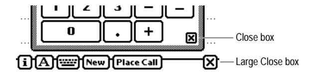

<span id="page-108-0"></span>Always put the Close box or large Close box in the bottom right corner of the container view it closes.

## Where to Use a Regular Close Box 3

The contents of a container view determine whether it should have a Close box or large Close box. A large Close box looks best alongside text buttons or picture buttons. A regular Close box does not look good next to text or picture buttons because it is smaller than they are. Figure 3-15 shows where and where not to use a regular Close box.

**Figure 3-15** Where to use a regular Close box


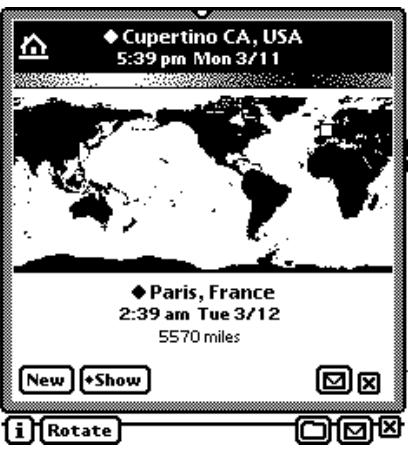

Do not use a regular Close box in a status bar or in a view where it is aligned with text or picture buttons

## Where to Use a Large Close Box 3

Always include a large Close box at the right end of a main view's status bar so the user can close your application. In a view without a status bar, the large Close box looks better than a regular Close box alongside text or

Close Boxes **3-15**

<span id="page-109-0"></span>picture buttons, but do not use a large Close box in a slip with an OK or Yes button. Instead, use a Cancel button (see ["Naming Cancel- and Stop-Action](#page-98-0)  [Buttons" on page 3-5\)](#page-98-0). Figure 3-16 shows where to use a large Close box and where not to use one.

**Figure 3-16** Where to use a large Close box


# Radio Buttons 3

A **radio button** is a control that displays a setting that can be either on or off. Each radio button is part of a group in which only one radio button can be on at a time. (The inverse arrangement, in which only one button is off, is also possible, but is not described separately in this book because it is logically equivalent to the normal arrangement.)

<span id="page-110-0"></span>There are two types of radio buttons. One is a small oval that is empty if it is not selected, or is filled with solid black if it is selected. The oval radio button is labeled to the right with a word or phrase.

The second type of radio button is a small picture with a border (unless the picture itself has a continuous edge). Typically, several of these picture radio buttons are placed next to each other, and the one that is selected is indicated by a thick border. Figure 3-17 shows some regular radio buttons and some picture radio buttons.

**Figure 3-17** Only one radio button in a cluster can be selected

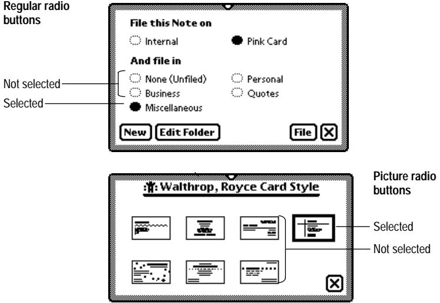

An application can use radio buttons to control options, such as the order in which to sort information. An application can also use radio buttons to change the attributes of a selected object, such as the style of a view. In contrast, an application should use a text button or a picture button—never use a radio button—to bring up a slip; to confirm, authorize, cancel, or stop an action; or to initiate a process.

Radio Buttons **3-17**

<span id="page-111-0"></span>To operate a radio button the user can tap any part of it, including the text or picture that identifies it. Tapping one button in a cluster turns off whichever button was on before.

A cluster of radio buttons must contain at least two items. Instead of using a single radio button, use a checkbox (see the next section, "Checkboxes"). At the opposite extreme, a cluster shouldn't contain more than seven radio buttons. A large cluster of radio buttons simply takes up too much space on the screen. Rather than a lot of radio buttons, use a picker (see [Chapter 4, "Pickers"](#page-126-0)).

A cluster of radio buttons always has the same set of choices. It never changes contents depending on the context. If more than one group of radio buttons is visible at one time, the groups need to be visually separate from each other. Each cluster may have a heading to identify it.

Radio buttons and cluster headings are usually capitalized like book titles. However, in some contexts it makes more sense to capitalize them like sentences. If the radio button text completes a sentence begun by the label of the radio button cluster, the heading should be capitalized like a sentence and the radio buttons should be all lowercase (except for proper nouns).

Avoid punctuation in radio buttons and cluster headings. In particular, do not end a cluster heading with a colon. The heading's meaning is clear without the colon.

# Checkboxes 3

**Checkboxes,** like radio buttons, provide alternative choices for users. A checkbox is a small dotted box that may include a check mark (✔). It is labeled to the right or left with a word or phrase. Use a checkbox to indicate an option that must be either off or on.

The user selects or deselects the checkbox by tapping it or its label. When the option is selected, a check mark appears in the box. When the option is not selected, the box is empty. Checkboxes act like toggle switches, which can be on or off. A checkbox is on when it is selected and off when it is not selected. [Figure 3-18](#page-112-0) shows some typical checkboxes.

<span id="page-112-0"></span>**Figure 3-18** Each checkbox can be on or off


You can have one checkbox or as many as you need. Checkboxes are independent of one another, even when they offer related options. Any number of checkboxes can be on or off at the same time. It's a good idea to group sets of checkboxes that are related, and to separate the groups from other groups of checkboxes and radio buttons. Each group may have a heading to identify it.

Labeling a checkbox unambiguously can be difficult. The label should imply two clearly opposite states. For example, the Sound preferences slip (Figure 3-18) shows a checkbox labeled "Action sound effects" that controls whether or not sound effects are played for actions. If the checkbox is selected, the action sound effects are played. The clearly opposite state, when the checkbox is not selected, is to not play action sound effects.

Checkboxes are usually capitalized like sentences. However, in some contexts it makes more sense to capitalize them like book titles. Checkbox labels should be all lowercase (except for proper nouns) if the checkboxes are part of a group and each label completes a sentence begun by the label of the group.

If you can't think of a label for a checkbox that clearly implies its opposite state, you might be better off using radio buttons. With radio buttons, you can use two labels, thereby clarifying the states. It's sometimes tempting to use a checkbox because one item takes up less space than two. However, the resulting item may be ambiguous and thus difficult to understand.

Sometimes using one checkbox instead of two radio buttons can make users focus more carefully on a choice between two states. One state is clearly labeled, but a user must think to figure out the unlabeled state. While thinking,

Checkboxes **3-19**

<span id="page-113-0"></span>the user may briefly ponder the significance of changing the checkbox's state. For example, a checkbox in a fax routing slip lets a user select fine resolution or not. This option could be implemented with two radio buttons, perhaps labeled "Fine" and "Standard." A user is more likely to think about all the ramifications of the choice with a checkbox than with two radio buttons. Figure 3-19 illustrates the two approaches.

**Figure 3-19** One checkbox vs. two radio buttons

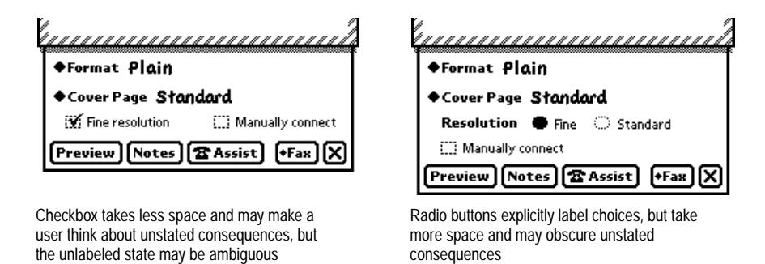

You can use checkboxes to control options and set attributes in your application. But use a text button or picture button, not a checkbox, to bring up a slip; to confirm, authorize, cancel, or stop an action; or to initiate a process.

# Sliders 3

The Newton interface also includes a **slider,** with which users can set a magnitude, position, probability, or other value in a range. Users set a value by dragging a diamond-shaped knob. The knob indicates the current value relative to the maximum and minimum values. A slider should have labels that identify the range and direction of the slider. [Figure 3-20](#page-114-0) shows an example of a slider.

<span id="page-114-0"></span>**Figure 3-20** A slider used for data input


# Hot Spots 3

Some views need to have many small, unnamed controls that respond like buttons when tapped. For example, a view that contains a map might respond to a user tapping a place on the map by displaying information about the place tapped. These **hot spots** may be visible or transparent.

Make it clear what elements of a view are hot spots unless you want to hide them from users. If space and design considerations permit, give hot spots a distinctive look that users can learn means "tap here." Simple geometric shapes—such as circles, squares, and triangles—are possibilities. When a user taps a visible hot spot, highlight it to provide feedback. Users need feedback to reassure them that they have really tapped the hot spot.

Hot spots that are very small and close together may have to be invisible to avoid cluttering the view they're in. Feedback is very important with small invisible hot spots, because a user can't be sure which hot spot he or she is tapping. One possibility is to display a list of all the hot spots near where the user tapped, and let the user select one of the listed spots by tapping it in the list. If the user taps a place where there aren't any nearby hot spots (a "cold" spot), the application can provide feedback by listing one item that explains the situation, such as "Nothing here." [Figure 3-21](#page-115-0) shows how the Time Zones application responds when a user taps one of its invisible hot spots.

Hot Spots **3-21**

**Figure 3-21** Providing feedback for small, transparent hot spots

<span id="page-115-0"></span>

Of course, sometimes the whole point of hot spots is to make users guess where to tap. Secret hot spots would be fine in maps meant to teach geography by exploration, for example.

In addition to graphical hot spots, there can be hot spots in text. For example, double-tapping a word pops up a picker for editing the word (see ["Correcting](#page-196-0)  [Misrecognized Text" on page 6-29](#page-196-0)).

# Standard Newton Buttons 3

A typical application includes some of the following standard Newton buttons, either on a status bar, on a separator bar, or in a slip: the Analog Clock, Info, Recognizer, Keyboard, New, Show, Filing, Action, Item Info, and Rotate. This section describes where each of those standard buttons belongs and what it does.

<span id="page-116-0"></span>Other specific controls defined by the Newton system are described elsewhere. For descriptions of scroll arrows and the overview button, see ["Scrolling"](#page-79-0) on [page 2-36a](#page-79-0)nd ["Overview" on page 2-44.](#page-87-0) The Undo button is described in ["Error Correction" on page 6-37](#page-204-0). The Notify Icon is described in ["Notify Button](#page-243-0)  [and Picker" on page 8-2](#page-243-0). The Action button is described in ["Action Button and](#page-213-0)  [Picker" on page 7-8](#page-213-0). The New, Show, Filing, Find, and Assist buttons are described in [Chapter 8, "Newton Services."](#page-242-0)

## Analog Clock Button 3

Space permitting, you can include an **Analog Clock button** at the left end of your application's status bar. The clock continuously displays the time of day. If a user taps the clock, a small panel bearing a digital clock and battery gauge slides out. The panel goes away automatically after three seconds unless the user taps it sooner. Figure 3-22 shows how the Analog Clock button works.

**Figure 3-22** How the Analog Clock button works


## Info Button 3

An Info button lets users access your application's About box, preference settings, and on-screen help. Put the Info button at the left end of the status bar, next to the Analog Clock button if it is present. [Figure 3-23](#page-117-0) shows examples of Info button placement.

Tapping the Info button pops up the Info picker, which is described on [page 4-24](#page-149-0).

**Figure 3-23** Where an Info button goes

<span id="page-117-0"></span>

## Recognizer Button 3

A Recognizer button lets users control the system's recognition of handwriting and drawing. An application's main view should have a Recognizer button to the right of the Info button on its status bar if users can write or draw in the main view. Additionally, a Recognizer button can go in the lower left corner of each slip in which users can write or draw. Figure 3-24 shows a Recognizer button on a status bar and one in a slip.

**Figure 3-24** Where a Recognizer button goes

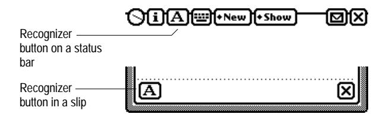

The Recognizer button is a picture button, and the picture on the button indicates the type of recognition currently in effect. Figure 3-25 shows how the Recognizer button looks for each type of recognition.

**Figure 3-25** The Recognizer button indicates the type of recognition in effect

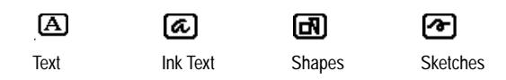

<span id="page-118-0"></span>Tapping a Recognizer button pops up the Recognizer picker, which is described in ["User Control of Recognition" on page 6-16](#page-183-0). For more information on recognition of handwriting and drawing, see ["Recognition"](#page-182-0)  [on page 6-15.](#page-182-0)

## Keyboard Button 3

A Keyboard button lets users bring up an on-screen keyboard. Users can also use the Keyboard button to switch between the available styles of on-screen keyboards. If users can enter text in your application, it should have a Keyboard button to the right of the Recognizer button in the status bar. Alternatively, a Keyboard button can go in the lower left corner of each slip in which users can enter text. The Keyboard button comes in two sizes, regular and small. Use the small size only if space doesn't permit using the regular size. Figure 3-26 shows both sizes of Keyboard button on status bars and in slips.

**Figure 3-26** Where a Keyboard buttons goes


Tapping the Keyboard button brings up an on-screen keyboard. Tapping the Keyboard button while a keyboard is displayed pops up the Keyboard picker. Keyboards and the Keyboard picker are described in ["Typing" on page 6-32](#page-199-0).

## <span id="page-119-0"></span>New Button 3

A New button lets users create a new data item and to specify the format of the item, such as a new note, checklist, or outline in the built-in Notepad application. If users can create new data items in your application, it should have a New button to the right of the Keyboard button on the status bar. Figure 3-27 shows a New button on a status bar.

**Figure 3-27** Where a New button goes

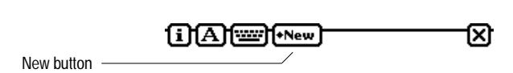

Tapping a New button brings up a New picker, which is described on [page 4-25](#page-150-0).

## Show Button 3

A Show button lets users change views for displaying information, such as the Card view or the All Info view in the built-in Names File application. An application should have a Show button to the right of the New button if users can pick different views in the application. Figure 3-28 shows a sample Show button.

**Figure 3-28** Where a Show button goes


Tapping a Show button brings up a Show picker, which is described on [page 4-26](#page-151-0).

## <span id="page-120-0"></span>Filing Button 3

A Filing button lets users designate a folder and a storage location (if more than one is available) for data that's currently displayed. How much data is affected depends on where the Filing button is located. If the Filing button is on a status bar, it affects all the data in the main view or all the selected items in an overview. If the Filing button is on a separator bar, it affects the information between that separator bar and the next one. If the Filing button is in a slip, it affects all the information in the slip. A Filing button goes to the left of an Action button near the right end of a status bar; at the right end of a separator bar; or in the lower right corner of a slip. Figure 3-29 shows Filing buttons on a status bar, on a separator bar, and in a slip.

**Figure 3-29** Where a Filing button goes


Tapping a Filing button brings up a Filing slip. The slip lists the storage locations currently available, such as the internal store and a named card store. The slip also lists the folders defined for the current application, and has buttons for editing the existing folder names or creating new folders. Tapping a Filing button brings up a Filing slip, which is described in ["Filing](#page-255-0)  [Button and Slip" on page 8-14](#page-255-0). For general information about filing, see ["Filing" on page 8-13](#page-254-0).

By looking at a Filing button for a particular data item, users can tell whether the current item is stored internally or on a card. If the item is stored on a

<span id="page-121-0"></span>card, the Filing button contains a small black triangle. If the item is stored internally, the Filing button contains nothing. Figure 3-30 compares the two states of the Filing button.

**Figure 3-30** A Filing button reports where a data item is stored


## Action Button 3

An Action button lets users send data through various means, such as print, fax, beam, and e-mail. In many applications, users can also use the Action button to duplicate and delete data that's currently displayed. The location of the Action button determines how much data is affected. If the Action button is on a separator bar, it affects the information between that separator bar and the next one. If the Action button is in a slip, it affects all the information in the slip.

In a slip or on a status bar, the Action button goes next to the Close box (except that in the backdrop application, which has no Close box, it goes at the right end of the status bar). An Action button goes at the right end of a separator bar. [Figure 3-31](#page-122-0) shows examples of Action buttons on a status bar, on a separator bar, and in a slip.

**Figure 3-31** Where an Action button goes

<span id="page-122-0"></span>

Tapping an Action button pops up the Action picker, which is described on [page 4-26](#page-151-0). For general information about sending and receiving data, see [Chapter 7, "Routing and Communications."](#page-206-0)

## Item Info Button 3

The picture button at the left end of a separator bar, which is called an Item Info button, depicts the type of item below the separator bar. For example, the Notepad application includes three types of items: plain note, checklist, and outline. Tapping an Item Info button brings up an Item Info slip, in which a user can change the title of the item below the separator bar. The Item Info slip also reports statistics about the item, such as its type, when it was created, where it is stored, and how much storage space it occupies. [Figure 3-32](#page-123-0) shows a sample Item Info button and slip.

**Figure 3-32** Seeing an Item Info slip

<span id="page-123-0"></span>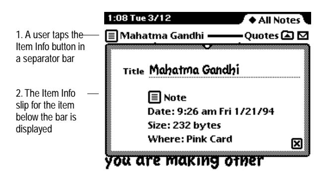

If a user scrolls an item's separator bar out of view while its Item Info slip is displayed, the Item Info slip closes automatically and does not reopen automatically if the user scrolls the separator bar back into view. To see the Item Info slip again, the user must tap the Item Info button.

## Rotate Button 3

On Newton devices that can change the orientation of the display, the Rotate button enables users to control which way the display faces. The effect of tapping a Rotate button depends on the number of available orientations. If a device has two orientations—regular and sideways like a MessagePad 120 then tapping a Rotate button changes between the two orientations. If a device has more than two orientations, then tapping a Rotate button presents a list of possible orientations. [Figure 3-33](#page-124-0) illustrates a Rotate button on a MessagePad 120.

<span id="page-124-0"></span>**Figure 3-33** A Rotate button lets users change the screen orientation

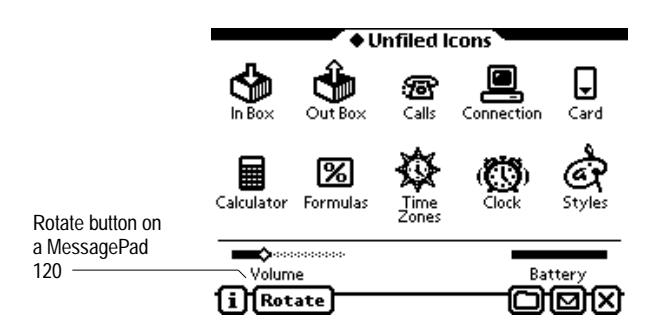

<span id="page-126-0"></span>A **picker** is a black-bordered, unmovable view that pops up in response to a user action, such as tapping a button, label, or hot spot. A picker contains a set of items such as commands, attributes, states, or application data. The items may be presented as a simple list, a table with rows and columns, a numerical counter, or a calendar, and those formats can be mixed in a single picker. Users can choose an item or merely browse the picker. Most pickers close immediately when a user chooses an item, but the more elaborate pickers have a Close box that a user taps after choosing an item. Also, most types of pickers close if a user taps outside them.

This chapter details the appearance and behavior of the following types of Newton pickers:

- List pickers
- Number pickers
- Date and time pickers
- Data overview pickers

This chapter ends with brief descriptions of prefabricated Newton pickers that pop up in many applications: the Info, New, Show, Action, and People pickers.

# <span id="page-127-0"></span>List Pickers 4

As its name suggests, a list picker presents users with a list of items from which to choose. This section describes the following aspects of list pickers:

- what list pickers can contain
- how the items can be organized
- where list pickers can pop up
- how people use list pickers

## Elements of List Pickers 4

A list picker includes words or icons (bitmap pictures) that name picker items. The list may contain marks next to picker items, and separator lines (which are not pickable) between groups of items. Additionally, some of the items can be disabled (not pickable). Figure 4-1 points out features of list pickers.

**Figure 4-1** The parts of list pickers


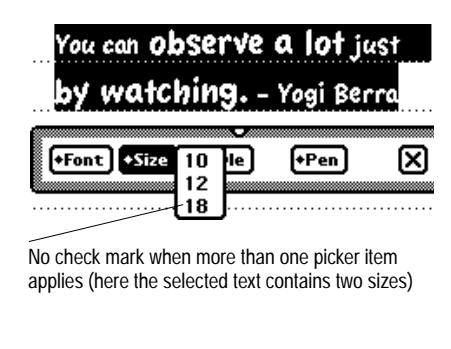

<span id="page-128-0"></span>A list picker does not include a title because the picker's context should make its purpose clear. The picker may contain scroll arrows, a Close box, and other controls as described in ["Using a List Picker" on page 4-9.](#page-134-0)

#### Check Marks 4

A check mark (✔) has special meaning in a list picker. In a picker that lists attributes, values, or states, a check mark indicates which picker item is in effect. A check mark is not used in a list of commands because no command is in effect until the user picks one. Also, check marks are not shown for picker items with an icon.

#### Icons 4

Icons are completely optional in list pickers; in fact, there are several reasons to avoid them. Use icons to clarify and distinguish the wording of picker items, but not purely for decoration. For a discussion of the pros and cons of icons in list pickers, see ["Icons in a Picker" on page 5-12.](#page-165-0)

#### Item Names 4

In a list picker, use one word for item names when possible, and capitalize it. When you must use more than one word, you should generally capitalize just the first word. You can capitalize differently if it makes sense in a particular context. For example, the items in the Date Book's Show picker are titles of views and are capitalized like book titles. If the text of a picker item ends a sentence begun by a picker label, you should capitalize the label like a sentence and not capitalize the picker items at all (except for proper nouns). The Find slip's Look For picker is an example of sentence capitalization.

Avoid punctuation and symbols in list pickers. Except for very common symbols such as an ampersand (&), users find symbols ambiguous. In particular, do not put an ellipsis (...) at the end of a picker item that will bring up a slip. Unlike menus on personal computers, Newton pickers do not use an ellipsis or any other symbol to indicate a command that will need more information from the user.

List Pickers **4-3**

<span id="page-129-0"></span>You use different parts of speech to name items in a list picker, depending on what effect they have when the user picks one. For picker items that act as commands, use verbs (or verb phrases) that declare the action that will occur when the user picks the item. For example, Duplicate means "Duplicate the current data item," and Fax means "Fax the current data item." Your picker command names should fit into a similar sentence.

In a list picker that lists several actions (in the form of verbs), include an object of the action (in the form of a noun) with the first item. Subsequent items that refer to the same object need only list the action; they don't need to repeat the object. For example, start with Print Note and follow up with Fax, Beam, and Mail (where "Note" is understood in all but the first item).

If a picker item changes an attribute or a state, use a word or phrase that describes the change. Descriptive words (nouns and adjectives) in pickers imply an action. They should fit into the sentence "Change to . . . " or "Make this . . . ". For instance, while picking a label for a phone number in the Names File, a user might think, "Make this phone number the Home number." A user who is about to change the view in the Names File might think, "Change to the All Info view."

List pickers display items in the bold style of the system font. On an Apple MessagePad, the item names are 10-point text.

#### Table of Items 4

A list picker can include a two-dimensional table of items with any number of rows and columns. The table can contain anything that can be represented by a bitmap picture. (The entire table is actually implemented as one bitmap picture, complete with the border between cells and around the table.) [Figure 4-2](#page-130-0) shows a list picker that contains a table of items.

<span id="page-130-0"></span>**Figure 4-2** A list picker can contain a two-dimensional table of items

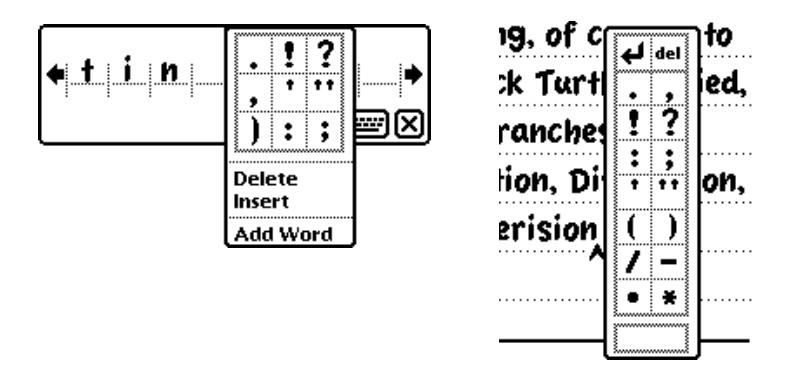

#### Unavailable Items 4

An application may need to make some of a list picker's items available only in certain contexts. To make items unavailable, an application should remove them from the picker. For example, the Date Book application removes Beam and Mail from its Action picker under some circumstances. Figure 4-3 shows how to make picker items unavailable.

**Figure 4-3** Remove unavailable items from a list picker


List Pickers **4-5**

<span id="page-131-0"></span>Applications should not attempt to imitate the interface of personal computers by dimming unavailable picker items. Although applications can designate picker items as unselectable, the system does not display them in gray text or otherwise make them visibly different from selectable items. Newton picker items should simply disappear when they are unavailable.

## Organization of List Pickers 4

The items in a list picker should be logically related to each other and to the label, button, or whatever else controls the picker. Arrange the items in a list picker in an order that makes sense and is most convenient to users. In general, start the list with the items most likely to be picked and end the list with the items least likely to be picked. If all items are equally likely to be picked, or if you want to arrange them without prejudice or bias, list them alphabetically.

You can organize a list picker visually, making it easier to locate an item by grouping related items. In a picker that contains several types of items actions, attributes, values, and states—group the items according to type. In a picker that contains a single type of item, look for another criterion. For instance, the Printer picker in a Print routing slip lists specific printers in one group and commands that access other printers in a second group. The Look For picker in the Find slip has two groups: one for finding text and another for dates.

You put a separator line between groups of items in a list picker. How many separator lines to use is partially an aesthetic decision. Remember that separator lines take up screen space and that the Newton interface relies on aesthetic integrity as a means of good communication. [Figure 4-4](#page-132-0) contrasts a good balance of grouping with too little grouping and too much grouping.

<span id="page-132-0"></span>**Figure 4-4** Grouping items in list pickers

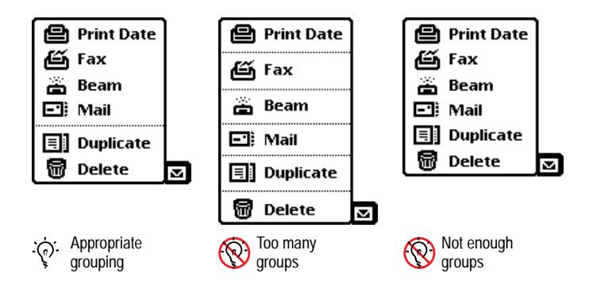

For general grouping of items in a picker, you should only use a dotted separator line, never a solid separator line. The solid separator line is reserved for setting apart choices related to storage, such as the names of available card stores and the internal store, at the bottom of a picker (see ["Folder Tab" on page 8-19](#page-260-0)).

## Sources of List Pickers 4

A list picker can pop up from a text button or text label marked with a black diamond (◆). In addition, a picker can pop up from a picture button or a hot spot, but for aesthetic reasons picture buttons and hot spots are not marked with black diamonds. [Figure 4-5](#page-133-0) shows pickers from those four sources.

List Pickers **4-7**

**Figure 4-5** Pickers can pop up from buttons, labels, and hot spots

<span id="page-133-0"></span>

For picker control at the bottom of a view or on the status bar, use text or picture buttons. Elsewhere in a view, label pickers usually look best.

## Position of List Pickers 4

A list picker that pops up from a button or text label should appear next to the label or button but should not completely cover the label or button, so users can see where the picker comes from. If a picker is too wide to fit in the space next to the picker label or button, the picker should appear below (or above) and flush with the label or button.

If possible, a list picker should line up with the top edge of the label or button that makes it appear. If top alignment would cause the picker to extend past the bottom of the screen, then the picker should line up with the bottom of the label or button that makes it appear. A long picker (or a short screen) may require aligning the top or bottom of the picker to the top or bottom of the screen. [Figure 4-6](#page-134-0) illustrates proper and improper alignment of list pickers and the labels or buttons that make them appear.

<span id="page-134-0"></span>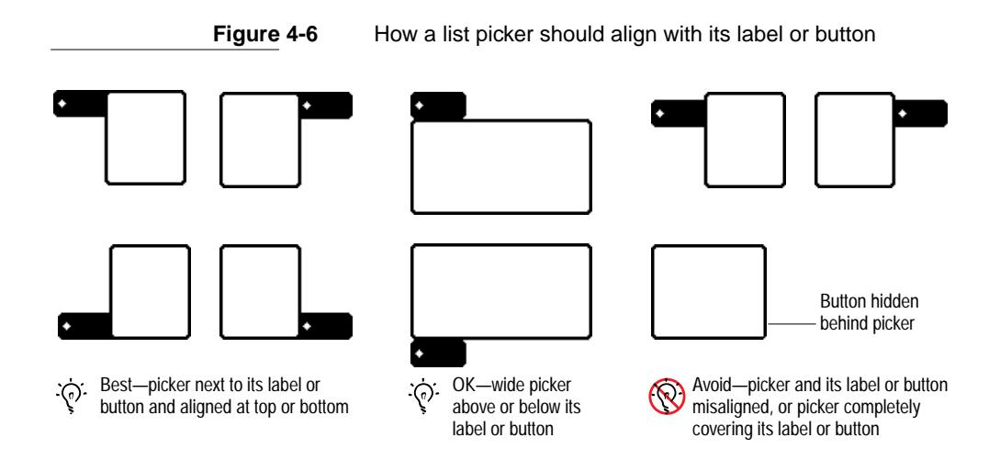

If you want your application to work when a user rotates the display (with the Extras Drawer's Rotate button), your application may need to make picker alignment dependent on screen size.

## Using a List Picker 4

A user makes a list picker pop up by tapping the button or label that controls it. While the picker is open, the application highlights the picker's controlling button or label. Nothing else happens until the user touches the screen again. The user does not have to press and hold the pen on the button or label to keep the picker open; the picker stays open until the user touches the screen again. If the user touches the screen outside the list, the picker goes away.

#### Picking an Item 4

A user picks an item listed in a list picker by tapping the item. The picked item blinks briefly, the picker disappears, and the action or effect associated with the picked item happens. [Figure 4-7](#page-135-0) shows the sequence of events for the Set button in the built-in Clock application.

List Pickers **4-9**

<span id="page-135-0"></span>**Figure 4-7** Using a list picker from a button


2. User taps a listed item to pick it

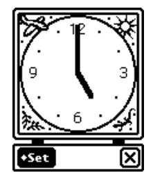

3. Picker disappears 4. Picked item takes effect but button stays highlighted until…

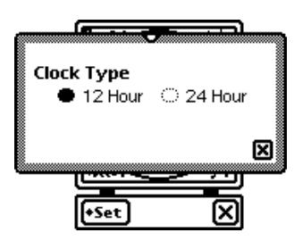

In the case of a list picker that pops up next to a text label, the current value of the picker (the most recently picked item) is usually displayed next to the picker label. The label and the value are customarily aligned at their baselines. The value should be displayed in the casual font, not in the system font like the picker label and picker items. Figure 4-8 shows the sequence of events with the label picker in the Sleep preferences slip.

**Figure 4-8** Using a list picker from a label

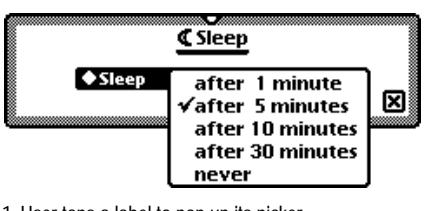

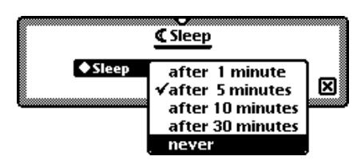

1. User taps a label to pop up its picker 2. User taps a listed item to pick it


3. Picker disappears and picked item appears next to picker label

<span id="page-136-0"></span>If a user touches a picker list and slides the pen instead of lifting it, the picker tracks the pen movement. As the pen appears over an item in the list, the item is highlighted. When the user lifts the pen within the list, the currently highlighted item blinks briefly, the picker disappears, and the effect associated with the picked item happens. If the user slides the pen outside the list, so that no item is highlighted, and then lifts the pen, the picker simply goes away. The display of electronic ink is turned off while the pen is tracked.

An item that can't be selected, such as a separator line, is not highlighted when a user taps it or slides the pen over it. Tapping an unselectable item or lifting the pen while it is over an unselectable item makes the picker go away.

After the user picks an item and the picker disappears, your application must continue to highlight the label or button that controls the picker until the action or effect associated with the picked item is complete. In the case of a picker item that displays an ordinary slip (not a status slip), the picker's controlling label or button stays highlighted only until the slip appears. Keeping the label or button highlighted provides the minimal feedback to the user that the application is still working. When a process begun by a picker item takes more than a few seconds, your application should provide more feedback by displaying a status slip that names the process underway (as described in ["Status Slips" on](#page-63-0)  [page 2-20](#page-63-0)).

#### User Editing of Pickers 4

If you want to allow users to be able to add, remove, and change items in a list picker, include an item "Edit" or "Edit Picker" at the bottom of the picker, with a separator line above it. Choosing this item should bring up a slip in which users can edit the picker. The slip should clearly indicate how many items the picker can contain. Title the slip to make its purpose clear, for example "Edit Category List."

Instead of allowing users to edit picker items, an application could automatically include recent inputs for an input field in that field's picker. For information on input fields, see [Chapter 6, "Data Input."](#page-168-0) 

List Pickers **4-11**

#### <span id="page-137-0"></span>Scrolling 4

A list picker may contain too many items to display at once on some Newton devices. This can happen when a user rotates the display (by tapping the Rotate button in the Extras Drawer). It can also happen if a user adds many items to a customizable picker, such as a folder picker.

When a list picker becomes too long to fit on the screen, the Newton operating system automatically reduces the picker's length and adds ordinary local scroll arrows to the picker. A user can tap the scroll arrows to bring more picker items into view. Figure 4-9 shows a scrolling folder picker.

**Figure 4-9** List pickers that are too long to display all at once have scroll arrows


As usual, the color of the scroll arrow indicates whether tapping it will bring more items into view. An arrow is black if tapping it will bring more items into view. An arrow is white if tapping it will not bring more items into view.

Users can also scroll list pickers by dragging from the middle of the picker past the top or bottom of the picker. Users cannot scroll a list picker with the universal scroll arrows. Tapping a universal scroll arrow or anywhere else outside a list picker makes the picker go away.

<span id="page-138-0"></span>Scrolling pickers are harder to use than pickers that don't scroll, because users have to remember the picker items that aren't currently visible. You should keep your pickers short and avoid scrolling pickers in your applications.

#### Index Tabs 4

If the list of picker items is very long, scrolling from one end to the other can be tedious. To give users a quicker method of traveling through a long list of picker items, you can augment scroll arrows with a series of small labeled index tabs displayed along the right edge of the picker. The tabs essentially divide the picker items into sections alphabetically, and a user taps a tab to see the section it identifies. Figure 4-10 illustrates picker scroll arrows and index tabs.

**Figure 4-10** A lengthy picker can include scroll arrows and index tabs

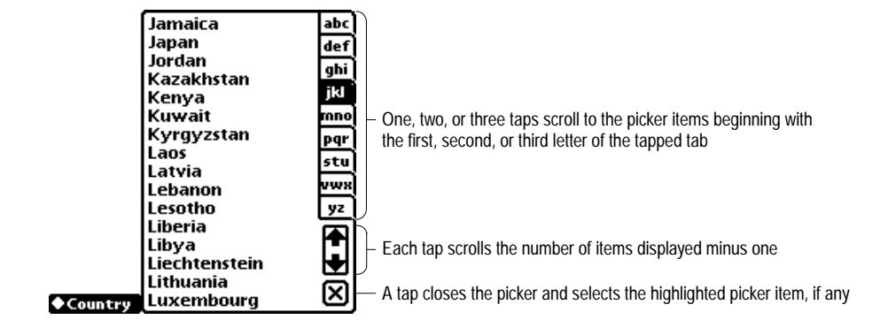

Tapping an index tab scrolls to the picker items that begin with the first letter of the tapped tab. Double-tapping an index tab scrolls to the picker items that begin with the second letter of the tapped tab. Triple-tapping an index tab scrolls to the picker items that begin with the third letter of the tapped tab.

In a list picker with an index tab, tapping a listed item selects the item but doesn't close the picker. To close the picker and confirm the selection, a user taps the picker's Close box. To cancel the selection and close the picker, a user taps outside the picker.

List Pickers **4-13**

## <span id="page-139-0"></span>Hierarchical List Pickers 4

If a list of picker items is extremely long, index tabs won't be enough to prevent interminable scrolling. What happens is a user taps a tab and immediately sees the beginning of the corresponding section of picker items, but the user still must scroll several times to find an item that's not near the beginning of that section. For example, imagine one picker that lists several hundred cities from around the world.

The solution to this situation is to create a two-level hierarchy of list pickers. The first-level picker contains a set of picker items and a diamond label. Tapping the diamond label pops up a second-level picker that lists different sets of picker items for the first-level picker. Picking an item in the second-level picker determines which set of items appear in the first-level picker. For example, compared to a single picker that lists hundreds of cities, a two-level picker hierarchy simplifies picking a city anywhere in the world. The firstlevel picker lists cities for just one country and contains the name of the country as a diamond label. A user can pick one of the listed cities or tap the diamond label to pop up a second-level picker that lists other countries. If the user picks a country, then the first-level picker changes to list that country's cities. [Figure 4-11](#page-140-0) shows how the city and country hierarchical pickers work.

**Figure 4-11** How a two-level hierarchy of list pickers works

<span id="page-140-0"></span>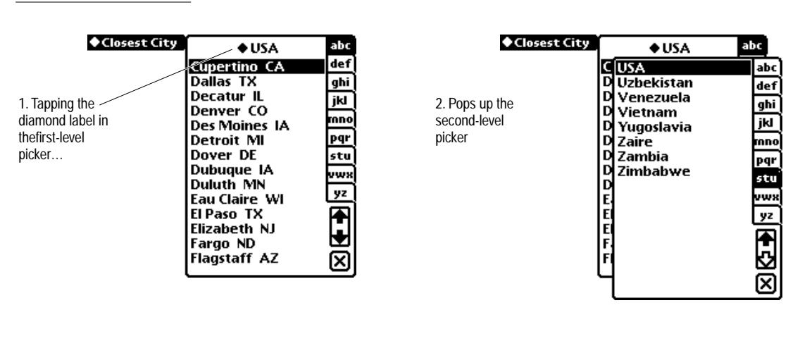


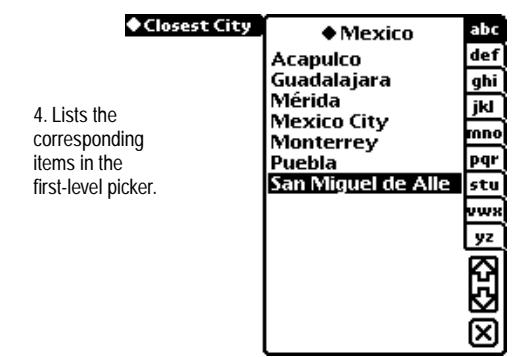

List Pickers **4-15**

#### <span id="page-141-0"></span>Number Picker

A number picker displays a number that a user can change by tapping the digits of the number itself. The digits are large and are split into top and bottom halves to make them easy for users to target. Tapping the top half of a digit increases it, and tapping the bottom half of a digit decreases it. Designed initially to replicate the old "mechanical digital" alarm clocks, the look of the number picker evolved so that only the flipping digits remain. Figure 4-12 shows an example number picker.

Figure 4-12 A number picker simplifies specifying a numerical value

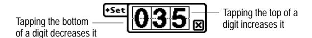

Like a list picker, a number picker pops up when a user taps its label, which begins with a diamond. Because a user may have to tap several times to specify a number, a number picker has a Close box. Tapping the Close box confirms the specified number and makes the picker go away. A user can cancel and close the picker by tapping anywhere outside it.

Specialized number pickers for specifying dates and times are used in other pickers described in the next two sections.

# <span id="page-142-0"></span>Date and Time Pickers 4

The system includes pickers for specifying a time, a date, a date and time, a start and stop time, a start and stop date, or a time offset. Each of these pickers pops up when a user taps its label, which begins with a diamond. Then the user can specify a date or time by tapping in the picker. The picker does not go away automatically when a user selects a date or time in it. Date and time pickers also contain a Close box, which the user must tap to confirm the selected time or date. The user can cancel the selection and close the picker by tapping anywhere outside the picker. Figure 4-13 and [Figure 4-14](#page-143-0)  show several time and date pickers.

**Figure 4-13** Time pickers specify a time, a time range, or a time offset


**Figure 4-14** Date pickers specify one date or a date range

<span id="page-143-0"></span>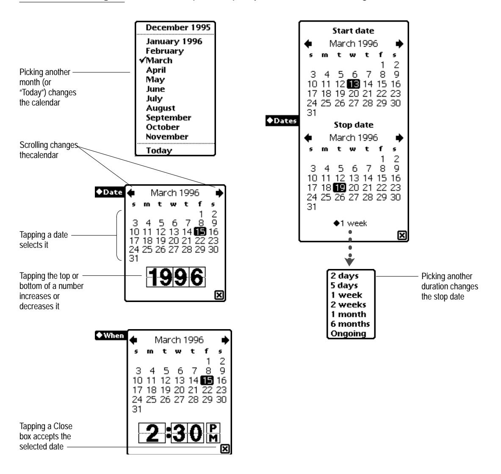

# <span id="page-144-0"></span>Overview Pickers 4

Like list pickers, overview pickers can pop up in response to a user tapping a text label or button marked with a black diamond, a picture button, or a hot spot. And overview pickers, like list pickers, are used to present a user with items from which to choose. That's about where the resemblance between the two types of pickers ends. For example, list pickers allow a user to select only one item, but overview pickers generally allow a user to select one or many items. The following sections describe overview pickers in detail.

## Contents of Overview Pickers 4

An overview picker presents a one- or two-column extract of stored data, such as names and phone numbers from the Names File data. The first column lists the identities of the individual data items that a user can select, and the second column provides additional information that a user can edit in place. A title in the upper left corner identifies the type of data in the picker. An overview picker can include a number of controls for finding specific entries, including a folder tab, alphabetic index tabs, and scroll arrows. At the bottom an overview picker can have a checkbox for restricting listed items to those currently selected, a New button for adding items to the list, a counter that reports the number of items selected, and a large Close box. [Figure 4-15](#page-145-0) points out features of overview pickers.

Overview Pickers **4-19**

**Figure 4-15** The parts of overview pickers

<span id="page-145-0"></span>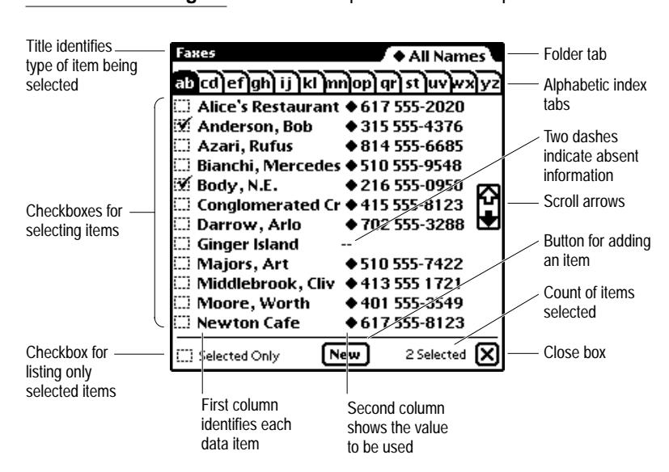

In most cases, your application is not responsible for the wording, punctuation, or capitalization of items in either column of an overview picker. Nor is your application responsible for the order of the items. The items are generally taken directly from stored data.

Overview pickers display items in the bold style of the system font. On an Apple MessagePad, the item names are 10-point text.

## Position of Overview Pickers 4

The conventional position for an overview picker is centered at the bottom of the screen. Overview pickers are large, so your application should not attempt to position one near the diamond label or other control that makes it appear. The usual size of an overview picker is 234 × 231 pixels.

## <span id="page-146-0"></span>Using an Overview Picker 4

A user makes an overview picker appear by tapping the appropriate label. The picker stays open until the user taps its Close box. The user does not have to press and hold the pen on the button or label to keep the picker open. An overview picker stays open even if a user taps, writes, or draws outside the picker.

#### Picking Items 4

A user selects items listed in an overview picker by tapping them. A selected item has a check mark in its checkbox. Tapping a selected item deselects it. For selecting or deselecting, tapping an item's name has the same effect as tapping its checkbox.

The picker reports the number of selected items at its bottom right corner, and the user can preview the set of selected items by tapping the Selected Only checkbox at the bottom left of the picker. An application can suppress the count of selected items, the Selected Only checkbox, or both in any of its overview pickers.

If a value in the right column of an overview picker begins with a black diamond, tapping it pops up a list picker that contains alternate values from the stored data plus a command for entering a new value. [Figure 4-16](#page-147-0) shows how this works in an overview picker that lists names and phone numbers.

If a user selects an item for which there is no value displayed in the right column of an overview picker, a slip appears in which the user can enter the needed information.

An overview picker can be set up to only allow selecting one item. In this case selecting an item automatically deselects the previously selected item. Setting up an overview picker for only one selection does not change the way the picker looks (the checkbox next to each item does not change to a radio button).

Overview Pickers **4-21**

<span id="page-147-0"></span>**Figure 4-16** Entering a new value in an overview picker


1. A user taps in the second column where a diamond indicates a list picker will pop up

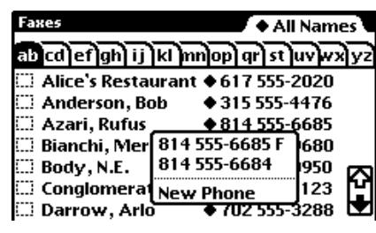

2. The user picks the New command

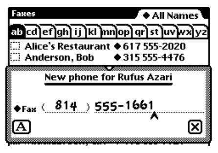

3. The user enters a new value in a slip and then taps the slip's Close box

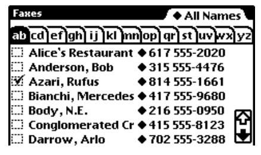

4. The new value appears in the overview picker and the item is selected

When a user closes an overview picker, the selected item or items are customarily displayed next to the picker label. The label and the value are customarily aligned at their baselines. The value should be displayed in the casual font, not in the system font like the picker label and picker items.

#### Scrolling Items 4

Most overview pickers list more items than can be displayed at once. Users can see more items by using the scroll arrows in the picker (unless the application has suppressed them). The color of the scroll arrow indicates whether tapping it will bring more items into view. An arrow is black if tapping it will bring more items into view. An arrow is white if tapping it will not bring more items into view.

<span id="page-148-0"></span>Users can also scroll overview pickers with the universal scroll arrows. In addition, users can scroll overview pickers by dragging from the middle of the picker past the top or bottom of the picker.

#### Creating New Items 4

When the item a user wants is not included in an overview picker, the user doesn't have to close the picker and go to another application to create the item. Users can create entirely new items without leaving an overview picker that has a New button. (If you don't want users to be able to create new items from within an overview picker, you can suppress the picker's New button.)

To create a new item, a user taps the New button at the bottom of the overview picker. A slip appears in which the user enters just the information needed for the picker. The new item is added to the picker and to the other information in Newton storage. For example, tapping the New button in an overview picker that lists names and fax numbers would bring up a slip in which the user enters a first name, last name, and fax number. The name and fax number would be added to the overview picker and to the Names File data. Later the user could use the Names File application to fill in additional information for the new person.

## Standard Newton Pickers 4

A typical application has some of the following standard Newton pickers pop up from buttons on its status bar or on separator bars: the Info picker, New picker, Show picker, Action picker, and People picker. This section describes all of those standard Newton pickers.

Additional pickers defined by the Newton system are described in other parts of this book. The Keyboard, Recognition, and Alpha Sorter pickers are described in [Chapter 6, "Data Input."](#page-168-0) The Action picker is described in [Chapter 7, "Routing and Communications."](#page-206-0) The Filing, Folder, Find, and Assist pickers are described in [Chapter 8, "Newton Services."](#page-242-0)

## <span id="page-149-0"></span>Info Picker 4

The Info picker pops up from the standard Info button at the left end of the status bar and gives users access to preference settings for the application, general information about the application, or on-screen help for the application. The Info picker contain any of these general-information items: About, Help, and Prefs. The Info picker may also contain additional items unique to the application. Figure 4-17 shows several example Info pickers.

**Figure 4-17** An Info picker lists information items


If you do not have all three general-information items—About, Help and Prefs—keep the ordering listed, but leave out the unused items. List any application-specific items below a separator line. If your application does not have any unique items in its Info picker, or if it has only unique items (not About, Help, or Prefs), then do not include the separator line. Any unique items you include in the Info picker should specify a state or initiate an action that affects the whole application.

An About box should include your application's name, version number, and copyright information. You can include additional information in the About box if you wish, such as a logo, credits, and acknowledgments. Include a Close box so users can put the About box away after reading it. Use a conventional matte border.

<span id="page-150-0"></span>Choosing Help from an Info picker displays online help for the application. For more information, see ["Help" on page 8-28](#page-269-0).

Choosing Prefs from an Info picker displays a slip containing applicationspecific preference settings. For more information, see ["Application](#page-272-0)  [Preferences" on page 8-31](#page-272-0).

## New Picker 4

The New picker lists the types of data items that can be created in the currently active application, such as a new note, checklist, or outline in the built-in Notepad application. In an application that supports Newton stationery, the New picker lists all the data structures defined for the application. For example, the built-in Names File's New picker lists Person, Company, and Group data structures. The New picker pops up from the standard New button on the left side of the status bar, next to the keyboard button. Figure 4-18 shows the New picker for the Names File application.

**Figure 4-18** The New picker lists types of data items that users can create

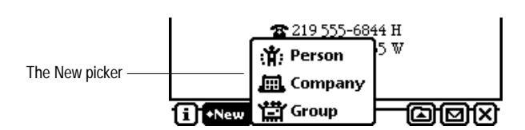

Picking an item from a New picker creates a new data item of the type picked. If the currently active application displays multiple data items one after another in a paper roll fashion like the built-in Notepad, then the New picker creates an item after the last item in the current view and automatically scrolls it into view.

## <span id="page-151-0"></span>Show Picker 4

The Show picker lists alternative views for displaying data in an application, such as the Card view and All Info view in the built-in Names File application. In an application that supports Newton stationery, the Show picker lists all the available views for types of data that the application uses. The active view has a check mark next to its name in the Show picker. In addition to alternate views, a Show picker can list commands that display a particular data item in the currently selected view. For example, the built-in Date Book application's Show picker lists Today, which is not an alternate view but is a command to display the calendar data for today. Figure 4-19 illustrates the Show picker for the Date Book.

**Figure 4-19** The Show picker lists alternate ways to see an application's data

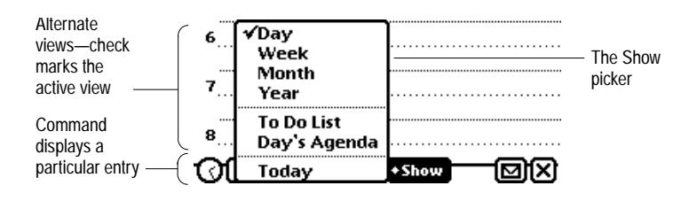

Picking a view or a command from a Show picker changes the view.

## Action Picker 4

The Action picker lists commands for sending and receiving data by communications methods, such as printing, faxing, beaming, and e-mailing. In many applications the Action picker includes additional commands for acting on data that's currently displayed. A separator line divides the routing commands from the other action commands. [Figure 4-20](#page-152-0) shows an example Action picker.

<span id="page-152-0"></span>**Figure 4-20** The Action picker lists commands for acting on data


Picking a routing command from an Action picker starts the routing process, which is detailed in [Chapter 7, "Routing and Communications."](#page-206-0) Picking the Duplicate command, if the Action picker includes one, makes an exact copy of the data item or items affected by the Action picker. Picking the Delete command, if the Action picker includes one, brings up a confirmation alert asking the user to authorize deleting the data item or items affected by the Action picker. The function of other commands listed below the separator line in an Action picker are determined by the application that adds them there.

## People Picker 4

The People picker is an overview picker that contains names of people and companies from the Names File and Owner Info applications. For each name, a People picker can also include a phone number, fax number, or e-mail address. The controls and behavior of a People picker are the same as any ordinary overview picker (see ["Overview Pickers" on page 4-19\)](#page-144-0). [Figure 4-21](#page-153-0) shows a sample People picker.

<span id="page-153-0"></span>**Figure 4-21** A People picker excerpts items from the Names File and Owner Info applications


Names only Names and associated data

<span id="page-154-0"></span>This chapter describes how to design **icons—**those small pictographs that represent objects or actions in the Newton interface. Topics covered include:

- Designing effective icons
- Extras Drawer icons
- Icons in titles
- Icons in buttons
- Icons in pickers

# Designing Effective Icons 5

This section presents some basic guidelines for designing effective icons. Remember that all your icon designs must work in the context of a Newton device. The theme of the Newton interface is communications. You want to build on this theme and diverge from it as little as possible. You must also consider other important facets of the Newton interface described here when you're designing icons.

## <span id="page-155-0"></span>Thinking Up an Icon Image 5

An icon is like the proverbial picture that's worth a thousand words only if it clearly identifies what it represents. Coming up with a tiny, grainy, black-andwhite visual image that is even relevant, let alone unambiguous, can be difficult. Far more of us have learned basic verbal skills than basic visual skills. There are several approaches you can take to finding a visual image that identifies what it represents.

If an icon has some correlation to a physical device, such as a calculator or a clock, the icon should resemble the device. If the icon represents part of a metaphor, such as an in box as a metaphor for the place where incoming communications are kept, the icon should resemble its metaphorical counterpart. For example, the In Box icon resembles a real in box, not some other repository such as a folder or a flour canister.

If you need to design an icon for a more conceptual entity, such as an application or part of an application, you can use one of the following approaches. Try making the icon represent the function of the application. If the function is complex and hard for new users to understand, think about how you could explain the idea to someone who doesn't use a Newton device, and try to generate some images that way. Often the terms you use and the analogies you come up with to explain the concept can provide clues for visual images.

Another approach to designing conceptual icons is making the icon representative of a product name. This may work for your product in one location, but remember that some product names, and thus product icons, may be impossible to localize. For example, in the United States, an icon for extensions could have something to do with an extension cord. In other languages, the word used for extension cords may have nothing to do with extensions, and therefore an icon based on the word *extension cord* would be meaningless. Another drawback to this approach is that product names are often not finalized until late in the development process, so you might not have much time in which to design an icon based on the final product name.

It is often easiest to create icons that represent objects (nouns) rather than actions (verbs). For example, the function of deleting something is represented by a wastebasket (an object) rather than by some image of the action of

<span id="page-156-0"></span>deleting. Thinking of an object that is representative of the function of your icon is the key to good conceptual design. Remember that for every image you generate, you need to consider the advantages and disadvantages of the idea in regard to your audience before deciding on the final design.

## Make Shapely Icons 5

People are good at recognizing patterns and shapes, so make the shape of an icon distinctive. Rectangular, slab-like icons all look the same, particularly without colors or shades of gray to create a pattern on them. Once users have seen a distinctively shaped icon and learned what it represents, they are likely to recognize it again and quickly recall its meaning. Figure 5-1 compares distinctively shaped icons with rectangular icons.

**Figure 5-1** Distinctive icon shapes are easier to recognize than rectangular icons


## Design for the Newton Display 5

A distinctive icon shape without any detail is just a shapely shadow. When adding detail to make an icon more interesting, keep in mind the capabilities, limitations, and conventions of the Newton display. To make your icons look like they belong on a Newton, use lines that are two pixels thick. An icon drawn with single-pixel lines looks like it belongs on a desktop computer. What's more, the thicker lines are easier to see in low light. Three-dimensional effects in icons are difficult to achieve on a Newton because they require shading and many angled lines. Those effects are difficult to render on screens

<span id="page-157-0"></span>that display only black and white (no shades of gray or colors), particularly in the smaller icon sizes.

Newton icons do not have drop shadows. There is no assumed light source to create an artificial shadow.

## Avoid Text in Icons 5

Avoid using text in your icons whenever possible. Text in icons can be confusing, and it's hard to localize for other regions, languages, or countries. It's appropriate to use text with icons, but not within icons. Figure 5-2 shows an example of icons with text in them and icons that convey the idea much better without text.

**Figure 5-2** Avoid text in icons

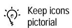


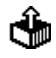


## Make All Sizes of an Icon Look Alike 5

If you make an icon in more than one size, maintain a close visual relationship among all sizes. Design the large icon first, and then adapt the design to the small icon. You can leave out inessential details in the small version of your icon, but it shouldn't look significantly different from the large version. [Figure 5-3](#page-158-0) shows examples of small and large icons.

You can't design each variation of an icon in isolation. The large and small variants are incarnations of the same icon, so the basic design must work for all of them. Be flexible in adapting your design to all sizes. Icon design is an iterative process. During the design process, you may need to redesign one version of an icon when you find it doesn't translate well to another version.

<span id="page-158-0"></span>**Figure 5-3** Small icon resembles large icon Small icon different Small icon similar Large icon

## Use Icons Consistently 5

Use icons consistently throughout your application. If there is an existing design for an icon, use it. Don't invent new designs for icons that have a standard design, such as the icons for printing, faxing, beaming, mailing, duplicating, and deleting. Figure 5-4 shows that the icon for faxing is the same in an Action picker, in the Fax routing slip, and in the Out Box.

**Figure 5-4** Use icon elements consistently Fax icon in Action picker Fax icon in Out Box Fax icon in Fax routing slip

People generally assume that different icons have different functions or behaviors, and they may try to find operational differences even if none exist. In contrast, where applications use standard icons consistently, users can quickly learn what those icons represent.

## <span id="page-159-0"></span>Think About Multicultural Compatibility 5

Your icons should be designed with multicultural use in mind. For example, to localize an icon for outgoing communications, you might consider using the design of a mailbox. But if you did, you would have to design a different icon for every country in which your product shipped. Instead, try to design one icon that is understood universally, or at least in many countries. An example of an icon that is understood around the world is the Out Box icon. Even though people in different locations around the world deposit mail in differently shaped boxes, they all still recognize the Out Box icon as a representation of outgoing communications.

In general, icons shouldn't be gratuitously cute. Humor typically doesn't translate well to other cultures or languages. Also, don't use inside jokes or pictures that represent code names. Although it might work to use such icons during your development process for product identification, be sure to remove them and replace them with appropriate icons before you ship your product. Symbols and colloquial language are usually culturally dependent, meaning that what one person relates to may have no meaning or may be an insult in another person's culture.

# Extras Drawer Icons 5

For users to be able to open an application, it must have an icon in the Extras Drawer. The application name appears beneath the icon in one or two short lines of text. In addition, an application that stores data has a storage icon in the Storage folder of the Extras Drawer.

## Extras Drawer Icons Together 5

As you design an icon for an application, look at it in the Extras Drawer next to other icons. Looking at your icon in the context of other icons may help you determine its visual impact. Is the design too light or too heavy? Is the

spacing comfortable between neighboring icons? How can the icon animate to make it inviting to use? Figure 5-5 illustrates some guidelines to consider when designing icons for the Extras Drawer.

**Figure 5-5** The good, the bad, and the ugly in Extras Drawer icons


Extras Drawer Icons **5-7**

## <span id="page-161-0"></span>Extras Drawer Icon Size 5

To maximize the number of icons visible at once, the Extras Drawer puts very little space between the icons in it. An application icon will be easier to recognize if it does not occupy all the space available to it in the Extras Drawer. Icons that fill their entire allotted space appear crowded and piglike. Sorry! A Newton PDA is not a desktop computer. Five icons take the same space in the Extras Drawer as just three and a half icons in a Mac OS™folder window. Figure 5-6 compares large and small icons in the Extras Drawer.

**Figure 5-6** Large icons crowd the Extras Drawer

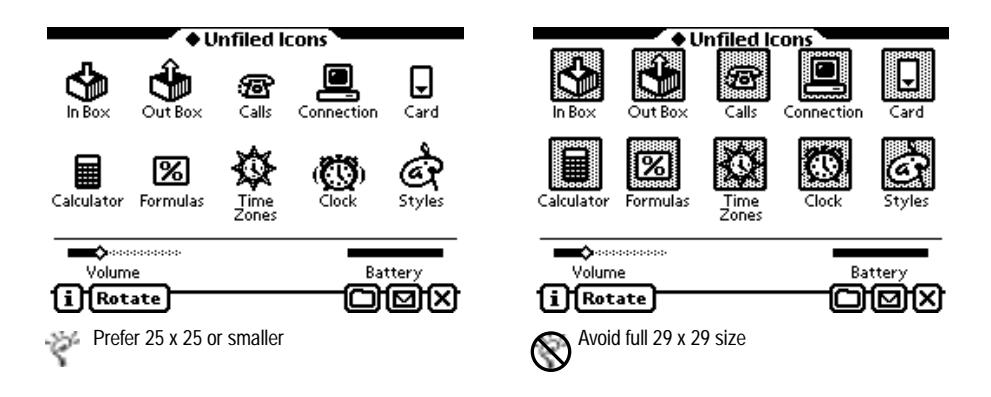

On an Apple MessagePad, the maximum size for an icon in the Extras Drawer is 29 pixels by 29 pixels, but smaller icons generally look better. A full-size square icon looks too tall, and may appear to be uncomfortably close to the icons above and below it. You should give your icon breathing room by making the body of the icon no bigger than 25 × 25. Use the four-pixel margin for sparse decorative accents or for visual irregularities that extend somewhat beyond the central part of the icon and give it a distinct shape. You can also use the extra space around a 25 × 25 icon for a mask that animates the icon (see ["Animating an Extras Drawer Icon" on page 5-9](#page-162-0)).

## <span id="page-162-0"></span>Extras Drawer Icon Shape 5

Icons for Newton applications generally should not look like icons for desktop computer applications. Boxy icons are common on desktop computers, where colors and shades of gray can distinguish one icon from another. In the Newton Extras Drawer, boxy black-and-white icons look too much alike, especially when they are in great number or are uniform in size. Try to give your Extras Drawer icon a distinguishing silhouette. If for some reason your design must use a black rectangular field, eliminate a pixel in each corner to make the icon more rounded. A rounded icon looks more Newtonlike.

## Extras Drawer Icon Names 5

When you design an Extras Drawer icon, you should also come up with the name to be displayed beneath it. If the name is too long to fit on one line, the Extras Drawer automatically wraps the name onto a second line. You can control where the line breaks by including a blank space or a hyphen at a judicious spot in the name. Despite this accommodation of two-line icon names, you should avoid them. A two-line icon name crowds the icon below it and diminishes the vertical separation between icon rows.

Whether one line or two, broad icon names may collide in the Extras Drawer. To keep an icon name from running into its neighbors, make it no more than 9 to 11 characters long per line. (The length depends on which letters are in the name, since letters are different widths.)

Don't worry about your careful work devising an icon name being undone by a user changing the name. Users cannot change the names of Extras Drawer icons.

## Animating an Extras Drawer Icon 5

Instead of having an Extras Drawer icon highlighted when a user selects it, you can have it appear to move or to change to an alternate state. For example, many of the built-in applications' icons feature this type of simple animation, including In Box, Out Box, Calls, Time Zones, Clock, Prefs, Setup, and Writing Practice.

Extras Drawer Icons **5-9**

<span id="page-163-0"></span>When a user selects an icon, the Extras Drawer creates the selected form of the icon by combining the unselected form of the icon with the icon's mask. The Extras Drawer uses the same method to animate one icon as it uses to highlight another. The design of the mask determines how the selected form of an icon looks—highlighted or animated. Figure 5-7 compares a mask used for highlighting with a mask used for animation.

**Figure 5-7** An icon's mask either highlights or animates the icon

Another mask creates an alternate form of the icon An all-black shadow mask highlights an icon **Not selected Mask Selected**

> Note: bounding boxes are for illustration only. Actual icons do not have bounding boxes.

The selected form of an icon is black only in spots where either the mask is black or the unselected form of the icon is black. The selected form is white wherever both the unselected form and the mask are black as well as where both are white.

You create a mask by comparing each pixel of the unselected form of an icon to the corresponding pixel of the selected form. If both forms of the icon have a black pixel in the same position or if both have a white pixel in the same position, the mask has a white pixel there. The mask has a black pixel where one form of the icon or the other has a black pixel, but not where both do. In making this comparison of the pixels, you are following the exclusive-or rule of logic. [Figure 5-8](#page-164-0) shows the masks of several animated icons.

<span id="page-164-0"></span>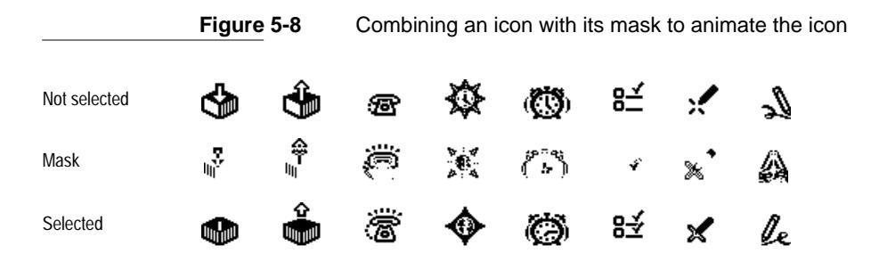

If you don't provide a mask for your application's icon, the Extras Drawer automatically creates one that is an all-black shadow of the icon. An all-black shadow mask combines with an icon to create a highlighted form of the icon.

# Title Icons 5

An icon at the beginning of a view title graphically represents whatever the title describes in words. For example, an icon at the beginning of a slip title indicates the function of the slip. An icon is optional in a slip title. Figure 5-9 illustrates a slip title with an icon.

**Figure 5-9** An icon in a slip title should decorate and inform


A title icon should be the same height as the title text. The usual font for the title is the 10-point bold system font, which calls for an icon 11 pixels tall on an Apple MessagePad. For more information on view titles, see ["View Title"](#page-47-0)  [on page 2-4.](#page-47-0)

Title Icons **5-11**

# <span id="page-165-0"></span>Button Icons 5

You can use an icon to label a button. For example, the Action button and the Filing button have icons as labels. The button may have a border or not, depending on the icon design and the button location (see ["Picture Buttons"](#page-100-0)  [on page 3-7\)](#page-100-0). Figure 5-10 shows a few buttons with icons as labels.

**Figure 5-10** An icon can label a button


If a button has a border, leave white space between the icon and the interior edge of the button border. On an Apple MessagePad, leave at least one pixel of white space between the icon and the border.

# Icons in a Picker 5

You can put an icon next to an item in a picker, although it is by no means necessary to do so. In fact, there are several reasons to avoid icons in pickers.

- Icons make pickers harder for new users to operate. Studies show new users initially take extra care (and time) to tap only the icons, not the text.
- Rarely can users select a picker item solely by looking at the icons and not reading the text.

- <span id="page-166-0"></span>■ Icons increase the size of a picker, not only in width but also in height. The larger a picker, the more it obscures what's beneath it.
- If you have one icon in a picker, you have to make companions for the other picker items. It can be hard enough to state the name or function of each picker item in a word or two, let alone to design an intelligible tiny pictogram for each item.

Use judgment: long pickers may not benefit as much from icons as shorter ones. Then again, there's nothing like a good shape to grab a user's eye once the user has associated it with something the user is seeking in a long list.

If you decide to include icons in a picker, try to make them useful mnemonic devices. Use icons to clarify and distinguish the wording of picker items. Avoid purely decorative doodads. Figure 5-11 illustrates the use of icons in a picker.

**Figure 5-11** Icons can help communicate picker item functions

Do not exceed 16 pixels high by 22 pixels wide; smaller is better

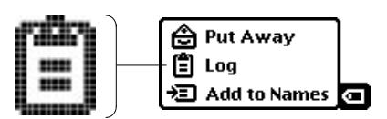

Icons in lists may represent individual items or they may label some attribute of each item, such as the type of item.

To be consistent with icons in existing pickers, a picker icon should not exceed 16 pixels in height or 22 in width. This does not mean you should go ahead and make all your icons 16 pixels high. Consider 16 pixels the maximum icon height in pickers, to be used only in it it's difficult to create a recognizable image with fewer pixels. Only two of the icons in the built-in MessagePad applications are 16 pixels high: the Log and Put Away items in the In/Out Box.

Where possible, vary the sizes of icons in a picker. It's not uniform size that makes icons unify a picker, give visual relief, and jog users' memories. To do that, give all the icons in a picker the same visual weight and style, but unique shapes and configurations.

Icons in a Picker **5-13**

The standard Newton pickers automatically align each icon with its text at their vertical midpoints. If you want to adjust the centering—visually balancing the icon as opposed to mathematically centering it—you can include white pixels at the top or bottom of the icon.

<span id="page-168-0"></span>Although some applications for Newton devices only present information to people, many applications gather data from people as well. A person can input information in a Newton application by

- Tapping and dragging to select an input from a list or range of options provided by the application
- Writing and drawing to input text and shapes
- Typing text on an on-screen keyboard.

The Newton interface elements that applications use for these input methods are described in the first two sections of this chapter. There's also a section on handling user errors.

# Input Fields 6

An application gathers user input in areas called **input fields.** An input field generally consists of a text label, a value, and some means of changing an existing value or entering a new value. [Figure 6-1](#page-169-0) illustrates some typical input fields.

Input Fields **6-1**

<span id="page-169-0"></span>**Figure 6-1** Users enter and edit data in input fields

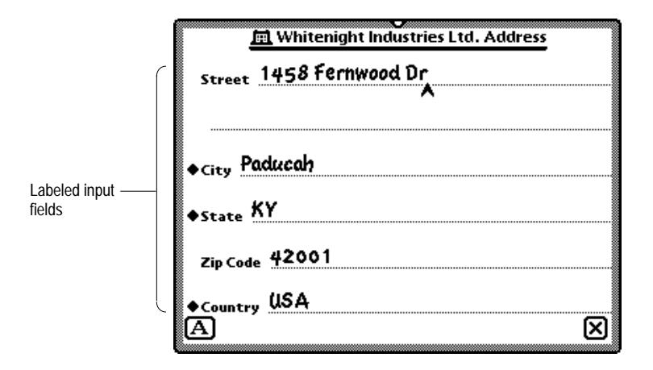

Align field labels in neat columns, and be consistent in how you align field values with field labels (including picker labels). Line up every field's label with the field's displayed value, or line up every field's label with the dotted line on which a user edits the field value.

Use the bold style of the system font for text that is the voice of the application or system, such as field labels. Use the plain style of the casual font for text that represents the voice of a user, such as values the user enters or changes. The casual font contrasts well with the system font and it has tested very well with users. On an Apple MessagePad, use the 9- or 10-point size of the system font and the 10- or 12-point size of the casual font.

Field labels are usually capitalized like sentences. That is, you capitalize the first word but not any additional words unless they are proper nouns. Do not put a colon at the end of a field label. The consistent use of fonts make it clear which text is a label and which is a value.

# <span id="page-170-0"></span>Tapping 6

People can quickly and accurately input data that an application presents in a multiple-choice format such as a picker, scrolling list, set of checkboxes, cluster of radio buttons, or slider. A user simply taps or drags to choose an input value from the options presented.

## Pickers 6

Pickers allow a user to enter information in a way that is fast, fun, and intuitive. They have the added advantages of being easy to target and taking up minimal real estate. The Newton system defines many types of pickers: list pickers, overview pickers, location pickers, date pickers, time pickers, and number pickers. In most of these pickers, a user can input data with a couple of taps.

A picker simplifies data input by listing all the possible values, or at least several common values, for an input field. A field's picker is not visible until a user taps the field's label, which begins with a diamond. Then the picker pops up, and the user can pick a listed input by tapping it in the picker. If the user taps one of the picker items, the picked item becomes the field value and the application displays it next to the field label. If the user does not tap any of the picker items, there is no change to the selected input displayed next to the picker. [Figure 6-2](#page-171-0) demonstrates how a picker works for data input.

A picker may always list the same set of inputs, or it may list different input items each time it pops up. The application can modify a picker in response to user input or to changes in the application's environment.

Tapping **6-3**

**Figure 6-2** How a picker works for data input

<span id="page-171-0"></span>

For more information on pickers, see [Chapter 4, "Pickers."](#page-126-0)

## Scrolling Lists and Tables 6

Like a picker, a **scrolling list** is a list of items from which a user selects a field value. A scrolling list does not usually show its whole list of items at once, but a user can see items that aren't currently visible by scrolling the list with local scroll arrows. A user can also scroll by tapping and dragging the pen either above or below the list. [Figure 6-3](#page-172-0) shows examples of a scrolling list with local scroll arrows.

A user can select a listed item by tapping it, and an application may allow a user to select multiple items by tapping each item in turn. If a scrolling list includes a checkbox next to each item, then each selected item has a check mark in its checkbox. If a scrolling list does not include checkboxes, then the selected items are highlighted. Tapping a selected item deselects it. Users don't have to select anything in a list. They can just scroll through a list to peruse its contents.

A scrolling list has a thin black rectangular border with square corners. It can be any size that fits the view that contains it.

**Figure 6-3** Data input using scrolling lists with or without checkboxes

<span id="page-172-0"></span>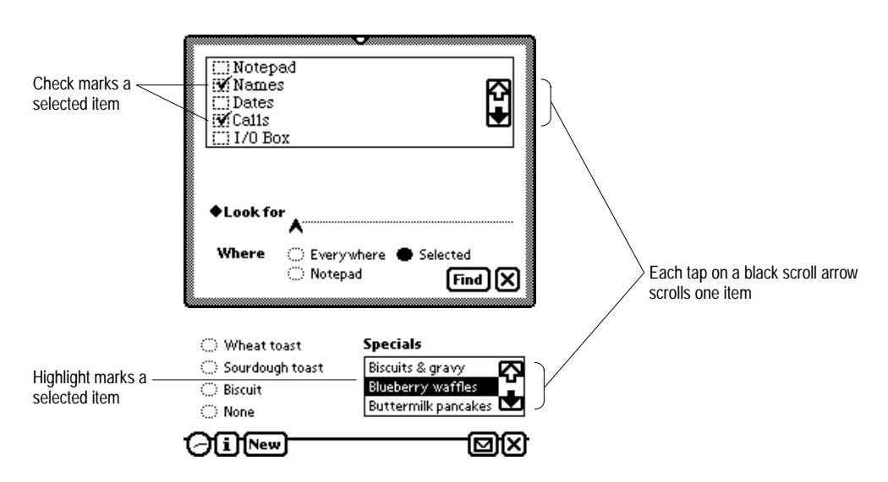

If a scrolling list uses local scroll arrows, they should only appear when the list is long enough to require scrolling. Use conventional black and white scroll arrows like those used in a Find slip when the Where option is set to Selected (see ["Local Scroll Arrows" on page 2-39\)](#page-82-0).

Each time a scrolling list appears, it may list the same items or different items. An application can modify a scrolling list in response to user input or changes in the application's environment.

Some scrolling lists may need to accommodate items whose text is too long to fit the list. When this is the case, your application should eliminate text in the middle of a long item and insert an ellipsis (…) there, preserving the beginning and ending of the item. Text items may be the same at the beginning and middle, so if you cut off the end of the text item, users lose that context and must guess which of the several item names that begin the same is the desired one. Although an ellipsis is preferable in the middle of a long item, an application may simply truncate the item and suffix an ellipsis.

Tapping **6-5**

<span id="page-173-0"></span>A scrolling list is not the best way to input one value across a range of values. Since the full range isn't visible all at once in a scrolling list, users have a hard time understanding the scope of their choices. Pickers work well for listing discontinuous values across a range, such as 1 minute, 5 minutes, 10 minutes, 30 minutes, and Never. Sliders work very well for displaying a continuous range of values and for letting users choose any value in the range.

## Radio Buttons 6

For a field that can have just one of a few unchanging values, an application can use a cluster of radio buttons. A user selects an input from a cluster of radio buttons by tapping one of the radio buttons. This automatically deselects the previously selected radio button in the cluster. A cluster of radio buttons always offers the same choices; the radio buttons never change dynamically depending on context. Figure 6-4 shows a sample cluster of radio buttons.

**Figure 6-4** With radio buttons, a user can select one value for a field The selected radio button is black

Notice that a cluster of radio buttons offers a user the same choices as a short picker. On the downside, radio buttons take up more space in a view than a picker because they are always visible in the view. On the upside, being always visible makes radio buttons faster and easier to use than a picker. There's no need to tap and a wait (however briefly) for anything to pop up.

For a detailed description of radio buttons, see ["Radio buttons" on page 3-1.](#page-94-0)

## <span id="page-174-0"></span>Checkboxes 6

For a field that can have one or more of a few unchanging values, an application can use a set of checkboxes. Figure 6-5 shows a set of checkboxes.

**Figure 6-5** With checkboxes, a user can select more than one value for a field


A user can select any number of checkboxes by tapping them one by one. Tapping a checkbox that is already selected deselects it. A set of checkboxes always offers the same choices; the checkboxes never change dynamically depending on context. For a detailed description of checkboxes, see ["Checkboxes" on page 3-18](#page-111-0).

## Sliders 6

For a field that can have any value in a range, such as a magnitude, position, or probability, an application can use a slider. Figure 6-6 shows an example of a slider.

**Figure 6-6** A slider used for data input

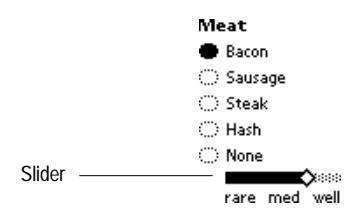

For more information on sliders, see ["Sliders" on page 3-20.](#page-113-0)

Tapping **6-7**

# <span id="page-175-0"></span>Writing, Drawing, and Editing 6

In some places users can't be restricted to multiple-choice input methods. They must be able to input their own text or shapes (pictures). The Newton interface includes several elements in which users can write text or draw pictures. Some of these interface elements recognize text from handwriting or printing, some recognize geometric shapes from line drawings, and one interface element recognizes both types of input. All of the interface elements that recognize text or shapes also recognize a common set of gestures with which users can correct and edit text and shapes.

## Text Input 6

There are several interface elements for text input. They can accept all types of written input, including general text, numbers, phone numbers, dates, and time. Applications can also tune the text-input elements for a specific type of text, such as numbers, phone numbers, or dates. All text-input elements have the following capabilities:

- **Recognition** Automatically transform handwriting or printing to typeset text. (An application can let users turn off or delay recognition.)
- **Ink Text** Display and store handwriting and printing exactly as written, in **electronic ink,** for later transformation to typeset text at the user's discretion.
- **Text insertion** Add newly written words at the **caret** symbol displayed on the screen or at the end of the nearest line, depending on how the user sets handwriting preferences.
- **Clipping** Automatically clip text that won't fit, by showing an ellipsis to indicate text beyond what is visible.
- **Correction** Let users correct misrecognized text.

- <span id="page-176-0"></span>■ **Editing** Let users edit text—select, delete, copy-and-paste, duplicate, and move.
- **Formatting** Let users format individual words and characters in several different fonts, styles, and sizes.

Where there is space to write paragraphs of text (not just single lines), the text input elements also have these capabilities:

- **Word wrap** Re-form lines of text as a user writes additional words, adjusting spaces between words and wrapping words from the end of a full line to the beginning of the next line without breaking in the middle of the word.
- **Paragraph resizing** Automatically lengthen or shorten a paragraph as a user adds or deletes words from it, and allow a user to select and manually resize paragraphs.
- **Side-by-side paragraphs** Create a new paragraph alongside an existing one when a user writes words far away from the existing paragraph.

Almost all of these capabilities apply both to recognized text and to ink text. The exception: Users cannot correct ink text, since it has not been recognized. (Users can edit ink text, however.)

#### Simple Input Line 6

A simple **input line** consists of a dotted line to write on, as shown in Figure 6-7.

**Figure 6-7** How an unlabeled text-input line works

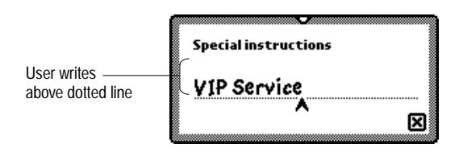

#### <span id="page-177-0"></span>Labeled Input Line 6

A labeled input line consists of a simple input line with a text label at its left. Optionally this label can have a pop-up picker that lists common values, and a user can choose one to save the effort of writing it. As usual, a diamond at the beginning of a label indicates the option of a picker. Figure 6-8 shows examples of labeled input lines with and without a picker.

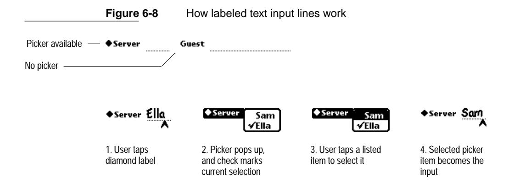

If you choose to implement the picker behavior, it means users can tap the label to pop up a list of input options. If a user chooses from the picker, that choice appears on the input line as if the user wrote it there. The choice is marked with a check mark in the picker. Ordinarily the chosen text replaces all text on the input line, if any. Your application can provide different behavior, if necessary. For example, choosing from the Please picker in the Assist slip inserts the chosen text at the beginning of the input line without replacing any text.

#### <span id="page-178-0"></span>Text Input Lines that Expand 6

You can reduce the amount of space required for several stacked input lines in your application by using expanding input lines, which are called **expandos.**  Each expando consists of a text label to the left and a text value to its right. When a user taps an expando (the label or the value), a text-input area expands from it. A user can write in the expanded text-input area, and can close it by tapping another expando. Closing an expando collapses it and updates its value. If the expando currently has no value, two hyphens are displayed. Figure 6-9 shows how an expando works.

**Figure 6-9** How expandos work

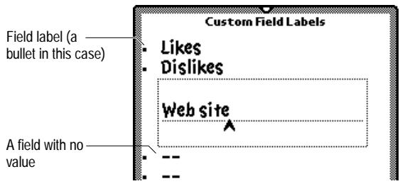

1. After editing the expanded field, a user taps an input field that's not expanded

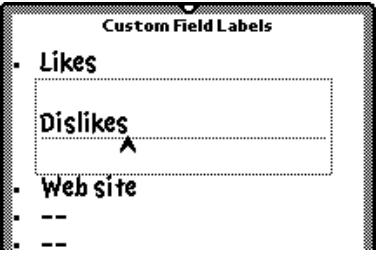

2. The previously expanded field collapses and the tapped field expands

Although expandos seem to make the most of a small amount of screen space quite elegantly, they have not proven successful with users. The way they work is not particularly intuitive, and users are prone to making mistakes with expandos even after learning how to use them. Instead of expandos, you should consider using straightforward labeled input lines in slips.

Avoid including buttons or other controls in expandos. When expanded, an expando should only contain an input line. If your application needs more than that in an expando, it should be using slips instead.

#### <span id="page-179-0"></span>Paragraph Input 6

Another interface element accepts the input of multiple lines or paragraphs of text. This interface element can appear simply as a blank area in which a user can write information, but usually it contains one or more horizontal dotted lines, like lined writing paper. These lines indicate to users that the area accepts input. Figure 6-10 shows an example.

**Figure 6-10** Interface element for multiple-line or paragraph text input

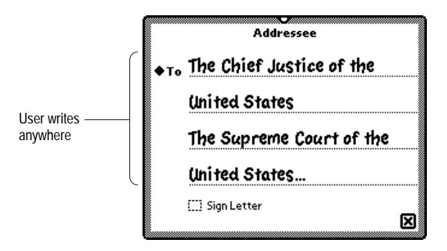

#### Structured List Input 6

The Newton interface also includes an element for the input of structured lists such as outlines and checklists. A structured list consists of a sequence of topics, each of which may be one or more paragraphs long. To the left of each topic is a small circular topic marker and an optional checkbox. A user can drag a topic's marker to move that topic above or below another topic. A user can make a topic subordinate or not subordinate to the topic above it by dragging its marker right or left. This ability to create a topic hierarchy can be suppressed by an application in any structured list. [Figure 6-11](#page-180-0) shows an example of a structured list view.

**Figure 6-11** A user can rearrange a structured list by dragging topic markers

<span id="page-180-0"></span>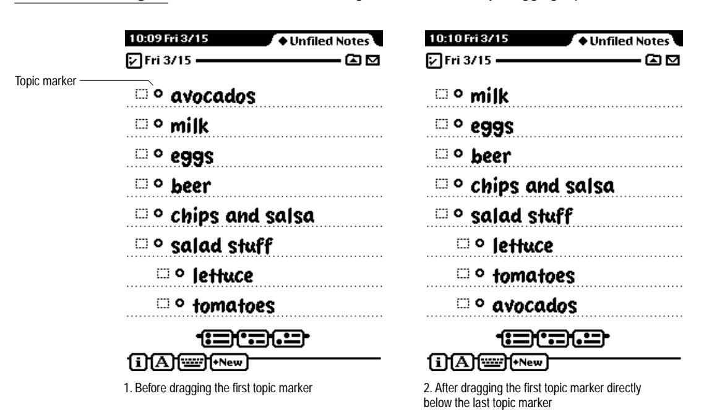

## Shape Input 6

There is one interface element for the input of geometric shapes. It can be a blank area in which users can draw, or it can contain dotted lines to cue users that the area accepts input. [Figure 6-12](#page-181-0) shows an example.

Shape-input areas have the following capabilities:

- **Recognition** Automatically recognize geometric shapes such as rectangles and other polygons, circles and ovals, and straight lines and curves.
- **Gravity** Automatically snap new line endpoints to nearby corners and midpoints of existing shapes.

<span id="page-181-0"></span>**Figure 6-12** Interface element for shape input


- **Editing** Let users edit shapes—select, delete, copy-and-paste, duplicate, reshape, resize, and move.
- **Formatting** Let users set the line thickness of individual shapes and shape segments.

## General Input 6

The one interface element for general input lets a user write text and draw shapes. If the user writes text, the general input element creates a paragraph and operates within that paragraph like the paragraph-input element described in ["Paragraph Input" on page 6-12](#page-179-0). If the user draws shapes, the general input element creates a shape-input area and operates like the input element described under the heading ["Shape Input" on page 6-13](#page-180-0). [Figure 6-13](#page-182-0) shows an example of a general input element.

**Figure 6-13** Interface element for general input

<span id="page-182-0"></span>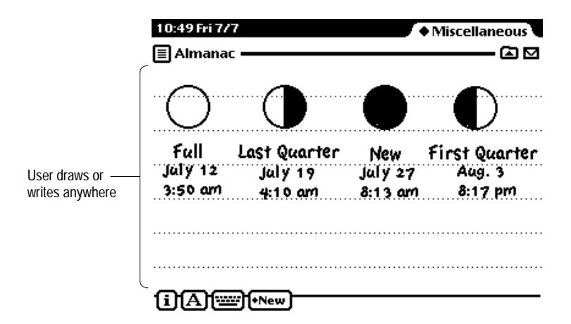

## Recognition 6

The Newton operating system is able to recognize handwriting, printing, and drawing, transforming it into typeset, editable text or editable geometric shapes. The Newton system can also recognize a common set of pen gestures for correcting and editing input. The recognition system has a sophisticated multiple-recognizer architecture. There are separate recognizers for words, geometric shapes, and gestures, any of which an application can make simultaneously active. An arbitrator in the recognition system examines the results from simultaneously active recognizers and returns the recognition match that has the highest confidence.

The text recognizers can handle printed, cursive, or mixed handwriting. They can work together with built-in dictionaries to choose words that accurately match what a user has written, and they can recognize a user's writing letter by letter. A user can also add new words to a personal dictionary.

The shape recognizer recognizes both simple and complex geometric objects, cleaning up rough drawings into shapes with straight lines and smooth curves. The shape recognizer also recognizes symmetry, using that property, if present, to help it recognize and display objects.

<span id="page-183-0"></span>You don't need to do anything in your application to handle ordinary recognition. The Newton system's input interface elements handle recognition of writing and drawing, including a method for users to correct misrecognized words. For example, when a user writes a word on a labeled input line, that interface element automatically passes the pen strokes to the system's text recognizer, accepts the recognized word back, and displays the typeset word. If the recognizer misreads a word, the user can double-tap the word to bring up a list of other possible matches for it, or to use the on-screen keyboard or Corrector view to correct it.

#### User Control of Recognition 6

Recognition is modeless. That is, users do not need to put the system in a special mode or do all their writing and drawing in a special slip. Users can write in any text-input area and draw in any shape-input area. They can also write text and draw shapes in any general-input area.

An application that has general-input areas needs to allow users to designate whether to use the text recognizer or the shapes recognizer. In addition, users should be able to temporarily disable the text recognizer or the shape recognizer as appropriate for the type of input area. The customary way to provide control over recognition is with a Recognizer button and picker, as shown in Figure 6-14.

**Figure 6-14** The Recognizer button and picker give users control over recognition

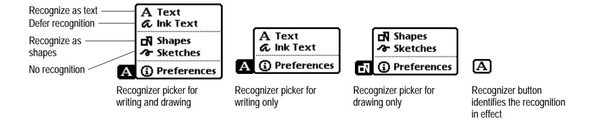

<span id="page-184-0"></span>The Recognizer picker lists the type of recognition options that are appropriate for the type of input users can make. If users can only write text, the recognizer should only include text-recognition options—Text and Ink Text. If users can only draw shapes, the recognizer should only include shapes-recognition options—Shapes and Sketches. The Recognizer picker should include all recognition options if users can write text and draw shapes.

The last item in the Recognizer picker is always Preferences. Selecting it gives users quick access to the handwriting recognition section of the built-in Preferences application.

The Recognizer picker usually pops up from a Recognizer button on the left side of the status bar (next to the Info button). In addition, users may need to control recognition separately in slips. The Recognizer picker should also pop up from a Recognizer button in the lower left corner of a slip that allows users to input text or shapes if that slip covers the status bar and can't be moved out of the way. A slip should also contain its own recognition control if it allows both text and shape input but the Recognizer picker on the status bar only offers text-recognition options. Figure 6-15 shows a shows a slip with its own recognition control.

**Figure 6-15** Users may need to control recognition separately in a slip


In this application, the Recognizer picker on the status bar only controls text recognition


Another Recognizer picker controls text and shapes recognition in a slip that allows writing and drawing

#### <span id="page-185-0"></span>Deferred Recognition 6

A user can defer text recognition by selecting Ink Text from a Recognizer picker. While recognition is set to Ink Text, the Newton system recognizes word boundaries but does not recognize words, letters, numbers, or symbols themselves. Later a user can double-tap ink text to have the Newton system recognize it. The user can double-tap one word at a time or can select a group of words and have them all recognized by double-tapping the selection. As the Newton system recognizes a word, it displays a small curved arrow above it and then replaces the ink text with typeset text. When a user double-taps a selection of several words, the Newton system recognizes them all, displaying a small curved arrow above each one in turn, before replacing the ink text selection with typeset text.

In general, ink text can appear anywhere regular text can appear, and the two can be mixed. Your application should permit ink text everywhere it accepts general text entry. There are times when users need the speed of ink text, and there are users who prefer ink text over recognized text. For those users, ink text is an important data-input tool. If your application does not allow ink text, you have needlessly limited the number of satisfied customers.

Of course there are exceptions to allowing ink text universally. An application that needs to make decisions or perform calculations based on what users write can't allow ink text. For instance, the built-in Formulas application doesn't and shouldn't allow ink text, because it makes calculations based on values that users write. Similarly, an application that keeps track of mileage might allow ink text in user comments or notes, but not elsewhere. Yet that application would be more versatile if it allowed ink text everywhere and deferred calculations based on ink-text values. A user in a hurry could jot down information in ink text without worrying about recognition errors. Later the user could double-tap the ink text to have it recognized and the application could make calculations based on the newly recognized text.

Your application does not have to disallow ink text in input fields that may be used for sorting or sequencing. If a user writes ink text in such a field, your application can display an Alpha Sorter picker, in which the user selects a sort key. [Figure 6-16](#page-186-0) shows how the built-in Names File application uses

<span id="page-186-0"></span>an Alpha Sorter picker if a user writes ink text in the Name field (which determines the card's sequence).

If your application simply sorts ink text with recognized text, the ink text comes before the recognized text that comes first alphabetically.

**Figure 6-16** In an Alpha Sorter picker, users select a sort key for ink text


#### Forcing Recognition 6

Under some circumstances your application may have to recognize ink text forcibly. For example, when a user tries to place a call to an ink-text phone number, the Calls application forces recognition of the ink text. If your application forces recognition, make sure it allows the user to correct mistakes in the recognized text before it acts on the text.

#### Configuring Recognition 6

You can configure recognition separately for each field in your application. For example, in one field you could disable recognition of shapes and configure the text recognizer to recognize only names, and in another field you could configure recognition differently.

No matter how you have configured recognition for a text field, users can input the wrong type of text if they try hard enough. For example, a user may manage to input numbers where words are the proper type of input. This happens because every kind of text recognition uses the built-in symbols dictionary, which includes all digits and some punctuation together with all letters of the alphabet. Users have to try hard to input an improper type of text because recognition is weighted towards the proper type of text, and that is what the recognizer usually returns. But if an input stroke is vague enough, the recognizer might return an improper type of text, such as a number instead of a letter. Thus users can manage to write virtually anything in any text field.

Here is a complete list of recognition options that applications can control:

- Allow users to control recognition with a Recognizer button on the status bar, in a slip, or both.
- Separately enable or disable recognition of words, shapes, and editing gestures.
- Recognize words letter-by-letter without using dictionaries.
- Improve recognition of complex stroke groups in which users tend to put large spaces, such as telephone numbers. This is accomplished by disregarding spatial cues (distance between gestures or strokes), and relying solely on temporal cues (time between the end of one stroke and the beginning of the next one) to determine when a user has completed a group of strokes.
- Make the Names dictionary or any other built-in dictionary the primary dictionary. (The Names dictionary contains common names for a user's locale, not the names contained in the built-in Names application.)
- Use custom dictionaries with specialized words such as product names or plant species.
- Limit word recognition to one or more of the built-in dictionaries (proper names, surnames, first names, names of days and months, names of countries, names of states, names of cities, names of companies, abbreviations of states, common words, and user's words).

- <span id="page-188-0"></span>■ Recognize punctuation marks. Preceding a word: single quotation mark, double quotation mark, left parenthesis, or hyphen. Following a word: single quotation mark, double quotation mark, right parenthesis, hyphen, period, comma, exclamation point, question mark, colon, or semicolon.
- Force capitalization of the first letter of every word.
- Recognize numbers, including monetary amounts, decimal points, and signs (+ and −). (Can't be used in combination with letter-by-letter recognition.)
- Recognize phone numbers. (Can't be used in combination with letter-byletter recognition.)
- Recognize dates. (Can't be used in combination with letter-by-letter recognition.)
- Recognize times. (Can't be used in combination with letter-by-letter recognition.)

## Editing 6

Users must be able to change input they have written, drawn, or typed. In all the Newton input areas described in this chapter, people can use consistent techniques for the following data-editing actions:

- Select text and shapes
- Join words
- Break one paragraph into two
- Erase text or shapes
- Insert space in text
- Insert new text
- Replace text
- Correct misrecognized text
- Change capitalization of text
- Change paragraph margins

- <span id="page-189-0"></span>■ Remove extra space from paragraphs
- Duplicate text or shapes
- Change shapes
- Move objects

The techniques people use for these editing actions are described in the next 12 sections (ending with ["Moving Objects" on page 6-32](#page-199-0)).

To make these editing actions available in your application, you don't have to do anything at all as long as you use standard input elements based on Newton prototypes. Although you can make some of the editing actions available in custom input areas, you can't make them all available. In particular, it's impossible to implement the customary techniques for selecting multiple objects, moving objects, changing paragraph margins, and more.

#### Selecting Text and Shapes 6

Users must select text or shapes before copying, moving, or otherwise manipulating them. To select an object, a user holds down the pen on or near the object until a heavy mark appears under the pen and the Newton device makes a high-pitched sound. Then the user draws the highlighting mark over or around the object. (The sound does not happen if the "Pen sound effects" option is turned off in the Sound section of the built-in Preferences application.) [Figure 6-17](#page-190-0) shows how selection works.

To select words, a user draws the highlighting mark across them. To select text that's on more than one line, a user draws the highlighting mark from the beginning of the first word to the end of the last word. To select several whole lines of text, a user draws the highlighting mark vertically through the lines of text.

To select lines in a shape, a user draws the highlighting mark along the lines.

To select whole paragraphs, shapes, or a combination of text and shapes, a user circles them with the highlighting mark. The highlighting mark doesn't need to be close to the items, as long as it encloses them completely and doesn't enclose anything else. The Newton system puts a gray selection box around the object or objects the user circled.

**Figure 6-17** Selecting words and shapes

<span id="page-190-0"></span>

A user can extend a selection or select more objects by drawing additional highlighting marks. If they are far apart, the user may select one at a time. Selected objects do not have to be adjacent, but all selected objects must be in the same input area. Anything that is selected remains selected when the user selects more in the same input area. If a user selects nonadjacent objects,

<span id="page-191-0"></span>objects that the user has not selected may appear within the borders of the gray selection box, but only the selected objects are highlighted.

#### Erasing Text or Shapes 6

To erase text or shapes, a user scrubs them out with zigzag gestures. Immediately after scrubbing, the user hears a poof sound and sees smoke clouds cover the scrubbed objects. The smoke quickly dissipates to reveal the scrubbed objects have disappeared.

A zigzag must go back and forth at least four times to be considered a scrubbing gesture. The zigzag should have sharp corners, and each segment of the zigzag should be about the same length. The zigzag can have any of the four orientations shown in Figure 6-18.

**Figure 6-18** Orientations of the scrubbing gesture


Depending on the size of the zigzag, it can erase a letter, a word, or a group of words. Also depending on its size, one zigzag can erase a whole shape or part of one. In addition, a single zigzag can erase text and shapes that have been selected. [Figure 6-19](#page-192-0) shows examples of scrubbing a little and scrubbing a lot.

<span id="page-192-0"></span>**Figure 6-19** Scrubbing a little or a lot A single word A group of words A single letter (scrub over the letter at least four times) Part of a shape Selected text and shapes (start scrubbing outside the selection to avoid moving it) A whole shape

The effect of scrubbing may be different if a user first selects several objects. If a user selects several objects, contiguous or not, and then scrubs over all or any part of the selected objects, all the selected objects are deleted. Unselected objects, if any, are not deleted by this scrub. However, if nothing is selected, all objects touched by the scrubbing gesture are deleted.

Your application doesn't have to do anything to handle scrubbing in input areas that are based on Newton prototypes. If you make other input areas, you must program them to recognize the scrubbing gesture, play the poof sound, and display the dissipating smoke animation sequence. Scale the smoke cloud to the size of the user's zigzag gesture, keeping the height and width proportional to the original image's dimensions. Do not scale the smoke cloud down so much that it becomes unrecognizable, even if the zigzag gesture is very small.

#### <span id="page-193-0"></span>Joining Words 6

To join words, a user draws a V between them at their baselines, as shown in Figure 6-20.

**Figure 6-20** Joining two words

#### Breaking Paragraphs 6

To break one paragraph into two, a user draws a backwards L at the desired breaking point, as shown in Figure 6-21.

**Figure 6-21** Breaking a paragraph into two paragraphs

1. User draws a small V between two words 2. System joins the words


1. User draws a backwards L 2. System breaks paragraph at that point

#### Inserting Space in Text 6

To insert space in text, users draw carets and lines as shown in [Figure 6-22](#page-194-0). The top of the caret should line up with the baseline of the letters.

<span id="page-194-0"></span>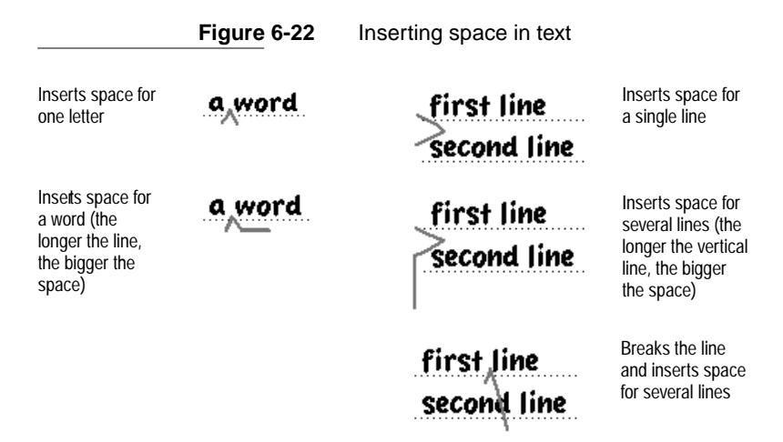

#### Inserting New Text 6

When a caret is displayed in an input area, it marks the point where the Newton system will insert newly written words. No matter where a user writes in the input area, the Newton system inserts the text at the caret. It doesn't matter whether the system is set for text recognition or ink text. Figure 6-23 illustrates the caret.

**Figure 6-23** A caret marks the text insertion point

| Caret |                                 |                                      |
|-------|---------------------------------|--------------------------------------|
|       |                                 |                                      |
|       |                                 |                                      |
|       | 1. User writes the word success | 2. New word is inserted at the caret |

<span id="page-195-0"></span>A user can move the caret simply by tapping the screen at the desired location. Users always know and control exactly where their writing goes.

The caret is not displayed if a user turns off the "Insert new words at caret" option in the Handwriting Recognition section of the built-in Preferences application. In that case, a user can insert a new word by writing it on top of the word it should precede; the Newton system shifts the old word to the right and inserts the new word.

A user can input a punctuation mark or other special character by choosing it from the picker that pops up when the user taps the caret. In addition, the Caret picker allows a user to break a paragraph at the caret (moving the caret to the start of the new paragraph); delete the character to the left of the caret; or insert a blank space. Figure 6-24 shows the Caret picker.

**Figure 6-24** The Caret picker lists 14 hard-to-write characters and three actions


#### <span id="page-196-0"></span>Replacing Text 6

By extending the method for inserting text, a user can replace existing text. Instead of tapping to position the caret, the user drags the highlighting mark to select the text to replace. Then the user writes the replacement text anywhere on the screen and the selected text is replaced.

#### Correcting Misrecognized Text 6

If the Newton system does not recognize a word correctly, the user can correct it by several means. For one, the user can replace any letter by writing another letter over it. The user also has the option of selecting or erasing the word and writing it again. Another alternative: the user can double-tap a word to pop up a picker that lists some alternate words. From the list of alternates the user can select one as a replacement. Figure 6-25 shows how a Correction picker works.

**Figure 6-25** How a Correction picker works


At the bottom of the Correction picker are three buttons: a Keyboard button, a Corrector button, and a Try Letters button. Tapping Try Letters causes the Newton system to ignore the recognition dictionaries and try to recognize the word letter by letter. Tapping the Keyboard button displays a keyboard,

with which the user can type corrections. Tapping the Corrector button brings up a Corrector view, in which the user can make corrections to individual letters. The user can write over a letter to replace it, delete a letter by scrubbing it, or insert a space in which to write an additional letter. In addition, the user can tap a letter in the Corrector view to pop up a Correction picker that lists alternate letters plus the commands Insert and Delete. Figure 6-26 shows how a Corrector view works.

**Figure 6-26** How a Corrector view works


1. User taps Corrector button

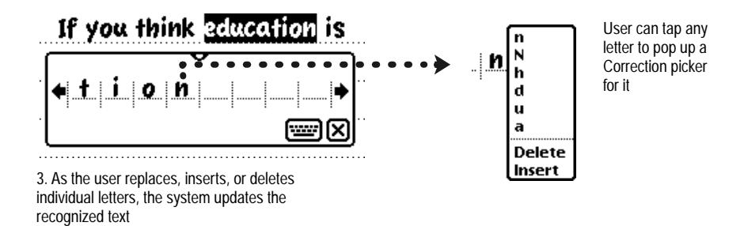

The Corrector view can also be used for bulk correction. In this scenario, the user leaves the Corrector open and one by one taps words to be corrected. Software developers can define corrector templates for different types of data (dates, times, etc.).

#### <span id="page-198-0"></span>Changing Capitalization of Text 6

To change how a word is capitalized, a user selects the word and then draws a vertical line over it. Drawing the line in an upward direction over the first letter of the word capitalizes that letter. Drawing the line upward over the middle of the word capitalizes all letters. Drawing the line downward changes capital letters to lowercase.

#### Changing Paragraph Margins 6

To change paragraph margins, a user selects the paragraph by drawing a selection box around it. Then the user holds the pen on the left or right side of the box and drags it.

#### Removing Extra Space from Paragraphs 6

To remove extra space from a paragraph, a user selects the paragraph by drawing a selection box around it. Then the user taps the border of the box.

#### Duplicating Text or Shapes 6

After selecting text or shapes, a user can duplicate the selection by quickly tapping twice inside the selection and not lifting the pen after the second tap. That gesture is called **tap-and-a-half** because the pen goes down, up, and down again (but not up again). Keeping the pen down, the user then drags a duplicate away from the original item.

#### Changing Shapes 6

After drawing a selection box around a whole shape, a user can drag any corner to change the shape. Dragging a corner or edge of the selection box stretches, shrinks, or distorts the whole shape.

#### <span id="page-199-0"></span>Moving Objects 6

A user can move an object—text, ink text, sketch, shape, or a combination of them—by selecting the object and then dragging it to another part of the same input area or to another visible input area. The user can also drag the selected object to the top, left, or right edge of the screen, where it becomes a miniature and attaches itself to the edge of the screen. Then the user can go to another view and drag the miniature from the edge of the screen to any visible input area.

# Typing 6

Wherever users can write text on a Newton device, they can type it using an on-screen keyboard as well. Figure 6-27 shows the four keyboards that are built into the Newton system. You can also create custom keyboards for use in your application.

**Figure 6-27** The four built-in keyboards

Typewriter (alpha)


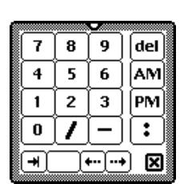

Numeric

Phone


Time/Date

## <span id="page-200-0"></span>Displaying Keyboards 6

There are several ways users can display a keyboard. One is to double-tap any blank space in a text-input area. Another is to double-tap a word to bring up a Correction picker and then tap the keyboard in that picker (as described under ["Correcting Misrecognized Text" on page 6-29](#page-196-0)). Users can also bring up a keyboard by tapping any visible Keyboard button. (An application can put a Keyboard button on the left side of its status bar and at the bottom left corner of slips, as described in ["Keyboard Button" on page 3-25](#page-118-0).)

If a keyboard is already displayed, then tapping a Keyboard button pops up a Keyboard picker. The Keyboard picker lists the available keyboards, and a user can select one by tapping its name in the Keyboard picker. A check in the Keyboard picker marks the currently selected keyboard. Figure 6-28 shows the Keyboard picker in the built-in Notepad application.

**Figure 6-28** A Keyboard picker lists alternate on-screen keyboards


Any time the user is about to input data that the Newton system is unlikely to recognize, such as an e-mail address, your application should automatically display an appropriate keyboard for the user. Another option is to embed a keyboard in a slip used for data input, as the built-in Names File application does. [Figure 6-29](#page-201-0) shows a keyboard embedded in a slip.

Typing **6-33**

<span id="page-201-0"></span>**Figure 6-29** A keyboard can be embedded in a data-input slip

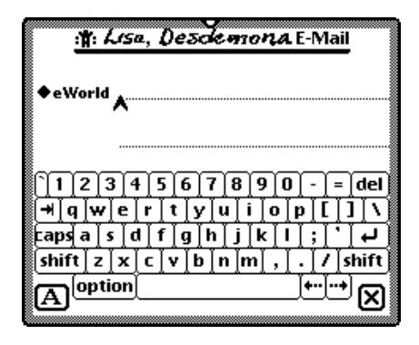

## Keyboard Position 6

When a user brings up a keyboard it should appear centered above the status bar, floating above other views. If possible, the keyboard should be situated vertically where it does not cover the text-insertion caret. A user can move a keyboard by dragging its drag handle, and can bring up other views above the keyboard.

## Keys 6

There are three kinds of keys on a Newton keyboard: character keys, modifier keys, and editing keys. A character key enters text. A modifier key redefines the most of the character keys. An editing key moves the text-insertion caret.

#### Character Keys 6

Most of the keys on a keyboard are character keys. There are character keys for letters, numbers, punctuation, and blank space. If the user taps one of these keys while entering text, the corresponding character is added to the text. The tab, return, and del keys also act as character keys. Although they don't add characters to the text, they do have a visible effect on the text, as described in the following paragraphs.

#### <span id="page-202-0"></span>Return 6

In a field that allows entering multiple lines of text, the return key inserts a carriage return at the text-insertion caret. It ends the current paragraph and moves the caret to the beginning of the next line. In a field that allows entering one line of text, the return key moves the caret to the next text-input field in the same container view. Tapping the return key is never a shortcut for tapping a button or other control. In particular, tapping the return key does not close the frontmost container view.

#### Tab 6

In a field that allows entering multiple lines of text, the tab key moves the text caret to the next tab stop. In a field that allows entering one line of text, the tab key moves the text caret to the next text-input field in the same container view.

#### Del 6

The del key deletes currently selected text. If no text is selected, tapping the del key removes the character preceding the text caret.

#### Shift 6

The shift key acts like its namesake on a typewriter. It changes the character produced by the next tap on a character key, making alphabetic keys produce capital letters, number keys produce punctuation or symbols, and so on. Unlike the shift key on typewriter or personal computer, the Newton shift key is not pressed concurrently with pressing a character key. The Newton shift key locks on when tapped and releases automatically when a character key is tapped.

#### Caps 6

The caps key makes the alphabetic keys produce capital letters but has no effect on any other keys. In other words, even when caps is on, a user must tap the shift key to produce punctuation and symbols with the number keys

Typing **6-35**

<span id="page-203-0"></span>and other nonalphabetic keys. The caps key locks on when tapped and stays on until tapped again; even closing a keyboard does not turn off the caps key.

#### Option 6

The option key changes the character produced by the next tap on a character key to produce a set of international characters and special symbols. For example, in many Newton fonts, option-4 produces the ¢ symbol, option-r produces ®, and option-g produces ©. Like the Newton shift key, the Newton option key is not pressed concurrently with pressing a character key. The Newton option key locks on when tapped and releases automatically when a character key is tapped. Option can be used together with shift, in combination with a character key, to produce still other symbols. For example, option-shift-? produces the Spanish ¿ character.

#### Arrow Keys 6

The left arrow and right arrow keys move the text caret left or right one character at a time. If a user selects some text and then taps an arrow key, the text is deselected and the caret appears at the right or left edge of the selection. This action doesn't move the selected text.

If a user selects a shape and then taps an arrow key, nothing happens. The selected shape does not move, and the selection does not change.

Arrow keys never duplicate the function of scroll arrows.

The modifier keys—caps, shift, and option—have no effect on the arrow keys.

## Type-Ahead and Auto-Repeat 6

If a user types more quickly than the Newton system can handle, the system queues the extra keystrokes for later processing. This queuing is called **type-ahead.** There's a limit to the number of keystrokes that can be queued, but this limit is usually not reached unless the user types while an application is performing a lengthy operation.

<span id="page-204-0"></span>When a user holds the pen on a key for a certain amount of time, the system acts as if the user were repeatedly tapping that key. This feature, called **auto-repeat,** affects character keys and modifier keys alike. Auto-repeat does not function during type-ahead. It operates only when the Newton system is ready to accept typing.

# Error Handling 6

Applications need to strictly check user input for errors while providing several easy ways for users to correct their mistakes.

## Error Correction 6

Users can edit their input with a common set of gestures (see ["Editing" on](#page-188-0)  [page 6-21](#page-188-0)). In addition, tapping the Undo button reverses the effect of a user's most recent action. Tapping Undo a second time undoes the undo.

The Newton interface elements provide undo capabilities for most user input. This includes writing, drawing, typing, correcting, editing, selecting a radio button, tapping a checkbox, setting a slider, and choosing from a picker of a labeled input line or expando.

Your application provides all other undo capabilities. For example, if a user chooses an item from an ordinary picker (not one that's part of a labeled input line or expando), your application is responsible for letting the user undo the choice by tapping the Undo button. Undo should apply to a single recent action, not to a set of actions. Users should be able to undo individual actions taken in a slip, but once the slip is closed there is nothing to undo.

You don't need to enable undo for every user action. In general, you should enable undo for actions that change data. You generally do not need to enable undo for actions that change the view of data or the environment, such as scrolling. From a user's standpoint, the most desirable actions to have reversed by the Undo button are the actions that would be most difficult to reverse manually. You should consider the needs of your audience when deciding which actions can be undone.

Error Handling **6-37**

When a user initiates an action that can't be undone and could be very difficult to reverse by hand, your application should warn the user and give the user a chance to cancel the action. For example, if a user is about to change a lot of text with a search-and-replace operation that can't be undone, display a confirmation slip that says something to the effect of, "OK to make this change? (Can't undo)."

## Error Detection 6

Users may notice and correct some input errors, but your application should also check input items for validity. There are a couple of approaches you can take to error checking, depending on the circumstances and users' expectations.

One approach is to check an input item for errors as soon as a user moves on to another input item. With this approach, a user must correct an error before the input gets stale or leads to other input errors. However, a user who makes lots of mistakes may feel pestered by what seem to be nitpicking error messages.

Another approach is to check all input items in one view at the same time, when a user taps a button to confirm all the input items and close the view. This approach only disrupts the user once per view instead of once per input item. If you take this approach, try to make your error messages as specific and diagnostic as possible. It's all too easy to make error messages vague.

<span id="page-206-0"></span>The Newton system provides a standard user interface for sending and receiving data by several communications methods, called **transports.** Most Newton systems come with transports for printing, faxing, beaming, and e-mailing. You can develop additional transports that users can install and remove at will, independent of installing and removing applications. The system makes newly installed transports available immediately in all applications, built-in and otherwise, and makes newly removed transports unavailable immediately in all applications.

If you are developing an application and want to give users access to transports for sending your application's data items, you include Action buttons in the application's container views. If you want your application to receive incoming data items, you have your application tell the system which types of items it can handle. The rest of the user interface for sending and receiving data items is provided by the transports, the system, and the built-in In/Out Box application.

This chapter describes the Newton routing and communications interface in detail, covering the following topics:

- What role the In/Out Box application plays in routing incoming and outgoing data items
- How users route outgoing items, including how the Action button works and how transports get routing information from users

- <span id="page-207-0"></span>■ How users route incoming data items
- When and how transports should display status information
- When and how transports should allow users to stop an ongoing transfer of data items
- How transports should provide user preference settings
- What alternative routing methods are available

This chapter discusses the Newton routing and communications interface in the context of the applications and the transports that come with most Apple MessagePad models. Applications and transports you develop should follow these models.

# The In/Out Box 7

The built-in In/Out Box application holds incoming and outgoing data items received or sent by a Newton transport—a communications method such as printing, faxing, beaming, and e-mailing. On some Newton devices, the In/Out Box application has two icons in the Extras Drawer, one labeled In Box and the other labeled Out Box.

A user can open the In/Out Box application by tapping whichever of these icons is present: the In Box icon, the Out Box icon, or the In/Out Box icon. Once the application is open, the user sees either incoming items in the In Box or outgoing items in the Out Box, and can switch between them by tapping a radio button in the application's main view. The user can choose to sort the items in the In Box and the Out Box by various criteria, such as date, type of transport, or status. [Figure 7-1](#page-208-0) shows the In Box and Out Box overviews with the items sorted by type of transport.

**Figure 7-1** The In/Out Box application displays either the In Box or the Out Box

<span id="page-208-0"></span>

## The In Box 7

The In Box is where a user first sees and deals with incoming faxes, e-mail, beamed items, and other data items received by Newton transport software. Users can view many types of incoming data items in detail while the items are still in the In Box, and can send some items directly from the In Box. Most items remain in the In Box until a user puts them into other applications. For example, a user can read incoming e-mail messages and then print them, send replies to them, or fax copies of them directly from the In Box before putting them into the Notepad application.

Some incoming items may not remain in the In Box for a user to put away. An application can have the Newton system immediately transfer specific types of incoming items from the In Box to the application. For example, incoming stock quotes from a wireless modem could be transferred automatically to a stock-tracking application.

The In/Out Box **7-3**

## <span id="page-209-0"></span>The Out Box 7

The Out Box holds data items coming from all applications and waiting to be printed, faxed, beamed, e-mailed, or sent by other Newton transport software. Items in the Out Box stay there until a user physically connects the Newton to a suitable output device and chooses to send the items. For example, a user may choose to fax and e-mail several items while aboard an airplane. Those items go into the Out Box and wait until the user connects the Newton to a fax modem and a phone line and sends the items.

Users can view many types of outgoing items while the items are still in the Out Box. In addition, users can change the content, routing, or addressing of some items in the Out Box. For example, a user could direct a printed item to a different printer, edit the text of an e-mail message, or change a fax number.

Users can also send some Out Box items directly from the Out Box. For example, if the Out Box contains a fax waiting to be sent, a user can also print the waiting fax directly from the Out Box.

A transport can be designed to connect and transfer out data items a user sends to it as soon as those data items appear in the Out Box. For example, a transport for wireless communications could automatically transfer out items as soon as a user sent them from an application, without the user having to open the Out Box.

## In/Out Box Items 7

The In/Out Box shows the same header information for each item it displays in the In Box or Out Box. Each item's header consists of an icon that identifies the transport, followed by the item's title and status. A second line shows the name of the sender or recipient, followed by the date and time the item was put in the In/Out Box. [Table 7-1](#page-210-0) explains the meanings of the standard status words displayed in the In/Out Box headers.

**Status Meaning** In Box New Body has not been displayed yet Read Body has been displayed Remote Body has not been received yet (just header) Logged Item logged (header kept; body deleted) Out Box Pending Item not ready for sending (routing slip incomplete) Ready Item ready for sending Sent Item sent

<span id="page-210-0"></span>**Table 7-1** Meanings of status words in the In/Out Box headers

## Viewing Items in the In/Out Box 7

Error Attempt to send failed

Logged Item logged (header kept; body deleted)

Users can see more than just header information for some types of items in the In/Out Box. For example, the In/Out Box can show a page preview of print and fax items. It can also show item detail in views based on templates that other applications provide. The built-in applications provide view templates for their data, and your application can provide additional view templates for that data or its own data. If you want users to be able to see your application's data in detail in the In/Out Box, your application must define view templates and register them with the system. If no application provides a view template for a particular type of data, the In/Out Box displays a generic blank view.

The In/Out Box **7-5**

<span id="page-211-0"></span>If applications provide multiple view templates for the type of data currently on display in the In/Out Box application, the In/Out Box includes a Show button and picker, so users can choose among the available views. For example, when a Names File item is displayed in the In/Out Box, the Show picker lists at least the two choices All Info and Card (which the Names File application provides). Figure 7-2 illustrates a Show button in the In/Out Box.

**Figure 7-2** A Show button provides access to alternative views


## Viewing Routing Information 7

When viewing the detail of an item in the In/Out Box, the transport icon to the left of the item title is an Item Info picture button, and a user can tap it to display a view that gives routing information about the item. [Figure 7-3](#page-212-0) shows an example.

In the In/Out Box application, an Item Info slip displays the item title as an editable field, the transport icon and name, and the item's size. The slip may display other information, depending on the type of transport. For example, Item Info slip for a fax transport shows the fax resolution and the recipient's fax number.

<span id="page-212-0"></span>**Figure 7-3** Viewing routing information in an Item Info slip

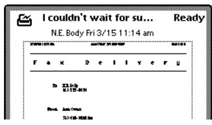


# Routing Outgoing Items 7

There are several steps involved in sending an item from an application through the Out Box to an output device. First, a user chooses a routing action from an Action picker. Next, the user supplies routing information in a routing slip provided by the transport that performs the chosen routing action. Then the system places the item in the Out Box. Eventually, a transport transfers waiting items in the Out Box to the proper output devices. For example, a user might choose Print from an Action picker in the Notepad application, and in the Print routing slip might choose a printer that's not available. Later, the user would connect the printer, and the print transport would send the waiting print item to the printer.

This section describes how a user sends data items from an application with an Action picker. Alternative routing methods are covered in ["Routing](#page-239-0)  [Alternatives" on page 7-34.](#page-239-0)

## <span id="page-213-0"></span>Action Button and Picker 7

Users can send items from any application that has an Action button, which is a picture button that looks like the back of an envelope. To send the currently selected data item, a user picks a routing action from the Action picker that pops up when the user taps an Action button. The Action picker lists all transports capable of sending the currently selected data item, and it may list other actions provided by the application. Figure 7-4 shows a sample Action button and picker.

**Figure 7-4** An Action picker lists the transports available for sending

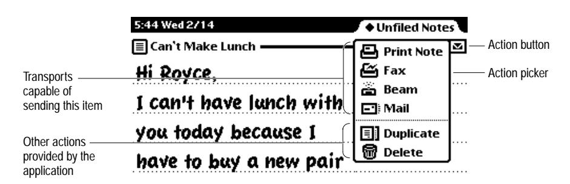

The routing action that a user chooses from an Action picker applies to the data in the view that contains the Action button. If the view contains multiple data items that can be individually selected, such as the items listed in an overview, then the routing action picked by the user applies to the currently selected items.

If there is nothing to route when a user taps an Action button (for example, if the user taps the Action button in an overview without first selecting any items), the system displays a notification alert containing the message "Nothing is selected." The warning message does not appear in an application that defines its own Action-picker items unless the application removes those items when there is nothing to act on. Your application can include actions that can function without a target item; in this case your application should not disable those actions, and the warning message will not appear.

#### <span id="page-214-0"></span>An Action Button's Location 7

The scope of an Action button determines where it should be located. If an Action button can affect all the data in a view, it should go at the bottom right corner of the view, next to the view's Close box. For example, the main view of the Names File application has one Action button, and it affects all data in the view. In the backdrop application, which has no Close box, the Action button goes at the bottom right corner of the application's main view. Figure 7-5 shows examples of views with one Action button each.

**Figure 7-5** An Action button at the bottom of a view affects the entire view

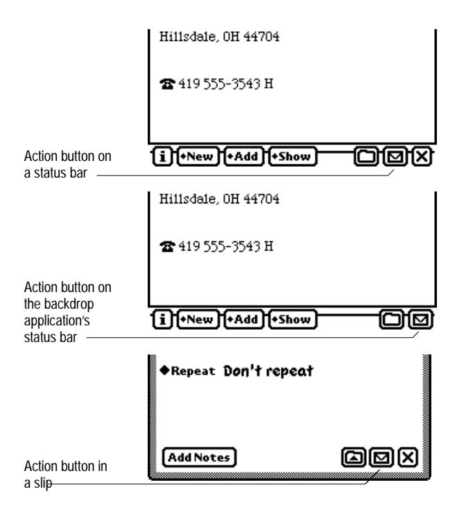

<span id="page-215-0"></span>In a view where an Action button can only affect one data item of several that may be displayed (perhaps by scrolling the view), there should be an Action button above each item, at the right side of the view. Generally, such a view has a separator bar above each data item, and an Action button should be at the right end of each separator bar. For example, each note in the Notepad application has its own Action button, which applies just to that note. Figure 7-6 shows an example of Action buttons above each data item in a view.

**Figure 7-6** An Action button above an item affects only that item

| Action button on<br>a separator bar |  |
|-------------------------------------|--|
|                                     |  |
|                                     |  |

#### Action Picker Contents 7

An Action picker lists the routing actions available for the particular class of data that is currently selected. There are two types of routing actions that can appear in an Action picker:

- Routing actions corresponding to transports installed in the Newton device, such as Print, Fax, Beam, and Mail
- Application-defined actions, such as Delete and Duplicate, that do not involve the In/Out Box or a transport

Actions based on transports that work with the type of data being routed are listed at the top of an Action picker. Application-defined action commands appear at the bottom of an Action picker, below a separator line. [Figure 7-7](#page-216-0) illustrates the two parts of an Action picker.

<span id="page-216-0"></span>**Figure 7-7** An Action picker can include two kinds of actions

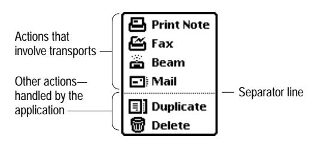

Note that the first action listed in an Action picker has the name of the target item appended to it (for example, "Print Note"). Other actions listed in the same picker do not have the name of the target item appended.

A Newton device has certain transports built in; the exact configuration depends on the capabilities of the device. For example, an Apple MessagePad 120 comes with transports for printing, faxing, e-mailing, and beaming. Users can install additional transports at any time.

#### Building an Action Picker 7

The system builds every Action picker dynamically, at the time a user taps an Action button. This allows all applications to take advantage of new transports that might be installed in the Newton device at any time. Because the system is responsible for building an Action picker, an application need not know anything about the available transports. Likewise, transports can be removed from the system without any effects on applications. The Newton system matches the transports to the data being routed, creating the Action picker on demand.

Instead of naming an individual transport, any action listed in an Action picker may name a group of related transports. For example, there might be several different e-mail transports listed as a group under the single action "Mail." After picking the Mail action, a user would have an opportunity to select one of the available e-mail transports, as described in ["Transport](#page-223-0)  [Picker" on page 7-18](#page-223-0).

<span id="page-217-0"></span>In addition to putting transports and transport groups at the top of an Action picker, the system puts application-defined actions at the bottom of the picker. An application can define actions that appear in all its Action pickers. It can also define a different set of actions for the Action picker in a specific view (and the views it contains).

## Routing Slips 7

When a user specifies an action that involves a transport, the transport displays a routing slip in which the user can confirm or cancel the action as well as specify additional routing information. The transport does not have to display a routing slip if a user has set transport preferences (as described in ["Transport Preferences" on page 7-32\)](#page-237-0) that make the routing slip superfluous. For example, the beam transport does not display a routing slip if a user has set beam preferences so that beamed items are always sent immediately and not held in the Out Box.

When a user chooses an application-defined action from below the separator line in an Action picker and the action might result in a loss of data, the application displays either a special routing slip or a confirmation alert (see ["Confirmation Alerts" on page 2-18](#page-61-0)). For example, the built-in applications display a confirmation alert if a user chooses the Delete action but not the Duplicate action.

A routing slip serves the same purpose as—and even resembles—an airmail envelope and its contents. The top part of a routing slip looks like an envelope (thereby extending the Action button's visual metaphor) and contains addressing information. In the center of the routing slip envelope is the recipient, and in the upper left corner are the name and location of the sender. Where a real envelope would have a postage stamp, a routing slip displays the name of the transport and its icon in a border that looks like a postage stamp. To complete the look, the top part of a routing slip has square corners and a diagonally striped border, just like an airmail envelope. Extending below the routing slip envelope is a panel that represents what is being sent. This lower panel has controls for canceling or completing the routing action, and may have additional interface elements that affect the format and content of what is sent. [Figure 7-8](#page-218-0) shows a sample routing slip.

<span id="page-218-0"></span>**Figure 7-8** A routing slip shows sender, recipient, and type of transport

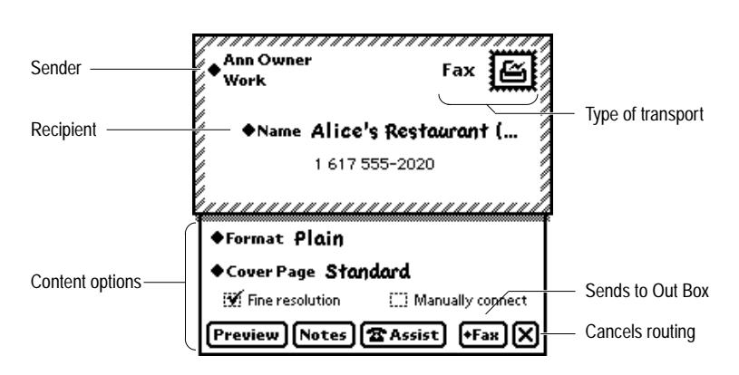

The system animates the display of a routing slip. First the envelope panel appears to slide onto the screen from the right. Then the lower panel appears to slide out of the envelope.

A routing slip is part of a transport, not part of an application. A transport uses a routing slip to get all the user-supplied information necessary to send an item. Because a transport provides the user interface for its routing slip, an application does not need to know anything about what is required to send an item via that transport.

#### Sender Picker 7

The sender's name and location displayed in the upper left corner of a routing slip are actually the label of a picker. Tapping the label pops up a Sender picker, from which a user can choose a different sender name or worksite. [Figure 7-9](#page-219-0) illustrates the Sender picker.

<span id="page-219-0"></span>**Figure 7-9** Changing the sender's name or location

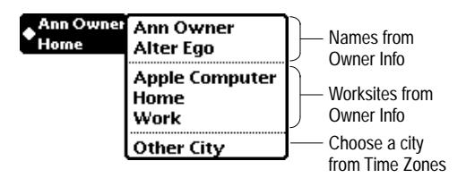

The Sender picker lists the owner names and worksites that have been entered in the built-in Owner Info application. The last item in the Sender picker, Other City, brings up a picker from which a user can choose another city. Choosing another city for the sender in a routing slip automatically makes that city the home city in the Time Zones application.

If a user chooses a different owner, worksite, or city, the system updates the routing information as needed. For example, in a Fax routing slip the system prefixes the destination fax number with a 1 and the area code only if a user chooses a worksite or city with a different area code. The system doesn't add a 1 or the area code if the sender's worksite has the same area code as the destination.

The default owner name (or **persona,** as it is sometimes called) shown by this picker is the one corresponding to the last-used owner name for a routing operation. The default worksite for the owner is the one corresponding to the last worksite used for a routing operation (including a canceled routing operation) or the setting of the home location in the Time Zones application, whichever was done last. Note that users can create additional owner names and worksites in the Owner Info application, and they can add cities to the Time Zones application.

Some transports need the sender's return address as well as the sender's name. The transport extracts any return address information it needs, such as the sender's fax number or e-mail address, from the sender's card in the Owner Info application.

#### <span id="page-220-0"></span>Recipient Pickers 7

The kind of recipient information displayed in the center of a routing slip envelope depends on the kind of transport involved. For printing, the recipient is the model or name of the printer to use. For faxing or e-mail, the recipient is a name and fax number or e-mail address taken from the Names File. For beaming, the recipient is any device with a compatible infrared port.

Print, fax, and e-mail transports should display the name of the recipient as a picker label. A user can tap the name to pop up a People picker in which to select different recipients. The built-in beam transport does not need to specify a particular recipient; it displays a generic recipient that a user does not change. For a description of People pickers, see ["People Picker" on](#page-152-0)  [page 4-27](#page-152-0).

#### Choosing a Printer 7

When a user taps the printer named in the center of a print routing slip, a list picker pops up. The picker lists printers that a user has recently chosen, along with items that allow the user to choose a different printer. The user can choose to select a network printer or other printer. If a user chooses to select a network printer and is connected to a network, the system displays a list of printers it finds on the network. If the user chooses to select a non-network printer, the system displays a list of printers for which driver software is installed on the Newton device. [Figure 7-10](#page-221-0) illustrates the process of choosing a printer.

**Figure 7-10** Choosing a printer in a routing slip

<span id="page-221-0"></span>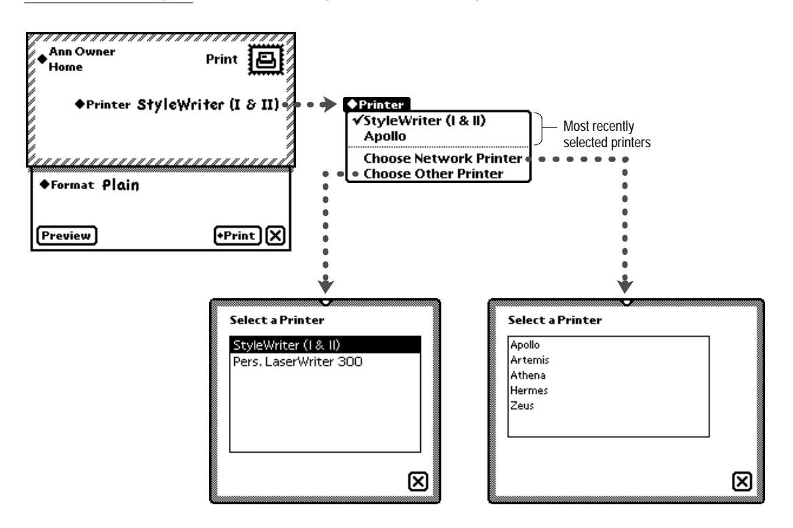

#### Choosing Fax or E-mail Recipients 7

The recipient in a fax or e-mail routing slip is a picker label. Tapping it pops up a picker that lists names a user has recently chosen, along with an Other Names item. The user can select a recipient from the picker list, or the user can tap Other Names to select different recipients from a People picker. A fax transport's routing slip generally has only one field for recipients, labeled Name. An e-mail transport's routing slip may have three fields for recipients, labeled To, Cc, and Bcc. The To field identifies primary recipients; the Cc (carbon copy) field identifies secondary recipients; and the Bcc (blind carbon

copy) field identifies recipients whose names and addresses are hidden from To and Cc recipients. Figure 7-11 illustrates the process of choosing fax or e-mail recipients.

**Figure 7-11** Choosing fax or e-mail recipients in a routing slip


<span id="page-223-0"></span>The very first time a user taps the recipient in a fax or e-mail routing slip, the picker that lists recently used names does not appear because no names have been used yet. Instead, a People picker appears immediately, listing possible recipients from the Names File.

#### Transport Picker 7

A transport displays its name and icon (dressed as a postage stamp) in the upper right corner of its routing slip. If there is more than one transport for the type of routing action chosen from the Action picker, the transport name is a picker label. Tapping it pops up a picker from which a user can choose any transport in the group.

**Figure 7-12** Switching to another transport in a group


1. User taps a transport name that begins with a diamond

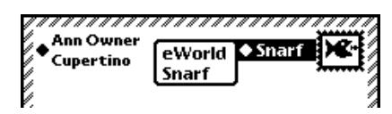

2. Picker pops up, listing all transports of the same type

When a user switches to another transport in a group, the system closes and reopens the routing slip because each transport (not each group of transports) specifies its own routing slip. The system remembers the most recently chosen transport in a group and uses that transport if a user later chooses the same routing action from an Action picker.

#### Send Button and Close Box 7

Every routing slip has a large Close box in its lower right corner. If a user taps a routing slip's Close box, the routing slip closes with a visual effect of quickly sliding off the screen to the right. Nothing else happens.

<span id="page-224-0"></span>To the left of the Close box is a text button labeled with the name of the routing action.Tapping this text button, which is known as the Send button, closes the routing slip, but with different animation than the Close box. First the lower panel slides up, as if it were going into the envelope part of the routing slip. Then the envelope slides off the screen to the right.

In addition to the routing slip closing, one of three things happens when a user taps a Send button. The outgoing item may be placed in the Out Box and sent immediately. The item may be placed in the Out Box and held there until a user sends it. Or a picker may pop up, giving the user the choice of sending now or later. Customarily a transport allows users to control which of those three alternatives happens by setting preferences in the In/Out Box application, as described in ["Transport Preferences" on page 7-32](#page-237-0).

A transport can also force the button to send now or later without displaying a picker. This overrides any preferences setting a user may have made for the transport.

When saving items in the Out Box for later transmission, a transport has to determine when it should get information from the sender's owner and worksite cards. Although this issue doesn't affect the user interface visibly, the issue does affect stability and consistency as they appear to users. In general, the transport should get information from the sender's owner card at the time the item is sent to the Out Box. Such information might include the sender's name, return address (such as fax number or e-mail address), credit card information, and so on.

However, if the transport uses worksite information to make a connection (for example, to determine how to dial the recipient's fax number), the transport should wait to obtain the most current information—based on the user's current worksite setting—until the item is actually transmitted from the Out Box, and make necessary adjustments at that time. For example, if a user queued several fax items at home but didn't send them until at work, the transport might need to change the area code information for dialing the recipient's fax number.

#### <span id="page-225-0"></span>Other Routing Slip Elements 7

A routing slip's lower panel may have additional controls and pickers that affect what is sent and how it is sent. The system includes a Format picker if there is more than one format for the class of data being sent. A transport may include additional pickers, buttons, checkboxes, radio buttons, and other interface elements that users may need to prepare the routing action. For example, the built-in fax transport includes six additional interface elements: a picker, two checkboxes, and three buttons. Figure 7-13 shows the interface elements in the lower panel of a Fax routing slip.

**Figure 7-13** Setting format and content options in a routing slip

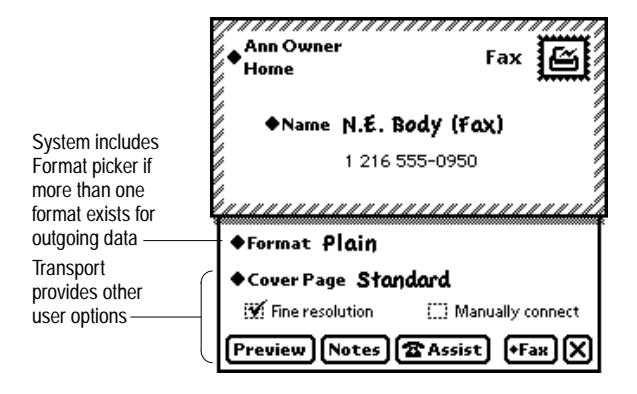

#### Format Picker 7

A routing slip's Format picker lists all the routing formats that apply to the outgoing item or items. For example, five formats might apply when faxing an item, while only one format applies when beaming. [Figure 7-14](#page-226-0) shows the variety of format choices available in several built-in applications on an Apple MessagePad 120.

**Figure 7-14** Format choices vary by transport and class of data

<span id="page-226-0"></span>

Although a transport specifies most items in its routing slip, it does not determine which formats to list in a Format picker. The system builds a Format picker each time it displays a routing slip, and it determines which formats to list based on the transport and the class of data being routed.

<span id="page-227-0"></span>Each application defines routing formats for its classes of data and registers the formats with the system. Typically, an application defines several routing formats so that users have a choice of routing actions. For example, an application might define two formats for printing and faxing image data, one format for beaming or e-mailing structured data, and another format for e-mailing text data. If two or more applications happen to define routing formats for the same class of data, the system makes all those formats available whenever a user routes that class of data in any of the applications.

Any format can specify an auxiliary view for getting supplemental information from the user. When a user chooses that format, the system displays the auxiliary view. For example, choosing the Letter format when printing or faxing an individual note in the Notepad application brings up a slip in which the user supplies the addressee and indicates whether to include the ink text signature. Figure 7-15 illustrates that example.

**Figure 7-15** A format can get supplemental information in an auxiliary view

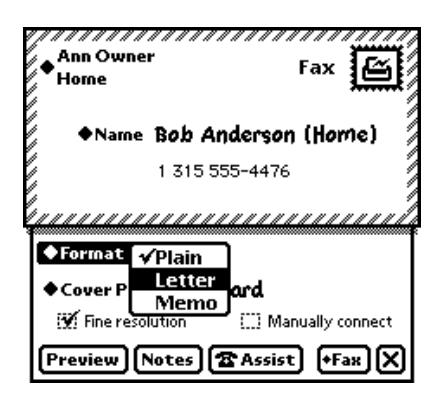

<sup>1.</sup> User chooses Letter format when faxing a Notepad item

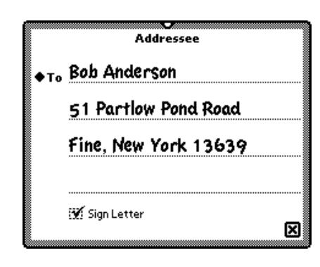

2. Letter format displays a slip requesting additional information

<span id="page-228-0"></span>Each time a routing slip opens, the system initially sets the format to the format most recently used for the transport and class of data. If the class of data has never been routed through the transport before, the system makes the initially selected format the first format it finds.

#### Preview Button 7

A transport that routes page images should allow users to preview the pages from its routing slip. The built-in print and fax transports do that by including a Preview button in the lower left corner of their routing slips, aligned with the large Close box in the opposite corner. Tapping the Preview button displays a large slip containing a reduced image of one outgoing page. The slip contains a Next button for advancing to the next page and a large Close box for closing the slip. Figure 7-16 shows an example of a Preview slip.

**Figure 7-16** Previewing outgoing page images

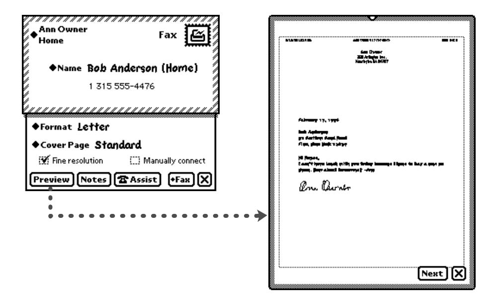

## <span id="page-229-0"></span>Sending Out Box Items 7

Items a user chooses to send later (as described in ["Send Button and Close](#page-223-0)  [Box" on page 7-18](#page-223-0)) wait in the Out Box until the user is ready to have the transports transfer the items out of the Newton device. At that time the user connects the Newton to an output device and chooses a matching output service from the Send picker that pops up when the user taps the Send button in the Out Box. For example, to send faxes waiting in the Out Box, a user connects a fax modem and chooses Fax from the Out Box's Send picker. The Send picker lists all Newton transports capable of transferring items from the Out Box to an output device. Figure 7-17 shows a sample Send button and picker in the Out Box.

**Figure 7-17** The Out Box's Send picker lets users send items to output devices


Before choosing an output service from the Out Box's Send picker, a user can select specific queued items to be sent. If the user does not select items first, the chosen service sends all items waiting for it.

## Routing Incoming Items 7

As mentioned earlier, users receive incoming data items through the In Box part of the built-in In/Out Box application. The items come from Newton transports that connect to sources of incoming items, retrieve items, and transfer the items to the In Box. For example, the built-in fax transport can connect to a calling fax machine, retrieve a fax, and transfer it to the Newton In Box.

## <span id="page-230-0"></span>Receiving In Box Items 7

To receive items, a user can pick a routing action from the In Box's Receive picker, which pops up when the user taps the Receive button. The Receive picker lists all Newton transports capable of receiving data items from external sources. Figure 7-18 shows a sample Receive button and picker.

**Figure 7-18** The Receive picker lists the transports available for receiving

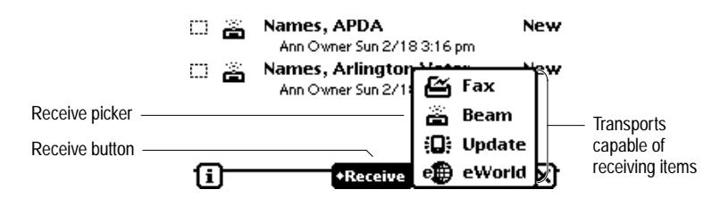

When a user picks a routing action from the Receive picker, the corresponding transport connects to its source of incoming data. Each transport may have a different procedure for connecting. For example, the fax transport displays a slip asking whether the user wants to wait for a fax call or connect manually. An e-mail transport might display a slip in which a user sets up the phone number to dial, specifies what items to retrieve, and taps a Connect button when ready. The beam transport tries to connect immediately. [Figure 7-19](#page-231-0) shows the connection slips for the fax transport and an example e-mail transport.

Some transports can connect automatically when the system detects incoming data items for them. For example, the beam transport can connect automatically to another Newton device that is sending through its beam transport. A transport that can connect automatically should allow users to disable automatic connection by setting preferences in the In/Out Box application, as described in ["Transport Preferences" on page 7-32.](#page-237-0)

<span id="page-231-0"></span>**Figure 7-19** Connection setup varies by transport


Built-in fax transport displays this slip

An e-mail transport might display this slip

A transport can also allow users to schedule times when it automatically connects and receives incoming items. Users schedule connect times by setting preferences in the In/Out Box application, as described in ["Transport](#page-237-0)  [Preferences" on page 7-32](#page-237-0).

## Receiving Remote In Box Items 7

A user may not want an e-mail transport to receive all items every time it connects, due to the length of time it would take or the amount of storage space they would occupy on the Newton device. An e-mail transport (or other transport that potentially receives numerous items from a remote source at a slow speed) can retrieve just the item headers and put them in the In Box with a status of Remote. That status tells users that the body of the item is stored remotely and has not yet been transferred to the Newton. If a user attempts to view an incomplete item in the In Box, the In Box notices the Remote status and has the appropriate transport get the remainder of the item from the remote source.

## Disposing of Received Items 7

Most received items remain in the In Box until a user disposes of them. To dispose of In Box items, a user selects one or more of them and chooses an

action from the Tag picker, which pops up when the user taps the Tag button. The Tag picker lists only actions that apply to at least one of the selected items. Figure 7-20 shows a sample Tag button and Tag picker.

<span id="page-232-0"></span>**Figure 7-20** The Tag picker disposes of currently selected In Box items

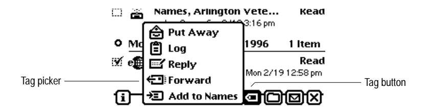

#### Putting Away Received Items 7

The Tag picker includes the Put Away action if an item the user has selected can be transferred from the In Box to another installed Newton application. Each application registers with the system the types of items it can accept from the In Box. For example, the built-in Notepad application accepts text items such as e-mail messages in addition to regular Notepad items.

Independent of applications' abilities to accept items from the In Box, each transport can include a method for putting away items it has received. If a transport can put away an item the user has selected, the Tag picker includes a Put Away action whether or not any applications have registered to accept that type of item.

When a user chooses to put away an item, the In Box displays a slip identifying the target application. If there are multiple targets—multiple applications that can accept the item and a transport with a put-away method—the slip includes a picker label that the user can tap to pop up a list picker from which to choose one of the targets. The slip also gives the user the option of having that item deleted from the In Box or having a copy kept there.

If no application has registered to accept an item the user has selected, and the transports that received the selected items do not know how to put away items, the Tag picker does not include the Put Away action. For example, none

<span id="page-233-0"></span>of the built-in applications registers to accept page-image data like faxes, and the built-in fax transport does not include a method for putting away items it receives, so the Tag picker does not include a Put Away action when a user selects only faxes in the In Box. The Tag picker does include Put Away when a user selects faxes together with some other class of data that can be put away, but the selected faxes are not put away.

#### Putting Away Items Automatically 7

The In Box can put away some incoming items automatically. That happens if an application has registered to automatically accept items designated for it. As soon as the In Box receives such an item, it transfers the item from the In Box to the application without user intervention. For example, the In Box could automatically transfer incoming stock quotes from a wireless modem to a stock-tracking application. If the In Box can't automatically put away a received item because the target application is missing (perhaps it is on a card that is not inserted), the In Box holds the item until the application is present. Then the In Box automatically transfers all items it is holding for that application. What happens to an item after the In Box automatically puts it away depends on the transport involved. The transport may have the In Box delete the item, delete the item and make a log entry in the In Box, or keep a copy of the item.

#### Filing Items That Are Put Away 7

In general, when an application gets items from the In Box it should put them away unfiled so users can find them. If an application puts away an item without regard to its folder, the item will be filed in the same folder on the receiving Newton as it occupied on the sending Newton. That could make the item hard for a user to find, especially if the folder is undefined on the receiving Newton. Your application can alleviate this problem by putting away all items unfiled even if the recipient has a folder of the same name as the sender.

#### <span id="page-234-0"></span>Extending the Tag Picker 7

A transport can add actions to the Tag picker. For example, an e-mail transport might add the actions Reply and Forward so users could reply to and forward received e-mail directly from the In Box. The built-in transports define the following action items: Reply, Forward, Copy Text to Notepad, and Add Sender to Names. There is a standard icon for each of these actions. If you create a new transport that includes these actions, use the standard icons for them.

# Routing Status 7

A transport should display a status slip whenever it is engaged in some lengthy activity such as sending or receiving data. A transport's status slip includes a transport icon, a status message, and a large Close box. Most status slips also have a Stop button. In addition, a status slip can include the title of the item being routed and a progress indicator. If a transport needs to have a user choose between two alternatives, it can display a status slip with up to three lines of text and two buttons. The system defines several standard types of status slips, as shown in [Figure 7-21.](#page-235-0)

Routing Status **7-29**

<span id="page-235-0"></span>**Figure 7-21** Status slips apprise users of lengthy transport activities


<span id="page-236-0"></span>Transports can dynamically switch from one type of status slip to another without closing the status slip, and can easily update the contents of the status slip as well (for example, updating a progress indicator).

All transports that use the standard status slips have a similar user interface and match the use of other status slips throughout the system. For general information on status slips, see ["Status Slips" on page 2-20](#page-63-0).

A status slip's Close box allows a user to hide the slip without halting the action that the slip is monitoring. If a user taps a status slip's Close box, the transport closes the slip and registers the action with the system's Notify service. The Notify service displays the flashing notify button at the top of the screen and adds the action to the Notify picker as described in ["Notify](#page-243-0)  [Button and Picker" on page 8-2](#page-243-0). The action continues in the background, and the user can perform another task. The user can also redisplay a status slip by choosing the corresponding action from the Notify picker. If a transport completes an action while its status slip is not displayed, the transport must unregister the action so the Notify service will remove it from the Notify picker.

A status slip's Stop button allows a user to halt the action that the slip is monitoring, as described in the next section.

## Stopping a Send or Receive in Progress 7

A transport should stop an ongoing send or receive operation as soon as possible under two conditions. One is when a user taps the Stop button in the transport's status slip. The second is when the system notifies the transport that it wants to turn off power.

If the system is about to turn power off while a transport is engaged (not idle), the transport should handle the situation gracefully. Generally this means displaying a confirmation alert asking for the user to confirm that it is OK to break the connection. After the user consents, the system waits for the transport to become idle before turning off the power.

# <span id="page-237-0"></span>Transport Preferences 7

The Newton system stores user-configurable preferences and other configuration information for the built-in transports, and can do the same for custom transports. The stored preferences correspond to items in a preferences slip for each transport. Users access the transports' preferences slips from the Info picker that pops up when a user taps the Info button in the In/Out Box application. Each transport that has a preferences slip is listed in the In/Out Box's Info picker. Figure 7-22 illustrates the procedure.

**Figure 7-22** Accessing transport preferences from the In/Out Box's Info picker

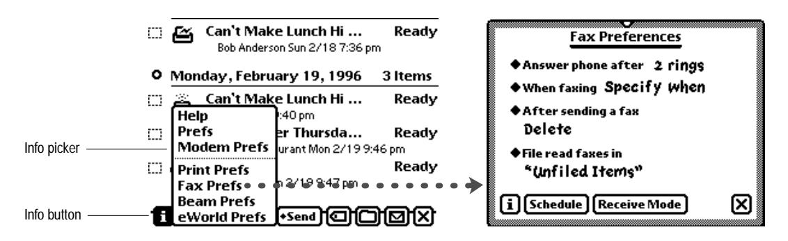

Each transport may add its own preferences slip for configuring any options that apply to that transport. [Figure 7-23](#page-238-0) illustrates some common options.

**Figure 7-23** Some common preference items for transports

<span id="page-238-0"></span>

A transport's preferences slip can include other items, such as buttons. For example, the fax preferences slip includes a button for scheduling automatic fax sending times and another button for setting the Newton to receive faxes exclusively.

<span id="page-239-0"></span>A preferences slip can also include an Info button in the lower left corner. Tapping it pops up an Info picker that lists at least the one item Help. Generally, picking Help from this Info picker simply displays the system help book, open to the routing section. A transport can add more items to the Info picker that pops up in a Preferences slip.

# Routing Alternatives 7

There are some alternatives to the Action picker method of routing. For example, the Calls application has a Place Call button for routing an outgoing phone call. Tapping the Place Call button displays a routing slip for the call transport. The Call routing slip is similar to a Fax routing slip. In the upper part of the Call routing slip a user specifies the caller, the caller's location, and the call recipient (see ["Sender Picker" on page 7-13](#page-218-0) and ["Choosing Fax](#page-221-0)  [or E-mail Recipients" on page 7-16\)](#page-221-0). In the lower part of the Call routing slip, a picker and a button control how the call is dialed. Figure 7-24 shows a sample Call routing slip.

**Figure 7-24** A Call routing slip sets up an outgoing phone call


<span id="page-240-0"></span>Another way users can route items through most transports is with the Intelligent Assistant. In addition, applications can route items programmatically. These two routing methods are described in more detail in the remainder of this section.

## Routing by Intelligent Assistant 7

In addition to using an Action button to send outgoing items, a user can send items by using the Intelligent Assistant. First the user writes the name of an action—call, fax, mail, or print—and taps the Do button in the Intelligent Assistant's main view. After interpreting what action to take, the Intelligent Assistant finds out from the frontmost application which items to send. Then the Intelligent Assistant has the system display the routing slip for the type of action the user wants.

The Intelligent Assistant also interacts with the list picker for picking a recipient in a routing slip. If a user writes a routing action such as "fax Bob," the Intelligent Assistant sets up the picker with a list of names that contain "Bob" and have fax numbers from the Names File. Figure 7-25 shows how this might look.

Names that match the recipient written in the Intelligent Assistant Routing slip for the action written in the Intelligent Assistant

**Figure 7-25** Routing with the Intelligent Assistant

## <span id="page-241-0"></span>Programmed Sending 7

An application can send an item programmatically, using a specific transport, without any user intervention. (The Action button is not used in this case.) For example, an application might have a transport make a connection whenever a user opens the application, and break the connection when the user closes the application. Another application might poll for data, such as pager messages, and could have a transport poll more frequently (and use more power) while the application is open than when the application is closed.

If your application has its own method for routing apart from the Action button, it can display a routing slip for the user to confirm or cancel the action as well as specify additional routing information. If your application routes items programmatically to an e-mail, fax, or call transport, you may want to allow users to choose the recipient. Your application can use the same method as the built-in routing slips (see ["Choosing Fax or E-mail](#page-221-0)  [Recipients" on page 7-16](#page-221-0)). If you want to provide a way for users to select a different printer, your application can use the same printer-selection method as the Print routing slip (see ["Choosing a Printer" on page 7-15\)](#page-220-0). Before instituting a programmed routing action, you may want to allow the user to choose a format for the item being sent. Your application can get a list of formats that can handle the item. Using this list, the application could make available a picker from which the user could choose a format. You may also want to allow the user to choose a transport for the item being sent. Your application can get a list of transports that can handle specific formats. Using this list, the application could make available a picker from which the user could choose a transport.

<span id="page-242-0"></span>This chapter describes the user interface for Newton system services not described in other chapters. Topics include:

- How the system automatically indicates it is busy
- How your application or transport can allow users to hide and show status slips
- What your application should do if it schedules alarms or other actions
- What role sound should play in your application or transport
- How your application should enable users to find data in it
- How your application should enable users to file their data in folders
- How your application or transport can have the Intelligent Assistant respond to a user's written request for action
- Where and how to provide users with on-screen help
- Where and how to provide user preference settings for your application or transport

All these topics are described in terms of the applications and transports that come with most Apple MessagePad models. Applications and transports you develop should follow these models.

# <span id="page-243-0"></span>Automatic Busy Cursor 8

The system lets users know when it is temporarily busy and may be unable to respond to their input by displaying a small graphic, called the **busy cursor,**  at the top of the screen. Your application or transport does not need to do anything to benefit from this feedback; the system displays the busy cursor automatically as needed. Figure 8-1 shows a busy cursor.

**Figure 8-1** A busy cursor indicates the system is temporarily engaged


The automatic busy cursor is not meant to provide complete feedback during a lengthy operation. If your application or transport begins an operation that may take more than a few seconds to complete, it should display a status slip (see the next section and ["Status Slips" on page 2-20\)](#page-63-0).

# Notify Button and Picker 8

The system displays a small graphic at the top of the screen, called the Notify button, to notify the user of ongoing actions and deferred notification alerts that applications or transports have registered with the system's Notify service. The Notify button looks like a star and it blinks periodically. [Figure 8-2](#page-244-0) shows the Notify button.

<span id="page-244-0"></span>**Figure 8-2** The Notify button signals an ongoing action or deferred alert


If your application displays a status slip with a Close box while it performs a lengthy action, and a user taps the Close box, your application should register the ongoing action with the Notify service. The system will continue processing the action in the background. In addition, your application may register a deferred notification alert when it sets an alarm (see ["Alarms" on](#page-245-0)  [page 8-4](#page-245-0)) and at other times.

The Notify service lists registered actions and notifications in a Notify picker, which pops up if a user taps the Notify button. Choosing a listed action redisplays the corresponding status slip. Choosing a listed notification alert displays it. Figure 8-3 shows a Notify picker.

**Figure 8-3** The Notify picker lists ongoing actions and deferred alerts


<span id="page-245-0"></span>When a user chooses an action or alert from the Notify picker, the Notify service automatically removes the chosen item from the picker. If your application or transport completes an action listed in the Notify picker, it must remove the action from the Notify picker by unregistering the action with the Notify service. The Notify service automatically removes the Notify button when the last item is removed from the Notify picker.

For more information on status slips, see ["Status Slips" on page 2-20](#page-63-0) and ["Routing Status" on page 7-29.](#page-234-0) For more information on notification alerts, see ["Notification Alerts" on page 2-17.](#page-60-0)

# Alarms 8

Your application can use the Newton system's Alarms service to display a notification alert or perform other actions at a specified time. If the Newton is asleep at the time the alarm is to execute, the system powers up the Newton and executes the alarm. If the alarm displays an alarm notification alert, the user can postpone the alarm for a specified time period by tapping the Snooze button included in the notification alert, as shown in Figure 8-4.

**Figure 8-4** An alarm notification alert's Snooze button can postpone the alarm


<span id="page-246-0"></span>The Snooze button is optional. Your application can use a plain notification alert without a Snooze button (see ["Notification Alerts" on page 2-17\)](#page-60-0) or no notification alert at all.

## Unacknowledged Alarms 8

Your application does not have to do anything to handle alarms that a user does not acknowledge. If a user is away from his or her Newton when an alarm goes off and the Newton goes back to sleep before the user returns, the user won't know the alarm went off until powering up the Newton again. The Newton system's Persistent Alarms user preference solves this problem. When this preference is enabled, the system reschedules alarms until the user acknowledges them. To conserve battery power, the length of time between reappearances of a particular alarm increases in proportion to the number of times it has gone unacknowledged.

## Alarm Etiquette 8

Every application should schedule and use alarms in a way that does not hamper the activities of other applications on the same Newton. Storage is one concern, since each alarm uses internal storage space. You don't have to limit your application to one alarm, but scheduling a daily wake-up alarm for the next year by creating 365 different alarms would use up an excessive amount of internal storage. Exercise reasonable judgment when creating multiple alarms.

Actions taken besides displaying a notification alert should be brief. If your alarm initiates a time-consuming process, it may delay the execution of other alarms set to go off at approximately the same time.

Note that your application may not be open when its alarm executes. In fact, your application may not even be installed. If your application's alarms aren't useful when it isn't installed, it should remove them when a user removes it (for example by removing the card it's on). There is no point in wasting space with useless alarms that display notification messages such as "Sorry, this alarm can't execute because the application isn't installed."

Alarms **8-5**

<span id="page-247-0"></span>A user sets the volume of alarm sounds in the Alarm section of the Prefs application. Your application should not change the alarm volume set by the user.

# Sound 8

Your application can easily associate a sound with a system event or play sound on demand. Each sound can be played synchronously, so that other tasks must wait for it to finish, or asynchronously, so that another task can begin before the sound finishes. The Newton system includes a number of built-in sounds, which the built-in applications use and other applications can use as well. Newtons play only sampled (recorded or prefabricated) sounds; the Newton system does not synthesize sound.

The built-in applications and transports use sounds extensively but unobtrusively to provide secondary feedback and enrich the user experience. Sound should always play a secondary role in Newton software. Don't make sound the sole conveyer of information. For users who must turn the sound off or who are hearing-impaired, your application should convey vital information visually as well.

# Find 8

The Newton system provides a Find service with which a user can search participating applications for text, dates, or other types of data. A user specifies what to find in a Find slip that may be supplied by the system, customized by an application developer, or supplied entirely by the developer. The Find slip appears when a user taps the Find button, which is a picture button that looks like a magnifying glass. [Figure 8-5](#page-248-0) illustrates the Find button and the Find slip that the system supplies.

<span id="page-248-0"></span>**Figure 8-5** A standard Find slip specifies what to find and where to look


The standard Find slip contains a labeled input line used to specify a search criterion and several radio buttons used to specify the scope of the search. The labeled input line has a picker for specifying the kind of search to perform—a text item or a date. Your application can also implement specialized searches for other kinds of data; these searches are described in more detail later in this section. Figure 8-6 illustrates the standard Look For picker.

**Figure 8-6** Specifying text or date searches in a Find slip

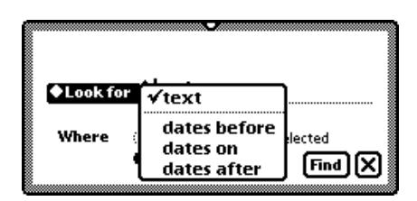

## Text Searches 8

Text searches are not sensitive to capitalization and only match the beginnings of words. For example, a search for "man" would find the items "man" and "Manila," but not "human." To specify the text to search for, a user writes on the input line in the Find slip.

Find **8-7**

## <span id="page-249-0"></span>Date Searches 8

Date searches find items dated before, after, or on the date specified in the Find slip. To specify a date, a user taps the date shown in the Find slip. This pops up a standard Date picker, as shown in Figure 8-7.

**Figure 8-7** Specifying a date in a Find slip

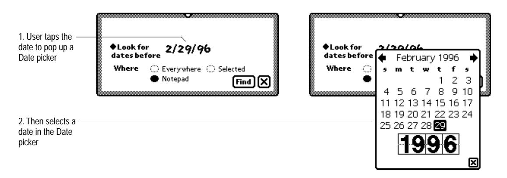

## The Scope of a Search 8

The system-supplied Find slip always contains radio buttons labeled Everywhere and Selected. If the currently active application supports the Find service, it is represented by a radio button in this slip as well.

To search just the currently active application, a user selects its radio button in the Find slip. To search all available applications registered with the Find service, a user selects the Everywhere radio button in the Find slip. In this case, applications need not be open to be searched.

To search some applications and not others, a user taps the Selected radio button in the Find slip. Tapping the Selected radio button causes a checklist to appear at the top of the Find slip. Included in the list are all currently available applications that are registered with the Find service. The user can tap items in the list to place a check mark next to those applications in which

<span id="page-250-0"></span>the system is to conduct a search. The Find slip in Figure 8-8 depicts a search for the word "Daphne" in the Notepad and Dates applications.

**Figure 8-8** Searching specified applications

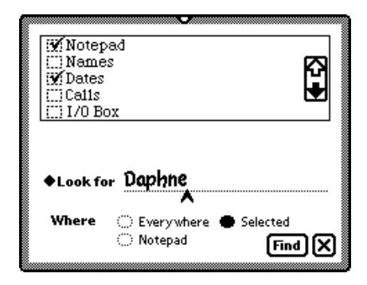

Normally the Find service searches applications in their entirety, but the currently active application can separate its data and list the separate parts in the checklist that appears when a user selects the Selected radio button in the Find slip. For example, a personal finance application could allow users to search its check register, credit card register, and accounts list independently.

## Customizing the Standard Find Slip 8

In addition to the system-supplied variations on the Find slip, your application can modify or completely replace the Find slip when it is frontmost. Typically, your application would do this in order to provide a customized user interface for specialized searches. For example, your application could add a labeled input line with a picker that enables a user to conduct specialized finds.

If your application specifies custom interface elements, the system adds them to the top portion of the standard Find slip whenever two conditions are met. First, your application must be frontmost. Second, a user must select your application's radio button in the Find slip.

Find **8-9**

Keep in mind that a user may need to scroll among found items while the Find slip is displayed; therefore, when customizing or replacing this slip, avoid making it so large that it obscures the display of the found items. Figure 8-9 shows a sample application named Checkbook that adds a labeled input line with a picker to the standard Find slip.

**Figure 8-9** A custom Find slip displays application-specific criteria at the top


Besides adding criteria to the top of the Find slip, your application can suppress the Find slip's standard input line. If necessary, your application can completely replace the standard Find slip with a slip of its own.

## <span id="page-252-0"></span>Initiating or Canceling a Search 8

After using the Find slip to specify the search criteria, a user initiates the search by tapping the Find button. Alternatively, the user can cancel the search by tapping the Close box to dismiss the Find slip.

## Search Status 8

While a search executes, the system reports its progress in a status slip. Figure 8-10 depicts a typical Find status slip.

**Figure 8-10** A status slip shows the progress of a Find operation

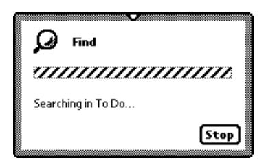

The status slip displayed by the Find service includes the Find icon and name, an animated busy indicator that looks like a barber pole, and the name of the application currently being searched. The status slip also includes a Stop button, which allows the user to halt the search in progress.

## Search Results 8

If a search finds just one item, that item is displayed behind the Find slip. If a search finds more than one item, the Find service displays an overview list of the found items. [Figure 8-11](#page-253-0) depicts a Find overview as it might appear after searching all applications for "man."

Find **8-11**

<span id="page-253-0"></span>**Figure 8-11** A Find overview lists items that match search criteria

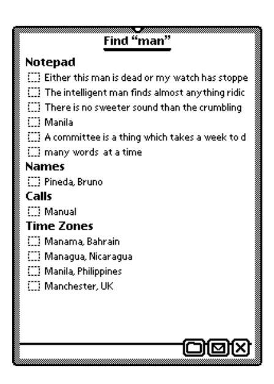

A user can alternately hide and reveal the names of items listed under an application in the Find overview by tapping the application name there. Tapping the name of an item in the Find overview displays a detail view of the item. The Find slip stays open in front of the detail view. A message at the top of the Find slip states which item is displayed and whether other items were found in the same application. [Figure 8-12](#page-254-0) shows an example of the message.

<span id="page-254-0"></span>**Figure 8-12** The Find slip reports which found item is currently displayed


If more than one item was found, tapping the universal down arrow goes to the next found item, and tapping the universal up arrow goes to the previous found item. Tapping the Overview button redisplays the overview of found items.

Between uses, the Find service stores the setting of the Look For picker. The next time a user taps the Find button, the Find slip reopens with the most recent search criteria preset. Note that in order to conserve memory, the overview list of found items is not saved between uses of the Find service.

## Filing 8

The Newton system's Filing service allows users to associate data items with folders displayed by the user interface. A user can create, edit, and delete folders at will. In addition, users can select a storage location—internal or card—with the Filing service.

Filing **8-13**

<span id="page-255-0"></span>Filed data items look to a user like they are in folders, but filed items do not actually reside in a folder or directory structure. Instead, the Filing service tags a filed item to identify the folder in which it belongs. When a user wishes to see an application's data items belonging to a particular folder, the application displays the data items having the appropriate tag.

Applications use two user interface elements to implement filing: a Filing button and a folder tab. The Filing button enables users to file application data in folders. After filing items in folders, users can locate them by using the folder tab and its picker. (For more information on the folder tab, see [page 8-19](#page-260-0).)

## Filing Button and Slip 8

If you want users to be able to file data in your application, it must include a Filing button, which is a picture button that looks like a an ordinary file folder. Tapping a Filing button displays a Filing slip, which enumerates the available filing options. Figure 8-13 shows a sample Filing button and Filing slip.

**Figure 8-13** A Filing slip names available folders and storage locations


<span id="page-256-0"></span>The filing options that a user selects in a Filing slip apply to the data in the view that contains the Filing button. If the view contains multiple data items that can be individually selected, such as the items listed in an overview, then the filing options selected by the user apply to the currently selected items.

If there is nothing to file when a user taps a Filing button—for example, the user taps the Filing button in an overview without first selecting any items the Filing service displays the message "There is nothing to file."

#### A Filing Button's Location 8

Where you put a Filing button in your application's views depends on how much data the Filing button affects. If a Filing button affects all the data in a view, then it should go at the bottom right corner of the view, next to the view's Action button. For example, the main view of the Names File application has one Filing button, and it affects all data in the view. Figure 8-14 shows examples of views with one Filing button each.

**Figure 8-14** A Filing button at the bottom of a view affects the entire view

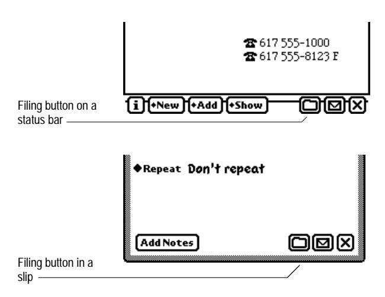

Filing **8-15**

<span id="page-257-0"></span>In a view where a Filing button can affect only one data item of several that may be displayed in the view (perhaps by scrolling the view), there should be a Filing button above each item, at the right side of the view. Generally such a view has a separator bar above each data item, and a Filing button should be at the right end of each separator bar. For example, each note in the Notepad application has its own Filing button, which applies just to that note. Figure 8-15 shows an example of Filing buttons above each data item in a view.

**Figure 8-15** A Filing button above an item affects only that item

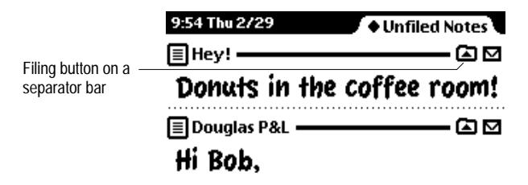

#### A Filing Slip's Contents 8

A Filing slip contains one or two clusters of radio buttons, one for selecting a storage location and one for selecting a folder. An application can suppress either cluster. For example, the built-in Date Book application suppresses the cluster for selecting a folder. Furthermore, the system suppresses the cluster for selecting a storage location if the Newton has only one storage location. However, the Filing slip always contains at least one cluster of radio buttons. If your application suppresses the folders cluster, the system does not suppress the storage-locations cluster even if there is only one storage location available. [Figure 8-16](#page-258-0) illustrates several configurations of the Filing slip.

<span id="page-258-0"></span>**Figure 8-16** A Filing slip can include storage locations, folders, or both


A Filing slip should open with the current folder and storage location selected. Your application can override this behavior if it cannot determine a useful initial filing state, such as when a user has selected multiple items for filing from an overview.

A Filing slip includes folders that are visible only in the current application as well as folders that are visible everywhere. All the folders are listed together, in alphabetical order. If necessary, you can have your application suppress the display of either type of folder. For example, the built-in Extras Drawer application only displays folders specific to it. Note that this option to suppress folders should not be a user preference, but should be decided when the application is designed.

Applications provide the headings for the radio button clusters in a Filing slip. The wording your application should use for headings depends on the how many items a user is filing and on whether the Filing slip includes both folders and storage locations or just one of them. [Table 8-1](#page-259-0) specifies the wording to use in each case.

Filing **8-17**

<span id="page-259-0"></span>**Table 8-1** Headings for radio button clusters in Filing slips

| Heading for<br>storage locations | Heading for folders        | Number of<br>items being filed |
|----------------------------------|----------------------------|--------------------------------|
| File this Item on                | —                          | one                            |
| File this Item on                | And file in                | one                            |
| File the selected Items on       | —                          | multiple                       |
| File the selected Items on       | And file in                | multiple                       |
| —                                | File this Item in          | one                            |
| —                                | File the selected Items in | multiple                       |

NOTE In these headings the word Item is capitalized and may be replaced with the specific type of item being filed, such as Note, Name, Date, Task, Call, and so on. None of these headings ends with a colon or has any other punctuation.

In addition to radio buttons for selecting filing options, all Filing slips have a File button for initiating the filing operation and a large Close box for canceling the filing operation.

#### Editing Folders 8

If a Filing slip contains radio buttons for selecting a folder, the slip also includes New and Edit Folder buttons for creating new folders and editing the names of existing ones. Tapping either button displays a slip for entering and editing a folder name. [Figure 8-17](#page-260-0) shows examples of the slips used for entering and editing folder names.

In a slip for creating a new folder, the slip includes a checkbox for designating where the folder can be seen—in all applications (everywhere) or just in the application where the folder was created. In a slip for editing an existing folder, the checkbox is replaced by a message stating where the folder name is shown. The same message appears instead of a checkbox when creating a new folder in an application that suppresses the display of folders specific to it or the display of folders visible everywhere (as described earlier in ["A](#page-257-0)  [Filing Slip's Contents" on page 8-16\)](#page-257-0).

<span id="page-260-0"></span>**Figure 8-17** Slips for entering and editing folder names

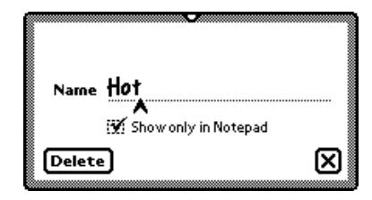

Folder Creation slip has a checkbox for designating where the folder can be seen

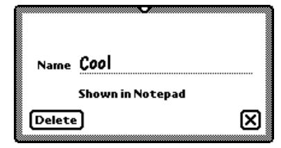

Folder Editing slip reports where the folder can be seen

Users can create up to 12 folders visible everywhere and 12 more folders specific to each application. The system does not permit an application-specific folder to have the same name as a folder that is visible everywhere.

## Folder Tab 8

If a view has a Filing button (for filing the view's data into folders), then the view must also have a folder tab at the top so users can see the data they have filed in folders. A folder tab looks like the cut tab part of a paper file folder. The Newton folder tab shows the name of the folder whose data is currently displayed in the view. The name begins with a diamond because tapping it pops up a picker from which a user can choose which folder to see. Additionally, a user can choose to see only items not filed in any folder or items from all folders (including unfiled items). A check mark appears next to the current choice. [Figure 8-18](#page-261-0) shows a sample folder tab and picker.

Every Folder picker includes two choices in addition to the alphabetical list of folders. At the top of the Folder picker, above a separator line, is the choice Unfiled Items. At the bottom of the alphabetical list of folders, below a separator line, is the choice All Items. In both of these choices, your application can replace the word Items with the name of the type of item displayed in the view.

Filing **8-19**

<span id="page-261-0"></span>**Figure 8-18** A folder tab allows users to filter a view by folder

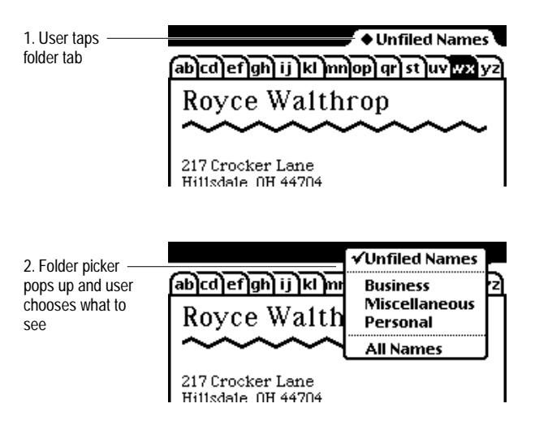

At the bottom of a Folder picker, below a solid separator line, your application can have the system list available storage locations. This allows a user to specify a storage location in addition to a folder from which to display items. The system does not list storage locations in a Folder picker unless the Newton has more than one storage location. Figure 8-19 shows an example of a Folder picker with storage locations listed at the bottom.

**Figure 8-19** A Folder picker can list available storage locations

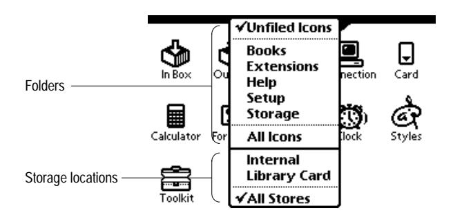

<span id="page-262-0"></span>A variation on the plain folder tab includes a digital clock and calendar that a user can tap to display the built-in Clock application. Figure 8-20 illustrates a folder tab with clock calendar.

**Figure 8-20** A folder tab can include a digital clock and calendar

Tapping the date and time displays the Clock application


Instead of a digital clock and calendar, your application can display a view title in the black area of a folder tab, as shown in Figure 8-21.

**Figure 8-21** A folder tab can include a view title


Filing **8-21**

# <span id="page-263-0"></span>Intelligent Assistant 8

The Intelligent Assistant is a system service that attempts to complete actions specified by a user's written input. You can think of the Assistant as an alternate interface to Newton applications and services. The Assistant can complete a number of tasks using the built-in applications and services, and your application can extend the Assistant to carry out tasks that the application performs. Users can also display an application's online help from the Assistant. This section describes the Assistant's user interface in the context of built-in applications. If your application uses Assistant services, it should behave similarly.

## Invoking the Assistant 8

A user invokes the Assistant by tapping the Assist button, which is a picture button that looks like a light bulb. Before tapping the Assist button, a user can write an action request or select existing text to be used as a request. When a user taps the Assist button the system passes the Assistant any currently selected text. If no text is selected, then the system passes the Assistant the most recently written text. The Assistant classifies the words in that text as actions, targets of actions, or unknown entities. Depending on the results of this analysis, the Assistant may attempt to complete a task or it may prompt the user to supply additional information. [Figure 8-22](#page-264-0)  shows the Assist button initiating a fax operation.

**Figure 8-22** The Assist button makes the Assistant try a written action request

<span id="page-264-0"></span>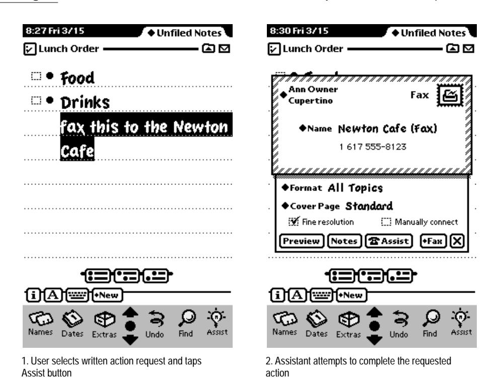

Interpreting the Request Phrase 8

The Assistant can attempt to complete an action only if it can construe one from the phrase the user writes or selects before tapping the Assist button. The Assistant is pre-programmed to know certain verbs that describe actions in the built-in applications. It can associate multiple verbs with a single action. For example, the Assistant performs the same task if given the word "phone," "call," or "dial." Applications can add words to the Assistant's lexicon, but users cannot.

<span id="page-265-0"></span>The Assistant matches words regardless of their capitalization. For example, it considers the word "phone" to be the same as the word "Phone."

The order in which a user writes words is not significant. For example, the phrase "Royce fax" produces the same result as the phrase "fax Royce." This syntax-independent architecture allows easier localization of applications for international audiences.

The Assistant ignores words it does not know, giving users the freedom to write naturally. Rather than limiting the user to terse commands, the Assistant extracts meaningful words from phrases such as "Make a phone call to Bob at work" and ignores the others. There is a limit to this freedom, however. The Assistant does not attempt to interpret a phrase containing more than 15 words.

## Assist Slip 8

If the Assistant can't interpret a user's written request, the Assistant displays an Assist slip where the user can provide more information. The user can choose an action from the Assist slip's Please picker and can write on the slip's input line. If a user wrote some words before tapping the Assist button but did not write enough to clearly specify an action, the Assist slip displays those words and includes a message prompting the user to provide additional information. For example, if a user just wrote "Bob," the Assistant could perform a number of actions: it could find Bob, fax Bob, call Bob, schedule a meeting with Bob, and so on. [Figure 8-23](#page-266-0) shows examples of Assist slips with too few words and with no words.

**Figure 8-23** An Assist slip appears when the Assistant needs more information

<span id="page-266-0"></span>

An Assist slip's Please picker lists the actions that applications have currently registered with it, as well as eight phrases the Assistant has tried to interpret recently. [Figure 8-24](#page-267-0) shows a sample Please picker.

**Figure 8-24** The Assistant's Please picker lists known actions and recent phrases

<span id="page-267-0"></span>

The built-in tasks that the Assistant lists in the Please picker include calling, faxing, finding, mailing, printing, remembering To Do items, scheduling meetings, and getting time information from the Time Zones application. If your application registers additional actions with the Assistant, they automatically appear in the Please picker. Note that the top portion of this picker displays only one word for each action. If the Assistant knows synonyms for an action, they do not appear in the top portion of the Please picker. For example, the word "call" appears but the synonyms "ring" and "phone" do not. Recently used synonyms may appear in the bottom half of the picker, however.

If a user writes a verb the Assistant doesn't know, it may be able to deduce a likely action from other words. For example, if a user writes the phrase "buzz 555-1234" the Assistant does not match the word "buzz" to an action, but it can identify "555-1234" as having the format of a telephone number. Based on that information, the Assistant deduces the user wants to call, fax, or find the phone number, and it lists only those actions in the Please picker.

<span id="page-268-0"></span>In addition to the Please picker and an input line, an Assist slip has a How Do I? button in the lower left corner for accessing the Newton online help service (see ["Help" on page 8-28](#page-269-0)). In the lower right corner of an Assist slip are a Do button for initiating the action specified in the slip and a large Close box for canceling the action.

The primary function of an Assist slip is to specify an action. If the Assistant can determine an action to take based on words a user writes or selects before tapping the Assist button, then the Assistant does not display an Assist slip. Once the Assistant knows what action to take, it can resolve other missing or ambiguous information with a task slip.

## Task Slips 8

Quite often the Assistant knows what action to take but does not have enough information to complete that action. The Assistant tries to fill in as much of the required information as it can, but the user may still have to resolve ambiguities or provide additional information. In that case the Assistant displays a task slip.

For example, if a user writes the request "fax Bob," the Assistant can get Bob's fax number from the Names File application. But what if Bob has no fax number or more than one fax number? What if there is more than one Bob or no one named Bob? Even if there is only one Bob with one fax number, the user may want to add another fax number, another Bob, or a message on the fax cover page.

The task slip for any built-in action is the same as or similar to the slip a user sees when performing the action without the Assistant. For routing actions printing, faxing, mailing, or calling—the task slip is a routing slip (see ["Routing Slips" on page 7-12](#page-217-0)). For scheduling meetings and remembering To Do items, the task slip is similar to the slip the Date Book application displays for creating a new meeting or To Do task. For finding, the task slip is the standard Find slip (see ["Find" on page 8-6\)](#page-247-0).

<span id="page-269-0"></span>Besides providing a means of correcting missing or ambiguous information, a task slip also gives a user one last chance to confirm or cancel execution of the task before the Assistant actually takes action. It's especially important to provide this opportunity to confirm, modify, or cancel the task if executing it will change the user's current context (open other applications), modify the user's data, or inconvenience the user in some way.

## Help 8

The Newton system includes online help for built-in applications and system services. Users can see the online system help by tapping the How Do I? button in the Assist slip. When a user taps that button, the system displays an outline-like overview of help topics. Tapping a topic expands the outline to display that topic's subtopics or, if that topic has no subtopics, to display instructions for that topic. Although you cannot add to the built-in help, you can provide the same kind of help within your Newton application. Figure 8-25 shows the built-in help overview.

**Figure 8-25** Online help has a topical outline and concise instructions

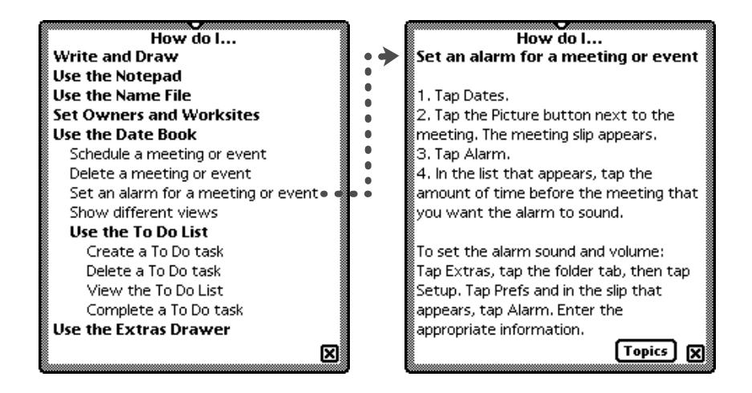

<span id="page-270-0"></span>Users can also access the built-in help by choosing Help from the Info picker in any built-in application. When accessed through an Info picker, the help overview appears with the appropriate outline topic already expanded. Likewise, your application gives users access to its online help through its Info picker (see ["Info Picker" on page 4-24\)](#page-149-0).

Another method of accessing online help is through the Extras Drawer. The built-in help is a digital help book that is customarily filed in the Help folder of the Extras Drawer. A user can open the built-in online help by tapping the Help icon there. You can give users the same access to your application's online help by making it a digital help book in the Extras Drawer. For more information on digital help books, see *Newton Book Maker User's Guide*.

The purpose of online help is to provide quick access to single screens of step-by-step instructions for performing actions in a Newton application. If you add online help to your application, keep the following points in mind:

- Organize your online help so users can't get lost in it.
- Make help information short, since the help view doesn't scroll and probably never will. The system truncates help information that exceeds the length of the help view.
- Keep each help page simple, specific, and task-oriented.
- Phrase each overview topic and subtopic so it grammatically completes a question that begins "How do I?" For example, the topic "Use the Shopping List Application" asks the question "How Do I Use the Shopping List Application?" Under this topic could be subtopics such as "Add Items to the Shopping List" and "Check Off Purchased Items." Do not begin a topic or subtopic with a gerund, such as "Using," or the topic will not mesh grammatically with the "How do I?" question.

Online help is not intended to provide a full user manual. If you want to create an online user manual in a large view with multiple-font text and on-screen controls for content navigation, make it a regular Newton digital book (not a digital help book). For information on making digital books, see *Newton Book Maker User's Guide*.

Help **8-29**

# <span id="page-271-0"></span>Preferences 8

Users can see and change two types of preference settings: system-wide and application-specific.

## System-wide Preferences 8

A user accesses system-wide preferences through the built-in Prefs application. Its main view lists preference categories, and tapping a category displays a slip containing relevant preference items. Your application can add categories and corresponding views that the Prefs application displays, but they must be for system-wide preferences rather than application-specific ones. Figure 8-26 shows the standard system-wide categories on a MessagePad 120.

**Figure 8-26** The Prefs application shows system-wide preference settings

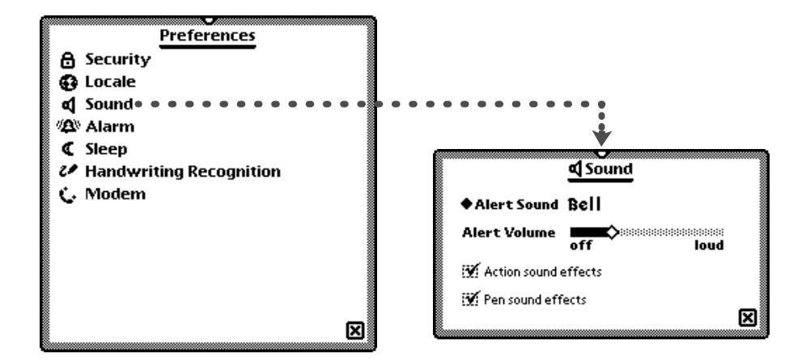

## <span id="page-272-0"></span>Application Preferences 8

Applications provide access to their preference settings through the Info picker (see ["Info Picker" on page 4-24](#page-149-0)). When a user chooses Prefs from an Info picker, the application displays a preferences slip in which the user can see and change application-specific preference settings. Figure 8-27 shows the preferences slips for some built-in applications.

**Figure 8-27** A preferences slip contains application-specific settings

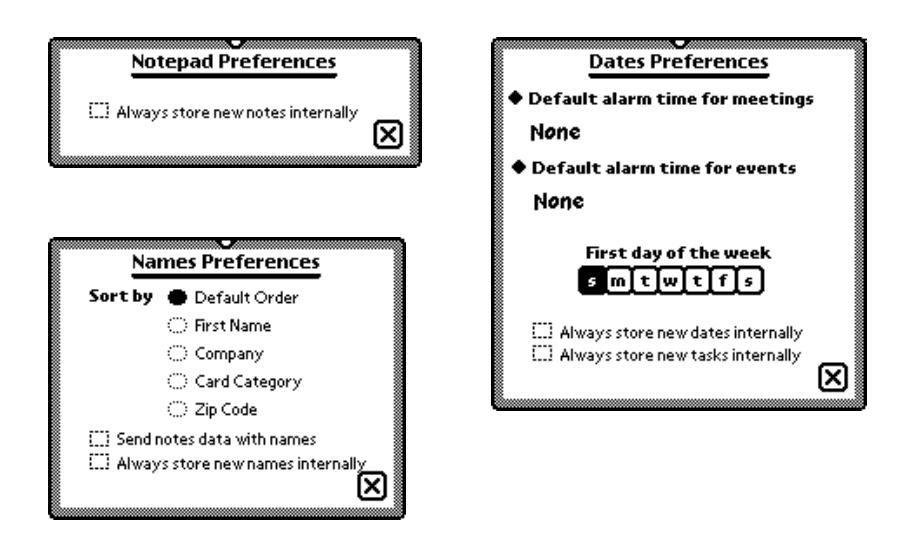

If your application stores data items, its Preferences slip should aid users in managing data by including a checkbox for setting the storage location of new items. This checkbox should have a label similar to "Always store new items internally," where the word *items* is replaced by the application's particular type of item. This check box helps to mitigate the problem users commonly have of managing where their data is stored.

Preferences **8-31**

Preferences should be settings that users change infrequently. If you provide choices to users that they will change many times while working with your application, you should implement those choices with a button and picker on the status bar or some other interface element to which users have easy access.

This appendix summarizes what you should do to avoid the top 20 user interface mistakes.

## Info Button A

Use the Info button—with the "i" icon—and its picker for information options such as Help, About, and Prefs. Always place the Info button at the far left end of the status bar unless your application includes an Analog Clock, which is optional. See pages [3-23](#page-116-0), [4-24,](#page-149-0) [8-28,](#page-269-0) and [8-30.](#page-271-0)

## New and Show Buttons A

If users can create new items or display different views of information in your application, include a New button and a Show button like the ones in the built-in applications. Put the New button near the left end of the status bar next to the Info button (if present), and put the Show button to the right of the New button. See page [3-26](#page-119-0).

## Screen Size A

Design your application to handle any screen size and aspect ratio. If your application can't scale its views small enough or can't rearrange view contents to fit the aspect ratio, notify the user before closing your application. See pages [1-11](#page-34-0) and [2-34](#page-77-0).

## Tapping v. Writing A

Tapping is faster than writing, so for data input favor pickers, scrolling lists and tables, radio buttons, sliders, and so forth over written input. See page [6-3](#page-170-0).

## Picker Placement and Alignment A

Align the top of a picker with the top of its button or label. Make exceptions for overview pickers, for other very wide or very tall pickers, or for small screens. See page [4-8.](#page-133-0)

Display a picker so its button or label is at least partially visible, and keep the button or label highlighted while the picker is open. (An overview picker can cover the label or button that makes it appear.) See pages [4-9](#page-134-0) and [4-20](#page-145-0).

## Field Alignment A

Be consistent in how you align field values with field labels (including picker labels). Generally you should line up a field's label with the field's displayed value, not with the dotted line (if present) on which a user edits the field value. In a view that has several fields in a column, line up the labels at their left edges to insure a neat, orderly appearance for your application. See page [6-2](#page-169-0).

## Close Box Size A

Use a regular (small) Close box in a view where there are no adjacent buttons. Use a large Close box only where there are adjacent text buttons or standardheight picture buttons. See pages [3-15](#page-108-0) and [3-15](#page-108-0).

## Button Location A

Put buttons that affect an entire view at the bottom of the view, and put buttons that only affect part of the view elsewhere. Group buttons that affect content and appearance at the bottom left of a view, and put buttons that control or initiate action at the bottom right. See page [3-11](#page-104-0).

## Button Spacing A

Space adjacent buttons three pixels apart, and leave four pixels between buttons and the border of the view they're in. See page [3-12](#page-105-0).

## Button Size A

Make every text button 13 pixels high and center the button's name vertically. Make the button just wide enough that with the button's name horizontally centered there are three or four pixels between the name and the button's left and right borders. See pages [3-3](#page-96-0) and [3-7](#page-100-0).

## Capitalization A

Capitalize the following items like sentences: checkboxes, field labels, and picker items. Capitalize the following items like book titles: view titles, text button names, and radio buttons. In some contexts it makes sense to capitalize differently, but your should be consistent within an application. See pages [2-5](#page-48-0), [3-4](#page-97-0), [3-18,](#page-111-0) [3-19,](#page-112-0) [4-3](#page-128-0), [4-20,](#page-145-0) and [6-2](#page-169-0).

## Picker Icons A

Think twice before including icons in pickers. They're hard to design and have limited benefit. See page [5-12.](#page-165-0)

## Dismissing a Slip A

If dismissing a slip does not cause an action to take place (other than accepting changes made to data in the slip), use a Close box for putting away the slip. In this context the Close box means "close" or "put away." Use a take-action button and a Close box if users have a choice when dismissing the slip of initiating an action or canceling. In this context the Close box means "cancel." See pages [2-16](#page-59-0), [2-23,](#page-66-0) and [2-33](#page-76-0).

## Take-Action Button A

Name a slip's take-action button with a specific verb such as Print, Fax, or File. Only use vaguely affirmative names such as OK and Yes where you want to force users to scan other parts of the slip to verify what action the button initiates. See pages [3-4](#page-97-0) and [3-5.](#page-98-0)

## Fonts A

Use fonts carefully. For the voice of the system and application use the bold style of the System font in 9- or 10-point sizes. For values a user can change use Casual 10- and 12-point. (Those are the fonts that are preset by the system protos.)

## Keyboard Button A

If your application includes a Keyboard button on the status bar or at the bottom of a slip, use the larger-size button (as in the Notepad) unless space on the status bar is constrained (as in the Date Book). See pages [3-25](#page-118-0) and [6-33](#page-200-0).

## Punctuation to Avoid A

Don't use ellipses (...) in button names, picker labels, or list-picker items. See pages [3-4](#page-97-0) and [4-3.](#page-128-0)

Do put an ellipsis at the end of the title or the message text in a status slip, but use three periods rather than an ellipsis character. Also use an ellipsis to accommodate an item whose text is too long to fit on a line in the space available for it (for example, in overviews). See pages [2-21](#page-64-0), [2-45,](#page-88-0) and [6-5](#page-172-0).

Don't use a colon at the end of a title, a heading, or a field label. See pages [2-5](#page-48-0), [3-18](#page-111-0), and [6-2](#page-169-0).

## Extras Drawer Icons A

To avoid overlapping icons in the Extras Drawer, make yours no more than 29 pixels tall and wide. Leaving a little space helps separate icons. See page [5-8](#page-161-0).

Limit the length of an Extras Drawer icon's name to between 9 and 11 characters per line. Put a blank space in the name where you want it to break and wrap onto another line. See page [5-9](#page-162-0).

Make a Newton icon more distinctive and easier to identify by giving it a distinctive silhouette rather than a boxy shape. See page [5-3](#page-156-0).

## Storage A

Allow users to move your application's data between storage locations with the Filing button in the Extras Drawer's status bar. This is the method used by the built-in applications. See page [8-14.](#page-255-0)

## Date and Time Input A

To input dates and times use the specially designed Newton pickers. See page [4-17](#page-142-0).

# Glossary 9

**alert box** A view that appears on the screen to warn the user or

report an error.

**alert sound** An audible warning from the Newton's speaker that

warns the user of an unusual or potentially undesirable

situation. An alert sound may or may not be

accompanied by a notification slip.

**application** Software that performs a specific task, such as the

Notepad, Date Book, and Names File.

**application base view** 

The container view that contains all other views that

make up an application. Compare to **main view.**

**auto-repeat** The repeated automatic generation of characters that

happens when a user holds down the pen on an

on-screen keyboard.

**backdrop** The one application that cannot be closed. Initially the

Notepad is the backdrop, but a user can use the Extras Drawer to make a different application the backdrop.

**bitmap** A set of bits in the Newton's memory that represent the

pixels of a picture.

**busy cursor** A graphical signal that the system displays

automatically while it is temporarily unable to process

user input.

**button** A small graphic object that performs an action when

tapped. See also **picture button** and **text button.**

**button bar** A thick black line with buttons on it.

**caret** A symbol (^) displayed where the Newton will next

insert text that a user writes, prints, or types.

**character** Any symbol that has a widely understood meaning and

thus can convey information. Some characters—such as letters, numbers, and punctuation—can be displayed on the Newton, faxed, sent in an e-mail message, and

printed on a printer.

**checkbox** A standard Newton control that displays a setting,

either checked (on) or unchecked (off). Tapping a checkbox or its text label reverses its setting. One or more checkboxes can be checked. Compare to

**radio button.**

**close** To make a container view go away by tapping the

Close box.

**Close box** A small square box with an X inside, located in the

lower right corner of a container view. Tapping it closes the container view. Compare to **large Close box.**

**command** An instruction that causes the Newton or a device

connected to it to perform some action. The user issues a command by tapping a button or choosing an item

from a picker.

**confirmation slip** A view that appears on-screen to have the user confirm

or cancel an action that may have far-reaching

consequences.

**container view** A framed object that displays information (text, graphics,

or both) and may contain controls that the user operates by tapping, as well as areas where the user can write

and draw.

**context-sensitive** Describes an application that can adjust its actions

according to the current situation. For example, an application with context-sensitive user input adjusts handwriting recognition according to the type of field (name, date, time, number, phone number, and so on).

**control** An object in a container view that a user can manipulate

with a pen to cause instant action with visible results or

to change settings to modify a future action.

**Date Book** The built-in application for recording and viewing

appointments and calendar notes, setting alarms, entering repeating events, and keeping a to-do list.

**dimmed** Describes words or objects that appear gray. Do not dim

text or objects in Newton applications; hide objects that

are disabled or unavailable.

**divider bar** See **separator bar.**

**double-tap** To touch the same spot, or nearly the same spot, twice in

rapid succession with the pen.

**drag** To place the pen on a movable object, slide the pen

to move the object, and lift the pen to stop moving

the object.

**drag handle** A small control that a user can drag to move a container

view. It is a small black tab with a central hole, and is

centered in the view's top border.

**drawer** A container view that slides open and closed at the

bottom of another container view.

**edit** To change or modify. For example, to insert, remove,

replace, or move text.

**electronic ink** The marks a user sees as the user writes or draws on the

screen, as opposed to the typeset words or regular shapes the system displays when it recognizes the

user's writing or drawing.

**endpoint** A type of communications connection such as a

serial connection, modem, infrared beam, or

AppleTalk network.

**expando** An input area that expands when tapped to become

large enough for writing.

**Extras Drawer** A built-in container view that displays named picture

buttons a user can tap to open applications.

**field** One item of data input. Also, the place in a container

view where a user can input a data item by tapping,

typing, writing, or drawing.

**floating container view** 

A container view that initially appears in front of all

open **sibling views.**

**folder tab** A control that allows users to select which folder's

contents are currently displayed in a container view. The folder tab goes at the top of the container view and displays the name of the currently selected folder.

**font** A complete set of characters in one typeface design.

**font size** The size of a font in **points.** Examples of font size are 12

point and 18 point.

**font style** A set of stylistic variations other than size, such as bold,

italic, and underline.

**gauge** An object with a marker that indicates an amount,

degree, or value in relation to a range of possible values.

A user can only read a gauge. Compare to **slider.** 

**glance** A small container view that closes itself automatically

after it has been displayed for a brief period. Also, if a

user taps the view, it closes immediately.

**gravity** A drawing feature that causes the endpoints of a newly

drawn line to snap to nearby corners and midpoints of

existing graphic shapes.

**highlight** To make something visually distinct, typically when

it's selected. Usually done by reversing black and

white areas.

**hot spot** A small unnamed control that responds like buttons

when tapped. Usually there are many hot spots in a

view, and they can be visible or not.

**icon** A symbol that graphically represents an object or a

concept. For example, icons in the Extras Drawer

represent applications.

**Item Info slip** A slip that reports statistics for an item headed by a

separator bar. The statistics include the item's title, type,

creation date, size, and storage location. A user can change an item's title in the Item Info slip.

**ink text** Words written in **electronic ink.**

**input** Information transferred into a Newton from some

external source, such as the pen or a modem.

Compare to **output.**

**input area** A place in a container view where a user can write

or draw.

**input line** An input area where a user can write one line of text.

**insertion point** See **caret.**

**interface** See **Newton user interface** and **user interface.**

**invert** To highlight by changing white pixels to black and

vice versa.

**large Close box** Behaves the same as a **Close box** but looks slightly

larger to match the standard height of a text button.

**main view** A principal container view that serves as a center of

user operations for an application. Compare to

**application base view.**

**matte border** A thick gray border framed with black**.**

**message** An instruction to execute a **method** (a programmed

function).

**method** A programmed function. Each method contained in a

template processes a particular message for the view that the template defines. When a view receives a message for which it has a method, the Newton executes

that method.

**Names File** The built-in application for storing names, addresses,

phone numbers, and other information about people.

**Newton user interface** 

The standard conventions for interacting with Newton devices. The interface ensures users a consistent means

of interacting with all Newton devices and the

applications designed to run on them.

**Notepad** The built-in application for taking and organizing notes,

which may contain text and drawings.

**notification slip** A view that appears on the screen to warn the user or to

report an error. A notification slip may or may not be

accompanied by an alert sound.

**output** Information transferred from a Newton to some

external destination, such as a printer or a modem.

Compare to **input.**

**palette** A small view that provides controls for modifying the

contents of other views. The user can move a palette, and it floats on top of other views of the same application, so it can remain open for use in all visible views.

**parent view** A view that contains one or more other views.

**persona** The permanent internal description of an individual

person that works with a particular Newton PDA, or a particular public image of a single owner. The owner is the obvious example, but there can be many others. Choosing a persona sets up information such as name, title, birthday, phone numbers, and e-mail addresses.

**picker** A list of choices that appears when the user taps an

adjacent text label marked by a solid diamond (◆). A picker may also appear when a user taps a **button.** The user chooses one of the listed items by tapping it.

**picture button** A control that the user taps to designate or confirm an

action implied by the icon displayed on the button.

**picture radio button** 

A standard Newton control that displays its state, either on or off, and is part of a group in which the user can turn on only one button at a time. A picture on the

on-off indicator identifies the kind of setting.

**pixel** Short for *picture element;* the smallest dot the Newton

can draw on the screen. On a Newton MessagePad, there are 80 pixels to an inch. Each pixel can be either black or white, so it can be represented by a bit; thus,

the display is said to be a **bitmap.**

**point** A unit of measurement for type. 1 point equals

approximately 1⁄ 72 inch.

**proto template** A predefined template that defines the appearance and

behavior of a standard interface element, such as a Close box or a status slip. A proto template is called a

"proto" for short.

**radio button** A standard Newton control that displays its state, either

on or off, and is part of a group in which the user can turn on only one button at a time. A text label next to the on-off indicator identifies the kind of setting.

**routing** The process of sending or receiving data through the

built-in In/Out Box application using a communications transport such as printing, faxing, beaming, or e-mailing.

**routing slip** A view in which a user specifies the sender, recipient,

format, and other information needed to send data by the method the user picked from the Action picker.

**scroll** To cause currently displayed data to move off the screen

and be replaced by data that was not visible.

**scrolling list** A boxed list of text items. A user sees more items by

tapping the universal scroll arrows or optional local scroll arrows, and selects one or more items by

tapping them.

**select** To designate an object by tapping, double-tapping, or

dragging across it. The next action that happens to an

object happens to the selected object.

**selection** The object or group of objects most recently designated

to be affected by the next action.

**separator bar** A heavy black line that heads each item in a view that

can display multiple items at once. A separator bar carries the title of the item below it and also carries

controls that affect only the one item.

**shape** A picture composed of geometric shapes such as

straight lines and curves, circles and ovals, and

rectangles and other polygons.

**sibling views** Two or more views contained by one other view

(their **parent view**).

**slider** A control with a marker that indicates an amount,

degree, or value in relation to a range of possible values. The user can adjust the setting by dragging the marker

on a slider. Compare to **gauge.** 

**slip** A matte-framed container view that an application

displays to get detailed user input, or to present alternatives among which a user can choose to determine the outcome of a task just begun.

**status box** A black-framed container view that displays a static

message saying the Newton is busy completing a

lengthy process.

**status slip** A view that an application displays when it begins an

operation that takes more than a few seconds to complete. A status slip contains a message describing

the application's busy status.

**system proto** See **proto template.**

**tap** To touch briefly with the pen.

**tap-and-a-half** To tap and then at the same spot quickly half-tap; the

pen goes down, up, and down (but not up again).

**template** A read-only data structure that precisely specifies a

view, encapsulating all the view's attributes and

behaviors.

**text button** A control, bordered by a rounded rectangle, that the

user taps to designate, confirm, or cancel an action

described by a text label inside the border.

**transport** A means of conveying data between the built-in In/Out

Box application and a communications connection (serial connection, modem, infrared beam, AppleTalk

network, and so on).

**type ahead** The process by which the Newton system stores

keystrokes (typed faster than the system can process)

for later processing.

**view** A visual object on the screen, including but not limited

to a **container view.** For example, text buttons, pickers, and input areas are also views. Each view is internally

represented by a **template.**

**user interface** The rules and conventions by which a device

communicates and interacts with the person

operating it.

**word wrap** The automatic continuation of text from the end of

one line to the beginning of the next without breaking

in the middle of a word.

# Index

| Find slip, custom 8-9<br>About box 4-24<br>help 4-24, 4-25, 8-28<br>accessibility 1-3<br>icon 5-2<br>action<br>incoming data for 7-3, 7-24<br>ongoing 2-23<br>keeping simple 1-11<br>routing 7-8<br>layout 1-11<br>Action button 3-28, 7-8<br>no scrolling or overview 2-49<br>Action picker<br>outgoing data from 7-4, 7-7<br>application commands in 7-10, 7-12<br>preferences 4-25, 8-31<br>building 7-11<br>prototyping 1-14<br>contents 7-10<br>put away received items 7-27, 7-28<br>purpose 4-26, 7-8<br>routing formats 7-22<br>separator line in 7-10<br>scrolling 2-36<br>transports in 7-10<br>state 2-32, 3-6<br>active application 2-29<br>status bar 2-11<br>aesthetic integrity, as design principle 1-9<br>task analysis 1-13<br>Alarms service 8-4<br>view template 7-5<br>alert box<br>application base view 2-9<br>border 2-7<br>array, in picker 4-4<br>confirmation alert 2-18, 2-28<br>Assistant. See Intelligent Assistant<br>notification alert 2-17, 2-28<br>Assist button 8-22<br>alphabetic index tabs, in list picker 4-13<br>Assist slip 8-24<br>Alpha Sorter picker 6-18<br>audience 1-2, 1-13<br>Analog Clock button 3-23<br>authorization slip. See confirmation alert<br>animating<br>automatic busy cursor 8-2<br>icon 5-9<br>automatic scrolling 2-43<br>routing slip 7-13<br>auto-repeat, keyboard 6-37<br>application<br>auxiliary view<br>See also transports; view<br>confirmation alert 2-18<br>About box 4-24<br>defined 2-14<br>action commands 7-10, 7-12<br>drawer 2-26<br>active 2-29<br>notification alert 2-17<br>adding buttons to 3-11<br>palette 2-24<br>backdrop 2-29 | A | built-in 1-10      |
|--------------------------------------------------------------------------------------------------------------------------------------------------------------------------------------------------------------------------------------------------------------------------------------------------------------------------------------------------------------------------------------------------------------------------------------------------------------------------------------------------------------------------------------------------------------------------------------------------------------------------------------------------------------------------------------------------------------------------------------------------------------------------------------------------------------------------------------------------------------------------------------------------------------------------------------------------------------------------------------------------------------------------------------------------------------------------------------------------------------------------------------------------------------------------------------------------------------------------------------------------------------------------------------------------------------------------------------------------------------------------------------------------------------------------------------------------------------------------------------------------------------------------------------------------------------------------------------------------------------------------|---|--------------------|
|                                                                                                                                                                                                                                                                                                                                                                                                                                                                                                                                                                                                                                                                                                                                                                                                                                                                                                                                                                                                                                                                                                                                                                                                                                                                                                                                                                                                                                                                                                                                                                                                                          |   | closing 2-32, 2-49 |
|                                                                                                                                                                                                                                                                                                                                                                                                                                                                                                                                                                                                                                                                                                                                                                                                                                                                                                                                                                                                                                                                                                                                                                                                                                                                                                                                                                                                                                                                                                                                                                                                                          |   |                    |
|                                                                                                                                                                                                                                                                                                                                                                                                                                                                                                                                                                                                                                                                                                                                                                                                                                                                                                                                                                                                                                                                                                                                                                                                                                                                                                                                                                                                                                                                                                                                                                                                                          |   |                    |
|                                                                                                                                                                                                                                                                                                                                                                                                                                                                                                                                                                                                                                                                                                                                                                                                                                                                                                                                                                                                                                                                                                                                                                                                                                                                                                                                                                                                                                                                                                                                                                                                                          |   |                    |
|                                                                                                                                                                                                                                                                                                                                                                                                                                                                                                                                                                                                                                                                                                                                                                                                                                                                                                                                                                                                                                                                                                                                                                                                                                                                                                                                                                                                                                                                                                                                                                                                                          |   |                    |
|                                                                                                                                                                                                                                                                                                                                                                                                                                                                                                                                                                                                                                                                                                                                                                                                                                                                                                                                                                                                                                                                                                                                                                                                                                                                                                                                                                                                                                                                                                                                                                                                                          |   |                    |
|                                                                                                                                                                                                                                                                                                                                                                                                                                                                                                                                                                                                                                                                                                                                                                                                                                                                                                                                                                                                                                                                                                                                                                                                                                                                                                                                                                                                                                                                                                                                                                                                                          |   |                    |
|                                                                                                                                                                                                                                                                                                                                                                                                                                                                                                                                                                                                                                                                                                                                                                                                                                                                                                                                                                                                                                                                                                                                                                                                                                                                                                                                                                                                                                                                                                                                                                                                                          |   |                    |
|                                                                                                                                                                                                                                                                                                                                                                                                                                                                                                                                                                                                                                                                                                                                                                                                                                                                                                                                                                                                                                                                                                                                                                                                                                                                                                                                                                                                                                                                                                                                                                                                                          |   |                    |
|                                                                                                                                                                                                                                                                                                                                                                                                                                                                                                                                                                                                                                                                                                                                                                                                                                                                                                                                                                                                                                                                                                                                                                                                                                                                                                                                                                                                                                                                                                                                                                                                                          |   |                    |
|                                                                                                                                                                                                                                                                                                                                                                                                                                                                                                                                                                                                                                                                                                                                                                                                                                                                                                                                                                                                                                                                                                                                                                                                                                                                                                                                                                                                                                                                                                                                                                                                                          |   |                    |
|                                                                                                                                                                                                                                                                                                                                                                                                                                                                                                                                                                                                                                                                                                                                                                                                                                                                                                                                                                                                                                                                                                                                                                                                                                                                                                                                                                                                                                                                                                                                                                                                                          |   |                    |
|                                                                                                                                                                                                                                                                                                                                                                                                                                                                                                                                                                                                                                                                                                                                                                                                                                                                                                                                                                                                                                                                                                                                                                                                                                                                                                                                                                                                                                                                                                                                                                                                                          |   |                    |
|                                                                                                                                                                                                                                                                                                                                                                                                                                                                                                                                                                                                                                                                                                                                                                                                                                                                                                                                                                                                                                                                                                                                                                                                                                                                                                                                                                                                                                                                                                                                                                                                                          |   |                    |
|                                                                                                                                                                                                                                                                                                                                                                                                                                                                                                                                                                                                                                                                                                                                                                                                                                                                                                                                                                                                                                                                                                                                                                                                                                                                                                                                                                                                                                                                                                                                                                                                                          |   |                    |
|                                                                                                                                                                                                                                                                                                                                                                                                                                                                                                                                                                                                                                                                                                                                                                                                                                                                                                                                                                                                                                                                                                                                                                                                                                                                                                                                                                                                                                                                                                                                                                                                                          |   |                    |
|                                                                                                                                                                                                                                                                                                                                                                                                                                                                                                                                                                                                                                                                                                                                                                                                                                                                                                                                                                                                                                                                                                                                                                                                                                                                                                                                                                                                                                                                                                                                                                                                                          |   |                    |
|                                                                                                                                                                                                                                                                                                                                                                                                                                                                                                                                                                                                                                                                                                                                                                                                                                                                                                                                                                                                                                                                                                                                                                                                                                                                                                                                                                                                                                                                                                                                                                                                                          |   |                    |
|                                                                                                                                                                                                                                                                                                                                                                                                                                                                                                                                                                                                                                                                                                                                                                                                                                                                                                                                                                                                                                                                                                                                                                                                                                                                                                                                                                                                                                                                                                                                                                                                                          |   |                    |
|                                                                                                                                                                                                                                                                                                                                                                                                                                                                                                                                                                                                                                                                                                                                                                                                                                                                                                                                                                                                                                                                                                                                                                                                                                                                                                                                                                                                                                                                                                                                                                                                                          |   |                    |
|                                                                                                                                                                                                                                                                                                                                                                                                                                                                                                                                                                                                                                                                                                                                                                                                                                                                                                                                                                                                                                                                                                                                                                                                                                                                                                                                                                                                                                                                                                                                                                                                                          |   |                    |
|                                                                                                                                                                                                                                                                                                                                                                                                                                                                                                                                                                                                                                                                                                                                                                                                                                                                                                                                                                                                                                                                                                                                                                                                                                                                                                                                                                                                                                                                                                                                                                                                                          |   |                    |
|                                                                                                                                                                                                                                                                                                                                                                                                                                                                                                                                                                                                                                                                                                                                                                                                                                                                                                                                                                                                                                                                                                                                                                                                                                                                                                                                                                                                                                                                                                                                                                                                                          |   |                    |
|                                                                                                                                                                                                                                                                                                                                                                                                                                                                                                                                                                                                                                                                                                                                                                                                                                                                                                                                                                                                                                                                                                                                                                                                                                                                                                                                                                                                                                                                                                                                                                                                                          |   |                    |
|                                                                                                                                                                                                                                                                                                                                                                                                                                                                                                                                                                                                                                                                                                                                                                                                                                                                                                                                                                                                                                                                                                                                                                                                                                                                                                                                                                                                                                                                                                                                                                                                                          |   |                    |
|                                                                                                                                                                                                                                                                                                                                                                                                                                                                                                                                                                                                                                                                                                                                                                                                                                                                                                                                                                                                                                                                                                                                                                                                                                                                                                                                                                                                                                                                                                                                                                                                                          |   |                    |
|                                                                                                                                                                                                                                                                                                                                                                                                                                                                                                                                                                                                                                                                                                                                                                                                                                                                                                                                                                                                                                                                                                                                                                                                                                                                                                                                                                                                                                                                                                                                                                                                                          |   |                    |
|                                                                                                                                                                                                                                                                                                                                                                                                                                                                                                                                                                                                                                                                                                                                                                                                                                                                                                                                                                                                                                                                                                                                                                                                                                                                                                                                                                                                                                                                                                                                                                                                                          |   |                    |
|                                                                                                                                                                                                                                                                                                                                                                                                                                                                                                                                                                                                                                                                                                                                                                                                                                                                                                                                                                                                                                                                                                                                                                                                                                                                                                                                                                                                                                                                                                                                                                                                                          |   |                    |
|                                                                                                                                                                                                                                                                                                                                                                                                                                                                                                                                                                                                                                                                                                                                                                                                                                                                                                                                                                                                                                                                                                                                                                                                                                                                                                                                                                                                                                                                                                                                                                                                                          |   |                    |
|                                                                                                                                                                                                                                                                                                                                                                                                                                                                                                                                                                                                                                                                                                                                                                                                                                                                                                                                                                                                                                                                                                                                                                                                                                                                                                                                                                                                                                                                                                                                                                                                                          |   |                    |
|                                                                                                                                                                                                                                                                                                                                                                                                                                                                                                                                                                                                                                                                                                                                                                                                                                                                                                                                                                                                                                                                                                                                                                                                                                                                                                                                                                                                                                                                                                                                                                                                                          |   |                    |
|                                                                                                                                                                                                                                                                                                                                                                                                                                                                                                                                                                                                                                                                                                                                                                                                                                                                                                                                                                                                                                                                                                                                                                                                                                                                                                                                                                                                                                                                                                                                                                                                                          |   |                    |
|                                                                                                                                                                                                                                                                                                                                                                                                                                                                                                                                                                                                                                                                                                                                                                                                                                                                                                                                                                                                                                                                                                                                                                                                                                                                                                                                                                                                                                                                                                                                                                                                                          |   |                    |

| position of 2-31<br>slip 2-15<br>status slip 2-20<br>AZ index tabs, in list picker 4-13                                                                                                                                                                                                                                                           | Info button 3-23<br>Item Info button 3-29<br>Keyboard button 3-25<br>large 3-14<br>name of 3-4<br>New button 3-26                                                                                                                                                                                                                                                                                                   |
|---------------------------------------------------------------------------------------------------------------------------------------------------------------------------------------------------------------------------------------------------------------------------------------------------------------------------------------------------|---------------------------------------------------------------------------------------------------------------------------------------------------------------------------------------------------------------------------------------------------------------------------------------------------------------------------------------------------------------------------------------------------------------------|
| B                                                                                                                                                                                                                                                                                                                                                 | Overview button 2-46<br>picker from 4-7                                                                                                                                                                                                                                                                                                                                                                             |
| backdrop application 2-29, 3-11, 7-9<br>Beam command 4-26<br>border<br>alert box 2-7<br>confirmation alert 2-18<br>main view 2-13<br>matte 2-6, 2-13<br>notification alert 2-17<br>picture button 3-7<br>plain 2-8<br>routing slip 2-7<br>scrolling list 6-4<br>shadow 2-8<br>slip 2-16<br>striped 2-7<br>text button 3-3<br>view 2-6<br>wavy 2-7 | picture 3-7<br>position 3-3<br>Preview button 7-23<br>Receive button 7-25<br>Recognizer button 3-24<br>Rotate button 3-30<br>on separator bar 3-11<br>Show button 3-26, 7-6<br>size of 3-3<br>Snooze button 2-17, 8-4<br>spacing of 3-12<br>standard 3-22<br>state of 3-10, 3-11<br>on status bar 3-11<br>Stop button 3-6<br>Tag button 7-26<br>take-action 2-16, 2-33<br>text button 3-2<br>unavailable 3-10, 3-11 |
| built-in applications, observing 1-10<br>busy cursor 8-2                                                                                                                                                                                                                                                                                          | Undo button 6-37                                                                                                                                                                                                                                                                                                                                                                                                    |
| button                                                                                                                                                                                                                                                                                                                                            | button bar 3-11                                                                                                                                                                                                                                                                                                                                                                                                     |
| See also radio button<br>Action button 3-28, 7-8<br>adding to another application 3-11                                                                                                                                                                                                                                                            | C                                                                                                                                                                                                                                                                                                                                                                                                                   |
| Analog Clock button 3-23<br>on button bar 3-11<br>Cancel button 2-16, 3-5<br>defined 3-2<br>in expanding text input 6-11<br>Filing button 3-27, 8-14<br>grouping 3-12<br>highlighting 3-9, 4-11<br>icon in 5-12                                                                                                                                   | Cancel button 2-16, 2-19, 2-23, 3-5<br>canceling<br>Cancel button 3-5<br>slip 2-16<br>status slip 2-23<br>capitalizing<br>button name 3-4<br>checkbox 3-19                                                                                                                                                                                                                                                          |

| list picker item 4-3                 | consistency, as design principle 1-7    |
|--------------------------------------|-----------------------------------------|
| overview picker item 4-20            | container view. See view                |
| radio button 3-18                    | controls                                |
| view title 2-5                       | Action button 3-28, 7-8                 |
| caps key 6-35                        | Analog Clock button 3-23                |
| caret                                | buttons 3-2                             |
| gesture for inserting space 6-26     | checkbox 3-18                           |
| moving 6-35                          | Close box 3-14                          |
| text insertion 6-27, 6-34, 6-35      | defined 3-1                             |
| Caret picker 6-28                    | Filing button 3-27, 8-14                |
| character keys 6-34                  | hot spot 3-21                           |
| checkbox                             | Info button 3-23                        |
| for data input 6-7                   | Item Info button 3-29                   |
| defined 3-18                         | Keyboard button 3-25                    |
| overview picker 4-19                 | New button 3-26                         |
| vs. radio button 3-19                | Preview button 7-23                     |
| check mark, in list picker 4-3       | radio button 3-16                       |
| city 7-14                            | Receive button 7-25                     |
| clipping 6-8                         | Recognizer button 3-24                  |
| clock, in folder tab 8-21            | Rotate button 3-30                      |
| Close box                            | routing slip 7-20                       |
| defined 3-14                         | Show button 3-26, 7-6                   |
| in a picker 4-13                     | slider 3-20                             |
| closing                              | Snooze button 8-4                       |
| application 2-32, 2-49               | on status bar 2-11                      |
| backdrop application 2-29            | Tag button 7-26                         |
| confirmation alert 2-19              | title not a 2-5                         |
| drawer 2-26, 2-33                    | in a view 2-3                           |
| main view 2-11, 2-32                 | correcting misrecognized text 6-8, 6-29 |
| modal view 2-29                      | Corrector view 6-29                     |
| notification alert 2-17              | cursor, busy 8-2                        |
| overview 2-49                        |                                         |
| overview picker 4-21, 4-22           |                                         |
| palette 2-25                         |                                         |
| slip 2-16, 2-33                      | D                                       |
| status slip 2-23                     |                                         |
| view 2-32                            | data, common pool of 1-10               |
| colon 2-5, 3-18, 6-2                 | data input                              |
| common pool of data 1-10             | Caret picker 6-28                       |
| communications method. See transport | changing capitalization 6-31            |
| configuring recognition 6-19         | changing shapes 6-31                    |
| confirmation alert 2-18, 2-28        | changing text margins 6-31              |

| checkbox for 6-7                             | changing 1-12                  |
|----------------------------------------------|--------------------------------|
| correcting misrecognized text in 6-29        | picker alignment 4-9           |
| defined 6-1                                  | Rotate button 3-30             |
| drawing input 6-8                            | view size 2-34                 |
| duplicating in 6-31                          | divider bar. See separator bar |
| editing of 6-8, 6-21                         | drag handle 2-33               |
| erasing text or shapes in 6-24               | drawer 2-26, 2-33              |
| error handling for 6-37                      | drawing 6-8                    |
| expanding text input line for 6-11           | drop shadow. See shadow        |
| general input 6-14                           | Duplicate command 4-26, 7-12   |
| ink text in 6-18                             |                                |
| input field for 6-1                          |                                |
| inserting space in 6-26                      |                                |
| inserting text in 6-27                       | E                              |
| keyboard keys for 6-34                       |                                |
| labeled input line for 6-10                  | editing                        |
| paragraph input for 6-12                     | shapes 6-14                    |
| picker for 6-3                               | techniques 6-21                |
| radio button for 6-6                         | text 6-9                       |
| recognition in 6-15, 6-18, 6-19              | Effective 1-4                  |
| removing extra space in 6-31                 | ellipsis 6-5                   |
| replacing text in 6-29                       | list picker 4-3                |
| scrolling list for 6-4                       | overview 2-45                  |
| selecting text and shapes in 6-22            | scrolling list 6-5             |
| shape input 6-13                             | status slip 2-21               |
| simple input line for 6-9                    | text input 6-8                 |
| slider for 6-7                               | E-mail command 4-26, 7-11      |
| tapping for 6-3                              | erasing text or shapes 6-24    |
| text input 6-8                               | error handling 6-37            |
| typing for 6-32                              | expanding text input line 6-11 |
| writing for 6-8                              | expando 6-11                   |
| date input 6-8                               | Extras Drawer 5-6, 8-29        |
| date picker 4-17                             |                                |
| date searches 8-8                            |                                |
| deferred recognition 6-18                    |                                |
| Delete command 4-26, 7-12                    | F                              |
| del key 6-35                                 |                                |
| diamond 3-4, 4-7                             | Fax command 4-26               |
| direct manipulation, as design principle 1-6 | feedback                       |
| display order, view 2-28                     | as design principle 1-7        |
| display orientation                          | busy cursor 8-2                |
| button spacing 3-13                          | button 3-9                     |
|                                              |                                |

| sound 8-6                                      | text searches 8-7                    |
|------------------------------------------------|--------------------------------------|
| status slip 2-20                               | folders 8-14, 8-16, 8-18             |
| user testing 1-3                               | folder tab 2-10, 8-19                |
| views 2-3                                      | font                                 |
| field label                                    | input field 6-2                      |
| capitalization 6-2                             | list picker 4-4                      |
| font 6-2                                       | overview picker 4-20                 |
| highlighting 4-11                              | separator bar 2-12                   |
| position 6-2                                   | text button 3-3                      |
| puncuation 6-2                                 | view title 2-5                       |
| Filing button                                  | forced recognition 6-19              |
| location 8-15                                  | forgiveness, as design principle 1-8 |
| nothing to file 8-15                           | Format picker 7-20                   |
| purpose 3-27, 8-14                             | formatting                           |
| Filing service                                 | shapes 6-14                          |
| Filing button and slip 3-27, 8-14              | text 6-9                             |
| folders 8-14                                   | four-way scrolling 2-41              |
| received items 7-28                            | frame. See border                    |
| summarized 8-13                                |                                      |
| Filing services                                |                                      |
| folder tab 8-19                                |                                      |
| Filing slip                                    | G                                    |
| contents 8-16                                  |                                      |
| editing folders 8-18                           | general input 6-14                   |
| folders 8-16                                   | gesture                              |
| headings 8-17                                  | breaking paragraphs 6-26             |
| purpose 3-27, 8-14                             | capitalization change 6-31           |
| scope 8-15                                     | duplicating selection 6-31           |
| storage locations 8-16                         | inserting space 6-26                 |
| fill, view 2-9                                 | joining words 6-26                   |
| Find service                                   | new entry 2-12                       |
| canceling a search 8-11                        | recognition of 6-15                  |
| date searches 8-8                              |                                      |
| Find button 8-6                                | scrubbing 6-24                       |
|                                                | selecting text and graphics 6-22     |
|                                                | global scroll arrows 2-38            |
| Find slip 8-7, 8-9<br>initiating a search 8-11 | graphic input 6-13                   |
| overview 8-11                                  | gravity 6-13                         |
| scope of search 8-8                            | gray text 4-5                        |
| scrolling found items 8-13                     | grid, in picker 4-4                  |
| search results 8-11                            |                                      |
| status 8-11                                    |                                      |

| H                                                | In Box. See In/Out Box          |
|--------------------------------------------------|---------------------------------|
|                                                  | incoming data. See routing      |
| header, In/Out Box item 7-4                      | index tabs, in list picker 4-13 |
| help 4-24, 7-34, 8-27, 8-28                      | indicator, progress 2-22        |
| hierarchical pickers 4-14                        | Info button 3-23, 7-32, 7-34    |
| highlighting                                     | Info picker 4-24, 7-32, 8-29    |
| button 3-9                                       | ink text                        |
| editing mark 6-22                                | Alpha Sorter for 6-18           |
| icon 5-10                                        | input of 6-8                    |
| list picker 4-11                                 | recognition of 6-18             |
| separator line 4-11                              | In/Out Box                      |
| hot spot 3-21, 4-7                               | See also routing                |
| How Do I? button 8-27, 8-28                      | In Box 7-3                      |
| human interface design principle. See principles | incoming items 7-3, 7-24        |
| of human interface design                        | Item Info button and slip 7-6   |
| humor, icon 5-6                                  | items in 7-4                    |
|                                                  | Out Box 7-4                     |
|                                                  | outgoing items 7-4, 7-7         |
|                                                  | preferences 7-32                |
| I                                                | purpose                         |
|                                                  | put away items 7-3, 7-27        |
| icon                                             | Receive button and picker 7-25  |
| animating 5-9                                    | remote items 7-26               |
| application 5-2                                  | Send button and picker 7-24     |
| button 5-12                                      | Show button and picker 7-6      |
| designing 5-1                                    | status of items in 7-4          |
| Extras Drawer 5-6                                | Tag button and picker 7-26      |
| highlighting 5-10                                | using 7-2                       |
| image 5-2                                        | viewing items in 7-5            |
| line thickness in 5-3                            | input field                     |
| list picker 4-2                                  | defined 6-1                     |
| localizing 5-6                                   | font 6-2                        |
| mask 5-10                                        | position 6-2                    |
| name 5-9                                         | inserting space 6-26            |
| in overview 2-45                                 | inserting text 6-27             |
| picker 4-3, 5-12                                 | insertion point. See caret      |
| picture button 3-7                               | Intelligent Assistant           |
| shadow                                           | Assist slip 8-24                |
| shape 5-3, 5-9                                   | interpreting request 8-23       |
| size 5-4, 5-8, 5-11, 5-13                        | invoking 8-22                   |
| three-dimensional 5-3                            | Please picker 8-25              |
| in view title 2-4, 5-11                          | purpose 8-22                    |

| routing 7-35<br>task slip 8-27<br>Item Info button 3-29, 7-6<br>Item Info slip 3-29, 7-6                                                                                                                                                                 | items in 4-2, 4-3<br>Keyboard picker 6-33<br>New picker 4-25<br>organizing 4-6<br>in overview picker 4-21<br>position of 4-8                                                                                                                                                                                                                                    |
|----------------------------------------------------------------------------------------------------------------------------------------------------------------------------------------------------------------------------------------------------------|-----------------------------------------------------------------------------------------------------------------------------------------------------------------------------------------------------------------------------------------------------------------------------------------------------------------------------------------------------------------|
| K                                                                                                                                                                                                                                                        | punctuation in 4-3<br>Receive picker 7-25                                                                                                                                                                                                                                                                                                                       |
| keyboard<br>caps key 6-35<br>character keys 6-34<br>del key 6-35<br>displaying 6-33<br>option key 6-36<br>position 6-34<br>return key 6-35<br>tab key 6-35<br>types of 6-32<br>Keyboard button 3-25<br>Keyboard picker 6-33<br>L                         | scrolling 4-12<br>Sender picker 7-13<br>separator line in 4-6<br>Show picker 4-26<br>sources 4-7<br>table in 4-4<br>Tag picker 7-26<br>Transport picker 7-18<br>unavailable items in 4-5<br>user editing of 4-11<br>using 4-9<br>vs. radio buttons 6-6<br>localizing icons 5-6<br>local scroll arrows<br>defined 2-39<br>list picker 4-12<br>scrolling list 6-5 |
| labeled input line 6-10<br>large Close box 3-14                                                                                                                                                                                                          |                                                                                                                                                                                                                                                                                                                                                                 |
| layout, screen 1-11<br>list picker                                                                                                                                                                                                                       | M                                                                                                                                                                                                                                                                                                                                                               |
| Action picker 4-26<br>Caret picker 6-28<br>check mark in 4-3<br>Close box in 4-13<br>for data input 6-3, 6-10<br>font 4-4<br>Format picker 7-20<br>hierarchical 4-14<br>highlighting 4-11<br>icons in 4-2, 4-3<br>index tabs in 4-13<br>Info picker 4-24 | magnification, view 2-48<br>Mail command 4-26, 7-11<br>main view<br>border 2-13<br>closing 2-11, 2-32<br>defined 2-9<br>folder tab 2-10<br>movable 2-13<br>opening 2-28<br>overview 2-44<br>position 2-30<br>separator bar 2-11                                                                                                                                 |

| size 1-11                                | devices 1-1                                 |
|------------------------------------------|---------------------------------------------|
| status bar 2-11                          | future devices 1-12                         |
| title 2-10                               | what people do with 1-3                     |
| margins, changing 6-31                   | Newton services                             |
| mask, icon 5-10                          | Alarms service 8-4                          |
| matte border 2-6, 2-13                   | busy cursor 8-2                             |
| menu. See list picker; overview picker   | Filing service 8-13                         |
| message                                  | Find service 8-6                            |
| confirmation 2-19                        | help 8-28                                   |
| Find service 8-12                        | Intelligent Assistant 8-22                  |
| no scrolling or overview 2-49            | Notify service 8-2                          |
| nothing to route 7-8                     | preferences 8-30                            |
| notification 2-18                        | sound 8-6                                   |
| status slip 2-21                         | summarized 8-1                              |
| metaphor                                 | notification alert 2-17, 2-28               |
| as design principle 1-4                  | Notify button 2-23, 7-31, 8-2               |
| icon for 5-2                             | Notify picker 2-23, 7-31, 8-3               |
| misrecognized text, correcting 6-8, 6-29 | number picker 4-16                          |
| modal view 2-19, 2-29                    | numbers, written 6-8                        |
| movable                                  |                                             |
| main view 2-13                           |                                             |
| palette 2-24                             |                                             |
| slip 2-15                                | O                                           |
| view 2-29, 2-31, 2-33                    |                                             |
| moving text or shapes 6-32               | observing users 1-14                        |
|                                          | OK button 2-19                              |
|                                          | online help 4-25                            |
|                                          | opening views 2-28                          |
| N                                        | option key 6-36                             |
|                                          | orientation, display 1-12, 2-34, 3-30       |
| name                                     | Out Box. See In/Out Box                     |
| checkbox 3-19                            | outgoing data. See routing                  |
| icon 5-9                                 | overview                                    |
| list picker item 4-3                     | See also Overview button; Overview picker   |
| text button 3-4                          | Action button and picker in 7-8             |
| New button                               | closing 2-49                                |
| defined 3-26                             | defined 2-44                                |
| overview picker 4-19, 4-23               |                                             |
|                                          |                                             |
|                                          | ellipsis in 2-45                            |
| New picker 4-25                          | Find service 8-11                           |
| Newton<br>about 1-1                      | none available 2-49<br>Overview button 2-46 |

| switching to 2-47                      | Close box in 4-13                                              |
|----------------------------------------|----------------------------------------------------------------|
| Overview button 2-46, 2-49             | for data input 6-3, 6-10                                       |
| overview picker                        | date picker 4-17                                               |
| capitalizing 4-20                      | defined 4-1                                                    |
| closing 4-22                           | font 4-4, 4-20                                                 |
| contents 4-19                          | Format picker 7-20                                             |
| for data input 6-3                     | hierarchical 4-14                                              |
| defined 4-19                           | highlighting 4-11                                              |
| font 4-20                              | icons in 4-2, 4-3, 5-12                                        |
| list picker in 4-21                    | index tabs in 4-13                                             |
| new item in 4-21, 4-23                 | Info picker 4-24                                               |
| People picker 4-27                     | items in 4-2, 4-3, 4-19                                        |
| position 4-20                          | Keyboard picker 6-33                                           |
| punctuation 4-20                       | list picker 4-2                                                |
| scrolling 4-22                         | new item in 4-21, 4-23                                         |
| selecting items 4-21                   | New picker 4-25                                                |
| using 4-21                             | number picker 4-16                                             |
| Owner Info 7-14                        | organizing 4-6                                                 |
| owner name 7-14, 7-19                  | overview picker 4-19                                           |
|                                        | People picker 4-27                                             |
|                                        | position of 4-8, 4-20                                          |
|                                        |                                                                |
|                                        |                                                                |
|                                        | punctuation in 4-3, 4-20                                       |
| P                                      | Receive picker 7-25                                            |
|                                        | recipient picker 7-15                                          |
| palette 2-24, 2-28, 2-31               | scrolling 4-12, 4-22                                           |
| paragraph                              | selecting item in 4-9, 4-21                                    |
| breaking 6-26                          | Sender picker 7-13                                             |
| input 6-12                             | separator line in 4-6                                          |
| resizing 6-9                           | Show picker 4-26                                               |
| People picker 4-27                     | table in 4-4                                                   |
| performance, scrolling 2-44            | Tag picker 7-26                                                |
| Persistent Alarms 8-5                  | time picker 4-17                                               |
| persona 7-14                           | Transport picker 7-18                                          |
| personal digital assistant 1-1         | unavailable items in 4-5                                       |
| phone number input 6-8                 | user editing of 4-11                                           |
| physical device, icon for 5-2          | using 4-9, 4-21                                                |
| picker                                 | vs. radio buttons 6-6                                          |
| Action picker 4-26                     | picture button 3-7, 4-7                                        |
| Alpha Sorter picker 6-18               | picture radio button 3-17                                      |
| capitalizing 4-20                      | plain border 2-8                                               |
| Caret picker 6-28<br>check mark in 4-3 | Please picker 8-25<br>pop-up. See list picker; overview picker |

| position                             | button name 3-4                        |
|--------------------------------------|----------------------------------------|
| Action button 3-28                   | list picker item 4-3                   |
| auxiliary view 2-31                  | overview picker item 4-20              |
| button 3-3                           | radio button 3-18                      |
| close box 3-15                       | put away                               |
| Filing button 3-27, 8-15             | application 7-27                       |
| Info button 3-23                     | automatic 7-3, 7-28                    |
| input field 6-2                      | by user 7-27                           |
| Item Info button 3-29                |                                        |
| keyboard 6-34                        |                                        |
| Keyboard button 3-25                 |                                        |
| list picker 4-8                      | R                                      |
| main view 2-30                       |                                        |
| New button 3-26                      | radio button                           |
| overview picker 4-20                 | for data input 6-6                     |
| Recognizer button 3-24               | defined 3-16                           |
| Show button 3-26                     | vs. checkbox 3-19                      |
|                                      | vs. picker 6-6                         |
| view 2-30                            | Receive button and picker 7-25         |
| preferences                          | receiving data. See routing            |
| alarms 8-5                           | recipient information 7-15, 7-16, 7-35 |
| application 4-25, 8-31               | recognition                            |
| recognition 6-17                     | configuring 6-19                       |
| routing 7-32                         | correcting 6-29                        |
| system-wide 8-30                     | deferred 6-18                          |
| transport 7-19, 7-25                 | defined 6-15                           |
| Preview button 7-23                  | forced 6-19                            |
| principles of human interface design | shapes 6-13                            |
| aesthetic integrity 1-9              | text 6-8                               |
| consistency 1-7                      | user control 6-16                      |
| direct manipulation 1-6              | Recognizer button 3-24, 6-16           |
| feedback 1-7                         | Recognizer picker 6-16                 |
| forgiveness 1-8                      | redisplaying status slip 2-23          |
| metaphors 1-4                        | regular Close box 3-14                 |
| see and point 1-7                    |                                        |
| stability 1-9                        | remote items, routing 7-26             |
| user control 1-8                     | replacing text 6-29                    |
| Print command 4-26                   | resizing                               |
| printer, choosing 7-15               | paragraphs 6-9, 6-31                   |
| product name, icon for 5-2           | shapes 6-31                            |
| progress indicator 2-22              | view 2-34                              |
| prototypes, building 1-14            | return key 6-35                        |
| punctuation                          | roll view 2-27                         |

| Rotate button 3-30<br>rotating display. See display orientation | updating 7-14                          |
|-----------------------------------------------------------------|----------------------------------------|
| routing                                                         |                                        |
| See also In/Out Box; routing slip                               |                                        |
| Action button and picker 7-8                                    | S                                      |
| alternative methods 7-34                                        |                                        |
| automatic 7-3, 7-4                                              | scheduled routing 7-26                 |
| confirming 7-19                                                 | screen                                 |
| formats 7-20                                                    | See also display orientation           |
| incoming items 7-3, 7-24                                        | layout 1-11                            |
| by Intelligent Assistant 7-35                                   | size 1-12, 2-34                        |
| Item Info button and slip 7-6                                   | scroll arrows                          |
| nothing to route 7-8                                            | See also scrolling                     |
| outgoing items 7-4, 7-7, 7-8                                    | list picker 4-12                       |
| preferences 7-32                                                | local 2-39                             |
| preview in 7-23                                                 | nonfunctional 2-49                     |
| printer 7-15                                                    | overview picker 4-22                   |
| programmed 7-36                                                 | scrolling list 6-5                     |
| recipient information 7-15, 7-16, 7-35                          | universal 2-38                         |
| remote items 7-26                                               | using 2-37                             |
| scheduled 7-26                                                  | scrollers. See scroll arrows           |
| sender information 7-13                                         | scrolling                              |
| status 7-29                                                     | See also scroll arrows                 |
| stopping 7-31                                                   | automatic 2-43                         |
| Transport picker 7-18                                           | in Find service 8-13                   |
| view template for 7-5                                           | four-way 2-41                          |
| routing slip                                                    | list picker 4-12                       |
| animation 7-13                                                  | none available 2-49                    |
| border 2-7                                                      | in overview 2-48                       |
| Close box 7-18                                                  | overview picker 4-22                   |
| contents 7-12                                                   | by page 2-38, 2-40                     |
| controls in 7-20                                                | performance 2-44                       |
| e-mail 7-16                                                     | view 2-36                              |
| fax 7-16                                                        | scrolling list 6-4                     |
| Format picker 7-20                                              | scrubbing 6-24                         |
| printer 7-15                                                    | searching. See Find service            |
| purpose 7-12                                                    | see and point, as design principle 1-7 |
| recipient information 7-15, 7-35                                | selecting text and shapes 6-22         |
| Send button 7-19                                                | Send button 7-19, 7-24                 |
| Sender picker 7-13                                              | Sender picker 7-13                     |
| shadow for 2-8                                                  | sending data. See routing              |
| Transport picker 7-18                                           | separator bar                          |

| Action button on 3-28, 7-10 | position of 2-31                   |
|-----------------------------|------------------------------------|
| buttons on 3-11             | recognition in 6-17                |
| defined 2-11                | Recognizer button in 3-24          |
| Filing button on 3-27, 8-16 | status slip 2-20                   |
| Item Info button on 3-29    | vs. roll view 2-27                 |
| picture button on 3-7       | Snooze button 2-17, 8-4            |
| separator line              | sound 8-6                          |
| in Action picker 4-26, 7-10 | sound effect 2-32                  |
| in folder tab 8-19          | space, inserting 6-26              |
| in list picker 4-6          | stability, as design principle 1-9 |
| not highlighted 4-11        | standard Newton buttons 3-22       |
| shadow                      | standard Newton pickers 4-23       |
| icon 5-4                    | star, blinking 2-23, 8-2           |
| view 2-8                    | state                              |
| shapes                      | application 2-32, 3-6              |
| changing 6-31               | button 3-10, 3-11                  |
| duplicating 6-31            | stationery                         |
| erasing 6-24                | New picker 4-25                    |
| input 6-13                  | Show picker 4-26                   |
| moving 6-32                 | status                             |
| selecting 6-22              | See also status slip               |
| Show button 3-26, 7-6       | Find service 8-11                  |
| Show picker 4-26, 7-6       | In/Out Box item 7-4                |
| side by side paragraphs 6-9 | routing 7-29                       |
| simple input line 6-9       | status bar                         |
| size                        | Action button on 3-28, 7-9         |
| icon 5-4, 5-8, 5-11, 5-13   | Analog Clock button on 3-23        |
| picture button 3-7          | Close box on 3-15                  |
| screen 2-34                 | defined 2-11                       |
| text button 3-3             | Filing button on 3-27, 8-15        |
| view 2-34                   | Info button on 3-23                |
| slider 3-20, 6-7            | Keyboard button on 3-25            |
| slip                        | New button on 3-26                 |
| Action button in 3-28, 7-9  | picture button on 3-7              |
| closing 2-16, 2-33, 3-15    | Recognizer button on 3-24          |
| defined 2-15                | Show button on 3-26                |
| Filing button in 3-27, 8-15 | status slip                        |
| Filing slip 3-27            | See also status                    |
| icon in title of 5-11       | canceling or stopping 2-23         |
| Item Info slip 3-29         | closing 2-23                       |
| Keyboard button in 3-25     | opening 2-28                       |
| opening 2-28                | progress indicator 2-22            |
|                             |                                    |

| redisplaying 2-23, 8-3<br>summarized 2-20<br>user decision in 2-24<br>Stop button 2-23, 3-6, 7-31<br>stopping status slip 2-23<br>storage location 3-27, 8-16, 8-20, 8-31<br>striped border 2-7<br>sub-pickers 4-14<br>switching to overview 2-47 | defined 3-2<br>name of 3-4<br>picker from 4-7<br>text insertion point. See caret<br>text searches 8-7<br>3D icon 5-3<br>time input 6-8<br>time picker 4-17<br>Time Zones 7-14<br>title<br>capitalizing 2-5 |
|---------------------------------------------------------------------------------------------------------------------------------------------------------------------------------------------------------------------------------------------------|------------------------------------------------------------------------------------------------------------------------------------------------------------------------------------------------------------|
| T                                                                                                                                                                                                                                                 | in folder tab 8-21<br>list picker 4-3                                                                                                                                                                      |
|                                                                                                                                                                                                                                                   | main view 2-10                                                                                                                                                                                             |
| tab key 6-35<br>table, in picker 4-4                                                                                                                                                                                                              | status slip 2-21                                                                                                                                                                                           |
| table of contents 2-44                                                                                                                                                                                                                            | view 2-4, 5-11<br>Transport picker 7-18                                                                                                                                                                    |
| Tag button and picker 7-26                                                                                                                                                                                                                        | transports                                                                                                                                                                                                 |
| take-action button 2-16, 2-33, 3-4                                                                                                                                                                                                                | See also application                                                                                                                                                                                       |
| target audience 1-2, 1-13                                                                                                                                                                                                                         | in Action picker 7-8, 7-10                                                                                                                                                                                 |
| target item, routing 7-8, 7-11                                                                                                                                                                                                                    | adding 7-11                                                                                                                                                                                                |
| task analysis 1-13                                                                                                                                                                                                                                | automatic data transfer 7-4, 7-25                                                                                                                                                                          |
| task slip, Intelligent Assistant 8-27                                                                                                                                                                                                             | beam 7-25                                                                                                                                                                                                  |
| testing, user 1-14                                                                                                                                                                                                                                | built in 7-11                                                                                                                                                                                              |
| text                                                                                                                                                                                                                                              | connecting to data source 7-25                                                                                                                                                                             |
| changing capitalization 6-31                                                                                                                                                                                                                      | defined 7-1                                                                                                                                                                                                |
| changing margins 6-31                                                                                                                                                                                                                             | e-mail 7-16, 7-25, 7-26                                                                                                                                                                                    |
| correcting misrecognized 6-29                                                                                                                                                                                                                     | fax 7-16, 7-25                                                                                                                                                                                             |
| duplicating 6-31                                                                                                                                                                                                                                  | grouping 7-11, 7-18                                                                                                                                                                                        |
| erasing 6-24                                                                                                                                                                                                                                      | Item Info 7-6                                                                                                                                                                                              |
| expanding input line for 6-11                                                                                                                                                                                                                     | power-off handling 7-31                                                                                                                                                                                    |
| input 6-8                                                                                                                                                                                                                                         | preferences 7-19, 7-25, 7-32                                                                                                                                                                               |
| inserting 6-8, 6-27                                                                                                                                                                                                                               | printer 7-15                                                                                                                                                                                               |
| inserting space in 6-26                                                                                                                                                                                                                           | put away incoming items 7-27                                                                                                                                                                               |
| labeled input line for 6-10                                                                                                                                                                                                                       | recipient information 7-15                                                                                                                                                                                 |
| moving 6-32                                                                                                                                                                                                                                       | removing 7-11                                                                                                                                                                                              |
| paragraph input element for 6-12                                                                                                                                                                                                                  | routing slip 7-12                                                                                                                                                                                          |
| removing extra space in 6-31                                                                                                                                                                                                                      | sender information 7-13, 7-19                                                                                                                                                                              |
| replacing 6-29                                                                                                                                                                                                                                    | status slip 7-29                                                                                                                                                                                           |
| selecting 6-22                                                                                                                                                                                                                                    | Tag picker 7-29                                                                                                                                                                                            |
| simple input line for 6-9                                                                                                                                                                                                                         | Transport picker 7-18                                                                                                                                                                                      |
| text button                                                                                                                                                                                                                                       | 2D scrolling 2-41                                                                                                                                                                                          |

| type-ahead 6-36<br>typing 6-32              | matte border for 2-6<br>modal 2-19, 2-29<br>movable 2-29, 2-31, 2-33<br>notification alert 2-17 |
|---------------------------------------------|-------------------------------------------------------------------------------------------------|
| U                                           | opening 2-28<br>overview 2-44, 2-47                                                             |
| unacknowledged alarms 8-5                   | palette 2-24<br>plain border for 2-8                                                            |
| undo 6-37                                   | position of 2-30                                                                                |
| universal scroll arrow                      | resizing of 2-34                                                                                |
| defined 2-38                                | roll 2-27                                                                                       |
| list picker 4-12                            | scrolling of 2-36                                                                               |
| overview picker 4-23                        | separator bar in 2-11                                                                           |
| usability testing 1-13                      | shadow 2-8                                                                                      |
| user control, as design principle 1-8       | size of 1-11                                                                                    |
| user observation, steps for conducting 1-15 | slip 2-15                                                                                       |
| users                                       | status bar in 2-11                                                                              |
| abilities and limitations 1-3               | status slip 2-20                                                                                |
| observing 1-14                              | striped border 2-7                                                                              |
|                                             | template for In/Out Box 7-5                                                                     |
|                                             | title of 2-4, 2-10                                                                              |
|                                             | wavy border 2-7                                                                                 |
| V                                           | visual effect 2-32, 3-11                                                                        |
| view                                        |                                                                                                 |
| active 2-29                                 |                                                                                                 |
| appearance of 2-3                           | W                                                                                               |
| auxiliary 2-14                              |                                                                                                 |
| behavior of 2-28                            | warning. See confirmation alert; message;                                                       |
| border of 2-6, 2-13                         | notification alert                                                                              |
| closing 2-11, 2-16, 2-32                    | wavy border 2-7                                                                                 |
| confirmation alert 2-18, 2-28               | window. See view                                                                                |
| controls in 2-3                             | words, joining 6-26                                                                             |
| defined 2-1                                 | word wrap 6-9                                                                                   |
| display order of 2-28                       | worksite 7-14, 7-19                                                                             |
| drawer 2-26                                 | worldwide accessibility 1-4                                                                     |
| feedback for 2-3                            | writing 6-8                                                                                     |
| fill 2-9                                    |                                                                                                 |
| folder tab in 2-10                          |                                                                                                 |
| icon in title of 5-11                       |                                                                                                 |
| magnification of 2-48                       |                                                                                                 |

main [2-9](#page-52-0)

## Ζ

zigzag 6-24 zoom 2-48 This Apple manual was written, edited, and composed on a desktop publishing system using Apple Macintosh computers and FrameMaker software. Proof pages were created on an Apple LaserWriter Pro 630 printer. Final page negatives were output directly from the text and graphics files. Line art was created using Adobe TI Illustrator. PostScript the page-description language for the LaserWriter, was developed by Adobe Systems Incorporated.

Text type is Palatino<sup>®</sup> and display type is Helvetica<sup>®</sup>. Bullets are ITC Zapf Dingbats<sup>®</sup>. Some elements, such as program listings, are set in Apple Courier.

WRITER

Lon Poole

PROJECT LEADER Christopher Bey

ILLUSTRATOR

Peggy Kunz

**EDITOR** 

David Schneider

PRODUCTION EDITOR

Rex Wolf

PROJECT MANAGER

Gerry Kane

Special thanks to Marge Boots, Bob Ebert, and Garth Lewis.