# Mac OS 8 Human Interface Guidelines


**Developer Note**

Technical Publications © Apple Computer, Inc. 1997  Apple Computer, Inc. © 1997 Apple Computer, Inc. All rights reserved.

No part of this publication may be reproduced, stored in a retrieval system, or transmitted, in any form or by any means, mechanical, electronic, photocopying, recording, or otherwise, without prior written permission of Apple Computer, Inc., except to make a backup copy of any documentation provided on CD-ROM.

The Apple logo is a trademark of Apple Computer, Inc. Use of the "keyboard" Apple logo (Option-Shift-K) for commercial purposes without the prior written consent of Apple may constitute trademark infringement and unfair competition in violation of federal and state laws.

No licenses, express or implied, are granted with respect to any of the technology described in this book. Apple retains all intellectual property rights associated with the technology described in this book. This book is intended to assist application developers to develop applications only for Apple-labeled or Apple-licensed computers. Every effort has been made to ensure that the information in this manual is accurate. Apple is not responsible for typographical errors. Apple Computer, Inc.

1 Infinite Loop Cupertino, CA 95014 408-996-1010

Apple, the Apple logo, AppleTalk, Chicago and Macintosh are trademarks of Apple Computer, Inc., registered in the United States and other countries.

Charcoal, Finder, and Geneva are trademarks of Apple Computer, Inc. Adobe, Acrobat, and PostScript are trademarks of Adobe Systems Incorporated or its subsidiaries and may be registered in certain jurisdictions.

Helvetica and Palatino are registered trademarks of Linotype-Hell AG and/or its subsidiaries.

ITC Zapf Dingbats is a registered trademark of International Typeface Corporation.

Simultaneously published in the United States and Canada.

**Even though Apple has reviewed this manual, APPLE MAKES NO WARRANTY OR REPRESENTATION, EITHER EXPRESS OR IMPLIED, WITH RESPECT TO THIS MANUAL, ITS QUALITY, ACCURACY, MERCHANTABILITY, OR FITNESS FOR A PARTICULAR PURPOSE. AS A RESULT, THIS MANUAL IS SOLD "AS IS," AND YOU, THE PURCHASER, ARE ASSUMING THE ENTIRE RISK AS TO ITS QUALITY AND ACCURACY.**

**IN NO EVENT WILL APPLE BE LIABLE FOR DIRECT, INDIRECT, SPECIAL, INCIDENTAL, OR CONSEQUENTIAL DAMAGES RESULTING FROM ANY DEFECT OR INACCURACY IN THIS MANUAL, even if advised of the possibility of such damages.**

**THE WARRANTY AND REMEDIES SET FORTH ABOVE ARE EXCLUSIVE AND IN LIEU OF ALL OTHERS, ORAL OR WRITTEN, EXPRESS OR IMPLIED. No Apple dealer, agent, or employee is authorized to make any modification, extension, or addition to this warranty.**

**Some states do not allow the exclusion or limitation of implied warranties or liability for incidental or consequential damages, so the above limitation or exclusion may not apply to you. This warranty gives you specific legal rights, and you may also have other rights which vary from state to state.**

# Contents

[Figures, Tables, and Listings 7](#page-6-0)

## [Chapter 1](#page-10-0) Mac OS 8 Human Interface Overview 11

[About This Document 13](#page-12-0) [The Appearance Manager 13](#page-12-0) [Platinum Appearance 16](#page-15-0)

## [Chapter 2](#page-18-0) Control Guidelines 19

[Push Buttons 21](#page-20-0) [Radio Buttons 24](#page-23-0) [Pop-Up Menu Buttons 26](#page-25-0) [Checkboxes 27](#page-26-0) [Bevel Buttons 29](#page-28-0) [Sliders and Tick Marks 34](#page-33-0) [Little Arrows 35](#page-34-0) [Clock Controls 36](#page-35-0) [Disclosure Triangles 37](#page-36-0) [List Boxes and Frames 39](#page-38-0) [Scroll Bars 40](#page-39-0) [Edit Text Fields and Frames 41](#page-40-0) [Static Text Fields 42](#page-41-0) [Tab Controls 42](#page-41-0) [Placards 46](#page-45-0) [Image Wells 47](#page-46-0) [Group Boxes 47](#page-46-0) [Separator Lines 50](#page-49-0) [Window Headers 50](#page-49-0) [Modeless Dialog Frames 51](#page-50-0) [Progress Indicators 52](#page-51-0)

[Chapter 3](#page-54-0) Dialog Box Guidelines 55 [About Dialog Boxes 57](#page-56-0) [Movable Modal Dialog Boxes 59](#page-58-0) [Modal Dialog Boxes 60](#page-59-0) [Alert Boxes 60](#page-59-0) [Modeless Dialog Boxes 64](#page-63-0) [Keyboard Navigation and Focus 66](#page-65-0) [Layout Guidelines 67](#page-66-0) [Chapter 4](#page-88-0) Menu Guidelines 89 [Menu Bar Changes 91](#page-90-0) [Sticky Menus 92](#page-91-0) [Contextual Menus 93](#page-92-0) [Chapter 5](#page-96-0) Window Guidelines 97 [Windows Under Platinum Appearance 99](#page-98-0) [Collapsing a Window 103](#page-102-0) [Zoom Boxes 104](#page-103-0) [Chapter 6](#page-106-0) Control Panel Guidelines 107 [About Control Panels 109](#page-108-0) [Windows 109](#page-108-0) [Icons 118](#page-117-0) [Fonts 118](#page-117-0) [Menus 118](#page-117-0) [Settings 122](#page-121-0) [Miscellaneous Guidelines 125](#page-124-0) [Glossary](#page-128-0) 129

## Figures, Tables, and Listings

<span id="page-6-0"></span>

| Chapter 1 | Mac OS 8 Human Interface Overview<br>11              |                                                                                                                                                                                                                 |  |
|-----------|------------------------------------------------------|-----------------------------------------------------------------------------------------------------------------------------------------------------------------------------------------------------------------|--|
|           | Figure 1-1<br>Figure 1-2<br>Figure 1-3<br>Figure 1-4 | Appearance control panel<br>14<br>Find File dialog box under platinum appearance<br>14<br>Find File dialog box with platinum appearance turned off<br>15<br>Color control in the Appearance control panel<br>16 |  |
| Chapter 2 | Control Guidelines                                   | 19                                                                                                                                                                                                              |  |
|           | Figure 2-1                                           | Push buttons in a dialog box<br>21                                                                                                                                                                              |  |
|           | Figure 2-2                                           | A highlighted push button<br>22                                                                                                                                                                                 |  |
|           | Figure 2-3                                           | Standard and default states of push buttons<br>23                                                                                                                                                               |  |
|           | Figure 2-4                                           | Radio buttons for selecting icon size<br>24                                                                                                                                                                     |  |
|           | Figure 2-5                                           | Radio button modes and states<br>25                                                                                                                                                                             |  |
|           | Figure 2-6                                           | Pop-up menu button in normal state<br>26                                                                                                                                                                        |  |
|           | Figure 2-7                                           | Pop-up menu button with displayed list<br>27                                                                                                                                                                    |  |
|           | Figure 2-8                                           | Checkbox modes and states<br>28                                                                                                                                                                                 |  |
|           | Figure 2-9                                           | A set of checkboxes with concurrent selections<br>29                                                                                                                                                            |  |
|           | Figure 2-10                                          | Bevel buttons with small, medium, and large bevels<br>29                                                                                                                                                        |  |
|           | Figure 2-11                                          | Bevel button states<br>30                                                                                                                                                                                       |  |
|           | Figure 2-12                                          | A pair of bevel buttons used as push buttons<br>31                                                                                                                                                              |  |
|           | Figure 2-13                                          | Bevel buttons used as radio buttons in a toolbar<br>32                                                                                                                                                          |  |
|           | Figure 2-14                                          | Bevel buttons used as checkboxes in a toolbar<br>32                                                                                                                                                             |  |
|           | Figure 2-15                                          | A pop-up bevel button with sticky menu<br>33                                                                                                                                                                    |  |
|           | Figure 2-16                                          | A pop-up bevel button used with a slider<br>33                                                                                                                                                                  |  |
|           | Figure 2-17                                          | A slider and ghost indicator<br>34                                                                                                                                                                              |  |
|           | Figure 2-18                                          | A horizontal slider with vertical tick marks<br>34                                                                                                                                                              |  |
|           | Figure 2-19                                          | A slider with directional information<br>35                                                                                                                                                                     |  |
|           | Figure 2-20                                          | Little arrows in various states<br>36                                                                                                                                                                           |  |
|           | Figure 2-21                                          | Little arrows used to control a RAM cache<br>36                                                                                                                                                                 |  |
|           | Figure 2-22                                          | Clock control displaying date<br>37                                                                                                                                                                             |  |
|           | Figure 2-23                                          | A disclosure triangle revealing additional information<br>38                                                                                                                                                    |  |
|           | Figure 2-24                                          | Disclosure triangles used in Finder list view<br>38                                                                                                                                                             |  |
|           | Figure 2-25                                          | A list box<br>39                                                                                                                                                                                                |  |
|           | Figure 2-26                                          | A horizontal scroll bar<br>40                                                                                                                                                                                   |  |
|           | Figure 2-27                                          | An edit text field with label<br>41                                                                                                                                                                             |  |

| Figure 2-28 | An edit text frame<br>41                                          |
|-------------|-------------------------------------------------------------------|
| Figure 2-29 | A static text field in active and disabled states<br>42           |
| Figure 2-30 | Tab control with 12-point font labels<br>43                       |
| Figure 2-31 | Tab control with 10-point font labels<br>43                       |
| Figure 2-32 | Tab control with sides tucked under edge of content region<br>44  |
| Figure 2-33 | Tab control used in a modal dialog box<br>45                      |
| Figure 2-34 | Tab control with tucked edges and a scrollable content area<br>45 |
| Figure 2-35 | A placard used to report information to the user<br>46            |
| Figure 2-36 | Iimage wells in enabled and selected states<br>47                 |
| Figure 2-37 | An untitled primary group box<br>48                               |
| Figure 2-38 | A titled primary group box<br>48                                  |
| Figure 2-39 | A primary group box with a pop-up menu title<br>49                |
| Figure 2-40 | A primary group box with a checkbox title<br>49                   |
| Figure 2-41 | A secondary group box<br>50                                       |
| Figure 2-42 | A horizontal separator line<br>50                                 |
| Figure 2-43 | A Finder window using headers<br>51                               |
| Figure 2-44 | A modeless dialog frame in active state<br>52                     |
| Figure 2-45 | Progress indicators<br>52                                         |
| Figure 2-46 | Various states of asynchronous arrows<br>53                       |

### [Chapter 3](#page-54-0) Dialog Box Guidelines 55

| Figure 3-1  | The five types of dialog boxes<br>58                                |
|-------------|---------------------------------------------------------------------|
| Figure 3-2  | A movable modal dialog box<br>59                                    |
| Figure 3-3  | A modal dialog box<br>60                                            |
| Figure 3-4  | A movable alert box<br>61                                           |
| Figure 3-5  | An alert box<br>62                                                  |
| Figure 3-6  | A note alert box<br>62                                              |
| Figure 3-7  | A caution alert box<br>63                                           |
| Figure 3-8  | A stop alert box<br>64                                              |
| Figure 3-9  | A modeless dialog box<br>65                                         |
| Figure 3-10 | Two open modeless dialog boxes<br>65                                |
| Figure 3-11 | Edit text field with focus ring<br>66                               |
| Figure 3-12 | Size of dialog box content regions<br>68                            |
| Figure 3-13 | Measuring distance between controls<br>69                           |
| Figure 3-14 | Alignment of text based on a 12-point Chicago standard letter<br>70 |
| Figure 3-15 | Spacing between groups of controls<br>71                            |
| Figure 3-16 | Spacing of text in a push button<br>73                              |
| Figure 3-17 | OK button showing standard push button size<br>73                   |
| Figure 3-18 | Distance between vertically stacked buttons<br>74                   |

|           | Figure 3-19             | Distance between horizontally placed buttons<br>74                        |  |
|-----------|-------------------------|---------------------------------------------------------------------------|--|
|           | Figure 3-20             | Spacing of bevel buttons<br>75                                            |  |
|           | Figure 3-21             | Fixed dimensions of a checkbox<br>76                                      |  |
|           | Figure 3-22             | Checkbox height<br>76                                                     |  |
|           | Figure 3-23             | Horizontal spacing of radio buttons<br>77                                 |  |
|           | Figure 3-24             | Spacing of icons used with radio buttons or checkboxes<br>78              |  |
|           | Figure 3-25             | Vertical spacing of pop-up menus<br>79                                    |  |
|           | Figure 3-26             | Horizontal spacing of paired pop-up menus and other controls<br>79        |  |
|           | Figure 3-27             | Visual layout measurements of controls in a group box<br>80               |  |
|           | Figure 3-28             | Spacing for nested secondary group box<br>81                              |  |
|           | Figure 3-29             | Visual dimensions of a group box<br>82                                    |  |
|           | Figure 3-30             | Spacing and height of edit text fields<br>83                              |  |
|           | Figure 3-31             | Progress indicator<br>83                                                  |  |
|           | Figure 3-32             | Spacing of disclosure triangles<br>84                                     |  |
|           | Figure 3-33             | Right-alignment of dialog box item labels<br>85                           |  |
|           | Figure 3-34             | Vertical spacing between static text fields and dialog box<br>items<br>85 |  |
|           | Figure 3-35             | Placement of text title for a list box<br>86                              |  |
|           | Figure 3-36             | Help button in lower left corner<br>87                                    |  |
|           | Figure 3-37             | Help button in upper right corner<br>87                                   |  |
| Chapter 4 | Menu Guidelines         | 89                                                                        |  |
|           | Figure 4-1              | Menu bar using platinum appearance<br>91                                  |  |
|           | Figure 4-2              | Help menu<br>92                                                           |  |
|           | Figure 4-3              | A contextual menu<br>94                                                   |  |
|           |                         |                                                                           |  |
| Chapter 5 | Window Guidelines<br>97 |                                                                           |  |
|           | Figure 5-1              | Active window vs inactive window<br>100                                   |  |
|           | Figure 5-2              | Defining accent colors through the Appearance control panel<br>101        |  |
|           | Figure 5-3              | Structural components of standard document windows<br>102                 |  |
|           | Figure 5-4              | Utility window<br>102                                                     |  |
|           | Figure 5-5              | Tool palette with bevel buttons<br>103                                    |  |
|           | Figure 5-6              | Window in normal and collapsed states<br>104                              |  |
|           | Figure 5-7              | Full zoom box<br>105                                                      |  |
|           | Figure 5-8              | Vertical and horizontal zoom boxes<br>105                                 |  |
|           |                         |                                                                           |  |

### [Chapter 6](#page-106-0) Control Panel Guidelines 107

| Figure 6-1  | Using tab controls to navigate a multi-pane control panel<br>111      |
|-------------|-----------------------------------------------------------------------|
| Figure 6-2  | Using push buttons to navigate a multi-pane control panel<br>112      |
| Figure 6-3  | Using a scrolling list to navigate a multi-pane control panel<br>113  |
| Figure 6-4  | Using a pop-up menu to navigate a multi-pane control panel<br>114     |
| Table 6-1   | Multi-pane window navigation methods<br>115                           |
| Figure 6-5  | A control panel with closed disclosure triangle<br>116                |
| Figure 6-6  | A control panel with open disclosure triangle<br>117                  |
| Figure 6-7  | Desktop icons based on the standard control panel icon<br>118         |
| Figure 6-8  | The current keyboard equivalent and a button for redefining it<br>120 |
| Figure 6-9  | Changing the keyboard equivalent<br>121                               |
| Figure 6-10 | Displaying the new keyboard equivalent combination<br>121             |
| Figure 6-11 | An alert for an invalid keyboard equivalent combination<br>122        |
| Figure 6-12 | Alert message in the Extensions Manager control panel<br>123          |
| Figure 6-13 | Saving and restoring globally in a multi-pane control panel<br>124    |
| Figure 6-14 | Saving and restoring sections in a multi-pane control panel<br>125    |
| Figure 6-15 | Access to a control panel from a control strip<br>126                 |

## <span id="page-10-0"></span>Contents

[About This Document 13](#page-12-0) [The Appearance Manager 13](#page-12-0) [Platinum Appearance 16](#page-15-0)

Contents **11**

## <span id="page-12-0"></span>About This Document 1

This document describes the additions and changes to *Macintosh Human Interface Guidelines* related to the release of Mac OS 8. Specifically, it presents guidelines for taking advantage of the Mac OS platinum appearance and the Appearance Manager. The Appearance Manager is described in *Mac OS 8 Toolbox Reference.*

This document does not replace *Macintosh Human Interface Guidelines*. Please consult that document for all user interface issues not specifically covered here. *Macintosh Human Interface Guidelines* is available, in both PDF (Adobe Acrobat) and HTML formats, on the World Wide Web at:

http://devworld.apple.com/dev/insidemac/techsupport/HIGuidelines

This chapter provides a brief overview of the human interface changes in Mac OS 8. It introduces the Appearance Manager and discusses its effect on the Mac OS human interface. It also provides an introduction to the most visible change in Mac OS 8, the platinum appearance.

## The Appearance Manager 1

Mac OS 8 introduces the Appearance Manager, which specifies how all Mac OS interface elements will appear. Appearance settings are selected through the Appearance control panel, shown in [Figure 1-1.](#page-13-0)

About This Document **13**

<span id="page-13-0"></span>**Figure 1-1** Appearance control panel

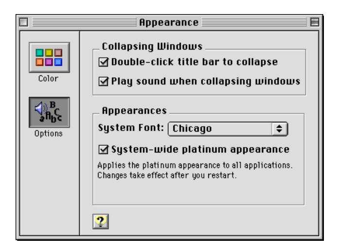

Note the checkbox labeled "System-wide platinum appearance." This is an example of an important change in the Mac OS 8 human interface: users have direct control over the appearance of interface elements. To illustrate this, compare the Find File dialog box using platinum appearance (Figure 1-2) and the Find File dialog box on the same computer with platinum appearance turned off ([Figure 1-3](#page-14-0)).

**Figure 1-2** Find File dialog box under platinum appearance

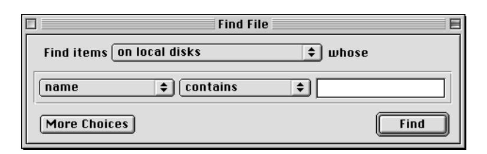

<span id="page-14-0"></span>**Figure 1-3** Find File dialog box with platinum appearance turned off


Note the differences in buttons, pull-down menus, and window structure. This reveals a major change in the Mac OS human interface: since the Mac OS now provides for multiple appearances, there is no longer a direct correspondence between the appearance of Mac OS interface elements and their behavior.

You may find this change a bit startling at first, as it might seem to result in a less unified and coherent interface. Fortunately, there are two major facts which help prevent chaos:

- Toolbox-generated controls behave consistently across all appearance themes. A pop-up menu button, for example, displays the distinctive double arrow and behaves in a predictable manner under any theme.
- Control appearance is consistent within each theme.

The Mac OS 8 Toolbox provides an extended, enhanced suite of interface elements which make it easier to produce a consistent, attractive user interface. If you do these three things:

- use the Mac OS Toolbox to create the controls, windows, and alert boxes described in this document whenever possible
- when you must employ non-standard controls, use the color palette supplied by the Appearance Manager
- follow the layout guidelines described in this document

you will not only save yourself a significant amount of work, you will ensure that your application will be able to use the Appearance Manager to produce a coherent, rewarding user experience now and in the future.

## <span id="page-15-0"></span>Platinum Appearance 1

The suite of appearance features (collectively known as a **theme**) which debuts in Mac OS 8 is called **platinum appearance**. This is the default appearance of the Mac OS 8 interface, so this document uses platinum appearance as the basis for all figures. As noted above, however, you should not assume that any controls you provide will look exactly as depicted in the figures.

The Appearance control panel provides a range of accent and highlight color choices to the user (see Figure 1-4).


The main thing to remember when you design dialog boxes and windows is that appearance may change, but layout does not. The section ["Layout](#page-66-0)  [Guidelines" \(page 67\)](#page-66-0) will help you ensure that your dialog boxes will display correctly under all appearance settings.

#### <span id="page-16-0"></span>**Note**

The default system font is Charcoal, but all illustrations in this document use Chicago font for standard text. Chicago provides the best basis for text layout; in fact, it is the metric standard upon which Charcoal is based. It is very important for you to design your dialog boxes and control panels with Chicago text, so they will look good in any System font the user selects.

**CHAPTER 1** 

Mac OS 8 Human Interface Overview

## <span id="page-18-0"></span>Contents

```
Push Buttons 19
 Push Button States 20
 Default Buttons 21
Radio Buttons 22
Pop-Up Menu Buttons 24
Checkboxes 25
Bevel Buttons 27
 Bevel Buttons as Push Buttons 29
 Bevel Buttons as Radio Buttons 29
 Bevel Buttons as Checkboxes 30
 Bevel Buttons as Pop-up Buttons 30
Sliders and Tick Marks 32
Little Arrows 33
Clock Controls 34
Disclosure Triangles 35
List Boxes and Frames 37
Scroll Bars 38
Edit Text Fields and Frames 39
Static Text Fields 40
Tab Controls 40
Placards 44
Image Wells 45
Group Boxes 45
Separator Lines 48
Window Headers 48
Modeless Dialog Frames 49
Progress Indicators 50
```

Contents **19**

[Asynchronous Arrows 51](#page-52-0)

<span id="page-20-0"></span>This chapter describes the Mac OS Toolbox controls that a user manipulates in windows, dialog boxes, and alert boxes. Because these controls are provided by the Mac OS Toolbox, their appearance and behavior is standardized, which provides users with familiar tools and contexts for responding to the computer's need for information.

## Push Buttons 2

A **push button** is a rounded rectangle that is labeled with text. Figure 2-1 shows some typical push buttons using platinum appearance.

**Figure 2-1** Push buttons in a dialog box

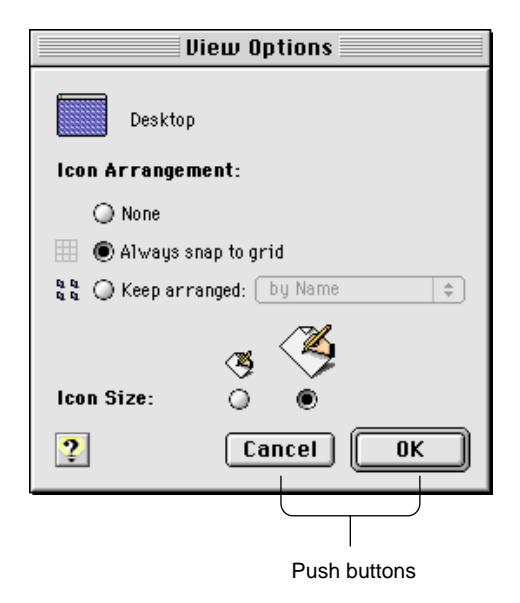

Push buttons usually perform instantaneous actions, such as completing operations defined by a dialog box or acknowledging an error message. Clicking a push button (or pressing a push button's keyboard equivalent) initiates the action described by the button's name.

Push Buttons **21**

<span id="page-21-0"></span>Always map the **keyboard equivalents** Command-period and the Esc (Escape) key to the Cancel push button. If you find it useful to assign keyboard equivalents to other push buttons that are used often in your application, be sure to follow the guidelines in ["Keyboard Equivalent Support" \(page 120\)](#page-119-0) and *Macintosh Human Interface Guidelines*.

## Push Button States 2

A push button has three states: normal, pressed, and disabled. The normal state of a push button indicates that the function the button controls is available but the user has not yet activated it by clicking on the button. This is the usual state of a button when the dialog box or window containing it is first displayed.

A button is displayed in its pressed state when the user clicks on it to activate its function. When the user clicks a push button, the button is **highlighted** and changed to the pressed state to give visual feedback to the user indicating which item has been clicked. The button remains highlighted until the user releases the mouse button or moves the pointer outside of the push button. The push button tracks the mouse movement as long as the user keeps the mouse button depressed. If the user moves the pointer back over the push button, it becomes highlighted again. If the user releases the mouse button while the pointer is not over the push button, nothing happens. Figure 2-2 shows a push button that is highlighted to provide feedback.

**Figure 2-2** A highlighted push button


A button is displayed in its **disabled** state when the function it represents is not available or meaningful within the current context or when the button is drawn in a background window.

For push buttons that are activated by using a keyboard equivalent, the Dialog Manager highlights the button for eight ticks (approximately one-eighth of a second), which is long enough for the user to see that the keyboard event has taken effect. (You must highlight the Cancel button yourself when the user

<span id="page-22-0"></span>presses Command-period or the Escape key; the Dialog Manager does not handle these events.)

For information about implementing these behaviors for push buttons, see *Mac OS 8 Toolbox Reference*.

### Default Buttons 2

Dialog boxes and control panels which use push buttons should include a default button. The **default button** should be the one that the user is most likely to click. However, if the most likely choice is at all destructive (e.g. erasing a disk, deleting a file), you should consider defining the Cancel button as the default.

The default push button displays a ring whose appearance is coordinated with the state of the button. Figure 2-3 shows the three states of standard and default push buttons.

**Figure 2-3** Standard and default states of push buttons

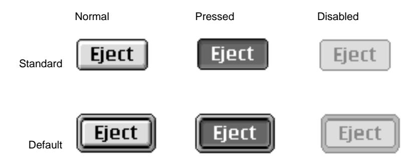

Default push buttons are activated by pressing the Return or Enter keys. When there is no default push button, pressing Return or Enter has no effect on push buttons.

For more information on laying out push buttons in dialog boxes, see ["Push](#page-71-0)  [Button Layout" \(page 72\)](#page-71-0).

Push Buttons **23**

## <span id="page-23-0"></span>Radio Buttons 2

**Radio buttons** always occur in groups. An individual radio button displays one of three states: on, off, or mixed. To activate a radio button, the user can click the button itself or its text label. Only one button in a group can be in the on state, which is indicated by a dot in the middle of the button. Activating a radio button turns off whichever button was previously on in that group.

Radio buttons display settings; they never initiate an action. Figure 2-4 shows a dialog box that uses radio buttons to offer icon size choices to the user.


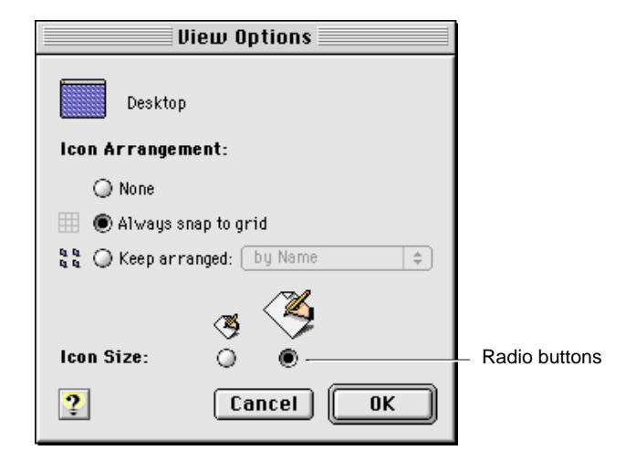

A group of radio buttons should contain from two to approximately seven items. It is possible to have more than seven buttons in a group, but you must always have at least two. Each group of radio buttons generally has a label that identifies the choices the group contains, and each button in the group usually has a name or icon that identifies its particular effect. A set of radio buttons always has the same set of choices; it is *never* dynamic (the contents do not change depending on the context).

<span id="page-24-0"></span>Radio buttons represent related choices, but not necessarily opposite ones. These choices are mutually exclusive; the user can only set one button to the on state at any one time.

There is a special case called the **mixed state**, which shows that a selected range has a variety of items in the on state. For example, a set of radio buttons for selecting font size might have buttons representing 10- and 12-point sizes. If a passage of text with both 10- and 12-point text was selected, both the 10 and 12 buttons would appear in the mixed state. The "one button per set" rule still applies, however; if the user selected the button marked 12, all the text in the selection would change to 12 point, and the mixed state would be cleared.

Radio buttons appear differently in their normal, pressed, and disabled modes depending on whether they are on, off, or in the mixed state. Figure 2-5 shows how radio buttons look in their various modes and states.

**Figure 2-5** Radio button modes and states

|       | Normal | Pressed | Disabled |
|-------|--------|---------|----------|
| On    |        |         |          |
| Off   |        |         |          |
| Mixed |        |         |          |

If more than one group of radio buttons is visible at a given time, each group needs to be visually separated from the others. You should design your dialog box to allow enough space to clearly delineate multiple sets of radio buttons. It can be useful to draw a line between a group of radio buttons and other elements. The separator line control described in ["Separator Lines" \(page 50\)](#page-49-0) is designed to do this. Group boxes [\(page 47\)](#page-46-0) may also be used for this purpose.

For more information on laying out radio buttons in dialog boxes, see ["Checkboxes and Radio Button Layout" \(page 75\).](#page-74-0)

Radio Buttons **25**

## <span id="page-25-0"></span>Pop-Up Menu Buttons 2

A **pop-up menu button** displays a list of items the user can select to change the state of an aspect of the application. A pop-up menu button consists of a single control. The left side of the button contains text that shows the current selection; the right side of the button shows a double triangle pointing up and down. The width of the pop-up button's menu should be equal to or larger than the full width of the largest text portion of the button. Figure 2-6 shows the pop-up menu button in its normal state before a user selects it.

**Figure 2-6** Pop-up menu button in normal state

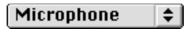

When the user presses a pop-up menu button, a menu appears with the currently choice highlighted and indicated by a checkmark. The user can drag the highlighted area up and down over the menu to select a new item. [Figure 2-7](#page-26-0) shows a pop-up menu button with its list displayed.

The currently selected item in the list always appears at the level of the menu button, but the display of the other items depends on their relative position to the selection. In [Figure 2-7,](#page-26-0) for example, the Microphone item is selected. Since it is the first item in the list, the other items appear below it. If the Internal CD item became the new selection, the display would change so that the next time the button was popped up, the Microphone item would appear above and the AV Connector item would appear below the selection.

If the user presses the pop-up menu button and releases the mouse button with the pointer outside the pop-up menu, the menu closes without changing the current selection. If the user releases the mouse button while the pointer is over a menu item, that item becomes the current selection and the pop-up menu button text is changed to reflect the new selection.

<span id="page-26-0"></span>**Figure 2-7** Pop-up menu button with displayed list


If the user clicks on the pop-up menu button and the pointer remains over the menu item for less than the user-set double-click time, the pop-up menu button becomes a sticky menu. See ["Sticky Menus" \(page 92\)](#page-91-0) for information on this feature.

For information on laying out pop-up menu buttons in dialog boxes, see ["Pop-up Menu Button Layout" \(page 78\)](#page-77-0).

## Checkboxes 2

A **checkbox** is a square with a text label next to it. The user clicks the checkbox or its label to select or deselect it. You can use one checkbox or as many as you need in a single setting.

Checkboxes are designed to provide binary choices for users. For example, a dialog box for saving files could include a checkbox labeled "Compressed". In this case, the clearly implied opposite state would be an uncompressed file save.

If you want to provide a control for states which are less obviously binary, you might be better off using radio buttons and providing individual labels to clarify the states. It's sometimes tempting to use a checkbox because one item takes up less space than two, but the choice may be too ambiguous for users to understand.

The default state for a checkbox is also important. In the earlier Compressed checkbox example, setting on as the default state emphasizes a preference for compressed file saves, since the user is required to take an extra action to do otherwise.

Checkboxes **27**

<span id="page-27-0"></span>Avoid the use of negative labels for checkboxes. A checkbox labeled "Delete read messages" with a default state of off is clearer than a checkbox labeled "Do not delete read messages" which defaults to on.

There are two options for marking the checkbox in its on state. The default option is a checkmark to indicate that a checkbox is on, but if the checkmark is not culturally acceptable, the familiar "X" version of this control is available for localization purposes. When the checkbox is off, it is unmarked.

There is a mixed state for checkboxes, which shows that a selected range of items has some in the on state and some in the off state. For example, a text formatting checkbox for bold text would be in the mixed state if a text selection contained both bold and non-bold text.

Figure 2-8 shows how checkboxes look in their various modes and states.

|                 | Normal | Pressed | Disabled |
|-----------------|--------|---------|----------|
| On<br>(Default) |        |         |          |
| On              |        |         |          |
| Off             |        |         |          |
| Mixed           |        |         |          |

**Figure 2-8** Checkbox modes and states

Checkboxes differ from radio buttons in that they are independent of each other, even when they offer related options. Any number of checkboxes can be on, off, or mixed at the same time. [Figure 2-9](#page-28-0) features a group of checkboxes with two options selected concurrently.

<span id="page-28-0"></span>**Figure 2-9** A set of checkboxes with concurrent selections

| Menubar Display Format          |
|---------------------------------|
| ☐ Display the time with seconds |
| ☑ Append AM/PM to the time      |
| ☑ Show the day of the week      |
| ☐ Flash the time separators     |

It is important to arrange checkboxes in clearly organized groups. Allow ample white space between checkbox groups and other controls. Use separator lines [\(page 50\)](#page-49-0) and group boxes [\(page 47\)](#page-46-0) when appropriate. For more information on laying out checkboxes, see ["Checkboxes and Radio Button Layout"](#page-74-0)  [\(page 75\)](#page-74-0).

## Bevel Buttons 2

A **bevel button** is a rectangular control with a beveled edge that gives the button a three-dimensional appearance. You can choose from among three widths of bevels—small, medium, and large—for any size button you create. The small bevel is two pixels wide; the medium bevel is three pixels wide; and the large bevel is four pixels wide. The size of the bevel determines the "height" of the button. Figure 2-10 shows the three bevel sizes.

**Figure 2-10** Bevel buttons with small, medium, and large bevels

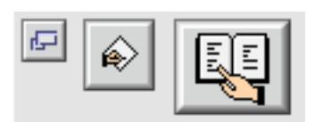

A bevel can display text, an icon, or a picture. For bevel buttons that contain text, you can specify how the text is justified and aligned. For bevel buttons that contain both text and an image, you can also specify placement of the text in relation to the image. Bevel button text is aligned according to the system

Bevel Buttons **29**

<span id="page-29-0"></span>default script direction; if the system software displays text from right to left, the button text will be right-aligned. Bevel buttons containing both text and an image will place the image correctly according to the system default script direction if the image and text are on the same horizontal plane. For more information on laying out bevel buttons in dialog boxes, see ["Bevel Button](#page-73-0)  [Layout" \(page 74\).](#page-73-0)

Bevel buttons can exist in seven states. There are five active states and two disabled. The active states are:

- off
- pressed (was off)
- on
- pressed (was on)
- mixed, for use when behaving as a checkbox or radio button.

#### **Note**

Under platinum appearance, both pressed states look the same, but this may change in future appearance themes.

Disabled bevel buttons can be shown as off or on.

Bevel button states are depicted in Figure 2-11.

**Figure 2-11** Bevel button states Off Pressed, was off On Pressed, was on Disabled, off Disabled, on Mixed

<span id="page-30-0"></span>A bevel button mimics the behavior of other button types. You can attach a menu to a bevel button, in which case the bevel button takes on the behavior of a pop-up menu button. A bevel button can behave like a standard push button; in this case, the button pops back up after the user clicks on it. Bevel buttons can also behave in sets as radio buttons and as checkboxes.

### Bevel Buttons as Push Buttons 2

A bevel button can be used as a push button, in which case it takes on a push button's behavior while retaining the bevel button appearance. You can use any number of bevel buttons as push buttons in your dialog box or window, just as you can use any number of standard push buttons together. Figure 2-12 shows two bevel buttons used in this way.

**Figure 2-12** A pair of bevel buttons used as push buttons

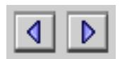

When the user clicks a bevel button that behaves as a push button, it initiates the action the button represents. Visually, the button returns to its off state when released. If the user moves the pointer off the button at any time while holding down the mouse button, the bevel button reverts to its off state.

For more information on push button behavior, see "Push Buttons" [\(page 21\)](#page-20-0).

### Bevel Buttons as Radio Buttons 2

A bevel button can be used as a radio button, in which case it takes on a radio button's behavior while retaining the bevel button appearance. Bevel buttons acting as radio buttons are used in groups, just as standard radio buttons are. The behavior for standard radio buttons, described in ["Radio Buttons"](#page-23-0) [\(page 24\)](#page-23-0), applies to radio bevel buttons. [Figure 2-13](#page-31-0) shows a group of bevel buttons serving as radio buttons in a text justification toolbar.

Bevel Buttons **31**

<span id="page-31-0"></span>**Figure 2-13** Bevel buttons used as radio buttons in a toolbar


## Bevel Buttons as Checkboxes 2

A bevel button can be used as a checkbox, in which case it takes on the checkbox behavior, described in ["Checkboxes" \(page 27\)](#page-26-0), while retaining the bevel button appearance. The on, off, and mixed states are available when you use bevel buttons as checkboxes. You can use checkbox bevel buttons singly or in sets.

Figure 2-14 shows a group of bevel buttons used as checkboxes in a text styling tool. The buttons labeled "B" for "boldface" and "U" for "underline" are in the on state because the selected range of text contains both boldfaced and underlined characters.

**Figure 2-14** Bevel buttons used as checkboxes in a toolbar

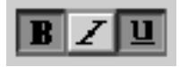

### Bevel Buttons as Pop-up Buttons 2

A bevel button can be used as a pop-up button with or without a menu.

When a bevel button behaves as a pop-up menu button, the user clicks on the bevel button to display a pop-up menu directly below or to the right of the button. If used as a standard menu, the menu closes immediately after the user releases the mouse button. If you enable sticky menu behavior, the menu remains displayed after the user clicks on the button. The section on ["Pop-Up](#page-25-0)  [Menu Buttons" \(page 26\)](#page-25-0) describes this more fully. [Figure 2-15](#page-32-0) shows an example of a pop-up bevel button with a sticky menu.

<span id="page-32-0"></span>**Figure 2-15** A pop-up bevel button with sticky menu


You can also set up a bevel button which, if the user clicks once, simply turns on the function represented by the button, but if pressed for longer than the user-set double-click time, displays a pop-up menu which offers further options for that function. This behavior is useful for providing option sets in tool palettes.

You can specify that a pop-up bevel button displays either a small or large arrow to indicate its pop-up behavior. These arrows can be either horizontally or vertically oriented. Figure 2-16 shows pop-up bevel buttons with large horizontally-oriented arrows. Figure 2-15 shows pop-up bevel buttons with small vertically-oriented arrows.

Figure 2-16 shows a pop-up bevel button that serves as a standard pop-up button with a slider instead of a menu.

**Figure 2-16** A pop-up bevel button used with a slider


Bevel Buttons **33**

## <span id="page-33-0"></span>Sliders and Tick Marks 2

A **slider** control consists of a slider bar, which displays a range of allowable values, and an indicator, which marks the current setting. The user can drag the indicator to set a new value within the range.

Sliders can be horizontal or vertical. The indicator can point in any direction or be nondirectional. The user drags the indicator across a horizontal slider or up and down a vertical one to alter the value of the slider. Like scroll bars, sliders drag a ghost image of the indicator along with them. The **ghost indicator** is a copy of the indicator which shows where the user has dragged the pointer. Figure 2-17 shows a slider with a downward pointing indicator shadowed by a ghost indicator.

**Figure 2-17** A slider and ghost indicator


A slider can display **tick marks** to represent increments within the range of values. You determine the number of tick marks and what fraction of the scale each mark represents. If you use tick marks, they are drawn appropriately for the direction of the slider. Figure 2-18 shows a horizontal slider using vertical tick marks.

**Figure 2-18** A horizontal slider with vertical tick marks

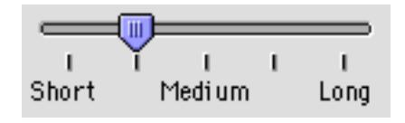

<span id="page-34-0"></span>Be sure to label the tick marks so that they clearly indicate the effect of moving the indicator. While it is true that most people assume that moving an indicator up a vertical slider means increasing the value of the setting, you can easily remove all doubt with graphics or text. Figure 2-19 shows an example of a horizontal slider that uses incremental numbering to indicate increasing values as the user moves the indicator to the right.

**Figure 2-19** A slider with directional information

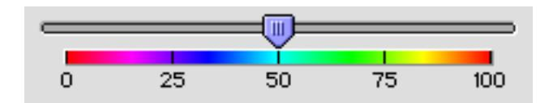

Sliders support live feedback, a process also known as "live dragging." This allows you to design a dialog in which the user is given constant visual updates of the changes in value as the indicator is dragged, as opposed to the standard behavior of waiting to update the value until the mouse button is released.

Make sure that you don't use a scroll bar when you really should use a slider. Sliders are designed to change settings, while scroll bars are used to represent the relative position of the visible portion of a document or scrolling list. Using a scroll bar to change a setting confuses the meaning of the element and makes the interface inconsistent. For more information on using scroll bars, see ["Scroll](#page-39-0)  [Bars" \(page 40\).](#page-39-0)

## Little Arrows 2

**Little arrows** provide the user with a means of increasing or decreasing values in a series. This control consisting of two arrows pointing in opposite directions. [Figure 2-20](#page-35-0) shows the little arrows control in its normal state, with the up arrow depressed, with the down arrow depressed, and in its disabled state.

Little Arrows **35**

<span id="page-35-0"></span>**Figure 2-20** Little arrows in various states


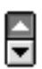

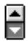


The little arrows control has a label that specifies the content to which it relates. If the user clicks the up arrow, the value displayed is incremented by one unit of change. If the user presses the arrow, the value increases or decreases until the user releases the mouse button. While the user presses the arrow, it is highlighted to provide feedback to the user.

The unit of change depends on the content. If the content area displays years, the increment is one year. If you used little arrows to control the size of a RAM cache, however, you might use multiples of 32K as the increment (as in Figure 2-21.)

**Figure 2-21** Little arrows used to control a RAM cache

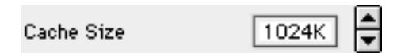

## Clock Controls 2

The **clock control** combines the edit text field [\(page 41\)](#page-40-0) and little arrows control [\(page 35\)](#page-34-0) into a convenient implementation of the familiar Date & Time control panel. The user can change the time and date displayed by using the little arrows or by typing the value into the edit text field. [Figure 2-22](#page-36-0) shows a clock control displaying a date.

<span id="page-36-0"></span>**Figure 2-22** Clock control displaying date


The clock control supports keyboard navigation and focus [\(page 66\)](#page-65-0), as well as direct typing of values. When the clock control has keyboard focus, pressing the Up-Arrow and Down-Arrow keys has the same effect as clicking the up and down arrows.

You can make a clock control inactive, so that it displays time and date values without allowing the user to change them.

## Disclosure Triangles 2

The **disclosure triangle** is a control that allows the display or "disclosure" of information which elaborates on the primary information in a window.

One way to use disclosure triangles is to provide a way for users to expand a dialog box or control panel. When the user clicks on the disclosure triangle, the triangle rotates downward and the window expands to provide supplemental information. Clicking on the triangle again rotates the triangle back to the right and restores the original appearance of the window. [Figure 2-23](#page-37-0) shows a file copy dialog box in its default configuration and with the disclosure triangle turned to reveal additional details of the copy operation.

<span id="page-37-0"></span>**Figure 2-23** A disclosure triangle revealing additional information

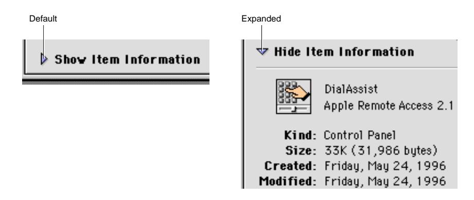

Another familiar implemention of disclosure triangles is in the Finder's list view. The triangle appears next to the icon of each folder in the window. The user clicks the triangle to expand the view by revealing a list of the contents of the folder without opening it. The triangle rotates downward when the folder is expanded, which tells the user that the view is expanded even in cases when the folder is empty. Clicking the triangle again restores the view to its original (collapsed) state and turns the triangle back to the right. Figure 2-24 shows the disclosure triangle in expanded and collapsed positions.

**Figure 2-24** Disclosure triangles used in Finder list view

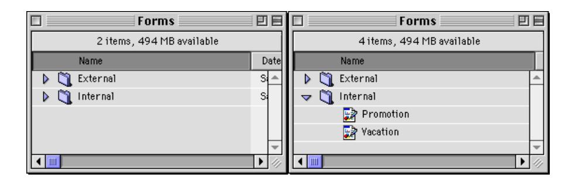

This use of a disclosure triangle is also known as an "outline triangle," since it provides a function similar to the Outline view used in many applications.

<span id="page-38-0"></span>In the Finder's list view, a disclosure triangle may be turned to the open position by using the Command-right arrow keyboard equivalent and closed by using Command-left arrow. If you use disclosure triangles in your application to provide expanded/collapsed list views, you should also provide these keyboard equivalents.

For more information on laying out disclosure triangles in dialog boxes, see ["Disclosure Triangle Layout" \(page 84\).](#page-83-0)

## List Boxes and Frames 2

The **list box** control is a complete solution for creating scrolling lists. It provides for up to two embedded scroll bars and a scrolling list box which features a white background and a two-pixel-wide rectangular frame whose inside lines share the outside lines of the scroll bar(s). Figure 2-25 shows a list box in use.

**Figure 2-25** A list box


List boxes can accept keyboard input for navigating within the list. The user can use the arrow keys to move through the list one item at a time in the direction of the arrow. Users can also select an item from the list by typing the beginning character or characters of its name; this technique is called **type selection.** 

List boxes are not appropriate to provide choices in a limited range. Because the full range may not be visible all at once in a scrolling list, it's difficult for

<span id="page-39-0"></span>users to understand the scope of their choices. Sliders work very well for displaying a limited range of values and letting users choose their preference in the range. See ["Sliders and Tick Marks" \(page 34\)](#page-33-0) for information about sliders.

The **list box frame** is available as a separate control so that non-standard list boxes can be made Appearance-compliant.

For more information about laying out list boxes in dialog boxes, see ["List Box](#page-85-0)  [Layout" \(page 86\).](#page-85-0)

## Scroll Bars 2

**Scroll bars** allow users to view areas of a document or a list that is larger than can fit into the current window. A scroll bar is a shaded gray rectangle that has a black arrow in a box at each end. Inside the gray area is an indicator (also known as a "scroll box") which indicates the relative position of the currently visible portion of the content being scrolled.

The appearance of scroll bars has been updated for platinum appearance. Scroll arrows are now solid black when active. The scroll indicator takes the color set by the user through the Appearance control panel. Figure 2-26 shows the new appearance of scroll bars.

**Figure 2-26** A horizontal scroll bar


You can use scroll bars with windows as well as with scrolling lists. For more information on the use of scroll bars with windows, see "Windows" in *Macintosh Human Interface Guidelines*.

Make sure that you don't use a scroll bar when you really should use a slider. Use scroll bars only for representing the relative position of the visible portion of a document and in scrolling lists. Typically a scroll bar represents the

<span id="page-40-0"></span>amount of data in a document, while the scroll indicator represents the relative position of the window over the length of the document. Using a scroll bar to change a setting confuses the meaning of the element and makes the interface inconsistent. For more information on using sliders, see ["Sliders and Tick](#page-33-0)  [Marks" \(page 34\).](#page-33-0)

## Edit Text Fields and Frames 2

The **edit text field** (also known as a "text entry field") is a rectangular area in which the user enters text or modifies existing text. The edit text field can be active or disabled. It supports keyboard focus and password entry.

Figure 2-27 shows an edit text field with a label.

**Figure 2-27** An edit text field with label

It is up to you to provide appropriate editing services for an edit text field. For more information about this, see "Text Entry Fields" in *Macintosh Human Interface Guidelines*.

The **edit text frame** is used to surround an edit text field. It is useful for making a non-standard version of the edit text field Appearance-compliant. The edit text frame is two pixels wide. It has two states, enabled and disabled. Figure 2-28 shows an example of an edit text frame in the enabled state.

**Figure 2-28** An edit text frame

<span id="page-41-0"></span>For more information on laying out edit text fields, see ["Edit Text Field Layout"](#page-81-0)  [\(page 82\)](#page-81-0).

## Static Text Fields 2

A **static text field** embeds static text (unchangeable by the user) in dialog boxes. Static text fields may be made active or disabled. Figure 2-29 shows a static text field in both states.

**Figure 2-29** A static text field in active and disabled states

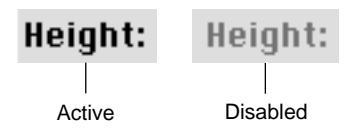

For more information on laying out static text fields, see ["Static Text Field](#page-83-0)  [Layout" \(page 84\).](#page-83-0)

## Tab Controls 2

The **tab control** provides a convenient way to present information in a multi-page format. This control is distinguished by the visual appearance of folder tabs. The user selects the desired page by clicking the appropriate tab, which highlights and displays its page.

The tab control supports one row of tabs running along the top, as shown in [Figure 2-30](#page-42-0) and [Figure 2-31](#page-42-0). You specify the names and icons that label the tabs. [Figure 2-30](#page-42-0) shows the tab control with 12-point font labels.

<span id="page-42-0"></span>**Figure 2-30** Tab control with 12-point font labels

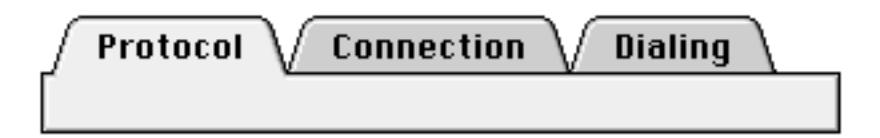

Figure 2-31 shows a tab control with 10-point font labels.

**Figure 2-31** Tab control with 10-point font labels


The appearance of the content area of a tab control (also known as a **pane**) depends on where it is used. [Figure 2-32](#page-43-0) shows a tab control inside a control panel. In this implementation, the sides of the pane appear to be "tucked" under the edge of the content region by one pixel.

Tab Controls **43**

<span id="page-43-0"></span>**Figure 2-32** Tab control with sides tucked under edge of content region


[Figure 2-33](#page-44-0) shows a tab control used in a modal dialog box. Note that the left and right sides of the pane are inset two pixels from the edge of the dialog box's content region. This small distinction helps emphasize the fact that the tab is part of a dialog box. Contrast this with [Figure 2-34](#page-44-0), which shows a tab control with tucked edges and a scrollable content area.

<span id="page-44-0"></span>**Figure 2-33** Tab control used in a modal dialog box


**Figure 2-34** Tab control with tucked edges and a scrollable content area


Controls such as push buttons or scroll bars may be used within a tab control. These controls may be **global**, which means they are available to and affect the settings of all the panes in a set of tabs. Controls may also be embedded within an individual pane, in which case they affect only the settings displayed in that pane. It is important that you make this distinction unambiguous to the user

Tab Controls **45**

<span id="page-45-0"></span>through clear, specific labeling and placement. In [Figure 2-33,](#page-44-0) for example, the push buttons underneath the tab control are clearly global, while the checkboxes inside the tab control affect only the active pane.

## Placards 2

A **placard** is a control that you can use as an information display or as background fill for a control area. Placards have three states: normal, pressed, and disabled.

Perhaps the most familiar use of the placard control is as a small information panel, often placed at the bottom of a window to the left of the horizontal scroll bar. Figure 2-35 shows an example of this use of a placard.

**Figure 2-35** A placard used to report information to the user


You can extend the functionality of a placard. Providing a pop-up menu, for instance, would give the user a convenient way to choose the magnification level of the window.

## <span id="page-46-0"></span>Image Wells 2

The **image well** is used to display non-text visual content, such as icons or pictures. Image wells have a two-pixel-wide rectangular frame. This control has a "recessed" appearance and a white background fill, which distinguish it from controls such as bevel buttons. Figure 2-36 shows the enabled and selected states of image wells.

**Figure 2-36** Iimage wells in enabled and selected states

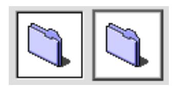

Image wells can serve as drag and drop targets. You could use a set of image wells to manage thumbnail images in a clip-art catalog, for instance, or to display a set of user-selectable icons.

Image wells should not be used in place of push buttons [\(page 21\)](#page-20-0) or bevel buttons [\(page 29\)](#page-28-0).

## Group Boxes 2

**Group boxes** are used to associate, isolate, and distinguish groups of related items in a dialog box. You can embed other controls, such as radio buttons, checkboxes, and pop-up menu buttons, within group boxes.

Group boxes are defined as either primary or secondary. The main visual distinction between the two types is their borders; primary group box border lines are two pixels wide with an etched look, while secondary group box borders are one pixel wide.

Image Wells **47**

<span id="page-47-0"></span>You can use any of four titling options for the border of a group box: the group box can be untitled or it can have a text title, a pop-up menu title, or a checkbox title. Figure 2-37 shows an untitled primary group box.

**Figure 2-37** An untitled primary group box


Figure 2-38 shows a titled primary group box.

**Figure 2-38** A titled primary group box

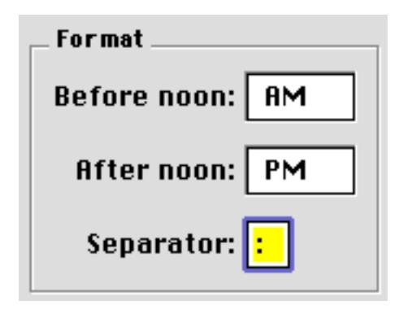

[Figure 2-39](#page-48-0) shows a primary group box using a pop-up menu title. This is useful for displaying a variety of related settings in a limited space.

<span id="page-48-0"></span>**Figure 2-39** A primary group box with a pop-up menu title


Figure 2-40 shows a primary group box with a checkbox title. This is useful to indicate when a group of settings may be disabled by the user.

**Figure 2-40** A primary group box with a checkbox title


Secondary group boxes are generally used for nesting and grouping together subsidiary information. Do not use secondary group boxes in place of primary ones; this produces inconsistent dialog box appearances which confuse users. [Figure 2-41](#page-49-0) shows a secondary group box. Note the difference in the border as compared to a primary group box.

Group Boxes **49**

<span id="page-49-0"></span>**Figure 2-41** A secondary group box

For more information on laying out group boxes, see ["Group Box Layout"](#page-79-0)  [\(page 80\)](#page-79-0).

## Separator Lines 2

The **separator line** is used in dialog boxes to separate groups of controls by delineating horizontal or vertical regions of the content area. It provides an Appearance-compliant alternative to drawing a QuickDraw line.

The separator line is two pixels wide. Under platinum appearance, the top pixel of a horizontal separator line creates the line itself and the bottom pixel gives it the engraved effect. For vertical lines, the left pixel creates the line and the right pixel gives it the engraved effect. Figure 2-42 shows a horizontal separator line.

**Figure 2-42** A horizontal separator line

## Window Headers 2

The **window header** is designed to be a simple way to present information about a window's contents. It is a familiar feature of the Finder, but it can also be implemented in document windows.

<span id="page-50-0"></span>The window header is a beveled rectangle whose outside lines share the same space as the inside lines of the document window and the scroll bar arrows. There is a also a **window list view header**, which provides the same functionality as the standard window header, but removes the line which separates a standard window header from the content area. Figure 2-43 shows an example of a window header and a window list view header.

Header List view header

**Figure 2-43** A Finder window using headers

## Modeless Dialog Frames 2

The **modeless dialog frame** is used in the content region of a modeless dialog box. It is a rectangle with a two-pixel-wide border which shares the inside lines of the document window. This control provides an Appearance-compliant way to distinguish modeless dialogs from other windows. The modeless dialog frame has active and inactive states.

[Figure 2-44](#page-51-0) shows a modeless dialog frame in an active dialog box.

<span id="page-51-0"></span>**Figure 2-44** A modeless dialog frame in active state


## Progress Indicators 2

**Progress indicators**, also called "progress bars", are used to inform the user about duration or capacity. Two types are supported: the determinate progress indicator and the indeterminate progress indicator. Figure 2-45 shows an example of each indicator. Both types have a fixed height and a variable width.

**Figure 2-45** Progress indicators


The determinate progress indicator should be used in cases when the full scope of an operation can be determined. The bar moves from left to right as the operation progresses, so the user can easily see how much of the process has been completed. You might use a determinate progress indicator to show the progress of a file copying operation.

The indeterminate progress indicator is intended for those cases where the duration of a process is not easily determined. This indicator consists of a striped cylinder that spins to indicate an ongoing process. It provides less

<span id="page-52-0"></span>information to the user and therefore should be reserved for cases when the determinate indicator is clearly inappropriate. You might use an indeterminate progress indicator to let the user know that the application is in the process of attempting a communication connection or is waiting to receive data during file transfer.

You should consider switching from an indeterminate progress indicator to a determinate one, if a process reaches a point where its scope becomes determinable. For example, a remote file transfer may not become determinate until the application has had time to establish a connection and calculate the data transfer rate.

For information on laying out progress indicators in dialog boxes, see ["Progress Indicator Layout" \(page 83\)](#page-82-0).

## Asynchronous Arrows 2

The **asynchronous arrows** control (also known as "chasing arrows") is a simple animation used to indicate that an asynchronous background process is occurring; in other words, a process which does not display a dialog box that might contain a progress indicator. For example, the Finder displays asynchronous arrows in the header while it is updating an open window. Figure 2-46 shows asynchronous arrows in their various states.

**Figure 2-46** Various states of asynchronous arrows


Progress Indicators **53**

#### **CHAPTER 2**

Control Guidelines

## <span id="page-54-0"></span>Contents

```
About Dialog Boxes 53
Movable Modal Dialog Boxes 55
Modal Dialog Boxes 56
Alert Boxes 56
 Note Alert Boxes 58
 Caution Alert Boxes 59
 Stop Alert Boxes 59
Modeless Dialog Boxes 60
Keyboard Navigation and Focus 62
Layout Guidelines 63
 Measurement Guidelines 63
 Font Guidelines 65
 Spacing 67
 Control Layout Guidelines 68
   Push Button Layout 68
   Bevel Button Layout 70
   Checkboxes and Radio Button Layout 71
   Pop-up Menu Button Layout 74
   Group Box Layout 76
   Edit Text Field Layout 78
   Progress Indicator Layout 79
   Disclosure Triangle Layout 80
   Static Text Field Layout 80
   List Box Layout 82
   Help Button Layout 82
```

Contents **55**

<span id="page-56-0"></span>This chapter describes the dialog boxes that your application can use and shows how each has changed under platinum appearance. The chapter gives brief recommendations on choosing and implementing each kind of dialog box; more details are available in *Macintosh Human Interface Guidelines*. Finally, the chapter provides guidelines on how to lay out dialog boxes and alert boxes for maximum clarity and consistency under any appearance settings.

## About Dialog Boxes 3

**Dialog boxes** are a type of specialized window. They provide a standard framework in which to present a set of choices to and elicit responses from the user. A dialog box may contain text, controls, and icons.

**Alert boxes** appear when the system software or an application needs to communicate important information to the user, such as messages about error conditions and warnings about potentially hazardous situations or actions. An alert box is a type of dialog box and thus follows many of the same guidelines.

Each dialog box contains some text to indicate which command or condition caused it to be displayed and what its function is. In some cases, this text is a title for the dialog box.

There are five types of dialog boxes available through the Mac OS Toolbox:

- **Movable modal dialog boxes** provide a means to request user input and make changes to a document while allowing the user to switch to another application. This is the preferred type of modal dialog box.
- **Modal dialog boxes** force the user to provide necessary information before carrying out the current operation. They cannot be moved or hidden.
- **Movable alert boxes** communicate warnings and error conditions while allowing the user to move the alert dialog around on the screen and switch to other applications. This is the preferred type of alert box.
- **Alert boxes** communicate warnings and error conditions. An alert box prevents any other activity until the user responds to the alert.
- **Modeless dialog boxes** accept user input and allow multiple changes to a document. Once open, they do not inhibit user activity.

<span id="page-57-0"></span>**Figure 3-1** The five types of dialog boxes

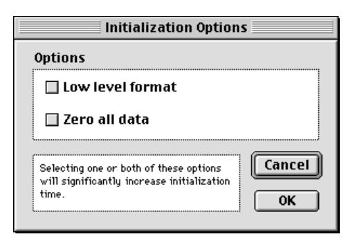


Movable modal dialog box

Modal dialog box

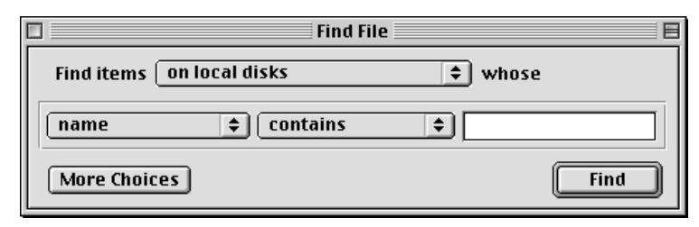

Modeless dialog box


Movable modal alert box

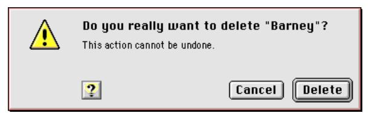

Modal alert box

## <span id="page-58-0"></span>Movable Modal Dialog Boxes 3

A **movable modal dialog box** is a modal dialog box with a title bar which allows the user to move the dialog box. The user can also switch to other applications without closing the dialog box. These enhancements makes the movable modal dialog box preferable to the modal dialog box [\(page 60\)](#page-59-0) in most situations.

A movable modal dialog box does not have a close box or a zoom box. This design gives the user visual feedback that the dialog box can be moved, but is modal and must be responded to before completing any other action in the active application. A title is preferred but is not required. Figure 3-2 shows a movable modal dialog box.

**Figure 3-2** A movable modal dialog box

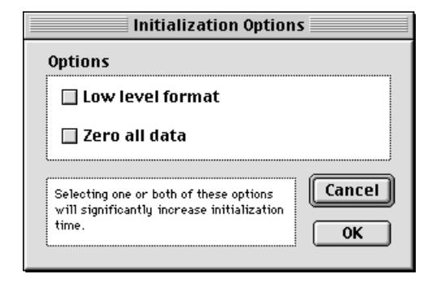

For more information on the behavior of movable modal dialog boxes, see "Movable Modal Dialog Box Behaviors" in *Macintosh Human Interface Guidelines*.

## <span id="page-59-0"></span>Modal Dialog Boxes 3

A **modal dialog box** puts the user in the state (or "mode") of being able to work only inside the dialog box. It temporarily suspends all other user actions in an application and forces the user to make decisions and respond to the dialog. The user cannot move or resize a modal dialog box, and the user can dismiss it only by clicking its buttons. If the user clicks any other window or on the desktop, the system beeps, but nothing else happens.

Modal dialog boxes display their content on a placard-like background. Figure 3-3 shows a modal dialog box.

**Figure 3-3** A modal dialog box

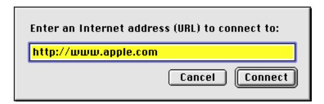

You should restrict your use of modal dialog boxes to occasions when your application needs the user to make a decision before operations can continue. This should be a task-specific, limited interaction that can be quickly resolved. Unless you need the extra restrictions of a non-movable modal dialog box, you should use a movable modal dialog box [\(page 59\)](#page-58-0) whenever possible.

For more information on implementing modal dialog boxes, see "Modal Dialog Box Behaviors" in *Macintosh Human Interface Guidelines*.

## Alert Boxes 3

**Alert boxes** are special types of modal dialog boxes. Alert boxes display messages to users to inform them of situations that may be particularly notable

<span id="page-60-0"></span>or dangerous, along with an icon that signifies the degree of severity of the alert message.

An alert box contains only an icon, text, and buttons; there are no other controls. The only way to close an alert box is to click a button. This is deliberate, as alert boxes are only used to signify conditions which demand an explicit response from the user.

An alert box may contain up to four buttons:

- OK
- Cancel
- Help
- an optional button (Don't Save, for example)

If you use the standard alert boxes provided by the Mac OS Toolbox, the size of the alert box is automatically set for you based on the amount of text it contains. The icon, text, and buttons of a standard alert box are automatically positioned.

Alert boxes feature two distinct styles of text display. The box's label appears in the boldfaced version of the system font, while the narrative below it appears in the plain text version of the small system font. This distinction is handled automatically for you when you specify an alert box through the Mac OS Toolbox. You should use the label to provide a short, simple summary of the error or condition which summoned the alert. The narrative section allows you to provide a longer, more detailed description of the situation and its consequences.

A movable alert box has red highlights on its title bar, which distinguish it from a movable modal dialog box. As with dialog boxes, you should use a movable alert box whenever possible. Figure 3-4 shows a movable alert box.

**Figure 3-4** A movable alert box

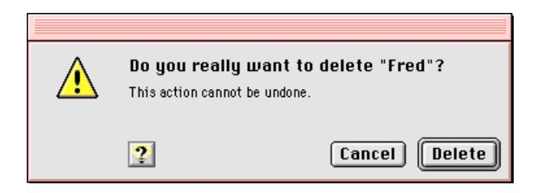

Alert Boxes **61**

<span id="page-61-0"></span>Alert boxes which are not movable are sometimes called "modal alert boxes," but this is somewhat misleading, as all alert boxes are modal by definition. A non-movable alert box has a red border around the placard which forms the content region. This reflects the significance of the content and helps to distinguish the alert box from a standard modal dialog box. Figure 3-5 shows a non-movable alert box.

**Figure 3-5** An alert box


See "Language" in *Macintosh Human Interface Guidelines* for more information on writing appropriate alert box messages.

## Note Alert Boxes 3

The note alert box is the first level of alert box. It uses the talking face icon. The note alert box provides useful information which does not imply any threat of data loss. Note alert boxes generally have only an OK button, plus an optional help button. In this case, the user can respond to the information only by acknowledging it. Figure 3-6 shows an example of a note alert box.

**Figure 3-6** A note alert box

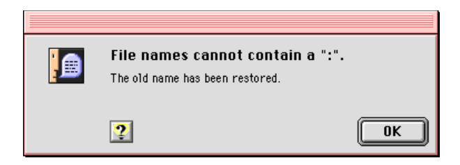

### <span id="page-62-0"></span>Caution Alert Boxes 3

The caution alert box, the second level of alert box, is more severe than the note alert box. The caution alert box icon is the triangle with an exclamation point. Caution alert boxes provide a safety net by warning the user in advance of a potentially dangerous action.

Caution alert boxes always contain two buttons, an OK button (which can use more specific "go ahead" labels such as Continue or Delete) and a Cancel button, in addition to an optional Help button. This choice allows the user to continue the potentially dangerous action or to cancel it. The OK or Continue button should be the default button, unless the user has to perform some other task in order to prevent the loss of data. Figure 3-7 shows an example of a caution alert box.

**Figure 3-7** A caution alert box

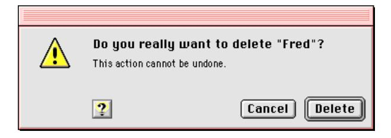

## Stop Alert Boxes 3

The stop alert box is the third, and most severe, level of alert box. The stop alert box icon is the octagon with an open hand, which resembles a stop sign in most locales. (If this icon is offensive in a region or country where you want to market your application, it can be replaced by a more acceptable icon through the Mac OS localization process.)

Stop alert boxes notify the user that an action cannot be completed. Stop alert boxes generally have only an OK button, plus an optional help button. As with the note alert box, the user can only acknowledge the warning and dismiss the alert box. [Figure 3-8](#page-63-0) shows an example of a stop alert box.

Alert Boxes **63**

<span id="page-63-0"></span>**Figure 3-8** A stop alert box

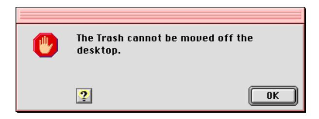

## Modeless Dialog Boxes 3

A **modeless dialog box** looks like a document window without a size box, zoom box, or scroll bars. The user can move a modeless dialog box, make it inactive and active again, collapse or close it like any document window. A modeless dialog box has a close box on the far left of the title in the title bar region and a collapse box on the far right. For more on the use of collapse boxes, see ["Collapsing a Window" \(page 103\)](#page-102-0).

It is possible to display a modeless dialog box without a close box. This should only be done when the dialog box is displaying the status of an ongoing process (such as a Finder file copy) which would be interrupted or canceled if the dialog box was closed.

The title of a modeless dialog box is generally the same as the name of the menu item that activates the dialog box. In some cases, however, it may be useful to expand the title to provide more information, as shown in [Figure 3-10](#page-64-0). If the menu item includes an ellipsis character, don't include it in the title of the dialog box.

Modeless dialog boxes provide the most flexibility for users, allowing them to do any task at any time or in any order. Modeless dialog boxes may be used to allow users to change their documents, perform actions with data, or get information about files.

Modeless dialog boxes allow users to repeat an action as many times as necessary while the dialog box remains open. This feature is useful for tasks such as finding and replacing text in a word processor or numbers in a spreadsheet. [Figure 3-9](#page-64-0) shows a modeless dialog box.

<span id="page-64-0"></span>**Figure 3-9** A modeless dialog box

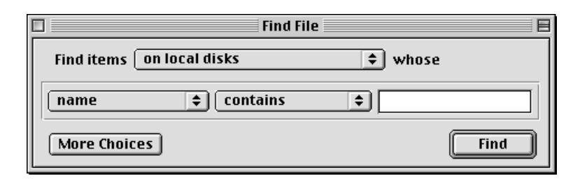

If the user activates a window behind an open modeless dialog box, the selected window appears in front of the dialog box. Users can relocate modeless dialog boxes to make other windows more visible. Unlike modal dialogs, modeless dialog boxes may also be left open when not in use, so they are easily available when needed. This option might be useful if a user wants to compare information about several documents, which is possible with Get Info windows in the Finder. Figure 3-10 shows two such windows open simultaneously.

**Figure 3-10** Two open modeless dialog boxes

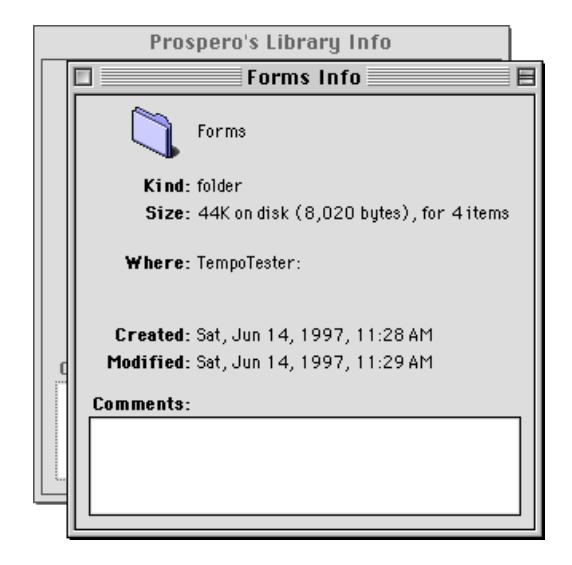

<span id="page-65-0"></span>When an application displays a modeless dialog box, it should preset any controls to appropriate default values. Supply text in edit text fields whenever possible; typically this will be the text last used in the dialog box, if applicable, or the current text selection in a document. At a minimum, you should display an insertion point in the one of the edit text fields (usually the first field) when the dialog box is opened.

For more information on using modal dialog boxes, see "Modal Dialog Box Behaviors" in *Macintosh Human Interface Guidelines*.

## Keyboard Navigation and Focus 3

In a dialog box, the user can navigate through the interface elements that accept keyboard input, such as edit text fields and list boxes, in several ways. The user can click the desired element or press the Tab key to cycle through the available elements (a feature known as **keyboard navigation**). The user can move backward through the available elements by pressing the combination Shift-Tab.

When a dialog box contains more than one element that can accept input from the keyboard, it's necessary to indicate to users which element has **keyboard focus**. This is done by drawing a **focus ring** around the control. (Under platinum appearance, the default ring is lavender, but the user can choose a different color in the Appearance Settings control panel.) Figure 3-11 shows an edit text field with a focus ring.

**Figure 3-11** Edit text field with focus ring


A control with keyboard focus receives all keystrokes. Therefore, there should be only one active control and only one focus ring at any time. If a dialog box has only one control which can accept keyboard input, it's not necessary to provide a focus ring.

## <span id="page-66-0"></span>Layout Guidelines 3

This section provides guidelines to help you design dialog boxes. It does not specify rules for every situation, but it serves as a starting point for your layout process.

The following discussion assumes that you create mockups of your dialog boxes in a graphics program before creating the resource files for them. Therefore, the section gives you both the visual dimensions of dialog box elements and their corresponding resource rectangle sizes. In the illustrations, visual dimensions (in pixels) are shown in blue in the italicized font, while resource layout numbers are shown in red in the plain font.

#### **IMPORTANT**

Although this section gives you enough information to replace the standard Mac OS controls with your own, Apple Computer strongly suggests that you use the Mac OS Toolbox controls rather than creating your own similar ones. By using the standard controls, you enable your applications to take advantage of platinum appearance now and to benefit from future enhancements to the Appearance Manager.

### Measurement Guidelines 3

A dialog box consists of a content region and a structure region. The **content region** contains the elements of the dialog box that communicate information and allow the user to enter information. The content region of a dialog box determines its usable size. The **structure region** is the frame-like area surrounding the content region outside its border line. Depending on the type of dialog box, the structure region can contain a title, a close box, and/or a collapse box.

In designing modal or movable modal dialog boxes, do not include any bevels in the measurement. However, when you measure distances in modeless dialog boxes, count as part of the content region the bevel inside the black line. [Figure 3-12](#page-67-0) shows the content region sizes of a modal and a modeless dialog box.

Layout Guidelines **67**

<span id="page-67-0"></span>**Figure 3-12** Size of dialog box content regions

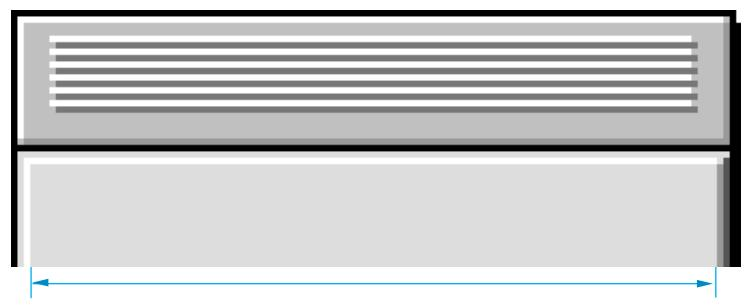

Size of modal dialog box content region **does not** include bevels


Size of modeless dialog box content region includes bevels

In measuring the space between controls, exclude the outside border lines of the control from the measurement. When you measure a control itself, include the border of the control in the measurement. [Figure 3-13](#page-68-0) illustrates how to measure the distance between controls.

<span id="page-68-0"></span>**Figure 3-13** Measuring distance between controls


Distance between controls **does not** include outside lines of controls

### Font Guidelines 3

When you position or align text in dialog boxes and alert boxes, you should take into account the characteristics of the font used. Apple Computer strongly recommends the Chicago font as the metric basis for making text alignment decisions. Use of any other font as a metric basis may result in incorrect text spacing when displayed in a different font. Additionally, text smaller than 12-point Chicago sometimes cannot be localized.

When a dialog box is localized for worldwide versions of system software, the text in the dialog box may become longer or shorter. The alignment of the items in the dialog box may vary with localization. For example, Arabic and Hebrew are written right to left, so the items in an Arabic or Hebrew dialog box should be aligned on the right. Be sure to create dialog items of the same size, so that they align properly when a user has a script that reads from right to left.

In general, you should use the system font for all controls. You should use the small system font only when space is limited or you need to present large amounts of textual information. Use Geneva 10 as a metric basis for small system font layout.

Use the emphasized version of the small system font for headings. The headings can either be static text labels, controls, or group box titles. Using the emphasized version sparingly increases its impact.

Layout Guidelines **69**

### <span id="page-69-0"></span>**Note**

12-point Chicago gives an overall height of 16 pixels, so the height of the resource rectangle surrounding text in Chicago should be 16 pixels.

In aligning static text with other elements of dialog boxes or alert boxes, you should carefully choose the letter on which to base the alignment. The glyphs of a font include pixel space before each letter or number. However, while a font can include letters and numbers having the same amount of preceding space measured in pixels, it can also include characters with more or less than the standard preceding pixel space.

For 12-point Chicago, a standard character includes 2 preceding pixels. If you assume that the first word of a text string starts with a capital "M", which is a standard letter, you will align text correctly for all strings, not just the one you are currently placing. Figure 3-14 shows the correct alignment based on the capital "M" and the amount of space between the icon and the text.

**Figure 3-14** Alignment of text based on a 12-point Chicago standard letter

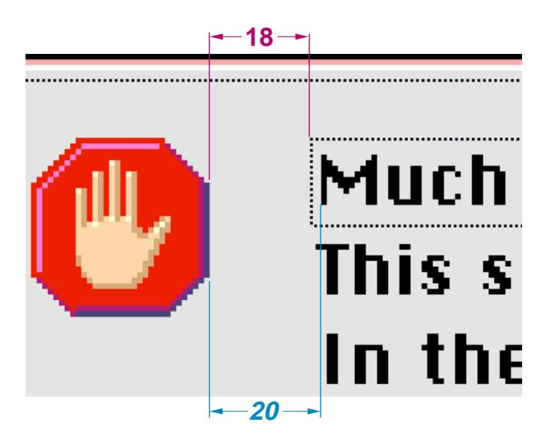

12-point Chicago font includes some characters that could cause misalignment if you use them as your guide. In 12-point Chicago, the letters "J", "T", and "j"

<span id="page-70-0"></span>outdent 1 pixel to the left beyond the font's standard letters for left-aligned text. The letter "I" and the number "1" have an additional pixel to the left for left-aligned text resulting in a total of 3 preceding pixels for these characters.

## Spacing 3

When you lay out a dialog box, allow a *minimum* of 4 pixels between clickable items. If possible, include 6 pixels between items to provide sufficient space for focus rings. It's also better to place clickable items closer to nonclickable items such as group boxes, dividing lines, and the edges of modal dialogs rather than to place them closer to one another.

For all windows and dialog boxes except utility windows such as toolbars and palettes, allow a minimum of 4 pixels between any item and the edge of a window or dialog box. Utility windows may have controls as close as 1 pixel from the edge of the the window or other non-clickable items. Use a consistent amount of pixel space between the border of the dialog box and its elements. This creates a balanced appearance in the dialog box.

Allow 16 pixels between groups of controls. For example, two groups of radio buttons—not two individual buttons—should be 16 pixels apart. You should measure this space from the baseline of the static text or the bottom edge of the nearest control and the top of the button below it. Figure 3-15 shows this space measured from the bottom edge of the control to the top of the control below it.

**Figure 3-15** Spacing between groups of controls

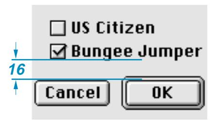

If you measure from the baseline of static text rendered in 10-point Geneva, allow for 14 pixels visually.

Layout Guidelines **71**

## <span id="page-71-0"></span>Control Layout Guidelines 3

This section describes the layout and spacing of controls in dialog boxes. In particular, this section discusses push buttons, bevel buttons, radio buttons, checkboxes, pop-up menu buttons, group boxes, edit text fields, progress indicators, disclosure triangles, static text fields, list boxes and Help buttons.

The Western reader's eye tends to move from the upper-left corner of the dialog box to the lower right. Put the initial impression that you want to convey in the upper-left area (such as the alert icon), and place the buttons that a user clicks in the lower right. Following this guideline makes it easier for users to identify what's important in a dialog box.

### Push Button Layout 3

In dialog boxes, you should place push buttons in locations that are functional and consistent—consistent both within your particular application and across other applications that you develop. Note that standard alert boxes will place any buttons automatically.

The default button is not necessarily the button in the lower-right corner; it should be the one for the action that the user is most likely to want to perform. If this choice was "Cancel", for example, the default button would be on the left side of the dialog box. See ["Default Buttons" \(page 23\)](#page-22-0), for more information on assigning the default button.

#### **Note**

The resource rectangle of a push button is the same size as its visual dimensions.

The standard height of a push button is 20 pixels. Don't count the default ring when measuring the size or alignment of push buttons. The default ring (which is outset 3 pixels from the button) is an attribute and does not affect the base resource size.

To determine the width of a push button that is not a standard one such as the OK button or the Cancel button, add a minimum of 8 pixels between the ends of the text string and the outside line of the button on each side, not including

<span id="page-72-0"></span>the black border. Figure 3-16 shows a button with the correct spacing at each end of the text.

**Figure 3-16** Spacing of text in a push button


The standard size for the OK and Cancel buttons is 20 pixels by 58 pixels. Figure 3-17 shows the OK button.

**Figure 3-17** OK button showing standard push button size

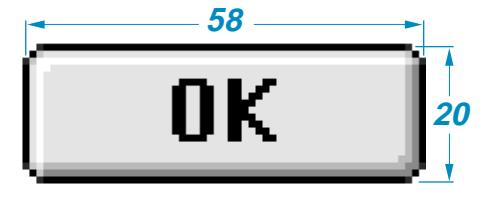

In general, it's best to make a set of push buttons all the same size, as determined by the width of the longest button name. When you stack push buttons vertically, center the text, as shown in [Figure 3-18.](#page-73-0)

When you stack push buttons vertically, leave 10 pixels between each button. [Figure 3-18](#page-73-0) shows this spacing. Recall that you don't count the default ring of a push button, which is an attribute that does not affect the resource size.

Layout Guidelines **73**

<span id="page-73-0"></span>**Figure 3-18** Distance between vertically stacked buttons


When you place push buttons horizontally, leave 12 pixels between the buttons. Figure 3-19 shows this spacing.

**Figure 3-19** Distance between horizontally placed buttons


You should also leave 12 pixels between the edge of a push button and any applicable edge of a dialog box.

For more information on the use of push buttons, see ["Push Buttons" \(page 21\).](#page-20-0)

### Bevel Button Layout 3

When placing bevel buttons in dialog boxes, leave a minimum of 12 pixels of space horizontally between the buttons. Leave 6 pixels of space from the bottom of the button to the top of the button title. An exception to this rule is the tool palette; for more information, see ["Utility Windows" \(page 102\)](#page-101-0).

A button title can exceed the width of its button. When it does, there should be at least 12 pixels of space between that title and adjacent titles. Be sure to space

<span id="page-74-0"></span>equally all buttons in the same horizontal group. Figure 3-20 shows the correct spacing between bevel buttons.

**Figure 3-20** Spacing of bevel buttons


For more information on the use of bevel buttons, see ["Bevel Buttons"](#page-28-0)  [\(page 29\)](#page-28-0).

## Checkboxes and Radio Button Layout 3

The size and layout of checkboxes and radio buttons are identical. The square or circle itself is 12 pixels high and 12 pixels wide. For both radio button and checkbox controls, the Mac OS Toolbox automatically provides for the correct positioning of each control in relation to its text label. Built into the control are 5 pixels of space between the visible square or circle and the text label of the control, assuming a capital M. The bottom of the square is 2 pixels below the baseline of standard 12-point Chicago text. These dimensions are fixed attributes of the control; you do not have to define them nor can you change them. [Figure 3-21](#page-75-0) illustrates these dimensions.

Layout Guidelines **75**

<span id="page-75-0"></span>**Figure 3-21** Fixed dimensions of a checkbox

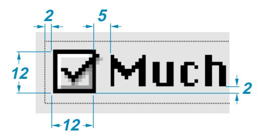

The standard height of an entire checkbox or radio button control (the clickable region) is 18 pixels. Figure 3-22 shows the height of checkboxes.

**Figure 3-22** Checkbox height

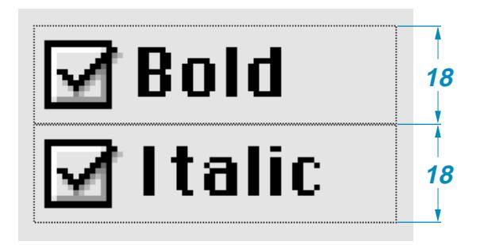

The minimum visible vertical spacing between checkboxes or radio buttons should be 6 pixels. This spacing occurs when you abut 18-pixel high controls, as shown in Figure 3-22.

When you place radio buttons or checkboxes horizontally, leave a minimum of 12 pixels space between them. If possible, leave more than 12 pixels of space between these controls. Leave 5 pixels of space between any preceding text and the first button. [Figure 3-23](#page-76-0) shows the minimum horizontal spacing between radio buttons.

<span id="page-76-0"></span>**Figure 3-23** Horizontal spacing of radio buttons


When you use an icon or picture in place of (or along with) a text title for a checkbox or a radio button, the amount of space you allow depends on the position of the icon or picture in relation to the button or checkbox:

- Allow 4 pixels of space between the title and the control when the icon or picture is above the radio button or checkbox.
- Allow 5 pixels of space between the title and the control when the icon or picture is to the right or left of the radio button or checkbox.

[Figure 3-24](#page-77-0) shows the correct placement of title icons with radio buttons or checkboxes.

Layout Guidelines **77**

<span id="page-77-0"></span>**Figure 3-24** Spacing of icons used with radio buttons or checkboxes

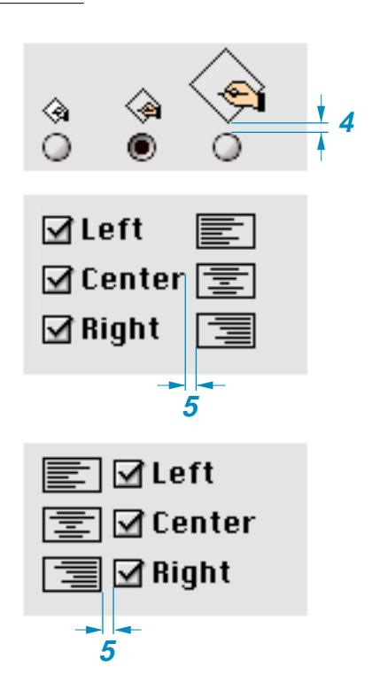

For more information on using these controls, see ["Radio Buttons" \(page 24\)](#page-23-0) and ["Checkboxes" \(page 27\).](#page-26-0)

### Pop-up Menu Button Layout 3

The standard height of a pop-up menu button is 20 pixels. If you use the small system font, the height is 18 pixels.

When placing pop-up menu buttons in a vertical orientation, leave a minimum distance of 6 pixels between the controls, as shown in [Figure 3-25](#page-78-0).

<span id="page-78-0"></span>**Figure 3-25** Vertical spacing of pop-up menus

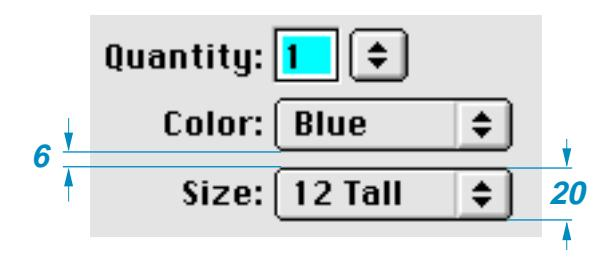

Place paired controls close together. Leave 4 pixels of space between an edit text field and its associated pop-up menu button, or between interrelated pop-up menus. This space between controls is not automatically provided for by the Mac OS Toolbox; it is your responsibility to allow for it in your layout design.

### **Note**

Although you can use two or more interrelated pop-up menus, you should avoid doing so because of international sentence structure differences.

Figure 3-26 shows the horizontal spacing between interrelated pop-up menus and between an edit text field and its pop-up button.

**Figure 3-26** Horizontal spacing of paired pop-up menus and other controls

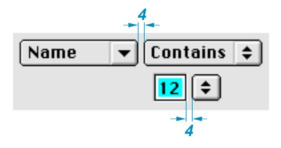

Layout Guidelines **79**

<span id="page-79-0"></span>For more information on using pop-up menu buttons, see ["Pop-Up Menu](#page-25-0)  [Buttons" \(page 26\).](#page-25-0)

### Group Box Layout 3

A group box can have a title, but one is not required. When you use a title of any kind with a group box, align the base of the text with the inside white border line of the group box. There should be at least 3 pixels on each side of the title text.

Under platinum appearance, group boxes have a 2-pixel border line— a 1-pixel white line next to a 1-pixel dark gray line. In laying out the group box, your measurements should be from the inside of these lines.

Leave 10 pixels of space between the sides of a group box or the bottom of a group box and any items you place inside those borders. Leave 12 pixels of space from the inside top of the group box to the top of the first item within the group box.

Figure 3-27 shows visual layout measurements for radio button controls in a group box. Notice that the controls align with the checkbox title of the group box.

**Figure 3-27** Visual layout measurements of controls in a group box


In positioning a secondary group box inside of a primary group box, you should treat the secondary group box as a dialog item with regard to spacing. So for nested group boxes, you measure the space between the outside edge of

<span id="page-80-0"></span>the secondary group box and the inside border line of the primary group box. Figure 3-28 shows a nested group box that leaves 10 pixels of space between the inside border line of the bottom edge of the primary group box and the outside bottom edge of the nested, secondary group box.

**Figure 3-28** Spacing for nested secondary group box


[Figure 3-29](#page-81-0) summarizes the dimensions for laying out group boxes. The list following the figure describes application of these dimensions.

Layout Guidelines **81**

<span id="page-81-0"></span>**Figure 3-29** Visual dimensions of a group box


Here is how to use these measurements:

- Side margins inside, allow 10 pixels.
- Top margin inside, allow 12 pixels.
- Bottom margin inside, allow 10 pixels.
- Horizontal distance between a group box and other groups of controls or group boxes, allow 10 pixels.
- Vertical distance between a group box and other control groups or group boxes, allow 12 pixels.

For more information on using group boxes, see ["Group Boxes" \(page 47\)](#page-46-0).

### Edit Text Field Layout 3

When you measure an edit text field, don't include the bevel outside the black border.

The standard height of an edit text field is 22 pixels. If you are aligning the field with a 20-pixel high item, such as a pop-up menu button, you can use a height of 20 pixels, reducing the white space from 2 pixels to 1.

<span id="page-82-0"></span>When you stack edit text fields, leave a minimum distance of 6 pixels between the controls. Figure 3-30 shows the spacing and height of edit text fields.

**Figure 3-30** Spacing and height of edit text fields


For more information on using edit text fields, see ["Edit Text Fields and](#page-40-0)  [Frames" \(page 41\).](#page-40-0)

### Progress Indicator Layout 3

Progress indicators have a height of 12 pixels and a variable width. When you measure progress indicators, don't include the bevel outside the black line. Figure 3-31 shows measurement for a determinate progress indicator.

**Figure 3-31** Progress indicator


Layout Guidelines **83**

<span id="page-83-0"></span>For more information on progress indicators, see ["Progress Indicators"](#page-51-0)  [\(page 52\)](#page-51-0).

### Disclosure Triangle Layout 3

Leave 5 pixels of space between the triangle in its right-pointing, or collapsed, state—ignoring the gray shadow—and its text string, as shown in Figure 3-32.

**Figure 3-32** Spacing of disclosure triangles

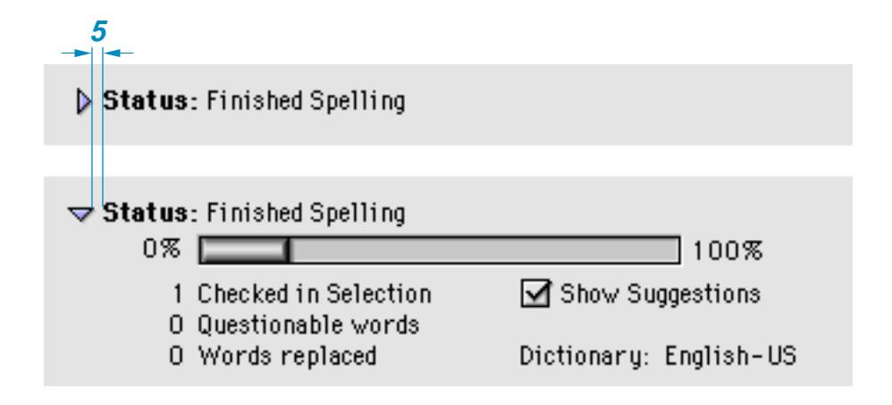

For more information on using disclosure triangles, see ["Disclosure Triangles"](#page-36-0)  [\(page 37\)](#page-36-0).

### Static Text Field Layout 3

To accomodate 12-point Chicago, make static text fields 16 pixels in height. Leave 5 pixels of space between a static text field and the item it defines.

### **Note**

To determine the proper use of colons in item labels, see *Macintosh Human Interface Guidelines*.

There are three approaches you can take to aligning static text fields when you stack multiple dialog box items to which the fields pertain:

- <span id="page-84-0"></span>■ You can left align the text fields. This is the standard approach.
- You can right align the text fields. This is useful when you use colons at the end of the field. Figure 3-33 shows this approach.

**Figure 3-33** Right-alignment of dialog box item labels

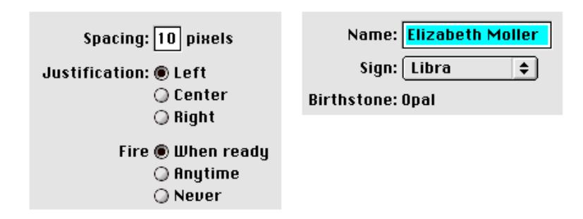

■ A third approach—left aligning both the text fields and their items—is useful for the rare case in which the fields are nearly the same length. If you are designing your application and its interface for the international market, you should not take this approach because it does not lend itself to localization.

Leave 6 pixels of space between the baseline of text fields and dialog box items that appear below them, as shown in Figure 3-34. This measurement allows space for a keyboard focus ring.

**Figure 3-34** Vertical spacing between static text fields and dialog box items


Layout Guidelines **85**

<span id="page-85-0"></span>For more information on using static text fields, see ["Static Text Fields"](#page-41-0)  [\(page 42\)](#page-41-0).

### List Box Layout 3

When you measure a list box for layout, don't include the bevel outside the black line.

For a list box title, leave 6 pixels of space between the baseline of the text and the black line of a list box. This spacing allows room for the keyboard focus ring. The horizontal spacing varies depending on the list contents. Figure 3-35 shows the spacing for a text title of a list box.

**Figure 3-35** Placement of text title for a list box


For more information on using list boxes, see ["List Boxes and Frames"](#page-38-0)  [\(page 39\)](#page-38-0).

### Help Button Layout 3

The **Help button** is a 21-pixel-high, 20-pixel-wide bevel button with the standard help icon. The preferred location is the lower left corner of the dialog box, aligned with the bottom of the push buttons, as shown in [Figure 3-36](#page-86-0). (Alert boxes do this automatically.)

<span id="page-86-0"></span>**Figure 3-36** Help button in lower left corner


If there are no push buttons or there isn't enough room in the lower left corner, the alternative location is the upper right corner, as seen in Figure 3-37.

**Figure 3-37** Help button in upper right corner


Layout Guidelines **87**

**CHAPTER 3** 

Dialog Box Guidelines

## <span id="page-88-0"></span>Contents

[Menu Bar Changes 87](#page-90-0) [Sticky Menus 88](#page-91-0) [Contextual Menus 89](#page-92-0)

Contents **89**

<span id="page-90-0"></span>This chapter describes the menu changes introduced by Mac OS 8, including menu bar appearance, help menus, sticky menus, contextual menus, and the enhancement of keyboard equivalents for menu item selection.

For more complete information on designing and using menus, see "Menus" in *Macintosh Human Interface Guidelines.*

## Menu Bar Changes 4

In keeping with the changes introduced in platinum appearance, the menu bar has gained a three-dimensional Apple logo, beveled edges, and anti-aliased corners. Menu dividers have an etched appearance. Figure 4-1 shows the new appearance.

**Figure 4-1** Menu bar using platinum appearance

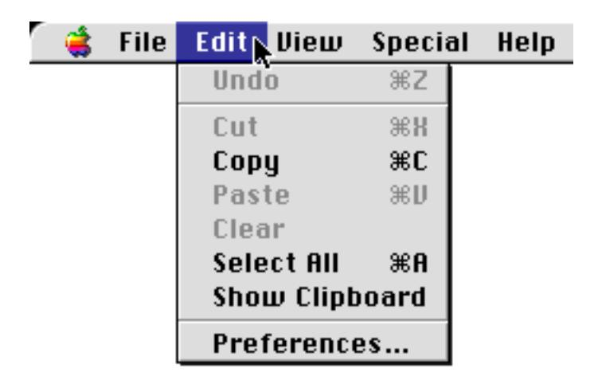

The position of the Preferences command has been standardized to the bottom of the Edit menu.

Extended **keyboard modifiers** are now available to activate menu commands. This means you can use the Control, Shift, and Option keys (and display their glyphs) in addition to the Command key to create a much wider range of

Menu Bar Changes **91**

<span id="page-91-0"></span>keyboard equivalents. For more information on keyboard equivalents, see ["Keyboard Equivalent Support" \(page 120\)](#page-119-0).

The Help icon has become a standard menu title. This makes it easier for users to identify and use online help files. The **Help menu** always appears as the last menu from the left; all application menus and "service menus" (such as those created by telecommunications applications or disk utilities) should appear to the left of the Help menu. Figure 4-2 shows an open Help menu.

**Figure 4-2** Help menu


The Help menu contains the following items in order:

- About Help
- Show Balloons
- Help (for the current application) if any
- Shortcuts (for the current application) if any

#### **Note**

You should ensure that any help files you create are accessible onlythrough this menu, as well as the Command - ? and Help keyboard equivalents.

## Sticky Menus 4

Traditional Mac OS menu behavior demanded that users press and hold on a menu while scrolling and selecting an item. This can be frustrating for many

<span id="page-92-0"></span>users, so the Mac OS now features **sticky menus**. The name derives from the fact that clicking an item in the menu bar for less than the user-defined double-click interval results in the menu being displayed ("sticking") without forcing the user to continue holding the mouse button. If the user presses and holds an item in the menu bar for longer than the double-click interval, the menu will behave in the traditional manner, closing immediately after the mouse button is released.

To select a desired item in a sticky menu, the user simply moves the mouse pointer to the item (which highlights it) and clicks. This selects the item and closes the menu. This convenience extends to any hierarchical menus which are linked to the sticky menu; each sub-menu will be displayed as a sticky menu when its linking item is highlighted.

Clicking while the cursor is outside a sticky menu will close the menu without making any selection. Pressing a command key will close the menu and execute the appropriate command. A sticky menu will also close on its own after fifteen seconds have elapsed without a selection being made.

## Contextual Menus 4

**Contextual menus** are a new feature of the Mac OS. Pressing the Control key while clicking on an item displays a pop-up menu which you can use as a convenient shortcut to provide contextual help or activate often-used commands associated with that item. (The contextual menu may also be invoked by clicking on an item with the right button on a two-button mouse.)

#### **IMPORTANT**

Contextual menus should never supersede menu bar items; there shouldn't be any items in a contextual menu which are not also accessible through the menu bar.

[Figure 4-3](#page-93-0) shows an example of a contextual menu invoked by Control-clicking a desktop printer.

Contextual Menus **93**

<span id="page-93-0"></span>**Figure 4-3** A contextual menu

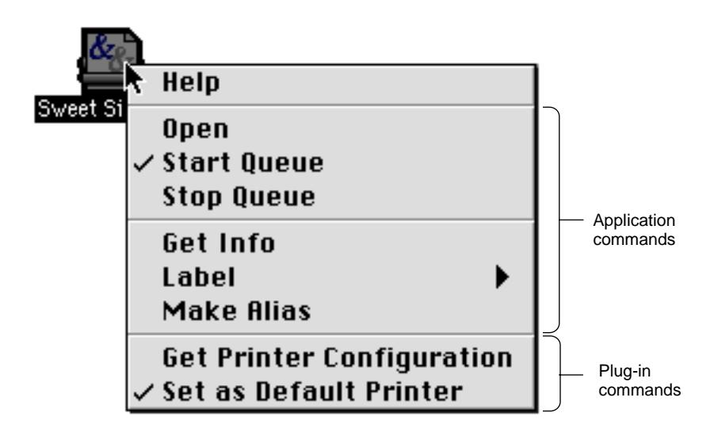

The contextual menu appears with its upper left corner offset one pixel to the right and one pixel down from the click location. If the menu is too wide to be fully displayed in the default position, it will appear with the upper right corner offset one pixel to the left and one pixel down from the click location. This positioning reverses on right-to-left oriented systems, with the latter position becoming the default and shifting to the former when required. Menus which are too long to be fully displayed exhibit the scrolling triangle and scroll as normal menus.

A contextual menu behaves as a standard sticky menu, except that moving the cursor off the contextual menu onto a standard menu does not activate the second menu. The user must explicitly click on the second menu to close the contextual menu and open the second menu.

The first item in a contextual menu is always a Help item. It should open the appropriate Apple Guide access window with a relevant keyword already loaded in the Look For view. If no help file is available, the Help item will be disabled, but the item is always displayed.

Any subsequent items in the contextual menu are defined by you. The list of items should comprise a small subset of the most commonly used commands in the application context which produced the menu. In Figure 4-3, seven

common desktop printing commands are listed in the contextual menu, separated by dividers into functional groups. You should never place a command in a contextual menu which is disabled in or cannot be chosen from another menu in the application.

If you do not define specific items for a contextual menu, it will display a Help item and load any appropriate plug-ins.

Note that you should not set a default item. If the user opens the menu and closes it without explicitly selecting an item, no action should occur.

Keep the list of items in a contextual menu short, clear, and simple. Use sub-menus reluctantly and keep them to one level. Adding unnecessary complications reduces the convenience of contextual menus for both you and the user.

Contextual Menus **95**

**CHAPTER 4** 

Menu Guidelines

## <span id="page-96-0"></span>Contents

[Windows Under Platinum Appearance 93](#page-98-0) [Document Windows 95](#page-100-0) [Utility Windows 96](#page-101-0) Collapsing a Window 97 [Zoom Boxes 98](#page-103-0)

Contents **97**

<span id="page-98-0"></span>This chapter describes the changes in Mac OS 8's implementation of document windows, which contain user data, and utility windows, which "float" above other windows and provide tools or other controls that users can work with while document windows are open. For more information on designing and using windows, see "Windows" in *Macintosh Human Interface Guidelines*.

## Windows Under Platinum Appearance 5

Windows are designed for visual consistency across all monitors from black-and-white displays to 24-bit color displays. For display on color monitors, colors and shades of gray have been added to the frames of windows and to user controls to emphasize those areas that users interact with. The document window content area remains white on all systems unless the user assigns color to the content.

Color and design distinguishes the active window from other windows and enhances the appearance of user controls on the window frame. The user controls—close box, size box, zoom box, collapse box, and scroll box—are highlighted by outlining, beveling, and other "three-dimensional" techniques to make them more apparent. The borders of inactive windows are a flat, light gray color which appears to recede into the background, while the active window's darker frame and colored areas emphasize its position in front of the other windows. [Figure 5-1](#page-99-0) shows the appearance of active and inactive windows.

<span id="page-99-0"></span>**Figure 5-1** Active window vs inactive window

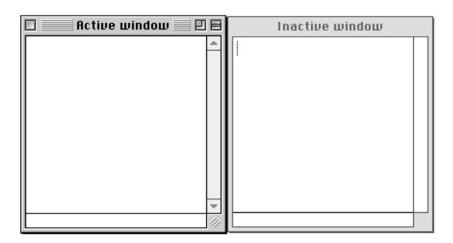

Note that windows may now be moved by clicking and dragging anywhere in the drag region. Under platinum appearance, the **drag region** appears as a narrow gray frame around all sides of the content region. Your application should not assume a specific size or appearance for this drag region, however, as these aspects depend on the Appearance settings in effect at a given moment.

Users can change the color used in window and dialog box accents by using the Appearance control panel. **Accent colors** affect a number of objects used in windows, including

- scroll bar indicators
- progress indicators
- slider indicators
- focus rings

[Figure 5-2](#page-100-0) shows the Appearance control panel and some of the accent colors that the user can choose for windows and dialog boxes.

<span id="page-100-0"></span>**Figure 5-2** Defining accent colors through the Appearance control panel

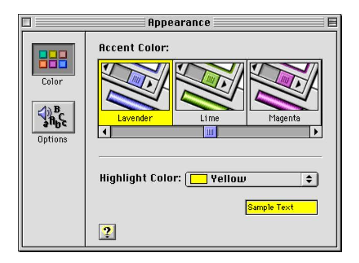

If you use the standard window definition and control definition functions, your application's windows will be Appearance-compliant under all conditions. If you must create custom windows, you should use the system-defined color palette to ensure your colors will work with the current Appearance suite.

## Document Windows 5

**Document windows** have standard structural components. These components include the title bar, size box, close box, collapse box, zoom box, and scroll bars. [Figure 5-3](#page-101-0) shows the structural components of standard document windows.

<span id="page-101-0"></span>**Figure 5-3** Structural components of standard document windows


## Utility Windows 5

**Utility windows** have been updated for platinum appearance. Figure 5-4 shows an example of a utility window. Note the crosshatch pattern which is used to fill the drag region, which in this case only extends across the top of the window. You can include a close box, collapse box, and a zoom box on utility windows.

**Figure 5-4** Utility window


<span id="page-102-0"></span>If you create utility windows that have title bars and a title, make sure the title bar is at least 19 pixels high, the height of a document window title bar. (If you create a smaller title bar with a title, it can't be localized for areas where the system font is never smaller than 12 points.)

A tool palette is a utility window composed of closely-spaced bevel buttons. If you use 22-by-22-pixel buttons with a small bevel, 16-by-16-pixel icons will fit properly in the content region. Figure 5-5 shows a palette with 22-by-22-pixel buttons.

**Figure 5-5** Tool palette with bevel buttons

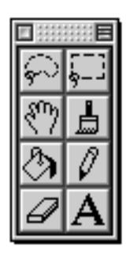

For more information on bevel buttons, see ["Bevel Buttons" \(page 29\)](#page-28-0).

## Collapsing a Window 5

One of the new features of Mac OS 8 is the **collapse box**, shown in [Figure 5-3](#page-101-0). When the user clicks the collapse box, the content region of the window disappears, but the title bar remains visible and active. Clicking the collapse box again restores the window to its normal state. Opening and collapsing actions are normally accompanied by a sound, but this can be disabled by the user through the Appearance control panel. [Figure 5-6](#page-103-0) shows a window in its normal and collapsed states.

<span id="page-103-0"></span>**Figure 5-6** Window in normal and collapsed states

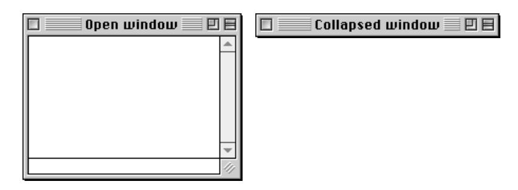

A collapsed window follows standard window conventions; it may be moved, closed, activated, or made inactive. If the user moves the title bar of a collapsed window, the reopened window will display its content region in the new location.

Multiple windows, belonging to one application or several, may be collapsed at the same time. This gives the user great flexibility in arranging and managing a number of windows in a limited screen area. Option-clicking the collapse box of any open window will immediately collapse all open windows. Option-clicking the collapse box of any collapsed window will immediately open all collapsed windows.

The user may choose an additional method of collapsing windows. By setting a checkbox in the Appearance control panel, the user can double-click in the title bar area with the same effect as if the collapse box had been clicked. This option is convenient for users who have become accustomed to the window collapsing method implemented in earlier Mac OS releases. The collapse box still functions if the double-click option is enabled.

## Zoom Boxes 5

When implemented, the zoom box appears on the right side of the title bar, just to the left of the collapse box. There are three variants: full, horizontal, and vertical zoom boxes. The **full zoom box** is the traditional zoom implementation, updated for platinum appearance. The active and inactive states of the full zoom box are shown in [Figure 5-7.](#page-104-0)

<span id="page-104-0"></span>**Figure 5-7** Full zoom box

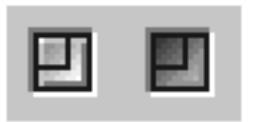

The two new variants are horizontal and vertical zoom boxes. The vertical zoom box only extends the window downward, while the horizontal zoom box extends the window to the right if a left-side title bar is used (as in some tool palettes.) Horizontal and vertical zoom boxes in their active and inactive states are shown in Figure 5-8.

**Figure 5-8** Vertical and horizontal zoom boxes

Vertical Horizontal

Zoom Boxes **105**

#### **CHAPTER 5**

Window Guidelines

## <span id="page-106-0"></span>Contents

[About Control Panels 105](#page-108-0) [Windows 105](#page-108-0) [Multi-Pane Windows 106](#page-109-0) [Expanding and Contracting Windows 111](#page-114-0) [Icons 114](#page-117-0) [Fonts 114](#page-117-0) [Menus 114](#page-117-0) [Standard Menus 115](#page-118-0) [Contextual Menus 115](#page-118-0) [Keyboard Equivalent Support 116](#page-119-0) [Settings 118](#page-121-0) [Miscellaneous Guidelines 121](#page-124-0) [Persistent Access 121](#page-124-0) [Assistance 122](#page-125-0) [Scripting 122](#page-125-0) [Extensions Manager 122](#page-125-0) [The About Box 122](#page-125-0)

Contents **107**

<span id="page-108-0"></span>This chapter describes guidelines you must follow if you are designing control panels. Specifically, the following are discussed:

- window design
- fonts, menus, and icons
- settings behavior
- control panel access
- assigning keyboard equivalents
- on-screen help and assistance

## About Control Panels 6

**Control panels** are appropriate for allowing users to configure:

- settings with system-wide effects (for example, the Date & Time control panel)
- settings that have no visible effect (for example, the File Sharing control panel)
- hardware (for example, the Monitors & Sound control panel)

Control panels are not appropriate for allowing users to configure specific applications or utilities, or tasks that would require multiple layered dialog boxes or custom menu items.

## Windows 6

Control panels should follow the guidelines established in *Macintosh Human Interface Guidelines*. In addition you must observe the following:

■ Each control panel has one window—a modeless dialog box—that opens when the control panel is launched. The preferred maximum size for this window is 400 x 300 pixels (width x height), but it may be larger if necessary. The absolute maximum size for the control panel window is 492 x 340.

About Control Panels **109**

- <span id="page-109-0"></span>■ The window must have a close box. The control panel quits whenever the window closes.
- You should put as many of the control panel's settings as possible in the window. Infrequently used settings or minor features may be relegated to modal or movable modal dialog boxes. These dialog boxes should be accessible by controls (usually push buttons) in the control panel window. Only if the window cannot accommodate such controls should menu commands be used instead.
- If the control panel contains a large number of frequently used settings, you can make the window a multi-pane modeless dialog box. In this case, any secondary dialog boxes opened from the control panel window should be modal.

## Multi-Pane Windows 6

If you use a multi-pane modeless dialog box for the control panel window, there are several design options for navigating between individual panels.

You should use tab controls if the number of panes is fixed and the control panel has adequate horizontal space to accommodate all the tabs in a single horizontal row. Tab controls can simultaneously and automatically display all choices to the user; they can also display icons in addition to (but not instead of) the text label. However, tab controls use considerable horizontal space and are not as extensible as a scrolling list or pop-up menu. The size of any icon in a tab control is also limited. [Figure 6-1](#page-110-0) shows the use of tab controls in a multi-pane control panel.

<span id="page-110-0"></span>**Figure 6-1** Using tab controls to navigate a multi-pane control panel


You can use a group of push buttons if the number of panes is fixed and the control panel has adequate space to accommodate all the buttons and labels in a single horizontal or vertical row. Like tab controls, push buttons simultaneously and automatically display all choices to the user. They can display both text and large or small icons; a button's text label may wrap to a second line, so a group of push buttons may require less horizontal space than tabs. However, push buttons still use considerable horizontal and vertical space. [Figure 6-2](#page-111-0) shows the use of push buttons in a multi-pane control panel.

<span id="page-111-0"></span>**Figure 6-2** Using push buttons to navigate a multi-pane control panel


You can use a scrolling list of icons (horizontal or vertical) if the number of panes is indefinite (extensible) and the control panel has adequate space to accommodate the list. A scrolling icon list can display both text and large or small icons. However, scrolling icon lists use considerable horizontal and vertical space, and they require a user action (clicking the scroll bar) to display all choices. Also, the user is unlikely to be able to see all choices simultaneously. [Figure 6-3](#page-112-0) shows a vertical scrolling list of icons used in a multi-pane control panel.

<span id="page-112-0"></span>**Figure 6-3** Using a scrolling list to navigate a multi-pane control panel

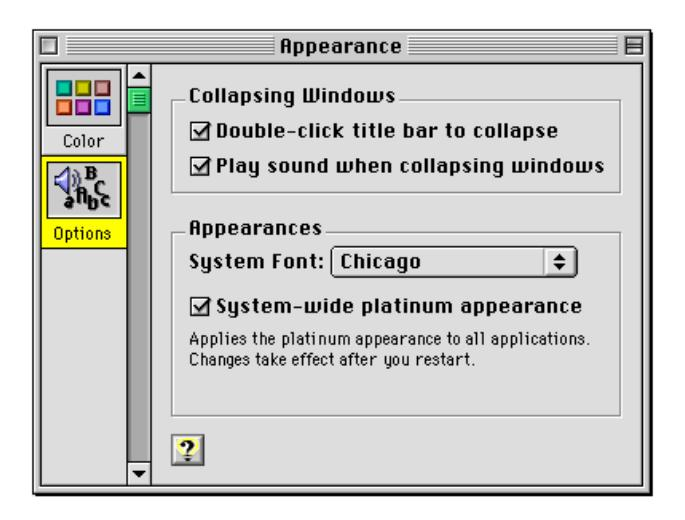

If no other method is suitable, you can use a pop-up menu. Pop-up menus can display a fixed or indefinite number of control panel panes. Pop-up menus use minimal space and display all choices to the user simultaneously. However, they can display only text and small icons, and they require a user action (clicking on the pop-up menu) to display the choices. In the unlikely—and undesirable—event that a pop-up menu has too many items to display simultaneously (that is, the user must scroll to see them all), you should consider rearranging your control panel or, at worst, dividing the settings into two control panels. [Figure 6-4](#page-113-0) shows a pop-up menu used in a multi-pane control panel.

<span id="page-113-0"></span>**Figure 6-4** Using a pop-up menu to navigate a multi-pane control panel


<span id="page-114-0"></span>Table 6-1 summarizes the four different ways of navigating multi-pane windows.

**Table 6-1** Multi-pane window navigation methods

| Control type               | Advantages                                                                                                                               | Disadvantages                                                                                                                                         |
|----------------------------|------------------------------------------------------------------------------------------------------------------------------------------|-------------------------------------------------------------------------------------------------------------------------------------------------------|
| Tab controls               | Displays all choices<br>simultaneously; can<br>display small icons in<br>addition to text                                                | Uses considerable<br>horizontal space; limited<br>extensibility; can only<br>use small icons                                                          |
| Buttons                    | Displays all choices<br>simultaneously; can<br>display both icons and<br>text; may require less<br>horizontal space than<br>tab controls | Uses considerable<br>horizontal and vertical<br>space; limited<br>extensibility                                                                       |
| Scrolling list of<br>icons | Unlimited extensibility;<br>can display both icons<br>and text                                                                           | Uses considerable<br>horizontal and vertical<br>space; requires a user<br>action to see all choices;<br>may not display all<br>choices simultaneously |
| Pop-up menu                | Displays all choices<br>simultaneously;<br>unlimited extensibility;<br>uses minimal space                                                | Requires a user action to<br>see all choices; can<br>display only small icons<br>and text                                                             |

## Expanding and Contracting Windows 6

If a control panel contains a significant number of settings that users are not likely to adjust frequently, then you can let the user show or hide those settings by expanding or contracting the window. The preferred mechanism for this is a labeled disclosure triangle that expands the window downward or contracts it upward. The triangle's label should indicate the nature of the settings (for example, "Server Settings"). [Figure 6-5](#page-115-0) shows a control panel with the disclosure triangle in the closed state.

<span id="page-115-0"></span>**Figure 6-5** A control panel with closed disclosure triangle


[Figure 6-6](#page-116-0) shows a control panel with the disclosure triangle in the open state.

<span id="page-116-0"></span>

**Figure 6-6** A control panel with open disclosure triangle

See ["Disclosure Triangles" \(page 37\)](#page-36-0) for more information about disclosure triangles.

If, due to space or layout problems, you cannot have your control panel open downwards, you can use a push button to expand or contract the window's right edge.

### **Note**

When a control panel is localized, it may be the left edge that expands and contracts. ◆

As with the disclosure triangle, the push button label should indicate the nature of the settings. In addition, it should indicate "Show" or "Hide" as appropriate (for example, "Show Server Settings" or "Hide Server Settings").

## <span id="page-117-0"></span>Icons 6

Desktop icons for control panels should be based on standard control panel icon designs, with the control slider on either the left side or the bottom. Figure 6-7 shows some examples of control panel icons.

**Figure 6-7** Desktop icons based on the standard control panel icon


## Fonts 6

Control panels should follow the guidelines established in ["Font Guidelines"](#page-68-0)  [\(page 69\)](#page-68-0).

## Menus 6

Because Mac OS 8 control panels are applications (file type 'appc'), they generate their own menus. Control panels must follow the guidelines established in ["Menu Guidelines" \(page 91\)](#page-90-0) as well as those in this section.

### **IMPORTANT**

Because older control panels did not generate their own menus, some users are likely to assume that Mac OS 8 control panels also do not. Custom menus and menu items therefore should be used sparingly, and only minor or infrequently used features should be accessed exclusively through menu items. ▲

### <span id="page-118-0"></span>Standard Menus 6

Each of the standard menus should contain specific items.

Control panels should have an About *Control Panel Name* command as the first item in the Apple menu. This command opens the control panel's About box. See ["The About Box" \(page 126\)](#page-125-0) for more information.

The File menu should always include a Close Window (Command-W) command. Closing the control panel window quits the application. The final command of the File menu should always be Quit (Command-Q). This command is always preceded by a separator line, even if the only other command is Close Window.

If the control panel requires an explicit save action and it saves settings globally, then the File menu should include Save Settings (Command-S) and Revert to Saved Settings commands. For more information, see ["Settings"](#page-121-0)  [\(page 122\)](#page-121-0).

The Edit menu should include an Undo (Command-Z) command that operates on as many controls as possible, including any Save and Revert buttons. The Undo command is followed by a separator line.

If the control panel includes any edit text fields, then the Edit menu should also include Cut (Command-X), Copy (Command-C), Paste (Command-V), and Clear commands. The Edit menu should also include Select All (Command-A) if appropriate.

In the unlikely event that a control panel has enough preference settings to justify placing them in their own dialog, the preferred mechanism for accessing them is through an push button in the control panel window. However, if the window cannot accommodate such a button, then a Preferences command may be used instead. This command is always the last item in the Edit menu, and it is always preceded by a separator line.

### Contextual Menus 6

Control panels should support the contextual menu feature introduced in Mac OS 8. For information, see ["Contextual Menus" \(page 93\).](#page-92-0)

Menus **119**

## <span id="page-119-0"></span>Keyboard Equivalent Support 6

You should provide **keyboard equivalents** (shortcut keys) for frequently used controls. If a dialog control does not normally support a keyboard equivalent (for example, pushbuttons or radio buttons) you can duplicate the control as a menu command. For example, a control panel that has an Edit Connection button could also have a Connection command (say, Command-E) in the Edit menu. However, control panel menu commands should be used in addition to—not instead of—dialog controls.

To help users avoid or eliminate conflicts, keyboard equivalents may be user definable. You should maintain the following interaction sequence for defining keyboard equivalents whenever possible:

Display the current keyboard equivalent and a button for redefining it. Figure 6-8 shows an example.

**Figure 6-8** The current keyboard equivalent and a button for redefining it


Clicking the button opens a dialog with instructions and feedback for changing the keyboard equivalent. [Figure 6-9](#page-120-0) gives an example.

<span id="page-120-0"></span>**Figure 6-9** Changing the keyboard equivalent


As soon as the user finishes typing a new key combination, the feedback text field displays the new combination as shown in Figure 6-10.

**Figure 6-10** Displaying the new keyboard equivalent combination


If the new key combination is invalid, the feedback text field remains unchanged and an appropriate alert appears. Alerts should indicate the following cases:

- The keyboard equivalent selected did not contain a command key or a function key.
- The keyboard equivalent selected is already in use by another item. The alert should indicate which item is using the shortcut.

Menus **121**

<span id="page-121-0"></span>**Figure 6-11** An alert for an invalid keyboard equivalent combination


See the "Menus" chapter of *Macintosh Human Interface Guidelines* for additional guidelines and a list of reserved keyboard equivalents.

## Settings 6

In most cases, changes made to control panel settings should take effect immediately, with no additional user action required (for example, without having to close a window or quit the control panel). If a change is potentially disruptive, however, you should postpone the effect to avoid possible problems. For example, a Network control panel should not actually save the settings until you indicate (by selecting Save Settings) that you want to do so. In such cases, the effect may be postponed until the control panel is closed or, if necessary, until the system is restarted. If the system must be restarted to effect the new settings, the control panel's window should display a brief explanation (accompanied by a small alert icon) of this behavior when changes are made. [Figure 6-12](#page-122-0) shows this message in the Extensions Manager control panel.

<span id="page-122-0"></span>

**Figure 6-12** Alert message in the Extensions Manager control panel

As a rule, control panel settings should be saved automatically when the control panel quits. Only if the settings are complicated or technical should saving them require an explicit user action. In such instances, requiring an explicit save allows the user to retreat from unintended changes.

The user should save and restore settings in logical sections rather than globally if possible. For example, in a control panel that configures several different devices, the user might be able to save and restore settings for each device rather than for all devices simultaneously.

Global save and restore commands may be used instead if it is impossible to separate a control panel's settings into logical groups. In this case, the control panel window should include Save and Revert buttons, and the File menu should include corresponding Save Settings and Revert to Saved Settings commands. A confirmation dialog box should be displayed if the user quits the control panel with unsaved changes.

When designing the control panel, you must make it clear to the user which settings are affected by the save and restore functions. The user must know whether settings are saved globally or in sections; if they are saved in sections, then the user must be able to discern the boundaries between sections. The simplest solution is to design the control panel so that each section of savable settings is edited in a separate dialog with its own OK and Cancel buttons.

Settings **123**

<span id="page-123-0"></span>Saving and restoring settings in modal multi-pane dialogs is especially problematic and should be avoided if possible. If you must use multi-pane windows in such cases, then you must make sure the user can tell whether the save and revert commands apply to a single pane or to the entire dialog. Figure 6-13 shows an example of saving globally (the Save and Revert buttons are separate from the individual panes).

**Figure 6-13** Saving and restoring globally in a multi-pane control panel


[Figure 6-14](#page-124-0) shows an example of saving in sections (each pane has its own Save and Revert buttons).

<span id="page-124-0"></span>**Figure 6-14** Saving and restoring sections in a multi-pane control panel


## Miscellaneous Guidelines 6

This section discusses other guidelines you should keep in mind when creating control panels.

## Persistent Access 6

A control panel may generate some sort of screen representation that persists even when the control panel itself is closed. Such screen representations should always include a mechanism for opening the control panel. For example, if a control panel has an associated control strip module, that module should include a command that opens the control panel. [Figure 6-15](#page-125-0) shows control panel access from a control strip module.

<span id="page-125-0"></span>**Figure 6-15** Access to a control panel from a control strip


### Assistance 6

Control panels should be "assistance savvy," which means that they should

- display the Help button (that is, the button with the question mark icon) for context-sensitive help
- provide suitable entries in the Apple Guide databases for "Guide Me" and "Do It For Me" assistance

Most control panels will be included in the general Apple Guide database, but a complex control panel may require its own database.

Control panels should also provide help balloons. See the "Language" chapter of *Macintosh Human Interface Guidelines* for general guidelines on Balloon Help behavior and content.

## Scripting 6

Control panels should be scriptable using AppleScript.

## Extensions Manager 6

A brief description of the control panel's purpose should be included as a CCI™ (Conflict Catcher Information™) resource string for use by the Extensions Manager.

## The About Box 6

The About box for a control panel should include the following items:

- the control panel's logo, name, and version number
- a brief description of the control panel's purpose
- credits
- copyright information
- an OK button that dismisses the About box

# <span id="page-128-0"></span>Glossary

**accent colors** User-selectable fill colors for certain interface elements.

**alert box** A dialog box that appears on screen to warn the user or to report an error.

**asynchronous arrows** A control which indicates through a simple animation that a background process is in progress . Compare **progress indicators**.

**bevel button** A control that resembles a square, beveled push button. It can take the behavior of other controls, such as radio buttons, checkboxes, push buttons, and pop-up menu buttons.

**checkbox** A square control with a text label that is designed to provide binary choices for users. A checkbox may display on, off, or mixed status. Compare **radio button**.

**clock control** A control that combines the features of little arrows and an edit text field into a control which displays a date and/or time.

**collapse box** A square control which appears on the far right of a window's title bar. Clicking it once hides all of the window except the title bar; clicking it again makes the window reappear.

**content region** The part of a window which is available for an application to present data or embed controls. Compare **structure region**.

**contextual menu** A pop-up menu containing useful commands and assistance specific to the item being pointed at by the cursor.

**control** An object with which the user, by using the mouse or keyboard equivalents, can cause instant action with visible results or change settings to modify a future action.

**control panel** A utility accessible through a modeless dialog box. Control panels allow users to configure global or hardware settings or settings that have no visible effect.

**default button** A button whose effect occurs if the user presses Return or Enter.

**dialog box** A box that appears on the screen to solicit information from the user or to report that the computer is waiting for a process to complete. See also **alert box**, **modal dialog box**, **modeless dialog box**, and **movable modal dialog box**.

**disabled** Describes a menu item or control that cannot be chosen; the item may appear dimmed.

**disclosure triangle** A control that provides a means to expand a view to disclose additional information about the currently selected item.

**document window** A window that displays the content of a document.

**drag region** A region around the outside of a window frame. Dragging inside this region moves the window to a new location and makes it the active window.

**edit text field** A control that appears as a rectangular box inside a dialog box. The user enters text in the edit text field to provide information to an application. Compare **static text field**.

**edit text frame** A control that provides a means for non-standard edit text fields to provide Appearance-based features such as focus rings. See also **edit text field**.

**focus ring** A colored border that highlights the currently active edit text field or scrolling list in a dialog box in order to indicate to user which item has keyboard focus. See also **keyboard focus**.

**full zoom box** A zoom box which expands a window in both the horizontal and vertical directions. See also **zoom box**.

**ghost indicator** A transparent outline image of a slider indicator that tracks the movement of the pointer while the user holds the mouse button. See also **slider**.

**global controls** Controls, such as push buttons, which affect all panes of a multi-pane window, not just the active pane. See also **pane**.

**group box** A control that consists of a rectangular frame which may or may not contain a title. It is used to provide a well-defined area in a dialog box into which text, pictures, icons or other controls can be embedded.

**Help menu** The menu which provides access to on-screen help information.

**highlight** To make something visually distinct, typically when it's selected. This is generally done by reversing black and white or changing colors to provide a sharp contrast.

**image well** A control that is used to display non-text visual content on a white background surrounded by a rectangular frame.

**keyboard equivalent** Keystrokes that invoke a menu item from the keyboard. A keyboard equivalent is usually a combination of a modifier key and a character key. See also **keyboard modifiers**.

**keyboard focus** A property that determines which control in a dialog will receive all keystrokes, as selected by keyboard navigation or clicking. See also **focus ring**.

**keyboard modifiers** Non-character keys, such as Command, Option, and Control, which can be combined with character keys to form keyboard equivalents. See also **keyboard equivalent**.

**keyboard navigation** The ability to select which control in a dialog box has keyboard focus by pressing the Tab key. See also **keyboard focus**.

**list box** A control that combines a rectangular frame, scroll bar(s), and a scrolling list.

**list box frame** A control that provides an Appearance-compliant border for non-standard list boxes. See also **list box**.

**little arrows** A control that displays a pair of arrows, typically accompanying an edit text field containing a numerical value. Users click the arrows to increment or decrement the value in the text box.

**live dragging** The constantly updated display of the changing values of a slider. Compare **ghost indicator**.

**mixed state** The condition of a control, such as a radio button or checkbox, that occurs when the selection indicated by the control contains some data in the on state and some in the off state.

**modal dialog box** A dialog box that puts the user in the state or "mode" of being able to work only in the dialog box. The user cannot move a modal dialog box; it can be dismissed only be clicking its buttons. Compare **modeless dialog box** and **movable modal dialog box**.

**modeless dialog box** A dialog box that resembles a document window without a collapse box. The user can move a modeless dialog box, make it inactive and active again, and close it like a document window. Compare **modal dialog box** and **movable modal dialog box**.

**modeless dialog frame** A control that provides an Appearance-compliant border for the content region of non-standard modeless dialog boxes.

**movable alert box** An alert box with a title bar that allows the user to move the alert box. Compare **alert box**.

**movable modal dialog box** A modal dialog box that has a title bar (with no close box) that allows the user to move the dialog box. Compare **modal dialog box** and **modeless dialog box**.

**pane** One screen of a multi-screen display inside a single dialog box. Panes are generally selected through tab controls. See also **tab control**.

**placard** A rectangular control used as an information display.

**platinum appearance** The default theme for Mac OS 8, which features a "three-dimensional" appearance. See also **theme**.

**pop-up menu button** A button that, when pressed, presents a menu. The button's label indicates the current menu setting.

**progress indicator** A control, consisting of a rectangular frame and a variable length bar, that provides a means of measuring process duration or displaying remaining capacity.

**push button** A control that appears as a rounded rectangle with a label. When the user clicks a push button, the action described by the label is immediately executed.

**radio button** A control that displays a setting, either on or off, and is part of a group in which only one button can be set to on at a time.

**scroll bar** A rectangular bar that may be along the right or bottom of a window or list box. Clicking or dragging in the scroll bar causes the view of the window or list box to change.

**separator line** A control that provides a way to separate elements in a dialog box with a simple horizontal or vertical line.

**size box** A box in the lower-right corner of some active windows. Dragging the size box resizes the window.

**slider** A control that graphically represents a range of values and allows the user to set the values with a slider indicator.

**static text field** A control that displays static (unchangeable by the user) text labels in a window. Compare **edit text field**.

**sticky menu** A menu which will remain open after the mouse button is released or the pointer is no longer on the menu.

**structure region** The external region of a window which contains the title bar (if any), drag region, controls, and border. Compare **content region**.

**tab control** A control that appears as a row of folder tabs on top of a pane. It allows multiple panes to appear in the same window. See also **pane**.

**theme** A coordinated set of human interface designs that determine the appearance of human interface objects on a systemwide basis. See also **platinum appearance**.

**tick marks** Indicator marks on a slider which provide a scale against which relative movement of the slider indicator can be measured. See also **slider**.

**type selection** The ability to select an item from a list of items by typing the first character or characters of the item's name.

**utility window** A type of box that has some but not all features of a regular window. A utility window has a bar at the top by which it can be dragged and a close box, but it does not necessarily have a title and is nonscrolling.

**window header** A control that runs along the top of a window's content region and provides information about the window's contents.

**window list view header** A type of window header designed to fit between a standard window header and the content region of a window. See also **window header**.

**zoom box** A control that appears as a box in the title bar. It provides a quick means of expanding the window ("zooming") horizontally, vertically, or in both directions. See also **full zoom box**.

# <span id="page-132-0"></span>Index

| A                              | C                                       |
|--------------------------------|-----------------------------------------|
| About box 126                  | caution alert boxes 63                  |
| accent colors 16               | CCI string 126                          |
| alert boxes                    | chasing arrows. See asynchronous arrows |
| appearance 62                  | checkboxes 27                           |
| caution 63                     | bevel buttons used as 32                |
| defined 61                     | default states 27                       |
| note 62                        | labels 27                               |
| stop 63–64                     | layout guidelines 75                    |
| text in 61                     | marking options 28                      |
| types of 62                    | mixed state 28                          |
| Appearance control panel 100   | visual separation 29                    |
| Appearance Manager 13          | clock controls 36                       |
| asynchronous arrows 53         | collapse boxes 103                      |
|                                | contextual menus 93, 119                |
|                                | control layout guidelines 72            |
|                                | control panels                          |
| B                              | About box 126                           |
|                                | Appearance 100                          |
| bevel buttons 29               | assistance 126                          |
| bevel sizes 29                 | contextual menus for 119                |
| layout guidelines 74           | Date & Time 36                          |
| states 30                      | expanding 115                           |
| text orientation 29            | Extensions Manager 126                  |
| used as checkboxes 32          | icons 118                               |
| used as pop-up menu buttons 32 | keyboard equivalents in 120             |
| used as push buttons 31        | menus in 118                            |
| used as radio buttons 31       | multi-pane windows 110                  |
| buttons                        | persistent access 125                   |
| bevel buttons 29               | scripting 126                           |
| default 23                     | settings 122                            |
| help 86                        | standard menus 119                      |
| placement in alert boxes 72    | windows 109                             |
| push buttons 21                |                                         |

radio buttons [24](#page-23-0)

| D                                                                                                                                                                             | H                                                                                                                                                                                                      |
|-------------------------------------------------------------------------------------------------------------------------------------------------------------------------------|--------------------------------------------------------------------------------------------------------------------------------------------------------------------------------------------------------|
| Date & Time control panel 36<br>default buttons 23<br>default ring 23<br>dialog boxes 57<br>default buttons in 23<br>keyboard focus in 66<br>layout guidelines 67<br>modal 60 | help buttons<br>layout guidelines 86<br>help icon 92<br>help menus 92<br>I                                                                                                                             |
| modeless 64<br>movable modal 59<br>types of 57<br>disclosure triangles 37–38<br>in control panels 115<br>layout guidelines 84<br>document windows 101                         | icons<br>help 92<br>in control panels 118<br>image wells 47                                                                                                                                            |
|                                                                                                                                                                               | K                                                                                                                                                                                                      |
| E<br>edit text fields 41, 82<br>edit text frames 41<br>Extensions Manager 126                                                                                                 | keyboard equivalents 91<br>for control panels 120<br>keyboard focus 66<br>keyboard navigation 66                                                                                                       |
|                                                                                                                                                                               | L                                                                                                                                                                                                      |
| F<br>focus rings 66<br>fonts<br>Charcoal 17<br>Chicago 17, 69<br>guidelines 69                                                                                                | labels<br>for checkboxes 27<br>for little arrows 36<br>for sliders 35<br>layout guidelines 67<br>bevel buttons 74<br>checkboxes and radio buttons 75<br>disclosure triangles 84<br>edit text fields 82 |
| G                                                                                                                                                                             | group boxes 80                                                                                                                                                                                         |
| group boxes 47<br>layout guidelines 80<br>primary 47<br>secondary 49<br>titled 48<br>untitled 48                                                                              | help buttons 86<br>list boxes 86<br>pop-up menu buttons 78<br>progress indicators 83<br>push buttons 72<br>static text fields 84<br>list boxes 39                                                      |

| layout guidelines 86<br>list box frames 40<br>little arrows 35–36<br>live dragging 35<br>live feedback 35                            | layout guidelines 83<br>push buttons 21<br>bevel buttons used as 31<br>in multi-pane windows 111<br>keyboard equivalents 22<br>layout guidelines 72<br>states 22 |
|--------------------------------------------------------------------------------------------------------------------------------------|------------------------------------------------------------------------------------------------------------------------------------------------------------------|
| M                                                                                                                                    |                                                                                                                                                                  |
| menu bar 91<br>position of Help command 92                                                                                           | R                                                                                                                                                                |
| position of Preferences command 91<br>menus<br>contextual 93<br>help 92<br>in control panels 118<br>keyboard equivalents 91          | radio buttons 24<br>bevel buttons used as 31<br>layout guidelines 75<br>modes 25<br>states 25<br>visual separation of 25                                         |
| sticky 92<br>modal dialog boxes 57<br>modeless dialog boxes 64<br>modeless dialog frames 51<br>movable modal dialog boxes 59         | S                                                                                                                                                                |
| N                                                                                                                                    | scroll bars 40<br>scrolling lists<br>in multi-pane windows 112<br>separator lines 50                                                                             |
| note alert boxes 62                                                                                                                  | size box 99<br>sliders 34<br>ghost indicators 34<br>labels 35                                                                                                    |
| P                                                                                                                                    | live dragging 35<br>live feedback 35                                                                                                                             |
| Page Setup command (File menu) 60<br>placards 46<br>platinum appearance 14, 16<br>pop-up menu buttons 26<br>bevel buttons used as 32 | used in preference to scroll bars 35<br>static text fields 42<br>layout guidelines 84<br>stop alert boxes 63                                                     |
| in multi-pane windows 113<br>layout guidelines 78                                                                                    | T                                                                                                                                                                |
| menu position 26<br>sticky menus 27<br>progress indicators 52–53<br>determinate 52<br>indeterminate 52                               | tab controls 42<br>appearance 43<br>embedding controls 45<br>in multi-pane windows 110                                                                           |

tick marks [34](#page-33-0) type selection [39](#page-38-0)

### U

utility windows [102](#page-101-0)

### W

window headers [50](#page-49-0) window list view headers [51](#page-50-0) windows [99](#page-98-0) accent colors [100](#page-99-0) active vs inactive [99](#page-98-0) collapsing [103](#page-102-0) control panel [109](#page-108-0) controls [101](#page-100-0) document [101](#page-100-0) scroll bars [40](#page-39-0) types of [99](#page-98-0) utility [102](#page-101-0)


## *Mac OS 8 Human Interface Guidelines*

Writer Art Director *Otto Schlosser Karin Stroud*

Prod. Editor Illustrator *Glen Frank Karin Stroud/Ruth Anderson*

# of Figures Draft stage *113 Final*

| Figure #    | Path Name | Caption                                                                                        | Page # |
|-------------|-----------|------------------------------------------------------------------------------------------------|--------|
| Figure 1-1  |           | HIG art:HIG Intro art:HIG Intro-001Appearance control panel 14                                 |        |
| Figure 1-2  |           | HIG art:HIG Intro art:HIG Intro-004Find File dialog box under platinum appearance 14           |        |
| Figure 1-3  |           | HIG art:HIG Intro art:HIG Intro-003Find File dialog box with platinum appearance turned off 15 |        |
| Figure 1-4  |           | HIG art:HIG Intro art:HIG Intro-002Color control in the Appearance control panel 16            |        |
| Figure 2-1  |           | HIG art:HIG Control art:HIG CG-001Push buttons in a dialog box 21                              |        |
| Figure 2-2  |           | HIG art:HIG Control art:HIG CG-002A highlighted push button 22                                 |        |
| Figure 2-3  |           | HIG art:HIG Control art:HIG CG-003Standard and default states of push buttons 23               |        |
| Figure 2-4  |           | HIG art:HIG Control art:HIG CG-005Radio buttons for selecting icon size 24                     |        |
| Figure 2-5  |           | HIG art:HIG Control art:HIG CG-004Radio button modes and states 25                             |        |
| Figure 2-6  |           | HIG art:HIG Control art:HIG CG-081Pop-up menu button in normal state 26                        |        |
| Figure 2-7  |           | HIG art:HIG Control art:HIG CG-080Pop-up menu button with displayed list 27                    |        |
| Figure 2-8  |           | HIG art:HIG Control art:HIG CG-007Checkbox modes and states 28                                 |        |
| Figure 2-9  |           | HIG art:HIG Control art:HIG CG-096A set of checkboxes with concurrent selections 29            |        |
| Figure 2-10 |           | HIG art:HIG Control art:HIG CG-015Bevel buttons with small, medium, and large bevels 29        |        |
| Figure 2-11 |           | HIG art:HIG Control art:HIG CG-016Bevel button states 30                                       |        |
| Figure 2-12 |           | HIG art:HIG Control art:HIG CG-017A pair of bevel buttons used as push buttons 31              |        |
| Figure 2-13 |           | HIG art:HIG Control art:HIG CG-018Bevel buttons used as radio buttons in a toolbar 32          |        |
| Figure 2-14 |           | HIG art:HIG Control art:HIG CG-019Bevel buttons used as checkboxes in a toolbar 32             |        |
| Figure 2-15 |           | HIG art:HIG Control art:HIG CG-021A pop-up bevel button with sticky menu 33                    |        |
| Figure 2-16 |           | HIG art:HIG Control art:HIG CG-065A pop-up bevel button used with a slider 33                  |        |
| Figure 2-17 |           | HIG art:HIG Control art:HIG CG-028A slider and ghost indicator 34                              |        |
| Figure 2-18 |           | HIG art:HIG Control art:HIG CG-029A horizontal slider with vertical tick marks 34              |        |
| Figure 2-19 |           | HIG art:HIG Control art:HIG CG-030A slider with directional information 35                     |        |
| Figure 2-20 |           | HIG art:HIG Control art:HIG CG-033Little arrows in various states 36                           |        |
| Figure 2-21 |           | HIG art:HIG Control art:HIG CG-032Little arrows used to control a RAM cache 36                 |        |
| Figure 2-22 |           | HIG art:HIG Control art:HIG CG-101Clock control displaying date 37                             |        |
| Figure 2-23 |           | HIG art:HIG Control art:HIG CG-035A disclosure triangle revealing additional information 38    |        |
| Figure 2-24 |           | HIG art:HIG Control art:HIG CG-104Disclosure triangles used in Finder list view 38             |        |
| Figure 2-25 |           | HIG art:HIG Control art:HIG CG-038A list box 39                                                |        |

| Figure 2-26 | HIG art:HIG Control art:HIG CG-039A horizontal scroll bar 40                                        |  |
|-------------|-----------------------------------------------------------------------------------------------------|--|
| Figure 2-27 | HIG art:HIG Control art:HIG CG-058An edit text field with label 41                                  |  |
| Figure 2-28 | HIG art:HIG Control art:HIG CG-100An edit text frame 41                                             |  |
| Figure 2-29 | HIG art:HIG Control art:HIG CG-041A static text field in active and disabled states 42              |  |
| Figure 2-30 | HIG art:HIG Control art:HIG CG-042Tab control with 12-point font labels 43                          |  |
| Figure 2-31 | HIG art:HIG Control art:HIG CG-043Tab control with 10-point font labels 43                          |  |
| Figure 2-32 | HIG art:HIG Control art:HIG CG-075Tab control with sides tucked under edge of content region 44     |  |
| Figure 2-33 | HIG art:HIG Control art:HIG CG-102Tab control used in a modal dialog box 45                         |  |
| Figure 2-34 | HIG art:HIG Control art:HIG CG-047Tab control with tucked edges and a scrollable content area 45    |  |
| Figure 2-35 | HIG art:HIG Control art:HIG CG-050A placard used to report information to the user 46               |  |
| Figure 2-36 | HIG art:HIG Control art:HIG CG-051Iimage wells in enabled and selected states 47                    |  |
| Figure 2-37 | HIG art:HIG Control art:HIG CG-052An untitled primary group box 48                                  |  |
| Figure 2-38 | HIG art:HIG Control art:HIG CG-079A titled primary group box 48                                     |  |
| Figure 2-39 | HIG art:HIG Control art:HIG CG-093.aA primary group box with a pop-up menu title 49                 |  |
| Figure 2-40 | HIG art:HIG Control art:HIG CG-094A primary group box with a checkbox title 49                      |  |
| Figure 2-41 | HIG art:HIG Control art:HIG CG-103A secondary group box 50                                          |  |
| Figure 2-42 | HIG art:HIG Control art:HIG CG-059A horizontal separator line 50                                    |  |
| Figure 2-43 | HIG art:HIG Control art:HIG CG-092A Finder window using headers 51                                  |  |
| Figure 2-44 | HIG art:HIG Control art:HIG CG-097A modeless dialog frame in active state 52                        |  |
| Figure 2-45 | HIG art:HIG Control art:HIG CG-062Progress indicators 52                                            |  |
| Figure 2-46 | HIG art:HIG Control art:HIG CG-063Various states of asynchronous arrows 53                          |  |
| Figure 3-1  | HIG art:HIG Dialog Box art:HIG CG-099The five types of dialog boxes 58                              |  |
| Figure 3-2  | HIG art:HIG Dialog Box art:HIG CG-084A movable modal dialog box 59                                  |  |
| Figure 3-3  | HIG art:HIG Dialog Box art:HIG CG-087A modal dialog box 60                                          |  |
| Figure 3-4  | HIG art:HIG Dialog Box art:HIG CG-070A movable alert box 61                                         |  |
| Figure 3-5  | HIG art:HIG Dialog Box art:HIG CG-098An alert box 62                                                |  |
| Figure 3-6  | HIG art:HIG Dialog Box art:HIG CG-082A note alert box 62                                            |  |
| Figure 3-7  | HIG art:HIG Dialog Box art:HIG CG-070A caution alert box 63                                         |  |
| Figure 3-8  | HIG art:HIG Dialog Box art:HIG CG-076A stop alert box 64                                            |  |
| Figure 3-9  | HIG art:HIG Dialog Box art:HIG CG-089A modeless dialog box 65                                       |  |
| Figure 3-10 | HIG art:HIG Dialog Box art:HIG CG-067Two open modeless dialog boxes 65                              |  |
| Figure 3-11 | HIG art:HIG Control art:HIG CG-058Edit text field with focus ring 66                                |  |
| Figure 3-12 | HIG art:HIG Dialog Box art:HID L-01Size of dialog box content regions 68                            |  |
| Figure 3-13 | HIG art:HIG Dialog Box art:HID L-02Measuring distance between controls 69                           |  |
| Figure 3-14 | HIG art:HIG Dialog Box art:HID L-04Alignment of text based on a 12-point Chicago standard letter 70 |  |
| Figure 3-15 | HIG art:HIG Dialog Box art:HID L-05Spacing between groups of controls 71                            |  |
| Figure 3-16 | HIG art:HIG Dialog Box art:HID L-06Spacing of text in a push button 73                              |  |

| Figure 3-17 | HIG art:HIG Dialog Box art:HID L-07OK button showing standard push button size 73                      |  |
|-------------|--------------------------------------------------------------------------------------------------------|--|
| Figure 3-18 | HIG art:HIG Dialog Box art:HID L-09Distance between vertically stacked buttons 74                      |  |
| Figure 3-19 | HIG art:HIG Dialog Box art:HID L-10Distance between horizontally placed buttons 74                     |  |
| Figure 3-20 | HIG art:HIG Dialog Box art:HID L-14Spacing of bevel buttons 75                                         |  |
| Figure 3-21 | HIG art:HIG Dialog Box art:HID L-27Fixed dimensions of a checkbox 76                                   |  |
| Figure 3-22 | HIG art:HIG Dialog Box art:HID L-28Checkbox height 76                                                  |  |
| Figure 3-23 | HIG art:HIG Dialog Box art:HID L-30Horizontal spacing of radio buttons 77                              |  |
| Figure 3-24 | HIG art:HIG Dialog Box art:HID L-31Spacing of icons used with radio buttons or checkboxes 78           |  |
| Figure 3-25 | HIG art:HIG Dialog Box art:HID L-32Vertical spacing of pop-up menus 79                                 |  |
| Figure 3-26 | HIG art:HIG Dialog Box art:HID L-33Horizontal spacing of paired pop-up menus and other controls 79     |  |
| Figure 3-27 | HIG art:HIG Dialog Box art:HID L-20Visual layout measurements of controls in a group box 80            |  |
| Figure 3-28 | HIG art:HIG Dialog Box art:HID L-25Spacing for nested secondary group box 81                           |  |
| Figure 3-29 | HIG art:HIG Dialog Box art:HID L-54Visual dimensions of a group box 82                                 |  |
| Figure 3-30 | HIG art:HIG Dialog Box art:HID L-35Spacing and height of edit text fields 83                           |  |
| Figure 3-31 | HIG art:HIG Dialog Box art:HID L-57Progress indicator 83                                               |  |
| Figure 3-32 | HIG art:HIG Dialog Box art:HID L-36Spacing of disclosure triangles 84                                  |  |
| Figure 3-33 | HIG art:HIG Dialog Box art:HID L-37Right-alignment of dialog box item labels 85                        |  |
| Figure 3-34 | HIG art:HIG Dialog Box art:HID L-49Vertical spacing between static text fields and dialog box items 85 |  |
| Figure 3-35 | HIG art:HIG Dialog Box art:HID L-39Placement of text title for a list box 86                           |  |
| Figure 3-36 | HIG art:HIG Dialog Box art:HID L-58Help button in lower left corner 87                                 |  |
| Figure 3-37 | HIG art:HIG Dialog Box art:HID L-60Help button in upper right corner 87                                |  |
| Figure 4-1  | HIG art:HIG Menu art:HIG M-002Menu bar using platinum appearance 91                                    |  |
| Figure 4-2  | HIG art:HIG Menu art:HIG M-003Help menu 92                                                             |  |
| Figure 4-3  | HIG art:HIG Menu art:HIG M-001A contextual menu 94                                                     |  |
| Figure 5-1  | HIG art:HIG Window art:HIG W-007Active window vs inactive window 100                                   |  |
| Figure 5-2  | HIG art:HIG Window art:HIG W-008Defining accent colors through the Appearance control panel 101        |  |
| Figure 5-3  | HIG art:HIG Window art:HIG W-002Structural components of standard document windows 102                 |  |
| Figure 5-4  | HIG art:HIG Window art:HIG W-010Utility window 102                                                     |  |
| Figure 5-5  | HIG art:HIG Window art:HIG W-009Tool palette with bevel buttons 103                                    |  |
| Figure 5-6  | HIG art:HIG Window art:HIG W-005Window in normal and collapsed states 104                              |  |
| Figure 5-7  | HIG art:HIG Window art:HIG W-011Full zoom box 105                                                      |  |
| Figure 5-8  | HIG art:HIG Window art:HIG W-012Vertical and horizontal zoom boxes 105                                 |  |
| Figure 6-1  | HIG art:HIG CPanel art:HIG P-011Using tab controls to navigate a multi-pane control panel 111          |  |
| Figure 6-2  | HIG art:HIG CPanel art:HIG P-013Using push buttons to navigate a multi-pane control panel 112          |  |
| Figure 6-3  | HIG art:HIG CPanel art:HIG P-012Using a scrolling list to navigate a multi-pane control panel 113      |  |
| Figure 6-4  | HIG art:HIG CPanel art:HIG P-018Using a pop-up menu to navigate a multi-pane control panel 114         |  |
| Figure 6-5  | HIG art:HIG CPanel art:HIG P-017A control panel with closed disclosure triangle 116                    |  |

| Figure 6-6  | HIG art:HIG CPanel art:HIG P-016A control panel with open disclosure triangle 117                  |  |
|-------------|----------------------------------------------------------------------------------------------------|--|
| Figure 6-7  | HIG art:HIG CPanel art:HIG P-010.aDesktop icons based on the standard control panel icon 118       |  |
| Figure 6-8  | HIG art:HIG CPanel art:HIG P-007The current keyboard equivalent and a button for redefining it 120 |  |
| Figure 6-9  | HIG art:HIG CPanel art:HIG P-006Changing the keyboard equivalent 121                               |  |
| Figure 6-10 | HIG art:HIG CPanel art:HIG P-005Displaying the new keyboard equivalent combination 121             |  |
| Figure 6-11 | HIG art:HIG CPanel art:HIG P-003An alert for an invalid keyboard equivalent combination 122        |  |
| Figure 6-12 | HIG art:HIG CPanel art:HIG P-015Alert message in the Extensions Manager control panel 123          |  |
| Figure 6-13 | HIG art:HIG CPanel art:HIG P-009Saving and restoring globally in a multi-pane control panel 124    |  |
| Figure 6-14 | HIG art:HIG CPanel art:HIG P-008Saving and restoring sections in a multi-pane control panel 125    |  |
| Figure 6-15 | HIG art:HIG CPanel art:HIG P-001Access to a control panel from a control strip 126                 |  |

This Apple manual was written, edited, and composed on a desktop publishing system using Apple Macintosh computers and FrameMaker software. Line art was created using Adobe ™ Illustrator and Adobe Photoshop.

Text type is Palatino<sup>®</sup> and display type is Helvetica<sup>®</sup>. Bullets are ITC Zapf Dingbats<sup>®</sup>. Some elements, such as program listings, are set in Adobe Letter Gothic.

WRITERS Otto Schlosser, Jun Suzuki DEVELOPMENTAL EDITOR Donna S. Lee

ILLUSTRATORS Ruth Anderson, Pat Coleman, Elizabeth Moller, Karin Stroud

PRODUCTION EDITORS Glen Frank, Gerri Gray

ACKNOWLEDGMENTS Arlo Rose, Cindy Sheldon

Special thanks to the DTS Mystery Review Team.