# Inside Mac OS X

# Aqua Human Interface Guidelines


**Preliminary**

**Macworld draft, 01/10/01**

Apple Computer, Inc.

© 2000 Apple Computer, Inc. All rights reserved.

No part of this publication may be reproduced, stored in a retrieval system, or transmitted, in any form or by any means, mechanical, electronic, photocopying, recording, or otherwise, without prior written permission of Apple Computer, Inc., with the following exceptions: Any person is hereby authorized to store documentation on a single computer for personal use only and to print copies of documentation for personal use provided that the documentation contains Apple's copyright notice.

The Apple logo is a trademark of Apple Computer, Inc. Use of the "keyboard" Apple logo (Option-Shift-K) for commercial purposes without the prior written consent of Apple may constitute trademark infringement and unfair competition in violation of federal and state laws.

No licenses, express or implied, are granted with respect to any of the technology described in this book. Apple retains all intellectual property rights associated with the technology described in this book. This book is intended to assist application developers to develop applications only for Apple-labeled or Apple-licensed computers

Every effort has been made to ensure that the information in this document is accurate. Apple is not responsible for typographical errors.

Apple Computer, Inc. 1 Infinite Loop Cupertino, CA 95014 408-996-1010

Apple, the Apple logo, AppleScript, AppleTalk, AppleWorks, Charcoal, Final Cut Pro, Geneva, Mac, Macintosh, Mac OS, and Sherlock are trademarks of Apple Computer, Inc., registered in the United States and other countries.

Aqua, Balloon Help, Carbon, Cocoa, Finder, iMac, Keychain, LaserWriter, LocalTalk, QuickTime, and ResEdit are trademarks of Apple Computer, Inc.

Helvetica, Times, and Palatino are registered trademarks of Heidelberger Druckmaschinen AG, available from Linotype Library GmbH.

Java and all Java-based trademarks and logos are trademarks or registered trademarks of Sun Microsystems, Inc. in the U.S. and other countries.

Simultaneously published in the United States and Canada

**Even though Apple has reviewed this manual, APPLE MAKES NO WARRANTY OR REPRESENTATION, EITHER EXPRESS OR IMPLIED, WITH RESPECT TO THIS MANUAL, ITS QUALITY, ACCURACY, MERCHANTABILITY, OR FITNESS FOR A PARTICULAR PURPOSE. AS A RESULT, THIS MANUAL IS SOLD "AS IS," AND YOU, THE PURCHASER, ARE ASSUMING THE ENTIRE RISK AS TO ITS QUALITY AND ACCURACY.**

**IN NO EVENT WILL APPLE BE LIABLE FOR DIRECT, INDIRECT, SPECIAL, INCIDENTAL, OR CONSEQUENTIAL DAMAGES RESULTING FROM ANY DEFECT OR INACCURACY IN THIS MANUAL, even if advised of the possibility of such damages.**

**THE WARRANTY AND REMEDIES SET FORTH ABOVE ARE EXCLUSIVE AND IN LIEU OF ALL OTHERS, ORAL OR WRITTEN, EXPRESS OR IMPLIED. No Apple dealer, agent, or employee is authorized to make any modification, extension, or addition to this warranty.**

**Some states do not allow the exclusion or limitation of implied warranties or liability for incidental or consequential damages, so the above limitation or exclusion may not apply to you. This warranty gives you specific legal rights, and you may also have other rights which vary from state to state.**

# Contents

| Chapter 1 | Introduction to the Aqua Human Interface Guidelines<br>15                                                                                                                                                                                                                                                                                                                                                                                 |  |
|-----------|-------------------------------------------------------------------------------------------------------------------------------------------------------------------------------------------------------------------------------------------------------------------------------------------------------------------------------------------------------------------------------------------------------------------------------------------|--|
|           | The Benefits of Applying the Interface Guidelines<br>16<br>Tools for Applying the Guidelines<br>16<br>Using the Appearance Manager<br>17<br>If You Have a Need Not Covered by the Guidelines<br>18                                                                                                                                                                                                                                        |  |
| Chapter 2 | Overview of Aqua<br>21                                                                                                                                                                                                                                                                                                                                                                                                                    |  |
|           | New in Aqua<br>21                                                                                                                                                                                                                                                                                                                                                                                                                         |  |
| Chapter 3 | The Aqua Human Interface Design Principles<br>25                                                                                                                                                                                                                                                                                                                                                                                          |  |
|           | Metaphors<br>25<br>Modelessness<br>26<br>User Control<br>27<br>Direct Manipulation<br>27<br>See-and-Point<br>27<br>Consistency<br>28<br>Feedback and Dialog<br>29<br>WYSIWYG (What You See Is What You Get)<br>29<br>Forgiveness<br>30<br>Perceived Stability<br>30<br>Aesthetic Integrity<br>31<br>Additional Considerations<br>31<br>Knowledge of Your Audience<br>31<br>Worldwide Compatibility<br>31<br>Universal Accessibility<br>31 |  |

### **[Chapter 4](#page-32-0)** Menus 33 [What's New in Aqua](#page-32-1) 33 [Menu Elements](#page-33-0) 34 [Menu Titles](#page-34-0) 35 [Menu Items](#page-34-1) 35 [Grouping Items in Menus](#page-34-2) 35 [Menu Behavior](#page-36-0) 37 [Scrolling Menus](#page-36-1) 37 [Toggled Menu Items](#page-37-0) 38 [Hierarchical Menus \(Submenus\)](#page-38-0) 39 [Sticky Menus](#page-39-0) 40 [Standard Pull-Down Menus \(The Menu Bar\)](#page-39-1) 40 [The Apple Menu](#page-40-0) 41 [The Application Menu](#page-40-1) 41 [The Application Menu Title](#page-41-0) 42 [The Application Menu Contents](#page-41-1) 42 [The File Menu](#page-42-0) 43 [The Edit Menu](#page-44-0) 45 [The Window Menu](#page-45-0) 46 [The Help Menu](#page-46-0) 47 [Contextual Menus](#page-46-1) 47 [Using Special Characters and Text Styles in Menus](#page-48-0) 49 [Using Symbols in Menus](#page-48-1) 49 [Using Ellipses in Menus](#page-49-0) 50 [Using Text Styles in Menus](#page-50-0) 51 **Chapter 5** [Windows](#page-52-0) 53 [What's New in Aqua](#page-52-1) 53 [Window Appearance and Behavior](#page-53-0) 54 [Opening Windows](#page-54-0) 55 [Positioning Windows](#page-56-0) 57

**4**

[Resizing and Zooming Windows](#page-57-1) 58 [Active and Inactive Windows](#page-58-0) 59

[Closing Windows](#page-56-1) 57 [Moving Windows](#page-57-0) 58

#### **CONTENTS**

[Click-Through](#page-59-0) 60 [Scrolling Windows](#page-60-0) 61 [Automatic Scrolling](#page-62-0) 63 [Minimizing and Expanding Windows](#page-63-0) 64 [Clicking an Icon in the Dock](#page-63-1) 64 [Special Windows](#page-64-0) 65 [Drawers](#page-64-1) 65 [When to Use Drawers](#page-65-0) 66 [Drawer Behavior](#page-65-1) 66 [Using Controls in a Drawer](#page-66-0) 67 [Utility Windows](#page-66-1) 67 [Using Small Scroll Bars](#page-67-0) 68 [About Boxes](#page-68-0) 69

#### **Chapter 6** [Dialogs](#page-70-0) 71

[What's New in Aqua](#page-70-1) 71 [Types of Dialogs and When to Use Them](#page-71-0) 72 [Document-Modal Dialogs \(Sheets\)](#page-71-1) 72 [Sheet Behavior](#page-72-0) 73 [When to Use Sheets](#page-73-0) 74 [When Not to Use Sheets](#page-73-1) 74 [Application-Modal Dialogs](#page-73-2) 74 [Alerts](#page-74-0) 75 [Dialog Behavior](#page-75-0) 76 [Accepting Changes](#page-76-0) 77 [The Open Dialog](#page-77-0) 78 [Saving, Closing, and Quitting Behavior](#page-79-0) 80 [The Save Changes Dialog](#page-79-1) 80 [The Save Location Dialog](#page-80-0) 81 [Closing a Document With Unsaved Changes](#page-83-0) 84 [Saving a Document With the Same Name as an Existing Document](#page-83-1) 84 [Saving Documents During a Quit Operation](#page-83-2) 84 [The Choose Dialog](#page-85-0) 86 [The Print Dialog](#page-87-0) 88

#### **Chapter 7** [Controls and Layout Guidelines](#page-88-0) 89

| What's New in Aqua<br>89                                 |
|----------------------------------------------------------|
| Control Behavior and Appearance<br>90                    |
| Push Buttons<br>90                                       |
| Push Button Specifications<br>91                         |
| Radio Buttons and Checkboxes<br>92                       |
| Radio Button and Checkbox Specifications<br>92           |
| Selections Containing More Than One Checkbox State<br>93 |
| Pop-Up Menus<br>94                                       |
| Pop-Up Menu Specifications<br>95                         |
| Combination Boxes<br>96                                  |
| The Text Entry Field<br>97                               |
| The Pop-Up Menu or Scrolling List<br>97                  |
| Placards<br>97                                           |
| Bevel Buttons<br>98                                      |
| Bevel Button Specifications<br>98                        |
| Pop-Up Bevel Buttons and Pop-Up Icon Buttons<br>99       |
| Slider Controls<br>102                                   |
| Slider Control Specifications<br>102                     |
| Tab Controls<br>103                                      |
| Tab Control Specifications<br>104                        |
| Progress Indicators<br>107                               |
| Relevance Control<br>108                                 |
| Text Fields and Lists<br>109                             |
| Tools for Creating Lists<br>110                          |
| Text Input Field Specifications<br>110                   |
| List Specifications<br>111                               |
| Image Wells<br>112                                       |
| Disclosure Triangles<br>113                              |
| Positioning Controls in Dialogs<br>114                   |
| Group Boxes<br>115                                       |
| Sample Dialog Layouts<br>118                             |
| Using Small Versions of Controls<br>123                  |

#### **Chapter 8** [User Input](#page-124-0) 125

```
What's New in Aqua 125
The Pointing Device 125
The Mouse 126
 Clicking 126
 Double-Clicking 127
 Pressing 127
 Dragging 127
The Keyboard 128
 Character Keys 128
   Enter 128
   Tab 129
   Return 129
   Delete (or Backspace) 129
   Clear 129
   Escape 130
 Modifier Keys 130
   Shift 130
   Caps Lock 130
   Option 130
   Command 131
   Control 131
 Arrow Keys 131
   Appropriate Uses for the Arrow Keys 131
   Moving the Insertion Point 132
   Extending Text Selection With the Shift and Arrow Keys 134
   Moving the Insertion Point in "Empty" Documents 135
 Function Keys 135
   Help 136
   Forward Delete (Del) 136
   Home, End 136
   Page Up, Page Down 136
 Type-Ahead and Auto-Repeat 137
 Keyboard Equivalents 138
   Creating Your Own Keyboard Equivalents 140
 Keyboard Navigation and Focus 141
Selecting 142
```

#### **CONTENTS**

[Selection Methods](#page-142-0) 143 [Selection by Clicking](#page-143-0) 144 [Selection by Dragging](#page-143-1) 144 [Changing a Selection With Shift-Click](#page-143-2) 144 [Changing a Selection With Command-Click](#page-144-0) 145 [Selections in Text](#page-145-0) 146 [Selecting With the Mouse](#page-146-0) 147 [What Constitutes a Word](#page-146-1) 147 [Selecting Text With the Arrow Keys](#page-147-0) 148 [Selections in Graphics](#page-147-1) 148 [Selections in Arrays and Tables](#page-148-0) 149 [Editing Text](#page-148-1) 149 [Inserting Text](#page-149-0) 150 [Deleting Text](#page-149-1) 150 [Replacing a Selection](#page-149-2) 150 [Intelligent Cut and Paste](#page-150-0) 151 [Editing Text Fields](#page-151-0) 152

#### **[Chapter 9](#page-152-0)** Fonts 153

### **[Chapter 10](#page-154-0)** Icons 155

[Notable Changes From Mac OS 9](#page-154-1) 155 [More Realistic Icons](#page-154-2) 155 [Icon Genres](#page-155-0) 156 [Types of Icons](#page-156-0) 157 [Application Icons](#page-156-1) 157 [User Application Icons](#page-156-2) 157 [Utility Icons](#page-158-0) 159 [Toolbars and Toolbar Icons](#page-159-0) 160 [Developer Icons](#page-159-1) 160 [Document Icons](#page-159-2) 160 [Icon States](#page-159-3) 160 [Suggested Process for Creating Aqua Icons](#page-160-0) 161 [Tips for Designing Aqua Icons](#page-161-0) 162

#### **Chapter 11** [Drag and Drop](#page-162-0) 163

[Drag and Drop Design Overview](#page-162-1) 163 [Drag and Drop Semantics](#page-163-0) 164 [Move Versus Copy](#page-163-1) 164 [When to Check the Option Key State](#page-164-0) 165 [Selection Feedback](#page-165-0) 166 [Single-Gesture Selection and Dragging](#page-165-1) 166 [Background Selections](#page-165-2) 166 [Drag Feedback](#page-166-0) 167 [Destination Feedback](#page-166-1) 167 [Windows](#page-166-2) 167 [Text](#page-167-0) 168 [Multiple Dragged Items](#page-167-1) 168 [Automatic Scrolling](#page-168-0) 169 [Using the Trash as a Destination](#page-168-1) 169 [Drop Feedback](#page-168-2) 169 [Finder Icons](#page-169-0) 170 [Graphics](#page-169-1) 170 [Text](#page-169-2) 170 [Transferring a Selection](#page-169-3) 170 [Feedback for an Invalid Drop](#page-170-0) 171 [Clippings](#page-170-1) 171

#### **[Chapter 12](#page-172-0)** Help 173

[What's New in Aqua](#page-172-1) 173 [Apple's Philosophy of Help](#page-173-0) 174 [The Apple Help Viewer](#page-174-0) 175 [Providing Access to Help](#page-175-0) 176 [Help Tags](#page-175-1) 176 [Help Tag Guidelines](#page-176-0) 177 [Help Tag Examples](#page-177-0) 178

#### **Chapter 13** [Language](#page-178-0) 179

[Style](#page-178-1) 179

#### **CONTENTS**

[Terminology](#page-179-0) 180 [Developer Terms and User Terms](#page-179-1) 180 [Labels for Interface Elements](#page-179-2) 180 [Capitalization of Interface Elements](#page-180-0) 181 [Writing Good Alert Messages](#page-181-0) 182

### **Appendix A** [Checklist for Creating Aqua Applications](#page-184-0) 185

[General Considerations](#page-184-1) 185 [Graphic Design](#page-186-0) 187 [Menus](#page-187-0) 188 [Pop-Up Menus](#page-188-0) 189 [Windows](#page-188-1) 189 [Scrolling](#page-189-0) 190 [Utility Windows](#page-190-0) 191 [Dialogs](#page-190-1) 191 [Alerts](#page-192-0) 193 [The Mouse](#page-192-1) 193 [Keyboard Equivalents](#page-193-0) 194 [Text](#page-193-1) 194 [Icons](#page-194-0) 195 [User Documentation](#page-194-1) 195 [Help Tags](#page-195-0) 196

### **Appendix B** [Mac OS X Terminology Guidelines](#page-196-0) 197

### **Appendix C** [Document Revision History](#page-208-0) 209

[Index](#page-210-0) 211

# Figures and Tables

| Figure 4-1<br>Application menu region<br>33<br>Figure 4-2<br>A pull-down menu and its parts<br>34<br>Figure 4-3<br>Grouping items in menus<br>36<br>Figure 4-4<br>Ambiguous toggled menu items<br>38<br>Figure 4-5<br>A hierarchical menu<br>39<br>Figure 4-6<br>The menu bar displayed when the Finder is active<br>41<br>Figure 4-7<br>The Mail application menu<br>42<br>Figure 4-8<br>A Window menu<br>47<br>Figure 4-9<br>A contextual menu<br>48<br>Figure 4-10<br>Don't use arbitrary symbols in menus<br>49<br>Figure 4-11<br>Symbols in menus<br>50<br>Figure 4-12<br>A Style menu displayed with text styles<br>51<br>Windows<br>Chapter 5<br>53<br>Figure 5-1<br>Standard window parts<br>55<br>Figure 5-2<br>The close button in its "unsaved changes" state<br>55<br>Figure 5-3<br>Appropriate titles for a series of unnamed windows<br>56<br>Figure 5-4<br>Examples of correct and incorrect window titles<br>57<br>Figure 5-5<br>Window controls in active and inactive states<br>59<br>Figure 5-6<br>Controls in an inactive window in click-through or disabled<br>state<br>60<br>Figure 5-7<br>The elements of a scroll bar<br>62<br>Figure 5-8<br>An open drawer next to its parent window<br>65<br>Figure 5-9<br>Examples of tool palettes (utility windows)<br>67<br>Figure 5-10<br>Example of window using small scroll bars and resize control<br>Figure 5-11<br>Examples of About boxes<br>70 | Chapter 4 | Menus | 33 |
|------------------------------------------------------------------------------------------------------------------------------------------------------------------------------------------------------------------------------------------------------------------------------------------------------------------------------------------------------------------------------------------------------------------------------------------------------------------------------------------------------------------------------------------------------------------------------------------------------------------------------------------------------------------------------------------------------------------------------------------------------------------------------------------------------------------------------------------------------------------------------------------------------------------------------------------------------------------------------------------------------------------------------------------------------------------------------------------------------------------------------------------------------------------------------------------------------------------------------------------------------------------------------------------------------------------------------------------------------------------------------------------------------------------------|-----------|-------|----|
|                                                                                                                                                                                                                                                                                                                                                                                                                                                                                                                                                                                                                                                                                                                                                                                                                                                                                                                                                                                                                                                                                                                                                                                                                                                                                                                                                                                                                        |           |       |    |
|                                                                                                                                                                                                                                                                                                                                                                                                                                                                                                                                                                                                                                                                                                                                                                                                                                                                                                                                                                                                                                                                                                                                                                                                                                                                                                                                                                                                                        |           |       |    |
|                                                                                                                                                                                                                                                                                                                                                                                                                                                                                                                                                                                                                                                                                                                                                                                                                                                                                                                                                                                                                                                                                                                                                                                                                                                                                                                                                                                                                        |           |       |    |
|                                                                                                                                                                                                                                                                                                                                                                                                                                                                                                                                                                                                                                                                                                                                                                                                                                                                                                                                                                                                                                                                                                                                                                                                                                                                                                                                                                                                                        |           |       |    |
|                                                                                                                                                                                                                                                                                                                                                                                                                                                                                                                                                                                                                                                                                                                                                                                                                                                                                                                                                                                                                                                                                                                                                                                                                                                                                                                                                                                                                        |           |       |    |
|                                                                                                                                                                                                                                                                                                                                                                                                                                                                                                                                                                                                                                                                                                                                                                                                                                                                                                                                                                                                                                                                                                                                                                                                                                                                                                                                                                                                                        |           |       |    |
|                                                                                                                                                                                                                                                                                                                                                                                                                                                                                                                                                                                                                                                                                                                                                                                                                                                                                                                                                                                                                                                                                                                                                                                                                                                                                                                                                                                                                        |           |       |    |
|                                                                                                                                                                                                                                                                                                                                                                                                                                                                                                                                                                                                                                                                                                                                                                                                                                                                                                                                                                                                                                                                                                                                                                                                                                                                                                                                                                                                                        |           |       |    |
|                                                                                                                                                                                                                                                                                                                                                                                                                                                                                                                                                                                                                                                                                                                                                                                                                                                                                                                                                                                                                                                                                                                                                                                                                                                                                                                                                                                                                        |           |       |    |
|                                                                                                                                                                                                                                                                                                                                                                                                                                                                                                                                                                                                                                                                                                                                                                                                                                                                                                                                                                                                                                                                                                                                                                                                                                                                                                                                                                                                                        |           |       |    |
|                                                                                                                                                                                                                                                                                                                                                                                                                                                                                                                                                                                                                                                                                                                                                                                                                                                                                                                                                                                                                                                                                                                                                                                                                                                                                                                                                                                                                        |           |       |    |
|                                                                                                                                                                                                                                                                                                                                                                                                                                                                                                                                                                                                                                                                                                                                                                                                                                                                                                                                                                                                                                                                                                                                                                                                                                                                                                                                                                                                                        |           |       |    |
|                                                                                                                                                                                                                                                                                                                                                                                                                                                                                                                                                                                                                                                                                                                                                                                                                                                                                                                                                                                                                                                                                                                                                                                                                                                                                                                                                                                                                        |           |       |    |
|                                                                                                                                                                                                                                                                                                                                                                                                                                                                                                                                                                                                                                                                                                                                                                                                                                                                                                                                                                                                                                                                                                                                                                                                                                                                                                                                                                                                                        |           |       |    |
|                                                                                                                                                                                                                                                                                                                                                                                                                                                                                                                                                                                                                                                                                                                                                                                                                                                                                                                                                                                                                                                                                                                                                                                                                                                                                                                                                                                                                        |           |       |    |
|                                                                                                                                                                                                                                                                                                                                                                                                                                                                                                                                                                                                                                                                                                                                                                                                                                                                                                                                                                                                                                                                                                                                                                                                                                                                                                                                                                                                                        |           |       |    |
|                                                                                                                                                                                                                                                                                                                                                                                                                                                                                                                                                                                                                                                                                                                                                                                                                                                                                                                                                                                                                                                                                                                                                                                                                                                                                                                                                                                                                        |           |       |    |
|                                                                                                                                                                                                                                                                                                                                                                                                                                                                                                                                                                                                                                                                                                                                                                                                                                                                                                                                                                                                                                                                                                                                                                                                                                                                                                                                                                                                                        |           |       |    |
|                                                                                                                                                                                                                                                                                                                                                                                                                                                                                                                                                                                                                                                                                                                                                                                                                                                                                                                                                                                                                                                                                                                                                                                                                                                                                                                                                                                                                        |           |       |    |
|                                                                                                                                                                                                                                                                                                                                                                                                                                                                                                                                                                                                                                                                                                                                                                                                                                                                                                                                                                                                                                                                                                                                                                                                                                                                                                                                                                                                                        |           |       |    |
|                                                                                                                                                                                                                                                                                                                                                                                                                                                                                                                                                                                                                                                                                                                                                                                                                                                                                                                                                                                                                                                                                                                                                                                                                                                                                                                                                                                                                        |           |       |    |
|                                                                                                                                                                                                                                                                                                                                                                                                                                                                                                                                                                                                                                                                                                                                                                                                                                                                                                                                                                                                                                                                                                                                                                                                                                                                                                                                                                                                                        |           |       |    |
|                                                                                                                                                                                                                                                                                                                                                                                                                                                                                                                                                                                                                                                                                                                                                                                                                                                                                                                                                                                                                                                                                                                                                                                                                                                                                                                                                                                                                        |           |       |    |
|                                                                                                                                                                                                                                                                                                                                                                                                                                                                                                                                                                                                                                                                                                                                                                                                                                                                                                                                                                                                                                                                                                                                                                                                                                                                                                                                                                                                                        |           |       |    |
|                                                                                                                                                                                                                                                                                                                                                                                                                                                                                                                                                                                                                                                                                                                                                                                                                                                                                                                                                                                                                                                                                                                                                                                                                                                                                                                                                                                                                        |           |       |    |
|                                                                                                                                                                                                                                                                                                                                                                                                                                                                                                                                                                                                                                                                                                                                                                                                                                                                                                                                                                                                                                                                                                                                                                                                                                                                                                                                                                                                                        |           |       | 69 |
|                                                                                                                                                                                                                                                                                                                                                                                                                                                                                                                                                                                                                                                                                                                                                                                                                                                                                                                                                                                                                                                                                                                                                                                                                                                                                                                                                                                                                        |           |       |    |

#### **FIGURES AND TABLES**

| Chapter 6 | Dialogs                                               | 71                                                                              |  |  |
|-----------|-------------------------------------------------------|---------------------------------------------------------------------------------|--|--|
|           | Figure 6-1                                            | Example of using a sheet to display a modal dialog<br>73                        |  |  |
|           | Figure 6-2<br>A standard alert with dimensions<br>75  |                                                                                 |  |  |
|           | Figure 6-3                                            | An application icon badged with the caution icon<br>76                          |  |  |
|           | Figure 6-4                                            | An Open dialog<br>79                                                            |  |  |
|           | Figure 6-5                                            | The minimal ("collapsed") Save Location sheet<br>82                             |  |  |
|           | Figure 6-6<br>The expanded Save Location dialog<br>83 |                                                                                 |  |  |
|           | Figure 6-7                                            | Replace confirmation dialog<br>84                                               |  |  |
|           | Figure 6-8                                            | Dialog (sheet) when user quits with only one unsaved<br>document<br>85          |  |  |
|           | Figure 6-9                                            | Dialog when user quits with unsaved documents (application<br>modal)<br>85      |  |  |
|           | Figure 6-10                                           | A Choose dialog<br>87                                                           |  |  |
|           |                                                       |                                                                                 |  |  |
| Chapter 7 |                                                       | Controls and Layout Guidelines<br>89                                            |  |  |
|           | Figure 7-1                                            | Example of standard push buttons<br>90                                          |  |  |
|           | Figure 7-2                                            | Push button specifications<br>91                                                |  |  |
|           | Figure 7-3                                            | Stacked push buttons<br>92                                                      |  |  |
|           | Figure 7-4                                            | Radio button spacing<br>93                                                      |  |  |
|           | Figure 7-5                                            | Checkbox spacing<br>93                                                          |  |  |
|           | Figure 7-6                                            | Dashes in checkboxes representing a selection with more than one<br>state<br>93 |  |  |
|           | Figure 7-7                                            | An open pop-up menu<br>94                                                       |  |  |
|           | Figure 7-8                                            | Pop-up menu dimensions<br>95                                                    |  |  |
|           | Figure 7-9                                            | Combo box with pop-up menu and scrolling list<br>96                             |  |  |
|           | Figure 7-10                                           | Combo box specifications<br>96                                                  |  |  |
|           | Figure 7-11                                           | A placard pop-up menu<br>98                                                     |  |  |
|           | Figure 7-12                                           | Bevel buttons<br>99                                                             |  |  |
|           | Figure 7-13                                           | Bevel buttons as radio buttons and push buttons<br>99                           |  |  |
|           | Figure 7-14                                           | Pop-up icon button<br>100                                                       |  |  |
|           | Figure 7-15                                           | Pop-up bevel button with square corners<br>101                                  |  |  |
|           | Figure 7-16                                           | Pop-up bevel button with rounded corners<br>102                                 |  |  |
|           | Figure 7-17                                           | Slider control dimensions<br>103                                                |  |  |
|           | Figure 7-18                                           | Small slider dimensions<br>103                                                  |  |  |
|           | Figure 7-19                                           | Orientation of tab text on each side<br>104                                     |  |  |

#### **FIGURES AND TABLES**

|           | Figure 7-20 | Tab control dimensions<br>105                                 |  |  |
|-----------|-------------|---------------------------------------------------------------|--|--|
|           | Figure 7-21 | Small tab control dimensions<br>105                           |  |  |
|           | Figure 7-22 | Tab panes edge to edge<br>106                                 |  |  |
|           | Figure 7-23 | Tab panes inset from edge of window<br>107                    |  |  |
|           | Figure 7-24 | Progress bars<br>108                                          |  |  |
|           | Figure 7-25 | Relevance control<br>109                                      |  |  |
|           | Figure 7-26 | Text input field specifications for large system font<br>111  |  |  |
|           | Figure 7-27 | Text input field specifications for small system font<br>111  |  |  |
|           | Figure 7-28 | Scrolling list specifications<br>112                          |  |  |
|           | Figure 7-29 | Image wells<br>113                                            |  |  |
|           | Figure 7-30 | Disclosure triangles in the Finder list view<br>113           |  |  |
|           | Figure 7-31 | Dialog redesigned without group boxes (first example)<br>116  |  |  |
|           | Figure 7-32 | Dialog redesigned without group boxes (second example)<br>117 |  |  |
|           | Figure 7-33 | Dialog redesigned without a group box (third example)<br>118  |  |  |
|           | Figure 7-34 | Sample application preferences dialog<br>119                  |  |  |
|           | Figure 7-35 | Sample dialogs with panes<br>120                              |  |  |
|           | Figure 7-36 | Sample dialog with scrolling list<br>122                      |  |  |
|           | Figure 7-37 | A sample utility window using small controls<br>123           |  |  |
|           |             |                                                               |  |  |
|           |             |                                                               |  |  |
| Chapter 8 | User Input  | 125                                                           |  |  |
|           | Figure 8-1  | Keyboard focus in a text field<br>141                         |  |  |
|           | Figure 8-2  | Keyboard focus in a scrolling list<br>141                     |  |  |
|           | Figure 8-3  | Keyboard focus in columns<br>142                              |  |  |
|           | Figure 8-4  | Selection techniques<br>143                                   |  |  |
|           | Figure 8-5  | Shift-clicking in the addition model and the fixed-point      |  |  |
|           |             | model<br>145                                                  |  |  |
|           | Figure 8-6  | Discontinuous selection within an array<br>146                |  |  |
|           |             |                                                               |  |  |
|           | Table 8-1   | Arrow key behaviors<br>133                                    |  |  |
|           | Table 8-2   | Extending text selection with the Shift and arrow keys<br>134 |  |  |
|           | Table 8-3   | Reserved and recommended keyboard equivalents<br>138          |  |  |
|           | Table 8-4   | Common keyboard equivalents that are not reserved<br>139      |  |  |
|           | Table 8-5   | Key combinations reserved for international systems<br>139    |  |  |
|           | Table 8-6   | Recommended keyboard equivalents using Shift to complement    |  |  |

#### **FIGURES AND TABLES**

| Chapter 9  | Fonts                      | 153                                                                       |
|------------|----------------------------|---------------------------------------------------------------------------|
|            | Table 9-1                  | Mac OS X standard fonts<br>153                                            |
|            |                            |                                                                           |
|            |                            |                                                                           |
| Chapter 10 | Icons                      | 155                                                                       |
|            | Figure 10-1                | Traditional application icon and Mac OS X icon<br>155                     |
|            | Figure 10-2                | Two icon genres: Application icons in top row, utility icons in bottom    |
|            |                            | row<br>157                                                                |
|            | Figure 10-3                | Stickies application icon<br>158                                          |
|            | Figure 10-4                | Icon for Preview application<br>158                                       |
|            | Figure 10-5                | Examples of user application icons with supporting tool                   |
|            |                            | elements<br>159                                                           |
|            | Figure 10-6                | A utility icon<br>160                                                     |
|            |                            |                                                                           |
|            |                            |                                                                           |
| Chapter 11 | Drag and Drop              | 163                                                                       |
|            | Table 11-1                 | Common drag-and-drop operations and results<br>165                        |
|            |                            |                                                                           |
|            |                            |                                                                           |
| Chapter 13 | Language<br>179            |                                                                           |
|            |                            |                                                                           |
|            | Figure 13-1<br>Figure 13-2 | A poorly written alert message<br>182<br>An improved alert message<br>183 |
|            | Figure 13-3                | A well-written alert message<br>183                                       |
|            | Table 13-1                 | Translating developer terms into user terms<br>180                        |
|            | Table 13-2                 | Proper capitalization of onscreen elements<br>181                         |
|            |                            |                                                                           |
|            |                            |                                                                           |
| Appendix C |                            | Document Revision History<br>209                                          |
|            | Table C-1                  | Document Revision History<br>209                                          |

<span id="page-14-0"></span>This document describes what you need to do to design your application for the Mac OS X user interface, known as Aqua. Primarily intended for Carbon and Cocoa developers, but also applicable for Java developers, who want their applications to look right and behave correctly in Mac OS X, these guidelines provide examples of how to use Aqua interface elements.

This document assumes that you are familiar with the basic software design principles and considerations originally described in *Macintosh Human Interface Guidelines.* The principles are often overlooked, so they are summarized in the next chapter. You can download the original document, and a Mac OS 8 supplement, from http://developer.apple.com/techpubs/macos8/mac8.html.

#### **Important**

This document is not final. Apple Computer, Inc., is supplying this information to help you plan for the adoption of the technologies described herein. Although it has been reviewed for technical accuracy, the information is subject to change. Software implemented according to this document should be tested with final operating system software and final documentation.

To receive notification of updates to this document, you can sign up for Apple Developer Connection's free Online Program and receive the weekly ADC News email newsletter. For more details about the Online Program, see http:// developer.apple.com/membership/index.html.

# <span id="page-15-0"></span>The Benefits of Applying the Interface Guidelines

These guidelines are designed to assist you in developing products that provide Mac OS X users with a consistent visual and behavioral experience across applications and the operating system. Following the guidelines is to your advantage because

- users will learn your application faster if the interface looks and behaves like applications they're already familiar with
- users will accomplish their tasks quickly, because well-designed applications don't get in the user's way
- your application will have the same modern, elegant appearance as other Mac OS X applications
- your application will be easier to document, because an intuitive interface and standard behaviors don't require as much explanation
- customer support calls will be reduced (for the reasons cited above)
- your application will be easier to localize, because Apple has worked through many localization issues in the Aqua design process
- media reviews of your product will be more positive; reviewers easily target software that doesn't look or behave the way "true" Macintosh applications do

The implementation of Apple's human interface principles make the Macintosh what it is: intuitive, friendly, elegant, and powerful.

# <span id="page-15-1"></span>Tools for Applying the Guidelines

Tools are available to help you apply the design principles and interface specifications outlined in this document. Which tool to use depends on your application's type:

- **Carbon:** If your application is written and compiled using the Carbon API (Universal Interfaces version 3.3.2 or later), use **Interface Builder** to import existing resources and convert them to nib files. Interface Builder provides a rich environment for creating application menus, windows, dialogs, palettes, and other standard Aqua interface elements. Interface Builder is on the Mac OS X Developer Tools CD, or you can download it from the Apple Developer Connection website (http://developer.apple.com/membership/index.html).
  - If your application uses standard system resources (such as WIND, DLOG, DITL) and you don't wish to transition to nib files, use ResEdit or Resorcerer to modify your window layouts. If you have custom controls (CDEF) or nonstandard interface elements that you want to display properly in Aqua, use the Appearance Manager. For more information, see the next section, "Using the Appearance Manager."
- **Cocoa:** If your application is written using Cocoa, use Interface Builder to design your menus, windows, dialogs, and standard controls. (See the previous paragraphs for more information about Interface Builder.)
- **Java:** If your application is written using Java, take advantage of JFC/Swing, which provides the Aqua look and feel by default. For more information, go to http://java.sun.com/SFC.

### <span id="page-16-0"></span>Using the Appearance Manager

If you are a Carbon developer and your application uses custom interface elements —elements drawn by your application rather than being defined as system controls—this section describes steps to make your application Aqua-compliant. If you are a Cocoa developer using the Application Kit to create your application interface, you don't need to concern yourself with this process. Cocoa developers who want to customize standard controls or create entirely new ones should subclass existing Application Kit objects.

<span id="page-16-2"></span>If you design your Carbon application to be fully compliant with the Appearance Manager, your application will work with Aqua, even if Apple makes changes to Aqua after you've finished developing your application. Using the Appearance Manager doesn't involve any additional complexity; as *Programming With the Appearance Manager* states, "The key to making your program Appearance-compliant is to allow the system to do as much of your interface work for you as possible." All Appearance Manager calls are Carbon-compliant, as well.

<span id="page-16-1"></span>Here is a quick review of how to work with the Appearance Manager:

- Register with the Appearance Manager.
- Use the system-defined windows supplied by the Window Manager instead of creating your own.
- Use the wide assortment of system-defined controls available through the Control Manager instead of creating your own.
- Make your dialogs and alerts Appearance-compliant.
- When you absolutely cannot use standard interface elements, use Appearance Manager functions to make your custom elements Appearance-compliant.
- Remove color table resources for windows, controls, menus, dialogs, and alerts from your application.
- Make no assumptions about color values for your interface. Instead of hard-coding color values, use the Appearance Manager constants of type ThemeBrush and ThemeTextColor.
- Make no assumptions about the dimensions of menus, windows, or controls, since they could change in the future.

For more information and code samples, see *Programming With the Appearance Manager* and the source code for the Appearance Sample, available as part of the Appearance Manager SDK available at http://developer.apple.com/sdk.

# <span id="page-17-0"></span>If You Have a Need Not Covered by the Guidelines

If your application requires an element or a behavior that doesn't already exist, or has a need that this document doesn't address, you can extend the set of controls using these guidelines, provided that the new element or behavior supports Apple's interface design principles.

Be very cautious about creating new interface elements because you may introduce unnecessary complexity. Make sure that you can't use existing elements or a combination of them to achieve the desired result. Usability testing is essential for determining whether a new element "works."

If you must invent a new element or behavior, consider the following recommendations:

- **Build on the existing interface.** Begin with the already-defined visual and behavioral language that users are familiar with. Think about what the appearance means to people (the look) and how they expect elements to behave (the feel). Visual cues, such as the drop shadow and arrow on a pop-up menu, help people recognize how to use an element.
- **Don't assign new behaviors to existing objects.** When you need a new behavior, design a new element for it, rather than changing the behavior of a standard element. If the same element behaves differently in different situations, the interface becomes unpredictable and harder to figure out.

Introduction to the Aqua Human Interface Guidelines

# <span id="page-20-0"></span>2 Overview of Aqua

Mac OS X builds on the ease-of-use tradition of Mac OS 9, while providing a simpler, superior user experience. The "spirit" of Mac OS X, Aqua complements Apple's sleek, innovative hardware design.

Aqua makes use of color, transparency, and animation to enhance usability. It also delivers some new behaviors that make using a Macintosh even more fun and satisfying for all users, from computer novices to professionals.

# <span id="page-20-1"></span>New in Aqua

To help you identify areas of an existing application that need attention, this section highlights new elements introduced in Aqua, and how the Aqua interface differs from that of Mac OS 9. When relevant, each chapter also begins with a "what's new" section that describes major differences between Mac OS 9 and Mac OS X.

- **The Dock:** Designed to help combat onscreen clutter and aid in organizing work, the Dock displays an icon for each open application and minimized document, as well as website links and commonly used items such as System Preferences and the Trash. Dock icons display documents in preview mode. The Dock replaces the Mac OS 9 Application (Process) menu. For more information, see ["Clicking an Icon in the Dock" \(page 64\).](#page-63-1)
- <span id="page-20-2"></span>■ **Sheets:** A sheet is a dialog "attached" to a specific window, ensuring that the user never loses track of which window the dialog belongs to. The ability to keep a dialog attached to its pertinent window enables users to take full advantage of the Mac OS X window layering model. Sheets also promote modelessness; users

New in Aqua **21**

#### Overview of Aqua

<span id="page-21-6"></span><span id="page-21-5"></span>can continue to work in other documents or applications because they don't have to address the dialog immediately. For more information, see ["Document-Modal Dialogs \(Sheets\)" \(page 72\)](#page-71-1).

- **Window layering:** In Mac OS 9 and earlier, all windows belonging to a particular application are in the same layer. In Mac OS X, document windows and each application's main window are in their own layers, so documents from different applications can be interleaved. Clicking a window to bring it to the front doesn't disturb the layering of any other window.
- **Icons:** Graphic limitations of earlier operating systems constrained icons to a two-dimensional style. Mac OS X icons, on the other hand, are "photo-illustrative": they approach photo-realism while still providing the flexibility of stylized illustrations.

<span id="page-21-3"></span><span id="page-21-2"></span>A new concept in Mac OS X is classifying applications by role; for example, user applications, utilities, and administrator's tools. Each icon genre has its own icon style. When icons are next to one another—in the Dock, for example—the user can easily classify them because of their visually distinct genre category. For more information, see ["Icon Genres" \(page 156\)](#page-155-0).

- **Drawers:** A drawer is a "subwindow" that slides out from a parent window, and which the user can open or close (reveal or hide). A drawer contains controls that are tightly linked to the controls in its parent window. Drawers are available only to Cocoa applications. For more information, see ["Drawers" \(page 65\)](#page-64-1).
- **List and column view:** The Data Browser is a new component that provides standard, easily customized list and column views (it replaces the List Manager in Mac OS 8.6 and Mac OS 9). Available to Carbon applications, the Data Browser gives you a convenient way to provide a consistent user experience for lists; standard keyboard shortcuts and Aqua compliance are built-in. For more information, see ["Tools for Creating Lists" \(page 110\).](#page-109-0)
- <span id="page-21-1"></span>■ **Controls:** All controls have a new appearance in Aqua. New controls include round buttons for navigation and combination boxes (pop-up menus that also allow for user input). See ["Controls and Layout Guidelines" \(page 89\).](#page-88-0)
- <span id="page-21-4"></span>■ **Menus:** There's a new Window menu. Dynamic menus now work while open (commands can be toggled with the Option key). Sticky menus remain open without timing out. For more information, see ["Menus" \(page 33\)](#page-32-0).
- <span id="page-21-0"></span>■ **Help Tags:** Help Tags replace Balloon Help as the mechanism for answering "what's that?" interface questions. For more information, see ["Help Tags"](#page-175-1)  [\(page 176\).](#page-175-1)

#### Overview of Aqua

- **Fonts:** The default system font is Lucida Grande, rather than Chicago or Charcoal. Application developers should note that many of the standard Mac OS 9 fonts have been removed from Mac OS X. For more information, see ["Fonts" \(page 153\)](#page-152-0).
- <span id="page-22-1"></span><span id="page-22-0"></span>■ **Keyboard commands:** There are several new reserved keyboard equivalents, including Command-H for "Hide <appName>" and Command-M for Minimize. For more information, see ["Keyboard Equivalents" \(page 138\)](#page-137-0).

New in Aqua **23**

Overview of Aqua

<span id="page-24-3"></span><span id="page-24-2"></span><span id="page-24-0"></span>Products from Apple Computer are designed using a number of basic principles of human-computer interaction. This chapter presents these principles. Keep these considerations in mind as you design your product.

# <span id="page-24-1"></span>Metaphors

Take advantage of people's knowledge of the world by using metaphors to convey concepts and features of your application. Use metaphors that represent concrete, familiar ideas and make the metaphors obvious, so that users can apply a set of expectations to the computer environment. For example, the Macintosh uses the metaphor of file folders for storing documents; people can organize their hard disks in a way that's analogous to the way they organize file cabinets.

Metaphors in the computer interface suggest a use for something, but that use doesn't necessarily define or limit the implementation of the metaphor. The Trash, for example, doesn't have to limit its contents to the number of items an actual wastebasket could contain. Try to strike a balance between the metaphor's suggested use and the computer's ability to support and extend the metaphor.

Metaphors **25**

# <span id="page-25-0"></span>Modelessness

<span id="page-25-1"></span>As much as possible, allow people to do whatever they want at all times. Avoid using modes that lock the user into one operation and don't allow the user to work on anything else until that operation is completed.

Most acceptable uses of modes fall into one of the following categories:

- Short-term modes in which the user must constantly do something to maintain the mode. Examples are holding down the mouse button to scroll text or holding down the Shift key to extend a text selection.
- Alert modes, in which the user must rectify an unusual situation before proceeding. Keep these modes to a minimum. See ["Types of Dialogs and When](#page-71-0)  [to Use Them"](#page-71-0) for more information.

Other modes are acceptable if they do one of the following:

- They emulate a familiar real-life situation that is itself modal. For example, choosing different tools in a graphics application resembles the real-life choice of physical drawing tools.
- They change only the attributes of something, not its behavior. The boldface and underline modes of text entry are examples.
- They block most other normal operation of the system to emphasize the modality. A dialog that makes all menu commands except Close unavailable, for example, or certain error conditions.

If an application uses modes, there must be a clear visual indicator of the current mode, and it should be very easy for users to get in and out of the mode. For example, in many graphics applications, the pointer can look like a pencil, a shape, a paintbrush, or an eraser, depending on the function (the "mode") the user selects.

# <span id="page-26-0"></span>User Control

<span id="page-26-5"></span>Allow the user, not the computer, to initiate and control actions. Some applications attempt to "take care" of the user by offering only alternatives judged good for the user or that protect the user from having to make detailed decisions. This approach mistakenly puts the computer, not the user, in control.

The key is to create a balance between providing users with the capabilities they need to get their work done and helping them avoid dangerous irreversible actions. For a situation in which a user may destroy data accidentally, for example, you can provide a warning, and still allow the user to proceed if desired.

# <span id="page-26-1"></span>Direct Manipulation

<span id="page-26-3"></span>Direct manipulation allows people to feel that they are directly controlling the objects represented by the computer. According to this principle, an onscreen object should remain visible while a user performs an action on it, and the impact of the action should be immediately visible. For example, a user moves a file by dragging its icon from one location to another. The drag-and-drop feature enables users to drag selected text directly into another document.

# <span id="page-26-2"></span>See-and-Point

<span id="page-26-4"></span>The Macintosh operating system works according to two fundamental paradigms, both of which assume that users can see what they're doing onscreen at all times. The paradigms are based on a general form of user action: noun-then-verb.

User Control **27**

In one paradigm, the user selects an object (the noun) and then chooses the action to be performed on the object (the verb). All actions available for a selected object are listed in the menus, so a user who is unsure of what to do next can scan through them. Users can choose an available action without having to remember a specific command.

In the second paradigm, the user drags an object (the noun) onto another object that has an action (the verb) associated with it (dragging a document icon to a folder, for example). The user doesn't choose a menu command, but it's clear what happens to an object when it's placed on another one. For this metaphor to work, the user must recognize what objects are for; the fact that the Trash looks like its real-world counterpart makes the interface easier to use.

# <span id="page-27-0"></span>Consistency

<span id="page-27-1"></span>Consistency in the interface allows people to transfer their knowledge and skills from one application to any other. Use the standard elements of the Aqua interface to ensure consistency within your application and to benefit from consistency across applications. Ask yourself the following questions when thinking about consistency in your product.

Is your product consistent

- within itself?
- with earlier versions of your product?
- with Aqua interface standards?
- in its use of metaphors?
- with people's expectations?

Matching everyone's expectations is the most difficult kind of consistency to achieve, since your product is likely used by an audience with a wide range of expertise. You can address this problem by carefully weighing the consistency issues in the context of your target audience and their needs.

# <span id="page-28-0"></span>Feedback and Dialog

<span id="page-28-2"></span>Keep users informed about what's happening with your product. Provide feedback as they do tasks. When a user initiates an action, provide some indicator—visual, auditory, or both—that your application has received the user's input and is operating on it.

Users want to know that a command is being carried out or, if it can't be carried out, they want to know why not and what they can do instead. When used sparingly, animation is one of the best ways to show a user that a requested action is being carried out. When a user clicks an icon in the Dock, for example, the icon bounces to let the user know that the application or document is in the process of opening. In Mac OS X, the kernel environment detects when your application doesn't respond to events for 2 seconds and automatically displays a busy cursor.

For operations that don't execute immediately, use a progress bar to provide useful information about how long the operation will take. See ["Progress Indicators"](#page-106-0)  [\(page 107\).](#page-106-0)

Provide direct, simple feedback that people can understand. In error messages, for example, spell out exactly what situation caused the error ("There's not enough memory to open another document") and possible actions the user can take to rectify it ("Try closing documents or other applications"). For more information, see ["Writing Good Alert Messages" \(page 182\).](#page-181-0)

# <span id="page-28-1"></span>WYSIWYG (What You See Is What You Get)

<span id="page-28-3"></span>Make sure that there is no significant difference between what the user sees onscreen and what the user receives after printing. When the user makes changes to a document, display the results immediately; the user shouldn't have to wait for a printout or make mental calculations of how the document will look when printed (use a print preview function if necessary).

People should be able to find all the available features in your application. Don't hide features by using abstract commands. For example, menus present lists of commands so that people can see their choices instead of having to remember command names.

# <span id="page-29-0"></span>Forgiveness

<span id="page-29-2"></span>You can encourage people to explore your application by building in forgiveness that is, making most actions reversible. People need to feel that they can try things without damaging the system; create safety nets so that people feel comfortable learning and using your product.

Always warn people before they initiate a task that will cause irretrievable data loss. If alerts appear frequently, however, it may mean that the program has some design flaws; when options are presented clearly and feedback is timely, using a program should be relatively error-free.

# <span id="page-29-1"></span>Perceived Stability

<span id="page-29-3"></span>The Macintosh interface is designed to provide an understandable, familiar, and predictable environment.

To give users a visual sense of stability, the interface defines many consistent graphics elements, such as the menu bar, window controls, and so on.

To give users a conceptual sense of stability, the interface provides a clear, finite set of objects and a clear, finite set of actions to perform on those objects. For example, when a menu command doesn't apply to a selected object, it is shown dimmed rather than being omitted.

To help preserve the perception of stability, when a user sets up his or her onscreen environment in a certain layout, it should stay that way until the user changes it.

# <span id="page-30-0"></span>Aesthetic Integrity

<span id="page-30-5"></span>Aesthetic integrity means that information is well organized and consistent with principles of visual design. Your product should look pleasant on screen even when viewed for a long time.

Keep graphics simple, and use them only when they truly enhance usability. Don't overload the user with icons or put dozens of buttons in windows or dialogs. Don't use arbitrary symbols to represent concepts; they may serve to confuse or distract users.

Match a graphic element with users' expectations of its behavior. Don't change the meaning or behavior of standard items. For example, don't use checkboxes sometimes for multiple choices and other times for exclusive choices.

# <span id="page-30-1"></span>Additional Considerations

### <span id="page-30-2"></span>Knowledge of Your Audience

*<text to come>*

### <span id="page-30-3"></span>Worldwide Compatibility

*<text to come>*

## <span id="page-30-4"></span>Universal Accessibility

*<text to come>*

Aesthetic Integrity **31**

The Aqua Human Interface Design Principles

<span id="page-32-4"></span><span id="page-32-0"></span>Menus present lists of items—commands, attributes, or states—from which the user can choose. Menus are based on the interface principle of see-and-point: People don't have to remember command names because they can view all the available options at any time.

Each application, including the Finder, has its own set of menus. This chapter describes the menu bar and contextual menus, which display when the user clicks an object while pressing the Control key.

For information about **pop-up menus** and **combination boxes** (pop-up menus that also accept user input), see ["Control Behavior and Appearance" \(page 90\)](#page-89-0).

# <span id="page-32-1"></span>What's New in Aqua

<span id="page-32-2"></span>**Figure 4-1** Application menu region

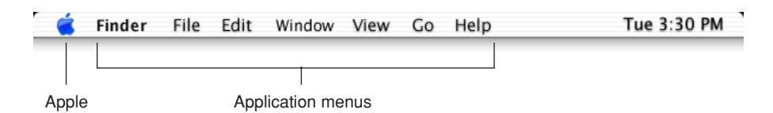

<span id="page-32-3"></span>■ **Menu bar.** The system-wide **Apple menu** has new functionality in Mac OS X. For more information, see ["The Apple Menu" \(page 41\).](#page-40-3) The menu bar region to the right of the Apple menu displays menus belonging to the active application.

<span id="page-33-7"></span><span id="page-33-2"></span>The **application menu** displays the boldface application name and contains items pertaining to the entire application, such as Hide, Preferences, and Quit. For more information, see ["The Application Menu" \(page 41\)](#page-40-4). (The Mac OS 9 Application, or Process, menu, has been replaced in Mac OS X by the Dock.)).

- **Window menu.** A Window menu has been introduced to aid in managing multiple open documents within an application. See ["The Window Menu"](#page-45-1)  [\(page 46\).](#page-45-1)
- <span id="page-33-5"></span>■ **Menu separators.** Pull-down menu divisions in Mac OS X are blank space (provided automatically by the Mac OS X application tools) rather than lines.
- <span id="page-33-6"></span>■ **Sticky menus.** Sticky menus no longer close automatically after a period of time; they stay open until an action forces them to close. See ["Sticky Menus" \(page 40\)](#page-39-2).
- <span id="page-33-4"></span><span id="page-33-3"></span>■ **Dynamic menu items.** In Aqua, pull-down menu commands can be toggled while the menu is open. See ["Menu Behavior" \(page 37\).](#page-36-2)

# <span id="page-33-0"></span>Menu Elements

<span id="page-33-8"></span><span id="page-33-1"></span>**Figure 4-2** A pull-down menu and its parts


### <span id="page-34-8"></span><span id="page-34-0"></span>Menu Titles

Menu titles should be one word that appropriately represents the items in the menu. For example, the Font menu can contain names of font families such as Helvetica and Geneva, but shouldn't include editing commands such as Cut and Paste.

## <span id="page-34-6"></span><span id="page-34-1"></span>Menu Items

Menu item names should be one of the following:

- <span id="page-34-5"></span><span id="page-34-4"></span>■ **Actions** (verbs or verb phrases) that declare the action that occurs when the user chooses the item. For example, Save means *save my file* and Copy means *copy the selected data.* Your menu commands should fit into similar sentences.
- <span id="page-34-3"></span>■ **Attributes** (adjectives or adjective phrases) that describe the change the command implements. Adjectives in menus *imply* an action and should fit into the sentence "Change the selected object to …" *bold,* for example.

When a menu item is unavailable—because it doesn't apply to the selected object or nothing is selected—the item appears dimmed (gray) in the menu, and isn't highlighted when the user moves the pointer over it.

Capitalize the first letter of the first and last words, and the important words in phrases. For more information on proper capitalization of menu items, see ["Capitalization of Interface Elements" \(page 181\)](#page-180-0).

# <span id="page-34-7"></span><span id="page-34-2"></span>Grouping Items in Menus

Logically grouping menu items is the most important aspect of arranging your menus. Grouping items in a menu makes it easier to quickly locate related tasks.

In general, place the most frequently used items at the top of the menu, but create groups of related items rather than arranging them strictly by frequency of use. For example, although the Find Next or Find Again command may be used infrequently, it should appear right below the Find command. In a menu that contains both actions and attributes, don't put actions and attributes in the same group.

Menu Elements **35**

<span id="page-35-3"></span><span id="page-35-2"></span>Group interdependent attributes. They can be in a **mutually exclusive attribute group** (the user can select only one item, such as font size) or an **accumulating attribute group** (the user can select multiple items, such as Bold and Italic).

If a menu repeats a term more than twice, consider dedicating a menu or hierarchical menu to the term instead. For example, if you need commands like Show Info, Show Colors, Show Layers, Show Toolbox, and so on, you could create a Show menu or hierarchical menu off of a Show item.

How many separators to use is partly an aesthetic decision and partly a usability decision. [Figure 4-3](#page-35-1) shows a menu that depicts the right balance of grouping, contrasted with two menus showing insufficient grouping and too much grouping. Use this picture as a visual guide when trying to decide how many separators to use in your menus.

**Figure 4-3** Grouping items in menus

<span id="page-35-1"></span>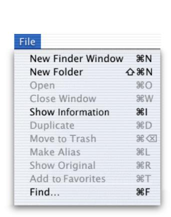

<span id="page-35-0"></span>

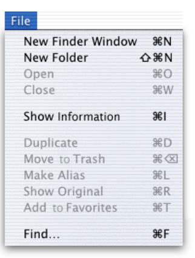

Not enough groups Too many groups Appropriate grouping

<span id="page-35-5"></span><span id="page-35-4"></span>In Mac OS X, menu separators are blank space instead of lines. The Menu Manager automatically puts in the right amount of space between menu items to form a separator.

# <span id="page-36-2"></span><span id="page-36-0"></span>Menu Behavior

<span id="page-36-4"></span>To choose an item in a menu, the user positions the pointer on the menu title and drags to the desired item. Each item is highlighted as it is selected. No action actually happens until the user releases the mouse button. A menu item blinks briefly to indicate that it has been activated.

By moving the pointer off a menu before completing a mouse click, people can open and scan menus to find out what features are available, without having to actually perform an action.

<span id="page-36-3"></span>It may be appropriate in some cases to provide **dynamic menu items**—commands that change when the user presses a modifier key. For example, if the user opens the File menu in the Finder and then presses the Option key, the Close Window command changes to Close All. The Menu Manager appropriately sizes the menu to hold the widest item, including Option-enabled commands.

## <span id="page-36-5"></span><span id="page-36-1"></span>Scrolling Menus

A **scrolling menu** contains more items than are visible onscreen. Your application shouldn't have any scrolling menus; they should exist only when a user adds many items to a customizable menu, such as the Font menu.

If a menu becomes too long to fit onscreen, a downward-pointing indicator appears at the bottom of the menu to show that there are more items. When the user starts to scroll, an upward-pointing indicator appears at the top of the menu to show that some items are no longer visible in that direction. When the user drags past the last visible item, the menu scrolls to show the additional items. When the last item is shown, the downward-pointing indicator disappears. This behavior happens automatically if you use the standard system menu definition procedure (MDEF).

If the user drags back up to the top, the menu scrolls back down in the same manner. If the user leaves the menu, the next time it's opened it appears in its original state (with the indicator at the bottom), unless it is a setting, in which case, the menu displays the last user-selected item.

Menu Behavior **37**

### <span id="page-37-2"></span><span id="page-37-0"></span>Toggled Menu Items

A **toggled menu item** changes between two states each time a user chooses it. There are three types of toggled menu items:

- A group of two menu items that are opposite states; for example, Grid On and Grid Off. The state currently in effect has a checkmark next to it. If you have room in your menu, it's a good idea to display both items (rather than changing the name depending on its state) so that there's less chance of confusion about each item's effect.
- One menu item whose name changes to reflect the current state; for example, Show Ruler and Hide Ruler. Use this type if your menu doesn't have room to show both states.

Use two verbs that express opposite actions. Make sure that the command name is completely unambiguous; For example, Turn Grid On and Turn Grid Off is unambiguous. Choosing the command Use Grid, however, could turn the grid on (it describes what happens as a result of choosing the command) or off (it describes the current state).

<span id="page-37-1"></span>**Figure 4-4** Ambiguous toggled menu items

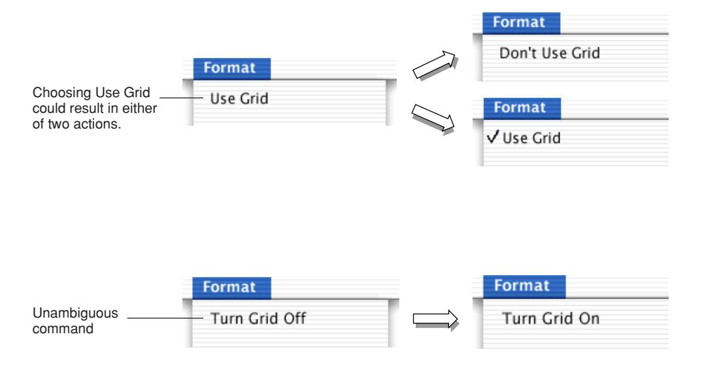

<span id="page-38-2"></span>■ A menu item that has a checkmark next to it when it is in effect; for example, a style attribute such as Bold. Don't use this kind of toggled item to indicate the presence or absence of a feature like a grid or ruler. It's unclear whether the checkmark means that the feature is in effect or whether choosing the command turns the feature on.

Also see ["Using Special Characters and Text Styles in Menus" \(page 49\)](#page-48-3).

### <span id="page-38-3"></span><span id="page-38-0"></span>Hierarchical Menus (Submenus)

You can use **hierarchical menus** to offer additional menu item choices without taking up more space in the menu bar. When the user points to a menu item with a submenu indicator, a submenu appears. Submenus have all the features of menus, including keyboard equivalents, status markers (such as checkmarks), icons, and so on.

<span id="page-38-1"></span>**Figure 4-5** A hierarchical menu


Because submenus add complexity to the interface and are physically more difficult to use, you should use them only when you have more menus than fit in the menu bar or for closely related commands (such as Show <windowname>). Use only *one level* of submenus.

When you use submenus, include them in a menu with a logical relationship to the choices they contain; the submenu title should clearly represent the choices it contains. Hierarchical menus work best for providing submenus of attributes (rather than actions).

Menu Behavior **39**

<span id="page-39-5"></span>A menu can contain both standard menu items and submenu titles.

### <span id="page-39-2"></span><span id="page-39-0"></span>Sticky Menus

Every menu is a sticky menu: When a user clicks the menu title, the menu stays open without the user having to continue holding down the mouse button. The user can then move the pointer to an item to select it.

In Mac OS X, every menu is sticky and stays open until another action forces it to close. Such actions include

- a click on another menu, window, control, or application
- a system-initiated alert
- a system-initiated application switch or quit

<span id="page-39-4"></span><span id="page-39-3"></span>If a sticky menu contains a submenu, it should also be sticky. If your application uses standard system menus, they assume proper sticky behavior.

# <span id="page-39-1"></span>Standard Pull-Down Menus (The Menu Bar)

The **menu bar** extends across the top of the main screen and contains pull-down menus. The menu bar

- is always visible and available, except in circumstances such as a slide show (see discussion below)
- always has the Apple menu (provided by the operating system), an application menu containing items that apply to the whole application, a File menu, and a Window menu
- can also contain Edit and Help menus, as well as application-specific menus

<span id="page-40-2"></span>**Figure 4-6** The menu bar displayed when the Finder is active


If there is insufficient room to display all of an application's menus, menus are omitted, starting with the rightmost menu.

If your application can display full-screen images (such as slide shows), you may allow users to hide the menu bar. If you implement this feature, provide a clearly visible way, such as a button, for the user to make the menu bar reappear. If there is no button visible, pressing the Escape key or Command-Q should display the menu bar.

If *all* of a menu's commands are unavailable (dimmed) at the same time, dim the menu title. The Menu Manager in Carbon does this automatically if you set the kMenuAttrAutoDisable attribute.

For information about keyboard equivalents for pull-down menu commands, see ["Keyboard Equivalents" \(page 138\)](#page-137-0).

### <span id="page-40-5"></span><span id="page-40-3"></span><span id="page-40-0"></span>The Apple Menu

The **Apple menu** provides items that are available to users at all times, regardless of which application is active, such as Sleep and Log Out. The Apple menu's contents are defined by the system and cannot be modified by users or developers.

## <span id="page-40-6"></span><span id="page-40-4"></span><span id="page-40-1"></span>The Application Menu

The application menu, new in Mac OS X, contains items that apply to the application as a whole, rather than to a specific document or other window.

<span id="page-41-2"></span>**Figure 4-7** The Mail application menu

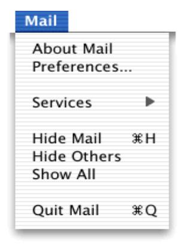

#### <span id="page-41-4"></span><span id="page-41-0"></span>The Application Menu Title

To help users identify which application is active, the application menu title is in boldface.

The menu title should be one word, and a maximum of 128 pixels wide in the standard menu font (14-point Lucida Grande). If the application name is too long, provide a short name (16 characters or fewer) as part of the application package. The About, Hide, and Quit items should also use the short application name.

If you don't provide a short name, the application name is truncated from the end (and an ellipsis is added), if necessary. For more information about how to provide a short application name, see *Inside Mac OS X: System Overview,* available at http:/ /developer.apple.com/techpubs/macosx/macosx.html.

#### <span id="page-41-1"></span>The Application Menu Contents

<span id="page-41-3"></span>■ **About <appName>.** Opens your application's About box, which contains copyright information and version number. (For more information, see ["About](#page-68-0)  [Boxes" \(page 69\).](#page-68-0)

- <span id="page-42-2"></span>■ **Application-wide items.** Put all commands that provide access to the application's preference dialogs first, followed by application-specific items. If your application menu has one "About" command and one "Preferences" command, don't use a menu separator between them. If the menu contains more than one application-specific item, you can use a menu separator to group them.
- <span id="page-42-7"></span>■ **Services.** Currently available for Cocoa applications, the Services submenu provides a way for one application to offer its capabilities to another application.
  - For example, a user could select a name in a document and choose a Services command that looks up the name using an LDAP server, starts up an email application, and opens a new message window with the found email address in the To field. For more information, see *Inside Mac OS X: System Overview* and the Cocoa documentation available at http://developer.apple.com/techpubs/ macosx/macosx.html.
- <span id="page-42-3"></span>■ **Hide <appName>.** This command should be preceded by a menu separator, and followed by Hide Others and Show All.
- <span id="page-42-6"></span><span id="page-42-1"></span>■ **Quit <appName>.** The last item in the application menu should be preceded by a separator. When a user chooses Quit and there are unsaved documents, present the necessary alerts (see ["Saving, Closing, and Quitting Behavior"](#page-79-0)  [\(page 80\)\)](#page-79-0).

### <span id="page-42-8"></span><span id="page-42-0"></span>The File Menu

The commands in the **File menu** provide housekeeping tasks for documents. In general, each command should apply to a single file. Note that the Preferences and Quit commands are now in the application menu.

If an application is not document-centered, you can rename the File menu to something more appropriate. For example, the System Preferences application's second menu is called Pane.

Several items in the File menu—Save, Print, and Page Setup, for example—apply to specific documents and therefore open sheets. For more information, see ["Document-Modal Dialogs \(Sheets\)" \(page 72\)](#page-71-1).

<span id="page-42-4"></span>Standard File menu commands include these:

- **New:** Opens a new document named "untitled." If your application requires documents to be named upon creation, you can display the standard file dialog.
- <span id="page-42-5"></span>■ **Open:** Displays a dialog that enables the user to open an existing document.

- <span id="page-43-1"></span>■ **Open Recent:** The Open command should be followed by Open Recent, so that people can open recently opened documents without using the Open dialog. The Open Recent submenu displays documents in the order in which they were opened, with the most recent item at the top.
- <span id="page-43-0"></span>■ **Close:** Closes the active window. When the user chooses this command and the active document has been changed since last saved, display the standard save changes sheet (see ["Saving, Closing, and Quitting Behavior" \(page 80\)\)](#page-79-0). When the user presses the Option key, this command changes to **Close All.** The keyboard equivalents Command-W and Option-Command-W should implement the Close and Close All commands, respectively.
- <span id="page-43-4"></span>■ **Save:** Saves the active document, leaves the document open, and provides feedback indicating that the document is being (or has been) saved. If the document has not previously been saved, display the Save As Location dialog. Use sheets for document-specific dialogs. See ["Document-Modal Dialogs](#page-71-1)  [\(Sheets\)" \(page 72\).](#page-71-1)
- <span id="page-43-5"></span>■ **Save As:** Saves a copy of the active document with a new user-defined name, and leaves the newly named document open and active.

<span id="page-43-6"></span>**Note:** Don't use the **Save a Copy** or **Save To** commands. People might not understand the distinction between them and "Save As."

- <span id="page-43-2"></span>■ **Page Setup:** Opens a dialog for specifying printing parameters such as paper size and printing orientation. These parameters are saved with the document.
- <span id="page-43-3"></span>■ **Print:** Opens a dialog for specifying such options as page range and number of copies and prints the active document. These parameters apply to only the current printing operation and are not saved with the document.

**Note:** If you need to add to the standard Print dialog, you can add a pane to the bottom pop-up menu. Follow the layout guidelines in ["Positioning Controls in](#page-113-0)  [Dialogs" \(page 114\).](#page-113-0) Make sure the name that appears in the menu doesn't conflict with already existing menu items.

Cocoa developers should use the NSPrintPanel class. Carbon developers should use the Carbon print dialog extensions; for more information, see http:// developer.apple.com/techpubs/macosx/Carbon/graphics/ CarbonPrintingManager/carbonprintingmgr.html.

### <span id="page-44-1"></span><span id="page-44-0"></span>The Edit Menu

The **Edit menu** provides commands that allow people to change, or edit, the contents of documents. It also provides the commands that allow people to share data, within and between applications, via the Clipboard.

The **Clipboard** stores whatever data is cut or copied from a document until the user replaces the contents by cutting or copying new data. The Clipboard is available to all applications and its contents don't change when the user switches from one application to another.

Your application's Edit menu should provide the following commands. Even if your application doesn't handle text editing within its documents, these commands should be available for use in modal dialogs (such as Save As):

■ **Undo:** The Undo command reverses the effect of the user's previous operation. When the user chooses Undo, the command changes to **Redo,** which reverses the effect of the last Undo command. Most Carbon applications have only one level of undo.

|   | Support the Undo command for                        |
|---|-----------------------------------------------------|
| ■ | operations that change the contents of a document   |
| ■ | operations that require a lot of effort to recreate |
| ■ | most menu items                                     |
| ■ | most keyboard input                                 |
|   | Operations that may not be undoable include         |
| ■ | selecting                                           |
| ■ | scrolling                                           |
| ■ | splitting a window                                  |
| ■ | changing a window's size or location                |
|   |                                                     |

Add the name of the last operation to the Undo and Redo commands. For example, if the user has just input some text, the command could read **Undo Typing.** If the last operation can't be reversed, change the command to **Can't Undo** and display it dimmed to provide feedback about the current state.

If a user attempts to perform an operation that could have a detrimental effect on data and that can't be undone, warn the user. See ["Alerts" \(page 75\).](#page-74-0)

<span id="page-45-9"></span><span id="page-45-8"></span><span id="page-45-6"></span>Command-Z should be reserved as a keyboard equivalent for the Undo/Redo command.

- **Cut:** Removes the selected data and stores it on the Clipboard, replacing its previous contents.
  - Command-X should be reserved as a keyboard equivalent for the Cut command.
- <span id="page-45-5"></span>■ **Copy:** Makes a duplicate of the selected data, which is stored on the Clipboard. Command-C should be reserved as a keyboard equivalent for the Copy command.
- <span id="page-45-7"></span>■ **Paste:** Inserts the Clipboard contents at the insertion point location. The Clipboard content remains unchanged, permitting the user to choose Paste multiple times.
  - Command-V should be reserved as a keyboard equivalent for the Paste command.
- <span id="page-45-2"></span>■ **Clear:** Removes selected data without storing the selection on the Clipboard. Choosing Clear is the equivalent of pressing the Delete key.
- <span id="page-45-4"></span><span id="page-45-3"></span>■ **Select All:** Highlights every object in the document.
  - Command-A should be reserved as a keyboard equivalent for the Select All command.
- **Find:** Finds specified text. In some cases—if the application is finding a file on the Internet—it might make more sense to put this command in the File menu.

### <span id="page-45-10"></span><span id="page-45-1"></span><span id="page-45-0"></span>The Window Menu

The Window menu contains commands for managing multiple document windows. The menu lists an application's open document windows, including minimized windows, in the order in which they were opened. If a document contains unsaved changes, a bullet appears next to its name.

<span id="page-46-2"></span>**Figure 4-8** A Window menu

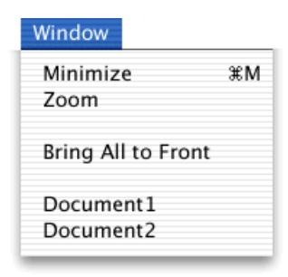

The Window menu should list only open documents; don't include open dialogs or utility windows.

Even if your application consists of only one window, include a Window menu for the Minimize command.

Window menu items appear in this order: Minimize, Zoom, <separator>, <application-specific window commands>, <separator>, Bring All to Front, <separator>, <list of open windows>. The Close command should appear in the File menu, below the Open command.

### <span id="page-46-4"></span><span id="page-46-0"></span>The Help Menu

If your application provides onscreen help (and it should), the Help menu is always the rightmost menu. The first item is the name of the application and the word "Help" (Mail Help, for example). If necessary, you can add more items to the Help menu. For information about creating help content, see ["Help" \(page 173\)](#page-172-0).

# <span id="page-46-1"></span>Contextual Menus

<span id="page-46-3"></span>When the user presses the Control key while clicking an item, a **contextual menu** appears next to the item. The contextual menu provides convenient access to often-used commands associated with the item.

Contextual Menus **47**

<span id="page-47-0"></span>**Figure 4-9** A contextual menu


■ **Behavior:** A contextual menu behaves like a standard sticky menu, except that moving the pointer off a contextual menu and onto a standard pull-down menu doesn't activate the second menu; the user must click once to close the contextual menu and again to open the second menu.

Contextual menus that are too long to display fully show the scrolling triangle and scroll like standard menus.

Don't set a default item. If the user opens the menu and closes it without selecting anything, no action should occur.

■ **Contents:** You define the items in your application's contextual menus. Include a small subset of the most commonly used commands in the appropriate context. If you don't define any items, the menu displays a Help item and loads appropriate plug-ins.

Never provide a contextual menu command that is not also accessible through the menu bar. Use submenus with caution and keep them to one level.

If the user presses the Control key while clicking your application icon in the Dock, a contextual menu should open with useful commands, such as Hide, Remove From Dock, Show Original, and Quit.

# <span id="page-48-3"></span><span id="page-48-0"></span>Using Special Characters and Text Styles in Menus

<span id="page-48-5"></span>You can use several standard characters (described below) to indicate additional information in menus. Don't use arbitrary symbols in menus because they add visual clutter and may confuse people.

<span id="page-48-2"></span>**Figure 4-10** Don't use arbitrary symbols in menus

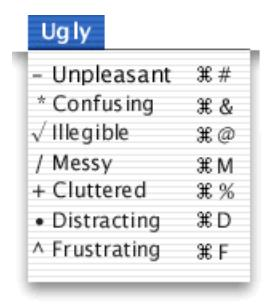

## <span id="page-48-4"></span><span id="page-48-1"></span>Using Symbols in Menus

A **checkmark** next to a menu item indicates that the setting applies to the entire selection. You can use checkmarks for mutually exclusive attribute groups (the user can select only one item in the group, such as font size) or accumulating attribute groups (more than one item can be selected at once, such as Bold and Italic.

Use **dashes** to indicate that an attribute applies to only part of the selection. For example, if selected text has two styles applied to it, put a dash next to each style name. When it's appropriate, you can combine checkmarks and dashes in the same menu.

A **bullet** appears next to a document with unsaved changes. A **diamond** appears if the user has minimized the document into the Dock.

<span id="page-49-1"></span>**Figure 4-11** Symbols in menus

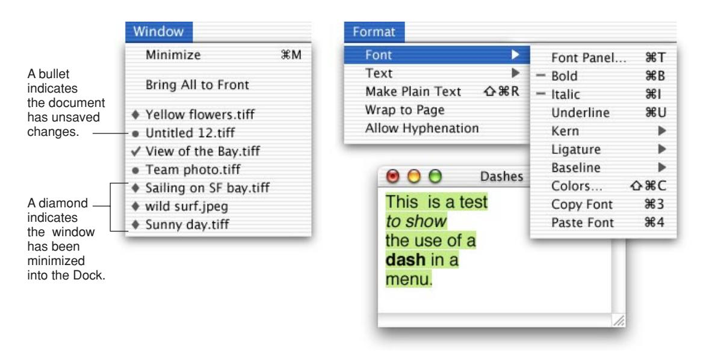

### <span id="page-49-2"></span><span id="page-49-0"></span>Using Ellipses in Menus

An ellipsis character (…) after a menu item or button label indicates to the user that additional information is required to complete a command. You should use an ellipsis in the following cases:

- An action that requires further user input to complete or presents an alert allowing the user to cancel the action. Examples include Open, Page Setup, and Print. Typically the windows displayed by these commands are modal and are dismissed after completing the action.
- An action that opens a nonmodal dialog that requires additional user input to complete a task. Examples include Find, Go To, and Spelling.
- An action that opens a settings window. The main function of settings windows is to allow the user to change some aspect of the application, not the document content. Examples include Set Title, Preferences, and Options.

Don't use an ellipsis in the following cases:

- An action that requires no further user input to complete and does not present an alert. Often the item to be acted upon is already selected. Examples: New, Cut, Bold, Print One, and Quit.
- An action that opens an informational, accessory, or tool window. These windows can be implemented as either utility windows (as in the case of a color palette), or modeless windows. These windows provide tools that help create or manage the content in the main window and are frequently left open to assist in accomplishing the task of the main window.

## <span id="page-50-3"></span><span id="page-50-0"></span>Using Text Styles in Menus

<span id="page-50-2"></span>In a Style or Font menu, you can display menu items in the actual style or font so that users can see what effect the text attribute will have.

Don't use text styles in menus other than a Style or Font menu.

<span id="page-50-1"></span>**Figure 4-12** A Style menu displayed with text styles


Menus

<span id="page-52-3"></span><span id="page-52-0"></span>Windows provide a way for people to view and interact with their data. There are various kinds of windows, each with its own function and appearance.

<span id="page-52-2"></span>**Document windows** contain file-based user data. They present a view into the content that people create and store. If the document is larger than the window, the window shows a portion of the document's contents.

Other windows, commonly called **utility windows**, "float" above other windows and provide tools or controls that users can work with while documents are open. Some utility windows are system-wide (kUtilityWindowClass). In your application, use the kFloatingWindowClass to create windows such as tools palettes.

Some applications are not document-based, but they still have "main" windows.

<span id="page-52-5"></span>**Note:** Dialogs and alerts are also types of windows; they are discussed in ["Dialogs" \(page 71\).](#page-70-0)

# <span id="page-52-1"></span>What's New in Aqua

<span id="page-52-4"></span>■ **Window layering:** In Mac OS 9 and earlier, all windows belonging to a particular application are in the same layer. In Mac OS X, each document exists in its own layer, so documents from different applications can be interleaved. Clicking a window to bring it to the front doesn't disturb the layering of any other window.

A window's "depth" in the layers is determined by when the window was last accessed. You can bring all windows of a given application forward by clicking the application's icon in the Dock or by choosing Bring All to Front in the application's Window menu.

<span id="page-53-1"></span>To ensure that alerts and other dialogs don't get lost amidst windows from different applications, and to provide greater modelessness, Mac OS X introduces a new type of dialog called *sheets*. See ["Document-Modal Dialogs](#page-71-1)  [\(Sheets\)" \(page 72\).](#page-71-1)

- **Click-through:** In Mac OS X, the user can activate many items on an inactive window with a single click, rather than having to click once to activate the window and again to activate the item. For more information, see ["Click-Through" \(page 60\)](#page-59-2).
- <span id="page-53-7"></span>■ **Drawers:** A drawer is a child window that slides out from a parent window, and which the user can open or close (reveal or hide). For more information, see ["Drawers" \(page 65\)](#page-64-3).
- <span id="page-53-3"></span>■ **Window controls:** The standard window controls—the close box, zoom box, scroll bars, and so on—have been redesigned in Aqua. In Mac OS X, the "window shade" feature is replaced by the minimize button, which puts the window in the Dock. Users can also double-click a window's title bar to put it in the Dock. Moving and resizing a window displays the actual window at all times, rather than the outlines displayed in Mac OS 9.

# <span id="page-53-0"></span>Window Appearance and Behavior

<span id="page-53-6"></span>Every document and utility window should have a title bar and a close button. Even if the window does not have an actual title (a tools palette, for example), the user should be able to move the window by dragging the title bar.

A standard document window has

- <span id="page-53-5"></span><span id="page-53-2"></span>■ a title bar
- <span id="page-53-4"></span>■ a resize control
- scroll bars (if not all the window's contents are visible)

<span id="page-54-3"></span><span id="page-54-1"></span>■ close, minimize, and zoom buttons, although only the close button must be available at all times (except when the window has an open sheet)

**Figure 5-1** Standard window parts

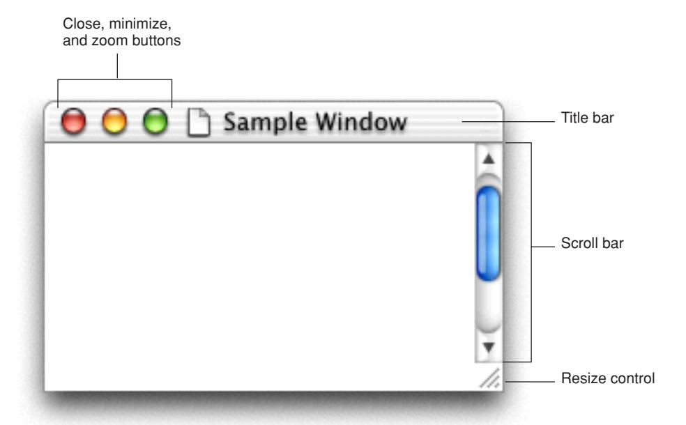

<span id="page-54-2"></span>When a document has unsaved changes, the close button displays a dot.

**Figure 5-2** The close button in its "unsaved changes" state

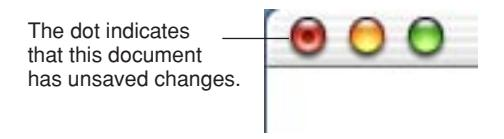

### <span id="page-54-4"></span><span id="page-54-0"></span>Opening Windows

Users can open a document window by

#### Windows

- double-clicking a document icon in the Finder
- selecting the document in the Finder and pressing Command-O
- choosing a file from an Open dialog
- choosing the New command from the File menu

When your application displays a new document window, name it "untitled"; leaving it lowercase makes it more obvious that the window doesn't have a name and encourages people to save the document.

If the user chooses New again before saving the first untitled window, name the second window "untitled2," and so on. Add numbers to window titles only when there is more than one open untitled window. Don't put a "1" on the first untitled window, even after the user opens other new windows.

<span id="page-55-1"></span><span id="page-55-0"></span>**Figure 5-3** Appropriate titles for a series of unnamed windows

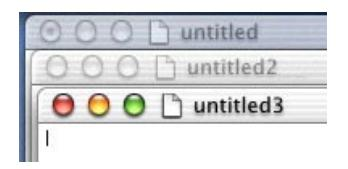

<span id="page-56-2"></span>**Figure 5-4** Examples of correct and incorrect window titles


Do not leave title blank.

When the user opens an existing document, display its name exactly as it appears in the Finder.

# <span id="page-56-3"></span><span id="page-56-0"></span>Positioning Windows

*<text to come>*

### <span id="page-56-4"></span><span id="page-56-1"></span>Closing Windows

Users can close a window by

■ choosing Close from the File menu

#### Windows

- pressing Command-W
- clicking the close button

When a user closes a document window, your application should

- decide what to do with unsaved data (see ["Saving, Closing, and Quitting](#page-79-0)  [Behavior" \(page 80\).](#page-79-0))
- store the window's onscreen position and size (so that they can be used when the window is reopened)

### <span id="page-57-2"></span><span id="page-57-0"></span>Moving Windows

The user moves a window by dragging its title bar. As a user drags, the full window and its contents move (unlike in Mac OS 9, which dragged the window's outline).

As in Mac OS 9, pressing the Command key while dragging an inactive window moves the window but does not make it active.

Your application should never allow users to move a window to a position from which they can't reposition it.

### <span id="page-57-4"></span><span id="page-57-1"></span>Resizing and Zooming Windows

Your application determines the minimum and maximum window size. Base these sizes on the physical size of the user's monitors.

<span id="page-57-3"></span>Your application also sets the values for the initial size and position of a window, called the **standard state.** Don't assume that the standard state should be as large as possible; some monitors are much larger than the useful size for a window. Choose a standard state that is best suited for working on the type of document your application creates.

The user can't change the standard size and location of a window, but your application can change the standard state when appropriate. For example, a word processor might define the standard size and location as wide enough to display a document whose width is specified in the Page Setup dialog.

The user changes a window's size by dragging the size control in the lower-right corner. As a user drags, how much of a document is visible in the window changes. The upper-left corner of the window remains in the same place and the appearance of the visible contents stays the same. In Mac OS X, the actual window contents are displayed at all times, rather than only the outline displayed in Mac OS 9.

<span id="page-58-5"></span><span id="page-58-4"></span>If the user changes a window's size or location by at least 7 pixels, the new size and location is the **user state.** The user can toggle between the standard state and the user state by clicking the **zoom button.** When the user clicks the zoom button of a window in the user state, first determine the appropriate size of the standard state. Move the window as little as possible to make it the standard size, and keep the entire window on the screen.

When a user with more than one monitor zooms a window, the standard state should be on the monitor containing the largest portion of the window, not necessarily on the monitor with the menu bar. This means that if the user moves a window between monitors, the window's standard state could be on different monitors at different times. The standard state for any window must always be fully contained on a single monitor.

### <span id="page-58-3"></span><span id="page-58-0"></span>Active and Inactive Windows

People can open as many windows as their computer's memory can support, but they interact with only one at a time. The **active window** is frontmost and is visually distinct from the other windows onscreen. When a user clicks an inactive window, its controls switch from translucent to active.

<span id="page-58-2"></span><span id="page-58-1"></span>**Figure 5-5** Window controls in active and inactive states


### <span id="page-59-3"></span><span id="page-59-2"></span><span id="page-59-0"></span>Click-Through

An item that provides click-through is one that a user can activate on an inactive window with one click, rather than clicking first to make the window active and then clicking the item. Click-through provides greater efficiency in performing such tasks as closing or resizing inactive windows, and copying or moving files. In many cases, however, click-through could confuse a user who clicks an item unintentionally.

<span id="page-59-4"></span>On an inactive window, an item that provides click-through has its text or glyph (such as arrows) in 100-percent black; if the item is usually colored (such as a radio button), it is colorless in its click-through state. Items that do not provide click-through appear in their disabled state (50-percent dimmed).

<span id="page-59-1"></span>**Figure 5-6** Controls in an inactive window in click-through or disabled state


You can provide click-through for such items as

■ pop-up menus

- text fields
- window controls in title bars (close, minimize, and zoom buttons)
- title bars, including proxy icons
- toolbar buttons (when the button's action is not potentially harmful)
- scroll bars

Don't provide click-through for items or actions that

- are potentially harmful (for example, the Delete button in Mail)
- are difficult to recover from, such as
  - actions that are difficult or impossible to cancel (the Send button in Mail)
  - dismissing a dialog without knowing what action was taken (for example, it's not easy to "unsave" a document)
  - removing the user from the current context (selecting a new item in a column, for example, can change the target of the Finder window)

Clicking in one of these situations results in the window being brought forward but no action being taken.

In general, you can implement click-through on an item that provides confirmation feedback before taking place—in other words, the user can cancel the action—such as deleting a user in Users preferences. If you want to implement click-through on an item that doesn't provide confirmation feedback, consider how difficult it will be for the user to undo the action. For example, in Mail, it would be inadvisable to implement click-through on the Delete button, which deletes a message without providing feedback first, because its resulting action is harmful. You could, however, provide click-through on the Add to Favorites button in the Save dialog because its resulting action is not harmful and is fairly easy to undo.

### <span id="page-60-2"></span><span id="page-60-0"></span>Scrolling Windows

<span id="page-60-1"></span>People use **scroll bars** to view areas of a document or a list that is larger than can fit in the current window. Only the active window can be scrolled. A window can have a horizontal scroll bar, a vertical scroll bar, or both, or neither.

<span id="page-61-0"></span>**Figure 5-7** The elements of a scroll bar


The **scroller** size reflects how much of the document is visible; the smaller the scroller, the less of the content the user can see at that time. The scroller represents the relative location, in the whole document, of the portion that can be seen in the window.

If the entire contents of a document is visible in a window, the scroll bars do not contain scrollers. Scroll bars in inactive windows have an inactive appearance. See [Figure 5-5 \(page 59\).](#page-58-2)

The user can use scroll bars by doing the following:

- Dragging the scroller: This method is usually the fastest way to move around a document. In Mac OS X, the window's contents changes in "real time" as the user drags the scroller.
- Clicking a scroll arrow: This means, "Show me more of the document that's hidden in this direction." The scroller moves in the direction of the arrow. Each scroll arrow click moves the content one unit; your application determines what one unit equals. For example, a word processor would move a line of text per click, a spreadsheet could move one row or column. To ensure smooth scrolling effects, specify units of the same size throughout a document.

■ Clicking or pressing in the scroll track: Clicking advances the document by a windowful—the height or width of the window, minus at least one unit of overlap to maintain the user's context. This unit of overlap should be the same as one scroll arrow unit. The Page Up and Page Down keys also move the document view by a windowful.

Pressing in the scroll track displays consecutive windowfuls of the document, until the location of the indicator catches up to the location of the pointer (or until the user releases the mouse button).

**Note:** The user can change scroll bar behavior in General preferences so that clicking or pressing in the scroll track scrolls to the pointer location.

It's best not to add controls to scroll bars. If you add more than one control to this area, it's hard for people to distinguish among controls and click the right one. Acceptable additions to the scroll bar include a splitter bar and a status bar. To ensure that window controls are easy to use and understand, it's best to place the majority of your features in the menus as commands. If you really want to provide additional access to features, consider creating a utility window such as a palette with buttons.

<span id="page-62-3"></span><span id="page-62-2"></span>Make sure you don't use a scroll bar when you should really use a slider. Use sliders to change settings; use scroll bars only for representing the relative position of the visible portion of a document and in scrolling lists. For more information, see ["Slider Controls" \(page 102\).](#page-101-0)

### <span id="page-62-1"></span><span id="page-62-0"></span>Automatic Scrolling

Most of the time, the user should be in control of scrolling. Your application must perform automatic scrolling in these four cases:

- When your application performs an operation that results in making a new selection or moving the insertion point (for example, when the user searches for some text and your application locates it), scroll the document to show the new selection.
- When the user enters information from the keyboard at the edge of a window, scroll the document automatically to incorporate and display the new information.

Your application determines the distance to scroll. In general, a word processor scrolls by a line of text, a database or spreadsheet scrolls by one field, a graphics application scrolls to display an entire object, if possible.

- When the user moves the pointer past the edge of the window while holding down the mouse button to make an extended selection, scroll the document automatically in the direction the pointer moves.
- When the user selects something, scrolls to a new location, and then tries to perform an operation on the selection, scroll so that the selection is showing before your application performs the operation.

Whenever your application scrolls a document automatically, move the document only as much as necessary. That is, if part of a selection is showing after the user performs an operation, don't scroll at all.

If your application can scroll in only one orientation to reveal the selection, don't scroll in both.

<span id="page-63-4"></span>It's better to position a selection near the middle of a window rather than up against a corner, so that the user can see the selection in context. When the selection is too large to show in its entirety, it might be a good idea to show some context rather than having the selection fill the window.

### <span id="page-63-5"></span><span id="page-63-0"></span>Minimizing and Expanding Windows

<span id="page-63-3"></span>When the user clicks the **minimize button** or double-clicks the title bar, the window minimizes into the Dock. The window's icon remains in the Dock until the user clicks it again or, if it is the application's only open window, until the user clicks the application icon in the Dock.

### <span id="page-63-2"></span><span id="page-63-1"></span>Clicking an Icon in the Dock

Clicking your application icon in the Dock should always result in a window—a document or another appropriate window—becoming active.

If the application was not open when the user clicks the Dock icon, the application opens and a new window is active. While the application is open, the Dock icon has a triangle below it.

When the user quits the application, the icon disappears from the Dock. Users can add an application icon permanently to the Dock by choosing a command from the Dock icon's contextual menu while the application is open, by dragging the item from the Finder, or by moving the icon from one Dock location to another.

<span id="page-64-6"></span>When a user clicks an open application's icon in the Dock, the application becomes active and all open unminimized windows are brought to the front; minimized document windows remain in the Dock. If there are no unminimized windows when the user clicks the icon, the last minimized window should be expanded and made active. If no documents are open, the application should open a new window.

# <span id="page-64-3"></span><span id="page-64-0"></span>Special Windows

### <span id="page-64-7"></span><span id="page-64-5"></span><span id="page-64-1"></span>Drawers

A drawer is a "child" window that slides out from a parent window, and which the user can open or close (show or hide). A drawer contains controls that are tightly linked to the controls in its parent window.

<span id="page-64-2"></span>Drawers are available only to Cocoa developers, via the NSDrawer class.

<span id="page-64-4"></span>**Figure 5-8** An open drawer next to its parent window

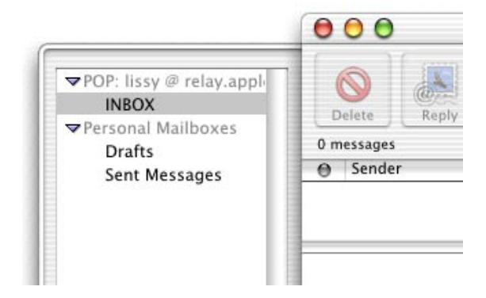

Special Windows **65**

#### <span id="page-65-0"></span>When to Use Drawers

Use drawers only for controls that need to be accessed fairly frequently but that don't need to be visible all the time. (Contrast this criterion with a palette, which should be visible and available whenever its main window is in the top layer.) Some examples of uses of drawers include access to favorites lists, access to the Mailboxes drawer in the Mail application, or access to favorites or bookmarks in a browser.

Although a drawer is somewhat similar to a sheet in that it attaches to a window and slides out, the two elements are not interchangeable. Sheets are primarily intended to replace modal dialogs, as described in ["When to Use Sheets" \(page 74\)](#page-73-0).

#### <span id="page-65-1"></span>Drawer Behavior

The user shows or hides a drawer, typically by pressing a button or choosing a command. If a drawer contains a valid drop target, you may also wish to have the drawer open when the user drags an appropriate object to where the drawer appears.

When a drawer opens or closes, it appears to be sliding from behind its parent window, to the left or right side. You should ensure that a parent window's default position allows its drawer to open fully without disappearing offscreen.

To support the illusion that a closed drawer is hidden behind its parent window, an open drawer should be smaller than its parent window. When the parent window is resized vertically, an open drawer resizes if necessary to ensure that it does not exceed the height of the parent window. (A drawer can be shorter than its parent window.) The illusion is further reinforced by the fact that the inner border of a drawer is hidden by the parent window and that the parent window's shadow is seen on the drawer when appropriate.

The user can resize an open drawer by dragging its outside border. The degree to which a drawer can be resized is determined by the content of the drawer. If the user resizes a drawer to the point where content is significantly obscured, the drawer should simply close. For example, if a drawer contains a scrolling list, the user should be able to resize the drawer to cover up the edge of the list. But if the user makes the drawer so small that the items in the list are difficult to identify, the drawer should close. If the user sets a new size (that is allowable) for a drawer, the new size is used the next time the drawer is opened.

#### <span id="page-66-3"></span><span id="page-66-0"></span>Using Controls in a Drawer

A drawer can contain any control that is appropriate to its intended use. Follow normal layout guidelines, as stated in ["Positioning Controls in Dialogs" \(page 114\)](#page-113-0). To ensure that the parent window's shadow does not affect any controls in the drawer, leave a border around the controls as shown in [Figure 5-8.](#page-64-4)

<span id="page-66-4"></span>Consider a drawer part of the parent window; don't dim a drawer's controls when the parent window has focus, and vice versa.

### <span id="page-66-5"></span><span id="page-66-1"></span>Utility Windows

You can create a modeless utility window, such as a tools palette, to present controls or settings that affect the active document window. A user can open several utility windows at a time; they float on top of document windows. When a user makes a document active, all of the application's utility windows are brought to the front, regardless of which document was active when the user opened the utility window.

<span id="page-66-2"></span>**Figure 5-9** Examples of tool palettes (utility windows)

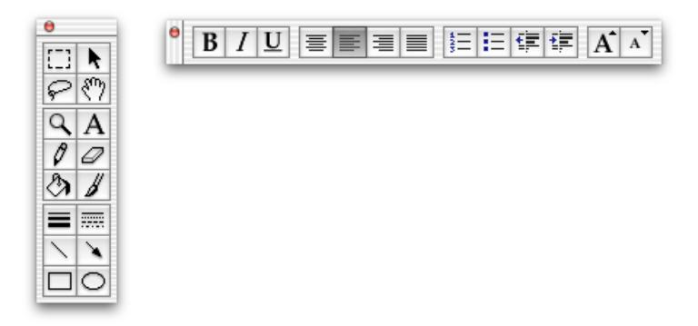

Utility windows are useful for keeping extremely important controls or information accessible at all times in the context of a user task. Because utility windows take up screen space, however, don't use them when you can solve the need with a modeless dialog (the user changes settings and then closes the dialog) or by adding a few appropriate controls to a window frame.

Special Windows **67**

#### Windows

You need to create and maintain any utility windows for your application. Whenever your application is in the background, hide all utility windows.

Most utility windows don't have titles, but they do have an 11-pixel-high drag region at the top.

For information about designing Aqua palette windows, see ["Using Small Versions](#page-122-0)  [of Controls" \(page 123\)](#page-122-0).

### <span id="page-67-0"></span>Using Small Scroll Bars

<span id="page-67-1"></span>Some windows, such as utility windows, may require small scroll bars. If a window uses small scroll bars, all other controls within the window content area should also be the smaller version. For more information, see ["Using Small Versions of](#page-122-0)  [Controls" \(page 123\)](#page-122-0).

**Figure 5-10** Example of window using small scroll bars and resize control

<span id="page-68-1"></span>Small scroll bar width is 11 pixels.


# <span id="page-68-2"></span><span id="page-68-0"></span>About Boxes

An **About box** is a modeless window (the user can leave it open and perform other tasks in the application) that contains your application's version and copyright information.

Your application's About box should

- have a title bar and be movable
- include the close button as the only active window control (dim the minimize and zoom buttons)
- display a centered application image and application title

Special Windows **69**

<span id="page-69-1"></span><span id="page-69-0"></span>**Figure 5-11** Examples of About boxes

#### **Recommended version Smallest version Application icon** 64 x 64 pixels centered **Application title** Lucida Grande Bold 14 pt. centered **Application title** 19 pixel text height centered **Application version** Label font 10 pt. Lucida Grande Reg. centered **Copyright information** Label font 10 pt. Lucida Grande Reg. centered **Application description** Small system font 11 pt. Lucida Grande Reg. flush left **Label font** 12 pixel text height centered

All text in an About box is centered, except for the optional descriptive text, which is flush left. If you want to include a scrolling list (for credits, for example), put it between the descriptive text and the copyright information.

An About box (or splash screen) is the appropriate place for your corporate logo. Avoid putting product branding elements in document windows and dialogs.

For Cocoa developers, About box support is provided by the Application Kit.

<span id="page-70-3"></span><span id="page-70-0"></span>A dialog is a window designed to elicit a response from the user. Many dialogs the Print dialog, for example—permit the user to provide many responses at one time.

<span id="page-70-2"></span>**Alerts** are dialogs that appear when the system or an application needs to communicate information to the user. They provide messages about error conditions and warn users about potentially hazardous situations or actions.

<span id="page-70-4"></span>For information about using the keyboard to interact with dialogs, see ["Keyboard](#page-140-0)  [Navigation and Focus" \(page 141\).](#page-140-0)

# <span id="page-70-1"></span>What's New in Aqua

- <span id="page-70-5"></span>■ **Sheets:** A sheet is a new type of dialog that is "attached" to a particular document or window, ensuring that the user never loses track of which window the dialog applies to. The ability to keep a dialog attached to its pertinent window enables users to take full advantage of the Mac OS X window layering model and also encourages modelessness. For more information, see ["Document-Modal Dialogs \(Sheets\)" \(page 72\)](#page-71-2).
- <span id="page-70-6"></span>■ **Alerts:** To help the user identify which application an alert belongs to, all alerts should display the application's icon. In rare cases, when there is a critical need to warn the user of a potentially data-damaging operation, the alert can display the caution icon over the application icon.

<span id="page-71-4"></span>■ **Modality:** There are very few situations in Mac OS X where a dialog must be addressed before the user is allowed to do anything else. The vast majority of dialogs should be either application modal (the user must address the dialog before doing anything else in the application) or document modal, not system modal. All modal dialogs should be movable.

# <span id="page-71-0"></span>Types of Dialogs and When to Use Them

<span id="page-71-5"></span>Your Mac OS X application can use these types of dialogs (each of which is described in detail below):

- **Modeless:** Modeless dialogs enable users to change settings in a dialog while still interacting with document windows; the "find and replace" feature in many word processors is an example of a modeless dialog. Modeless dialogs have title bar controls (close, minimize, zoom).
- **Document modal:** Prevents the user from doing anything else within a particular document. The user can switch to other documents in the application, and to other applications. Document-modal dialogs should be **sheets.**
- **Application modal:** Prevents the user from doing anything else within the owner application; the user can still switch applications. An **alert** that communicates an error condition within an application is an example of an application-modal dialog. Modal dialogs typically don't have standard title bar controls; the user dismisses most modal dialogs by clicking a push button, such as Save or Cancel.

## <span id="page-71-3"></span><span id="page-71-2"></span><span id="page-71-1"></span>Document-Modal Dialogs (Sheets)

A sheet is a modal dialog "attached" to a particular document or window, ensuring that the user never loses track of which window the dialog applies to. The ability to keep a dialog attached to its pertinent window enables users to take full advantage of the Mac OS X window layering model. Sheets also enable users to perform other tasks before dismissing the dialog, so there's no longer the sense of the system being "hijacked" by the application.

You lay out sheets like any other dialog in Mac OS X. Carbon developers are responsible for creating, showing, handling the events for, and closing sheets. Other sheet behavior, such as the animation when it appears, is handled automatically by the Window Manager.

<span id="page-72-2"></span><span id="page-72-1"></span>**Figure 6-1** Example of using a sheet to display a modal dialog

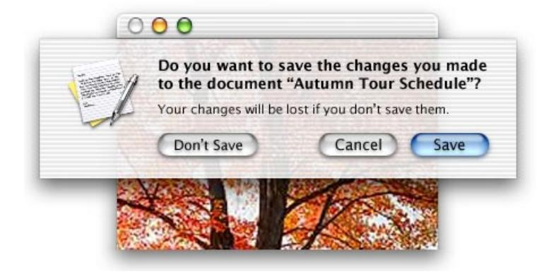

#### <span id="page-72-0"></span>Sheet Behavior

Sheets are displayed as an animation that appears to emerge from the window's title bar. When a sheet displays on a window near the edge of the screen, the sheet moves the window away from the edge; when the sheet is dismissed, the window returns to its previous position.

Only one sheet may be open for a window at any one time. A sheet presenting a modal dialog prevents any other operation on that window until the dialog is dismissed. If a sheet is open when the user performs an action that opens another sheet, the first sheet closes before the second one opens.

A sheet on an active document window should cover (appear on top of) any active utility windows. However, if the user leaves a sheet open and clicks another document in the same application, the sheet on the inactive window should go *behind* any open utility windows.

#### <span id="page-73-0"></span>When to Use Sheets

Use sheets for modal dialogs or for modeless dialogs specific to a document when the user interacts with the dialog and dismisses it before proceeding with work. Some examples of when to use sheets:

- A modal dialog that is specific to a particular document, such as saving or printing.
- A modal dialog that is specific to a single-window application that does not create documents. A single-window utility program might use a sheet to request acceptance of a licensing agreement from the user, for example.
- Other window-specific dialogs typically dismissed by the user before proceeding. Use a sheet when a dialog benefits from being attached to the window as a modal dialog, even if you might otherwise design the dialog as a modeless dialog.

### <span id="page-73-1"></span>When Not to Use Sheets

- Don't use sheets for dialogs that apply to several windows. Sheets are strictly intended to be used in situations when a particular dialog is associated only with the window to which it is attached.
- Sheets are not appropriate for modeless operations where the dialog should be left open to allow the user to observe the effects of changes applied. Such tasks are better suited to modeless dialogs, utility windows (palettes), or drawers.
- <span id="page-73-4"></span>■ Don't use a sheet on a window that doesn't have a title bar. Sheets should emerge from a definite visual edge.

### <span id="page-73-3"></span><span id="page-73-2"></span>Application-Modal Dialogs

A modal dialog not attached to a specific document is an application-modal dialog. In Final Cut Pro, for example, the Save dialog is application modal; the application is not document-based and Save stores the state of multiple windows at once.

If an application-modal dialog appears as the result of the user choosing a command, the dialog's title should match the command.

### <span id="page-74-2"></span><span id="page-74-0"></span>Alerts

Alerts display messages to inform users of situations that are notable or potentially dangerous.

<span id="page-74-1"></span>**Figure 6-2** A standard alert with dimensions

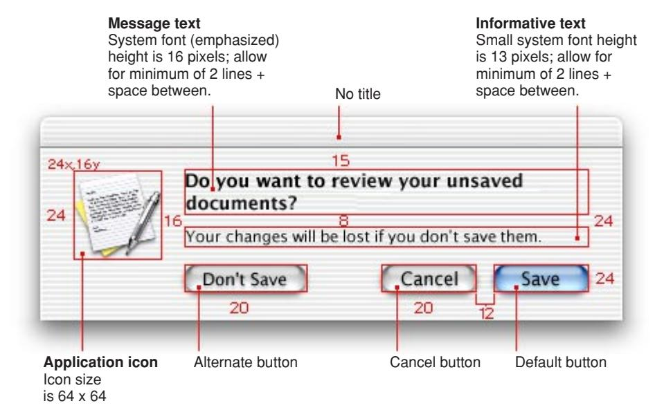

For more dialog layout guidelines, see ["Sample Dialog Layouts" \(page 118\).](#page-117-0) Also see ["Writing Good Alert Messages" \(page 182\).](#page-181-0)

An alert should contain only the following elements:

■ *The application icon.* Because of the new window layering model (described in ["New in Aqua" \(page 21\)](#page-20-1), an icon is necessary to make it clear to the user which application is displaying the alert.

If there is a critical need to warn the user of a potentially data-damaging operation, you may wish to use the caution icon over the application icon, as shown in [Figure 6-3](#page-75-2).

<span id="page-75-2"></span><span id="page-75-1"></span>**Figure 6-3** An application icon badged with the caution icon


- *Alert message text.* This text, in boldface system font, provides a short, simple summary of the error or condition that summoned the alert. Often the message is presented as a question.
- *Informative text.* This text appears in the small system font and provides a fuller description of the situation, its consequences, and how to get out of it. For example, a warning that an action cannot be undone is an appropriate use of informative text.
- <span id="page-75-4"></span><span id="page-75-3"></span>■ *Buttons* for addressing the alert. Button names should correspond to the action the user performs when pressing the button—for example, Erase, Save, or Delete.

# <span id="page-75-0"></span>Dialog Behavior

When appropriate, your application's dialogs should display default values for controls and text fields so that the user can verify information rather than generating it from scratch. Display a selection or an insertion point in the first location—a text entry field or a list, for example—that accepts user input.

When it provides an obvious user benefit, text in a dialog should be selectable. Some error message text, for example, could be selectable. Facilitating the copying of text (such as a serial number or a hostname) so that it can be pasted accurately into another context is another example.

In dialogs that display columns and are user resizable, such as the Open dialog, as the dialog is made bigger, the columns grow and additional columns appear. All other elements remain the same size and anchor to the right, center, or left side of the dialog.

## <span id="page-76-1"></span><span id="page-76-0"></span>Accepting Changes

In general, all changes a user makes in a dialog should appear to take effect immediately. There are three possible opportunities for data validation in a dialog:

- 1. When the user types data
- 2. When the user moves out of a data field (by pressing Tab, for example)
- 3. When the user clicks a button to apply changes

It is your responsibility to make the three states as clear as possible to the user. For example, checkboxes and radio buttons update immediately and display the appropriate results.

You need to decide when your application does error checking of user input. Possible approaches:

- Implement the input and error checking as the user tabs from one field to the next. The drawback is that it isn't clear to the user that the changes are taking effect as he or she tabs among items. The user doesn't click a button, and so isn't aware of completing an action.
- Save user input in a queue and apply it when the user clicks a button, closes the dialog, or switches to another application. If your application waits to check user-input errors until the user tries to dismiss the dialog, you may have to present a modal dialog, thereby forcing the user to start all over again. If you do error checking as the user enters input, it takes more time up front, but you can warn the user immediately when invalid data is entered.

In addition to error checking, you need to decide when to apply user input. In some cases, changes can take effect immediately; for example, the Locked option in a file's Info window. In other cases, it may be appropriate to wait until the user performs an action, such as clicking an Apply button.

You can check numerals in text entry fields as the user enters them or when the user leaves the field by clicking elsewhere or pressing Tab. Each of these techniques can work if you provide appropriate feedback so that users know what to expect.

Dialog Behavior **77**

In a dialog that has multiple panes (tabs), avoid validating data when a user switches from one pane to another.

Finally, you need to determine whether your application should automatically perform an operation based on user input or whether the user should initiate the operation, for example, by clicking a button. It's probably OK to automatically perform an operation that completes quickly and returns user control within a couple of seconds. For an operation that takes a longer time to execute, it's best to warn the user of the estimated time required and let the user initiate it.

### <span id="page-77-1"></span><span id="page-77-0"></span>The Open Dialog

The Open dialog appears when the user chooses the Open command or presses Command-O. The Open dialog is application modal (the user can switch to other applications).

**Note:** If you implement an Open command, you should also include an Open Recent command so that users can access recently opened documents without going through the dialog.

<span id="page-78-0"></span>**Figure 6-4** An Open dialog


#### The Open dialog

- has a column browser for navigating the file system
- has a From pop-up menu that contains Favorite Places (all containers in the user's Favorites folder) and Recent Places (the five most recent folders into which the user saved documents). Your application specifies the default location, typically the last user-selected location or the user's Documents folder.
- displays an Add to Favorites button, which adds an alias of the chosen folder to the user's Favorites folder and immediately updates the Favorite Places list in the From pop-up menu. The Add to Favorites button is always available.
- has a default title ("Open"); you should add your application's name to the Open dialog title—"TextEdit Open," for example.

Dialog Behavior **79**

- can include a Show pop-up menu, which allows the user to filter the type of files that appear in the list. Items that do not meet the filtering criteria appear dimmed. The system creates a list of native file types supported by the application to populate the menu. You can supplement this list with custom types and specify the default to show when the dialog opens. You should include an "All applicable files" item, but it does not have to be the default.
- includes a Go to text field, into which the user can type file system paths (pathnames must begin with "/" or "~") to navigate in the dialog.
- can be resized with the resize control in the lower-right corner
- supports document preview
- supports multiple selection if your application allows it; the user can open multiple documents in the same operation

### <span id="page-79-3"></span><span id="page-79-0"></span>Saving, Closing, and Quitting Behavior

An application that saves the contents of individual windows—like most text and graphics applications—should use document-specific sheets [\(page 72\)](#page-71-2) for its Save dialogs. Applications that save the contents of many windows simultaneously should use an application-modal Save dialog, such as the one shown in [Figure 6-9](#page-84-2) [\(page 85\).](#page-84-2)

**Note:** Navigation Services, introduced in Mac OS 8.5, has been enhanced to add support for Mac OS X. Its predecessor APIs and interface, Standard File, are not supported in Mac OS X.

There are two kinds of Save dialogs in Aqua: Save Changes and Save Location.

### <span id="page-79-4"></span><span id="page-79-2"></span><span id="page-79-1"></span>The Save Changes Dialog

Initiated by a Close or Quit command, the Save Changes dialog enables users to save changes (or not) to a particular document or application.

The Save Changes dialog contains these elements:

- application icon
- Save button (default). Dismisses the dialog and does one of the following:

- If the document has been previously saved, changes are saved and the document closes.
- If the document has never been saved, the Save Location dialog appears. (See [Figure 6-5.](#page-81-1))
- Cancel button. Dismisses the dialog and returns to the application's previous state.
- Don't Save button. Dismisses the dialog and closes the document without saving changes. Since this button can cause data loss, position it away from the "safe" buttons.

#### <span id="page-80-1"></span><span id="page-80-0"></span>The Save Location Dialog

The Save Location dialog is a sheet that enables the user to specify a name and location for a document. If the document has not been saved previously, and the user clicks Save on the Save Changes dialog ([Figure 6-1 \(page 73\)](#page-72-2)), the Save Changes sheet is replaced with the Save Location sheet.

The Save Location dialog has two states, collapsed and expanded. The collapsed state allows the user to enter a name and choose a frequently accessed location. The collapsed Save dialog has these elements:

- "Save as" text field for the document name. (Users can enter pathnames by typing "/" or "~" as the first character.)
- Where pop-up menu, containing Favorite Places (all folders in the user's Favorites folder) and Recent Places (the five most recent folders into which the user saved documents). Your application specifies the default location, typically the Documents folder or the last user-selected location.
- <span id="page-80-2"></span>■ Cancel button and Save (default) button
- a disclosure triangle

Dialog Behavior **81**

<span id="page-81-1"></span><span id="page-81-0"></span>**Figure 6-5** The minimal ("collapsed") Save Location sheet

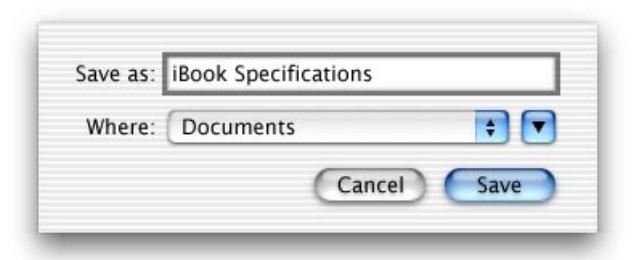

Clicking the disclosure triangle displays the following:

- a column browser for navigating the file system
- an Add to Favorites button, which adds an alias of the chosen folder to the user's Favorites folder and immediately updates the Favorite Places list in the Where pop-up menu. The Add to Favorites button is always available.
- a New Folder button, which displays a dialog that asks the user to name the new folder.

<span id="page-82-0"></span>**Figure 6-6** The expanded Save Location dialog


To enable the user to specify the document's format, you can add a Format pop-up menu between the "Save as" text field and the Where pop-up menu. The system creates a list of native file types supported by the application to populate the menu. You can supplement this list with custom types, and specify the default format to show when the dialog opens.

<span id="page-82-1"></span>If you add other elements to customize the Save Location dialog, they appear above the Cancel and Save buttons. All custom elements should be visible in the dialog's collapsed state, below the Where pop-up menu.

Pressing Tab in the Save dialog shifts the keyboard focus from the "Save as" text field to the visible columns, and then back to the text field.

Dialog Behavior **83**

#### <span id="page-83-0"></span>Closing a Document With Unsaved Changes

When the user attempts to close a document that has unsaved changes, present a Save Changes dialog, which should be a document-modal sheet.

When a document-modal Save Changes sheet is open, the document's close button and the Close command in the File menu are unavailable, so that the user can't close the document until the Save dialog is addressed.

#### <span id="page-83-1"></span>Saving a Document With the Same Name as an Existing Document

<span id="page-83-5"></span>If the user types an existing document name into the "Save as" field and clicks Save, present an application-modal dialog that enables the user to confirm whether or not to replace the previous document.

<span id="page-83-3"></span>**Figure 6-7** Replace confirmation dialog


#### <span id="page-83-4"></span><span id="page-83-2"></span>Saving Documents During a Quit Operation

In Mac OS X, users can interrupt a quit operation. For example, if a user chooses Quit and a Save sheet opens for a document, the user can work on other documents or switch to another application without addressing the Save dialog. To minimize the impact of such interruptions, all Save Changes dialogs initiated by a Quit command should include a message that alerts users that they are in the midst of a quit operation. (See [Figure 6-8 \(page 85\)](#page-84-3) for an example.)

When a user quits an application in which all open documents have been saved, all documents close immediately and the application quits.

#### **Quitting an Application With One Unsaved Document Open**

When a user attempts to quit your application and there is only one document with unsaved changes open, present the "save before quitting?" dialog as a sheet attached to the unsaved document, perform the actions described in the section ["The Save Changes Dialog" \(page 80\),](#page-79-2) and then quit the application as appropriate.

<span id="page-84-3"></span><span id="page-84-0"></span>**Figure 6-8** Dialog (sheet) when user quits with only one unsaved document

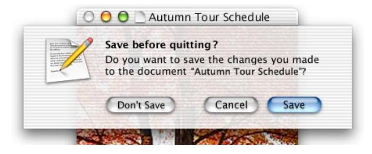

#### **Quitting an Application With Multiple Unsaved Documents Open**

When a user attempts to quit your application and there is more than one document with unsaved changes open, present the application-modal "save before quitting?" dialog.

<span id="page-84-2"></span><span id="page-84-1"></span>**Figure 6-9** Dialog when user quits with unsaved documents (application modal)

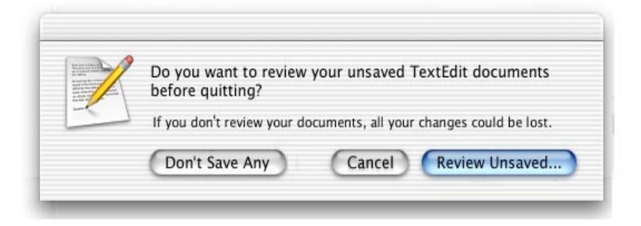

Dialog Behavior **85**

The appropriate action for each button is as follows:

- **Don't Save Any.** Closes all documents without saving changes and quits the application.
- **Cancel.** Cancels the Quit command.
- **Review Unsaved.** All open documents (including those minimized in the Dock) come forward, with the unsaved documents on top. The active document presents the Save sheet; if the user clicks Save or Don't Save, the next unsaved document comes forward with its Save sheet. If the user dismisses the last Save sheet with Save or Don't Save, all documents close and the application quits.

During the review, if the user activates another unsaved document, it should come forward with its Save Changes sheet open. Already-opened Save sheets on other documents remain open.

If, in the midst of a quit operation, the user clicks the application icon in the Dock or chooses "Bring All to Front," documents should appear in this order: documents with open sheets on top, unsaved documents next, and then saved documents.

<span id="page-85-2"></span><span id="page-85-1"></span>At any time during the review process, the user can click Cancel to stop the quit operation. If the user initiates a Quit command while in the review state, the process begins again with the application-modal alert shown in [Figure 6-9](#page-84-2) [\(page 85\).](#page-84-2)

### <span id="page-85-0"></span>The Choose Dialog

A Choose dialog enables the user to select an item as the target of a customized task. For example, when a user attempts to open a broken alias, the Fix Alias dialog lets the user choose another item for the alias to open. An application can have more than one Choose dialog, but only one can be open at a time.

<span id="page-86-0"></span>**Figure 6-10** A Choose dialog


#### A Choose dialog

- can be opened by any command
- supports multiple selection
- supports document preview
- can be resized with the resize control in the lower-right corner
- can include a Show pop-up menu, which allows the user to filter the type of files that appear in the list. Items that do not meet the filtering criteria appear dimmed. The system creates a list of native file types supported by the application to populate the menu. You can supplement this list with custom types and specify the default to show when the dialog opens. You should include an "All applicable files" item, but it does not have to be the default.

Dialog Behavior **87**

The dialog's default title is "Choose," but you should change it to include the name of the task. For example, if the command that brings up the dialog is Choose Picture, the dialog should be titled "Choose a Picture." Also include some instructional text at the top, such as "Choose a picture to display in the background of the folder 'Documents.'" If it's helpful, also change the Choose button to something more specific.

The default location is the user's home folder. If the dialog is targeted to only volumes, the default location is the Computer directory. Files not appropriate for the target selection are dimmed; for navigation purposes, all folders are selectable. If it's appropriate for the Choose target to be a folder, you can add a New Folder button to the Choose dialog.

<span id="page-87-1"></span>**Note:** Recent Places (in the Where pop-up menu of a Save Location dialog) does not record folders selected in Choose dialogs.

The Choose dialog is available to Carbon developers through the Navigation Services APIs. Cocoa developers can use a variation of the Open dialog.

### <span id="page-87-0"></span>The Print Dialog

If you need to customize the standard Print dialog, you can add a pane to the bottom pop-up menu. Follow the layout guidelines in ["Positioning Controls in](#page-113-0)  [Dialogs" \(page 114\).](#page-113-0) Make sure the name that appears in the menu doesn't conflict with already existing menu items.

Cocoa developers should use the NSPrintPanel class. Carbon developers should use the Carbon print dialog extensions; for more information, see http:// developer.apple.com/techpubs/macosx/Carbon/graphics/ CarbonPrintingManager/carbonprintingmgr.html.

<span id="page-88-3"></span><span id="page-88-2"></span><span id="page-88-0"></span>**Controls** are graphic objects that cause instant actions or visible results when the user manipulates them with the mouse. Standard controls include buttons, scroll bars, checkboxes, sliders, pop-up menus, and more.

For Carbon developers, the Control Manager determines the overall appearance of all controls. For Cocoa developers, the overall appearance of interface elements is provided by the Application Kit. You are responsible for positioning the controls within your windows, according to the guidelines given here.

**Note:** In this document, control sizes are compatible with platinum appearance metrics, but layout guidelines for Mac OS X differ somewhat from Mac OS 9. Carbon developers in particular should review the material in ["Positioning](#page-113-1)  [Controls in Dialogs" \(page 114\),](#page-113-1) ["Menus" \(page 33\)](#page-32-0), and ["Fonts" \(page 153\).](#page-152-0) Apple reserves the right to make changes in future releases.

# <span id="page-88-1"></span>What's New in Aqua

All interface elements have a new look in Aqua. Controls have new dimensions, colors, and transparency. New controls include combination boxes and round navigation buttons.

# <span id="page-89-0"></span>Control Behavior and Appearance

<span id="page-89-5"></span>**Note:** The Control Manager (Carbon) and Application Kit (Cocoa) include smaller versions of some controls, for use in utility windows when necessary. The specifications listed here are for the standard size controls. If a small version of a control is available, it's shown (with its dimensions) in the following sections. For more information, see ["Using Small Versions of Controls" \(page 123\)](#page-122-2).

### <span id="page-89-4"></span><span id="page-89-1"></span>Push Buttons

A **push button** is a rounded rectangle with a text label on it. Clicking a push button performs an instantaneous action, such as saving a document, completing operations defined by a dialog, or acknowledging an error message. Button names should be verbs that describe the action performed—Save, Close, Print, Delete, and so on. Don't use push buttons to indicate a state such as On or Off.

In some circumstances, it's appropriate to implement an Apply button—for example, to permit a user to see the effect of multiple text attributes before committing to them. In cases like these, clicking Cancel should undo any of the applied changes. Be cautious about using an Apply button for operations that take a long time to implement or undo; it might not be obvious to users that they can interrupt or reverse the process.

<span id="page-89-3"></span><span id="page-89-2"></span>**Figure 7-1** Example of standard push buttons

**Standard push button:** The button width is 69 pixels.


#### <span id="page-90-0"></span>Push Button Specifications

- **Height:** 20 pixels (fixed)
- **End caps:** 14 pixels wide (fixed)
- **Width:** Depends on button text. If you don't specify a wide enough button, the end caps clip the text. The standard width for OK and Cancel buttons is 69 pixels, as shown in [Figure 7-1.](#page-89-3) Push buttons used in other contexts may be sized differently if appropriate.
- **Text:** System font (13-point Lucida Grande). If you need to use a font larger than the system font, use a bevel button instead.
- **Color:** All push buttons are clear except the default button—the button selected by pressing the Return key—which uses the default color (in addition to pulsing). For example, in a dialog containing a default OK button and a Cancel button, the Cancel button is clear and the OK button uses color and pulses. When the user presses a nondefault button such as Cancel, the button acquires color and the default button loses its color. If you use standard controls, this behavior is automatic.
- **Spacing:** Leave at least 12 pixels of space between buttons placed horizontally or stacked.
- **Positioning:** The default button should go in the lower-right corner of the dialog. If there's a Cancel button, it should be to the left of the default button. If there's a third, or alternate, button (Don't Save, for example), it should go to the left of the Cancel button. Leave more than 12 pixels between the alternate button and Cancel; you may want to align the left edge of the button with the main dialog text, or put it 12 pixels to the right of the Help button, if there is one.

<span id="page-90-1"></span>**Figure 7-2** Push button specifications

**Push button:** The button height is 20 pixels.

Parts of control not adjustable

Text added to middle

**Small push button:** The button height is 17 pixels.

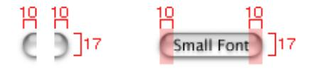

Nonadjustable end caps should be 10 pixels.

<span id="page-91-2"></span>**Figure 7-3** Stacked push buttons

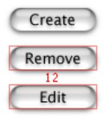

If stacking vertically, leave a minimum of 12 pixels in between.

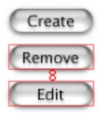

<span id="page-91-3"></span>If stacking vertically, leave a minimum of 8 pixels in between.

### <span id="page-91-0"></span>Radio Buttons and Checkboxes

Use **radio buttons** for a set of mutually exclusive, but related, choices. A set of radio buttons should contain at least two items and a maximum of about seven. (For more than seven items, consider using a pop-up menu.) A set of radio buttons is never dynamic (changing contents depending on the context). A radio button should never initiate an action.

Use **checkboxes** to indicate one or more options that must be either on or off. Each checkbox label should clearly imply two opposite states so that it's clear what happens when the box is checked or unchecked. If you can't find an unambiguous label, you might be better off using radio buttons.

#### <span id="page-91-1"></span>Radio Button and Checkbox Specifications

■ **Size:** 18 x 18 pixels, including the shadow

■ **Stacked:** Text is 22 pixels baseline to baseline

■ **Label:** 8 pixels from label to control

■ **Font:** 13-point Lucida Grande Regular

# <span id="page-92-1"></span>**Figure 7-4** Radio button spacing **Figure 7-5** Checkbox spacing **Radio button:** Align the baselines of the label and the first button's text. The red box indicates the hit region. **Standard radio button Small radio button Checkbox:** Align the baselines of the label and the first checkbox's text. The hit region includes the checkbox border. **Standard checkbox Small checkbox**

#### <span id="page-92-2"></span><span id="page-92-0"></span>Selections Containing More Than One Checkbox State

<span id="page-92-3"></span>When a user selection comprises more than one state, use a dash in the appropriate checkboxes.

**Figure 7-6** Dashes in checkboxes representing a selection with more than one state Active Inactive Disabled

### <span id="page-93-2"></span><span id="page-93-0"></span>Pop-Up Menus

Use **pop-up menus** to present a list of mutually exclusive choices in a dialog or window. Pop-up menus are used as a means of selecting one choice from a list of many.

<span id="page-93-1"></span>**Figure 7-7** An open pop-up menu


#### A pop-up menu

- has a label to the left (in left-to-right scripts)
- has a drop shadow and a double triangle indicator
- behaves like other menus: users drag to choose an item—which then flashes briefly and appears as the current choice—or move outside the menu to leave the current value active. An exploratory press in the menu to see what's available doesn't select a new value.
- contains nouns (things) or adjectives (states or attributes), but not verbs (commands). Use pull-down menus for commands.

In special cases, you may want to include a command that affects the contents of the pop-up menu itself. For example, in the Print dialog, the Printer pop-up menu contains Edit Printer List, so that users can add a printer to the menu; the new printer becomes the menu's default selection. Put such commands at the bottom of a pop-up menu, below a separator.

Use pop-up menus to present up to 12 mutually exclusive choices that the user doesn't need to see all the time.

Don't use pop-up menus

- for more than 12 items; use a scrolling list
- for 4 or fewer; use radio buttons
- when more than one selection is appropriate, such as text styles (in which you can select bold and italic, for example); use checkboxes or a pull-down menu in which checkmarks appear

Be very cautious about creating a pop-up menu with submenus. Doing so hides choices too deeply and is physically difficult to use.

Bevel buttons and icon buttons can also be pop-up menus. See ["Pop-Up Bevel](#page-98-3)  [Buttons and Pop-Up Icon Buttons" \(page 99\)](#page-98-3).

#### <span id="page-94-0"></span>Pop-Up Menu Specifications

- **Height:** 20 pixels
- **Width:** Wide enough to accommodate the longest menu item.
- **Menu item text:** 9 pixels from left edge, 9 pixels from the double triangle section
- **Menu label text:** 8 pixels from text to menu

<span id="page-94-2"></span><span id="page-94-1"></span>**Figure 7-8** Pop-up menu dimensions


### <span id="page-95-3"></span><span id="page-95-0"></span>Combination Boxes

A combination (or "combo") box is a text entry field combined with a pop-up menu or a drop-down scrolling list. Combo boxes are useful for displaying a list of likely choices while still allowing the user to type in an item not in the list.

<span id="page-95-1"></span>**Figure 7-9** Combo box with pop-up menu and scrolling list


The default state of the combo box is closed, with the text field empty or displaying a default selection. The default selection (not necessarily the first item in the list) should provide a meaningful clue to the hidden choices. The combo box should also have a useful label.

Combo boxes are available for Cocoa applications. Carbon developers should use the Appearance Manager to simulate these controls.

<span id="page-95-2"></span>**Figure 7-10** Combo box specifications


#### <span id="page-96-0"></span>The Text Entry Field

The user can type any appropriate characters into the text field. If the user types in an item already in the menu or list, or types in a few characters that match the first characters of an item in the menu or list, the item is highlighted when the user displays the menu or list. A user-typed item does *not* get added to the permanent menu or list.

If the user presses Tab to select the field, the keyboard focus ring is inside the text entry field.

#### <span id="page-96-1"></span>The Pop-Up Menu or Scrolling List

Use a pop-up menu to display up to 12 choices. If you want to offer more than 12 items, use a scrolling list.

The user displays the menu or list by pressing the arrows to the right of the text field. The menu or list is a window that descends from the text field; the window is the same width as the text field and has a drop shadow. Don't extend the right edge of the menu or list beyond the right edge of the arrow box; if an item is too long, it gets truncated.

When the user selects an item in the menu or list, the item replaces whatever is in the text entry field and the menu or list closes. If the user presses the Up Arrow or Down Arrow key to move through the items, the selected item is highlighted and appears in the text entry field. The user can accept an item by pressing the Space bar, Enter, or Return.

If the menu or list is open and the user clicks outside it, including within the text entry field, the menu or list closes.

### <span id="page-96-3"></span><span id="page-96-2"></span>Placards

A **placard** is a control that you can use as an information display or as background fill for a control area. Typically placards are used in document windows as a way to quickly modify the view of the contents, for example, to change the current page or the magnification.

The most familiar use of the placard is as a small information panel, often placed at the bottom of a window to the left of the horizontal scroll bar. You can extend the functionality of a placard by, for example, having it provide a pop-up menu.

<span id="page-97-2"></span>**Figure 7-11** A placard pop-up menu

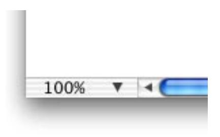

### <span id="page-97-3"></span><span id="page-97-0"></span>Bevel Buttons

A **bevel button** has a beveled edge that gives the button a three-dimensional appearance. A bevel button

- can display text, an icon, or a picture
- mimics the behavior of other button types; for example, a bevel button can behave like a standard push button. Bevel buttons can be grouped and used like radio buttons or checkboxes.
- can have a menu attached, so the button behaves like a pop-up menu. See ["Pop-Up Bevel Buttons and Pop-Up Icon Buttons" \(page 99\)](#page-98-3)
- can have rounded or square corners. The square buttons work well for tiling together in groups, to be used as radio buttons, for example.

#### <span id="page-97-1"></span>Bevel Button Specifications

- **Size:** 20 x 20 pixels minimum
- **Horizontal spacing:** 8 pixels minimum

If a bevel button has an icon and a label, you can put the text anywhere in relation to the icon. Carbon developers can specify the location with the SetControlData API; Cocoa developers set it in Interface Builder.

**Figure 7-12** Bevel buttons

#### <span id="page-98-1"></span>**Rounded corners**

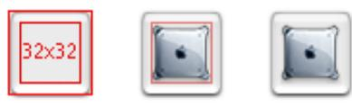

Leave at least 5 pixels between edge of icon and edge of button.

#### **Rounded corners with label below icon**

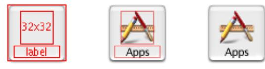

#### **Square corners**

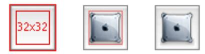

**Figure 7-13** Bevel buttons as radio buttons and push buttons

<span id="page-98-2"></span>

### <span id="page-98-4"></span><span id="page-98-3"></span><span id="page-98-0"></span>Pop-Up Bevel Buttons and Pop-Up Icon Buttons

A bevel button or icon button containing a pop-up menu has the single down-pointing arrow as shown. The button can behave like a standard pop-up menu, in which the image on the button is the current selection, or the button can represent the menu title and display a static image.

<span id="page-99-0"></span>**Figure 7-14** Pop-up icon button


3 pixels between tip of the arrow and top of the menu window.

<span id="page-100-0"></span>**Figure 7-15** Pop-up bevel button with square corners


<span id="page-101-2"></span>**Figure 7-16** Pop-up bevel button with rounded corners

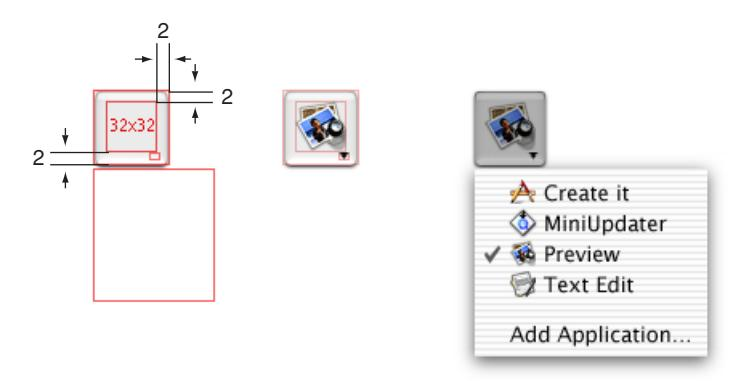

### <span id="page-101-4"></span><span id="page-101-3"></span><span id="page-101-0"></span>Slider Controls

<span id="page-101-5"></span>Use a **slider control** to enable users to choose among a continuous range of allowable values. Slider controls can be horizontal or vertical and can display labeled **tick marks** to represent increments you specify. The slider itself (the "thumb") can be directional or round.

Slider controls support live feedback ("live dragging"), so that users can see the effect of moving the slider as it is dragged. Dock preferences, for example, shows the effect of moving the Dock Size slider.

#### <span id="page-101-1"></span>Slider Control Specifications

■ **Track:** 7 pixels

■ **Slider:** 2 pixels larger than platinum equivalent

<span id="page-102-1"></span>**Figure 7-17** Slider control dimensions

**Sliders:** The hit-testing region is 15 x 18 pixels on directional sliders and 15 x 15 on nondirectional sliders.

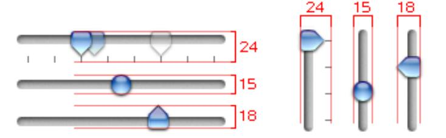

**Figure 7-18** Small slider dimensions

<span id="page-102-2"></span>**Small sliders:** The hit-testing region for all slider types is 11 x 12 pixels.

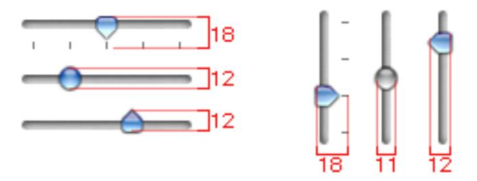

## <span id="page-102-3"></span><span id="page-102-0"></span>Tab Controls

The **tab control** provides a convenient way to present information in a multipage format. Tabs can display centered horizontally across the top or bottom edge, or centered vertically along the left or right side. [Figure 7-19](#page-103-2) shows the proper orientation of text on tabs on each of the four sides.

<span id="page-103-2"></span><span id="page-103-1"></span>**Figure 7-19** Orientation of tab text on each side


<span id="page-103-3"></span>The content area below a tab is called a **pane.** You can use other controls such as push buttons and scroll bars in tabbed windows too. The controls can be **global** affecting the settings of all panes—or specific to an individual pane. Make it clear through labeling and placement (within or outside of a tab pane's boundary, for example) whether a control affects one pane or all panes.

#### <span id="page-103-0"></span>Tab Control Specifications

- **Label text**: System font (13-point Lucida Grande), centered in tab with 12 pixels on either side
- **Accent bar height:** 7 pixels

<span id="page-104-0"></span>**Figure 7-20** Tab control dimensions

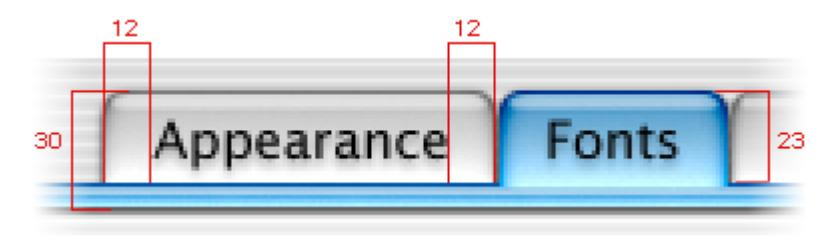

Tabs using the system font

<span id="page-104-1"></span>**Figure 7-21** Small tab control dimensions


Small tabs using small system font

Tab panes can extend from one edge of a window to the other, or they can be inset within a window. [Figure 7-22](#page-105-1) shows an example of tab panes that extend from one edge of a window to the other.

<span id="page-105-2"></span><span id="page-105-1"></span><span id="page-105-0"></span>**Figure 7-22** Tab panes edge to edge

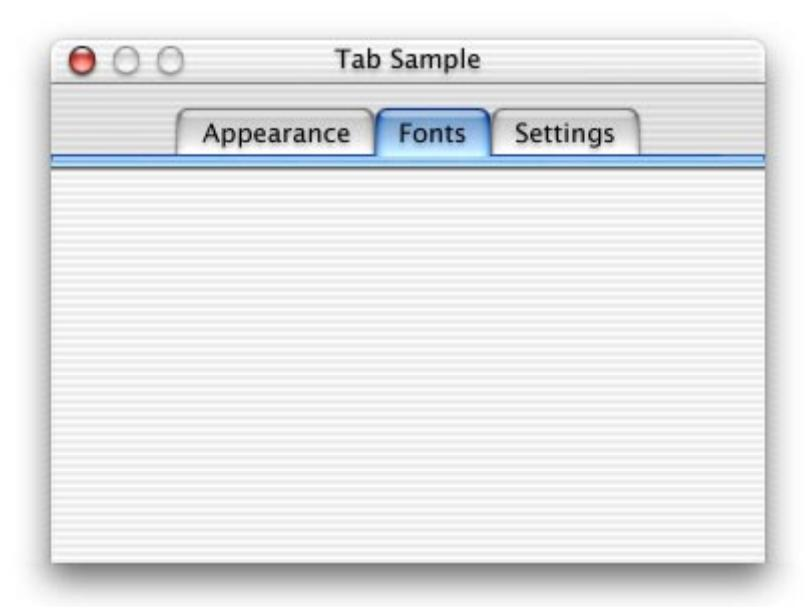

For inset tab panes, the recommended inset is 20 pixels on each side within a window, although 16 is also allowed. You can define a window so that space remains below the tab pane for global controls such as push buttons. [Figure 7-23](#page-106-2) shows an example of tab panes inset within a window, with buttons below the panes.

<span id="page-106-4"></span><span id="page-106-2"></span><span id="page-106-1"></span>**Figure 7-23** Tab panes inset from edge of window


### <span id="page-106-7"></span><span id="page-106-3"></span><span id="page-106-0"></span>Progress Indicators

**Progress indicators**, also called **progress bars**, are used to inform the user about the status of lengthy operations. There are two types:

- <span id="page-106-5"></span>■ **Determinate:** Use when the full length of an operation can be determined. The bar moves from left to right, and the user can see how much of the process has been completed. You might use a determinate progress indicator to show the progress of a file conversion.
- <span id="page-106-6"></span>■ **Indeterminate:** Use when the duration of a process can't be determined. This indicator displays a spinning striped cylinder to indicate an ongoing process. You might use an indeterminate progress indicator to let the user know that the application is attempting a dialup communication connection, for example, when there's no way to accurately determine how long it will take to complete.

#### <span id="page-107-1"></span>Controls and Layout Guidelines

**Figure 7-24** Progress bars


If an indeterminate process reaches a point where its duration can be determined, switch to a determinate progress indicator.

When the process being performed can be interrupted, the progress dialog should contain a Cancel button (and support the Escape key). If interrupting the process will result in possible side effects, the button should say Stop instead of Cancel.

The progress bar should fill in completely before it is dismissed.

In Mac OS X, the kernel environment detects when your application doesn't respond to events for 2 seconds and automatically displays the color wheel cursor. Avoid using Command-period to stop operations; checking for Command-period makes the system think your application is responding to events rather than being busy.

**Note:** In Mac OS X, don't use a progress bar to display relevance; use the new relevance control instead (available in Carbon).

### <span id="page-107-0"></span>Relevance Control

*<text to come>*

<span id="page-108-1"></span>**Figure 7-25** Relevance control


### <span id="page-108-2"></span><span id="page-108-0"></span>Text Fields and Lists

There are various kinds of controls that incorporate text:

■ A **text input field**, also called an **editable text field**, is a rectangular area in which the user enters text or modifies existing text. The text input field can be active or disabled. It supports keyboard focus and password entry.

Your application's text input fields should perform appropriate edit checks. For example, if the only legitimate value for a field is a string of digits, the application issue an alert if the user types nondigits. In most cases, the appropriate time to check the field is when the user clicks outside the field or presses the Return, Enter, or Tab key.

Combination boxes are text input fields that also contain a menu or a list of choices. See ["Combination Boxes" \(page 96\).](#page-95-3)

- Use a **static text field** for dialog text that the user can't modify. Static text fields have two states: active and dimmed.
  - When it provides an obvious user benefit, static text should be selectable. Error message text, for example, could be selectable. Facilitating the copying of text (such as a serial number or a hostname) so that it can be pasted accurately into another context is another example.
- A **scrolling list** can contain as many items as necessary. Users can click an item to select it, or use Shift-click to select more than one item, or scroll through the list without selecting anything. Users can use the arrow keys to navigate through the list, and can quickly select an item by typing the first few characters.

If an item is too long to fit in the list box, insert ellipses in the middle and preserve the beginning and end of the item. Users often add version numbers to the end of document names.

Don't use scrolling lists to provide choices in a limited range. Since the full range may not be visible all at once, it can be difficult for users to understand the scope of their choices. Use sliders, discussed in ["Slider Controls" \(page 102\)](#page-101-3), instead.

#### <span id="page-109-0"></span>Tools for Creating Lists

<span id="page-109-2"></span>The Data Browser is new component of the Control Manager that provides a standard, easily customized list and column view. Using the Data Browser (available to Carbon applications) provides a convenient way to create consistent sortable, movable, and resizable columns. If your application uses the Data Browser to display lists, they will always look right in Mac OS 9 and Mac OS X. For an example of the Data Browser's column view, see one of the Navigation Services dialogs (Open, Save As) in Mac OS X.

<span id="page-109-3"></span>Similar functionality is available to Cocoa developers through three classes of interface objects:

- NSOutlineView. You can see an example in the Mailboxes drawer of the Mail application, which can show a multicolumn hierarchy with disclosure triangles.
- NSTableView. You can see an example in the list of contents of a mailbox in the Mail application. It is multicolumn and row-based.
- NSBrowser. You can see an example in the Open dialog of a Cocoa-based application. This class provides the same sort of hierarchical data as NSOutlineView in column format.

For more information, see the Data Browser technical note, available at http:// developer.apple.com/technotes/tn/tn2009.html.

#### <span id="page-109-1"></span>Text Input Field Specifications

- **Height:** 22 pixels (to accommodate the system font, which is 16 pixels high without line spacing). If you specify the small system font, the text input field dimensions are reduced proportionally.
- **Selection rectangle:** 16 pixels high
- **Keyboard focus ring:** 2 pixels wide at top, 2 pixels wide on three other sides
- **Stacked text fields:** Leave a minimum of 12 pixels between stacked text fields (8 pixels between small stacked text fields).

For more information about highlighting selections in text fields, see ["Keyboard](#page-140-0)  [Navigation and Focus" \(page 141\)](#page-140-0) and ["Selections in Text" \(page 146\)](#page-145-0).

<span id="page-110-1"></span>**Figure 7-26** Text input field specifications for large system font


<span id="page-110-2"></span>**Figure 7-27** Text input field specifications for small system font

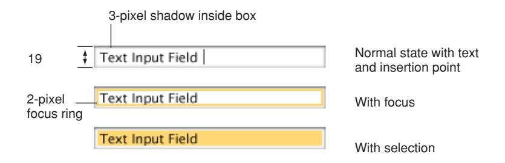

#### <span id="page-110-0"></span>List Specifications

When you define dimensions, make sure that the list displays only full lines of text (don't cut text off vertically), and make sure that the scrolling increment is one list element.

<span id="page-111-3"></span><span id="page-111-1"></span>**Figure 7-28** Scrolling list specifications


### <span id="page-111-2"></span><span id="page-111-0"></span>Image Wells

Use an image well to display an icon or picture that serves as a drag-and-drop target. You could use a set of image wells to manage thumbnail in a clip-art catalog, for example.

Don't use image wells in place of push buttons or bevel buttons.

<span id="page-112-1"></span>**Figure 7-29** Image wells

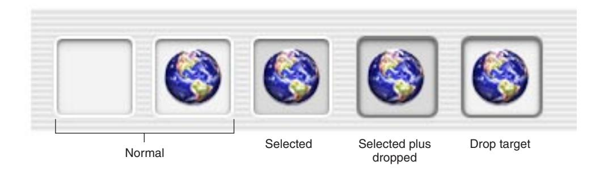

### <span id="page-112-3"></span><span id="page-112-0"></span>Disclosure Triangles

<span id="page-112-4"></span>A **disclosure triangle** allows the display, or "disclosure," of information that elaborates on the primary information in a window. Disclosure triangles are commonly used in the Finder's list view, where clicking a triangle displays a folder's contents.

<span id="page-112-2"></span>**Figure 7-30** Disclosure triangles in the Finder list view


Disclosure triangles are available to Carbon developers through the Control Manager (CreateDisclosureTriangle) or the Appearance Manager (DrawThemeButton).

Another common implementation of disclosure triangles is providing a way for users to expand a dialog. The Aqua Save dialog, for example, has a collapsed and an expanded state.

# <span id="page-113-1"></span><span id="page-113-0"></span>Positioning Controls in Dialogs

<span id="page-113-2"></span>This section describes a basic set of control layout guidelines. In an effort to simplify the process of resizing and repositioning existing layouts, most values are based on a multiple of 2 pixels. These guidelines use many of the default control sizes defined in Interface Builder; any exceptions are noted. When creating or changing dialog layouts, use the default fonts described in ["Fonts" \(page 153\).](#page-152-0)

When laying out dialogs, keep these guidelines in mind:

- In general, you should try for a more center-biased approach to dialog layout, as opposed to the strongly left-biased approach of the traditional Mac OS 9 dialog. Most of the sample layouts in this document illustrate the center-biased approach.
- All spacing between dialog elements involves a multiple of 2 pixels—2, 4, 6, 8, and so on.
- For most document windows that contain a single view (scrolling text or tables, for example), do not specify any space between the window edge and scroll bars (when using the Control Manager) or the frame of the view (in Interface Builder).
- For dialogs that contain a mix of controls, set 16 pixels of vertical space between controls. Try to maintain a 20-pixel space between the left and right edge of the window and any controls. Keep 20 pixels of space between the bottom edge and any controls; this can include the shadow of any push buttons in that area. Top spacing is determined by which controls are placed closest to the top of the dialog. For example, [Figure 7-34 \(page 119\)](#page-118-1) uses a pop-up menu as the topmost control, so the spacing is set to 14 pixels. In contrast, [Figure 7-35 \(page 120\)](#page-119-1) uses a tab control as the topmost element, so the spacing is set to 12 pixels.
- Groups of controls should be separated by 20 pixels of vertical spacing and subgroups of controls within groups should be separated by 16 pixels.
- Vertical spacing between controls is determined by the tallest control in the row.

### <span id="page-114-1"></span><span id="page-114-0"></span>Group Boxes

A **group box** is used to associate a set of related items—such as radio buttons or pop-up menus—in a dialog.

As much as possible, *use additional space between controls to create groups of controls, rather than group boxes.* Excessive use of group boxes creates visual clutter; too many lines and edges can distract users. The following figures show examples of how to successfully re-create dialogs using space rather than group boxes.

Within a group box, no control or label should be positioned within 16 pixels of the box's top, bottom, left, or right borders.

Group boxes can be untitled or titled. Titles can be static text, a checkbox label, or text on a pop-up menu.

<span id="page-115-0"></span>**Figure 7-31** Dialog redesigned without group boxes (first example)


Before (with group boxes)


After (example 1, with separator)


After (example 2)

<span id="page-116-0"></span>**Figure 7-32** Dialog redesigned without group boxes (second example)

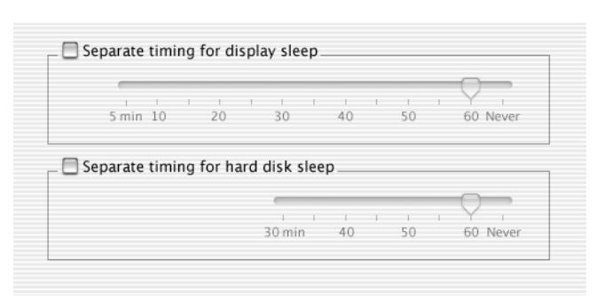

Before

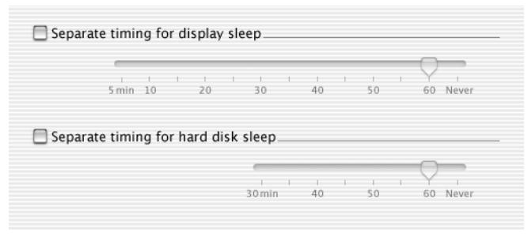

After

<span id="page-117-1"></span>**Figure 7-33** Dialog redesigned without a group box (third example)

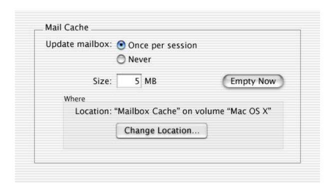

Before

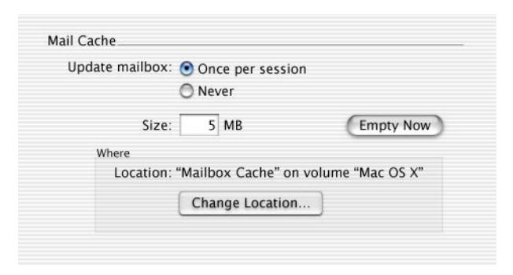

<span id="page-117-2"></span>After

# <span id="page-117-0"></span>Sample Dialog Layouts

This section contains sample layouts illustrating how to position dialog elements and controls.

<span id="page-118-0"></span>**Figure 7-34** Sample application preferences dialog

<span id="page-118-1"></span>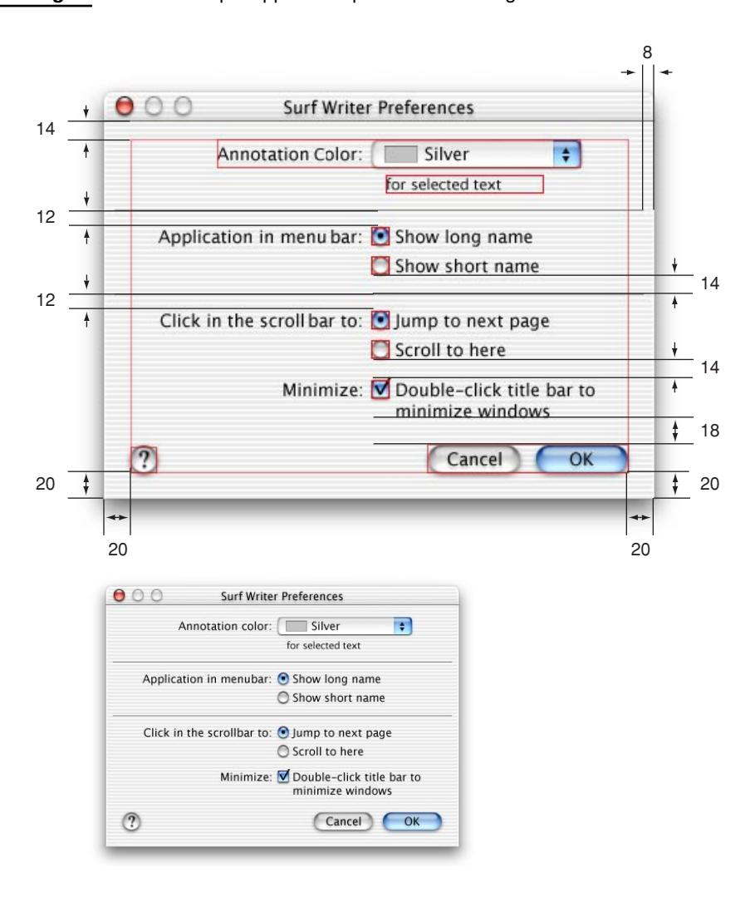

<span id="page-119-2"></span><span id="page-119-0"></span>**Figure 7-35** Sample dialogs with panes

<span id="page-119-1"></span>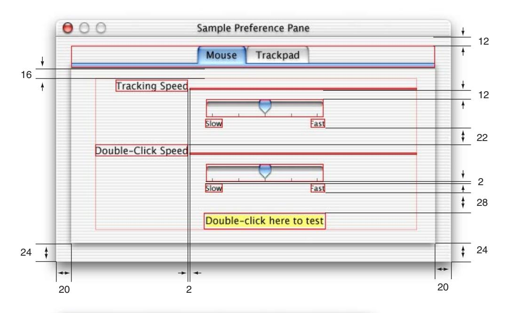

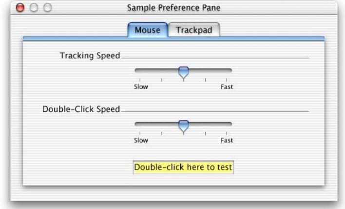

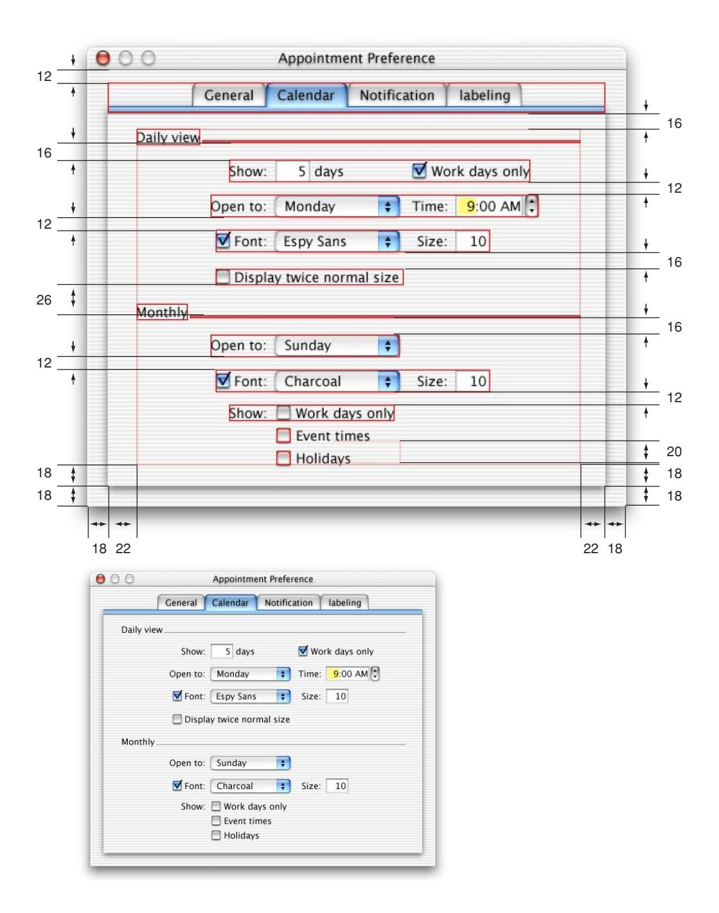

<span id="page-121-0"></span>**Figure 7-36** Sample dialog with scrolling list


### <span id="page-122-2"></span><span id="page-122-0"></span>Using Small Versions of Controls

Small versions of controls are now available in Carbon and Cocoa. Use the smaller versions only when absolutely necessary, and use them sparingly. When converting existing dialogs for use with Aqua, redesign layouts as necessary, rather than relying on the smaller versions of controls. Your first choice in designing for Aqua should always be to use the full-size controls.

<span id="page-122-3"></span>You can use small versions of controls when space is at an extreme premium, such as in tool palettes or utility windows. Don't mix full-size and small versions of controls in the same window.

<span id="page-122-1"></span>**Figure 7-37** A sample utility window using small controls


<span id="page-124-4"></span><span id="page-124-0"></span>The user interacts with Mac OS X by using the mouse and the keyboard.

# <span id="page-124-1"></span>What's New in Aqua

Mac OS X reserves two key combinations as new equivalents to menu commands that affect all applications:

- Command-H is reserved as an equivalent to the "Hide <appName>" menu command that appears in the Application menu of all applications.
- Command-M is reserved as an equivalent to the Minimize menu command in the Window menu. It applies to any active window that can be minimized. The command initiated in Mac OS 9 by Command-M, Make Alias, now has the keyboard equivalent Command-L.

<span id="page-124-3"></span>See ["Keyboard Equivalents" \(page 138\)](#page-137-2) for more information.

# <span id="page-124-2"></span>The Pointing Device

In the Macintosh interface the standard pointing device is the mouse. Users can substitute other devices—such as trackballs and stylus pens—that maintain the behavior of direct manipulation of objects on screen.

<span id="page-125-5"></span>Moving the mouse without pressing the mouse button moves the **pointer.** The onscreen pointer can assume different shapes according to the context of the application and the pointer's position. For example, in a word processor, the pointer takes the I-beam shape while it's over the text and changes to an arrow when it's over a tools palette. Change the pointer's shape *only* to provide information to the user about changes in the pointer's function.

<span id="page-125-3"></span>Each pointer has a **hot spot**—the portion of the pointer that must be positioned over a screen object before mouse clicks have an effect on the object. The hot spot should be intuitive, such as the tip of an arrow pointer or the center point of a crosshair. Screen objects have a **hot zone**—the area that the pointer's hot spot must be within in order for mouse clicks to have an effect.

# <span id="page-125-0"></span>The Mouse

<span id="page-125-4"></span>Just *moving* the mouse changes only the pointer's location, and possibly its shape. *Pressing* the mouse button indicates the intention to do something, and *releasing* the mouse button completes the action. Pressing by itself should have no more effect than clicking does, except in well-defined areas, such as scroll arrows, where it has the same effect as repeated clicking. For example, pressing a Finder icon should select the icon but not open it.

The mouse devices provided with Macintosh computers have only one button.

### <span id="page-125-2"></span><span id="page-125-1"></span>Clicking

Clicking has two components: pushing down on the mouse button and releasing it without moving the mouse. (If the mouse moves between button down and button up, it's *dragging,* not clicking.)

The effect of a click should be immediate and obvious. If the function of the click is to cause an action (such as clicking a button), the *selection is made* when the button is pressed, and the *action takes place* when the button is released. For example, if a user presses down the mouse button while the pointer is over an onscreen button, thereby putting the button in a selected state, and then moves the pointer *off* the

button before releasing the mouse button, the onscreen button is not clicked. If the user presses an onscreen button and rolls over another button before releasing the mouse, neither button is clicked.

### <span id="page-126-3"></span><span id="page-126-0"></span>Double-Clicking

Double-clicking involves a second click that follows immediately after the first click. If the two clicks are close enough to each other in terms of time (as set by the user in Mouse preferences) and location (usually within a couple of pixels), they constitute a double click.

Double-clicking is most commonly used as a shortcut for other actions, such as opening documents or selecting a word. Because not everyone is physically able to perform a double click, it should *never* be the only way to perform an action.

Some applications support triple-clicking. For example, in a word processor, the first click sets the insertion point, the second click selects the whole word, and the third click selects the whole sentence or paragraph. Supporting more than three clicks is inadvisable.

### <span id="page-126-5"></span><span id="page-126-1"></span>Pressing

Pressing means holding down the mouse button while the mouse remains stationary. Pressing certain objects, such as scroll arrows, has the same effect as repeatedly clicking the object.

### <span id="page-126-4"></span><span id="page-126-2"></span>Dragging

Dragging means pressing the mouse button, moving the mouse to a new position, and releasing the mouse button. The uses of dragging include selecting blocks of text, choosing a menu item, selecting a range of objects, moving an icon from one place to another, and shrinking or expanding an object.

Dragging a graphic object should move the entire object (or a transparent representation of it), not just the object's outline.

Your application can restrict an object from being moved past certain boundaries, such as the edge of a window. If the user drags an object and releases the mouse button outside of the boundary, the object stays in the original location. If the user

The Mouse **127**

<span id="page-127-6"></span>drags the item out of the boundary and then back in before releasing the mouse button, the object moves to the new location. Your application can also automatically scroll a document if the user moves an object beyond the boundary of a window (see ["Automatic Scrolling" \(page 63\)\)](#page-62-0).

<span id="page-127-5"></span>Also see ["Drag and Drop" \(page 163\).](#page-162-0)

# <span id="page-127-0"></span>The Keyboard

The keyboard's primary use is to enter text. The keyboard may also be used for navigation, but it should always be an alternative to using the mouse.

There are three kinds of keys: character keys, modifier keys, and function keys. A **character key** sends a character to the computer. When the user holds down a **modifier key,** it alters the meaning of the character key being pressed or the meaning of a mouse action.

<span id="page-127-3"></span>**Note:** Not all the keys described here exist on all Macintosh keyboards. Don't depend on a key as the only way for users to accomplish a task.

### <span id="page-127-1"></span>Character Keys

Character keys include letters, numbers, punctuation, the Space bar, and nonprinting characters—Enter, Tab, Return, Delete (or Backspace), Clear, Escape (Esc). It is essential that your application use these keys consistently.

#### <span id="page-127-4"></span><span id="page-127-2"></span>Enter

Most applications add information to a document as soon as the user enters it. In some cases, however, the application may need to wait until a whole collection of information is available before processing it. The Enter key tells the application that the user is through entering information in a particular area of the document, such as a text field. While the user is entering text into a *text* document, pressing Enter has no effect.

If a dialog has a default button, pressing Enter (or Return) is the same as clicking it.

#### <span id="page-128-8"></span><span id="page-128-0"></span>Tab

In text-oriented applications, the Tab key moves the insertion point to the next tab stop. In other contexts, Tab is a signal to proceed; it means "move to the next item in a sequence." The next item can be a table cell or a dialog text field. Pressing Tab can cause data to be entered before focus moves to the next item.

#### <span id="page-128-7"></span><span id="page-128-1"></span>Return

In text, the Return key inserts a carriage return (a line break) and moves the insertion point to the beginning of the next line. In arrays, the Return key signals movement to the leftmost field one step lower (like a carriage return on a typewriter). Like Tab, pressing Return can cause data to be entered before focus moves to the next item.

If a dialog has a default button, pressing Return (or Enter) is the same as clicking it.

#### <span id="page-128-4"></span><span id="page-128-2"></span>Delete (or Backspace)

Generally, if an item is selected, pressing Delete (or Backspace) removes the selection without putting it in the Clipboard. If nothing is selected, pressing Delete removes the character preceding the insertion point, without putting it in the Clipboard. The Delete key has the same effect as the Clear command in the Edit menu.

<span id="page-128-6"></span>**Note:** The Delete key is different from the Forward Delete key (labeled *Del*), which removes characters following the insertion point. See ["Forward Delete](#page-135-4)  [\(Del\)" \(page 136\)](#page-135-4).

A recommended shortcut for text applications is Command-Delete to delete the previous word, and Command–Forward Delete, to delete the next word. You can support Option-Delete to delete the part of the word to the left of the insertion point, and Option–Forward Delete to delete the part of the word right of the insertion point.

#### <span id="page-128-5"></span><span id="page-128-3"></span>Clear

The Clear key has the same effect as the Clear command in the Edit menu: it removes the selection without putting it in the Clipboard. Not all keyboards have a Clear key, so don't require its use in your application.

The Keyboard **129**

#### <span id="page-129-7"></span><span id="page-129-0"></span>Escape

The Escape (Esc) key basically means "let me out of here." It has specific meanings in certain contexts:

- The user can press Escape instead of clicking Cancel in a dialog.
- The user can press Escape to stop an operation in progress (such as printing), instead of pressing Command-period.

<span id="page-129-6"></span>Pressing Escape should never cause the user to back out of an operation that would require extensive time or work to reenter. When the user presses Escape during a lengthy operation, display a confirmation dialog to be sure that the key wasn't pressed accidentally.

### <span id="page-129-8"></span><span id="page-129-1"></span>Modifier Keys

Modifier keys alter the way other keystrokes or mouse clicks are interpreted. You should use these keys—Shift, Caps Lock, Option, Command, and Control consistently as described here.

#### <span id="page-129-10"></span><span id="page-129-2"></span>Shift

When pressed at the same time as a character key, the Shift key produces the uppercase alphabetic letter or the upper symbol on the key.

The Shift key is also used with the mouse for extending a selection or for constraining movements in graphics applications. For example, in some applications pressing Shift while using a rectangle tool draws squares.

#### <span id="page-129-5"></span><span id="page-129-3"></span>Caps Lock

When activated, the Caps Lock key has the same effect on alphabetic keys as the Shift key, but it has no effect on keys whose upper- and lowercase characters are different, such as the number keys. In other words, even if the Caps Lock key is down, the user must press Shift to type the upper character on a nonalphabetic key.

#### <span id="page-129-9"></span><span id="page-129-4"></span>Option

When used with other keys, the Option key produces special symbols. The Key Caps application shows which keys generate each symbol.

The Option key can also be used with the mouse to modify the effect of a click or drag. For example, in some applications pressing Option while dragging an object makes a copy of the object.

#### <span id="page-130-6"></span><span id="page-130-0"></span>Command

On most keyboards, the Command key is labeled with a propeller ( ) symbol and an Apple logo (). Pressing the Command key at the same time as a character key tells the application to interpret the key as a command rather than a character. These command shortcuts are described in ["Keyboard Equivalents" \(page 138\)](#page-137-2).

In some applications, the Command key is used with other keys to provide special functions or shortcuts. It can also be used with the mouse to modify the effect of a click or drag.

#### <span id="page-130-7"></span><span id="page-130-1"></span>Control

<span id="page-130-8"></span>The Control key is used to modify the functions of other keys, with terminal-emulation programs for Control-key sequences, and, with a mouse click, to display contextual menus (see ["Contextual Menus" \(page 47\)](#page-46-1)). Cocoa developers should also consider additional behaviors, as described in the text defaults and binding document, available in the programming topics section on http:// developer.apple.com/techpubs/macosx/Cocoa.

### <span id="page-130-4"></span><span id="page-130-2"></span>Arrow Keys

Apple keyboards have four arrow keys: Up Arrow, Down Arrow, Left Arrow, and Right Arrow. They can be used alone or in combination with other keys. Keyboard combinations using the arrow keys should be used only for shortcuts for mouse actions. It is *never* appropriate to implement only a keyboard combination and not provide a mouse-based way to perform the same action.

#### <span id="page-130-5"></span><span id="page-130-3"></span>Appropriate Uses for the Arrow Keys

You can use arrow keys in these ways:

■ In text, the arrow keys move the insertion point. When used with the Shift key, they extend or shrink the selection. If the user makes a selection and then presses the Right Arrow or Left Arrow, shrink the selection to zero length and place the insertion point at the right or left edge of the selection.

The Keyboard **131**

#### User Input

- In lists, the arrow keys change the selection.
- In a graphics application, the arrow keys can be used to move a selected object the smallest possible increment (one pixel or one grid unit).

Don't use the arrow keys to

- move the mouse pointer onscreen
- duplicate the function of the scroll bars

If it's important for your application to make use of the numeric keypad, don't use the Shift–arrow key combinations to extend text selections; the keypad's codes for the four Shift–arrow key combinations are the same as those for the keypad's +, \*, /, and = keys.

#### <span id="page-131-1"></span><span id="page-131-0"></span>Moving the Insertion Point

<span id="page-131-2"></span>When the insertion point moves vertically in a text document, its horizontal position is maintained in terms of screen pixels, not characters (in other words, the insertion point could move from the twenty-fifth character in a line down to the fiftieth character, depending on the font and size). As the insertion point moves from line to line, keep it as close as possible to its original horizontal position, moving it slightly left or right to the nearest new character boundary.

The Option and Command keys are used as semantic modifiers with the arrow keys. As a general rule, the Option key increases the size of the semantic unit by one compared to the arrow keys alone, and Command key enlarges the semantic unit again. (The application determines what the semantic units are. In a word processor, typically the units are characters, words, lines, paragraphs, and documents. In a spreadsheet, a basic semantic unit could be a cell.)

#### User Input

[Table 8-1](#page-132-1) describes the appropriate behavior of the arrow keys in text documents and fields. In some cases, the behavior describes what happens when the indicated keys are pressed more than once in succession.

<span id="page-132-2"></span><span id="page-132-1"></span><span id="page-132-0"></span>**Table 8-1** Arrow key behaviors

| Key                 | Moves insertion point                                                                                                                         |
|---------------------|-----------------------------------------------------------------------------------------------------------------------------------------------|
| Right Arrow         | One character to the right                                                                                                                    |
| Left Arrow          | One character to the left                                                                                                                     |
| Up Arrow            | To the line above, to the nearest character boundary<br>at the same horizontal location                                                       |
| Down Arrow          | To the line below, to the nearest character boundary<br>at the same horizontal location                                                       |
| Option–Right Arrow  | To end of current word, then to the end of the next<br>word                                                                                   |
| Option–Left Arrow   | To the beginning of the current word, then to the<br>beginning of the previous word                                                           |
| Option–Up Arrow     | To the beginning of the current paragraph, then to the<br>beginning of the previous paragraph                                                 |
| Option–Down Arrow   | To the end of the current paragraph, then to the end<br>of the next paragraph (not to the blank line after the<br>paragraph, if there is one) |
| Command–Right Arrow | To the next semantic unit, typically the end of the<br>current line, then the end of the next line                                            |
| Command–Left Arrow  | To the previous semantic unit, typically the beginning<br>of the current line                                                                 |
| Command–Up Arrow    | Upward in the next semantic unit, typically the<br>beginning of the document                                                                  |
| Command–Down Arrow  | Downward in the next semantic unit, typically the<br>end of the document                                                                      |

The Keyboard **133**

#### <span id="page-133-4"></span><span id="page-133-3"></span><span id="page-133-0"></span>Extending Text Selection With the Shift and Arrow Keys

[Table 8-2](#page-133-2) describes how to extend text selection by pressing the Shift key with the arrow keys.

If no text is selected, the extension begins at the insertion point. If text is selected by dragging, then the extension begins at the selection boundary. For example, in the phrase *stop time,* if the user places the insertion point between the "s" and "t" and then presses Shift–Option–Right Arrow, *top* is selected. However, if the user double-clicks so that the whole word is selected, and then extends the selection left or up, it's as if the insertion point were before the "s." If the user extends the selection right or down, it's as if the insertion point were between the "p" and the space after the word.

Reversing the direction of the selection deselects the appropriate unit. In the previous example, if the word *stop* is selected and the user presses Shift–Option–Right Arrow, so that *stop time* is selected, and then presses Shift–Option–Left Arrow, *time* is deselected and *stop* remains selected.

<span id="page-133-2"></span><span id="page-133-1"></span>**Table 8-2** Extending text selection with the Shift and arrow keys

| Keys                     | Extends selection                                                                         |
|--------------------------|-------------------------------------------------------------------------------------------|
| Shift–Right Arrow        | One character to the right                                                                |
| Shift–Left Arrow         | One character to the left                                                                 |
| Shift–Up Arrow           | To the line above, to the nearest character<br>boundary at the same horizontal location   |
| Shift–Down Arrow         | To the line below, to the nearest character<br>boundary at the same horizontal location   |
| Shift–Option–Right Arrow | To the end of the current word, then to the end<br>of the next word                       |
| Shift–Option–Left Arrow  | To the beginning of the current word, then to<br>the beginning of the previous word       |
| Shift–Option–Up Arrow    | To the beginning of the current paragraph, then<br>to the beginning of the next paragraph |

**Table 8-2** Extending text selection with the Shift and arrow keys (continued)

| Keys                      | Extends selection                                                                                                                                                  |
|---------------------------|--------------------------------------------------------------------------------------------------------------------------------------------------------------------|
| Shift–Option–Down Arrow   | To the end of the current paragraph, then to the<br>end of the next paragraph (include the blank<br>line between paragraphs in cut, copy, and paste<br>operations) |
| Shift–Command–Right Arrow | To the next semantic unit, typically the end of<br>the current line                                                                                                |
| Shift–Command–Left Arrow  | To the previous semantic unit, typically the<br>beginning of the current line                                                                                      |
| Shift–Command–Up Arrow    | Upward in the next semantic unit, typically the<br>beginning of the document                                                                                       |
| Shift–Command–Down Arrow  | Downward in the next semantic unit, typically<br>the end of the document                                                                                           |

<span id="page-134-5"></span><span id="page-134-3"></span>**Note:** For non-Roman script systems, Command–Left Arrow and Command–Right Arrow are reserved for changing the direction of keyboard input.

#### <span id="page-134-0"></span>Moving the Insertion Point in "Empty" Documents

When a boundary is reached where there are no more characters in a document, the effect of the arrow keys depends on how the application defines blank space. If it defines it as a page of space characters, then pressing an arrow key moves the insertion point one character in the appropriate direction, until it reaches the beginning or end of the document. In truly empty space, nothing happens when an arrow key is pressed.

## <span id="page-134-4"></span><span id="page-134-2"></span><span id="page-134-1"></span>Function Keys

There are two types of function keys:

- dedicated: Help, Forward Delete (Del), Home, End, Page Up, Page Down
- nondedicated: F1 through F15

The Keyboard **135**

#### <span id="page-135-0"></span>Help

Pressing the Help key (or Command-? or Command-/) invokes the application's help, if it's available. If a help system isn't available, the Help key should at least display some sort of helpful screen.

### <span id="page-135-5"></span><span id="page-135-4"></span><span id="page-135-1"></span>Forward Delete (Del)

Pressing this key deletes the character *after* the insertion point, shifting everything following the removed character one position back. The effect is that the insertion point remains stationary while it "vacuums" the character or selection ahead of it.

If something is selected when Del is pressed, it has the same effect as pressing Delete (Backspace) or choosing Clear from the Edit menu.

You can support Option-Del to delete the next larger semantic unit, as described in ["Moving the Insertion Point" \(page 132\)](#page-131-1), but deleting more than one word at a time is inadvisable. Users prefer to select large amounts of text with the mouse so that they have more control over what they're deleting.

#### <span id="page-135-2"></span>Home, End

Pressing the Home key is equivalent to moving the scrollers all the way to the top and left. In a text document, for example, pressing Home scrolls to the beginning of the document; in a spreadsheet, it may scroll to the beginning of the spreadsheet or to the beginning of a row.

End is the opposite of Home: It scrolls to the end of a document.

If the beginning or end of the document is already reached, pressing Home or End causes a system beep. *Pressing the Home or End key has no effect on the location of the insertion point or selected data.*

#### <span id="page-135-3"></span>Page Up, Page Down

<span id="page-135-6"></span>Pressing Page Up or Page Down scrolls the document up or down one page (the equivalent of clicking in the gray area of the scroll bar). If an entire page can't be displayed in the window, these keys first scroll incrementally up or down, until the top or bottom of the page is visible, before scrolling to the next page.

If the beginning or end of the document is reached, pressing Page Up or Page Down causes a system beep. *Pressing the Page Up or Page Down key has no effect on the location of the insertion point or selected data.*

### <span id="page-136-1"></span><span id="page-136-0"></span>Type-Ahead and Auto-Repeat

If the user types faster than the computer can handle or when the computer is unable to process the keystrokes, they are queued for later processing. This queuing is called **type-ahead.** There is a limit (varying with the computer) to the number of keystrokes that can be queued, but it's usually not reached unless the user types while the application is performing a lengthy operation.

When a character key is held down for a certain amount of time, it starts repeating automatically. The user can make adjustments to this feature, called **auto-repeat,** in Keyboard preferences. This feature works with modifier keys as well.

An application can tell whether keystrokes are generated by auto-repeat or by the same key being pressed numerous times. Your application can disregard auto-repeat keystrokes; it probably should ignore them in keyboard equivalents.

Auto-repeat works only when the application is ready to accept keyboard input; it does not function during type-ahead.

The Keyboard **137**

### <span id="page-137-4"></span><span id="page-137-2"></span><span id="page-137-0"></span>Keyboard Equivalents

Mac OS X reserves certain keyboard combinations as equivalents to menu commands; these shortcuts affect all applications. Even if your application doesn't support all the combinations shown in [Table 8-3](#page-137-3), don't use any of them for another function.

<span id="page-137-5"></span><span id="page-137-3"></span><span id="page-137-1"></span>**Table 8-3** Reserved and recommended keyboard equivalents

| Menu        | Keys       | Command          |
|-------------|------------|------------------|
| Application | Command-H* | Hide             |
| Application | Command-Q* | Quit             |
| Window      | Command-M* | Minimize         |
| File        | Command-N* | New              |
| File        | Command-O  | Open             |
| File        | Command-W  | Close            |
| File        | Command-S  | Save             |
| File        | Command-P  | Print            |
| Edit        | Command-Z  | Undo             |
| Edit        | Command-X  | Cut              |
| Edit        | Command-C  | Copy             |
| Edit        | Command-V  | Paste            |
| Edit        | Command-A  | Select All       |
| Format      | Command-T  | Open Font dialog |

**<sup>\*</sup>These combinations are reserved by the system; the others are recommended.**

#### User Input

Some applications use other common keyboard equivalents, as shown in [Table 8-4](#page-138-3). If you choose not to implement these functions in your product, you may use these equivalents for other actions, although that could make your application less intuitive for users accustomed to the combinations shown here.

<span id="page-138-15"></span><span id="page-138-3"></span><span id="page-138-0"></span>**Table 8-4** Common keyboard equivalents that are not reserved

<span id="page-138-6"></span><span id="page-138-5"></span><span id="page-138-4"></span>

| Menu               | Keys      | Command    |
|--------------------|-----------|------------|
| Edit (recommended) | Command-F | Find       |
| Edit (recommended) | Command-G | Find Again |
| Format             | Command-B | Bold       |
| Format             | Command-I | Italic     |
| Format             | Command-U | Underline  |

<span id="page-138-13"></span><span id="page-138-7"></span>[Table 8-5](#page-138-2) shows several key combinations that are reserved for use with localized versions of system software, localized keyboards, keyboard layouts, and input methods. These equivalents don't correspond directly to menu commands.

<span id="page-138-14"></span><span id="page-138-2"></span><span id="page-138-1"></span>**Table 8-5** Key combinations reserved for international systems

<span id="page-138-12"></span><span id="page-138-11"></span><span id="page-138-10"></span><span id="page-138-9"></span>

| Keys                           | Action                                                               |
|--------------------------------|----------------------------------------------------------------------|
| Command–Space bar              | Rotate through enabled script systems                                |
| Command–Option–Space bar       | Rotate through keyboard layouts and input<br>methods within a script |
| Command–modifier key–Space bar | Apple reserved                                                       |
| Command–Right Arrow            | Changes keyboard layout to current layout of<br>Roman script         |
| Command–Left Arrow             | Changes keyboard layout to current layout of<br>system script        |

<span id="page-138-8"></span>The Keyboard **139**

#### <span id="page-139-3"></span><span id="page-139-0"></span>Creating Your Own Keyboard Equivalents

Apple reserves the right to reserve other keyboard equivalents in the future, so be careful about adding your own, and add them *only for frequently used commands.* For example, if users typically open the Preferences dialog when they first start using your application, but not after their preferences are set, don't assign it a keyboard shortcut.

Use the Command key as the main modifier key for shortcuts. For a command that complements another more common command, you can add Shift. The table below shows some recommended keyboard equivalents using Shift.

<span id="page-139-1"></span>**Table 8-6** Recommended keyboard equivalents using Shift to complement other commands

| Keys            | Command                           | Complemented command   |
|-----------------|-----------------------------------|------------------------|
| Shift-Command-G | Find Previous                     | Command-G (Find Again) |
| Shift-Command-P | Page Setup                        | Command-P (Print)      |
| Shift-Command-S | Save As                           | Command-S (Save)       |
| Shift-Command-V | Paste as (Quotation, for example) | Command-V (Paste)      |
| Shift-Command-Z | Redo                              | Command-Z (Undo)       |

Use Option for a command that is a power user feature and that further augments the behavior of a combination that already uses Shift. The set of commands should be related. For example, the Finder uses Command-Delete for Move to Trash and Shift-Command-Delete for Empty Trash.

<span id="page-139-4"></span><span id="page-139-2"></span>Remember that other languages may require modifier keys to generate certain characters. For example, the "[" character on a U.S. keyboard translates to Option-5 on a French or German keyboard. You can safely modify any character with the Command key, but avoid using Command and an additional modifier with characters not available on all keyboards. If you must use a modifier key in addition to the Command key, use only the alphabetic characters (*a* through *z*).

### <span id="page-140-0"></span>Keyboard Navigation and Focus

In cases where the user can input information or make a selection, such as dialogs and Finder windows, the user can press Tab or an arrow key to move the keyboard focus from one interface element to another.

Focus always begins at the first field that accepts keyboard input and moves left to right and top to bottom (in English systems).

The area that has focus should have a 2-pixel **focus ring** in the dark highlight color. In text input fields, the ring is inside the field. In a list, the ring is above and below the list. In a column, the focus is around all visible columns.

<span id="page-140-1"></span>**Figure 8-1** Keyboard focus in a text field

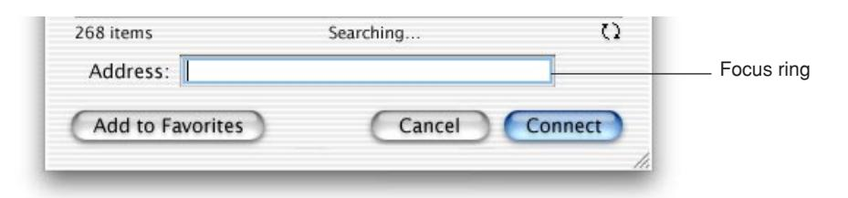

**Figure 8-2** Keyboard focus in a scrolling list

<span id="page-140-2"></span>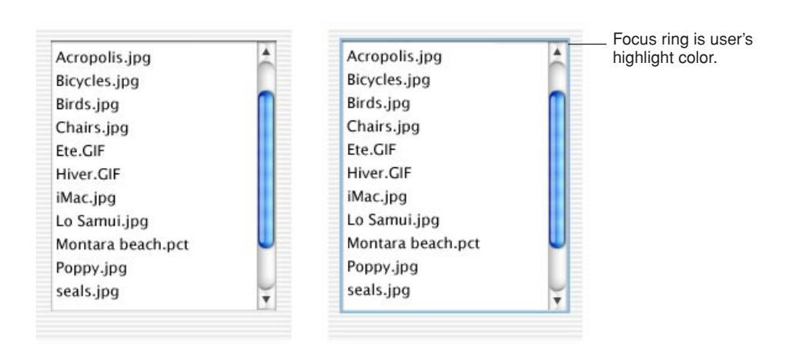

The Keyboard **141**

<span id="page-141-1"></span>**Figure 8-3** Keyboard focus in columns

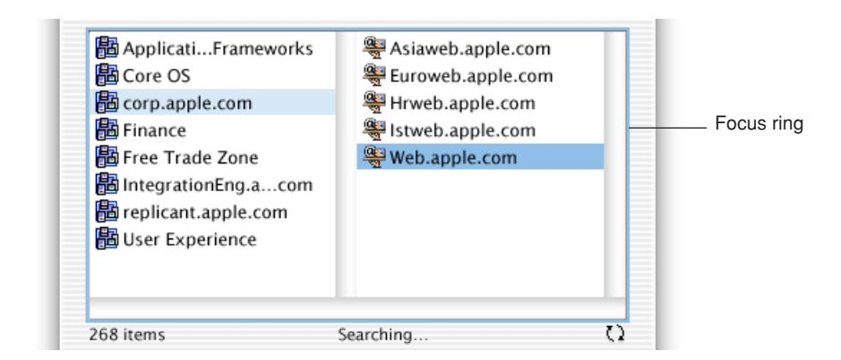

In list and column views, a selected item should be highlighted across the full row. In column view, the selected item has a dark highlight and the folders containing the item have a lighter highlight.

<span id="page-141-2"></span>When a window becomes inactive, all selections inside it should become the lighter highlight color.

# <span id="page-141-0"></span>Selecting

Before performing an operation on an object, the user must select it to distinguish it from other objects. There is always immediate visual feedback to show that something is selected.

Selecting an object never alters the object itself, and a selection is always undoable by clicking outside the selection.

How something is selected depends on what it is. It's useful to distinguish among three types of objects that are each dealt with in a different way when it is selected:

- **Text.** An application considers all text appearing together in a particular context as a block of text—a one-dimensional string of characters. A block of text can range from a single field, as in a dialog, to an entire document, as in a word processor. Regardless of where it appears, text is edited in the same way.
- **Arrays** are tabular arrangements of fields. A one-dimensional array is a *list* and a two-dimensional array is a *table*. Each field contains information such as text or graphics.
- **Graphics.** For the purposes of this discussion, a graphic, or picture, is a discrete object that can be selected individually.

The following sections discuss the general methods of selecting and the specific methods that apply to text, arrays, and graphics.

### <span id="page-142-0"></span>Selection Methods

<span id="page-142-1"></span>This section describes various selection techniques.

**Figure 8-4** Selection techniques


Selecting **143**

#### <span id="page-143-0"></span>Selection by Clicking

The most straightforward method of selecting an object is by clicking it once. Icons, for example, are selected in this way.

#### <span id="page-143-1"></span>Selection by Dragging

The user can select a range of some objects by following this procedure:

- 1. The user positions the pointer at one corner of the range and presses the mouse button. This position is called the **anchor point** of the range.
- 2. Without releasing the mouse button, the user moves the pointer in any direction.
  - As the pointer moves, visual feedback indicates the objects that would be selected if the mouse button were released. For text and arrays, the selected area is continuously highlighted. For graphics, a dotted rectangle expands or contracts to show the selected area. If appropriate, the view should scroll to allow extending the selection beyond a window.
- 3. When the desired range is selected, the user releases the mouse button. The point at which the button is released is called the **active end** of the range.

#### <span id="page-143-2"></span>Changing a Selection With Shift-Click

A user can extend a selection by holding down the Shift key and clicking the mouse button. This action is called **Shift-clicking.**

In text, a Shift-click typically results in a **continuous selection**—the selection is extended to include everything between the old anchor point and the new active end. Graphics applications typically support **discontinuous selection,** in which the user can extend a selection by adding non-adjacent objects to already selected objects, and the objects *between* the current selection and the new object are *not* included in the selection.

In text, if the user Shift-clicks within an already selected range, the new range is smaller than the old range.

In an array, a Shift-click can extend the selected range or it can move the selection from the current cell to wherever the user Shift-clicks.

There are two models for extending a continuous selection using Shift-click. In the **addition** model, new text is added to a current selection. In the **fixed-point** model, the user can extend the selection on either side of the insertion point. [Figure 8-5](#page-144-2) illustrates the results of three consecutive steps in both models.

<span id="page-144-2"></span><span id="page-144-1"></span>**Figure 8-5** Shift-clicking in the addition model and the fixed-point model

|                         | Addition<br>Model           | Fixed-point<br>Model        |
|-------------------------|-----------------------------|-----------------------------|
| Setting insertion point | This is some<br>sample text | This is some<br>sample text |
| Extending selection     | This is some                | This is some                |
| to the right.           | sample text                 | sample text                 |
| Extending selection     | This is some                | This is some                |
| to the left.            | sample text                 | sample text                 |

When considering which model to use in your application, keep in mind that the addition model provides more flexibility by allowing users to extend a selection in *both* directions.

#### <span id="page-144-0"></span>Changing a Selection With Command-Click

In arrays and text in which Shift-click extends a continuous selection, the user can make discontinuous selections by holding down the Command key and clicking. Each Command-click adds the new object to the existing selection. If one of the objects selected with Command-click is already within an existing part of the selection, then it is removed from the selection instead of being added.

Selecting **145**

<span id="page-145-1"></span>**Figure 8-6** Discontinuous selection within an array

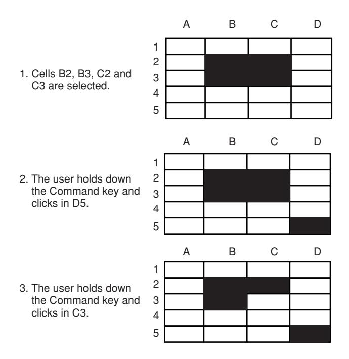

Not all applications support discontinuous selections, and those that do might restrict the operations a user can perform on them. For example, a word processor might allow the user to choose a font after making a discontinuous selection, but not allow the user to type replacement characters, because it wouldn't be obvious which part of the selection the characters would replace.

### <span id="page-145-0"></span>Selections in Text

A block of text is a string of characters. A text selection is a substring of this string, which has any length from zero characters to the whole block.

The **insertion point** (a zero-length text selection) shows where text will be inserted when the user starts typing, or where the contents of the Clipboard will be pasted. The user establishes the location of the insertion point by clicking somewhere in the text; the insertion point appears at the nearest character boundary. If the user clicks

anywhere to the right of the last character on a line, the insertion point appears immediately after the last character. If the user clicks to the left of the first character on a line, the insertion point appears immediately before the first character.

#### <span id="page-146-0"></span>Selecting With the Mouse

The user can select a range of text by dragging. A range can consist of characters, words, lines, or paragraphs, as defined by the application.

In text fields, clicking should perform the following actions:

- Single-clicking places the insertion point at the pointer's location in the text.
- Double-clicking within a word selects the word. The selection should provide "smart" behavior; if the user deletes the selected word, for example, the space after the word should also be deleted.
- Double-clicking in a space selects the space.
- Triple-clicking selects the next logical unit, as defined by the application. In a word-processing document, triple-clicking in a word selects the paragraph containing the word. In a table, triple-clicking selects the cell.

#### <span id="page-146-2"></span><span id="page-146-1"></span>What Constitutes a Word

The following definition of a word applies in the United States, Canada, and some other countries. In many countries, the definition differs to reflect local formats for numbers, dates, and currency. Double-clicking a character *not* in the list below results in the selection of only that character.

A word is defined as any continuous string that contains any of the following characters:

- a letter
- a digit
- a nonbreaking space (Option-space or Command-space)
- a currency symbol (\$, ¢, £, ¥)
- a percent sign
- a comma between digits
- a period before a digit

Selecting **147**

- an apostrophe between letters or digits
- a hyphen, but not Option-hyphen (–) or Option-Shift-hyphen (—)

These are examples of words:

- \$123,456.78
- shouldn't
- 3 1/2 (with a nonbreaking space)
- .5%

These are examples of strings treated as more than one word:

- 7/10/6
- blue cheese (with a regular space)
- "Wow!" (The quotation marks and exclamation point are not part of the word.)

In some contexts—in a programming language, for example—it may be appropriate to allow users to select both the left and right parentheses (or braces or brackets) in a pair, as well as all the characters between them, by double-clicking either one of them. That would mean that a user could select the entire expression

$$[x+y-(4*3)^{n-1}]$$

by double-clicking [ or ].

#### <span id="page-147-0"></span>Selecting Text With the Arrow Keys

See ["Extending Text Selection With the Shift and Arrow Keys" \(page 134\)](#page-133-3).

## <span id="page-147-1"></span>Selections in Graphics

There are several conventions for selecting graphic objects. This section describes two ways to show selection feedback; other situations may require other solutions.

An object-based graphics document is a collection of individual graphic objects. To select an object, the user clicks it once. The object is then bracketed with handles, which the user can use to move or resize the item.

In object-based graphics applications, there are two ways to select more than one object at a time. A user can drag a dotted rectangle and select every object that falls completely within the rectangle's outline, or the user can use the Shift key to select particular objects.

In a bitmap-based graphics document—where images are a series of pixels rather than discrete objects—a user selects the range of pixels enclosed within a selection tool.

### <span id="page-148-3"></span><span id="page-148-0"></span>Selections in Arrays and Tables

To select a single field (cell), the user clicks in it. The user can also select a field by moving to it with the Tab or Return key.

To select part of the contents of a field, the user must first select the field, then click again to select the desired part.

A user should be able to select a row or column in a table by clicking a header, for example. Tables can also support Command-click for selecting discontinuous fields.

Pressing the Tab key cycles through the fields in an order determined by your application, and Shift-Tab navigates in the opposite direction. Typically, the sequence is from left to right, then from top to bottom. Pressing Tab from the last field selects the first field.

<span id="page-148-2"></span>The Return key selects the first field in the next row; Shift-Return selects the previous row. If the concept of rows doesn't make sense in a particular context, the Return key should have the same effect as the Tab key.

# <span id="page-148-1"></span>Editing Text

In addition to the methods for selecting text, there are a number of ways to edit text.

Editing Text **149**

### <span id="page-149-4"></span><span id="page-149-0"></span>Inserting Text

To insert text, the user positions the insertion point by clicking where the text is to go, then starts typing. The application moves the insertion point to the right (or left, depending on the language) as each new character is added.

Applications with multiple-line text blocks should support **word wrap,** the automatic continuation of text from the end of one line to the beginning of the next without breaking in the middle of a word.

### <span id="page-149-3"></span><span id="page-149-1"></span>Deleting Text

When the user presses the Delete (or Backspace) key, one of two things happens:

- If text is selected, the entire selection is deleted.
- If there is no current selection, the character preceding the insertion point is deleted.

In either case, the insertion point replaces the deleted character or characters in the document. The deleted characters don't go into the Clipboard, but the user can undo the deletion by immediately choosing Undo from the Edit menu.

You can also implement the keyboard combination Option-Delete (or Backspace) to delete the word that currently contains the insertion point. Be sure to document this behavior if you implement it.

If a keyboard has a Forward Delete (Del) key, the character following the insertion point is deleted each time the user presses the key.

### <span id="page-149-5"></span><span id="page-149-2"></span>Replacing a Selection

If the user starts typing when one or more characters are selected, the typed characters replace the selection. The deleted characters don't go into the Clipboard, but the user can undo the replacement by immediately choosing Undo from the Edit menu.

### <span id="page-150-1"></span><span id="page-150-0"></span>Intelligent Cut and Paste

Intelligent cut and paste is a set of editing features that takes into account the need for spaces between words. To understand why this feature is helpful, consider the following sequence of events in a text application *without* intelligent cut and paste:

1. A sentence in the user's document reads

*Returns are only accepted if the merchandise is damaged.*

The user wants to change this to

*Returns are accepted only if the merchandise is damaged.*

- 2. The user selects the word *only* by double-clicking. The letters are highlighted, but neither adjacent space is selected.
- 3. The user chooses Cut from the Edit menu, clicks just before the word *if,* and chooses Paste.
- 4. The sentence now reads

*Returns are accepted onlyif the merchandise is damaged.*

To correct the sentence, the user has to remove the extra space between *are* and *accepted,* and add a space between *only* and *if.*

If your application supports intelligent cut and paste, follow these guidelines:

- If the user selects a word or a range of words, the selection itself is highlighted, but spaces adjacent to the selection are not highlighted.
- When the user chooses Cut, if the character preceding the selection is a space, put that space along with the selection. If the character preceding the selection is not a space, but the character following the selection is a space, cut that space along with the selection.
- When the user chooses Paste, if the character to the left or right of the current selection is part of a word (but not inside a word), insert a space before pasting.

Editing Text **151**

Use intelligent cut and paste only if the application supports the definition of a word as described in ["What Constitutes a Word" \(page 147\)](#page-146-2). These rules apply to any selection consisting of one or more whole words, no matter how the user made the selection.

<span id="page-151-1"></span>**Note:** Intelligent cut an paste doesn't apply to all languages. Thai, Chinese, and Japanese, for example, don't contain spaces.

### <span id="page-151-0"></span>Editing Text Fields

If your application isn't primarily a text application, but it has text entry fields in dialogs, for example, you may not need to provide the full text-editing features described in this section. The application should, however, be forward-compatible with the full text-editing capabilities. The application should support the following capabilities:

- The user can select the whole field and type in a new value, delete text, select a substring of the field and replace it, and select a word by double-clicking.
- The user can choose Undo, Cut, Copy, Paste, and Clear, as described in ["The](#page-44-0)  [Edit Menu" \(page 45\)](#page-44-0).

Your application can also support intelligent cut and paste.

Even applications with only minimal text editing should perform appropriate edit checks. For example, if the only legitimate value for a field is a string of digits, the application should alert the user if any nondigits are typed.

# <span id="page-152-2"></span><span id="page-152-0"></span>9 Fonts

Mac OS X supports six standard font mappings.

<span id="page-152-1"></span>**Table 9-1** Mac OS X standard fonts

| Use                            | Font |
|--------------------------------|------|
| System font                    |      |
| System font (emphasized)       |      |
| Small system font              |      |
| Small system font (emphasized) |      |
| Application font               |      |
| Label font                     |      |
|                                |      |

<span id="page-152-4"></span>**System font** is used for message text, or the main text, in all dialogs. It is also the default font for lists and tables. For an example of this font, look at the message text string in the Carbon Views Palette of Interface Builder.

<span id="page-152-3"></span>**Small system font** is used for informative text, as described in ["Writing Good Alert](#page-181-0)  [Messages" \(page 182\).](#page-181-0) This is the default font for headers in lists and for Help Tags. You can also use it to provide additional information about settings in various windows, such as the QuickTime pane in System Preferences. For an example of this font, look at the informative text string in the Carbon Views Palette of Interface Builder.

Fonts

<span id="page-153-2"></span>**Label font** is used for labels with controls such as sliders and icon bevel buttons. You should rarely need to use this font in dialogs, but may find it useful in palettes. For an example of this font, click the Text-to-Speech tab in Speech preferences.

<span id="page-153-0"></span>Use **emphasized system fonts** sparingly. You might use them to title a group of settings that appear without a group box, or for brief informative text below a text field. For an example of the emphasized system font, click the Date or Numbers tab in International preferences.

<span id="page-153-1"></span>Carbon developers creating nonstandard element with text are responsible for drawing their own anti-aliased text, via the Appearance Manager DrawThemeText APIs or the Control Manager StaticText control. In Cocoa, all text is anti-aliased by default.

<span id="page-154-4"></span><span id="page-154-0"></span>This chapter describes the overall philosophy behind Aqua icons and how to design application, document, toolbar, and other types of icons for Mac OS X.

# <span id="page-154-1"></span>Notable Changes From Mac OS 9

### <span id="page-154-2"></span>More Realistic Icons

Icon design in Mac OS X is significantly different from previous versions of the Mac OS. In Mac OS 9 and earlier, graphic limitations constrained designers to use a highly symbolic style. Icons consisted of illustrations that emphasized straight lines rotated in increments of 45 degrees.

<span id="page-154-3"></span>**Figure 10-1** Traditional application icon and Mac OS X icon

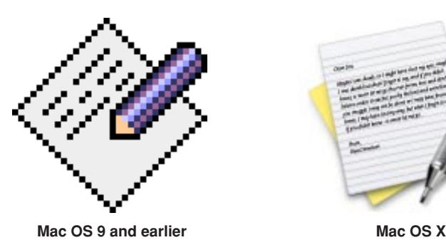

<span id="page-154-5"></span>

Mac OS X offers a new "photo illustrative" icon style (it approaches photo-realism. but icons are still stylized). Icons can be represented in 128 x 128 pixels to allow ample room for detail. Anti-aliasing makes curves and nonrectilinear lines possible. Alpha channels and transparency allow for complex shading and dimensionality. All of these qualities pave the way for lush imagery that enables you to create vibrant icons that communicate in ways never before possible.

To represent your application in Mac OS X, it's essential to create high-quality Aqua-style application icons that scale well in the various places the icon appears in the Dock, Finder preview, alert dialogs, and so on.

### <span id="page-155-1"></span><span id="page-155-0"></span>Icon Genres

A new concept in Mac OS X is the notion of icon genres. Applications are classified by role—user applications, utilities, administrator's tools, and so on—and each category has its own icon style. The value of this visual distinction becomes more apparent when you look at icons in juxtaposition. The Dock, for example, can contain icons of different genres. It is important to provide a clear visual indication of an icon's genre so that the user can easily classify and organize open applications.

[Figure 10-2](#page-156-4) shows application icons in the top row and utility icons in the bottom row. These two icon genres are described in ["User Application Icons" \(page 157\)](#page-156-5)  and ["Utility Icons" \(page 159\).](#page-158-2)

<span id="page-156-4"></span><span id="page-156-3"></span>**Figure 10-2** Two icon genres: Application icons in top row, utility icons in bottom row


# <span id="page-156-0"></span>Types of Icons

# <span id="page-156-7"></span><span id="page-156-6"></span><span id="page-156-1"></span>Application Icons

#### <span id="page-156-8"></span><span id="page-156-5"></span><span id="page-156-2"></span>User Application Icons

The main object in your application icon should represent the media the application creates or views, and should maintain the familiar diamond-like rotation. Generally, Mac OS X user application icons are designed to appear as if they're sitting on a desk in front of you. This perspective (looking down at a layered set of elements), combined with the superior aesthetic capabilities of Mac OS X, help the

Types of Icons **157**

user perceive icons as familiar objects. This familiarity helps the application become more approachable and non-threatening to novice users and enables you to design icons with the desired emotive quality. You can make an icon as fun or as serious as appropriate. [Figure 10-3](#page-157-2) shows an example of a user application icon that clearly communicates its purpose in a way that invites the user to learn more about it.

<span id="page-157-2"></span><span id="page-157-0"></span>**Figure 10-3** Stickies application icon


Observe the use of color, curve, and shading in [Figure 10-3.](#page-157-2) Alpha channels allow for complex, soft shadows that emphasize the effect of layered elements as well as perspective. Alpha channels can also be used for transparency, so you can provide the effect of translucency, as seen in [Figure 10-4](#page-157-3). 32-bit color provides a vibrant color palette.

<span id="page-157-3"></span><span id="page-157-1"></span>**Figure 10-4** Icon for Preview application


<span id="page-158-4"></span>When possible and appropriate, an icon should also include a tool element that communicates the type of task the application allows the user to accomplish. The magnifying glass in [Figure 10-4](#page-157-3) is a good example of a supportive tool element. The tool should closely relate to the base object that it rests upon; typically the tool is rotated in an opposite direction. Ideally, the user application icon should tell a story of how the application can be used. More examples of the supporting tool concept are shown in [Figure 10-5](#page-158-3).

<span id="page-158-3"></span><span id="page-158-1"></span>**Figure 10-5** Examples of user application icons with supporting tool elements


#### <span id="page-158-5"></span><span id="page-158-2"></span><span id="page-158-0"></span>Utility Icons

In contrast to the "object on a desktop" approach discussed in ["User Application](#page-156-5)  [Icons" \(page 157\)](#page-156-5), utility application icons are designed to reinforce the typically serious nature of utility applications. This change in style shifts the visual perspective to that of an object on a shelf at eye level, directly in front of the user. Unlike richly colored user application icons, utility icons are generally grayscale, with color applied sparingly. [Figure 10-6](#page-159-5) shows an example of a utility icon.

Types of Icons **159**

<span id="page-159-5"></span><span id="page-159-4"></span>**Figure 10-6** A utility icon

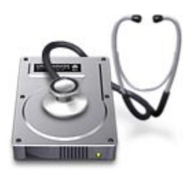

<span id="page-159-6"></span>Since utility applications are normally focused on a narrow set of tasks, it's best to keep the number of elements in the icon to a minimum. The supporting tool should be the main focus or an integrated element, as opposed to a layered object.

### <span id="page-159-10"></span><span id="page-159-0"></span>Toolbars and Toolbar Icons

*<Text to come>*

## <span id="page-159-7"></span><span id="page-159-1"></span>Developer Icons

*<Text to come>*

## <span id="page-159-8"></span><span id="page-159-2"></span>Document Icons

<span id="page-159-9"></span>*<Text to come>*

# <span id="page-159-3"></span>Icon States

*<Text to come>*

# <span id="page-160-0"></span>Suggested Process for Creating Aqua Icons

<span id="page-160-1"></span>You need to provide at least the following files:

- a 128 x 128 image (for Finder icons)
- a mask that defines the image's edges, so the operating system can determine which regions are clickable

Icons that display in the Finder are viewed at different sizes: they can be magnified in the Dock, they can be previewed at full size, and users can specify a preferred size. For the best-looking icons at all sizes, you should also provide customized image files ("hints") at three other sizes: 64 x 64, 32 x 32, and 16 x 16.

If you are creating an icon that will never change size—on a bevel button, for example—you can supply the image only at actual size.

1. Create an illustration of the icon.

Although you may want the final icon to look like a photograph, in most cases it's inadvisable to start with an actual photograph. An illustration provides much more flexibility for conveying a concept in a very small space. An illustration also gives you necessary control over details, perspective, light and shadow, texture, and so on.

2. Create a three-dimensional version of the illustration.

A 3-D modeling application can significantly enhance the final results. It can create more realistic lighting and texture effects, for example, and it's much easier to experiment with lighting, viewing angles, and so on.

The light source should be above and slightly in front of the object. The resulting shadow should create the sense that the icon is resting on a surface.

3. Add detail as desired.

For each enhancement you make to a larger-version icon, consider whether it is truly adding something to the icon's usability, or whether it is just adding complexity or clutter.

4. In an image-editing program, manipulate the image to get precise effects and create the icon mask.

5. Convert the icon to a .icns resource or file.

<span id="page-161-2"></span>You can complete this step with Icon Composer, included on the Mac OS X developer CD. There are several third-party tools available for completing this step, such as Iconographer, Resorcerer, and Icon Builder.

# <span id="page-161-0"></span>Tips for Designing Aqua Icons

Many of these suggestions also apply to graphics you develop for your application, for example, to augment a label or list item.

- Use universal imagery that people will easily recognize. Avoid focusing on a secondary aspect of an element. For example, for a mail icon, a rural mailbox would be less recognizable than a stamped postcard.
- Avoid using anatomy in your icons. Such images are hard to do well and usually detract from the intended meaning. If you do use anatomy, make sure the style fits with the rest of your icons.
- Strive for simplicity. Try to use a single object that captures the icon's action or represents the control.
- Use color judiciously to help the icon tell its story; don't add color just to make the icon more colorful. Smooth gradients typically work better than sharp delineations of color.
- Avoid using replicas of Apple hardware products in your icons. Hardware designs change frequently; your icon could be obsolete or meaningless.
- Design toolbar icons at their actual size (32 by 32). For other icons, concentrate on perfecting your icon's look at 16 x 16. It's much easier to add flourishes to larger versions than it is to scale down an icon designed for a larger size. Most of the time, users will see your icon at the smaller sizes.
- Use the same perspective for your suite of icons. Toolbar icons should look as if they're sitting on a table and you're facing them squarely from the front. Other icons should look as if you're looking down at them sitting on a table in front of you.
- <span id="page-161-1"></span>■ Use a single light source with the light coming from above the icon.

<span id="page-162-0"></span>The technique of dragging an item and dropping it on a suitable destination is called **drag and drop.**

In this chapter, an **item** is anything that the user can select, such as text, graphics, and icons. For convenience, this chapter assumes that the user is dragging with the mouse, but these guidelines also apply to other input devices such as pens and trackballs.

In Aqua, the Finder provides a new focus to indicate the target for a drop.

# <span id="page-162-1"></span>Drag and Drop Design Overview

Ideally, users should be able to drag any content from any window to any other window that accepts the content's type. If the source and destination are not visible at the same time, the user can create a **clipping** by dragging data to a Finder window; the clipping can then be dragged into another application window at another time.

Drag and drop should be considered an ease-of-use technique. Except in cases where drag and drop is so intrinsic to an application that no suitable alternative methods exist—dragging icons in the Finder, for example—there should always be another method for accomplishing a drag-and-drop task.

The basic steps of the drag-and-drop interaction model parallel a copy-and-paste sequence in which you select an item, choose Copy from the Edit menu, specify a destination, and then choose Paste. However, drag and drop is a distinct technique

in itself, and the Drag Manager does not use the Clipboard. Users can take advantage of both the Clipboard and drag and drop without side effects from each other.

A drag-and-drop operation should provide immediate feedback at the significant points: when the data is selected, during the drag, when an appropriate destination is reached, and when the data is dropped.

You should implement Undo for any drag-and-drop operation you enable in your application. If you implement a drag-and-drop operation that is not undoable, display a confirmation dialog before implementing the drop. A confirmation dialog appears, for example, when the user attempts to drop an icon into a write-only drop box on a shared volume, because the user does not have privileges to open the drop box and undo the action.

# <span id="page-163-0"></span>Drag and Drop Semantics

### <span id="page-163-1"></span>Move Versus Copy

Your application must determine whether to move or copy a dragged item after it is dropped on a destination. The appropriate behavior depends on the context of the drag-and-drop operation, as described here.

If the source and destination are in the same container (for example, a window or a volume), a drag-and-drop operation is interpreted as a move (that is, cut and paste). Dragging an item from one container to another initiates a copy (copy and paste). The user can perform a copy operation within the same container by pressing the Option key while dragging. If the user holds down the Option key before dragging an item, a plus sign (+) is added to the pointer to indicate that the item is being copied.

You can't assume that a window is always a container; you must consider the underlying data structure of the contents in the window. For example, if your application allows two windows to display the same document (multiple views of the same data), a drag-and-drop operation between these two windows should result in a move.

The principle driving these drag-and-drop guidelines is to prevent the user from accidental data loss. Moving data across applications may result in potential data loss because an Undo command in the destination application does not trigger an Undo in the source application. Moving data within the same window (or same volume, as in the case of the Finder) does not lead to data loss.

<span id="page-164-1"></span>**Table 11-1** Common drag-and-drop operations and results

| Dragged item       | Destination             | Result                    |
|--------------------|-------------------------|---------------------------|
| Data in a document | The same document       | Move                      |
| Data in a document | Another document        | Copy                      |
| Data in a document | The Finder              | Copy (creates a clipping) |
| Finder icon        | An open document window | Copy                      |
| Finder icon        | The same volume         | Move                      |
| Finder icon        | Another volume          | Copy                      |

### <span id="page-164-0"></span>When to Check the Option Key State

Your application should always check whether the Option key is pressed at mouse-down. If it is, the semantics of the operation—a copy—remain in effect during the entire drag-and-drop operation, even if the user releases the Option key before dropping the item.

If the user did not hold down the Option key at the beginning of the operation, you can check it again at drop time. This behavior gives the user the flexibility of making the move-or-copy decision at a later point in the drag-and-drop sequence. Pressing the Option key during the drag-and-drop sequence should not "latch" for the remainder of the sequence; check the state of the Option key at drop time if it was not pressed at mouse-down.

**Note:** The Option key does not act as a toggle switch; Option-dragging between containers always initiates a copy operation. This guideline allows users to learn that Option means Copy.

# <span id="page-165-0"></span>Selection Feedback

This section covers issues that deserve special mention in the context of drag and drop. Selection feedback is discussed in more detail in ["Selecting" \(page 142\)](#page-141-0).

## <span id="page-165-1"></span>Single-Gesture Selection and Dragging

Because dragging is defined as moving the mouse while the mouse button is held down, a mouse-down event must occur before dragging can take place. A selection may be made as a result of this mouse-down event, just before the user starts dragging. For example, the user can select and drag a folder icon in a single gesture; the user does not have to click the folder icon first, release the mouse button, and then click again to begin dragging the icon. Your application should ensure that implicit selection occurs, when appropriate, when the user starts dragging.

Single-gesture selection and dragging is possible only when the process of selecting an item does not require dragging. Range-selection operations—such as selecting text or dragging a marquee around graphic objects—don't lend themselves to single-gesture selection and dragging because the range-selection operation itself requires dragging.

### <span id="page-165-2"></span>Background Selections

When a window containing a highlighted selection becomes inactive, your application can maintain the selection. This feature saves enables users to drag previously selected data from inactive windows to the active window.

Background selections are not required if the dragged item is discrete, such as an icon or graphical object, because implicit selection can occur when an item is dragged. However, items selected only by range-selection operations such as text or a group of icons must have a background selection, to allow the user to drag these items out of inactive windows. Whenever an inactive window is made active, the background selection, if any, becomes highlighted as a normal selection.

# <span id="page-166-0"></span>Drag Feedback

Your application should provide drag feedback as soon as the user drags an item at least three pixels. If a user holds the mouse button down on selected text for 300 milliseconds, the selected text becomes draggable, as long as the mouse remains down. In Carbon, the Drag Manager handles drag feedback automatically.

In Aqua, dragged items are transparent.

# <span id="page-166-1"></span>Destination Feedback

If the user drags an item to a destination in your application, your application provides feedback that indicates whether it will accept that item. Destination feedback should not occur simply because your application is "drag-aware"; rather, it should depend on the destination's ability to accept the type of data contained in the dragged item. For example, a text entry field that accepts only text should not be highlighted when the dragged item is a graphic.

The actual appearance of destination feedback depends on the type of destination. The Drag Manager provides some utilities for simple highlighting; your application must handle more complex highlighting.

### <span id="page-166-2"></span>Windows

The valid **destination region** of a document window is usually the window's content area minus the title bar and areas used for controls (such as scroll bars, resize controls, tool palettes, rulers, and placards). When there are multiple destination regions within a window, only one destination region is highlighted at a time.

Drag Feedback **167**

When the user drags an acceptable item from one destination region to another, your application highlights the destination region as soon as the pointer enters it, and removes the highlighting when the pointer leaves the region. You can use the Drag Manager to specify your destination regions.

If a drag-and-drop operation takes place entirely within one destination region (moving a document icon to a different location in the same folder window, for example), don't highlight the destination region, to avoid distracting the user. However, if the user drags an item completely out of a destination region and then drags the same item back to the same destination region, the destination region should be highlighted.

You can provide more specific destination feedback within a larger destination region. For example, when the user drags text from one document window to another, the inactive window should display an insertion point where the dragged text would go if the user released the mouse button.

In many situations, highlighting a more narrowly defined area of a window is more appropriate than highlighting the entire content region; examples are spreadsheets, text boxes, fill-in forms, and panes. In these cases, the destination region must be tailored to more precisely indicate the specific destination.

### <span id="page-167-0"></span>Text

While the user is dragging an item to a text area, an insertion indicator (a vertical bar) should appear in the text where the dragged item would be inserted if the user releases the mouse button.

### <span id="page-167-1"></span>Multiple Dragged Items

If the user drags multiple items, the destination feedback should occur only if it can accept all of the dragged items. If the destination cannot accept all of the dragged items, the user's attempt results in feedback as described in ["Feedback for an](#page-170-2)  [Invalid Drop" \(page 171\)](#page-170-2).

When the destination can accept all of the dragged items, the destination should accept them in the order specified by the source. The source application should organize the dragged items in the order in which they were selected, except for two cases. If the dragged items come from ordered views (such as View by Date or an

alphabetized list), that view's ordering takes precedence over the selection order. If both the source and destination provide a spatial ordering (such as in graphic applications), the spatial ordering takes precedence over the selection order.

## <span id="page-168-0"></span>Automatic Scrolling

When an item is being dragged, your application must determine whether to scroll the contents or allow the item to "escape" the window. If your application allows items to be dragged outside of windows, you should define an autoscrolling region. Automatically scroll a destination window only if it is also the source window and is frontmost. Don't autoscroll inactive windows.

### <span id="page-168-1"></span>Using the Trash as a Destination

The Drag Manager makes the Trash available to applications.

Dragging items to the Trash results in moving the item from the source to the Trash. For example, dragging a text selection from a word-processing application and dropping it on the Trash icon (or in the Trash window) results in the text being deleted from the application and a clipping containing that text being created inside the Trash. Note that the item is moved, although it is dragged between two containers. This exception to the rules described earlier is appropriate because the user can undo the operation by dragging the clipping out of the Trash back to its original source; it is consistent with the principle of preventing accidental data loss.

It is important to preserve the Trash's container property; do not simply delete the source without creating a clipping or other item in the Trash.

# <span id="page-168-2"></span>Drop Feedback

When the user releases the mouse button after dragging an item to a destination, feedback should inform the user that the drag-and-drop operation was successful. While this feedback can be visual, it is primarily behavioral in nature. The behavior comes from the semantic operation indicated by the drag-and-drop sequence. Examples of this behavior are given below.

Drop Feedback **169**

### <span id="page-169-0"></span>Finder Icons

When the user moves an item by dropping its icon on a folder icon, the item is reorganized into the folder. Visually, the dropped icon disappears and the highlighting is removed from the destination folder icon.

If an icon represents a task, such as printing, you may want to provide **progress feedback** to indicate that the task is being carried out.

## <span id="page-169-1"></span>Graphics

When dropping graphics, the drop feedback is usually the movement of the actual item to the location of the mouse-up event.

### <span id="page-169-2"></span>Text

Immediately after text is dropped, it is shown highlighted at its destination.

When text is dropped in a destination that supports styled text, the dropped text should maintain its font, typeface, and size attributes. If the destination does not support styled text, the dropped text should assume the font, typeface, and size attributes specified by the destination insertion point.

Drag-and-drop operations involving text should support intelligent cut-and-paste rules, as explained in ["Intelligent Cut and Paste" \(page 151\)](#page-150-0).

### <span id="page-169-3"></span>Transferring a Selection

After a successful drag-and-drop sequence involving a single window, the selection feedback is transferred from the source to the destination. This behavior provides an important user cue and allows the user to reposition the selection without having to make the selection again.

If the user drags an item from an active window to an inactive window, the dragged item becomes a **background selection** at the destination; the selection in the active window remains selected. This guideline also applies in the reverse situation, where an item is dragged from an inactive window to an active window.

When content is dropped into a window in which something is selected, your application should deselect everything in the destination before the drop, rather than replacing the selection with the dragged item.

## <span id="page-170-2"></span><span id="page-170-0"></span>Feedback for an Invalid Drop

If a user attempts to drop an item on a destination that does not accept it, the item zooms from its mouse-up location back to its source location (a "zoomback"). The zoomback behavior should also occur when a drop inside a valid destination does not result in a successful operation (if, for example, there is insufficient memory). The Drag Manager provides this feedback when it determines that no receiver requested the sender's information.

If the user attempts to drag multiple items to a destination that does not accept all of the items, none of the items should be accepted. In such cases you could display a dialog informing the user of the type of data the destination accepts and which items in the dragged set are "unacceptable."

# <span id="page-170-1"></span>Clippings

When an item is dragged from an application or a Finder window to the desktop, the Finder creates a clipping that contains the data in the dragged item. If discontinuous selections are dragged from a source to the Finder, a separate clipping is created for each selected item.

Your application should provide a number of representations (such as TEXT, PICT, and native formats) to ensure flexibility with different destinations. Regardless of which representations are stored, round-trip data integrity should be preserved; a clipping dragged back into its source should be identical to the original item.

When clippings are created, each clipping is given a default name, which is a concatenation of the type of data that was dragged and the word "clipping" (plus a number, if necessary, to avoid naming conflicts). For example, dragging some text from a document to the Finder would generate a file named "text clipping." If the type is unknown, it is omitted from the clipping name.

Clippings **171**

#### Drag and Drop

The user can open clippings in the Finder and view a representation of the data in a modeless window, similar to the Clipboard window. The user cannot select, copy, or edit any of the contents in these windows.

<span id="page-172-3"></span><span id="page-172-0"></span>Mac OS X supports two user help components: Apple Help and Help Tags. Carbon applications can also use these facilities on Mac OS 8.6 and 9.

Apple Help enables you to display documents with QuickTime content and AppleScript-based automations, and to provide context-sensitive assistance.

<span id="page-172-4"></span>Help Tags, which replace the Balloon Help introduced in System 7, give your application the ability to identify its interface elements.

# <span id="page-172-1"></span>What's New in Aqua

<span id="page-172-2"></span>Apple Help debuted in Mac OS 8.5 and has evolved with each system software release. With Mac OS X, Apple Help has been fully updated for Carbon and introduces the following changes and enhancements:

- new APIs for registering help books and calling the Help Viewer
- support for "look-up anchor" for use with contextual help
- addition of Developer Help Center for technical documentation
- Help is now packaged within applications
- all features from Mac OS 9 Apple Help, with the exception of launching Apple Guide sequences, which is no longer supported

In addition, Apple continues to refine the design and information architecture of Mac Help, the onscreen help provided for the Mac OS and Macintosh hardware. The emphasis is on optimizing for onscreen usability, search-driven navigation, and Internet delivery.

# <span id="page-173-0"></span>Apple's Philosophy of Help

<span id="page-173-1"></span>When users refer to help, it is usually because they have reached an impasse while attempting to accomplish a task—they know what they want to do, but not how to accomplish it. When faced with an impasse, most users first try to figure it out for themselves by exploring and experimenting with the interface. If that fails, they ask someone else for assistance; if no one is available, they may consult the onscreen Help.

Users come to help with a specific goal in mind, bringing their cumulative Macintosh experience and the recent and cumulative experience of using the product. In all likelihood, they are somewhat impatient and frustrated at having failed to figure out how to accomplish their goal.

To assist users in quickly locating their information and getting back to work, onscreen help should do the following:

- Focus on real-world user tasks.
- Get to the point quickly, so that users can return to work.
- Be organized by task, not the layout or functionality of the software.

In large Help systems, searching is often the most efficient way to locate a particular topic, particularly when users have turned to help with a specific idea about what they are trying to accomplish. To facilitate usable search results, do the following:

- Cover one topic per page, to avoid "burying" some tasks.
- Title the page descriptively, using words that relate to real-world goals.
- Use Apple Help keywords to ensure synonyms and common misspellings get appropriate search results.
- Write steps and descriptions using words that appear in the interface.

Write your Help so that users can quickly find the steps on the page and can follow the steps without having to repeatedly switch between the product and the Help Viewer.

- Don't repeat notes and warnings enforced by the interface. For example, if you have to click OK to confirm a setting, don't describe it in the steps—it will be apparent as the users follow the instructions.
- Tailor descriptions to the probable experience of users. For example, a user who wants to adjust kerning is likely to be familiar with selecting a typeface and font size.
- Automate common tasks using AppleScript. If a task requires opening a preferences pane, provide an automation that opens it for users. If you can automate the entire task, do so.
- Emphasize trouble identification and resolution. If a step or task might be impossible because of an error condition, remind users to check for it early in your instructions. Users might already know how to accomplish a task but turn to help because of a condition or requirement they couldn't identify.

# <span id="page-174-0"></span>The Apple Help Viewer

<span id="page-174-1"></span>Use the Help Viewer to display onscreen documentation. The Help Viewer is a lightweight application that displays HTML, natively displays QuickTime media, provides full-text searching of help with relevancy-ranked results, and provides for task automation using AppleScript. Additionally, the Help Viewer allows you to integrate all, or a portion, of Internet-based help files, permitting you to update and improve your instructions as often as necessary.

When you use the Help Viewer, your help book automatically becomes accessible via the Help Center, an Apple-provided location that allows users to easily browse and search all of the help available on their system.

# <span id="page-175-0"></span>Providing Access to Help

<span id="page-175-6"></span>Users can access the help system in three ways:

- <span id="page-175-4"></span>■ **The Help menu.** The Help menu is the far-right item in the application region of the menu bar. It should contain a single item named "<appName> Help," which opens the Help Viewer to the first page of your help content. This page can include hyperlinks that lead to other help resources, such as tutorials, websites, and troubleshooting guides.
  - Don't add additional items to the Help menu unless absolutely necessary; multiple entries that lead to essentially the same place can be confusing.
- <span id="page-175-3"></span>■ **Help buttons.** When necessary, you can use Help buttons, typically placed in the lower-left corner of a dialog or window, to provide easy access to specific sections of your help. When a user clicks a Help button, send either a search term or an anchor lookup (which leads to specific page or pages) to the Help Viewer.
  - It's not necessary for every dialog and window in your application to have a Help button. If there is no contextually relevant information in the help, don't display a Help button.
- <span id="page-175-5"></span><span id="page-175-2"></span>■ **Contextual Help menu.** If contextually appropriate help content is available for an object being pointed to, the first item in the contextual menu is Help.

# <span id="page-175-1"></span>Help Tags

Help Tags are short messages that appear when the user leaves the pointer hovering over an interface element for a few seconds. When the mouse leaves the object, the tag vanishes. Use Help Tags to assist users in identifying the purpose of interface elements. Help Tags are designed to be a Carbon-compliant replacement for Balloon Help. Help Tag support is provided to Cocoa developers via the Application Kit, and they can define an object's Help Tag in Interface Builder.

The text of the Help Tags should

- name an object only if the name is relevant to its function and does not have a text label
- briefly describe, in as few words as possible, what the object does
- be state-independent—Help Tags always display the same wording, even when an object is dimmed

For example, the Help Tag for a button labeled "Forward" in an email program might read "Send the selected message to someone else." This provides more detail than the button label, but does not repeat it, and it explains that a message must be selected to enable the button.

It is not necessary for every object have a Help Tag. Don't provide them for common interface elements, menu items, or items that are self-explanatory or obvious.

## <span id="page-176-1"></span><span id="page-176-0"></span>Help Tag Guidelines

Here are some guidelines to help you create effective tag messages.

- Use the fewest words possible. Try to keep your tags to a maximum of 60 to 75 characters. Help Tags are always on (they appear whenever a user hovers over an item), so it is important to keep your tag text unobtrusive—that is, *short*—and useful. Present one concept per tag and make sure the concept is directly related to the item in question. Localization lengthens the text by 20 to 30 percent, which is another good reason to keep the tag short.
- Describe what the user will accomplish. The tag should say what the user wants to know most—what task the user can accomplish by using the item. If absolutely necessary, you can give more information after describing what will be accomplished.
- Create tags that are applicable to all situations. Help Tags are not contextually sensitive; the same text appears when an item is selected, dimmed, and so on. By describing what the item accomplishes, you may help the user understand the current state of the control.
- Use Help Tags to provide functional information for controls that are unique to your application. Don't tag window controls, scroll bars, and other parts of the standard Mac OS X interface.
- Don't put the item's name in the tag unless the name helps the user and isn't available onscreen. If an item is referred to by name in the documentation and in the tag, make sure the names match.

Help Tags **177**

- You can use a sentence fragment beginning with a verb, for example, "Restores default settings." You can also omit articles to limit the size of the tag. If the tag text is a complete sentence, end it with a period.
- Describe only the item the user points to.
- Use hints sparingly.
- Don't write tags for menus and menu items.

#### <span id="page-177-2"></span><span id="page-177-0"></span>Help Tag Examples

In these examples, only the text after the colon appears in the tag. Note that in Mail, some tags include the button name, but the text contains information ("selected," for example) that helps explain why the control might be dimmed.

#### **Sherlock Help Tag Examples**

- back arrow: Go to search sites list.
- magnifying glass: Start your search.
- Files: Find items on your computer.
- Internet: Find information on the Internet.
- Content: Find files containing specified text.
- Custom: Find files by other criteria.
- Save As: Save your criteria for later use.

#### **Mail Help Tag Examples**

- Reply: Reply to selected message.
- Reply All: Reply to all recipients of selected message.
- Forward: Send the selected message to someone else.
- Compose: Create a new message.
- Mailbox: Open or close the Mailboxes drawer.
- <span id="page-177-1"></span>■ Get Mail: Check for new messages.
- Search: Find messages that contain certain text.

<span id="page-178-3"></span><span id="page-178-0"></span>Although Mac OS X uses graphics as a primary means of user-computer interaction, text is still very prevalent throughout the interface for such things as button names, pop-up menu labels, dialog messages, and onscreen help. Using text consistently and clearly is a critical component of interface design.

Your product team should include a skilled writer who is responsible for reviewing all user-visible onscreen text as well as creating the instructional documentation.

# <span id="page-178-4"></span><span id="page-178-1"></span>Style

<span id="page-178-2"></span>The *Apple Publications Style Guide (APSG)* defines style and usage issues, and is the key reference for how Apple uses language. This document is available at http:// developer.apple.com/techpubs/faq.html.

For information about specific Mac OS X interface terms, see ["Mac OS X](#page-196-0)  [Terminology Guidelines" \(page 197\)](#page-196-0).

For issues that aren't covered in the *APSG* or the Mac OS X terminology appendix, Apple recommends three other works: *The American Heritage Dictionary, The Chicago Manual of Style,* and *Words Into Type*. In cases where these books give conflicting rules, *The Chicago Manual of Style* takes precedence for questions of usage and the *American Heritage Dictionary* for questions of spelling.

Style **179**

# <span id="page-179-0"></span>Terminology

### <span id="page-179-7"></span><span id="page-179-6"></span><span id="page-179-1"></span>Developer Terms and User Terms

<span id="page-179-5"></span>Don't use technical jargon or programming terms in interface elements or user documentation. [Table 13-1](#page-179-4) shows a few examples; for a more complete list, see the *Apple Publications Style Guide* (available at http://developer.apple.com/techpubs/ faq.html).

<span id="page-179-4"></span><span id="page-179-3"></span>**Table 13-1** Translating developer terms into user terms

| Developer term    | User term equivalent                              |
|-------------------|---------------------------------------------------|
| Data Browser API  | List                                              |
| Dirty document    | Document with unsaved changes                     |
| Focus ring        | Highlighted area; area ready to accept user input |
| User-visible text | Onscreen text                                     |
| Mouse-up event    | Mouse click                                       |
| Reboot            | Restart                                           |
| Byte length       | Number of characters                              |

### <span id="page-179-8"></span><span id="page-179-2"></span>Labels for Interface Elements

Make labels for interface elements easy to understand and in the user's language. Try to be as specific as possible in any element that requires the user to make a choice, such as radio buttons, checkboxes, and push buttons. It's important to be concise, but don't sacrifice clarity for space.

#### <span id="page-180-4"></span><span id="page-180-2"></span><span id="page-180-0"></span>Capitalization of Interface Elements

**Title style** means that you capitalize every word except

- articles (*a, an, the*)
- coordinating conjunctions (*an, or*)
- prepositions of three or fewer letters, except when the preposition is part of a verb phrase, as in Log Out.

In title style, always capitalize the first and last word, even if it is an article, a conjunction, or a preposition of three or fewer letters.

<span id="page-180-3"></span>**Sentence style** means that the first letter of the first word is capitalized, and the rest of the words are lowercase, unless they are proper nouns or proper adjectives. Use periods in dialogs only after complete sentences.

<span id="page-180-1"></span>**Table 13-2** Proper capitalization of onscreen elements

| Element                                                                                                     | Capitalization<br>style | Examples                                                                                  |
|-------------------------------------------------------------------------------------------------------------|-------------------------|-------------------------------------------------------------------------------------------|
| Menu titles (pull-down and<br>pop-up)                                                                       | Title                   | See the Highlight Color pop-up<br>menu in General preferences.                            |
| Menu items (pull-down and<br>pop-up)                                                                        | Title                   | Save as Draft<br>Save As<br>Log Out<br>Make Alias<br>Go To<br>Go to Page<br>Outgoing Mail |
| Push buttons                                                                                                | Title                   | Add to Favorites<br>Don't Save                                                            |
| Labels that are not clauses or part<br>of a sentence (group box or list<br>headings, radio/checkbox titles) | Title                   | Mouse Speed<br>Total Connection Time<br>Account Type                                      |

Terminology **181**

Language

**Table 13-2** Proper capitalization of onscreen elements

| Element                                           | Capitalization<br>style | Examples                                                                                                                          |
|---------------------------------------------------|-------------------------|-----------------------------------------------------------------------------------------------------------------------------------|
| Labels that are clauses or part of<br>a sentences | Sentence                | Enable polling for remote mail<br>Cache DNS information every<br>minutes.<br>See the scroll bar option in<br>General preferences. |
| Radio button or checkbox text                     | Sentence                | See the scroll bar option in<br>General preferences.                                                                              |
| Dialog messages                                   | Sentence                | Are you sure you want to quit?                                                                                                    |

# <span id="page-181-0"></span>Writing Good Alert Messages

<span id="page-181-2"></span>A good alert message states clearly what caused the alert to appear and what the user can do about it. Express everything in the user's vocabulary. Here's an example of an alert message that provides little useful information:

<span id="page-181-1"></span>**Figure 13-1** A poorly written alert message

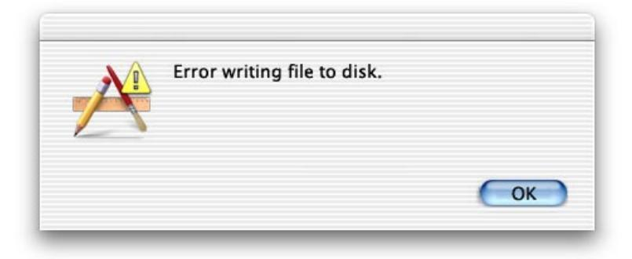

You could improve this message by describing the problem in the user's vocabulary:

<span id="page-182-0"></span>**Figure 13-2** An improved alert message

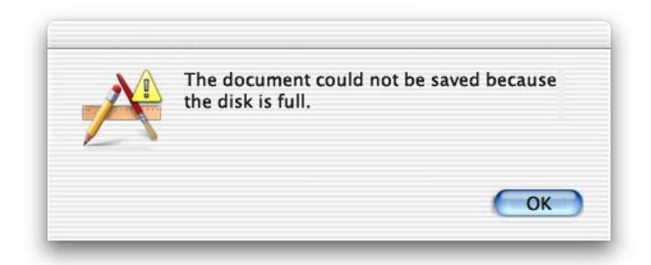

To really make the alert useful, provide a suggestion about what the user can do to get out of the current situation:

<span id="page-182-1"></span>**Figure 13-3** A well-written alert message


For information about when to use alerts, see ["Types of Dialogs and When to Use](#page-71-0)  [Them" \(page 72\).](#page-71-0)

Language

<span id="page-184-0"></span>This checklist is designed to help guide you in the process of making a great Aqua application. Use it to remind yourself of important interface-related issues.

Consider the questions in the checklist as you review your software. Answering every question with a "yes" will ensure that your product conforms to the Aqua human interface guidelines. Even if you can't answer "yes" to every question, this checklist can help your product maintain the spirit of the guidelines and principles.

Although business realities (such as product schedules) often force you to make design tradeoffs, remember that, for many users and product reviewers, the extent to which you adopt Aqua is the most visible means of measuring how "Mac-like" your product is.

# <span id="page-184-1"></span>General Considerations

- Does the application have the overall Mac OS X "look," including high-quality icons, controls, anti-aliased text, windows, and menus?
- Does the application have the Mac OS X "feel," including window minimization, live scrolling, live window dragging, and sheets?
- If a metaphor is being used, is it suitable for the application? Does the metaphor match a "real" visual and behavioral representation?
- Does the application always provide some indication that an activity is being carried out in response to a command?

#### **APPENDIX A**

#### Checklist for Creating Aqua Applications

- Is suitable feedback provided during task processing? Is the completion of a processing task indicated somehow? Is the duration of the task indicated?
- Is the user always able to find an object or action on the screen? In other words, does your interface follow the see-and-point principle of design?
- Are the operations consistent with the standard elements of the Mac OS X interface—that is, if a user is familiar with the Macintosh, will your application seem like familiar territory?
- Do document printouts exactly replicate what the user sees on the screen? In other words, is the application WYSIWYG (what you see is what you get)?
- Is an explanation offered if a particular action cannot be carried out? Are alternatives offered?
- Are there warnings about risky actions? Are there enough warnings without being too many? Are users allowed to back away gracefully from risky territory?
- Does the application feel stable?
- If an operation can be interrupted, do you provide a Cancel or Stop button? Can Escape or Command-period be used to cancel or stop these operations?
- Is your application forgiving and explorable by supporting Undo?
- Do you avoid assigning new behaviors to existing interface elements?
- Do you make all changes clearly visible?
- Do you interpret user's responses consistently?
- Do you use progressive disclosure, as appropriate?
- Is your application pre-emptive without hogging CPU process time?
- If your application has modes, is there a clear visual indication of the current mode? Does the visual indication of the mode appear near the object most affected by the mode? Are there enough landmarks to remind the user what area of the application he or she is in? For example, many graphics applications change the pointer to an eraser in erase mode.
- Have you made a clear, consistent distinction between basic and advanced features?
- Is each mode absolutely necessary? Do the modes within the application properly track the user's own modes? Do users consistently avoid the kind of errors caused by the program being in a mode other than what the user wants or expects? Making a mode visually apparent is no guarantee that the user will

track it: test the application on users and find out what sorts of mistakes they are making. If the errors are caused by modes, find ways to communicate the modes more clearly, or eliminate them.

- Can the user save a document or quit an application at any time, unless he or she is in a modal dialog box?
- Are the widest possible range of user activities available at any time? The user should spend most of his or her time being able to interact with the application not waiting for it to complete a process.
- Has all user-visible text been reviewed by a professional writer?
- Does all user-visible text use "curly" apostrophes and quotation marks rather than straight ones?

# <span id="page-186-0"></span>Graphic Design

- Do you use high-quality graphics to illustrate commands, features, and parameters, as well as all of the user's data, whenever possible?
- Do the graphics resemble items that users are familiar with? Did you leave out insignificant detail (which unnecessarily complicates a graphic)?
- Do windows, dialogs, and palettes look "clean" and free from clutter?
- Does the user have control over the design of the workplace (location and sizing of windows, toolbar customization), allowing him or her to individualize it?
- Is the information in windows organized so that the most important information can be read first?
- Do you use a consistent light source, one that always comes from the center top of the screen?
- Do you use white space and graphics to break up long pieces of text?

# <span id="page-187-0"></span>Menus

- Are the Apple, application, File, Edit, and Window menus present, with at least the standard items?
- Does the application support Undo, Cut, Copy, and Paste, and are these items in the Edit menu?
- Does your application menu contain About, Preferences, Hide, and Quit?
- Do the unique menus of the application have names that are appropriate? Are the names sufficiently different from the standard system menu names? Can the user understand and remember their meaning?
- Are frequently used menu items available at the top level rather than in a submenu or a dialog? If not, can the user change their location?
- Are unavailable items dimmed (rather than being omitted)? Are dimmed items unselectable? If all items in a menu are unavailable, is the menu title dimmed? Can the user still pull down the menu and see the dimmed names of the operations?
- Are toggled menu items either unambiguously a verb or unambiguously a state of being?
- Are menu titles and items in caps/lowercase unless there is a compelling reason to have a different style, such as an ALL CAPS item in a Style menu?
- Do menu items have an ellipsis character (…) if more information is required from the user before completing the command?
- Are the menu items truly menu items? Menu items should not be used as text, section titles, or status indicators.
- In a hierarchical menu, does the title of the submenu have a right-pointing triangle? Are submenus used only for lists of related items?
- Can the user see all the commands, items, and submenu titles in a menu without scrolling? Scrolling should be necessary only for menus that users have added to or for menus that spill over because the user has selected a large system font.
- If the application is text oriented, can the user change the font and style with menu commands or the system Font dialog?

# <span id="page-188-0"></span>Pop-Up Menus

- While the menu is showing, is its title highlighted and is the current value checked?
- Are pop-up menus used to allow the user to choose only one of a set of several choices? Pop-up menus should not be used for choosing more than one item from a set of several choices.
- Do you avoid using menu items that contain verbs (commands) in pop-up menus?

# <span id="page-188-1"></span>Windows

- Do the standard window size and position take into account the dimensions of the screen?
- Is the standard state of a window best suited to working on the document (such as no wider than the page width), and not necessarily as large as the full screen?
- Does your application sensibly open new windows in either the standard or the user state?
- Can each sizable window be made as large as the smaller of either the maximum document size or the maximum size of the displays, including multiple monitor displays?
- Is the default position of a window contained on a single screen?
- Is each additional window opened below and to the right of its predecessor?
- If a user drags a window from one monitor to another monitor, does your application open subsequent windows on the second monitor?
- Do you use the lowercase letters "untitled" in a new window title? Do you avoid using additional punctuation in window titles? Do you avoid using blank titles? Do you avoid adding a number to the title of the first new window?

Pop-Up Menus **189**

#### **APPENDIX A**

#### Checklist for Creating Aqua Applications

- Before closing a window, do you check to see if the user has changed its size or position? Do you save window positions, and then reopen windows in the size and position in which the user left them?
- Before reopening a window, do you make sure that the size and position are reasonable for the user's current monitor or monitors, which may not be the same as the monitor on which the document was last open?
- When zooming from the user state to the standard state, do you check if the size of the standard state would fit completely on the screen without moving the upper-left corner? If so, is the upper-left corner anchored? If not, is the window moved to an appropriate default location?
- Do you appropriately display controls and selected items in inactive windows?

# <span id="page-189-0"></span>Scrolling

- Does the window use either the standard scroll bar mechanism or the hand for scrolling? If it uses the hand, does the pointer either always become a hand in the window or appear highlighted in a tool palette?
- Does clicking a scroll arrow cause the document to move a distance of one unit in the chosen direction? (The unit should be appropriate and meaningful for the application.)
- Does clicking in the gray area move the document by a windowful (or to the pointer location, if the user has selected that option)?
- Are the scroll bars inactive when the entire document fits in the window?
- Are the scrolling keys on the keyboard (Page Up, Page Down, Home, End) supported? Note that these keys do not move the insertion point and do not affect the selection.
- Does the scroller indicate the approximate position of the visible part of the document in comparison to the whole document?

# <span id="page-190-0"></span>Utility Windows

- Do your utility windows use the right window type (kFloatingWindowClass)?
- If a tool palette is present, is the selected symbol (icon, pattern, character, or drawing) highlighted?
- Do palettes provide tracking feedback when the mouse button is down? Does any change in selection in palettes occur only when the mouse button is released?
- If you use any small controls in a utility window, are all the controls in the window the small versions (that is, you haven't mixed standard size and small controls in the same window)?

# <span id="page-190-1"></span>Dialogs

- Are questions in dialogs posed in a straightforward and positive way–for example, "Do you want to erase everything on the disk named "Macintosh HD?" rather than "Do you not want to alter the contents of this disk?"
- Do dialogs and alerts appear on the screen where the user's focus of attention is, not necessarily where the menu bar is?
- Are dialogs horizontally centered either on the screen or over the active window if the window is on a large screen or on a screen other than the one the menu bar appears on?
- If a movable modal dialog is displayed, can the application run in the background?
- Are movable modal dialogs truly modal within the application?
- Can the system Help menu be used when a modal dialog is displayed?
- If there is an active editable text box in a modal dialog, can the Cut, Copy, Paste, and Undo menu commands in the Edit menu be used?

Utility Windows **191**

#### **APPENDIX A**

#### Checklist for Creating Aqua Applications

- Do keyboard equivalents of the standard Edit menu commands operate correctly in a modal dialog containing editable text items?
- Do you use the new data browser for lists?
- Can type selection be used in scrolling lists? Can the arrow keys be used to move the selection by one item in the direction of the arrow?
- Does the active area of a dialog (the "focus") have an indicator if there is more than one possible focus? (Focus areas are those that accept keyboard input.)
- Does pressing the Tab key cycle through the available elements? Does Shift-Tab cycle in the reverse direction?
- When appropriate, are buttons named with a verb that describes the action that it performs, such as Erase, rather than OK?
- Do you provide a Cancel button wherever possible, especially in progress dialogs? Does pressing Escape or Command-period indicate Cancel? (Pressing Escape should never cause the user to lose information.)
- If an operation can be halted midstream, with possible side effects, is the button named Stop instead of Cancel?
- Do the Return and Enter keys map to the default button, which is usually the button with the safest result or the most likely response?
- Do default buttons have color and pulse?
- Are buttons wide enough to accommodate their text names?
- Are buttons placed in functional and consistent locations, both within your application and across all applications that you develop? Is the action button placed in the lower-right corner with the Cancel button to its left or above (for Western readers)?
- Do you use a consistent amount of white space between the border of the dialog and its elements, thus creating a balanced appearance?
- When a dialog refers to a document or an application, do you use the name of the document or application in the message text?
- Has room been left to allow the dialog to grow during localization? Most languages require more characters than English to convey equivalent messages.
- Are the bounding rectangles of interface elements (for example, radio buttons and checkboxes) the same size? When the alignment of dialog elements is reversed, they should align on the opposite side.

# <span id="page-192-0"></span>Alerts

- Do you use the new standard alert APIs for displaying alerts?
- Do you display your application icon in all dialogs? Do you also show the caution icon in potentially data-damaging alerts?
- Does your application use the system alert sound so that the user's menu bar automatically flashes (inverts rapidly) if the sound is turned off when they receive an alert message?
- Does the alert have an informative title and text that not only tell the user what is wrong, but also offer suggestions as to what to do to correct it? The best alert messages answer the following questions: What happened? Why did it happen? What can I do about it?
- Are all your alerts necessary? You can prevent many user errors with good or preventative interface design. For example, if the application cannot handle an 80-character filename, don't display an 80-character field in which to enter it.

# <span id="page-192-1"></span>The Mouse

- If the user initiates an action by clicking the mouse button, does the action take place only when the button is released?
- Are there ways other than double-clicking to perform a given action? Double-clicking should never be the only way to do something; it should be a shortcut only.

Alerts **193**

# <span id="page-193-0"></span>Keyboard Equivalents

- Are Apple-reserved keyboard equivalents used properly? Even if your application doesn't support one of these menu commands, it shouldn't use these keyboard equivalents for another function.
- Do you avoid using Command–Space bar and Command–modifier key–Space bar in your application, since they are reserved for use by the Script Manager?
- Do keyboard equivalents appear where appropriate? Are the keyboard equivalents case-independent? (This second rule does not apply if the product uses both cases in the keyboard equivalents and enables the user to predict which case to use.)

# <span id="page-193-1"></span>Text

- Can arrow keys be used in all text boxes (including dialogs)? Can the Shift key be used with the arrow keys to extend the selection (including in dialogs)?
- If text is selected, does pressing an arrow key cause the insertion point to go to the corresponding end of the range and deselect it?
- Are discontinuous selections made with the Command key modifier (for text and arrays)? The Shift key is used for graphics selections and continuous text extensions.
- Do you use Command-arrow and Option-arrow for moving the insertion point in larger semantic units? (Note that when multiple script systems are available, Command–Left Arrow and Command–Right Arrow are intercepted by the Script Manager and used for changing the keyboard layout.)
- Does the active font size in a menu have a checkmark next to it?
- Do you avoid making assumptions about font sizes? For example, the system font may have a different size in other countries.

# <span id="page-194-0"></span>Icons

- Do your icons represent objects that users are familiar with and that are universally recognizable?
- Do you use a common theme for icons associated with your application?
- Do you avoid using replicas of Apple hardware (which change often) in your icons?
- Do your icons fit in with the Aqua style—that is, high-quality, realistic, emotive?
- Are icon shadows realistic? Do you use a single center-top light source?
- Do all your icons use the same perspective?

# <span id="page-194-1"></span>User Documentation

- Is the instructional suite written for the right audience?
- Do you provide onscreen HTML help and a Help command in the Help menu?
- Does your documentation focus on real-world user tasks and troubleshooting?
- When appropriate, do your dialogs have help buttons that open relevant help text?
- Does your help automate common tasks using AppleScript?
- If any part of the documentation refers the user to another document, is the reference more appropriate than including the information right there?

Icons **195**

# <span id="page-195-0"></span>Help Tags

- Do you provide Help Tags to help users identify interface elements?
- Are your Help Tags very brief? Do they describe what the user will accomplish by using the object?
- Are your Help Tags applicable to all situations (when the item is dimmed, for example)?

# <span id="page-196-0"></span>B Mac OS X Terminology Guidelines

This chapter describes usage guidelines for terms found in Mac OS X. For ease of use, it contains some terms from the *Apple Publications Style Guide*. For any item that contradicts an *APSG* entry, use the guideline provided here.

For terms not included here, or for more information, see the *APSG* (http:// developer.apple.com/techpubs/faq.html) and the *American Heritage Dictionary*.

Apple reserves the right to change terms and guidelines at any time.

**abbreviations:** Spell out the following on first use (on a page or in a document):

ISP (Internet service provider) FTP (File Transfer Protocol)

You don't have to spell out *CD-ROM, HTML,* or *MIME*.

**abort:** Don't use; use **cancel**.

**Address Book:** Two words. An application, separate from Mail.

**administrator:** Use to refer to people who can do such tasks as create users and groups, assign privileges to files and folders, and so on. Don't use **Owner**. You can say, for example, "You need to log in with an administrator password" or "Only administrator users can make changes." Don't shorten to "admin user."

**analog-to-digital (adj.):** Note hyphens.

**Apple key:** Don't use; we will continue to call the key with the cloverleaf and the Apple logo "the Command key."

**application:** It is not necessary to say "application program" on first use. (This entry is different from the current APSG.) "Application" is OK to use alone.

#### Mac OS X Terminology Guidelines

**application menu:** The menu to the right of the Apple menu. Refer to it as "the [application name] application menu" ("the Mail application menu," "the Grab application menu").

**application names:** Unless the official product name contains an internal cap, twoword application names should contain spaces, even if the filename in the file system appears without a space. Examples of correctly spelled names:

Address Book

Disk Utility

Help Viewer

Image Capture

Key Caps

Keychain Access

Multiple Users

NetInfo Manager

Network Manager

Print Center

Process Viewer

Script Editor

Setup Assistant

System Preferences

TextEdit

WorldText

In general, don't use "the" with application names.

*Correct:* Open QuickTime Player.

*Incorrect:* Open the QuickTime Player.

*Correct:* Open Print Center.

*Correct:* Open the Print Center application.

*Incorrect:* Open the Print Center.

**the Applications folder:** There is only one, which is displayed when you click the Applications button in a Finder window.

**Aqua:** Uppercase (an Apple trademark). Use mainly as an adjective ("the Aqua user interface").

**attach:** Don't use to mean **connect** (as in "Connect your USB device to your computer").

#### **APPENDIX B**

Mac OS X Terminology Guidelines

**boot:** Don't use for *start up* (except in technical documentation).

**box:** Don't use "dialog box" anymore; OK to say "dialog."

**bus-powered, self-powered:** Try to avoid when indicating whether devices draw power from a power cord or from another USB device. When possible, describe the device, don't give it a label: "A device that plugs into an electrical outlet" (instead of "a self-powered device"); "a device that gets its power from another USB device" (instead of "a bus-powered device").

**button states:** In a dialog, the default button has color and pulses, but avoid references that say "blue"; call it "the default button." Window buttons "have color" or "don't have color"; don't refer to buttons as "clear."

**canceled/canceling:** Note our style is one "l."

**Carbon application:** Refers to an application written and compiled using the Carbon API specification interfaces (Universal Interfaces version 3.3.2 or later). Don't say "Carbonized"; instead say something like "update your application for Carbon." The term "Carbon" should be used only in developer documentation.

A Carbon application executes as a native process in Mac OS X if it is compiled as either a Mach-O or CFM/PEF binary, and can be a single file binary or application package. A Carbon application executes on Mac OS 8.1 to Mac OS 9.x with CarbonLib installed if it is compiled as a CFM-executable binary, as either a singlefile binary or an application package.

**CD-ROM disc:** Don't shorten to "a CD-ROM." It's either "a CD-ROM disc" or "a CD."

**chain:** OK to use when you mean a series of USB devices connected together. See **hierarchy**.

#### **Classic:**

- 1. A Classic application is one originally created for Mac OS 9 (or earlier) that has not been rewritten for Carbon. More specifically, a Classic application is one written and compiled to the Mac OS Universal Interfaces prior to versions including the Carbon API specification interfaces (version 3.3.1 or earlier). Classic applications are single-file binaries containing both executable code and Resource Manager code components in the Preferred Executable Format (PEF) used by the Code Fragment Manager. In Mac OS X, Classic applications execute in the Classic environment.
- 2. A pane in System Preferences for automatically starting up the Classic environment.

Mac OS X Terminology Guidelines

**the Classic application/Classic environment:** Don't refer to "the Classic application" (Classic.app); instead say, for example, "When you open a Classic application, the Classic environment starts up."

**Classic Mac OS:** Avoid; instead say "Mac OS 9 and earlier" or whatever is applicable.

**Clipboard:** The correct term in user documentation; don't use "pasteboard" or "scrap" in user documentation. In developer documentation, it's OK to use "pasteboard" when discussing the NSPasteboard class, but point out that users view the contents of the pasteboard in the Clipboard.

**close button:** The leftmost (red) button of the three window controls at the left of the title bar.

**Cocoa application:** Refers to an application written and compiled using the Cocoa API frameworks. The term "Cocoa" should be used only in developer documentation.

Cocoa applications written in Objective-C and C are compiled into Mach-O binaries and application packages, and execute as native processes in Mac OS X. They cannot execute in Mac OS 9.x or earlier. Cocoa applications written in Java execute only in the Mac OS X Java VM environment.

**column-view button:** The rightmost button in the view control.

**connect:** Use to refer to the general act of hooking devices together. (Don't use "attach.") You can connect USB devices to a computer; you can connect computers to an Ethernet network. Use "plug in" to refer to the specific action of plugging a connector into a port.

*Correct:* Connect the USB device to a power source.

*Correct:* Plug the square end of the USB cable into the USB device.

**Console:** An application that lets you see technical messages from Mac OS X and Mac OS X applications. Don't say "the Console"; "the Console application" is OK.

**Darwin:** An operating system that includes some, but not all, of the components of Mac OS X. Darwin comprises the kernel plus the BSD libraries and commands essential to the BSD Commands application environment. "Darwin" is sometimes an appropriate replacement for UNIX. The term "Darwin" doesn't appear in the Mac OS X interface.

**Date & Time:** A pane in System Preferences.

**dialog:** Use instead of "dialog box."

#### **APPENDIX B**

#### Mac OS X Terminology Guidelines

**directory:** In user documentation, don't use directory when you can say folder. Directory Services (in the Print Center) is OK because it is a phone book–type directory.

**disable:** Avoid in user documentation; say *dimmed* or *turned off* (or simply *off*).

**disclosure button:** The triangle that reveals more options when clicked (not "the detail button"). You can also call it "the disclosure triangle."

**Disk First Aid:** Has been replaced by Disk Utility. (But Disk First Aid may be included on the Mac OS X CD, in the Mac OS 9 section.)

**Disk Utility:** Two words.

**Dock:** A Finder application. Don't use as a verb. Items are "in the Dock," not "on the Dock."

*Correct:* Click an icon in the Dock.

*Correct:* Click the Mail application icon in the Dock.

*Correct:* Click a minimized window in the Dock.

*Correct:* To put a window in the Dock, click the minimize button.

*Correct:* When an item is in the Dock… *Incorrect:* You can dock any window. *Incorrect:* When an item is docked ….

**drawer:** A pane that slides out when you click a button, such as the Mailbox button in Mail ("the Mailboxes drawer").

**enable:** Avoid in user documentation; say available or turned on (or simply on) or selected.

**Favorites:** One of the square buttons in Finder windows.

**favorites toolbar:** Use to refer to the user-customizable area at the top right of the System Preferences window.

**filename:** One word. **file server:** Two words. **file sharing:** Two words. **file system:** Two words.

**FireWire:** Apple's version of high-speed serial data link technology. Can be used as an adjective or a noun. IEEE 1394 is a synonym. Don't use i.LINK.

#### Mac OS X Terminology Guidelines

**folders:** When referring to folders on a computer used by more than one person, you need to distinguish only the folders that are not accessible to all users. For example, the top-level (global) applications folder is "the Applications folder." An individual user's applications folder is "your Applications folder" or "a person's Applications folder."

**Grab:** A screen-capture application that comes with Mac OS X.

**Help Viewer:** Two words.

**Help Tags:** Use instead of "Tool Tips" to refer to the instructional text that appears when the pointer hovers over an interface element in Mac OS X.

**hierarchy:** Avoid this term when you mean a series of USB devices connected to one another (and to a computer) in a branching structure using hubs. Simply describe, if possible: "You can connect many USB devices to one computer using a series of hubs," or similar language.

**home folder:** Always lowercase ("Each user gets his or her own home folder"); there is nothing actually called "the Home folder" (it's named with the user's name).

**HomePage:** When you're referring to the iTool available at mac.com, it's one word with an internal cap.

**hot-pluggable:** Try to avoid in user documentation.

**hub:** FireWire hub or USB hub. See bus-powered, self-powered.

**icon-view button:** The leftmost button in the view control.

**IEEE 1394:** Synonym for **FireWire**.

**i.LINK:** Don't use. Use **FireWire.** i.LINK is Sony's version.

**Image Capture:** Two words.

**Info window:** The window that appears when you choose Show Info. Instances of "Inspector" in the interface should be replaced with "Info." See Inspector.

**Inspector:** This term will be removed from the interface and replaced with "Info." Examples:

*Show Info* (menu command)

*Info: Applications* (title of the window that appears when you select the Applications folder and choose Show Info)

#### **APPENDIX B**

#### Mac OS X Terminology Guidelines

*Image Info* (title of the window that appears when you choose Info from the Edit menu in Grab)

**Internet service provider (ISP):** Spell out the first time this term appears on a help page or in a document. After that, it's OK to use the acronym.

**Keychain Access:** The application name is two words. You use the application to create keychains (lowercase).

**Language:** One of the tabs in the International pane of System Preferences.

**log in (v.):** You log in to a computer or server (not log on). You log out, not off.

**login items:** Items that open when you log in. In user documentation, it's preferable to use descriptive language (for example, "items that start up automatically") instead of this term.

**Login Items:** One of the tabs in the Login pane of System Preferences.

**login screen:** The dialog that appears when a new user logs in to Mac OS X.

**Mac:** Avoid when referring generally to a Macintosh computer (it could be confused with more specific names such as "Power Mac" or "iMac"). Use "computer." You can, however, use "Mac" judiciously as an adjective ("the Mac desktop").

**Mac Help:** The help "book" for the Mac OS and hardware. The help system itself is Apple Help, but you shouldn't have to use that term in user documentation.

**Mac OS Extended, Mac OS Standard:** Disk formats.

**Mac OS 9:** Always use the full name; don't shorten to "OS 9" or "9." Note spacing between each "word." Don't say "Mac OS 8/9"; instead say "Mac OS 8 and 9."

**Mac OS X:** Always say "Mac OS X"; don't shorten to "OS X" or "X." Note spacing.

**Mail:** An application that comes with Mac OS X. Address Book is a separate application.

**mailbox:** One word. In Mail, folders contain mailboxes and mailboxes contain messages (received email).

**Mailbox:** The button you click in the Mail application to see the Mailboxes drawer (which slides out on the left or right).

**Mailboxes drawer:** In the Mail application, when you click the Mailbox button, the Mailboxes drawer slides out. It displays your mailboxes.

Mac OS X Terminology Guidelines

**mailbox window:** The main Mail window. Not capped because the window doesn't have a title.

**mass storage (adj.):** No hyphen (as in "mass storage device").

**maximize:** Don't use. Instead, say something like, "To make an item in the Dock active, click it."

**menu bar:** Two words.

**MIME format:** An email format (as opposed to plain text format). You don't have to spell it out.

**minimize button:** The middle (yellow) button of the three window controls at the left of the title bar. You click this button to put a window in the Dock.

**minimized:** OK to use to describe a window in the Dock:

When you click the minimize button, the window goes in the Dock.

Windows in the Dock are minimized.

**Mouse:** A pane in System Preferences.

**Multiple Users:** Two words, capped. An application that comes with Mac OS X.

**name server:** Two words.

**Network:** A pane in System Preferences, and an icon you see when you click the Computer button in a Finder window.

**network time server:** Not capped, but "Network Time" (the tab in the Date & Time pane of System Preferences) is. So is Network Time Synchronization.

**non-USB devices:** Use to refer to devices that don't use USB.

**Owner:** Don't use. See **administrator**.

**pane:** Use to refer to different views within a window (views that can be changed with a tab, a pop-up menu, a button, or by selecting an item, or views that change automatically, as in Installer). In most cases in user documentation, you can avoid using "pane" by describing how to get to a particular place: "Click System Preferences, click Network, click AppleTalk. . . ."

Examples of how to use "pane":

Type your name in the Login Window pane of Login preferences.

Choose an item from the Configure pop-up menu in the TCP/IP pane of Network preferences.

#### **APPENDIX B**

#### Mac OS X Terminology Guidelines

You can see installed localized resources in the Show Application Files pane of the Info window.

When you click Network in System Preferences, the TCP/IP pane appears. To display the Services pane, click the Services tab.

Click the Workgroups tab, then click the Options tab and select "Check for email when members log in."

You choose a workgroup storage volume and set options for the volume in the Volumes pane of the Workgroups pane.

Make sure "Play audio CDs" is selected in the "Group members may" section of the Privileges pane of the Workgroups pane.

You can specify an RGB default in the "Default Profiles for Documents" pane of the Profiles pane of ColorSync preferences.

Note that each of the system preferences panes can be shortened to, for example, "Network preferences." See also preferences.

**panel:** Don't use; see **pane**.

**Password:** A pane in System Preferences.

**pasteboard:** Don't use in user documentation. OK to use in developer documentation that discusses the NSPasteboard class, but point out that users view the contents of the pasteboard in the Clipboard.

**pathname:** Most user documentation does not need to refer to specific pathnames ("TextEdit is in the Applications folder on your hard disk"). But when necessary if a user has to type a pathname in a dialog, for example—you can refer to it as "the path" or "the pathname."

**plug in (v.):** Use only when referring to the specific act of plugging a connector into a port or outlet. For example, a power cord plugs into an electrical outlet; you can plug a USB connector into a USB port. See **connect.**

**preferences:** Mac OS X has two types of preferences:

- System Preferences: The general preferences application (the one with an icon in the default Dock).
- Application Preferences: Use the application name, capped ("Mail Preferences").

It's OK to call the things you set in preferences "settings" ("You can change settings with System Preferences").

#### Mac OS X Terminology Guidelines

*Correct:* Click System Preferences (in the Dock) and click Sound.

*Correct:* Use the Sound pane of System Preferences to choose an alert sound.

*Correct:* Open System Preferences, click Network, and click the Connections tab.

*Correct:* In Mail Preferences, click Accounts.

You can shorten the name of each of the system preferences "modules" to "<Name> preferences," as in "Startup Disk preferences."

**Preview:** An application that comes with Mac OS X.

**Print Center:** Two words, capped. Because it's an application, it's correct to say "Open Print Center" (not "the Print Center").

**resize control:** The area in the lower-right corner of a window that you drag to resize the window.

**screen shot:** Two words. Don't use "screen dump."

**scroll bar:** The whole control is "the scroll bar"; the former "scroll box" is the "scroller." Note that "scroll bar" is two words.

**scroll box:** Call what used to be called the "scroll box" the scroller (in Aqua it's no longer a box).

**Setup Assistant:** The application you use to set up your computer. Don't call it "the Mac OS Setup Assistant."

**sheet:** Refers to a modal dialog attached to a specific document window (when you choose Print, the Print sheet appears). In user documentation, call them "dialogs" ("sheet" is mainly for marketing and developer purposes).

**Sherlock:** You don't have to say "Sherlock 2."

**Sketch:** A drawing application that comes with Mac OS X.

**slider:** The widget you drag to set a value on a continuum (a range of values). The whole control is called "the slider control."

**Startup Disk:** A pane in System Preferences (not "System Disk"). If you need to distinguish between the Mac OS 9 version and the Mac OS X version, you can refer to them as "the Startup Disk pane of Mac OS X System Preferences" and "the Classic Startup Disk control panel" or "the Startup Disk control panel included with Mac OS 9."

**startup items:** Items that open when you log in. In user documentation, it's preferable to use descriptive language (for example, "items that start up automatically") instead of this term.

#### Mac OS X Terminology Guidelines

**system:** Usually "computer" is preferable to "system," as in "The computer requires a folder named 'Applications' in this location."

**System Preferences:** The user-modifiable set of preferences at the top is the "preferences toolbar." When you click a preferences button, the "[button name] pane" appears (for example, "the Network pane"). See also **preferences**.

**tab:** In a dialog, the tab itself is called the "<tabname> tab," but the content you see when you click a tab is the "pane." Don't say "under the <tabname> tab." Examples:

You can specify your home page in the Web pane of Internet preferences.

To set up automatic login, click Login, then click the Login Window tab.

You disconnect from the network time server in the Network Time pane of Date & Time preferences.

**Terminal:** An application for using the command-line interface. Don't say "the Terminal"; "the Terminal application" is OK.

**TextEdit:** One word with an internal cap. A word-processing application that comes with Mac OS X.

**toolbar:** An area containing buttons, such as in Finder windows and the Mail application. Don't call them "shortcuts."

**Tool Tips:** Don't use. Use **Help Tags**.

**Type A connector:** A type of USB connector. Use once and describe what it looks like ("rectangular").

**Type B connector:** A type of USB connector. Use once and describe what it looks like ("square").

**UNIX:** Don't use when referring to the Mac OS X architecture. The correct term to use instead depends on the context. Darwin ("With the Terminal application, you can enter Darwin system commands") and "BSD utilities" are possible alternatives.

**UNIX File System:** One of the file formats available in Disk Utility.

**USB:** Abbreviation for "Universal Serial Bus." Provide spelled-out term only once, on the USB overview page; otherwise, use simply "USB."

**USB adapter:** Use to refer to a device that lets you connect non-USB devices to USB ports.

**user name:** Two words.

#### **APPENDIX B**

#### Mac OS X Terminology Guidelines

**vCard:** One word with an internal cap. The virtual cards you can create in Address Book.

**view control:** The three-button unit you use to change your view of Finder windows. The view control comprises the icon-view button, the list-view button, and the column-view button.

#### **window controls:**

the close button the minimize button the zoom button the resize control

**workspace:** Don't use as a synonym for desktop or Finder.

**WorldText:** An application; one word with an internal cap.

**zoom button:** The rightmost (green) button of the three window controls at the left of the title bar. Clicking this button toggles between the standard window size and the user-resized size.

# <span id="page-208-0"></span>C Document Revision History

<span id="page-208-1"></span>This document has had the revisions described in the following table:

**Table C-1** Document Revision History

| Date        | Notes                                                                                                                                                                                                   |
|-------------|---------------------------------------------------------------------------------------------------------------------------------------------------------------------------------------------------------|
| 11 Dec 2000 | Updated for Jan 2001 Macworld; now called Inside Mac OS X: Aqua<br>Human Interface Guidelines.                                                                                                          |
|             | Document divided into chapters. TOC added.                                                                                                                                                              |
|             | Major content added to entire document. Added many screen<br>shots.                                                                                                                                     |
|             | Added Human Interface principles chapter.                                                                                                                                                               |
|             | Added Help chapter.                                                                                                                                                                                     |
|             | Added Language chapter.                                                                                                                                                                                 |
|             | Added Drag and Drop chapter.                                                                                                                                                                            |
|             | Added Checklist appendix.                                                                                                                                                                               |
|             | Added Mac OS X terminology appendix.                                                                                                                                                                    |
|             | Added index.                                                                                                                                                                                            |
|             | Content revisions include click-through, icon creation process,<br>combo boxes, sheets, Save-Close-Quit behavior, keyboard equiva<br>lents, About boxes, pop-up bevel buttons, and pop-up icon buttons. |

#### **APPENDIX C**

#### Document Revision History

**Table C-1** Document Revision History (continued)

| Date        | Notes                                                                                 |
|-------------|---------------------------------------------------------------------------------------|
| 8 Sep 2000  | Updated for Mac OS X Public Beta Release.                                             |
|             | Added section on working with the Appearance Manager.                                 |
|             | Added section on designing alerts.                                                    |
|             | Added section on sheets.                                                              |
|             | Added section on drawers.                                                             |
|             | Added section on list and column view.                                                |
|             | Added material on small controls.                                                     |
|             | Added examples of font usage.                                                         |
|             | Clarified description of tab control usage.                                           |
| 19 Apr 2000 | Updated for Mac OS X Developer Preview 4 and retitled Adopting<br>the Aqua Interface. |
|             | - Changed content and art to reflect new control metrics.                             |
|             | Added section on icon design.                                                         |
|             | Added section on window layering.                                                     |
|             | Added section on menu layout.                                                         |
|             | Added material on using ellipses in menus.                                            |
| 20 Jan 2000 | Document published as Aqua Layout Guidelines.                                         |

# <span id="page-210-0"></span>Index

| A                                                                                                                                                                                                                                                                                                                                                                                                                                                                                                                                                                                                                                                                                                                                                                | bevel buttons 98                                                                                                                                                                                                                                                                                                                                                                                                                                                                                                                                                                                                                                                                              |
|------------------------------------------------------------------------------------------------------------------------------------------------------------------------------------------------------------------------------------------------------------------------------------------------------------------------------------------------------------------------------------------------------------------------------------------------------------------------------------------------------------------------------------------------------------------------------------------------------------------------------------------------------------------------------------------------------------------------------------------------------------------|-----------------------------------------------------------------------------------------------------------------------------------------------------------------------------------------------------------------------------------------------------------------------------------------------------------------------------------------------------------------------------------------------------------------------------------------------------------------------------------------------------------------------------------------------------------------------------------------------------------------------------------------------------------------------------------------------|
| About boxes 69–70<br>About command (application menu) 42<br>accumulating attribute groups 36                                                                                                                                                                                                                                                                                                                                                                                                                                                                                                                                                                                                                                                                     | C                                                                                                                                                                                                                                                                                                                                                                                                                                                                                                                                                                                                                                                                                             |
| active windows 59<br>aesthetic integrity, as design principle 31<br>alert dialogs 71, 75<br>alert messages 182<br>Appearance Manager 17<br>Apple Help 173<br>Apple Help Viewer. See Help Viewer<br>Apple menu 41–??<br>Apple Publications Style Guide (APSG) 179, 180<br>Application (Process) menu. See Dock<br>application icons 64, 157–160<br>application menu 41–43<br>introduced 34<br>region 34<br>titles 42<br>application-modal dialogs 74–76<br>Application-wide items command (application<br>menu) 43<br>arrow keys 131–135<br>appropriate uses for 131<br>behaviors 133<br>extending text selection with 134<br>moving the insertion point 132<br>attribute groups in menus 36<br>attributes, menus 35<br>automatic scrolling 63<br>auto-repeat 137 | capitalization of interface elements 181<br>Caps Lock key 130<br>character keys 128, ??–130<br>checkboxes 92<br>checkmarks in menus 39, 49<br>Choose dialogs 86–88<br>Clear command (Edit menu) 46<br>Clear key 129<br>clicking 126<br>click-through windows 54, 60<br>Clipboard 45–46<br>close buttons 55<br>Close command (File menu) 44<br>Close dialogs 80<br>column views 22<br>Command key 131<br>Command key equivalents. See keyboard<br>equivalents<br>Command-A combination 46<br>Command-B 139<br>Command-C combination 46<br>Command-F 139<br>Command-G 139<br>Command-H 23<br>Command-I 139<br>Command-Left Arrow 135, 139<br>Command-M 23<br>Command-modifier key-Space bar 139 |
| B                                                                                                                                                                                                                                                                                                                                                                                                                                                                                                                                                                                                                                                                                                                                                                | Command–Option–Space bar 139<br>Command-Right Arrow 135, 139<br>commands, menu 35                                                                                                                                                                                                                                                                                                                                                                                                                                                                                                                                                                                                             |
| Backspace key. See Delete key<br>Balloon Help. See Help Tags                                                                                                                                                                                                                                                                                                                                                                                                                                                                                                                                                                                                                                                                                                     | About (application menu) 42<br>Application-wide items (application menu) 43                                                                                                                                                                                                                                                                                                                                                                                                                                                                                                                                                                                                                   |

#### **INDEX**

| Clear (Edit menu) 46                | tab 103–107                                 |
|-------------------------------------|---------------------------------------------|
| Close (File menu) 44                | types of 90–113                             |
| Copy (Edit menu) 46                 | window 54                                   |
| Cut (Edit menu) 46                  | Copy command (Edit menu) 46                 |
| Hide (application menu) 43          | cut and paste 151                           |
| New (File menu) 43                  | Cut command (Edit menu) 46                  |
| Open (File menu) 43                 |                                             |
| Open Recent (File menu) 44          |                                             |
| Page Setup (File menu) 44           |                                             |
| Paste (Edit menu) 46                | D                                           |
| Print (File menu) 44                |                                             |
| Quit (application menu) 43          | dashes in menus 49                          |
| Save (File menu) 44                 | Data Browser 22, 110                        |
| Save As (File menu) 44              | Delete (Backspace) key 129                  |
| Select All (Edit menu) 46           | determinate progress indicators 107         |
| Services (application menu) 43      | developer icons 160                         |
| Undo/Redo (Edit menu) 46            | developer terms 180                         |
| Command–Space bar 139               | dialogs 71–??                               |
| Command-U 139                       | accepting changes 77                        |
| Command-V combination 46            | alert 71, 75                                |
| Command-X combination 46            | application-modal 74–76                     |
| Command-Z combination 46            | behavior of 76–88                           |
| consistency, as design principle 28 | Choose 86–88                                |
| contextual Help menu 176            | Close 80                                    |
| contextual menus 47                 | document-modal 72–74                        |
| Control key 131                     | modality 72                                 |
| controls 89–120                     | notable changes from Mac OS 9 71            |
| bevel buttons 98                    | Open 78–??                                  |
| checkboxes 92                       | Quit 80                                     |
| defined 89                          | quitting an application 84–86               |
| disclosure triangles 113            | replace confirmation 84                     |
| drawers and 67                      | sample layouts of elements and controls     |
| global 104                          | 118–120                                     |
| group boxes 115                     | Save 80                                     |
| image wells 112                     | Save Changes 80                             |
| layout guidelines 114–120           | Save Location 81–83                         |
| pop-up bevel buttons 99             | sheets 71, 72–74                            |
| pop-up icon buttons 99              | types of 72–??                              |
| pop-up menus 94–95                  | usage 72–??                                 |
| progress indicators 107             | direct manipulation, as design principle 27 |
| push buttons 90                     | disclosure triangles 81, 113                |
| radio buttons 92                    | Dock 21                                     |
| resize 54                           | document icons 160                          |
| scrolling lists ??–112              | document windows 53                         |
| slider 102                          | document-modal dialogs 72–74                |

#### **INDEX**

| double-clicking 127                            | H                                                                              |
|------------------------------------------------|--------------------------------------------------------------------------------|
| dragging 127                                   |                                                                                |
| drawers 22, 65–67<br>dynamic menu items 34, 37 | Help buttons 176<br>Help menu 47, 176                                          |
|                                                | help systems 173–??                                                            |
|                                                | Apple's philosophy of Help 174                                                 |
|                                                | Help Tags 176–178                                                              |
| E                                              | notable changes from Mac OS 9 173                                              |
|                                                | providing access to 176                                                        |
| Edit menu 45–46                                | Help Tags 22, 176–178                                                          |
| editable text fields. See text input fields    | examples of 178                                                                |
| editing                                        | guidelines for 177                                                             |
| text 149–152                                   | Help Viewer 175                                                                |
| ellipses character                             | Hide command (application menu) 43                                             |
| in menus 50                                    | hierarchical menus 39                                                          |
| emphasized system fonts 154                    | hot spots 126                                                                  |
| Enter key 128                                  | hot zones 126                                                                  |
| Escape (Esc) key 130                           | human interface design principles. See principles<br>of human interface design |
|                                                |                                                                                |
| F                                              |                                                                                |
| feedback and dialog, as design principle 29    | I, J                                                                           |
| File menu 43–??                                |                                                                                |
| Font menu 51                                   | icons 22, 155–162                                                              |
| fonts 23, 153–154                              | application 157–160                                                            |
| default system font 23                         | developer 160<br>in the Dock 64                                                |
| emphasized system 154                          | document 160                                                                   |
| label 154                                      | genres 156                                                                     |
| small system fonts 153                         | how to create for Mac OS X 161                                                 |
| system fonts 153                               | notable changes from Mac OS 9 155                                              |
| forgiveness, as design principle 30            | states of 160                                                                  |
| Forward Delete (Del) key 129, 136              | tips for designing Aqua icons 162                                              |
| function keys 135–136                          | for toolbars 160                                                               |
|                                                | types of 157–160                                                               |
|                                                | user application 157–159                                                       |
|                                                | utility 159                                                                    |
| G                                              | image wells 112                                                                |
| group boxes 115                                | inactive windows 60                                                            |
|                                                | indeterminate progress indicators 107                                          |
|                                                | insertion points 132, 135                                                      |
|                                                | interface elements 181                                                         |
|                                                | interface objects 110                                                          |
|                                                |                                                                                |

| K                                   | behavior of 37–40                        |
|-------------------------------------|------------------------------------------|
|                                     | checkmarks in 39, 49                     |
| keyboard commands 23                | contextual 47                            |
| keyboard equivalents 138–140        | dashes in 49                             |
| creating your own 140               | Edit 45–46                               |
| for international systems 139       | ellipses character in 50                 |
| reserved 138                        | File 43–??                               |
| unreserved 139                      | Font 51                                  |
| keyboards 128–140                   | Help 47, 176                             |
| arrow keys 131                      | hierarchical 39                          |
| auto-repeat 137                     | pop-up 94–95                             |
| character keys 128                  | pull-down 40–??                          |
| function keys 135                   | scrolling 37                             |
| modifier keys 128                   | separators 34, 36                        |
| type-ahead 137                      | special characters in 49–51              |
|                                     | sticky 34, 40                            |
|                                     | Style 51                                 |
|                                     | text styles in 49–51                     |
| L                                   | Window 34, 46                            |
|                                     | metaphors, use of as design principle 25 |
| label fonts 154                     | minimize buttons 55, 64                  |
| language 179–??                     | modality dialogs 72                      |
| style and usage 179                 | modelessness 71                          |
| terminology in the interface 180–?? | modelessness, as design principle 26     |
| writing alert messages 182          | modifier keys 128, 130–131               |
| List Manager. See Data Browser      | monitors 57–??                           |
| list views 22                       | mouse devices 126–128                    |
|                                     | clicking 126                             |
|                                     | double-clicking 127                      |
|                                     | dragging 127                             |
| M                                   | pressing 127                             |
|                                     | moving windows 58                        |
| menu bars 40–??                     | mutually exclusive attribute groups 36   |
| application menu region 34          |                                          |
| regions in 33                       |                                          |
| menu commands. See commands, menu   |                                          |
| menu elements 34–36                 | N                                        |
| menu items 35                       |                                          |
| dynamic 34, 37                      | New command (File menu) 43               |
| grouping 35                         |                                          |
| toggled 38                          |                                          |
| menu titles 35                      |                                          |
| menus 22, 33–51                     | O                                        |
| Apple 41–??                         |                                          |
| application 41–43                   | Open command (File menu) 43              |

| Open dialogs 78–??                                    | R                                                                         |  |
|-------------------------------------------------------|---------------------------------------------------------------------------|--|
| Open Recent command (File menu) 44<br>Option key 130  | radio buttons 92<br>replace confirmation dialogs 84<br>resize controls 54 |  |
| P                                                     | Return key 129                                                            |  |
| Page Setup command (File menu) 44                     |                                                                           |  |
| Paste command (Edit menu) 46                          | S                                                                         |  |
| perceived stability, as design principle 30           |                                                                           |  |
| placards 97                                           | Save a Copy command, avoiding 44                                          |  |
| pointers 126                                          | Save As command (File menu) 44                                            |  |
| pointing devices 125                                  | Save Changes dialogs 80                                                   |  |
| pop-up bevel buttons 99                               | Save command (File menu) 44                                               |  |
| pop-up icon buttons 99                                | Save dialogs 80                                                           |  |
| pop-up menus 94–95<br>pressing the mouse button 127   | Save Location dialogs 81–83<br>scroll bars 61–63                          |  |
| principles of human interface design 25–??            | introduced 54                                                             |  |
| aesthetic integrity 31                                | small 68                                                                  |  |
| consistency 28                                        | scrolling lists ??–112                                                    |  |
| direct manipulation 27                                | scrolling menus 37                                                        |  |
| feedback and dialog 29                                | scrolling windows 61–64                                                   |  |
| forgiveness 30                                        | see-and-point, as design principle 27                                     |  |
| modelessness 26                                       | Select All command (Edit menu) 46                                         |  |
| perceived stability 30                                | selecting 142–149                                                         |  |
| see-and-point 27                                      | sentence style 181                                                        |  |
| use of metaphors 25                                   | separators, menu 34, 36                                                   |  |
| user control 27                                       | Services command (application menu) 43                                    |  |
| WYSIWYG 29                                            | sheet dialogs 71                                                          |  |
| Print command (File menu) 44                          | sheets 22, 72–74                                                          |  |
| Programming With the Appearance Manager 17            | Shift key 130                                                             |  |
| progress bars 107                                     | shift keys                                                                |  |
| See also progress indicators                          | extending text selection with 134                                         |  |
| progress indicators 107                               | slider controls 102                                                       |  |
| See also progress bars                                | sliders 63                                                                |  |
| pull-down menus 34                                    | small scroll bars 68                                                      |  |
| push buttons 90                                       | small system fonts 153                                                    |  |
|                                                       | special characters 49–51                                                  |  |
|                                                       | Special menu 22                                                           |  |
|                                                       | standard pull-down menus 40–??                                            |  |
| Q                                                     | standard state of a window 58                                             |  |
|                                                       | sticky menus 34, 40                                                       |  |
| Quit command (application menu) 43<br>Quit dialogs 80 | style and usage of language 179<br>Style menu 51                          |  |

| submenus 39<br>system fonts 153                                                                                                                                                                                                                                                                                                                                                                                                                                          | utility icons 159<br>utility windows 53, 67, ??–123                                                                                                                                                                                                                                                                                                                                                                    |
|--------------------------------------------------------------------------------------------------------------------------------------------------------------------------------------------------------------------------------------------------------------------------------------------------------------------------------------------------------------------------------------------------------------------------------------------------------------------------|------------------------------------------------------------------------------------------------------------------------------------------------------------------------------------------------------------------------------------------------------------------------------------------------------------------------------------------------------------------------------------------------------------------------|
| T                                                                                                                                                                                                                                                                                                                                                                                                                                                                        | W, X, Y                                                                                                                                                                                                                                                                                                                                                                                                                |
| tab controls 103–107<br>Tab key 129<br>tab panes 106<br>terminology 180–??<br>developer terms 180<br>labels for interface elements 180<br>user terms 180<br>text editing 149–152<br>deleting 150<br>editing fields 152<br>inserting 150<br>intelligent cut and paste 151<br>replacing selections 150<br>text input fields 109<br>text styles 49–51<br>tick marks 102<br>title bars 54<br>title style 181<br>toggled menu items 38<br>toolbar icons 160<br>type-ahead 137 | Window menu 34, 46<br>windows 53–70<br>active 59<br>appearance and behavior 54–65<br>click-through and 54, 60<br>closing 57<br>controls 54<br>document 53<br>drawers 65–67<br>drawers of 54<br>expanding 64<br>inactive 60<br>layering of 22, 53<br>minimizing (Docking) 64<br>modeless 69–70<br>moving 58<br>notable changes from Mac OS 9 53<br>opening 55<br>positioning of 57–??<br>resizing 58<br>scrolling 61–64 |
| U, V                                                                                                                                                                                                                                                                                                                                                                                                                                                                     | special 65–70<br>standard state of 58<br>titles of 56<br>user state of 59<br>utility 53, 67, ??–123                                                                                                                                                                                                                                                                                                                    |
| Undo/Redo command (Edit menu) 46<br>user application icons 157–159<br>user control, as design principle 27<br>user input 125–152<br>editing text 149–152<br>keyboards 128–140                                                                                                                                                                                                                                                                                            | zooming 58<br>WYSIWYG, as design principle 29<br>Z                                                                                                                                                                                                                                                                                                                                                                     |
| mouse devices 126–128<br>non-Roman script systems 135<br>pointing devices 125<br>selecting 142–149                                                                                                                                                                                                                                                                                                                                                                       | zoom buttons 55, 59                                                                                                                                                                                                                                                                                                                                                                                                    |

user state of a window [59](#page-58-4)

user terms [180](#page-179-6)