# Apple Human Interface Guidelines


Apple Computer, Inc. © 1992, 2001-2003, 2004 Apple Computer, Inc.

All rights reserved.

No part of this publication may be reproduced, stored in a retrieval system, or transmitted, in any form or by any means, mechanical, electronic, photocopying, recording, or otherwise, without prior written permission of Apple Computer, Inc., with the following exceptions: Any person is hereby authorized to store documentation on a single computer for personal use only and to print copies of documentation for personal use provided that the documentation contains Apple's copyright notice.

The Apple logo is a trademark of Apple Computer, Inc.

Use of the "keyboard" Apple logo (Option-Shift-K) for commercial purposes without the prior written consent of Apple may constitute trademark infringement and unfair competition in violation of federal and state laws.

No licenses, express or implied, are granted with respect to any of the technology described in this document. Apple retains all intellectual property rights associated with the technology described in this document. This document is intended to assist application developers to develop applications only for Apple-labeled or Apple-licensed computers.

Every effort has been made to ensure that the information in this document is accurate. Apple is not responsible for typographical errors.

Apple Computer, Inc. 1 Infinite Loop Cupertino, CA 95014 408-996-1010

Apple, the Apple logo, AppleScript, Aqua, Carbon, Chicago, Cocoa, FireWire, Geneva, iTunes, Logic, Mac, Mac OS, Macintosh, QuickTime, and Sherlock are trademarks of Apple Computer, Inc., registered in the United States and other countries.

Finder, iPhoto, Keynote, Panther, Rendezvous, Safari, and Xcode are trademarks of Apple Computer, Inc. Helvetica is a trademark of Heidelberger Druckmaschinen AG, available from Linotype Library GmbH.

Java and all Java-based trademarks are trademarks or registered trademarks of Sun Microsystems, Inc. in the U.S. and other countries.

Simultaneously published in the United States and Canada.

**Even though Apple has reviewed this manual, APPLE MAKES NO WARRANTY OR REPRESENTATION, EITHER EXPRESS OR IMPLIED, WITH RESPECT TO THIS MANUAL, ITS QUALITY, ACCURACY, MERCHANTABILITY, OR FITNESS FOR A PARTICULAR PURPOSE. AS A RESULT, THIS MANUAL IS SOLD "AS IS," AND YOU, THE PURCHASER, ARE ASSUMING THE ENTIRE RISK AS TO ITS QUALITY AND ACCURACY.**

**IN NO EVENT WILL APPLE BE LIABLE FOR DIRECT, INDIRECT, SPECIAL, INCIDENTAL, OR CONSEQUENTIAL DAMAGES RESULTING FROM ANY DEFECT OR INACCURACY IN THIS MANUAL, even if advised of the possibility of such damages.**

**THE WARRANTY AND REMEDIES SET FORTH ABOVE ARE EXCLUSIVE AND IN LIEU OF ALL OTHERS, ORAL OR WRITTEN, EXPRESS OR IMPLIED. No Apple dealer, agent, or employee is authorized to make any modification, extension, or addition to this warranty.**

**Some states do not allow the exclusion or limitation of implied warranties or liability for incidental or consequential damages, so the above limitation or exclusion may not apply to you. This warranty gives you specific legal rights, and you may also have other rights which vary from state to state.**

# Contents

| Chapter 1 | Introduction to the Apple Human Interface Guidelines<br>15 |
|-----------|------------------------------------------------------------|
|           | What Are the Apple Human Interface Guidelines?<br>16       |
|           | Who Should Read This Document?<br>16                       |
|           | Organization of This Document<br>16                        |
|           | Conventions Used in This Document<br>17                    |
|           | See Also<br>18                                             |
| Chapter 2 | User Input<br>19                                           |
|           | The Mouse and Other Pointing Devices<br>19                 |
|           | Clicking<br>19                                             |
|           | Double-Clicking<br>20                                      |
|           | Pressing and Holding<br>20                                 |
|           | Dragging<br>20                                             |
|           | The Keyboard<br>21                                         |
|           | The Functions of Specific Keys<br>21                       |
|           | Keyboard Shortcuts<br>28                                   |
|           | Keyboard Focus and Navigation<br>31                        |
|           | Type-Ahead and Key-Repeat<br>32                            |
|           | Selecting<br>33                                            |
|           | Selection Methods<br>33                                    |
|           | Selections in Text<br>36                                   |
|           | Selections in Spreadsheets<br>38                           |
|           | Selections in Graphics<br>38                               |
|           | Editing Text<br>39                                         |
|           | Inserting Text<br>39                                       |
|           | Deleting Text<br>39                                        |
|           | Replacing a Selection<br>39                                |
|           | Intelligent Cut and Paste<br>40                            |
|           | Editing Text Fields<br>40                                  |
|           | Entering Passwords<br>41                                   |
| Chapter 3 | Drag and Drop<br>43                                        |
|           | Drag and Drop Overview<br>43                               |
|           | Drag and Drop Semantics<br>44                              |
|           | Move Versus Copy<br>44                                     |

```
When to Check the Option Key State 44
                  Selection Feedback 45
                    Single-Gesture Selection and Dragging 45
                    Background Selections 45
                  Drag Feedback 45
                  Destination Feedback 46
                    Windows 46
                    Text 47
                    Lists 47
                    Multiple Dragged Items 47
                    Automatic Scrolling 47
                    Using the Trash as a Destination 47
                  Drop Feedback 48
                    Finder Icons 48
                    Graphics 48
                    Text 48
                    Transferring a Selection 48
                    Feedback for an Invalid Drop 49
                  Clippings 49
Chapter 4 Text 51
                  Fonts 51
                  Style 53
                    Using the Ellipsis Character 53
                    Labels for Interface Elements 53
                    Capitalization of Interface Elements 54
                    Using Contractions in the Interface 55
                    Developer Terms and User Terms 55
Chapter 5 Icons 57
                  Icon Genres and Families 57
                    Application Icons 59
                    Document Icons 61
                    Icons for Plug-ins 62
                    Hardware and Removable Media Icons 62
                    Toolbar Icons 63
                  Icon Perspectives and Materials 65
                  Suggested Process for Creating Aqua Icons 67
                  Tips for Designing Aqua Icons 68
Chapter 6 Cursors 69
                  Standard Cursors 69
                  Designing Your Own Cursors 73
```

### **Chapter 7** [Menus](#page-74-0) 75

[Menu Behavior](#page-74-1) 75 [Designing the Elements of Menus](#page-76-0) 77 [Titling Menus](#page-76-1) 77 [Naming Menu Items](#page-77-0) 78 [Using Icons in Menus](#page-78-0) 79 [Using Symbols in Menus](#page-79-0) 80 [Toggled Menu Items](#page-81-0) 82 [Grouping Items in Menus](#page-82-0) 83 [Hierarchical Menus \(Submenus\)](#page-83-0) 84 [The Menu Bar and Its Menus](#page-84-0) 85 [The Apple Menu](#page-85-0) 86 [The Application Menu](#page-86-0) 87 [The File Menu](#page-87-0) 88 [The Edit Menu](#page-89-0) 90 [The Format Menu](#page-91-0) 92 [The View Menu](#page-92-0) 93 [Application-Specific Menus](#page-94-0) 95 [The Window Menu](#page-95-0) 96 [The Help Menu](#page-96-0) 97 [Menu Bar Extras](#page-96-1) 97 [Contextual Menus](#page-97-0) 98 [Dock Menus](#page-98-0) 99

### **Chapter 8** [Windows](#page-100-0) 101

[Types of Windows](#page-100-1) 101 [Window Appearance](#page-101-0) 102 [The Title Bar](#page-102-0) 103 [Toolbars](#page-107-0) 108 [Drawers](#page-107-1) 108 [Source Lists](#page-109-0) 110 [Brushed Metal Windows](#page-110-0) 111 [Window Behavior](#page-112-0) 113 [Opening Windows](#page-112-1) 113 [Naming New Windows](#page-114-0) 115 [Positioning Windows](#page-115-0) 116 [Moving Windows](#page-117-0) 118 [Resizing and Zooming Windows](#page-118-0) 119 [Minimizing and Expanding Windows](#page-118-1) 119 [Closing Windows](#page-119-0) 120 [Window Layering](#page-119-1) 120 [Scrolling Windows](#page-123-0) 124 [Utility Windows](#page-125-0) 126 [The About Window](#page-127-0) 128

[Preferences Windows](#page-128-0) 129 [Inspectors and Info Windows](#page-129-0) 130 [Find Window](#page-130-0) 131 [Fonts Window and Colors Window](#page-131-0) 132

### **Chapter 9** [Dialogs](#page-132-0) 133

[Types of Dialogs and When to Use Them](#page-132-1) 133 [Document-Modal Dialogs \(Sheets\)](#page-133-0) 134 [Alerts](#page-135-0) 136 [Dialog Appearance and Behavior](#page-138-0) 139 [Accepting Changes](#page-138-1) 139 [Dismissing Dialogs](#page-139-0) 140 [The Open Dialog](#page-140-0) 141 [Dialogs for Saving, Closing, and Quitting](#page-142-0) 143 [Save Dialogs](#page-142-1) 143 [Closing a Document With Unsaved Changes](#page-145-0) 146 [Saving Documents During a Quit Operation](#page-146-0) 147 [The Choose Dialog](#page-148-0) 149 [The Printing Dialogs](#page-150-0) 151 [Print Dialog](#page-150-1) 151 [Page Setup Dialog](#page-151-0) 152 [Fax Dialog](#page-152-0) 153

### **Chapter 10** [Controls](#page-154-0) 155

[Buttons](#page-154-1) 155 [Push Buttons](#page-154-2) 155 [Metal Buttons](#page-157-0) 158 [Bevel Buttons](#page-158-0) 159 [Icon Buttons](#page-161-0) 162 [Round Buttons](#page-162-0) 163 [The Help Button](#page-163-0) 164 [Selection Controls](#page-164-0) 165 [Radio Buttons](#page-164-1) 165 [Checkboxes](#page-165-0) 166 [Segmented Control](#page-167-0) 168 [Icon Buttons and Bevel Buttons With Pop-Up Menus](#page-169-0) 170 [Pop-Up Menus](#page-170-0) 171 [Command Pop-Down Menus](#page-174-0) 175 [Combination Boxes](#page-176-0) 177 [Placards](#page-178-0) 179 [Color Wells](#page-178-1) 179 [Image Wells](#page-179-0) 180 [Adjustment Controls](#page-180-0) 181 [The Stepper Control \(Little Arrows\)](#page-180-1) 181

[Slider Controls](#page-181-0) 182

[Indicators](#page-183-0) 184 [Progress Indicators](#page-183-1) 184 [Relevance Indicators](#page-184-0) 185 [Text Controls](#page-185-0) 186 [Static Text](#page-185-1) 186 [Text Input Fields](#page-186-0) 187 [Search Fields](#page-188-0) 189 [Scrolling Lists](#page-190-0) 191 [View Controls](#page-191-0) 192 [Disclosure Triangles](#page-191-1) 192 [List Views](#page-193-0) 194 [Column Views](#page-194-0) 195 [Tab Views](#page-194-1) 195 [Grouping Controls](#page-197-0) 198 [Separators](#page-197-1) 198 [Group Boxes](#page-198-0) 199 **Chapter 11** [Layout Examples](#page-202-0) 203 [Positioning Full-Size Controls](#page-202-1) 203 [A Simple Preferences Dialog](#page-202-2) 203 [A Changeable Pane Dialog](#page-206-0) 207 [A Standard Alert](#page-210-0) 211 [Brushed Metal Application Window Example](#page-212-0) 213 [Using Small and Mini Versions of Controls](#page-213-0) 214 [Layout Example for Small Controls](#page-213-1) 214 [Layout Example for Mini Controls](#page-217-0) 218 [Grouping Controls](#page-219-0) 220 [Grouping With Separators](#page-219-1) 220 [Grouping With White Space](#page-221-0) 222 [Grouping With Group Boxes](#page-222-0) 223 [Using a Pop-up Menu in Place of Tabs](#page-224-0) 225 **Appendix A** [Keyboard Shortcuts Quick Reference](#page-226-0) 227 **Appendix B** [Tab View Differences Between Mac OS X Versions](#page-238-0) 239 [Document Revision History](#page-240-0) 241 [Glossary](#page-244-0) 245 [Index](#page-250-0) 251

# Tables and Figures

| Chapter 2 | User Input<br>19                                                                                                                                                                                                                             |  |  |
|-----------|----------------------------------------------------------------------------------------------------------------------------------------------------------------------------------------------------------------------------------------------|--|--|
|           | Figure 2-1 Keyboard focus for a text field<br>31<br>Figure 2-2 Keyboard focus for a scrolling list<br>32<br>Figure 2-3 Primary highlight color on child item; secondary color on parent<br>32<br>Figure 2-4 Selection of a single item<br>34 |  |  |
|           | Figure 2-5 Selection of a range<br>34                                                                                                                                                                                                        |  |  |
|           | Figure 2-6 Shift-clicking in the addition model and the fixed-point model<br>35<br>Figure 2-7 Discontinuous selection<br>35                                                                                                                  |  |  |
|           | Figure 2-8 Discontinuous selection within an array<br>36                                                                                                                                                                                     |  |  |
|           | Table 2-1 Moving the insertion point with the arrow keys<br>25                                                                                                                                                                               |  |  |
|           | Table 2-2 Extending text selection with the Shift and arrow keys<br>26                                                                                                                                                                       |  |  |
|           | Table 2-3 Keyboard shortcuts reserved by the operating system<br>29                                                                                                                                                                          |  |  |
|           | Table 2-4 Key combinations reserved for international systems<br>29                                                                                                                                                                          |  |  |
|           | Table 2-5 Recommended keyboard shortcuts using Shift to complement other commands<br>30                                                                                                                                                      |  |  |
|           | Table 2-6 Example of using Option to modify a shortcut already using Command<br>30                                                                                                                                                           |  |  |
| Chapter 3 | Drag and Drop<br>43                                                                                                                                                                                                                          |  |  |
|           | Table 3-1 Common drag-and-drop operations and results<br>44                                                                                                                                                                                  |  |  |
| Chapter 4 | Text<br>51                                                                                                                                                                                                                                   |  |  |
|           | Table 4-1 Carbon constants and Cocoa methods for system fonts<br>52                                                                                                                                                                          |  |  |
|           | Table 4-2 Proper capitalization of onscreen elements<br>55                                                                                                                                                                                   |  |  |
|           | Table 4-3 Translating developer terms into user terms<br>55                                                                                                                                                                                  |  |  |
| Chapter 5 | Icons<br>57                                                                                                                                                                                                                                  |  |  |
|           | Figure 5-1 Application icons of different genres—user applications and utilities—shown as<br>they might appear in the Dock<br>57                                                                                                             |  |  |
|           | Figure 5-2 Two icon genres: User application icons in top row; utility icons in bottom row<br>58                                                                                                                                             |  |  |
|           | Figure 5-3 An icon family: The iTunes application icon and its associated icons<br>58                                                                                                                                                        |  |  |
|           | Figure 5-4 The TextEdit application icon makes it obvious what this application is for<br>59                                                                                                                                                 |  |  |
|           | Figure 5-5 The Preview application icon: An example of a tool element<br>59                                                                                                                                                                  |  |  |
|           | Figure 5-6 The Stickies application icon: Effective without the addition of a tool<br>60                                                                                                                                                     |  |  |
|           | Figure 5-7 The icons for QuickTime Player, Calculator, and Chess<br>60                                                                                                                                                                       |  |  |

```
Figure 5-8 Discriminating use of color in the Activity Monitor and Printer Setup Utility icons
                   61
                   Figure 5-9 Icons for the Preview application and a Preview document 61
                   Figure 5-10 Incorrect and correct badging of a document icon 62
                   Figure 5-11 A plug-in icon 62
                   Figure 5-12 Icons for external (top row) and internal hardware devices 63
                   Figure 5-13 Icons for removable media 63
                   Figure 5-14 Finder toolbar icons 64
                   Figure 5-15 Toolbar icons and their dominant shapes 64
                   Figure 5-16 The circled icons appear elsewhere in the interface; they retain their perspective
                   when used in a toolbar 64
                   Figure 5-17 The Mail toolbar 65
                   Figure 5-18 Perspective for application icons: Sitting on a desk in front of you 65
                   Figure 5-19 Perspective for flat utility icons 65
                   Figure 5-20 Perspective for three-dimensional object 66
                   Figure 5-21 Perspective for toolbar icons 66
                   Figure 5-22 Materials: Transparency used to convey meaning 66
Chapter 6 Cursors 69
                   Figure 6-1 Mac OS 9 cursors that you shouldn't use on Mac OS X 72
                   Figure 6-2 Use of an asynchronous progress indicator 72
                   Figure 6-3 Spinning wait cursor 73
                   Table 6-1 Standard cursors in Mac OS X 71
Chapter 7 Menus 75
                   Figure 7-1 Menu bar, Dock, and contextual menus 75
                   Figure 7-2 Scrolling menu 76
                   Figure 7-3 Menu elements 77
                   Figure 7-4 Dynamic menu items 78
                   Figure 7-5 Icons in the Finder Go menu 79
                   Figure 7-6 Icons in the Safari History menu 80
                   Figure 7-7 Symbols in menus 81
                   Figure 7-8 Don't use arbitrary symbols in menus 82
                   Figure 7-9 Avoid ambiguous toggled menu items 83
                   Figure 7-10 Grouping items in menus 84
                   Figure 7-11 A hierarchical menu 85
                   Figure 7-12 The menu bar displayed when the Finder is active 85
                   Figure 7-13 Dimmed menu title when all items are unavailable 86
                   Figure 7-14 The Apple menu 87
                   Figure 7-15 The Mail application menu 87
                   Figure 7-16 The File menu 89
                   Figure 7-17 The Edit menu 90
                   Figure 7-18 A Format menu 92
                   Figure 7-19 A View menu 94
```

[Figure 7-20 Finder toolbar customization window](#page-94-1) 95

[Figure 7-21 Application-specific menus in Safari](#page-94-2) 95

[Figure 7-22 A Window menu](#page-95-1) 96

[Figure 7-23 A Help menu](#page-96-2) 97

[Figure 7-24 A contextual menu for an icon in the Finder and for a text selection in a document](#page-98-1) 99

[Figure 7-25 The iTunes Dock menu](#page-99-0) 100

[Table 7-1 Acceptable characters for use in menus](#page-79-2) 80

### **Chapter 8** [Windows](#page-100-0) 101

[Figure 8-1 Four types of windows](#page-101-1) 102

[Figure 8-2 Standard window parts](#page-102-1) 103

[Figure 8-3 Title bar buttons for standard windows](#page-104-0) 105

[Figure 8-4 The close button in its unsaved changes state](#page-104-1) 105

[Figure 8-5 A proxy icon being dragged to another application](#page-105-0) 106

[Figure 8-6 Proxy icons in documents with saved and unsaved changes](#page-106-0) 107

[Figure 8-7 A document path pop-up menu, opened by Command-clicking the proxy icon](#page-106-1) 107

[Figure 8-8 The toolbar control](#page-107-2) 108

[Figure 8-9 An open drawer next to its parent window](#page-108-0) 109

[Figure 8-10 Finder Sidebar as a source list](#page-110-1) 111

[Figure 8-11 A brushed metal application window](#page-111-0) 112

[Figure 8-12 Metal and regular versions of a document window](#page-111-1) 112

[Figure 8-13 Mixing standard and brushed metal versions of windows](#page-112-2) 113

[Figure 8-14 System Preferences in the default state](#page-114-1) 115

[Figure 8-15 Appropriate titles for a series of unnamed windows](#page-115-1) 116

[Figure 8-16 Examples of correct and incorrect window titles](#page-115-2) 116

[Figure 8-17 "Visually centered" placement of a new nondocument window](#page-116-0) 117

[Figure 8-18 Appropriate placement of a new window on a system with multiple monitors](#page-117-1) [\(the user moved the first window to span the screens\)](#page-117-1) 118

[Figure 8-19 Main, key, and inactive windows](#page-121-0) 122

[Figure 8-20 An inactive window with controls that support click-through](#page-122-0) 123

[Figure 8-21 The Delete button on the inactive window does not support click-through](#page-123-1) 124

[Figure 8-22 The elements of a scroll bar](#page-124-0) 125

[Figure 8-23 Utility windows](#page-126-0) 127

[Figure 8-24 Utility window controls](#page-127-1) 128

[Figure 8-25 Example of an About windows](#page-128-1) 129

[Figure 8-26 The Finder preferences window](#page-129-1) 130

[Figure 8-27 An inspector window](#page-130-1) 131

[Figure 8-28 An Info window](#page-130-2) 131

[Figure 8-29 A Find window](#page-131-1) 132

### **Chapter 9** [Dialogs](#page-132-0) 133 [Figure 9-1 The Save Changes alert: An example of using a sheet to display a document-modal](#page-133-1) [dialog](#page-133-1) 134 [Figure 9-2 A standard alert](#page-135-1) 136 [Figure 9-3 A customized alert showing the caution icon badged with an application icon](#page-136-0) 137 [Figure 9-4 A poorly written alert message](#page-137-0) 138 [Figure 9-5 An improved alert message](#page-137-1) 138 [Figure 9-6 A well-written alert message](#page-137-2) 138 [Figure 9-7 Position of buttons at the bottom of a dialog](#page-139-1) 140 [Figure 9-8 An Open dialog](#page-141-0) 142 [Figure 9-9 A customized Open dialog](#page-142-2) 143 [Figure 9-10 The minimal \(collapsed\) Save dialog](#page-143-0) 144 [Figure 9-11 The expanded Save dialog](#page-144-0) 145 [Figure 9-12 A Save Changes alert for a document-based application](#page-146-1) 147 [Figure 9-13 A Save Changes alert for an application that is not document-based](#page-147-0) 148 [Figure 9-14 The Review Changes \(application modal\) alert that appears when the user quits](#page-147-1) [with more than one unsaved document open](#page-147-1) 148 [Figure 9-15 Alert for confirming replacing a file](#page-148-1) 149 [Figure 9-16 A Choose dialog](#page-149-0) 150 [Figure 9-17 A Print dialog \(a sheet attached to a document window\)](#page-150-2) 151 [Figure 9-18 The Page Setup dialog](#page-152-1) 153 [Figure 9-19 The Fax dialog](#page-153-0) 154 **Chapter 10** [Controls](#page-154-0) 155 [Figure 10-1 Push button height](#page-155-0) 156 [Figure 10-2 Push button spacing](#page-156-0) 157 [Figure 10-3 Full-size push buttons used in dialogs](#page-156-1) 157 [Figure 10-4 Metal buttons](#page-157-1) 158 [Figure 10-5 Metal button dimensions](#page-158-1) 159 [Figure 10-6 Bevel buttons as radio buttons and push buttons](#page-159-0) 160 [Figure 10-7 Bevel button examples](#page-160-0) 161 [Figure 10-8 Icon buttons used in a toolbar](#page-161-1) 162 [Figure 10-9 Icon button dimensions](#page-161-2) 162 [Figure 10-10 Examples of round buttons](#page-162-1) 163 [Figure 10-11 Round button dimensions](#page-162-2) 163 [Figure 10-12 Help button in the Print dialog](#page-163-1) 164 [Figure 10-13 Help button dimensions](#page-163-2) 164 [Figure 10-14 Radio button spacing](#page-164-2) 165 [Figure 10-15 Checkbox spacing](#page-166-0) 167 [Figure 10-16 Segmented control dimensions](#page-168-0) 169 [Figure 10-17 Pop-up icon button](#page-169-1) 170 [Figure 10-18 Pop-up bevel button with square corners](#page-170-1) 171

[Figure 10-19 Pop-up bevel button with rounded corners](#page-170-2) 171

| Figure 10-20 An open pop-up menu<br>172                                              |
|--------------------------------------------------------------------------------------|
| Figure 10-21 Pop-up menu dimensions<br>173                                           |
| Figure 10-22 Pop-up menu spacing<br>174                                              |
| Figure 10-23 A command pop-down menu<br>175                                          |
| Figure 10-24 Command pop-down menu dimensions<br>176                                 |
| Figure 10-25 A combo box with the list open<br>177                                   |
| Figure 10-26 Combo box dimensions<br>178                                             |
| Figure 10-27 A placard with a pop-up menu<br>179                                     |
| Figure 10-28 Color well in a preferences window<br>180                               |
| Figure 10-29 Image wells<br>180                                                      |
| Figure 10-30 Stepper control dimensions<br>181                                       |
| Figure 10-31 Full-size slider control dimensions<br>183                              |
| Figure 10-32 Small slider control dimensions<br>183                                  |
| Figure 10-33 Mini slider control dimensions<br>183                                   |
| Figure 10-34 Progress bars<br>185                                                    |
| Figure 10-35 Asynchronous progress indicator<br>185                                  |
| Figure 10-36 Relevance indicator<br>186                                              |
| Figure 10-37 Relevance indicator states<br>186                                       |
| Figure 10-38 Full-size text input field dimensions<br>188                            |
| Figure 10-39 Small text input field dimensions<br>188                                |
| Figure 10-40 Mini text input field dimensions<br>188                                 |
| Figure 10-41 Full-size search field dimensions<br>190                                |
| Figure 10-42 Small search field dimensions<br>190                                    |
| Figure 10-43 Mini search field dimensions<br>190                                     |
| Figure 10-44 Scrolling list dimensions<br>192                                        |
| Figure 10-45 Disclosure triangle used to progressively reveal dialog contents<br>193 |
| Figure 10-46 Disclosure triangles<br>194                                             |
| Figure 10-47 List view with disclosure triangles<br>194                              |
| Figure 10-48 Column view display of files<br>195                                     |
| Figure 10-49 Full-size tab view dimensions<br>196                                    |
| Figure 10-50 Small tab view dimensions<br>196                                        |
| Figure 10-51 Mini tab view dimensions<br>196                                         |
| Figure 10-52 Tab panes edge to edge<br>197                                           |
| Figure 10-53 Tab panes inset from the edge of a window<br>198                        |
| Figure 10-54 Separators<br>199                                                       |
| Figure 10-55 Types of group boxes<br>200                                             |
| Figure 10-56 A group box with a text-only title<br>200                               |
| Figure 10-57 A group box with a checkbox title<br>201                                |
| Figure 10-58 Group boxes with pop-up menu titles<br>201                              |
|                                                                                      |

### **Chapter 11** [Layout Examples](#page-202-0) 203

[Figure 11-1 Preferences dialog example](#page-203-0) 204

[Figure 11-2 Center equalization in a preferences dialog](#page-204-0) 205

[Figure 11-3 Alignment of labels and controls in a preferences dialog](#page-205-0) 206

[Figure 11-4 Layout dimensions in a preferences dialog](#page-206-1) 207

|            | Table A-1 Keyboard shortcuts<br>238                                                          |
|------------|----------------------------------------------------------------------------------------------|
| Appendix A | Keyboard Shortcuts Quick Reference<br>227                                                    |
|            | Figure 11-24 Pop-up menu for changeable panes<br>225                                         |
|            |                                                                                              |
|            | Figure 11-23 Layout dimensions using group boxes<br>224                                      |
|            | Figure 11-22 Example of grouping with group boxes<br>224                                     |
|            | Figure 11-21 Layout dimensions using white space<br>223                                      |
|            | Figure 11-20 Example of grouping with white space<br>222                                     |
|            | Figure 11-19 Layout dimensions using separators<br>221                                       |
|            | Figure 11-18 Example of grouping with separators<br>221                                      |
|            | Figure 11-17 Layout dimensions for a utility window with mini controls<br>220                |
|            | Figure 11-16 Example of a utility window with mini controls<br>219                           |
|            | Figure 11-15 Layout dimensions for a utility window with small controls<br>218               |
|            | Figure 11-14 Alignment of labels and controls in a utility window with small controls<br>217 |
|            | Figure 11-13 Center-equalization in a utility window with small controls<br>216              |
|            | Figure 11-12 Example of a utility window with small controls<br>215                          |
|            | Figure 11-11 Layout dimensions for a brushed metal application window<br>214                 |
|            | Figure 11-10 Layout dimensions for a standard alert<br>212                                   |
|            | Figure 11-9 A standard alert example<br>212                                                  |
|            | Figure 11-8 Layout dimensions for a changeable pane dialog<br>211                            |
|            | Figure 11-7 Alignment of labels and controls in a preferences dialog<br>210                  |
|            | Figure 11-6 Center-equalization in a changeable pane dialog<br>209                           |
|            | Figure 11-5 Changeable pane dialog example<br>208                                            |

[Figure B-1 Tab view differences](#page-238-1) 239

**Appendix B** [Tab View Differences Between Mac OS X Versions](#page-238-0) 239

# <span id="page-14-0"></span>Introduction to the Apple Human Interface Guidelines

Apple has the world's most advanced operating system, Mac OS X, which combines a powerful core foundation with a compelling user interface called Aqua. With advanced features and an aesthetically refined use of color, transparency, and animation, Mac OS X makes computing even easier for new users, while providing the productivity that professional users have come to expect of the Macintosh. The user interface features, behaviors, and appearances deliver a well-organized and cohesive user experience available to all applications developed for Mac OS X.

These guidelines are designed to assist you in developing products that provide Mac OS X users with a consistent visual and behavioral experience across applications and the operating system. Following the guidelines is to your advantage because:

- Users will learn your application faster if the interface looks and behaves like applications they're already familiar with.
- Users can accomplish their tasks quickly, because well-designed applications don't get in the user's way.
- Users with special needs will find your product more accessible.
- Your application will have the same modern, elegant appearance as other Mac OS X applications.
- Your application will be easier to document, because an intuitive interface and standard behaviors don't require as much explanation.
- Customer support calls will be reduced (for the reasons cited above).
- Your application will be easier to localize, because Apple has worked through many localization issues in the Aqua design process.
- Media reviews of your product will be more positive; reviewers easily target software that doesn't look or behave the way "true" Macintosh applications do.

The implementation of Apple's human interface principles make the Macintosh what it is: intuitive, friendly, elegant, and powerful.

# <span id="page-15-0"></span>What Are the Apple Human Interface Guidelines?

This document is the primary user interface documentation for Mac OS X. It provides specific details about designing for Aqua compliance in Mac OS X version 10.3, although some of the information may apply to previous versions of Mac OS X.

Aqua is the overall appearance and behavior of Mac OS X. Aqua defines the standard appearance of specific user interface components such as windows, menus, and controls, and is also characterized by the anti-aliased appearance of text and graphics, shadowing, transparency, and careful use of color. Aqua delivers standardized consistent behaviors and promotes clear communication of status through animated notifications, visual effects, and more. Designing for Aqua compliance will ensure you provide the best possible user experience for your customers.

Aqua is available to Cocoa, Carbon, and Java software. For Cocoa and Carbon application development, Interface Builder is the best way to begin building an Aqua-compliant graphical user interface. If you are porting an existing Mac OS 9 application to Mac OS X, see the *Carbon Porting Guide* in Carbon Porting Documentation. Java developers can use the Swing toolkit which includes an Aqua look and feel in Mac OS X.

This document assumes that you are familiar with basic software design principles. Specific principles of designing for the Mac OS are summarized in *Apple Software Design Guidelines*.

# <span id="page-15-1"></span>Who Should Read This Document?

All developers building applications for Mac OS X should read and become familiar with the contents of this document. Although this document is primarily intended for Carbon and Cocoa developers who want their applications to look right and behave correctly in Mac OS X, Java application developers will also find many of these guidelines useful.

This document focuses on the mechanics of designing a great user interface. To discover the philosophy behind the guidelines in this document, you should read *Apple Software Design Guidelines*.

# <span id="page-15-2"></span>Organization of This Document

The document is divided into the following chapters:

- ["User Input"](#page-18-3) (page 19), discusses the various ways a user controls the applications on their computer.
- ["Drag and Drop"](#page-42-2) (page 43) introduces the concept of Drag and Drop and highlights details of how it is implemented in Aqua and throughout the interface.
- ["Text"](#page-50-2) (page 51) explores both the style of text to use in your applications as well as the physical representation of text and how to choose things like the right fonts.
- ["Icons"](#page-56-3) (page 57) provides an overview of icon design for Mac OS X.

Introduction to the Apple Human Interface Guidelines

- ["Cursors"](#page-68-2) (page 69) presents the various cursors available in Mac OS X and provides examples of what cursor to use and what cursors not to use.
- ["Menus"](#page-74-3) (page 75) helps you to decide what should be in your menus and how to organize them most effectively.
- ["Windows"](#page-100-2) (page 101) gives you an overview of the various window types available from both a user and developer perspective and helps you to make the best design decisions for the contents of your windows.
- ["Dialogs"](#page-132-2) (page 133) Give examples of standard dialogs in Mac OS X and provides guidelines for designing your own dialogs.
- ["Controls"](#page-154-3) (page 155) is the reference for using the standard controls provided by the Carbon and Cocoa frameworks.
- ["Layout Examples"](#page-202-3) (page 203) combines the guidelines for windows, dialogs, and controls to give examples of good design practices. It also provides specific details for organizing controls in your windows.
- A listing of the recommended and reserved keyboard shortcuts for Mac OS X, in ["Keyboard](#page-226-1) [Shortcuts Quick Reference"](#page-226-1) (page 227)
- A discussion of the differences between the appearance of tab views in Mac OS X version 10.2 and Mac OS X version 10.3, in ["Tab View Differences Between Mac OS X Versions"](#page-238-2) (page 239)
- A summary of the changes made to this document in its various incarnations appears in ["Document Revision History"](#page-240-1) (page 241).
- A listing of the terms used in this document, along with their definitions, is provided in the ["Glossary"](#page-244-1) (page 245).

# <span id="page-16-0"></span>Conventions Used in This Document

Throughout this document, certain conventions are used to provide additional information:

<span id="page-16-1"></span>Carbon-specific and Cocoa-specific implementation details and references to supplementary documentation are called out by paragraphs that begin with either **Carbon:** or **Cocoa:**. If you do not see a specific reference to either Carbon or Cocoa, the information presented applies to both Carbon and Cocoa.

Some of the example images include visual cues to note whether a particular implementation is appropriate or not:

■

indicates an example of the correct way to use an interface element.

■

indicates an example of the wrong way to use an interface element. It specifically calls out common mistakes.

Introduction to the Apple Human Interface Guidelines

**Bold text** indicates that a new term is being defined and that a definition of the word appears in the glossary.

All Apple referenced developer documentation is available from the Apple Developer Connection (ADC) website:

#### <http://developer.apple.com>

Under the heading "Reference Library" on that page, click Documentation to go to the main Documentation page. From there you can go to Documentation pages for various categories of information and see the lists of documents applicable to that category.

In this document, cross-references to Apple documents look like this:

See *Handling Carbon Windows and Controls* in Carbon User Experience Documentation.

To navigate to that document from the main Documentation page, you click Carbon, then click User Experience on the Carbon Documentation page. You are then on the Carbon User Experience Documentation page, which lists all the documents that have information related to the user experience in Carbon.

You can sort all the document lists by title or revision date. All documents are available in HTML, and many are also available in PDF.

# <span id="page-17-0"></span>See Also

In addition to *Apple Software Design Guidelines*, you should read *Mac OS X Technology Overview* to get an overview of the technologies available in Mac OS X.

The Apple Developer Connection documentation website at <http://developer.apple.com/documentation> has links to API reference and conceptual documentation for many of the topics discussed in this book.

The Apple Developer Connection User Experience website at<http://developer.apple.com/ue> contains regularly updated information about user experience design for Mac OS X.

<span id="page-17-1"></span>The *Apple Publications Style Guide* provides information helpful for choosing the correct language and terminology to use throughout your application in text displays and dialogs as well as your documentation.These guidelines are available from the Apple Developer Connection documentation website.

To receive notification of updates to this document and others, you can sign up for Apple Developer Connection's free Online Program and receive the weekly ADC News email newsletter. For more details about the Online Program, see <http://developer.apple.com/membership>.

<span id="page-18-7"></span><span id="page-18-3"></span><span id="page-18-0"></span>Like other graphical user interfaces, Mac OS X is optimized for use with a pointing device, such as a mouse. Many users, however, prefer or need to interact with the computer using the keyboard instead of the mouse. In Mac OS X, users have the option of enabling keyboard access for all functions available using a point-and-click device.

# <span id="page-18-6"></span><span id="page-18-1"></span>The Mouse and Other Pointing Devices

<span id="page-18-5"></span>In the Macintosh interface, the standard pointing device is the mouse. Users can substitute other devices—such as trackballs and stylus pens—that maintain the behavior of direct manipulation of objects on screen.

Moving the mouse without pressing the mouse button moves the **cursor**, or pointer. The onscreen cursor can assume different shapes according to the context of the application and the cursor's position. For example, in a word processor, the cursor takes the I-beam shape while it's over the text and changes to an arrow when it's over a tools palette. Change the cursor's shape *only* to provide information to the user about changes in the cursor's function. More information on using cursors correctly can be found in ["Cursors"](#page-68-2) (page 69).

Just *moving* the mouse changes only the pointer's location, and possibly its shape. *Pressing* the mouse button indicates the intention to do something, and *releasing* the mouse button completes the action.

<span id="page-18-4"></span><span id="page-18-2"></span>The mouse devices provided with Macintosh computers have only one button, and these guidelines apply to single-button mice. Other input devices may include additional buttons that can be programmed to replicate functionality provided in Mac OS X through keystrokes.

### Clicking

Clicking has two components: pushing down on the mouse button and releasing it without moving the mouse. (If the mouse moves between button down and button up, it's *dragging,* not clicking.)

The effect of a click should be immediate and obvious. If the function of the click is to cause an action (such as clicking a button), the *selection is made* when the button is pressed, and the *action takes place* when the button is released. For example, if a user presses down the mouse button while the pointer is over an onscreen button, thereby putting the button in a selected state, and then moves the pointer *off* the button before releasing the mouse button, the onscreen button is not clicked. If the user presses an onscreen button and rolls over another button before releasing the mouse, neither button is clicked.

### <span id="page-19-0"></span>Double-Clicking

<span id="page-19-3"></span>Double-clicking involves a second click that follows immediately after the first click. If the two clicks are close enough to each other in terms of time (as set by the user in Keyboard & Mouse preferences) and location (usually within a couple of pixels), they constitute a double click.

Double-clicking is most commonly used as a shortcut for other actions, such as pressing Command-O to open a document or dragging to select a word. Because not everyone is physically able to perform a double click, it should *never* be the only way to perform an action.

Some applications support triple-clicking. For example, in a word processor, the first click sets the insertion point, the second click selects the whole word, and the third click selects the whole sentence or paragraph. Supporting more than three clicks is inadvisable.

### <span id="page-19-5"></span><span id="page-19-1"></span>Pressing and Holding

<span id="page-19-2"></span>Pressing means holding down the mouse button while the mouse remains stationary. Pressing by itself should have no more effect than clicking does, except in well-defined areas such as scroll arrows, where it has the same effect as repeated clicking, or in a Dock tile, where it displays a menu. For example, pressing a Finder icon should select the icon but not open it.

### <span id="page-19-4"></span>Dragging

Dragging means pressing the mouse button, moving the mouse to a new position, and releasing the mouse button. The uses of dragging include selecting blocks of text, choosing a menu item, selecting a range of objects, moving an icon from one place to another, and shrinking or expanding an object.

Dragging a graphic object should move the entire object (or a transparent representation of it), not just the object's outline.

Your application can restrict an object from being moved past certain boundaries, such as the edge of a window. If the user drags an object and releases the mouse button outside the boundary, the object stays in the original location. If the user drags the item out of the boundary and then back in before releasing the mouse button, the object moves to the new location. Your application can also automatically scroll a document if the user moves an object beyond the boundary of a window (see ["Automatic Scrolling"](#page-125-1) (page 126)).

If the user drags a proxy object to an area that would cause that proxy object to disappear, display the poof cursor to indicate that the proxy object will disappear if dragged to that location.

If the user selects an item and begins a drag but releases the item after having moved it three or fewer pixels, the item does not move.

See ["Drag and Drop"](#page-42-2) (page 43) for more information about dragging and automatic scrolling.

# <span id="page-20-3"></span><span id="page-20-0"></span>The Keyboard

<span id="page-20-8"></span>The keyboard's primary use is to enter text. The keyboard may also be used for navigation, but it should always be an alternative to using the mouse. For more information about using the keyboard instead of the mouse, see ["Keyboard Focus and Navigation"](#page-30-0) (page 31).

#### **Important**

Avoid assigning any key combinations listed in the tables in this section to commands other than those specified in the tables. Even if your application doesn't support all the keyboard equivalents shown, don't assign unused combinations to commands that conflict with those specified in this section.

### <span id="page-20-1"></span>The Functions of Specific Keys

<span id="page-20-5"></span>There are four kinds of keys: character keys, modifier keys, arrow keys, and function keys. A **character key** sends a character to the computer. When the user holds down a **modifier key,** it alters the meaning of the character key being pressed or the meaning of a mouse action.

**Note:** Not all the keys described here exist on all keyboards. Don't depend on a key as the only way for users to accomplish a task. You cannot assume anything about which keyboard (if any) is connected to a computer.

### <span id="page-20-4"></span><span id="page-20-2"></span>Character Keys

<span id="page-20-6"></span>Character keys include letters, numbers, punctuation, the Space bar, and nonprinting characters—Tab, Enter, Return, Delete (or Backspace), Clear, and Esc (Escape). It is essential that your application use these keys consistently.

#### **Space Bar**

In text, pressing the Space bar enters a space between characters.

<span id="page-20-7"></span>When full keyboard access is turned on, pressing the Space bar selects the item that currently has the keyboard navigation focus (the equivalent of clicking the mouse button).

#### **Tab**

In text-oriented applications, the Tab key moves the insertion point to the next tab stop. In other contexts, Tab is a signal to proceed; it means "move to the next item in a sequence." The next item can be a table cell or a dialog text field. Shift-Tab navigates in the reverse direction. Pressing Tab can cause data to be entered before focus moves to the next item. For more details about navigating with the Tab key, see ["Keyboard Focus and Navigation"](#page-30-0) (page 31).

#### **Enter**

<span id="page-21-2"></span>Most applications add information to a document as soon as the user enters it. In some cases, however, the application may need to wait until a whole collection of information is available before processing it. The Enter key tells the application that the user has finished entering information in a particular area of the document, such as a text field. While the user is entering text into a *text* document, pressing Enter has no effect.

If a dialog has a default button, pressing Enter (or Return) is the same as clicking it.

#### <span id="page-21-4"></span>**Return**

In text, the Return key inserts a carriage return (a line break) and moves the insertion point to the beginning of the next line. In arrays, the Return key signals movement to the leftmost field one step lower (like a carriage return on a typewriter). As with Tab, pressing Return can cause data to be entered before focus moves to the next item.

If a dialog has a default button, pressing Return (or Enter) is the same as clicking it.

#### **Delete (or Backspace)**

<span id="page-21-1"></span>Generally, if an item is selected, pressing Delete (or Backspace) removes the selection without putting it on the Clipboard. If nothing is selected, pressing Delete removes the character preceding the insertion point without putting it on the Clipboard. The Delete key has the same effect as the Delete command in the Edit menu.

**Note:** The Delete key is different from the Forward Delete (Fwd Del) key (labeled *Del*), which removes characters following the insertion point. See ["Forward Delete \(Fwd Del\)"](#page-26-0) (page 27).

The Option key can be used to extend a deletion to the next semantic unit (such as a word). The Command key can extend a deletion to the next semantic unit beyond that supported by Option. Recommended key combinations for text applications are Command-Delete to delete the previous word and Command–Fwd Del to delete the next word. Option-Delete could delete either the word containing the insertion point or the part of the word to the left of the insertion point, depending on what makes the most sense in your application; Option–Fwd Del could delete the part of the word to the right of the insertion point.

### <span id="page-21-0"></span>**Clear**

<span id="page-21-3"></span>The Clear key has the same effect as the Delete command in the Edit menu: It removes the selection without putting it on the Clipboard. Not all keyboards have a Clear key, so don't require its use in your application.

#### **Esc (Escape)**

The Esc (Escape) key basically means "let me out of here." It has specific meanings in certain contexts. The user can press Esc in the following situations:

- In a dialog, instead of clicking Cancel
- To stop an operation in progress (such as printing), instead of pressing Command-period

- To cancel renaming a file or an item in a list
- To cancel a drag in progress

<span id="page-22-3"></span>Pressing Esc should never cause the user to back out of an operation that would require extensive time or work to reenter. When the user presses Esc during a lengthy operation, display a confirmation dialog to be sure that the key wasn't pressed accidentally.

### <span id="page-22-5"></span><span id="page-22-4"></span>Modifier Keys

Modifier keys alter the way other keystrokes or mouse clicks are interpreted. You should use these keys—Shift, Caps Lock, Option, Command, and Control—consistently as described here.

#### <span id="page-22-7"></span>**Shift**

When pressed at the same time as a character key, the Shift key produces the uppercase alphabetic letter or the upper symbol on the key.

The Shift key is also used with the mouse for extending a selection or for constraining movements in graphics applications. For example, in some applications pressing Shift while using a rectangle tool draws squares.

#### <span id="page-22-0"></span>**Caps Lock**

When activated, the Caps Lock key has the same effect on alphabetic keys as the Shift key, but it has no effect on nonalphabetic keys. When the Caps Lock key is down, the user must press Shift to type the upper character on a nonalphabetic key.

#### <span id="page-22-6"></span>**Option**

When used with other keys, the Option key produces special symbols. The Key Caps application shows which keys generate each symbol.

<span id="page-22-1"></span>The Option key can also be used with the mouse to modify the effect of a click or drag. For example, in some applications pressing Option while dragging an object makes a copy of the object.

### **Command**

<span id="page-22-2"></span>On most keyboards, the Command key is labeled with a cloverleaf symbol ( ) and an Apple logo ( ). Pressing the Command key at the same time as a character key tells the application to interpret the key as a command rather than a character. It can also be used with the mouse to modify the effect of a click or drag. Key combinations that use the Command key are described in ["Keyboard](#page-27-0) [Shortcuts"](#page-27-0) (page 28).

#### **Control**

The Control key is used to modify the functions of other keys. Combined with a mouse click, it displays contextual menus (see ["Contextual Menus"](#page-97-0) (page 98)).

Control-F7 temporarily overrides a user's preference for default navigation or full keyboard navigation in windows and dialogs. For more information, see ["Keyboard Focus and Navigation"](#page-30-0) (page 31).

**Cocoa:** In Cocoa applications, the Control key has additional defined behaviors, as described in "Text System Defaults and Key Bindings" in *Basic Event Handling* in Cocoa Events & Other Input Documentation.

### <span id="page-23-4"></span><span id="page-23-1"></span>Arrow Keys

Apple keyboards have four arrow keys: Up Arrow, Down Arrow, Left Arrow, and Right Arrow. They can be used alone or in combination with other keys. Keyboard combinations using the arrow keys should be used only for shortcuts for mouse actions. It is *never* appropriate to implement only a keyboard combination and not provide a mouse-based way to perform the same action.

#### <span id="page-23-2"></span>**Appropriate Uses for the Arrow Keys**

You can use arrow keys in these ways:

- In text, the arrow keys move the insertion point. When used with the Shift key, they extend or shrink the selection. If the user makes a selection and then presses the Right Arrow or Left Arrow key, the selection shrinks to zero length and the insertion point moves to the right or left edge of the selection.
- In lists, the arrow keys change the selection.
- In a graphics application, the arrow keys can be used to move a selected object the smallest possible increment (one pixel or one grid unit).
- In full keyboard access mode, the arrow keys move between values within a control. This behavior is described in *Making Carbon Applications Accessible to Users With Disabilities*.

Don't use the arrow keys to:

- <span id="page-23-0"></span>■ Move the mouse pointer onscreen
- <span id="page-23-3"></span>■ Duplicate the function of the scroll bars

#### **Moving the Insertion Point**

When the insertion point moves vertically in a text document, its horizontal position is maintained in terms of screen pixels, not characters (in other words, the insertion point could move from the twenty-fifth character in a line down to the fiftieth character, depending on the font and size). As the insertion point moves from line to line, keep it as close as possible to its original horizontal position, moving it slightly left or right to the nearest character boundary.

The Option and Command keys are used as semantic modifiers with the arrow keys. As a general rule, the Option key increases the size of the semantic unit by 1 compared to the arrow keys alone, and the Command key enlarges the semantic unit again. The application determines what the semantic units are. In a word processor, typically the units are characters, words, lines, paragraphs, and documents. In a spreadsheet, a basic semantic unit could be a cell.

Table 2-1 describes the appropriate behavior of the arrow keys in text documents and fields. In some cases, the behavior describes what happens when the indicated keys are pressed more than once in succession.

<span id="page-24-2"></span>**Table 2-1** Moving the insertion point with the arrow keys

<span id="page-24-11"></span><span id="page-24-10"></span><span id="page-24-9"></span><span id="page-24-8"></span><span id="page-24-7"></span><span id="page-24-0"></span>

| Key                 | Moves insertion point                                                                                                                         |  |
|---------------------|-----------------------------------------------------------------------------------------------------------------------------------------------|--|
| Right Arrow         | One character to the right                                                                                                                    |  |
| Left Arrow          | One character to the left                                                                                                                     |  |
| Up Arrow            | To the line above, to the nearest character boundary<br>at the same horizontal location                                                       |  |
| Down Arrow          | To the line below, to the nearest character boundary<br>at the same horizontal location                                                       |  |
| Option–Right Arrow  | To the end of current word, then to the end of the next<br>word                                                                               |  |
| Option–Left Arrow   | To the beginning of the current word, then to the<br>beginning of the previous word                                                           |  |
| Option–Up Arrow     | To the beginning of the current paragraph, then to the<br>beginning of the previous paragraph                                                 |  |
| Option–Down Arrow   | To the end of the current paragraph, then to the end<br>of the next paragraph (not to the blank line after the<br>paragraph, if there is one) |  |
| Command–Right Arrow | To the next semantic unit, typically the end of the<br>current line, then the end of the next line                                            |  |
| Command–Left Arrow  | To the previous semantic unit, typically the beginning<br>of the current line, then the previous unit                                         |  |
| Command–Up Arrow    | Upward in the next semantic unit, typically the<br>beginning of the document                                                                  |  |
| Command–Down Arrow  | Downward in the next semantic unit, typically the<br>end of the document                                                                      |  |

<span id="page-24-6"></span><span id="page-24-5"></span><span id="page-24-4"></span><span id="page-24-3"></span><span id="page-24-1"></span>**Note:** For non-Roman script systems, Command–Left Arrow and Command–Right Arrow are reserved for changing the direction of keyboard input.

#### **Extending Text Selection With the Shift and Arrow Keys**

Table 2-2 describes how to extend text selection by pressing the Shift key with the arrow keys.

<span id="page-25-1"></span>**Table 2-2** Extending text selection with the Shift and arrow keys

<span id="page-25-6"></span><span id="page-25-0"></span>

| Keys                      | Extends selection                                                                                                                                                  |
|---------------------------|--------------------------------------------------------------------------------------------------------------------------------------------------------------------|
| Shift–Right Arrow         | One character to the right                                                                                                                                         |
| Shift–Left Arrow          | One character to the left                                                                                                                                          |
| Shift–Up Arrow            | To the line above, to the nearest character<br>boundary at the same horizontal location                                                                            |
| Shift–Down Arrow          | To the line below, to the nearest character<br>boundary at the same horizontal location                                                                            |
| Shift–Option–Right Arrow  | To the end of the current word, then to the end<br>of the next word                                                                                                |
| Shift–Option–Left Arrow   | To the beginning of the current word, then to<br>the beginning of the previous word                                                                                |
| Shift–Option–Up Arrow     | To the beginning of the current paragraph, then<br>to the beginning of the next paragraph                                                                          |
| Shift–Option–Down Arrow   | To the end of the current paragraph, then to the<br>end of the next paragraph (include the blank<br>line between paragraphs in cut, copy, and paste<br>operations) |
| Command–Shift–Right Arrow | To the next semantic unit, typically the end of<br>the current line                                                                                                |
| Command–Shift–Left Arrow  | To the previous semantic unit, typically the<br>beginning of the current line                                                                                      |
| Command–Shift–Up Arrow    | Upward in the next semantic unit, typically the<br>beginning of the document                                                                                       |
| Command–Shift–Down Arrow  | Downward in the next semantic unit, typically<br>the end of the document                                                                                           |

<span id="page-25-5"></span><span id="page-25-4"></span><span id="page-25-3"></span><span id="page-25-2"></span>If no text is selected, the extension begins at the insertion point. If text is selected by dragging, then the extension begins at the selection boundary. For example, in the phrase *stop time,* if the user places the insertion point between the "s" and "t" and then presses Shift–Option–Right Arrow, *top* is selected. However, if the user double-clicks so the whole word is selected, and then extends the selection left or up, it's as if the insertion point were before the "s." If the user extends the selection right or down, it's as if the insertion point were between the "p" and the space after the word.

Reversing the direction of the selection deselects the appropriate unit. In the previous example, if the word *stop* is selected and the user presses Shift–Option–Right Arrow, so *stop time* is selected, and then presses Shift–Option–Left Arrow, *time* is deselected and *stop* remains selected.

#### **Moving the Insertion Point in "Empty" Documents**

<span id="page-26-5"></span>Various text-editing programs treat empty documents in different ways. Some assume that an empty document contains no characters, in which case clicking at the bottom of a blank window causes the insertion point to appear at the top. In this situation, Down Arrow cannot move the insertion point into the blank space because there are no characters there.

<span id="page-26-6"></span>Other applications treat an empty document as a page of space characters, in which case clicking at the bottom of a blank window puts the insertion point where the user has clicked and lets the user type characters there, overwriting the spaces. Whichever of these methods you choose for your application, it's essential that you be consistent throughout.

### <span id="page-26-7"></span><span id="page-26-3"></span>Function Keys

There are 15 nondedicated function keys on desktop Macintosh keyboards (F1 through F15). Default function key combinations are listed in *Making Carbon Applications Accessible to Users With Disabilities*. Desktop Macintosh keyboards provide the following six dedicated function keys with standard behaviors. Because not all Macintosh computers have all function keys, don't rely on these keys for critical keyboard shortcuts. For example, portable computers usually have 12 function keys (F1 through F12), not 15.

#### <span id="page-26-4"></span><span id="page-26-0"></span>**Help**

<span id="page-26-2"></span>Pressing the Help key (or Command-? or Command-/) invokes the application's help in Help Viewer.

#### **Forward Delete (Fwd Del)**

Pressing the Forward Delete (labeled Del) key deletes the character *after* the insertion point, shifting everything following the removed character one position back. The effect is that the insertion point remains stationary while it "vacuums" the character or selection ahead of it.

If something is selected when Fwd Del is pressed, it has the same effect as pressing Delete (Backspace) or choosing Delete from the Edit menu.

<span id="page-26-1"></span>You can support Option–Fwd Del to delete the next larger semantic unit, as described in ["Moving](#page-23-0) [the Insertion Point"](#page-23-0) (page 24), but deleting more than one word at a time is inadvisable. Users prefer to select large amounts of text with the mouse so they have more control over what they're deleting.

#### **Home, End**

Pressing the Home key is equivalent to moving the scrollers all the way to the top and to the left. In a text document, for example, pressing Home scrolls to the beginning of the document; in a spreadsheet, it may scroll to the beginning of the spreadsheet or to the beginning of a row. These keys should also work in scrolling lists to display the top or bottom of the list.

End is the opposite of Home: It scrolls to the end of a document.

If the beginning or end of the document is already reached, pressing Home or End produces a system alert sound. Pressing the Home or End key has no effect on the location of the insertion point or selected data.

#### <span id="page-27-5"></span>**Page Up, Page Down**

Pressing Page Up or Page Down scrolls the document up or down one page. If an entire page can't be displayed in the window, these keys first scroll incrementally up or down, until the top or bottom of the page is visible, before scrolling to the next page. These keys should also work in scrolling lists.

<span id="page-27-4"></span>If the beginning or end of the document is reached, pressing Page Up or Page Down produces a system alert sound. Pressing the Page Up or Page Down key has no effect on the location of the insertion point or selected data.

### <span id="page-27-3"></span><span id="page-27-2"></span><span id="page-27-0"></span>Keyboard Shortcuts

Keyboard shortcuts are used throughout Mac OS X to provide quick ways for users to initiate certain actions. Many are provided by the operating system to meet both general usability needs and accessibility needs. The operating system therefore reserves certain keys and keyboard combinations for its use. These combinations, listed in Table 2-3 and Table 2-4, affect all applications and should not be used for any other function. Other keyboard shortcuts are used by the universal access features in Mac OS X and should be avoided unless you are absolutely sure that your users will not be using these features. These are noted in *Making Carbon Applications Accessible to Users With Disabilities*. A complete list of the keyboard shortcuts commonly used in Mac OS X is provided in ["Keyboard](#page-226-1) [Shortcuts Quick Reference"](#page-226-1) (page 227).

<span id="page-27-1"></span>You may also define keyboard shortcuts in your application for frequently used commands. Some guidelines on how to decide which shortcuts are appropriate are in ["Creating Your Own Keyboard](#page-28-2) [Shortcuts"](#page-28-2) (page 29). Other sections of this document suggest keyboard shortcuts, where appropriate, to help you maintain a consistent and familiar user experience across applications.

### Keyboard Shortcuts Reserved by the System

Don't use the keys and combinations in Table 2-3 for actions other than those listed in the table.

**Table 2-3** Keyboard shortcuts reserved by the operating system

| Keys                   | Action                                            |  |
|------------------------|---------------------------------------------------|--|
| Esc                    | Cancel the current action                         |  |
| Command-Tab            | Activate the most recently used open application  |  |
| Command-Shift-Tab      | Activate the least recently used open application |  |
| Command-Option-D       | Show or hide the Dock                             |  |
| Command-H              | Hide the active application                       |  |
| Command-Option-H       | Hide other applications (all but the active one)  |  |
| Command-Shift-Q        | Log out                                           |  |
| Command-Shift-Option-Q | Log out without confirmation                      |  |

<span id="page-28-0"></span>

| Keys                           | Action                                            |
|--------------------------------|---------------------------------------------------|
| Command-Shift-Option-Control-Q | Force log out without confirmation                |
| Command-Option-Esc             | Open the Force Quit dialog                        |
| Control-F1                     | Turn full keyboard navigation on or off           |
| Control-F7                     | Toggle keyboard navigation in windows and dialogs |

<span id="page-28-8"></span>Mac OS X also provides full keyboard access mode, in which users can navigate through windows and dialogs. When this mode is active, other keyboard combinations may be reserved by default. (See*Making Carbon Applications Accessible to Users With Disabilities*.)

Table 2-4 shows several key combinations that are reserved for use with localized versions of system software, localized keyboards, keyboard layouts, and input methods. These key combinations don't correspond directly to menu commands.

<span id="page-28-9"></span><span id="page-28-1"></span>**Table 2-4** Key combinations reserved for international systems

<span id="page-28-7"></span><span id="page-28-6"></span><span id="page-28-5"></span><span id="page-28-4"></span>

| Keys                           | Action                                                               |
|--------------------------------|----------------------------------------------------------------------|
| Command–Space bar              | Rotate through enabled script systems                                |
| Command–Option–Space bar       | Rotate through keyboard layouts and input<br>methods within a script |
| Command–modifier key–Space bar | Apple reserved                                                       |
| Command–Right Arrow            | Change keyboard layout to current layout of<br>Roman script          |
| Command–Left Arrow             | Change keyboard layout to current layout of<br>system script         |

#### <span id="page-28-3"></span><span id="page-28-2"></span>**Important**

<span id="page-28-10"></span>Your application should not override the implementation of keyboard focus and navigation in Mac OS X. These features provide functionality for users with special needs.

### Creating Your Own Keyboard Shortcuts

Apple may reserve other keyboard shortcuts in the future, so be careful about adding your own. Add them *only for frequently used commands*, not for every command.

Use the Command key as the main modifier key for keyboard equivalents. For a command that complements another more common command, you can add Shift. The table below shows some recommended keyboard equivalents using Shift and their relation with the command they complement.

**Table 2-5** Recommended keyboard shortcuts using Shift to complement other commands

<span id="page-29-0"></span>

| Keys            | Command                                       | Complemented command   |
|-----------------|-----------------------------------------------|------------------------|
| Command-Shift-A | Deselect All                                  | Command-A (Select All) |
| Command-Shift-G | Find Previous                                 | Command-G (Find Again) |
| Command-Shift-P | Page Setup                                    | Command-P (Print)      |
| Command-Shift-S | Save As                                       | Command-S (Save)       |
| Command-Shift-V | Paste as (Paste as<br>Quotation, for example) | Command-V (Paste)      |
| Command-Shift-Z | Redo                                          | Command-Z (Undo)       |

**Note:** Command-Shift-Z would be used for Redo only if Undo and Redo are separate commands (rather than toggled using Command-Z).

If there's a third, less common command that's related to a pair of commands that use Command and Command-Shift, you can use Command-Option for the third command's keyboard equivalent. In the example in Table 2-6, Save All could be a dynamic menu item (see ["Naming Menu](#page-77-0) [Items"](#page-77-0) (page 78)) that appears in place of Save when the user presses the Option key (rather than a separate menu item). Use combinations like these very rarely.

<span id="page-29-1"></span>**Table 2-6** Example of using Option to modify a shortcut already using Command

| Keys             | Command  |
|------------------|----------|
| Command-S        | Save     |
| Command-Shift-S  | Save As  |
| Command-Option-S | Save All |

Also use Option for a keyboard shortcut that is a convenience or power-user feature. For example, the Finder uses Command-Option-W for Close All Windows and Command-Option-M for Minimize All Windows.

<span id="page-29-2"></span>Because the Control key is already used by some of the universal access features as well as in Cocoa text fields where Emacs-style key bindings are often used, it should be used as a modifier key only when necessary.

Remember that other languages may require modifier keys to generate certain characters. For example, on a French keyboard, Option-5 generates the "{" character. You can safely use the Command key as a modifier, but avoid using Command and an additional modifier with characters not available on all keyboards. If you must use a modifier key in addition to the Command key, try to use it only with the alphabetic characters (*a* through *z*).

When adding custom keyboard shortcuts, try to avoid shortcuts that add a modifier key (such as Option or Shift) to an existing shortcut if the shortcuts have an unrelated function. For example, don't use Shift-Command-Z as a keyboard shortcut for a command that is unrelated to Undo. Using that shortcut for Redo is appropriate while using it for something like Calculate or Check Mail is confusing. If you can't find a unique and easy -to-use keyboard shortcut for a command, don't use one at all; keep in mind that users may have difficulty pressing multiple modifiers anyway.

### User-Defined Keyboard Shortcuts

<span id="page-30-2"></span>Users may modify your application's keyboard shortcuts and some of the system in Keyboard & Mouse preferences. Even though users can remap keyboard shortcuts, you should adhere to the shortcuts recommended throughout this document. Doing so provides a more consistent user experience. See ["Keyboard Shortcuts Quick Reference"](#page-226-1) (page 227) for a list of all the reserved and recommended combinations.

### <span id="page-30-5"></span><span id="page-30-4"></span><span id="page-30-3"></span><span id="page-30-0"></span>Keyboard Focus and Navigation

In **default keyboard access mode,** focus moves only between fields that receive keyboard input. Mac OS X also provides the option of **full keyboard access mode,** in which users can navigate through windows and dialogs. This section discusses the default keyboard access mode. For information on the full keyboard access mode, see *Making Carbon Applications Accessible to Users With Disabilities*.

When using the mouse is undesirable, difficult, or impossible, users can move the onscreen focus (highlight) with the keyboard to access text entry fields, list boxes that support type-ahead, scrolling lists, column views, and list views. In Roman systems, focus always begins at the first field that accepts keyboard input and follows a reading path from upper left to bottom right.

<span id="page-30-1"></span>Focus is indicated with a ring in the appearance color (Aqua or Graphite) as shown in Figure 2-1 and Figure 2-2.

**Figure 2-1** Keyboard focus for a text field


The Keyboard **31**

<span id="page-31-1"></span>**Figure 2-2** Keyboard focus for a scrolling list

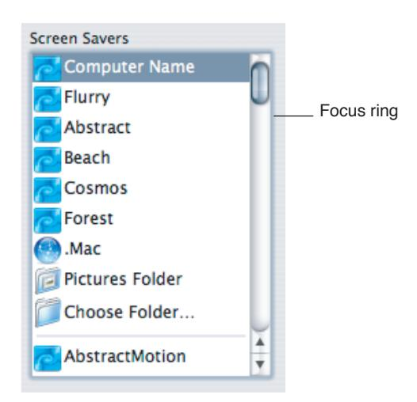

<span id="page-31-2"></span>In list and column views, selected items should be highlighted to the full column width or row height. In column view, the selected item has a dark highlight and the parent item has a lighter highlight. When a window becomes inactive, all selections inside it should become the lighter highlight color.

**Figure 2-3** Primary highlight color on child item; secondary color on parent

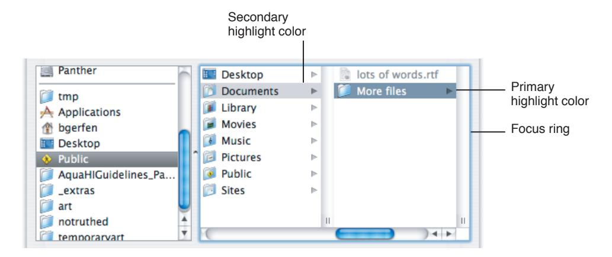

<span id="page-31-5"></span><span id="page-31-4"></span><span id="page-31-3"></span><span id="page-31-0"></span>Pressing the Tab key navigates between controls. Shift-Tab navigates in reverse direction. The arrow keys provide navigation within controls. In list views, the right and left arrow keys open and close disclosure triangles.

### Type-Ahead and Key-Repeat

If the user types faster than the computer can handle or when the computer is unable to process the keystrokes, the keystrokes are queued for later processing. This queuing is called **type-ahead.** There is a limit (varying with the computer) to the number of keystrokes that can be queued, but it's usually not reached unless the user types while the application is performing a lengthy operation.

When a character key is held down for a certain amount of time, it starts repeating automatically. The user can make adjustments to this feature, called **key-repeat,** in Keyboard & Mouse preferences.

An application can tell whether keystrokes are generated by key-repeat or by the same key being pressed numerous times. Your application can disregard key-repeat keystrokes; it should ignore them in keyboard shortcuts that begin with the Command key.

Key-repeat works only when the application is ready to accept keyboard input; it does not function during type-ahead.

# <span id="page-32-3"></span><span id="page-32-0"></span>Selecting

<span id="page-32-4"></span>Before performing an operation on an object, the user must select it to distinguish it from other objects. There is always immediate visual feedback to show that something is selected.

Selecting an object never alters the object itself, and a selection is always undoable by clicking outside the selection.

How something is selected depends on what it is. It's useful to distinguish among three types of objects that are each dealt with in a different way when selected:

- **Text.** An application considers all text appearing together in a particular context as a block of text—a one-dimensional string of characters. A block of text can range from a single field, as in a dialog, to an entire document, as in a word processor. Regardless of where it appears, text is edited in the same way.
- **Arrays** are tabular arrangements of fields. A one-dimensional array of fields is a *list* and a two-dimensional array is a *table*. Each field contains information such as text or graphics.
- **Graphics.** For the purposes of this discussion, a graphic, or picture, is a discrete object that can be selected individually.

<span id="page-32-1"></span>The following sections discuss the general methods of selecting and the specific methods that apply to text, arrays, and graphics.

### Selection Methods

<span id="page-32-2"></span>This section describes selection techniques.

### Selection by Clicking

The most straightforward method of selecting an object is by clicking it once. Icons, for example, are selected in this way in the Finder.

<span id="page-33-0"></span>**Figure 2-4** Selection of a single item


### <span id="page-33-2"></span>Selection by Dragging

The user can select a range of some objects by following this procedure:

- 1. The user positions the pointer at one corner of the range and presses the mouse button. This position is called the **anchor point** of the range.
- 2. Without releasing the mouse button, the user moves the pointer in any direction.
  - As the pointer moves, visual feedback indicates the objects that would be selected if the mouse button is released. For text and arrays, the selected area is continuously highlighted. For graphics, a dotted rectangle expands or contracts to show the selected area. If appropriate, the view should scroll to allow extending the selection beyond a window.
- <span id="page-33-3"></span><span id="page-33-1"></span>3. When the desired range is selected, the user releases the mouse button. The point at which the button is released is called the **active end** of the range.

**Figure 2-5** Selection of a range

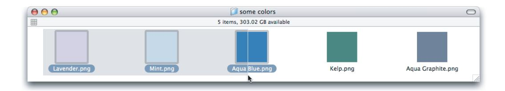

### <span id="page-33-4"></span>Changing a Selection

A user can extend a selection by holding down the Shift key and clicking the mouse button. This action is called **Shift-clicking.**

In text, if the user Shift-clicks within an already selected range, the new range is smaller than the old range.

In an array, a Shift-click can extend the selected range or it can move the selection from the current cell to wherever the user Shift-clicks.

There are two models for extending a continuous selection using Shift-click. In the **addition model,** new text is added to a current selection. In the **fixed-point model,** the user can extend the selection on either side of the insertion point. Figure 2-6 illustrates the results of consecutive steps in both models.

<span id="page-34-0"></span>**Figure 2-6** Shift-clicking in the addition model and the fixed-point model

| S ep                                                                                              | Add<br>on mode | F xed po n mode |
|---------------------------------------------------------------------------------------------------|----------------|-----------------|
| U e<br>e<br>e<br>o<br>po<br>b<br>g be o e<br>e<br>wo d a e<br>o                                   |                |                 |
| 2 U e e<br>e d<br>e<br>e e<br>o<br>o<br>e<br>g<br>b<br>S<br>g<br>a e<br>e wo d be<br>d            |                |                 |
| 3 U e e<br>e d<br>e<br>e e<br>o<br>o<br>e e<br>b<br>S<br>g<br>be o e<br>e wo d Pa                 |                |                 |
| 4 U e e<br>e d<br>e<br>e e<br>o<br>o<br>e<br>g<br>b<br>S<br>g<br>a<br>e e d o<br>e<br>e<br>e<br>e |                |                 |

<span id="page-34-3"></span><span id="page-34-2"></span>When considering which model to use in your application, keep in mind that the addition model provides more flexibility by allowing users to extend a selection in *both* directions.

<span id="page-34-1"></span>A Shift-click should result in a **continuous selection**—the selection is extended to include everything between the old anchor point and the new active end. A Command-click should result in a discontinuous selection. With **discontinuous selection,** in which the user can extend a selection by adding nonadjacent objects to already selected objects, the objects *between* the current selection and the new object are *not* included in the selection.

**Figure 2-7** Discontinuous selection


In arrays and text in which Shift-click extends a continuous selection, the user can make discontinuous selections by holding down the Command key and clicking. Each Command-click adds the new object to the existing selection. If one of the objects selected with Command-click is already within an existing part of the selection, then it is removed from the selection instead of being added.

<span id="page-35-1"></span>**Figure 2-8** Discontinuous selection within an array

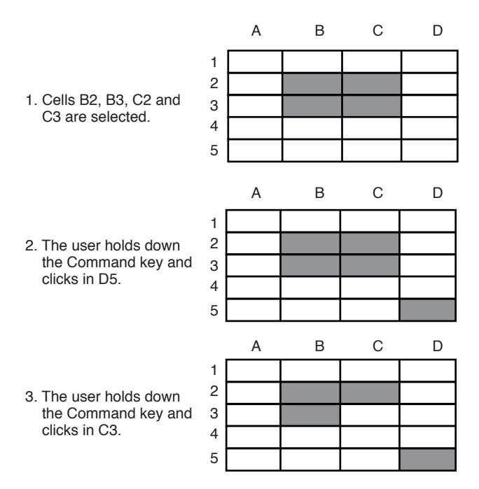

<span id="page-35-0"></span>Not all applications support discontinuous selections, and those that do might restrict the operations a user can perform on them. For example, a word processor might allow the user to choose a font after making a discontinuous selection, but not allow the user to type replacement characters, because it wouldn't be obvious which part of the selection the characters would replace.

### <span id="page-35-2"></span>Selections in Text

A block of text is a string of characters. A text selection is a substring of this string, which has any length from zero characters to the whole block.

The **insertion point** (a zero-length text selection) shows where text will be inserted when the user starts typing, or where the contents of the Clipboard will be pasted. The user establishes the location of the insertion point by clicking somewhere in the text; the insertion point appears at the nearest character boundary. If the user clicks anywhere to the right of the last character on a line, the insertion point appears immediately after the last character. If the user clicks to the left of the first character on a line, the insertion point appears immediately before the first character.

Selected text in a window is highlighted with the color chosen by the user in Appearance preferences. When the window becomes inactive, the text should remain highlighted, but in the secondary color, which is a percentage of the original highlight color. Both Carbon and Cocoa provide a way to return the current highlight color, as well as other important colors in the user interface. Your application should use these defined colors in any custom controls you create, rather than hard-coding specific color values.

### Selecting With the Mouse

The user can select a range of text by dragging. A range can consist of characters, words, lines, or paragraphs, as defined by the application.

In text fields, clicking should perform the following actions:

- <span id="page-36-1"></span>■ Single-clicking places the insertion point at the pointer's location in the text.
- Double-clicking within a word selects the word. The selection should provide "smart" behavior; if the user deletes the selected word, for example, the space after the word should also be deleted.
- Double-clicking in a space selects the space.
- <span id="page-36-0"></span>■ Triple-clicking selects the next logical unit, as defined by the application. In a word-processing document, triple-clicking in a word selects the paragraph containing the word.

### <span id="page-36-2"></span>What Constitutes a Word

The following definition of a word applies in the United States, Canada, and some other countries. In many countries, the definition differs to reflect local formats for numbers, dates, and currency. Double-clicking a character *not* in the list below results in the selection of only that character.

A word is defined as any continuous string that contains any of the following characters:

- A letter
- A digit
- A nonbreaking space (Option–Space bar or Command–Spacebar)
- A currency symbol (\$, ¢, ¬§, £, ¥)
- A percent sign
- A comma between digits
- A period before a digit
- An apostrophe between letters or digits
- A hyphen, but not an en dash (Option–hyphen) or em dash (Shift–Option–hyphen)

These are examples of words:

- \$123,456.78
- shouldn't
- 3 1/2 (with a nonbreaking space)
- 0.5%

These are examples of strings treated as more than one word:

- 7/10/6
- Blue cheese (with a regular space)
- "Wow!" (The quotation marks and exclamation point are not part of the word.)

In some contexts—in a programming language, for example—it may be appropriate to allow users to select both the left and right parentheses (or braces or brackets) in a pair, as well as all the characters between them, by double-clicking either one of them. That would mean that a user could select the entire expression

```
[x+y–(4*3)^(n–1)]
```

by double-clicking [ or ].

### Selecting Text With the Arrow Keys

<span id="page-37-0"></span>See ["Extending Text Selection With the Shift and Arrow Keys"](#page-24-1) (page 25).

### Selections in Spreadsheets

To select a single field (cell), the user clicks in it. The user can also select a field by moving to it with the Tab or Return key.

To select part of the contents of a field, the user must first select the field, then click again to select a part.

A user should be able to quickly select a row or column in a table—for example, clicking a column heading should select the column. Tables can also support Command-click for selecting discontinuous fields.

Pressing the Tab key cycles through the fields in an order determined by your application, and Shift-Tab navigates in the opposite direction. Typically, the sequence is from left to right, then from top to bottom. Pressing Tab from the last field selects the first field.

<span id="page-37-2"></span><span id="page-37-1"></span>If the concept of rows doesn't make sense in a particular context, the Return key should have the same effect as the Tab key.

### Selections in Graphics

There are several conventions for selecting graphic objects. This section describes two ways to show selection feedback; other situations may require other solutions.

An object-based graphics document is a collection of individual graphic objects. To select an object, the user clicks it once. The object is then bracketed with handles, which the user can use to move or resize the object.

In object-based graphics documents, users can select with the mouse alone or a combination of the mouse and the keyboard. A user can drag a dotted rectangle and select every object that is included, even partially, within the rectangle's outline. The user can also select an initial object and then use Shift-click or Command-click to select other objects. If the objects have a defined order, Shift-click

should result in a continuous selection and Command-click should provide a discontinuous selection. If the order is not defined, then both actions result in a discontinuous selection. Examples of continuous and discontinuous selections are shown in ["Selection Methods"](#page-32-1) (page 33).

<span id="page-38-5"></span>In a bitmap-based graphics document—in which images are a series of pixels rather than discrete objects—a user selects the range of pixels enclosed within a selection tool.

# <span id="page-38-9"></span><span id="page-38-0"></span>Editing Text

<span id="page-38-4"></span><span id="page-38-1"></span>In addition to the methods for selecting text, there are a number of standard ways to edit text.

## <span id="page-38-7"></span>Inserting Text

To insert text, the user positions the insertion point by clicking where the text is to go, then starts typing. The application moves the insertion point to the right (or left, depending on the language) as each new character is added.

<span id="page-38-2"></span>Applications with multiple-line text blocks should support **word wrap,** the automatic continuation of text from the end of one line to the beginning of the next without breaking in the middle of a word.

### <span id="page-38-6"></span>Deleting Text

When the user presses the Delete (or Backspace) key, one of two things happens:

- If text is selected, the entire selection is deleted.
- If there is no current selection, the character preceding the insertion point is deleted.

In either case, the insertion point replaces the deleted character or characters in the document. The deleted characters don't go on to the Clipboard, but the user can undo the deletion by immediately choosing Undo from the Edit menu.

You can also implement the keyboard combination Option-Delete (or Option-Backspace) to delete the word that currently contains the insertion point or to delete the part of the word to the left of the insertion point. Be sure to document this behavior if you implement it.

<span id="page-38-8"></span><span id="page-38-3"></span>If a keyboard has a Forward Delete (Fwd Del) key, the character following the insertion point is deleted each time the user presses the key.

### Replacing a Selection

If the user starts typing when one or more characters are selected, the typed characters replace the selection. The deleted characters don't go on to the Clipboard, but the user can undo the replacement by immediately choosing Undo from the Edit menu.

### <span id="page-39-0"></span>Intelligent Cut and Paste

<span id="page-39-2"></span>Intelligent cut and paste is a set of editing features that take into account the need for spaces between words. To understand why this feature is helpful, consider the following sequence of events in a text application *without* intelligent cut and paste:

1. A sentence in the user's document reads

*Returns are only accepted if the merchandise is damaged.*

The user wants to change this to

*Returns are accepted only if the merchandise is damaged.*

- 2. The user selects the word *only* by double-clicking. The letters are highlighted, but neither adjacent space is selected.
- 3. The user chooses Cut from the Edit menu, clicks just before the word *if,* and chooses Paste.
- 4. The sentence now reads

*Returns are accepted onlyif the merchandise is damaged.*

To correct the sentence, the user has to remove the extra space between *are* and *accepted,* and add a space between *only* and *if.*

If your application supports intelligent cut and paste, follow these guidelines:

- If the user selects a word or a range of words, the selection itself is highlighted, but spaces adjacent to the selection are not highlighted.
- When the user chooses Cut, if the character preceding the selection is a space, cut that space along with the selection. If the character preceding the selection is not a space, but the character following the selection is a space, cut that space along with the selection.
- When the user chooses Paste, if the character to the left or right of the current selection is part of a word (but not inside a word), insert a space before pasting.

Use intelligent cut and paste only if the application supports the definition of a word as described in ["What Constitutes a Word"](#page-36-0) (page 37). These rules apply to any selection consisting of one or more whole words, no matter how the user made the selection.

<span id="page-39-3"></span><span id="page-39-1"></span>**Note:** Intelligent cut and paste doesn't apply to all languages. Thai, Chinese, and Japanese, for example, don't contain spaces.

### Editing Text Fields

If your application isn't primarily a text application, but it has text entry fields in dialogs, for example, you may not need to provide the full text-editing features described in this section. The application should support the following features:

- The user can select the whole field and type in a new value, delete text, select a substring of the field and replace it, and select a word by double-clicking.
- The user can choose Undo, Cut, Copy, Paste, and Delete, as described in ["The Edit](#page-89-0) [Menu"](#page-89-0) (page 90).
- The application performs appropriate edit checks. For example, if the only legitimate value for a field is a string of digits, the application should alert the user if any nondigits are typed. For a more complete discussion of when to check for errors and apply changes in text fields, see ["Accepting Changes"](#page-138-1) (page 139).

When possible, support automatically filling in text fields as users type. You might fill in a field with frequently typed information or information from a history list. If you do this, indicate what you are automatically filling in, perhaps by highlighting it, so it is clear what the user has typed and what information your application is providing.

### <span id="page-40-1"></span><span id="page-40-0"></span>Entering Passwords

When a user types a password into a text field, each typed character should appear as a bullet, matching the number of characters typed by the user. If the user deletes a character with the Delete key, one bullet is deleted from the text field and the insertion point moves back one bullet, as if the bullet represented an actual character. Double-clicking bulleted text in a password field selects all the bullets in the text field.

When the user leaves the text field (by pressing Tab, for example), the number of bullets in the text field should be modified so that the field does not reflect the actual number of characters in the password.

#### **CHAPTER 2**

User Input

# <span id="page-42-0"></span>Drag and Drop

<span id="page-42-7"></span><span id="page-42-2"></span>The technique of dragging an item and dropping it on a suitable destination is called **drag and drop.**

In this chapter, an item is anything that the user can select, such as text, graphics, and icons. For convenience, this chapter assumes that the user is dragging with the mouse, but these guidelines also apply to other input devices, such as pens and trackballs.

# <span id="page-42-8"></span><span id="page-42-1"></span>Drag and Drop Overview

Mac users are familiar with the elegant, easy-to-use, and pervasive drag and drop functionality in Mac OS X. Users often prefer to use drag and drop, so correctly incorporating this direct manipulation technology in your Mac OS X application will go a long way toward meeting user expectations.

<span id="page-42-4"></span>Ideally, users should be able to drag any content from any window to any other window that accepts the content's type. If the source and destination are not visible at the same time, the user can create a **clipping** by dragging data to a Finder window; the clipping can then be dragged into another application window at another time.

Drag and drop should be considered an ease-of-use technique. Except in cases where drag and drop is so intrinsic to an application that no suitable alternative methods exist—dragging icons in the Finder, for example—there should always be another method for accomplishing a drag-and-drop task.

<span id="page-42-3"></span>The basic steps of the drag-and-drop interaction model parallel a copy-and-paste sequence in which you select an item, choose Copy from the Edit menu, specify a destination, and then choose Paste. However, drag and drop is a distinct technique in itself and does not use the Clipboard. Users can take advantage of both the Clipboard and drag and drop without side effects from each other.

<span id="page-42-6"></span><span id="page-42-5"></span>A drag-and-drop operation should provide immediate feedback at the significant points: when the data is selected, during the drag, when an appropriate destination is reached, and when the data is dropped. The data that is pasted should be target-specific. For example, if a user drags an Address Book entry to the "To" text field in Mail, only the email address is pasted, not all of the person's address information.

You should implement Undo for any drag-and-drop operation you enable in your application. If you implement a drag-and-drop operation that is not undoable, display a confirmation dialog before implementing the drop. A confirmation dialog appears, for example, when the user attempts to drop an icon into a write-only drop box on a shared volume, because the user does not have privileges to open the drop box and undo the action.

# <span id="page-43-0"></span>Drag and Drop Semantics

<span id="page-43-4"></span>Your application must determine whether to move or copy a dragged item after it is dropped on a destination. The appropriate behavior depends on the context of the drag-and-drop operation, as described in this section.

### <span id="page-43-6"></span><span id="page-43-1"></span>Move Versus Copy

<span id="page-43-14"></span><span id="page-43-7"></span><span id="page-43-5"></span>If the source and destination are in the same container (for example, a window or a volume), a drag-and-drop operation is interpreted as a move (that is, cut and paste). Dragging an item from one container to another initiates a copy (copy and paste). The user can perform a copy operation within the same container by pressing the Option key while dragging. When performing a copy operation, indicate a copy operation to the user by using the copy cursor. (See ["Standard Cursors"](#page-68-1) (page 69).)

When determining whether to move or copy a dragged item, you must consider the underlying data structure of the contents in the destination window. For example, if your application allows two windows to display the same document (multiple views of the same data), a drag-and-drop operation between these two windows should result in a move.

<span id="page-43-11"></span><span id="page-43-8"></span>The principle driving these drag-and-drop guidelines is to prevent the user from accidental data loss. Because an Undo command in the destination application does not trigger an Undo in the source application, moving data across applications may result in potential data loss. Moving data within the same window (or same volume, as in the case of the Finder) does not lead to data loss.

<span id="page-43-10"></span><span id="page-43-3"></span>**Table 3-1** Common drag-and-drop operations and results

<span id="page-43-12"></span><span id="page-43-9"></span>

| Dragged item       | Destination             | Result                    |
|--------------------|-------------------------|---------------------------|
| Data in a document | The same document       | Move                      |
| Data in a document | Another document        | Copy                      |
| Data in a document | The Finder              | Copy (creates a clipping) |
| Finder icon        | An open document window | Copy                      |
| Finder icon        | The same volume         | Move                      |
| Finder icon        | Another volume          | Copy                      |

### <span id="page-43-13"></span><span id="page-43-2"></span>When to Check the Option Key State

Your application should check whether the Option key is pressed at drop time. This behavior gives the user the flexibility of making the move-or-copy decision at a later point in the drag-and-drop sequence. Pressing the Option key during the drag-and-drop sequence should not "latch" for the remainder of the sequence.

**Note:** The Option key does not act as a toggle switch; Option-dragging between containers always initiates a copy operation. This guideline helps users learn that Option means copy.

# <span id="page-44-7"></span><span id="page-44-0"></span>Selection Feedback

<span id="page-44-8"></span><span id="page-44-1"></span>This section covers issues that deserve special mention in the context of drag and drop. Selection feedback is discussed in more detail in ["Selecting"](#page-32-0) (page 33).

### <span id="page-44-10"></span><span id="page-44-9"></span>Single-Gesture Selection and Dragging

Because dragging is defined as moving the mouse while the mouse button is held down, a mouse-down event must occur before dragging can take place. A selection can be made as a result of this mouse-down event, just before the user starts dragging. For example, the user can select and drag a folder icon in a single gesture; the user does not have to click the folder icon first, release the mouse button, and then press again to begin dragging the icon. Your application should ensure that implicit selection occurs, when appropriate, when the user starts dragging.

<span id="page-44-2"></span>Single-gesture selection and dragging is possible only when the process of selecting an item does not require dragging. Range-selection operations—such as selecting text or multiple graphic objects—don't lend themselves to single-gesture selection and dragging because the range-selection operation itself requires dragging.

### <span id="page-44-11"></span><span id="page-44-5"></span>Background Selections

When a window containing a highlighted selection becomes inactive, your application should maintain the selection so that users can drag previously selected data from inactive windows to the active window.

<span id="page-44-4"></span>Background selections are not required if the dragged item is discrete—for example, an icon or graphical object—because implicit selection can occur when an item is dragged. However, items selected only by range-selection operations—for example, text or a group of icons—must have a background selection to allow the user to drag these items out of inactive windows. Whenever an inactive window is made key, the background selection, if any, becomes highlighted as a normal selection.

# <span id="page-44-6"></span><span id="page-44-3"></span>Drag Feedback

Your application should provide drag feedback as soon as the user drags an item at least three pixels. If a user holds the mouse button down on an object or selected text, it should become draggable immediately and stay draggable as long as the mouse remains down. Typically, applications have to provide an image to drag and have to handle the receiver frame. In Aqua, dragged items are transparent.

Selection Feedback **45**

Drag and Drop

**Note:** Proxy icons are not immediately draggable. Since the proxy icon is in the title bar, where a user often clicks to initiate moving a window, a proxy icon requires a user to hold the mouse down for a couple seconds before it becomes draggable.

# <span id="page-45-4"></span><span id="page-45-0"></span>Destination Feedback

<span id="page-45-2"></span>If the user drags an item to a destination in your application, your application provides feedback that indicates whether it will accept that item. Destination feedback should not occur simply because your application is "drag-aware"; rather, it should depend on the destination's ability to accept the type of data contained in the dragged item. For example, a text entry field that accepts only text should not be highlighted when the dragged item is a graphic.

Use cursors to indicate what result letting go of the mouse will have. For example, if you are dragging an icon out of a toolbar, show the poof cursor when the user has the icon outside of the toolbar to indicate that if they let go of it there, the item will disappear. Other cursors that provide useful feedback during a drag operation include the alias, copy, and not allowed cursors. See ["Cursors"](#page-68-2) (page 69) for more information on the cursors available in Mac OS X.

<span id="page-45-6"></span><span id="page-45-3"></span><span id="page-45-1"></span>**Carbon:** The actual appearance of destination feedback depends on the type of destination. The Drag Manager provides some utilities for simple highlighting; if your application needs more complex highlighting, you must provide your own highlighting utilities.

### <span id="page-45-5"></span>Windows

The valid **destination region** of a document window is usually the window's content area minus the title bar and areas used for controls (such as scroll bars, resize controls, tool palettes, rulers, and placards). When there are multiple destination regions within a window, only one destination region is highlighted at a time.

When the user drags an acceptable item from one destination region to another, your application highlights the destination region as soon as the pointer enters it and removes the highlighting when the pointer leaves the region.

If a drag-and-drop operation takes place entirely within one destination region (moving a document icon to a different location in the same folder window, for example), don't highlight the destination region, to avoid distracting the user. However, if the user drags an item completely out of a destination region and then drags the same item back to the same destination region, the destination region should be highlighted.

You can provide more specific destination feedback within a larger destination region. For example, when the user drags text from one document window to another, the inactive window should display an insertion point where the dragged text would go if the user releases the mouse button.

In many situations, highlighting a more narrowly defined area of a window is more appropriate than highlighting the entire content region; examples are spreadsheets, text boxes, fill-in forms, and panes. In these cases, the destination region must be tailored to more precisely indicate the specific destination.

### <span id="page-46-0"></span>Text

<span id="page-46-7"></span>While the user is dragging an item to a text area, an insertion indicator (a vertical bar) should appear in the text where the dragged item would be inserted if the user releases the mouse button.

### <span id="page-46-8"></span><span id="page-46-1"></span>Lists

An insertion indicator should appear in a list where a dragged item would be inserted if the user releases the mouse button. For example, when a user drags an item into the sidebar of the Finder, a horizontal insertion indicator appears.

### <span id="page-46-2"></span>Multiple Dragged Items

If the user drags multiple items, the destination feedback should occur only if it can accept all of the dragged items. If the destination cannot accept all of the dragged items, the user's attempt results in feedback as described in ["Feedback for an Invalid Drop"](#page-48-0) (page 49).

When the destination can accept all of the dragged items, the destination should accept them in the order specified by the source. The source application should organize the dragged items in the order in which they were selected, except in two cases. If the dragged items come from ordered views (such as View by Date or an alphabetized list), that view's ordering takes precedence over the selection order. If both the source and the destination provide a spatial ordering (such as in graphic applications), the spatial ordering takes precedence over the selection order.

# <span id="page-46-5"></span><span id="page-46-3"></span>Automatic Scrolling

<span id="page-46-4"></span>When an item is being dragged, your application must determine whether to scroll the contents or allow the item to "escape" the window. If your application allows items to be dragged outside of windows, you should define an automatic scrolling region. Automatically scroll a destination window only if it is also the source window and is frontmost. Don't automatically scroll inactive windows.

### <span id="page-46-9"></span>Using the Trash as a Destination

<span id="page-46-6"></span>Dragging items to the Trash results in moving the item from the source to the Trash. For example, dragging a text selection from a word-processing application and dropping it on the Trash icon (or in the Trash window) results in the text being deleted from the application and a clipping containing that text being created inside the Trash. Note that the item is moved, although it is dragged between two containers. This exception to the rules described earlier is appropriate because the user can undo the operation by dragging the clipping out of the Trash back to its original source; it is consistent with the principle of preventing accidental data loss.

It is important to preserve the Trash's container property; do not simply delete the source without creating a clipping or other item in the Trash.

# <span id="page-47-7"></span><span id="page-47-0"></span>Drop Feedback

<span id="page-47-9"></span>When the user releases the mouse button after dragging an item to a destination, feedback should inform the user that the drag-and-drop operation was successful. While this feedback can be visual, it is primarily behavioral in nature. The behavior comes from the semantic operation indicated by the drag-and-drop sequence.

### <span id="page-47-8"></span><span id="page-47-1"></span>Finder Icons

<span id="page-47-11"></span><span id="page-47-10"></span>When the user moves an item by dropping its icon on a folder icon, the dropped icon disappears and the highlighting is removed from the destination folder icon.

<span id="page-47-2"></span>If an icon represents a task, such as printing, you may want to provide progress feedback to indicate that the task is being carried out.

### Graphics

<span id="page-47-3"></span>When dropping graphics, the drop feedback is usually the movement of the actual item to the location of the mouse-up event.

## <span id="page-47-12"></span>Text

After text is dropped, it is shown highlighted at its destination.

When text is dropped in a destination that supports styled text, the dropped text should maintain its font, typeface, and size attributes. If the destination does not support styled text, the dropped text should assume the font, typeface, and size attributes specified by the destination insertion point.

<span id="page-47-13"></span><span id="page-47-4"></span>Drag-and-drop operations involving text should support intelligent cut-and-paste rules, as explained in ["Intelligent Cut and Paste"](#page-39-0) (page 40).

### <span id="page-47-5"></span>Transferring a Selection

<span id="page-47-6"></span>After a successful drag-and-drop sequence involving a single window, the selection feedback is maintained at the new location. This behavior provides an important user cue and allows the user to reposition the selection without having to make the selection again.

If the user drags an item from an active window to an inactive window, the dragged item becomes a **background selection** at the destination; the selection in the active window remains selected. This guideline also applies in the reverse situation, where an item is dragged from an inactive window to an active window.

When content is dropped into a window in which something is selected, your application should deselect everything in the destination before the drop rather than replace the selection with the dragged item.

### <span id="page-48-0"></span>Feedback for an Invalid Drop

<span id="page-48-5"></span><span id="page-48-4"></span>If a user attempts to drop an item on a destination that does not accept it, the item zooms from its mouse-up location back to its source location (a "zoomback"). The zoomback behavior should also occur when a drop inside a valid destination does not result in a successful operation.

<span id="page-48-3"></span>If the user attempts to drag multiple items to a destination that does not accept all of the items, none of the items should be accepted. In such cases you could display a dialog informing the user which type of data the destination accepts and which items in the dragged set cannot be accepted.

# <span id="page-48-1"></span>Clippings

<span id="page-48-2"></span>When an item is dragged from an application to the desktop, a clipping is created that contains the data in the dragged item. If discontinuous selections are dragged from a source to the Finder, a separate clipping is created for each selected item.

Your application should provide a number of representations (such as TEXT, PICT, and native formats) to ensure flexibility with different subsequent destinations. Regardless of which representations are stored, round-trip data integrity should be preserved; a clipping dragged back into its source should be identical to the original item.

Clippings **49**

#### **CHAPTER 3**

Drag and Drop

# <span id="page-50-0"></span>Text

<span id="page-50-2"></span>Although Mac OS X uses graphics as a primary means of user-computer interaction, text is prevalent throughout the interface for such things as button names, pop-up menu labels, dialog messages, and onscreen help. Using text consistently and clearly is a critical component of interface design.

Your product development team should include a skilled writer who is responsible for reviewing all user-visible onscreen text as well the instructional documentation. The writer should refer to the *Apple Publications Style Guide* for guidance on Apple-specific terminology.

# <span id="page-50-5"></span><span id="page-50-1"></span>Fonts

<span id="page-50-4"></span>Mac OS X supports standard fonts for interface elements. Whenever your application specifies a font, use the system-defined constants shown in [Table 4-1](#page-51-1) (page 52); avoid using a specific font and point size. Using the system constants ensures that your application always displays the appropriate fonts regardless of changes to the Mac OS.

The **system font** (Lucida Grande Regular 13 pt) is used for text in menus, dialogs, and full-size controls.

<span id="page-50-6"></span>Use the **emphasized system font** (Lucida Grande Bold 13 pt) sparingly. It is used for the message text in alerts (see [Figure 9-2](#page-135-2) (page 136)).

The **small system font** (Lucida Grande Regular 11 pt) is used for informative text in alerts (see [Figure](#page-135-2) [9-2](#page-135-2) (page 136)). It is also the default font for column headings in lists, for help tags, and for small controls. You can also use it to provide additional information about settings in various windows, such as the QuickTime pane in System Preferences.

Use the **emphasized small system font** (Lucida Grande Bold 11 pt) sparingly. You might use it to title a group of settings that appear without a group box, or for brief informative text below a text field.

<span id="page-50-3"></span>The **mini system font** (Lucida Grande Regular 9 pt) is used for mini controls. It can also be used for utility window labels and text.

An **emphasized mini system font** (Lucida Grande Bold 9 pt) is available for cases in which the emphasized small system font is too large.

If your application creates text documents, use the **application font** (Lucida Grande Regular 13 pt) as the default font for user-created content.

Fonts **51**

Text

<span id="page-51-2"></span>The **label font** (Lucida Grande Regular 10 pt) is used for the labels on toolbar buttons and to label tick marks on full-size sliders. You should rarely need to use this font. For an example of this font used to label a slider control, see the Spoken User Interface pane in Speech preferences.

<span id="page-51-3"></span>Use the **view font** (Lucida Grande Regular 12pt) as the default font of text in lists and tables.

Note that the Lucida Grande font family includes mono-spaced numeric characters and variably-spaced alphabetics.

All user-visible text in your application should be anti-aliased, which is automatic if you use one of the standard system fonts.

Table 4-1 shows the constants to use in Carbon functions and the NSFont methods to use in Cocoa.

**Table 4-1** Carbon constants and Cocoa methods for system fonts

<span id="page-51-1"></span><span id="page-51-0"></span>

| Font                            | Carbon constants                | Cocoa methods                                                                                      |
|---------------------------------|---------------------------------|----------------------------------------------------------------------------------------------------|
| System font                     | kThemeSystemFont                | [NSFont<br>systemFontSizeForControlSize:<br>NSRegularControlSize]                                  |
| Emphasized system<br>font       | kThemeEmphasizedSystemFont      | [NSFont<br>boldsystemFontOfSize:[NSFont<br>systemFontSizeForControlSize:<br>NSRegularControlSize]] |
| Small system font               | kThemeSmallSystemFont           | [NSFont<br>systemFontSizeForControlSize:<br>NSSmallControlSize]                                    |
| Emphasized small<br>system font | kThemeSmallEmphazisedSystemFont | [NSFont<br>boldSystemFontOfSize:[NSFont<br>systemFontSizeForControlSize:<br>NSSmallControlSize]]   |
| Mini system font                | kThemeMiniSystemFont            | [NSFont<br>systemFontSizeForControlSize:<br>NSMiniControlSize]                                     |
| Emphasized mini<br>system font  | Not Available                   | [NSFont<br>boldSystemFontOfSize:[NSFont<br>systemFontSizeForControlSize:<br>NSMiniControlSize]]    |
| Application font                | kThemeApplicationFont           | [NSFont userFontOfSize:0.0]                                                                        |
| Label font                      | kThemeLabelFont                 | [NSFont<br>labelFontOfSize:[NSFont<br>labelFontSize]]                                              |

# <span id="page-52-7"></span><span id="page-52-0"></span>Style

<span id="page-52-3"></span>The *Apple Publications Style Guide* defines style and usage issues, and is the key reference for how Apple uses language. This document is available at the Mac OS X developer documentation website; consult it whenever you have a question about the preferred style of particular terms.

For issues that aren't covered in the *Apple Publication Style Guide*, Apple recommends three other works: *The American Heritage Dictionary, The Chicago Manual of Style,* and *Words Into Type*. When these books give conflicting rules, *The Chicago Manual of Style* takes precedence for questions of usage and *The American Heritage Dictionary* for questions of spelling.

<span id="page-52-1"></span>The rest of this section discusses specific details of how to present your text in a style that integrates properly with the Aqua user interface.

### <span id="page-52-5"></span>Using the Ellipsis Character

An **ellipsis character** (…) after a menu item or button label indicates to the user that additional information is required to complete a command. You should use an ellipsis in the following cases:

- An action that requires further user input to complete or presents an alert allowing the user to cancel the action. Examples include Find, Go To, Open, Page Setup, and Print.
- An action that opens a settings window. The main function of settings windows is to allow the user to change some aspect of the application, not the document content. Examples include Set Title, Preferences, and Options.

Don't use an ellipsis in the following cases:

- An action that requires no further user input to complete and does not present an alert. Often the item to be acted upon is already selected. Examples include New, Cut, Bold, and Quit.
- <span id="page-52-2"></span>■ An action that opens an informational, accessory, or tool window. These windows can be implemented as either utility windows (as in the case of a color palette) or modeless windows. These windows provide tools that help create or manage the content in the main window and are frequently left open to assist in accomplishing the task of the main window. Examples include Get Info and Show Tools.

# <span id="page-52-6"></span>Labels for Interface Elements

<span id="page-52-4"></span>Make labels for interface elements easy to understand and avoid technical jargon as much as possible. Try to be as specific as possible in any element that requires the user to make a choice, such as radio buttons, checkboxes, and push buttons. It's important to be concise, but don't sacrifice clarity for space.

Menu items and buttons that produce a dialog should include an ellipsis (…). See ["Using the Ellipsis](#page-52-1) [Character"](#page-52-1) (page 53) for details on when to use an ellipsis. The dialog title should be the same as the menu command or button label (except for the ellipsis) used to invoke it.

# <span id="page-53-0"></span>Capitalization of Interface Elements

<span id="page-53-2"></span>Title style means that you capitalize every word except:

- Articles (*a, an, the*)
- Coordinating conjunctions (*and, or*)
- Prepositions of three or fewer letters, except when the preposition is part of a verb phrase, as in "Starting Up the Computer."

<span id="page-53-3"></span>In title style, always capitalize the first and last word, even if it is an article, a conjunction, or a preposition of three or fewer letters.

<span id="page-53-7"></span>Sentence style means that the first word is capitalized, and the rest of the words are lowercase, unless they are proper nouns or proper adjectives. Use periods in dialogs only after complete sentences.

**Table 4-2** Proper capitalization of onscreen elements

<span id="page-53-6"></span><span id="page-53-5"></span><span id="page-53-4"></span><span id="page-53-1"></span>

| Element                                                                                                                         | Capitalization style | Examples                                                                                                                                      |
|---------------------------------------------------------------------------------------------------------------------------------|----------------------|-----------------------------------------------------------------------------------------------------------------------------------------------|
| Menu titles                                                                                                                     | Title                | Highlight Color<br>Number of Recent Items<br>Location<br>Refresh Rate                                                                         |
| Menu items                                                                                                                      | Title                | Save as Draft<br>Save As…<br>Log Out<br>Make Alias<br>Go To…<br>Go to Page…<br>Outgoing Mail                                                  |
| Push buttons                                                                                                                    | Title                | Add to Favorites<br>Don't Save<br>Set Up Printers<br>Restore Defaults<br>Set Key Repeat                                                       |
| Labels that are not full<br>sentences (for example, group<br>box or list headings)                                              | Title                | Mouse Speed<br>Total Connection Time<br>Account Type                                                                                          |
| Options that are not strictly<br>labels (for example, radio<br>button or checkbox text), even<br>if they are not full sentences | Sentence             | Enable polling for remote<br>mail.<br>Cache DNS information<br>every minutes.<br>Show displays in menu bar.<br>Maximum number of<br>downloads |

Text

<span id="page-54-2"></span>

| Element         | Capitalization style | Examples                          |
|-----------------|----------------------|-----------------------------------|
| Dialog messages | Sentence             | Are you sure you want to<br>quit? |

### <span id="page-54-4"></span><span id="page-54-0"></span>Using Contractions in the Interface

When space is at a premium, such as in pop-up menus, contractions may be used, as long as the contracted words are not critical to the meaning of the phrase. For example, a menu could contain the following items:

Don't Allow Printing Don't Allow Modifying Don't Allow Copying

<span id="page-54-1"></span>In each case, the contraction does not contain the operative word for the item. But in Sherlock, for example, menu items enabling users to choose between text that "contains" and "does not contain" are communicated more clearly without the use of contractions.

### <span id="page-54-5"></span>Developer Terms and User Terms

Don't use technical jargon or programming terms in interface elements or user documentation. Table 4-3 shows a few examples; more are in *Apple Publications Style Guide* (available at the Mac OS X developer documentation website).

<span id="page-54-3"></span>**Table 4-3** Translating developer terms into user terms

<span id="page-54-6"></span>

| Developer term    | User term equivalent                              |  |
|-------------------|---------------------------------------------------|--|
| Data browser      | Scrolling list or multicolumn list                |  |
| Dirty document    | Document with unsaved changes                     |  |
| Focus ring        | Highlighted area; area ready to accept user input |  |
| User-visible text | Onscreen text                                     |  |
| Mouse-up event    | Mouse click                                       |  |
| Reboot            | Restart                                           |  |
| String length     | Number of characters                              |  |

Text

<span id="page-56-6"></span><span id="page-56-3"></span><span id="page-56-0"></span>This chapter describes the overall philosophy behind Aqua icons and shows how to design application, document, toolbar, and other types of icons for Mac OS X.

Aqua offers a photo-illustrative icon style—it approaches the realism of photography but uses the features of illustrations to convey a lot in a small space. Icons can be represented in 128 x 128 pixels to allow ample room for detail. Anti-aliasing makes curves and nonrectilinear lines possible. Alpha channels and translucency allow for complex shading and dimensionality. All of these qualities pave the way for lush imagery that enables you to create vibrant icons.

To represent your application in Mac OS X, it's essential to create high-quality Aqua-style application icons that scale well in the various places the icon appears—the Dock, Finder previews, alert dialogs, and so on.

**Carbon:** See "Desktop Icons" in *Learning Carbon*, published by O'Reilly, for information on how to provide custom application and document icons.

# <span id="page-56-4"></span><span id="page-56-1"></span>Icon Genres and Families

<span id="page-56-5"></span><span id="page-56-2"></span>**Icon genres** help communicate what you can do with an application before you open it. Applications are classified by role—user applications, software utilities, and so on—and each category, or genre, has its own icon style. This differentiation is very important for helping users easily distinguish between types of icons in the Dock.

**Figure 5-1** Application icons of different genres—user applications and utilities—shown as they might appear in the Dock


For example, the icons for user applications are colorful and inviting, while utilities have a more serious appearance. Figure 5-2 shows user application icons in the top row and utility icons in the bottom row. These genres are further described in ["User Application Icons"](#page-58-3) (page 59) and ["Utility](#page-59-2) [Icons"](#page-59-2) (page 60).

<span id="page-57-0"></span>**Figure 5-2** Two icon genres: User application icons in top row; utility icons in bottom row


<span id="page-57-1"></span>The graphic flexibility of Aqua icons can also help users identify files associated with an application. In iTunes, for example, a visual cue provided in the application icon is carried over into icons for other files associated with iTunes, forming an icon family, as shown in Figure 5-3.

**Figure 5-3** An icon family: The iTunes application icon and its associated icons

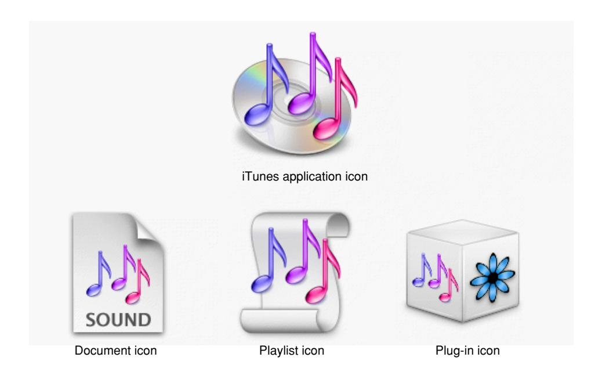

### <span id="page-58-0"></span>Application Icons

<span id="page-58-4"></span>Application icons are the most visible to users. Since they are seen in the Finder and the Dock even when your application is not running, they form a significant part of your user's first impressions.

### <span id="page-58-3"></span>User Application Icons

<span id="page-58-1"></span>Mac OS X user application icons should be vibrant and inviting, and should immediately convey the application's purpose. The TextEdit icon, for example, indicates clearly that this application is for creating text documents.

**Figure 5-4** The TextEdit application icon makes it obvious what this application is for


<span id="page-58-2"></span>If the primary function of your application is creating or handling media, its icon should display the media the application creates or views. If appropriate, the icon should also contain a tool that communicates the type of task the application allows the user to accomplish. The Preview icon, for example, uses a magnification tool to help convey that the application can be used to view pictures. If you include a supportive tool element, it should closely relate to the base object that it rests upon.

**Figure 5-5** The Preview application icon: An example of a tool element


In the Stickies application icon, however, the yellow rectangles are easily identifiable as sticky notes; the icon doesn't include a tool because it isn't necessary to tell the icon's story.

<span id="page-59-0"></span>**Figure 5-6** The Stickies application icon: Effective without the addition of a tool


Notice that the text in the Stickies icon is actual text, not simply wavy lines representing text. If you want to "greek" text in an Aqua icon, use actual text and make it unreadable by shrinking it or doubling the layers.

Generally, Mac OS X user application icons are designed to appear as if they're sitting on a desk in front of you. They have a slightly diminishing perspective (they are wider at the bottom). For more information, see ["Icon Perspectives and Materials"](#page-64-0) (page 65).

### Viewer, Player, and Accessory Icons

<span id="page-59-1"></span>Some applications that represent objects, such as QuickTime Player and Calculator, are most easily recognized by the objects themselves. When creating icons for such applications, it's more aesthetically pleasing to create a simplified, idealized representation of the object, instead of using an actual screen shot of the software. Re-creating the object is particularly important when users could confuse the icon with the actual interface.

**Figure 5-7** The icons for QuickTime Player, Calculator, and Chess


<span id="page-59-2"></span>These icons, many of which are a precursor of what you'll see when you open the application, use a straight-on perspective (rather than the "on a desktop" user application style). You never see the Calculator onscreen in three dimensions, for example, so its icon doesn't depict it that way.

### Utility Icons

Icons for utility applications—which are used less often and not simply for fun or creative activities convey a more serious tone than those for user applications. Color in these icons is desaturated, predominantly gray, and added only when necessary to clearly communicate what the applications do.

<span id="page-60-1"></span>**Figure 5-8** Discriminating use of color in the Activity Monitor and Printer Setup Utility icons


Because utility applications are normally focused on a narrow set of tasks, it's best to keep the number of elements in the icon to a minimum. The focus should be a single object that represents what the utility does. The perspective of utility icons is straight-on, as if they are on a shelf in front of you. For more information, see ["Icon Perspectives and Materials"](#page-64-0) (page 65).

### <span id="page-60-3"></span><span id="page-60-0"></span>Document Icons

<span id="page-60-2"></span>Traditionally, a document icon looks like a piece of paper with its top-right corner folded down. As previously suggested, Aqua document icons should make it obvious which application they are associated with. Preview documents, for example, include a graphic of the media (the pictures) used in the application icon. For simplicity and to avoid confusing the document with the application itself, the viewing tool is not repeated in the document icon.

**Figure 5-9** Icons for the Preview application and a Preview document


Document icons are presented as if they are hovering on the desktop, with the shadow behind the document. For more information, see ["Icon Perspectives and Materials"](#page-64-0) (page 65).

When you want to put an identifying badge over a document icon, treat the badge as an integrated element within the document instead of putting it over the top of the base image and breaking out of the overall document shape.

<span id="page-61-2"></span>**Figure 5-10** Incorrect and correct badging of a document icon


Don do h s Do h s

### <span id="page-61-5"></span><span id="page-61-0"></span>Icons for Plug-ins

<span id="page-61-3"></span>Plug-in icons look like stackable components, with the associated application identifier on the left side and a plug-in–specific image on the right.

**Figure 5-11** A plug-in icon


# <span id="page-61-4"></span><span id="page-61-1"></span>Hardware and Removable Media Icons

Hardware icons represent devices as you most often see them: on your desk. Because these devices are also frequently handled and carried, people are familiar with them as three-dimensional objects with weight. The Aqua treatment of hardware icons reinforces their association with real objects.

<span id="page-62-1"></span>**Figure 5-12** Icons for external (top row) and internal hardware devices


To help users distinguish between external devices, their icons provide a region for an identifying symbol (FireWire, SCSI, and so on).

<span id="page-62-2"></span>Removable media such as CDs, floppy disks, and PC cards are depicted the way they look when you hold them in front of you—that is, the perspective is straight on.

**Figure 5-13** Icons for removable media

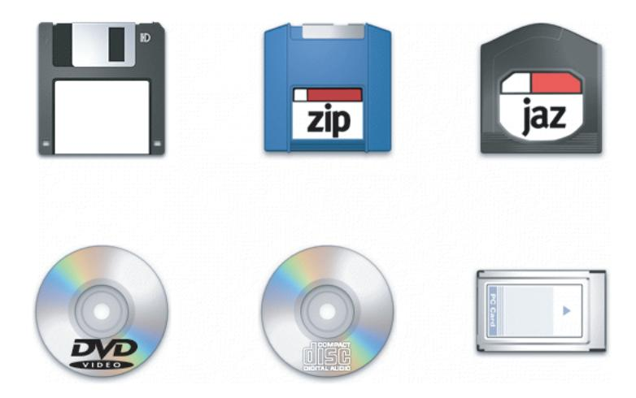

### <span id="page-62-3"></span><span id="page-62-0"></span>Toolbar Icons

The concept behind toolbars is that they provide access to items as if they were sitting on a shelf in front of you. Toolbars should conserve screen real estate while still being inviting and easily clickable; 32 pixels by 32 pixels is the recommended size for toolbar icons.

<span id="page-63-0"></span>**Figure 5-14** Finder toolbar icons


<span id="page-63-1"></span>Each toolbar icon should be easily and quickly distinguishable from the other items in the toolbar. Toolbar icons emphasize their outline form, rather than subtler visual details. As shown in Figure 5-15, each Finder toolbar icon's shape is unique.

**Figure 5-15** Toolbar icons and their dominant shapes

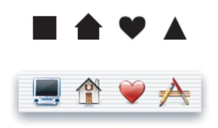

Note that although each Finder toolbar icon has a unique shape, the icons harmonize together in their perspective, use of color, size, and visual weight.

<span id="page-63-2"></span>Although icons designed specifically for use in a toolbar appear as if they are sitting on a shelf in front of you, if you place a very recognizable object from elsewhere in the interface in a toolbar, the object should retain its perspective. That is, don't redesign a toolbar version of a well-known interface element.

**Figure 5-16** The circled icons appear elsewhere in the interface; they retain their perspective when used in a toolbar


Creating a family of toolbar icons helps make an application recognizable and unique. Mail, for example, uses blue and white as dominant colors in its toolbar icons. You can start with a consistent "look" when it makes sense, and introduce differences when necessary. In the Mail application toolbar, for example, the Reply, Reply All, Forward, and Bounce buttons—all for actions the user can apply to a selected received message—use a stamp as the dominant symbol. Because the Bounce button is potentially destructive (the user can no longer read the bounced message), its icon is red. The pencil is depicted in recognizable and realistic yellow.

<span id="page-64-1"></span>**Figure 5-17** The Mail toolbar


For information about implementing toolbars, see ["Toolbars"](#page-107-0) (page 108).

# <span id="page-64-4"></span><span id="page-64-0"></span>Icon Perspectives and Materials

The angles and shadows used for depicting various kinds of icons are intended to reflect how the objects would appear in reality. All Aqua interface elements have a common light source from directly above, not from the upper-left corner as in Mac OS 9 and earlier. The various perspectives are achieved by changing the position of an imaginary camera capturing the icon.

<span id="page-64-2"></span>Application icons look like they are sitting on a desk in front of you.

**Figure 5-18** Perspective for application icons: Sitting on a desk in front of you


<span id="page-64-3"></span>Utility icons are depicted as if they were on a shelf in front of you. Flat objects appear as if there were a wall behind them with an appropriate shadow behind the object.

**Figure 5-19** Perspective for flat utility icons


<span id="page-65-0"></span>An actual three-dimensional object such as a rocket, however, would more realistically be viewed sitting on the ground; its icon shows the rocket sitting on a shelf, with its shadow below it.

**Figure 5-20** Perspective for three-dimensional object


<span id="page-65-1"></span>For toolbar icons, the perspective is also straight-on, as if the object is on a shelf in front of you with the shadow below it.

**Figure 5-21** Perspective for toolbar icons


Icons that represent actual objects should look as though they are made of real materials. Examine various objects to study the characteristics of plastic, glass, paper, and metal. Your icon will look more realistic if you successfully convey the item's weight and feel, as well as its appearance.

<span id="page-65-2"></span>Use transparency only when it is convincing and when it helps complete the story the icon is telling. You would never see a transparent sneaker, for example, so don't use one in your icon.

**Figure 5-22** Materials: Transparency used to convey meaning


# <span id="page-66-0"></span>Suggested Process for Creating Aqua Icons

<span id="page-66-1"></span>You need to provide at least the following files:

- A 128 x 128 image (for Finder icons)
- A mask that defines the image's edges so that the operating system can determine which regions are clickable

Icons that display in the Finder are viewed at different sizes: They can be magnified in the Dock, they can be previewed at full size, and users can specify a preferred size. For the best-looking icons at all sizes, you should also provide custom image files ("hints") at three other sizes: 64 x 64, 32 x 32, and 16 x 16. Although the Dock doesn't use hints (it uses a sophisticated algorithm on the 128 x 128 version), hints are important for preserving crucial details in Finder icons.

If you are creating an icon that will never change size—on a bevel button, for example—you can supply the image only at actual size.

Here are the suggested steps for creating an icon:

1. Sketch the icon.

Work out the concept and details of your design on paper, not with software. You should be ready to execute the idea by the time you open an application.

2. Create a software illustration of the icon.

Although you may want the final icon to look like a photograph, in most cases it's inadvisable to start with an actual photograph. An illustration provides much more flexibility for conveying a concept in a very small space. An illustration also gives you necessary control over details, perspective, light and shadow, texture, and so on.

3. Add detail and color.

For each enhancement you make to a larger-version icon, consider whether it is truly adding something to the icon's usability or whether it is just adding complexity or clutter.

4. Add shadows.

Shadows give objects dimensionality and realism. They also help tie the elements of an icon together so it doesn't look like a collage. The light source should be above and slightly in front of the object. The resulting shadow should create the sense that the icon is resting on a surface.

- 5. In an image-editing program, manipulate the image to get precise effects and create the icon mask.
- 6. Convert the icon to a .icns file. You can complete this step with Icon Composer, included with the Xcode Tools, a set of tools for developers that are included in Mac OS X. There are also several third-party tools available for completing this step.

# <span id="page-67-0"></span>Tips for Designing Aqua Icons

<span id="page-67-1"></span>Many of the suggestions listed here also apply to other graphics you develop for your application—for example, to augment a label or list item.

- For great-looking Aqua icons, have a professional graphic designer create them.
- Perspective and shadows are the most important components of making good Aqua icons. Use a single light source with the light coming from above the icon.
- Use universal imagery that people will easily recognize. Avoid focusing on a secondary aspect of an element. For example, for a mail icon, a rural mailbox would be less recognizable than a postage stamp.
- Strive for simplicity. Try to use a single object that captures the icon's action or represents the control. Start with a basic shape.
- Use color judiciously to help the icon tell its story; don't add color just to make the icon more colorful. Smooth gradients typically work better than sharp delineations of color.
- Avoid using Aqua interface elements in your icons; they could be confused with the actual interface.
- Don't use replicas of Apple hardware products in your icons. These symbols are copyrighted, and hardware designs change frequently.
- Don't reuse Mac OS X system icons in your interface; it can be confusing to users to see the same icon used to mean slightly different things in multiple locations.
- Design toolbar icons at their actual size (32 x 32). For other icons, concentrate on perfecting your icon's look at 128 x 128 and work down from there. It usually works best if you scale down elements independently and then combine them rather than scale the entire icon at once.

# <span id="page-68-0"></span>Cursors

<span id="page-68-3"></span><span id="page-68-2"></span>This chapter discusses the standard cursors available in Mac OS X and provides information on implementing your own cursors. The standard cursors are designed to provide feedback to users. To maintain a consistent user experience, it is important that you use them only for their intended purpose.

<span id="page-68-4"></span>Each cursor has a **hot spot**—the portion of the cursor that must be positioned over a screen object before mouse clicks have an effect on the object. The hot spot should be intuitive, such as the tip of an arrow cursor or the center point of a crosshair. Screen objects have a **hot zone**—the area that the cursor's hot spot must be within in order for mouse clicks to have an effect.

# <span id="page-68-1"></span>Standard Cursors

Table 6-1 shows the standard cursors and explains when to use each. The "API information" column gives the constants to implement them in Carbon or Cocoa.

**Table 6-1** Standard cursors in Mac OS X

| Cursor             | Use                                                                                                                                                                           | API information                                                 |
|--------------------|-------------------------------------------------------------------------------------------------------------------------------------------------------------------------------|-----------------------------------------------------------------|
| Arrow              | Menu bar, desktop, scroll bar, resize<br>control, title bar, close button, zoom<br>button, minimize button, other<br>controls.                                                | Carbon: kThemeArrowCursor<br>Cocoa: arrowCursor                 |
| Contextual<br>menu | Indicates the user can open a<br>contextual menu for an item. Shown<br>when the user presses the Control<br>key while the cursor is over an<br>object with a contextual menu. | Carbon: kThemeContextualMenuArrowCursor<br>Cocoa: Not available |
| Alias              | Indicates the drag destination will<br>have an alias for the original object<br>(the original object will not be<br>moved).                                                   | Carbon: kThemeAliasArrowCursor<br>Cocoa: Not available          |

Standard Cursors **69 August 31, 2004 | © 1992, 2001-2003, 2004 Apple Computer, Inc. All Rights Reserved.**

| Cursor           | Use                                                                                                                                                                                                                                      | API information                                               |
|------------------|------------------------------------------------------------------------------------------------------------------------------------------------------------------------------------------------------------------------------------------|---------------------------------------------------------------|
| Poof             | Indicates that the proxy object being<br>Carbon: kThemePoofCursor<br>dragged will go away, without<br>Cocoa: disappearingItemCursor<br>deleting the original object, if the<br>mouse button is released. Used only<br>for proxy objects. |                                                               |
| Copy             | Indicates that the drag destination<br>will have a copy of the original<br>object (the original object will not<br>be moved).                                                                                                            | Carbon: kThemeCopyArrowCursor<br>Cocoa: Not available         |
| Not<br>allowed   | Indicates an invalid drag<br>destination.                                                                                                                                                                                                | Carbon: kThemeNotAllowedCursor<br>Cocoa: Not available        |
| I beam           | Selecting and inserting text.                                                                                                                                                                                                            | Carbon: kThemeIBeamCursor<br>Cocoa: IBeamCursor               |
| Crosshair        | Precise rectangular selection,<br>especially useful for graphics<br>objects.                                                                                                                                                             | Carbon: kThemeCrossCursor<br>Cocoa: crosshairCursor           |
| Pointing<br>hand | URL links.                                                                                                                                                                                                                               | Carbon: kThemePointingHandCursor<br>Cocoa: pointingHandCursor |
| Open<br>hand     | Indicates that an item can be<br>manipulated within its containing<br>view.                                                                                                                                                              | Carbon: kThemeOpenHandCursor<br>Cocoa: openHandCursor         |
| Closed<br>hand   | Pushing, sliding, or adjusting an<br>object within a containing view.                                                                                                                                                                    | Carbon: kThemeClosedHandCursor<br>Cocoa: closedHandCursor     |
| Move<br>left     | Moving or resizing an object,<br>usually a pane splitter, to the left.<br>Use when the user can move the<br>object only in the indicated<br>direction.                                                                                   | Carbon: kThemeResizeLeftCursor<br>Cocoa: resizeLeftCursor     |

<span id="page-70-0"></span>

| Cursor                   | Use                                                                                                                                                     | API information                                                     |
|--------------------------|---------------------------------------------------------------------------------------------------------------------------------------------------------|---------------------------------------------------------------------|
| Move<br>right            | Moving or resizing an object,<br>usually a pane splitter, to the right.<br>Use when the user can move the<br>object only in the indicated<br>direction. | Carbon: kThemeResizeRightCursor<br>Cocoa: resizeRightCursor         |
| Move<br>left or<br>right | Moving or resizing an object,<br>usually a pane splitter, to the left or<br>the right.                                                                  | Carbon: kThemeResizeLeftRightCursor<br>Cocoa: resizeLeftRightCursor |
| Move<br>up               | Moving or resizing an object,<br>usually a pane splitter, upward. Use<br>when the user can move the object<br>only in the indicated direction.          | Carbon: kThemeResizeUpCursor<br>Cocoa: resizeUpCursor               |
| Move<br>down             | Moving or resizing an object,<br>usually a pane splitter, downward.<br>Use when the user can move the<br>object only in the indicated<br>direction.     | Carbon: kThemeResizeDownCursor<br>Cocoa: resizeDownCursor           |
| Move<br>up or<br>down    | Moving or resizing an object,<br>usually a pane splitter, either<br>upward or downward.                                                                 | Carbon: kThemeResizeUpDownCursor<br>Cocoa: resizeUpDownCursor       |

Many of the progress indicator cursors from Mac OS 9 are still supported in Mac OS X, but you should not use them for new development. Figure 6-1 shows cursors you shouldn't use in Mac OS X.

<span id="page-71-0"></span>**Figure 6-1** Mac OS 9 cursors that you shouldn't use on Mac OS X


<span id="page-71-2"></span><span id="page-71-1"></span>Instead of using a Mac OS 9 cursor, consider using a progress indicator. The use of an asynchronous progress indicator is shown in Figure 6-2. One benefit of this is that it can be seen whether the application is in the foreground or the background. You could also display a progress bar. See ["Progress Indicators"](#page-183-1) (page 184) for more information on using these controls.

**Figure 6-2** Use of an asynchronous progress indicator

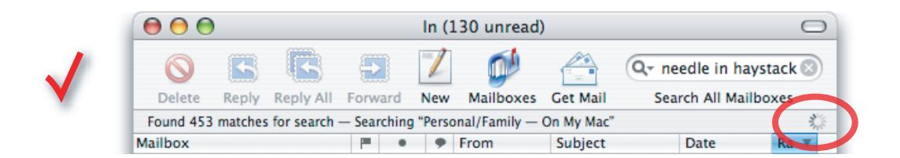

The spinning wait cursor (see Figure 6-3) is displayed automatically by the window server when an application cannot handle all of the events it receives. If an application does not respond for longer than 2 seconds, the spinning wait cursor appears. You should try to avoid situations in your application in which the spinning wait cursor will be displayed. The Spin Control application provided with Xcode can help you eliminate code that is causing this cursor.

<span id="page-72-1"></span>**Figure 6-3** Spinning wait cursor


**Carbon:** Use the Carbon Events Manager instead of the WaitNextEvent model. Avoid polling the mouse button or keyboard. See Appearance.h for functions related to cursors.

**Cocoa:** Use NSCursor methods to display cursors.

# <span id="page-72-0"></span>Designing Your Own Cursors

Mac OS X supports 32-bit RGBA cursors in sizes up to 64 x 64 pixels. If you need a cursor larger than that, you can implement it as a window that tracks with the cursor.

Before you design your own cursor, ask yourself if it is going to add value to the user interface. Recognize that by doing so you are introducing a new, potentially confusing user interface element. If you decide you really need a new cursor, keep the following in mind:

- You need to indicate where the hot spot of the cursor is.
- Your cursors need to be able to work on older hardware that may not provide hardware video acceleration.
- If you create a custom version of a standard cursor, you need to also create new versions of related cursors. For example, if you create a larger arrow cursor you need to also create custom cursors for copy, move, alias, poof, and so forth.

**CHAPTER 6**

Cursors

<span id="page-74-5"></span><span id="page-74-3"></span><span id="page-74-0"></span>Menus present lists of items—commands, attributes, or states—from which the user can choose. Menus are based on the interface principle of see and point: People don't have to remember commands or options because they can view all options at any time.

Menus are user interface elements that users refer to frequently, especially when they are seeking a function for which they know of no other interface. Ensuring that menus are correctly organized, are worded clearly, and behave correctly is crucial to the user's ability to explore and access the functionality of your applications.

<span id="page-74-2"></span>Menus appear in several different forms in the Mac OS X interface. This chapter describes pull-down menus in the menu bar, Dock menus, and contextual menus. These types of menus are illustrated in Figure 7-1.

**Figure 7-1** Menu bar, Dock, and contextual menus


<span id="page-74-1"></span>Menus that are part of controls—for example, pop-up menus, command pop-down menus, and the menus in pop-up icon buttons and bevel buttons—are discussed in ["Controls"](#page-154-3) (page 155). Note that some concepts from this chapter are applicable to those menu types as well.

# <span id="page-74-4"></span>Menu Behavior

When people use menus, they usually make a selection within their data and then choose a menu item. This behavior follows the see-and-point paradigm of identifying what needs to be acted on and then specifying the action by choosing a menu item. To choose an item in a menu, the user positions

Menu Behavior **75**

the pointer on the menu title and drags to the desired item. Each item is highlighted as it is selected. No action happens until the user releases the mouse button with the cursor over a menu item. (See ["The Mouse and Other Pointing Devices"](#page-18-1) (page 19).) People can move the pointer off a menu before releasing the mouse button without initiating any action. They can open and scan menus to find out what features are available without having to actually perform an action. When a menu item has been activated, it blinks briefly.

A user can also open a menu with a click. The menu stays open without the user having to continue holding down the mouse button. The user can then move the pointer to an item to select it or can move the pointer anywhere on the screen without losing sight of the menu. Once a menu is opened, it remains open until another action forces it to close. Such actions include:

- Choosing a command from the menu
- Moving the pointer to another menu title
- A click outside the menu
- A system-initiated alert
- <span id="page-75-1"></span>■ A system-initiated application switch or quit

<span id="page-75-2"></span>If all of the items in a menu or submenu are unavailable, the menu or submenu title is dimmed. The user can still open the menu, but all of its items are dimmed to indicate that these items are not available in the present context. [Figure 7-13](#page-85-2) (page 86) shows a dimmed menu in the open and closed state.

<span id="page-75-0"></span>If a menu contains more items than are visible onscreen, the menu can scroll to allow the user access to all of the menu items. A **scrolling menu** is shown in Figure 7-2.

**Figure 7-2** Scrolling menu

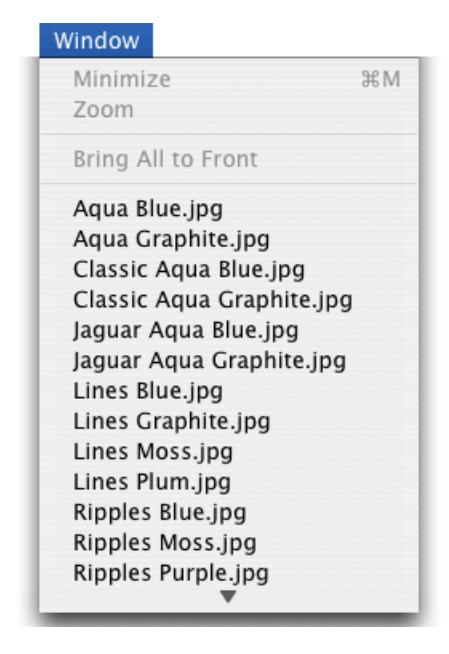

A downward-pointing indicator at the bottom of the scrolling menu indicates that there are more items. When the user starts to scroll down, an upward-pointing indicator appears at the top of the menu to show that some items are no longer visible in that direction. When the user drags past the last visible item, the menu scrolls to show the additional items. When the last item is shown, the downward-pointing indicator disappears.

If the user drags back up to the top, the menu scrolls back down in the same manner. The next time the menu is opened, it appears in its original state (with the indicator at the bottom).

Do not design your application to intentionally include scrolling menus; they should exist only when a user adds many items to a customizable menu or when the menu's function causes it to have items added to it (for example, the Finder's Window menu).

# <span id="page-76-3"></span><span id="page-76-0"></span>Designing the Elements of Menus

<span id="page-76-5"></span><span id="page-76-2"></span>Menu elements include words (and sometimes icons) to designate menu titles and menu items, and symbols to designate keyboard shortcuts, hierarchical menus, separators, and the state of some menu items. These elements are illustrated in Figure 7-3.

**Figure 7-3** Menu elements

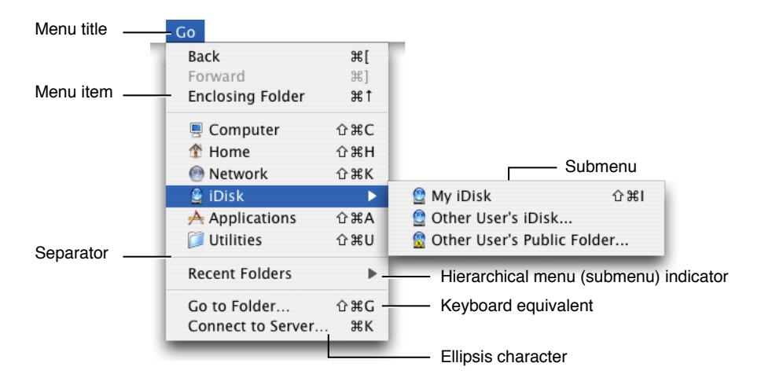

### <span id="page-76-6"></span><span id="page-76-4"></span><span id="page-76-1"></span>Titling Menus

Menu (and submenu) titles should appropriately represent the items in the menu. For example, a Font menu could contain names of font families, such as Helvetica and Geneva, but it shouldn't include editing commands, such as Cut and Paste. Avoid using icons for menu titles. Make menu titles as short as possible without their losing clarity.

## <span id="page-77-0"></span>Naming Menu Items

<span id="page-77-5"></span><span id="page-77-2"></span>Menu item names should be either actions performed on an object or attributes applied to an object:

- Actions are verbs or verb phrases that declare the action that occurs when the user chooses the item. For example, Save means *save my file* and Copy means *copy the selected data.* Your action menu commands should begin in the same way, with an action verb in its base (simplest) form.
- Attributes are adjectives or adjective phrases that describe the change the command implements. Adjectives in menus *imply* an action and should fit into the sentence "Change the selected object to …" —for example, *Bold* or *Italic*.

<span id="page-77-3"></span>When a menu item is unavailable—because it doesn't apply to the selected object or to the selected object in its current state, or because nothing is selected, for example—the item should appear dimmed (gray) in the menu and is not highlighted when the user moves the pointer over it.

<span id="page-77-4"></span>Use title-style capitalization in your menus. See ["Capitalization of Interface Elements"](#page-53-0) (page 54) for more information on this style.

<span id="page-77-1"></span>It may be appropriate in some cases to provide **dynamic menu items**—commands that change when the user presses a modifier key. For example, if the user opens the Window menu in the Finder and then presses the Option key, some of the menu items change, as shown in Figure 7-4. The system appropriately sizes the menu to hold the widest item, including Option-enabled commands.

**Figure 7-4** Dynamic menu items

W thout mod f er key pressed

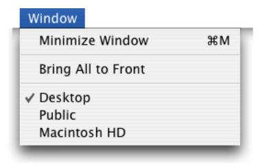

W th mod f er key pressed


**Carbon:** Use SetMenuItemAttributes with the kMenuItemAttrDynamic attribute.

**Cocoa:** Use the setAlternate: method in NSMenuItem to designate one menu item as the alternate of another. This can be done in Interface Builder.

## <span id="page-78-0"></span>Using Icons in Menus

<span id="page-78-2"></span>You should use text, not icons, for your application menu titles. The operating system provides two application menus that use icons instead of text for their titles: the Apple menu and the AppleScript menu, which is displayed if the application has scripts installed. The menu bar status items also are icons. Because these icons are always visible in the menu bar no matter what application is active, users learn what these symbols mean. These are unique uses of symbols as menu titles.

<span id="page-78-1"></span>You may use icons in menu items if the icon is something the user can learn to associate with specific functionality in your application or if the icon represents something unique. For example, as shown in Figure 7-5, the Finder uses icons in the Go menu because users can associate them with the icons they see in the sidebar.

**Figure 7-5** Icons in the Finder Go menu


Safari also makes use of the standard icons displayed with some webpages to allow users to make the connection between the webpage and the menu item for that webpage, as shown in Figure 7-6.

<span id="page-79-1"></span>**Figure 7-6** Icons in the Safari History menu


<span id="page-79-0"></span>If you do include icons in your menus, include them only for menu items for which they add significant value; don't include them for every menu item.

### <span id="page-79-4"></span><span id="page-79-3"></span>Using Symbols in Menus

There are a few standard symbols you can use to indicate additional information in menus. These are listed in Table 7-1 and discussed in the following text. Don't use other, arbitrary symbols in menus, because they add visual clutter and may confuse people.

<span id="page-79-2"></span>**Table 7-1** Acceptable characters for use in menus

| Character | Meaning                                                                                                   |  |  |
|-----------|-----------------------------------------------------------------------------------------------------------|--|--|
|           | The active document in the Window menu; in other menus, a<br>setting that applies to the entire selection |  |  |
|           | A setting that applies to only part of the selection                                                      |  |  |
|           | A window with unsaved changes                                                                             |  |  |
|           | In the Window menu, a document that is currently minimized in<br>the Dock                                 |  |  |

In the Window menu, a **checkmark** should appear next to the active document's name. Checkmarks can also be used in other menus to indicate that the setting applies to the entire selection. You can use checkmarks for mutually exclusive attribute groups (the user can select only one item in the group, such as font size) or accumulating attribute groups (more than one item can be selected at once, such as Bold and Italic).

Use a **dash** to indicate that an attribute applies to only part of the selection. For example, if selected text has two styles applied to it, put a dash next to each style name. When it's appropriate, you can combine checkmarks and dashes in the same menu. See ["Toggled Menu Items"](#page-81-0) (page 82) for more information on how to use checkmarks and dashes in menus.

<span id="page-80-3"></span><span id="page-80-2"></span>**Note:** Include a menu command, such as Plain, for removing all formatting from mixed-state text.

<span id="page-80-1"></span>Use a **bullet** next to a document with unsaved changes and a **diamond** for a document the user has minimized into the Dock. A minimized document with unsaved changes should have a diamond only. If the active window has unsaved changes, the checkmark should override the bullet in the Window menu.

An **ellipsis character** (…) after a menu item indicates to the user that additional information is required to complete a command. For information on when to use an ellipsis in menu items, see ["Using the](#page-52-1) [Ellipsis Character"](#page-52-1) (page 53).

**Note:** Generate the ellipsis character with Option-; (semicolon).

**Carbon:** In the standard Window menu, these symbols are managed automatically. Otherwise, use the SetItemMark function with a char parameter of kCheckCharCode for the active document, kBulletCharCode for a document with unsaved changes, and kDiamondCharCode for a minimized document. These constants work only in the Window menu.

**Cocoa:** These symbols are managed by the Cocoa framework.

<span id="page-80-0"></span>Figure 7-7 and Figure 7-8 show some examples of how to use and how not to use symbols in menus.

**Figure 7-7** Symbols in menus

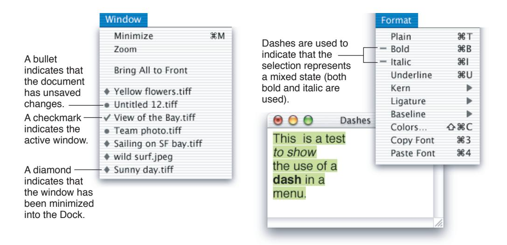

<span id="page-81-1"></span>**Figure 7-8** Don't use arbitrary symbols in menus

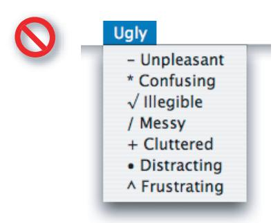

<span id="page-81-4"></span><span id="page-81-2"></span><span id="page-81-0"></span>If you have a Style menu, you may display menu items in the actual style so users can see what effect the menu item will have. Don't use text styles in menus other than a Style menu.

### <span id="page-81-5"></span>Toggled Menu Items

A **toggled menu item** changes between two states each time a user chooses it. There are three types of toggled menu items:

- A set of two menu items that are opposite states; for example, Grid On and Grid Off. The state currently in effect has a checkmark next to it. If you have room in your menu, it's a good idea to display both items (rather than changing the name depending on its state) so that there's less chance of confusion about each item's effect.
- <span id="page-81-3"></span>■ One menu item whose name changes to reflect the current state; for example, Show Ruler and Hide Ruler. Use this type if your menu doesn't have room to show both states.
  - Use two verbs that express opposite actions. Make sure the command name is completely unambiguous. For example, Turn Grid On and Turn Grid Off is unambiguous. Choosing the command Use Grid, however, could turn the grid on (it describes what happens as a result of choosing the command) or off (it describes the current state).
- A menu item that has a checkmark next to it when it is in effect; for example, a style attribute such as Bold. Don't use this kind of toggled item to indicate the presence or absence of a feature such as a grid or ruler. It's unclear whether the checkmark means that the feature is in effect or whether choosing the command turns the feature on.

Figure 7-9 shows correct and incorrect toggled menu items.

<span id="page-82-1"></span>**Figure 7-9** Avoid ambiguous toggled menu items

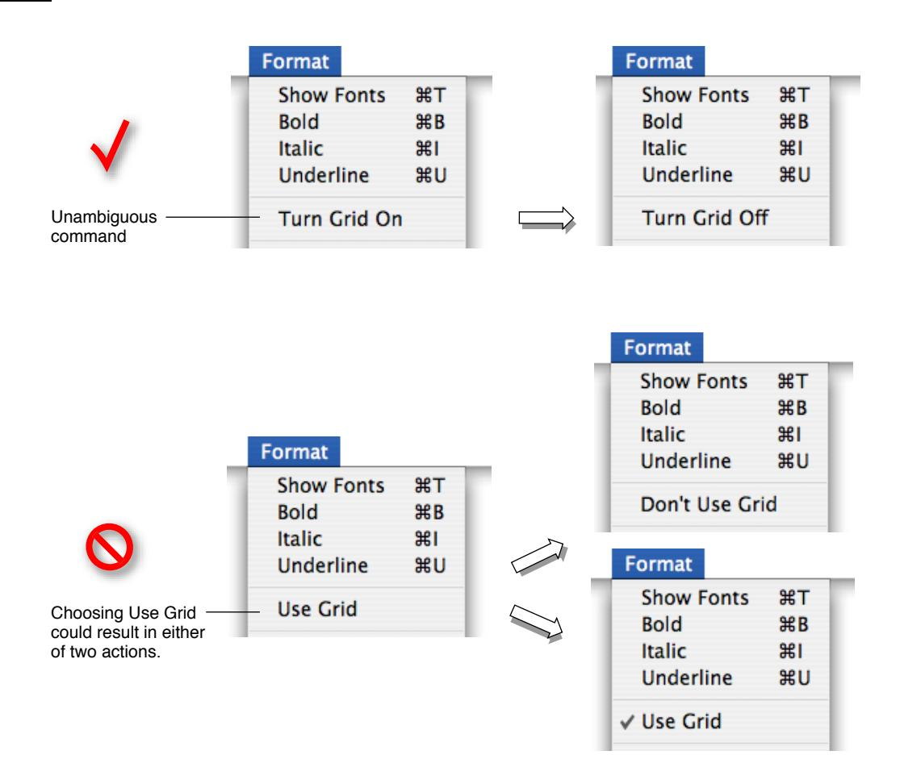

### <span id="page-82-3"></span><span id="page-82-2"></span><span id="page-82-0"></span>Grouping Items in Menus

Logically grouping menu items is the most important aspect of arranging your menus. Grouping items in a menu makes it easier to quickly locate commands for related tasks.

In general, place the most frequently used items at the top of the menu, but create groups of related items rather than arranging them strictly by frequency of use. For example, although the Find Next or the Find Again command may be used infrequently, it should appear right below the Find command. In a menu that contains both actions and attributes, don't put actions and attributes in the same group.

Group interdependent attributes. They can be in a **mutually exclusive attribute group** (the user can select only one item, such as font size) or an **accumulating attribute group** (the user can select multiple items, such as Bold and Italic).

If a menu repeats a term more than twice, consider dedicating a menu or hierarchical menu to the term instead. For example, if you need commands like Show Info, Show Colors, Show Layers, Show Toolbox, and so on, you could create a Show menu or a submenu off of a Show item.

How many separators to use is partly an aesthetic decision and partly a usability decision. Figure 7-10 shows a menu that depicts the right balance of grouping, contrasted with two menus showing insufficient grouping and too much grouping. Use this picture as a visual guide when trying to decide how many separators to use in your menus.

<span id="page-83-2"></span><span id="page-83-1"></span>**Figure 7-10** Grouping items in menus

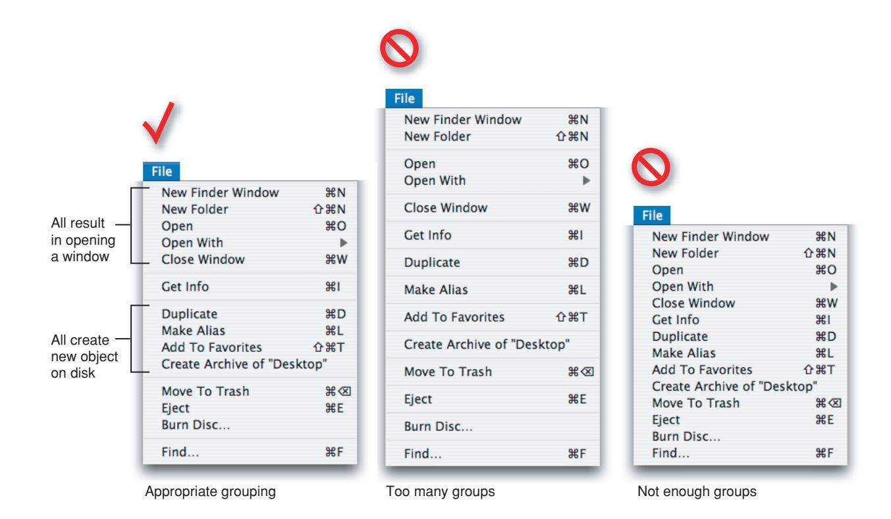

### <span id="page-83-3"></span><span id="page-83-0"></span>Hierarchical Menus (Submenus)

You can use **hierarchical menus** to offer additional menu item choices without taking up more space in the menu bar. When the user points to a menu item with a submenu indicator, a submenu appears. Submenus have all the features of menus, including keyboard shortcuts, status markers (such as checkmarks), and so on.

Because submenus add complexity to the interface and are physically more difficult to use, you should use them only when you have more menus than fit in the menu bar or for closely related commands. Use only *one level* of submenus. If a submenu contains more than five items, consider giving it its own menu.

When you use submenus, include them in a menu with a logical relationship to the choices they contain; the submenu title should clearly represent the choices it contains. Hierarchical menus work best for providing submenus of attributes (rather than actions).

<span id="page-84-1"></span>**Figure 7-11** A hierarchical menu


<span id="page-84-3"></span>If all of a submenu's commands are unavailable (dimmed) at the same time, dim the submenu title.

# <span id="page-84-5"></span><span id="page-84-4"></span><span id="page-84-0"></span>The Menu Bar and Its Menus

The **menu bar** extends across the top of the main screen and contains pull-down menus. There is only one menu bar at the top of the screen; don't put menu bars in windows. The menu bar reflects the principles of perceived stability and aesthetic integrity. It provides a stable location where people can look for commands. Each application, including the Finder, has its own menu bar consisting of a few standard menus, application-specific menus, and menu extras. The menu bar:

- Is always visible and available, except in circumstances such as a slideshow (see discussion below)
- Always has the Apple menu (provided by the operating system); the application menu, containing items that apply to the active application as a whole; and a Window menu
- <span id="page-84-2"></span>■ Can also contain File, Edit, and Help menus, as well as application-specific menus
- May contain menu bar extras (determined by users)

**Figure 7-12** The menu bar displayed when the Finder is active

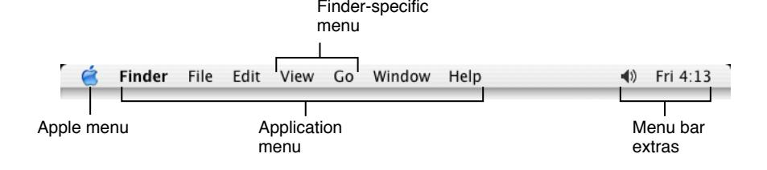

If there is insufficient room to display all of an application's menus, the menu bar status items are omitted. If there is still insufficient room to display all menus, the application's menus may be omitted, starting with the rightmost menu.

If your application can display full-screen images (such as slideshows), you may allow users to hide the menu bar. If you implement this feature, provide a clearly visible way, such as a button, for the user to make the menu bar reappear. If there is no button visible, pressing the Escape key or moving the mouse to the top of the screen should display the menu bar.

<span id="page-85-4"></span><span id="page-85-1"></span>If *all* of a menu's commands are unavailable (dimmed) at the same time, dim the menu title. Users should still be able to open a dimmed menu to see its contents.

<span id="page-85-2"></span>**Figure 7-13** Dimmed menu title when all items are unavailable

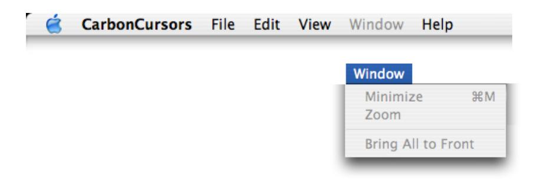

<span id="page-85-5"></span>**Carbon:** The Menu Manager handles the dimming of menu items automatically if you set the kMenuAttrAutoDisable attribute with the ChangeMenuItemAttribute function. See *Menu Manager Reference* in Carbon User Experience Documentation.

**Cocoa:** See *Application Menus and Pop-up Lists* in Cocoa User Experience Documentation.

The following sections discuss the individual menus in the menu bar. The sections are listed in the order that the menus should appear in the menu bar. A checkmark ( ) next to a menu item indicates that unless your application cannot support the item's action or attribute, you should include that item in the menu. The unmarked commands are ones that are not appropriate for all applications, but if they are appropriate in yours, you should implement and label them as discussed.

<span id="page-85-0"></span>If there is an appropriate keyboard shortcut for a menu item, it is listed. Except for those items with a checkmark next to them, you should implement keyboard shortcuts only for those commands that will be frequently used. Unnecessary use of keyboard shortcuts can make your application confusing. For more discussion on assigning keyboard shortcuts for pull-down menu items, see ["Keyboard](#page-27-0) [Shortcuts"](#page-27-0) (page 28).

### <span id="page-85-6"></span><span id="page-85-3"></span>The Apple Menu

The **Apple menu** provides items that are available to users at all times, regardless of which application is active. The Apple menu's contents are defined by the system and cannot be modified by users or developers.

<span id="page-86-6"></span><span id="page-86-1"></span>**Figure 7-14** The Apple menu


# <span id="page-86-5"></span><span id="page-86-4"></span><span id="page-86-0"></span>The Application Menu

<span id="page-86-2"></span>The **application menu** contains items that apply to the application as a whole rather than to a specific document or other window.

**Figure 7-15** The Mail application menu

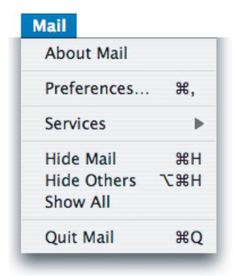

### <span id="page-86-3"></span>The Application Menu Title

To help users identify the active application, the application menu title is in boldface.

In order to fit within the allotted menu bar space, the application menu title should be one word, if possible, and a maximum of 16 characters. Don't include the application version number in the name; version information belongs in the About window. If the application name is too long, provide a short

name (16 characters or fewer) as part of the application package. The Hide, Quit, and About items should also use the short application name. If you don't provide a short name, the application name is truncated from the end (and an ellipsis is added), if necessary.

### <span id="page-87-1"></span>The Application Menu Contents

**About** *ApplicationName***.** Opens your application's About window, which contains copyright information and version number. (For more information, see ["The About Window"](#page-127-0) (page 128). If you've specified a short name (see ["The Application Menu Title"](#page-86-3) (page 87)), use it in the About menu item; use the full application name in the About window.

<span id="page-87-6"></span>**Preferences (Command-,).** Opens a preference window for your application. See *Apple Software Design Guidelines* for more information on preferences in Mac OS X.

<span id="page-87-7"></span>In the application menu, put all commands that provide access to your application's preference dialogs first, followed by application-specific items. Put a menu separator between the About command and the Preferences command. If your application provides document-specific preferences, make them available in the File menu (see ["The File Menu"](#page-87-0) (page 88)). Most document-specific preferences should have a unique name, such as Page Setup, rather than Preferences.

<span id="page-87-3"></span>**Services.** The Services submenu provides a way for one application to offer its capabilities to another application. See *Apple Software Design Guidelines* for more information on services.

<span id="page-87-4"></span>**Hide** *ApplicationName* **(Command-H).** Hides all of the windows of the currently running application and brings the most recently used application to the foreground. If necessary, use the short application title (see ["The Application Menu Title"](#page-86-3) (page 87)).

<span id="page-87-8"></span><span id="page-87-5"></span>**Hide Others (Command-Option-H).** Hides the windows of all the other applications currently running.

**Show All.** Shows all windows of all currently running applications.

<span id="page-87-2"></span>**Quit** *ApplicationName* **(Command-Q).** This last item in the application menu should be preceded by a separator. When a user chooses Quit and there are unsaved documents, present the necessary alerts (see ["Dialogs for Saving, Closing, and Quitting"](#page-142-0) (page 143)). If necessary, use the short application name (see ["The Application Menu Title"](#page-86-3) (page 87)).

<span id="page-87-10"></span><span id="page-87-9"></span><span id="page-87-0"></span>You may include other application-specific menu items between the Preferences and Services menu items. Don't include a Help menu item however, this belongs in the Help menu.

### The File Menu

In general, each command in the **File menu** should apply to a single file (most commonly, a user-created document).

Note that the Preferences and Quit commands, which apply to a whole application, are in the application menu. If your application provides document-specific preferences, make them available in the File menu, preferably right above printing commands. If an application is not document-based, you can rename the File menu to something more appropriate or eliminate it.

<span id="page-88-0"></span>Several items in the File menu—Save As, Print, and Page Setup, for example—should open sheets. For more information, see ["Document-Modal Dialogs \(Sheets\)"](#page-133-0) (page 134).

**Figure 7-16** The File menu


<span id="page-88-5"></span>Standard File menu commands include these:

<span id="page-88-3"></span>**New (Command-N).** Opens a new document named "untitled" (or "untitled 2," and so on, as appropriate). If your application requires documents to be named upon creation, you can display a Save dialog (see ["Dialogs for Saving, Closing, and Quitting"](#page-142-0) (page 143)). For more information about naming new document windows, see ["Opening Windows"](#page-112-1) (page 113).

<span id="page-88-6"></span>**Open (Command-O).** Displays a dialog for choosing an existing document to open. For more information, see ["The Open Dialog"](#page-140-0) (page 141).

<span id="page-88-1"></span>**Open Recent.** The Open command should be followed by Open Recent so that people can open recently opened documents without using the Open dialog. The Open Recent submenu displays documents in the order in which they were opened, with the most recent item at the top.

**Carbon:** You should add documents to this submenu when they are opened or saved. **Cocoa:** The Open Recent submenu is populated automatically.

<span id="page-88-2"></span>**Close (Command-W).** Closes the active window. When the user chooses this command and the active document has been changed since last saved, display the Save Changes alert (see ["Dialogs for](#page-142-0) [Saving, Closing, and Quitting"](#page-142-0) (page 143)). When the user presses the Option key, Close changes to Close All. The keyboard shortcuts Command-W and Command-Option-W should implement the Close and Close All commands, respectively. The Close command and Command-W should not close utility windows.

<span id="page-88-4"></span>**Close File (Command-Shift-W).** In a file-based application that supports multiple views of the same file, you can include a Close File command below Close Window to close a file and all its associated windows. If possible, include the filename in the menu (for example, Close File "Jerry's Kids").

**Save (Command-S).** Saves the active document, leaves the document open, and provides feedback indicating that the document is being (or has been) saved. If the document has not previously been saved, display a Save dialog (see ["Save Dialogs"](#page-142-1) (page 143)).

<span id="page-89-5"></span>**Save As (Command-Shift-S).** Displays the Save dialog, which allows the user to save a copy of the active document with a new user-defined name, a new location, or both. The newly saved document remains open and active.

<span id="page-89-11"></span>**Note:** Avoid using Save a Copy or Save To commands. Users might not understand the distinction between them and Save As.

<span id="page-89-7"></span><span id="page-89-6"></span>**Save All.** Saves changes to all open documents.

<span id="page-89-3"></span>**Revert to Saved.** Discards all changes made to the active document since the last time it was saved or opened. When the user chooses Revert to Saved, display an alert that warns the user about the potential data loss the operation will cause.

<span id="page-89-8"></span><span id="page-89-4"></span>**Print (Command-P).** Opens the standard Print dialog, which allows users to print to a printer, to send a fax, or to save as a PDF file. For more information, see ["The Printing Dialogs"](#page-150-0) (page 151).

<span id="page-89-0"></span>**Page Setup (Command-Shift-P).** Opens a dialog for specifying printing parameters such as paper size and printing orientation. These parameters are saved with the document.

### <span id="page-89-10"></span><span id="page-89-9"></span>The Edit Menu

<span id="page-89-2"></span>The **Edit menu** provides commands that allow people to change (edit) the contents of documents and other text containers, such as fields. It also provides the commands that allow people to share data, within and between applications, via the Clipboard.

<span id="page-89-1"></span>The **Clipboard** stores whatever data is cut or copied from a document until the user replaces the contents by cutting or copying new data. The Clipboard is available to all applications, and its contents don't change when the user switches from one application to another. The Clipboard provides excellent support for the exchange of different data types between applications. Your application should maintain formatting when it copies text to the Clipboard.

**Figure 7-17** The Edit menu

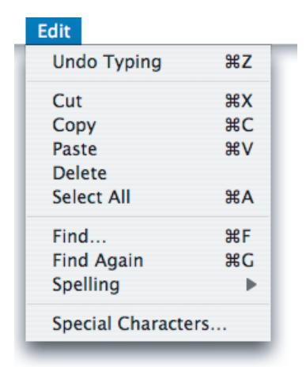

Your application's Edit menu should provide the following commands. Even if your application doesn't handle text editing within its documents, these commands should be available for use in dialogs and wherever users can edit text:

<span id="page-90-6"></span><span id="page-90-3"></span>**Undo (Command-Z).** The Undo command reverses the effect of the user's previous operation. When the user chooses Undo, the command changes to Redo (Command-Shift-Z), which reverses the effect of the last Undo command.

Support the Undo command for:

- Operations that change the contents of a document
- Operations that require a lot of effort to re-create
- Most menu items
- Most keyboard input

Operations that may not be undoable include:

- Selecting
- Scrolling
- Splitting a window
- Changing a window's size or location

<span id="page-90-0"></span>Add the name of the last operation to the Undo and Redo commands. If the last operation was a menu command, add the command name. For example, if the user has just input some text, the command could read Undo Typing, as shown in Figure 7-17; if the user has chosen the Paste command, the Undo command should read Undo Paste. If the last operation can't be reversed, change the command to Can't Undo and display it dimmed to provide feedback about the current state.

<span id="page-90-5"></span><span id="page-90-2"></span>If a user attempts to perform an operation that could have a detrimental effect on data and that can't be undone, warn the user. See ["Alerts"](#page-135-0) (page 136).

<span id="page-90-4"></span>**Cut (Command-X).** Removes the selected data and stores it on the Clipboard, replacing the previous contents of the Clipboard.

<span id="page-90-7"></span>**Copy (Command-C).** Makes a duplicate of the selected data, which is stored on the Clipboard.

**Paste (Command-V).** Inserts the Clipboard contents at the insertion point. The Clipboard contents remain unchanged, permitting the user to choose Paste multiple times.

<span id="page-90-1"></span>**Paste and Match Style.** In text-editing applications, inserts the Clipboard contents at the insertion point and matches the style of the inserted text to the surrounding text.

**Delete.** Removes selected data without storing the selection on the Clipboard. Choosing Delete is the equivalent of pressing the Delete key or the Clear key. Use Delete as the menu command, rather than Clear.

<span id="page-91-2"></span>**Select All (Command-A).** Highlights every object in the document or window, or all characters in a text field.

<span id="page-91-3"></span>**Find (Command-F).** Opens an interface for finding items. This command could be in the File menu instead if the object of the search is files—for example, if the application is finding a file on the Internet. When appropriate, your application should also contain a Find/Replace command. ["Find](#page-130-0) [Window"](#page-130-0) (page 131) shows an example of a typical Find window for searching text.

If your application provides multiple find-related commands, you may want to include a Find submenu. A Find submenu commonly contains Find (Command-F), Find Next (Command-G), Find Previous (Command-Shift-G), Use Selection for Find (Command-E), and Jump to Selection (Command-J).

<span id="page-91-7"></span><span id="page-91-4"></span>**Find Again (Command-G).** Performs the last Find function again. This item should be grouped with the Find command in either the File or Edit menu.

<span id="page-91-10"></span><span id="page-91-0"></span>**Special Characters.** Displays the Special Characters window, which allows users to input characters from any character set supported by Mac OS X into text entry fields. This menu item is automatically inserted at the bottom of the Edit menu.

### <span id="page-91-11"></span><span id="page-91-9"></span>The Format Menu

<span id="page-91-1"></span>If your application provides functions for formatting text, you can include a **Format menu** as a top-level menu or as a submenu of the Edit menu. It may be appropriate to group some items that are in the Format menu into submenus, such as Font, Text, or Style.

**Figure 7-18** A Format menu


<span id="page-91-8"></span><span id="page-91-6"></span><span id="page-91-5"></span>**Show Fonts (Command-T)**. The first item in the Format menu should be Show Fonts, which displays the Fonts window.

**Carbon:** Use the FPShowHideFontPanel function. See the *Fonts Window Services Reference* in Text & International Documentation.

**Cocoa:** Use NSFontPanel.

**Show Colors (Command-Shift-C)**. Displays the Colors window.

**Carbon:** Use the NPickColor function to implement a Colors window. See *Color Picker Manager Reference* in Carbon Graphics & Imaging Documentation.

**Cocoa:** Use the NSColorPanel class. See *Using Color* in Cocoa Graphics & Imaging Documentation.

<span id="page-92-9"></span><span id="page-92-4"></span>**Bold (Command-B)**. Boldfaces the selected text or toggles boldfaced text on and off. If used as a toggle, indicate when it is on by having a checkmark next to the command in the menu.

<span id="page-92-12"></span>**Italic (Command-I).** Italicizes the selected text or toggles italic text on and off. If used as a toggle, indicate when it is on by having a checkmark next to the command in the menu.

<span id="page-92-3"></span>**Underline (Command-U)**. Underlines the selected text or toggles underlined text on and off. If used as a toggle, indicate when it is on by having a checkmark next to the command in the menu.

<span id="page-92-6"></span>**Bigger (Command–Shift–equal sign)**. Causes the selected item to increase in size in defined increments.

<span id="page-92-10"></span>**Smaller (Command-hyphen)**. Causes the selected item to decrease in size in defined increments.

<span id="page-92-11"></span>**Copy Style (Command-Option-C)**. Copies the style—font, color, and size for text—of the selected item. It may be appropriate to put this item in a Style submenu along with related items.

<span id="page-92-5"></span><span id="page-92-1"></span>**Paste Style (Command-Option-V)**. Applies the style of one object to the selected object.

<span id="page-92-13"></span>**Align Left (Command-{)**. Left-aligns a selection.

<span id="page-92-2"></span>**Center (Command-|)**. Center-aligns a selection.

<span id="page-92-14"></span>**Justify**. Evenly spaces a selection.

<span id="page-92-7"></span>**Align Right (Command-})**. Right-aligns a selection.

<span id="page-92-8"></span>**Show Ruler**. Displays a formatting ruler.

<span id="page-92-15"></span>**Copy Ruler (Command-Control-C)**. Copies formatting settings such as tabs and alignment for a selection to apply to a another selection and stores them on the Clipboard.

<span id="page-92-18"></span><span id="page-92-16"></span><span id="page-92-0"></span>**Paste Ruler (Command-Control-V)**. Applies formatting settings (that have been saved to the Clipboard) to the selected object.

### <span id="page-92-17"></span>The View Menu

The **View menu** provides commands that affect what users see in a window. In the Finder, for example, the View menu contains commands for displaying windows as columns, icons, or lists. Commands for showing, hiding, and customizing a toolbar belong in the View menu. Create a View menu for these commands even if your application doesn't need to have other commands in the View menu. Show/Hide Toolbar should appear right above Customize Toolbar.

Avoid using the View menu to display utility windows (such as tool palettes); use the Window menu instead.

<span id="page-93-0"></span>**Figure 7-19** A View menu


<span id="page-93-2"></span><span id="page-93-1"></span>**Show/Hide Toolbar (Command-Option-T).** Shows or hides a toolbar. The Show/Hide Toolbar command is provided so that people using full keyboard access can implement these functions with the keyboard. It should be a dynamic menu item that toggles based on the current visibility of the toolbar. If the toolbar is currently visible, the menu item says Hide Toolbar. If the toolbar is not visible, it says Show Toolbar.

**Customize Toolbar**. Opens a window that allows the user to customize which items are present. Figure 7-20 shows the result of choosing this command in the Finder.

<span id="page-94-3"></span><span id="page-94-1"></span>**Figure 7-20** Finder toolbar customization window

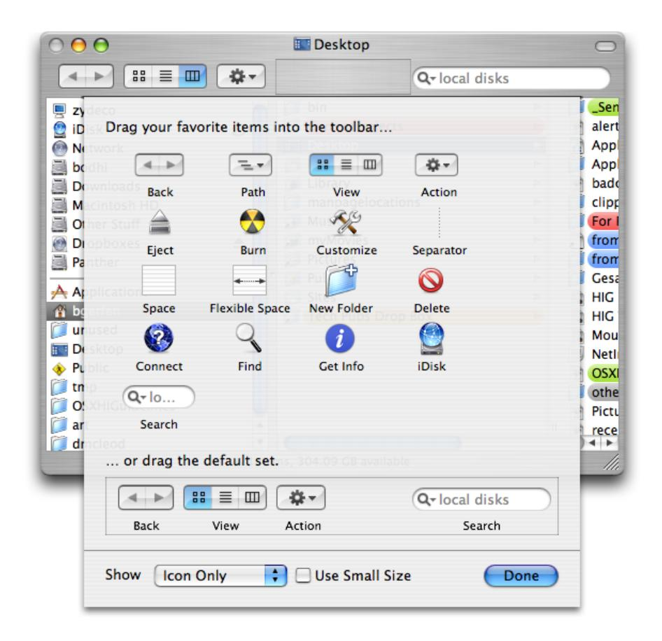

### <span id="page-94-2"></span><span id="page-94-0"></span>Application-Specific Menus

You can add your own application-specific menus as appropriate. These menus should be between the View menu and the Window menu, as illustrated in Figure 7-21.

**Figure 7-21** Application-specific menus in Safari


## <span id="page-95-0"></span>The Window Menu

<span id="page-95-7"></span><span id="page-95-6"></span>The **Window menu** contains commands for organizing and managing an application's windows. The menu should list an application's open document windows, including minimized windows, in the order in which they were opened, with the most recently opened document first. If a document contains unsaved changes, a bullet should appear next to its name.

<span id="page-95-1"></span>**Figure 7-22** A Window menu


Mac OS X does not automatically add utility windows to the list in the Window menu. You can add a command to the Window menu to show or hide utility windows in your application.

The Minimize and Zoom commands are in the Window menu so that people using full keyboard access can implement these functions with the keyboard. Even if your application consists of only one window, include a Window menu for the Minimize and Zoom command.

<span id="page-95-8"></span>Window menu items should appear in this order: Minimize, Zoom, separator, application-specific window commands, separator, Bring All to Front (optional), separator, list of open documents. The Close command should appear in the File menu, below the Open command.

<span id="page-95-3"></span>**Carbon:** The Window menu is part of the default menu bar when you create a Carbon application in Interface Builder. To create one programmatically, use the function CreateStandardWindowMenu.

<span id="page-95-4"></span>**Cocoa:** The Window menu is part of the default menu bar when you create a Cocoa application in Interface Builder.

<span id="page-95-5"></span>**Minimize (Command-M).** Minimizes the active window to the Dock.

**Minimize All (Command-Option-M).** Minimizes all the windows of the active application to the Dock.

<span id="page-95-2"></span>**Zoom.** Toggles between a predefined size appropriate to the window's content and the window size the user has set. This command should *not* expand the window to the full screen size. See ["Resizing](#page-118-0) [and Zooming Windows"](#page-118-0) (page 119).

**Bring All to Front.** Brings forward all of an application's open windows, maintaining their onscreen location, size, and layering order. This should happen whenever a user clicks the application icon in the Dock. See ["Window Layering"](#page-119-1) (page 120).

You can make this command an Option-enabled toggle with Arrange in Front.

<span id="page-96-6"></span><span id="page-96-3"></span>**Arrange in Front.** Brings forward all of the application's windows in their current layering order and changes their location and size so they are neatly tiled.

### <span id="page-96-5"></span><span id="page-96-0"></span>The Help Menu

<span id="page-96-7"></span>If your application provides onscreen help, the **Help menu** should be the rightmost menu of your application's menus. The first item is the name of the application and the word "Help" (Mail Help, for example). This item should open Help Viewer to the first page of your help content. It's best to have only one item in the Help menu, but if you do have more items, they should appear below the *ApplicationName* Help item. Additional items that are distinct from your help content, such as tutorials, website links, registration information, release notes, or support information should be linked to within your help book instead of being seperate items in your help menu.

<span id="page-96-2"></span>Avoid adding multiple items to the Help menu that lead to the same place—your help book. Multiple entries that open Help Viewer can be confusing; differences between sections of your help book may not be as obvious to users as you think they are. Navigating between sections of a help book is typically best handled by providing links in the Help Viewer window.

**Figure 7-23** A Help menu

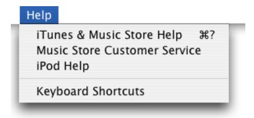

<span id="page-96-4"></span><span id="page-96-1"></span>*ApplicationName* **Help (Command-?)**. Opens Help Viewer to your application's help. For information about creating help content, see *Providing User Assistance With Apple Help (Revision; Preliminary)* in User Experience Help Technologies Documentation.

### Menu Bar Extras

Reserved for use by Apple, the right side of the menu bar may contain items that provide feedback on and access to certain hardware or network settings. Menu bar extras display some type of status in the menu bar and have a menu to change settings. The icon for the battery strength indicator, for example, dynamically displays the current state of the battery for a portable computer, and the menu has common battery settings. Users can display or hide a menu bar extra in the appropriate preferences pane.

#### **Important**

Don't create your own menu bar extras. Use the Dock menu functions to open a menu from your application's icon in the Dock.

If there is not enough room in the menu bar to display all menus, menu bar extras are not displayed.

# <span id="page-97-0"></span>Contextual Menus

<span id="page-97-1"></span>A **contextual menu** provides convenient access to often-used commands associated with an item. Contextual menus open when the user presses the Control key while clicking an appropriate interface element or selection.

A contextual menu behaves like a standard pull-down menu, except that moving the pointer off a contextual menu and onto a standard pull-down menu doesn't activate the second menu; the user must click once to close the contextual menu and click again or press to open the second menu.

Contextual menus that are too long to display fully use the scrolling indicator (a downward-pointing triangle) and scroll like standard menus.

Don't set a default item. If the user opens the menu and closes it without selecting anything, no action should occur.

You define the items in your application's contextual menus. Include a small subset of the most commonly used commands in the appropriate context. For example, Edit menu commands should appear in the contextual menu for highlighted text, but a Save or a Print command should not.

Never provide a contextual menu command that is not also accessible through the menu bar. Commands with keyboard shortcuts should be noted in the menu bar menu but not in the contextual menu. Use submenus with caution and keep them to one level.

<span id="page-98-1"></span>**Figure 7-24** A contextual menu for an icon in the Finder and for a text selection in a document


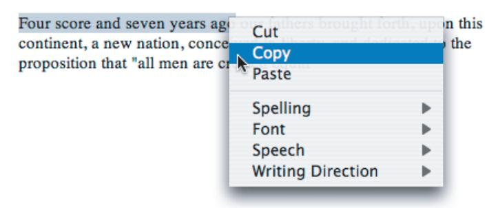

**Carbon:** See *Menu Manager Reference* in Carbon User Experience Documentation.

<span id="page-98-2"></span>**Cocoa:** See *Application Menus and Pop-up Lists* in Cocoa User Experience Documentation.

# <span id="page-98-0"></span>Dock Menus

When a user presses and holds the mouse button on your application's tile in the Dock, a menu appears. The menu lists the application's open windows and contains the Show In Finder, Hide, and Quit commands. The Show In Finder command displays a Finder window for the folder containing your application. The Hide and Quit commands function as documented in ["The Application](#page-86-0) [Menu"](#page-86-0) (page 87). If the user presses the Option key, Hide changes to Hide Others and Quit changes to Force Quit. If the tile has not been permanently added to the Dock, the command Keep In Dock also appears.

<span id="page-99-0"></span>**Figure 7-25** The iTunes Dock menu


You can customize your application's Dock menu by adding to the default items provided by the Dock. These additional items appear in the Dock menu only when the application is open. Potential additional items include:

- Common commands to initiate actions in your application when it is not frontmost
- Commands that are applicable when there is no open document window
- Status and informational text

For example, a mail application could provide commands to initiate a new message or to check for new messages.

<span id="page-99-1"></span>Any command you add to the Dock menu should also be available in your application's pull-down menus. Application-specific items appear above the standard Dock menu items.

**Carbon:** See *Customizing Your Application Dock Tile* in Carbon User Experience Documentation. **Cocoa:** See NSApplication reference documentation for information on customizing the Dock menu.

<span id="page-100-4"></span><span id="page-100-2"></span><span id="page-100-0"></span>Windows provide a frame for viewing and interacting with applications and data.

From a developer's perspective, there are many types of windows in Mac OS X. Although a user might see them all as windows, the distinctions in behavior (layering, zooming, minimizing) and appearance (title bars) among the various types of windows contribute to the Macintosh user experience. It is important that you understand the different types of windows available, general window behavior, and behavior specific to one type of window.

This chapter first introduces the different types of windows and then focuses on the appearance and behavior of document, application, and utility windows. Dialogs and alert windows are unique types of windows with guidelines in addition to those for standard windows. They are discussed in detail in ["Dialogs"](#page-132-2) (page 133). Note that unless explicitly stated, dialogs should behave like the windows discussed in this chapter.

# <span id="page-100-1"></span>Types of Windows

<span id="page-100-3"></span>As a developer or a designer, you should be aware of four main types of windows. Although their behavior is generally the same, they have important differences.

- **Document windows** contain file-based user data. They present a view into the content that people create and store. If the document is larger than the window, the window shows a portion of the document's contents and provides users with the ability to scroll to other areas.
- **Application windows** are the main windows of applications that are not document-based. These windows can use the standard Aqua window look and features or use the brushed metal look.
- **Utility windows** float above other windows and provide tools or controls that users can work with while documents are open. Utility windows are discussed in more detail in ["Utility](#page-125-0) [Windows"](#page-125-0) (page 126).
- **Dialogs and alerts** require a response from the user. These are discussed in ["Dialogs"](#page-132-2) (page 133).

Examples of all of these types of windows are shown in Figure 8-1.

<span id="page-101-1"></span>**Figure 8-1** Four types of windows

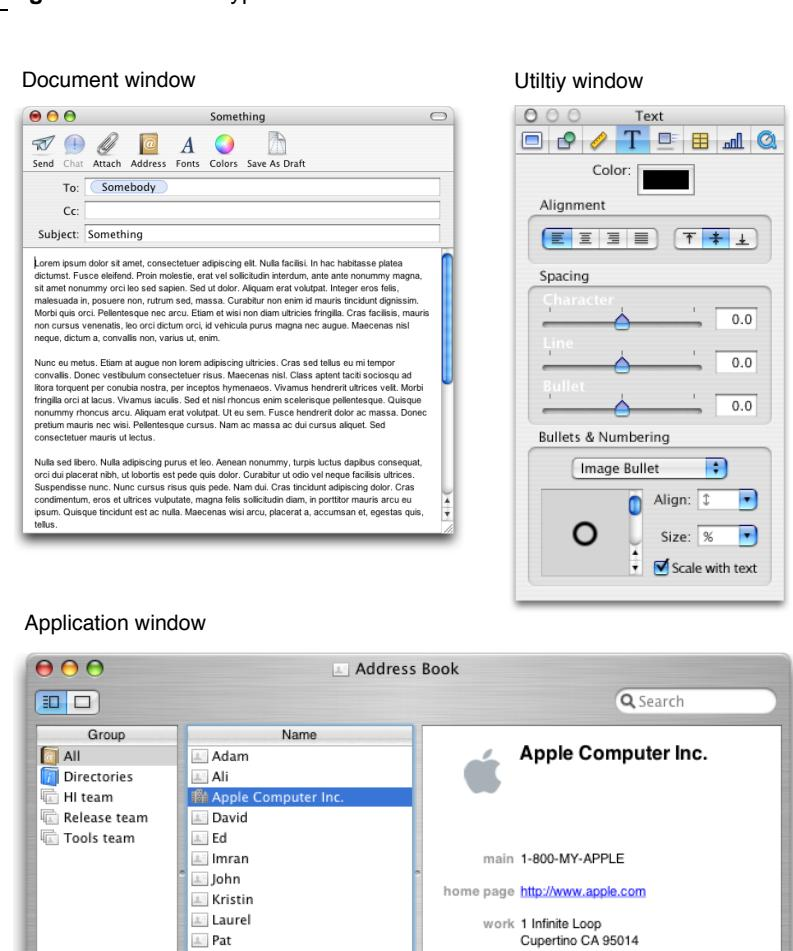

#### D a og w ndow


<span id="page-101-3"></span>**Carbon:** See *Handling Carbon Windows and Controls* in Carbon User Experience Documentation. **Cocoa:** See *Windows and Panels* in Cocoa User Experience Documentation.

# <span id="page-101-2"></span><span id="page-101-0"></span>Window Appearance

Every document, application, and utility window should have, at a minimum:

- A title bar. Even if the window does not have an actual title (a tools palette, for example), it should have a title bar so that users can move the window.
- A close button, so that the user has a consistent way to dismiss it.

In addition, a standard document window has the following attributes that an application or utility window might not have:

- <span id="page-102-2"></span>■ Scroll bars (if not all the window's contents are visible)
- Minimize and zoom buttons
- A proxy icon (after a document has been saved)
- The title of the document
- A resize control
- <span id="page-102-1"></span>■ A toolbar control

These elements are shown in Figure 8-2.

**Figure 8-2** Standard window parts

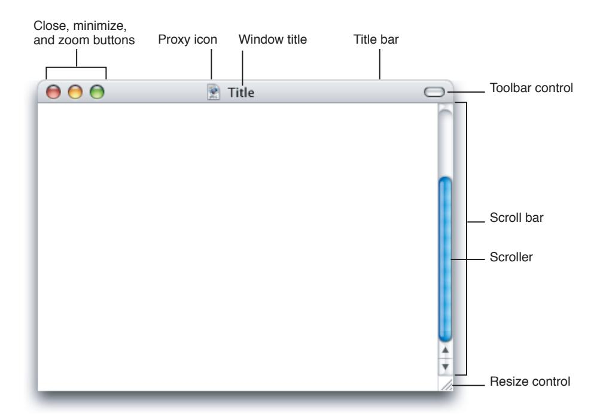

### <span id="page-102-0"></span>The Title Bar

All windows should have a title bar even if the window doesn't have a title (which should be a very rare exception).

### The Window Title

A document window should display the name of the document being viewed. Application windows display the application name. Utility windows display a descriptive title appropriate for that window. If the contents of the window can change, it might be appropriate to change the title to reflect the current context. For example, in the Keynote inspector, the title of the window changes to reflect which pane has been selected.

If you need to display more than one item in the title, separate the items with an em dash (—) with space on either side. For example, the main viewer window of Mail displays the currently selected message mailbox and the selected folder, if any. Note that if a message is viewed in its own window, the message title is displayed.

Don't display pathnames in window titles. When displaying document titles, use the display name and show the extension if the user has selected to show extensions. See *Apple Software Design Guidelines* for more information.

### Title Bar Buttons

Document and application windows always display active close and minimize buttons. (See ["Closing](#page-119-0) [Windows"](#page-119-0) (page 120) and ["Minimizing and Expanding Windows"](#page-118-1) (page 119) for details on what the close and minimize buttons do.) Include the zoom button if the window can be adjusted in size. Information on how the zoom button works is in ["Resizing and Zooming Windows"](#page-118-0) (page 119).

<span id="page-103-0"></span>Utility windows always display an active close button but never an active minimize button.

If buttons are not active, they should at least all be present in an inactive state. The exception is utility windows, where it is acceptable to display only one button, the close button.

Alerts and modal dialogs do not include any of these buttons.

The title bar should include a toolbar control if a toolbar is available in the window (see ["Toolbars"](#page-107-0) (page 108)).

<span id="page-104-0"></span>**Figure 8-3** Title bar buttons for standard windows


### <span id="page-104-1"></span>Indicating Changes With the Close Button

When a document has unsaved changes, the close button should display a dot.

**Figure 8-4** The close button in its unsaved changes state

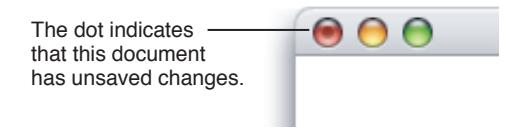

<span id="page-104-2"></span>**Carbon:** Display the dot with the SetWindowModified function.

**Cocoa:** The dot appears automatically if the application is NSDocument-based; otherwise, use the setDocumentEdited: method of the NSWindow class.

### The Proxy Icon

Document windows include a **proxy icon** in the title bar after a document is saved for the first time. After pressing a proxy icon for a couple of seconds, users can manipulate it as if they were manipulating the corresponding file-system object. For example, you can attach a document to an email message by dragging its proxy icon into the email message.

<span id="page-105-0"></span>**Figure 8-5** A proxy icon being dragged to another application

U U P m D m w

<span id="page-106-2"></span>A proxy icon appears in its normal state as long as the state of the document and the file-system object are the same. When a document has unsaved changes, its proxy icon appears dimmed. Note the difference between the proxy icon in the document with unsaved changes versus the document with saved changes in Figure 8-6.

<span id="page-106-0"></span>**Figure 8-6** Proxy icons in documents with saved and unsaved changes

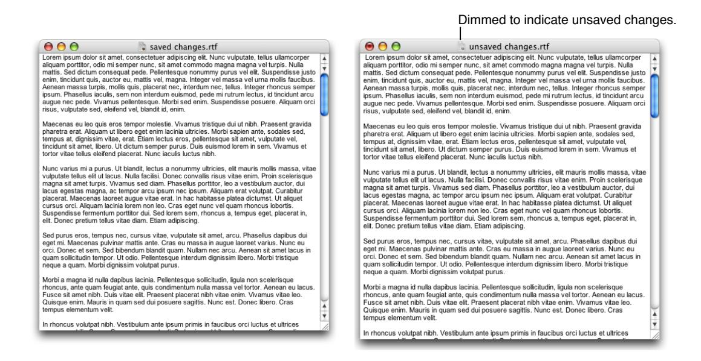

<span id="page-106-1"></span>Command-clicking the title or the proxy icon displays a pop-up menu illustrating the document path.

**Figure 8-7** A document path pop-up menu, opened by Command-clicking the proxy icon


### <span id="page-107-0"></span>Toolbars

<span id="page-107-4"></span>**Toolbars** are useful for giving users immediate access to the most frequently used commands. Any item in a toolbar should also be available as a menu command. An application-wide toolbar in its own window is also called a **tool palette;** for more information, see ["Utility Windows"](#page-125-0) (page 126). This section describes toolbars that are part of a window with other content.

The set of toolbar items you provide should fit in the default window size; users should be able to customize which items appear in the toolbar and in what order. As the default, a toolbar should display icons with text labels; users should be able to change the display to icons only or text only. You can provide these options with a Customize Toolbar command in the View menu.

When the user has selected an item in the toolbar, it should either maintain its pressed state to indicate that item is selected, or the icon itself should change to indicate the current state.

<span id="page-107-2"></span>If your application uses toolbars as part of a window with other content, include a control in the window's title bar for showing and hiding the toolbar, as shown in Figure 8-8. You should also put commands for showing and hiding the toolbar in the View menu (see ["The View Menu"](#page-92-0) (page 93)).

**Figure 8-8** The toolbar control


<span id="page-107-1"></span>For information about designing icons for toolbars, see ["Toolbar Icons"](#page-62-0) (page 63).

**Carbon:** Create a toolbar with the HIToolBarCreate function. See *Using HIToolbar* in Carbon User Experience Documentation for more information.

**Cocoa:** Create a toolbar with the NSToolbar class.

### <span id="page-107-3"></span>Drawers

A **drawer** is a child window that slides out from a parent window and that the user can open or close (show or hide) while the parent window is open. A drawer should contain frequently accessed controls that don't need to be visible at all times. A drawer's contents should be closely related to the contents of its parent window. A drawer automatically inherits the brushed metal appearance if its parent window is brushed metal (see ["Brushed Metal Windows"](#page-110-0) (page 111).

<span id="page-108-0"></span>**Figure 8-9** An open drawer next to its parent window


<span id="page-108-1"></span>**Carbon:** Create a drawer using the CreateNewWindow function with the kDrawerWindowClass constant, and associate it with its parent window using SetDrawerParent. The Carbon Window Manager also provides other drawer-related functions.

**Cocoa:** Drawers support is available via the NSDrawer class.

### When to Use Drawers

Use drawers only for controls that need to be accessed fairly frequently but that don't need to be visible all the time. (Contrast this criterion with a utility window, which should be visible and available whenever its main window is in the top layer.) Some examples of uses of drawers include access to favorites lists, the Mailbox drawer (in the Mail application), or browser bookmarks.

Although a drawer is somewhat similar to a sheet in that it attaches to a window and slides out, the two elements are not interchangeable. Sheets are primarily intended to replace modal dialogs, as described in ["When to Use Sheets"](#page-134-0) (page 135), whereas drawers provide additional functionality. When a sheet is open, it is the focus of the window and it obscures the window contents; when a drawer is open, the entire parent window is still visible and accessible.

Some uses of a drawer are similar to uses of a source list. See ["Source Lists"](#page-109-0) (page 110) for information on when to use a source list.

### Drawer Behavior

The user shows or hides a drawer, typically by clicking a button or choosing a command. If a drawer contains a valid drop target, you may also want to open the drawer when the user drags an appropriate object to where the drawer appears.

When a drawer opens or closes, it appears to be sliding from behind its parent window, to the left, right, or down. You should ensure that a parent window's default position allows its drawer to open fully without disappearing offscreen. If a user moves a parent window to the edge of the screen and then opens a drawer, it should open on the side of the window that has room. If the user makes a window so big that there's no room on either side, the drawer opens off the screen.

To support the illusion that a closed drawer is hidden behind its parent window, an open drawer should be smaller than its parent window. When the parent window is resized vertically, an open drawer resizes, if necessary, to ensure that it does not exceed the height of the parent window. (A drawer can be shorter than its parent window.) The illusion is further reinforced by the fact that the inner border of a drawer is hidden by the parent window and that the parent window's shadow is seen on the drawer when appropriate.

The user can resize an open drawer by dragging its outside border. The degree to which a drawer can be resized is determined by the content of the drawer. If the user resizes a drawer significantly—to the point where content is mostly obscured—the drawer should simply close. For example, if a drawer contains a scrolling list, the user should be able to resize the drawer to cover up the edge of the list. But if the user makes the drawer so small that the items in the list are difficult to identify, the drawer should close. If the user sets a new size (if that is possible) for a drawer, the new size should be used the next time the drawer is opened.

A drawer should maintain its state (open or closed) when its parent window becomes inactive or when the window is closed and then reopened. When a parent window with an open drawer is minimized, the drawer should close; the drawer should reopen when the window is made active again.

A drawer can contain any control that is appropriate to its intended use. Follow normal layout guidelines, as stated in ["Positioning Full-Size Controls"](#page-202-1) (page 203).

<span id="page-109-0"></span>Consider a drawer part of the parent window; don't dim a drawer's controls when the parent window has focus, and vice versa. When full keyboard access is on, a drawer's contents should be included in the window components that the user can select by pressing Tab.

### <span id="page-109-2"></span>Source Lists

<span id="page-109-1"></span>A **source list** is an area of window set off by a movable pane splitter to provide users a way to navigate data. Use a source list when the data presented in it is a primary means of navigating within the application, as in iTunes or the Finder. Users select objects in the source list that they act on in the main part of the window.

Source lists are normally used in application windows, not in document windows. The iTunes playlist, the iPhoto library, and the Finder Sidebar are all examples of source lists.

<span id="page-110-1"></span>**Figure 8-10** Finder Sidebar as a source list


<span id="page-110-0"></span>Do not put controls in a source list other than contextual controls used to organize the data itself. You might include controls below the source list to add, remove, or get information about items in the source list. If you need to add other controls, consider using a drawer instead of a source list.

### <span id="page-110-3"></span><span id="page-110-2"></span>Brushed Metal Windows

Windows have two distinct looks in Mac OS X. There is the standard default look of windows, as shown in the examples so far. There is also a brushed metal look available, shown in Figure 8-11. You can use a brushed metal window if your application:

- Provides an interface for a digital peripheral, such as a camera, or an interface for managing data shared with digital peripherals—iPhoto or iSync, for example
- Strives to re-create a familiar physical device—Calculator or DVD Player, for example
- Provides a source list to navigate information—for example, iTunes or the Finder

Don't use the brushed metal look indiscriminately. Although it works well for some types of applications, some applications appear too heavy when using this look. For example, it works well for the iSync application window (see Figure 8-11), but it does not work very well for the TextEdit document window (see Figure 8-12).

<span id="page-111-0"></span>**Figure 8-11** A brushed metal application window


**Figure 8-12** Metal and regular versions of a document window

<span id="page-111-1"></span>

Use brushed metal window look for the primary application window and other windows that meet the above criteria—for example, the Equalizer window in iTunes. Don't use it for supporting windows, such as preferences and other dialogs. It is acceptable to have a mix of standard Aqua windows and brushed metal windows within an application, as the Finder does.

<span id="page-112-2"></span>**Figure 8-13** Mixing standard and brushed metal versions of windows

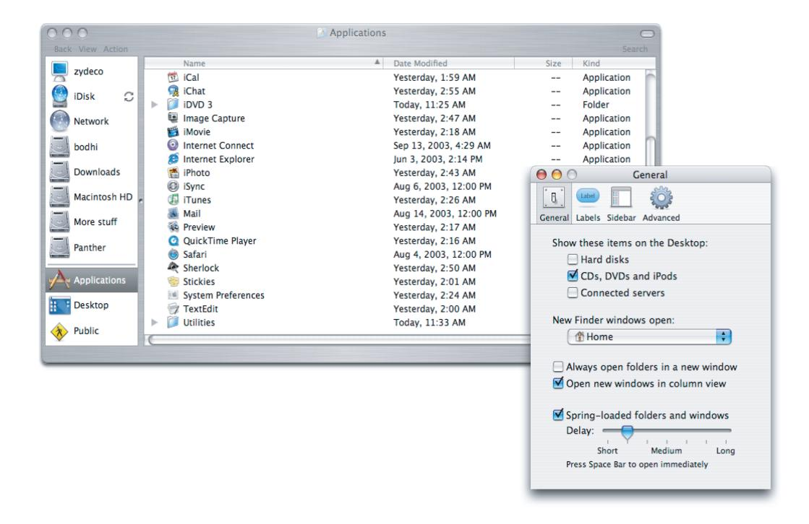

If a brushed metal window has a drawer or a toolbar, it automatically inherits the brushed metal look.

<span id="page-112-4"></span>Users can move metal windows by dragging anywhere on the brushed metal surface (not just the title bar).

**Carbon:** Use the window type defined in MacWindows.h.

**Cocoa:** Apply the NSTexturedBackgroundWindowMask to a titled window. Avoid using a borderless window, which doesn't have rounded corners.

# <span id="page-112-3"></span><span id="page-112-0"></span>Window Behavior

<span id="page-112-1"></span>This section discusses how you should open, position, resize, and close windows and provides guidelines on how they should behave when a user interacts with them.

### Opening Windows

Your application should open a window when a user does any of the following:

- Double-clicks the icon for a document supported by your application in the Finder
- Double-clicks your application icon
- Selects a document in the Finder and chooses open from the File menu (or selects the document and presses Command-O in the Finder)

- Chooses a file from within an Open dialog
- Chooses the New command from the File menu
- <span id="page-113-0"></span>■ Clicks the application icon in the Dock when no windows are open

<span id="page-113-4"></span><span id="page-113-1"></span>When the user opens an existing document, make sure its title is the **display name,** which reflects the user's preference for showing or hiding its filename extension. For more information, see *Apple Software Design Guidelines*. Don't display pathnames in document titles.

<span id="page-113-2"></span>New windows should be named as described in ["Naming New Windows"](#page-114-0) (page 115).

The content of some windows changes depending on the user's selection. For example, when the user clicks one of the icons at the top of the Mail Preferences window, the display at the bottom of the window changes. Some windows, such as Displays in System Preferences, switch panes using a tab control (see ["Tab Views"](#page-194-1) (page 195)).

<span id="page-113-3"></span>Windows with changeable panes should reopen in their previous state as long as the application is open and return to their default views when the user quits. In a window with toolbars, if the toolbar represents only a subset of multiple possible views (favorites), the default state should be to show all of the options below the toolbar, not a particular pane. If the toolbar displays all of the possible selections, then the default state of the window should be to display whichever pane the user last selected. For example, when System Preferences opens, all of the possible selections are visible, but when Mail preferences opens, it displays the last pane selected by the user.

<span id="page-114-1"></span>**Figure 8-14** System Preferences in the default state


### <span id="page-114-3"></span><span id="page-114-0"></span>Naming New Windows

<span id="page-114-2"></span>If your application is not document-based, use the name of your application as the window title. If your application has a short name, use it as the title.

Name a new document window "untitled"; leaving it lowercase makes it more obvious that the window doesn't have a name and encourages people to save the document. If the user chooses New again before saving the first untitled window, name the second window "untitled 2," and so on. Add numbers to window titles only when there is more than one open untitled window. Don't put a "1" on the first untitled window, even after the user opens other new windows.

Window Behavior **115 August 31, 2004 | © 1992, 2001-2003, 2004 Apple Computer, Inc. All Rights Reserved.**

<span id="page-115-7"></span><span id="page-115-1"></span>**Figure 8-15** Appropriate titles for a series of unnamed windows


<span id="page-115-2"></span>If the user dismisses all untitled windows by saving or closing them, then the next new document should start over as "untitled," the next should be "untitled 2," and so on.

**Figure 8-16** Examples of correct and incorrect window titles


### <span id="page-115-6"></span><span id="page-115-3"></span><span id="page-115-0"></span>Positioning Windows

<span id="page-115-4"></span>Whenever your application displays a window, you must decide where to put it and how big to make it.

<span id="page-115-5"></span>New document windows should open horizontally centered and should display as much of the document content as possible. The top of the document window should butt up against the menu bar (or the application's toolbar, if one is open and positioned below the menu bar). Subsequent windows should open to the right 20 pixels and down 20 pixels. Make sure that no part of a new window overlaps with the Dock. (See *Apple Software Design Guidelines*.)

For nondocument windows, the preference is to open new windows horizontally centered as shown in Figure 8-17. The vertical position should be visually centered: The distance from the bottom of the window to the top of the Dock (if it's at the bottom of the screen) should be approximately twice the

<span id="page-116-1"></span>distance as that from the bottom of the menu bar to the top of the window. Subsequent windows are moved to the right 20 pixels and down 20 pixels. Make sure that no part of a new window overlaps with the Dock.

<span id="page-116-0"></span>**Figure 8-17** "Visually centered" placement of a new nondocument window


If a user changes a window's initial size or location, maintain the user's choices the next time the associated file or window (in the case of a single-window application) opens. If a user opens, moves, and closes a document window without making any other changes, save the new window position but don't modify the file's date stamp.

Before reopening a window, make sure that the size and state are feasible for the user's current monitor setup, which may not be the same as the last time the document was open. Try to maintain the window's previous location (the top-left corner of the window) and, if possible, its size. If you can't replicate both, maintain the location and reduce the window's size. If that is not possible, try to keep the window on the same monitor, open the window so that as much of the content as necessary is visible, and follow the guidelines for opening a new window, as described previously.

<span id="page-117-2"></span>For example, if a user opens a document to full size on a wide aspect-ratio display and then opens the file on a computer with a smaller display, the document should open in a window sized for the smaller display, not in the larger, saved size. For more information on appropriate window size, see ["Resizing and Zooming Windows"](#page-118-0) (page 119).

<span id="page-117-4"></span>On a computer with more than one display, display the first new window visually centered in the screen containing the menu bar. If the user doesn't move that first window, display each additional window below and to the right of its predecessor. If the user moves the window, display each additional window on the screen that contains the largest portion of the frontmost window, as shown in Figure 8-18. For example, if the user creates a window, drags it completely to a second monitor, and then creates a new window, display the new window on the second screen. If there is sufficient room on the screen, display subsequent windows to the lower right of the frontmost window. If there isn't enough room on the screen, display subsequent windows starting in the original visually centered position, and then continue to display additional windows slightly offset to the lower right.

<span id="page-117-1"></span>If the user moves a window so that it is entirely positioned on a second monitor and then opens the window on a single-monitor system, respect the window's previous size, if possible.

**Figure 8-18** Appropriate placement of a new window on a system with multiple monitors (the user moved the first window to span the screens)


<span id="page-117-3"></span><span id="page-117-0"></span>If the user opens several windows on a multiple-monitor system, continue to place the windows on the screen where the user is working, each new one below and to the right of its predecessor. Don't open a window so that it spans monitors; the *initial position* of a window should always be contained on a single screen.

### Moving Windows

The user moves a window by dragging its title bar or, for brushed metal windows, anywhere on the border. As a user drags, the full window and its contents move.

Pressing the Command key while dragging an inactive window moves the window but does not make it active.

Your application should never allow users to move a window to a position from which they can't reposition it.

### <span id="page-118-3"></span><span id="page-118-0"></span>Resizing and Zooming Windows

Your application determines the minimum and maximum window size. Base these sizes on the resolution of the display and on the constraints of your interface. For document windows, try to show as much of the content as possible, or a reasonable unit, such as a page.

<span id="page-118-5"></span>Your application also sets the values for the initial size and position of a window, called the **standard state.** Don't assume that the standard state should be as large as possible; some monitors are much larger than the useful size for a window. Choose a standard state that is best suited for working on the type of document your application creates and that shows as much of the document's contents as possible.

The user can't change the standard size and location of a window, but your application can change the standard state when appropriate. For example, a word processor might define the standard size and location as wide enough to display a document whose width is specified in the Page Setup dialog.

<span id="page-118-7"></span>The user changes a window's size by dragging the size control (in the lower-right corner). As a user drags, the amount of visible content in the window changes. The upper-left corner of the window remains in the same place. The actual window contents are displayed at all times.

<span id="page-118-6"></span>If the user changes a window's size or location by at least 7 pixels, the new size and location is the **user state.** The user can toggle between the standard state and the user state by clicking the **zoom button.** When the user clicks the zoom button of a window in the user state, your application should first determine the appropriate size of the standard state. Move the window as little as possible to make it the standard size, and keep the entire window on the screen. The zoom button should not cause the window to fill the entire screen unless that was the last state the user set.

When a user with more than one monitor zooms a window, the standard state should be on the monitor containing the largest portion of the window, not necessarily the monitor with the menu bar. This means that if the user moves a window between monitors, the window's position in the standard state could be on different monitors at different times. The standard state for any window must always be fully contained on a single monitor.

<span id="page-118-2"></span><span id="page-118-1"></span>When zooming a window, make sure it doesn't overlap with the Dock. For more information, see *Apple Software Design Guidelines*.

### <span id="page-118-4"></span>Minimizing and Expanding Windows

When the user clicks the **minimize button**, double-clicks the title bar, or presses Command-M, the window minimizes into the Dock. The window's icon remains in the Dock until the user clicks it or, if it is the application's only open window, until the user clicks the application icon in the Dock. For more information, see *Apple Software Design Guidelines*.

Window Behavior **119**

<span id="page-119-2"></span>Clicking an application icon in the Dock should always result in a window—a document or another appropriate window—becoming active. In a document-based application that is not open when the user clicks the Dock icon, the application should open a new, untitled window.

<span id="page-119-4"></span>While an application is open, the Dock icon has a symbol below it. When a user clicks an open application's icon in the Dock, the application becomes active and all open unminimized windows are brought to the front; minimized document windows remain in the Dock. If there are no unminimized windows when the user clicks the Dock icon, the last minimized window should be expanded and made active. If no documents are open, the application should open a new window. (If your application is not document-based, display the application's main window.)

### <span id="page-119-0"></span>Closing Windows

Users can close windows by:

- Choosing Close from the File menu
- Pressing Command-W
- Clicking the close button

When a user closes a document window, your application should:

- Decide what to do with unsaved data (see ["Dialogs for Saving, Closing, and Quitting"](#page-142-0) (page 143))
- Store the window's onscreen position and size (so they can be used when the window is reopened)

<span id="page-119-1"></span>In most cases, applications that are not document-based should quit when the main window is closed. For Example, System Preferences quits if the user closes the window. If an application continues to perform some function when the main window is closed, however, it may be appropriate to leave it running when the main window is closed. For example, iTunes continues to play when the user closes the main window.

### <span id="page-119-3"></span>Window Layering

Each application and document window exists in its own layer, so documents from different applications can be interleaved. Clicking a window to bring it to the front doesn't disturb the layering order of any other window.

A window's depth in the layers is determined by when the window was last accessed. When a user clicks an inactive document or chooses it from the Window menu, only that document, and any open utility windows, should be brought to the front. Users can bring all windows of an application forward by clicking its icon in the Dock or by choosing Bring All to Front in the application's Window menu. These actions should bring forward all of the application's open windows, maintaining their onscreen location, size, and layering order within the application. For more information, see ["The Window](#page-95-0) [Menu"](#page-95-0) (page 96) and *Apple Software Design Guidelines*.

Utility windows are always in the same layer, the top layer. They are visible only when their application is active.

<span id="page-120-2"></span><span id="page-120-1"></span>Users can cycle forward or backward through all open document windows by using Command-' (acute accent) and Command-Shift-' (acute accent). If full keyboard access is on, they can cycle through all windows by using Control-F4 and Shift-Control-F4.

### <span id="page-120-0"></span>Main, Key, and Inactive Windows

Windows have different looks based on how the user is interacting with them. The foremost document or application window that is the focus of the user's attention is referred to as the **main window**. The main window is often also the **key window**. The key window is the window that accepts user input, whether from the keyboard, mouse, or alternative input device.

The main window is not always the key window though. There are times when a window other than the main window takes the focus of the input device, while the main window still remains the focus of the user's attention. For example, when a person is using an inspector, a Find dialog, or the Fonts or Colors windows, the document is the main window and the other window is the key window.

If the main and key window are different windows, they are distinguished from one another by the look of their title bars.

Main and key windows are both active windows. Active windows are visually distinct from **inactive windows** in that their controls have color, while the controls in inactive windows do not have color. Inactive windows are windows the user has open, but are not in the foreground. Main and key windows are always in the foreground and their controls always have color. Note the visual distinctions between main, key, and inactive windows in Figure 8-19.

Window Behavior **121**

<span id="page-121-0"></span>**Figure 8-19** Main, key, and inactive windows

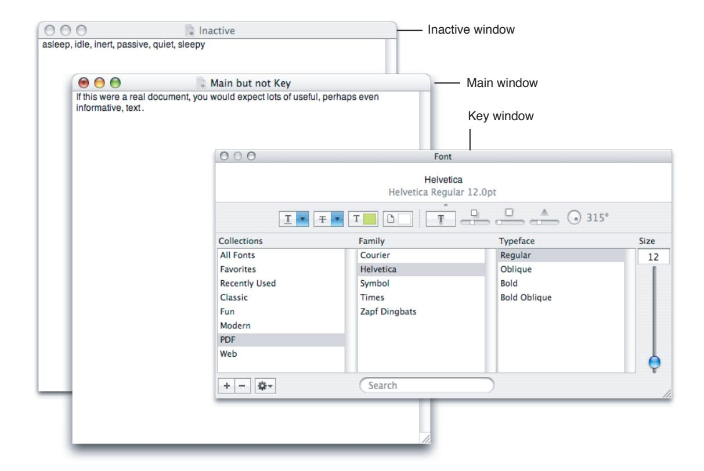

### <span id="page-121-1"></span>Click-Through

An item that provides **click-through** is one that a user can activate on an inactive window with one click, instead of clicking first to make the window active and then clicking the item. Click-through provides greater efficiency in performing such tasks as closing or resizing inactive windows, and copying or moving files. In many cases, however, click-through could confuse a user who clicks an item unintentionally.

Click-through is not a property of a class of controls; any control could support click-through in many contexts, but the same control could disable click-through when its use could be destructive in a particular context.

In an inactive window, an item that provides click-through should have its text or glyph (such as an arrow) in 100-percent black; if the item usually has color (such as a radio button), it should be colorless in its click-through state. Items that do not provide click-through should appear in their disabled state.

<span id="page-122-0"></span>**Figure 8-20** An inactive window with controls that support click-through


Don't provide click-through for items or actions that:

- Are potentially harmful (for example, the Delete button in Mail)
- Are difficult to recover from, such as:
  - ❏ Actions that are difficult or impossible to cancel (the Send button in Mail)
  - ❏ Dismissing a dialog without knowing what action was taken (for example, it's not easy to "unsave" a document)
  - ❏ Removing the user from the current context (selecting a new item in a column, for example, can change the target of the Finder window)

Clicking in any one of these situations should result in the window being brought forward but no action being taken.

<span id="page-123-2"></span><span id="page-123-1"></span>**Figure 8-21** The Delete button on the inactive window does not support click-through


In general, you can implement click-through for a command that provides confirmation feedback before executing—in other words, the user can cancel the action—such as deleting a user in Accounts preferences. If you want to implement click-through for an item that doesn't provide confirmation feedback, consider how difficult it will be for the user to undo the action after it's performed. For example, in Mail, it would be inadvisable to implement click-through for the Delete button, which deletes a message without providing feedback first, because its resulting action is harmful and difficult to undo. Click-through for the New button is OK because its resulting action is not harmful and is easy to undo.

**Carbon:** Click-through is *off* by default. You must explicitly enable click-through for specific controls.

<span id="page-123-5"></span><span id="page-123-0"></span>**Cocoa:** Click-through is *on* by default. You must explicitly disable click-through for specific controls. Do not assume that the default behavior is the correct behavior. Make sure to apply the above guidelines.

### <span id="page-123-4"></span><span id="page-123-3"></span>Scrolling Windows

People use **scroll bars** to view areas of a document or a list that is larger than can fit in the current window. Only active windows can be scrolled. A window can have a horizontal scroll bar, a vertical scroll bar, both, or neither.

<span id="page-124-0"></span>**Figure 8-22** The elements of a scroll bar

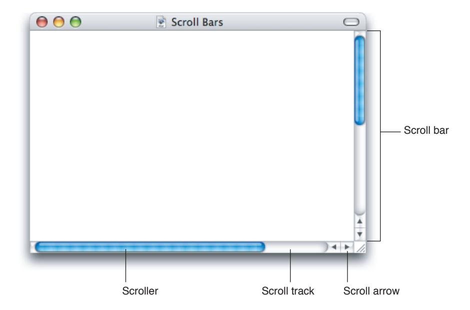

The **scroller** size reflects how much of the content is visible; the smaller the scroller, the less of the content the user can see at that time. The scroller represents the relative location, in the whole document, of the portion that can be seen in the window.

If the entire contents of a document is visible in a window, the scroll bars do not contain scrollers. Scroll bars in inactive windows have an inactive appearance. See [Figure 8-21](#page-123-2) (page 124).

<span id="page-124-2"></span>For most document windows that contain a single view (scrolling text or tables, for example), do not specify any space between the window edge and scroll bars .

<span id="page-124-3"></span>The user can use scroll bars by doing the following:

- Dragging the scroller: This method is usually the fastest way to move around a document. The window's contents changes in "real time" as the user drags the scroller.
- <span id="page-124-1"></span>■ Clicking a scroll arrow: This means, "Show me more of the document that's hidden in this direction." The scroller moves in the direction of the arrow. Each scroll arrow click moves the content one unit; your application determines what one unit equals. For example, a word processor would move a line of text per click, a spreadsheet could move one row or column. To ensure smooth scrolling effects, specify units of the same size throughout a document.
- Clicking or pressing in the scroll track: Clicking advances the document by a windowful (the default) or to the pointer's hot spot, depending on the user's choice in Appearance preferences. A "windowful" is the height or width of the window, minus at least one unit of overlap to maintain the user's context. This unit of overlap should be the same as one scroll arrow unit (for example, a line of text, a row of icons, or part of a picture). The Page Up and Page Down keys also move the document view by a windowful.

Pressing in the scroll track displays consecutive windowfuls of the document until the location of the scroller catches up to the location of the pointer (or until the user releases the mouse button).

Window Behavior **125**

It's best not to add controls to the scroll-bar area of a window. If you add more than one control to this area, it's hard for people to distinguish among controls and click the right one. Acceptable additions to the scroll area include a splitter bar and a status bar that shows, for example, the current page. To ensure that window controls are easy to use and understand, it's best to place the majority of your features in the menus as commands. If you really want to provide additional access to features, consider creating a utility window such as a palette with buttons. Only frequently accessed features that significantly benefit users' productivity should be elevated to the primary interface.

Utility windows that coexist with other windows and need to use the least amount of screen space possible may use small or mini scroll bars. If a window has small or mini scroll bars, all other controls within the window content area should also be the smaller version. For more information, see ["Using](#page-213-0) [Small and Mini Versions of Controls"](#page-213-0) (page 214).

<span id="page-125-3"></span><span id="page-125-1"></span>Make sure you don't use a scroll bar when you should really use a slider. Use sliders to change settings; use scroll bars only for representing the relative position of the visible portion of a document or list. For information about sliders, see ["Slider Controls"](#page-181-0) (page 182).

### <span id="page-125-2"></span>Automatic Scrolling

Most of the time, the user should be in control of scrolling. Your application must perform automatic scrolling in these cases:

- When your application performs an operation that results in making a new selection or moving the insertion point (for example, when the user searches for some text and your application locates it), scroll the document to show the new selection.
- When the user enters information from the keyboard at a location not visible within the window (for example, the insertion point is on one page and the user has navigated to another page), scroll the document automatically to incorporate and display the new information.
  - Your application determines the distance to scroll.
- When the user moves the pointer past the edge of the window while holding down the mouse button to make an extended selection, scroll the document in the direction the pointer moves.
- When the user selects something, scrolls to a new location, and then tries to perform an operation on the selection, scroll so the selection is showing before your application performs the operation.

<span id="page-125-4"></span>Whenever your application scrolls a document automatically, move the document only as much as is necessary. That is, if part of a selection is showing after the user performs an operation, don't scroll at all. If your application can scroll in only one direction to reveal the selection, don't scroll in both.

<span id="page-125-0"></span>When autoscrolling to a selection, try to show the selection in context. When the selection is too large to show in its entirety, it might be a good idea to show some context instead of having the selection fill the window.

# <span id="page-125-5"></span>Utility Windows

Utility windows are either application-specific or systemwide. Application-specific utility windows disappear when the application is deactivated.

Systemwide utility windows, such as the Colors window and the Fonts window, float on top of all open windows.

<span id="page-126-1"></span>You can create a modeless utility window, such as a tools palette, to present controls or settings that affect the active document window. Utility windows are useful for keeping extremely important controls or information accessible at all times in the context of a user task. Because utility windows take up screen space, however, don't use them when you can meet the need by using a modeless dialog (the user changes settings and then closes the dialog) or by adding a few appropriate controls to a window frame.

A user can open several utility windows at a time; they float on top of document windows. When a user makes a document active, all of the application's utility windows should be brought to the front, regardless of which document was active when the user opened the utility window. When your application is inactive, its utility windows should be hidden. Utility windows should not be listed in the Window menu as documents, but you may put commands to show or hide utility windows in the Window menu.

<span id="page-126-0"></span>**Figure 8-23** Utility windows


<span id="page-126-2"></span>A utility window may have a title. An untitled utility window should have a title-bar region for dragging the window.

A user would never need to minimize a utility window because they are displayed only when needed and disappear when their application is inactive. Therefore, the minimize button is always unavailable.A utility window should have the close and zoom buttons or, if you don't want users to be able to use the zoom button, only the close button. These configurations are shown in Figure 8-23.

**Carbon:** Specify which of controls are visible with the ChangeWindowAttributes function.

<span id="page-127-1"></span>**Figure 8-24** Utility window controls


For information about designing utility windows, see ["Using Small and Mini Versions of](#page-213-0) [Controls"](#page-213-0) (page 214).

**Carbon:** Utility windows are available using kUtilityWindowClass.

<span id="page-127-4"></span>**Cocoa:** use NSNonactivatingPanelMask

# <span id="page-127-2"></span><span id="page-127-0"></span>The About Window

The **About window,** also called the About box, is a window that contains your application's version and copyright information. It should be modeless so the user can leave it open and perform other tasks in the application.

You should always provide an About window and make it accessible from the application menu.

<span id="page-127-3"></span>At a minimum, your application's About window should:

- Have a title bar with no title
- Be movable
- Include the close button as the only active window control
- Display application branding

■ Include the full application name and version number

<span id="page-128-1"></span>It is recommended to also provide text that briefly describes what the application does, copyright information, as well as technical support contact information.

**Figure 8-25** Example of an About windows

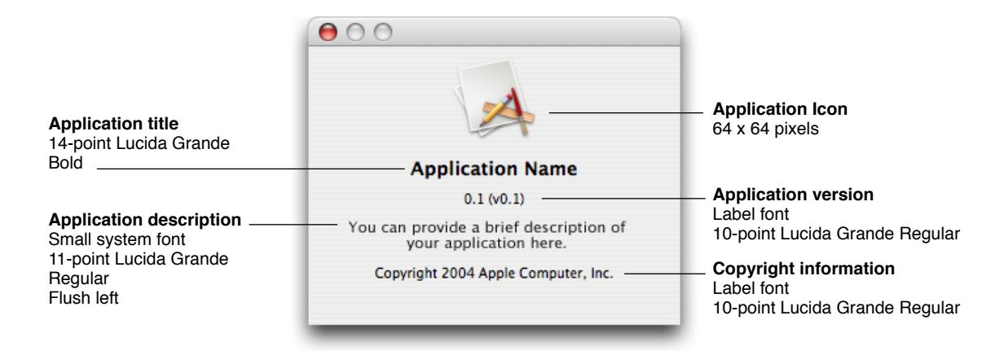

The About window (or the splash screen) is the appropriate place for product branding elements; avoid putting them in document windows and dialogs.

**Carbon:** Use HIAboutBox to provide a default About window. You can designate specific settings in your application's Info.plist file.

**Cocoa:** The About window is provided automatically by the Application Kit; set the relevant information in your application's Info.plist file.

# <span id="page-128-0"></span>Preferences Windows

A preference window contains settings that the user changes infrequently. If you have several different groups of preferences, consider using a toolbar within the preferences window in which each item in the toolbar changes the content of the main window. For examples, note how some of the applications provided with Mac OS X—such as the Finder, Safari, or Mail—implement preferences windows.

<span id="page-129-1"></span>**Figure 8-26** The Finder preferences window

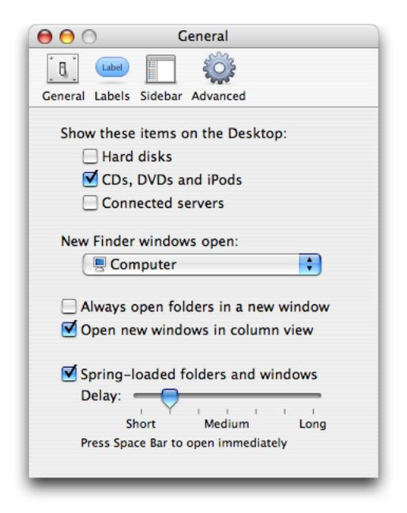

Avoid including a resize control or a zoom button. The preferences window should not be a utility window and it should be modeless.

If you have changeable panes in your preferences window, be sure to remember which pane the user selected the last time the window was open.

The menu item to show your preferences window should be in the application menu and be labeled Preferences. Use Command-comma for the keyboard shortcut.

# <span id="page-129-3"></span><span id="page-129-0"></span>Inspectors and Info Windows

Inspectors are utility windows that allow users to view the attributes of a selection. They also often provide ways to modify these attributes. Xcode, Keynote, and the Finder all make use of inspectors. Inspectors should update dynamically based on the current selection.

<span id="page-129-2"></span>An Info window functions like an inspector except that it does not update dynamically as selections change. It shows attributes of the item that was selected when the window was opened, even after the focus has been changed to another item.

It may be useful to provide both inspectors and Info windows in your application because in some cases it's more useful to have one window where context changes when another item is selected (inspector) and in other cases it's more useful to be able to see the attributes of more than one item at a time (Info window). Multiple inspector windows and Info windows can be open at the same time.

Figure 8-27 and Figure 8-28 show examples of an inspector and an Info window.

<span id="page-130-1"></span>**Figure 8-27** An inspector window


**Figure 8-28** An Info window

<span id="page-130-2"></span>

# <span id="page-130-4"></span><span id="page-130-3"></span><span id="page-130-0"></span>Find Window

A Find window opens in response to the Find command to provide an interface for specifying items to search for. Its appearance can vary depending on the needs of your application, but if your application handles text you might want to make your Find window similar to the one illustrated in Figure 8-29 to provide a consistent user experience.

<span id="page-131-2"></span><span id="page-131-1"></span>**Figure 8-29** A Find window

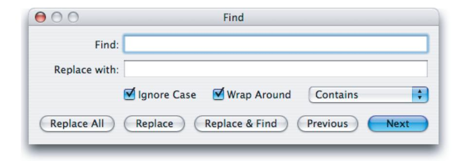

**Carbon:** Not available.

**Cocoa:** Use the NSFindPanel class.

# <span id="page-131-0"></span>Fonts Window and Colors Window

Mac OS X includes standard windows for users to select fonts or colors. If you need a way for users to set fonts or colors, use these standard windows instead of making your own. In this way, users don't have to learn a new way to accomplish a familiar task.

By implementing these windows, you get the correct utility window behavior. These windows are discussed in *Apple Software Design Guidelines*.

<span id="page-132-5"></span><span id="page-132-3"></span><span id="page-132-2"></span><span id="page-132-0"></span>A **dialog** is a window designed to elicit a response from the user. Many dialogs—the Print dialog, for example—permit the user to provide many responses at one time.

**Alerts** are dialogs that appear when the system or an application needs to communicate information to the user. Alerts provide messages about error conditions or warn users about potentially hazardous situations or actions.

For information about using the keyboard to interact with dialogs, see ["Keyboard Focus and](#page-30-0) [Navigation"](#page-30-0) (page 31).

For specific design information on how to lay out dialogs, see ["Layout Examples"](#page-202-3) (page 203).

**Carbon:** For implementation information, see *Handling Carbon Windows and Controls* and *Dialog Manager Reference* in Carbon User Experience Documentation.

**Cocoa:** See *Dialogs and Special Panels* and *Windows and Panels* in Cocoa User Experience Documentation.

# <span id="page-132-7"></span><span id="page-132-1"></span>Types of Dialogs and When to Use Them

<span id="page-132-6"></span>Mac OS X applications can use these types of dialogs:

- **Modeless.**Enables users to change settings in a dialog while still interacting with document windows; the Find window in many word processors is an example of a modeless dialog. Modeless dialogs have title bar controls (close, minimize, and zoom buttons).
- <span id="page-132-4"></span>■ **Document modal.** Prevents the user from doing anything else within a particular document. The user can switch to other documents in the application and to other applications. Document-modal dialogs should be sheets, which are discussed in ["Document-Modal Dialogs](#page-133-0) [\(Sheets\)"](#page-133-0) (page 134).
- **Application modal.** Prevents the user from doing anything else within the owner application; the user can switch to another application. Most application-modal dialogs do not have the standard title bar controls (close, minimize, zoom); the user dismisses these dialogs by clicking a push button, such as OK or Cancel. Application-modal dialogs that appear as the result of the user choosing a command, such as the Open dialog in [Figure 9-8](#page-141-1) (page 142), should display a title that matches the command.

An alert can be document modal or application modal. If the error condition or notification applies to a single document, the alert should be document modal (a sheet). See the Save Changes alert in [Figure 9-12](#page-146-2) (page 147) for an example. If the alert applies to the state of the application as a whole, or to more than one document or window belonging to that application, the alert should be application modal. Both the Review Changes alert for multiple unsaved documents ( [Figure 9-14](#page-147-2) (page 148)) and the Save Changes alert for applications that are not document-based ( [Figure 9-13](#page-147-3) (page 148)) are application modal.

## <span id="page-133-3"></span><span id="page-133-2"></span><span id="page-133-0"></span>Document-Modal Dialogs (Sheets)

A **sheet** is a modal dialog attached to a particular document or window, ensuring that the user never loses track of which window the dialog applies to. The ability to keep a dialog attached to its pertinent window helps users take full advantage of the Mac OS X window layering model (see ["Window](#page-119-1) [Layering"](#page-119-1) (page 120)). Sheets also allow users to perform other tasks before dismissing the dialog, with no sense of the system being "hijacked" by the application.

<span id="page-133-1"></span>You lay out sheets as you would any other dialog in Mac OS X.

**Figure 9-1** The Save Changes alert: An example of using a sheet to display a document-modal dialog


**Carbon:** You are responsible for creating, showing, handling the events for, and closing sheets. Other sheet behavior, such as the animation when the sheet appears and is dismissed, is handled automatically by the Window Manager.

**Cocoa:** You are responsible for loading, showing, and closing sheets. While a sheet is displayed, events are handled by the Application Kit just as for any other window. Other sheet behavior, such as the animation when the sheet appears and is dismissed, is handled automatically by the Application Kit.

### Sheet Behavior

Sheets are displayed as an animation that appears to emerge from the window's title bar. When a sheet opens on a window near the edge of the screen and the sheet is wider than the window it's attached to, the sheet moves the window away from the edge; when the sheet is dismissed, the window returns to its previous position.

Only one sheet may be open for a window at any one time. A sheet prevents any other operation on that window until the sheet is dismissed. If, when the user responds to a sheet, another sheet for that document must open, the first sheet closes before the second one opens.

<span id="page-134-2"></span>A sheet on an active document window should cover (appear on top of) any active utility windows (if necessary). However, if the user leaves a sheet open and clicks another document in the same application, the inactive window and its sheet should go *behind* any open utility windows.

<span id="page-134-0"></span>In an application that allows multiple windows for the same document (so that the user can see different parts of a document simultaneously), a sheet is not appropriate. Use an application modal dialog in this situation to make it clear that changes to one window affect other windows in the application.

### When to Use Sheets

Use sheets for dialogs specific to a document when the user interacts with the dialog and dismisses it before proceeding with work. Some examples of when to use sheets:

- A modal dialog for an activity that is specific to a particular document, such as saving or printing.
- A modal dialog that is specific to a single-window application that does not create documents. A single-window utility program might use a sheet to request acceptance of a licensing agreement from the user, for example.
- Other window-specific dialogs that are typically dismissed by the user before proceeding. Use a sheet when a dialog benefits from being attached to the window as a modal dialog, even if you might otherwise design the dialog as a modeless dialog.

### When Not to Use Sheets

Don't use sheets in the following situations:

- For dialogs that apply to several windows. Use sheets only when a particular dialog is associated with only one window.
- <span id="page-134-1"></span>■ For modeless operations in which the dialog should be left open to allow the user to observe the effects of changes applied. Such tasks (find and replace operations, for example) are better suited to modeless dialogs, utility windows, or drawers.
- On a window that doesn't have a title bar. Sheets should emerge from a definite visual edge.
- When the user will need information in the window that is essential to filling in requested information in the sheet.

### <span id="page-135-0"></span>Alerts

<span id="page-135-7"></span>Alerts display messages to inform users of situations that are notable or potentially dangerous. Alerts are modal dialogs. For an alert that applies to one document or in single-window applications, display the alert as a sheet. See ["When to Use Sheets"](#page-134-0) (page 135) for guidelines.

<span id="page-135-1"></span>Figure 9-2 shows the elements of an alert.

<span id="page-135-2"></span>**Figure 9-2** A standard alert

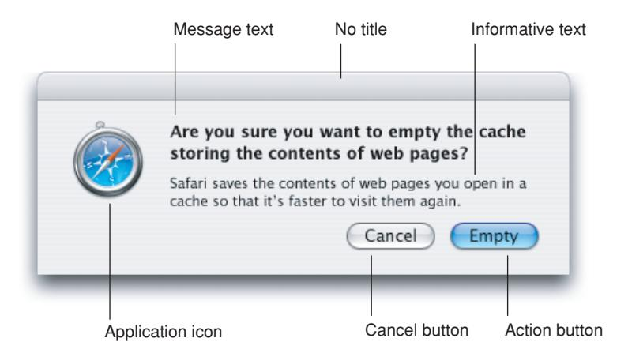

See ["A Standard Alert"](#page-210-0) (page 211) for more information on laying out alerts.

### <span id="page-135-5"></span><span id="page-135-4"></span><span id="page-135-3"></span>The Elements of an Alert

An alert should contain only the following elements:

- <span id="page-135-8"></span>■ **Alert message text.** This text, in emphasized (bold) system font, provides a short, simple summary of the error or condition that summoned the alert. This should be a complete sentence; often it is presented as a question. See ["Writing Good Alert Messages"](#page-136-1) (page 137) for more information.
- **Informative text.**This text appears in the small system font and provides a fuller description of the situation, its consequences, and ways to get out of it. For example, a warning that an action cannot be undone is an appropriate use of informative text.

#### <span id="page-135-6"></span>**Important**

Do not leave informative text out. What you think of as an intuitive alert message might be far from intuitive to your users. Use informative text to reword and expand on the alert message text.

■ **Buttons for addressing the alert.** Button names should correspond to the action the user performs when pressing the button—for example, Erase, Save, or Delete. The rightmost button in the dialog, the action button, is the button that confirms the alert message text. The action button is usually, but not always, the default button. Note that in Cocoa methods, the rightmost button is always referred to as the default button even though it might not be. For more information, see ["Dismissing Dialogs"](#page-139-0) (page 140).

<span id="page-136-3"></span>■ **The application icon.**Because of the Mac OS X window layering model (described in ["Window](#page-119-1) [Layering"](#page-119-1) (page 120)), an icon is necessary to make it clear to the user which application is displaying the alert.

<span id="page-136-4"></span>In rare cases, you may want to display a caution icon in your alert, badged with the application icon as shown in Figure 9-3. A badged alert is appropriate only if the user is performing a task, such as installing software, and a possible side effect of that task would be the inadvertent destruction of data. Don't use a caution icon for tasks whose only purpose is to overwrite or remove data, such as Save or Empty Trash; too-frequent use of the caution icon dilutes its significance.

#### **Important**

<span id="page-136-0"></span>The note, caution, and stop alerts used in Mac OS 9 should not be used in Mac OS X.

**Figure 9-3** A customized alert showing the caution icon badged with an application icon


<span id="page-136-1"></span>**Carbon:** See *Dialog Manager Reference* in Carbon User Experience Documentation.

**Cocoa:** See *Dialogs and Special Panels* in Cocoa User Experience Documentation.

### <span id="page-136-2"></span>Writing Good Alert Messages

A good alert message states clearly what caused the alert to appear and what the user can do about it. Express everything in the user's vocabulary. Figure 9-4 shows an example of an alert message that provides little useful information.

<span id="page-137-0"></span>**Figure 9-4** A poorly written alert message


<span id="page-137-1"></span>You could improve this message by describing the problem in the user's vocabulary as shown in Figure 9-5.

**Figure 9-5** An improved alert message


<span id="page-137-2"></span>To make the alert really useful, provide a suggestion about what the user can do to get out of the current situation. Figure 9-6 shows the alert with additional information.

**Figure 9-6** A well-written alert message


**Note:** The examples in these figures would probably be sheets in a real application.

# <span id="page-138-0"></span>Dialog Appearance and Behavior

<span id="page-138-2"></span>When appropriate, your application's dialogs should display default values for controls and text fields so the user can verify information rather than generate it from scratch.

Display a selection or an insertion point in the first location—a text entry field or a list, for example—that accepts user input.

When it provides an obvious user benefit, static text in a dialog should be selectable. For example, a user should be able to copy an error message, a serial number, or IP address to paste elsewhere.

<span id="page-138-1"></span>In dialogs that display columns and are user resizable, such as the Open dialog, as the dialog is made bigger, the columns should grow and additional columns should appear. All other elements should remain the same size and be anchored to the right, center, or left side of the dialog.

### <span id="page-138-3"></span>Accepting Changes

In general, all changes a user makes in a dialog should appear to take effect immediately. There are three possible opportunities for data validation in a dialog:

- 1. When the user types data
- 2. When the user moves out of a data field (by pressing Tab, for example)
- <span id="page-138-4"></span>3. When the user clicks a button to apply changes

It is your responsibility to make the three states as clear as possible to the user. For example, checkboxes and radio buttons update immediately and display the appropriate results.

You need to decide when your application does error checking of user input. Possible approaches:

- Evaluate the input and check for errors as the user tabs from one field to the next. The drawback is that it isn't clear to the user that the changes are taking effect as he or she tabs among items. The user doesn't click a button, and so isn't aware of completing an action.
- Save user input in a queue and apply it when the user clicks a button, closes the dialog, or switches to another application. If your application waits to check user-input errors until the user tries to dismiss the dialog, you may have to present an alert, thereby forcing the user to revisit the dialog. If you do error checking as the user enters input, it takes more time up front, but you can warn the user immediately when invalid data is entered.

In most cases, validating input after each keystroke is annoying and unnecessary. It's better to design your interface to automatically disallow invalid input. For example, your application could automatically convert lowercase characters to uppercase when appropriate.

In addition to error checking, you need to decide when to apply user input. In some cases, changes can take effect immediately—for example, View Options for Finder windows. In other cases, it may be appropriate to wait until the user performs an action, such as clicking an Apply button.

In a dialog that has multiple panes (selected by buttons, tabs, or a pop-up menu), avoid validating data when a user switches from one pane to another.

Finally, you need to determine whether your application should automatically perform an operation based on user input or whether the user should initiate the operation, for example, by clicking a button. It's acceptable to automatically perform an operation that completes quickly and returns user control within a couple of seconds. For an operation that takes a longer time to execute, it's best to warn the user of the estimated time required and let the user initiate it.

### <span id="page-139-0"></span>Dismissing Dialogs

The buttons at the bottom right of a dialog all dismiss the dialog. A button that initiates an action is furthest to the right. This **action button** confirms the alert message text. The Cancel button sits to the left of this button.

If there's a third button for dismissing the dialog, it should go to the left of the Cancel button. If the third button could result in data loss—Don't Save, for example—position it at least 24 pixels away from the "safe" buttons (Cancel and Save, for example).

<span id="page-139-1"></span>A button that affects the contents of the dialog itself, such as Reset, should have its left edge aligned with the main dialog text or if there is a Help button, 12 pixels to the right of it.

**Figure 9-7** Position of buttons at the bottom of a dialog


Usually the rightmost button or the Cancel button is the **default button**. The default button should be the button that represents the action that the user is most likely to perform *if* that action isn't potentially dangerous. A default button has color and pulses to let the user know that it is the default. When the user presses the Enter key or the Return key, your application should respond as if the user clicked the default button.

Don't use a default button if the most likely action is dangerous—for example, if it causes a loss of user data. When there is no default button, pressing Return or Enter has no effect; the user must explicitly click a button. This guideline protects users from accidentally damaging their work by pressing Return or Enter. You can consider using a safe default button, such as Cancel.

Don't use a default button if you use the Return key in text entry boxes. Having two behaviors for one key can confuse users and make the interface less predictable.

<span id="page-140-3"></span>In addition to the action button or buttons, it's a good idea to include a Cancel button. This button returns the computer to the state it was in before the dialog appeared. It means "forget I mentioned it." Always map the keyboard shortcut Command-period and the Esc (Escape) key to the Cancel button. These keyboard equivalents, along with Return and Enter, are accelerator keys and serve the purpose of letting the user respond quickly to a dialog or an alert. In general, it's not a good idea to assign other keyboard shortcuts to buttons. If you find it useful to assign keyboard shortcuts to some buttons that are used very often in your application, be sure to follow the guidelines in ["Keyboard](#page-27-0) [Shortcuts"](#page-27-0) (page 28).

<span id="page-140-4"></span><span id="page-140-2"></span>In some circumstances, it's appropriate to implement an Apply button—for example, to permit a user to see the effect of multiple text attributes before committing to them. In cases like these, clicking Cancel should undo any of the applied changes. Be cautious about using an Apply button for operations that take a long time to implement or undo; it might not be obvious to users that they can interrupt or reverse the process.

# <span id="page-140-0"></span>The Open Dialog

<span id="page-140-5"></span><span id="page-140-1"></span>The Open dialog appears when the user chooses the Open command or presses Command-O. The Open dialog is application modal (the user can switch to other applications).

If you implement an Open command, you should also include an Open Recent command so users can open recently opened documents without going through the dialog.

<span id="page-141-1"></span><span id="page-141-0"></span>**Figure 9-8** An Open dialog


The Open dialog contains these elements:

- A default title ("Open"); you should add your application's name to the Open dialog title—"TextEdit: Open," for example.
- Back and forward buttons to navigate back and forth between selections made in list or column view.
- A pop-up menu that contains common places a user might save things and Recent Places (the five most recent folders the user opened or saved documents to). Your application specifies the default location, typically one of the predefined folders in the user's home folder. (For recommended default locations, see *Apple Software Design Guidelines*.) If the user selects another folder, the dialog should "remember" the user's selection the next time the dialog appears.
- A sidebar that mirrors the one presented in the Finder.
- A column or list view for navigating the file system.
- A Cancel button and an Open (default) button.
- <span id="page-141-2"></span>■ A resize control in the lower-right corner.
- Expert users can specify a pathname by pressing Command-Shift-G.

You can extend the Open dialog as appropriate for your application as illustrated in Figure 9-9. You might, for example, include a pop-up menu allowing users to filter the type of files that appear in the list. Items that do not meet the filtering criteria would appear dimmed. The system creates a list of

native file types supported by the application to populate the menu. You can supplement this list with custom types and specify the default to show when the dialog opens. You should include an All Applicable Files item, but it does not have to be the default.

<span id="page-142-2"></span>**Figure 9-9** A customized Open dialog


Open dialogs should support document preview and can support multiple selection if your application allows more than one document to be open at a time.

**Carbon:** See *Navigation Services for Carbon: An Overview* in Carbon User Experience Documentation. **Cocoa:** Open dialogs are NSOpenPanels. You typically display an Open dialog by invoking the openPanel method. See *Application File Management* in Cocoa File Management Documentation.

# <span id="page-142-0"></span>Dialogs for Saving, Closing, and Quitting

<span id="page-142-1"></span>This section describes the standard dialogs that you use when a user is saving a document for the first time, closing a document, or quitting an application.

### Save Dialogs

An application that saves the contents of individual windows—which would be most text and graphics applications—should use document-specific sheets for its Save dialogs. The Save dialog has two states: minimal and expanded. Clicking the disclosure button toggles between these states. If the user changes the state, the next Save dialog should open in the selected state.

<span id="page-143-2"></span>As described in *Apple Software Design Guidelines*, your application should pass in a filename extension as part of every filename. Users can control its visibility using the Hide Extension checkbox in the expanded Save dialog; see ["The Expanded Save Dialog"](#page-144-1) (page 145). Existing documents do not get extensions added to or removed from their filenames unless the user chooses Save As and changes the setting in the Save dialog.

### <span id="page-143-3"></span>The Minimal Save Dialog

<span id="page-143-0"></span>In the minimal Save dialog, users can save changes to an unnamed document, name or rename a document, and choose a frequently accessed location to store it.

**Figure 9-10** The minimal (collapsed) Save dialog

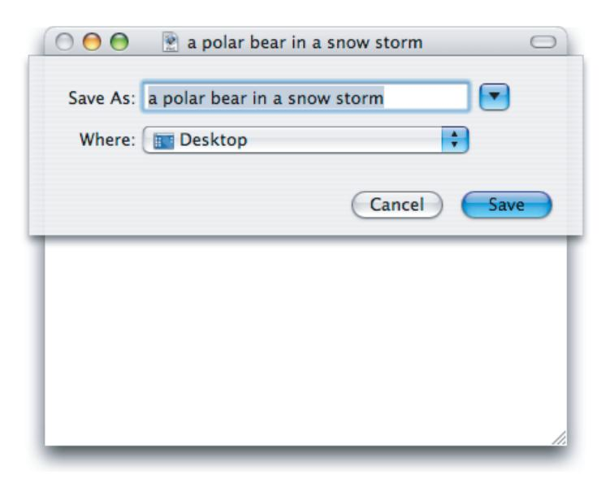

<span id="page-143-4"></span>The minimal Save dialog contains these elements:

<span id="page-143-5"></span>■ Save As text field for the document name. (Expert users can enter pathnames by pressing Command-Shift-G.)

If the document has not been saved previously, your application should put the default name (such as "untitled") in this field, and the filename should be selected. If the user has chosen to make the filename extension visible, the extension is not selected.

<span id="page-143-1"></span>If the document has been saved previously and the user chooses Save As, the Save dialog should open with the document name highlighted in the Save As field. The filename extension (if it is visible) is not selected.

- Where pop-up menu, containing mounted volumes, the folders in the Finder sidebar, and Recent Places (the five most recent folders the user opened or saved documents to). Your application specifies the default location, typically the predefined Documents folder in the user's home folder. (For recommended default locations, see *Apple Software Design Guidelines*.) If the user selects another folder, the dialog should "remember" the user's selection the next time the dialog appears.
- A Save button (default).

- <span id="page-144-2"></span>■ A Cancel button. Dismisses the dialog and returns the application to its previous state.
- A disclosure button. Clicking it displays the expanded Save dialog.

Any custom elements you add go between the Where pop-up menu and the buttons at the bottom of the dialog.

### <span id="page-144-4"></span><span id="page-144-3"></span><span id="page-144-1"></span>The Expanded Save Dialog

<span id="page-144-0"></span>In contrast with the minimal Save dialog, the expanded Save dialog lets users save documents in locations other than those available in the minimal Save dialog's Where pop-up menu.

**Figure 9-11** The expanded Save dialog

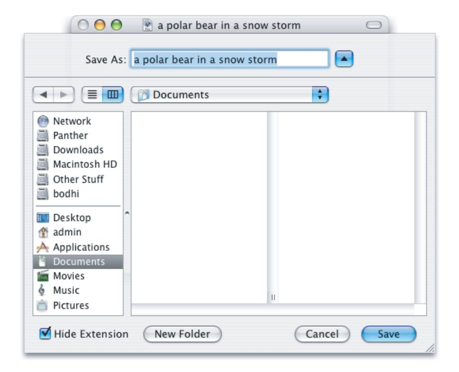

In addition to the items in the minimal Save dialog, the expanded Save dialog displays the following:

- Back and forward buttons to navigate back and forth between selections made in the list or column view.
- A sidebar that mirrors the one presented in the Finder.
- A column or list view for navigating the file system.
- A New Folder button, which displays an application-modal dialog that asks the user to name the new folder, and then creates it.

<span id="page-145-1"></span>■ A Hide Extension checkbox, which allows the user to control whether or not the filename's extension (.jpg, for example) is visible. The Hide Extension checkbox should be selected as the default (that is, filename extensions should not appear in user-visible filenames unless the user requests them).

If the user changes the state of the checkbox for a particular document, the next new document should match the last user-selected state, even after the user quits and reopens the application. The filename in the Save As field updates in real time as the checkbox is selected or deselected.

<span id="page-145-3"></span>Don't provide your own options for handling filename extensions; use the standard Open and Save dialogs.

**Carbon:** Set the PreserveSaveFileExtension flag when calling the Save dialog, and use NavCompleteSave to set the flag to hide the filename extension.

If you add other elements to customize the expanded Save dialog, they should appear above the Cancel and Save buttons. When the dialog is expanded, custom elements should appear between the file-system browser and the push buttons.

<span id="page-145-2"></span><span id="page-145-0"></span>In default keyboard navigation mode, pressing Tab in the expanded Save dialog shifts the keyboard focus from the Save As text field to the sidebar, to the visible columns, and then back to the text field.

### <span id="page-145-4"></span>Closing a Document With Unsaved Changes

When the user attempts to close a document that has unsaved changes, present a Save Changes alert. An application that saves the contents of individual windows—such as most text and graphics applications—should use document-specific sheets, like the one shown in Figure 9-12, for its Save Changes alert. In an application that can display multiple views of the same file, if the user chooses the Close File command instead of Close Window, open the sheet on the frontmost window and change the alert message text from "document" to "file". After the user clicks Save or Don't Save, close all open views of the file.

<span id="page-146-2"></span><span id="page-146-1"></span>**Figure 9-12** A Save Changes alert for a document-based application

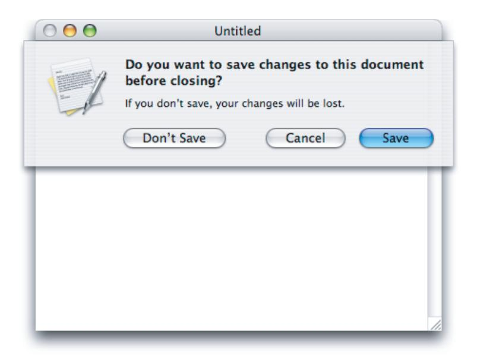

<span id="page-146-4"></span><span id="page-146-0"></span>When a Save Changes sheet is open, the document's close button and the Close command in the File menu are unavailable; the user can't close the document until the Save Changes sheet is addressed.

### <span id="page-146-5"></span><span id="page-146-3"></span>Saving Documents During a Quit Operation

Users can interrupt a quit operation with documents still unsaved. For example, if a user chooses Quit and a save alert (a sheet) opens for a document, the user can work on other documents or switch to another application without addressing the save alert.

When a user quits an application in which all open documents have been saved, all documents close immediately and the application quits.

### Quitting an Application That Is Not Document-Based

When a user attempts to quit an application that is not document-based but that has many windows whose contents are saved simultaneously, present an application-modal Save Changes alert, such as the one shown in Figure 9-13.

<span id="page-147-3"></span><span id="page-147-0"></span>**Figure 9-13** A Save Changes alert for an application that is not document-based


### Quitting an Application With Multiple Unsaved Documents Open

<span id="page-147-4"></span><span id="page-147-2"></span><span id="page-147-1"></span>When a user attempts to quit a document-based application and there is more than one document with unsaved changes open, present an application-modal Review Changes alert such as the one shown in Figure 9-14.

**Figure 9-14** The Review Changes (application modal) alert that appears when the user quits with more than one unsaved document open

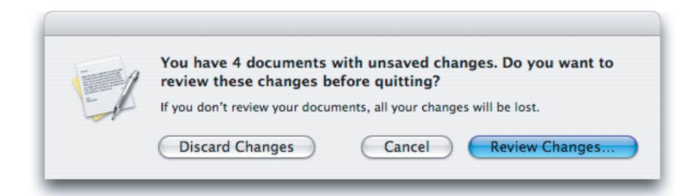

<span id="page-147-5"></span>The appropriate action for each button is as follows:

- **Discard Changes.** Closes all documents without saving changes and quits the application.
- **Cancel.** Cancels the Quit command.
- **Review Changes.** All open documents (including those minimized in the Dock) come forward, with the unsaved documents on top. The active document presents the Save Before Quitting alert. If the user clicks Save, the Save dialog appears (if the document has not previously been saved). If the user clicks Don't Save, the next unsaved document comes forward with its Save Before Quitting alert. If the user dismisses the last Save Before Quitting alert with Save or Don't Save, all documents close and the application quits.

During the review, if the user activates another unsaved document, it should come forward with its Save Before Quitting sheet open. Save Before Quitting sheets on other documents remain open. During the review, if the user activates a saved document, the review process continues when the next unsaved document becomes active.

<span id="page-148-2"></span>If, in the midst of a quit operation, the user clicks the application icon in the Dock or chooses Bring All to Front from the Window menu, documents should appear in this order: documents with open sheets on top, unsaved documents next, and then saved documents.

<span id="page-148-4"></span>At any time during the review process, the user can click Cancel to stop the quit operation. If the user initiates a Quit command during the review process, the process begins again with the application-modal alert shown in Figure 9-14.

### Saving a Document With the Same Name as an Existing Document

<span id="page-148-5"></span><span id="page-148-1"></span>If the user types the name of a document that already exists in the same location into the Save As field of a Save dialog, and then clicks Save, present an application-modal alert in which the user can confirm whether or not to replace the previous document.

**Figure 9-15** Alert for confirming replacing a file


# <span id="page-148-3"></span><span id="page-148-0"></span>The Choose Dialog

A Choose dialog lets a user select an item as the target of a task. For example, when a user attempts to open a broken alias, the Fix Alias dialog lets the user choose another item for the alias to open. An application can have more than one Choose dialog, but only one can be open at a time. In some situations, it may be appropriate for a Choose dialog to be a sheet.

<span id="page-149-0"></span>**Figure 9-16** A Choose dialog


#### A Choose dialog:

- Can be opened by various commands
- Can support multiple selection
- <span id="page-149-1"></span>■ Supports document preview
- Can be resized with the resize control in the lower-right corner
- Can include a Show pop-up menu, which allows the user to filter the type of files that appear in the list. Items that do not meet the filtering criteria appear dimmed. The system creates a list of native file types supported by the application to populate the menu. You can supplement this list with custom types and specify the default to show when the dialog opens. You should include an All Applicable Files item, but it does not have to be the default.

If the dialog is not a sheet, the dialog's default title is "Choose," but you should change it to include the name of the task. For example, if the command that brings up the dialog is Choose Picture, the dialog should be titled "Choose Picture." Also include some instructional text at the top, such as "Choose a picture to display in the background of 'Documents.'" If it's helpful, also change the Choose button to something more specific.

The default location is the user's home folder. If the dialog is targeted to volumes only, the default location is the user's directory. Files and folders not appropriate for the target selection should be dimmed.

**Note:** Recent Places (in the Where pop-up menu of a Save dialog) does not record folders selected in Choose dialogs.

<span id="page-150-3"></span>**Carbon:** The Choose dialog is available through Navigation Services. For more information, see the documentation for Navigation Services in Carbon User Experience Documentation. **Cocoa:** Use a variation of the Open dialog (NSOpenPanel class).

# <span id="page-150-0"></span>The Printing Dialogs

<span id="page-150-4"></span><span id="page-150-1"></span>Printing dialogs include the Print dialog, the Fax dialog, and the Page Setup dialog.

## <span id="page-150-5"></span>Print Dialog

<span id="page-150-2"></span>In the Print dialog, user options are provided via the features pop-up menu, which display panes drawn and controlled by printing dialog extensions (PDEs). PDEs are provided by the operating system, printer modules, and applications. Apple provides a number of printing panes. The standard Print dialog is shown in Figure 9-17.

**Figure 9-17** A Print dialog (a sheet attached to a document window)


Options for choosing paper type and print quality are displayed through the features pop-up menu. You can create custom print panes by following the interface guidelines provided throughout this document and the layout guidelines described in ["Positioning Full-Size Controls"](#page-202-1) (page 203). Here are some specific guidelines to keep in mind if you implement custom printing features:

- Choose a menu item name that doesn't conflict with menu items already in the features pop-up menu.
- The menu item (the pane name) should help users easily determine the options the pane contains.

- Make sure the features you implement are appropriate for your application. For example, an option to print in reverse order should be provided by the operating system, not by your application. (Implementing this feature requires the application to know the hardware's capabilities.)
- Make interdependencies among options clear to users. For example, if a user selects double-sided printing, the option to print on transparencies should become unavailable.
- Separate more advanced features from frequently used features. When the user chooses to display the advanced features, there should be an "advanced options" title above the advanced controls.
- Provide visual feedback (such as the preview in the Layout pane of the Print dialog) when appropriate. A thumbnail showing the effect of changing a tone control, for example, helps users determine desired settings.
- Save a user's printing preferences for a document, at least while the document is open. Provide a way for users to save custom settings.

<span id="page-151-1"></span>**Carbon:** You can write a PDE to customize panes in the Page Setup or Print dialogs. For more information, see *Extending Printing Dialogs* in Printing Documentation.

<span id="page-151-0"></span>**Cocoa:** You can implement an accessory view by using NSPageLayout and NSPrintPanel, both Application Kit classes.

### <span id="page-151-3"></span><span id="page-151-2"></span>Page Setup Dialog

The Page Setup dialog provides a way for users to set the scaling and orientation options for a document based on the intended output paper size and the printer. Save the settings in this dialog with the document.

<span id="page-152-2"></span><span id="page-152-1"></span>**Figure 9-18** The Page Setup dialog


### <span id="page-152-3"></span><span id="page-152-0"></span>Fax Dialog

The Fax dialog allows a user to specify how to send a fax. Options include cover page settings and dialing options. When the user types a name that's in the user's address book, the Fax dialog checks to see if there's a fax number in the record and fills it in if there is.

<span id="page-153-0"></span>**Figure 9-19** The Fax dialog

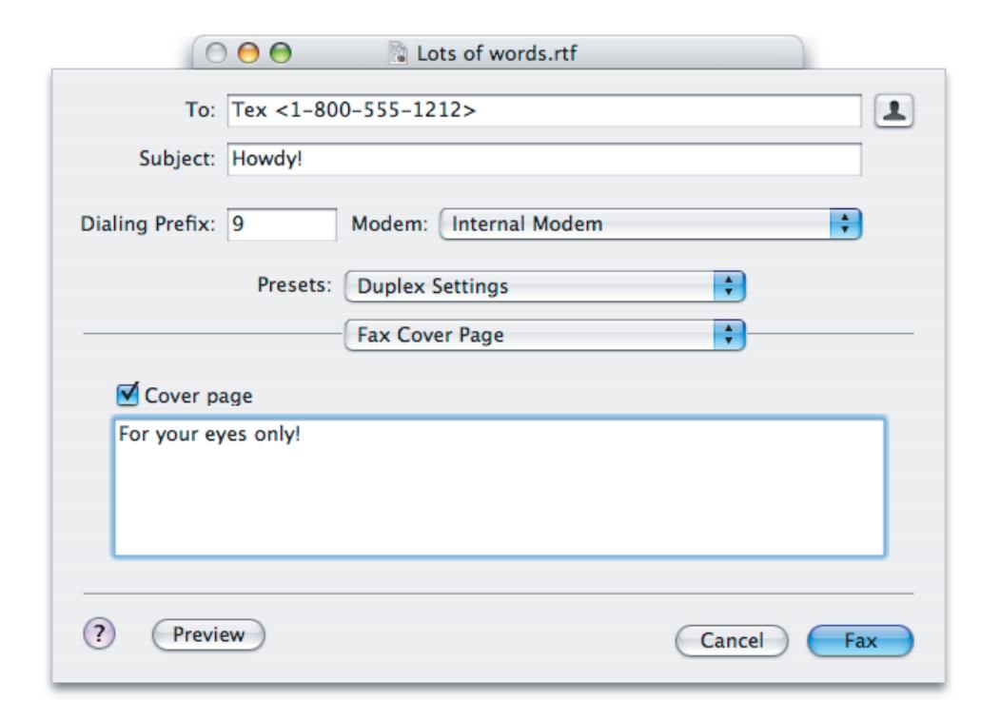

<span id="page-154-7"></span><span id="page-154-6"></span><span id="page-154-3"></span><span id="page-154-0"></span>**Controls** are graphic objects that cause instant actions or visible results when the user manipulates them with the mouse. Standard controls include push buttons, scroll bars, radio buttons, checkboxes, sliders, and pop-up menus.

<span id="page-154-4"></span>In Carbon, the Control Manager determines the overall appearance of many controls. Controls introduced in Mac OS X version 10.2 and later are implemented using the HIView model. In Cocoa, the overall appearance of interface elements is provided by the Application Kit. You are responsible for positioning the controls within your windows, according to the guidelines given in this chapter and in ["Layout Examples"](#page-202-3) (page 203).

This chapter discusses the behavior and appearance of the standard controls available in Mac OS X. Follow the metrics provided in this chapter to get the correct spacing between controls in your windows.

Many controls have a small version and a mini version for use when space is very limited. This chapter gives specifications for these as well as the full-size version. See ["Using Small and Mini Versions of](#page-213-0) [Controls"](#page-213-0) (page 214) for more information.

**Carbon:** See *Control Manager Reference*, *Handling Carbon Windows and Controls*, and *Introducing HIView* in Carbon User Experience Documentation for more information about creating and handling controls.

**Cocoa:** See the various documents on controls available in Cocoa User Experience Documentation.

# <span id="page-154-1"></span>Buttons

<span id="page-154-8"></span><span id="page-154-5"></span><span id="page-154-2"></span>Buttons initiate an immediate action. If a button initiates an indeterminate process, the button should be dimmed until the process is complete, or status feedback should be provided. This section discusses the buttons that are available to meet the needs of your interface.

### Push Buttons

A **push button** is a rounded rectangle with a text label on it. Clicking a push button performs an instantaneous action, such as saving a document, completing operations defined by a dialog, or acknowledging an error message.

Buttons **155**

Use push buttons for buttons that contain text only. A button that has an icon or other image should be a bevel button. Push button text should not have a shadow or any other effects on it. It should be in the system font appropriate for the button size as described in the specification section that follows.

Button names should be verbs that describe the action performed—Save, Close, Print, Delete, and so on. If a button acts on a single setting, label the button as specifically as possible; "Choose Picture…," for example, is more helpful than "Choose…" Because most buttons initiate an immediate action, it shouldn't be necessary to use "now" (Scan Now, for example) in the label. Don't use push buttons to indicate a state such as On or Off (where it would be more appropriate to use checkboxes).

Don't use push buttons as labels; use static text.

<span id="page-155-2"></span>Don't associate menus with push buttons; use a bevel button instead.

<span id="page-155-1"></span>All push buttons should be clear (that is without color) except the default button—the button selected by pressing the Return key—which should use the default color (in addition to pulsing). For example, in a dialog containing an OK button and a Cancel button where OK is the default, the Cancel button is clear and the OK button uses color and pulses. When the user presses a nondefault button, such as Cancel, the button acquires color and the default button loses its color. If you use standard controls, this behavior is automatic.

For information about proper capitalization of button labels, see ["Capitalization of Interface](#page-53-0) [Elements"](#page-53-0) (page 54). For information about when it is appropriate to use an ellipsis in buttons, see ["Using the Ellipsis Character"](#page-52-1) (page 53). For examples of using push buttons in dialogs see ["Dialogs"](#page-132-2) (page 133).

**Carbon:** Push buttons are available in Interface Builder; to create one programmatically, use CreatePushButtonControl.

**Cocoa:** Push buttons are available in Interface Builder; to create one programmatically, create an NSButton of type NSMomentaryPushInButton or NSMomentaryLightButton. See *Buttons* in Cocoa User Experience Documentation.

### <span id="page-155-0"></span>Push Button Specifications

**Figure 10-1** Push button height


<span id="page-156-0"></span>**Figure 10-2** Push button spacing

#### **Full-size push button**

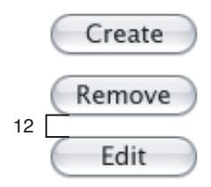

#### **Small push button**

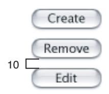

#### **Mini push button**

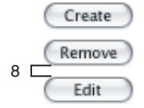

#### ■ **Height:**

❏ Full size: 20 pixels, not including the shadow

❏ Small: 17 pixels ❏ Mini: 15 pixels

<span id="page-156-1"></span>■ **Width:** Depends on button text. If you don't specify a wide enough button, the end caps clip the text. The standard width for OK and Cancel buttons is 68 pixels, as shown in Figure 10-3.

**Figure 10-3** Full-size push buttons used in dialogs

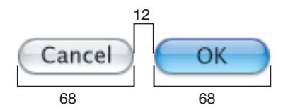

■ **Text:**

- Full size: System font. If you need to use a font larger than the system font, use a bevel button instead. ❏
- ❏ Small: Small system font.
- <span id="page-157-2"></span>❏ Mini: Mini system font.
- **Color:** All push buttons are clear except the default button, which uses the default color (in addition to pulsing).

#### ■ **Spacing:**

- ❏ Full size: Leave at least 12 pixels of space between buttons placed horizontally or stacked.
- <span id="page-157-4"></span>❏ Small: Leave at least 10 pixels.
- ❏ Mini: Leave at least 8 pixels.

### <span id="page-157-5"></span><span id="page-157-3"></span><span id="page-157-0"></span>Metal Buttons

**Metal buttons** are for use in brushed metal windows.

#### Metal buttons:

- Can contain icons, graphics, or text
- Can have the behavior of other types of buttons, including radio buttons or checkboxes

<span id="page-157-1"></span>Don't use metal buttons in dialogs. Dialogs should never use the brushed metal look. See ["Brushed](#page-110-0) [Metal Windows"](#page-110-0) (page 111) for guidelines on when to use brushed metal windows.

If a button acts on a single setting, label the button as specifically as possible.

**Figure 10-4** Metal buttons


**Carbon:** Not available.

**Cocoa:** Use the NSButtonCell method setBezelStyle with NSTexturedSquareBezelStyle as the argument. See *Buttons* in Cocoa User Experience Documentation.

### <span id="page-158-1"></span>Metal Button Specifications

**Figure 10-5** Metal button dimensions

#### **Fu -s ze meta button**


#### **Sma meta button**


#### ■ **Height:**

- ❏ Full size: 25 pixels minimum, 32 pixels maximum
- ❏ Small: 18 pixels minimum, 24 pixels maximum
- **Width:** Depends on the buttons content.

#### ■ **Size of image:**

- ❏ Full size: No more than 16 pixels high for a 25 pixel high button. Leave at least two pixels of space on each side.
- ❏ Small: No more than 11 pixels high for a 18 pixel high button. Leave at least two pixels of space on each side.

#### ■ **Text:**

- ❏ Full size: System font
- <span id="page-158-4"></span>❏ Small: Small system font

#### ■ **Spacing:**

- ❏ Full size: Leave at least 12 pixels of space between buttons placed horizontally or stacked.
- ❏ Small: Leave at least 8 pixels.

<span id="page-158-3"></span><span id="page-158-2"></span><span id="page-158-0"></span>**Note:** There is no mini version of the metal button.

### Bevel Buttons

A **bevel button** has a beveled edge that gives the button a three-dimensional appearance.

Bevel buttons are extremely versatile and can display text, icons, or other images. They can behave like standard push buttons or can be grouped and used like radio buttons or checkboxes. For example, bevel buttons could be used to graphically represent text-alignment options in a toolbar.

<span id="page-159-0"></span>**Figure 10-6** Bevel buttons as radio buttons and push buttons

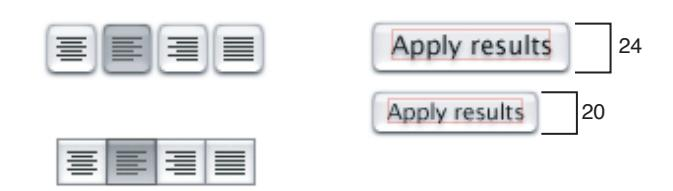

Bevel buttons can have a menu attached, so the button behaves like a pop-up menu. See ["Icon Buttons](#page-169-0) [and Bevel Buttons With Pop-Up Menus"](#page-169-0) (page 170).

Even though bevel buttons can be used many different ways, be careful not to over use them; use other controls such as radio buttons, checkboxes, and push buttons when appropriate. Bevel buttons can have rounded or square corners. The square buttons work well for tiling together in groups (to be used as radio buttons, for example).

**Carbon:** Both the rounded and square versions of the button are in Interface Builder. To create them programmatically, use the CreateBevelButtonControl function, or use the Appearance Manager function DrawThemeButton with the kThemeBevelButton constant.

<span id="page-159-1"></span>**Cocoa:** Bevel buttons are available in Interface Builder. To create one programmatically use the NSButtonCell method setBezelStyle with NSRoundedBezelStyle as the argument. To make a square-cornered bevel button in Interface Builder, use the bevel button widget (NSButton) from the Controls palette. Select the button, and in the Attributes inspector, change its type to Square Button. See *Buttons* in Cocoa User Experience Documentation.

### <span id="page-160-0"></span>Bevel Button Specifications

**Figure 10-7** Bevel button examples

#### **Rounded co ne s**


Leave a eas 5 p xe s be ween edge o con and edge o bu on

#### **Rounded co ne s w h abe be ow con**

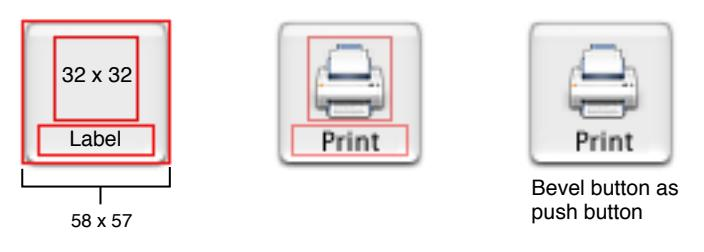

#### **Squa e co ne s**


- **Size of button:** Variable; 20 x 20 pixels is recommended size in a tool palette. If using an icon or text in the button, maintain a border of at least 5 pixels on all sides.
- **Size of icon:** 32 x 32 pixels is the largest recommended icon size.
- **Spacing:** For buttons with rounded corners that contain a 24 x 24 (or larger) icon, leave at least 8 pixels between buttons, stacked vertically or aligned horizontally. Otherwise, buttons should butt up against each other.
- **Text:** Label font (10-point Lucida Grande Regular).

If a bevel button has an icon and a label, you can put the text anywhere in relation to the icon. You can specify the location in Interface Builder or programmatically.

## <span id="page-161-0"></span>Icon Buttons

<span id="page-161-3"></span>An **icon button** behaves like a bevel button, but does not have a rectangular edge around it; the entire button is clickable, not just the icon.

<span id="page-161-1"></span>Icon buttons may have pop-up menus attached. See ["Icon Buttons and Bevel Buttons With Pop-Up](#page-169-0) [Menus"](#page-169-0) (page 170) for more information.

**Figure 10-8** Icon buttons used in a toolbar


**Carbon:** Create icon buttons programmatically with the function CreateIconControl.

**Cocoa:** To create an icon button in Interface Builder, use the bevel button widget (NSButton) from the Controls palette. Add the appropriate icon, then select the button and in the Attributes inspector, deselect Bordered. To create one programmatically, use the NSButtonCell method setBezelStyle with NSShadowlessSquareBezelStyle as the argument. See *Buttons* in Cocoa User Experience Documentation.

### <span id="page-161-2"></span>Icon Button Specifications

**Figure 10-9** Icon button dimensions


- <span id="page-161-4"></span>■ **Size of icon:** 32 x 32 pixels recommended.
- **Spacing:** For buttons with a 24 x 24 (or larger) icon, leave at least 8 pixels between buttons, stacked vertically or aligned horizontally.
- **Text:** Small system font. The text should be below the icon as shown in Figure 10-9.

### <span id="page-162-0"></span>Round Buttons

<span id="page-162-3"></span><span id="page-162-1"></span>**Round buttons** may contain images but not text. Use them when you need a simple iconic push button to initiate an immediate action. They are commonly used as navigation controls. They should not be used as radio buttons or for making selections.

**Figure 10-10** Examples of round buttons


**Carbon:** Round buttons are available in Interface Builder. To create one programmatically, use CreateRoundButtonControl.

**Cocoa:** Round buttons are available in Interface Builder. To create one programmatically, use the NSButtonCell method setBezelStyle with NSCircularBezelStyle as the argument. See *Buttons* in Cocoa User Experience Documentation.

### <span id="page-162-2"></span>Round Button Specifications

**Figure 10-11** Round button dimensions

#### **Fu -s ze round button**


#### **Sma round button**


- <span id="page-162-4"></span>■ **Diameter:**
  - ❏ Full size: 25 x 25 pixels
  - ❏ Small: 20 x 20 pixels
- **Text:** Do not use text in round buttons. A single letter may be appropriate, but the letter should be treated as an icon.
- **Spacing:** 12 pixels between buttons or from other interface elements.

**Note:** There is no mini version of the round button.

### <span id="page-163-4"></span><span id="page-163-3"></span><span id="page-163-0"></span>The Help Button

<span id="page-163-1"></span>The **Help button** opens Help Viewer to a specific help page appropriate for the context of the button. Don't create a custom button; use the standard Help button, which contains the Mac OS X question mark graphic.

**Figure 10-12** Help button in the Print dialog


For information on using help in your application, see *Apple Software Design Guidelines*.

**Carbon:** The Help button is available in the Enhanced Controls palette of Interface Builder. You can create it programmatically by using the CreateRoundButtonControl function and specifying kHelpIcon in the content parameters (from Icon Services). (See Icons.h in the HIServices framework.)

**Cocoa:** The Help button is available in the Controls palette of Interface Builder. To create a Help button programmatically, use the NSButtonCell method setBezelStyle with NSHelpButtonBezelStyle as the argument. See *Buttons* in Cocoa User Experience Documentation.

### <span id="page-163-2"></span>Help Button Specifications

**Figure 10-13** Help button dimensions


- **Size:** 20 x 20 pixels
- **Spacing:** At least 12 pixels or from other interface elements

# <span id="page-164-0"></span>Selection Controls

The controls described in the following sections provide ways for users to make selections from multiple items.

### <span id="page-164-4"></span><span id="page-164-3"></span><span id="page-164-1"></span>Radio Buttons

Use **radio buttons** for a set of mutually exclusive but related choices. A set of radio buttons should contain at least two items and a maximum of about five. (For more than five items, consider using a pop-up menu.) A set of radio buttons is never dynamic (that is the contents shouldn't change depending on the context). A radio button should never initiate an action.

**Carbon:** Radio buttons are available in Interface Builder. To create one programmatically, use the function CreateRadioButtonControl.

**Cocoa:** Radio buttons are available in Interface Builder. Radio buttons have the button type NSRadioButton. See *Buttons* in Cocoa User Experience documentation.

### <span id="page-164-2"></span>Radio Button Specifications

**Figure 10-14** Radio button spacing

#### **Fu s ze rad o bu on**

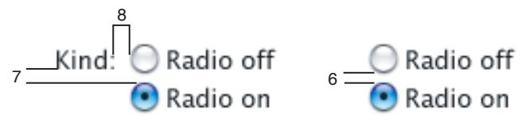

#### **Sma rad o bu on**


#### **M n rad o bu on**

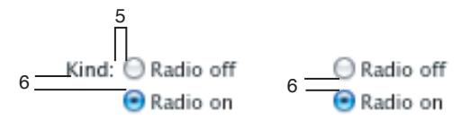

A gn he base nes o he abe and he s bu on s ex

#### ■ **Size:**

- ❏ Full size: 18 x 18 pixels, including the shadow
- ❏ Small: 14 x 15 pixels
- ❏ Mini: 10 x 11 pixels

#### ■ **Spacing:**

- ❏ Full size: 6 pixels between controls when stacked; 8 pixels from label (colon) to control
- ❏ Small: 6 pixels between controls when stacked; 6 pixels from label (colon) to control
- ❏ Mini: 6 pixels between controls when stacked; 5 pixels from label (colon) to control

#### ■ **Text:**

- ❏ Full size: System font for both the label and control text
- <span id="page-165-3"></span>❏ Small: Small system font for both the label and control text
- ❏ Mini: Mini system font for both the label and control text
- <span id="page-165-0"></span>■ **Positioning:** Typically stacked vertically to clearly show relationships among button states.

### <span id="page-165-2"></span><span id="page-165-1"></span>Checkboxes

Use **checkboxes** to indicate one or more options that must be either on or off. Each checkbox label should clearly imply two opposite states so it's clear what happens when the box is checked or unchecked. If you can't find an unambiguous label, consider using radio buttons so you can clarify the states with two different labels.

When a user selection comprises more than one state, use a dash in the appropriate checkboxes. This symbol is consistent with the mixed-state indicator in menus, as described in ["Using Symbols in](#page-79-0) [Menus"](#page-79-0) (page 80).

**Carbon:** Checkboxes are available in Interface Builder. Create them programmatically with the function CreateCheckboxControl.

**Cocoa:** Checkboxes are available in Interface Builder. Create them programmatically as NSButtons of type NSSwitchButton. See *Buttons* in Cocoa User Experience documentation.

### <span id="page-166-0"></span>Checkbox Specifications

**Figure 10-15** Checkbox spacing

#### **Fu s ze checkbox**

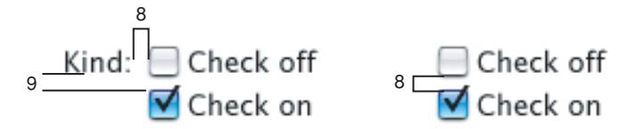

#### **Sma checkbox**

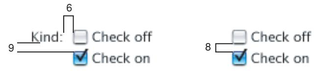

#### **M n checkbox**

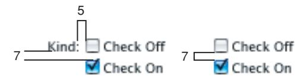

A gn he base nes o he abe and he s checkbox s ex

#### ■ **Size:**

❏ Full size: 18 x 18 pixels, including the shadow

❏ Small: 14 x 16 pixels ❏ Mini: 15 x 15 pixels

#### ■ **Spacing:**

- ❏ Full size: 5 pixels between controls when stacked; 8 pixels from label (colon) to control
- ❏ Small: 5 pixels between controls when stacked; 6 pixels from label (colon) to control
- ❏ Mini: 5 pixels between controls when stacked; 5 pixels from label (colon) to control

#### ■ **Text:**

- ❏ Full size: System font for both the label and control text
- ❏ Small: Small system font for both the label and control text
- <span id="page-167-1"></span>❏ Mini: Mini system font for both label and control text
- **Positioning:** If there are two or more related checkboxes, they are typically stacked vertically to clearly indicate that they are related

### <span id="page-167-3"></span><span id="page-167-2"></span><span id="page-167-0"></span>Segmented Control

A **segmented control** is divided into two or more segments and behaves as a collection of radio buttons (or checkboxes). It is used to change a mode or a view within a window.

- A segmented control may contain icons or text but not both.
- When the control contains icons, you may place a text label below the control.
- Segmented controls may be used in regular or brushed metal windows.
- Like a push button, the segmented control should initiate an immediate action. When the user presses one of the segments, something should happen.

**Carbon:** The segmented control is not available in Interface Builder. Create it programmatically with the function HISegmentedViewCreate.

**Cocoa:** The segmented control is not available in Interface Builder; use the NSSegmentedControl class.

### <span id="page-168-0"></span>Segmented Control Specifications

**Figure 10-16** Segmented control dimensions

**Fu s ze segmen ed con o o b ushed me a w ndows**

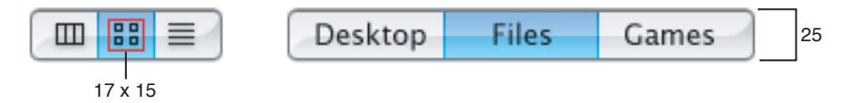

#### **Fu s ze segmen ed con o**


#### **Sma segmen ed con o**

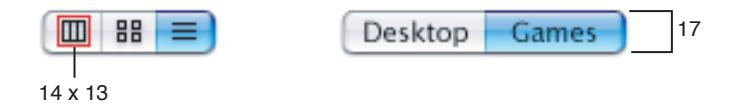

#### **M n segmen ed con o**

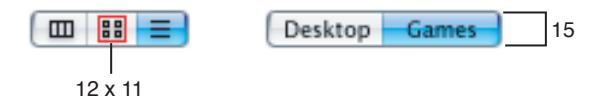

#### ■ **Height:**

❏ Full size: 25 pixels for brushed metal windows, 20 pixels otherwise

❏ Small: 17 pixels

❏ Mini: 15 pixels

#### ■ **Text:**

Selection Controls **169 August 31, 2004 | © 1992, 2001-2003, 2004 Apple Computer, Inc. All Rights Reserved.**

- ❏ Full size: System font for text within the control and for label text below it
- <span id="page-169-4"></span>❏ Small: Small system font for text within the control and for label text below it
- ❏ Mini: Mini system font for text within the control and for label text below it

### <span id="page-169-3"></span><span id="page-169-2"></span><span id="page-169-0"></span>Icon Buttons and Bevel Buttons With Pop-Up Menus

A bevel button or a icon button containing a pop-up menu has a single downward-pointing arrow. The button can behave like a standard pop-up menu, in which the image on the button is the current selection, or the button can represent the menu title and always display the same image.

See ["Bevel Buttons"](#page-158-0) (page 159) and ["Icon Buttons"](#page-161-0) (page 162) for specifications for the buttons themselves.

**Carbon:** Create this in Interface Builder by using a bevel button and selecting the Has Menu option in the Attributes pane of the inspector.

<span id="page-169-1"></span>**Cocoa:** Select the NSPopUpButton widget in Interface Builder. In the inspector, change its type to PullDown. Change the Style to Square or Shadowless Square for a Rounded or Square Bevel Button, respectively. For an icon button, it doesn't matter which one you choose, just deselect the Bordered checkbox. Resize the button as needed.

**Figure 10-17** Pop-up icon button


<span id="page-170-1"></span>**Figure 10-18** Pop-up bevel button with square corners


**Figure 10-19** Pop-up bevel button with rounded corners

<span id="page-170-3"></span><span id="page-170-2"></span>

### <span id="page-170-5"></span><span id="page-170-4"></span><span id="page-170-0"></span>Pop-Up Menus

Use **pop-up menus** to present a list of mutually exclusive choices in a dialog or window. Pop-up menus are used as a means of selecting one choice from a list of many. If you have a dialog with a set of six or more radio buttons, consider using a pop-up menu instead.

#### A pop-up menu:

- Usually has a label to the left (in left-to-right scripts) unless the menu is used as the title for a group box
- Has a double-triangle indicator

- Contains nouns (things) or adjectives (states or attributes), but not verbs (commands); use pull-down menus for commands
- Has a checkmark beside the current value when open

A pop-up menu behaves like other menus: Users drag to choose an item—which then flashes briefly and appears as the current choice—or users move the cursor outside the menu to leave the current value active. An exploratory press in the menu to see what's available doesn't select a new value.

In special cases, you may want to include a command that affects the contents of the pop-up menu itself. For example, in the Print dialog, the Printer pop-up menu contains Edit Printer List, so users can add a printer to the menu; the new printer becomes the menu's default selection. Put such commands at the bottom of a pop-up menu, below a separator.

In some circumstances it may be appropriate to use pop-up menus to complete sentences that describe advanced operations. For example, the Find window in the Finder and the Rules window in Mail Preferences both use pop-up menus in this way.

Use pop-up menus to present up to 12 mutually exclusive choices that the user doesn't need to see all the time.

Don't use pop-up menus:

- For more than 12 items; use a scrolling list unless space is restricted
- When the number of items in the list can change
- When more than one selection is appropriate, such as text styles (in which you can select bold and italic, for example); use checkboxes or a pull-down menu in which checkmarks appear

Don't use submenus with pop-up menus. Doing so hides choices too deeply and is physically difficult to use.

<span id="page-171-0"></span>Bevel buttons and icon buttons can also be pop-up menus. See ["Icon Buttons and Bevel Buttons With](#page-169-0) [Pop-Up Menus"](#page-169-0) (page 170).

**Figure 10-20** An open pop-up menu

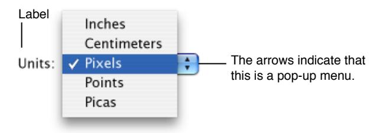

**Carbon:** Available in Interface Builder. To create one programmatically, use the function CreatePopUpButtonControl.

**Cocoa:** Available in Interface Builder as a pop-up menu is an NSPopUpButton. See *Application Menus and Pop-up Lists* in Cocoa User Experience Documentation.

### <span id="page-172-0"></span>Pop-Up Menu Specifications

**Figure 10-21** Pop-up menu dimensions

#### **Fu -s ze pop-up menu**


#### **Sma pop-up menu**

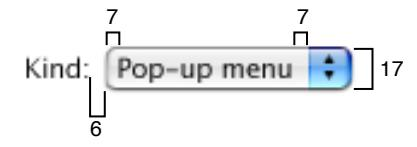

#### **M n pop-up menu**

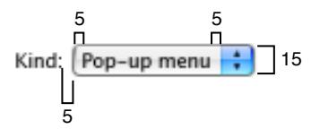

Selection Controls **173 August 31, 2004 | © 1992, 2001-2003, 2004 Apple Computer, Inc. All Rights Reserved.**

<span id="page-173-0"></span>**Figure 10-22** Pop-up menu spacing

#### **Fu -s ze pop-up menu**


#### **Sma pop-up menu**

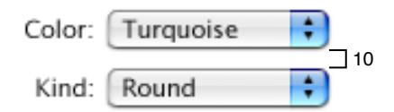

#### **M n pop-up menu**

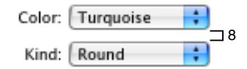

#### ■ **Height:**

❏ Full size: 20 pixels

❏ Small: 17 pixels

❏ Mini: 15 pixels

■ **Width:** Wide enough to accommodate the longest menu item

#### ■ **Spacing:**

❏ Full size: Leave at least 12 pixels of space between stacked controls.

❏ Small: At least 10 pixels

❏ Mini: At least 8 pixels

### ■ Text on control

- ❏ Full size: System font, 9 pixels from left edge and at least 9 pixels from the double-triangle section
- ❏ Small: Small system font, 7 pixels from left edge and at least 7 pixels from the double-triangle section
- ❏ Mini: Mini system font, 5 pixels from left edge and at least 5 pixels from the double-triangle section

#### ■ **Menu label text:**

- ❏ Full size: Emphasized system font, 8 pixels from text (colon) to left edge of menu
- <span id="page-174-3"></span>❏ Small: Emphasized small system font, 6 pixels from text (colon) to left edge of menu
- ❏ Mini: Emphasized mini system font, 5 pixels from text (colon) to left edge of menu

### <span id="page-174-2"></span><span id="page-174-0"></span>Command Pop-Down Menus

A **command pop-down menu** is similar to a pull-down menu, but it appears within a window rather than in the menu bar. Use this control only when the window is shared among multiple applications and the menu contains commands that affect the window's contents. For example, the Colors window, which can be used in any application, contains a menu with commands that can be used to change the contents of the Colors window itself. If your application uses the Colors window, don't create your own menu with these same commands.

<span id="page-174-1"></span>**Figure 10-23** A command pop-down menu


Command pop-down menus should contain between 3 and 12 commands. A closed command menu always displays the same text, which acts as the menu title.

**Carbon:** Mimic the appearance and behavior with a bevel button.

**Cocoa:** Use the NSPopUpButton widget in Interface Builder and change its type to PullDown.

### Command Pop-Down Menu Specifications

Note that the specifications for command pop-down menus are the same as those for pop-up menus.

Selection Controls **175**

<span id="page-175-0"></span>**Figure 10-24** Command pop-down menu dimensions

#### **Fu -s ze pop-down menu**

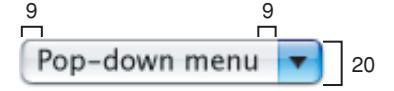

#### **Sma pop-down menu**

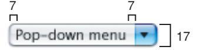

#### **M n pop-down menu**

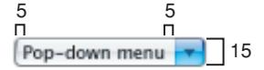

#### ■ **Height:**

❏ Full size: 20 pixels

❏ Small: 17 pixels

❏ Mini: 15 pixels

■ **Width:** Wide enough to accommodate the longest menu item

#### ■ **Spacing:**

- ❏ Full size: Leave at least 12 pixels of space between stacked controls.
- ❏ Small: Leave at least 10 pixels.
- ❏ Mini: Leave at least 8 pixels.

#### ■ **Menu item text:**

- ❏ Full size: System font, 9 pixels from left edge and at least 9 pixels from the triangle section
- ❏ Small: Small system font, 7 pixels from left edge and at least 7 pixels from the triangle section
- ❏ Mini: Mini system font, 5 pixels from left edge and at least 5 pixels from the triangle section

### <span id="page-176-3"></span><span id="page-176-2"></span><span id="page-176-0"></span>Combination Boxes

A **combination box** (or combo box) is a text entry field combined with a drop-down list. Combo boxes are useful for displaying a list of likely choices while still allowing the user to type in an item not in the list.

The user can type any appropriate characters into the text field. If the user types in an item already in the list, or types in a few characters that match the first characters of an item in the list, the item is highlighted when the user opens the list. A user-typed item is *not* added to the permanent list.

The user opens the list by pressing or clicking the arrow to the right of the text field. The list is a window that descends from the text field; the window is the same width as the text field plus the arrow box, and has a drop shadow. Don't extend the right edge of the list beyond the right edge of the arrow box; if an item is too long, it is truncated.

When the user selects an item in the list, the item replaces whatever is in the text entry field and the list closes. If the list was opened by pressing the arrow, the user selects an item in the list by dragging to it. If the list was opened by clicking the arrow, the user selects an item by clicking it or by pressing the Up Arrow or Down Arrow keys. The user can accept an item by pressing the Space bar, Enter, or Return.

<span id="page-176-1"></span>If the list is open and the user clicks outside it, including within the text entry field, the list closes.

**Figure 10-25** A combo box with the list open

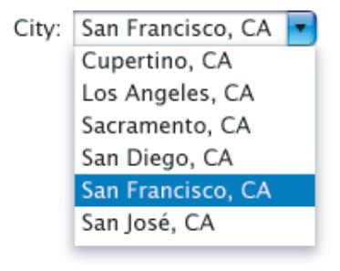

The default state of the combo box is closed, with the text field empty or displaying a default selection. The default selection (not necessarily the first item in the list) should provide a meaningful clue to the hidden choices. The combo box should also have a useful label.

**Carbon:** Combo boxes are available in Interface Builder. To create them programmatically, use the HIComboBoxCreate function or DrawThemeButton with the appropriate constant.

**Cocoa:** Combo boxes are available in Interface Builder. Use the NSComboBox class. See *Combo Boxes* in Cocoa User Experience Documentation.

### <span id="page-177-0"></span>Combo Box Specifications

**Figure 10-26** Combo box dimensions

#### **Fu -s ze combo box**

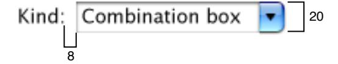

#### **Sma combo box**

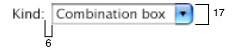

#### **M n combo box**

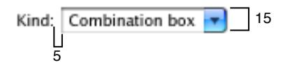

### ■ **Height:**

❏ Full size: 20 pixels

❏ Small: 17 pixels

❏ Mini: 15 pixels

■ **Width:** Wide enough to accommodate the longest menu item

#### ■ **Spacing:**

- ❏ Full size: Leave at least 12 pixels of space between stacked controls.
- ❏ Small: Leave at least 10 pixels.
- ❏ Mini: Leave at least 8 pixels.

#### ■ **Menu item text:**

❏ Full size: System font

❏ Small: Small system font

❏ Mini: Mini system font

#### ■ **Menu label text:**

- ❏ Full size: Emphasized system font, 8 pixels from text (colon) to left edge of menu
- <span id="page-178-4"></span>❏ Small: Emphasized small system font, 6 pixels from text (colon) to left edge of menu
- ❏ Mini: Emphasized mini system font, 5 pixels from text (colon) to left edge of menu.

### <span id="page-178-8"></span><span id="page-178-0"></span>Placards

<span id="page-178-3"></span>A **placard** is a small section at the bottom of a window used to display information, such as the current page number. You can also use a placard to create the striped background behind controls.

<span id="page-178-2"></span>Typically placards are used in document windows as a way to quickly modify the view of the contents—for example, to change the current page or the magnification. The most familiar use of the placard is as a pop-up menu placed at the bottom of a window, to the left of the horizontal scroll bar.

**Figure 10-27** A placard with a pop-up menu


Placards are 15 pixels high and use either the small system font or the label font for text.

**Carbon:** Use the Control Manager CreatePlacardControl function or the function HIThemeDrawPlacard in the Appearance Manager. The standard placard control does not include a menu. If you want to display a menu, override the default behavior of the draw Carbon event and the click Carbon event.

<span id="page-178-1"></span>**Cocoa:** Not available.

### <span id="page-178-7"></span><span id="page-178-6"></span><span id="page-178-5"></span>Color Wells

A **color well** is a small rectangular control that indicates the current color for a particular setting and, when clicked, displays a Colors window. Use the Colors window whenever you want to allow users to change a color setting. Multiple color wells can appear in a window.

Selection Controls **179**

<span id="page-179-1"></span>**Figure 10-28** Color well in a preferences window

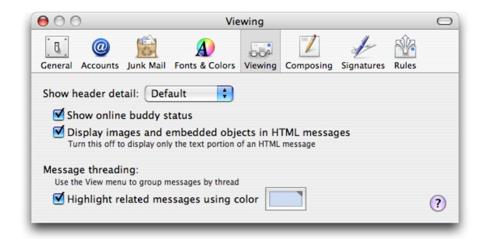

<span id="page-179-3"></span>**Carbon:** Color wells are not available as a standard control. See the ColorSwatchView sample application in /Developer/Examples/Carbon for an example of how you can implement them. **Cocoa:** Available in Interface Builder. A color well is an NSColorWell. See *Using Color* in Cocoa Graphics & Imaging Documentation.

### <span id="page-179-5"></span><span id="page-179-4"></span><span id="page-179-0"></span>Image Wells

<span id="page-179-2"></span>Use an **image well** as a drag-and-drop target for an icon or picture. You could use a set of image wells to manage thumbnails in a clip-art catalog, for example. Don't use image wells in place of push buttons or bevel buttons.

**Figure 10-29** Image wells


Some image wells (the user picture in the Picture pane of Accounts preferences, for example) must always contain an image. If the user can clear an image well (leaving it empty) in your application, provide standard Edit menu commands and Clipboard support.

**Carbon:** Image wells are available in Interface Builder. To create one programmatically, use CreateImageWellControl.

**Cocoa:** Image wells are available in Interface Builder. An image well is an NSImageView.

# <span id="page-180-0"></span>Adjustment Controls

This section discusses controls that allow users to graphically adjust settings or parameters.

### <span id="page-180-4"></span><span id="page-180-3"></span><span id="page-180-1"></span>The Stepper Control (Little Arrows)

The **stepper control** allows users to increment or decrement values. The control is usually used in conjunction with a text field to indicate the current value. The text field may or may not be editable.

**Carbon:** The stepper control is available in Interface Builder. You can create it programmatically with CreateLittleArrowsControl.

**Cocoa:** The stepper control is available in Interface Builder. The stepper control is an NSStepper. See *Steppers* in Cocoa User Experience Documentation.

### <span id="page-180-2"></span>Stepper Control Specifications

**Figure 10-30** Stepper control dimensions

#### **Full-size stepper control**

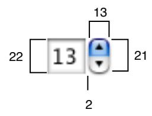

#### **Small stepper control**

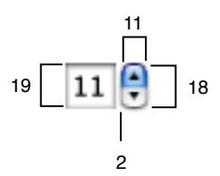

#### **Mini stepper control**

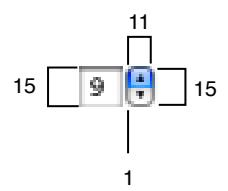

#### ■ **Size of control:**

#### **CHAPTER 10**

#### Controls

- ❏ Full size: 13 x 21 pixels
- ❏ Small: 11 x 18 pixels
- ❏ Mini: 11 x 15 pixels

#### ■ **Height of text field:**

- ❏ Full size: 22 pixels
- ❏ Small: 19 pixels
- ❏ Mini: 15 pixels

#### ■ **Spacing between control and field it modifies:**

- <span id="page-181-2"></span>❏ Full size: 2 pixels
- ❏ Small: 2 pixels
- <span id="page-181-0"></span>❏ Mini: 1 pixel

### <span id="page-181-3"></span><span id="page-181-1"></span>Slider Controls

A **slider control** lets users choose from a continuous range of allowable values.

- <span id="page-181-4"></span>■ Slider controls can be horizontal or vertical. In deciding whether a slider should be horizontal or vertical, try to meet users' expectations of similar real-world controls.
- Slider controls can display labeled tick marks to represent increments you specify.
- The slider itself (the thumb) can be either directional or round.
- Slider controls support live feedback (live dragging) so users can see the effect of moving the slider as it is dragged. Dock preferences, for example, shows the effect of moving the Dock Size slider.

**Carbon:** Sliders are available in Interface Builder. You can create them programmatically with the function CreateSliderControl.

**Cocoa:** Sliders area available in Interface Builder. To create one programmatically, use the NSSlider class. See *Sliders* in Cocoa User Experience documentation.

### <span id="page-182-0"></span>Slider Control Specifications

**Figure 10-31** Full-size slider control dimensions


<span id="page-182-1"></span>**Figure 10-32** Small slider control dimensions


<span id="page-182-2"></span>**Figure 10-33** Mini slider control dimensions


#### ■ **Control size:**

- ❏ Full size: 19 pixels for directional sliders (25 with tick marks), 15 for round sliders. When placed vertically, the directional slider has a width of 18 and the directional with tick marks has a width of 24.
- ❏ Small: 14 pixels for directional sliders (19 with tick marks), 12 for round sliders. When placed vertically, the round slider has a width or 11.
- ❏ Mini: 11 pixels for directional sliders (17 with graduation markings), 10 for round sliders.

### ■ **Label text size:**

❏ Full size: 10 point ❏ Small: 10 point

❏ Mini: 9 point

#### ■ **Spacing:**

❏ Full size: 12 pixels of space between controls

<span id="page-183-5"></span>❏ Small: 10 pixels of space between controls

❏ Mini: 8 pixels of space between controls

# <span id="page-183-0"></span>Indicators

<span id="page-183-1"></span>Indicators are controls that show users the status of something.

### <span id="page-183-4"></span><span id="page-183-3"></span>Progress Indicators

**Progress indicators** inform users about the status of lengthy operations. (For guidelines on when to provide such information, see *Apple Software Design Guidelines*.) There are three types of progress indicators:

- **Determinate progress bar:** Use when the full length of an operation can be determined and you can tell the user how much of the process has been completed. You could use a determinate progress indicator to show the progress of a file conversion, for example. See Figure 10-34.
- <span id="page-183-2"></span>■ **Indeterminate progress bar:** Use when the duration of a process can't be determined. You might use an indeterminate progress indicator to let the user know that the application is attempting a dialup communication connection, for example, when there's no way to accurately determine how long it will take to complete. If an indeterminate process reaches a point where its duration can be determined, switch to a determinate progress indicator. See Figure 10-34.
- **Asynchronous progress indicator**: Use when space is very constrained. These indicators are best used for asynchronous events that take place in the background, such as retrieving messages from a server. Don't use the asynchronous progress indicator in operations that start out indeterminate but could become determinate. See Figure 10-35.

In a determinate progress bar, the "fill" moves from left to right and should fill in completely before it is dismissed. An indeterminate progress bar displays a spinning striped cylinder to indicate an ongoing process.

Determinate progress bars should associate progress with time. A progress bar that becomes 90 percent complete in 5 seconds but takes 5 minutes for the remaining 10 percent, for example, would be annoying and lead users to think that something is wrong.

Progress bars typically appear within a progress dialog. When the process being performed can be interrupted, the progress dialog should contain a Cancel button (and support the Esc key). If interrupting the process will result in possible side effects, the button should say Stop instead of Cancel.

In addition to appearing in dialogs, the asynchronous progress indicator often appears in the main application window or a document window. Asynchronous progress indicators are generally visible only when an indeterminate operation is in progress.

<span id="page-184-1"></span>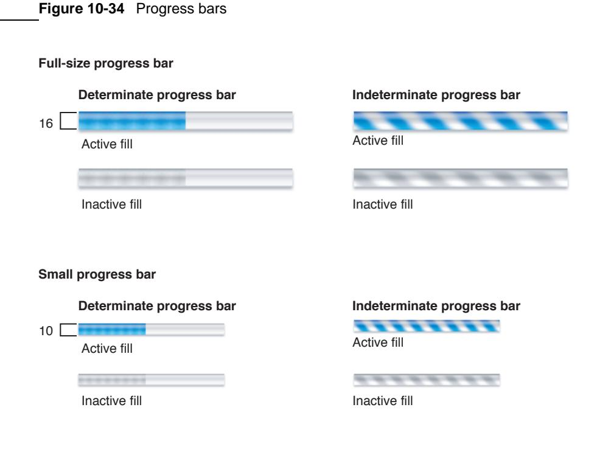

<span id="page-184-2"></span>**Figure 10-35** Asynchronous progress indicator


<span id="page-184-3"></span>**Carbon:** All progress indicators are available in Interface Builder. You can create progress bars programmatically with the function CreateProgressBarControl and asynchronous progress indicators with CreateChasingArrowsControl.

**Cocoa:** All progress indicators are available in Interface Builder. All progress indicators can be displayed with the NSProgressIndicator class. See *Progress Indicators* in Cocoa User Experience Documentation.

<span id="page-184-0"></span>**Note:** Mini versions are not available.

### Relevance Indicators

Use a **relevance indicator** to display the relevance of search results as shown in Figure 10-36. Relevance indicators should be a part of a list view.

<span id="page-185-5"></span><span id="page-185-2"></span>**Figure 10-36** Relevance indicator

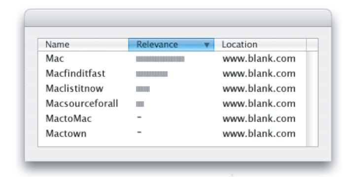

**Carbon:** Relevance indicators are available in the Controls palette of Interface Builder. To create them programmatically, use CreateRelevanceBarControl in the Control Manager, or DrawThemeTrack in the Appearance Manager.

**Cocoa:** Relevance indicators are not available as a standard control.

### <span id="page-185-3"></span>Relevance Indicator Specifications

**Figure 10-37** Relevance indicator states


<span id="page-185-0"></span>■ **Height:** The x-height of the font in the list of which the indicator is a part

# Text Controls

<span id="page-185-6"></span><span id="page-185-1"></span>This section describes controls that either display text or take text as input. The combination box, which includes a text input field, is not covered in this section. See ["Combination Boxes"](#page-176-0) (page 177) for information on this control.

### <span id="page-185-4"></span>Static Text

Use a **static text field** for informational text in a dialog (text not intended to be modified by users). Static text fields have two states: active and dimmed.

When it provides an obvious user benefit, static text should be selectable. For example, a user should be able to copy an error message or a serial number to paste elsewhere.

**Carbon:** Static text fields in various standard fonts are available in Interface Builder. Create them programmatically with CreateStaticTextControl.

**Cocoa:** Static text fields in various standard fonts are available in Interface Builder. To create one programmatically, use the NSTextField class. See *Text Views* in Cocoa User Experience documentation.

### Static Text Field Specifications

#### ■ **Size:**

❏ Full size: System font

❏ Small: Small system font

<span id="page-186-0"></span>❏ Mini: Mini system font

### <span id="page-186-1"></span>Text Input Fields

A **text input field**, also called an editable text field, is a rectangular area in which the user enters text or modifies existing text. The text input field can be active or disabled. It supports keyboard focus and password entry.

Your application's text input fields should perform appropriate edit checks. For example, if the only legitimate value for a field is a string of digits, the application issues an alert if the user types nondigits. In most cases, the appropriate time to check the data in the field is when the user clicks outside the field or presses the Return, Enter, or Tab key.

Combination boxes have text input fields and also contain a menu or a list of choices. See ["Combination](#page-176-0) [Boxes"](#page-176-0) (page 177).

**Cocoa:** Text input fields are available in Interface Builder. Create them programmatically with CreateEditUnicodeTextControl.

**Cocoa:** Text input fields are available in Interface Builder. Use the NSTextField class to create them programmatically. See *Text Views* in Cocoa User Experience documentation.

### <span id="page-187-0"></span>Text Input Field Specifications

<span id="page-187-2"></span><span id="page-187-1"></span>**Figure 10-38** Full-size text input field dimensions No ma s a e w h ex and nse on po n W h ocus W h se ec on 22 **Figure 10-39** Small text input field dimensions No ma s a e w h ex and nse on po n W h ocus W h se ec on 9 **Figure 10-40** Mini text input field dimensions No ma s a e w h ex and nse on po n W h ocus W h se ec on 5 ■ **Height:** ❏ Full size: 22 pixels (to accommodate the system font, which is 16 pixels high without line spacing) ❏ Small: 19 pixels ❏ Mini: 15 pixels ■ **Spacing:** ❏ Full size: Leave a minimum of 10 pixels between fields. ❏ Small: Leave a minimum of 8 pixels. ❏ Mini: Leave a minimum of 8 pixels.

■ **Text:**

❏ Full size: System font

❏ Small: Small system font

❏ Mini: Mini System font

For more information about highlighting selections in text fields, see ["Keyboard Focus and](#page-30-0) [Navigation"](#page-30-0) (page 31) and ["Selections in Text"](#page-35-0) (page 36).

### <span id="page-188-1"></span><span id="page-188-0"></span>Search Fields

A **search field** is a text field with rounded ends in which the user enters new text or modifies existing text that identifies items to search for.

A search field can be active or disabled. It supports keyboard focus. If it is an integral part of your interface, provide the keyboard shortcut Command-Option-F for users to navigate to it without using the mouse.

A search field does not need a label.

The field may initiate the search as the user types, or the user may need to press Return or Enter to initiate a search.

A search field can include a menu to allow users to choose different types of searches, to allow users to define the context of their search, or to provide a history of recent searches. You can provide placeholder text that indicates the current menu selection. Users are then able to see the current context of the search without having to open the menu.

The search field can contain an icon to stop the search or clear the field. It's appropriate to use this icon if the user has to click a button or press a key to initiate the search, especially if there's the possibility of searches taking more than a second or two. If you use this icon, consider displaying a progress indicator for lengthy searches.

Instead of providing multiple search fields, it's better to have a single search field in a window, with various contexts available from the pop-up menu.

**Carbon:** Search fields are available in Interface Builder. To create one programmatically, use the function HISearchFieldCreate.

**Cocoa:** Search fields are available in Interface Builder. To create one programmatically, use the NSSearchField class. See *Search Fields* in Cocoa User Experience Documentation.

**August 31, 2004 | © 1992, 2001-2003, 2004 Apple Computer, Inc. All Rights Reserved.**

### <span id="page-189-0"></span>Search Field Specifications

**Figure 10-41** Full-size search field dimensions

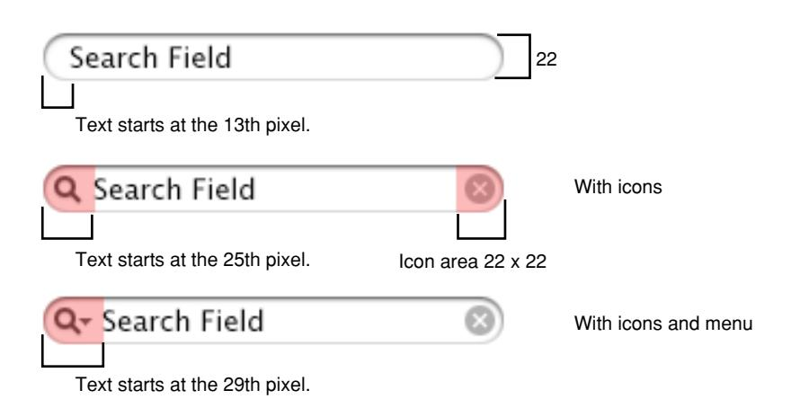

<span id="page-189-1"></span>**Figure 10-42** Small search field dimensions

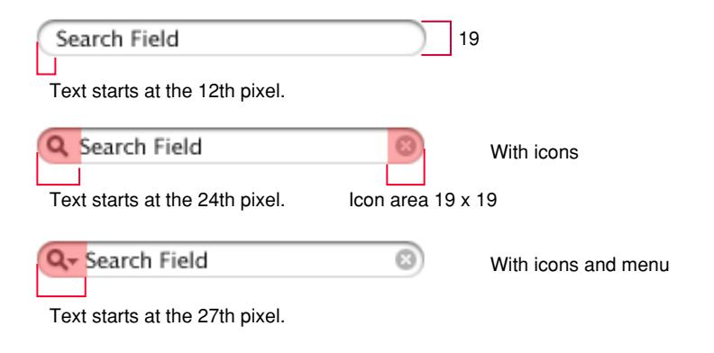

<span id="page-189-2"></span>**Figure 10-43** Mini search field dimensions


#### ■ **Height:**

❏ Full size: 22 pixels

❏ Small: 19 pixels

❏ Mini: 15 pixels

#### ■ **Spacing:**

- ❏ Full size: Leave at least 12 pixels between stacked controls.
- ❏ Small: Leave at least 10 pixels.
- ❏ Mini: Leave at least 8 pixels.

#### ■ **Text:**

❏ Full size: System font

❏ Small: Small system font

<span id="page-190-0"></span>❏ Mini: Mini system font

## <span id="page-190-1"></span>Scrolling Lists

<span id="page-190-2"></span>A **scrolling list** is a list that uses scroll bars to reveal its contents. A scrolling list can contain as many items as necessary. Users can scroll through the list without selecting anything, click an item to select it, use Shift-click to select more than one contiguous item, or use Command-click for a discontinuous selection. Users can press the arrow keys to navigate through the list and can quickly select an item by typing the first few characters.

If an item is too long to fit in the list box, insert an ellipsis in the middle and preserve the beginning and end of the item. Users often add version numbers to the end of document names, so both the beginning and end should be visible.

Don't use scrolling lists to provide choices in a limited range. Because the full range may not be visible all at once, it can be difficult for users to understand the scope of their choices. Use sliders, discussed in ["Slider Controls"](#page-181-0) (page 182), instead.

When you define dimensions, make sure that the list displays only the full height of lines of text (don't cut text off horizontally), and make sure that the scrolling increment is one list element.

**August 31, 2004 | © 1992, 2001-2003, 2004 Apple Computer, Inc. All Rights Reserved.**

### <span id="page-191-2"></span>Scrolling List Specifications

**Figure 10-44** Scrolling list dimensions

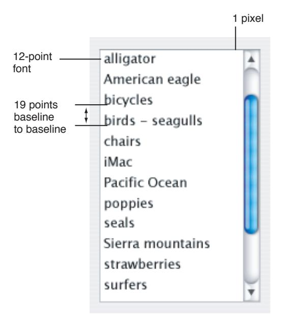

<span id="page-191-5"></span>■ **Text:** 12 points

■ **Frame:** 1 pixel wide

# <span id="page-191-6"></span><span id="page-191-0"></span>View Controls

<span id="page-191-4"></span><span id="page-191-3"></span><span id="page-191-1"></span>The following controls allow users to modify how information is presented to them or select which information to view.

### Disclosure Triangles

A **disclosure triangle** allows the display, or disclosure, of information that elaborates on the primary information in a window. Disclosure triangles have two uses: in dialogs that have a minimal state and an expanded state and in hierarchical lists. See Figure 10-45 for an example in a dialog and [Figure 10-47](#page-193-3) (page 194) for an example in a hierarchical list.

Use disclosure triangles when you want to provide a simple default view of something but need to allow the user to view more details at times.

Disclosure triangles should be in the closed position, pointing to the right, by default. When the user clicks a disclosure triangle, it points down and the additional information is displayed.

Disclosure triangles in dialogs should have a label indicating what is disclosed or hidden. An ideal label changes depending on the position of the disclosure triangle. For example, when closed it might say, "Show advanced settings," and when open, "Hide advanced settings."

<span id="page-192-0"></span>**Figure 10-45** Disclosure triangle used to progressively reveal dialog contents

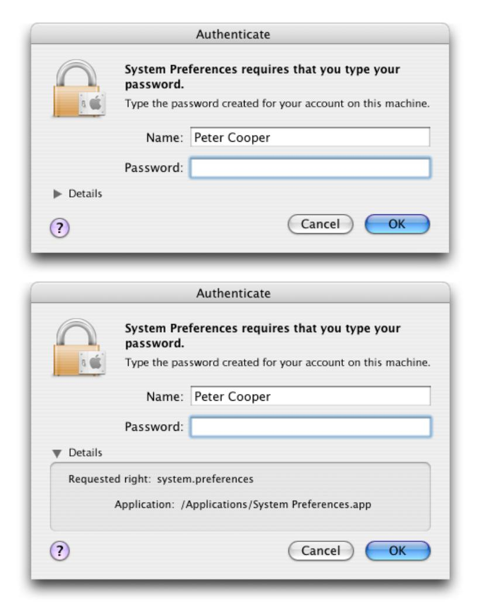

**Carbon:** Disclosure triangles are available in Interface Builder. To create one programmatically, you can use the Control Manager function CreateDisclosureTriangleControl or the Appearance Manager function, HIThemeDrawButton.

**Cocoa:** Disclosure triangles are available in Interface Builder. To create one programmatically, set the bezel style to NSDisclosureBezelStyle and the button type to NSOnOffButton. See *Buttons* in Cocoa User Experience documentation.

### <span id="page-193-1"></span>Disclosure Triangle Specifications

**Figure 10-46** Disclosure triangles


<span id="page-193-5"></span><span id="page-193-0"></span>■ **Size:** 13 x 13 pixels

### <span id="page-193-4"></span>List Views

**List views** display ordered records in a table in which users can resize, rearrange, and sometimes add and subtract, columns representing attributes of the data.

Sort the rows in the table by the selected column heading. You can implement sorting on secondary attributes behind the scenes, but the user should see only one column selected at a time. If a user clicks an already selected column heading, change the direction of the sort.

List views may contain disclosure triangles to reveal a list hierarchy, but only in one column. (See Figure 10-47.)

<span id="page-193-3"></span><span id="page-193-2"></span>Items may be editable depending on the purpose of your application. In the Finder, for example, items in the Name column are editable when in list view, but nothing else is.

**Figure 10-47** List view with disclosure triangles


**Carbon:** List views are available in the Browsers & Tab palette of Interface Builder. To create one programmatically, use the list version of the data browser control.

<span id="page-194-5"></span>**Cocoa:** List views are available in the Data palette of Interface Builder. To create a simple list view programmatically, use the NSTableView class. NSOutlineView in column format gives you disclosure triangles.

### <span id="page-194-3"></span><span id="page-194-0"></span>Column Views

The **column view** control provides a way for users to display and select items from an organized hierarchy of data.

- A column view is useful when there is only one way the data can be sorted or when you want to present only one way of sorting the data. It is also useful for deep hierarchies, such as a file system, where users move back and forth among multiple levels frequently.
- <span id="page-194-2"></span>■ If the column view represents a tree of information, the root is on the left side. As users select items, the focus moves to the right, displaying either the possible choices at that branch or, if there are no more choices, the terminal object. When the user selects a terminal object, you may display additional information about it in the rightmost column.

**Figure 10-48** Column view display of files

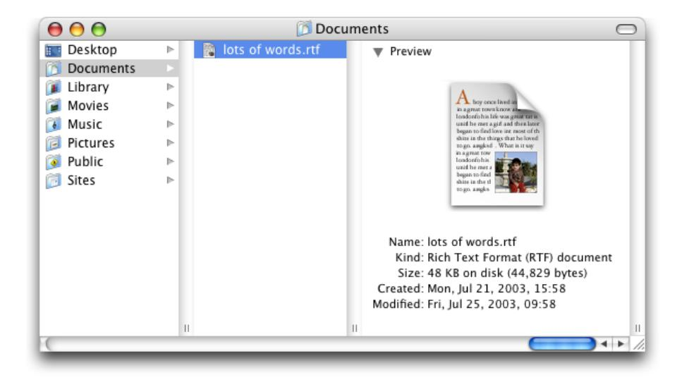

<span id="page-194-4"></span><span id="page-194-1"></span>**Carbon:** Column views are available in the Browsers & Tab palette of Interface Builder. To create one programmatically, use the column version of the data browser control.

**Cocoa:** Column views are available in the Data palette of Interface Builder. To create one programmatically, use the NSBrowser class or NSOutlineView in column format.

## <span id="page-194-6"></span>Tab Views

The **tab view** provides a convenient way to present information in a multipane format. The tab control displays horizontally centered across the top edge of a content area.

<span id="page-195-3"></span>The content area below the control is called a **pane.** In a window with a tab view, you can use other controls, such as push buttons and text entry fields.The controls can be global—affecting the settings of all panes—or specific to an individual pane; make it clear through labeling and placement (within or outside of a pane's boundary) whether a control affects one pane or all panes.

A segmented control can provide a way to switch between panes. It looks similar to a tab view, but it is not attached to the panes. See ["Segmented Control"](#page-167-0) (page 168).

### <span id="page-195-0"></span>Tab View Specifications

**Figure 10-49** Full-size tab view dimensions


**Figure 10-50** Small tab view dimensions

<span id="page-195-2"></span><span id="page-195-1"></span>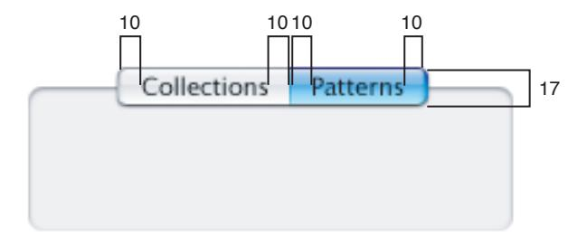

**Figure 10-51** Mini tab view dimensions

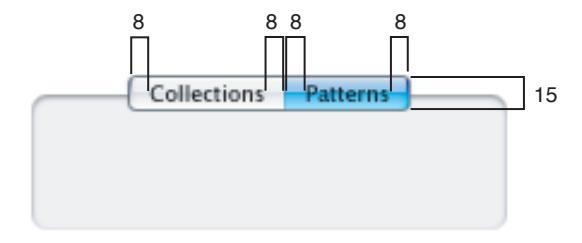

### ■ **Text:**

- ❏ Full size: System font, centered in tab with 12 pixels on each side
- ❏ Small: Small system font, centered in tab with 10 pixels on each side
- ❏ Mini: Mini system font, centered in tab with 8 pixels on each side

#### ■ **Tab height:**

❏ Full size: 20 pixels ❏ Small: 17 pixels ❏ Mini: 15 pixels

<span id="page-196-0"></span>Panes can extend from one edge of a window to the other, or they can be inset within a window. Figure 10-52 shows an example of panes that extend from one edge of a window to the other.

**Figure 10-52** Tab panes edge to edge

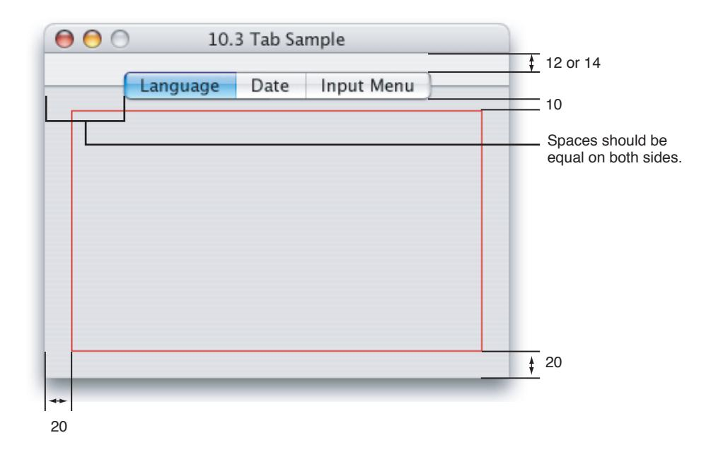

For inset tab panes, the recommended inset is 20 pixels on each side within a window, although 16 is also allowed. You can define a window so that space remains below the tab pane for global controls such as push buttons. Figure 10-53 shows an example of tab panes inset within a window, with buttons below the panes.

<span id="page-197-4"></span><span id="page-197-2"></span>**Figure 10-53** Tab panes inset from the edge of a window

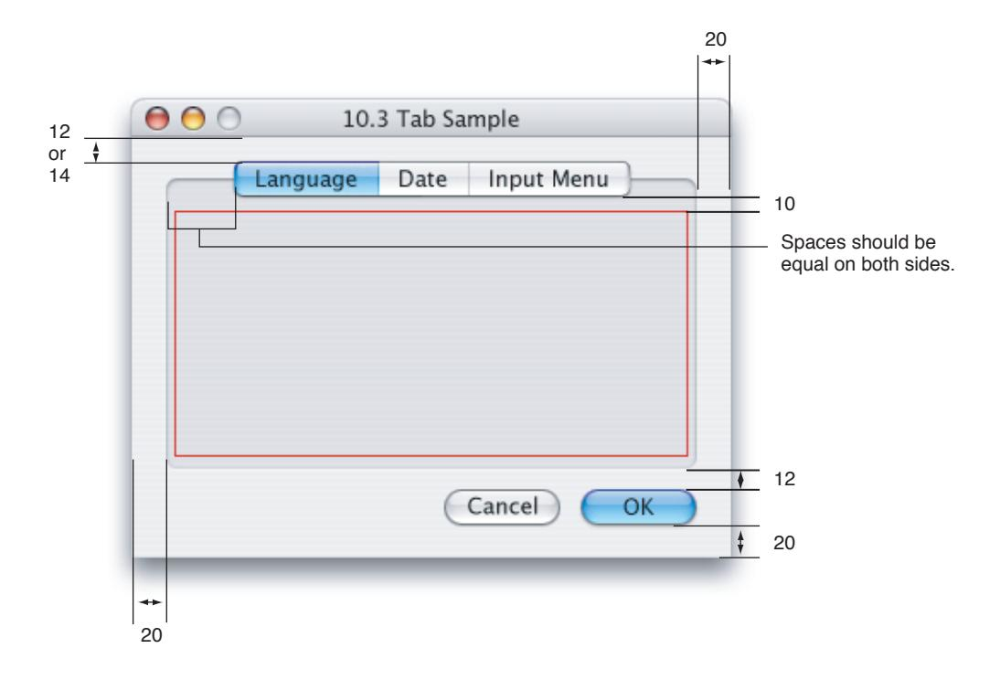

# <span id="page-197-3"></span><span id="page-197-0"></span>Grouping Controls

<span id="page-197-1"></span>Separators and group boxes are used to group other controls within windows. For help in deciding whether to use a group box or a separator, and for examples of layouts with them, see ["Grouping](#page-219-0) [Controls"](#page-219-0) (page 220).

### <span id="page-197-5"></span>Separators

**Separators** are used to divide a window into distinct visual parts. Separators may be placed either vertically or horizontally. They should usually not span the entire width of a window but should align with the edges of the controls in the window.

A label may accompany the separator. The separator line should be at the base of the text of the label.

**Carbon:** Separators are available in Interface Builder. Create them programmatically with CreateVisualSeparatorControl.

**Cocoa:** Separators are available in Interface Builder. To create one programmatically, use NSBox. See "Using a Box Control to Create a Separator" in *Boxes* in Cocoa User Experience Documentation.

### <span id="page-198-1"></span>Separator Specifications

**Figure 10-54** Separators

#### ■ **Label text size:**

- ❏ When other controls are full size: System font
- ❏ When other controls are small: Small system font
- ❏ When other controls are mini: Mini system font
- <span id="page-198-0"></span>■ **Spacing:** The label text should be 2 pixels from the line.

### <span id="page-198-2"></span>Group Boxes

**Group boxes**, like separators, are used to break a window into distinct logical areas. A group box provides a more pronounced separation than a separator. Use a group box when you want a set of controls to be perceived as a single element. Avoid putting too many controls in group boxes so they don't look cluttered.

Group boxes can be untitled or titled. If titled, they may have text-only titles, checkbox titles, or pop-up menu titles. If the group box uses a checkbox title, the items in the group box should be active only when the checkbox is checked. Pop-up menu titles should either be centered or be 14 pixels from the left side of the group box.

<span id="page-199-0"></span>**Figure 10-55** Types of group boxes


**Carbon:** Group boxes are available in Interface Builder. To create one programmatically, use the function CreateGroupBoxControl, CreateCheckGroupBoxControl, or CreatePopupGroupBoxControl.

**Cocoa:** Group boxes are available in Interface Builder. To create one programmatically, use the NSBox class. See *Boxes* in Cocoa User Experience documentation.

### <span id="page-199-1"></span>Group Box Specifications

**Figure 10-56** A group box with a text-only title


<span id="page-200-0"></span>**Figure 10-57** A group box with a checkbox title

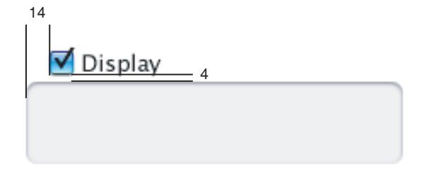

**Figure 10-58** Group boxes with pop-up menu titles

<span id="page-200-1"></span>


#### ■ **Label text size:**

- ❏ Full size: System font
- <span id="page-200-2"></span>❏ Small: Small system font
- ❏ Mini: Mini system font

#### ■ **Spacing:**

❏ Leave at least 20 pixels from the edge of the group box to the edge of the window.

# <span id="page-202-0"></span>Layout Examples

<span id="page-202-4"></span><span id="page-202-3"></span>This chapter contains example window and dialog layouts along with specific guidelines for laying out controls within your windows.

# <span id="page-202-1"></span>Positioning Full-Size Controls

Although there are many ways to arrange controls in a given window, there are guidelines you should follow so that your application has the clean, balanced appearance of Aqua. This section provides examples of properly designed windows and dialogs that use full-size controls. For guidelines on the use of mini and small controls, see ["Using Small and Mini Versions of Controls"](#page-213-0) (page 214). Some of the guidelines presented are specific to the examples shown, but most are general guidelines applicable to all dialogs and windows.

<span id="page-202-2"></span>Unless specified otherwise, all measurements are in pixels.

### A Simple Preferences Dialog

Figure 11-1 shows a very simple preferences dialog. Note that a more advanced preferences dialog would use a toolbar to access the various sections.

<span id="page-203-0"></span>**Figure 11-1** Preferences dialog example

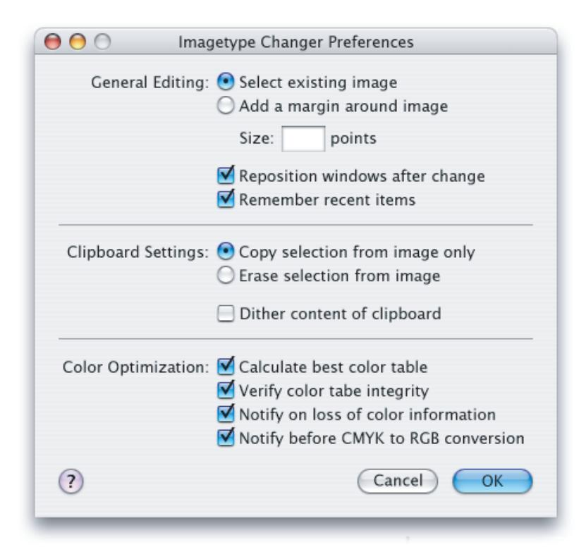

This dialog provides a good example of a center-equalized dialog. In Mac OS X, controls should always be center-equalized in windows. In other platforms, including Mac OS 9, controls are often left justified. **Center equalization** simply means that the visual weight is balanced on the right and left side of the dialog's content area. It does not mean **center justification** where the left and right sides of an imaginary line drawn through the center of the dialog have exactly the same number of items or characters. Figure 11-2 highlights this equalization. Although the right side has more objects, it is balanced by the categorization labels on the left. The net result is a visually balanced dialog.

<span id="page-204-0"></span>**Figure 11-2** Center equalization in a preferences dialog

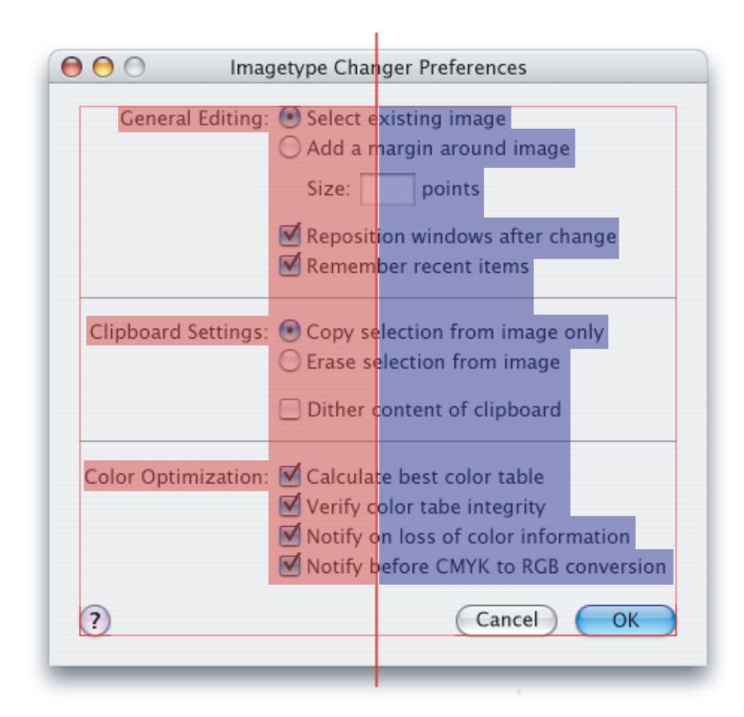

When labels and controls are stacked in a group, they should line up with each other vertically. In Figure 11-3, note the right alignment of the colons for the main category labels and the left alignment of the checkboxes and radio buttons.

<span id="page-205-0"></span>**Figure 11-3** Alignment of labels and controls in a preferences dialog


There are specific spacing guidelines to keep in mind when designing dialogs. Although ["Controls"](#page-154-3) (page 155) gives some guidelines for how to arrange controls in relation to each other, in this chapter you can see how these controls should be arranged in relation to the window that contains them. Following are some guidelines that are easy to observe in Figure 11-4:

- Controls not in a group box or a tab view should be 14 pixels from the title bar.
- There should be a 20 pixel margin all the left side, right side, and bottom of a dialog.
- For full-size controls, leave 8 pixels of space between controls.
- Leave at least 12 pixels of space above and below separators.
- Leave at least 16 pixels of space between the bottom group of controls and the buttons (the example in Figure 11-4 has 18 pixels)

<span id="page-206-1"></span>**Figure 11-4** Layout dimensions in a preferences dialog


# <span id="page-206-0"></span>A Changeable Pane Dialog

A changeable pane dialog, like the one shown in Figure 11-5, follows the same general guidelines as those outlined in ["A Simple Preferences Dialog"](#page-202-2) (page 203). However, it illustrates another implementation of many of the same basic guidelines you've seen so far, along with some new guidelines.

<span id="page-207-0"></span>**Figure 11-5** Changeable pane dialog example


Center-equalization is again evident in Figure 11-6. The overall effect of the window is a balance between the visual weight of the controls on one side of the invisible center axis with the weight of the controls on the other side. The controls are also collectively balanced within the group box so that the distance from the farthest control on each side of the group box is the same for both the right and left sides (41 pixels in this example).

Always center a tab view within a window.

<span id="page-208-0"></span>**Figure 11-6** Center-equalization in a changeable pane dialog


Figure 11-7 illustrates a few guidelines about control placement:

- The colons for stacked labels are right-aligned.
- Stacked controls are left-aligned when appropriate.
- Similar controls have consistent widths. For example, the Font pop-up menus and Size combo boxes are the same size in the two group boxes.

<span id="page-209-0"></span>**Figure 11-7** Alignment of labels and controls in a preferences dialog

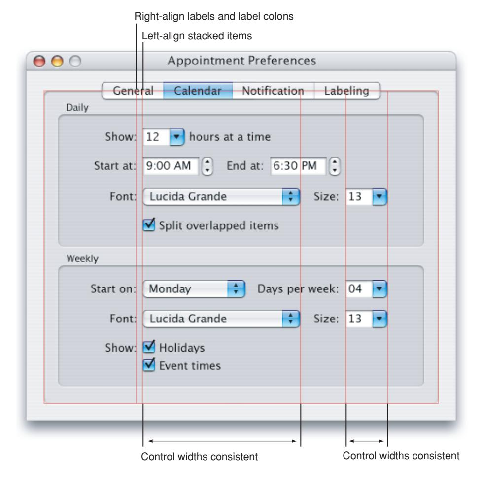

Figure 11-8 illustrates the following spacing guidelines:

- Leave 12 pixels of space from the top of a tab to the bottom of the title bar.
- The text box around any label should be at least 2 pixels below the controls of any containing view.
- Within group boxes, leave at least a 16-pixel margin between controls and the edge of the group box. In this example, an 18-pixel border is used on one of the group boxes since it visually balances the window better than the minimum 16-pixel border.
- There should be a 20 pixel margin all the left side, right side, and bottom of a dialog.

<span id="page-210-1"></span>**Figure 11-8** Layout dimensions for a changeable pane dialog

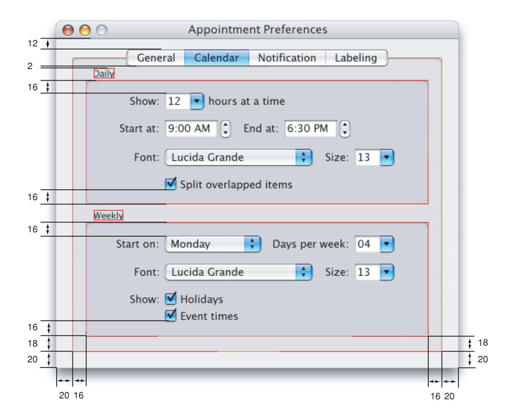

### <span id="page-210-0"></span>A Standard Alert

A standard alert dialog like the one provided by Carbon or Cocoa is shown in Figure 11-9.

<span id="page-211-0"></span>**Figure 11-9** A standard alert example

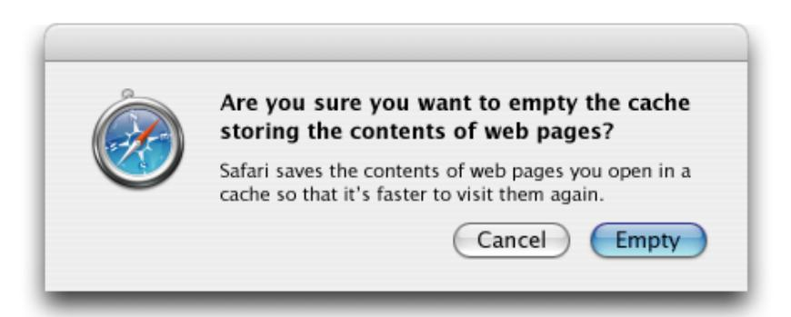

Although the standard alert dialogs provided by the Carbon and Cocoa take care of the general layout for you, there are a few details you are responsible for:

- Verify that a 64 x 64 pixel version of your application icon is used in the alert.
- Make sure to include *both* the main message text and the informative text. An alert with only message text is not a complete alert and typically is not very useful to the user.
- Always put the action button in the bottom-right corner of the alert. This is the button that completes the action that the user initiated before the alert was displayed. Remember that the action button is not always the default button as it is in this example. In dangerous situations, the default button may be Cancel but, it should not be the action button and should not be located in the action button position.

<span id="page-211-1"></span>Figure 11-10 shows the spacing guidelines for a standard alert.

See ["The Elements of an Alert"](#page-135-3) (page 136) for more details on designing alert dialogs.

**Figure 11-10** Layout dimensions for a standard alert

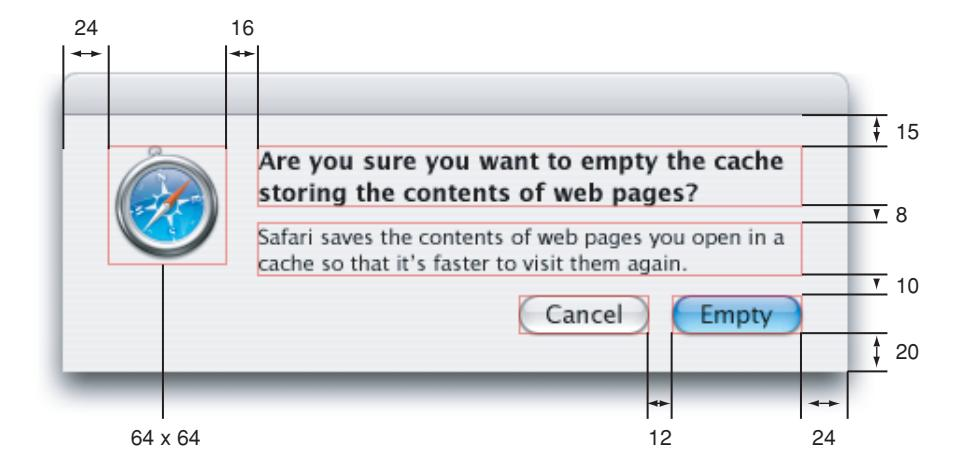

## <span id="page-212-0"></span>Brushed Metal Application Window Example

As discussed in ["Brushed Metal Windows"](#page-110-0) (page 111), there are times when it is appropriate to use brushed metal windows for application windows. Brushed metal windows have slightly different spacing guidelines from those for standard Aqua windows as listed here and shown in Figure 11-11.

- Leave 9 pixels from the bottom of the window controls at the top of the window and the top any controls.
- Leave 12 pixels of space between the bottom of any toolbar controls and other controls.
- The side borders should be 14 pixels wide.
- The bottom border should be 18 pixels deep.
- All pane splitters should be the same width (here, both are 9 pixels).

In addition to these brushed metal–specific guidelines, there are two other things to note in Figure 11-11 that apply to both brushed metal windows and standard Aqua windows:

- Leave at least 12 pixels between horizontally arranged buttons.
- When grouping horizontally arranged buttons, leave at least 24 pixels of space between groups (here the space is 28 pixels).

<span id="page-213-3"></span><span id="page-213-2"></span>**Figure 11-11** Layout dimensions for a brushed metal application window


# <span id="page-213-5"></span><span id="page-213-4"></span><span id="page-213-0"></span>Using Small and Mini Versions of Controls

Use smaller versions of controls only when necessary. Your first choice in designing for Aqua should always be to use the full-size controls.

<span id="page-213-1"></span>You can use the smaller versions of controls when space is at a premium, such as in tool palettes or other utility windows. Avoid mixing different sizes of controls in the same window. In a window with a changeable pane, it is acceptable to use small or mini controls within the pane and standard controls outside the pane. However, all panes of a window should use controls of the same size.

### Layout Example for Small Controls

Figure 11-12 shows a well designed utility window with small controls.

<span id="page-214-1"></span><span id="page-214-0"></span>**Figure 11-12** Example of a utility window with small controls


As when using full-size controls, you should strive for the center-equalized approach to laying out controls. This visually balanced layout can be seen in Figure 11-13.

<span id="page-215-0"></span>**Figure 11-13** Center-equalization in a utility window with small controls

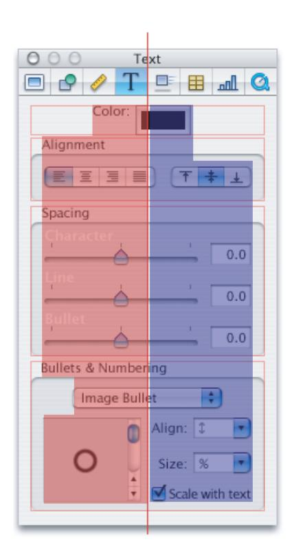

As with full-size controls, small (and mini) controls should be aligned vertically when stacked. Similar controls should have consistent widths and be aligned with each other. See Figure 11-14.

<span id="page-216-0"></span>**Figure 11-14** Alignment of labels and controls in a utility window with small controls


Con o w d hs cons s en

As Figure 11-15 shows, small controls have spacing guidelines different from those for than standard controls:

- Leave 8 to 10 pixels from the top of the content and the toolbar or title bar.
- The text box around any label should be at least 2 pixels below other controls.
- Side borders should be 10 pixels.
- Controls should be inset at least 10 pixels in group boxes.
- Leave a 12-pixel border on the bottom edge.
- Within any grouping, follow the spacing guidelines for the individual controls. See ["Controls"](#page-154-3) (page 155).

If your window has a toolbar, like the utility window in Figure 11-15, the toolbar buttons should be big enough to accommodate 16 x 16 icons.

<span id="page-217-1"></span>**Figure 11-15** Layout dimensions for a utility window with small controls


### <span id="page-217-0"></span>Layout Example for Mini Controls

Figure 11-16 shows a well designed utility window with mini controls.

<span id="page-218-0"></span>**Figure 11-16** Example of a utility window with mini controls

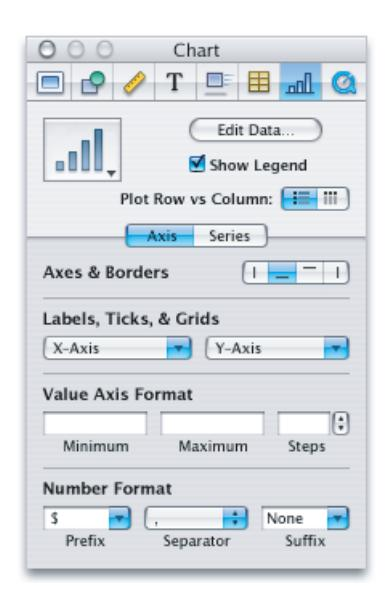

Like small controls, mini controls have specific spacing guidelines. In addition to the spacing guidelines in ["Controls"](#page-154-3) (page 155) the following guidelines are illustrated in Figure 11-17:

- Side borders should be 10 pixels.
- Bottom borders should be 12 pixels.
- Groups of controls should be separated by at least 8 pixels.

In Figure 11-17, note that as with small controls, the buttons in the toolbar are big enough to accommodate 16 x 16 icons. Note also the use of separators within the tab view instead of group boxes or white space; they allow for an more compact window. More examples of using separators are illustrated in ["Grouping Controls"](#page-219-0) (page 220).

<span id="page-219-4"></span><span id="page-219-2"></span>**Figure 11-17** Layout dimensions for a utility window with mini controls

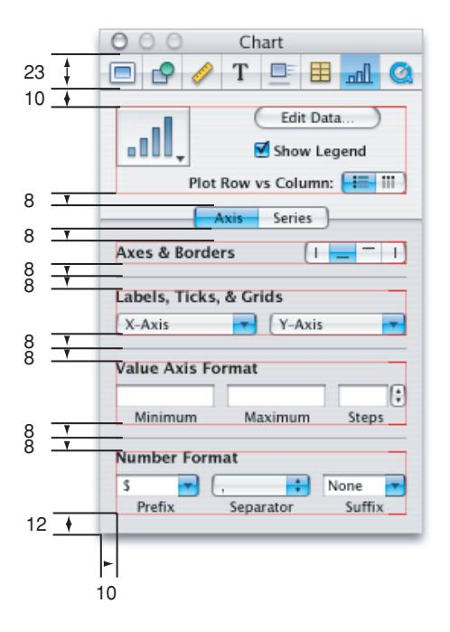

# <span id="page-219-3"></span><span id="page-219-0"></span>Grouping Controls

Grouping related controls helps users to understand what particular controls do and helps them locate the controls that affect the specific actions they want to apply. This section provides examples of different ways to group controls.

The three examples show different ways to group the same set of controls within a changeable pane using three grouping elements:

- Separators, shown in Figure 11-19
- White space, shown in Figure 11-21
- Group boxes, shown in Figure 11-22

<span id="page-219-1"></span>Note that none of these examples are more or less correct than any other in the general case. The effectiveness of a layout in your application depends on the overall aesthetic layout of your other windows as well as your application's workflow.

### Grouping With Separators

Separators provide the most efficient use of space and are most useful when space is at a premium.

<span id="page-220-0"></span>**Figure 11-18** Example of grouping with separators

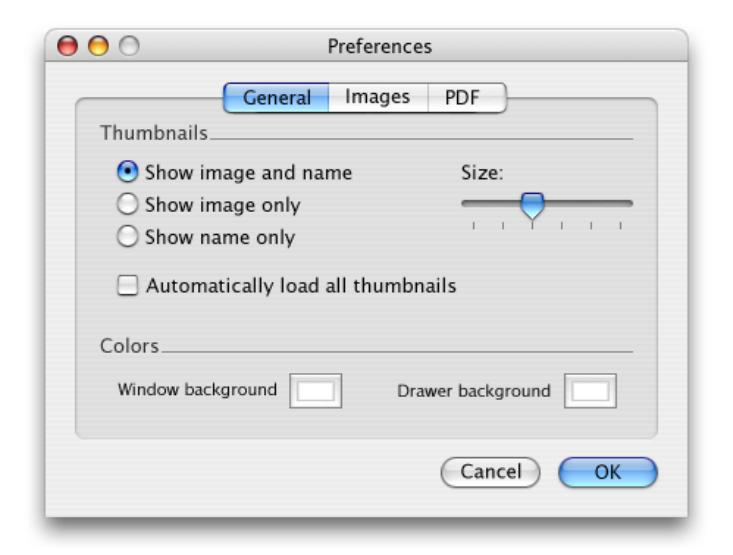

**Figure 11-19** Layout dimensions using separators

<span id="page-220-1"></span>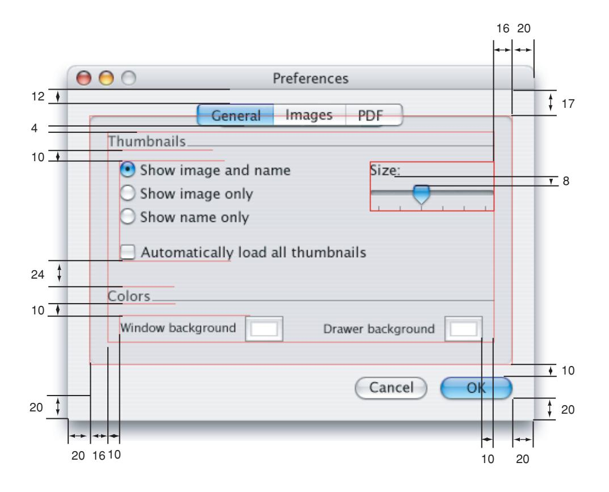

### <span id="page-221-0"></span>Grouping With White Space

<span id="page-221-1"></span>White space is an especially useful grouping element when you are dealing with small groups of controls.

**Figure 11-20** Example of grouping with white space


<span id="page-222-1"></span>**Figure 11-21** Layout dimensions using white space

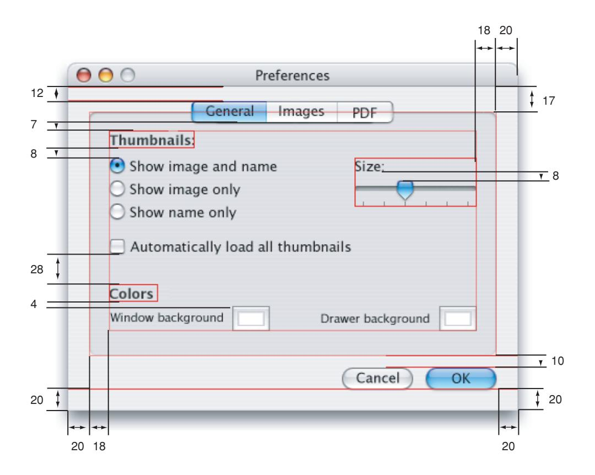

### <span id="page-222-0"></span>Grouping With Group Boxes

Group boxes provide the strongest visual indication of distinct groups but require the most space within the window.

<span id="page-223-0"></span>**Figure 11-22** Example of grouping with group boxes


**Figure 11-23** Layout dimensions using group boxes

<span id="page-223-1"></span>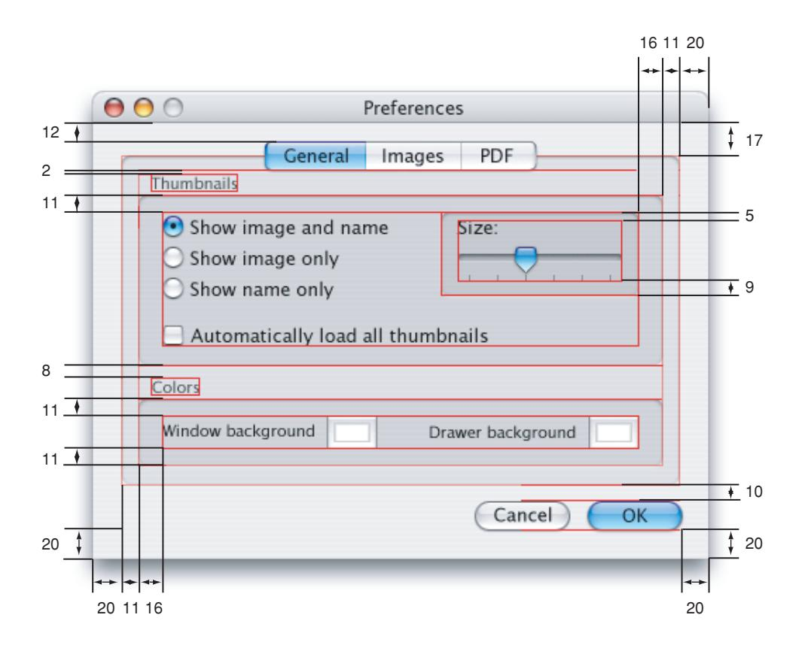

# <span id="page-224-0"></span>Using a Pop-up Menu in Place of Tabs

Always try to use tab views to indicate multiple changeable panes, as shown in the previous sections. However, if you have too many tabs to fit into a window properly you should instead use a pop-up menu to change the contents of a group box (see [Figure 11-24](#page-224-2) (page 225).

<span id="page-224-1"></span>As with tabs, the pop-up menu should be centered on the top of the group box.

<span id="page-224-2"></span>**Figure 11-24** Pop-up menu for changeable panes

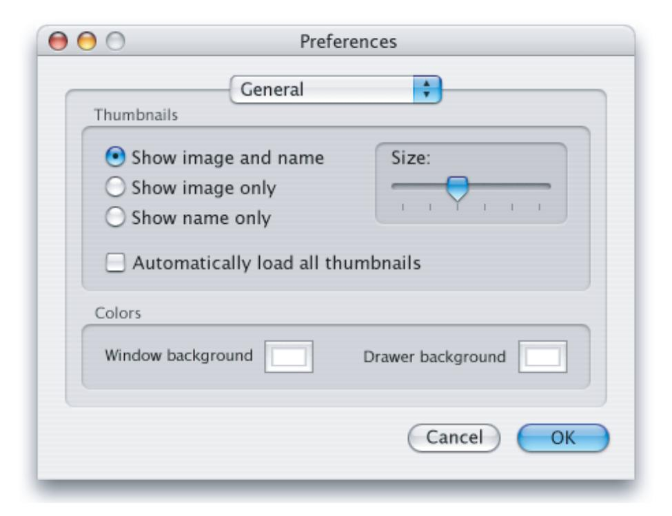

#### **CHAPTER 11**

Layout Examples

<span id="page-226-5"></span><span id="page-226-1"></span><span id="page-226-0"></span>Table A-1 lists all the keyboard shortcuts that are predefined for use by the operating system and those recommended for use in applications. The table is organized by the key that is modified, with variations of modifier keys grouped together. References to explanations of how to use these shortcuts are in the Action column.

Some sequences have icons that provide additional information:

- - indicates that the operating system uses that shortcut. Do not override these shortcuts.
- <span id="page-226-2"></span>■

indicates that these are suggested keyboard shortcuts for applications. Unless your application does not implement the functionality represented by the shortcut, you should provide these keyboard shortcuts.

The unmarked keyboard shortcuts are suggested for the specified action *if a keyboard shortcut is necessary*—just because a shortcut exists does not mean you need to use it. Try to avoid using these keyboard shortcuts for actions other than those indicated.

For more information on keyboard shortcuts, including when to use them, see ["Keyboard](#page-27-0) [Shortcuts"](#page-27-0) (page 28). This table lists only the combinations of two or more keys. For information on how to use specific single keys, see ["The Functions of Specific Keys"](#page-20-1) (page 21).

<span id="page-226-4"></span><span id="page-226-3"></span>**Table A-1** Keyboard shortcuts

| Primary key | Keyboard sequence       | Action                                                                                                         |
|-------------|-------------------------|----------------------------------------------------------------------------------------------------------------|
| Space bar   | Command–Space bar       | Rotates through enabled script<br>systems.<br>See "Keyboard Shortcuts<br>Reserved by the<br>System" (page 28). |
|             | Shift–Command–Space bar | Apple reserved.                                                                                                |

<span id="page-227-5"></span><span id="page-227-4"></span><span id="page-227-3"></span><span id="page-227-2"></span><span id="page-227-1"></span><span id="page-227-0"></span>

| Primary key | Keyboard sequence         | Action                                                                                                                                                                                                |
|-------------|---------------------------|-------------------------------------------------------------------------------------------------------------------------------------------------------------------------------------------------------|
|             | Option–Command–Space bar  | Rotates through keyboard<br>layouts and input methods<br>within a script.<br>See "Keyboard Shortcuts<br>Reserved by the<br>System" (page 28).                                                         |
|             | Control–Command–Space bar | Apple reserved.                                                                                                                                                                                       |
| Tab         | Shift-Tab                 | Navigates through controls in<br>a reverse direction.<br>See "Keyboard Focus and<br>Navigation" (page 31).                                                                                            |
|             | Command-Tab               | Moves forward to the next<br>most recently used application<br>in a list of open applications.                                                                                                        |
|             | Command-Shift-Tab         | Moves backward through a list<br>of open applications (sorted by<br>recent use).                                                                                                                      |
|             | Control-Tab               | Moves focus to the next<br>grouping of controls in a<br>dialog or the next table (when<br>Tab moves to the next cell).<br>See Making Carbon Applications<br>Accessible to Users With<br>Disabilities. |
|             | Shift-Control-Tab         | Moves focus to the previous<br>grouping of controls.<br>See Making Carbon Applications<br>Accessible to Users With<br>Disabilities.                                                                   |
| Esc         | Command-Option-Esc        | Opens the Force Quit dialog.                                                                                                                                                                          |
| Eject       | Command-Control-Eject     | Quits all applications (after<br>giving the user a chance to<br>save changes to open<br>documents) and restart the<br>computer.<br>See "Keyboard Shortcuts<br>Reserved by the<br>System" (page 28).   |

<span id="page-228-6"></span><span id="page-228-5"></span><span id="page-228-4"></span><span id="page-228-3"></span><span id="page-228-2"></span><span id="page-228-1"></span><span id="page-228-0"></span>

| Primary key | Keyboard sequence            | Action                                                                                                                                                                                                 |
|-------------|------------------------------|--------------------------------------------------------------------------------------------------------------------------------------------------------------------------------------------------------|
|             | Command-Option-Control-Eject | Quits all applications (after<br>giving the user a chance to<br>save changes to open<br>documents) and shuts the<br>computer down.<br>See "Keyboard Shortcuts<br>Reserved by the<br>System" (page 28). |
| F1          | Control-F1                   | Toggles full keyboard access<br>on or off.<br>See Making Carbon Applications<br>Accessible to Users With<br>Disabilities.                                                                              |
| F2          | Control-F2                   | Moves focus to the menu bar.<br>See Making Carbon Applications<br>Accessible to Users With<br>Disabilities.                                                                                            |
| F3          | Control-F3                   | Moves focus to the Dock.<br>See Making Carbon Applications<br>Accessible to Users With<br>Disabilities.                                                                                                |
| F4          | Control-F4                   | Moves focus to the active (or<br>next) window.<br>See Making Carbon Applications<br>Accessible to Users With<br>Disabilities.                                                                          |
|             | Shift-Control-F4             | Moves focus to the previously<br>active window.<br>See Making Carbon Applications<br>Accessible to Users With<br>Disabilities.                                                                         |
| F5          | Control-F5                   | Moves focus to the toolbar.<br>See Making Carbon Applications<br>Accessible to Users With<br>Disabilities.                                                                                             |
| F6          | Control-F6                   | Moves focus to the first (or<br>next) utility window.<br>See Making Carbon Applications<br>Accessible to Users With<br>Disabilities.                                                                   |

<span id="page-229-5"></span><span id="page-229-4"></span><span id="page-229-3"></span><span id="page-229-2"></span><span id="page-229-1"></span><span id="page-229-0"></span>

| Primary key       | Keyboard sequence | Action                                                                                                                                                              |
|-------------------|-------------------|---------------------------------------------------------------------------------------------------------------------------------------------------------------------|
|                   | Shift-Control-F6  | Moves focus to the previous<br>utility window.<br>See Making Carbon Applications<br>Accessible to Users With<br>Disabilities.                                       |
| F7                | Control-F7        | Temporarily overrides the<br>current keyboard access mode<br>in windows and dialogs.<br>See Making Carbon Applications<br>Accessible to Users With<br>Disabilities. |
| `(grave accent)   | Command-`         | Activates the next open<br>window in the frontmost<br>application.<br>See "Window<br>Layering" (page 120).                                                          |
|                   | Command-Shift-`   | Activates the previous open<br>window in the frontmost<br>application.<br>See "Window<br>Layering" (page 120).                                                      |
| - (hyphen)        | Command           | Equivalent to the Smaller<br>command.<br>See "The Format<br>Menu" (page 92).                                                                                        |
|                   | Command-Option    | Zooms out (screen zooming).<br>See Making Carbon Applications<br>Accessible to Users With<br>Disabilities.                                                          |
| { (left bracket)  | Command-{         | Equivalent to the Align Left<br>command.<br>See "The Format<br>Menu" (page 92).                                                                                     |
| } (right bracket) | Command-}         | Equivalent to the Align Right<br>command.<br>See "The Format<br>Menu" (page 92).                                                                                    |
| (pipe)            | Command-          | Equivalent to the Align Center<br>command.<br>See "The Format<br>Menu" (page 92).                                                                                   |

<span id="page-230-3"></span><span id="page-230-2"></span><span id="page-230-1"></span><span id="page-230-0"></span>

| Primary key       | Keyboard sequence        | Action                                                                                                        |
|-------------------|--------------------------|---------------------------------------------------------------------------------------------------------------|
| : (colon)         | Command-:                | Equivalent to the Spelling<br>command.<br>See "The Edit<br>Menu" (page 90).                                   |
| ; (semicolon)     | Command-;                | Equivalent to the Check<br>Spelling command.<br>See "The Edit<br>Menu" (page 90).                             |
| , (comma)         | Command-,                | Equivalent to the Preferences<br>command.<br>See "The Application<br>Menu" (page 87).                         |
|                   | Command-Option-Control-, | Decreases screen contrast.<br>See "The Application<br>Menu" (page 87).                                        |
| . (period)        | Command-Option-Control   | Increases the screen contrast.<br>See Making Carbon Applications<br>Accessible to Users With<br>Disabilities. |
| ? (question mark) | Command-?                | Opens help for the application.<br>See Apple Software Design<br>Guidelines.                                   |
| / (forward slash) | Command-Option-/         | Turns font smoothing on or off.                                                                               |
| = (equal sign)    | Command-Shift-=          | Equivalent to the Bigger<br>command.<br>See "The Format<br>Menu" (page 92).                                   |
|                   | Command-Option-=         | Zooms in (screen zooming).<br>See Making Carbon Applications<br>Accessible to Users With<br>Disabilities.     |
| 3                 | Command-Shift-3          | Captures screen to file.                                                                                      |
|                   | Command-Shift-Control-3  | Captures screen to Clipboard.                                                                                 |
| 4                 | Command-Shift-4          | Captures selection to file.                                                                                   |
|                   | Command-Shift-Control-4  | Captures selection to<br>Clipboard.                                                                           |

<span id="page-231-5"></span><span id="page-231-4"></span><span id="page-231-3"></span><span id="page-231-2"></span><span id="page-231-1"></span><span id="page-231-0"></span>

| Primary key | Keyboard sequence        | Action                                                                                                            |
|-------------|--------------------------|-------------------------------------------------------------------------------------------------------------------|
| 8           | Command-Option-8         | Turns screen zooming on or<br>off.<br>See Making Carbon Applications<br>Accessible to Users With<br>Disabilities. |
|             | Command-Option-Control-8 | Inverts the screen colors.<br>See Making Carbon Applications<br>Accessible to Users With<br>Disabilities.         |
| A           | Command-A                | Equivalent to the Select All<br>command.<br>See "The Edit<br>Menu" (page 90).                                     |
| B           | Command-B                | Equivalent to the Bold<br>command.<br>See "The Edit<br>Menu" (page 90).                                           |
| C           | Command-C                | Equivalent to the Copy<br>command.<br>See "The Edit<br>Menu" (page 90).                                           |
|             | Command-Shift-C          | Equivalent to the Show Colors<br>command.<br>See "The Format<br>Menu" (page 92).                                  |
|             | Command-Option-C         | Equivalent to the Copy Style<br>command.<br>See "The Edit<br>Menu" (page 90).                                     |
|             | Command-Control-C        | Equivalent to the Copy Ruler<br>command.<br>See "The Edit<br>Menu" (page 90).                                     |
| D           | Command-D                | Equivalent to the Find<br>Previous command.<br>See "The Edit<br>Menu" (page 90).                                  |
|             | Command-Option-D         | Shows or hides the Dock.<br>See Apple Software Design<br>Guidelines.                                              |

<span id="page-232-10"></span><span id="page-232-9"></span><span id="page-232-8"></span><span id="page-232-7"></span><span id="page-232-6"></span><span id="page-232-5"></span><span id="page-232-4"></span><span id="page-232-3"></span><span id="page-232-2"></span><span id="page-232-1"></span><span id="page-232-0"></span>

| Primary key | Keyboard sequence | Action                                                                                         |
|-------------|-------------------|------------------------------------------------------------------------------------------------|
| E           | Command-E         | Uses selection for a find<br>operation.<br>See "Find Window" (page 131).                       |
| F           | Command-F         | Equivalent to the Find<br>command.<br>See "The Edit<br>Menu" (page 90).                        |
|             | Command-Option-F  | Jumps to the search field<br>control.<br>See "Search Fields" (page 189).                       |
| G           | Command-G         | Equivalent to the Find Next<br>command.<br>See "The Edit<br>Menu" (page 90).                   |
|             | Command-Shift-G   | Equivalent to the Find<br>Previous command.<br>See "The Edit<br>Menu" (page 90).               |
| H           | Command-H         | Equivalent to the Hide<br>ApplicationName command.<br>See "The Application<br>Menu" (page 87). |
|             | Command-Option-H  | Equivalent to the Hide Others<br>command.<br>See "The Application<br>Menu" (page 87).          |
| I           | Command-I         | Equivalent to the Italic<br>command.<br>See "The Edit<br>Menu" (page 90).                      |
|             | Command-I         | Equivalent to the Show Info<br>command.<br>See "The File Menu" (page 88).                      |
|             | Command-Option-I  | Equivalent to the Show<br>Inspector command.<br>See "The File Menu" (page 88).                 |
| J           | Command-J         | Scrolls to selection.                                                                          |
| M           | Command-M         | Equivalent to the Minimize<br>command.<br>See "The Window<br>Menu" (page 96).                  |

<span id="page-233-8"></span><span id="page-233-7"></span><span id="page-233-6"></span><span id="page-233-5"></span><span id="page-233-4"></span><span id="page-233-3"></span><span id="page-233-2"></span><span id="page-233-1"></span><span id="page-233-0"></span>

| Primary key | Keyboard sequence      | Action                                                                                    |
|-------------|------------------------|-------------------------------------------------------------------------------------------|
|             | Command-Option-M       | Equivalent to the Minimize All<br>Windows command.<br>See "The Window<br>Menu" (page 96). |
| N           | Command-N              | Equivalent to the New<br>command.<br>See "The File Menu" (page 88).                       |
| O           | Command-O              | Equivalent to the Open<br>command.<br>See "The File Menu" (page 88).                      |
| P           | Command-P              | Equivalent to the Print<br>command.<br>See "The File Menu" (page 88).                     |
|             | Command-Shift-P        | Equivalent to the Page Setup<br>command.<br>See "The File Menu" (page 88).                |
| Q           | Command-Q              | Equivalent to the Quit<br>command.<br>See "The Apple<br>Menu" (page 86).                  |
|             | Command-Shift-Q        | Equivalent to the Log Out<br>command.<br>See Apple Software Design<br>Guidelines.         |
|             | Command-Shift-Option-Q | Logs out without confirmation.<br>See Apple Software Design<br>Guidelines.                |
| S           | Command-S              | Equivalent to the Save<br>command.<br>See "The File Menu" (page 88).                      |
|             | Command-Shift-S        | Equivalent to the Save As<br>command.<br>See "The File Menu" (page 88).                   |
| T           | Command-T              | Equivalent to the Show Fonts<br>command.<br>See "The Edit<br>Menu" (page 90).             |

<span id="page-234-10"></span><span id="page-234-9"></span><span id="page-234-8"></span><span id="page-234-7"></span><span id="page-234-6"></span><span id="page-234-5"></span><span id="page-234-4"></span><span id="page-234-3"></span><span id="page-234-2"></span><span id="page-234-1"></span><span id="page-234-0"></span>

| Primary key | Keyboard sequence | Action                                                                                                            |
|-------------|-------------------|-------------------------------------------------------------------------------------------------------------------|
|             | Command-Option-T  | Equivalent to the Show/Hide<br>Toolbar command.<br>See "The View<br>Menu" (page 93) and<br>"Toolbars" (page 108). |
| U           | Command-U         | Equivalent to the Underline<br>command.<br>See "The Edit<br>Menu" (page 90).                                      |
| V           | Command-V         | Equivalent to the Paste<br>command.<br>See "The File Menu" (page 88).                                             |
|             | Command-Option-V  | Equivalent to the Paste Style<br>command.<br>See "The Edit<br>Menu" (page 90).                                    |
|             | Command-Control-V | Equivalent to the Paste Ruler<br>command.<br>See "The Edit<br>Menu" (page 90).                                    |
| W           | Command-W         | Equivalent to the Close<br>command.<br>See "The File Menu" (page 88).                                             |
|             | Command-Shift-W   | Equivalent to the Close File<br>command.<br>See "The File Menu" (page 88).                                        |
|             | Command-Option-W  | Equivalent to the Close All<br>Windows command.<br>See "The File Menu" (page 88).                                 |
| X           | Command-X         | Equivalent to the Cut<br>command.<br>See "The File Menu" (page 88).                                               |
| Z           | Command-Z         | Equivalent to the Undo<br>command.<br>See "The File Menu" (page 88).                                              |
|             | Command-Shift-Z   | Equivalent to the Redo<br>command.<br>See "The File Menu" (page 88).                                              |

<span id="page-235-7"></span><span id="page-235-6"></span><span id="page-235-5"></span><span id="page-235-4"></span><span id="page-235-3"></span><span id="page-235-2"></span><span id="page-235-1"></span><span id="page-235-0"></span>

| Primary key | Keyboard sequence         | Action                                                                                                                                                                     |
|-------------|---------------------------|----------------------------------------------------------------------------------------------------------------------------------------------------------------------------|
| Right Arrow | Command–Right Arrow       | Changes keyboard layout to<br>current layout of Roman script.<br>See "Keyboard Shortcuts<br>Reserved by the<br>System" (page 28).                                          |
|             | Command–Shift–Right Arrow | Extends selection to the next<br>semantic unit, typically the end<br>of the current line.<br>See "Keyboard Shortcuts<br>Reserved by the<br>System" (page 28).              |
|             | Shift–Right Arrow         | Extends selection one character<br>to the right.<br>See "Keyboard Shortcuts<br>Reserved by the<br>System" (page 28).                                                       |
|             | Shift–Option–Right Arrow  | Extends selection to the end of<br>the current word, then to the<br>end of the next word.<br>See "Keyboard Shortcuts<br>Reserved by the<br>System" (page 28).              |
|             | Control–Right Arrow       | Moves focus to another value<br>or cell within a control, such as<br>a table.<br>See "Keyboard Shortcuts<br>Reserved by the<br>System" (page 28).                          |
| Left Arrow  | Command–Left Arrow        | Changes keyboard layout to<br>current layout of system script<br>See "Keyboard Shortcuts<br>Reserved by the<br>System" (page 28).                                          |
|             | Command–Shift–Left Arrow  | Extends selection to the<br>previous semantic unit,<br>typically the beginning of the<br>current line.<br>See "Keyboard Shortcuts<br>Reserved by the<br>System" (page 28). |
|             | Shift–Left Arrow          | Extends selection one character<br>to the left.<br>See "Keyboard Shortcuts<br>Reserved by the<br>System" (page 28).                                                        |

<span id="page-236-4"></span><span id="page-236-3"></span><span id="page-236-2"></span><span id="page-236-1"></span><span id="page-236-0"></span>

| Primary key | Keyboard sequence       | Action                                                                                                                                                                                    |
|-------------|-------------------------|-------------------------------------------------------------------------------------------------------------------------------------------------------------------------------------------|
|             | Shift–Option–Left Arrow | Extends selection to the<br>beginning of the current word,<br>then to the beginning of the<br>previous word.<br>See "Keyboard Shortcuts<br>Reserved by the<br>System" (page 28).          |
|             | Control–Left Arrow      | Moves focus to another value<br>or cell within a control, such as<br>a table.<br>See "Keyboard Shortcuts<br>Reserved by the<br>System" (page 28).                                         |
| Up Arrow    | Command–Shift–Up Arrow  | Extends selection upward in<br>the next semantic unit,<br>typically the beginning of the<br>document.<br>See "Keyboard Shortcuts<br>Reserved by the<br>System" (page 28).                 |
|             | Shift–Up Arrow          | Extends selection to the line<br>above, to the nearest character<br>boundary at the same<br>horizontal location.<br>See "Keyboard Shortcuts<br>Reserved by the<br>System" (page 28).      |
|             | Shift–Option–Up Arrow   | Extends selection to the<br>beginning of the current<br>paragraph, then to the<br>beginning of the next<br>paragraph.<br>See "Keyboard Shortcuts<br>Reserved by the<br>System" (page 28). |
|             | Control–Up Arrow        | Moves focus to another value<br>or cell within a control, such as<br>a table.<br>See "Keyboard Shortcuts<br>Reserved by the<br>System" (page 28).                                         |

<span id="page-237-4"></span><span id="page-237-3"></span><span id="page-237-2"></span><span id="page-237-1"></span><span id="page-237-0"></span>

| Primary key | Keyboard sequence        | Action                                                                                                                                                                                                                                                          |
|-------------|--------------------------|-----------------------------------------------------------------------------------------------------------------------------------------------------------------------------------------------------------------------------------------------------------------|
| Down Arrow  | Command–Shift–Down Arrow | Extends selection downward<br>in the next semantic unit,<br>typically the end of the<br>document.<br>See "Keyboard Shortcuts<br>Reserved by the<br>System" (page 28).                                                                                           |
|             | Shift–Down Arrow         | Extends selection to the line<br>below, to the nearest character<br>boundary at the same<br>horizontal location.<br>See "Keyboard Shortcuts<br>Reserved by the<br>System" (page 28).                                                                            |
|             | Shift–Option–Down Arrow  | Extends selection to the end of<br>the current paragraph, then to<br>the end of the next paragraph<br>(include the blank line between<br>paragraphs in cut, copy, and<br>paste operations).<br>See "Keyboard Shortcuts<br>Reserved by the<br>System" (page 28). |
|             | Control–Right Arrow      | Moves focus to another value<br>or cell within a control, such as<br>a table.<br>See "Keyboard Shortcuts<br>Reserved by the<br>System" (page 28).                                                                                                               |

# <span id="page-238-0"></span>Tab View Differences Between Mac OS X Versions

<span id="page-238-3"></span><span id="page-238-2"></span>The size of the tab views has changed between Mac OS X version 10.2 (Jaguar) and Mac OS X version 10.3 (Panther). This section discuses how that size difference may affect your applications.

If you are supporting only Mac OS X v10.3 and later, then you do not need to do anything. Follow the guidelines in ["Tab Views"](#page-194-1) (page 195).

If you need to support Mac OS X v10.2 (or earlier) in addition to Mac OS X v10.3, then you need to consider the differences.

<span id="page-238-1"></span>The Mac OS X v10.2 tabs were 29 pixels high from the top of the tab to the bottom of the bar under the tab. The Mac OS X v10.3 tabs are only 20 pixels high. This means that if you have designed your user interface elements for Mac OS X v10.2, there will be an additional space of 4 pixels under the tabs when viewed in Mac OS X v10.3 and a space of 5 pixels above.

**Figure B-1** Tab view differences

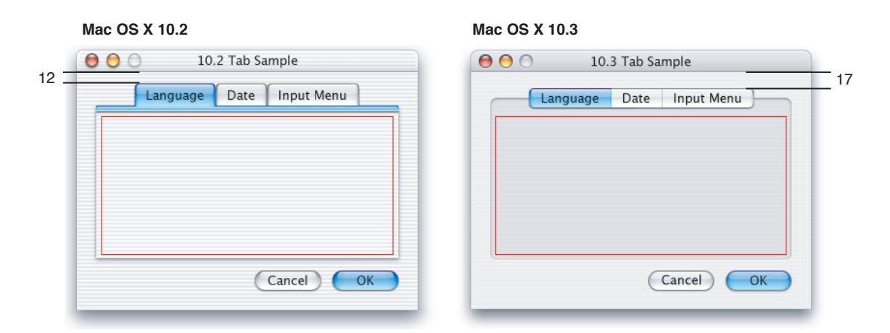

Considering your users, you must decide whether to redesign your interface so that it does not use tabs, or to allow the new spacing and adhere to the Mac OS X v10.2 specification for spacing around the tab views. If you decide not to use tabs, one option is to use a toolbar for switching panes.

#### **APPENDIX B**

Tab View Differences Between Mac OS X Versions

# <span id="page-240-0"></span>Document Revision History

<span id="page-240-1"></span>The table below describes revisions to *Apple Human Interface Guidelines*.

| Date              | Notes                                                                                                 |  |
|-------------------|-------------------------------------------------------------------------------------------------------|--|
| August 31, 2004   | Minor bug fixes.                                                                                      |  |
| May 27, 2004      | Removed Part I and Part II. This information is now available in Apple Software<br>Design Guidelines. |  |
|                   | Updated Introduction to reflect new structure of the document.                                        |  |
|                   | Minor bug fixes.                                                                                      |  |
| March 29, 2004    | Clarifications to font guidelines in Text.                                                            |  |
|                   | Corrected minor errors in artwork in Figure 13-21 and Figure 13-24.                                   |  |
| February 26, 2004 | Minor revisions throughout including updating some artwork.                                           |  |
|                   | Reworked organization of Layout Examples and added more specific<br>guidelines and examples.          |  |
|                   | Minor corrections to some of the specifications in the Controls.                                      |  |
| October 18, 2003  | Updated for Mac OS X version 10.3 by updating artwork and including new<br>controls.                  |  |
|                   | Divided the document into parts.                                                                      |  |
|                   | Added all of content in Part II.                                                                      |  |
|                   | Added Cursors.                                                                                        |  |
|                   | Added a list of all keyboard shortcuts.                                                               |  |
|                   | Called out differences between Carbon and Cocoa where appropriate.                                    |  |
|                   | Reorganized Windows.                                                                                  |  |
|                   | Reorganized Menus.                                                                                    |  |

| Date              | Notes                                                                                                                                                                                                                                                                                                                     |
|-------------------|---------------------------------------------------------------------------------------------------------------------------------------------------------------------------------------------------------------------------------------------------------------------------------------------------------------------------|
|                   | Added content and fixed various bugs throughout.                                                                                                                                                                                                                                                                          |
| June 11, 2002     | Updated for Mac OS X version 10.2. Deleted "What's New in Aqua" sections<br>from Chapter 1 and beginning of each chapter.                                                                                                                                                                                                 |
|                   | Speech chapter added.                                                                                                                                                                                                                                                                                                     |
|                   | New controls: command pop-down menus, toolbar control, spinning arrows,<br>small image wells.                                                                                                                                                                                                                             |
|                   | Other additions/changes include: accessibility features, installers, metal<br>windows, new document window position, utility window controls, font<br>constants.                                                                                                                                                          |
| October 1, 2001   | Updated for Mac OS X version 10.1.                                                                                                                                                                                                                                                                                        |
|                   | Added information about filename extension hiding, Dock menus and<br>notification, setup assistants, new focus ring specifications, accessibility<br>guidelines, full keyboard access, customizing Print dialogs, window<br>positioning on multiple monitors, proxy icons. Various other editorial changes<br>throughout. |
| May 21, 2001      | Updated for WWDC.                                                                                                                                                                                                                                                                                                         |
|                   | Changes made to many illustrations.                                                                                                                                                                                                                                                                                       |
|                   | Slight engineering comments and changes throughout.                                                                                                                                                                                                                                                                       |
|                   | Icons chapter expanded.                                                                                                                                                                                                                                                                                                   |
|                   | File Location chapter added.                                                                                                                                                                                                                                                                                              |
|                   | "What's New in Aqua" chapter appended to Intro chapter.                                                                                                                                                                                                                                                                   |
|                   | "Layout Guidelines" broken out from "Controls" chapter.                                                                                                                                                                                                                                                                   |
|                   | Other additions include "Additional Considerations" section in principles<br>chapter; windows with different panes.                                                                                                                                                                                                       |
| December 11, 2000 | Updated for Jan 2001 Macworld; now called Inside Mac OS X: Aqua Human<br>Interface Guidelines.                                                                                                                                                                                                                            |
|                   | Document divided into chapters. TOC added.                                                                                                                                                                                                                                                                                |
|                   | Major content added to entire document. Added many screen shots.                                                                                                                                                                                                                                                          |
|                   | Added Human Interface principles chapter.                                                                                                                                                                                                                                                                                 |
|                   | Added Help chapter.                                                                                                                                                                                                                                                                                                       |
|                   | Added Language chapter.                                                                                                                                                                                                                                                                                                   |
|                   | Added Drag and Drop chapter.                                                                                                                                                                                                                                                                                              |

#### Document Revision History

| Date              | Notes                                                                                                                                                                                                  |
|-------------------|--------------------------------------------------------------------------------------------------------------------------------------------------------------------------------------------------------|
|                   | Added Checklist appendix.                                                                                                                                                                              |
|                   | Added Mac OS X terminology appendix.                                                                                                                                                                   |
|                   | Added index.                                                                                                                                                                                           |
|                   | Content revisions include click-through, icon creation process, combo boxes,<br>sheets, Save-Close-Quit behavior, keyboard equivalents, About boxes, pop-up<br>bevel buttons, and pop-up icon buttons. |
| September 8, 2000 | Updated for Mac OS X Public Beta Release.                                                                                                                                                              |
|                   | Added section on working with the Appearance Manager.                                                                                                                                                  |
|                   | Added section on designing alerts.                                                                                                                                                                     |
|                   | Added section on sheets.                                                                                                                                                                               |
|                   | Added section on drawers.                                                                                                                                                                              |
|                   | Added section on list and column view.                                                                                                                                                                 |
|                   | Added material on small controls.                                                                                                                                                                      |
|                   | Added examples of font usage.                                                                                                                                                                          |
|                   | Clarified description of tab control usage.                                                                                                                                                            |
| April 19, 2000    | Updated for Mac OS X Developer Preview 4 and retitled Adopting the Aqua<br>Interface.                                                                                                                  |
|                   | Changed content and art to reflect new control metrics.                                                                                                                                                |
|                   | Added section on icon design.                                                                                                                                                                          |
|                   | Added section on window layering.                                                                                                                                                                      |
|                   | Added section on menu layout.                                                                                                                                                                          |
|                   | Added material on using an ellipsis in menus.                                                                                                                                                          |
| January 20, 2000  | Document published as Aqua Layout Guidelines.                                                                                                                                                          |

#### **REVISION HISTORY**

Document Revision History

# <span id="page-244-0"></span>Glossary

<span id="page-244-6"></span><span id="page-244-1"></span>**About window** A modeless window that displays an application's version and copyright information.

**accumulating attribute group** A set of attribute choices in which the user can select multiple items, such as Bold and Italic. See also [mutually exclusive](#page-247-0) [attribute group.](#page-247-0)

**action button** The button that confirms the message text in a dialog. The action button is in the lower right corner of a dialog. It is often, but not always, the default button.

**active end** The location at which the user releases the mouse button when selecting a range of objects.

<span id="page-244-5"></span>**active window** A window that applies to the user's current task. Active windows are distinguished from inactive windows by the look of the title bar and the window controls. Multiple windows can be active simultaneously. See also [key window;](#page-247-1) [main window.](#page-247-2)

<span id="page-244-3"></span>**addition model** A model for extending a continuous selection using Shift-click, in which new text is added to a selection. See also [fixed-point model.](#page-246-0)

**alert** A dialog that appears when the system or an application needs to communicate information to the user. Alerts provide messages about error conditions and warn users about potentially hazardous situations or actions.

**anchor point** The location at which the user presses the mouse button when selecting a range of objects.

**Apple Help** The component that enables applications to display HTML files in Help Viewer, a simple browser.

**Apple menu** A menu that provides items that are available to users at all times, regardless of which application is active. It is the leftmost menu in the menu bar.

**application font** The font used as the default for user-created content. It is 13-point Lucida Grande Regular.

**application menu** A menu that contains items that apply to the application as a whole, rather than to a specific document or other window. The application menu for the current active application appears immediately to the right of the Apple menu.

<span id="page-244-4"></span>**application-modal dialog** A dialog that prevents the user from performing any operations within the owner application other than those in the dialog. See also [document-modal dialog;](#page-246-1) [sheet](#page-248-0).

**application window** The primary window of an application that is not document-based.

**arrow keys** The four keys on Apple keyboards (up, down, left, right) used to move the insertion point or change the selection. They can also be used with the Shift key to extend or shrink a selection.

**asynchronous progress indicator** A small round indeterminate progress indicator. It is usually visible only while active.

**auto-repeat** A feature that lets users produce numerous instances of the same character by holding down its key rather than pressing the key over and over. Users can make adjustments to this feature in Keyboard & Mouse preferences.

<span id="page-244-2"></span>**background selection** A selection in an inactive window. In Aqua, such selections are in the secondary highlight color.

**bevel button** A button with a beveled edge that gives the button a three-dimensional appearance.

**bullet** In the Window menu, indicates that the document has unsaved changes.

**button** See [bevel button](#page-244-2); [icon button;](#page-247-3) [metal button;](#page-247-4) [push button;](#page-248-1) [radio button.](#page-248-2)

**center equalization** Placement of controls in a window so that overall, they are visually balanced across an imaginary vertical line in the center of the window.

**center justification** The placement of controls or text where every item is centered on an imaginary vertical line in the center of a window.

**character key** A key that sends a character to the computer. Character keys include letters, numbers, punctuation, and the Space bar, and nonprinting characters such as Tab and Return.

**checkbox** A control for an option that must be either on or off.

**checkmark** In the Window menu, a checkmark appears next to the active document's name. In other menus, checkmarks can be used to indicate that the setting applies to the entire selection. Checkmarks can be used for mutually exclusive attribute groups or for accumulating attribute groups.

**click-through** A property of some controls that enables user to activate them in an inactive window. Whether a control supports click-throught depends on the context.

**Clipboard** A storage location for data the user cuts or copies from a document. The Clipboard is available to all applications and its contents don't change when the user switches between applications.

**clipping** Data dragged from an application to the Finder desktop.

**close button** A window control (the red button that appears in the upper left) that users can click to close the window.

**color well** A small rectangular or square control used to apply a color selection. The color of the control indicates the currently selected color.

**column view** A control that displays textual listings of hierarchical data in vertical columns. Navigation between columns reveals levels of the hierarchy.

**combination box** A text entry field combined with a drop-down scrolling list. Combo boxes are useful for displaying a list of likely choices while still allowing the user to type in an item not in the list.

**command pop-down menu** A menu that contains commands and appears in a window rather than in the menu bar. Use of this control is limited to cases

where the window is shared among multiple applications and the menu contains commands that affect the window's contents. A closed pop-down menu always displays the same text, which is the menu title. Pop-down menus have a single, downward-pointing triangle.

**contextual menu** A menu that appears when the user presses the Control key and clicks an interface item. A contextual menu provides convenient access to frequently used commands associated with the item.

**continuous selection** A selection that includes all content between the anchor point and the active end.

<span id="page-245-0"></span>**control** A graphic object that causes instant actions or visible results when the user manipulates the object with the mouse. Standard controls include buttons, scroll bars, checkboxes, sliders, and pop-up menus.

**cursor** The onscreen representation of the mouse's location. The cursor commonly looks like an arrow, but can also assume such shapes as a pencil, a cross, or a paintbrush, depending on the application and the user's selection.

**dash** In a menu, indicates that an attribute applies to only part of the selection. For example, if a highlighted selection contains text with different styles applied to it, a dash appears next to each style name in the menu.

**data browser** A control that provides a standardized look for column browsers (such as seen in the column view of a Finder window or in an Open dialog) and scrolling lists (such as seen in the list view of a Finder window).

**default button** The button that provides a safe action in a dialog. The default button is indicated by a pulsing appearance. It is activated when the user presses the Return or Enter key.

**default keyboard access mode** The mode in which tabbing and other keystrokes move keyboard focus only between fields that receive keyboard input, such as text entry fields and scrolling lists. See also [full](#page-246-2) [keyboard access mode](#page-246-2).

**destination region** The part of a document that can accept data dragged to it. In a document window, the destination region is usually the content area minus the title bar and areas used for controls such as scroll bars and rulers.

**dialog** A window designed to elicit a response from the user. See also [alert](#page-244-3).

**diamond** In a Window menu, indicates that the document has been minimized into the Dock.

**dimmed** Used to describe text or icons that are grayed out to indicate that they are currently unavailable. Menu items, for example, are dimmed rather than omitted when they aren't applicable at a particular moment.

**disclosure triangle** A control that allows the display, or disclosure, of information that elaborates on the primary information in a window. Disclosure triangles are used in the Finder's list view; clicking a triangle displays a folder's contents.

**discontinuous selection** A selection in which unselected objects are between selected objects.

**display name** The name of a file as it appears to the user. The display name reflects the user's preference for hiding or showing the filename extension.

<span id="page-246-1"></span>**Dock** A user-configurable, onscreen, interface element that provides a simple way for users to launch frequently-used applications and documents. It also houses minimized windows and the Trash.

<span id="page-246-3"></span>**document-modal dialog** A dialog that prevents the user from performing further operations in the document until the user dismisses the dialog. All sheets are document modal and all Aqua document-modal dialogs should be sheets. See also [application-modal dialog;](#page-244-4) [sheet](#page-248-0).

**document window** A window containing file-based data that users create and store. See also [utility](#page-249-0) [window.](#page-249-0)

**drag and drop** The technique of dragging an item, such as a graphic or selected text, and dropping it on a suitable destination, such as another document.

**drawer** A child window that slides out from a parent window and that the user can open or close (show or hide) while the parent window is open. Drawers contain controls that are fairly frequently accessed but don't need to be visible at all times.

**dynamic menu item** A menu command that changes when the user presses a modifier key. For example, in the Finder File menu, if the user presses the Option key, the Close Window command changes to Close All. See also [toggled menu item](#page-249-1).

**Edit menu** A menu that provides commands for changing (editing) the contents of documents. It contains commands such as Cut, Copy, and Paste. **ellipsis character** Three unspaced periods that appear in menus, buttons, and other controls to indicate that additional information will be required to complete the command. Generate an ellipsis with Option-semicolon.

**emphasized mini system font** The bold version of the mini system font.

**emphasized small system font** The bold version of the small system font.

**emphasized system font** The bold version of the system font.

**fast user switching** A feature introduced in Mac OS X version 10.3 that allows users on a multiple-user computer to access their desktop, documents, and applications without requiring other logged in users to quit their applications.

<span id="page-246-0"></span>**File menu** A menu that contains commands that provide housekeeping tasks for files, such as Save As.

**fixed-point model** A model for extending a continuous selection using Shift-click, in which the user can extend the selection on either side of the insertion point. See also [addition model](#page-244-5).

**focus ring** Highlighting around the onscreen area that is ready to accept user input.

<span id="page-246-2"></span>**Format menu** An optional menu that contains formatting commands.

**full keyboard access mode** The mode in which tabbing and other keystrokes move keyboard focus to more interface elements than is possible in default keyboard access mode.

**function key** One of the keys with the letter *F* and a number, plus the Help, Home, Page Up, Page Down, Del, and End keys.

**group box** In a dialog, a visual indication that certain controls belong together.

**help book** The collection of HTML files that provide onscreen help for a particular product.

**Help button** A button that opens Help Viewer to the help content appropriate for the context. A help button is a round button with a question mark.

**Help Center** A window where users can access any help book installed on their system.

**Help Menu** A menu that provides access to the onscreen help documentation for an application.

**Help Viewer** The simple browser used to display Apple Help HTML files.

**help tag** A brief text explanation that appears when the user leaves the pointer hovering over an interface element for a few seconds.

<span id="page-247-5"></span>**hierarchical menu** A menu that includes a menu item from which a submenu descends. Submenus offer additional menu item choices without taking up more space in the menu bar. Hierarchical menus are indicated with a triangle.

**hot spot** The portion of the pointer that must be positioned over a screen object for mouse clicks to have an effect on the object.

<span id="page-247-3"></span>**hot zone** The area of an onscreen object that the pointer's hot spot must be within for mouse clicks to have an effect.

**icon button** A button that does not have a rectangular edge around it; the clickable region is the graphic (for example, the toolbar buttons in System Preferences windows).

**icon genre** A group of icons that share similar visual design characteristics used to designate a particular category of items.

**image well** A rectangular, recessed area that displays an icon or picture and that serves as a drag-and-drop target.

**inactive window** A window that is in the background of other windows. Although some of its controls can be activated (click-through) and it can be a drag and drop target, an inactive window is not the focus of the user's attention.

**insertion point** The point at which data will be inserted in response to a user's typing or pasting.

<span id="page-247-1"></span>**Interface Builder** An application that helps you easily create application menus, windows, dialogs, palettes, and other standard Aqua interface elements.

**key-repeat** The repetition of a character when the user holds down a key representing that character.

**key window** The window that currently accepts input from the keyboard.

**label font** The font used for labels with controls such as sliders and icon bevel buttons. It is 10-point Lucida Grande Regular.

**list view** A control for displaying data in a list. The primary list may by accompanied by additional columns that display secondary attributes about that items in the list. Hierarchies are presented through the use of disclosure triangles.

<span id="page-247-2"></span>**main window** The window that is the focus of the user's actions. It may accept keyboard input itself or may work in conjunction with a key window. For example, a text editing document would be a main window when a user is actively typing or modifying text in it.

<span id="page-247-4"></span>**menu bar** The strip at the top of the user's primary monitor that contains menu titles. It includes system and application menus.

**metal button** A button designed to be used in brushed metal windows.

**mini system font** The font used for the text in most mini controls. It is Lucida Grande Regular 9 pt.

**minimize button** A window control (the middle yellow button that appears at the top left) that the user clicks to put a window into the Dock.

**modeless dialog** A dialog that does not require the user to dismiss it before interacting with anything else onscreen. The "find and replace" dialog in many word processors is an example of a modeless dialog.

<span id="page-247-0"></span>**modifier key** A key the user can hold down to alter the meaning of another key being pressed simultaneously or to alter the meaning of a mouse action. The Option and Command keys are examples of modifier keys.

**mutually exclusive attribute group** A set of attribute choices in which the user can select only one item, such as font size. See also [accumulating attribute](#page-244-6) [group](#page-244-6).

**palette** A window that is independent of documents and that provides items to be used when other windows are open, such as a palette that provides drawing tools.

**pane** An area of changeable content in a dialog or other window. Panes usually change as the result of the user clicking a button or choosing an item from a pop-up menu. In some cases, panes change as a

process takes place, such as while the Installer application is running.

**placard** A control that displays information. Typically placards are used in document windows as a way to quickly modify the view of the contents—for example, to change the current page or the magnification.

**pointer** See [cursor.](#page-245-0)

**pop-up menu** A menu that, when closed, displays the current choice and can be opened to present a list of mutually exclusive choices in a dialog or window. Pop-up menus have a double triangle indicator.

**progress indicator** A control that lets the user know that a task is in progress.

<span id="page-248-1"></span>**proxy icon** An icon in the title bar of a document window that users can manipulate as if they were manipulating the corresponding file-system object. Users can Command-click the proxy icon to display a pop-up menu illustrating the document path.

<span id="page-248-2"></span>**push button** A rounded rectangle with a text label on it, which the user clicks to perform an instantaneous action, such as saving a document, completing operations defined by a dialog, or acknowledging an error message.

**radio button** A control for one of a set of mutually exclusive, but related, choices.

**relevance indicator** A control that indicates the relative ranking of search results—the longer the bar, the more relevant the item is to the search criteria.

**Rendezvous** A networking technology that provides a way for computers, devices, and services to discover each other dynamically over IP networks.

**resize control** The area in the bottom-right corner of windows that users can drag to adjust the size of the window. It is not present if the window's contents cannot vary in size.

**round button** A circular push button.

**scroll bar** A control for viewing areas of a document or a list that is larger than can fit in the current window. Only the active window can be scrolled. A window can have a horizontal scroll bar, a vertical scroll bar, both, or neither.

**scroller** The part of a scroll bar that the user drags to view other parts of a document. The scroller size

reflects how much of the document is visible; the smaller the scroller, the less of the content the user can see at that time. The scroller represents the relative location, in the whole document, of the portion that can be seen in the window.

**scrolling list** A list in a dialog that uses scroll bars to reveal its contents.

**scrolling menu** A menu that contains more items than are visible onscreen. Scrolling menus have triangles that indicate hidden menu items.

**search field** A text field with rounded corners used for searching. It can include a menu and an icon to clear the field or steps of a search.

**segmented control** A control for changing modes or views; each segment represents a different state.

**separator** A line used to break a window into different visual regions.

<span id="page-248-0"></span>**setup assistant** A small application that guides users through the setup options for a hardware device or software component.

**sheet** A dialog attached to a specific window, ensuring that the user never loses track of which window the dialog belongs to. A Print dialog is an example of a sheet. See also [document-modal dialog.](#page-246-1)

**Shift-click** To click while the Shift key is down. This combination is used to select multiple objects or to extend a selection.

**Sidebar** In the Finder, a user-specified list of disks, volumes, and other directories that allow users quick access to specific locations.

**slider control** A control enabling users to choose among a continuous range of allowable values. Slider controls can be horizontal or vertical and can display incremental tick marks.

**small system font** The font used for informative text in alerts, headers in lists, help tags, and text in the small versions of many controls. It is 11-point Lucida Grande Regular.

**source list** A list in a pane of an application window used to organize and navigate data. The width of the pane is adjustable.

**speech recognition** The ability for a computer to understand spoken commands or responses.

**speech synthesis** The ability for a computer to audibly communicate in the language of the user.

**splitter bar** A control for dividing a window into sections.

<span id="page-249-4"></span>**standard state** A new window's initial size and position (determined by the application). See also [user state](#page-249-2); [zoom button](#page-249-3).

**stepper control** A control for incrementing or decrementing a value. The control has an upward and a downward pointing arrow.

**static text field** Text in a dialog that users can't modify.

**submenu** A menu that descends from another menu. The title of the submenu is a menu item in the parent menu. See also [hierarchical menu](#page-247-5).

**system font** The font used for text in menus and in modeless dialogs, and for titles of document windows. It is 13-point Lucida Grande Regular.

**tab view** A control that provides a convenient way to present information in a multipane format.

**text input field** A rectangular area in which the user enters text or modifies existing text. Also called an editable text field, it supports keyboard focus and password entry.

<span id="page-249-1"></span>**text to speech (TTS)** The ability of the computer to convert text into spoken words.

**toggled menu item** A menu item or a set of two menu items that change between two states (for example, Turn Grid On and Turn Grid Off).

**toolbar** A collection of buttons at the top of a window just below the title bar. A toolbar can be hidden or revealed with a toolbar button in the title bar.

**tool palette** A collection of buttons and other controls in a utility window.

<span id="page-249-2"></span><span id="page-249-0"></span>**type-ahead** Queuing of keystrokes for processing later. It occurs when the user types faster than the computer can handle or when the computer is unable to process the keystrokes.

**user state** A window's user-defined size and position. See also [standard state](#page-249-4); [zoom button.](#page-249-3)

**utility window** A window that floats above other windows and provides tools or controls that users can work with while documents are open. See also [document window](#page-246-3).

**view font** The default font used in text and lists. This may be user adjustable, as it is in the Finder.

**View menu** A menu that provides commands that affect what users see in a window. In the Finder, for example, the View menu contains commands for displaying windows as columns, icons, or lists.

**Window menu** A menu that contains commands for managing document windows. The menu lists an application's open document windows, including minimized windows, in the order in which they were opened.

<span id="page-249-3"></span>**word wrap** The automatic continuation of text from the end of one line to the beginning of the next without breaking in the middle of a word.

**zoom button** A control that toggles a window between its standard state and its user state.

# Index

<span id="page-250-0"></span>

| A                                                            | automatic typing. See type-ahead                 |  |
|--------------------------------------------------------------|--------------------------------------------------|--|
| About command (application menu) 88<br>About windows 128–129 | B                                                |  |
| actions in menus 78<br>active windows                        |                                                  |  |
| appearance of controls 121                                   | background selections 45, 48                     |  |
| background selections in 45                                  | background, striped 179                          |  |
| dragging to 45, 48                                           | Backspace key. See Delete key                    |  |
| alert dialogs                                                | behavior                                         |  |
| components of 136                                            | of controls 155, 201                             |  |
| default button in                                            | of menus 75–77                                   |  |
| defined 133                                                  | of windows 113–126                               |  |
| writing text in 136, 137–138                                 | bevel buttons 159–160                            |  |
| Align Left command (Format menu) 93, 230                     | as pop-up menus 170–171                          |  |
| Align Right command (Format menu) 93, 230                    | specifications 161                               |  |
| appearance of controls 155, 201                              | Bigger command (Format menu) 93, 231             |  |
| Apple key. See Command key                                   | Bold command (Format menu) 93, 232               |  |
| Apple menu 86–87                                             | boldface fonts 51                                |  |
| Apple Publications Style Guide (APSG) 53                     | boxes                                            |  |
| application icons 59–61                                      | About 128                                        |  |
| classifying 57                                               | checkboxes 166, 168                              |  |
| in alert dialogs 137                                         | combination 177, 179                             |  |
| in the Dock 99, 119, 120                                     | Bring All to Front command (Window menu) 96, 149 |  |
| Application Kit 155                                          | brushed metal windows 111, 113, 214              |  |
| application menu 87–88                                       | See also metal buttons                           |  |
| application-modal dialogs 133, 141, 148                      | bullets in menus 81                              |  |
| application-wide items (application menu) 87, 88             | buttons                                          |  |
| Apply button 141                                             | Apply 141                                        |  |
| Arrange in Front command (Window menu) 97                    | bevel 159, 160, 170–171                          |  |
| arrow keys 24–27                                             | Cancel 136, 141, 156                             |  |
| appropriate uses for 24                                      | close 104, 128                                   |  |
| behaviors of 25                                              | default 141, 156, 158                            |  |
| extending text selection with 25                             | Help 164<br>icon 162                             |  |
| in keyboard shortcuts 236–238                                | metal 158–159                                    |  |
| moving the insertion point with 24                           | minimize 103, 119                                |  |
| with Shift key 26                                            | placement of 203                                 |  |
| arrows, spinning. See asynchronous progress indicator        | pop-up icon 170, 171                             |  |
| asynchronous progress indicator 72, 184                      | push 54, 155, 158                                |  |
| attribute inspectors 130                                     | radio 165–166                                    |  |
| attributes in menus 83, 84                                   | Review Changes 148                               |  |

automatic scrolling [47](#page-46-5), [126](#page-125-2)

| round 163                                                                     | Command-? 97, 231                        |
|-------------------------------------------------------------------------------|------------------------------------------|
| segmented 168–170                                                             | Command-A 92, 232                        |
| zoom 103, 119                                                                 | Command-B 93, 232                        |
|                                                                               | Command-C 91, 232                        |
|                                                                               | Command-click 35                         |
|                                                                               | Command-Control-C 93, 232                |
| C                                                                             | Command-Control-V 93, 235                |
|                                                                               | Command-F 92, 233                        |
| Can't Undo command 91                                                         | Command-G 92, 233                        |
| Cancel button 136, 141, 156                                                   | Command-H 88, 233                        |
| capitalization, of interface elements 54                                      | Command-I 93, 233                        |
| Caps Lock key 23                                                              | Command-J 233                            |
| caution icons 137                                                             | Command-key equivalents 28, 31, 227, 238 |
| Center command (Format menu) 93, 230                                          | Command-M 96, 233                        |
| centering windows 116–118                                                     | Command-O 89, 141, 234                   |
| character keys 21–23                                                          | Command-Option-C 93, 232                 |
| characters in menus 80, 82                                                    | Command-Option-F 233                     |
| chasing arrows. See asynchronous progress indicator                           | Command-Option-H 88, 233                 |
| checkboxes 166–168                                                            | Command-Option-I 233                     |
| checkmarks                                                                    | Command-Option-M 96, 234                 |
| in menus 82                                                                   | Command-Option-T 94, 235                 |
| use in this document 17, 227                                                  | Command-Option-V 93, 235                 |
| Choose dialogs 149, 151                                                       | Command-Option-W 89, 235                 |
| Clear command 91                                                              | Command-P 90, 234                        |
| Clear key 22                                                                  | Command-Q 88, 234                        |
| click-through 122–124                                                         | Command-S 89, 234                        |
| clicking 19, 33                                                               | Command-Shift-C 92, 232                  |
| Clipboard 43, 90                                                              | Command-Shift-G 233                      |
| clippings in drag-and-drop operations 43                                      | Command-Shift-P 90, 234                  |
| Close All command (File menu) 89, 235                                         | Command-Shift-S 90, 234                  |
| close button 104, 128                                                         | Command-Shift-W 89, 235                  |
| Close command (File menu) 89, 235                                             | Command-Shift-Z 91, 235                  |
| Close File command (File menu) 89, 235                                        | Command-T 92, 234                        |
| cloverleaf symbol. See Command key                                            | Command-Tab 228                          |
| color wells 179–180                                                           | Command-U 93, 235                        |
| colors, choosing 179                                                          | Command-V 91, 235                        |
| column views 195                                                              | Command-W 89, 235                        |
| combination boxes 177–179                                                     | Command-X 91, 235                        |
| Command key 23                                                                | Command-Z 91, 235                        |
| Command pop-down menus 175                                                    | Command- 88, 231                         |
| Command–Down Arrow 25                                                         | Command-{ 93, 230                        |
| Command–Left Arrow 25, 29, 236<br>Command–modifier key–Space bar 29, 227, 228 | Command-  93, 230                        |
| Command–Option–Space bar 29, 228                                              | Command-} 93, 230                        |
| Command–Right Arrow 25, 29, 236, 237, 238                                     | Command-~ 121                            |
| Command–Shift–Down Arrow 26                                                   | commands, menu                           |
|                                                                               | About (application menu) 88              |
| Command–Shift–Left Arrow 26, 236<br>Command–Shift–Right Arrow 26, 236         | Align Left (Format menu) 93, 230         |
| Command–Shift–Up Arrow 26, 237                                                | Align Right (Format menu) 93, 230        |
| Command–Shift-Down Arrow 238                                                  | Arrange in Front (Window menu) 97        |
| Command–Space bar 29, 227                                                     | Bigger (Format menu) 93, 231             |
| Command–Up Arrow 25                                                           | Bold (Format menu) 93, 232               |
| Command 93, 230                                                               | Bring All to Front (Window menu) 96, 149 |
| Command-= 93, 231                                                             | Can't Undo 91                            |
|                                                                               |                                          |

| Center (Format menu) 93, 230                   | Control key 23                                                |
|------------------------------------------------|---------------------------------------------------------------|
| Close (File menu) 89, 235                      | Control Manager 155                                           |
| Close All (File menu) 89, 235                  | Control–Left Arrow 237                                        |
| Close File(File menu) 89, 235                  | Control–Right Arrow 236                                       |
| Copy (Edit menu) 91, 232                       | Control-F1 229                                                |
| Copy Ruler (Format menu) 93, 232               | Control-F2 229                                                |
| Copy Style (Format menu) 93, 232               | Control-F3 229                                                |
| Customize Toolbar (View menu) 94               | Control-F4 229                                                |
| Cut (Edit menu) 91, 235                        | Control-F5 229                                                |
| Delete (Edit menu) 91                          | Control-F6 229                                                |
| Find (Edit menu) 92, 233                       | Control-F7 230                                                |
| Find Again (Edit menu) 92, 233                 | Control-Tab key combination 228                               |
| Find Previous (Edit menu) 233                  | controls 155–201                                              |
| Help (Help menu) 97, 231                       | bevel buttons 159, 160, 170, 171                              |
| Hide (application menu) 88, 233                | checkboxes 166, 168                                           |
| Hide Others (application menu) 88, 233         | click-through behavior of 122                                 |
| Italic (Format menu) 93, 233                   | close button 104, 128                                         |
| Justify (Format menu) 93                       | column views 195                                              |
| Minimize (Window menu) 96, 233                 | disclosure triangles 145, 192–194                             |
| Minimize All (Window menu) 96, 234             | for choosing colors 179, 180                                  |
| New (File menu) 89, 234                        | grouping 198–201, 220                                         |
| Open (File menu) 89, 141, 234                  | icon buttons 162                                              |
| Open Recent (File menu) 89, 141                | image wells 180                                               |
| Page Setup (File menu) 90, 234                 | layout guidelines for 203–220                                 |
| Paste (Edit menu) 91, 235                      | list views 194, 195                                           |
| Paste Ruler (Format menu) 93, 235              | metal buttons 158, 159                                        |
| Paste Style (Format menu) 93, 235              | mini versions of 214, 215                                     |
| Preferences (Window menu) 88, 231              | minimize button 103, 119                                      |
| Print (File menu) 90, 234                      | pop-up bevel buttons 170–171                                  |
| Quit (application menu) 88, 234                | pop-up icon buttons 170, 171                                  |
| Redo (Edit menu) 91, 235                       | pop-up menus 171–175                                          |
| Revert to Saved (File menu) 90                 | progress indicators 184, 185                                  |
| Save (File menu) 89, 234                       | push buttons 54, 155, 158                                     |
| Save All (File menu) 90                        | radio buttons 165, 166                                        |
| Save As (File menu) 90, 234                    | round buttons 163                                             |
| Select All (Edit menu) 92, 232                 | scroll bars 124, 126                                          |
| Services (application menu) 88                 | scrolling lists 191–192                                       |
| Show All (application menu) 88                 | segmented controls 168, 170                                   |
| Show Colors (Format menu) 92, 232              | sliders 182–184                                               |
| Show Fonts (Format menu) 92, 234               | small versions of 214–215                                     |
| Show Inspector (File menu) 233                 | stepper 181, 182                                              |
| Show Ruler (Format menu) 93                    | tab views 195, 198                                            |
| Show/Hide Toolbar (View menu) 94, 235          | using in utility windows 214–215                              |
|                                                |                                                               |
| Smaller (Format menu) 93, 230                  | window controls 102, 105, 128                                 |
| Special Characters (Edit menu) 92              | zoom button 103, 119                                          |
| Underline (Format menu) 93, 235                | copy and paste 44                                             |
| Undo (Edit menu) 43, 91, 235                   | Copy command (Edit menu) 91, 232                              |
| Zoom (Window menu) 96                          | copy operations with drag and drop 44                         |
| confirmation dialogs 43                        | Copy Ruler command (Format menu) 93, 232                      |
| containers for drag-and-drop operations 44     | Copy Style command (Format menu) 93, 232                      |
| contextual menus 98<br>continuous selection 35 | cursors 19, 69–73<br>Customize Toolbar command (View menu) 94 |
| contractions in interface text 55              | cut and paste 40, 44                                          |
|                                                |                                                               |

| Cut command (Edit menu) 91, 235<br>cycling through windows, keyboard command to 121 | discontinuous selection 35<br>display name 114 |
|-------------------------------------------------------------------------------------|------------------------------------------------|
|                                                                                     | displays (monitors)                            |
|                                                                                     | opening windows on 118                         |
| D                                                                                   | Dock                                           |
|                                                                                     | and positioning of windows 116, 117            |
| data browser. See column views                                                      | application icons in 99, 119, 120              |
| data browser. See list views                                                        | icon genres and 57                             |
| data loss, preventing in drag-and-drop operations 44                                | menus 99                                       |
| default button 156, 158                                                             | document names 89, 146                         |
| default keyboard access mode 31                                                     | See also filename extensions                   |
| default location for saving documents 144                                           | document updates 18                            |
| default titles for new documents 115                                                | document windows                               |
| Delete (Backspace) key 22                                                           | defined 101                                    |
| Delete command (Edit menu) 91                                                       | unsaved changes in 105                         |
| desktop, dragging to 49                                                             | untitled 115, 144                              |
| destination feedback, for drag-and-drop operations                                  | document-modal dialogs (sheets) 134–135        |
| 46, 47                                                                              | double-clicking 20, 37                         |
| destinations for drag-and-drop operations 44                                        | Down Arrow key 25                              |
| developer resources 18                                                              | drag feedback 45                               |
| developer terms, avoiding 55                                                        | Drag Manager 46                                |
| dialogs 133–152                                                                     | drag-and-drop operations 43–49                 |
| alert 133, 136–139                                                                  | clippings in 44, 49                            |
| application modal 133, 141, 148                                                     | common operations and results 44               |
| behavior of 139, 152                                                                | copying data in 44                             |
| changes in, accepting 139                                                           | destination feedback for 46–47                 |
| Choose 149                                                                          | drag feedback for 45                           |
| displaying filename extensions in 144, 146                                          | drop feedback for 48–49                        |
| document modal 134, 135                                                             | feedback for 45–49                             |
| error checking in 139                                                               | Finder and 44, 48                              |
| expanded Save 145, 146                                                              | moving data in 44                              |
| icons in 137                                                                        | overview of 43                                 |
| laying out 203–220                                                                  | preventing data loss with 44                   |
| minimal Save 144, 145                                                               | windows and 44, 45, 46                         |
| modeless 51, 127, 133                                                               | dragging 20, 34                                |
| Open 141                                                                            | See also drag-and-drop operations              |
| Page Setup 152, 153                                                                 | drawers 108–110                                |
| pop-up menus in 171                                                                 | drop feedback 48, 49                           |
| positioning controls in 203                                                         | dynamic menu items 78                          |
| Print 90, 151, 153                                                                  | See also toggled menu items                    |
| quit 147–149                                                                        |                                                |
| sheets 134, 135                                                                     |                                                |
| text in 136, 137                                                                    | E                                              |
| types and usage of 133–136                                                          |                                                |
| writing text for 137–138                                                            | Edit menu 90–92                                |
| diamonds in menus 81                                                                | editing text 39, 40                            |
| dimmed items                                                                        | ellipsis character                             |
| Can't Undo command 91                                                               | in menus and buttons 53                        |
| in filtered lists 142, 150                                                          | in scrolling lists 191                         |
| in menus 76, 78, 85, 86                                                             | proper use of 53                               |
| proxy icons 107                                                                     | emphasized system fonts 51                     |
| text 186                                                                            | End key 27                                     |
| disclosure triangles 145, 192, 194                                                  | Enter key 22                                   |

| error checking in dialogs 139<br>error messages. See alert dialogs<br>Escape (Esc) key 22<br>expanded Save dialog 145–146 | help systems<br>help tags 51<br>Hide command (application menu) 88, 233<br>Hide Others command (application menu) 88, 233<br>hierarchical menus 84<br>highlighting |  |
|---------------------------------------------------------------------------------------------------------------------------|--------------------------------------------------------------------------------------------------------------------------------------------------------------------|--|
| F                                                                                                                         | Finder icons in drag and drop 48<br>in destination regions 46                                                                                                      |  |
|                                                                                                                           | of selections 33–38                                                                                                                                                |  |
| fax dialog 153<br>feedback for drag-and-drop operations 45, 49                                                            | text in drag-and-drop operations 48                                                                                                                                |  |
| drag 45                                                                                                                   | Home key 27                                                                                                                                                        |  |
| drop 48, 49                                                                                                               | hot spot 69                                                                                                                                                        |  |
| for invalid drops 49                                                                                                      |                                                                                                                                                                    |  |
| selection 45                                                                                                              |                                                                                                                                                                    |  |
| File menu 88–90                                                                                                           | I                                                                                                                                                                  |  |
| filename extensions                                                                                                       |                                                                                                                                                                    |  |
| in dialogs 144, 146                                                                                                       | icon buttons 162                                                                                                                                                   |  |
| in dialogs 144                                                                                                            | icons 57–68                                                                                                                                                        |  |
| in documents 114                                                                                                          | application. See application icons                                                                                                                                 |  |
| Find Again command (Edit menu) 92, 233                                                                                    | as pop-up menus 170–171                                                                                                                                            |  |
| Find command (Edit menu) 92, 233                                                                                          | caution 137                                                                                                                                                        |  |
| Find Previous command (Edit menu) 233<br>Find window 131, 132                                                             | design tips for 68<br>document 61                                                                                                                                  |  |
| Finder icons 48                                                                                                           | families of 57                                                                                                                                                     |  |
| See also icons                                                                                                            | Finder, in drag-and-drop operations 48                                                                                                                             |  |
| Finder                                                                                                                    | genres of 57                                                                                                                                                       |  |
| as destination for drag-and-drop operations 44, 48                                                                        | hardware 62                                                                                                                                                        |  |
| progress feedback for drag and drop 48                                                                                    | in alerts 137                                                                                                                                                      |  |
| focus, keyboard 31, 32                                                                                                    | in toolbars 63                                                                                                                                                     |  |
| Fonts window 92                                                                                                           | perspective for 65–66                                                                                                                                              |  |
| fonts                                                                                                                     | plug-ins 62                                                                                                                                                        |  |
| standard 51                                                                                                               | removable media 62                                                                                                                                                 |  |
| Format menu 92–93                                                                                                         | steps to create 67                                                                                                                                                 |  |
| Forward Delete (Del) key 22, 27                                                                                           | image wells 180                                                                                                                                                    |  |
| full keyboard access mode 29, 31                                                                                          | inactive windows                                                                                                                                                   |  |
| function keys 27–28                                                                                                       | clicking in 122–124                                                                                                                                                |  |
|                                                                                                                           | controls in 121                                                                                                                                                    |  |
|                                                                                                                           | dragging from 45, 48                                                                                                                                               |  |
| G                                                                                                                         | dragging to 47                                                                                                                                                     |  |
|                                                                                                                           | Info windows 130                                                                                                                                                   |  |
| group boxes 199–201                                                                                                       | initial capital style 54<br>insertion indicator for dragged text 47                                                                                                |  |
| grouping controls 198–201, 220                                                                                            | insertion points                                                                                                                                                   |  |
|                                                                                                                           | for drag feedback 47                                                                                                                                               |  |
|                                                                                                                           | moving in document 24, 27                                                                                                                                          |  |
|                                                                                                                           | inspectors 130                                                                                                                                                     |  |
| H                                                                                                                         | intelligent cut and paste 40                                                                                                                                       |  |
| hardware, icons for 62                                                                                                    | interface elements                                                                                                                                                 |  |
| headings, text in 51                                                                                                      | capitalization of 54                                                                                                                                               |  |
| Help button 164                                                                                                           | labels for 53                                                                                                                                                      |  |
| Help command (Help menu) 97, 231                                                                                          | terminology for 55                                                                                                                                                 |  |
| Help key 27                                                                                                               | international considerations 29                                                                                                                                    |  |
| Help menu 97                                                                                                              | invalid drops, feedback for 49                                                                                                                                     |  |

| Italic command (Format menu) 93, 233   | dynamic 78<br>grouping of 83–84                             |
|----------------------------------------|-------------------------------------------------------------|
|                                        | naming of 78                                                |
|                                        | text styles in 82                                           |
| J                                      | toggled 82                                                  |
|                                        | Menu Manager 86                                             |
| jargon, avoiding 55                    | menu titles 77                                              |
| Justify command (Format menu) 93       | menus 75–100                                                |
|                                        | Apple 86, 87                                                |
|                                        | application 87, 88                                          |
| K                                      | attribute groups in 83, 84                                  |
|                                        | behavior of 75–77                                           |
| key-repeat 32                          | checkmarks in 82                                            |
| keyboard focus 31–32                   | command pop-down 175                                        |
| keyboard navigation 31                 | contextual 98                                               |
| keyboard shortcuts 28–31               | diamonds in 81                                              |
| creating your own 29                   | Edit 90, 92                                                 |
| for international systems 29           | File 88, 90                                                 |
| quick reference 227–238                | Format 92, 93                                               |
| keyboards 21–30                        | grouping items in 83, 84                                    |
| keys                                   | Help 97                                                     |
| arrow 24, 27                           | hierarchical 84                                             |
| character 21, 23                       | nonstandard characters in 80–82                             |
| function 27, 28                        | pop-up 171, 175                                             |
| modifier 21, 23                        | pull-down 75–97                                             |
|                                        | scrolling 76                                                |
|                                        | text styles in 80, 82                                       |
|                                        | titles 54, 77, 79                                           |
| L                                      | View 93, 95                                                 |
| label font 52                          | Window 96, 97                                               |
| labels                                 | metal buttons 158, 159                                      |
| capitalization of 54                   | mini versions of controls 214, 215                          |
| terminology for 53                     | minimal Save dialog 144–145                                 |
| language 53–55                         | Minimize All command (Window menu) 96, 234                  |
| alert messages, writing 137            | minimize button 103, 119                                    |
| style and usage 53                     | Minimize command (Window menu) 96, 233                      |
| terminology in the interface 53, 55    | modeless dialogs 51, 127, 133                               |
| layering of windows 120, 149           | modifier keys 21, 23                                        |
| laying out windows 203, 220            | monitors. See displays                                      |
| Left Arrow key 25                      | mouse-down events                                           |
| list views 194–195                     | Option key modifier with 44                                 |
| lists, scrolling 191, 192              | single-gesture selection and dragging and 45                |
| little arrows. See stepper controls    | move operations with drag and drop 44<br>moving windows 118 |
|                                        | multiple windows for the same document 135, 147             |
|                                        |                                                             |
| M                                      |                                                             |
|                                        | N                                                           |
| menu bars 85–97                        |                                                             |
| menu commands. See commands, menu      | New command (File menu) 89, 234                             |
| menu elements 77–85                    | NSDrawer class 109                                          |
| menu items<br>capitalization of 54, 78 |                                                             |

| O                                                                                                                                                                                                                                                                                                                                                                                                                                                                                                                                                                                                                                                                                              | Q                                                                                                                                                                                                                                                                                                                                                                                                                                                                                                                                                                                               |
|------------------------------------------------------------------------------------------------------------------------------------------------------------------------------------------------------------------------------------------------------------------------------------------------------------------------------------------------------------------------------------------------------------------------------------------------------------------------------------------------------------------------------------------------------------------------------------------------------------------------------------------------------------------------------------------------|-------------------------------------------------------------------------------------------------------------------------------------------------------------------------------------------------------------------------------------------------------------------------------------------------------------------------------------------------------------------------------------------------------------------------------------------------------------------------------------------------------------------------------------------------------------------------------------------------|
| onscreen elements. See interface elements<br>Open command (File menu) 89, 141, 234<br>Open dialogs 141                                                                                                                                                                                                                                                                                                                                                                                                                                                                                                                                                                                         | Quit command (application menu) 88, 234<br>quit operations, dialogs for 147, 149                                                                                                                                                                                                                                                                                                                                                                                                                                                                                                                |
| Open Recent command (File menu) 89, 141<br>Option key<br>drag-and-drop operations and 44                                                                                                                                                                                                                                                                                                                                                                                                                                                                                                                                                                                                       | R                                                                                                                                                                                                                                                                                                                                                                                                                                                                                                                                                                                               |
| uses of 23<br>Option–Arrow key combinations 25                                                                                                                                                                                                                                                                                                                                                                                                                                                                                                                                                                                                                                                 | radio buttons 165, 166<br>range selection 34<br>recessed buttons. See image wells<br>Redo command (Edit menu) 91, 235                                                                                                                                                                                                                                                                                                                                                                                                                                                                           |
| P                                                                                                                                                                                                                                                                                                                                                                                                                                                                                                                                                                                                                                                                                              | relevance indicators 186                                                                                                                                                                                                                                                                                                                                                                                                                                                                                                                                                                        |
| Page Down key 28, 125<br>Page Setup command (File menu) 90, 234<br>Page Setup dialog 152–153<br>Page Up key 28, 125<br>panes 114, 196<br>passwords<br>entering 41<br>Paste command (Edit menu) 91, 235                                                                                                                                                                                                                                                                                                                                                                                                                                                                                         | removable media, icons for 62<br>replace document dialog 149<br>Return key 22<br>Revert to Saved command (File menu) 90<br>Review Changes button 148<br>Right Arrow key 25<br>round buttons 163                                                                                                                                                                                                                                                                                                                                                                                                 |
| Paste Ruler command (Format menu) 93, 235<br>Paste Style command (Format menu) 93, 235                                                                                                                                                                                                                                                                                                                                                                                                                                                                                                                                                                                                         | S                                                                                                                                                                                                                                                                                                                                                                                                                                                                                                                                                                                               |
| pasteboard. See Clipboard<br>PDEs (printing dialog extensions) 151<br>placards 179<br>Plain command 81<br>play lists. See source lists<br>plug-ins, icons for 62<br>pointers. See cursors<br>pointing devices 19<br>pop-up bevel buttons 170, 171<br>pop-up icon buttons 170, 171<br>pop-up menus 171, 175<br>Preferences command 231<br>Preferences command (Window menu) 88, 231<br>preferences, icons for 62<br>pressing the mouse button 20<br>Print command (File menu) 90, 234<br>Print dialog 90, 151, 153<br>printing dialog extensions (PDEs) 151<br>progress feedback for drag-and-drop operations 48<br>progress indicators 184–185<br>pull-down menus 75, 100<br>behavior of 75–77 | Save a Copy command, avoiding 90<br>Save All command (File menu) 90<br>Save As command (File menu) 90, 234<br>Save command (File menu) 89, 234<br>Save To command, avoiding 90<br>scroll arrows 124<br>scroll bars 124–126<br>See also sliders [scroll bars<br>aa]<br>Scroll to selection command 233<br>scroll tracks 124<br>scrollers 124<br>scrolling lists 191<br>scrolling menus 76<br>scrolling windows 124, 126<br>automatically 126<br>by position 125<br>by unit 125<br>by windowful 125<br>search fields 189–191<br>See also text input fields<br>keyboard command to navigate to 233 |
| elements of 77<br>push buttons 155–158<br>capitalization of labels 54                                                                                                                                                                                                                                                                                                                                                                                                                                                                                                                                                                                                                          | segmented controls 168, 170<br>Select All command (Edit menu) 92, 232<br>selecting 33, 39<br>by clicking 33<br>by dragging 34                                                                                                                                                                                                                                                                                                                                                                                                                                                                   |

changing selections [25,](#page-24-3) [34–35](#page-33-4)

| graphics 38                                      | tab views 195–198                                  |
|--------------------------------------------------|----------------------------------------------------|
| in text 36–38                                    | differences between Mac OS X version 10.2 and 10.3 |
| word boundaries and 37                           | 239                                                |
| selection feedback, and dragging 45, 48          | terminology 53–55                                  |
| sentence style capitalization 54                 | text editing 39, 40                                |
| separators 198–199                               | and keyboard focus 31                              |
| Services command (application menu) 88           | deleting 39                                        |
| sheets (document-modal dialogs) 134–135          | in text entry fields 40                            |
| Shift key 23, 25                                 | inserting 39                                       |
| Shift–Command–arrow key combinations 26          | intelligent cut and paste 40                       |
| Shift–Down Arrow 238                             | replacing selections 39                            |
| Shift–Option–arrow key combinations 26, 237, 238 | using Shift and arrow keys 25                      |
| Shift–Right Arrow 236                            | text input fields 40                               |
| Shift–Up Arrow 237                               | See also combination boxes                         |
| Shift-Command-Tab key combination 228            | text search fields. See search fields              |
| Shift-Command-~ 121                              | text styles in menus 80, 82                        |
| Shift-Control-F4 key combination 229             | text                                               |
| Shift-Control-F6 key combination 230             | search fields. See search fields                   |
| Shift-Control-Tab key combination 228            | See also fonts; labels                             |
| Shift-Option–Left Arrow 237                      | destination feedback in 47                         |
| Shift-Option–Right Arrow 236                     | drop feedback in 48                                |
| Shift-Tab 32                                     |                                                    |
|                                                  | in alerts 136                                      |
| shortcuts, keyboard. See keyboard shortcuts      | in labels 52                                       |
| Show All command (application menu) 88           | input fields 187–189                               |
| Show Colors command (Format menu) 92, 232        | selecting 36–38                                    |
| Show Fonts command (Format menu) 92, 234         | static 186                                         |
| Show Inspector command (File menu) 233           | tick marks in slider controls 182                  |
| Show Ruler command (Format menu) 93              | title-style capitalization 54                      |
| Show/Hide Toolbar command (View menu) 94, 235    | titles for menus 77                                |
| sidebars 110                                     | toggled menu items 82                              |
| single-gesture selection and dragging 45         | See also dynamic menu items                        |
| sliders 182, 184                                 | toolbars 108                                       |
| See also scroll bars                             | commands for 93                                    |
| small versions of controls 214, 215              | customizing 93                                     |
| Smaller command (Format menu) 93, 230            | icons in 63                                        |
| smart cut and paste 40                           | Trash, as drag-and-drop destination 47             |
| source lists 110–111                             | triangles, disclosure 192, 194                     |
| Space bar 21                                     | type-ahead 32                                      |
| Special Characters command (Edit menu) 92        |                                                    |
| standard fonts 51                                |                                                    |
| standard pull-down menus 85, 97                  | U                                                  |
| standard state of a window 119                   |                                                    |
| static text fields 186                           | Underline command (Format menu) 93, 235            |
| stepper controls 181–182                         | Undo command (Edit menu) 43, 91, 235               |
| strings and word boundaries 36                   | unsaved changes, handling on Close or Quit 146     |
| style and usage of language 53                   |                                                    |
| styled text in menus 80, 82                      | Up Arrow key 25                                    |
| submenus. See hierarchical menus                 | updates to this document 18                        |
|                                                  | user input 19–40                                   |
|                                                  | editing text 39–40                                 |
|                                                  | keyboards 21, 30                                   |
| T                                                | non-Roman script systems 25                        |
|                                                  | pointing devices 19                                |
| Tab key 21, 32                                   | selecting 33–39                                    |
|                                                  |                                                    |

| user state of a window 119<br>user terms, terminology for 55<br>utility windows 126–128<br>defined 101<br>using small controls in 214–215 | scrolling 124–126<br>standard state 119<br>titles for 116<br>user state 119<br>zooming 119<br>words. See text |
|-------------------------------------------------------------------------------------------------------------------------------------------|---------------------------------------------------------------------------------------------------------------|
| V                                                                                                                                         |                                                                                                               |
| view controls 192–198<br>View menu 93–95<br>views<br>column 195<br>list 194–195<br>tab 195–198                                            | Z<br>zoom button<br>zoomback behavior 49                                                                      |
| W                                                                                                                                         |                                                                                                               |
| window controls<br>close button 104, 128<br>in utility windows 127<br>minimize button 103, 119                                            |                                                                                                               |

### scroll bars [124,](#page-123-4) [126](#page-125-3) zoom button [103](#page-102-2), [119](#page-118-6) Window menu [96–97](#page-95-7) windows [101–132](#page-100-4) *See also* alert dialogs; dialogs; utility windows active [121](#page-120-0) appearance [102–114](#page-101-2) as drag-and-drop destinations [44,](#page-43-14) [45,](#page-44-11) [46,](#page-45-5) [48](#page-47-6) automatic scrolling in [47,](#page-46-5) [126](#page-125-2) behavior [102,](#page-101-3) [114](#page-113-3) brushed metal look of [111–113](#page-110-3), [214](#page-213-3) controls for [102–105](#page-101-2), [124–126](#page-123-3), [128](#page-127-2) displaying on multiple monitors [118](#page-117-4) document [101](#page-100-3) expanding [119,](#page-118-2) [120](#page-119-4) for finding [131–132](#page-130-4) inactive [121](#page-120-0) Info [130](#page-129-2) inspectors [130](#page-129-2) layering of [120](#page-119-3), [149](#page-148-2) laying out [203–220](#page-202-4) minimizing [119](#page-118-2) modeless [128](#page-127-4) moving [118](#page-117-3) multiple views of same document [135](#page-134-2), [147](#page-146-4) naming [114](#page-113-4), [115–116](#page-114-3) nondocument [116](#page-115-5) positioning of [116](#page-115-6) resizing [119](#page-118-3)

and zooming behavior [119](#page-118-6) as standard window control [103](#page-102-2) Zoom command (Window menu) [96](#page-95-8)