# Apple Human Interface Guidelines


Apple Computer, Inc. © 1992, 2001-2003, 2006 Apple Computer, Inc.

All rights reserved.

No part of this publication may be reproduced, stored in a retrieval system, or transmitted, in any form or by any means, mechanical, electronic, photocopying, recording, or otherwise, without prior written permission of Apple Computer, Inc., with the following exceptions: Any person is hereby authorized to store documentation on a single computer for personal use only and to print copies of documentation for personal use provided that the documentation contains Apple's copyright notice.

The Apple logo is a trademark of Apple Computer, Inc.

Use of the "keyboard" Apple logo (Option-Shift-K) for commercial purposes without the prior written consent of Apple may constitute trademark infringement and unfair competition in violation of federal and state laws.

No licenses, express orimplied, are granted with respect to any of the technology described in this document. Apple retains all intellectual property rights associated with the technology described in this document. This document is intended to assist application developers to develop applications only for Apple-labeled or Apple-licensed computers.

Every effort has been made to ensure that the information in this document is accurate. Apple is not responsible for typographical errors.

Apple Computer, Inc. 1 Infinite Loop Cupertino, CA 95014 408-996-1010

Apple, the Apple logo, AppleScript, Aqua, Bonjour, Carbon, Chicago, Cocoa, FireWire, Geneva, iBook, iCal, iPhoto, iPod, iTunes, Keychain, Logic, Mac, Mac OS, Macintosh, Panther, Quartz, QuickDraw, QuickTime, Velocity Engine, and Xcode are trademarks of Apple Computer, Inc., registered in the United States and other countries.

eMac, Finder, Keynote, Safari, Spotlight, and Tiger are trademarks of Apple Computer, Inc.

Objective-C is a registered trademark of NeXT Software, Inc.

Helvetica is a registered trademark of Heidelberger Druckmaschinen AG, available from Linotype Library GmbH.

Intel and Intel Core are registered trademarks of Intel Corportation or its subsidiaries in the United States and other countries.

Java and all Java-based trademarks are trademarks orregistered trademarks of Sun Microsystems, Inc. in the U.S. and other countries.

OpenGL is a registered trademark of Silicon Graphics, Inc.

PowerPC and and the PowerPC logo are trademarks of International Business Machines Corporation, used under license therefrom.

Simultaneously published in the United States and Canada.

**Even though Apple has reviewed this document, APPLE MAKES NO WARRANTY OR REPRESENTATION, EITHER EXPRESS OR IMPLIED, WITH RESPECT TO THIS DOCUMENT, ITS QUALITY, ACCURACY, MERCHANTABILITY, OR FITNESS FOR A PARTICULAR PURPOSE. AS A RESULT, THIS DOCUMENT IS PROVIDED "AS IS," AND YOU, THE READER, ARE ASSUMING THE ENTIRE RISK AS TO ITS QUALITY AND ACCURACY.**

**IN NO EVENT WILL APPLE BE LIABLE FOR DIRECT, INDIRECT, SPECIAL, INCIDENTAL, OR CONSEQUENTIAL DAMAGES RESULTING FROM ANY DEFECT OR INACCURACY IN THIS DOCUMENT, even if advised of the possibility of such damages.**

**THE WARRANTY AND REMEDIES SET FORTH ABOVE ARE EXCLUSIVE AND IN LIEU OF ALL OTHERS, ORAL OR WRITTEN, EXPRESS OR IMPLIED. No Apple dealer, agent, or employee is authorized to make any modification, extension, or addition to this warranty.**

**Some states do not allow the exclusion or limitation of implied warranties or liability for incidental or consequential damages, so the above limitation or exclusion may not apply to you. This warranty gives you specific legal rights, and you may also have otherrights which vary from state to state.**

## Contents

| Introduction | Introduction<br>to<br>Apple<br>Human<br>Interface<br>Guidelines<br>19                                                                                                                                                                                                                                            |  |  |
|--------------|------------------------------------------------------------------------------------------------------------------------------------------------------------------------------------------------------------------------------------------------------------------------------------------------------------------|--|--|
|              | Who Should Read This Document?<br>20<br>Organization of This Document<br>20<br>Conventions Used in This Document<br>21<br>See Also<br>21                                                                                                                                                                         |  |  |
| Part I       | Application<br>Design<br>Fundamentals<br>23                                                                                                                                                                                                                                                                      |  |  |
| Chapter 1    | The<br>Design<br>Process<br>25                                                                                                                                                                                                                                                                                   |  |  |
|              | Involving Users in the Design Process<br>25<br>Know Your Audience<br>25<br>Analyze User Tasks<br>26<br>Build Prototypes<br>26<br>Observe Users<br>26<br>Guidelines for Conducting User Observations<br>27<br>Making Design Decisions<br>28<br>Avoid Feature Cascade<br>29<br>Apply the 80 Percent Solution<br>29 |  |  |
| Chapter 2    | Characteristics<br>of<br>Great<br>Software<br>31                                                                                                                                                                                                                                                                 |  |  |
|              | High Performance<br>31<br>Ease of Use<br>32<br>Attractive Appearance<br>34<br>Reliability<br>35<br>Adaptability<br>36<br>Interoperability<br>36<br>Mobility<br>37                                                                                                                                                |  |  |
| Chapter 3    | Human<br>Interface<br>Design<br>39                                                                                                                                                                                                                                                                               |  |  |
|              | Human Interface Design Principles<br>39<br>Metaphors<br>39<br>Reflect the User's Mental Model<br>40<br>Explicit and Implied Actions<br>41<br>Direct Manipulation<br>42                                                                                                                                           |  |  |

|           | User Control<br>42                                   |
|-----------|------------------------------------------------------|
|           | Feedback and Communication<br>42                     |
|           | Consistency<br>44                                    |
|           | WYSIWYG (What You See Is What You Get)<br>44         |
|           | Forgiveness<br>45                                    |
|           | Perceived Stability<br>45                            |
|           | Aesthetic Integrity<br>45                            |
|           |                                                      |
|           | Modelessness<br>46                                   |
|           | Managing Complexity in Your Software<br>47           |
|           | Keep Your Users in Mind<br>47                        |
|           | Worldwide Compatibility<br>47                        |
|           | Universal Accessibility<br>49                        |
|           | Extending the Interface<br>51                        |
|           | Build on the Existing Interface<br>51                |
|           | Don't Assign New Behaviors to Existing Objects<br>52 |
|           | Create a New Interface Element Cautiously<br>52      |
|           |                                                      |
|           |                                                      |
| Part II   | The<br>Macintosh<br>Experience<br>53                 |
|           |                                                      |
| Chapter 4 | The<br>Mac<br>OS<br>X<br>Environment<br>55           |
|           |                                                      |
|           | The Always-On Environment<br>55                      |
|           | Displays<br>55                                       |
|           | The Dock<br>56                                       |
|           | Conveying Information in the Dock<br>56              |
|           | Clicking in the Dock<br>56                           |
|           | The Finder<br>57                                     |
|           | File Formats and Filename Extensions<br>57           |
|           |                                                      |
|           | Internationalization<br>58                           |
|           | Multiple User Issues<br>58                           |
|           | Resource Management<br>59                            |
|           | Threads<br>60                                        |
|           |                                                      |
| Chapter 5 | Using<br>Mac<br>OS<br>X<br>Technologies<br>61        |
|           | Address Book<br>61                                   |
|           | Automator<br>62                                      |
|           |                                                      |
|           | Bonjour<br>63                                        |
|           | Colors<br>63                                         |
|           | Dashboard<br>64                                      |
|           | High-Level Design Guidelines for Widgets<br>65       |
|           | User-Interface Design Guidelines for Widgets<br>66   |
|           | Fonts<br>67                                          |
|           | Preferences<br>68                                    |
|           | Printing<br>69                                       |
|           |                                                      |
|           |                                                      |

[Security](#page-68-1) 69 [Speech](#page-69-0) 70 [Spotlight](#page-69-1) 70 User [Assistance](#page-72-0) 73 [Apple](#page-72-1) Help 73 [Help](#page-73-0) Tags 74

### **Chapter 6** Software [Installation](#page-76-0) and Software Updates 77

[Packaging](#page-76-1) 77 Identify System [Requirements](#page-76-2) 77 Bundle Your [Software](#page-77-0) 78 [Installation](#page-77-1) 78 Use [Internet-Enabled](#page-77-2) Disk Images 78 [Drag-and-Drop](#page-77-3) Installation 78 [Installation](#page-78-0) Packages 79 General Installer [Guidelines](#page-78-1) 79 Setup [Assistants](#page-79-0) 80 Updating Installed [Applications](#page-81-0) 82

### **Part III** The Aqua [Interface](#page-86-0) 87

### **Chapter 7** User [Input](#page-88-0) 89

The Mouse and Other [Pointing](#page-88-1) Devices 89 [Clicking](#page-88-2) 89 [Double-Clicking](#page-89-0) 90 [Pressing](#page-89-1) and Holding 90 [Dragging](#page-89-2) 90 The [Keyboard](#page-90-0) 91 The [Functions](#page-90-1) of Specific Keys 91 [Keyboard](#page-97-0) Shortcuts 98 Keyboard Focus and [Navigation](#page-100-0) 101 [Type-Ahead](#page-101-0) and Key-Repeat 102 [Selecting](#page-102-0) 103 [Selection](#page-102-1) Methods 103 [Selections](#page-105-0) in Text 106 Selections in [Spreadsheets](#page-107-0) 108 [Selections](#page-107-1) in Graphics 108 [Editing](#page-108-0) Text 109 [Inserting](#page-108-1) Text 109 [Deleting](#page-108-2) Text 109 [Replacing](#page-108-3) a Selection 109 [Intelligent](#page-108-4) Cut and Paste 109 [Editing](#page-109-0) Text Fields 110

#### Entering [Passwords](#page-110-0) 111

### **Chapter 8** Drag and [Drop](#page-112-0) 113

[Drag-and-Drop](#page-112-1) Overview 113 [Drag-and-Drop](#page-113-0) Semantics 114 Move [Versus](#page-113-1) Copy 114 When to Check the [Option](#page-114-0) Key State 115 Selection [Feedback](#page-114-1) 115 [Single-Gesture](#page-114-2) Selection and Dragging 115 [Background](#page-114-3) Selections 115 Drag [Feedback](#page-115-0) 116 [Destination](#page-115-1) Feedback 116 [Windows](#page-115-2) 116 [Text](#page-116-0) 117 [Lists](#page-116-1) 117 Multiple [Dragged](#page-116-2) Items 117 [Automatic](#page-116-3) Scrolling 117 Using the Trash as a [Destination](#page-116-4) 117 Drop [Feedback](#page-117-0) 118 [Finder](#page-117-1) Icons 118 [Graphics](#page-117-2) 118 [Text](#page-117-3) 118 [Transferring](#page-117-4) a Selection 118 [Feedback](#page-118-0) for an Invalid Drop 119 [Clippings](#page-118-1) 119

### **Chapter 9** [Text](#page-120-0) 121

[Fonts](#page-120-1) 121 [Style](#page-121-0) 122 Inserting Spaces Between [Sentences](#page-122-0) 123 Using the Ellipsis [Character](#page-122-1) 123 Using the Colon [Character](#page-123-0) 124 Labels for Interface [Elements](#page-126-0) 127 [Capitalization](#page-127-0) of Interface Element Labels and Text 128 Using [Contractions](#page-128-0) in the Interface 129 Using [Abbreviations](#page-128-1) and Acronyms in the Interface 129 [Developer](#page-129-0) Terms and User Terms 130

### **Chapter 10** [Icons](#page-130-0) 131

Icon Genres and [Families](#page-130-1) 131 [Application](#page-132-0) Icons 133 [Document](#page-134-0) Icons 135 Icons for [Plug-ins](#page-135-0) 136

Hardware and [Removable](#page-135-1) Media Icons 136 [Toolbar](#page-136-0) Icons 137 Icon [Perspectives](#page-138-0) and Materials 139 [Suggested](#page-139-0) Process for Creating Aqua Icons 140 Tips for [Designing](#page-140-0) Aqua Icons 141 **Chapter 11** [Cursors](#page-142-0) 143 [Standard](#page-142-1) Cursors 143 [Designing](#page-146-0) Your Own Cursors 147 **Chapter 12** [Menus](#page-148-0) 149 Menu [Behavior](#page-148-1) 149 [Designing](#page-150-0) the Elements of Menus 151 Titling [Menus](#page-150-1) 151 [Naming](#page-150-2) Menu Items 151 Using Icons in [Menus](#page-152-0) 153 Using [Symbols](#page-153-0) in Menus 154 [Toggled](#page-155-0) Menu Items 156 [Grouping](#page-156-0) Items in Menus 157 [Hierarchical](#page-157-0) Menus (Submenus) 158 The Menu Bar and Its [Menus](#page-158-0) 159 The [Apple](#page-160-0) Menu 161 The [Application](#page-161-0) Menu 162 The File [Menu](#page-162-0) 163 The Edit [Menu](#page-164-0) 165 The [Format](#page-167-0) Menu 168 The View [Menu](#page-168-0) 169 [Application-Specific](#page-170-0) Menus 171 The [Window](#page-170-1) Menu 171

### **Chapter 13** [Windows](#page-176-0) 177

Types of [Windows](#page-176-1) 177 Window [Appearance](#page-177-0) 178 The [Title](#page-178-0) Bar 179 [Toolbars](#page-183-0) 184 [Drawers](#page-183-1) 184 [Source](#page-185-0) Lists 186 Brushed Metal [Windows](#page-186-0) 187 Window [Behavior](#page-189-0) 190

The Help [Menu](#page-171-0) 172 Menu Bar [Extras](#page-172-0) 173 [Contextual](#page-172-1) Menus 173 Dock [Menus](#page-174-0) 175

Opening [Windows](#page-189-1) 190 Naming New [Windows](#page-190-0) 191 [Positioning](#page-191-0) Windows 192 Moving [Windows](#page-193-0) 194 Resizing and Zooming [Windows](#page-194-0) 195 [Minimizing](#page-194-1) and Expanding Windows 195 Closing [Windows](#page-195-0) 196 Window [Layering](#page-195-1) 196 Scrolling [Windows](#page-199-0) 200 Utility [Windows](#page-201-0) 202 Inspector [Windows](#page-203-0) 204 Info [Windows](#page-204-0) 205 About [Windows](#page-205-0) 206 Fonts [Window](#page-206-0) and Colors Window 207 [Dialogs](#page-206-1) 207 Types of [Dialogs](#page-206-2) and When to Use Them 207 Dialog [Appearance](#page-212-0) and Behavior 213 Find [Windows](#page-215-0) 216 [Preferences](#page-215-1) Windows 216 The Open [Dialog](#page-216-0) 217 Dialogs for Saving, Closing, and [Quitting](#page-218-0) 219 The [Choose](#page-224-0) Dialog 225 [Printing](#page-225-0) Dialogs 226

### **Chapter 14** [Controls](#page-230-0) 231

[Buttons](#page-230-1) 231 Push [Buttons](#page-231-0) 232 Metal [Buttons](#page-233-0) 234 Bevel [Buttons](#page-235-0) 236 Icon [Buttons](#page-236-0) 237 Round [Buttons](#page-237-0) 238 The Help [Button](#page-238-0) 239 [Selection](#page-239-0) Controls 240 Radio [Buttons](#page-240-0) 241 [Checkboxes](#page-241-0) 242 [Segmented](#page-243-0) Control 244 Icon [Buttons](#page-245-0) and Bevel Buttons With Pop-Up Menus 246 [Pop-Up](#page-246-0) Menus 247 Command [Pop-Down](#page-250-0) Menus 251 [Combination](#page-252-0) Boxes 253 [Placards](#page-254-0) 255 [Color](#page-254-1) Wells 255 [Image](#page-255-0) Wells 256 Date [Pickers](#page-256-0) 257 [Adjustment](#page-257-0) Controls 258

```
The Stepper Control (Little Arrows) 258
                    Slider Controls 259
                  Indicators 260
                    Progress Indicators 261
                    Relevance Indicators 262
                    Level Indicators 263
                  Text Controls 266
                    Static Text 266
                    Text Input Fields 266
                    Token Fields 268
                    Search Fields 269
                    Scrolling Lists 271
                  View Controls 272
                    Disclosure Triangles 272
                    Disclosure Buttons 274
                    List Views 275
                    Column Views 276
                    Split Views 277
                    Tab Views 279
                  Grouping Controls 283
                    Separators 283
                    Group Boxes 284
Chapter 15 Layout Examples 289
                  Positioning Full-Size Controls 289
                    A Simple Preferences Dialog 289
                    A Changeable Pane Dialog 293
                    A Standard Alert 297
                    Brushed Metal Application Window Example 298
                  Using Small and Mini Versions of Controls 299
                    Layout Example for Small Controls 299
                    Layout Example for Mini Controls 302
                  Grouping Controls in a Window 303
                    Grouping With Separators 304
                    Grouping With White Space 305
                    Grouping With Group Boxes 306
                  Using a Pop-up Menu in Place of Tabs 307
Appendix A Keyboard Shortcuts Quick Reference 309
Appendix B Prioritizing Design Decisions 317
                  Meet Minimum Requirements 318
                  Deliver the Features Users Expect 319
```

| Differentiate Your Application<br>320  |
|----------------------------------------|
| Glossary<br>323                        |
| Document<br>Revision<br>History<br>331 |
| Index<br>335                           |

## Figures and Tables

| Chapter 5 | Using<br>Mac<br>OS<br>X<br>Technologies<br>61 |                                                                               |  |  |
|-----------|-----------------------------------------------|-------------------------------------------------------------------------------|--|--|
|           | Figure 5-1                                    | A people-picker window as used in Mail<br>62                                  |  |  |
|           | Figure 5-2                                    | Colors window<br>64                                                           |  |  |
|           | Figure 5-3                                    | Dashboard widgets<br>65                                                       |  |  |
|           | Figure 5-4                                    | Fonts window<br>67                                                            |  |  |
|           | Figure 5-5                                    | Minimal Fonts window<br>67                                                    |  |  |
|           | Figure 5-6                                    | Typography inspector<br>68                                                    |  |  |
|           | Figure 5-7                                    | Print options available in Mac OS X<br>69                                     |  |  |
|           | Figure 5-8                                    | The Spotlight icon and search field<br>71                                     |  |  |
|           | Figure 5-9                                    | Spotlight search in a contextual menu<br>71                                   |  |  |
|           | Figure 5-10                                   | A Spotlight results window<br>72                                              |  |  |
|           | Figure 5-11                                   | A help tag<br>74                                                              |  |  |
| Chapter 6 | Software                                      | Installation<br>and<br>Software<br>Updates<br>77                              |  |  |
|           | Figure 6-1                                    | Examples of assistant icons<br>80                                             |  |  |
|           | Figure 6-2                                    | A typical setup assistant pane<br>81                                          |  |  |
|           | Figure 6-3                                    | An application-update preferences window<br>83                                |  |  |
|           | Figure 6-4                                    | An alert to describe the availability of a free application update<br>84      |  |  |
|           | Figure 6-5                                    | An alert to describe the availability of a for-purchase upgrade<br>85         |  |  |
| Chapter 7 | User<br>Input                                 | 89                                                                            |  |  |
|           | Figure 7-1                                    | Keyboard focus for a text field<br>101                                        |  |  |
|           | Figure 7-2                                    | Keyboard focus for a scrolling list<br>102                                    |  |  |
|           | Figure 7-3                                    | Primary highlight color on child item; secondary color on parent<br>102       |  |  |
|           | Figure 7-4                                    | Selection of a single item<br>104                                             |  |  |
|           | Figure 7-5                                    | Selection of a range<br>104                                                   |  |  |
|           | Figure 7-6                                    | Shift-clicking in the addition model and the fixed-point model<br>105         |  |  |
|           | Figure 7-7                                    | Discontinuous selection<br>105                                                |  |  |
|           | Figure 7-8                                    | Discontinuous selection within an array<br>106                                |  |  |
|           | Table 7-1                                     | Moving the insertion point with the arrow keys<br>95                          |  |  |
|           | Table 7-2                                     | Extending text selection with the Shift and arrow keys<br>95                  |  |  |
|           | Table 7-3                                     | Keyboard shortcuts reserved by the operating system<br>98                     |  |  |
|           | Table 7-4                                     | Key combinations reserved for international systems<br>99                     |  |  |
|           | Table 7-5                                     | Recommended keyboard shortcuts usingShift to complement other commands<br>100 |  |  |

|            | Table 7-6    | Example of using Option to modify a shortcut already using Command<br>100                                              |  |  |
|------------|--------------|------------------------------------------------------------------------------------------------------------------------|--|--|
| Chapter 8  | Drag<br>and  | Drop<br>113                                                                                                            |  |  |
|            | Table 8-1    | Common drag-and-drop operations and results<br>114                                                                     |  |  |
| Chapter 9  | Text<br>121  |                                                                                                                        |  |  |
|            | Figure 9-1   | Don't use a colon in the title of a group box<br>125                                                                   |  |  |
|            | Figure 9-2   | Use a colon in text that precedes a control on the same line<br>126                                                    |  |  |
|            | Figure 9-3   | Use a colon in text that precedes the first control in a vertical list of controls<br>126                              |  |  |
|            | Figure 9-4   | Use a colon in text that precedes the first control in a horizontal list of controls<br>126                            |  |  |
|            | Figure 9-5   | Use a colon in introductory text that appears above a control<br>126                                                   |  |  |
|            | Figure 9-6   | Use a colon in checkbox or radio button text that introduces a second control<br>127                                   |  |  |
|            | Figure 9-7   | A colon is recommended in a sentence that is completed by a control's value<br>127                                     |  |  |
|            | Figure 9-8   | A colon is optional if the text following the control forms a substantial part of<br>the sentence<br>127               |  |  |
|            | Table 9-1    | Carbon constants and Cocoa methods for system fonts<br>122                                                             |  |  |
|            | Table 9-2    | Proper capitalization of onscreen elements<br>128                                                                      |  |  |
|            | Table 9-3    | Translating developer terms into user terms<br>130                                                                     |  |  |
| Chapter 10 | Icons<br>131 |                                                                                                                        |  |  |
|            | Figure 10-1  | Application icons of different genres—user applications and utilities—shown<br>as they might appear in the Dock<br>131 |  |  |
|            | Figure 10-2  | Two icon genres: User application icons in top row; utility icons in bottom row<br>132                                 |  |  |
|            | Figure 10-3  | An icon family: The iTunes application icon and its associated icons<br>132                                            |  |  |
|            | Figure 10-4  | The TextEdit application icon makes it obvious what this application is for<br>133                                     |  |  |
|            | Figure 10-5  | The Preview application icon: An example of a tool element<br>133                                                      |  |  |
|            | Figure 10-6  | The Stickies application icon: Effective without the addition of a tool<br>134                                         |  |  |
|            | Figure 10-7  | The icons for QuickTime Player, DVD Player, and Calculator<br>134                                                      |  |  |
|            | Figure 10-8  | Discriminating use of color in the Activity Monitor and Printer Setup Utility<br>icons<br>135                          |  |  |
|            | Figure 10-9  | Icons for the Preview application and a Preview document<br>135                                                        |  |  |
|            | Figure 10-10 | Incorrect and correct badging of a document icon<br>136                                                                |  |  |
|            | Figure 10-11 | A plug-in icon<br>136                                                                                                  |  |  |
|            | Figure 10-12 | Icons for external (top row) and internal hardware devices<br>136                                                      |  |  |
|            | Figure 10-13 | Icons for removable media<br>137                                                                                       |  |  |
|            | Figure 10-14 | Xcode toolbar icons<br>137                                                                                             |  |  |
|            | Figure 10-15 | The circled icons appear elsewhere in the interface; theyretain their perspective<br>when used in a toolbar<br>138     |  |  |

|            | Figure 10-16<br>Figure 10-17<br>Figure 10-18<br>Figure 10-19<br>Figure 10-20<br>Figure 10-21 | Reusing the application icon image in toolbar icons<br>138<br>Perspective for application icons: Sitting on a desk in front of you<br>139<br>Perspective for flat utility icons<br>139<br>Perspective for three-dimensional object<br>139<br>Perspective for toolbar icons<br>140<br>Materials: Transparency used to convey meaning<br>140 |
|------------|----------------------------------------------------------------------------------------------|--------------------------------------------------------------------------------------------------------------------------------------------------------------------------------------------------------------------------------------------------------------------------------------------------------------------------------------------|
| Chapter 11 | Cursors                                                                                      | 143                                                                                                                                                                                                                                                                                                                                        |
|            | Figure 11-1<br>Figure 11-2<br>Figure 11-3<br>Table 11-1                                      | Mac OS 9 cursors that you shouldn't use on Mac OS X<br>146<br>Use of an asynchronous progress indicator<br>146<br>Spinning wait cursor<br>146<br>Standard cursors in Mac OS X<br>143                                                                                                                                                       |
| Chapter 12 | Menus<br>149                                                                                 |                                                                                                                                                                                                                                                                                                                                            |
|            | Figure 12-1<br>Figure 12-2                                                                   | Menu bar, Dock, and contextual menus<br>149<br>Scrolling menu<br>150                                                                                                                                                                                                                                                                       |
|            | Figure 12-3                                                                                  | Menu elements<br>151                                                                                                                                                                                                                                                                                                                       |
|            | Figure 12-4                                                                                  | Dynamic menu items<br>152                                                                                                                                                                                                                                                                                                                  |
|            | Figure 12-5                                                                                  | Icons in the Finder Go menu<br>153                                                                                                                                                                                                                                                                                                         |
|            | Figure 12-6                                                                                  | Icons in the Safari History menu<br>154                                                                                                                                                                                                                                                                                                    |
|            | Figure 12-7                                                                                  | Symbols in menus<br>155                                                                                                                                                                                                                                                                                                                    |
|            | Figure 12-8                                                                                  | Don't use arbitrary symbols in menus<br>156                                                                                                                                                                                                                                                                                                |
|            | Figure 12-9                                                                                  | Avoid ambiguous toggled menu items<br>157                                                                                                                                                                                                                                                                                                  |
|            | Figure 12-10                                                                                 | Grouping items in menus<br>158                                                                                                                                                                                                                                                                                                             |
|            | Figure 12-11                                                                                 | A hierarchical menu<br>159                                                                                                                                                                                                                                                                                                                 |
|            | Figure 12-12                                                                                 | The menu bar displayed when the Finder is active<br>160                                                                                                                                                                                                                                                                                    |
|            | Figure 12-13                                                                                 | A menu title is undimmed, even when all items are unavailable<br>161                                                                                                                                                                                                                                                                       |
|            | Figure 12-14                                                                                 | The Apple menu<br>162                                                                                                                                                                                                                                                                                                                      |
|            | Figure 12-15                                                                                 | The Mail application menu<br>162                                                                                                                                                                                                                                                                                                           |
|            | Figure 12-16<br>Figure 12-17                                                                 | The File menu<br>164<br>The Edit menu<br>166                                                                                                                                                                                                                                                                                               |
|            | Figure 12-18                                                                                 | A Format menu<br>168                                                                                                                                                                                                                                                                                                                       |
|            | Figure 12-19                                                                                 | A View menu<br>170                                                                                                                                                                                                                                                                                                                         |
|            | Figure 12-20                                                                                 | Finder toolbar customization window<br>170                                                                                                                                                                                                                                                                                                 |
|            | Figure 12-21                                                                                 | Application-specific menus in Safari<br>171                                                                                                                                                                                                                                                                                                |
|            | Figure 12-22                                                                                 | A Window menu<br>171                                                                                                                                                                                                                                                                                                                       |
|            | Figure 12-23                                                                                 | A Help menu<br>172                                                                                                                                                                                                                                                                                                                         |
|            | Figure 12-24                                                                                 | A contextual menu for an icon in the Finder and for a text selection in a<br>document<br>174                                                                                                                                                                                                                                               |
|            | Figure 12-25                                                                                 | The iTunes Dock menu<br>175                                                                                                                                                                                                                                                                                                                |
|            | Table 12-1                                                                                   | Acceptable characters for use in menus<br>154                                                                                                                                                                                                                                                                                              |

### **Chapter 13** [Windows](#page-176-0) 177 [Figure](#page-177-1) 13-1 Four types of [windows](#page-177-1) 178 [Figure](#page-178-1) 13-2 [Standard](#page-178-1) window parts 179 [Figure](#page-180-0) 13-3 Title bar buttons for standard [windows](#page-180-0) 181 [Figure](#page-180-1) 13-4 The close button in its [unsaved](#page-180-1) changes state 181 [Figure](#page-181-0) 13-5 A proxy icon being dragged to another [application](#page-181-0) 182 [Figure](#page-182-0) 13-6 Proxy icons in [documents](#page-182-0) with saved and unsaved changes 183 [Figure](#page-182-1) 13-7 A document path pop-up menu, opened by [Command-clickingthe](#page-182-1) proxyicon 183 [Figure](#page-183-2) 13-8 The [toolbar](#page-183-2) control 184 [Figure](#page-184-0) 13-9 An open drawer next to its parent [window](#page-184-0) 185 [Figure](#page-186-1) 13-10 Finder [Sidebar](#page-186-1) as a source list 187 [Figure](#page-187-0) 13-11 A brushed metal [application](#page-187-0) window 188 [Figure](#page-187-1) 13-12 Metal and regular versions of a [document](#page-187-1) window 188 [Figure](#page-188-0) 13-13 Mixing standard and brushed metal versions of [windows](#page-188-0) 189 [Figure](#page-190-1) 13-14 System [Preferences](#page-190-1) in the default state 191 [Figure](#page-190-2) 13-15 [Appropriate](#page-190-2) titles for a series of unnamed windows 191 [Figure](#page-191-1) 13-16 [Examples](#page-191-1) of correct and incorrect window titles 192 [Figure](#page-192-0) 13-17 "Visually centered" placement of a new [nondocument](#page-192-0) window 193 [Figure](#page-193-1) 13-18 [Appropriate](#page-193-1) placement of a new window on a system with multiple monitors (the user moved the first [window](#page-193-1) to span the screens) 194 [Figure](#page-196-0) 13-19 Main, key, and inactive [windows](#page-196-0) 197 [Figure](#page-197-0) 13-20 An inactive window with controls that support [click-through](#page-197-0) 198 [Figure](#page-198-0) 13-21 The Delete button on the inactive window does not support [click-through](#page-198-0) 199 [Figure](#page-199-1) 13-22 The [elements](#page-199-1) of a scroll bar 200 [Figure](#page-202-0) 13-23 Utility [windows](#page-202-0) 203 [Figure](#page-203-1) 13-24 Utility [window](#page-203-1) controls 204 [Figure](#page-204-1) 13-25 An [inspector](#page-204-1) window 205 [Figure](#page-204-2) 13-26 An Info [window](#page-204-2) 205 [Figure](#page-205-1) 13-27 [Example](#page-205-1) of an About window 206 [Figure](#page-207-0) 13-28 The Save [Changes](#page-207-0) alert: An example of using a sheet to display a [document-modal](#page-207-0) dialog 208 [Figure](#page-209-0) 13-29 A [standard](#page-209-0) alert 210 [Figure](#page-210-0) 13-30 A [customized](#page-210-0) alert showing the caution icon badged with an application icon 211 [Figure](#page-211-0) 13-31 A poorly written alert [message](#page-211-0) 212 [Figure](#page-211-1) 13-32 An [improved](#page-211-1) alert message 212 [Figure](#page-211-2) 13-33 A [well-written](#page-211-2) alert message 212 [Figure](#page-213-0) 13-34 [Position](#page-213-0) of buttons at the bottom of a dialog 214 [Figure](#page-215-2) 13-35 A Find [window](#page-215-2) 216 [Figure](#page-216-1) 13-36 The Finder [preferences](#page-216-1) window 217 [Figure](#page-217-0) 13-37 An Open [dialog](#page-217-0) 218 [Figure](#page-218-1) 13-38 A [customized](#page-218-1) Open dialog 219

[Figure](#page-219-0) 13-39 The minimal [\(collapsed\)](#page-219-0) Save dialog 220

|            | Figure 13-40 | The expanded Save dialog<br>221                                           |
|------------|--------------|---------------------------------------------------------------------------|
|            | Figure 13-41 | A Save Changes alert for a document-based application<br>222              |
|            | Figure 13-42 | A Save Changes alert for an application that is not document-based<br>223 |
|            | Figure 13-43 | The Review Changes (application modal) alert that appears when the user   |
|            |              | quits with more than one unsaved document open<br>224                     |
|            | Figure 13-44 | Alert for confirming replacing a file<br>225                              |
|            | Figure 13-45 | A Choose dialog<br>225                                                    |
|            | Figure 13-46 | A Print dialog (a sheet attached to a document window)<br>227             |
|            | Figure 13-47 | The Page Setup dialog<br>228                                              |
|            | Figure 13-48 | The Fax dialog<br>229                                                     |
|            |              |                                                                           |
| Chapter 14 | Controls     | 231                                                                       |
|            |              |                                                                           |
|            | Figure 14-1  | Push button height<br>233                                                 |
|            | Figure 14-2  | Push button spacing<br>233                                                |
|            | Figure 14-3  | Full-size push buttons used in dialogs<br>234                             |
|            | Figure 14-4  | Metal buttons<br>235                                                      |
|            | Figure 14-5  | Metal button dimensions<br>235                                            |
|            | Figure 14-6  | Bevel buttons as radio buttons and push buttons<br>236                    |
|            | Figure 14-7  | Bevel button examples<br>237                                              |
|            | Figure 14-8  | Icon buttons used in a toolbar<br>238                                     |
|            | Figure 14-9  | Icon button dimensions<br>238                                             |
|            | Figure 14-10 | Examples of round buttons<br>239                                          |
|            | Figure 14-11 | Round button dimensions<br>239                                            |
|            | Figure 14-12 | Help button in the Page Setup dialog<br>240                               |
|            | Figure 14-13 | Help button dimensions<br>240                                             |
|            | Figure 14-14 | Radio button spacing<br>241                                               |
|            | Figure 14-15 | Checkbox spacing<br>243                                                   |
|            | Figure 14-16 | Segmented control dimensions<br>245                                       |
|            | Figure 14-17 | Pop-up icon button<br>246                                                 |
|            | Figure 14-18 | Pop-up bevel button with square corners<br>246                            |
|            | Figure 14-19 | Pop-up bevel button with rounded corners<br>247                           |
|            | Figure 14-20 | An open pop-up menu<br>248                                                |
|            | Figure 14-21 | Pop-up menu dimensions<br>249                                             |
|            | Figure 14-22 | Pop-up menu spacing<br>250                                                |
|            | Figure 14-23 | A command pop-down menu<br>251                                            |
|            | Figure 14-24 | Command pop-down menu dimensions<br>252                                   |
|            | Figure 14-25 | A combo box with the list open<br>253                                     |
|            | Figure 14-26 | Combo box dimensions<br>254                                               |
|            | Figure 14-27 | A placard with a pop-up menu<br>255                                       |
|            | Figure 14-28 | Color well in a preferences window<br>256                                 |
|            | Figure 14-29 | Image wells<br>256                                                        |
|            | Figure 14-30 | A textual date-picker control<br>257                                      |
|            | Figure 14-31 | A graphical date picker control<br>257                                    |
|            | Figure 14-32 | Stepper control dimensions<br>258                                         |
|            | Figure 14-33 | Full-size slider control dimensions<br>259                                |

| Figure 14-34 | Small slider control dimensions<br>260                                             |
|--------------|------------------------------------------------------------------------------------|
| Figure 14-35 | Mini slider control dimensions<br>260                                              |
| Figure 14-36 | Progress bars<br>262                                                               |
| Figure 14-37 | Asynchronous progress indicator<br>262                                             |
| Figure 14-38 | Relevance indicator<br>263                                                         |
| Figure 14-39 | Relevance indicator states<br>263                                                  |
| Figure 14-40 | A continuous capacity indicator displaying values in three different ranges<br>264 |
| Figure 14-41 | A discrete capacity indicator displaying values in three different ranges<br>265   |
| Figure 14-42 | A rating indicator showing different ratings<br>265                                |
| Figure 14-43 | Full-size text input field dimensions<br>267                                       |
| Figure 14-44 | Small text input field dimensions<br>267                                           |
| Figure 14-45 | Mini text input field dimensions<br>267                                            |
| Figure 14-46 | A token control in use<br>269                                                      |
| Figure 14-47 | Token field dimensions for full-size, small, and mini sizes<br>269                 |
| Figure 14-48 | Full-size search field dimensions<br>270                                           |
| Figure 14-49 | Small search field dimensions<br>270                                               |
| Figure 14-50 | Mini search field dimensions<br>271                                                |
| Figure 14-51 | Scrolling list dimensions<br>272                                                   |
| Figure 14-52 | Disclosure triangle used to progressively reveal dialog contents<br>273            |
| Figure 14-53 | Disclosure triangles<br>274                                                        |
| Figure 14-54 | 275                                                                                |
| Figure 14-55 | List view with disclosure triangles<br>276                                         |
| Figure 14-56 | Column view display of files<br>277                                                |
| Figure 14-57 | A splitter bar in a metal window<br>278                                            |
| Figure 14-58 | A splitter bar in an Aqua window<br>278                                            |
| Figure 14-59 | Full-size tab view dimensions<br>279                                               |
| Figure 14-60 | Small tab view dimensions<br>279                                                   |
| Figure 14-61 | Mini tab view dimensions<br>280                                                    |
| Figure 14-62 | Tab panes edge to edge<br>280                                                      |
| Figure 14-63 | Tab panes inset from the edge of a window<br>281                                   |
| Figure 14-64 | Difference in vertical tab view space between Carbon and Cocoa<br>282              |
| Figure 14-65 | Tab view differences between versions of Mac OS X<br>283                           |
| Figure 14-66 | Separators<br>284                                                                  |
| Figure 14-67 | Types of group boxes<br>285                                                        |
| Figure 14-68 | A group box with a text-only title<br>285                                          |
| Figure 14-69 | A group box with a checkbox title<br>285                                           |
| Figure 14-70 | Group boxes with pop-up menu titles<br>286                                         |
| Figure 14-71 | Group box spacings<br>286                                                          |
|              |                                                                                    |
|              |                                                                                    |

### **Chapter 15** Layout [Examples](#page-288-0) 289

| Figure 15-1 | Preferences dialog example<br>290                        |     |
|-------------|----------------------------------------------------------|-----|
| Figure 15-2 | Center equalization in a preferences dialog<br>291       |     |
| Figure 15-3 | Alignment of labels and controls in a preferences dialog | 292 |
| Figure 15-4 | Layout dimensions in a preferences dialog<br>293         |     |

| Appendix B | Prioritizing                 | Design<br>Decisions<br>317                                                                                       |
|------------|------------------------------|------------------------------------------------------------------------------------------------------------------|
|            |                              |                                                                                                                  |
|            | Table A-1                    | Keyboard shortcuts<br>310                                                                                        |
| Appendix A | Keyboard                     | Shortcuts<br>Quick<br>Reference<br>309                                                                           |
|            |                              |                                                                                                                  |
|            | Figure 15-24                 | Pop-up menu for changeable panes<br>308                                                                          |
|            | Figure 15-23                 | Layout dimensions using group boxes<br>307                                                                       |
|            | Figure 15-22                 | Example of grouping with group boxes<br>306                                                                      |
|            | Figure 15-21                 | Layout dimensions using white space<br>306                                                                       |
|            | Figure 15-20                 | Example of grouping with white space<br>305                                                                      |
|            | Figure 15-19                 | Layout dimensions using separators<br>305                                                                        |
|            | Figure 15-18                 | Example of grouping with separators<br>304                                                                       |
|            | Figure 15-17                 | Layout dimensions for a utility window with mini controls<br>303                                                 |
|            | Figure 15-16                 | Example of a utility window with mini controls<br>302                                                            |
|            | Figure 15-15                 | Layout dimensions for a utility window with small controls<br>302                                                |
|            | Figure 15-14                 | Alignment of labels and controls in a utility window with small controls<br>301                                  |
|            | Figure 15-13                 | Center-equalization in a utility window with small controls<br>300                                               |
|            | Figure 15-12                 | Example of a utility window with small controls<br>300                                                           |
|            | Figure 15-10<br>Figure 15-11 | Layout dimensions for a standard alert<br>298<br>Layout dimensions for a brushed metal application window<br>299 |
|            | Figure 15-9                  | A standard alert example<br>297                                                                                  |
|            | Figure 15-8                  | Layout dimensions for a changeable pane dialog<br>297                                                            |
|            | Figure 15-7                  | Alignment of labels and controls in a preferences dialog<br>296                                                  |
|            | Figure 15-6                  | Center-equalization in a changeable pane dialog<br>295                                                           |
|            | Figure 15-5                  | Changeable pane dialog example<br>294                                                                            |

[Figure](#page-316-1) B-1 [Prioritizing](#page-316-1) design decisions in three layers 317

# <span id="page-18-0"></span>Introduction to Apple Human Interface Guidelines

Apple has the world's most advanced operating system, Mac OS X, which combines a powerful core foundationwith a compelling userinterface called Aqua. With advanced features and an aesthetically refined use of color, transparency, and animation, Mac OS X makes computing even easier for new users,while providingthe productivitythat professional users have come to expect of the Macintosh. The user interface features, behaviors, and appearances deliver a well-organized and cohesive user experience available to all applications developed for Mac OS X.

Theseguidelines are designed to assistyou in developing products that provide Mac OS X userswith a consistent visual and behavioral experience across applications and the operatingsystem.Following the guidelines is to your advantage because:

- Userswill learn your application faster if the interface looks and behaves like applications they're already familiar with.
- Users can accomplish their tasks quickly, because well-designed applications don't get in the user's way.
- Users with special needs will find your product more accessible.
- Your applicationwill have the same modern, elegant appearance as other Mac OS X applications.
- Your applicationwill be easierto document, because an intuitive interface and standard behaviors don't require as much explanation.
- Customer support calls will be reduced (for the reasons cited above).
- Your application will be easier to localize, because Apple has worked through many localization issues in the Aqua design process.
- Media reviews ofyour productwill be more positive;reviewers easilytarget software that doesn't look or behave the way "true" Macintosh applications do.

The implementation of Apple's human interface principles make the Macintosh what it is: intuitive, friendly, elegant, and powerful.

## What Are the Apple Human Interface Guidelines?

This document is the primary user interface documentation for Mac OS X. It provides specific details about designing for Aqua compliance in Mac OS X version 10.4, although some of the information may apply to previous versions of Mac OS X.

Aqua is the overall appearance and behavior of Mac OS X. Aqua defines the standard appearance of specific user interface components such as windows, menus, and controls, and is also characterized by the anti-aliased appearance of text and graphics, shadowing, transparency, and careful use of color. Aqua delivers standardized consistent behaviors and promotes clear communication of status through animated notifications, visual effects, and more. Designing for Aqua compliance will ensure you provide the best possible user experience for your customers.

<span id="page-19-0"></span>Aqua is available to Cocoa, Carbon, and Java software.For Cocoa and Carbon application development, Interface Builder is the best way to begin building an Aqua-compliant graphical user interface. If you are porting an existing Mac OS 9 application to Mac OS X, see the *Carbon Porting Guide* in Carbon Porting Documentation. Java developers can use the Swing toolkit, which includes an Aqua look and feel in Mac OS X.

## Who Should Read This Document?

Anyone building applications for Mac OS X should read and become familiar with the contents of this document. This document combines information on the mechanics of designing a great user interface with fundamental software design principles and information on leveraging Mac OS X technologies.

## <span id="page-19-1"></span>Organization of This Document

The document is divided into three main parts, each of which contains several chapters:

- The first part, "Application Design [Fundamentals"](#page-22-0) (page 23), describes the fundamental design principles to keep in mind while designing an application.
- The second part, "The Macintosh [Experience"](#page-52-0) (page 53), discusses many of the Mac OS X technologies that users are accustomed to using. You can take advantage of these technologies to streamline your development process and ensure that your application is well-behaved in the context of the operating system as a whole.
- The third part, "The Aqua [Interface"](#page-86-0) (page 87), describes the Mac OS X Aqua user interface. It explains the specific userinterface components available toyou and includes extensiveguidelines on how to use and implement them in your application.

Supplementary information is provided in the following locations:

- A listing of the recommended and reserved keyboard shortcuts for Mac OS X, in ["Keyboard](#page-308-0) Shortcuts Quick [Reference"](#page-308-0) (page 309)
- A summaryof the changes made to this document in its various incarnations appears in ["Document](#page-330-0) [Revision](#page-330-0) History" (page 331).
- A listing of the terms used in this document, along with their definitions, is provided in the ["Glossary"](#page-322-0) (page 323).

## <span id="page-20-0"></span>Conventions Used in This Document

Throughout this document, certain conventions are used to provide additional information:

Carbon-specific and Cocoa-specific implementation details and references to supplementary documentation are provided in paragraphs that begin with either **Carbon:** or **Cocoa:**. If you do not see a specific reference to either Carbon or Cocoa, the information presented applies to both Carbon and Cocoa.

<span id="page-20-2"></span>Some of the example images include visual cues to note whether a particular implementation is appropriate or not:

- indicates an example of the correct way to use an interface element.
- indicates an example of the wrong way to use an interface element. An example accompanied by this symbol often illustrates common mistakes.

**Bold text** indicates that a new term is being defined and that a definition of the word appears in the glossary.

All Apple developer documentation is available from the Apple Developer Connection (ADC)website:

### <http://developer.apple.com>

Under the heading "Reference Library" on that page, click Documentation to go to the main Documentation page. From there you can go to Documentation pages for various categories of information and see the lists of documents applicable to that category.

In this document, cross-references to Apple documents look like this:

See *Handling Carbon Windows and Controls* in Carbon User Experience Documentation.

To navigate to that document from the main Documentation page, you click Carbon, then click User Experience on the Carbon Documentation page. You are then on the Carbon User Experience Documentation page,which lists all the documents that have information related to the user experience in Carbon.

<span id="page-20-1"></span>You can sort all the document lists by title or revision date. All documents are available in HTML, and many are also available in PDF.

## See Also

To get an overview of the technologies available in Mac OS X, you should read *Mac OS X Technology Overview*.

The Apple Developer Connection documentation website at <http://developer.apple.com/documentation> has links to APIreference and conceptual documentation for many of the topics discussed in this book.

#### **INTR ODUCTION**

Introduction to Apple Human Interface Guidelines

The Apple Developer Connection User Experiencewebsite at <http://developer.apple.com/ue> contains regularly updated information about user experience design for Mac OS X.

The *Apple Publications Style Guide* provides information helpful for choosing the correct language and terminology to use throughout your application in text displays and dialogs as well as your documentation. Thisguide is available from the Apple Developer Connection documentationwebsite.

<span id="page-21-0"></span>To receive notification of updates to this document and others, you can sign up for Apple Developer Connection's free Online Program and receive the weekly ADC News email newsletter. For more details about the Online Program, see <http://developer.apple.com/membership>.

# <span id="page-22-0"></span>Application Design Fundamentals

This part of *Apple Human Interface Guidelines* presents the philosophy and psychology behind the Macintosh interface. Read this part to learn about the design principles and considerations you can use to create an excellent software product that provides an intuitive and attractive human interface. You'll find out how to incorporate good human interface consideration with your design and decision-making processes and how to involve users throughout the design process. It also tells you how to work with and go beyond the guidelines while maintaining their spirit and intent.

#### **P A R T I**

Application Design Fundamentals

# <span id="page-24-0"></span>The Design Process

<span id="page-24-4"></span>This chapter offers some basic tips on how to make the best design choices for your software. Great software design involves a careful analysis of the needs of your users; after all, they are the ones who will use your product. Identifying their needs and finding ways to meet those needs are important first steps in the design process.

## <span id="page-24-1"></span>Involving Users in the Design Process

The best way to make sure your product meets the needs of your target audience is to expose your designs to the scrutiny of your users. Doing this during every phase of the design process can help reveal which features of your product work well and which need improvement.

<span id="page-24-2"></span>When you give people an opportunity to use your product (or a prototype of it) you may uncover usability problems thatyou did not anticipate duringyourinitial design phase.Findingand eliminating these problems early can save you time and money later on. Clearly identifying the needs of your users helps you create products that deliver effective solutions and are typically easier for them to learn and use. These improvements can translate into competitive advantages, increased sales, and enhanced customer satisfaction.

### <span id="page-24-3"></span>Know Your Audience

Identifying and understanding your target audience are important first steps when designing your product. Equallyimportant is the analysis of similar products in related markets to seewhat audiences they target and whether those products would be competitors or would interleave nicely with yours. Understanding the approach taken by other product designers might give you insight into the needs of your own target users.

It is useful to create scenarios that describe a typical day of a person who uses the type of software product you are designing. Think about the different environments, tools, and constraints that this person deals with. If possible, visit actual workplaces and study how people perform those tasks you intend your product to help them perform.

Throughout the design process, find people who fit your target audience to test your prototypes. Listen to their feedback and try to address their concerns. Develop your product with people and their capabilities—not computers and their capabilities—in mind.

Recognize that, as an application developer or interface designer, you have a greater wealth of knowledge and a more intricate understanding of your application than your customers are likely to have. Although you should use that knowledge to choose the best default settings or decide the best presentation of information, remember that you are not designing the program for yourself. It is not *your* needs or *your* usage patterns that you are designing for, but those of your (potential) customers.

### <span id="page-25-3"></span><span id="page-25-0"></span>Analyze User Tasks

When you have defined your audience, you need to define and analyze the tasks that your users might perform. Discover the mental or conceptual model people associatewith the taskyour product will help them perform. A mental model paints a picture of a task and defines expectations about the components of the task, the organization of those components, and the overall workflow.

To help you discover the mental models people associate with your product's tasks, look at how they perform similar tasks without a computer. What terminology do they use? What concepts, objects, and gestures do your users associate with this task? Design your product to reflect these things, but don't insist on replicating each step a user might take when performing the task without a computer. Take advantage of the inherent strengths of the computing environment to make the whole process easier or more streamlined. For more information on how the user's mental models should inform your design, see ["Reflect](#page-39-0) the User's Mental Model" (page 40).

### <span id="page-25-4"></span><span id="page-25-1"></span>Build Prototypes

Use the information about tasks and their component steps to create an initial design, and then create a prototype of your design. Prototyping is a good way to test aspects of your design and verify how well they will work for your users. You can use a variety of techniques to construct prototypes, not all of which involve writing code. For example, you can create storyboards that visually show the appearance of your product as users go through the steps of a specific task. You can also use prototyping software to simulate some features of your product or demonstrate how it will operate.

<span id="page-25-2"></span>**Note:** Keep in mind that prototyping should be done quickly and only for the purpose of improving your design. If you write code for your prototype, avoid using that same code in your final product.

### Observe Users

Once you have a prototype, let some target users try it out and observe their reactions to it. Watch and listen carefully to these users, and try to videotape their reactions as they work through specific tasks you've defined for your prototype. User observations can help you determine how well your designworks orwhere there are problems. If product designers and engineers are available, encourage them towatch the tests, but prevent them from interactingwith the users so that they do not influence the test results.

During user testing, be sure to limit the scope of your tests to key areas of your product. Focus on the tasks you identified during your task analysis. Your instructions to the participants should be clear and complete but should not explain how to do things you're trying to test.

Use the information recorded from your user tests to analyze your design and use that information to reviseyour prototype. When you have a second prototype, conduct a second set of user observations to test the workability of your design changes. You can repeat this process as often as you like until you feel confident thatyou've addressed the needs ofyourtarget audience and created a highly usable product that displays the characteristics ofgreat software (see ["Characteristics](#page-30-0) of Great Software"(page 31)).

### <span id="page-26-0"></span>Guidelines for Conducting User Observations

There are many ways to get feedback from users during the design process. These include usability testing, cognitivewalkthroughs,groupwalkthroughs, on-site observations, and heuristicwalkthroughs. You can use the followingguidelineswhen conducting user observations, but note that theycan apply more generally to other types of testing as well. Remember that testing is not an experiment; you will not get quantitative data that can be statistically analyzed. You can, however, see where people have difficulty using your product, and then use that information to improve your product.

If time and budget permit, consider working with a professional usability testing facility to conduct this type of testing. If this is not feasible, tryto allowa cross-section of colleagueswithin your company to use a prototype of your product and gather their feedback. This alone will improve the usability of your product because some testing is far better than no testing.

<span id="page-26-1"></span>If you choose to conduct your own user observation-based testing, following these guidelines will help you get the most valuable data:

- Introduce yourself and describe the purpose of the observation (in very general terms). Most of the time, you shouldn't mention what you'll be observing. Make it clear to the participant that you are testing your product, not the participant.
- <span id="page-26-2"></span>■ Tell the participant about how long the test will take and that it's OK to quit at any time, for any reason. The user should never feel pressured to complete a test. Besides, quitting may indicate that the underlying task is too difficult or complex and should be simplified.
- A common testing methodology is to use the think-aloud protocol. If you are using this protocol, explain how to do it. Ask participants to think aloud during the observation, saying what comes to mind as they work. By listening to participants think and plan, you'll be able to examine their expectations for your product as well as their intentions and their problem-solving strategies.
  - You may find that listening to users as they work will provide you with an enormous amount of useful information. In particular, you'll discover some of the details of the mental model the user has of the task. You can help users practice thinkingaloud by havingthem describe a simple task, like how they prepare a cup of coffee.
- Describe in general terms what the participant will be doing. Explain what all the materials are and the sequence inwhich the participantwill use them. Ifyou are usinga lab, explain the purpose of each piece of equipment in the room (hardware, software, recording devices, and so forth) and howitwill be used in the test. Ifyou need to demonstrateyour product before the user observation begins, be sure you don't demonstrate something you're trying to test.
- It is veryimportant thatyou allowparticipants toworkwith your productwithout anyinterference or extra help from the facilitator, the analyzer, or anyone else. This is the best way to see how people reallyinteractwith the product.For example, ifyou see a participant begin to have difficulty and you immediately provide an answer, you will lose the most valuable information you can gain from user observation: determining where users have trouble and how they figure out what to do.

**Note:** There may be situations in which you will have to step in and provide assistance, but you should decidewhat those situationswill be beforeyou begin testing.For example,you may decide that you will allow someone to struggle for at least 3 minutes before you provide assistance or that there is a distinct set of problems on which you will provide help. However, if a participant becomes very frustrated, it's better to intervene than have the participant give up completely.

- Conclude byexplainingwhatyouwere tryingto find out and answer any questions the participant may have.
- <span id="page-27-2"></span>■ Use the results. As you observe, you will see users doing things you may never have expected them to do. When you see participants making mistakes, your first instinct may be to blame their inexperience orlackof intelligence. This is thewrongresponse to have. Rememberthat the purpose of observing users is to learn what parts of your product might be difficult to use or ineffective because of faulty product design.
- Watch for patterns. Just because one user has a problem with something, that doesn't mean every user will. Carefully consider why the single user had the problem and consider discarding that finding if it can be easily explained, otherwise, recognize that the software may be faulty.
- Reviewallresultswith a cross-functional team comprisingrepresentatives of product management, marketing, engineering, human interface design, documentation, and quality assurance. Each of these participants will view the results through the lens of their own expertise, enabling them to provide valuable insights into various usabilityissueswithwhich the users might have struggled.

## <span id="page-27-1"></span><span id="page-27-0"></span>Making Design Decisions

When making design decisions regarding features in your application, it's important to weigh the costs, not all of which are financial, against the potential benefits. Every time you add a feature to your application, the following things can happen:

- Your application gets larger.
- Your application gets slower.
- Your application's human interface becomes more complex.
- You spend time developing new features rather than refining existing features.
- Your application's documentation and help become more extensive.
- You run the risk of introducing changes that could adversely affect existing features.
- You increase the time required to validate the behavior of your application.

Choosing appropriate features and devoting the needed resources to implement them correctly can save you time and effort later. Choosing poor feature sets or failing to assign appropriate design, engineering, testing, and documentation resources often incurs heavier costs later when critical bugs appear or users can't figure out how to use your product.

The following sections present several additional factors to take into consideration before adding features to your product.

## <span id="page-28-0"></span>Avoid Feature Cascade

<span id="page-28-2"></span>If you are developing a simple application, it can be very tempting to add features that aren't wholly relevant to the original intent of the program. This feature cascade can lead to a bloated interface that is slowand difficult to use because of its complexity. Tryto stickto the original intent ofyour program and include only features that are relevant to the main workflow.

The best products aren't the ones with the most features. The best products are those whose features are tightly integrated with the solutions they provide, making them the most usable.

### <span id="page-28-1"></span>Apply the 80 Percent Solution

During the design process, if you discover problems with your product design, you might consider applying the 80 percent solution—that is, designing your software to meet the needs of at least 80 percent of your users. This type of design typically favors simpler, more elegant approaches to problems.

If you try to design for the 20 percent of your target audience who are power users, your design may not be usable bythe other 80 percent of users. Even though that smallergroup of power users is likely to havegood ideas forfeatures, the majorityofyour user base may not thinkin the sameway. Involving a broad range of users in your design process can help you find the 80 percent solution.

#### **C HAPTER 1**

The Design Process

# <span id="page-30-0"></span>Characteristics of Great Software

Users are attracted to the Macintosh in general and to Mac OS X specifically because they feel the combination offers a superior user experience over other platforms. Macintosh computers are stylish, flexible, easy to set up, easy to maintain, and powerful. Mac OS X combines a reliable core with an intuitive design, stunning graphics, excellent security, and the features users want. Third-party applications enhance this package by deliveringspecific vertical solutionswith sophisticated features and behaviors that are consistent with Apple guidelines.

In the spirit of helping you deliver outstanding solutions in your software products, the following sections present some high-level goals to strive for in your software design.

For information about the technologies you can use to implement these design attributes, see *Mac OS X Technology Overview*.

**Note:** Although achieving all of the goals in the following sections is desirable, doing so may not be practical or necessary in all cases. In the end, the needs of your user audience should guide you towards the most relevant choices. For more information about how to define your audience, see "Know Your [Audience](#page-24-2) " (page 25).

## <span id="page-30-2"></span><span id="page-30-1"></span>High Performance

<span id="page-30-5"></span>Performance is the perceived measure of how fast or efficient your software is and it is critical to the success of all software. Ifyour software seems slow, users maybe less inclined to buyit. Even software that uses the most optimal algorithms may seem slow if it spends more time processing data than responding to the user.

<span id="page-30-4"></span><span id="page-30-3"></span>Developers who have experience programming on other platforms (including Mac OS 9) should take the time to learn about the factors that influence performance on Mac OS X. Understanding these factors can help you make better choices in your design and implementation. For an overview of performance factors and links to information on how to identify problems, see *Performance Overview*.

Here are some performance-related guidelines to keep in mind:

■ Use metrics to identify performance problems. Nevertryto tune the performance ofyour software based on assumptions. Use the Apple-provided tools, such as Shark, to gather data about where your software is performing poorly. Use that data to isolate problems and fix them. You might also want to create your own tools to gather metrics that are specific to your software.

High Performance **31 2006-10-03 | © 1992, 2001-2003, 2006 Apple Computer, Inc. All Rights Reserved.**

- <span id="page-31-8"></span>■ Avoidwaiting until the end ofyour development cycle to do performance tuning. Include specific goals in your productrequirements. Gather baseline metrics earlyand continuegathering metrics during development to measure progress against those goals. If you see performance degrading, take immediate corrective actions to fix the problem.
- Choose modern APIs over legacy APIs. Modern interfaces are built for Mac OS X and take advantage of the latest technologyand design information to deliverthe best possible performance.
- Choose appropriate technologies for the task at hand. For example, Cocoa distributed objects may be easier to use, but if your program needs maximum performance over the network, CFNetwork or BSD sockets may be a better choice. See *CFNetwork Programming Guide*for more information.
- <span id="page-31-9"></span>■ Use threads to improve the responsiveness of your code. Taking advantage of the parallelism offered by threads can offer significant performance advantages, especially on multiprocessor systems. Technical Note TN2028, "Threading [Architectures](http://developer.apple.com/technotes/tn/tn2028.html)" includes an excellent overview of threading architectures. See ["Threads"](#page-59-0) (page 60) for more information.
- <span id="page-31-5"></span>■ Avoid polling the system for information. Polling wastes a significant amount of CPU time and is unnecessary with most modern APIs. Most modern APIs provide asynchronous callback mechanisms to notify you when conditions change or requested data is available. Use these mechanisms instead.
- <span id="page-31-7"></span>■ Eliminate any unnecessary I/O operations. Accessing a hard drive or optical drive is one of the slowest operations you can perform on any computer. Minimizing these operations can improve performance tremendously. See *File-System Performance Guidelines* for more information.
- Optimize your memory usage to take advantage of the Mac OS X virtual memory system. Understanding how virtual memory works in Mac OS X can help you make more efficient use of memory. See *Memory Usage Performance Guidelines* for information about the Mac OS X virtual memory system.
- <span id="page-31-6"></span><span id="page-31-2"></span><span id="page-31-1"></span>■ Avoid loadingresources until theyare actually needed byyour software. Loadingresources early wastes memory and can trigger paging before the resource is ever used. Wait until you need the resource and then cache it as appropriate.
- Use the Mach-O executable format. Mach-O is the native executable format of Mac OS X and is used by all system frameworks. Using the legacy Code Fragment Manager (CFM) executable format requires additional bridging code between your code and system libraries. This bridging incurs a small performance penalty that can add up over time.

## <span id="page-31-3"></span><span id="page-31-0"></span>Ease of Use

<span id="page-31-4"></span>An easy-to-use program offers a compelling, intuitive experience forthe user. It offers elegant solutions to complex problems and has a well thought out interface that uses familiar paradigms. It is easy to install and configure because it makes intelligent choices for the user, but it also gives the user the option to override those choices when needed. It presents the user with tools that are relevant in the current context, eliminating or disabling irrelevant tools. It also warns the user against performing dangerous actions and provides ways to undo those actions if taken.

Here are some guidelines to keep in mind when designing for ease of use:

#### Characteristics of Great Software

- <span id="page-32-2"></span>■ In your userinterface, use metaphors thatrepresent concrete, familiarideas. Makeyour metaphors obvious so that users can more easily apply a set of expectations to the computer environment. For example, Mac OS X uses the metaphor of file folders for storing documents. For more information, see ["Metaphors"](#page-38-2) (page 39).
- Focus on solutions, not features. Avoid adding features solely for competitive reasons. Make sure every feature offers real benefit to your users. See "Making Design [Decisions"](#page-27-0) (page 28) for additional information.
- <span id="page-32-7"></span><span id="page-32-0"></span>■ Make sure your packaging clearly indicates the system requirements and contains everything the user needs to get started immediately. See ["Packaging"](#page-76-1) (page 77) for more information.
- <span id="page-32-9"></span><span id="page-32-8"></span>■ Establish intelligent default settings for your program. Avoid requiring a lengthy configuration process. Consider providing a setup assistant if you need information from the user (see ["Setup](#page-79-0) [Assistants](#page-79-0) " (page 80) for more information). Provide your users with appropriate initial settings and give them the option to change those settings using preferences or options palettes.
- <span id="page-32-1"></span>■ Try not to overwhelm users by presentingtoo much information at once. Use progressive disclosure to reveal information as it is needed and give users the option to hide information they don't consider useful. See "Managing [Complexity](#page-46-0) in Your Software " (page 47) for additional information.
- <span id="page-32-4"></span>■ Bundle your application. Application bundles are the preferred mechanism for software distribution. They simplify installation and are easy to move around in the Finder. See *Bundle Programming Guide* for guidelines on how to support bundles.
- <span id="page-32-3"></span>■ If you are a hardware developer, support published standards for plug-and-play hardware. Mac OS X supports many published hardware standards for USB and FireWire devices such as mice, keyboards, and hard drives. If you follow these standards, new devices should "just work" when plugged into the computer and not require custom device drivers. See *I/O Kit Fundamentals* for information on built-in driver support.
- <span id="page-32-5"></span>■ Avoid the assumption that a single user is logged in and that the current user has access to the console. Fast user switching means that multiple instances of your application could be running simultaneously. Your application should be ready to handle this situation appropriately. See *Multiple User Environments* for information on how to operate safely when fast user switching is enabled.
- <span id="page-32-6"></span>■ Provide useful error messages to userswhen something doesgowrong. An error message should clearly convey what happened, why it happened, and the options for proceeding. Offer a workaround if one is available and do whatever you can to prevent the user from losing any data. See ["Alerts"](#page-209-1) (page 210) for more information on how to provide useful error messages.
- Use display names in your userinterface in place ofrawpathnames and filenames. Display names take into account the user's established language preferences and filename extension preferences. See*FileSystem Overview* for more information on display names and guidelines on howto support them.
- Let users explore the features of your application without causing irreversible damage to their data. Support features such as Undo and Redo. You might also want to support a Revert feature for files.
- Internationalize your software. Provide localized versions whenever possible. Users feel more comfortable using a program that is in their native language. See ["Internationalization"](#page-57-0) (page 58) for additional information.

#### Characteristics of Great Software

- <span id="page-33-1"></span>■ Make your application accessible to people with disabilities. Assistive applications interact with your application and allow people with disabilities to use it. Although much support for accessibility is provided automatically by the system, there are things you can do to improve that support. See Getting Started With [Accessibility](http://developer.apple.com/referencelibrary/GettingStarted/GS_Accessibility/index.html) for an overview of available information.
- <span id="page-33-4"></span>■ Provide appropriate documentation foryour software. Apple Help is an HTML-based help system that letsyou integrate documentation intoyour application. See User Experience Help Technologies Documentation for information on how to incorporate Apple Help into your applications.

For high-level information on designing an easy-to-use interface, see "Human [Interface](#page-38-1) Design [Principles"](#page-38-1) (page 39).

## <span id="page-33-0"></span>Attractive Appearance

<span id="page-33-2"></span>One feature that draws users to the Macintosh platform, and to Mac OS X in particular, is the stylish design and attractive appearance of the hardware and software. Although creatingattractive hardware and system software is Apple's job, you should take advantage of the strengths of Mac OS X to give your own software an attractive appearance.

<span id="page-33-3"></span>TheFinder and other applications that comewith Mac OS X use high-resolution, high-qualitygraphics and icons that include 32-bit color and transparency. Make sure that your applications also use high-quality graphics both for the sake of appearance and to better convey relevant information to users.For example, the system uses pulsingbuttons to identifythe most likelychoice and transparency effects to add a dimensional quality to windows.

Here are some guidelines to keep in mind as you design the appearance of your software:

- <span id="page-33-8"></span>■ Follow the guidelines in Part III of this document when designing your user interface. The guidelines offer advice on how to lay out content and design the visual appearance of your software.
- <span id="page-33-7"></span>■ From packaging to user interface polish, make sure your software looks professionally designed.
  - ❏ Use high-quality graphics and icons. If needed, contract with a professional graphic design firm to create these for you.
  - ❏ Adopt standard Mac OS X user-interface elements, such as controls, menus, and dialogs. Do not implement your own custom controls or dialogs to replace those provided by the system.
  - ❏ Refer to the guidelines in this document if you absolutely need a control that is not provided by the system and read ["Extending](#page-50-0) the Interface" (page 51) before you decide to create a new element or change the behavior or an existing element.
- <span id="page-33-9"></span><span id="page-33-6"></span><span id="page-33-5"></span>■ Use 32-bit color. Mac OS X is optimized to provide the best performance for 32-bit color. You don't have to limit yourself to an 8-bit color palette for visual elements. Support for 8-bit graphics is minimal and available mostly to support legacy applications.
- Use Interface Builder to design your user interface. Even if you do not use the resulting nib files, you can use the metrics provided byInterface Builderto layoutyour views and controls precisely in your code. See *Interface Builder* for an introduction to this application's features.
- Render your text and graphics using modern APIs such as Quartz, Cocoa, ATSUI, and OpenGL. Avoid using legacy drawing APIs such as QuickDraw.

## <span id="page-34-0"></span>Reliability

<span id="page-34-2"></span>A reliable program is one that earns the user's trust. Such a program presents information to the user in an expected and desired way. A reliable program maintains the integrity of the user's data and does everything possible to prevent data loss or corruption. It also has a certain amount of maturity to it and can handle complex situations without crashing.

Reliability is important in all areas of software design, but especially in areas where a program may be runningfor an extended period of time.For example, scientific programs often perform calculations on large data sets and can take a long time to complete. If such a program were to crash during a long calculation, the scientist could lose days or weeks worth of work.

<span id="page-34-5"></span><span id="page-34-4"></span>Here are some guidelines to keep in mind as you design your software for reliability:

- Make sure your user interface behaves in a predictable way. The same set of actions should generate the same results each time. See ["Consistency"](#page-43-0) (page 44) for additional information.
- Provide predictable output from your documents. For printing, make sure that the content the user sees on the screen is what gets printed. (Note that the Mac OS X printing dialogs provide a print preview option for you.)
- Reduce or eliminate data loss when importing or exporting documents. If your program imports or exports files associated with other applications, make sure you fully support the file format. If your application cannot import all data from a given file format, warn the user that data loss may occur and offer the option to work on a copy of the original file.
- Test your software under a wide variety of conditions and verify that it responds appropriately. Simulate the network going down or a mounted volume disappearing and ensure that your software adapts appropriately.
- <span id="page-34-3"></span>■ Make sure your packaging clearly indicates the system requirements for your software. Don't assume your software runs on lower-end hardware until you test it on that hardware. Similarly, indicate which versions of Mac OS X you support.
- <span id="page-34-6"></span>■ Anticipate errors and handle them gracefully. If a function returns a result code, check it to see if there was a problem and respond appropriately. You can also use exception handlers to catch errors; however, use them sparingly. Exception handlers increase the memory footprint of your application, which can degrade performance.
- <span id="page-34-1"></span>■ Validate user input to ensure that it is what you expect. Formatter objects help ensure that users enter numbers and dates correctly. (For information on formatting data in a Carbon application, see *Data Formatting Guide for Core Foundation*. For information on formatting data in a Cocoa application, see *Data Formatting Programming Guide for Cocoa*.) Your own code should validate user-entered data to prevent it from causing problems later. See "The [Functions](#page-90-1) of Specific [Keys"](#page-90-1) (page 91) for information on how a user uses specific keys to enter data.
- Use the Apple-provided performance and debugging tools to find memory leaks and other problem areas in your code. These tools can uncover hidden bugs that you did not know you had.
- Choose modern APIs over legacy APIs. Modern APIs provide better handling of system configuration changes than legacy APIs.
- Prefer system and standards-based APIs to your own custom APIs. See ["Using](#page-60-0) Mac OS X [Technologies"](#page-60-0) (page 61) for additional information.

## <span id="page-35-0"></span>Adaptability

<span id="page-35-2"></span>An adaptable program is one that adjusts appropriately to its surroundings; that is, it does not stop working when the current conditions change. If a network connection goes down, an adaptable program lets the user continue to work offline. Similarly, if certain resources are locked or become unavailable, an adaptable program finds other ways to meet the user's request.

One of the strengths of Mac OS X is its ability to adapt to configuration changes quickly and easily. For example, if the user changes a computer's network configuration from System Preferences, the changes are automatically picked up by applications such as Safari and Mail, which use CFNetwork to handle network configuration changes automatically.

<span id="page-35-3"></span>Here are some guidelines to keep in mind as you design your software to be adaptable:

- Build forgiveness and intelligence into your interface. Make sure your software can handle cases in which a file-system volume or the network disappears. Offer the user an option for saving files to a different volume or reconnecting to the network later.
- <span id="page-35-7"></span>■ Avoid making assumptions about available hardware and access to that hardware. Hardware configurations can vary greatly based on the computer, country, and user. For example, not every Macintosh is equipped with Velocity Engine on the processor. Similarly, not all keyboards have the same set ofkeys. Hardware can also be added orremoved atruntime. Use the I/O Kit interfaces to detect available device configurations. See *Accessing Hardware From Applications* for more information.
- Avoid making assumptions based on the current user's locale. Be prepared to handle different date, time, and number formats. Also, don't assume that the address format of the current user is the onlyaddress format in use.For example, the user maystore contactswith foreign addresses in Address Book.
- <span id="page-35-6"></span>■ Avoid making assumptions about your execution environment. If your program is running in a NetBoot environment, your access to the system resources may be limited or read-only. For example, in a typical NetBoot environment, only the user's home directory is writable.
- Be sensitive to changes in screen availability and resolution. Mac OS X supports hot-plugging of monitors and notifies applications of the changes through Quartz Services. Your software should respond appropriately by adjusting window locations and dimensions as described in ["Window](#page-189-0) [Behavior"](#page-189-0) (page 190).
- <span id="page-35-5"></span>■ Use modern system APIs. Apple works to ensure that its modern system APIs properly handle configuration changes. Although some legacy APIs mayalso support configuration changes, that support may change in future releases.
- <span id="page-35-4"></span><span id="page-35-1"></span>■ Avoid writing custom device drivers. The I/O Kit contains working drivers to support many standard protocols and device types. Relying on these drivers means your hardware should automatically work with each new version of Mac OS X.

## Interoperability

Interoperabilityrefers to a program's abilityto communicate across environments. This communication can occur at either the user or the program level and can involve processes on the current computer or on remote computers. At the program level, an interoperable program supports ways to move

### Characteristics of Great Software

data back and forth between itself and other programs. It might therefore support the pasteboard and be able to read file formats from other programs on either the same or a different platform. It also makes sure that the data it creates can be read by other programs on the system.

Users see interoperability in features such as the pasteboard (the Clipboard in the user interface), drag and drop, AppleScript, Bonjour, and services in the Services menu. All these features provide ways for the user to get data into or out of an application.

<span id="page-36-4"></span><span id="page-36-3"></span>Here are some guidelines to keep in mind as you design your software for interoperability:

- Avoid custom file formatswhenever possible to ensure that users can easilyexchange documents with users of other programs. If you must use custom file formats, provide import and export capabilities to allow users to exchange data with other applications.
- <span id="page-36-2"></span>■ Use the same file format on all supported platforms. Make sure documents created by your application on one platform can be read by your application on other platforms.
- <span id="page-36-6"></span>■ Support filename extensions to ensure that users on other platforms can recognize and open your files. See *File System Overview* for more information on the importance of filename extensions.
- Use standard protocols for data interchange whenever possible. XML is a preferred format for exchanging data among applications and platforms because it is cross-platform and widely supported. Mac OS X also supports numerous network protocols, as listed in *Mac OS X Technology Overview*.
- Save configuration data using the Mac OS X preferences system implementations offered by Cocoa and Core Foundation. These implementations store configuration data in plain-text files, which gives the user the opportunity to modify the data either directly or with a script.
- Design your AppleScript object model carefully to allow for flexibility and future expansion. Good AppleScript integration requires some thought as to how users or other programs might interact with your data. It also requires careful integration with your program's data structures. See Technical Note TN2106, "Scripting Interface Guidelines" for more information.

<span id="page-36-1"></span>For more information on how to leverage Mac OS X features and technologies in your application, see "Using Mac OS X [Technologies"](#page-60-0) (page 61).

## <span id="page-36-0"></span>Mobility

Designing for mobility has become increasingly important as laptop usage soars. A program that supports mobility doesn't waste battery power by polling the system or accessing peripherals unnecessarily, nor does it break when the user moves from place to place, changes monitor configurations, puts the computer to sleep, or wakes the computer up.

<span id="page-36-5"></span>To support mobility, programs need to be able to adjust to different system configurations, including network configuration changes. Many hardware devices can be plugged in and unplugged while the computeris stillrunning. Mobility-aware programs should respond to these changesgracefully. They should also be sensitive to issues such as power usage. Constantly accessing a hard drive or optical drive can drain the battery of a laptop quickly. Be considerate of mobile users by helping them use their computer longer on a single battery charge.

Here are some guidelines to keep in mind as you design your software to support mobility:

#### Characteristics of Great Software

- <span id="page-37-4"></span>■ Avoid polling for events. Polling the system needlessly wastes CPU time, which in turn wastes battery power on portable systems. Most modern APIs have ways of notifying your program when something interesting happens. Register to receive these notifications and respond to them as appropriate; otherwise (if your program has nothing to do), it should be completely idle.
- <span id="page-37-2"></span><span id="page-37-0"></span>■ Try not to require that the user insert the program CD when using your software. Give the user an option to install everything on a local hard drive.
- <span id="page-37-3"></span>■ Minimize access to files on the hard drive or on an optical drive. In addition to improving performance,you can reduce batteryconsumption bylettingthe drives spin down more frequently.
- Use modern networking interfaces to adapt to network configuration changes. Mobile users may change locations orwireless access points at anytime. Use CFNetworkand other modern interfaces to handle these configuration changes for you.
- <span id="page-37-1"></span>■ Be forgiving when accessing the file system, in case network volumes go offline. If a network volume disappears, notify the user and provide an option to save files to a different volume.
- Be sensitive to screen resolution changes and the pluggingin and unpluggingof monitors. Mobile users may need to plug in a projector or other device that requires a different resolution, so do not assume a fixed screen size in your software. If a monitor disappears, adjust the position of any windows that were on that monitor so that they remain visible.

<span id="page-38-0"></span>Good product design incorporates a number of timeless principles for human-computer interaction. This chapter presents these principles for your consideration as you design your product. It also points out what to consider for worldwide compatibility and universal access.

For detailed information on specific user interface components and how to assemble them in your own Aqua-compliant user interface, see the chapters in Part III, "The Aqua [Interface"](#page-86-0) (page 87).

## <span id="page-38-3"></span><span id="page-38-1"></span>Human Interface Design Principles

<span id="page-38-2"></span>This section presents some key principles critical to the design of elegant, efficient, intuitive, and Aqua-compliant userinterfaces. Sometimes overlooked by developers, these principles are as relevant today as when Apple first published them decades ago. In fact, they drive the design of the Mac OS X user interface.

### <span id="page-38-4"></span>Metaphors

Take advantage of people's knowledge of the world by using metaphors to convey concepts and features of your application. Metaphors are the building blocks in the user's mental model of a task. Use metaphors thatrepresent concrete, familiarideas, and make the metaphors obvious, so that users can applya set of expectations to the computer environment.For example, Mac OS X uses the metaphor of file folders for storing documents; people can organize their hard disks in a way that is analogous to the way they organize file cabinets. Other metaphor examples include iTunes playlists and iPhoto albums, which represent real-world music playlists and photo albums. A Dashboard widget can also be a metaphor for the task it performs because it instantly conveys its purpose to the user. (For Dashboard widget design guidelines, see ["Dashboard"](#page-63-0) (page 64).)

Metaphors should suggest a use for a particular element, but that use doesn't have to limit the implementation of the metaphor. It is important to strike a balance between the metaphor's suggested use and the computer's abilityto support and extend the metaphor.For example, the number of items a user puts in the Trash is not limited to the number of items a physical wastebasket could hold.

## <span id="page-39-0"></span>Reflect the User's Mental Model

<span id="page-39-2"></span>The user already has a mental model that describes the task your software is enabling. This model arises from a combination of real-world experiences, experience with other software, and with computers in general. For example, users have real-world experience writing and mailing letters and most users have used email applications towrite and send email. Based on this, a user has a conceptual model of this task that includes certain expectations, such as the ability to create a new letter, select a recipient, and send the letter. An email application that ignores the user's mental model and does not meet at least some of the user's expectations would be difficult and even unpleasant to use. This is because such an application imposes an unfamiliar conceptual model on its users instead of building on the knowledge and experiences those users already have.

Before you design your application's user interface, try to discover your users' mental model of the taskyour application helps them perform. Be aware of the model's inherent metaphors,which represent conceptual components of the task. In the letter-writing example, the metaphors include letters, mail boxes, and envelopes. In the mental model of a task related to photography, the metaphors include photographs, cameras, and albums. Strive to reflect the user's expectations of task components, organization, andworkflowin yourwindowlayout, menu and toolbar organization, and use of utility windows.

A good example of how reflecting the appropriate mental model results in a clean, intuitive user interface is the iTunes application. Apple designed iTunes to reflect the mental models people associate with playing music and managing their music collections. In an uncluttered window, iTunes displays individual songs, playlists, and playback and search controls in a song-centric arrangement. The largest pane displays a list of songs, clearly sortable by categories such as title, artist, and album. The smaller pane displays the playlists and collections,which control the list of songs currently displayed, just as the disk and folder icons in the Finder sidebar control the display of files, folders, and applications. The prominent playback controls look like similar controls on radios, CD players, and the iPod. The search field is identical to the search field in Finder, Mail, and countless other Aqua-compliant applications. Because the iTunes user interface reflects awell-defined mental model, instead of forcing users to adopt unfamiliar concepts, even novice users find iTunes intuitive and easy to use.

<span id="page-39-1"></span>The mental model your users have should infuse the design of your application's user interface. It should inform the layout of your application's windows, the selection and organization of icons and controls in the toolbars, and the functionality of utility windows. In addition, you should support the user's mental model by striving to incorporate the following characteristics:

- <span id="page-39-3"></span>■ **Familiarity**. The user's mental model is based primarily on experience. When possible, enhance userinterface components to reflect the model's symbologyand displaylabels that use the model's terminology. Then, where appropriate, use familiar Mac OS X user interface components to offer standard functionality, such as searching and navigating hierarchical sets of data.
  - As described above, the iTunes application displays playback controls that use well-known symbols users associate with play, pause, and rewind. Then, to offer searching and help, for example, iTunes uses standard Aqua user interface components. A Mac OS X user automatically knows how to use such standard user interface elements, regardless of the application in which they appear.
- **Simplicity**. A mental model of a task is typically streamlined and focused on the fundamental components of the task. Although there may be myriad optional details associated with a given task, the basic components should not have to compete with the details for the user's attention.

In the iTunes application, for example, the basic task components of playing songs, selecting playlists, and searching are prominently featured. However, these are supplemented by easily accessible menu items and controls that perform additional tasks, such as ejectinga disk, shuffling a playlist, and displaying song artwork.

- <span id="page-40-1"></span>■ **Availability**. A corollary of simplicity is availability. An uncluttered user interface is essential, but the availability of certain key features and settings the user needs is equally so. Avoid hiding such components too deeply in submenus or making them accessible only from a contextual menu.
  - The iCal application, for example, has commands for subscribing to a new calendar and for publishing a calendar in the Calendar menu. These tasks are easily accessible, but are not so frequently performed that they warrant dedicated controls on the application's main window.
- <span id="page-40-2"></span>■ **Discoverability**. Encourage your users to discover functionality by providing cues about how to use user interface elements. If an element is clickable, for example, it must appear that way, or a user may never try clicking it. Be sure to use Aqua controls properly and avoid making controls invisible to inexperienced users.

Aqua buttons, for example, appear three-dimensional, enhancing their resemblance to buttons users see on physical devices. Well-designed toolbar icons make the commands they portray recognizable to users. This familiarity gives users the confidence to explore the functionality of a new application.

<span id="page-40-0"></span>Don't discourage discovery by making actions difficult to reverse or recover from. For more information on this, see ["Forgiveness"](#page-44-0) (page 45).

### <span id="page-40-3"></span>Explicit and Implied Actions

Each Mac OS X operation involves the manipulation of an object using an action. In the first step of this manipulation, the user sees the desired object onscreen. In the second step, the user selects or designates that object. In the final step, the user performs an action, either using a menu command or by direct manipulation of the object with the mouse or other device. This leads to two paradigms for manipulating objects: explicit and implied actions.

Explicit actions clearlystate the result of manipulatingan object.For example, menus list the commands that can be performed on the currently selected object. The name of the menu command clearly indicates what the action is and the current state of the command (dimmed or enabled) indicates whetherthat action is valid in the current context. Explicit actions do notrequire the userto memorize the commands that can be performed on a given object.

Implied actions convey the result of an action through visual cues or context. A drag-and-drop operation is a common example of an implied action. Dragging one object onto another object constitutes a relationship between the objects and an action to be performed by the drag operation. For example, dragging a file icon to the Trash implies the imminent removal of the underlying file from the file system.For implied actions to be apparent, the user must be able to recognize the objects involved, the manipulation to be performed, and the consequences of the action.

Keep these two paradigms in mind as you design your user interface. Examine the user's mental model of your application's task to help you determine when each type of action is appropriate. For example, Automator supports implied actions when the user drags actions into the workflow pane, creatingrelationships between them. Automator conveys these relationships by displayingconnection points between actions, warning of potentially undesirable consequences, and suggesting types of input and output. When it requires the user to provide specific information, however, Automator supports explicit actions with the display of checkboxes and editable text fields.

### <span id="page-41-3"></span><span id="page-41-0"></span>Direct Manipulation

Direct manipulation is an example of an implied action that allows users to feel that theyare controlling the objects represented bythe computer. Accordingto this principle, an onscreen object should remain visible while a user performs an action on it, and the impact of the action should be immediately visible. For example, with a drag-and-drop operation (the most common example of direct manipulation) users can move a file by draggingits icon from one location to another, or dragselected text directly into another document. Other examples of direct manipulation are the resizing of a graphic object in a drawing application and the positioning of an object or camera view in a three-dimensional scene.

Support direct manipulation when users are likely to expect it. Avoid forcing users to use controls to manipulate data. For example, an application that manages a virtual library might allow the user to drag a book icon onto a patron's name to check it out. Such direct manipulation supports the user's mental model of the task and is much more natural than opening a window, selecting a book title, selecting a patron name, and clicking a Check Out button. (For more information on the concept of a mental model, see ["Reflect](#page-39-0) the User's Mental Model" (page 40).)

## <span id="page-41-5"></span><span id="page-41-1"></span>User Control

Allow the user, not the computer, to initiate and control actions. Some applications attempt to assist the user by offering only those alternatives deemed good for the user or by protecting the user from having to make detailed decisions. Because this approach puts the computer, not the user, in control, it is best confined to parts of the user interface aimed at novice users. Provide the level of user control that is appropriate for your audience (see "Know Your [Audience](#page-24-2) " (page 25) for more information on ways to determine the audience for your application). For some suggestions on how to provide the appropriate level of detail in your user interface, see "Managing [Complexity](#page-46-0) in Your Software ["](#page-46-0) (page 47).

<span id="page-41-2"></span>The key is to provide users with the capabilities they need while helping them avoid dangerous, irreversible actions. For example, in situations where the user might destroy data accidentally, you should always provide a warning, but allow the user to proceed if they choose.

### <span id="page-41-6"></span><span id="page-41-4"></span>Feedback and Communication

Feedback and communication encompass far more than merely displaying alerts when something goes wrong. Instead, it involves keeping users informed about what's happening by providing appropriate feedback and enabling communication with your application.

When a user initiates an action, always provide an indication that your application has received the user's input and is operating on it. Users want to know that a command is being carried out. If a command can't be carried out, they want to know why it can't and what can be done instead. When used sparingly, animation is one of the best ways to show a user that a requested action is being carried out.For example,when a user clicks an icon in the Dock, the icon bounces to let the userknow that the application is in the process of opening.

Often, you can use animation to make clear the relationships between objects and the consequences of actions. Mac OS X uses animation to subtlybut clearlycommunicatewith the userin many different ways, a few of which are listed here:

- When a user minimizes a window, it doesn't just disappear. Instead, it smoothly slips into the Dock, clearly telling the user where to find it again.
- To communicate the relationship between a sheet and a window, the sheet unfurls from the window's title bar.
- To emphasize the relationship between a drawer and a window, the drawer slides out from beneath the window, displaying shadowing that makes it look like a desk drawer.

<span id="page-42-1"></span>You should consider using subtle animation effects such as these to enhance feedback in your user interface.

For potentially lengthy operations, use a progress indicator to provide useful information about how long the operation will take. Users don't need to know precisely how many seconds an operation will take, but an estimate is helpful. For example, Mac OS X uses statements such as "about a minute remains" to indicate an approximate time frame. It can also be helpful to communicate the total number of steps needed to complete a task—for example, you might include text that says "Copying 30 of 850 files."

**Note:** A good reason to provide feedback during lengthy operations is that if your application fails to respond to events for 2 seconds, the system automatically displays a busycursorforyour application. Userswho see this cursorwithout anyother feedback might thinkthatyour application is frozen and quit it using the Force Quit window.

<span id="page-42-0"></span>Provide direct, simple feedback that people can understand. For example, error messages should spell out exactly what situation caused the error ("There's not enough space on that disk to save the document") and possible actions the user can take to rectify it ("Try saving the document in another location"). For more information on how to compose useful alert messages, see ["Writing](#page-210-1) Good Alert [Messages"](#page-210-1) (page 211).

If your application consists of a foreground process that displays a user interface and a background process that performs some or all of the application's main tasks, take special care to conduct all communication with the user through the user interface of the foreground process. In particular, a background process should never displaya dialogorwindowinwhich the user is required to change settings or supply information. If a background process must communicate with the user, it should start or bring forward the foreground application. This is important because the user may not know (or remember) that a background process is running and receiving communication from it would be confusing.

For example, consider a backup application consisting of a foreground process that displays a user interface and a background process that performs the scheduled backups. The user starts the application, sets the backup frequency and provides the data and backup locations, and quits the application, secure in the knowledge that backups will proceed as scheduled. If, at some time in the future, the backup diskbecomes full, the background process must tell the userimmediately; otherwise, the user may lose data. To do this, the background process should start the application and cause its Dock icon to bounce. Drawing the user's attention to a familiar application, instead of displaying an alert from an invisible process, prepares the user to receive the information and take appropriate action.

<span id="page-43-2"></span>**Note:** A background-onlyapplication (also called a faceless background application) is not associated with a user-visible application. When communication with a user is essential, a background-only application can display an alert describing the situation, but the alert should direct the user to open some other application (such as System Preferences) to handle the problem. For some information on background-only applications, see *Runtime Configuration Guidelines* and the sample Carbon application *Folder Watching*.

### <span id="page-43-3"></span><span id="page-43-0"></span>Consistency

Consistency in the interface allows users to transfer their knowledge and skills from one application to another. Use the standard elements of the Aqua interface to ensure consistency within your application and to benefit from consistency across applications. Ask yourself the following questions when thinking about consistency in your product:

- **Is it consistent with Mac OS X standards?** For example, does the application use the reserved and recommended keyboard equivalents (see ["Keyboard](#page-308-0) Shortcuts Quick Reference" (page 309)) for their correct purposes? Is it Aqua-compliant? Does it use the solutions to standard tasks Mac OS X provides? (For more information on these solutions, see "Using Mac OS X [Technologies"](#page-60-0)(page 61).)
- **Is it consistent within itself?** Does it use consistent terminologyfor labels and features? Do icons mean the same thing every time they are used? Are concepts presented in similar ways across all modules? Are similar controls and other user interface elements located in similar places in windows and dialogs?
- **Is it consistent with earlier versions of the product?** Have the terms and meanings remained the same between releases? Are the fundamental concepts essentially unchanged?
- **Is it consistent with people's expectations?** Does it meet the needs of the userwithout extraneous features? Does it conform to the user's mental model? (For more information on this concept, see ["Reflect](#page-39-0) the User's Mental Model" (page 40).)

<span id="page-43-1"></span>Meetingeveryone's expectations is the most difficultkind of consistencyto achieve, especiallyifyour product is likely to be used by an audience with a wide range of expertise. You can address this problem by carefully weighing the consistency issues in the context of your target audience and their needs. See "Know Your [Audience](#page-24-2) " (page 25) for more information on how to define your audience.

### <span id="page-43-4"></span>WYSIWYG (What You See Is What You Get)

In applications in which users can format data for printing, publish to the web, or write to film, DVD, or other formats, make sure there are no significant differences between what users see onscreen and what theyreceive in the final output. When the user makes changes to a document, displaythe results immediately; the user shouldn't have to wait for the final output or make mental calculations about how the document will look later. Use a preview function if necessary.

People should be able to find all the available features in your application. Don't hide features by failing to make commands available in a menu. Menus present lists of commands so that people can see their choices rather than try to remember command names. Avoid providing access to features only in toolbars or contextual menus. Because toolbars and contextual menus may be hidden, the commands they contain should always be available in menu bar menus as well.

### <span id="page-44-0"></span>Forgiveness

<span id="page-44-4"></span>Encourage people to exploreyour application bybuildingin forgiveness—that is, making most actions easily reversible. People need to feel that they can try things without damaging the system or jeopardizing their data. Create safety nets, such as the Undo and Revert to Saved commands, so that people will feel comfortable learning and using your product.

Warn userswhen theyinitiate a taskthatwill cause irreversible loss of data. If alerts appearfrequently, however, it may mean that the product has some design flaws. When options are presented clearly and feedback is timely, using an application should be relatively error-free.

Anticipate common problems and alert users to potential side effects. Provide extensive feedback and communication at every stage so users feel that they have enough information to make the right choices. For an overview of different types of feedback you can provide, see ["Feedback](#page-41-2) and [Communication"](#page-41-2) (page 42).

### <span id="page-44-5"></span><span id="page-44-1"></span>Perceived Stability

The Aqua interface is designed to provide an understandable, familiar, and predictable environment. To give users a visual sense of stability, the interface defines many standard graphical elements, such as the menu bar, window controls, and so on. These standard elements provide users with a familiar environment in which they know how things behave and what to do with them.

<span id="page-44-6"></span>To give users a conceptual sense of stability, the interface provides a clear, finite set of objects and a set of actions to perform on those objects. For example, when a menu command doesn't apply to a selected object or to the object in its current state, the command is dimmed rather than omitted.

To help convey the perception of stability, preserve user-modifiable settings such as window dimensions and locations. When a user sets up his or her onscreen environment to have a certain layout, the settings should stay that way until the user changes them.

<span id="page-44-2"></span>Providing status and feedback also contributes to perceived stability by letting users know that the application is performing the specified task.

## <span id="page-44-3"></span>Aesthetic Integrity

Aesthetic integrity means that information is well organized and consistent with principles of good visual design. Your product should look pleasant on the screen, even when viewed for a long time.

Keep graphics simple, and use them onlywhen theytrulyenhance usability. Don't overloadwindows and dialogs with dozens of icons or buttons. Don't use arbitrary symbols to represent concepts; they may confuse or distract users. The overall layout of your windows and design of user interface elements should reflect the user's mental model of the task your application performs. See ["Reflect](#page-39-0) the User's Mental [Model"](#page-39-0) (page 40) for more information on this concept.

When implementing your user interface, there are many things you can do to ensure high quality. For example:

■ All icons should be rendered at the highest quality(see ["Icons"](#page-130-0) (page 131) for extensiveguidelines for icon design).

- All text should be anti-aliased, which is automatic when you use the standard system fonts (see ["Fonts"](#page-120-1) (page 121) for more information).
- The font size and type should be consistent within a window (see ["Text"](#page-120-0) (page 121) for more information on the font sizes and styles available to you).
- The control size should be consistentwithin awindow—for example, don't mix small and standard controls (see ["Controls"](#page-230-0) (page 231) for more information on the controls Mac OS X supplies).

Match a graphic element with a user's likely expectations of its behavior. Don't change the meaning or behavior of standard items. For example:

- Always use checkboxes for multiple choices, not for mutually exclusive choices
- Use push buttons for immediate commands such as "Open"
- Avoid using push buttons to display pop-up menus or serve as tabs
- <span id="page-45-0"></span>■ Avoid using bevel buttons as tabs

### <span id="page-45-1"></span>Modelessness

As much as possible, allow users to do whatever they want at all times. Avoid using modes that lock them into one operation and prevent them from working on anything else until that operation is completed.

Mac OS X supports enhanced modelessness with drawers and sheets. Drawers provide additional functionalitywhile allowingcontinued access to the parentwindow. Sheets are modal dialogs attached to a parent window, replacing the use of application-modal dialogs. For more information about drawers, see ["Drawers"](#page-183-1) (page 184).For more information about sheets, see ["Document-Modal](#page-207-1) Dialogs [\(Sheets\)"](#page-207-1) (page 208).

Most acceptable uses of modes fall into one of the following categories:

- Short-term modes inwhich the user must constantly do somethingto maintain the mode. Examples are holding down the mouse button to scroll text or holding down the Shift key to extend a text selection.
- Alerts, in which the user must rectify an unusual situation before proceeding. Keep these to a minimum.
- Installers and Assistants whose sole purpose is to guide users through important tasks.

Other modes are acceptable if they do one of the following:

- They emulate a familiar real-life situation that is itself modal. For example, choosing different tools in a graphics application resembles the real-life choice of physical drawing tools.
- Theychange onlythe attributes of something, not its behavior. The boldface and underline modes of text entry are examples.
- They block most other normal operation of the system to emphasize the modality. An example is a dialog that makes all menu commands unavailable except Cut, Copy, and Paste.

If an application uses modes, there must be a clear visual indicator of the current mode, and it should be very easy for users to get into and out of the mode. For example, in many graphics applications, the pointer can look like a pencil, a cross, a paintbrush, or an eraser, depending on the function (the mode) the user selects. Segmented controls are also useful to indicate modes, as is done in iPhoto.

### <span id="page-46-4"></span><span id="page-46-0"></span>Managing Complexity in Your Software

The best approach to developing easy-to-use software is to keep the design as simple as possible. In other words, a simple design is a good design and the best tools are those that users are not even aware theyare using. The moreyou can do to simplifythe interface ofyour application foryour users, the more likely it is that you will build a product that meets their needs and is enjoyable to use.

The more complex your application's task, the more important it is to keep the user interface simple and focused. Be sure your design reflects the user's mental model (see ["Reflect](#page-39-0) the User's Mental [Model"](#page-39-0) (page 40) for more information on this concept). In addition to creating a streamlined design, you can also manage complexity in the following ways:

- Progressive disclosure presents the most common choices to the userfirst and provides an option that allows the user to view additional information and choices. This technique makes it easy for novice users to understand your userinterfacewhile stillgiving power users the advanced features they want.
  - You can implement progressive disclosure using disclosure triangles (see ["Disclosure](#page-271-1) [Triangles"](#page-271-1) (page 272)) or disclosure buttons (see ["Disclosure](#page-273-0) Buttons" (page 274)).
- Info windows and inspector windows reduce the clutter of a user interface by placing additional information and settings in a separate window that can be hidden or shown by the user.
  - For more information on how to use Info windows and inspector windows, see ["Info](#page-204-0) [Windows"](#page-204-0) (page 205) and "Inspector [Windows"](#page-203-0) (page 204).
- Preferences reduce the complexity of the user interface by giving users the ability to customize what they see on the display screen and, to some extent, how the application performs. By providing preferences, you allow both novice and expert users to mold your application to fit their needs.

For more information on how to craft a useful set of preferences, see ["Preferences"](#page-67-0) (page 68).

## <span id="page-46-1"></span>Keep Your Users in Mind

<span id="page-46-3"></span><span id="page-46-2"></span>In addition to the basic principles of interface design, consider the needs of your audience. Are your users more comfortable in a language other than English? Do they have special needs that might affect the way you present data to them? The following sections identify areas that might influence your design.

## Worldwide Compatibility

Macintosh system software is designed to address the complex problems you encounter when you create an application intended to be compatiblewith regional, linguistic, andwritingsystems around theglobe. Be aware thatyour users might be more comfortablewith another language or culture even

if they live in your home country. It's much easier to include worldwide compatibility from the beginning of your development process than to try to incorporate support for script systems after your product development is complete. For more information, see [Getting](http://developer.apple.com/referencelibrary/GettingStarted/GS_Internationalization/index.html) Started With [Internationalization.](http://developer.apple.com/referencelibrary/GettingStarted/GS_Internationalization/index.html)

Beforeyou develop software forworldwide use, considerthe issues discussed in the followingsections.

### <span id="page-47-0"></span>Cultural Values

Make sure that visible interface elements can be localized (that is, translated into other languages and otherwise adapted for use in other countries). Whenever you design a user interface, consider that various regions of the world may differ in their use of color, graphics, calendars, text, and the representation of time. Specific objects or symbols (such as electrical outlets and the currencysymbol) may also have a different appearance, or not be understood, in other countries.

Graphics can enhance your application, but an image can also be offensive to certain audiences. Cultures assign varying values and characteristics to living creatures, plants, and inanimate objects. For example, in the United States the owl is a symbol of wisdom and knowledge, whereas in Central America the owl represents witchcraft and black magic. It's a good idea to avoid the use of seasons, holidays, or calendar events in software thatyou expect to distributeworldwide. Ifyou include images that represent holidays or seasons—such as Christmas trees, pumpkins, or snow—be sure they can be localized.

Different calendars are used to mark time around the world. The United States and most of Europe observe time according the Gregorian calendar. The traditional Arabic calendar, the Jewish calendar, and the Chinese calendar are lunar rather than solar. In many places, time is marked according to one calendar for business and government purposes, and another for religious events. Mac OS X allows users to select and customize the way such information is displayed in the Formats pane of International preferences. Most APIs take these locale preferences into account when getting or formatting dates, times, and number-based data, such as monetary values or measurements. In most cases, therefore, your application should not have to perform formatting or conversion tasks. See *Internationalization Programming Topics* for more information on how to handle locale-sensitive data.

Also remember to support different address formats. Don't assume all addresses are in the native format of your country. Address Book lets users store address data for users in multiple countries. If you support or display Address Book data,you must be prepared to handle different address formats and postal code information.

### <span id="page-47-2"></span><span id="page-47-1"></span>Language Differences

Translatingtext is a sophisticated, delicate task. Avoid usingcolloquial phrases or nonstandard usage and syntax. Carefully choose words for menu commands, dialogs, and help text. Text in U.S. English can grow up to 50 percent longer when translated to other languages.

Use complete sentences in string resources whenever possible. Grammar problems may arise when you concatenate multiple strings to create sentences; theword order maybecome completely different in another language, rendering the message nonsensical when translated. For example, word order in German sometimes places the verb at the end of a sentence. For more information on handling text in other languages, see *Internationalization Programming Topics*.

### Text Display and Text Editing

<span id="page-48-6"></span><span id="page-48-4"></span>Writingsystems differin the direction inwhich their characters and lines flow, the size of the character set used, andwhether certain characters are context-dependent. Mac OS X supports Unicode, a single character set for mostwritingsystems in theworld. Unicode is a cross-platform, international standard for character encoding.

Text handlingfor Cocoa is entirelybased on Unicode.For Carbon developers, there is a set of functions for manipulating Unicode text.For more information about Unicode support, see Internationalization Unicode Documentation.

<span id="page-48-5"></span>No matter what level of worldwide text support you provide, it's important to keep in mind that:

- <span id="page-48-3"></span>■ Text isn't always left-aligned and read from left to right.
- Text isn't always read by a person; it might be spoken through a screen reader.
- System and application fonts may change, so don't assume any particular font will be present. Instead, use the calls provided by your application framework.

### <span id="page-48-2"></span>Resources

It's essential to store region-dependent information in separate resource files so that user-visible text can be translated duringlocalizationwithout requiringyour application's code to be modified. When creating window layouts, consider text size, location, and direction. Text size varies in different languages. Also, depending on the script system, the direction of the text may change. Most Middle Eastern languages read from right to left. Text location within a window should be easy to change. For more information, see *Internationalization Programming Topics* and see the Apple International Technologies website at <http://developer.apple.com/intl>.

### <span id="page-48-1"></span><span id="page-48-0"></span>Universal Accessibility

Millions of people have a disability or special need and computers hold tremendous promise for increasing the productivity of such users. Many countries, including the United States, have laws mandating that certain equipment provide access for users with a disability.

It's a good idea to build in support for universal access from the beginning of your design process rather than add it at the end of your implementation cycle. When you think about designing for the wide range of abilities in your target audience, think about increasing productivity for the entire audience; be careful not to overcompensate for the disabilities of certain members. Don't let accommodations for a particular disabilitycreate a burden for peoplewho do not have that disability.

Mac OS X has many built-in features designed to accommodate people with special needs. Users can access these features in the Universal Access pane of System Preferences. Once activated, these technologies programmatically manipulate the user interface of your application in ways that can help users with disabilities.

**Important:** Your application should not override any of the accessibility features built in to Mac OS X, such as the ability to perform all user interface functions using the keyboard instead of the mouse, or any preference that a user might select to assist with a disability.

Be sure to test your applications with the assistive features available in the Universal Access pane of System Preferences. Although there may be situations in which you do not need to accommodate all these features, you should fully understand your user audience before making any design decisions that override these features. For example, it might be extremely difficult to create a visual design tool that works in grayscale, but you should still try to make the other parts of the program accessible whenever possible.

To learn more about the Mac OS X accessibility architecture and how to support accessibility in your application (a process called access enabling), see *Accessibility Overview*. For more information on assistive technologies, see *Mac OS X Technology Overview*.

When you design your application, you should be aware of potential manipulation by assistive technologies and implement features in a way that does not degrade the experience for users with disabilities. The following sections describe the main categories of disabilities and give suggestions for specific design solutions and adaptations you can make. Keep in mind that there is a wide range of disabilities within each category and there are many people with multiple disabilities.

### <span id="page-49-3"></span><span id="page-49-1"></span>Visual Disabilities

People with a visual disability have the most trouble with the display (the screen). Some users need high contrast. Software that can handle different text sizes makes it easier to support people with a visual disability. Mac OS X (version 10.2 and later) provides an onscreen zooming option in Universal Access preferences. Following the layout guidelines provided in "Layout [Examples"](#page-288-0) (page 289) helps users with low vision by ensuring the proper use of spacing and alignment.

In Mac OS X version 10.4, Apple introduced VoiceOver, a full-featured spoken interface for the Macintosh. VoiceOver allows users to navigate the user interface of the system and any accessible application and provides an audible description of the user'sworkspace and all the activities occurring on the computer. You should test your application using VoiceOver to make sure it's fully accessible. For more information on accessibility in Mac OS X, see *Accessibility Overview*.

<span id="page-49-0"></span>Keep in mind that some people have color-vision deficiencies. Although the judicious use of color can enhance your application's user interface, don't create interfaces that rely solely on color coding to convey important information. Color coding should always be redundant to other types of cues, such as text, position, or highlighting. Allowing users to select from a variety of colors to convey information enables them to choose colors appropriate for their needs.

### <span id="page-49-2"></span>Hearing Disabilities

People with a hearing disability cannot hear auditory output at normal volume levels or cannot hear it at all. Software should never rely solely on sound to provide information; if cues are given with sound, they should be available visually as well. Since Mac OS X allows users to specify a visual cue in addition to the standard audible cue for the system alert, be sure to use the standard system alert when you need to get the user's attention.

To indicate activity, hardware should have visible lights in addition to the sound generated by the mechanisms. Hardware that specifically produces sound should facilitate external amplification. For example, including a jack for external speakers or headphones allows people to amplify sound to an appropriate level.

### <span id="page-50-3"></span>Physical Disabilities

People who have a physical disability sometimes require additional access methods. For example, individuals may be without the use of a hand or an arm because of congenital anomalies, spinal cord injuries, repetitive stress injuries such as carpal tunnel syndrome, or progressive diseases. People in this group often have difficulty with computer input devices—such as the mouse or keyboard—and with removable storage media.

<span id="page-50-4"></span>Some people have difficulty pressing more than one key at a time (required for many keyboard shortcuts, for example). With Sticky Keys, which can be turned on in the Keyboard pane of Universal Access preferences, users can press keys sequentially instead of simultaneously.

<span id="page-50-2"></span>Users who have difficulty with fine motor movements may be unable to use a conventional mouse or may require modifications to keyboard behavior. In Keyboard preferences, users can choose how long they must press a key before it repeats; they may also specify a delay between when a key is pressed and when it is registered. In addition, Mac OS X provides ways for users to perform actions using the keyboard instead of the mouse. When full keyboard access mode is on, users can navigate to and select interface items using the keyboard. Mouse Keys, which can be turned on in the Mouse pane of Universal Access preferences, enables users to control the mouse with the numeric keypad to perform tasks such as dragging and resizing windows.

Make sureyour application does not override anykeyboard navigation settings.For more information, see ["Keyboard](#page-308-0) Shortcuts Quick Reference"(page 309). In addition, don't override thekeyboard shortcuts used by assistive technologies. When an assistive technology is enabled, keyboard shortcuts used by that technology take precedence over the ones defined in your program.

If you design hardware, be sure not to impose physical barriers that would impede someone with limited or no use of the hands or arms. For example, a disk drive with a latch would be difficult to open for a user who interacts with the computer using a pencil held in the mouth.

## <span id="page-50-0"></span>Extending the Interface

<span id="page-50-1"></span>This section describes how to extend the Mac OS X user interface when your application requires an element or a behavior that doesn't already exist. When a need arises that can't be met by the standard elements, you can extend the set of controls using these guidelines, provided that the new element or behavior supports Apple's interface design principles. This section contains information on how to determine when it's appropriate to go beyond the guidelines, how to use the existing interface elements to build new elements, and what to avoid when you design additional interface elements.

### Build on the Existing Interface

People rely on the standard Mac OS X user interface for a consistent, predictable user experience. Don't copy other platforms' user interface elements or behaviors in Mac OS X, because they may confuse users who aren't familiar with them.

If you need to extend the interface of Mac OS X, the best place to begin is with the already defined visual and behavioral language. Thinkaboutwhat the appearance communicates to people (the look) and how they expect the element to behave (the feel).

Visual cues, such as the arrow on a pop-up menu, help people recognize familiar elements. People learn to associate certain behaviors with specific elements based on their appearance. For example, people recognize push buttons by their rounded shape and look for a label that identifies the action the button causes. This particular appearance distinguishes a push button from othertypes of elements. When people clicka button, theyexpect it to be highlighted to indicate that the action tookeffect, and they expect the action to take effect immediately. People may also expect that clicking a button will have additional behaviors related to it, such as dismissing a dialog or changing the content area of the active document.

### <span id="page-51-3"></span><span id="page-51-0"></span>Don't Assign New Behaviors to Existing Objects

<span id="page-51-1"></span>When you use existing interface building blocks, use them in the standard way. Make sure you do not change the behavior of standard elements. When you need a new behavior, design a new element for it. If elements behave differently in different situations, the interface becomes unpredictable and therefore harder to figure out. This can adversely affect the user's confidence in your application.

### <span id="page-51-2"></span>Create a New Interface Element Cautiously

Be very cautious about creating new interface elements because you may introduce unnecessary complexity. You will have to work extremely hard to make sure that any newly introduced elements fit in with those provided by Cocoa and Carbon. Additionally, as the Aqua user interface continues to evolve, your custom elements will require updating to adapt to changes in Aqua.

Before implementing a new interface element, *make sure* that you can't use existing elements or a combination of them to achieve the desired result. Usabilitytestingis essential for determiningwhether a new element works.

# <span id="page-52-0"></span>The Macintosh Experience

This part of *Apple Human Interface Guidelines* presents an overview of the user-centric, integrated design of Mac OS X. Read this part to learn about the design principles and technologies used in Mac OS X and how your application fits into that environment. You can also find out how to leverage existing technologies to add value to your user interface.

#### **P A R T I I**

The Macintosh Experience

<span id="page-54-0"></span>This chapter covers relevant features of Mac OS X that can influence the design of your software. These features are not always associated with a single technology or developer type but sometimes apply to development in general. You should be familiar with these guidelines before developing your software.

## <span id="page-54-3"></span><span id="page-54-1"></span>The Always-On Environment

<span id="page-54-5"></span>As the center of the user's digital hub, Mac OS X is designed to be always ready to use. Because of energy saving systems, it's common for a user to leave a computer on most of the time. To allow for the fact that a computer may be on for hours, days, weeks, or even months at a time, you should consider the following guidelines:

- <span id="page-54-6"></span>■ Avoid relying on a restart to get rid of cached or temporary files that may use up disk space. Be prepared to remove these files yourself when they are no longer needed.
- Avoid relying on startup or login items to initiate user-level processes. If the user quits a process initiated only at boot time, that process will be unavailable until the machine restarts.
- Avoid requiring users to reboot as a part of an installation or software update unless absolutely necessary. Your application is probably not the only one they have open, so a restart can come as a rude interruption.

## <span id="page-54-4"></span><span id="page-54-2"></span>Displays

Avoid making assumptions about display size. Mac OS X can run on systems with a screen size as small as 800 x 600, but a user may have multiple high-resolution displays. Unless you know that your users will be using a specific display size, it is best to optimize your applications for display at 1024 x 768 pixels.

**Note:** A resolution of 640 x 480 is also available for the iBook and for Classic applications, games, and other multimedia applications. This does not mean that you should assume this is the minimum system resolution, however. Design your user interface for a resolution of at least 800 x 600.

Be aware that users may have the ability to rotate their displays, so you should also avoid making assumptions about the aspectratio. Displayrotation reverses the aspectratio of the screen.For example, if a user's display is set to a screen resolution of 800 x 600 (an aspect ratio of 1.33:1), after rotation the screen resolution is 600 x 800 (an aspect ratio of .75:1).

An application can get notified of some types of screen-update events by registering for a callback, such as CGDisplayReconfigurationCallBack. For more information on this and other callbacks, see *Quartz Display Services Reference*.

## <span id="page-55-0"></span>The Dock

<span id="page-55-7"></span>The Dock is more than just a tool for users of Mac OS X. Developers need to be aware of the Dock and account for its presence in their applications.

<span id="page-55-1"></span>When creating new windows or resizing existing windows, make sure you take the Dock position into account. New windows should not overlap the boundaries of the Dock. Similarly, you should prevent users from movingorresizingwindows so that theyare behind the Dock. (Carbon developers can use the GetAvailableWindowPositioningBounds function and Cocoa developers can use the methods of NSScreen to get the screen area without the Dock or menu bar.)

### <span id="page-55-5"></span><span id="page-55-4"></span>Conveying Information in the Dock

Developers may also find some features of the Dock useful for conveying information.

- <span id="page-55-6"></span>■ Use badging to convey status information in an unobtrusive manner. Badging is the process of superimposing a small image on an application's Dock tile icon. For example, the Apple Mail program uses a badge to show the number of unread messages. This is a good example of providing appropriate feedback and communication. For more information on this principle of user interface design, see "Feedback and [Communication"](#page-41-2) (page 42).
- <span id="page-55-2"></span>■ Use the Notification Manager to convey more serious information, such as error conditions. Notifications cause your Dock tile icon to bounce. Make sure you disable this effect once the user has addressed the problem. (Note that error-related classes in a Cocoa application initiate Dock notifications automatically.)

### <span id="page-55-3"></span>Clicking in the Dock

Clicking an application icon in the Dock should always result in a window becoming active.

■ If the application is not open, a new window should open. In a document-based application, the application should open a new, untitled window. In an application that is not document-based, the main application window should open.

<span id="page-56-9"></span>■ When a user clicks an open application's icon in the Dock, the application becomes active and all open unminimized windows are brought to the front; minimized document windows remain in the Dock. If there are no unminimized windows when the user clicks the Dock icon, the last minimizedwindowshould be expanded and made active. If nowindows are open, the application should open a newwindow—a newuntitledwindowfor document-based applications, otherwise the main application window.

Control-clicking an application icon in the Dock displays a menu that allows users to perform tasks such as quitting the application, hiding it, or showing its location in the file system. (Users can also press the application icon to get this menu.) You can modify this menu to make features of your application available from your Docktile. See "Dock [Menus"](#page-174-0) (page 175) for more information on Dock menus.

## <span id="page-56-0"></span>The Finder

<span id="page-56-7"></span><span id="page-56-6"></span>Here are some tips to help your application integrate well with the Finder:

- <span id="page-56-2"></span>■ Make sure your application bundle has a .app extension. The Finder looks for this extension and treatsyour application appropriatelywhen it finds it. TheFinder also shows or hides this extension, dependingon the state of the "Showall file extensions" preference in the Advanced pane ofFinder preferences.
- <span id="page-56-8"></span>■ Package CFM applications in a bundle. Even if you develop using the CFM runtime, you can still take advantage of the bundle mechanism in Mac OS X.
- <span id="page-56-5"></span>■ Use an information property list to communicate information to the Finder. The information property list is the standard place to store information about your application and document types. For information on what to put in this file, see *Runtime Configuration Guidelines*.
- <span id="page-56-4"></span>■ When saving files of your own document types, be sure to give them appropriate filename extensions to ensure platform interoperability and to support the Mac OS X user experience. You can also set a file type and optionally a creator type for a file. The file and creator type codes are not strictly necessary, but they do ensure interoperability with applications in the Classic environment. See*FileSystem Overview* for more information about filename extensions, file types, and creator types.
- Avoid changing the creator type of existing documents. The creator type implies a distinct sense of ownership over a file. Your application can assign a creator type for files it creates but it is not appropriate to change creator types for documents created by other applications without the user's explicit consent. The user can still associate files with a specific application through the Info window.

## <span id="page-56-3"></span><span id="page-56-1"></span>File Formats and Filename Extensions

Whenever possible, include support forindustry-standard file formats in your documents. Supporting standard file formats makes it easierto exchange data between your application and other applications. Users might also be more inclined to use your application if they know they can get their data into and out of it easily.

When saving user-configurable data, make sureyou store it in a plain-text file that the user can modify. Mac OS X applications traditionallystore configuration data using XML. You canwrite out XML data using the preferences system and the XML support found in Core Foundation and Cocoa. For information about user preferences, see *Runtime Configuration Guidelines*.

Many platforms rely on the existence of filename extensions to identify the type of a file. Although manylongtime Mac OS X developers may decrytheir use, filename extensions make it easierfor users to exchange files with users of those other platforms. Applications that save documents should be sure to include a filename extension appropriate to the contents of the document. At the same time, however, applications should take care to respect the user's filename extension preferences when displaying the names of files and documents.

For more information and guidelines about supporting filename extensions, see *File System Overview*.

## <span id="page-57-0"></span>Internationalization

<span id="page-57-7"></span><span id="page-57-6"></span>The Mac OS X application bundlingscheme is designed to support localized strings, images, nib files, and other resources. However, there is more to designing an application for use in different markets than just including the right translated strings. "Worldwide [Compatibility"](#page-46-2) (page 47) provides some general design considerations for building internationalization into your application.

At a minimum, your internationalization checklist should include the following items:

- Implement your program as a bundle so that you can take advantage of the built-in internationalization support for bundles.
- Support Unicode text. Mac OS X provides full support for Unicode, and so should your application.
- Modifyyour code toget user-visible strings from .strings files. Use CoreFoundation and Cocoa interfaces to load strings from resource files in your bundle.
- Use nib files to store your user interface data.

<span id="page-57-4"></span>For further guidelines and information about how to internationalize your applications, see *Internationalization Programming Topics*.

## <span id="page-57-1"></span>Multiple User Issues

<span id="page-57-5"></span><span id="page-57-3"></span><span id="page-57-2"></span>Remember that Mac OS X is a multiple-user system. Not only does the system support multiple user accounts, it supports multiple users sharingthe same computer simultaneously. This feature employs a technique known as fast user switching, in which users trade use of the computer without logging out. With multiple users accessing the computer, conflicts can arise if applications are not careful about how they use shared resources. Shared memory, cache files, semaphores, and named pipes must be carefully labeled to prevent corruption by users running the same application in different sessions. Applications cannot assume that they have exclusive access to any system resources, such as a CD or DVD drive.

When considering access by multiple users, there are some specific things to keep in mind for your program design:

- <span id="page-58-7"></span>■ Named resources that might potentiallybe accessible to an application from multiple user sessions should incorporate the session ID into the name of the resource. This applies to cache files, shared memory, semaphores, and named pipes, among others.
- <span id="page-58-2"></span>■ Not all users have the same privileges. For example, only administrator users can write files in /Applications. Some users may be working under limited privileges and have limited access to some parts of the system. In particular, they may not be able to do the following:
  - ❏ Access all panes in System Preferences
  - ❏ Modify the Dock
  - ❏ Change their password
  - ❏ Burn DVDs and CDs
  - ❏ Open certain applications
- <span id="page-58-1"></span>■ Users on a computer can include both local and network users, so do not assume a user's home directory is on a local volume. You may be accessing a network volume instead.

The document *Multiple User Environments* describes issues that arise from the existence of multiple users on a system. It also covers programmatic techniques for identifying users and protecting your application data from external corruption.

## <span id="page-58-6"></span><span id="page-58-0"></span>Resource Management

Application bundles simplify installation and are easy for the user to move around in the Finder. Application bundles are the preferred mechanism for software distribution. Here are some tips to help you manage your application bundle's resource files:

- <span id="page-58-5"></span>■ Include all required resources inside your application bundle. Your application bundle should always have everything it needs in order to run.
- <span id="page-58-4"></span>■ Include only the specific subset of files that require localization in your application bundle's language-specific resource directories. If a resource does not require localization, there is no need to create extra copies of it. The bundle-loadingcode checks forglobalresources aswell as localized resources and returns the one that is most appropriate.
- <span id="page-58-3"></span>■ Use an installer to place optional resources in the appropriate Library subdirectory of the user's system. Optional resources are things like document templates or other resources that are useful to an application but not required for it to launch. Most application-related files should go in an application-specific subdirectoryof ~/Library/Application Support or /Library/Application Support. See *File System Overview* for information on where to install files.
- Avoid storing data in the resource fork of your application executable. Resource forks are not an appropriatewayto store application-related resources. Instead, storeyourresources as individual files insideyour application bundle. See *Bundle Programming Guide*for more information onwhere resources belong in the bundle structure.

## <span id="page-59-0"></span>Threads

<span id="page-59-1"></span>As you design your application, think about the operations that could be performed in parallel. Multithreading your application improves the responsiveness of your user interface by moving long calculations into separate threads and away from your main event loop. Multithreading can also improve the speed of performing some tasks, especially on multiprocessor systems. Of course, threading also requires great care during implementation to ensure that shared data structures are not corrupted by different threads.For more information on threadingtechnologies, see *Multithreading Programming Topics*.

# <span id="page-60-0"></span>Using Mac OS X Technologies

Mac OS X provides a wealth of highly developed technologies you can use that allow you to avoid spending development time implementing custom solutions for generic tasks. Taking advantage of these fully integrated technologies will enhance the way your application interacts with the system and with other applications on the platform.

## <span id="page-60-3"></span><span id="page-60-2"></span><span id="page-60-1"></span>Address Book

<span id="page-60-5"></span><span id="page-60-4"></span>If your application stores or uses contact information, use the Address Book framework to manage that information. Contact information consists of information such as names, phone numbers, fax numbers, and email addresses of the people known to the current user. Using the Address Book framework,you can access contact information from the user's database or displayit in a customizable window.

Although the Address Book interfaces that allow you to customize the display window use the terms "people picker" and "picker," these are not acceptable names to use in your application's userinterface. Instead, you should give the display window a name that describes its contents as they relate to your application, such as "Addresses" or "Contacts."

The appearance of a people-picker window is customizable to allow you to display only the data relevant to your application. For example, Figure 5-1 shows this window customized by the Mail application. In this example, thewindowshows onlythe email addresses of the contacts. On the other hand, the fax dialog(opened from the Print dialog) customizes thiswindowto showonlyfax numbers.

Address Book **61 2006-10-03 | © 1992, 2001-2003, 2006 Apple Computer, Inc. All Rights Reserved.**

<span id="page-61-1"></span>**Figure 5-1** A people-picker window as used in Mail


You customize the appearance of a people-picker window using the interfaces of the Address Book framework. See *Address Book Programming Guide* for more information on using this framework.

## <span id="page-61-3"></span><span id="page-61-0"></span>Automator

With Automator, a user can automate common procedures and buildworkflows byarranging processes from different applications into a desired order. Familiar Apple applications, such as Mail, iPhoto, and Safari make their tasks available to users to organize into a workflow. These tasks (called *actions*) are simple and narrowly defined, such as opening a file or applying a filter, so a user can include them in different workflows.

As an application developer, you can define actions that represent discrete tasks your application can perform. You make these actions available to users by creating action plug-ins that implement the appropriate behavior. An action plug-in contains a nib file and some code to manage the action's user interface and implement its behavior. You can develop action plug-ins using either AppleScript or Objective-C. You might consider creating a set of basic actions to ship with your application so users have a starting point for using your application with Automator.

<span id="page-61-2"></span>For more information on developing Automator actions, see *Automator Programming Guide*.

As you design the user interface of an action, keep the following guidelines in mind:

- Users stack actions on top of each other in Automator. Because display screens are wider than they are tall, you should minimize the use of vertical space. One way to do this is to use a pop-up menu instead of radio buttons, even if there are only two choices.
- Don't use group boxes. An action does not need to separate or group controls with a group box.
- Avoid tab views. Instead, use hidden tab views to alternate between different sets of controls.
- Avoid usinglabels to repeat the action's title or description; these take up spacewithout providing value.
- Use a disclosure triangle to hide and display optional settings. (See ["Disclosure](#page-271-1) Triangles" (page 272) for more information on disclosure triangles.)

Using Mac OS X Technologies

- Use small Aqua controls to minimize the use of space. (In ["Controls"](#page-230-0) (page 231), you can find information on the dimensions of those controls that are available in the small size.)
- Use 10-pixel margins to make the best use of the space.
- Provide feedback. Use the appropriate progress indicator when an action needs time to complete (see "Progress [Indicators"](#page-260-0) (page 261) for more information on these controls).
- If possible, display an example showing the effect of the action so users can see the impact of various settings.

## <span id="page-62-0"></span>Bonjour

If you develop applications that need to communicate with other computers and processes on the Internet or a local area network, you should avoid making assumptions about the user's network settings. Ensuring fast, efficient connections to other programs and computers is an important part of providing a good user experience.

<span id="page-62-2"></span>Mac OS X supports a dynamically updating networking model. Because a user maychange IP addresses manytimes duringa single session, don't save settings based on the IP address. Use Bonjourwhenever a user might otherwise be required to set an IP address. Bonjour enables automatic discovery of computers, devices, and services on IP networks. The use of Bonjour can dramaticallysimplify network configuration for your users. For more information on Bonjour, see *Bonjour Overview*.

## <span id="page-62-3"></span><span id="page-62-1"></span>Colors

If your application deals with color, you may need a way for the user to enter color information. Mac OS X provides a standard Colors window for picking colors. Shown in Figure 5-2, this window lets the user enter color data using any of five different color models. You should use this window rather than create a custom interface for color selection.

Bonjour **63**

<span id="page-63-1"></span>**Figure 5-2** Colors window

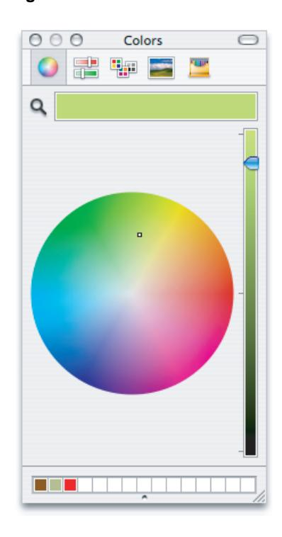

Forinformation on howto use thiswindowin your Carbon program, see *Color Picker Manager Reference*; for Cocoa programs, see *Color Programming Topics for Cocoa*.

## <span id="page-63-2"></span><span id="page-63-0"></span>Dashboard

Dashboard provides a way for users to get information and perform simple tasks quickly and easily. Appearingand disappearingwith a singlekeystroke or mousegesture, Dashboard presents a default or user-defined set of widgets in a format reminiscent of a heads-up display. Each widget is small, visuallyappealing, and clearlyindicative of its purpose.For example, each of the Mac OS X Dashboard widgets shown in [Figure](#page-64-1) 5-3 (page 65) is an attractive, scaled-down interface to a common task.

<span id="page-64-1"></span>**Figure 5-3** Dashboard widgets


You can develop a standalone widget that performs a lightweight, well-defined task or a widget whose taskis actually performed byyourlarger, more functional application. This section summarizes both the high-level and user-interface guidelines you should follow as you design your widget. Step-by-step instructions for how to implement a Dashboard widget, including plentiful code and user interface examples, are available in *Dashboard Tutorial*.

<span id="page-64-2"></span><span id="page-64-0"></span>Many of the user-interface design principles covered in "Human [Interface](#page-38-0) Design" (page 39) are also applicable to Dashboard widgets. Following these guidelines gives users an automatic familiarity with this technology.

### High-Level Design Guidelines for Widgets

Dashboard widgets are small and compact in part because they occupy prime screen space but also because they perform a single, well-defined task. It's especially important to avoid providing functionality that is extraneous to a widget's central task, because this dilutes a widget's usefulness. As with the design of a full-size application, taking the time to carefully define your widget's target audience (see ["Involving](#page-24-1) Users in the Design Process" (page 25)) will help you focus on the task your widget will perform.

As you design your widget, keep these high-level guidelines in mind:

■ A widget's purpose should be immediately apparent to the user.

To achieve this, be sureyou understand the user's mental model of the taskyourwidget performs (for more information on this concept, see ["Reflect](#page-39-0) the User's Mental Model" (page 40)).

■ A widget is not the place to display aggressive company advertising or branding.

Your widget is not merely an entrance to another application, even if that other application performs the processing for the widget's task. If you take advantage of Dashboard's prominence to display a banner ad, for example, users will be likely to stop including your widget in the Dashboard display.

■ A widget is not simply a miniaturized version of a standard application window.

Avoid making your widget look crowded by displaying only the controls that are essential to the task.

### <span id="page-65-0"></span>User-Interface Design Guidelines for Widgets

When you've decided on the widget's task, follow these guidelines for designing the user interface:

- Use color to enhance the visual impact of your widgets.
  - Widgets should be visually stimulating, and good color choices can help convey the type of task the widget performs. As with application icons (described in "Icon Genres and [Families"](#page-130-1) (page 131)),you should consider usingbright, saturated colors for fun, creative tasks and more sombre, desaturated colors for utilitarian tasks
- Don't use Aqua controls on the front of your widget. Instead, design controls that support and enhance the task-oriented appearance of the widget.
- Display the widget's information at once. Dashboard appears and disappears quickly, so you don't want to make the user wait for your content to display.
- The default size of the widget should be small, but it should be able to expand if the task requires it.

Be aware that a user might want to populate the Dashboard with a very large number of widgets. Ifyourwidget is too large and seems to monopolize the screen, a user might choose not to include it.

- If appropriate you can provide a resize control, but recognize that if a user misses this control and clicks outside the widget, Dashboard is hidden.
- The default set of information your widget displays should be minimal and should not require scrolling.
  - If, however, thewidget's function is to provide a lot of information, consider makingthe presence of a scroll bar an option the user can select.
- Use clearly readable fonts.
  - Avoid sacrificing readability to achieve a particular appearance. Focus on building the widget's personality into the contours and the controls you design.
- If appropriate, provide a way for the user to set a few options on the back of the widget (to do this, display an Info button in the lower right quadrant of the widget; see *Dashboard Tutorial* for more information).
  - Use a more subdued version of your color scheme on the back of the widget. This helps the user distinguish the widget's back from its front.

Using Mac OS X Technologies

Provide a Done button on the back of your widget that allows users to return to the front of the widget (for more information on how to provide this control, see *Dashboard Tutorial*).

## <span id="page-66-3"></span><span id="page-66-0"></span>Fonts

<span id="page-66-4"></span>If your program supports typography and text layout using user-selectable fonts, you should use the Fonts window to obtain the user's font selection. Users can select fonts and sizes in both the standard (Figure 5-4) and the minimized (Figure 5-5) views. In the standard view, there are also controls for fine-tuning the display characteristics of fonts. Most important, the Fonts window is implemented for you. You do not have to create a Fonts menu or other special user interface to display and gather font information from the user.

<span id="page-66-1"></span>**Figure 5-4** Fonts window

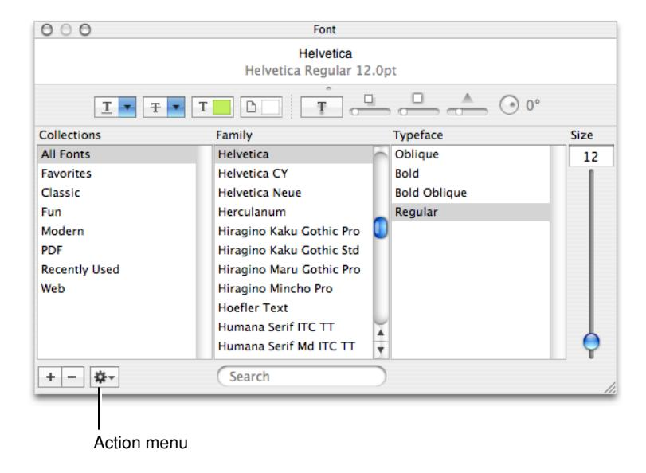

**Figure 5-5** Minimal Fonts window

<span id="page-66-2"></span>

The Fonts window also provides advanced typography controls for fonts that support those options. The user can open a Typography inspector by choosing Typography from the action menu. Figure 5-6 shows the typography controls for the Zapfino font.

<span id="page-67-1"></span>**Figure 5-6** Typography inspector

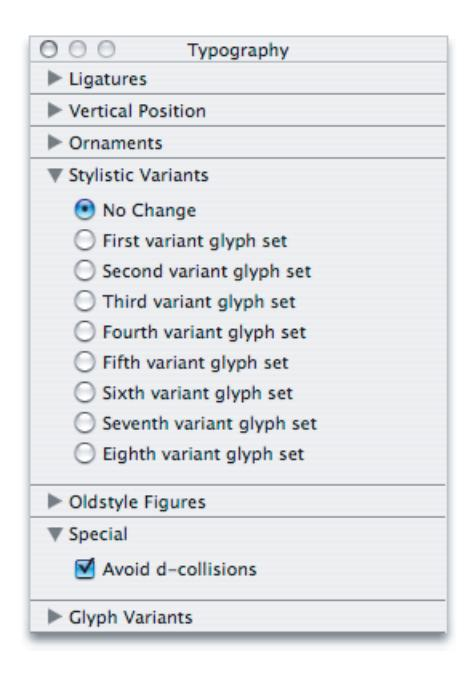

For more information about font selection and management in Carbon applications, see *Managing Fonts: ATS*; for Cocoa applications, see *Font Panel*.

## <span id="page-67-2"></span><span id="page-67-0"></span>Preferences

Preference settings are user-defined parameters thatyour software remembers from session to session. Preferences can be awayforyour application to offer choices to users about howthe application runs. Preferences often affect the behavior of the application or the default appearance of content created with the application.

To reduce the complexity of your application, be picky about which features should have preferences and which should not. Avoid implementing all the preferences you can think of. Instead, be decisive and focus your preferences on the features users might really want to modify.

A preference should be a settingthat the user changes infrequently. If a user might change the attributes of a feature many times in a work session, avoid using preferences to set those attributes. Instead, give the user modeless access to the controls for modifying that feature. For example, you might implement the feature using a menu item or a control in a palette or window.

Because a user does not change preference settings frequently, you should not provide a preferences toolbar item. Instead, provide access to application-level preferences in the application menu (see "The [Application](#page-161-0) Menu" (page 162) for more information) and to document-specific preferences in the File menu (see "The File [Menu"](#page-162-0) (page 163) for more information).

For information on implementing preferences with Cocoa, see *User Defaults Programming Topics for Cocoa*.Forinformation on implementing preferenceswith CoreFoundation, see *Preferences Programming Topics for Core Foundation*.

## <span id="page-68-0"></span>Printing

<span id="page-68-7"></span>Mac OS X includes an advanced printing system. Because of all the options this system provides, it is important that you use the standard printing dialogs so that users understand the options that are available to them without getting lost in features. The printing architecture allows users to print "digital paper" documents that can be sent to a printer, faxed, or saved as a PDF file (Figure 5-7). These features are all available automatically when you use the Mac OS X printing system in your application.

<span id="page-68-2"></span>**Figure 5-7** Print options available in Mac OS X


See ["Printing](#page-225-0) Dialogs " (page 226) for information about the standard printing dialogs. See *Mac OS X Printing System Overview* for general information about the printing system. For information on how to extend the Print or Print Setup dialogs to include options not provided in the standard panes, see *Extending Printing Dialogs*.

## <span id="page-68-10"></span><span id="page-68-1"></span>Security

Mac OS X provides numerous technologies to help you perform secure operations. Using these technologies, you can store secret information locally, authorize a user for specific operations, or transport information securely across a network.

<span id="page-68-11"></span>Consider the following guidelines when you need to work with sensitive information or work in a secure environment:

- <span id="page-68-6"></span>■ Factor out code that requires privileged access into a separate process. Factoring isolates the secure code from the nonsecure code and makes it easier to verify that no rogue operations are occurring that could do damage, whether intentionally or unintentionally.
- <span id="page-68-9"></span>■ Avoid storing passwords and secrets in plain-text files. Even if you restrict access to the file using file permissions, the information is much safer in a keychain.
- <span id="page-68-8"></span>■ Avoid inventing your own authentication schemes. If you want a client-server operation to be secure, use the authorization APIs to guarantee the identity of the client.
- <span id="page-68-5"></span>■ Avoid loading plug-ins from privileged code. Plug-ins receive the same privileges as the parent process.
- <span id="page-68-4"></span><span id="page-68-3"></span>■ Avoid calling potentially dangerous functions, such as system or popen, from privileged code.
- Don't assume only one user is logged in. With fast user switching, multiple users may be active on the same system. See *Multiple User Environments* for more information.
- Don't assume that keychains are always stored as files.
- Avoid relying solely on passwords for authentication. Mac OS X already supports smart card devices. Biometric devices such as fingerprint scanners may also be available some day.

Using Mac OS X Technologies

<span id="page-69-3"></span>Ifyour application stores passwords or other sensitive information, such as credit card numbers, store that information using Keychain Services. Thekeychain mechanism in Mac OS X provides the following benefits:

- It provides a secure, predictable, consistent experience for users when dealing with passwords and other secret information.
- Users can modify settings for all of the passwords as a group or create separate keychains for different activities, with each keychain having its own activation settings. (By default, passwords are modified as a group.)
- The Keychain Access application provides a simple user interface for managing keychains and their settings, relieving you of this task.

For information and links to security-related documentation in Mac OS X, see [Getting](http://developer.apple.com/referencelibrary/GettingStarted/GS_Security/index.html) Started With [Security](http://developer.apple.com/referencelibrary/GettingStarted/GS_Security/index.html).

## <span id="page-69-4"></span><span id="page-69-0"></span>Speech

Mac OS X contains speech technologies that enable software to recognize and speak U.S. English. These technologies provide benefits for all users and present the possibility of a new paradigm for human-computer interaction.

**Speech recognition** is the ability for the computer to recognize and respond to a person's speech. Using speech recognition, users can accomplish tasks comprising multiple steps—for example, "Schedule a meeting next Friday at 3 p.m. with John, Paul, and George" or "Create a 3-by-3 table"—with one spoken command. Mac OS X users can control the computer by voice rather than be limited to the mouse or keyboard; consequently, speech-recognition technology is very important for people with special needs and also for general users. Developers can take advantage of the speech engine and API included with Mac OS X, as well as the built-in user interface.

**Speech synthesis** also called text-to-speech (TTS), converts text into audible speech. It provides a way to deliver information to users without forcing them to shift attention from their current task. For example, the computer could, in the background, deliver such messages as "Your download is complete; one of the files has been corrupted" and "You have email from your boss; would you like to read it now?" TTS is also crucial for users with vision or attention disabilities. As with speech recognition, Mac OS X TTS provides both an API and several user interface features.

<span id="page-69-2"></span><span id="page-69-1"></span>For information about implementing speech synthesis and recognition, see the documents in User Experience Speech Technologies Reference Library.

## Spotlight

Spotlight is a powerful Mac OS X search technologyavailable to both users and application developers. Built on top of Search Kit and integrated with the file system, Spotlight makes searching for files on the computer as easyas searchingtheweb. With Spotlight, users can search forthings usingattributes that have meaning for them, such as the intended audience for a document, the orientation of an

#### Using Mac OS X Technologies

image, or the key signature of the music in an audio file. Information like this (called metadata) is embedded in a file by the application that created it. Spotlight's power comes from being able to extract, store, update, and organize the metadata of files to allow fast, comprehensive searches.

Spotlight is always available to users to help them find their files on the computer. Even better, the search technologies that power Spotlight are available to developers to help them find files to display, plug-ins to load, and data to use in their applications. For example, a developer can define complex queries to find only the types of files an application needs to work with or provide Spotlight functionalityfrom within an application. The rest of this section introduces the user's viewof Spotlight and describes some of the ways an application can take advantage of its features.

<span id="page-70-0"></span>Users can easily initiate a Spotlight search using the Spotlight icon at the far right end of the menu bar. [Figure](#page-70-0) 5-8 (page 71) shows the Spotlight icon and search field displayed when a user clicks the icon.

**Figure 5-8** The Spotlight icon and search field


<span id="page-70-1"></span>In addition, a user can select a word or phrase in a text document and Control-click to reveal a contextual menu that allows a Spotlight search for the selected text. [Figure](#page-70-1) 5-9 (page 71) shows this contextual menu.

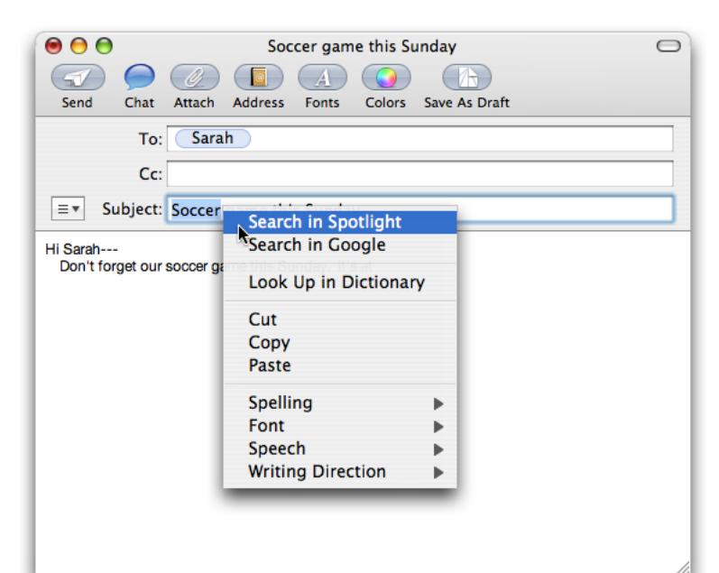

**Figure 5-9** Spotlight search in a contextual menu

Whichever way a search is initiated, Spotlight quickly displays the results, conveniently sorted into categories the user can adjust in Spotlight Preferences. [Figure](#page-71-0) 5-10 (page 72) shows the standard Spotlight results window.

<span id="page-71-0"></span>**Figure 5-10** A Spotlight results window


<span id="page-71-1"></span>To applications, Spotlight provides almost limitless abilityto find files and togive advanced file-search capabilities to users within the context of the application. For example, an application might choose to replicate the Spotlight contextual-menu item (shown in [Figure](#page-70-1) 5-9 (page 71)) with a button that initiates a Spotlight search for the user's selected text. The application could then display its own window that contains all the search results or a filtered subset of them.

An application might also choose to give users access to Spotlight searches in a rounded search field (for more information on this control, see ["Search](#page-268-0) Fields " (page 269)). A user often needs to work on a file that was saved in an atypical place or given an unexpected or forgotten name. If an application offers only a Finder-based Open dialog, it might force the user to waste a lot of time navigating the file system, tryingto rememberwhat the filewas named andwhere itwas saved. Instead, an application can provide a Spotlight-powered search that allows the user to search the entire file system, using meaningful attributes other than the filename.

Applications can also use Spotlight functionality behind the scenes to find needed files or plug-ins. For example, an application that provides a back-up service might allow the user to choose a broad category of file type to back up, such as images. Instead of asking users to identify all the folders that contain their images or just backing up a Pictures folder, the application could perform a Spotlight search to find every image file in the file system, regardless of its location.

Using Mac OS X Technologies

It's important to emphasize that Spotlight is tuned to search for files; it's not intended to do extensive text-based searchingwithin a document. Ifyou need to do fine-grained textual searching,you should use Search Kit technologies instead. An application that stores data in database records, for example, should not base its database search on Spotlight because the data are not stored in separate files. For more information on using Search Kit in your application, see *Search Kit Programming Guide*.

Spotlight offers unparalleled search functionality to both users and developers. Along with these opportunities, however, comes an important developer responsibility. If your application uses a custom file format, you must supply a plug-in (called a Spotlight importer) that describes the types of metadata your file format contains. This ensures that a user will be able to search for the files your application creates usingthe attributes described bythe metadatayourfiles contain.For comprehensive information on how to do this, see *Spotlight Importer Programming Guide*.

## <span id="page-72-6"></span><span id="page-72-0"></span>User Assistance

Mac OS X supports two user help components: Apple Help and help tags. Help tags allow you to provide temporarycontext-sensitive helpwhereas Apple Help allowsyou to provide a more thorough discussion of a topic or procedure.

<span id="page-72-1"></span>Use these mechanisms to provide user help in your application instead of using help mechanisms that are specific to your application. When users refer to help, it is usually because they are having difficulty accomplishing a task and therefore might be frustrated. This is not a good time to make them learn yet another task, such as figuring out a help viewing mechanism that differs from the one they use in all the other applications on their computer.

### <span id="page-72-2"></span>Apple Help

With **Apple Help**, you can display HTML files in **Help Viewer**, a browser-like application designed for displaying and searching help documents. Help Viewer can also display documents containing QuickTime content, open AppleScript-based automations, retrieve updated help content from the Internet, and provide context-sensitive assistance.

<span id="page-72-5"></span>Users can access Apple Help bylaunchingthe Help Viewer application but theywill more commonly access it from your application, in one of three ways:

- <span id="page-72-4"></span>■ **The Help menu.** The Help menu is the far-right item in the application region of the menu bar. The first item in the Help menu should be *ApplicationName* Help, which opens Help Viewer to the first page of your help content. Avoid cluttering the Help menu with URLs, tutorial titles, and such; instead provide access to those resources from within your help content. For more information on the Help menu, see "The Help [Menu"](#page-171-0) (page 172).
- <span id="page-72-7"></span><span id="page-72-3"></span>■ **Help buttons.** When necessary, you can use a Help button to provide easy access to specific sections of your help. When a user clicks a Help button, send either a search term or an anchor lookup (which leads to a specific page or pages) to Help Viewer. It's not necessaryfor every dialog and window in your application to have a Help button. If there is no contextually relevant information in the help, don't display a Help button.
- **From a contextual menu item.** If contextually appropriate help content is available for the object being pointed to, the first item in the contextual menu is Help. As with Help buttons, the menu item can send either a search term or an anchor lookup to Help Viewer.

User Assistance **73**

See *Providing User Assistance With Apple Help (Revision; Preliminary)* for more information on writing Apple Help content and providing it with your application.

### <span id="page-73-2"></span><span id="page-73-0"></span>Help Tags

**Help tags** enableyour application to provide basic help information forits interface elementswithout forcing the user to leave the primary interface.

Help tags are short messages that appear when the user leaves the mouse pointer hovering over an interface element for a few seconds (see Figure 5-11 for an example of a help tag). When the pointer leaves the object, the tag vanishes. If the mouse pointer is not moved, the operating system hides the help tag after about 10 seconds.

<span id="page-73-1"></span>**Figure 5-11** A help tag


The text of a help tag should briefly describe what an interface element does. If you find that you need more than a few words to describe the function of a control, you might want to reconsider the design of your application's user interface.

Define help tags in Interface Builder, where they are called **tooltips**. Here are some guidelines to help you create effective help tag messages.

- Use the fewestwords possible. Trytokeep yourtags to a maximum of 60 to 75 characters. Because help tags are always on, it is important to keep your tag text unobtrusive—that is, *short*—and useful. A tag should present only one concept and that concept should be directly related to the interface element. Localization can lengthen the text by 20 to 30 percent, which is another good reason to keep the tag short.
- Don't put the interface element's name in the tag unless the name helps the user and isn't available onscreen. If an element is referred to by name in the documentation and in the tag, make sure the names match.
- Describe only the element the mouse pointer hovers over.
- You can use a sentence fragment beginning with a verb, for example, "Restores default settings". You can also omit articles to limit the size of the tag. If the tag text is a complete sentence, end it with a period.
- Use help tags to provide functional information for controls that are unique to your application. Don't tag window controls, scroll bars, and other parts of the standard Mac OS X interface.
- You can create contextually sensitive help tags, but you don't have to; the same text can appear when an item is selected, dimmed, and so on. By describing what the interface element accomplishes, you may help the user understand the current state of the control even if the tag is applicable to all situations.
- Write the help tag text in one of these ways, depending on the interface you're documenting:

#### **C HAPTER 5**

Using Mac OS X Technologies

Describe what the user will accomplish by using the control. For example, "Add or remove a language from your list" or "Reduce red tint in the selected area". Most help tags can use this format.

Give extra information to explain the results of the user's action. This kind of tag is most effective in an interface that alreadyincludes some instructional text, because the tagand the interface text work together to describe what the control does and how the user manipulates it.

Define terms that maybe unknown to the user. Thiskind of tagshould be used onlyif the interface already contains instructions to the user.

User Assistance **75**

#### **C HAPTER 5**

Using Mac OS X Technologies

# <span id="page-76-0"></span>Software Installation and Software Updates

First impressions are lasting impressions, so design your installation process accordingly. If users have trouble getting your application up and running, they are going to make judgements about it even before they use it. Your software update mechanism also creates an impression. Users want to be able to get the newest version of your application easily and when it's convenient for them. If users have trouble getting and installing the latest software updates or patches you provide, you may find your technical support costs rising.

This chapter discusses some things you can do to provide the best Macintosh experience before the userlaunchesyour application forthe first time. It also describes howyou can provide an unobtrusive and customizable software update experience to your users.

## <span id="page-76-4"></span><span id="page-76-1"></span>Packaging

<span id="page-76-2"></span>Users begin making assessments of your application based on its presentation in the physical or electronic package in which it arrives. Delivering a great user experience begins with thinking about how your product is presented prior to installation. Whether you distribute your application in a box or online, your goal should be to make the packaging aesthetically pleasing and informative.

### Identify System Requirements

<span id="page-76-3"></span>Includingsystem requirements on your packagingis critical. Be sure to identifywhich version of Mac OS X is required for your software to run. Mac OS X runs on both PowerPC-based and Intel-based Macintosh computers. If your application targets a specific platform or processor, make sure it's clearly stated in your system requirements. Be sure to test on as wide a variety of configurations as you can. If you know your application does not work under certain conditions, make that clear by stating it on your packaging.

ADC members can take advantage of the ADC Compatibility Labs to test applications on a variety of different types of hardware and operating system versions. The labs are equipped with every supported model of Macintosh and every Apple display. Lab technicians can install different versions of operating systems on these machines. This is an excellent resource for you to test your software in many different environments. Visit Apple's ADC Testing [Facilities](http://developer.apple.com/testing/facilities.html) website for the latest details.

## <span id="page-77-0"></span>Bundle Your Software

<span id="page-77-4"></span>If you are creating a new application, make sure it is contained in an application bundle. Application bundles provide a structure for your executables, resources, and configuration files. Application bundles also simplify the user's interaction with your application and make it harder for the user to delete critical resources accidentally. Even applications that must support both Mac OS X and earlier versions of the Mac OS can use the bundle format. For more information on application bundles, see *Bundle Programming Guide*.

## <span id="page-77-1"></span>Installation

<span id="page-77-6"></span><span id="page-77-2"></span>You should ensure that installing your software is a quick and painless experience. This section providesguidelines on howto handle the installation ofyour software.For more information on how to implement different installation mechanisms, see *Software Delivery Guide*.

### <span id="page-77-5"></span>Use Internet-Enabled Disk Images

Ifyou provide userswith a downloadable version ofyour application on the Internet,you can simplify the installation process by packaging your software in an Internet-enabled disk image. Disk images eliminate the need to compress your files, because the disk image itself can compress the enclosed data. After the disk image is downloaded, Mac OS X automatically opens it and mounts it on the user's desktop. All the user has to do is copy over the desired files or run the installer.

<span id="page-77-7"></span><span id="page-77-3"></span>For information on how to create an Internet-enabled disk image, see *Software Delivery Guide*.

### Drag-and-Drop Installation

Bundles make it possible to provide drag-and-drop installation for applications (for more information on application bundles, see *Bundle Programming Guide*). Using bundles is the preferred way to install an application for the following reasons:

- It is easy for users to install and uninstall the application.
- It takes less time to install (only the time needed to copy the bundle).
- You don't have to spend time developing an installer.

Providing drag-and-drop installation does not preclude you from placing files in specific places on the system. When your application is first run, it can copy any needed support files to appropriate places on the system. However,you should avoid usingthis technique to install additional executable code and should instead use it to install preference files, document templates, or other resources that can be regenerated as needed and are not required for the application to run.

Software Installation and Software Updates

**Note:** Ifyou install additional fileswhen your application is firstrun, be sure to install them in obvious places, such as in the Application Support directory. Place your resources in a directory named for your application to make it easy for the user to find these files if they ever need to uninstall your application.

### <span id="page-78-3"></span><span id="page-78-0"></span>Installation Packages

You should support drag-and-drop installation ifyour application bundle contains everything needed for the application to run. However, you might need to create an installation package if any of the following conditions is true:

- You need to install frameworks or other files in specific locations on the user's system.
- You need to install software on any part of the system that requires administrative access.

Ifyou are developingsoftware otherthan an application, the need for an installation package depends on the type of software and where it is installed. For example, you might want to use an installer to install a screen saver, because it involves placing files in either the user's Library directory or the local Library directory.

<span id="page-78-1"></span>You can create an installation package with Package Maker, which is available with the Xcode Tools. For information on installers and packaging, see *Software Delivery Guide*.

### <span id="page-78-2"></span>General Installer Guidelines

When designing your product's installation package, keep the following guidelines in mind:

- Before installing anything, your installer should check the destination volume for previously installed application components.
- Always provide userswith a simple default installation (an "EasyInstall"). Most products should also provide a custom installation; if a user has accidentally thrown away a particular file, for example, the user should be able to restore it without having to reinstall the whole application. (Your application can also check for required files every time it runs and automatically install them if they are missing.)
- Provide choices and explain their impact. For example, one installation option could result in faster performance but consume more diskspace; another might use less space butresult in slower performance. Be sure to make these choices clear in terms that will be meaningful to your users.
- Always let users choose a specific folder as the installation destination. Don't require your application to be installed in a particular location.
- Install files onlyin recommended locations. (For a list of system directories and theirrecommended content, see *File System Overview*.) If users want to delete your application for some reason, most will simply drag its icon to the Trash; avoid littering the user's hard disk with remnant files. If your product uses an installer, it should include an uninstall option that lets the user delete all associated files.
- Advise users about data that might be overwritten during the installation, and provide a way for them to back it up first. Don't overwrite previous user preferences. Deal with version and format differences the first time the user opens the updated application.

Installation **79**

- Provide help where appropriate. For example, in a custom installation pane, clicking a More Info button should explain why the user would want to install the component and the consequences of not installing it.
- Don't uninstall any of the Apple system software in /System.
- Ifyour application installs software that mayalreadybe installed on the user's system, make sure the version you install is newerthan any version the user already has. Make it clearto userswhich version they already have and which version your application needs, and provide an option for skipping installation of that software.
- Indicate progress duringinstallation, such as the current stage and the time remaining.Forrelated information, see "Feedback and [Communication"](#page-41-2) (page 42).
- Provide a Cancel button. If canceling the installation would compromise the system's stability, disable the button during those times. If a user cancels an installation, leave the destination disk in the same state it was in before the installation (in other words, delete any files installed before the process was canceled).
- Consider installing any supporting files when the user first launches your application. This technique alleviates the need to create an installation package and makes it possible for your application to reinstall the files if they are accidentally deleted by the user.
- Consider your application's audience. It's common, for example, for children to install their own games at home, so tailor your instructions for them (don't use confusing or technical terms) and make installation as easy as possible for that audience.

## <span id="page-79-4"></span><span id="page-79-2"></span><span id="page-79-0"></span>Setup Assistants

For products with complex setup procedures, a setup assistant can be helpful. A setup assistant is a small application that guides users through the setup options. You store setup assistants in a location where your application can find them, such as inside your application bundle.

<span id="page-79-3"></span><span id="page-79-1"></span>Your application should open a setup assistant automatically whenever appropriate—when the system detects a new hardware device or the first time the user opens your application, for example. Ideally, the user should use the assistant only once.

The assistant application's icon should be a combination of the setup assistant icon with your application's icon superimposed as a badge in the lower-right corner, as shown in Figure 6-1.

**Figure 6-1** Examples of assistant icons


Figure 6-2 shows the layout for a sample setup assistant window. Notice that the text is flush left within the inset area, and any controls associated with steps in the assistant are indented.

<span id="page-80-0"></span>**Figure 6-2** A typical setup assistant pane


Keep the following guidelines in mind when designing a setup assistant:

- While the assistant is active, displayonlythe application menu (containing About and Quit items) and the Edit menu (containing standard items to assist users in entering text). Don't provide a Help menu (or a Help button); the setup assistant *is* help.
- Provide Go Back and Continue buttons for navigation.
- The assistant window title bar should contain a dimmed close button, an available minimize button, and a dimmed zoom button.
- Title the first pane "Introduction." This pane should explain the purpose of subsequent panes.
- Title the last pane "Conclusion." This pane should tell users what changes were made to their system and how to modify those settings. This pane should have a default Done button and a dimmed Go Back button.
- In most cases, it's best to ask only one question per pane.
- Whenever appropriate, use selection controls that do not support the empty selection to avoid having to ask for the same information more than once.
- Avoid displaying an asterisk or custom icon next to each required text field. Instead, check for empty text fields when the user clicks Continue. If there are any, return to the current pane and display the asterisk or other marker next to the empty text fields.
- As much as possible, use system applications and services to provide intelligent default choices to the user. For example, you can use Bonjour to determine an appropriate IP address.
- Limit the total number of questions to the minimum required to get the job done. The best setup assistant gets users up and running as soon as possible, allowing the main application to present the user with opportunities to refine preferences and settings.

Setup Assistants **81**

- Provide relevant feedback when appropriate. If needed, you can display a progress bar next to the Go Back button (aligning the progress bar's left edge with the left edge of the pane).
- <span id="page-81-2"></span>■ Don't fill the entire screen; users should be able to access other parts of their system while the assistant is open.

## <span id="page-81-0"></span>Updating Installed Applications

<span id="page-81-3"></span>If you need to update an already installed application, you should provide an installer that modifies only the files required for the new version. Remember that files may have been renamed or moved; don't look only in the Applications directory and don't rely exclusively on filenames to identify your application files. Instead, check for creation and modification dates, version numbers, file size, and so on to uniquely identify your application. If you detect multiple versions of your application, provide information about each, such as the location and creation date, so that the user can choose which one to update.

<span id="page-81-1"></span>Macintosh users are accustomed to using Software Update in System Preferences to upgrade the operating system and system software. Upgrading the operating system has implications different from those for upgrading a third-party application, however, and the user experiences for these procedures must reflect this. Third-party applications should not attempt to duplicate the user experience of Software Update. If you want to provide your users with automatic updates, offer a streamlined and consistent user experience following the guidelines in this section.

The goal of a software update mechanism is to be convenient, yet unobtrusive. To achieve this, it's essential thatyour application perform all software update procedures at launch time *only*. In particular, you should avoid checking for updates using a background process or standalone, faceless utility that executes independently of your application. If the user is unaware that such a process is running even after your application quits, the random appearance of update notifications will be unexpected and may be unsettling.

**Note:** If you provide a first-time user experience with your application, such as a setup assistant, it's appropriate to perform a check for available updates while the user is engaged in this task. If a newer version ofyour application is available, allowthe user to upgrade immediately, before the user begins working with the currently installed version. On subsequent launches, follow the guidelines below.

To provide a convenient application-update experience, follow these steps:

- 1. When your application fully launches the first time after installation, start a separate thread that checks for updates.
- 2. If a newer version is available, keep track of this fact in your application. Do not notify the user at this time.
- 3. The *next* time your application launches, check the state of update availability you determined in step 2. If a newer version is available, immediately notify the user.
  - If a newer version is not available, start a separate thread to check for updates and keep track of the results in your application. Do not notify the user at this time.

Software Installation and Software Updates

Your application then repeats step 3 every time it launches. If the user chooses to install a newer version, the upgraded application begins again with step 1.

Using this method confers several advantages:

- You avoid slowing launch time by using a separate thread after your application launches. Checking for updates frequently involves making an Internet connection. If you do this on the application's main thread, it can significantly slow your launch time.
- Users will appreciate receiving an update notification consistently and immediately at launch time, rather than at random times during their work.
  - Because the display of the update notification depends on the quick check of an internal state (not on the completion of a potentially lengthy search for available updates) you ensure it always arrives immediately at launch time.
- You do not have to design additional dialogs that ask the user if update checks should be performed while your application is running.
- You avoid startlingthe userwith unexpected and intrusive update notifications that occur outside the context of your running application.

<span id="page-82-0"></span>Allowthe userto customize the software update behaviorin your preferenceswindow. A user should have the option to allowautomatic software updates and the abilityto checkfor updates immediately. [Figure](#page-82-0) 6-3 (page 83) shows an example of how a sample preferences window can be modified to do this.

**Figure 6-3** An application-update preferences window

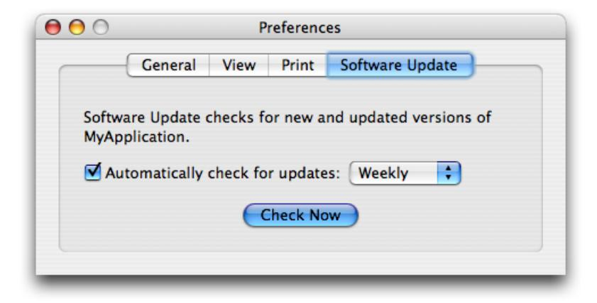

When your application checks its internal update state and finds that a newer version is available, display an alert that describes the type and availability of the update and gives the user the option to get the new version. You can customize the alert for a free or for-purchase update. [Figure](#page-83-0) 6-4 (page 84) shows how the alert for a free update should look.

<span id="page-83-0"></span>**Figure 6-4** An alert to describe the availability of a free application update


Each element of the alert shown in [Figure](#page-83-0) 6-4 (page 84) is required. In many cases, the only changes you need to make are to replace *MyApplication* and *MyCompany* with your application and company names and to badge the caution icon with your application icon. Note that it is important to display the caution icon in this alert because the installation of software has the potential to destroy user data. For more information about the components of an alert (and usingthe caution icon), see "The [Elements](#page-209-2) of an [Alert"](#page-209-2) (page 210). You might also choose to replace the phrase "newer version of" with a phrase like "minor update to", if appropriate.

The software update alert in [Figure](#page-83-0) 6-4 (page 84) displays the main message in emphasized (bold) system font and the explanatory text in small system font. A simplified alert (one that displays only the main message) is not used here because it does notgive the user enough information to customize the update process.

The three required alert buttons shown in [Figure](#page-83-0) 6-4 (page 84) describe the actions the user can take. Each button leads to a specific set of actions your application should perform:

- The Change Preferences default button removes the alert and opens the software update preferences window. After the user adjusts the software update preferences and dismisses the preferences window, your application resumes.
- The Ask Again Later button leaves the internal update state unchanged and removes the alert. Because the state is still set to indicate the availability of an update, the alert will appear again the next time the user launches your application.
- The Upgrade Now button resets the internal state, removes the alert, and initiates a download of the new software. After the download is complete, your application asks the user to save all open documents and updates with the downloaded version.

If you offer a software update for purchase, you should use an alert like the one shown in [Figure](#page-84-0) [6-5](#page-84-0) (page 85).

<span id="page-84-0"></span>**Figure 6-5** An alert to describe the availability of a for-purchase upgrade


The alert in Figure 6-5 is different from the alert for a free software update in two ways:

- The main message clearly states that the new version of the software is for purchase and the question leads the userto clickthe Learn More button if they're interested in receivingthe upgrade.
- The Learn More button resets the application's internal state, removes the alert, and leads toyour company's website where the user can learn more about the update and select a purchasing option. If the user chooses to upgrade the software, a bundle or installation package should be downloaded independently of the currently running application. The user can then install the update when it's convenient.

#### **C HAPTER 6**

Software Installation and Software Updates

# <span id="page-86-0"></span>The Aqua Interface

Aqua is the overall appearance and behavior of Mac OS X. Aqua defines the standard appearance of specific user interface components such as windows, menus, and controls and is also characterized by the anti-aliased appearance of text and graphics, shadowing, transparency, and careful use of color. Aqua delivers standardized consistent behaviors and promotes clear communication of status through animated notifications, visual effects, and more. Designing for Aqua compliance will ensure you provide the best possible user experience for your customers.

Aqua is available to Cocoa, Carbon, and Java software.For Cocoa and Carbon application development, Interface Builder is the best way to begin building an Aqua-compliant graphical user interface. If you are porting an existing Mac OS 9 application to Mac OS X, see the *Carbon Porting Guide* in Carbon Porting Documentation. Java developers can use the Swing toolkit, which includes an Aqua look and feel in Mac OS X.

Read this part to learn about what Aqua provides and how best to take full advantage of it to ensure your application feels completely "at home" in Mac OS X.

#### **P A R T III**

The Aqua Interface

# <span id="page-88-0"></span>User Input

<span id="page-88-6"></span>Like other graphical user interfaces, Mac OS X is optimized for use with a pointing device, such as a mouse. Many users, however, prefer or need to interactwith the computer usingthekeyboard instead of the mouse. In Mac OS X, users have the option of enablingkeyboard access for all functions available using a point-and-click device.

## <span id="page-88-5"></span><span id="page-88-1"></span>The Mouse and Other Pointing Devices

<span id="page-88-4"></span>In the Macintosh interface, the standard pointing device is the mouse. Users can substitute other devices—such as trackballs and stylus pens—that maintain the behavior of direct manipulation of objects on screen.

Moving the mouse without pressing the mouse button moves the **cursor**, or pointer. The onscreen cursor can assume different shapes accordingto the context of the application and the cursor's position. For example, in a word processor, the cursor takes the I-beam shape while it's over the text and changes to an arrow when it's over a tools palette. Change the cursor's shape *only* to provide information to the user about changes in the cursor's function. More information on using cursors correctly can be found in ["Cursors"](#page-142-0) (page 143).

Just *moving* the mouse changes only the pointer's location, and possibly its shape. *Pressing* the mouse button indicates the intention to do something, and *releasing* the mouse button completes the action.

<span id="page-88-3"></span><span id="page-88-2"></span>These guidelines apply to single-button mice and to the primary button of multi-button mice. Note that users can select which button of a multi-button mouse to designate as the primary button in the Keyboard & Mouse System Preferences.

### Clicking

Clicking has two components: pushing down on the mouse button and releasing it without moving the mouse. (If the mouse moves between button down and button up, it's *dragging,* not clicking.)

The effect of a click should be immediate and obvious. If the function of the click is to cause an action (such as clicking a button), the *selection is made* when the button is pressed, and the *action takes place* when the button is released. For example, if a user presses down the mouse button while the pointer is over an onscreen button, thereby putting the button in a selected state, and then moves the pointer *off* the button before releasingthe mouse button, the onscreen button is not clicked. If the user presses an onscreen button and rolls over another button before releasingthe mouse, neither button is clicked.

### <span id="page-89-0"></span>Double-Clicking

<span id="page-89-3"></span>Double-clicking involves a second click that follows immediately after the first click. If the two clicks are close enough to each other in terms of time (as set by the user in Keyboard & Mouse preferences) and location (usually within a couple of pixels), they constitute a double click.

Double-clickingis most commonly used as a shortcut for other actions, such as pressing Command-O to open a document or dragging to select a word. Because not everyone is physically able to perform a double click, it should *never* be the only way to perform an action.

Some applications support triple-clicking. For example, in a word processor, the first click sets the insertion point, the second clickselects thewholeword, and the third clickselects thewhole sentence or paragraph. Supporting more than three clicks is inadvisable.

### <span id="page-89-5"></span><span id="page-89-1"></span>Pressing and Holding

<span id="page-89-2"></span>Pressing means holding down the mouse button while the mouse remains stationary. Pressing by itself should have no more effect than clicking does, except inwell-defined areas such as scroll arrows, where it has the same effect as repeated clicking, or in a Dock tile, where it displays a menu. For example, pressing a Finder icon should select the icon but not open it.

### <span id="page-89-4"></span>Dragging

Dragging means pressing the mouse button, moving the mouse to a new position, and releasing the mouse button. The uses of dragging include selecting blocks of text, choosing a menu item, selecting a range of objects, moving an icon from one place to another, and shrinking or expanding an object.

Dragging a graphic object should move the entire object (or a transparent representation of it), not just the object's outline.

Your application can restrict an object from being moved past certain boundaries, such as the edge of a window. If the user drags an object and releases the mouse button outside the boundary, the object stays in the original location. If the user drags the item out of the boundary and then back in before releasing the mouse button, the object moves to the new location. Your application can also automatically scroll a document if the user moves an object beyond the boundary of a window (see ["Automatic](#page-200-0) Scrolling" (page 201)).

If the user drags a proxy object to an area that would cause that proxy object to disappear, display the poof cursor to indicate that the proxy object will disappear if dragged to that location.

If the user selects an item and begins a drag but releases the item after having moved it three or fewer pixels, the item does not move.

See "Drag and [Drop"](#page-112-0) (page 113) for more information about dragging and automatic scrolling.

## <span id="page-90-3"></span><span id="page-90-0"></span>The Keyboard

<span id="page-90-8"></span>The keyboard's primary use is to enter text. The keyboard may also be used for navigation, but it should always be an alternative to using the mouse. For more information about using the keyboard instead of the mouse, see "Keyboard Focus and [Navigation"](#page-100-0) (page 101).

**Important:** Avoid assigning any key combinations listed in the tables in this section to commands other than those specified in the tables. Even if your application doesn't support all the keyboard equivalents shown, don't assign unused combinations to commands that conflictwith those specified in this section.

### <span id="page-90-1"></span>The Functions of Specific Keys

<span id="page-90-5"></span>There are fourkinds ofkeys: characterkeys, modifierkeys, arrowkeys, and function keys. A **character key**sends a characterto the computer. When the user holds down a **modifier key,** it alters the meaning of the character key being pressed or the meaning of a mouse action.

**Note:** Not all the keys described here exist on all keyboards. Don't depend on a key as the only way for users to accomplish a task. You cannot assume anythingaboutwhich keyboard (if any) is connected to a computer.

### <span id="page-90-4"></span><span id="page-90-2"></span>Character Keys

<span id="page-90-6"></span>Characterkeys include letters, numbers, punctuation, the Space bar, and nonprintingcharacters—Tab, Enter, Return, Delete (or Backspace), Clear, and Esc (Escape). It is essential that your application use these keys consistently.

#### **Space Bar**

In text, pressing the Space bar enters a space between characters.

<span id="page-90-7"></span>When full keyboard access is turned on, pressing the Space bar selects the item that currently has the keyboard navigation focus (the equivalent of clicking the mouse button).

#### **Tab**

In text-oriented applications, the Tab key moves the insertion point to the next tab stop. In other contexts, Tab is a signal to proceed; it means "move to the next item in a sequence." The next item can be a table cell or a dialog text field. Shift-Tab navigates in the reverse direction. Pressing Tab can cause data to be entered before focus moves to the next item. For more details about navigating with the Tab key, see "Keyboard Focus and [Navigation"](#page-100-0) (page 101).

The Keyboard **91 2006-10-03 | © 1992, 2001-2003, 2006 Apple Computer, Inc. All Rights Reserved.**

#### <span id="page-91-2"></span>**Enter**

Most applications add information to a document as soon as the user enters it. In some cases, however, the application may need towait until awhole collection of information is available before processing it. The Enter key tells the application that the user has finished entering information in a particular area of the document, such as a text field. While the useris enteringtext into a *text* document, pressing Enter has no effect.

If a dialog has a default button, pressing Enter (or Return) is the same as clicking it.

#### <span id="page-91-5"></span>**Return**

In text, the Return key inserts a carriage return (a line break) and moves the insertion point to the beginning of the next line. In arrays, the Return key signals movement to the leftmost field one step lower (like a carriage return on a typewriter). As with Tab, pressing Return can cause data to be entered before focus moves to the next item.

If a dialog has a default button, pressing Return (or Enter) is the same as clicking it.

#### <span id="page-91-1"></span>**Delete (or Backspace)**

<span id="page-91-4"></span>Generally, if an item is selected, pressing Delete (or Backspace) removes the selectionwithout putting it on the Clipboard. If nothingis selected, pressing Delete removes the character precedingthe insertion point without putting it on the Clipboard. The Delete key has the same effect as the Delete command in the Edit menu.

**Note:** The Deletekeyis different from theForward Delete (Fwd Del)key(labeled *Del*),which removes characters following the insertion point. See ["Forward](#page-96-0) Delete (Fwd Del)" (page 97).

The Option key can be used to extend a deletion to the next semantic unit (such as a word). The Command key can extend a deletion to the next semantic unit beyond that supported by Option. Recommended key combinations for text applications are Command-Delete to delete the previous word and Command–Fwd Del to delete the next word. Option-Delete could delete either the word containing the insertion point or the part of the word to the left of the insertion point, depending on what makes the most sense in your application; Option–Fwd Del could delete the part of the word to the right of the insertion point.

### <span id="page-91-0"></span>**Clear**

<span id="page-91-3"></span>The Clear key has the same effect as the Delete command in the Edit menu: It removes the selection without putting it on the Clipboard. Not all keyboards have a Clear key, so don't require its use in your application.

#### **Esc (Escape)**

The Esc (Escape)keybasically means "let me out of here." It has specific meanings in certain contexts. The user can press Esc in the following situations:

- In a dialog, instead of clicking Cancel
- To stop an operation in progress (such as printing), instead of pressing Command-period
- To cancel renaming a file or an item in a list

User Input

#### ■ To cancel a drag in progress

<span id="page-92-3"></span>Pressing Esc should never cause the user to back out of an operation that would require extensive time orworkto reenter. When the user presses Esc duringa lengthyoperation, displaya confirmation dialog to be sure that the key wasn't pressed accidentally.

### <span id="page-92-5"></span>Modifier Keys

Modifier keys alter the way other keystrokes or mouse clicks are interpreted. You should use these keys—Shift, Caps Lock, Option, Command, and Control—consistently as described here.

#### <span id="page-92-7"></span>**Shift**

When pressed at the same time as a character key, the Shift key produces the uppercase alphabetic letter or the upper symbol on the key.

The Shift key is also used with the mouse for extending a selection or for constraining movements in graphics applications. For example, in some applications pressing Shift while using a rectangle tool draws squares.

#### <span id="page-92-0"></span>**Caps Lock**

When activated, the Caps Lock key has the same effect on alphabetic keys as the Shift key, but it has no effect on nonalphabetic keys. When the Caps Lock key is down, the user must press Shift to type the upper character on a nonalphabetic key.

#### <span id="page-92-6"></span>**Option**

When used with other keys, the Option key produces special symbols. The Keyboard Viewer, which users can add to the Input menu in the International pane of System Preferences, shows which keys generate each symbol.

<span id="page-92-1"></span>The Option key can also be used with the mouse to modify the effect of a click or drag. For example, in some applications pressing Option while dragging an object makes a copy of the object.

### **Command**

<span id="page-92-2"></span>On most keyboards, the Command key is labeled with a cloverleaf symbol ( ) and an Apple logo ( ). Pressing the Command key at the same time as a character key tells the application to interpret the key as a command rather than a character. It can also be used with the mouse to modify the effect of a click or drag. Key combinations that use the Command key are described in ["Keyboard](#page-97-0) [Shortcuts"](#page-97-0) (page 98).

### <span id="page-92-4"></span>**Control**

The Controlkeyis used to modifythe functions of otherkeys. Combinedwith a mouse click, it displays contextual menus (see ["Contextual](#page-172-1) Menus" (page 173)).

Control-F7 temporarilyoverrides a user's preference for default navigation orfullkeyboard navigation in windows and dialogs. For more information, see "Keyboard Focus and [Navigation"](#page-100-0) (page 101).

User Input

**Cocoa:** In Cocoa applications, the Control key has additional defined behaviors, as described in "Text System Defaults and Key Bindings" in *Event Handling Programming Guide for Cocoa* in Cocoa Events & Other Input Documentation.

### <span id="page-93-5"></span>Arrow Keys

<span id="page-93-1"></span>Apple keyboards have four arrow keys: Up Arrow, Down Arrow, Left Arrow, and Right Arrow. They can be used alone or in combination with other keys. Keyboard combinations using the arrow keys should be used only for shortcuts for mouse actions. It is *never* appropriate to implement only a keyboard combination and not provide a mouse-based way to perform the same action.

#### <span id="page-93-2"></span>**Appropriate Uses for the Arrow Keys**

You can use arrow keys in these ways:

- In text, the arrow keys move the insertion point. When used with the Shift key, they extend or shrinkthe selection. If the user makes a selection and then presses the Right Arrowor Left Arrow key, the selection shrinks to zero length and the insertion point moves to the right or left edge of the selection.
- In lists, the arrow keys change the selection.
- In a graphics application, the arrow keys can be used to move a selected object the smallest possible increment (one pixel or one grid unit).
- In full keyboard access mode, the arrow keys move between values within a control.

Don't use the arrow keys to:

- <span id="page-93-0"></span>■ Move the mouse pointer onscreen
- <span id="page-93-4"></span>■ Duplicate the function of the scroll bars

#### **Moving the Insertion Point**

When the insertion point moves vertically in a text document, its horizontal position is maintained in terms of screen pixels, not characters (in other words, the insertion point could move from the twenty-fifth character in a line down to the fiftieth character, depending on the font and size). As the insertion point moves from line to line, keep it as close as possible to its original horizontal position, moving it slightly left or right to the nearest character boundary.

The Option and Command keys are used as semantic modifiers with the arrow keys. As a general rule, the Option key increases the size of the semantic unit by 1 compared to the arrow keys alone, and the Command keyenlarges the semantic unit again. The application determineswhat the semantic units are. In a word processor, typically the units are characters, words, lines, paragraphs, and documents. In a spreadsheet, a basic semantic unit could be a cell.

<span id="page-93-3"></span>Table 7-1 describes the appropriate behavior of the arrow keys in text documents and fields. In some cases, the behavior describes what happens when the indicated keys are pressed more than once in succession.

<span id="page-94-0"></span>**Table 7-1** Moving the insertion point with the arrow keys

<span id="page-94-13"></span><span id="page-94-12"></span><span id="page-94-11"></span><span id="page-94-10"></span><span id="page-94-9"></span>

| Key                 | Moves insertion point                                                                                                                      |
|---------------------|--------------------------------------------------------------------------------------------------------------------------------------------|
| Right Arrow         | One character to the right                                                                                                                 |
| Left Arrow          | One character to the left                                                                                                                  |
| Up Arrow            | To the line above, to the nearest character boundary at the same<br>horizontal location                                                    |
| Down Arrow          | To the line below, to the nearest character boundary at the same<br>horizontal location                                                    |
| Option–Right Arrow  | To the end of current word, then to the end of the next word                                                                               |
| Option–Left Arrow   | To the beginning of the current word, then to the beginning of the<br>previous word                                                        |
| Option–Up Arrow     | To the beginning of the current paragraph, then to the beginning of the<br>previous paragraph                                              |
| Option–Down Arrow   | To the end of the current paragraph, then to the end of the next<br>paragraph (not to the blank line after the paragraph, if there is one) |
| Command–Right Arrow | To the next semantic unit, typically the end of the current line, then the<br>end of the next line                                         |
| Command–Left Arrow  | To the previous semantic unit, typically the beginning of the current<br>line, then the previous unit                                      |
| Command–Up Arrow    | Upward in the next semantic unit, typically the beginning of the<br>document                                                               |
| Command–Down Arrow  | Downward in the next semantic unit, typically the end of the document                                                                      |

<span id="page-94-8"></span><span id="page-94-7"></span><span id="page-94-6"></span><span id="page-94-5"></span><span id="page-94-3"></span><span id="page-94-2"></span>**Note:** For non-Roman script systems, Command–Left Arrowand Command–Right Arroware reserved for changing the direction of keyboard input.

#### <span id="page-94-4"></span><span id="page-94-1"></span>**Extending Text Selection With the Shift and Arrow Keys**

Table 7-2 describes how to extend text selection by pressing the Shift key with the arrow keys.

**Table 7-2** Extending text selection with the Shift and arrow keys

| Keys              | Extends selection                                                                       |
|-------------------|-----------------------------------------------------------------------------------------|
| Shift–Right Arrow | One character to the right                                                              |
| Shift–Left Arrow  | One character to the left                                                               |
| Shift–Up Arrow    | To the line above, to the nearest character boundary at the same<br>horizontal location |

<span id="page-95-6"></span>

| Keys                      | Extends selection                                                                                                                                              |
|---------------------------|----------------------------------------------------------------------------------------------------------------------------------------------------------------|
| Shift–Down Arrow          | To the line below, to the nearest character boundary at the same<br>horizontal location                                                                        |
| Shift–Option–Right Arrow  | To the end of the current word, then to the end of the next word                                                                                               |
| Shift–Option–Left Arrow   | To the beginning of the current word, then to the beginning of the<br>previous word                                                                            |
| Shift–Option–Up Arrow     | To the beginning of the current paragraph, then to the beginning<br>of the next paragraph                                                                      |
| Shift–Option–Down Arrow   | To the end of the current paragraph, then to the end of the next<br>paragraph (include the blankline between paragraphs in cut, copy,<br>and paste operations) |
| Command–Shift–Right Arrow | To the next semantic unit, typically the end of the current line                                                                                               |
| Command–Shift–Left Arrow  | To the previous semantic unit, typically the beginning of the<br>current line                                                                                  |
| Command–Shift–Up Arrow    | Upward in the next semantic unit, typically the beginning of the<br>document                                                                                   |
| Command–Shift–Down Arrow  | Downward in the next semantic unit, typically the end of the<br>document                                                                                       |

<span id="page-95-3"></span><span id="page-95-2"></span><span id="page-95-1"></span><span id="page-95-0"></span>If no text is selected, the extension begins at the insertion point. If text is selected by dragging, then the extension begins at the selection boundary. For example, in the phrase *stop time,* if the user places the insertion point between the "s" and "t" and then presses Shift–Option–Right Arrow, *top* is selected. However, if the user double-clicks so the whole word is selected, and then extends the selection left or up, it's as if the insertion point were before the "s." If the user extends the selection right or down, it's as if the insertion point were between the "p" and the space after the word.

<span id="page-95-4"></span>Reversing the direction of the selection deselects the appropriate unit. In the previous example, if the word *stop* is selected and the user presses Shift–Option–Right Arrow, so *stop time* is selected, and then presses Shift–Option–Left Arrow, *time* is deselected and *stop* remains selected.

#### **Moving the Insertion Point in "Empty" Documents**

<span id="page-95-5"></span>Various text-editing programs treat empty documents in different ways. Some assume that an empty document contains no characters, in which case clicking at the bottom of a blank window causes the insertion point to appear at the top. In this situation, Down Arrow cannot move the insertion point into the blank space because there are no characters there.

Other applications treat an empty document as a page of space characters, in which case clicking at the bottom of a blank window puts the insertion point where the user has clicked and lets the user type characters there, overwriting the spaces. Whichever of these methods you choose for your application, it's essential that you be consistent throughout.

### <span id="page-96-3"></span>Function Keys

<span id="page-96-5"></span>There are 15 nondedicated function keys on desktop Macintosh keyboards (F1 through F15). Desktop Macintosh keyboards provide the following six dedicated function keys with standard behaviors. Because not all Macintosh computers have all function keys, don't rely on these keys for critical keyboard shortcuts. For example, portable computers usually have 12 nondedicated function keys (F1 through F12), not 15 and don't have Help keys or Forward Delete keys.

#### <span id="page-96-4"></span>**Help**

<span id="page-96-0"></span>Pressing the Help key may invoke the application's help in Help Viewer. The key combination Command-Shift-/ (sometimes shortened to Command-?) should always display the application's help in Help Viewer.

#### <span id="page-96-2"></span>**Forward Delete (Fwd Del)**

Pressing the Forward Delete (labeled Del) key deletes the character *after* the insertion point, shifting everything following the removed character one position back. The effect is that the insertion point remains stationary while it "vacuums" the character or selection ahead of it.

If somethingis selectedwhen Fwd Del is pressed, it has the same effect as pressing Delete (Backspace) or choosing Delete from the Edit menu.

You can support Option–Fwd Del to delete the next larger semantic unit, as described in ["Moving](#page-93-0) the [Insertion](#page-93-0) Point" (page 94), but deleting more than one word at a time is inadvisable. Users prefer to select large amounts of text with the mouse so they have more control over what they're deleting.

#### <span id="page-96-1"></span>**Home, End**

Pressing the Home key is equivalent to moving the scrollers all the way to the top and to the left. In a text document, for example, pressing Home scrolls to the beginningof the document; in a spreadsheet, it may scroll to the beginning of the spreadsheet or to the beginning of a row. These keys should also work in scrolling lists to display the top or bottom of the list.

End is the opposite of Home: It scrolls to the end of a document.

<span id="page-96-6"></span>If the beginningor end of the document is alreadyreached, pressing Home or End produces a system alert sound. Pressing the Home or End key has no effect on the location of the insertion point or selected data.

#### **Page Up, Page Down**

Pressing Page Up or Page Down scrolls the document up or down one page. If an entire page can't be displayed in the window, these keys first scroll incrementally up or down, until the top or bottom of the page is visible, before scrolling to the next page. These keys should also work in scrolling lists.

If the beginning or end of the document is reached, pressing Page Up or Page Down produces a system alert sound. Pressing the Page Up or Page Down key has no effect on the location of the insertion point or selected data.

The Keyboard **97 2006-10-03 | © 1992, 2001-2003, 2006 Apple Computer, Inc. All Rights Reserved.**

User Input

## <span id="page-97-0"></span>Keyboard Shortcuts

<span id="page-97-4"></span><span id="page-97-3"></span>Keyboard shortcuts are used throughout Mac OS X to provide quick ways for users to initiate certain actions. Many are provided by the operating system to meet both general usability needs and accessibility needs. The operating system therefore reserves certain keys and keyboard combinations for its use. These combinations, listed in Table 7-3 and Table 7-4, affect all applications and should not be used for anyotherfunction. Otherkeyboard shortcuts are used bythe Universal Access features in Mac OS X and should be avoided.

In addition to the keyboard shortcuts reserved by the system, there are a large number of keyboard shortcuts that have a well established meaning, such as Command-S for Save and Command-Q for Quit. Users accustomed to running applications in Mac OS X expect these keyboard shortcuts to be available and to mean the same thingin each application they use. An application that overrides these shortcuts, such as one that uses Command-Q for a Query command instead of Quit, runs the risk of unnecessarily confusing and frustrating its users.

These common keyboard shortcuts are not reserved bythe system, but theyare highlyrecommended for applications that offer the associated commands. If your application does not offer all of these common commands, be sure you don't override these keyboard shortcuts and associate them with other commands your application does implement. A complete list of both system-reserved and commonly used keyboard shortcuts in Mac OS X is provided in ["Keyboard](#page-308-0) Shortcuts Quick [Reference"](#page-308-0) (page 309).

<span id="page-97-2"></span>You may also define keyboard shortcuts in your application for frequently used commands. Some guidelines on how to create appropriate shortcuts are in "Creating Your Own [Keyboard](#page-98-1) [Shortcuts"](#page-98-1) (page 99). Other sections of this document list recommended keyboard shortcuts, where appropriate, to help you provide a consistent and familiar user experience in your application.

### <span id="page-97-1"></span>Reserved Keyboard Shortcuts

Don't use the keys and key combinations in Table 7-3 for actions other than those listed in the table.

**Table 7-3** Keyboard shortcuts reserved by the operating system

| Keys                           | Action                                            |
|--------------------------------|---------------------------------------------------|
| Esc                            | Cancel the current action                         |
| Command-Tab                    | Activate the most recently used open application  |
| Command-Shift-Tab              | Activate the least recently used open application |
| Command-Option-D               | Show or hide the Dock                             |
| Command-H                      | Hide the active application                       |
| Command-Option-H               | Hide other applications (all but the active one)  |
| Command-Shift-Q                | Log out                                           |
| Command-Shift-Option-Q         | Log out without confirmation                      |
| Command-Shift-Option-Control-Q | Force log out without confirmation                |

| Keys               | Action                                                 |
|--------------------|--------------------------------------------------------|
| Command–Space bar  | Show or hide Spotlight search field                    |
| Command-Option-Esc | Open the Force Quit dialog                             |
| Command-F5         | Turn VoiceOver on or off                               |
| Control-F1         | Turn full keyboard navigation on or off                |
| Control-F7         | Toggle keyboard navigation in windows and dialogs      |
| F9                 | Tile or untile all open windows                        |
| F10                | Tile or untile all open windows in current application |
| F11                | Hide or show all open windows                          |
| F12                | Display or hide Dashboard                              |

<span id="page-98-7"></span>Mac OS X also provides full keyboard access mode, in which users can navigate through windows and dialogs. When this mode is active, otherkeyboard combinations maybe reserved by default. (See *Accessibility Overview*.)

**Important:** Your application should not override the implementation ofkeyboard focus and navigation in Mac OS X. These features provide functionality for users with special needs.

<span id="page-98-8"></span><span id="page-98-0"></span>Table 7-4 shows several key combinations that are reserved for use with localized versions of system software, localized keyboards, keyboard layouts, and input methods. These key combinations don't correspond directly to menu commands.

<span id="page-98-6"></span>**Table 7-4** Key combinations reserved for international systems

<span id="page-98-5"></span><span id="page-98-4"></span><span id="page-98-3"></span><span id="page-98-2"></span>

| Keys                           | Action                                                               |
|--------------------------------|----------------------------------------------------------------------|
| Command–Space bar              | Rotate through enabled script systems                                |
| Command–Option–Space bar       | Rotate through keyboard layouts and input methods within a<br>script |
| Command–modifier key–Space bar | Apple reserved                                                       |
| Command–Right Arrow            | Change keyboard layout to current layout of Roman script             |
| Command–Left Arrow             | Change keyboard layout to current layout of system script            |

### <span id="page-98-9"></span><span id="page-98-1"></span>Creating Your Own Keyboard Shortcuts

Apple may reserve other keyboard shortcuts in the future, so be careful about adding your own. Before you consider creating a keyboard shortcut, be sure to look at the keyboard shortcuts listed in ["Keyboard](#page-308-0) Shortcuts Quick Reference" (page 309) so you can avoid overriding the shortcuts users already know.

User Input

You might also consider examining the keyboard shortcuts used in other applications that target the same user audience your application targets. If your users are likely to be familiar with these other applications, you should try to avoid overriding the shortcuts they're used to using.

You should provide keyboard shortcuts *only for frequently used commands*, not for every command. Presenting the user with too many keyboard shortcuts can be overwhelming and can make an application's user interface seem difficult to learn.

<span id="page-99-0"></span>Use the Command key as the main modifier key for keyboard equivalents. For a command that complements another more common command, you can add Shift. The table below shows some recommended keyboard equivalents usingShift and theirrelationwith the command theycomplement.

**Table 7-5** Recommended keyboard shortcuts using Shift to complement other commands

| Keys            | Command                                    | Complemented command   |
|-----------------|--------------------------------------------|------------------------|
| Command-Shift-A | Deselect All                               | Command-A (Select All) |
| Command-Shift-G | Find Previous                              | Command-G (Find Again) |
| Command-Shift-P | Page Setup                                 | Command-P (Print)      |
| Command-Shift-S | Save As                                    | Command-S (Save)       |
| Command-Shift-V | Paste as (Paste as Quotation, for example) | Command-V (Paste)      |
| Command-Shift-Z | Redo                                       | Command-Z (Undo)       |

**Note:** Command-Shift-Z would be used for Redo only if Undo and Redo are separate commands (rather than toggled using Command-Z).

<span id="page-99-1"></span>If there's a third, less common command that's related to a pair of commands that use Command and Command-Shift, you can use Command-Option for the third command's keyboard equivalent. In the example in Table 7-6, Save All could be a dynamic menu item (see ["Naming](#page-150-2) Menu Items" (page 151)) that appears in place of Savewhen the user presses the Option key(rather than a separate menu item). Use combinations like these very rarely.

**Table 7-6** Example of using Option to modify a shortcut already using Command

| Keys             | Command  |
|------------------|----------|
| Command-S        | Save     |
| Command-Shift-S  | Save As  |
| Command-Option-S | Save All |

Also use Option for a keyboard shortcut that is a convenience or power-user feature. For example, the Finder uses Command-Option-W for Close All Windows and Command-Option-M for Minimize All Windows.

User Input

Because the Control key is already used by some of the universal access features as well as in Cocoa text fields where Emacs-style key bindings are often used, it should be used as a modifier key only when necessary.

<span id="page-100-6"></span>Rememberthat otherlanguages mayrequire modifierkeys togenerate certain characters.For example, on a French keyboard, Option-5 generates the "{" character. You can safely use the Command key as a modifier, but avoid using Command and an additional modifier with characters not available on all keyboards. If you must use a modifier key in addition to the Command key, try to use it only with the alphabetic characters (*a* through *z*).

When adding custom keyboard shortcuts, try to avoid shortcuts that add a modifier key (such as Option or Shift) to an existing shortcut if the shortcuts have an unrelated function. For example, don't use Shift-Command-Z as a keyboard shortcut for a command that is unrelated to Undo. Using that shortcut for Redo is appropriate, but usingit for somethinglike Calculate or Check Mail is confusing. If you can't find a unique and easy-to-use keyboard shortcut for a command, don't use one at all; keep in mind that users may have difficulty pressing multiple modifier keys anyway.

### User-Defined Keyboard Shortcuts

<span id="page-100-2"></span>Users may modify your application's keyboard shortcuts and some of the system in Keyboard & Mouse preferences. Even though users can remap keyboard shortcuts, you should adhere to the shortcuts recommended throughout this document. Doing so provides a more consistent user experience. See "Keyboard Shortcuts Quick [Reference"](#page-308-0) (page 309) for a list of all the reserved and recommended combinations.

## <span id="page-100-5"></span><span id="page-100-4"></span><span id="page-100-3"></span><span id="page-100-0"></span>Keyboard Focus and Navigation

In **default keyboard access mode,**focus moves only between fields that receive keyboard input. Mac OS X also provides the option of **full keyboard access mode,** in which users can navigate through windows and dialogs. This section discusses the default keyboard access mode. For information on the full keyboard access mode, see *Accessibility Overview*.

When using the mouse is undesirable, difficult, or impossible, users can use the keyboard to move the onscreen focus (highlight) to text entry fields, list boxes that support type-ahead, scrolling lists, column views, and list views. In Roman systems, focus always begins at the first field that accepts keyboard input and follows a reading path from upper left to bottom right.

<span id="page-100-1"></span>Focus is indicated with a ring in the appearance color (Aqua or Graphite) as shown in Figure 7-1 and Figure 7-2.

**Figure 7-1** Keyboard focus for a text field


The Keyboard **101 2006-10-03 | © 1992, 2001-2003, 2006 Apple Computer, Inc. All Rights Reserved.**

<span id="page-101-1"></span>**Figure 7-2** Keyboard focus for a scrolling list

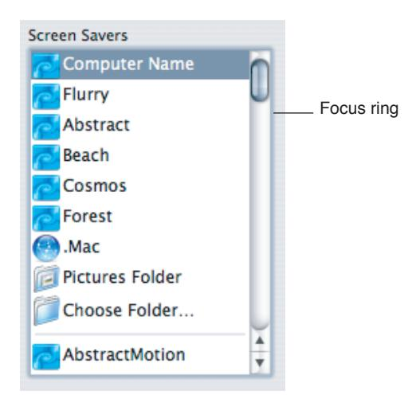

<span id="page-101-2"></span>In list and column views, selected items should be highlighted to the full columnwidth orrowheight. In column view, the selected item has a dark highlight and the parent item has a lighter highlight. When a window becomes inactive, all selections inside it should become the lighter highlight color.

**Figure 7-3** Primary highlight color on child item; secondary color on parent

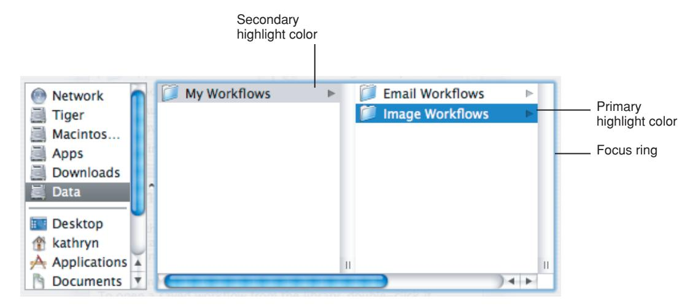

<span id="page-101-4"></span><span id="page-101-3"></span><span id="page-101-0"></span>Pressing the Tab key navigates between controls. Shift-Tab navigates in the reverse direction. The arrow keys provide navigation within controls. In list views, the Right Arrow and Left Arrow keys open and close disclosure triangles.

### Type-Ahead and Key-Repeat

When the user types faster than the computer can handle or when the computer is unable to process the keystrokes, the keystrokes are queued for later processing. This queuing is called **type-ahead.** There is a limit (varying with the computer) to the number of keystrokes that can be queued, but it's usually not reached unless the user types while the application is performing a lengthy operation.

User Input

When a character key is held down for a certain amount of time, it starts repeating automatically. The user can make adjustments to this feature, called **key-repeat,** in Keyboard & Mouse preferences.

An application can tell whether keystrokes are generated by key-repeat or by the same key being pressed numerous times. Your application can disregard key-repeatkeystrokes; it should ignore them in keyboard shortcuts that begin with the Command key.

Key-repeat works only when the application is ready to accept keyboard input; it does not function during type-ahead.

## <span id="page-102-3"></span><span id="page-102-0"></span>Selecting

<span id="page-102-4"></span>Before performingan operation on an object, the user must select it to distinguish it from other objects. There is always immediate visual feedback to show that something is selected.

Selecting an object never alters the object itself, and a selection is always undoable by clicking outside the selection.

How something is selected depends on what it is. It's useful to distinguish among three types of objects that are each dealt with in a different way when selected:

- **Text.** An application considers all text appearing together in a particular context as a block of text—a one-dimensional string of characters. A block of text can range from a single field, as in a dialog, to an entire document, as in a word processor. Regardless of where it appears, text is edited in the same way.
- **Arrays of fields**. A one-dimensional array of fields is a *list* and a two-dimensional array is a *table*. Each field contains information such as text or graphics.
- **Graphics.** For the purposes of this discussion, a graphic, or picture, is a discrete object that can be selected individually.

<span id="page-102-1"></span>The following sections discuss the general methods of selecting and the specific methods that apply to text, arrays, and graphics.

## Selection Methods

<span id="page-102-2"></span>This section describes selection techniques.

### Selection by Clicking

The most straightforward method of selecting an object is by clicking it once. Icons, for example, are selected in this way in the Finder.

<span id="page-103-0"></span>**Figure 7-4** Selection of a single item


### <span id="page-103-2"></span>Selection by Dragging

The user can select a range of some objects by following this procedure:

- 1. The user positions the pointer at one corner of the range and presses the mouse button. This position is called the **anchor point** of the range.
- 2. Without releasing the mouse button, the user moves the pointer in any direction.

As the pointer moves, visual feedback indicates the objects that would be selected if the mouse button is released.Fortext and arrays, the selected area is continuously highlighted.Forgraphics, a dotted rectangle expands or contracts to show the selected area. If appropriate, the view should scroll to allow extending the selection beyond a window.

<span id="page-103-1"></span>3. When the desired range is selected, the user releases the mouse button. The point at which the button is released is called the **active end** of the range.

<span id="page-103-3"></span>**Figure 7-5** Selection of a range

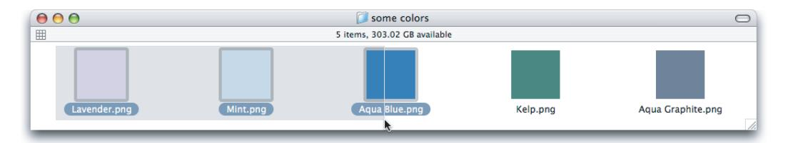

### <span id="page-103-4"></span>Changing a Selection

A user can extend a selection by holding down the Shift key and clicking the mouse button. This action is called **Shift-clicking.**

In text, if the user Shift-clicks within an already selected range, the new range is smaller than the old range.

In an array, a Shift-click can extend the selected range or it can move the selection from the current cell to wherever the user Shift-clicks.

There are two models for extending a continuous selection using Shift-click. In the **addition model,** new text is added to a current selection. In the **fixed-point model,** the user can extend the selection on either side of the insertion point. Figure 7-6 illustrates the results of consecutive steps in both models.

User Input

<span id="page-104-0"></span>**Figure 7-6** Shift-clicking in the addition model and the fixed-point model

| Step                                                                                           | Addition model | Fixed-point model |
|------------------------------------------------------------------------------------------------|----------------|-------------------|
| 1. User sets insertion point<br>by clicking before the<br>word "attention".                    |                |                   |
| 2. User extends the selection<br>to the right by Shift-clicking<br>after the word "behind".    |                |                   |
| 3. User extends the selection<br>to the left by Shift-clicking<br>before the word "Pay".       |                |                   |
| 4. User extends the selection<br>to the right by Shift-clicking<br>at the end of the sentence. |                |                   |

<span id="page-104-2"></span>When considering which model to use in your application, keep in mind that the addition model provides more flexibility by allowing users to extend a selection in *both* directions.

<span id="page-104-3"></span><span id="page-104-1"></span>A Shift-clickshould result in a **continuous selection**—the selection is extended to include everything between the old anchor point and the new active end. A Command-click should result in a discontinuous selection. With **discontinuous selection,** in which the user can extend a selection by adding nonadjacent objects to already selected objects, the objects *between* the current selection and the new object are *not* included in the selection.

**Figure 7-7** Discontinuous selection

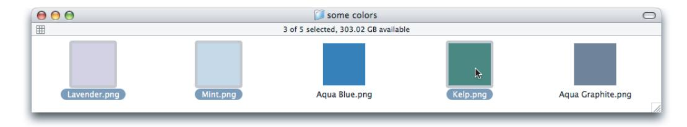

In arrays and text inwhich a Shift-clickextends a continuous selection, the user can make discontinuous selections by holding down the Command keyand clicking. Each Command-clickadds the newobject to the existingselection. If one of the objects selectedwith Command-clickis alreadywithin an existing part of the selection, then it is removed from the selection instead of being added.

<span id="page-105-1"></span>**Figure 7-8** Discontinuous selection within an array

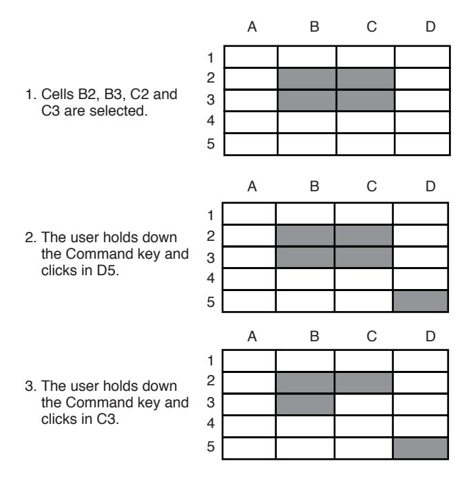

<span id="page-105-0"></span>Not all applications support discontinuous selections, and those that do might restrict the operations a user can perform on them. For example, a word processor might allow the user to choose a font after makinga discontinuous selection, but not allowthe userto type replacement characters, because it wouldn't be obvious which part of the selection the characters would replace.

### <span id="page-105-2"></span>Selections in Text

A block of text is a string of characters. A text selection is a substring of this string, which has any length from zero characters to the whole block.

The **insertion point** (a zero-length text selection) shows where text will be inserted when the user starts typing, or where the contents of the Clipboard will be pasted. The user establishes the location of the insertion point by clicking somewhere in the text; the insertion point appears at the nearest character boundary. If the user clicks anywhere to the right of the last character on a line, the insertion point appears immediately after the last character. If the user clicks to the left of the first character on a line, the insertion point appears immediately before the first character.

Selected text in awindowis highlightedwith the color chosen bythe user in Appearance preferences. When the window becomes inactive, the text should remain highlighted, but in the secondary color, which is a percentage of the original highlight color. Both Carbon and Cocoa provide a way to return the current highlight color, as well as other important colors in the user interface. Your application should use these defined colors in any custom controls you create, rather than hard-coding specific color values.

### Selecting With the Mouse

The user can select a range of text by dragging. A range can consist of characters, words, lines, or paragraphs, as defined by the application.

In text fields, clicking should perform the following actions:

- <span id="page-106-1"></span>■ Single-clicking places the insertion point at the pointer's location in the text.
- Double-clicking within a word selects the word. The selection should provide "smart" behavior; if the user deletes the selectedword, for example, the space after theword should also be deleted.
- Double-clicking in a space selects the space.
- <span id="page-106-0"></span>■ Triple-clicking selects the next logical unit, as defined by the application. In a word-processing document, triple-clicking in a word selects the paragraph containing the word.

### <span id="page-106-2"></span>What Constitutes a Word

The following definition of a word applies in the United States, Canada, and some other countries. In many countries, the definition differs to reflect local formats for numbers, dates, and currency. Double-clicking a character *not* in the list below results in the selection of only that character.

A word is defined as any continuous string that contains any of the following characters:

- A letter
- A digit
- A nonbreaking space (Option–Space bar or Command–Space bar)
- A currency symbol (\$, ¢, £, ¥)
- A percent sign
- A comma between digits
- A period before a digit
- An apostrophe between letters or digits
- A hyphen, but not an en dash (Option–hyphen) or em dash (Shift–Option–hyphen)

These are examples of words:

- \$123,456.78
- shouldn't
- 3 1/2 (with a nonbreaking space)
- 0.5%

These are examples of strings treated as more than one word:

- 7/10/6
- Blue cheese (with a regular space)
- "Wow!" (The quotation marks and exclamation point are not part of the word.)

User Input

In some contexts—in a programming language, for example—it may be appropriate to allow users to select both the left and right parentheses (or braces or brackets) in a pair, aswell as all the characters between them, by double-clicking either one of them. That would mean that a user could select the entire expression

[*x*+*y*–(4\*3)^(*n*–1)]

by double-clicking [ or ].

### Selecting Text With the Arrow Keys

<span id="page-107-0"></span>See ["Extending](#page-94-2) Text Selection With the Shift and Arrow Keys" (page 95).

## Selections in Spreadsheets

To select a single field (cell), the user clicks in it. The user can also select a field by moving to it with the Tab or Return key.

To select part of the contents of a field, the user must first select the field, then click again to select a part.

A user should be able to quickly select a row or column in a table—for example, clicking a column headingshould select the column. Tables can also support Command-clickfor selecting discontinuous fields.

Pressing the Tab key cycles through the fields in an order determined by your application, and Shift-Tab navigates in the opposite direction. Typically, the sequence is from left to right, then from top to bottom. Pressing Tab from the last field selects the first field.

<span id="page-107-1"></span>If the concept of rows doesn't make sense in a particular context, the Return key should have the same effect as the Tab key.

### <span id="page-107-3"></span>Selections in Graphics

There are several conventions for selecting graphic objects. This section describes two ways to show selection feedback; other situations may require other solutions.

An object-based graphics document is a collection of individual graphic objects. To select an object, the user clicks it once. The object is then bracketed with handles, which the user can use to move or resize the object.

<span id="page-107-2"></span>In object-based graphics documents, users can select with the mouse alone or a combination of the mouse and the keyboard. A user can drag a dotted rectangle and select every object that is included, even partially, within the rectangle's outline. The user can also select an initial object and then use Shift-click or Command-click to select other objects. If the objects have a defined order, Shift-click should result in a continuous selection and Command-clickshould provide a discontinuous selection. If the orderis not defined, then both actions result in a discontinuous selection. Examples of continuous and discontinuous selections are shown in ["Selection](#page-102-1) Methods" (page 103).

In a bitmap-based graphics document—in which images are a series of pixels rather than discrete objects—a user selects the range of pixels enclosed within a selection tool.

## <span id="page-108-10"></span><span id="page-108-0"></span>Editing Text

<span id="page-108-6"></span>In addition to the methods for selecting text, there are a number of standard ways to edit text.

### <span id="page-108-8"></span><span id="page-108-1"></span>Inserting Text

To insert text, the user positions the insertion point by clicking where the text is to go, then starts typing. The application moves the insertion point to the right (or left, depending on the language) as each new character is added.

<span id="page-108-2"></span>Applications with multiple-line text blocks should support **word wrap,** the automatic continuation of text from the end of one line to the beginning of the next without breaking in the middle of a word.

### <span id="page-108-7"></span>Deleting Text

When the user presses the Delete (or Backspace) key, one of two things happens:

- If text is selected, the entire selection is deleted.
- If there is no current selection, the character preceding the insertion point is deleted.

In either case, the insertion point replaces the deleted character or characters in the document. The deleted characters don't go on to the Clipboard, but the user can undo the deletion by immediately choosing Undo from the Edit menu.

You can also implement the keyboard combination Option-Delete (or Option-Backspace) to delete the word that currently contains the insertion point or to delete the part of the word to the left of the insertion point. Be sure to document this behavior if you implement it.

<span id="page-108-9"></span><span id="page-108-3"></span>If a keyboard has a Forward Delete (Fwd Del) key, the character following the insertion point is deleted each time the user presses the key.

### Replacing a Selection

<span id="page-108-5"></span><span id="page-108-4"></span>If the user starts typing when one or more characters are selected, the typed characters replace the selection. The deleted characters don't go on to the Clipboard, but the user can undo the replacement by immediately choosing Undo from the Edit menu.

### Intelligent Cut and Paste

Intelligent cut and paste is a set of editing features that take into account the need for spaces between words. To understand why this feature is helpful, consider the following sequence of events in a text application *without* intelligent cut and paste:

1. A sentence in the user's document reads

User Input

*Returns are only accepted if the merchandise is damaged.*

The user wants to change this to

*Returns are accepted only if the merchandise is damaged.*

- 2. The user selects theword *only* by double-clicking. The letters are highlighted, but neither adjacent space is selected.
- 3. The user chooses Cut from the Edit menu, clicks just before the word *if,* and chooses Paste.
- 4. The sentence now reads

*Returns are accepted onlyif the merchandise is damaged.*

To correct the sentence, the user has to remove the extra space between *are* and *accepted,* and add a space between *only* and *if.*

If your application supports intelligent cut and paste, follow these guidelines:

- If the user selects aword or a range ofwords, the selection itself is highlighted, but spaces adjacent to the selection are not highlighted.
- When the user chooses Cut, if the character precedingthe selection is a space, cut that space along with the selection. If the character precedingthe selection is not a space, but the characterfollowing the selection is a space, cut that space along with the selection.
- When the user chooses Paste, if the character to the left or right of the current selection is part of a word (but not inside a word), insert a space before pasting.

Use intelligent cut and paste only if the application supports the definition of a word as described in "What [Constitutes](#page-106-0) a Word" (page 107). These rules apply to any selection consisting of one or more whole words, no matter how the user made the selection.

<span id="page-109-1"></span><span id="page-109-0"></span>**Note:** Intelligent cut and paste doesn't applyto all languages. Thai, Chinese, and Japanese, for example, don't contain spaces.

## Editing Text Fields

Ifyour application isn't primarilya text application, but it has text entryfields in dialogs, for example, you may not need to provide the full text-editing features described in this section. Ideally, an application that includes text editing should support the following features:

- The user can select the whole field and type in a new value, delete text, select a substring of the field and replace it, and select a word by double-clicking.
- The user can choose Undo, Cut, Copy, Paste, and Delete, as described in "The Edit [Menu"](#page-164-0) (page 165).
- The application performs appropriate edit checks. For example, if the only legitimate value for a field is a string of digits, the application should alert the user if any nondigits are typed. For a more complete discussion of when to check for errors and apply changes in text fields, see ["Accepting](#page-212-1) Changes" (page 213).

User Input

When possible, support automatically filling in text fields as users type. You might fill in a field with frequently typed information or information from a history list. If you do this, indicate what you are automatically filling in, perhaps by highlighting it, so it is clear what the user has typed and what information your application is providing.

<span id="page-110-2"></span>If your application requires specific pieces of information from the user, you might assume that you should display an asterisk or custom icon next to each required text field and selection control. Doing so, however, can make your user interface appear cluttered and unappealing. To avoid this, begin by designing your user interface so that it's easy for the user to comply with your requests. Then, if the user forgets to fill in a specific text field, you can display an asterisk or custom icon next to that field to draw attention to it. For example, if your application requires information to set up a service, make choices easy for the user by ensuring that radio buttons, pop-up menus, and other selection controls do not allow an empty selection. For text fields, wait until the user attempts to leave the current context (for example, byclicking Continue or OK), then displaythe "required" icon next to fields that are still empty. For some further guidelines on providing a good setup experience for your users, see "Setup [Assistants](#page-79-0) " (page 80).

### <span id="page-110-1"></span><span id="page-110-0"></span>Entering Passwords

When a usertypes a password into a text field, each typed character should appear as a bullet, matching the number of characters typed by the user. If the user deletes a character with the Delete key, one bullet is deleted from the text field and the insertion point moves back one bullet, as if the bullet represented an actual character. Double-clickingbulleted text in a password field selects all the bullets in the text field.

When the user leaves the text field (by pressing Tab, for example), the number of bullets in the text field should be modified so that the field does not reflect the actual number of characters in the password.

#### **C HAPTER 7**

User Input

<span id="page-112-4"></span><span id="page-112-0"></span>The technique of dragging an item and dropping it on a suitable destination is called **drag and drop.**

In this chapter, an item is anything that the user can select, such as text, graphics, and icons. For convenience, this chapter assumes that the user is draggingwith the mouse, but theseguidelines also apply to other input devices, such as pens and trackballs.

## <span id="page-112-1"></span>Drag-and-Drop Overview

<span id="page-112-5"></span>Macintosh users are familiarwith the elegant, easy-to-use, and pervasive drag-and-drop functionality in Mac OS X. Users often prefer to use drag and drop, so correctly incorporating this direct manipulation technology in your Mac OS X application will go a long way toward meeting user expectations.

<span id="page-112-3"></span>Ideally, users should be able to drag any content from any window to any other window that accepts the content's type. If the source and destination are not visible at the same time, the user can create a **clipping** by dragging data to a Finder window; the clipping can then be dragged into another application window at another time.

Drag and drop should be considered an ease-of-use technique. Except in cases where drag and drop is so intrinsic to an application that no suitable alternative methods exist—dragging icons in the Finder, for example—there should always be another method for accomplishing a drag-and-drop task.

<span id="page-112-2"></span>The basic steps of the drag-and-drop interaction model parallel a copy-and-paste sequence in which you select an item, choose Copy from the Edit menu, specify a destination, and then choose Paste. However, drag and drop is a distinct technique in itself and does not use the Clipboard. Users can take advantage of both the Clipboard and drag and drop without side effects from each other.

A drag-and-drop operation should provide immediate feedback at the significant points: when the data is selected, during the drag, when an appropriate destination is reached, and when the data is dropped. The data that is pasted should be target-specific. For example, if a user drags an Address Book entry to the "To" text field in Mail, only the email address is pasted, not all of the person's address information.

<span id="page-113-4"></span><span id="page-113-3"></span>You should implement Undo for any drag-and-drop operation you enable in your application. If you implement a drag-and-drop operation that is not undoable, display a confirmation dialog before implementing the drop. A confirmation dialog appears, for example, when the user attempts to drop an icon into a write-only drop box on a shared volume, because the user does not have privileges to open the drop box and undo the action.

## <span id="page-113-0"></span>Drag-and-Drop Semantics

<span id="page-113-5"></span>Your application must determine whether to move or copy a dragged item after it is dropped on a destination. The appropriate behavior depends on the context of the drag-and-drop operation, as described in this section.

### <span id="page-113-8"></span><span id="page-113-7"></span><span id="page-113-1"></span>Move Versus Copy

<span id="page-113-14"></span><span id="page-113-6"></span>If the source and destination are in the same container (for example, a window or a volume), a drag-and-drop operation is interpreted as a move (that is, cut and paste). Dragging an item from one container to another initiates a copy (copy and paste). The user can perform a copy operation within the same container by pressing the Option key while dragging. When performing a copy operation, indicate a copy operation to the user by using the copy cursor. (See ["Standard](#page-142-1) Cursors" (page 143).)

When determining whether to move or copy a dragged item, you must consider the underlying data structure of the contents in the destination window. For example, if your application allows two windows to displaythe same document (multiple views of the same data), a drag-and-drop operation between these two windows should result in a move.

<span id="page-113-12"></span><span id="page-113-11"></span><span id="page-113-9"></span><span id="page-113-2"></span>The principle drivingthese drag-and-drop guidelines is to prevent the user from accidental data loss. Because an Undo command in the destination application does not trigger an Undo in the source application, moving data across applications may result in potential data loss. Moving data within the same window (or same volume, as in the case of the Finder) does not lead to data loss.

| Table 8-1 | Common drag-and-drop operations and results |  |
|-----------|---------------------------------------------|--|
|-----------|---------------------------------------------|--|

<span id="page-113-13"></span><span id="page-113-10"></span>

| Dragged item       | Destination             | Result                    |
|--------------------|-------------------------|---------------------------|
| Data in a document | The same document       | Move                      |
| Data in a document | Another document        | Copy                      |
| Data in a document | The Finder              | Copy (creates a clipping) |
| Finder icon        | An open document window | Copy                      |
| Finder icon        | The same volume         | Move                      |
| Finder icon        | Another volume          | Copy                      |

## <span id="page-114-0"></span>When to Check the Option Key State

<span id="page-114-8"></span>Your application should check whether the Option key is pressed at drop time. This behavior gives the user the flexibility of making the move-or-copy decision at a later point in the drag-and-drop sequence. Pressing the Option key during the drag-and-drop sequence should not "latch" for the remainder of the sequence.

**Note:** The Option key does not act as a toggle switch; Option-dragging between containers always initiates a copy operation. This guideline helps users learn that Option means copy.

## <span id="page-114-6"></span><span id="page-114-1"></span>Selection Feedback

<span id="page-114-7"></span><span id="page-114-2"></span>This section covers issues that deserve special mention in the context of drag and drop. Selection feedback is discussed in more detail in ["Selecting"](#page-102-0) (page 103).

### <span id="page-114-10"></span><span id="page-114-9"></span>Single-Gesture Selection and Dragging

Because draggingis defined as movingthe mousewhile the mouse button is held down, a mouse-down event must occur before dragging can take place. A selection can be made as a result of this mouse-down event, just before the user starts dragging. For example, the user can select and drag a folder icon in a single gesture; the user does not have to click the folder icon first, release the mouse button, and then press again to begin dragging the icon. Your application should ensure that implicit selection occurs, when appropriate, when the user starts dragging.

<span id="page-114-3"></span>Single-gesture selection and dragging is possible only when the process of selecting an item does not require dragging. Range-selection operations—such as selectingtext or multiplegraphic objects—don't lend themselves to single-gesture selection and dragging because the range-selection operation itself requires dragging.

### <span id="page-114-5"></span>Background Selections

When awindowcontaininga highlighted selection becomes inactive,your application should maintain the selection so that users can drag previously selected data from inactive windows to the active window.

<span id="page-114-4"></span>Background selections are not required if the dragged item is discrete—for example, an icon or graphical object—because implicit selection can occur when an item is dragged. However, items selected only by range-selection operations—for example, text or a group of icons—must have a background selection to allow the user to drag these items out of inactive windows. Whenever an inactive window is made key, the background selection, if any, becomes highlighted as a normal selection.

## <span id="page-115-0"></span>Drag Feedback

<span id="page-115-4"></span>Your application should provide drag feedback as soon as the user drags an item at least three pixels. If a user holds the mouse button down on an object or selected text, it should become draggable immediately and stay draggable as long as the mouse remains down. Typically, applications have to provide an image to drag and have to handle the receiver frame. In Aqua, dragged items are transparent.

**Note:** Proxy icons are not immediately draggable. Since the proxy icon is in the title bar, where a user often clicks to initiate moving a window, a proxy icon requires a user to hold the mouse button down briefly before it becomes draggable.

## <span id="page-115-6"></span><span id="page-115-1"></span>Destination Feedback

<span id="page-115-3"></span>If the user drags an item to a destination in your application, your application provides feedback that indicateswhether itwill accept that item. Destination feedbackshould not occur simplybecauseyour application is "drag-aware"; rather, it should depend on the destination's ability to accept the type of data contained in the dragged item. For example, a text entry field that accepts only text should not be highlighted when the dragged item is a graphic.

<span id="page-115-7"></span><span id="page-115-5"></span>Use cursors to indicatewhat result lettinggo of the mousewill have.For example, ifyou are dragging an icon out of a toolbar, show the poof cursor when the user has the icon outside of the toolbar to indicate that if theyletgo of it there, the item will disappear. Other cursors that provide useful feedback during a drag operation include the alias, copy, and not allowed cursors. See ["Cursors"](#page-142-0) (page 143) for more information on the cursors available in Mac OS X.

<span id="page-115-2"></span>**Carbon:** The actual appearance of destination feedback depends on the type of destination. The Drag Manager provides some utilities for simple highlighting; if your application needs more complex highlighting, you must provide your own highlighting utilities.

### Windows

The valid **destination region** of a document window is usually the window's content area minus the title bar and areas used for controls (such as scroll bars, resize controls, tool palettes, rulers, and placards). When there are multiple destination regions within a window, only one destination region is highlighted at a time.

When the user drags an acceptable item from one destination region to another, your application highlights the destination region as soon as the pointer enters it and removes the highlighting when the pointer leaves the region.

If a drag-and-drop operation takes place entirely within one destination region (moving a document icon to a different location in the same folder window, for example), don't highlight the destination region, to avoid distractingthe user. However, if the user drags an item completelyout of a destination region and then drags the same item back to the same destination region, the destination region should be highlighted.

You can provide more specific destination feedback within a larger destination region. For example, when the user drags text from one document window to another, the destination window should display an insertion point where the dragged text would go if the user releases the mouse button.

In many situations, highlighting a more narrowly defined area of a window is more appropriate than highlightingthe entire content region; examples are spreadsheets, text boxes, fill-in forms, and panes. In these cases, the destination region must be tailored to more preciselyindicate the specific destination.

### <span id="page-116-7"></span><span id="page-116-0"></span>Text

<span id="page-116-1"></span>While the user is dragging an item to a text area, an insertion indicator (a vertical bar) should appear in the text where the dragged item would be inserted if the user releases the mouse button.

## <span id="page-116-6"></span>Lists

<span id="page-116-2"></span>An insertion indicator should appear in a list where a dragged item would be inserted if the user releases the mouse button. For example, when a user drags an item into the Sidebar of the Finder, a horizontal insertion indicator appears.

### Multiple Dragged Items

If the user drags multiple items, the destination feedback should occur only if it can accept all of the dragged items. If the destination cannot accept all of the dragged items, the user's attempt results in feedback as described in ["Feedback](#page-118-0) for an Invalid Drop " (page 119).

<span id="page-116-3"></span>When the destination can accept all of the dragged items, the destination should accept them in the order specified by the source. The source application should organize the dragged items in the order in which they were selected, except in two cases. If the dragged items come from ordered views (such as View by Date or an alphabetized list), that view's ordering takes precedence over the selection order. If both the source and the destination provide a spatial ordering(such as in graphic applications), the spatial ordering takes precedence over the selection order.

## <span id="page-116-5"></span>Automatic Scrolling

<span id="page-116-8"></span><span id="page-116-4"></span>When an item is being dragged, your application must determine whether to scroll the contents or allow the item to "escape" the window. If your application allows items to be dragged outside of windows,you should define an automatic scrollingregion. Automaticallyscroll a destinationwindow only if it is also the source window and is frontmost. Don't automatically scroll inactive windows.

### Using the Trash as a Destination

Dragging items to the Trash results in moving the item from the source to the Trash. For example, dragging a text selection from a word-processing application and dropping it on the Trash icon (or in the Trash window) results in the text being deleted from the application and a clipping containing that text being created inside the Trash. Note that the item is moved, although it is dragged between

two containers. This exception to the rules described earlier is appropriate because the user can undo the operation by draggingthe clippingout of the Trash backto its original source; it is consistentwith the principle of preventing accidental data loss.

<span id="page-117-5"></span>It is important to preserve the Trash's container property; do not simply delete the source without creating a clipping or other item in the Trash.

## <span id="page-117-6"></span><span id="page-117-0"></span>Drop Feedback

<span id="page-117-8"></span>When the user releases the mouse button after dragging an item to a destination, feedback should inform the user that the drag-and-drop operation was successful. While this feedback can be visual, it is primarily behavioral in nature. The behavior comes from the semantic operation indicated by the drag-and-drop sequence.

### <span id="page-117-10"></span><span id="page-117-7"></span><span id="page-117-1"></span>Finder Icons

<span id="page-117-9"></span>When the user moves an item by dropping its icon on a folder icon, the dropped icon disappears and the highlighting is removed from the destination folder icon.

<span id="page-117-2"></span>If an icon represents a task, such as printing, you may want to provide progress feedback to indicate that the task is being carried out.

### Graphics

<span id="page-117-3"></span>When droppinggraphics, the drop feedbackis usuallythe movement of the actual item to the location of the mouse-up event.

### <span id="page-117-11"></span>Text

After text is dropped, it is shown highlighted at its destination.

When text is dropped in a destination that supports styled text, the dropped text should maintain its font, typeface, and size attributes. If the destination does not support styled text, the dropped text should assume the font, typeface, and size attributes specified by the destination insertion point.

<span id="page-117-12"></span><span id="page-117-4"></span>Drag-and-drop operations involvingtext should support intelligent cut-and-paste rules, as explained in ["Intelligent](#page-108-4) Cut and Paste" (page 109).

### Transferring a Selection

After a successful drag-and-drop sequence involving a single window, the selection feedback is maintained at the new location. This behavior provides an important user cue and allows the user to reposition the selection without having to make the selection again.

<span id="page-118-3"></span><span id="page-118-2"></span>If the user drags an item from an active window to an inactive window, the dragged item becomes a **background selection** at the destination; the selection in the active window remains selected. This guideline also applies in the reverse situation, where an item is dragged from an inactive window to an active window.

When content is dropped into a window in which something is selected, your application should deselect everything in the destination before the drop rather than replace the selection with the dragged item.

### <span id="page-118-6"></span><span id="page-118-0"></span>Feedback for an Invalid Drop

<span id="page-118-7"></span>If a user attempts to drop an item on a destination that does not accept it, the item zooms from its mouse-up location back to its source location (a "zoomback"). The zoomback behavior should also occur when a drop inside a valid destination does not result in a successful operation.

<span id="page-118-5"></span>If the user attempts to drag multiple items to a destination that does not accept all of the items, none of the items should be accepted. In such cases you could display a dialog informing the user which type of data the destination accepts and which items in the dragged set cannot be accepted.

## <span id="page-118-4"></span><span id="page-118-1"></span>Clippings

When an item is dragged from an application to the desktop, a clipping is created that contains the data in the dragged item. If discontinuous selections are dragged from a source to the Finder, a separate clipping is created for each selected item.

Your application should provide a number ofrepresentations (such as TEXT, PICT, and native formats) to ensure flexibility with different subsequent destinations. Regardless of which representations are stored, round-trip data integrity should be preserved; a clipping dragged back into its source should be identical to the original item.

Clippings **119**

#### **C HAPTER 8**

Drag and Drop

<span id="page-120-0"></span>Although Mac OS X uses graphics as a primary means of user-computer interaction, text is prevalent throughout the interface for such things as button names, pop-up menu labels, dialog messages, and onscreen help. Using text consistently and clearly is a critical component of interface design.

Your product development team should include a skilled writer who is responsible for reviewing all user-visible onscreen text aswell the instructional documentation. Thewriter should referto the *Apple Publications Style Guide* for guidance on Apple-specific terminology.

## <span id="page-120-5"></span><span id="page-120-1"></span>Fonts

<span id="page-120-3"></span>Mac OS X supports standard fonts for interface elements. Whenever your application specifies a font, use the system-defined constants shown in [Table](#page-121-1) 9-1 (page 122); avoid using a specific font and point size. Using the system constants ensures that your application always displays the appropriate fonts regardless of changes to the Mac OS.

<span id="page-120-2"></span>The **system font** (Lucida Grande Regular 13 point) is used for text in menus, dialogs, and full-size controls.

<span id="page-120-6"></span>Use the **emphasized system font** (Lucida Grande Bold 13 point) sparingly. It is used for the message text in alerts (see [Figure](#page-209-0) 13-29 (page 210)).

The **small system font** (Lucida Grande Regular 11 point) is used for informative text in alerts (see [Figure](#page-209-0) 13-29 (page 210)). It is also the default font for column headings in lists, for help tags, and for small controls. You can also use it to provide additional information about settings in variouswindows, such as in the QuickTime preferences.

<span id="page-120-4"></span>Use the **emphasized small system font** (Lucida Grande Bold 11 point) sparingly. You might use it to title a group of settings that appear without a group box, or for brief informative text below a text field.

The **mini system font** (Lucida Grande Regular 9 point) is used for mini controls. It can also be used for utility window labels and text.

An **emphasized mini system font** (Lucida Grande Bold 9 point) is available for cases in which the emphasized small system font is too large.

Ifyour application creates text documents, use the **application font** (Lucida Grande Regular 13 point) as the default font for user-created content.

Fonts **121**

<span id="page-121-3"></span>The **label font** (Lucida Grande Regular 10 point) is used for the labels on toolbar buttons and to label tick marks on full-size sliders. You should rarely need to use this font. For an example of this font used to label a slider control, see the Dock size slider in Dock preferences.

<span id="page-121-4"></span>Use the **view font** (Lucida Grande Regular 12 point) as the default font of text in lists and tables.

Note that the Lucida Grande font familyincludes mono-spaced numeric characters and variably-spaced alphabetics.

All user-visible text in your application should be anti-aliased, which is automatic if you use one of the standard system fonts.

<span id="page-121-1"></span>Table 9-1 shows the constants to use in Carbon functions and the NSFont methods to use in Cocoa.

**Table 9-1** Carbon constants and Cocoa methods for system fonts

| Font                            | Carbon constants                    | Cocoa methods                                                                                   |
|---------------------------------|-------------------------------------|-------------------------------------------------------------------------------------------------|
| System font                     | kThemeSystemFont                    | [NSFont systemFontOfSize:[NSFont<br>systemFontSizeForControlSize:<br>NSRegularControlSize]]     |
| Emphasized system<br>font       | kThemeEmphasized<br>SystemFont      | [NSFont boldSystemFontOfSize:[NSFont<br>systemFontSizeForControlSize:<br>NSRegularControlSize]] |
| Small system font               | kThemeSmallSystemFont               | [NSFont systemFontOfSize:[NSFont<br>systemFontSizeForControlSize:<br>NSSmallControlSize]]       |
| Emphasized small<br>system font | kThemeSmall<br>EmphazisedSystemFont | [NSFont boldSystemFontOfSize:[NSFont<br>systemFontSizeForControlSize:<br>NSSmallControlSize]]   |
| Mini system font                | kThemeMiniSystemFont                | [NSFont systemFontOfSize:[NSFont<br>systemFontSizeForControlSize:<br>NSMiniControlSize]]        |
| Emphasized mini<br>system font  | Not Available                       | [NSFont boldSystemFontOfSize:[NSFont<br>systemFontSizeForControlSize:<br>NSMiniControlSize]]    |
| Application font                | kThemeApplicationFont               | [NSFont userFontOfSize:0.0]                                                                     |
| Label font                      | kThemeLabelFont                     | [NSFont labelFontOfSize:[NSFont<br>labelFontSize]]                                              |

## <span id="page-121-5"></span><span id="page-121-2"></span><span id="page-121-0"></span>Style

The *Apple PublicationsStyle Guide* covers style and usage issues, and is thekeyreference for howApple uses language. This document is available in the User Experience Reference Library; consult itwhenever you have a question about the preferred style of particular terms.

For issues that aren't covered in the *Apple Publications Style Guide*, Apple recommends three other works: *The American Heritage Dictionary,The Chicago Manual of Style,* and *Words Into Type*. When these books give conflicting rules, *The Chicago Manual of Style* takes precedence for questions of usage and *The American Heritage Dictionary* for questions of spelling.

The rest of this section discusses specific details of how to present your text in a style that integrates properly with the Aqua user interface.

### <span id="page-122-0"></span>Inserting Spaces Between Sentences

If any part of your application's user interface displays two or more sentences in a paragraph, be sure to insert only a single space between the ending punctuation of one sentence and the first word of the next sentence.

<span id="page-122-1"></span>Although much of the text in an application's user interface is in the form of labels and short phrases, application help, alerts, and dialogs often contain longer blocks of text. You should examine these blocks of text to make sure that extra spaces do not appear between sentences.

### <span id="page-122-2"></span>Using the Ellipsis Character

When it appears in the name of a button or a menu item, an **ellipsis** character (…) indicates to the user that additional information is required before the associated operation can be performed. Specifically, it prepares the user to expect the appearance of a window or dialog in which to make selections or enter information before the command executes. Because users expect instant action from buttons and menu items (as described in ["Buttons"](#page-230-1) (page 231) and "Menu [Behavior"](#page-148-1) (page 149)), it's especially important to prepare them for this alternate behavior by appropriately displaying the ellipsis character. The followingguidelines and exampleswill help you decidewhen to use an ellipsis in menu item and button names.

Use an ellipsis in the name of a button or menu item when the associated action:

- Requires specific input from the user.
  - For example, the Open, Find, and Print commands all use an ellipsis because the user must select or input the item to open, find, or print. The Save As command uses an ellipsis because it allows the user to give the file or document a new name, location, or both.
  - You can think of commands of this type as needing the answer to a specific question (such as "Find what?") before executing.
- Is performed by the user in a separate window or dialog.
  - For example, Preferences, Customize Toolbar, and Send Feedback all use an ellipsis because they open a window (potentially in another application, such as a browser) or a dialog in which the user sets preferences, customizes the toolbar, or sends feedback.
  - To see why such commands must include an ellipsis, consider that the absence of an ellipsis implies that the application performs the action for the user. If, for example, the Send Feedback command did not include an ellipsis, it would imply that feedback is generated and sent automatically by the application.
- *Always* displays an alert that warns the user of a potentially dangerous outcome and offers an alternative.

For example, Restart, Shut Down, and Log Out all use an ellipsis because they always display an alert that asks the user for confirmation and allows the user to cancel the action. Note that Close does not have an ellipsis because it displays an alert only in certain circumstances (specifically, only when the document or file being closed has unsaved changes).

Before you consider providing a command that always displays an alert, determine if it's really necessary to get the user's approval every time. Displaying too many alerts asking for user confirmation can dilute the effectiveness of alerts.

Don't use an ellipsis in the name of a button or menu item when the associated action:

- Does not require specific input from the user.
  - For example, the New, Save, and Copy commands do not use an ellipsis because either the user has already provided the necessaryinformation or no user input is required. That is, Newalways opens a new document or window, Save automatically saves the currently active document, and Copy copies the user's most recently selected text or item to the Clipboard.
- Is completed by the opening of a utility window.
  - A user opens a utilitywindowto viewinformation about an item ortokeep essential, task-oriented controls available at all times (for more information about utility windows, see ["Utility](#page-201-0) [Windows"](#page-201-0) (page 202)). A command to open a utility window, therefore, is completed by the display of the window and should not have an ellipsis in its name. Examples of such commands are Get Info, About This Application, and Show Inspector.
- *Occasionally* displays an alert that warns the user of a potentially dangerous outcome.
  - If you use an ellipsis in the name of a button or menu item that only sometimes displays an alert, you cause the userto expect somethingthatwill not always happen. This makesyour application's user interface inconsistent and confusing. Therefore, even though Quit and Close displayan alert if the execution of the action might result in the loss of data (such as when there are unsaved changes in a document), they do not displayan alertwhen no data loss is possible.Forthis reason, commands such as Quit and Close should not include an ellipsis.

An ellipsis character can also showthat there is more text than there is room to displayin a document title or list item. If, for example, the name of an item is too long to fit in a menu or list box, you should insert an ellipsis character in the middle of the name, preserving the beginning and the end of the name. This ensures that the parts of the name that are most likely to be unique are still visible.

<span id="page-123-0"></span>**Important:** Be sure to create the ellipsis character using the key combination Option-; (Option-semicolon). This ensures that an assistive application can provide the correct interpretation of the characterto a disabled user. Ifyou use 3 period characters to simulate an ellipsis, manyassistive applications will be unable to make sense of them. Also, 3 period characters and an ellipsis do not look the same because the periods are spaced differently than the points of an ellipsis.

### <span id="page-123-1"></span>Using the Colon Character

Use the **colon** character (:) in text that introduces and provides context for controls. The text can describe what the controls do or a task the user can perform with them. The combination of introductory text, colon, and controls forms a visually distinct grouping that helps users find the controls that apply to a particular task and understand what the controls do.

Because a colon implies a direct connection between the descriptive text and a particular control or set of controls, it does not belong in the text that appears in a control, such as a push button name or a command pop-down menu title. Similarly, you should not use a colon in the text that appears in the following user interface elements:

- Menu items (unless the colon is part of a user-created menu item) and menu titles
- Tab and segmented controls
- List view column headings

**Note:** The colon is not used as a pathname separator in Mac OS X. If it is necessary to display a raw pathname, use the forward slash character (/). Always be sure to avoid displaying a pathname in a window title.

Although the colon is a good way to associate introductory text with related controls, be aware that you can depict this connection in other ways. For example, you might choose to place related controls in agroup box and displaythe introductorytext as the title of thegroup box (see ["Group](#page-283-0) Boxes" (page 284) for group box guidelines). Or, you might use separators to divide a window into sections of related controls and display a section title aligned with each separator (see ["Separators"](#page-282-1) (page 283) for separator guidelines). You might also use tab or segmented controls to display different groups of related controls (see "Tab [Views"](#page-278-0) (page 279) and ["Segmented](#page-243-0) Control" (page 244) forguidelines on how to use these controls). To see how the appearance of a window changes when some of these different grouping methods are used, see ["Grouping](#page-302-0) Controls in a Window" (page 303).

If you choose to use a group box or separator to group controls, do not use a colon in the text that serves as agroup box title or the text that appears on the same line as a separator. In these cases, other graphical elements (that is, the group box and the separator) take the place of the colon and make explicit the relationship of the introductory text to the controls that follow it.

<span id="page-124-0"></span>For example, Figure 9-1 shows the correct absence of a colon in text used as a group box title.

**Figure 9-1** Don't use a colon in the title of a group box

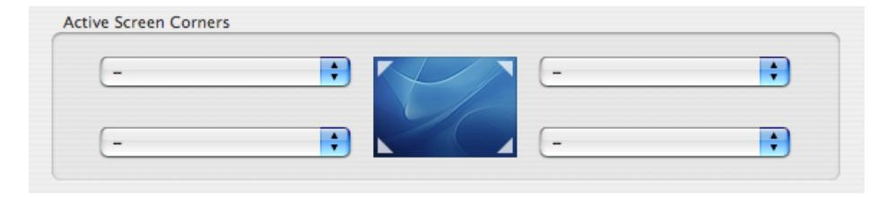

If you choose to use a colon to show the relationship between introductory text and controls, the following guidelines and examples will help you use it appropriately.

**Use a colon in introductory text that precedes a control or set of related controls**. The text can be a noun or phrase that describes either the target of the control or the task the user can perform. The following examples illustrate some variations on this arrangement of text and controls:

■ Figure 9-2 shows the correct usage of a colon in introductory text that describes the feature a control affects and appears on the same line with it.

<span id="page-125-0"></span>**Figure 9-2** Use a colon in text that precedes a control on the same line


<span id="page-125-1"></span>■ The introductorytext shown in Figure 9-3 describes a tasktowhich more than one control applies. The proximity of the two checkboxes and the colon in the descriptive text imply to the user that both controls can be used to affect the task.

**Figure 9-3** Use a colon in text that precedes the first control in a vertical list of controls

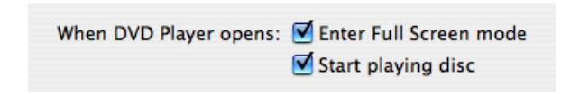

<span id="page-125-2"></span>The grouping of text and controls in Figure 9-4 shows another way to use a colon in text that introduces multiple controls.

**Figure 9-4** Use a colon in text that precedes the first control in a horizontal list of controls


<span id="page-125-3"></span>■ Introductory text that appears above the control it describes should include a colon, as shown in Figure 9-5.

**Figure 9-5** Use a colon in introductory text that appears above a control


■ If the text describes a radio button or checkbox state and also introduces a second control, it should include a colon before the second control, as shown in Figure 9-6. (Note that if the text describing a checkbox or radio button state does not introduce a second control, it should not include a colon.)

<span id="page-126-1"></span>**Figure 9-6** Use a colon in checkbox or radio button text that introduces a second control


**Note:** If you use the type of layout shown in Figure 9-6, be sure to disable the second control when the preceding checkbox or radio button is unselected.

**A colon is optional before a control that is part of a sentence or phrase**. This guideline is flexible because it depends on how much of the text follows the control and how the sentence or phrase can be interpreted. Consider the specific combination of text and controls and the overall layout of your window as you decide whether to use the colon in the following situations.

<span id="page-126-2"></span>If, for example, none of the text follows the control, then the control's value supplies the end of the sentence or phrase. A colon is recommended in this case, because this is another variation of the guideline to include a colon in text that precedes a control. Figure 9-7 shows an example of this type of text.

**Figure 9-7** A colon is recommended in a sentence that is completed by a control's value

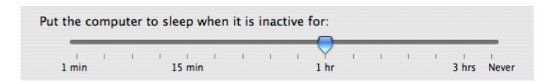

<span id="page-126-3"></span>If, on the other hand, a substantial portion of the sentence or phrase follows the control, as shown in Figure 9-8, a colon is optional.

**Figure 9-8** A colon is optional if the text following the control forms a substantial part of the sentence


<span id="page-126-0"></span>Similarly, if there is some text following the control, but that text does not represent a substantial portion of the sentence or phrase, the colon is optional. To help you decide whether a colon is appropriate in these cases, determine if the presence of a colon breaks the sentence or phrase (including the value of the control) in an awkward or unnatural way.

### <span id="page-126-4"></span>Labels for Interface Elements

Make labels for interface elements easyto understand and avoid technical jargon as much as possible. Try to be as specific as possible in any element that requires the user to make a choice, such as radio buttons, checkboxes, and push buttons. It's important to be concise, but don't sacrifice clarity for space. See ["Capitalization](#page-127-0) of Interface Element Labels and Text" (page 128) for information on the proper way to capitalize the words in interface element labels.

<span id="page-127-4"></span>Menu items and buttons that produce a dialog should include an ellipsis (…). See "Using the [Ellipsis](#page-122-1) [Character"](#page-122-1) (page 123) for details on when to use an ellipsis. The dialog title should be the same as the menu command or button label (except for the ellipsis) used to invoke it.

### <span id="page-127-3"></span><span id="page-127-0"></span>Capitalization of Interface Element Labels and Text

<span id="page-127-9"></span>All interface element labels should be capitalized in either title style or sentence style. See [Table](#page-127-1) [9-2](#page-127-1) (page 128) for examples of how to do this.

Title style means that you capitalize every word except:

- Articles (*a, an, the*)
- Coordinating conjunctions (*and, or*)
- Prepositions of three or fewer letters, except when the preposition is part of a verb phrase, as in "Starting Up the Computer."

<span id="page-127-8"></span><span id="page-127-5"></span>In title style, always capitalize the first and last word, even if it is an article, a conjunction, or a preposition of three or fewer letters.

<span id="page-127-1"></span>Sentence style means that the first word is capitalized, and the rest of the words are lowercase, unless they are proper nouns or proper adjectives. Use periods in dialogs only after complete sentences.

**Table 9-2** Proper capitalization of onscreen elements

<span id="page-127-7"></span><span id="page-127-6"></span><span id="page-127-2"></span>

| Element      | Capitalization<br>style | Examples               |
|--------------|-------------------------|------------------------|
| Menu titles  | Title                   | Highlight Color        |
|              |                         | Number of Recent Items |
|              |                         | Location               |
|              |                         | Refresh Rate           |
| Menu items   | Title                   | Save as Draft          |
|              |                         | Save As…               |
|              |                         | Log Out                |
|              |                         | Make Alias             |
|              |                         | Go To…                 |
|              |                         | Go to Page…            |
|              |                         | Outgoing Mail          |
| Push buttons | Title                   | Add to Favorites       |
|              |                         | Don't Save             |
|              |                         | Set Up Printers        |
|              |                         | Restore Defaults       |
|              |                         | Set Key Repeat         |

<span id="page-128-4"></span>

| Element                                                                                                                         | Capitalization<br>style | Examples                                                                                                                          |
|---------------------------------------------------------------------------------------------------------------------------------|-------------------------|-----------------------------------------------------------------------------------------------------------------------------------|
| Labels that are not full sentences (for<br>example,group box orlist headings)                                                   | Title                   | Mouse Speed<br>Total Connection Time<br>Account Type                                                                              |
| Options that are not strictly labels<br>(for example, radio button or<br>checkbox text), even if they are not<br>full sentences | Sentence                | Enable polling for remote mail<br>Cache DNS information every minutes<br>Show displays in menu bar<br>Maximum number of downloads |
| Dialog messages                                                                                                                 | Sentence                | Are you sure you want to quit?                                                                                                    |

### <span id="page-128-3"></span><span id="page-128-0"></span>Using Contractions in the Interface

When space is at a premium, such as in pop-up menus, contractions may be used, as long as the contracted words are not critical to the meaning of the phrase. For example, a menu could contain the following items:

Don't Allow Printing Don't Allow Modifying Don't Allow Copying

In each case, the contraction does not alter the operative word for the item. If a contraction does alter the significant word in a phrase, such as "contains" and "does not contain," it is clearer to avoid the contraction.

You should also avoid using uncommon contractions that may be difficult to interpret and localize. In particular, you should:

- <span id="page-128-1"></span>■ Avoid forming a contraction using a noun and a verb, such as in the sentence "Apple's going to announce a new computer today."
- <span id="page-128-2"></span>■ Avoid using less common contractions, such as "it'll" and "should've."

### Using Abbreviations and Acronyms in the Interface

Abbreviations and acronyms can save space in a user interface, but they can be confusing if users do not know what they mean. Conversely, some abbreviations and acronyms are better known than the words or phrases they stand for, and an application that uses the spelled-out version can seem out-of-date and unnecessarily wordy.

To balance these two considerations, you should gauge an acronym or abbreviation in terms of its appropriateness for your application's users. Therefore, before you decide which abbreviations and acronyms to use, you need to define your user audience and understand the user's mental model of the taskyour application performs.For more information on these concepts, see ["KnowYour](#page-24-2) Audience ["](#page-24-2) (page 25) and ["Reflect](#page-39-0) the User's Mental Model" (page 40).

To help you decide whether or not to use a specific abbreviation or acronym in your application's user interface, consider the following questions:

- Is this an acronym or abbreviation that your users understand and feel comfortable with? For example, almost all users are used to using CD as the abbreviation for compact disc, so even applications intended for novice users can use this abbreviation.
  - On the other hand, an application intended for users who work with color spaces and color printingcan use CMYK (which stands for cyan magentayellowkey), even though this abbreviation might not be familiar to a broader range of users.
- Is the spelled-outword or phrase less recognizable than the acronym or abbreviation?For example, many users are unaware that Cc originally stood for the phrase carbon copy, the practice of using carbon paper to produce multiple copies of paper documents. In addition, the meanings of Cc and carbon copy have diverged so that they are no longer synonymous. Using carbon copy in place of Cc, therefore, would be confusing to users.
  - For some abbreviations and acronyms, the precise spelled-out word or phrase is equivocal. For example, DVD originally stood for both digital video disc and digital versatile disc. Because of this ambiguity, it's not helpful to use either phrase; it's much clearer to use DVD.

<span id="page-129-0"></span>Ifyou use a potentially unfamiliar acronym or abbreviation in the user help bookforyour application, be sure to define it when you first use it. In addition, you should enable searching on your help book so users can easilyfind definitions of unfamiliarterms. See "User [Assistance"](#page-72-0) (page 73) for an overview of help technologies and *Providing User Assistance With Apple Help (Revision; Preliminary)* for details on working with Apple Help.

### <span id="page-129-2"></span>Developer Terms and User Terms

<span id="page-129-1"></span>Don't use technical jargon or programming terms in interface elements or user documentation. Table 9-3 shows a few examples; more are in *Apple Publications Style Guide* (available at the Mac OS X developer documentation website).

**Table 9-3** Translating developer terms into user terms

<span id="page-129-3"></span>

| Developer term    | User term equivalent                              |
|-------------------|---------------------------------------------------|
| Data browser      | Scrolling list or multicolumn list                |
| Dirty document    | Document with unsaved changes                     |
| Focus ring        | Highlighted area; area ready to accept user input |
| User-visible text | Onscreen text                                     |
| Mouse-up event    | Mouse click                                       |
| Reboot            | Restart                                           |
| String length     | Number of characters                              |

<span id="page-130-5"></span><span id="page-130-0"></span>This chapter describes the overall philosophybehind Aqua icons and shows howto design application, document, toolbar, and other types of icons for Mac OS X.

Aqua offers a photo-illustrative icon style—it approaches the realism of photography but uses the features of illustrations to convey a lot in a small space. Icons can be represented in 128 x 128 pixels to allow ample room for detail. Anti-aliasing makes curves and nonrectilinear lines possible. Alpha channels and translucency allow for complex shading and dimensionality. All of these qualities pave the way for lush imagery that enables you to create vibrant icons.

To represent your application in Mac OS X, it's essential to create high-quality Aqua-style application icons that scale well in the various places the icon appears—the Dock, Finder previews, alert dialogs, and so on.

**Carbon:** See "Desktop Icons" in *Learning Carbon*, published by O'Reilly, for information on how to provide custom application and document icons.

## <span id="page-130-3"></span><span id="page-130-1"></span>Icon Genres and Families

<span id="page-130-4"></span><span id="page-130-2"></span>**Icon genres** help communicate what you can do with an application before you open it. Applications are classified by role—user applications, software utilities, and so on—and each category, or genre, has its own icon style. This differentiation is very important for helping users easily distinguish between types of icons in the Dock.

**Figure 10-1** Application icons of different genres—user applications and utilities—shown as they might appear in the Dock


For example, the icons for user applications are colorful and inviting, while utilities have a more serious appearance. Figure 10-2 shows user application icons in the top row and utility icons in the bottom row. These genres are further described in "User [Application](#page-132-3) Icons" (page 133) and ["Utility](#page-133-2) [Icons"](#page-133-2) (page 134).

<span id="page-131-0"></span>**Figure 10-2** Two icon genres: User application icons in top row; utility icons in bottom row

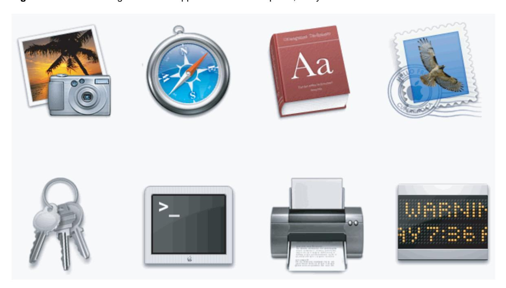

<span id="page-131-1"></span>The graphic flexibility of Aqua icons can also help users identify files associated with an application. In iTunes, for example, a visual cue provided in the application icon is carried over into icons for other files associated with iTunes, forming an icon family, as shown in Figure 10-3.

**Figure 10-3** An icon family: The iTunes application icon and its associated icons


iTunes application icon


Document icon Playlist icon Plug-in icon


### <span id="page-132-0"></span>Application Icons

<span id="page-132-4"></span>Application icons are the most visible to users. Since they are seen in the Finder and the Dock even when your application is not running, they form a significant part of a user's first impressions.

### <span id="page-132-3"></span>User Application Icons

<span id="page-132-1"></span>Mac OS X user application icons should be vibrant and inviting, and should immediately convey the application's purpose. The TextEdit icon, for example, indicates clearly that this application is for creating text documents.

**Figure 10-4** The TextEdit application icon makes it obvious what this application is for


<span id="page-132-2"></span>If the primary function of your application is creating or handling media, its icon should display the media the application creates or views. If appropriate, the icon should also contain a tool that communicates the type of task the application allows the user to accomplish. The Preview icon, for example, uses a magnification tool to help convey that the application can be used to view pictures. If you include a supportive tool element, it should closely relate to the base object that it rests upon.

**Figure 10-5** The Preview application icon: An example of a tool element


In the Stickies application icon, however, the yellow rectangles are easily identifiable as sticky notes; the icon doesn't include a tool because it isn't necessary to tell the icon's story.

<span id="page-133-0"></span>**Figure 10-6** The Stickies application icon: Effective without the addition of a tool


Notice that the text in the Stickies icon is actual text, not simply wavy lines representing text. If you want to "greek" text in an Aqua icon, use actual text and make it unreadable byshrinkingit or doubling the layers.

Generally, Mac OS X user application icons are designed to appear as if they're sitting on a desk in front of you. They have a slightly diminishing perspective (they are wider at the bottom). For more information, see "Icon [Perspectives](#page-138-0) and Materials " (page 139).

### Viewer, Player, and Accessory Icons

<span id="page-133-1"></span>Some applications that represent objects, such as QuickTime Player and Calculator, are most easily recognized bythe objects themselves. When creatingicons for such applications, it's more aesthetically pleasingto create a simplified, idealized representation of the object, instead of usingan actual screen shot of the software. Re-creating the object is particularly important when users could confuse the icon with the actual interface.

**Figure 10-7** The icons for QuickTime Player, DVD Player, and Calculator


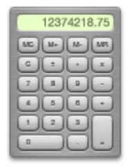

<span id="page-133-2"></span>These icons, many of which are a precursor of what you'll see when you open the application, use a straight-on perspective (rather than the "on a desktop" user application style). You never see the Calculator onscreen in three dimensions, for example, so its icon doesn't depict it that way.

### Utility Icons

Icons for utilityapplications—which are used less often and not simplyfor fun or creative activities convey a more serious tone than those for user applications. Color in these icons is desaturated, predominantly gray, and added only when necessary to clearly communicate what the applications do.

<span id="page-134-1"></span>**Figure 10-8** Discriminating use of color in the Activity Monitor and Printer Setup Utility icons


Because utilityapplications are normallyfocused on a narrowset of tasks, it's best tokeep the number of elements in the icon to a minimum. The focus should be a single object that represents what the utility does. The perspective of utility icons is straight-on, as if they are on a shelf in front of you. For more information, see "Icon [Perspectives](#page-138-0) and Materials " (page 139).

### <span id="page-134-3"></span><span id="page-134-0"></span>Document Icons

<span id="page-134-2"></span>Traditionally, a document icon looks like a piece of paper with its top-right corner folded down. As previously suggested, Aqua document icons should make it obvious which application they are associated with. Preview documents, for example, include a graphic of the media (the pictures) used in the application icon.For simplicityand to avoid confusingthe documentwith the application itself, the viewing tool is not repeated in the document icon.

**Figure 10-9** Icons for the Preview application and a Preview document


Document icons are presented as if they are hovering on the desktop, with the shadow behind the document. For more information, see "Icon [Perspectives](#page-138-0) and Materials " (page 139).

When you want to put an identifying badge over a document icon, treat the badge as an integrated element within the document instead of putting it over the top of the base image and breaking out of the overall document shape.

<span id="page-135-2"></span>**Figure 10-10** Incorrect and correct badging of a document icon


<span id="page-135-0"></span>Don t do this. Do this.

## <span id="page-135-6"></span>Icons for Plug-ins

<span id="page-135-3"></span>Plug-in icons look like stackable components, with the associated application identifier on the left side and a plug-in–specific image on the right.

**Figure 10-11** A plug-in icon


### <span id="page-135-5"></span><span id="page-135-1"></span>Hardware and Removable Media Icons

<span id="page-135-4"></span>Hardware icons represent devices as you most often see them: on your desk. Because these devices are also frequently handled and carried, people are familiar with them as three-dimensional objects with weight. The Aqua treatment of hardware icons reinforces their association with real objects.

**Figure 10-12** Icons for external (top row) and internal hardware devices

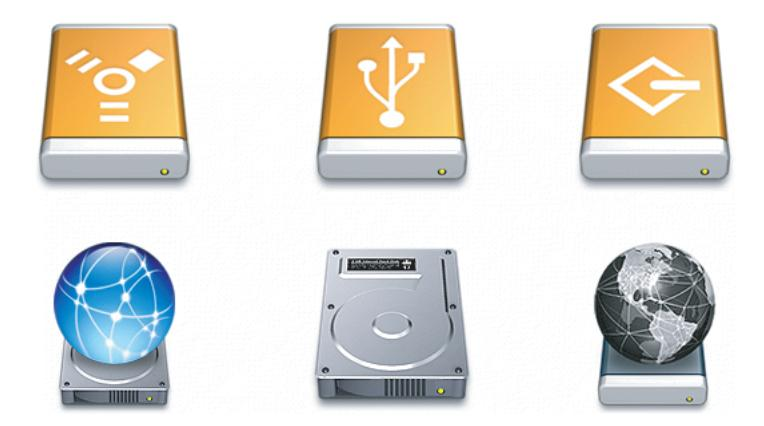

To help users distinguish between external devices, their icons provide a region for an identifying symbol (FireWire, SCSI, and so on).

Removable media such as CDs, floppy disks, and PC cards are depicted the way they look when you hold them in front of you—that is, the perspective is straight-on.

<span id="page-136-1"></span>**Figure 10-13** Icons for removable media


### <span id="page-136-3"></span><span id="page-136-0"></span>Toolbar Icons

The primary purpose of a toolbar is to provide users with easy access to frequently used commands. Although toolbar icons should conserve screen real estate (32 pixels by 32 pixels is the recommended size), they should be inviting and easy to identify. The perspective of a toolbar icon is straight-on, as if it is sitting on a shelf in front of you.

Ideally, each toolbar icon should represent a unique object or action that is directly related to the command itrepresents. A toolbar can also contain icons thatrepresentrecognizable interface elements from elsewhere in the system (such as an Info button or an iDisk icon) when they make sense in the context of the application. If you choose to include an icon such as an Info button, be sure to preserve its meaning. Users expect such icons to mean the same thing in every context, so you should not redefine them when you use them in your toolbar.

<span id="page-136-2"></span>**Important:** Do not use a system icon, such as the yellow caution icon, in your toolbar. A system icon provides important information to the user in a specific context, such as in an alert window; using it in a toolbar blurs its meaning and dilutes it effectiveness in the system.

Figure 10-14 shows some of the icons available in Xcode's toolbar (Xcode is the Mac OS X integrated development environment, or IDE).

**Figure 10-14** Xcode toolbar icons


Some of the icons in Figure 10-14 use familiar objects (a hammer, a can of bug spray, and a broom) as metaphors for frequently used Xcode commands (build a project, debug code, and clean a target, respectively). To represent the run action, Xcode uses the right-pointing triangle users associate with play or run in applications such as iTunes, Keynote, and Automator. The Xcode toolbar also contains the Info button users are accustomed to seeing in the Finder and in other applications in Mac OS X. As a general rule, a toolbar icon that depicts an identifiable, real-world object or recognizable user-interface elementgives first-time users a clue to its function and helps experienced users remember it.

Making each toolbar icon distinct helps the user associate it with its purpose and locate it quickly. Variations in shape, color, and image all help to differentiate one toolbar icon from another. At the same time, however, an application's toolbar icons should harmonize together as much as possible in their perspective, use of color, size, and visual weight. For example, each icon in Figure 10-14 is unique, but all are similarin general size, perspective, and color saturation (intensity) and none appear more important than the others.

<span id="page-137-0"></span>Although icons designed specifically for use in a toolbar appear as if they are sitting on a shelf in front ofyou, ifyou use a recognizable control from elsewhere in the interface (such as a pop-up menu), that control should retain its standard appearance and perspective. That is, don't redesign a toolbar version of a well-known interface element.

**Figure 10-15** The circled icons appear elsewhere in the interface; they retain their perspective when used in a toolbar

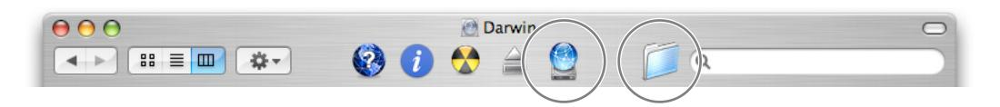

<span id="page-137-1"></span>Creating a family of visually related toolbar icons can strengthen the user's perception of your application as beingwell-integrated andwell-designed. Onewayto do this is to startwith a consistent theme for the style and appearance of the icons, then introduce variations when it makes sense. You might also consider usinga variation of the application icon or an image symbolic ofyour application's purpose as a common element in toolbar icons. For example, Preview reuses the photo from its application icon in some of its toolbar icons, as shown in Figure 10-16.

**Figure 10-16** Reusing the application icon image in toolbar icons

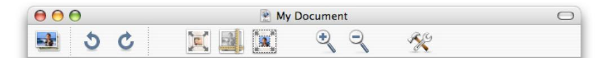

For information about implementing toolbars, see ["Toolbars"](#page-183-0) (page 184).

## <span id="page-138-4"></span><span id="page-138-0"></span>Icon Perspectives and Materials

The angles and shadows used for depicting various kinds of icons are intended to reflect how the objectswould appearin reality. All Aqua interface elements have a common light source from directly above, not from the upper-left corner as in Mac OS 9 and earlier. The various perspectives are achieved by changing the position of an imaginary camera capturing the icon.

<span id="page-138-1"></span>Application icons look like they are sitting on a desk in front of you.

**Figure 10-17** Perspective for application icons: Sitting on a desk in front of you


<span id="page-138-2"></span>Utility icons are depicted as if they were on a shelf in front of you. Flat objects appear as if there were a wall behind them with an appropriate shadow behind the object.

**Figure 10-18** Perspective for flat utility icons


<span id="page-138-3"></span>An actual three-dimensional object such as a rocket, however, would more realistically be viewed sitting on the ground; its icon shows the rocket sitting on a shelf, with its shadow below it.

**Figure 10-19** Perspective for three-dimensional object


For toolbar icons, the perspective is also straight-on, as if the object is on a shelf in front of you with the shadow below it.

<span id="page-139-1"></span>**Figure 10-20** Perspective for toolbar icons


Icons that represent actual objects should look as though they are made of real materials. Examine various objects to studythe characteristics of plastic,glass, paper, and metal. Youriconwill look more realistic if you successfully convey the item's weight and feel, as well as its appearance.

<span id="page-139-2"></span>Use transparency only when it is convincing and when it helps complete the story the icon is telling. You would never see a transparent sneaker, for example, so don't use one in your icon.

**Figure 10-21** Materials: Transparency used to convey meaning


## <span id="page-139-3"></span><span id="page-139-0"></span>Suggested Process for Creating Aqua Icons

You need to provide at least the following files:

- A 128 x 128 image (for Finder icons)
- A mask that defines the image's edges so that the operating system can determine which regions are clickable

Icons that display in the Finder are viewed at different sizes: They can be magnified in the Dock, they can be previewed at full size, and users can specify a preferred size. For the best-looking icons at all sizes, you should also provide custom image files ("hints") at two other sizes: 32 x 32, and 16 x 16. Although the Dock doesn't use hints (it uses a sophisticated algorithm on the 128 x 128 version), hints are important for preserving crucial details in Finder icons.

If you are creating an icon that will never change size—on a bevel button, for example—you can supply the image only at actual size.

Here are the suggested steps for creating an icon:

#### 1. Sketch the icon.

Work out the concept and details of your design on paper, not with software. You should be ready to execute the idea by the time you open an application.

2. Create a software illustration of the icon.

Although you may want the final icon to look like a photograph, in most cases it's inadvisable to start with an actual photograph. An illustration provides much more flexibility for conveying a concept in a very small space. An illustration also gives you necessary control over details, perspective, light and shadow, texture, and so on.

3. Add detail and color.

For each enhancement you make to a larger-version icon, consider whether it is truly adding something to the icon's usability or whether it is just adding complexity or clutter.

4. Add shadows.

Shadows give objects dimensionality and realism. They also help tie the elements of an icon together so it doesn't look like a collage. The light source should be above and slightly in front of the object. The resulting shadow should create the sense that the icon is resting on a surface.

- 5. In an image-editing program, manipulate the image to get precise effects and create the icon mask.
- 6. Convert the icon to a .icns file.You can complete this step with Icon Composer, included with the Xcode Tools, a set of tools for developers that are included in Mac OS X. There are also several third-party tools available for completing this step.

## <span id="page-140-1"></span><span id="page-140-0"></span>Tips for Designing Aqua Icons

Manyof the suggestions listed here also applyto othergraphicsyou develop foryour application—for example, to augment a label or list item.

- For great-looking Aqua icons, have a professional graphic designer create them.
- Perspective and shadows are the most important components of making good Aqua icons. Use a single light source with the light coming from above the icon.
- Use universal imagery that people will easily recognize. Avoid focusing on a secondary aspect of an element. For example, for a mail icon, a rural mailbox would be less recognizable than a postage stamp.
- Strive for simplicity. Try to use a single object that captures the icon's action or represents the control. Start with a basic shape.
- Use color judiciously to help the icon tell its story; don't add color just to make the icon more colorful. Smooth gradients typically work better than sharp delineations of color.
- Avoid using Aqua interface elements in your icons; they could be confused with the actual interface.

- Don't use replicas of Apple hardware products in your icons. These symbols are copyrighted, and hardware designs change frequently.
- Don't reuse Mac OS X system icons in your interface; it can be confusing to users to see the same icon used to mean slightly different things in multiple locations.
- Design toolbar icons at their actual size (32 x 32). For other icons, concentrate on perfecting your icon's look at 128 x 128 and work down from there. It usually works best if you scale down elements independently and then combine them rather than scale the entire icon at once.

# <span id="page-142-0"></span>Cursors

<span id="page-142-3"></span>This chapter discusses the standard cursors available in Mac OS X and provides information on implementing your own cursors. The standard cursors are designed to provide feedback to users. To maintain a consistent user experience, it is important that you use them only for their intended purpose.

<span id="page-142-4"></span>Each cursor has a **hot spot**—the portion of the cursor that must be positioned over a screen object before mouse clicks have an effect on the object. The hot spot should be intuitive, such as the tip of an arrow cursor or the center point of a crosshair. Screen objects have a **hot zone**—the area that the cursor's hot spot must be within in order for mouse clicks to have an effect.

## <span id="page-142-1"></span>Standard Cursors

<span id="page-142-2"></span>Table 11-1 shows the standard cursors and explains when to use each. The "API information" column gives the constants to implement them in Carbon or Cocoa.

**Table 11-1** Standard cursors in Mac OS X

| Cursor             | Use                                                                                                                                                                        | API information                                                    |
|--------------------|----------------------------------------------------------------------------------------------------------------------------------------------------------------------------|--------------------------------------------------------------------|
| Arrow              | Menu bar, desktop, scroll bar, resize control, title bar,<br>close button, zoom button, minimize button, other<br>controls.                                                | Carbon: kThemeArrowCursor<br>Cocoa:arrowCursor                     |
| Contextual<br>menu | Indicates the user can open a contextual menu for an<br>item. Shown when the user presses the Control key<br>while the cursor is over an object with a contextual<br>menu. | Carbon:kThemeContextual<br>MenuArrowCursor<br>Cocoa: Not available |
| Alias              | Indicates the drag destination will have an alias for<br>the original object (the original object will not be<br>moved).                                                   | Carbon:kThemeAliasArrow<br>Cursor<br>Cocoa: Not available          |

Standard Cursors **143**

| Cursor           | Use                                                                                                                                                                 | API information                                                 |
|------------------|---------------------------------------------------------------------------------------------------------------------------------------------------------------------|-----------------------------------------------------------------|
| Poof             | Indicates that the proxy object being dragged will go<br>away, without deleting the original object, if the<br>mouse button is released. Used onlyfor proxyobjects. | Carbon:kThemePoofCursor<br>Cocoa:disappearingItemCursor         |
| Copy             | Indicates that the drag destination will have a copy<br>of the original object (the original object will not be<br>moved).                                          | Carbon:kThemeCopyArrowCursor<br>Cocoa: Not available            |
| Not<br>allowed   | Indicates an invalid drag destination.                                                                                                                              | Carbon:kThemeNotAllowed<br>Cursor<br>Cocoa: Not available       |
| I beam           | Selecting and inserting text.                                                                                                                                       | Carbon:kThemeIBeamCursor<br>Cocoa:IBeamCursor                   |
| Crosshair        | Precise rectangular selection, especially useful for<br>graphics objects.                                                                                           | Carbon:kThemeCrossCursor<br>Cocoa:crosshairCursor               |
| Pointing<br>hand | URL links.                                                                                                                                                          | Carbon:kThemePointing<br>HandCursor<br>Cocoa:pointingHandCursor |
| Open<br>hand     | Indicates that an item can be manipulated within its<br>containing view.                                                                                            | Carbon:kThemeOpenHandCursor<br>Cocoa:openHandCursor             |
| Closed<br>hand   | Pushing, sliding, or adjusting an object within a<br>containing view.                                                                                               | Carbon:kThemeClosed<br>HandCursor<br>Cocoa:closedHandCursor     |
| Move<br>left     | Moving or resizing an object, usually a pane splitter,<br>to the left. Use when the user can move the object<br>only in the indicated direction.                    | Carbon:kThemeResize<br>LeftCursor<br>Cocoa:resizeLeftCursor     |
| Move<br>right    | Moving or resizing an object, usually a pane splitter,<br>to the right. Use when the user can move the object<br>only in the indicated direction.                   | Carbon:kThemeResize<br>RightCursor<br>Cocoa:resizeRightCursor   |

| Cursor          | Use                                                                                                       | API information                        |
|-----------------|-----------------------------------------------------------------------------------------------------------|----------------------------------------|
| Move<br>left or | Moving or resizing an object, usually a pane splitter,<br>to the left or the right.                       | Carbon:kThemeResizeLeft<br>RightCursor |
| right           |                                                                                                           | Cocoa:resizeLeftRightCursor            |
| Move            | Moving or resizing an object, usually a pane splitter,                                                    | Carbon:kThemeResizeUpCursor            |
| up              | upward. Use when the user can move the object only<br>in the indicated direction.                         | Cocoa:resizeUpCursor                   |
| Move<br>down    | Moving or resizing an object, usually a pane splitter,<br>downward. Use when the user can move the object | Carbon:kThemeResize<br>DownCursor      |
|                 | only in the indicated direction.                                                                          | Cocoa:resizeDownCursor                 |
| Move<br>up or   | Moving or resizing an object, usually a pane splitter,<br>either upward or downward.                      | Carbon:kThemeResizeUp<br>DownCursor    |
| down            |                                                                                                           | Cocoa:resizeUpDownCursor               |
|                 |                                                                                                           |                                        |
|                 |                                                                                                           |                                        |

Manyof the progress indicator cursors from Mac OS 9 are still supported in Mac OS X, butyou should not use them for new development. Figure 11-1 shows cursors you shouldn't use in Mac OS X.

Standard Cursors **145 2006-10-03 | © 1992, 2001-2003, 2006 Apple Computer, Inc. All Rights Reserved.**

<span id="page-145-0"></span>**Figure 11-1** Mac OS 9 cursors that you shouldn't use on Mac OS X

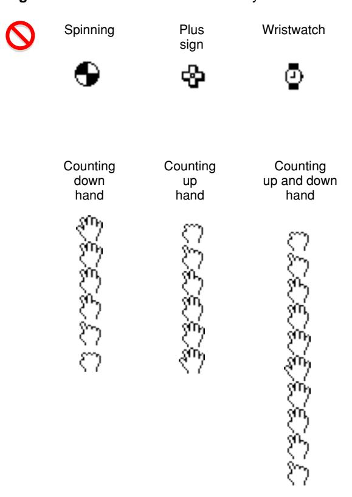

<span id="page-145-3"></span><span id="page-145-1"></span>Instead of using a Mac OS 9 cursor, consider using a progress indicator. The use of an asynchronous progress indicator is shown in Figure 11-2. One benefit of this is that it can be seen whether the application is in the foreground orthe background. You could also displaya progress bar. See ["Progress](#page-260-0) [Indicators"](#page-260-0) (page 261) for more information on using these controls.

**Figure 11-2** Use of an asynchronous progress indicator

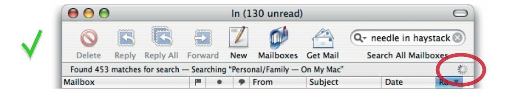

<span id="page-145-2"></span>The spinning wait cursor (see Figure 11-3) is displayed automatically by the window server when an application cannot handle all of the events it receives. If an application does not respond for longer than 2 seconds, the spinningwait cursor appears. You should tryto avoid situations in your application in which the spinning wait cursor will be displayed. The Spin Control application provided with Xcode can help you eliminate code that is causing this cursor.

**Figure 11-3** Spinning wait cursor


Cursors

**Carbon:** Use the Carbon Events Manager instead of the WaitNextEvent model. Avoid polling the mouse button or keyboard. See Appearance.h for functions related to cursors.

**Cocoa:** Use NSCursor methods to display cursors.

## <span id="page-146-0"></span>Designing Your Own Cursors

Mac OS X supports 32-bit RGBA cursors in sizes up to 64 x 64 pixels. If you need a cursor larger than that, you can implement it as a window that tracks with the cursor.

Before you design your own cursor, ask yourself if it is going to add value to the user interface. Recognize that by doing so you are introducing a new, potentially confusing user interface element. If you decide you really need a new cursor, keep the following in mind:

- You need to indicate where the hot spot of the cursor is.
- Your cursors need to be able to work on older hardware that may not provide hardware video acceleration.
- Ifyou create a custom version of a standard cursor,you need to also create newversions ofrelated cursors. For example, if you create a larger arrow cursor you need to also create custom cursors for copy, move, alias, poof, and so forth.

**Carbon:** Not available.

**Cocoa:** Use NSCursor methods to support a large, custom cursor.

#### **C HAPTER 1 1**

Cursors

<span id="page-148-5"></span><span id="page-148-4"></span><span id="page-148-0"></span>Menus present lists of items—commands, attributes, or states—from which the user can choose. Menus are based on the interface principle of see and point: People don't have to remember commands or options because they can view all options at any time.

Menus are user interface elements that users refer to frequently, especially when they are seeking a function for which they know of no other interface. Ensuring that menus are correctly organized, are worded clearly, and behave correctly is crucial to the user's ability to explore and access the functionality of your applications.

<span id="page-148-2"></span>Menus appear in several different forms in the Mac OS X interface. This chapter describes pull-down menus in the menu bar, Dock menus, and contextual menus. These types of menus are illustrated in Figure 12-1.

**Figure 12-1** Menu bar, Dock, and contextual menus

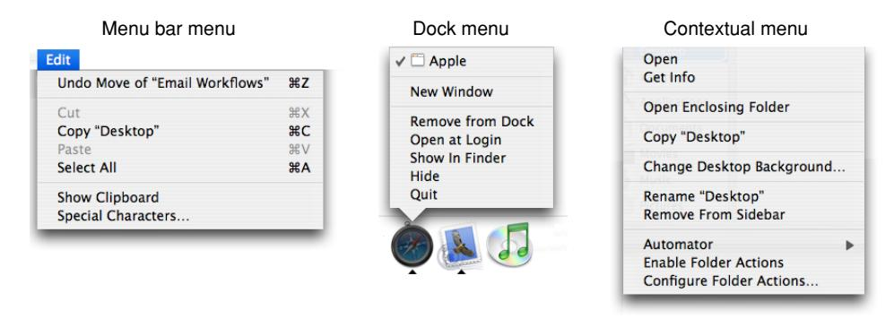

<span id="page-148-1"></span>Menus that are part of controls—for example, pop-up menus, command pop-down menus, and the menus in pop-up icon buttons and bevel buttons—are discussed in ["Controls"](#page-230-0) (page 231). Note that some concepts from this chapter are applicable to those menu types as well.

# <span id="page-148-3"></span>Menu Behavior

When people use menus, they usually make a selection within their data and then choose a menu item. This behavior follows the see-and-point paradigm of identifying what needs to be acted on and then specifying the action by choosing a menu item. To choose an item in a menu, the user positions the pointer on the menu title and drags to the desired item. Each item is highlighted as it is selected.

Menu Behavior **149**

No action happens until the user releases the mouse button with the cursor over a menu item. (See "The Mouse and Other Pointing [Devices"](#page-88-1) (page 89).) People can move the pointer off a menu before releasing the mouse button without initiating any action. They can open and scan menus to find out what features are availablewithout havingto actually perform an action. When a menu item has been activated, it blinks briefly.

A user can also open a menu with a click. The menu stays open without the user having to continue holding down the mouse button. The user can then move the pointer to an item to select it or can move the pointer anywhere on the screen without losing sight of the menu. Once a menu is opened, it remains open until another action forces it to close. Such actions include:

- Choosing a command from the menu
- Moving the pointer to another menu title
- A click outside the menu
- A system-initiated alert
- <span id="page-149-1"></span>■ A system-initiated application switch or quit

Even if all of the items in a menu or submenu are unavailable, the menu or submenu title is not dimmed. The user can still open the menu, but all of its items are dimmed to indicate that these items are not available in the present context. [Figure](#page-160-1) 12-13 (page 161) shows a menu with unavailable menu items in the open and closed state.

As a general rule, avoid creating long menus. Long menus are difficult for the user to scan and can be overwhelming. If you find that there are too many items in a single menu, try regrouping them; you may find that some of the items fit more naturally in other menus.

<span id="page-149-0"></span>If a menu contains more items than are visible onscreen, the menu can scroll to allow the user access to all of the menu items. A **scrolling menu** is shown in Figure 12-2.


A downward-pointing indicator at the bottom of the scrolling menu indicates that there are more items. When the user starts to scroll down, an upward-pointing indicator appears at the top of the menu to show that some items are no longer visible in that direction. When the user drags past the last visible item, the menu scrolls to show the additional items. When the last item is shown, the downward-pointing indicator disappears.

If the user drags back up to the top, the menu scrolls back down in the same manner. The next time the menu is opened, it appears in its original state (with the indicator at the bottom).

Do not design your application to intentionally include scrolling menus; they should exist only when a user adds many items to a customizable menu or when the menu's function causes it to have items added to it (for example, the Finder's Window menu).

## <span id="page-150-0"></span>Designing the Elements of Menus

<span id="page-150-4"></span><span id="page-150-3"></span>Menu elements include words (and sometimes icons) to designate menu titles and menu items, and symbols to designatekeyboard shortcuts, hierarchical menus, separators, and the state of some menu items. These elements are illustrated in Figure 12-3.

<span id="page-150-7"></span>**Figure 12-3** Menu elements

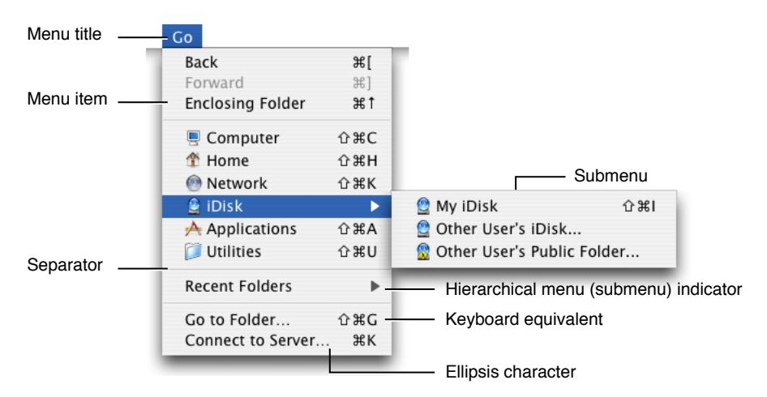

### <span id="page-150-8"></span><span id="page-150-6"></span><span id="page-150-1"></span>Titling Menus

<span id="page-150-5"></span><span id="page-150-2"></span>Menu (and submenu) titles should appropriately represent the items in the menu. For example, a Font menu could contain names of font families, such as Helvetica and Geneva, but it shouldn't include editing commands, such as Cut and Paste. Avoid using icons for menu titles. Make menu titles as short as possible without their losing clarity.

### Naming Menu Items

Menu item names should be either actions performed on an object or attributes applied to an object:

- <span id="page-151-1"></span>■ Actions are verbs or verb phrases that declare the action that occurs when the user chooses the item. For example, Save means *save my file* and Copy means *copy the selected data.* Your action menu commands should begin in the same way, with an action verb in its base (simplest) form.
- Attributes are adjectives or adjective phrases that describe the change the command implements. Adjectives in menus *imply* an action and should fit into the sentence "Change the selected object to …" —for example, *Bold* or *Italic*.

<span id="page-151-2"></span>When a menu item is unavailable—because it doesn't apply to the selected object or to the selected object in its current state, or because nothingis selected, for example—the item should appear dimmed (gray) in the menu and is not highlighted when the user moves the pointer over it.

Use title-style capitalization in your menus. See ["Capitalization](#page-127-0) of Interface Elements" (page 128) for more information on this style.

<span id="page-151-3"></span>An **ellipsis character**(…) after a menu item indicates to the userthat additional information is required to complete a command. For information on when to use an ellipsis in menu items, see ["Using](#page-122-1) the Ellipsis [Character"](#page-122-1) (page 123).

<span id="page-151-0"></span>It may be appropriate in some cases to provide **dynamic menu items**—commands that change when the user presses a modifier key. For example, if the user opens the Window menu in the Finder and then presses the Option key, some of the menu items change, as shown in Figure 12-4. The system appropriately sizes the menu to hold the widest item, including Option-enabled commands.

**Figure 12-4** Dynamic menu items

Without modifier key pressed

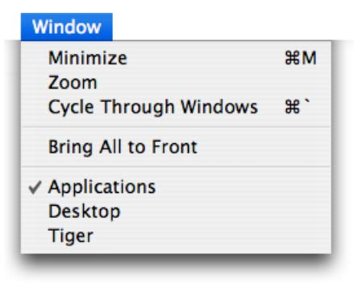

With modifier key pressed


**Carbon:** Use SetMenuItemAttributes with the kMenuItemAttrDynamic attribute.

**Cocoa:** Use the setAlternate: method in NSMenuItem to designate one menu item as the alternate of another. This can be done in Interface Builder.

### <span id="page-152-2"></span><span id="page-152-0"></span>Using Icons in Menus

You should use text, not icons, for your application menu titles. The operating system provides three application menus that use icons instead of text for their titles: the Apple menu, the Spotlight search field, and the AppleScript menu,which is displayed if the application has scripts installed. The menu bar status items also are icons. These icons (with the exception of the AppleScript menu) are always visible in the menu bar no matter what application is active, so users learn what these symbols mean. These are unique uses of symbols as menu titles.

<span id="page-152-1"></span>You may use icons in menu items if the icon is something the user can learn to associate with specific functionality in your application or if the icon represents something unique. For example, as shown in Figure 12-5, the Finder uses icons in the Go menu because users can associate them with the icons they see in the Sidebar.

**Figure 12-5** Icons in the Finder Go menu

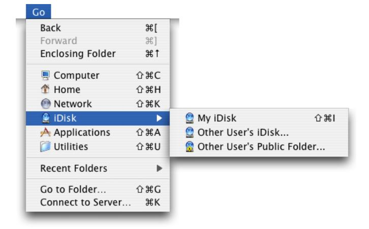

Safari also makes use of the standard icons displayed with some webpages to allow users to make the connection between the webpage and the menu item for that webpage, as shown in Figure 12-6.

<span id="page-153-1"></span>**Figure 12-6** Icons in the Safari History menu

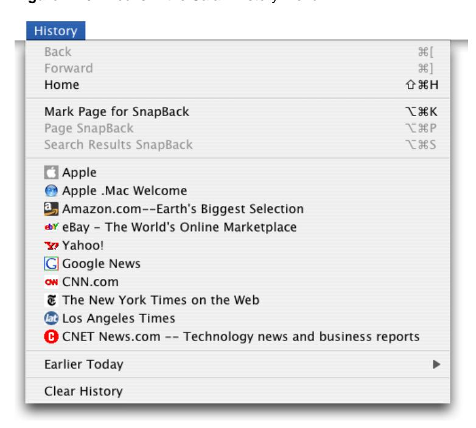

<span id="page-153-0"></span>Ifyou do include icons in your menus, include them onlyfor menu items forwhich theyadd significant value; don't include them for every menu item. A menu that includes too many icons (or poorly designed ones) can appear cluttered and be hard to read.

### <span id="page-153-4"></span><span id="page-153-3"></span>Using Symbols in Menus

<span id="page-153-2"></span>There are a few standard symbols you can use to indicate additional information in menus. These are listed in Table 12-1 and discussed in the following text. Don't use other, arbitrary symbols in menus, because they add visual clutter and may confuse people.

**Table 12-1** Acceptable characters for use in menus

| Character | Meaning                                                                                                   |
|-----------|-----------------------------------------------------------------------------------------------------------|
|           | The active document in the Window menu; in other menus, a setting that applies to the<br>entire selection |
|           | A setting that applies to only part of the selection                                                      |
|           | A window with unsaved changes                                                                             |
|           | In the Window menu, a document that is currently minimized in the Dock                                    |

In the Window menu, a **checkmark** should appear next to the active document's name. Checkmarks can also be used in other menus to indicate that the setting applies to the entire selection. You can use checkmarks for mutuallyexclusive attributegroups (the user can select onlyone item in thegroup, such as font size) or accumulating attribute groups (more than one item can be selected at once, such as Bold and Italic).

Use a **dash** to indicate that an attribute applies to only part of the selection. For example, if selected text has two styles applied to it, put a dash next to each style name. When it's appropriate, you can combine checkmarks and dashes in the same menu. See ["Toggled](#page-155-0) Menu Items" (page 156) for more information on how to use checkmarks and dashes in menus.

<span id="page-154-3"></span><span id="page-154-2"></span>**Note:** Include a menu command, such as Plain, for removing all formatting from mixed-state text.

<span id="page-154-1"></span>Use a **bullet** next to a document with unsaved changes and a **diamond** for a document the user has minimized into the Dock. A minimized document with unsaved changes should have a diamond only. If the active window has unsaved changes, the checkmark should override the bullet in the Window menu.

**Carbon:** In the standard Window menu, these symbols are managed automatically. Otherwise, use the SetItemMark functionwith a char parameter of kCheckCharCode forthe active document, kBulletCharCode for a documentwith unsaved changes, and kDiamondCharCode for a minimized document. These constants work only in the Window menu.

**Cocoa:** These symbols are managed by the Cocoa framework.

<span id="page-154-0"></span>Figure 12-7 and Figure 12-8 showsome examples of howto use and hownot to use symbols in menus.

Dashes are used to indicate that the selection represents a mixed state (both bold and italic are A bullet indicates that the document

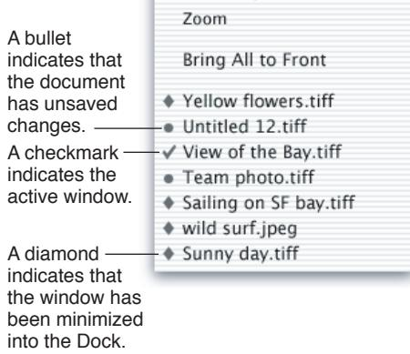

**Figure 12-7** Symbols in menus


<span id="page-155-1"></span>**Figure 12-8** Don't use arbitrary symbols in menus

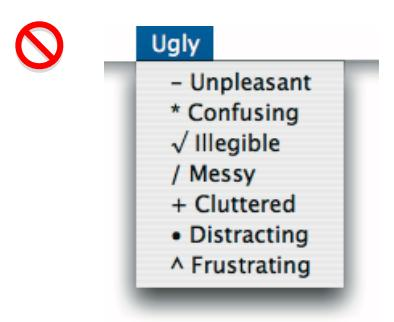

<span id="page-155-4"></span><span id="page-155-2"></span><span id="page-155-0"></span>If you have a Style menu, you may display menu items in the actual style so users can see what effect the menu item will have. Don't use text styles in menus other than a Style menu.

### <span id="page-155-5"></span>Toggled Menu Items

A **toggled menu item** changes between two states each time a user chooses it. There are three types of toggled menu items:

- A set of two menu items that are opposite states; for example, Grid On and Grid Off. The state currently in effect has a checkmark next to it. If you have room in your menu, it's a good idea to display both items (rather than changing the name depending on its state) so that there's less chance of confusion about each item's effect.
- <span id="page-155-3"></span>■ One menu item whose name changes to reflect the current state; for example, Show Ruler and Hide Ruler. Use this type if your menu doesn't have room to show both states.
  - Use two verbs that express opposite actions. Make sure the command name is completely unambiguous. For example, Turn Grid On and Turn Grid Off is unambiguous. Choosing the command Use Grid, however, could turn the grid on (it describes what happens as a result of choosing the command) or off (it describes the current state).
- A menu item that has a checkmark next to it when it is in effect; for example, a style attribute such as Bold. Don't use this kind of toggled item to indicate the presence or absence of a feature such as a grid or ruler. It's unclear whether the checkmark means that the feature is in effect or whether choosing the command turns the feature on.

Figure 12-9 shows correct and incorrect toggled menu items.

<span id="page-156-1"></span>**Figure 12-9** Avoid ambiguous toggled menu items

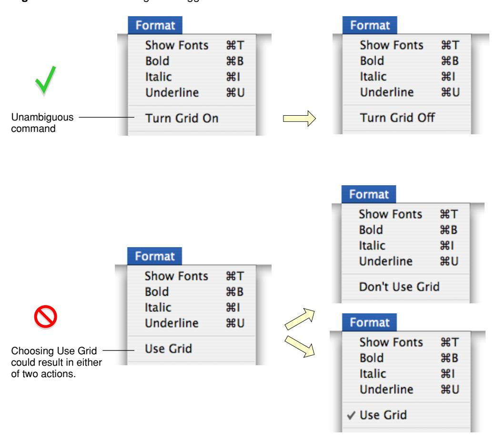

### <span id="page-156-3"></span><span id="page-156-2"></span><span id="page-156-0"></span>Grouping Items in Menus

Logically grouping menu items is the most important aspect of arranging your menus. Grouping items in a menu makes it easier to quickly locate commands for related tasks.

In general, place the most frequently used items at the top of the menu, but create groups of related items rather than arranging them strictly by frequency of use. For example, although the Find Next ortheFind Again command maybe used infrequently, it should appearright belowtheFind command. In a menu that contains both actions and attributes, don't put actions and attributes in the samegroup.

Group interdependent attributes. They can be in a **mutually exclusive attribute group** (the user can select onlyone item, such as font size) or an **accumulatingattributegroup** (the user can select multiple items, such as Bold and Italic).

If a menu repeats a term more than twice, consider dedicating a menu or hierarchical menu to the term instead. For example, if you need commands like Show Info, Show Colors, Show Layers, Show Toolbox, and so on, you could create a Show menu or a submenu off of a Show item.

How many separators to use is partly an aesthetic decision and partly a usability decision. Figure 12-10 shows a menu that depicts the right balance of grouping, contrasted with two menus showing insufficientgroupingand too much grouping. Use this picture as a visualguidewhen tryingto decide how many separators to use in your menus.

<span id="page-157-1"></span>**Figure 12-10** Grouping items in menus

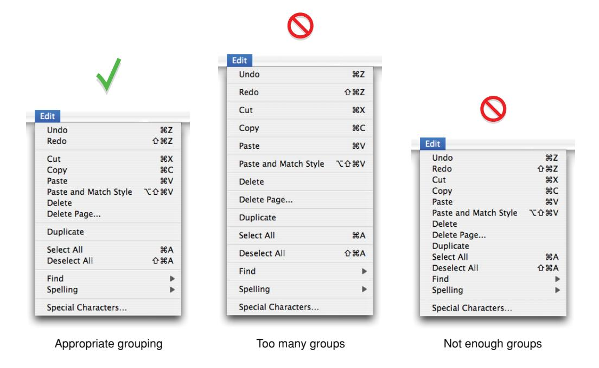

## <span id="page-157-2"></span><span id="page-157-0"></span>Hierarchical Menus (Submenus)

You can use **hierarchical menus** to offer additional menu item choices without taking up more space in the menu bar. When the user points to a menu item with a submenu indicator, a submenu appears. Submenus have all the features of menus, including keyboard shortcuts, status markers (such as checkmarks), and so on.

Because submenus add complexityto the interface and are physically more difficult to use,you should use them only when you have more menus than fit in the menu bar or for closely related commands. Use only*one level* of submenus. If a submenu contains more than five items, considergivingit its own menu.

When you use submenus, include them in a menu with a logical relationship to the choices they contain; the submenu title should clearly represent the choices it contains. Hierarchical menus work best for providing submenus of attributes (rather than actions).

Always use a hierarchical menu instead of indenting menu items. Indentation does not express the interrelationships among menu items as clearlyas a submenu does. You can, however, use indentation when displaying custom information (such as status information) in your application's Dock menu. See [Figure](#page-174-1) 12-25 (page 175) for an example of an application Dock menu. Figure 12-11 shows an example of a hierarchical menu.

<span id="page-158-1"></span>**Figure 12-11** A hierarchical menu

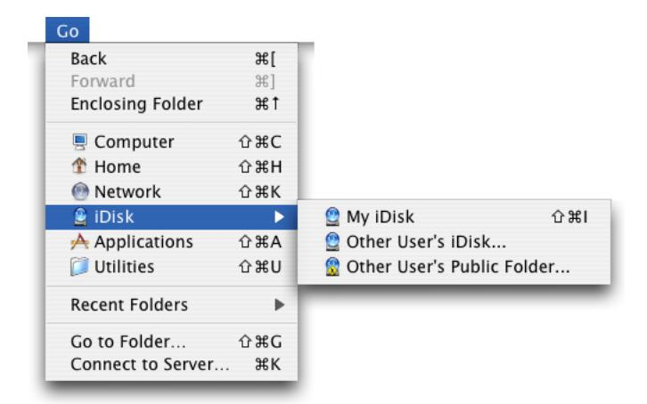

Aswith menu titles, a submenu's title is displayed unchanged even if all of the submenu's commands are unavailable (dimmed) at the same time. Users should always be able to viewa submenu's contents, whether or not they are available in the current context.

## <span id="page-158-3"></span><span id="page-158-2"></span><span id="page-158-0"></span>The Menu Bar and Its Menus

The **menu bar** extends across the top of the main screen and contains pull-down menus. There is only one menu bar at the top of the screen; don't put menu bars in windows. The menu bar provides a consistent location where people can look for commands. Each application, including the Finder, has its own menu bar consisting of a few standard menus, application-specific menus, and menu extras.

### The menu bar:

- Is always visible and available, except in circumstances such as duringa slideshow(see discussion below)
- Always contains:
  - ❏ The Apple menu (provided by the operating system)
  - ❏ The Spotlight icon (provided by the operating system)
  - ❏ The application menu (titled with the application name or an appropriate abbreviation if space is limited)
  - ❏ A Window menu
- May contain the following menus, if they make sense in your application:
  - ❏ A File menu
  - ❏ An Edit menu
  - ❏ A Format menu
  - ❏ A View menu
  - ❏ A Help menu

- ❏ Application-specific menus
- May contain menu bar extras determined by the user

The ordering of application-specific menus in the menu bar should reflect the natural hierarchy of objects in your application. Examine the user's mental model of the tasks your application performs to help you determine what this natural hierarchy is (see ["Reflect](#page-39-0) the User's Mental Model" (page 40) for more information on discovering the user's mental model). For example, if your application helps users create computer animation, the application-specific menus might be Scenes, Characters, Backgrounds, and Projects. Because a user probablysees the project as a high-level entitythat contains scenes, each of which contains backgrounds and characters, a natural ordering of these menus is Projects, Scenes, Backgrounds, and Characters.

<span id="page-159-0"></span>In general, place the menus that display commands to handle higher-level, more universal objects toward the left of the menu bar and the menus that focus on the more specific entities toward the right.

**Figure 12-12** The menu bar displayed when the Finder is active

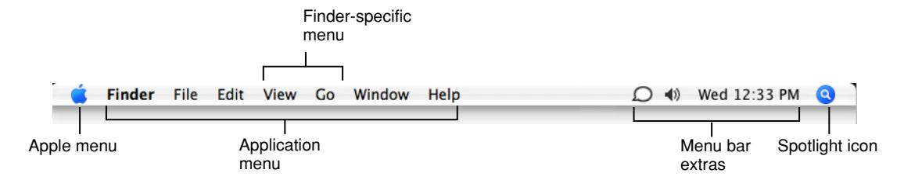

If there is insufficient room to display all of an application's menus, the menu bar status items are omitted. If there is still insufficientroom to displayall menus, the application's menus maybe omitted, starting with the rightmost menu.

<span id="page-159-1"></span>If your application can display full-screen images (such as slideshows), you may allow users to hide the menu bar. If you implement this feature, provide a clearly visible way, such as a button, for the user to make the menu bar reappear. If there is no button visible, pressing the Escape key or moving the mouse to the top of the screen should display the menu bar.

A menu's title is displayed undimmed even if all of the menu's commands are unavailable (dimmed) at the same time. Users should always be able to view a menu's contents, whether or not they are currently available.

<span id="page-160-1"></span>**Figure 12-13** A menu title is undimmed, even when all items are unavailable


**Carbon:** See *Menu Manager Reference* in Carbon User Experience Documentation.

**Cocoa:** See *Application Menu and Pop-up List Programming Topics* in Cocoa User Experience Documentation.

The following sections discuss the individual menus in the menu bar. The sections are listed in the orderthat the menus should appearin the menu bar. With the exceptions of the Apple menu (provided by the system), the application menu, and the Window menu, all other menus are optional.

Within each section, a checkmark ( ) next to a menu item indicates that unless your application cannot support the item's action or attribute, the item is required. The unmarked commands are ones that are not appropriate for all applications, but if theyare appropriate in yours,you should implement and label them as discussed.

<span id="page-160-0"></span>If there is an appropriate keyboard shortcut for a menu item, it is listed. Except for those items with a checkmark next to them, you should implement keyboard shortcuts only for those commands that will be frequently used. Unnecessary use ofkeyboard shortcuts can makeyour application confusing. For more discussion on assigning keyboard shortcuts for pull-down menu items, see ["Keyboard](#page-97-0) [Shortcuts"](#page-97-0) (page 98).

### <span id="page-160-3"></span><span id="page-160-2"></span>The Apple Menu

The **Apple menu** provides items that are available to users at all times,regardless ofwhich application is active. The Apple menu's contents are defined by the system and cannot be modified by users or developers.

<span id="page-161-1"></span>**Figure 12-14** The Apple menu

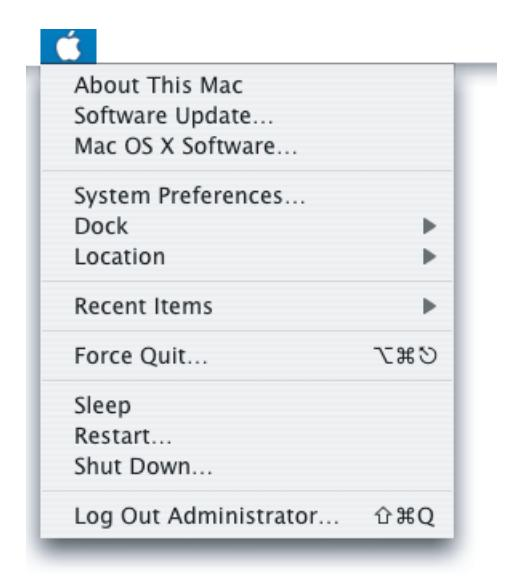

### <span id="page-161-5"></span><span id="page-161-4"></span><span id="page-161-0"></span>The Application Menu

<span id="page-161-2"></span>The **application menu** contains items that applyto the application as awhole rather than to a specific document or other window.

**Figure 12-15** The Mail application menu


### <span id="page-161-3"></span>The Application Menu Title

To help users identify the active application, the application menu title is in boldface.

In order to fit within the allotted menu bar space, the application menu title should be one word, if possible, and a maximum of 16 characters. Don't include the application version number in the name; version information belongs in the Aboutwindow. If the application name is too long, provide a short name (16 characters or fewer) as part of the application package. The Hide, Quit, and About items should also use the short application name. If you don't provide a short name, the application name is truncated from the end (and an ellipsis is added), if necessary.

### <span id="page-162-1"></span>The Application Menu Contents

**About** *ApplicationName***.** Opens your application's About window, which contains copyright information and version number. (For more information, see "About [Windows"](#page-205-0) (page 206). If you've specified a short name (see "The [Application](#page-161-3) Menu Title" (page 162)), use it in the About menu item; use the full application name in the About window.

<span id="page-162-5"></span>**Preferences… (Command-,).** Opens a preference window for your application. See *Multiple User Environments* for more information on handling preferences in a multiple-user environment.

In the application menu, put all commands that provide access toyour application's preference dialogs first, followed by application-specific items. Put a menu separator between the About command and the Preferences command. If your application provides document-specific preferences, make them available in theFile menu (see ["TheFile](#page-162-0) Menu"(page 163)). Most document-specific preferences should have a unique name, such as Page Setup, rather than Preferences.

<span id="page-162-6"></span><span id="page-162-2"></span>**Services.** The Services submenu provides awayfor one application to offerits capabilities to another application. See *Mac OS X Technology Overview* for more information on services.

<span id="page-162-3"></span>**Hide** *ApplicationName***(Command-H).** Hides all of thewindows of the currentlyrunningapplication and brings the mostrecently used application to the foreground. If necessary, use the short application title (see "The [Application](#page-161-3) Menu Title" (page 162)).

<span id="page-162-7"></span><span id="page-162-4"></span>**Hide Others (Command-Option-H).** Hides the windows of all the other applications currently running.

**Show All.** Shows all windows of all currently running applications.

**Quit** *ApplicationName* **(Command-Q).** This last item in the application menu should be preceded by a separator. When a user chooses Quit and there are unsaved documents, present the necessary alerts (see "Dialogs for Saving, Closing, and [Quitting"](#page-218-0)(page 219)). If necessary, use the short application name (see "The [Application](#page-161-3) Menu Title" (page 162)).

<span id="page-162-0"></span>You may include other application-specific menu items between the Preferences and Services menu items. Don't include a Help menu item however, because this belongs in the Help menu (see ["The](#page-171-0) Help [Menu"](#page-171-0) (page 172)).

### <span id="page-162-9"></span><span id="page-162-8"></span>The File Menu

In general, each command in the **File menu** should apply to a single file (most commonly, a user-created document).

Note that the Preferences and Quit commands, which apply to a whole application, are in the application menu. If your application provides document-specific preferences, make them available in theFile menu, preferablyright above printingcommands. If an application is not document-based, you can rename the File menu to something more appropriate or eliminate it.

Several items in the File menu—Save As, Print, and Page Setup, for example—should open sheets. For more information, see ["Document-Modal](#page-207-1) Dialogs (Sheets)" (page 208).

<span id="page-163-0"></span>**Figure 12-16** The File menu


<span id="page-163-4"></span>Standard File menu commands include these:

<span id="page-163-3"></span>**New (Command-N).** Opens a new document named "untitled" (or "untitled 2," and so on, as appropriate). If your application requires documents to be named upon creation, you can display a Save dialog (see "Dialogs for Saving, Closing, and [Quitting"](#page-218-0) (page 219)). For more information about naming new document windows, see "Opening [Windows"](#page-189-1) (page 190).

<span id="page-163-5"></span>**Open… (Command-O).** Displays a dialog for choosing an existing document to open. Note that in the Finder, the Open command is not followed by an ellipsis character because the user performs navigation and document selection before selecting the Open command. For more information, see "The Open [Dialog](#page-216-0) " (page 217).

**Open Recent.** The Open command can be followed by Open Recent so that people can open recently opened documents without using the Open dialog. The Open Recent submenu displays documents in the order in which they were opened, with the most recent item at the top. This optional command is most useful in office-productivity or other document-based applications. Note that the ability to open recent documents and applications is provided by the Apple menu in the Recent Items menu item.

<span id="page-163-1"></span>If you choose to include the Open Recent command, be sure to display document names only; don't display file paths. Users have their own ways of keeping track of which documents are which and file paths are inappropriate to display unless specifically requested by the user.

**Carbon:** You should add documents to this submenu when they are opened or saved. **Cocoa:** The Open Recent submenu is populated automatically.

<span id="page-163-2"></span>**Close (Command-W).** Closes the active window. When the user chooses this command and the active document has been changed since last saved, display the Save Changes alert (see ["Dialogs](#page-218-0) for Saving, Closing, and [Quitting"](#page-218-0) (page 219)). When the user presses the Option key, Close changes to Close All. The keyboard shortcuts Command-W and Command-Option-W should implement the Close and Close All commands,respectively. The Close command and Command-W should not close utility windows.

**Close File (Command-Shift-W).** In a file-based application that supports multiple views of the same file, you can include a Close File command below Close Window to close a file and all its associated windows. If possible, include the filename in the menu (for example, Close File "Jerry's Kids").

<span id="page-164-2"></span>**Save (Command-S).** Saves the active document, leaves the document open, and provides feedback indicating that the document is being (or has been) saved. If the document has not previously been saved, dim the Save command and make sure the Save As command is active instead. If an open document has been previously saved and the user has made no changes to it, the Save command is dimmed.

<span id="page-164-4"></span>**Save As… (Command-Shift-S).** Displays the Save dialog (described in "Save [Dialogs"](#page-218-2) (page 219)), which allows the user to save a copy of the active document with a new user-defined name, a new location, or both. The newly saved document remains open and active and displays the new name (if the user has changed it). The previously saved version of the document retains its name, location, and format, and remains closed. If the document has not previously been saved, the Save command is dimmed and the Save As command is active.

Avoid providing multiple Save As *File Format* menu commands that each save the document in a different file format. Instead, use the Format pop-up menu in the Save dialog to present the user with a selection of file formats. For example, the Format pop-up menu in Safari's Save dialog allows the user to save the current content of the window as a web archive or a page source.

<span id="page-164-11"></span>If your application needs to allow users to continue working on the active document, but save a copy of the document in a formatyour application doesn't handle,you can provide an Export As command.

<span id="page-164-5"></span>**Note:** Avoid using Save a Copy or Save To commands. The functionality users associate with these commands is provided by the Save As and Export As commands.

**Export As…** Displays the Save dialog (described in "Save [Dialogs"](#page-218-2) (page 219)) to allow the user to save a copy of the active document in a format your application does not handle. As with the Save As command, the userisgiven the option to choose a newuser-defined name, location, or both. Unlike the Save As command, however, it is the original document that should remain open so the user can continue working in the current format; the newly saved document should not automatically open. Provide this command if your application needs to allow a user to work with a document in one format and save a copy of that document in a format your application doesn't handle. Be sure to change the label of the document name text field of the Save dialog from "Save As:" to "Export As:".

<span id="page-164-7"></span><span id="page-164-6"></span>**Save All.** Saves changes to all open documents.

<span id="page-164-8"></span><span id="page-164-3"></span><span id="page-164-1"></span>**Revert to Saved.** Discards all changes made to the active document since the last time it was saved or opened. When the user chooses Revert to Saved, display an alert that warns the user about the potential data loss the operation will cause.

**Print… (Command-P).** Opens the standard Print dialog, which allows users to print to a printer, to send a fax, or to save as a PDF file. For more information, see ["Printing](#page-225-0) Dialogs " (page 226).

<span id="page-164-10"></span><span id="page-164-9"></span><span id="page-164-0"></span>**Page Setup… (Command-Shift-P).** Opens a dialogfor specifying printing parameters such as paper size and printing orientation. These parameters are saved with the document.

## The Edit Menu

The **Edit menu** provides commands that allow people to change (edit) the contents of documents and other text containers, such as fields. It also provides the commands that allow people to share data, within and between applications, via the Clipboard.

<span id="page-165-1"></span>The **Clipboard** stores whatever data is cut or copied from a document until the user replaces the contents bycuttingor copying newdata. The Clipboard is available to all applications, and its contents don't changewhen the user switches from one application to another. The Clipboard provides excellent support for the exchange of different data types between applications. Your application should maintain formatting when it copies text to the Clipboard.

<span id="page-165-0"></span>**Figure 12-17** The Edit menu


<span id="page-165-2"></span>Your application's Edit menu should provide the following commands. Even if your application doesn't handle text editing within its documents, these commands should be available for use in dialogs and wherever users can edit text:

**Undo (Command-Z).** The Undo command reverses the effect of the user's previous operation.

Support the Undo command for:

- Operations that change the contents of a document
- Operations that require a lot of effort to re-create
- Most menu items
- Most keyboard input

Operations that may not be undoable include:

- Selecting
- Scrolling
- Splitting a window
- Changing a window's size or location

<span id="page-166-0"></span>Add the name of the last operation to the Undo command. If the last operationwas a menu command, add the command name. For example, if the user has just input some text, the command could read Undo Typing; if the user has chosen the Paste command, the Undo command should read Undo Paste. If the last operation can't be reversed, change the command to Can't Undo and display it dimmed to provide feedback about the current state.

<span id="page-166-7"></span>If a user attempts to perform an operation that could have a detrimental effect on data and that can't be undone, warn the user. See ["Alerts"](#page-209-1) (page 210).

**Redo (Command-Shift-Z).** The Redo command reverses the effect of the last Undo command. Add the name of the last undone operation to the Redo command.

<span id="page-166-9"></span><span id="page-166-3"></span>**Cut (Command-X).** Removes the selected data and stores it on the Clipboard,replacingthe previous contents of the Clipboard.

<span id="page-166-8"></span>**Copy (Command-C).** Makes a duplicate of the selected data, which is stored on the Clipboard.

<span id="page-166-6"></span>**Paste (Command-V).** Inserts the Clipboard contents at the insertion point. The Clipboard contents remain unchanged, permitting the user to choose Paste multiple times.

**Paste and Match Style (Command-Option-Shift-V).** In text-editingapplications, inserts the Clipboard contents at the insertion point and matches the style of the inserted text to the surrounding text. If your application provides several text-formatting commands, you might choose to group them in a Format menu instead of listing them in the Edit menu (see "The [Format](#page-167-0) Menu" (page 168)).

<span id="page-166-2"></span><span id="page-166-1"></span>**Delete.** Removes selected data without storing the selection on the Clipboard. Choosing Delete is the equivalent of pressing the Delete key or the Clear key. Use Delete as the menu command, rather than Clear.

<span id="page-166-4"></span>**Select All (Command-A).** Highlights every object in the document or window, or all characters in a text field.

**Find… (Command-F).** Opens an interface for finding items. This command could be in the File menu instead if the object of the search is files—for example, if the application is finding a file on the Internet. When appropriate, your application should also contain a Find/Replace command. ["Find](#page-215-0) [Windows"](#page-215-0) (page 216) shows an example of a typical Find window for searching text.

<span id="page-166-5"></span>If your application provides multiple find-related commands, you may want to include a Find submenu. A Find submenu commonly contains Find (Command-F), Find Next (Command-G), Find Previous (Command-Shift-G), Use Selection for Find (Command-E), and Jump to Selection (Command-J). If you include a Find submenu, the Find command is not followed by an ellipsis character.

<span id="page-166-10"></span>**Find Next (Command-G).** Performs the last Find operation again. This item should be grouped with the Find command in either the File or Edit menu.

**Spelling… (Command-:)**. In applications that support text-editing, performs a spell-check of the selected text and opens an interface in which users can correct the spelling, view suggested spellings, and find other misspelled words.

Ifyour application provides multiple spelling-related commands,you maywant to include a Spelling submenu. A Spelling submenu typically contains Check Spelling (Command-;) and Check Spelling as You Type commands. If you include a Spelling submenu, the Spelling command is not followed by an ellipsis character.

**Speech.** Displays a submenu containing the Start Speaking and Stop Speaking commands. If your application displays text, you can provide the Speech menu item to allow users to listen to the text spoken aloud by the system.

<span id="page-167-8"></span><span id="page-167-5"></span>**Special Characters…** Displays the Special Characterswindow,which allows users to input characters from any character set supported by Mac OS X into text entry fields. This menu item is automatically inserted at the bottom of the Edit menu.

### <span id="page-167-9"></span><span id="page-167-7"></span><span id="page-167-0"></span>The Format Menu

<span id="page-167-1"></span>Ifyour application provides functions forformattingtext,you can include a**Format menu** as a top-level menu or as a submenu of the Edit menu. It may be appropriate to group some items that are in the Format menu into submenus, such as Font, Text, or Style.

**Figure 12-18** A Format menu

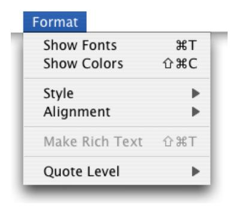

<span id="page-167-6"></span><span id="page-167-4"></span><span id="page-167-3"></span>**Show Fonts (Command-T).** The first item in theFormat menu should be ShowFonts,which displays the Fonts window.

**Carbon:** Use the FPShowHideFontPanel function. See the *Fonts Window Services Reference* in Text & International Documentation.

**Cocoa:** Use NSFontPanel.

<span id="page-167-2"></span>**Show Colors (Command-Shift-C).** Displays the Colors window.

**Carbon:** Use the NPickColor function to implement a Colors window. See *Color Picker Manager Reference* in Carbon Graphics & Imaging Documentation.

**Cocoa:** Use the NSColorPanel class. See *Color Programming Topics for Cocoa* in Cocoa Graphics & Imaging Documentation.

**Bold (Command-B).** Boldfaces the selected text or toggles boldfaced text on and off. If used as a toggle, indicate when it is on by having a checkmark next to the command in the menu.

<span id="page-168-8"></span>**Italic (Command-I).** Italicizes the selected text or toggles italic text on and off. If used as a toggle, indicate when it is on by having a checkmark next to the command in the menu.

<span id="page-168-11"></span>**Underline (Command-U).** Underlines the selected text or toggles underlined text on and off. If used as a toggle, indicate when it is on by having a checkmark next to the command in the menu.

<span id="page-168-5"></span><span id="page-168-3"></span>**Bigger(Command–Shift–equal sign).** Causes the selected item to increase in size in defined increments.

<span id="page-168-9"></span>**Smaller (Command-hyphen).** Causes the selected item to decrease in size in defined increments.

<span id="page-168-10"></span>**Copy Style (Command-Option-C).** Copies the style—font, color, and size for text—of the selected item. It may be appropriate to put this item in a Style submenu along with related items.

<span id="page-168-1"></span>**Paste Style (Command-Option-V).** Applies the style of one object to the selected object.

<span id="page-168-4"></span>**Align Left (Command-{).** Left-aligns a selection.

<span id="page-168-12"></span>**Center (Command-|).** Center-aligns a selection.

<span id="page-168-13"></span><span id="page-168-2"></span>**Justify.** Evenly spaces a selection.

<span id="page-168-6"></span>**Align Right (Command-}).** Right-aligns a selection.

**Show Ruler.** Displays a formatting ruler.

<span id="page-168-7"></span>**Copy Ruler (Command-Control-C).** Copies formatting settings such as tabs and alignment for a selection to apply to a another selection and stores them on the Clipboard.

<span id="page-168-0"></span>**Paste Ruler(Command-Control-V).** Applies formattingsettings (that have been saved to the Clipboard) to the selected object.

## <span id="page-168-16"></span><span id="page-168-14"></span>The View Menu

<span id="page-168-15"></span>The **View menu** provides commands that affect howusers see awindow's content; it does not provide commands to select specific document windows to view or to manage a specific document window. Commands to organize, select, and manage windows are in the Window menu (described in ["The](#page-170-1) [Window](#page-170-1) Menu" (page 171)).

For example, the View menu in the Finder contains commands for displaying windows in column, icon, or list mode. Commands for showing, hiding, and customizing a toolbar belong in the View menu. Create a View menu for these commands even if your application doesn't need to have other commands in the View menu. Show/Hide Toolbar should appear right above Customize Toolbar.

Avoid using the View menu to display utility windows (such as tool palettes); use the Window menu instead.

<span id="page-169-0"></span>**Figure 12-19** A View menu


<span id="page-169-3"></span><span id="page-169-2"></span>**Show/Hide Toolbar (Command-Option-T).** Shows or hides a toolbar. The Show/Hide Toolbar command is provided so that people using full keyboard access can implement these functions with the keyboard. It should be a dynamic menu item that toggles based on the current visibility of the toolbar. If the toolbaris currently visible, the menu item says Hide Toolbar. If the toolbaris not visible, it says Show Toolbar.

<span id="page-169-1"></span>**Customize Toolbar…** Opens a window that allows the user to customize which items are present. Figure 12-20 shows the result of choosing this command in the Finder.

**Figure 12-20** Finder toolbar customization window

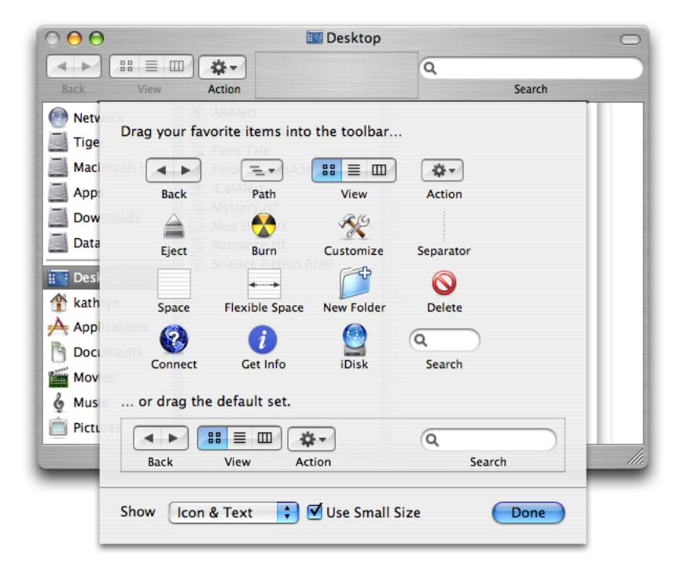

### <span id="page-170-0"></span>Application-Specific Menus

You can add your own application-specific menus as appropriate. These menus should be between the View menu and the Window menu, as illustrated in Figure 12-21.

<span id="page-170-2"></span>**Figure 12-21** Application-specific menus in Safari


<span id="page-170-1"></span>See "The Menu Bar and Its [Menus"](#page-158-0) (page 159) for more information about how to arrange application-specific menus in the menu bar.

## <span id="page-170-5"></span><span id="page-170-4"></span>The Window Menu

The **Window menu** contains commands for organizingand managingan application'swindows. The menu should list an application's open document windows (including minimized windows) in the order in which they were opened, with the most recently opened document first. If a document contains unsaved changes, a bullet should appear next to its name.

<span id="page-170-3"></span>Other than Minimize and Zoom (discussed below), the Window menu does not contain commands that affect the way a user views a window's contents. The View menu (described in "The [View](#page-168-0) [Menu"](#page-168-0) (page 169)) contains all commands that adjust how a user views a window's contents.

**Figure 12-22** A Window menu


Mac OS X does not automaticallyadd utilitywindows to the list in the Window menu and you should not list individual utility windows in this menu. You can, however, add a command to the Window menu to show or hide utility windows in your application. (For more information about utility windows, see "Utility [Windows"](#page-201-0) (page 202).)

The Minimize and Zoom commands are in the Window menu so that people using full keyboard access can implement these functions with the keyboard. Even if your application consists of only one window, include a Window menu for the Minimize and Zoom commands.

Window menu items should appearin this order: Minimize,Zoom, separator, application-specific window commands, separator, Bring All to Front (optional), separator, list of open documents. Note that the Close command should appear in the File menu, below the Open command (see ["The](#page-162-0) File [Menu"](#page-162-0) (page 163)).

**Carbon:** The Window menu is part of the default menu barwhen you create a Carbon application in Interface Builder. To create one programmatically, use the function CreateStandardWindowMenu. **Cocoa:** The Window menu is part of the default menu bar when you create a Cocoa application in Interface Builder.

<span id="page-171-5"></span><span id="page-171-4"></span>**Minimize (Command-M).** Minimizes the active window to the Dock.

<span id="page-171-6"></span>**Minimize All (Command-Option-M).** Minimizes all the windows of the active application to the Dock.

<span id="page-171-3"></span>**Zoom.** Toggles between a predefined size appropriate to the window's content and the window size the user has set. This command should *not* expand thewindowto the full screen size. See ["Resizing](#page-194-0) and Zooming [Windows](#page-194-0) " (page 195).

**Bring All to Front.** Brings forward all of an application's open windows, maintaining their onscreen location, size, and layering order. This should happen whenever a user clicks the application icon in the Dock. See "Window [Layering"](#page-195-1) (page 196).

<span id="page-171-2"></span>You can make this command an Option-enabled toggle with Arrange in Front.

<span id="page-171-0"></span>**Arrange in Front.** Brings forward all of the application's windows in their current layering order and changes their location and size so they are neatly tiled.

## <span id="page-171-8"></span><span id="page-171-7"></span>The Help Menu

<span id="page-171-9"></span>If your application provides onscreen help, the **Help menu** should be the rightmost menu of your application's menus. The first item is the name of the application and the word "Help" (Mail Help, for example). This item should open Help Viewer to the first page of your help content. It's best to have only one item in the Help menu, but if you do have more items, they should appear below the *ApplicationName* Help item. Additional items that are distinct from your help content, such as tutorials, website links, registration information, release notes, or support information should be linked to within your help book instead of being separate items in your help menu.

<span id="page-171-1"></span>Avoid adding multiple items to the Help menu that lead to the same place—your help book. Multiple entries that open Help Viewer can be confusing; differences between sections of your help book may not be as obvious to users asyou thinktheyare. Navigatingbetween sections of a help bookis typically best handled by providing links in the Help Viewer window.

**Figure 12-23** A Help menu

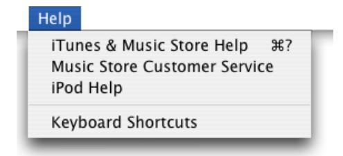

<span id="page-172-2"></span>*ApplicationName* **Help (Command-?).** Opens Help Viewertoyour application's help.Forinformation about creating help content, see *Providing User Assistance With Apple Help (Revision; Preliminary)* in User Experience Help Technologies Documentation.

### <span id="page-172-0"></span>Menu Bar Extras

Reserved for use by Apple, the right side of the menu bar may contain items that provide feedback on and access to certain hardware or network settings. Menu bar extras display some type of status in the menu bar and have a menu to change settings. The icon for the battery strength indicator, for example, dynamically displays the current state of the battery for a portable computer, and the menu has common batterysettings. Users can displayor hide a menu bar extra in the appropriate preferences pane.

**Important:** Don't create your own menu bar extras. Use the Dock menu functions to open a menu from your application's icon in the Dock.

If there is not enough room in the menu bar to display all menus, menu bar extras are removed automatically by Mac OS X to make room for application menus, which take precedence. Because of this, and because users can choose to hide menu bar extras, you should not rely on their presence.

## <span id="page-172-3"></span><span id="page-172-1"></span>Contextual Menus

A **contextual menu** provides convenient access to often-used commands associated with an item. You can think of a contextual menu as a shortcut to commands that make sense in the context of the current task. Contextual menus open when the user presses the Control key while clicking an appropriate interface element or selection. Alternately, a user can configure a multi-button mouse to use one button as the secondarybutton,which then behaves the same as Control-clickinga one-button mouse.

A contextual menu behaves like a standard pull-down menu, except that moving the pointer off a contextual menu and onto a standard pull-down menu doesn't activate the second menu; the user must click once to close the contextual menu and click again or press to open the second menu.

Contextual menus that are too long to display fully use the scrolling indicator (a downward-pointing triangle) and scroll like standard menus. Use submenus in contextual menus with caution and be sure to keep them to one level.

Don't set a default item. If the user opens the menu and closes itwithout selectinganything, no action should occur.

You define the items in your application's contextual menus. Include a small subset of the most commonly used commands in the appropriate context. For example, Edit menu commands should appear in the contextual menu for highlighted text, but a Save or a Print command should not.

Always ensure that contextual menu items are also available as menu commands. A contextual menu is hidden by default and a user might not know it exists, so it should never be the only way to access a command. In particular,you should not use a contextual menu as the onlywayto access an advanced or power-user feature.

Contextual Menus **173**

If a command has akeyboard shortcut, don't displaythe shortcut in the contextual menu (you should display the shortcut in the menu bar menu, as described in "The Menu Bar and Its [Menus"](#page-158-0) (page 159)). Because a user uses a contextual menu as a shortcut to a set of task-specific commands, it's redundant to display the keyboard shortcuts for those commands.

<span id="page-173-0"></span>**Figure 12-24** A contextual menu for an icon in the Finder and for a text selection in a document


**Carbon:** See *Menu Manager Reference* in Carbon User Experience Documentation.

**Cocoa:** See *Application Menu and Pop-up List Programming Topics* in Cocoa User Experience Documentation.

## <span id="page-174-0"></span>Dock Menus

<span id="page-174-2"></span>When a user presses and holds the mouse button on your application's tile in the Dock, a menu appears. The menu lists the application's open windows and contains the Show In Finder, Hide, and Quit commands. The Show In Finder command displays a Finder window for the folder containing your application. The Hide and Quit commands function as documented in "The [Application](#page-161-0) [Menu"](#page-161-0) (page 162). If the user presses the Option key, Hide changes to Hide Others and Quit changes to Force Quit. If the tile has not been permanently added to the Dock, the command Keep In Dock also appears.

<span id="page-174-1"></span>**Figure 12-25** The iTunes Dock menu

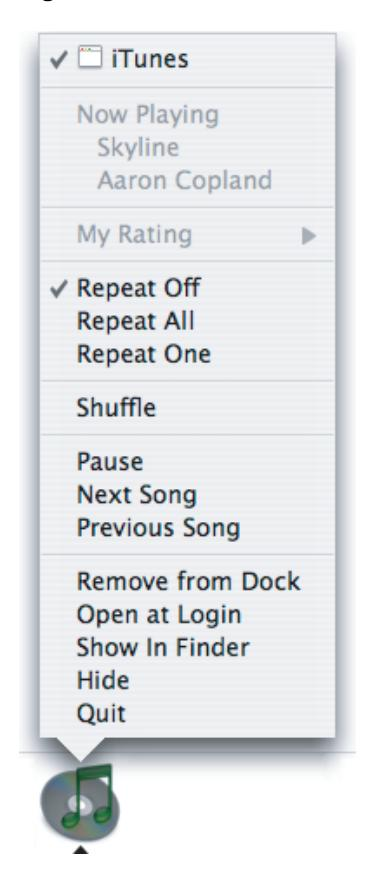

You can customize your application's Dock menu by adding to the default items provided by the Dock. These additional items appear in the Dock menu only when the application is open. Potential additional items include:

- Common commands to initiate actions in your application when it is not frontmost
- Commands that are applicable when there is no open document window
- Status and informational text

For example, a mail application could provide commands to initiate a new message or to check for new messages.

#### **C HAPTER 1 2**

Menus

Any command you add to the Dock menu should also be available in your application's pull-down menus. Application-specific items appear above the standard Dock menu items.

<span id="page-175-0"></span>**Carbon:** See *Dock Tile Programming Guide* in Carbon User Experience Documentation. **Cocoa:** See NSApplication reference documentation for information on customizing the Dock menu.

<span id="page-176-2"></span><span id="page-176-0"></span>Windows provide a frame for viewing and interacting with applications and data.

From a developer's perspective, there are many types of windows in Mac OS X. Although a user might see them all as windows, the distinctions in behavior (layering, zooming, minimizing) and appearance (presence or absence of title bars) among the various types of windows contribute to the Macintosh user experience. It is important that you understand the different types of windows available, general window behavior, and behavior specific to each type of window.

This chapter first introduces the different types of windows and then focuses on the appearance and behavior of document, application, and utilitywindows. Dialogs and alertwindows are unique types of windows with guidelines in addition to those for standard windows. They are discussed in detail in ["Dialogs"](#page-206-1) (page 207). Note that unless explicitly stated, dialogs should behave like windows.

## <span id="page-176-1"></span>Types of Windows

<span id="page-176-3"></span>As a developer or a designer, you should be aware of four main types of windows. Although their behavior is generally the same, they have important differences.

- **Document windows** contain file-based user data. They present a viewinto the content that people create and store. If the document is larger than the window, the window shows a portion of the document's contents and provides users with the ability to scroll to other areas.
- **Application windows** are the mainwindows of applications that are not document-based. These windows can use the standard Aqua window look and features or (less frequently) the brushed metal look.
- **Utility windows** float above other windows and provide tools or controls that users can work with while documents are open. Utility windows (also called palettes) are discussed in more detail in "Utility [Windows"](#page-201-0) (page 202).
- **Dialogs and alerts** require a response from the user. These are discussed in ["Dialogs"](#page-206-1) (page 207).

Examples of all of these types of windows are shown in Figure 13-1.

<span id="page-177-1"></span>**Figure 13-1** Four types of windows

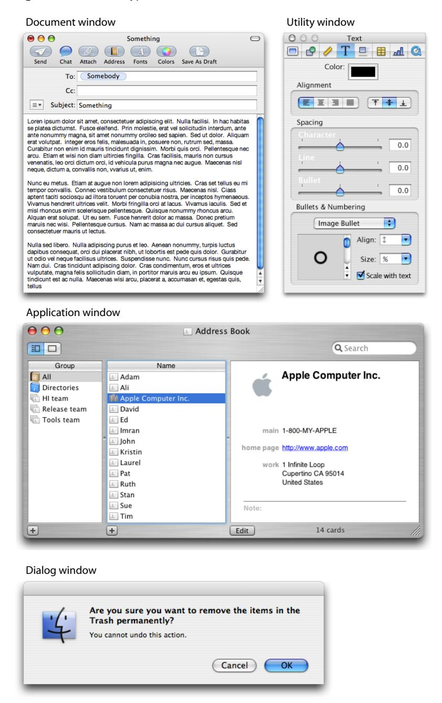

<span id="page-177-3"></span>**Carbon:** See *Handling Carbon Windows and Controls* in Carbon User Experience Documentation. **Cocoa:** See *Window Programming Guide for Cocoa* in Cocoa User Experience Documentation.

## <span id="page-177-2"></span><span id="page-177-0"></span>Window Appearance

Every document, application, and utility window should have, at a minimum:

- A title bar. Even if thewindowdoes not have an actual title (a tools palette, for example), it should have a title bar so that users can move the window.
- A close button, so that the user has a consistent way to dismiss it.

In addition, a standard document window has the following attributes that an application or utility window might not have:

- <span id="page-178-2"></span>■ Horizontal or vertical scroll bars, or both (if not all the window's contents are visible)
- Minimize and zoom buttons
- A proxy icon (after a document has been saved)
- The title of the document
- A resize control
- A toolbar control

<span id="page-178-1"></span>These elements are shown in their proper placements in Figure 13-2 (to see the proper placement of a horizontal scroll bar, see [Figure](#page-199-1) 13-22 (page 200)).

**Figure 13-2** Standard window parts


### <span id="page-178-0"></span>The Title Bar

All windows should have a title bar even if the window doesn't have a title (which should be a very rare exception).

### The Window Title

A document window should display the name of the document being viewed. Application windows displaythe application name. Utilitywindows displaya descriptive title appropriate forthatwindow. If the contents of the window can change, it might be appropriate to change the title to reflect the current context. For example, in the Keynote inspector, the title of the window changes to reflect which pane has been selected.

If you need to display more than one item in the title, separate the items with an em dash (—) with space on either side. For example, the main viewer window of Mail displays the currently selected message mailbox and the selected folder, if any. Note that if a message is viewed in its own window, the message title is displayed.

Don't display pathnames in window titles. When displaying document titles, use the display name and show the extension if the user has selected to show extensions.

### Title Bar Buttons

Document and application windows always display active close and minimize buttons. (See ["Closing](#page-195-0) [Windows"](#page-195-0) (page 196) and ["Minimizing](#page-194-1) and Expanding Windows " (page 195) for details on what the close and minimize buttons do.) Include the zoom button if the window can be adjusted in size. Information on how the zoom button works is in "Resizing and Zooming [Windows](#page-194-0) " (page 195).

<span id="page-179-0"></span>Utility windows always display an active close button but never an active minimize button.

If buttons are not active, they should at least all be present in an inactive state. The exception is utility windows, where it is acceptable to display only one button, the close button.

Alerts and modal dialogs do not include any of these buttons.

The title bar should include a toolbar control if a toolbaris available in thewindow(see ["Toolbars"](#page-183-0)(page 184)).

<span id="page-180-0"></span>**Figure 13-3** Title bar buttons for standard windows


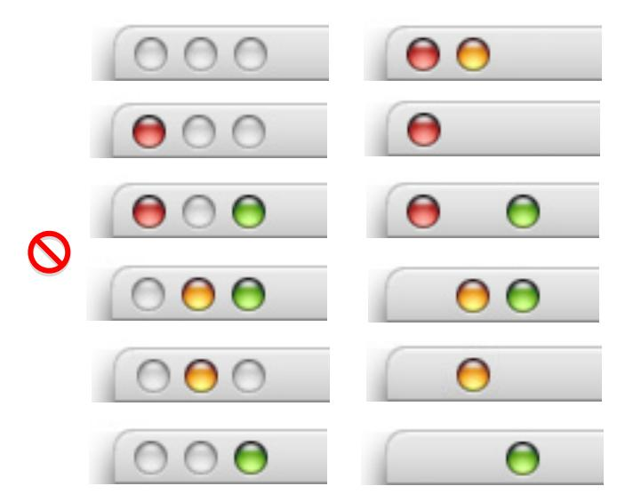

### <span id="page-180-1"></span>Indicating Changes With the Close Button

When a document has unsaved changes, the close button should display a dot.

**Figure 13-4** The close button in its unsaved changes state


<span id="page-180-2"></span>**Carbon:** Display the dot with the SetWindowModified function.

**Cocoa:** The dot appears automatically if the application is NSDocument-based; otherwise, use the setDocumentEdited: method of the NSWindow class.

### The Proxy Icon

<span id="page-181-1"></span>Document windows include a **proxy icon** in the title bar after a document is saved for the first time. After pressing a proxy icon for a brief period, users can manipulate it as if they were manipulating the corresponding file-system object. For example, you can attach a document to an email message by dragging its proxy icon into the email message.

<span id="page-181-0"></span>**Figure 13-5** A proxy icon being dragged to another application


<span id="page-182-2"></span>A proxyicon appears in its normal state as longas the state of the document and the file-system object are the same. When a document has unsaved changes, its proxy icon appears dimmed. Note the difference between the proxy icon in the document with unsaved changes versus the document with saved changes in Figure 13-6.

<span id="page-182-0"></span>**Figure 13-6** Proxy icons in documents with saved and unsaved changes


<span id="page-182-1"></span>Command-clickingthe title orthe proxyicon displays a pop-up menu illustratingthe document path. As shown in [Figure](#page-182-1) 13-7 (page 183), the document path displays the document itself and all containing folders up to the volume that contains the user's home directory. Because Mac OS X is a multiple-user environment, it's especially important to show the complete path of a document to avoid confusion.

**Figure 13-7** A document path pop-up menu, opened by Command-clicking the proxy icon


## <span id="page-183-0"></span>Toolbars

<span id="page-183-4"></span>**Toolbars** are useful for giving users immediate access to the most frequently used commands. Any item in a toolbar should also be available as a menu command. An application-wide toolbar in its ownwindowis also called a **tool palette;** for more information, see "Utility [Windows"](#page-201-0)(page 202). This section describes toolbars that are part of a window with other content.

The set of toolbar items you provide should fit in the default window size; users should be able to customize which items appear in the toolbar and in what order. As the default, a toolbar should display icons with text labels; users should be able to change the display to icons only or text only. You can provide these options with a Customize Toolbar command in the View menu.

When the user has selected an item in the toolbar, it should either maintain its pressed state to indicate that item is selected, or the icon itself should change to indicate the current state.

Toolbar items can support click-through, which means that the user can activate the item when the containing window is inactive. You can choose to support click-through for any subset of toolbar items; for guidelines on when this might be appropriate, see ["Click-Through"](#page-197-1) (page 198).

<span id="page-183-2"></span>If your application uses toolbars as part of a window with other content, include a control in the window's title bar for showing and hiding the toolbar, as shown in Figure 13-8. You should also put commands for showing and hiding the toolbar in the View menu (see "The View [Menu"](#page-168-0) (page 169)).

**Figure 13-8** The toolbar control


For information about designing icons for toolbars, see ["Toolbar](#page-136-0) Icons" (page 137).

<span id="page-183-1"></span>**Carbon:** Create a toolbar with the HIToolBarCreate function. See *HIToolbar Programming Guide* in Carbon User Experience Documentation for more information.

**Cocoa:** Create a toolbar with the NSToolbar class.

### <span id="page-183-3"></span>Drawers

A **drawer** is a child window that slides out from a parent window and that the user can open or close (showor hide)while the parentwindowis open. A drawer should contain frequentlyaccessed controls that don't need to be visible at all times. A drawer's contents should be closely related to the contents of its parent window. A drawer automatically inherits the brushed metal appearance if its parent window is brushed metal (see "Brushed Metal [Windows](#page-186-0) " (page 187).

<span id="page-184-0"></span>**Figure 13-9** An open drawer next to its parent window

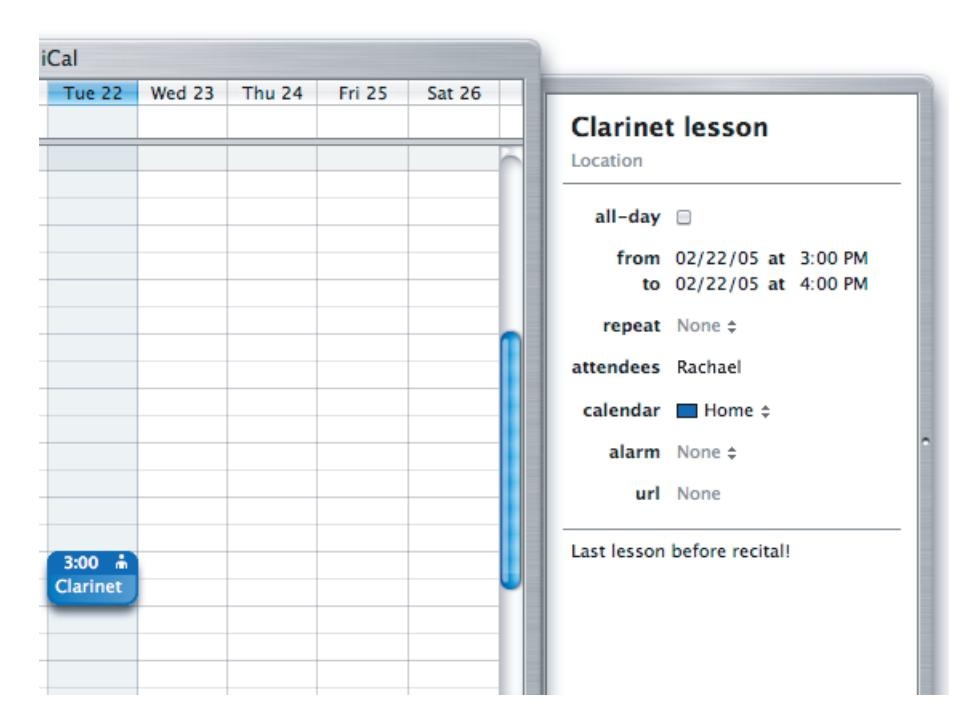

<span id="page-184-3"></span>**Carbon:** Create a drawer using the CreateNewWindow function with the kDrawerWindowClass constant, and associate it with its parent window using SetDrawerParent. The Carbon Window Manager also provides other drawer-related functions.

**Cocoa:** Drawers support is available via the NSDrawer class.

### <span id="page-184-2"></span>When to Use Drawers

Use drawers only for controls that need to be accessed fairly frequently but that don't need to be visible all the time. (Contrast this criterionwith a utilitywindow,which should be visible and available whenever its main window is in the top layer.) Some examples of uses of drawers include access to favorites lists, the Mailbox drawer (in the Mail application), or browser bookmarks.

Although a drawer is somewhat similar to a sheet in that it attaches to a window and slides out, the two elements are not interchangeable. Sheets are primarily intended to replace modal dialogs, as described in "When to Use [Sheets"](#page-208-0) (page 209), whereas drawers provide additional functionality. When a sheet is open, it is the focus of the window and it obscures the window contents; when a drawer is open, the entire parent window is still visible and accessible.

<span id="page-184-1"></span>Some uses of a drawer are similar to uses of a source list. See ["Source](#page-185-0) Lists" (page 186) for information on when to use a source list.

### Drawer Behavior

The user shows or hides a drawer, typically by clicking a button or choosing a command. If a drawer contains a valid drop target,you mayalsowant to open the drawerwhen the user drags an appropriate object to where the drawer appears.

When a drawer opens or closes, it appears to be sliding from behind its parent window, to the left, right, or down. You should ensure that a parent window's default position allows its drawer to open fully without disappearing offscreen. If a user moves a parent window to the edge of the screen and then opens a drawer, it should open on the side of the window that has room. If the user makes a window so big that there's no room on either side, the drawer opens off the screen.

To support the illusion that a closed drawer is hidden behind its parent window, an open drawer should be smaller than its parent window. When the parent window is resized vertically, an open drawer resizes, if necessary, to ensure that it does not exceed the height of the parent window. (A drawer can be shorter than its parent window.) The illusion is further reinforced by the fact that the inner border of a drawer is hidden by the parent window and that the parent window's shadow is seen on the drawer when appropriate.

The user can resize an open drawer by dragging its outside border. The degree to which a drawer can be resized is determined bythe content of the drawer. If the userresizes a drawer significantly—to the pointwhere content is mostlyobscured—the drawer should simplyclose.For example, if a drawer contains a scrolling list, the user should be able to resize the drawer to cover up the edge of the list. But if the user makes the drawer so small that the items in the list are difficult to identify, the drawer should close. If the user sets a new size (if that is possible) for a drawer, the new size should be used the next time the drawer is opened.

A drawer should maintain its state (open or closed) when its parent window becomes inactive or when the window is closed and then reopened. When a parent window with an open drawer is minimized, the drawer should close; the drawer should reopen when the window is made active again.

A drawer can contain any control that is appropriate to its intended use. Follow normal layout guidelines, as stated in ["Positioning](#page-288-1) Full-Size Controls" (page 289).

<span id="page-185-0"></span>Consider a drawer part of the parentwindow; don't dim a drawer's controlswhen the parentwindow has focus, and vice versa. When full keyboard access is on, a drawer's contents should be included in the window components that the user can select by pressing Tab.

## <span id="page-185-2"></span>Source Lists

<span id="page-185-1"></span>A **source list** is an area of window set off by a movable splitter bar to provide users a way to navigate data (for more information on splitter bars, see "Split [Views"](#page-276-0) (page 277)). Use a source list when the data presented in it is a primary means of navigatingwithin the application, as in iTunes ortheFinder. Users select objects in the source list that they act on in the main part of the window.

Source lists are normally used in applicationwindows, not in documentwindows. The iTunes playlist, the iPhoto library, and the Finder Sidebar are all examples of source lists.

<span id="page-186-1"></span>**Figure 13-10** Finder Sidebar as a source list


<span id="page-186-0"></span>Do not put controls in a source list other than contextual controls used to organize the data itself. You might include controls below the source list to add, remove, or get information about items in the source list. If you need to add other controls, consider using a drawer instead of a source list.

### <span id="page-186-3"></span><span id="page-186-2"></span>Brushed Metal Windows

Windows have two distinct looks in Mac OS X. There is the standard default look of windows, as shown in most of the examples so far. There is also a brushed metal look available, shown in Figure 13-11.

Don't use the brushed metal look indiscriminately. In particular, don't use the brushed metal appearance merely to make your application stand out. Instead, follow the design guidelines in ["The](#page-24-0) Design [Process"](#page-24-0) (page 25) and "Human [Interface](#page-38-0) Design" (page 39) to distinguish your application by reflecting the user's mental model.

The brushed metal appearance works well for some types of applications, but most applications appear too heavy when using this look. For example, it works well for the iSync application window (shown in Figure 13-11), because iSync helps you manage your digital hub. On the other hand, the brushed metal look does not work well for the TextEdit document window (shown in Figure 13-12), because TextEdit is document-based.

<span id="page-187-0"></span>**Figure 13-11** A brushed metal application window

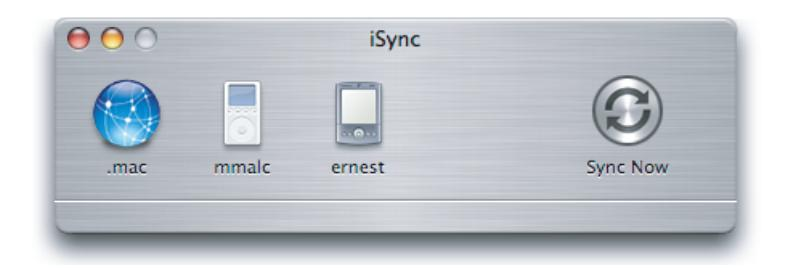

**Figure 13-12** Metal and regular versions of a document window

<span id="page-187-1"></span>

You can use a brushed metal window if your application:

- Is a single-window application that provides a source list to navigate information—for example, iTunes or the Finder
- Strives to re-create a familiar physical device—Calculator or DVD Player, for example

■ Provides an interface for a digital peripheral, such as a camera, or an interface for managing data shared with digital peripherals—iPhoto or iSync, for example

You should not use a brushed metal window if your application:

- Is a multi-window application—for example, Interface Builder
- Is a document-based application—for example, TextEdit

Use the brushed metal window look for the primary application window and other windows that meet the above criteria—for example, the Equalizer window in iTunes. Don't use it for supporting windows, such as preferences and other dialogs. It is acceptable to have a mix of standard Aqua windows and brushed metal windows within an application, as the Finder does.

<span id="page-188-0"></span>**Figure 13-13** Mixing standard and brushed metal versions of windows


If a brushed metalwindowhas a drawer or a toolbar, it automaticallyinherits the brushed metal look.

<span id="page-188-1"></span>Users can move metal windows by dragging anywhere on the brushed metal surface (not just the title bar).

**Carbon:** Use the window type defined in MacWindows.h.

**Cocoa:** Applythe NSTexturedBackgroundWindowMask to a titledwindow. Avoid usinga borderless window, which doesn't have rounded corners.

## <span id="page-189-2"></span><span id="page-189-0"></span>Window Behavior

This section discusses how you should open, position, resize, and close windows and provides guidelines on how they should behave when a user interacts with them.

### <span id="page-189-1"></span>Opening Windows

Your application should open a window when a user does any of the following:

- Double-clicks the icon for a document supported by your application in the Finder
- Double-clicks your application icon
- Selects a document in the Finder and chooses open from the File menu (or selects the document and presses Command-O in the Finder)
- Chooses a file from within an Open dialog
- <span id="page-189-3"></span>■ Chooses the New command from the File menu
- <span id="page-189-6"></span>■ Clicks the application icon in the Dock when no windows are open

When the user opens an existing document, make sure its title is the **display name,** which reflects the user's preference for showingor hidingits filename extension. Don't display pathnames in document titles.

<span id="page-189-4"></span>New windows should be named as described in "Naming New [Windows"](#page-190-0) (page 191).

The content of somewindows changes dependingon the user's selection.For example,when the user clicks one of the icons at the top of the Mail Preferences window, the display at the bottom of the window changes. Some windows, such as Displays in System Preferences, switch panes using a tab control (see "Tab [Views"](#page-278-0) (page 279)).

<span id="page-189-5"></span>Windows with changeable panes should reopen in their previous state as long as the application is open and return to their default views when the user quits. In a window with toolbars, if the toolbar represents only a subset of multiple possible views (favorites), the default state should be to show all of the options below the toolbar, not a particular pane. If the toolbar displays all of the possible selections, then the default state of the window should be to display whichever pane the user last selected. For example, when System Preferences opens, all of the possible selections are visible, but when Mail preferences opens, it displays the last pane selected by the user.

<span id="page-190-1"></span>**Figure 13-14** System Preferences in the default state


### <span id="page-190-5"></span><span id="page-190-4"></span><span id="page-190-0"></span>Naming New Windows

<span id="page-190-3"></span>If your application is not document-based, use the name of your application as the window title. If your application has a short name, use it as the title.

<span id="page-190-6"></span><span id="page-190-2"></span>Name a new document window "untitled"; leaving it lowercase makes it more obvious that the window doesn't have a name and encourages people to save the document. If the user chooses New again before saving the first untitled window, name the second window "untitled 2," and so on. Add numbers to window titles only when there is more than one open untitled window. Don't put a "1" on the first untitled window, even after the user opens other new windows.

**Figure 13-15** Appropriate titles for a series of unnamed windows


If the user dismisses all untitled windows by saving or closing them, then the next new document should start over as "untitled," the next should be "untitled 2," and so on.

<span id="page-191-1"></span>**Figure 13-16** Examples of correct and incorrect window titles


### <span id="page-191-5"></span><span id="page-191-0"></span>Positioning Windows

<span id="page-191-2"></span>Whenever your application displays a window, you must decide where to put it and how big to make it.

<span id="page-191-4"></span><span id="page-191-3"></span>New document windows should open horizontally centered and should display as much of the document content as possible. The top of the document window should butt up against the menu bar (or the application's toolbar, if one is open and positioned below the menu bar). Subsequent windows should open to the right 20 pixels and down 20 pixels. Make sure that no part of a new window overlaps with the Dock. For more information about the Dock, see "The [Dock"](#page-55-0) (page 56).

For nondocument windows, the preference is to open new windows horizontally centered as shown in Figure 13-17. The vertical position should be visually centered: The distance from the bottom of the window to the top of the Dock (if it's at the bottom of the screen) should be approximately twice the distance as that from the bottom of the menu bar to the top of the window. Subsequent windows are moved to the right 20 pixels and down 20 pixels. Make sure that no part of a newwindowoverlaps with the Dock.

<span id="page-192-0"></span>**Figure 13-17** "Visually centered" placement of a new nondocument window

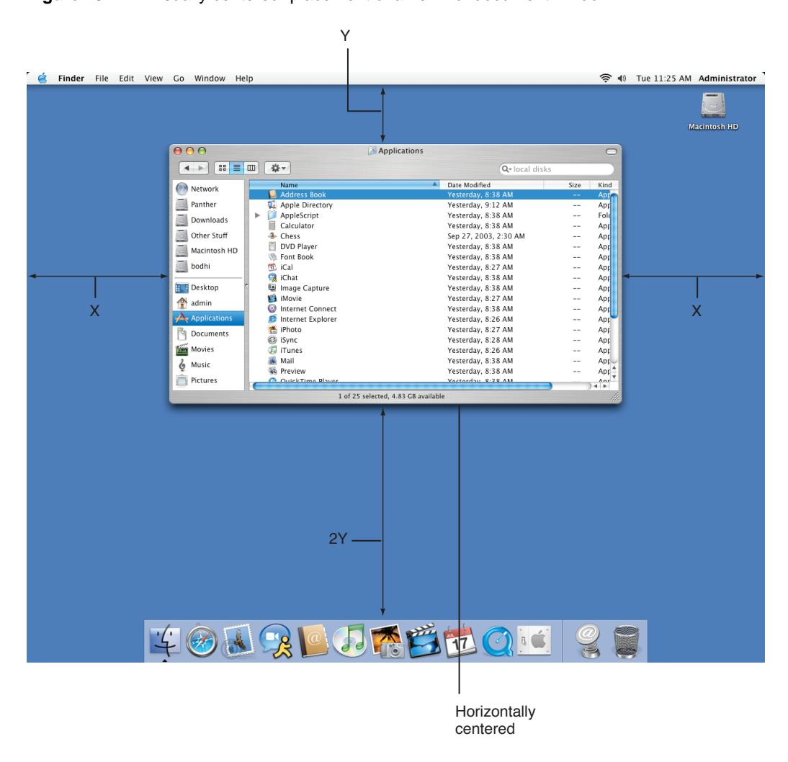

If a user changes a window's initial size or location, maintain the user's choices the next time the associated file or window (in the case of a single-window application) opens. If a user opens, moves, and closes a document window without making any other changes, save the new window position but don't modify the file's date stamp.

<span id="page-192-1"></span>Before reopeningawindow, make sure that the size and state are feasible forthe user's current monitor setup, which may not be the same as the last time the document was open. Try to maintain the window's previous location (the top-left corner of the window) and, if possible, its size. If you can't replicate both, maintain the location and reduce the window's size. If that is not possible, try to keep the window on the same monitor, open the window so that as much of the content as necessary is visible, and follow the guidelines for opening a new window, as described previously.

For example, if a user opens a document to full size on a wide aspect-ratio display and then opens the file on a computer with a smaller display, the document should open in a window sized for the smaller display, not in the larger, saved size. For more information on appropriate window size, see "Resizing and Zooming [Windows](#page-194-0) " (page 195).

<span id="page-193-3"></span>On a computer with more than one display, display the first new window visually centered in the screen containing the menu bar. If the user doesn't move that first window, display each additional window below and to the right of its predecessor. If the user moves the window, display each additionalwindowon the screen that contains the largest portion of the frontmostwindow, as shown in Figure 13-18. For example, if the user creates a window, drags it completely to a second monitor, and then creates a new window, display the new window on the second screen. If there is sufficient room on the screen, display subsequent windows to the lower right of the frontmost window. If there isn't enough room on the screen, displaysubsequentwindows startingin the original visuallycentered position, and then continue to display additional windows slightly offset to the lower right.

<span id="page-193-1"></span>If the user moves a window so that it is entirely positioned on a second monitor and then opens the window on a single-monitor system, respect the window's previous size, if possible.

**Figure 13-18** Appropriate placement of a new window on a system with multiple monitors (the user moved the first window to span the screens)


<span id="page-193-0"></span>If the user opens several windows on a multiple-monitor system, continue to place the windows on the screen where the user is working, each new one below and to the right of its predecessor. Don't open a window so that it spans monitors; the *initial position* of a window should always be contained on a single screen.

### <span id="page-193-2"></span>Moving Windows

The user moves a window by dragging its title bar or, for brushed metal windows, anywhere on the border. As a user drags, the full window and its contents move.

Pressing the Command key while dragging an inactive window moves the window but does not make it active.

Your application should never allow users to move a window to a position from which they can't reposition it.

### <span id="page-194-0"></span>Resizing and Zooming Windows

<span id="page-194-3"></span>Your application determines the minimum and maximum window size. Base these sizes on the resolution of the displayand on the constraints ofyour interface.For documentwindows, tryto show as much of the content as possible, or a reasonable unit, such as a page.

<span id="page-194-5"></span>Your application also sets the values for the initial size and position of a window, called the **standard state.** Don't assume that the standard state should be as large as possible; some monitors are much larger than the useful size for a window. Choose a standard state that is best suited for working on the type of document your application creates and that shows as much of the document's contents as possible.

The user can't change the standard size and location of a window, but your application can change the standard state when appropriate. For example, a word processor might define the standard size and location aswide enough to displaya documentwhosewidth is specified in the Page Setup dialog.

The user changes a window's size by dragging the size control (in the lower-right corner). As a user drags, the amount of visible content in the window changes. The upper-left corner of the window remains in the same place. The actual window contents are displayed at all times.

<span id="page-194-7"></span><span id="page-194-6"></span>If the user changes a window's size or location by at least 7 pixels, the new size and location is the **user state.**The user can toggle between the standard state and the user state by clicking the **zoom button.** When the user clicks the zoom button of a window in the user state, your application should first determine the appropriate size of the standard state. Move the window as little as possible to make it the standard size, and keep the entire window on the screen. The zoom button should not cause the window to fill the entire screen unless that was the last state the user set.

When a user with more than one monitor zooms a window, the standard state should be on the monitor containing the largest portion of the window, not necessarily the monitor with the menu bar. This means that if the user moves awindowbetween monitors, thewindow's position in the standard state could be on different monitors at different times. The standard state for anywindow must always be fully contained on a single monitor.

<span id="page-194-2"></span><span id="page-194-1"></span>When zooming a window, make sure it doesn't overlap with the Dock. For more information about the Dock, see "The [Dock"](#page-55-0) (page 56).

### Minimizing and Expanding Windows

<span id="page-194-4"></span>When the user clicks the **minimize button**, double-clicks the title bar, or presses Command-M, the window minimizes into the Dock. The window's icon remains in the Dock until the user clicks it or, if it is the application's only open window, until the user clicks the application icon in the Dock. For more information about the Dock, see "The [Dock"](#page-55-0) (page 56).

Clicking an application icon in the Dock should always result in a window—a document or another appropriate window—becoming active. In a document-based application that is not open when the user clicks the Dock icon, the application should open a new, untitled window.

While an application is open, the Dock icon has a symbol below it. When a user clicks an open application's icon in the Dock, the application becomes active and all open unminimized windows are brought to the front; minimized document windows remain in the Dock. If there are no

unminimized windows when the user clicks the Dock icon, the last minimized window should be expanded and made active. If no documents are open, the application should open a new window. (If your application is not document-based, display the application's main window.)

### <span id="page-195-0"></span>Closing Windows

Users can close windows by:

- Choosing Close from the File menu
- Pressing Command-W
- Clicking the close button

When a user closes a document window, your application should:

- Decide what to do with unsaved data (see "Dialogs for Saving, Closing, and [Quitting"](#page-218-0) (page 219))
- Store thewindow's onscreen position and size (so theycan be usedwhen thewindowis reopened)

<span id="page-195-1"></span>In most cases, applications that are not document-based should quitwhen the mainwindowis closed. For Example, System Preferences quits if the user closes the window. If an application continues to perform some function when the main window is closed, however, it may be appropriate to leave it runningwhen the mainwindowis closed.For example, iTunes continues to playwhen the user closes the main window.

### <span id="page-195-3"></span>Window Layering

Each application and document window exists in its own layer, so documents from different applications can be interleaved. Clicking a window to bring it to the front doesn't disturb the layering order of any other window.

A window's depth in the layers is determined by when the window was last accessed. When a user clicks an inactive document or chooses it from the Window menu, only that document, and any open utilitywindows, should be brought to the front. Users can bringallwindows of an application forward by clicking its icon in the Dock or by choosing Bring All to Front in the application's Window menu. These actions should bringforward all of the application's openwindows, maintainingtheir onscreen location, size, and layering order within the application. For more information, see "The [Window](#page-170-1) [Menu"](#page-170-1) (page 171).

<span id="page-195-4"></span><span id="page-195-2"></span>Utilitywindows are always in the same layer, the top layer. Theyare visible onlywhen their application is active and they float on top of any document windows in the application.

Users can cycle forward or backward through all open document windows by using Command-` (grave accent) and Command-Shift-` (grave accent). If full keyboard access is on, they can cycle through all windows by using Control-F4 and Shift-Control-F4.

### Main, Key, and Inactive Windows

<span id="page-196-1"></span>Windows have different looks based on howthe useris interactingwith them. The foremost document or application window that is the focus of the user's attention is referred to as the **main window**. The main window is often also the **key window**. The key window is the window that accepts user input, whether from the keyboard, mouse, or alternative input device.

The main window is not always the key window though. There are times when a window other than the main window takes the focus of the input device, while the main window still remains the focus of the user's attention. For example, when a person is using an inspector, a Find dialog, or the Fonts or Colors windows, the document is the main window and the other window is the key window.

If the main and key window are different windows, they are distinguished from one another by the look of their title bars.

<span id="page-196-0"></span>Main and key windows are both active windows. Active windows are visually distinct from **inactive windows** in that their controls have color, while the controls in inactive windows do not have color. Inactive windows are windows the user has open, but are not in the foreground. Main and key windows are always in the foreground and their controls always have color. Note the visual distinctions between main, key, and inactive windows in Figure 13-19.

**Figure 13-19** Main, key, and inactive windows

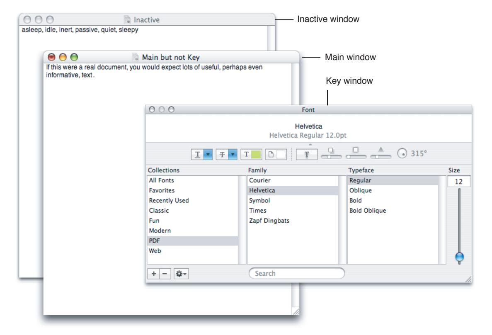

### <span id="page-197-1"></span>Click-Through

<span id="page-197-2"></span>An item that provides **click-through** is one that a user can activate on an inactive window with one click, instead of clicking first to make the window active and then clicking the item. Click-through provides greater efficiency in performing such tasks as closing or resizing inactive windows, and copying or moving files. In many cases, however, click-through could confuse a user who clicks an item unintentionally.

Click-through is not a propertyof a class of controls. Anycontrol, includingtoolbaritems, can support click-through in many contexts, but the same control could disable click-through when its use could be destructive or difficult to reverse in a particular context.

<span id="page-197-0"></span>In an inactive window, items that do not provide click-through should appear in their disabled state.

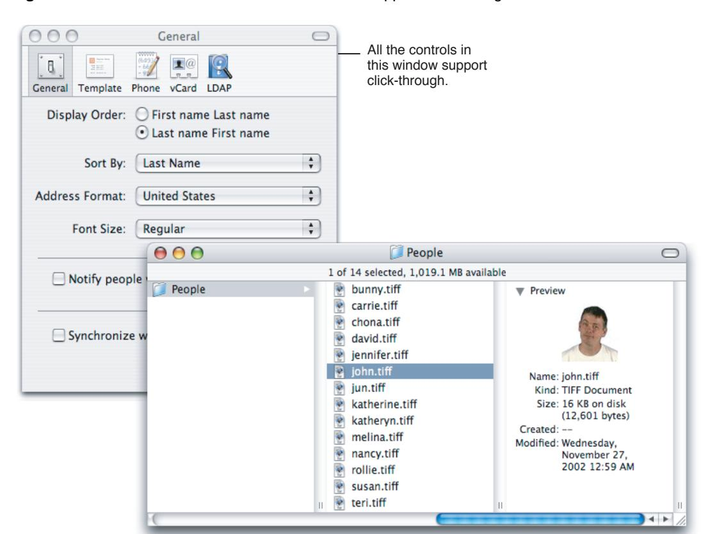

**Figure 13-20** An inactive window with controls that support click-through

In a single window, you can provide click-through for any subset of items; you do not have to choose between supporting click-through for all items or none. Examine the controls in your window to see which items a user might want to activate while the window is inactive. Use the following guidelines to help you determine which items should not support click-through.

Don't provide click-through for an item or action that:

■ Is potentially harmful and does not allow the user to cancel it (for example, the Delete button in Mail)

- Is difficult or impossible to cancel (such as the Send button in Mail)
- Dismisses a dialog without telling the user what action was taken (for example, the Save button in a Save dialog that overwrites an existing file and automatically dismisses the dialog)
- Removes the user from the current context (for example, selecting a new item in a Finder column can change the target of the Finder window)

<span id="page-198-0"></span>Clickingin anyone of these situations should result in the containingwindowbeingbrought forward, but no action being taken.

**Figure 13-21** The Delete button on the inactive window does not support click-through

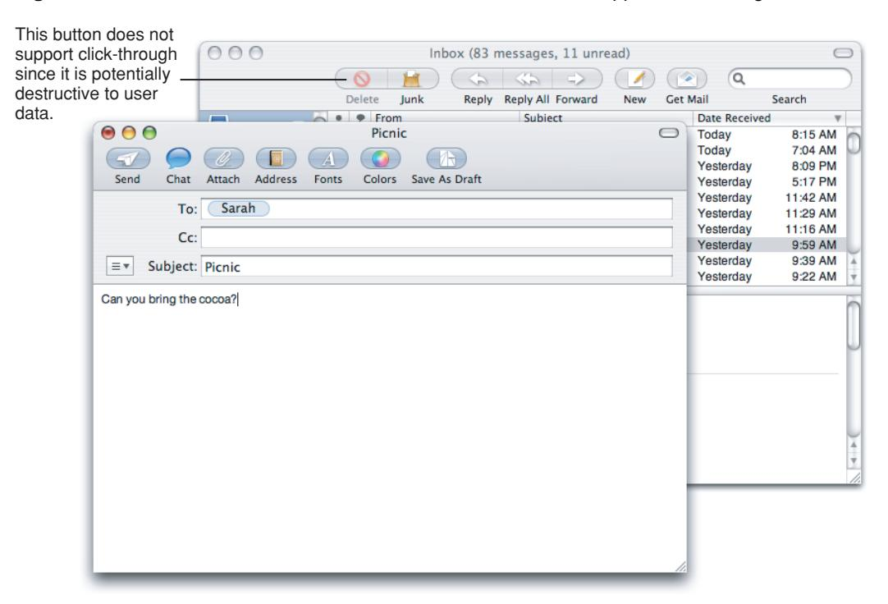

In general, you can implement click-through for a command that provides confirmation feedback before executing, even if the command ultimately results in destruction of data. For example, you can provide click-through for a delete button if you make sure to provide the user with the ability to cancel or confirm the action before it executes. For example, in the Accounts preferences, the delete user button provides click-through because it also provides a confirmation dialog before executing.

If you want to implement click-through for an item that doesn't provide confirmation feedback, consider how difficult it will be for the user to undo the action after it's performed. For example, in Mail, the Delete button does not provide click-through because it deletes a messagewithout providing feedback first, which is a potentially harmful action and one that is difficult to undo. Click-through for the New button in Mail is fine because its resulting action is not harmful and is easy to undo.

**Carbon:** Click-through is *off* by default. You must explicitly enable click-through for specific controls. Do not assume that the default behavior is the correct behavior. Make sure to apply the above guidelines.

**Cocoa:** Click-through is *on* by default. You must explicitly disable click-through for specific controls. Do not assume that the default behavior is the correct behavior. Make sure to apply the above guidelines.

### <span id="page-199-4"></span><span id="page-199-2"></span><span id="page-199-0"></span>Scrolling Windows

<span id="page-199-3"></span>People use **scroll bars** to view areas of a document or a list that is larger than can fit in the current window. Only active windows can be scrolled. A window can have a horizontal scroll bar, a vertical scroll bar, both, or neither. A window that has one or more scroll bars also has a resize control in the bottom right corner.

<span id="page-199-1"></span>**Figure 13-22** The elements of a scroll bar


The **scroller** size reflects how much of the content is visible; the smaller the scroller, the less of the content the user can see at that time. The scroller represents the relative location, in the whole document, of the portion that can be seen in the window.

If the entire contents of a document is visible in a window, the scroll bars do not contain scrollers. Scroll bars in inactive windows have an inactive appearance. See [Figure](#page-198-0) 13-21 (page 199).

<span id="page-199-5"></span>For most document windows that contain a single view (scrolling text or tables, for example), do not specify any space between the window edge and scroll bars .

The user can use scroll bars by doing the following:

■ Dragging the scroller. This method is usually the fastest way to move around a document. The window's contents changes in "real time" as the user drags the scroller.

- Clicking a scroll arrow. This means, "Show me more of the document that's hidden in this direction." The scroller moves in the direction of the arrow. Each scroll arrow click moves the content one unit;your application determineswhat one unit equals.For example, aword processor would move a line of text per click, a spreadsheet could move one row or column. To ensure smooth scrolling effects, specify units of the same size throughout a document.
- <span id="page-200-3"></span><span id="page-200-2"></span>■ Clicking or pressing in the scroll track. Clicking advances the document by a windowful (the default) or to the pointer's hot spot, depending on the user's choice in Appearance preferences. A "windowful" is the height orwidth of thewindow, minus at least one unit of overlap to maintain the user's context. This unit of overlap should be the same as one scroll arrow unit (for example, a line of text, a row of icons, or part of a picture). The Page Up and Page Down keys also move the document view by a windowful.

Pressing in the scroll track displays consecutive windowfuls of the document until the location of the scroller catches up to the location of the pointer(or until the userreleases the mouse button).

It's best not to add controls to the scroll-bar area of a window. If you add more than one control to this area, it's hard for people to distinguish amongcontrols and clickthe right one. Acceptable additions to the scroll area include a splitter bar and a status bar that shows, for example, the current page. To ensure that window controls are easy to use and understand, it's best to place the majority of your features in the menus as commands. If you really want to provide additional access to features, consider creating a utility window such as a palette with buttons. Only frequently accessed features that significantly benefit users' productivity should be elevated to the primary interface.

Utility windows that coexist with other windows and need to use the least amount of screen space possible may use small or mini scroll bars. If awindowhas small or mini scroll bars, all other controls within the window content area should also be the smaller version. For more information, see ["Using](#page-298-0) Small and Mini Versions of [Controls](#page-298-0) " (page 299).

<span id="page-200-0"></span>Make sureyou don't use a scroll barwhen you should really use a slider. Use sliders to change settings; use scroll bars only for representing the relative position of the visible portion of a document or list. For information about sliders, see "Slider [Controls"](#page-258-0) (page 259).

### <span id="page-200-1"></span>Automatic Scrolling

Most of the time, the user should be in control of scrolling. Your application must perform automatic scrolling in these cases:

- When your application performs an operation that results in making a new selection or moving the insertion point (for example,when the user searches for some text and your application locates it), scroll the document to show the new selection.
- When the user enters information from the keyboard at a location not visible within the window (for example, the insertion point is on one page and the user has navigated to another page), scroll the document automatically to incorporate and display the new information.
  - Your application determines the distance to scroll.
- When the user moves the pointer past the edge of the window while holding down the mouse button to make an extended selection, scroll the document in the direction the pointer moves.
- When the user selects something, scrolls to a newlocation, and then tries to perform an operation on the selection, scroll so the selection is showingbeforeyour application performs the operation.

Window Behavior **201**

Whenever your application scrolls a document automatically, move the document only as much as is necessary. That is, if part of a selection is showing after the user performs an operation, don't scroll at all. If your application can scroll in only one direction to reveal the selection, don't scroll in both.

<span id="page-201-2"></span>When autoscrolling to a selection, try to show the selection in context. When the selection is too large to show in its entirety, it might be a good idea to show some context instead of having the selection fill the window.

## <span id="page-201-3"></span><span id="page-201-0"></span>Utility Windows

Utility windows are either application-specific or systemwide. Application-specific utility windows disappear when the application is deactivated.

Systemwide utility windows, such as the Colors window and the Fonts window, float on top of all open windows.

<span id="page-201-1"></span>You can create a modeless utility window, such as a tools palette, to present controls or settings that affect the active document window. Utility windows are useful for keeping extremely important controls or information accessible at all times in the context of a user task. Because utility windows take up screen space, however, don't use them when you can meet the need by using a modeless dialog (the user changes settings and then closes the dialog) or by adding a few appropriate controls to a window frame.

A user can open several utility windows at a time; they float on top of document windows. When a user makes a document active, all of the application's utility windows should be brought to the front, regardless of which document was active when the user opened the utility window. When your application is inactive, its utility windows should be hidden. Utility windows should not be listed in the Window menu as documents, but you may put commands to show or hide all utility windows in the Window menu.

<span id="page-202-0"></span>**Figure 13-23** Utility windows


<span id="page-202-1"></span>A utility window may have a title. An untitled utility window should have a title-bar region for dragging the window.

A user would never need to minimize a utility window because it is displayed only when needed and disappearswhen its application is inactive. Therefore, the minimize button is always unavailable.A utility window should have the close and zoom buttons or, if you don't want users to be able to use the zoom button, only the close button. These configurations are shown in Figure 13-23.

**Carbon:** Specify which of controls are visible with the ChangeWindowAttributes function.

<span id="page-203-1"></span>**Figure 13-24** Utility window controls


For information about designing utility windows, see "Using Small and Mini [Versions](#page-298-0) of Controls ["](#page-298-0) (page 299).

<span id="page-203-0"></span>**Carbon:** Utility windows are available using kUtilityWindowClass.

**Cocoa:** Use NSNonactivatingPanelMask

### <span id="page-203-3"></span><span id="page-203-2"></span>Inspector Windows

Inspectors are utility windows that allow users to view the attributes of a selection. They also often provide ways to modify these attributes. Xcode, Keynote, and the Finder all make use of inspectors. Inspectors should update dynamically based on the current selection.

You can provide both inspectors and Info windows in your application because in some cases it's more useful to have one window where context changes when another item is selected (inspector) and in other cases it's more useful to be able to see the attributes of more than one item at a time (Info window). Multiple inspector windows and Info windows can be open at the same time. For more information on Info windows, see "Info [Windows"](#page-204-0) (page 205).

Figure 13-25 shows an inspector window.

<span id="page-204-1"></span>**Figure 13-25** An inspector window


## <span id="page-204-0"></span>Info Windows

<span id="page-204-2"></span>An Info window functions like an inspector except that it does not update dynamically as selections change. It shows attributes of the item that was selected when the window was opened, even after the focus has been changed to another item.

Figure 13-26 shows an example of an Info window for a Desktop folder.

**Figure 13-26** An Info window


Utility Windows **205 2006-10-03 | © 1992, 2001-2003, 2006 Apple Computer, Inc. All Rights Reserved.**

An Infowindowfor an application mayalso displaythe version of the application. Be sure to provide the same version information for the Info window, the About window (described next), and the display of the application in the Finder.

### <span id="page-205-4"></span><span id="page-205-2"></span><span id="page-205-0"></span>About Windows

An **About window,** also called an About box, is an Info window that contains your application's version and copyright information. It should be modeless so the user can leave it open and perform other tasks in the application.

You should always provide an About window and make it accessible from the application menu.

At a minimum, your application's About window should:

- <span id="page-205-3"></span>■ Have a title bar with no title
- Be movable
- Include the close button as the only active window control
- Display application branding
- Include the full application name and version number (the version number should be the same as the version number in the application's Info window and displayed by the Finder)

It is recommended to also provide text that briefly describes what the application does, copyright information, as well as technical support contact information.

<span id="page-205-1"></span>If you want to give the user a convenient way to visit your website or contact your company from your About window, be sure to create buttons that accomplish these tasks. Do not provide a clickable URL or email address because it is not necessarily clear that there is an action associated with it. Of course, it's best to provide most of your company contact information in the first page of your help documentation (see "The Help [Menu"](#page-171-0) (page 172) for more information on Help menu items).

**Figure 13-27** Example of an About window


An About window (or a splash screen) is the appropriate place for product branding elements; avoid putting them in document windows and dialogs.

**Carbon:** Use HIAboutBox to provide a default Aboutwindow. You can designate specific settings in your application's Info.plist file.

**Cocoa:** An About window is provided automatically by the Application Kit; set the relevant information in your application's Info.plist file.

### <span id="page-206-0"></span>Fonts Window and Colors Window

Mac OS X includes standard windows for users to select fonts or colors. If you need a way for users to set fonts or colors, use these standard windows instead of making your own. In this way, users don't have to learn a new way to accomplish a familiar task.

By implementing these windows, you get the correct utility window behavior.

## <span id="page-206-1"></span>Dialogs

<span id="page-206-3"></span>A **dialog** is a window designed to elicit a response from the user. Many dialogs—the Print dialog, for example—permit the user to provide many responses at one time.

**Alerts** are dialogs that appear when the system or an application needs to communicate information to the user. Alerts provide messages about error conditions orwarn users about potentially hazardous situations or actions.

For information about using the keyboard to interact with dialogs, see ["Keyboard](#page-100-0) Focus and [Navigation"](#page-100-0) (page 101).

For specific design information on how to lay out dialogs, see "Layout [Examples"](#page-288-0) (page 289).

**Carbon:** For implementation information, see *Handling Carbon Windows and Controls* and *Dialog Manager Reference* in Carbon User Experience Documentation.

<span id="page-206-2"></span>**Cocoa:** See *Dialogs and Special Panels* and *Window Programming Guide for Cocoa* in Cocoa User Experience Documentation.

### <span id="page-206-6"></span><span id="page-206-5"></span>Types of Dialogs and When to Use Them

Mac OS X applications can use these types of dialogs:

- <span id="page-206-4"></span>■ **Modeless.** Enables users to change settings in a dialog while still interacting with document windows; theFindwindowin manyword processors is an example of a modeless dialog. Modeless dialogs have title bar controls (close, minimize, and zoom buttons).
- **Document modal.** Prevents the user from doinganythingelsewithin a particular document. The user can switch to other documents in the application and to other applications. Document-modal dialogs should be sheets, which are discussed in ["Document-Modal](#page-207-1) Dialogs (Sheets)" (page 208).
- **Application modal.** Prevents the user from doing anything else within the owner application; the user can switch to another application. Most application-modal dialogs do not have the standard title bar controls (close, minimize, zoom); the user dismisses these dialogs by clicking

a push button, such as OK or Cancel. Application-modal dialogs that appear as the result of the user choosing a command, such as the Open dialog in [Figure](#page-217-0) 13-37 (page 218), should display a title that matches the command.

An alert can be document modal or application modal. If the error condition or notification applies to a single document, the alert should be document modal (a sheet). See the Save Changes alert in [Figure](#page-221-0) 13-41 (page 222) for an example. If the alert applies to the state of the application as a whole, orto more than one document orwindowbelongingto that application, the alert should be application modal. Both the Review Changes alert for multiple unsaved documents ([Figure](#page-223-0) 13-43 (page 224)) and the Save Changes alert for applications that are not document-based [\(Figure](#page-222-0) 13-42 (page 223)) are application modal.

### <span id="page-207-3"></span><span id="page-207-2"></span><span id="page-207-1"></span>Document-Modal Dialogs (Sheets)

A **sheet** is a modal dialog attached to a particular document or window, ensuring that the user never loses track of which window the dialog applies to. Because a sheet is attached to the window from which it emerges, a sheet does not have its own title.

The ability to keep a dialog attached to its pertinent window helps users take full advantage of the Mac OS X window layering model (see "Window [Layering"](#page-195-1) (page 196)). Sheets also allow users to perform other tasks before dismissing the dialog, with no sense of the system being "hijacked" by the application.

<span id="page-207-0"></span>You lay out sheets as you would any other dialog in Mac OS X.

**Figure 13-28** The Save Changes alert: An example of using a sheet to display a document-modal dialog


**Carbon:** You are responsible for creating, showing, handling the events for, and closing sheets. Other sheet behavior, such as the animation when the sheet appears and is dismissed, is handled automatically by the Window Manager.

**Cocoa:** You are responsible for loading, showing, and closing sheets. While a sheet is displayed, events are handled by the Application Kit just as for any other window. Other sheet behavior, such as the animation when the sheet appears and is dismissed, is handled automatically by the Application Kit.

#### **Sheet Behavior**

Sheets are displayed as an animation that appears to emerge from the window's title bar. When a sheet opens on a window near the edge of the screen and the sheet is wider than the window it's attached to, the sheet moves thewindowawayfrom the edge;when the sheet is dismissed, thewindow returns to its previous position.

Only one sheet may be open for a window at any one time. A sheet prevents any other operation on that window until the sheet is dismissed. If, when the user responds to a sheet, another sheet for that document must open, the first sheet closes before the second one opens.

<span id="page-208-1"></span>A sheet on an active document window should cover (appear on top of) any active utility windows (if necessary). However, if the user leaves a sheet open and clicks another document in the same application, the inactive window and its sheet should go *behind* any open utility windows.

In an application that allows multiple windows for the same document (so that the user can see different parts of a document simultaneously), a sheet is not appropriate. Use an application modal dialog in this situation to make it clear that changes to one window affect other windows in the application.

<span id="page-208-0"></span>In an application that displays multiple documents in a single window at different times, such as in a tabbed browser, a sheet is appropriate even though it applies to only the current document in the view. This is because, in a single-window situation, the user can't move the view and its sheet aside to handle later when choosing to view a different document. Rather, the user in effect dismisses the view's contents when choosing to view a different document. The user should therefore dismiss the sheet on the current view before selecting a different document.

### **When to Use Sheets**

Use sheets for dialogs specific to a document when the user interacts with the dialog and dismisses it before proceeding with work. Some examples of when to use sheets:

- A modal dialogfor an activitythat is specific to a particular document, such as savingor printing.
- A modal dialog that is specific to a single-window application that does not create documents. A single-windowutility program might use a sheet to request acceptance of a licensingagreement from the user, for example.
- Other window-specific dialogs that are typically dismissed by the user before proceeding. Use a sheet when a dialog benefits from being attached to the window as a modal dialog, even if you might otherwise design the dialog as a modeless dialog.

#### **When Not to Use Sheets**

Don't use sheets in the following situations:

■ For dialogs that apply to several windows. Use sheets only when a particular dialog is associated with only one window.

- For modeless operations in which the dialog should be left open to allow the user to observe the effects of changes applied. Such tasks (find and replace operations, for example) are better suited to modeless dialogs, utility windows, or drawers.
- <span id="page-209-6"></span>■ On a window that doesn't have a title bar. Sheets should emerge from a definite visual edge.
- When the user will need information in the window that is essential to filling in requested information in the sheet.

### <span id="page-209-5"></span><span id="page-209-1"></span>Alerts

Alerts display messages to inform users of situations that are notable or potentially dangerous. Alerts are modal dialogs.For an alert that applies to one document orin single-windowapplications, display the alert as a sheet. See "When to Use [Sheets"](#page-208-0) (page 209) for guidelines.

<span id="page-209-0"></span>Figure 13-29 shows the elements of an alert.

**Figure 13-29** A standard alert


<span id="page-209-3"></span><span id="page-209-2"></span>See "A [Standard](#page-296-0) Alert " (page 297) for more information on laying out alerts.

### <span id="page-209-4"></span>**The Elements of an Alert**

<span id="page-209-7"></span>An alert should contain only the following elements:

- **Alert message text.** This text, in emphasized (bold) system font, provides a short, simple summary of the error or condition that summoned the alert. This should be a complete sentence; often it is presented as a question. See "Writing Good Alert [Messages"](#page-210-1) (page 211) for more information.
- **Informative text.** This text appears in the small system font and provides a fuller description of the situation, its consequences, and ways to get out of it. For example, a warning that an action cannot be undone is an appropriate use of informative text.

**Important:** Do not leave out the informative text. What you think of as an intuitive alert message might be far from intuitive to your users. Use informative text to reword and expand on the alert message text.

- <span id="page-210-3"></span>■ **Buttons for addressingthe alert.** Button names should correspond to the action the user performs when pressingthe button—for example, Erase, Save, or Delete. The rightmost button in the dialog, the action button, is the button that confirms the alert message text. The action button is usually, but not always, the default button. Note that in Cocoa methods, the rightmost button is always referred to as the default button even though it might not be.For more information, see ["Dismissing](#page-213-1) [Dialogs"](#page-213-1) (page 214).
- <span id="page-210-2"></span>■ **The application icon.** Because of the Mac OS X window layering model (described in ["Window](#page-195-1) [Layering"](#page-195-1) (page 196)), an icon is necessary to make it clear to the user which application is displaying the alert.

<span id="page-210-4"></span>In rare cases, you may want to display a caution icon in your alert, badged with the application icon as shown in Figure 13-30. A badged alert is appropriate only if the user is performing a task, such as installing software, and a possible side effect of that task would be the inadvertent destruction of data. Don't use a caution icon for tasks whose only purpose is to overwrite or remove data, such as Save or Empty Trash; too-frequent use of the caution icon dilutes its significance.

<span id="page-210-0"></span>**Important:** The note, caution, and stop alerts used in Mac OS 9 should not be used in Mac OS X.

**Figure 13-30** A customized alert showing the caution icon badged with an application icon

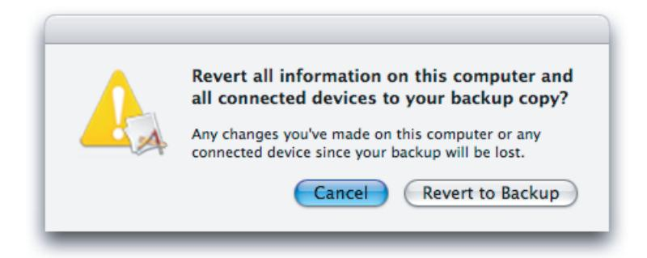

<span id="page-210-1"></span>**Carbon:** See *Dialog Manager Reference* in Carbon User Experience Documentation.

**Cocoa:** See *Dialogs and Special Panels* in Cocoa User Experience Documentation.

#### <span id="page-210-5"></span>**Writing Good Alert Messages**

A good alert message states clearly what caused the alert to appear and what the user can do about it. Express everything in the user's vocabulary. Figure 13-31 shows an example of an alert message that provides little useful information.

<span id="page-211-0"></span>**Figure 13-31** A poorly written alert message

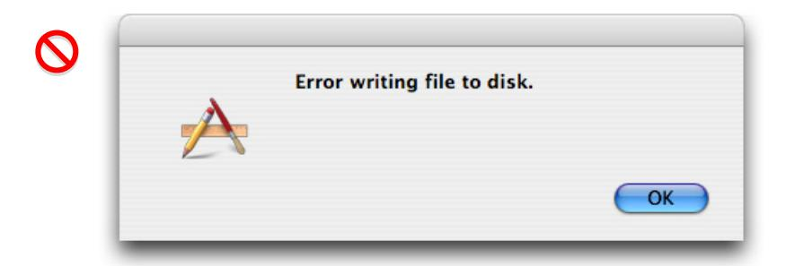

<span id="page-211-1"></span>You could improve this message by describing the problem in the user's vocabulary as shown in Figure 13-32.

**Figure 13-32** An improved alert message


<span id="page-211-2"></span>To make the alert really useful, provide a suggestion about what the user can do about the current situation. Even if the alert serves as a notification to the user and no further action is required, provide as much information as needed to describe the situation. Figure 13-33 shows the alert with additional information.

**Figure 13-33** A well-written alert message


**Note:** The examples in these figures would probably be sheets in a real application.

### <span id="page-212-2"></span><span id="page-212-0"></span>Dialog Appearance and Behavior

When appropriate, your application's dialogs should display default values for controls and text fields so the user can verify information rather than generate it from scratch.

Display a selection or an insertion point in the first location—a text entry field or a list, for example—that accepts user input.

When it provides an obvious user benefit, static text in a dialog should be selectable. For example, a user should be able to copy an error message, a serial number, or IP address to paste elsewhere.

In dialogs that display columns and are user resizable, such as the Open dialog, as the dialog is made bigger, the columns should grow and additional columns should appear. All other elements should remain the same size and be anchored to the right, center, or left side of the dialog.

<span id="page-212-1"></span>A dialog never uses the brushed metal look. All dialogs use the standard Aqua look, even if your application uses the brushed metal look.

### <span id="page-212-3"></span>Accepting Changes

In general, all changes a user makes in a dialog should appear to take effect immediately. There are three possible opportunities for data validation in a dialog:

- 1. When the user types data
- 2. When the user moves out of a data field (by pressing Tab, for example)
- 3. When the user clicks a button to apply changes

<span id="page-212-4"></span>It isyourresponsibilityto make the three states as clear as possible to the user.For example, checkboxes and radio buttons update immediately and display the appropriate results.

You need to decide when your application does error checking of user input. Possible approaches are to:

- Evaluate the input and check for errors as the user tabs from one field to the next. The drawback is that it isn't clear to the user that the changes are taking effect as he or she tabs among items. The user doesn't click a button, and so isn't aware of completing an action.
- Save userinput in a queue and applyitwhen the user clicks a button, closes the dialog, or switches to another application. If your application waits to check user-input errors until the user tries to dismiss the dialog,you may have to present an alert, therebyforcingthe user to revisit the dialog. If you do error checking as the user enters input, it takes more time up front, but you can warn the user immediately when invalid data is entered.

In most cases, validating input after each keystroke is annoying and unnecessary. It's better to design your interface to automatically disallow invalid input. For example, your application could automatically convert lowercase characters to uppercase when appropriate.

In addition to error checking, you need to decide when to apply user input. In some cases, changes can take effect immediately—for example, View Options for Finder windows. In other cases, it may be appropriate to wait until the user performs an action, such as clicking an Apply button.

In a dialog that has multiple panes (selected by buttons, tabs, or a pop-up menu), avoid validating data when a user switches from one pane to another.

Finally, you need to determine whether your application should automatically perform an operation based on user input or whether the user should initiate the operation, for example, by clicking a button. It's acceptable to automatically perform an operation that completes quickly and returns user control within a couple of seconds. For an operation that takes a longer time to execute, it's best to warn the user of the estimated time required and let the user initiate it.

### <span id="page-213-1"></span>Dismissing Dialogs

The buttons at the bottom right of a dialog all dismiss the dialog. A button that initiates an action is furthest to the right. This **action button** confirms the alert message text. The Cancel button is to the left of this button.

<span id="page-213-2"></span>If there's a third button for dismissing the dialog, it should go to the left of the Cancel button. If the third button could result in data loss—Don't Save, for example—position it at least 24 pixels away from the "safe" buttons (Cancel and Save, for example).

<span id="page-213-0"></span>A button that affects the contents of the dialog itself, such as Reset, should have its left edge aligned with the main dialog text or if there is a Help button, 12 pixels to the right of it.

**Figure 13-34** Position of buttons at the bottom of a dialog


Usually the rightmost button or the Cancel button is the **default button**. The default button should be the button that represents the action that the user is most likely to perform *if* that action isn't potentially dangerous. A default button has color and pulses to let the userknowthat it is the default. When the user presses the Enter key or the Return key, your application should respond as if the user clicked the default button.

Don't use a default button if the most likely action is dangerous—for example, if it causes a loss of user data. When there is no default button, pressing Return or Enter has no effect; the user must explicitly click a button. This guideline protects users from accidentally damaging their work by pressing Return or Enter. You can consider using a safe default button, such as Cancel.

Don't use a default button if you use the Return key in text entry boxes. Having two behaviors for one key can confuse users and make the interface less predictable.

<span id="page-214-2"></span>In addition to the action button or buttons, it's a good idea to include a Cancel button. This button returns the computer to the state it was in before the dialog appeared. It means "forget I mentioned it." Always map the keyboard shortcut Command-period and the Esc (Escape) key to the Cancel button. These keyboard equivalents, along with Return and Enter, are accelerator keys and serve the purpose of letting the user respond quickly to a dialog or an alert. In general, it's not a good idea to assign other keyboard shortcuts to buttons. If you find it useful to assign keyboard shortcuts to some buttons that are used very often in your application, be sure to follow the guidelines in ["Keyboard](#page-97-0) [Shortcuts"](#page-97-0) (page 98).

<span id="page-214-3"></span><span id="page-214-1"></span>In some circumstances, it's appropriate to implement an Applybutton—for example, to permit a user to see the effect of multiple text attributes before committing to them. In cases like these, clicking Cancel should undo any of the applied changes. Cancel should never silently commit the changes the user previewed by clicking Apply. For more guidelines on using an Apply button, see ["Providing](#page-214-0) an Apply Button in a [Dialog"](#page-214-0) (page 215).

### <span id="page-214-0"></span>Providing an Apply Button in a Dialog

You may choose to provide an Apply button in a dialog that displays multiple settings that affect the user's viewof data. An Applybutton should allowa user to previewthe effect of the selected settings without committing to the changes. Be cautious about using an Apply button for operations that take a long time to implement or undo; it might not be obvious to users that they can interrupt or reverse the process. Save dialogs or dialogs that allow users to make changes that can't be previewed easily should not include an Apply button.

Clickingthe Applybutton does not dismiss the dialogbecause the user must decidewhetherto accept the previewed changes (by clicking OK) or to reject them (by clicking Cancel). Do not use the Apply button as another OK button—when the user dismisses the dialogwithout clicking OK, all previewed changes should be discarded.

### Expanding Dialogs

Sometimes you need to provide the user with additional information or functionality in a dialog, but you don't want to display it all the time. To do this, you use one of the disclosure controls to expand the dialog and reveal the additional information or capability to the user.

If you want to allow the user to view details that elaborate on the primary information in a dialog, you use a disclosure triangle (note that disclosure triangles are also used in hierarchical lists). The disclosure triangle expands the dialog, revealing additional information and, if appropriate, extra functionality. An example of a dialogexpanded bya disclosure triangle is shown in [Figure](#page-272-0) 14-52 (page 273). For more information about how to use a disclosure triangle in your dialog, see ["Disclosure](#page-271-1) [Triangles"](#page-271-1) (page 272).

If you want to provide the user with additional choices directly related to the selections offered in a pop-up or command pop-down menu in a dialog, you use a disclosure button. The disclosure button expands the dialogto reveal selections in addition to those listed in the pop-up or command pop-down menu. An example of a dialog expanded by a disclosure button to reveal additional choices is shown in [Figure](#page-220-0) 13-40 (page 221). For more information about how to use a disclosure button in your dialog, see ["Disclosure](#page-273-0) Buttons" (page 274).

### <span id="page-215-0"></span>Find Windows

<span id="page-215-4"></span><span id="page-215-3"></span>A Find window is a modeless dialog that opens in response to the Find command to provide an interface for specifying items to search for. Its appearance can vary depending on the needs of your application, but if your application handles text you might want to make your Find window similar to the one illustrated in Figure 13-35 to provide a consistent user experience.

<span id="page-215-2"></span>**Figure 13-35** A Find window

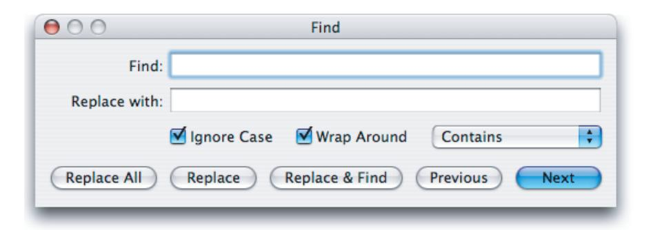

**Carbon:** Not available.

<span id="page-215-1"></span>**Cocoa:** A Cocoa application that displays a text view (NSTextView) gets find functionality when it includes the Find command in its Edit menu.

### Preferences Windows

A preferences window is a modeless dialog that contains settings that the user changes infrequently. If you have several different groups of preferences, consider using a toolbar within the preferences window in which each item in the toolbar changes the content of the main window. For examples, note how some of the applications provided with Mac OS X—such as the Finder, Safari, or Mail—implement preferences windows.

<span id="page-216-1"></span>**Figure 13-36** The Finder preferences window


Avoid including a resize control or a zoom button. The preferences window should not be a utility window and it should be modeless.

If you have changeable panes in your preferences window, be sure to remember which pane the user selected the last time the window was open.

<span id="page-216-0"></span>The menu item to show your preferences window should be in the application menu and be labeled Preferences. Use Command-comma for the keyboard shortcut.

### <span id="page-216-3"></span><span id="page-216-2"></span>The Open Dialog

The Open dialog appears when the user chooses the Open command or presses Command-O. The Open dialog is application modal (the user can switch to other applications).

If you implement an Open command, you should also include an Open Recent command so users can open recently opened documents without going through the dialog.

<span id="page-217-0"></span>**Figure 13-37** An Open dialog


The Open dialog contains these elements:

- A default title ("Open"); you should add your application's name to the Open dialog title—"TextEdit: Open," for example.
- Back and forward buttons to navigate back and forth between selections made in list or column view.
- A pop-up menu that contains common places a user might save things and Recent Places (the five most recent folders the user opened or saved documents to). Your application specifies the default location, typically one of the predefined folders in the user's home folder. If the user selects another folder, the dialog should "remember" the user's selection the next time the dialog appears.
- A source list that mirrors the Finder Sidebar.
- A column or list view for navigating the file system.
- A Cancel button and an Open (default) button.
- A resize control in the lower-right corner.
- <span id="page-217-1"></span>■ The ability for expert users to specify a pathname by pressing Command-Shift-G. (Note that the pathname separator is the "/" character.)

You can extend the Open dialog as appropriate for your application as illustrated in Figure 13-38. You might, for example, include a pop-up menu allowing users to filter the type of files that appear in the list. Items that do not meet the filtering criteria would appear dimmed. The system creates a list of native file types supported by the application to populate the menu. You can supplement this list with custom types and specify the default to show when the dialog opens. You should include an All Applicable Files item, but it does not have to be the default.

<span id="page-218-1"></span>**Figure 13-38** A customized Open dialog

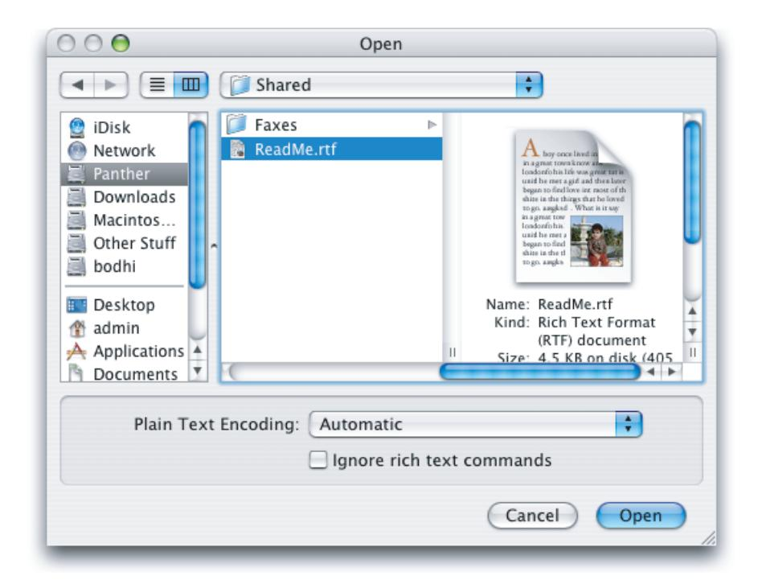

Open dialogs should support document previewand can support multiple selection ifyour application allows more than one document to be open at a time.

<span id="page-218-0"></span>**Carbon:** See *NavigationServicesfor Carbon: An Overview* in Carbon User Experience Documentation. **Cocoa:** Open dialogs are NSOpenPanels. You typically display an Open dialog by invoking the openPanel method. See *Application File Management* in Cocoa File Management Documentation.

### Dialogs for Saving, Closing, and Quitting

<span id="page-218-2"></span>This section describes the standard dialogs that you use when a user is saving a document for the first time, closing a document, or quitting an application.

### Save Dialogs

<span id="page-218-3"></span>An application that saves the contents of individualwindows—whichwould be most text and graphics applications—should use document-specific sheets for its Save dialogs. The Save dialog has two states: minimal and expanded. Clickingthe disclosure button toggles between these states. If the user changes the state, the next Save dialog should open in the selected state.

Your application should pass in a filename extension as part of every filename. Users can control its visibility usingthe Hide Extension checkbox in the expanded Save dialog; see[Figure](#page-190-2) 13-15 (page 191). Existing documents do not get extensions added to or removed from their filenames unless the user chooses Save As and changes the setting in the Save dialog.

#### <span id="page-219-5"></span>**The Minimal Save Dialog**

In the minimal Save dialog, users can save changes to an unnamed document, name or rename a document, and choose a frequently accessed location to store it.

<span id="page-219-0"></span>**Figure 13-39** The minimal (collapsed) Save dialog

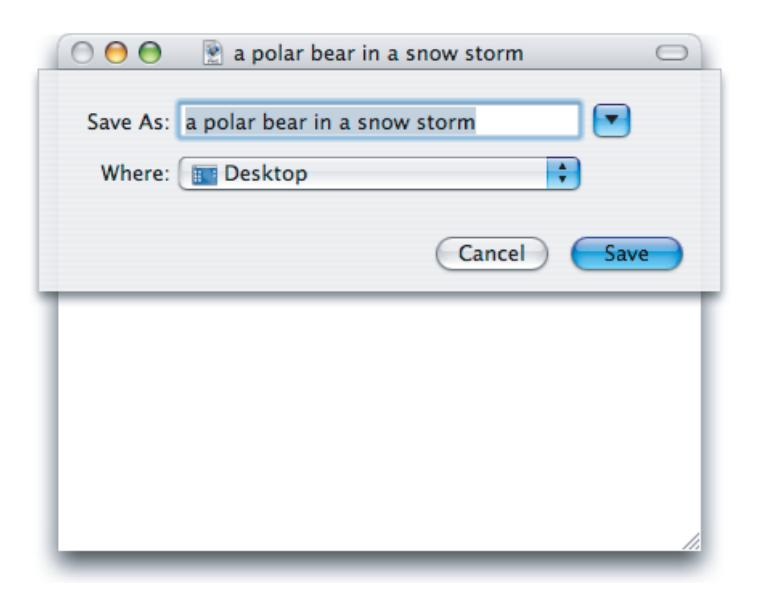

The minimal Save dialog contains these elements:

- <span id="page-219-4"></span><span id="page-219-3"></span>■ Save As text field for the document name. Expert users can enter pathnames by pressing Command-Shift-G. (Note that the pathname separator is the "/" character.)
  - If the document has not been saved previously, your application should put the default name (such as "untitled") in this field, and the filename should be selected. If the user has chosen to make the filename extension visible, the extension is not selected.
  - If the document has been saved previously and the user chooses Save As, the Save dialog should open with the document name highlighted in the Save As field. The filename extension (if it is visible) is not selected.
- <span id="page-219-2"></span>■ Where pop-up menu, containing mounted volumes, the folders in theFinder Sidebar, and Recent Places (the five most recent folders the user opened or saved documents to). Your application specifies the default location, typicallythe predefined Documents folderin the user's home folder. If the user selects another folder, the dialog should "remember" the user's selection the next time the dialog appears.
- <span id="page-219-1"></span>■ A Save button (default).
- A Cancel button. Dismisses the dialog and returns the application to its previous state.
- A disclosure button. Clicking it displays the expanded Save dialog. (For more information about how to use disclosure buttons, see ["Disclosure](#page-273-0) Buttons" (page 274).)

Any custom elements you add go between the Where pop-up menu and the buttons at the bottom of the dialog.

#### <span id="page-220-4"></span><span id="page-220-2"></span>**The Expanded Save Dialog**

In contrast with the minimal Save dialog, the expanded Save dialog lets users save documents in locations other than those available in the minimal Save dialog's Where pop-up menu.

<span id="page-220-0"></span>**Figure 13-40** The expanded Save dialog


In addition to the items in the minimal Save dialog, the expanded Save dialog displays the following:

- Backand forward buttons to navigate backand forth between selections made in the list or column view.
- A source list that mirrors the Finder Sidebar.
- A column or list view for navigating the file system.
- <span id="page-220-1"></span>■ A File Format (or Format) pop-up menu, which displays a list of file formats from which the user can choose.
- A New Folder button, which displays an application-modal dialog that asks the user to name the new folder, and then creates it.
- A Hide Extension checkbox, which allows the user to control whether or not the filename's extension (.jpg, for example) is visible. The Hide Extension checkbox should be selected as the default (that is, filename extensions should not appear in user-visible filenames unless the user requests them).

<span id="page-220-3"></span>If the user changes the state of the checkbox for a particular document, the next new document should match the last user-selected state, even after the user quits and reopens the application. The filename in the Save As field updates in real time as the checkbox is selected or deselected.

Don't provide your own options for handling filename extensions; use the standard Open and Save dialogs.

**Carbon:** Set the PreserveSaveFileExtension flag when calling the Save dialog, and use NavCompleteSave to set the flag to hide the filename extension.

If you add other elements to customize the expanded Save dialog, they should appear above the Cancel and Save buttons. When the dialog is expanded, custom elements should appear between the file-system browser and the push buttons.

In default keyboard navigation mode, pressing Tab in the expanded Save dialog shifts the keyboard focus from the Save As text field to the source list, to the visible columns, and then back to the text field.

### <span id="page-221-2"></span>Closing a Document With Unsaved Changes

<span id="page-221-1"></span>When the user attempts to close a document that has unsaved changes, present a Save Changes alert. An application that saves the contents of individual windows—such as most text and graphics applications—should use document-specific sheets, like the one shown in Figure 13-41, for its Save Changes alert.

<span id="page-221-0"></span>In an application that can display multiple views of the same file, if the user chooses the Close File command instead of Close Window, you should use an application-modal dialog instead of a sheet. This emphasizes the fact that the user's actions affect the file as awhole, not just the portion displayed in the current view. In this situation, change the word "document" in the Save Changes alert message to the word "file". After the user clicks Save or Don't Save, close all open views of the file.

**Figure 13-41** A Save Changes alert for a document-based application

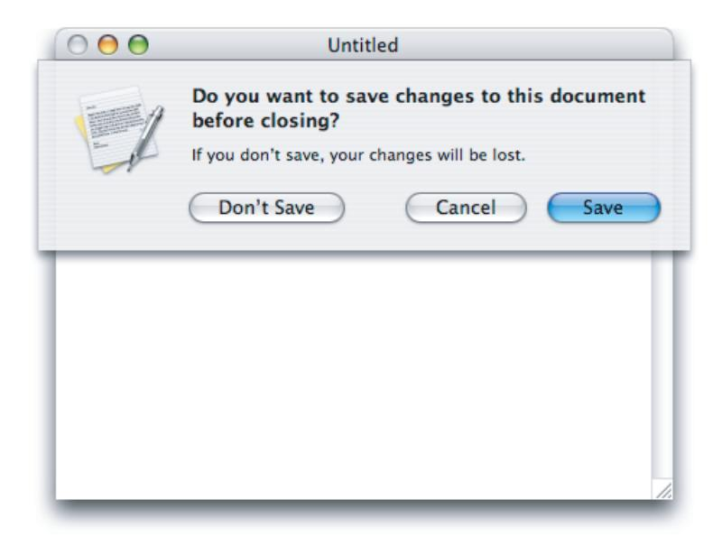

When a Save Changes sheet is open, the document's close button and the Close command in the File menu are unavailable; the user can't close the document until the Save Changes sheet is addressed.

### <span id="page-222-2"></span>Attempting to Save a Locked or Read-Only Document

If the user edits a locked or read-only document and then quits the application or chooses Save, do not display the standard Save Changes alert. Instead, display a sheet explaining that because the document is read-only, it cannot be saved. The sheet should then offer the user the options of saving a copy, rejecting the changes, or continuing to view or edit the document.

### <span id="page-222-3"></span><span id="page-222-1"></span>Saving Documents During a Quit Operation

Users can interrupt a quit operation with documents still unsaved. For example, if a user chooses Quit and a save alert (a sheet) opens for a document, the user can work on other documents or switch to another application without addressing the save alert.

When a user quits an application in which all open documents have been saved, all documents close immediately and the application quits.

#### **Quitting an Application That Is Not Document-Based**

<span id="page-222-0"></span>When a user attempts to quit an application that is not document-based but that has many windows whose contents are saved simultaneously, present an application-modal Save Changes alert, such as the one shown in Figure 13-42.

**Figure 13-42** A Save Changes alert for an application that is not document-based


#### **Quitting an Application With Multiple Unsaved Documents Open**

When a user attempts to quit a document-based application and there is more than one document with unsaved changes open, present an application-modal Review Changes alert such as the one shown in Figure 13-43.

<span id="page-223-0"></span>**Figure 13-43** The Review Changes (application modal) alert that appears when the user quits with more than one unsaved document open

<span id="page-223-1"></span>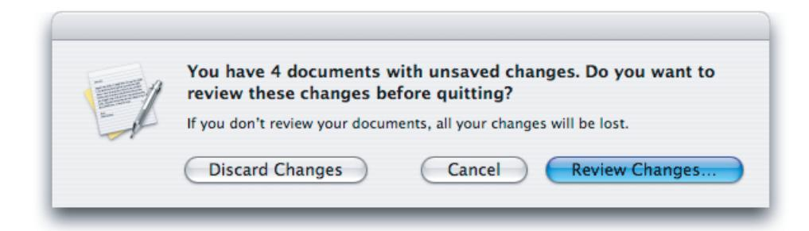

The appropriate action for each button is as follows:

- <span id="page-223-3"></span>■ **Discard Changes.** Closes all documents without saving changes and quits the application.
- **Cancel.** Cancels the Quit command.
- **Review Changes.** All open documents (including those minimized in the Dock) come forward, with the unsaved documents on top. The active document presents the Save Before Quittingalert. If the user clicks Save, the Save dialog appears (if the document has not previously been saved). If the user clicks Don't Save, the next unsaved document comes forward with its Save Before Quitting alert. If the user dismisses the last Save Before Quitting alert with Save or Don't Save, all documents close and the application quits.

During the review, if the user activates another unsaved document, it should come forward with its Save Before Quittingsheet open. Save Before Quittingsheets on other documents remain open. During the review, if the user activates a saved document, the review process continues when the next unsaved document becomes active.

<span id="page-223-2"></span>If, in the midst of a quit operation, the user clicks the application icon in the Dock or chooses Bring All to Front from the Window menu, documents should appear in this order: documents with open sheets on top, unsaved documents next, and then saved documents.

At any time during the review process, the user can click Cancel to stop the quit operation. If the user initiates a Quit command during the review process, the process begins again with the application-modal alert shown in Figure 13-43.

#### <span id="page-223-4"></span>**Saving a Document With the Same Name as an Existing Document**

If the user types the name of a document that already exists in the same location into the Save As field of a Save dialog, and then clicks Save, present an application-modal alert in which the user can confirm whether or not to replace the previous document.

<span id="page-224-1"></span>**Figure 13-44** Alert for confirming replacing a file


### <span id="page-224-3"></span><span id="page-224-0"></span>The Choose Dialog

<span id="page-224-2"></span>A Choose dialog lets a user select an item as the target of a task. For example, when a user attempts to open a broken alias, the Fix Alias dialog lets the user choose another item for the alias to open. An application can have more than one Choose dialog, but only one can be open at a time. In some situations, it may be appropriate for a Choose dialog to be a sheet.

**Figure 13-45** A Choose dialog

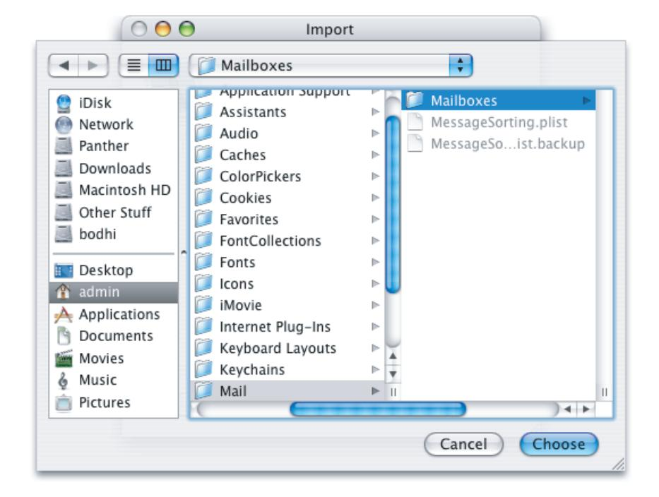

#### A Choose dialog:

- Can be opened by various commands
- Can support multiple selection
- Supports document preview
- Can be resized with the resize control in the lower-right corner

<span id="page-225-2"></span>■ Can include a Show pop-up menu, which allows the user to filter the type of files that appear in the list. Items that do not meet the filtering criteria appear dimmed. The system creates a list of native file types supported by the application to populate the menu. You can supplement this listwith custom types and specifythe default to showwhen the dialogopens. You should include an All Applicable Files item, but it does not have to be the default.

If the dialog is not a sheet, the dialog's default title is "Choose," but you should change it to include the name of the task. For example, if the command that brings up the dialog is Choose Picture, the dialog should be titled "Choose Picture." Also include some instructional text at the top, such as "Choose a picture to displayin the background of 'Documents.'" If it's helpful, also change the Choose button to something more specific.

The default location is the user's home folder. If the dialog is targeted to volumes only, the default location is the user's directory. Files and folders not appropriate for the target selection should be dimmed.

**Note:** Recent Places (in the Where pop-up menu of a Save dialog) does not record folders selected in Choose dialogs.

<span id="page-225-0"></span>**Carbon:** The Choose dialog is available through Navigation Services. For more information, see the documentation for Navigation Services in Carbon User Experience Documentation. **Cocoa:** Use a variation of the Open dialog (NSOpenPanel class).

### <span id="page-225-1"></span>Printing Dialogs

Printing dialogs include the Print dialog, the Fax dialog, and the Page Setup dialog.

### <span id="page-225-3"></span>Print Dialog

In the Print dialog, user options are provided via the features pop-up menu, which displays panes drawn and controlled by printing dialog extensions (PDEs). PDEs are provided by the operating system, printer modules, and applications. Apple provides a number of printing panes. The standard Print dialog is shown in Figure 13-46.

<span id="page-226-0"></span>**Figure 13-46** A Print dialog (a sheet attached to a document window)

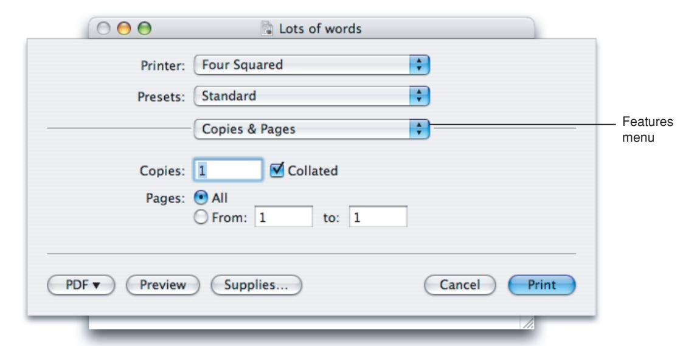

Options for choosing paper type and print quality are displayed through the features pop-up menu. You can create custom print panes by following the interface guidelines provided throughout this document and the layoutguidelines described in ["PositioningFull-Size](#page-288-1) Controls" (page 289). Here are some specific guidelines to keep in mind if you implement custom printing features:

- Choose a menu item name that doesn't conflict with menu items already in the features pop-up menu.
- The menu item (the pane name) should help users easily determine the options the pane contains.
- Make sure the features you implement are appropriate for your application. For example, an option to print in reverse order should be provided by the operating system, not by your application. (Implementing this feature requires the application to know the hardware's capabilities.)
- Make interdependencies amongoptions clearto users.For example, if a user selects double-sided printing, the option to print on transparencies should become unavailable.
- Separate more advanced features from frequently used features. When the user chooses to display the advanced features, there should be an "advanced options" title above the advanced controls.
- Provide visual feedback (such as the preview in the Layout pane of the Print dialog) when appropriate. A thumbnail showing the effect of changing a tone control, for example, helps users determine desired settings.
- <span id="page-226-1"></span>■ Save a user's printing preferences for a document, at least while the document is open. Provide a way for users to save custom settings.

**Carbon:** You can write a PDE to customize panes in the Page Setup or Print dialogs. For more information, see *Extending Printing Dialogs* in Printing Documentation.

**Cocoa:** You can implement an accessory view by using NSPageLayout and NSPrintPanel, both Application Kit classes.

### Page Setup Dialog

<span id="page-227-3"></span>The Page Setup dialog provides a way for users to set the scaling and orientation options for a document based on the intended output paper size and the printer. Save the settings in this dialog with the document.

<span id="page-227-1"></span><span id="page-227-0"></span>**Figure 13-47** The Page Setup dialog

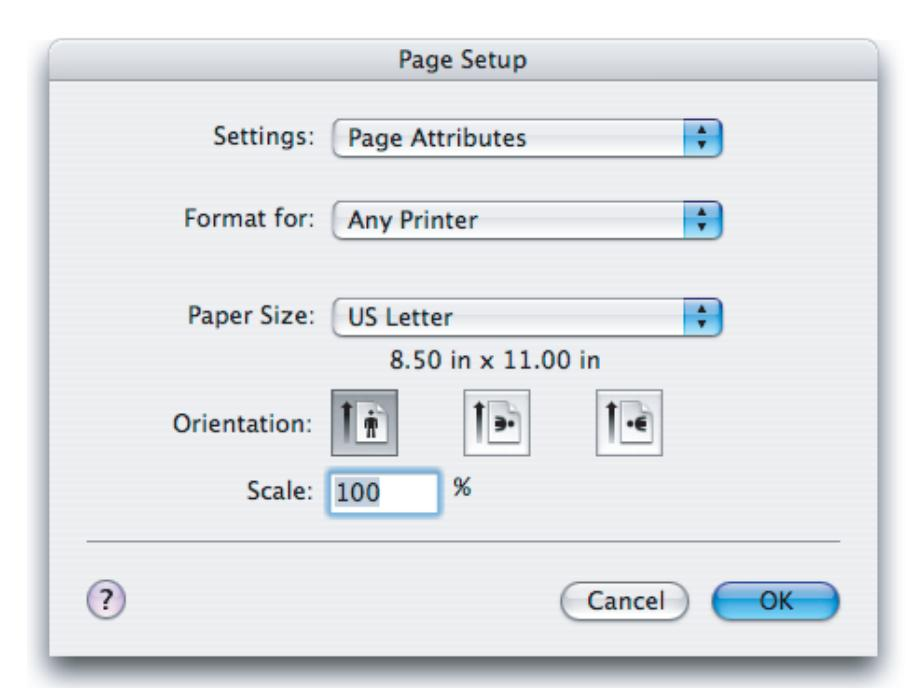

### <span id="page-227-2"></span>Fax Dialog

The Fax dialog allows a user to specify how to send a fax. Options include cover page settings and dialing options. When the user types a name that's in the user's address book, the Fax dialog checks to see if there's a fax number in the record and fills it in if there is.

<span id="page-228-0"></span>**Figure 13-48** The Fax dialog


#### **C HAPTER 1 3**

Windows

<span id="page-230-6"></span><span id="page-230-5"></span><span id="page-230-2"></span><span id="page-230-0"></span>**Controls** are graphic objects that cause instant actions or visible results when the user manipulates them with the mouse. Standard controls include push buttons, scroll bars, radio buttons, checkboxes, sliders, and pop-up menus.

<span id="page-230-3"></span>In Carbon, the Control Manager determines the overall appearance of many controls. Controls introduced in Mac OS X version 10.2 and later are implemented using the HIView model. In Cocoa, the overall appearance of interface elements is provided by the Application Kit. You are responsible for positioning the controls within your windows, according to the guidelines given in this chapter and in "Layout [Examples"](#page-288-0) (page 289).

This chapter discusses the behavior and appearance of the standard controls available in Mac OS X. Follow the metrics provided in this chapter to get the correct spacing between controls in your windows.

Many controls have a small version and a mini version for use when space is very limited, such as in a palette or utility window. This chapter gives specifications for these as well as the full-size version. See "Using Small and Mini Versions of [Controls](#page-298-0) " (page 299) for more information.

**Carbon:** See *Control Manager Reference*, *Handling Carbon Windows and Controls*, and *HIView Programming Guide*in Carbon User Experience Documentation for more information about creating and handling controls.

**Cocoa:** See the various documents on controls available in Cocoa User Experience Documentation.

## <span id="page-230-1"></span>Buttons

<span id="page-230-4"></span>Buttons initiate an immediate action. If a button initiates an indeterminate process, the button should be dimmed until the process is complete and status feedback should be provided.

If you need to offer two opposing functions, such as Reload and Stop in a browser, consider using two separate buttons instead of a single, dual-purpose button that changes state. Providing a single, dual-purpose button can lead to the situation in which a user clicks the button when it is in one state, but the click is received and processed after the button has changed to the other state. If you must provide a single, dual-purpose button, be sure to keep track of when the button changes state so you can process the clicks appropriately. Also, be sure to provide immediate and informative feedback.

Buttons **231**

For information about proper capitalization of button labels, see ["Capitalization](#page-127-0) of Interface [Elements"](#page-127-0) (page 128).For information aboutwhen it is appropriate to use an ellipsis in a button label, see "Using the Ellipsis [Character"](#page-122-1) (page 123).

This section discusses the buttons that are available to meet the needs of your interface.

### <span id="page-231-4"></span><span id="page-231-3"></span><span id="page-231-0"></span>Push Buttons

A **push button** is a rounded rectangle with a text label on it. Clicking a push button performs an instantaneous action, such as saving a document, completing operations defined by a dialog, or acknowledging an error message.

Use push buttons for buttons that contain text only. A button that has an icon or other image should be a bevel button. Push button text should not have a shadow or any other effects on it. It should be in the system font appropriate forthe button size as described in the specification section that follows.

Button names should be verbs that describe the action performed—Save, Close, Print, Delete, and so on. If a button acts on a single setting, label the button as specifically as possible; "Choose Picture…," for example, is more helpful than "Choose…" Because most buttons initiate an immediate action, it shouldn't be necessary to use "now" (Scan Now, for example) in the label. Don't use push buttons to indicate a state such as On or Off (where it would be more appropriate to use checkboxes).

<span id="page-231-2"></span>Don't use push buttons as labels; use static text.

<span id="page-231-1"></span>Don't associate menus with push buttons; use a bevel button instead.

All push buttons should be clear in appearance (that is without color) except the default button—the button selected by pressingthe Return key—which should use the default color(in addition to pulsing). For example, in a dialog containing an OK button and a Cancel button where OK is the default, the Cancel button is clear and the OK button uses color and pulses. When the user presses a nondefault button, such as Cancel, the button acquires color and the default button loses its color. If you use standard controls, this behavior is automatic.

For examples of using push buttons in dialogs see ["Dialogs"](#page-206-1) (page 207).

**Carbon:** Push buttons are available in Interface Builder; to create one programmatically, use CreatePushButtonControl.

**Cocoa:** Push buttons are available in Interface Builder; to create one programmatically, create an NSButton of type NSMomentaryPushInButton or NSMomentaryLightButton. See *Button Programming Topics for Cocoa* in Cocoa User Experience Documentation.

### <span id="page-232-0"></span>Push Button Specifications

**Figure 14-1** Push button height

**Full-size push button**


**Small push button**


**Mini push button**

<span id="page-232-1"></span>15

**Figure 14-2** Push button spacing

**Full-size push button**

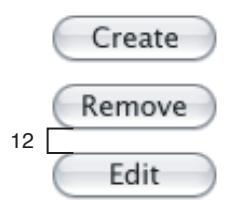

**Small push button**


**Mini push button**

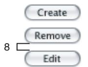

#### ■ **Height:**

❏ Full size: 20 pixels, not including the shadow

❏ Small: 17 pixels ❏ Mini: 15 pixels

<span id="page-233-1"></span>■ **Width:** Depends on button text. If you don't specify a wide enough button, the end caps clip the text. The standard width for OK and Cancel buttons is 68 pixels, as shown in Figure 14-3.

**Figure 14-3** Full-size push buttons used in dialogs

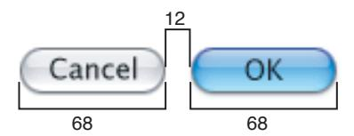

#### ■ **Text:**

- ❏ Full size: System font. If you need to use a font larger than the system font, use a bevel button instead.
- ❏ Small: Small system font.
- <span id="page-233-2"></span>❏ Mini: Mini system font.
- **Color:** All push buttons are clear except the default button, which uses the default color (in addition to pulsing).

#### ■ **Spacing:**

- <span id="page-233-4"></span>❏ Full size: Leave at least 12 pixels of space between buttons placed horizontally or stacked.
- ❏ Small: Leave at least 10 pixels.
- <span id="page-233-0"></span>❏ Mini: Leave at least 8 pixels.

### <span id="page-233-5"></span><span id="page-233-3"></span>Metal Buttons

**Metal buttons** are for use in brushed metal windows. (In Interface Builder and in the Cocoa API, metal buttons are referred to as "textured".)

#### Metal buttons:

- Can contain icons, graphics, or text
- Can have the behavior of other types of buttons, including radio buttons or checkboxes

Don't use metal buttons in dialogs. Dialogs should never use the brushed metal look. See ["Brushed](#page-186-0) Metal [Windows](#page-186-0) " (page 187) for guidelines on when to use brushed metal windows.

If a button acts on a single setting, label the button as specifically as possible.

<span id="page-234-0"></span>**Figure 14-4** Metal buttons

### **Full-size metal button**


With icon

With font character With text

#### **Small metal button**

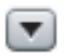


With icon

With font character

**Carbon:** Not available.

**Cocoa:** Use the NSButtonCell method setBezelStyle with NSTexturedSquareBezelStyle as the argument. See *Button Programming Topics for Cocoa* in Cocoa User Experience Documentation.

### <span id="page-234-1"></span>Metal Button Specifications

**Figure 14-5** Metal button dimensions

#### **Full-size metal button**

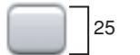


#### **Small metal button**


For control area

#### ■ **Height:**

- ❏ Full size: 25 pixels minimum, 32 pixels maximum
- ❏ Small: 18 pixels minimum, 24 pixels maximum
- **Width:** Depends on the button's content.

#### ■ **Size of image:**

- ❏ Full size: No more than 16 pixels high for a 25 pixel high button. Leave at least two pixels of space on each side.
- ❏ Small: No more than 11 pixels high for a 18 pixel high button. Leave at least two pixels of space on each side.

#### ■ **Text:**

❏ Full size: System font

❏ Small: Small system font

#### ■ **Spacing:**

- <span id="page-235-4"></span>❏ Full size: Leave at least 12 pixels of space between buttons placed horizontally or stacked.
- ❏ Small: Leave at least 8 pixels.

<span id="page-235-0"></span>**Note:** There is no mini version of the metal button.

### <span id="page-235-3"></span><span id="page-235-2"></span>Bevel Buttons

A **bevel button** has a beveled edge that gives the button a three-dimensional appearance.

<span id="page-235-1"></span>Bevel buttons are extremely versatile and can display text, icons, or other images. They can behave like standard push buttons or can begrouped and used like radio buttons or checkboxes.For example, bevel buttons could be used to graphically represent text-alignment options in a toolbar.

**Figure 14-6** Bevel buttons as radio buttons and push buttons


Bevel buttons can have a menu attached, so the button behaves like a pop-up menu. See "Icon [Buttons](#page-245-0) and Bevel [Buttons](#page-245-0) With Pop-Up Menus " (page 246).

Even though bevel buttons can be used many different ways, be careful not to over use them; use other controls such as radio buttons, checkboxes, and push buttons when appropriate. Bevel buttons can have rounded or square corners. The square buttons work well for tiling together in groups (to be used as radio buttons, for example).

**Carbon:** Both the rounded and square versions of the button are in Interface Builder. To create them programmatically, use the CreateBevelButtonControl function, or use the Appearance Manager function DrawThemeButton with the kThemeBevelButton constant.

**Cocoa:** Bevel buttons are available in Interface Builder. To create one programmatically use the NSButtonCell method setBezelStyle with NSRoundedBezelStyle as the argument. To make a square-cornered bevel button in Interface Builder, use the bevel button object (NSButton) from the Controls palette. Select the button, and in the Attributes inspector, change its type to Square Button. See *Button Programming Topics for Cocoa* in Cocoa User Experience Documentation.

### <span id="page-236-1"></span>Bevel Button Specifications

**Figure 14-7** Bevel button examples

# **Rounded corners** 32 x 32

Leave at least 5 pixels between edge of icon and edge of button.

#### **Rounded corners with label below icon**


#### **Square corners**

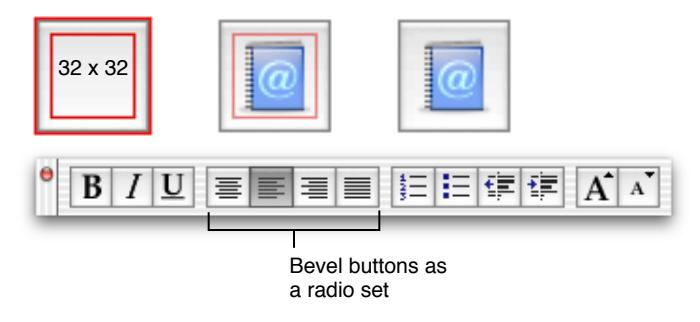

- **Size of button:** Variable; 20 x 20 pixels is recommended size in a tool palette. If using an icon or text in the button, maintain a border of at least 5 pixels on all sides.
- **Size of icon:** 32 x 32 pixels is the largest recommended icon size.
- **Spacing:** For buttons with rounded corners that contain a 24 x 24 (or larger) icon, leave at least 8 pixels between buttons, stacked vertically or aligned horizontally. Otherwise, buttons should butt up against each other.
- <span id="page-236-0"></span>■ **Text:** Label font (10-point Lucida Grande Regular).

<span id="page-236-2"></span>If a bevel button has an icon and a label, you can put the text anywhere in relation to the icon. You can specify the location in Interface Builder or programmatically.

### Icon Buttons

An **icon button** behaves like a bevel button, but does not have a rectangular edge around it; the entire button is clickable, not just the icon.

Icon buttons may have pop-up menus attached. See "Icon [Buttons](#page-245-0) and Bevel Buttons With Pop-Up [Menus](#page-245-0) " (page 246) for more information.

<span id="page-237-1"></span>**Figure 14-8** Icon buttons used in a toolbar


**Carbon:** Create icon buttons programmatically with the function CreateIconControl. **Cocoa:** To create an icon button in Interface Builder, use the bevel button object (NSButton) from the Controls palette. Add the appropriate icon, then select the button and in the Attributes inspector, deselect Bordered. To create one programmatically, use the NSButtonCell method setBezelStylewith NSShadowlessSquareBezelStyle as the argument. See *Button Programming Topics for Cocoa* in Cocoa User Experience Documentation.

### <span id="page-237-2"></span>Icon Button Specifications

**Figure 14-9** Icon button dimensions


- **Size of icon:** 32 x 32 pixels recommended.
- <span id="page-237-0"></span>■ **Spacing:**For buttonswith a 24 x 24 (orlarger) icon, leave at least 8 pixels between buttons, stacked vertically or aligned horizontally.
- <span id="page-237-3"></span>■ **Text:** Small system font. The text should be below the icon as shown in Figure 14-9.

### Round Buttons

**Round buttons** may contain images but not text. Use them when you need a simple iconic push button to initiate an immediate action. They are commonly used as navigation controls. They should not be used as radio buttons or as checkboxes.

<span id="page-238-1"></span>**Figure 14-10** Examples of round buttons


**Carbon:** Round buttons are available in Interface Builder. To create one programmatically, use CreateRoundButtonControl.

**Cocoa:** Round buttons are available in Interface Builder. To create one programmatically, use the NSButtonCell method setBezelStylewith NSCircularBezelStyle as the argument. See *Button Programming Topics for Cocoa* in Cocoa User Experience Documentation.

### <span id="page-238-2"></span>Round Button Specifications

**Figure 14-11** Round button dimensions

#### **Full-size round button**


#### **Small round button**


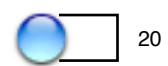

#### ■ **Diameter:**

❏ Full size: 25 pixels ❏ Small: 20 pixels

- **Text:** Do not use text in round buttons. A single letter may be appropriate, but the letter should be treated as an icon.
- <span id="page-238-0"></span>■ **Spacing:** 12 pixels between buttons or from other interface elements.

<span id="page-238-4"></span><span id="page-238-3"></span>**Note:** There is no mini version of the round button.

### The Help Button

The **Help button** opens Help Viewer to a specific help page appropriate for the context of the button. Don't create a custom button; use the standard Help button, which contains the Mac OS X question mark graphic.

In dialogs, sheets, and drawers, the Help button typically is located in the lower left corner and is verticallyalignedwith the OK and Cancel buttons, if theyare present.Figure 14-12 shows an example of a dialog that includes a Help button.

<span id="page-239-1"></span>**Figure 14-12** Help button in the Page Setup dialog

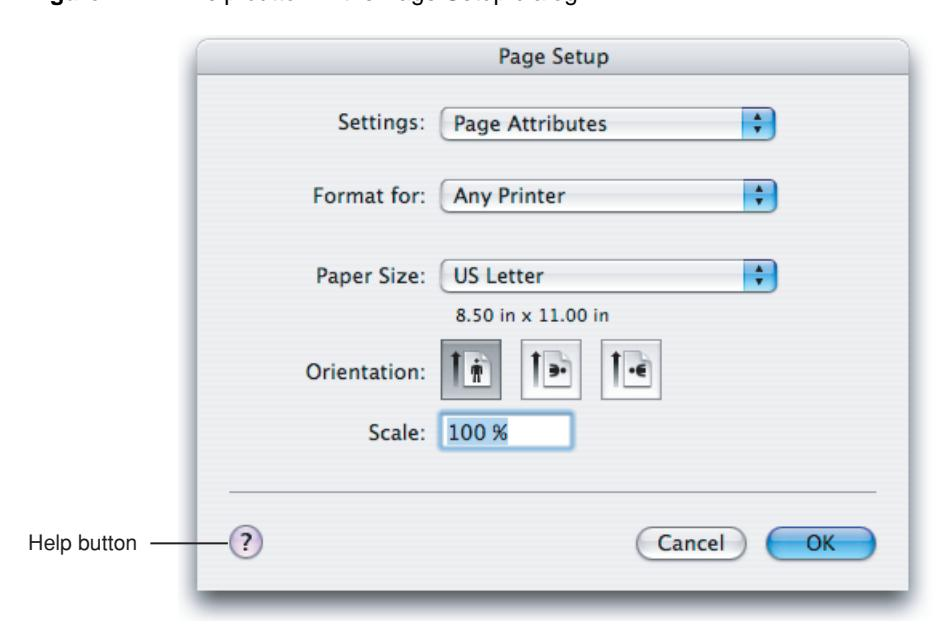

For information on using help in your application, see "User [Assistance"](#page-72-0) (page 73).

**Carbon:** The Help button is available in the Enhanced Controls palette of Interface Builder. You can create it programmaticallyby usingthe CreateRoundButtonControl function and specifying kHelpIcon in the content parameters (from Icon Services). (See Icons.h in the HIServices framework.)

**Cocoa:** The Help button is available in the Controls palette of Interface Builder. To create a Help button programmatically, use the NSButtonCell method setBezelStyle with NSHelpButtonBezelStyle as the argument. See *Button Programming Topics for Cocoa* in Cocoa User Experience Documentation.

### <span id="page-239-2"></span>Help Button Specifications

**Figure 14-13** Help button dimensions

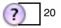

- <span id="page-239-0"></span>■ **Diameter:** 20 pixels
- **Spacing:** At least 12 pixels from other interface elements

## Selection Controls

The controls described in the following sections provide ways for users to make selections from multiple items.

## <span id="page-240-0"></span>Radio Buttons

<span id="page-240-3"></span><span id="page-240-2"></span>Use **radio buttons** for a set of mutually exclusive but related choices. A set of radio buttons should contain at least two items and a maximum of about five. (For more than five items, consider using a pop-up menu.) A set of radio buttons is never dynamic (that is, the contents shouldn't change depending on the context). A radio button should never initiate an action.

**Carbon:** Radio buttons are available in Interface Builder. To resize agroup of radio buttons, select Control in the pop-up menu at the top of the inspector window and select the appropriate size in the Size pop-up menu.

To create a radio button programmatically, use the function CreateRadioButtonControl.

**Cocoa:** Radio buttons are available in Interface Builder. To resize a group of radio buttons, select Prototype in the pop-up menu at the top of the inspector window and select the appropriate size in the Size pop-up menu. Then, select Attributes in the inspector window's pop-up menu and click Match Prototype.

Radio buttons have the button type NSRadioButton. See *Button Programming Topics for Cocoa* in Cocoa User Experience documentation.

### <span id="page-240-1"></span>Radio Button Specifications

**Figure 14-14** Radio button spacing

#### **Full-size radio button**

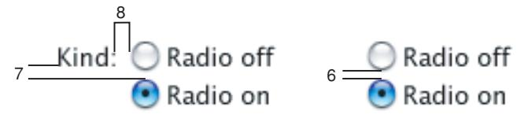

#### **Small radio button**


#### **Mini radio button**

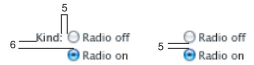

Align the baselines of the label and the first button's text.

#### ■ **Size:**

❏ Full size: 18 x 18 pixels, including the shadow

- ❏ Small: 14 x 15 pixels ❏ Mini: 10 x 11 pixels
- **Spacing:**
  - ❏ Full size: 6 pixels between controls when stacked; 8 pixels from label (colon) to control
  - ❏ Small: 6 pixels between controls when stacked; 6 pixels from label (colon) to control
  - ❏ Mini: 5 pixels between controls when stacked; 5 pixels from label (colon) to control

#### ■ **Text:**

- ❏ Full size: System font for both the label and control text
- ❏ Small: Small system font for both the label and control text
- ❏ Mini: Mini system font for both the label and control text
- <span id="page-241-0"></span>■ **Positioning:** Typically stacked vertically to clearly show relationships among button states.

## <span id="page-241-2"></span><span id="page-241-1"></span>Checkboxes

Use **checkboxes** to indicate one or more options that must be either on or off. Each checkbox label should clearly imply two opposite states so it's clear what happens when the box is checked or unchecked. If you can't find an unambiguous label, consider using radio buttons so you can clarify the states with two different labels.

When a user selection comprises more than one state, use a dash in the appropriate checkboxes. This symbol is consistent with the mixed-state indicator in menus, as described in "Using [Symbols](#page-153-0) in [Menus"](#page-153-0) (page 154).

**Carbon:** Checkboxes are available in Interface Builder. Create them programmatically with the function CreateCheckboxControl.

**Cocoa:** Checkboxes are available in Interface Builder. Create them programmaticallyas NSButtons of type NSSwitchButton. See *Button Programming Topics for Cocoa* in Cocoa User Experience documentation.

### <span id="page-242-0"></span>Checkbox Specifications

**Figure 14-15** Checkbox spacing

#### **Full-size checkbox**


#### **Small checkbox**


#### **Mini checkbox**


Align the baselines of the label and the first checkbox's text.

#### ■ **Size:**

❏ Full size: 18 x 18 pixels, including the shadow

❏ Small: 14 x 16 pixels ❏ Mini: 15 x 15 pixels

#### ■ **Spacing:**

- ❏ Full size: 8 pixels between controls when stacked; 8 pixels from label (colon) to control
- ❏ Small: 8 pixels between controls when stacked; 6 pixels from label (colon) to control
- ❏ Mini: 7 pixels between controls when stacked; 5 pixels from label (colon) to control

#### ■ **Text:**

- ❏ Full size: System font for both the label and control text
- ❏ Small: Small system font for both the label and control text
- ❏ Mini: Mini system font for both label and control text

<span id="page-243-1"></span>■ **Positioning:** If there are two or more related checkboxes, they are typically stacked vertically to clearly indicate that they are related

### <span id="page-243-3"></span><span id="page-243-2"></span><span id="page-243-0"></span>Segmented Control

A **segmented control** is divided into two or more segments and behaves as a collection of radio buttons (or checkboxes). It is used to change the mode or view of your application or parent window.

- A segmented control may contain icons or text but not both.
- When the control contains icons, you may place a text label below the control.
- Segmented controls may be used in regular or brushed metal windows.
- Like a push button, the segmented control should initiate an immediate action. When the user presses one of the segments, something should happen.

**Carbon:** The segmented control is available in Interface Builder. Create it programmatically with the function HISegmentedViewCreate.

**Cocoa:** The segmented control is available in Interface Builder. Create it programmatically using the NSSegmentedControl class.

### <span id="page-244-0"></span>Segmented Control Specifications

**Figure 14-16** Segmented control dimensions

**Full-size segmented control for brushed metal windows.**


#### **Full-size segmented control**

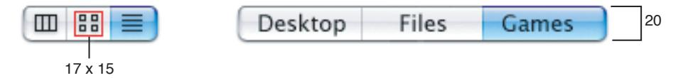

#### **Small segmented control**


#### **Mini segmented control**

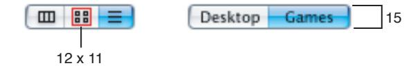

#### ■ **Height:**

❏ Full size: 25 pixels for brushed metal windows, 20 pixels otherwise

❏ Small: 17 pixels ❏ Mini: 15 pixels

#### ■ **Text:**

- ❏ Full size: System font for text within the control and for label text below it
- ❏ Small: Small system font for text within the control and for label text below it
- ❏ Mini: Mini system font for text within the control and for label text below it

### <span id="page-245-0"></span>Icon Buttons and Bevel Buttons With Pop-Up Menus

<span id="page-245-4"></span><span id="page-245-3"></span>A bevel button or an icon button containing a pop-up menu has a single downward-pointing arrow. The button can behave like a standard pop-up menu, in which the image on the button is the current selection, or the button can represent the menu title and always display the same image.

See "Bevel [Buttons"](#page-235-0)(page 236) and "Icon [Buttons"](#page-236-0)(page 237) for specifications forthe buttons themselves.

**Carbon:** Create this in Interface Builder by using a bevel button and selecting the Has Menu option in the Attributes pane of the inspector.

**Cocoa:** Select the NSPopUpButton object in Interface Builder. In the inspector, change its type to PullDown. Change the Style to Square or Shadowless Square for a Rounded or Square Bevel Button, respectively. For an icon button, it doesn't matter which one you choose, just deselect the Bordered checkbox. Resize the button as needed.

<span id="page-245-1"></span>**Figure 14-17** Pop-up icon button


**Figure 14-18** Pop-up bevel button with square corners

<span id="page-245-2"></span>

<span id="page-246-1"></span>**Figure 14-19** Pop-up bevel button with rounded corners


### <span id="page-246-3"></span><span id="page-246-2"></span><span id="page-246-0"></span>Pop-Up Menus

Use **pop-up menus** to present a list of mutually exclusive choices in a dialog or window. Pop-up menus are used as a means of selecting one choice from a list of many. If you have a dialog with a set of six or more radio buttons, consider using a pop-up menu instead.

#### A pop-up menu:

- Usually has a label to the left (in left-to-right scripts) unless the menu is used as the title for a group box
- Has a double-triangle indicator
- Contains nouns (things) or adjectives (states or attributes), but not verbs (commands); use pull-down menus for commands
- Has a checkmark beside the current value when open

A pop-up menu behaves like other menus: Users drag to choose an item—which then flashes briefly and appears as the current choice—or users move the cursor outside the menu to leave the current value active. An exploratory press in the menu to see what's available doesn't select a new value.

In special cases, you may want to include a command that affects the contents of the pop-up menu itself. For example, in the Print dialog, the Printer pop-up menu contains Edit Printer List, so users can add a printer to the menu; the new printer becomes the menu's default selection. Put such commands at the bottom of a pop-up menu, below a separator.

In some circumstances it maybe appropriate to use pop-up menus to complete sentences that describe advanced operations. For example, the Find window in the Finder and the Rules window in Mail Preferences both use pop-up menus in this way.

Use pop-up menus to present up to 12 mutually exclusive choices that the user doesn't need to see all the time.

Don't use pop-up menus:

- For more than 12 items; use a scrolling list unless space is restricted
- When the number of items in the list can change
- When more than one selection is appropriate, such as text styles (in which you can select bold and italic, for example); use checkboxes or a pull-down menu in which checkmarks appear

Don't use submenuswith pop-up menus. Doingso hides choices too deeplyand is physically difficult to use.

<span id="page-247-0"></span>Bevel buttons and icon buttons can also be pop-up menus. See "Icon [Buttons](#page-245-0) and Bevel Buttons With [Pop-Up](#page-245-0) Menus " (page 246).

**Figure 14-20** An open pop-up menu

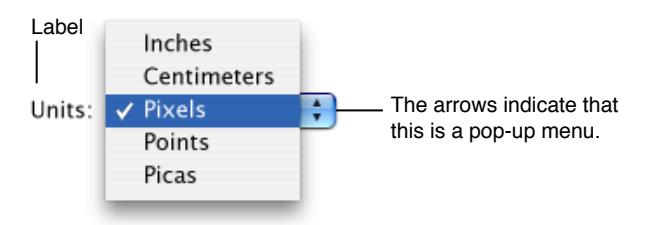

**Carbon:** Available in Interface Builder. To create one programmatically, use the function CreatePopUpButtonControl.

**Cocoa:** Available in Interface Builder as a pop-up menu is an NSPopUpButton. See *Application Menu and Pop-up List Programming Topics* in Cocoa User Experience Documentation.

### <span id="page-248-0"></span>Pop-Up Menu Specifications

**Figure 14-21** Pop-up menu dimensions

#### **Full-size pop-up menu**


#### **Small pop-up menu**

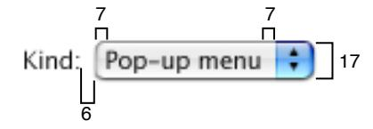

#### **Mini pop-up menu**

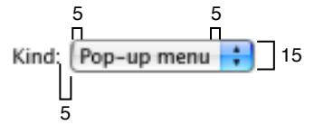

<span id="page-249-0"></span>**Figure 14-22** Pop-up menu spacing

#### **Full-size pop-up menu**

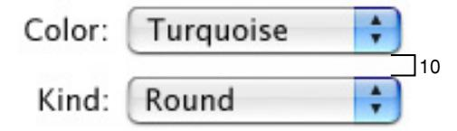

#### **Small pop-up menu**

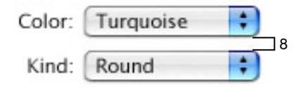

#### **Mini pop-up menu**

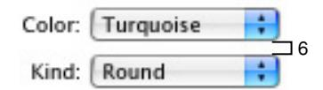

### ■ **Height:**

❏ Full size: 20 pixels ❏ Small: 17 pixels ❏ Mini: 15 pixels

■ **Width:** Wide enough to accommodate the longest menu item

#### ■ **Spacing:**

❏ Full size: Leave at least 10 pixels of space between stacked controls.

❏ Small: At least 8 pixels ❏ Mini: At least 6 pixels

### ■ Text on control

- ❏ Full size: System font, 9 pixels from left edge and at least 9 pixels from the double-triangle section
- ❏ Small: Small system font, 7 pixels from left edge and at least 7 pixels from the double-triangle section
- ❏ Mini: Mini system font, 5 pixels from left edge and at least 5 pixels from the double-triangle section

### ■ **Menu label text:**

- ❏ Full size: Emphasized system font, 8 pixels from text (colon) to left edge of menu
- <span id="page-250-3"></span>❏ Small: Emphasized small system font, 6 pixels from text (colon) to left edge of menu
- ❏ Mini: Emphasized mini system font, 5 pixels from text (colon) to left edge of menu

### <span id="page-250-2"></span><span id="page-250-0"></span>Command Pop-Down Menus

A **command pop-down menu** is similar to a pull-down menu, but it appears within a window rather than in the menu bar. Use this control only when the window is shared among multiple applications and the menu contains commands that affect thewindow's contents.For example, the Colorswindow, which can be used in any application, contains a menu with commands that can be used to change the contents of the Colors window itself. If your application uses the Colors window, don't create your own menu with these same commands.

<span id="page-250-1"></span>**Figure 14-23** A command pop-down menu

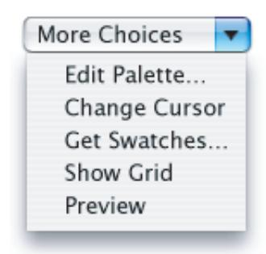

Command pop-down menus should contain between 3 and 12 commands. A closed command menu always displays the same text, which acts as the menu title.

**Carbon:** Mimic the appearance and behavior with a bevel button.

**Cocoa:** Use the NSPopUpButton object in Interface Builder and change its type to PullDown.

### Command Pop-Down Menu Specifications

Note that the specifications for command pop-down menus are the same as those for pop-up menus.

Selection Controls **251 2006-10-03 | © 1992, 2001-2003, 2006 Apple Computer, Inc. All Rights Reserved.**

<span id="page-251-0"></span>**Figure 14-24** Command pop-down menu dimensions

#### **Full-size pop-down menu**

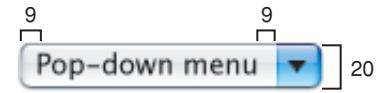

#### **Small pop-down menu**

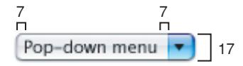

#### **Mini pop-down menu**


#### ■ **Height:**

❏ Full size: 20 pixels ❏ Small: 17 pixels ❏ Mini: 15 pixels

■ **Width:** Wide enough to accommodate the longest menu item

#### ■ **Spacing:**

❏ Full size: Leave at least 10 pixels of space between stacked controls.

❏ Small: Leave at least 8 pixels.

❏ Mini: Leave at least 6 pixels.

### ■ **Menu item text:**

❏ Full size: System font, 9 pixels from left edge and at least 9 pixels from the triangle section

❏ Small: Small system font, 7 pixels from left edge and at least 7 pixels from the triangle section

❏ Mini: Mini system font, 5 pixels from left edge and at least 5 pixels from the triangle section

# <span id="page-252-0"></span>Combination Boxes

<span id="page-252-3"></span><span id="page-252-2"></span>A **combination box** (or combo box) is a text entryfield combinedwith a drop-down list. Combo boxes are useful for displaying a list of likely choices while still allowing the user to type in an item not in the list.

The user can type any appropriate characters into the text field. If the user types in an item already in the list, or types in a few characters that match the first characters of an item in the list, the item is highlighted when the user opens the list. A user-typed item is *not* added to the permanent list.

The user opens the list by pressing or clicking the arrow to the right of the text field. The list is a window that descends from the text field; the window is the same width as the text field plus the arrow box, and has a drop shadow. Don't extend the right edge of the list beyond the right edge of the arrow box; if an item is too long, it is truncated.

When the user selects an item in the list, the item replaces whatever is in the text entry field and the list closes. If the list was opened by pressing the arrow, the user selects an item in the list by dragging to it. If the list was opened by clicking the arrow, the user selects an item by clicking it or by pressing the Up Arrow or Down Arrow keys. The user can accept an item by pressing the Space bar, Enter, or Return.

<span id="page-252-1"></span>If the list is open and the user clicks outside it, including within the text entry field, the list closes.

**Figure 14-25** A combo box with the list open

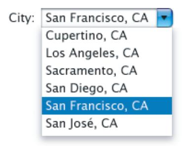

The default state of the combo box is closed,with the text field emptyor displayinga default selection. The default selection (not necessarily the first item in the list) should provide a meaningful clue to the hidden choices. The combo box should also have a useful label.

**Carbon:** Combo boxes are available in Interface Builder. To create them programmatically, use the HIComboBoxCreate function or DrawThemeButton with the appropriate constant.

**Cocoa:** Combo boxes are available in Interface Builder. Use the NSComboBox class. See *Combo Boxes* in Cocoa User Experience Documentation.

### <span id="page-253-0"></span>Combo Box Specifications

**Figure 14-26** Combo box dimensions

#### **Full-size combo box**


#### **Small combo box**


#### **Mini combo box**


### ■ **Height:**

❏ Full size: 20 pixels

❏ Small: 17 pixels

❏ Mini: 15 pixels

■ **Width:** Wide enough to accommodate the longest menu item

#### ■ **Spacing:**

❏ Full size: Leave at least 12 pixels of space between stacked controls.

❏ Small: Leave at least 10 pixels.

❏ Mini: Leave at least 8 pixels.

#### ■ **Menu item text:**

❏ Full size: System font

❏ Small: Small system font

❏ Mini: Mini system font

### ■ **Menu label text:**

❏ Full size: Emphasized system font, 8 pixels from text (colon) to left edge of menu

- <span id="page-254-4"></span>❏ Small: Emphasized small system font, 6 pixels from text (colon) to left edge of menu
- ❏ Mini: Emphasized mini system font, 5 pixels from text (colon) to left edge of menu.

### <span id="page-254-8"></span><span id="page-254-0"></span>Placards

<span id="page-254-3"></span>A **placard** is a small section at the bottom of awindowused to displayinformation, such as the current page number. You can also use a placard to create the striped background behind controls.

<span id="page-254-2"></span>Typically placards are used in document windows as a way to quickly modify the view of the contents—for example, to change the current page or the magnification. The most familiar use of the placard is as a pop-up menu placed at the bottom of a window, to the left of the horizontal scroll bar.

**Figure 14-27** A placard with a pop-up menu

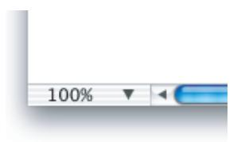

Placards are 15 pixels high and use either the small system font or the label font for text.

**Carbon:** Use the Control Manager CreatePlacardControl function or the function HIThemeDrawPlacard in the Appearance Manager. The standard placard control does not include a menu. If you want to display a menu, override the default behavior of the draw Carbon event and the click Carbon event.

<span id="page-254-1"></span>**Cocoa:** Not available.

### <span id="page-254-7"></span><span id="page-254-6"></span><span id="page-254-5"></span>Color Wells

A **color well** is a small rectangular control that indicates the current color for a particular setting and, when clicked, displays a Colors window. Use the Colors window whenever you want to allow users to change a color setting. Multiple color wells can appear in a window.

Selection Controls **255 2006-10-03 | © 1992, 2001-2003, 2006 Apple Computer, Inc. All Rights Reserved.**

<span id="page-255-1"></span>**Figure 14-28** Color well in a preferences window


**Carbon:** Color wells are not available as a standard control. See the ColorSwatchView sample application in /Developer/Examples/Carbon for an example of how you can implement them. **Cocoa:** Available in Interface Builder. A color well is an NSColorWell. See *Color Programming Topics for Cocoa* in Cocoa Graphics & Imaging Documentation.

## <span id="page-255-3"></span><span id="page-255-0"></span>Image Wells

<span id="page-255-2"></span>Use an **image well** as a drag-and-drop target for an icon or picture. You could use a set of imagewells to manage thumbnails in a clip-art catalog, for example. Don't use imagewells in place of push buttons or bevel buttons.

**Figure 14-29** Image wells

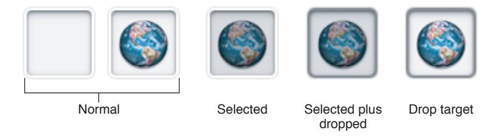

<span id="page-255-4"></span>Some image wells (the user picture in the Picture pane of Accounts preferences, for example) must always contain an image. If the user can clear an image well (leaving it empty) in your application, provide standard Edit menu commands and Clipboard support.

**Carbon:** Image wells are available in Interface Builder. To create one programmatically, use CreateImageWellControl.

**Cocoa:** Image wells are available in Interface Builder. An image well is an NSImageView.

### <span id="page-256-0"></span>Date Pickers

<span id="page-256-3"></span>Use a **date picker** to allow the user to select a specific date and time in a window. The date-picker control provides two styles of date and time selection:

- A combination of a text field and stepper control
- A graphical calendar and clock

The text field and stepper date picker can be modified to display various combinations of date format (month, day, and year or month and year) and time format (hour, minute, and second or hour and minute). It can also display a text field and stepper for either the date or the time by itself. The user adjusts the date and time byclickingthe arrows of the stepper or byselectingthe field to change (such as the month or minute field) and typing a new value.

<span id="page-256-1"></span>[Figure](#page-256-1) 14-30 (page 257) shows a text field and stepper date-picker control that allows month, day, and year selection for the date, and hour, minute, and second selection for the time.

**Figure 14-30** A textual date-picker control

The graphical style of the date-picker control displays a calendar and clock similar to those displayed in Date & Time System Preferences. You can display either the calendar or the clock in your window or both together. The user selects a month by clicking the left or right arrows in the upper-left corner of the calendar display and selects a day by clicking its date in the month. A specific time is selected by dragging the hands of the clock.

<span id="page-256-2"></span>[Figure](#page-256-2) 14-31 (page 257) shows a graphical date-picker control (the second hand is not shown in the clock).

**Figure 14-31** A graphical date picker control

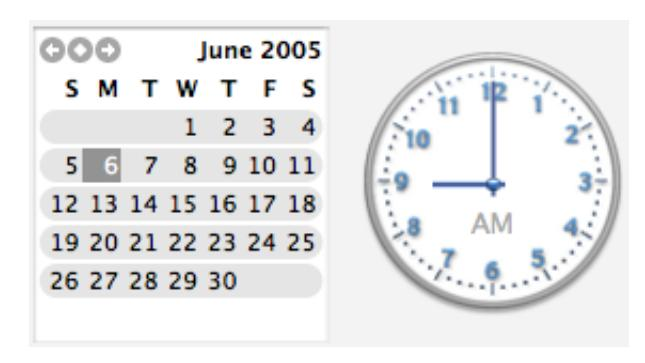

**Carbon:** The date picker is not available in Interface Builder. To create one programmatically, use the Control Manager CreateClockControl function.

**Cocoa:** The date picker is available in Interface Builder in the Text palette.You can change the style from textual tographical in the Attributes pane of the NSDatePickerInspector. A date-picker control is an NSDatePicker.

Selection Controls **257 2006-10-03 | © 1992, 2001-2003, 2006 Apple Computer, Inc. All Rights Reserved.**

## <span id="page-257-0"></span>Adjustment Controls

This section discusses controls that allow users to graphically adjust settings or parameters.

### <span id="page-257-4"></span><span id="page-257-3"></span><span id="page-257-1"></span>The Stepper Control (Little Arrows)

The **stepper control** allows users to increment or decrement values. The control is usually used in conjunction with a text field to indicate the current value. The text field may or may not be editable.

**Carbon:** The stepper control is available in Interface Builder. You can create it programmatically with CreateLittleArrowsControl.

**Cocoa:** The stepper control is available in Interface Builder. The stepper control is an NSStepper. See *Steppers* in Cocoa User Experience Documentation.

### <span id="page-257-2"></span>Stepper Control Specifications

**Figure 14-32** Stepper control dimensions

#### **Full-size stepper control**

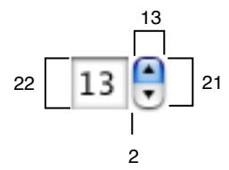

#### **Small stepper control**

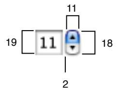

#### **Mini stepper control**

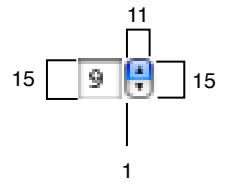

### ■ **Size of control:**

❏ Full size: 13 x 21 pixels ❏ Small: 11 x 18 pixels ❏ Mini: 11 x 15 pixels

### ■ **Height of text field:**

❏ Full size: 22 pixels ❏ Small: 19 pixels ❏ Mini: 15 pixels

### ■ **Spacing between control and field it modifies:**

❏ Full size: 2 pixels ❏ Small: 2 pixels ❏ Mini: 1 pixel

### <span id="page-258-3"></span><span id="page-258-2"></span><span id="page-258-0"></span>Slider Controls

<span id="page-258-4"></span>A **slider control** lets users choose from a continuous range of allowable values.

- Slider controls can be horizontal or vertical. In deciding whether a slider should be horizontal or vertical, try to meet users' expectations of similar real-world controls.
- Slider controls can display labeled tick marks to represent increments you specify.
- The slider itself (the thumb) can be either directional or round.
- Slider controls support live feedback (live dragging) so users can see the effect of moving the slider as it is dragged. Dock preferences, for example, shows the effect of moving the Dock Size slider.

**Carbon:** Sliders are available in Interface Builder. You can create them programmatically with the function CreateSliderControl.

<span id="page-258-1"></span>**Cocoa:** Sliders are available in Interface Builder. To create one programmatically, use the NSSlider class. See *Slider Programming Topics for Cocoa* in Cocoa User Experience documentation.

### Slider Control Specifications

**Figure 14-33** Full-size slider control dimensions

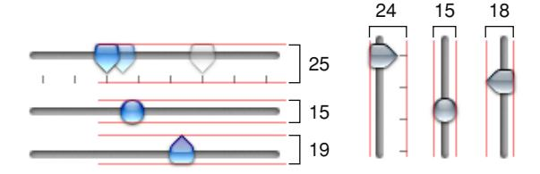

<span id="page-259-1"></span>**Figure 14-34** Small slider control dimensions


<span id="page-259-2"></span>**Figure 14-35** Mini slider control dimensions

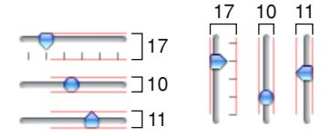

#### ■ **Control size:**

- ❏ Full size: 19 pixels for directional sliders (25 with tick marks), 15 for round sliders. When placed vertically, the directional slider has a width of 18 and the directional with tick marks has a width of 24.
- ❏ Small: 14 pixels for directional sliders (19 with tick marks), 12 for round sliders. When placed vertically, the round slider has a width of 11.
- ❏ Mini: 11 pixels for directional sliders (17 with graduation markings), 10 for round sliders.

#### ■ **Label text size:**

❏ Full size: 10 point ❏ Small: 10 point ❏ Mini: 9 point

#### ■ **Spacing:**

❏ Full size: 12 pixels of space between controls

❏ Small: 10 pixels of space between controls

❏ Mini: 8 pixels of space between controls

## <span id="page-259-0"></span>Indicators

Indicators are controls that show users the status of something.

## <span id="page-260-0"></span>Progress Indicators

<span id="page-260-5"></span><span id="page-260-2"></span>**Progress indicators** inform users about the status of lengthy operations. (For guidelines on when to provide such information, see "Feedback and [Communication"](#page-41-2) (page 42).) There are three types of progress indicators:

- <span id="page-260-3"></span>■ **Determinate progress bar:** Use when the full length of an operation can be determined and you can tell the user how much of the process has been completed. You could use a determinate progress indicator to show the progress of a file conversion, for example. See Figure 14-36.
- <span id="page-260-4"></span>■ **Indeterminate progress bar:** Use when the duration of a process can't be determined. You might use an indeterminate progress indicator to let the user know that the application is attempting a dial-up communication connection, for example, when there's no way to accurately determine how long it will take to complete. If an indeterminate process reaches a point where its duration can be determined, switch to a determinate progress indicator. See Figure 14-36.
- <span id="page-260-1"></span>■ **Asynchronous progress indicator**: Usewhen space is veryconstrained. These indicators are best used for asynchronous events that take place in the background, such as retrieving messages from a server. Don't use the asynchronous progress indicator in operations that start out indeterminate but could become determinate. See Figure 14-37.

In a determinate progress bar, the "fill" moves from left to right and should fill in completely before it is dismissed. An indeterminate progress bar displays a spinning striped cylinder to indicate an ongoing process.

Determinate progress bars should associate progress with time. A progress bar that becomes 90 percent complete in 5 seconds but takes 5 minutes for the remaining 10 percent, for example, would be annoying and lead users to think that something is wrong.

Progress bars typically appear within a progress dialog. When the process being performed can be interrupted, the progress dialog should contain a Cancel button (and support the Esc key). If interrupting the process will result in possible side effects, the button should say Stop instead of Cancel.

In addition to appearing in dialogs, the asynchronous progress indicator often appears in the main application window or a document window. Asynchronous progress indicators are generally visible only when an indeterminate operation is in progress.

Be sure to locate progress indicators in consistent locations in yourwindows and dialogs.For example, the Mail application always displays the asynchronous progress indicator in the far right of the To field as it finds and displays email addresses that match what the user types. Choosing a consistent location for progress indicators allows users to quickly check a familiar place for the status of an operation. See ["Consistency"](#page-43-0)(page 44) for more information on the importance of providingconsistency in your application.

Indicators **261**

<span id="page-261-1"></span>**Figure 14-36** Progress bars

**Determinate progress bar Determinate progress bar Small progress bar Full-size progress bar** Active fill Active fill Inactive fill Inactive fill Inactive fill Active fill Inactive fill Active fill **Indeterminate progress bar Indeterminate progress bar** 16 10

<span id="page-261-2"></span>**Figure 14-37** Asynchronous progress indicator


**Carbon:** All progress indicators are available in Interface Builder. You can create progress bars programmatically with the function CreateProgressBarControl and asynchronous progress indicators with CreateChasingArrowsControl.

**Cocoa:** All progress indicators are available in Interface Builder. All progress indicators can be displayed with the NSProgressIndicator class. See *Progress Indicators* in Cocoa User Experience Documentation.

<span id="page-261-0"></span>**Note:** Mini versions are not available.

### Relevance Indicators

Use a **relevance indicator**to displaythe relevance of search results as shown in Figure 14-38. Relevance indicators should be a part of a list view.

<span id="page-262-4"></span><span id="page-262-1"></span>**Figure 14-38** Relevance indicator

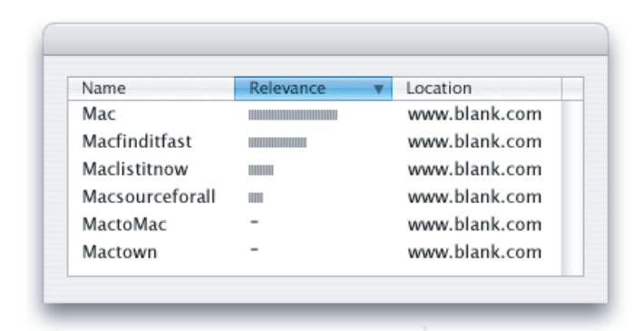

**Carbon:** Relevance indicators are available in the Controls palette of Interface Builder. To create them programmatically, use CreateRelevanceBarControl in the Control Manager, or DrawThemeTrack in the Appearance Manager.

**Cocoa:** Relevance indicators are available in Interface Builder in the Controls palette. Start with a discrete level indicator and change its style to Relevancy in the Attributes pane of the NSLevelIndicator Inspector.

### <span id="page-262-2"></span>Relevance Indicator Specifications

**Figure 14-39** Relevance indicator states

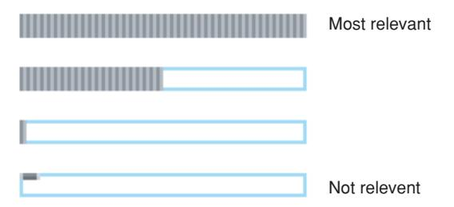

<span id="page-262-3"></span><span id="page-262-0"></span>■ **Height:** The x-height of the font in the list of which the indicator is a part

### Level Indicators

Use a **level indicator** to provide information about the level or amount of something in a graphical manner. There are three types of level indicator:

- Capacity
- Rating
- Relevancy (Use this style in a Cocoa application to display a relevance indicator. For more information on the use of this control, see "Relevance [Indicators"](#page-261-0) (page 262).)

### Capacity Indicators

<span id="page-263-1"></span>Use a capacity indicator to provide information about the level or amount of something that has well defined minimum and maximum values. For example, you might use a capacity indicator to show the current level of storage-space usage on a server or the charge left in a battery.

<span id="page-263-3"></span><span id="page-263-2"></span>There are two styles of capacityindicator, continuous and discrete. The continuous capacityindicator is a translucent track that is filled with a colored bar that indicates the current capacity value. The discrete capacityindicatoris a rowof separate,rectangular segments equal in numberto the maximum value set forthe control. These segments are stretched or shrunkto a uniform width to fit the specified length of the capacity indicator. The discrete capacity indicator displays the current capacity value rounded to the nearest integer. This means that the segments in the discrete capacity indicator are either completely filled or empty, never partially filled.

The default color of the fill in both capacityindicator styles isgreen. Ifyou define a value for awarning level, the fill color changes to yellow when it reaches that value. If you define a value for a critical level, the fill color changes to red when it reaches that value.

You can specify which end of the indicator is critical (red) by setting appropriate values. If you define a critical value that is greater than the warning value, the fill is green at values less than the warning level, yellow between the warning and critical levels, and red above the critical level. (This is how the warning and critical values are defined in the continuous capacity indicator shown in [Figure](#page-263-0) [14-40](#page-263-0) (page 264).) This orientation is useful if you need to display a warning when a capacity is approaching the maximum value. If you define a critical value that is less than the warning value, the fill is red belowthe critical value,yellowbetween the critical andwarning values, and green above the warning value (up to the maximum). This orientation is useful if you need to warn the user when a capacity is approaching the minimum value.

Both continuous and discrete capacity indicators allow the display of tick marks above or below the indicator control to give context to the level shown by the fill. However, only the continuous capacity indicator should displaythe tick marks because the number andwidth of the segments in the discrete capacity indicator provide similar context.

<span id="page-263-0"></span>[Figure](#page-263-0) 14-40 (page 264) shows different states of a continuous capacity indicator.

**Figure 14-40** A continuous capacity indicator displaying values in three different ranges


[Figure](#page-264-0) 14-41 (page 265) shows different states of a discrete capacity indicator.

<span id="page-264-0"></span>**Figure 14-41** A discrete capacity indicator displaying values in three different ranges


**Carbon:** Continuous and discrete capacity indicators are not available in Carbon.

**Cocoa:** Continuous and discrete capacity indicators are available in Interface Builder in the Controls palette. You can change the style from discrete to continuous in the Attributes pane of the NSLevelIndicator Inspector.

### <span id="page-264-2"></span>Rating Indicator

The rating indicator displays a number of stars that corresponds to the rating of something. A rating indicator should be part of a list or table view because it conveys the relative rankings of different members in a category, such as favorite images or most-visited webpages.

By default, the rating indicator displays stars, but you can supply a custom image to replace the stars. Although this section assumes that the ratingindicator displays stars, the information applies equally to an image you supply.

The rating indicator does not display partial stars. Instead, it rounds the current value to the nearest integer to display only whole stars. The stars in the rating indicator are not expanded or shrunk to fit the specified length of the control and no space is added between them.

<span id="page-264-1"></span>You can make the rating indicator editable to allow a user to increase or decrease the ranking of a table or list member.

[Figure](#page-264-1) 14-42 (page 265) shows rating indicators displaying different values.

**Figure 14-42** A rating indicator showing different ratings


**Carbon:** The rating indicator is not available in Carbon.

<span id="page-265-3"></span>**Cocoa:** The rating indicator is available in Interface Builder in the Controls palette. Start with a discrete level indicator and change its style to ratingin the Attributes pane of the NSLevelIndicator Inspector.

## <span id="page-265-0"></span>Text Controls

This section describes controls that either display text or take text as input. The combination box, which includes a text input field, is not covered in this section. See ["Combination](#page-252-0) Boxes" (page 253) for information on this control.

### <span id="page-265-5"></span><span id="page-265-4"></span><span id="page-265-1"></span>Static Text

Use a **static text field** for informational text in a dialog (text not intended to be modified by users). Static text fields have two states: active and dimmed.

When it provides an obvious user benefit, static text should be selectable. For example, a user should be able to copy an error message, a serial number, or an IP address to paste elsewhere.

**Carbon:** Static text fields in various standard fonts are available in Interface Builder. Create them programmatically with CreateStaticTextControl.

**Cocoa:** Static text fields in various standard fonts are available in Interface Builder. To create one programmatically, use the NSTextField class. See *Text Views* in Cocoa User Experience documentation.

### Static Text Field Specifications

### ■ **Size:**

❏ Full size: System font

❏ Small: Small system font

<span id="page-265-2"></span>❏ Mini: Mini system font

### <span id="page-265-6"></span>Text Input Fields

A **text input field**, also called an editable text field, is a rectangular area in which the user enters text or modifies existing text. The text input field can be active or disabled. It supports keyboard focus and password entry.

Your application's text input fields should perform appropriate edit checks. For example, if the only legitimate value for a field is a stringof digits, the application issues an alert if the usertypes nondigits. In most cases, the appropriate time to check the data in the field is when the user clicks outside the field or presses the Return, Enter, or Tab key.

Combination boxes have text input fields and also contain a menu or a list of choices. See ["Combination](#page-252-0) [Boxes"](#page-252-0) (page 253).

**Cocoa:** Text input fields are available in Interface Builder. Create them programmatically with CreateEditUnicodeTextControl.

**Cocoa:** Text input fields are available in Interface Builder. Use the NSTextField class to create them programmatically. See *Text Views* in Cocoa User Experience documentation.

### <span id="page-266-0"></span>Text Input Field Specifications

**Figure 14-43** Full-size text input field dimensions


**Figure 14-44** Small text input field dimensions

<span id="page-266-2"></span><span id="page-266-1"></span>

**Figure 14-45** Mini text input field dimensions

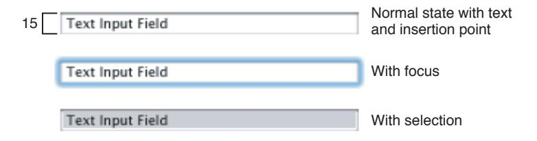

#### ■ **Height:**

- ❏ Full size: 22 pixels (to accommodate the system font, which is 16 pixels high without line spacing)
- ❏ Small: 19 pixels ❏ Mini: 15 pixels

#### ■ **Spacing:**

- ❏ Full size: Leave a minimum of 10 pixels between fields.
- ❏ Small: Leave a minimum of 8 pixels.

❏ Mini: Leave a minimum of 8 pixels.

#### ■ **Text:**

❏ Full size: System font

❏ Small: Small system font

❏ Mini: Mini System font

<span id="page-267-0"></span>For more information about highlighting selections in text fields, see ["Keyboard](#page-100-0) Focus and [Navigation"](#page-100-0) (page 101) and ["Selections](#page-105-0) in Text " (page 106).

### <span id="page-267-1"></span>Token Fields

A **token field** is a control that creates a token out of the input text. The token field control supports behavior similar to that of the address field in the Mail application.

Use a token field control in a text input field. As the user types in the text input field, the token field control invokes text completion after a delay you specify. When the user types the comma character or presses Return, the preceding text input is transformed into a token.

A token is draggable and (if you add code to support a menu) displays a disclosure triangle for a contextual menu when the mouse pointer hovers over it. In this menu, you might offer more information about the token andways to manipulate it. In Mail, for example, the token menu displays information about the token (the email address associated with the name) and items that allow the user to edit the token or add its associated information to the Address Book.

[Figure](#page-268-1) 14-46 (page 269) shows various states of the token control (no contextual menu support is shown).

<span id="page-268-1"></span>**Figure 14-46** A token control in use

Selected token (prior to keyboard input) Token changed to user's keyboard input New keyboard input before user presses Return, Enter, or Tab New token with the mouse pointer hovering over it

### <span id="page-268-2"></span>Token Field Specifications

**Figure 14-47** Token field dimensions for full-size, small, and mini sizes


#### **Small token field dimensions**


#### <span id="page-268-0"></span>**Mini token field dimensions**

<span id="page-268-3"></span>

## Search Fields

A **search field** is a text fieldwith rounded ends inwhich the user enters newtext or modifies existing text that identifies items to search for. For information on ways to provide search capability in your application, see ["Spotlight"](#page-69-1) (page 70).

A search field can be active or disabled. It supports keyboard focus. If it is an integral part of your interface, provide thekeyboard shortcut Command-Option-Ffor users to navigate to itwithout using the mouse.

Text Controls **269**

A search field does not need a label.

The field may initiate the search as the user types, or the user may need to press Return or Enter to initiate a search.

A search field can include a menu to allow users to choose different types of searches, to allow users to define the context of their search, or to provide a history of recent searches. You can provide placeholdertext that indicates the current menu selection. Users are then able to see the current context of the search without having to open the menu.

The search field can contain an icon to stop the search or clear the field. It's appropriate to use this icon if the user has to click a button or press a key to initiate the search, especially if there's the possibility of searches taking more than a second or two. If you use this icon, consider displaying a progress indicator for lengthy searches.

Instead of providing multiple search fields, it's better to have a single search field in a window, with various contexts available from the pop-up menu.

**Carbon:** Search fields are available in Interface Builder. To create one programmatically, use the function HISearchFieldCreate.

**Cocoa:** Search fields are available in Interface Builder. To create one programmatically, use the NSSearchField class. See *Search Fields* in Cocoa User Experience Documentation.

### <span id="page-269-0"></span>Search Field Specifications

**Figure 14-48** Full-size search field dimensions


**Figure 14-49** Small search field dimensions

<span id="page-269-1"></span>

<span id="page-270-1"></span>**Figure 14-50** Mini search field dimensions


#### ■ **Height:**

❏ Full size: 22 pixels ❏ Small: 19 pixels ❏ Mini: 15 pixels

#### ■ **Spacing:**

- ❏ Full size: Leave at least 12 pixels between stacked controls.
- ❏ Small: Leave at least 10 pixels.
- ❏ Mini: Leave at least 8 pixels.

#### ■ **Text:**

- ❏ Full size: System font
- ❏ Small: Small system font
- <span id="page-270-0"></span>❏ Mini: Mini system font

### <span id="page-270-2"></span>Scrolling Lists

<span id="page-270-3"></span>A **scrolling list** is a list that uses scroll bars to reveal its contents. A scrolling list can contain as many items as necessary. Users can scroll through the list without selecting anything, click an item to select it, use Shift-click to select more than one contiguous item, or use Command-click for a discontinuous selection. Users can press the arrow keys to navigate through the list and can quickly select an item by typing the first few characters.

If an item is too long to fit in the list box, insert an ellipsis in the middle and preserve the beginning and end of the item. Users often add version numbers to the end of document names, so both the beginning and end should be visible.

Don't use scrollinglists to provide choices in a limited range. Because the fullrange may not be visible all at once, it can be difficult for users to understand the scope of their choices. Use sliders, discussed in "Slider [Controls"](#page-258-0) (page 259), instead.

When you define dimensions, make sure that the list displays onlythe full height of lines of text (don't cut text off horizontally), and make sure that the scrolling increment is one list element.

Text Controls **271**

**Carbon:** Create a scrolling list programmatically by using the function CreateListBoxControl. **Cocoa:** In Interface Builder, create a scrolling list by selecting an NSTableView object from the Data palette. Then, in the Interface Builder Inspector, set the number of columns to 1 and ensure that only the vertical scroller is displayed.

### <span id="page-271-2"></span>Scrolling List Specifications

**Figure 14-51** Scrolling list dimensions


■ **Text:** 12 points

■ **Frame:** 1 pixel wide

## <span id="page-271-5"></span><span id="page-271-0"></span>View Controls

<span id="page-271-4"></span><span id="page-271-3"></span><span id="page-271-1"></span>The following controls allow users to modify how information is presented to them or select which information to view.

### Disclosure Triangles

A **disclosure triangle** allows the display, or disclosure, of information or functionality associated with the primary information in a window. A disclosure triangle is not used to display additional choices associated with a specific control, such as a pop-up menu. If you need to do this, use a disclosure button (see ["Disclosure](#page-273-0) Buttons" (page 274)).

Disclosure triangles have two uses: in dialogs that have a minimal state and an expanded state and in hierarchical lists. See Figure 14-52 for an example in a dialog and [Figure](#page-275-1) 14-55 (page 276) for an example in a hierarchical list.

Use a disclosure triangle when you want to provide a simple default view of something but need to allow the user to view more details or perform additional actions at times.

Disclosure triangles should be in the closed position, pointing to the right, by default. When the user clicks a disclosure triangle, it points down and the additional information is displayed.

<span id="page-272-0"></span>Disclosure triangles in dialogs should have a label indicating what is disclosed or hidden. An ideal label changes dependingon the position of the disclosure triangle.For example,when closed it might say, "Show advanced settings," and when open, "Hide advanced settings."

**Figure 14-52** Disclosure triangle used to progressively reveal dialog contents

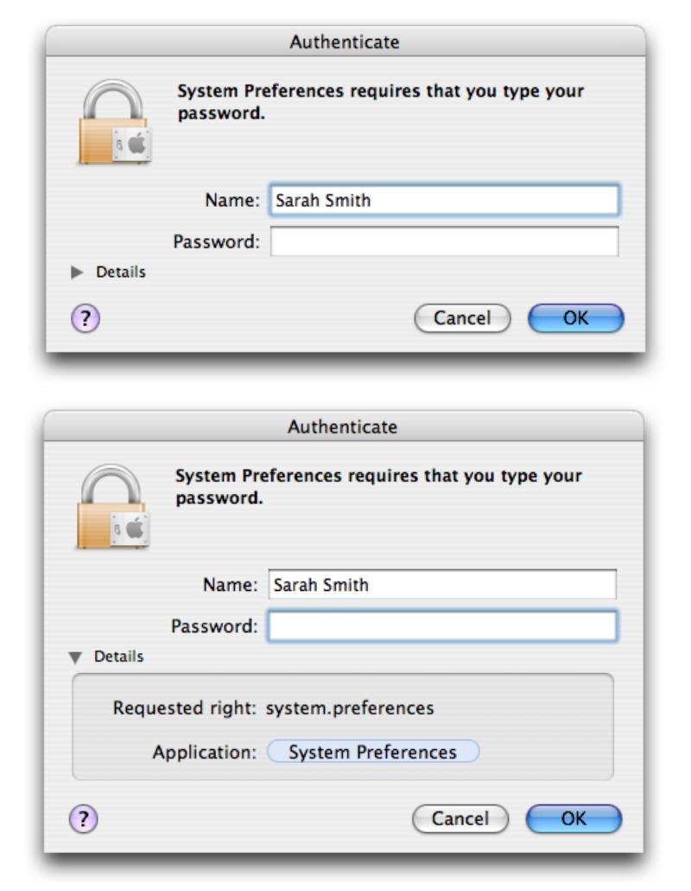

**Carbon:** Disclosure triangles are available in Interface Builder. To create one programmatically, you can use the Control Managerfunction CreateDisclosureTriangleControl orthe Appearance Manager function HIThemeDrawButton.

View Controls **273**

**Cocoa:** Disclosure triangles are available in Interface Builder. To create one programmatically, set the bezel style to NSDisclosureBezelStyle and the button type to NSPushOnPushOffButton. See *Button Programming Topics for Cocoa* in Cocoa User Experience Documentation.

### <span id="page-273-1"></span>Disclosure Triangle Specifications

**Figure 14-53** Disclosure triangles


<span id="page-273-4"></span><span id="page-273-0"></span>■ **Size:** 13 x 13 pixels

### <span id="page-273-3"></span><span id="page-273-2"></span>Disclosure Buttons

A **disclosure button** expands a dialog or utility window to offer the user a wider range of choices related to a specific selection control, such as a pop-up menu, combination box, or command pop-down menu. This makes a disclosure button different from a disclosure triangle (described in ["Disclosure](#page-271-1) [Triangles"](#page-271-1) (page 272)), which displays additional information or functionality related to the contents of a window or a section of a window. If you need to offer additional options that are not closely related to a specific list of choices, use a disclosure triangle.

An example of a dialogexpanded bya disclosure button is the expanded Save dialog(shown in Figure 14-54). The minimal Save dialog (shown in [Figure](#page-219-0) 13-39 (page 220)) uses a pop-up menu to provide the user with a list of standard and recently accessed locations in which to save a file. To get a wider range of choices, the user clicks the disclosure button,which puts the file system at the user's fingertips without requiring the user to leave the context of the Save dialog.

<span id="page-274-1"></span>**Figure 14-54**


By default, disclosure buttons should be in the closed position, pointing down. When the user clicks a disclosure button, the window expands and the disclosure button changes to point up.

A disclosure button should be aligned with the pop-up menu or other list-based selection control (such as a command pop-down menu) it affects. Disclosure buttons should never be accompanied by labels.

**Carbon:** Disclosure buttons are available in Interface Builder. To create one programmatically, you can use the Control Manager function CreateDisclosureButtonControl.

<span id="page-274-0"></span>**Cocoa:** Disclosure buttons are not available in Interface Builder. To create one programmatically, set the bezel style to NSRoundedDisclosureBezelStyle and the button type to NSPushOnPushOffButton. See *Button Programming Topics for Cocoa* in Cocoa User Experience documentation.

## <span id="page-274-2"></span>List Views

**List views** display ordered records in a table in which users can resize, rearrange, and sometimes add and subtract, columns representing attributes of the data.

Sort the rows in the table by the selected column heading. You can implement sorting on secondary attributes behind the scenes, but the user should see only one column selected at a time. If a user clicks an already selected column heading, change the direction of the sort.

List views may contain disclosure triangles to reveal a list hierarchy, but only in one column. (See Figure 14-55.)

Items may be editable depending on the purpose of your application. In the Finder, for example, items in the Name column are editable when in list view, but nothing else is.

<span id="page-275-1"></span>**Figure 14-55** List view with disclosure triangles

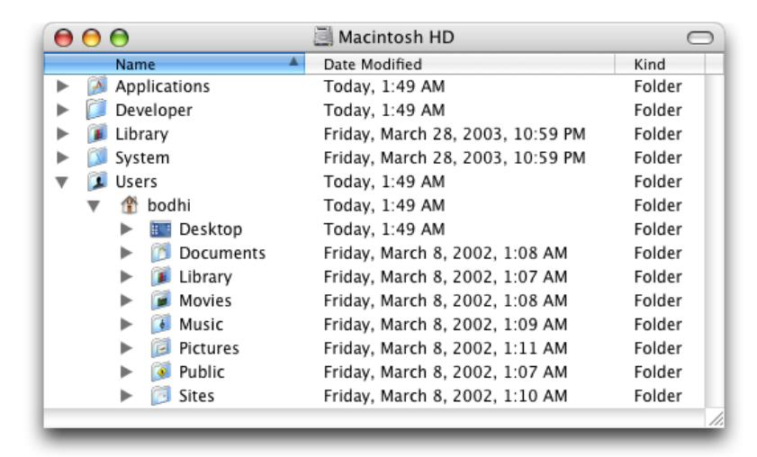

**Carbon:** List views are available in the Browsers & Tab palette of Interface Builder. To create one programmatically, use the list version of the data browser control.

<span id="page-275-0"></span>**Cocoa:** List views are available in the Data palette of Interface Builder. To create a simple list view programmatically, use the NSTableView class. NSOutlineView in column format gives you disclosure triangles.

## <span id="page-275-2"></span>Column Views

The **column view** control provides a way for users to display and select items from an organized hierarchy of data.

- A column view is useful when there is only one way the data can be sorted or when you want to present onlyonewayof sortingthe data. It is also useful for deep hierarchies, such as a file system, where users move back and forth among multiple levels frequently.
- If the column view represents a tree of information, the root is on the left side. As users select items, the focus moves to the right, displaying either the possible choices at that branch or, if there are no more choices, the terminal object. When the user selects a terminal object, you may display additional information about it in the rightmost column.

<span id="page-276-1"></span>**Figure 14-56** Column view display of files

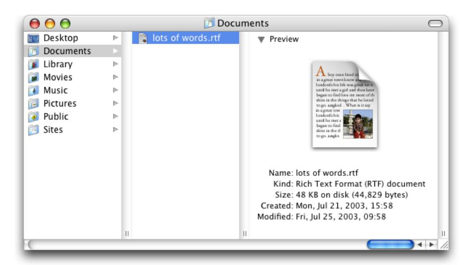

**Carbon:** Column views are available in the Browsers & Tab palette of Interface Builder. To create one programmatically, use the column version of the data browser control.

<span id="page-276-0"></span>**Cocoa:** Column views are available in the Data palette of Interface Builder. To create one programmatically, use the NSBrowser class or NSOutlineView in column format.

## <span id="page-276-3"></span><span id="page-276-2"></span>Split Views

A **split view** groups together two or more other views, such as column or list views, and allows the user to adjust the relative width or height of those views. A split view includes a **splitter bar** between each of its subviews; for example, a split view with five subviews would have four splitter bars.

A split view can display its subviews either side-by-side (with vertical splitter bars) or stacked on top of each other (with horizontal splitter bars). A single split view does not display a combination of vertically and horizontally oriented subviews. However, a single window might contain different split views that each displaya different orientation.For an example of howthis might look, see[Figure](#page-298-2) [15-11](#page-298-2) (page 299).

The user can adjust the relative widths or heights of the subviews by dragging anywhere on the splitter bar. The splitter bar displays a circular dimple at its midpoint that indicates to the user that it is draggable. In addition, the entire splitter baris a hot zone. In otherwords,when the mouse pointer passes over any part of the splitter bar, the cursor changes to one of the move or resize cursors (shown in [Table](#page-142-2) 11-1 (page 143)).

If a user drags a splitter bar all the way to the edge of the split view (or to the next splitter bar), the subview should disappear but the splitter bar should not. The splitter bar should remain in view to remind the user where the hidden subview is and to make it easier for the user to uncover it.

The width of the splitter bar in a metal window is different from its width in a standard window. In a metal window, the width of a splitter bar is 7 pixels (as shown in [Figure](#page-277-0) 14-57 (page 278)).

<span id="page-277-0"></span>**Figure 14-57** A splitter bar in a metal window


<span id="page-277-1"></span>In a standard Aqua window, the width of the splitter bar is 9 pixels, as shown in [Figure](#page-277-1) 14-58 (page 278).

**Figure 14-58** A splitter bar in an Aqua window


**Carbon:** Split views are not available in Interface Builder.

<span id="page-278-3"></span>**Cocoa:** Split views are available in the Layout menu of Interface Builder selecting the subviews and choosing Layout > Make subviews of > Split View). To create one programmatically, use the NSSplitView class (note that splitter bars are horizontal by default).

### <span id="page-278-4"></span><span id="page-278-0"></span>Tab Views

The **tab view** provides a convenientwayto present information in a multipane format. The tab control displays horizontally centered across the top edge of a content area.

<span id="page-278-5"></span>The content area below the control is called a **pane.** In a window with a tab view, you can use other controls, such as push buttons and text entry fields.The controls can be global—affecting the settings of all panes—or specific to an individual pane; make it clear through labeling and placement (within or outside of a pane's boundary) whether a control affects one pane or all panes.

A segmented control can provide a way to switch between panes. It looks similar to a tab view, but it is not attached to the panes. See ["Segmented](#page-243-0) Control" (page 244).

### <span id="page-278-1"></span>Tab View Specifications

**Figure 14-59** Full-size tab view dimensions

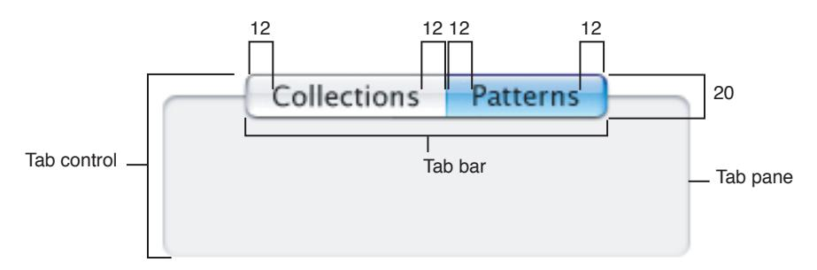

**Figure 14-60** Small tab view dimensions

<span id="page-278-2"></span>

View Controls **279**

<span id="page-279-0"></span>**Figure 14-61** Mini tab view dimensions

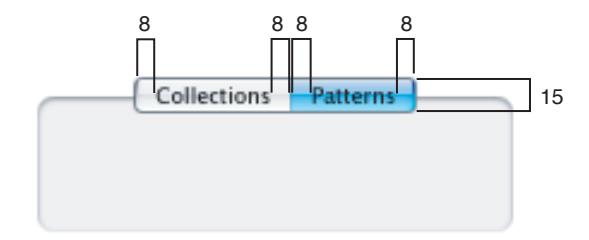

#### ■ **Text:**

- ❏ Full size: System font, centered in tab with 12 pixels on each side
- ❏ Small: Small system font, centered in tab with 10 pixels on each side
- ❏ Mini: Mini system font, centered in tab with 8 pixels on each side

#### ■ **Tab height:**

❏ Full size: 20 pixels ❏ Small: 17 pixels ❏ Mini: 15 pixels

<span id="page-279-1"></span>Panes can extend from one edge of a window to the other, or they can be inset within a window. Figure 14-62 shows an example of panes that extend from one edge of a window to the other.

**Figure 14-62** Tab panes edge to edge


For inset tab panes, the recommended inset is 20 pixels on each side within a window, although 16 is also allowed. You can define awindowso that space remains belowthe tab pane forglobal controls such as push buttons.Figure 14-63 shows an example of tab panes insetwithin awindow,with buttons below the panes.

<span id="page-280-0"></span>**Figure 14-63** Tab panes inset from the edge of a window

<span id="page-280-1"></span>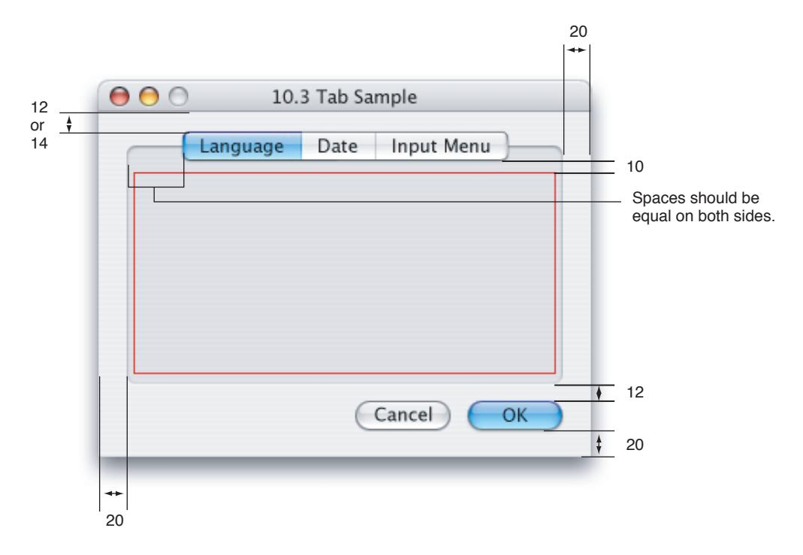

### Tab View Measurement Differences Between Carbon and Cocoa

There is a difference of three pixels in the vertical spacing of tab views between Carbon and Cocoa windows when you follow the blue Aqua guides in Interface Builder. This is because the Aqua guide is measured from a clippingline that is different in the two types ofwindow. Because most developers do not mix Carbon and Cocoa windows in the same application, this does not cause problems. You should still follow the Aqua guides when you use Interface Builder to design your user interface.

[Figure](#page-281-0) 14-64 (page 282) shows the difference in vertical space. In both windows, the pop-up menu is placed according to the blue Aqua guide, which measures 20 pixels below the clipping line.

<span id="page-281-0"></span>**Figure 14-64** Difference in vertical tab view space between Carbon and Cocoa


### Tab View Differences Between Previous Mac OS X Versions

The size of the tab views changed between Mac OS X version 10.2 (Jaguar) and Mac OS X version 10.3 (Panther). There are no size changes for tab views in Mac OS X version 10.4 (Tiger). This section discusses how the earlier change in size affects applications that must run on versions of Mac OS X prior to version 10.3.

If you are supporting only Mac OS X v10.3 and later, then you do not need to do anything. Follow the guidelines in "Tab [Views"](#page-278-0) (page 279).

If you need to support Mac OS X v10.2 (or earlier) in addition to Mac OS X v10.3, then you need to consider the differences.

The Mac OS X v10.2 tabs were 29 pixels high from the top of the tab to the bottom of the bar under the tab. The Mac OS X v10.3 and latertabs are only20 pixels high. This means that ifyou have designed your user interface elements for Mac OS X v10.2, there will be an additional space of 4 pixels under the tabs when viewed in Mac OS X v10.3 or later and a space of 5 pixels above.

<span id="page-282-2"></span>**Figure 14-65** Tab view differences between versions of Mac OS X


Considering your users, you must decide whether to redesign your interface so that it does not use tabs, or to allow the new spacing and adhere to the Mac OS X v10.2 specification for spacing around the tab views.

## <span id="page-282-3"></span><span id="page-282-0"></span>Grouping Controls

<span id="page-282-1"></span>Separators and group boxes are used to group other controls within windows. For help in deciding whether to use a group box or a separator, and for examples of layouts with them, see ["Grouping](#page-302-0) [Controls"](#page-302-0) (page 303).

## <span id="page-282-4"></span>Separators

**Separators** are used to divide a window into distinct visual parts. Separators may be placed either vertically or horizontally. They should usually not span the entire width of a window but should align with the edges of the controls in the window.

A label may accompany the separator. The separator line should be at the base of the text of the label.

**Carbon:** Separators are available in Interface Builder. Create them programmatically with CreateVisualSeparatorControl.

**Cocoa:** Separators are available in Interface Builder. To create one programmatically, use NSBox. See "Usinga Box Control to Create a Separator" in *Boxes*in Cocoa User Experience Documentation.

### <span id="page-283-1"></span>Separator Specifications


### ■ **Label text size:**

- ❏ When other controls are full size: System font
- ❏ When other controls are small: Small system font
- ❏ When other controls are mini: Mini system font
- <span id="page-283-0"></span>■ **Spacing:** The label text should be 2 pixels from the line.

### <span id="page-283-2"></span>Group Boxes

**Group boxes**, like separators, are used to break a window into distinct logical areas. A group box provides a more pronounced separation than a separator. Use a group box when you want a set of controls to be perceived as a single element. Avoid putting too many controls in group boxes so they don't look cluttered.

Group boxes can be untitled ortitled. If titled, they may have text-onlytitles, checkbox titles, or pop-up menu titles. If the group box uses a checkbox title, the items in the group box should be active only when the checkbox is checked. Pop-up menu titles should either be centered or be 14 pixels from the left side of the group box.

<span id="page-284-0"></span>**Figure 14-67** Types of group boxes


**Carbon:** Group boxes are available in Interface Builder. To create one programmatically, use the function CreateGroupBoxControl, CreateCheckGroupBoxControl, or CreatePopupGroupBoxControl.

**Cocoa:** Group boxes are available in Interface Builder. To create one programmatically, use the NSBox class. See *Boxes* in Cocoa User Experience documentation.

### <span id="page-284-1"></span>Group Box Specifications

**Figure 14-68** A group box with a text-only title

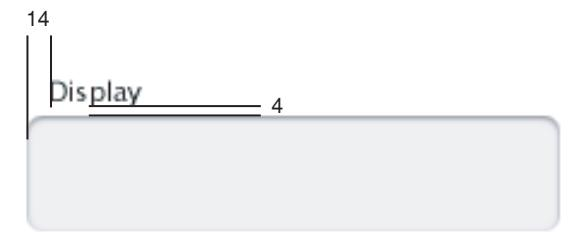

**Figure 14-69** A group box with a checkbox title

<span id="page-284-2"></span>

<span id="page-285-0"></span>**Figure 14-70** Group boxes with pop-up menu titles


<span id="page-285-1"></span>If you decide to nest group boxes, follow these internal spacing guidelines:

**Figure 14-71** Group box spacings


#### ■ **Label text size:**

❏ Full size: System font

❏ Small: Small system font

#### **C HAPTER 1 4**

Controls

❏ Mini: Mini system font

#### ■ **Spacing:**

<span id="page-286-0"></span>❏ Leave at least 20 pixels from the edge of the group box to the edge of the window.

#### **C HAPTER 1 4**

Controls

# <span id="page-288-0"></span>Layout Examples

<span id="page-288-3"></span>This chapter contains example window and dialog layouts along with specific guidelines for laying out controls within your windows.

## <span id="page-288-1"></span>Positioning Full-Size Controls

Although there are manyways to arrange controls in agivenwindow, there areguidelinesyou should follow so that your application has the clean, balanced appearance of Aqua. This section provides examples of properly designed windows and dialogs that use full-size controls. For guidelines on the use of mini and small controls, see "Using Small and Mini Versions of [Controls](#page-298-0) " (page 299). Some of theguidelines presented are specific to the examples shown, but most aregeneralguidelines applicable to all dialogs and windows.

<span id="page-288-2"></span>Unless specified otherwise, all measurements are in pixels.

### A Simple Preferences Dialog

Figure 15-1 shows a very simple preferences dialog. Note that a more advanced preferences dialog would use a toolbar to access the various sections.

<span id="page-289-0"></span>**Figure 15-1** Preferences dialog example

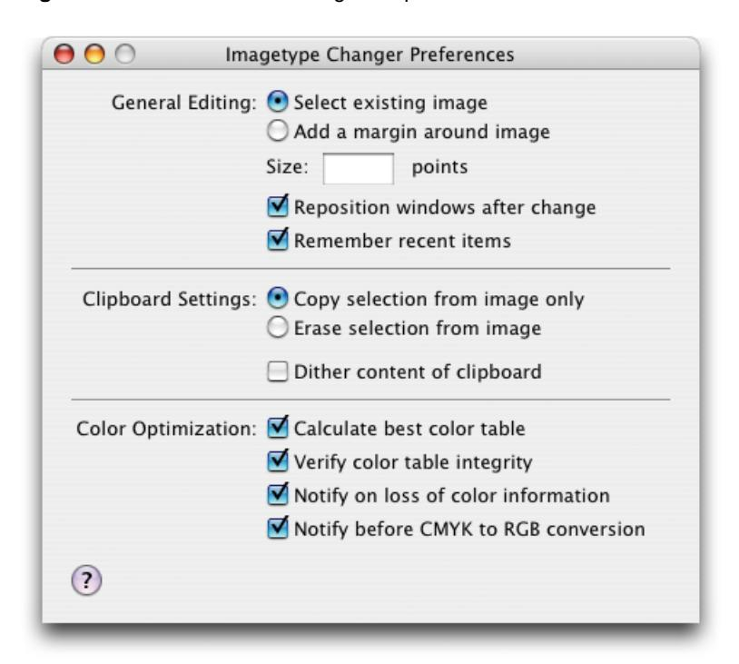

This dialog provides a good example of a center-equalized dialog. In Mac OS X, controls should always be center-equalized in windows. In other platforms, including Mac OS 9, controls are often left justified. **Center equalization** simply means that the visual weight is balanced on the right and left side of the dialog's content area. It does not mean **center justification** where the left and right sides of an imaginary line drawn through the center of the dialog have exactly the same number of items or characters.Figure 15-2 highlights this equalization. Although the right side has more objects, it is balanced by the categorization labels on the left. The net result is a visually balanced dialog.

<span id="page-290-0"></span>**Figure 15-2** Center equalization in a preferences dialog

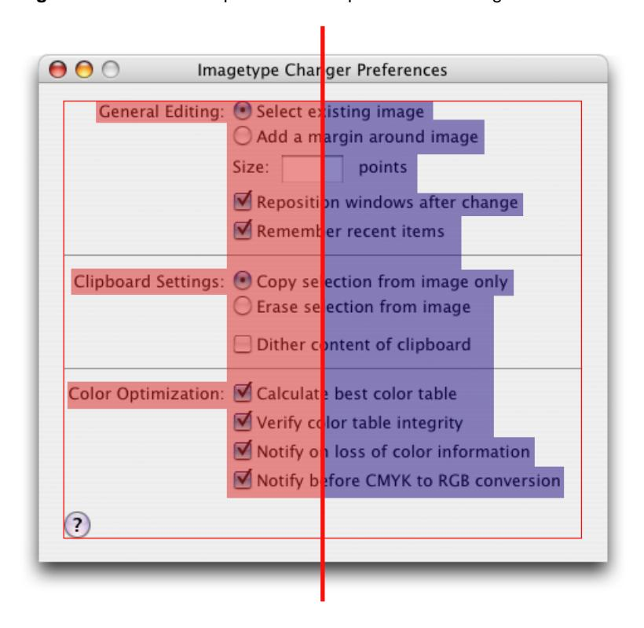

When labels and controls are stacked in a group, they should line up with each other vertically. In Figure 15-3, note the right alignment of the colons for the main category labels and the left alignment of the checkboxes and radio buttons.

<span id="page-291-0"></span>**Figure 15-3** Alignment of labels and controls in a preferences dialog

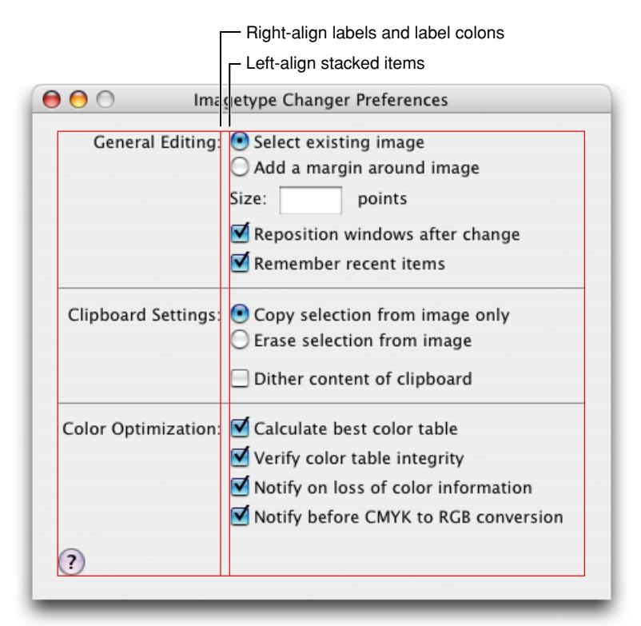

There are specific spacing guidelines to keep in mind when designing dialogs. Although ["Controls"](#page-230-0) (page 231) gives some guidelines for how to arrange controls in relation to each other, in this chapteryou can see howthese controls should be arranged in relation to thewindowthat contains them. Following are some guidelines that are easy to observe in Figure 15-4:

- Controls not in a group box or a tab view should be 14 pixels from the title bar.
- There should be a 20 pixel margin all the left side, right side, and bottom of a dialog.
- For full-size controls, leave 8 pixels of space between controls.
- Leave at least 12 pixels of space above and below separators.
- Leave at least 16 pixels of space between the bottom group of controls and the buttons (the example in Figure 15-4 has 18 pixels)

<span id="page-292-1"></span>**Figure 15-4** Layout dimensions in a preferences dialog

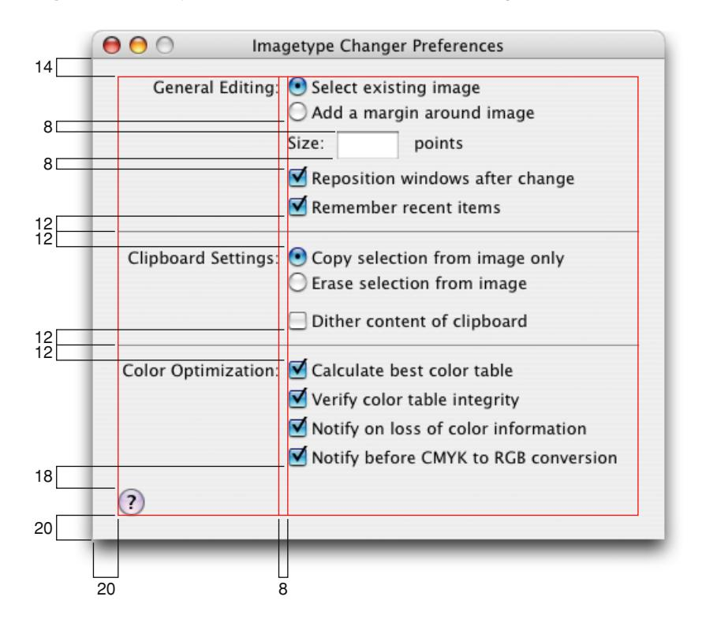

## <span id="page-292-0"></span>A Changeable Pane Dialog

A changeable pane dialog, like the one shown in Figure 15-5, follows the same general guidelines as those outlined in "A Simple [Preferences](#page-288-2) Dialog" (page 289). However, it illustrates another implementation of many of the same basic guidelines you've seen so far, along with some new guidelines.

<span id="page-293-0"></span>**Figure 15-5** Changeable pane dialog example


Center-equalization is again evident in Figure 15-6. The overall effect of the window is a balance between the visual weight of the controls on one side of the invisible center axis with the weight of the controls on the other side. The controls are also collectively balanced within the group box so that the distance from the farthest control on each side of the group box is the same for both the right and left sides (41 pixels in this example).

Always center a tab view within a window.

<span id="page-294-0"></span>**Figure 15-6** Center-equalization in a changeable pane dialog


Figure 15-7 illustrates a few guidelines about control placement:

- The colons for stacked labels are right-aligned.
- Stacked controls are left-aligned when appropriate.
- Similar controls have consistent widths. For example, the Font pop-up menus and Size combo boxes are the same size in the two group boxes.

<span id="page-295-0"></span>**Figure 15-7** Alignment of labels and controls in a preferences dialog


Figure 15-8 illustrates the following spacing guidelines:

- Leave 12 pixels of space from the top of a tab to the bottom of the title bar.
- The text box around any label should be at least 2 pixels below the controls of any containing view.
- Within group boxes, leave at least a 16-pixel margin between controls and the edge of the group box. In this example, an 18-pixel borderis used on one of thegroup boxes since it visuallybalances the window better than the minimum 16-pixel border.
- There should be a 20 pixel margin all the left side, right side, and bottom of a dialog.

<span id="page-296-1"></span>**Figure 15-8** Layout dimensions for a changeable pane dialog


### <span id="page-296-2"></span><span id="page-296-0"></span>A Standard Alert

A standard alert dialog like the one provided by Carbon or Cocoa is shown in Figure 15-9.

**Figure 15-9** A standard alert example


Although the standard alert dialogs provided bythe Carbon and Cocoa take care of thegeneral layout for you, there are a few details you are responsible for:

- Make sure that the version of your application icon you use in the alert is 64 x 64 pixels.
- Make sure to include *both* the main message text and the informative text. An alert with only message text is not a complete alert and typically is not very useful to the user.
- Always put the action button in the bottom-right corner of the alert. This is the button that completes the action that the user initiated before the alert was displayed. Remember that the action button is not always the default button as it is in this example. In dangerous situations, the default button maybe Cancel but, it should not be the action button and should not be located in the action button position.

Figure 15-10 shows the spacing guidelines for a standard alert.

<span id="page-297-1"></span>See "The [Elements](#page-209-2) of an Alert" (page 210) for more details on designing alert dialogs.

**Figure 15-10** Layout dimensions for a standard alert


### <span id="page-297-0"></span>Brushed Metal Application Window Example

As discussed in "Brushed Metal [Windows](#page-186-0) " (page 187), there are times when it is appropriate to use brushed metal windows for application windows. Brushed metal windows have slightly different spacing guidelines from those for standard Aqua windows as listed here and shown in Figure 15-11.

- Leave 9 pixels from the bottom of the window controls at the top of the window and the top any controls.
- Leave 12 pixels of space between the bottom of any toolbar controls and other controls.
- The side borders should be 14 pixels wide.
- The bottom border should be 18 pixels deep.
- All splitter bars should be the same width (here, both are 9 pixels).

In addition to these brushed metal–specific guidelines, there are two other things to note in Figure 15-11 that apply to both brushed metal windows and standard Aqua windows:

- Leave at least 12 pixels between horizontally arranged buttons.
- When grouping horizontally arranged buttons, leave at least 24 pixels of space between groups (here the space is 28 pixels).

<span id="page-298-3"></span><span id="page-298-2"></span>**Figure 15-11** Layout dimensions for a brushed metal application window

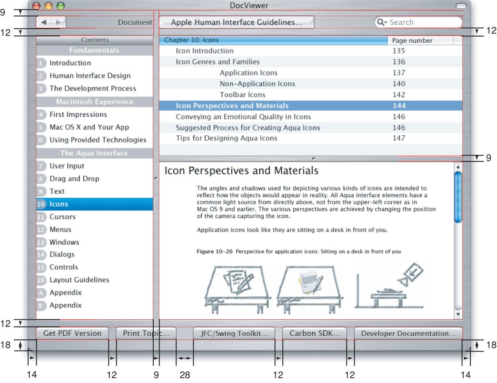

## <span id="page-298-5"></span><span id="page-298-4"></span><span id="page-298-0"></span>Using Small and Mini Versions of Controls

Use smaller versions of controls only when necessary. Your first choice in designing for Aqua should always be to use the full-size controls.

<span id="page-298-1"></span>You can use the smaller versions of controls when space is at a premium, such as in tool palettes, other utility windows, or Automator actions (for more information on Automator, see ["Automator"](#page-61-0) (page 62)). Avoid mixing different sizes of controls in the same window. In a window with a changeable pane, it is acceptable to use small or mini controls within the pane and standard controls outside the pane. However, all panes of a window should use controls of the same size.

### Layout Example for Small Controls

Figure 15-12 shows a well designed utility window with small controls.

<span id="page-299-0"></span>**Figure 15-12** Example of a utility window with small controls


<span id="page-299-1"></span>As when using full-size controls, you should strive for the center-equalized approach to laying out controls. This visually balanced layout can be seen in Figure 15-13.

**Figure 15-13** Center-equalization in a utility window with small controls

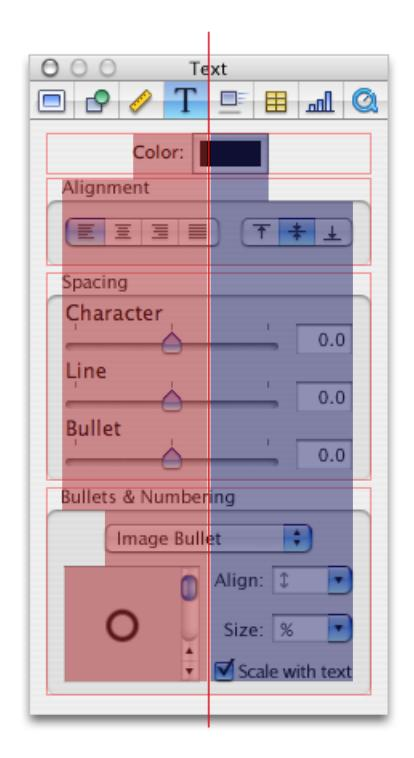

Aswith full-size controls, small (and mini) controls should be aligned verticallywhen stacked. Similar controls should have consistent widths and be aligned with each other. See Figure 15-14.

<span id="page-300-0"></span>**Figure 15-14** Alignment of labels and controls in a utility window with small controls

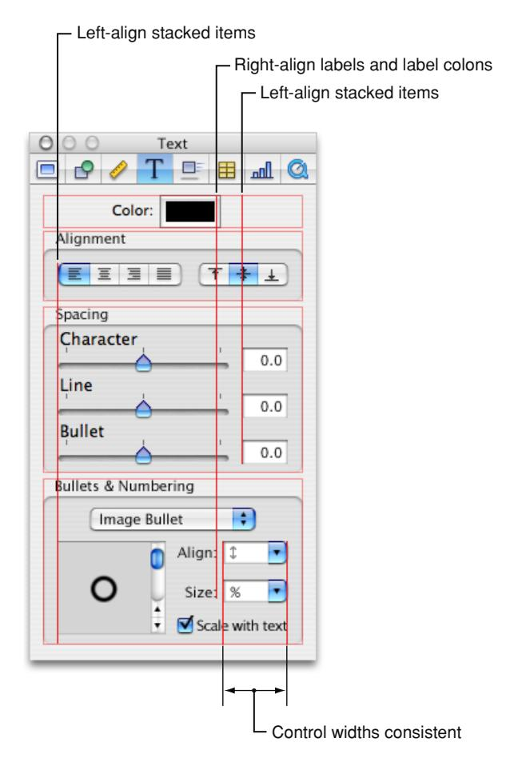

As Figure 15-15 shows, small controls have spacing guidelines different from those for than standard controls:

- Leave 8 to 10 pixels from the top of the content and the toolbar or title bar.
- The text box around any label should be at least 2 pixels below other controls.
- Side borders should be 10 pixels.
- Controls should be inset at least 10 pixels in group boxes.
- Leave a 12-pixel border on the bottom edge.
- Within anygrouping, followthe spacingguidelines forthe individual controls. See ["Controls"](#page-230-0)(page 231).

If your window has a toolbar, like the utility window in Figure 15-15, the toolbar buttons should be big enough to accommodate 16 x 16 icons.

<span id="page-301-1"></span>**Figure 15-15** Layout dimensions for a utility window with small controls


### <span id="page-301-2"></span><span id="page-301-0"></span>Layout Example for Mini Controls

Figure 15-16 shows a well designed utility window with mini controls.

**Figure 15-16** Example of a utility window with mini controls


Layout Examples

Like small controls, mini controls have specific spacingguidelines. In addition to the spacingguidelines in ["Controls"](#page-230-0) (page 231) the following guidelines are illustrated in Figure 15-17:

- Side borders should be 10 pixels.
- Bottom borders should be 12 pixels.
- Groups of controls should be separated by at least 8 pixels.

In Figure 15-17, note that as with small controls, the buttons in the toolbar are big enough to accommodate 16 x 16 icons. Note also the use of separatorswithin the tab viewinstead ofgroup boxes or white space; they allow for an more compact window. More examples of using separators are illustrated in ["Grouping](#page-302-0) Controls" (page 303).

<span id="page-302-3"></span><span id="page-302-1"></span>**Figure 15-17** Layout dimensions for a utility window with mini controls


## <span id="page-302-2"></span><span id="page-302-0"></span>Grouping Controls in a Window

Grouping related controls helps users to understand what particular controls do and helps them locate the controls that affect the specific actions they want to apply. This section provides examples of different ways to group controls.

The three examples show different ways to group the same set of controls within a changeable pane using three grouping elements:

- Separators, shown in Figure 15-19
- White space, shown in Figure 15-21
- Group boxes, shown in Figure 15-22

Layout Examples

Note that none of these examples are more or less correct than any other in the general case. The effectiveness of a layout in your application depends on the overall aesthetic layout of your other windows as well as your application's workflow.

### <span id="page-303-0"></span>Grouping With Separators

<span id="page-303-1"></span>Separators provide the most efficient use of space and are most useful when space is at a premium.

**Figure 15-18** Example of grouping with separators


<span id="page-304-1"></span>**Figure 15-19** Layout dimensions using separators


### <span id="page-304-0"></span>Grouping With White Space

<span id="page-304-2"></span>White space is an especially useful grouping element when you are dealing with small groups of controls.

**Figure 15-20** Example of grouping with white space

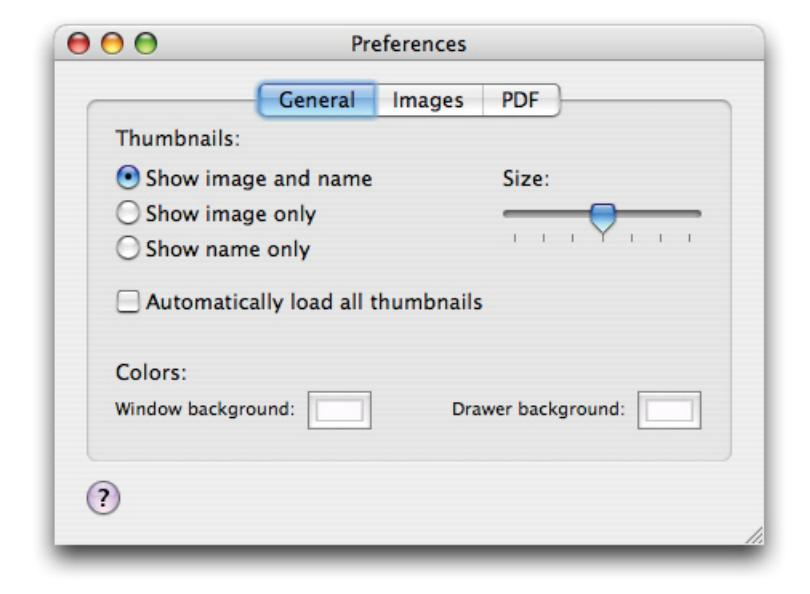

<span id="page-305-1"></span>**Figure 15-21** Layout dimensions using white space


### <span id="page-305-0"></span>Grouping With Group Boxes

<span id="page-305-2"></span>Group boxes provide the strongest visual indication of distinct groups but require the most space within the window.

**Figure 15-22** Example of grouping with group boxes


<span id="page-306-1"></span>**Figure 15-23** Layout dimensions using group boxes


## <span id="page-306-0"></span>Using a Pop-up Menu in Place of Tabs

Always try to use tab views to indicate multiple changeable panes, as shown in the previous sections. However, if you have too many tabs to fit into a window properly you should instead use a pop-up menu to change the contents of a group box (see [Figure](#page-307-0) 15-24 (page 308)).

As with tabs, the pop-up menu should be centered on the top of the group box.

<span id="page-307-0"></span>**Figure 15-24** Pop-up menu for changeable panes


# <span id="page-308-0"></span>Keyboard Shortcuts Quick Reference

<span id="page-308-1"></span>Table A-1 lists the system-reserved and commonly used keyboard shortcuts mentioned in the rest of this document.

As you implement keyboard shortcuts in your application, use this table to find:

- Which key sequences are reserved by Mac OS X. Users rely on these shortcuts to perform the specified actions no matter which application is currently running (these include shortcuts reserved for accessibility purposes). *Do not override these shortcuts*.
- Which key sequences are recommended for common application tasks. Users expect these shortcuts to mean the same thing from application to application. Provide these shortcuts *if your applicationperformsthe associated tasks*. You should avoid usingthese shortcuts for other purposes.

If a keyboard sequence is not listed in Table A-1, you can use it for a frequently used command in your application, if a shortcut is appropriate. For guidance on creating new keyboard shortcuts, see "Creating Your Own Keyboard [Shortcuts"](#page-98-1) (page 99). Be aware, however, that Apple may reserve other keyboard shortcuts in the future. For more information on the system-reserved keyboard shortcuts, see "Reserved Keyboard [Shortcuts"](#page-97-2) (page 98).

**Note:** With the exception of the system-reserved function keys F9, F10, F11, and F12, Table A-1 lists only combinations of two or more keys. For information on how to use specific single keys (such as Tab and Return), see "The [Functions](#page-90-1) of Specific Keys" (page 91).

Table A-1 groups together the primary key that is modified and variations of key sequences based on the primary key. In the interests of space, the table uses the following symbols to represent the modifier keys (these are the same symbols menus display):

(Command) (Control) (Option) (Shift)

Some shortcuts in Table A-1 are accompanied byan icon. This means thatyou should not override the shortcut because the operating system uses it in some way.

A shortcut in Table A-1 that is not accompanied by an icon is recommended for applications that perform the associated task. If your application does not perform the task associated with a recommended shortcut, you should not use that shortcut to mean something else.

<span id="page-309-0"></span>**Table A-1** Keyboard shortcuts

<span id="page-309-10"></span><span id="page-309-9"></span><span id="page-309-8"></span><span id="page-309-7"></span><span id="page-309-6"></span><span id="page-309-5"></span><span id="page-309-4"></span><span id="page-309-3"></span><span id="page-309-2"></span><span id="page-309-1"></span>

| Primary key | Key sequence | Associated action                                                                                                                                              |
|-------------|--------------|----------------------------------------------------------------------------------------------------------------------------------------------------------------|
| Space bar   | Space        | Showor hide the Spotlight search field (when multiple languages<br>are installed, may rotate through enabled script systems).                                  |
|             | Space        | Apple reserved.                                                                                                                                                |
|             | Space        | Show the Spotlight search results window (when multiple<br>languages are installed, may rotate through keyboard layouts<br>and input methods within a script). |
|             | Space        | Apple reserved.                                                                                                                                                |
| Tab         | Tab          | Navigate through controls in a reverse direction. See "Keyboard<br>Focus and Navigation" (page 101).                                                           |
|             | Tab          | Move forward to the next most recently used application in a<br>list of open applications.                                                                     |
|             | Tab          | Move backward through a list of open applications (sorted by<br>recent use).                                                                                   |
|             | Tab          | Move focus to the next grouping of controls in a dialog or the<br>next table (when Tab moves to the next cell). See Accessibility<br>Overview.                 |
|             | Tab          | Move focus to the previousgroupingof controls. See Accessibility<br>Overview.                                                                                  |
| Esc         | Esc          | Open Front Row.                                                                                                                                                |
|             | Esc          | Open the Force Quit dialog.                                                                                                                                    |
| Eject       | Eject        | Quit all applications (after giving the user a chance to save<br>changes to open documents) and restart the computer.                                          |
|             | Eject        | Quit all applications (after giving the user a chance to save<br>changes to open documents) and shut the computer down.                                        |
| F1          | F1           | Toggle full keyboard access on or off. See Accessibility Overview.                                                                                             |
| F2          | F2           | Move focus to the menu bar. See Accessibility Overview.                                                                                                        |
| F3          | F3           | Move focus to the Dock. See Accessibility Overview.                                                                                                            |

<span id="page-310-9"></span><span id="page-310-8"></span><span id="page-310-7"></span><span id="page-310-6"></span><span id="page-310-5"></span><span id="page-310-4"></span><span id="page-310-3"></span><span id="page-310-2"></span><span id="page-310-1"></span><span id="page-310-0"></span>

| Primary key          | Key sequence | Associated action                                                                                                |
|----------------------|--------------|------------------------------------------------------------------------------------------------------------------|
| F4                   | F4           | Move focus to the active (or next) window. See Accessibility<br>Overview.                                        |
|                      | F4           | Move focus to the previously active window. See Accessibility<br>Overview.                                       |
| F5                   | F5           | Move focus to the toolbar. See Accessibility Overview.                                                           |
|                      | F5           | Turn VoiceOver on or off. See Accessibility Overview.                                                            |
| F6                   | F6           | Move focus to the first (or next) utility window. See Accessibility<br>Overview.                                 |
|                      | F6           | Move focus to the previous utility window. See Accessibility<br>Overview.                                        |
| F7                   | F7           | Temporarily override the current keyboard access mode in<br>windows and dialogs. See Accessibility Overview.     |
| F9                   |              | Tile or untile all open windows.                                                                                 |
| F10                  |              | Tile or untile all open windows in the currently active<br>application.                                          |
| F11                  |              | Hide or show all open windows.                                                                                   |
| F12                  |              | Hide or display Dashboard.                                                                                       |
| `(grave<br>accent)   | `            | Activate the next open window in the frontmost application.<br>See "Window Layering" (page 196).                 |
|                      | `            | Activate the previous openwindowin the frontmost application.<br>See "Window Layering" (page 196).               |
|                      | `            | Move focus to the window drawer.                                                                                 |
| - (hyphen)           | -            | Decrease the size of the selected item (equivalent to the Smaller<br>command). See "The Format Menu" (page 168). |
|                      | -            | Zoom outwhen screen zoomingis on. See Accessibility Overview.                                                    |
| { (left<br>bracket)  | {            | Left-align a selection (equivalent to the Align Left command).<br>See "The Format Menu" (page 168).              |
| } (right<br>bracket) | }            | Right-align a selection (equivalent to the Align Right command).<br>See "The Format Menu" (page 168).            |
| (pipe)               |              | Center-align a selection (equivalent to the Align Center<br>command). See "The Format Menu" (page 168).          |

<span id="page-311-9"></span><span id="page-311-8"></span><span id="page-311-7"></span><span id="page-311-6"></span><span id="page-311-5"></span><span id="page-311-4"></span><span id="page-311-3"></span><span id="page-311-2"></span><span id="page-311-1"></span><span id="page-311-0"></span>

| Primary key          | Key sequence | Associated action                                                                                                                                           |
|----------------------|--------------|-------------------------------------------------------------------------------------------------------------------------------------------------------------|
| : (colon)            | :            | Display the Spelling window (equivalent to the Spelling<br>command). See "The Edit Menu" (page 165).                                                        |
| ;<br>(semicolon)     | ;            | Find misspelledwords in the document (equivalent to the Check<br>Spelling command). See "The Edit Menu" (page 165).                                         |
| , (comma)            | ,            | Open the application's preferences window (equivalent to the<br>Preferences command). See "The Application Menu" (page 162).                                |
|                      | ,            | Decrease screen contrast. See Accessibility Overview.                                                                                                       |
| . (period)           |              | Increase screen contrast. See Accessibility Overview.                                                                                                       |
| ? (question<br>mark) | ?            | Open the application's help in Help Viewer. See "The Help<br>Menu" (page 172).                                                                              |
| / (forward<br>slash) | /            | Turn font smoothing on or off.                                                                                                                              |
| = (equal<br>sign)    | =            | Increase the size of the selected item (equivalent to the Bigger<br>command). See "The Format Menu" (page 168).                                             |
|                      | =            | Zoom in when screen zooming is on. See Accessibility Overview.                                                                                              |
| 3                    | 3            | Capture the screen to a file.                                                                                                                               |
|                      | 3            | Capture the screen to the Clipboard.                                                                                                                        |
| 4                    | 4            | Capture a selection to a file.                                                                                                                              |
|                      | 4            | Capture a selection to the Clipboard.                                                                                                                       |
| 8                    | 8            | Turn screen zooming on or off. See Accessibility Overview.                                                                                                  |
|                      | 8            | Invert the screen colors. See Accessibility Overview.                                                                                                       |
| A                    | A            | Highlight everyitem in a document orwindow, or all characters<br>in a text field (equivalent to the Select All command). See "The<br>Edit Menu" (page 165). |
| B                    | B            | Boldface the selected text or toggle boldfaced text on and off<br>(equivalent to the Bold command). See "The Edit Menu" (page<br>165).                      |
| C                    | C            | Duplicate the selected data and store on the Clipboard<br>(equivalent to the Copy command). See "The Edit Menu" (page<br>165).                              |
|                      | C            | Display the Colors window (equivalent to the Show Colors<br>command). See "The Format Menu" (page 168).                                                     |

<span id="page-312-15"></span><span id="page-312-14"></span><span id="page-312-13"></span><span id="page-312-12"></span><span id="page-312-11"></span><span id="page-312-10"></span><span id="page-312-9"></span><span id="page-312-8"></span><span id="page-312-7"></span><span id="page-312-6"></span><span id="page-312-5"></span><span id="page-312-4"></span><span id="page-312-3"></span><span id="page-312-2"></span><span id="page-312-1"></span><span id="page-312-0"></span>

| Primary key | Key sequence | Associated action                                                                                                                                            |
|-------------|--------------|--------------------------------------------------------------------------------------------------------------------------------------------------------------|
|             | C            | Copy the style of the selected text (equivalent to the Copy Style<br>command). See "The Format Menu" (page 168).                                             |
|             | C            | Copy the formatting settings of the selected item and store on<br>the Clipboard (equivalent to the Copy Ruler command). See<br>"The Format Menu" (page 168). |
| D           | D            | Show or hide the Dock. See "The Dock" (page 56).                                                                                                             |
|             | D            | Display the definition of the selected word in the Dictionary<br>application.                                                                                |
| E           | E            | Use the selection for a find operation. See "Find Windows" (page<br>216).                                                                                    |
| F           | F            | Open a Find window (equivalent to the Find command). See<br>"The Edit Menu" (page 165).                                                                      |
|             | F            | Jump to the search field control. See "Search Fields " (page 269).                                                                                           |
| G           | G            | Find the next occurrence of the selection (equivalent to the Find<br>Next command). See "The Edit Menu" (page 165).                                          |
|             | G            | Find the previous occurrence of the selection (equivalent to the<br>Find Previous command). See "The Edit Menu" (page 165).                                  |
| H           | H            | Hide the windows of the currently running application<br>(equivalent to the Hide ApplicationName command). See "The<br>Application Menu" (page 162).         |
|             | H            | Hide the windows of all other running applications (equivalent<br>to the Hide Others command). See "The Application<br>Menu" (page 162).                     |
| I           | I            | Italicize the selected text ortoggle italic text on or off (equivalent<br>to the Italic command). See "The Format Menu" (page 168).                          |
|             | I            | Display an Info window. See "Info Windows" (page 205).                                                                                                       |
|             | I            | Display an inspector window. See "Inspector Windows" (page<br>204).                                                                                          |
| J           | J            | Scroll to a selection.                                                                                                                                       |
| M           | M            | Minimize the active window to the Dock (equivalent to the<br>Minimize command). See "The Window Menu" (page 171).                                            |
|             | M            | Minimize all windows of the active application to the Dock<br>(equivalent to the Minimize All command). See "The Window<br>Menu" (page 171).                 |
| N           | N            | Open a new document (equivalent to the New command). See<br>"The File Menu" (page 163).                                                                      |

<span id="page-313-14"></span><span id="page-313-13"></span><span id="page-313-12"></span><span id="page-313-11"></span><span id="page-313-10"></span><span id="page-313-9"></span><span id="page-313-8"></span><span id="page-313-7"></span><span id="page-313-6"></span><span id="page-313-5"></span><span id="page-313-4"></span><span id="page-313-3"></span><span id="page-313-2"></span><span id="page-313-1"></span><span id="page-313-0"></span>

| Primary key | Key sequence | Associated action                                                                                                                                       |
|-------------|--------------|---------------------------------------------------------------------------------------------------------------------------------------------------------|
| O           | O            | Display a dialog for choosing a document to open (equivalent<br>to the Open command). See "The File Menu" (page 163).                                   |
| P           | P            | Display the Print dialog (equivalent to the Print command). See<br>"The File Menu" (page 163).                                                          |
|             | P            | Display a dialog for specifying printing parameters (equivalent<br>to the Page Setup command). See "The File Menu" (page 163).                          |
| Q           | Q            | Quit the application (equivalent to the Quit command). See "The<br>Application Menu" (page 162).                                                        |
|             | Q            | Log out the current user (equivalent to the Log Out command).                                                                                           |
|             | Q            | Log out the current user without confirmation.                                                                                                          |
| S           | S            | Save the active document (equivalent to the Save command).<br>See "The File Menu" (page 163).                                                           |
|             | S            | Display the Save dialog (equivalent to the Save As command).<br>See "The File Menu" (page 163).                                                         |
| T           | T            | Display the Fonts window (equivalent to the Show Fonts<br>command). See "The Format Menu" (page 168).                                                   |
|             | T            | Show or hide a toolbar (equivalent to the Show/Hide Toolbar<br>command). See "The View Menu" (page 169) and<br>"Toolbars" (page 184).                   |
| U           | U            | Underline the selected text or turn underlining on or off<br>(equivalent to the Underline command). See "The Format<br>Menu" (page 168).                |
| V           | V            | Insert the Clipboard contents at the insertion point (equivalent<br>to the Paste command). See "The File Menu" (page 163).                              |
|             | V            | Apply the style of one object to the selected object (equivalent<br>to the Paste Style command). See "TheFormat Menu" (page 168).                       |
|             | V            | Apply the style of the surrounding text to the inserted object<br>(equivalent to the Paste and Match Style command). See "The<br>Edit Menu" (page 165). |
|             | V            | Apply formatting settings to the selected object (equivalent to<br>the Paste Ruler command). See "The Format Menu" (page 168).                          |
| W           | W            | Close the active window (equivalent to the Close command).<br>See "The File Menu" (page 163).                                                           |
|             | W            | Close a file and its associated windows (equivalent to the Close<br>File command). See "The File Menu" (page 163).                                      |

<span id="page-314-15"></span><span id="page-314-14"></span><span id="page-314-13"></span><span id="page-314-12"></span><span id="page-314-11"></span><span id="page-314-10"></span><span id="page-314-9"></span><span id="page-314-8"></span><span id="page-314-7"></span><span id="page-314-6"></span><span id="page-314-5"></span><span id="page-314-4"></span><span id="page-314-3"></span><span id="page-314-2"></span><span id="page-314-1"></span><span id="page-314-0"></span>

| Primary key      | Key sequence | Associated action                                                                                                        |
|------------------|--------------|--------------------------------------------------------------------------------------------------------------------------|
|                  | W            | Close all windows in the application (equivalent to the Close<br>All command). See "The File Menu" (page 163).           |
| X                | X            | Remove the selection and store on the Clipboard (equivalent to<br>the Cut command). See "The Edit Menu" (page 165).      |
| Z                | Z            | Reverse the effect of the user's previous operation (equivalent<br>to the Undo command). See "The Edit Menu" (page 165). |
|                  | Z            | Reverse the effect of the last Undo command (equivalent to the<br>Redo command). See "The Edit Menu" (page 165).         |
| (right<br>arrow) |              | Change the keyboard layout to current layout of Roman script.                                                            |
|                  |              | Extend selection to the next semantic unit, typically the end of<br>the current line.                                    |
|                  |              | Extend selection one character to the right.                                                                             |
|                  |              | Extend selection to the end of the current word, then to the end<br>of the next word.                                    |
|                  |              | Move focus to another value or cell within a view, such as a<br>table. See Accessibility Overview.                       |
| (left<br>arrow)  |              | Change the keyboard layout to current layout of system script.                                                           |
|                  |              | Extend selection to the previous semantic unit, typically the<br>beginning of the current line.                          |
|                  |              | Extend selection one character to the left.                                                                              |
|                  |              | Extend selection to the beginning of the current word, then to<br>the beginning of the previous word.                    |
|                  |              | Move focus to another value or cell within a view, such as a<br>table. See Accessibility Overview.                       |
| (up<br>arrow)    |              | Extend selection upward in the next semantic unit, typicallythe<br>beginning of the document.                            |
|                  |              | Extend selection to the line above, to the nearest character<br>boundary at the same horizontal location.                |
|                  |              | Extend selection to the beginningof the current paragraph, then<br>to the beginning of the next paragraph.               |
|                  |              | Move focus to another value or cell within a view, such as a<br>table. See Accessibility Overview.                       |

#### **APPENDIX A**

### Keyboard Shortcuts Quick Reference

<span id="page-315-1"></span><span id="page-315-0"></span>

| Primary key     | Key sequence | Associated action                                                                                                                                                                 |
|-----------------|--------------|-----------------------------------------------------------------------------------------------------------------------------------------------------------------------------------|
| (down<br>arrow) |              | Extend selection downward in the next semantic unit, typically<br>the end of the document.                                                                                        |
|                 |              | Extend selection to the line below, to the nearest character<br>boundary at the same horizontal location.                                                                         |
|                 |              | Extend selection to the end of the current paragraph, then to the<br>end of the next paragraph (include the blank line between<br>paragraphs in cut, copy, and paste operations). |
|                 |              | Move focus to another value or cell within a view, such as a<br>table. See Accessibility Overview.                                                                                |

<span id="page-316-0"></span>This document contains myriad design principles and guidelines that, when followed, lead to fully Aqua-compliant applications that support the appropriate Mac OS X technologies and stand out in their target markets. As you design an application, however, you may find that business concerns, such as resource constraints and schedule commitments, impactyour abilityto followtheseguidelines to the fullest. When this is the case, how do you decide which Mac OS X technologies to use and support? How do you prioritize your work so your application is the best that it can be, given the realities of your development environment?

<span id="page-316-1"></span>To help you answer these questions, this chapter organizes human interface features, principles, and guidelines into three layers. [Figure](#page-316-1) B-1 (page 317) displays these layers in the outline of a pyramid to emphasize the progressive improvement and refinement of an application as it implements the guidelines in each successive layer.

**Figure B-1** Prioritizing design decisions in three layers


Each layer in [Figure](#page-316-1) B-1 (page 317) correlates closely with a level of a user's satisfaction with an application. For example, an application that merely meets the minimum requirements may be acceptable, but probably does not deliver the features most users expect and is unlikely to inspire admiration and loyalty in its users. Because user satisfaction ultimately determines the success or failure of your application, it should be at the heart of your design decisions. If business realities require you to make design tradeoffs, use the guidelines described in this chapter to help you decide which features to concentrate on first.

## <span id="page-317-0"></span>Meet Minimum Requirements

As you design or revise your application, there are a number of guidelines you must follow to ensure your application is "at home"in Mac OS X. You should viewtheseguidelines and the features associated with them as nonnegotiable; if you don't follow them, users will notice that your application doesn't feel like it is intended for the Macintosh.

To meet the minimum requirements of an application on the Mac OS X platform, be sure to:

- Respect the single menu bar and avoid putting menu bars in your application's windows. Mac OS X provides a single menu bar across the top of the screen, which gives applications a consistent location to displaycommands.For more information on howyour application interacts
- Respect the Dock.

The Dock is an essential part of Mac OS X and users expect it to behave according to their preferences. At the very least, your application must not interfere with the Dock's position on the screen. Additionally, your application should cooperate with the Dock to provide information and utility to your users. For more information on the Dock, see "The [Dock"](#page-55-0) (page 56).

■ Respect the multilayered window environment of Mac OS X.

with the menu bar, see "The Menu Bar and Its [Menus"](#page-158-0) (page 159).

- Mac OS X supports different types of windows for different uses. Be sure you know which types of windows your application should display and how they should look (for more information on these topics, see "Types of [Windows"](#page-176-1) (page 177) and "Window [Appearance"](#page-177-0) (page 178)). In addition, be sureyou followtheguidelines for opening, naming, positioning,resizing, and closing windows described in "Window [Behavior"](#page-189-0) (page 190).
- Put the files your application creates in the proper locations.
  - Mac OS X defines particular locations for application-specific files, such as preferences and user-created documents. Don't place files associated with your application in arbitrary locations because they will clutter the file system and users won't know where to look for them. For guidelines on how to interact with the file system, see *File System Overview*.
- Use standard Aqua controls.
  - Aqua provides a wide range of controls with well-defined behaviors. Use these controls in your application's user interface and be sure you support the prescribed behaviors. For extensive information on the behavior, appearance, and usage of Aqua controls, see ["Controls"](#page-230-0) (page 231). In very rare cases, you may need to implement a custom control; if you think this might be necessary, see ["Extending](#page-50-0) the Interface" (page 51).
- Avoid the system-reserved keyboard shortcuts and respect the Apple-recommended keyboard shortcuts.
  - Applications should not override the system-reserved keyboard shortcuts. These shortcuts are intended to supply specific behaviors regardless of which application is currently running. For more information on the system-reserved keyboard shortcuts, see ["Reserved](#page-97-2) Keyboard [Shortcuts"](#page-97-2) (page 98) and ["Keyboard](#page-308-0) Shortcuts Quick Reference" (page 309).

An application should implement the recommended keyboard shortcuts associatedwith the tasks the application performs. If, for example, your application performs a save operation, it should implement the Command-S keyboard shortcut for this task. In almost all cases, an application should not override the recommended keyboard shortcuts.For example, Macintosh users should be able to rely on Command-S to mean Save no matter which application they are using. For a

comprehensive list of the recommended keyboard shortcuts, see ["Keyboard](#page-308-0) Shortcuts Quick [Reference"](#page-308-0) (page 309). To see how the recommended keyboard shortcuts are used in menus, see the menu-specific sections in "The Menu Bar and Its [Menus"](#page-158-0) (page 159).

■ Support the Clipboard.

Mac OS X makes the Clipboard available to all applications and users can rely on the Clipboard's contents remaining unchanged when they switch applications. Be sure to support the Clipboard and implement cut, copy, and paste operations in your application. For more information on operations that access the Clipboard, see "The Edit [Menu"](#page-164-0)(page 165) and ["TheFormat](#page-167-0) Menu"(page 168).

## <span id="page-318-0"></span>Deliver the Features Users Expect

Afteryou've met the minimum requirements,you should concentrate on deliveringthe features users expect. Macintosh users are sophisticated and most have come to expect a certain level of functionality and elegance in the applications they use. Although theguidelines in this section are not as elementary as those described in "Meet Minimum [Requirements"](#page-317-0) (page 318), they embody key features your application should provide.

To deliver the features Macintosh users expect, be sure to:

■ Communicate effectively.

Mac OS X excels at providingessential information to users in an integrated and effective manner. Similarly, your application should provide useful error messages, feedback on commands and lengthytasks, and appropriate status information.Forinformation on howto do this, see ["Feedback](#page-41-2) and [Communication"](#page-41-2) (page 42).

■ Support application bundles and drag-and-drop installation.

Application bundles simplifythe user's interactionwith your software and enable drag-and-drop installation, which is the preferred method of application installation in Mac OS X. Macintosh users expect a quick, painless application installation experience; be sure to supply it by making your application available in a bundle and supporting drag-and-drop installation. For more information on bundles and application installation, see ["Packaging"](#page-76-1) (page 77) and ["Installation"](#page-77-1) (page 78).

■ Create Aqua-style icons and graphics.

Part of the allure of Mac OS X is the abundance of beautiful, realistic, photo-illustrative icons. Be sure your application displays the type of high-quality, attractive icons Macintosh users expect. For guidance on different types of icons and how to design them, see ["Icons"](#page-130-0) (page 131).

■ Comply with the Aqua layout guidelines.

Applications that follow the Aqua layout guidelines present a clean, organized, and intuitive lookand feel to users. Macintosh users are accustomed to uncluttered, visuallyappealingwindows with conveniently placed controls. For help with the spacing of individual controls, see ["Controls"](#page-230-0) (page 231); for some examples showing how to combine controls in windows, see "Layout [Examples"](#page-288-0) (page 289).

■ Provide effective user assistance.

Effective and readily available user assistance is a hallmark of a good application. Mac OS X supports both Apple Help,which allowsyou to displayin-depth help documents in Help Viewer, and help tags,which allowyou to displaybrief, context-sensitive information about userinterface elements. Because these help mechanisms are used extensivelybythe system, Apple applications, and most third-party applications, Macintosh users rely on them when they need help with a task or control. For more information on using these mechanisms to provide help to your users, see "User [Assistance"](#page-72-0) (page 73).

#### ■ Support drag and drop.

Drag-and-drop functionality is ubiquitous in Mac OS X, making it one of the most appreciated and well-known features of the platform. Although you should be sure to provide keyboard alternatives to the drag-and-drop operations in your application, it's essential to fully support this direct manipulation technology. For more information on this technology, see ["Drag](#page-112-0) and [Drop"](#page-112-0) (page 113).

#### ■ Use display names.

Mac OS X allows users to customize how file, directory, and application names are displayed. Macintosh users are accustomed to makingthis choice and expect their preference to be observed throughout the file system and in applications. Be sure to respect the user's display name preference in your application (note that this also makes internationalization much easier). For more information about filename extensions and display names, see "File Formats and [Filename](#page-56-1) [Extensions"](#page-56-1) (page 57).

## <span id="page-319-0"></span>Differentiate Your Application

Meetingthe minimum requirements and deliveringfeatures users expect takesyou a longwaytowards producingan application that users in your target marketwill be eager to buy. Although the top layer of the pyramid represents more work, the result is a user-acclaimed application that takes full advantage of the powerful features of Mac OS X.

Follow the guidelines in this section to produce an application that goes above and beyond users' expectations.

#### ■ Support modelessness.

As much as possible, avoid forcing the user to complete the current task before they can do anything else. Use sheets and drawers to allow the user more freedom (for more information about sheets and drawers, see ["Document-Modal](#page-207-1) Dialogs (Sheets)"(page 208) and ["Drawers"](#page-183-1)(page 184)). Ifyou must use modes in your application, be sure to clearlycommunicate the current status and make it easy for users to get into and out of a mode.

#### ■ Integrate Spotlight.

Spotlight technology allows users to find files anywhere in the system, using criteria they define. Be sure to supply a Spotlight importer if your application uses a custom file format, so users can easilysearch forthe filesyour application creates. In addition,you should consider usingSpotlight technology to provide file system search capabilities in your application. For more information about Spotlight, see ["Spotlight"](#page-69-1) (page 70).

■ Support fast user switching.

Mac OS X allows multiple users to use a single computer at the same time. With fast user switching, one user's login session is activewhile the sessions of other users continue to run in the background. Users switch simplybyloggingin; loggingout between users is notrequired. Applications should take this feature into account to avoid failing in a multiple, simultaneous user environment. If your application relies on exclusive access to resources or assumes there is only one instance of a per-user service running at any one time, be sure to modify the application to safely identify and share system resources. For more information on how to support fast user switching, see *Multiple User Environments*.

#### ■ Internationalize the user interface.

Theglobal market foryour application is defined bythe extent towhich it supports locale-specific content and functionality. As you design or revise your application, be aware of differences in language and cultural values and symbols soyou can more easilylocalizeyour product for specific markets.For more information on internationalization issues, see "Worldwide [Compatibility"](#page-46-2)(page 47).

■ Make your application accessible to users with disabilities.

To reach the millions of users with disabilities (and to comply with government-mandated accessibilityrequirements in some markets),you should ensure thatyour application is accessible. Mac OS X supports accessibilitywith a range of powerful features, includingfullkeyboard access, speech technologies, and VoiceOver, an integrated accessibility interface to the Macintosh. You should testyour applicationwith these features to make sure that the application does not interfere with them and potentially degrade a disabled user's experience. For an overview of accessibility issues, see "Universal [Accessibility](#page-48-0) " (page 49).

■ Strive for high performance and reliability.

Even a stunning user interface is not likely to be enough to persuade users to continue using an application that performs poorly or behaves in a counterintuitive and unreliable way. Remember that the perception of performance is informed bytwo things: The speedwithwhich an application processes data and performs operations and the speed with which the application responds to the user. Take advantage of the tools and optimization technologies Mac OS X provides to enhance the performance of your application. Be sure your application responds quickly and keeps the user informed about the progress of lengthy tasks. For more information on some techniques for achieving high performance, see "High [Performance"](#page-30-1) (page 31).

Users will be quick to reject your application if it loses or corrupts data or behaves erratically. Build in as manysafeguards against data loss asyou can and be sure towarn users about potential problems, allowing them to make alternate choices that avoid risky situations. Although unpredictable behavior may not lead to data loss, it can cause users to distrust an application. Make sure the user interface elements in your application behave in an expected and desiredway so users can trustyour application to dowhat it promises.For more information onways to make your application reliable, see ["Reliability"](#page-34-0) (page 35).

### ■ Surprise and delight.

Although less concrete than the other guidelines, this guideline encompasses some of the most important qualities of great software. Fundamentally, users delight in applications that seem to understand them, anticipating their needs and providing them with powerful, intuitive, and streamlined solutions. The best way to follow this guideline is to keep the user's mental model firmly in mind as you design your application (for a discussion of this concept, see ["Reflect](#page-39-0) the User's Mental [Model"](#page-39-0) (page 40)). Briefly,you should discoveryour users'workflow, expectations, and real-world experiences and mirror them in your application's terminology, window layout, menu organization and hierarchy, and toolbar contents.

#### **APPENDIX B**

Prioritizing Design Decisions

# <span id="page-322-0"></span>Glossary

<span id="page-322-4"></span>**About window** A modelesswindowthat displays an application's version and copyright information.

**accumulating attribute group** A set of attribute choices inwhich the user can select multiple items, such as Bold and Italic. See also [mutuallyexclusive](#page-326-0) [attribute](#page-326-0) group.

**action button** The button that confirms the message text in a dialog. The action button is in the lower right corner of a dialog. It is often, but not always, the default button.

**active end** The location atwhich the userreleases the mouse button when selecting a range of objects.

<span id="page-322-3"></span>**active window** A window that applies to the user's current task. Active windows are distinguished from inactive windows by the look of the title bar and the window controls. Multiple windows can be active simultaneously. See also key [window;](#page-326-1) main [window.](#page-326-2)

<span id="page-322-1"></span>**addition model** A model for extending a continuous selection using Shift-click, in which new text is added to a selection. See also [fixed-point](#page-325-0) model.

**alert** A dialog that appears when the system or an application needs to communicate information to the user. Alerts provide messages about error conditions and warn users about potentially hazardous situations or actions.

**anchor point** The location at which the user presses the mouse button when selecting a range of objects.

**Apple Help** The component that enables applications to display HTML files in Help Viewer, a simple browser.

**Apple menu** A menu that provides items that are available to users at all times, regardless of which application is active. It is the leftmost menu in the menu bar.

**application font** The font used as the default for user-created content. It is 13-point Lucida Grande Regular.

<span id="page-322-2"></span>**application menu** A menu that contains items that apply to the application as a whole, rather than to a specific document or otherwindow. The application menu forthe current active application appears immediately to the right of the Apple menu.

**application-modal dialog** A dialogthat prevents the user from performing any operations within the owner application other than those in the dialog. See also [document-modal](#page-324-0) dialog; [sheet](#page-327-0).

**application window** The primary window of an application that is not document-based.

**arrow keys** The four keys on Apple keyboards (up, down, left, right) used to move the insertion point or change the selection. They can also be used with the Shift key to extend or shrink a selection.

**asynchronous progress indicator** A small round indeterminate progress indicator. It is usually visible only while active.

**auto-repeat** A feature that lets users produce numerous instances of the same character by holding down itskeyratherthan pressingthekey over and over. Users can make adjustments to this feature in Keyboard & Mouse preferences.

**background selection** A selection in an inactive window. In Aqua, such selections are in the secondary highlight color.

<span id="page-323-0"></span>**bevel button** A button with a beveled edge that gives the button a three-dimensional appearance.

**Bonjour** A networkingtechnologythat provides a way for computers, devices, and services to discover each other dynamicallyoverIP networks.

**bullet** In the Window menu, indicates that the document has unsaved changes.

**button** See bevel [button;](#page-323-0) icon [button](#page-325-1); [metal](#page-326-3) [button](#page-326-3); push [button](#page-327-1); radio [button](#page-327-2).

**center equalization** Placement of controls in a windowso that overall, theyare visuallybalanced across an imaginary vertical line in the center of the window.

**centerjustification** The placement of controls or textwhere everyitem is centered on an imaginary vertical line in the center of a window.

**character key** A key that sends a character to the computer. Characterkeys include letters, numbers, punctuation, and the Space bar, and nonprinting characters such as Tab and Return.

**checkbox** A control for an option that must be either on or off.

**checkmark** In the Window menu, a checkmark appears next to the active document's name. In other menus, checkmarks can be used to indicate that the setting applies to the entire selection. Checkmarks can be used for mutually exclusive attribute groups or for accumulating attribute groups.

**click-through** A property of some controls that enables user to activate them in an inactive window. Whether a control supports click-throught depends on the context.

**Clipboard** A storage location for data the user cuts or copies from a document. The Clipboard is available to all applications and its contents don't change when the user switches between applications.

**clipping** Data dragged from an application to the Finder desktop.

**close button** A window control (the red button that appears in the upper left) that users can click to close the window.

**color well** A small rectangular or square control used to apply a color selection. The color of the control indicates the currently selected color.

**column view** A control that displays textual listings of hierarchical data in vertical columns. Navigation between columns reveals levels of the hierarchy.

**combination box** A text entry field combined with a drop-down scrolling list. Combo boxes are useful for displaying a list of likely choices while still allowingthe user to type in an item not in the list.

**command pop-down menu** A menu that contains commands and appears in a window rather than in the menu bar. Use of this control is limited to caseswhere thewindowis shared among multiple applications and the menu contains commands that affect the window's contents. A closed pop-down menu always displays the same text, which is the menu title. Pop-down menus have a single, downward-pointing triangle.

**contextual menu** A menu that appears when the user presses the Controlkeyand clicks an interface item. A contextual menu provides convenient access to frequently used commands associated with the item.

**continuous selection** A selection that includes all content between the anchor point and the active end.

**control** A graphic object that causes instant actions or visible results when the user manipulates the object with the mouse. Standard controls include buttons, scroll bars, checkboxes, sliders, and pop-up menus.

<span id="page-324-1"></span>**cursor** The onscreen representation of the mouse's location. The cursor commonly looks like an arrow, but can also assume such shapes as a pencil, a cross, or a paintbrush, depending on the application and the user's selection.

**dash** In a menu, indicates that an attribute applies to only part of the selection. For example, if a highlighted selection contains text with different styles applied to it, a dash appears next to each style name in the menu.

**data browser** A control that provides a standardized look for column browsers (such as seen in the column view of a Finder window or in an Open dialog) and scrollinglists (such as seen in the list view of a Finder window).

**date picker** A control that allows a user to input date and time information in either a textual or graphical format.

**default button** The button that provides a safe action in a dialog. The default button is indicated by a pulsing appearance. It is activated when the user presses the Return or Enter key.

**default keyboard access mode** The mode in which tabbing and other keystrokes move keyboard focus only between fields that receive keyboard input, such as text entry fields and scrollinglists. See also [fullkeyboard](#page-325-2) access mode.

**destination region** The part of a document that can accept data dragged to it. In a document window, the destination region is usually the content area minus the title bar and areas used for controls such as scroll bars and rulers.

**dialog** A window designed to elicit a response from the user. See also [alert](#page-322-1).

**diamond** In a Window menu, indicates that the document has been minimized into the Dock.

**dimmed** Used to describe text or icons that are grayed out to indicate that they are currently unavailable. Menu items, for example, are dimmed rather than omitted when they aren't applicable at a particular moment.

**disclosure button** A control that expands a dialog or utility window to provide the user with additional choices that are associated with a specific list-based selection control (such as a pop-up menu).

**disclosure triangle** A control that allows the display, or disclosure, of information that elaborates on the primary information in a window. Disclosure triangles are used in the Finder's list view; clicking a triangle displays a folder's contents.

**discontinuous selection** A selection in which unselected objects are between selected objects.

**display name** The name of a file as it appears to the user. The display name reflects the user's preference for hiding or showing the filename extension.

<span id="page-324-0"></span>**Dock** A user-configurable, onscreen, interface element that provides a simple way for users to launch frequently-used applications and documents. It also houses minimized windows and the Trash.

<span id="page-324-2"></span>**document-modal dialog** A dialog that prevents the user from performing further operations in the document until the user dismisses the dialog. All sheets are document modal and all Aqua document-modal dialogs should be sheets. See also [application-modal](#page-322-2) dialog; [sheet.](#page-327-0)

**document window** A window containing file-based data that users create and store. See also utility [window](#page-328-0).

**dragand drop** The technique of draggingan item, such as a graphic or selected text, and dropping it on a suitable destination, such as another document.

**drawer** A child window that slides out from a parentwindowand that the user can open or close (show or hide) while the parent window is open. Drawers contain controls that are fairlyfrequently accessed but don't need to be visible at all times.

**dynamic menu item** A menu command that changeswhen the user presses a modifierkey.For example, in the Finder File menu, if the user

presses the Option key, the Close Window command changes to Close All. See also [toggled](#page-328-1) [menu](#page-328-1) item.

**Edit menu** A menu that provides commands for changing (editing) the contents of documents. It contains commands such as Cut, Copy, and Paste.

**ellipsis character** Three unspaced periods that appear in menus, buttons, and other controls to indicate that additional information will be required to complete the command. Generate an ellipsis with Option-semicolon.

**emphasized mini system font** The bold version of the mini system font.

**emphasized small system font** The bold version of the small system font.

**emphasized system font** The bold version of the system font.

**fast user switching** A feature introduced in Mac OS X version 10.3 that allows users on a multiple-user computer to access their desktop, documents, and applications without requiring other logged in users to quit their applications.

<span id="page-325-0"></span>**File menu** A menu that contains commands that provide housekeepingtasks forfiles, such as Save As.

**fixed-point model** A model for extending a continuous selection using Shift-click, in which the user can extend the selection on either side of the insertion point. See also [addition](#page-322-3) model.

<span id="page-325-2"></span>**focus ring** Highlightingaround the onscreen area that is ready to accept user input.

**Format menu** An optional menu that contains formatting commands.

**full keyboard access mode** The mode in which tabbing and other keystrokes move keyboard focus to more interface elements than is possible in default keyboard access mode.

**function key** One of the keys with the letter *F* and a number, plus the Help, Home, Page Up, Page Down, Del, and End keys.

**group box** In a dialog, a visual indication that certain controls belong together.

**help book** The collection of HTML files that provide onscreen help for a particular product.

**Help button** A button that opens Help Viewer to the help content appropriate for the context. A help button is a round button with a question mark.

**Help Center** A window where users can access any help book installed on their system.

**Help Menu** A menu that provides access to the onscreen help documentation for an application.

**Help Viewer** The simple browser used to display Apple Help HTML files.

<span id="page-325-3"></span>**help tag** A brief text explanation that appears when the user leaves the pointer hovering over an interface element for a few seconds.

**hierarchical menu** A menu that includes a menu item from which a submenu descends. Submenus offer additional menu item choiceswithout taking up more space in the menu bar. Hierarchical menus are indicated with a triangle.

**hot spot** The portion of the pointer that must be positioned over a screen object for mouse clicks to have an effect on the object.

<span id="page-325-1"></span>**hot zone** The area of an onscreen object that the pointer's hot spot must bewithin for mouse clicks to have an effect.

**icon button** A button that does not have a rectangular edge around it; the clickable region is the graphic (for example, the toolbar buttons in System Preferences windows).

**icon genre** A group of icons that share similar visual design characteristics used to designate a particular category of items.

**image well** A rectangular, recessed area that displays an icon or picture and that serves as a drag-and-drop target.

**inactive window** A window that is in the background of otherwindows. Although some of its controls can be activated (click-through) and it can be a drag and drop target, an inactive window is not the focus of the user's attention.

**insertion point** The point at which data will be inserted in response to a user's typing or pasting.

**Interface Builder** An application that helps you easilycreate application menus,windows, dialogs, palettes, and other standard Aqua interface elements.

<span id="page-326-1"></span>**key-repeat** The repetition of a characterwhen the user holds down akeyrepresentingthat character.

**key window** The window that currently accepts input from the keyboard.

**label font** The font used for labels with controls such as sliders and icon bevel buttons. It is 10-point Lucida Grande Regular.

**level indicator** A control that displays the level or capacity of something.

<span id="page-326-2"></span>**list view** A control for displaying data in a list. The primary list may by accompanied by additional columns that display secondary attributes about that items in the list. Hierarchies are presented through the use of disclosure triangles.

**main window** The window that is the focus of the user's actions. It may accept keyboard input itself or may work in conjunction with a key window. For example, a text editing document would be a main window when a user is actively typing or modifying text in it.

<span id="page-326-3"></span>**menu bar** The strip at the top of the user's primary monitor that contains menu titles. It includes system and application menus.

**metal button** A button designed to be used in brushed metal windows.

**mini system font** The font used for the text in most mini controls. It is Lucida Grande Regular 9 pt.

**minimize button** A window control (the middle yellowbutton that appears at the top left) that the user clicks to put a window into the Dock.

**modeless dialog** A dialog that does not require the user to dismiss it before interacting with anything else onscreen. The "find and replace" dialog in many word processors is an example of a modeless dialog.

**modifier key** A key the user can hold down to alter the meaning of another key being pressed simultaneouslyorto alterthe meaningof a mouse action. The Option and Command keys are examples of modifier keys.

<span id="page-326-0"></span>**mutually exclusive attribute group** A set of attribute choices inwhich the user can select only one item, such as font size. See also [accumulating](#page-322-4) [attribute](#page-322-4) group.

**palette** A window that is independent of documents and that provides items to be used when other windows are open, such as a palette that provides drawing tools.

**pane** An area of changeable content in a dialog or other window. Panes usually change as the result of the user clicking a button or choosing an item from a pop-up menu. In some cases, panes change as a process takes place, such as while the Installer application is running.

**pathname separator** The "/" character that separates folder names in a raw pathname. A raw pathname should be displayed only to expert users or in a help tag.

**placard** A control that displays information. Typically placards are used in documentwindows as a way to quickly modify the view of the contents—for example, to change the current page or the magnification.

**pointer** See [cursor.](#page-324-1)

**pop-up menu** A menu that,when closed, displays the current choice and can be opened to present a list of mutually exclusive choices in a dialog or window. Pop-up menus have a double triangle indicator.

**progress indicator** A control that lets the user know that a task is in progress.

**proxy icon** An icon in the title bar of a document windowthat users can manipulate as if theywere manipulatingthe correspondingfile-system object. Users can Command-click the proxy icon to displaya pop-up menu illustratingthe document path.

<span id="page-327-1"></span>**push button** A rounded rectanglewith a text label on it, which the user clicks to perform an instantaneous action, such as saving a document, completing operations defined by a dialog, or acknowledging an error message.

<span id="page-327-2"></span>**radio button** A control for one of a set of mutually exclusive, but related, choices.

**ratingindicator** A control that displays a number of stars that indicates the relative ranking of an object (such as a song) based on a criterion such as popularity.

**relevance indicator** A control that indicates the relative ranking of search results—the longer the bar, the more relevant the item is to the search criteria.

**resize control** The area in the bottom-right corner of windows that users can drag to adjust the size of the window. It is not present if the window's contents cannot vary in size.

**round button** A circular push button.

**scroll bar** A control for viewing areas of a document or a list that is larger than can fit in the current window. Only the active window can be scrolled. A window can have a horizontal scroll bar, a vertical scroll bar, both, or neither.

**scroller** The part of a scroll barthat the user drags to view other parts of a document. The scroller size reflects how much of the document is visible; the smaller the scroller, the less of the content the user can see at that time. The scroller represents the relative location, in the whole document, of the portion that can be seen in the window.

**scrollinglist** A list in a dialogthat uses scroll bars to reveal its contents.

**scrolling menu** A menu that contains more items than are visible onscreen. Scrolling menus have triangles that indicate hidden menu items.

**search field** A text field with rounded corners used for searching. It can include a menu and an icon to clear the field or steps of a search.

**segmented control** A control for changing modes or views; each segmentrepresents a different state.

**separator** A line used to break a window into different visual regions.

<span id="page-327-0"></span>**setup assistant** A small application that guides users through the setup options for a hardware device or software component.

**sheet** A dialog attached to a specific window, ensuring that the user never loses track of which window the dialog belongs to. A Print dialog is an example of a sheet. See also [document-modal](#page-324-0) [dialog.](#page-324-0)

**Shift-click** To click while the Shift key is down. This combination is used to select multiple objects or to extend a selection.

**Sidebar** In the Finder, a user-specified list of disks, volumes, and other directories that allow users quick access to specific locations.

**slider control** A control enabling users to choose among a continuous range of allowable values. Slider controls can be horizontal or vertical and can display incremental tick marks.

**small system font** The font used for informative text in alerts, headers in lists, help tags, and text in the small versions of many controls. It is 11-point Lucida Grande Regular.

**source list** A list in a pane of an application window used to organize and navigate data. The width of the pane is adjustable. TheFinder Sidebar is an example of a source list.

**speech recognition** The ability for a computer to understand spoken commands or responses.

**speech synthesis** The ability for a computer to audiblycommunicate in the language of the user. **split view** A view that groups together two or more subviews, such as list or column views. A split view includes one or more splitter bars to adjust the relative sizes of the subviews.

<span id="page-328-4"></span>**splitter bar** A control for dividingawindowinto resizable sections.

**standard state** A new window's initial size and position (determined bythe application). See also user [state;](#page-328-2) zoom [button](#page-328-3).

**stepper control** A control for incrementing or decrementinga value. The control has an upward and a downward pointing arrow.

**static text field** Text in a dialog that users can't modify.

**submenu** A menu that descends from another menu. The title of the submenu is a menu item in the parent menu. See also [hierarchical](#page-325-3) menu.

**system font** The font used for text in menus and in modeless dialogs, and for titles of document windows. It is 13-point Lucida Grande Regular.

**tab view** A control that provides a convenient wayto present information in a multipane format.

**text input field** A rectangular area in which the user enters text or modifies existing text. Also called an editable text field, it supports keyboard focus and password entry.

<span id="page-328-1"></span>**text to speech (TTS)** The ability of the computer to convert text into spoken words.

**toggled menu item** A menu item or a set of two menu items that change between two states (for example, Turn Grid On and Turn Grid Off).

**token field** A control that creates a token out of a user's text input.

**toolbar** A collection of buttons at the top of a window just below the title bar. A toolbar can be hidden or revealed with a toolbar button in the title bar.

**tool palette** A collection of buttons and other controls in a utility window.

**type-ahead** Queuingofkeystrokes for processing later. It occurswhen the user types faster than the computer can handle or when the computer is unable to process the keystrokes.

<span id="page-328-2"></span><span id="page-328-0"></span>**user state** A window's user-defined size and position. See also [standard](#page-328-4) state; zoom [button](#page-328-3).

**utility window** Awindowthat floats above other windows and provides tools or controls that users canworkwithwhile documents are open. See also [document](#page-324-2) window.

**view font** The default font used in text and lists. This may be user adjustable, as it is in the Finder.

**View menu** A menu that provides commands that affect what users see in a window. In the Finder, for example, the View menu contains commands for displaying windows as columns, icons, or lists.

**Window menu** A menu that contains commands for managing documentwindows. The menu lists an application's open document windows, including minimized windows, in the order in which they were opened.

<span id="page-328-3"></span>**word wrap** The automatic continuation of text from the end of one line to the beginning of the next without breaking in the middle of a word.

**zoom button** A control that toggles a window between its standard state and its user state.

# <span id="page-330-0"></span>Document Revision History

This table describes the changes to *Apple Human Interface Guidelines*.

| Date       | Notes                                                                                                                              |
|------------|------------------------------------------------------------------------------------------------------------------------------------|
| 2006-10-03 | Made minor corrections.                                                                                                            |
| 2006-06-28 | Made minor corrections.                                                                                                            |
| 2006-05-23 | Added information about communication from background processes and<br>handling text fields that require user input.               |
| 2006-04-04 | Added guidelines for using the colon character and updated guidelines<br>for using the ellipsis character.                         |
| 2006-02-07 | Updated the toolbar icon section and made some minor corrections.                                                                  |
| 2005-12-06 | Added an appendix containing guidelines on how to prioritize design<br>decisions and updated the Keyboard Shortcuts appendix.      |
| 2005-11-09 | Made minor bug fixes.                                                                                                              |
| 2005-09-08 | Made minor bug fixes.                                                                                                              |
| 2005-08-11 | Made minor bug fixes. Changed guidelines for dimming of menu titles<br>for menus containing inactive commands.                     |
| 2005-07-07 | Made minor bug fixes.                                                                                                              |
| 2005-06-04 | Made minor bug fixes.                                                                                                              |
| 2005-04-29 | Made minor bug fixes.                                                                                                              |
|            | Updated for Mac OS X version 10.4. Also contains information that was<br>previously available in Apple Software Design Guidelines. |
| 2004-11-02 | Minor bug fixes.                                                                                                                   |
| 2004-10-05 | Minor bug fixes.                                                                                                                   |
| 2004-08-31 | Minor bug fixes.                                                                                                                   |

| Date       | Notes                                                                                                                                                            |
|------------|------------------------------------------------------------------------------------------------------------------------------------------------------------------|
| 2004-05-27 | Removed Part I and Part II. This information is now available in Apple<br>Software Design Guidelines.                                                            |
|            | Updated Introduction to reflect new structure of the document.                                                                                                   |
|            | Minor bug fixes.                                                                                                                                                 |
| 2004-03-29 | Clarifications to font guidelines in Text.                                                                                                                       |
|            | Corrected minor errors in artwork in Figure 13-21 and Figure 13-24.                                                                                              |
| 2004-02-26 | Minor revisions throughout including updating some artwork.                                                                                                      |
|            | Reworked organization of Layout Examples and added more specific<br>guidelines and examples.                                                                     |
|            | Minor corrections to some of the specifications in the Controls.                                                                                                 |
| 2003-10-18 | Updated for Mac OS X version 10.3 by updating artwork and including<br>new controls.                                                                             |
|            | Divided the document into parts.                                                                                                                                 |
|            | Added all of content in Part II.                                                                                                                                 |
|            | Added Cursors.                                                                                                                                                   |
|            | Added a list of all keyboard shortcuts.                                                                                                                          |
|            | Called out differences between Carbon and Cocoa where appropriate.                                                                                               |
|            | Reorganized Windows.                                                                                                                                             |
|            | Reorganized Menus.                                                                                                                                               |
|            | Added content and fixed various bugs throughout.                                                                                                                 |
| 2002-06-11 | Updated for Mac OS X version 10.2. Deleted "What's New in Aqua"<br>sections from Chapter 1 and beginning of each chapter.                                        |
|            | Speech chapter added.                                                                                                                                            |
|            | New controls: command pop-down menus, toolbar control, spinning<br>arrows, small image wells.                                                                    |
|            | Other additions/changes include: accessibility features, installers, metal<br>windows, new document window position, utility window controls, font<br>constants. |
| 2001-10-01 | Updated for Mac OS X version 10.1.                                                                                                                               |
|            |                                                                                                                                                                  |

| Date       | Notes                                                                                                                                                                                                                                                                                                                     |
|------------|---------------------------------------------------------------------------------------------------------------------------------------------------------------------------------------------------------------------------------------------------------------------------------------------------------------------------|
|            | Added information about filename extension hiding, Dock menus and<br>notification, setup assistants, new focus ring specifications, accessibility<br>guidelines, full keyboard access, customizing Print dialogs, window<br>positioning on multiple monitors, proxy icons. Various other editorial<br>changes throughout. |
| 2001-05-21 | Updated for WWDC.                                                                                                                                                                                                                                                                                                         |
|            | Changes made to many illustrations.                                                                                                                                                                                                                                                                                       |
|            | Slight engineering comments and changes throughout.                                                                                                                                                                                                                                                                       |
|            | Icons chapter expanded.                                                                                                                                                                                                                                                                                                   |
|            | File Location chapter added.                                                                                                                                                                                                                                                                                              |
|            | "What's New in Aqua" chapter appended to Intro chapter.                                                                                                                                                                                                                                                                   |
|            | "Layout Guidelines" broken out from "Controls" chapter.                                                                                                                                                                                                                                                                   |
|            | Other additions include "Additional Considerations" section in principles<br>chapter; windows with different panes.                                                                                                                                                                                                       |
| 2000-12-11 | Updated for Jan 2001 Macworld; now called Inside Mac OS X: Aqua Human<br>Interface Guidelines.                                                                                                                                                                                                                            |
|            | Document divided into chapters. TOC added.                                                                                                                                                                                                                                                                                |
|            | Major content added to entire document. Added many screen shots.                                                                                                                                                                                                                                                          |
|            | Added Human Interface principles chapter.                                                                                                                                                                                                                                                                                 |
|            | Added Help chapter.                                                                                                                                                                                                                                                                                                       |
|            | Added Language chapter.                                                                                                                                                                                                                                                                                                   |
|            | Added Drag and Drop chapter.                                                                                                                                                                                                                                                                                              |
|            | Added Checklist appendix.                                                                                                                                                                                                                                                                                                 |
|            | Added Mac OS X terminology appendix.                                                                                                                                                                                                                                                                                      |
|            | Added index.                                                                                                                                                                                                                                                                                                              |
|            | Content revisions include click-through, icon creation process, combo<br>boxes, sheets, Save-Close-Quit behavior, keyboard equivalents, About<br>boxes, pop-up bevel buttons, and pop-up icon buttons.                                                                                                                    |
| 2000-09-08 | Updated for Mac OS X Public Beta Release.                                                                                                                                                                                                                                                                                 |
|            | Added section on working with the Appearance Manager.                                                                                                                                                                                                                                                                     |
|            | Added section on designing alerts.                                                                                                                                                                                                                                                                                        |

#### Document Revision History

| Date       | Notes                                                                                |  |  |
|------------|--------------------------------------------------------------------------------------|--|--|
|            | Added section on sheets.                                                             |  |  |
|            | Added section on drawers.                                                            |  |  |
|            | Added section on list and column view.                                               |  |  |
|            | Added material on small controls.                                                    |  |  |
|            | Added examples of font usage.                                                        |  |  |
|            | Clarified description of tab control usage.                                          |  |  |
| 2000-04-19 | Updated for Mac OS X Developer Preview4 and retitled Adopting the Aqua<br>Interface. |  |  |
|            | Changed content and art to reflect new control metrics.                              |  |  |
|            | Added section on icon design.                                                        |  |  |
|            | Added section on window layering.                                                    |  |  |
|            | Added section on menu layout.                                                        |  |  |
|            | Added material on using an ellipsis in menus.                                        |  |  |
| 2000-01-20 | Document published as Aqua Layout Guidelines.                                        |  |  |

# Index

<span id="page-334-0"></span>

| A                                                | application-wide items (application menu) 162–163<br>Apply button 215 |
|--------------------------------------------------|-----------------------------------------------------------------------|
| abbreviations and acronyms in interface text 129 | Arrange in Front command (Window menu) 172<br>arrow keys 94–96        |
| About command (application menu) 163             | appropriate uses for 94                                               |
| About windows 206–207                            | behaviors of 94                                                       |
| accessibility                                    | extending text selection with 95                                      |
| design impact 49–51                              | in keyboard shortcuts 315                                             |
| guidelines 34                                    | moving the insertion point with 94                                    |
| actions in menus 152                             | with Shift key<br>95                                                  |
| active windows                                   | arrows, spinning.See asynchronous progress indicator                  |
| appearance of controls 197                       | assistant. See setup assistant                                        |
| background selections in 115                     | assistive applications 34                                             |
| dragging to 115, 119                             | asynchronous progress indicator 146, 261                              |
| adaptability                                     | attractive appearance                                                 |
| explained 36                                     | explained 34                                                          |
| guidelines for achieving 36                      | guidelines for achieving 34                                           |
| ADC Compatibility Labs 77                        | attribute inspectors 204–205                                          |
| Address Book 61–62                               | attributes in menus 157–158                                           |
| addresses, storing 61                            | audience, defining 25                                                 |
| aesthetic integrity in design 45                 | authentication techniques 69                                          |
| alert dialogs                                    | automatic scrolling 117, 201                                          |
| components of 210                                | automatic software update 82–84                                       |
| default button in                                | automatic typing. See type-ahead                                      |
| defined 207                                      | Automator                                                             |
| writing text in 210–212                          | action design 62–63                                                   |
| Align Left command (Format menu) 169, 311        | described 62                                                          |
| Align Right command (Format menu) 169, 311       | availability in design 41                                             |
| always-on environment 55                         |                                                                       |
| appearance of controls 231, 287                  |                                                                       |
| Apple Help 73–74                                 |                                                                       |
| Apple key. See Command key                       | B                                                                     |
| Apple menu 161–162                               |                                                                       |
| Apple Publications Style Guide (APSG) 122        | background processes 43<br>background selections 115, 119             |
| application configuration 33                     | background, striped 255                                               |
| application icons 133–135                        | background-only applications 44                                       |
| classifying 131                                  | Backspace key. See Delete key                                         |
| in alert dialogs<br>211                          | behavior                                                              |
| in the Dock<br>175, 195                          | of controls 231, 287                                                  |
| Application Kit 231                              | of menus 149–151                                                      |
| application menu 162–163                         | of windows 190–202                                                    |
| application-modal dialogs 207, 217, 224          | bevel buttons 236                                                     |
|                                                  |                                                                       |

| as pop-up menus<br>246–247                       | characters in menus 154, 156                        |
|--------------------------------------------------|-----------------------------------------------------|
| specifications 237                               | chasing arrows. See asynchronous progress indicator |
| Bigger command (Format menu) 169, 312            | Check Spelling command (Edit menu) 312              |
| biometric devices 69                             | checkboxes 242–244                                  |
| Bold command (Format menu) 168, 312              | checkmarks                                          |
| boldface fonts 121                               | in menus 156                                        |
| Bonjour 63                                       | use in this document 21                             |
| boxes                                            | Choose dialogs 225–226                              |
| About 206                                        | Clear command 167                                   |
| checkboxes 242, 244                              | Clear key 92                                        |
| combination 253, 255                             | click-through 198–199                               |
| bridging code 32                                 | clicking 89, 103                                    |
| Bring All toFront command (Window menu) 172, 224 | Clipboard 113, 166                                  |
| brushed metal windows 187, 189, 299              |                                                     |
|                                                  | clippings in drag-and-drop operations 113           |
| See also metal buttons                           | Close All command (File menu) 164, 315              |
| bullets in menus 155                             | close button 180, 206                               |
| bundles 33, 78                                   | Close command (File menu) 164, 314                  |
| buttons, disclosure 274–275                      | Close File command (File menu) 164, 314             |
| buttons                                          | cloverleaf symbol. See Command key                  |
| Apply 215                                        | Code Fragment Manager 32, 57                        |
| bevel 236, 246–247                               | colon character, proper use of 124–127              |
| Cancel 211, 215, 232                             | color coding 50                                     |
| close 180, 206                                   | color picker. See color selection                   |
| default 215, 232, 234                            | color selection 63–64                               |
| dual-purpose 231                                 | color wells 255–256                                 |
| Help 239–240                                     | colors, choosing 255                                |
| icon 237–238                                     | column views 276–277                                |
| metal 234–236                                    | combination boxes 253–255                           |
| minimize 179, 195                                | Command key 93                                      |
| placement of 289                                 | Command pop-down menus 251                          |
| pop-up icon 246–247                              | Command-: 312                                       |
| push 128, 232, 234                               | Command 169, 311                                    |
| radio 241–242                                    | Command-= 169, 312                                  |
| Review Changes 224                               | Command-? 173, 312                                  |
| round 238                                        | Command-A 167, 312                                  |
| segmented 244–245                                | Command-B 168, 312                                  |
| zoom 179, 195                                    | Command-C 167, 312                                  |
|                                                  | Command-click 105                                   |
|                                                  | Command-Control-C 169, 313                          |
|                                                  | Command-Control-V 169, 314                          |
| C                                                |                                                     |
|                                                  | Command-F 167, 313                                  |
| cache files, using 58                            | Command-G 167, 313                                  |
| Cancel button 211, 215, 232                      | Command-H 163, 313                                  |
| Can't Undo command 167                           | Command-I 169, 313                                  |
| capacity indicators 264–265                      | Command-J 313                                       |
| capitalization, of interface element text 128    | Command-key equivalents 98, 101, 309                |
| Caps Lock key 93                                 | Command-M 172, 313                                  |
| caution icons 211                                | Command-O 164, 217, 314                             |
| CDs. See compact discs                           | Command-Option-C 169, 313                           |
|                                                  | Command-Option-F 313                                |
| Center command (Format menu) 169, 311            | Command-Option-H 163, 313                           |
| centering windows 192–194                        | Command-Option-I 313                                |
| CFM. See Code Fragment Manager                   | Command-Option-M 172, 313                           |
| character keys 91–93                             |                                                     |

| Command-Option-Shift-V 167                | Italic (Format menu) 169, 313               |
|-------------------------------------------|---------------------------------------------|
| Command-Option-T 170, 314                 | Justify (Format menu) 169                   |
| Command-Option-V 169, 314                 | Minimize (Window menu) 172, 313             |
| Command-Option-W 164, 315                 | Minimize All (Window menu) 172, 313         |
| Command-P 165, 314                        | New (File menu) 164, 313                    |
| Command-Q 163, 314                        | Open (File menu) 164, 217, 314              |
| Command-S 165, 314                        | Open Recent (File menu) 164, 217            |
| Command-Shift-C 168, 312                  | Page Setup (File menu) 165, 314             |
| Command-Shift-G 313                       | Paste (Edit menu) 167, 314                  |
| Command-Shift-P 165, 314                  | Paste and Match Style (Edit menu) 167       |
| Command-Shift-S 165, 314                  | Paste Ruler (Format menu) 169, 314          |
| Command-Shift-W 164, 314                  | Paste Style (Format menu) 169, 314          |
| Command-Shift-Z 167, 315                  | Preferences (Window menu) 163, 312          |
| Command-T 168, 314                        | Print (File menu) 165, 314                  |
| Command-Tab<br>310                        | Quit (application menu) 163, 314            |
| Command-U 169, 314                        | Redo (Edit menu) 167, 315                   |
| Command-V 167, 314                        | Revert to Saved (File menu) 165             |
| Command-W 164, 314                        | Save (File menu) 165, 314                   |
| Command-X 167, 315                        | Save All (File menu) 165                    |
| Command-Z 166, 315                        | Save As (File menu) 165, 314                |
| Command- 163, 312                         | Select All (Edit menu) 167, 312             |
| Command-{ 169, 311                        | Services (application menu) 163             |
| Command-  169, 311                        | Show All (application menu) 163             |
| Command-} 169, 311                        | Show Colors (Format menu) 168, 312          |
| Command-~ 196                             | Show Fonts (Format menu) 168, 314           |
| commands, menu                            | Show Ruler (Format menu) 169                |
| About (application menu) 163              | Show/Hide Toolbar (View menu) 170, 314      |
| Align Left (Format menu) 169, 311         | Smaller (Format menu) 169, 311              |
| Align Right (Format menu) 169, 311        | Special Characters (Edit menu) 168          |
| Arrange in Front (Window menu) 172        | Spelling (Edit menu) 167, 312               |
| Bigger (Format menu) 169, 312             | Underline (Format menu) 169, 314            |
| Bold (Format menu) 168, 312               | Undo (Edit menu) 114, 166, 315              |
| Bring All to Front (Window menu) 172, 224 | Zoom (Window menu) 172                      |
| Can't Undo 167                            | Command–Down Arrow 95                       |
| Center (Format menu) 169, 311             | Command–Left Arrow 95, 99, 315              |
| Check Spelling (Edit menu) 312            | Command–modifier key–Space bar 99, 310      |
| Close (File menu) 164, 314                | Command–Option–Space bar 99, 310            |
| Close All (File menu) 164, 315            | Command–Right Arrow 95, 99, 315–316         |
| Close File(File menu) 164, 314            | Command–Shift-Down Arrow 316                |
| Copy (Edit menu) 167, 312                 | Command–Shift–Down Arrow 96                 |
| Copy Ruler (Format menu) 169, 313         | Command–Shift–Left Arrow 96, 315            |
| Copy Style (Format menu) 169, 313         | Command–Shift–Right Arrow 96, 315           |
| Customize Toolbar (View menu) 170         | Command–Shift–Up Arrow 96, 315              |
| Cut (Edit menu) 167, 315                  | Command–Space bar 99, 310                   |
| Delete (Edit menu) 167                    | Command–Up Arrow 95                         |
| Export As (File menu) 165                 | compact discs                               |
| Find (Edit menu) 167, 313                 | usage guidelines 38, 58                     |
| Find Again (Edit menu) 313                | compatibility, designing for 47             |
| Find Next (Edit menu) 167                 | complexity in software, managing 47         |
| Find Previous (Edit menu) 313             | confirmation dialogs 114                    |
| Help (Help menu) 173, 312                 | consistency, designing for 44               |
| Hide (application menu) 163, 313          | contact information, storing 61             |
| Hide Others (application menu) 163, 313   | containers for drag-and-drop operations 114 |

| contextual menus 73, 173<br>continuous capacity indicator 264<br>continuous selection 105<br>contractions in interface text 129<br>Control key 93<br>Control Manager 231<br>Control-F1 310<br>Control-F2 310<br>Control-F3 310<br>Control-F4 311<br>Control-F5 311<br>Control-F6 311<br>Control-F7 311<br>Control-Tab key combination 310 | Control–Left Arrow 315<br>Control–Right Arrow 315<br>copy and paste 114<br>Copy command (Edit menu) 167, 312<br>copy operations with drag and drop 114<br>Copy Ruler command (Format menu) 169, 313<br>Copy Style command (Format menu) 169, 313<br>cultural considerations 48<br>cursors 89, 143–147<br>Customize Toolbar command (View menu) 170<br>cut and paste 109, 114<br>Cut command (Edit menu) 167, 315<br>cyclingthroughwindows,keyboard command to 196 |
|-------------------------------------------------------------------------------------------------------------------------------------------------------------------------------------------------------------------------------------------------------------------------------------------------------------------------------------------|-------------------------------------------------------------------------------------------------------------------------------------------------------------------------------------------------------------------------------------------------------------------------------------------------------------------------------------------------------------------------------------------------------------------------------------------------------------------|
| controls 231–287                                                                                                                                                                                                                                                                                                                          |                                                                                                                                                                                                                                                                                                                                                                                                                                                                   |
| bevel buttons 236, 246–247                                                                                                                                                                                                                                                                                                                | D                                                                                                                                                                                                                                                                                                                                                                                                                                                                 |
| checkboxes 242, 244<br>click-through behavior of 198                                                                                                                                                                                                                                                                                      |                                                                                                                                                                                                                                                                                                                                                                                                                                                                   |
| close button 180, 206                                                                                                                                                                                                                                                                                                                     | Dashboard                                                                                                                                                                                                                                                                                                                                                                                                                                                         |
| column views 276–277, 279                                                                                                                                                                                                                                                                                                                 | explained 64–65                                                                                                                                                                                                                                                                                                                                                                                                                                                   |
| date pickers 257                                                                                                                                                                                                                                                                                                                          | widget design guidelines 65–66                                                                                                                                                                                                                                                                                                                                                                                                                                    |
| disclosure buttons 274–275                                                                                                                                                                                                                                                                                                                | data browser. See column views                                                                                                                                                                                                                                                                                                                                                                                                                                    |
| disclosure triangles 220, 272–274                                                                                                                                                                                                                                                                                                         | data browser. See list views                                                                                                                                                                                                                                                                                                                                                                                                                                      |
| for choosing colors 255–256                                                                                                                                                                                                                                                                                                               | data loss, preventing in drag-and-drop operations                                                                                                                                                                                                                                                                                                                                                                                                                 |
| grouping 283–287, 303                                                                                                                                                                                                                                                                                                                     | 114                                                                                                                                                                                                                                                                                                                                                                                                                                                               |
| icon buttons 237–238                                                                                                                                                                                                                                                                                                                      | date pickers 257                                                                                                                                                                                                                                                                                                                                                                                                                                                  |
| image wells 256                                                                                                                                                                                                                                                                                                                           | debugging tools 35                                                                                                                                                                                                                                                                                                                                                                                                                                                |
| layout guidelines for 289–303                                                                                                                                                                                                                                                                                                             | default button 232, 234                                                                                                                                                                                                                                                                                                                                                                                                                                           |
| level indicators 263, 266                                                                                                                                                                                                                                                                                                                 | default keyboard access mode 101                                                                                                                                                                                                                                                                                                                                                                                                                                  |
| list views 275–276                                                                                                                                                                                                                                                                                                                        | default location for saving documents 220                                                                                                                                                                                                                                                                                                                                                                                                                         |
| metal buttons 234, 236                                                                                                                                                                                                                                                                                                                    | default titles for new documents 191                                                                                                                                                                                                                                                                                                                                                                                                                              |
| mini versions of 299–300                                                                                                                                                                                                                                                                                                                  | Delete (Backspace) key 92                                                                                                                                                                                                                                                                                                                                                                                                                                         |
| minimize button 179, 195                                                                                                                                                                                                                                                                                                                  | Delete command (Edit menu) 167                                                                                                                                                                                                                                                                                                                                                                                                                                    |
| pop-up bevel buttons 246–247                                                                                                                                                                                                                                                                                                              | design principles                                                                                                                                                                                                                                                                                                                                                                                                                                                 |
| pop-up icon buttons 246–247                                                                                                                                                                                                                                                                                                               | adaptability 36                                                                                                                                                                                                                                                                                                                                                                                                                                                   |
| pop-up menus 247–251                                                                                                                                                                                                                                                                                                                      | aesthetic integrity 45                                                                                                                                                                                                                                                                                                                                                                                                                                            |
| progress indicators 261–262                                                                                                                                                                                                                                                                                                               | attractive appearance 34<br>availability 41                                                                                                                                                                                                                                                                                                                                                                                                                       |
| push buttons 128, 232, 234                                                                                                                                                                                                                                                                                                                | consistency 44                                                                                                                                                                                                                                                                                                                                                                                                                                                    |
| radio buttons 241–242                                                                                                                                                                                                                                                                                                                     | direct manipulation 42                                                                                                                                                                                                                                                                                                                                                                                                                                            |
| relevance indicators 263                                                                                                                                                                                                                                                                                                                  | discoverability 41                                                                                                                                                                                                                                                                                                                                                                                                                                                |
| round buttons 238–239                                                                                                                                                                                                                                                                                                                     | ease of use 32                                                                                                                                                                                                                                                                                                                                                                                                                                                    |
| scroll bars 200–201                                                                                                                                                                                                                                                                                                                       | familiarity 40                                                                                                                                                                                                                                                                                                                                                                                                                                                    |
| scrolling lists 271–272                                                                                                                                                                                                                                                                                                                   | feedback and communication 42                                                                                                                                                                                                                                                                                                                                                                                                                                     |
| segmented controls 244–245                                                                                                                                                                                                                                                                                                                | forgiveness 45                                                                                                                                                                                                                                                                                                                                                                                                                                                    |
| sliders 259–260                                                                                                                                                                                                                                                                                                                           | human interface design 39–47                                                                                                                                                                                                                                                                                                                                                                                                                                      |
| small versions of 299–300                                                                                                                                                                                                                                                                                                                 | interoperability 36                                                                                                                                                                                                                                                                                                                                                                                                                                               |
| splitter bar 277                                                                                                                                                                                                                                                                                                                          | metaphors 33, 39                                                                                                                                                                                                                                                                                                                                                                                                                                                  |
| stepper 258–259                                                                                                                                                                                                                                                                                                                           | mobility 37                                                                                                                                                                                                                                                                                                                                                                                                                                                       |
| tab views 279, 281<br>token fields 268–269                                                                                                                                                                                                                                                                                                | modelessness 46                                                                                                                                                                                                                                                                                                                                                                                                                                                   |
| using in utility windows 299–300                                                                                                                                                                                                                                                                                                          | multiple user support 33, 58                                                                                                                                                                                                                                                                                                                                                                                                                                      |
| window controls 178, 181, 206                                                                                                                                                                                                                                                                                                             | perceived stability 45                                                                                                                                                                                                                                                                                                                                                                                                                                            |
| zoom button 179, 195                                                                                                                                                                                                                                                                                                                      | performance 31<br>reflecting the mental model 40–41                                                                                                                                                                                                                                                                                                                                                                                                               |

| reliability 35                                     | disclosure triangles 220, 272, 274      |
|----------------------------------------------------|-----------------------------------------|
| simplicity 40                                      | discontinuous selection 105             |
| support standards 33                               | discoverability in design 41            |
| user control 42                                    | discrete capacity indicator 264         |
| user interface design 39                           | disk images 78                          |
| WYSIWYG 44                                         | display name 190                        |
| design process                                     | display names. See filenames            |
| and feature cascade 29                             | displays (monitors)                     |
| overview 25–28                                     | opening windows on 193                  |
| desktop, dragging to 119                           | displays                                |
| destination feedback, for drag-and-drop operations | hot-plugging 36                         |
| 116, 118                                           | magnifying 50                           |
| destinations for drag-and-drop operations 114      | resolution changes 38                   |
| determinate progress bar 261                       | size guidelines 55                      |
| developer resources 22                             | zooming 50                              |
| developer terms, avoiding 130                      | Dock                                    |
| device drivers 36                                  | activating windows from 56              |
| dialogs 177                                        |                                         |
|                                                    | and positioning of windows<br>192       |
| dialogs                                            | application icons in 175, 195           |
| alert 207, 210–213                                 | badging 56                              |
| application modal 207, 217, 224                    | conveying information in 56             |
| behavior of 213, 227                               | icon genres and 131                     |
| changes in, accepting<br>213                       | menus 175                               |
| Choose 225                                         | notifications 56                        |
| displaying filename extensions in 219, 221         | responding to clicks 56                 |
| document modal 208, 210                            | document names 164, 221                 |
| error checking in 213                              | See also filename extensions            |
| expanded Save 221–222                              | document updates 22                     |
| icons in 211                                       | document windows                        |
| laying out 289–303                                 | defined 177                             |
| minimal Save 220                                   | unsaved changes in 181                  |
| modeless 121, 202, 207                             | untitled 191, 220                       |
| Open 217                                           | document-modal dialogs (sheets) 208–210 |
| Page Setup 228                                     | documentation                           |
| pop-up menus in 247                                | providing 34                            |
| positioning controls in 214, 289–297               | double-clicking 90, 107                 |
| Print 165, 226, 228                                | Down Arrow key 95                       |
| quit 223–224                                       | drag feedback 116                       |
| sheets 208, 210                                    | Drag Manager 116                        |
| text in 210–211                                    | drag-and-drop operations 113–119        |
| types and usage of 207–211                         | clippings in 114, 119                   |
| writing text for 211–212                           | common operations and results 114       |
| diamonds in menus 155                              | copying data in 114                     |
| dimmed items 45                                    | destination feedback for 116–118        |
| Can't Undo command 167                             | drag feedback for 116                   |
| in filtered lists 218, 226                         | drop feedback for 118–119               |
| in menus 150, 152, 160                             | feedback for 115–119                    |
| proxy icons 183                                    | Finder and 114, 118                     |
| text 266                                           | moving data in 114                      |
| direct manipulation 42                             | overview of 113                         |
| disabilities 49–51                                 | preventing data loss with 114           |
| disabled items. See dimmed items                   | windows and 114–117                     |
| disclosure buttons 274–275                         | dragging 90, 104                        |
|                                                    |                                         |

| See also drag-and-drop operations<br>drawers<br>behavior of 185–186<br>explained 184–185<br>when to use 185<br>drop feedback 118–119<br>dual-purpose buttons 231<br>DVD drives, using 58<br>dynamic menu items 152<br>See also toggled menu items                                                                                                                                                                                                                                                                                                        | in dialogs 220–221<br>in dialogs<br>219<br>filenames 33<br>files<br>and creator types 57<br>and display names 33<br>and filename extensions 37, 57<br>and I/O 32, 38<br>caching 55<br>formats 37, 57                                                                                                                                                                                                                                                                                                                                                                                                                                                     |
|----------------------------------------------------------------------------------------------------------------------------------------------------------------------------------------------------------------------------------------------------------------------------------------------------------------------------------------------------------------------------------------------------------------------------------------------------------------------------------------------------------------------------------------------------------|----------------------------------------------------------------------------------------------------------------------------------------------------------------------------------------------------------------------------------------------------------------------------------------------------------------------------------------------------------------------------------------------------------------------------------------------------------------------------------------------------------------------------------------------------------------------------------------------------------------------------------------------------------|
| E                                                                                                                                                                                                                                                                                                                                                                                                                                                                                                                                                        | installing 78<br>saving 57<br>searching 70–73<br>temporary 55                                                                                                                                                                                                                                                                                                                                                                                                                                                                                                                                                                                            |
| ease of use<br>explained 32<br>guidelines for achieving 32–34<br>Edit menu 165–168<br>editing text 109–110<br>elegance, designing for 32–34<br>ellipsis character<br>in menus and buttons 128<br>in scrolling lists 271<br>proper use of 123–124<br>email addresses, storing 61<br>emphasized system fonts 121<br>End key 97<br>Enter key 92<br>error checking in dialogs 213<br>error messages. See alert dialogs<br>errors<br>creating good messages 33<br>handling 35<br>Escape (Esc) key 92<br>expanded Save dialog 221–222<br>Export As command 165 | Find Again command (Edit menu) 313<br>Find command (Edit menu) 167, 313<br>Find Next command (Edit menu) 167<br>Find Previous command (Edit menu) 313<br>Find window 216<br>Finder icons 118<br>See also icons<br>Finder<br>and application bundles 57<br>as destination for drag-and-drop operations<br>114,<br>118<br>integrating with 57<br>progress feedback for drag and drop 118<br>focus, keyboard 101–102<br>Font panel. See Fonts window<br>Fonts window 67–68, 168<br>fonts, choosing 67–68<br>fonts<br>standard 121<br>foreign languages. See languages<br>forgiveness in design 45<br>Format menu 168–169<br>Forward Delete (Del) key 92, 97 |
| F                                                                                                                                                                                                                                                                                                                                                                                                                                                                                                                                                        | full keyboard access mode 99, 101<br>function keys 97                                                                                                                                                                                                                                                                                                                                                                                                                                                                                                                                                                                                    |
| familiarity in design 40<br>fast user switching 58<br>fax dialog 228<br>fax numbers, storing 61<br>feedback for drag-and-drop operations 115, 119<br>drag 116<br>drop 118–119<br>for invalid drops<br>119                                                                                                                                                                                                                                                                                                                                                | G<br>global compatibility in design 47<br>grayed-out items. See dimmed items<br>group boxes 284–287<br>grouping controls 283–287, 303                                                                                                                                                                                                                                                                                                                                                                                                                                                                                                                    |
| selection 115<br>feedback, providing to users 42<br>File menu 163–165<br>filename extensions 37, 57                                                                                                                                                                                                                                                                                                                                                                                                                                                      | H<br>hardware detection 36                                                                                                                                                                                                                                                                                                                                                                                                                                                                                                                                                                                                                               |
|                                                                                                                                                                                                                                                                                                                                                                                                                                                                                                                                                          |                                                                                                                                                                                                                                                                                                                                                                                                                                                                                                                                                                                                                                                          |

| hardware, icons for 136                         | dragging from 115, 119                   |
|-------------------------------------------------|------------------------------------------|
| headings, text in 121                           | dragging to 117                          |
| hearing disabilities 50                         | indeterminate progress bar 261           |
| help balloons. See help tags                    | Info windows 204–205                     |
| Help button 239–240                             | information property lists 57            |
| Help buttons 73                                 | initial capital style 128                |
| Help command (Help menu) 173, 312               | insertion indicator for dragged text 117 |
| Help key 97                                     | insertion points                         |
| Help menu 73, 172–173                           | for drag feedback 117                    |
| help systems                                    | moving in document 94, 96                |
| help tags 74, 121                               | inspectors 204–205                       |
| overview 73–74                                  | installers                               |
| setup assistants 80, 82                         | drag-and-drop 78                         |
| help tags 74                                    | guidelines 79–80                         |
| Hide command (application menu) 163, 313        | packaged 79                              |
| Hide Others command (application menu) 163, 313 | updating software 82                     |
| hierarchical menus 158                          | intelligent cut and paste 109            |
| highlighting                                    | interface elements                       |
| Finder icons in drag and drop 118               | capitalization of 128                    |
| in destination regions<br>116                   | labels for 127                           |
| of selections<br>103–108                        | terminology for 130                      |
| text in drag-and-drop operations 118            | use of colon in 124–127                  |
| home directories 59                             | international considerations 99          |
| Home key 97                                     | internationalization                     |
| hot spot 143                                    | checklist 58                             |
| human interface design principles. See design   | considerations 47–49, 58                 |
| principles                                      | interoperability                         |
|                                                 | explained 36                             |
|                                                 | guidelines for achieving 37              |
|                                                 | invalid drops, feedback for 119          |
| I                                               | IPC. See interprocess communication      |
|                                                 | Italic command (Format menu) 169, 313    |
| icon buttons 237–238                            |                                          |
| icons 131–142                                   |                                          |
| application. See application icons              |                                          |
| as pop-up menus 246–247                         | J                                        |
| caution 211                                     |                                          |
| design tips for 141                             | jargon, avoiding 130                     |
| document 135                                    | Justify command (Format menu) 169        |
| families of 131                                 |                                          |
| Finder, in drag-and-drop operations 118         |                                          |
| genres of 131                                   | K                                        |
| hardware 136                                    |                                          |
| in alerts 211                                   | key-repeat 102                           |
| in toolbars 137                                 | keyboard focus 101–102                   |
| perspective for 139–140                         | keyboard navigation 101                  |
| plug-ins 136                                    | keyboard shortcuts 98–101                |
| removable media 136                             | creating your own 99                     |
| steps to create 140                             | for international systems 99             |
| icons, for setup assistants 80                  | quick reference 309                      |
| image wells 256                                 | keyboards 91–101                         |
| inactive windows                                | Keychain Services 70                     |
| clicking in 198–199                             | keychains 69–70                          |
| controls in 197                                 |                                          |

| keys                                           | attribute groups in 157–158                                  |
|------------------------------------------------|--------------------------------------------------------------|
| arrow 94, 96                                   | behavior of 149–151                                          |
| character 91, 93                               | checkmarks in 156                                            |
| function 97                                    | command pop-down 251                                         |
| modifier 91, 93                                | contextual 73, 173                                           |
|                                                | diamonds in 155                                              |
|                                                | Edit 165, 168                                                |
| L                                              | File 163, 165                                                |
|                                                | Format 168–169                                               |
| label font 122                                 | grouping items in 157–158                                    |
| labels<br>122                                  | Help 73, 172–173                                             |
| labels                                         | hierarchical 158                                             |
| capitalization of 129                          | nonstandard characters in 154–156                            |
| terminology for 127                            | pop-up 247, 251                                              |
| language 122–130                               | pull-down 149–172                                            |
| alert messages, writing 211                    | text styles in 154, 156                                      |
| style and usage 122                            | titles 128, 151, 153                                         |
| terminology in the interface 122, 130          | View 169–170                                                 |
| languages                                      | Window 171–172                                               |
| design principles for 48                       | metal buttons 234, 236                                       |
| differences 48                                 | metaphors                                                    |
| translation considerations 48                  | choosing 39                                                  |
| layering of windows 196, 224                   | overview 39                                                  |
| laying out windows 289, 303                    | usage 33                                                     |
| Left Arrow key 95                              | metrics 31                                                   |
| level indicators 263–266                       | mini versions of controls 299–300<br>minimal Save dialog 220 |
| list views 275–276                             | Minimize All command (Window menu) 172, 313                  |
| lists, scrolling 271–272                       | minimize button 179, 195                                     |
| little arrows. See stepper controls            | Minimize command (Window menu) 172, 313                      |
| locked document, handling on Close or Quit 223 | mobility                                                     |
| login items 55                                 | explained 37                                                 |
|                                                | guidelines for achieving 37–38                               |
|                                                | modeless dialogs 121, 202, 207                               |
|                                                | modelessness, in design 46                                   |
| M                                              | modern APIs, finding 34–35                                   |
| Mach-O executable format 32                    | modifier keys 91, 93                                         |
| memory, optimizing usage of 32                 | monitors. See displays                                       |
| mental model 40–41                             | Mouse Keys 51                                                |
| menu bars 159–172                              | mouse-down events                                            |
| menu commands. See commands, menu              | Option key modifier with 115                                 |
| menu elements 151                              | single-gesture selection and dragging and 115                |
| menu items                                     | move operations with drag and drop 114                       |
| capitalization of 128, 151                     | moving windows 194                                           |
| dynamic 152                                    | multiple windows for the same document 209, 222              |
| grouping of 157–158                            |                                                              |
| naming of 151                                  |                                                              |
| text styles in 156                             |                                                              |
| toggled 156                                    | N                                                            |
| menu titles 151                                |                                                              |
| menus 149–176                                  | named pipes, using 58                                        |
| Apple 161–162                                  | network interfaces 38                                        |
| application 162–163                            | New command (File menu) 164, 313                             |
|                                                | new windows, naming 191                                      |

| NSDrawer class 185                            | pointers. See cursors<br>pointing devices 89       |
|-----------------------------------------------|----------------------------------------------------|
|                                               | polling 32, 38                                     |
|                                               | pop-up bevel buttons 246–247                       |
| O                                             | pop-up icon buttons 246–247                        |
|                                               | pop-up menus 247, 251                              |
| object manipulation 41                        | Preferences command 312                            |
| onscreen elements. See interface elements     | Preferences command (Window menu) 163, 312         |
| onscreen zooming 50                           | preferences, icons for 136                         |
| Open command (File menu) 164, 217, 314        | preferences, usage of 33, 68                       |
| Open dialogs 217                              | pressing the mouse button 90                       |
| Open Recent command (File menu) 164, 217      | Print command (File menu) 165, 314                 |
| Option key                                    | Print dialog 165, 226, 228                         |
| drag-and-drop operations and 114              | printing 69                                        |
| uses of 93                                    | printing dialog extensions (PDEs) 226              |
| Option–Arrow key combinations 95              | privileged operations 59                           |
|                                               | product design 28–29                               |
|                                               | program configuration 33                           |
| P                                             | progress feedback for drag-and-drop operations 118 |
|                                               | progress indicators 43, 261–262                    |
| package design 33, 77–78                      | progressive disclosure 33                          |
| Page Down key 97, 201                         | protocols, for data interchange 37                 |
| Page Setup command (File menu) 165, 314       | proxy icon 182–183                                 |
| Page Setup dialog 228                         | pull-down menus 149, 176                           |
| Page Up key 97, 201                           | behavior of 149–151                                |
| panes 190, 279                                | elements of 151                                    |
| passwords                                     | push buttons 232–234                               |
| entering 111                                  | capitalization of labels 128                       |
| storing 69–70                                 |                                                    |
| using for authentication 69                   |                                                    |
| Paste and Match Style command (Edit menu) 167 |                                                    |
| Paste command (Edit menu) 167, 314            | Q                                                  |
| Paste Ruler command (Format menu) 169, 314    | Quit command (application menu) 163, 314           |
| Paste Style command (Format menu) 169, 314    | quit operations, dialogs for 223–224               |
| pasteboard. See Clipboard                     |                                                    |
| pathnames. See filenames                      |                                                    |
| PDEs (printing dialog extensions) 226         |                                                    |
| perceived stability 45                        | R                                                  |
| performance                                   |                                                    |
| choosing when to tune 32                      | radio buttons 241–242                              |
| explained 31                                  | range selection 104                                |
| graphics 34                                   | rating indicators 265                              |
| guidelines for achieving 31–32                | read-only document, handling on Close or Quit 223  |
| influencing factors 31                        | recessed buttons. See image wells                  |
| metrics 31                                    | Redo command (Edit menu) 167, 315                  |
| optimizing memory usage 32                    | relevance indicators 263                           |
| tools 35                                      | reliability                                        |
| phone numbers, storing 61                     | explained 35                                       |
| physical disabilities 51                      | guidelines for achieving 35                        |
| placards 255                                  | testing 77                                         |
| Plain command 155                             | removable media, icons for 136                     |
| play lists. See source lists                  | replace document dialog 224                        |
| plug-ins, icons for 136                       | resource forks 59                                  |

| resources                                                          | word boundaries and 107                                      |
|--------------------------------------------------------------------|--------------------------------------------------------------|
| and resource forks 59                                              | selection feedback, and dragging 115, 118                    |
| installing 59                                                      | semaphores, using 58                                         |
| localizing 49, 59                                                  | sentence style capitalization 128                            |
| managing 59                                                        | separators 283–284                                           |
| storing 49                                                         | Services command (application menu) 163                      |
| Return key 92                                                      | session identifiers 59                                       |
| Revert to Saved command (File menu) 165                            | setup assistants 80–82                                       |
| Review Changes button 224                                          | shared memory, using 58                                      |
| Right Arrow key 95                                                 | sheets (document-modal dialogs) 208–210                      |
| round buttons 238–239                                              | Shift key 93, 95                                             |
|                                                                    | Shift-Command-Tab key combination 310                        |
|                                                                    | Shift-Command-~ 196                                          |
|                                                                    | Shift-Control-F4 key combination 311                         |
| S                                                                  | Shift-Control-F6 key combination 311                         |
|                                                                    | Shift-Control-Tab key combination 310                        |
| Save a Copy command, avoiding 165                                  | Shift-Option–Left Arrow 315                                  |
| Save All command (File menu) 165                                   | Shift-Option–Right Arrow 315                                 |
| Save As command (File menu) 165, 314                               | Shift-Tab 102                                                |
| Save command (File menu) 165, 314<br>Save To command, avoiding 165 | Shift–Command–arrow key combinations 96                      |
| screens. See displays                                              | Shift–Down Arrow 316                                         |
| scroll arrows 200                                                  | Shift–Option–arrow key combinations 96, 315–316              |
| scroll bars 200–201                                                | Shift–Right Arrow 315                                        |
| See also sliders                                                   | Shift–Up Arrow 315                                           |
| Scroll to selection command 313                                    | shortcuts, keyboard. See keyboard shortcuts                  |
| scroll tracks 200                                                  | Show All command (application menu) 163                      |
| scrollers 200                                                      | Show Colors command (Format menu) 168, 312                   |
| scrolling lists 271                                                | Show Fonts command (Format menu) 168, 314                    |
| scrolling windows 200, 202                                         | Show Info command 313                                        |
| automatically 201                                                  | Show Inspector command 313                                   |
| by position<br>200                                                 | Show Ruler command (Format menu) 169                         |
| by unit<br>201                                                     | Show/Hide Toolbar command (View menu) 170, 314               |
| by windowful<br>201                                                | sidebars 186                                                 |
| search fields 269–271                                              | simplicity in design 40                                      |
| See also text input fields                                         | single-gesture selection and dragging 115<br>sliders 259–260 |
| keyboard command to navigate to 313                                | See also scroll bars                                         |
| searching                                                          | small versions of controls 299–300                           |
| offering in an application 70–73                                   | Smaller command (Format menu) 169, 311                       |
| security                                                           | smart cards 69                                               |
| and fast user switching 69                                         | smart cut and paste 109                                      |
| and plug-ins 69                                                    | software complexity, managing 47                             |
| authentication techniques 69                                       | software configuration 33                                    |
| guidelines 69–70                                                   | software updates                                             |
| privileged operations 69                                           | automatic 82–84                                              |
| privileges 59                                                      | source lists 186–187                                         |
| segmented controls 244–245                                         | Space bar 91                                                 |
| Select All command (Edit menu) 167, 312                            | Special Characters command (Edit menu) 168                   |
| selecting 103, 108                                                 | speech recognition and synthesis 70                          |
| by clicking<br>103                                                 | Spelling command (Edit menu) 167, 312                        |
| by dragging<br>104                                                 | split views 277–279                                          |
| changing selections 95, 104–105                                    | splitter bar 277                                             |
| graphics 108                                                       | Spotlight                                                    |
| in text<br>106–108                                                 |                                                              |

| explained 70–71<br>titles for menus 151<br>using in applications 72–73<br>toggled menu items 156<br>standard fonts 121<br>See also dynamic menu items<br>standard pull-down menus 159, 172<br>token fields 268–269<br>standard state of a window 195<br>toolbars 184<br>startup items 55<br>commands for 169<br>static text fields 266<br>customizing 169<br>stepper controls 258–259<br>icons in 137<br>Sticky Keys 51<br>tooltips. See help tags<br>strings and word boundaries 106<br>Trash, as drag-and-drop destination 117<br>style and usage of language 122<br>triangles, disclosure 272, 274<br>styled text in menus 154, 156<br>type-ahead 102<br>submenus. See hierarchical menus<br>typography characteristics, setting 67 |  |
|----------------------------------------------------------------------------------------------------------------------------------------------------------------------------------------------------------------------------------------------------------------------------------------------------------------------------------------------------------------------------------------------------------------------------------------------------------------------------------------------------------------------------------------------------------------------------------------------------------------------------------------------------------------------------------------------------------------------------------------|--|
| T<br>U                                                                                                                                                                                                                                                                                                                                                                                                                                                                                                                                                                                                                                                                                                                                 |  |
| Tab key 91, 102<br>unavailable items. See dimmed items                                                                                                                                                                                                                                                                                                                                                                                                                                                                                                                                                                                                                                                                                 |  |
| tab views 279–281<br>Underline command (Format menu) 169, 314                                                                                                                                                                                                                                                                                                                                                                                                                                                                                                                                                                                                                                                                          |  |
| target audience, defining 25<br>Undo command (Edit menu) 114, 166, 315                                                                                                                                                                                                                                                                                                                                                                                                                                                                                                                                                                                                                                                                 |  |
| Tasks 26<br>Unicode 49                                                                                                                                                                                                                                                                                                                                                                                                                                                                                                                                                                                                                                                                                                                 |  |
| terminology 122–130<br>universal accessibility in design 49–51                                                                                                                                                                                                                                                                                                                                                                                                                                                                                                                                                                                                                                                                         |  |
| text editing 109–110<br>unsaved changes, handling on Close or Quit 222                                                                                                                                                                                                                                                                                                                                                                                                                                                                                                                                                                                                                                                                 |  |
| and keyboard focus<br>101<br>untitled windows 191                                                                                                                                                                                                                                                                                                                                                                                                                                                                                                                                                                                                                                                                                      |  |
| deleting 109<br>Up Arrow key 95                                                                                                                                                                                                                                                                                                                                                                                                                                                                                                                                                                                                                                                                                                        |  |
| in text entry fields<br>110<br>updates to this document 22                                                                                                                                                                                                                                                                                                                                                                                                                                                                                                                                                                                                                                                                             |  |
| inserting 109<br>user control 42                                                                                                                                                                                                                                                                                                                                                                                                                                                                                                                                                                                                                                                                                                       |  |
| intelligent cut and paste 109<br>user input 89–110                                                                                                                                                                                                                                                                                                                                                                                                                                                                                                                                                                                                                                                                                     |  |
| replacing selections 109<br>editing text 109–110                                                                                                                                                                                                                                                                                                                                                                                                                                                                                                                                                                                                                                                                                       |  |
| using Shift and arrow keys 95<br>keyboards 91, 101                                                                                                                                                                                                                                                                                                                                                                                                                                                                                                                                                                                                                                                                                     |  |
| text input fields 110<br>non-Roman script systems 95                                                                                                                                                                                                                                                                                                                                                                                                                                                                                                                                                                                                                                                                                   |  |
| See also combination boxes<br>pointing devices 89                                                                                                                                                                                                                                                                                                                                                                                                                                                                                                                                                                                                                                                                                      |  |
| text search fields. See search fields<br>required information 111                                                                                                                                                                                                                                                                                                                                                                                                                                                                                                                                                                                                                                                                      |  |
| text styles in menus 154, 156<br>selecting 103–108                                                                                                                                                                                                                                                                                                                                                                                                                                                                                                                                                                                                                                                                                     |  |
| text-to-speech converters 49<br>user interface design                                                                                                                                                                                                                                                                                                                                                                                                                                                                                                                                                                                                                                                                                  |  |
| text<br>audience definition 25                                                                                                                                                                                                                                                                                                                                                                                                                                                                                                                                                                                                                                                                                                         |  |
| search fields. See search fields<br>communicating feedback 42                                                                                                                                                                                                                                                                                                                                                                                                                                                                                                                                                                                                                                                                          |  |
| See also fonts<br>custom controls 34                                                                                                                                                                                                                                                                                                                                                                                                                                                                                                                                                                                                                                                                                                   |  |
| graphics 34<br>design principles for displaying 49                                                                                                                                                                                                                                                                                                                                                                                                                                                                                                                                                                                                                                                                                     |  |
| destination feedback in 117<br>icons 34                                                                                                                                                                                                                                                                                                                                                                                                                                                                                                                                                                                                                                                                                                |  |
| Interface Builder 34<br>drop feedback in 118                                                                                                                                                                                                                                                                                                                                                                                                                                                                                                                                                                                                                                                                                           |  |
| global support of 49<br>manipulating objects 41                                                                                                                                                                                                                                                                                                                                                                                                                                                                                                                                                                                                                                                                                        |  |
| in alerts<br>210<br>predictability 35                                                                                                                                                                                                                                                                                                                                                                                                                                                                                                                                                                                                                                                                                                  |  |
| prototype creation 26<br>in labels 122                                                                                                                                                                                                                                                                                                                                                                                                                                                                                                                                                                                                                                                                                                 |  |
| input fields 266–268<br>user interface elements                                                                                                                                                                                                                                                                                                                                                                                                                                                                                                                                                                                                                                                                                        |  |
| creating 52<br>selecting 106–108                                                                                                                                                                                                                                                                                                                                                                                                                                                                                                                                                                                                                                                                                                       |  |
| static 266<br>help tags 74                                                                                                                                                                                                                                                                                                                                                                                                                                                                                                                                                                                                                                                                                                             |  |
| supporting internationalization 49<br>localizing 48<br>using 52                                                                                                                                                                                                                                                                                                                                                                                                                                                                                                                                                                                                                                                                        |  |
| textured buttons. See metal buttons<br>user observations                                                                                                                                                                                                                                                                                                                                                                                                                                                                                                                                                                                                                                                                               |  |
| textured windows. See brushed metal windows<br>audience definition 25<br>threads 60                                                                                                                                                                                                                                                                                                                                                                                                                                                                                                                                                                                                                                                    |  |
| orientation 27<br>tick marks in slider controls 259                                                                                                                                                                                                                                                                                                                                                                                                                                                                                                                                                                                                                                                                                    |  |
| title-style capitalization 128<br>participant mistakes 28                                                                                                                                                                                                                                                                                                                                                                                                                                                                                                                                                                                                                                                                              |  |

| prototype creation 26<br>task definition 26<br>think-aloud protocol 27<br>user state of a window 195<br>user terms, terminology for 130<br>utility windows 177<br>utility windows 202–204<br>defined 177<br>using small controls in 299–300<br>V                                                                                                                                                                                                                                                                                                                                                                                                       | modeless 206<br>moving 194<br>multiple views of same document 209<br>naming 190–192<br>nondocument 192<br>positioning of 192<br>resizing 195<br>scrolling 200–202<br>sizing 56<br>standard state 195<br>titles for 191<br>user state 195<br>zooming 195 |
|--------------------------------------------------------------------------------------------------------------------------------------------------------------------------------------------------------------------------------------------------------------------------------------------------------------------------------------------------------------------------------------------------------------------------------------------------------------------------------------------------------------------------------------------------------------------------------------------------------------------------------------------------------|---------------------------------------------------------------------------------------------------------------------------------------------------------------------------------------------------------------------------------------------------------|
| validation of user input 35<br>view controls 272–281<br>View menu 169–170<br>views<br>column 276–277<br>list 275–276<br>tab 279–281                                                                                                                                                                                                                                                                                                                                                                                                                                                                                                                    | words. See text<br>worldwide compatibility in design 47<br>WYSIWYG 44<br>Z                                                                                                                                                                              |
| visual disabilities 50<br>W                                                                                                                                                                                                                                                                                                                                                                                                                                                                                                                                                                                                                            | zoom button<br>and zooming behavior 195<br>as standard window control 179<br>Zoom command (Window menu) 172<br>zoomback behavior 119                                                                                                                    |
| window controls<br>close button 180, 206<br>in utility windows 203<br>minimize button 179, 195<br>scroll bars 200–201<br>zoom button 179, 195<br>Window menu 171–172<br>windows 177<br>See also alert dialogs<br>activating from the Dock 56<br>active 197<br>appearance 178–190<br>as drag-and-drop destinations<br>114–117, 119<br>automatic scrolling in 117, 201<br>behavior 178, 190<br>brushed metal look of 187–189, 299<br>controls for 178–181, 200–202, 206<br>displaying on multiple monitors 194<br>document 177<br>expanding 57, 195–196<br>for finding 216<br>inactive 197<br>Info 204–205<br>inspectors 204–205<br>layering of 196, 224 |                                                                                                                                                                                                                                                         |

minimizing [195](#page-194-2)