# Apple Human Interface Guidelines

**User Experience**


#### Ó

Apple Inc. © 1992, 2001-2003, 2008 Apple Inc. All rights reserved.

No part of this publication may be reproduced, stored in a retrieval system, or transmitted, in any form or by any means, mechanical, electronic, photocopying, recording, or otherwise, without prior written permission of Apple Inc., with the following exceptions: Any person is hereby authorized to store documentation on a single computer for personal use only and to print copies of documentation for personal use provided that the documentation contains Apple's copyright notice.

The Apple logo is a trademark of Apple Inc.

Use of the "keyboard" Apple logo (Option-Shift-K) for commercial purposes without the prior written consent of Apple may constitute trademark infringement and unfair competition in violation of federal and state laws

No licenses, express or implied, are granted with respect to any of the technology described in this document. Apple retains all intellectual property rights associated with the technology described in this document. This document is intended to assist application developers to develop applications only for Apple-labeled computers.

Every effort has been made to ensure that the information in this document is accurate. Apple is not responsible for typographical errors.

Apple Inc. 1 Infinite Loop Cupertino, CA 95014 408-996-1010

.Mac is a registered service mark of Apple Inc.

Apple, the Apple logo, AppleScript, Aqua, Bonjour, Carbon, Chicago, Cocoa, Cover Flow, eMac, FireWire, Geneva, iBook, iCal, iChat, iPhoto, iPod, iTunes, Keychain, Keynote, Leopard, Logic, Mac, Mac OS, Macintosh, Objective-C, Pages, Quartz, QuickDraw, QuickTime, Safari, Tiger, Velocity Engine, and Xcode are trademarks of Apple Inc., registered in the United States and other countries.

Aperture, Finder, iWeb, Numbers, Spotlight, and Time Machine are trademarks of Apple Inc.

Helvetica is a registered trademark of Heidelberger Druckmaschinen AG, available from Linotype Library GmbH.

Intel and Intel Core are registered trademarks of Intel Corportation or its subsidiaries in the United States and other countries.

Java and all Java-based trademarks are trademarks or registered trademarks of Sun Microsystems, Inc. in the U.S. and other countries.

OpenGL is a registered trademark of Silicon Graphics, Inc.

PowerPC and and the PowerPC logo are trademarks of International Business Machines Corporation, used under license therefrom.

Simultaneously published in the United States

Even though Apple has reviewed this document, APPLE MAKES NO WARRANTY OR REPRESENTATION, EITHER EXPRESS OR IMPLIED, WITH RESPECT TO THIS DOCUMENT, ITS QUALITY, ACCURACY, MERCHANTABILITY, OR FITNESS FOR A PARTICULAR PURPOSE. AS A RESULT, THIS DOCUMENT IS PROVIDED "AS 15." AND YOU, THE READER, ARE ASSUMING THE ENTIRE RISK AS TO ITS QUALITY AND ACCURACY.

IN NO EVENT WILL APPLE BE LIABLE FOR DIRECT, INDIRECT, SPECIAL, INCIDENTAL, OR CONSEQUENTIAL DAMAGES RESULTING FROM ANY DEFECT OR INACCURACY IN THIS DOCUMENT, even if advised of the possibility of such damages.

THE WARRANTY AND REMEDIES SET FORTH ABOVE ARE EXCLUSIVE AND IN LIEU OF ALL OTHERS, ORAL OR WRITTEN, EXPRESS OR IMPLIED. No Apple dealer, agent, or employee is authorized to make any modification, extension, or addition to this warranty.

Some states do not allow the exclusion or limitation of implied warranties or liability for incidental or consequential damages, so the above limitation or exclusion may not apply to you. This warranty gives you specific legal rights, and you may also have other rights which vary from state to state.

# Contents

| Introduction | Introduction<br>to<br>Apple<br>Human<br>Interface<br>Guidelines<br>19 |  |  |
|--------------|-----------------------------------------------------------------------|--|--|
|              | Who Should Read This Document?<br>20                                  |  |  |
|              | Organization of This Document<br>20                                   |  |  |
|              | Conventions Used in This Document<br>20                               |  |  |
|              | See Also<br>21                                                        |  |  |
| Part I       | Application<br>Design<br>Fundamentals<br>23                           |  |  |
| Chapter 1    | The<br>Design<br>Process<br>25                                        |  |  |
|              | Involving Users in the Design Process<br>25                           |  |  |
|              | Know Your Audience<br>25                                              |  |  |
|              | Analyze User Tasks<br>26                                              |  |  |
|              | Build Prototypes<br>26                                                |  |  |
|              | Observe Users<br>26                                                   |  |  |
|              | Guidelines for Conducting User Observations<br>27                     |  |  |
|              | Making Design Decisions<br>28                                         |  |  |
|              | Avoid Feature Cascade<br>28                                           |  |  |
|              | Apply the 80 Percent Solution<br>29                                   |  |  |
| Chapter 2    | Characteristics<br>of<br>Great<br>Software<br>31                      |  |  |
|              | High Performance<br>31                                                |  |  |
|              | Ease of Use<br>32                                                     |  |  |
|              | Attractive Appearance<br>34                                           |  |  |
|              | Reliability<br>34                                                     |  |  |
|              | Adaptability<br>35                                                    |  |  |
|              | Interoperability<br>36                                                |  |  |
|              | Mobility<br>37                                                        |  |  |
| Chapter 3    | Human<br>Interface<br>Design<br>39                                    |  |  |
|              | Human Interface Design Principles<br>39                               |  |  |
|              | Metaphors<br>39                                                       |  |  |
|              | Reflect the User's Mental Model<br>39                                 |  |  |
|              | Explicit and Implied Actions<br>41                                    |  |  |
|              | Direct Manipulation<br>41                                             |  |  |
|              | User Control<br>42                                                    |  |  |
|              | Feedback and Communication<br>42                                      |  |  |
|              | Consistency<br>43                                                     |  |  |
|              |                                                                       |  |  |

|           | WYSIWYG (What You See Is What You Get)<br>44         |
|-----------|------------------------------------------------------|
|           | Forgiveness<br>44                                    |
|           | Perceived Stability<br>45                            |
|           | Aesthetic Integrity<br>45                            |
|           | Modelessness<br>46                                   |
|           | Managing Complexity in Your Software<br>46           |
|           | Keep Your Users in Mind<br>47                        |
|           | Worldwide Compatibility<br>47                        |
|           | Universal Accessibility<br>49                        |
|           | Extending the Interface<br>51                        |
|           | Build on the Existing Interface<br>51                |
|           | Don't Assign New Behaviors to Existing Objects<br>51 |
|           | Create a New Interface Element Cautiously<br>51      |
| Chapter 4 | Prioritizing<br>Design<br>Decisions<br>53            |
|           | Meet Minimum Requirements<br>53                      |
|           | Deliver the Features Users Expect<br>55              |
|           | Differentiate Your Application<br>56                 |
| Part II   | The<br>Macintosh<br>Experience<br>59                 |
| Chapter 5 | The<br>Mac<br>OS<br>X<br>Environment<br>61           |
|           | The Always-On Environment<br>61                      |
|           | Displays<br>61                                       |
|           | The Dock<br>62                                       |
|           | Conveying Information in the Dock<br>62              |
|           | Clicking in the Dock<br>62                           |
|           | The Finder<br>63                                     |
|           | File Formats and Filename Extensions<br>63           |
|           | Internationalization<br>64                           |
|           | Multiple User Issues<br>64                           |
|           | Resource Management<br>65                            |
|           | Threads<br>65                                        |
| Chapter 6 | Using<br>Mac<br>OS<br>X<br>Technologies<br>67        |
|           | Address Book<br>67                                   |
|           | Animation<br>68                                      |
|           | Automator<br>70                                      |
|           | Bonjour<br>71                                        |
|           | Colors<br>71                                         |
|           | Dashboard<br>72                                      |
|           | High-Level Design Guidelines for Widgets<br>72       |
|           |                                                      |

```
Fonts 74
                   Preferences 75
                   Printing 76
                   Security 76
                   Speech 77
                   Spotlight 77
                   User Assistance 80
                     Apple Help 80
                     Help Tags 80
Chapter 7 Software Installation and Software Updates 83
                   Packaging 83
                     Identify System Requirements 83
                     Bundle Your Software 83
                   Installation 84
                     Use Internet-Enabled Disk Images 84
                     Drag-and-Drop Installation 84
                     Installation Packages 85
                     General Installer Guidelines 85
                   Setup Assistants 86
                   Updating Installed Applications 88
Part III The Aqua Interface 93
Chapter 8 User Input 95
                   The Mouse and Other Pointing Devices 95
                     Clicking 95
                     Double-Clicking 95
                     Pressing and Holding 96
                     Dragging 96
                   The Keyboard 96
                     The Functions of Specific Keys 97
                     Keyboard Shortcuts 103
                     Keyboard Focus and Navigation 107
                     Type-Ahead and Key-Repeat 108
                   Selecting 108
                     Selection Methods 109
                     Selections in Text 111
                     Selections in Spreadsheets 113
                     Selections in Graphics 113
                   Editing Text 114
                     Inserting Text 114
```

[User-Interface](#page-72-0) Design Guidelines for Widgets 73

[Deleting](#page-113-2) Text 114 [Replacing](#page-113-3) a Selection 114 [Intelligent](#page-114-0) Cut and Paste 115 [Editing](#page-114-1) Text Fields 115 Entering [Passwords](#page-115-0) 116

### **Chapter 9 Drag and [Drop](#page-116-0) 117**

[Drag-and-Drop](#page-116-1) Overview 117 [Drag-and-Drop](#page-116-2) Semantics 117 Move [Versus](#page-117-0) Copy 118 When to Check the [Option](#page-117-1) Key State 118 Selection [Feedback](#page-117-2) 118 [Single-Gesture](#page-118-0) Selection and Dragging 119 [Background](#page-118-1) Selections 119 Drag [Feedback](#page-118-2) 119 [Destination](#page-118-3) Feedback 119 [Windows](#page-119-0) 120 [Text](#page-119-1) 120 [Lists](#page-119-2) 120 Multiple [Dragged](#page-120-0) Items 121 [Automatic](#page-120-1) Scrolling 121 Using the Trash as a [Destination](#page-120-2) 121 Drop [Feedback](#page-120-3) 121 [Finder](#page-120-4) Icons 121 [Graphics](#page-121-0) 122 [Text](#page-121-1) 122 [Transferring](#page-121-2) a Selection 122 [Feedback](#page-121-3) for an Invalid Drop 122 [Clippings](#page-122-0) 123

### **Chapter 10 [Text](#page-124-0) 125**

[Fonts](#page-124-1) 125 [Style](#page-125-0) 126 Inserting Spaces Between [Sentences](#page-126-0) 127 Using the Ellipsis [Character](#page-126-1) 127 Using the Colon [Character](#page-127-0) 128 Labels for Interface [Elements](#page-130-0) 131 [Capitalization](#page-130-1) of Interface Element Labels and Text 131 Using [Contractions](#page-132-0) in the Interface 133 Using [Abbreviations](#page-132-1) and Acronyms in the Interface 133 [Developer](#page-133-0) Terms and User Terms 134

### **Chapter 11 [Icons](#page-134-0) 135**

Icon Genres and [Families](#page-134-1) 135

[Application](#page-135-0) Icons 136

User [Application](#page-135-1) Icons 136

Viewer, Player, and [Accessory](#page-137-0) Icons 138

[Utility](#page-137-1) Icons 138

[Document](#page-137-2) Icons 138

[Toolbar](#page-138-0) Icons 139

Icons for Plug-ins, Hardware, and [Removable](#page-139-0) Media 140

Icon [Perspectives](#page-140-0) and Materials 141

[Creating](#page-142-0) Icons 143

Tips for [Designing](#page-142-1) Icons 143

A [Suggested](#page-142-2) Process for Creating Icons 143

[Creating](#page-144-0) Icons for Mac OS X v10.5 and Later 145

Scaling Your [Artwork](#page-146-0) 147

[Designing](#page-147-0) Toolbar Icons 148

[Designing](#page-148-0) Icons for Icon Buttons 149

Designing Icons for [Capsule-Style](#page-149-0) Toolbar Controls 150

Designing Icons for [Rectangular-Style](#page-149-1) Toolbar Controls 150

[System-Provided](#page-150-0) Images 151

[System-Provided](#page-151-0) Images for Use in Controls 152

[System-Provided](#page-152-0) Images for Use as Standalone Buttons 153

[System-Provided](#page-153-0) Images for Use as Toolbar Items 154

[System-Provided](#page-155-0) Images that Indicate Privileges 156

A [System-Provided](#page-155-1) Drag Image 156

### **Chapter 12 [Cursors](#page-156-0) 157**

[Standard](#page-156-1) Cursors 157

[Designing](#page-158-0) Your Own Cursors 159

### **Chapter 13 [Menus](#page-160-0) 161**

Menu [Behavior](#page-160-1) 161

[Designing](#page-162-0) the Elements of Menus 163

Titling [Menus](#page-162-1) 163

[Naming](#page-162-2) Menu Items 163

Using Icons in [Menus](#page-164-0) 165

Using [Symbols](#page-165-0) in Menus 166

[Toggled](#page-167-0) Menu Items 168

[Grouping](#page-168-0) Items in Menus 169

Hierarchical Menus [\(Submenus\)](#page-169-0) 170

The Menu Bar and Its [Menus](#page-170-0) 171

The [Apple](#page-172-0) Menu 173

The [Application](#page-172-1) Menu 173

The File [Menu](#page-174-0) 175 The Edit [Menu](#page-176-0) 177 The [Format](#page-178-0) Menu 179 The View [Menu](#page-179-0) 180 [Application-Specific](#page-180-0) Menus 181 The [Window](#page-181-0) Menu 182 The Help [Menu](#page-182-0) 183 Menu Bar [Extras](#page-182-1) 183 [Contextual](#page-183-0) Menus 184 Dock [Menus](#page-184-0) 185

### **Chapter 14 [Windows](#page-186-0) 187**

Types of [Windows](#page-186-1) 187 Window [Appearance](#page-187-0) 188 Window [Elements](#page-189-0) 190 The [Title](#page-192-0) Bar 193 [Toolbars](#page-195-0) 196 [Scope](#page-200-0) Bars 201 [Source](#page-202-0) Lists 203 [Bottom](#page-206-0) Bars 207 [Drawers](#page-208-0) 209 Window [Behavior](#page-210-0) 211 Opening [Windows](#page-210-1) 211 Naming New [Windows](#page-211-0) 212 [Positioning](#page-212-0) Windows 213 Moving [Windows](#page-214-0) 215 Resizing and Zooming [Windows](#page-214-1) 215 [Minimizing](#page-215-0) and Expanding Windows 216 Closing [Windows](#page-215-1) 216 Window [Layering](#page-216-0) 217 Scrolling [Windows](#page-219-0) 220 [Panels](#page-221-0) 222 [Inspector](#page-223-0) Windows 224 [Transparent](#page-224-0) Panels 225 Fonts Window and Colors [Window](#page-228-0) 229 About [Windows](#page-228-1) 229 [Dialogs](#page-229-0) 230 Types of [Dialogs](#page-229-1) and When to Use Them 230 Dialog [Appearance](#page-234-0) and Behavior 235 Find [Windows](#page-237-0) 238 [Preferences](#page-237-1) Windows 238 The Open [Dialog](#page-239-0) 240 Dialogs for Saving, Closing, and [Quitting](#page-240-0) 241 The [Choose](#page-245-0) Dialog 246 The Print [Dialog](#page-246-0) 247

### **Chapter 15 [Controls](#page-248-0) 249**

```
Window-Frame Controls 249
  Rectangular-Style Toolbar Controls 250
  Capsule-Style Toolbar Controls 254
  Legacy Toolbar Controls 257
Buttons 258
  Push Buttons 258
  Icon Buttons 261
  Scope Buttons 263
  Gradient Buttons 265
  The Help Button 268
  Bevel Buttons 269
  Round Buttons 271
Selection Controls 272
  Radio Buttons 272
  Checkboxes 275
  Segmented Controls 277
  Icon Buttons and Bevel Buttons with Pop-Up Menus 279
  Pop-Up Menus 281
  Action Menus 284
  Combination Boxes 286
  Path Controls 289
  Color Wells 291
  Image Wells 291
  Date Pickers 292
  Command Pop-Down Menus 294
  Sliders 296
  The Stepper Control (Little Arrows) 300
  Placards 301
Indicators 302
  Progress Indicators 302
  Level Indicators 307
Text Controls 312
  Static Text Fields 312
  Text Input Fields 313
  Token Fields 316
  Search Fields 317
  Scrolling Lists 319
View Controls 320
  Disclosure Triangles 320
  Disclosure Buttons 322
  List Views 324
  Column Views 325
  Split Views 327
  Tab Views 329
```

[Grouping](#page-331-0) Controls 332 [Separators](#page-331-1) 332 [Group](#page-333-0) Boxes 334

### **Chapter 16 Layout [Guidelines](#page-336-0) 337**

Positioning [Regular-Size](#page-336-1) Controls in a Window Body 337

A Simple [Preferences](#page-336-2) Window 337

A Tabbed [Window](#page-339-0) 340

A [Standard](#page-342-0) Alert 343

[Positioning](#page-343-0) Small and Mini Controls in a Window Body 344

Layout [Example](#page-343-1) for Small Controls 344

Layout [Example](#page-346-0) for Mini Controls 347

[Grouping](#page-348-0) Controls in a Window Body 349

[Grouping](#page-348-1) with White Space 349

Grouping with [Separators](#page-349-0) 350

[Grouping](#page-350-0) with Group Boxes 351

[Positioning](#page-352-0) Text and Controls in a Bottom Bar 353

### **Appendix A Keyboard Shortcuts Quick [Reference](#page-354-0) 355**

### **[Glossary](#page-362-0) 363**

### **[Document](#page-370-0) Revision History 371**

### **[Index](#page-374-0) 375**

# Figures and Tables

| Chapter 4 | Prioritizing<br>Design<br>Decisions<br>53 |                                                                          |  |
|-----------|-------------------------------------------|--------------------------------------------------------------------------|--|
|           | Figure 4-1                                | Prioritizing design decisions in three layers<br>53                      |  |
| Chapter 6 | Using<br>Mac                              | OS<br>X<br>Technologies<br>67                                            |  |
|           | Figure 6-1                                | A people-picker window as used in Mail<br>67                             |  |
|           | Figure 6-2                                | Animation allows items in a stack to emerge smoothly<br>68               |  |
|           | Figure 6-3                                | Colors window<br>71                                                      |  |
|           | Figure 6-4                                | Dashboard widgets<br>72                                                  |  |
|           | Figure 6-5                                | Fonts window<br>74                                                       |  |
|           | Figure 6-6                                | Minimal Fonts window<br>74                                               |  |
|           | Figure 6-7                                | Typography inspector<br>75                                               |  |
|           | Figure 6-8                                | Print options available in Mac OS X<br>76                                |  |
|           | Figure 6-9                                | The Spotlight icon and search field<br>78                                |  |
|           | Figure 6-10                               | Spotlight search in a contextual menu<br>78                              |  |
|           | Figure 6-11                               | A Spotlight results window<br>79                                         |  |
|           | Figure 6-12                               | A help tag<br>81                                                         |  |
| Chapter 7 | Software                                  | Installation<br>and<br>Software<br>Updates<br>83                         |  |
|           | Figure 7-1                                | Examples of assistant icons<br>86                                        |  |
|           | Figure 7-2                                | A setup assistant window<br>87                                           |  |
|           | Figure 7-3                                | An application-update preferences window<br>89                           |  |
|           | Figure 7-4                                | An alert to describe the availability of a free application update<br>90 |  |
|           | Figure 7-5                                | An alert to describe the availability of a for-purchase upgrade<br>91    |  |
| Chapter 8 | User<br>Input                             | 95                                                                       |  |
|           | Figure 8-1                                | Keyboard focus for a text field<br>107                                   |  |
|           | Figure 8-2                                | Keyboard focus for a scrolling list<br>107                               |  |
|           | Figure 8-3                                | Primary highlight color on child item; secondary color on parent<br>108  |  |
|           | Figure 8-4                                | Selection of a single item<br>109                                        |  |
|           | Figure 8-5                                | Selection of a range<br>110                                              |  |
|           | Figure 8-6                                | Shift-clicking in the addition model and the fixed-point model<br>110    |  |
|           | Figure 8-7                                | Discontinuous selection<br>111                                           |  |
|           | Figure 8-8                                | Discontinuous selection within an array<br>111                           |  |
|           | Table 8-1                                 | Moving the insertion point with the arrow keys<br>100                    |  |
|           | Table 8-2                                 | Extending text selection with the Shift and arrow keys<br>101            |  |
|           | Table 8-3                                 | Keyboard shortcuts reserved by the operating system<br>104               |  |
|           | Table 8-4                                 | Key combinations reserved for international systems<br>105               |  |

|            | Table 8-5    | Recommended keyboard shortcuts using Shift to complement other commands                                              |  |  |
|------------|--------------|----------------------------------------------------------------------------------------------------------------------|--|--|
|            |              | 105                                                                                                                  |  |  |
|            | Table 8-6    | Example of using Option to modify a shortcut already using Command<br>106                                            |  |  |
| Chapter 9  | Drag<br>and  | Drop<br>117                                                                                                          |  |  |
|            | Table 9-1    | Common drag-and-drop operations and results<br>118                                                                   |  |  |
| Chapter 10 | Text<br>125  |                                                                                                                      |  |  |
|            | Figure 10-1  | Don't use a colon in the title of a group box<br>129                                                                 |  |  |
|            | Figure 10-2  | Use a colon in text that precedes a control on the same line<br>129                                                  |  |  |
|            | Figure 10-3  | Use a colon in text that precedes the first control in a vertical list of controls<br>130                            |  |  |
|            | Figure 10-4  | Use a colon in text that precedes the first control in a horizontal list of controls<br>130                          |  |  |
|            | Figure 10-5  | Use a colon in introductory text that appears above a control<br>130                                                 |  |  |
|            | Figure 10-6  | Use a colon in checkbox or radio button text that introduces a second control<br>130                                 |  |  |
|            | Figure 10-7  | A colon is recommended in a sentence that is completed by a control's value<br>131                                   |  |  |
|            | Figure 10-8  | A colon is optional if the text following the control forms a substantial part of the<br>sentence<br>131             |  |  |
|            | Table 10-1   | Carbon constants and Cocoa methods for system fonts<br>126                                                           |  |  |
|            | Table 10-2   | Proper capitalization of onscreen elements<br>132                                                                    |  |  |
|            | Table 10-3   | Translating developer terms into user terms<br>134                                                                   |  |  |
| Chapter 11 | Icons<br>135 |                                                                                                                      |  |  |
|            | Figure 11-1  | Application icons of different genres—user applications and utilities—shown as<br>they can appear in the Dock<br>135 |  |  |
|            | Figure 11-2  | Two icon genres: User application icons in top row; utility icons in bottom row<br>136                               |  |  |
|            | Figure 11-3  | An icon family: The iTunes application icon and its associated icons<br>136                                          |  |  |
|            | Figure 11-4  | The TextEdit application icon makes it obvious what this application is for<br>137                                   |  |  |
|            | Figure 11-5  | The Preview application icon: An example of a tool element<br>137                                                    |  |  |
|            | Figure 11-6  | The Stickies application icon: Effective without the addition of a tool<br>137                                       |  |  |
|            | Figure 11-7  | The icons for QuickTime Player, DVD Player, and Calculator<br>138                                                    |  |  |
|            | Figure 11-8  | Discriminating use of color in the Activity Monitor and System Profiler icons<br>138                                 |  |  |
|            | Figure 11-9  | Icons for the Preview application and a Preview document<br>139                                                      |  |  |
|            | Figure 11-10 | Incorrect and correct badging of a document icon<br>139                                                              |  |  |
|            | Figure 11-11 | Keynote toolbar icons portray objects and tasks in a simple, streamlined way<br>139                                  |  |  |
|            | Figure 11-12 | A plug-in icon<br>140                                                                                                |  |  |
|            | Figure 11-13 | Icons for external (top row) and internal hardware devices<br>140                                                    |  |  |
|            | Figure 11-14 | Icons for removable media<br>141                                                                                     |  |  |
|            | Figure 11-15 | Perspective for application icons: Sitting on a desk in front of you<br>141                                          |  |  |
|            | Figure 11-16 | Perspective for flat utility icons<br>142                                                                            |  |  |
|            | Figure 11-17 | Perspective for three-dimensional objects<br>142                                                                     |  |  |
|            | Figure 11-18 | Perspective for toolbar icons<br>142                                                                                 |  |  |

|            | Figure 11-19   | Materials: Transparency used to convey meaning<br>143                                                               |
|------------|----------------|---------------------------------------------------------------------------------------------------------------------|
|            | Figure 11-20   | A 512 x 512 pixel icon should not be a scaled-up 128 x 128 pixel icon<br>145                                        |
|            | Figure 11-21   | An icon with black edges can include an inner glow to look good in Cover Flow<br>146                                |
|            | Figure 11-22   | Areas of high alpha levels at the lower edge of an icon can get clipped in Cover<br>Flow<br>147                     |
|            | Figure 11-23   | Three ways to represent toolbar items<br>148                                                                        |
|            | Figure 11-24   | When possible, use familiar symbols and images to represent toolbar items<br>149                                    |
|            | Figure 11-25   | Images inside capsule-style toolbar controls should appear balanced and<br>coordinated<br>149                       |
|            | Figure 11-26   | The circled icons appear elsewhere in the interface; they retain their perspective<br>when used in a toolbar<br>150 |
|            | Figure 11-27   | Standard images as used in the Finder toolbar<br>151                                                                |
|            | Figure 11-28   | The free-standing images can be used as borderless buttons<br>154                                                   |
|            | Figure 11-29   | An image that represents multiple documents in transit between locations<br>156                                     |
|            | Table 11-1     | Template images that represent common tasks<br>152                                                                  |
|            | Table 11-2     | Free-standing images that represent common actions<br>154                                                           |
|            | Table 11-3     | Images that represent system entities<br>155                                                                        |
|            | Table 11-4     | Images that represent common preferences categories<br>155                                                          |
|            | Table 11-5     | Images that represent standard toolbar items<br>156                                                                 |
|            | Table 11-6     | Images that represent categories of user permissions<br>156                                                         |
| Chapter 12 | Cursors<br>157 |                                                                                                                     |
|            | Figure 12-1    | Spinning wait cursor<br>159                                                                                         |
|            | Table 12-1     | Standard cursors in Mac OS X<br>157                                                                                 |
| Chapter 13 | Menus<br>161   |                                                                                                                     |
|            | Figure 13-1    | Menu bar, Dock, and contextual menus<br>161                                                                         |
|            | Figure 13-2    | Scrolling menu<br>162                                                                                               |
|            | Figure 13-3    | Menu elements<br>163                                                                                                |
|            | Figure 13-4    | Dynamic menu items<br>164                                                                                           |
|            | Figure 13-5    | Icons in the Finder Go menu<br>165                                                                                  |
|            | Figure 13-6    | Icons in the Safari History menu<br>166                                                                             |
|            | Figure 13-7    | Symbols in menus<br>167                                                                                             |
|            | Figure 13-8    | Don't use arbitrary symbols in menus<br>167                                                                         |
|            | Figure 13-9    | Avoid ambiguous toggled menu items<br>169                                                                           |
|            | Figure 13-10   | Grouping items in menus<br>170                                                                                      |
|            |                |                                                                                                                     |
|            | Figure 13-11   | A hierarchical menu<br>171                                                                                          |
|            | Figure 13-12   | The menu bar displayed when the Finder is active<br>172                                                             |
|            | Figure 13-13   | A menu title is undimmed, even when all items are unavailable<br>172                                                |
|            | Figure 13-14   | The Apple menu<br>173                                                                                               |
|            | Figure 13-15   | The Mail application menu<br>173                                                                                    |
|            | Figure 13-16   | The File menu<br>175                                                                                                |
|            | Figure 13-17   | The Edit menu<br>177                                                                                                |

|            | Figure 13-18 | A Format menu<br>179                                                                                              |
|------------|--------------|-------------------------------------------------------------------------------------------------------------------|
|            | Figure 13-19 | A View menu<br>180                                                                                                |
|            | Figure 13-20 | Finder toolbar customization window<br>181                                                                        |
|            | Figure 13-21 | Application-specific menus in Safari<br>181                                                                       |
|            | Figure 13-22 | A Window menu<br>182                                                                                              |
|            | Figure 13-23 | A Help menu<br>183                                                                                                |
|            | Figure 13-24 | A contextual menu for an icon in the Finder and for a text selection in a document<br>185                         |
|            | Figure 13-25 | The iTunes Dock menu<br>186                                                                                       |
|            | Table 13-1   | Acceptable characters for use in menus<br>166                                                                     |
| Chapter 14 | Windows      | 187                                                                                                               |
|            | Figure 14-1  | Types of windows in Mac OS X<br>188                                                                               |
|            | Figure 14-2  | Toolbars and bottom bars are optional window parts<br>189                                                         |
|            | Figure 14-3  | A brushed metal window designed for Tiger changes its look for Leopard<br>190                                     |
|            | Figure 14-4  | Standard window parts displayed in a document window<br>191                                                       |
|            | Figure 14-5  | A bottom bar in an application window<br>192                                                                      |
|            | Figure 14-6  | A scope bar in an application window<br>193                                                                       |
|            | Figure 14-7  | Title bar buttons for standard windows<br>194                                                                     |
|            | Figure 14-8  | The close button in its unsaved changes state<br>195                                                              |
|            | Figure 14-9  | A proxy icon being dragged to another application<br>195                                                          |
|            | Figure 14-10 | Proxy icons in windows with saved and unsaved changes<br>196                                                      |
|            | Figure 14-11 | A document path pop-up menu, opened by Command-clicking the proxy icon<br>196                                     |
|            | Figure 14-12 | Many Tiger applications automatically receive the Leopard look when running in<br>Mac OS X v10.5 and later<br>197 |
|            | Figure 14-13 | Many standard icons are available for use in window-frame controls<br>197                                         |
|            | Figure 14-14 | The RSS pane of the Mail preferences window<br>198                                                                |
|            | Figure 14-15 | The toolbar control<br>198                                                                                        |
|            | Figure 14-16 | Three options for arranging toolbar items<br>199                                                                  |
|            | Figure 14-17 | Toolbar items arranged by functionality<br>200                                                                    |
|            | Figure 14-18 | Two styles for toolbar items<br>200                                                                               |
|            | Figure 14-19 | A scope bar supports find operations within a window<br>201                                                       |
|            | Figure 14-20 | A scope bar can display filter rows for refining a search<br>202                                                  |
|            | Figure 14-21 | A scope bar can act as a filter<br>203                                                                            |
|            | Figure 14-22 | Source lists help users navigate and select collections of objects or data<br>204                                 |
|            | Figure 14-23 | A source list may support selection in a window, not in the application as a whole<br>205                         |
|            | Figure 14-24 | A source list can contain disclosure triangles<br>206                                                             |
|            | Figure 14-25 | A bottom bar contains controls that affect the window-body contents or<br>organization<br>207                     |
|            | Figure 14-26 | A bottom bar and its controls can be regular-size or small<br>208                                                 |
|            | Figure 14-27 | Controls in bottom bars can contain system-provided or custom images<br>209                                       |
|            | Figure 14-28 | An open drawer next to its parent window<br>210                                                                   |
|            | Figure 14-29 | The System Preferences window in its default state<br>212                                                         |

|            | Figure 15-1  | Variations of the rectangular-style toolbar control<br>250                                                                               |
|------------|--------------|------------------------------------------------------------------------------------------------------------------------------------------|
| Chapter 15 | Controls     | 249                                                                                                                                      |
|            | Figure 14-64 | The Page Setup dialog<br>248                                                                                                             |
|            | Figure 14-63 | A Print dialog (a sheet attached to a document window)<br>247                                                                            |
|            | Figure 14-62 | A Choose dialog<br>246                                                                                                                   |
|            | Figure 14-61 | Alert for confirming replacing a file<br>246                                                                                             |
|            |              | with more than one unsaved document open<br>245                                                                                          |
|            | Figure 14-60 | The Review Changes (application-modal) alert that appears when the user quits                                                            |
|            | Figure 14-59 | A Save Changes alert for an application that is not document-based<br>244                                                                |
|            | Figure 14-58 | The expanded Save dialog<br>243                                                                                                          |
|            | Figure 14-57 | The minimal (collapsed) Save dialog<br>242                                                                                               |
|            | Figure 14-56 | A customized Open dialog<br>241                                                                                                          |
|            | Figure 14-55 | An Open dialog<br>240                                                                                                                    |
|            | Figure 14-54 | An example of a preferences window<br>239                                                                                                |
|            | Figure 14-53 | A Find window<br>238                                                                                                                     |
|            | Figure 14-52 | Position of buttons at the bottom of a dialog<br>236                                                                                     |
|            | Figure 14-51 | A well-written alert message<br>235                                                                                                      |
|            | Figure 14-50 | An improved alert message<br>234                                                                                                         |
|            | Figure 14-49 | A poorly written alert message<br>234                                                                                                    |
|            | Figure 14-48 | A customized alertshowing the caution icon badged with an application icon<br>234                                                        |
|            | Figure 14-47 | A standard alert<br>233                                                                                                                  |
|            | Figure 14-46 | The Save Changes alert: An example of using a sheet to display a document-modal<br>dialog<br>231                                         |
|            | Figure 14-45 | Example of an About window<br>229                                                                                                        |
|            | Figure 14-44 | The Fonts window and Colors window provided by Mac OS X<br>229                                                                           |
|            |              | 228                                                                                                                                      |
|            | Figure 14-43 | from the main window<br>227<br>A transparent panel can be appropriate for tasksthat focus on highly visual content                       |
|            | Figure 14-42 | A transparent panel allows users to make adjustments without distracting them                                                            |
|            | Figure 14-41 | An example of a transparent panel<br>226                                                                                                 |
|            | Figure 14-40 | An inspector window<br>225                                                                                                               |
|            | Figure 14-39 | Panel controls<br>224                                                                                                                    |
|            | Figure 14-38 | Examples of standard panels<br>223                                                                                                       |
|            | Figure 14-37 | The elements of a scroll bar<br>221                                                                                                      |
|            | Figure 14-36 | The Delete button on the inactive window does not support click-through<br>220                                                           |
|            | Figure 14-35 | An inactive window with controls that support click-through<br>219                                                                       |
|            | Figure 14-34 | Main, key, and inactive windows<br>218                                                                                                   |
|            | Figure 14-33 | Appropriate placement of a new window on a system with multiple monitors (the<br>user moved the first window to span the screens)<br>215 |
|            | Figure 14-32 | Placement of a new nondocument window<br>214                                                                                             |
|            |              | Examples of correct and incorrect window titles<br>213                                                                                   |
|            | Figure 14-31 |                                                                                                                                          |

[Figure](#page-250-0) 15-2 [Rectangular-style](#page-250-0) toolbar controls in a toolbar 251 [Figure](#page-251-0) 15-3 [Rectangular-style](#page-251-0) toolbar controls in a bottom bar 252

| Figure 15-4  | Toggle controls in the iCal bottom bar clearly indicate their current state<br>253               |
|--------------|--------------------------------------------------------------------------------------------------|
| Figure 15-5  | A capsule-style toolbar control used as a segmented control<br>255                               |
| Figure 15-6  | Capsule-style toolbar controls in a toolbar<br>256                                               |
| Figure 15-7  | Examples of push buttons in different types of windows<br>259                                    |
| Figure 15-8  | A push button label can include an ellipsis<br>260                                               |
| Figure 15-9  | OK and Cancel buttons<br>261                                                                     |
| Figure 15-10 | Icon button examples<br>262                                                                      |
| Figure 15-11 | Example relationships of the icon, button, and hit-target dimensions in an icon<br>button<br>263 |
| Figure 15-12 | Recessed scope buttons used to define the scope of a look-up<br>264                              |
| Figure 15-13 | Round rectangle scope buttons used to save, change, and setscoping criteria<br>264               |
| Figure 15-14 | Gradient buttons used to add and remove items in a list<br>266                                   |
| Figure 15-15 | Gradient buttons can behave in different ways<br>267                                             |
| Figure 15-16 | Help button in a preferences pane<br>268                                                         |
| Figure 15-17 | Bevel buttons in an inspector window<br>269                                                      |
| Figure 15-18 | Bevel button examples<br>270                                                                     |
| Figure 15-19 | Examples of round buttons<br>271                                                                 |
| Figure 15-20 | Radio buttons offer mutually exclusive choices<br>272                                            |
| Figure 15-21 | A radio button can change the state of an application<br>273                                     |
| Figure 15-22 | Radio button label alignment<br>274                                                              |
| Figure 15-23 | Checkboxes provide on-off choices to the user<br>275                                             |
| Figure 15-24 | Checkboxes can be indented to show a dependent relationship<br>276                               |
| Figure 15-25 | Checkbox label alignment<br>277                                                                  |
| Figure 15-26 | Segmented controls can be used as radio buttons<br>278                                           |
| Figure 15-27 | Segmented controls can contain icons or text<br>279                                              |
| Figure 15-28 | Bevel and icon buttons can include pop-up menus<br>280                                           |
| Figure 15-29 | Pop-up menus provide users with menu functionality in a control<br>281                           |
| Figure 15-30 | An open pop-up menu<br>282                                                                       |
| Figure 15-31 | A pop-up menu with an introductory label and menu-item text<br>283                               |
| Figure 15-32 | Pop-up menus stacked vertically<br>284                                                           |
| Figure 15-33 | An Action menu in the Finder toolbar<br>284                                                      |
| Figure 15-34 | An Action menu can be below a list view or source list<br>285                                    |
| Figure 15-35 | A combo box allows users to select from a list or supply their own item<br>287                   |
| Figure 15-36 | A combo box with the list open<br>287                                                            |
| Figure 15-37 | A combo box with an introductory label and list-item text<br>288                                 |
| Figure 15-38 | A path control displays the path of the current item<br>289                                      |
| Figure 15-39 | A path control can accommodate a large number of locations<br>290                                |
| Figure 15-40 | Color wells in an inspector window<br>291                                                        |
| Figure 15-41 | An image well in a preferences pane<br>292                                                       |
| Figure 15-42 | Textual and graphical date pickers in a preferences pane<br>293                                  |
| Figure 15-43 | A textual date-picker control<br>293                                                             |
| Figure 15-44 | A graphical date-picker control<br>294                                                           |
| Figure 15-45 | A command pop-down menu in the Colors window<br>294                                              |
| Figure 15-46 | An open command pop-down menu<br>295                                                             |
| Figure 15-47 | A command pop-down menu<br>295                                                                   |
| Figure 15-48 | Sliders allow users to choose from a continuous range of values<br>296                           |

| Figure 15-49 | A circular slider<br>297                                                                          |
|--------------|---------------------------------------------------------------------------------------------------|
| Figure 15-50 | A linear slider without tick marks should display a round thumb<br>298                            |
| Figure 15-51 | Examples of different types of sliders<br>299                                                     |
| Figure 15-52 | Stepper controls in a panel<br>300                                                                |
| Figure 15-53 | A regular-size stepper control<br>301                                                             |
| Figure 15-54 | A placard<br>301                                                                                  |
| Figure 15-55 | A determinate progress bar provides feedback on a process with a known duration<br>303            |
| Figure 15-56 | The active and inactive appearance of a determinate progress bar<br>304                           |
| Figure 15-57 | An indeterminate progress bar providesfeedback on a process of unknown duration<br>304            |
| Figure 15-58 | The active and inactive appearance of an indeterminate progress bar<br>305                        |
| Figure 15-59 | An asynchronous progress indicator provides feedback on a process<br>306                          |
| Figure 15-60 | A regular-size asynchronous progress indicator<br>306                                             |
| Figure 15-61 | A continuous capacity indicator shows a fine-grained representation of current<br>capacity<br>307 |
| Figure 15-62 | A discrete capacity indicator shows a medium-grained representation of current<br>capacity<br>308 |
| Figure 15-63 | A continuous capacity indicator displaying values in three different ranges<br>309                |
| Figure 15-64 | A discrete capacity indicator displaying values in three different ranges<br>309                  |
| Figure 15-65 | A rating indicator shows the user-assigned rating for an item<br>310                              |
| Figure 15-66 | Rating indicators showing different ratings<br>310                                                |
| Figure 15-67 | A relevance indicator shows the relevance of each item in a list<br>311                           |
| Figure 15-68 | Relevance indicator states<br>312                                                                 |
| Figure 15-69 | Static text fields provide information to users<br>313                                            |
| Figure 15-70 | A text input field allows the user to supply information<br>314                                   |
| Figure 15-71 | A regular-size text input field in various states<br>315                                          |
| Figure 15-72 | A token field control in use<br>316                                                               |
| Figure 15-73 | A token field control can display a contextual menu<br>317                                        |
| Figure 15-74 | A search field in a toolbar<br>318                                                                |
| Figure 15-75 | A regular-size search field<br>319                                                                |
| Figure 15-76 | A disclosure triangle can reveal more dialog contents<br>321                                      |
| Figure 15-77 | Disclosure triangles<br>322                                                                       |
| Figure 15-78 | A disclosure button expands a Save dialog<br>323                                                  |
| Figure 15-79 | A list view in a window<br>324                                                                    |
| Figure 15-80 | A list view with disclosure triangles<br>325                                                      |
| Figure 15-81 | A column view is useful for displaying a hierarchy of objects<br>326                              |
| Figure 15-82 | The pointer changes when it hovers over a splitter<br>327                                         |
| Figure 15-83 | A window can have multiple split views<br>328                                                     |
| Figure 15-84 | A tab view allows switching among multiple panes in a window<br>329                               |
| Figure 15-85 | Tab panes inset from the edge of a window<br>331                                                  |
| Figure 15-86 | Tab panes edge to edge<br>331                                                                     |
| Figure 15-87 | Acceptable, but not recommended, usage of a pop-up menu to switch among<br>panes<br>332           |
| Figure 15-88 | Separators divide controls into subgroups or categories<br>333                                    |
| Figure 15-89 | Separators<br>334                                                                                 |

[Figure](#page-334-0) 15-90 Group boxes can [organize](#page-334-0) controls in a window 335

### **Chapter 16 Layout [Guidelines](#page-336-0) 337**

| Figure 16-1  | Preferences window example<br>338                                        |
|--------------|--------------------------------------------------------------------------|
| Figure 16-2  | Example center-equalization in a preferences window<br>338               |
| Figure 16-3  | Example label and control alignment in a preferences window<br>339       |
| Figure 16-4  | Example layout of a preferences window<br>340                            |
| Figure 16-5  | Tabbed window example<br>341                                             |
| Figure 16-6  | Example of center-equalization in a tabbed window<br>341                 |
| Figure 16-7  | Example of alignment of labels and controls in a tabbed window<br>342    |
| Figure 16-8  | Example of layout of a tabbed window<br>343                              |
| Figure 16-9  | A standard alert example<br>343                                          |
| Figure 16-10 | Layout dimensions for a standard alert<br>344                            |
| Figure 16-11 | Example of a panel with small controls<br>345                            |
| Figure 16-12 | Center-equalization in a panel with small controls<br>345                |
| Figure 16-13 | Alignment of labels and controls in a panel with small controls<br>346   |
| Figure 16-14 | Layout dimensions for a panel with small controls<br>347                 |
| Figure 16-15 | Example of a panel with mini controls<br>348                             |
| Figure 16-16 | Layout dimensions for a panel with mini controls<br>349                  |
| Figure 16-17 | Example of grouping with white space<br>350                              |
| Figure 16-18 | Layout dimensions using white space<br>350                               |
| Figure 16-19 | Example of grouping with separators<br>351                               |
| Figure 16-20 | Layout dimensions using separators<br>351                                |
| Figure 16-21 | Example of grouping with group boxes<br>352                              |
| Figure 16-22 | Layout dimensions using group boxes<br>352                               |
| Figure 16-23 | Layout specifications for a bottom bar with regular-size controls<br>353 |
| Figure 16-24 | Layout specifications for a bottom bar with small controls<br>354        |
|              |                                                                          |

### **Appendix A Keyboard Shortcuts Quick [Reference](#page-354-0) 355**

[Table](#page-355-0) A-1 [Keyboard](#page-355-0) shortcuts 356

# <span id="page-18-0"></span>Introduction to Apple Human Interface Guidelines

Apple hasthe world's most advanced operating system, Mac OS X, which combines a powerful core foundation with a compelling user interface called Aqua. With advanced features and an aesthetically refined use of color, transparency, and animation, Mac OS X makes computing even easier for new users, while providing the productivity that professional users have come to expect of the Macintosh. The user interface features, behaviors, and appearances deliver a well-organized and cohesive user experience available to all applications developed for Mac OS X.

These guidelines are designed to assist you in developing products that provide Mac OS X users with a consistent visual and behavioral experience across applications and the operating system. Following the guidelines is to your advantage because:

- Users will learn your application faster if the interface looks and behaveslike applicationsthey're already familiar with.
- Users can accomplish their tasks quickly, because well-designed applications don't get in the user's way.
- Users with special needs will find your product more accessible.
- Your application will have the same modern, elegant appearance as other Mac OS X applications.
- Your application will be easier to document, because an intuitive interface and standard behaviors don't require as much explanation.
- Customer support calls will be reduced (for the reasons cited above).
- Your application will be easier to localize, because Apple has worked through many localization issues in the Aqua design process.
- Media reviews of your product will be more positive; reviewers easily target software that doesn't look or behave the way "true" Macintosh applications do.

The implementation of Apple's human interface principles make the Macintosh what it is: intuitive, friendly, elegant, and powerful.

# What Are the Apple Human Interface Guidelines?

This document is the primary user interface documentation for Mac OS X. It provides specific details about designing for Aqua compliance in Mac OS X version 10.5, although some of the information may apply to previous versions of Mac OS X.

Aqua is the overall appearance and behavior of Mac OS X. Aqua defines the standard appearance of specific user interface componentssuch as windows, menus, and controls, and is also characterized by the anti-aliased appearance of text and graphics,shadowing, transparency, and careful use of color. Aqua deliversstandardized consistent behaviors and promotes clear communication of status through animated notifications, visual effects, and more. Designing for Aqua compliance will ensure you provide the best possible user experience for your customers.

Introduction to Apple Human Interface Guidelines

<span id="page-19-0"></span>Aqua is available to Cocoa, Carbon, and Java software. For Cocoa and Carbon application development, Interface Builder is the best way to begin building an Aqua-compliant graphical user interface. If you are porting an existing Mac OS 9 application to Mac OS X, see the *Carbon Porting Guide*. Java developers can use the Swing toolkit, which includes an Aqua look and feel in Mac OS X.

# Who Should Read This Document?

Anyone building applications for Mac OS X should read and become familiar with the contents of this document. This document combines information on the mechanics of designing a great user interface with fundamental software design principles and information on leveraging Mac OS X technologies.

# <span id="page-19-1"></span>Organization of This Document

The document is divided into three main parts, each of which contains several chapters:

- The first part, "Application Design [Fundamentals"](#page-22-0) (page 23) describesthe fundamental design principles to keep in mind while designing an application.
- The second part, "The Macintosh [Experience"](#page-58-0) (page 59) discusses many of the Mac OS X technologies that users are accustomed to using. You can take advantage of these technologies to streamline your development process and ensure that your application is well-behaved in the context of the operating system as a whole.
- The third part, "The Aqua [Interface"](#page-92-0) (page 93) describes the Mac OS X Aqua user interface. It explains the specific user interface components available to you and includes extensive guidelines on how to use and implement them in your application.

Supplementary information is provided in the following locations:

- A listing of the recommended and reserved keyboard shortcuts for Mac OS X, in ["Keyboard](#page-354-0) Shortcuts Quick [Reference"](#page-354-0) (page 355).
- A summary of the changes made to this document in its various incarnations appears in ["Document](#page-370-0) [Revision](#page-370-0) History" (page 371).
- <span id="page-19-2"></span>■ A listing of the terms used in this document, along with their definitions, is provided in the ["Glossary"](#page-362-0) (page 363).

# <span id="page-19-3"></span>Conventions Used in This Document

Throughout this document, certain conventions are used to provide additional information:

Some of the example images include visual cues to note whether a particular implementation is appropriate or not:

■ indicates an example of the correct way to use an interface element.

#### **INTRODUCTION**

Introduction to Apple Human Interface Guidelines

■


indicates an example of the wrong way to use an interface element. An example accompanied by this symbol often illustrates common mistakes.

**Bold text** indicates that a new term is being defined and that a definition of the word or phrase appears in the glossary.

All Apple developer documentation is available from the Reference Library on the Apple Developer Connection (ADC) website:

<http://developer.apple.com/referencelibrary/>

In this document, cross-references to Apple documents look like this:

See *Accessibility Overview*.

Cross-references to API reference documentation on specific methods or classes look like this:

See NSButton.

# <span id="page-20-0"></span>See Also

To get an overview of the technologies available in Mac OS X, you should read *MacOS X TechnologyOverview*.

The Apple Developer Connection Reference Library website at <http://developer.apple.com/referencelibrary/> has links to API reference and conceptual documentation for many of the topics discussed in this book.

If you are using Xcode, you can peruse the Reference Library without leaving the Xcode development environment. In the Xcode Help menu, choose Documentation to open a document-viewing window. (For more information about using Xcode, see *Xcode User Guide*.)

<span id="page-20-1"></span>The Apple Developer Connection User Experience website at <http://developer.apple.com/ue> containsregularly updated information about user experience design for Mac OS X.

The *Apple Publications Style Guide* provides information helpful for choosing the correct language and terminology to use throughout your application in text displays and dialogs as well as your documentation.

To receive notification of updates to this document and others, you can sign up for Apple Developer Connection'sfree Online Program and receive the weekly ADC News email newsletter. For more details about the Online Program, see <http://developer.apple.com/membership>.

See Also **21 2008-06-09 | © 1992, 2001-2003, 2008 Apple Inc. All Rights Reserved.**

#### **INTRODUCTION**

Introduction to Apple Human Interface Guidelines

# <span id="page-22-0"></span>Application Design Fundamentals

This part of *Apple Human Interface Guidelines* presents the philosophy and psychology behind the Macintosh interface. Read this part to learn about the design principles and considerations you can use to create an excellent software product that provides an intuitive and attractive human interface. You'll find out how to incorporate good human interface consideration with your design and decision-making processes and how to involve usersthroughout the design process. It also tells you how to work with and go beyond the guidelines while maintaining their spirit and intent.

#### **PART I**

Application Design Fundamentals

# <span id="page-24-0"></span>The Design Process

<span id="page-24-4"></span>This chapter offers some basic tips on how to make the best design choices for your software. Great software design involves a careful analysis of the needs of your users; after all, they are the ones who will use your product. Identifying their needs and finding ways to meet those needs are important first steps in the design process.

# <span id="page-24-1"></span>Involving Users in the Design Process

The best way to make sure your product meets the needs of your target audience is to expose your designs to the scrutiny of your users. Doing this during every phase of the design process can help reveal which features of your product work well and which need improvement.

<span id="page-24-2"></span>When you give people an opportunity to use your product (or a prototype of it) you may uncover usability problemsthat you did not anticipate during your initial design phase. Finding and eliminating these problems early can save you time and money later on. Clearly identifying the needs of your users helps you create productsthat deliver effective solutions and are typically easier for them to learn and use. These improvements can translate into competitive advantages, increased sales, and enhanced customer satisfaction.

### <span id="page-24-3"></span>Know Your Audience

Identifying and understanding your target audience are important first steps when designing your product. Equally important is the analysis of similar products in related markets to see what audiences they target and whether those products would be competitors or would interleave nicely with yours. Understanding the approach taken by other product designers might give you insight into the needs of your own target users.

It is useful to create scenarios that describe a typical day of a person who uses the type of software product you are designing. Think about the different environments, tools, and constraints that this person deals with. If possible, visit actual workplaces and study how people perform those tasks you intend your product to help them perform.

Throughout the design process, find people who fit your target audience to test your prototypes. Listen to their feedback and try to addresstheir concerns. Develop your product with people and their capabilities—not computers and their capabilities—in mind.

Recognize that, as an application developer or interface designer, you have a greater wealth of knowledge and a more intricate understanding of your application than your customers are likely to have. Although you should use that knowledge to choose the best defaultsettings or decide the best presentation of information, remember that you are not designing the program for yourself. It is not *your* needs or *your* usage patterns that you are designing for, but those of your (potential) customers.

### <span id="page-25-0"></span>Analyze User Tasks

<span id="page-25-3"></span>When you have defined your audience, you need to define and analyze the tasks that your users might perform. Discover the mental or conceptual model people associate with the task your product will help them perform. A mental model paints a picture of a task and defines expectations about the components of the task, the organization of those components, and the overall workflow.

To help you discover the mental models people associate with your product'stasks, look at how they perform similar tasks without a computer. What terminology do they use? What concepts, objects, and gestures do your users associate with this task? Design your product to reflect these things, but don't insist on replicating each step a user might take when performing the task without a computer. Take advantage of the inherent strengths of the computing environment to make the whole process easier or more streamlined. For more information on how the user's mental models should inform your design, see ["Reflect](#page-38-3) the User's Mental [Model"](#page-38-3) (page 39).

### <span id="page-25-4"></span><span id="page-25-1"></span>Build Prototypes

Use the information about tasks and their component steps to create an initial design, and then create a prototype of your design. Prototyping is a good way to test aspects of your design and verify how well they will work for your users. You can use a variety of techniques to construct prototypes, not all of which involve writing code. For example, you can create storyboards that visually show the appearance of your product as users go through the steps of a specific task. You can also use prototyping software to simulate some features of your product or demonstrate how it will operate.

<span id="page-25-2"></span>**Note:** Keep in mind that prototyping should be done quickly and only for the purpose of improving your design. If you write code for your prototype, avoid using that same code in your final product.

### Observe Users

Once you have a prototype, let some target users try it out and observe their reactions to it. Watch and listen carefully to these users, and try to videotape their reactions asthey work through specific tasks you've defined for your prototype. User observations can help you determine how well your design works or where there are problems. If product designers and engineers are available, encourage them to watch the tests, but prevent them from interacting with the users so that they do not influence the test results.

During user testing, be sure to limit the scope of your tests to key areas of your product. Focus on the tasks you identified during your task analysis. Your instructions to the participants should be clear and complete but should not explain how to do things you're trying to test.

Use the information recorded from your user tests to analyze your design and use that information to revise your prototype. When you have a second prototype, conduct a second set of user observations to test the workability of your design changes. You can repeat this process as often as you like until you feel confident that you've addressed the needs of your target audience and created a highly usable product that displays the characteristics of great software (see ["Characteristics](#page-30-0) of Great Software" (page 31)).

### <span id="page-26-0"></span>Guidelines for Conducting User Observations

There are many ways to get feedback from users during the design process. These include usability testing, cognitive walkthroughs, group walkthroughs, on-site observations, and heuristic walkthroughs. You can use the following guidelines when conducting user observations, but note that they can apply more generally to other types of testing as well. Remember that testing is not an experiment; you will not get quantitative data that can be statistically analyzed. You can, however,see where people have difficulty using your product, and then use that information to improve your product.

If time and budget permit, consider working with a professional usability testing facility to conduct this type of testing. If this is not feasible, try to allow a cross-section of colleagues within your company to use a prototype of your product and gather their feedback. This alone will improve the usability of your product because some testing is far better than no testing.

<span id="page-26-1"></span>If you choose to conduct your own user observation-based testing, following these guidelines will help you get the most valuable data:

- Introduce yourself and describe the purpose of the observation (in very general terms). Most of the time, you shouldn't mention what you'll be observing. Make it clear to the participant that you are testing your product, not the participant.
- <span id="page-26-2"></span>■ Tell the participant about how long the test will take and that it's OK to quit at any time, for any reason. The usershould never feel pressured to complete a test. Besides, quitting may indicate that the underlying task is too difficult or complex and should be simplified.
- A common testing methodology isto use the think-aloud protocol. If you are using this protocol, explain how to do it. Ask participants to think aloud during the observation, saying what comes to mind as they work. By listening to participants think and plan, you'll be able to examine their expectations for your product as well as their intentions and their problem-solving strategies.
  - You may find that listening to users as they work will provide you with an enormous amount of useful information. In particular, you'll discover some of the details of the mental model the user has of the task. You can help users practice thinking aloud by having them describe a simple task, like how they prepare a cup of coffee.
- Describe in general terms what the participant will be doing. Explain what all the materials are and the sequence in which the participant will use them. If you are using a lab, explain the purpose of each piece of equipment in the room (hardware, software, recording devices, and so forth) and how it will be used in the test. If you need to demonstrate your product before the user observation begins, be sure you don't demonstrate something you're trying to test.
- It is very important that you allow participants to work with your product without any interference or extra help from the facilitator, the analyzer, or anyone else. This is the best way to see how people really interact with the product. For example, if you see a participant begin to have difficulty and you immediately provide an answer, you will lose the most valuable information you can gain from user observation: determining where users have trouble and how they figure out what to do.

**Note:** There may be situations in which you will have to step in and provide assistance, but you should decide what those situations will be before you begin testing. For example, you may decide that you will allow someone to struggle for at least 3 minutes before you provide assistance or that there is a distinctset of problems on which you will provide help. However, if a participant becomes very frustrated, it's better to intervene than have the participant give up completely.

■ Conclude by explaining what you were trying to find out and answer any questions the participant may have.

- <span id="page-27-4"></span>■ Use the results. As you observe, you will see users doing things you may never have expected them to do. When you see participants making mistakes, your first instinct may be to blame their inexperience or lack of intelligence. This is the wrong response to have. Remember that the purpose of observing users is to learn what parts of your product might be difficult to use or ineffective because of faulty product design.
- Watch for patterns. Just because one user has a problem with something, that doesn't mean every user will. Carefully consider why the single user had the problem and consider discarding that finding if it can be easily explained, otherwise, recognize that the software may be faulty.
- Review all results with a cross-functional team comprising representatives of product management, marketing, engineering, human interface design, documentation, and quality assurance. Each of these participants will view the results through the lens of their own expertise, enabling them to provide valuable insights into various usability issues with which the users might have struggled.

# <span id="page-27-3"></span><span id="page-27-0"></span>Making Design Decisions

When making design decisions regarding features in your application, it's important to weigh the costs, not all of which are financial, against the potential benefits. Every time you add a feature to your application, the following things can happen:

- Your application gets larger.
- Your application gets slower.
- Your application's human interface becomes more complex.
- You spend time developing new features rather than refining existing features.
- Your application's documentation and help become more extensive.
- You run the risk of introducing changes that could adversely affect existing features.
- You increase the time required to validate the behavior of your application.

Choosing appropriate features and devoting the needed resources to implement them correctly can save you time and effort later. Choosing poor feature sets or failing to assign appropriate design, engineering, testing, and documentation resources often incurs heavier costs later when critical bugs appear or users can't figure out how to use your product.

<span id="page-27-2"></span><span id="page-27-1"></span>The following sections present several additional factors to take into consideration before adding features to your product.

### Avoid Feature Cascade

If you are developing a simple application, it can be very tempting to add features that aren't wholly relevant to the original intent of the program. This feature cascade can lead to a bloated interface that is slow and difficult to use because of its complexity. Try to stick to the original intent of your program and include only features that are relevant to the main workflow.

The best products aren't the ones with the most features. The best products are those whose features are tightly integrated with the solutions they provide, making them the most usable.

### <span id="page-28-0"></span>Apply the 80 Percent Solution

During the design process, if you discover problems with your product design, you might consider applying the 80 percent solution—that is, designing your software to meet the needs of at least 80 percent of your users. This type of design typically favors simpler, more elegant approaches to problems.

If you try to design for the 20 percent of your target audience who are power users, your design may not be usable by the other 80 percent of users. Even though that smaller group of power users is likely to have good ideas for features, the majority of your user base may not think in the same way. Involving a broad range of users in your design process can help you find the 80 percent solution.

#### **CHAPTER 1**

The Design Process

# <span id="page-30-0"></span>Characteristics of Great Software

Users are attracted to the Macintosh in general and to Mac OS X specifically because they feel the combination offers a superior user experience over other platforms. Macintosh computers are stylish, flexible, easy to set up, easy to maintain, and powerful. Mac OS X combines a reliable core with an intuitive design, stunning graphics, excellent security, and the features users want. Third-party applications enhance this package by delivering specific verticalsolutions with sophisticated features and behaviorsthat are consistent with Apple guidelines.

In the spirit of helping you deliver outstanding solutions in your software products, the following sections present some high-level goals to strive for in your software design.

For information about the technologies you can use to implement these design attributes, see *Mac OS X Technology Overview*.

**Note:** Although achieving all of the goalsin the following sectionsis desirable, doing so may not be practical or necessary in all cases. In the end, the needs of your user audience should guide you towards the most relevant choices. For more information about how to define your audience, see "Know Your [Audience"](#page-24-2) (page 25).

# <span id="page-30-2"></span><span id="page-30-1"></span>High Performance

<span id="page-30-6"></span>Performance is the perceived measure of how fast or efficient your software is and it is critical to the success of all software. If your software seems slow, users may be less inclined to buy it. Even software that uses the most optimal algorithms may seem slow if it spends more time processing data than responding to the user.

<span id="page-30-5"></span><span id="page-30-3"></span>Developers who have experience programming on other platforms (including Mac OS 9) should take the time to learn about the factors that influence performance on Mac OS X. Understanding these factors can help you make better choices in your design and implementation. For an overview of performance factors and links to information on how to identify problems, see *Performance Overview*.

Here are some performance-related guidelines to keep in mind:

- <span id="page-30-4"></span>■ Use metricsto identify performance problems. Never try to tune the performance of yoursoftware based on assumptions. Use the Apple-provided tools, such as Shark, to gather data about where your software is performing poorly. Use that data to isolate problems and fix them. You might also want to create your own tools to gather metrics that are specific to your software.
- Avoid waiting until the end of your development cycle to do performance tuning. Include specific goals in your product requirements. Gather baseline metrics early and continue gathering metrics during development to measure progress against those goals. If you see performance degrading, take immediate corrective actions to fix the problem.
- Choose modern APIs over legacy APIs. Modern interfaces are built for Mac OS X and take advantage of the latest technology and design information to deliver the best possible performance.

High Performance **31**

- Choose appropriate technologies for the task at hand. For example, Cocoa distributed objects may be easier to use, but if your program needs maximum performance over the network, CFNetwork or BSD sockets may be a better choice. See *CFNetwork Programming Guide*for more information.
- Use threads to improve the responsiveness of your code. Taking advantage of the parallelism offered by threads can offersignificant performance advantages, especially on multiprocessorsystems. Technical Note TN2028, "Threading [Architectures](http://developer.apple.com/technotes/tn/tn2028.html)" includes an excellent overview of threading architectures. See ["Threads"](#page-64-1) (page 65) for more information.
- <span id="page-31-10"></span><span id="page-31-6"></span>■ Avoid polling the system for information. Polling wastes a significant amount of CPU time and is unnecessary with most modern APIs. Most modern APIs provide asynchronous callback mechanisms to notify you when conditions change or requested data is available. Use these mechanisms instead.
- <span id="page-31-8"></span>■ Eliminate any unnecessary I/O operations. Accessing a hard drive or optical drive is one of the slowest operations you can perform on any computer. Minimizing these operations can improve performance tremendously. See *File-System Performance Guidelines* for more information.
- Optimize your memory usage to take advantage of the Mac OS X virtual memory system. Understanding how virtual memory works in Mac OS X can help you make more efficient use of memory. See *Memory Usage Performance Guidelines* for information about the Mac OS X virtual memory system.
- <span id="page-31-7"></span><span id="page-31-2"></span>■ Avoid loading resources until they are actually needed by your software. Loading resources early wastes memory and can trigger paging before the resource is ever used. Wait until you need the resource and then cache it as appropriate.
- <span id="page-31-1"></span>■ Use the Mach-O executable format. Mach-O is the native executable format of Mac OS X and is used by all system frameworks. Using the legacy Code Fragment Manager (CFM) executable format requires additional bridging code between your code and system libraries. This bridging incurs a small performance penalty that can add up over time.

# <span id="page-31-3"></span><span id="page-31-0"></span>Ease of Use

<span id="page-31-5"></span>An easy-to-use program offers a compelling, intuitive experience for the user. It offers elegant solutions to complex problems and has a well thought out interface that uses familiar paradigms. It is easy to install and configure because it makes intelligent choices for the user, but it also gives the user the option to override those choices when needed. It presentsthe user with toolsthat are relevant in the current context, eliminating or disabling irrelevant tools. It also warns the user against performing dangerous actions and provides ways to undo those actions if taken.

<span id="page-31-4"></span>Here are some guidelines to keep in mind when designing for ease of use:

- In your user interface, use metaphors that represent concrete, familiar ideas. Make your metaphors obvious so that users can more easily apply a set of expectations to the computer environment. For example, Mac OS X uses the metaphor of file folders for storing documents. For more information, see ["Metaphors"](#page-38-2) (page 39).
- <span id="page-31-9"></span>■ Focus on solutions, not features. Avoid adding features solely for competitive reasons. Make sure every feature offers real benefit to your users. See "Making Design [Decisions"](#page-27-0) (page 28) for additional information.
- Make sure your packaging clearly indicates the system requirements and contains everything the user needs to get started immediately. See ["Packaging"](#page-82-1) (page 83) for more information.

- <span id="page-32-8"></span><span id="page-32-1"></span>■ Establish intelligent default settings for your program. Avoid requiring a lengthy configuration process. Consider providing a setup assistant if you need information from the user (see "Setup [Assistants"](#page-85-0) (page 86) for more information). Provide your users with appropriate initial settings and give them the option to change those settings using preferences or options panels.
- <span id="page-32-9"></span>■ Try not to overwhelm users by presenting too much information at once. Use progressive disclosure to reveal information as it is needed and give users the option to hide information they don't consider useful. See "Managing [Complexity](#page-45-1) in Your Software" (page 46) for additional information.
- <span id="page-32-4"></span><span id="page-32-2"></span>■ Bundle your application. Application bundles are the preferred mechanism for software distribution. They simplify installation and are easy to move around in the Finder. See *Bundle Programming Guide* for guidelines on how to support bundles.
- If you are a hardware developer, support published standards for plug-and-play hardware. Mac OS X supports many published hardware standards for USB and FireWire devices such as mice, keyboards, and hard drives. If you follow these standards, new devices should "just work" when plugged into the computer and not require custom device drivers. See *I/O Kit Fundamentals* for information on built-in driver support.
- <span id="page-32-6"></span><span id="page-32-3"></span>■ Avoid the assumption that a single user is logged in and that the current user has access to the console. Fast user switching means that multiple instances of your application could be running simultaneously. Your application should be ready to handle this situation appropriately. See *Multiple User Environments* for information on how to operate safely when fast user switching is enabled.
- <span id="page-32-7"></span>■ Provide useful error messagesto users when something does go wrong. An error message should clearly convey what happened, why it happened, and the options for proceeding. Offer a workaround if one is available and do whatever you can to prevent the user from losing any data. See ["Alerts"](#page-231-0) (page 232) for more information on how to provide useful error messages.
- Use display names in your user interface in place of raw pathnames and filenames. Display names take into account the user's established language preferences and filename extension preferences. See *File System Overview* for more information on display names and guidelines on how to support them.
- Let users explore the features of your application without causing irreversible damage to their data. Support features such as Undo and Redo. You might also want to support a Revert feature for files.
- <span id="page-32-0"></span>■ Internationalize yoursoftware. Provide localized versions whenever possible. Usersfeel more comfortable using a program that is in their native language. See ["Internationalization"](#page-63-0) (page 64) for additional information.
- <span id="page-32-5"></span>■ Make your application accessible to people with disabilities. Assistive applications interact with your application and allow people with disabilitiesto use it. Although much support for accessibility is provided automatically by the system, there are things you can do to improve that support. See [Getting](http://developer.apple.com/referencelibrary/GettingStarted/GS_Accessibility/index.html) Started With [Accessibility](http://developer.apple.com/referencelibrary/GettingStarted/GS_Accessibility/index.html) for an overview of available information.
- Provide appropriate documentation for your software. Apple Help is an HTML-based help system that lets you integrate documentation into your application. See *AppleHelp ProgrammingGuide* for information on how to incorporate Apple Help into your applications.

For high-level information on designing an easy-to-use interface,see "Human Interface Design [Principles"](#page-38-1) (page 39).

# <span id="page-33-0"></span>Attractive Appearance

<span id="page-33-2"></span>One feature that draws users to the Macintosh platform, and to Mac OS X in particular, is the stylish design and attractive appearance of the hardware and software. Although creating attractive hardware and system software is Apple's job, you should take advantage of the strengths of Mac OS X to give your own software an attractive appearance.

The Finder and other applications that come with Mac OS X use high-resolution, high-quality graphics and icons that include 32-bit color and transparency. Make sure that your applications also use high-quality graphics both for the sake of appearance and to better convey relevant information to users. For example, the system uses pulsing buttons to identify the most likely choice and transparency effects to add a dimensional quality to windows.

<span id="page-33-3"></span>Here are some guidelines to keep in mind as you design the appearance of your software:

- <span id="page-33-8"></span>■ Follow the guidelines in Part III of this document when designing your user interface. The guidelines offer advice on how to lay out content and design the visual appearance of your software.
- <span id="page-33-7"></span>■ From packaging to user interface polish, make sure your software looks professionally designed.
  - ❏ Use high-quality graphics and icons. If needed, contract with a professional graphic design firm to create these for you.
  - ❏ Adopt standard Mac OS X user-interface elements, such as controls, menus, and dialogs. Do not implement your own custom controls or dialogs to replace those provided by the system.
  - ❏ Refer to the guidelines in this document if you absolutely need a control that is not provided by the system and read ["Extending](#page-50-0) the Interface" (page 51) before you decide to create a new element or change the behavior of an existing element.
- <span id="page-33-9"></span><span id="page-33-6"></span>■ Use 32-bit color. Mac OS X is optimized to provide the best performance for 32-bit color. You don't have to limit yourself to an 8-bit color palette for visual elements. Support for 8-bit graphics is minimal and available mostly to support legacy applications.
- <span id="page-33-5"></span>■ Use Interface Builder to design your user interface. Even if you do not use the resulting nib files, you can use the metrics provided by Interface Builder to lay out your views and controls precisely in your code. See *Interface Builder* for an introduction to this application's features.
- <span id="page-33-4"></span><span id="page-33-1"></span>■ Render your text and graphics using modern APIs such as Quartz, Cocoa, ATSUI, and OpenGL. Avoid using legacy drawing APIs such as QuickDraw.

# Reliability

A reliable program is one that earns the user's trust. Such a program presents information to the user in an expected and desired way. A reliable program maintains the integrity of the user's data and does everything possible to prevent data loss or corruption. It also has a certain amount of maturity to it and can handle complex situations without crashing.

Reliability isimportant in all areas ofsoftware design, but especially in areas where a program may be running for an extended period of time. For example, scientific programs often perform calculations on large data sets and can take a long time to complete. If such a program were to crash during a long calculation, the scientist could lose days or weeks worth of work.

<span id="page-34-6"></span><span id="page-34-5"></span>Here are some guidelines to keep in mind as you design your software for reliability:

- Make sure your user interface behaves in a predictable way. The same set of actions should generate the same results each time. See ["Consistency"](#page-42-0) (page 43) for additional information.
- Provide predictable output from your documents. For printing, make sure that the content the user sees on the screen is what gets printed. (Note that the Mac OS X printing dialogs provide a print preview option for you.)
- Reduce or eliminate data loss when importing or exporting documents. If your program imports or exports files associated with other applications, make sure you fully support the file format. If your application cannot import all data from a given file format, warn the user that data loss may occur and offer the option to work on a copy of the original file.
- Test your software under a wide variety of conditions and verify that it responds appropriately. Simulate the network going down or a mounted volume disappearing and ensure that your software adapts appropriately.
- <span id="page-34-3"></span>■ Make sure your packaging clearly indicates the system requirements for your software. Don't assume your software runs on lower-end hardware until you test it on that hardware. Similarly, indicate which versions of Mac OS X you support.
- <span id="page-34-7"></span>■ Anticipate errors and handle them gracefully. If a function returns a result code, check it to see if there was a problem and respond appropriately. You can also use exception handlers to catch errors; however, use them sparingly. Exception handlers increase the memory footprint of your application, which can degrade performance.
- <span id="page-34-2"></span>■ Validate user input to ensure that it is what you expect. Formatter objects help ensure that users enter numbers and dates correctly. (For information on formatting data in a Carbon application, see *Data Formatting Guide for Core Foundation*. For information on formatting data in a Cocoa application, see *Data Formatting Programming Guide for Cocoa*.) Your own code should validate user-entered data to prevent it from causing problems later. See "The [Functions](#page-96-0) of Specific Keys" (page 97) for information on how a user uses specific keys to enter data.
- <span id="page-34-4"></span>■ Use the Apple-provided performance and debugging tools to find memory leaks and other problem areas in your code. These tools can uncover hidden bugs that you did not know you had.
- Choose modern APIs over legacy APIs. Modern APIs provide better handling of system configuration changes than legacy APIs.
- <span id="page-34-1"></span><span id="page-34-0"></span>■ Prefer system and standards-based APIs to your own custom APIs. See ["Using](#page-66-0) Mac OS X [Technologies"](#page-66-0) (page 67) for additional information.

# Adaptability

An adaptable program is one that adjusts appropriately to its surroundings; that is, it does not stop working when the current conditions change. If a network connection goes down, an adaptable program lets the user continue to work offline. Similarly, if certain resources are locked or become unavailable, an adaptable program finds other ways to meet the user's request.

One of the strengths of Mac OS X is its ability to adapt to configuration changes quickly and easily. For example, if the user changes a computer's network configuration from System Preferences, the changes are automatically picked up by applications such as Safari and Mail, which use CFNetwork to handle network configuration changes automatically.

<span id="page-35-1"></span>Here are some guidelines to keep in mind as you design your software to be adaptable:

- Build forgiveness and intelligence into your interface. Make sure yoursoftware can handle casesin which a file-system volume or the network disappears. Offer the user an option for saving files to a different volume or reconnecting to the network later.
- <span id="page-35-6"></span>■ Avoid making assumptions about available hardware and access to that hardware. Hardware configurations can vary greatly based on the computer, country, and user. For example, not every Macintosh is equipped with Velocity Engine on the processor. Similarly, not all keyboards have the same set of keys. Hardware can also be added or removed at runtime. Use the I/O Kit interfaces to detect available device configurations. See *Accessing Hardware From Applications* for more information.
- Avoid making assumptions based on the current user's locale. Be prepared to handle different date, time, and number formats. Also, don't assume that the address format of the current user is the only address format in use. For example, the user may store contacts with foreign addresses in Address Book.
- <span id="page-35-4"></span>■ Avoid making assumptions about your execution environment. If your program is running in a NetBoot environment, your access to the system resources may be limited or read-only. For example, in a typical NetBoot environment, only the user's home directory is writable.
- Be sensitive to changesin screen availability and resolution. Mac OS X supports hot-plugging of monitors and notifies applications of the changes through Quartz Services. Your software should respond appropriately by adjusting window locations and dimensions as described in "Window [Behavior"](#page-210-0) (page 211).
- <span id="page-35-3"></span>■ Use modern system APIs. Apple worksto ensure that its modern system APIs properly handle configuration changes. Although some legacy APIs may also support configuration changes, that support may change in future releases.
- Avoid writing custom device drivers. The I/O Kit contains working drivers to support many standard protocols and device types. Relying on these drivers means your hardware should automatically work with each new version of Mac OS X.

# <span id="page-35-2"></span><span id="page-35-0"></span>Interoperability

Interoperability refers to a program's ability to communicate across environments. This communication can occur at either the user or the program level and can involve processes on the current computer or on remote computers. At the program level, an interoperable program supports ways to move data back and forth between itself and other programs. It might therefore support the pasteboard and be able to read file formats from other programs on either the same or a different platform. It also makes sure that the data it creates can be read by other programs on the system.

<span id="page-35-7"></span><span id="page-35-5"></span>Users see interoperability in features such as the pasteboard (the Clipboard in the user interface), drag and drop, AppleScript, Bonjour, and services in the Services menu. All these features provide ways for the user to get data into or out of an application.

Here are some guidelines to keep in mind as you design your software for interoperability:

- Avoid custom file formats whenever possible to ensure that users can easily exchange documents with users of other programs. If you must use custom file formats, provide import and export capabilities to allow users to exchange data with other applications.
- Use the same file format on all supported platforms. Make sure documents created by your application on one platform can be read by your application on other platforms.

- <span id="page-36-3"></span>■ Support filename extensions to ensure that users on other platforms can recognize and open your files. See *File System Overview* for more information on the importance of filename extensions.
- <span id="page-36-8"></span>■ Use standard protocolsfor data interchange whenever possible. XML is a preferred format for exchanging data among applications and platforms because it is cross-platform and widely supported. Mac OS X also supports numerous network protocols, as listed in *Mac OS X Technology Overview*.
- Save configuration data using the Mac OS X preferences system implementations offered by Cocoa and Core Foundation. These implementations store configuration data in plain-text files, which gives the user the opportunity to modify the data either directly or with a script.
- Design your AppleScript object model carefully to allow for flexibility and future expansion. Good AppleScript integration requires some thought as to how users or other programs might interact with your data. It also requires careful integration with your program's data structures. See *Scripting Interface Guidelines* for more information.

For more information on how to leverage Mac OS X features and technologies in your application, see ["Using](#page-66-0) Mac OS X [Technologies"](#page-66-0) (page 67).

# <span id="page-36-0"></span>Mobility

<span id="page-36-2"></span>Designing for mobility has become increasingly important as laptop usage soars. A program that supports mobility doesn't waste battery power by polling the system or accessing peripherals unnecessarily, nor does it break when the user moves from place to place, changes monitor configurations, puts the computer to sleep, or wakes the computer up.

<span id="page-36-5"></span>To support mobility, programs need to be able to adjust to differentsystem configurations, including network configuration changes. Many hardware devices can be plugged in and unplugged while the computer is still running. Mobility-aware programs should respond to these changes gracefully. They should also be sensitive to issues such as power usage. Constantly accessing a hard drive or optical drive can drain the battery of a laptop quickly. Be considerate of mobile users by helping them use their computer longer on a single battery charge.

<span id="page-36-7"></span>Here are some guidelines to keep in mind as you design your software to support mobility:

- <span id="page-36-4"></span><span id="page-36-1"></span>■ Avoid polling for events. Polling the system needlessly wastes CPU time, which in turn wastes battery power on portable systems. Most modern APIs have ways of notifying your program when something interesting happens. Register to receive these notifications and respond to them as appropriate; otherwise (if your program has nothing to do), it should be completely idle.
- <span id="page-36-6"></span>■ Try not to require that the user insert the program CD when using yoursoftware. Give the user an option to install everything on a local hard drive.
- Minimize access to files on the hard drive or on an optical drive. In addition to improving performance, you can reduce battery consumption by letting the drives spin down more frequently.
- Use modern networking interfacesto adapt to network configuration changes. Mobile users may change locations or wireless access points at any time. Use CFNetwork and other modern interfaces to handle these configuration changes for you.
- Be forgiving when accessing the file system, in case network volumes go offline. If a network volume disappears, notify the user and provide an option to save files to a different volume.

#### **CHAPTER 2**

Characteristics of Great Software

<span id="page-37-0"></span>■ Be sensitive to screen resolution changes and the plugging in and unplugging of monitors. Mobile users may need to plug in a projector or other device that requires a different resolution, so do not assume a fixed screen size in your software. If a monitor disappears, adjust the position of any windows that were on that monitor so that they remain visible.

# <span id="page-38-0"></span>Human Interface Design

Good product design incorporates a number of timeless principles for human-computer interaction. This chapter presents these principles for your consideration as you design your product. It also points out what to consider for worldwide compatibility and universal access.

For detailed information on specific user interface components and how to assemble them in your own Aqua-compliant user interface, see the chapters in Part III, "The Aqua [Interface"](#page-92-0) (page 93).

# <span id="page-38-1"></span>Human Interface Design Principles

<span id="page-38-4"></span><span id="page-38-2"></span>This section presents some key principles critical to the design of elegant, efficient, intuitive, and Aqua-compliant user interfaces. Sometimes overlooked by developers, these principles are as relevant today as when Apple first published them decades ago. In fact, they drive the design of the Mac OS X user interface.

### <span id="page-38-5"></span>Metaphors

Take advantage of people's knowledge of the world by using metaphors to convey concepts and features of your application. Metaphors are the building blocks in the user's mental model of a task. Use metaphors that represent concrete, familiar ideas, and make the metaphors obvious, so that users can apply a set of expectations to the computer environment. For example, Mac OS X uses the metaphor of file folders for storing documents; people can organize their hard disks in a way that is analogous to the way they organize file cabinets. Other metaphor examplesinclude iTunes playlists and iPhoto albums, which represent real-world music playlists and photo albums. A Dashboard widget can also be a metaphor for the task it performs because it instantly conveys its purpose to the user. (For Dashboard widget design guidelines, see ["Dashboard"](#page-71-0) (page 72).)

<span id="page-38-3"></span>Metaphorsshould suggest a use for a particular element, but that use doesn't have to limit the implementation of the metaphor. It isimportant to strike a balance between the metaphor'ssuggested use and the computer's ability to support and extend the metaphor. For example, the number of items a user puts in the Trash is not limited to the number of items a physical wastebasket could hold.

### <span id="page-38-6"></span>Reflect the User's Mental Model

The user already has a mental model that describesthe task yoursoftware is enabling. This model arisesfrom a combination of real-world experiences, experience with other software, and with computers in general. For example, users have real-world experience writing and mailing letters and most users have used email applications to write and send email. Based on this, a user has a conceptual model of this task that includes certain expectations, such as the ability to create a new letter, select a recipient, and send the letter. An email application that ignores the user's mental model and does not meet at least some of the user's expectations would be difficult and even unpleasant to use. This is because such an application imposes an unfamiliar conceptual model on its users instead of building on the knowledge and experiences those users already have.

Before you design your application's user interface, try to discover your users' mental model of the task your application helps them perform. Be aware of the model's inherent metaphors, which represent conceptual components of the task. In the letter-writing example, the metaphorsinclude letters, mail boxes, and envelopes. In the mental model of a task related to photography, the metaphors include photographs, cameras, and albums. Strive to reflect the user's expectations of task components, organization, and workflow in your window layout, menu and toolbar organization, and use of panels.

A good example of how reflecting the appropriate mental model results in a clean, intuitive user interface is the iTunes application. Apple designed iTunes to reflect the mental models people associate with playing music and managing their music collections. In an uncluttered window, iTunes displays individual songs, playlists, and playback and search controls in a song-centric arrangement. The largest pane displays a list of songs, clearly sortable by categories such as title, artist, and album. The smaller pane displays the playlists and collections, which control the list of songs currently displayed, just as the disk and folder icons in the Finder sidebar control the display of files, folders, and applications. The prominent playback controls look like similar controls on radios, CD players, and the iPod. The search field is identical to the search field in Finder, Mail, and countless other Aqua-compliant applications. Because the iTunes user interface reflects a well-defined mental model, instead of forcing users to adopt unfamiliar concepts, even novice users find iTunes intuitive and easy to use.

<span id="page-39-1"></span>The mental model your users have should infuse the design of your application's user interface. It should inform the layout of your application's windows, the selection and organization of icons and controls in the toolbars, and the functionality of panels. In addition, you should support the user's mental model by striving to incorporate the following characteristics:

- **Familiarity**. The user's mental model is based primarily on experience. When possible, enhance user interface components to reflect the model's symbology and display labels that use the model's terminology. Then, where appropriate, use familiar Mac OS X user interface componentsto offerstandard functionality, such as searching and navigating hierarchical sets of data.
  - As described above, the iTunes application displays playback controlsthat use well-known symbols users associate with play, pause, and rewind. Then, to offer searching and help, for example, iTunes uses standard Aqua user interface components. A Mac OS X user automatically knows how to use such standard user interface elements, regardless of the application in which they appear.
- <span id="page-39-2"></span><span id="page-39-0"></span>■ **Simplicity**. A mental model of a task istypically streamlined and focused on the fundamental components of the task. Although there may be myriad optional details associated with a given task, the basic components should not have to compete with the details for the user's attention.
  - In the iTunes application, for example, the basic task components of playing songs, selecting playlists, and searching are prominently featured. However, these are supplemented by easily accessible menu items and controlsthat perform additional tasks,such as ejecting a disk,shuffling a playlist, and displaying song artwork.
- **Availability**. A corollary of simplicity is availability. An uncluttered user interface is essential, but the availability of certain key features and settingsthe user needsis equally so. Avoid hiding such components too deeply in submenus or making them accessible only from a contextual menu.
  - The iCal application, for example, has commands for subscribing to a new calendar and for publishing a calendar in the Calendar menu. These tasks are easily accessible, but are not so frequently performed that they warrant dedicated controls on the application's main window.

<span id="page-40-3"></span>■ **Discoverability**. Encourage your usersto discover functionality by providing cues about how to use user interface elements. If an element is clickable, for example, it must appear that way, or a user may never try clicking it. Be sure to use Aqua controls properly and avoid making controlsinvisible to inexperienced users.

Aqua buttons, for example, appear three-dimensional, enhancing their resemblance to buttons users see on physical devices. Well-designed toolbar icons make the commands they portray recognizable to users. This familiarity gives users the confidence to explore the functionality of a new application.

Don't discourage discovery by making actions difficult to reverse or recover from. For more information on this, see ["Forgiveness"](#page-43-1) (page 44).

### <span id="page-40-4"></span><span id="page-40-0"></span>Explicit and Implied Actions

Each Mac OS X operation involves the manipulation of an object using an action. In the first step of this manipulation, the user sees the desired object onscreen. In the second step, the user selects or designates that object. In the final step, the user performs an action, either using a menu command or by direct manipulation of the object with the mouse or other device. This leads to two paradigms for manipulating objects: explicit and implied actions.

Explicit actions clearly state the result of manipulating an object. For example, menus list the commands that can be performed on the currently selected object. The name of the menu command clearly indicates what the action is and the current state of the command (dimmed or enabled) indicates whether that action is valid in the current context. Explicit actions do not require the user to memorize the commands that can be performed on a given object.

Implied actions convey the result of an action through visual cues or context. A drag-and-drop operation is a common example of an implied action. Dragging one object onto another object constitutes a relationship between the objects and an action to be performed by the drag operation. For example, dragging a file icon to the Trash implies the imminent removal of the underlying file from the file system. For implied actions to be apparent, the user must be able to recognize the objects involved, the manipulation to be performed, and the consequences of the action.

<span id="page-40-1"></span>Keep these two paradigms in mind as you design your user interface. Examine the user's mental model of your application'stask to help you determine when each type of action is appropriate. For example, Automator supportsimplied actions when the user drags actionsinto the workflow pane, creating relationships between them. Automator conveys these relationships by displaying connection points between actions, warning of potentially undesirable consequences, and suggesting types of input and output. When it requires the user to provide specific information, however, Automatorsupports explicit actions with the display of checkboxes and editable text fields.

### <span id="page-40-2"></span>Direct Manipulation

Direct manipulation is an example of an implied action that allows users to feel that they are controlling the objects represented by the computer. According to this principle, an onscreen object should remain visible while a user performs an action on it, and the impact of the action should be immediately visible. For example, with a drag-and-drop operation (the most common example of direct manipulation) users can move a file by dragging its icon from one location to another, or drag selected text directly into another document. Other examples of direct manipulation are the resizing of a graphic object in a drawing application and the positioning of an object or camera view in a three-dimensional scene.

Support direct manipulation when users are likely to expect it. Avoid forcing usersto use controlsto manipulate data. For example, an application that manages a virtual library might allow the user to drag a book icon onto a patron's name to check it out. Such direct manipulation supports the user's mental model of the task and is much more natural than opening a window,selecting a book title,selecting a patron name, and clicking a Check Out button. (For more information on the concept of a mental model, see ["Reflect](#page-38-3) the User's Mental [Model"](#page-38-3) (page 39).)

### <span id="page-41-3"></span><span id="page-41-0"></span>User Control

Allow the user, not the computer, to initiate and control actions. Some applications attempt to assist the user by offering only those alternatives deemed good for the user or by protecting the user from having to make detailed decisions. Because this approach putsthe computer, not the user, in control, it is best confined to parts of the user interface aimed at novice users. Provide the level of user control that is appropriate for your audience (see "Know Your [Audience"](#page-24-2) (page 25) for more information on waysto determine the audience for your application). For some suggestions on how to provide the appropriate level of detail in your user interface, see "Managing [Complexity](#page-45-1) in Your Software" (page 46).

<span id="page-41-1"></span>The key is to provide users with the capabilities they need while helping them avoid dangerous, irreversible actions. For example, in situations where the user might destroy data accidentally, you should always provide a warning, but allow the user to proceed if they choose.

### <span id="page-41-4"></span><span id="page-41-2"></span>Feedback and Communication

Feedback and communication encompass far more than merely displaying alerts when something goes wrong. Instead, it involves keeping usersinformed about what's happening by providing appropriate feedback and enabling communication with your application.

When a user initiates an action, always provide an indication that your application has received the user's input and is operating on it. Users want to know that a command is being carried out. If a command can't be carried out, they want to know why it can't and what can be done instead. When used sparingly, animation is one of the best ways to show a user that a requested action is being carried out. For example, when a user clicks an icon in the Dock, the icon bounces to let the user know that the application is in the process of opening.

Often, you can use animation to make clear the relationships between objects and the consequences of actions. Mac OS X uses animation to subtly but clearly communicate with the user in many different ways, a few of which are listed here:

- When a user minimizes a window, it doesn't just disappear. Instead, it smoothly slips into the Dock, clearly telling the user where to find it again.
- To communicate the relationship between a sheet and a window, the sheet unfurls from the window's title bar.
- To emphasize the relationship between a drawer and a window, the drawer slides out from beneath the window, displaying shadowing that makes it look like a desk drawer.

You should consider using subtle animation effects such as these to enhance feedback in your user interface.

<span id="page-42-4"></span>For potentially lengthy operations, use a progress indicator to provide useful information about how long the operation will take. Users don't need to know precisely how many seconds an operation will take, but an estimate is helpful. For example, Mac OS X uses statements such as "about a minute remains" to indicate an approximate time frame. It can also be helpful to communicate the total number of steps needed to complete a task—for example, you might include text that says "Copying 30 of 850 files."

**Note:** A good reason to provide feedback during lengthy operationsisthat if your application failsto respond to events for 2 seconds, the system automatically displays a busy cursor for your application. Users who see this cursor without any other feedback might think that your application is frozen and quit it using the Force Quit window.

<span id="page-42-1"></span>Provide direct, simple feedback that people can understand. For example, error messages should spell out exactly what situation caused the error ("There's not enough space on that disk to save the document") and possible actions the user can take to rectify it ("Try saving the document in another location"). For more information on how to compose useful alert messages, see "Writing Good Alert [Messages"](#page-233-3) (page 234).

If your application consists of a foreground process that displays a user interface and a background process that performs some or all of the application's main tasks, take special care to conduct all communication with the user through the user interface of the foreground process. In particular, a background processshould never display a dialog or window in which the user is required to change settings or supply information. If a background process must communicate with the user, it should start or bring forward the foreground application. This is important because the user may not know (or remember) that a background process is running and receiving communication from it would be confusing.

For example, consider a backup application consisting of a foreground process that displays a user interface and a background process that performs the scheduled backups. The user starts the application, sets the backup frequency and provides the data and backup locations, and quits the application, secure in the knowledge that backups will proceed as scheduled. If, at some time in the future, the backup disk becomes full, the background process must tell the user immediately; otherwise, the user may lose data. To do this, the background process should start the application and cause its Dock icon to bounce. Drawing the user's attention to a familiar application, instead of displaying an alert from an invisible process, prepares the user to receive the information and take appropriate action.

<span id="page-42-2"></span><span id="page-42-0"></span>**Note:** A background-only application (also called a faceless background application) is not associated with a user-visible application. When communication with a user is essential, a background-only application can display an alert describing the situation, but the alert should direct the user to open some other application (such as System Preferences) to handle the problem. Forsome information on background-only applications, see *Runtime Configuration Guidelines* and the sample Carbon application *Folder Watching*.

### <span id="page-42-3"></span>Consistency

Consistency in the interface allows usersto transfer their knowledge and skillsfrom one application to another. Use the standard elements of the Aqua interface to ensure consistency within your application and to benefit from consistency across applications. Ask yourself the following questions when thinking about consistency in your product:

■ **Is it consistent with Mac OS X standards?** For example, does the application use the reserved and recommended keyboard equivalents (see "Keyboard Shortcuts Quick [Reference"](#page-354-0) (page 355)) for their correct purposes? Is it Aqua-compliant? Does it use the solutions to standard tasks Mac OS X provides? (For more information on these solutions, see "Using Mac OS X [Technologies"](#page-66-0) (page 67).)

- **Is it consistent within itself?** Does it use consistent terminology for labels and features? Do icons mean the same thing every time they are used? Are concepts presented in similar ways across all modules? Are similar controls and other user interface elements located in similar places in windows and dialogs?
- **Is it consistent with earlier versions of the product?** Have the terms and meanings remained the same between releases? Are the fundamental concepts essentially unchanged?
- **Is it consistent with people's expectations?** Does it meet the needs of the user without extraneous features? Doesit conform to the user's mental model?(For more information on this concept,see ["Reflect](#page-38-3) the User's Mental [Model"](#page-38-3) (page 39).)

Meeting everyone's expectationsisthe most difficult kind of consistency to achieve, especially if your product is likely to be used by an audience with a wide range of expertise. You can address this problem by carefully weighing the consistency issues in the context of your target audience and their needs. See ["Know](#page-24-2) Your [Audience"](#page-24-2) (page 25) for more information on how to define your audience.

### <span id="page-43-3"></span><span id="page-43-0"></span>WYSIWYG (What You See Is What You Get)

In applications in which users can format data for printing, publish to the web, or write to film, DVD, or other formats, make sure there are no significant differences between what users see onscreen and what they receive in the final output. When the user makes changes to a document, display the results immediately; the user shouldn't have to wait for the final output or make mental calculations about how the document will look later. Use a preview function if necessary.

<span id="page-43-1"></span>People should be able to find all the available features in your application. Don't hide features by failing to make commands available in a menu. Menus present lists of commands so that people can see their choices rather than try to remember command names. Avoid providing accessto features only in toolbars or contextual menus. Because toolbars and contextual menus may be hidden, the commands they contain should always be available in menu bar menus as well.

### <span id="page-43-2"></span>Forgiveness

Encourage people to explore your application by building in forgiveness—that is, making most actions easily reversible. People need to feel that they can try things without damaging the system or jeopardizing their data. Create safety nets,such asthe Undo and Revert to Saved commands,so that people will feel comfortable learning and using your product.

Warn users when they initiate a task that will cause irreversible loss of data. If alerts appear frequently, however, it may mean that the product has some design flaws. When options are presented clearly and feedback is timely, using an application should be relatively error-free.

Anticipate common problems and alert users to potential side effects. Provide extensive feedback and communication at every stage so users feel that they have enough information to make the right choices. For an overview of different types of feedback you can provide, see "Feedback and [Communication"](#page-41-1) (page 42).

### <span id="page-44-0"></span>Perceived Stability

<span id="page-44-3"></span>The Aqua interface is designed to provide an understandable, familiar, and predictable environment. To give users a visual sense of stability, the interface defines many standard graphical elements, such as the menu bar, window controls, and so on. These standard elements provide users with a familiar environment in which they know how things behave and what to do with them.

<span id="page-44-4"></span>To give users a conceptual sense of stability, the interface provides a clear, finite set of objects and a set of actionsto perform on those objects. For example, when a menu command doesn't apply to a selected object or to the object in its current state, the command is dimmed rather than omitted.

To help convey the perception of stability, preserve user-modifiable settings such as window dimensions and locations. When a user sets up his or her onscreen environment to have a certain layout, the settings should stay that way until the user changes them.

<span id="page-44-1"></span>Providing status and feedback also contributesto perceived stability by letting users know that the application is performing the specified task.

### <span id="page-44-2"></span>Aesthetic Integrity

Aesthetic integrity means that information is well organized and consistent with principles of good visual design. Your product should look pleasant on the screen, even when viewed for a long time.

Keep graphics simple, and use them only when they truly enhance usability. Don't overload windows and dialogs with dozens of icons or buttons. Don't use arbitrary symbolsto represent concepts; they may confuse or distract users. The overall layout of your windows and design of user interface elements should reflect the user's mental model of the task your application performs. See ["Reflect](#page-38-3) the User's Mental Model" (page 39) for more information on this concept.

When implementing your user interface, there are many things you can do to ensure high quality. For example:

- All icons should be rendered at the highest quality (see ["Icons"](#page-134-0) (page 135) for extensive guidelines for icon design).
- All text should be anti-aliased, which is automatic when you use the standard system fonts (see ["Fonts"](#page-124-1) (page 125) for more information).
- The fontsize and type should be consistent within a window (see ["Text"](#page-124-0) (page 125) for more information on the font sizes and styles available to you).
- The control size should be consistent within a window—for example, don't mix small and standard controls (see ["Controls"](#page-248-0) (page 249) for more information on the controls Mac OS X supplies).

Match a graphic element with a user's likely expectations of its behavior. Don't change the meaning or behavior of standard items. For example:

- Always use checkboxes for multiple choices, not for mutually exclusive choices
- Use push buttons for immediate commands such as "Open"
- Avoid using push buttons to display pop-up menus or serve as tabs
- Avoid using bevel buttons as tabs

### <span id="page-45-0"></span>Modelessness

<span id="page-45-3"></span>As much as possible, allow users to do whatever they want at all times. Avoid using modes that lock them into one operation and prevent them from working on anything else until that operation is completed.

Mac OS X supports enhanced modelessness with drawers and sheets. Drawers provide additional functionality while allowing continued accessto the parent window. Sheets are modal dialogs attached to a parent window, replacing the use of application-modal dialogs. For more information about drawers, see ["Drawers"](#page-208-0) (page 209). For more information about sheets, see "Sheets [\(Document-Modal](#page-230-1) Dialogs)" (page 231).

Most acceptable uses of modes fall into one of the following categories:

- Short-term modes in which the user must constantly do something to maintain the mode. Examples are holding down the mouse button to scroll text or holding down the Shift key to extend a text selection.
- Alerts, in which the user must rectify an unusual situation before proceeding. Keep these to a minimum.
- Installers and Assistants whose sole purpose is to guide users through important tasks.

Other modes are acceptable if they do one of the following:

- They emulate a familiar real-life situation that is itself modal. For example, choosing different tools in a graphics application resembles the real-life choice of physical drawing tools.
- They change only the attributes of something, not its behavior. The boldface and underline modes of text entry are examples.
- They block most other normal operation of the system to emphasize the modality. An example is a dialog that makes all menu commands unavailable except Cut, Copy, and Paste.

<span id="page-45-1"></span>If an application uses modes, there must be a clear visual indicator of the current mode, and it should be very easy for users to get into and out of the mode. For example, in many graphics applications, the pointer can look like a pencil, a cross, a paintbrush, or an eraser, depending on the function (the mode) the user selects. Segmented controls are also useful to indicate modes, as is done in iPhoto.

### <span id="page-45-2"></span>Managing Complexity in Your Software

The best approach to developing easy-to-use software is to keep the design as simple as possible. In other words, a simple design is a good design and the best tools are those that users are not even aware they are using. The more you can do to simplify the interface of your application for your users, the more likely it is that you will build a product that meets their needs and is enjoyable to use.

The more complex your application's task, the more important it is to keep the user interface simple and focused. Be sure your design reflects the user's mental model (see ["Reflect](#page-38-3) the User's Mental Model" (page 39) for more information on this concept). In addition to creating a streamlined design, you can also manage complexity in the following ways:

- Progressive disclosure presents the most common choices to the user first and provides an option that allows the user to view additional information and choices. This technique makes it easy for novice users to understand your user interface while still giving power users the advanced features they want.
  - You can implement progressive disclosure using disclosure triangles (see ["Disclosure](#page-319-1) Triangles" (page 320)) or disclosure buttons (see ["Disclosure](#page-321-0) Buttons" (page 322)), depending on the context.

- Inspector windows(and, to a lesser extent, Info windows) reduce the clutter of a user interface by placing additional information and settings in a separate window that can be hidden or shown by the user. For more information on the differences between Info windows and inspector windows and how to use
- inspector windows, see ["Inspector](#page-223-0) Windows" (page 224). ■ Preferences reduce the complexity of the user interface by giving users the ability to customize what they see on the display screen and, to some extent, how the application performs. By providing

preferences, you allow both novice and expert users to mold your application to fit their needs.

For more information on how to craft a useful set of preferences, see ["Preferences"](#page-74-0) (page 75).

# <span id="page-46-0"></span>Keep Your Users in Mind

<span id="page-46-1"></span>In addition to the basic principles of interface design, consider the needs of your audience. Are your users more comfortable in a language other than English? Do they have special needs that might affect the way you present data to them? The following sections identify areas that might influence your design.

### <span id="page-46-3"></span>Worldwide Compatibility

Macintosh system software is designed to address the complex problems you encounter when you create an application intended to be compatible with regional, linguistic, and writing systems around the globe. Be aware that your users might be more comfortable with another language or culture even if they live in your home country. It's much easier to include worldwide compatibility from the beginning of your development process than to try to incorporate support for script systems after your product development is complete. For more information, see Getting Started With [Internationalization](http://developer.apple.com/referencelibrary/GettingStarted/GS_Internationalization/index.html).

<span id="page-46-4"></span><span id="page-46-2"></span>Before you develop software for worldwide use, consider the issues discussed in the following sections.

### Cultural Values

Make sure that visible interface elements can be localized (that is, translated into other languages and otherwise adapted for use in other countries). Whenever you design a user interface, consider that various regions of the world may differ in their use of color, graphics, calendars, text, and the representation of time. Specific objects or symbols (such as electrical outlets and the currency symbol) may also have a different appearance, or not be understood, in other countries.

Graphics can enhance your application, but an image can also be offensive to certain audiences. Cultures assign varying values and characteristics to living creatures, plants, and inanimate objects. For example, in the United Statesthe owl is a symbol of wisdom and knowledge, whereasin Central America the owl represents witchcraft and black magic. It's a good idea to avoid the use of seasons, holidays, or calendar events in software that you expect to distribute worldwide. If you include images that represent holidays or seasons—such as Christmas trees, pumpkins, or snow—be sure they can be localized.

Different calendars are used to mark time around the world. The United States and most of Europe observe time according the Gregorian calendar. The traditional Arabic calendar, the Jewish calendar, and the Chinese calendar are lunar rather than solar. In many places, time is marked according to one calendar for business and government purposes, and another for religious events. Mac OS X allows users to select and customize the way such information is displayed in the Formats pane of International preferences. Most APIs take these locale preferences into account when getting or formatting dates, times, and number-based data, such as

monetary values or measurements. In most cases, therefore, your application should not have to perform formatting or conversion tasks. See *Internationalization Programming Topics* for more information on how to handle locale-sensitive data.

Also remember to support different address formats. Don't assume all addresses are in the native format of your country. Address Book lets users store address data for users in multiple countries. If you support or display Address Book data, you must be prepared to handle different address formats and postal code information.

### <span id="page-47-0"></span>Language Differences

<span id="page-47-1"></span>Translating text is a sophisticated, delicate task. Avoid using colloquial phrases or nonstandard usage and syntax. Carefully choose words for menu commands, dialogs, and help text. Text in U.S. English can grow up to 50 percent longer when translated to other languages.

Use complete sentences in string resources whenever possible. Grammar problems may arise when you concatenate multiple stringsto create sentences; the word order may become completely different in another language, rendering the message nonsensical when translated. For example, word order in German sometimes places the verb at the end of a sentence. For more information on handling text in other languages, see *Internationalization Programming Topics*.

### <span id="page-47-6"></span><span id="page-47-4"></span>Text Display and Text Editing

Writing systems differ in the direction in which their characters and lines flow, the size of the character set used, and whether certain characters are context-dependent. Mac OS X supports Unicode, a single character set for most writing systems in the world. Unicode is a cross-platform, international standard for character encoding.

<span id="page-47-5"></span>Text handling for Cocoa is entirely based on Unicode. For Carbon developers, there is a set of functions for manipulating Unicode text. For more information about Unicode support,see *Internationalization Programming Topics*.

<span id="page-47-3"></span>No matter what level of worldwide text support you provide, it's important to keep in mind that:

- Text isn't always left-aligned and read from left to right.
- Text isn't always read by a person; it might be spoken through a screen reader.
- <span id="page-47-2"></span>■ System and application fonts may change, so don't assume any particular font will be present. Instead, use the calls provided by your application framework.

### Resources

It's essential to store region-dependent information in separate resource files so that user-visible text can be translated during localization without requiring your application's code to be modified. When creating window layouts, consider text size, location, and direction. Text size varies in different languages. Also, depending on the script system, the direction of the text may change. Most Middle Eastern languages read from right to left. Text location within a window should be easy to change. For more information, see *Internationalization Programming Topics* and see the Apple International Technologies website at [http://de](http://developer.apple.com/intl)[veloper.apple.com/intl](http://developer.apple.com/intl).

### <span id="page-48-0"></span>Universal Accessibility

<span id="page-48-1"></span>Millions of people have a disability or special need and computers hold tremendous promise for increasing the productivity ofsuch users. Many countries, including the United States, have laws mandating that certain equipment provide access for users with a disability.

It's a good idea to build in support for universal access from the beginning of your design process rather than add it at the end of your implementation cycle. When you think about designing for the wide range of abilities in your target audience, think about increasing productivity for the entire audience; be careful not to overcompensate for the disabilities of certain members. Don't let accommodationsfor a particular disability create a burden for people who do not have that disability.

Mac OS X has many built-in features designed to accommodate people with special needs. Users can access these features in the Universal Access pane of System Preferences. Once activated, these technologies programmatically manipulate the user interface of your application in waysthat can help users with disabilities.

**Important:** Your application should not override any of the accessibility features built in to Mac OS X, such asthe ability to perform all user interface functions using the keyboard instead of the mouse, or any preference that a user might select to assist with a disability.

Be sure to test your applications with the assistive features available in the Universal Access pane of System Preferences. Although there may be situations in which you do not need to accommodate all these features, you should fully understand your user audience before making any design decisions that override these features. For example, it might be extremely difficult to create a visual design tool that works in grayscale, but you should still try to make the other parts of the program accessible whenever possible.

To learn more about the Mac OS X accessibility architecture and how to support accessibility in your application (a process called access enabling), see *Accessibility Overview*. For more information on assistive technologies, see *Mac OS X Technology Overview*.

When you design your application, you should be aware of potential manipulation by assistive technologies and implement featuresin a way that does not degrade the experience for users with disabilities. The following sections describe the main categories of disabilities and give suggestions for specific design solutions and adaptations you can make. Keep in mind that there is a wide range of disabilities within each category and there are many people with multiple disabilities.

### <span id="page-48-3"></span><span id="page-48-2"></span>Visual Disabilities

People with a visual disability have the most trouble with the display (the screen). Some users need high contrast. Software that can handle different textsizes makesit easier to support people with a visual disability. Mac OS X (version 10.2 and later) provides an onscreen zooming option in Universal Access preferences. Following the layout guidelines provided in "Layout [Guidelines"](#page-336-0) (page 337) helps users with low vision by ensuring the proper use of spacing and alignment.

In Mac OS X version 10.4, Apple introduced VoiceOver, a full-featured spoken interface for the Macintosh. VoiceOver allows users to navigate the user interface of the system and any accessible application and provides an audible description of the user's workspace and all the activities occurring on the computer. You should test your application using VoiceOver to make sure it's fully accessible. For more information on accessibility in Mac OS X, see *Accessibility Overview*.

#### **CHAPTER 3**

Human Interface Design

<span id="page-49-0"></span>Keep in mind thatsome people have color-vision deficiencies. Although the judicious use of color can enhance your application's user interface, don't create interfaces that rely solely on color coding to convey important information. Color coding should always be redundant to other types of cues, such as text, position, or highlighting. Allowing users to select from a variety of colors to convey information enables them to choose colors appropriate for their needs.

### <span id="page-49-1"></span>Hearing Disabilities

People with a hearing disability cannot hear auditory output at normal volume levels or cannot hear it at all. Software should never rely solely on sound to provide information; if cues are given with sound, they should be available visually as well. Since Mac OS X allows users to specify a visual cue in addition to the standard audible cue for the system alert, be sure to use the standard system alert when you need to get the user's attention.

To indicate activity, hardware should have visible lightsin addition to the sound generated by the mechanisms. Hardware that specifically produces sound should facilitate external amplification. For example, including a jack for external speakers or headphones allows people to amplify sound to an appropriate level.

### <span id="page-49-3"></span>Physical Disabilities

<span id="page-49-4"></span>People who have a physical disability sometimesrequire additional access methods. For example, individuals may be without the use of a hand or an arm because of congenital anomalies, spinal cord injuries, repetitive stress injuries such as carpal tunnel syndrome, or progressive diseases. People in this group often have difficulty with computer input devices—such asthe mouse or keyboard—and with removable storage media.

Some people have difficulty pressing more than one key at a time (required for many keyboard shortcuts, for example). With Sticky Keys, which can be turned on in the Keyboard pane of Universal Access preferences, users can press keys sequentially instead of simultaneously.

<span id="page-49-2"></span>Users who have difficulty with fine motor movements may be unable to use a conventional mouse or may require modifications to keyboard behavior. In Keyboard preferences, users can choose how long they must press a key before it repeats; they may also specify a delay between when a key is pressed and when it is registered. In addition, Mac OS X provides ways for users to perform actions using the keyboard instead of the mouse. When full keyboard access mode is on, users can navigate to and select interface items using the keyboard. Mouse Keys, which can be turned on in the Mouse pane of Universal Access preferences, enables usersto control the mouse with the numeric keypad to perform taskssuch as dragging and resizing windows.

Make sure your application does not override any keyboard navigation settings. For more information, see "Keyboard Shortcuts Quick [Reference"](#page-354-0) (page 355). In addition, don't override the keyboard shortcuts used by assistive technologies. When an assistive technology is enabled, keyboard shortcuts used by that technology take precedence over the ones defined in your program.

If you design hardware, be sure not to impose physical barriers that would impede someone with limited or no use of the hands or arms. For example, a disk drive with a latch would be difficult to open for a user who interacts with the computer using a pencil held in the mouth.

# <span id="page-50-0"></span>Extending the Interface

This section describes how to extend the Mac OS X user interface when your application requires an element or a behavior that doesn't already exist. When a need arises that can't be met by the standard elements, you can extend the set of controls using these guidelines, provided that the new element or behavior supports Apple's interface design principles. This section contains information on how to determine when it's appropriate to go beyond the guidelines, how to use the existing interface elements to build new elements, and what to avoid when you design additional interface elements.

### <span id="page-50-1"></span>Build on the Existing Interface

People rely on the standard Mac OS X user interface for a consistent, predictable user experience. Don't copy other platforms' user interface elements or behaviors in Mac OS X, because they may confuse users who aren't familiar with them.

If you need to extend the interface of Mac OS X, the best place to begin is with the already defined visual and behavioral language. Think about what the appearance communicates to people (the look) and how they expect the element to behave (the feel).

Visual cues, such as the arrow on a pop-up menu, help people recognize familiar elements. People learn to associate certain behaviors with specific elements based on their appearance. For example, people recognize push buttons by their rounded shape and look for a label that identifies the action the button causes. This particular appearance distinguishes a push button from other types of elements. When people click a button, they expect it to be highlighted to indicate that the action took effect, and they expect the action to take effect immediately. People may also expect that clicking a button will have additional behaviors related to it, such as dismissing a dialog or changing the content area of the active document.

### <span id="page-50-5"></span><span id="page-50-2"></span>Don't Assign New Behaviors to Existing Objects

<span id="page-50-3"></span>When you use existing interface building blocks, use them in the standard way. Make sure you do not change the behavior of standard elements. When you need a new behavior, design a new element for it. If elements behave differently in differentsituations, the interface becomes unpredictable and therefore harder to figure out. This can adversely affect the user's confidence in your application.

### <span id="page-50-4"></span>Create a New Interface Element Cautiously

Be very cautious about creating new interface elements because you may introduce unnecessary complexity. You will have to work extremely hard to make sure that any newly introduced elements fit in with those provided by Cocoa and Carbon. Additionally, as the Aqua user interface continues to evolve, your custom elements will require updating to adapt to changes in Aqua.

Before implementing a new interface element,*make sure* that you can't use existing elements or a combination of them to achieve the desired result. Usability testing is essential for determining whether a new element works.

#### **CHAPTER 3**

Human Interface Design

# <span id="page-52-0"></span>Prioritizing Design Decisions

*Apple Human Interface Guidelines* contains myriad design principles and guidelines that, when followed, lead to fully Aqua-compliant applications that support the appropriate Mac OS X technologies and stand out in their target markets. As you design an application, however, you may find that business concerns, such as resource constraints and schedule commitments, impact your ability to follow these guidelines to the fullest. When this is the case, how do you decide which Mac OS X technologies to use and support? How do you prioritize your work so your application is the best that it can be, given the realities of your development environment?

<span id="page-52-2"></span>To help you answer these questions, this chapter organizes human interface features, principles, and guidelines into three layers. [Figure](#page-52-2) 4-1 (page 53) displays these layers in the outline of a pyramid to emphasize the progressive improvement and refinement of an application asit implementsthe guidelinesin each successive layer.

**Figure 4-1** Prioritizing design decisions in three layers

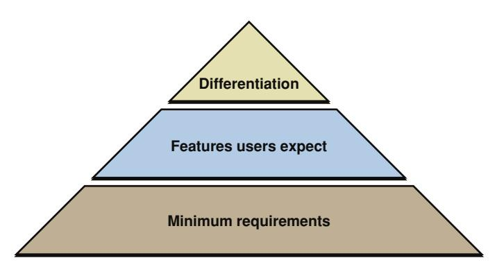

Each layer in [Figure](#page-52-2) 4-1 (page 53) correlates closely with a level of a user's satisfaction with an application. For example, an application that merely meets the minimum requirements may be acceptable, but probably does not deliver the features most users expect and is unlikely to inspire admiration and loyalty in its users. Because user satisfaction ultimately determines the success or failure of your application, it should be at the heart of your design decisions. If business realities require you to make design tradeoffs, use the guidelines described in this chapter to help you decide which features to concentrate on first.

# <span id="page-52-1"></span>Meet Minimum Requirements

As you design or revise your application, there are a number of guidelines you must follow to ensure your application is "at home" in Mac OS X. You should view these guidelines and the features associated with them as nonnegotiable; if you don't follow them, users will notice that your application doesn't feel like it is intended for the Macintosh.

To meet the minimum requirements of an application on the Mac OS X platform, be sure to:

■ Respect the single menu bar and avoid putting menu bars in your application's windows.

Mac OS X provides a single menu bar across the top of the screen, which gives applications a consistent location to display commands. For more information on how your application interacts with the menu bar, see "The Menu Bar and Its [Menus"](#page-170-0) (page 171).

■ Respect the Dock.

The Dock is an essential part of Mac OS X and users expect it to behave according to their preferences. At the very least, your application must not interfere with the Dock's position on the screen. Additionally, your application should cooperate with the Dock to provide information and utility to your users. For more information on the Dock, see "The [Dock"](#page-61-0) (page 62).

■ Respect the multilayered window environment of Mac OS X.

Mac OS X supports different types of windows for different uses. Be sure you know which types of windows your application should display and how they should look (for more information on these topics, see "Types of [Windows"](#page-186-1) (page 187) and "Window [Appearance"](#page-187-0) (page 188)). In addition, be sure you follow the guidelines for opening, naming, positioning, resizing, and closing windows described in "Window [Behavior"](#page-210-0) (page 211).

■ Put the files your application creates in the proper locations.

Mac OS X defines particular locations for application-specific files, such as preferences and user-created documents. Don't place files associated with your application in arbitrary locations because they will clutter the file system and users won't know where to look for them. For guidelines on how to interact with the file system, see *File System Overview*.

■ Use standard controls.

Mac OS X provides a wide range of controls with well-defined behaviors. Use these controls in your application's user interface and be sure you support the prescribed behaviors. For extensive information on the behavior, appearance, and usage of controls, see ["Controls"](#page-248-0) (page 249). In very rare cases, you may need to implement a custom control; if you think this might be necessary, see ["Extending](#page-50-0) the [Interface"](#page-50-0) (page 51).

■ Avoid the system-reserved keyboard shortcuts and respect the Apple-recommended keyboard shortcuts.

Applications should not override the system-reserved keyboard shortcuts. These shortcuts are intended to supply specific behaviors regardless of which application is currently running. For more information on the system-reserved keyboard shortcuts,see "Reserved Keyboard [Shortcuts"](#page-102-1) (page 103) and ["Keyboard](#page-354-0) Shortcuts Quick [Reference"](#page-354-0) (page 355).

An application should implement the recommended keyboard shortcuts associated with the tasks the application performs. If, for example, your application performs a save operation, it should implement the Command-S keyboard shortcut for this task. In almost all cases, an application should not override the recommended keyboard shortcuts. For example, Macintosh usersshould be able to rely on Command-S to mean Save no matter which application they are using. For a comprehensive list of the recommended keyboard shortcuts,see "Keyboard Shortcuts Quick [Reference"](#page-354-0) (page 355). To see how the recommended keyboard shortcuts are used in menus, see the menu-specific sections in "The [Menu](#page-170-0) Bar and Its [Menus"](#page-170-0) (page 171).

■ Support the Clipboard.

Mac OS X makesthe Clipboard available to all applications and users can rely on the Clipboard's contents remaining unchanged when they switch applications. Be sure to support the Clipboard and implement cut, copy, and paste operations in your application. For more information on operations that access the Clipboard, see "The Edit [Menu"](#page-176-0) (page 177) and "The [Format](#page-178-0) Menu" (page 179).

# <span id="page-54-0"></span>Deliver the Features Users Expect

After you've met the minimum requirements, you should concentrate on delivering the features users expect. Macintosh users are sophisticated and most have come to expect a certain level of functionality and elegance in the applications they use. Although the guidelines in this section are not as elementary as those described in "Meet Minimum [Requirements"](#page-52-1) (page 53), they embody key features your application should provide.

To deliver the features Macintosh users expect, be sure to:

■ Communicate effectively.

Mac OS X excels at providing essential information to users in an integrated and effective manner. Similarly, your application should provide useful error messages, feedback on commands and lengthy tasks, and appropriate status information. For information on how to do this, see ["Feedback](#page-41-1) and [Communication"](#page-41-1) (page 42).

■ Support application bundles and drag-and-drop installation.

Application bundles simplify the user's interaction with your software and enable drag-and-drop installation, which isthe preferred method of application installation in Mac OS X. Macintosh users expect a quick, painless application installation experience; be sure to supply it by making your application available in a bundle and supporting drag-and-drop installation. For more information on bundles and application installation, see ["Packaging"](#page-82-1) (page 83) and ["Installation"](#page-83-0) (page 84).

■ Create high-quality icons and graphics.

Part of the allure of Mac OS X is the abundance of beautiful, realistic, photo-illustrative icons. Be sure your application displays the type of high-quality, attractive icons Macintosh users expect. For guidance on different types of icons and how to design them, see ["Icons"](#page-134-0) (page 135).

■ Comply with the layout guidelines.

Applications that follow the layout guidelines present a clean, organized, and intuitive look and feel to users. Macintosh users are accustomed to uncluttered, visually appealing windows with conveniently placed controls. For help with the spacing of individual controls, see ["Controls"](#page-248-0) (page 249); for some examples showing how to combine controls in windows, see "Layout [Guidelines"](#page-336-0) (page 337).

■ Provide effective user assistance.

Effective and readily available user assistance is a hallmark of a good application. Mac OS X supports both Apple Help, which allows you to display in-depth help documents in Help Viewer, and help tags, which allow you to display brief, context-sensitive information about user interface elements. Because these help mechanisms are used extensively by the system, Apple applications, and most third-party applications, Macintosh users rely on them when they need help with a task or control. For more information on using these mechanisms to provide help to your users, see "User [Assistance"](#page-79-0) (page 80).

■ Support drag and drop.

Drag-and-drop functionality is ubiquitous in Mac OS X, making it one of the most appreciated and well-known features of the platform. Although you should be sure to provide keyboard alternatives to the drag-and-drop operations in your application, it's essential to fully support this direct manipulation technology. For more information on this technology, see "Drag and [Drop"](#page-116-0) (page 117).

■ Use display names.

Mac OS X allows users to customize how file, directory, and application names are displayed. Macintosh users are accustomed to making this choice and expect their preference to be observed throughout the file system and in applications. Be sure to respect the user's display name preference in your application (note that this also makes internationalization much easier). For more information about filename extensions and display names, see "File Formats and Filename [Extensions"](#page-62-1) (page 63).

# <span id="page-55-0"></span>Differentiate Your Application

Meeting the minimum requirements and delivering features users expect takes you a long way towards producing an application that users in your target market will be eager to buy. Although the top layer of the pyramid represents more work, the result is a user-acclaimed application that takes full advantage of the powerful features of Mac OS X.

Follow the guidelinesin thissection to produce an application that goes above and beyond users' expectations.

■ Support modelessness.

As much as possible, avoid forcing the user to complete the current task before they can do anything else. Use sheets and drawers to allow the user more freedom (for more information about sheets and drawers, see "Sheets [\(Document-Modal](#page-230-1) Dialogs)" (page 231) and ["Drawers"](#page-208-0) (page 209)). If you must use modes in your application, be sure to clearly communicate the current status and make it easy for users to get into and out of a mode.

■ Integrate Spotlight.

Spotlight technology allows users to find files anywhere in the system, using criteria they define. Be sure to supply a Spotlight importer if your application uses a custom file format, so users can easily search for the files your application creates. In addition, you should consider using Spotlight technology to provide file system search capabilities in your application. For more information about Spotlight, see ["Spotlight"](#page-76-1) (page 77).

■ Support fast user switching.

Mac OS X allows multiple users to use a single computer at the same time. With fast user switching, one user's login session is active while the sessions of other users continue to run in the background. Users switch simply by logging in; logging out between users is not required. Applications should take this feature into account to avoid failing in a multiple, simultaneous user environment. If your application relies on exclusive accessto resources or assumesthere is only one instance of a per-userservice running at any one time, be sure to modify the application to safely identify and share system resources. For more information on how to support fast user switching, see *Multiple User Environments*.

■ Internationalize the user interface.

The global market for your application is defined by the extent to which itsupportslocale-specific content and functionality. As you design or revise your application, be aware of differences in language and cultural values and symbols so you can more easily localize your product for specific markets. For more information on internationalization issues, see "Worldwide [Compatibility"](#page-46-1) (page 47).

■ Make your application accessible to users with disabilities.

To reach the millions of users with disabilities (and to comply with government-mandated accessibility requirementsin some markets), you should ensure that your application is accessible. Mac OS X supports accessibility with a range of powerful features, including full keyboard access, speech technologies, and VoiceOver, an integrated accessibility interface to the Macintosh. You should test your application with

these features to make sure that the application does not interfere with them and potentially degrade a disabled user's experience. For an overview of accessibility issues, see "Universal [Accessibility"](#page-48-0) (page 49).

■ Strive for high performance and reliability.

Even a stunning user interface is not likely to be enough to persuade usersto continue using an application that performs poorly or behavesin a counterintuitive and unreliable way. Remember that the perception of performance is informed by two things: The speed with which an application processes data and performs operations and the speed with which the application responds to the user. Take advantage of the tools and optimization technologies Mac OS X provides to enhance the performance of your application. Be sure your application responds quickly and keeps the user informed about the progress of lengthy tasks. For more information on some techniques for achieving high performance, see ["High](#page-30-1) [Performance"](#page-30-1) (page 31).

Users will be quick to reject your application if it loses or corrupts data or behaves erratically. Build in as many safeguards against data loss as you can and be sure to warn users about potential problems, allowing them to make alternate choices that avoid risky situations. Although unpredictable behavior may not lead to data loss, it can cause users to distrust an application. Make sure the user interface elements in your application behave in an expected and desired way so users can trust your application to do what it promises. For more information on ways to make your application reliable, see ["Reliability"](#page-33-1) (page 34).

■ Surprise and delight.

Although less concrete than the other guidelines, this guideline encompassessome of the most important qualities of great software. Fundamentally, users delight in applications that seem to understand them, anticipating their needs and providing them with powerful, intuitive, and streamlined solutions. The best way to follow this guideline is to keep the user's mental model firmly in mind as you design your application (for a discussion of this concept, see ["Reflect](#page-38-3) the User's Mental Model" (page 39)). Briefly, you should discover your users' workflow, expectations, and real-world experiences and mirror them in your application's terminology, window layout, menu organization and hierarchy, and toolbar contents.

#### **CHAPTER 4**

Prioritizing Design Decisions

# <span id="page-58-0"></span>The Macintosh Experience

This part of *Apple Human Interface Guidelines* presents an overview of the user-centric, integrated design of Mac OS X. Read this part to learn about the design principles and technologies used in Mac OS X and how your application fits into that environment. You can also find out how to leverage existing technologies to add value to your user interface.

#### **PART II**

The Macintosh Experience

# <span id="page-60-0"></span>The Mac OS X Environment

This chapter covers relevant features of Mac OS X that can influence the design of your software. These features are not always associated with a single technology or developer type but sometimes apply to development in general. You should be familiar with these guidelines before developing your software.

# <span id="page-60-1"></span>The Always-On Environment

<span id="page-60-5"></span><span id="page-60-3"></span>As the center of the user's digital hub, Mac OS X is designed to be always ready to use. Because of energy saving systems, it's common for a user to leave a computer on most of the time. To allow for the fact that a computer may be on for hours, days, weeks, or even months at a time, you should consider the following guidelines:

- <span id="page-60-6"></span>■ Avoid relying on a restart to get rid of cached or temporary files that may use up disk space. Be prepared to remove these files yourself when they are no longer needed.
- Avoid relying on startup or login itemsto initiate user-level processes. If the user quits a processinitiated only at boot time, that process will be unavailable until the machine restarts.
- Avoid requiring usersto reboot as a part of an installation orsoftware update unless absolutely necessary. Your application is probably not the only one they have open,so a restart can come as a rude interruption.

# <span id="page-60-4"></span><span id="page-60-2"></span>Displays

Avoid making assumptions about display size. Mac OS X can run on systems with a screen size as small as 800 x 600, but a user may have multiple high-resolution displays. Unless you know that your users will be using a specific display size, it is best to optimize your applications for display at 1024 x 768 pixels.

**Note:** A resolution of 640 x 480 is also available for the iBook and for Classic applications, games, and other multimedia applications. This does not mean that you should assume this is the minimum system resolution, however. Design your user interface for a resolution of at least 800 x 600.

Be aware that users may have the ability to rotate their displays,so you should also avoid making assumptions about the aspect ratio. Display rotation reverses the aspect ratio of the screen. For example, if a user's display is set to a screen resolution of 800 x 600 (an aspect ratio of 1.33:1), after rotation the screen resolution is 600 x 800 (an aspect ratio of .75:1).

An application can get notified of some types of screen-update events by registering for a callback, such as CGDisplayReconfigurationCallBack. For more information on this and other callbacks, see *Quartz Display Services Reference*.

# <span id="page-61-0"></span>The Dock

<span id="page-61-8"></span>The Dock is more than just a tool for users of Mac OS X. Developers need to be aware of the Dock and account for its presence in their applications.

When creating new windows or resizing existing windows, make sure you take the Dock position into account. New windows should not overlap the boundaries of the Dock. Similarly, you should prevent users from moving or resizing windows so that they are behind the Dock. (Carbon developers can use the GetAvailableWindowPositioningBounds function and Cocoa developers can use the methods of NSScreen to get the screen area without the Dock or menu bar.)

### <span id="page-61-5"></span><span id="page-61-1"></span>Conveying Information in the Dock

<span id="page-61-4"></span>Developers may also find some features of the Dock useful for conveying information.

- <span id="page-61-6"></span>■ Use badging to convey status information in an unobtrusive manner. Badging is the process of superimposing a small image on an application's Dock tile icon. For example, Mail uses a badge to show the number of unread messages. This is a good example of providing appropriate feedback and communication. For more information on this principle of user interface design, see ["Feedback](#page-41-1) and [Communication"](#page-41-1) (page 42).
- <span id="page-61-2"></span>■ Use the Notification Manager to convey more seriousinformation,such as error conditions. Notifications cause your Dock tile icon to bounce. Make sure you disable this effect once the user has addressed the problem. (Note that error-related classesin a Cocoa application initiate Dock notifications automatically.)

### <span id="page-61-3"></span>Clicking in the Dock

Clicking an application icon in the Dock should always result in a window becoming active.

- <span id="page-61-7"></span>■ If the application is not open, a new window should open. In a document-based application, the application should open a new, untitled window. In an application that is not document-based, the main application window should open.
- When a user clicks an open application's icon in the Dock, the application becomes active and all open unminimized windows are brought to the front; minimized document windows remain in the Dock. If there are no unminimized windows when the user clicks the Dock icon, the last minimized window should be expanded and made active. If no windows are open, the application should open a new window—a new untitled window for document-based applications, otherwise the main application window.

Control-clicking an application icon in the Dock displays a menu that allows users to perform tasks such as quitting the application, hiding it, orshowing itslocation in the file system. (Users can also pressthe application icon to get this menu.) You can modify this menu to make features of your application available from your Dock tile. See "Dock [Menus"](#page-184-0) (page 185) for more information on Dock menus.

# <span id="page-62-0"></span>The Finder

<span id="page-62-7"></span><span id="page-62-6"></span>Here are some tips to help your application integrate well with the Finder:

- Make sure your application bundle has a .app extension. The Finder looks for this extension and treats your application appropriately when it finds it. The Finder also shows or hides this extension, depending on the state of the "Show all file extensions" preference in the Advanced pane of Finder preferences.
- <span id="page-62-8"></span><span id="page-62-2"></span>■ Package CFM applications in a bundle. Even if you develop using the CFM runtime, you can still take advantage of the bundle mechanism in Mac OS X.
- <span id="page-62-5"></span>■ Use an information property list to communicate information to the Finder. The information property list isthe standard place to store information about your application and document types. For information on what to put in this file, see *Runtime Configuration Guidelines*.
- When saving files of your own document types, be sure to give them appropriate filename extensions to ensure platform interoperability and to support the Mac OS X user experience. You can also set a file type and optionally a creator type for a file. The file and creator type codes are not strictly necessary, but they do ensure interoperability with applicationsin the Classic environment. See *File SystemOverview* for more information about filename extensions, file types, and creator types.
- <span id="page-62-4"></span>■ Avoid changing the creator type of existing documents. The creator type implies a distinct sense of ownership over a file. Your application can assign a creator type for filesit creates but it is not appropriate to change creator types for documents created by other applications without the user's explicit consent. The user can still associate files with a specific application through the Info window.

# <span id="page-62-3"></span><span id="page-62-1"></span>File Formats and Filename Extensions

Whenever possible, include support for industry-standard file formatsin your documents. Supporting standard file formats makes it easier to exchange data between your application and other applications. Users might also be more inclined to use your application if they know they can get their data into and out of it easily.

When saving user-configurable data, make sure you store it in a plain-text file that the user can modify. Mac OS X applications traditionally store configuration data using XML. You can write out XML data using the preferences system and the XML support found in Core Foundation and Cocoa. For information about user preferences, see *Runtime Configuration Guidelines*.

Many platforms rely on the existence of filename extensions to identify the type of a file. Although many longtime Mac OS X developers may decry their use, filename extensions make it easier for users to exchange files with users of those other platforms. Applications that save documents should be sure to include a filename extension appropriate to the contents of the document. At the same time, however, applications should take care to respect the user's filename extension preferences when displaying the names of files and documents.

For more information and guidelines about supporting filename extensions, see *File System Overview*.

# <span id="page-63-0"></span>Internationalization

<span id="page-63-7"></span>The Mac OS X application bundling scheme is designed to support localized strings, images, nib files, and other resources. However, there is more to designing an application for use in different markets than just including the right translated strings. "Worldwide [Compatibility"](#page-46-1) (page 47) provides some general design considerations for building internationalization into your application.

<span id="page-63-6"></span>At a minimum, your internationalization checklist should include the following items:

- Implement your program as a bundle so that you can take advantage of the built-in internationalization support for bundles.
- Support Unicode text. Mac OS X provides full support for Unicode, and so should your application.
- Modify your code to get user-visible strings from .strings files. Use Core Foundation and Cocoa interfaces to load strings from resource files in your bundle.
- Use nib files to store your user interface data.

For further guidelines and information about how to internationalize your applications,see *Internationalization Programming Topics*.

# <span id="page-63-4"></span><span id="page-63-1"></span>Multiple User Issues

<span id="page-63-5"></span><span id="page-63-3"></span><span id="page-63-2"></span>Remember that Mac OS X is a multiple-usersystem. Not only doesthe system support multiple user accounts, it supports multiple users sharing the same computer simultaneously. This feature employs a technique known as fast user switching, in which users trade use of the computer without logging out. With multiple users accessing the computer, conflicts can arise if applications are not careful about how they use shared resources. Shared memory, cache files, semaphores, and named pipes must be carefully labeled to prevent corruption by usersrunning the same application in differentsessions. Applications cannot assume that they have exclusive access to any system resources, such as a CD or DVD drive.

<span id="page-63-9"></span>When considering access by multiple users, there are some specific things to keep in mind for your program design:

- <span id="page-63-8"></span>■ Named resources that might potentially be accessible to an application from multiple user sessions should incorporate the session ID into the name of the resource. This applies to cache files, shared memory, semaphores, and named pipes, among others.
- Not all users have the same privileges. For example, only administrator users can write files in /Applications. Some users may be working under limited privileges and have limited access to some parts of the system. In particular, they may not be able to do the following:
  - ❏ Access all panes in System Preferences ❏ Modify the Dock ❏ Change their password ❏ Burn DVDs and CDs

❏ Open certain applications

<span id="page-64-2"></span>■ Users on a computer can include both local and network users,so do not assume a user's home directory is on a local volume. You may be accessing a network volume instead.

The document *Multiple User Environments* describes issues that arise from the existence of multiple users on a system. It also covers programmatic techniques for identifying users and protecting your application data from external corruption.

# <span id="page-64-6"></span><span id="page-64-0"></span>Resource Management

Application bundles simplify installation and are easy for the user to move around in the Finder. Application bundles are the preferred mechanism for software distribution. Here are some tips to help you manage your application bundle's resource files:

- <span id="page-64-5"></span>■ Include all required resources inside your application bundle. Your application bundle should always have everything it needs in order to run.
- <span id="page-64-4"></span>■ Include only the specific subset of files that require localization in your application bundle's language-specific resource directories. If a resource does not require localization, there is no need to create extra copies of it. The bundle-loading code checksfor global resources as well aslocalized resources and returns the one that is most appropriate.
- <span id="page-64-3"></span>■ Use an installer to place optional resourcesin the appropriate Library subdirectory of the user'ssystem. Optional resources are thingslike document templates or other resourcesthat are useful to an application but not required for it to launch. Most application-related files should go in an application-specific subdirectory of ~/Library/Application Support or /Library/Application Support. See *File System Overview* for information on where to install files.
- Avoid storing data in the resource fork of your application executable. Resource forks are not an appropriate way to store application-related resources. Instead, store your resources as individual files inside your application bundle. See *Bundle Programming Guide* for more information on where resources belong in the bundle structure.

# <span id="page-64-7"></span><span id="page-64-1"></span>Threads

As you design your application, think about the operationsthat could be performed in parallel. Multithreading your application improvesthe responsiveness of your user interface by moving long calculationsinto separate threads and away from your main event loop. Multithreading can also improve the speed of performing some tasks, especially on multiprocessor systems. Of course, threading also requires great care during implementation to ensure that shared data structures are not corrupted by different threads. For more information on threading technologies, see *Threading Programming Guide*.

#### **CHAPTER 5**

The Mac OS X Environment

# <span id="page-66-0"></span>Using Mac OS X Technologies

Mac OS X provides a wealth of highly developed technologies you can use that allow you to avoid spending development time implementing custom solutionsfor generic tasks. Taking advantage of these fully integrated technologies will enhance the way your application interacts with the system and with other applications on the platform.

# <span id="page-66-3"></span><span id="page-66-1"></span>Address Book

<span id="page-66-6"></span><span id="page-66-5"></span><span id="page-66-4"></span>If your application stores or uses contact information, use the Address Book framework to manage that information. Contact information consists of information such as names, phone numbers, fax numbers, and email addresses of the people known to the current user. Using the Address Book framework, you can access contact information from the user's database or display it in a customizable window.

Although the Address Book interfacesthat allow you to customize the display window use the terms"people picker" and "picker," these are not acceptable names to use in your application's user interface. Instead, you should give the display window a name that describes its contents as they relate to your application, such as "Addresses" or "Contacts."

<span id="page-66-2"></span>The appearance of a people-picker window is customizable to allow you to display only the data relevant to your application. For example, Mail customizes this window to show the email addresses of the contacts, as shown in Figure 6-1.


**Figure 6-1** A people-picker window as used in Mail

You customize the appearance of a people-picker window using the interfaces of the Address Book framework. See *Address Book Programming Guide for Mac OS X* for more information on using this framework.

Address Book **67**

# <span id="page-67-0"></span>Animation

<span id="page-67-2"></span>A hallmark of Mac OS X is the use of animation to enhance the user experience, such as in the minimizing of windows to the Dock, the unfurling of sheets, and the sliding of drawers. In Mac OS X v10.5 and later, animation powers the movement of icons in the Finder Cover Flow view, the springing of items from a stack in the Dock, and the arrival of buddies in an iChat window, among other things. Figure 6-2 shows a "time-lapsed" view of items springing from a stack.

<span id="page-67-1"></span>**Figure 6-2** Animation allows items in a stack to emerge smoothly


Animation allows users track the movements of objects, helps them understand the effects of their actions, and lends a sense of physicality and realism to the virtual world they see on the display screen. In general, animation is ideal for:

- Communicating progress
- Providing meaningful feedback
- Clarifying a process or concept

If you are developing an application to run in Mac OS X v10.5 and later, you, too, can take advantage of animation by using Core Animation programming interfaces. As with most powerful tools, however, it's important to use animation wisely, that is, as a subtle enhancement to the user experience, not as the focus of the user experience. For example, you might consider using animation in the following cases:

■ When users navigate a collection.

When navigation is similar to familiar, real-world activities, such as flipping through pages in a book or DVDs on a shelf, users are better able to grasp the organization and extent of a collection. In addition, when itemsin a collection appear to have realistic dimensionality and weight, they're easier to recognize at a glance.

- When it's helpful for users to understand the consequences of an action before they commit to it.
  - Showing users the results of an action before they complete it allows them to be sure of themselves and avoid mistakes. For example, items in the Dock move aside when users drag an object into the Dock area, showing them where the new object will reside when they release the mouse button.
- When users enter or initiate a different interaction mode.

When users enter a different mode of interaction, such as full-screen mode, animation can guide them and provide clues that help them keep track of the current mode. For example, the animated star field in Time Machine provides a completely different user experience that helpsthe user distinguish between the Time Machine view of the system and the user's standard view of the system.

■ When an object changes its properties.

Showing an object's transition from one state to another, instead of showing only the beginning and ending states, helps users understand what's happening and gives them a greater sense of control over the process. For example, in an application that allows users to change several properties of a document at one time, an icon that smoothly shows the effects of the combination of changes would provide valuable feedback.

■ When an action occurs so quickly, users can't track it.

Although speed and efficiency are essential in software, sometimes an action can take place so quickly that its context or result is unclear. When it's important that users understand a connection or a process, animation can help them watch actions occur in a more human time frame. For example, when the user minimizes a window it doesn't just disappear from the desktop and reappear in the Dock; instead, it moves fluidly from the desktop to the Dock so the user knows where it went.

If you decide to use animation, therefore, be sure the animation subtly enhancesthe tasks and concepts your application focuses on and doesn't distract from them. Although animation can clarify obscure or hidden processes and provide valuable feedback, gratuitous or illogical animation can degrade the user experience, in addition to decreasing the performance of your application. In particular, you should:

- Avoid replicating a Front Row or Time Machine style of user interface for an application that requires a lot of user input (especially textual input) or that users use for content creation. A fully animated, full-screen user interface that displayslarge,simplified controls does not make detailed content-creation tasks easier or more efficient.
- Avoid animating everything.

Although it's tempting to think that more animation results in greater clarification and better feedback, it's not generally true. Most tasks and actions in an application are best performed quickly and with a minimum of fanfare.

- Avoid animating routine user-interface actions supported by system-provided controls, such as:
  - ❏ Switching tabs

#### **CHAPTER 6**

Using Mac OS X Technologies

- ❏ Opening or closing views
- ❏ Clicking toolbar items

Users understand how common user interface elements work, and they don't appreciate being forced to spend extra time watching unnecessary animation every time they click a button.

To learn more about using animation in your application, see *Core Animation Programming Guide*.

# <span id="page-69-0"></span>Automator

<span id="page-69-2"></span>With Automator, a user can automate common procedures and build workflows by arranging processesfrom different applications into a desired order. Familiar Apple applications, such as Mail, iPhoto, and Safari make their tasks available to users to organize into a workflow. These tasks (called *actions*) are simple and narrowly defined, such as opening a file or applying a filter, so a user can include them in different workflows.

As an application developer, you can define actionsthat represent discrete tasks your application can perform. You make these actions available to users by creating action plug-insthat implement the appropriate behavior. An action plug-in contains a nib file and some code to manage the action's user interface and implement its behavior. You can develop action plug-ins using either AppleScript or Objective-C. You might consider creating a set of basic actions to ship with your application so users have a starting point for using your application with Automator.

<span id="page-69-1"></span>For more information on developing Automator actions, see *Automator Programming Guide*.

As you design the user interface of an action, keep the following guidelines in mind:

- Users stack actions on top of each other in Automator. Because display screens are wider than they are tall, you should minimize the use of vertical space. One way to do this is to use a pop-up menu instead of radio buttons, even if there are only two choices.
- Don't use group boxes. An action does not need to separate or group controls with a group box.
- Avoid tab views. Instead, use hidden tab views to alternate between different sets of controls.
- Avoid using labelsto repeat the action'stitle or description; these take up space without providing value.
- Use a disclosure triangle to hide and display optional settings. (See ["Disclosure](#page-319-1) Triangles" (page 320) for more information on disclosure triangles.)
- Use small Aqua controls to minimize the use of space. (In ["Controls"](#page-248-0) (page 249) you can find information on the dimensions of those controls that are available in the small size.)
- Use 10-pixel margins to make the best use of the space.
- Provide feedback. Use the appropriate progress indicator when an action needs time to complete (see "Progress [Indicators"](#page-301-1) (page 302) for more information on these controls).
- If possible, display an example showing the effect of the action so users can see the impact of various settings.

# <span id="page-70-0"></span>Bonjour

If you develop applications that need to communicate with other computers and processes on the Internet or a local area network, you should avoid making assumptions about the user's network settings. Ensuring fast, efficient connections to other programs and computers is an important part of providing a good user experience.

<span id="page-70-3"></span>Mac OS X supports a dynamically updating networking model. Because a user may change IP addresses many times during a single session, don'tsave settings based on the IP address. Use Bonjour whenever a user might otherwise be required to set an IP address. Bonjour enables automatic discovery of computers, devices, and services on IP networks. The use of Bonjour can dramatically simplify network configuration for your users. For more information on Bonjour, see *Bonjour Overview*.

# <span id="page-70-4"></span><span id="page-70-1"></span>Colors

<span id="page-70-2"></span>If your application deals with color, you may need a way for the user to enter color information. Mac OS X provides a standard Colors window for picking colors. Shown in Figure 6-3 this window lets the user enter color data using any of five different color models. You should use this window rather than create a custom interface for color selection.

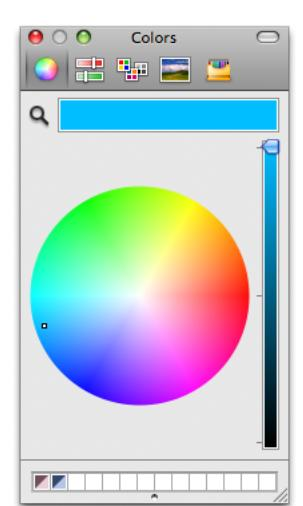

**Figure 6-3** Colors window

For information on how to use this window in Cocoa applications, see *Color Programming Topics for Cocoa*; for Carbon programs, see *Color Picker Manager Reference*.

# <span id="page-71-0"></span>Dashboard

<span id="page-71-3"></span>Dashboard provides a way for usersto get information and perform simple tasks quickly and easily. Appearing and disappearing with a single keystroke or mouse gesture, Dashboard presents a default or user-defined set of widgets in a format reminiscent of a heads-up display. Each widget is small, visually appealing, and clearly indicative of its purpose. For example, each of the Mac OS X Dashboard widgets shown in [Figure](#page-71-2) [6-4](#page-71-2) (page 72) is an attractive, scaled-down interface to a common task.

<span id="page-71-2"></span>**Figure 6-4** Dashboard widgets

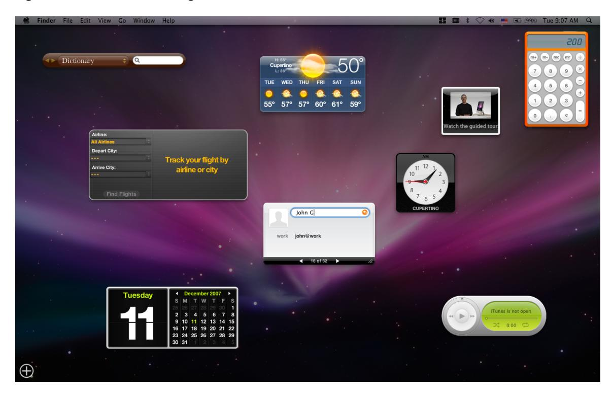

You can develop a standalone widget that performs a lightweight, well-defined task or a widget whose task is actually performed by your larger, more functional application. Thissection summarizes both the high-level and user-interface guidelines you should follow as you design your widget. Step-by-step instructionsfor how to implement a Dashboard widget, including plentiful code and user interface examples, are available in *Dashboard Tutorial*.

<span id="page-71-4"></span><span id="page-71-1"></span>Many of the user-interface design principles covered in "Human [Interface](#page-38-0) Design" (page 39) are also applicable to Dashboard widgets. Following these guidelines gives users an automatic familiarity with this technology.

### High-Level Design Guidelines for Widgets

Dashboard widgets are small and compact in part because they occupy prime screen space but also because they perform a single, well-defined task. It's especially important to avoid providing functionality that is extraneous to a widget's central task, because this dilutes a widget's usefulness. As with the design of a full-size application, taking the time to carefully define your widget's target audience (see ["Involving](#page-24-1) Users in the Design [Process"](#page-24-1) (page 25)) will help you focus on the task your widget will perform.

As you design your widget, keep these high-level guidelines in mind:

- A widget's purpose should be immediately apparent to the user.
  - To achieve this, be sure you understand the user's mental model of the task your widget performs (for more information on this concept, see ["Reflect](#page-38-3) the User's Mental Model" (page 39)).
- A widget is not the place to display aggressive company advertising or branding.
  - Your widget is not merely an entrance to another application, even if that other application performs the processing for the widget's task. If you take advantage of Dashboard's prominence to display a banner ad, for example, users will be likely to stop including your widget in the Dashboard display.
- A widget is not simply a miniaturized version of a standard application window. Avoid making your widget look crowded by displaying only the controls that are essential to the task.

### <span id="page-72-0"></span>User-Interface Design Guidelines for Widgets

When you've decided on the widget's task, follow these guidelines for designing the user interface:

- Use color to enhance the visual impact of your widgets.
  - Widgets should be visually stimulating, and good color choices can help convey the type of task the widget performs. As with application icons (described in "Icon Genres and [Families"](#page-134-1) (page 135)), you should consider using bright, saturated colors for fun, creative tasks and more sombre, desaturated colors for utilitarian tasks
- Don't use Aqua controls on the front of your widget. Instead, design controls that support and enhance the task-oriented appearance of the widget.
- Display the widget's information at once. Dashboard appears and disappears quickly, so you don't want to make the user wait for your content to display.
- The default size of the widget should be small, but it should be able to expand if the task requires it.
  - Be aware that a user might want to populate the Dashboard with a very large number of widgets. If your widget is too large and seems to monopolize the screen, a user might choose not to include it.
  - If appropriate you can provide a resize control, but recognize that if a user misses this control and clicks outside the widget, Dashboard is hidden.
- The default set of information your widget displays should be minimal and should not require scrolling. If, however, the widget's function is to provide a lot of information, consider making the presence of a scroll bar an option the user can select.
- Use clearly readable fonts.
  - Avoid sacrificing readability to achieve a particular appearance. Focus on building the widget's personality into the contours and the controls you design.
- If appropriate, provide a way for the user to set a few options on the back of the widget (to do this, display an Info button in the lower right quadrant of the widget; see *Dashboard Tutorial* for more information).
  - Use a more subdued version of your color scheme on the back of the widget. This helps the user distinguish the widget's back from its front.
  - Provide a Done button on the back of your widget that allows users to return to the front of the widget (for more information on how to provide this control, see *Dashboard Tutorial*).

# <span id="page-73-3"></span><span id="page-73-0"></span>Fonts

<span id="page-73-4"></span>If your program supports typography and text layout using user-selectable fonts, you should use the Fonts window to obtain the user's font selection. Users can select fonts and sizes in both the standard (Figure 6-5) and the minimized (Figure 6-6) view of the Fonts window. In the standard view, there are also controls for fine-tuning the display characteristics of fonts. Most important, the Fonts window is implemented for you. You do not have to create a Fonts menu or other special user interface to display and gather font information from the user.

<span id="page-73-1"></span>**Figure 6-5** Fonts window


**Figure 6-6** Minimal Fonts window

<span id="page-73-2"></span>

The Fonts window also provides advanced typography controls for fonts that support those options. The user can open a Typography inspector by choosing Typography from the action menu. Figure 6-7 shows the typography controls for the Zapfino font.

<span id="page-74-1"></span>**Figure 6-7** Typography inspector


For more information about fontselection and management in Cocoa applications,see *Font Panel*; for Carbon applications, see *Apple Type Services for Fonts Programming Guide*.

# <span id="page-74-2"></span><span id="page-74-0"></span>Preferences

Preference settings are user-defined parameters that your software remembers from session to session. Preferences can be a way for your application to offer choices to users about how the application runs. Preferences often affect the behavior of the application or the default appearance of content created with the application.

To reduce the complexity of your application, be picky about which features should have preferences and which should not. Avoid implementing all the preferences you can think of. Instead, be decisive and focus your preferences on the features users might really want to modify.

A preference should be a setting that the user changes infrequently. If a user might change the attributes of a feature many times in a work session, avoid using preferences to set those attributes. Instead, give the user modeless access to the controls for modifying that feature. For example, you might implement the feature using a menu item or a control in a palette or window.

Because a user does not change preference settingsfrequently, you should not provide a preferencestoolbar item. Instead, provide access to application-level preferences in the application menu (see "The [Application](#page-172-1) [Menu"](#page-172-1) (page 173) for more information) and to document-specific preferencesin the File menu (see ["The](#page-174-0) File [Menu"](#page-174-0) (page 175) for more information).

For information on implementing preferences with Cocoa, see *User Defaults Programming Topics for Cocoa*. For information on implementing preferences with Core Foundation, see *Preferences Programming Topics for Core Foundation*.

# <span id="page-75-0"></span>Printing

<span id="page-75-8"></span>Mac OS X includes an advanced printing system. Because of all the optionsthissystem provides, it isimportant that you use the standard printing dialogs so that users understand the options that are available to them without getting lost in features. The printing architecture allows users to print "digital paper" documents that can be sent to a printer, faxed, or saved as a PDF file (Figure 6-8). These features are all available automatically when you use the Mac OS X printing system in your application.

<span id="page-75-2"></span>**Figure 6-8** Print options available in Mac OS X

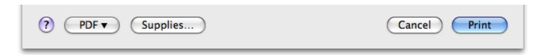

See "The Print [Dialog"](#page-246-0) (page 247) for information about the standard printing dialog. See *Mac OS X Printing System Overview* for general information about the printing system. For information on how to extend the Print dialog to include options not provided in the standard panes, see *Extending Printing Dialogs*.

# <span id="page-75-11"></span><span id="page-75-1"></span>Security

Mac OS X provides numeroustechnologiesto help you perform secure operations. Using these technologies, you can store secret information locally, authorize a user for specific operations, or transport information securely across a network.

<span id="page-75-12"></span>Consider the following guidelines when you need to work with sensitive information or work in a secure environment:

- Factor out code that requires privileged access into a separate process. Factoring isolates the secure code from the nonsecure code and makes it easier to verify that no rogue operations are occurring that could do damage, whether intentionally or unintentionally.
- <span id="page-75-10"></span>■ Avoid storing passwords and secrets in plain-text files. Even if you restrict access to the file using file permissions, the information is much safer in a keychain.
- <span id="page-75-9"></span>■ Avoid inventing your own authentication schemes. If you want a client-server operation to be secure, use the authorization APIs to guarantee the identity of the client.
- <span id="page-75-6"></span>■ Avoid loading plug-ins from privileged code. Plug-ins receive the same privileges as the parent process.
- <span id="page-75-3"></span>■ Avoid calling potentially dangerous functions, such as system or popen, from privileged code.
- <span id="page-75-4"></span>■ Don't assume only one user is logged in. With fast user switching, multiple users may be active on the same system. See *Multiple User Environments* for more information.
- <span id="page-75-7"></span><span id="page-75-5"></span>■ Don't assume that keychains are always stored as files.
- Avoid relying solely on passwords for authentication. Mac OS X already supports smart card devices. Biometric devices such as fingerprint scanners may also be available some day.

If your application stores passwords or other sensitive information, such as credit card numbers, store that information using Keychain Services. The keychain mechanism in Mac OS X provides the following benefits: Using Mac OS X Technologies

- It provides a secure, predictable, consistent experience for users when dealing with passwords and other secret information.
- <span id="page-76-3"></span>■ Users can modify settings for all of the passwords as a group or create separate keychains for different activities, with each keychain having its own activation settings. (By default, passwords are modified as a group.)
- The Keychain Access application provides a simple user interface for managing keychains and their settings, relieving you of this task.

For information and links to security-related documentation in Mac OS X, see Getting Started With [Security.](http://developer.apple.com/referencelibrary/GettingStarted/GS_Security/index.html)

# <span id="page-76-4"></span><span id="page-76-0"></span>Speech

Mac OS X contains speech technologies that enable software to recognize and speak U.S. English. These technologies provide benefitsfor all users and present the possibility of a new paradigm for human-computer interaction.

**Speech recognition** is the ability for the computer to recognize and respond to a person's speech. Using speech recognition, users can accomplish tasks comprising multiple steps—for example, "Schedule a meeting next Friday at 3 p.m. with John, Paul, and George" or "Create a 3-by-3 table"—with one spoken command. Mac OS X users can control the computer by voice rather than be limited to the mouse or keyboard; consequently, speech-recognition technology is very important for people with special needs and also for general users. Developers can take advantage of the speech engine and API included with Mac OS X, as well as the built-in user interface.

**Speech synthesis** also called text-to-speech (TTS), converts text into audible speech. It provides a way to deliver information to users without forcing them to shift attention from their current task. For example, the computer could, in the background, deliver such messages as "Your download is complete; one of the files has been corrupted" and "You have email from your boss; would you like to read it now?" TTS is also crucial for users with vision or attention disabilities. As with speech recognition, Mac OS X TTS provides both an API and several user interface features.

<span id="page-76-2"></span>For information about implementing speech synthesis and recognition, see the documents in Guides > User Experience > Speech Technologies.

# <span id="page-76-1"></span>Spotlight

Spotlight is a powerful Mac OS X search technology available to both users and application developers. Built on top of Search Kit and integrated with the file system, Spotlight makes searching for files on the computer as easy as searching the web. With Spotlight, users can search for things using attributes that have meaning for them, such as the intended audience for a document, the orientation of an image, or the key signature of the music in an audio file. Information like this (called metadata) is embedded in a file by the application that created it. Spotlight's power comesfrom being able to extract,store, update, and organize the metadata of files to allow fast, comprehensive searches.

Spotlight is always available to users to help them find their files on the computer. Even better, the search technologies that power Spotlight are available to developers to help them find files to display, plug-ins to load, and data to use in their applications. For example, a developer can define complex queries to find only the types of files an application needs to work with or provide Spotlight functionality from within an application. The rest of this section introduces the user's view of Spotlight and describes some of the ways an application can take advantage of its features.

<span id="page-77-0"></span>Users can easily initiate a Spotlightsearch using the Spotlight icon at the far right end of the menu bar. [Figure](#page-77-0) [6-9](#page-77-0) (page 78) shows the Spotlight icon and search field displayed when a user clicks the icon.

**Figure 6-9** The Spotlight icon and search field


<span id="page-77-1"></span>In addition, a user can select a word or phrase in a text document and Control-click to reveal a contextual menu that allows a Spotlight search for the selected text. [Figure](#page-77-1) 6-10 (page 78) shows this contextual menu.

**Figure 6-10** Spotlight search in a contextual menu

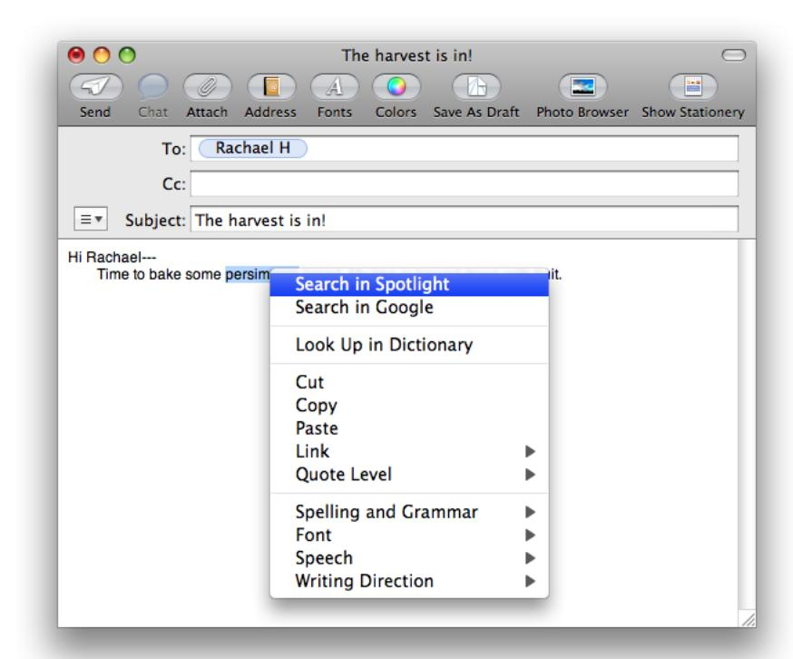

Whichever way a search isinitiated, Spotlight quickly displaysthe results, conveniently sorted into categories the user can adjust in Spotlight Preferences. [Figure](#page-78-0) 6-11 (page 79) shows the standard Spotlight results window.

<span id="page-78-0"></span>**Figure 6-11** A Spotlight results window


<span id="page-78-1"></span>To applications, Spotlight provides almost limitless ability to find files and to give advanced file-search capabilities to users within the context of the application. For example, an application might choose to replicate the Spotlight contextual-menu item (shown in [Figure](#page-77-1) 6-10 (page 78)) with a button that initiates a Spotlightsearch for the user'sselected text. The application could then display its own window that contains all the search results or a filtered subset of them.

An application might also choose to give users access to Spotlight searches in a rounded search field (for more information on this control, see ["Search](#page-316-0) Fields" (page 317)). A user often needs to work on a file that was saved in an atypical place or given an unexpected or forgotten name. If an application offers only a Finder-based Open dialog, it might force the user to waste a lot of time navigating the file system, trying to remember what the file was named and where it was saved. Instead, an application can provide a Spotlight-powered search that allows the user to search the entire file system, using meaningful attributes other than the filename.

Applications can also use Spotlight functionality behind the scenes to find needed files or plug-ins. For example, an application that provides a back-up service might allow the user to choose a broad category of file type to back up,such asimages. Instead of asking usersto identify all the foldersthat contain their images or just backing up a Pictures folder, the application could perform a Spotlight search to find every image file in the file system, regardless of its location.

It's important to emphasize that Spotlight is tuned to search for files; it's not intended to do extensive text-based searching within a document. If you need to do fine-grained textual searching, you should use Search Kit technologies instead. An application that stores data in database records, for example, should not base its database search on Spotlight because the data are not stored in separate files. For more information on using Search Kit in your application, see *Search Kit Programming Guide*.

Spotlight offers unparalleled search functionality to both users and developers. Along with these opportunities, however, comes an important developer responsibility. If your application uses a custom file format, you must supply a plug-in (called a Spotlight importer) that describes the types of metadata your file format contains. This ensuresthat a user will be able to search for the files your application creates using the attributes described by the metadata your files contain. For comprehensive information on how to do this,see *Spotlight Importer Programming Guide*.

# <span id="page-79-8"></span><span id="page-79-0"></span>User Assistance

Mac OS X supports two user help components: Apple Help and help tags. Help tags allow you to provide temporary context-sensitive help whereas Apple Help allows you to provide a more thorough discussion of a topic or procedure.

Use these mechanisms to provide user help in your application instead of using help mechanisms that are specific to your application. When users refer to help, it is usually because they are having difficulty accomplishing a task and therefore might be frustrated. This is not a good time to make them learn yet another task, such as figuring out a help viewing mechanism that differs from the one they use in all the other applications on their computer.

### <span id="page-79-3"></span><span id="page-79-1"></span>Apple Help

With **Apple Help**, you can display HTML filesin **Help Viewer**, a browser-like application designed for displaying and searching help documents. Help Viewer can also display documents containing QuickTime content, open AppleScript-based automations, retrieve updated help content from the Internet, and provide context-sensitive assistance.

<span id="page-79-6"></span>Users can access Apple Help by launching the Help Viewer application but they will more commonly access it from your application, in one of three ways:

- <span id="page-79-5"></span>■ **The Help menu.** The Help menu is the far-right item in the application region of the menu bar. When you register your help book with Help Viewer, the first item in the Help menu is the system-provided Spotlight For Help search field. The second item in the menu should be *ApplicationName* Help, which opens Help Viewer to the first page of your help content. For more information on the Help menu, see "The Help [Menu"](#page-182-0) (page 183).
- <span id="page-79-9"></span><span id="page-79-4"></span>■ **Help buttons.** When necessary, you can use a Help button to provide easy access to specific sections of your help. When a user clicks a Help button, send either a search term or an anchor lookup (which leads to a specific page or pages) to Help Viewer. It's not necessary for every dialog and window in your application to have a Help button. If there is no contextually relevant information in the help, don't display a Help button.
- **From a contextual menu item.** If contextually appropriate help content is available for the object being pointed to, the first item in the contextual menu is Help. As with Help buttons, the menu item can send either a search term or an anchor lookup to Help Viewer.

<span id="page-79-7"></span><span id="page-79-2"></span>See *Apple Help Programming Guide* for more information on writing Apple Help content and providing it with your application.

### Help Tags

**Help tags** enable your application to provide basic help information for itsinterface elements without forcing the user to leave the primary interface.

Help tags are short messagesthat appear when the user leavesthe mouse pointer hovering over an interface element for a few seconds (see Figure 6-12 for an example of a help tag). When the pointer leaves the object, the tag vanishes. If the mouse pointer is not moved, the operating system hides the help tag after about 10 seconds.

<span id="page-80-0"></span>**Figure 6-12** A help tag


The text of a help tag should briefly describe what an interface element does. If you find that you need more than a few words to describe the function of a control, you might want to reconsider the design of your application's user interface.

Define help tags in Interface Builder, where they are called **tooltips**. Here are some guidelines to help you create effective help tag messages.

- Use the fewest words possible. Try to keep your tags to a maximum of 60 to 75 characters. Because help tags are always on, it is important to keep your tag text unobtrusive—that is, *short*—and useful. A tag should present only one concept and that concept should be directly related to the interface element. Localization can lengthen the text by 20 to 30 percent, which is another good reason to keep the tag short.
- Don't put the interface element's name in the tag unless the name helps the user and isn't available onscreen. If an element isreferred to by name in the documentation and in the tag, make sure the names match.
- Describe only the element the mouse pointer hovers over.
- You can use a sentence fragment beginning with a verb, for example, "Restores default settings". You can also omit articles to limit the size of the tag. If the tag text is a complete sentence, end it with a period.
- Use help tags to provide functional information for controls that are unique to your application. Don't tag window controls, scroll bars, and other parts of the standard Mac OS X interface.
- You can create contextually sensitive help tags, but you don't have to; the same text can appear when an item is selected, dimmed, and so on. By describing what the interface element accomplishes, you may help the user understand the currentstate of the control even if the tag is applicable to allsituations.
- Write the help tag text in one of these ways, depending on the interface you're documenting:
  - Describe what the user will accomplish by using the control. For example, "Add or remove a language from your list" or "Reduce red tint in the selected area". Most help tags can use this format.
  - Give extra information to explain the results of the user's action. This kind of tag is most effective in an interface that already includes some instructional text, because the tag and the interface text work together to describe what the control does and how the user manipulates it.

Define terms that may be unknown to the user. This kind of tag should be used only if the interface already contains instructions to the user.

User Assistance **81**

#### **CHAPTER 6**

Using Mac OS X Technologies

# <span id="page-82-0"></span>Software Installation and Software Updates

First impressions are lasting impressions,so design your installation process accordingly. If users have trouble getting your application up and running, they are going to make judgements about it even before they use it. Your software update mechanism also creates an impression. Users want to be able to get the newest version of your application easily and when it's convenient for them. If users have trouble getting and installing the latest software updates or patches you provide, you may find your technical support costs rising.

This chapter discusses some things you can do to provide the best Macintosh experience before the user launches your application for the first time. It also describes how you can provide an unobtrusive and customizable software update experience to your users.

# <span id="page-82-1"></span>Packaging

<span id="page-82-6"></span><span id="page-82-2"></span>Users begin making assessments of your application based on its presentation in the physical or electronic package in which it arrives. Delivering a great user experience begins with thinking about how your product is presented prior to installation. Whether you distribute your application in a box or online, your goal should be to make the packaging aesthetically pleasing and informative.

### Identify System Requirements

<span id="page-82-4"></span>Including system requirements on your packaging is critical. Be sure to identify which version of Mac OS X is required for your software to run. Mac OS X runs on both PowerPC-based and Intel-based Macintosh computers. If your application targets a specific platform or processor, make sure it's clearly stated in your system requirements. Be sure to test on as wide a variety of configurations as you can. If you know your application does not work under certain conditions, make that clear by stating it on your packaging.

<span id="page-82-3"></span>ADC members can take advantage of the ADC Compatibility Labsto test applications on a variety of different types of hardware and operating system versions. The labs are equipped with every supported model of Macintosh and every Apple display. Lab technicians can install different versions of operating systems on these machines. This is an excellent resource for you to test your software in many different environments. Visit Apple's ADC Testing [Facilities](http://developer.apple.com/testing/facilities.html) website for the latest details.

### <span id="page-82-5"></span>Bundle Your Software

If you are creating a new application, make sure it is contained in an application bundle. Application bundles provide a structure for your executables, resources, and configuration files. Application bundles also simplify the user's interaction with your application and make it harder for the user to delete critical resources accidentally. Even applications that must support both Mac OS X and earlier versions of the Mac OS can use the bundle format. For more information on application bundles, see *Bundle Programming Guide*.

Packaging **83**

# <span id="page-83-0"></span>Installation

<span id="page-83-4"></span>You should ensure that installing your software is a quick and painless experience. This section provides guidelines on how to handle the installation of your software. For more information on how to implement different installation mechanisms, see *Software Delivery Guide*.

Whichever installation method you choose, be sure to avoid creating application-specific subfolders in the user's Downloads folder (which is accessible as a stack in the Dock). If you do so you degrade the utility of the Downloads stack, because clicking the stack in the Dock will no longer accurately represent the contents of the Downloads folder.

### <span id="page-83-3"></span><span id="page-83-1"></span>Use Internet-Enabled Disk Images

If you provide users with a downloadable version of your application on the Internet, you can simplify the installation process by packaging your software in an Internet-enabled disk image. Disk images eliminate the need to compress your files, because the disk image itself can compress the enclosed data. After the disk image is downloaded, Mac OS X automatically opens it and mounts it on the user's desktop. All the user has to do is copy over the desired files or run the installer.

<span id="page-83-2"></span>For information on how to create an Internet-enabled disk image, see *Software Delivery Guide*.

### <span id="page-83-5"></span>Drag-and-Drop Installation

Bundles make it possible to provide drag-and-drop installation for applications (for more information on application bundles,see *Bundle ProgrammingGuide*). Using bundlesisthe preferred way to install an application for the following reasons:

- It is easy for users to install and uninstall the application.
- It takes less time to install (only the time needed to copy the bundle).
- You don't have to spend time developing an installer.

Providing drag-and-drop installation does not preclude you from placing filesin specific places on the system. When your application is first run, it can copy any needed support files to appropriate places on the system. However, you should avoid using this technique to install additional executable code and should instead use it to install preference files, document templates, or other resources that can be regenerated as needed and are not required for the application to run.

**Note:** If you install additional files when your application isfirst run, be sure to install them in obvious places, such asin the Application Support directory. Place your resourcesin a directory named for your application to make it easy for the user to find these files if they ever need to uninstall your application.

### <span id="page-84-3"></span><span id="page-84-0"></span>Installation Packages

You should support drag-and-drop installation if your application bundle contains everything needed for the application to run. However, you might need to create an installation package if any of the following conditions is true:

- You need to install frameworks or other files in specific locations on the user's system.
- You need to install software on any part of the system that requires administrative access.

If you are developing software other than an application, the need for an installation package depends on the type of software and where it is installed. For example, you might want to use an installer to install a screen saver, because it involves placing files in either the user's Library directory or the local Library directory.

<span id="page-84-1"></span>You can create an installation package with Package Maker, which is available with the Xcode Tools. For information on installers and packaging, see *Software Delivery Guide*.

### <span id="page-84-2"></span>General Installer Guidelines

When designing your product's installation package, keep the following guidelines in mind:

- Before installing anything, your installer should check the destination volume for previously installed application components.
- Always provide users with a simple default installation (an "Easy Install"). Most products should also provide a custom installation; if a user has accidentally thrown away a particular file, for example, the user should be able to restore it without having to reinstall the whole application. (Your application can also check for required files every time it runs and automatically install them if they are missing.)
- Provide choices and explain their impact. For example, one installation option could result in faster performance but consume more disk space; another might use lessspace but result in slower performance. Be sure to make these choices clear in terms that will be meaningful to your users.
- Always let users choose a specific folder as the installation destination. Don't require your application to be installed in a particular location.
- Install files only in recommended locations. (For a list of system directories and their recommended content, see *File System Overview*.) If users want to delete your application for some reason, most will simply drag its icon to the Trash; avoid littering the user's hard disk with remnant files. If your product uses an installer, it should include an uninstall option that lets the user delete all associated files.
- Advise users about data that might be overwritten during the installation, and provide a way for them to back it up first. Don't overwrite previous user preferences. Deal with version and format differences the first time the user opens the updated application.
- Provide help where appropriate. For example, in a custom installation pane, clicking a More Info button should explain why the user would want to install the component and the consequences of not installing it.

- Don't uninstall any of the Apple system software in /System.
- If your application installs software that may already be installed on the user's system, make sure the version you install is newer than any version the user already has. Make it clear to users which version they already have and which version your application needs, and provide an option forskipping installation of that software.
- Indicate progress during installation, such as the current stage and the time remaining. For related information, see "Feedback and [Communication"](#page-41-1) (page 42)
- Provide a Cancel button. If canceling the installation would compromise the system's stability, disable the button during those times. If a user cancels an installation, leave the destination disk in the same state it was in before the installation (in other words, delete any files installed before the process was canceled).
- Consider installing any supporting files when the user first launches your application. This technique alleviatesthe need to create an installation package and makesit possible for your application to reinstall the files if they are accidentally deleted by the user.
- Consider your application's audience. It's common, for example, for children to install their own games at home,so tailor your instructionsfor them (don't use confusing or technical terms) and make installation as easy as possible for that audience.

# <span id="page-85-4"></span><span id="page-85-2"></span><span id="page-85-0"></span>Setup Assistants

For products with complex setup procedures, a setup assistant can be helpful. A setup assistant is a small application that guides users through the setup options. You store setup assistants in a location where your application can find them, such as inside your application bundle.

<span id="page-85-3"></span>Your application should open a setup assistant automatically whenever appropriate—when the system detects a new hardware device or the first time the user opens your application, for example. Ideally, the user should use the assistant only once.

<span id="page-85-1"></span>The assistant application's icon should be a combination of the setup assistant icon with your application's icon superimposed as a badge in the lower-right corner, as shown in Figure 7-1.

**Figure 7-1** Examples of assistant icons


Figure 7-2 shows the layout for a sample setup assistant window.

<span id="page-86-0"></span>**Figure 7-2** A setup assistant window

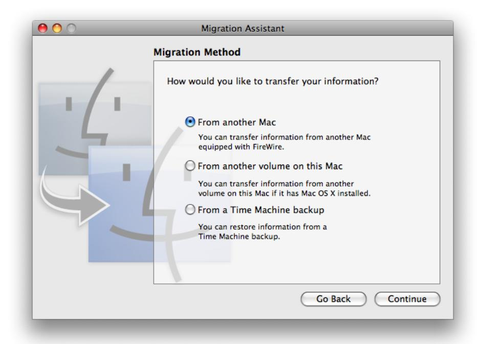

Keep the following guidelines in mind when designing a setup assistant:

- While the assistant is active, display only the application menu (containing About and Quit items) and the Edit menu (containing standard items to assist users in entering text). Don't provide a Help menu (or a Help button); the setup assistant *is* help.
- Provide Go Back and Continue buttons for navigation.
- The assistant window title bar should contain a dimmed close button, an available minimize button, and a dimmed zoom button.
- Title the first pane "Introduction." This pane should explain the purpose of subsequent panes.
- Title the last pane "Conclusion." This pane should tell users what changes were made to their system and how to modify those settings. This pane should have a default Done button and a dimmed Go Back button.
- In most cases, it's best to ask only one question per pane.
- Whenever appropriate, use selection controls that do not support the empty selection to avoid having to ask for the same information more than once.
- Avoid displaying an asterisk or custom icon next to each required text field. Instead, check for empty text fields when the user clicks Continue. If there are any, return to the current pane and display the asterisk or other marker next to the empty text fields.
- As much as possible, use system applications and services to provide intelligent default choices to the user. For example, you can use Bonjour to determine an appropriate IP address.
- Limit the total number of questionsto the minimum required to get the job done. The bestsetup assistant gets users up and running as soon as possible, allowing the main application to present the user with opportunities to refine preferences and settings.

- Provide relevant feedback when appropriate. If needed, you can display a progress bar next to the Go Back button (aligning the progress bar's left edge with the left edge of the pane).
- <span id="page-87-2"></span>■ Don't fill the entire screen; users should be able to access other parts of their system while the assistant is open.

# <span id="page-87-0"></span>Updating Installed Applications

<span id="page-87-3"></span>If you need to update an already installed application, you should provide an installer that modifies only the files required for the new version. Remember that files may have been renamed or moved; don't look only in the Applications directory and don't rely exclusively on filenames to identify your application files. Instead, check for creation and modification dates, version numbers, file size, and so on to uniquely identify your application. If you detect multiple versions of your application, provide information about each, such as the location and creation date, so that the user can choose which one to update.

<span id="page-87-1"></span>Macintosh users are accustomed to using Software Update in System Preferences to upgrade the operating system and system software. Upgrading the operating system has implications different from those for upgrading a third-party application, however, and the user experiences for these procedures must reflect this. Third-party applications should not attempt to duplicate the user experience of Software Update. If you want to provide your users with automatic updates, offer a streamlined and consistent user experience following the guidelines in this section.

The goal of a software update mechanism is to be convenient, yet unobtrusive. To achieve this, it's essential that your application perform all software update procedures at launch time *only*. In particular, you should avoid checking for updates using a background process or standalone, faceless utility that executes independently of your application. If the user is unaware that such a process is running even after your application quits, the random appearance of update notifications will be unexpected and may be unsettling.

**Note:** If you provide a first-time user experience with your application,such as a setup assistant, it's appropriate to perform a check for available updates while the user is engaged in this task. If a newer version of your application is available, allow the user to upgrade immediately, before the user begins working with the currently installed version. On subsequent launches, follow the guidelines below.

To provide a convenient application-update experience, follow these steps:

- **1.** When your application fully launches the first time after installation, start a separate thread that checks for updates.
- **2.** If a newer version is available, keep track of this fact in your application. Do not notify the user at this time.
- **3.** The *next* time your application launches, check the state of update availability you determined in step 2. If a newer version is available, immediately notify the user.

If a newer version is not available, start a separate thread to check for updates and keep track of the results in your application. Do not notify the user at this time.

Your application then repeats step 3 every time it launches. If the user chooses to install a newer version, the upgraded application begins again with step 1.

Using this method confers several advantages:

main thread, it can significantly slow your launch time.

- You avoid slowing launch time by using a separate thread after your application launches. Checking for updatesfrequently involves making an Internet connection. If you do this on the application's
- Users will appreciate receiving an update notification consistently and immediately at launch time, rather than at random times during their work.
  - Because the display of the update notification depends on the quick check of an internal state (not on the completion of a potentially lengthy search for available updates) you ensure it always arrives immediately at launch time.
- You do not have to design additional dialogs that ask the user if update checks should be performed while your application is running.
- You avoid startling the user with unexpected and intrusive update notifications that occur outside the context of your running application.

<span id="page-88-0"></span>Allow the user to customize the software update behavior in your preferences window. A user should have the option to allow automatic software updates and the ability to check for updates immediately. [Figure](#page-88-0) [7-3](#page-88-0) (page 89) shows an example of how a sample preferences window can be modified to do this.

**Figure 7-3** An application-update preferences window

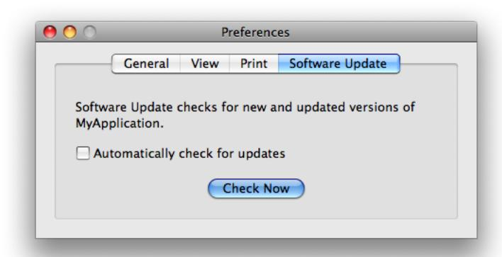

When your application checks its internal update state and finds that a newer version is available, display an alert that describes the type and availability of the update and gives the user the option to get the new version. You can customize the alert for a free or for-purchase update. [Figure](#page-89-0) 7-4 (page 90) shows how the alert for a free update should look.

<span id="page-89-0"></span>**Figure 7-4** An alert to describe the availability of a free application update

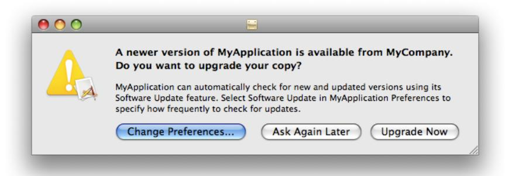

Each element of the alert shown in [Figure](#page-89-0) 7-4 (page 90) is required. In many cases, the only changes you need to make are to replace *MyApplication* and *MyCompany* with your application and company names and to badge the caution icon with your application icon. Note that it is important to display the caution icon in this alert because the installation of software has the potential to destroy user data. For more information about the components of an alert (and using the caution icon),see "The [Elements](#page-232-1) of an Alert" (page 233) You might also choose to replace the phrase "newer version of" with a phrase like "minor update to", if appropriate.

The software update alert in [Figure](#page-89-0) 7-4 (page 90) displays the main message in emphasized (bold) system font and the explanatory text in smallsystem font. A simplified alert (one that displays only the main message) is not used here because it does not give the user enough information to customize the update process.

The three required alert buttons shown in [Figure](#page-89-0) 7-4 (page 90) describe the actions the user can take. Each button leads to a specific set of actions your application should perform:

- The Change Preferences default button removes the alert and opens the software update preferences window. After the user adjusts the software update preferences and dismisses the preferences window, your application resumes.
- The Ask Again Later button leaves the internal update state unchanged and removes the alert. Because the state is still set to indicate the availability of an update, the alert will appear again the next time the user launches your application.
- The Upgrade Now button resets the internal state, removes the alert, and initiates a download of the new software. After the download is complete, your application asksthe user to save all open documents and updates with the downloaded version.

If you offer a software update for purchase, you should use an alert like the one shown in [Figure](#page-90-0) 7-5 (page 91)

<span id="page-90-0"></span>**Figure 7-5** An alert to describe the availability of a for-purchase upgrade


The alert in Figure 7-5 is different from the alert for a free software update in two ways:

- The main message clearly states that the new version of the software is for purchase and the question leads the user to click the Learn More button if they're interested in receiving the upgrade.
- The Learn More button resets the application's internal state, removes the alert, and leads to your company's website where the user can learn more about the update and select a purchasing option. If the user chooses to upgrade the software, a bundle or installation package should be downloaded independently of the currently running application. The user can then install the update when it's convenient.

#### **CHAPTER 7**

Software Installation and Software Updates

# <span id="page-92-0"></span>The Aqua Interface

Aqua is the overall appearance and behavior of Mac OS X. Aqua defines the standard appearance of specific user interface componentssuch as windows, menus, and controls and is also characterized by the anti-aliased appearance of text and graphics,shadowing, transparency, and careful use of color. Aqua deliversstandardized consistent behaviors and promotes clear communication of status through animated notifications, visual effects, and more. Designing for Aqua compliance will ensure you provide the best possible user experience for your customers.

Aqua is available to Cocoa, Carbon, and Java software. For Cocoa and Carbon application development, Interface Builder is the best way to begin building an Aqua-compliant graphical user interface. If you are porting an existing Mac OS 9 application to Mac OS X, see the *Carbon Porting Guide* in Carbon Porting Documentation. Java developers can use the Swing toolkit, which includes an Aqua look and feel in Mac OS X.

Read this part to learn about what Aqua provides and how best to take full advantage of it to ensure your application feels completely "at home" in Mac OS X.

#### **PART III**

The Aqua Interface

<span id="page-94-8"></span><span id="page-94-0"></span>Like other graphical user interfaces, Mac OS X is optimized for use with a pointing device, such as a mouse. Many users, however, prefer or need to interact with the computer using the keyboard instead of the mouse. In Mac OS X, users have the option of enabling keyboard access for all functions available using a point-and-click device.

# <span id="page-94-1"></span>The Mouse and Other Pointing Devices

<span id="page-94-7"></span><span id="page-94-5"></span>In the Macintosh interface, the standard pointing device isthe mouse. Users can substitute other devices—such as trackballs and stylus pens—that maintain the behavior of direct manipulation of objects on screen.

Moving the mouse without pressing the mouse button moves the **cursor**, or pointer. The onscreen cursor can assume differentshapes according to the context of the application and the cursor's position. For example, in a word processor, the cursor takes the I-beam shape while it's over the text and changes to an arrow when it's over a tools palette. Change the cursor's shape *only* to provide information to the user about changes in the cursor's function. More information on using cursors correctly can be found in ["Cursors"](#page-156-0) (page 157)

Just *moving* the mouse changes only the pointer'slocation, and possibly itsshape. *Pressing* the mouse button indicates the intention to do something, and *releasing* the mouse button completes the action.

<span id="page-94-2"></span>These guidelines apply to single-button mice and to the primary button of multi-button mice. Note that users can select which button of a multi-button mouse to designate as the primary button in the Keyboard & Mouse System Preferences.

### <span id="page-94-4"></span>Clicking

Clicking has two components: pushing down on the mouse button and releasing it without moving the mouse. (If the mouse moves between button down and button up, it's *dragging,* not clicking.)

<span id="page-94-3"></span>The effect of a click should be immediate and obvious. If the function of the click is to cause an action (such as clicking a button), the *selection is made* when the button is pressed, and the *action takes place* when the button isreleased. For example, if a user presses down the mouse button while the pointer is over an onscreen button, thereby putting the button in a selected state, and then moves the pointer *off* the button before releasing the mouse button, the onscreen button is not clicked. If the user presses an onscreen button and rolls over another button before releasing the mouse, neither button is clicked.

### <span id="page-94-6"></span>Double-Clicking

Double-clicking involves a second click that follows immediately after the first click. If the two clicks are close enough to each other in terms of time (as set by the user in Keyboard & Mouse preferences) and location (usually within a couple of points), they constitute a double click.

Double-clicking is most commonly used as a shortcut for other actions, such as pressing Command-O to open a document or dragging to select a word. Because not everyone is physically able to perform a double click, it should *never* be the only way to perform an action.

Some applications support triple-clicking. For example, in a word processor, the first click sets the insertion point, the second click selects the whole word, and the third click selects the whole sentence or paragraph. Supporting more than three clicks is inadvisable.

### <span id="page-95-5"></span><span id="page-95-0"></span>Pressing and Holding

Pressing means holding down the mouse button while the mouse remains stationary. Pressing by itself should have no more effect than clicking does, except in well-defined areas such as scroll arrows, where it has the same effect as repeated clicking, or in a Dock tile, where it displays a menu. For example, pressing a Finder icon should select the icon but not open it.

### <span id="page-95-3"></span><span id="page-95-1"></span>Dragging

Dragging means pressing the mouse button, moving the mouse to a new position, and releasing the mouse button. The uses of dragging include selecting blocks of text, choosing a menu item, selecting a range of objects, moving an icon from one place to another, and shrinking or expanding an object.

Dragging a graphic object should move the entire object (or a transparent representation of it), not just the object's outline.

Your application can restrict an object from being moved past certain boundaries, such as the edge of a window. If the user drags an object and releases the mouse button outside the boundary, the object stays in the original location. If the user drags the item out of the boundary and then back in before releasing the mouse button, the object movesto the new location. Your application can also automatically scroll a document if the user moves an object beyond the boundary of a window (see ["Automatic](#page-221-1) Scrolling" (page 222)).

If the user drags a proxy object to an area that would cause that proxy object to disappear, display the poof cursor to indicate that the proxy object will disappear if dragged to that location.

<span id="page-95-2"></span>If the user selects an item and begins a drag but releases the item after having moved it three or fewer pixels, the item does not move.

<span id="page-95-6"></span>See "Drag and [Drop"](#page-116-0) (page 117) for more information about dragging and automatic scrolling.

# <span id="page-95-4"></span>The Keyboard

The keyboard's primary use is to enter text. The keyboard may also be used for navigation, but it should always be an alternative to using the mouse. For more information about using the keyboard instead of the mouse, see "Keyboard Focus and [Navigation"](#page-106-0) (page 107)

**Important:** Avoid assigning any key combinations listed in the tables in this section to commands other than those specified in the tables. Even if your application doesn't support all the keyboard equivalents shown, don't assign unused combinations to commands that conflict with those specified in this section.

### <span id="page-96-0"></span>The Functions of Specific Keys

<span id="page-96-4"></span>There are four kinds of keys: character keys, modifier keys, arrow keys, and function keys. A **character key** sends a character to the computer. When the user holds down a **modifier key,** it alters the meaning of the character key being pressed or the meaning of a mouse action.

**Note:** Not all the keys described here exist on all keyboards. Don't depend on a key as the only way for users to accomplish a task. You cannot assume anything about which keyboard (if any) is connected to a computer.

### <span id="page-96-3"></span><span id="page-96-1"></span>Character Keys

Character keys include letters, numbers, punctuation, the Space bar, and nonprinting characters—Tab, Enter, Return, Delete (or Backspace), Clear, and Esc (Escape). It is essential that your application use these keys consistently.

#### <span id="page-96-5"></span>**Space Bar**

In text, pressing the Space bar enters a space between characters.

<span id="page-96-6"></span>When full keyboard accessisturned on, pressing the Space barselectsthe item that currently hasthe keyboard navigation focus (the equivalent of clicking the mouse button).

#### **Tab**

In text-oriented applications, the Tab key moves the insertion point to the next tab stop. In other contexts, Tab is a signal to proceed; it means "move to the next item in a sequence." The next item can be a table cell or a dialog text field. Shift-Tab navigates in the reverse direction. Pressing Tab can cause data to be entered before focus moves to the next item. For more details about navigating with the Tab key, see ["Keyboard](#page-106-0) Focus and [Navigation"](#page-106-0) (page 107)

#### <span id="page-96-2"></span>**Enter**

Most applications add information to a document as soon as the user enters it. In some cases, however, the application may need to wait until a whole collection of information is available before processing it. The Enter key tells the application that the user has finished entering information in a particular area of the document, such as a text field. While the user is entering text into a *text* document, pressing Enter has no effect.

If a dialog has a default button, pressing Enter (or Return) is the same as clicking it.

#### **Return**

<span id="page-97-6"></span>In text, the Return key inserts a carriage return (a line break) and moves the insertion point to the beginning of the next line. In arrays, the Return key signals movement to the leftmost field one step lower (like a carriage return on a typewriter). As with Tab, pressing Return can cause data to be entered before focus moves to the next item.

If a dialog has a default button, pressing Return (or Enter) is the same as clicking it.

#### **Delete (or Backspace)**

<span id="page-97-1"></span>Generally, if an item is selected, pressing Delete (or Backspace) removes the selection without putting it on the Clipboard. If nothing is selected, pressing Delete removes the character preceding the insertion point without putting it on the Clipboard. The Delete key has the same effect as the Delete command in the Edit menu.

**Note:** The Delete key is different from the Forward Delete (Fwd Del) key (labeled *Del*), which removes characters following the insertion point. See ["Forward](#page-101-0) Delete (Fwd Del)" (page 102)

The Option key can be used to extend a deletion to the next semantic unit (such as a word). The Command key can extend a deletion to the next semantic unit beyond that supported by Option. Recommended key combinations for text applications are Command-Delete to delete the previous word and Command–Fwd Del to delete the next word. Option-Delete could delete either the word containing the insertion point or the part of the word to the left of the insertion point, depending on what makes the most sense in your application; Option–Fwd Del could delete the part of the word to the right of the insertion point.

#### <span id="page-97-0"></span>**Clear**

<span id="page-97-2"></span>The Clear key has the same effect as the Delete command in the Edit menu: It removes the selection without putting it on the Clipboard. Not all keyboards have a Clear key, so don't require its use in your application.

#### **Esc (Escape)**

The Esc (Escape) key basically means "let me out of here." It has specific meanings in certain contexts. The user can press Esc in the following situations:

- In a dialog, instead of clicking Cancel
- To stop an operation in progress (such as printing), instead of pressing Command-period
- <span id="page-97-3"></span>■ To cancel renaming a file or an item in a list
- To cancel a drag in progress

<span id="page-97-5"></span><span id="page-97-4"></span>Pressing Esc should never cause the user to back out of an operation that would require extensive time or work to reenter. When the user presses Esc during a lengthy operation, display a confirmation dialog to be sure that the key wasn't pressed accidentally.

### Modifier Keys

Modifier keys alter the way other keystrokes or mouse clicks are interpreted. You should use these keys—Shift, Caps Lock, Option, Command, and Control—consistently as described here.

#### <span id="page-98-8"></span>**Shift**

When pressed at the same time as a character key, the Shift key produces the uppercase alphabetic letter or the upper symbol on the key.

The Shift key is also used with the mouse for extending a selection or for constraining movementsin graphics applications. For example, in some applications pressing Shift while using a rectangle tool draws squares.

#### <span id="page-98-2"></span>**Caps Lock**

When activated, the Caps Lock key hasthe same effect on alphabetic keys asthe Shift key, but it has no effect on nonalphabetic keys. When the Caps Lock key is down, the user must press Shift to type the upper character on a nonalphabetic key.

#### <span id="page-98-7"></span>**Option**

When used with other keys, the Option key produces special symbols. The Keyboard Viewer, which users can add to the Input menu in the International pane of System Preferences, shows which keys generate each symbol.

The Option key can also be used with the mouse to modify the effect of a click or drag. For example, in some applications pressing Option while dragging an object makes a copy of the object.

#### <span id="page-98-3"></span>**Command**

On most keyboards, the Command key is labeled with a cloverleaf symbol ( ) and an Apple logo ( ). Pressing the Command key at the same time as a character key tells the application to interpret the key as a command rather than a character. It can also be used with the mouse to modify the effect of a click or drag. Key combinations that use the Command key are described in "Keyboard [Shortcuts"](#page-102-0) (page 103)

#### <span id="page-98-6"></span><span id="page-98-4"></span>**Control**

The Control key is used to modify the functions of other keys. Combined with a mouse click, it displays contextual menus (see ["Contextual](#page-183-0) Menus" (page 184)).

Control-F7 temporarily overrides a user's preference for default navigation or full keyboard navigation in windows and dialogs. For more information, see "Keyboard Focus and [Navigation"](#page-106-0) (page 107)

<span id="page-98-5"></span>**Cocoa:** In Cocoa applications, the Control key has additional defined behaviors, as described in "Text System Defaults and Key Bindings" in *Cocoa Event-Handling Guide* in Cocoa Events & Other Input Documentation.

### <span id="page-98-0"></span>Arrow Keys

<span id="page-98-1"></span>Apple keyboards have four arrow keys: Up Arrow, Down Arrow, Left Arrow, and Right Arrow. They can be used alone or in combination with other keys. Keyboard combinations using the arrow keys should be used only for shortcuts for mouse actions. It is *never* appropriate to implement only a keyboard combination and not provide a mouse-based way to perform the same action.

#### **Appropriate Uses for the Arrow Keys**

You can use arrow keys in these ways:

- In text, the arrow keys move the insertion point. When used with the Shift key, they extend or shrink the selection. If the user makes a selection and then presses the Right Arrow or Left Arrow key, the selection shrinks to zero length and the insertion point moves to the right or left edge of the selection.
- In lists, the arrow keys change the selection.
- In a graphics application, the arrow keys can be used to move a selected object the smallest possible increment (one pixel or one grid unit).
- In full keyboard access mode, the arrow keys move between values within a control.

Don't use the arrow keys to:

- Move the mouse pointer onscreen
- <span id="page-99-1"></span>■ Duplicate the function of the scroll bars

#### <span id="page-99-3"></span>**Moving the Insertion Point**

When the insertion point moves vertically in a text document, its horizontal position is maintained in terms ofscreen pixels, not characters(in other words, the insertion point could move from the twenty-fifth character in a line down to the fiftieth character, depending on the font and size). As the insertion point moves from line to line, keep it as close as possible to its original horizontal position, moving it slightly left or right to the nearest character boundary.

The Option and Command keys are used as semantic modifiers with the arrow keys. As a general rule, the Option key increases the size of the semantic unit by 1 compared to the arrow keys alone, and the Command key enlarges the semantic unit again. The application determines what the semantic units are. In a word processor, typically the units are characters, words, lines, paragraphs, and documents. In a spreadsheet, a basic semantic unit could be a cell.

<span id="page-99-2"></span><span id="page-99-0"></span>Table 8-1 describes the appropriate behavior of the arrow keys in text documents and fields. In some cases, the behavior describes what happens when the indicated keys are pressed more than once in succession.

<span id="page-99-7"></span>**Table 8-1** Moving the insertion point with the arrow keys

<span id="page-99-8"></span><span id="page-99-6"></span><span id="page-99-5"></span><span id="page-99-4"></span>

| Key                | Moves insertion point                                                                         |
|--------------------|-----------------------------------------------------------------------------------------------|
| Right Arrow        | One character to the right                                                                    |
| Left Arrow         | One character to the left                                                                     |
| Up Arrow           | To the line above, to the nearest character boundary at the same horizontal<br>location       |
| Down Arrow         | To the line below, to the nearest character boundary at the same horizontal<br>location       |
| Option–Right Arrow | To the end of current word, then to the end of the next word                                  |
| Option–Left Arrow  | To the beginning of the current word, then to the beginning of the previous<br>word           |
| Option–Up Arrow    | To the beginning of the current paragraph, then to the beginning of the previous<br>paragraph |

<span id="page-100-6"></span><span id="page-100-5"></span>

| Key                 | Moves insertion point                                                                                                                      |
|---------------------|--------------------------------------------------------------------------------------------------------------------------------------------|
| Option–Down Arrow   | To the end of the current paragraph, then to the end of the next paragraph (not<br>to the blank line after the paragraph, if there is one) |
| Command–Right Arrow | To the next semantic unit, typically the end of the current line, then the end of<br>the next line                                         |
| Command–Left Arrow  | To the previous semantic unit, typically the beginning of the current line, then<br>the previous unit                                      |
| Command–Up Arrow    | Upward in the next semantic unit, typically the beginning of the document                                                                  |
| Command–Down Arrow  | Downward in the next semantic unit, typically the end of the document                                                                      |

<span id="page-100-12"></span><span id="page-100-10"></span><span id="page-100-4"></span><span id="page-100-1"></span>**Note:** For non-Roman script systems, Command–Left Arrow and Command–Right Arrow are reserved for changing the direction of keyboard input.

#### <span id="page-100-3"></span><span id="page-100-2"></span><span id="page-100-0"></span>**Extending Text Selection With the Shift and Arrow Keys**

Table 8-2 describes how to extend text selection by pressing the Shift key with the arrow keys.

**Table 8-2** Extending text selection with the Shift and arrow keys

<span id="page-100-11"></span><span id="page-100-9"></span><span id="page-100-8"></span><span id="page-100-7"></span>

| Keys                      | Extends selection                                                                                                                                               |
|---------------------------|-----------------------------------------------------------------------------------------------------------------------------------------------------------------|
| Shift–Right Arrow         | One character to the right                                                                                                                                      |
| Shift–Left Arrow          | One character to the left                                                                                                                                       |
| Shift–Up Arrow            | To the line above, to the nearest character boundary at the same horizontal<br>location                                                                         |
| Shift–Down Arrow          | To the line below, to the nearest character boundary at the same horizontal<br>location                                                                         |
| Shift–Option–Right Arrow  | To the end of the current word, then to the end of the next word                                                                                                |
| Shift–Option–Left Arrow   | To the beginning of the current word, then to the beginning of the previous<br>word                                                                             |
| Shift–Option–Up Arrow     | To the beginning of the current paragraph, then to the beginning of the<br>next paragraph                                                                       |
| Shift–Option–Down Arrow   | To the end of the current paragraph, then to the end of the next paragraph<br>(include the blank line between paragraphs in cut, copy, and paste<br>operations) |
| Command–Shift–Right Arrow | To the next semantic unit, typically the end of the current line                                                                                                |
| Command–Shift–Left Arrow  | To the previous semantic unit, typically the beginning of the current line                                                                                      |
| Command–Shift–Up Arrow    | Upward in the nextsemantic unit, typically the beginning of the document                                                                                        |

<span id="page-101-1"></span>

| Keys                     | Extends selection                                                     |
|--------------------------|-----------------------------------------------------------------------|
| Command–Shift–Down Arrow | Downward in the next semantic unit, typically the end of the document |

If no text is selected, the extension begins at the insertion point. If text is selected by dragging, then the extension begins at the selection boundary. For example, in the phrase *stop time,* if the user places the insertion point between the "s" and "t" and then presses Shift–Option–Right Arrow, *top* is selected. However, if the user double-clicks so the whole word is selected, and then extends the selection left or up, it's as if the insertion point were before the "s." If the user extendsthe selection right or down, it's asif the insertion point were between the "p" and the space after the word.

Reversing the direction of the selection deselects the appropriate unit. In the previous example, if the word *stop* is selected and the user presses Shift–Option–Right Arrow, so *stop time* is selected, and then presses Shift–Option–Left Arrow, *time* is deselected and *stop* remains selected.

#### <span id="page-101-5"></span>**Moving the Insertion Point in "Empty" Documents**

Varioustext-editing programstreat empty documentsin different ways. Some assume that an empty document contains no characters, in which case clicking at the bottom of a blank window causes the insertion point to appear at the top. In thissituation, Down Arrow cannot move the insertion point into the blank space because there are no characters there.

<span id="page-101-6"></span>Other applications treat an empty document as a page of space characters, in which case clicking at the bottom of a blank window putsthe insertion point where the user has clicked and letsthe user type characters there, overwriting the spaces. Whichever of these methods you choose for your application, it's essential that you be consistent throughout.

### <span id="page-101-7"></span><span id="page-101-3"></span>Function Keys

There are 15 nondedicated function keys on desktop Macintosh keyboards (F1 through F15). Desktop Macintosh keyboards provide the following six dedicated function keys with standard behaviors. Because not all Macintosh computers have all function keys, don't rely on these keys for critical keyboard shortcuts. For example, portable computers usually have 12 nondedicated function keys (F1 through F12), not 15 and don't have Help keys or Forward Delete keys.

#### <span id="page-101-4"></span><span id="page-101-0"></span>**Help**

<span id="page-101-2"></span>Pressing the Help key may invoke the application's help in Help Viewer. The key combination Command-Shift-/ (sometimes shortened to Command-?) should always display the application's help in Help Viewer.

#### **Forward Delete (Fwd Del)**

Pressing the Forward Delete (labeled Del) key deletesthe character *after* the insertion point,shifting everything following the removed character one position back. The effect is that the insertion point remains stationary while it "vacuums" the character or selection ahead of it.

If something is selected when Fwd Del is pressed, it has the same effect as pressing Delete (Backspace) or choosing Delete from the Edit menu.

You can support Option–Fwd Del to delete the next largersemantic unit, as described in "Moving the [Insertion](#page-99-1) [Point"](#page-99-1) (page 100) but deleting more than one word at a time isinadvisable. Users prefer to select large amounts of text with the mouse so they have more control over what they're deleting.

#### <span id="page-102-3"></span>**Home, End**

Pressing the Home key is equivalent to moving the scrollers all the way to the top and to the left. In a text document, for example, pressing Home scrolls to the beginning of the document; in a spreadsheet, it may scroll to the beginning of the spreadsheet or to the beginning of a row. These keys should also work in scrolling lists to display the top or bottom of the list.

End is the opposite of Home: It scrolls to the end of a document.

If the beginning or end of the document is already reached, pressing Home or End produces a system alert sound. Pressing the Home or End key has no effect on the location of the insertion point or selected data.

#### <span id="page-102-6"></span>**Page Up, Page Down**

Pressing Page Up or Page Down scrolls the document up or down one page. If an entire page can't be displayed in the window, these keys first scroll incrementally up or down, until the top or bottom of the page is visible, before scrolling to the next page. These keys should also work in scrolling lists.

<span id="page-102-5"></span><span id="page-102-0"></span>If the beginning or end of the document is reached, pressing Page Up or Page Down produces a system alert sound. Pressing the Page Up or Page Down key has no effect on the location of the insertion point orselected data.

### <span id="page-102-4"></span><span id="page-102-2"></span>Keyboard Shortcuts

Keyboard shortcuts are used throughout Mac OS X to provide quick ways for users to initiate certain actions. Many are provided by the operating system to meet both general usability needs and accessibility needs. The operating system therefore reserves certain keys and keyboard combinations for its use. These combinations, listed in Table 8-3 and Table 8-4 affect all applications and should not be used for any other function. Other keyboard shortcuts are used by the Universal Access features in Mac OS X and should be avoided.

In addition to the keyboard shortcutsreserved by the system, there are a large number of keyboard shortcuts that have a well established meaning, such as Command-S for Save and Command-Q for Quit. Users accustomed to running applications in Mac OS X expect these keyboard shortcuts to be available and to mean the same thing in each application they use. An application that overrides these shortcuts, such as one that uses Command-Q for a Query command instead of Quit, runs the risk of unnecessarily confusing and frustrating its users.

These common keyboard shortcuts are not reserved by the system, but they are highly recommended for applications that offer the associated commands. If your application does not offer all of these common commands, be sure you don't override these keyboard shortcuts and associate them with other commands your application does implement. A complete list of both system-reserved and commonly used keyboard shortcuts in Mac OS X is provided in "Keyboard Shortcuts Quick [Reference"](#page-354-0) (page 355)

<span id="page-102-1"></span>You may also define keyboard shortcuts in your application for frequently used commands. Some guidelines on how to create appropriate shortcuts are in "Creating Your Own Keyboard [Shortcuts"](#page-104-2) (page 105) Other sections of this document list recommended keyboard shortcuts, where appropriate, to help you provide a consistent and familiar user experience in your application.

### Reserved Keyboard Shortcuts

Don't use the keys and key combinations in Table 8-3 for actions other than those listed in the table.

<span id="page-103-0"></span>**Table 8-3** Keyboard shortcuts reserved by the operating system

| Keys                           | Action                                                 |
|--------------------------------|--------------------------------------------------------|
| Esc                            | Cancel the current action                              |
| Command-Tab                    | Activate the most recently used open application       |
| Command-Shift-Tab              | Activate the least recently used open application      |
| Command-Option-D               | Show or hide the Dock                                  |
| Command-H                      | Hide the active application                            |
| Command-Option-H               | Hide other applications (all but the active one)       |
| Command-Shift-Q                | Log out                                                |
| Command-Shift-Option-Q         | Log out without confirmation                           |
| Command-Shift-Option-Control-Q | Force log out without confirmation                     |
| Command–Space bar              | Show or hide Spotlight search field                    |
| Command-Option-Esc             | Open the Force Quit dialog                             |
| Command-F5                     | Turn VoiceOver on or off                               |
| Control-F1                     | Turn full keyboard navigation on or off                |
| Control-F7                     | Toggle keyboard navigation in windows and dialogs      |
| F9                             | Tile or untile all open windows                        |
| F10                            | Tile or untile all open windows in current application |
| F11                            | Hide or show all open windows                          |
| F12                            | Display or hide Dashboard                              |

<span id="page-103-1"></span>Mac OS X also providesfull keyboard access mode, in which users can navigate through windows and dialogs. When this mode is active, other keyboard combinations may be reserved by default. (See *AccessibilityOverview*.)

**Important:** Your application should not override the implementation of keyboard focus and navigation in Mac OS X. These features provide functionality for users with special needs.

<span id="page-103-2"></span>Table 8-4 showsseveral key combinationsthat are reserved for use with localized versions ofsystem software, localized keyboards, keyboard layouts, and input methods. These key combinations don't correspond directly to menu commands.

<span id="page-104-0"></span>**Table 8-4** Key combinations reserved for international systems

<span id="page-104-7"></span><span id="page-104-6"></span><span id="page-104-5"></span><span id="page-104-4"></span>

| Keys                           | Action                                                            |
|--------------------------------|-------------------------------------------------------------------|
| Command–Space bar              | Rotate through enabled script systems                             |
| Command–Option–Space bar       | Rotate through keyboard layouts and input methods within a script |
| Command–modifier key–Space bar | Apple reserved                                                    |
| Command–Right Arrow            | Change keyboard layout to current layout of Roman script          |
| Command–Left Arrow             | Change keyboard layout to current layout of system script         |

### <span id="page-104-8"></span><span id="page-104-3"></span><span id="page-104-2"></span>Creating Your Own Keyboard Shortcuts

Apple may reserve other keyboard shortcuts in the future, so be careful about adding your own. Before you consider creating a keyboard shortcut, be sure to look at the keyboard shortcutslisted in ["Keyboard](#page-354-0) Shortcuts Quick [Reference"](#page-354-0) (page 355) so you can avoid overriding the shortcuts users already know.

You might also consider examining the keyboard shortcuts used in other applications that target the same user audience your application targets. If your users are likely to be familiar with these other applications, you should try to avoid overriding the shortcuts they're used to using.

You should provide keyboard shortcuts *only forfrequently used commands*, not for every command. Presenting the user with too many keyboard shortcuts can be overwhelming and can make an application's user interface seem difficult to learn.

<span id="page-104-1"></span>Use the Command key asthe main modifier key for keyboard equivalents. For a command that complements another more common command, you can add Shift. The table below shows some recommended keyboard equivalents using Shift and their relation with the command they complement.

**Table 8-5** Recommended keyboard shortcuts using Shift to complement other commands

| Keys            | Command                                    | Complemented command   |
|-----------------|--------------------------------------------|------------------------|
| Command-Shift-A | Deselect All                               | Command-A (Select All) |
| Command-Shift-G | Find Previous                              | Command-G (Find Again) |
| Command-Shift-P | Page Setup                                 | Command-P (Print)      |
| Command-Shift-S | Save As                                    | Command-S (Save)       |
| Command-Shift-V | Paste as (Paste as Quotation, for example) | Command-V (Paste)      |
| Command-Shift-Z | Redo                                       | Command-Z (Undo)       |

**Note:** Command-Shift-Z would be used for Redo only if Undo and Redo are separate commands(rather than toggled using Command-Z).

If there's a third, less common command that's related to a pair of commands that use Command and Command-Shift, you can use Command-Option for the third command's keyboard equivalent. In the example in Table 8-6 Save All could be a dynamic menu item (see ["Naming](#page-162-2) Menu Items" (page 163)) that appears in place of Save when the user presses the Option key (rather than a separate menu item). Use combinations like these very rarely.

<span id="page-105-0"></span>**Table 8-6** Example of using Option to modify a shortcut already using Command

| Keys             | Command  |
|------------------|----------|
| Command-S        | Save     |
| Command-Shift-S  | Save As  |
| Command-Option-S | Save All |

Also use Option for a keyboard shortcut that is a convenience or power-user feature. For example, the Finder uses Command-Option-W for Close All Windows and Command-Option-M for Minimize All Windows.

Because the Control key is already used by some of the universal access features as well as in Cocoa text fields where Emacs-style key bindings are often used, itshould be used as a modifier key only when necessary.

<span id="page-105-2"></span>Remember that other languages may require modifier keys to generate certain characters. For example, on a French keyboard, Option-5 generates the "{" character. You can safely use the Command key as a modifier, but avoid using Command and an additional modifier with characters not available on all keyboards. If you must use a modifier key in addition to the Command key, try to use it only with the alphabetic characters (*a* through *z*).

When adding custom keyboard shortcuts, try to avoid shortcuts that add a modifier key (such as Option or Shift) to an existing shortcut if the shortcuts have an unrelated function. For example, don't use Shift-Command-Z as a keyboard shortcut for a command that is unrelated to Undo. Using that shortcut for Redo is appropriate, but using it for something like Calculate or Check Mail is confusing. If you can't find a unique and easy-to-use keyboard shortcut for a command, don't use one at all; keep in mind that users may have difficulty pressing multiple modifier keys anyway.

### <span id="page-105-1"></span>User-Defined Keyboard Shortcuts

Users may modify your application's keyboard shortcuts and some of the system in Keyboard & Mouse preferences. Even though users can remap keyboard shortcuts, you should adhere to the shortcuts recommended throughout this document. Doing so provides a more consistent user experience. See ["Keyboard](#page-354-0) Shortcuts Quick [Reference"](#page-354-0) (page 355) for a list of all the reserved and recommended combinations.

### <span id="page-106-0"></span>Keyboard Focus and Navigation

<span id="page-106-5"></span><span id="page-106-4"></span><span id="page-106-3"></span>In **default keyboard access mode,**focus moves only between fields that receive keyboard input. Mac OS X also provides the option of **full keyboard access mode,** in which users can navigate through windows and dialogs. Thissection discussesthe default keyboard access mode. For information on the full keyboard access mode, see *Accessibility Overview*.

When using the mouse is undesirable, difficult, or impossible, users can use the keyboard to move the onscreen focus(highlight) to text entry fields, list boxesthatsupport type-ahead,scrolling lists, column views, and list views. In Roman systems, focus always begins at the first field that accepts keyboard input and follows a reading path from upper left to bottom right.

<span id="page-106-1"></span>Focus is indicated with a ring in the appearance color (Aqua or Graphite) as shown in Figure 8-1 and Figure 8-2

<span id="page-106-2"></span>**Figure 8-1** Keyboard focus for a text field

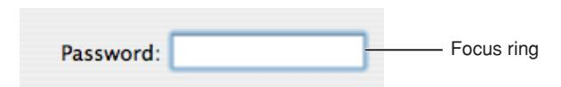

**Figure 8-2** Keyboard focus for a scrolling list

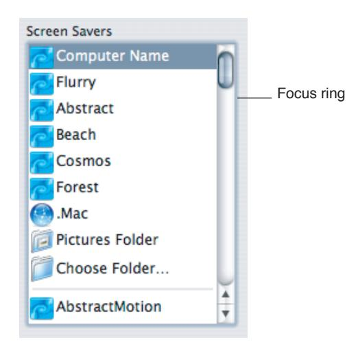

In list and column views, selected items should be highlighted to the full column width or row height. In column view, the selected item has a dark highlight and the parent item has a lighter highlight. When a window becomes inactive, all selections inside it should become the lighter highlight color.

<span id="page-107-2"></span>**Figure 8-3** Primary highlight color on child item; secondary color on parent

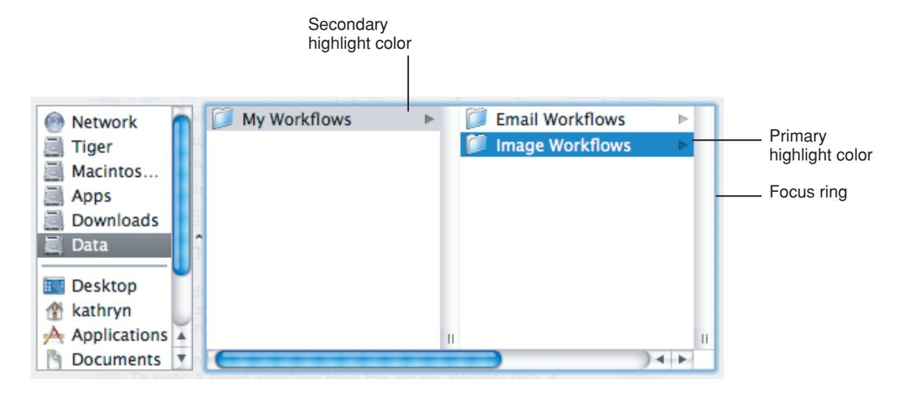

<span id="page-107-7"></span><span id="page-107-3"></span><span id="page-107-0"></span>Pressing the Tab key navigates between controls. Shift-Tab navigates in the reverse direction. The arrow keys provide navigation within controls. In list views, the Right Arrow and Left Arrow keys open and close disclosure triangles.

### <span id="page-107-5"></span>Type-Ahead and Key-Repeat

When the user types faster than the computer can handle or when the computer is unable to process the keystrokes, the keystrokes are queued for later processing. This queuing is called **type-ahead.** There is a limit (varying with the computer) to the number of keystrokes that can be queued, but it's usually not reached unless the user types while the application is performing a lengthy operation.

When a character key is held down for a certain amount of time, it starts repeating automatically. The user can make adjustments to this feature, called **key-repeat,** in Keyboard & Mouse preferences.

An application can tell whether keystrokes are generated by key-repeat or by the same key being pressed numerous times. Your application can disregard key-repeat keystrokes; it should ignore them in keyboard shortcuts that begin with the Command key.

<span id="page-107-6"></span><span id="page-107-1"></span>Key-repeat works only when the application is ready to accept keyboard input; it does not function during type-ahead.

# <span id="page-107-4"></span>Selecting

Before performing an operation on an object, the user must select it to distinguish it from other objects. There is always immediate visual feedback to show that something is selected.

Selecting an object never alters the object itself, and a selection is always undoable by clicking outside the selection.

How something is selected depends on what it is. It's useful to distinguish among three types of objects that are each dealt with in a different way when selected:

- **Text.** An application considers all text appearing together in a particular context as a block of text—a one-dimensional string of characters. A block of text can range from a single field, as in a dialog, to an entire document, as in a word processor. Regardless of where it appears, text is edited in the same way.
- **Arrays of fields**. A one-dimensional array of fields is a *list* and a two-dimensional array is a *table*. Each field contains information such as text or graphics.
- **Graphics.** For the purposes of this discussion, a graphic, or picture, is a discrete object that can be selected individually.

<span id="page-108-0"></span>The following sections discuss the general methods of selecting and the specific methods that apply to text, arrays, and graphics.

### Selection Methods

This section describes selection techniques.

### <span id="page-108-2"></span>Selection by Clicking

<span id="page-108-1"></span>The moststraightforward method ofselecting an object is by clicking it once. Icons, for example, are selected in this way in the Finder.

**Figure 8-4** Selection of a single item

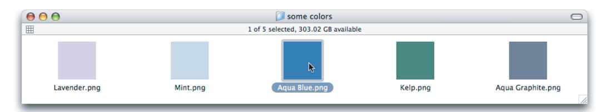

### <span id="page-108-3"></span>Selection by Dragging

The user can select a range of some objects by following this procedure:

- **1.** The user positions the pointer at one corner of the range and presses the mouse button. This position is called the **anchor point** of the range.
- **2.** Without releasing the mouse button, the user moves the pointer in any direction.
  - As the pointer moves, visual feedback indicates the objects that would be selected if the mouse button is released. For text and arrays, the selected area is continuously highlighted. For graphics, a dotted rectangle expands or contracts to show the selected area. If appropriate, the view should scroll to allow extending the selection beyond a window.
- **3.** When the desired range is selected, the user releases the mouse button. The point at which the button is released is called the **active end** of the range.

<span id="page-109-0"></span>**Figure 8-5** Selection of a range

<span id="page-109-4"></span>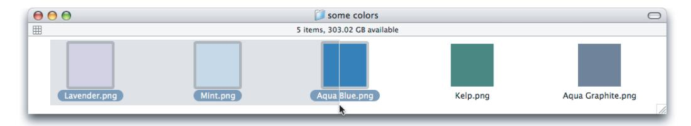

### <span id="page-109-5"></span>Changing a Selection

A user can extend a selection by holding down the Shift key and clicking the mouse button. This action is called **Shift-clicking.**

In text, if the user Shift-clicks within an already selected range, the new range is smaller than the old range.

In an array, a Shift-click can extend the selected range or it can move the selection from the current cell to wherever the user Shift-clicks.

<span id="page-109-1"></span>There are two modelsfor extending a continuousselection using Shift-click. In the **addition model,** new text is added to a current selection. In the **fixed-point model,** the user can extend the selection on either side of the insertion point. Figure 8-6 illustrates the results of consecutive steps in both models.

**Figure 8-6** Shift-clicking in the addition model and the fixed-point model

| Step                                                                                           | Addition model | Fixed-point model |
|------------------------------------------------------------------------------------------------|----------------|-------------------|
| 1. User sets insertion point<br>by clicking before the<br>word "attention".                    |                |                   |
| 2. User extends the selection<br>to the right by Shift-clicking<br>after the word "behind".    |                |                   |
| 3. User extends the selection<br>to the left by Shift-clicking<br>before the word "Pay".       |                |                   |
| 4. User extends the selection<br>to the right by Shift-clicking<br>at the end of the sentence. |                |                   |

<span id="page-109-3"></span><span id="page-109-2"></span>When considering which model to use in your application, keep in mind that the addition model provides more flexibility by allowing users to extend a selection in *both* directions.

A Shift-click should result in a **continuous selection**—the selection is extended to include everything between the old anchor point and the new active end. A Command-click should result in a discontinuous selection. With **discontinuous selection,** in which the user can extend a selection by adding nonadjacent objects to already selected objects, the objects *between* the current selection and the new object are *not* included in the selection.

<span id="page-110-1"></span>**Figure 8-7** Discontinuous selection


<span id="page-110-2"></span>In arrays and text in which a Shift-click extends a continuous selection, the user can make discontinuous selections by holding down the Command key and clicking. Each Command-click adds the new object to the existing selection. If one of the objects selected with Command-click is already within an existing part of the selection, then it is removed from the selection instead of being added.

**Figure 8-8** Discontinuous selection within an array


<span id="page-110-3"></span><span id="page-110-0"></span>Not all applications support discontinuous selections, and those that do might restrict the operations a user can perform on them. For example, a word processor might allow the user to choose a font after making a discontinuous selection, but not allow the user to type replacement characters, because it wouldn't be obvious which part of the selection the characters would replace.

### Selections in Text

A block of text is a string of characters. A text selection is a substring of this string, which has any length from zero characters to the whole block.

The **insertion point** (a zero-length text selection) shows where text will be inserted when the user starts typing, or where the contents of the Clipboard will be pasted. The user establishesthe location of the insertion point by clicking somewhere in the text; the insertion point appears at the nearest character boundary. If

the user clicks anywhere to the right of the last character on a line, the insertion point appears immediately after the last character. If the user clicks to the left of the first character on a line, the insertion point appears immediately before the first character.

Selected text in a window is highlighted with the color chosen by the user in Appearance preferences. When the window becomes inactive, the text should remain highlighted, but in the secondary color, which is a percentage of the original highlight color. Both Carbon and Cocoa provide a way to return the current highlight color, as well as other important colors in the user interface. Your application should use these defined colors in any custom controls you create, rather than hard-coding specific color values.

### Selecting With the Mouse

The user can select a range of text by dragging. A range can consist of characters, words, lines, or paragraphs, as defined by the application.

In text fields, clicking should perform the following actions:

- <span id="page-111-1"></span>■ Single-clicking places the insertion point at the pointer's location in the text.
- Double-clicking within a word selects the word. The selection should provide "smart" behavior; if the user deletes the selected word, for example, the space after the word should also be deleted.
- Double-clicking in a space selects the space.
- <span id="page-111-0"></span>■ Triple-clicking selectsthe next logical unit, as defined by the application. In a word-processing document, triple-clicking in a word selects the paragraph containing the word.

### <span id="page-111-2"></span>What Constitutes a Word

The following definition of a word applies in the United States, Canada, and some other countries. In many countries, the definition differs to reflect local formats for numbers, dates, and currency. Double-clicking a character *not* in the list below results in the selection of only that character.

A word is defined as any continuous string that contains any of the following characters:

- A letter
- A digit
- A nonbreaking space (Option–Space bar or Command–Space bar)
- A currency symbol (\$, ¢, £, ¥)
- A percent sign
- A comma between digits
- A period before a digit
- An apostrophe between letters or digits
- A hyphen, but not an en dash (Option–hyphen) or em dash (Shift–Option–hyphen)

These are examples of words:

- \$123,456.78
- shouldn't

- 3 1/2 (with a nonbreaking space)
- 0.5%

These are examples of strings treated as more than one word:

- 7/10/6
- Blue cheese (with a regular space)
- "Wow!" (The quotation marks and exclamation point are not part of the word.)

In some contexts—in a programming language, for example—it may be appropriate to allow users to select both the left and right parentheses (or braces or brackets) in a pair, as well as all the characters between them, by double-clicking either one of them. That would mean that a user could select the entire expression

[*x*+*y*–(4\*3)^(*n*–1)]

by double-clicking [ or ].

### Selecting Text With the Arrow Keys

<span id="page-112-0"></span>See ["Extending](#page-100-1) Text Selection With the Shift and Arrow Keys" (page 101)

### Selections in Spreadsheets

To select a single field (cell), the user clicks in it. The user can also select a field by moving to it with the Tab or Return key.

To select part of the contents of a field, the user must first select the field, then click again to select a part.

A user should be able to quickly select a row or column in a table—for example, clicking a column heading should select the column. Tables can also support Command-click for selecting discontinuous fields.

Pressing the Tab key cycles through the fields in an order determined by your application, and Shift-Tab navigates in the opposite direction. Typically, the sequence is from left to right, then from top to bottom. Pressing Tab from the last field selects the first field.

<span id="page-112-2"></span><span id="page-112-1"></span>If the concept of rows doesn't make sense in a particular context, the Return key should have the same effect as the Tab key.

### Selections in Graphics

There are several conventionsforselecting graphic objects. Thissection describestwo waysto show selection feedback; other situations may require other solutions.

An object-based graphics document is a collection of individual graphic objects. To select an object, the user clicks it once. The object is then bracketed with handles, which the user can use to move or resize the object.

In object-based graphics documents, users can select with the mouse alone or a combination of the mouse and the keyboard. A user can drag a dotted rectangle and select every object that is included, even partially, within the rectangle's outline. The user can also select an initial object and then use Shift-click or

Command-click to select other objects. If the objects have a defined order, Shift-click should result in a continuousselection and Command-click should provide a discontinuousselection. If the order is not defined, then both actions result in a discontinuous selection. Examples of continuous and discontinuous selections are shown in ["Selection](#page-108-0) Methods" (page 109)

<span id="page-113-5"></span>In a bitmap-based graphics document—in which images are a series of pixelsrather than discrete objects—a user selects the range of pixels enclosed within a selection tool.

# <span id="page-113-9"></span><span id="page-113-0"></span>Editing Text

<span id="page-113-4"></span><span id="page-113-1"></span>In addition to the methods for selecting text, there are a number of standard ways to edit text.

### <span id="page-113-7"></span>Inserting Text

To insert text, the user positions the insertion point by clicking where the text is to go, then starts typing. The application moves the insertion point to the right (or left, depending on the language) as each new character is added.

<span id="page-113-2"></span>Applications with multiple-line text blocks should support **word wrap,** the automatic continuation of text from the end of one line to the beginning of the next without breaking in the middle of a word.

### <span id="page-113-6"></span>Deleting Text

When the user presses the Delete (or Backspace) key, one of two things happens:

- If text is selected, the entire selection is deleted.
- If there is no current selection, the character preceding the insertion point is deleted.

In either case, the insertion point replaces the deleted character or characters in the document. The deleted characters don't go on to the Clipboard, but the user can undo the deletion by immediately choosing Undo from the Edit menu.

You can also implement the keyboard combination Option-Delete (or Option-Backspace) to delete the word that currently contains the insertion point or to delete the part of the word to the left of the insertion point. Be sure to document this behavior if you implement it.

<span id="page-113-8"></span><span id="page-113-3"></span>If a keyboard has a Forward Delete (Fwd Del) key, the character following the insertion point is deleted each time the user presses the key.

### Replacing a Selection

If the userstartstyping when one or more characters are selected, the typed charactersreplace the selection. The deleted characters don't go on to the Clipboard, but the user can undo the replacement by immediately choosing Undo from the Edit menu.

### <span id="page-114-0"></span>Intelligent Cut and Paste

<span id="page-114-2"></span>Intelligent cut and paste is a set of editing featuresthat take into account the need forspaces between words. To understand why this feature is helpful, consider the following sequence of events in a text application *without* intelligent cut and paste:

**1.** A sentence in the user's document reads

*Returns are only accepted if the merchandise is damaged.*

The user wants to change this to

*Returns are accepted only if the merchandise is damaged.*

- **2.** The userselectsthe word *only* by double-clicking. The letters are highlighted, but neither adjacentspace is selected.
- **3.** The user chooses Cut from the Edit menu, clicks just before the word *if,* and chooses Paste.
- **4.** The sentence now reads

*Returns are accepted onlyif the merchandise is damaged.*

To correct the sentence, the user has to remove the extra space between *are* and *accepted,* and add a space between *only* and *if.*

If your application supports intelligent cut and paste, follow these guidelines:

- If the user selects a word or a range of words, the selection itself is highlighted, but spaces adjacent to the selection are not highlighted.
- When the user chooses Cut, if the character preceding the selection is a space, cut that space along with the selection. If the character preceding the selection is not a space, but the character following the selection is a space, cut that space along with the selection.
- When the user chooses Paste, if the character to the left or right of the current selection is part of a word (but not inside a word), insert a space before pasting.

Use intelligent cut and paste only if the application supports the definition of a word as described in ["What](#page-111-0) [Constitutes](#page-111-0) a Word" (page 112) These rules apply to any selection consisting of one or more whole words, no matter how the user made the selection.

<span id="page-114-3"></span><span id="page-114-1"></span>**Note:** Intelligent cut and paste doesn't apply to all languages. Thai, Chinese, and Japanese, for example, don't contain spaces.

### Editing Text Fields

If your application isn't primarily a text application, but it has text entry fields in dialogs, for example, you may not need to provide the full text-editing features described in this section. Ideally, an application that includes text editing should support the following features:

- The user can select the whole field and type in a new value, delete text, select a substring of the field and replace it, and select a word by double-clicking.
- The user can choose Undo, Cut, Copy, Paste, and Delete, as described in "The Edit [Menu"](#page-176-0) (page 177)
- The application performs appropriate edit checks. For example, if the only legitimate value for a field is a string of digits, the application should alert the user if any nondigits are typed. For a more complete discussion of when to check for errors and apply changes in text fields, see ["Accepting](#page-234-2) Changes" (page 235)

When possible,support automatically filling in text fields as userstype. You might fill in a field with frequently typed information or information from a history list. If you do this, indicate what you are automatically filling in, perhaps by highlighting it, so it is clear what the user has typed and what information your application is providing.

<span id="page-115-2"></span>If your application requires specific pieces of information from the user, you might assume that you should display an asterisk or custom icon next to each required text field and selection control. Doing so, however, can make your user interface appear cluttered and unappealing. To avoid this, begin by designing your user interface so that it's easy for the user to comply with your requests. Then, if the user forgets to fill in a specific text field, you can display an asterisk or custom icon next to that field to draw attention to it. For example, if your application requires information to set up a service, make choices easy for the user by ensuring that radio buttons, pop-up menus, and other selection controls do not allow an empty selection. For text fields, wait until the user attempts to leave the current context (for example, by clicking Continue or OK), then display the "required" icon next to fieldsthat are still empty. Forsome further guidelines on providing a good setup experience for your users, see "Setup [Assistants"](#page-85-0) (page 86)

### <span id="page-115-1"></span><span id="page-115-0"></span>Entering Passwords

When a user types a password into a text field, each typed character should appear as a bullet, matching the number of characters typed by the user. If the user deletes a character with the Delete key, one bullet is deleted from the text field and the insertion point moves back one bullet, as if the bullet represented an actual character. Double-clicking bulleted text in a password field selects all the bullets in the text field.

When the user leaves the text field (by pressing Tab, for example), the number of bullets in the text field should be modified so that the field does not reflect the actual number of characters in the password.

# <span id="page-116-0"></span>Drag and Drop

<span id="page-116-8"></span>The technique of dragging an item and dropping it on a suitable destination is called **drag and drop.**

In this chapter, an item is anything that the user can select,such astext, graphics, and icons. For convenience, this chapter assumesthat the user is dragging with the mouse, but these guidelines also apply to other input devices, such as pens and trackballs.

# <span id="page-116-1"></span>Drag-and-Drop Overview

<span id="page-116-9"></span><span id="page-116-4"></span>Macintosh users are familiar with the elegant, easy-to-use, and pervasive drag-and-drop functionality in Mac OS X. Users often prefer to use drag and drop, so correctly incorporating this direct manipulation technology in your Mac OS X application will go a long way toward meeting user expectations.

Ideally, users should be able to drag any content from any window to any other window that accepts the content's type. If the source and destination are not visible at the same time, the user can create a **clipping** by dragging data to a Finder window; the clipping can then be dragged into another application window at another time.

Drag and drop should be considered an ease-of-use technique. Except in cases where drag and drop is so intrinsic to an application that no suitable alternative methods exist—dragging icons in the Finder, for example—there should always be another method for accomplishing a drag-and-drop task.

<span id="page-116-3"></span>The basic steps of the drag-and-drop interaction model parallel a copy-and-paste sequence in which you select an item, choose Copy from the Edit menu, specify a destination, and then choose Paste. However, drag and drop is a distinct technique in itself and does not use the Clipboard. Users can take advantage of both the Clipboard and drag and drop without side effects from each other.

<span id="page-116-6"></span><span id="page-116-5"></span>A drag-and-drop operation should provide immediate feedback at the significant points: when the data is selected, during the drag, when an appropriate destination is reached, and when the data is dropped. The data that is pasted should be target-specific. For example, if a user drags an Address Book entry to the "To" text field in Mail, only the email address is pasted, not all of the person's address information.

<span id="page-116-2"></span>You should implement Undo for any drag-and-drop operation you enable in your application. If you implement a drag-and-drop operation that is not undoable, display a confirmation dialog before implementing the drop. A confirmation dialog appears, for example, when the user attempts to drop an icon into a write-only drop box on a shared volume, because the user does not have privileges to open the drop box and undo the action.

# <span id="page-116-7"></span>Drag-and-Drop Semantics

Your application must determine whether to move or copy a dragged item after it is dropped on a destination. The appropriate behavior depends on the context of the drag-and-drop operation, as described in thissection.

### <span id="page-117-0"></span>Move Versus Copy

<span id="page-117-15"></span><span id="page-117-6"></span><span id="page-117-5"></span><span id="page-117-4"></span>If the source and destination are in the same container (for example, a window or a volume), a drag-and-drop operation is interpreted as a move (that is, cut and paste). Dragging an item from one container to another initiates a copy (copy and paste). The user can perform a copy operation within the same container by pressing the Option key while dragging. When performing a copy operation, indicate a copy operation to the user by using the copy cursor. (See ["Standard](#page-156-1) Cursors" (page 157))

When determining whether to move or copy a dragged item, you must consider the underlying data structure of the contents in the destination window. For example, if your application allows two windows to display the same document (multiple views of the same data), a drag-and-drop operation between these two windows should result in a move.

<span id="page-117-11"></span><span id="page-117-9"></span><span id="page-117-7"></span><span id="page-117-3"></span>The principle driving these drag-and-drop guidelinesisto prevent the user from accidental data loss. Because an Undo command in the destination application does not trigger an Undo in the source application, moving data across applications may result in potential data loss. Moving data within the same window (or same volume, as in the case of the Finder) does not lead to data loss.

**Table 9-1** Common drag-and-drop operations and results

<span id="page-117-13"></span><span id="page-117-8"></span>

| Dragged item       | Destination             | Result                    |
|--------------------|-------------------------|---------------------------|
| Data in a document | The same document       | Move                      |
| Data in a document | Another document        | Copy                      |
| Data in a document | The Finder              | Copy (creates a clipping) |
| Finder icon        | An open document window | Copy                      |
| Finder icon        | The same volume         | Move                      |
| Finder icon        | Another volume          | Copy                      |

### <span id="page-117-14"></span><span id="page-117-1"></span>When to Check the Option Key State

Your application should check whether the Option key is pressed at drop time. This behavior gives the user the flexibility of making the move-or-copy decision at a later point in the drag-and-drop sequence. Pressing the Option key during the drag-and-drop sequence should not "latch" for the remainder of the sequence.

<span id="page-117-12"></span><span id="page-117-2"></span>**Note:** The Option key does not act as a toggle switch; Option-dragging between containers always initiates a copy operation. This guideline helps users learn that Option means copy.

# <span id="page-117-10"></span>Selection Feedback

This section covers issues that deserve special mention in the context of drag and drop. Selection feedback is discussed in more detail in ["Selecting"](#page-107-1) (page 108)

### <span id="page-118-0"></span>Single-Gesture Selection and Dragging

<span id="page-118-10"></span><span id="page-118-9"></span>Because dragging is defined as moving the mouse while the mouse button is held down, a mouse-down event must occur before dragging can take place. A selection can be made as a result of this mouse-down event, just before the user starts dragging. For example, the user can select and drag a folder icon in a single gesture; the user does not have to click the folder icon first, release the mouse button, and then press again to begin dragging the icon. Your application should ensure that implicit selection occurs, when appropriate, when the user starts dragging.

Single-gesture selection and dragging is possible only when the process ofselecting an item does not require dragging. Range-selection operations—such as selecting text or multiple graphic objects—don't lend themselves to single-gesture selection and dragging because the range-selection operation itself requires dragging.

### <span id="page-118-11"></span><span id="page-118-5"></span><span id="page-118-1"></span>Background Selections

When a window containing a highlighted selection becomes inactive, your application should maintain the selection so that users can drag previously selected data from inactive windows to the active window.

<span id="page-118-4"></span>Background selections are not required if the dragged item is discrete—for example, an icon or graphical object—because implicit selection can occur when an item is dragged. However, items selected only by range-selection operations—for example, text or a group of icons—must have a background selection to allow the user to drag these items out of inactive windows. Whenever an inactive window is made key, the background selection, if any, becomes highlighted as a normal selection.

# <span id="page-118-7"></span><span id="page-118-2"></span>Drag Feedback

Your application should provide drag feedback as soon as the user drags an item at least three pixels. If a user holds the mouse button down on an object or selected text, it should become draggable immediately and stay draggable as long as the mouse remains down. Typically, applications have to provide an image to drag and have to handle the receiver frame. In Aqua, dragged items are transparent.

<span id="page-118-3"></span>**Note:** Proxy icons are not immediately draggable. Since the proxy icon is in the title bar, where a user often clicksto initiate moving a window, a proxy icon requires a user to hold the mouse button down briefly before it becomes draggable.

# <span id="page-118-8"></span><span id="page-118-6"></span>Destination Feedback

If the user drags an item to a destination in your application, your application providesfeedback that indicates whether it will accept that item. Destination feedback should not occur simply because your application is "drag-aware"; rather, it should depend on the destination's ability to accept the type of data contained in the dragged item. For example, a text entry field that accepts only text should not be highlighted when the dragged item is a graphic.

#### **CHAPTER 9**

Drag and Drop

Use cursors to indicate what result letting go of the mouse will have. For example, if you are dragging an icon out of a toolbar, show the poof cursor when the user has the icon outside of the toolbar to indicate that if they let go of it there, the item will disappear. Other cursors that provide useful feedback during a drag operation include the alias, copy, and not allowed cursors. See ["Cursors"](#page-156-0) (page 157) for more information on the cursors available in Mac OS X.

<span id="page-119-5"></span><span id="page-119-3"></span>**Carbon:** The actual appearance of destination feedback depends on the type of destination. The Drag Manager provides some utilities for simple highlighting; if your application needs more complex highlighting, you must provide your own highlighting utilities.

### <span id="page-119-4"></span><span id="page-119-0"></span>Windows

The valid **destination region** of a document window is usually the window's content area minus the title bar and areas used for controls (such as scroll bars, resize controls, tool palettes, rulers, and placards). When there are multiple destination regions within a window, only one destination region is highlighted at a time.

When the user drags an acceptable item from one destination region to another, your application highlights the destination region as soon as the pointer enters it and removes the highlighting when the pointer leaves the region.

If a drag-and-drop operation takes place entirely within one destination region (moving a document icon to a different location in the same folder window, for example), don't highlight the destination region, to avoid distracting the user. However, if the user drags an item completely out of a destination region and then drags the same item back to the same destination region, the destination region should be highlighted.

You can provide more specific destination feedback within a larger destination region. For example, when the user drags text from one document window to another, the destination window should display an insertion point where the dragged text would go if the user releases the mouse button.

<span id="page-119-1"></span>In many situations, highlighting a more narrowly defined area of a window is more appropriate than highlighting the entire content region; examples are spreadsheets, text boxes, fill-in forms, and panes. In these cases, the destination region must be tailored to more precisely indicate the specific destination.

### <span id="page-119-6"></span>Text

<span id="page-119-7"></span><span id="page-119-2"></span>While the user is dragging an item to a text area, an insertion indicator (a vertical bar) should appear in the text where the dragged item would be inserted if the user releases the mouse button.

### Lists

An insertion indicator should appear in a list where a dragged item would be inserted if the user releases the mouse button. For example, when a user drags an item into the Sidebar of the Finder, a horizontal insertion indicator appears.

### <span id="page-120-0"></span>Multiple Dragged Items

If the user drags multiple items, the destination feedback should occur only if it can accept all of the dragged items. If the destination cannot accept all of the dragged items, the user's attempt results in feedback as described in ["Feedback](#page-121-3) for an Invalid Drop " (page 122)

When the destination can accept all of the dragged items, the destination should accept them in the order specified by the source. The source application should organize the dragged items in the order in which they were selected, except in two cases. If the dragged items come from ordered views (such as View by Date or an alphabetized list), that view's ordering takes precedence over the selection order. If both the source and the destination provide a spatial ordering (such as in graphic applications), the spatial ordering takes precedence over the selection order.

### <span id="page-120-5"></span><span id="page-120-1"></span>Automatic Scrolling

<span id="page-120-2"></span>When an item is being dragged, your application must determine whether to scroll the contents or allow the item to "escape" the window. If your application allows items to be dragged outside of windows, you should define an automatic scrolling region. Automatically scroll a destination window only if it is also the source window and is frontmost. Don't automatically scroll inactive windows.

### <span id="page-120-10"></span>Using the Trash as a Destination

Dragging items to the Trash results in moving the item from the source to the Trash. For example, dragging a textselection from a word-processing application and dropping it on the Trash icon (or in the Trash window) resultsin the text being deleted from the application and a clipping containing that text being created inside the Trash. Note that the item is moved, although it is dragged between two containers. This exception to the rules described earlier is appropriate because the user can undo the operation by dragging the clipping out of the Trash back to its original source; it is consistent with the principle of preventing accidental data loss.

<span id="page-120-9"></span><span id="page-120-6"></span>It is important to preserve the Trash's container property; do not simply delete the source without creating a clipping or other item in the Trash.

# <span id="page-120-7"></span><span id="page-120-3"></span>Drop Feedback

<span id="page-120-8"></span><span id="page-120-4"></span>When the user releases the mouse button after dragging an item to a destination, feedback should inform the user that the drag-and-drop operation was successful. While this feedback can be visual, it is primarily behavioral in nature. The behavior comes from the semantic operation indicated by the drag-and-drop sequence.

### Finder Icons

When the user moves an item by dropping its icon on a folder icon, the dropped icon disappears and the highlighting is removed from the destination folder icon.

Drag and Drop

<span id="page-121-8"></span>If an icon represents a task, such as printing, you may want to provide progress feedback to indicate that the task is being carried out.

### <span id="page-121-0"></span>Graphics

When dropping graphics, the drop feedback is usually the movement of the actual item to the location of the mouse-up event.

### <span id="page-121-9"></span><span id="page-121-1"></span>Text

After text is dropped, it is shown highlighted at its destination.

When text is dropped in a destination that supports styled text, the dropped text should maintain its font, typeface, and size attributes. If the destination does not support styled text, the dropped text should assume the font, typeface, and size attributes specified by the destination insertion point.

<span id="page-121-2"></span>Drag-and-drop operations involving text should support intelligent cut-and-paste rules, as explained in ["Intelligent](#page-114-0) Cut and Paste" (page 115)

### <span id="page-121-11"></span>Transferring a Selection

<span id="page-121-5"></span><span id="page-121-4"></span>After a successful drag-and-drop sequence involving a single window, the selection feedback is maintained at the new location. This behavior provides an important user cue and allows the user to reposition the selection without having to make the selection again.

If the user drags an item from an active window to an inactive window, the dragged item becomes a **background selection** at the destination; the selection in the active window remainsselected. This guideline also applies in the reverse situation, where an item is dragged from an inactive window to an active window.

<span id="page-121-7"></span><span id="page-121-3"></span>When content is dropped into a window in which something is selected, your application should deselect everything in the destination before the drop rather than replace the selection with the dragged item.

### <span id="page-121-10"></span>Feedback for an Invalid Drop

<span id="page-121-6"></span>If a user attempts to drop an item on a destination that does not accept it, the item zooms from its mouse-up location back to its source location (a "zoomback"). The zoomback behavior should also occur when a drop inside a valid destination does not result in a successful operation.

If the user attempts to drag multiple items to a destination that does not accept all of the items, none of the items should be accepted. In such cases you could display a dialog informing the user which type of data the destination accepts and which items in the dragged set cannot be accepted.

#### **CHAPTER 9**

Drag and Drop

# <span id="page-122-0"></span>Clippings

<span id="page-122-1"></span>When an item is dragged from an application to the desktop, a clipping is created that contains the data in the dragged item. If discontinuous selections are dragged from a source to the Finder, a separate clipping is created for each selected item.

Your application should provide a number of representations (such as TEXT, PICT, and native formats) to ensure flexibility with different subsequent destinations. Regardless of which representations are stored, round-trip data integrity should be preserved; a clipping dragged back into its source should be identical to the original item.

Clippings **123**

#### **CHAPTER 9**

Drag and Drop

<span id="page-124-0"></span>Although MacOS X uses graphics as a primary means of user-computer interaction, text is prevalent throughout the interface for such things as button names, pop-up menu labels, dialog messages, and onscreen help. Using text consistently and clearly is a critical component of interface design.

Your product development team should include a skilled writer who isresponsible for reviewing all user-visible onscreen text as well the instructional documentation. The writer should refer to the *Apple Publications Style Guide* for guidance on Apple-specific terminology.

# <span id="page-124-1"></span>Fonts

<span id="page-124-4"></span><span id="page-124-3"></span>Mac OS X supports standard fonts for interface elements. Whenever your application specifies a font, use the system-defined constants shown in [Table](#page-125-1) 10-1 (page 126); avoid using a specific font and point size. Using the system constants ensuresthat your application always displaysthe appropriate fontsregardless of changes to the Mac OS.

The **system font** (Lucida Grande Regular 13 point) is used for text in menus, dialogs, and full-size controls.

<span id="page-124-5"></span>Use the **emphasized system font** (Lucida Grande Bold 13 point) sparingly. It is used for the message text in alerts (see [Figure](#page-232-0) 14-47 (page 233)).

The **small system font** (Lucida Grande Regular 11 point) is used for informative text in alerts (see [Figure](#page-232-0) [14-47](#page-232-0) (page 233)). It is also the default font for column headings in lists, for help tags, and for small controls. You can also use it to provide additional information about settings in various windows, such as in the QuickTime preferences.

Use the **emphasized small system font** (Lucida Grande Bold 11 point) sparingly. You might use it to title a group of settings that appear without a group box, or for brief informative text below a text field.

<span id="page-124-2"></span>The **mini system font** (Lucida Grande Regular 9 point) is used for mini controls. It can also be used for panel labels and text.

An **emphasized mini system font** (Lucida Grande Bold 9 point) is available for casesin which the emphasized small system font is too large.

<span id="page-124-7"></span><span id="page-124-6"></span>If your application creates text documents, use the **application font** (Lucida Grande Regular 13 point) as the default font for user-created content.

The **label font** (Lucida Grande Regular 10 point) is used for the labels on toolbar buttons and to label tick marks on full-size sliders. You should rarely need to use this font. For an example of this font used to label a slider control, see the Dock size slider in Dock preferences.

Use the **view font** (Lucida Grande Regular 12 point) as the default font of text in lists and tables.

Note that the Lucida Grande font family includes mono-spaced numeric characters and variably-spaced alphabetics.

Fonts **125**

All user-visible text in your application should be anti-aliased, which is automatic if you use one of the standard system fonts.

<span id="page-125-1"></span>Table 10-1 shows the constants to use in Carbon functions and the NSFont methods to use in Cocoa.

**Table 10-1** Carbon constants and Cocoa methods for system fonts

| Font                            | Carbon constants                    | Cocoa methods                                                                                   |
|---------------------------------|-------------------------------------|-------------------------------------------------------------------------------------------------|
| System font                     | kThemeSystemFont                    | [NSFont systemFontOfSize:[NSFont<br>systemFontSizeForControlSize:<br>NSRegularControlSize]]     |
| Emphasized system<br>font       | kThemeEmphasized<br>SystemFont      | [NSFont boldSystemFontOfSize:[NSFont<br>systemFontSizeForControlSize:<br>NSRegularControlSize]] |
| Small system font               | kThemeSmallSystemFont               | [NSFont systemFontOfSize:[NSFont<br>systemFontSizeForControlSize:<br>NSSmallControlSize]]       |
| Emphasized small<br>system font | kThemeSmall<br>EmphazisedSystemFont | [NSFont boldSystemFontOfSize:[NSFont<br>systemFontSizeForControlSize:<br>NSSmallControlSize]]   |
| Mini system font                | kThemeMiniSystemFont                | [NSFont systemFontOfSize:[NSFont<br>systemFontSizeForControlSize:<br>NSMiniControlSize]]        |
| Emphasized mini<br>system font  | Not Available                       | [NSFont boldSystemFontOfSize:[NSFont<br>systemFontSizeForControlSize:<br>NSMiniControlSize]]    |
| Application font                | kThemeApplicationFont               | [NSFont userFontOfSize:0.0]                                                                     |
| Label font                      | kThemeLabelFont                     | [NSFont labelFontOfSize:[NSFont<br>labelFontSize]]                                              |

# <span id="page-125-3"></span><span id="page-125-2"></span><span id="page-125-0"></span>Style

The *Apple Publications Style Guide* covers style and usage issues, and is the key reference for how Apple uses language. This document is available in the Guides > User Experience; consult it whenever you have a question about the preferred style of particular terms.

For issues that aren't covered in the *Apple Publications Style Guide*, Apple recommends three other works: *The American Heritage Dictionary,The Chicago Manual of Style,* and *Words Into Type*. When these books give conflicting rules, *The Chicago Manual of Style* takes precedence for questions of usage and *The American Heritage Dictionary* for questions of spelling.

The rest of thissection discussesspecific details of how to present your text in a style that integrates properly with the Aqua user interface.

### <span id="page-126-0"></span>Inserting Spaces Between Sentences

If any part of your application's user interface displays two or more sentences in a paragraph, be sure to insert only a single space between the ending punctuation of one sentence and the first word of the next sentence.

Although much of the text in an application's user interface is in the form of labels and short phrases, application help, alerts, and dialogs often contain longer blocks of text. You should examine these blocks of text to make sure that extra spaces do not appear between sentences.

### <span id="page-126-2"></span><span id="page-126-1"></span>Using the Ellipsis Character

When it appears in the name of a button or a menu item, an **ellipsis** character (…) indicates to the user that additional information is required before the associated operation can be performed. Specifically, it prepares the user to expect the appearance of a window or dialog in which to make selections or enter information before the command executes. Because users expect instant action from buttons and menu items(as described in ["Buttons"](#page-257-0) (page 258) and "Menu [Behavior"](#page-160-1) (page 161)), it's especially important to prepare them for this alternate behavior by appropriately displaying the ellipsis character. The following guidelines and examples will help you decide when to use an ellipsis in menu item and button names.

Use an ellipsis in the name of a button or menu item when the associated action:

- Requires specific input from the user.
  - For example, the Open, Find, and Print commands all use an ellipsis because the user must select or input the item to open, find, or print. The Save As command uses an ellipsis because it allows the user to give the file or document a new name, location, or both.
  - You can think of commands of this type as needing the answer to a specific question (such as "Find what?") before executing.
- Is performed by the user in a separate window or dialog.
  - For example, Preferences, Customize Toolbar, and Send Feedback all use an ellipsis because they open a window (potentially in another application, such as a browser) or a dialog in which the user sets preferences, customizes the toolbar, or sends feedback.
  - To see why such commands must include an ellipsis, consider that the absence of an ellipsis implies that the application performs the action for the user. If, for example, the Send Feedback command did not include an ellipsis, it would imply that feedback is generated and sent automatically by the application.
- *Always* displays an alert that warnsthe user of a potentially dangerous outcome and offers an alternative.
  - For example, Restart, Shut Down, and Log Out all use an ellipsis because they always display an alert that asks the user for confirmation and allows the user to cancel the action. Note that Close does not have an ellipsis because it displays an alert only in certain circumstances (specifically, only when the document or file being closed has unsaved changes).
  - Before you consider providing a command that always displays an alert, determine if it's really necessary to get the user's approval every time. Displaying too many alerts asking for user confirmation can dilute the effectiveness of alerts.

Don't use an ellipsis in the name of a button or menu item when the associated action:

■ Does not require specific input from the user.

For example, the New, Save, and Copy commands do not use an ellipsis because either the user has already provided the necessary information or no user input is required. That is, New always opens a new document or window, Save automatically saves the currently active document, and Copy copies the user's most recently selected text or item to the Clipboard.

■ Is completed by the opening of a panel.

A user opens a panel to view information about an item or to keep essential, task-oriented controls available at all times (for more information about panels, see ["Panels"](#page-221-0) (page 222)). A command to open a panel, therefore, is completed by the display of the window and should not have an ellipsisin its name. Examples of such commands are Get Info, About This Application, and Show Inspector.

■ *Occasionally* displays an alert that warns the user of a potentially dangerous outcome.

If you use an ellipsis in the name of a button or menu item that only sometimes displays an alert, you cause the user to expect something that will not always happen. This makes your application's user interface inconsistent and confusing. Therefore, even though Quit and Close display an alert if the execution of the action might result in the loss of data (such as when there are unsaved changes in a document), they do not display an alert when no data loss is possible. For this reason, commands such as Quit and Close should not include an ellipsis.

An ellipsis character can also show that there is more text than there is room to display in a document title or list item. If, for example, the name of an item is too long to fit in a menu or list box, you should insert an ellipsis character in the middle of the name, preserving the beginning and the end of the name. This ensures that the parts of the name that are most likely to be unique are still visible.

<span id="page-127-0"></span>**Important:** Be sure to create the ellipsis character using the key combination Option-; (Option-semicolon). This ensures that an assistive application can provide the correct interpretation of the character to a disabled user. If you use 3 period characters to simulate an ellipsis, many assistive applications will be unable to make sense of them. Also, 3 period characters and an ellipsis do not look the same because the periods are spaced differently than the points of an ellipsis.

### <span id="page-127-1"></span>Using the Colon Character

Use the **colon** character (:) in text that introduces and provides context for controls. The text can describe what the controls do or a task the user can perform with them. The combination of introductory text, colon, and controls forms a visually distinct grouping that helps users find the controls that apply to a particular task and understand what the controls do.

Because a colon implies a direct connection between the descriptive text and a particular control or set of controls, it does not belong in the text that appears in a control, such as a push button name or a command pop-down menu title. Similarly, you should not use a colon in the text that appears in the following user interface elements:

- Menu items (unless the colon is part of a user-created menu item) and menu titles
- Tab and segmented controls
- List view column headings

**Note:** The colon is not used as a pathname separator in Mac OS X. If it is necessary to display a raw pathname, use the forward slash character (/). Always be sure to avoid displaying a pathname in a window title.

Although the colon is a good way to associate introductory text with related controls, be aware that you can depict this connection in other ways. For example, you might choose to place related controls in a group box and display the introductory text as the title of the group box (see ["Group](#page-333-0) Boxes" (page 334) for group box guidelines). Or, you might use separatorsto divide a window into sections of related controls and display a section title aligned with each separator (see ["Separators"](#page-331-1) (page 332) for separator guidelines). You might also use tab orsegmented controlsto display different groups of related controls(see "Tab [Views"](#page-328-0) (page 329) and ["Segmented](#page-276-0) Controls" (page 277) for guidelines on how to use these controls). To see how the appearance of a window changes when some of these different grouping methods are used, see ["Grouping](#page-348-0) Controls in a [Window](#page-348-0) Body" (page 349)

If you choose to use a group box or separator to group controls, do not use a colon in the text that serves as a group box title or the text that appears on the same line as a separator. In these cases, other graphical elements (that is, the group box and the separator) take the place of the colon and make explicit the relationship of the introductory text to the controls that follow it.

<span id="page-128-0"></span>For example, Figure 10-1 shows the correct absence of a colon in text used as a group box title.

**Figure 10-1** Don't use a colon in the title of a group box


If you choose to use a colon to show the relationship between introductory text and controls, the following guidelines and examples will help you use it appropriately.

<span id="page-128-1"></span>**Use a colon in introductory text that precedes a control or set of related controls**. The text can be a noun or phrase that describes either the target of the control or the task the user can perform. The following examples illustrate some variations on this arrangement of text and controls:

■ Figure 10-2 shows the correct usage of a colon in introductory text that describes the feature a control affects and appears on the same line with it.

**Figure 10-2** Use a colon in text that precedes a control on the same line


■ The introductory text shown in Figure 10-3 describes a task to which more than one control applies. The proximity of the two checkboxes and the colon in the descriptive text imply to the user that both controls can be used to affect the task.

<span id="page-129-0"></span>**Figure 10-3** Use a colon in text that precedes the first control in a vertical list of controls

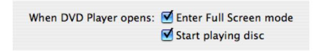

<span id="page-129-1"></span>The grouping of text and controlsin Figure 10-4 shows another way to use a colon in text that introduces multiple controls.

**Figure 10-4** Use a colon in text that precedes the first control in a horizontal list of controls

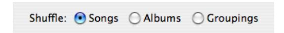

<span id="page-129-2"></span>■ Introductory text that appears above the control it describes should include a colon, as shown in Figure 10-5

**Figure 10-5** Use a colon in introductory text that appears above a control


<span id="page-129-3"></span>■ If the text describes a radio button or checkbox state and also introduces a second control, it should include a colon before the second control, as shown in Figure 10-6 (Note that if the text describing a checkbox or radio button state does not introduce a second control, it should not include a colon.)

**Figure 10-6** Use a colon in checkbox or radio button text that introduces a second control


**Note:** If you use the type of layout shown in Figure 10-6 be sure to disable the second control when the preceding checkbox or radio button is unselected.

**A colon is optional before a control that is part of a sentence or phrase**. This guideline is flexible because it depends on how much of the text follows the control and how the sentence or phrase can be interpreted. Consider the specific combination of text and controls and the overall layout of your window as you decide whether to use the colon in the following situations.

If, for example, none of the text follows the control, then the control's value supplies the end of the sentence or phrase. A colon is recommended in this case, because this is another variation of the guideline to include a colon in text that precedes a control. Figure 10-7 shows an example of this type of text.

<span id="page-130-2"></span>**Figure 10-7** A colon is recommended in a sentence that is completed by a control's value

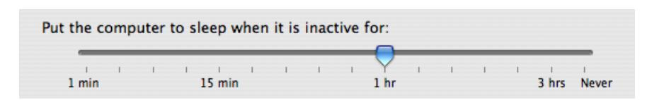

<span id="page-130-3"></span>If, on the other hand, a substantial portion of the sentence or phrase follows the control, as shown in Figure 10-8 a colon is optional.

**Figure 10-8** A colon is optional if the text following the control forms a substantial part of the sentence


<span id="page-130-0"></span>Similarly, if there is some text following the control, but that text does not represent a substantial portion of the sentence or phrase, the colon is optional. To help you decide whether a colon is appropriate in these cases, determine if the presence of a colon breaks the sentence or phrase (including the value of the control) in an awkward or unnatural way.

### <span id="page-130-6"></span>Labels for Interface Elements

<span id="page-130-5"></span>Make labels for interface elements easy to understand and avoid technical jargon as much as possible. Try to be as specific as possible in any element that requires the user to make a choice, such as radio buttons, checkboxes, and push buttons. It's important to be concise, but don't sacrifice clarity for space. See ["Capitalization](#page-130-1) of Interface Element Labels and Text" (page 131) for information on the proper way to capitalize the words in interface element labels.

<span id="page-130-4"></span><span id="page-130-1"></span>Menu items and buttons that produce a dialog should include an ellipsis (…). See "Using the [Ellipsis](#page-126-1) [Character"](#page-126-1) (page 127) for details on when to use an ellipsis. The dialog title should be the same as the menu command or button label (except for the ellipsis) used to invoke it.

### <span id="page-130-7"></span>Capitalization of Interface Element Labels and Text

All interface element labels should be capitalized in either title style or sentence style. See [Table](#page-131-0) 10-2 (page 132) for examples of how to do this.

Title style means that you capitalize every word except:

■ Articles (*a, an, the*)

- Coordinating conjunctions (*and, or*)
- Prepositions of four or fewer letters, except when the preposition is part of a verb phrase, as in "Starting Up the Computer."

<span id="page-131-2"></span>In title style, always capitalize the first and last word, even if it is an article, a conjunction, or a preposition of four or fewer letters.

<span id="page-131-6"></span><span id="page-131-0"></span>Sentence style means that the first word is capitalized, and the rest of the words are lowercase, unless they are proper nouns or proper adjectives. Use periods in dialogs only after complete sentences.

**Table 10-2** Proper capitalization of onscreen elements

<span id="page-131-5"></span><span id="page-131-4"></span><span id="page-131-3"></span><span id="page-131-1"></span>

| Element                                                                         | Capitalization<br>style | Examples                            |
|---------------------------------------------------------------------------------|-------------------------|-------------------------------------|
| Menu titles                                                                     | Title                   | Highlight Color                     |
|                                                                                 |                         | Number of Recent Items              |
|                                                                                 |                         | Location                            |
|                                                                                 |                         | Refresh Rate                        |
| Menu items                                                                      | Title                   | Save as Draft                       |
|                                                                                 |                         | Save As…                            |
|                                                                                 |                         | Log Out                             |
|                                                                                 |                         | Make Alias                          |
|                                                                                 |                         | Go To…                              |
|                                                                                 |                         | Go to Page…                         |
|                                                                                 |                         | Outgoing Mail                       |
| Push buttons                                                                    | Title                   | Add to Favorites                    |
|                                                                                 |                         | Don't Save                          |
|                                                                                 |                         | Set Up Printers                     |
|                                                                                 |                         | Restore Defaults                    |
|                                                                                 |                         | Set Key Repeat                      |
| Labels that are not full sentences (for                                         | Title                   | Mouse Speed                         |
| example, group box or list headings)                                            |                         | Total Connection Time               |
|                                                                                 |                         | Account Type                        |
| Options that are not strictly labels (for                                       | Sentence                | Enable polling for remote mail      |
| example, radio button or checkbox text),<br>even if they are not full sentences |                         | Cache DNS information every minutes |
|                                                                                 |                         | Show displays in menu bar           |
|                                                                                 |                         | Maximum number of downloads         |
| Dialog messages                                                                 | Sentence                | Are you sure you want to quit?      |

### <span id="page-132-0"></span>Using Contractions in the Interface

<span id="page-132-3"></span>When space is at a premium, such as in pop-up menus, contractions may be used, as long as the contracted words are not critical to the meaning of the phrase. For example, a menu could contain the following items:

Don't Allow Printing Don't Allow Modifying Don't Allow Copying

In each case, the contraction does not alter the operative word for the item. If a contraction does alter the significant word in a phrase, such as "contains" and "does not contain," it is clearer to avoid the contraction.

You should also avoid using uncommon contractions that may be difficult to interpret and localize. In particular, you should:

- Avoid forming a contraction using a noun and a verb,such asin the sentence "Apple's going to announce a new computer today."
- <span id="page-132-1"></span>■ Avoid using less common contractions, such as "it'll" and "should've."

### <span id="page-132-2"></span>Using Abbreviations and Acronyms in the Interface

Abbreviations and acronyms can save space in a user interface, but they can be confusing if users do not know what they mean. Conversely, some abbreviations and acronyms are better known than the words or phrases they stand for, and an application that uses the spelled-out version can seem out-of-date and unnecessarily wordy.

To balance these two considerations, you should gauge an acronym or abbreviation in terms of its appropriatenessfor your application's users. Therefore, before you decide which abbreviations and acronyms to use, you need to define your user audience and understand the user's mental model of the task your application performs. For more information on these concepts, see "Know Your [Audience"](#page-24-2) (page 25) and ["Reflect](#page-38-3) the User's Mental Model" (page 39)

To help you decide whether or not to use a specific abbreviation or acronym in your application's user interface, consider the following questions:

- Is this an acronym or abbreviation that your users understand and feel comfortable with? For example, almost all users are used to using CD asthe abbreviation for compact disc,so even applicationsintended for novice users can use this abbreviation.
  - On the other hand, an application intended for users who work with color spaces and color printing can use CMYK (which stands for cyan magenta yellow key), even though this abbreviation might not be familiar to a broader range of users.
- Is the spelled-out word or phrase less recognizable than the acronym or abbreviation? For example, many users are unaware that Cc originally stood for the phrase carbon copy, the practice of using carbon paper to produce multiple copies of paper documents. In addition, the meanings of Cc and carbon copy have diverged so that they are no longersynonymous. Using carbon copy in place of Cc, therefore, would be confusing to users.

For some abbreviations and acronyms, the precise spelled-out word or phrase is equivocal. For example, DVD originally stood for both digital video disc and digital versatile disc. Because of this ambiguity, it's not helpful to use either phrase; it's much clearer to use DVD.

If you use a potentially unfamiliar acronym or abbreviation in the user help book for your application, be sure to define it when you first use it. In addition, you should enable searching on your help book so users can easily find definitions of unfamiliar terms. See "User [Assistance"](#page-79-0) (page 80) for an overview of help technologies and *Apple Help Programming Guide* for details on working with Apple Help.

### <span id="page-133-2"></span><span id="page-133-0"></span>Developer Terms and User Terms

<span id="page-133-1"></span>Don't use technical jargon or programming terms in interface elements or user documentation. Table 10-3 shows a few examples; more are in *Apple Publications Style Guide* (available at the Mac OS X developer documentation website).

**Table 10-3** Translating developer terms into user terms

<span id="page-133-3"></span>

| Developer term    | User term equivalent                              |
|-------------------|---------------------------------------------------|
| Data browser      | Scrolling list or multicolumn list                |
| Dirty document    | Document with unsaved changes                     |
| Focus ring        | Highlighted area; area ready to accept user input |
| User-visible text | Onscreen text                                     |
| Mouse-up event    | Mouse click                                       |
| Reboot            | Restart                                           |
| String length     | Number of characters                              |

<span id="page-134-0"></span>This chapter describes the overall philosophy behind icons and shows how to design application, document, toolbar, and other types of icons for Mac OS X.

Aqua offers a photo-illustrative icon style—it approaches the realism of photography but uses the features of illustrations to convey a lot of information in a small space. Icons can be represented in 512 x 512 pixels to allow ample room for detail. Anti-aliasing makes curves and nonrectilinear lines possible. Alpha channels and translucency allow for complex shading and dimensionality. All of these qualities allow you to create lush, vibrant icons that capture the user's attention.

To represent your application in Mac OS X, it's essential to create high-quality application icons that scale well in the various places the icon appears—the Dock, Finder and Quick Look previews, alert dialogs, and so on.

# <span id="page-134-3"></span><span id="page-134-1"></span>Icon Genres and Families

<span id="page-134-4"></span><span id="page-134-2"></span>**Icon genres** help communicate what users can do with an application before they open it. Applications are classified by role—user applications, software utilities, and so on—and each category, or genre, has its own icon style. Creating icons that express this differentiation helps users distinguish between types of icons in the Dock.

**Figure 11-1** Application icons of different genres—user applications and utilities—shown as they can appear in the Dock


For example, the icons for user applications are colorful and inviting, whereas icons for utilities have a more serious appearance. Figure 11-2 shows user application icons in the top row and utility icons in the bottom row. These genres are further described in "User [Application](#page-135-1) Icons" (page 136) and ["Utility](#page-137-1) Icons" (page 138).

<span id="page-135-2"></span>**Figure 11-2** Two icon genres: User application icons in top row; utility icons in bottom row


<span id="page-135-3"></span>The graphic flexibility of Aqua icons can also help usersidentify files associated with an application. In iTunes, for example, a visual cue provided in the application icon is carried over into icons for other files associated with iTunes, forming an icon family, as shown in Figure 11-3.

**Figure 11-3** An icon family: The iTunes application icon and its associated icons


iTunes application icon

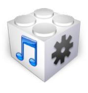

Device icon Playlist icon


# <span id="page-135-4"></span><span id="page-135-0"></span>Application Icons

<span id="page-135-1"></span>Application icons are the most visible to users. Since they are seen in the Finder and the Dock even when your application is not running, they form a significant part of a user's first impressions.

### User Application Icons

Mac OS X user application icons should be vibrant and inviting, and should immediately convey the application's purpose. The TextEdit icon, for example, indicates clearly that this application is for creating text documents.

<span id="page-136-0"></span>**Figure 11-4** The TextEdit application icon makes it obvious what this application is for


If the primary function of your application is creating or handling media, its icon should display the media the application creates or views. If appropriate, the icon should also contain a tool that communicates the type of task the application allowsthe user to accomplish. The Preview icon, for example, uses a magnification tool to help convey that the application can be used to view pictures. If you include a supportive tool element, it should closely relate to the base object that it rests upon.

<span id="page-136-1"></span>**Figure 11-5** The Preview application icon: An example of a tool element


<span id="page-136-2"></span>In the Stickies application icon, however, the yellow rectangles are easily identifiable as sticky notes; the icon doesn't include a tool because it isn't necessary to tell the icon's story.

**Figure 11-6** The Stickies application icon: Effective without the addition of a tool


Notice that the text in the Stickies icon is actual text, not simply wavy lines representing text. If you want to "greek" text in an icon, use actual text and make it unreadable by shrinking it or doubling the layers.

Generally, Mac OS X user application icons are designed to appear as if they're sitting on a desk in front of you. They have a slightly diminishing perspective (they are wider at the bottom). For more information, see "Icon [Perspectives](#page-140-0) and Materials" (page 141).

### <span id="page-137-0"></span>Viewer, Player, and Accessory Icons

Some applications that represent objects or well known products, such as Calculator and QuickTime Player, are most easily recognized by the symbols or objects themselves. When creating icons for such applications, it's more aesthetically pleasing to create a simplified, idealized representation of the object orsymbol, instead of using an actual screen shot of the software. Re-creating the object is particularly important when users could confuse the icon with the actual interface.

<span id="page-137-3"></span>**Figure 11-7** The icons for QuickTime Player, DVD Player, and Calculator


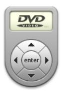

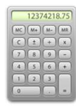

<span id="page-137-1"></span>These icons, many of which are a precursor of what you'llsee when you open the application, use a straight-on perspective (rather than the "on a desktop" user application style). You never see the Calculator onscreen in three dimensions, for example, so its icon doesn't depict it that way.

### Utility Icons

<span id="page-137-4"></span>Icons for utility applications—which are used less often and not simply for fun or creative activities— convey a more serious tone than those for user applications. Color in these icons is desaturated, predominantly gray, and added only when necessary to clearly communicate what the applications do.

**Figure 11-8** Discriminating use of color in the Activity Monitor and System Profiler icons


<span id="page-137-2"></span>Because utility applications are normally focused on a narrow set of tasks, it's best to keep the number of elements in the icon to a minimum. The focus should be a single object that represents what the utility does. The perspective of utility icons is straight-on, as if they are on a shelf in front of you. For more information, see "Icon [Perspectives](#page-140-0) and Materials" (page 141).

# <span id="page-137-5"></span>Document Icons

Traditionally, a document icon lookslike a piece of paper with itstop-right corner folded down. As previously suggested, document icons should make it obvious which application they are associated with. Preview documents, for example, include a graphic of the media (the pictures) used in the application icon. For simplicity and to avoid confusing the document with the application itself, the viewing tool is not repeated in the document icon.

<span id="page-138-1"></span>**Figure 11-9** Icons for the Preview application and a Preview document


Document icons are presented asif they are hovering on the desktop, with the shadow behind the document. For more information, see "Icon [Perspectives](#page-140-0) and Materials" (page 141).

<span id="page-138-2"></span>When you want to put an identifying badge over a document icon, treat the badge as an integrated element within the document instead of putting it over the top of the base image and breaking out of the overall document shape.

**Figure 11-10** Incorrect and correct badging of a document icon


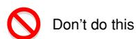

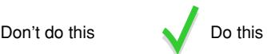

# <span id="page-138-0"></span>Toolbar Icons

<span id="page-138-3"></span>Toolbar icons represent frequently used commands in an application. Typically, toolbar icons are not as rich in detail and photo-realism as other icon types, because they are intended to be small, streamlined representations of application-specific objects and tasks. For example, Keynote toolbar icons (some of which are shown in Figure 11-11) have more in common with sketches than with photographs, using simple shapes, constrained shading, and just enough detail to suggest each item.

**Figure 11-11** Keynote toolbar icons portray objects and tasks in a simple, streamlined way


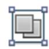


For some guidelines on how to design toolbar icons (including the simpler style of icons that can be used inside toolbar controls), see ["Designing](#page-147-0) Toolbar Icons" (page 148).

# <span id="page-139-0"></span>Icons for Plug-ins, Hardware, and Removable Media

<span id="page-139-4"></span><span id="page-139-1"></span>Plug-in icons look like stackable components, with the associated application identifier on the left side and a plug-in–specific image on the right.

**Figure 11-12** A plug-in icon


<span id="page-139-3"></span><span id="page-139-2"></span>Hardware icons represent devices as you most often see them: on your desk. Because these devices are also frequently handled and carried, people are familiar with them as three-dimensional objects with weight. Therefore, the hardware icons reinforce their association with real objects.

**Figure 11-13** Icons for external (top row) and internal hardware devices

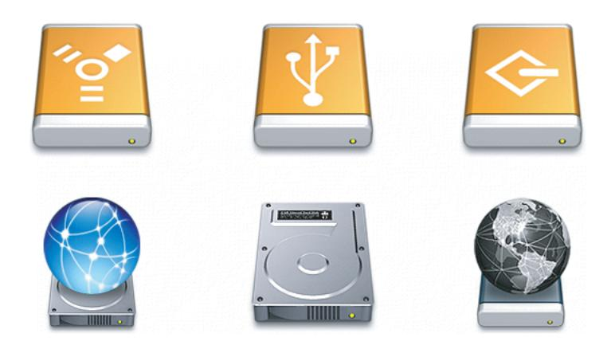

To help users distinguish between external devices, their icons provide a region for an identifying symbol (FireWire, USB, and so on).

Removable media such as CDs, floppy disks, and PC cards are depicted the way they look when you hold them in front of you—that is, the perspective is straight-on.

<span id="page-140-1"></span>**Figure 11-14** Icons for removable media


# <span id="page-140-3"></span><span id="page-140-0"></span>Icon Perspectives and Materials

The angles and shadows used for depicting various kinds of icons are intended to reflect how the objects would appear in reality. All interface elements have a common light source from directly above. The various perspectives are achieved by changing the position of an imaginary camera capturing the icon.

<span id="page-140-2"></span>Application icons look like they are sitting on a desk in front of you.

**Figure 11-15** Perspective for application icons: Sitting on a desk in front of you


Utility icons are depicted as if they were on a shelf in front of you. Flat objects appear as if there were a wall behind them with an appropriate shadow behind the object.

<span id="page-141-0"></span>**Figure 11-16** Perspective for flat utility icons


<span id="page-141-1"></span>An actual three-dimensional object such as a rocket, however, would more realistically be viewed sitting on the ground; its icon shows the rocket sitting on a shelf, with its shadow below it.

**Figure 11-17** Perspective for three-dimensional objects


<span id="page-141-2"></span>For toolbar icons, the perspective is also straight-on, as if the object is on a shelf in front of you with the shadow below it. (For more information on designing toolbar icons, see ["Designing](#page-147-0) Toolbar Icons" (page 148).)

**Figure 11-18** Perspective for toolbar icons

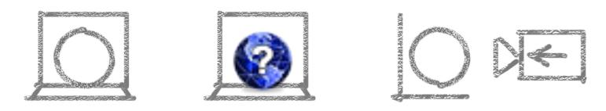

Icons that represent actual objects should look as though they are made of real materials. Examine various objects to study the characteristics of plastic, glass, paper, and metal. Your icon will look more realistic if you successfully convey the item's weight and feel, as well as its appearance.

Use transparency only when it is convincing and when it helps complete the story the icon is telling. You would never see a transparent sneaker, for example, so don't use one in your icon. (See ["Creating](#page-144-0) Icons for Mac OS X v10.5 and [Later"](#page-144-0) (page 145) for some advice on using transparency in an application icon.)

<span id="page-142-3"></span>**Figure 11-19** Materials: Transparency used to convey meaning


# <span id="page-142-0"></span>Creating Icons

<span id="page-142-5"></span>Gorgeous, artistic icons are an important part of the Mac OS X user experience. Users expect beautiful icons that tell an application's story in a clear and memorable way.

This section provides tips and a suggested icon-creation process you can follow as you design and create an icon. Then, it describes additional guidelines that help you design and create icons for applications running in Mac OS X v10.5 and later.

<span id="page-142-1"></span>If you need to create toolbar icons, you should read this section first for general guidance, because many of the techniques and guidelines apply to both application icons and toolbar icons. Then, read ["Designing](#page-147-0) [Toolbar](#page-147-0) Icons" (page 148) for specific advice on creating icons for use in a toolbar.

### <span id="page-142-4"></span>Tips for Designing Icons

Many of the suggestions listed here also apply to other graphics you develop for your application—for example, to augment a label or list item.

- For great-looking icons, have a professional graphic designer create them.
- Perspective and shadows are the most important components of making good icons. Use a single light source with the light coming from above the icon.
- Use universal imagery that people will easily recognize. Avoid focusing on a secondary aspect of an element. For example, for a mail icon, a rural mailbox would be less recognizable than a postage stamp.
- Strive for simplicity. Try to use a single object that captures the icon's action or represents the control. Start with a basic shape.
- Use color judiciously to help the icon tell its story; don't add color just to make the icon more colorful. Smooth gradients typically work better than sharp delineations of color.
- Avoid using Aqua interface elements in your icons; they could be confused with the actual interface.
- <span id="page-142-2"></span>■ Don't use replicas of Apple hardware productsin your icons. These symbols are copyrighted, and hardware designs change frequently.
- Don't reuse Mac OS X system icons in your interface; it can be confusing to users to see the same icon used to mean slightly different things in multiple locations.

### A Suggested Process for Creating Icons

When you create an icon, you need to provide at least the following files:

Creating Icons **143**

- A 128 x 128 pixel image (for Finder icons in all versions of Mac OS X)
- A 512 x 512 pixel image (for Finder icons in Mac OS X v10.5 and later)
- A mask that defines the image's edges so that the operating system can determine which regions are clickable

Icons that display in the Finder are viewed at different sizes: They can be magnified in the Dock, they can be previewed at full size, and users can specify a preferred size. For the best-looking icons at all sizes, you should also provide custom image files ("hints") at two other sizes: 32 x 32 pixels, and 16 x 16 pixels. Although the Dock doesn't use hints (it uses a sophisticated algorithm on the 128 x 128 pixel version), hints are important for preserving crucial details in Finder icons.

If you are creating an icon that will never change size—on a bevel button, for example—you can supply the image in the actual size only.

Here are the suggested steps for creating an icon:

**1.** Sketch the icon.

Work out the concept and details of your design on paper, not with software. You should be ready to execute the idea by the time you open an image-design application.

**2.** Create a software illustration of the icon.

Although you may want the final icon to look like a photograph, in most cases it's not advisable to start with an actual photograph. An illustration provides much more flexibility for conveying a concept in a very small space. An illustration also gives you necessary control over details, perspective, light and shadow, texture, and so on.

**3.** Add detail and color.

For each enhancement you make to a larger-version icon, consider whether it is truly adding something to the icon's usability or whether it is just adding complexity or clutter.

**4.** Add shadows.

Shadows give objects dimensionality and realism. They also help tie the elements of an icon together so it doesn't look like a collage. The light source should be above and slightly in front of the object. The resulting shadow should create the sense that the icon is resting on a surface.

- **5.** In an image-editing program, manipulate the image to get precise effects and create the icon mask. (See "Scaling Your [Artwork"](#page-146-0) (page 147) for some tips that can help you successfully scale your artwork.)
- **6.** Convert the icon to a .icns file.You can complete this step with Icon Composer, included with the Xcode Tools, a set of toolsfor developersthat are included in Mac OS X. There are also several third-party tools available for completing this step.

### <span id="page-144-0"></span>Creating Icons for Mac OS X v10.5 and Later

If you're designing an application icon for Mac OS X v10.5 and later, you should supply a 512 x 512 pixel version of the image. When you do this, be sure to treat the 512 x 512 pixel version as its own resource; that is, don't create it by blowing up each pixel of the 128 x 128 pixel version of the icon. For example, the 512 x 512 pixel version of the icon should not have thick strokes or look "vectorized." In general, the larger icon should be a higher quality rendition of the 128 x 128 pixel resource, which exhibits:

- Richer texture
- More details
- Greater realism

<span id="page-144-1"></span>For example, the 512 x 512 pixel version of the Front Row application icon (shown in Figure 11-20) reveals more detail in the wood grain of the chair frame and the velvet of the upholstery than in the 128 x 128 pixel version, resulting in a more realistic image.

**Figure 11-20** A 512 x 512 pixel icon should not be a scaled-up 128 x 128 pixel icon


Simply enlarging a smaller icon to make a larger icon will not provide the sharpness and detail required.

You also need to be aware of how the Cover Flow view in Finder displays your application icon. In Cover Flow, icons are displayed against a black background, set above a highly reflective surface. Because of this, you may need to adjust your icon in the following ways:

- If your icon includes a drop shadow, be sure to make the shadow fully black. If the drop shadow contains any gray tones, the gray will show up against the black background and make the shadow look more like a glow.
- If your icon is very dark or has black edges, consider adding a slight inner glow just inside the edges to make the icon stand out against the black background.

If you don't add a glow to make the edges of your icon prominent, it might appear to dissolve into the black background of the Cover Flow view.

■ Avoid giving important parts of your icon high alpha levels (that is, lots of transparency), especially in the lower half of the icon. Areas with too much alpha may get clipped.

In Cover Flow view, the Finder positions icons so that they appear to be on the same plane. To do this, the Finder begins examining an icon at the bottom edge, looking for pixels that are opaque enough to use for alignment. If there is significant transparency in the lower area of your icon, the Finder ignores the transparent pixels in favor of the first opaque pixel it finds. The Finder uses the opaque pixel to determine the icon's alignment with respect to the plane and may clip the transparent pixels below it.

<span id="page-145-0"></span>To see why some of these adjustments might be necessary, you can examine the standard MacOS X application icons in a computer running Mac OS X v10.5 or later. For example, in Figure 11-21, the Spaces icon includes a subtle glow inside the edge of the black frame, which makes it more visible on the black background.


The Mail icon, on the other hand, includes a cancellation mark that extends past the bottom edge of the stamp image (you can see this icon in [Figure](#page-135-2) 11-2 (page 136)). Because this area of the icon has high alpha levels, the Finder uses an opaque pixel at the bottom left corner of the stamp image to align the icon, clipping some of the cancellation mark, as shown in Figure 11-22.

<span id="page-146-1"></span>**Figure 11-22** Areas of high alpha levels at the lower edge of an icon can get clipped in Cover Flow

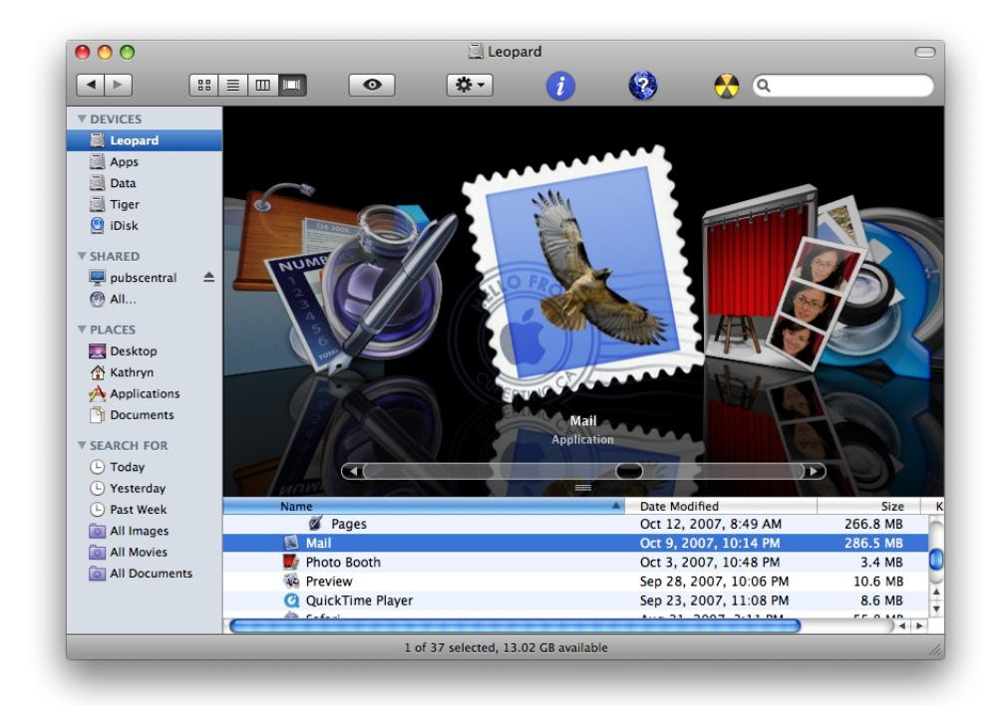

### <span id="page-146-0"></span>Scaling Your Artwork

As you work on creating your icon, you will probably need to spend some time scaling artwork to different sizes. As stated in ["Creating](#page-142-0) Icons" (page 143), applications should include icon resources in these sizes:

- 512 x 512 pixels
- 128 x 128 pixels
- 32 x 32 pixels
- 16 x 16 pixels

If your practice is to start with a large master art file and scale it down to the smaller sizes, it's especially useful to create your master image in a dimension that is a multiple of the icon sizes you need. If you also use an appropriate grid size in your image-editing application as you create the master image, you'll be able to keep each smaller icon version crisp and reduce the amount of retouching and sharpening you need to do.

For example, to create icons in the recommended sizes listed above, create a 1024 x 1024 pixel version of your master file. In your image-editing application, you can set up an 8-pixel grid as you create the master file. This means that each block in the grid measures 8 x 8 pixels and represents one pixel in the 128 x 128 pixel icon. As you create your master file, "snap" the image to the grid and keep it within the boundaries to minimize the half pixels and blurry details that can result when you scale it down.

Although using an 8-pixel grid works fine when you need to create 512 x 512 pixel icons, you may prefer the increased precision you get when you use a 2-pixel grid to create the master image.

If you're not satisfied with the results when you scale art down to the 32 x 32 pixel and 16 x 16 pixel sizes, you can redraw the image at these sizes instead. If you decide to do this, setting up the proper grid can still help reduce extra work. For example, using a 32-pixel grid with a 1024 x 1024 pixel master file works well for creating the 32 x 32 pixel size, and a 64-pixel grid works well for creating the 16 x 16 pixel size.

# <span id="page-147-0"></span>Designing Toolbar Icons

<span id="page-147-2"></span>The primary purpose of a set of toolbar iconsisto provide users with easy accessto frequently used commands (to learn more about the concepts behind toolbar design, see ["Toolbars"](#page-195-0) (page 196)). To represent these commands in a toolbar, you need small, unambiguous icons or images that users can easily distinguish and remember. To accommodate different application styles and appearances, Mac OS X provides a few different styles of toolbar items. Depending on the overall look of your application, you can:

- Design icons that behave as buttons (see "Icon [Buttons"](#page-260-0) (page 261) for more information on these controls).
- Design simplified icons to place in capsule-style toolbar controls (see ["Capsule-Style](#page-253-0) Toolbar [Controls"](#page-253-0) (page 254) for more information on these controls).
- Design small streamlined icons to place in rectangular-style toolbar controls (see ["Rectangular-Style](#page-249-0) Toolbar [Controls"](#page-249-0) (page 250) for more information on these controls).
- Use system-provided images in rectangular-style or capsule-style toolbar controls. Because you do not need to design these images, this section does not describe them. See ["System-Provided](#page-150-0) Images" (page 151) for more information on the images available to you, and see ["Window-Frame](#page-248-1) Controls" (page 249) for more information on the controls that can contain them.

<span id="page-147-1"></span>Figure 11-23 shows some examples of these types of toolbar items.

**Figure 11-23** Three ways to represent toolbar items

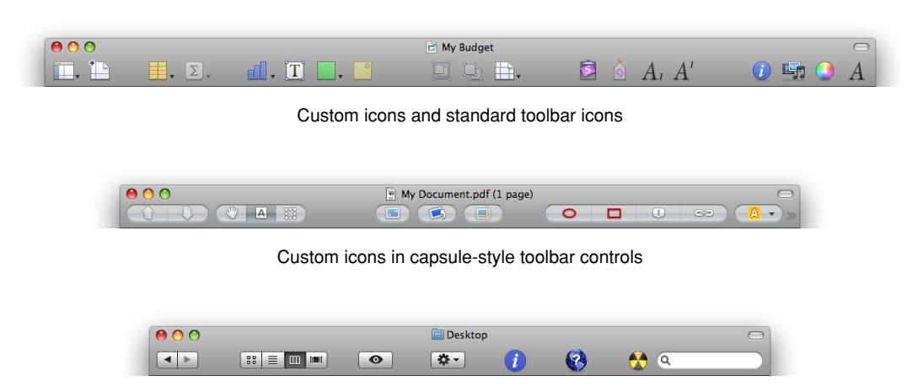

Standard images in rectangular-style toolbar controls and standard toolbar icons

A toolbar can also contain iconsthat represent recognizable interface elementsfrom elsewhere in the system (such as the Colors window icon or the iDisk icon) when they make sense in the context of the application. If you choose to include an icon such as the Colors window icon, be sure to preserve its meaning. Users expect such icons to mean the same thing in every context, so you should not repurpose them when you

use them in a toolbar. For example, the Numbers toolbar (the top image in Figure 11-23) contains the Colors window and Fonts window icons, which are standard icons used throughout Mac OS X. In Numbers, clicking these toolbar icons displays the Colors window and the Fonts window, respectively, just as users expect.

**Important:** Do not use a system icon,such asthe yellow caution icon, in your toolbar. A system icon provides important information to the user in a specific context, such as in an alert window; using it in a toolbar blurs its meaning and dilutes it effectiveness in the system.

Regardless of which style of toolbar icon you decide to design, be sure that each toolbar item represents a unique object or action that is directly related to the command it stands for. The best toolbar icons use familiar visual metaphorsthat are instantly recognizable to users. As a general rule, a toolbar icon that depicts an identifiable, real-world object or recognizable user-interface element gives first-time users a clue to its function and helps experienced usersremember it. As much as possible, therefore, identify parts of the user's mental model that lend themselves to visual representation (to learn more about this concept, see ["Reflect](#page-38-3) the User's Mental [Model"](#page-38-3) (page 39)). For example, the iTunes toolbar (shown in Figure 11-24) displays rewind, play, and fast forward controls that use symbols similar to those users see in physical devices, such as iPod.

<span id="page-148-1"></span>**Figure 11-24** When possible, use familiar symbols and images to represent toolbar items


<span id="page-148-2"></span>Making each toolbar icon distinct helps the user associate it with its purpose and locate it quickly. Variations in shape, color, and image all help to differentiate one toolbar icon from another. At the same time, however, an application's toolbar icons should harmonize together as much as possible in their perspective, use of color, size, and visual weight. This holds true whether the icon is free-standing or in a capsule-style toolbar control. As you can see in Figure 11-25, the icons inside the capsule-style toolbar controls in the Mail toolbar are easily distinguishable, yet consistent in size, color usage, and visual weight.

**Figure 11-25** Images inside capsule-style toolbar controls should appear balanced and coordinated


<span id="page-148-0"></span>How you design icons to represent actions and objects depends on whether you want to use free-standing icon buttons or icons in capsule-style or rectangular-style toolbar controls in your toolbar. The following sections provide some guidelines for each of these situations.

### Designing Icons for Icon Buttons

Although toolbar icons should conserve screen real estate (32 x 32 pixels is the recommended size), they should be inviting and easy to identify. The perspective of a toolbar icon is straight-on, as if it is sitting on a shelf in front of you (see "Icon [Perspectives](#page-140-0) and Materials" (page 141) for a graphic depiction of this perspective).

Although the perspective of icons designed specifically for use in a toolbar is straight-on, if you use a recognizable icon from elsewhere in the interface (such asthe iDisk icon), that icon should retain itsstandard appearance and perspective. That is, don't redesign a toolbar version of a well-known interface element. You may be able to use a system-provided image to represent a standard interface element;see ["System-Provided](#page-150-0) [Images"](#page-150-0) (page 151) for more information on which images are available and how to use them.

<span id="page-149-2"></span>**Figure 11-26** The circled icons appear elsewhere in the interface; they retain their perspective when used in a toolbar

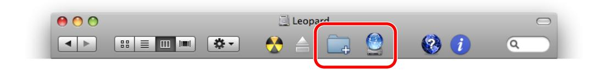

### <span id="page-149-0"></span>Designing Icons for Capsule-Style Toolbar Controls

Iconsthat look good in capsule-style toolbar controls are simple, colorful imagesthat don't have lots of detail. As you design an icon for a capsule-style toolbar control, keep the following points in mind:

- Include only enough detail to unambiguously represent the object
- Use a straight-on perspective with minimal shadow
- Provide enough contrast so that the image stands out against the control background
- Consider using bright, clear colors
- <span id="page-149-1"></span>■ Make sure the image is visually centered in the control (note that visually centered might not be the same as mathematically centered)

### Designing Icons for Rectangular-Style Toolbar Controls

Iconsthat look good in rectangular-style toolbar controls are streamlined, black imagesthat convey meaning through outline and contour, not internal detail. Because your icons should echo the appearance of the existing Mac OS X imagesinside rectangular-style toolbar controls, use the system-provided template images as a guide. As you design an icon for a rectangular-style toolbar control, keep the following points in mind:

- Make the outline sharp and clear
- Use a straight-on perspective
- Use full black and a few shades of gray to suggest dimensionality
- Use anti-aliasing
- Make sure the image is visually centered in the control (note that visually centered might not be the same as mathematically centered)

Icons for regular-size rectangular-style toolbar controls should measure no more than 19 x 19 pixels.

# <span id="page-150-0"></span>System-Provided Images

Throughout Mac OS X, you can see quantities of small, black images in rectangular-style toolbar controls, gradient buttons, and scope buttons. Some of the most familiar are those used in the Finder toolbar, as shown in Figure 11-27.

<span id="page-150-1"></span>**Figure 11-27** Standard images as used in the Finder toolbar

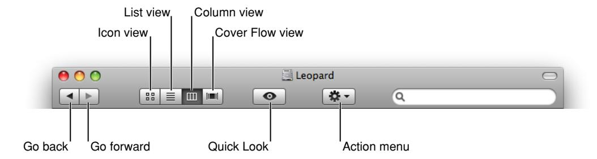

In addition to these images, many Mac OS X applications display full-color standard images such as the icons that represent the Colors window, .Mac, and a smart folder [\(Figure](#page-149-2) 11-26 (page 150) shows images similar to these).

In Mac OS X v10.5 and later, many standard images of both types are available for you to use. Using system-provided images confers significant advantages, such as:

- Shorter development time and less effort spent on creating custom versions of standard art.
- Automatic updating of images if appearance changes are part of future operating system updates.
- Established user familiarity with the meaning of standard images.

To realize these advantages, however, it is crucial that you use the images correctly. Specifically, this means that you should use an image in accordance with its documented meaning and recommended usage; you should never use an image to mean something other than what it was designed to mean. If you repurpose an image you confuse users who already know what the image means. Also, if a later update to the operating system includes a change to the image's look, you confuse users again when the new image appearance no longer makes sense in your application.

As a hypothetical example, imagine that the "go forward" image (currently a right-pointing triangle) is changed to look like a capital letter "F." If you correctly used this image in a control that performs a "go forward" action, your control would still make sense. If, however, you used the image to mean "play," your control would no longer make any sense.

If you can't find a system-provided image that has the appropriate meaning for a specific purpose in your application, it's better to design your own than to misuse a system-provided image. ["Designing](#page-149-1) Icons for [Rectangular-Style](#page-149-1) Toolbar Controls" (page 150) providessome guidelinesfor designing iconsfor use in controls; ["Designing](#page-148-0) Icons for Icon Buttons" (page 149) outlines how to design standalone icons for a toolbar.

**Note:** Each image described in the following sections is listed with its constant name, as defined in the NSImage programming interface. However, the string value for each constant consists of the constant name without the "ImageName" portion. For example, the constant NSImageNameAddTemplate has "NSAddTemplate" as its string value. You might need to use the string value, rather than the constant name, to locate images by name in Interface Builder.

### <span id="page-151-0"></span>System-Provided Images for Use in Controls

Mac OS X v10.5 and later provides many small, black images intended for use primarily in rectangular-style toolbar controls. These images, some of which are shown in [Figure](#page-150-1) 11-27 (page 151), are known as template images in Application Kit, because they are expected to receive additional processing by an NSButtonCell object before being displayed. The additional processing can, for example, make such an image look different when its control is pressed. Because these images require the presence of a bounding box (which is supplied by the control), they are not as useful for standalone buttons or free-standing toolbar icons. Instead, see ["System-Provided](#page-152-0) Images for Use as Standalone Buttons" (page 153) for images you can use as standalone buttons, and see ["System-Provided](#page-153-0) Images for Use as Toolbar Items" (page 154) for images you can use as free-standing toolbar icons.

<span id="page-151-1"></span>As with all system-provided images, you should avoid using the template images to represent actions other than those they are designed for. Table 11-1 shows the standard template images available in Mac OS X v10.5 and later, along with the actions they represent and their names.

**Table 11-1** Template images that represent common tasks

| Image | Meaning                           | Constant name                   |
|-------|-----------------------------------|---------------------------------|
|       | View in Quick Look                | NSImageNameQuickLookTemplate    |
|       | Connect via Bluetooth             | NSImageNameBluetoothTemplate    |
|       | Open iChat Theater                | NSImageNameIChatTheaterTemplate |
|       | View in a slide show              | NSImageNameSlideshowTemplate    |
|       | Action pop-up menu                | NSImageNameActionTemplate       |
|       | Create smart item                 | NSImageNameSmartBadgeTemplate   |
|       | View objects as icons             | NSImageNameIconViewTemplate     |
|       | View objects in a list            | NSImageNameListViewTemplate     |
|       | View objects in columns           | NSImageNameColumnViewTemplate   |
|       | View objects in a Cover Flow mode | NSImageNameFlowViewTemplate     |
|       | View the path of the object       | NSImageNamePathTemplate         |

| Image | Meaning                                                                    | Constant name                      |
|-------|----------------------------------------------------------------------------|------------------------------------|
|       | Unlock the object (this image indicates the object<br>is currently locked) | NSImageNameLockLockedTemplate      |
|       | Lock the object (this image indicates the object is<br>currently unlocked) | NSImageNameLockUnlockedTemplate    |
|       | Go to the right or go forward                                              | NSImageNameGoRightTemplate         |
|       | Go to the left or go back                                                  | NSImageNameGoLeftTemplate          |
|       | Add an item (to a list, for example)                                       | NSImageNameAddTemplate             |
|       | Remove an item (from a list, for example)                                  | NSImageNameRemoveTemplate          |
|       | Enter full-screen mode                                                     | NSImageNameEnterFullScreenTemplate |
|       | Exit full-screen mode                                                      | NSImageNameExitFullScreenTemplate  |
|       | Stop progress on the current process                                       | NSImageNameStopProgressTemplate    |
|       | Refresh the current view or restart the process                            | NSImageNameRefreshTemplate         |

### <span id="page-152-0"></span>System-Provided Images for Use as Standalone Buttons

Mac OS X v10.5 and later provides a handful of free-standing images that can be used as borderless buttons. These images do not require further processing by an NSButtonCell object.

Two of the free-standing images are standalone versions of similar template images. To see why you might need both versions of such an image, consider how Safari offers stop-progress functionality to users. In the Downloads window, Safari uses the free-standing NSImageNameStopProgressFreestandingTemplate image inline with a progress indicator to allow users to stop an in-progress download. (Figure 11-28 shows this control in the Safari Downloads window.) Because this window can display several separate download processes at the same time, it's important to display a stop-progress control for each individual process. Contrast this with the NSImageNameStopProgressTemplate image (shown in [Table](#page-151-1) 11-1 (page 152)) that Safari uses in a toolbar button. Here, the process users might want to stop is the downloading of a webpage in the main Safari window, so it makes sense to offer this functionality in a toolbar button.

<span id="page-153-1"></span>**Figure 11-28** The free-standing images can be used as borderless buttons


<span id="page-153-2"></span>As with all system-provided images, each free-standing image must be used according to its documented meaning and recommended usage. Table 11-2 lists each image, along with its meaning and name.

**Table 11-2** Free-standing images that represent common actions

| Image | Meaning                                                                                               | Constant name                                   |
|-------|-------------------------------------------------------------------------------------------------------|-------------------------------------------------|
|       | The data on the left is invalid (for example, the<br>user entered a zip code in a phone number field) | NSImageNameInvalidDataFreestanding<br>Template  |
|       | Reveal contents or details about the object                                                           | NSImageNameRevealFreestandingTemplate           |
|       | Open the link in a new window or page                                                                 | NSImageNameFollowLinkFreestanding<br>Template   |
|       | Stop progress on the current process                                                                  | NSImageNameStopProgressFreestanding<br>Template |
|       | Refresh the current view or restart the process                                                       | NSImageNameRefresh<br>FreestandingTemplate      |

### <span id="page-153-0"></span>System-Provided Images for Use as Toolbar Items

Mac OS X v10.5 and later provides several images you can use as standalone icons in toolbars. These images are represent three types of items:

- System entities or elements
- Preferences categories

#### ■ Common toolbar items

Use the first set of images (shown in Table 11-3) to give users access to system entities, such as Dot Mac and network. For the most part, the images in Table 11-3 identify system entities, they do not represent actions. However, if you needed to represent an action, such as "create a new smart folder," you could add a plus sign badge to the smart folder icon.

<span id="page-154-0"></span>**Table 11-3** Images that represent system entities

| Image | System element                           | Constant name             |
|-------|------------------------------------------|---------------------------|
|       | Bonjour                                  | NSImageNameBonjour        |
|       | Dot Mac                                  | NSImageNameDotMac         |
|       | The Macintosh computer currently running | NSImageNameComputer       |
|       | A burnable folder                        | NSImageNameFolderBurnable |
|       | A smart folder                           | NSImageNameFolderSmart    |
|       | Network or Internet                      | NSImageNameNetwork        |

<span id="page-154-1"></span>The second set of images is intended for use as standalone icons in preferences window toolbars. Use these images to give users access to familiar preferences categories, such as user-account settings and advanced settings. Table 11-4 shows the images you can use in a preferences window toolbar.

**Table 11-4** Images that represent common preferences categories

| Image | Preferences category | Constant name                 |
|-------|----------------------|-------------------------------|
|       | Advanced             | NSImageNameAdvanced           |
|       | General              | NSImageNamePreferencesGeneral |
|       | User accounts        | NSImageNameUserAccounts       |

The third set of images is suitable for toolbar items in windows other than preferences windows. You can use these images asstandalone iconsin a window or panel toolbar to give users accessto the system-provided Colors and Fonts windows or to an Info or inspector window you supply. Table 11-5 shows the images you can use in a non-preferences window toolbar.

<span id="page-155-3"></span>**Table 11-5** Images that represent standard toolbar items

| Image | Toolbar item            | Constant name         |
|-------|-------------------------|-----------------------|
|       | Show/hide information   | NSImageNameInfo       |
|       | Show/hide Fonts window  | NSImageNameFontPanel  |
|       | Show/hide Colors window | NSImageNameColorPanel |

### <span id="page-155-0"></span>System-Provided Images that Indicate Privileges

Mac OS X v10.5 and later provides images that represent the standard "user," "group," and "all" categories of permissions or privileges, including access control lists (or ACLs). Each of these images is shown in Table 11-6, along with its meaning and name. It is recommended that you use these images to clarify which users have permissions to read, write, or execute an item. These images allow you to avoid displaying Unix-style permissions indicators, such as rwxr-xrw-, which are suitable only for very sophisticated users.

<span id="page-155-4"></span>Note that the "user group" permissions image shown in Table 11-6 looks similar to the image for the "user accounts" preferences category,shown in [Table](#page-154-1) 11-4 (page 155). As with allsystem-provided images, however, similar appearance does not imply similar meaning or usage. Be sure to avoid using system-provided images incorrectly.

**Table 11-6** Images that represent categories of user permissions

| Image | Permissions category | Constant name        |
|-------|----------------------|----------------------|
|       | User                 | NSImageNameUser      |
|       | A user group         | NSImageNameUserGroup |
|       | All users            | NSImageNameEveryone  |

### <span id="page-155-1"></span>A System-Provided Drag Image

<span id="page-155-2"></span>Mac OS X v10.5 and later provides an image you can display when a user drags multiple documents or items. As with all system-provided images, you should use the multiple-documents image in accordance with its intended meaning. Figure 11-29 shows the multiple-documents drag image. (The constant name of the drag image is NSImageNameMultipleDocuments.)

**Figure 11-29** An image that represents multiple documents in transit between locations


# <span id="page-156-0"></span>Cursors

<span id="page-156-3"></span>This chapter discussesthe standard cursors available in Mac OS X and providesinformation on implementing your own cursors. The standard cursors are designed to provide feedback to users. To maintain a consistent user experience, it is important that you use them only for their intended purpose.

<span id="page-156-4"></span>Each cursor has a **hot spot**—the portion of the cursor that must be positioned over a screen object before mouse clicks have an effect on the object. The hot spot should be intuitive, such as the tip of an arrow cursor or the center point of a crosshair. Screen objects have a **hot zone**—the area that the cursor's hot spot must be within in order for mouse clicks to have an effect.

# <span id="page-156-1"></span>Standard Cursors

<span id="page-156-2"></span>Table 12-1 shows the standard cursors and explains when to use each. The "API information" column gives the constants to implement them in Carbon or Cocoa.

**Table 12-1** Standard cursors in Mac OS X

| Cursor             | Use                                                                                                                                                                    | API information                                                    |
|--------------------|------------------------------------------------------------------------------------------------------------------------------------------------------------------------|--------------------------------------------------------------------|
| Arrow              | Menu bar, desktop,scroll bar, resize control, title bar, close<br>button, zoom button, minimize button, other controls.                                                | Carbon: kThemeArrowCursor<br>Cocoa:arrowCursor                     |
| Contextual<br>menu | Indicatesthe user can open a contextual menu for an item.<br>Shown when the user presses the Control key while the<br>cursor is over an object with a contextual menu. | Carbon:kThemeContextual<br>MenuArrowCursor<br>Cocoa: Not available |
| Alias              | Indicates the drag destination will have an alias for the<br>original object (the original object will not be moved).                                                  | Carbon:kThemeAliasArrow<br>Cursor<br>Cocoa: Not available          |
| Poof               | Indicates that the proxy object being dragged will go<br>away, without deleting the original object, if the mouse<br>button is released. Used only for proxy objects.  | Carbon:kThemePoofCursor<br>Cocoa:disappearingItemCursor            |
| Copy               | Indicates that the drag destination will have a copy of the<br>original object (the original object will not be moved).                                                | Carbon:kThemeCopyArrowCursor<br>Cocoa: Not available               |

| Cursor           | Use                                                                                                                   | API information                        |
|------------------|-----------------------------------------------------------------------------------------------------------------------|----------------------------------------|
| Not<br>allowed   | Indicates an invalid drag destination.                                                                                | Carbon:kThemeNotAllowed<br>Cursor      |
|                  |                                                                                                                       | Cocoa: Not available                   |
| I beam           | Selecting and inserting text.                                                                                         | Carbon:kThemeIBeamCursor               |
|                  |                                                                                                                       | Cocoa:IBeamCursor                      |
| Crosshair        | Precise rectangularselection, especially useful for graphics                                                          | Carbon:kThemeCrossCursor               |
|                  | objects.                                                                                                              | Cocoa:crosshairCursor                  |
| Pointing<br>hand | URL links.                                                                                                            | Carbon:kThemePointing<br>HandCursor    |
|                  |                                                                                                                       | Cocoa:pointingHandCursor               |
| Open<br>hand     | Indicates that an item can be manipulated within its                                                                  | Carbon:kThemeOpenHandCursor            |
|                  | containing view.                                                                                                      | Cocoa:openHandCursor                   |
| Closed<br>hand   | Pushing,sliding, or adjusting an object within a containing<br>view.                                                  | Carbon:kThemeClosed<br>HandCursor      |
|                  |                                                                                                                       | Cocoa:closedHandCursor                 |
| Move<br>left     | Moving or resizing an object, usually a pane splitter, to<br>the left. Use when the user can move the object only in  | Carbon:kThemeResize<br>LeftCursor      |
|                  | the indicated direction.                                                                                              | Cocoa:resizeLeftCursor                 |
| Move<br>right    | Moving or resizing an object, usually a pane splitter, to<br>the right. Use when the user can move the object only in | Carbon:kThemeResize<br>RightCursor     |
|                  | the indicated direction.                                                                                              | Cocoa:resizeRightCursor                |
| Move<br>left or  | Moving or resizing an object, usually a pane splitter, to<br>the left or the right.                                   | Carbon:kThemeResizeLeft<br>RightCursor |
| right            |                                                                                                                       | Cocoa:resizeLeftRightCursor            |
| Move             | Moving or resizing an object, usually a pane splitter,                                                                | Carbon:kThemeResizeUpCursor            |
| up               | upward. Use when the user can move the object only in<br>the indicated direction.                                     | Cocoa:resizeUpCursor                   |

| Cursor                | Use                                                                                                                                           | API information                                                 |
|-----------------------|-----------------------------------------------------------------------------------------------------------------------------------------------|-----------------------------------------------------------------|
| Move<br>down          | Moving or resizing an object, usually a pane splitter,<br>downward. Use when the user can move the object only<br>in the indicated direction. | Carbon:kThemeResize<br>DownCursor<br>Cocoa:resizeDownCursor     |
| Move<br>up or<br>down | Moving or resizing an object, usually a pane splitter, either<br>upward or downward.                                                          | Carbon:kThemeResizeUp<br>DownCursor<br>Cocoa:resizeUpDownCursor |

<span id="page-158-1"></span>The spinning wait cursor (see Figure 12-1) is displayed automatically by the window server when an application cannot handle all of the events it receives. If an application does not respond for about 2 to 4 seconds, the spinning wait cursor appears. You should try to avoid situations in your application in which the spinning wait cursor will be displayed. The Spin Control application provided with Xcode can help you eliminate code that is causing this cursor.

**Figure 12-1** Spinning wait cursor


# <span id="page-158-0"></span>Designing Your Own Cursors

Mac OS X supports 32-bit RGBA cursors in sizes up to 64 x 64 pixels. If you need a cursor larger than that, you can implement it as a window that tracks with the cursor.

Before you design your own cursor, ask yourself if it is going to add value to the user interface. Recognize that by doing so you are introducing a new, potentially confusing user interface element. If you decide you really need a new cursor, keep the following in mind:

- You need to indicate where the hot spot of the cursor is.
- Your cursors need to be able to work on older hardware that may not provide hardware video acceleration.
- If you create a custom version of a standard cursor, you need to also create new versions of related cursors. For example, if you create a larger arrow cursor you need to also create custom cursors for copy, move, alias, poof, and so forth.

If creating a custom cursor is necessary, both Cocoa and Carbon applications should use NSCursor methods to do so.

#### **CHAPTER 12**

Cursors

<span id="page-160-5"></span><span id="page-160-4"></span><span id="page-160-0"></span>Menus present lists of items—commands, attributes, or states—from which the user can choose. Menus are based on the interface principle of see and point: People don't have to remember commands or options because they can view all options at any time.

Menus are user interface elements that users refer to frequently, especially when they are seeking a function for which they know of no other interface. Ensuring that menus are correctly organized, are worded clearly, and behave correctly is crucial to the user's ability to explore and accessthe functionality of your applications.

<span id="page-160-2"></span>Menus appear in several different forms in the Mac OS X interface. This chapter describes pull-down menus in the menu bar, Dock menus, and contextual menus. These types of menus are illustrated in Figure 13-1.

**Figure 13-1** Menu bar, Dock, and contextual menus

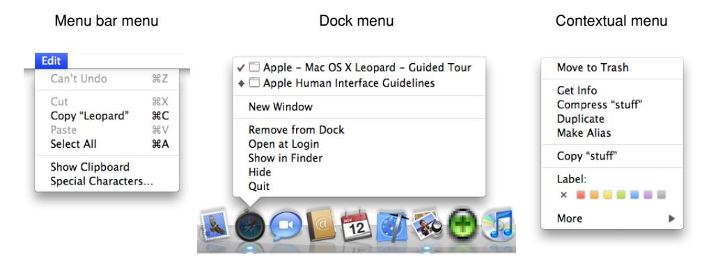

Menus that are part of controls—for example, pop-up menus, command pop-down menus, and the menus in pop-up icon buttons and bevel buttons—are discussed in ["Controls"](#page-248-0) (page 249). Note that some concepts from this chapter are applicable to those menu types as well.

# <span id="page-160-3"></span><span id="page-160-1"></span>Menu Behavior

When people use menus, they usually make a selection within their data and then choose a menu item. This behavior follows the see-and-point paradigm of identifying what needs to be acted on and then specifying the action by choosing a menu item. To choose an item in a menu, the user positions the pointer on the menu title and drags to the desired item. Each item is highlighted as it is selected. No action happens until the user releases the mouse button with the cursor over a menu item. (See "The Mouse and Other [Pointing](#page-94-1) [Devices"](#page-94-1) (page 95) for more information on mouse usage and behavior.) People can move the pointer off a menu before releasing the mouse button without initiating any action. They can open and scan menus to find out what features are available without having to actually perform an action. When a menu item has been activated, it blinks briefly.

Menu Behavior **161**

A user can also open a menu with a click. The menu stays open without the user having to continue holding down the mouse button. The user can then move the pointer to an item to select it or can move the pointer anywhere on the screen without losing sight of the menu. Once a menu is opened, it remains open until another action forces it to close. Such actions include:

- Choosing a command from the menu
- Moving the pointer to another menu title
- A click outside the menu
- A system-initiated alert
- <span id="page-161-1"></span>■ A system-initiated application switch or quit

Even if all of the items in a menu or submenu are unavailable, the menu or submenu title is not dimmed. The user can still open the menu, but all of itsitems are dimmed to indicate that these items are not available in the present context. [Figure](#page-171-1) 13-13 (page 172) shows a menu with unavailable menu items in the open and closed state.

As a general rule, avoid creating long menus. Long menus are difficult for the user to scan and can be overwhelming. If you find that there are too many items in a single menu, try regrouping them; you may find that some of the items fit more naturally in other menus.

<span id="page-161-0"></span>If a menu contains more items than are visible onscreen, the menu can scroll to allow the user access to all of the menu items. A **scrolling menu** is shown in Figure 13-2.


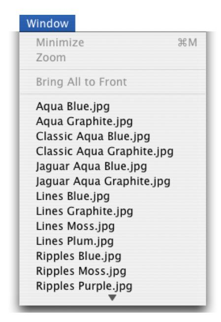

A downward-pointing indicator at the bottom of the scrolling menu indicates that there are more items. When the user starts to scroll down, an upward-pointing indicator appears at the top of the menu to show that some items are no longer visible in that direction. When the user drags past the last visible item, the menu scrolls to show the additional items. When the last item is shown, the downward-pointing indicator disappears.

If the user drags back up to the top, the menu scrolls back down in the same manner. The next time the menu is opened, it appears in its original state (with the indicator at the bottom).

Do not design your application to intentionally include scrolling menus; they should exist only when a user adds many items to a customizable menu or when the menu's function causes it to have items added to it (for example, the Finder's Window menu).

# <span id="page-162-0"></span>Designing the Elements of Menus

<span id="page-162-5"></span><span id="page-162-3"></span>Menu elementsinclude words(and sometimesicons) to designate menu titles and menu items, and symbols to designate keyboard shortcuts, hierarchical menus, separators, and the state of some menu items. These elements are illustrated in Figure 13-3.

<span id="page-162-8"></span>**Figure 13-3** Menu elements


### <span id="page-162-9"></span><span id="page-162-7"></span><span id="page-162-1"></span>Titling Menus

<span id="page-162-2"></span>Menu (and submenu) titles should appropriately represent the items in the menu. For example, a Font menu could contain names of font families,such as Helvetica and Geneva, but itshouldn't include editing commands, such as Cut and Paste. Avoid using icons for menu titles. Make menu titles as short as possible without their losing clarity.

### <span id="page-162-6"></span><span id="page-162-4"></span>Naming Menu Items

Menu item names should be either actions performed on an object or attributes applied to an object:

■ Actions are verbs or verb phrases that declare the action that occurs when the user chooses the item. For example, Save means*savemy file* and Copy means *copy the selected data.* Your action menu commands should begin in the same way, with an action verb in its base (simplest) form.

■ Attributes are adjectives or adjective phrases that describe the change the command implements. Adjectives in menus *imply* an action and should fit into the sentence "Change the selected object to …" —for example, *Bold* or *Italic*.

<span id="page-163-1"></span>When a menu item is unavailable—because it doesn't apply to the selected object or to the selected object in its current state, or because nothing is selected, for example—the item should appear dimmed (gray) in the menu and is not highlighted when the user moves the pointer over it.

Use title-style capitalization in your menus. See ["Capitalization](#page-130-1) of Interface Element Labels and Text" (page 131) for more information on this style.

<span id="page-163-2"></span>An **ellipsis character** (…) after a menu item indicates to the user that additional information is required to complete a command. For information on when to use an ellipsis in menu items, see "Using the [Ellipsis](#page-126-1) [Character"](#page-126-1) (page 127).

<span id="page-163-0"></span>It may be appropriate in some cases to provide **dynamic menu items**—commands that change when the user presses a modifier key. For example, if the user opens the Window menu in the Finder and then presses the Option key, some of the menu items change, as shown in Figure 13-4. The system appropriately sizes the menu to hold the widest item, including Option-enabled commands.

**Figure 13-4** Dynamic menu items

Without modifier key pressed

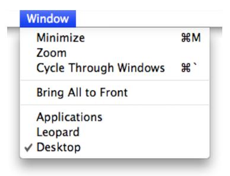

With modifier key pressed

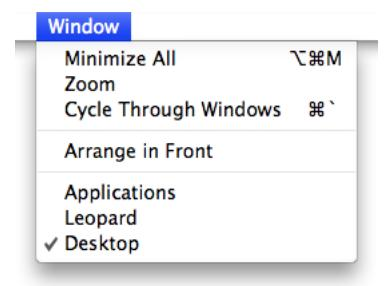

Dynamic menu items are an appropriate way to offer a shortcut to sophisticated users. However, because dynamic menu items are hidden by default, they should never be the only way to accomplish a task. Be sure that you don't require usersto discover a dynamic menu item before they can use your application effectively. To return to the example of the Minimize menu items in the Finder Window menu (shown in Figure 13-4), note that a user who hasn't discovered the Minimize All command can still minimize all open Finder windows by minimizing each one individually.

If you decide to offer a dynamic menu item, be sure to require only a single modifier key to reveal it. Requiring more than one additional key press to reveal a dynamic menu item can make it physically awkward for the user and greatly decreases the user's chances of discovering the key combination.

You can use Interface Builder to define dynamic menu items. You can also do so using Application Kit programming interfaces. Specifically, you can use the setAlternate: method of NSMenuItem to designate one menu item as the alternate of another.

### <span id="page-164-2"></span><span id="page-164-0"></span>Using Icons in Menus

You should use text, not icons, for your application menu titles. The operating system providesthree application menus that use icons instead of text for their titles: the Apple menu, the Spotlight search field, and the AppleScript menu, which is displayed if the application has scripts installed. The menu bar status items also are icons. These icons (with the exception of the AppleScript menu) are always visible in the menu bar no matter what application is active, so users learn what these symbols mean. These are unique uses of symbols as menu titles.

<span id="page-164-1"></span>You may use icons in menu items if the icon is something the user can learn to associate with specific functionality in your application or if the icon represents something unique. For example, as shown in Figure 13-5, the Finder uses icons in the Go menu because users can associate them with the icons they see in the Sidebar.

**Figure 13-5** Icons in the Finder Go menu


Safari also makes use of the standard icons displayed with some webpages to allow users to make the connection between the webpage and the menu item for that webpage, as shown in Figure 13-6.

<span id="page-165-1"></span>**Figure 13-6** Icons in the Safari History menu


<span id="page-165-0"></span>If you do include iconsin your menus, include them only for menu itemsfor which they add significant value; don't include them for every menu item. A menu that includes too many icons (or poorly designed ones) can appear cluttered and be hard to read.

### <span id="page-165-4"></span><span id="page-165-3"></span>Using Symbols in Menus

<span id="page-165-2"></span>There are a few standard symbols you can use to indicate additional information in menus. These are listed in Table 13-1 and discussed in the following text. Don't use other, arbitrary symbols in menus, because they add visual clutter and may confuse people.

**Table 13-1** Acceptable characters for use in menus

| Character | Meaning                                                                                                   |
|-----------|-----------------------------------------------------------------------------------------------------------|
|           | The active document in the Window menu; in other menus, a setting that applies to the entire<br>selection |
|           | A setting that applies to only part of the selection                                                      |
|           | A window with unsaved changes                                                                             |
|           | In the Window menu, a document that is currently minimized in the Dock                                    |

In the Window menu, a **checkmark** should appear next to the active document's name. Checkmarks can also be used in other menus to indicate that the setting applies to the entire selection. You can use checkmarks for mutually exclusive attribute groups (the user can select only one item in the group, such as font size) or accumulating attribute groups (more than one item can be selected at once, such as Bold and Italic).

Use a **dash** to indicate that an attribute applies to only part of the selection. For example, if selected text has two styles applied to it, put a dash next to each style name. When it's appropriate, you can combine checkmarks and dashes in the same menu. See ["Toggled](#page-167-0) Menu Items" (page 168) for more information on how to use checkmarks and dashes in menus.

<span id="page-166-4"></span><span id="page-166-3"></span>**Note:** Include a menu command, such as Plain, for removing all formatting from mixed-state text.

<span id="page-166-2"></span>Use a **bullet** next to a document with unsaved changes and a **diamond** for a document the user has minimized into the Dock. A minimized document with unsaved changes should have a diamond only. If the active window has unsaved changes, the checkmark should override the bullet in the Window menu.

<span id="page-166-0"></span>Figure 13-7 and Figure 13-8 show some examples of how to use and how not to use symbols in menus.

**Figure 13-7** Symbols in menus


**Figure 13-8** Don't use arbitrary symbols in menus

<span id="page-166-1"></span>

<span id="page-167-3"></span><span id="page-167-1"></span>If you have a Style menu, you may display menu items in the actual style so users can see what effect the menu item will have. Don't use text styles in menus other than a Style menu.

### <span id="page-167-4"></span><span id="page-167-0"></span>Toggled Menu Items

A **toggled menu item** changes between two states each time a user chooses it. There are three types of toggled menu items:

- A set of two menu items that are opposite states; for example, Grid On and Grid Off. The state currently in effect has a checkmark next to it. If you have room in your menu, it's a good idea to display both items (rather than changing the name depending on its state) so that there's less chance of confusion about each item's effect.
- One menu item whose name changes to reflect the current state; for example, Show Ruler and Hide Ruler. Use this type if your menu doesn't have room to show both states.
  - Use two verbsthat express opposite actions. Make sure the command name is completely unambiguous. For example, Turn Grid On and Turn Grid Off is unambiguous. Choosing the command Use Grid, however, could turn the grid on (it describes what happens as a result of choosing the command) or off (it describes the current state).
- <span id="page-167-2"></span>■ A menu item that has a checkmark next to it when it is in effect; for example, a style attribute such as Bold. Don't use this kind of toggled item to indicate the presence or absence of a feature such as a grid or ruler. It's unclear whether the checkmark means that the feature is in effect or whether choosing the command turns the feature on.

Figure 13-9 shows correct and incorrect toggled menu items.

<span id="page-168-1"></span>**Figure 13-9** Avoid ambiguous toggled menu items


### <span id="page-168-3"></span><span id="page-168-2"></span><span id="page-168-0"></span>Grouping Items in Menus

Logically grouping menu items is the most important aspect of arranging your menus. Grouping items in a menu makes it easier to quickly locate commands for related tasks.

In general, place the most frequently used items at the top of the menu, but create groups of related items rather than arranging them strictly by frequency of use. For example, although the Find Next or the Find Again command may be used infrequently, it should appear right below the Find command. In a menu that contains both actions and attributes, don't put actions and attributes in the same group.

If your application allowsthe creation ofsmart data groups or containers,such as a smart folder in the Finder, group all commands related to the smart group in the same menu. In other words, commands for creating, modifying, and destroying a smart group should all be in the same menu.

Group interdependent attributes. They can be in a **mutually exclusive attribute group** (the user can select only one item, such as font size) or an **accumulating attribute group** (the user can select multiple items, such as Bold and Italic).

If a menu repeats a term more than twice, consider dedicating a menu or hierarchical menu to the term instead. For example, if you need commands like Show Info, Show Colors, Show Layers, Show Toolbox, and so on, you could create a Show menu or a submenu off of a Show item.

How many separators to use is partly an aesthetic decision and partly a usability decision. Figure 13-10 shows a menu that depictsthe right balance of grouping, contrasted with two menusshowing insufficient grouping and too much grouping. Use this picture as a visual guide when trying to decide how many separators to use in your menus.

<span id="page-169-1"></span>**Figure 13-10** Grouping items in menus

<span id="page-169-2"></span>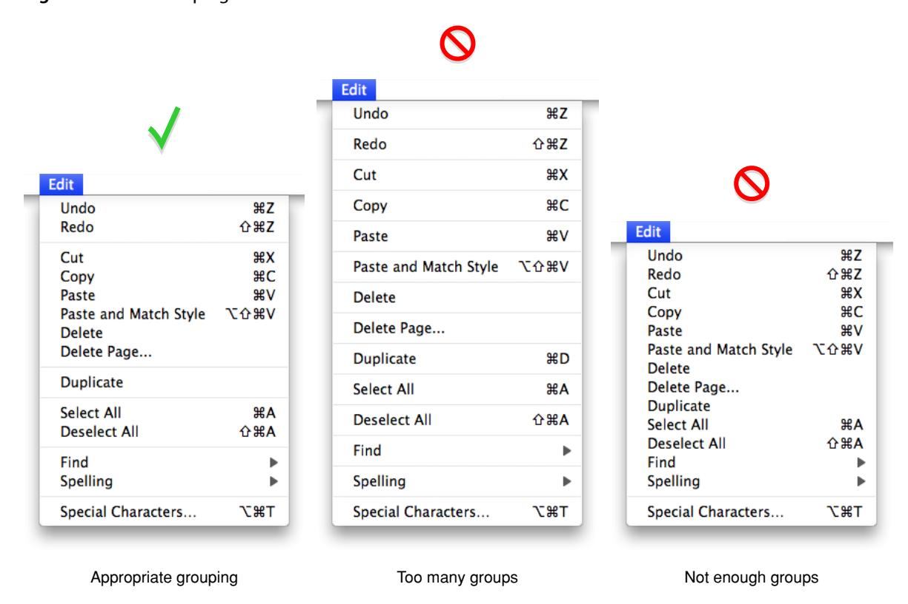

<span id="page-169-3"></span><span id="page-169-0"></span>Hierarchical Menus (Submenus)

You can use **hierarchical menus** to offer additional menu item choices without taking up more space in the menu bar. When the user points to a menu item with a submenu indicator, a submenu appears. Submenus have all the features of menus, including keyboard shortcuts, status markers (such as checkmarks), and so on.

Because submenus add complexity to the interface and are physically more difficult to use, you should use them only when you have more menus than fit in the menu bar or for closely related commands. Use only *one level* of submenus. If a submenu contains more than five items, consider giving it its own menu.

When you use submenus, include them in a menu with a logical relationship to the choices they contain; the submenu title should clearly represent the choicesit contains. Hierarchical menus work best for providing submenus of attributes (rather than actions).

Always use a hierarchical menu instead of indenting menu items. Indentation does not express the interrelationships among menu items as clearly as a submenu does. You can, however, use indentation when displaying custom information (such as status information) in your application's Dock menu. See [Figure](#page-185-0) [13-25](#page-185-0) (page 186) for an example of an application Dock menu. Figure 13-11 shows an example of a hierarchical menu.

<span id="page-170-1"></span>**Figure 13-11** A hierarchical menu

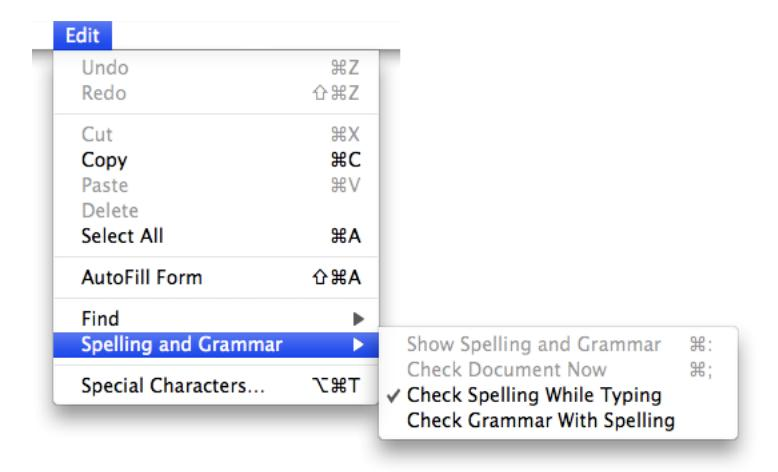

As with menu titles, a submenu's title is displayed unchanged even if all of the submenu's commands are unavailable (dimmed) at the same time. Users should always be able to view a submenu's contents, whether or not they are available in the current context.

# <span id="page-170-3"></span><span id="page-170-2"></span><span id="page-170-0"></span>The Menu Bar and Its Menus

The **menu bar** extends across the top of the main screen and contains pull-down menus. There is only one menu bar at the top of the screen; don't put menu bars in windows. The menu bar provides a consistent location where people can look for commands. Each application, including the Finder, has its own menu bar consisting of a few standard menus, application-specific menus, and menu extras.

#### The menu bar:

- Is always visible and available, except in circumstancessuch as during a slideshow (see discussion below)
- Always contains:
  - ❏ The Apple menu (provided by the operating system)
  - ❏ The Spotlight icon (provided by the operating system)
  - ❏ The application menu (titled with the application name or an appropriate abbreviation if space is limited)
  - ❏ A Window menu
- May contain the following menus, if they make sense in your application:
  - ❏ A File menu
  - ❏ An Edit menu
  - ❏ A Format menu
  - ❏ A View menu
  - ❏ A Help menu

- ❏ Application-specific menus
- May contain menu bar extras determined by the user

The ordering of application-specific menus in the menu bar should reflect the natural hierarchy of objects in your application. Examine the user's mental model of the tasks your application performs to help you determine what this natural hierarchy is(see ["Reflect](#page-38-3) the User's Mental Model" (page 39) for more information on discovering the user's mental model). For example, if your application helps users create computer animation, the application-specific menus might be Scenes, Characters, Backgrounds, and Projects. Because a user probably seesthe project as a high-level entity that containsscenes, each of which contains backgrounds and characters, a natural ordering of these menus is Projects, Scenes, Backgrounds, and Characters.

<span id="page-171-0"></span>In general, place the menus that display commands to handle higher-level, more universal objects toward the left of the menu bar and the menus that focus on the more specific entities toward the right.

**Figure 13-12** The menu bar displayed when the Finder is active


If there is insufficient room to display all of an application's menus, the menu bar status items are omitted. If there is still insufficient room to display all menus, the application's menus may be omitted, starting with the rightmost menu.

<span id="page-171-2"></span>If your application can display full-screen images (such as slideshows), you may allow users to hide the menu bar. If you implement this feature, provide a clearly visible way, such as a button, for the user to make the menu bar reappear. If there is no button visible, pressing the Escape key or moving the mouse to the top of the screen should display the menu bar.

<span id="page-171-1"></span>A menu's title is displayed undimmed even if all of the menu's commands are unavailable (dimmed) at the same time. Usersshould always be able to view a menu's contents, whether or not they are currently available.

**Figure 13-13** A menu title is undimmed, even when all items are unavailable

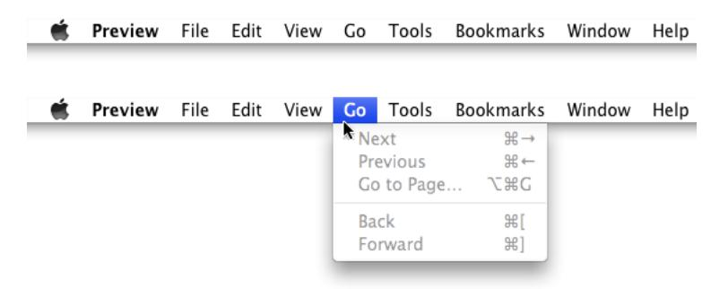

The following sections discuss the individual menus in the menu bar. The sections are listed in the order that the menus should appear in the menu bar. With the exceptions of the Apple menu (provided by the system), the application menu, and the Window menu, all other menus are optional.

Within each section, a checkmark ( ) next to a menu item indicates that unless your application cannot support the item's action or attribute, the item is required. The unmarked commands are ones that are not appropriate for all applications, but if they are appropriate in yours, you should implement and label them as discussed.

If there is an appropriate keyboard shortcut for a menu item, it islisted. Except for those items with a checkmark next to them, you should implement keyboard shortcuts only for those commands that will be frequently used. Unnecessary use of keyboard shortcuts can make your application confusing. For more discussion on assigning keyboard shortcuts for pull-down menu items, see ["Keyboard](#page-102-0) Shortcuts" (page 103).

### <span id="page-172-7"></span><span id="page-172-4"></span><span id="page-172-0"></span>The Apple Menu

<span id="page-172-2"></span>The **Apple menu** provides items that are available to users at all times, regardless of which application is active. The Apple menu's contents are defined by the system and cannot be modified by users or developers.

**Figure 13-14** The Apple menu

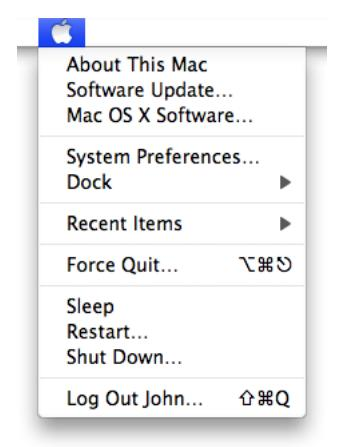

# <span id="page-172-6"></span><span id="page-172-5"></span><span id="page-172-3"></span><span id="page-172-1"></span>The Application Menu

The **application menu** contains items that apply to the application as a whole rather than to a specific document or other window.

**Figure 13-15** The Mail application menu

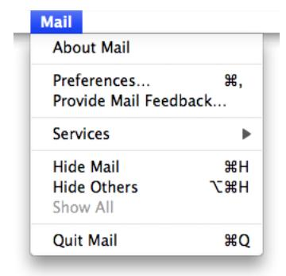

### <span id="page-173-0"></span>The Application Menu Title

To help users identify the active application, the application menu title is in boldface.

In order to fit within the allotted menu bar space, the application menu title should be one word, if possible, and a maximum of 16 characters. Don't include the application version number in the name; version information belongs in the About window. If the application name is too long, provide a short name (16 characters or fewer) as part of the application package. The Hide, Quit, and About items should also use the short application name. If you don't provide a short name, the application name is truncated from the end (and an ellipsis is added), if necessary.

### <span id="page-173-1"></span>The Application Menu Contents

<span id="page-173-6"></span>**About** *ApplicationName***.** Opens your application's About window, which contains copyright information and version number. (For more information,see "About [Windows"](#page-228-1) (page 229). If you've specified a short name (see "The [Application](#page-173-0) Menu Title" (page 174)), use it in the About menu item; use the full application name in the About window.

**Preferences…(Command-,).**Opens a preference window for your application. See *MultipleUser Environments* for more information on handling preferences in a multiple-user environment.

<span id="page-173-7"></span>In the application menu, put all commands that provide access to your application's preference dialogs first, followed by application-specific items. Put a menu separator between the About command and the Preferences command. If your application provides document-specific preferences, make them available in the File menu (see "The File [Menu"](#page-174-0) (page 175)). Most document-specific preferences should have a unique name, such as Page Setup, rather than Preferences.

<span id="page-173-3"></span>**Services.** The Services submenu provides a way for one application to offer its capabilities to another application. See *Mac OS X Technology Overview* for more information on services.

<span id="page-173-8"></span><span id="page-173-4"></span>**Hide** *ApplicationName* **(Command-H).** Hides all of the windows of the currently running application and brings the most recently used application to the foreground. If necessary, use the short application title (see "The [Application](#page-173-0) Menu Title" (page 174)).

<span id="page-173-5"></span>**Hide Others (Command-Option-H).** Hides the windows of all the other applications currently running.

**Show All.** Shows all windows of all currently running applications.

<span id="page-173-2"></span>**Quit** *ApplicationName* **(Command-Q).** This last item in the application menu should be preceded by a separator. When a user chooses Quit and there are unsaved documents, present the necessary alerts (see "Dialogs for Saving, Closing, and [Quitting"](#page-240-0) (page 241)). If necessary, use the short application name (see ["The](#page-173-0) [Application](#page-173-0) Menu Title" (page 174)).

You may include other application-specific menu items between the Preferences and Services menu items. Don't include a Help menu item however, because this belongsin the Help menu (see "The Help [Menu"](#page-182-0) (page 183)).

### <span id="page-174-0"></span>The File Menu

<span id="page-174-6"></span><span id="page-174-5"></span>In general, each command in the **File menu** should apply to a single file (most commonly, a user-created document).

Note that the Preferences and Quit commands, which apply to a whole application, are in the application menu. If your application provides document-specific preferences, make them available in the File menu, preferably right above printing commands. If an application is not document-based, you can rename the File menu to something more appropriate or eliminate it.

<span id="page-174-1"></span>Several items in the File menu—Save As, Print, and Page Setup, for example—should open sheets. For more information, see "Sheets [\(Document-Modal](#page-230-1) Dialogs)" (page 231).

**Figure 13-16** The File menu

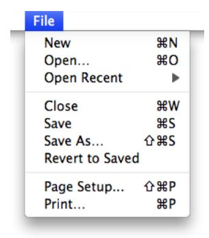

<span id="page-174-3"></span>Standard File menu commands include these:

<span id="page-174-2"></span>**New (Command-N).** Opens a new document named "untitled" (or "untitled 2," and so on, as appropriate). If your application requires documentsto be named upon creation, you can display a Save dialog (see ["Dialogs](#page-240-0) for Saving, Closing, and [Quitting"](#page-240-0) (page 241)). For more information about naming new document windows, see "Opening [Windows"](#page-210-1) (page 211).

<span id="page-174-4"></span>**Open… (Command-O).** Displays a dialog for choosing an existing document to open. Note that in the Finder, the Open command is not followed by an ellipsis character because the user performs navigation and document selection before selecting the Open command. For more information, see "The [Open](#page-239-0) [Dialog"](#page-239-0) (page 240).

**Open Recent.** TheOpen command can be followed byOpen Recentso that people can open recently opened documents without using the Open dialog. The Open Recent submenu displays documents in the order in which they were opened, with the most recent item at the top. This optional command is most useful in office-productivity or other document-based applications. Note that the ability to open recent documents and applications is provided by the Apple menu in the Recent Items menu item.

If you choose to include the Open Recent command, be sure to display document names only; don't display file paths. Users have their own ways of keeping track of which documents are which and file paths are inappropriate to display unless specifically requested by the user.

<span id="page-175-0"></span>**Close (Command-W).** Closes the active window. When the user chooses this command and the active document has been changed since lastsaved, display the Save Changes alert (see ["Dialogsfor](#page-240-0) Saving, Closing, and [Quitting"](#page-240-0) (page 241)). When the user presses the Option key, Close changes to Close All. The keyboard shortcuts Command-W and Command-Option-W should implement the Close and Close All commands, respectively.

<span id="page-175-1"></span>**Close File (Command-Shift-W).** In a file-based application that supports multiple views of the same file, you can include a Close File command below Close Window to close a file and all its associated windows. If possible, include the filename in the menu (for example, Close File "Book Report").

<span id="page-175-3"></span>**Save (Command-S).** Saves the active document, leaves the document open, and provides feedback indicating that the document is being (or has been) saved. If the document has not previously been saved, dim the Save command and make sure the Save As command is active instead. If an open document has been previously saved and the user has made no changes to it, the Save command is dimmed.

<span id="page-175-4"></span>**Save As… (Command-Shift-S).** Displays the Save dialog (described in "Save [Dialogs"](#page-240-2) (page 241)), which allows the user to save a copy of the active document with a new user-defined name, a new location, or both. The newly saved document remains open and active and displaysthe new name (if the user has changed it). The previously saved version of the document retains its name, location, and format, and remains closed. If the document has not previously been saved, the Save command is dimmed and the Save As command is active.

Avoid providing multiple Save As *File Format* menu commands that each save the document in a different file format. Instead, use the Format pop-up menu in the Save dialog to present the user with a selection of file formats. For example, the Format pop-up menu in Safari's Save dialog allows the user to save the current content of the window as a web archive or a page source.

<span id="page-175-9"></span>If your application needs to allow users to continue working on the active document, but save a copy of the document in a format your application doesn't handle, you can provide an Export As command.

<span id="page-175-5"></span>**Note:** Avoid using Save a Copy or Save To commands. The functionality users associate with these commands is provided by the Save As and Export As commands.

<span id="page-175-7"></span>**Export As…** Displaysthe Save dialog (described in "Save [Dialogs"](#page-240-2) (page 241)) to allow the user to save a copy of the active document in a format your application does not handle. As with the Save As command, the user is given the option to choose a new user-defined name, location, or both. Unlike the Save As command, however, it isthe original document thatshould remain open so the user can continue working in the current format; the newly saved document should not automatically open. Provide this command if your application needs to allow a user to work with a document in one format and save a copy of that document in a format your application doesn't handle. Be sure to change the label of the document name text field of the Save dialog from "Save As:" to "Export As:".

<span id="page-175-6"></span><span id="page-175-2"></span>**Save All.** Saves changes to all open documents.

<span id="page-175-8"></span>**Revertto Saved.** Discards all changes made to the active documentsince the last time it wassaved or opened. When the user chooses Revert to Saved, display an alert that warns the user about the potential data loss the operation will cause.

**Print… (Command-P).** Opens the standard Print dialog, which allows users to print to a printer, to send a fax, or to save as a PDF file. For more information, see "The Print [Dialog"](#page-246-0) (page 247).

<span id="page-176-3"></span>**Page Setup… (Command-Shift-P).** Opens a dialog for specifying printing parameters such as paper size and printing orientation. These parameters are saved with the document.

### <span id="page-176-6"></span><span id="page-176-0"></span>The Edit Menu

<span id="page-176-5"></span>The **Edit menu** provides commands that allow people to change (edit) the contents of documents and other text containers, such as fields. It also provides the commands that allow people to share data, within and between applications, via the Clipboard.

<span id="page-176-2"></span>The **Clipboard** stores whatever data is cut or copied from a document until the user replaces the contents by cutting or copying new data. The Clipboard is available to all applications, and its contents don't change when the user switches from one application to another. The Clipboard provides excellent support for the exchange of different data types between applications. Your application should maintain formatting when it copies text to the Clipboard.

<span id="page-176-1"></span>**Figure 13-17** The Edit menu


<span id="page-176-4"></span>Your application's Edit menu should provide the following commands. Even if your application doesn't handle text editing within its documents, these commandsshould be available for use in dialogs and wherever users can edit text:

**Undo (Command-Z).** The Undo command reverses the effect of the user's previous operation.

Support the Undo command for:

- Operations that change the contents of a document
- Operations that require a lot of effort to re-create
- Most menu items
- Most keyboard input

Operations that may not be undoable include:

- Selecting
- Scrolling

- Splitting a window
- Changing a window's size or location

<span id="page-177-0"></span>Add the name of the last operation to the Undo command. If the last operation was a menu command, add the command name. For example, if the user hasjust inputsome text, the command could read Undo Typing; if the user has chosen the Paste command, the Undo command should read Undo Paste. If the last operation can't be reversed, change the command to Can't Undo and display it dimmed to provide feedback about the current state.

<span id="page-177-7"></span>If a user attempts to perform an operation that could have a detrimental effect on data and that can't be undone, warn the user (see ["Alerts"](#page-231-0) (page 232)).

**Redo (Command-Shift-Z).** The Redo command reverses the effect of the last Undo command. Add the name of the last undone operation to the Redo command.

<span id="page-177-9"></span><span id="page-177-3"></span>**Cut (Command-X).** Removes the selected data and stores it on the Clipboard, replacing the previous contents of the Clipboard.

<span id="page-177-8"></span>**Copy (Command-C).** Makes a duplicate of the selected data, which is stored on the Clipboard.

<span id="page-177-6"></span>**Paste (Command-V).** Inserts the Clipboard contents at the insertion point. The Clipboard contents remain unchanged, permitting the user to choose Paste multiple times.

<span id="page-177-1"></span>**Paste and Match Style (Command-Option-Shift-V).** In text-editing applications, insertsthe Clipboard contents at the insertion point and matches the style of the inserted text to the surrounding text. If your application provides several text-formatting commands, you might choose to group them in a Format menu instead of listing them in the Edit menu (see "The [Format](#page-178-0) Menu" (page 179)).

<span id="page-177-2"></span>**Delete.** Removes selected data without storing the selection on the Clipboard. Choosing Delete is the equivalent of pressing the Delete key or the Clear key. Use Delete as the menu command, rather than Clear.

<span id="page-177-4"></span>**Select All (Command-A).** Highlights every object in the document or window, or all characters in a text field.

**Find… (Command-F).** Opens an interface for finding items. This command could be in the File menu instead if the object of the search is files—for example, if the application is finding a file on the Internet. When appropriate, your application should also contain a Find/Replace command. "Find [Windows"](#page-237-0) (page 238) shows an example of a typical Find window for searching text.

<span id="page-177-10"></span><span id="page-177-5"></span>If your application provides multiple find-related commands, you may want to include a Find submenu. A Find submenu commonly contains Find (Command-F), Find Next (Command-G), Find Previous (Command-Shift-G), Use Selection for Find (Command-E), and Jump to Selection (Command-J). If you include a Find submenu, the Find command is not followed by an ellipsis character.

**Find Next (Command-G).** Performs the last Find operation again. This item should be grouped with the Find command in either the File or Edit menu.

**Spelling… (Command-:)**. In applications that support text-editing, performs a spell-check of the selected text and opens an interface in which users can correct the spelling, view suggested spellings, and find other misspelled words.

If your application provides multiple spelling-related commands, you may want to include a Spelling submenu. A Spelling submenu typically contains Check Spelling (Command-;) and Check Spelling as You Type commands. If you include a Spelling submenu, the Spelling command is not followed by an ellipsis character.

**Speech.** Displays a submenu containing the Start Speaking and Stop Speaking commands. If your application displays text, you can provide the Speech menu item to allow users to listen to the text spoken aloud by the system.

<span id="page-178-14"></span><span id="page-178-11"></span>**Special Characters…** Displays the Special Characters window, which allows users to input characters from any character set supported by Mac OS X into text entry fields. This menu item is automatically inserted at the bottom of the Edit menu.

### <span id="page-178-15"></span><span id="page-178-13"></span><span id="page-178-0"></span>The Format Menu

<span id="page-178-1"></span>If your application provides functions for formatting text, you can include a **Format menu** as a top-level menu or as a submenu of the Edit menu. It may be appropriate to group some items that are in the Format menu into submenus, such as Font, Text, or Style.

**Figure 13-18** A Format menu


<span id="page-178-12"></span><span id="page-178-9"></span><span id="page-178-8"></span><span id="page-178-3"></span>**Show Fonts (Command-T).** The first item in the Format menu should be Show Fonts, which displays the Fonts window.

<span id="page-178-5"></span>**Show Colors (Command-Shift-C).** Displays the Colors window.

<span id="page-178-10"></span>**Bold (Command-B).** Boldfaces the selected text or toggles boldfaced text on and off. If used as a toggle, indicate when it is on by having a checkmark next to the command in the menu.

<span id="page-178-2"></span>**Italic (Command-I).** Italicizes the selected text or toggles italic text on and off. If used as a toggle, indicate when it is on by having a checkmark next to the command in the menu.

<span id="page-178-6"></span><span id="page-178-4"></span>**Underline (Command-U).** Underlines the selected text or toggles underlined text on and off. If used as a toggle, indicate when it is on by having a checkmark next to the command in the menu.

<span id="page-178-7"></span>**Bigger (Command–Shift–equal sign).** Causes the selected item to increase in size in defined increments.

**Smaller (Command-hyphen).** Causes the selected item to decrease in size in defined increments.

**Copy Style (Command-Option-C).** Copies the style—font, color, and size for text—of the selected item. It may be appropriate to put this item in a Style submenu along with related items.

**Paste Style (Command-Option-V).** Applies the style of one object to the selected object.

<span id="page-179-4"></span><span id="page-179-2"></span>**Align Left (Command-{).** Left-aligns a selection.

<span id="page-179-8"></span>**Center (Command-|).** Center-aligns a selection.

<span id="page-179-3"></span>**Justify.** Evenly spaces a selection.

<span id="page-179-9"></span>**Align Right (Command-}).** Right-aligns a selection.

<span id="page-179-5"></span>**Show Ruler.** Displays a formatting ruler.

<span id="page-179-6"></span>**Copy Ruler (Command-Control-C).** Copies formatting settings such as tabs and alignment for a selection to apply to a another selection and stores them on the Clipboard.

<span id="page-179-10"></span><span id="page-179-0"></span>**Paste Ruler (Command-Control-V).** Applies formatting settings (that have been saved to the Clipboard) to the selected object.

### <span id="page-179-13"></span><span id="page-179-11"></span>The View Menu

The **View menu** provides commands that affect how users see a window's content; it does not provide commands to select specific document windows to view or to manage a specific document window. Commands to organize, select, and manage windows are in the Window menu (described in "The [Window](#page-181-0) [Menu"](#page-181-0) (page 182)).

<span id="page-179-12"></span>For example, the View menu in the Finder contains commands for displaying windows in column, icon, or list mode. Commands for showing, hiding, and customizing a toolbar belong in the View menu. Create a View menu for these commands even if your application doesn't need to have other commands in the View menu. Show/Hide Toolbar should appear right above Customize Toolbar.

<span id="page-179-1"></span>Avoid using the View menu to display panels (such as tool palettes); use the Window menu instead.

<span id="page-179-7"></span>**Figure 13-19** A View menu

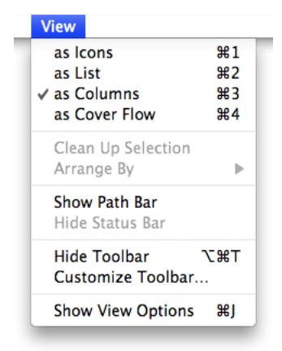

**Show/Hide Toolbar (Command-Option-T).** Shows or hides a toolbar. The Show/Hide Toolbar command is provided so that people using full keyboard access can implement these functions with the keyboard. It should be a dynamic menu item that toggles based on the current visibility of the toolbar. If the toolbar is currently visible, the menu item says Hide Toolbar. If the toolbar is not visible, it says Show Toolbar.

<span id="page-180-3"></span>**Customize Toolbar…** Opens a window that allows the user to customize which items are present. Figure 13-20 shows the result of choosing this command in the Finder.

<span id="page-180-4"></span><span id="page-180-1"></span>**Figure 13-20** Finder toolbar customization window

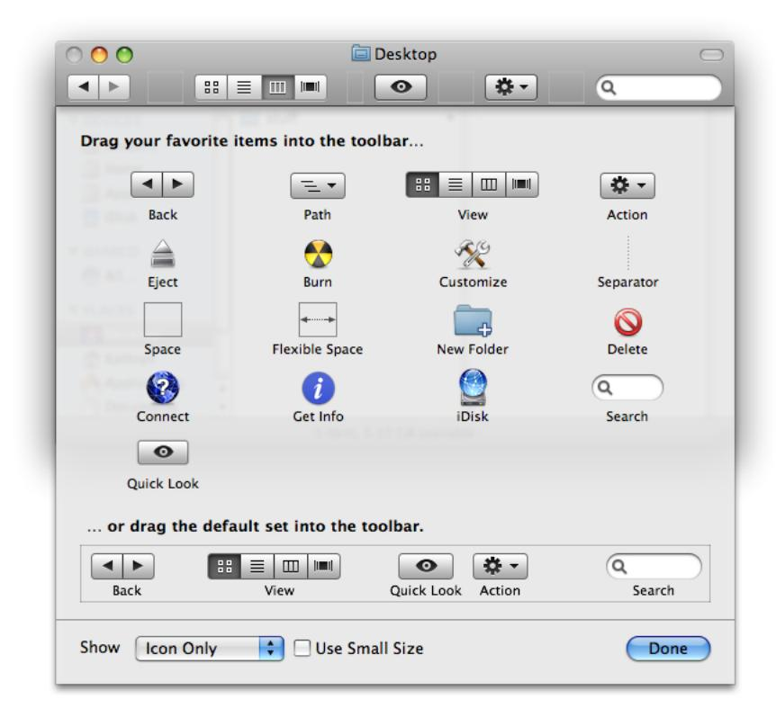

### <span id="page-180-2"></span><span id="page-180-0"></span>Application-Specific Menus

You can add your own application-specific menus as appropriate. These menus should be between the View menu and the Window menu, as illustrated in Figure 13-21.

**Figure 13-21** Application-specific menus in Safari


See "The Menu Bar and Its [Menus"](#page-170-0) (page 171) for more information about how to arrange application-specific menus in the menu bar.

### <span id="page-181-0"></span>The Window Menu

<span id="page-181-8"></span><span id="page-181-7"></span>The **Window menu** contains commands for organizing and managing an application's windows. The menu should list an application's open document windows (including minimized windows) in the order in which they were opened, with the most recently opened document first. If a document contains unsaved changes, a bullet should appear next to its name.

<span id="page-181-1"></span>Other than Minimize and Zoom (discussed below), the Window menu does not contain commandsthat affect the way a user views a window's contents. The View menu (described in "The View [Menu"](#page-179-0) (page 180)) contains all commands that adjust how a user views a window's contents.

**Figure 13-22** A Window menu


Mac OS X does not automatically add panelsto the list in the Window menu and you should not list individual panels in this menu. You can, however, add a command to the Window menu to show or hide panels in your application. (For more information about panels, see ["Panels"](#page-221-0) (page 222).)

The Minimize and Zoom commands are in the Window menu so that people using full keyboard access can implement these functions with the keyboard. Even if your application consists of only one window, include a Window menu for the Minimize and Zoom commands.

<span id="page-181-5"></span><span id="page-181-4"></span>Window menu items should appear in this order: Minimize, Zoom, separator, application-specific window commands, separator, Bring All to Front (optional), separator, list of open documents. Note that the Close command should appear in the File menu, below the Open command (see ["The](#page-174-0) File [Menu"](#page-174-0) (page 175)).

<span id="page-181-6"></span>**Minimize (Command-M).** Minimizes the active window to the Dock.

<span id="page-181-3"></span>**Minimize All (Command-Option-M).** Minimizes all the windows of the active application to the Dock.

**Zoom.** Toggles between a predefined size appropriate to the window's content and the window size the user hasset. This command should *not* expand the window to the fullscreen size. See "Resizing and [Zooming](#page-214-1) [Windows"](#page-214-1) (page 215).

<span id="page-181-2"></span>**Bring All to Front.** Brings forward all of an application's open windows, maintaining their onscreen location, size, and layering order. This should happen whenever a user clicks the application icon in the Dock. See "Window [Layering"](#page-216-0) (page 217).

You can make this command an Option-enabled toggle with Arrange in Front.

**Arrange in Front.** Brings forward all of the application's windows in their current layering order and changes their location and size so they are neatly tiled.

### <span id="page-182-0"></span>The Help Menu

<span id="page-182-5"></span><span id="page-182-4"></span>If your application provides onscreen help, the **Help menu** should be the rightmost menu of your application's menus. If you have registered your help book (see *Apple Help Programming Guide* for information on how to do this), the system provides the Spotlight For Help search field as the first item in the menu. The item after the Spotlight For Help search field isthe name of your application and the word "Help"(Mail Help, for example). This item should open Help Viewer to the first page of your help content. It's good to have only one custom item in the Help menu, but if you do have more items, they should appear below the *ApplicationName* Help item. Additional items that are unrelated to help content, such as arbitrary website links, registration information, or release notes can be linked to within your help book instead of being separate items in your help menu.

<span id="page-182-2"></span>Avoid using the Help menu as a table of contents for your help book. When they click the *ApplicationName* Help item in them menu, users can see the sections in your help book in the Help Viewer window. If you choose to provide additional links into your help content within the Help menu, be sure they are distinct. Figure 13-23 shows the iTunes Help menu.

**Figure 13-23** A Help menu


<span id="page-182-3"></span><span id="page-182-1"></span>*ApplicationName* **Help (Command-?).** Opens Help Viewer to your application's help. For information about creating help content and integrating it with Help Viewer, see *Apple Help Programming Guide*.

### Menu Bar Extras

Reserved for use by Apple, the right side of the menu bar may contain items that provide feedback on and access to certain hardware or network settings. Menu bar extras display some type of status in the menu bar and have a menu to change settings. The icon for the battery strength indicator, for example, dynamically displaysthe currentstate of the battery for a portable computer, and the menu has common battery settings. Users can display or hide a menu bar extra in the appropriate preferences pane.

**Important:** Don't create your own menu bar extras. Use the Dock menu functions to open a menu from your application's icon in the Dock.

If there is not enough room in the menu bar to display all menus, menu bar extras are removed automatically by Mac OS X to make room for application menus, which take precedence. Because of this, and because users can choose to hide menu bar extras, you should not rely on their presence.

# <span id="page-183-0"></span>Contextual Menus

<span id="page-183-1"></span>A **contextual menu** provides convenient access to often-used commands associated with an item. You can think of a contextual menu as a shortcut to commands that make sense in the context of the current task. Contextual menus open when the user pressesthe Control key while clicking an appropriate interface element or selection. Alternately, a user can configure a multi-button mouse to use one button as the secondary button, which then behaves the same as Control-clicking a one-button mouse.

You can provide an application-wide contextual menu control in a toolbar or at the bottom of a list view or source list. See "Action [Menus"](#page-283-0) (page 284) for examples and for more information on how to do this.

A contextual menu behaveslike a standard pull-down menu, except that moving the pointer off a contextual menu and onto a standard pull-down menu doesn't activate the second menu; the user must click once to close the contextual menu and click again or press to open the second menu.

Contextual menusthat are too long to display fully use the scrolling indicator (a downward-pointing triangle) and scroll like standard menus. Use submenus in contextual menus with caution and be sure to keep them to one level.

Don'tset a default item. If the user opensthe menu and closesit withoutselecting anything, no action should occur.

You define the items in your application's contextual menus. Include a small subset of the most commonly used commands in the appropriate context. For example, Edit menu commands should appear in the contextual menu for highlighted text, but a Save or a Print command should not.

Always ensure that contextual menu items are also available as menu commands. A contextual menu is hidden by default and a user might not know it exists,so itshould never be the only way to access a command. In particular, you should not use a contextual menu as the only way to access an advanced or power-user feature.

If a command has a keyboard shortcut, don't display the shortcut in the contextual menu (you should display the shortcut in the menu bar menu, as described in "The Menu Bar and Its [Menus"](#page-170-0) (page 171)). Because a user uses a contextual menu as a shortcut to a set of task-specific commands, it'sredundant to display the keyboard shortcuts for those commands.

<span id="page-184-1"></span>**Figure 13-24** A contextual menu for an icon in the Finder and for a text selection in a document

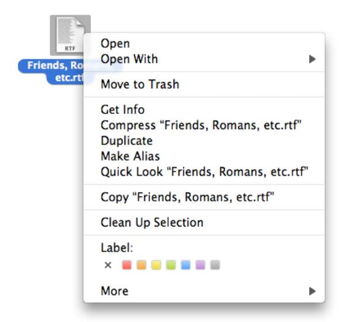


# <span id="page-184-2"></span><span id="page-184-0"></span>Dock Menus

When a user presses and holds the mouse button on your application's tile in the Dock, a menu appears. The menu lists the application's open windows and contains the Show In Finder, Hide, and Quit commands. The Show In Finder command displays a Finder window for the folder containing your application. The Hide and Quit commandsfunction as documented in "The [Application](#page-172-1) Menu" (page 173). If the user pressesthe Option key, Hide changes to Hide Others and Quit changes to Force Quit. If the tile has not been permanently added to the Dock, the command Keep In Dock also appears.

<span id="page-185-0"></span>**Figure 13-25** The iTunes Dock menu


You can customize your application's Dock menu by adding to the default items provided by the Dock. These additional items appear in the Dock menu only when the application is open. Potential additional items include:

- Common commands to initiate actions in your application when it is not frontmost
- Commands that are applicable when there is no open document window
- Status and informational text

<span id="page-185-1"></span>For example, a mail application could provide commands to initiate a new message or to check for new messages.

Any command you add to the Dock menu should also be available in your application's pull-down menus. Application-specific items appear above the standard Dock menu items.

<span id="page-186-2"></span><span id="page-186-0"></span>Windows provide a frame for viewing and interacting with applications and data.

From a developer's perspective, there are several types of windows in Mac OS X. Although users tend to see them all as windows, the distinctions in behavior (layering, zooming, minimizing) and appearance (presence or absence of title bars) among the various types of windows contribute to the Macintosh user experience. It is important that you understand the different types of windows available, general window behavior, and behavior specific to each type of window.

This chapter first introducesthe different types of windows and then focuses on the appearance and behavior of document and application windows and panels. Dialogs and alert windows are unique types of windows with guidelines in addition to those for standard windows. They are discussed in detail in ["Dialogs"](#page-229-0) (page 230). Note that unless explicitly stated, dialogs should behave like windows.

# <span id="page-186-1"></span>Types of Windows

<span id="page-186-3"></span>As a developer or a designer, you should be aware of four main types of windows. Although their behavior is generally the same, they have important differences.

- **Document windows** contain file-based user data. They present a view into the content that people create and store. If the document is larger than the window, the window shows a portion of the document's contents and provides users with the ability to scroll to other areas.
- **Application windows** are the main windows of applicationsthat are not document-based. These windows use the standard Aqua window look and features; if the application is running in versions of Mac OS X prior to v10.5 (Leopard), these windows can use the optional brushed metal look.
- **Panels** float above other windows and provide tools or controlsthat users can work with while documents are open. In some cases, panels can be transparent. In end-user documentation, panels should be called windows. Panels are discussed in more detail in ["Panels"](#page-221-0) (page 222).
- **Dialogs and alerts** require a response from the user. Dialogs and alerts are discussed in ["Dialogs"](#page-229-0) (page 230).

Examples of all of these types of windows are shown in Figure 14-1.

Types of Windows **187**

<span id="page-187-1"></span>**Figure 14-1** Types of windows in Mac OS X

#### Document window


#### Transparent panel

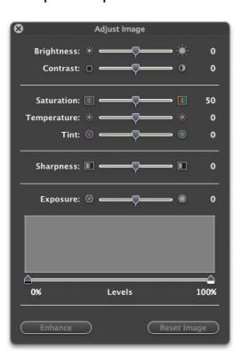

### Panel Application window


#### Dialog window


# <span id="page-187-3"></span><span id="page-187-2"></span><span id="page-187-0"></span>Window Appearance

A window consists of window-frame areas and a window body. The window-frame areas include the title bar, the toolbar, and the bottom bar (note that in Mac OS X v10.5 and later, the toolbar is not visually distinct from the title bar). The window body is the main content area that extends from the bottom edge of the title bar (or toolbar, if present) to the bottom edge of the window, not including the bottom bar, if one is present. The toolbar and the bottom bar are optional elementsthat not all windows have. Figure 14-2 shows examples of these areas in different windows.

<span id="page-188-0"></span>**Figure 14-2** Toolbars and bottom bars are optional window parts


In Mac OS X v10.5 and later, no window-frame surface is visible on the sides of windows; the window-body area, the toolbar, and the bottom bar stretch from the left edge to the right edge. Users can drag a window from any window-frame area, including a bottom bar.

All window-frame areas have a gray gradient surface. In the window body, content views (such as text or column views) display a white background by default; the surrounding window-body background is a shade of light gray.

**Important:** In Mac OS X v10.5 and later, there are no brushed metal windows. Windows that were designed as brushed metal windows to run in earlier versions of Mac OS X should adopt the Leopard look in Mac OS X v10.5. For the most part this is automatic. You may need to adjust your layout so that no window-frame material is visible on the sides of the window and you should ensure that the controls you used in the toolbar are still appropriate. See ["Window-Frame](#page-248-1) Controls" (page 249) for more information on appropriate controls and "Legacy Toolbar [Controls"](#page-256-0) (page 257) for some transition advice.

Figure 14-3 shows the Address Book application's transition from brushed metal to the Leopard look. Notice the removal of all window-frame surface on the sides, the use of appropriate toolbar and bottom-bar controls, and the adoption of the "zero-width" splitters that are standard in Mac OS X v10.5 (for more information about this control, see "Split [Views"](#page-326-0) (page 327)).

<span id="page-189-1"></span>**Figure 14-3** A brushed metal window designed for Tiger changes its look for Leopard


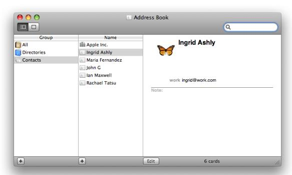

Address Book on Tiger Address Book on Leopard

# <span id="page-189-0"></span>Window Elements

Every document and application window and panel should have, at a minimum:

- A title bar. Even if a window does not have an actual title (a tools panel, for example), it should have a title bar so that users can move the window.
- A close button, so that users have a consistent way to dismiss the window.

<span id="page-189-2"></span>A standard document window may also have the following additional elements that an application window or panel might not have:

- Horizontal or vertical scroll bars, or both (if not all the window's contents are visible)
- Minimize and zoom buttons
- A proxy icon (after a document has been saved)
- The title of the document
- A resize control
- A toolbar control (if the window contains a toolbar)

Figure 14-4 shows most of these elements in their proper placements in a document window (to see the proper placement of a horizontal scroll bar, see [Figure](#page-220-0) 14-37 (page 221)).

<span id="page-190-0"></span>**Figure 14-4** Standard window parts displayed in a document window


Windows can also display a bottom bar, which is a portion of the window frame that extends below the main content area of the window body. A bottom bar contains controls that directly affect the contents and organization of the window. Controls in a bottom bar are important, but less so than controls in a toolbar. Figure 14-5 shows the bottom bar in an iCal window.

Window Elements **191**

<span id="page-191-0"></span>**Figure 14-5** A bottom bar in an application window


Another optional window element is the scope bar. A scope bar appears below an application's toolbar and allows users to narrow down a search operation or to filter objects or other operations by identifying specific sets of characteristics. Figure 14-6 shows the scope bar in the Finder.

<span id="page-192-1"></span>**Figure 14-6** A scope bar in an application window


### <span id="page-192-0"></span>The Title Bar

All windows should have a title bar even if the window doesn't have a title (which should be a very rare exception). In Mac OS X v10.5 and later, all windows display the title bar unified with the toolbar, if a toolbar is present. The following sections describe the components of the title bar.

### The Window Title

A document window should display the name of the document being viewed. Application windows display the application name. Panels display a descriptive title appropriate for that window. If the contents of the window can change, it might be appropriate to change the title to reflect the current context. For example, in the Keynote inspector panel, the title of the window changes to reflect which pane has been selected.

If you need to display more than one item in the title, separate the items with an em dash (—) with space on eitherside. For example, the main viewer window of Mail displaysthe currently selected message mailbox and the selected folder, if any. When a message is viewed in its own window, the message title is displayed.

Don't display pathnames in window titles. When displaying document titles, use the display name and show the extension if the user has elected to show extensions. If you need to display a path in the body of a window you can use the path control, described in "Path [Controls"](#page-288-0) (page 289).

The only controlsthat belong in a title bar are the close, minimize, and zoom buttons. If a title bar is combined with a toolbar, the unified area can contain the toolbar control and the toolbar customization contextual menu (these controls are described in "Title Bar [Buttons"](#page-193-1) (page 194)). Do not place other controls in a title bar.

Window Elements **193 2008-06-09 | © 1992, 2001-2003, 2008 Apple Inc. All Rights Reserved.**

### <span id="page-193-1"></span>Title Bar Buttons

Document and application windows always display active close and minimize buttons. (See ["Closing](#page-215-1) [Windows"](#page-215-1) (page 216) and ["Minimizing](#page-215-0) and Expanding Windows" (page 216) for details on what the close and minimize buttons do.) Include the zoom button if the window can be adjusted in size. Information on how the zoom button works is in "Resizing and Zooming [Windows"](#page-214-1) (page 215).

<span id="page-193-2"></span>Panels always display an active close button but never an active minimize button.

If buttons are not active, they should at least all be present in an inactive state. The exception is in panels, where it is acceptable to display only one button, the close button. For more information on panels, including information on their title bar buttons, see ["Panels"](#page-221-0) (page 222).

Alerts and modal dialogs do not display any of these buttons.

<span id="page-193-0"></span>The title barshould include a toolbar control if a toolbar is present in the window (see ["Toolbars"](#page-195-0) (page 196)). Figure 14-7 shows the appropriate configurations of title bar buttons for standard windows (and alerts and modal dialogs); [Figure](#page-223-1) 14-39 (page 224) shows appropriate title bar button configurations for panels.

**Figure 14-7** Title bar buttons for standard windows

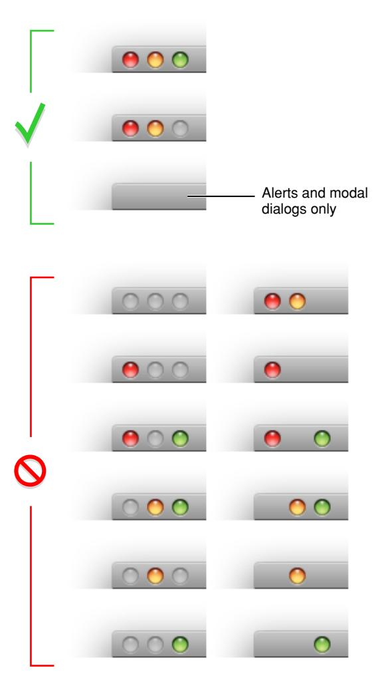

### Indicating Changes with the Close Button

<span id="page-194-0"></span>When a document has unsaved changes, the close button should display a dot, as shown in Figure 14-8.

**Figure 14-8** The close button in its unsaved changes state

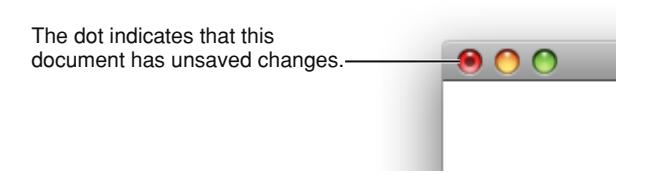

### <span id="page-194-3"></span>The Proxy Icon

<span id="page-194-1"></span>Document windows can include a **proxy icon** in the title bar after the content is saved for the first time. After pressing a proxy icon for a brief period, users can manipulate it asif they were manipulating the corresponding file-system object. For example, you can attach a document to an email message by dragging its proxy icon into the email message, as shown in Figure 14-9.

**Figure 14-9** A proxy icon being dragged to another application

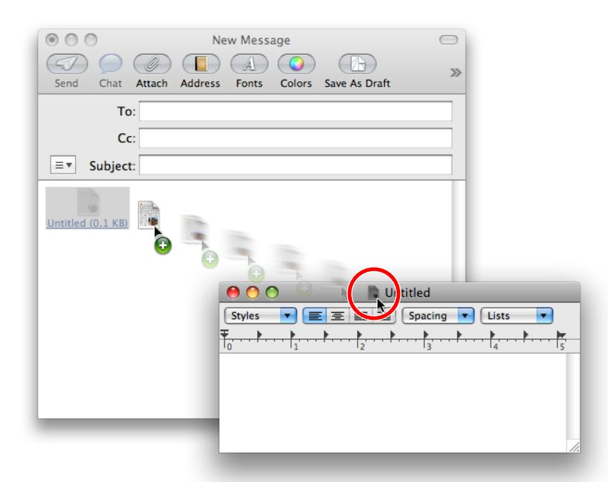

<span id="page-194-2"></span>A proxy icon appears in its normal state as long as the state of the document and the file-system object are the same. When a document has unsaved changes, its proxy icon appears dimmed. Note the difference between the proxy icon in the document with unsaved changes versus the document with saved changes in Figure 14-10.

<span id="page-195-1"></span>**Figure 14-10** Proxy icons in windows with saved and unsaved changes


<span id="page-195-2"></span>Command-clicking the title or the proxy icon displays a pop-up menu illustrating the document path (note that you do not place a standard pop-up menu control in the title bar to provide this behavior). As shown in Figure 14-11, the document path displays the document itself and all containing folders up to the volume that contains the user's home directory. Because Mac OS X is a multiple-user environment, it's especially important to show the complete path of a document to avoid confusion.

**Figure 14-11** A document path pop-up menu, opened by Command-clicking the proxy icon


### <span id="page-195-3"></span><span id="page-195-0"></span>Toolbars

A **toolbar** is useful for giving users immediate access to the most frequently used features in an application. Any item in a toolbar should also be available as a menu command. An application-wide toolbar in its own window is also called a **tool panel** (or lessfrequently, a tool palette); for more information,see ["Panels"](#page-221-0) (page 222). This section describes toolbars that are part of a window with other content.

### Toolbar Appearance and Behavior

In Mac OS X v10.5 and later, all windowsthat contain a toolbar display the unified toolbar–title bar appearance by default. This includes windows that were designed for earlier versions of Mac OS X, but are running in Mac OS X v10.5. For example, Figure 14-12 shows a Tiger version of Disk Utility running in Mac OS X v10.4 (on the left) and in Mac OS X v10.5 (on the right).

<span id="page-196-0"></span>**Figure 14-12** Many Tiger applications automatically receive the Leopard look when running in Mac OS X v10.5 and later

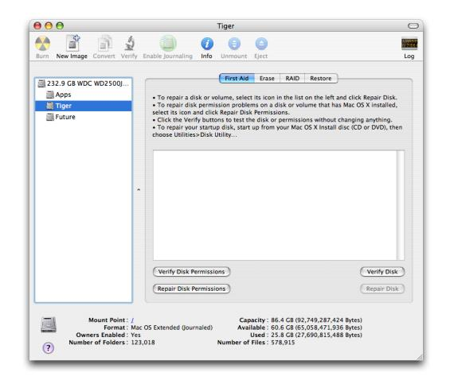


Tiger Disk Utility window on Tiger Tiger Disk Utility window on Leopard

Toolbars can contain a few types of controls and both standard and custom icons. Mac OS X v10.5 provides a small set of controls that are suitable for use in toolbars; standard Aqua controls do not belong in toolbars. Mac OS X v10.5 also provides a range of standard images you can use in toolbar controls, such as the Action menu and the Quick Look symbols, both of which are used in the Finder toolbar (as shown in Figure 14-13). See ["Window-Frame](#page-248-1) Controls" (page 249) for more information on the controls you can use in toolbars. See ["System-Provided](#page-150-0) Images" (page 151) for more information about the sytem-provided images you can use and see ["Designing](#page-147-0) Toolbar Icons" (page 148) for information on designing custom icons or images for a toolbar.

<span id="page-196-1"></span>**Figure 14-13** Many standard icons are available for use in window-frame controls

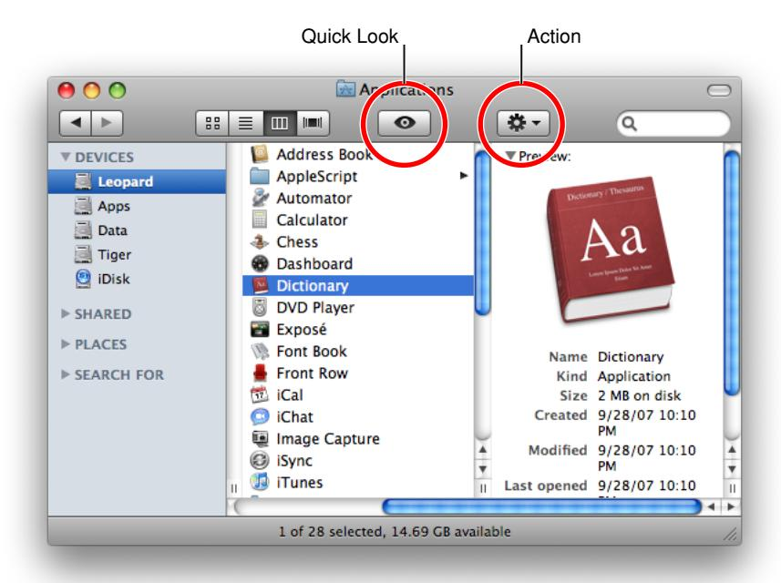

When the user clicks an item in the toolbar an immediate action occurs, such as opening a new window, switching to a different view, displaying a menu, or inserting (or removing) an object. In preferences windows, toolbar items often function as mode switchers: When the user clicks a toolbar item in a preferences window, the entire content of the window changes. This type of toolbar item should maintain its pressed state to indicate which item is currently selected. For example, Figure 14-14 showsthe RSS pane of the Mail preferences window. Notice the background highlighting that indicates which toolbar item is the active one.

<span id="page-197-0"></span>**Figure 14-14** The RSS pane of the Mail preferences window

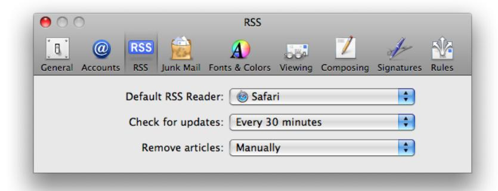

<span id="page-197-1"></span>An application or document window that includes a toolbar should provide a control in the window's title bar area for showing and hiding the toolbar, as shown in Figure 14-15. You should also put commands for showing and hiding the toolbar in the View menu (see "The View [Menu"](#page-179-0) (page 180)). A preferences window that contains a toolbar that functions as a mode switcher should not have a toolbar control.

**Figure 14-15** The toolbar control


Toolbar items can support click-through, which meansthat the user can activate the item when the containing window is inactive. You can choose to support click-through for any subset of toolbar items; for guidelines on when this might be appropriate, see ["Click-Through"](#page-217-1) (page 218).

### <span id="page-198-1"></span>Designing a Toolbar

**Note:** This section provides guidelines for designing a toolbar in an application or document window. Although a preferences window can also contain a toolbar, some guidelines for designing such a toolbar differ from the ones in this section. For example, the items in a preferences toolbar should not be available as menu commands and preferences toolbars should not be customizable. See ["Preferences"](#page-74-0) (page 75) to learn more about choosing items to include in a preferences window and ["Preferences](#page-237-1) Windows" (page 238) for more information on the look and behavior of preferences windows.

To help you decide what itemsto put in a toolbar, consider the user's mental model of the task your application performs (to learn more about the mental model, see ["Reflect](#page-38-3) the User's Mental Model" (page 39)). Keep in mind that a toolbar has limited space, so it's important to include items most users need regularly and to avoid including items that are used very infrequently. Using the user's mental model as a guide, examine the functionality of your application and identify the most useful features, commands, and objects.

Then, try to identify logical groupings or rankings of the commands and objects you've chosen. Place the items that should have the highest visibility in the left end of the toolbar. For example, one good design is to place more frequently used toolbar items to the left of less frequently used items. Another successful arrangement isto position toolbar items according to importance,significance, or place in an object hierarchy. In this design, the most important or significant items, or the ones closest to the root of the hierarchy, should have the highest visibility and are therefore towards the left end of the toolbar.

<span id="page-198-0"></span>Often, you can define logical subsets of these features and objects, such as a subset of commands related to the manipulation of a document and a subset of commands related to the objects on a document page. When this is the case, you can then arrange the items in each subset according to importance or frequency of use, and then use the same criteria to position the subsets in the toolbar. Figure 14-16 shows three ways to arrange toolbar items.

**Figure 14-16** Three options for arranging toolbar items


For example, in the default Keynote toolbar, items are grouped by functionality. Then, Keynote positions the groups so that they range from items that handle slide decks and slides to items that provide inspection and selection of object attributes. Specifically,slide creation and management items are on the left,slide contents and object management items are in the middle, and object adjustment and selection are on the far right. Figure 14-17 shows about half of these groups.

<span id="page-199-0"></span>**Figure 14-17** Toolbar items arranged by functionality


As you design the appearance of the toolbar items themselves, you have two options. First, if the features you've chosen lend themselves to iconic representation, you can create a recognizable image to stand for each one. Depending on the overall look of your application, decide whether you want to place the images in capsule-style toolbar controls or to use them as free-standing icon buttons. For example, both Pages and Mail use recognizable imagesto represent important commands, but Pages displaysitsimages asicon buttons and Mail uses capsule-style toolbar buttons, as shown in Figure 14-18. For more information about icon buttons, see "Icon [Buttons"](#page-260-0) (page 261); for more information about capsule-style toolbar buttons, see ["Capsule-Style](#page-253-0) Toolbar Controls" (page 254).

<span id="page-199-1"></span>**Figure 14-18** Two styles for toolbar items

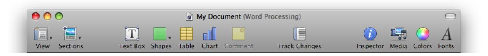

Toolbar items are icon buttons in Pages


Toolbar items are capsule style toolbar controls in Mail

Second, it may be that you can use the system-provided images to clearly represent all or most of the commands you've identified for display in the toolbar (these images are described in detail in ["System-Provided](#page-150-0) [Images"](#page-150-0) (page 151)). If this is the case, you can choose to place these images in either the rectangular-style or capsule-style toolbar controls. For example, Finder includes several toolbar controls that display system-provided images, as shown in [Figure](#page-196-1) 14-13 (page 197).

**Important:** If you choose to use system-provided images in your toolbar controls, be sure to avoid creating new meanings for them. For example, use the Action gear symbol in an Action menu only; don't use it to stand for "build" or "advanced."

The default set of toolbar items you provide should fit in the default window size, and the order in which they appear should reflect the user's mental model in some way. However, users should be able to customize which items appear in the toolbar and in what order. Additionally, a toolbar should display items with text labels by default; users should be able to change the display to items only or text only. You can provide these options with a Customize Toolbar command in the View menu.

Make sure that every toolbar item you create has an associated menu command. However, you should not create a toolbar item for every menu command, because not all commands are important enough or used frequently enough to warrant inclusion in a toolbar.

Avoid putting an application-specific contextual menu in your toolbar. The only contextual menu that makes sense in a toolbar is the toolbar customization contextual menu. If you need to offer a set of commands that act upon an object the user selects, use an Action menu control (described in "Action [Menus"](#page-283-0) (page 284)).

### <span id="page-200-0"></span>Scope Bars

A **scope bar** allows users to specify locations or rules in a search or to filter objects by specific criteria. In general,scope bars are not visible all the time, but appear when the user initiates a search orsimilar operation. Figure 14-19 shows the scope bar Safari displays when the user performs a find (because the Safari find operation does not allow the addition of scoping criteria, you can think of it as using an implied scope of "all").

<span id="page-200-1"></span>**Figure 14-19** A scope bar supports find operations within a window


### Scope Bar Appearance and Behavior

A scope bar is a horizontal strip that can appear just below your application's toolbar. It can be visible at all times, but is usually invisible until the user initiates an operation such as a search or find.

Although a scope bar may contain a search field control, it often contains only two types of controls, both of which are designed solely for use in a scope bar. The first control is the recessed-style scope button, which is used to display scoping locations and categories. The second is the round rectangle–style scope button, which is used to save or manipulate a scoping operation (for details on these controls, see ["Scope](#page-262-0) [Buttons"](#page-262-0) (page 263)).

You can also display filter rows below a scope bar that allow users to specify additional rules that help refine the scoping operation. In addition to the round rectangle–style scope button (used for selecting or saving scoping criteria), a filter row can also contain text fields that accept user input. For example, when users search in the Finder, they can click the Add button to view a new row with supplementary rules they can use to refine their search. Figure 14-20 shows a Finder window with several filter rows displayed below the scope bar.

<span id="page-201-0"></span>**Figure 14-20** A scope bar can display filter rows for refining a search

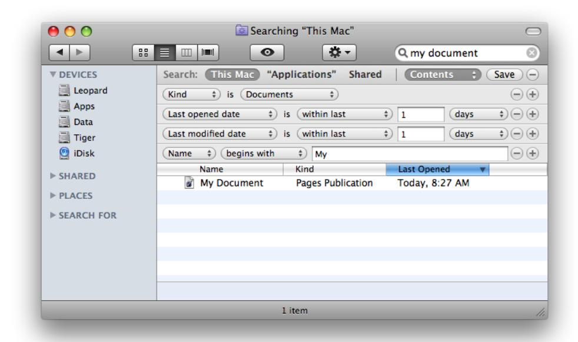

### Designing a Scope Bar

Scope bars are useful for integrating search or filtering in your application. You might choose to provide a scope bar (instead of a separate Find window, for example) if you want the user's focus to remain on the window. Be sure that you use a scope bar only to specify and narrow a search or to filter items by specified criteria. If you need to provide a way for users to navigate or to select collections of items or data that should appear in the window, however, you should use a source list instead (described in ["Source](#page-202-0) Lists" (page 203)). For example, the Dictionary application uses a scope bar to allow usersto dynamically filter results by reference type (such as dictionary, thesaurus, or Apple dictionary), as shown in Figure 14-21.

<span id="page-202-1"></span>**Figure 14-21** A scope bar can act as a filter


As you choose the locations and categories that should appear in a scope bar, revisit the user's mental model of the tasks your application performs. (See ["Reflect](#page-38-3) the User's Mental Model" (page 39) for more information on discovering this cognitive model.) Determine the objects the user works with, and identify the attributes of those objects. For example, an application that allows users to create, use, and store recipes might display a scope bar when the user begins a search, providing buttons that correspond to different recipe collections.

<span id="page-202-0"></span>If appropriate, allow users to define subsets of the locations and categories you offer by providing filter rows that display additional rules and filtering criteria. For example, the recipe application described above could display filter rowsthat allow usersto filter their results by ingredient, cuisine,seasonal availability, complexity, date last used, diet type, and other criteria. You should also allow users to save their searches. As shown in [Figure](#page-201-0) 14-20 (page 202), the Finder offers many types of additional filtering functionality and the ability to save searches.

### <span id="page-202-2"></span>Source Lists

A **source list** (also called a **sidebar**) is an area of a window, usually set off by a movable splitter, that provides users with a way to navigate or select objects in the application (for more information on splitters, see ["Split](#page-326-0) [Views"](#page-326-0) (page 327)). Typically, users select an object in the source list that they act on in the main part of the window. You can provide a source list asthe primary means of navigating or viewing within your application, as the Finder and iTunes do, or as a way to select a view in a part of the application, as some panes in System Preferences do.

Figure 14-22 shows some examples of source lists that function as primary navigation and selection mechanisms.

Window Elements **203**

<span id="page-203-0"></span>**Figure 14-22** Source lists help users navigate and select collections of objects or data


### <span id="page-203-1"></span>Source List Behavior and Appearance

<span id="page-203-2"></span>In Mac OS X v10.5 and later, source lists look different depending on their usage. A source list that provides the primary navigation or selection mechanism for the application as a whole displays a blue background. This type of source list should be the only source list in the application window and should always be visible (unless the user chooses to hide it). The Finder sidebar (shown on the left in [Figure](#page-203-0) 14-22 (page 204)) is an example of thistype ofsource list: It provides primary navigation and selection functionality for the application, it's separated from the rest of the window by a movable splitter, and it's always visible (unless the user chooses to hide it and the toolbar).

The other style of source list is often used in preferences windows. This type of source list provides selection functionality for the window, but not the application as a whole. A source list of this type displays a white background and might not be separated from the rest of the window by a movable splitter. The Network System Preferences pane contains this type of source list, as shown in Figure 14-23.

<span id="page-204-0"></span>**Figure 14-23** A source list may support selection in a window, not in the application as a whole


Source lists don't generally have headers like lists can, but they can display titles to distinguish subsets of objects or data. For example, the Finder displays several useful subsets of locations in its sidebar, such as Devices, Shared, and Places, as shown on the left in [Figure](#page-203-0) 14-22 (page 204).

### Designing a Source List

Source lists provide a very effective file-system abstraction. This means that a source list can shield users from the details of file and document management, allowing them to work with user-customizable, application-specific containersthat hold related items. These high-level container objects can hide the actual file-system locations of their files and data and conceal the associations between them. This can relieve users of the burden of locating and opening the auxiliary or related files they need to do their work.

Source lists are especially useful in single-window applications that are not necessarily document-based, but that allow users to create and manage content. For example, iTunes allows users to ignore the file-system locations of their songs, podcasts, and movies, and instead work with libraries and playlists. Similarly, iWeb focuses on website creation, not file management.

You should consider including a source list in your application when:

- Navigation and selection of content are primary tasks.
- Collections of objects are key to the user's mental model (see ["Reflect](#page-38-3) the User's Mental Model" (page 39) to learn more about the mental model).
- The hierarchical arrangement of objects presents a natural way to navigate.
- Arranging objects hierarchically removes complexity.

Because the source list is a navigation and selection tool, it should not contain controls other than controls used to organize the data itself. For example, you can use a disclosure triangle to reveal an additional level of hierarchy (disclosure triangles are described in ["Disclosure](#page-319-1) Triangles" (page 320)). Figure 14-24 shows how Mail uses disclosure triangles to display two levels of hierarchically organized information.

<span id="page-205-0"></span>**Figure 14-24** A source list can contain disclosure triangles

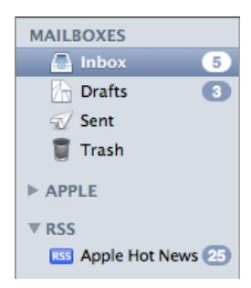

A source listshould not contain more than two levels of hierarchy. If the data you need to display is organized in more than two levels of hierarchy, you can use a second source list, but you should not use additional disclosure trianglesto expose additional levels of hierarchy in a single source list. If, however, your application is centered on the navigation of deeply nested objects, you should consider using a browser view instead of multiple source lists.

As mentioned in "Source List Behavior and [Appearance"](#page-203-1) (page 204), if your application contains a single source list that provides primary navigation and selection functionality, you can use the blue background. In all other cases, however, you should use the white background. Specifically, use the white background when:

- Your window contains more than one source list.
- You use a source list in a panel or preferences window.

You should allow users to customize the contents of a source list. This way, you allow users to decide what object containers are most important to them. You should also consider using Spotlight to support smart data containers. For more information on using Spotlight in your application, read *Spotlight Overview*.

If you need to allow users to add, remove, manipulate, or get information about items in the source list, you have two options:

- If your window has a bottom bar, you can place window-frame controls in the bottom bar directly below the source list. See ["Rectangular-Style](#page-249-0) Toolbar Controls" (page 250) for more information about the controls you can use in a bottom bar; see ["Bottom](#page-206-0) Bars" (page 207) for more information on designing bottom bars.
- If your window does not have a bottom bar, you can use gradient buttons at the bottom edge of the source list. Gradient buttons blend well with the background of the source list and look good with the bottom edge of the window-body area. See ["Gradient](#page-264-0) Buttons" (page 265) for details about using gradient buttons.

### <span id="page-206-0"></span>Bottom Bars

A **bottom bar** is a window-frame area that is below the window body. Bottom bars give users access to controls that directly affect the contents or organization of the window body.

In general, controls in a bottom bar are frequently used, but are somewhat less important than controls in a toolbar. For example, the bottom-bar controls in iChat allow users to add buddies to the list and to text message, call, or video chat with a selected buddy, whereas the controls in the toolbar are focused on the user of the application. Figure 14-25 shows the iChat bottom bar.

<span id="page-206-1"></span>**Figure 14-25** A bottom bar contains controls that affect the window-body contents or organization


### Bottom Bar Appearance and Behavior

Because a bottom bar is part of the window frame, it has the same gray gradient surface that is visible in the toolbar–title bar area.

Bottom bars can contain either regular-size or small rectangular-style toolbar controls; bottom bars should not contain icon buttons, capsule-style toolbar controls, custom controls, or any standard Aqua controls. See ["Rectangular-Style](#page-249-0) Toolbar Controls" (page 250) for more information about controls that are suitable for use in a bottom bar.

**Important:** If you choose to use system-provided images in your bottom-bar controls, be sure to avoid redefining their meanings. For example, use the Quick Look symbol to mean "preview with Quick Look" only; don't use it to mean "magnify."

At the top of Figure 14-26 you can see the Address Book bottom bar (which uses small controls) and below it you can see the iCal bottom bar (which uses regular-size controls).

<span id="page-207-0"></span>**Figure 14-26** A bottom bar and its controls can be regular-size or small


A bottom bar with regular-size controls

### <span id="page-207-1"></span>Designing a Bottom Bar

Because of its subordinate position at the bottom edge of the window, a bottom bar should not contain controls for the most frequently used commands. After all, users don't typically look at the bottom area of a window more often than they look at the top area, so placing the most important controls at the bottom makes them harder to find. However, although items in a bottom bar are less frequently used than items in a toolbar, you should still take care to choose items that give users an easy way to perform common tasks.

Unlike toolbars, bottom bars are not user-customizable, so it's especially important to provide a set of useful controls that is neither too general nor too specific. To help you determine which commands will be the most useful in the bottom bar of your window, be sure you understand the user's mental model of the tasks users perform with your application. To learn more about this concept, see ["Reflect](#page-38-3) the User's Mental [Model"](#page-38-3) (page 39).

After you've decided what commands you want to provide in a bottom bar, you need to choose or create simple, streamlined icons that are easily recognized as metaphors for these tasks. (Note that you can also use a text label in a bottom-bar control, such as "Edit.") If possible, you should use the system-provided images (described in ["System-Provided](#page-150-0) Images" (page 151)) because users are already familiar with their meanings. If you must design an icon for a bottom-bar control, try to imitate the clean lines of the system-provided images, as iCal does for its to-do bottom-bar control, shown in Figure 14-27. (For more information on designing icons for use in bottom-bar controls, see "Designing Icons for [Rectangular-Style](#page-149-1) Toolbar [Controls"](#page-149-1) (page 150).)

<span id="page-208-1"></span>**Figure 14-27** Controls in bottom bars can contain system-provided or custom images


As with toolbar items, every bottom-bar item should also be available as a menu command. Also, bottom bars should not contain contextual menus. If you need to offer a collection of commands that users can perform on a selected item in the window body, provide an Action menu control that displays the system-provided Action image (see "Action [Menus"](#page-283-0) (page 284) for more information on this control).

To decide whether to use regular-size or small controls in a bottom bar, consider the prominence these controls should have and the overall look of your window.

<span id="page-208-0"></span>Create a bottom bar by leaving a horizontalstrip of the window frame visible below the window body content view. If you want to place regular-size controls in a bottom bar, leave a strip that is 32 pixels high; if you want to use small controls, leave a strip that is 22 pixels high. For guidelines that help you place text and controls in a bottom bar, see ["Positioning](#page-352-0) Text and Controls in a Bottom Bar" (page 353).

### <span id="page-208-2"></span>Drawers

A **drawer** is a child window that slides out from a parent window and that the user can open or close (show or hide) while the parent window is open. A drawer should contain frequently accessed controls that don't need to be visible at all times. For example, Figure 14-28 shows a drawer that provides details about slide builds in the Keynote Build inspector.

Window Elements **209**

<span id="page-209-0"></span>**Figure 14-28** An open drawer next to its parent window


### <span id="page-209-2"></span>When to Use Drawers

Use drawers only for controls that need to be accessed fairly frequently but that don't need to be visible all the time. This is in contrast to the criterion for a panel, which should be visible and available whenever its main window is in the top layer. (For more information about panels, see ["Panels"](#page-221-0) (page 222).)

Although a drawer is somewhat similar to a sheet in that it attaches to a window and slides out, the two elements are not interchangeable. Sheets are modal dialogs (as described in "When to Use [Sheets"](#page-231-1) (page 232)), whereas drawers provide additional functionality. When a sheet is open, it is the focus of the window and it obscures the window contents; when a drawer is open, the entire parent window is still visible and accessible.

<span id="page-209-1"></span>You should not use a drawer to provide users with a way to navigate hierarchically arranged content in your window. If you need to do thisin your application, you should use a source list instead. See ["Source](#page-202-0) Lists" (page 203) to learn more about source lists.

### Drawer Behavior

The user shows or hides a drawer, typically by clicking a button or choosing a command. If a drawer contains a valid drop target, you may also want to open the drawer when the user drags an appropriate object to where the drawer appears.

When a drawer opens, it appears to be sliding from behind its parent window, to the left, right, or down. You should ensure that a parent window's default position allowsits drawer to open fully without disappearing offscreen. If a user moves a parent window to the edge of the screen and then opens a drawer, it should open on the side of the window that has room. If the user makes a window so big that there's no room on either side, the drawer opens off the screen.

To support the illusion that a closed drawer is hidden behind its parent window, an open drawer should be smaller than its parent window. When the parent window is resized vertically, an open drawer resizes, if necessary, to ensure that it does not exceed the height of the parent window. (A drawer can be shorter than its parent window.) The illusion is further reinforced by the fact that the inner border of a drawer is hidden by the parent window and that the parent window's shadow is seen on the drawer when appropriate.

The user can resize an open drawer by dragging its outside border. The degree to which a drawer can be resized is determined by the content of the drawer. If the user resizes a drawer significantly—to the point where content is mostly obscured—the drawer should simply close. For example, if a drawer contains a scrolling list, the user should be able to resize the drawer to cover up the edge of the list. But if the user makes the drawer so small that the items in the list are difficult to identify, the drawer should close. If the user sets a new size (if that is possible) for a drawer, the new size should be used the next time the drawer is opened.

A drawer should maintain its state (open or closed) when its parent window becomes inactive or when the window is closed and then reopened. When a parent window with an open drawer is minimized, the drawer should close; the drawer should reopen when the window is made active again.

A drawer can contain any control that is appropriate to its intended use. Follow normal layout guidelines, as stated in "Positioning [Regular-Size](#page-336-1) Controls in a Window Body" (page 337).

Consider a drawer part of the parent window; don't dim a drawer's controls when the parent window has focus, and vice versa. When full keyboard access is on, a drawer's contents should be included in the window components that the user can select by pressing Tab.

# <span id="page-210-2"></span><span id="page-210-0"></span>Window Behavior

<span id="page-210-1"></span>This section discusses how you should open, position, resize, and close windows and provides guidelines on how they should behave when a user interacts with them.

### Opening Windows

Your application should open a window when a user does any of the following:

- Double-clicks the icon for a document supported by your application in the Finder
- Double-clicks your application icon
- Selects a document in the Finder and chooses open from the File menu (or selects the document and presses Command-O in the Finder)
- <span id="page-210-4"></span><span id="page-210-3"></span>■ Chooses a file from within an Open dialog
- Chooses the New command from the File menu
- Clicks the application icon in the Dock when no windows are open

When the user opens an existing document, make sure its title is the **display name**, which reflects the user's preference for showing or hiding its filename extension. Don't display pathnames in document titles.

New windows should be named as described in "Naming New [Windows"](#page-211-0) (page 212).

<span id="page-211-5"></span>The content of some windows changes depending on the user's selection. For example, when the user clicks one of the icons at the top of the Mail Preferences window, the display at the bottom of the window changes. Some windows,such as Displaysin System Preferences,switch panes using a tab control (see "Tab [Views"](#page-328-0) (page 329)).

Windows with changeable panes should reopen in their previous state as long as the application is open and return to their default views when the user quits. In a window with toolbars, if the toolbar represents only a subset of multiple possible views (favorites), the default state should be to show all of the options below the toolbar, not a particular pane. If the toolbar displays all of the possible selections, then the default state of the window should be to display whichever pane the user last selected. For example, when System Preferences opens, all of the possible selections are visible, but when Mail preferences opens, it displays the last pane selected by the user. The System Preferences window is shown in Figure 14-29.

<span id="page-211-6"></span><span id="page-211-1"></span>**Figure 14-29** The System Preferences window in its default state

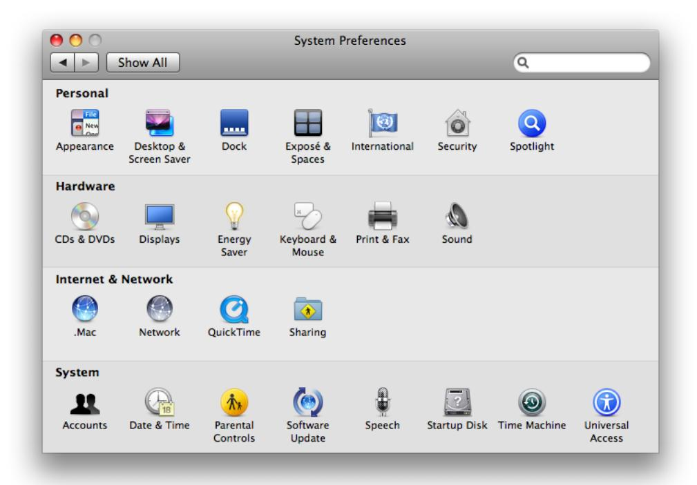

### <span id="page-211-4"></span><span id="page-211-3"></span><span id="page-211-2"></span><span id="page-211-0"></span>Naming New Windows

If your application is not document-based, use the name of your application as the window title. If your application has a short name, use it as the title.

Name a new document window "untitled"; leaving it lowercase makes it more obvious that the window doesn't have a name and encourages people to save the document. If the user chooses New again before saving the first untitled window, name the second window "untitled 2," and so on. Add numbers to window titles only when there is more than one open untitled window. Don't put a "1" on the first untitled window, even after the user opens other new windows. Figure 14-30 shows titles you should use for new, unsaved document windows.

<span id="page-212-6"></span><span id="page-212-1"></span>**Figure 14-30** Appropriate titles for a series of unnamed windows


<span id="page-212-2"></span>If the user dismisses all untitled windows by saving or closing them, then the next new document should start over as "untitled," the next should be "untitled 2," and so on. Figure 14-31 shows the correct title for a new window followed by various examples of incorrect titles.

**Figure 14-31** Examples of correct and incorrect window titles


### <span id="page-212-5"></span><span id="page-212-3"></span><span id="page-212-0"></span>Positioning Windows

<span id="page-212-4"></span>Whenever your application displays a window, you must decide where to put it and how big to make it.

New document windows should open horizontally centered and should display as much of the document content as possible. The top of the document window should butt up against the menu bar (or the application's toolbar, if one is open and positioned below the menu bar). Subsequent windows should open to the right 20 pixels and down 20 pixels. Make sure that no part of a new window overlaps with the Dock. For more information about the Dock, see "The [Dock"](#page-61-0) (page 62).

<span id="page-213-4"></span><span id="page-213-2"></span>For nondocument windows, the preference isto open new windows horizontally centered asshown in Figure 14-32. The vertical position should be visually centered: The distance from the bottom of the window to the top of the Dock (if it's at the bottom of the screen) should be approximately twice the distance as that from the bottom of the menu bar to the top of the window. Subsequent windows are moved to the right 20 pixels and down 20 pixels. Make sure that no part of a new window overlaps with the Dock.

<span id="page-213-0"></span>**Figure 14-32** Placement of a new nondocument window


If a user changes a window's initial size or location, maintain the user's choices the next time the associated file or window (in the case of a single-window application) opens. If a user opens, moves, and closes a document window without making any other changes, save the new window position but don't modify the file's date stamp.

<span id="page-213-1"></span>Before reopening a window, make sure that the size and state are feasible for the user's current monitor setup, which may not be the same as the last time the document was open. Try to maintain the window's previous location (the top-left corner of the window) and, if possible, its size. If you can't replicate both, maintain the location and reduce the window's size. If that is not possible, try to keep the window on the same monitor, open the window so that as much of the content as possible is visible, and follow the guidelines for opening a new window, as described previously.

<span id="page-213-3"></span>For example, if a user opens a document to full size on a wide aspect-ratio display and then opens the file on a computer with a smaller display, the document should open in a window sized for the smaller display, not in the larger, saved size. For more information on appropriate window size, see "Resizing and [Zooming](#page-214-1) [Windows"](#page-214-1) (page 215).

On a computer with more than one display, display the first new window visually centered in the screen containing the menu bar. If the user doesn't move that first window, display each additional window below and to the right of its predecessor. If the user moves the window, display each additional window on the screen that contains the largest portion of the frontmost window, as shown in Figure 14-33. For example, if the user creates a window, drags it completely to a second monitor, and then creates a new window, display

the new window on the second screen. If there issufficient room on the screen, display subsequent windows to the lower right of the frontmost window. If there isn't enough room on the screen, display subsequent windows starting in the original visually centered position, and then continue to display additional windows slightly offset to the lower right.

<span id="page-214-2"></span>If the user moves a window so that it is entirely positioned on a second monitor and then opens the window on a single-monitor system, respect the window's previous size, if possible.

**Figure 14-33** Appropriate placement of a new window on a system with multiple monitors(the user moved the first window to span the screens)


<span id="page-214-0"></span>If the user opens several windows on a multiple-monitor system, continue to place the windows on the screen where the user is working, each new one below and to the right of its predecessor. Don't open a window so that it spans monitors; the *initial position* of a window should always be contained on a single screen.

### <span id="page-214-4"></span>Moving Windows

The user moves a window by dragging any part of the window frame (see "Window [Appearance"](#page-187-0) (page 188) for more information on parts of the window). As a user drags, the full window and its contents move.

Pressing the Command key while dragging an inactive window moves the window but does not make it active. See "Main, Key, and Inactive [Windows"](#page-216-1) (page 217) for more information about active and inactive windows.

<span id="page-214-3"></span><span id="page-214-1"></span>Your application should never allow users to move a window to a position from which they can't reposition it.

### Resizing and Zooming Windows

Your application determines the minimum and maximum window size. Base these sizes on the resolution of the display and on the constraints of your interface. For document windows, try to show as much of the content as possible, or a reasonable unit, such as a page.

<span id="page-215-5"></span>Your application also sets the values for the initial size and position of a window, called the **standard state**. Don't assume that the standard state should be as large as possible; some monitors are much larger than the useful size for a window. Choose a standard state that is best suited for working on the type of document your application creates and that shows as much of the document's contents as possible.

The user can't change the standard size and location of a window, but your application can change the standard state when appropriate. For example, a word processor might define the standard size and location as wide enough to display a document whose width is specified in the Page Setup dialog.

The user changes a window's size by dragging the size control (in the lower-right corner). As a user drags, the amount of visible content in the window changes. The upper-left corner of the window remains in the same place. The actual window contents are displayed at all times.

<span id="page-215-6"></span>If the user changes a window's size or location by at least 7 pixels, the new size and location is the **user state**.The user can toggle between the standard state and the user state by clicking the **zoom button**. When the user clicks the zoom button of a window in the user state, your application should first determine the appropriate size of the standard state. Move the window as little as possible to make it the standard size, and keep the entire window on the screen. The zoom button should not cause the window to fill the entire screen unless that was the last state the user set.

When a user with more than one monitor zooms a window, the standard state should be on the monitor containing the largest portion of the window, not necessarily the monitor with the menu bar. This means that if the user moves a window between monitors, the window's position in the standard state could be on different monitors at different times. The standard state for any window must always be fully contained on a single monitor.

<span id="page-215-0"></span>When zooming a window, make sure it doesn't overlap with the Dock. For more information about the Dock, see "The [Dock"](#page-61-0) (page 62).

### <span id="page-215-4"></span><span id="page-215-3"></span>Minimizing and Expanding Windows

<span id="page-215-2"></span>When the user clicks the **minimize button**, double-clicks the title bar, or presses Command-M, the window minimizes into the Dock. The window's icon remains in the Dock until the user clicks it or, if it is the application's only open window, until the user clicks the application icon in the Dock. For more information about the Dock, see "The [Dock"](#page-61-0) (page 62).

<span id="page-215-7"></span>Clicking an application icon in the Dock should alwaysresult in a window—a document or another appropriate window—becoming active. If a document-based application is not open when the user clicks the Dock icon, the application should open a new, untitled window.

<span id="page-215-1"></span>While an application is open, the Dock icon has a symbol below it. When a user clicks an open application's icon in the Dock, the application becomes active and all open unminimized windows are brought to the front; minimized document windows remain in the Dock. If there are no unminimized windows when the user clicks the Dock icon, the last minimized window should be expanded and made active. If no documents are open, the application should open a new window. (If your application is not document-based, display the application's main window.)

### Closing Windows

Users can close windows by:

- Choosing Close from the File menu
- Pressing Command-W
- Clicking the close button

When a user closes a document window, your application should:

- Decide what to do with unsaved data (see "Dialogs for Saving, Closing, and [Quitting"](#page-240-0) (page 241))
- Store the window's onscreen position and size (so they can be used when the window is reopened)

In most cases, applications that are not document-based should quit when the main window is closed. For Example, System Preferences quitsif the user closesthe window. If an application continuesto perform some function when the main window is closed, however, it may be appropriate to leave it running when the main window is closed. For example, iTunes continues to play when the user closes the main window.

### <span id="page-216-4"></span><span id="page-216-0"></span>Window Layering

Each application and document window exists in its own layer, so documents from different applications can be interleaved. Clicking a window to bring it to the front doesn't disturb the layering order of any other window.

A window's depth in the layers is determined by when the window was last accessed. When a user clicks an inactive document or chooses it from the Window menu, only that document, and any open panels, should be brought to the front. Users can bring all windows of an application forward by clicking itsicon in the Dock or by choosing Bring All to Front in the application's Window menu. These actions should bring forward all of the application's open windows, maintaining their onscreen location, size, and layering order within the application. For more information, see "The [Window](#page-181-0) Menu" (page 182).

<span id="page-216-5"></span><span id="page-216-3"></span>Panels are always in the same layer, the top layer. They are visible only when their application is active and they float on top of any document windows in the application.

<span id="page-216-2"></span><span id="page-216-1"></span>Users can cycle forward or backward through all open document windows by using Command-Grave Accent (Command-`) and Command-Shift-Grave Accent (Command-Shift-`). If full keyboard access is on, they can cycle through all windows by using Control-F4 and Shift-Control-F4.

### Main, Key, and Inactive Windows

Windows have different looks based on how the user is interacting with them. The foremost document or application window that is the focus of the user's attention is referred to as the **main window**. The main window is often also the **key window**. The key window is the window that accepts user input, whether from the keyboard, mouse, or alternative input device. The "close window" keyboard shortcut, Command-W, targets the key window.

However, the main window is not always the key window. There are times when a window other than the main window takes the focus of the input device, while the main window still remains the focus of the user's attention. For example, when a person is using an inspector, a Find dialog, or the Fonts or Colors windows, the document is the main window and the other window is the key window.

If the main and key window are different windows, they are distinguished from one another by the look of their title bars (and toolbars, if they are present). In particular, note that the key window displays title-bar controls with color.

Main and key windows are both active windows. An active window is visually distinct from an **inactive window** in that its title bar (and its toolbar, if there is one) displays the standard window-frame color, while the title bar (and toolbar) of an inactive window displays a lighter shade of the window-frame color. Inactive windows are windows the user has open, but that are not in the foreground. Main and key windows are always in the foreground, but only the controls of the key window have color. An active window that is not key has active, but clear, controls.

**Note:** A transparent panel that is key displays a subtly reflective title bar and a white title, whereas a non-key transparent panel displays a darker title bar and a light gray title. See ["Transparent](#page-224-0) Panels" (page 225) for more information about transparent panels.

<span id="page-217-0"></span>The visual distinctions between main, key, and inactive windows are shown in Figure 14-34.


**Figure 14-34** Main, key, and inactive windows

### <span id="page-217-2"></span><span id="page-217-1"></span>Click-Through

An item that provides **click-through** is one that a user can activate on an inactive window with one click, instead of clicking first to make the window active and then clicking the item. Click-through provides greater efficiency in performing such tasks as closing or resizing inactive windows, and copying or moving files. In many cases, however, click-through could confuse a user who clicks an item unintentionally.

Click-through is not a property of a class of controls. Any control, including toolbar items, can support click-through in many contexts, but the same control could disable click-through when its use could be destructive or difficult to reverse in a particular context.

In an inactive window, items that do not provide click-through should appear in their disabled state. Figure 14-35 shows controls that do support click-through in an inactive window.

<span id="page-218-0"></span>**Figure 14-35** An inactive window with controls that support click-through

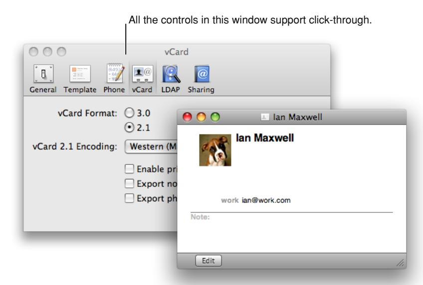

In a single window, you can provide click-through for any subset of items; you do not have to choose between supporting click-through for all items or none. Examine the controls in your window to see which items a user might want to activate while the window isinactive. Use the following guidelinesto help you determine which items should not support click-through.

Don't provide click-through for an item or action that:

- Is potentially harmful and does not allow the user to cancel it (for example, the Delete button in Mail)
- Is difficult or impossible to cancel (such as the Send button in Mail)
- Dismisses a dialog without telling the user what action was taken (for example, the Save button in a Save dialog that overwrites an existing file and automatically dismisses the dialog)
- Removes the user from the current context (for example, selecting a new item in a Finder column can change the target of the Finder window)

Clicking in any one of these situations should result in the containing window being brought forward, but no action being taken. Figure 14-36 shows an example of a control that does not support click-through, because its action is destructive.

<span id="page-219-1"></span>**Figure 14-36** The Delete button on the inactive window does not support click-through


In general, you can implement click-through for a command that provides confirmation feedback before executing, even if the command ultimately results in destruction of data. For example, you can provide click-through for a delete button if you make sure to provide the user with the ability to cancel or confirm the action before it executes. For example, in Accounts preferences, the button for deleting users provides click-through because it also provides a confirmation dialog before executing.

<span id="page-219-0"></span>If you want to implement click-through for an item that doesn't provide confirmation feedback, consider how difficult it will be for the user to undo the action after it's performed. For example, in Mail, the Delete button does not provide click-through because it deletes a message without providing feedback first, which is a potentially harmful action and one that is difficult to undo. Click-through for the New button in Mail is fine because its resulting action is not harmful and is easy to undo.

### <span id="page-219-4"></span><span id="page-219-3"></span><span id="page-219-2"></span>Scrolling Windows

People use **scroll bars** to view areas of a document or a list that is larger than can fit in the current window. Only active windows can be scrolled. A window can have a horizontal scroll bar, a vertical scroll bar, both, or neither. A window that has one or more scroll bars also has a resize control in the bottom right corner. Figure 14-37 shows the parts of a scroll bar in a window.

<span id="page-220-0"></span>**Figure 14-37** The elements of a scroll bar


The **scroller** size reflects how much of the content is visible; the smaller the scroller, the less of the content the user can see at that time. The scroller represents the relative location, in the whole document, of the portion that can be seen in the window.

If the entire contents of a document is visible in a window, the scroll bars do not contain scrollers. Scroll bars in inactive windows have an inactive appearance. In [Figure](#page-219-1) 14-36 (page 220) you can see the inactive appearance in the scroll bar of the Mail viewer window.

For most document windows that contain a single view (scrolling text or tables, for example), do not specify any space between the window edge and scroll bars.

<span id="page-220-2"></span>The user can use scroll bars by doing the following:

- Dragging the scroller. This method is usually the fastest way to move around a document. The window's contents changes in "real time" as the user drags the scroller.
- <span id="page-220-3"></span>■ Clicking a scroll arrow. This means, "Show me more of the document that's hidden in this direction." The scroller moves in the direction of the arrow. Each scroll arrow click moves the content one unit; your application determines what one unit equals. For example, a word processor would move a line of text per click, a spreadsheet could move one row or column. To ensure smooth scrolling effects, specify units of the same size throughout a document.
- <span id="page-220-1"></span>■ Clicking or pressing in the scroll track. Clicking advances the document by a windowful (the default) or to the pointer's hot spot, depending on the user's choice in Appearance preferences. A "windowful" is the height or width of the window, minus at least one unit of overlap to maintain the user's context. This unit of overlap should be the same as one scroll arrow unit (for example, a line of text, a row of icons, or part of a picture). The Page Up and Page Down keys also move the document view by a windowful.

Pressing in the scroll track displays consecutive windowfuls of the document until the location of the scroller catches up to the location of the pointer (or until the user releases the mouse button).

It's best not to add controls to the scroll-bar area of a window. If you add more than one control to this area, it's hard for people to distinguish among controls and click the right one. Acceptable additions to the scroll area include a splitter bar and a status bar that shows, for example, the current page. To ensure that window controls are easy to use and understand, it's best to place the majority of your features in the menus as commands. If you really want to provide additional access to features, consider creating a panel. Only frequently accessed features that significantly benefit users' productivity should be elevated to the primary interface.

Panels that coexist with other windows and need to use the least amount of screen space possible may use small or miniscroll bars. If a window hassmall or miniscroll bars, all other controls within the window content area should also be the smaller version. For more information, see ["Positioning](#page-343-0) Small and Mini Controls in a [Window](#page-343-0) Body" (page 344).

<span id="page-221-3"></span>Make sure you don't use a scroll bar when you should really use a slider. Use sliders to change settings; use scroll bars only for representing the relative position of the visible portion of a document or list. For information about sliders, see ["Sliders"](#page-295-0) (page 296).

### <span id="page-221-2"></span><span id="page-221-1"></span>Automatic Scrolling

Most of the time, the usershould be in control ofscrolling. Your application must perform automatic scrolling in these cases:

- When your application performs an operation that results in making a new selection or moving the insertion point (for example, when the user searches for some text and your application locates it), scroll the document to show the new selection.
- When the user enters information from the keyboard at a location not visible within the window (for example, the insertion point is on one page and the user has navigated to another page), scroll the document automatically to incorporate and display the new information.
  - Your application determines the distance to scroll.
- When the user moves the pointer past the edge of the window while holding down the mouse button to make an extended selection, scroll the document in the direction the pointer moves.
- When the user selects something, scrolls to a new location, and then tries to perform an operation on the selection, scroll so the selection is showing before your application performs the operation.

<span id="page-221-4"></span>Whenever your application scrolls a document automatically, move the document only as much asis necessary. That is, if part of a selection is showing after the user performs an operation, don't scroll at all. If your application can reveal the selection by scrolling in only one direction, don't scroll in both.

When automatically scrolling to a selection, try to show the selection in context. When the selection is too large to show in its entirety, it might be a good idea to show some context instead of having the selection fill the window.

# <span id="page-221-5"></span><span id="page-221-0"></span>Panels

The term **panel** is a general term used to describe auxiliary windows that contain controls and options that affect the active document or selection. Different types of panels may have more specific names, such as Colors window or inspector. Note that in end-user documentation, it's usually clearer to describe panels as windows, when it is necessary to specify their type. When possible, you should refer to all windows by their title, not their type.

For some applications, such as highly visual, immersive applications, transparent panels are appropriate. For most applications, however, standard panel types are best. See [Figure](#page-187-1) 14-1 (page 188) for an example of a transparent panel; to learn more about them, see ["Transparent](#page-224-0) Panels" (page 225).

Panels are either application-specific orsystemwide. Application-specific panels disappear when the application is deactivated.

Systemwide panels, such as the Colors window and the Fonts window, float on top of all open windows.

<span id="page-222-1"></span>You can create a modeless panel, such as a tools panel, to present controls or settings that affect the active document window. Panels are useful for keeping extremely important controls or information accessible at all times in the context of a user task. Because panels take up screen space, however, don't use them when you can meet the need by using a modeless dialog (the user changes settings and then closes the dialog) or by adding a few appropriate controls to a toolbar.

A user can open several panels at a time; they float on top of document windows. When a user makes a document active, all of the application's panelsshould be brought to the front, regardless of which document was active when the user opened the panel. When your application is inactive, its panels should be hidden. Panels should not be listed in the Window menu as documents, but you may put commands to show or hide all panels in the Window menu. Figure 14-38 shows examples of different styles of panels.

<span id="page-222-0"></span>**Figure 14-38** Examples of standard panels

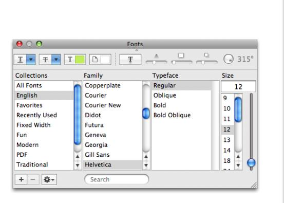

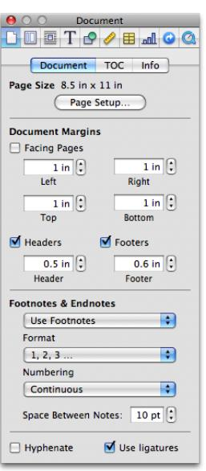


<span id="page-222-2"></span>A panel may have a title. An untitled panel should have a title-bar region for dragging it.

A user would never need to minimize a panel because it is displayed only when needed and disappears when its application isinactive. Therefore, the minimize button is always unavailable. A panelshould have the close and zoom buttons or, if you don't want users to be able to use the zoom button, only the close button. These configurations are shown in Figure 14-39.

<span id="page-223-1"></span>**Figure 14-39** Panel controls

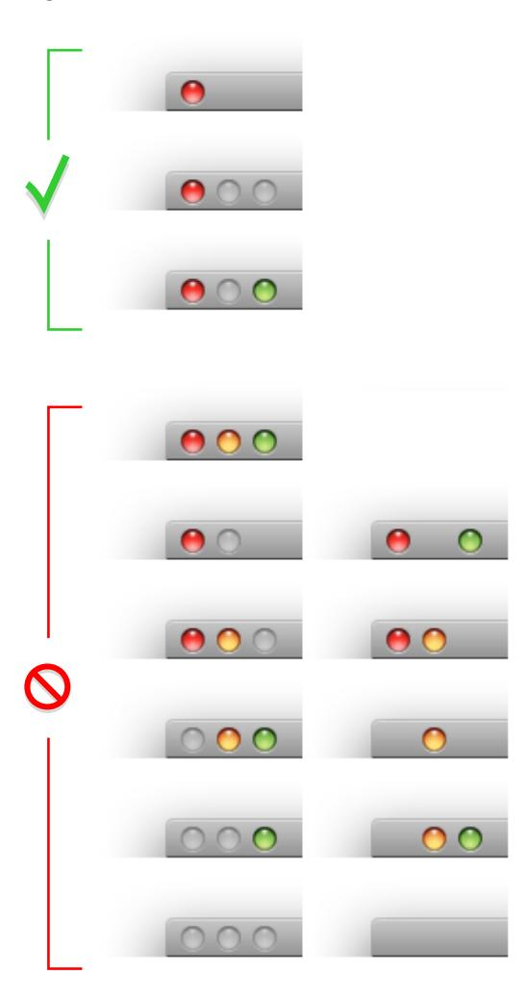

<span id="page-223-3"></span><span id="page-223-2"></span><span id="page-223-0"></span>For information about designing the layout of a panel, see ["Positioning](#page-343-0) Small and Mini Controls in a Window [Body"](#page-343-0) (page 344).

### Inspector Windows

An **inspector** is a panel that allows usersto view the attributes of a selection. Inspectors(also called inspector windows) can also provide ways to modify these attributes. Pages, Keynote, and the Finder all make use of inspectors. Figure 14-40 shows an inspector window in Numbers.

<span id="page-224-1"></span>**Figure 14-40** An inspector window


Inspectors should update dynamically based on the current selection. Contrast this behavior with that of an Info window, which shows the attributes of the item that was selected when the window was opened, even after the focus has been changed to another item. Also, an Info window is not a panel; it is listed in the application's Window menu and it does not hide when the application becomes inactive.

<span id="page-224-2"></span><span id="page-224-0"></span>You can provide both inspectors and Info windowsin your application, because in some casesit's more useful to have one window in which context changes when each new item is selected (an inspector) and in other cases it's more useful to be able to see the attributes of more than one item at the same time (a set of Info windows). Multiple inspector windows and Info windows can be open at the same time.

### Transparent Panels

A **transparent panel** gives users a way to make quick adjustments to their content or task without being distracted from their work. Although the behavior of a transparent panel is similar to the behavior of a standard panel, its appearance is designed to complement applications that focus on highly visual content or that provide an immersive experience, such as a full-screen slide show. For example, Figure 14-41 shows a transparent panel iChat provides.

<span id="page-225-0"></span>**Figure 14-41** An example of a transparent panel


### When to Use Transparent Panels

It'simportant to understand that transparent panels are not intended to replace all panelsin every application. In fact, in applications that don't focus on highly visual content or provide an immersive environment, a transparent panel can be more distracting to users than a standard panel, because there is no logical reason for its presence.

In general, therefore, you should use transparent panels only when at least one of the following statements is true:

- Your application is media-centric, that is, focused on movies, photos, or slides.
- Users use your application in a dark environment or in an immersion mode.
- A standard panel would distract users from the main window.
- Users make only quick adjustments in the panel and dismiss it quickly.

For example, in Aperture (a photo post-production and management tool), a transparent panel is appropriate because it does not block the content the way a standard panel would. In addition, the transparent adjustment panel in Aperture contains easy-to-use controls that don't require any keyboard input from the user. Figure 14-42 shows how this transparent panel allows users to focus on the images.

<span id="page-226-0"></span>**Figure 14-42** A transparent panel allows users to make adjustments without distracting them from the main window


If your application focuses on highly visual content only atspecific times or only in some modes, a combination of standard and transparent panels is reasonable, as long as each panel is suited to its task and environment. Also, if you provide a transparent panel under these circumstances, don't transform the panel into a standard (nontransparent) panel when your application switches modes. In other words, a transparent panel is always a transparent panel; it never converts to a standard panel.

For example, Keynote allows users to create presentations that contain text, images, video, and sound. In addition to providing the Mac OS X Colors and Fonts windows, Keynote provides an inspector window and a media browser, which are standard panels. The inspector window allows users to set slide transitions, edit tables and graphs, and make complex adjustments to text and formatting, and the media browser allows them to navigate collections of media files and make selections. Neither of these panels focuses solely on adjustments to visual content, so there is no reason for them to be transparent.

But Keynote also provides an image-adjustment panel, which helps users make simple adjustments to slide images. The image-adjustment panel is transparent, because users use it while they are focusing on the image, watching the effect of the adjustments they make. Figure 14-43 shows the transparent image-adjustment panel in Keynote.

<span id="page-227-0"></span>**Figure 14-43** A transparent panel can be appropriate for tasks that focus on highly visual content


### Designing a Transparent Panel

If a transparent panel is appropriate for your application, it's important to design it appropriately to ensure that it looks good and meets users' needs. In particular, a transparent panel should contain only simple adjustment controls that do not require much, if any, typing. Sliders and stepper-style controls work well, because they're easy for users to use without focusing on them. As much as possible, you should avoid controls that require users to type or to select items, because they force users to shift their attention from the content to the panel. This defeats one of the main advantages of transparent panels, which is to allow users to focus on their content.

Because controls and text need to be visible on the dark translucent background of a transparent panel, you should design controls that are white with gray accents and use white or gray text. As users focus on the content behind the panel, the white text and controls appear to be floating above it.

Often, small amounts of color can enhance the information you provide in a transparent panel. For example, the morsels of color in the Aperture Adjustments panel (shown in [Figure](#page-226-0) 14-42 (page 227)) communicate ranges in white balance and exposure, in addition to color-specific settings, in a clear and unobtrusive way.

If you want to use color in your transparent panel, be sure to use it sparingly, because an overuse of color lessens its impact and can be distracting. At the same time, however, the small amounts of color you use should be high contrast to look good on the dark translucent background.

In general, transparent panels should be small, so the text and controls you design should be small, too. As you lay out a transparent panel, be sure to follow the standard Aqua layout guidelines. For more information on center equalization, label and control alignment, appropriate spacing, and visual balance,see ["Positioning](#page-336-1) [Regular-Size](#page-336-1) Controls in a Window Body" (page 337).

### <span id="page-228-0"></span>Fonts Window and Colors Window

Mac OS X includes standard windows for users to select fonts or colors. If you need a way for users to set fonts or colors, use these standard windows instead of creating your own. In this way, users don't have to learn a new way to accomplish a familiar task. Figure 14-44 shows these standard system-provided panels.

<span id="page-228-2"></span>**Figure 14-44** The Fonts window and Colors window provided by Mac OS X


### <span id="page-228-5"></span><span id="page-228-4"></span><span id="page-228-1"></span>About Windows

<span id="page-228-3"></span>An **About window**, also called an About box, is an optional window that contains your application's version and copyright information. Unlike other windows, an About window combines some of the behaviors of panels and windows: Like a panel, an About window is not listed in the application's Window menu and like a window, it remains visible when the application is inactive. An About window should be modeless so the user can leave it open and perform other tasksin the application. For example, iCal provides an About window, as shown in Figure 14-45.

**Figure 14-45** Example of an About window

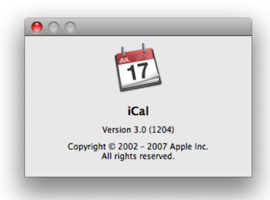

If you decide to provide an About window, it should:

- Have a title bar with no title
- <span id="page-229-3"></span>■ Be movable
- Include the close button as the only active window control
- Display application branding, such as a logo
- Include the full application name and version number (the version number should be the same as the version number displayed by the Finder)

It isrecommended to also provide text that briefly describes what the application does, copyright information, and technical support contact information.

If you want to give the user a convenient way to visit your website or contact your company from your About window, be sure to create buttons that accomplish these tasks. Do not provide a clickable URL or email address because it is not necessarily clear that there is an action associated with it. Of course, it's best to provide most of your company contact information in the first page of your help documentation (see ["The](#page-182-0) Help [Menu"](#page-182-0) (page 183) for more information on Help menu items).

An About window is the appropriate place for product branding elements; avoid putting such elements (logos or slogans) in document windows and dialogs.

# <span id="page-229-0"></span>Dialogs

<span id="page-229-2"></span>A **dialog** is a window designed to elicit a response from the user. Many dialogs—the Print dialog, for example—permit the user to provide many responses at one time.

An **alert** is a dialog that appears when the system or an application needs to communicate information to the user. Alerts provide messages about error conditions or warn users about potentially hazardoussituations or actions.

<span id="page-229-1"></span>For information about using the keyboard to interact with dialogs,see "Keyboard Focus and [Navigation"](#page-106-0) (page 107).

<span id="page-229-5"></span>For specific design information on how to lay out dialogs, see "Layout [Guidelines"](#page-336-0) (page 337).

### <span id="page-229-4"></span>Types of Dialogs and When to Use Them

Mac OS X applications can use these types of dialogs:

- **Modeless**. A modeless dialog enables users to change settings in a dialog while still interacting with document windows; the Find window in many word processors is an example of a modeless dialog. Most modeless dialogs include only the close button title-bar control, because users usually interact briefly with a modeless dialog and then close it, they do not need to zoom it or minimize it.
- **Document modal**. A document-modal dialog prevents the user from doing anything else within a particular document. The user can switch to other documentsin the application and to other applications. Document-modal dialogs should be sheets, which are discussed in "Sheets [\(Document-Modal](#page-230-1) [Dialogs\)"](#page-230-1) (page 231).

<span id="page-230-2"></span>■ **Application modal**. An application-modal dialog prevents the user from doing anything else within the owner application, although the user can switch to another application. Most application-modal dialogs do not have the standard title bar controls (close, minimize, zoom); the user dismisses these dialogs by clicking a push button, such as OK or Cancel. Application-modal dialogs that appear as the result of the user choosing a command, such as the Open dialog in [Figure](#page-239-1) 14-55 (page 240) should display a title that matches the command.

An alert can be document modal or application modal. If the error condition or notification appliesto a single document, the alert should be document modal (that is, a sheet). See the Save Changes alert in [Figure](#page-230-0) [14-46](#page-230-0) (page 231) for an example. If the alert appliesto the state of the application as a whole, or to more than one document or window belonging to that application, the alert should be application modal. Both the Review Changes alert for multiple unsaved documents ([Figure](#page-244-0) 14-60 (page 245)) and the Save Changes alert for applications that are not document-based [\(Figure](#page-243-0) 14-59 (page 244)) are application modal.

### <span id="page-230-4"></span><span id="page-230-3"></span><span id="page-230-1"></span>Sheets (Document-Modal Dialogs)

<span id="page-230-0"></span>A **sheet** is a modal dialog attached to a particular document or window, ensuring that the user never loses track of which window the dialog appliesto. Because a sheet is attached to the window from which it emerges, a sheet does not have its own title. Figure 14-46 shows an example of a sheet.

**Figure 14-46** The Save Changes alert: An example of using a sheet to display a document-modal dialog


The ability to keep a dialog attached to its pertinent window helps users take full advantage of the Mac OS X window layering model (see "Window [Layering"](#page-216-0) (page 217)). Sheets also allow usersto perform other tasks before dismissing the dialog, with no sense of the system being "hijacked" by the application.

Lay out sheets as you would any other dialog in Mac OS X. For guidelines on laying out a dialog, see "Positioning [Regular-Size](#page-336-1) Controls in a Window Body" (page 337).

#### **Sheet Behavior**

Sheets are displayed as an animation that appears to emerge from the window's title bar. When a sheet opens on a window near the edge of the screen and the sheet is wider than the window it's attached to, the sheet movesthe window away from the edge; when the sheet is dismissed, the window returnsto its previous position.

Only one sheet may be open for a window at any one time. A sheet prevents any other operation on that window until the sheet is dismissed. If, when the user responds to a sheet, another sheet for that document must open, the first sheet closes before the second one opens.

A sheet on an active document window should cover (appear on top of) any active panels (if necessary). However, if the user leaves a sheet open and clicks another document in the same application, the inactive window and its sheet should go *behind* any open panels.

<span id="page-231-4"></span>In an application that allows multiple windows for the same document (so that the user can see different parts of a document simultaneously), a sheet is not appropriate. Use an application modal dialog in this situation to make it clear that changes to one window affect other windows in the application.

In an application that displays multiple documents in a single window at different times, such as in a tabbed browser, a sheet is appropriate even though it applies to only the current document in the view. This is because, in a single-window situation, the user can't move the view and its sheet aside to handle later when choosing to view a different document. Rather, the user in effect dismissesthe view's contents when choosing to view a different document. The usershould therefore dismissthe sheet on the current view before selecting a different document.

#### <span id="page-231-1"></span>**When to Use Sheets**

Use sheets for dialogs specific to a document when the user interacts with the dialog and dismisses it before proceeding with work. Here are some examples of when to use sheets:

- A modal dialog for an activity that is specific to a particular document, such as saving or printing.
- A modal dialog that is specific to a single-window application that does not create documents. A single-window utility program might use a sheet to request acceptance of a licensing agreement from the user, for example.
- Other window-specific dialogs that are typically dismissed by the user before proceeding. Use a sheet when a dialog benefitsfrom being attached to the window as a modal dialog, even if you might otherwise design the dialog as a modeless dialog.

### **When Not to Use Sheets**

Don't use sheets in the following situations:

- <span id="page-231-3"></span>■ For dialogs that apply to several windows. Use sheets only when a particular dialog is associated with only one window.
- For modeless operations in which the dialog should be left open to allow the user to observe the effects of changes applied. Such tasks (find and replace operations, for example) are better suited to modeless dialogs, panels, or drawers.
- <span id="page-231-0"></span>■ On a window that doesn't have a title bar. Sheets should emerge from a definite visual edge.
- <span id="page-231-2"></span>■ When the user will need information in the window that is essential to filling in requested information in the dialog.

### Alerts

Alerts display messages to inform users of situations that are notable or potentially dangerous. Alerts are modal dialogs. For an alert that applies to one document or in single-window applications, display the alert as a sheet. See "When to Use [Sheets"](#page-231-1) (page 232) for guidelines.

Figure 14-47 shows the elements of an alert.

<span id="page-232-0"></span>**Figure 14-47** A standard alert

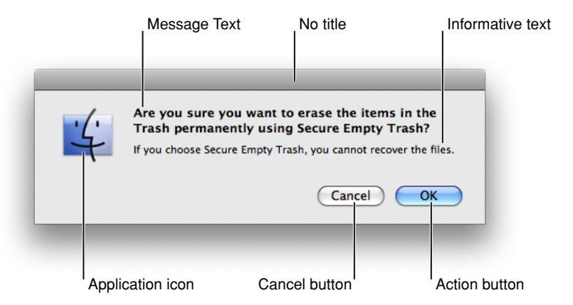

<span id="page-232-1"></span>See "A [Standard](#page-342-0) Alert" (page 343) for more information on laying out alerts.

#### <span id="page-232-3"></span><span id="page-232-2"></span>**The Elements of an Alert**

An alert should contain only the following elements:

- <span id="page-232-7"></span>■ **Alert message text**. This text, in emphasized (bold) system font, provides a short, simple summary of the error or condition thatsummoned the alert. Thisshould be a complete sentence; often it is presented as a question. See "Writing Good Alert [Messages"](#page-233-3) (page 234) for more information.
- **Informative text**. This text appears in the small system font and provides a fuller description of the situation, its consequences, and ways to get out of it. For example, a warning that an action cannot be undone is an appropriate use of informative text.

<span id="page-232-5"></span>**Important:** Do not leave out the informative text. What you think of as an intuitive alert message might be far from intuitive to your users. Use informative text to reword and expand on the alert message text.

- <span id="page-232-4"></span>■ **Buttons for addressing the alert**. Button names should correspond to the action the user performs when pressing the button—for example, Erase, Save, or Delete. The rightmost button in the dialog, the action button, is the button that confirms the alert message text. The action button is usually, but not always, the default button. (Note that in Cocoa methods, the rightmost button is always referred to as the default button even though it might not be.) For more information, see ["Dismissing](#page-235-1) Dialogs" (page 236).
- **The application icon**. Because of the Mac OS X window layering model (described in ["Window](#page-216-0) [Layering"](#page-216-0) (page 217)), an icon is necessary to make it clear to the user which application is displaying the alert.

<span id="page-232-6"></span>In rare cases, you may want to display a caution icon in your alert, badged with the application icon as shown in Figure 14-48. A badged alert is appropriate only if the user is performing a task,such asinstalling software, and a possible side effect of that task would be the inadvertent destruction of data. Don't use a caution icon for tasks whose only purpose is to overwrite or remove data, such as Save or Empty Trash; too-frequent use of the caution icon dilutes its significance.

<span id="page-233-0"></span>**Figure 14-48** A customized alert showing the caution icon badged with an application icon

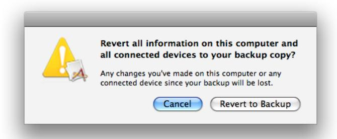

#### <span id="page-233-4"></span><span id="page-233-3"></span>**Writing Good Alert Messages**

<span id="page-233-1"></span>A good alert message states clearly what caused the alert to appear and what the user can do about it. Express everything in the user's vocabulary. Figure 14-49 shows an example of an alert message that provides little useful information.

**Figure 14-49** A poorly written alert message


<span id="page-233-2"></span>You could improve this message by describing the problem in the user's vocabulary asshown in Figure 14-50.

**Figure 14-50** An improved alert message

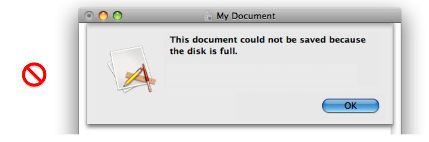

To make the alert really useful, provide a suggestion about what the user can do about the current situation. Even if the alert serves as a notification to the user and no further action is required, provide as much information as needed to describe the situation. Figure 14-51 shows the alert with additional information.

<span id="page-234-1"></span>**Figure 14-51** A well-written alert message

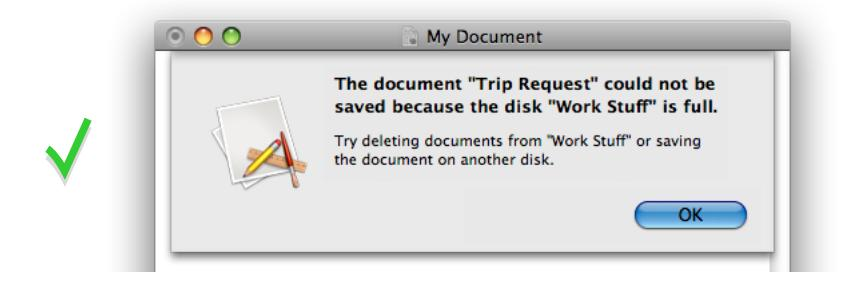

### <span id="page-234-3"></span><span id="page-234-0"></span>Dialog Appearance and Behavior

When appropriate, your application's dialogs should display default values for controls and text fields so the user can verify information rather than generate it from scratch.

Display a selection or an insertion point in the first location—a text entry field or a list, for example—that accepts user input.

When it provides an obvious user benefit, static text in a dialog should be selectable. For example, a user should be able to copy an error message, a serial number, or IP address to paste elsewhere.

<span id="page-234-2"></span>In dialogs that display columns and are user resizable, such as the Open dialog, as the dialog is made bigger, the columnsshould grow and additional columnsshould appear. All other elementsshould remain the same size and be anchored to the right, center, or left side of the dialog.

### <span id="page-234-4"></span>Accepting Changes

In general, all changes a user makes in a dialog should appear to take effect immediately. There are three possible opportunities for data validation in a dialog:

- **1.** When the user types data
- **2.** When the user moves out of a data field (by pressing Tab, for example)
- <span id="page-234-5"></span>**3.** When the user clicks a button to apply changes

It is your responsibility to make the three states as clear as possible to the user. For example, checkboxes and radio buttons update immediately and display the appropriate results.

You need to decide when your application does error checking of user input. Possible approaches are to:

- Evaluate the input and check for errors as the user tabs from one field to the next. The drawback is that it isn't clear to the user that the changes are taking effect as he orshe tabs among items. The user doesn't click a button, and so isn't aware of completing an action.
- Save user input in a queue and apply it when the user clicks a button, closes the dialog, or switches to another application. If your application waits to check user-input errors until the user tries to dismiss the dialog, you may have to present an alert, thereby forcing the user to revisit the dialog. If you do error checking as the user enters input, it takes more time up front, but you can warn the user immediately when invalid data is entered.

In most cases, validating input after each keystroke is annoying and unnecessary. It's better to design your interface to automatically disallow invalid input. For example, your application could automatically convert lowercase characters to uppercase when appropriate.

In addition to error checking, you need to decide when to apply user input. In some cases, changes can take effect immediately—for example, View Options for Finder windows. In other cases, it may be appropriate to wait until the user performs an action, such as clicking an Apply button.

In a dialog that has multiple panes(selected by buttons, tabs, or a pop-up menu), avoid validating data when a user switches from one pane to another.

Finally, you need to determine whether your application should automatically perform an operation based on user input or whether the user should initiate the operation—for example, by clicking a button. It's acceptable to automatically perform an operation that completes quickly and returns user control within a couple of seconds. For an operation that takes a longer time to execute, it's best to warn the user of the estimated time required and let the user initiate it.

### <span id="page-235-1"></span>Dismissing Dialogs

The buttons at the bottom right of a dialog all dismiss the dialog. A button that initiates an action is furthest to the right. This **action button** confirmsthe alert message text. The Cancel button isto the left of this button.

<span id="page-235-2"></span>If there's a third button for dismissing the dialog, it should go to the left of the Cancel button. If the third button could result in data loss—Don't Save, for example—position it at least 24 pixels away from the "safe" buttons (Cancel and Save, for example).

<span id="page-235-0"></span>A button that affects the contents of the dialog itself, such as Reset, should have its left edge aligned with the main dialog text or if there is a Help button, 12 pixels to the right of it.

**Figure 14-52** Position of buttons at the bottom of a dialog

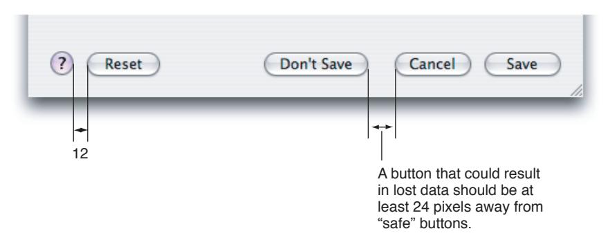

Usually the rightmost button or the Cancel button is the **default button**. The default button should be the button that represents the action that the user is most likely to perform *if* that action isn't potentially dangerous. A default button has color and pulses to let the user know that it is the default. When the user presses the Enter key or the Return key, your application should respond as if the user clicked the default button.

Don't use a default button if the most likely action is dangerous—for example, if it causes a loss of user data. When there is no default button, pressing Return or Enter has no effect; the user must explicitly click a button. This guideline protects users from accidentally damaging their work by pressing Return or Enter. You can consider using a safe default button, such as Cancel. [Figure](#page-233-0) 14-48 (page 234) shows an example of a safe default button.

Don't use a default button if you use the Return key in text entry boxes. Having two behaviors for one key can confuse users and make the interface less predictable.

<span id="page-236-3"></span>In addition to the action button or buttons, it's a good idea to include a Cancel button. This button returns the computer to the state it was in before the dialog appeared. It means "forget I mentioned it." Always map the keyboard shortcut Command-period and the Esc (Escape) key to the Cancel button. These keyboard equivalents, along with Return and Enter, are accelerator keys and serve the purpose of letting the user respond quickly to a dialog or an alert. In general, it's not a good idea to assign other keyboard shortcuts to buttons. If you find it useful to assign keyboard shortcuts to some buttons that are used very often in your application, be sure to follow the guidelines in ["Keyboard](#page-102-0) Shortcuts" (page 103).

<span id="page-236-2"></span><span id="page-236-1"></span>In some circumstances, it's appropriate to implement an Apply button—for example, to permit a user to see the effect of multiple text attributes before committing to them. In cases like these, clicking Cancel should undo any of the applied changes. Cancel should never silently commit the changes the user previewed by clicking Apply. For more guidelines on using an Apply button, see ["Providing](#page-236-0) an Apply Button in a [Dialog"](#page-236-0) (page 237).

### <span id="page-236-0"></span>Providing an Apply Button in a Dialog

You may choose to provide an Apply button in a dialog that displays multiple settings that affect the user's view of data. An Apply button should allow a user to preview the effect of the selected settings without committing to the changes. Be cautious about using an Apply button for operations that take a long time to implement or undo; it might not be obvious to users that they can interrupt or reverse the process. Save dialogs or dialogs that allow users to make changes that can't be previewed easily should not include an Apply button.

Clicking the Apply button does not dismiss the dialog because the user must decide whether to accept the previewed changes (by clicking OK) or to reject them (by clicking Cancel). Do not use the Apply button as another OK button—when the user dismisses the dialog without clicking OK, all previewed changes should be discarded.

### Expanding Dialogs

Sometimes you need to provide the user with additional information or functionality in a dialog, but you don't want to display it all the time. To do this, you use one of the disclosure controls to expand the dialog and reveal the additional information or capability to the user.

If you want to allow the user to view details that elaborate on the primary information in a dialog, you use a disclosure triangle (note that disclosure triangles are also used in hierarchical lists). The disclosure triangle expands the dialog, revealing additional information and, if appropriate, extra functionality. An example of a dialog expanded by a disclosure triangle is shown in [Figure](#page-320-0) 15-76 (page 321). For more information about how to use a disclosure triangle in your dialog, see ["Disclosure](#page-319-1) Triangles" (page 320).

If you want to provide the user with additional choices directly related to the selections offered in a pop-up or command pop-down menu in a dialog, you use a disclosure button. The disclosure button expands the dialog to revealselectionsin addition to those listed in the pop-up or command pop-down menu. An example of a dialog expanded by a disclosure button to reveal additional choices is shown in [Figure](#page-242-0) 14-58 (page 243). For more information about how to use a disclosure button in your dialog, see ["Disclosure](#page-321-0) Buttons" (page 322).

### <span id="page-237-0"></span>Find Windows

<span id="page-237-4"></span>A Find window is a modeless dialog that opens in response to the Find command to provide an interface for specifying items to search for. Its appearance can vary depending on the needs of your application, but if your application handles text you might want to make your Find window similar to the one shown in Figure 14-53 to provide a consistent user experience.

<span id="page-237-3"></span><span id="page-237-2"></span>**Figure 14-53** A Find window


Find windows are useful in document-creation applications, because users can use one Find window to search for a term in several different documents. If your application is not document-based or if it is a single-window application, however, you might instead choose to offer find or searching functionality in a scope bar. A scope bar is attached to a window and provides both search and filtering capabilities to users. [Figure](#page-200-1) 14-19 (page 201) shows a scope bar in Safari. For more information about scope bars and how to use them in your application, see ["Scope](#page-200-0) Bars" (page 201).

### <span id="page-237-1"></span>Preferences Windows

A preferences window is a modeless dialog that contains settings the user changes infrequently. In general, the user opens a preferences window to change the default way an application displays an item or performs a task, closes the window, and expects the new settings to have taken effect. For some guidance on how to provide preferences in your application, see ["Preferences"](#page-74-0) (page 75).

Often, an application needs to provide a set of preferences for each of several different categories of functionality. For example, Safari allows the user to set preferences for bookmarks, webpage appearance, RSS display, and security measures, among other things. Because these categories are unrelated to each other, it would be confusing to display settings for all of them in one pane. Therefore, Safari (and many other applications) provides a preferences window with a toolbar that contains a toolbar item for each category. When the user clicks a toolbar item, the window displays a pane that contains the settings associated with that item. Figure 14-54 shows the General pane of Safari preferences.

<span id="page-238-0"></span>**Figure 14-54** An example of a preferences window


If you choose to create a preferences window that uses a toolbar to switch among different categories of settings, make sure the toolbar is not customizable. This is because a toolbar in a preferences window does not provide a shortcut to frequently used commands, but acts as a convenient way to group settings. In addition, you should remove the show/hide toolbar control in your preferences window toolbar (you can see this control in [Figure](#page-190-0) 14-4 (page 191)). Thisis because there is no need to hide the toolbar in a preferences window (hiding it would also hide all but the currently selected collection of settings), and because novice users might mistakenly click the toolbar control when they mean to click the close button.

A preferences window should not include a resize control. In general, preferences windows do not need to display active minimize or zoom buttons. Remember that preferences windows are intended to provide users with a place to make adjustmentsto the way an application behaves,so there'sseldom a need for preferences windows to be resized or to remain open for a long time.

If you have changeable panes in your preferences window, the title of the window should be the title of the currently selected pane. For example, the title of the window shown in Figure 14-54 is "General" because the currently selected toolbar icon is labeled "General." (If your preferences window does not contain additional panes, the title should be "*Application Name* Preferences".) In addition, a changeable-pane preferences window should remember which pane the user selected the last time the window was open.

The menu item to open your preferences window should be in the application menu and be labeled Preferences. Use Command-comma for the keyboard shortcut.

### <span id="page-239-0"></span>The Open Dialog

<span id="page-239-3"></span><span id="page-239-2"></span>The Open dialog appears when the user chooses the Open command or presses Command-O. The Open dialog is application modal (that is, the user can switch to other applications before closing the Open dialog).

If you implement an Open command, you should also include an Open Recent command so users can open recently opened documents without going through the dialog. Figure 14-55 shows an example of an Open dialog.

<span id="page-239-1"></span>**Figure 14-55** An Open dialog


The Open dialog contains these elements:

- A default title ("Open"); you should add your application's name to the Open dialog title—"TextEdit: Open," for example.
- Back and forward buttons to navigate back and forth between selections made in list or column view.
- A pop-up menu that contains common places a user might save things and Recent Places (the five most recent folders the user opened or saved documents to). Your application specifies the default location, typically one of the predefined folders in the user's home folder. If the user selects another folder, the dialog should "remember" the user's selection the next time the dialog appears.
- A source list that mirrors the Finder sidebar.
- A column or list view for navigating the file system.
- A Cancel button and an Open (default) button.
- A resize control in the lower-right corner.
- The ability for expert usersto specify a pathname by pressing Command-Shift-G. (Note that the pathname separator is the "/" character.)

<span id="page-240-3"></span>You can extend the Open dialog as appropriate for your application as illustrated in Figure 14-56. You might, for example, include a pop-up menu allowing users to filter the type of files that appear in the list. Items that do not meet the filtering criteria would appear dimmed. The system creates a list of native file typessupported by the application to populate the menu. You can supplement this list with custom types and specify the default to show when the dialog opens. You should include an All Applicable Files item, but it does not have to be the default.

<span id="page-240-1"></span>**Figure 14-56** A customized Open dialog


<span id="page-240-0"></span>Open dialogs should support document preview. In addition, an Open dialog can support multiple selection if your application allows more than one document to be open at a time.

### <span id="page-240-2"></span>Dialogs for Saving, Closing, and Quitting

This section describes the standard dialogs that you use when a user is saving a document for the first time, closing a document, or quitting an application.

### Save Dialogs

An application that saves the contents of individual windows—which would be most text and graphics applications—should use document-specific sheets for its Save dialogs. In a Save dialog, users can save a document for the first time or change the name or location (or both) of a previously saved document.

The Save dialog hastwo states: minimal and expanded. Clicking the disclosure button toggles between these states. If the user changes the state, the next Save dialog should open in the selected state.

<span id="page-241-3"></span>Your application should pass in a filename extension as part of every filename. Users can control its visibility using the Hide Extension checkbox in the expanded Save dialog; see [Figure](#page-212-1) 14-30 (page 213). Existing documents do not get extensions added to or removed from their filenames unless the user chooses Save As and changes the setting in the Save dialog.

#### <span id="page-241-8"></span>**The Minimal Save Dialog**

<span id="page-241-0"></span>In the minimal Save dialog (shown in Figure 14-57), users can specify a name and choose a frequently accessed location to store a document.

**Figure 14-57** The minimal (collapsed) Save dialog


The minimal Save dialog contains these elements:

<span id="page-241-7"></span><span id="page-241-5"></span>■ Save As text field for the document name. Expert users can enter pathnames by pressing Command-Shift-G. (Note that the pathname separator is the "/" character.)

If the document has not been saved previously, your application should put the default name (such as "untitled") in this field, and the filename should be selected. If the user has chosen to make the filename extension visible, the extension is not selected.

<span id="page-241-2"></span>If the document has been saved previously and the user chooses Save As, the Save dialog should open with the document name highlighted in the Save As field. The filename extension (if it is visible) is not selected.

- Where pop-up menu, containing mounted volumes, the folders in the Finder sidebar, and Recent Places (the five most recent folders the user opened or saved documents to). Your application specifies the default location, typically the predefined Documents folder in the user's home folder. If the user selects another folder, the dialog should "remember" the user's selection the next time the dialog appears.
- <span id="page-241-1"></span>■ A Save button (default).
- A Cancel button. Dismisses the dialog and returns the application to its previous state.
- A disclosure button. Clicking it displays the expanded Save dialog. (For more information about how to use disclosure buttons, see ["Disclosure](#page-321-0) Buttons" (page 322).)

<span id="page-241-6"></span><span id="page-241-4"></span>Any custom elements you add go between the Where pop-up menu and the buttons at the bottom of the dialog.

#### **The Expanded Save Dialog**

In contrast with the minimal Save dialog, the expanded Save dialog lets users save documents in locations other than those available in the minimal Save dialog's Where pop-up menu. An example of the expanded Save dialog is shown in Figure 14-58.

<span id="page-242-0"></span>**Figure 14-58** The expanded Save dialog


In addition to the items in the minimal Save dialog, the expanded Save dialog displays the following:

- Back and forward buttons to navigate back and forth between selections made in the list or column view.
- A source list that mirrors the Finder sidebar.
- A column or list view for navigating the file system.
- <span id="page-242-1"></span>■ A File Format (or Format) pop-up menu, which displays a list of file formats from which the user can choose.
- A New Folder button, which displays an application-modal dialog that asks the user to name the new folder, and then creates it.
- <span id="page-242-3"></span>■ A "Hide extension" checkbox, which allows the user to control whether or not the filename's extension (.jpg, for example) is visible. The "Hide extension" checkbox should be selected as the default (that is, filename extensions should not appear in user-visible filenames unless the user requests them).

If the user changes the state of the checkbox for a particular document, the next new document should match the last user-selected state, even after the user quits and reopens the application. The filename in the Save As field updates in real time as the checkbox is selected or deselected.

<span id="page-242-2"></span>If you add other elements to customize the Save dialog, they should appear above the Cancel and Save buttons. When the dialog is expanded, custom elements should appear between the file-system browser and the push buttons.

In default keyboard navigation mode, pressing Tab in the expanded Save dialog shifts the keyboard focus from the Save As text field to the source list, to the visible columns, and then back to the text field.

### Closing a Document With Unsaved Changes

<span id="page-243-5"></span>When the user attempts to close a document that has unsaved changes, present a Save Changes alert. An application that saves the contents of individual windows—such as most text and graphics applications—should use document-specific sheets, like the one shown in [Figure](#page-230-0) 14-46 (page 231) for its Save Changes alert.

<span id="page-243-3"></span>In an application that can display multiple views of the same file, if the user chooses the Close File command instead of Close Window, you should use an application-modal dialog instead of a sheet. This emphasizes the fact that the user's actions affect the file as a whole, not just the portion displayed in the current view. In this situation, change the word "document" in the Save Changes alert message to the word "file". After the user clicks Save or Don't Save, close all open views of the file.

When a Save Changes sheet is open, the document's close button and the Close command in the File menu are unavailable; the user can't close the document until the Save Changes sheet is addressed.

### <span id="page-243-2"></span>Attempting to Save a Locked or Read-Only Document

If the user edits a locked or read-only document and then quits the application or chooses Save, do not display the standard Save Changes alert. Instead, display a sheet explaining that because the document is read-only, it cannot be saved. The sheet should then offer the user the options of saving a copy, rejecting the changes, or continuing to view or edit the document.

### <span id="page-243-4"></span><span id="page-243-1"></span>Saving Documents During a Quit Operation

Users can interrupt a quit operation with documents still unsaved. For example, if a user chooses Quit and a save alert (a sheet) opens for a document, the user can work on other documents or switch to another application without addressing the save alert.

When a user quits an application in which all open documents have been saved, all documents close immediately and the application quits.

#### **Quitting an Application That Is Not Document-Based**

<span id="page-243-0"></span>When a user attempts to quit an application that is not document-based but that has many windows whose contents are saved simultaneously, present an application-modal Save Changes alert, such as the one shown in Figure 14-59.

**Figure 14-59** A Save Changes alert for an application that is not document-based


#### **Quitting an Application With Multiple Unsaved Documents Open**

When a user attempts to quit a document-based application and there is more than one document with unsaved changes open, present an application-modal Review Changes alert,such asthe one shown in Figure 14-60.

<span id="page-244-1"></span><span id="page-244-0"></span>**Figure 14-60** The Review Changes (application-modal) alert that appears when the user quits with more than one unsaved document open


The appropriate action for each button is as follows:

- <span id="page-244-3"></span>■ **Discard Changes**. Closes all documents without saving changes and quits the application.
- **Cancel**. Cancels the Quit command.
- **Review Changes**. All open documents (including those minimized in the Dock) come forward, with the unsaved documents on top. The active document presents a Save Before Quitting alert. If the user clicks Save, the Save dialog appears (if the document has not previously been saved). If the user clicks Don't Save, the next unsaved document comesforward with its Save Before Quitting alert. If the user dismisses the last Save Before Quitting alert with Save or Don't Save, all documents close and the application quits.

<span id="page-244-2"></span>During the review, if the user activates another unsaved document, it should come forward with its Save Before Quitting sheet open. Save Before Quitting sheets on other documents remain open. During the review, if the user activates a saved document, the review process continues when the next unsaved document becomes active.

<span id="page-244-4"></span>If, in the midst of a quit operation, the user clicks the application icon in the Dock or chooses Bring All to Front from the Window menu, documents should appear in this order: documents with open sheets on top, unsaved documents next, and then saved documents.

At any time during the review process, the user can click Cancel to stop the quit operation. If the user initiates a Quit command during the review process, the process begins again with the application-modal alert shown in Figure 14-60.

#### <span id="page-244-5"></span>**Saving a Document With the Same Name as an Existing Document**

If the user types the name of a document that already exists in the same location into the Save As field of a Save dialog, and then clicks Save, present an application-modal alert in which the user can confirm whether or not to replace the previous document.

<span id="page-245-1"></span>**Figure 14-61** Alert for confirming replacing a file

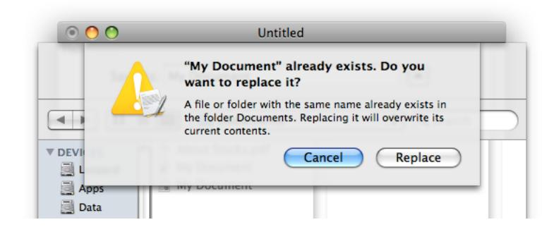

### <span id="page-245-3"></span><span id="page-245-0"></span>The Choose Dialog

<span id="page-245-2"></span>A Choose dialog lets a user select an item as the target of a task. For example, when a user attempts to open a broken alias, the Fix Alias dialog lets the user choose another item for the alias to open. An application can have more than one Choose dialog, but only one can be open at a time. In some situations, it may be appropriate for a Choose dialog to be a sheet. Figure 14-62 shows an example of a Choose dialog.

**Figure 14-62** A Choose dialog


#### A Choose dialog:

- Can be opened by various commands
- Can support multiple selection
- Supports document preview
- Can be resized with the resize control in the lower-right corner

<span id="page-246-4"></span>■ Can include a Show pop-up menu, which allows the user to filter the type of files that appear in the list. Items that do not meet the filtering criteria appear dimmed. The system creates a list of native file types supported by the application to populate the menu. You can supplement this list with custom types and specify the default to show when the dialog opens. You should include an All Applicable Files item, but it does not have to be the default.

If the dialog is not a sheet, the dialog's default title is "Choose," but you should change it to include the name of the task. For example, if the command that brings up the dialog is Choose Picture, the dialog should be titled "Choose Picture." Also include some instructional text at the top, such as "Choose a picture to display in the background of 'Documents.'" If it's helpful, also change the Choose button to something more specific.

<span id="page-246-2"></span>The default location is the user's home folder. If the dialog is targeted to volumes only, the default location is the user's directory. Files and folders not appropriate for the target selection should be dimmed.

<span id="page-246-0"></span>**Note:** Recent Places(in the Where pop-up menu of a Save dialog) does not record foldersselected in Choose dialogs.

### <span id="page-246-3"></span>The Print Dialog

In addition to printing, the minimal Print dialog lets users choose a printer and printer settings, save, mail, or fax a document in the PDF or PostScript formats, and preview a document before printing. The expanded Print dialog adds printing-specific settings,such as number of copies, page range, papersettings, and layout.

### <span id="page-246-5"></span>Print Dialog

<span id="page-246-1"></span>In the Print dialog, user options are provided via the features pop-up menu, which displays panes drawn and controlled by printing dialog extensions(PDEs). PDEs are provided by the operating system, printer modules, and applications. Apple provides a number of printing panes. The standard Print dialog is shown in Figure 14-63.

**Figure 14-63** A Print dialog (a sheet attached to a document window)

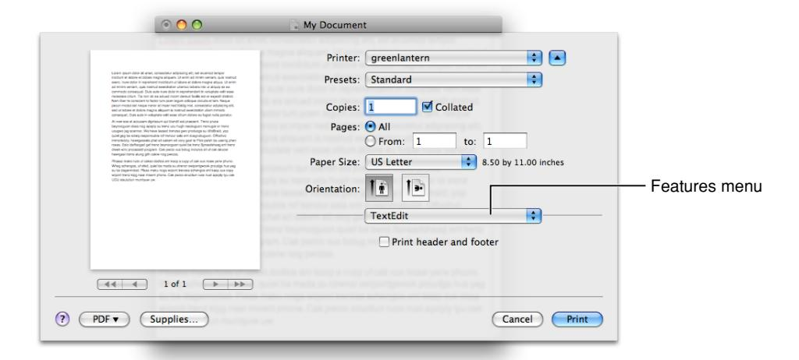

Options for choosing paper type and print quality are displayed through the features pop-up menu. The ability to save the document in PDF or PostScript format, fax the document, or save it to iPhoto or other applications is available in the PDF pop-down menu in the lower left. You can create custom print panes by following the interface guidelines provided throughout this document and the layout guidelines described in "Positioning [Regular-Size](#page-336-1) Controlsin a Window Body" (page 337). Here are some specific guidelinesto keep in mind if you implement custom printing features:

- Choose a menu item name that doesn't conflict with menu items already in the features pop-up menu.
- The menu item (the pane name) should help users easily determine the options the pane contains.
- Make sure the features you implement are appropriate for your application. For example, an option to print in reverse ordershould be provided by the operating system, not by your application. (Implementing this feature requires the application to know the hardware's capabilities.)
- Make interdependencies among options clear to users. For example, if a user selects double-sided printing, the option to print on transparencies should become unavailable.
- Separate more advanced features from frequently used features. When the user chooses to display the advanced features, there should be an "advanced options" title above the advanced controls.
- <span id="page-247-1"></span>■ Provide visual feedback (such as the preview in the Layout pane of the Print dialog) when appropriate. A thumbnail showing the effect of changing a tone control, for example, helps users determine desired settings.
- Save a user's printing preferences for a document, at least while the document is open. Provide a way for users to save custom settings.

### <span id="page-247-3"></span>Page Setup Dialog

<span id="page-247-2"></span><span id="page-247-0"></span>The Page Setup dialog provides a way for users to set the scaling and orientation options for a document based on the intended output paper size and the printer. Save the settings in this dialog with the document. Figure 14-64 shows an example of a page setup dialog.

**Figure 14-64** The Page Setup dialog

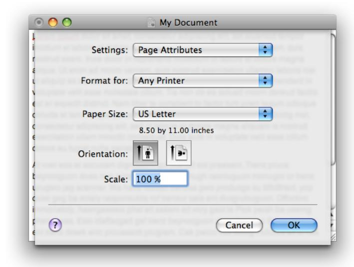

<span id="page-248-3"></span><span id="page-248-2"></span><span id="page-248-0"></span>**Controls** are graphic objects that cause instant actions or visible results when users manipulate them with the mouse or other input device. Standard controlsinclude push buttons,scroll bars, radio buttons, checkboxes, sliders, and pop-up menus.

This chapter discusses the behavior and appearance of controls available in Mac OS X. It also provides usage recommendations for each control so you can use them correctly in your application. When appropriate, this chapter also offers control dimensions, labeling guidelines, and recommended spacing metrics to help you lay out controlsin your window (for more extensive window-layout guidelines,see "Layout [Guidelines"](#page-336-0) (page 337)). Note that, in most cases, one dimension of a control (typically the height) is fixed and should not be changed. When this is the case, the description of the control may include the pixel measurement of the fixed dimension, but only to help you lay out your window, not because you need to use this measurement to create the control.

You are strongly encouraged to use standard, system-provided controls in your application. When you do this, you benefit in two important ways. First, these controls are automatically updated whenever the Mac OS X user interface isrefreshed, which meansthat you don't have to produce a new version of your application to take advantage of the new look. Second, the appropriate use of familiar controls allows users to predict how to operate your application and therefore spend more time discovering what it does.

In addition, you should strive to use only the standard control sizes, which are regular, small, and mini. Most applications look best with regular-size controls, although small and mini controls can work well when space is very limited, such as in a panel. In particular, take care to avoid vertically resizing controls. In Mac OS X v10.5 and later, vertically resizing a control can cause it to produce an undesirable look that does not harmonize with the window appearance.

**Important:** Every control described in this chapter is accompanied by at least one illustration that shows an example of the control. These illustrations show the appearance of the control, usually demonstrate a recommended usage, and sometimesshow spacing metrics. However, the images of the controlsthemselves do not necessarily exhibit the precise measurements or colors you would observe in a running application. Therefore, you should never measure the images in this document and use those measurements to create controls or other user-interface elements. Note that when you use Interface Builder to create your user interface, you automatically get the proper control sizes.

# <span id="page-248-1"></span>Window-Frame Controls

As described in "Window [Appearance"](#page-187-0) (page 188), the window frame consists of the title bar, toolbar, and bottom-bar areas, and the window body is between the toolbar–title bar area and the bottom bar (if there is one). A small subset of Mac OS X controls are intended for use only in the window-frame areas, because they have been specially designed to look good on the window-frame surface. *These controls should not be used anywhere in the window body*. Conversely, all other controls available in Mac OS X can be used in the window body, and most should not be used in the window-frame areas.

Of the controls that are designed for use in the window body, there are three that can also be used in window-frame areas:

- Icon buttons (including icon buttons that contain a pop-up menu)—see "Icon [Buttons"](#page-260-0) (page 261) and "Icon [Buttons](#page-278-0) and Bevel Buttons with Pop-Up Menus" (page 279) for more information.
- Action menus—see "Action [Menus"](#page-283-0) (page 284) for more information.
- Search fields—see ["Search](#page-316-0) Fields" (page 317) for more information.

Thissection describesthe controlsthat are designed solely for use in the window-frame areas. If your window contains a toolbar or bottom bar, be sure to use only the controlsthat are appropriate for each area, including icon buttons, Action menus, and search fields, as needed.

### <span id="page-249-0"></span>Rectangular-Style Toolbar Controls

<span id="page-249-1"></span>The rectangular-style toolbar control can be used in both the toolbar and the bottom bar. (The capsule-style toolbar control, described in ["Capsule-Style](#page-253-0) Toolbar Controls" (page 254), should be used in toolbars only.) The rectangular-style toolbar control is a very versatile control that can behave as a push button, a toggle button, a segmented control, or a pop-up menu. Figure 15-1 shows some variations of the rectangular-style toolbar control in Address Book.

**Figure 15-1** Variations of the rectangular-style toolbar control


### Rectangular-Style Toolbar Control Usage

In a toolbar, use rectangular-style toolbar controls to give users access to frequently used commands and objects (for guidelines on designing the contents of a toolbar, see ["Designing](#page-198-1) a Toolbar" (page 199)). For example, the Finder uses a combination of rectangular-style toolbar buttons and segmented controls to allow users to preview an item with Quick Look, choose a view style, see the path of an item's location, navigate through previously viewed items, and perform an action on an item. Figure 15-2 showsthe rectangular toolbar buttons and segmented controls the Finder uses.

<span id="page-250-0"></span>**Figure 15-2** Rectangular-style toolbar controls in a toolbar


In a bottom bar, use rectangular-style toolbar controls when you need to provide controls that directly affect the contents or organization of the window body. In general, controls in the bottom bar are important, but they are less frequently used than controls in the toolbar (see ["Bottom](#page-206-0) Bars" (page 207) for guidelines on designing the contents of a bottom bar). For example, the rectangular-style toolbar controlsin the iCal bottom bar include a segmented control that allows users to add calendars and change the items displayed in the source list, and a button that shows or hides the to-do list, as shown in Figure 15-3.

<span id="page-251-0"></span>**Figure 15-3** Rectangular-style toolbar controls in a bottom bar

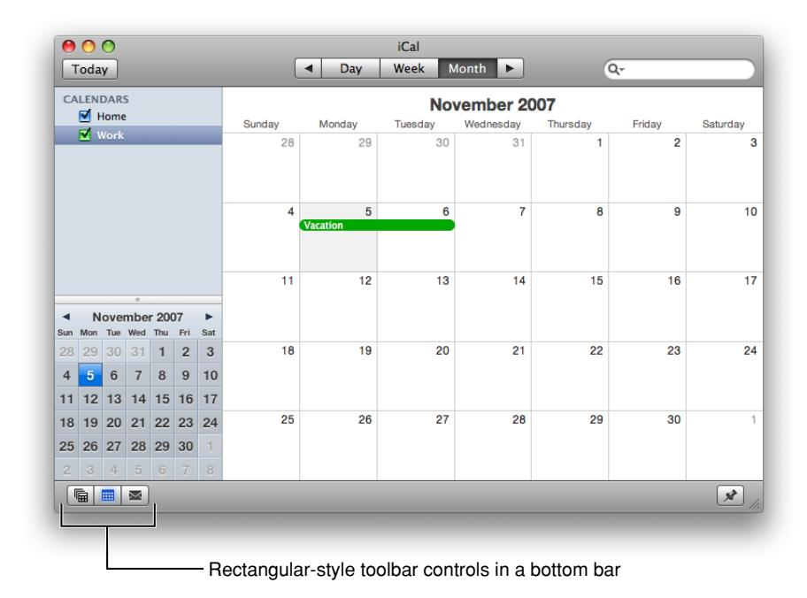

### Rectangular-Style Toolbar Control Contents and Labeling

A rectangular-style toolbar button can contain either text or icons. In addition, this button can contain a downward-pointing arrow that indicates the presence of a pop-up menu. A rectangular-style toolbar segmented control can also contain either text or icons, but should not contain a mix of text and icons.

If you display an icon in a rectangular toolbar control, be sure the meaning of the image is clear and unambiguous (see ["Cultural](#page-46-2) Values" (page 47) for some advice on choosing appropriate imagery). In Mac OS X v10.5 and later, Interface Builder makes it easy to add to a control one of the system-provided images, such as the plus sign, the accounts symbol, or the locked symbol. You can see some of these symbols in the controls in the Finder toolbar, shown in [Figure](#page-250-0) 15-2 (page 251). See ["System-Provided](#page-150-0) Images" (page 151) for more information on standard images available in Mac OS X v10.5 and later. If you need to design your own image,see "Designing Iconsfor [Rectangular-Style](#page-149-1) Toolbar Controls" (page 150) forsome metrics and guidelines.

If you want to display text in a rectangular-style toolbar control, be sure it is either a noun (or noun phrase) that describes an object, setting, or state, or that it is a verb (or verb phrase) that describes an action. For example, the nouns used in the iCal toolbar controls clearly indicate the function of the controls. Text in rectangular-style toolbar controlsshould have title-style capitalization (see ["Capitalization](#page-130-1) of Interface Element [Labels](#page-130-1) and Text" (page 131) for more on this style).

If you use a rectangular-style toolbar control that behaves like a checkbox or a toggle button in a toolbar or bottom bar, you may be able to benefit from the automatic highlighting that signifies the on state of the button. If you do this, however, be very sure the control clearly indicates the correct state in the correct situation. Also, if you put such a control in a toolbar, you should provide two descriptive labels that can be displayed below the control. One label should describe the on (or pressed) state and one should describe the off (or unpressed) state. Finally, be sure to describe both of the states in the control's help tag, whether the control appears in a toolbar or a bottom bar. To learn more about the on-state appearance, see ["Rectangular-Style](#page-253-1) Toolbar Control Implementation" (page 254).

For example, iCal offers toggle controls in its bottom bar that allow users to show or hide various views. When one of these views is visible, the associated toggle control is highlighted; when the view is hidden, the highlighting disappears. Figure 15-4 shows the iCal bottom bar, along with a help tag that describes both states.

<span id="page-252-0"></span>**Figure 15-4** Toggle controls in the iCal bottom bar clearly indicate their current state

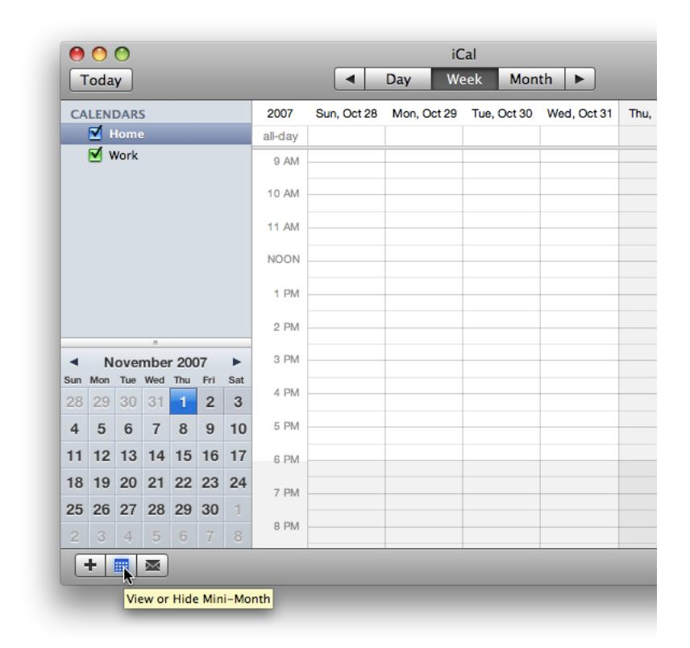

**Important:** You must supply a descriptive label for each rectangular-style toolbar control you place in a toolbar so that users can customize the toolbar to display both images and text. This is the external label users see when they select the Icon & Text or Text Only display options in the Customize Toolbar dialog. Rectangular style toolbar controls used in a bottom bar do not need external descriptive labels.

### Rectangular-Style Toolbar Control Specifications

**Control sizes**: Rectangular-style toolbar controls are available in regular, small, and mini sizes. In a toolbar, display the regularsize by default, but be sure to supply the smallsize to allow usersto customize the toolbar.

In a bottom bar, you can use either the regular or the small size, depending on the dimensions of the bottom bar. See ["Designing](#page-207-1) a Bottom Bar" (page 208) for guidelines on how to create and lay out a bottom bar.

**Label spacing and fonts**: Labelsfor rectangular-style toolbar controlsshould be in the system font appropriate for the size of the control (these fonts are automatically supplied by Interface Builder):

- Regular size: System font.
- Small: Small system font.

■ Mini: Mini system font.

**Control spacing**: There should be 8 pixels between individual rectangular-style toolbar controls. Note that this happens automatically, and that this spacing can change depending on the length of the external label.

### <span id="page-253-1"></span>Rectangular-Style Toolbar Control Implementation

Rectangular-style toolbar controls are available in Interface Builder. In the Interface Builder library, these controls are called Round Textured Buttons. To create one using Application Kit programming interfaces, use the setBezelStyle: method of NSButtonCell with NSTexturedRoundedBezelStyle as the argument.

The blue glow you see behind the calendar image in the iCal segmented control (shown in [Figure](#page-252-0) 15-4 (page 253)) is an effect Application Kit provides under some circumstances. The effect indicates an on state in a properly configured segmented control that behaves like a set of checkboxes or a button that behaves like a toggle button. Although it is possible that the precise appearance of this on-state look may change in future releases of Mac OS X, you can continue to receive appropriate on-state processing if you configure these two controls as described here.

To provide a segmented control that displays an on-state appearance (similar to the segmented control in the iCal bottom bar), use an NSSegmentedControl object with style NSSegmentStyleTexturedRounded and mode NSSegmentSwitchTrackingSelectAny. If you're using Interface Builder, place a Segmented Control object in your toolbar or bottom bar; in the Attributes pane of the inspector, set the style to Textured Rounded and the mode to Select Any. Be sure to provide an image for the control (in Interface Builder, select an image from the Image combo box in the Attributes pane of the inspector).

To provide a toggle-style button that displays an on-state appearance, use an NSButton object with style NSTexturedRoundedBezelStyle, with which you've associated an image. Be sure the button cell's showsStateBy mask contains NSContentsCellMask. This means that Application Kit uses the alternate image and title when the cell's state is NSOnState. However, to get the on-state glow do *not* provide an alternate image. If you're using Interface Builder, place a Rounded Textured Button object in your toolbar or bottom bar; in the Attributes pane of the inspector, set the mode to Toggle, provide an image, and do not provide an alternate image.

### <span id="page-253-0"></span>Capsule-Style Toolbar Controls

The capsule-style toolbar control can be used in toolbars, but should not be used in bottom bars. The capsule-style toolbar control is a versatile control that can be used as a push button, a toggle button, or a segmented control. Figure 15-5 highlights one of the variations of the capsule-style toolbar control in a Preview window.

<span id="page-254-0"></span>**Figure 15-5** A capsule-style toolbar control used as a segmented control

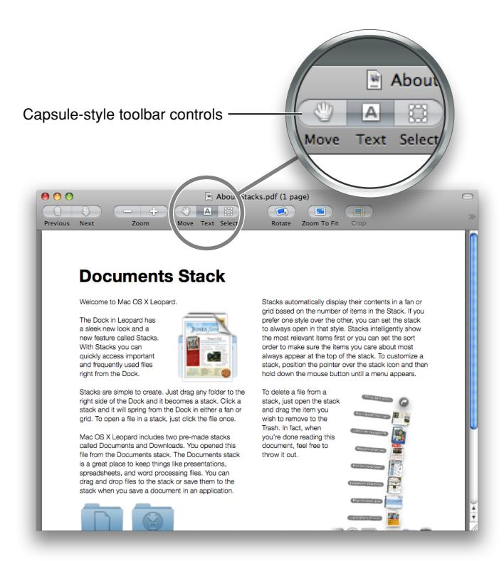

### Capsule-Style Toolbar Control Usage

Use capsule-style toolbar controlsin a toolbar to give users accessto frequently used objects and commands (for guidelines on designing the contents of a toolbar, see ["Designing](#page-198-1) a Toolbar" (page 199)). For example, Mail uses capsule-style toolbar buttons and segmented controls to provide a myriad of functions to the user, such as getting new mail, creating notes or to-do items, and flagging messages. Figure 15-6 shows these controls in the Mail toolbar.

<span id="page-255-0"></span>**Figure 15-6** Capsule-style toolbar controls in a toolbar

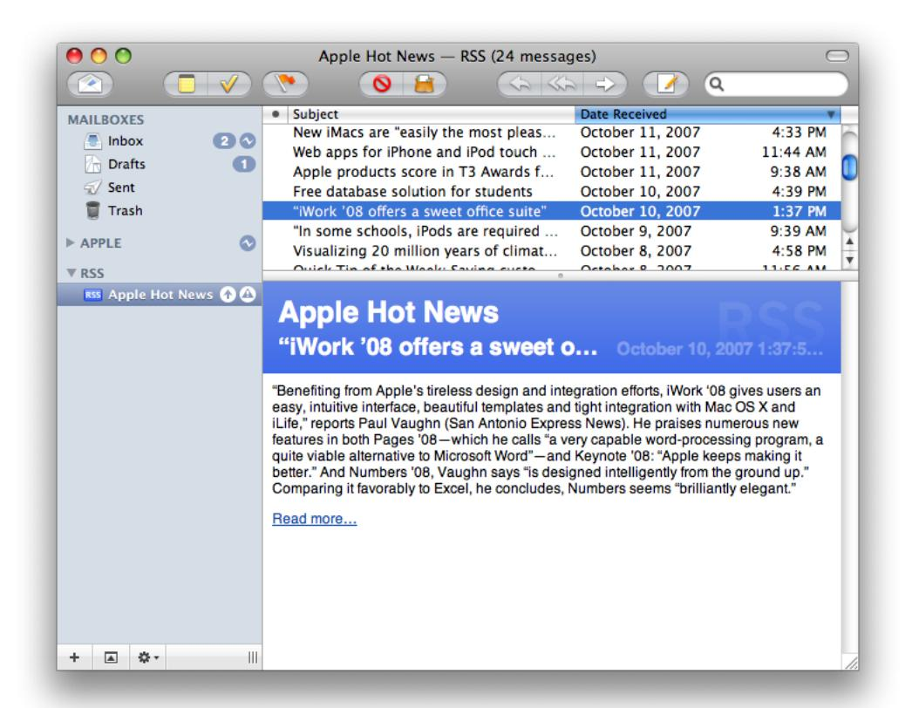

Do not use capsule-style toolbar controls in a bottom bar. If you use capsule-style toolbar controls in the toolbar, but you also need to provide bottom-bar controls, instead use rectangular-style toolbar controls in both areasto avoid mixing the stylesin a single window. See ["Rectangular-Style](#page-249-0) Toolbar Controls" (page 250) for more information about the rectangular-style toolbar controls.

### Capsule-Style Toolbar Control Contents and Labeling

Capsule style toolbar buttons can contain text or images. If you provide a capsule-style segmented control, avoid displaying text in some segments and icons in others. Instead, make sure every segment in the control has the same type of content.

If you display an icon in a capsule-style toolbar control, be sure the meaning of the icon is clear and unambiguous (see ["Cultural](#page-46-2) Values" (page 47) for some advice on choosing appropriate imagery). In Mac OS X v10.5 and later, Interface Builder makes it easy to add system-provided images, such as the plus sign, the accounts symbol, and the Action menu symbol. See ["System-Provided](#page-150-0) Images" (page 151) for more information on images available in Mac OS X v10.5 and later.

If you decide to create your own icons to display in a capsule-style toolbar control, see ["Designing](#page-149-0) Icons for [Capsule-Style](#page-149-0) Toolbar Controls" (page 150) for some tips and guidelines.

If you want to display text in a capsule-style toolbar control, use a noun (or noun phrase) that describes an object, setting, or state, or use a verb (or verb phrase) that describes an action. Text in capsule-style toolbar controls has title-style capitalization (see ["Capitalization](#page-130-1) of Interface Element Labels and Text" (page 131) for more on this style).

**Important:** You must supply a descriptive label for each capsule-style toolbar control you place in a toolbar so that users can customize the toolbar to display both images and text. This is the external label users see when they select the Icon & Text and Text Only display options in the Customize Toolbar dialog.

### Capsule-Style Toolbar Control Specifications

**Control sizes**: Capsule-style toolbar controls are available in regular, small, and mini sizes. You should use regular-size capsule-style toolbar controls by default, but you should also provide small versions of the controls so users can customize the toolbar.

If you use system-provided imagesin a capsule-style toolbar control, you don't have to worry about changing the width of the control to accommodate its contents. If you provide a custom icon, be sure to avoid extending it into the end-cap space of the control.

**Label spacing and fonts**: Labels for capsule-style toolbar controls should be in the system font appropriate for the size of the control (these fonts are automatically supplied by Interface Builder):

- Regular size: System font.
- Small: Small system font.
- Mini: Mini system font.

**Control spacing**: There should be 8 pixels between separate capsule-style toolbar controls. Note that this happens automatically, and that this spacing can change depending on the length of the external label.

### Capsule-Style Toolbar Control Implementation

<span id="page-256-0"></span>Capsule-style toolbar controls are available in Interface Builder. Drag a segmented control object into your window and specify how many segments you want it to have. To create a standalone button (like the Get Mail button in the Mail toolbar), specify one segment. To create one using Application Kit programming interfaces, use the NSSegmentedControl class.

### Legacy Toolbar Controls

In versions of Mac OS X prior to v10.5, if your application used a brushed metal window, it also used metal buttons. In Interface Builder and the Application Kit, this button type wasreferred to as"textured." As discussed in "Window [Appearance"](#page-187-0) (page 188), however, Mac OS X v10.5 and later does not include the brushed-metal look for windows. If you designed an application to run in versions of Mac OS X prior to v10.5, you will probably receive the Leopard window look automatically when the application runs in Mac OS X v10.5 and later, but you may need to update the buttons you used.

As discussed in ["Window-Frame](#page-248-1) Controls" (page 249), there are only three standard window-body controls that can be used in a toolbar, in addition to the rectangular-style and capsule-style toolbar controlsintroduced in Mac OS X v10.5. These three controls are:

- Icon buttons (including icon buttons that contain a pop-up menu)
- Action menus
- Search fields

#### **CHAPTER 15**

Controls

If your toolbar contains any control types other than the three listed above and rectangular-style and capsule-style toolbar controls, remove them.

If you used a metal (textured) button in your toolbar or bottom-bar area, examine its height. If the height is 23 pixels for the regular size (18 pixels for the small size), the button should automatically appear as a rectangular-style toolbar control when the application runs in Mac OS X v10.5 and later.

The Interface Builder library in Interface Builder 3.0 and later provides a style of an NSButton object called "textured," but this button style should be considered a transitional control only. If you place a regular-size textured button in a window-frame area and resize its height to 23 pixels (from the default height of 20 pixels), you'll notice that its appearance changes to that of the rectangular-style toolbar control. Therefore, if you're developing an application to run in both Mac OS X v10.5 and versions of Mac OS X prior to v10.5, you can use this button style to ensure the appropriate look for these versions.

# <span id="page-257-0"></span>Buttons

<span id="page-257-2"></span>Buttons initiate an immediate action. If a button initiates an indeterminate process, the button should be dimmed until the process is complete, and status feedback should be provided.

If you need to offer two opposing functions, such as Reload and Stop in a browser, consider using two separate buttonsinstead of one dual-purpose button that changesstate. Providing one dual-purpose button can lead to the situation in which a user clicks the button when it is in one state, but the click is received and processed after the button has changed to the other state.

If you must provide one dual-purpose button, be sure to keep track of when the button changes state so you can process the clicks appropriately. Also, be sure to provide immediate and informative feedback.

<span id="page-257-1"></span>**Important:** The controls described in this section are suitable for use in the window body; they should not be used in the window-frame areas. The single exception is the icon button, which can also be used in a toolbar. See ["Window-Frame](#page-248-1) Controls" (page 249) for controls designed specifically for use in the toolbar and bottom-bar areas in your window.

### <span id="page-257-4"></span><span id="page-257-3"></span>Push Buttons

A **push button** performs an instantaneous action,such assaving a document, completing operations defined by a dialog, or acknowledging an error message. Push buttons are designed for use in the window body only, not in the window-frame areas (for more information about these window parts, see ["Window](#page-189-0) [Elements"](#page-189-0) (page 190)). Figure 15-7 shows several different usages of the push button.

<span id="page-258-0"></span>**Figure 15-7** Examples of push buttons in different types of windows

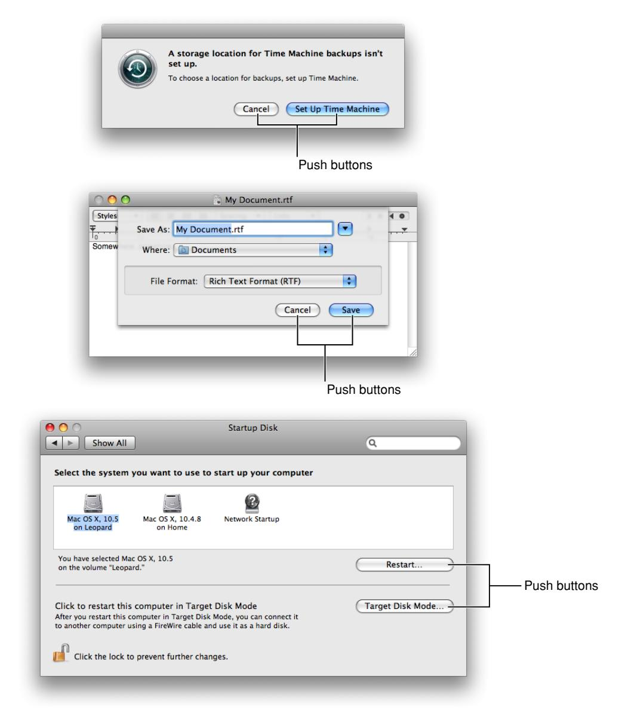

### Push Button Usage

Because users expect an immediate action to occur when they press a push button, it is important to avoid using push buttons to merely display information or to mimic the behavior of other controls. In particular:

- Do not use a push button to indicate a state, such as on or off. Instead, you can use checkboxes to indicate state, as described in ["Checkboxes"](#page-274-0) (page 275).
- Do not use a push button as a label. Instead, use static text to label elements and provide information in the interface (for more information, see "Static Text [Fields"](#page-311-1) (page 312)).
- Avoid associating a menu with a push button. If you need to associate a menu with a button, use a bevel button instead (see "Bevel [Buttons"](#page-268-0) (page 269) to learn how to do this).

### Push Button Contents and Labeling

A push button always contains text, it does not contain an image. If you need to display an icon or other image on a button, use instead a bevel button, described in "Bevel [Buttons"](#page-268-0) (page 269).

The label on a push button should be a verb or verb phrase that describes the action it performs—Save, Close, Print, Delete, Change Password, and so on. If a push button acts on a single setting, label the button asspecifically as possible; "Choose Picture…," for example, is more helpful than "Choose…" Because buttons initiate an immediate action, it shouldn't be necessary to use "now" (Scan Now, for example) in the label.

Push button labels should have title-style capitalization, as described in ["Capitalization](#page-130-1) of Interface Element [Labels](#page-130-1) and Text" (page 131). If the push button immediately opens another window, dialog, or application to perform its action, you can use an ellipsisin the label. For example, Mail preferences displays a push button that includes an ellipsis because it opens .Mac system preferences, as shown in Figure 15-8.

<span id="page-259-0"></span>**Figure 15-8** A push button label can include an ellipsis

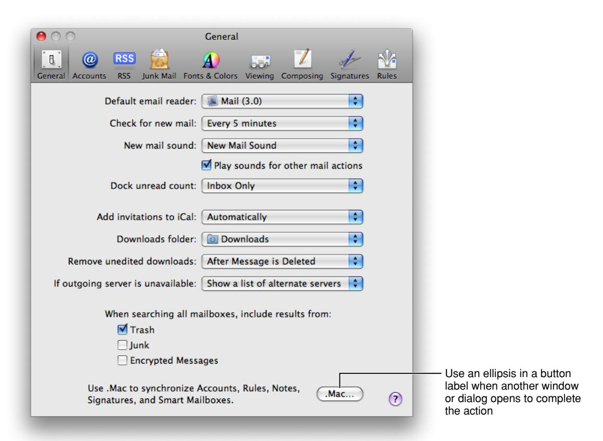

<span id="page-259-1"></span>All push buttons should be clear in appearance, that is, without color, except the default button. The default button is the button that performs a safe action in a dialog and is activated when the user presses Return or Enter (for more information about the default button, see ["Dismissing](#page-235-1) Dialogs" (page 236)). When the user presses a nondefault button, such as Cancel, that button acquires color and the default button loses its color. If you use system-provided push buttons, this behavior is automatic.

### Push Button Specifications

**Control sizes**: Push buttons are available in regular, small, and mini sizes. The height of a push button is fixed for each size, but you specify the width, depending on the length of the label text you supply. If you don't specify a wide enough button, the end caps clip the text.

<span id="page-260-1"></span>**Figure 15-9** OK and Cancel buttons


**Label spacing and fonts**: Push button label text should not have a shadow or any other effects on it, and it should be in the system font appropriate for the button size (these fonts are automatically supplied by Interface Builder):

- Regular size: System font.
- Small: Small system font.
- Mini: Mini system font.

**Control spacing**: Push buttons should be placed far enough from each other to allow the user to click a specific one easily. In particular, note that a push button that could lead to a potentially dangerous or destructive action (such as Delete)should be farther away from safe buttonsthan the distancesrecommended in this section (see ["Dismissing](#page-235-1) Dialogs" (page 236) for more information).

- Regular size: Leave at least 12 pixels of space between buttons aligned horizontally or stacked vertically.
- Small: Leave at least 10 pixels of space between buttons aligned horizontally or stacked vertically.
- Mini: Leave at least 8 pixels of space between buttons aligned horizontally or stacked vertically.

### Push Button Implementation

<span id="page-260-2"></span><span id="page-260-0"></span>Push buttons are available in Interface Builder. To create one using Application Kit programming interfaces, create an NSButton object of type NSMomentaryPushInButton or NSMomentaryLightButton.

### Icon Buttons

An **icon button** behaves like a bevel button, but it does not have a visible rectangular edge around it. In other words, the entire button is clickable, not just the icon. Figure 15-10 shows the icon buttons in the System Preferences window.

<span id="page-261-0"></span>**Figure 15-10** Icon button examples

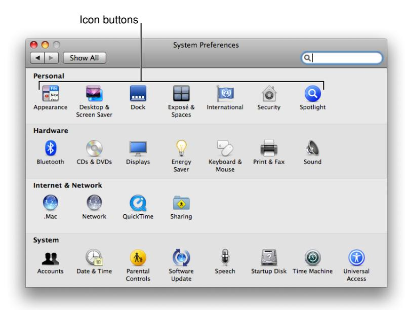

### Icon Button Usage

Typically, icon buttons are used to display clickable icons in a toolbar (as described in["Window-Frame](#page-248-1) [Controls"](#page-248-1) (page 249), an icon button is one of three standard window-body controls you can use in a toolbar). If you want to use icon buttons in your toolbar, avoid mixing them with rectangular-style or capsule-style toolbar controls. Icon buttons should not be used in a bottom bar.

An icon button can have a pop-up menu attached. See "Icon [Buttons](#page-278-0) and Bevel Buttons with Pop-Up [Menus"](#page-278-0) (page 279) for more information about this usage.

### Icon Button Contents and Labeling

<span id="page-261-1"></span>Icon buttons contain icons; in addition, they can display a text label that users can choose to view. Icon buttons can also contain a single downward-pointing arrow, which indicatesthe presence of a pop-up menu.

Icon button labels should name a thing (such as Network or Accounts) or describe an action (such as Mask or Show Art). Remember that users can choose to view the icon without the label, so make sure the meaning of the icon is clear and unambiguous. See ["Designing](#page-148-0) Iconsfor Icon Buttons" (page 149) for more information on designing attractive and useful toolbar icons.

### Icon Button Specifications

**Control sizes**: The outer dimensions of an icon button are not visible, but they determine the hit target area. Typically, the outer dimensions of an icon button include a margin of about 10 pixels all the way around the icon and label.

**Label spacing and fonts**: Use the small system font for the labels. The text should be below the icon as shown in Figure 15-11.

**Icon sizes**: Icons for icon buttons work best when they are between 24 x 24 pixels and 32 x 32 pixels in size. For example, the icon shown in Figure 15-11 is 32 x 32 pixels.

<span id="page-262-1"></span>**Figure 15-11** Example relationships of the icon, button, and hit-target dimensions in an icon button


**Control spacing**: For buttons with a 24 x 24 pixel (or larger) icon, leave at least 8 pixels between button edges (not between icon edges), stacked vertically or aligned horizontally.

### Icon Button Implementation

To create an icon button in Interface Builder, drag a bevel button or a square button into your window, add your icon, and deselect the Bordered checkbox in the Attributes pane of the inspector. To create one using Application Kit programming interfaces, use the setBezelStyle method of NSButtonCell with NSShadowlessSquareBezelStyle as the argument.

<span id="page-262-0"></span>You can also use Interface Builder to create an icon button that includes a pop-up menu. First, drag a pop-up button into your window then, in the Attributes pane of the inspector, change the type to Pull Down. Finally, in the same pane, change the style to either Bevel or Square (it doesn't matter which) and deselect the Bordered checkbox.

### Scope Buttons

A **scope button** is used in a scope bar to specify the scope of an operation, such as search, or to save or manipulate a set of scoping criteria. These two complementary functions are supported by two styles of scope buttons, the recessed button and the round rectangle button, respectively (see "Scope Button Usage" for examples of these controls). See ["Scope](#page-200-0) Bars" (page 201) for more information about scope bars.

### Scope Button Usage

**Important:** Scope buttons are designed to be used in scope bars and related filter rows only. They are not intended to be used in the toolbar or bottom-bar areas or outside of a scope bar in the window body.

The recessed scope button style is used to display types or groups of objects or locations the user can select to narrow the focus of a search or other operation. For example, Dictionary displays recessed scope buttons that allow users to look up a word in a dictionary, a thesaurus, an Apple terminology database, Wikipedia content, or in all locations simultaneously. Figure 15-12 shows the recessed scope buttons used in Dictionary.

<span id="page-263-0"></span>**Figure 15-12** Recessed scope buttons used to define the scope of a look-up


<span id="page-263-1"></span>The round rectangle scope button style is used to allow users to save a set of search criteria and to change or set scoping criteria. For example, the Finder uses round rectangle scope buttons to display search criteria, such as creation and last opened dates, and to provide a save search button. Figure 15-13 shows the round rectangle scope buttons used in the Finder.

**Figure 15-13** Round rectangle scope buttons used to save, change, and set scoping criteria

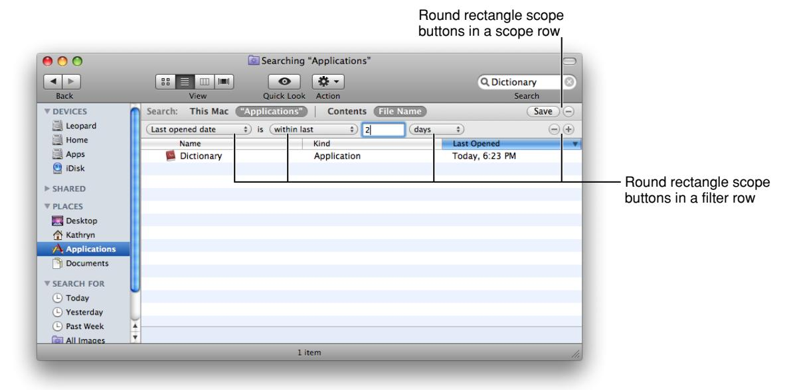

### Scope Button Contents and Labeling

Typically, round rectangle and recessed scope buttons contain text, but they can instead contain images. If you want to display an image in a scope button, be sure to consider the system-provided images before you spend time designing your own. If you decide to design a custom icon for use in a scope button,see ["Designing](#page-149-1) Icons for [Rectangular-Style](#page-149-1) Toolbar Controls" (page 150) for some guidelines.

### Scope Button Specifications

**Control sizes**: The round rectangle scope button is available in regular, small, and mini sizes. The height of the control is fixed for each size, but you set the width.

**Label spacing and fonts**: If you choose to use text to label scope buttons, use the view font (12-point Lucida Grande). Use the view font in bold for recessed scope buttons and the regular view font for round rectangle scope buttons.

### Scope Button Implementation

<span id="page-264-0"></span>Scope buttons are available in Interface Builder. You can also use Application Kit programming interfaces to create them. To create a recessed scope button, use the setBezelStyle: method of NSButtonCell with NSRecessedBezelStyle as the argument. To create a round rectangle scope button, pass NSRoundRectBezelStyle as the argument to the setBezelStyle: method.

### Gradient Buttons

A **gradient button** performs an instantaneous action related to a view, such as a source list. For example, in Keyboard & Mouse preferences (shown in Figure 15-14), gradient buttons allow the user to add and remove keyboard shortcuts for specific applications.

<span id="page-265-0"></span>**Figure 15-14** Gradient buttons used to add and remove items in a list

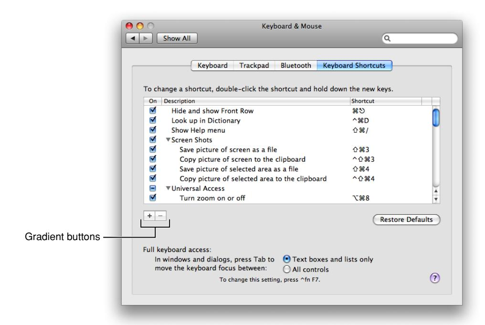

### Gradient Button Usage

Use a gradient button when you need to offer functionality that is directly related to a source list or other view, such as a column view. Gradient buttons can have push-button, toggle, and pop-up menu behavior. For example, Mail uses gradient buttons at the bottom of the sidebar to offer New Mailbox, Show/Hide Mail Activity, and Action menu functionality, as shown in Figure 15-15.

<span id="page-266-0"></span>**Figure 15-15** Gradient buttons can behave in different ways


Gradient buttons with toggle and pop-up menu behavior

Gradient buttons do not belong in the window-frame areas. If you need to offer an Action menu or other functionality in a bottom bar, use a rectangular-style toolbar control instead (see ["Rectangular-Style](#page-249-0) Toolbar [Controls"](#page-249-0) (page 250) for more information).

### Gradient Button Contents and Labeling

Gradient buttons should contain images; they should not contain text. Because the function of a gradient button is closely tied to the view with which it's associated, there's little need to describe its action using a label.

When possible, you should use the system-provided images, such as the Action menu image and the Add image, because their meaning is familiar to users. You should create a custom image only when none of the system-provided images is suitable. See ["System-Provided](#page-150-0) Images" (page 151) for more information on the system-provided images available to you. If you decide to create your own icons to use in a gradient button, see "Designing Icons for [Rectangular-Style](#page-149-1) Toolbar Controls" (page 150) for some guidelines on how to do this.

### Gradient Button Specifications

**Control sizes**: Gradient buttons are available in regular size only.

**Control spacing**: Although you can use a single gradient button by itself, it is more common for multiple gradient buttons to be displayed in a row. If you display more than one gradient button in a row, such as below a source list or other view, the buttonsshould abut each other. If the gradient buttons are not attached to a source list or other view within a window, leave 12 pixels between the bottom edge of the source list (or other view) and the gradient buttons associated with it.

### Gradient Button Implementation

Gradient buttons are available in Interface Builder. To create one using Application Kit programming interfaces, use the setBezelStyle: method of NSButtonCell with NSSmallSquareBezelStyle as the argument.

### <span id="page-267-3"></span><span id="page-267-2"></span><span id="page-267-0"></span>The Help Button

The **Help button** opens a window that displays a specific help page appropriate for the context of the button. Don't create a custom button to do this; use the standard Help button, which containsthe Mac OS X question mark graphic.

In dialogs(including preferences windows) and drawers, the Help button can be located in either the lower-left or lower-right corner. In a dialog that includes OK and Cancel buttons (or other buttons used to dismiss the dialog), the Help button should be in the lower-left corner, vertically aligned with the buttons. In a dialog that does not include OK and Cancel buttons, such as a preferences window, the Help button should be in the lower-right corner. Figure 15-16 shows an example of a preferences pane that includes a Help button.

<span id="page-267-1"></span>**Figure 15-16** Help button in a preferences pane

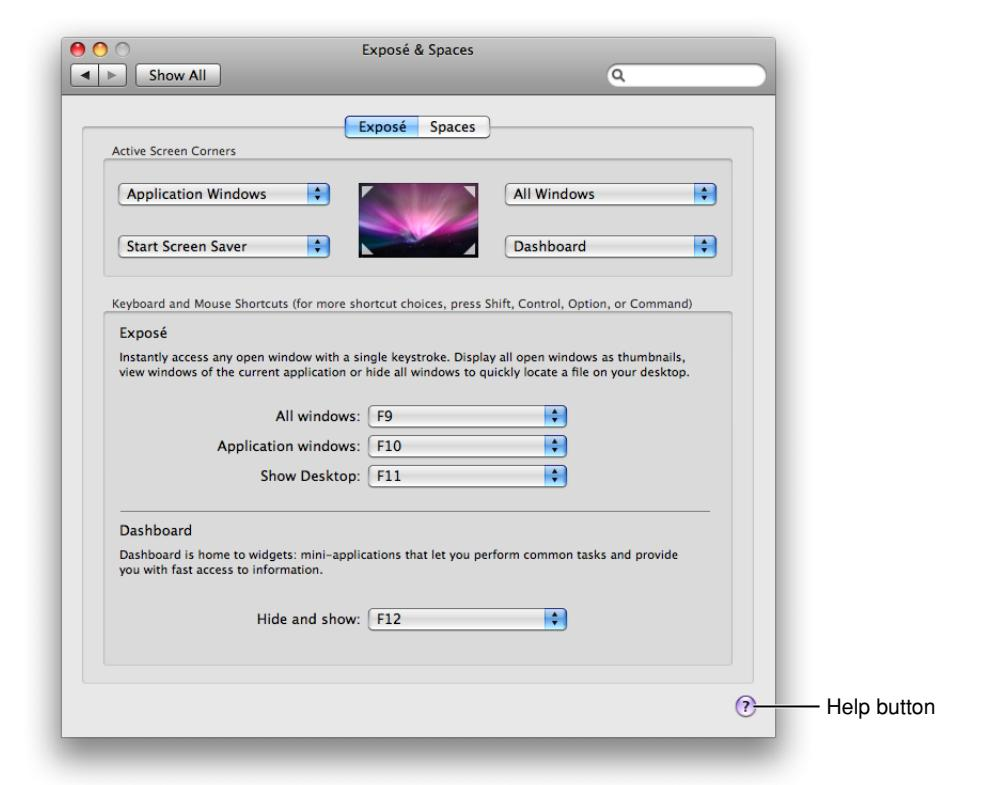

For information on providing help in your application, see "User [Assistance"](#page-79-0) (page 80).

The standard Help button is 20 pixels in diameter and should be placed at least 12 pixels from other interface elements. See "A Simple [Preferences](#page-336-2) Window" (page 337) for an example of Help button placement in a dialog.

The standard Help button is available in Interface Builder. To create a Help button using Application Kit programming interfaces, use the setBezelStyle: method of NSButtonCell with NSHelpButtonBezelStyle as the argument.

### <span id="page-268-3"></span><span id="page-268-0"></span>Bevel Buttons

<span id="page-268-2"></span><span id="page-268-1"></span>A **bevel button** is a multipurpose button designed for use in the window-body area. You can use bevel buttons singly (as a push button) or in groups (as a set of radio buttons or checkboxes). Figure 15-17 shows bevel buttons used as push buttons in the Preview inspector window.

**Figure 15-17** Bevel buttons in an inspector window

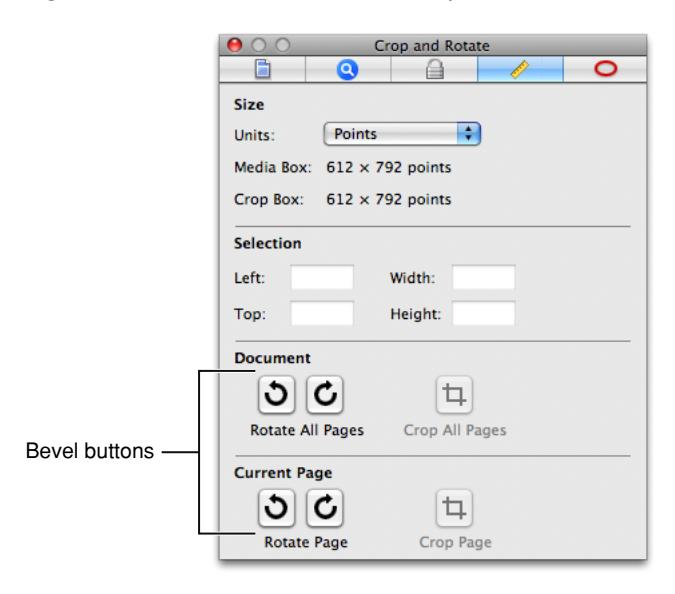

Bevel buttons can have square or rounded corners. The square-cornered variation can be used when space is limited or when adjoining a set of bevel buttons. You may notice, however, that bevel buttons are not very frequently used in applications running in Mac OS X v10.4 and later. This is due in part to user interface style changes and in part to alternative controls that became available. You can still use bevel buttons if they provide exactly the look you need, but you should consider alternatives, such as gradient buttons and segmented controls (described in ["Gradient](#page-264-0) Buttons" (page 265) and ["Segmented](#page-276-0) Controls" (page 277), respectively).

### Bevel Button Usage

Bevel buttons can behave like push buttons or can be grouped and used like radio buttons or checkboxes. For example, you could use bevel buttons to graphically represent text-alignment options.

Use bevel buttons in the window body. If you need a similarly versatile button for use in the window-frame areas, consider using a rectangular-style toolbar button (described in ["Rectangular-Style](#page-249-0) Toolbar [Controls"](#page-249-0) (page 250)).

### Bevel Button Contents and Labeling

Bevel buttons are very versatile and can display text, icons, or other images. Bevel buttons can also display a single downward-pointing arrow in addition to text or an image, which indicates the presence of a pop-up menu. See "Icon Buttons and Bevel [Buttons](#page-278-0) with Pop-Up Menus" (page 279) for more information about this usage.

If you choose to display an icon or image instead of a text label, be sure the meaning of the image is clear and unambiguous (see ["Cultural](#page-46-2) Values" (page 47) for some advice on choosing appropriate imagery). Interface Builder provides several built-in images you can use on a bevel button; see ["System-Provided](#page-150-0) [Images"](#page-150-0) (page 151) for more information about system-provided images.

You can also combine an icon (or image) and a text label on a bevel button. You can place the text anywhere on the button in relation to the icon (you specify the location in Interface Builder or programmatically). Use label font (10-point Lucida Grande Regular) for text labels.

If you use a bevel button as a push button, its label should be a verb or verb phrase that describes the action it performs. If you provide a set of bevel buttons to be used as radio buttons or checkboxes, you might label each with a noun that describes a setting or a value.

### Bevel Button Specifications

**Control sizes**: The dimensions of bevel buttons vary; 20 x 20 pixels is the recommended size for use in a tool panel (see ["Panels"](#page-221-0) (page 222) for more information on panels).

**Icon sizes**: 32 x 32 pixels is the largest recommended icon size. Maintain a margin of between 5 and 15 pixels between the icon and the outer edges of the button. A button that contains an icon and label combined may need a margin around the edge that's closer to 15 pixels than to 5 pixels.

<span id="page-269-0"></span>**Control spacing**: For bevel buttons with rounded corners that contain a 24 x 24 pixel (or larger) icon, leave at least 8 pixels between buttons, stacked vertically or aligned horizontally. Otherwise, buttons should butt up against each other.

Figure 15-18 shows some examples of these configurations.

**Figure 15-18** Bevel button examples

#### **Rounded corners**


Leave at least 5 pixels between edge of icon and edge of button.

#### **Rounded corners with label below icon**

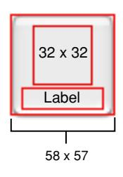


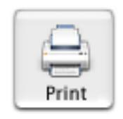

Bevel button as a push button

### Bevel Button Implementation

<span id="page-270-2"></span>Bevel buttons are available in Interface Builder. To create one using Application Kit programming interfaces, use the setBezelStyle: method of NSButtonCell with NSRegularSquareBezelStyle asthe argument. To create a square-cornered bevel button, use NSShadowlessSquareBezelStyle as the argument for the setBezelStyle: method.

You can also use Interface Builder to add a pop-up menu to a bevel button. First, drag a pop-up button into your window then, in the Attributes pane of the inspector, change the type to Pull Down. Finally, in the same pane, change the style to Bevel (for a standard bevel button look) or Square (for a square-cornered bevel button look).

### <span id="page-270-3"></span><span id="page-270-0"></span>Round Buttons

Like a push button, a **round button** initiates an immediate action. Unlike a push button, however, a round button does not contain text.

Round buttons, like bevel buttons, are seldom used in applications running in Mac OS X v10.4 and later. You might be able to use a gradient button that contains a system-provided (or custom) image as an alternative. See ["Gradient](#page-264-0) Buttons" (page 265) for more information about gradient buttons; see ["System-Provided](#page-150-0) [Images"](#page-150-0) (page 151) for more information about system-provided images available in Mac OS X v10.5 and later.

### Round Button Usage

Round buttons are seldom used, but they can be useful when you need a simple iconic push button that initiates an immediate action. Typically, round buttons are used as navigation controls.

Don't use a round button to create a Help button. If you provide onscreen help, use the standard Help button instead (see "The Help [Button"](#page-267-0) (page 268) for more on this control). In addtion, you should not use round buttons as radio buttons or as checkboxes.

### <span id="page-270-1"></span>Round Button Contents and Labeling

Round buttons contain images only, not text. If you need to display a single letter in a round button you should treat the letter as an icon.

**Figure 15-19** Examples of round buttons


### Round Button Specifications

**Control sizes**: Round buttons are available in regular and small sizes only. The regular-size round button is 25 pixels in diameter; the small round button is 20 pixels in diameter.

**Control spacing**: Leave 12 pixels between round buttons or between a round button and another interface element.

### Round Button Implementation

Round buttons are available in Interface Builder. To create one using Application Kit programming interfaces, use the setBezelStyle: method of NSButtonCell with NSCircularBezelStyle as the argument.

# <span id="page-271-0"></span>Selection Controls

The controls described in the following sections provide ways for users to make selections from multiple items. Some selection controls allow only a single selection, others can be configured to allow a single selection or multiple selections.

<span id="page-271-1"></span>**Important:** The controls described in this section are suitable for use in the window body; they should not be used in the window-frame areas. The single exception is the icon button with a pop-up menu, which can also be used in a toolbar. See ["Window-Frame](#page-248-1) Controls" (page 249) for controls designed specifically for use in the toolbar and bottom-bar areas in your window.

### <span id="page-271-4"></span><span id="page-271-3"></span>Radio Buttons

<span id="page-271-2"></span>A group of **radio buttons** provides users with a set of mutually exclusive, but related, choices. For example, Security preferences uses radio buttons to allow users to choose which connections can get through the firewall, as shown in Figure 15-20.

**Figure 15-20** Radio buttons offer mutually exclusive choices

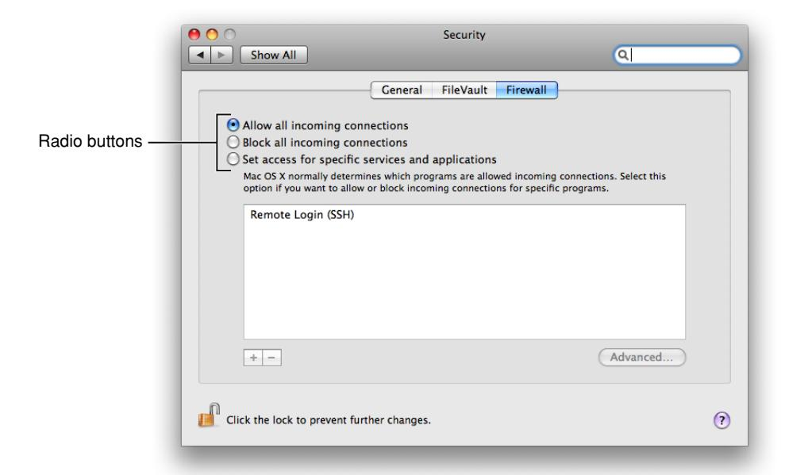

### Radio Button Usage

Use a group of radio buttons when you need to display a set of choices from which the user can choose only one. If you need to display a set of choices from which the user can choose more than one at the same time, use checkboxesinstead. Also, if you need to display a single setting,state, or choice the user can either accept or reject, don't use a single radio button; instead you can use a checkbox. To learn more about checkboxes, see ["Checkboxes"](#page-274-0) (page 275).

A group of radio buttons should contain at least two items and a maximum of about five. If you need to display more than five items, consider using a pop-up menu (described in ["Pop-Up](#page-280-0) Menus" (page 281)).

<span id="page-272-0"></span>A radio button should never initiate an action, although the choice of a radio button can change the state of the application. For example, Speech preferences allowsthe user to choose between two listening methods, asshown in Figure 15-21. If the user choosesthe second listening method ("Listen continuously with keyword"), the keyword setup preferences are automatically enabled.

**Figure 15-21** A radio button can change the state of an application


### Radio Button Contents and Labeling

The selected and unselected appearances of a radio button are provided automatically; you cannot display any text or images in a radio button.

Radio buttons should be accompanied by text labels that describe the choice associated with each button. These labels should have sentence-style capitalization, as described in ["Capitalization](#page-130-1) of Interface Element [Labels](#page-130-1) and Text" (page 131).

A set of radio buttons is never dynamic; that is, the contents and labels shouldn't change depending on the context.

### Radio Button Specifications

**Control sizes**: The dimensions of the radio button itself are fixed for each size, but you determine the length of the label that introduces the group and the length of each radio button label.

**Label spacing and fonts**: Radio button text (both the introductory label and control label) should be in a font that is proportional to the size of the control. The following fonts are supplied automatically by Interface Builder:

- Regular size: System font.
- Small: Small system font.
- Mini: Mini system font.

Use the following metrics to position the introductory labels correctly:

- Regular size: 8 pixels from the end of the label (the colon) to the control.
- <span id="page-273-1"></span>■ Small: 6 pixels from the end of the label (the colon) to the control.
- Mini: 5 pixels from the end of the label (the colon) to the control.

**Control spacing**: Radio buttons can be arranged vertically or horizontally, depending on the overall layout of your window or dialog. Typically, however, radio buttons are stacked vertically to emphasize the mutually exclusive relationship among the buttons.

If you position a group of radio buttons horizontally, measure the space needed to accommodate the longest radio button label. Use that measurement to make the space between each pair of radio buttons consistent.

Use the following metrics when you position radio buttons vertically:

- Regular size: 6 pixels between controls.
- Small: 6 pixels between controls.
- <span id="page-273-0"></span>■ Mini: 5 pixels between controls.

For radio buttons stacked vertically or horizontally, be sure to align the baseline of the introductory label with the baseline of the first button's label, as shown in Figure 15-22.

**Figure 15-22** Radio button label alignment


### Radio Button Implementation

Radio buttons are available in Interface Builder. To create one using Application Kit programming interfaces, create an NSButton object with type NSRadioButton.

### <span id="page-274-0"></span>Checkboxes

<span id="page-274-4"></span><span id="page-274-3"></span>A **checkbox** describes a state, action, or value that can be either on or off. In a group of checkboxes, each checkbox should be independent of all the others, unless interdependency is clearly indicated (for example, by displaying a subordinate checkbox indented below a superior checkbox).

<span id="page-274-1"></span>For example, in Sound preferences (shown in Figure 15-23), checkboxes allow users to make choices about sound effects and choose whether to display the volume setting in the menu bar. Notice that users can select or deselect any of the three sound effects checkboxes, because these controls are independent of each other.

**Figure 15-23** Checkboxes provide on-off choices to the user


### <span id="page-274-2"></span>Checkbox Usage

Use a checkbox when you want to allow users to choose between two opposite states, actions, or values. If you want to provide a set of choicesfrom which users can choose only one, use a set of radio buttonsinstead (see "Radio [Buttons"](#page-271-1) (page 272) for more on this control).

If there are several independent values or states you want users to control, you can provide a group of checkboxes (see Figure 15-23 for an example of a group of independent checkboxes). If, on the other hand, you need to allow users to make an on-off type of choice that can lead to additional, related on-off choices, you can display checkboxes in a hierarchy that indicates the relationship.

For example, the Trackpad pane of the Keyboard & Mouse preferences allows users to decide which trackpad gestures to use (this window is shown in Figure 15-24). Notice that the "Allow horizontal scrolling" checkbox is dependent on the "Use two fingers to scroll" checkbox, because if users choose *not* to use two fingers to scroll, they don't care about horizontal scrolling. Similarly, the Dragging and Drag Lock checkboxes are

unavailable unless the Clicking checkbox is selected, because the dragging gestures are dependent on the clicking gesture. The Trackpad pane uses indentation to tell users that some of these settings are dependent on others.

<span id="page-275-0"></span>**Figure 15-24** Checkboxes can be indented to show a dependent relationship


### Checkbox Contents and Labeling

Each checkbox label should clearly imply two opposite states so it's clear what happens when the option is selected or deselected. If you can't find an unambiguous label, consider using a pair of radio buttons so you can clarify the states with two different labels.

Checkbox labels should have sentence-style capitalization (see ["Capitalization](#page-130-1) of Interface Element Labels and [Text"](#page-130-1) (page 131) for more on this style), unless the state or value is the title of some other element in the interface that is capitalized.

When a userselection comprises more than one state, use a dash in the appropriate checkboxes. Thissymbol is consistent with the mixed-state indicator in menus, as described in "Using [Symbols](#page-165-0) in Menus" (page 166).

### Checkbox Specifications

**Control sizes**: The dimensions of the checkbox itself are fixed for each size, but you determine the length of the introductory label and checkbox label.

**Label spacing and fonts**: Checkbox text (both the introductory label and control label) should be in a font that is proportional to the size of the control. The following fonts are supplied automatically by Interface Builder:

■ Regular size: System font.

- Small: Small system font.
- Mini: Mini system font.

If you display an introductory label on the same line asthe first checkbox, use the following metricsto position it correctly:

- Regular size: 8 pixels from the end of the label (the colon) to the control.
- Small: 6 pixels from the end of the label (the colon) to the control.
- Mini: 5 pixels from the end of the label (the colon) to the control.

<span id="page-276-2"></span><span id="page-276-1"></span>Be sure to align the baseline of the introductory label with the baseline of the closest checkbox's label, as shown in Figure 15-25.

**Figure 15-25** Checkbox label alignment


If you display an introductory label above a group of checkboxes, leave 8 pixels between the label and the first checkbox.

**Control spacing**: Typically, checkboxes are arranged vertically, because this arrangement makes it easier for users to distinguish one state from another. As described in ["Checkbox](#page-274-2) Usage" (page 275), you should align a set of independent checkboxes so that all appear to be at the same level. If one checkbox describes a state or action that depends on the state of another checkbox, you can indent the dependent checkbox below the controlling one.

Use the following metrics when you lay out checkboxes in your window:

- Regular size: 8 pixels between controls when stacked.
- Small: 8 pixels between controls when stacked.
- Mini: 7 pixels between controls when stacked.

### <span id="page-276-0"></span>Checkbox Implementation

<span id="page-276-4"></span><span id="page-276-3"></span>Checkboxes are available in Interface Builder. To create one using Application Kit programming interfaces, create an NSButton object of type NSSwitchButton.

### Segmented Controls

A **segmented control** is divided into two or more segments and behaves as a collection of radio buttons or checkboxes. Like a push button, a segmented control initiates an immediate action—that is, when the user clicks one of the segments, something should happen.

Mac OS X offers different styles of segmented controls for use in different window areas. The segmented control described in this section is suitable for use in the window body; it should not be used in the window-frame areas. For information on styles of segmented controls that are available for use in the window-frame areas(the toolbar and the bottom bar),see ["Window-Frame](#page-248-1) Controls" (page 249). Figure 15-26 shows an example of segmented controls in a window-body area.

<span id="page-277-0"></span>**Figure 15-26** Segmented controls can be used as radio buttons


### Segmented Control Usage

Use a segmented control when you want to offer the user a few closely related choices that affect a selected object. You can also use a segmented control to change views or panes in a window. Note that although a segmented control used as a view-changer looks similar to a tab view control, it does not behave the same: A segmented control is not attached to the panes, whereas a tab view control is attached to them. See ["Tab](#page-328-0) [Views"](#page-328-0) (page 329) for more information about tab views.

If you need to provide a way for users to add and delete objects in a source list or other split view, don't use a segmented control that contains the plus and minus symbols. Instead, if you need to put an add-delete control in a bottom bar, use a rectangular-style toolbar control (described in ["Rectangular-Style](#page-249-0) Toolbar [Controls"](#page-249-0) (page 250)). If you need to put an add-delete control in the window body, use a gradient button (described in ["Gradient](#page-264-0) Buttons" (page 265)). Also, you don't need to create the plus and minusiconsfor these controls, because Mac OS X v10.5 and later provides these and many other icons for your use (see ["System-Provided](#page-150-0) Images" (page 151) for more information).

### Segmented Control Contents and Labeling

A segmented control can contain either icons or text, but not a mixture of both. However, when the control contains icons, you can place a text label below the control.

For the text in each segment, or the label below it, use a noun (or short noun phrase) that describes a view or an object, and use title-style capitalization (see ["Capitalization](#page-130-1) of Interface Element Labels and Text" (page 131) for more on this style).

If you choose to use icons in a segmented control, be sure to consider using the images that are available in Mac OS X v10.5 and later (see ["System-Provided](#page-150-0) Images" (page 151) for more information on these). If you need to design your own images, try to imitate the clarity and simple lines of the system-provided images. Forsome tips on how to create custom images of thistype,see "Designing Iconsfor [Rectangular-Style](#page-149-1) Toolbar [Controls"](#page-149-1) (page 150).

### Segmented Control Specifications

**Control sizes**: The height of a segmented control is fixed for each size, but you determine the width of the control. Be sure to make the width of each segment the same, because a segment of a different width might imply that it has different behavior or is of greater or lesser importance than the others.

**Label spacing and fonts**: The text in a segmented control and the label text is proportional to the size of the control (Interface Builder automatically supplies the appropriate font for the text within the control):

- Regular size: System font for text within the control and for label text below it.
- Small: Small system font for text within the control and for label text below it.
- <span id="page-278-3"></span>■ Mini: Mini system font for text within the control and for label text below it.

**Icon sizes**: If you need to design an icon for each segment, you should constrain the icon to the following dimensions:

- Regular size: 17 x 15 pixels.
- <span id="page-278-1"></span>■ Small: 14 x 13 pixels.
- Mini: 12 x 11 pixels.

**Figure 15-27** Segmented controls can contain icons or text

#### **Regular-size segmented control**

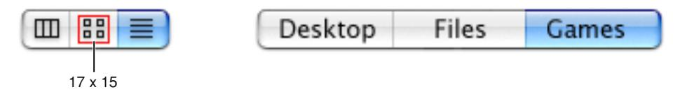

### <span id="page-278-0"></span>Segmented Control Implementation

<span id="page-278-2"></span>The segmented control is available in Interface Builder. To create one using Application Kit programming interfaces, use the NSSegmentedControl class.

### Icon Buttons and Bevel Buttons with Pop-Up Menus

A bevel button or an icon button containing a pop-up menu has a single downward-pointing arrow. The button can behave like a standard pop-up menu, in which the image on the button is the current selection, or the button can represent the menu title and always display the same image.

Selection Controls **279**

**Important:** An icon button with a pop-up menu is one of the three window-body controls that can also be used in a window-frame area. To learn more about controls that are designed specifically for use in window-frame areas, see ["Window-Frame](#page-248-1) Controls" (page 249).

An icon or bevel button with a pop-up menu is easy to create in Interface Builder. First, drag a pop-up button (an NSPopUpButton object) into your window. Select the button and in the Attributes pane of the inspector, change its type to Pull Down. Finally, for a Rounded or Square Bevel Button, change the style to Square or Shadowless Square, respectively. For an icon button, it doesn't matter which style you choose, but you must deselect the Bordered checkbox. Resize the button as needed.

<span id="page-279-0"></span>See "Bevel [Buttons"](#page-268-0) (page 269) and "Icon [Buttons"](#page-260-0) (page 261) for specifications for the buttons themselves. Figure 15-28 shows examples of these types of buttons with pop-up menus.

**Figure 15-28** Bevel and icon buttons can include pop-up menus


### <span id="page-280-0"></span>Pop-Up Menus

<span id="page-280-3"></span><span id="page-280-2"></span>A **pop-up menu** presents a list of mutually exclusive choices in a dialog or window. The pop-up menu described in this section is suitable for use in window-body areas. If you need to provide pop-up menu functionality in a window-frame area (a toolbar or bottom bar), see ["Window-Frame](#page-248-1) Controls" (page 249) for more information on controls you can use. If you want to add pop-up menu functionality to a bevel or icon button, see "Icon Buttons and Bevel [Buttons](#page-278-0) with Pop-Up Menus" (page 279) for some specifications you can use. Figure 15-29 shows several pop-up menus in a window.

<span id="page-280-1"></span>**Figure 15-29** Pop-up menus provide users with menu functionality in a control

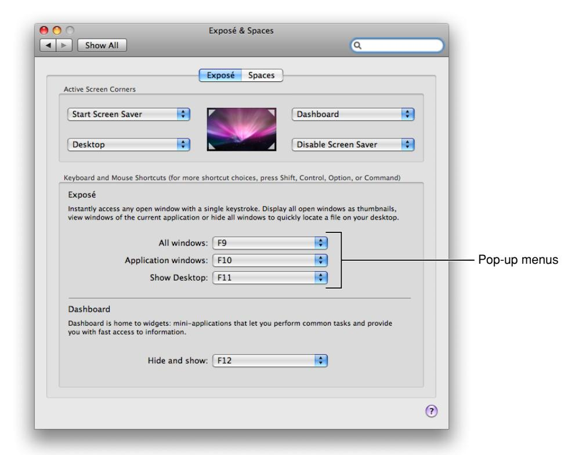

A pop-up menu behaves like other menus: Users press to open the menu and then drag to choose an item. The chosen item flashes briefly and is displayed in the closed pop-up menu. If users move the cursor outside the open menu without releasing the mouse button, the current value remains active. An exploratory press in the menu to see what's available doesn't select a new value.

### Pop-Up Menu Usage

Use a pop-up menu to present up to 12 mutually exclusive choices that the user doesn't need to see all the time. Sometimes a pop-up menu can be a good alternative to other types of selection controls. For example, if you have a dialog that contains a set of six or more radio buttons, you might consider replacing them with a pop-up menu to save space.

Avoid adding a submenu to any item in a pop-up menu. Doing so hides choices too deeply and is physically difficult for users to use.

#### Avoid using pop-up menus:

- For more than 12 items; instead, use a scrolling list unless space is restricted.
- When the number of items in the list can change.
- When more than one simultaneous selection is appropriate, such as in a list of text styles (from which users might choose both bold and italic). In this situation, you should instead use checkboxes or a pull-down menu in which checkmarks appear.

### Pop-Up Menu Contents and Labeling

#### A pop-up menu:

- Usually has a label to the left (in left-to-right scripts). The label should have sentence-style capitalization (see ["Capitalization](#page-130-1) of Interface Element Labels and Text" (page 131) for more information on this capitalization style). The only exception is if the control is used as the title for a group box, which is not a common usage.
- Has a double-arrow indicator.
- Contains nouns (things) or adjectives (states or attributes), but not verbs (commands). If you need to display commands, use a pull-down menu instead. Use title-style capitalization for the item labels.
- <span id="page-281-0"></span>■ Displays a checkmark to the left of the currently selected value when open.

Figure 15-30 shows the components of a pop-up menu.

**Figure 15-30** An open pop-up menu

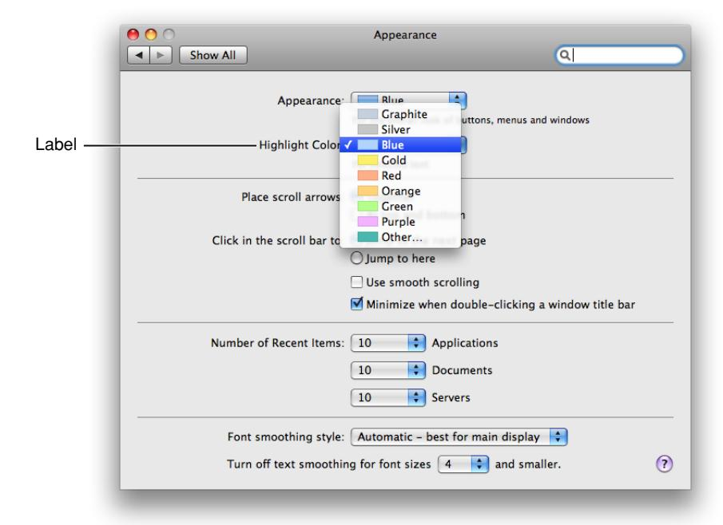

In special cases, you may want to include a command that affects the contents of the pop-up menu itself. For example, in the Print dialog, the Printer pop-up menu contains the Add Printer item, so users can add a printer to the menu; the new printer becomes the menu's default selection. Put such commands at the bottom of a pop-up menu, below a separator.

### <span id="page-282-1"></span>Pop-Up Menu Specifications

**Control sizes**: The height of a pop-up menu is fixed for each size. The width should be wide enough to accommodate the longest item. If you display multiple pop-up menus in a stack the width of each control should be the same.

**Label spacing and fonts**: The menu-item text in a pop-up menu should be in a font that is proportional to the size of the control. The text of the introductory label should be an emphasized version of the same font. Use the following metrics and specifications for a pop-up menu:

#### ■ Regular size:

- ❏ Menu-item text: System font. Leave 9 pixels from the left edge of the control and at least 9 pixels from the double-arrow area.
- ❏ Introductory text: Emphasized system font. Leave 8 pixels between the end of the text (colon) and the left edge of the control.

#### ■ Small:

- ❏ Menu-item text: Small system font. Leave 7 pixels from the left edge of the control and at least 7 pixels from the double-arrow area.
- ❏ Introductory text: Emphasized small system font. Leave 6 pixels between the end of the text (colon) and the left edge of the control.

#### ■ Mini:

- ❏ Menu-item text: Mini system font. Leave 5 pixels from the left edge of the control and at least 5 pixels from the double-arrow area.
- <span id="page-282-2"></span>❏ Introductory text: Emphasized mini system font. Leave 5 pixels between the end of the text (colon) and the left edge of menu.

<span id="page-282-0"></span>Figure 15-31 shows how the pop-up menu introductory text and menu-item text are positioned.

**Figure 15-31** A pop-up menu with an introductory label and menu-item text

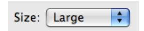

**Control spacing**: When you display multiple pop-up menus stacked vertically, leave the following amounts of space between them (Figure 15-32 shows how this looks with regular-size controls):

- Regular size: At least 10 pixels between stacked controls.
- Small: At least 8 pixels between stacked controls.
- Mini: At least 6 pixels between stacked controls.

<span id="page-283-1"></span>**Figure 15-32** Pop-up menus stacked vertically

Regular-size pop-up menu

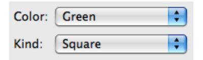

### Pop-Up Menu Implementation

<span id="page-283-0"></span>Pop-up menus are available in Interface Builder. To create one using Application Kit programming interfaces, use the NSPopUpButton class.

### Action Menus

<span id="page-283-2"></span>An **Action menu** is a specific type of pop-up menu that's designed to replace an application-wide contextual menu. For example, in its default set of toolbar controls, the Finder includes an Action menu that performs tasks related to the currently selected item, as shown in Figure 15-33.

**Figure 15-33** An Action menu in the Finder toolbar

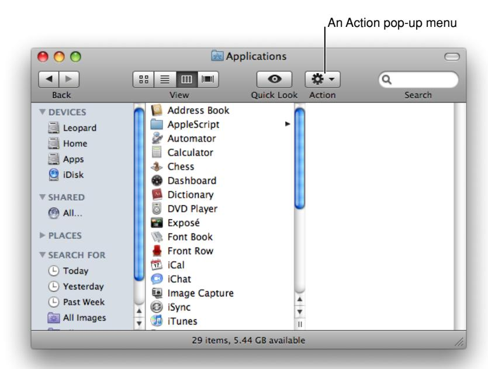

**Important:** An Action menu is one of the three window-body controlsthat can also be used in a window-frame area. To learn more about controls that are designed specifically for use in window-frame areas, see ["Window-Frame](#page-248-1) Controls" (page 249).

### Action Menu Usage

Use an Action pop-up menu when you want to provide a visible shortcut to a handful of useful commands. Although contextual menus also provide shortcuts to a small number of commands, the fact that they are hidden makes them difficult for new users to discover and for all users to remember. (You can learn more about contextual menusin ["Contextual](#page-183-0) Menus" (page 184).) If you are thinking of providing (or already provide) an application-wide contextual menu, you might choose to replace it with an Action menu control in the toolbar.

<span id="page-284-0"></span>You can also use an Action menu at the bottom of a list view or source list to provide commands that apply to items in the list. For example, Mail provides an Action menu at the bottom of its source list (shown in Figure 15-34). This Action menu contains commands that act on the account or mailbox selected in the source list.

**Figure 15-34** An Action menu can be below a list view or source list

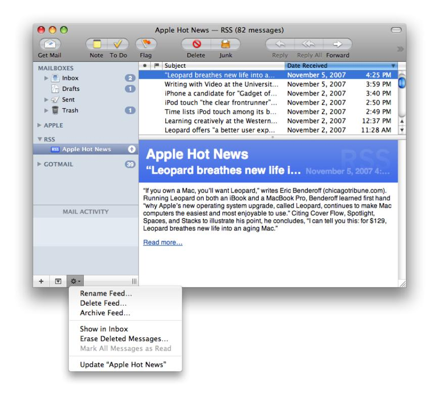

Avoid placing an Action menu control anywhere else in the body of a window. Contextual menus appear when the user selects an object in a window and Control-clicks (or clicks the right button of a properly configured two-button mouse). Because such an object might appear anywhere in a window, there's no reasonable, consistent location for an Action menu control that contains the commands specific to that object.

### Action Menu Contents and Labeling

An Action menu should display only the Action icon and the standard downward-pointing arrow used in icon and bevel buttons with attached pop-up menus (for more information about these controls, see ["Icon](#page-278-0) Buttons and Bevel [Buttons](#page-278-0) with Pop-Up Menus" (page 279)). It's essential that you use the system-supplied Action icon so users understand what the control does (for more information on the Action icon and icons available for other types of controls, see ["System-Provided](#page-150-0) Images" (page 151)).

The contents of an Action menu should conform to the guidelines for contextual menus, such as ensuring that each Action menu item is also available as a menu command and avoiding the display of keyboard shortcuts. For more information on the guidelinesthat govern contextual menus,see ["Contextual](#page-183-0) Menus" (page 184).

An Action menu does not need a label, because users are familiar with the meaning of the Action icon. The only exception is the label you should supply for an Action menu button in a toolbar, because users can customize the toolbar to view toolbar items asicons with text or astext instead of icons(see ["Toolbars"](#page-195-0) (page 196) for more information on toolbars).

### Action Menu Specifications

**Control sizes**: The Action menu icon is available in regular and smallsizes. Use the icon size that's proportional to the size of the control you want to use.

**Control spacing**: Spacing depends on what type of control you use. For details,see ["Rectangular-Style](#page-249-0) Toolbar [Controls"](#page-249-0) (page 250) (if you plan to put an Action menu in a toolbar) or ["Gradient](#page-264-0) Buttons" (page 265) (if you plan to put an Action menu below a source list or other type of list view).

### Action Menu Implementation

You can create an Action menu in Interface Builder. If you need an Action menu control for a toolbar, select a rectangular-style toolbar control (see ["Rectangular-Style](#page-249-0) Toolbar Controls" (page 250) for more information about this control). In the Attributes pane of the inspector, specify NSActionTemplate for the image.

<span id="page-285-2"></span><span id="page-285-1"></span><span id="page-285-0"></span>If you need an Action menu control at the bottom of a source list or list view, you can use a gradient button (see ["Gradient](#page-264-0) Buttons" (page 265) for information on this control).

### Combination Boxes

A **combination box** (or combo box) is a text entry field combined with a drop-down list. Combo boxes can display a list of likely choices while still allowing the user to type in an item not in the list. For example, Safari allows usersto set a preference for the minimum fontsize to display. In its Advanced preferences pane (shown in Figure 15-35), Safari lists several font sizes in a combo box, and users can supply a custom font size if none of the listed choices is suitable.

<span id="page-286-0"></span>**Figure 15-35** A combo box allows users to select from a list or supply their own item

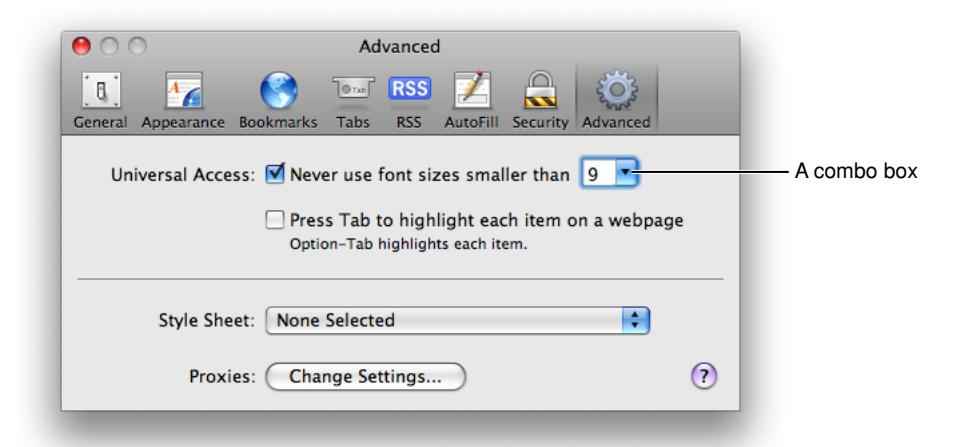

Users can type any appropriate characters into the text field. If a user types in an item already in the list, or types in a few characters that match the first characters of an item in the list, the item is highlighted when the user opens the list. A user-typed item is *not* added to the permanent list.

Users open the list by pressing or clicking the arrow to the right of the text field. The list descends from the text field; it is the same width as the text field plus the arrow box, and it has a drop shadow.

When the user selects an item in the list, the item replaces whatever is in the text entry field and the list closes. If the list was opened by pressing the arrow, the user selects an item in the list by dragging to it. If the list was opened by clicking the arrow, the user selects an item by clicking it or by pressing the Up Arrow or Down Arrow key. The user can accept an item by pressing the Space bar, Enter, or Return.

<span id="page-286-1"></span>If the list is open and the user clicks outside it, including within the text entry field, the list closes.

**Figure 15-36** A combo box with the list open

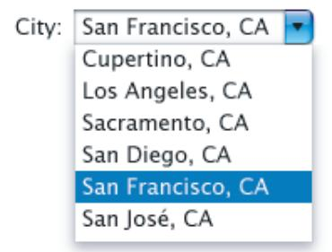

### Combo Box Usage

Use a combo box when you want to give users the convenience of selecting an item from a list combined with the freedom of specifying their own custom item. A combo box does not allow multiple selections, so be sure to offer users a list of items from which they can choose only one at a time.

### Combo Box Contents and Labeling

The defaultstate of the combo box is closed, with the text field empty or displaying a defaultselection. Recall that user-supplied items are not added to the control's permanent list.

The default selection (which may not be the first item in the list) should provide a meaningful clue to the hidden choices, but it's a good idea to introduce a combo box with a label that helps users know what types of items to expect.

Don't extend the right edge of the list beyond the right edge of the arrow box; if an item is too long, it is truncated.

### Combo Box Specifications

**Control sizes**: The height of a combo box is fixed for each size, but its width should be wide enough to accommodate the longest list item.

**Label spacing and fonts**: The text of the list items in a combo box should be in a font that is proportional to the size of the control. The text of the introductory label should be an emphasized version of the same font. Use the following metrics and specifications for a combo box:

- Regular size:
  - ❏ List-item text: System font. This font is automatically supplied by Interface Builder.
  - ❏ Introductory label: Emphasized system font. Leave 8 pixels between the end of the text (colon) and the left edge of the control.
- Small:
  - ❏ List-item text: Small system font. This font is automatically supplied by Interface Builder.
  - ❏ Introductory label: Emphasized smallsystem font. Leave 6 pixels between the end of the text (colon) and the left edge of the control.
- <span id="page-287-1"></span>■ Mini:
  - ❏ List-item text: Mini system font. This font is automatically supplied by Interface Builder.
  - ❏ Introductory label: Emphasized mini system font. Leave 5 pixels between the end of the text (colon) and the left edge of menu.

<span id="page-287-0"></span>Figure 15-37 shows how the combo box introductory label and list-item text are positioned.

**Figure 15-37** A combo box with an introductory label and list-item text

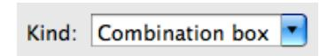

**Control spacing**: When combo boxes are stacked vertically, leave the following amounts of space between them:

■ Regular size: At least 12 pixels.

- Small: At least 10 pixels.
- Mini: At least 8 pixels.

### Combo Box Implementation

Combo boxes are available in Interface Builder. To create one using the Application Kit programming interfaces, use the NSComboBox class.

### <span id="page-288-0"></span>Path Controls

<span id="page-288-1"></span>A **path control** displays the file-system path of the currently selected item. For example, the Finder uses one style of path control to display the path of the currently selected item at the bottom of the window, asshown in Figure 15-38.

**Figure 15-38** A path control displays the path of the current item


There are three styles of path control, all of which are suitable for use in the window body:

- Standard
- Navigation bar
- Pop up

### Path Control Usage

Use a path control when you want to display the file-system location of the currently selected item in a way that is not overly technical. You can also use a path control to allow users to retrace their steps along a path and open folders they visited earlier.

### Path Control Contents and Labeling

All three path-control styles display text in addition to icons for applications, folders, and document types. When users click the pop-up style path control, a pop-up menu appears, which lists all locations in the path and a Choose menu item. Users can use the Open dialog opened by the Choose item to view the contents of the selected folder. (See "The Open [Dialog"](#page-239-0) (page 240) for more information on the Open dialog.)

### Path Control Specifications

The standard-style path control is available in regular size only. The navigation bar and pop-up styles are each available in regular, small, and mini sizes.

<span id="page-289-0"></span>You specify the horizontal length of the standard and navigation bar styles; if the displayed path is too long to fit in the control, the folder names between the first location and the last are hidden, as shown in Figure 15-39.

**Figure 15-39** A path control can accommodate a large number of locations

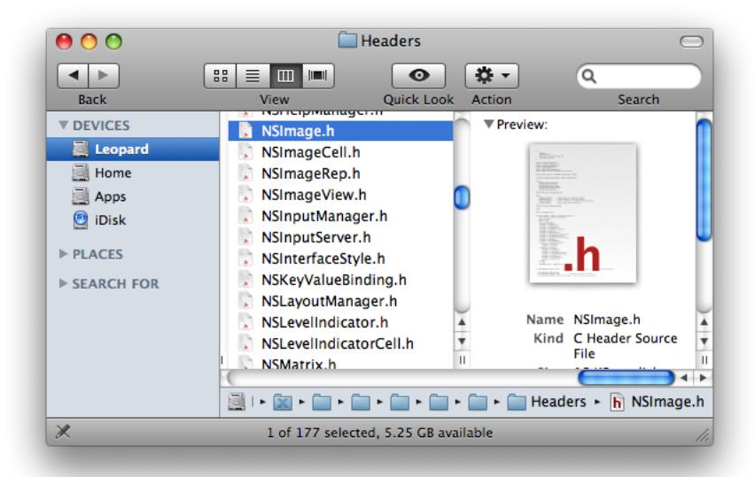

### Path Control Implementation

The path control is available in Interface Builder. You can change the style of the control in the Attributes pane of the inspector panel. To create this control using Application Kit programming interfaces, use the NSPathControl class.

### <span id="page-290-0"></span>Color Wells

<span id="page-290-4"></span><span id="page-290-3"></span>A **color well** is a small rectangular control that indicates the current color for a particular setting and, when clicked, displaysthe Colors window (using the Colors window, users can change a colorsetting). For example, the Graphic pane of the Pages inspector contains three color wells that allow users to change the color of an object's fill, outline, and shadow, as shown in Figure 15-40.

<span id="page-290-2"></span>**Figure 15-40** Color wells in an inspector window


<span id="page-290-7"></span><span id="page-290-6"></span><span id="page-290-5"></span><span id="page-290-1"></span>Multiple color wells can appear in a window. Color wells are available in Interface Builder. To create one using Application Kit programming interfaces, use the NSColorWell class.

### Image Wells

Use an **image well** as a drag-and-drop target for an icon or picture. You could use a set of image wells to manage thumbnailsin a clip-art catalog, for example. Don't use image wellsin place of push buttons or bevel buttons. Figure 15-41 shows the image well in Accounts preferences.

<span id="page-291-1"></span>**Figure 15-41** An image well in a preferences pane

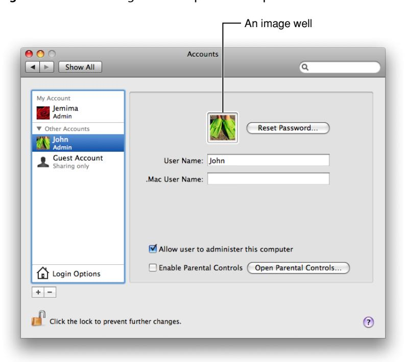

<span id="page-291-3"></span>Some image wells (the user picture in the Password pane of Accounts preferences, for example) must always contain an image. If the user can clear an image well (leaving it empty) in your application, provide standard Edit menu commands and Clipboard support.

<span id="page-291-0"></span>Image wells are available in Interface Builder. To create one using Application Kit programming interfaces, use the NSImageView class.

### <span id="page-291-2"></span>Date Pickers

A **date picker** allows users to select a specific date and time in a window. The date-picker control provides two styles of date and time selection:

- A combination of a text field and stepper control
- A graphical calendar and clock

The Date & Time preferences pane uses both types of date picker, as shown in Figure 15-42.

<span id="page-292-0"></span>**Figure 15-42** Textual and graphical date pickers in a preferences pane

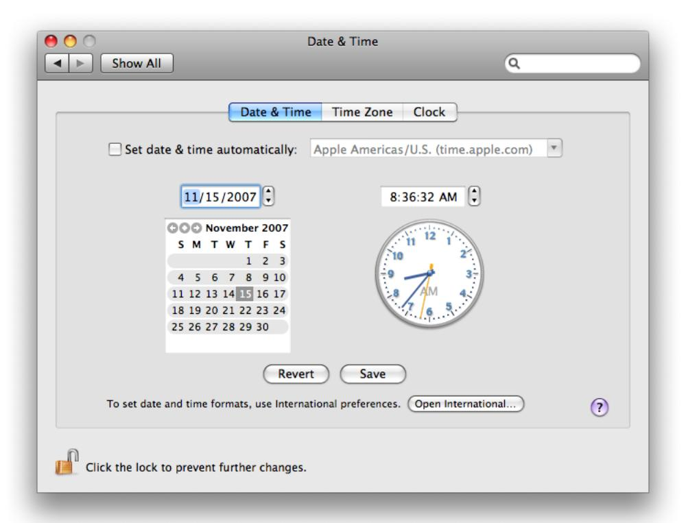

### Date Picker Usage

<span id="page-292-1"></span>Use a date picker to provide time and date setting functionality in a window. The text field and stepper date picker is useful when space is constrained and you expect usersto be making specific date and time selections. This style of date picker can be modified to display various combinations of date format (month, day, and year or month and year) and time format (hour, minute, and second, or hour and minute). It can also display a text field and stepper for either the date or the time by itself. The user adjusts the date and time by clicking the arrows of the stepper or by selecting the field to change (such as the month or minute field) and typing a new value. For example, Figure 15-43 shows a text field and stepper date-picker control that allows month, day, and year selection for the date, and hour, minute, and second selection for the time.

**Figure 15-43** A textual date-picker control

The graphical style of the date-picker control displays a calendar and a clock. Use this style when you want to give usersthe option of browsing through daysin a calendar or when the look of a clock face is appropriate for the style of your application. You can display either the calendar or the clock in your window or both together. The user selects a month by clicking the left or right arrows in the upper-left corner of the calendar display and selects a day by clicking its date in the month. A specific time is selected by dragging the hands of the clock. Figure 15-44 shows a date-picker control that displays both a calendar and a clock.

<span id="page-293-1"></span>**Figure 15-44** A graphical date-picker control


### Date Picker Implementation

<span id="page-293-0"></span>The date-picker control is available in Interface Builder. You can change the style from textual to graphical in the Attributes pane of the inspector. To create one using Application Kit programming interfaces, use the NSDatePicker class.

### <span id="page-293-3"></span>Command Pop-Down Menus

<span id="page-293-2"></span>A **command pop-down menu** is similar to a pull-down menu, but it appears within a window rather than in the menu bar. A command pop-down menu presents a list of commandsthat affect the containing window's contents. For example, the Colors window (shown in Figure 15-45) contains a menu with commands that can be used to change the contents of the Colors window itself. (If your application uses the Colors window, don't create your own menu with these same commands; see "Fonts Window and Colors [Window"](#page-228-0) (page 229) for more information on the Colors window.)

**Figure 15-45** A command pop-down menu in the Colors window


### Command Pop-Down Menu Usage

Use a command pop-down menu only when the containing window is shared among multiple windows or applications and the menu contains commands that affect the window's contents. For example, the Colors window (shown in Figure 15-45) can be used in any application. The items in its command pop-down menu allow users to make new palettes of colors available in the Colors window (the open command pop-down menu in the Colors window is shown in Figure 15-46).

<span id="page-294-0"></span>**Figure 15-46** An open command pop-down menu

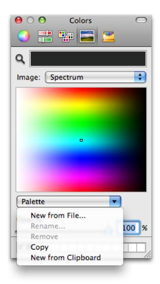

Command pop-down menusshould contain between 3 and 12 commands. The itemsin a command pop-down menu do not have to be mutually exclusive.

### Command Pop-Down Menu Contents and Labeling

Command pop-down menus do not require an introductory label. A closed command pop-down menu always displays the same text, which acts as the menu title. This is in contrast to a closed pop-up menu, which displays the currently selected item.

Command pop-down menus contain a single, downward-pointing arrow and may display check marks to the left of all currently active selections.

### <span id="page-294-1"></span>Command Pop-Down Menu Specifications

The specifications for command pop-down menus are the same as those for pop-up menus; see ["Pop-Up](#page-282-1) Menu [Specifications"](#page-282-1) (page 283) for the appropriate metrics. Figure 15-47 shows how the command pop-down menu text is positioned.

**Figure 15-47** A command pop-down menu

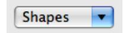

### Command Pop-Down Implementation

You can use Interface Builder to create a command pop-down menu: select an NSPopUpButton object and change its type to Pull Down in the Attributes pane of the inspector. To create a command pop-down menu using Application Kit programming interfaces, use the NSPopUpButton class.

### <span id="page-295-3"></span><span id="page-295-2"></span><span id="page-295-0"></span>Sliders

<span id="page-295-1"></span>A **slider** lets users choose from a continuousrange of allowable values. For example, Energy Saver preferences (shown in Figure 15-48) provides two sliders that allow users to specify when the computer and the display should sleep.

**Figure 15-48** Sliders allow users to choose from a continuous range of values

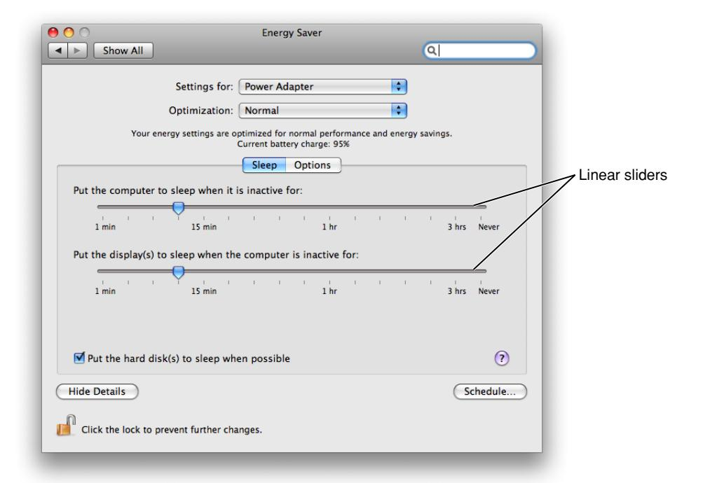

Sliders can be linear (as shown in Figure 15-48) or circular, as shown in Figure 15-49. Typically, users can spin circular sliders in either direction and through the point between the beginning and ending values.

<span id="page-296-0"></span>**Figure 15-49** A circular slider

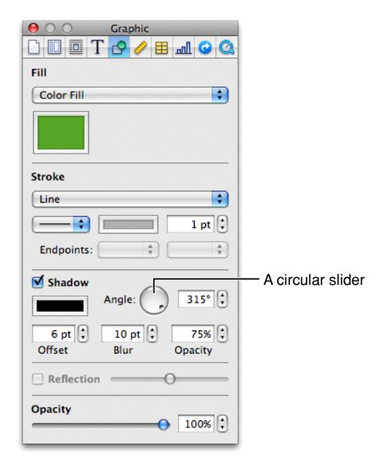

### Slider Usage

Sliders support live feedback (live dragging), so they're especially useful when you want users to be able to see the effects of moving a slider in real time. For example, users can watch the size of Dock icons change as they move the Dock Size slider in Dock preferences.

To decide whether a slider should be linear or circular (and, if linear, whether it should be horizontal or vertical), examine the user's mental model of the task your application performs and try to meet their expectations of similar real-world controls. (You can learn more about the user's mental model in ["Reflect](#page-38-3) the User's Mental [Model"](#page-38-3) (page 39).) For example, the circular slider in Figure 15-49 allows users to choose the angle of the drop shadow displayed for an object. The circular slider not only displays the full range of values (0 to 360 degrees) in a compact way, it also mirrors the placement of the drop shadow itself as it is displayed on different sides of the object.

On the other hand, a linear slider is appropriate in Energy Saver preferences (shown in [Figure](#page-295-1) 15-48 (page 296)) because the values range from very small (the screen saver should start after 3 minutes) to very large (the screen saver should never start) and do not increase at consistent intervals. In this case, a linear slider brings to mind a number line that stretches from the origin to infinity.

You can display tick marks with both linear and circular sliders. In general, you should display tick marks when it's important for users to understand the scale of the measurements or when users need to be able to select specific values. If, on the other hand, users don't need to be aware of the specific values the slider passesthrough (asin the Dock size and magnification preferences, for example), you might choose to display a slider without tick marks.

### Slider Contents and Labeling

The movable part of a linear slider is called the thumb. The thumb can be either directional or round. The directional thumb is especially useful for sliders with tick marks, because the point of the thumb helps show users the current value (see [Figure](#page-295-1) 15-48 (page 296) for examples of directional slider thumbs). However, you

<span id="page-297-1"></span>can also display a directional-thumb slider without tick marks. The round thumb is recommended for sliders that don't display tick marks, because the rounded lower edge of the thumb does not appear to point to a specific value. (If you use Interface Builder to create a slider, note that specifying any nonzero number of tick marks automatically changes a round thumb to a directional one.) Figure 15-50 shows an example of slider with a round thumb.

<span id="page-297-0"></span>**Figure 15-50** A linear slider without tick marks should display a round thumb


A circular slider displays a small circular dimple that provides the same functionality as the thumb of a linear slider: Users drag the dimple clockwise or counter-clockwise to change the values.

If you want to display tick marks with a slider, be sure to label at least the starting and ending values. You can do this using numbers or words, depending on what the values represent. If each tick mark represents an equal fraction of the entire range, it may not be necessary to label each one. However, if users can't deduce the value of each tick mark from its position in the range, you probably should label each one to prevent confusion. For example, it's important to label some of the interior tick marks in Energy Saver preferences (shown in [Figure](#page-295-1) 15-48 (page 296)), because the intervals do not all represent an equal amount of time. In addition, it's a good idea to set the context for a slider with an introductory label so users know what they're changing. Figure 15-51 shows both types of sliders, with and without tick marks.

<span id="page-298-0"></span>**Figure 15-51** Examples of different types of sliders


### Slider Control Specifications

**Control sizes**: Linear sliders are available in regular, small, and mini sizes. Circular sliders are available in regular and small sizes. The dimensions of sliders are fixed for each size and type, but the inclusion of tick marks changes the effective size of the control. These measurements are stated below to help you with your layout.

Height of horizontally positioned linear sliders:

- Regular size, directional thumb: 19 pixels without tick marks, 25 pixels with tick marks.
- Regular size, round thumb: 15 pixels.
- Small, directional thumb: 14 pixels without tick marks, 19 pixels with tick marks.
- Small, round thumb: 12 pixels.
- Mini, directional thumb: 11 pixels without tick marks, 17 pixels with tick marks.
- Mini, round thumb: 10 pixels.

Width of vertically positioned linear sliders:

- Regular size, directional thumb: 18 pixels without tick marks, 24 pixels with tick marks.
- Regular size, round thumb: 15 pixels.
- Small, directional thumb: 14 pixels without tick marks, 19 pixels with tick marks.
- Small, round thumb: 11 pixels.
- Mini, directional thumb: 11 pixels without tick marks, 17 pixels with tick marks.
- Mini, round thumb: 10 pixels.

Diameter of circular sliders:

- Regular size with tick marks: 32 pixels.
- Regular size without tick marks: 24 pixels.

- Small with tick marks: 22 pixels.
- Small without tick marks: 18 pixels.

**Label spacing and fonts**: For the labels that describe the range of values, use the following font sizes:

- Regular size: Label font.
- Small: Label font.
- Mini: 9-point label font.

**Control spacing**: When you display multiple linear sliders, leave the following amounts of space between them:

- <span id="page-299-3"></span>■ Regular size: At least 12 pixels.
- Small: At least 10 pixels.
- Mini: At least 8 pixels.

### Slider Control Implementation

<span id="page-299-0"></span>Sliders are available in Interface Builder. To create one using Application Kit programming interfaces, use the NSSlider class.

### <span id="page-299-4"></span><span id="page-299-2"></span>The Stepper Control (Little Arrows)

<span id="page-299-1"></span>The **stepper control** (also known as little arrows) allows users to increment or decrement values. The control is usually used in conjunction with a text field that indicates the current value. The text field may or may not be editable. Figure 15-52 shows several examples of the stepper control.

**Figure 15-52** Stepper controls in a panel

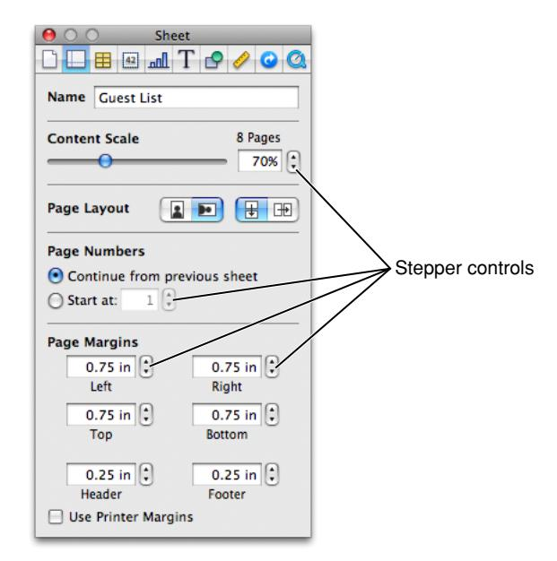

The stepper control is available in Interface Builder. To create one using Application Kit programming interfaces, use the NSStepper class.

### Stepper Control Specifications

**Control sizes**: Stepper controls are available in regular, small, and mini sizes. The dimensions of the stepper control are fixed for each size.

**Control spacing**: Use the following recommended spacing between the stepper and the text field it modifies:

- Regular size: 2 pixels.
- <span id="page-300-3"></span>■ Small: 2 pixels.
- <span id="page-300-1"></span>■ Mini: 1 pixel.

<span id="page-300-0"></span>**Figure 15-53** A regular-size stepper control


### <span id="page-300-4"></span>Placards

A **placard** is a small control at the bottom of a window used to display information, such as the current page number or the current magnification level.

<span id="page-300-2"></span>Typically, placards are used in document windows as a way to quickly modify the view of the contents—for example, to change the current page or the magnification. The most familiar use of the placard is as a pop-up menu placed at the bottom of a window, to the left of the horizontal scroll bar, as shown in Figure 15-54.

**Figure 15-54** A placard

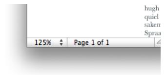

If you need to offer a menu of commands that affect the contents of the window in ways other than magnification or number of pages per view, don't add the commands to the placard's menu. Instead, you should use an Action menu (see "Action [Menus"](#page-283-0) (page 284) for more information on Action menus).

Placards are not available in Interface Builder. To create one using Application Kit programming interfaces, subclass NSScrollView (for an example of how to do this, see the Sketch sample code located in /Developer/Examples/AppKit when the Developer package is installed). A placard is 15 pixels high and text on it should be in either the small system font or the label font.

# <span id="page-301-0"></span>Indicators

Indicators are controls that show users the status of something. For the most part, users don't interact with indicators.

**Important:** The controls described in this section are suitable for use in the window body; they should not be used in the window-frame areas. See ["Window-Frame](#page-248-1) Controls" (page 249) for controls designed specifically for use in the toolbar and bottom-bar areas in your window.

### <span id="page-301-4"></span><span id="page-301-3"></span><span id="page-301-1"></span>Progress Indicators

**Progress indicators** inform users about the status of lengthy operations. (For guidelines on when to provide such information, see "Feedback and [Communication"](#page-41-1) (page 42).)

Progressindicators often appear in a dialog that describesthe progress of a process. When the process being performed can be interrupted, the progress dialog should contain a Cancel button (and support the Esc key). If interrupting the process will result in possible side effects, the button should say Stop instead of Cancel. To learn more about dialogs in general, see ["Dialogs"](#page-229-0) (page 230). To supply a Cancel (or Stop) button, you use a push button; for more information about this control, see "Push [Buttons"](#page-257-1) (page 258).

Be sure to locate progress indicators in consistent locations in your windows and dialogs. For example, the Mail application displays the asynchronous progress indicator in the far right of the To field as it finds and displays email addressesthat match what the user types. Choosing a consistent location for progressindicators allows users to quickly check a familiar place for the status of an operation. See ["Consistency"](#page-42-0) (page 43) for more information on the importance of providing consistency in your application.

There are three types of progress indicators, each of which is suitable for a specific situation:

- Determinate progress bar
- <span id="page-301-2"></span>■ Indeterminate progress bar
- Asynchronous progress indicator

### Determinate Progress Bars

A **determinate progress bar** shows users that a process is occurring and gives them a rough idea of when it will finish. For example, Figure 15-55 shows the progress indicator Software Update displays when it is checking for new software.

<span id="page-302-0"></span>**Figure 15-55** A determinate progress bar provides feedback on a process with a known duration


#### <span id="page-302-1"></span>**Determinate Progress Bar Usage**

Use a determinate progress bar when the full length of an operation can be determined and you can tell the user how much of the process has been completed. For example, you could use a determinate progress bar to show the progress of a file conversion.

You should ensure that a determinate progress bar in your application accurately associates progress with time. A progress bar that becomes 90 percent complete in 5 seconds but takes 5 minutes for the remaining 10 percent, for example, would be annoying and lead users to think that something is wrong.

#### **Determinate Progress Bar Contents and Labeling**

In a determinate progress bar, the "fill" moves from left to right and should fill in completely before it is dismissed. The fill is provided automatically, but you can determine the minimum and maximum values that should be represented.

If necessary, you can provide a complete or partial sentence that appears as a label with a determinate progress bar in a dialog. You can do this so users understand the context in which the process is occurring. Such a label should have sentence-style capitalization (see ["Capitalization](#page-130-1) of Interface Element Labels and [Text"](#page-130-1) (page 131) for more information on this style).

#### **Determinate Progress Bar Specifications**

Determinate progressindicators are available in regular and smallsizes. The height of a determinate progress indicator is fixed for each size, but you can specify the length. Figure 15-56 shows a regular-size determinate progress bar as it looks when active and inactive.

<span id="page-303-0"></span>**Figure 15-56** The active and inactive appearance of a determinate progress bar

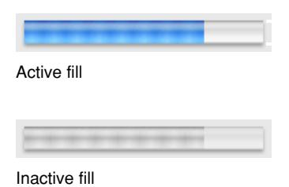

#### **Determinate Progress Bar Implementation**

Determinate progress bars are available in Interface Builder. In the Attributes pane of the inspector, select Bar for the style and deselect the Indeterminate checkbox. To create a determinate progress bar using Application Kit programming interfaces, use the NSProgressIndicator class with style NSProgressIndicatorBarStyle.

### <span id="page-303-2"></span>Indeterminate Progress Bars

<span id="page-303-1"></span>An **indeterminate progress bar** shows users that processing is occurring, but does not give any indication of when it will finish. For example, Keynote displays an indeterminate progress bar as it begins opening a file, as shown in Figure 15-57.

**Figure 15-57** An indeterminate progress bar provides feedback on a process of unknown duration


#### <span id="page-303-3"></span>**Indeterminate Progress Bar Usage**

Use an indeterminate progress bar when the duration of a process can't be determined. For example, if your application attemptsto make a dial-up communication connection, you have no way to accurately determine how long it will take, so you can use an indeterminate progress indicator to let users know that processing is ongoing. If an indeterminate process reaches a point where its duration can be determined, switch to a determinate progress bar (see ["Determinate](#page-301-2) Progress Bars" (page 302) for more on determinate progress bars).

Indeterminate progress bars work best in a dialog or window that focuses on the occurring process. For example, the indeterminate progress bar Keynote displays is in a dialog that is focused solely on the opening of the file (this dialog is shown in Figure 15-57). If you need to provide an indication of an indeterminate process that's associated with a part of a window, such as a control, or if space is limited, consider using an asynchronous progress indicator instead. (See ["Asynchronous](#page-304-1) Progress Indicators" (page 305) for more information on asynchronous progress indicators.)

#### **Indeterminate Progress Bar Contents and Labeling**

An indeterminate progress bar displays a spinning striped cylinder to indicate an ongoing process. Mac OS X provides this appearance automatically.

If necessary, you can provide a complete or partial sentence that appears as a label with an indeterminate progress bar in a dialog. You can do this so users know what process is occurring. Such a label should have sentence-style capitalization (see ["Capitalization](#page-130-1) of Interface Element Labels and Text" (page 131) for more information on this style). Also, you can end the label with an ellipsis (...) to emphasize the ongoing nature of the processing.

#### **Indeterminate Progress Bar Specifications**

<span id="page-304-0"></span>Indeterminate progress bars are available in regular and small sizes. The height of an indeterminate progress bar is fixed for each size, but you can specify the length. Figure 15-58 shows both regular-size and small indeterminate progress bars as they look when active and inactive.

**Figure 15-58** The active and inactive appearance of an indeterminate progress bar

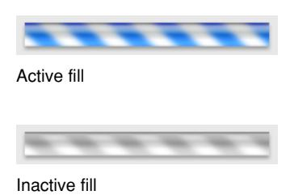

#### **Indeterminate Progress Bar Implementation**

<span id="page-304-1"></span>Indeterminate progress bars are available in Interface Builder. In the Attributes pane of the inspector, select Bar for the style and be sure the Indeterminate checkbox is selected. To create an indeterminate progress bar using Application Kit programming interfaces, use the NSProgressIndicator class with style NSProgressIndicatorBarStyle.

### <span id="page-304-2"></span>Asynchronous Progress Indicators

An **asynchronous progress indicator**shows usersthat processing is occurring but does not give any indication of when the process will finish. For example, Mail briefly displays an asynchronous progress indicator in the To: field of a New Message window while it performs a search on the name the user types, asshown in Figure 15-59.

<span id="page-305-0"></span>**Figure 15-59** An asynchronous progress indicator provides feedback on a process


#### **Asynchronous Progress Indicator Usage**

Use an asynchronous progress indicator when space is very constrained, such as in a text field or near a control. Because this indicator is small and unobtrusive, it is especially useful for asynchronous events that take place in the background, such as retrieving messages from a server.

Don't use the asynchronous progress indicator in operations that start out indeterminate but could become determinate, because the determinate progressindicator is a differentshape and takes up much more space. If the process might change from indeterminate to determinate, use an indeterminate progress bar instead of an asynchronous progress indicator, because it is the same shape and size as the determinate progress bar. (See ["Indeterminate](#page-303-2) Progress Bars" (page 304) for more information about indeterminate progress bars.)

#### **Asynchronous Progress Indicator Contents and Labeling**

Because an asynchronous progress indicator typically appears when the user initiates a process, a label may not be necessary. If you decide to provide a label that appears with the indicator, create a complete or partial sentence that briefly describes the process that is occurring.

If you decide to provide a label that appears with an asynchronous progress indicator, be sure to use sentence-style capitalization (see ["Capitalization](#page-130-1) of Interface Element Labels and Text" (page 131) for more information on this style). Also, you can end the label with an ellipsis (...) to emphasize the ongoing nature of the processing.

#### <span id="page-305-1"></span>**Asynchronous Progress Indicator Specifications**

The appearance of the asynchronous progress indicator is provided automatically, but you can choose the size that fits best in your window layout. Asynchronous progress indicators are available in regular, small, and mini sizes. Figure 15-60 shows a regular-size asynchronous progress indicator.

**Figure 15-60** A regular-size asynchronous progress indicator


#### **Asynchronous Progress Indicator Implementation**

<span id="page-306-5"></span>Asynchronous progress indicators are available in Interface Builder. In the Attributes pane of the inspector, select Spinning for the style and be sure the Indeterminate checkbox is selected. To create an asynchronous progressindicator using Application Kit programming interfaces, use the NSProgressIndicator class with style NSProgressIndicatorSpinningStyle.

### <span id="page-306-4"></span><span id="page-306-0"></span>Level Indicators

A **level indicator** provides graphical information about the level or amount of something. Level indicators can be configured to display different colors to warn users when values are reaching critical levels.

There are three styles of level indicator:

- Capacity
- Rating
- Relevancy

### <span id="page-306-3"></span><span id="page-306-2"></span>Capacity Indicators

<span id="page-306-1"></span>A **capacity indicator**, asits name suggests, provides graphical information about the currentstate ofsomething that has a finite capacity, such as storage space or battery charge. There are two styles of capacity indicator, continuous and discrete. A **continuous capacity indicator** is a translucent track that is filled with a colored bar that indicates the current value. For example, Figure 15-61 shows a continuous capacity indicator that represents how much space has been used (and how much space is left) in the user's mail account.

**Figure 15-61** A continuous capacity indicator shows a fine-grained representation of current capacity


<span id="page-307-1"></span>A **discrete capacity indicator** is a row of separate, rectangular segments equal in number to the maximum value set for the control. Figure 15-62 shows a discrete capacity indicator that represents the battery charge in a Bluetooth mouse.

<span id="page-307-0"></span>**Figure 15-62** A discrete capacity indicator shows a medium-grained representation of current capacity

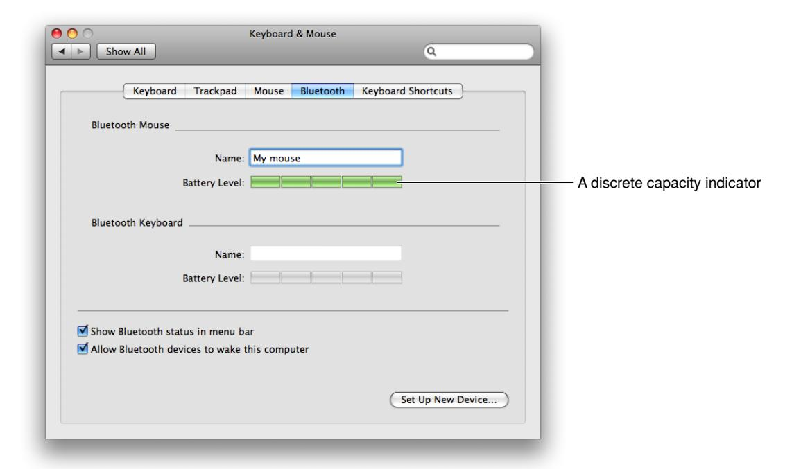

#### **Capacity Indicator Usage**

Use a capacity indicator to provide information about the level or amount ofsomething that has well defined minimum and maximum values. You can configure a capacity indicator to display a different color fill when the current value enters a warning or critical range that you define (for more on this, see "Capacity Indicator Contents and Labeling"). Because capacity indicators provide a clear, easily understood picture of a current state, they're especially useful in dialogs and preferences windows that users tend to view briefly.

Note that the discrete capacity indicator displays the current value rounded to the nearest integer, and the segments are stretched or shrunk to a uniform width to fit the specified length of the control. This means that the segments in the discrete capacity indicator are either completely filled or empty, never partially filled. This makes a discrete capacity indicator better for showing coarser-grained values than a continuous capacity indicator.

#### **Capacity Indicator Contents and Labeling**

The default color of the fill in both capacity indicator styles is green. If you define a value for a warning level, the fill color changes to yellow when it reaches that value. If you define a value for a critical level, the fill color changes to red when it reaches that value.

You can specify which end of the indicator is critical (red) by setting appropriate values. If you define a critical value that is greater than the warning value, the fill is green at values less than the warning level, yellow between the warning and critical levels, and red above the critical level. This orientation is useful if you need to display a warning when a capacity is approaching the maximum value, such as the limit of storage space.

If you define a critical value that is less than the warning value, the fill is red below the critical value, yellow between the critical and warning values, and green above the warning value (up to the maximum). This orientation is useful if you need to warn the user when a capacity is approaching the minimum value, such as the end of battery charge.

<span id="page-308-0"></span>For example, Figure 15-63 shows different states of a continuous capacity indicator. Below it, Figure 15-64 shows different states of a discrete capacity indicator.

**Figure 15-63** A continuous capacity indicator displaying values in three different ranges

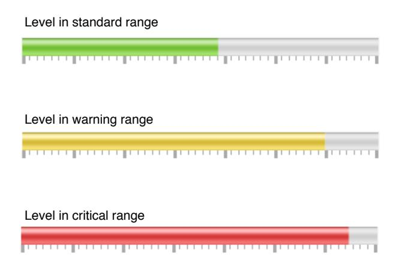

<span id="page-308-1"></span>**Figure 15-64** A discrete capacity indicator displaying values in three different ranges

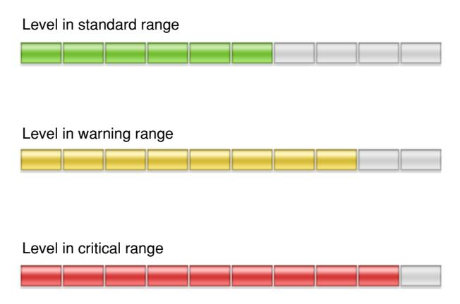

Both continuous and discrete capacity indicators allow the display of tick marks above or below the indicator control to give context to the level shown by the fill. However, only the continuous capacity indicator should display the tick marks because the number and width of the segments in the discrete capacity indicator provide similar context, making tick marksredundant. If you find that you need to display very smallsegments in a discrete capacity indicator to appropriately represent the scale of values, you might want to use a continuous capacity indicator instead.

You should label at least the first and last tick marks to define the scale of the control and provide context for the user.

#### **Capacity Indicator Specifications**

**Control sizes**: Both styles of capacity indicators are available in regular size only (the bar or segment has a height of 16 pixels), but you determine the horizontal width of the control. Note that as you stretch a discrete level indicator, the number ofsegmentsremains constant, but the width of each segmentstretches accordingly.

**Label spacing and fonts**: If you want to provide labels for tick marks in a continuous capacity indicator, use the label font (see ["Fonts"](#page-124-1) (page 125) for more information about this font). These labels should be placed 3 pixels below the lower edge of the tick marks.

#### **Capacity Indicator Implementation**

Continuous and discrete capacity indicators are available in Interface Builder. You can change the style from discrete to continuousin the Attributes pane of the inspector. To create one using Application Kit programming interfaces, use the NSLevelIndicator class with style NSDiscreteCapacityLevelIndicatorStyle or NSContinuousCapacityLevelIndicatorStyle.

### <span id="page-309-2"></span>Rating Indicators

<span id="page-309-0"></span>A **rating indicator** displays a number of stars that corresponds to the rating of something. For example, Figure 15-65 shows the rating a user assigned an item in iTunes.

**Figure 15-65** A rating indicator shows the user-assigned rating for an item

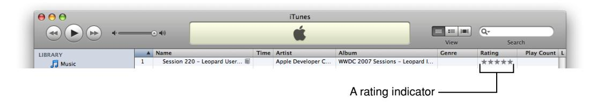

<span id="page-309-1"></span>Figure 15-66 shows rating indicators displaying different values.

**Figure 15-66** Rating indicators showing different ratings

#### **Rating Indicator Usage**

Use a rating indicator to provide a graphic representation of the rating of an object. Because a rating indicator conveysthe ranking of one item relative to all other itemsin a category,such asfavorite images or most-visited webpages, it's most useful in a list or table view that contains many items.

You might want to allow the user to set ranking criteria (perhaps in a preferences window) that you use to determine what rating should be displayed for each item as it appears. Or, you can make a rating indicator editable so the user can increase or decrease the ranking of an item in a table or list.

#### **Rating Indicator Contents and Labeling**

By default, the rating indicator displaysstars, but you can supply a custom image to replace the stars. Although this section assumes that the rating indicator displays stars, the information applies equally to an image you supply.

A rating indicator does not display partial stars. Instead, it rounds the current value to the nearest integer to display only whole stars. The stars in a rating indicator are not expanded or shrunk to fit the specified length of the control and no space is added between them.

#### <span id="page-310-1"></span>**Rating Indicator Implementation**

Rating indicators are available in Interface Builder. Start with a discrete level indicator object and change its style to Rating in the Attributes pane of the inspector. To create one using Application Kit programming interfaces, use the NSLevelIndicator class with style NSRatingLevelIndicatorStyle.

### Relevance Indicators

<span id="page-310-2"></span><span id="page-310-0"></span>A **relevance indicator** is a style of level indicator that displays the relevance of items, such as search results. For example, Preview uses relevance indicators to show users the relevance of search results, as shown in Figure 15-67.

**Figure 15-67** A relevance indicator shows the relevance of each item in a list

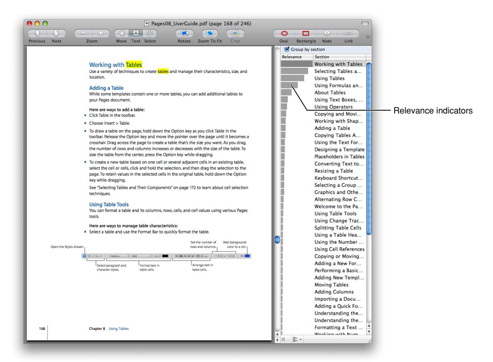

<span id="page-311-2"></span>Some of the states a relevance indicator can display are shown in Figure 15-68.

**Figure 15-68** Relevance indicator states


Relevance indicators are especially useful as part of a list or table view. Thisis because relevance as a quantity is easier for users to understand when it is shown in comparison with the relevance of several items.

Relevance indicators are available in Interface Builder. Start with a discrete level indicator and change its style to Relevancy in the Attributes pane of the inspector. To create one using Application Kit programming interfaces, use the NSLevelIndicator class with style NSRelevancyLevelIndicatorStyle.

# <span id="page-311-0"></span>Text Controls

This section describes controls that either display text or accept text as input. The combination box, which includes a text input field, is not covered in this section; see ["Combination](#page-285-0) Boxes" (page 286) for information about combination boxes.

<span id="page-311-1"></span>**Important:** The controls described in this section are suitable for use in the window body; they should not be used in the window-frame areas. The single exception is the search field, which can also be used in a toolbar. See ["Window-Frame](#page-248-1) Controls" (page 249) for controls designed specifically for use in the toolbar and bottom-bar areas in your window.

### <span id="page-311-4"></span><span id="page-311-3"></span>Static Text Fields

Use a **static textfield** for informational text (text not intended to be modified by users) in a dialog or window. Static text fields have two states: active and dimmed.

When it provides an obvious user benefit, static text should be selectable. For example, a user should be able to copy an error message, a serial number, or an IP address to paste elsewhere. Figure 15-69 shows several examples of static text used to give information to users.

<span id="page-312-1"></span>**Figure 15-69** Static text fields provide information to users

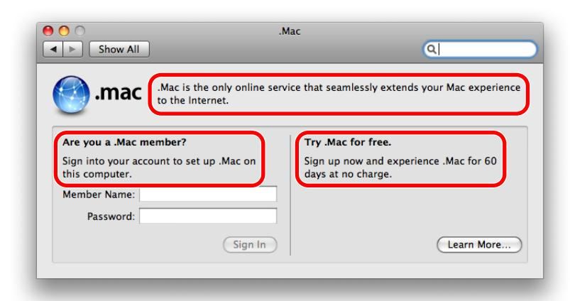

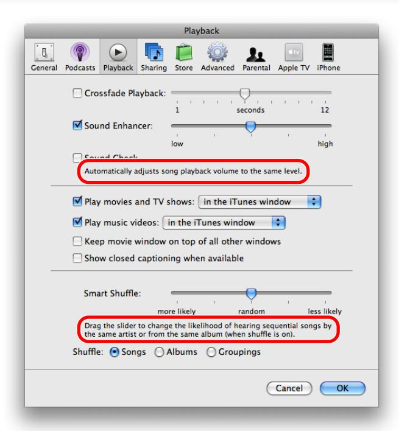

<span id="page-312-2"></span><span id="page-312-0"></span>Static text fields in various standard fonts are available in Interface Builder. You can use system font, small system font, or mini system font, depending on the layout of your window. To create a static text field using Application Kit programming interfaces, use the NSTextField class.

### Text Input Fields

A **text input field**, also called an editable text field, is a rectangular area in which the user enters text or modifies existing text. The text input field can be active or disabled. Itsupports keyboard focus and password entry. For example, iTunes preferences allows the user to specify a library name for sharing, as shown in Figure 15-70.

<span id="page-313-0"></span>**Figure 15-70** A text input field allows the user to supply information


Be sure to use a combination box control when you want a text input field combined with a menu or list of choices; don't try to create one by putting a text input field and a menu together. See ["Combination](#page-285-0) [Boxes"](#page-285-0) (page 286) for more information about combination boxes.

### Text Input Field Usage

Use a text input field when you need to get information from the user. When you receive user input, be sure to perform appropriate edit checks. For example, if the only legitimate value for a field is a string of digits, an application should issue an alert if the user types characters other than digits. In most cases, the appropriate time to check the data in the field is when the user clicks outside the field or presses the Return, Enter, or Tab key.

### Text Input Field Contents and Labeling

A text input field contains user-supplied text in a system font that is appropriate for the size of the control. In addition, a text input field can contain a token field control, which displays the user input in the form of a draggable token (see ["Token](#page-315-0) Fields" (page 316) for more information on tokens).

It's a good idea to display an introductory label with a text input field to help users understand what type of information they should enter. Generally, these labels should have title-style capitalization (see ["Capitalization](#page-130-1) of Interface Element Labels and Text" (page 131) for more information on this style).

### Text Input Field Specifications

**Control sizes**: Text input fields are available in regular, small, and mini sizes. The height is fixed for each size, but you decide how long to make the control. In general, try to ensure that the length of the text input field comfortably accommodates the average length of the expected input. In addition, if you display multiple text input fields in a window, be sure they all have the same length. The height of each size of text input field is listed below (Figure 15-71 shows a regular-size text input field in different states):

■ Regular size: 22 pixels high.

■ Small: 19 pixels high.

<span id="page-314-0"></span>■ Mini: 15 pixels high.

**Figure 15-71** A regular-size text input field in various states

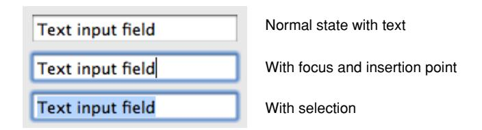

**Label spacing and fonts**: The introductory label for a text input field should be in a font that is proportional to the size of the control. In addition, the space between the introductory label and the input field should be consistent. Use the following metrics when you use a text input field in your window layout:

- Regularsize: Use system font for the introductory label. Leave 8 pixels between the end of the introductory label (the colon) and the left edge of the text input field.
- Small: Use smallsystem font for the introductory label. Leave 6 pixels between the end of the introductory label (the colon) and the left edge of the text input field.
- Mini: Use mini system font for the introductory label. Leave 5 pixels between the end of the introductory label (the colon) and the left edge of the text input field.

For more information about highlighting selectionsin text fields,see "Keyboard Focus and [Navigation"](#page-106-0) (page 107) and ["Selections](#page-110-0) in Text" (page 111).

**Control spacing**: If you want to use more than one text input field in a window, you need to leave enough space between them so users can easily see which input field belongs with each introductory label. If you need to position more than one text input field at the same height (that is, in a horizontal line), be sure to leave plenty of space between the end of one text field and the introductory label of the next. Typically, however, multiple text input fields are stacked vertically, as in a form users fill out. When you position text input fields in a vertical stack, be sure to leave the following amounts of space between them:

■ Regular size: At least 10 pixels.

■ Small: At least 8 pixels.

■ Mini: At least 8 pixels.

### Text Input Field Implementation

Text input fields are available in Interface Builder. To create one using Application Kit programming interfaces, use the NSTextField class.

### <span id="page-315-2"></span><span id="page-315-0"></span>Token Fields

A **token field** is a control that creates a token out of input text. The token field control supports behavior similar to that of the address field in the Mail application.

<span id="page-315-1"></span>Figure 15-72 shows various states of the token field control (no contextual menu support is shown).

**Figure 15-72** A token field control in use

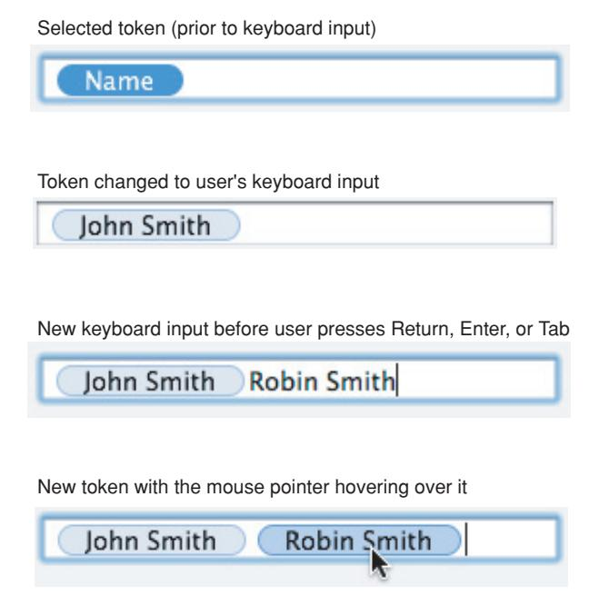

### Token Field Usage

Use a token field control in a text input field (see "Text Input [Fields"](#page-312-0) (page 313) for more information about text input fields). As the user types in the text input field, the token field control invokes text completion after a delay you specify. When the user types the comma character or presses Return, the preceding text input is transformed into a token.

A token is draggable and, if you add code to support a menu, displays a disclosure triangle that reveals a contextual menu when the user presses or clicks it. In this menu, you might offer more information about the token and ways to manipulate it. In Mail, for example, the token menu displays information about the token (the email address associated with the name) and items that allow the user to edit the token or add its associated information to Address Book, as shown in Figure 15-73.

<span id="page-316-1"></span>**Figure 15-73** A token field control can display a contextual menu


### Token Field Specifications

**Control sizes**: Token field controls fit inside the standard sizes of text input fields. The heights of token field controls are fixed for each size, and their lengths are determined by the length of the token. The height of a token field control is a few pixels less than the height of the text input field that contains it:

■ Regular size: 16 pixels high.

■ Small: 14 pixels high.

■ Mini: 11 pixels high.

### Token Field Implementation

<span id="page-316-0"></span>Token field controls are available in Interface Builder. To create one using Application Kit programming interfaces, use the NSTokenField class.

### <span id="page-316-2"></span>Search Fields

A **search field** is a text field with rounded ends in which the user enters new text or modifies existing text that identifies items to search for. For example, the Finder provides a search field in its toolbar, as shown in Figure 15-74. For information on waysto provide search functionality in your application,see ["Spotlight"](#page-76-1) (page 77) and ["Scope](#page-200-0) Bars" (page 201).

<span id="page-317-0"></span>**Figure 15-74** A search field in a toolbar

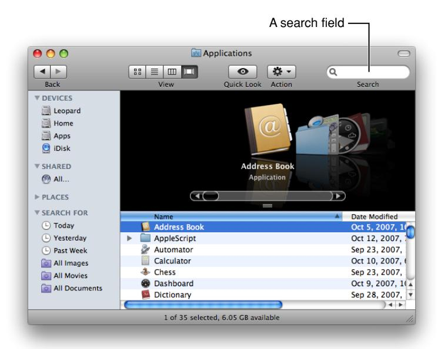

**Important:** A search field is one of the three window-body controlsthat can also be used in a window-frame area. To learn more about controls that are designed specifically for use in window-frame areas, see ["Window-Frame](#page-248-1) Controls" (page 249).

### Search Field Usage

Use a search field to allow users to search for terms within your application. A search field supports keyboard focus, so if searching is important in your application, provide the keyboard shortcut Command-Option-F, which allows users to navigate to a search field without using the mouse.

Depending on how you implement searching functionality in your application, you can specify a search field that begins searching as soon as the user starts typing, or that begins the search when the user presses Return or Enter.

### Search Field Contents and Labeling

By default, a search field displays the magnifying icon at its left edge. A search field can also contain an icon the user clicks to stop the search or clear the field. It's appropriate to use this icon if the user has to click a button or press a key to initiate the search, especially if the search might take more than a second or two. If you use this icon, consider displaying a progress indicator for lengthy searches. The magnifying glass and stop-search icons are supplied automatically.

A search field can include a menu that allows users to view a history of recent searches. However, if you provide this functionality you should consider not providing it by default; you should also allow users to turn it off for privacy reasons. If you need to allow usersto choose different types ofsearches or define the context or scope of a search, consider providing a scope bar in your window (see ["Scope](#page-200-0) Bars" (page 201) for more information).

A search field does not need an introductory label because users recognize this control (and the magnifying glass icon) from elsewhere in Mac OS X. If you place a search field in a toolbar, however, you should supply the label "Search" to be displayed when users customize the toolbar to show icons and text or text only.

### Search Field Specifications

**Control sizes**: Search fields are available in regular and small sizes. The height of a search field is fixed for its size, but you decide how long the control should be. The heights for each size of search field are listed below (Figure 15-75 shows a regular-size search field):

- Regular size: 22 pixels high.
- <span id="page-318-1"></span>■ Small: 19 pixels high.

**Figure 15-75** A regular-size search field

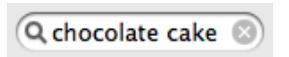

### Search Field Implementation

<span id="page-318-0"></span>Search field controls are available in Interface Builder. To create one using Application Kit programming interfaces, use the NSSearchField class.

### <span id="page-318-2"></span>Scrolling Lists

A **scrolling list** is a list that uses scroll bars to reveal its contents. Users can scroll through the list without selecting anything, click an item to select it, use Shift-click to select more than one contiguous item, or use Command-click for a discontinuous selection. Users can press the arrow keys to navigate through the list and can quickly select an item by typing the first few characters. You can see this behavior in a Finder window, when the Finder is in column-view mode. Each Finder-window column behaves as a scrolling list, as shown in [Figure](#page-325-0) 15-81 (page 326).

### Scrolling List Usage

Use a scrolling list when you need to display an arbitrarily large number of itemsfrom which users can choose. Although scrolling lists aren't directly editable, you can provide editing functionality that allows users to provide list items you feed into the list.

<span id="page-318-3"></span>Don't use a scrolling list to provide choices in a limited range. This is because a scrolling list might not display all items at once, which can make it difficult for users to grasp the scope of their choices. If you need to display a limited range of choices, a pop-up menu (described in ["Pop-Up](#page-280-0) Menus" (page 281)) might be a better choice.

### Scrolling List Contents and Labeling

A scrolling list can get its contents from items you supply or from users. If an item is too long to fit in the list box, insert an ellipsis in the middle and preserve the beginning and end of the item. Users often add version numbers to the end of document names, so both the beginning and end should be visible.

The background of a scrolling list can be white or white striped with blue. If the list contains a large number of items that can look similar at a glance, it might be easier for users to view them on a striped background.

In most cases, it's a good idea to provide an introductory label for a scrolling list so users understand the types of items that are available to them. Use the regular system font for this label. The list items should be in view font (12-point Lucida Grande Regular), by default.

### Scrolling List Specifications

<span id="page-319-4"></span>**Control sizes**: You determine the size of a scrolling list. As a rule of thumb, make sure that the list displays only the full height of lines of text (don't cut text off horizontally), and make sure that the scrolling increment is one list element.

### Scrolling List Implementation

Scrolling lists are available in Interface Builder. Start with a table view object and ensure that it is sized so that only the vertical scroller is displayed. Then, in the Attributes pane of the inspector, set the number of columnsto 1 and deselect the Headers checkbox. To create a scrolling list using Application Kit programming interfaces, use the NSTableView class.

# <span id="page-319-5"></span><span id="page-319-0"></span>View Controls

The controls described in this section allow users to modify how information is presented to them in a window. Some view controls allow you to provide additional information or functionality that remains hidden until users choose to see it, and others give you a frame for organizing and displaying data, such as a list.

<span id="page-319-1"></span>**Important:** The controls described in this section are suitable for use in the window body; they should not be used in the window-frame areas. See ["Window-Frame](#page-248-1) Controls" (page 249) for controls designed specifically for use in the toolbar and bottom-bar areas in your window.

### <span id="page-319-3"></span><span id="page-319-2"></span>Disclosure Triangles

A **disclosure triangle** allows the display, or disclosure, of information or functionality associated with the primary information in a window. For example, in a System Preferences authentication dialog (shown in Figure 15-76) a disclosure triangle reveals details that most users don't often choose to see.

<span id="page-320-0"></span>**Figure 15-76** A disclosure triangle can reveal more dialog contents

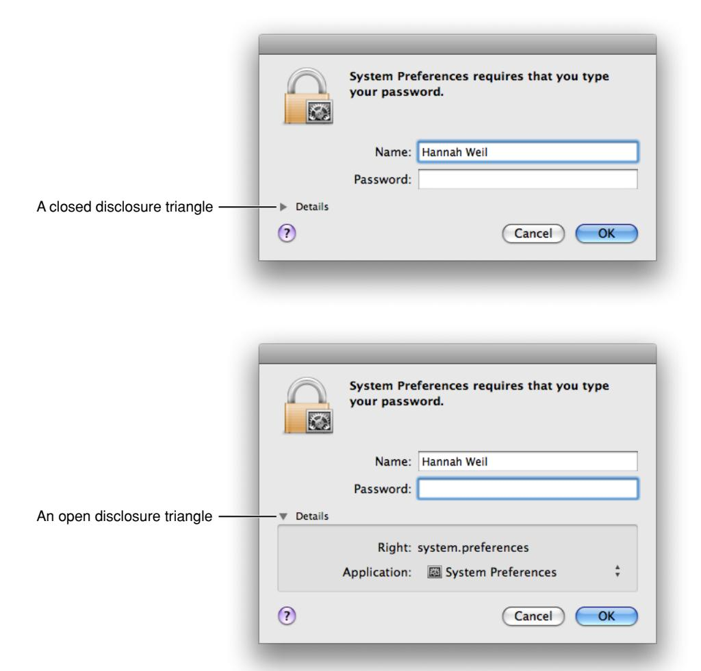

### Disclosure Triangle Usage

Use a disclosure triangle when you want to provide a simple default view of something but need to allow the user to view more details or perform additional actions at times. Specifically, you can use a disclosure triangles in either of the two following ways:

- To reveal more information in dialogs that have a minimal state and an expanded state. See Figure 15-76 for an example of a disclosure triangle in a dialog.
- To revealsubordinate itemsin a hierarchical list. See [Figure](#page-324-1) 15-80 (page 325) for an example of a disclosure triangle in a hierarchical list.

Don't use a disclosure triangle to display additional choices associated with a specific control, such as a pop-up menu. If you need to do this, use a disclosure button (see ["Disclosure](#page-321-0) Buttons" (page 322)).

View Controls **321**

### Disclosure Triangle Contents and Labeling

Disclosure triangles should be in the closed position (that is, pointing to the right) by default. When the user clicks a disclosure triangle, it points down and the additional information is displayed.

Disclosure triangles in dialogs should have a label indicating what is disclosed or hidden. Ideally, the label changes depending on the position of the disclosure triangle. For example, when closed it might say, "Show advanced settings," and when open, "Hide advanced settings."

### <span id="page-321-4"></span>Disclosure Triangle Specifications

<span id="page-321-1"></span>**Control sizes**: Disclosure triangles are available in a single size, 13 x 13 pixels, as shown in Figure 15-77.

**Figure 15-77** Disclosure triangles


### Disclosure Triangle Implementation

<span id="page-321-0"></span>Disclosure triangles are available in Interface Builder. To create one using Application Kit programming interfaces, use NSButton and set the bezel style to NSDisclosureBezelStyle and the button type to NSPushOnPushOffButton.

### <span id="page-321-3"></span><span id="page-321-2"></span>Disclosure Buttons

A **disclosure button** expands a dialog or panel to offer the user a wider range of choices related to a specific selection control, such as a pop-up menu, combination box, or command pop-down menu. For example, the minimal Save dialog (shown in [Figure](#page-241-0) 14-57 (page 242)) uses a pop-up menu to provide the user with a list of standard and recently accessed locations in which to save a file. To get a wider range of choices, the user clicksthe disclosure button, which putsthe file system at the user'sfingertips without requiring the user to leave the context of the Save dialog. An example of the expanded Save dialog is shown in Figure 15-78.

<span id="page-322-0"></span>**Figure 15-78** A disclosure button expands a Save dialog

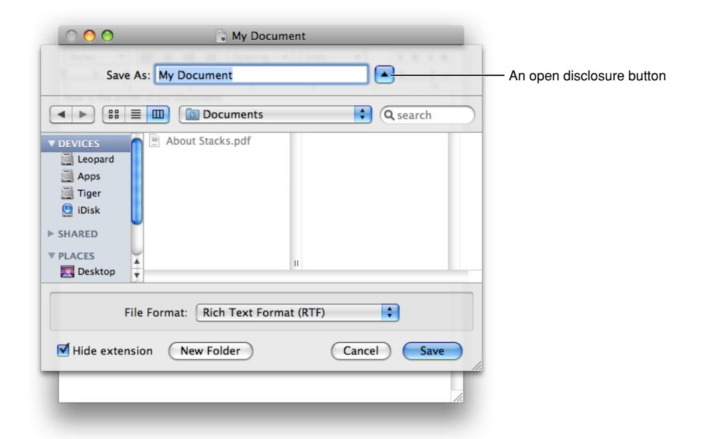

### Disclosure Button Usage

Use a disclosure button when you need to provide additional options that are closely related to a specific list of choices. If you need to display additional information or functionality related to the contents of a window or a section of a window, or if you need a way to reveal subordinate items in a hierarchical list, use a disclosure triangle instead. See ["Disclosure](#page-319-1) Triangles" (page 320) for more information on this control.

### Disclosure Button Contents and Labeling

Because a disclosure button is closely associated with a control, it does not need a label. By default, disclosure buttons should be in the closed position, that is, pointing down. When the user clicks a disclosure button, the window expands and the disclosure button changes to point up.

### <span id="page-322-1"></span>Disclosure Button Specifications

**Control sizes**: A disclosure button should be aligned with the pop-up menu or other list-based selection control (such as a command pop-down menu) it affects. In addition, the disclosure button should be close enough to the associated control to clearly indicate a relationship between them.

### Disclosure Button Implementation

Disclosure buttons are available in Interface Builder. To create one using Application Kit programming interfaces, use NSButton and set the bezel style to NSRoundedDisclosureBezelStyle and the button type to NSPushOnPushOffButton.

### <span id="page-323-0"></span>List Views

<span id="page-323-2"></span>A **list view** displays ordered records in a table in which users can resize, rearrange, and sometimes add and subtract, columns representing attributes of the data. A list view displays the entire set of objects in the leftmost column, including objectsthat may be contained in other objectsif the data is hierarchically organized. When users reveal hidden objects in a hierarchy, the list lengthens. The other columns may shift to the right when these hidden objects are revealed, but they do not change their headings or order, because they still contain the same types of information regardless of the number of objects listed. Figure 15-79 shows an example of a list view that displays a flat list of objects (a hierarchical list of objects is shown in [Figure](#page-324-1) [15-80](#page-324-1) (page 325)).

<span id="page-323-1"></span>**Figure 15-79** A list view in a window


### List View Usage

Use a list view when you need to display items along with various attributes of each item. If you need to display a list of items, but you don't need to display any additional attributes, you might want to use a scrolling list instead (see ["Scrolling](#page-318-0) Lists" (page 319) for more information about scrolling lists). Using a list view, you can create a column for each attribute you need to display.

Sort the rows in the list view by the selected column heading. You can implement sorting on secondary attributes behind the scenes, but the user should see only one column selected at a time. If a user clicks an already selected column heading, change the direction of the sort.

Items may be editable depending on the purpose of your application. In the Finder, for example, items in the Name column (the leftmost column) are editable when in list view, but nothing else is.

### List View Contents and Labeling

List views can contain disclosure triangles to reveal a list hierarchy, but only in one column. Column headers should be nouns orshort noun phrasesthat describe an attribute of the data. Figure 15-80 shows an example of the Finder list view that includes disclosure triangles to reveal additional levels of hierarchy and short, clear column headers.

<span id="page-324-1"></span>**Figure 15-80** A list view with disclosure triangles

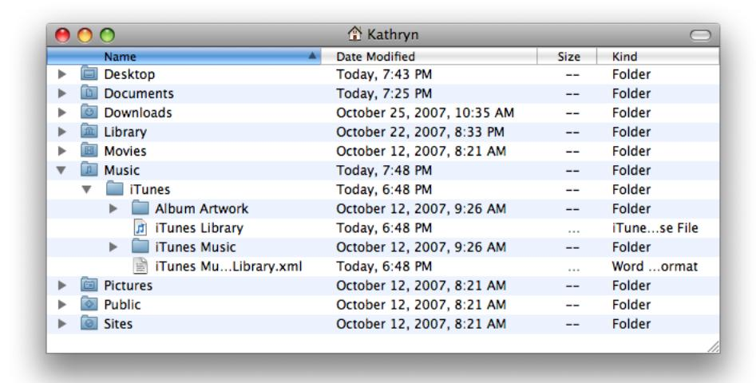

List views can contain icons in addition to text. Usually, however, the icons in a list view are an integral part of the data items (such as the folder and document icons in Figure 15-80). In general, it's best to include an attributes column and use text to describe the attributes.

### <span id="page-324-3"></span>List View Implementation

<span id="page-324-0"></span>List views are available in Interface Builder. To create a simple list view using Application Kit programming interfaces, use the NSTableView class. To get disclosure triangles in a list, use an NSOutlineView object in column format.

### <span id="page-324-2"></span>Column Views

A **column view** provides a way for users to view and select items from an organized hierarchy of data. When users click an object in one column, its contents (its descendants in the hierarchy) are revealed in a column to the right. Each column displays only those objectsthat are descendants of the item selected in the previous column. If the item selected in the previous column has no descendants, the column to the right might display details about the item.

Columns in a column view are usually resizable. In addition, a column view includes a vertical scroll bar between each pair of columns and a horizontal scroll bar along the bottom of all columns. A good example of a column view is the column-view mode of the Finder, shown in Figure 15-81.

View Controls **325**

<span id="page-325-0"></span>**Figure 15-81** A column view is useful for displaying a hierarchy of objects

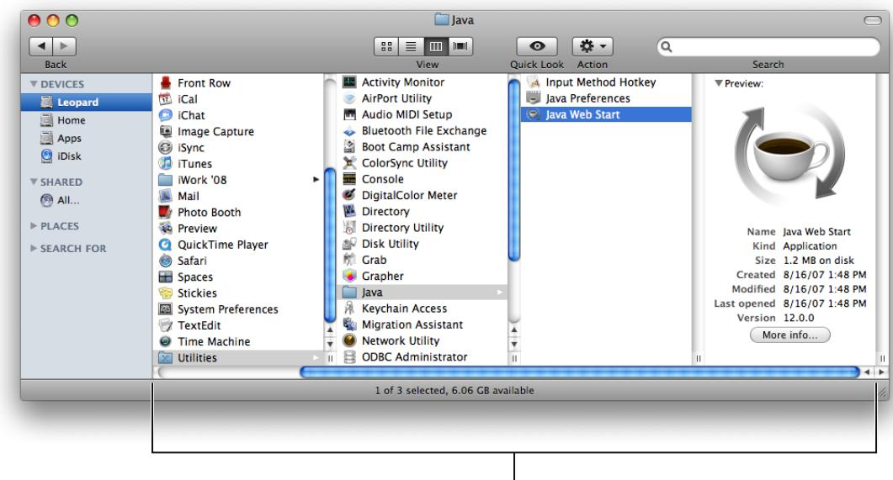

Four columns in a column view

### Column View Usage

Use a column view when there is only one way the data can be sorted or when you want to present only one way ofsorting the data. A column view is also useful for displaying a deep hierarchy,such as a file system, where users frequently move back and forth among multiple levels.

When you use a column view to display a hierarchy, be sure to display the first level of the hierarchy (the root level) in the leftmost column. As users select items, the focus moves to the right, displaying either the child objects at that node or, if there are no more children, the terminal object (a leaf node in the hierarchy). When the user selects a terminal object, you can display additional information about it in the rightmost column.

### Column View Contents and Labeling

Column views do not display disclosure triangles. The triangle displayed to the right of an item is merely an indicator that means the item contains other objects (to reveal those objects, users click anywhere on the item's row).

Columns in column views do not have headings, because a column view does not behave like a table. A column in a column view contains the objects that exist at a particular node in the hierarchy, it does not contain an attribute of every object in the hierarchy.

Although a column view does not require a label, it can be helpful to display the current position in the hierarchy in a way that's easy for users to see at a glance. The Finder does this by using the name of the parent object as the title of the window. For example, in [Figure](#page-325-0) 15-81 (page 326), the title of the window (Java) is the name of the currently selected item's parent.

Column views can contain icons in addition to text. Usually, however, the icons in a column view are an integral part of the data items (such as the folder and application icons shown in [Figure](#page-325-0) 15-81 (page 326)).

### Column View Implementation

<span id="page-326-2"></span>Column views are available in Interface Builder. To create one using Application Kit programming interfaces, use the NSBrowser class or an NSOutlineView object in column format.

### <span id="page-326-4"></span><span id="page-326-0"></span>Split Views

<span id="page-326-3"></span>A **split view** groups together two or more other views, such as column or list views, and allows the user to adjust the relative width or height of those views. A split view includes a **splitter bar**, or **splitter**, between each of its subviews; for example, a split view with five subviews would have four splitters.

**Note:** In Mac OS X v10.5 and later, the standard splitter bar is known as a "zero-width" splitter. This splitter is actually 1 pixel wide and, as with wider splitter bars, the pointer changes to one of the move or resize cursors when hovering over it, depending on which direction the splitter can move (see ["Standard](#page-156-1) [Cursors"](#page-156-1) (page 157) for more information on different cursor styles).

A wider splitter bar (9 pixels in width) is also available, but not as frequently used.

<span id="page-326-1"></span>Figure 15-82 shows the splitter between the source list and the content view in iCal and the way the pointer looks when hovering over it. (For more information on source lists, see ["Source](#page-202-0) Lists" (page 203).)


**Figure 15-82** The pointer changes when it hovers over a splitter

### Split View Usage

Use a split view when you want to display two or more different content views that the user can resize. A single split view does not display a combination of vertically and horizontally oriented subviews. However, a single window might contain different split views that each display a different orientation. For an example of how this might look, see the Automator window shown in Figure 15-83.

<span id="page-327-0"></span>**Figure 15-83** A window can have multiple split views

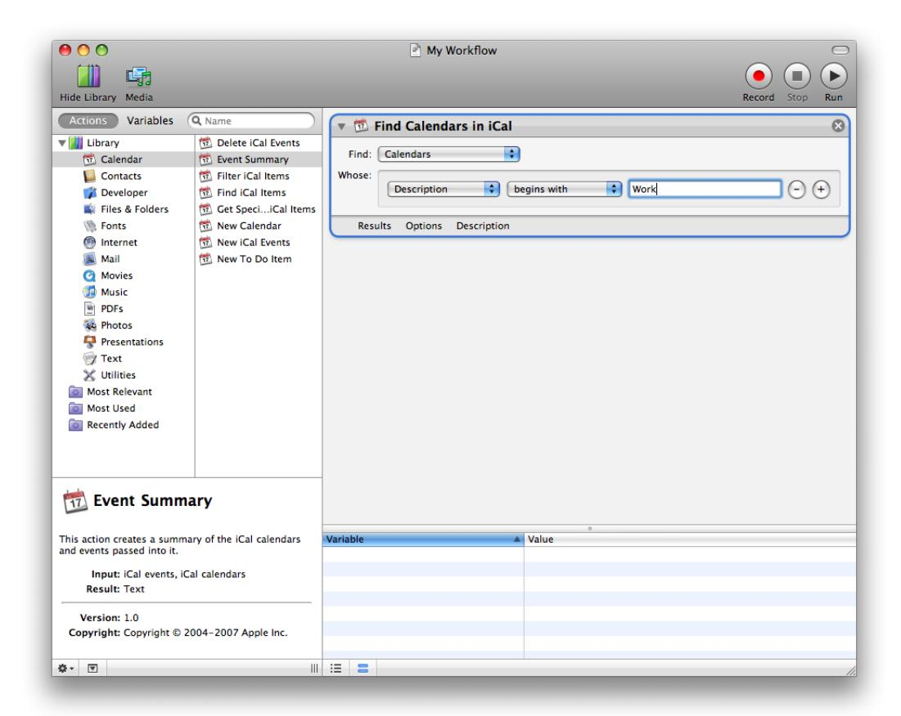

Users can adjust the relative widths or heights of the subviews in a split view by dragging anywhere on the splitter. The wide splitter bar displays a circular dimple at its midpoint that indicates to the user that it is draggable. For both zero-width and wide splitters, the entire splitter bar is a hot zone. In other words, when the pointer passes over any part of the splitter, the cursor changes to one of the move or resize cursors. For zero-width splitters, the hot zone includes two pixels on both sides of the splitter.

If a user drags a wide splitter bar all the way to the edge of the split view (or to the next splitter bar), the subview should disappear but the splitter bar should not. The splitter bar should remain in view to remind the user where the hidden subview is and to make it easier for the user to uncover it. However, a zero-width splitter bar does not remain visible when the user drags it far enough to hide the subview. For this reason, you can define minimum and maximum sizes for subviews so users can't lose the splitter. Alternatively, if you want to allow users to completely hide a subview by dragging a zero-width splitter, you should provide a button that re-opens the subview.

### Split View Specifications

**Control sizes**: Split views are available with a horizontal splitter (the views are stacked one above another) or a vertical splitter (the views are side by side), and splitters can be either zero-width (1 pixel wide) or "thick" (9 pixels wide).

### Split View Implementation

<span id="page-328-2"></span>Split views are available in Interface Builder. Specify the splitter width by selecting Thick divider or Thin divider from the Style pop-up menu in the Attributes pane of the inspector. To create one using Application Kit programming interfaces, use the NSSplitView class(note that the splitter bars are horizontal by default).

### <span id="page-328-3"></span><span id="page-328-0"></span>Tab Views

<span id="page-328-1"></span>A **tab view** provides a convenient way to present information in a multipane format. The tab control is displayed horizontally centered across the top edge of a content area. Users click a tab to see the content associated with it. For example, QuickTime preferences provides five tabs, each of which displays a group of preference settings, as shown in Figure 15-84.

**Figure 15-84** A tab view allows switching among multiple panes in a window

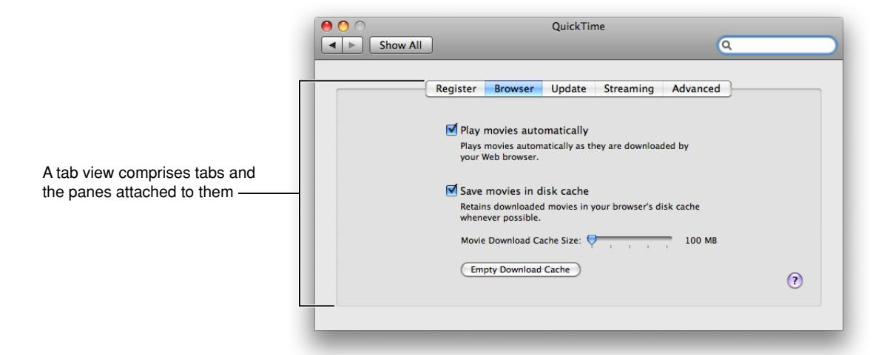

### Tab View Usage

<span id="page-328-4"></span>Use a tab view when you want to present a small number of different content views in one place within a window. Depending on the size of the window, you can create a tab view that contains between two and about six tabs.

The content area below a tab is called a **pane**, and each tab is attached to a specific pane. Within a pane, provide controls and information that affect only the objects contained in the pane, not objects in the rest of the window or in other panes.

You can position a tab view in two different ways (see "Tab View [Specifications"](#page-329-0) (page 330) for examples of these styles):

■ Extend the side and bottom edges of the tab view to the window edges, so there is no window-body area visible to the sides or below the tab view.

Use this style when you want the contents of the entire window-body area below the tab control to be managed by the tabs.

■ Inset the tab view in the window, so that a margin of window-body area is visible on all sides of the tab view.

Use this style when you want to be able to provide controls that affect the entire window, not just the current pane. (The global controlsshould be in the window-body area below the tab view;see "Tab [View](#page-329-0) [Specifications"](#page-329-0) (page 330) for layout guidelines for this style.)

**Note:** Multiple rows of tabs are not supported in Mac OS X.

Iif you have too many tabs to fit into a window properly it's acceptable, although not highly recommended, to use instead a pop-up menu to change the contents of a group box [\(Figure](#page-331-2) 15-87 (page 332) shows how this looks). Another alternative to a tab view is a segmented control, which also provides a way to switch among panes. A segmented control looks similar to a tab view, but it is not attached to the panes (see ["Segmented](#page-276-0) Controls" (page 277) for more information about segmented controls).

### Tab View Contents and Labeling

Each tab requires a label that describes the contents of the attached pane. Nouns or very short noun phrases are generally best, although a verb (or short verb phrase) might make sense in some contexts. Tab labels should have title-style capitalization (see ["Capitalization](#page-130-1) of Interface Element Labels and Text" (page 131) for more information on this style).

<span id="page-329-0"></span>Within a pane, you can use standard window-body controls, such as push buttons, checkboxes, sliders, and text fields. You can also provide icons and information displayed as static text fields, when necessary.

### Tab View Specifications

**Control sizes**: Tab views are available in regular, small, and mini sizes. The tab height is fixed for each size, but you control the size of the pane area. The tab heights for each size are listed below:

■ Regular size: 20 pixels.

■ Small: 17 pixels.

■ Mini: 15 pixels.

**Label spacing and fonts**: The tab labels should be in a font that's proportional to the size of the tab view control. In addition, the label should be placed so that there are equal margins of space before and after it. The guidelines below provide the specifications you should use for tab labels:

- Regular size: System font. Center in tab, leaving 12 pixels on each side.
- Small: Small system font. Center in tab, leaving 10 pixels on each side.
- Mini: Mini system font. Center in tab, leaving 8 pixels on each side.

**Control spacing**: Whether you decide to inset a tab view in a window or extend its edges to the window sides and bottom, you should place the top edge of the tab view 12 or 14 pixels below the bottom edge of the title bar (or toolbar, if there is one). If you choose to inset a tab view in a window, you should leave a margin of 20 pixels between the sides and bottom of the tab view and the sides and bottom of the window (although 16 pixels is also an acceptable margin-width). If you need to provide controls below the tab view, leave enough space below the tab view so the controls are 20 pixels above the bottom edge of the window and 12 pixels between the tab view and the controls. Figure 15-85 shows how an inset tab view should look.

<span id="page-330-2"></span><span id="page-330-0"></span>**Figure 15-85** Tab panes inset from the edge of a window


<span id="page-330-1"></span>If you choose to extend the tab view sides and bottom so that they meet the window sides and bottom, you should leave a margin of at least 20 pixels between the content in the tab view and the tab-view edges. Figure 15-86 shows how this should look.

**Figure 15-86** Tab panes edge to edge

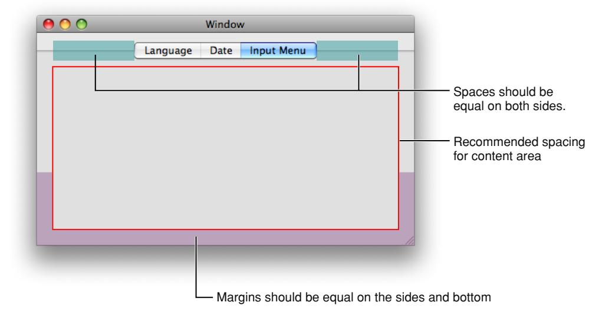

If you need to use a pop-up menu at the top of a group box (because, for example, you have too many tabs to fit in the window), be sure to center the control along the top of the group box, as shown in Figure 15-87:

<span id="page-331-2"></span>**Figure 15-87** Acceptable, but not recommended, usage of a pop-up menu to switch among panes


### Tab View Implementation

Tab views are available in Interface Builder. To create one using Application Kit programming interfaces, use the NSTabView class.

# <span id="page-331-3"></span><span id="page-331-0"></span>Grouping Controls

This section describes controls that visually group other controls in a window. When there is more than one logical collection of controls and information in a window, the use of grouping controls helps users distinguish between them.

There are two types of grouping controls in Mac OS X: separators and group boxes. For help in deciding whether to use a group box or a separator, and for examples of layouts with them, see ["Grouping](#page-348-0) Controls in a [Window](#page-348-0) Body" (page 349).

<span id="page-331-4"></span><span id="page-331-1"></span>**Important:** The controls described in this section are suitable for use in the window body; they should not be used in the window-frame areas. See ["Window-Frame](#page-248-1) Controls" (page 249) for controls designed specifically for use in the toolbar and bottom-bar areas in your window.

### Separators

A **separator** is a thin vertical or horizontal line. Separators have a lightweight appearance that's good for separating controls into categories or subgroups of related functionality. For example, the Appearance preferences pane (shown in Figure 15-88) provides controls that determine a wide range of high-level

appearance characteristics,such as highlight color and the placement ofscroll arrows. Although each control affects some aspect of the Mac OS X appearance, the window uses separators to create four subgroups of related controls.

<span id="page-332-0"></span>**Figure 15-88** Separators divide controls into subgroups or categories


### Separator Usage

Use a separator to divide a window body into distinct visual parts. You can place separators either vertically or horizontally, depending on the overall layout of your window.

**Note:** The separator control is not used in a toolbar; the vertical separator you can see in a toolbar is an NSToolbarSeparatorItem object (which is available in Interface Builder).

In general, you should avoid stretching a separator to span the entire width or height of a window; a separator that spans a window can give the appearance of slicing a window into unrelated rows or columns. If the categories of content in your window are completely unrelated, and it might be confusing to see all categories simultaneously, it might be better to display each category in a pane of a tab view instead (see ["Tab](#page-328-0) [Views"](#page-328-0) (page 329) for more information about using a tab view).

### Separator Labeling

A label can accompany a separator, but it is not required. A separator labelshould have title-style capitalization (see ["Capitalization](#page-130-1) of Interface Element Labels and Text" (page 131) for information on this style).

The separator line should be at the base of the text of the label. [Figure](#page-307-0) 15-62 (page 308)shows how thislooks.

### Separator Specifications

<span id="page-333-1"></span>**Control sizes**: Separators are available in a single thickness, but you determine their length. Figure 15-89 shows a vertical and a horizontal separator.

**Figure 15-89** Separators


**Label spacing and fonts**: Separator labelsshould be in a font that correspondsto the controlsin the window. Specifically, separator labels should use:

- System font, when other controls are regular size.
- Small system font, when other controls are small.
- Mini system font, when other controls are mini.

Separator labels should be 2 pixels from the beginning of the separator control.

**Control spacing**: Separators should be at least 10 pixels away from other controls. Both ends of a separator should be an equal distance from the window edges. If you use more than one separator in a window, be sure every separator with the same orientation (vertical or horizontal) is the same length.

### Separator Implementation

<span id="page-333-2"></span><span id="page-333-0"></span>Separators are available in Interface Builder. To create one using Application Kit programming interfaces, use the NSBox class.

### Group Boxes

A **group box**, like a separator (described in ["Separators"](#page-331-1) (page 332)), is used to break a window into distinct logical areas. A group box has a heavier look than a separator, which meansthat it provides a more pronounced differentiation of content. For example, the Expose pane in Expose & Spaces preferences uses group boxes to separate screen-corner functionality from keyboard and mouse shortcuts, as shown in Figure 15-90.

<span id="page-334-0"></span>**Figure 15-90** Group boxes can organize controls in a window

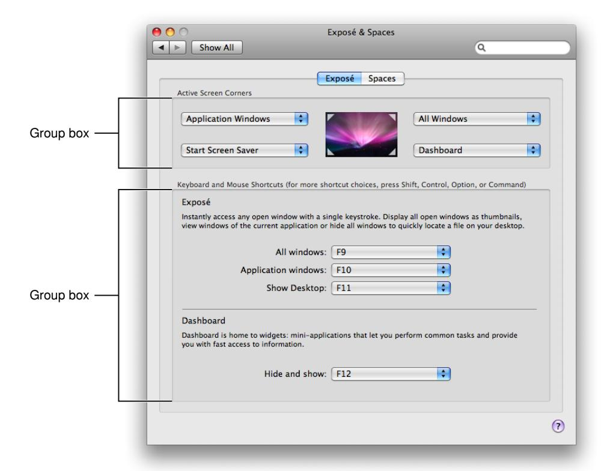

### Group Box Usage

Use a group box when you want users to understand logical groupings of controls in a window. You can use group boxes in the window-body area, including within tab-view panes.

Although group boxes are very useful for separating logical collections of content, avoid nesting them when possible; nested group boxes use a lot ofspace, and it can be difficult to perceive individual boundaries when group boxes are nested too deeply. Instead, consider using a separator or white space to group content within a group box. (See ["Separators"](#page-331-1) (page 332) for more information on using separators; see ["Grouping](#page-348-1) with White [Space"](#page-348-1) (page 349) for guidance on using white space.) Strive to place roughly equal numbers of controls in each group box in a window, to create a visually balanced appearance.

### Group Box Contents and Labeling

Group boxes can be untitled or titled. If titled, they may have text-only titles, checkbox titles, or pop-up menu titles. If the group box uses a checkbox title, the items in the group box should be active only when the checkbox is selected.

Group box titles should have sentence-style capitalization. See ["Capitalization](#page-130-1) of Interface Element Labels and [Text"](#page-130-1) (page 131) for more information on this style.

#### **CHAPTER 15**

Controls

### Group Box Specifications

**Control sizes**: There are no standard sizes for group boxes; you control the size of the boundaries based on the needs of your window. As you place a group box in your window, be sure to follow the spacing recommendations described below.

**Label spacing and fonts**: Group box titles can use different font sizes, depending on the size of the rest of the controls and text in your window:

■ Regular size: System font

■ Small: Small system font

<span id="page-335-0"></span>■ Mini: Mini system font

**Control spacing**: Leave at least 20 pixels from the edge of the group box to the edge of the window. Nesting group boxes isn't recommended, because it wastes space. However, if you decide to nest group boxes, see "A Tabbed [Window"](#page-339-0) (page 340) for some spacing guidelines.

### Group Box Implementation

Group boxes are available in Interface Builder. To create one using Application Kit programming interfaces, use the NSBox class.

# <span id="page-336-0"></span>Layout Guidelines

<span id="page-336-3"></span>This chapter contains guidelines that help you lay out windows and alerts. In most cases, these guidelines do not dictate exact pixel measurements you must use, but instead describe the fundamental Aqua layout principles of center equalization, text and control alignment, appropriate use of white space, and visual balance. When you follow these guidelines, you create functional, aesthetically pleasing windows that are easy for Macintosh users to understand and use.

As you design the layout of your window, be sure to observe the principle of consistency in the decisions you make (for more on this human interface design principle, see ["Consistency"](#page-42-0) (page 43)). In particular, if you have a good reason to bend some of the layout guidelines, be sure you do it in a consistent way. People tend to ignore symmetry and balance, but notice inconsistency. When there is inconsistency in a window users not only notice it, but often assume that there is a functional reason for the difference. To avoid misleading users, therefore, be sure that any inconsistencies in your window are there because you want to call attention to an element in the window.

Inconsistencies in a window can also lead users to conclude that the window was merely poorly designed. For example, users probably won't notice if the marginsinside your window edges are 18 pixels wide (instead of the typically recommended 20 pixels), but they are likely to notice if the left margin is wider than the right one.

The easiest way to ensure that your windows are attractive and consistent isto use Interface Builder to design your layout. When you do this, you can take advantage of the Aqua guidesthatshow you most of the spacing recommended in this chapter (see *Interface Builder User Guide* for help using Interface Builder).

# <span id="page-336-1"></span>Positioning Regular-Size Controls in a Window Body

<span id="page-336-2"></span>Although there are many ways to arrange controls in a given window, there are guidelines you should follow so that your application has the clean, balanced Aqua look. This section provides examples of properly designed windows and alerts that use regular-size controls. For guidelines on the use of mini and small controls, see ["Positioning](#page-343-0) Small and Mini Controls in a Window Body" (page 344). Although some of the guidelines presented in this section are specific to the examples shown, most are general guidelines that are applicable to all windows.

### A Simple Preferences Window

Figure 16-1 shows a very simple preferences window. Note that an application with more extensive preferences probably would use a toolbar in the preferences window to provide access to different categories of preferences (see, for example, [Figure](#page-238-0) 14-54 (page 239)).

<span id="page-337-0"></span>**Figure 16-1** Preferences window example


This window provides a good example of a center-equalized layout. **Center equalization** simply means that the visual weight is balanced on the right and left side of the content area. It does not mean **center justification**, where the left and rightsides of an imaginary vertical line drawn through the center of a window contain exactly the same number of items or characters.

<span id="page-337-1"></span>In Mac OS X, content should always be center-equalized in windows and panes. The shading in Figure 16-2 highlights this equalization. Notice that although the right side of the vertical line has more objects, it is balanced by the category labels on the left. The net result is a visually balanced window.

**Figure 16-2** Example center-equalization in a preferences window

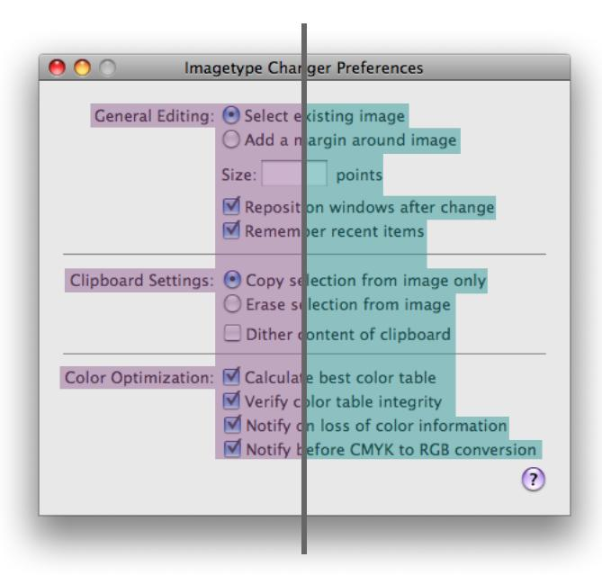

When labels and controls are stacked in a group, they should line up with each other vertically. When controls are vertically aligned, it helps users see at a glance that the controls are similar in importance and that one control does not depend on another. Of course, if there is a hierarchy of controls in your window and, for example, one control depends on another, you can indent the subordinate control to show its relationship to the control on which it depends. (See [Figure](#page-275-0) 15-24 (page 276) for an example of interdependent checkboxes.)

Figure 16-3 shows the vertical alignment of controls and labels in a window. Note that the colons for the main category labels are right-aligned, whereas the checkboxes and radio buttons are left-aligned. Right-alignment of the labels makes it easier to see the relationship between each label and the controls it describes.

<span id="page-338-0"></span>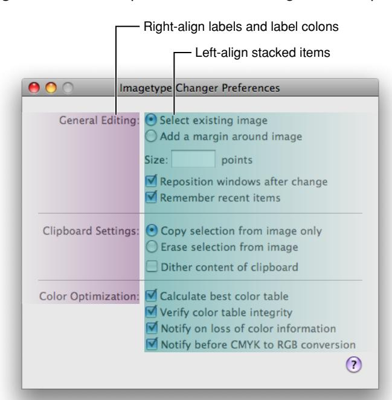

**Figure 16-3** Example label and control alignment in a preferences window

In addition to ensuring that your content is center-equalized and appropriately aligned, it's also important to use proper spacing in your window. Appropriate spacing not only makes a window look attractive and well-designed, but also makes it much easier for users to understand and use. When the margins inside the window edges and the spaces between user interface elements are adequate and consistent it helpsto show the relationships between groups of controls and the overall flow of the window. For more examples of using white space appropriately, see ["Grouping](#page-348-1) with White Space" (page 349).

The preferences window used as an example in thissection uses white space in a consistent way. For example, in Figure 16-4 you can see:

- The same amount of space above and below each horizontal separator (the window in Figure 16-4 uses 12 pixels above and below each horizontal separator).
- Equal margins on both sides and the bottom edge of the window (the window in Figure 16-4 uses a 20-pixel margin in these areas).
- The same amount ofspace between individual controls(the window in Figure 16-4 uses 8 pixels between individual controls).

For the recommended spacing between membersin a set of controls,such as between each radio button in a radio-button group, see the section that describes that control.

In addition, the window in Figure 16-4 uses a 14-pixel margin between the top controls and the bottom edge of the title bar (this margin would be the same width if the window contained a toolbar). Also, the controls in the main part of the window are separated from the Help button at the lower edge of the window by an 18-pixel space (a space of at least 16 pixels is recommended).

<span id="page-339-1"></span>**Figure 16-4** Example layout of a preferences window


### <span id="page-339-0"></span>A Tabbed Window

A tabbed window, like the one shown in Figure 16-5 follows the same general guidelines as those outlined in "A Simple [Preferences](#page-336-2) Window" (page 337). However, it illustrates another implementation of many of the same basic guidelines you've seen so far, along with some new guidelines.

<span id="page-340-0"></span>**Figure 16-5** Tabbed window example

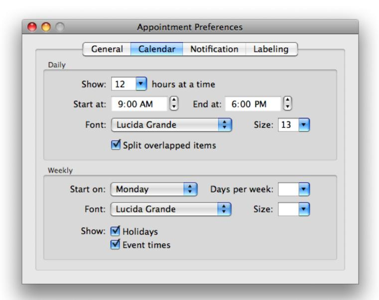

Center-equalization is again evident in Figure 16-6. The overall effect of the window is a balance between the visual weight of the controls on one side of the invisible center axis with the weight of the controls on the other side. The controls are also collectively balanced within each group box so that the distance from the farthest control on each side of the group box is the same for both the right and left sides.

<span id="page-340-1"></span>Also as shown in Figure 16-6, always center a tab view within a window.

**Figure 16-6** Example of center-equalization in a tabbed window

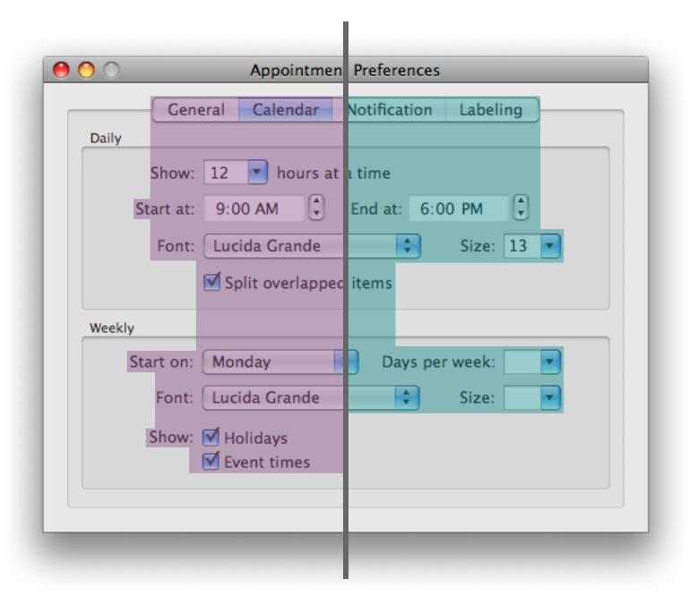

Figure 16-7 illustrates a few guidelines about control placement:

- The colons for stacked labels are right-aligned.
- Stacked controls are left-aligned when appropriate.
- <span id="page-341-0"></span>■ Similar controls have consistent widths. For example, the sizes of the Font pop-up menus and the Size combo boxes are the same in each group box.

**Figure 16-7** Example of alignment of labels and controls in a tabbed window


Like the simple preferences window example in "A Simple [Preferences](#page-336-2) Window" (page 337), the tabbed window shown in this section uses white space in a consistent way. For example, in Figure 16-8, you can see:

- Equal margins between the sides of the group boxes and the tab-pane side edges (the window in Figure 16-8 uses a 16-pixel margin in these areas).
- Equal margins between the sides and bottom of the tab pane and the window edges (the window in Figure 16-8 uses a 20-pixel margin in these areas).
- In both group boxes, the same amount of space between the bottom control and the lower edge of the group box, and the same amount of space between the top control and the upper edge of the group box. (The window in Figure 16-8 uses a 16-pixel margin between the bottom controls in each group box and the lower edge of the group box, and a 10-pixel margin between the top controls in each group box and the upper edge of the group box.)

In addition, the window in Figure 16-8 uses a 12-pixel margin between the top of the tab bar to the bottom of the title bar (see "Tab Views" (page 329) for more information about tab views). Note that this margin would be the same width if the window included a toolbar.

<span id="page-342-1"></span>Figure 16-8 Example of layout of a tabbed window

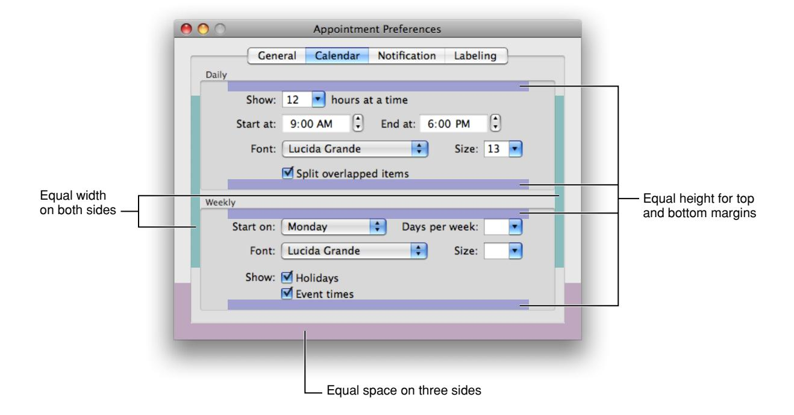

### <span id="page-342-2"></span><span id="page-342-0"></span>A Standard Alert

A standard alert is shown in Figure 16-9.

Figure 16-9 A standard alert example


Although the standard alerts take care of the general layout for you, there are a few details you are responsible for:

■ Make sure that the application icon you use in the alert is 64 x 64 pixels.

- Make sure to include *both* the main message text and the informative text. An alert with only message text is not a complete alert and typically is not very useful to the user.
- Always put the action button in the bottom-right corner of the alert. This is the button that completes the action that the user initiated before the alert was displayed. Remember that the action button is not always the default button as it is in this example (the default button has color and pulses and receives a click when the user presses Return or Enter). In situations where clicking the action button can have dangerous consequences (such as data loss) the default button can be Cancel, but when this is the case it should not be located in the action button position.

Alerts look best when the margin at the bottom edge is the same height as in other windows (for example, in Figure 16-10, this margin is 20 pixels). In addition, you should ensure that there is an equal amount of space in the margins at the sides. The standard alert shown in Figure 16-10 uses a 24-pixel wide margin at the sides of the window.

<span id="page-343-2"></span>See "The [Elements](#page-232-1) of an Alert" (page 233) for more details on designing alerts.

**Figure 16-10** Layout dimensions for a standard alert

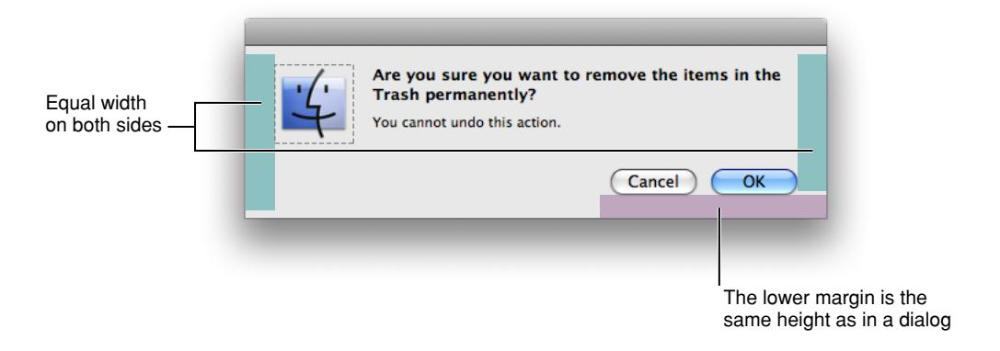

# <span id="page-343-4"></span><span id="page-343-3"></span><span id="page-343-0"></span>Positioning Small and Mini Controls in a Window Body

Use smaller versions of controls only when necessary. Your first choice in designing for Aqua should always be to use the regular-size controls.

<span id="page-343-1"></span>You can use the smaller versions of controls when space is at a premium, such as in tool panels, other types of panels, or Automator actions (for more information on Automator, see ["Automator"](#page-69-0) (page 70)). Avoid mixing different sizes of controls in the same window. In a window with a multiple panes, it is acceptable to use small or mini controls within the pane and standard controls outside the pane. However, all panes of a window should use controls of the same size.

### Layout Example for Small Controls

Figure 16-11 shows a well designed panel with small controls.

<span id="page-344-2"></span><span id="page-344-0"></span>**Figure 16-11** Example of a panel with small controls

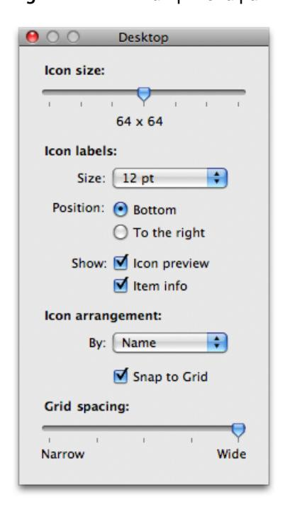

<span id="page-344-1"></span>As you do when using regular-size controls, you should use the center-equalized approach to laying out small controls. This visually balanced layout can be seen in Figure 16-12.

**Figure 16-12** Center-equalization in a panel with small controls

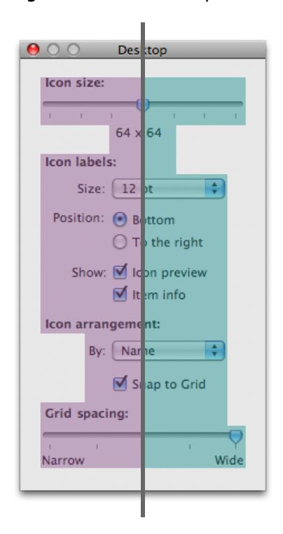

Small controls, like regular-size controls,should be aligned vertically when stacked. In addition,similar controls should have consistent widths and be aligned with each other, as shown in Figure 16-13.

<span id="page-345-0"></span>**Figure 16-13** Alignment of labels and controls in a panel with small controls

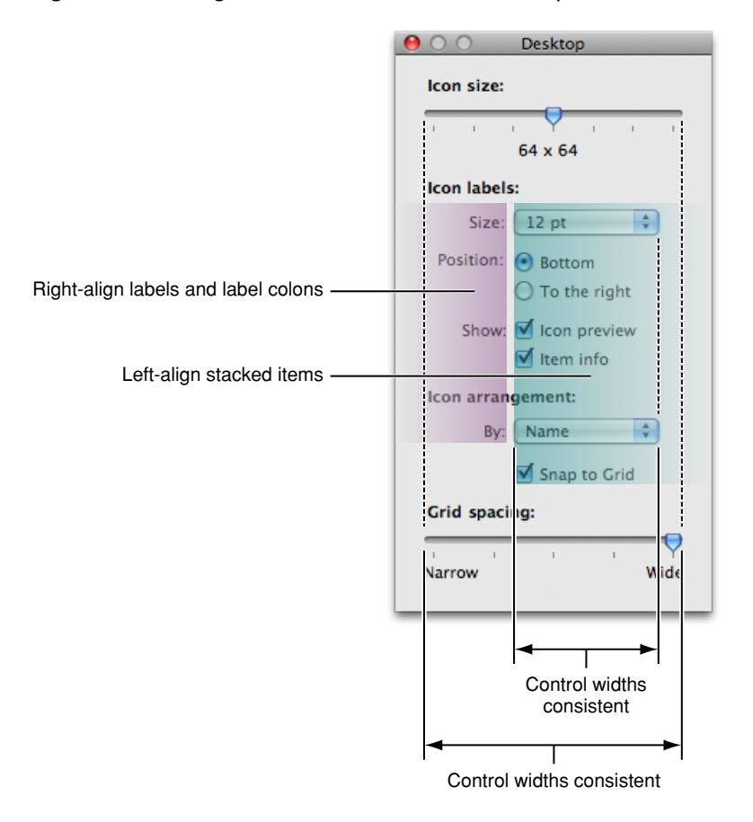

Consistent use of white space is as important in windows with small controls as it is in windows with regular-size controls. For example, in Figure 16-14, you can see:

- Equal margins at the window sides and bottom edge (the window in Figure 16-14 uses 20-pixel margins in these areas). Note that if you use group boxes in a panel with small controls, a narrower margin (such as 10 pixels) is more suitable.
- Equal spacing between groups of controls (the window in Figure 16-14 uses 12 pixels in these areas).
- Equal spacing between section labels and the first control in the section (the window in Figure 16-14 uses 8 pixels between the label of a control section, such as "Icon labels," and the first control in that section).

In addition, the panel shown in Figure 16-14 uses a 14-pixel margin between the title bar and the top item in the window. To save space while creating distinct sections of controls, the example window uses bold font to label each section, instead of using horizontal separators or group boxes.

<span id="page-346-1"></span>**Figure 16-14** Layout dimensions for a panel with small controls

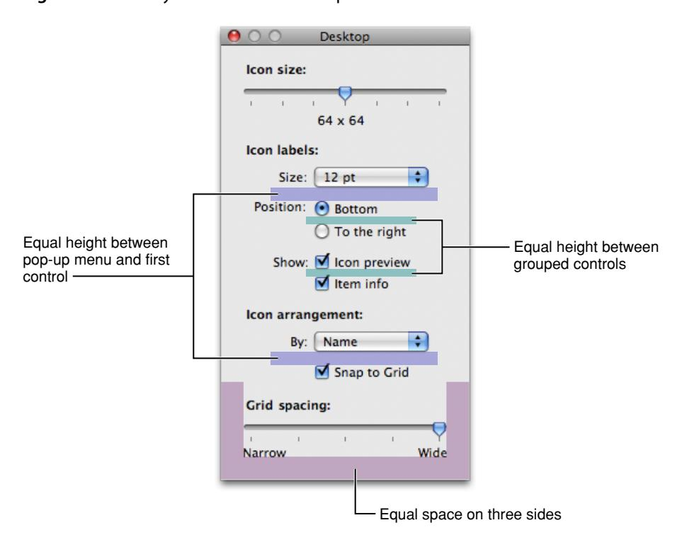

### <span id="page-346-0"></span>Layout Example for Mini Controls

Figure 16-15 shows a well designed panel with mini controls. As you can see, this window observes the principles of center equalization, text and control alignment, and visual balance. In particular, notice that:

- Stacked controls are left-aligned.
- Similar controls have the same width.
- The overall layout is center-equalized and visually balanced.

<span id="page-347-0"></span>**Figure 16-15** Example of a panel with mini controls

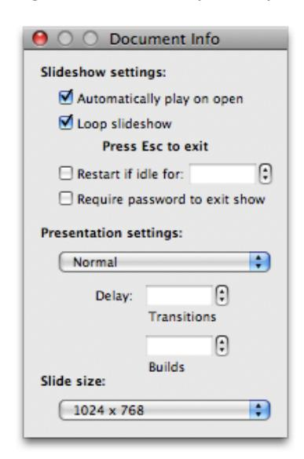

In addition, the panel uses white space in a consistent way. For example, in Figure 16-16, you can see:

- Equal margins at the window sides and bottom edge (the window in Figure 16-16 uses 20-pixel margins in these areas).
- Equal spacing between groups of controls (the window in Figure 16-16 uses 12 pixels in these areas).
- Equal spacing between section labels and the first control in the section (the window in Figure 16-16 uses 8 pixels between the label of a control section, such as "Slideshow settings," and the first control in that section).

In addition, the panel shown in Figure 16-16 uses a 10-pixel margin between the title bar and the top item in the window. To save space while creating distinct sections of controls, the example window uses bold font to label each section, instead of using horizontal separators or group boxes.

<span id="page-348-4"></span><span id="page-348-2"></span>**Figure 16-16** Layout dimensions for a panel with mini controls

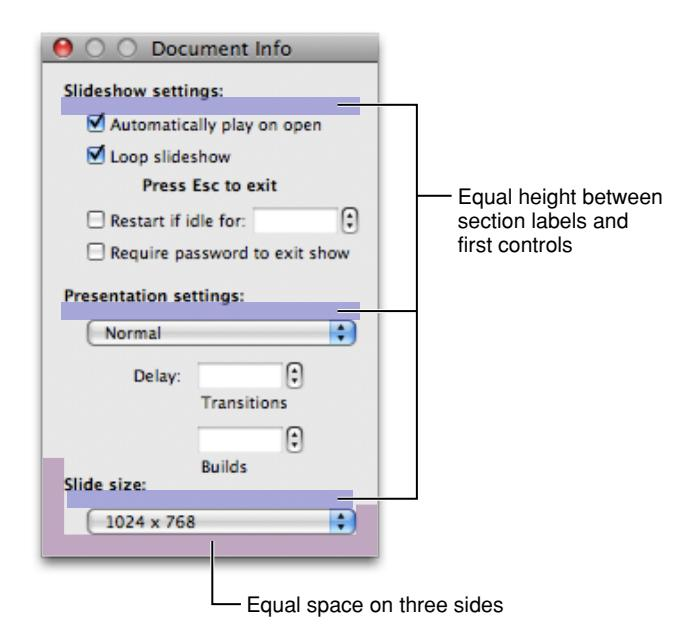

# <span id="page-348-3"></span><span id="page-348-0"></span>Grouping Controls in a Window Body

Grouping related controls helps users understand what particular controls do and helps them locate the controls that affect the specific actions they want to perform. This section provides examples of different ways to group controls.

The three examples show different ways to group the same set of controls within a tabbed window using three grouping elements:

- White space, shown in [Figure](#page-349-2) 16-18 (page 350)
- Separators, shown in [Figure](#page-350-2) 16-20 (page 351)
- Group boxes, shown in [Figure](#page-351-0) 16-21 (page 352)

<span id="page-348-1"></span>Note that none of these examples are more or less correct than any other. The effectiveness of a layout in your application depends on the overall aesthetic of your other windows as well as your application's workflow.

### Grouping with White Space

White space is an especially useful grouping element when you are dealing with small groups of controls.

<span id="page-349-1"></span>**Figure 16-17** Example of grouping with white space


**Figure 16-18** Layout dimensions using white space

<span id="page-349-2"></span>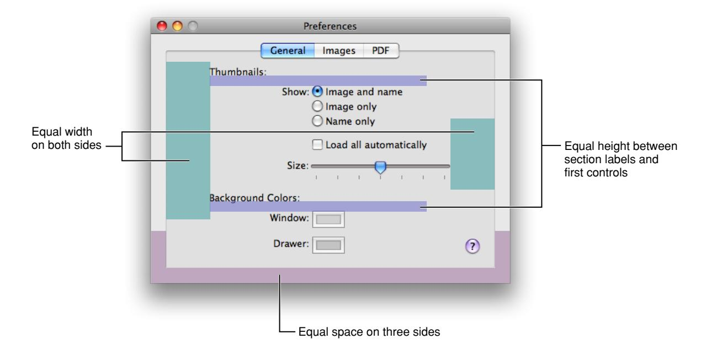

### <span id="page-349-0"></span>Grouping with Separators

Separators provide a very efficient use of space and are most useful when space is at a premium.

<span id="page-350-1"></span>**Figure 16-19** Example of grouping with separators

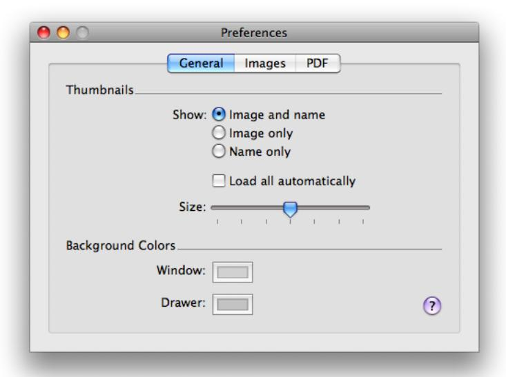

**Figure 16-20** Layout dimensions using separators

<span id="page-350-2"></span>

### <span id="page-350-0"></span>Grouping with Group Boxes

Group boxes provide the strongest visual indication of distinct groups but require the most space within the window.

<span id="page-351-0"></span>**Figure 16-21** Example of grouping with group boxes


**Figure 16-22** Layout dimensions using group boxes

<span id="page-351-1"></span>

# <span id="page-352-0"></span>Positioning Text and Controls in a Bottom Bar

As described in ["Bottom](#page-206-0) Bars" (page 207), a bottom bar is a part of the window frame that extends below the content in the window body. Controls in a bottom bar are frequently used, but not as frequently used as controls in a toolbar. In addition, bottom-bar controls are closely related to the content in the view directly above them.

To create a bottom bar, leave a strip of window frame below the content view in the window body. To do this using Interface Builder, select a Textured Window object from the Library. You need to use this object, not the Window object, because it displays the window-frame surface from top to bottom.

Place the appropriate content view in the new window and size the content view so that its bottom edge does not reach the bottom edge of the window. (Note that windows do not expose any window-frame surface at the sides of the content view in Mac OS X v10.5 and later; see "Window [Appearance"](#page-187-0) (page 188) for more information.) The strip of window frame visible below the content view should be:

- 32 pixels high, if you plan to use regular size controls
- 22 pixels high, if you plan to use small size controls

The layout guidelinesfor bottom barsfocus on visual balance and consistentspacing. Note that the guidelines for both regular-size and small controls recommend fewer pixels above the control than below it. This is because precisely centering controlsin a bottom bar makesthem too close to the bottom edge and decreases the sense of visual balance.

<span id="page-352-1"></span>If you want to use regular-size controls in a bottom bar, use the following layout guidelines (illustrated in Figure 16-23):

**Figure 16-23** Layout specifications for a bottom bar with regular-size controls

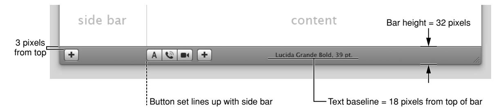

- All controls should be 3 pixels from the top edge of the bottom bar.
- Leave a consistent amount of space between individual controls or sets of controls. (The bottom bar in Figure 16-23 uses 8 pixels between controls.)
- Leave a margin between the left edge of the bottom bar and the leftmost control. It works well to leave a margin that measures the same as the space you leave between controls (the bottom bar in Figure 16-23 uses 8 pixels in this area).
- The text baseline should be 18 pixels below the top edge of the bottom bar.
- If the window contains a source list and there are controls that relate to the content view controlled by the source list, left-align those controls with the splitter of the source list.

If you want to use small controls in a bottom bar, use the following layout guidelines (illustrated in Figure 16-24):

<span id="page-353-0"></span>**Figure 16-24** Layout specifications for a bottom bar with small controls


- All controls should be 1 pixel from the top edge of the bottom bar.
- Place the leftmost control 8 pixels from the left edge of the bottom bar.
- Leave 8 pixels between controls.
- The text baseline should be 13 pixels below the top edge of the bottom bar.
- If the window contains a source list and there are controls that relate to the content view controlled by the source list, left-align those controls with the splitter of the source list.

# <span id="page-354-0"></span>Keyboard Shortcuts Quick Reference

<span id="page-354-1"></span>Table A-1 lists the system-reserved and commonly used keyboard shortcuts mentioned in the rest of this document.

As you implement keyboard shortcuts in your application, use this table to find:

- Which key sequences are reserved by Mac OS X. Users rely on these shortcuts to perform the specified actions no matter which application is currently running (these include shortcuts reserved for accessibility purposes). *Do not override these shortcuts*.
- Which key sequences are recommended for common application tasks. Users expect these shortcuts to mean the same thing from application to application. Provide these

shortcuts *if your application performs the associated tasks*. You should avoid using these shortcuts for other purposes.

If a keyboard sequence is not listed in Table A-1 you can use it for a frequently used command in your application, if a shortcut is appropriate. For guidance on creating new keyboard shortcuts,see ["Creating](#page-104-2) Your Own Keyboard [Shortcuts"](#page-104-2) (page 105) Be aware, however, that Apple may reserve other keyboard shortcuts in the future. For more information on the system-reserved keyboard shortcuts, see ["Reserved](#page-102-1) Keyboard [Shortcuts"](#page-102-1) (page 103)

**Note:** With the exception of the system-reserved function keys F9, F10, F11, and F12, Table A-1 lists only combinations of two or more keys. For information on how to use specific single keys (such as Tab and Return), see "The [Functions](#page-96-0) of Specific Keys" (page 97)

Table A-1 groups together the primary key that is modified and variations of key sequences based on the primary key. In the interests of space, the table uses the following symbols to represent the modifier keys (these are the same symbols menus display):

- (Command)
- (Control)
- (Option)
- (Shift)

Some shortcuts in Table A-1 are accompanied by an icon. This means that you should not override the shortcut because the operating system uses it in some way.

A shortcut in Table A-1 that is not accompanied by an icon isrecommended for applicationsthat perform the associated task. If your application does not perform the task associated with a recommended shortcut, you should not use that shortcut to mean something else.

<span id="page-355-0"></span>**Table A-1** Keyboard shortcuts

<span id="page-355-12"></span><span id="page-355-11"></span><span id="page-355-10"></span><span id="page-355-9"></span><span id="page-355-8"></span><span id="page-355-7"></span><span id="page-355-6"></span><span id="page-355-5"></span><span id="page-355-4"></span><span id="page-355-3"></span><span id="page-355-2"></span><span id="page-355-1"></span>

| Primary<br>key | Key sequence | Associated action                                                                                                                                              |
|----------------|--------------|----------------------------------------------------------------------------------------------------------------------------------------------------------------|
| Space bar      | Space        | Show or hide the Spotlight search field (when multiple languages are<br>installed, may rotate through enabled script systems).                                 |
|                | Space        | Apple reserved.                                                                                                                                                |
|                | Space        | Show the Spotlight search results window (when multiple languages<br>are installed, may rotate through keyboard layouts and input methods<br>within a script). |
|                | Space        | Apple reserved.                                                                                                                                                |
| Tab            | Tab          | Navigate through controlsin a reverse direction. See "Keyboard Focus<br>and Navigation" (page 107).                                                            |
|                | Tab          | Move forward to the next most recently used application in a list of<br>open applications.                                                                     |
|                | Tab          | Move backward through a list of open applications (sorted by recent<br>use).                                                                                   |
|                | Tab          | Move focus to the next grouping of controls in a dialog or the next<br>table (when Tab moves to the next cell). See Accessibility Overview.                    |
|                | Tab          | Move focus to the previous grouping of controls. See Accessibility<br>Overview.                                                                                |
| Esc            | Esc          | Open Front Row.                                                                                                                                                |
|                | Esc          | Open the Force Quit dialog.                                                                                                                                    |
| Eject          | Eject        | Quit all applications (after giving the user a chance to save changes<br>to open documents) and restart the computer.                                          |
|                | Eject        | Quit all applications (after giving the user a chance to save changes<br>to open documents) and shut the computer down.                                        |
| F1             | F1           | Toggle full keyboard access on or off. See Accessibility Overview.                                                                                             |
| F2             | F2           | Move focus to the menu bar. See Accessibility Overview.                                                                                                        |
| F3             | F3           | Move focus to the Dock. See Accessibility Overview.                                                                                                            |
| F4             | F4           | Move focus to the active (or next) window. See Accessibility Overview.                                                                                         |
|                | F4           | Move focusto the previously active window. See AccessibilityOverview.                                                                                          |

<span id="page-356-9"></span><span id="page-356-8"></span><span id="page-356-7"></span><span id="page-356-6"></span><span id="page-356-5"></span><span id="page-356-4"></span><span id="page-356-3"></span><span id="page-356-2"></span><span id="page-356-1"></span><span id="page-356-0"></span>

| Primary<br>key       | Key sequence | Associated action                                                                                                    |
|----------------------|--------------|----------------------------------------------------------------------------------------------------------------------|
| F5                   | F5           | Move focus to the toolbar. See Accessibility Overview.                                                               |
|                      | F5           | Turn VoiceOver on or off. See Accessibility Overview.                                                                |
| F6                   | F6           | Move focus to the first (or next) panel. See Accessibility Overview.                                                 |
|                      | F6           | Move focus to the previous panel. See Accessibility Overview.                                                        |
| F7                   | F7           | Temporarily override the current keyboard access mode in windows<br>and dialogs. See Accessibility Overview.         |
| F9                   |              | Tile or untile all open windows.                                                                                     |
| F10                  |              | Tile or untile all open windows in the currently active application.                                                 |
| F11                  |              | Hide or show all open windows.                                                                                       |
| F12                  |              | Hide or display Dashboard.                                                                                           |
| `(grave<br>accent)   | `            | Activate the next open window in the frontmost application. See<br>"Window Layering" (page 217).                     |
|                      | `            | Activate the previous open window in the frontmost application. See<br>"Window Layering" (page 217).                 |
|                      | `            | Move focus to the window drawer.                                                                                     |
| - (hyphen)           | -            | Decrease the size of the selected item (equivalent to the Smaller<br>command). See "The Format Menu" (page 179).     |
|                      | -            | Zoom out when screen zooming is on. See Accessibility Overview.                                                      |
| { (left<br>bracket)  | {            | Left-align a selection (equivalent to the Align Left command). See "The<br>Format Menu" (page 179).                  |
| } (right<br>bracket) | }            | Right-align a selection (equivalent to the Align Right command). See<br>"The Format Menu" (page 179).                |
| (pipe)               |              | Center-align a selection (equivalent to the Align Center command).<br>See "The Format Menu" (page 179).              |
| : (colon)            | :            | Display the Spelling window (equivalent to the Spelling command).<br>See "The Edit Menu" (page 177).                 |
| ;<br>(semicolon)     | ;            | Find misspelled words in the document (equivalent to the Check<br>Spelling command). See "The Edit Menu" (page 177). |

<span id="page-357-9"></span><span id="page-357-8"></span><span id="page-357-7"></span><span id="page-357-6"></span><span id="page-357-5"></span><span id="page-357-4"></span><span id="page-357-3"></span><span id="page-357-2"></span><span id="page-357-1"></span><span id="page-357-0"></span>

| Primary<br>key       | Key sequence | Associated action                                                                                                                                             |
|----------------------|--------------|---------------------------------------------------------------------------------------------------------------------------------------------------------------|
| , (comma)            | ,            | Open the application's preferences window (equivalent to the<br>Preferences command). See "The Application Menu" (page 173).                                  |
|                      | ,            | Decrease screen contrast. See Accessibility Overview.                                                                                                         |
| . (period)           |              | Increase screen contrast. See Accessibility Overview.                                                                                                         |
| ? (question<br>mark) | ?            | Open the application's help in Help Viewer. See "The Help Menu" (page<br>183).                                                                                |
| / (forward<br>slash) | /            | Turn font smoothing on or off.                                                                                                                                |
| = (equal<br>sign)    | =            | Increase the size of the selected item (equivalent to the Bigger<br>command). See "The Format Menu" (page 179).                                               |
|                      | =            | Zoom in when screen zooming is on. See Accessibility Overview.                                                                                                |
| 3                    | 3            | Capture the screen to a file.                                                                                                                                 |
|                      | 3            | Capture the screen to the Clipboard.                                                                                                                          |
| 4                    | 4            | Capture a selection to a file.                                                                                                                                |
|                      | 4            | Capture a selection to the Clipboard.                                                                                                                         |
| 8                    | 8            | Turn screen zooming on or off. See Accessibility Overview.                                                                                                    |
|                      | 8            | Invert the screen colors. See Accessibility Overview.                                                                                                         |
| A                    | A            | Highlight every item in a document or window, or all characters in a<br>text field (equivalent to the Select All command). See "The Edit<br>Menu" (page 177). |
| B                    | B            | Boldface the selected text or toggle boldfaced text on and off<br>(equivalent to the Bold command). See "The Edit Menu" (page 177).                           |
| C                    | C            | Duplicate the selected data and store on the Clipboard (equivalent to<br>the Copy command). See "The Edit Menu" (page 177).                                   |
|                      | C            | Display the Colors window (equivalent to the Show Colors command).<br>See "The Format Menu" (page 179).                                                       |
|                      | C            | Copy the style of the selected text (equivalent to the Copy Style<br>command). See "The Format Menu" (page 179).                                              |

<span id="page-358-16"></span><span id="page-358-15"></span><span id="page-358-14"></span><span id="page-358-13"></span><span id="page-358-12"></span><span id="page-358-11"></span><span id="page-358-10"></span><span id="page-358-9"></span><span id="page-358-8"></span><span id="page-358-7"></span><span id="page-358-6"></span><span id="page-358-5"></span><span id="page-358-4"></span><span id="page-358-3"></span><span id="page-358-2"></span><span id="page-358-1"></span><span id="page-358-0"></span>

| Primary<br>key | Key sequence | Associated action                                                                                                                                            |
|----------------|--------------|--------------------------------------------------------------------------------------------------------------------------------------------------------------|
|                | C            | Copy the formatting settings of the selected item and store on the<br>Clipboard (equivalent to the Copy Ruler command). See "The Format<br>Menu" (page 179). |
| D              | D            | Show or hide the Dock. See "The Dock" (page 62).                                                                                                             |
|                | D            | Display the definition of the selected word in the Dictionary<br>application.                                                                                |
| E              | E            | Use the selection for a find operation. See "Find Windows" (page 238).                                                                                       |
| F              | F            | Open a Find window (equivalent to the Find command). See "The Edit<br>Menu" (page 177).                                                                      |
|                | F            | Jump to the search field control. See "Search Fields" (page 317).                                                                                            |
| G              | G            | Find the next occurrence of the selection (equivalent to the Find Next<br>command). See "The Edit Menu" (page 177).                                          |
|                | G            | Find the previous occurrence of the selection (equivalent to the Find<br>Previous command). See "The Edit Menu" (page 177).                                  |
| H              | H            | Hide the windows of the currently running application (equivalent to<br>the Hide ApplicationName command). See "The Application<br>Menu" (page 173).         |
|                | H            | Hide the windows of all other running applications (equivalent to the<br>Hide Others command). See "The Application Menu" (page 173).                        |
| I              | I            | Italicize the selected text or toggle italic text on or off (equivalent to<br>the Italic command). See "The Format Menu" (page 179).                         |
|                | I            | Display an Info window. See "Inspector Windows" (page 224).                                                                                                  |
|                | I            | Display an inspector window. See "Inspector Windows" (page 224).                                                                                             |
| J              | J            | Scroll to a selection.                                                                                                                                       |
| M              | M            | Minimize the active window to the Dock (equivalent to the Minimize<br>command). See "The Window Menu" (page 182).                                            |
|                | M            | Minimize all windows of the active application to the Dock (equivalent<br>to the Minimize All command). See "The Window Menu" (page 182).                    |
| N              | N            | Open a new document (equivalent to the New command). See "The<br>File Menu" (page 175).                                                                      |
| O              | O            | Display a dialog for choosing a document to open (equivalent to the<br>Open command). See "The File Menu" (page 175).                                        |
| P              | P            | Display the Print dialog (equivalent to the Print command). See "The<br>File Menu" (page 175).                                                               |

<span id="page-359-14"></span><span id="page-359-13"></span><span id="page-359-12"></span><span id="page-359-11"></span><span id="page-359-10"></span><span id="page-359-9"></span><span id="page-359-8"></span><span id="page-359-7"></span><span id="page-359-6"></span><span id="page-359-5"></span><span id="page-359-4"></span><span id="page-359-3"></span><span id="page-359-2"></span><span id="page-359-1"></span><span id="page-359-0"></span>

| Primary<br>key | Key sequence | Associated action                                                                                                                                       |
|----------------|--------------|---------------------------------------------------------------------------------------------------------------------------------------------------------|
|                | P            | Display a dialog for specifying printing parameters (equivalent to the<br>Page Setup command). See "The File Menu" (page 175).                          |
| Q              | Q            | Quit the application (equivalent to the Quit command). See "The<br>Application Menu" (page 173).                                                        |
|                | Q            | Log out the current user (equivalent to the Log Out command).                                                                                           |
|                | Q            | Log out the current user without confirmation.                                                                                                          |
| S              | S            | Save the active document (equivalent to the Save command). See<br>"The File Menu" (page 175).                                                           |
|                | S            | Display the Save dialog (equivalent to the Save As command). See<br>"The File Menu" (page 175).                                                         |
| T              | T            | Display the Fonts window (equivalent to the Show Fonts command).<br>See "The Format Menu" (page 179).                                                   |
|                | T            | Show or hide a toolbar (equivalent to the Show/Hide Toolbar<br>command). See "The View Menu" (page 180) and "Toolbars" (page 196).                      |
| U              | U            | Underline the selected text or turn underlining on or off (equivalent<br>to the Underline command). See "The Format Menu" (page 179).                   |
| V              | V            | Insert the Clipboard contents at the insertion point (equivalent to the<br>Paste command). See "The File Menu" (page 175).                              |
|                | V            | Apply the style of one object to the selected object (equivalent to the<br>Paste Style command). See "The Format Menu" (page 179).                      |
|                | V            | Apply the style of the surrounding text to the inserted object<br>(equivalent to the Paste and Match Style command). See "The Edit<br>Menu" (page 177). |
|                | V            | Apply formatting settings to the selected object (equivalent to the<br>Paste Ruler command). See "The Format Menu" (page 179).                          |
| W              | W            | Close the active window (equivalent to the Close command). See "The<br>File Menu" (page 175).                                                           |
|                | W            | Close a file and its associated windows (equivalent to the Close File<br>command). See "The File Menu" (page 175).                                      |
|                | W            | Close all windows in the application (equivalent to the Close All<br>command). See "The File Menu" (page 175).                                          |
| X              | X            | Remove the selection and store on the Clipboard (equivalent to the<br>Cut command). See "The Edit Menu" (page 177).                                     |

<span id="page-360-15"></span><span id="page-360-14"></span><span id="page-360-13"></span><span id="page-360-12"></span><span id="page-360-11"></span><span id="page-360-10"></span><span id="page-360-9"></span><span id="page-360-8"></span><span id="page-360-7"></span><span id="page-360-6"></span><span id="page-360-5"></span><span id="page-360-4"></span><span id="page-360-3"></span><span id="page-360-2"></span><span id="page-360-1"></span><span id="page-360-0"></span>

| Primary<br>key   | Key sequence | Associated action                                                                                                        |
|------------------|--------------|--------------------------------------------------------------------------------------------------------------------------|
| Z                | Z            | Reverse the effect of the user's previous operation (equivalent to the<br>Undo command). See "The Edit Menu" (page 177). |
|                  | Z            | Reverse the effect of the last Undo command (equivalent to the Redo<br>command). See "The Edit Menu" (page 177).         |
| (right<br>arrow) |              | Change the keyboard layout to current layout of Roman script.                                                            |
|                  |              | Extend selection to the next semantic unit, typically the end of the<br>current line.                                    |
|                  |              | Extend selection one character to the right.                                                                             |
|                  |              | Extend selection to the end of the current word, then to the end of<br>the next word.                                    |
|                  |              | Move focus to another value or cell within a view, such as a table. See<br>Accessibility Overview.                       |
| (left<br>arrow)  |              | Change the keyboard layout to current layout of system script.                                                           |
|                  |              | Extend selection to the previoussemantic unit, typically the beginning<br>of the current line.                           |
|                  |              | Extend selection one character to the left.                                                                              |
|                  |              | Extend selection to the beginning of the current word, then to the<br>beginning of the previous word.                    |
|                  |              | Move focus to another value or cell within a view, such as a table. See<br>Accessibility Overview.                       |
| (up<br>arrow)    |              | Extend selection upward in the next semantic unit, typically the<br>beginning of the document.                           |
|                  |              | Extend selection to the line above, to the nearest character boundary<br>at the same horizontal location.                |
|                  |              | Extend selection to the beginning of the current paragraph, then to<br>the beginning of the next paragraph.              |
|                  |              | Move focus to another value or cell within a view, such as a table. See<br>Accessibility Overview.                       |
| (down<br>arrow)  |              | Extend selection downward in the next semantic unit, typically the<br>end of the document.                               |
|                  |              | Extend selection to the line below, to the nearest character boundary<br>at the same horizontal location.                |

<span id="page-361-0"></span>

| Primary<br>key | Key sequence | Associated action                                                                                                                                                                 |
|----------------|--------------|-----------------------------------------------------------------------------------------------------------------------------------------------------------------------------------|
|                |              | Extend selection to the end of the current paragraph, then to the end<br>of the next paragraph (include the blank line between paragraphs in<br>cut, copy, and paste operations). |
|                |              | Move focus to another value or cell within a view, such as a table. See<br>Accessibility Overview.                                                                                |

# <span id="page-362-0"></span>Glossary

<span id="page-362-5"></span>**About window** A modeless window that displays an application's version and copyright information.

**accumulating attribute group** A set of attribute choices in which the user can select multiple items, such as Bold and Italic. See also mutually [exclusive](#page-366-0) [attribute](#page-366-0) group.

**action button** The button that confirmsthe message text in a dialog. The action button isin the lower right corner of a dialog. It is often, but not always, the default button.

**active end** The location at which the user releases the mouse button when selecting a range of objects.

<span id="page-362-4"></span>**active window** A window that applies to the user's current task. Active windows are distinguished from inactive windows by the look of the title bar and the window controls. Multiple windows can be active simultaneously. See also key [window;](#page-365-0) main [window](#page-366-1).

<span id="page-362-2"></span>**addition model** A model for extending a continuous selection using Shift-click, in which new text is added to a selection. See also [fixed-point](#page-365-1) model.

**alert** A dialog that appears when the system or an application needsto communicate information to the user. Alerts provide messages about error conditions and warn users about potentially hazardoussituations or actions.

**anchor point** The location at which the user presses the mouse button when selecting a range of objects.

**AppleHelp** The componentthat enables applications to display HTML filesin Help Viewer, a simple browser.

**Apple menu** A menu that provides items that are available to users at all times, regardless of which application is active. It is the leftmost menu in the menu bar.

**application font** The font used as the default for user-created content. It is 13-point Lucida Grande Regular.

**application menu** A menu that contains items that apply to the application as a whole, rather than to a specific document or other window. The application menu for the current active application appears immediately to the right of the Apple menu.

<span id="page-362-3"></span>**application-modal dialog** A dialog that preventsthe userfrom performing any operations within the owner application other than those in the dialog. See also [document-modal](#page-364-0) dialog; [sheet.](#page-367-0)

**application window** The primary window of an application that is not document-based.

**arrow keys** The four keys on Apple keyboards (up, down, left, right) used to move the insertion point or change the selection. They can also be used with the Shift key to extend or shrink a selection.

**asynchronous progress indicator** A small round indeterminate progress indicator. It is usually visible only while active.

**auto-repeat** A feature that lets users produce numerousinstances of the same character by holding down its key rather than pressing the key over and over. Users can make adjustments to this feature in Keyboard & Mouse preferences.

<span id="page-362-1"></span>**background selection** A selection in an inactive window. In Aqua,such selections are in the secondary highlight color.

**bevel button** A button with a beveled edge that gives the button a three-dimensional appearance. **Bonjour** A networking technology that provides a way for computers, devices, and services to discover each other dynamically over IP networks.

**bullet** In the Window menu, indicates that the document has unsaved changes.

**button** See bevel [button](#page-362-1); icon [button;](#page-365-2) push [button;](#page-366-2) radio [button.](#page-366-3)

**center equalization** Placement of controls in a window so that overall, they are visually balanced across an imaginary vertical line in the center of the window.

**center justification** The placement of controls or text where every item is centered on an imaginary vertical line in the center of a window.

**character key** A key that sends a character to the computer. Character keys include letters, numbers, punctuation, and the Space bar, and nonprinting characters such as Tab and Return.

**checkbox** A control for an option that must be either on or off.

**checkmark** In the Window menu, a checkmark appears next to the active document's name. In other menus, checkmarks can be used to indicate that the setting applies to the entire selection. Checkmarks can be used for mutually exclusive attribute groups or for accumulating attribute groups.

**click-through** A property of some controls that enables user to activate them in an inactive window. Whether a control supports click-throught depends on the context.

**Clipboard** A storage location for data the user cuts or copiesfrom a document. The Clipboard is available to all applications and its contents don't change when the user switches between applications.

**clipping** Data dragged from an application to the Finder desktop.

**close button** A window control (the red button that appears in the upper left) that users can click to close the window.

**color well** A small rectangular orsquare control used to apply a color selection. The color of the control indicates the currently selected color.

**column view** A control that displays textual listings of hierarchical data in vertical columns. Navigation between columns reveals levels of the hierarchy.

**combination box** A text entry field combined with a drop-down scrolling list. Combo boxes are useful for displaying a list of likely choices while still allowing the user to type in an item not in the list.

**command pop-down menu** A menu that contains commands and appears in a window rather than in the menu bar. Use of this control is limited to cases where the window is shared among multiple applications and the menu contains commands that affect the window's contents. A closed pop-down menu always displays the same text, which is the menu title. Pop-down menus have a single, downward-pointing triangle.

**contextual menu** A menu that appears when the user presses the Control key and clicks an interface item. A contextual menu provides convenient access to frequently used commands associated with the item.

**continuous selection** A selection that includes all content between the anchor point and the active end.

<span id="page-363-0"></span>**control** A graphic object that causes instant actions or visible results when the user manipulatesthe object with the mouse. Standard controls include buttons, scroll bars, checkboxes, sliders, and pop-up menus.

**cursor** The onscreen representation of the mouse's location. The cursor commonly looks like an arrow, but can also assume such shapes as a pencil, a cross, or a paintbrush, depending on the application and the user's selection.

**dash** In a menu, indicates that an attribute applies to only part of the selection. For example, if a highlighted selection contains text with different styles applied to it, a dash appears next to each style name in the menu.

**data browser** A control that provides a standardized look for column browsers(such asseen in the column view of a Finder window or in an Open dialog) and scrolling lists (such as seen in the list view of a Finder window).

**date picker** A control that allows a user to input date and time information in either a textual or graphical format.

**default button** The button that provides a safe action in a dialog. The default button is indicated by a pulsing appearance. It is activated when the user presses the Return or Enter key.

**default keyboard access mode** The mode in which tabbing and other keystrokes move keyboard focus only between fieldsthat receive keyboard input,such as text entry fields and scrolling lists. See also [full](#page-365-3) [keyboard](#page-365-3) access mode.

**destination region** The part of a document that can accept data dragged to it. In a document window, the destination region is usually the content area minus the title bar and areas used for controls such as scroll bars and rulers.

**dialog** A window designed to elicit a response from the user. See also [alert.](#page-362-2)

**diamond** In a Window menu, indicates that the document has been minimized into the Dock.

**dimmed** Used to describe text or icons that are grayed out to indicate that they are currently unavailable. Menu items, for example, are dimmed rather than omitted when they aren't applicable at a particular moment.

**disclosure button** A control that expands a dialog or panel to provide the user with additional choices that are associated with a specific list-based selection control (such as a pop-up menu).

**disclosure triangle** A control that allows the display, or disclosure, of information that elaborates on the primary information in a window. Disclosure triangles are used in the Finder's list view; clicking a triangle displays a folder's contents.

**discontinuous selection** A selection in which unselected objects are between selected objects. **display name** The name of a file as it appears to the user. The display name reflects the user's preference for hiding or showing the filename extension.

**Dock** A user-configurable, onscreen, interface element that provides a simple way for usersto launch frequently-used applications and documents. It also houses minimized windows and the Trash.

<span id="page-364-0"></span>**document-modal dialog** A dialog that prevents the user from performing further operations in the document until the user dismisses the dialog. All sheets are document modal and all Aqua document-modal dialogs should be sheets. See also [application-modal](#page-362-3) dialog; [sheet](#page-367-0).

<span id="page-364-1"></span>**document window** A window containing file-based data that users create and store. See also [panel.](#page-366-4)

**drag and drop** The technique of dragging an item, such as a graphic or selected text, and dropping it on a suitable destination, such as another document.

**drawer** A child window that slides out from a parent window and that the user can open or close (show or hide) while the parent window is open. Drawers contain controls that are fairly frequently accessed but don't need to be visible at all times.

**dynamic menu item** A menu command that changes when the user presses a modifier key. For example, in the Finder File menu, if the user pressesthe Option key, the Close Window command changes to Close All. See also [toggled](#page-368-0) menu item.

**Edit menu** A menu that provides commands for changing (editing) the contents of documents. It contains commands such as Cut, Copy, and Paste.

**ellipsis character** Three unspaced periods that appear in menus, buttons, and other controls to indicate that additional information will be required to complete the command. Generate an ellipsis with Option-semicolon.

**emphasized mini system font** The bold version of the mini system font.

**emphasized small system font** The bold version of the small system font.

**emphasized system font** The bold version of the system font.

**fast user switching** A feature introduced in Mac OS X version 10.3 that allows users on a multiple-user computer to access their desktop, documents, and applications without requiring other logged in users to quit their applications.

<span id="page-365-1"></span>**File menu** A menu that contains commands that provide housekeeping tasks for files, such as Save As.

**fixed-point model** A model for extending a continuous selection using Shift-click, in which the user can extend the selection on either side of the insertion point. See also [addition](#page-362-4) model.

**focus ring** Highlighting around the onscreen area that is ready to accept user input.

<span id="page-365-3"></span>**Format menu** An optional menu that contains formatting commands.

**full keyboard access mode** The mode in which tabbing and other keystrokes move keyboard focus to more interface elementsthan is possible in default keyboard access mode.

**function key** One of the keys with the letter *F* and a number, plus the Help, Home, Page Up, Page Down, Del, and End keys.

**group box** In a dialog, a visual indication that certain controls belong together.

**help book** The collection of HTML files that provide onscreen help for a particular product.

**Help button** A button that opens Help Viewer to the help content appropriate for the context. A help button is a round button with a question mark.

**Help Menu** A menu that provides access to the onscreen help documentation for an application.

**Help Viewer** The simple browser used to display Apple Help HTML files.

**help tag** A brief text explanation that appears when the user leavesthe pointer hovering over an interface element for a few seconds.

<span id="page-365-4"></span>**hierarchical menu** A menu that includes a menu item from which a submenu descends. Submenus offer additional menu item choices without taking up more space in the menu bar. Hierarchical menus are indicated with a triangle.

**hot spot** The portion of the pointer that must be positioned over a screen object for mouse clicks to have an effect on the object.

<span id="page-365-2"></span>**hot zone** The area of an onscreen object that the pointer's hot spot must be within for mouse clicks to have an effect.

**icon button** A button that does not have a rectangular edge around it; the clickable region isthe graphic (for example, the toolbar buttons in System Preferences windows).

**icon genre** A group of icons that share similar visual design characteristics used to designate a particular category of items.

**image well** A rectangular, recessed area that displays an icon or picture and that serves as a drag-and-drop target.

**inactive window** A window that isin the background of other windows. Although some of its controls can be activated (click-through) and it can be a drag and drop target, an inactive window is not the focus of the user's attention.

**insertion point** The point at which data will be inserted in response to a user's typing or pasting.

<span id="page-365-0"></span>**Interface Builder** An application that helps you easily create application menus, windows, dialogs, palettes, and other standard Aqua interface elements.

**key-repeat** The repetition of a character when the user holds down a key representing that character.

**key window** The window that currently acceptsinput from the keyboard.

**label font** The font used for labels with controlssuch as sliders and icon bevel buttons. It is 10-point Lucida Grande Regular.

**level indicator** A control that displays the level or capacity of something.

**list view** A control for displaying data in a list. The primary list may by accompanied by additional columnsthat display secondary attributes about that items in the list. Hierarchies are presented through the use of disclosure triangles.

<span id="page-366-1"></span>**main window** The window that is the focus of the user's actions. It may accept keyboard input itself or may work in conjunction with a key window. For example, a text editing document would be a main window when a user is actively typing or modifying text in it.

**menu bar** The strip at the top of the user's primary monitor that contains menu titles. It includes system and application menus.

**mini system font** The font used for the text in most mini controls. It is Lucida Grande Regular 9 pt.

**minimize button** A window control (the middle yellow button that appears at the top left) that the user clicks to put a window into the Dock.

**modeless dialog** A dialog that does not require the user to dismiss it before interacting with anything else onscreen. The "find and replace" dialog in many word processors is an example of a modeless dialog.

<span id="page-366-0"></span>**modifier key** A key the user can hold down to alter the meaning of another key being pressed simultaneously or to alter the meaning of a mouse action. The Option and Command keys are examples of modifier keys.

**mutually exclusive attribute group** A set of attribute choices in which the user can select only one item, such as font size. See also [accumulating](#page-362-5) attribute [group](#page-362-5).

**palette** A panel that is independent of document windows and that provides items to be used when other windows are open, such as a palette that provides drawing tools. See [panel.](#page-366-4)

**pane** An area of changeable content in a dialog or other window. Panes usually change as the result of the user clicking a button or choosing an item from a pop-up menu. In some cases, panes change as a process takes place, such as while the Installer application is running.

<span id="page-366-4"></span>**panel** A window that floats above other windows and provides tools or controls that users can work with while documents are open. See also [document](#page-364-1) [window](#page-364-1).

**pathname separator** The "/" character thatseparates folder names in a raw pathname. A raw pathname should be displayed only to expert users or in a help tag.

**placard** A control that displaysinformation. Typically placards are used in document windows as a way to quickly modify the view of the contents—for example, to change the current page or the magnification.

**pointer** See [cursor.](#page-363-0)

**pop-up menu** A menu that, when closed, displays the current choice and can be opened to present a list of mutually exclusive choices in a dialog or window. Pop-up menus have a double triangle indicator.

**progress indicator** A control that lets the user know that a task is in progress.

<span id="page-366-2"></span>**proxy icon** An icon in the title bar of a document window that users can manipulate as if they were manipulating the corresponding file-system object. Users can Command-click the proxy icon to display a pop-up menu illustrating the document path.

<span id="page-366-3"></span>**push button** A rounded rectangle with a text label on it, which the user clicks to perform an instantaneous action, such as saving a document, completing operations defined by a dialog, or acknowledging an error message.

**radio button** A control for one of a set of mutually exclusive, but related, choices.

**rating indicator** A control that displays a number of stars that indicates the relative ranking of an object (such as a song) based on a criterion such as popularity.

**relevance indicator** A control that indicates the relative ranking ofsearch results—the longer the bar, the more relevant the item is to the search criteria.

**resize control** The area in the bottom-right corner of windows that users can drag to adjust the size of the window. It is not present if the window's contents cannot vary in size.

**round button** A circular push button.

**scroll bar** A control for viewing areas of a document or a list that is larger than can fit in the current window. Only the active window can be scrolled. A window can have a horizontal scroll bar, a vertical scroll bar, both, or neither.

**scroller** The part of a scroll bar that the user drags to view other parts of a document. The scroller size reflects how much of the document is visible; the smaller the scroller, the less of the content the user can see at that time. The scroller represents the relative location, in the whole document, of the portion that can be seen in the window.

**scrolling list** A list in a dialog that uses scroll bars to reveal its contents.

**scrolling menu** A menu that contains more items than are visible onscreen. Scrolling menus have triangles that indicate hidden menu items.

**search field** A text field with rounded corners used for searching. It can include a menu and an icon to clear the field or steps of a search.

**segmented control** A control for changing modes or views; each segment represents a different state.

**separator** A line used to break a window into different visual regions.

<span id="page-367-0"></span>**setup assistant** A small application that guides users through the setup options for a hardware device or software component.

**sheet** A dialog attached to a specific window, ensuring that the user never loses track of which window the dialog belongs to. A Print dialog is an example of a sheet. See also [document-modal](#page-364-0) dialog.

**Shift-click** To click while the Shift key is down. This combination is used to select multiple objects or to extend a selection.

**Sidebar** In the Finder, a user-specified list of disks, volumes, and other directories that allow users quick access to specific locations.

**slider control** A control enabling users to choose among a continuousrange of allowable values. Slider controls can be horizontal or vertical and can display incremental tick marks.

**small system font** The font used for informative text in alerts, headers in lists, help tags, and text in the small versions of many controls. It is 11-point Lucida Grande Regular.

**source list** A list in a pane of an application window used to organize and navigate data. The width of the pane is adjustable. The Finder Sidebar is an example of a source list.

**speech recognition** The ability for a computer to understand spoken commands or responses.

**speech synthesis** The ability for a computer to audibly communicate in the language of the user.

**split view** A view that groups together two or more subviews, such as list or column views. A split view includes one or more splitter bars to adjust the relative sizes of the subviews.

<span id="page-367-1"></span>**splitter bar** A control for dividing a window into resizable sections.

**standard state** A new window's initial size and position (determined by the application). See also user [state;](#page-368-1) zoom [button.](#page-368-2)

**stepper control** A control for incrementing or decrementing a value. The control has an upward and a downward pointing arrow.

**static text field** Text in a dialog that users can't modify.

**submenu** A menu that descendsfrom another menu. The title of the submenu is a menu item in the parent menu. See also [hierarchical](#page-365-4) menu.

**system font** The font used for text in menus and in modeless dialogs, and for titles of document windows. It is 13-point Lucida Grande Regular.

**tab view** A control that provides a convenient way to present information in a multipane format.

**text input field** A rectangular area in which the user enters text or modifies existing text. Also called an editable text field, it supports keyboard focus and password entry.

<span id="page-368-0"></span>**text to speech (TTS)** The ability of the computer to convert text into spoken words.

**toggled menu item** A menu item or a set of two menu items that change between two states (for example, Turn Grid On and Turn Grid Off).

**token field** A control that creates a token out of a user's text input.

**toolbar** A collection of buttons at the top of a window just below the title bar. A toolbar can be hidden or revealed with a toolbar button in the title bar.

**tool palette** A collection of buttons and other controls in a panel.

<span id="page-368-1"></span>**type-ahead** Queuing of keystrokes for processing later. It occurs when the user types faster than the computer can handle or when the computer is unable to process the keystrokes.

**user state** A window's user-defined size and position. See also [standard](#page-367-1) state; zoom [button.](#page-368-2)

**view font** The default font used in text and lists. This may be user adjustable, as it is in the Finder.

**View menu** A menu that provides commands that affect what users see in a window. In the Finder, for example, the View menu contains commands for displaying windows as columns, icons, or lists.

**Window menu** A menu that contains commands for managing document windows. The menu lists an application's open document windows, including minimized windows, in the order in which they were opened.

**word wrap** The automatic continuation of text from the end of one line to the beginning of the next without breaking in the middle of a word.

<span id="page-368-2"></span>**zoom button** A control that toggles a window between its standard state and its user state.

# <span id="page-370-0"></span>Document Revision History

This table describes the changes to *Apple Human Interface Guidelines*.

| Date       | Notes                                                                                                                             |
|------------|-----------------------------------------------------------------------------------------------------------------------------------|
| 2008-06-09 | Fixed minor errors.                                                                                                               |
| 2008-03-11 | Fixed minor errors.                                                                                                               |
| 2008-01-15 | Updated for Mac OS X v10.5.                                                                                                       |
| 2006-10-03 | Made minor corrections.                                                                                                           |
| 2006-06-28 | Made minor corrections.                                                                                                           |
| 2006-05-23 | Added information about communication from background processes and<br>handling text fields that require user input.              |
| 2006-04-04 | Added guidelinesfor using the colon character and updated guidelinesfor using<br>the ellipsis character.                          |
| 2006-02-07 | Updated the toolbar icon section and made some minor corrections.                                                                 |
| 2005-12-06 | Added an appendix containing guidelines on how to prioritize design decisions<br>and updated the Keyboard Shortcuts appendix.     |
| 2005-11-09 | Made minor bug fixes.                                                                                                             |
| 2005-09-08 | Made minor bug fixes.                                                                                                             |
| 2005-08-11 | Made minor bug fixes. Changed guidelinesfor dimming of menu titlesfor menus<br>containing inactive commands.                      |
| 2005-07-07 | Made minor bug fixes.                                                                                                             |
| 2005-06-04 | Made minor bug fixes.                                                                                                             |
| 2005-04-29 | Made minor bug fixes.                                                                                                             |
|            | Updated for Mac OS X version 10.4. Also containsinformation that was previously<br>available in Apple Software Design Guidelines. |
| 2004-11-02 | Minor bug fixes.                                                                                                                  |
| 2004-10-05 | Minor bug fixes.                                                                                                                  |
| 2004-08-31 | Minor bug fixes.                                                                                                                  |

| Date       | Notes                                                                                                                                                                                                                                                                                                                  |
|------------|------------------------------------------------------------------------------------------------------------------------------------------------------------------------------------------------------------------------------------------------------------------------------------------------------------------------|
| 2004-05-27 | Removed Part I and Part II. This information is now available in Apple Software<br>Design Guidelines.                                                                                                                                                                                                                  |
|            | Updated Introduction to reflect new structure of the document.                                                                                                                                                                                                                                                         |
|            | Minor bug fixes.                                                                                                                                                                                                                                                                                                       |
| 2004-03-29 | Clarifications to font guidelines in Text.                                                                                                                                                                                                                                                                             |
|            | Corrected minor errors in artwork in Figure 13-21 and Figure 13-24.                                                                                                                                                                                                                                                    |
| 2004-02-26 | Minor revisions throughout including updating some artwork.                                                                                                                                                                                                                                                            |
|            | Reworked organization of Layout Examples and added more specific guidelines<br>and examples.                                                                                                                                                                                                                           |
|            | Minor corrections to some of the specifications in the Controls.                                                                                                                                                                                                                                                       |
| 2003-10-18 | Updated for Mac OS X version 10.3 by updating artwork and including new<br>controls.                                                                                                                                                                                                                                   |
|            | Divided the document into parts.                                                                                                                                                                                                                                                                                       |
|            | Added all of content in Part II.                                                                                                                                                                                                                                                                                       |
|            | Added Cursors.                                                                                                                                                                                                                                                                                                         |
|            | Added a list of all keyboard shortcuts.                                                                                                                                                                                                                                                                                |
|            | Called out differences between Carbon and Cocoa where appropriate.                                                                                                                                                                                                                                                     |
|            | Reorganized Windows.                                                                                                                                                                                                                                                                                                   |
|            | Reorganized Menus.                                                                                                                                                                                                                                                                                                     |
|            | Added content and fixed various bugs throughout.                                                                                                                                                                                                                                                                       |
| 2002-06-11 | Updated for Mac OS X version 10.2. Deleted "What's New in Aqua"sectionsfrom<br>Chapter 1 and beginning of each chapter.                                                                                                                                                                                                |
|            | Speech chapter added.                                                                                                                                                                                                                                                                                                  |
|            | New controls: command pop-down menus, toolbar control, spinning arrows,<br>small image wells.                                                                                                                                                                                                                          |
|            | Other additions/changesinclude: accessibility features, installers, metal windows,<br>new document window position, utility window controls, font constants.                                                                                                                                                           |
| 2001-10-01 | Updated for Mac OS X version 10.1.                                                                                                                                                                                                                                                                                     |
|            | Added information about filename extension hiding, Dock menus and<br>notification, setup assistants, new focus ring specifications, accessibility<br>guidelines, full keyboard access, customizing Print dialogs, window positioning<br>on multiple monitors, proxy icons. Various other editorial changes throughout. |

| Date       | Notes                                                                                                                                                                                                  |
|------------|--------------------------------------------------------------------------------------------------------------------------------------------------------------------------------------------------------|
| 2001-05-21 | Updated for WWDC.                                                                                                                                                                                      |
|            | Changes made to many illustrations.                                                                                                                                                                    |
|            | Slight engineering comments and changes throughout.                                                                                                                                                    |
|            | Icons chapter expanded.                                                                                                                                                                                |
|            | File Location chapter added.                                                                                                                                                                           |
|            | "What's New in Aqua" chapter appended to Intro chapter.                                                                                                                                                |
|            | "Layout Guidelines" broken out from "Controls" chapter.                                                                                                                                                |
|            | Other additionsinclude "Additional Considerations"section in principles chapter;<br>windows with different panes.                                                                                      |
| 2000-12-11 | Updated for Jan 2001 Macworld; now called Inside Mac OS X: Aqua Human<br>Interface Guidelines.                                                                                                         |
|            | Document divided into chapters. TOC added.                                                                                                                                                             |
|            | Major content added to entire document. Added many screen shots.                                                                                                                                       |
|            | Added Human Interface principles chapter.                                                                                                                                                              |
|            | Added Help chapter.                                                                                                                                                                                    |
|            | Added Language chapter.                                                                                                                                                                                |
|            | Added Drag and Drop chapter.                                                                                                                                                                           |
|            | Added Checklist appendix.                                                                                                                                                                              |
|            | Added Mac OS X terminology appendix.                                                                                                                                                                   |
|            | Added index.                                                                                                                                                                                           |
|            | Content revisions include click-through, icon creation process, combo boxes,<br>sheets, Save-Close-Quit behavior, keyboard equivalents, About boxes, pop-up<br>bevel buttons, and pop-up icon buttons. |
| 2000-09-08 | Updated for Mac OS X Public Beta Release.                                                                                                                                                              |
|            | Added section on working with the Appearance Manager.                                                                                                                                                  |
|            | Added section on designing alerts.                                                                                                                                                                     |
|            | Added section on sheets.                                                                                                                                                                               |
|            | Added section on drawers.                                                                                                                                                                              |
|            | Added section on list and column view.                                                                                                                                                                 |

#### Document Revision History

| Date       | Notes                                                                                 |
|------------|---------------------------------------------------------------------------------------|
|            | Added material on small controls.                                                     |
|            | Added examples of font usage.                                                         |
|            | Clarified description of tab control usage.                                           |
| 2000-04-19 | Updated for Mac OS X Developer Preview 4 and retitled Adopting the Aqua<br>Interface. |
|            | Changed content and art to reflect new control metrics.                               |
|            | Added section on icon design.                                                         |
|            | Added section on window layering.                                                     |
|            | Added section on menu layout.                                                         |
|            | Added material on using an ellipsis in menus.                                         |
| 2000-01-20 | Document published as Aqua Layout Guidelines.                                         |

# Index

<span id="page-374-0"></span>

| A                                                | Apply button 237                                      |  |
|--------------------------------------------------|-------------------------------------------------------|--|
|                                                  | Arrange in Front command (Window menu) 182            |  |
| abbreviations and acronyms in interface text 133 | arrow keys 99–102                                     |  |
| About command (application menu) 174             | appropriate uses for 99                               |  |
| About windows 229–230                            | behaviors of 100                                      |  |
| accessibility                                    | extending text selection with 101                     |  |
| design impact 49–50                              | in keyboard shortcuts 361                             |  |
| guidelines 33                                    | moving the insertion point with 100                   |  |
| actions in menus 163                             | with Shift key<br>101                                 |  |
| active windows                                   | arrows, spinning. See asynchronous progress indicator |  |
| appearance of controls 217                       | assistant. See setup assistant                        |  |
| background selections in 119                     | assistive applications 33                             |  |
| dragging to 119, 122                             | asynchronous progress indicator 305                   |  |
| adaptability                                     | attractive appearance                                 |  |
| explained 35                                     | explained 34                                          |  |
| guidelines for achieving 36                      | guidelines for achieving 34                           |  |
| ADC Compatibility Labs 83                        | attribute inspectors 224, 225                         |  |
| Address Book 67                                  | attributes in menus 169, 170                          |  |
| addresses, storing 67                            | audience, defining 25                                 |  |
| aesthetic integrity in design 45                 | authentication techniques 76                          |  |
| alert dialogs                                    | automatic scrolling 121, 222                          |  |
| components of 233                                | automatic software update 88–90                       |  |
| default button in 237                            | automatic typing. See type-ahead                      |  |
| defined 230                                      | Automator                                             |  |
| writing text in 233, 234                         | action design 70                                      |  |
| Align Left command (Format menu) 180, 357        | described 70                                          |  |
| Align Right command (Format menu) 180, 357       | availability in design 40                             |  |
| always-on environment 61                         |                                                       |  |
| animation 68–70                                  |                                                       |  |
| appearance of controls 249, 336                  |                                                       |  |
| Apple Help 80                                    | B                                                     |  |
| Apple key. See Command key                       |                                                       |  |
| Apple menu 173                                   | background processes 43                               |  |
| Apple Publications Style Guide (APSG) 126        | background selections 119, 122                        |  |
| application configuration 33                     | background-only applications 43                       |  |
| application icons 136–138                        | Backspace key. See Delete key                         |  |
| classifying 135                                  | behavior                                              |  |
| in alert dialogs<br>233                          | of controls 249, 336                                  |  |
| in the Dock<br>185, 216                          | of menus 161–163                                      |  |
| application menu 173–174                         | of windows 211–222                                    |  |
| application-modal dialogs 231, 240, 245          | bevel buttons 269–271                                 |  |
|                                                  | as pop-up menus<br>279                                |  |

application-wide items (application menu) [173,](#page-172-6) [174](#page-173-2)

| Bigger command (Format menu) 179, 358               | in menus 168                              |
|-----------------------------------------------------|-------------------------------------------|
| biometric devices 76                                | use in this document 20                   |
| Bold command (Format menu) 179, 358                 | Choose dialogs 246, 247                   |
| boldface fonts 125                                  | Clear command 178                         |
| Bonjour 71                                          | Clear key 98                              |
| boxes                                               | click-through 218–220                     |
| About 229                                           | clicking 95, 109                          |
| checkboxes 275, 277                                 | Clipboard 117, 177                        |
| combination 286, 288                                | clippings in drag-and-drop operations 117 |
| bridging code 32                                    | Close All command (File menu) 176, 360    |
| Bring All to Front command (Window menu) 182, 245   | close button 194, 230                     |
| bullets in menus 167                                | Close command (File menu) 176, 360        |
| bundles 33, 83                                      | Close File command (File menu) 176, 360   |
| buttons, disclosure 322, 323                        | cloverleaf symbol. See Command key        |
| buttons                                             | Code Fragment Manager 32, 63              |
| Apply 237                                           | colon character, proper use of 128–131    |
| bevel 269, 271, 279                                 | color coding 50                           |
| Cancel 233, 237                                     | color picker. See color selection         |
| close 194, 230                                      | color selection 71                        |
| default 237, 260                                    | color wells 291                           |
| dual-purpose 258                                    | colors, choosing 291                      |
| Help 268                                            | column views 325–327                      |
| icon 261–262                                        | combination boxes 286–288                 |
| minimize 190, 216                                   | Command key 99                            |
| placement of 337                                    | Command pop-down menus 294                |
| pop-up icon 279                                     | Command 179, 357                          |
| push 132, 258                                       | Command-= 179, 358                        |
| radio 272–274                                       | Command-? 183, 358                        |
| Review Changes 245                                  | Command-A 178, 358                        |
| round 271                                           | Command-B 179, 358                        |
| segmented 277–279                                   | Command-C 178, 358                        |
| zoom 190, 215                                       | Command-click 110                         |
|                                                     | Command-: 357                             |
|                                                     | Command-Control-C 180, 359                |
|                                                     | Command-Control-V 180, 360                |
| C                                                   | Command-F 178, 359                        |
|                                                     | Command-G 178, 359                        |
| cache files, using 64                               | Command-H 174, 359                        |
| Cancel button 233, 237                              | Command-I 179, 359                        |
| Can't Undo command 178                              | Command-J 359                             |
| capacity indicators 307–310                         | Command-key equivalents 103, 106, 355     |
| capitalization, of interface element text 131       | Command-M 182, 359                        |
| Caps Lock key 99                                    | Command-O 175, 240, 359                   |
| caution icons 233                                   | Command-Option-C 179, 358                 |
| CDs. See compact discs                              | Command-Option-F 359                      |
| Center command (Format menu) 180, 357               | Command-Option-H 174, 359                 |
| centering windows 213–215                           | Command-Option-I 359                      |
| CFM. See Code Fragment Manager                      | Command-Option-M 182, 359                 |
| character keys 97–98                                | Command-Option-Shift-V 178                |
| characters in menus 166, 168                        | Command-Option-T 180, 360                 |
| chasing arrows. See asynchronous progress indicator | Command-Option-V 179, 360                 |
| Check Spelling command (Edit menu) 357              | Command-Option-W 176, 360                 |
| checkboxes 275–277                                  | Command-P 176, 359                        |
| checkmarks                                          |                                           |

| Command-Q 174, 360                        | Open (File menu) 175, 240, 359              |
|-------------------------------------------|---------------------------------------------|
| Command-S 176, 360                        | Open Recent (File menu) 175, 240            |
| Command-Shift-C 179, 358                  | Page Setup (File menu) 177, 360             |
| Command-Shift-G 359                       | Paste (Edit menu) 178, 360                  |
| Command-Shift-P 177, 360                  | Paste and Match Style (Edit menu) 178       |
| Command-Shift-S 176, 360                  | Paste Ruler (Format menu) 180, 360          |
| Command-Shift-W 176, 360                  | Paste Style (Format menu) 179, 360          |
| Command-Shift-Z 178, 361                  | Preferences (Window menu) 174, 358          |
| Command-T 179, 360                        | Print (File menu) 176, 359                  |
| Command-Tab<br>356                        | Quit (application menu) 174, 360            |
| Command-U 179, 360                        | Redo (Edit menu) 178, 361                   |
| Command-V 178, 360                        | Revert to Saved (File menu) 176             |
| Command-W 176, 360                        | Save (File menu) 176, 360                   |
| Command-X 178, 360                        | Save All (File menu) 176                    |
| Command-Z 177, 361                        | Save As (File menu) 176, 360                |
| Command- 174, 358                         | Select All (Edit menu) 178, 358             |
| Command-{ 180, 357                        | Services (application menu) 174             |
| Command-  180, 357                        | Show All (application menu) 174             |
| Command-} 180, 357                        | Show Colors (Format menu) 179, 358          |
| Command-~ 217                             | Show Fonts (Format menu) 179, 360           |
| commands, menu                            | Show Ruler (Format menu) 180                |
| About (application menu) 174              | Show/Hide Toolbar (View menu) 180, 360      |
| Align Left (Format menu) 180, 357         | Smaller (Format menu) 179, 357              |
| Align Right (Format menu) 180, 357        | Special Characters (Edit menu) 179          |
| Arrange in Front (Window menu) 182        | Spelling (Edit menu) 178, 357               |
| Bigger (Format menu) 179, 358             | Underline (Format menu) 179, 360            |
| Bold (Format menu) 179, 358               | Undo (Edit menu) 117, 177, 361              |
| Bring All to Front (Window menu) 182, 245 | Zoom (Window menu) 182                      |
| Can't Undo 178                            | Command–Down Arrow 101                      |
| Center (Format menu) 180, 357             | Command–Left Arrow 101, 105, 361            |
| Check Spelling (Edit menu) 357            | Command–modifier key–Space bar 105, 356     |
| Close (File menu) 176, 360                | Command–Option–Space bar 105, 356           |
| Close All (File menu) 176, 360            | Command–Right Arrow 101, 105, 361, 362      |
| Close File(File menu) 176, 360            | Command–Shift-Down Arrow 361                |
| Copy (Edit menu) 178, 358                 | Command–Shift–Down Arrow 102                |
| Copy Ruler (Format menu) 180, 359         | Command–Shift–Left Arrow 101, 361           |
| Copy Style (Format menu) 179, 358         | Command–Shift–Right Arrow 101, 361          |
| Customize Toolbar (View menu) 181         | Command–Shift–Up Arrow 101, 361             |
| Cut (Edit menu) 178, 360                  | Command–Space bar 105, 356                  |
| Delete (Edit menu) 178                    | Command–Up Arrow 101                        |
| Export As (File menu) 176                 | compact discs                               |
| Find (Edit menu) 178, 359                 | usage guidelines 37, 64                     |
| Find Again (Edit menu) 359                | compatibility, designing for 47             |
| Find Next (Edit menu) 178                 | complexity in software, managing 46         |
| Find Previous (Edit menu) 359             | confirmation dialogs 117                    |
| Help (Help menu) 183, 358                 | consistency, designing for 43               |
| Hide (application menu) 174, 359          | contact information, storing 67             |
| Hide Others (application menu) 174, 359   | containers for drag-and-drop operations 117 |
| Italic (Format menu) 179, 359             | contextual menus 80, 184                    |
| Justify (Format menu) 180                 | continuous capacity indicator 307           |
| Minimize (Window menu) 182, 359           | continuous selection 110                    |
| Minimize All (Window menu) 182, 359       | contractions in interface text 133          |
| New (File menu) 175, 359                  | Control key 99                              |
|                                           |                                             |

| Control-F1 356<br>Control-F2 356<br>Control-F3 356<br>Control-F4 356<br>Control-F5 357<br>Control-F6 357 | cultural considerations 47<br>cursors 95, 157–159<br>Customize Toolbar command (View menu) 181<br>cut and paste 115, 118<br>Cut command (Edit menu) 178, 360<br>cycling through windows, keyboard command to 217 |
|----------------------------------------------------------------------------------------------------------|------------------------------------------------------------------------------------------------------------------------------------------------------------------------------------------------------------------|
| Control-F7 357                                                                                           |                                                                                                                                                                                                                  |
| Control-Tab key combination 356                                                                          |                                                                                                                                                                                                                  |
| controls 249–336                                                                                         | D                                                                                                                                                                                                                |
| bevel buttons 269, 271, 279                                                                              |                                                                                                                                                                                                                  |
| checkboxes 275, 277                                                                                      | Dashboard                                                                                                                                                                                                        |
| click-through behavior of 218                                                                            | explained 72                                                                                                                                                                                                     |
| close button 194, 230                                                                                    | widget design guidelines 72–73                                                                                                                                                                                   |
| column views 325, 327, 329                                                                               | data loss, preventing in drag-and-drop operations 118                                                                                                                                                            |
| date pickers 292–294                                                                                     | date pickers 292–294                                                                                                                                                                                             |
| disclosure buttons 322–323                                                                               | debugging tools 35                                                                                                                                                                                               |
| disclosure triangles 242, 320–322                                                                        | default button 237, 260                                                                                                                                                                                          |
| for choosing colors 291                                                                                  | default keyboard access mode 107                                                                                                                                                                                 |
| grouping 332–336, 349                                                                                    | default location for saving documents 242                                                                                                                                                                        |
| icon buttons 261, 262                                                                                    | default titles for new documents 212                                                                                                                                                                             |
| image wells 291–292                                                                                      | Delete (Backspace) key 98                                                                                                                                                                                        |
| layout guidelines for 337–349                                                                            | Delete command (Edit menu) 178                                                                                                                                                                                   |
| level indicators 307, 311                                                                                | design principles                                                                                                                                                                                                |
| list views 324, 325                                                                                      | adaptability 35                                                                                                                                                                                                  |
| mini versions of 344, 345                                                                                | aesthetic integrity 45                                                                                                                                                                                           |
| minimize button 190, 216                                                                                 | attractive appearance 34                                                                                                                                                                                         |
| pop-up bevel buttons 279                                                                                 | availability 40                                                                                                                                                                                                  |
| pop-up icon buttons 279                                                                                  | consistency 43                                                                                                                                                                                                   |
| pop-up menus 281–283                                                                                     | direct manipulation 41                                                                                                                                                                                           |
| progress indicators 302, 307                                                                             | discoverability 41                                                                                                                                                                                               |
| push buttons 132, 258                                                                                    | ease of use 32                                                                                                                                                                                                   |
| radio buttons 272, 274                                                                                   | familiarity 40                                                                                                                                                                                                   |
| relevance indicators 311                                                                                 | feedback and communication 42                                                                                                                                                                                    |
| round buttons 271                                                                                        | forgiveness 44                                                                                                                                                                                                   |
| scroll bars 220, 222                                                                                     | human interface design 39–46                                                                                                                                                                                     |
| scrolling lists 319–320                                                                                  | interoperability 36                                                                                                                                                                                              |
| segmented controls 277, 279                                                                              | metaphors 32, 39                                                                                                                                                                                                 |
| sliders 296–300                                                                                          | mobility 37                                                                                                                                                                                                      |
| small versions of 344–345                                                                                | modelessness 46                                                                                                                                                                                                  |
| splitter bar 327                                                                                         | multiple user support 33, 64                                                                                                                                                                                     |
| stepper 300, 301<br>tab views 329, 331                                                                   | perceived stability 45                                                                                                                                                                                           |
| token fields 316–317                                                                                     | performance 31                                                                                                                                                                                                   |
| using in utility windows 344–345                                                                         | reflecting the mental model 39–41                                                                                                                                                                                |
|                                                                                                          | reliability 34                                                                                                                                                                                                   |
| window controls 188, 229                                                                                 | simplicity 40                                                                                                                                                                                                    |
| zoom button 190, 215<br>Control–Left Arrow 361                                                           | support standards 33                                                                                                                                                                                             |
| Control–Right Arrow 361                                                                                  | user control 42                                                                                                                                                                                                  |
|                                                                                                          | user interface design 39                                                                                                                                                                                         |
| copy and paste 118                                                                                       | WYSIWYG 44                                                                                                                                                                                                       |
| Copy command (Edit menu) 178, 358                                                                        | design process                                                                                                                                                                                                   |
| copy operations with drag and drop 118<br>Copy Ruler command (Format menu) 180, 359                      | and feature cascade 28                                                                                                                                                                                           |
| Copy Style command (Format menu) 179, 358                                                                | overview 25–28                                                                                                                                                                                                   |
|                                                                                                          | desktop, dragging to 123                                                                                                                                                                                         |

| destination feedback, for drag-and-drop operations 119,<br>121 | hot-plugging 36<br>magnifying 49        |
|----------------------------------------------------------------|-----------------------------------------|
| destinations for drag-and-drop operations 117                  | resolution changes 38                   |
| determinate progress bar 303                                   | size guidelines 61                      |
| developer resources 21                                         | zooming 49                              |
| developer terms, avoiding 134                                  | Dock                                    |
| device drivers 36                                              | activating windows from 62              |
| dialogs 187                                                    | and positioning of windows<br>213, 214  |
| dialogs                                                        | application icons in 185, 216           |
| alert 230, 232–234                                             | badging 62                              |
| application modal 231, 240, 245                                | conveying information in 62             |
| behavior of 235, 248                                           | icon genres and 135                     |
| changes in, accepting<br>235                                   | menus 185                               |
| Choose 246–247                                                 | notifications 62                        |
| displaying filename extensions in 242, 243                     | responding to clicks 62                 |
| document modal 231, 232                                        | document names 175, 243                 |
| error checking in 235                                          | See also filename extensions            |
| expanded Save 242, 243                                         | document updates 21                     |
| icons in 233                                                   | document windows                        |
| laying out 337–349                                             | defined 187                             |
| minimal Save 242                                               | untitled 212, 242                       |
| modeless 125, 223, 230                                         | document-modal dialogs (sheets) 231–232 |
| Open 240                                                       | documentation                           |
| Page Setup 248                                                 | providing 33                            |
| pop-up menus in 281                                            | double-clicking 95, 112                 |
| positioning controls in 236, 337–343                           | Down Arrow key 100                      |
| Print 176, 247, 248                                            | drag feedback 119                       |
| quit 244–245                                                   | Drag Manager 120                        |
| sheets 231, 232                                                | drag-and-drop operations 117–123        |
| text in 233, 234                                               | clippings in 118, 123                   |
| types and usage of 230–233                                     | common operations and results 118       |
| writing text for 234                                           | copying data in 118                     |
| diamonds in menus 167                                          | destination feedback for 119–121        |
| dimmed items 45                                                | drag feedback for 119                   |
| Can't Undo command 178                                         | drop feedback for 121–122               |
| in filtered lists 241, 247                                     | feedback for 118–122                    |
| in menus 162, 164, 172                                         | Finder and 118, 121                     |
| proxy icons 195                                                | moving data in 118                      |
| text 312                                                       | overview of 117                         |
| direct manipulation 41                                         | preventing data loss with 118           |
| disabilities 49–50                                             | windows and 118, 119, 120               |
| disabled items. See dimmed items                               | dragging 96, 109                        |
| disclosure buttons 322, 323                                    | See also drag-and-drop operations       |
| disclosure triangles 242, 320, 322                             | drawers                                 |
| discontinuous selection 110                                    | behavior of 210–211                     |
| discoverability in design 41                                   | explained 209–211                       |
| discrete capacity indicator 308                                | when to use 210                         |
| disk images 84                                                 | drop feedback 121, 122                  |
| display name 211                                               | dual-purpose buttons 258                |
| display names. See filenames                                   | DVD drives, using 64                    |
| displays (monitors)                                            | dynamic menu items 164                  |
| opening windows on 214                                         | See also toggled menu items             |
| displays                                                       |                                         |

| E                                                     | Find Again command (Edit menu) 359                                  |
|-------------------------------------------------------|---------------------------------------------------------------------|
|                                                       | Find command (Edit menu) 178, 359                                   |
| ease of use                                           | Find Next command (Edit menu) 178                                   |
| explained 32                                          | Find Previous command (Edit menu) 359                               |
| guidelines for achieving 32–33                        | Find window 238                                                     |
| Edit menu 177–179                                     | Finder icons 121                                                    |
| editing text 114, 115                                 | See also icons                                                      |
| elegance, designing for 32–33                         | Finder                                                              |
| ellipsis character                                    | and application bundles 63                                          |
| in menus and buttons 131                              | as destination for drag-and-drop operations<br>118, 121             |
| in scrolling lists 319                                | integrating with 63                                                 |
| proper use of 127–128                                 | progress feedback for drag and drop 122<br>focus, keyboard 107, 108 |
| email addresses, storing 67                           | Font panel. See Fonts window                                        |
| emphasized system fonts 125                           | Fonts window 74–75, 179                                             |
| End key 103                                           | fonts, choosing 74–75                                               |
| Enter key 97                                          | fonts                                                               |
| error checking in dialogs 235                         | standard 125                                                        |
| error messages. See alert dialogs                     | foreign languages. See languages                                    |
| errors                                                | forgiveness in design 44                                            |
| creating good messages 33                             | Format menu 179–180                                                 |
| handling 35                                           | Forward Delete (Del) key 98, 102                                    |
| Escape (Esc) key 98                                   | full keyboard access mode 104, 107                                  |
| expanded Save dialog 242–243<br>Export As command 176 | function keys 102–103                                               |
| F                                                     | G                                                                   |
|                                                       |                                                                     |
| familiarity in design 40                              | global compatibility in design 47                                   |
| fast user switching 64                                | grayed-out items. See dimmed items                                  |
| fax numbers, storing 67                               | group boxes 334–336                                                 |
| feedback for drag-and-drop operations 118, 122        | grouping controls 332–336, 349                                      |
| drag 119                                              |                                                                     |
| drop 121, 122                                         |                                                                     |
| for invalid drops<br>122                              | H                                                                   |
| selection 118                                         |                                                                     |
| feedback, providing to users 42                       | hardware detection 36                                               |
| File menu 175–176                                     | hardware, icons for 140                                             |
| filename extensions 37, 63<br>in dialogs 242, 243     | headings, text in 125                                               |
| in dialogs<br>242                                     | hearing disabilities 50                                             |
| filenames 33                                          | help balloons. See help tags                                        |
| files                                                 | Help button 268                                                     |
| and creator types 63                                  | Help buttons 80                                                     |
| and display names 33                                  | Help command (Help menu) 183, 358                                   |
| and filename extensions 37, 63                        | Help key 102                                                        |
| and I/O 32, 37                                        | Help menu 80, 183                                                   |
| caching 61                                            | help systems                                                        |
| formats 36, 63                                        | help tags 80, 125                                                   |
| installing 84                                         | overview 80–81                                                      |
| saving 63                                             | setup assistants 86, 88                                             |
| searching 77–79                                       | help tags 80                                                        |
| temporary 61                                          | Hide command (application menu) 174, 359                            |

| Hide Others command (application menu) 174, 359<br>hierarchical menus 170<br>highlighting<br>Finder icons in drag and drop 121<br>in destination regions<br>120<br>of selections<br>108–113<br>text in drag-and-drop operations 122<br>home directories 65<br>Home key 103 | intelligent cut and paste 115<br>interface elements<br>capitalization of 131<br>labels for 131<br>terminology for 134<br>use of colon in 128–131<br>international considerations 104<br>internationalization<br>checklist 64 |
|----------------------------------------------------------------------------------------------------------------------------------------------------------------------------------------------------------------------------------------------------------------------------|------------------------------------------------------------------------------------------------------------------------------------------------------------------------------------------------------------------------------|
| hot spot 157                                                                                                                                                                                                                                                               | considerations 47–48, 64                                                                                                                                                                                                     |
| human interface design principles. See design principles                                                                                                                                                                                                                   | interoperability<br>explained 36<br>guidelines for achieving 36–37                                                                                                                                                           |
|                                                                                                                                                                                                                                                                            | invalid drops, feedback for 122                                                                                                                                                                                              |
| I                                                                                                                                                                                                                                                                          | IPC. See interprocess communication                                                                                                                                                                                          |
| icon buttons 261–262<br>icons, for setup assistants 86<br>icons                                                                                                                                                                                                            | Italic command (Format menu) 179, 359                                                                                                                                                                                        |
| application. See application icons                                                                                                                                                                                                                                         | J                                                                                                                                                                                                                            |
| as pop-up menus 279                                                                                                                                                                                                                                                        |                                                                                                                                                                                                                              |
| caution 233                                                                                                                                                                                                                                                                | jargon, avoiding 134                                                                                                                                                                                                         |
| design tips for 143                                                                                                                                                                                                                                                        | Justify command (Format menu) 180                                                                                                                                                                                            |
| document 138                                                                                                                                                                                                                                                               |                                                                                                                                                                                                                              |
| families of 135                                                                                                                                                                                                                                                            |                                                                                                                                                                                                                              |
| Finder, in drag-and-drop operations 121                                                                                                                                                                                                                                    |                                                                                                                                                                                                                              |
| genres of 135                                                                                                                                                                                                                                                              | K                                                                                                                                                                                                                            |
| hardware 140                                                                                                                                                                                                                                                               |                                                                                                                                                                                                                              |
| in alerts 233                                                                                                                                                                                                                                                              | key-repeat 108                                                                                                                                                                                                               |
|                                                                                                                                                                                                                                                                            | keyboard focus 107–108                                                                                                                                                                                                       |
| in toolbars 148                                                                                                                                                                                                                                                            | keyboard navigation 107                                                                                                                                                                                                      |
| perspective for 141–142                                                                                                                                                                                                                                                    | keyboard shortcuts 103–106                                                                                                                                                                                                   |
| plug-ins 140                                                                                                                                                                                                                                                               | creating your own 105                                                                                                                                                                                                        |
| removable media 140                                                                                                                                                                                                                                                        | for international systems 104                                                                                                                                                                                                |
| steps to create 143                                                                                                                                                                                                                                                        | quick reference 355                                                                                                                                                                                                          |
| image wells 291, 292                                                                                                                                                                                                                                                       | keyboards 96–106                                                                                                                                                                                                             |
| inactive windows                                                                                                                                                                                                                                                           | Keychain Services 76                                                                                                                                                                                                         |
| clicking in 218–220                                                                                                                                                                                                                                                        | keychains 76, 77                                                                                                                                                                                                             |
| controls in 217                                                                                                                                                                                                                                                            | keys                                                                                                                                                                                                                         |
| dragging from 119, 122                                                                                                                                                                                                                                                     | arrow 99, 102                                                                                                                                                                                                                |
| dragging to 120                                                                                                                                                                                                                                                            | character 97, 98                                                                                                                                                                                                             |
| indeterminate progress bar 304                                                                                                                                                                                                                                             | function 102, 103                                                                                                                                                                                                            |
| Info windows 224, 225                                                                                                                                                                                                                                                      | modifier 97, 98, 99                                                                                                                                                                                                          |
| information property lists 63                                                                                                                                                                                                                                              |                                                                                                                                                                                                                              |
| initial capital style 132                                                                                                                                                                                                                                                  |                                                                                                                                                                                                                              |
| insertion indicator for dragged text 120                                                                                                                                                                                                                                   |                                                                                                                                                                                                                              |
| insertion points                                                                                                                                                                                                                                                           | L                                                                                                                                                                                                                            |
| for drag feedback 120                                                                                                                                                                                                                                                      |                                                                                                                                                                                                                              |
| moving in document 100, 102                                                                                                                                                                                                                                                | label font 125                                                                                                                                                                                                               |
| inspectors 224–225                                                                                                                                                                                                                                                         | labels<br>125                                                                                                                                                                                                                |
| installers                                                                                                                                                                                                                                                                 | labels                                                                                                                                                                                                                       |
| drag-and-drop 84                                                                                                                                                                                                                                                           | capitalization of 132                                                                                                                                                                                                        |
| guidelines 85–86                                                                                                                                                                                                                                                           | terminology for 131                                                                                                                                                                                                          |
| packaged 85                                                                                                                                                                                                                                                                | language 126–134                                                                                                                                                                                                             |
| updating software 88                                                                                                                                                                                                                                                       | alert messages, writing 234                                                                                                                                                                                                  |
|                                                                                                                                                                                                                                                                            |                                                                                                                                                                                                                              |

| style and usage 126<br>terminology in the interface 126, 134<br>languages<br>design principles for 48<br>differences 48<br>translation considerations 48<br>layering of windows 217, 245<br>laying out windows 337, 349<br>Left Arrow key 100<br>level indicators 307–311<br>list views 324–325<br>lists, scrolling 319, 320<br>little arrows. See stepper controls<br>locked document, handling on Close or Quit 244<br>login items 61 | View 180, 181<br>Window 182<br>metaphors<br>choosing 39<br>overview 39<br>usage 32<br>metrics 31<br>mini versions of controls 344, 345<br>minimal Save dialog 242<br>Minimize All command (Window menu) 182, 359<br>minimize button 190, 216<br>Minimize command (Window menu) 182, 359<br>mobility<br>explained 37<br>guidelines for achieving 37–38<br>modeless dialogs 125, 223, 230<br>modelessness, in design 46 |
|-----------------------------------------------------------------------------------------------------------------------------------------------------------------------------------------------------------------------------------------------------------------------------------------------------------------------------------------------------------------------------------------------------------------------------------------|-----------------------------------------------------------------------------------------------------------------------------------------------------------------------------------------------------------------------------------------------------------------------------------------------------------------------------------------------------------------------------------------------------------------------|
| M                                                                                                                                                                                                                                                                                                                                                                                                                                       | modern APIs, finding 34, 35<br>modifier keys 97, 98–99                                                                                                                                                                                                                                                                                                                                                                |
| Mach-O executable format 32<br>memory, optimizing usage of 32<br>mental model 39–41<br>menu bars 171–183<br>menu commands. See commands, menu<br>menu elements 163<br>menu items<br>capitalization of 132, 163<br>dynamic 164<br>grouping of 169–170<br>naming of 163<br>text styles in 168                                                                                                                                             | monitors. See displays<br>Mouse Keys 50<br>mouse-down events<br>Option key modifier with 118<br>single-gesture selection and dragging and 119<br>move operations with drag and drop 118<br>moving windows 215<br>multiple windows for the same document 232, 244<br>N                                                                                                                                                 |
| toggled 168<br>menu titles 163<br>menus 161–186<br>Apple 173<br>application 173, 174<br>attribute groups in 169, 170                                                                                                                                                                                                                                                                                                                    | named pipes, using 64<br>network interfaces 37<br>New command (File menu) 175, 359<br>new windows, naming 212                                                                                                                                                                                                                                                                                                         |
| behavior of 161–163<br>checkmarks in 168                                                                                                                                                                                                                                                                                                                                                                                                | O                                                                                                                                                                                                                                                                                                                                                                                                                     |
| command pop-down 294<br>contextual 80, 184<br>diamonds in 167<br>Edit 177, 179<br>File 175, 176<br>Format 179, 180<br>grouping items in 169, 170<br>Help 80, 183<br>hierarchical 170<br>nonstandard characters in 166–168<br>pop-up 281, 283<br>pull-down 161–183<br>text styles in 166, 168<br>titles 132, 163, 165                                                                                                                    | object manipulation 41<br>onscreen elements. See interface elements<br>onscreen zooming 49<br>Open command (File menu) 175, 240, 359<br>Open dialogs 240<br>Open Recent command (File menu) 175, 240<br>Option key<br>drag-and-drop operations and 118<br>uses of 99<br>Option–Arrow key combinations 100                                                                                                             |

| P                                             | progress feedback for drag-and-drop operations 122<br>progress indicators 43, 302–307 |  |
|-----------------------------------------------|---------------------------------------------------------------------------------------|--|
| package design 32, 83                         | progressive disclosure 33                                                             |  |
| Page Down key 103, 221                        | protocols, for data interchange 37                                                    |  |
| Page Setup command (File menu) 177, 360       | proxy icon 195–196                                                                    |  |
| Page Setup dialog 248                         | pull-down menus 161, 186                                                              |  |
| Page Up key 103, 221                          | behavior of 161–163                                                                   |  |
| panes 212, 329                                | elements of 163                                                                       |  |
| passwords                                     | push buttons 258–261                                                                  |  |
| entering 116                                  | capitalization of labels 132                                                          |  |
| storing 76                                    |                                                                                       |  |
| using for authentication 76                   |                                                                                       |  |
| Paste and Match Style command (Edit menu) 178 |                                                                                       |  |
| Paste command (Edit menu) 178, 360            | Q                                                                                     |  |
| Paste Ruler command (Format menu) 180, 360    | Quit command (application menu) 174, 360                                              |  |
| Paste Style command (Format menu) 179, 360    | quit operations, dialogs for 244, 245                                                 |  |
| pasteboard. See Clipboard                     |                                                                                       |  |
| pathnames. See filenames                      |                                                                                       |  |
| PDEs (printing dialog extensions) 247         |                                                                                       |  |
| perceived stability 45                        | R                                                                                     |  |
| performance                                   |                                                                                       |  |
| choosing when to tune 31                      | radio buttons 272, 274                                                                |  |
| explained 31                                  | range selection 110                                                                   |  |
| graphics 34                                   | rating indicators 310                                                                 |  |
| guidelines for achieving 31–32                | read-only document, handling on Close or Quit 244                                     |  |
| influencing factors 31                        | recessed buttons. See image wells                                                     |  |
| metrics 31                                    | Redo command (Edit menu) 178, 361                                                     |  |
| optimizing memory usage 32                    | relevance indicators 311                                                              |  |
| tools 35                                      | reliability                                                                           |  |
| phone numbers, storing 67                     | explained 34                                                                          |  |
| physical disabilities 50                      | guidelines for achieving 35                                                           |  |
| placards 301                                  | testing 83                                                                            |  |
| Plain command 167                             | removable media, icons for 140                                                        |  |
| play lists. See source lists                  | replace document dialog 245                                                           |  |
| plug-ins, icons for 140                       | resource forks 65                                                                     |  |
| pointers. See cursors                         | resources                                                                             |  |
| pointing devices 95                           | and resource forks 65                                                                 |  |
| polling 32, 37                                | installing 65                                                                         |  |
| pop-up bevel buttons 279                      | localizing 48, 65                                                                     |  |
| pop-up icon buttons 279                       | managing 65                                                                           |  |
| pop-up menus 281, 283                         | storing 48                                                                            |  |
| Preferences command 358                       | Return key 98                                                                         |  |
| Preferences command (Window menu) 174, 358    | Revert to Saved command (File menu) 176                                               |  |
| preferences, icons for 140                    | Review Changes button 245                                                             |  |
| preferences, usage of 33, 75                  | Right Arrow key 100                                                                   |  |
| pressing the mouse button 96                  | round buttons 271                                                                     |  |
| Print command (File menu) 176, 359            |                                                                                       |  |
| Print dialog 176, 247, 248                    |                                                                                       |  |
| printing 76                                   | S                                                                                     |  |
| printing dialog extensions (PDEs) 247         |                                                                                       |  |
| privileged operations 64                      | Save a Copy command, avoiding 176                                                     |  |
| product design 28–29                          | Save All command (File menu) 176                                                      |  |
| program configuration 33                      | Save As command (File menu) 176, 360                                                  |  |

| Save command (File menu) 176, 360         | Shift-Tab 108                                     |
|-------------------------------------------|---------------------------------------------------|
| Save To command, avoiding 176             | Shift–Command–arrow key combinations 101          |
| screens. See displays                     | Shift–Down Arrow 361                              |
| scroll arrows 220                         | Shift–Option–arrow key combinations 101, 361, 362 |
| scroll bars 220–222                       | Shift–Right Arrow 361                             |
| See also sliders                          | Shift–Up Arrow 361                                |
| Scroll to selection command 359           | shortcuts, keyboard. See keyboard shortcuts       |
| scroll tracks 220                         | Show All command (application menu) 174           |
| scrollers 220                             | Show Colors command (Format menu) 179, 358        |
| scrolling lists 319                       | Show Fonts command (Format menu) 179, 360         |
| scrolling windows 220, 222                | Show Info command 359                             |
| automatically 222                         | Show Inspector command 359                        |
| by position<br>221                        | Show Ruler command (Format menu) 180              |
| by unit<br>221                            | Show/Hide Toolbar command (View menu) 180, 360    |
| by windowful<br>221                       | sidebars 204                                      |
| search fields 317–319                     | simplicity in design 40                           |
| See also text input fields                | single-gesture selection and dragging 119         |
|                                           |                                                   |
| keyboard command to navigate to 359       | sliders 296, 300                                  |
| searching                                 | See also scroll bars                              |
| offering in an application 77–79          | small versions of controls 344, 345               |
| security                                  | Smaller command (Format menu) 179, 357            |
| and fast user switching 76                | smart cards 76                                    |
| and plug-ins 76                           | smart cut and paste 115                           |
| authentication techniques 76              | software complexity, managing 46                  |
| guidelines 76–77                          | software configuration 33                         |
| privileged operations 76                  | software updates                                  |
| privileges 64                             | automatic 88–90                                   |
| segmented controls 277, 279               | source lists 203–206                              |
| Select All command (Edit menu) 178, 358   | Space bar 97                                      |
| selecting 108, 114                        | Special Characters command (Edit menu) 179        |
| by clicking<br>109                        | speech recognition and synthesis 77               |
| by dragging<br>109                        | Spelling command (Edit menu) 178, 357             |
| changing selections 101, 110              | split views 327–329                               |
| graphics 113                              | splitter bar 327                                  |
| in text<br>111–113                        | Spotlight                                         |
| word boundaries and 112                   | explained 77–78                                   |
| selection feedback, and dragging 118, 122 | using in applications 79                          |
| semaphores, using 64                      | standard fonts 125                                |
| sentence style capitalization 132         | standard pull-down menus 171, 183                 |
| separators 332–334                        | standard state of a window 216                    |
| Services command (application menu) 174   | startup items 61                                  |
| session identifiers 64                    | static text fields 312                            |
| setup assistants 86–88                    | stepper controls 300–301                          |
| shared memory, using 64                   | Sticky Keys 50                                    |
| sheets (document-modal dialogs) 231–232   | strings and word boundaries 111                   |
| Shift key 99, 101                         | style and usage of language 126                   |
| Shift-Command-Tab key combination 356     | styled text in menus 166, 168                     |
| Shift-Command-~ 217                       | submenus. See hierarchical menus                  |
| Shift-Control-F4 key combination 356      |                                                   |
| Shift-Control-F6 key combination 357      |                                                   |
| Shift-Control-Tab key combination 356     | T                                                 |
| Shift-Option–Left Arrow 361               |                                                   |
| Shift-Option–Right Arrow 361              | Tab key 97, 108                                   |
|                                           |                                                   |

| tab views 329–331<br>target audience, defining 25<br>Tasks 26<br>terminology 126–134<br>text editing 114, 115<br>and keyboard focus<br>107<br>deleting 114<br>in text entry fields<br>115<br>inserting 114<br>intelligent cut and paste 115<br>replacing selections 114<br>using Shift and arrow keys 101<br>text input fields 115 | Unicode 48<br>universal accessibility in design 49–50<br>unsaved changes, handling on Close or Quit 244<br>untitled windows 212<br>Up Arrow key 100<br>updates to this document 21<br>user control 42<br>user input 95–115<br>editing text 114–115<br>keyboards 96, 106<br>non-Roman script systems 101<br>pointing devices 95<br>required information 116 |
|------------------------------------------------------------------------------------------------------------------------------------------------------------------------------------------------------------------------------------------------------------------------------------------------------------------------------------|------------------------------------------------------------------------------------------------------------------------------------------------------------------------------------------------------------------------------------------------------------------------------------------------------------------------------------------------------------|
| See also combination boxes                                                                                                                                                                                                                                                                                                         | selecting 108–114                                                                                                                                                                                                                                                                                                                                          |
| text search fields. See search fields                                                                                                                                                                                                                                                                                              | user interface design                                                                                                                                                                                                                                                                                                                                      |
| text styles in menus 166, 168                                                                                                                                                                                                                                                                                                      | audience definition 25                                                                                                                                                                                                                                                                                                                                     |
| text-to-speech converters 48                                                                                                                                                                                                                                                                                                       | communicating feedback 42                                                                                                                                                                                                                                                                                                                                  |
| text                                                                                                                                                                                                                                                                                                                               | custom controls 34                                                                                                                                                                                                                                                                                                                                         |
| search fields. See search fields                                                                                                                                                                                                                                                                                                   | graphics 34                                                                                                                                                                                                                                                                                                                                                |
| See also fonts                                                                                                                                                                                                                                                                                                                     | icons 34                                                                                                                                                                                                                                                                                                                                                   |
| design principles for displaying 48                                                                                                                                                                                                                                                                                                | Interface Builder 34                                                                                                                                                                                                                                                                                                                                       |
| destination feedback in 120<br>drop feedback in 122                                                                                                                                                                                                                                                                                | manipulating objects 41<br>predictability 35                                                                                                                                                                                                                                                                                                               |
| global support of 48                                                                                                                                                                                                                                                                                                               | prototype creation 26                                                                                                                                                                                                                                                                                                                                      |
| in alerts<br>232                                                                                                                                                                                                                                                                                                                   | user interface elements                                                                                                                                                                                                                                                                                                                                    |
| in labels 125                                                                                                                                                                                                                                                                                                                      | creating 51                                                                                                                                                                                                                                                                                                                                                |
| input fields 313–315                                                                                                                                                                                                                                                                                                               | help tags 80                                                                                                                                                                                                                                                                                                                                               |
| selecting 111–113                                                                                                                                                                                                                                                                                                                  | localizing 47                                                                                                                                                                                                                                                                                                                                              |
| static 312                                                                                                                                                                                                                                                                                                                         | using 51                                                                                                                                                                                                                                                                                                                                                   |
| supporting internationalization 48                                                                                                                                                                                                                                                                                                 | user observations                                                                                                                                                                                                                                                                                                                                          |
| threads 65                                                                                                                                                                                                                                                                                                                         | audience definition 25                                                                                                                                                                                                                                                                                                                                     |
| tick marks in slider controls 298                                                                                                                                                                                                                                                                                                  | orientation 27                                                                                                                                                                                                                                                                                                                                             |
| title-style capitalization 131                                                                                                                                                                                                                                                                                                     | participant mistakes 28                                                                                                                                                                                                                                                                                                                                    |
| titles for menus 163                                                                                                                                                                                                                                                                                                               | prototype creation 26                                                                                                                                                                                                                                                                                                                                      |
| toggled menu items 168                                                                                                                                                                                                                                                                                                             | task definition 26                                                                                                                                                                                                                                                                                                                                         |
| See also dynamic menu items                                                                                                                                                                                                                                                                                                        | think-aloud protocol 27                                                                                                                                                                                                                                                                                                                                    |
| token fields 316–317                                                                                                                                                                                                                                                                                                               | user state of a window 216                                                                                                                                                                                                                                                                                                                                 |
| toolbars 196–198                                                                                                                                                                                                                                                                                                                   | user terms, terminology for 134                                                                                                                                                                                                                                                                                                                            |
| commands for 180                                                                                                                                                                                                                                                                                                                   | utility windows 187                                                                                                                                                                                                                                                                                                                                        |
| customizing 180                                                                                                                                                                                                                                                                                                                    | utility windows 222–224                                                                                                                                                                                                                                                                                                                                    |
| icons in 148                                                                                                                                                                                                                                                                                                                       | defined 187                                                                                                                                                                                                                                                                                                                                                |
| tooltips. See help tags                                                                                                                                                                                                                                                                                                            | using small controls in 344–345                                                                                                                                                                                                                                                                                                                            |
| Trash, as drag-and-drop destination 121                                                                                                                                                                                                                                                                                            |                                                                                                                                                                                                                                                                                                                                                            |
| triangles, disclosure 320, 322                                                                                                                                                                                                                                                                                                     |                                                                                                                                                                                                                                                                                                                                                            |
| type-ahead 108                                                                                                                                                                                                                                                                                                                     | V                                                                                                                                                                                                                                                                                                                                                          |
| typography characteristics, setting 74                                                                                                                                                                                                                                                                                             |                                                                                                                                                                                                                                                                                                                                                            |
| U                                                                                                                                                                                                                                                                                                                                  | validation of user input 35<br>view controls 320–331<br>View menu 180–181                                                                                                                                                                                                                                                                                  |
|                                                                                                                                                                                                                                                                                                                                    | views                                                                                                                                                                                                                                                                                                                                                      |
| unavailable items. See dimmed items<br>Underline command (Format menu) 179, 360                                                                                                                                                                                                                                                    | column 325–327<br>list 324–325                                                                                                                                                                                                                                                                                                                             |
| Undo command (Edit menu) 117, 177, 361                                                                                                                                                                                                                                                                                             | tab 329–331                                                                                                                                                                                                                                                                                                                                                |

visual disabilities [49](#page-48-3)

and zooming behavior [216](#page-215-6) as standard window control [190](#page-189-2) Zoom command (Window menu) [182](#page-181-6) zoomback behavior [122](#page-121-10)

### W

```
window controls
  close button 194, 230
  in utility windows 223
  minimize button 190, 216
  scroll bars 220, 222
  zoom button 190, 216
Window menu 182
windows 187
  See also alert dialogs
  activating from the Dock 62
  active 217
  appearance 188–212
  as drag-and-drop destinations 118, 119, 120, 122
  automatic scrolling in 121, 222
  behavior 188, 212
  controls for 188–222, 229
  displaying on multiple monitors 214
  document 187
  expanding 62, 216
  for finding 238
  inactive 217
  Info 224, 225
  inspectors 224, 225
  layering of 217, 245
  laying out 337–349
  minimizing 216
  modeless 229
  moving 215
  multiple views of same document 232
  naming 211, 212–213
  nondocument 214
  positioning of 213
  resizing 215
  scrolling 220–222
  sizing 62
  standard state 216
  titles for 213
  user state 216
  zooming 215
words. See text
worldwide compatibility in design 47
WYSIWYG 44
```

Z

zoom button