# iOS Human Interface Guidelines

**User Experience**

Ć

Apple Inc.
© 2011 Apple Inc.
All rights reserved.

No part of this publication may be reproduced, stored in a retrieval system, or transmitted, in any form or by any means, mechanical, electronic, photocopying, recording, or otherwise, without prior written permission of Apple Inc., with the following exceptions: Any person is hereby authorized to store documentation on a single computer for personal use only and to print copies of documentation for personal use provided that the documentation contains Apple's copyright notice.

The Apple logo is a trademark of Apple Inc.

No licenses, express or implied, are granted with respect to any of the technology described in this document. Apple retains all intellectual property rights associated with the technology described in this document. This document is intended to assist application developers to develop applications only for Apple-labeled computers.

Apple Inc. 1 Infinite Loop Cupertino, CA 95014 408-996-1010

App Store is a service mark of Apple Inc.

iAd is a service mark of Apple Inc.

Apple, the Apple logo, AirPlay, Apple TV, Finder, iPhone, iPod, iPod touch, iTunes, Keynote, Logic, Mac, Mac OS, Numbers, Safari, Shake, Spotlight, and Xcode are trademarks of Apple Inc., registered in the United States and other countries.

iPad, Multi-Touch, and Retina are trademarks of Apple Inc.

IOS is a trademark or registered trademark of Cisco in the U.S. and other countries and is used under license.

Java is a registered trademark of Oracle and/or its affiliates.

Even though Apple has reviewed this document, APPLE MAKES NO WARRANTY OR REPRESENTATION, EITHER EXPRESS OR IMPLIED, WITH RESPECT TO THIS DOCUMENT, ITS QUALITY, ACCURACY, MERCHANTABILITY, OR FITNESS FOR A PARTICULAR PURPOSE. AS A RESULT, THIS DOCUMENT IS PROVIDED "AS IS," AND YOU, THE READER, ARE ASSUMING THE ENTIRE RISK AS TO ITS QUALITY AND ACCURACY.

IN NO EVENT WILL APPLE BE LIABLE FOR DIRECT, INDIRECT, SPECIAL, INCIDENTAL, OR

CONSEQUENTIAL DAMAGES RESULTING FROM ANY DEFECT OR INACCURACY IN THIS DOCUMENT, even if advised of the possibility of such damages.

THE WARRANTY AND REMEDIES SET FORTH ABOVE ARE EXCLUSIVE AND IN LIEU OF ALL OTHERS, ORAL OR WRITTEN, EXPRESS OR IMPLIED. No Apple dealer, agent, or employee is authorized to make any modification, extension, or addition to this warranty.

Some states do not allow the exclusion or limitation of implied warranties or liability for incidental or consequential damages, so the above limitation or exclusion may not apply to you. This warranty gives you specific legal rights, and you may also have other rights which vary from state to state.

### Contents

|    | Introduction 9                                                                                                                                                 | Introduction |
|----|-------------------------------------------------------------------------------------------------------------------------------------------------------------------|--------------|
|    | At a Glance 9                                                                                                                                                  |              |
| 9  | Great iOS Apps Embrace the Platform and HI Design Principles                                                                                                      |              |
| 10 | Great App Design Begins with Some Clear Definitions                                                                                                               |              |
| 10 | A Great User Experience Is Rooted in Your Attention to Detail                                                                                                     |              |
| 10 | People Expect to Find iOS Technologies in the Apps They Use                                                                                                       |              |
|    | All Apps Need at Least Some Custom Artwork                                                                                                                        |              |
|    | Platform Characteristics 13                                                                                                                                 | Chapter 1    |
|    | The Display Is Paramount, Regardless of Its Size                                                                                                                  |              |
|    | Device Orientation Can Change 14                                                                                                                               |              |
|    | Apps Respond to Gestures, Not Clicks                                                                                                                              |              |
|    | People Interact with One App at a Time                                                                                                                            |              |
|    | Preferences Are Available in Settings                                                                                                                             |              |
|    | Onscreen User Help Is Minimal 16                                                                                                                               |              |
|    | An App Has a Single Window 17                                                                                                                                  |              |
|    | Two Types of Software Run in iOS 17                                                                                                                            |              |
|    | Safari on iOS Provides the Web Interface                                                                                                                          |              |
|    | Human Interface Principles 21                                                                                                                            | Chapter 2    |
|    | Aesthetic Integrity 21                                                                                                                                         |              |
|    | Consistency 21                                                                                                                                                 |              |
|    | Direct Manipulation 22                                                                                                                                         |              |
|    | Feedback 22                                                                                                                                                    |              |
|    |                                                                                                                                                                   |              |
|    | Metaphors 22                                                                                                                                                   |              |
|    | User Control 23                                                                                                                                                |              |
|    | App Design Strategies 25                                                                                                                                 | Chapter 3    |
|    | Create an Application Definition Statement                                                                                                                        |              |
| 25 | 1. List All the Features You Think Users Might Like                                                                                                               |              |
|    | 2. Determine Who Your Users Are                                                                                                                                   |              |
| 26 | 3. Filter the Feature List Through the Audience Definition                                                                                                        |              |
|    |                                                                                                                                                                   |              |
|    |                                                                                                                                                                   |              |
|    |                                                                                                                                                                   |              |
|    |                                                                                                                                                                   |              |
|    | Reconsider Web-Based Designs 28                                                                                                                                |              |
|    |                                                                                                                                                                   |              |
| 28 | 4. Don't Stop There 26 Design the App for the Device 27 Embrace iOS UI Paradigms 27 Ensure that Universal Apps Run Well on Both iPhone and iPad |              |

#### [Prototype](#page-30-0) and Iterate 31

### **Chapter 4 Case Studies: [Transitioning](#page-32-0) to iOS 33**

From Mail on the [Desktop](#page-32-1) to Mail on iPhone 33

From Keynote on the [Desktop](#page-34-0) to Keynote on iPad 35

From Mail on [iPhone](#page-37-0) to Mail on iPad 38

From a [Desktop](#page-40-0) Browser to Safari on iOS 41

### **Chapter 5 User [Experience](#page-46-0) Guidelines 47**

Focus on the [Primary](#page-46-1) Task 47

Elevate the [Content](#page-47-0) People Care About 48

Think Top [Down](#page-47-1) 48

Give People a [Logical](#page-47-2) Path to Follow 48

Make Usage Easy and [Obvious](#page-48-0) 49

Use User-Centric [Terminology](#page-49-0) 50

[Minimize](#page-49-1) the Effort Required for User Input 50

Downplay [File-Handling](#page-50-0) Operations 51

Enable Collaboration and [Connectedness](#page-50-1) 51

[De-emphasize](#page-51-0) Settings 52

Brand [Appropriately](#page-52-0) 53

Make Search Quick and [Rewarding](#page-52-1) 53

Entice and Inform with a [Well-Written](#page-53-0) Description 54

Be [Succinct](#page-54-0) 55

Use UI Elements [Consistently](#page-54-1) 55

Consider Adding [Physicality](#page-55-0) and Realism 56

Delight People with [Stunning](#page-56-0) Graphics 57

Handle [Orientation](#page-57-0) Changes 58

Make Targets [Fingertip-Size](#page-59-0) 60

Use Subtle Animation to [Communicate](#page-60-0) 61

Support Gestures [Appropriately](#page-61-0) 62

Ask People to Save Only When [Necessary](#page-62-0) 63

Make Modal Tasks [Occasional](#page-62-1) and Simple 63

Start [Instantly](#page-63-0) 64

Always Be [Prepared](#page-64-0) to Stop 65

Don't Quit [Programmatically](#page-64-1) 65

If Necessary, Display a License [Agreement](#page-64-2) or Disclaimer 65

For iPad: Enhance [Interactivity](#page-65-0) (Don't Just Add Features) 66

For iPad: Reduce [Full-Screen](#page-65-1) Transitions 66

For iPad: Restrain Your [Information](#page-66-0) Hierarchy 67

For iPad: Consider Using [Popovers](#page-68-0) for Some Modal Tasks 69

For iPad: Migrate Toolbar [Content](#page-69-0) to the Top 70

### **Chapter 6 iOS [Technology](#page-70-0) Usage Guidelines 71**

[Multitasking](#page-70-1) 71 [Printing](#page-72-0) 73 iAd Rich [Media](#page-73-0) Ads 74 Quick Look [Document](#page-78-0) Preview 79 [Sound](#page-79-0) 80 Understand User [Expectations](#page-79-1) 80 Define the Audio [Behavior](#page-80-0) of Your App 81 Manage Audio [Interruptions](#page-84-0) 85 Handle Media Remote Control Events, if [Appropriate](#page-85-0) 86 VoiceOver and [Accessibility](#page-86-0) 87 Edit [Menu](#page-87-0) 88 [Undo](#page-89-0) and Redo 90 [Keyboards](#page-90-0) and Input Views 91 [Location](#page-90-1) Services 91 Local and Push [Notifications](#page-91-0) 92

### **Chapter 7 iOS UI Element Usage [Guidelines](#page-96-0) 97**

[Bars](#page-96-1) 97 The [Status](#page-96-2) Bar 97 [Navigation](#page-97-0) Bar 98 [Toolbar](#page-99-0) 100 [Tab](#page-100-0) Bar 101 [Content](#page-102-0) Views 103 [Popover](#page-102-1) (iPad Only) 103 Split View (iPad [Only\)](#page-104-0) 105 [Table](#page-106-0) View 107 Text [View](#page-113-0) 114 Web [View](#page-114-0) 115 Alerts, Action [Sheets,](#page-114-1) and Modal Views 115 [Alert](#page-115-0) 116 [Action](#page-118-0) Sheet 119 [Modal](#page-120-0) View 121 [Controls](#page-123-0) 124 Activity [Indicator](#page-123-1) 124 Date and Time [Picker](#page-124-0) 125 Detail [Disclosure](#page-125-0) Button 126 Info [Button](#page-125-1) 126 [Label](#page-126-0) 127 Network Activity [Indicator](#page-126-1) 127 Page [Indicator](#page-127-0) 128 [Picker](#page-128-0) 129 [Progress](#page-128-1) View 129 Rounded [Rectangle](#page-129-0) Button 130

[Scope](#page-130-0) Bar 131 [Search](#page-130-1) Bar 131 [Segmented](#page-131-0) Control 132 [Slider](#page-132-0) 133 [Switch](#page-133-0) 134 Text [Field](#page-133-1) 134 [System-Provided](#page-134-0) Buttons and Icons 135 Standard Buttons for Use in Toolbars and [Navigation](#page-135-0) Bars 136 [Standard](#page-137-0) Icons for Use in Tab Bars 138 Standard Buttons for Use in Table Rows and Other UI [Elements](#page-138-0) 139

### **Chapter 8 Custom Icon and Image Creation [Guidelines](#page-140-0) 141**

[Application](#page-141-0) Icons 142 [Small](#page-143-0) Icons 144 [Document](#page-144-0) Icons 145 Document Icon [Specifications](#page-144-1) for iPhone 145 Document Icon [Specifications](#page-145-0) for iPad 146 Web Clip [Icons](#page-147-0) 148 Icons for [Navigation](#page-148-0) Bars, Toolbars, and Tab Bars 149 [Launch](#page-149-0) Images 150 Tips for [Creating](#page-152-0) Great Artwork for the Retina Display 153

### **[Document](#page-154-0) Revision History 155**

## Tables

| Chapter 1 | Platform                                       | Characteristics 13                                                            |  |
|-----------|------------------------------------------------|----------------------------------------------------------------------------------|--|
|           | Table 1-1                                      | Screen sizes of iOS-based devices 13                                          |  |
|           | Table 1-2                                      | Gestures users make to interact with iOS-based devices 14                     |  |
| Chapter 6 | iOS Technology Usage Guidelines 71 |                                                                                  |  |
|           | Table 6-1                                      | Standard banner view dimensions 75                                            |  |
|           | Table 6-2                                      | Full screen banner view dimensions 75                                         |  |
|           | Table 6-3                                      | Audio session categories and their associated behaviors 82                    |  |
| Chapter 7 | iOS UI                                      | Element Usage Guidelines 97                                             |  |
|           | Table 7-1                                      | Table-view elements 109                                                       |  |
|           | Table 7-2                                      | Standard buttons available for toolbars and navigation bars (plain style) 136 |  |
|           | Table 7-3                                      | Bordered action buttons for use in navigation bars and toolbars 137           |  |
|           | Table 7-4                                      | Standard icons for use in the tabs of a tab bar 138                           |  |
|           | Table 7-5                                      | Standard buttons for use in table rows and other UI elements 139              |  |
| Chapter 8 | Custom                                         | Icon and Image Creation Guidelines 141                            |  |
|           | Table 8-1                                      | Custom icons and images 141                                                   |  |

# Introduction

*iOS Human Interface Guidelines* describes the guidelines and principles that help you design a superlative user interface and user experience for your iOS app.

*iOS Human Interface Guidelines* does not describe how to implement your designsin code. When you're ready to code, start by reading *iOS Application Programming Guide*.

# At a Glance

By working with the platform conventions, you'll be much better positioned to create outstanding iOS apps.

### Great iOS Apps Embrace the Platform and HI Design Principles

People appreciate iOS apps that feel as though they were designed expressly for the device. For example, when an app fits well on the device screen and responds to the gestures that people know, it provides much of the experience people are looking for. And, although people might not be aware of human interface

Introduction

design principles, such as direct manipulation or consistency, they can tell when apps follow them and when they don't. As you begin designing an iOS app, be sure to understand what makes iOS-based devices unique, and learn how to incorporate HI design principles so that you can deliver a user experience people will appreciate.

**Relevant Chapters:** "Platform [Characteristics"](#page-12-0) (page 13) and "Human Interface [Principles"](#page-20-0) (page 21)

### Great App Design Begins with Some Clear Definitions

When you're starting with an idea for an app, it's crucial to decide precisely which features you intend to deliver, and to whom. After you've determined this, you need to make sure you tailor the look and feel of your app to the device it runs on and to the task it enables.

If you're bringing existing software to iOS, you face many of the same challenges. As you redesign your existing software for iOS, it can help to learn aboutsome of the design decisionsthat informed othersuccessful interdevice transitions, such as those for Mail and Keynote.

**Relevant Chapters:** "App Design [Strategies"](#page-24-0) (page 25) and "Case Studies: [Transitioning](#page-32-0) to iOS" (page 33)

### A Great User Experience Is Rooted in Your Attention to Detail

It's essential to keep the user experience uppermost in your mind as you design every aspect of your app, from the way you enable a task, to the way your app starts and stops, to the way you use a button. Discover the guidelines that influence the look and behavior of your app, in matters both general and specific.

**Relevant Chapters:** "User Experience [Guidelines"](#page-46-0) (page 47) and "iOS UI Element Usage [Guidelines"](#page-96-0) (page 97)

### People Expect to Find iOS Technologies in the Apps They Use

iOS provides many great technologies that add value to apps, such as multitasking, printing, and VoiceOver. Although users might view these technologies as automatically available whenever they use their iOS-based devices, it can require work on your part to incorporate them in your app. If an iOS technology is appropriate in your app, be sure to follow the guidelines that govern its usage.

**Relevant Chapter:** "iOS [Technology](#page-70-0) Usage Guidelines" (page 71)

### All Apps Need at Least Some Custom Artwork

Even if your app enables a serious, productive task and uses only standard user interface elements, you still need to provide a beautiful, custom app icon that people will enjoy seeing in the App Store and on their Home screens. Whether your app includes significant amounts of custom artwork, or only a little, you need to know which icons and images are required and how to create them appropriately. In addition, if you're designing artwork for the Retina display, you can learn some techniques that can make this process easier.

**Relevant Chapter:** "Custom Icon and Image Creation [Guidelines"](#page-140-0) (page 141)

#### **INTRODUCTION**

Introduction

# Platform Characteristics

iOS-based devices share several unique characteristics that influence the user experience of all applications that run on them. The most successful apps embrace these characteristics and provide a user experience that integrates with the device they're running on.

### The Display Is Paramount, Regardless of Its Size

The display of an iOS-based device is at the heart of the user's experience. Not only do people view beautiful text, graphics, and media on the display, they also physically interact with the Multi-Touch screen to drive their experience (even when they can't see the screen).

Although displays of different dimensions and resolutions can have different effects on user experience with an app, some effects apply to all iOS-based devices:

- The comfortable minimum size of tappable UI elements is 44 x 44 points.
- The quality of app artwork is very apparent.
- ● The user's focus is on the content.

iOS-based devices have the following screen sizes:

**Table 1-1** Screen sizes of iOS-based devices

| Device                              | Portrait          | Landscape         |
|-------------------------------------|-------------------|-------------------|
| iPhone 4                            | 640 x 960 pixels  | 960 x 640 pixels  |
| iPad                                | 768 x 1024 pixels | 1024 x 768 pixels |
| Other iPhone and iPod touch devices | 320 x 480 pixels  | 480 x 320 pixels  |

**Note: Pixel** is the appropriate unit of measurement to use when discussing the size of a device screen or the size of an icon you create in an image-editing application. **Point** is the appropriate unit of measurement to use when discussing the size of an area that is drawn onscreen.

On a standard-resolution device screen, one point equals one pixel, but other resolutions might dictate a different relationship. On a Retina display, for example, one point equals two pixels.

See "Points Versus Pixels" in *iOS Application Programming Guide* for a complete discussion of this concept.

## Device Orientation Can Change

People can rotate iOS-based devices at any time and for a variety of reasons. For example, sometimes the task people are performing feels more natural in portrait, and sometimes people feel that they can see more in landscape. Whatever their reason for rotating the device, people expect the app to maintain its focus on the primary functionality.

People often launch apps from the Home screen, so they tend to expect all apps to start in the same orientation. Because of the different ways iPhone and iPad display the Home screen, this expectation affects apps in different ways:

- On iPhone and iPod touch, the Home screen is displayed in one orientation only, which is portrait, with the Home button at the bottom. This leads users to expect iPhone apps to launch in this orientation by default.
- On iPad, the Home screen is displayed in all orientations, so users tend to expect iPad apps to launch in the device orientation they're currently using.

## Apps Respond to Gestures, Not Clicks

People make specific finger movements, called gestures, to operate the unique Multi-Touch interface of iOS-based devices. For example, people tap a button to activate it, flick or drag to scroll a long list, or pinch open to zoom in on an image.

The Multi-Touch interface gives people a sense of immediate connection with their devices and enhances their sense of direct manipulation of onscreen objects.

People are comfortable with the standard gestures because the built-in applications use them consistently. Their experience using the built-in apps gives people a set of gestures that they expect to be able to use successfully in most other apps.

**Table 1-2** Gestures users make to interact with iOS-based devices

| Gesture | Action                                                                    |
|---------|---------------------------------------------------------------------------|
| Tap     | To press or select a control or item (analogous to a single mouse click). |
| Drag    | To scroll or pan (that is, move side to side).                            |

| Gesture        | Action                                                                                       |
|----------------|----------------------------------------------------------------------------------------------|
| Flick          | To scroll or pan quickly.                                                                    |
| Swipe          | In a table-view row, to reveal the Delete button.                                            |
| Double tap     | To zoom in and center a block of content or an image. To zoom out (if already zoomed in). |
| Pinch open     | To zoom in.                                                                                  |
| Pinch close    | To zoom out.                                                                                 |
| Touch and hold | In editable text, to display a magnified view for cursor positioning.                        |
| Shake          | To initiate an undo or redo action.                                                          |

Both iPhone and iPad support multifinger gestures. Even though a largerscreen has more room for additional touches, that does not mean that multifinger gestures are always better.

### People Interact with One App at a Time

Only one application is visible in the foreground at a time. When people switch from one app to another, the previous app quits and its user interface goes away.

Prior to iOS 4, this meant that the quitting app was immediately removed from memory. In iOS 4 and later, the quitting app transitions to the background, where it may or may not continue running. This feature, called **multitasking**, allows apps to remain in the background until they are launched again or until they are terminated.

**Note:** Multitasking is available on certain devices running iOS 4 and later.

Most apps enter a suspended state when they transition to the background. Suspended apps are displayed in the multitasking UI, which provides an effective way to find recently used apps. The multitasking UI appears at the bottom of the screen, below the UI of the currently running app or the Home screen (shown here below the iPhone Settings app).

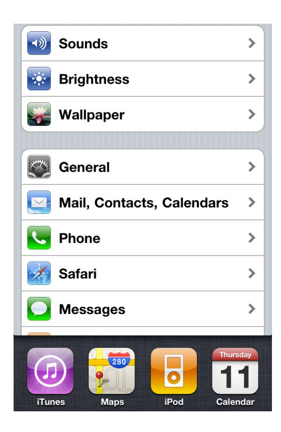

When people restart a suspended app, it can instantly resume running from the point where it quit, without having to reload its user interface.

Some applications might need to continue running in the background while users run another app in the foreground. For example, users might want an app that plays audio to continue playing while they're using a different app to check their calendar or handle email.

To learn how to handle multitasking correctly and gracefully, see ["Multitasking"](#page-70-1) (page 71).

### Preferences Are Available in Settings

People set certain preferences for an iOS application in the built-in Settings application. They must quit the current app when they want to access those preferences in Settings.

Preferences in the Settings app are of the "set once and rarely change" type. Although some of the built-in applications have this type of preference in the Settings app, most apps do not need this type, so they don't have preferences in the Settings app.

# Onscreen User Help Is Minimal

Mobile users have neither the time nor the desire to read through a lot of help content before they can benefit from an application. What's more, help content takes up valuable space to store and display.

iOS-based devices and their built-in applications are intuitive and easy to use,so people don't need onscreen help content to tell them how to use the device or the apps. This experience leads people to expect all iOS apps to be similarly easy to use.

## An App Has a Single Window

An iOS application, regardless of type, has a single window. Programmatically, the window provides the background on which you present all your app's content and functionality. But users are not aware of this window in the same way that they're aware of windows in a computer application. On an iOS-based device, users experience an app as a collection of screens, most of which appear sequentially.

You can think of a screen as corresponding to a distinct visual state or mode in an application. An app might have many screens or just a few, and each screen can contain various combinations of views and controls.

Users tend to think of an application screen and the device screen as identical, but the content of an app screen can extend far beyond the bounds of the device screen. For example, in the Contacts app on iPhone, the contact list is displayed in a single screen, even though the list is likely to contain enough names to fill the device screen several times over.

# Two Types of Software Run in iOS

There are two types of software that you can develop for iOS-based devices:

- iOS apps
- Web content

An **iOS app** is an application you develop using the iOS SDK to run natively on iOS-based devices. iOS apps resemble the built-in applications on iOS-based devices in that they reside on the device itself and take advantage of features of the iOS environment. People install iOS apps on their devices and use them just as they use built-in applications, such as Photos, Calendar, and Mail.

**Web content** is hosted by a website that people visit through their iOS-based devices. Web content that appears on iOS-based devices can be divided into three categories:

**Web apps.** Webpages that provide a focused solution to a task and conform to certain display guidelines are known as web apps because they behave similarly to iOS apps.

A web app often hides the UI of Safari on iOS so that it looks more like a native app. Using the web clip feature, a web app can also supply an icon for people to put on the Home screen. This allows people to open web apps in the same way that they open iOS apps.

**Optimized webpages.** Webpages that are optimized for Safari on iOS display and operate as designed (with the exception of any elements that rely on unsupported technologies, such as plug-ins, Flash, and Java). In addition, an optimized webpage correctly scales content for the device screen and is often designed to detect when it is being viewed on iOS-based devices, so that it can adjust the content it provides accordingly.

**Compatible webpages.** Webpages that are compatible with Safari on iOS display and operate as designed (with the exception of any elementsthat rely on unsupported technologies,such as plug-ins, Flash, and Java). A compatible webpage does not tend to take extra steps to optimize the viewing experience on iOS-based devices, but the device usually displays the page successfully.

An iOS app might combine native UI elements with access to web content within a web content–viewing area. Such an app can look and behave like a native iOS app, without drawing attention to the fact that it depends on web sources.

# Safari on iOS Provides the Web Interface

Safari on iOS provides the interface for browsing web content on iOS-based devices. Although Safari on iOS is similar in many ways to Safari on the computer desktop, it is not the same.

For the most part, users can't change the size of the **viewport** (the area that displays content). On the desktop, users resize the viewport when they resize the browser window. On iOS-based devices, the viewport does not resize unless the device orientation changes. iOS users can change the scale of the viewport by zooming in and out, and they can pan the webpage. On iPad, users are much less likely to zoom web content than they are on iPhone (shown below).

Safari on iOS supports cookies. Use of cookies can streamline user interaction with web content by saving the user's context, preferences, and previously entered data.

Safari on iOS does notsupport Flash, Java (including Java applets), or third-party plug-ins within web content. Instead, Safari on iOS supportsthe HTML5 <audio> and <video> tagsto provide audio and video streaming, and JavaScript and CSS3 transforms, transitions, and animations to display animated content.

#### **CHAPTER 1**

Platform Characteristics

Safari on iOS interprets most gestures astargeting the way the device displays content, not the content itself. The tap, which is analogous to a single mouse click, can cause Safari on iOS to send the onclick event to a webpage. There are no analogs for other mouse-based gestures, such as hover.

Safari on iOS allows web apps to run in full-screen mode. Web apps that launch from a web clip icon on the user's Home screen can hide the UI for Safari on iOS, so that they look more like native applications.

#### **CHAPTER 1**

Platform Characteristics

# Human Interface Principles

A great user interface follows human interface design principles that are based on the way people—users—think and work, not on the capabilities of the device. A user interface that is unattractive, convoluted, or illogical can make even a great application seem like a chore to use. But a beautiful, intuitive, compelling user interface enhances an application'sfunctionality and inspires a positive emotional attachment in users.

## Aesthetic Integrity

Aesthetic integrity is not a measure of how beautiful an application is. It's a measure of how well the appearance of the app integrates with its function. For example, an app that enables a productive task generally keeps decorative elements subtle and in the background, while giving prominence to the task by providing standard controls and behaviors. Such an app gives users a clear, unified message about its purpose and its identity. If, on the other hand, the app enables the productive task within a UI that seems whimsical or frivolous, people might not know how to interpret these contradictory signals.

Similarly, in an app that encourages an immersive task, such as a game, users expect a beautiful appearance that promises fun and encourages discovery. Although people don't expect to accomplish a serious or productive task in a game, they still expect the game's appearance to integrate with the experience.

## Consistency

Consistency in the interface allows people to transfer their knowledge and skills from one application to another. A consistent application is not a slavish copy of other applications. Rather, it is an application that takes advantage of the standards and paradigms people are comfortable with.

To determine whether an app follows the principle of consistency, think about these questions:

- Is the application consistent with iOS standards? Does it use system-provided controls, views, and icons correctly? Does it incorporate device features in a reliable way?
- Is the application consistent within itself? Does text use uniform terminology and style? Do the same icons always mean the same thing? Can people predict what will happen when they perform the same action in different places? Do custom UI elements look and behave the same throughout the app?
- Within reason, is the application consistent with its earlier versions? Have the terms and meanings remained the same? Are the fundamental concepts essentially unchanged?

# Direct Manipulation

When people directly manipulate onscreen objects instead of using separate controls to manipulate them, they're more engaged with the task and they more readily understand the results of their actions. iOS users enjoy a heightened sense of direct manipulation because of the Multi-Touch interface. Using gestures gives people a greater affinity for, and sense of control over, the objects they see onscreen, because they're able to touch them without using an intermediary, such as a mouse.

For example, instead of tapping zoom controls, people can use the pinch gestures to directly expand or contract an area of content. And in a game, players move and interact directly with onscreen objects. For example, a game might display a combination lock that users can spin to open.

In an iOS application, people can experience direct manipulation when they:

- Rotate or otherwise move the device to affect onscreen objects
- Use gestures to manipulate onscreen objects
- Can see that their actions have immediate, visible results

# Feedback

Feedback acknowledges people's actions and assures them that processing is occurring. People expect immediate feedback when they operate a control, and they appreciate status updates during lengthy operations.

The built-in iOS applications respond to every user action with some perceptible change. For example, list items highlight briefly when people tap them. During operationsthat last more than a few seconds, a control shows elapsing progress, and if appropriate, the app displays an explanatory message.

Subtle animation can give people meaningful feedback that helps clarify the results of their actions. For example, lists can animate the addition of a new row to help people track the change visually.

Sound can also give people useful feedback. Butsound shouldn't be the primary orsole feedback mechanism because people may use their devices in places where they can't hear or where they must turn off the sound.

## Metaphors

When virtual objects and actions in an application are metaphors for objects and actions in the real world, users quickly grasp how to use the app. The classic example of a software metaphor is the folder: People put things in folders in the real world, so they immediately understand the idea of putting files into folders on a computer.

The most appropriate metaphors suggest a usage or experience without enforcing the limitations of the real-world object or action on which they're based. For example, people can fill software folders with much more content than would fit in a physical folder.

#### **CHAPTER 2**

Human Interface Principles

iOS provides great scope for metaphors because it supports rich graphical images and gestures. People physically interact with realistic onscreen objects, in many cases operating them as if they were real-world objects. Metaphors in iOS include:

- Tapping iPod playback controls
- Dragging, flicking, or swiping objects in a game
- Sliding On/Off switches
- Flicking through pages of photos
- Spinning picker wheels to make choices

In general, metaphors work best when they're not stretched too far. For example, the usability of software folders would decrease if they had to be organized into a virtual filing cabinet.

# User Control

People, not applications, should initiate and control actions. Although an application can suggest a course of action or warn about dangerous consequences, it's usually a mistake for the app to take decision-making away from the user. The best apps find the correct balance between giving people the capabilities they need while helping them avoid dangerous outcomes.

Users feel more in control of an app when behaviors and controls are familiar and predictable. And, when actions are simple and straightforward, users can easily understand and remember them.

People expect to have ample opportunity to cancel an operation before it begins, and they expect to get a chance to confirm their intention to perform a potentially destructive action. Finally, people expect to be able to gracefully stop an operation that's underway.

User Control **23**

#### **CHAPTER 2**

Human Interface Principles

# App Design Strategies

All great apps begin with a great idea, but that doesn't mean that the path from idea to successful iOS app is an easy one. This chapter describes some strategies you can use to refine your idea, review your design options, and converge on an app that people will appreciate.

# Create an Application Definition Statement

An application definition statement is a concise, concrete declaration of an app's main purpose and its intended audience.

Create an application definition statement early in your development effort to help you turn an idea and a list of featuresinto a coherent product that people want to own. Throughout development, use the definition statement to decide if potential features and behaviors make sense. Take the following steps to create a solid application definition statement.

### 1. List All the Features You Think Users Might Like

Go ahead and brainstorm here. At this point, you're trying to capture all the tasksrelated to your main product idea. Don't worry if your list is long; you'll narrow it down later.

For example, imagine that your initial idea is to develop an app that helps people shop for groceries. As you think about this activity, you come up with a list of related tasks (potential features) that users might be interested in, such as:

- Creating lists
- Getting recipes
- Comparing prices
- Locating stores
- Annotating recipes
- Getting and using coupons
- Viewing cooking demos
- Exploring different cuisines
- Finding ingredient substitutions

### 2. Determine Who Your Users Are

Apart from the likelihood that your users are mobile and that they expect beautiful graphics, simple interactions, and high performance, what distinguishes them? In the context of the app you're planning, what is most important to your users? Using the grocery-shopping example, you might ask whether your users:

- Usually cook at home or prefer ready-made meals
- Are committed coupon-users or think that coupons aren't worth the effort
- Enjoy hunting for speciality ingredients or seldom venture beyond the basics
- Follow recipes strictly or use recipes as inspiration
- Buy small amounts frequently or buy in bulk infrequently
- Want to keep several in-progress lists for different purposes or just want to remember a few things to buy on the way home
- Insist on specific brands or make do with the most convenient alternatives
- Tend to buy a similar set of items on each shopping trip or buy items listed in a recipe

After musing on these questions, imagine that you decide on three characteristics that best describe your target audience: Love to experiment with recipes, are often in a hurry, and are thrifty (if it doesn't take too much effort).

### 3. Filter the Feature List Through the Audience Definition

If, after deciding on a few audience characteristics, you end up with just a few features, you're on the right track: Great iOS applications have a laser focus on the task users want to accomplish.

For example, consider the large number of possible features for the grocery-shopping app you listed in Step 1. Even though these are all useful features, it's not likely that every feature would be equally useful to every user. More importantly, it's not likely that every feature would be equally appreciated by the audience you defined in Step 2.

When you examine your feature list in the context of your target audience, you conclude that your application should focus on three main features: Creating lists, getting and using coupons, and getting recipes.

Now you can craft your application definition statement, concretely summarizing what the app does and for whom. A good application definition statement for this grocery-shopping app might be:

"A shopping list creation tool for thrifty people who love to cook."

### 4. Don't Stop There

Use your application definition statement throughout the development process to determine the suitability of features, controls, and terminology. For example:

As you consider whether to add a new feature, ask yourself whether it is essential to the main purpose of your app and to your target audience. If it isn't, set it aside; it might form the basis of a different application. For example, you've decided that your users are interested in adventurous cooking, so emphasizing boxed cake mixes and ready-made meals would probably not be appreciated.

As you consider the look and behavior of the UI, ask yourself whether your users appreciate a simple, streamlined style or a more overtly thematic style. Be guided by what people might expect to accomplish with your app, such as the ability to accomplish a serious task, to get a quick answer, to delve into comprehensive content, or to be entertained. For example, although your grocery list app needs to be easy to understand and quick to use, your audience is likely to appreciate a themed UI that includes beautiful pictures of ingredients and meals.

As you consider the terminology to use, strive to match your audience's expertise with the subject. For example, even though your audience might not be made up of expert chefs, you're fairly confident that they appreciate seeing the proper terms for ingredients and techniques.

### Design the App for the Device

You know what your app does and who its audience is; now you need to make sure that your app looks and feels like it was designed expressly for an iOS-based device. This is crucial because people have high expectations for the apps they choose to install on their devices. If your app feels like it was designed for a different device, or for the web, people are less likely to value it.

### Embrace iOS UI Paradigms

iOS users are accustomed to the appearance and behavior of the built-in apps, so they tend to expect similar experiences in the apps they download. You don't want to mimic every detail of the built-in apps but it's helpful to understand the design patterns they follow. Start by understanding the characteristics that distinguish iOS-based devices and the apps that run on them (you can read about these in ["Platform](#page-12-0) [Characteristics"](#page-12-0) (page 13)). Then, keep the following things in mind:

**Controls should look tappable**. iOS controls,such as buttons, pickers, and sliders, have contours and gradients that invite touches.

**App structure should be clean and easy to navigate**. iOS provides the **navigation bar** for drilling down through hierarchical content, and the **tab bar** for displaying different peer groups of content or functionality.

**User feedback should be subtle, but clear**. iOS apps often use precise, fluid animations to show the results of user actions. iOS apps can also use the activity indicator and the progress view to show status, and the alert to give users warnings or other critical information.

You can learn about the usage guidelines that govern these elements in "iOS UI [Element](#page-96-0) Usage [Guidelines"](#page-96-0) (page 97). As you begin designing the overall user experience of your app, be sure you understand the guidelines described in "User Experience [Guidelines"](#page-46-0) (page 47).

### Ensure that Universal Apps Run Well on Both iPhone and iPad

If you're planning to develop an app that runs on iPhone and iPad, you need to adapt your design to each device. Here is some guidance to help you do this:

**Mold the UI of each app version to the device it runs on**. Most individual UI elements are available on both devices, but overall the layout differs dramatically.

**Adapt art to the screen size**. Users tend to expect more high-fidelity artwork in iPad apps than they do in iPhone apps. Merely scaling up an iPhone app to fill the iPad screen is not recommended.

**Preserve the primary functionality of your app, regardless of the device it runs on**. Even though one version might offer a more in-depth or interactive presentation of the task than the other, it's important to avoid making users feel that they're choosing between two entirely different apps.

**Go beyond the default**. Unmodified iPhone apps run in a compatibility mode on iPad by default. Although this mode allows people to use an iPhone app on iPad, it does not give them the device-specific experience they want.

### Reconsider Web-Based Designs

If you're coming from the web, you need to make sure that you give people an iOS application experience, not a web experience. Remember, people can visit your website on their iOS-based devices using Safari on iOS.

Here are some strategies that can help web developers create an iOS app:

**Focus your app**. Websites often greet visitors with a large number of tasks and options from which they can choose, but this type of experience does not translate well to iOS apps. iOS users expect an app to do what it advertises, and they want to see useful content immediately.

**Make sure your app lets people do something**. People might enjoy viewing marketing content in the websites they visit, but they expect to accomplish something in an app.

**Design for touch**. Don't try to replicate web UI design paradigms in your iOS app. Instead, get familiar with the UI elements and patterns of iOS and use them to showcase your content. Web elements you'll need to re-examine include menus, interactions initiated by hovering, and links.

**Let people scroll**. Most websites take care to display the most important information in the top half of the page where it is seen first ("above the fold"), because people sometimes leave a page when they don't find what they're looking for near the top. But on iOS-based devices, scrolling is an easy, expected part of the experience. If you reduce font size or squeeze controls to fit your content into the space of a single device screen, you're likely to end up with unreadable content and an unusable layout.

**Relocate the homepage icon**. Websites often display an icon that links to the homepage at the top of every webpage. iOS apps don't include homepages, so this behavior is unnecessary. In addition, iOS apps allow people to tap the status bar to quickly scroll back to the top of a long list. If you center a tappable home icon at the top of the screen, it's very difficult for users to tap the status bar instead.

### Tailor Customization to the Task

The best iOS apps balance UI customization with clarity of purpose and ease of use. To achieve this balance in your app, be sure to consider customization early in the design process. Because concerns about branding, originality, and marketability often influence customization decisions, it can be challenging to stay focused on how customization impacts the user experience.

Using the iOS SDK, you can customize the UI of your app as much or as little as you choose. Because there are no practical limits to the amount of customization that you can do, you need to determine how customization might affect the task your app enables. As you consider the tasks in your app, think about how often users perform them and under what circumstances.

For example, imagine an app that enables phone calls. Now imagine that instead of a keypad, the app displays a beautiful, realistic rotary dial. The dial is meticulously rendered, so users both appreciate its quality and instantly know how to use it. The dial behaves realistically, so users delight in making the dialing gesture and hearing the distinctive sounds. But for users who often need to call numbers that are not in Contacts, initial appreciation of the experience soon gives way to frustration, because using a rotary dial is much less efficient than using a keypad. In an app that is designed to help people make phone calls, this beautiful custom UI is a hindrance.

On the other hand, consider the BubbleLevel sample app, which displays a realistic rendition of a carpenter's level. People know how to use the physical tool so they instantly know how to use the app. The app could have displayed its information without the rendition of the bubble vial, but this would have made the app less intuitive and harder to use. In this case, the custom UI not only shows people how to use the app, it also makes the task easier to accomplish.

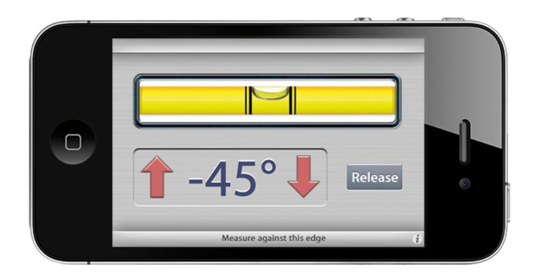

As you consider how customization might enhance or detract from the task your app enables, keep these guidelines in mind.

**Always have a reason for customization**. Ideally, UI customization facilitatesthe task people want to perform and enhances their experience. As much as possible, you need to let your app's task drive your customization decisions. For example:

- If your app enables a productive task that involves the manipulation of a lot of detailed data, people are likely to appreciate an understated, mostly standard UI and streamlined navigation.
- If your app helps people view content, they generally don't appreciate a UI that competes with it.
- If your app is a game or provides an immersive,story-driven experience, people expect to enter a unique world filled with rich, beautiful graphics and innovative interactions.

**As much as possible, avoid increasing the user's cognitive burden**. Users are familiar with the appearance and behavior of the standard UI elements, so they don't have to stop and think about how to use them. When faced with elements that do not look or behave at all like standard ones, users lose the advantage of their prior experience. Unless your unique elements make performing the task easier, users might dislike being forced to learn new procedures that don't transfer to any other apps.

**Be internally consistent**. The more custom your UI is, the more important it is for the appearance and behavior of your custom elements to be consistent within your app. If users take the time to learn how to use the unfamiliar controls you create, they expect to be able to rely on that knowledge throughout your app.

**Always defer to the content**. Because the standard elements are so familiar, they don't compete with the content for people's attention. As you customize your UI, take care to ensure that it does not overshadow the content people care about. For example, if your app allows people to watch videos, you might choose to design custom playback controls. But whether you use custom or standard playback controls is less important than whether the controls fade out after the user begins watching the video and reappear with a tap.

**Think twice before you redesign a standard control**. If you plan on doing more than customizing a standard control, make sure your redesigned control provides as much information as the standard one. For example, if you create a button that doesn't have the rounded, dimensional appearance people associate with buttons, people might not realize that it's tappable. Or, if you create a switch control that does not show where the opposite value is, people might not realize that it's a two-state control.

#### **CHAPTER 3**

App Design Strategies

**Be sure to thoroughly user-test custom UI elements**. During testing, closely observe users to see if they can predict what your elements do and if they can interact with them easily. If, for example, you create a control that has a hit targetsmaller than 44 x 44 points, people will have trouble activating it. Or, if you create a view that responds differently to a tap than it does to a swipe, be sure the functionality the view provides is worth the extra care people have to take when interacting with it.

## Prototype and Iterate

Before you invest significant engineering resources into the implementation of your design, it's a really good idea to create prototypes for user testing. Even if you can get only a few colleagues to test the prototypes, you'll benefit from their fresh perspectives on your app's functionality and user experience.

In the very early stages of your design you can use paper prototypes or wireframes to lay out the main views and controls, and to map the flow among screens. Although you can get some useful feedback from testing wireframes, their sparseness can mislead testers. This is because it's difficult for people to imagine how the experience of an app will change when wireframes are filled in with real content.

You'll get more valuable feedback if you can put together a fleshed-out prototype that runs on a device. When people can interact with your prototype on a device, they're more likely to uncover places where your app doesn't function as they expect, or where the user experience is too complex.

The easiest way to create a credible prototype is to use one of the Xcode templates to build a basic app, and populate it with some appropriate placeholder content. Then, install the prototype on a device so that your testers can have as realistic an experience as possible. You don't need to supply a large amount of content or enable every control in the app. As long as testers can tap an area of the screen to advance to the next logical view or to perform the main task, they'll be able to provide constructive feedback. To get started learning about Xcode, see *A Tour of Xcode*.

When you base your prototype on an Xcode template, you get lots of functionality for free and it's relatively easy to make design adjustments in response to feedback. With a short turnaround time, you should be able to test several iterations of your prototype before you solidify your design and commit resources to its implementation.

#### **CHAPTER 3**

App Design Strategies

# Case Studies: Transitioning to iOS

Instead of creating a new application, you might be planning to bring an existing piece of software to the iOS platform. In some ways, redesigning an app or website for a new platform can be more challenging than starting from scratch.

As you embark on this project, consider how people use iOS-based devices:

- People use iOS-based devices very differently than they use desktop and laptop computers, and they have different expectations for the user experience. Transitioning software from a computer to an iOS-based device is rarely a straightforward port.
- People often use iOS-based devices while they're on the go, and in environments filled with distractions. Part of your job is to create a responsive, compelling experience that pulls people in and gets them to the content they care about quickly and easily.
- Remember the 80-20 rule: In general, the largest percentage of users (at least 80 percent) use a very limited number of features in an app, while only a small percentage (no more than 20 percent) use all the features. iOS apps seldom need to provide all the features that only power users need.

# From Mail on the Desktop to Mail on iPhone

Mail is one of the most highly visible, well-used, and appreciated applications in Mac OS X. It is also a very powerful program that allows users to create, receive, prioritize, and store email, track action items and events, and create notes and invitations. Mail on the desktop offers this powerful functionality in a couple of windows.

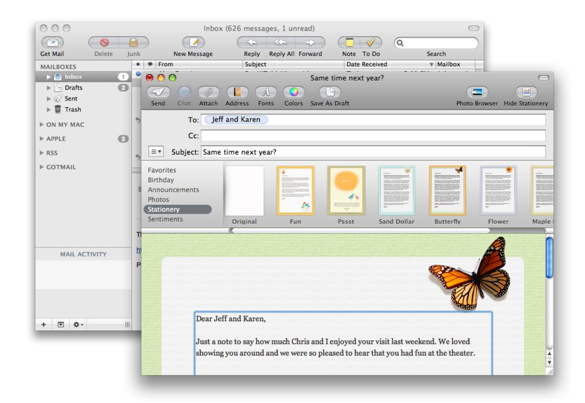

Mail on iPhone focuses on the core functionality of Mail on the desktop, helping people to receive, create, send, and organize their messages. Mail on iPhone delivers this condensed functionality in a UI tailored for the mobile experience that includes:

- A streamlined appearance that puts people's content front and center
- Different views designed to facilitate different tasks
- An intuitive information structure that scales effortlessly
- Powerful editing and organizing tools that are available when they're needed
- Subtle but expressive animation that communicates actions and provides feedback

It's important to realize that Mail on iPhone isn't a better application than Mail on the desktop; rather, it's Mail, redesigned for mobile users. By concentrating on a subset of desktop features and presenting them in an attractively lean UI, Mail on iPhone gives people the core of the Mail experience while they're mobile.

To adapt the Mail experience to the mobile context, Mail on iPhone innovates the UI in several key ways.

**Distinct, highly focused screens**. Each screen displays one aspect of the Mail experience: account list, mailbox list, message list, message view, and composition view. Within a screen, people scroll to see the entire contents.

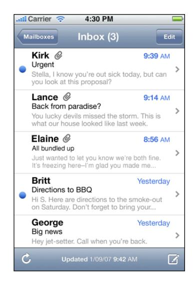

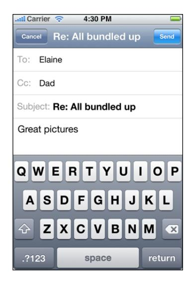

**Easy, predictable navigation**. Making one tap per screen, people drill down from the general (the list of accounts) to the specific (a message). Each screen displays a title that shows people where they are, and a back button that makes it easy for them to retrace their steps.

**Simple, tappable controls, available when needed**. Because composing a message and checking for new email are primary actions people might want to take in any context, Mail on iPhone makes them accessible in multiple screens. When people are viewing a message, functionssuch asreply, move, and trash are available because they act upon a message.

**Different types of feedback for different tasks**. When people delete a message, it animates into the trash icon. When people send a message, they can see its progress; when the send finishes, they can hear a distinctive sound. By looking at the subtle text in the message list toolbar, people can see at a glance when their mailbox was last updated.

### From Keynote on the Desktop to Keynote on iPad

Keynote on the desktop is a powerful, flexible application for creating world-classslide presentations. People love how Keynote combines ease of use with fine-grained control over myriad precise details, such as animations and text attributes.

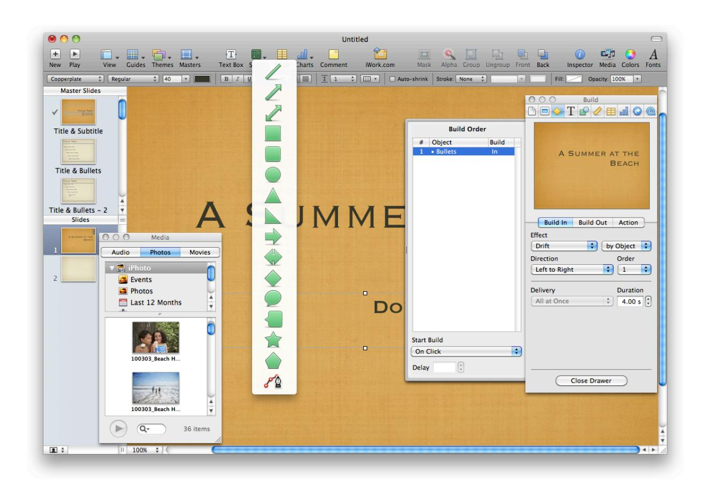

Keynote on iPad captures the essence of Keynote on the desktop, and makes it feel at home on iPad by creating a user experience that:

- Focuses on the user's content
- Reduces complexity without diluting capability
- Provides shortcuts that empower and delight
- Adapts familiar hallmarks of the desktop experience
- Provides feedback and communication via eloquent animation

Keynote users instantly understand how to use the app on iPad because it delivers expected functionality using native iPad paradigms. New users easily learn how to use Keynote on iPad because they can directly manipulate their content in simple, natural ways.

The transformation of Keynote from the desktop to iPad is based on myriad modifications and redesignsthat range from subtle to profound. These are some of the most visible adaptations:

**A streamlined toolbar**. Only seven items are in the toolbar, but they give users consistent access to all the functions and tools they need to create their content.

**A simplified, prioritized inspector that responds to the user's focus**. The Keynote on iPad inspector automatically containsthe tools and attributes people need to modify the selected object. Often, people can make all the modificationsthey need in the first inspector view. If they need to modify lessfrequently changed attributes, they can drill down to other inspector views.

**Lots of prebuilt style collections**. People can easily change the look and feel of objects such as charts and tables by taking advantage of the prebuilt styles. In addition to color scheme, each collection includes prestyled attributes, such as table headings and axis-division marks, that are designed to coordinate with the overall theme.

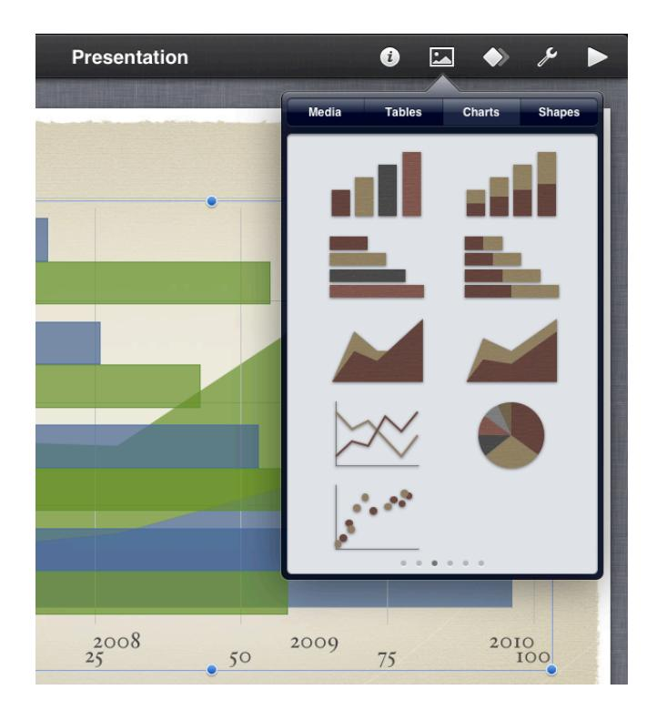

**Direct manipulation of content, enriched with meaningful animation**. In Keynote on iPad, a user drags a slide to a new position, twists an object to rotate it, and taps an image to select it. The impression of direct manipulation is enhanced by the responsive animations Keynote on iPad performs. For example, a slide pulses gently as users move it and, when they place it in a new location, the surrounding slidesripple outward to make room for it.

### From Mail on iPhone to Mail on iPad

Mail is one of the premier built-in apps on iPhone. People appreciate the clear, streamlined way it organizes large amounts of information in a series of easy-to-use screens.

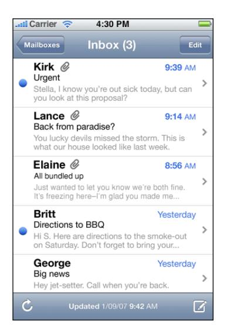

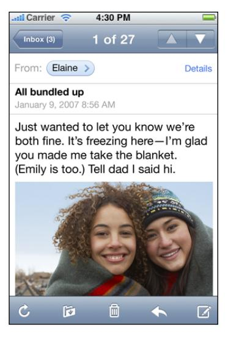

Mail on iPad delivers the same core functionality. At the same time it provides more onscreen space for people's messages, meaningful touches of realism, and powerful organizing and editing toolsthat are always accessible but not obtrusive. The visual stability of a single, uncluttered screen provides what users need in one place, with minimal context changes.

The differences between Mail on iPhone and Mail on iPad reflect the different user experiences of each device.

- Mail on iPhone is designed to help mobile users handle their email while they're standing in line or walking to a meeting.
- Mail on iPad is efficient enough for people to use on the go, but its rich experience also encourages more in-depth use.

Even though Mail on iPad tailors the user experience to the device, it does not alter the core functionality people are used to, or gratuitously change the location or effect of individual functions. iPhone Mail users easily recognize the toolbar items and mailbox structure in iPad Mail, and immediately know how to use them because they're virtually identical.

To enhance the mobile email experience, Mail on iPad evolves the iPhone Mail UI in a number of important ways:

**Expanded support for device orientations**. People can use Mail on iPad in any of the four orientations (landscape shown here). Although the landscape layout differs somewhat from the portrait layout, the focus remains on the content and functionality people care about.

**Increased focus on message content**. Mail on iPad reserves most of the screen for the current message in all orientations (portrait shown in the following figure). This includes moving the toolbar to the top of the message view to increase the vertical space available for the message content. With the extra space, people can read longer messages with less scrolling. And when people want to view the message list in portrait, they can still see a large portion of the current message.

**A flatter hierarchy**. Mail on iPad effectively flattens the Mail hierarchy (that is, account > mailbox > message list > message) by confining all levels above the message itself to a separate UI element. In landscape, this element isthe left pane of a split view; in portrait, this element is a **popover**, which pops up and coverssome of the main screen.

**Drastically reduced full-screen transitions**. Because most of the hierarchy is available in a separate onscreen element, people can access most of what they need in a single screen. When people drill down through the hierarchy, it's the view inside the split view pane or popover that transitions, not the entire screen.

**Realistic messages**. When people mark a message for deletion, itslides onto the message view like a physical sheet of paper. As they choose additional messages to delete, the messages form a realistic stack of papers, complete with slightly untidy edges.

## From a Desktop Browser to Safari on iOS

Safari on iOS provides a preeminent mobile web-viewing experience on iOS-based devices. People appreciate the crisp text and sharp images and the ability to adjust their view by rotating the device or pinching and tapping the screen.

Standards-based websites display well on iOS-based devices. In particular, websites that detect the device and do not use plug-ins look great on both iPhone and iPad with little, if any, modification.

In addition, the most successful websites typically:

- Set the viewport appropriately for the device, if the page width needs to match the device width
- Avoid CSS fixed positioning, so that content does not move offscreen when users zoom or pan the page
- Enable a touch-based UI that does not rely on pointer-based interactions

Sometimes, other modifications can be appropriate. For example, web apps always set the viewport width appropriately and often hide the UI of Safari on iOS. To learn more about how to make these modifications, see "Configuring the Viewport" and "Configuring Web Applications" in *Safari Web Content Guide*.

Websites adapt the desktop web experience to Safari on iOS in other ways, too:

Case Studies: Transitioning to iOS

**Using custom CSS to provide adaptableUI**. Different UI elements can be suitable for different environments. For example, the Apple website includes a page that displays movie trailers users can watch. When viewed in Safari on the desktop, users can click the numbers or the previous and next controls to see additional trailers:

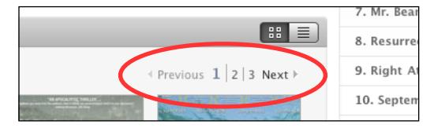

When viewed on iPhone, the next, previous, and number controls are replaced by prominent, easy-to-use buttons with symbols that echo the style of built-in controls (such as the detail disclosure indicator and the page indicator):

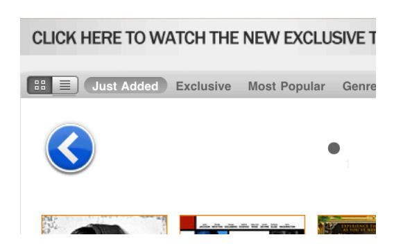

**Accommodating the keyboard in Safari on iOS**. When a keyboard and the form assistant are visible, Safari on iPhone displays your webpage in the area below the URL text field and above the keyboard and form assistant.

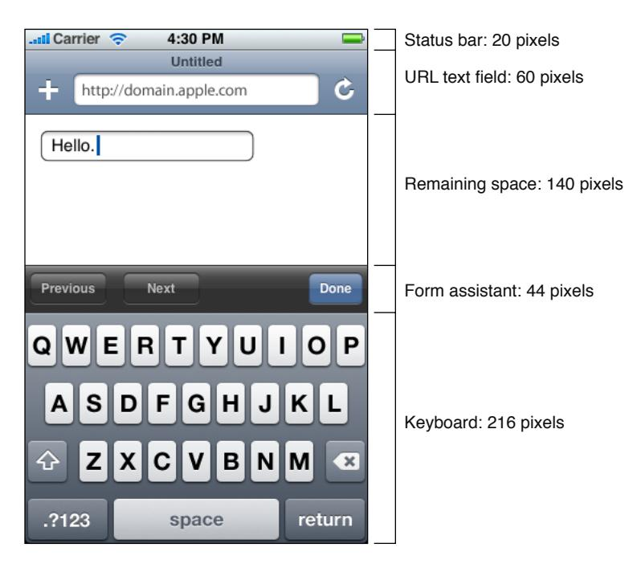

Case Studies: Transitioning to iOS

When a keyboard and the form assistant are not displayed, there is an additional 216 pixels of vertical space available (in portrait orientation) for the display of your webpage. In landscape orientation, two of the values differ: The keyboard height is 162 pixels, and the form assistant height is 32 pixels.

**Accommodating the pop-up menu control in Safari on iOS**. In Safari on the desktop, a pop-up menu that contains a large number of items displays as it does in a Mac OS X application; that is, the menu opens to display all items, extending past the window boundaries, if necessary. In Safari on iOS, a pop-up menu is displayed using native elements, which provides a much better user experience. For example, on iPhone, the pop-up menu appears in a **picker**, a list of choices from which the user can pick, as shown below.

On iPad, the pop-up menu displays in a popover, as shown below.

**Using lists to display data in iPhone web apps**. iOS users are accustomed to lists in native apps, so when they see lists in web apps, they're more likely to think that the web content is an application. On iPhone, lists appear edge to edge or inside rounded rectangles. Each style is defined by its own metrics.

#### **Edge-to-edge list**

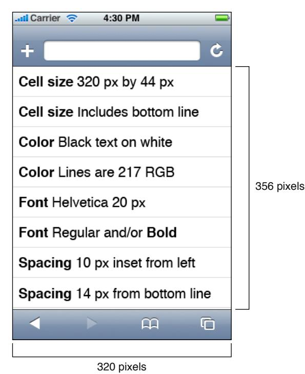

#### **Rounded rectangle list**

#### **CHAPTER 4**

Case Studies: Transitioning to iOS

# User Experience Guidelines

The user experience of iOS-based devices revolves around streamlined interaction with content that people care about. The guidelines in this chapter apply to apps that run on all iOS-based devices.

### Focus on the Primary Task

When an iOS app establishes and maintains focus on its primary task, it is satisfying and enjoyable to use. Your application definition statement will help you focus your app on its primary task (to learn more about this statement, see "Create an [Application](#page-24-1) Definition Statement" (page 25)). To maintain that focus, you need to determine what's most important in each context or screen.

**Analyze what's needed in each screen**. As you decide what to display in each screen always ask yourself, Is this critical information or functionality users need *right now*? If your answer is no, decide whether the information or functionality might be critical in a different context, or if it's not that important after all.

For example, the iPhone Calendar application is focused on days and the events that occur on them. Users can use the clearly labeled buttons to highlight the current day, select a viewing option, and add events.

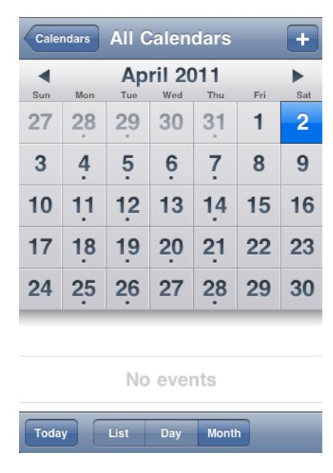

### Elevate the Content People Care About

In a game, people care about the experience; they don't expect to manage, consume, or create content. If you're developing a game, you elevate content by enhancing the experience with a satisfying story, beautiful graphics, and responsive gameplay.

If you're not developing a game, you can help people focus on the content by designing your UI as a subtle frame for the information they're interested in. Here are some ways you can do this:

**Minimize the number and prominence of controls to decrease their weight in the UI**. Photos does this by placing a few unobtrusive controls on translucent bars.

**Consider subtly customizing controls so that they integrate with your app's graphical style**. In this way, controls are discoverable and comprehensible, without being conspicuous.

**Considerfading controls after people have stopped interacting with them for a little while**, and redisplaying them when people tap the screen. Sometimes you may want to fade the rest of your application UI, too. This is especially appropriate in apps that enable an immersive experience, because it gives even more of the screen space to the content people want to see. For example, Photos fades the controls and bars after a few moments of noninteraction, which encourages people to immerse themselves in the content. When people want to perform a task with their photos, a single tap anywhere on the screen redisplays the controls.

### Think Top Down

The top of the screen is most visible to people, because they tend to interact with the device by holding the device in the following ways:

- In their nondominant hand (or laying it on a surface), and gesturing with a finger of the dominant hand
- In one hand, and gesturing with the thumb of the same hand
- Between their hands, and gesturing with both thumbs

**Put the most frequently used (usually higher level) information near the top,** where it is most visible and easy to reach. As the user scans the screen from top to bottom, the information displayed should progress from general to specific and from high level to low level.

For example, in a game, the most important action can take place in the top half of the screen. This leaves the bottom half of the screen forsupplementary information and for controls users can tap without obscuring their view.

### Give People a Logical Path to Follow

**Make the path through the information you present logical and easy for users to predict**. In addition, be sure to provide markers, such as back buttons, that users can use to find out where they are and how to retrace their steps.

**In most cases, give users only one path to a screen**. If a screen needs to be accessible in different circumstances, consider using a modal view that can appear in different contexts.

### Make Usage Easy and Obvious

Strive to make your application instantly understandable to people, because you can't assume that they have the time (or can spare the attention) to figure out how it works.

**Make the main function of your application immediately apparent**. You can make it so by:

- Minimizing the number of controls from which people have to choose
- Using standard controls and gestures appropriately and consistently so that they behave the way people expect
- Labeling controls clearly so that people understand exactly what they do

**Be consistent with the usage paradigms of the built-in applications**. Users understand how to navigate a hierarchy of screens, edit list contents, and switch among application modes using the tab bar. Make it easy for people to use your application by reinforcing their experience.

In the built-in Stopwatch function (part of the iPhone Clock application) users can see at a glance which button stops and starts the stopwatch and which button captures lap times.

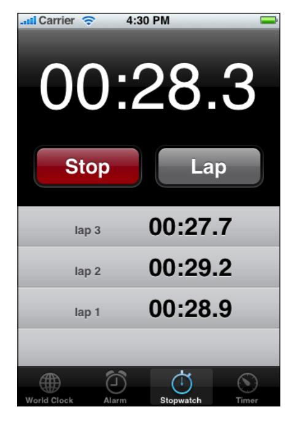

# Use User-Centric Terminology

**In all yourtext-based communication with users, use terminology you're sure that your users understand**. In particular, avoid technical jargon in the user interface. Use what you know about your users to determine whether the words and phrases you plan to use are appropriate.

The Wi-Fi Networks Settingsscreen uses plain language to explain how iOS respondsto the user's preference.

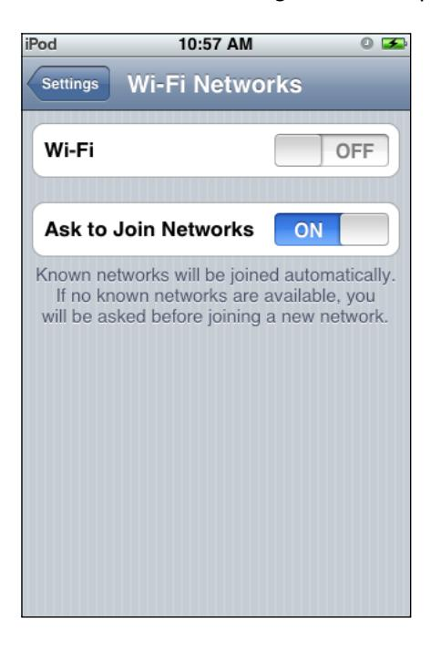

## Minimize the Effort Required for User Input

Inputting information takes time and attention, whether people tap controls or use the keyboard. If your application requires a lot of user input before anything useful happens, that input slows people down and can discourage them from using your app.

**Balance any requestforinput by users with what you offer users in return**. In other words,strive to provide as much information or functionality as possible for each piece of information people give you. That way, people feel they are making progress and are not being delayed as they move through your application.

**Make it easy for users to input their choices**. For example, you can use a table view or a picker instead of a text field, because it's usually easier for people to select an item from a list than to type words.

**Get information from iOS, when appropriate**. People store lots of information on their devices. When it makessense, don't force people to give you information you can easily find for yourself,such astheir contacts or calendar information.

# Downplay File-Handling Operations

Although iOS apps can allow people to create and manipulate files, this does not mean that people should have an awareness of a file system on an iOS-based device.

There is no iOS application analogous to the Mac OS X Finder, and people should not be asked to interact with files as they do on a computer. In particular, people should not be faced with anything that encourages them to think about file metadata or locations, such as:

- An open or save dialog that exposes a file hierarchy
- Information about the permissions status of files

If your application allows people to create and edit documents, it's appropriate to provide some sort of document picker that allowsthem to open an existing document or create a new one. Ideally,such a document picker:

- **Is highly graphical**. People should be able to easily identify the document they want by looking at visual representations of the documents onscreen.
- **Allows people to make the fewest possible gestures to do whatthey want**. For example, people might scroll horizontally through a carousel of existing documents and open the desired one with a tap.
- **Includes a new document function**. Instead of making people go somewhere else to create a new document, a document picker can allow them to tap a placeholder image to create a new document.

You can also use the Quick Look Preview feature to allow people to preview documents within your app, even if your app can't open them. To learn how to provide thisfeature in your app,see "Quick Look [Document](#page-78-0) [Preview"](#page-78-0) (page 79).

# Enable Collaboration and Connectedness

iOS devices are personal devices, but they also encourage collaboration and sharing with others. Enhance your app by helping people collaborate and connect with others.

**When appropriate, make it easy for people to interact with others and share things like their location, opinions, and high scores**. People generally expect to be able to share information that'simportant to them.

Most applications can add value by allowing people to go beyond the application and share data with other tools they use. For example, an iOS application can act as a mobile complement to a computer application. Or, an iPad application might allow its users to communicate with the users of the iPhone version of the app.

**For iPad, think of ways to allow more than one person to use your app on the same device**. For example, two people might be able to play a game on opposing sides of an onscreen board. Or a band application might allow different people to play different instruments together on a single device.

### De-emphasize Settings

**Avoid including settings in your application if you can**. Settings include preferred application behaviors and information that people rarely want to change. Users cannot open the Settings application without first quitting your application, and you don't want to encourage this action.

When you design your application to function the way most of your users expect, you decrease the need for settings. If you need information about the user, query the system for it instead of asking users to provide it. If you decide you must provide settingsin your iOS application,see "The Settings Bundle" in *iOS Application Programming Guide* to learn how to support them in your code.

**Let users set the behavior they want by using configuration options in your application**. Configuration optionslet your application react dynamically to changes, because people do not have to leave your application to set them.

**Offer configuration options in the main userinterface or(in iPhone apps) on the back of a view**. To decide which location makes sense, determine whether the options represent a primary task and how often people might want to set them.

- In the main UI, put options that provide primary functionality or that people want to change frequently.
  - For example, iPad Calendar allows people to view their schedules by day, week, or month. These configuration options are offered in the main UI because viewing different perspectives of a calendar is a primary functionality of the app and people are likely to change their focus frequently.
  - Apps that provide an immersive experience, such as games, are most likely to provide configuration options within the app, because users tend to change aspects of the experience frequently.
- In iPhone apps, you can put options that people are unlikely to change frequently on the back of a view. For example, the primary function of Weather is to display a city's current conditions and 6-day forecast. Although it'simportant to be able to choose whether temperatures are displayed in Celsius or Fahrenheit, people are not likely to change this option very often. Therefore it makes sense to put the temperature-scale option on the back of the Weather view, where it is conveniently available, but not obtrusive.

## Brand Appropriately

**Incorporate a brand's colors or images in a refined, unobtrusive way**. Branding is most effective when it is subtle and understated. People use your application to get things done or to be entertained; they don't want to feel as if they're being forced to watch an advertisement. For the best user experience, you want to quietly remind users of your identity.

**Avoid taking space away from the content people care about**. For example, displaying a second, persistent bar at the top of the screen that does nothing but display branding assets means that there's less room for content. Consider other, less intrusive ways to display pervasive branding, such as subtly customizing the background of a screen.

The exception to these guidelines is your application icon, which should be completely focused on your brand. Because users see your application icon frequently, it's important to spend some time balancing eye-appeal with brand recognition.

### Make Search Quick and Rewarding

In applications that handle or display a lot of data, search can be a primary function. If you need to provide search in your application, follow these guidelines to ensure that it performs well.

**Build indexes of your data so that you are always prepared for search**. Don't wait until the user initiates a search to do this, because you can't afford to create a negative first impression of the search experience in your application.

**Live-filter local data so that you can display results more quickly**. It's best when you can begin filtering as soon as users begin typing, and narrow the results asthey continue typing. Although live-filtering data usually produces a superior user experience, it's not always practical. When live filtering is impractical, you can begin the search process after the user taps the Search button in the keyboard. If you do this, be sure to provide feedback on the search's progress so users know that the process has not stalled.

**When possible, also filter remote data while users type**. Although filtering users' typing can result in a better search experience, be sure to inform them and give them an opportunity to opt out if the response time is likely to delay the results by more than a second or two.

**Display a search bar above a list or the index in a list**. Users expect to find a search bar in this position, because they're accustomed to the search bar in Contacts and other applications. Putting the search bar in this location means that it stays out of users' way when they're scrolling through the list or using the index, but is conveniently available when it's needed.

**Use a tab for search only in special circumstances**. If search is a primary function in your application you might want to feature it as a distinct mode. In iTunes, for example, finding and getting music and podcasts is the focus of the application. Users want to search for their favorite songs, artists, or podcasts regardless of the mode they're currently in, so it makes sense to offer a dedicated search tab that's always available.

**If necessary, display placeholder content right away and partial results as they become available**. In this way, you give users useful information promptly. In YouTube, for example, users initiate a search for videos by tapping the Search button. If the network connection isslow, YouTube first displaysthe Loading... message along with a spinning activity indicator so that users know that search is proceeding. Then, YouTube displays a results list in which each row is populated with textual results, such as video title and viewer rating, and a custom image of a box with a dotted outline. As users scan the list of video titles, the video thumbnails replace the dotted boxes as they are downloaded.

**Consider providing a scope bar if the data sorts naturally into different categories**. A **scope bar** allows usersto specify locations or rulesin a search or to filter objects by specific criteria. It contains up to fourscope buttons, each representing a category. For example, Mail provides a scope bar that allows users to focus their search on the From, To, or Subject fields of messages, or broaden the search to include all fields. Providing a scope bar helps users focus their search and can significantly reduce the number of results. To learn more about using a scope bar, see ["Scope](#page-130-0) Bar" (page 131).

### Entice and Inform with a Well-Written Description

Your App Store description is a great opportunity to communicate with potential users. In addition to describing your application accurately and highlighting the qualities you think people might appreciate the most, follow these guidelines:

**Be sure to correct all spelling, grammatical, and punctuation errors**. Although such errors don't bother everyone, in some people they can create a negative impression of your application's quality.

**Keep all-capital words to a minimum**. The occasional all-capital word can draw people's attention, but capitalizing every letter of every word in a description can make it very difficult to read.

**Consider describing specific bug fixes**. If a new version of your application contains bug fixesthat customers have been waiting for, it can be a good idea to mention this in your description.

### Be Succinct

**Think like a newspaper editor, and strive to convey information in a condensed, headline style**. When your UI text isshort and direct, users can absorb it quickly and easily. Identify the most important information, express it concisely, and display it prominently so that people don't have to read too many words to find what they're looking for or to figure out what to do next.

**Give controls shortlabels, or use well-understood symbols,**so that people can tell what they do at a glance. When appropriate, use the built-in buttons and icons described in ["System-Provided](#page-134-0) Buttons and Icons" (page 135); for guidelines on designing your own icons,see "Iconsfor [Navigation](#page-148-0) Bars, Toolbars, and Tab Bars" (page 149).

### Use UI Elements Consistently

People expect standard views and controls to look and behave consistently across applications.

**Follow the recommended usages for standard user interface elements**. In this way, users can depend on their prior experience to help them as they learn to use your application. You also make it easy for your app to look up-to-date and work correctly if iOS changesthe look or behavior of these standard views or controls.

**For an app that enables an immersive task, such as a game, it's reasonable to create completely custom controls**. This is because you're creating a unique environment, and discovering how to control that environment is an experience users expect in such applications.

**Avoid radically changing the appearance of a controlthat performs a standard action**. If you use unfamiliar controls to perform standard actions, users will spend time discovering how to use them and will wonder what, if anything, your controls do that the standard ones do not.

iOS makes available to you many of the standard buttons and icons used throughout the built-in applications. For example, you can use the same Refresh, Organize, Trash, Reply, and Compose icons that Mail uses on both iPhone and iPad.

**To avoid confusing people, never use the standard buttons and icons to mean something else**. Be sure you understand the documented meaning of a standard button or icon; don't rely on your interpretation of its appearance. To learn more about using system-provided items, see ["System-Provided](#page-134-0) Buttons and [Icons"](#page-134-0) (page 135).

In addition to the benefit of leveraging users' prior experience, using system-provided buttons and icons imparts two other substantial advantages:

● Decreased development time, because you don't have to create custom art to represent standard functions.

● Increased stability of your user interface, even if future iOS updates change the appearances of standard icons. In other words, you can rely on the semantic meaning of a standard icon remaining the same, even if its appearance changes.

Interface Builder makes it easy to use the system-provided buttons and apply system-provided icons to your controls. For guidance, see the appearance-related information in "iPhone OS Interface Objects" in *Interface Builder User Guide*.

If you can't find a system-provided button or icon that has the appropriate meaning for a specific function in your application, you should design a custom button or icon. For some guidelines to help you do this, see "Icons for [Navigation](#page-148-0) Bars, Toolbars, and Tab Bars" (page 149).

## Consider Adding Physicality and Realism

When appropriate, add a realistic, physical dimension to your application. Often, the more true to life your application looks and behaves, the easier it isfor people to understand how it works and the more they enjoy using it. For example, people instantly know how to use the realistic address book that Contacts on iPad portrays.

On iPhone, people instantly know what the Voice Memos app does, and how to use it, because it presents a beautifully rendered focal image (the microphone) and realistic controls.

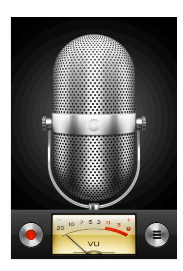

**Think of the objects and scenes you design as opportunities to communicate with users and to express the essence of your app**. Don't feel that you must strive for scrupulous accuracy. Often, an amplified or enhanced portrayal of something can seem more real, and convey more meaning, than a faithful likeness.

**Use appropriate animation to further enhance realism in your application**. In general, it's more important to strive for accuracy in movement than in appearance. This is because people accept artistic license in appearance, but they can feel disoriented when they see movement that appears to defy physical laws. As much as possible, make sure your virtual views and controls mimic the behavior of the physical objects and controlsthey resemble. Convincing animation heightens people'simpression of your application as a tangible, physical realm in which they want to spend time.

# Delight People with Stunning Graphics

Rich, beautiful, engaging graphics draw people into an application and make the simplest task rewarding. Beautiful artwork also helps to build your app's brand in people's eyes. iOS-based devices showcase your application's artwork, so you should consider hiring a professional artist to create first-rate graphics that people will admire.

**Consider replicating the look of high-quality or precious materials**. If the effect of wood, leather, or metal is appropriate in your application, take the time to make sure the material looks realistic and valuable. For example, Notes reproduces the look of fine leather and meticulous stitching.

**When appropriate, create high-resolution artwork**. In most cases, scaling up your artwork is not recommended as a long-term solution. Instead, try creating your artwork in a dimension that is larger than you need, so you can add depth and details before scaling it down. This works especially well when the dimension of the original art file is a multiple of the dimension you need. Then, if you also use an appropriate grid size in your image-editing application, you'll be able to keep the scaled-down art file crisp and reduce the amount of retouching and sharpening you need to do.

**Ensure that your launch images and application icon are high quality**. For guidelines on how to create these, see "Custom Icon and Image Creation [Guidelines"](#page-140-0) (page 141).

**Remove hard-coded values that identify screen dimensions**. This is particularly important if you want your app to run on different iOS-based devices.

### Handle Orientation Changes

People often expect to use their iOS-based devicesin any orientation. You need to determine how to respond to this expectation, within the context of your app and the task it enables.

**In all orientations, maintain focus on the primary content**. This is your highest priority. People use your application to view and interact with the content they care about. Altering the focus on that content in different orientations can make people feel that they've lost control over the application.

**Think twice before preventing your application from running in all orientations**. People expect to use your app in different orientations, and it's best when you can fulfill that expectation. iPad users, in particular, expect to use your app in whichever orientation they're currently holding their device. But in certain cases an app needs to run in portrait only or in landscape only. If it's essential that your application run in only one orientation, you should:

- **Launch your app in your supported orientation, regardless of the current device orientation**. For example, if your game or media-viewing application runs in landscape only, it's appropriate to launch your app in landscape, even if the device is currently in portrait. This way, if people start your application in portrait, they know to rotate the device to landscape to view the content.
- **Avoid displaying a UI element that tells people to rotate the device**. Launching in your supported orientation clearly tells people to rotate the device, if required, without adding unnecessary clutter to your UI.
- **Support both variants of an orientation**. For example, if your application runs only in landscape, people should be able to use it whether they're holding the device with the Home button on the right or on the left. And, if people rotate the device 180 degrees while using your application, it's best if you can respond by rotating your content 180 degrees.

**If your application interprets changes in device orientation as user input, you can handle rotation in app-specific ways**. For example, if your app is a game that allows people to move game pieces by rotating the device, you can't respond to device rotation by rotating the screen. In a case like this, you should launch in either variant of your required orientation and allow people to switch between the variants until they start the main task of the application. Then, as soon as people begin the main task, you can begin responding to device movement in application-specific ways.

**Take advantage of the one-step change in orientation to perform smoother, often faster rotations**. However, if yourscreen layout is very complicated, you might choose instead to perform a cross-fade transition when users change the orientation of the device. "Handling View Rotations" in *UIViewController Class Reference* explains how to use the one-step process in your code.

**Pay attention to accelerometer values**. To learn more about these values and how to receive them, see *Core Motion Framework Reference*. If appropriate, your application should respond to all changes in device orientation.

**On iPhone, anticipate users' needs when you respond to a change in device orientation**. Users often rotate their devices to landscape orientation because they want to "see more." If you respond by merely scaling up your content, you fail to meet users' expectations. Instead, you should respond by rewrapping lines of text and, if necessary, rearranging the layout of the user interface so that more content fits on the screen.

**On iPad, strive to satisfy users' expectations by being able to run in all orientations**. The large iPad screen mitigates people's desire to rotate the device to landscape to "see more." And, because people don't pay much attention to the minimal frame of the device or the location of the Home button, they don't view the device as having a default orientation. This lack of awareness of an app's default orientation leads people to expect appsto run well in the device orientation they're currently using. As much as possible, your application should encourage people to interact with iPad from any side by providing a great experience in all orientations.

Follow these guidelines as you design how your iPad app should handle rotation:

● **Consider changing how you display auxiliary information orfunctionality**. Although you should make sure that the most important content is always in focus, you can respond to rotation by changing how you provide secondary content.

#### **CHAPTER 5**

User Experience Guidelines

In Mail on iPad, for example, the lists of accounts and mailboxes are secondary content (the main content is the selected message). In landscape, secondary content is displayed in the left pane of a split view; in portrait, it's displayed in a popover.

Or, consider an iPad game that displays a rectangular game board in landscape. In portrait, the game needs to redraw the board to fit well on the screen, which might result in additional space above or below the board. Instead of vertically stretching the game board to fit the space or leaving the space empty, the game could display supplemental information or objects in the additional space.

- **Avoid gratuitous changes in layout**. As much as possible, provide a consistent experience in all orientations. A comparable experience in all orientations allows people to maintain their usage patterns when they rotate the device. For example, if your iPad app displays images in a grid while in landscape, it's not necessary to display the same information in a list while in portrait (although you might adjust the dimensions of the grid).
- **When possible, avoid reformatting information and rewrapping text on rotation**. Strive to maintain a similar format in all orientations. Especially if people are reading text, it's important to avoid causing them to lose their place when they rotate the device.
  - If some reformatting is unavoidable, use animation to help people track the changes. For example, if you must add or remove a column of text in different orientations, you might choose to hide the movement of columns and simply fade in the new arrangement. To help you design appropriate rotation behavior, think about how you'd expect your content to behave if you were physically interacting with it in the real world.
- **Provide a unique launch image for each orientation**. When each orientation has a unique launch image, people experience a smooth application start regardless of the current device orientation. In contrast with the Home screen on iPhone, the iPad Home screen supports all orientations, so people are likely to start your application in the same orientation in which they quit the previous app.

## Make Targets Fingertip-Size

The screen size of iOS-based devices might vary, but the average size of a fingertip does not. Regardless of the device your app runs on, following these guidelines ensures that people can comfortably use your app.

**Give tappable elements in your application a target area of about 44 x 44 points**. The iPhone Calculator application is a good example of fingertip-size controls.

If you create smaller controls, or if you place them too close together, people must aim carefully before they tap and they're more likely to tap the wrong element. As a consequence, the application becomes much less enjoyable, or even impossible, to use. For example, a game that hassmall controlsthat are too close together forces people to concentrate on the interface, instead of on playing the game.

### Use Subtle Animation to Communicate

Animation is a great way to communicate effectively, as long as it doesn't get in the way of users' tasks or slow them down. Subtle and appropriate animation can:

- Communicate status
- Provide useful feedback
- Enhance the sense of direct manipulation
- Help people visualize the results of their actions

**Add animation cautiously, especially in applications that do not provide an immersive experience**. In applications that are focused on serious or productive tasks, animation that seems excessive or gratuitous can obstruct application flow, decrease performance, and distract users from the task.

**Make animation consistent with built-in applications when appropriate**. People are accustomed to the subtle animation used in the built-in iOS applications. In fact, most people regard the smooth transitions between views, the fluid response to changes in device orientation, and the realistic flipping and scrolling as an expected part of the iOS experience. Unless you're creating an app that enables an immersive experience, such as a game, custom animation should be comparable to the built-in animations.

**Use animation consistently throughout your app**. As with other types of customization, it's important to use custom animation consistently so that users can rely on the experience they gain with your app.

### Support Gestures Appropriately

**Avoid associating different actions with the standard gestures users know**. Just as important, avoid creating custom gestures to invoke the actions users already associate with the standard gestures.

**Use complex gestures as shortcuts to expedite a task, not as the only way to perform a task**. Although most users know the more complex standard gestures,such asswipe, or pinch open, these complex gestures are not as common.

For example, when viewing a list of messages in Mail, users delete a message by revealing and then tapping the Delete button in the preview row for the message. Users can reveal the Delete button in two different ways:

- Tap the Edit button in the navigation bar, which reveals a delete control in each preview row. Then, tap the delete control in a specific preview row to reveal the Delete button for that message.
  - This method takes an extra step, but is easily discoverable because it requires only the tap and begins with the clearly labeled Edit button.
- Make the swipe gesture across a preview row to reveal the Delete button for that message.

This method isfaster, but it requiresthe user to learn and remember the more specialized swipe gesture.

Try to ensure that there is always a simple, straightforward way to perform an action, even if it means an extra tap or two. Simple gestures allow users to focus on the experience and the content, not the interaction.

**In general, avoid defining new gestures**. When you introduce new gestures, users must make an effort to discover and remember them. The primary exception to this recommendation is an app that enables an immersive experience, in which custom gestures can be appropriate. For example, a document-creation application that requires users to make a circular gesture to reveal the Delete button in a table row would be confusing and difficult to use. But a game might reasonably require users to make a circular gesture to spin a game piece.

Be sure the gestures you use make sense in the context of your application'sfunctionality and the expectations of your users. If, for example, your application enables an important task that users perform frequently and want to complete quickly, you should probably use only standard gestures. But if your application contains realistic controlsthat dictate a specific usage, or provides an environment that users expect to explore, custom gestures can be appropriate. (For more information about the standard gestures, see "Apps [Respond](#page-13-1) to [Gestures,](#page-13-1) Not Clicks" (page 14).)

**For iPad, consider using multifinger gestures**. The large iPad screen provides great scope for custom multifinger gestures, including gestures made by more than one person. Although complex gestures are not appropriate for every application, they can enrich the experience in applications that people spend a lot of time in, such as games or content-creation environments. Always bear in mind that nonstandard gestures aren't discoverable and should rarely, if ever, be the only way to perform an action.

# Ask People to Save Only When Necessary

**People should have confidence that their work is always preserved unless they explicitly cancel or delete it**. If your application helps people create and edit documents, make sure that they do not have to take an explicitsave action. iOS appsshould take responsibility forsaving people'sinput, both periodically and when they open a different document or quit the application.

If the main function of your application is not content creation, but you allow people to switch between viewing information and editing it, it can make sense to ask them to save their changes. In this scenario, it often works well to provide an Edit button in the view that displays the information. When people tap the Edit button, you can replace it with a Save button and add a Cancel button. The transformation of the Edit button helpsremind people that they're in an editing mode and might need to save changes, and the Cancel button gives them the opportunity to exit without saving their changes.

**For iPad, save information that people enter in a popover (unless they cancel their work)**, because they might dismissthe popover without meaning to. For more guidelinesspecific to using popovers,see ["Popover](#page-102-1) (iPad [Only\)"](#page-102-1) (page 103).

### Make Modal Tasks Occasional and Simple

When possible, minimize the number of times people must be in a modal environment to perform a task or supply a response. iOS applications should allow people to interact with them in nonlinear ways. Modality prevents this freedom by interrupting people's workflow and forcing them to choose a particular path.

Modality is most appropriate when:

- It's critical to get the user's attention.
- A task must be completed (or explicitly abandoned) to avoid leaving the user's data in an ambiguous state.

People appreciate being able to accomplish a self-contained subtask in a modal view, because the context shift is clear and temporary. But if the subtask is too complex, people can lose sight of the main task they suspended when they entered the modal view. This risk increases when the modal view is full screen and when it includes multiple subordinate views or states.

**Keep modal tasks fairly short and narrowly focused**. You don't want your users to experience a modal view as a mini application within your application. Be especially wary of creating a modal task that involves a hierarchy of views, because people can get lost and forget how to retrace their steps. If a modal task must contain subtasks in separate views, be sure to give users a single, clear path through the hierarchy, and avoid circularities.

**Always provide an obvious and safe way to exit a modal task**. People should always be able to predict the fate of their work when they dismiss a modal view.

**If the task requires a hierarchy of modal views**, make sure your users understand what happens if they tap a Done button in a view that's below the top level. Examine the task to decide whether a Done button in a lower-level view should finish only that view's part of the task or the entire task. When possible, avoid adding Done buttons to subordinate views, because of this potential for confusion.

# Start Instantly

iOS applicationsshould start as quickly as possible so that people can begin using them without delay. When starting, iOS apps should:

**Display a launch image** that closely resembles the first screen of the application. This practice decreases the perceived launch time of your application.

**Avoid displaying an About window or a splash screen**. In general, try to avoid providing any type ofstartup experience that prevents people from using your application immediately.

**On iPhone, specify the appropriate status bar style**. In general, you want the status bar to coordinate with the rest of your application's UI.

**Launch in the appropriate default orientation**. On iPhone, the default orientation is portrait; on iPad, the default orientation is the current device orientation. If, however, you intend your app to be used only in landscape orientation, launch in landscape regardless of the current device orientation and allow users to rotate the device to landscape orientation if necessary.

Note that a landscape-only application should support both landscape orientations—that is, with the Home button on the right or on the left. If the device is already physically in a landscape orientation, a landscape-only application should launch in that orientation, unless there's a very good reason not to. Otherwise, a landscape-only application should launch in the orientation with the Home button on the right by default.

**Avoid asking people to supply setup information**. Instead, follow these guidelines:

- **Focus your solution on the needs of 80 percent of your users**. When you do this, the majority of users do not need to supply settings because your application is already set up to behave the way they expect. If there is functionality that only a handful of people might want, or that most people might want only once, leave it out.
- **Get as much information as possible from other sources**. If you can use any of the information people supply in built-in application or device settings, query the system for these values; don't ask people to enter them again.
- **If you must ask for setup information, prompt people to enter it within your application**. Then, as soon as possible, store this information (possibly, in your application's settings). This way, people aren't forced to quit your app and open Settings before they get the chance to enjoy your app. If people need to make changes to this information later, they can go to your application's settings at any time.

**Restore the state of the app to that in use when the user last stopped using the application**. People should not have to remember the steps they took to reach their previous location in your application.

**Important:** Don't tell people to reboot or restart their devices after installing your application because restarting takes extra time and can make the app seem less easy to use. If your application has memory-usage or other issues that make it difficult to run unless the system has just booted, you need to address those issues. For some guidance on developing a well-tuned application, see "Using Memory Efficiently" in *iOS Application Programming Guide*.

### Always Be Prepared to Stop

iOS applications stop when people press the Home button to open a different application or use a device feature, such as the phone. In particular, people don't tap an application close button or select Quit from a menu. To provide a good stopping experience, an iOS application should:

- **Save user data as soon as possible and as often as reasonable** because an exit or terminate notification can arrive at any time.
- **Save the current state when stopping**, at the finest level of detail possible so that people don't lose their context when they start the application again. For example, if your app displays scrolling data, save the current scroll position.

## Don't Quit Programmatically

Never quit an iOS application programmatically because people tend to interpret this as a crash. However, if external circumstances prevent your application from functioning as intended, you need to tell your users about the situation and explain what they can do about it. Depending on how severe the application malfunction is, you have two choices.

**Display an attractive screen that describes the problem and suggests a correction**. A screen provides feedback that reassures usersthat there's nothing wrong with your application. It puts usersin control, letting them decide whether they want to take corrective action and continue using your application or press the Home button and open a different application

**If only some of your application's features are not working, display either a screen or an alert when people activate the feature**. Display the alert *only* when people try to accessthe feature that isn't functioning.

# If Necessary, Display a License Agreement or Disclaimer

If you provide an end-user license agreement (or EULA) with your iOS application, the App Store displays it so that people can read it before they get your application.

**If possible, avoid requiring users to indicate their agreement to your EULA when they first start your application**. Without an agreement displayed, users can enjoy your application without delay. However, even though this is the preferred user experience, it might not be feasible in all cases. If you must display a license agreement within your application, do so in a way that harmonizes with your user interface and causes the least inconvenience to users.

**If possible, provide a disclaimer within your application description or EULA**. Users can then view the disclaimer in the App Store, and you can balance business requirements with user experience needs.

### For iPad: Enhance Interactivity (Don't Just Add Features)

The best iPad applications give people innovative ways to interact with content while they perform a clearly defined, finite task.

**Resist the temptation to add features that are not directly related to the main task**. Instead, explore ways to allow people to see more and interact more. In particular, you should not view the large iPad screen as an invitation to bring back all the functionality you might have pruned from your iPhone application.

To make your iPad application stand out, concentrate on waysto amplify the user experience, without diluting the main task with extraneous features. For example:

- A book-reader application that allows people to read books and keep track of reading lists can provide a very enjoyable reading experience on the large screen. Instead of making people transition to another screen to manage their reading lists, the application can put the list in a popover and allow people to copy favorite passages into it. The application can also let people add bookmarks and annotations to the text, and help them trade their lists with others or compare their progress against a central repository of lists.
- A fighter pilot game might enable a translucent heads-up display over the main view. Players can tap realistic cockpit controls to engage the enemy or locate themselves on a map overlay.
- A soccer playing game can display a larger, more realistic playing field and more detailed characters, and allow people to manage their teams and customize the characters. It can also allow people to see information about characters without leaving the field view. Finally, it can enable a multiplayer mode in which two people can pit their teams against each other.
- A screenwriting application might provide ways to switch between a plot view and a character view without leaving the main context. Writers can switch between these views to check details as they write in the main view.

# For iPad: Reduce Full-Screen Transitions

**Closely associate visual transitions with the content that's changing**. Instead of swapping in a whole new screen when some embedded information changes, try to update only the areas of the UI that need it. As a general rule, transition individual views and objects, not the screen. In most cases, flipping the entire screen is not recommended.

When you perform fewer full-screen transitions, your iPad app has greater visualstability, which helps people keep track of where they are in their task. You can use UI elements such as split view and popover to lessen the need for full-screen transitions.

### For iPad: Restrain Your Information Hierarchy

Use the large iPad screen and iPad-specific UI elements to give people access to more information in one place. Although you don't want to pack too much information into one screen, you also want to prevent people from feeling that they must visit many different screens to find what they want.

**In general, focus the main screen on the primary content** and provide additional information or tools in an auxiliary view, such as a popover. This gives people easy access to the functionality they need, without requiring them to leave the context of the main task.

With the large iPad screen, and UI elements such as a split view and popovers, you have alternatives to the one-level-per-screen structure of many iPhone applications. (For specific guidelines on how to use these elements, see "Split View (iPad [Only\)"](#page-104-0) (page 105) and ["Popover](#page-102-1) (iPad Only)" (page 103).)

**Use a navigation bar in the right pane of a split view** to allow people to drill down into a top-level category that is persistently displayed in the left pane. A **split view** flattens your information hierarchy by at least one level, because two levels are always onscreen at the same time. For example, Settings displays device and application settings using a navigation bar in the right pane of a split view.

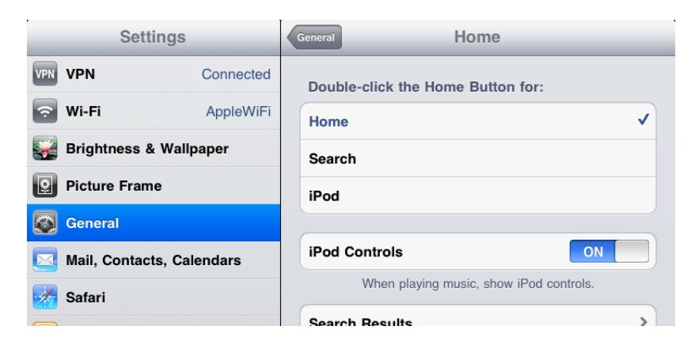

**Use a navigation bar in the left pane of a split view** to allow people to drill down through a fairly shallow hierarchy. Then, display the most specific information (that is, the leaf nodes in the hierarchy) in the right pane. This, too, flattens your hierarchy by displaying two levels onscreen at one time. For example, Mail in landscape uses this design to display the hierarchy of accounts, mailboxes, and message lists in the left pane, and individual messages in the right pane.

**Use a popover** to enable actions or provide tools that affect onscreen objects. A popover can display these actions and tools temporarily on top of the current screen, which means people don't have to transition to another screen to get them. For example, Mail in portrait orientation uses a popover to display the account, mailbox, and message list hierarchy.

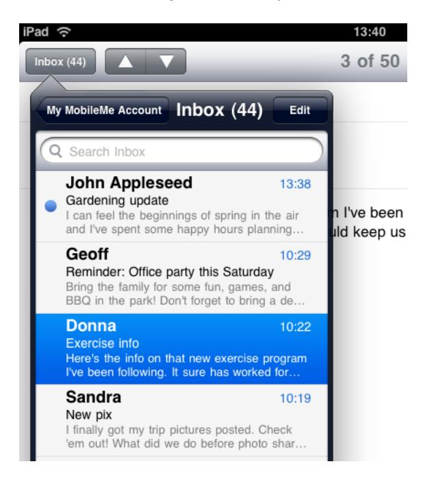

**Use a segmented control in a toolbar**to display different perspectives on the content or different information categories. In this way, you can provide access to these perspectives or categories from a single bar at the top (or the bottom) of the screen. (For usage guidelines, see ["Toolbar"](#page-99-0) (page 100) and ["Segmented](#page-99-1) [Control"](#page-99-1) (page 100).) For example, iTunes uses a segmented control in a top-edge toolbar to provide different perspectives on the content in a category.

**Use a tab bar** to display different information categories or, less often, different application modes. In iPad applications, a tab bar is more likely to be used as a filter or category switcher than as a mode switcher. For example, iTunes uses a tab bar to give people access to different categories of media.

When possible, avoid using a tab bar to swap in completely different screens, because it's best to reduce full-screen transitions on iPad.

### For iPad: Consider Using Popovers for Some Modal Tasks

Popovers and modal views are similar, in the sense that people typically can't interact with the main view while a popover or modal view is open. But a modal view is always modal, whereas a popover can be used in two different ways:

- Modal, in which case the popover dims the screen area around it and requires an explicit dismissal. This behavior is very similar to that of a modal view, but a popover's appearance tendsto give the experience a lighter weight.
- Nonmodal, in which case the popover does not dim the screen area around it and people can tap anywhere outside its bounds (including the control that reveals the popover) to dismiss it. This behavior makes a nonmodal popover seem like another view in the application.

In addition, a popover always has an arrow that points to the control or area the user tapped to reveal it. This visual tie-in helps people remember their previous context. It also makes a modal popover seem like a more transient state than a modal view, which takes over the screen without indicating where it came from.

If you use modal views to enable self-contained tasks in your iPhone application, you might be able to use popovers instead. To help you decide when this might be appropriate, consider these questions:

● **Does the task require more than one types of input?** If so, use a popover.

Although a keyboard can accompany either a popover or a modal view, a popover is better for displaying a picker or a list of options.

● **Does the task require people to drill down through a hierarchy of views?** If so, use a popover.

The frame of a popover is bettersuited to displaying multiple pages, because there isless chance people will confuse it with the main view.

● **Might people wantto do something in the main view before they finish the task?** Ifso, use a nonmodal popover.

Because people can see the main view around a nonmodal popover and they can dismiss it by tapping in the main view, you should allow them to suspend the popover's task and come right back to it.

● **Is the task fairly in-depth and does it represent one of the application's main functions?** If so, you might want to use a modal view.

The greater context shift of a modal view helps people stay focused on the task until they finish it. The greater screen space of most modal view styles makes it easier for people to provide a lot of input.

If, on the other hand, the task represents an important part of application functionality, but it is not in-depth, a modal popover can be a better choice. This is because the lighter visual weight of a popover can be more pleasant for frequently performed tasks.

● **Is the task performed only once or very infrequently, as with a setup task?** If so, consider using a modal view.

People aren't as concerned about staying in the current context when they perform a task only once or very infrequently.

There are a number of other uses for popovers, such as to provide auxiliary tools (for complete usage guidelines, see ["Popover](#page-102-1) (iPad Only)" (page 103)). Also, iPad apps display action sheets inside popovers (for more information, see ["Action](#page-118-0) Sheet" (page 119)).

If you decide to use a modal view, be sure to read about the different presentation styles you can use (they're described in ["Modal](#page-120-0) View" (page 121)). In your iPad application, you can choose the presentation style that's best suited to the modal task you need to enable. toolbar\_at\_top.pdf 3/19/10 11:19:21 AM

### For iPad: Migrate Toolbar Content to the Top

If your iPhone application has a toolbar, consider moving it to the top of the screen instead of leaving it at the bottom. With the additional width of the iPad screen, you should be able to provide all of your toolbar functionality in a single toolbar at the top. This gives you more vertical space for your focused content.

For example, Mail on iPhone uses a toolbar at the bottom to give people access to the refresh, organize, trash, reply, and compose actions while they view messages.

Mail on iPad migrates all but one of these actionsto a toolbar located above the message. The Refresh control is in the mailbox list, which is in a popover in portrait and in the left pane of the split view in landscape.

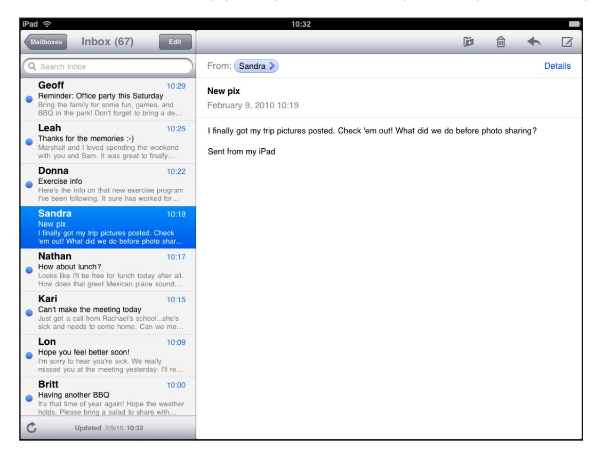

# iOS Technology Usage Guidelines

iOS provides many great technologies that users appreciate, such as multitasking, copy and paste, and both **local notifications** (scheduled by your app and delivered by iOS on the same device) and **push notifications** (pushed to your app from the app's remote server).

From the user's perspective, these technologies are part of the iOS landscape, but developers know that it takes care and attention to make sure these features blend well with the user experience of their apps.

### Multitasking

Multitasking allows people to switch quickly among recently used applications, because apps can be suspended in the background when they are quit. A suspended app can resume quickly because it does not have to reload its UI. People use the multitasking UI (shown here below the iPhone Calendar app) to choose a recently used app.

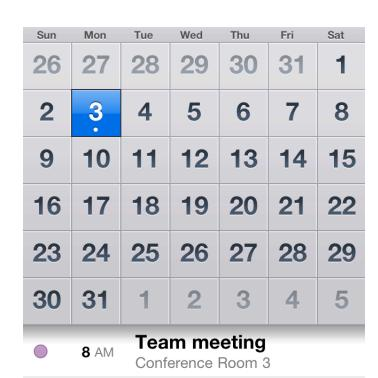

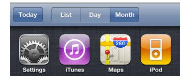

Thriving in a multitasking environment hinges on achieving a harmonious coexistence with other applications on the device. At a high level, this means that all applications should:

- Handle interruptions or audio from other applications gracefully
- Stop and restart (that is, transition to and from the background) quickly and smoothly
- Behave responsibly when not in the foreground

The following specific guidelines help your app succeed in the multitasking environment.

**Be prepared for interruptions, and be ready to resume**. Multitasking increases the probability that a background application will interrupt your app. Other features, such as the presence of ads and faster application-switching, can also cause more frequent interruptions. The more quickly and precisely you can save the current state of your application, the faster people can relaunch it and continue from where they left off.

**Make sure your UI can handle the double-high status bar**. The double-high status bar appears during events such as in-progress phone calls, audio recording, and tethering. In unprepared applications the extra height of this bar can cause layout problems. For example, the UI can become pushed down or covered. In a multitasking environment, it's especially important to be able to handle the double-high status bar properly because there are likely to be more applications that can cause it to appear. You can trigger the double-high status bar during testing to help you find and correct any views that don't handle it well. (To learn how to do this using iOS Simulator, see "Manipulating the Hardware" in *iOS Development Guide*.)

**Be ready to pause activities that require people's attention or active participation**. For example, if your application is a game or a media-viewing application, make sure your users don't miss any content or events when they switch away from your application. When people switch back to a game or media viewer, they want to continue the experience as if they'd never left it.

**Ensure that your audio behaves appropriately**. Multitasking makes it more likely that other media activity is occurring while your application is running. It also makes it more likely that your audio will have to pause and resume to handle interruptions. Forspecific guidelinesthat help you make sure your audio meets people's expectations and coexists properly with other audio on the device, see ["Sound"](#page-79-0) (page 80).

**Use local notifications sparingly**. An application can arrange for local notifications to be sent at specific times, whether the application is suspended, running in the background, or not running at all. For the best user experience, avoid pestering people with too many notifications, and follow the guidelines for creating notification content described in "Local and Push [Notifications"](#page-91-0) (page 92).

**When appropriate, finish user-initiated tasks in the background**. When people initiate a task, they usually expect it to finish even if they switch away from your application. If your application is in the middle of performing a user-initiated task that does not require additional user interaction, you should complete it in the background before suspending.

### Printing

In iOS 4.2 and later, and on devices that support multitasking, users can wirelessly print content from your application. You can take advantage of built-in support for printing images and PDF content, or you can use printing-specific programming interfacesto do custom formatting and rendering. iOS handles printer discovery and the scheduling and execution of print jobs on the selected printer.

Typically, users tap the standard Action button in your app when they want to print something. When they choose the Print item in the view that appears, they can then select a printer, set available printing options, and tap the Print button to start the job. On iPhone, this view appears in an action sheet that slides up from the bottom of the screen; on iPad, the view appears in a popover that emerges from the button.

Users can check on the print job they requested in the Print Center application, which is a background system app that is available only while a print job is in progress. In Print Center, users can view the current print queue, get details about a specific print job, and even cancel the job.

You can support basic printing in your app with comparatively little additional code (to learn about adding print support to your code, see *Drawing and Printing Guide for iOS*). To ensure that users appreciate the printing experience in your app, follow these guidelines:

**Use the system-provided Action button**. Users are familiar with the meaning and behavior of this button, so it's a good idea to use it when possible. The main exception to thisisif your app does not contain a toolbar or navigation bar. When this is the case, you need to design a custom print button that can appear in the main UI of your app, because the Action button can only be used in a toolbar or navigation bar.

**Display thePrintitem when printing is a primary function in the current context**. If printing isinappropriate in the current context, or if users are not likely to want to print, don't include the Print item in the view revealed by the Action button.

**If appropriate, provide additional printing options to users**. For example, you might allow users to choose a page range or to request multiple copies.

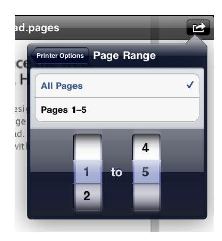

**Don't display print-specific UI if users can't print**. Be sure to check whether the user's device supports printing before you display UI that offers printing as an option. To learn how to do this in your code, see *UIPrintInteractionController Class Reference*.

### iAd Rich Media Ads

In iOS 4.0 and later, you can allow advertisements to display within your application and you can receive revenue when users see or interact with them. It's essential that you plan when and how to integrate ads with your UI so that people are motivated to view them without being distracted from your application.

You host an ad served by the iAd Network in a specific view in your UI. Initially, this view contains the ad's banner, which functions as the entrance into the full iAd experience. When people tap the banner, the ad performs a preprogrammed action, such as playing a movie, displaying interactive content, or launching Safari to open a webpage. The action can display content that covers your UI or it might cause your application to transition to the background.

There are two types of banners that you can display in your application: standard banners and full screen banners. Both types of banners serve the same purpose (to usher users into the ad), but they differ in their appearance and functionality.

A **standard banner** takes up a small area of the screen and is often visible for as long as the screen is visible. You choose the app screens that should display a standard banner and make room for the banner view in the layout.

All iOS apps running in iOS 4.0 and later can display standard banners. You use a view provided by the ADBannerView class to contain a standard banner in your app.

A **full screen banner** occupies most or all of the screen and is usually visible at specific times during the application flow or in specific locations. You choose whether to display the banner modally or as a separate page within scrollable content.

Full screen banners are available only in iPad apps running in iOS 4.3 and later. You use a view provided by the ADInterstitialAd class to contain a full screen banner in your app.

Both banner types appear inside the iAd frame, which displays the iAd mark in the lower-right corner. The iAd frame has been designed to look best when it is anchored to the bottom edge of your app screens.

The dimensions of the standard banner view you place in the app UI vary, according to the device and the orientation.

**Table 6-1** Standard banner view dimensions

| Device | Portrait        | Landscape        |
|--------|-----------------|------------------|
| iPad   | 768 x 66 points | 1024 x 66 points |
| iPhone | 320 x 50 points | 480 x 32 points  |

The overall dimensions of a full screen banner view can also vary with changes in device orientation, but the height can vary further with the presence or absence of iOS bars (such as toolbars and tab bars) in your app's UI. The width of a full screen banner is always the full width of the iPad screen.

**Table 6-2** Full screen banner view dimensions

| iPad orientation | Height range              | Width       |
|------------------|---------------------------|-------------|
| Portrait         | 911 points to 1024 points | 768 points  |
| Landscape        | 655 points to 768 points  | 1024 points |

To ensure seamless integration with banner ads and to provide the best user experience, follow these guidelines:

**Place a standard banner view at or nearthe bottom ofthe screen**. This placement differsslightly, depending on whether there is a bar on the bottom of the screen and if so, the kind of bar.

If there are no bars at the bottom of the screen, put the standard banner view at the bottom edge of the screen (iPod touch shown).

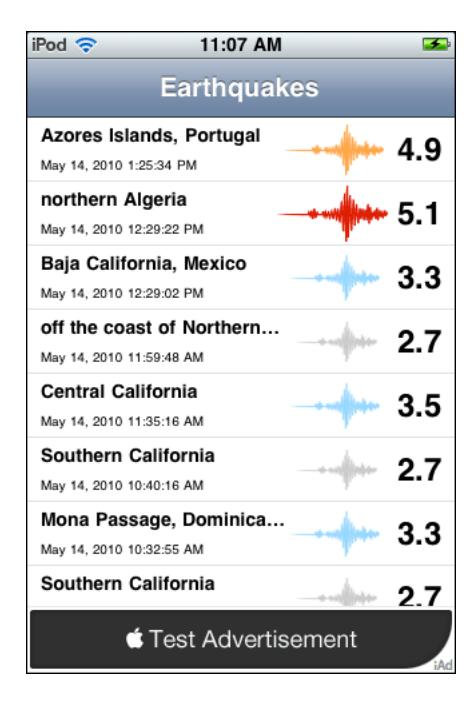

If there are no bars at all, again put the standard banner view at the bottom edge of the screen (iPod touch shown).

If there is a toolbar or tab bar, put the standard banner view directly above the toolbar or tab bar (iPod touch shown).

**Present a full screen banner modally when there are interludes in the user experience**. If there are natural breaks or context changes in the flow of your iPad app, the modal presentation style can be appropriate. When you present a full screen banner modally (by using presentFromViewController:), the user must either enter the ad or dismiss it. For this reason, it's a good idea to use the modal presentation style when users are expecting a change in experience, such as after they complete a task.

Be sure to reveal and close a modal full screen banner view in a way that makes sense in your app. For example, a game might use fade-in and fade-out animations to reveal and close the banner.

As you can see below, a modally presented full screen banner completely covers the app UI and includes the iAd close button in the upper-left corner.

**Present a full screen banner nonmodally when there are transitions between app views**. If users experience your app by making frequent screen transitions, such as paging through a magazine or flicking through a gallery, the nonmodal presentation style can be appropriate. When you present a full screen banner nonmodally (by using presentInView:), you can preserve the bars in your UI so that users can use app controlsto move past or return to the ad. As with all banners, a fullscreen banner launchesthe iAd experience when a user taps it, but your app can respond to other gestures within the banner area (such as drag or swipe) if appropriate.

Be sure to use appropriate animations to reveal and hide a nonmodal full screen banner view. For example, a magazine reader app would probably present a banner using the same page-turn animation it uses to reveal other content pages.

The nonmodally presented full screen banner shown below is displayed between a navigation bar and a toolbar. However, it's up to you to choose which bars should be present.

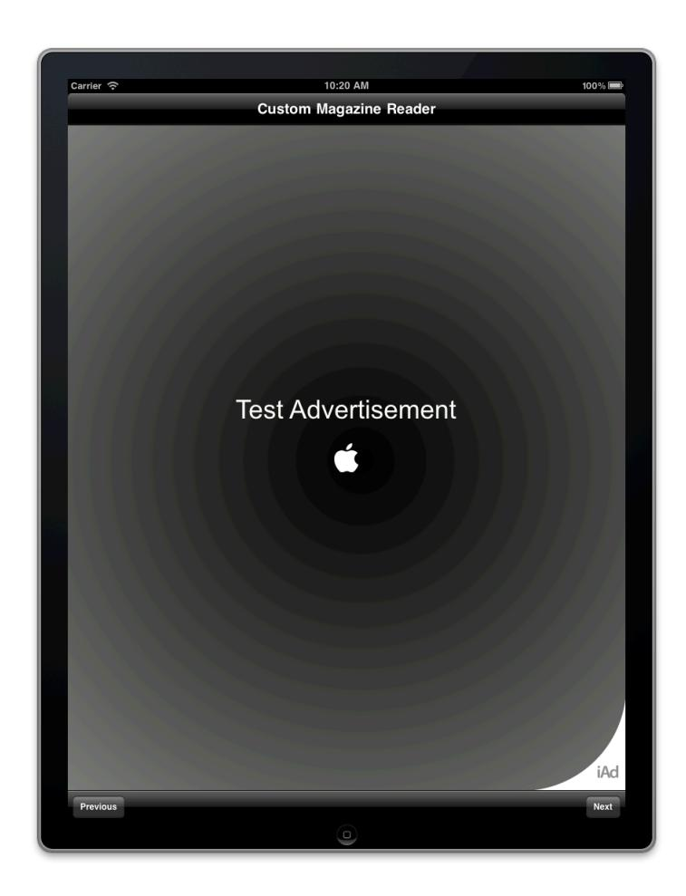

**Ensure that all banners appear when and where it makes sense in your application**. People are more likely to enter the iAd experience when they don't feel like they're interrupting their workflow to do so. This is especially important for immersive applications such as games: You don't want to place banner views where they will conflict with playing a game.

**Avoid displaying banners on screens that users are likely to see only briefly**. If your app includes screens that users move through quickly as they drill down or navigate to the content they care about, it's best to avoid displaying banners on these screens. Users are more likely to tap a banner when it stays onscreen for more than a second or two.

**As much as possible, display banner ads in both orientations**. It's best when users don't have to change the orientation of the device to switch between using your app and viewing an ad. Also, supporting both orientations allows you to accept a wider range of advertisements. To learn how to make sure a banner view responds to orientation changes, see *iAd Programming Guide*.

**Don't allow a standard banner to scroll off the screen**. If your app displays scrolling content in the screen, make sure the standard banner view remains anchored in its position.

**While people view or interact with ads, pause activities that require their attention or interaction**. When people choose to view an ad, they don't want to feel that they're missing events in your application, and they don't want your app to interrupt the ad experience. A good rule of thumb isto pause the same activities you would pause when your app transitions to the background.

**Don't stop an ad, exceptin rare circumstances**. In general, your application continuesrunning and receiving events while users view and interact with ads, so it's possible that an event will occur that urgently requires their immediate attention. However, there are very few scenarios that warrant the dismissal of an in-progress ad. One possibility is with an application that provides Voice over Internet Protocol (VoIP) service. In such an application, it probably makes sense to cancel a running ad when an incoming call arrives.

**Note:** Canceling an ad might adversely impact the kinds of advertisements your application can receive and the revenue you can collect.

### Quick Look Document Preview

In iOS 4 and later, users can preview a document within your application, even if your app cannot open the document. For example, you might allow users to preview documents that they download from the web or receive from other sources. To learn more about how to support Quick Look document preview in your app, see *Document Interaction Programming Topics for iOS*.

Before users preview a document in your app, they can see information about the document in a custom view that you create. For example, after users download a document attached to an email message, Mail on iPad displays the document's icon, title, and size in a custom view within the message. Users can tap this view to preview the document.

You can present a document preview in a new view in your app, or in a full-screen, modal view. The presentation method you choose depends on which device your app runs on.

**On iPad, display a document preview modally**. The large iPad screen is appropriate for displaying a document preview in an immersive environment that users can easily leave. The zoom transition is especially well-suited to reveal the preview.

**On iPhone, display a document preview in a dedicated view, preferably a navigation view**. Doing this allows users to navigate to and from the document preview without losing context in your app. Although it's possible to display a document preview modally in an iPhone app, it's not recommended. (Note that the zoom transition is not available on iPhone.)

Also, note that displaying a document preview in a navigation view allows Quick Look to place preview-specific navigation controls in the navigation bar. (If your view already contains a toolbar, Quick Look places the preview navigation controls in the toolbar, instead.)

### Sound

iOS-based devices produce great sound that users appreciate. In your app, sound might be an essential part of the user experience or provide only incidental enhancement. Regardless of the role that sound plays in your app, you need to know how users expect sound to behave and how to meet those expectations.

### Understand User Expectations

People can use device controlsto affectsound, and they might use wired or wireless headsets and headphones. People also have various expectationsfor how their actionsimpact the sound they hear. Although you might find some of these expectations surprising, they all follow the principle of user control in that the user, not the device, decides when it's appropriate to hear sound.

#### **Users switch their devices to silent when they want to**:

- Avoid being interrupted by unexpected sounds,such as phone ringtones and incoming message sounds
- Avoid hearing soundsthat are the byproducts of user actions,such as keyboard or other feedback sounds, incidental sounds, or app startup sounds
- Avoid hearing game sounds that are not essential to using the game, such as incidental sounds and soundtracks

**Note:** People switch their devicesto silent using either the Ring/Silentswitch (on iPhone) or the Silentswitch (on iPad).

For example, in a theater users switch their devices to silent to avoid bothering other people in the theater. In this situation, users still want to be able to use apps on their devices, but they don't want to be surprised by sounds they don't expect or explicitly request, such as ringtones or new message sounds.

The Ring/Silent (or Silent) switch does *not* silence sounds that result from user actions that are solely and explicitly intended to produce sound. For example:

- Media playback in a media-only app is notsilenced because the media playback was explicitly requested by the user.
- A Clock alarm is not silenced because the alarm was explicitly set by the user.
- A sound clip in a language-learning app is not silenced because the user took explicit action to hear it.
- Conversation in an audio chat application is not silenced because the user started the app for the sole purpose of having an audio chat.

**Users use the device's volume buttons to adjustthe volume of all sounds their devices can play**, including songs, app sounds, and device sounds. Users can use the volume buttons to quiet any sound, regardless of the position of the Ring/Silent (or Silent)switch. Using the volume buttonsto adjust an app's currently playing audio also adjusts the overall system volume, with the exception of the ringer volume.

**iPhone:** Using the volume buttons when no audio is currently playing adjusts the ringer volume.

**Users use headsets and headphones to hear sounds privately and to free their hands**. Regardless of whether these accessories are wired or wireless, users have specific expectations for the user experience.

When users plug in a headset or headphones, or connect to a wireless audio device, they intend to continue listening to the current audio, but privately. For thisreason, they expect an app that is currently playing audio to continue playing without pause.

When users unplug a headset or headphones, or disconnect from a wireless device (or the device goes out of range or turns off), they don't want to automatically share what they've been listening to with others. For this reason, they expect an app that is currently playing audio to pause, allowing them to explicitly restart playback when they're ready.

### Define the Audio Behavior of Your App

**If necessary, you can adjust relative, independent volume levels to produce the best mix in your app's audio output**. But the volume of the final audio output should always be governed by the system volume, whether it's adjusted by the volume buttons or a volume slider. This means that control over an application's audio output remains in users' hands, where it belongs.

**Ensure that your app can display the audio route picker, if appropriate**. (An **audio route** is an electronic pathway for audio signals, such as from a device to headphone or from a device to speakers.) Even though people don't physically plug in or unplug a wireless audio device, they still expect to be able to choose a different audio route. To handle this, iOS automatically displays a control that allows users to pick an output audio route (use the MPVolumeView class to allow the control to display in your app). Because choosing a different audio route is a user-initiated action, users expect currently playing audio to continue without pause.

**If you need to display a volume slider**, be sure to use the system-provided volume slider available when you use the MPVolumeView class. Note that when the currently active audio output device does not support volume control, the volume slider is replaced by the appropriate device name.

**If your application produces only UI sound effects that are incidental to its functionality, use System Sound Services**. System Sound Servicesisthe iOS technology that produces alerts and UIsounds and invokes vibration; it is unsuitable for any other purpose. When you use System Sound Services to produce sound, you cannot influence how your audio interacts with audio on the device, or how it should respond to interruptions and changes in device configuration. For a sample project that demonstrates how to use this technology, see *Audio UI Sounds (SysSound)*.

**If sound plays an important role in your app, use Audio Session Services** or the AVAudioSession class. These programming interfaces do not produce sound; instead, they help you express how your audio should interact with audio on the device and respond to interruptions and changes in device configuration.

**iPhone:** No matter what technology you use to produce audio or how you define its behavior, the phone can always interrupt the currently running application. This is because no app should prevent people from receiving an incoming call.

In Audio Session Services, the **audio session** functions as an intermediary for audio between your application and the system. One of the most important facets of the audio session is the **category**, which defines the audio behavior of your application.

To realize the benefits of Audio Session Services and provide the audio experience users expect, you need to select the category that best describes the audio behavior of your application. This is the case whether your app plays only audio in the foreground or can also play audio in the background. Follow these guidelines as you make this selection:

- **Select an audio session category based on its semantic meaning, not its precise set of behaviors**. By selecting a category whose purpose is clear, you ensure that your application behaves according to users' expectations. In addition, it gives your application the best chance of working properly if the exact set of behaviors is refined in the future.
- **In rare cases, add a property to the audio session to modify a category's standard behavior**. A category'sstandard behavior represents what most users expect,so you should consider carefully before you change that behavior. For example, you might add the ducking property to make sure your audio is louder than all other audio (except phone audio), if that's what users expect from your app. (To learn more about audio session properties, see "Fine-Tuning the Category" in *Audio Session Programming Guide*.)
- **Consider basing your category selection on the current audio environment of the device**. This might make sense if, for example, users can use your app while listening to other audio instead of to your soundtrack. If you do this, be sure to avoid forcing users to stop listening to their music or make an explicit soundtrack choice when your app starts.
- **In general, avoid changing categories while your application is running**. The primary reason for changing the category is if your app needs to support recording and playback at different times. In this case, it can be better to switch between the Record category and the Playback category as needed, than to select the Play and Record category. This is because selecting the Record category ensures that no alerts (such as an incoming text message alert) will sound while the recording is in progress.

Table 6-3 lists the audio session categories you can use. Different categories allow sounds to be silenced by the Ring/Silent or Silent switch (or device locking), to mix with other audio, or to play while the app is in the background. (For the actual category and property names as they appear in the programming interfaces, see *Audio Session Programming Guide*.)

**Table 6-3** Audio session categories and their associated behaviors

| Category     | Meaning                                                                 | Silenced | Mixes | In Background |
|--------------|-------------------------------------------------------------------------|----------|-------|------------------|
| Solo Ambient | Sounds enhance app functionality, and should silence other audio.    | Yes      | No    | No               |
| Ambient      | Sounds enhance app functionality but should not silence other audio. | Yes      | Yes   | No               |

| Category            | Meaning                                                                         | Silenced | Mixes                                                                  | In Background |
|---------------------|---------------------------------------------------------------------------------|----------|------------------------------------------------------------------------|------------------|
| Playback            | Sounds are essential to app functionality and might mix with other audio. | No       | No (default) Yes (when the Mix With Others property is added) | Yes              |
| Record              | Audio is user-recorded.                                                         | No       | No                                                                     | Yes              |
| Play and Record     | Sounds represent audio input and output,sequentially orsimultaneously.       | No       | No (default) Yes (when the Mix With Others property is added) | Yes              |
| Audio Processing | App performs hardware-assisted audio encoding (it does not play or record).  | N/A      | No                                                                     | Yes *            |

\* If you select the Audio Processing category and you want to perform audio processing in the background, you need to prevent your app from suspending before you're finished with the audio processing. To learn how to do this, see "Executing Code in the Background" in *iOS Application Programming Guide*.

Here are some scenarios that illustrate how to choose the audio session category that provides an audio experience users appreciate.

#### **Scenario 1: An educational app that helps people learn a new language**. You provide:

- Feedback sounds that play when users tap specific controls
- Recordings of words and phrases that play when users want to hear examples of correct pronunciation

In this application, sound is essential to the primary functionality. People use this app to hear words and phrases in the language they're learning, so the sound should play even when the device locks or is switched to silent. Because users need to hear the sounds clearly, they expect other audio they might be playing to be silenced.

To produce the audio experience users expect for this app, you would use the Playback category. Although this category can be refined to allow mixing with other audio, this app should use the default behavior to ensure that other audio does not compete with the educational content the user has explicitly chosen to hear.

#### **Scenario 2: A Voice over Internet Protocol (VoIP) app**. You provide:

- The ability to accept audio input
- The ability to play audio

In this app, sound is essential to the primary functionality. People use this app to communicate with others, often while they're currently using a different application. Users expect to be able to receive calls when they've switched their device to silent or the device is locked, and they expect other audio to be silent for the duration of a call. They also expect to be able to receive and continue calls when the app is in the background.

To produce the expected user experience for this app, you would use the Play and Record category. In addition, you would be sure to activate your audio session only when you need it so that users can use other audio between calls.

#### **Scenario 3: A game that allows users to guide a character through different tasks**. You provide:

- Various gameplay sound effects
- A musical soundtrack

In this app, sound greatly enhances the user experience, but is not essential to the main task. Also, users are likely to appreciate being able to play the game silently or while listening to songs in their music library instead of to the game soundtrack.

The best strategy is to find out if users are listening to other audio when your app starts. Don't ask users to choose whether they want to listen to other audio or listen to yoursoundtrack. Instead, use the Audio Session Services function AudioSessionGetProperty to query the state of the kAudioSessionProperty\_OtherAudioIsPlaying property. Based on the answer to this query, you can choose either the Ambient or Solo Ambient categories(both categories allow usersto play the game silently):

- If users are listening to other audio, you should assume that they'd like to continue listening and would not appreciate being forced to listen to the game soundtrack instead. In this situation, have your app choose the Ambient category.
- If users are not listening to any other audio when your app starts, have your app choose the Solo Ambient category.

#### **Scenario 4: An app that provides precise, real-time navigation instructions to the user's destination**. You provide:

- Spoken directions for every step of the journey
- A few feedback sounds
- The ability for users to continue to listen to their own audio

In this app, the spoken navigation instructions represent the primary task, regardless of whether the app is in the background. For this reason, you would use the Playback category, which allows your audio to play when the device is locked or switched to silent, and while the app is in the background.

To allow people to listen to other audio while they use your app, you can add the kAudioSessionProperty\_OverrideCategoryMixWithOthers property. However, you also want to make sure that users can hear the spoken instructions above the audio they're currently playing. To do this, you can apply the kAudioSessionProperty\_OtherMixableAudioShouldDuck property to the audio session. This ensuresthat your audio islouder than all currently playing audio (except phone audio on iPhone).

#### **Scenario 5: A blogging app that allows users to upload their text and graphics to a website**. You provide:

- A short startup sound file
- Various short sound effects that accompany user actions (such as a sound that plays when a post has been uploaded)
- An alert sound that plays when a posting fails

In this app, sound enhances the user experience, but it is incidental. The main task has nothing to do with audio and users do not need to hear any sounds to successfully use the app. In this scenario, you would use System Sound Services to produce sound. This is because the audio context of all sound in the app conforms to the intended purpose of this technology, which is to produce UI sound effects and alert sounds that obey device locking and the Ring/Silent (or Silent) switch in the way users expect.

### Manage Audio Interruptions

Sometimes, currently playing audio is interrupted by audio from a different app. For example, an incoming phone call interruptsthe current iPhone app's audio for the duration of the call. In a multitasking environment, the frequency of such audio interruptions can be great.

To provide an audio experience users appreciate, iOS relies on you to:

- Identify the type of audio interruption your app can cause
- Respond appropriately when your app continues after an audio interruption ends

Every application needs to identify the type of audio interruption it can cause, but not every application needs to determine how to respond to the end of an audio interruption. This is because, for most types of apps, the appropriate response to the end of an audio interruption is to resume playing audio. Only apps that are primarily or partly media playback apps, and that provide media playback controls, have to take an extra step to determine the appropriate response.

Conceptually, there are two types of audio interruptions, based on the type of audio that is doing the interrupting and the way users expect the particular app to respond when the interruption ends:

● Resumable interruption. A resumable interruption is caused by audio that users view as a temporary interlude in their primary listening experience.

After a resumable interruption ends, an app that displays controls for media playback should resume what it was doing when the interruption occurred, whether this is playing audio or remaining paused. An app that doesn't have media playback controls should resume playing audio.

For example, consider a user listening to an app for music playback on iPhone when a VoIP call arrives in the middle of a song. The user answers the call, expecting the playback app to be silent while they talk. After the call ends, the user expects the playback app to automatically resume playing the song, because the music—not the call—constitutestheir primary listening experience *and* they had not paused the music before the call arrived. If, on the other hand, the user had paused music playback before the call arrived, they would expect the music to remain paused after the call ends.

Other examples of appsthat can cause resumable interruptions are appsthat play alarms, audio prompts (such as spoken driving directions), or other intermittent audio.

● Nonresumable interruption. A nonresumable interruption is caused by audio that users view as a primary listening experience, such as audio from a media playback app.

After a nonresumable interruption ends, an app that displays media playback controlsshould not resume playing audio. An app that doesn't have media playback controls should resume playing audio.

For example, consider a user listening to a music playback application (music app 1) when a different music playback application (music app 2) interrupts. In response, the user decides to listen to music app 2 for some period of time. After quitting music app 2, the user would not expect music app 1 to automatically resume playing because they'd deliberately made music app 2 their primary listening experience.

The following guidelines help you decide what information to supply and how to continue after an audio interruption ends.

**Identify the type of audio interruption your app caused**. You do this by deactivating your audio session in one of the following two ways when your audio is finished:

- If your app caused a resumable interruption, deactivate your audio session with the AVAudioSessionSetActiveFlags\_NotifyOthersOnDeactivation flag.
- If your app caused a nonresumable interruption, deactivate your audio session without any flags.

Providing, or not providing, the flags allows iOS to give interrupted apps the ability to resume playing their audio automatically, if appropriate.

**Determine whether you should resume audio when an audio interruption ends**. You base this decision on the audio user experience you provide in your app.

● If your app displays media playback controls that people use to play or pause audio, you need to check the AVAudioSessionInterruptionFlags\_ShouldResume flag when an audio interruption ends.

If your app receives the Should Resume flag, you should have your app:

- Resume playing audio if your app was actively playing audio when it was interrupted
- Not resume playing audio if your app was *not* actively playing audio when it was interrupted
- If your app does not display any media playback controls that people can use to play or pause audio, you should have your app always resume previously playing audio when an audio interruption ends. You do not have to check for the presence of the Should Resume flag.

For example, a game that plays a soundtrack should automatically resume playing the soundtrack after an interruption.

### Handle Media Remote Control Events, if Appropriate

Beginning in iOS 4.0, apps can receive remote control events when people use iOS media controls or accessory controls (such as headset controls). This allows your app to accept user input that does not come through your UI, whether your app is currently playing audio in the foreground or in the background.

In iOS 4.3 and later, apps can send video to AirPlay-enabled hardware, such as Apple TV, and transition to the background while playback continues. Such an app can also accept user input via remote control events, so that users can control video playback while the app is in the background.

A media playback app, in particular, needsto respond appropriately to media remote control events, especially if it plays audio or video while it's in the background.

To meet the responsibilities associated with the privilege of playing media while your app isin the background, be sure to follow these guidelines:

**Limit your app's eligibility to receive remote control events to times when it makes sense**. For example, if your app allows users to read content, search for information, and listen to audio, it should accept remote control events only while the user isin the audio context. When the user leavesthe audio context, you should relinquish the ability to receive the events. If your app allows usersto play audio or video on an AirPlay-enabled device, itshould accept remote control eventsfor the duration of media playback. Following these guidelines allows users to consume a different app's media (and control it with headset controls) when they're in the nonmedia contexts of your app.

**As much as possible, use system-provided controls to offer AirPlay support**. When you use the MPMoviePlayerController classto enable AirPlay playback, you can take advantage of a standard control that allows users to choose an AirPlay-enabled device that is currently in range. Or, you can use the MPVolumeView class to display AirPlay-enabled audio or video devices from which users can choose. Users are accustomed to the appearance and behavior of these standard controls, so they'll know how to use them in your app.

**Don't repurpose an event, even if the event has no meaning in your app**. Users expect the iOS media controls and accessory controls to function consistently in all apps. You do not have to handle the events that your app doesn't need, but the events that you do handle must result in the experience users expect. If you redefine the meaning of an event, you confuse users and risk leading them into an unknown state from which they can't escape without quitting your app.

### VoiceOver and Accessibility

VoiceOver is designed to increase accessibility for blind and low-vision users, and for users with certain learning challenges.

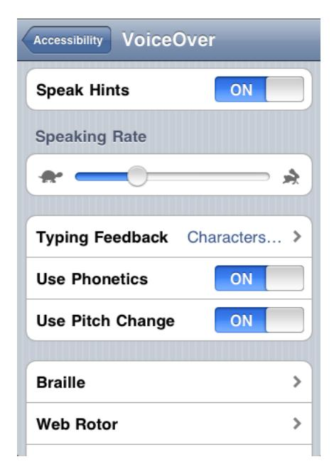

To make sure VoiceOver users can use your app, you might need to supply some descriptive information about the views and controls in your user interface. Supporting VoiceOver does *not* require you to change the visual design of your UI in any way.

When you use standard UI elements in a completely standard way, you have little (if any) additional work to do. The more custom your user interface is, the more custom information you need to provide so that VoiceOver can accurately describe your app.

Making your iOS app accessible to VoiceOver users is the right thing to do. It can also increase your user base and it might help you address accessibility guidelines created by various governing bodies.

### Edit Menu

Users can reveal an edit menu to perform operations such as Cut, Paste, and Select in a text view, web view, or image view.

You can adjust some of the behaviors of the menu to give users more control over the content in your application. For example, you can:

- Specify which of the standard menu commands are appropriate for the current context
- Determine the position of the menu before it appears so that you can prevent important parts of your app's UI from being obscured
- Define the object that is selected by default when users double-tap to reveal the menu

You cannot change the color or shape of the menu itself.

For information on how to implement these behaviors in code, see "Copy and Paste Operations" in *iOS Application Programming Guide*.

To ensure that the edit menu behaves as users expect in your application, you should:

**Display commands that make sense in the current context**. For example, if nothing is selected, the menu should not contain Copy or Cut because these commands act on a selection. Similarly, ifsomething isselected, the menu should not contain Select. If you support an edit menu in a custom view, you're responsible for making sure that the commands the menu displays are appropriate for the current context.

**Accommodate the menu display in your layout**. iOS displays the edit menu above or below the insertion point or selection, depending on available space, and places the menu pointer so that users can see how the menu commands relate to the content. You can programmatically determine the position of the menu before it appears so that you can prevent important parts of your UI from being obscured, if necessary.

**Support both gestures that people can use to invoke the menu**. Although the touch and hold gesture is the primary way usersreveal the edit menu, they can also double-tap a word in a text view to select the word and reveal the menu at the same time. If you support the menu in a custom view, be sure to respond to both gestures. In addition, you can define the object that is selected by default when the user double taps.

**Avoid creating a button in your UI that performs a command that's available in the edit menu**. For example, it's better to allow users to perform a copy operation using the edit menu than to provide a Copy button, because users will wonder why there are two ways to do the same thing in your app.

**Consider enabling the selection of static text if it's useful to the user**. For example, a user might want to copy the caption of an image, but they're not likely to want to copy the label of a tab item or a screen title, such as Accounts. In a text view, selection by word should be the default.

**Don't make button titles selectable**. A selectable button title makes it difficult for users to reveal the edit menu without activating the button. In general, elementsthat behave as buttons don't need to be selectable.

**Combine support for undo and redo with your support of copy and paste** . People often expect to be able to undo recent operations if they change their minds. Because the edit menu does not require confirmation before its actions are performed, you should give users the opportunity to undo or redo these actions (to learn how to do this, see ["Undo](#page-89-0) and Redo" (page 90)).

In iOS 4 and later, you can provide custom, app-specific commandsto display in the edit menu. The following example shows a menu that allows users to copy a style rather simply copy text.

**Note:** If you need to enable actions that use the selected text or object in a way that's external to the current context, it's better to use an action sheet. For example, if you want to allow people to share their selection with others, you might display an **action sheet** that lists social networking sites to allow the actions of selecting and sending to a particular site. To learn about the usage guidelines for action sheets, see ["Action](#page-118-0) [Sheet"](#page-118-0) (page 119).

Follow these guidelines if you need to create custom edit menu items.

**Create edit menu items that edit, alter, or otherwise act directly upon the user's selection**. People expect the standard edit menu items to act upon text or objects within the current context, and it's best when your custom menu items behave similarly.

**List custom items together after all system-provided items**. Don't intersperse your custom items with the system-provided ones.

**Keep the number of custom menu items reasonable**. You don't want to overwhelm your users with too many choices.

**Use succinct names for your custom menu items** and make sure the names precisely describe what the commands do. In general, item names should be verbs that describe the action to be performed. Although you should generally use a single capitalized word for an item name, use title-style capitalization if you must use a short phrase. (Briefly, title-style capitalization meansto capitalize every word except articles, coordinating conjunctions, and prepositions of four or fewer letters.)

### Undo and Redo

Users initiate an Undo operation by shaking the device, which displays an alert that allows them to:

- Undo what they just typed
- Redo previously undone typing
- Cancel the undo operation

You can support the Undo operation in a more general way in your application by specifying:

- The actions users can undo or redo
- The circumstances under which your app should interpret a shake event as the shake-to-undo gesture
- How many levels of undo to support

To learn how to implement this behavior in code, see *Undo Architecture*. If you support undo and redo in your app, follow these guidelines to provide a good user experience.

**Supply brief descriptive phrases thattell users precisely whatthey're undoing orredoing**. iOS automatically supplies the strings "Undo " and "Redo " (including a space after the word) for the undo alert button titles, but you need to provide a word or two that describes the action users can undo or redo. For example, you might supply the text Delete Name or Address Change, to create button titles such as "Undo Delete Name" or "Redo Address Change." (Note that the Cancel button in the alert cannot be changed or removed.)

**Avoid supplying text that is too long**. A button title that is too long is truncated and is difficult for users to decipher. And because this text is in a button title, use title-style capitalization and do not add punctuation.

**Avoid overloading the shake gesture**. Even though you can programmatically set when your app interprets a shake event asshake to undo, you run the risk of confusing usersif they also use shake to perform a different action. Analyze user interaction in your app and avoid creating situations in which users can't reliably predict the result of the shake gesture.

**Use the system-provided Undo and Redo buttons only if undo and redo are fundamental tasks in your app**. Remember that the shake gesture is the primary way users initiate undo and redo, and that it can be confusing to offer two different waysto perform the same task. If you decide it'simportant to provide explicit, dedicated controls for undo and redo, you can place the system-provided buttons in the navigation bar. (To learn more about these buttons, see "Standard Buttons for Use in Toolbars and [Navigation](#page-135-0) Bars" (page 136).)

**Clearly relate undo and redo capability to the user's immediate context, and not to an earlier context**. Consider the context of the actions you allow to be undone or redone. In general, users expect their changes and actions to take effect immediately.

### Keyboards and Input Views

A custom input view can replace the system-provided onscreen keyboard in apps running in iOS 3.2 and later. For example, Numbers on iPad provides an input view that's designed to make entering dates and times easy and efficient.

If you provide a custom input view, be sure its function is obvious to people. Also, be sure to make the controls in your input view look tappable.

You can also provide a custom input accessory view, which is a separate view that appears above the keyboard (or your custom input view). For example, in some contexts, Numbers displays an input accessory view that allows users to perform standard or custom calculations on spreadsheet values.

In iOS 4.2 and later, you can use the standard keyboard click sound to provide audible feedback when people tap the custom controls in your input view. To learn how to enable this sound in your code, see the documentation for playInputClick in *UIDevice Class Reference*.

**Note:** The standard click sound is available only for custom input views that are currently onscreen. People can turn off all keyboard clicks(including onesthat come from your custom input view) in Settings > Sounds.

# Location Services

Location Services allows applicationsto determine people's approximate location geographically, the direction they're pointing their device, and the direction in which they're moving. People appreciate being able to automatically tag content with their physical location or find friends that are currently nearby, but they also appreciate being able to disable such features when they don't want to share their location with others. (To learn more about how to make your app location-aware, see *Location Awareness Programming Guide*.)

When users turn off Location Services and later use an application feature that requires their location, they see an alert that tells them they must change their preference before they can use the feature. The alert does not allow users to make this change within the app; instead, they must go to Settings and change their preference. This ensures that users are fully aware that they are granting systemwide permission to use their location information.

Follow these guidelines to ensure the best user experience for the location-aware features in your app:

**Make sure users understand why they're being asked to turn Location Services on**. It's natural for people to be suspicious of a request for their personal information if they don't see an obvious need for it. To avoid making users uncomfortable, make sure the alert appears only when they attempt to use a feature that clearly needs to know their location. For example, people can use Maps when Location Services is off, but they see the alert when they access the feature that finds and tracks their current location.

**Check the user's Location Services preference to avoid triggering the alert unnecessarily**. You can use Core Location programming interfacesto get thissetting (to learn how to do this,see *Core Location Framework Reference*). With this knowledge, you can trigger the alert as closely as possible to the feature that requires location information, or perhaps avoid an alert altogether.

**Display the alert when your app starts only if your app cannot perform its primary function without knowing the user's location**. People will not be bothered by this because they understand that the main function of your app depends on knowing their location.

**Avoid making any programmatic calls that trigger the alert before the user actually selects the feature that needs the information**. This way, you avoid causing people to wonder why your app wantstheir location information when they're doing something that doesn't appear to need it. (Note that getting the user's preference does not trigger the alert.)

# Local and Push Notifications

Local and push notifications allow you to tell people about something when your application isn't running in the foreground.

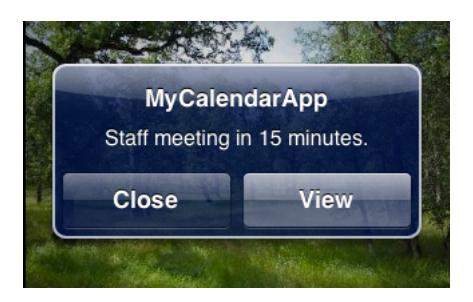

For example, you might want to let people know that:

- A message has arrived
- An event is about to occur
- New data is available for download
- The status of something has changed

**Local notifications** are scheduled by an application and delivered by iOS on the same device, regardless of whether the app is currently running in the foreground. For example, a calendar or to-do app can schedule a local notification to alert people of an upcoming meeting or due date.

**Push notifications** are sent by an app's remote server to the Apple Push Notification service, which pushes the notification to all devices that have the app installed. For example, a game that a user can play against remote opponents can update all players with the latest move.

If your application is not running in the foreground when a local or push notification arrives, you can get the user's attention by:

- Updating a **badge**—a small red oval that appears over the upper-right corner of your application's icon on the Home screen
- Displaying an alert

You can also play a sound when a badge updates or an alert appears.

If your app is running in the foreground, you can still receive local and push notifications, but you pass the information to your users in an app-specific way. In Settings, people can allow or disallow badging, sounds, and alerts for push notifications from selected applications or from all applications. There is no similar mechanism for disabling local notifications, because thisissomething people should be able to specify within each app.

Different notification techniques might be appropriate in different situations, so you should be prepared to use either type.

**Use a badge when it helps the userto know the number buttheir viewing ofthe items is nottime-critical**. A badge is a good way to tell people how many items are waiting for their attention,such as unread messages, assigned tasks, or updates to a shared document. Because people don't see badges unless they visit the Home screen, you probably don't want to use them to deliver time-sensitive information.

You do not have any control over the appearance of the badge or its position: It's always a small red oval as shown here.

A badge contains only numbers, not letters or punctuation.

**Use an alert when you need to deliverimportantinformation users wantto know or act upon right away**. An alert is a good way to tell people about an upcoming event or a status change. Alerts interrupt the user's workflow, so it's best to use them sparingly.

Follow these guidelines to create local and push notifications that users appreciate.

**Keep badge contents up to date**. It's especially important to update the badge assoon as users have attended to the new information, so that they don't think additional information has arrived.

**Provide a custom message for an alert**. Your custom message is displayed in the center of the alert, below your app name (which is automatically displayed at the top of the alert). A local or push notification alert message should:

- Focus on the information, not user actions. Avoid telling people which button to tap or describing the results of tapping a specific button.
- Be short enough to display on one or two lines. If the message is too long, it might force the notification alert to scroll.
- Use sentence-style capitalization and appropriate ending punctuation. When possible, use a complete sentence.

**Optionally, provide a custom title for the action button**. An alert can contain one or two buttons. In a two-button alert, the Close button is on the left and the action button (titled View by default) is on the right. If you specify one button, the alert displays an OK button.

Tapping the action button dismisses the alert and launches your application simultaneously. Tapping either the Close button or the OK button dismisses the alert without opening your app.

If you want to use a custom title for the action button, be sure to create a title that clearly describes the action that occurs when your app launches. For example, a game might use the title Play to indicate that tapping the button opens the application to a place where the user can take their turn. Make sure the title:

- Uses title-style capitalization
- Is short enough to fit in the button without truncation (be sure to test the length of localized titles, too)

#### **CHAPTER 6**

iOS Technology Usage Guidelines

**Note:** Your custom button title can also be displayed in the "slide to view" message people see when a notification arrives while the device islocked. When this happens, the custom title is automatically converted to lowercase and replaces the word "view" in the message.

**Optionally, provide a launch image**. In addition to displaying your existing launch images, you can supply a different launch image to display when people start your app in response to a notification. For example, a game might specify a launch image that's similar to a screen within the game, instead of an image that's similar to the opening menu screen. If you don't supply this launch image, iOS displays either the previous snapshot or one of your other launch images. (To learn how to create a launch image, see ["Launch](#page-149-0) [Images"](#page-149-0) (page 150).)

**If appropriate, play a sound to accompany the updating of a badge or the displaying of an alert**. A sound can get people's attention when they're not looking at the device screen. It's best when sounds are reserved for notifications that users consider important. For example, a calendar app might play a sound with an alert that reminds people about an imminent event. Or, a collaborative task management app might play a sound with a badge update to signal that a remote colleague has completed an assignment.

You can supply a custom sound, or you can use a built-in alert sound. If you create a custom sound, be sure it isshort, distinctive, and professionally produced. (To learn about the technical requirementsfor thissound, see "Preparing Custom Alert Sounds"in *Local and PushNotification ProgrammingGuide*.) Note that you cannot programmatically force the device to vibrate when a notification is delivered, because the user has control over whether alerts are accompanied by vibration.

#### **CHAPTER 6**

iOS Technology Usage Guidelines

# iOS UI Element Usage Guidelines

In iOS, the UIKit framework provides a wide range of UI elements you can use in your application. As you design the user interface of your app, always remember that users expect familiar views and controls to behave as they do in the built-in applications. This is to your advantage, as long as you use these elements appropriately in your application.

### Bars

The status bar, navigation bar, tab bar, and toolbar are UI elementsthat have specifically defined appearances and behaviors in iOS applications. These bars are not required to be present in every application (apps that provide an immersive experience often don't display any of them), but if they are present, it's important to use them correctly. The bars provide familiar anchors to users of iOS-based devices, who are accustomed to the information they display and the types of functions they perform.

### The Status Bar

The **status bar** displays important information about the device and the current environment.

The UIStatusBarStyle constant described in *UIApplication Class Reference*, controls the status bar style. To specify the status bar style, you set a value in your Info.plist file (see *iOS Application Programming Guide* for more information on how to do this).

### Appearance and Behavior

The status bar always appears at the upper edge of the device screen (in all orientations) and contains information people need, such as the network connection, the time of day, and the battery charge.

On iPhone, the status bar can have different colors; on iPad, the status bar is always black.

### Guidelines

Although you don't use the status bar in the same way that you use other UI elements, it's important to understand its function in your app.

Bars **97 2011-03-23 | © 2011 Apple Inc. All Rights Reserved.**

**Think twice before hiding the status bar if your application is not a game or full-screen media-viewing application**. Although these apps might permanently hide the status bar, you should understand the ramifications of this design decision. Permanently hiding the status bar means that users must quit your app to find out, for example, whether they need to recharge their device.

Note that most iPad applications do not need to hide the status bar to gain extra space, because the status bar occupies such a small fraction of the screen. On iPad, the subtle appearance of the status bar does not compete with your application for the user's attention. The small size of the status bar, combined with the slightly rounded corners of the application's upper bar, make the status bar seem like part of the device background.

**Consider hiding the status bar (and all other app UI) while people are actively viewing full-screen media**. If you do this, be sure to allow people to retrieve the status bar (and appropriate application UI) with a single tap. Unless you have a very compelling reason to do so, it's best to avoid defining a custom gesture to redisplay the status bar because users are unlikely to discover such a gesture or remember it.

**When appropriate, display the network activity indicator**. The network activity indicator can appear in the status bar to show users that lengthy network access is occurring. To learn how to implement this indicator in your code, see "Network Activity [Indicator"](#page-126-1) (page 127).

**On iPhone, specify the color of the status bar**. You can choose gray (the default color), opaque black, or translucent black (that is, black with an alpha value of 0.5).

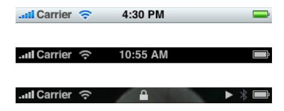

Be sure to choose a status bar appearance that coordinates with the rest of your iPhone application. For example, avoid using a translucent status bar if the navigation bar is opaque.

**On iPhone, set whetherthe change in status bar color should be animated**. Note that the animation causes the old status bar to slide up until it disappears off the screen while the new status bar slides into place.

### Navigation Bar

A **navigation bar** enables navigation through an information hierarchy and, optionally, management of screen contents.

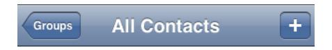

To learn more about defining a navigation bar in your code,see "Navigation Controllers"in *ViewProgramming Guide for iOS* and *UINavigationBar Class Reference*.

### Appearance and Behavior

A navigation bar appears at the upper edge of an application screen, just below the status bar. A navigation bar usually displaysthe title of the currentscreen or view, centered along itslength. When navigating through a hierarchy of information, users tap the back button to the left of the title to return to the previous screen. Otherwise, users can tap content-specific controlsin the navigation bar to manage the contents of the screen.

All controls in a navigation bar include a bezel around them, which, in iOS, is the bordered style. If you place a plain (borderless) control in a navigation bar, it automatically converts to the bordered style.

On iPhone, changing the device orientation from portrait to landscape can change the height of the navigation bar automatically. On iPad, the height and translucency of a navigation bar does not change with rotation.

On iPhone, a navigation bar always displays across the full width of the screen. On iPad, a navigation bar can display within a view, such as one pane of a split view, that does not extend across the screen.

### Guidelines

You can use a navigation bar to enable navigation among different views, or provide controls that manage the items in a view.

**Use the title of the current view as the title of the navigation bar**. When the user navigates to a new level, two things should happen:

- The bar title should change to the new level's title.
- A back button should appear to the left of the title, and it should be labeled with the previous level's title.

**Make sure it's easy to read the text in the navigation bar**. The system font provides maximum readability, but you can specify a different font, if appropriate.

**Use a toolbar instead of a navigation bar** if you need to offer a larger set of controls, or you do not need to enable navigation.

**Consider putting a segmented control in a navigation bar at the top level of an application**. This is especially useful if doing so helps to flatten your information hierarchy and makes it easier for people to find what they're looking for. If you use a segmented control in a navigation bar, be sure to choose accurate back-button titles. (For usage guidelines, see ["Segmented](#page-131-0) Control" (page 132).)

**Avoid crowding a navigation bar with additional controls, even if there appears to be enough space**. The navigation bar should contain no more than a view's current title, the back button, and one control that manages the view's contents. If, instead, you use a segmented control in the navigation bar, the bar should not display a title and it should not contain any controls other than the segmented control.

**Use system-provided buttons according to their documented meaning**. For more information,see ["Standard](#page-135-0) Buttons for Use in Toolbars and [Navigation](#page-135-0) Bars" (page 136). If you decide to create your own navigation bar controls, see "Icons for [Navigation](#page-148-0) Bars, Toolbars, and Tab Bars" (page 149) for advice on how to design them.

**Specify the color or translucency of a navigation bar, when appropriate**. If you want the navigation bar to coordinate with the overall look of your app, you can specify a custom color. You can make a navigation bar translucent if you want to encourage people to pay more attention to the content underneath the bar. If you customize a navigation bar in these ways, make sure its look is consistent with the look of the rest of your application. If you use a translucent navigation bar, for example, don't combine it with an opaque toolbar. Also, avoid changing the color or translucency of the navigation bar in different screens in the same orientation.

**Avoid altering the back button's appearance or behavior**. Users rely on the standard back button to help them retrace their steps through a hierarchy of information.

**Don't create a multisegment back button**.

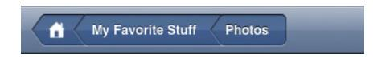

Creating a multisegment back button (as in the example above) causes several problems:

- The extended width of a multisegment back button does not leave room for the title of the current screen.
- There is no way to program such a multisegment button to indicate the selected state of an individual segment.
- The more segments there are, the smaller the hit region for each one, which makes it difficult for users to tap a specific one.
- Choosing which levels to display as users navigate deeper in the hierarchy is problematic.

If you think users might get lost without a multisegment back button that displays a type of breadcrumb path, it probably means that users must go too deeply into the information hierarchy to find what they need. To address this, you should flatten your information hierarchy.

**On iPhone, take into account the automatic change in navigation bar height that occurs on device rotation**. In particular, make sure your custom navigation bar icons fit well in the thinner bar that appears in landscape orientation. Don't specify the height of a navigation bar programmatically.

### Toolbar

A **toolbar** contains controls that perform actions related to objects in the screen or view.

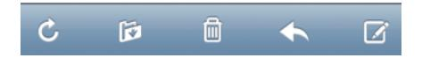

To learn more about defining a toolbar in your code, see "Displaying a Navigation Toolbar" in *View Controller Programming Guide for iOS* and *UIToolbar Class Reference*.

### Appearance and Behavior

On iPhone, a toolbar always appears at the bottom edge of a screen or view, but on iPad it can instead appear at the top edge.

Toolbar items are displayed equally spaced across the width of the toolbar. The precise set of toolbar items can change from view to view, because the items are always specific to the context of the current view.

iOS UI Element Usage Guidelines

On iPhone, changing the device orientation from portrait to landscape can change the height of the toolbar automatically. On iPad, the height and translucency of a toolbar does not change with rotation.

### Guidelines

Use a toolbar to provide a set of actions users can take in the current context.

**Use a toolbar to give people a selection of frequently used commands that make sense in the current context**. An alternative isto put a segmented control in a toolbar to give people accessto different perspectives on your application's data or to different application modes (for usage guidelines, see ["Segmented](#page-131-0) [Control"](#page-131-0) (page 132)).

**Maintain a hit target area of at least 44 x 44 points for each toolbar item**. If you crowd toolbar items too closely together, people have difficulty tapping the one they want.

**Use system-provided toolbar items according to their documented meaning**. See ["Standard](#page-135-0) Buttons for Use in Toolbars and [Navigation](#page-135-0) Bars" (page 136) for more information. If you decide to create your own toolbar items, see "Icons for [Navigation](#page-148-0) Bars, Toolbars, and Tab Bars" (page 149) for advice on how to design them.

**Try to avoid mixing plain style (borderless) and bordered toolbar items in the same toolbar**. You can use either style in a toolbar, but mixing them does not usually look good.

**Specify the color or translucency of a toolbar, when appropriate**. If you want the toolbar to coordinate with the overall look of your app, you can specify a custom color. You can make a toolbar translucent if you want to encourage people to pay more attention to the content underneath the bar. Make sure the toolbar customization you do is consistent with the look of the rest of your application. If you use a translucent toolbar, for example, don't combine it with an opaque navigation bar. And, avoid changing the color or translucency of the toolbar in different screens in the same orientation.

**On iPhone, take into account the automatic change in toolbar height that occurs on device rotation**. In particular, make sure your custom toolbar iconsfit well in the thinner bar that appearsin landscape orientation. Don't specify the height of a toolbar programmatically.

### Tab Bar

A **tab bar** gives people the ability to switch between different subtasks, views, or modes.

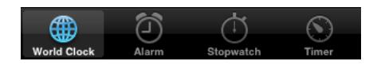

To learn more about defining a tab bar in your code, see "Tab Bar Controllers" in *ViewController Programming Guide for iOS* and *UITabBar Class Reference*.

### Appearance and Behavior

A tab bar appears at the bottom edge of the screen and should be accessible from every location in the application. A tab bar displays icons and text in tabs, all of which are equal in width and display a black background. When usersselect a tab,such as Search in YouTube, the tab's background lightens and itsimage is highlighted.

#### **CHAPTER 7**

iOS UI Element Usage Guidelines

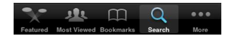

On iPhone, a tab bar can display no more than five tabs at one time; if the app has more tabs, the tab bar displays four of them and adds the More tab, which reveals the additional tabs in a list. On iPad, a tab bar can display more than five tabs.

A tab can display a badge (a red oval that contains white text, either a number or exclamation point) that communicates app-specific information.

A tab bar does not change its opacity or height, regardless of device orientation.

### Guidelines

Use a tab bar to give users access to different perspectives on the same set of data or different subtasks related to the overall function of your app. When you use a tab bar, follow these guidelines:

**Don't use a tab bar to give users controls that act on elements in the current mode or screen**. If you need to provide controls for your users, use a toolbar instead (for usage guidelines, see ["Toolbar"](#page-99-0) (page 100)).

**In general, use a tab bar to organize information at the application level**. A tab bar is well-suited for use in the main app view because it's a good way to flatten your information hierarchy and provide access to several peer information categories or modes at one time.

**On iPad, you might use a tab bar in a split view pane or a popover** if the tabs switch or filter the content within that view. However, it often works better to use a segmented control at the bottom edge of a popover or split view pane, because the appearance of a segmented control coordinates better with the popover or split view appearance. (For more information on using a segmented control, see ["Segmented](#page-99-1) Control" (page 100).)

**Consider badging a tab bar icon to communicate unobtrusively**. You can display a badge on a tab bar icon to indicate that there is new information associated with that view or mode.

**Use system-provided tab bar icons according to their documented meaning**. For more information, see ["Standard](#page-137-0) Icons for Use in Tab Bars" (page 138). If you decide to create your own tab bar icons, see ["Icons](#page-148-0) for [Navigation](#page-148-0) Bars, Toolbars, and Tab Bars" (page 149) for advice on how to design them.

**On iPad, avoid crowding the tab bar with too many tabs**. Putting too many tabs in a tab bar can make it physically difficult for people to tap the one they want. Also, with each additional tab you display, you increase the complexity of your app. In general, try to limit the number of tabs in the main view or in the right pane of a split view to about seven. In a popover or in the left pane of a split view, up to about five tabs fit well.

**On iPad, avoid creating a More tab**. In an iPad app, a screen devoted solely to a list of additional tabs is a poor use of space.

**On iPad, display the same tabs in each orientation to increase the visual stability of your app**. In portrait, the recommended seven tabs fit well across the width of the screen. In landscape orientation, you should center the same tabs along the width of the screen. This guidance also applies to the usage of a tab bar within a split view pane or a popover. For example, if you use a tab bar in a popover in portrait, it works well to display the same tabs in the left pane of a split view in landscape.

### Content Views

iOS provides a few views that are intended to display custom application content. Each view has certain properties and behaviors that make it especially well-suited to display certain types of information.

### Popover (iPad Only)

A **popover** is a transient view that can be revealed when people tap a control or an onscreen area.

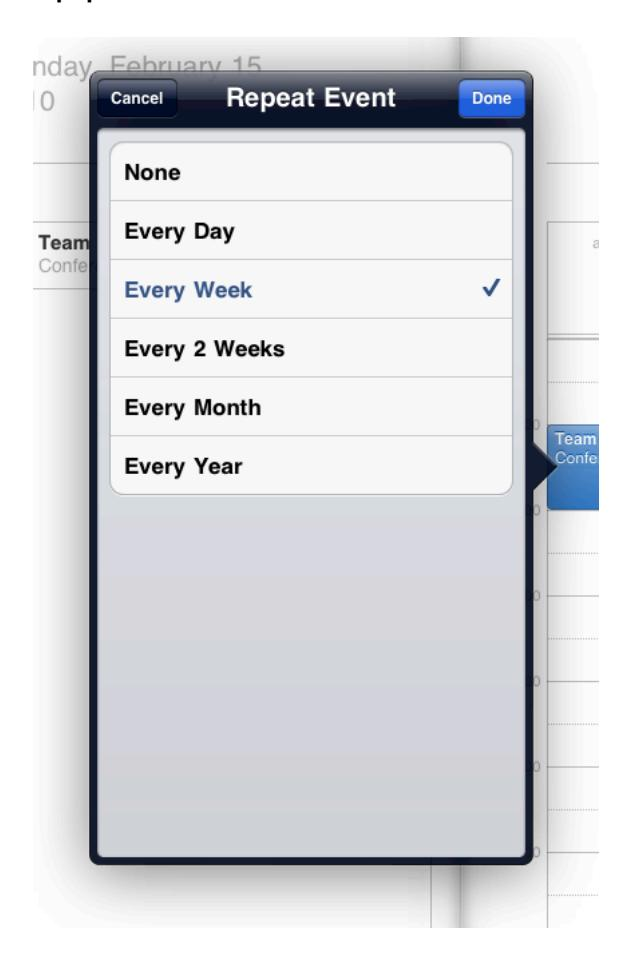

To learn more about defining a popover in your code, see *UIPopoverController Class Reference*.

**Important:** Popovers are available in iPad applications only.

### Appearance and Behavior

A popover is a self-contained view that hovers above the contents of a screen. It always displays an arrow that indicates the point from which it emerged. A popover can contain a wide variety of objects and views, such as:

#### **CHAPTER 7**

iOS UI Element Usage Guidelines

- Table, image, map, text, web, or custom views
- Navigation bars, toolbars, or tab bars
- Controls or objects that act upon objects in the current application view

In iPad apps, an action sheet always appears inside a popover.

### Guidelines

You can use a popover to:

- Display additional information or a list of items related to the focused (or selected) object.
- Display the contents of the left pane when a split view–based app is in portrait. If you do this, be sure to provide an appropriately titled button that displays the popover, preferably in a navigation bar or toolbar at the top of the screen.
- Display an action sheet that contains a short list of options that are closely related to something on the screen.

**Avoid providing a "dismiss popover" button**. A popover should close automatically when its presence is no longer necessary. To determine when a popover's presence is no longer necessary, consider the following scenarios:

● When a popover's only function is to provide a set of options or items that have an effect on the main view, it should close as soon as people make a choice. This behavior is very similar to that of a menu in a computer application. Note that this behavior also applies to a popover that contains only an action sheet: As soon as people tap a button in the action sheet, the popover should close.

Occasionally, it can make sense to provide a popover that contains items that affect the main view, but that does *not* close when people make a choice. You might want to do thisif you implement an inspector in a popover, because people might want to make an additional choice or change the attributes of the current choice.

A popover that provides menu or inspector functionality should close when people tap anywhere outside its bounds, including the control that reveals the popover. In a popover that provides a menu of choices, this gesture meansthat the user has decided not to make a choice (so the main view remains unaffected). In a popover that contains an action sheet, this gesture takes the place of tapping a Cancel button.

● If a popover enables a task, it can be appropriate to display buttons that complete or cancel the task and simultaneously dismissthe popover. In general, popoversthat enable an editing task display a Done button and a Cancel button. These buttons help remind people that they're in an editing environment and allow them to explicitly keep or discard their input. When people tap either button, the popover should close.

If it makes sense in your application, you can prevent people from closing such a popover when they tap outside its borders. This might be a good idea if it'simportant that people finish (or explicitly abandon) a task. Otherwise, you should save their input when they tap outside a popover's borders, just as you would if they tapped Done.

**In general, save users' work when they tap outside a popover's borders**. Because a popover does not require an explicit dismissal, people might dismiss it mistakenly. You should discard their work only if they tap a Cancel button.

**Ensure that the popover arrow points as directly as possible to the element that revealed it**. Doing this helps people remember where the popover came from and what task or object it's associated with.

**Make sure people can use a popover without seeing the application content behind it**. A popover obscures the content behind it, and people cannot drag a popover to another location.

**Ensure that only one popover is visible onscreen at a time**. You should not display more than one popover (or custom view designed to look and behave like a popover) at the same time. In particular, you should avoid displaying a cascade or hierarchy of popovers simultaneously, in which one popover emerges from another.

**Don't display a modal view on top of a popover**. Except for an alert, nothing should display on top of a popover.

**When possible, allow people to close one popover and open a new one with one tap**. This behavior is especially desirable when several different bar buttons each open a popover, because it prevents people from having to make extra taps.

**Avoid making a popover too big**. A popover should not appear to take over the entire screen. Instead, it should be just big enough to display its contents and still point to the place it came from.

Ideally, the width of a popover should be at least 320 points, but no greater than 600 points. The height of a popover is not constrained, so you can use it to display a long list of items. In general, though, you should try to avoid scrolling in a popover that enables a task or that presents an action sheet. Note that the system might adjust both the height and the width of a popover to ensure that it fits well on the screen.

**Generally, use standard UI controls and views within a popover**. In general, popovers look best, and are easier for users to understand, when they contain standard controls and views.

**Take care if you combine a customized background color or texture with standard controls and views**. Be sure the standard UI elements look good and are easy to read when they're seen on top of your custom background appearance.

**If appropriate, change a popover's size while it remains visible**. You might want to change a popover's size if you use it to display both a minimal and an expanded view of the same information. If you adjust the size of a popover while it's visible, you can choose to animate the change. Animating the change is usually a good idea because it avoids making people think that a new popover has replaced the old one.

### Split View (iPad Only)

A **split view** is a full-screen view that consists of two side-by-side panes.

To learn more about defining a split view in your code, see *UISplitViewController Class Reference*.

**Important:** Split views are available in iPad applications only.

### Appearance and Behavior

The width of the left pane of a split view is fixed at 320 points in all orientations. Users cannot resize either pane of a split view.

**Note:** Even though the left pane is often called the *master pane* and the right pane is often called the *detail pane*, this relationship is not enforced in code.

Both panes can contain a wide variety of objects and views, such as:

- Table, image, map, text, web, or custom views.
- Navigation bars, toolbars, or tab bars.

### Guidelines

You can use a split view to display persistent information in the left pane and related details or subordinate information in the right pane. In this design pattern, when people select an item in the left pane, the right pane should display the information related to that item. (You're responsible for making this happen in code.)

In general, when an app uses a split view in landscape, it displays the contents of the left pane in a popover when it rotates to portrait. However, you are not required to follow this pattern. If it makes sense in your app, you can design your UI to display side-by-side views in all orientations.

**Avoid creating a right pane that is narrower than the left pane**. Although the width of the right pane is up to you, it does not look good to use a width of less than 320 points (which is the width of the left pane).

**Avoid displaying a navigation bar in both panes at the same time**. Doing this would make it very difficult for users to discern the relationship between the two panes.

**In general, indicate the current selection in the left pane in a persistent way**. This behavior helps people understand the relationship between the item in the left pane and the contents of the right pane. This is important because the content of the right pane can change, but it should always remain related to the item selected in the left pane.

### Table View

A **table view** presents data in a single-column list of multiple rows.

To learn more about defining a table view in your code, see *Table View Programming Guide for iOS* and *UITableView Class Reference*.

### Appearance and Behavior

A table view displays data in rows that can be divided by section or separated into groups. Users flick or drag to scroll through rows or groups of rows. Users tap a table row to select it and use table view controls to add or remove rows, select multiple rows, see more information about a row item, or reveal another table view. A table row highlights briefly when the user taps a selectable item.

#### **CHAPTER 7**

iOS UI Element Usage Guidelines

If a row selection results in navigation to a new screen, the selected row highlights briefly as the new screen slides into place. When the user navigates back to the previous screen, the originally selected row again highlights briefly to remind the user of their earlier selection (it does not remain highlighted).

iOS defines two styles of table views, which are distinguished mainly by appearance.

**Plain** tables display rows that extend from side edge to side edge of the screen. Rows can be separated into labeled sections and an optional index can appear vertically along the right edge of the view. A header can appear before the first item in a section and a footer can appear after the last item. By default, the row background is white.

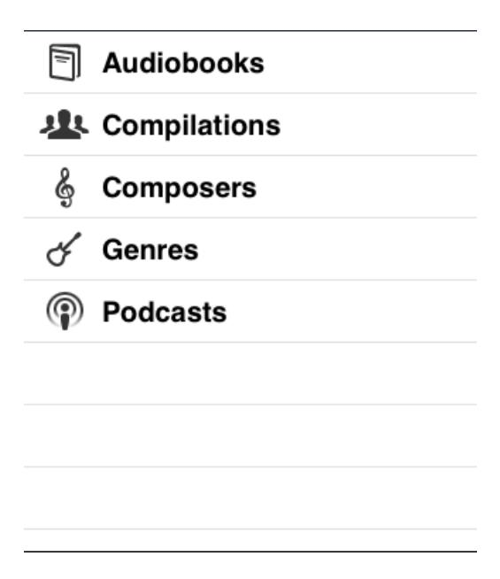

**Grouped** tables display groups of rows that are inset from the side edges of the screen. A grouped table view always contains at least one group of list items (one list item per row), and each group always contains at least one item. A group can be preceded by header text and followed by footer text. By default, groups are displayed on a distinctive blue-striped background; inside a group, row background is white. A grouped table view does not include an index.

iOS includes some **table-view elements** that can extend the functionality of table views. Unless noted otherwise, these elements are suitable for use with table views only.

**Table 7-1** Table-view elements

| Element | Name                     | Description                                                                                                                                                              |
|---------|--------------------------|--------------------------------------------------------------------------------------------------------------------------------------------------------------------------|
|         | Checkmark                | Indicates that the row is selected                                                                                                                                       |
|         | Disclosure indicator     | Displays another table associated with the row                                                                                                                           |
|         | Detail disclosure button | Displays additional details about the row in a new view (for information on how to use this element outside of a table, see "Detail Disclosure Button" (page 126)) |
|         | Row reorder              | Indicates that the row can be dragged to another location in the table                                                                                                |
|         | Row insert               | Adds a new row to the table                                                                                                                                              |
|         | Delete button control    | In an editing context, reveals and hides the Delete button for a row                                                                                                     |
|         | Delete button            | Deletes the row                                                                                                                                                          |

iOS 3 and later defines four table-cell styles that implement the most common layouts for table rows in both plain and grouped tables. Each cell style is best suited to display a different type of information.

**Note:** Programmatically, these styles are applied to a table view's cell, which is an object that tells the table how to draw its rows.

**Default** (UITableViewCellStyleDefault). The default cell style includes an optional image in the left end of the row, followed by a left-aligned title in black.

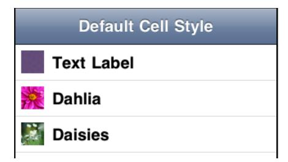

In the default cell style, the text label's appearance implies that it represents an item name or title and its left-alignment makes the list easy to scan. This makes the default style good for displaying a list of items that do not need to be differentiated by supplementary information.

**Subtitle** (UITableViewCellStyleSubtitle). The subtitle style includes an optional image in the left end of the row, followed by a left-aligned title on one line and a left-aligned subtitle on the line below. The title is in black and the subtitle is in a smaller, gray font.

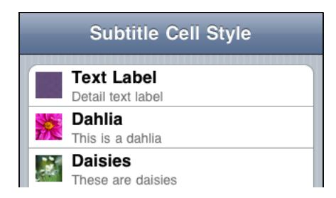

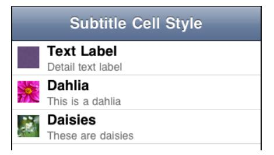

In the subtitle cell style, the prominent appearance of the text label implies that it represents an item name or title, whereas the subtle appearance of the detail text label implies that it contains subsidiary information related to the item. The left-alignment of the text labels makesthe list easy to scan. Thistable-cellstyle works well when list items look similar, because users can use the additional information in the detail text labels to help distinguish items named in the text labels.

**Value 1** (UITableViewCellStyleValue1). The value 1 style displays a left-aligned title in black on the same line with a right-aligned subtitle in a smaller, blue font. Images do not fit well in this style.

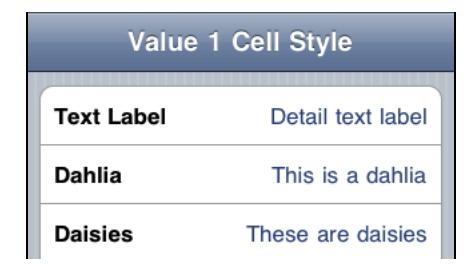

| Value 1    | Cell Style        |
|------------|-------------------|
| Text Label | Detail text label |
| Dahlia     | This is a dahlia  |
| Daisies    | These are daisies |

In the value 1 cell style, the appearance of the text label implies that it represents an item name or title, whereas the appearance of the detail text label implies that it provides important information that is closely associated with the item.

The left-alignment and font of the text label help users scan the list for the item they want, and the right-alignment of the detail text label draws their attention to the related information it provides. This table-cell style works well to display an item's current value, possibly selected from a sublist.

**Value 2** (UITableViewCellStyleValue2). The value 2 style displays a right-aligned title in a small, blue font, followed on the same line by a left-aligned subtitle in a larger, black font. Images do not fit well in this style.

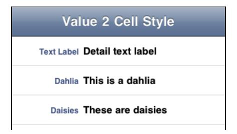

In the value 2 cellstyle, the right-alignment, constrained width, and font of the text label imply that it functions as a heading or caption for the important information in the more prominent, left-aligned detail text label.

In this layout, the labels are aligned towards each other at the same location in every row. This creates a crisp, vertical margin between the text labels and the detail text labels in the list, which helps users focus on the first words of the detail text label.

**Note:** All fourstandard table-cellstyles also allow the addition of a table-view element,such asthe checkmark or the disclosure indicator. Adding these elements decreases the width of the cell available for the title and subtitle.

### Guidelines

You can use a table view to display large orsmall amounts of information cleanly and efficiently. For example, you can use a table view to:

**Provide a list of options from which users can select**. You can use the checkmark to show usersthe currently selected option (or options) in the list.

To display a list of choices users see when they tap an item in a table row, you can use either a plain or a grouped table view. To display a list of choices users see when they tap a button or other UI element that is not in a table row, use the plain style.

**Display hierarchical information**. The plain table style is well-suited to display a hierarchy of information. Each list item can lead to a different subset of information displayed in another list. Users follow a path through the hierarchy by selecting one item in each successive list. The disclosure indicator tells users that tapping anywhere in the row reveals the subset of information in a new list.

**Display conceptually grouped information**. Both table view styles allow you to provide context by supplying header and footer text between sections of information. The rounded corners of the grouped style make separate groups of information easy to see, even when users are scrolling quickly.

**Display information that is indexed to facilitate lookup**. The plain style supports an index view that helps users quickly find what they need. The index consists of a column of entries (usually letters in an alphabet) that floats on the right edge of the screen. Users tap (or drag to) an index entry to reveal the corresponding area in the list.

If you include an index, avoid using table-view elements that display on the right edge of the table (such as the disclosure indicator), because these elements interfere with the index.

**Always provide feedback when users select a list item**. Users expect a table row to highlight briefly when they tap a selectable item in it. After tapping, users expect an immediate action to occur: Either a new view appears or the row displays a checkmark to indicate that the item has been selected or enabled.

In rare cases, a row might remain highlighted when secondary details or controls related to the row item are displayed in the same screen. However, thisis not encouraged because it is difficult to display simultaneously a list of choices, a selected item, and related details or controls without creating an uncomfortably crowded layout.

Follow these guidelines when you use table views:

**Consider animating the changes users make to list items** to provide feedback and strengthen the user's sense of direct manipulation. In Settings, for example, when users turn off the automatic date and time setting (by selecting Off in General > Date & Time > Set Automatically), the list group expands smoothly to display two new items, Time Zone and Set Date & Time.

**If table content is extensive or complex, avoid waiting until all the data is available before displaying anything**. Instead, fill the onscreen rows with textual data immediately and display more complex data (such as images) as they become available. This technique gives users useful information right away and increases the perceived responsiveness of your application.

**Consider displaying "stale" data while waiting for new data to arrive**. If your app displays data that changes infrequently, you might consider this technique so that users can see something useful right away. This technique is not recommended for applications that handle data that changes frequently. Before you decide to do this, gauge how often the data changes and how much users depend on seeing fresh data quickly.

**If the data is slow-loading or complex, provide users with a signal that processing is continuing**. If a table contains only complex data, it might be difficult to display anything useful right away. In these rare cases, it'simportant to avoid displaying empty rows, because this can imply that the application hasstalled. Instead, the table should display a spinning activity indicator along with an informative label, such as "Loading...", centered in the screen. This provides feedback to users, letting them know that processing is continuing.

**Avoid variable row heights in a plain table**. Variable row heights are acceptable in grouped tables, but they can make a plain table look cluttered and uneven.

**Generally, use grouped tables for the value 1 and value 2 cell styles**. Although you can use any cell style with either type of table, the value 1 and value 2 cell styles look best in grouped tables. For example, Settings uses the value 1 cell style and iPhone Contacts uses the value 2 cell style.

**As much as possible, ensure that your text labels are succinct to avoid truncation**. Truncated words and phrases can be difficult for users to scan and understand. Text truncation is automatic in all table-cell styles, but it can present more or less of a problem, depending on which cell style you use and on where truncation occurs.

- In the default cell style, short text labels are best. If truncation is unavoidable, try to ensure that the most important information is contained in the first few words.
- In the subtitle cell style, too, short text labels are best. If truncation is unavoidable, focus on putting the most important information in the first few words. If the detail text label is truncated, users are not likely to mind too much because they view it as information that enhances or supplements the item named by the text label.
- In the value 1 cell style, text truncation can be difficult to avoid (because both labels are on the same line), but it's worth the effort. Otherwise, you lose the active space between the labels that helps users understand the relationship between the two pieces of information.
- In the value 2 cell style, truncated text labels blunt the sharpness of the vertical strip of white space between them and the detail text. When the white-space width is inconsistent from row to row, it's harder for users to scan the information in the detail text.

You might be able to avoid text truncation by increasing the height of a table row to accommodate text wrapping, but this can be problematic for these reasons:

- You have to programmatically check the text length and decide if wrapping might occur. You must make this determination for both portrait and landscape orientation, because the table width affects text wrapping.
- Text might wrap in one orientation, but not the other, which is something you should avoid.

iOS UI Element Usage Guidelines

● Variable row heights can negatively impact the overall table view performance in your application, regardless of table-view style.

**If you want to lay out your table rows in a nonstandard way**, it's better to create a custom table-cell style than to significantly alter a standard one. To learn how to create your own cells, see "Customizing Cells" in *Table View Programming Guide for iOS*.

### Text View

A **text view** accepts and displays multiple lines of text.

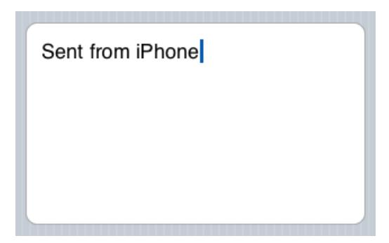

To learn more about defining a text view in your code, see *UITextView Class Reference*.

### Appearance and Behavior

A text view is a rounded rectangle of any height. A text view supports scrolling when the content is too large to fit inside its bounds.

If the text view supports user editing, a keyboard appears when the user taps inside the text view. The keyboard's input method and layout are determined by the user's language settings. When users tap the button labeled ".?123," the keyboard changes to display numbers, punctuation marks, and a few common symbols.

### Guidelines

You have control over the font, color, and alignment of the text in a text view, but only as they apply to the entirety of the text. In other words, you can't change any of these properties for only part of the text. The default font is the system font and the default color is black, because these tend to be the most readable. The default for the alignment property is left (you can change it to center or right).

If you must enable variable fonts, colors, or alignments within a view that displays text, you can use a web view instead of a text view, and style the text using HTML.

You can also specify different keyboard styles, depending on the type of content you expect users to enter. For a description of the styles you can use, see "Text [Field"](#page-133-1) (page 134).

### Web View

A **web view** is a region that can display rich HTML content (shown here between the navigation bar and toolbar in Mail).

To learn more about defining a web view in your code, see *UIWebView Class Reference*.

### Appearance and Behavior

In addition to displaying web content, a web view performs some automatic processing on web content, such as converting a phone number to a phone link.

### Guidelines

If you have a webpage or web app, you might decide to use a web view to implement a simple iOS application that provides a wrapper for your webpage or web app. If you plan to use a web view to access web content that you control, be sure to read *Safari Web Content Guide*.

**Avoid using a web view to create an application that looks and behaves like a mini web browser**. People expect to use Safari on iOS to browse web content, so replicating this broad functionality within your app is not recommended.

# Alerts, Action Sheets, and Modal Views

Alerts, action sheets, and modal views are temporary views that appear when something requires the user's attention or when additional choices or functionality need to be offered. People cannot interact with an application while one of these views is on the screen.

To learn about working with these types of views in your code, see "Modal View Controllers" in *View Programming Guide for iOS*.

### Alert

An alert gives people important information that affects their use of the application (or the device).

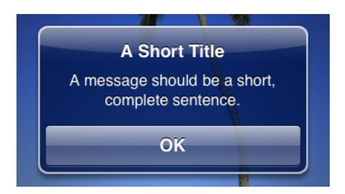

To learn about using an alert in your code, see *UIAlertView Class Reference*.

### Appearance and Behavior

An alert pops up in the middle of the application screen and floats above its views. The unattached appearance of an alert emphasizes the fact that its arrival is due to some change in the application or the device, not necessarily asthe result of the user's most recent action. Users must dismissthe alert before they can continue using the currently running application.

An alert always contains at least one button, which users tap to dismiss the alert. An alert always displays a title and might also display a message that provides additional information. The background appearance of an alert is system-defined and cannot be changed.

**Note:** A local or push notification can also use an alert to communicate with users. To learn more about local and push notifications, see "Local and Push [Notifications"](#page-91-0) (page 92).

### Guidelines

The infrequency with which alerts appear helps users take them seriously. Be sure to minimize the number of alerts your app displays and ensure that each one offers critical information and useful choices.

#### **Avoid creating unnecessary alerts**.

These alerts are usually unnecessary if they:

- Merely increase the visibility of some information, especially information that is related to the standard functioning of your application.
  - Instead, you should design an eye-catching way to display the information that harmonizes with your app's style.
- Update users on tasks that are progressing normally.

Instead, consider using a progress view or an activity indicator to provide progress-related feedback to users(these methods of feedback are described in ["Progress](#page-128-1) View" (page 129) and "Activity [Indicator"](#page-123-1) (page 124)).

● Ask for confirmation of user-initiated actions.

To get confirmation for an action the user initiated, even a potentially risky action such as deleting a contact, you should use an action sheet.

● Inform users of errors or problems about which they can do nothing.

Although it might be necessary to use an alert to tell users about a critical problem they can't fix, it's better to integrate such information into the UI, if possible. For example, instead of telling users every time a server connection fails, display the time of the last successful connection.

You can specify the text of the required title and optional message, the number of buttons, and the button contents in an alert. You can't customize the width or the background appearance of the alert view itself, or the alignment of the text (it's center-aligned).

As you read the alert-text design guidelines, it's useful to know the following definitions:

- **Title-style capitalization** meansthat every word is capitalized, except articles, coordinating conjunctions, and prepositions of four or fewer letters when they aren't the first word.
- **Sentence-style capitalization** means that the first word is capitalized, and the rest of the words are lowercase unless they are proper nouns or proper adjectives.

**Write alert text that succinctly describes the situation and explains what people can do about it**. Ideally, the text you write gives people enough context to understand why the alert has appeared and to decide which button to tap.

**Keep the title short enough to display on a single line, if possible**. A long alert title is difficult for people to read quickly, and it might get truncated or force the alert message to scroll.

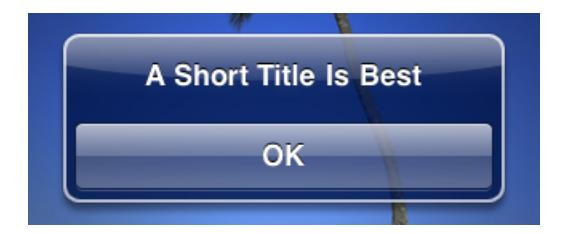

**Avoid single-word titles that don't provide any useful information**, such as "Error" or "Warning."

**When possible, use a sentence fragment**. A short, informative statement is often easier to understand than a complete sentence.

**Don't hesitate to be negative**. People understand that most alerts tell them about problems or warn them about dangerous situations. It's better to be negative and direct than it is to be positive but oblique.

**Avoid using "you," "your," "me," and "my" as much as possible**. Sometimes, text that identifies people directly can be ambiguous and can even be interpreted as an insult.

**Use capitalization and punctuation appropriately**.

Use title-style capitalization and no ending punctuation when the title is a sentence fragment or it consists of a single sentence that is not a question.

If the title consists of a single sentence that is a question, use sentence-style capitalization and an ending question mark. In general, consider using a question for an alert title if it allows you to avoid adding a message.

If the title consists of two or more sentences, use sentence-style capitalization and appropriate ending punctuation for each sentence. A two-sentence alert title should seldom be necessary, although you might consider it if it allows you to avoid adding a message.

**If you provide an optional alert message, create a short, complete sentence**. Use sentence-style capitalization and appropriate ending punctuation.

**Avoid creating an alert message that is too long**. If possible, keep the message short enough to display on one or two lines. If the message is too long it will scroll, which is not a good user experience.

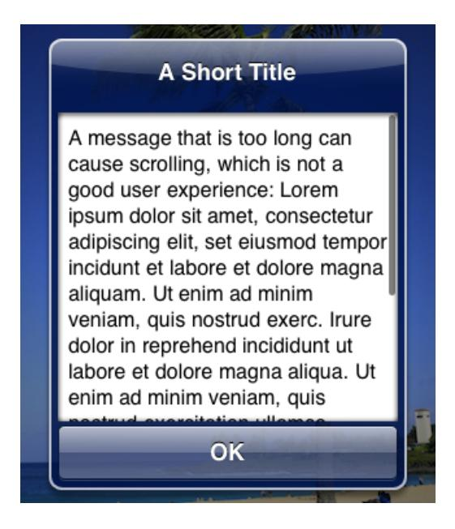

**Avoid lengthening your alert text with descriptions of which button to tap**, such as "Tap View to see the information." Ideally, the combination of unambiguous alert text and logical button labels gives people enough information to understand the situation and their choices. However, if you must provide detailed guidance, follow these guidelines:

- Be sure to use the word "tap" (not "touch" or "click" or "choose") to describe the selection action.
- Don't enclose a button title in quotation marks, but do preserve its capitalization.

**Be sure to testthe appearance of your alertin both orientations**. Because the height of an alert is constrained in landscape, it might look different from the way it looks in portrait. It's recommended that you optimize the length of the alert text so that it looks good (and avoids scrolling) in both orientations.

**Generally, use a two-button alert**. A two-button alert is often the most useful, because it is easiest for people to choose between two alternatives. It is rarely a good idea to display an alert with a single button because such an alert is merely informative; it does not give people any control over the situation. An alert that contains three or more buttons is significantly more complex than a two-button alert and should be avoided if possible. In fact, if you find that you need to offer people more than two choices, you should consider using an action sheet instead (to learn how to use an action sheet, see ["Action](#page-118-0) Sheet" (page 119)).

**Use alert button colors appropriately**. Alert buttons are colored either dark or light. In an alert with two buttons, the button on the left is always dark-colored and the button on the right is always light-colored. In a one-button alert, the button is always light-colored.

- In a two-button alert that proposes a potentially risky action, the button that cancels the action should be on the right (and light-colored).
- In a two-button alert that proposes a benign action that people are likely to want, the button that cancels the action should be on the left (and dark-colored).

**Note:** A Cancel button may be either light-colored or dark-colored and it may be on the right or the left, depending on whether the alternate choice is destructive. Be sure to properly identify which button is the Cancel button in your code (for more information, see *UIAlertView Class Reference*).

Pressing the Home button while an alert is visible should quit the app, as expected. Itshould also be identical to tapping the Cancel button—that is, the alert is dismissed and the action is not performed.

**Give alert buttons short, logical titles**. The best titles consist of one or two words that make sense in the context of the alert text. Follow these guidelines as you create titles for alert buttons:

- As with all button titles, use title-style capitalization and no ending punctuation.
- Use verbs and verb phrases, such as "Cancel," "Allow," "Reply," or "Ignore" that relate directly to the alert text.
- Use "OK" for a simple acceptance option if there is no better alternative. Avoid using "Yes" or "No."
- ● Avoid "you," "your," "me," and "my" as much as possible. Button titles that use these words are often both ambiguous and patronizing.

### Action Sheet

An **action sheet** displays a set of choices related to a task the user initiates.

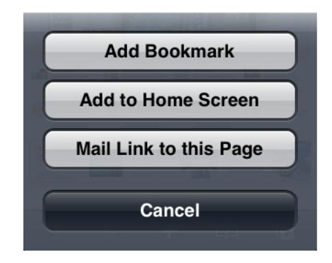

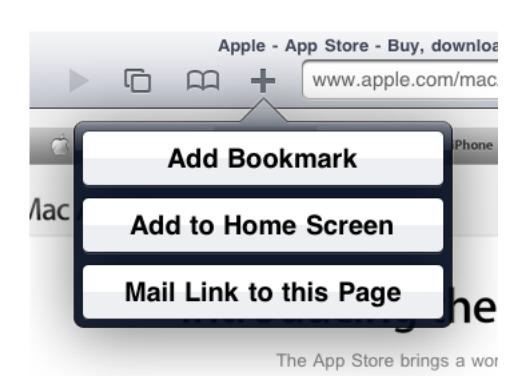

To learn how to define an action sheet in your code, see *UIActionSheet Class Reference*.

### Appearance and Behavior

An action sheet has two different appearances. On iPhone, an action sheet always emerges from the bottom of the screen and hovers over the application's views. The side edges of an action sheet are anchored to the sides of the screen, which reinforces its connection to the app and to the user's most recent action.

On iPad, an action sheet is always displayed within a popover; it never has full-screen width. An action sheet can cause a popover to appear, or it can appear within a popover that is already open. In both cases, there is a strong visual connection between the action sheet and the user's action. (To learn more about popovers, see ["Popover](#page-102-1) (iPad Only)" (page 103).)

An action sheet always contains at least two buttons that allow users to choose how to complete their task. When users tap a button, the action sheet disappears. An action sheet does not include a title or explanatory text, because it appears in immediate response to a user action.

### Guidelines

Use an action sheet to:

- Provide alternate ways a task can be completed. An action sheet allows you to provide a range of choices that make sense in the context of the current task, without giving these choices a permanent place in the user interface.
- Get confirmation before completing a potentially dangeroustask. An action sheet prompts usersto think about the potentially dangerous effects of the step they're about to take and givesthem some alternatives. This type of communication is particularly important on iOS-based devices because sometimes users tap controls without meaning to.

**On iPhone, coordinate the action sheet background appearance with the navigation bars and toolbars**. Use the translucent black background if your application uses black navigation bars and toolbars. Use the default blue background if your navigation bars and toolbars are the default blue color.

All action sheets in your iPhone application should have the same background color.

**On iPhone, include a Cancel button** so that users can easily and safely abandon the task. Place the Cancel button at the bottom of the action sheet to encourage users to read through all the alternatives before making a choice. By default, the appearance of the Cancel button coordinates with the background of the action sheet.

#### **On iPad, choose whether to display an action sheet with animation or without animation**.

- Display an action sheet without animation to provide alternatives related to a task that the user initiates from outside a popover. Without animation, an action sheet and its popover appear simultaneously. When you display an action sheet this way, the popover's arrow points to the control or area the user tapped to initiate the task.
  - Do not include a Cancel button when the action sheet is displayed without animation, because people can tap outside the popover to dismiss the action sheet without selecting one of the other alternatives.
- Display an action sheet with animation to provide alternatives related to a task that the user initiates from within an open popover. With animation, an action sheetslides up over an open popover's content.

An animated action sheet should include a Cancel button, because people need to be able to dismiss the action sheet without closing the popover.

**On both devices, use the red button color if you need to provide a button that performs a potentially destructive action**. Display a red button at the top of the action sheet, because the closer to the top of the action sheet a button is, the more eye-catching it is. And, on iPhone, the farther a destructive button is from the bottom of an action sheet, the less likely users are to tap it when they're aiming for the Home button.

**Avoid making users scroll through an action sheet**. If you include too many buttons in an action sheet, users must scroll to see all actions. This is a disconcerting experience for users, because they must spend extra time considering each choice. Also, it can be very difficult for users to scroll without inadvertently tapping a button.

### Modal View

A **modal view** (that is, a view presented modally) provides self-contained functionality in the context of the current task or workflow.

To learn more about defining a modal view in your code, see *UIViewController Class Reference*.

### Appearance and Behavior

A modal view covers the entire application screen, which strengthens the user's perception of entering a separate, transient mode in which they can accomplish something.

A modal view can display text if appropriate, and contains the controls necessary to perform the task. A modal view generally displays a button that completes the task and dismisses the view, and a Cancel button users can tap to abandon the task.

### Guidelines

Use a modal view when you need to offer the ability to accomplish a self-contained task related to your application's primary function. A modal view is especially appropriate for a multistep subtask that requires UI elements that don't belong in the main application user interface all the time.

**On iPad, choose a modal view style that suits the current task and the visual style of your app**. You can use any of these styles, defined here:

● **Full screen**. Covers the entire screen. This style is good for presenting a potentially complex task that people can complete within the context of the modal view. For example, the iPod application uses this style for its Genius playlist creation task.

- **Page sheet**. Has a fixed width of 768 points; the sheet height is the current height of the screen. In portrait, the modal view covers the entire screen; in landscape, the screen that is visible on both sides of the modal view is dimmed to prevent user interaction. For example, Mail usesthisstyle for its message composition task.
- **Form sheet**. Has fixed dimensions of 540 x 620 points and is centered in the screen. The area of the screen that is visible outside the modal view is dimmed to prevent user interaction. When the keyboard is visible in landscape, a form sheet view moves up to just below the status bar. This style is good for gathering structured information from the user.
- **Current context**. Uses the same size as its parent view. This style is good for displaying a modal view within a split view pane, popover, or other non–full–screen view.

**On iPad, don't display a modal view on top of a popover**. With the possible exception of an alert, nothing should display on top of a popover. In rare cases when you might need to display a modal view as a result of an action the user takes in a popover, close the popover before you open the modal view.

**On iPhone, coordinate the overall look of a modal view with the appearance of your app**. For example, a modal view often includes a navigation bar that contains a title and buttons that cancel or complete the modal view's task. When this is the case, the navigation bar should have the same background appearance as the navigation bar in the application.

**On both devices, display a title that identifies the task, if appropriate**. You might also display text in other areas of the view that more fully describes the task or provides some guidance. For example, the Messages app on iPhone presents a modal view when users want to compose a text message. This modal view displays a navigation bar with the same background asthe application navigation bar and with the title New Message.

**On both devices, choose an appropriate transition style for revealing the modal view**. Use a style that coordinates with your application and enhances the user's awareness of the temporary context shift that the modal view represents. To do this, you can specify one of the following transition styles:

- **Vertical**. The modal view slides up from the bottom edge of the screen and slides back down when dismissed. (This is the default transition style.)
- **Flip**. The current view flips horizontally from right to left to reveal the modal view. Visually, the modal view looks as if it is the back of the current view. When the modal view is dismissed, it flips horizontally from left to right, revealing the previous view.
- **Partial curl**. The partial-curl transition style issimilar to the page-curl behavior of Maps on iPhone. Visually, one corner of the current view curls up to reveal the modal view underneath. When the user leaves the modal view, the current view uncurls to its original position. You might want to use this style when the modal view you reveal is not large and does not require much user interaction, such as a view that holds configuration options.

Note that a modal view revealed by a partial-curl transition cannot itself reveal another modal view.

If you decide to vary the transition styles of the modal views in your application, avoid doing so merely for the sake of variety. Users are quick to notice such differences and will assume that they mean something. For this reason, it's best to establish a logical, consistent pattern that users can easily detect and remember, and avoid changing transition styles without a good reason.

### Controls

Controls are UI elementsthat usersinteract with to perform an action, or view to get information. iOS provides a large number of controls you can use in your application.

### Activity Indicator

An **activity indicator** shows that a task or process is progressing (shown here with a label).

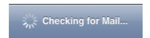

To learn how to define an activity indicator in your code, see *UIActivityIndicatorView Class Reference*.

### Appearance and Behavior

An activity indicator spins while a task is progressing and disappears when the task completes. Users do not interact with an activity indicator. By default, an activity indicator is white.

### Guidelines

Use an activity indicator in a toolbar or a main view to show that processing is occurring, without suggesting when it will finish.

**Don't display a stationary activity indicator**, because users associate this with a stalled process.

**Use an activity indicator when it's more important to reassure users that their task or process has not stalled** than it is to suggest when processing will finish.

**If appropriate, customize the size and color of an activity indicator** to coordinate with the background of the view in which it appears.

### Date and Time Picker

A **date and time picker** displays components of date and time, such as hours, minutes, days, and years.

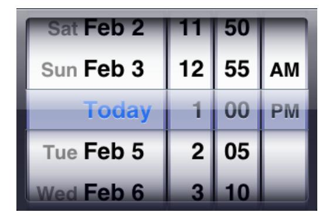

To learn how to define a date and time picker in your code, see *UIDatePicker Class Reference*.

### Appearance and Behavior

A date and time picker can have up to four independent wheels, each of which displays values in a single category, such as month or hour. Users flick or drag to spin each wheel until it displays the desired value beneath the clear selection bar that stretches across the middle of the picker. The final value comprises the values displayed in each wheel.

The overall size of a date and time picker is fixed at the same size as the iPhone keyboard.

A date and time picker has four modes, each of which displays a different number of wheels that contain a set of different values.

- **Date and time**. The date and time mode displays wheels for the calendar date, hour, and minute values, with the optional addition of a wheel for the AM/PM designation. This is the default mode.
- **Time**. The time mode displays wheels for the hour and minute values, with the optional addition of a wheel for the AM/PM designation.
- **Date**. The date mode displays wheels for the month, day, and year values.
- **Countdown timer**. The countdown timer mode displays wheelsfor the hour and minute. You can specify the total duration of a countdown, up to a maximum of 23 hours and 59 minutes.

### Guidelines

Use a date and time picker to let users pick (instead of type) a date or time value that consists of multiple parts, such as the day, month, and year. A date and time picker is easy to use because the values in each part have a relatively small range and users already know what the values are.

**If it makes sense in your app, change the interval in the minutes wheel**. By default, a minutes wheel displays 60 values (0 to 59). If you need to display a coarser granularity of choices, you can set a minutes wheel to display a larger minute interval, as long as the interval divides evenly into 60. For example, you might want to display the quarter-hour intervals 0, 15, 30, and 45.

**On iPad, present a date and time picker only within a popover**. A date and time picker is not suitable for the main screen.

### Detail Disclosure Button

A **detail disclosure button** reveals additional details or functionality related to an item (shown here inside a map annotation view).

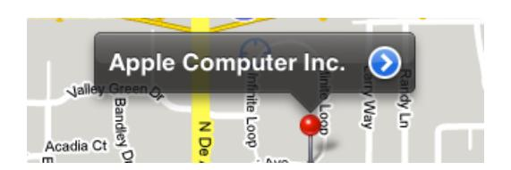

To learn how to define a detail disclosure button (UITableViewCellAccessoryDetailDisclosureButton) in your code, see *UITableViewCell Class Reference* and *UIButton Class Reference*.

### Appearance and Behavior

Userstap a detail disclosure button to reveal additional information or functionality related to a specific item. The additional details or functionality are revealed in a separate view.

When a detail disclosure button appears in a table row, tapping elsewhere in the row does not activate the detail disclosure button; instead, it selects the row item or results in application-defined behavior.

### Guidelines

Typically, you use a detail disclosure button in a table view to give users a way to see more details or functionality related to a list item. However, you can also use this element in other types of views to provide a way to reveal more information or functionality related to an item in that view.

### Info Button

An **Info button** reveals configuration details about an application, often on the back of the current view.

iOS UI Element Usage Guidelines

To learn more about defining an Info button in your code, see *UIButton Class Reference*.

### Appearance and Behavior

iOS includes two styles of Info button: a dark-colored "i" on a light background and a light-colored "i" on a dark background. An Info button automatically glows briefly when the user taps it. When tapped, an Info button results in an immediate action, such as flipping a view in an application to reveal the back.

### Guidelines

Use an Info button to reveal configuration details or options about an application. You can use the style of Info button that coordinates best with the UI of your app.

**On iPhone, use an Info button to flip the screen and reveal more information**. Typically, the back of a screen displays configuration options that don't need to be in the main UI.

**On iPad, avoid using an Info button to flip the entire screen**. Instead, you might use an Info button to show people that they can access an expanded view that contains related information or additional details.

### Label

A **label** displays static text.

To learn more about defining labels in your code, see *UILabel Class Reference*.

### Appearance and Behavior

A label displays any amount of static text. Users do not interact with labels except, potentially, to copy the text.

### Guidelines

You can use a label to name or describe parts of your UI or to provide short messages to the user. A label is best suited to display a relatively small amount of text.

**Take care to make your labels legible**. Don't sacrifice clarity for fancy fonts or showy colors.

### Network Activity Indicator

A **network activity indicator** appears in the status bar and shows that network activity is occurring (shown here to the left of the time).

iOS UI Element Usage Guidelines

In your code, you use the UIApplication method networkActivityIndicatorVisible to control the indicator's visibility.

### Appearance and Behavior

The network activity indicator spins in the status bar while network activity proceeds. It disappears when network activity stops. Users do not interact with the network activity indicator.

### Guidelines

Display the network activity indicator to provide feedback when your application accesses the network for more than a couple ofseconds. If the operation finishessooner than that, you don't have to show the network activity indicator, because the indicator would be likely to disappear before users notice its presence.

### Page Indicator

A **page indicator** indicates how many views are open and which one is currently visible.

To learn more about defining a page indicator in your code, see *UIPageControl Class Reference*.

### Appearance and Behavior

A page indicator displays a dot for each currently open peer view in an application. From left to right, the dots represent the order in which the views were opened (the leftmost dot represents the first view). The currently visible view is indicated by a glow on the dot that represents it. Users tap to the left or the right of the glowing dot to see the previous or next open view.

The dots of a page indicator do notshrink orsqueeze together as more appear. A screen in portrait orientation can accommodate approximately 20 dots; if you try to display more dots than will fit in the screen, they will be clipped.

### Guidelines

Use a page indicator when each view in your application is a peer of every other view. Do not use a page indicator if your application displays information in a hierarchy of views, because a page indicator does not help users retrace their steps through a specific path.

**Vertically center a page indicator between the bottom edge of an open view and the bottom edge of the screen**, where it is always visible without getting in users' way. Be sure to avoid trying to display too many dots for the current screen orientation.

**On iPad, investigate ways to display your content on a single screen**. On the large iPad screen multiple parallel screens don't work as well, so the need for the page indicator control is decreased.

### Picker

A **picker** displays a set of values from which a user picks one.

To learn more about defining a picker in your code, see *UIPickerView Class Reference*.

### Appearance and Behavior

A picker is a generic version of the date and time picker. As with a date and time picker, users spin the wheel (or wheels) of a picker until the value they want appears. The overallsize of a picker, including its background, is fixed at the same size as the keyboard on iPhone. (For more information about the date and time picker, see "Date and Time [Picker"](#page-124-0) (page 125).)

### Guidelines

Use a picker to make it easy for people to choose from a set of values. It's often best to use a picker when people are familiar with the entire set of values. This is because many, if not most, of the values are hidden when the wheel is stationary. If you need to provide a large set of choices that aren't well known to your users, a picker might not be the appropriate control.

**Consider using a table view, instead of a picker, if you need to display a very large number of values**. This is because the greater height of a table view makes scrolling faster.

**Use the translucent selection bar to display contextual information**, such as a unit of measurement. Do not display such labels above the picker or on the wheel itself.

**On iPad, present a picker only within a popover**. A picker is not suitable for the main screen.

### Progress View

A **progress view** showsthe progress of a task or processthat has a known duration (shown here with a label).

To learn more about defining a progress view in your code, see *UIProgressView Class Reference*.

### Appearance and Behavior

iOS provides two styles of progress view. The appearance of each style is very similar, except for height.

- The **default**style is white and has a weight that makesitsuitable for use in an application's main content area.
- The **bar** style is thinner than the default style, which makes it well-suited for use in a toolbar. The bar style is also white.

As the task or process proceeds, the track of the progress view is filled from left to right. At any given time, the proportion of filled to unfilled area in the progress view gives people an indication of how soon the task or process will finish. Users do not interact with a progress view.

### Guidelines

Use a progress view to provide feedback to people on a task that has a well-defined duration, especially when it's important to show them approximately how long the task will take. When you display a progress view, you tell the user that their task is being performed and you give them enough information to decide if they want to wait until the task is complete or cancel it.

### Rounded Rectangle Button

A **rounded rectangle button** performs an application-specific action.

To learn more about defining a rounded rectangle button in your code, see *UIButton Class Reference*.

### Appearance and Behavior

A rounded rectangle button has a corner radius that is the same as the corner radius of a grouped table view. By default, the button's background is white.

### Guidelines

Use a rounded rectangle button to initiate an action. When you supply a title for a rounded rectangle button, follow this approach:

- Use title-style capitalization (that is, capitalize every word except articles, coordinating conjunctions, and prepositions of four or fewer letters)
- Avoid creating a title that is too long. Overly long text gets truncated, which can make it difficult for users to understand it.

iOS UI Element Usage Guidelines

You can specify the title or image to display in a rounded rectangle button. You can also specify that the button should highlight when it's tapped and how the title should look when the button highlights.

### Scope Bar

A **scope bar** allows users to define the scope of a search. A scope bar is available only in conjunction with a search bar. A scope bar is shown here below a search bar.

To learn more about defining a search bar and scope bar in your code, see *UISearchBar Class Reference*.

### Appearance and Behavior

When a search bar is present, a scope bar can appear near it. The scope bar displays below the search bar, regardless of orientation, unless you use a search display controller in your code (for more information on the way this works, see *UISearchDisplayController Class Reference*). When you use a search display controller, the scope bar is displayed within the search bar to the right of the search field when the device isin landscape orientation (in portrait orientation, it's below the search bar).

The scope bar contains buttons users can tap to select a scope for the search, and it adopts the same appearance you specify for the search bar.

### Guidelines

It can be useful to display a scope bar when there are clearly defined or typical categories in which users might want to search. For example, users often want to narrow their search to one field in an email message.

### Search Bar

A **search bar** accepts text from users, which can be used as input for a search (shown here with placeholder text and the Bookmarks button).

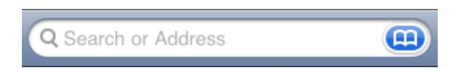

To learn how to define a search bar in your code, see *UISearchBar Class Reference*.

### Appearance and Behavior

A search bar looks like a text field with rounded ends. By default, a search bar displays the search icon on the left side. When the user taps a search bar, a keyboard appears; when the user is finished typing search terms, the input is handled in an application-specific way.

In addition, a search bar can display a few optional elements:

- **Placeholder** text. Thistext mightstate the function of the control (for example, "Search") or remind users in what context they are searching (for example, "YouTube" or "Google").
- The **Bookmarks** button. This button can provide a shortcut to information users want to easily find again. For example, the Bookmarks button in the Maps search mode gives access to bookmarked locations, recent searches, and contacts.

The Bookmarks button is visible only when there is no user-supplied or nonplaceholder text in the search bar, because the Clear button is visible when there is text in the search bar that users might want to erase.

- The **Clear** button. Most search bars include a Clear button that allows users to erase the contents of the search bar with one tap. (The Clear button is a gray circle with a white "x" in it.)
  - When the search bar contains any nonplaceholder text, the Clear button is visible so users can erase the text. If there is no user-supplied or nonplaceholder text in the search bar, the Clear button is hidden because there is no need to erase the contents of the search bar.
- A descriptive title, called a **prompt**, that appears above the search bar. For example, a prompt can be a short phrase that provides introductory or application-specific context for the search bar.

### Guidelines

Use a search bar to enable search in your application. Do not use a text field because it doesn't have the standard appearance users expect.

You can customize the appearance of a search bar by specifying one of the standard-color background styles:

- Blue (Thisisthe default gradient that coordinates with the default appearance of toolbars and navigation bars.)
- ● Black

### Segmented Control

A **segmented control** is a linear set of segments, each of which functions as a button that can display a different view.

To learn more about defining a segmented control in your code, see *UISegmentedControl Class Reference*.

### Appearance and Behavior

The length of a segmented control is determined by the number of its segments; the height of a segmented control is fixed. The width of each segment is proportional, based on the total number of segments. When users tap a segment, the segment displays a selected state.

### Guidelines

Use a segmented control to offer closely related, but mutually exclusive choices.

**Make sure that each segment is easy to tap**. To maintain a comfortable hit region of 44 x 44 points for each segment, you need to limit the number of segments. On iPhone, a segmented control should have five or fewer segments.

**As much as possible, maintain consistency in the size of each segment's contents**. Because all segments in a segmented control have equal width, it does not look good if the content fills some segments, but not others.

**Avoid mixing text and images in a single segmented control**. A segmented control can contain text or images. An individual segment can contain either text or an image, but not both. In general, it's best to avoid putting text in some segments and images in other segments of a single segmented control.

### Slider

A **slider** allows usersto make adjustmentsto a value or processthroughout a range of allowed values(shown here with custom images on the left and the right).

To learn more about defining a slider in your code, see *UISlider Class Reference*.

### Appearance and Behavior

A slider consists of a track and a thumb (a circular control that the user can slide) and optional images that convey the meaning of the right and left values. When people drag the thumb along the slider, the value or process is updated continuously and is displayed in the track.

### Guidelines

Use a slider to give users fine-grained control over values they can choose or the operation of the current process.

**If appropriate, customize the appearance of a slider**. For example, you can do any of the following:

- Display a slider either horizontally or vertically.
- Set the width of a slider to fit in with the UI of your app.
- Define the appearance of the thumb, so that users can see at a glance whether the slider is active.

- Supply images to appear at both ends of the slider to help users understand what the slider does.
  - Typically, these custom images correspond to the minimum and maximum values of the value range that the slider controls. A slider that controls font size, for example, could display a very small character at the minimum end and a very large character at the maximum end.
- Define a different appearance for the track, depending on which side of the thumb it is on and which state the control is in.

### Switch

A **switch** presents two mutually exclusive choices or states (used in table views only).

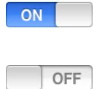

To learn more about defining a switch in your code, see *UISwitch Class Reference*.

### Appearance and Behavior

A switch displays the value that is currently in effect; users slide the control to select (and reveal) the other value. Users can also tap the control to switch between choices.

### Guidelines

Use a switch in a table row to give users two simple, diametrically opposed choices that determine the state of something, such as yes/no or on/off. Use a predictable pair of values so that users don't have to slide the control to discover what the other value is.

You can use a switch control to change the state of other UI elements in the view. Depending on the choice users make, new list items might appear or disappear, or list items might become active or inactive.

### Text Field

A **text field** accepts a single line of user input (shown here with a purpose description and placeholder text).

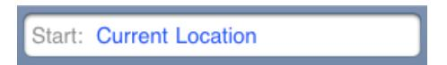

To learn more about defining a text field and customizing it to display images and buttons, see *UITextField Class Reference*.

### Appearance and Behavior

A text field is a fixed-height field with rounded corners. When userstap a text field a keyboard appears; when users tap Return in the keyboard, the text field handles the input in an application-specific way.

### Guidelines

Use a text field to get a small amount of information from the user. Before you decide to use a text field, consider whether there are other controls that might make inputting the information easier, such as a picker or a list.

**Customize a text field if it helps users understand how they should use it**. For example, you can display custom images in the left or right sides of the text field, or add a system-provided button, such as the Bookmarks button. In general, you should use the left end of a text field to indicate its purpose and the right end to indicate the presence of additional features, such as bookmarks.

**Display the Clear button in the right end of a text field when appropriate**. When this element is present, tapping it clears the contents of the text field, regardless of any other image you might display over it.

**Display a hint in the text field if it helps users understand its purpose**, such as "Name" or "Address." A text field can display such placeholder text when there is no other text in the field.

**Specify different keyboard types to accommodate different types of content you expect users to enter**. For example, you might want to make it easy for users to enter a URL, a PIN, or a phone number. Note, however, that you have no control over the keyboard's input method and layout, which are determined by the user's language settings. iOS provides several different keyboard types, each designed to facilitate a different type of input. To learn about the keyboard types that are available, see the documentation for UIKeyboardType. To learn more about managing the keyboard in your application, read "Managing the Keyboard" in *iOS Application Programming Guide*.

# System-Provided Buttons and Icons

To promote a consistent user experience (and to make your job easier) iOS provides numerous standard buttons for use in navigation bars and toolbars, and icons for use in tab bars.

You should familiarize yourself with the guidelines that govern the use of the system-provided buttons and icons regardless of the type of application you're developing, so that you can:

- Use the system-provided items correctly
- Avoid designing a custom icon that looks too similar to a system-provided icon

**Note:** The system-provided buttons and icons are not provided as separate files. Instead, you use API symbol names to specify them when you create standard UIKit buttons. For example, the symbol that identifies the Action button (listed in [Table](#page-135-1) 7-2 (page 136)) is UIBarButtonSystemItemAction.

You can also specify these symbol names in Interface Builder: In the Attributes inspector for your bar button item, choose an icon from the Identifier pop-up menu. For more information about this, see "Setting the Appearance of Bar Button Items" in *Interface Builder User Guide*.

If you can't find a system-provided toolbar or navigation bar button or tab bar icon that has the appropriate meaning for a specific function in your app, you should design a custom button or icon. For guidelines to help you do this, see "Icons for [Navigation](#page-148-0) Bars, Toolbars, and Tab Bars" (page 149).

### Standard Buttons for Use in Toolbars and Navigation Bars

iOS makes available many of the standard buttons users see in toolbars and navigation bars. These buttons, shown in [Table](#page-135-1) 7-2 (page 136), are available in two styles, each of which is appropriate for the specific usages described here:

- **Bordered style**—For example, the Add button in the navigation bar of the Contacts app on iPhone uses bordered style. This style is suitable for both navigation bars and toolbars.
- **Plain style**—For example, the Compose button in the Mail toolbar uses plain style. This style is suitable for toolbars only. In fact, if you specify the plain style for a button in the navigation bar, it is converted to the bordered style.

As with all system-provided buttons, you should avoid using the buttons described in Table 7-2 to represent actions other than those for which they are designed. In particular, avoid choosing a button based on its appearance, without regard for its documented meaning. For a discussion of the reasons why it's important to use these icons correctly, see "Use UI Elements [Consistently"](#page-54-1) (page 55).

To find out which symbol names to use to specify these buttons, see the documentation for UIBarButtonSystemItem in *UIBarButtonItem Class Reference*.

**Table 7-2** Standard buttons available for toolbars and navigation bars (plain style)

| Button | Name      | Meaning                                                                       |
|--------|-----------|-------------------------------------------------------------------------------|
|        | Action    | Open an action sheet that allows users to take an application-specific action |
|        | Camera    | Open an action sheet that displays a photo picker in camera mode              |
|        | Compose   | Open a new message view in edit mode                                          |
|        | Bookmarks | Show application-specific bookmarks                                           |
|        | Search    | Display a search field                                                        |
|        | Add       | Create a new item                                                             |

| Button | Name        | Meaning                                                                         |
|--------|-------------|---------------------------------------------------------------------------------|
|        | Trash       | Delete current item                                                             |
|        | Organize    | Move or route an item to a destination within the application, such as a folder |
|        | Reply       | Send or route an item to another location                                       |
|        | Stop        | Stop current process or task                                                    |
|        | Refresh     | Refresh contents (use only when necessary; otherwise, refresh automatically)    |
|        | Play        | Begin media playback or slides                                                  |
|        | FastForward | Fast forward through media playback or slides                                   |
|        | Pause       | Pause media playback or slides (note that this implies context preservation)    |
|        | Rewind      | Move backwards through media playback or slides                                 |

In addition to the buttons shown in Table 7-2, you can also use the system-provided Edit, Cancel, Save, Done, Redo, and Undo buttons shown in Table 7-3 to support editing or other types of content manipulation in your application.

To find out which symbol names to use to specify these buttons, see the documentation for UIBarButtonSystemItem in *UIBarButtonItem Class Reference*.

**Table 7-3** Bordered action buttons for use in navigation bars and toolbars

| Button | Name   | Meaning                                                                         |
|--------|--------|---------------------------------------------------------------------------------|
|        | Edit   | Enter an editing or content-manipulation mode                                   |
|        | Cancel | Exit the editing or content-manipulation mode without saving changes            |
|        | Save   | Save changes and, if appropriate, exit the editing or content-manipulation mode |
|        | Done   | Exit the current mode and save changes, if any                                  |
|        | Undo   | Undo the most recent action                                                     |
|        | Redo   | Redo the most recent undone action                                              |

The buttons listed in Table 7-3 are suitable for both navigation bars and toolbars, and are available in the bordered style only. If you specify the plain style for one of these buttons, it is converted to the bordered style.

In iOS 4 and later, you can use the system-provided page curl button in a toolbar (for more information, see the documentation for UIBarButtonSystemItemPageCurl in *UIBarButtonItem Class Reference*). The page curl button is not available for use in a navigation bar.

The page curl button allows you to give users a way to curl up the bottom corner of a screen to see information underneath. For example, Maps allows people to lift the lower-right corner of a map view to access buttons that manipulate the map.

**Don't use the page curl button to flip the screen**. If you need to flip the screen, use the Info button instead (for more information about the Info button, see "Info [Button"](#page-125-1) (page 126)). Also, make sure that some of the curled-up page isstill visible onscreen to emphasize the temporary nature of the action of flipping the screen. If the upper page disappears, the page curl becomes too much like a full-screen transition, and users lose their context.

### Standard Icons for Use in Tab Bars

iOS provides the standard icons described in Table 7-4 for use in tab bars.

**Table 7-4** Standard icons for use in the tabs of a tab bar

| Icon | Name       | Meaning                                  |
|------|------------|------------------------------------------|
|      | Bookmarks  | Show application-specific bookmarks      |
|      | Contacts   | Show contacts                            |
|      | Downloads  | Show downloads                           |
|      | Favorites  | Show user-determined favorites           |
|      | Featured   | Show content featured by the application |
|      | History    | Show history of user actions             |
|      | More       | Show additional tab bar items            |
|      | MostRecent | Show the most recent item                |

| Icon | Name       | Meaning                                                                  |
|------|------------|--------------------------------------------------------------------------|
|      | MostViewed | Show items most popular with all users                                   |
|      | Recents    | Show the items accessed by the user within an application-defined period |
|      | Search     | Enter a search mode                                                      |
|      | TopRated   | Show the highest-rated items, as determined by the user                  |

As with all standard buttons and icons, it's essential to use the tab bar icons in accordance with their documented meanings. In particular, take care to base your usage of an icon on its semantic meaning, not its appearance. This will help your application's user interface make sense even if the icon associated with a specific meaning changes its appearance. For further reasons why it's important to use these icons correctly, see "Use UI Elements [Consistently"](#page-54-1) (page 55).

To find out which symbol names to use to specify these icons, see the documentation for UITabBarSystemItem in *UITabBarItem Class Reference*.

### Standard Buttons for Use in Table Rows and Other UI Elements

iOS provides the buttons described in Table 7-5 for use in table rows and other elements.

**Table 7-5** Standard buttons for use in table rows and other UI elements

| Button | Name             | Meaning                                                                                                                                                                    |
|--------|------------------|----------------------------------------------------------------------------------------------------------------------------------------------------------------------------|
|        | ContactAdd       | Display a people picker to add a contact to an item.                                                                                                                       |
|        | DetailDisclosure | Display a new view that contains details about the current item.                                                                                                           |
|        | Info             | Flip to the back of the view to display configuration options or more information. Note that the Info button is also available as a light-colored "i" in a dark circle. |

These buttons should be used according to their defined meaning, as with all standard buttons and icons. In other words, avoid choosing a button based on its appearance, without regard for its documented meaning. For a discussion of the reasons why it's important to use these buttons correctly, see "Use UI [Elements](#page-54-1) [Consistently"](#page-54-1) (page 55).

Although the detail disclosure button is usually used in table rows, it can be used elsewhere. For more information about this button, see "Detail [Disclosure](#page-125-0) Button" (page 126). iOS also provides a set of controls for use in table rows only; for more information about these, see ["Table](#page-106-0) View" (page 107).

For more information on using the ContactAdd and Info buttons in your app, see the documentation for UIButtonType in *UIButton Class Reference*. For information on using the DetailDisclosure button in your app, see UITableViewCellAccessoryDetailDisclosureButton in *UITableViewCell Class Reference*.)

#### **CHAPTER 7**

iOS UI Element Usage Guidelines

# Custom Icon and Image Creation Guidelines

Every application needs an application icon and a launch image. It's recommended that applications also provide an icon for iOS to display in Spotlight search results (and, if necessary, in Settings). In addition, some applications need custom icons to represent custom document types or application-specific functions and modes in navigation bars, toolbars, and tab bars.

Unlike other custom artwork in your app, these icons and images must meet specific criteria so that iOS can display them properly. In addition, icon and image files have naming requirements. Table 8-1 contains information about these icons and images and provides links to specific guidelines for creating them. To learn what to name these files and how to specify them in your code,see "Application Icons" in *iOS Application Programming Guide* and "Application Launch Images" in *iOS Application Programming Guide*.

**Note:** To support resolution independence, you should provide high-resolution versions of your icons and images in addition to the resources you already supply. For guidelines on how to make the most of your high-resolution artwork, see "Tips for [Creating](#page-152-0) Great Artwork for the Retina Display" (page 153).

**Table 8-1** Custom icons and images

| Description                                                              | Size for iPhone and iPod touch (in pixels)                       | Size for iPad (in pixels)                                    | Guidelines                                                           |
|--------------------------------------------------------------------------|---------------------------------------------------------------------|-----------------------------------------------------------------|----------------------------------------------------------------------|
| Application icon (required)                                              | 57 x 57 114 x 114 (high resolution)                              | 72 x 72                                                         | "Application Icons" (page 142)                                    |
| App Store icon (required)                                                | 512 x 512                                                           | 512 x 512                                                       | "Application Icons" (page 142)                                    |
| Small icon for Spotlight search results and Settings (recommended) | 29 x 29 58 x 58 (high resolution)                                | 50 x 50 for Spotlight search results 29 x 29 for Settings | "Small Icons" (page 144)                                             |
| Document icon (recommended for custom document types)              | 22 x 29 44 x 58 (high resolution)                                | 64 x 64 320 x 320                                            | "Document Icons" (page 145)                                       |
| Web clip icon (recommended for web applications and websites)      | 57 x 57 114 x 114 (high resolution)                              | 72 x 72                                                         | "Web Clip Icons" (page 148)                                       |
| Toolbar and navigation bar icon (optional)                            | Approximately 20 x 20 Approximately 40 x 40 (high resolution) | Approximately 20 x 20                                        | "Icons for Navigation Bars, Toolbars, and Tab Bars" (page 149) |

| Description             | Size for iPhone and iPod touch (in pixels)                       | Size for iPad (in pixels)                                | Guidelines                                                           |
|-------------------------|---------------------------------------------------------------------|-------------------------------------------------------------|----------------------------------------------------------------------|
| Tab bar icon (optional) | Approximately 30 x 30 Approximately 60 x 60 (high resolution) | Approximately 30 x 30                                    | "Icons for Navigation Bars, Toolbars, and Tab Bars" (page 149) |
| Launch image (required) | 320 x 480 640 x 960 (high resolution)                            | For portrait: 768 x 1004 For landscape: 1024 x 748 | "Launch Images" (page 150)                                        |

**Note:** For all images and icons, the PNG format is recommended.

The standard bit depth for icons and images is 24 bits (8 bits each for red, green, and blue), plus an 8-bit alpha channel.

You do not need to constrain your palette to web-safe colors. Although you can use alpha transparency in the icons you create for navigation bars, toolbars, and tab bars, do not use it in application icons.

# Application Icons

An **application icon** is an icon users put on their Home screens and tap to start an application. This is a place where branding and strong visual design should come together into a compact, instantly recognizable, attractive package. Every application needs an application icon.

**Note:** If your app is a game, its app icon is also used in Game Center.

Try to balance eye appeal and clarity of meaning in your icon so that it'srich and beautiful and clearly conveys the essence of your application's purpose. Also, it's a good idea to investigate how your choice of image and color might be interpreted by people from different cultures.

**Create different sizes of your application icon for different devices**. If you're creating a universal application, you need to supply application icons in all three sizes.

For iPhone and iPod touch both of these sizes are required:

- 57 x 57 pixels
- 114 x 114 pixels (high resolution)

For iPad, this size is required:

● 72 x 72 pixels

Custom Icon and Image Creation Guidelines

When iOS displays your application icon on the Home screen of a device, it automatically adds the following visual effects:

- Rounded corners
- Drop shadow
- Reflective shine (unless you prevent the shine effect)

For example, a simple 57 x 57 pixel iPhone application icon might look like this:

When it's displayed on an iPhone Home screen, iOS adds rounded corners, a drop shadow, and a reflected shine. So the same application icon would look like this:

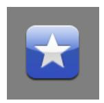

**Note:** You can prevent iOS from adding the shine to your application icon. To do this, you need to add the UIPrerenderedIcon key to your application's Info.plist file (to learn about thisfile,see "The Information Property List" in *iOS Application Programming Guide*).

The presence (or absence) of the added shine does not change the dimensions of your application icon.

**Ensure your icon is eligible for the visual enhancements iOS provides**. You should produce an image that:

- Has 90° corners
- Does not have any shine or gloss (unless you've chosen to prevent the addition of the reflective shine)
- Does not use alpha transparency

**Give your application icon a discernible background**. Icons with visible backgroundslook best on the Home screen primarily because of the rounded corners iOS adds. This is because uniformly rounded corners ensure that all the icons on a user's Home screen have a consistent appearance that invites tapping. If you create an icon with a background that disappears when it's viewed on the Home screen, users don'tsee the rounded corners. Such icons often don't look tappable and tend to interfere with the orderly symmetry of the Home screen that users appreciate.

**Be sure your image completely fills the required area**. If your image boundaries are smaller than the recommended sizes, or you use transparency to create "see-through" areas within them, your icon can appear to float on a black background with rounded corners.

For example, an application might supply an icon on a transparent background, like the blue star on the far left. When iOS displays this icon on a Home screen, it looks like the image in the middle (if no shine is added) or it looks like the image on the right (if shine is added).

#### **CHAPTER 8**

Custom Icon and Image Creation Guidelines

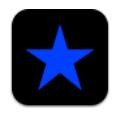

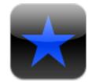

An icon that appears to float on a visible black background looks especially unattractive on a Home screen that displays a custom picture.

**Create a 512 x 512 pixel version of your application icon for display in the App Store**. Although it's important that this version be instantly recognizable as your application icon, it can be subtly richer and more detailed. There are no visual effects added to this version of your application icon.

If you're developing an application for ad-hoc distribution (that is, to be distributed in-house only, not through the App Store), you must also provide a 512 x 512 pixel version of your application icon. This icon identifies your application in iTunes.

iOS might also use this large image in other ways. In an iPad application, for example, iOS uses the 512 x 512 pixel image to generate the large document icon, if a custom document icon is not supplied.

### Small Icons

Every application should supply a small icon that iOS can display when the application name matches a term in a Spotlight search. Applications that supply settings should also supply this icon to identify them in the built-in Settings application.

Thisicon should clearly identify your app so that people can recognize it in a list ofsearch results or in Settings.

For iPhone and iPod touch, iOS uses the same icon for both Spotlight search results and Settings. If you do not provide this icon, iOS might shrink your application icon for display in search results and in Settings. For your iPhone app, create two small icons that measure:

- 29 x 29 pixels
- 58 x 58 pixels (high resolution)

For iPad, you supply separate icons for Settings and Spotlight search results. Create two icons that measure:

- 29 x 29 pixels (for Settings)
- 50 x 50 pixels (for Spotlight search results)

Note that the final visualsize of thisicon is 48 x 48 pixels. iOS trims 1 pixel from each side of your artwork and adds a drop shadow. Be sure to take this into account as you design your icon for Spotlight search results.

Custom Icon and Image Creation Guidelines

### Document Icons

If your iOS application creates documents of a custom type, you might want to create a custom icon that identifies this type to users. If you don't provide a custom document icon, iOS creates one for you by default, using your application icon (including the added visual effects).

For example, a default document icon that uses the 57 x 57 pixel white star iPhone app icon would look like this:

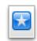

A high-resolution default document icon that uses the 114 x 114 pixel white star iPhone app icon would look like this:

On the larger iPad, a default document icon that uses the 72 x 72 pixel white star app icon would look like this:

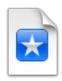

Optionally, you can provide custom artwork for iOS to use instead of your application icon. Because people will see your document icon in different places, it's best to design an image that's memorable and clearly associated with your application. Your custom artwork should be attractive, expressive, and detailed.

Depending on whether your app runs on iPhone or iPad, you use different specifications to create this icon.

### Document Icon Specifications for iPhone

For your iPhone app, create a document icon in two sizes:

- 22 x 29 pixels
- 44 x 58 pixels (high resolution)

Place your custom artwork within each rectangular space as desired. The artwork can be centered, offset, or it can fill the entire space.

For example, if you supply a 22 x 29 pixel icon that looks like the image on the left, iOS creates a document icon that has a drop shadow so it looks like the image on the right:

Similarly, if you supply a 44 x 58 pixel icon that looks like the image on the left, iOS creates a document icon that that has a drop shadow so it looks like the image on the right:

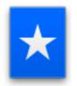

### Document Icon Specifications for iPad

iOS uses two sizes of document icons for iPad applications: 64 x 64 pixels and 320 x 320 pixels. It's a good idea to create both sizes so that your document icons look good in different contexts.

For both sizes, the overall dimensions include specific amounts of padding, leaving a smaller "safe zone" for your artwork. It's essential to make sure your artwork fits well in these safe zones, or it may get cropped or scaled up.

Although your artwork can fill an entire safe zone, the upper-right corner will always be partially obscured by the page curl effect that iOS adds. In addition, iOS adds a gradient that transitions from black (near the top, just below the page curl) to transparent (at the bottom edge).

**Important:** Be sure to follow the guidelines in this section as you create a custom document icon for your iPad app. If your icon is too large, too small, or improperly padded, the resulting document icon will not look good.

To create a 64 x 64 pixel document icon:

- **1.** Create a 64 x 64 pixel image in PNG format.
- **2.** Add the following margins to create the appropriately sized safe zone:
  - 1 pixel on top
  - 4 pixels on bottom
  - 10 pixels on each side

Your safe zone should look similar to the colored area shown below:

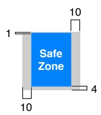

**3.** Place your custom artwork within the 44 x 59 pixel safe zone. The artwork can be centered, offset, or it can fill the entire safe zone. (Remember that iOS adds the page curl to the upper-right corner and a gradient that runs from the page curl to the bottom edge.)

#### Custom Icon and Image Creation Guidelines

For example, if you supply an icon that looks like the image on the left, iOS creates a document icon that looks like the image on the right.

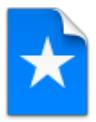

To create a 320 x 320 pixel document icon:

- **1.** Create a 320 x 320 pixel image in PNG format.
- **2.** Add the following margins to create the appropriately sized safe zone:
  - 5 pixels on top
  - 20 pixels on bottom
  - 50 pixels on each side

Your safe zone should look similar to the colored area shown below:

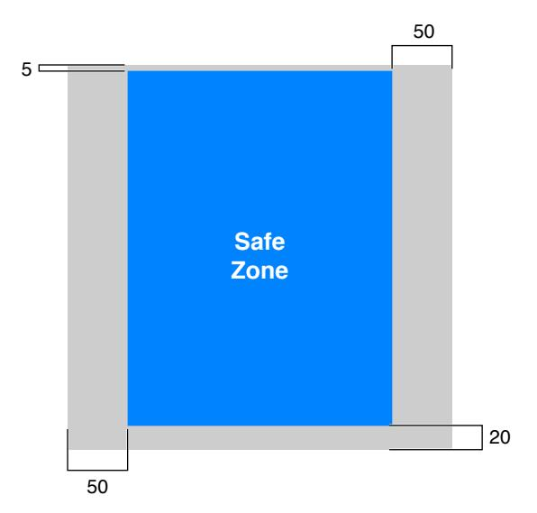

**3.** Place your custom artwork within the safe zone, which is 220 x 295 pixels. The artwork can be centered, offset, or it can fill the entire safe zone. (Remember that the page curl will obscure some of the artwork in the upper right corner of the safe zone.)

For example, if you supply an icon that looks like the image on the left, iOS creates a document icon that looks like the image on the right.

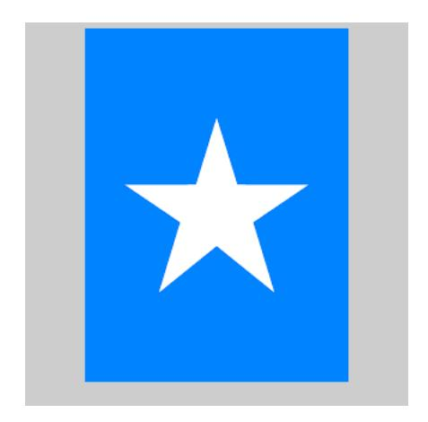

### Web Clip Icons

If you have a web application or a website, you can provide a custom icon that users can display on their Home screens using the web clip feature. Users tap the icon to reach your web content in one easy step. You can create an icon that represents your website as a whole or an icon that represents a single webpage.

If your web content is distinguished by a familiar image or recognizable color scheme, it makes sense to incorporate it in your icon. However, to ensure that your icon looks great on the device, you should also follow the guidelines in this section. (To learn how to add code to your web content to provide a custom icon, see *Safari Web Content Guide*.)

For iPhone and iPod touch, create icons that measure:

- 57 x 57 pixels
- 114 x 114 pixels (high resolution)

For iPad, create an icon that measures:

● 72 x 72 pixels

Asit does with application icons, iOS automatically addssome visual effectsto your icon so that it coordinates with the built-in icons on the Home screen. Specifically, iOS adds:

- Rounded corners
- Drop shadow
- Reflective shine

For example, a simple 57 x 57 pixel webpage icon might look like this:

When your 57 x 57 pixel icon is displayed on an iPhone Home screen, iOS makes the icon look like this:

**Note:** You can preventthe addition of all effects by naming youricon apple-touch-icon-precomposed.png (this is available in iOS 2 and later).

**Ensure your icon is eligible for the visual enhancements iOS adds (if you want them)**. You should produce an image in PNG format that:

- Has 90° corners
- Does not have any shine or gloss

### Icons for Navigation Bars, Toolbars, and Tab Bars

As much as possible, you should use the system-provided buttons and icons to represent standard tasks in your application. For a complete list of standard buttons and icons, and guidelines on how to use them, see ["System-Provided](#page-134-0) Buttons and Icons" (page 135).

Of course, not every task your application performsis a standard one. If your app supports custom tasks users need to perform frequently, you need to create custom icons that represent these tasks in your toolbar or navigation bar. Similarly, if your app displays a tab bar that allows users to switch among custom application modes or custom subsets of data, you need to design tab bar icons that represent these modes or subsets.

Before you create the art for your icon, you need to spend some time thinking about what it should convey. As you consider designs, aim for an icon that is:

- **Simple and streamlined**. Too many details can make an icon appear sloppy or indecipherable.
- **Not easily mistaken for one of the system-provided icons**. Users should be able to distinguish your custom icon from the standard icons at a glance.
- **Readily understood and widely acceptable**. Strive to create a symbol that most users will interpret correctly and that no users will find offensive.

**Important:** Be sure to avoid using images that replicate Apple products in your designs. These symbols are copyrighted and product designs can change frequently.

After you've decided on the appearance of your icon, follow these guidelines as you create it:

- Use pure white with appropriate alpha transparency.
- Do not include a drop shadow.

#### **CHAPTER 8**

Custom Icon and Image Creation Guidelines

- Use anti-aliasing.
- If you decide to add a bevel, be sure that it is 90° (to help you do this, imagine a light source positioned at the top of the icon).

For toolbar and navigation bar icons, create an icon in the following sizes:

- For iPhone and iPod touch:
  - About 20 x 20 pixels
  - About 40 x 40 pixels (high resolution)
- For iPad:
  - About 20 x 20 pixels

For tab bar icons, create an icon in the following sizes:

- For iPhone and iPod touch:
  - About 30 x 30 pixels
  - About 60 x 60 pixels (high resolution)
- For iPad:
  - About 30 x 30 pixels

**Note:** The icon you provide for toolbars, navigation bars, and tab bars is used as a mask to create the icon you see in your application. It is not necessary to create a full-color icon.

**Don't include separate pressed or selected appearances for your icons**. iOS automatically provides these appearancesfor itemsin navigation bars, toolbars, and tab bars,so you do not need to provide them. Because these visual effects are automatic, you cannot change their appearance.

**Give all icons in a bar a similar visual weight**. Aim to balance the overall size, level of detail, and use of solid regions across all icons that can appear in a specific bar. In general, it does not look good to combine in the same bar iconsthat are large and blocky, and completely filled, with iconsthat are small, detailed, and unfilled.

### Launch Images

To enhance the user's experience at application launch, you must provide at least one launch image. A **launch image** looks very similar to the first screen your application displays. iOS displays this image instantly when the user starts your application and until the app is fully ready to use. As soon as your app is ready for use, your app displays its first screen, replacing the launch placeholder image.

Custom Icon and Image Creation Guidelines

#### **Supply a launch image to improve user experience.**

Avoid using it as an opportunity to provide:

- An "application entry experience," such as a splash screen
- An About window
- Branding elements, unless they are a static part of your application's first screen

Because users are likely to switch among applications frequently, you should make every effort to cut launch time to a minimum, and you should design a launch image that downplays the experience rather than drawing attention to it.

**Generally, design a launch image that is identical to the first screen of the application**.

Exceptions:

**Text**. The launch image is static, so any text you display in it will not be localized.

**UI elements that might change**. Avoid including elements that might look different when the application finishes launching, so that users don't experience a flash between the launch image and the first application screen.

**For iPhone and iPod touch launch images, include the status bar region.** Create launch images of these sizes:

- 320 x 480 pixels
- 640 x 960 pixels (high resolution)

**For iPad launch images, do not include the status bar region**. Create launch images of these sizes:

- 768 x 1004 pixels (portrait)
- 1024 x 748 pixels (landscape)

Note that most iPad applications should supply a launch image for each orientation.

If you think that following these guidelines will result in a plain, boring launch image, you're right. Remember, the launch image is not meant to provide an opportunity for artistic expression; it is solely intended to enhance the user's perception of your app as quick to launch and immediately ready for use. The following examples show you how plain a launch image can be.

The iPhone Settings launch image (shown next to the first application screen) displays only the background of the application, because no other content in the application is guaranteed to be static.

In the launch image for iPhone Stocks (shown next to the first application screen), only static images are included because these images are always visible in the first application view of the Stocks app.

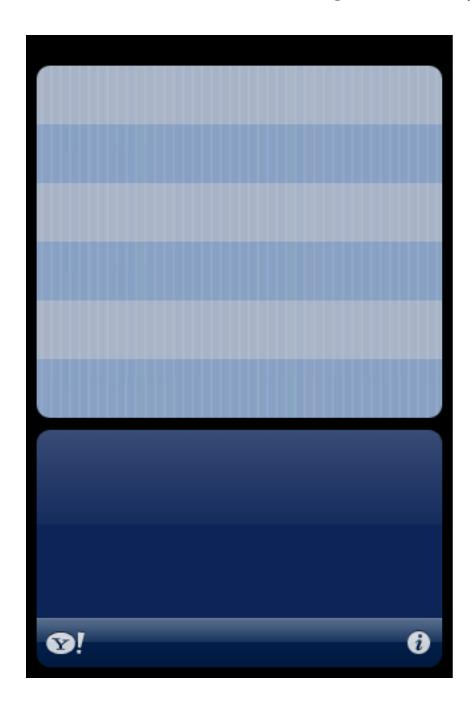

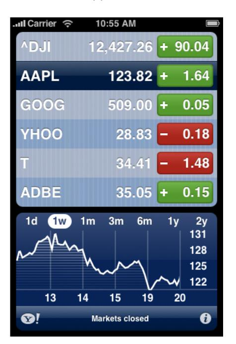

### Tips for Creating Great Artwork for the Retina Display

The Retina display allows you to display high-resolution versions of your art and icons. If you merely scale up your existing artwork, you miss out on the opportunity to provide the beautiful, captivating images users expect. Instead, you should rework your existing image resources to create large, higher quality versions that are:

● **Richer in texture**. For example, in the high-resolution versions of the Settings and Contacts icons, the metal and paper textures are clearly visible.

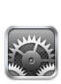

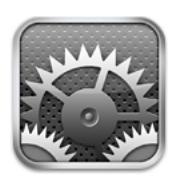

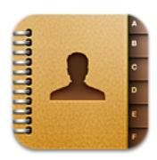

● **More detailed**. For example, in the high-resolution versions of the Safari and Notes icons, you can see details such as the accurate contours of the continents behind the compass and the torn paper left by the previous note.

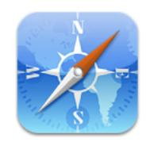

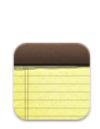

● **More realistic**. For example, the high-resolution versions of the Compass and Photos icons combine rich texture and fine details to create realistic portrayals of a compass and a photograph.

Even though bar icons are simpler than application or document icons, you should consider adding details as you create high-resolution versions of them. For example, the artists tab bar icon in the iPod application is a streamlined silhouette of a singer. The high-resolution version of this icon is recognizably the same icon, but includes greater detail.

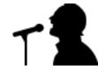

The following techniques can help you get great results as you create a high-resolution version of your artwork.

**Scale up your original artwork to 200%** using the "nearest neighbor" scaling algorithm. This works well if the original artwork was not created with vector shapes and does not include layer effects. The result is a large, pixelated image on top of which you can draw matching high-resolution art. This is a good way to begin because it allows you to preserve the original layout of your design.

#### **CHAPTER 8**

Custom Icon and Image Creation Guidelines

If the original artwork was created with vector shapes, or it includes layer effects, you can use the default scaling algorithm instead of the nearest neighbor algorithm.

**Add detail and depth**. Don't hesitate to draw very small elements, because the high-resolution version of your artwork allows much more room for fine details. For example, a 1-pixel dot in your original image becomes a 4-pixel dot (that is, 2 x 2 pixels) in the larger version.

**Consider softening scaled-up elements**. If, for example, you have a sharp, 1-pixel dividing line in your original artwork, it might have the boldness you want when you leave it scaled up to a 2-pixel line. But for some lines and elements, you might want to soften the scaled results by feathering or even leaving the element at the smaller size.

**Consider adding blur for better results in effects such as engravings and drop shadows**. For example, text engraving istypically done by shifting a duplicate image of the text by 1 pixel. Scaled up, thisshift would result in an engraving width of 2 pixels, which islikely to look very sharp and unrealistic at a higher resolution. To improve this, you can leave the shift as-is (that is, at 1 pixel), but add a 1-pixel blur to soften the engraving. This still results in a 2-pixel wide engraving effect, but the outer pixel now looks more like it is only half a pixel wide, which results in a better sense of dimensionality.

# Document Revision History

This table describes the changes to *iOS Human Interface Guidelines*.

| Date       | Notes                                                                                                                                                               |
|------------|---------------------------------------------------------------------------------------------------------------------------------------------------------------------|
| 2011-03-23 | Made minor corrections.                                                                                                                                             |
| 2011-02-24 | Described how to display full screen banner ads in an iPad app.                                                                                                     |
| 2011-01-03 | Made minor corrections.                                                                                                                                             |
| 2010-12-10 | Edited for content and clarity.                                                                                                                                     |
| 2010-11-15 | Changed the title from iPhone Human Interface Guidelines. Updated to include iPad and iPhone guidelines, including guidelines for iPhone web applications.       |
| 2010-06-03 | Described how to accommodate multitasking, design local notifications, and host ads.                                                                             |
| 2010-05-12 | Described how to accommodate multitasking, design local notifications, and host ads.                                                                             |
| 2010-03-24 | Enhanced guidelines for designing an alert.                                                                                                                         |
| 2010-02-19 | Added guidance on using table-cell styles.                                                                                                                          |
| 2009-11-20 | Fixed minor errors and rearranged table view content.                                                                                                               |
| 2009-09-09 | Updated guidelines for using sound; made additional minor corrections.                                                                                              |
| 2009-06-04 | Added guidelines for using the user's location and making an application accessible; updated guidelines for settings, search, and bar appearances.               |
| 2009-03-27 | Made minor corrections.                                                                                                                                             |
| 2009-03-12 | Added guidelines for handling editing and undo functionality, searching, push notifications, and modal view transitions.                                         |
| 2009-02-04 | Enhanced guidelines for tabs in a tab bar.                                                                                                                          |
| 2008-11-21 | Expanded guidelines for using sound in iPhone applications and made minor corrections.                                                                           |
| 2008-09-09 | Transferred web-specific guidelines to iPhone Human Interface Guidelines for Web Applications.                                                                   |
| 2008-06-27 | New document that describes how to design the user interface of an iPhone application and provides guidelines for creating web content for iOS-based devices. |

#### **REVISION HISTORY**

Document Revision History