# iOS Human Interface Guidelines

# Contents

### **UI [Design](#page-7-0) Basics** 8

### **[Designing](#page-8-0) for iOS 7** 9

Defer to [Content](#page-9-0) 10 [Provide](#page-11-0) Clarity 12 Use Depth to [Communicate](#page-15-0) 16

### **iOS App [Anatomy](#page-21-0)** 22

### **Starting and [Stopping](#page-24-0)** 25

Start [Instantly](#page-24-1) 25 Always Be [Prepared](#page-26-0) to Stop 27

### **[Layout](#page-29-0)** 30

### **[Navigation](#page-33-0)** 34

### **Modal [Contexts](#page-36-0)** 37

### **[Interactivity](#page-38-0) and Feedback** 39

Users Know the [Standard](#page-38-1) Gestures 39 [Interactive](#page-40-0) Elements Invite Touch 41 Feedback Aids [Understanding](#page-46-0) 47 Inputting [Information](#page-47-0) Should Be Easy 48

### **[Animation](#page-48-0)** 49

### **[Branding](#page-49-0)** 50

### **Color and [Typography](#page-51-0)** 52

Color Enhances [Communication](#page-51-1) 52 Text Should Always Be [Legible](#page-52-0) 53

### **Icons and [Graphics](#page-55-0)** 56

The App [Icon](#page-55-1) 56

Bar [Icons](#page-55-2) 56 [Graphics](#page-56-0) 57

### **[Terminology](#page-57-0) and Wording** 58

### **[Integrating](#page-59-0) with iOS** 60

Use Standard UI [Elements](#page-59-1) Correctly 60 Respond to Changes in Device [Orientation](#page-60-0) 61 Downplay File and [Document](#page-62-0) Handling 63 Be [Configurable](#page-63-0) If Necessary 64 Take Advantage of iOS [Technologies](#page-64-0) 65

### **Design [Strategies](#page-65-0)** 66

### **Design [Principles](#page-66-0)** 67

[Aesthetic](#page-66-1) Integrity 67 [Consistency](#page-67-0) 68 Direct [Manipulation](#page-68-0) 69 [Feedback](#page-69-0) 70 [Metaphors](#page-69-1) 70

### **From [Concept](#page-71-0) to Product** 72

[Define](#page-71-1) Your App 72

User [Control](#page-70-0) 71

- 1. List All the [Features](#page-71-2) You Think Users Might Like 72
- 2. [Determine](#page-72-0) Who Your Users Are 73
- 3. Filter the Feature List Through the Audience [Definition](#page-72-1) 73
- 4. Don't Stop [There](#page-72-2) 73

Tailor [Customization](#page-73-0) to the Task 74

[Prototype](#page-75-0) & Iterate 76

### **Case Study: From [Desktop](#page-77-0) to iOS** 78

[Keynote](#page-77-1) on iPad 78 Mail on [iPhone](#page-80-0) 81 Web [Content](#page-81-0) in iOS 82

### **[Running](#page-83-0) on iPhone 5** 84

### **iOS [Technologies](#page-90-0)** 91

**[Bars](#page-142-0)** 143

**[Passbook](#page-91-0)** 92 **[Multitasking](#page-94-0)** 95 **[Routing](#page-96-0)** 97 **Social [Media](#page-99-0)** 100 **[iCloud](#page-101-0)** 102 **In-App [Purchase](#page-104-0)** 105 **Game [Center](#page-106-0)** 107 **[Notification](#page-108-0) Center** 109 **iAd Rich [Media](#page-113-0) Ads** 114 **[AirPrint](#page-119-0)** 120 **[Accessing](#page-121-0) User Data** 122 **[Quick](#page-123-0) Look** 124 **[Sound](#page-125-0)** 126 Understand User [Expectations](#page-125-1) 126 Define the Audio [Behavior](#page-126-0) of Your App 127 Manage Audio [Interruptions](#page-131-0) 132 Handle Media Remote Control Events, if [Appropriate](#page-133-0) 134 **[VoiceOver](#page-134-0)** 135 **Edit [Menu](#page-135-0)** 136 **[Undo](#page-138-0) and Redo** 139 **[Keyboards](#page-140-0) and Input Views** 141 **UI [Elements](#page-141-0)** 142

The [Status](#page-142-1) Bar 143

[Navigation](#page-143-0) Bar 144

[Toolbar](#page-146-0) 147

Toolbar and [Navigation](#page-147-0) Bar Buttons 148

[Tab](#page-149-0) Bar 150

Tab Bar [Icons](#page-151-0) 152

[Search](#page-152-0) Bar 153

[Scope](#page-154-0) Bar 155

### **[Content](#page-155-0) Views** 156

[Activity](#page-155-1) 156

Activity View [Controller](#page-157-0) 158

[Collection](#page-159-0) View 160

Container View [Controller](#page-160-0) 161

[Image](#page-161-0) View 162

Map [View](#page-162-0) 163

Page View [Controller](#page-163-0) 164

[Popover](#page-165-0) (iPad Only) 166

[Scroll](#page-168-0) View 169

Split View [Controller](#page-170-0) (iPad Only) 171

[Table](#page-172-0) View 173

Text [View](#page-178-0) 179

Web [View](#page-179-0) 180

### **[Controls](#page-181-0)** 182

Activity [Indicator](#page-181-1) 182

[Contact](#page-182-0) Add Button 183

Date [Picker](#page-182-1) 183

Detail [Disclosure](#page-183-0) Button 184

Info [Button](#page-184-0) 185

[Label](#page-184-1) 185

Network Activity [Indicator](#page-185-0) 186

Page [Control](#page-185-1) 186

[Picker](#page-187-0) 188

[Progress](#page-188-0) View 189

[Refresh](#page-189-0) Control 190

Rounded [Rectangle](#page-190-0) Button 191

[Segmented](#page-190-1) Control 191

[Slider](#page-191-0) 192

[Stepper](#page-191-1) 192

[Switch](#page-192-0) 193 [System](#page-193-0) Button 194 Text [Field](#page-194-0) 195

**[Temporary](#page-196-0) Views** 197

[Alert](#page-196-1) 197 [Action](#page-199-0) Sheet 200 [Modal](#page-202-0) View 203

**Icon and Image [Design](#page-205-0)** 206

**Icon and [Image](#page-206-0) Sizes** 207

**App [Icon](#page-208-0)** 209 [Document](#page-211-0) Icons 212 [Spotlight](#page-211-1) and Settings Icons 212

**[Launch](#page-214-0) Images** 215

**Bar [Button](#page-217-0) Icons** 218

**[Newsstand](#page-220-0) Icons** 221

**Web Clip [Icons](#page-223-0)** 224

**Creating [Resizable](#page-224-0) Images** 225

**[Document](#page-225-0) Revision History** 226

# Tables

| Sound 126  |                                                                                         |
|---------------|-----------------------------------------------------------------------------------------|
| Table 30-1 | Audio session categories and their associated behaviors 129        |
| Bars 143   |                                                                                         |
| Table 35-1 | Standard buttons available for toolbars and navigation bars 149 |
| Table 35-2 | Standard icons for use in the tabs of a tab bar 152    |
| Icon and   | Image Sizes 207                                                                   |
| Table 39-1 | Size (in pixels) of custom icons and images 207                 |
| Newsstand     | Icons 221                                                                            |
| Table 43-1 | Maximum scaled sizes for per-issue icons 223                          |

# UI Design Basics

- ["Designing](#page-8-0) for iOS 7" (page 9)
- "iOS App [Anatomy"](#page-21-0) (page 22)
- "Starting and [Stopping"](#page-24-0) (page 25)
- ["Layout"](#page-29-0) (page 30)
- ["Navigation"](#page-33-0) (page 34)
- "Modal [Contexts"](#page-36-0) (page 37)
- ["Interactivity](#page-38-0) and Feedback" (page 39)
- ["Animation"](#page-48-0) (page 49)
- ["Branding"](#page-49-0) (page 50)
- "Color and [Typography"](#page-51-0) (page 52)
- "Icons and [Graphics"](#page-55-0) (page 56)
- ["Terminology](#page-57-0) and Wording" (page 58)
- ["Integrating](#page-59-0) with iOS" (page 60)

# Designing for iOS 7

iOS 7 embodies the following themes:

- **Deference.** The UI helps users understand and interact with the content, but never competes with it.
- **Clarity.** Text is legible at every size, icons are precise and lucid, adornments are subtle and appropriate, and a sharpened focus on functionality motivates the design.
- **Depth.** Visual layers and realistic motion impart vitality and heighten users' delight and understanding.

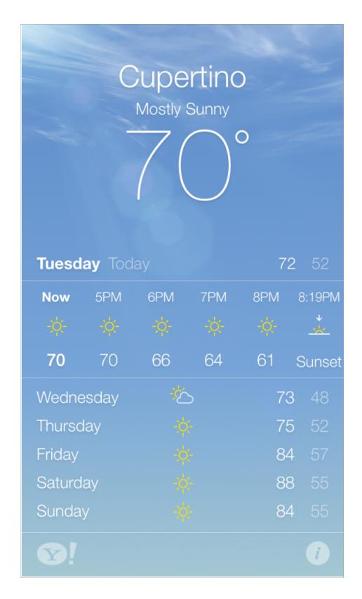

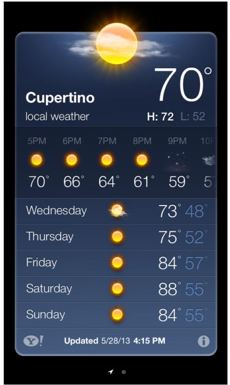

Whether you're redesigning an existing app or creating a new one, consider approaching the job in the way that Apple approached the redesign of the built-in apps:

- First, strip away the UI to expose the app's core functionality and reaffirm its relevance.
- Next, use the themes of iOS 7 to inform the design of the UI and the user experience. Restore details and embellishments with care and never gratuitously.

● Throughout, be prepared to defy precedent, question assumptions, and let a focus on content and functionality motivate every design decision.

## Defer to Content

Although crisp, beautiful UI and fluid motion are highlights of the iOS 7 experience, the user's content is at its heart.

Here are some ways to make sure that your designs elevate functionality and defer to the user's content.

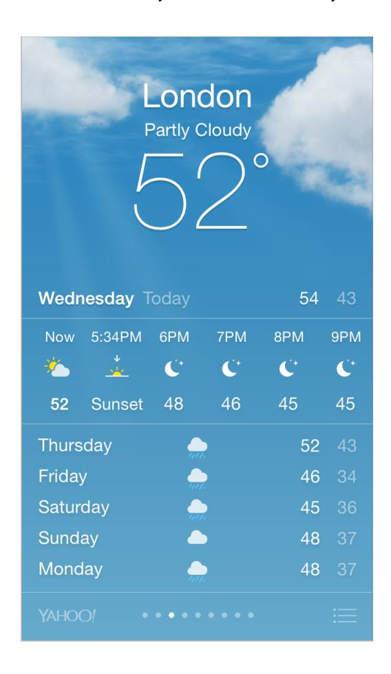

**Take advantage of the whole screen.** Reconsider the use of insets and visual frames and—instead—let the content extend to the edges of the screen. Weather is a great example of this approach: The beautiful, full-screen depiction of a location's current weather instantly conveys the most important information, with room to spare for hourly data.

#### **Reconsider visual indicators of physicality and realism.**

Bezels, gradients, and drop shadowssometimeslead to heavier UI elementsthat can overpower or compete with the content. Instead, focus on the content and let the UI play a supporting role.

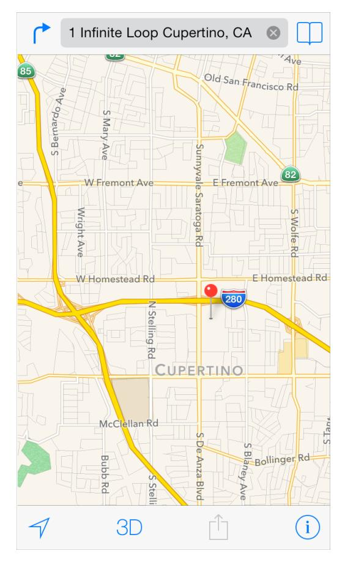

**Let translucent UI elements hint at the content behind them.** Translucent elements—such as Control Center—provide context, help userssee that more content is available, and can signal transience. In iOS 7, a translucent element blurs only the content directly behind it—giving the impression of looking through rice paper—it doesn't blur the rest of the screen.

## Provide Clarity

Providing clarity is another way to ensure that content is paramount in your app. Here are some ways to make the most important content and functionality clear and easy to interact with.

**Use plenty of negative space.** Negative space makes important content and functionality more noticeable and easier to understand. Negative space can also impart a sense of calm and tranquility, and it can make an app look more focused and efficient.

**Let color simplify the UI.** A key color—such as yellow in Notes—highlights important state and subtly indicates interactivity. It also gives an app a consistent visual theme. The built-in apps use a family of pure, clean system colorsthat look good at every tint and on both dark and light backgrounds.

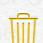

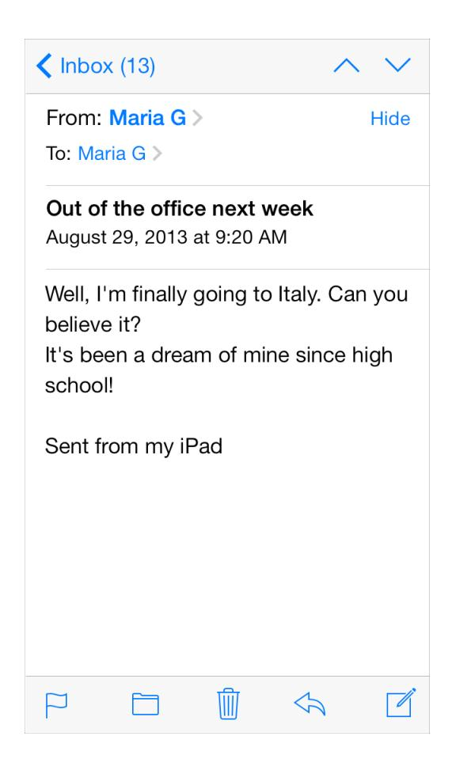

**Ensure legibility by using the system fonts.** iOS 7 system fonts automatically adjust letter spacing and line height so that text is easy to read and looks great at every size. Whether you use system or custom fonts, be sure to adopt Dynamic Type so your app can respond when the user chooses a different text size.

**Embrace borderless buttons.** In iOS 7, all bar buttons are borderless. In content areas, a borderless button uses context, color, and a call-to-action title to indicate interactivity. And when it makessense, a content-area button can display a thin border or tinted background that makes it distinctive.

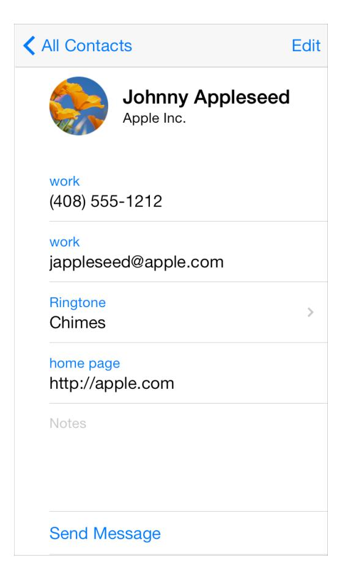

## Use Depth to Communicate

iOS 7 often displays content in distinct layersthat convey hierarchy and position, and that help users understand the relationships among onscreen objects.

By using a translucent background and appearing to float above the Home screen, folders separate their content from the rest of the screen.

Reminders displays lists in layers, as shown here. When users work with one list, the other lists are collected together at the bottom of the screen.

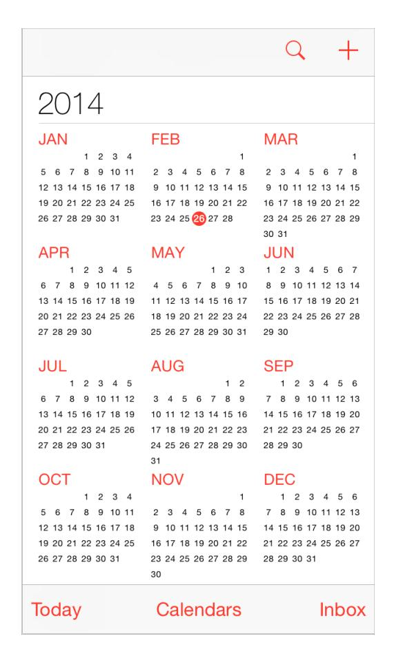

Calendar uses enhanced transitions to give users a sense of hierarchy and depth as they move between viewing years, months, and days. In the scrolling year view shown here, users can instantly see today's date and perform other calendar tasks.

When usersselect a month, the year view zoomsin and reveals the month view. Today's date remains highlighted and the year appears in the back button, so users know exactly where they are, where they came from, and how to get back.

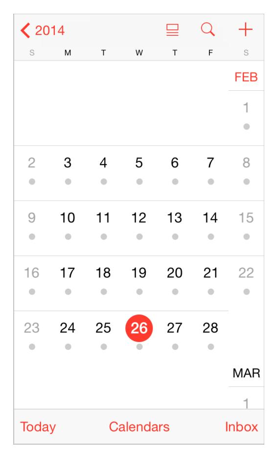

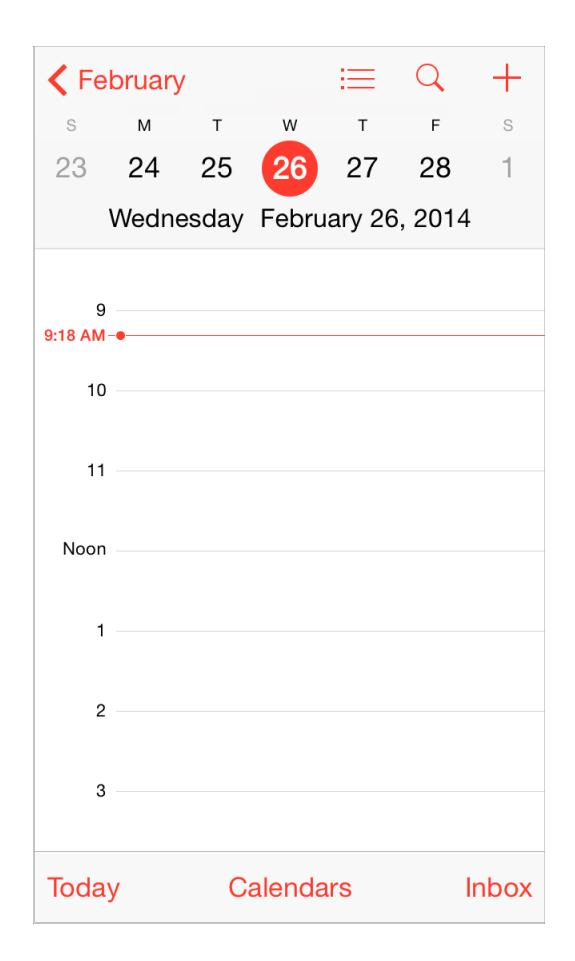

A similar transition happens when users select a day: The month view appears to split apart, pushing the current week to the top of the screen and revealing the hourly view of the selected day. With each transition, Calendar reinforces the hierarchical relationship between years, months, and days.

# iOS App Anatomy

Almost all iOS apps use at least some of the UI components defined by the UIKit framework. Knowing the names, roles, and capabilities of these basic components helps you make informed decisions as you design the UI of your app.

The UI elements provided by UIKit fall into four broad categories:

- **Bars.** Bars contain contextual information that tell users where they are and controls that help users navigate or initiate actions.
- **Content views.** Content views contain app-specific content and can enable behaviors such as scrolling, insertion, deletion, and rearrangement of items.
- **Controls.** Controls perform actions or display information.
- **Temporary views.** Temporary views appear briefly to give users important information or additional choices and functionality.

In addition to defining UI elements, UIKit defines objects that implement functionality, such as gesture recognition, drawing, accessibility, and printing support.

Programmatically, a UI element is considered to be a type of **view** because it inherits from UIView. A view knows how to draw itself onscreen, and it knows when a user touches within its bounds. Controls (such as buttons and sliders), content views (such as collection views and table views), and temporary views (such as alerts and action sheets) are all types of views.

To manage a set or hierarchy of views in your app, you typically use a **view controller**. A view controller coordinates the display of views, implements the functionality behind user interactions, and can manage transitionsfrom one screen to another. For example, Settings uses a navigation controller to display its hierarchy of views.

Here's an example of how views and view controllers can combine to present the UI of an iOS app.

Although developers think in terms of views and view controllers, users tend to experience an iOS app as a collection of screens. From this perspective, a *screen* generally corresponds to a distinct visual state or mode in an app.

**Note:** An iOS app includes a window. But—unlike a window in a computer app—an iOS window has no visible parts and it can't be moved to another location on the display. Most iOS apps contain only one window; apps that support an external display can have more than one.

In *iOS Human Interface Guidelines*, the word *screen* is used as it's understood by most users. As a developer, you might also read about screens in other contexts, where the term refers to the UIScreen object you can use to access an external display screen.

# Starting and Stopping

## Start Instantly

It's often said that people spend no more than a minute or two evaluating a new app. When you make the most of this brief period by presenting useful content immediately, you pique the interest of new users and give all users a superior experience.

**Important:** Don't tell people to reboot or restart their devices after installing your app. Restarting takes time and can make your app seem unreliable and hard to use.

If your app has memory-usage or other issuesthat make it difficult to run unlessthe system hasjust booted, you need to address those issues. For some guidance on developing a well-tuned app, see "Use Memory Efficiently" in *iOS App Programming Guide* .

**As much as possible, avoid displaying a splash screen or other startup experience.** It's best when users can begin using your app immediately.

#### **Avoid asking people to supply setup information.** Instead:

- **Focus on the needs of 80 percent of your users.** When you do this, most people won't have to supply any settings, because the app is already set up to behave the way they expect. If there is functionality that only a few users might want—or that most users might want only once—leave it out.
- **Get as much information as possible from other sources.** If you can use any of the information people supply in built-in app or device settings, query the system for these values; don't ask people to enter them again.
- **If you must ask for setup information, prompt people to enter it within your app.** Then, store this information assoon as possible (potentially, in your app'ssettings). This way, people aren't forced to switch to Settings before they get the chance to enjoy your app. If people need to make changesto thisinformation later, they can go to the app's settings at any time.

**Delay a login requirement for as long as possible.** It's best when users can navigate through much of your app and use some of its functionality without logging in. For example, App Store doesn't ask users to log in until they decide to buy something. Users often abandon apps that force them to log in before they can do anything useful.

If users must log in, display in the login view a brief, friendly explanation that describes the reasons for the requirement and how it benefits users.

**Think carefully before providing an onboarding experience.** (Onboarding introduces an app's features and explains how to perform common tasks.) Before you consider onboarding, make every effort to design your app so that all its features and tasks are intuitive and easily discoverable. *Onboarding is not a substitute for good app design* . If you still feel that onboarding is necessary, follow these guidelinesto create a brief, targeted experience that doesn't get in the user's way.

- **Give users only the information they need to get started.** A good onboarding experience shows users what to do first or briefly demonstrates a few of the features that most users are interested in. If you give too much information to users before they have a chance to explore your app, you make usersresponsible for remembering details they don't need right away and you may send the message that your app is hard to use. If additional help is needed for specific tasks, provide that help only when the user is performing those tasks.
- **Use animation and interactivity to engage users and help them learn by doing.** Add text sparingly and only if it enriches the experience; don't expect users to read long passages. For example, don't describe how to perform a simple task when you can use animation to show users what to do. To lead usersthrough a more complex task, you might add transient overlay views that briefly describe each step as the user is about to do it. As much as possible, avoid displaying screenshots of your app because they're not interactive and users can confuse them with app UI.

● **Make it easy to dismiss or skip the onboarding experience.** After users have viewed the onboarding experience, they probably don't want to view it again; other users may not want to view it at all. Be sure to remember the choice users make and don't force them to make it every time they open your app.

**Avoid asking users to rate your app too soon.** Asking for a rating too soon tends to annoy users and may decrease the amount of useful feedback you receive. To encourage well-considered feedback, be sure to give users a chance to form an opinion about your app before you ask them to rate it. For example, you might wait until users have visited a minimum number of different screens or performed a minimum number of tasks.

**In general, launch in the device's default orientation.** On iPhone, the default orientation is portrait; on iPad, it's the current device orientation. If your app runs *only* in landscape orientation, you should always launch in landscape and let users rotate the device if necessary.

**Note:** It's best when a landscape-only app supports both variants of landscape orientation—that is, with the Home button on the right or on the left. If the device is already in landscape, a landscape-only app should launch in that variant, unlessthere's a very good reason not to. Otherwise, launch a landscape-only app in the variant with the Home button on the right. (To learn more about supporting different device orientations,see "Respond to Changesin Device [Orientation"](#page-60-0) (page 61).)

**Supply a launch image that closely resembles the first screen of the app.** iOS displays the launch image the moment your app starts—giving users the impression that your app is fast and giving your app enough time to load content. Learn how to create a launch image in ["Launch](#page-214-0) Images" (page 215).

**If possible, avoid requiring users to read a disclaimer or agree to an end-user license agreement when they first start your app.** Instead, you can let the App Store display your disclaimer or end-user license agreement (EULA)so that people can accessit before they get your app. If you must provide these items within your app, be sure to integrate them in a way that harmonizes with your UI and balances businessrequirements with user experience needs.

**When your app restarts, restore its state so users can continue where they left off.** People shouldn't have to remember the steps they took to reach their previous location in your app. To learn more about efficient ways to preserve and restore your app's state, see "State Preservation and Restoration".

## Always Be Prepared to Stop

**An iOS app never displays a Close or Quit option.** People stop using an app when they switch to another app, return to the Home screen, or put their devices in sleep mode.

When people switch away from your app, iOS multitasking transitions it to the background and replaces its UI with the UI of the new app. To prepare for this situation, your app should:

- **Save user data as soon as possible and as often as reasonable.** Do this because an app in the background can be told to exit or terminate at any time.
- **Save the current state when stopping at the finest level of detail possible.** In this way, people don't lose their context when they switch back to your app. For example, if your app displays scrolling data, save the currentscroll position. You can learn more about efficient waysto preserve and restore your app's state in "State Preservation and Restoration".

Some apps may need to keep running in the background while users run another app in the foreground. For example, users might want to keep listening to the song that's playing in one app while they're using a different app to check their to-do list or play a game. Learn how to handle multitasking correctly and gracefully in ["Multitasking"](#page-94-0) (page 95).

**Never quit an iOS app programmatically.** People tend to interpret this as a crash. If something prevents your app from functioning as intended, you need to tell users about the situation and explain what they can do about it. Here are two good ways to do this:

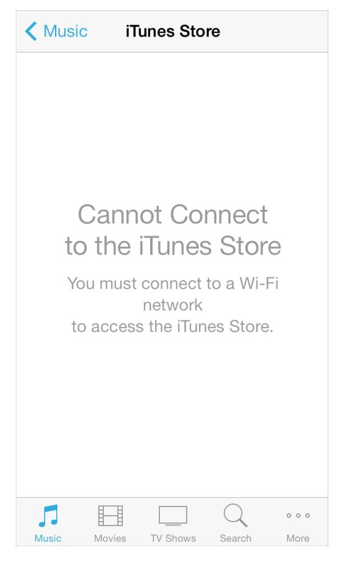

**If all app features are unavailable, display a screen that describes the situation and suggests a correction.** The information gives feedback to users and reassures them that there's nothing wrong with your app. It also puts users in control, letting them decide whether they want to take corrective action and continue using your app or switch to another app.

**If only some app features are unavailable, display either a screen or an alert when people try to use the feature.**

Otherwise, people should be able to use the rest of the app. If you decide to use an alert, be sure to display it *only* when people try to access the feature that isn't functioning.

# Layout

Layout encompasses much more than just how UI elementslook on an app screen. With your layout, you show users what's most important, what their choices are, and how things are related. Depending on the device your app is running on—and on the device's current orientation—your layout may vary.

**Make it easy for people to interact with content and controls by giving each interactive element ample spacing.** Give tappable controls a hit target of about 44 x 44 points.

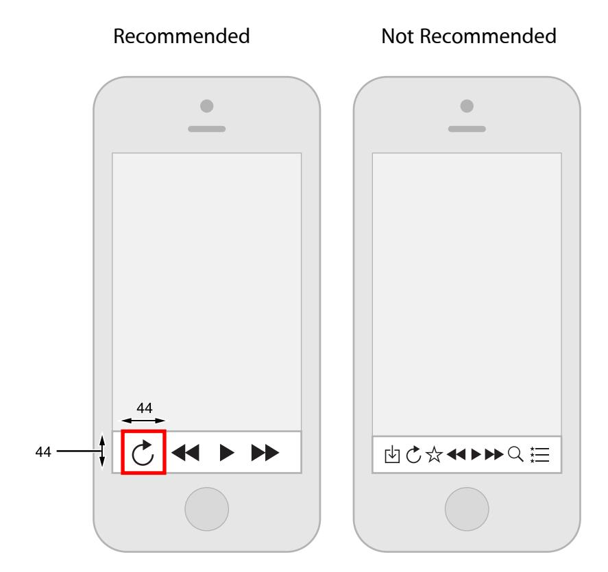

**Make it easy to focus on the main task by elevating important content or functionality.** Some good ways to do this are to place principal items in the upper half of the screen and—in left-to-right cultures—near the left side of the screen:

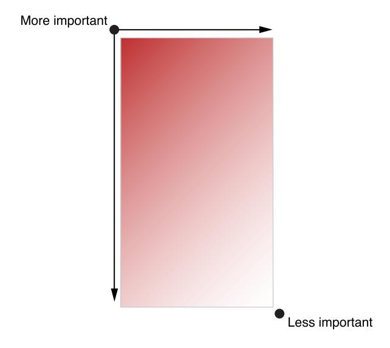

**Use visual weight and balance to show users the relative importance of onscreen elements.** Large items catch the eye and tend to appear more important than smaller ones. Larger items are also easier for users to tap, which makesthem especially useful in apps—such as Phone and Clock—that users often use in distracting surroundings.

**Use alignment to ease scanning and communicate groupings or hierarchy.** Alignment tends to make an app look neat and organized and it gives users placesto focus while they scroll through screenfuls of information. Indentation and alignment of different information groups indicate how the groups are related and make it easier for users to find specific items.

**Make sure that users can understand primary content at its default size.** For example, users shouldn't have to scroll horizontally to read important text, or zoom to see primary images.

**Be prepared for changes in text size.** Users expect most apps to respond appropriately when they choose a different text size in Settings. To accommodate some text-size changes, you might need to adjust the layout; for more information about displaying text in your app, see "Text Should Always Be [Legible"](#page-52-0) (page 53).

| As much as possible, avoid inconsistent appearances in your UI. In general, elements that have similar functions should also look similar. People often assume that there must be a reason for the inconsistencies they notice, and they're apt to spend time trying to figure it out. |  |  |  |
|-------------------------------------------------------------------------------------------------------------------------------------------------------------------------------------------------------------------------------------------------------------------------------------------------------------------------------------------------------------------------------------------------------------------------------|--|--|--|
|                                                                                                                                                                                                                                                                                                                                                                                                                               |  |  |  |
|                                                                                                                                                                                                                                                                                                                                                                                                                               |  |  |  |
|                                                                                                                                                                                                                                                                                                                                                                                                                               |  |  |  |
|                                                                                                                                                                                                                                                                                                                                                                                                                               |  |  |  |
|                                                                                                                                                                                                                                                                                                                                                                                                                               |  |  |  |
|                                                                                                                                                                                                                                                                                                                                                                                                                               |  |  |  |

# Navigation

People tend to be unaware of the navigation experience in an app unless it doesn't meet their expectations. Your job is to implement navigation in a way that supports the structure and purpose of your app without calling attention to itself.

Broadly speaking, there are three main styles of navigation, each of which is well suited to a specific app structure:

- Hierarchical
- Flat
- Content- or experience-driven

In a hierarchical app, users navigate by making one choice per screen until they reach their destination. To navigate to another destination, users must retrace some of theirsteps—orstart over from the beginning—and make different choices. Settings and Mail are good examples of apps that use a hierarchical structure.

In an app with a flat information structure, users can navigate directly from one primary category to another because all primary categories are accessible from the main screen. Music and App Store are good examples of apps that use a flat structure.

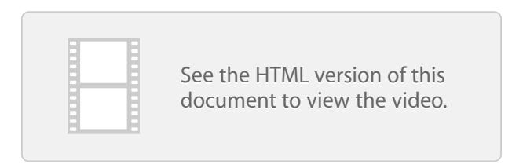

It's no surprise that in an app that uses a content- or experience-driven information structure, navigation is also defined by the content or experience. For example, users navigate through a book by moving from one page to the next or by choosing a page in the table of contents; in a game, navigation is often an important part of the experience.

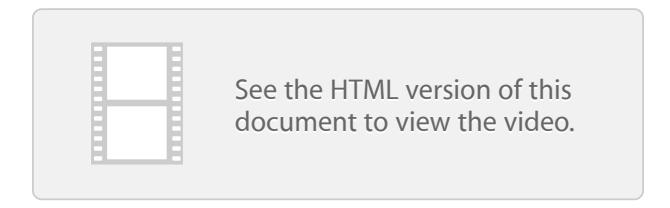

In some cases, it works well to combine more than one navigation style in an app. For example, the items in one category of a flat information structure might best be displayed in a hierarchy.

**Users should always know where they are in your app and how to get to their next destination.** Regardless of the navigation style that suits the structure of your app, the most important thing is that a user's path through the content is logical, predictable, and easy to follow.

UIKit defines some standard UI elements that make it easy to implement hierarchical and flat navigation styles, in addition to some elements that help you enable content-centric navigation, such as in a book-style or media-viewing app. A game or other app that provides an experience-driven navigation style typically relies on custom elements and behaviors.

**Use a navigation bar to give users an easy way to traverse a hierarchy of data.** The navigation bar's title can show users their current position in the hierarchy; the back button makes it easy to return to the previous level. To learn more, see ["Navigation](#page-143-0) Bar" (page 144).

**Use a tab bar to display several peer categories of content or functionality.** A tab bar is a good way to support a flat information architecture and its persistence lets people switch between categories regardless of their current location. To learn more, see ["Tab](#page-149-0) Bar" (page 150).

**Use a page control when each app screen represents an individual instance of the same type of item or page.** A page control is good for showing users how many items or pages are available and which one is currently displayed. For example, Weather uses a page control to show how many location-specific weather pages the user has opened. To learn more about the page control, see "Page [Control"](#page-185-1) (page 186).

**In general, it's best to give users one path to each screen.** If there's one screen that users need to see in more than one context, consider using a temporary view, such as a modal view, action sheet, or alert. To learn more, see ["Modal](#page-202-0) View" (page 203), ["Action](#page-199-0) Sheet" (page 200), and ["Alert"](#page-196-1) (page 197).

UIKit also provides the following related controls:

- ["Segmented](#page-190-1) Control" (page 191). A segmented control can give users a way to see different categories or aspects of the content on the screen; it doesn't enable navigation to a new screen.
- ["Toolbar"](#page-146-0) (page 147). Although a toolbar looks similar to a navigation bar or a tab bar, it doesn't enable navigation. Instead, a toolbar gives users controls that act on the contents of the current screen.

# Modal Contexts

Modality—that is, a mode in which something exists or is experienced—has advantages and disadvantages. It can give users a way to complete a task or get information without distractions, but it does so by temporarily preventing them from interacting with the rest of the app.

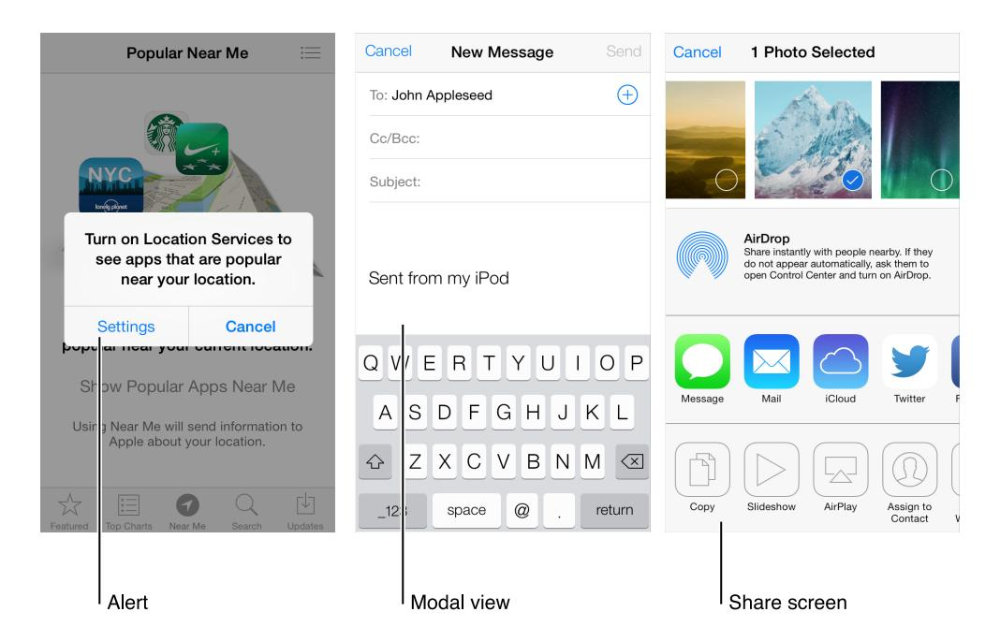

Ideally, people can interact with iOS apps in nonlinear ways, so it's best when you can minimize the number of modal experiences in your app. In general, consider creating a modal context only when:

- It's critical to get the user's attention
- A self-contained task must be completed—or explicitly abandoned—to avoid leaving the user's data in an ambiguous state

**Keep modal tasks simple, short, and narrowly focused.** You don't want your users to experience a modal view as a mini app within your app. If a subtask is too complex, people can lose sight of the main task they suspended when they entered the modal context. Be especially wary of creating a modal task that involves a hierarchy of views, because people can get lost and forget how to retrace their steps. If a modal task must contain subtasks in separate views, be sure to give users a single, clear path through the hierarchy, and avoid circularities. For guidelines on using modal views, see ["Modal](#page-202-0) View" (page 203).

**Always provide an obvious and safe way to exit a modal task.** People should always be able to predict the fate of their work when they dismiss a modal view.

**If the task requires a hierarchy of modal views,** make sure your users understand what happens if they tap a Done button in a view that's below the top level. Examine the task to decide whether a Done button in a lower-level view should complete only the part of the task in that view, or the entire task. Because of this potential for confusion, avoid adding a Done button to a subordinate view as much as possible.

**Reserve alerts for delivering essential—and ideally actionable—information.** An alert interrupts the user's experience and requires a tap to dismiss, so it's important for users to feel that the alert's message warrants the intrusion. To learn more, see ["Alert"](#page-196-1) (page 197).

**Respect users' preferences for receiving notifications.** In Settings, users indicate how they want to receive notifications from your app. Be sure to abide by these preferences so that users aren't tempted to turn off all notifications from your app.

# Interactivity and Feedback

## Users Know the Standard Gestures

People use gestures—such astap, drag, and pinch—to interact with apps and their iOS devices. Using gestures gives people a close personal connection to their devices and enhances their sense of direct manipulation of onscreen objects. People generally expect gestures to work the same in all the apps they use.

**Tap** To press or select a control or item.

**Drag** To scroll or pan—that is, move side to side.

To drag an element.

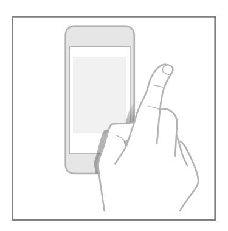

**Flick** To scroll or pan quickly.

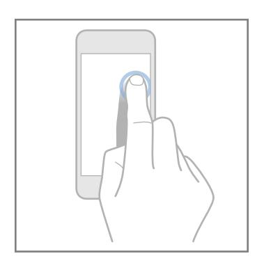

**Swipe** With one finger, to return to the previous screen, to reveal the hidden view in a split view (iPad only), or the Delete button in a table-view row.

With four fingers, to switch between apps on iPad.

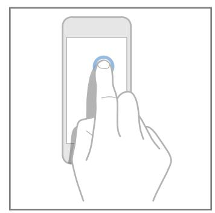

**Double tap** To zoom in and center a block of content or an image.

To zoom out (if already zoomed in).

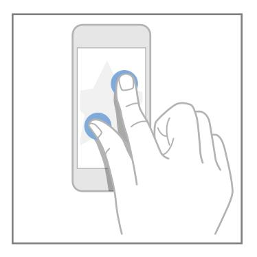

**Pinch** Pinch open to zoom in; pinch close to zoom out.

**Touch and hold** In editable or selectable text, to display a magnified view for cursor positioning.

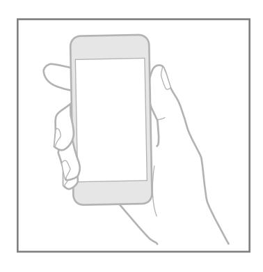

**Shake** To initiate an undo or redo action.

In addition to the standard gestures users know, iOS defines a few gestures that invoke systemwide actions, such as revealing Control Center or Notification Center. Users rely on these gestures to work regardless of the app they're using.

**Avoid associating different actions with the standard gestures.** Unless your app is a game, redefining the meaning of a standard gesture may confuse people and make your app harder to use.

**Avoid creating custom gestures that invoke the same actions as the standard gestures.** People are used to the behavior of the standard gestures, and they don't appreciate being expected to learn different ways to do the same thing.

**Use complex gestures as shortcuts to expedite a task, not as the only way to perform it.** As much as possible, always give users a simple, straightforward way to perform an action, even if it means an extra tap or two. Simple gestures let users focus on the experience and the content, not the interaction.

**In general, avoid defining new gestures unless your app is a game.** In games and other immersive apps, custom gestures can be a fun part of the experience. But in apps that help people do things that are important to them, it's best to use standard gestures because people don't have to make an effort to discover them or remember them.

**ForiPad, consider using multifinger gestures.** The large iPad screen provides greatscope for custom multifinger gestures, including gestures made by more than one person. Although complex gestures aren't appropriate for every app, they can enrich the experience in apps that people spend a lot of time in, such as games or content-creation environments. Always bear in mind that nonstandard gestures aren't discoverable and should rarely, if ever, be the only way to perform an action.

## Interactive Elements Invite Touch

To signal interactivity, the built-in apps use a variety of cues, including color, location, context, and meaningful icons and labels. Usersrarely need additional decorationsto show them that an onscreen element isinteractive or to suggest what it does.

A key color gives users a strong visual indicator of interactivity, especially in appsthat don't use an abundance of other colors. In Contacts, blue marks the interactive elements and gives the app a unified and recognizable visual theme.

The back button uses several cues to indicate its interactivity and convey its function: It appears in response to navigation, it displays a back-pointing chevron and a title that describes the previous screen, and it typically uses a key color.

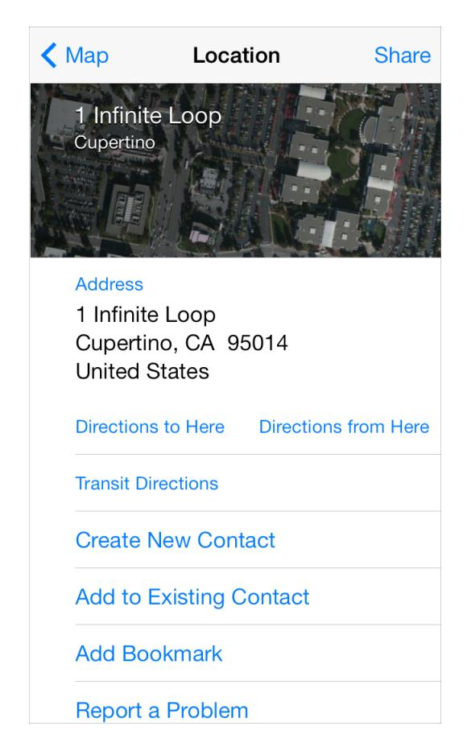

An icon or a title that provides a clear call to action invites users to tap it. For example, the titles in Maps, such as "Add Bookmark" and "Directions to Here," clearly describe actions that users can take. Combined with a key color, actionable titles tend to make button borders or other embellishments superfluous.

**In a content area, add a button border or background only if necessary.** Buttons in bars, action sheets, and alerts don't need borders because users know that most of the items in these areas are interactive. In a content area, on the other hand, a button might need a border or a background to distinguish it from the rest of the content. For example, Music, Clock, Photos, and App Store use bordered buttons in a few specific contexts.

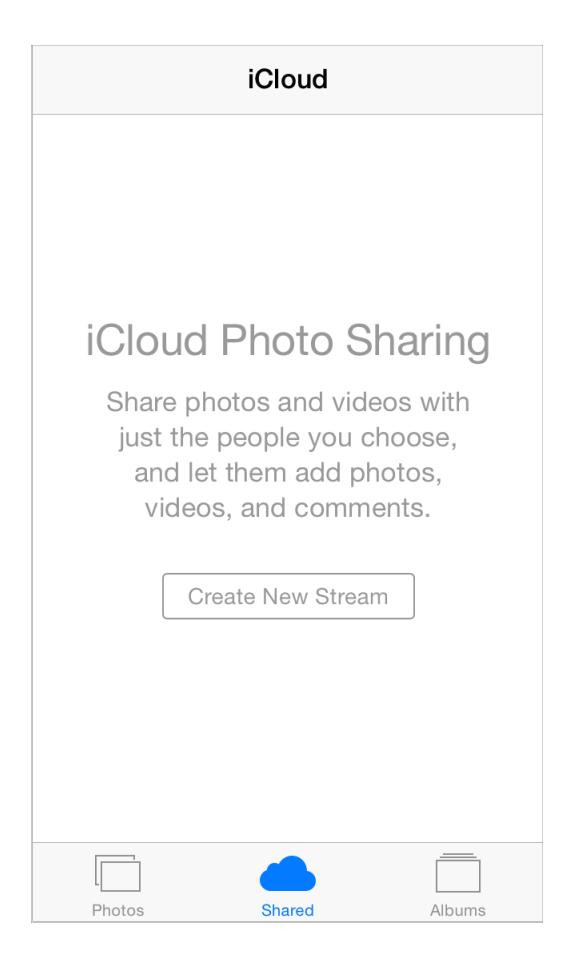

Photos uses a button border to differentiate the Create New Stream button from the explanatory text that appears above it.

Clock uses button bordersin the Stopwatch and Timerscreens to draw attention to the Start and Pause buttons and to make them easy to tap even when the user's surroundings are distracting.

| Timer             |                 |  |  |  |
|-------------------|-----------------|--|--|--|
|                   | 12 13        |  |  |  |
|                   | 14              |  |  |  |
| 0 hours           | 15 min          |  |  |  |
| 1                 | 16              |  |  |  |
| 2 3            | <b>17</b>       |  |  |  |
| When Timer Ends   | Constellation > |  |  |  |
| Start             | Pause           |  |  |  |
| World Clock Alarm | Stopwatch Timer |  |  |  |

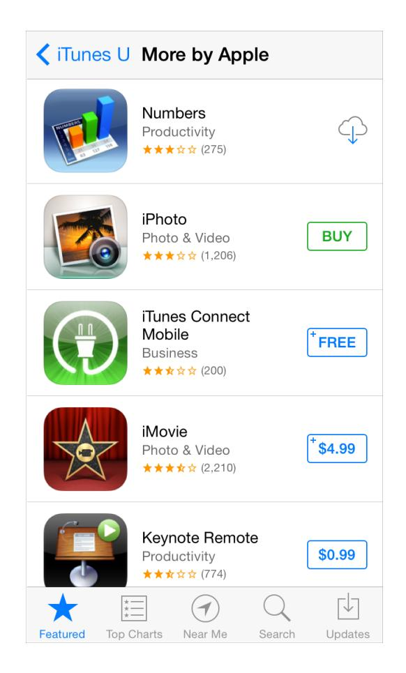

App Store uses a button border in a table row to emphasize the distinction between tapping the row to get more information and tapping the button to initiate a purchase.

## Feedback Aids Understanding

Feedback helps users know what an app is doing, discover what they can do next, and understand the results of their actions. UIKit controls and views provide many kinds of feedback.

**As much as possible, integrate status and other relevant feedback information into your UI.** It's best when users can get thistype of information without taking action or being distracted from their content. For example, Mail displays the update status in the toolbar where it doesn't compete with the user's content.

**Avoid unnecessary alerts.** An alert is a powerful feedback mechanism, but it should be used only to deliver important—and ideally actionable—information. If users see too many alerts that don't contain essential information, they quickly learn to ignore all alerts. To learn more about using an alert, see ["Alert"](#page-196-1) (page 197).

## Inputting Information Should Be Easy

Inputting information takes time and attention, whether people tap controls or use the keyboard. When an app slows people down by asking for a lot of user input before anything useful happens, people can feel discouraged from using it.

**Make it easy for users to make choices.** For example, you can use a picker or a table view instead of a text field, because most people find it easier to select an item from a list than to type words.

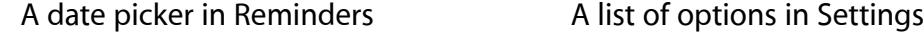

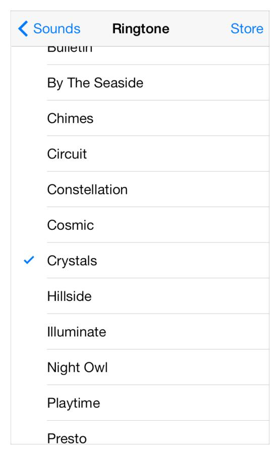

**Getinformation from iOS, when appropriate.** People store lots of information on their devices. When it makes sense, don't force people to give you information that you can easily find for yourself, such as their contacts or calendar information.

**Balance a requestforinput by giving users something useful in return.** A sense of give and take helps people feel they're making progress as they move through your app.

# Animation

Beautiful, subtle animation pervades the iOS UI and makes the app experience more engaging and dynamic. Appropriate animation can:

- Communicate status and provide feedback
- Enhance the sense of direct manipulation
- Help people visualize the results of their actions

**Add animation cautiously, especially in apps that don't provide an immersive experience.** Animation that seems excessive or gratuitous can obstruct app flow, decrease performance, and distract users from their task.

In particular, use motion effects and UIKit dynamic behaviors with purpose and restraint, and be sure to test the results. Used appropriately, these effects can increase users' understanding and enjoyment; overusing them can make an app seem disorienting and difficult to control.

**When appropriate, make custom animation consistent with built-in animation.** People are accustomed to the subtle animation used in the built-in iOS apps. In fact, people tend to regard the smooth transitions between views, the fluid response to changes in device orientation, and the physics-based scrolling as an expected part of the iOS experience. Unless you're creating an app that enables an immersive experience—such as a game—custom animation should be comparable to the built-in animations.

**Use animation consistently throughout your app.** As with other types of customization, it's important to use custom animation consistently so that users can build on the experience they gain as they use your app.

**In general, strive for realism and credibility in custom animation.** People tend to be willing to accept artistic license in appearance, but they can feel disoriented when they experience movement that doesn't make sense or appearsto defy physical laws. For example, if you reveal a view by sliding it down from the top of the screen, you should dismiss it by sliding it back up because doing so helps users remember where the view comes from. If you dismiss the same view by sliding it down beyond the bottom of the screen, you break the user's mental model of a view that's available above the top of the screen.

# Branding

Successful branding involves more than adding brand assets to an app. The best apps integrate existing assets with a unique look and feel to give users a delightful, memorable experience.

iOS makes it easy to use custom icons, colors, and fonts to create a distinctive UI that sets your app apart from the rest. As you design these elements, keep two things in mind:

- Each custom element should look good and function well by itself, but it should also look like it belongs with the other elements in the app, whether they're custom or standard.
- To feel at home in iOS 7, an app doesn't have to look like the built-in apps but it does need to integrate deference, clarity, and depth (to learn more about these themes, see ["Designing](#page-8-0) for iOS 7" (page 9)). Take the time to figure out what deference, clarity, and depth mean in your app and then express this meaning in your custom elements.

When you need to remind users of an existing brand within your app, follow these guidelines.

**Incorporate a brand's assets in a refined, unobtrusive way.** People use your app to get things done or be entertained; they don't want to feel as if they're being forced to watch an advertisement. For the best user experience, you want to quietly remind users of the brand identity through your choice of font, color, and imagery.

### Recommended Not Recommended

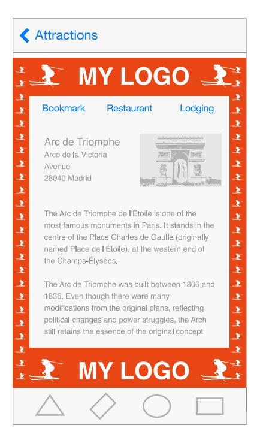

**Don't take space away from the content people care about.** For example, displaying a second, persistent bar at the top of the screen that does nothing but display brand assets meansthat there'slessroom for content. Instead, defer to the user's content and consider less intrusive ways to display pervasive branding, such as using a custom tint or font, or subtly customizing the background of a screen.

**Resist the temptation to display your logo throughout the app.** Mobile device screens are relatively small, and every occurrence of a logo takes space away from the content that users want to see. What's more, displaying a logo in an app doesn't serve the same purpose as displaying it in a webpage: It's common for users to arrive on a webpage without knowing its owner, but it's much less likely that users will open an iOS app without seeing its app icon.

# Color and Typography

## Color Enhances Communication

In iOS 7, color helps indicate interactivity, impart vitality, and provide visual continuity. The built-in apps use a family of pure, clean colors that look great individually and in combination, and on both light and dark backgrounds.

**If you create multiple custom colors, make sure they work well together.** For example, if pastels are essential to your app's style, you should create a family of coordinating pastels that can be used throughout the app.

**Pay attention to color contrasts in different contexts.** For example, if there's not enough contrast between the navigation bar background and the bar-button titles, the buttons will be hard for users to see. A rule of thumb is to start with a contrast of at least 50% between colors that need to be distinguishable. Test the result by viewing it on a device in different lighting conditions, including outdoors on a sunny day.

**Tip:** One way to discover areas that need higher contrast is to desaturate the UI and look at it in grayscale. If you have trouble telling the difference between interactive and noninteractive elements or backgrounds in the grayscale version, you probably need to increase the contrast between these elements.

**Take bar translucency and app content into account when you use a custom bar tint.** If you need to create a bar tint that matches a specific color, such as a color in an existing brand, you may have to experiment with various colors before you get the results you want. A bar's appearance is affected by both the translucency that iOS provides and the appearance of the app content that can be behind the bar.

**API Note:** To tint bar button items, use the tintColor property; to tint the bar itself, use the barTintColor property. To learn more about these bar properties, see *UINavigationBar Class Reference* , *UITabBar Class Reference* , *UIToolbar Class Reference* , and *UISearchBar Class Reference* .

**Be aware of color blindness.** Most color blind people have difficulty distinguishing red from green. Test your app to make sure that there are no places where you use red and green asthe only way to distinguish between two states or values (some image-editing software includes tools that can help you proof for color-blindness). In general, it's a good idea to use more than one way to indicate an element'sinteractivity (to learn more about indicating interactivity in iOS 7, see ["Interactive](#page-40-0) Elements Invite Touch" (page 41)).

**Consider choosing a key color to indicate interactivity and state.** Key colors in the built-in apps include yellow in Notes and red in Calendar. If you define a key color to indicate interactivity and state, make sure that the other colors in your app don't compete with it.

**Avoid using the same color in both interactive and noninteractive elements.** Color is one of the ways that a UI element indicates its interactivity. If interactive and noninteractive elements have the same color, it's harder for users to know where to tap.

**Color communicates, but not always in the way you intend.** Everyone sees color differently, and many cultures differ in how they assign meanings to colors. Spend time to research how your use of color might be perceived in other countries and cultures. As much as possible, you want to be sure that the colors in your app send the appropriate message.

**In most cases, don't let color distract users.** Unless color is essential to your app's purpose, it usually works well to use color as a subtle enhancement.

## Text Should Always Be Legible

Above all, text must be legible. If users can't read the words in your app, it doesn't matter how beautiful the typography is. When you adopt Dynamic Type in an iOS 7 app, you get:

- Automatic adjustments to letter spacing and line height for every font size
- The ability to specify different text styles for semantically distinct blocks of text, such as Body, Footnote, or Headline
- Text that responds appropriately to changes the user makes to text-size settings (including accessibility text sizes)

**Note:** If you use a custom font, you can still scale type according to the system setting for text size. Your app is responsible for responding appropriately when the user changes the setting.

Adopting Dynamic Type requires some work on your part. To learn how to use text styles and ensure that your app gets notified when the user changes the text size setting, see "Text Styles" in *Text Programming Guide for iOS* .

#### **Prioritize content when responding to text-size changes.**

Not all content is equally important to users. When users choose a larger text size, they want to make the content they care about easier to read; they don't always want every word on the screen to be larger.

For example, when users choose a large accessibility textsize, Mail displaysthe subject and body of the message in the large size but leaves the less important text—such as the date and the sender—in a smaller size.

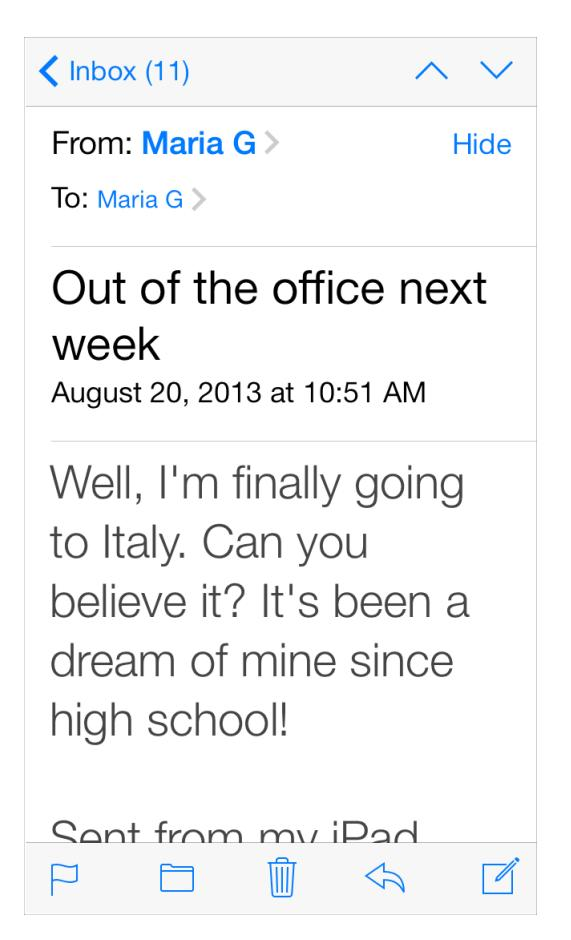

**When appropriate, adjust the layout when the user chooses a different text size.** For example, you might want to change a one-column layout of body text to a two-column layout when the user chooses a small text size. If you decide to adjust the layout for different text sizes, you might choose to do so for subsets of sizes—such as small, medium, and large—rather than change the layout for every possible size.

**Make sure all styles of a custom font are legible at different sizes.** One way to do this is to emulate some of the ways iOS displays font styles at different text sizes. For example:

● Text should never be smaller than 11 points, even when the user chooses the extra-small text size. For comparison, the body style uses a font size of 17 points at the large size, which is the default text-size setting.

- In general, font size and leading values differ by one point per text-size setting. Exceptions to this are the two caption styles, which use the same fontsize, leading, and tracking at the extra-small,small, and medium settings.
- At the smallest three text sizes, tracking values are relatively large; at the largest three text sizes, tracking values are relatively tight.
- The headline and body styles use the same font size. To distinguish it from the body style, the headline style uses a heavier weight.
- Text in a navigation controller uses the same font size that body style text uses for the large setting (specifically, 17 points).
- Text always uses either regular or medium weight; it doesn't use light or bold.

**In general, use a single font throughout your app.** Mixing several different fonts can make your app seem fragmented and sloppy. Instead, use one font and just a few styles and sizes. Use the UIFont text styles API to define different areas of text according to semantic usage, such as body or headline.

Recommended Not Recommended

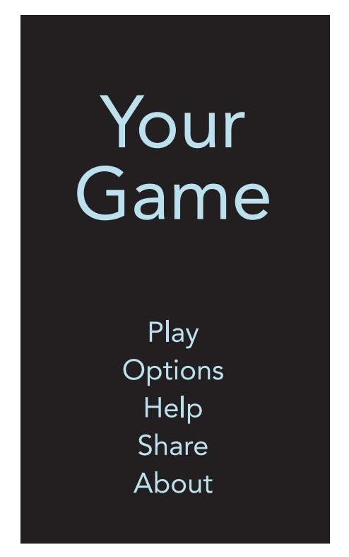

# Icons and Graphics

## The App Icon

Every app needs a beautiful app icon. It's not unusual for people to base their initial opinions about your app's quality, purpose, and reliability solely on the look of your app icon.

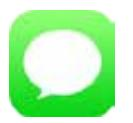

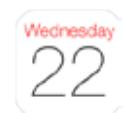

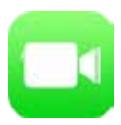

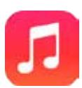

Here are a few of the things you should keep in mind as you think about your app icon. When you're ready to start creating it, see "App [Icon"](#page-208-0) (page 209) for detailed guidance and specifications.

- The app icon is an important part of your app's brand. Approach the design as an opportunity to tell your app's story and build an emotional connection with users.
- The best app icons are unique, uncluttered, engaging, and memorable.
- ● An app icon needs to look good at many different sizes and on different backgrounds. Details that might enrich an icon at large sizes can make it look muddy at small sizes.

## Bar Icons

iOS provides a lot of small icons—representing common tasks and types of content—for use in tab bars, toolbars, and navigation bars. It's a good idea to use the built-in icons as much as possible because users already know what they mean.

If you need to represent custom actions or content types you can create custom bar icons. Designing these small, streamlined icons is very different from designing an app icon. If you need to create custom bar icons, see "Bar [Button](#page-217-0) Icons" (page 218) to learn how.

Note that you can use text instead of icons to represent items in a navigation bar or toolbar. For example, Calendar uses "Today," "Calendars," and "Inbox" instead of icons in the toolbar.

To help you decide whether to use text or icons in the navigation bar or toolbar in your app, consider how many icons are visible onscreen at one time. Too many icons on a screen can make an app seem difficult to decode. Also, note that this decision might be different for an iPhone app than for an iPad app because an iPad app tends to have more room for text in bars.

## Graphics

iOS apps tend to be graphically rich. Whether you're displaying users' photos or creating custom artwork, here are a few guidelines you should follow.

**Support the Retina display.** Make sure that you supply @2x assets for all artwork and graphics in your app.

**Display photos and graphics in their original aspect ratio, and don't scale them greater than 100%.** You don't want the artwork or graphics in your app to look skewed or too large. Let users choose whether they want to zoom images in or out.

**Don't use images thatreplicate Apple products in your designs.** These symbols are copyrighted, and product designs can change frequently.

# Terminology and Wording

Every word you display in an app is part of a conversation you have with users. Use this conversation as an opportunity to provide clarity and to help people feel comfortable in your app.

Settingsis an essential app for all users,so it usessimple, direct language to describe what users can do. For example, Settings > Do Not Disturb explains the effects of various options without using technical jargon that might be difficult for unsophisticated users to understand.

**Use terminology that you're sure your users understand.** Use what you know about your users to determine whether the words and phrases you plan to use are appropriate. For example, technical jargon is rarely helpful in an app aimed at unsophisticated users, but in an app designed for technically savvy users, it might be appreciated.

**Use a tone that's informal and friendly, but not too familiar.** You want to avoid being stilted or too formal, but you don't want to risk sounding falsely jovial or patronizing. Remember that users are likely to read the text in your UI many times, and what might seem clever at first can become irritating when repeated.

**Think like a newspaper editor, and watch out for redundant or unnecessary words.** When your UI text is short and direct, users can absorb it quickly and easily. Identify the most important information, express it concisely, and display it prominently so that people don't have to read too many words to find what they're looking for or to figure out what to do next.

**Give controls short labels or use well-understood icons.** People should be able to tell at a glance what a control does.

**Take care to be accurate when describing dates.** It's often appropriate to use friendly terms such as *today* and *tomorrow* when you display date information in your UI. But it can be confusing if you don't account for the user's current locale. For example, consider an event that starts just before midnight. To users in the same time zone, the event starts today, but to users in an earlier time zone, the same event may have started yesterday.

**Make the most of the opportunity to communicate with potential users by writing a great App Store description.** In addition to describing your app accurately and highlighting the qualities you think people are most likely to appreciate, be sure to:

- **Correct all spelling, grammatical, and punctuation errors.** Although such errors don't bother everyone, in some people they can create a negative impression of your app's quality.
- **Keep all-capital words to a minimum.** Occasional all-capital words help draw people's attention, but when an entire passage is capitalized, it's difficult to read and it can be interpreted as shouting.
- **Consider describing specific bug fixes.** If a new version of your app contains bug fixes that customers have been waiting for, it can be a good idea to mention this in your description.

# Integrating with iOS

Integrating with iOS means giving users a compelling, delightful experience that feels at home on the platform; it doesn't mean creating an app that looks like a copy of a built-in app.

The best way to integrate your unique app with the platform is to understand the themes that motivate iOS—these are described in ["Designing](#page-8-0) for iOS 7" (page 9)—and figure out how your app should express them. As you do this, follow the guidelines in this section to help you give users the experience they expect.

## Use Standard UI Elements Correctly

As much as possible, it's a good idea to use the standard UI elementsthat UIKit provides. When you use standard elements instead of creating custom ones, both you and your users benefit:

- Standard UI elements automatically receive updates if iOS introduces a redesigned appearance—custom elements don't get updated.
- Standard UI elements tend to offer various ways to customize their appearance or behavior. For example, all views (that is, objects that inherit from UIView) are tintable, which makes it easy to add color to an app. To learn more about adding color to UI elements, see "Using Tint Color" in *iOS 7 UI Transition Guide* .
- People are comfortable with the standard UI elements, so they instantly understand how to use them in your app.

To take advantage of the benefits of using standard UI elements, it's crucial that you:

**Follow the guidelines for every UI element.** When a UI element looks and works the way people expect it to, they can depend on their prior experience to help them use it in your app. You can find UI element guidelines in ["Bars"](#page-142-0) (page 143), ["Content](#page-155-0) Views" (page 156), ["Controls"](#page-181-0) (page 182), and ["Temporary](#page-196-0) Views" (page 197).

**Don't mix UI element styles from different versions of iOS.** You don't want to confuse users by displaying UI elements that look like they belong in a different version of iOS than the version that's currently running on the device.

**In general, avoid creating a custom UI element that performs a standard action.** First, ask yourself why you're creating a custom UI element that behaves exactly like a standard one. If you just want a custom look, consider changing the look of a standard element by using the UIKit appearance customization APIs or tint

color. If you want a slightly different behavior, be sure to find out whether a standard element might do what you want when you adjust its properties and attributes. If you need completely custom behavior, it's best to design a custom element that doesn't look too similar to the standard ones.

**Tip:** Interface Builder makes it easy to get the standard UI elements, use the appearance customization APIs, access properties and attributes, and apply custom and system provided icons to your controls. To learn more about Interface Builder, see *Xcode Overview*.

**Don't use system-defined buttons and icons to mean something else.** iOS provides many buttons and icons that you can use in your app. Be sure you understand the documented, semantic meaning of these buttons and icons; don't rely on your interpretation of their appearance. (You can find the meaning of each icon in "Toolbar and [Navigation](#page-147-0) Bar Buttons" (page 148) and "Tab Bar [Icons"](#page-151-0) (page 152).)

If you can't find a system provided button or icon that has the appropriate meaning for a function in your app, you can create your own. For some guidelines to help you design custom icons, see "Bar [Button](#page-217-0) Icons" (page 218).

**If your app enables an immersive task or experience, it may be reasonable to create completely custom controls.** Thisis because you're creating a unique environment, and discovering how to control that environment is an experience users expect in such apps.

## Respond to Changes in Device Orientation

People generally expect to use their iOS devices in any orientation, so it's best when your app responds appropriately.

**Maintain focus on the primary content in all orientations.** This is your highest priority. People use your app to view and interact with the content they care about. Changing the focus when the device rotates can disorient people and make them feel they've lost control over the app.

**In general, run in all orientations.** People expect to use your app in different orientations, and it's best when you can fulfill that expectation. iPad users, in particular, expect to use your app in whichever orientation they're currently holding their device. But some apps need to run in portrait only or in landscape only. If it's essential that your app run in only one orientation, you should:

● **Launch your app in the supported orientation,regardless ofthe current device orientation.** For example, if a game or media-viewing app runs in landscape only, it's appropriate to launch the app in landscape, even if the device is currently in portrait. This way, if people start the app while the device is in portrait, they know to rotate the device to landscape to view the content.

- **Avoid displaying aUI elementthattells people to rotate the device.** Running in the supported orientation clearly tells people to rotate the device, if required, without adding unnecessary clutter to the UI.
- **Support both variants of an orientation.** For example, if an app runs only in landscape, people should be able to use it whether they're holding the device with the Home button on the right or on the left. And if people rotate the device 180 degrees while using the app, it's best if the app responds by rotating its content 180 degrees.

#### **If your app interprets changes in device orientation as user input, handle rotation in app-specific ways.**

For example, a game that lets people move game pieces by rotating the device can't respond to device rotation by rotating the screen. In a case like this, you should launch in both variants of the required orientation and allow people to switch between the variants until they start the main task of the app. As soon as people begin the main task, begin responding to device movement in app-specific ways.

**On iPhone, anticipate users' needs when you respond to a change in device orientation.** Users often rotate their devices to landscape orientation because they want to "see more." If you respond by merely scaling up the content, you fail to meet users' expectations. Instead, respond by rewrapping lines of text and—if necessary—adjusting the layout of the UI so that more content fits on the screen.

**On iPad, strive to satisfy users' expectations by supporting all orientations.** The iPad screen mitigates people's desire to rotate the device to landscape to "see more." And because people don't pay much attention to the minimal frame of the device or the location of the Home button, they don't tend to view the device as having a default orientation.

Follow these guidelines as you design how your iPad app should provide a great experience in all orientations:

- **Consider changing how you display auxiliary information or functionality.** While keeping the most important content alwaysin focus, you can respond to rotation by changing the way you provide secondary content.
  - For example, an iPad game that displays a rectangular game board in landscape orientation needs to redraw the board to fit well in portrait orientation. Instead of vertically stretching the game board in portrait orientation—or leaving empty space above or below it—the game could display supplemental information or objects in the additional space.
- **Avoid gratuitous changes in layout.** A comparable experience in all orientations allows people to maintain their usage patterns when they rotate the device. For example, if your iPad app displays images in a grid while in landscape, it's not necessary to display the same information in a list while in portrait (although you might adjust the dimensions of the grid).
- **As much as possible, avoid reformatting information and rewrapping text on rotation.** Strive to maintain a similar format in all orientations. If people are reading text in an app, it's especially important to help them keep their place when they rotate the device.
  - If some reformatting is unavoidable, use animation to help people track the changes. For example, if you add or remove a column of text in different orientations, you can hide the movement of columns and simply fade in the new arrangement. To help you design appropriate rotation behavior, think about how you'd expect your content to behave if you were physically interacting with it in the real world.
- ● **Provide a unique launch image for each orientation.** When each orientation has a unique launch image, people experience a smooth app start regardless of the current device orientation. The iPad Home screen supports all orientations, so people are likely to start your app in the same orientation in which they used the previous app.

## Downplay File and Document Handling

iOS apps can help people create and manipulate files, but this doesn't mean that people should have to think about the file system on an iOS device.

There is no iOS app analogous to the OS X Finder, and people shouldn't be asked to interact with files as they do on a computer. In particular, people shouldn't be faced with anything that encourages them to think about file metadata or locations, such as:

- An open or save dialog that exposes a file hierarchy
- Information about the permissions status of files

**As much as possible, let people manage documents without opening iTunes on their computer.** Consider using iCloud to help users access their content on all of their devices. For some tips on how to provide a great iCloud experience in your app, see ["iCloud"](#page-101-0) (page 102).

If your app helps people create and edit documents, it's appropriate to provide some sort of document picker that lets them open an existing document or create a new one. Ideally, such a document picker:

- **Is highly graphical.** People should be able to easily identify the document they want by looking at visual representations of the documents onscreen.
- **Lets people make the fewest possible gestures to do what they want.** For example, people might scroll horizontally through a carousel or grid of existing documents and open the desired one with a tap.
- **Includes a new document function.** Instead of making people go somewhere else to create a new document, a document picker can allow them to tap a placeholder image to create a new document.

**Tip:** You can use the Quick Look Preview feature to let people preview documents within your app, even if your app can't open them. To learn how to provide this feature in your app, see ["Quick](#page-123-0) Look" (page 124).

**Give people confidence that their work is always preserved unless they explicitly cancel or delete it.** If your app helps people create and edit documents, don't require them to take an explicit save action. iOS apps should take responsibility forsaving people'sinput, both periodically and when they open a different document or switch away from the app.

If the main function of your app isn't content creation—but you allow people to switch between viewing information and editing it—it can make sense to ask them to save their changes. In thisscenario, it often works well to provide an Edit button in the view that displays the information. When people tap the Edit button, replace it with a Save button and add a Cancel button. The transformation of the Edit button helps remind people that they're in an editing mode and might need to save changes, and the Cancel button gives them the opportunity to exit without saving their changes.

## Be Configurable If Necessary

Some apps might need to give users a way to make setup or configuration choices, but most apps can avoid or delay doing this. Successful apps work well for most people right away and offer some ways to adjust the user experience within the main UI.

**If possible, avoid sending users to Settings.** It's important to remember that users can't open the Settings app without first switching away from your app, and you don't want to encourage this action.

When you design your app to function the way most of your users expect, you decrease the need for settings. If you need information about the user, query the system for it instead of asking users to provide it. If you decide you must provide app settings that users rarely need to change, see "The Settings Bundle" in *iOS App Programming Guide* to learn how to support them in your code.

**If necessary, let users set behaviors they want within your app.** Integrating configuration options into your app lets you react dynamically to changes because people don't have to leave your app to set them.

**As much as possible, offer configuration options in the main UI.** Putting options in the main UI can make sense if they represent a primary task and if people might want to change them frequently. If people are likely to change an app's configuration only occasionally, it makes sense to put them in a separate view.

## Take Advantage of iOS Technologies

iOS provides a wealth of technologies that support common tasks and scenarios in ways that users expect. This expectation means that it's almost always better to integrate system-supported technologies into your app than it is to design a custom approach.

Some iOS technologies—such as ["Multitasking"](#page-94-0) (page 95) and ["VoiceOver"](#page-134-0) (page 135)—are system features that all apps should incorporate. Others enable specific app functionality, such as handling tickets and gift cards(["Passbook"](#page-91-0) (page 92)), enabling user purchases within an app ("In-App [Purchase"](#page-104-0) (page 105)), displaying in-app advertising ("iAd Rich [Media](#page-113-0) Ads" (page 114)), integrating with "Game [Center"](#page-106-0) (page 107), and supporting ["iCloud"](#page-101-0) (page 102).

# Design Strategies

- "Design [Principles"](#page-66-0) (page 67)
- "From Concept to [Product"](#page-71-0) (page 72)
- "Case Study: From [Desktop](#page-77-0) to iOS" (page 78)
- ["Running](#page-83-0) on iPhone 5" (page 84)

# Design Principles

## Aesthetic Integrity

Aesthetic integrity doesn't measure the beauty of an app's artwork or characterize its style; rather, it represents how well an app's appearance and behavior integrates with its function to send a coherent message.

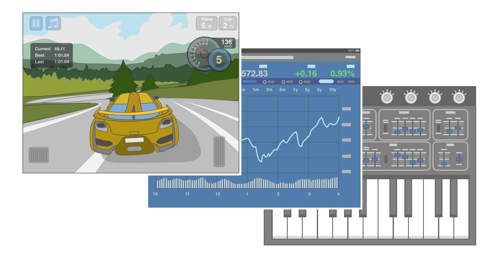

People care about whether an app delivers the functionality it promises, but they're also affected by the app's appearance and behavior in strong—sometimes subliminal—ways. For example, an app that helps people perform a serious task can put the focus on the task by keeping decorative elements subtle and unobtrusive and by using standard controls and predictable behaviors. This app sends a clear, unified message about its purpose and its identity that helps people trust it. But if the app sends mixed signals by presenting the task in a UI that's intrusive, frivolous, or arbitrary, people might question the app's reliability or trustworthiness.

On the other hand, in an app that encourages an immersive task—such as a game—users expect a captivating appearance that promises fun and excitement and encourages discovery. People don't expect to accomplish a serious or productive task in a game, but they expect the game's appearance and behavior to integrate with its purpose.

## Consistency

Consistency lets people transfer their knowledge and skills from one part of an app's UI to another and from one app to another app. A consistent app isn't a slavish copy of other apps and it isn't stylistically stagnant; rather, it pays attention to the standards and paradigms people are comfortable with and it provides an internally consistent experience.

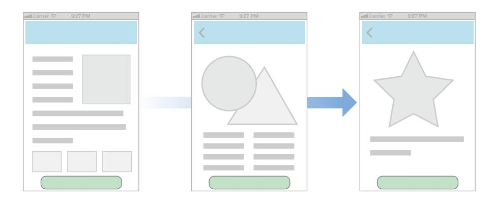

To determine whether an iOS app follows the principle of consistency, think about these questions:

- Isthe app consistent with iOS standards? Doesit use system-provided controls, views, and icons correctly? Does it incorporate device features in ways that users expect?
- Isthe app consistent within itself? Doestext use uniform terminology and style? Do the same icons always mean the same thing? Can people predict what will happen when they perform the same action in different places? Do custom UI elements look and behave the same throughout the app?
- Within reason, is the app consistent with its earlier versions? Have the terms and meanings remained the same? Are the fundamental concepts and primary functionality essentially unchanged?

## Direct Manipulation

When people directly manipulate onscreen objects instead of using separate controls to manipulate them, they're more engaged with their task and it's easier for them to understand the results of their actions.

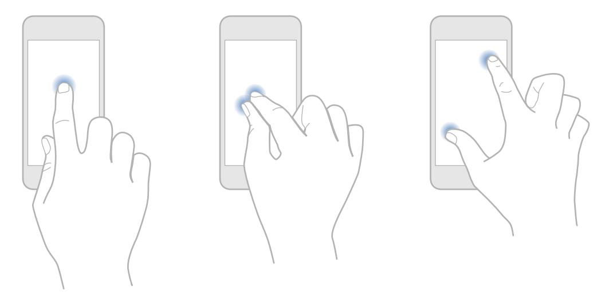

Using the Multi-Touch interface, people can pinch to directly expand or contract an image or content area. And in a game, players move and interact directly with onscreen objects—for example, a game might display a combination lock that users can spin to open.

In an iOS app, people experience direct manipulation when they:

- Rotate or otherwise move the device to affect onscreen objects
- Use gestures to manipulate onscreen objects
- Can see that their actions have immediate, visible results

## Feedback

Feedback acknowledges people's actions, shows them the results, and updates them on the progress of their task.

The built-in iOS apps provide perceptible feedback in response to every user action. List items and controls highlight briefly when people tap them and—during operations that last more than a few seconds—a control shows elapsing progress.

Subtle animation can give people meaningful feedback that helps clarify the results of their actions. For example, lists can animate the addition of a new row to help people track the change visually.

Sound can also give people useful feedback, but it shouldn't be the only feedback mechanism because people can't always hear their devices.

## Metaphors

When virtual objects and actionsin an app are metaphorsfor familiar experiences—whether these experiences are rooted in the real world or the digital world—users quickly grasp how to use the app.

It's best when an app uses a metaphor to suggest a usage or experience without letting the metaphor enforce the limitations of the object or action on which it's based.

iOS apps have great scope for metaphors because people physically interact with the screen. Metaphors in iOS include:

● Moving layered views to expose content beneath them

- Dragging, flicking, or swiping objects in a game
- Tapping switches, sliding sliders, and spinning pickers
- Flicking through pages of a book or magazine

## User Control

People—not apps—should initiate and control actions. An app can suggest a course of action or warn about dangerous consequences, but it's usually a mistake for the app to take decision-making away from the user. The best apps find the correct balance between giving people the capabilities they need while helping them avoid unwanted outcomes.

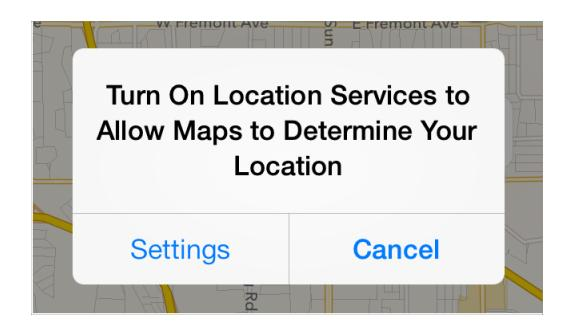

Users feel more in control of an app when behaviors and controls are familiar and predictable. And when actions are simple and straightforward, users can easily understand and remember them.

People expect to have ample opportunity to cancel an operation before it begins, and they expect to get a chance to confirm their intention to perform a potentially destructive action. Finally, people expect to be able to gracefully stop an operation that's underway.

# From Concept to Product

## Define Your App

An **app definition statement** is a concise, concrete declaration of an app's main purpose and its intended audience.

Create an app definition statement early in your development effort to help you turn an idea and a list of features into a coherent product that people want to own. Throughout development, use the definition statement to decide if potential features and behaviors make sense. Take the following steps to create a robust app definition statement.

### 1. List All the Features You Think Users Might Like

Go ahead and brainstorm here. At this point, you're trying to capture all the tasks related to your main product idea. Don't worry if your list is long; you'll narrow it down later.

Imagine that your initial idea is to develop an app that helps people shop for groceries. As you think about this activity, you come up with a list of related tasks—that is, potential features—that users might be interested in. For example:

- Creating lists
- Getting recipes
- Comparing prices
- Locating stores
- Annotating recipes
- Getting and using coupons
- Viewing cooking demos
- Exploring different cuisines
- Finding ingredient substitutions

### 2. Determine Who Your Users Are

Now you need to figure out what distinguishes your app's users from all other iOS users. In the context of your main idea, what's most important to them? Using the grocery-shopping example, you might ask whether your users:

- Usually cook at home or prefer ready-made meals
- Are committed coupon-users or think that coupons aren't worth the effort
- Enjoy hunting for speciality ingredients or seldom venture beyond the basics
- Follow recipes strictly or use recipes as inspiration
- Buy small amounts frequently or buy in bulk infrequently
- Want to keep several in-progress lists for different purposes or just want to remember a few things to buy on the way home
- Insist on specific brands or make do with the most convenient alternatives
- Tend to buy a similar set of items on each shopping trip or buy items listed in a recipe

After musing on these questions, imagine that you decide on three characteristics that best describe your target audience: Love to experiment with recipes, are often in a hurry, and are thrifty if it doesn't take too much effort.

### 3. Filter the Feature List Through the Audience Definition

If, after deciding on some audience characteristics, you end up with just a few app features, you're on the right track: Great iOS apps have a laser focus on the task they help users accomplish.

For example, consider the long list of possible features you came up with in Step 1. Even though these are all useful features, not all of them are likely to be appreciated by the audience you defined in Step 2.

When you examine your feature list in the context of your target audience, you conclude that your app should focus on three main features: Creating lists, getting and using coupons, and getting recipes.

Now you can craft your app definition statement, concretely summarizing what the app does and for whom. A good app definition statement for this grocery-shopping app might be:

"A shopping list creation tool for thrifty people who love to cook."

### 4. Don't Stop There

Use your app definition statement throughout the development processto determine the suitability of features, controls, and terminology. For example:

**As you consider adding a new feature**, ask yourself whether it's essential to the main purpose of your app and to your target audience. If it isn't, set it aside; it might form the basis of a different app. For example, you've decided that your users are interested in adventurous cooking, so emphasizing boxed cake mixes and ready-made meals would probably not be appreciated.

**As you consider the look and behavior of the UI**, ask yourself whether your users appreciate a simple, streamlined style or a more overtly thematic style. Be guided by what people might expect to accomplish with your app, such as the ability to accomplish a serious task, to get a quick answer, to delve into comprehensive content, or to be entertained. For example, although your grocery list app needs to be easy to understand and quick to use, your audience would probably appreciate a themed UI that displays plenty of beautiful pictures of ingredients and meals.

**As you consider the terminology to use**, strive to match your audience's expertise with the subject. For example, even though your audience might not be made up of expert chefs, you're fairly confident that they want to see the proper terms for ingredients and techniques.

## Tailor Customization to the Task

The best iOS apps balance UI customization with clarity of purpose and ease of use. To achieve this balance in your app, be sure to consider customization early in the design process. Because concerns about branding, originality, and marketability often influence customization decisions, it can be challenging to stay focused on how customization impacts the user experience.

Start by considering the tasks in your app: How often do users perform them and under what circumstances?

For example, imagine an app that enables phone calls. Now imagine that instead of a keypad, the app displays a beautiful, realistic rotary dial. The dial is meticulously rendered,so users appreciate its quality. The dial behaves realistically, so users delight in making the old-fashioned dialing gesture and hearing the distinctive sounds.

But for users who often need to dial phone numbers, initial appreciation of the experience soon gives way to frustration, because using a rotary dial is much less efficient than using a keypad. In an app that is designed to help people make phone calls, this beautiful custom UI is a hindrance.

On the other hand, consider the BubbleLevel sample app, which displays a realistic rendition of a carpenter's level. People know how to use the physical tool so they instantly know how to use the app. The app could have displayed its information without the rendition of the bubble vial, but this would have made the app less intuitive and perhaps harder to use. In this case, the custom UI not only shows people how to use the app, it also makes the task easier to accomplish.

As you think about how customization might enhance or detract from the task your app enables, keep these guidelines in mind.

**Always have a reason for customization.** Ideally, UI customization facilitates the task people want to perform and enhances their experience. As much as possible, you need to let your app's task drive your customization decisions.

**As much as possible, avoid increasing the user's cognitive burden.** Users are familiar with the appearance and behavior of the standard UI elements, so they don't have to stop and think about how to use them. When faced with elements that don't look or behave at all like standard ones, users lose the advantage of their prior experience. Unless your unique elements make performing the task easier, users might dislike being forced to learn new procedures that don't transfer to any other apps.

**Be internally consistent.** The more custom your UI is, the more important it isfor the appearance and behavior of your custom elements to be consistent within your app. If users take the time to learn how to use the unfamiliar controls you create, they expect to be able to rely on that knowledge throughout your app.

**Always defer to the content.** Because the standard elements are so familiar, they don't compete with the content for people's attention. As you customize your UI, take care to ensure that it doesn't overshadow the content people care about. For example, if your app allows people to watch videos, you might choose to design custom playback controls. But whether you use custom or standard playback controls is less important than whether the controls fade out after the user begins watching the video and reappear with a tap.

**Think twice before you redesign a standard control.** If you plan on doing more than customizing a standard control, make sure your redesigned control provides as much information as the standard one. For example, if you create a switch control that doesn't indicate the presence of the opposite value, people might not realize that it's a two-state control.

**Be sure to thoroughly user-test custom UI elements.** During testing, closely observe users to see if they can predict what your elements do and if they can interact with them easily. If, for example, you create a control that has a hit target smaller than 44 x 44 points, people will have trouble activating it. Or if you create a view that responds differently to a tap than it does to a swipe, be sure the functionality the view provides is worth the extra care people have to take when interacting with it.

## Prototype & Iterate

Before you invest significant engineering resources into the implementation of your design, it's a really good idea to create prototypes for user testing. Even if you can get only a few colleagues to test the prototypes, you'll benefit from their fresh perspectives on your app's functionality and user experience.

In the very early stages of your design you can use paper prototypes or wireframes to lay out the main views and controls, and to map the flow among screens. You can get some useful feedback from testing wireframes, but their sparseness may mislead testers. This is because it's difficult for people to imagine how the experience of an app will change when wireframes are filled in with real content.

You'll get more valuable feedback if you can put together a fleshed-out prototype that runs on a device. When people can interact with your prototype on a device, they're more likely to uncover places where the app doesn't function as they expect, or where the user experience is too complex.

The easiest way to create a credible prototype is to use a storyboard-based Xcode template to build a basic app, and populate it with some appropriate placeholder content. (A **storyboard** file captures the entire UI of your app, including the transitions among different screens.) Then, install the prototype on a device so that your testers can have as realistic an experience as possible.

You don't need to supply a large amount of content or enable every control in your prototype app, but you do need to provide enough context to suggest a realistic experience. Aim for a balance between the typical user experience and the more unusual edge cases. For example, if it's likely that your app will handle long lists of items, you should avoid creating a prototype that displays only one or two list items. And for testing user interactions, as long as testers can tap an area of the screen to advance to the next logical view or to perform the main task, they'll be able to provide constructive feedback.

When you base your prototype on an Xcode app template, you get lots of functionality for free and it'srelatively easy to make design adjustments in response to feedback. With a short turnaround time, you should be able to test several iterations of your prototype before you solidify your design and commit resources to its implementation. To get started learning about Xcode, see *Xcode Overview*.

# Case Study: From Desktop to iOS

## Keynote on iPad

Keynote on the desktop is a powerful, flexible app for creating world-class slide presentations. People love how Keynote combines ease of use with fine-grained control over myriad precise details, such as animations and text attributes.

Keynote on iPad capturesthe essence of Keynote on the desktop, and makesit feel at home on iPad by creating a user experience that:

- Focuses on the user's content
- Reduces complexity without diluting capability
- Provides shortcuts that empower and delight
- Adapts familiar hallmarks of the desktop experience
- Provides feedback and communication via eloquent animation

Keynote users instantly understand how to use the app on iPad because it delivers expected functionality using native iPad paradigms. New users easily learn how to use Keynote on iPad because they can directly manipulate their content in simple, natural ways.

The transformation of Keynote from the desktop to iPad is based on myriad modifications and redesigns that range from subtle to profound. These are some of the most visible adaptations:

**A streamlined toolbar.** Only a handful of items are in the toolbar, but they give users consistent access to all the functions and tools they need to create their content.

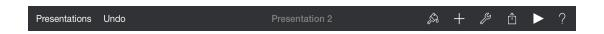

**A simplified, prioritized inspector that responds to the user's focus.** The Keynote on iPad inspector automatically contains the tools and attributes people need to modify the selected object. Often, people can make all the modifications they need in the first inspector view. If they need to modify less frequently changed attributes, they can drill down to other inspector views.

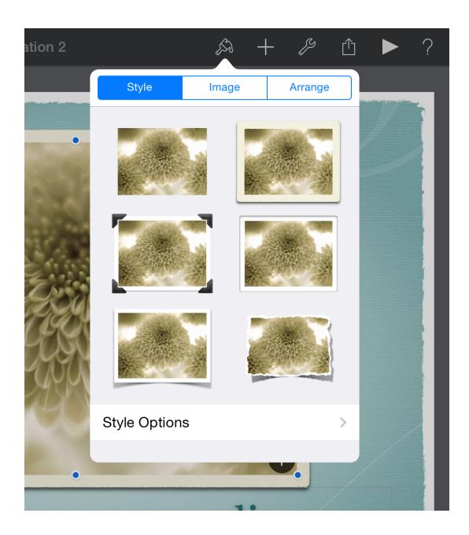

**Lots of prebuilt style collections.** People can easily change the look and feel of objects such as charts and tables by taking advantage of the prebuiltstyles. In addition to colorscheme, each collection includes prestyled attributes, such as table headings and axis-division marks, that are designed to coordinate with the overall theme.

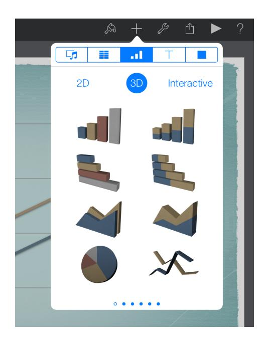

**Direct manipulation of content, enriched with meaningful animation.** In Keynote on iPad, a user drags a slide to a new position, twists an object to rotate it, and taps an image to select it. The impression of direct manipulation is enhanced by the responsive animations Keynote on iPad performs. For example, a slide pulses gently as users move it and, when they place it in a new location, the surrounding slides ripple outward to make room for it.

## Mail on iPhone

Mail is one of the most highly visible, well-used, and appreciated appsin OS X. It is also a very powerful program that allows users to create, receive, prioritize, and store email, track action items and events, and create notes and invitations. Mail on the desktop offers this powerful functionality in a couple of windows.

Mail on iPhone focuses on the core functionality of Mail on the desktop, helping people to receive, create, send, and organize their messages. Mail on iPhone delivers this condensed functionality in a UI tailored for the mobile experience that includes:

- A streamlined appearance that puts people's content front and center
- Different views designed to facilitate different tasks
- An intuitive information structure that scales effortlessly
- Powerful editing and organizing tools that are available when they're needed
- Subtle but expressive animation that communicates actions and provides feedback

It's important to realize that Mail on iPhone isn't a better app than Mail on the desktop; rather, it's Mail, redesigned for mobile users. By concentrating on a subset of desktop features and presenting them in an attractively lean UI, Mail on iPhone gives people the core of the Mail experience while they're mobile.

To adapt the Mail experience to the mobile context, Mail on iPhone innovates the UI in several key ways.

**Distinct, highly focused screens.** Each screen displays one aspect of the Mail experience: account list, mailbox list, message list, message view, and composition view. Within a screen, people scroll to see the entire contents.

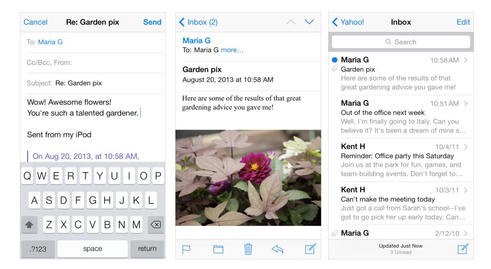

**Easy, predictable navigation.** Making one tap per screen, people drill down from the general (the list of accounts) to the specific (a message). Each screen displays a title that shows people where they are, and a back button that makes it easy for them to retrace their steps.

**Simple, tappable controls, available when needed.** Because composing a message and checking for new email are primary actions people might want to take in any context, Mail on iPhone makes them accessible in multiple screens. When people are viewing a message, functions such as reply, move, and trash are available because they act upon a message.

**Different types of feedback for different tasks.** When people delete a message, it animates into the trash icon. When people send a message, they can see its progress; when the send finishes, they can hear a distinctive sound. By looking at the subtle text in the message list toolbar, people can see at a glance when their mailbox was last updated.

## Web Content in iOS

Safari on iOS provides a preeminent mobile web-viewing experience on iOS devices. People appreciate the crisp text and sharp images and the ability to adjust their view by rotating the device or pinching and tapping the screen.

Standards-based websites display well on iOS devices. In particular, websites that detect the device and do not use plug-ins look great on both iPhone and iPad with little, if any, modification.

In addition, the most successful websites typically:

- Set the viewport appropriately for the device, if the page width needs to match the device width
- Avoid CSS fixed positioning, so that content does not move offscreen when users zoom or pan the page
- Enable a touch-based UI that does not rely on pointer-based interactions

Sometimes, other modifications can be appropriate. For example, web apps always set the viewport width appropriately and often hide the UI of Safari on iOS. To learn more about how to make these modifications, see "Configuring the Viewport" and "Configuring Web Applications" in *Safari Web Content Guide* .

Websites can adapt the desktop web experience to Safari on iOS in other ways, too:

**Accommodate the keyboard in Safari on iOS.** When a keyboard and the form assistant are visible, Safari on iPhone displays your webpage in the area below the URL text field and above the keyboard and form assistant.

**Accommodate the pop-up menu control in Safari on iOS.** In Safari on the desktop, a pop-up menu that contains a large number of items displays as it does in an OS X app; that is, the menu opens to display all items, extending past the window boundaries, if necessary. In Safari on iOS, a pop-up menu is displayed using native elements, which provides a much better user experience. For example, on iPhone, the pop-up menu appears in a **picker**, a list of choices from which the user can pick. (To learn more about the picker control, see ["Picker"](#page-187-0) (page 188).)

# Running on iPhone 5

You don't have to redesign your app for it to look good on iPhone 5. Many appslook good simply by displaying more of their existing UI; others might need to stretch content or background regions. Only some apps—such as games or apps that display lots of custom artwork—are likely to need some additional work to look their best.

**Note:** All apps that run on iPhone 5 must include a launch image of the correct size. To learn how to create launch images for iOS devices, see ["Launch](#page-214-0) Images" (page 215).

The iPhone 5 display is 176 pixels taller than the display of other iPhone and iPod touch devices. In portrait orientation, the extra height is about the same as the height of two additional rows in a standard table view. For example, Messages running on iPhone 5 displays a taller conversation area than does Messages running on iPhone 4S.

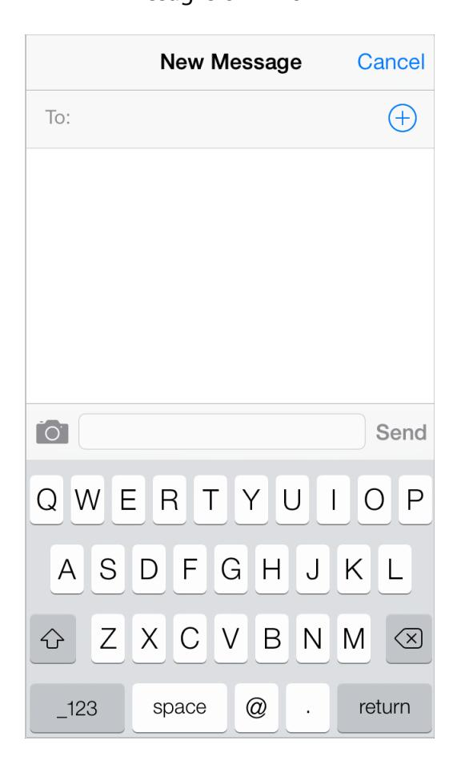

### Messages on iPhone 5 Messages on iPhone 4S

Of course, the additional 176 pixels in height translates into additional lateral space when the device is in landscape orientation. For example, in Messages on iPhone 5 (shown here below Messages on iPhone 4S), the UI stretches to fill the additional width.

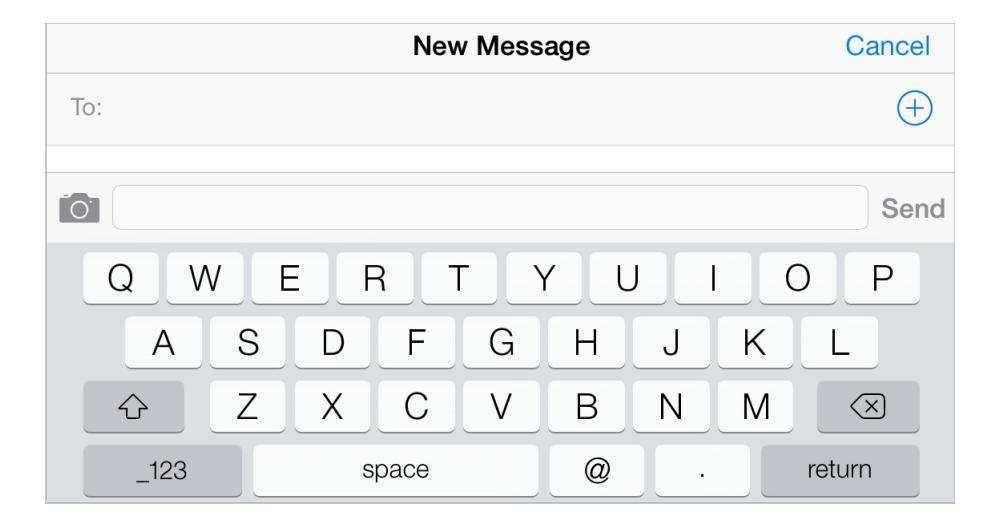

The Messages screens shown above illustrate a crucial point: The minor UI adjustments that were made to accommodate the iPhone 5 display do not change the app's functionality in any way. The consistency of the user experience—which is evident in all of the apps described in this section—follows a key design principle of iPhone 5: The larger device display enables users to see more of the content they care about; it does *not* provide an opportunity to squeeze in more app functionality.

Because you won't be changing the functionality of your app, there's typically very little you have to do to make your app look great on iPhone 5. If you use Auto Layout to design your app's UI, you might have even less work to do. The following guidelines can help you decide which UI changes are best suited to your app. **Note:** If you don't make any changesto your app, it runsin a compatibility mode on iPhone 5. When an app runs in compatibility mode, iOS automatically centers the app's UI by adding slim black bars above and below it.

**Allow more content to be revealed automatically.** If some of your UI is currently hidden below the bottom edge of the screen—requiring users to scroll—you don't have to make any changes to allow the increased display height of iPhone 5 to reveal more of your UI. In Settings, for example, users can see additional table rows on iPhone 5 than they do on iPhone 4S.

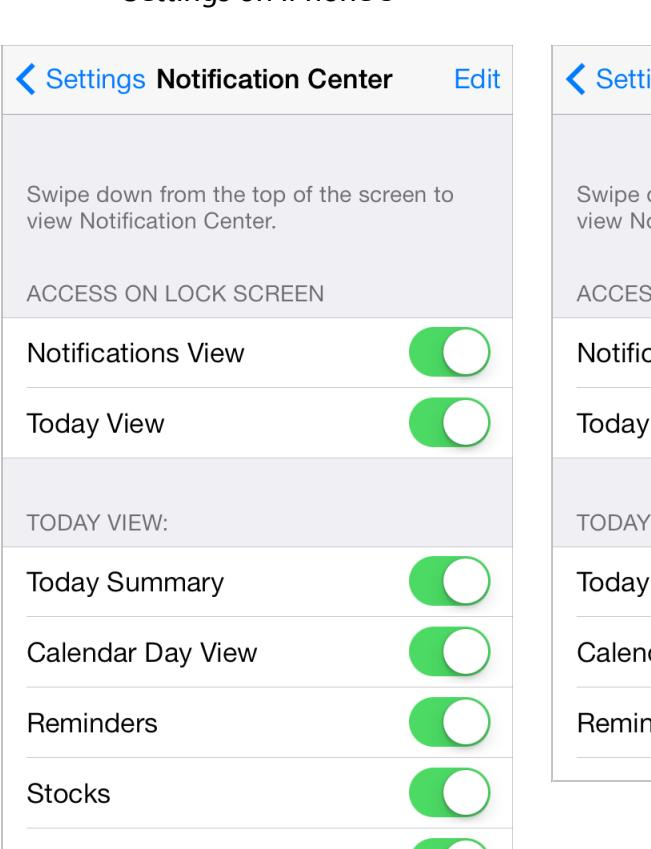

Settings on iPhone 5 Settings on iPhone 4S

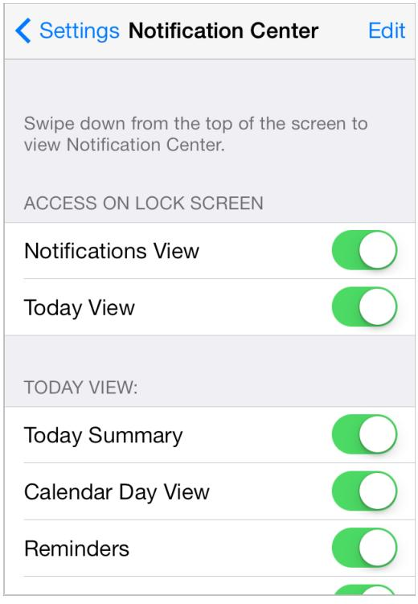

**Stretch content regions.** If you display content in a view, consider vertically expanding the view to show some additional content or to insert more space within the view. For example, users have a larger message body region in Mail on iPhone 5 than they do in Mail on iPhone 4S.

### Mail on iPhone 5 Mail on iPhone 4S

**Stretch background areas between content regions.** You can make your layout look a bit more relaxed by expanding the vertical space between content views. For example, Weather on iPhone 5 shows more of the background in the upper part of the screen than does Weather on iPhone 4S.

### Weather on iPhone 5 Weather on iPhone 4S

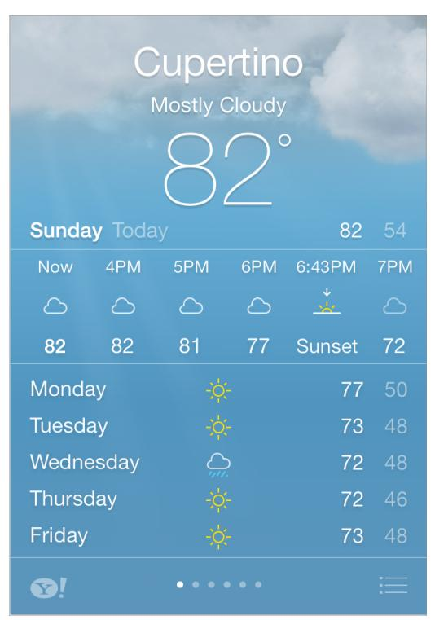

**If necessary, recenter dominant visual elements.** After adjusting backgrounds or views to accommodate the additionalspace, you might want to make sure that principal elements of your UI are still centered appropriately. One way to do this is to first stretch a region near the top of the screen and then adjust the centering of the elements. For example, Compass on iPhone 5 maintains the user's focus on the compass and heading by keeping these elements centered on the extended background.

### Compass on iPhone 5 Compass on iPhone 4S

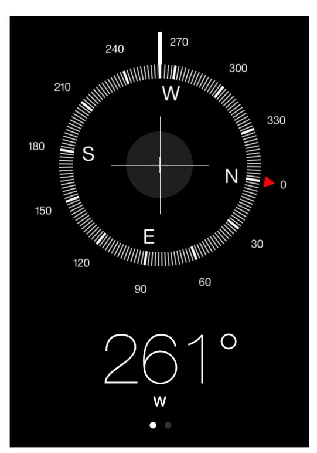

**In general, avoid increasing control sizes.** If you use the minimum tappable size for controlsin your app—that is, no smaller than 44 x 44 points—you should not need to adjust them for iPhone 5. However, you might choose to add a little more space between existing controls.

**Don't use the extra space to display an additional bar or banner.** People expect to see more content on iPhone 5. To avoid disappointing your users, resist the temptation to use the extra vertical space for a custom button bar or banner.

# iOS Technologies

- ["Passbook"](#page-91-0) (page 92)
- ["Multitasking"](#page-94-0) (page 95)
- ["Routing"](#page-96-0) (page 97)
- "Social [Media"](#page-99-0) (page 100)
- ["iCloud"](#page-101-0) (page 102)
- "In-App [Purchase"](#page-104-0) (page 105)
- "Game [Center"](#page-106-0) (page 107)
- ["Notification](#page-108-0) Center" (page 109)
- "iAd Rich [Media](#page-113-0) Ads" (page 114)
- ["AirPrint"](#page-119-0) (page 120)
- ["Accessing](#page-121-0) User Data" (page 122)
- ["Quick](#page-123-0) Look" (page 124)
- ["Sound"](#page-125-0) (page 126)
- ["VoiceOver"](#page-134-0) (page 135)
- "Edit [Menu"](#page-135-0) (page 136)
- ["Undo](#page-138-0) and Redo" (page 139)
- ["Keyboards](#page-140-0) and Input Views" (page 141)

# Passbook

The Passbook app helps people view and manage passes, which are digital representations of physical items such as boarding passes, coupons, membership cards, and tickets. In your app, you can create a pass, distribute it to users, and update it when things change.

The Pass Kit framework makes it easy to use custom content to assemble a pass and to access a pass when it's in the user's pass library. (To learn about the key concepts of Passbook technology and how to use the Pass Kit APIs in your app, see *Passbook Programming Guide* .) The following guidelines can help you create a pass that people appreciate having in their pass library and enjoy using.

**As much as possible, avoid simply reproducing an existing physical pass.** Passbook has an established design aesthetic and passes that coordinate with this aesthetic tend to look best. Instead of replicating the appearance of a physical item, take this opportunity to design a clean, simple pass that follows the form and function of Passbook.

**Be selective about the information you put on the front of a pass.** People expect to be able to glance at a pass and quickly get the information they need, so the front of a pass should be uncluttered and easy to read. If there's additional information that you think people might need, it's better to put it on the back of the pass than to squeeze it onto the front.

**In general, avoid using a plain white background.** A pass tends to look best when its background is a vivid, solid color or displays an image that uses strong, vibrant colors. As you design the background, always make sure that it doesn't interfere with the readability of the content.

**Use the logo text field for your company name.** Text in the logo text field is rendered in a consistent font on all passes. To avoid clashing with other passes in the user's pass library, it's recommended that you enter text into the logo text field instead of using a custom font.

**Note:** It's best to use the appropriate passfieldsfor all of the text in your pass and avoid embedding text in images or using custom fonts. Using the fields benefits you in two important ways: It allows VoiceOver usersto get all the information in your pass and it gives your pass a consistent appearance.

**Use a white company logo.** The logo image is placed in the upper-left corner of the pass, next to your company name. For best results, supply a white, monochrome version of your logo that doesn't include text. If you want to engrave the logo so that it matches the rendered logo text, add a black drop shadow with a 1 pixel y offset, a 1 pixel blur, and 35% opacity.

**Use a rectangular barcode when possible.** Because of the layout of a pass, a rectangular barcode—such as PDF417—tends to look better than a square barcode. As shown below on the right, a square barcode creates empty gutters on both sides and can vertically crowd the fields above and below it.

A rectangular barcode fits well in the layout A square barcode can crowd other fields

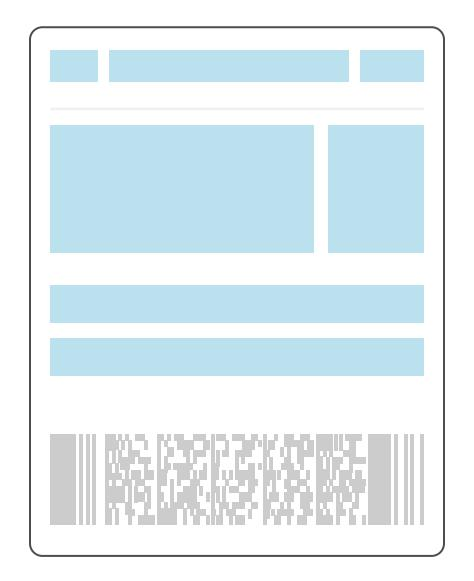

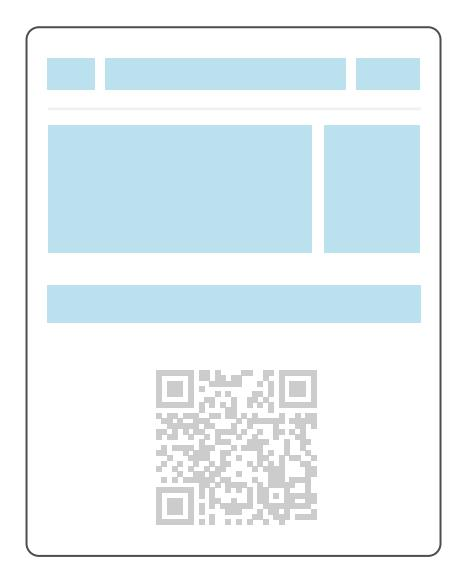

**Optimize images for performance.** Because users often receive passes via email or Safari, it's important to make downloads as fast as possible. To improve the user experience, use the smallest image files that achieve the desired visual appearance.

**Enhance the utility of a pass by updating it when appropriate.** Even though a pass represents a physical item that doesn't typically change, your digital pass can provide a better experience by reflecting real-world events. For example, you can update an airline boarding pass when a flight is delayed so that people always get current information when they check the pass.

# Multitasking

To support this experience, multitasking allows an app to enter a suspended state in the background when users switch away from it. When users switch back to the app, the app can resume quickly because it doesn't have to reload its UI. People use the **multitasking UI** (shown above) to choose a recently used app.

**API Note:** To learn how to support multitasking in your code, see "App States and Multitasking".

Thriving in a multitasking environment hinges on achieving a harmonious coexistence with other apps on the device. At a high level, this means that all apps should:

● Handle interruptions or audio from other apps gracefully

- Stop and restart—that is, transition to and from the background—quickly and smoothly
- Behave responsibly when not in the foreground

The following specific guidelines help your app succeed in the multitasking environment.

**Be prepared for interruptions, and be ready to resume.** Multitasking increases the probability that a background app will interrupt your app. Other features, such as the presence of ads and faster app-switching, can also cause more frequent interruptions. The more quickly and precisely you can save the current state of your app, the faster people can relaunch it and continue from where they left off. To give users a seamless restart experience, take advantage of UIKit's state preservation and restoration functionality (for more information, see "State Preservation and Restoration").

**Make sure your UI can handle the double-high status bar.** The double-high status bar appears during events such as in-progress phone calls, audio recording, and tethering. In unprepared apps the extra height of this bar can cause layout problems. For example, the UI can become pushed down or covered. In a multitasking environment, it's especially important to be able to handle the double-high status bar properly because there are likely to be more apps that can cause it to appear.

**Be ready to pause activities that require people's attention or active participation.** For example, if your app is a game or a media-viewing app, make sure your users don't miss any content or events when they switch away from your app. When people switch back to a game or media viewer, they want to continue the experience as if they'd never left it.

**Ensure that your audio behaves appropriately.** Multitasking makes it more likely that other media activity is occurring while your app is running. It also makes it more likely that your audio will have to pause and resume to handle interruptions. Forspecific guidelinesthat help you make sure your audio meets people's expectations and coexists properly with other audio on the device, see ["Sound"](#page-125-0) (page 126).

**Use local notifications sparingly.** An app can arrange for local notificationsto be sent atspecific times, whether the app is suspended, running in the background, or not running at all. For the best user experience, avoid pestering people with too many notifications, and follow the guidelines for creating notification content described in ["Notification](#page-108-0) Center" (page 109).

**When appropriate, finish user-initiated tasks in the background.** When people initiate a task, they usually expect it to finish even if they switch away from your app. If your app is in the middle of performing a user-initiated task that does not require additional user interaction, you should complete it in the background before suspending.

# Routing

In iOS 6 and later, Maps displays a list of routing apps—including apps installed on the device and in the App Store—when people want transit information for a route.

A **routing app** provides information about transit options for the currently selected route. People expect routing apps to be quick, easy to use, and—above all—accurate. Following the guidelines in this section helps you give users transit information they can trust and a user experience they appreciate.

**Important:** Maps gives people driving and walking directions for their route. Routing apps provide **transit information**, which focuses on step-by-step directions that use alternate modes of transportation—such as bus, train, subway, ferry, bike, pedestrian, shuttle, and so on.

If your app doesn't provide transit information for the routes that people specify, don't identify it as a routing app.

**Deliver the functionality your app promises.** When people see your app in the transit list, they assume that it can help them reach their destination. But if your app can't provide information about the selected route—or it doesn't include the type of transit it appears to include—people are unlikely to give it a second chance. It's essential to represent your app's capabilities accurately; otherwise, your app can look like it's intentionally misleading users.

There are two main ways you can give users confidence in your routing app:

- Define the geographic regions you support as precisely as possible. For example, if your app helps people get information about bus routes in Paris, your supported region should be Paris, not Île-de-France, and not France.
- Be specific about the types of transit that you support. For example, if you specialize in subway information, don't imply that you provide information about all rail-based transit types.

**Note:** Although accurately reporting your supported region can mean that your app appears in the transit list less often, doing so helps users trust it more.

**Streamline the UI for ease of use.** Ease of use is especially important for routing apps because people tend to use them under challenging conditions—such as in bright sunlight or in the dim interior of a train, on a bumpy ride, and when they're in a hurry. Make sure that your text is easy to read in any light and that buttons are easy to tap accurately even when the ride is not smooth.

**Focus on the route.** Although auxiliary information can be useful, your app should focus on giving users step-by-step directions they can follow to their destination. In particular, you want users to know which step they're in and how to get to the next step. You can provide additional data—such as timetables and system maps—but don't make this data more prominent than the transit information.

**Provide information for every step of a route.** People should never feel abandoned by your app. But even when you accurately report your supported region, you can't assume that users are already at the first transit stop in a route, or that the last transit stop is at the same location as their destination. To handle this situation, first examine the distances at the beginning and end of the route. If the distances are short enough, provide walking directions from the user's current location to the first transit stop and from the last transit stop to the user'sfinal destination. If walking is not a reasonable choice, try to describe the user's other options. If necessary, you can give users a way to open Maps to get walking or driving directions for these portions of the route.

**When users transition to your app from Maps, don't ask them to reenter information.** If users are coming from Maps, you already know the start and end points of the route they're interested in, so you can present the appropriate transit information as soon as your app opens. If users start your app from the Home screen, provide an easy way for them to enter route details.

**Display transit information both graphically and textually.** A map view helps people see their complete route in a larger, physical context; a list of steps helps people focus on the actions they must take to arrive at their destination. It's best when you support both of these tasks and make it easy for users to switch between them.

**Note:** Regardless of format, it's crucial that you always display the same transit information for the user's route. For example, if a route consists of five steps, both the map and the list view of the route must describe the same five steps.

When your app is chosen from the transit list, it works well to start by displaying the complete route—including walking pathsto and from the transitstops, if appropriate—in a map view. A map view gives users an overview of the various steps in their journey and shows them how their route fits into the surrounding geographical area.

**Enrich map views with additional information.** People expect the maps in your app to behave similarly to other maps they've used. In addition to letting users zoom and pan, you should display annotations that give users the information they need. For example, you could display pins that represent the user's current location, the destination, and transfers or points of interest along the way. Be sure to avoid displaying only a single pin, because it's hard for users to tell what it represents if there's no additional context. For more information about using map views in your app, see "Map [View"](#page-162-0) (page 163).

As much as possible, integrate static maps—such as a subway system map—with a map view. A good way to do this is to overlay the static image on the map view so that users can see how their route and their current location relate to the larger transit system.

**Note:** If you decide to display a static map image by itself, be sure to use a high-resolution image that maintains good quality when users zoom into it.

**Give users different ways to sort multiple transit options.** Lots of factors influence people's transit decisions—such as time of day, weather, and how much they're carrying—so it's important to make it easy to compare transit options. For example, you could let users sort transit options by start or end time, amount of walking required, number of stops along the way, or number of transfers or different transit types required. Regardless of the order in which you display multiple transit options, make sure that users can instantly distinguish the differences between the options.

**Consider using push notifications to give people important information about their route.** As much as possible, let people know when transit information changes, so that they can adjust their plans. For example, if a train is delayed or a bus line is temporarily unavailable people might need to choose a different route to their destination. And in a route that includeslong stops between steps, people might appreciate being notified when their transport is about to depart for the next part of the journey.

# Social Media

People expect to have access to their favorite social media accounts regardless of their current context. iOS makes it easy to integrate social media interactions into your app in ways that people appreciate.

**Give users a convenient way to compose a post without leaving your app.** As much as possible, you want to integrate social media support into your app so users can post content to their account without switching to another app to do so. The Social framework provides a compose view controller that allows you to present users with a view in which they can edit a post. Optionally, you can prepopulate the compose view with custom content before you present it to users for editing (after you present the view to users, only they can edit the content). To learn about the programming interfaces of the Social framework—including the SLComposeViewController class—see *Social Framework Reference* .

**When possible, avoid asking users to sign into a social media account.** The Social framework works with the Accounts framework to support a single sign-on model, so you can get authorization to access the user's account without asking them to reauthenticate. If the user hasn't already signed into an account, you can present UI that allows them to do so.

**Consider using an activity view controller to help users choose one of their social media accounts.** By default, an activity view controller—that is, a UIActivityViewController object—lists several system-provided services that act upon the currently selected content, including sending the content via Mail or Messages and posting the content to social media accounts. When you use an activity view controller, you don't have to provide a custom service that interacts with a social media account and you benefit from the user's familiarity with the Share button that reveals the list of services. For guidelines on how to use an activity view controller in your app, see "Activity View [Controller"](#page-157-0) (page 158).

# iCloud

iCloud lets people access the content they care about regardless of which device they're currently using. When you integrate iCloud into your app, users can use different instances of your app on different devices to view and edit their personal content without performing explicit synchronization.

To provide this user experience, it's likely that you'll need to reexamine the ways in which you store, access, and present information—especially user-created content—in your app. To learn how to enable iCloud in your app, see *iCloud Design Guide* .

A fundamental aspect of the iCloud user experience is transparency: Ideally, users don't need to know where their content is located and they should seldom have to think about which version of the content they're currently viewing. The following guidelines can help you give users the iCloud experience they're expecting.

**If appropriate, make it easy for users to enable iCloud for your app.** On their iOS devices, users log into their iCloud account in iCloud Settings, and for the most part, they expect their appsto work with iCloud automatically. But if you think users might want to choose whether to use iCloud with your app, you can provide a simple option that they can set when they open your app for the first time. In most cases, this option should provide a choice between using iCloud with all the content that users access in your app or not at all.

**Respect the user's iCloud space.** It's important to remember that iCloud is a finite resource for which users pay. You should use iCloud for storing information that users create and understand, and avoid using it to store app resources or content that you can regenerate. Also, note that when the user's iCloud account is active, iCloud automatically backs up the contents of your app's Documents folder. To avoid using up too much of the user's space, it's best to be picky about the content you place in the Documents folder.

**Avoid asking users to choose which documents to store in iCloud.** Typically, users expect all the content they care about to be available via iCloud. Most users don't need to manage the storage of individual documents, so you shouldn't assume that your app needs to support this experience. To provide a good user experience, you might want to rearchitect the way your app handles and exposes content so that you can perform more file-management tasks for the user.

**Determine which types of information to store in iCloud.** In addition to storing user-created documents and other content, you can also store small amounts of data such as the user's current state in your app or their preferences. To store this type of information you use iCloud key-value storage. For example, if people use your app to read a magazine, you might use iCloud key-value storage to store the last page they viewed so that when they reopen the issue on a different device, they can continue reading from where they left off.

If you use iCloud key-value storage to store preferences, be sure that the preferences are ones that users are likely to want to have applied to all their devices. For example, some preferences are more useful in a work environment than they are in a home environment. In some cases, it can make sense to store preferences on your app's server, instead of in the user's iCloud account, so that the preferences are available regardless of whether iCloud is enabled.

**Make sure that your app behaves reasonably when iCloud is unavailable.** For example, if users log out of their iCloud account, turn off iCloud usage for your app, or enter Airplane mode, iCloud becomes unavailable. In these cases, users performed an action that turned off access to iCloud, so your app does not need to tell them about it. However, it can be appropriate to show users that the changes they make will not be visible on their other devices until they restore access to iCloud.

**Avoid giving users the option to create a "local" document.**Regardless of whether you support iCloud in your app, you should not encourage users to think in terms of a device-specific file system. Instead, you want users to focus on the pervasive availability of their content through iCloud.

**When appropriate, update content automatically.** It's best when users don't have to take any action to ensure that they're accessing the most up-to-date content in your app. However, you need to balance this experience with respect for the user's device space and bandwidth constraints. If your users work with very large documents, it can be appropriate to give them control over whether to download an update from iCloud. If you need to do this, design a way to indicate that a more recent version of the document is available in iCloud. When the user chooses to update the document, be sure to provide subtle feedback if the download takes more than a few seconds.

**Warn users about the consequences of deleting a document.** When a user deletes a document in an iCloud-enabled app, the document is removed from the user's iCloud account and all other devices. It's appropriate to display an alert that describesthisresult and to get confirmation before you perform the deletion.

**Tell users about conflicts as soon as possible, but only when necessary.** Using the iCloud programming interfaces, you should be able to resolve most conflicts between different versions of a document without involving the user. In cases where this is not possible, make sure that you detect conflicts as soon as possible so that you can help users avoid wasting time on the wrong version of their content. You need to design an unobtrusive way to show users that a conflict exists; then, make it easy for users to differentiate between versions and make a decision.

**Be sure to include the user's iCloud content in searches.** Users with iCloud accounts tend to think of their content as being universally available, and they expect search results to reflect this perspective. If your app allows people to search their content, make sure you use the appropriate APIs to extend search to their iCloud accounts.

# In-App Purchase

In-App Purchase lets people buy digital products within your app, in a store that you design.

For example, users might:

- Upgrade a basic version of an app to a premium version
- Renew a subscription for new monthly content
- Purchase virtual items, such as a new level or weapon in a game
- Buy and download new books

You use the Store Kit framework to embed a store in your app and support In-App Purchase. When a user makes a purchase, Store Kit connects to the App Store to securely process the payment and then notifies your app so that it can provide the purchased item.

**Important:** In-App Purchase only collects payment—you provide additional functionality,such as presenting your store to users, unlocking built-in features, and downloading content from your own servers. Also, all products you sell through In-App Purchase must be registered in the App Store.

To learn about the technical requirements of adding a store to your app, see *In-App Purchase Programming Guide* . For more information on the business requirements of using In-App Purchase, visit the App [Store](http://developer.apple.com/appstore/) [Resource](http://developer.apple.com/appstore/) Center. You should also read your licensing agreement for definitive information about what you may sell and how you are required to provide those products in your app.

The following guidelines can help you design a purchasing experience that users appreciate.

**Elegantly integrate the store experience into your app.** When presenting products and handling user transactions, create an experience that feels at home in your app. You don't want users to think that they've entered a different app when they visit your store.

**Use simple, succinct titles and descriptions.** It's best when people can scan a set of items and quickly find the ones they're interested in. When you use plain, direct language and titles that don't truncate or wrap, it's easier for people to understand the items you're offering.

**Don't alter the default confirmation alert.** When users buy a product, Store Kit presents a confirmation alert (shown above). You shouldn't modify this alert because it helps users avoid accidental purchases.

# Game Center

Game Center lets people play games, organize online multiplayer games, and more. Players use the built-in Game Center app to sign in to an account, discover new games, add new friends, and browse leaderboards and achievements.

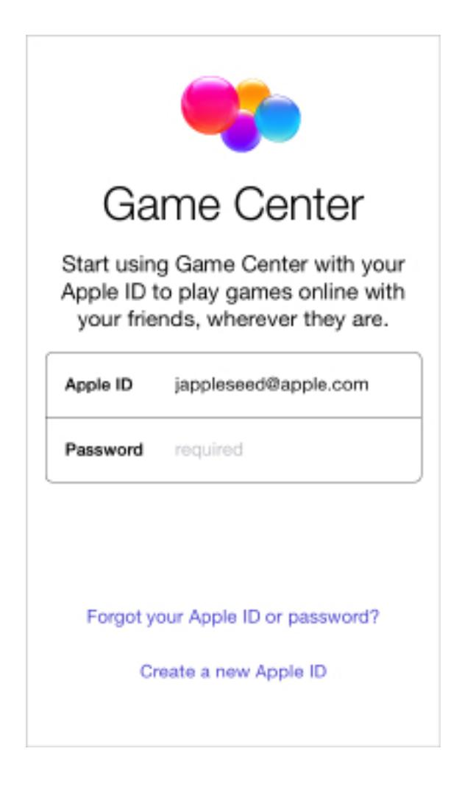

As a game developer, you use the Game Kit APIs to post scores and achievements to the Game Center service, display leaderboards in the game UI, and help users find other players. To learn how to integrate Game Center into your app, see *Game Center Programming Guide* .

The following guidelines can help you give people a great Game Center experience in your app.

**Don't create custom UI that prompts users to sign into Game Center.** When people start your Game Center-enabled app—and they're not already signed into Game Center on their device—the system automatically prompts them to sign in. Displaying custom sign-in UI is unnecessary and might confuse users.

**In general, use the standard Game Center UI.** In rare cases, it might make sense for a game to customize the Game Center UI, but doing so risks confusing people. The standard Game Center UI—which is familiar to both iOS and OS X users—promotes the sense of belonging to a larger gaming community.

**Give users the ability to turn off voice chat.** Some users might not want voice chat to be on automatically when they start your game, and most users appreciate the ability to turn off voice chat in certain situations.

# Notification Center

Notification Center gives users a single, convenient place in which to view notifications from their apps. Users appreciate the unobtrusive interface of Notification Center and they value the ability to customize the way each app can present its notifications.

Notification Center uses a sectioned list to display recent notification items from the apps that users are interested in. In addition to notifications, users can also choose to see information from built-in apps, such as Weather, Calendar, Reminders, and Stocks.

iOS apps can use local or push notifications to let people know when interesting things happen, such as:

- A message has arrived
- An event is about to occur

- New data is available for download
- The status of something has changed

A **local notification** is scheduled by an app and delivered by iOS on the same device, regardless of whether the app is currently running in the foreground. For example, a calendar or to-do app can schedule a local notification to alert people of an upcoming meeting or due date.

A **push notification** is sent by an app's remote server to the Apple Push Notification service, which pushes the notification to all devices that have the app installed. For example, a game that a user can play against remote opponents can update all players with the latest move.

You can still receive local and push notifications when your app is running in the foreground, but you pass the information to your users in an app-specific way.

iOS appsthatsupport local or push notifications can participate in Notification Center in various ways, depending on the user's preferences. To ensure that users can customize their notification experience, you should support as many as possible of the following notification styles:

- Banner
- Alert
- Badge
- Sound

A **banner** is a small translucent view that appears onscreen and then disappears after a few seconds. In addition to your notification message, iOS displays the small version of your app icon in a banner, so that people can see at a glance which app is notifying them (to learn more about the small app icon, see "App [Icon"](#page-208-0) (page 209)).

An **alert** is a standard alert view that appears onscreen and requires user interaction to dismiss. You supply the notification message and, optionally, a title for the action button in the alert. You have no control over the background appearance of the alert or the buttons.

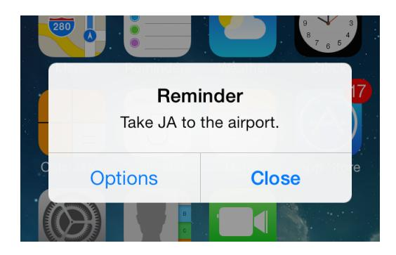

A **badge** is a small red oval that displays the number of pending notification items (a badge appears over the upper-right corner of an app's icon). You have no control over the size or color of the badge.

A custom or system-provided **sound** can accompany any of the other three notification delivery styles.

**Note:** An app that uses push notifications instead of local notifications can provide only the notification stylesthat correspond to the push categoriesfor which the app isregistered. For example, if a push-notification app registers for alerts only, users can receive only alerts from this app. An app that uses local notifications can provide all notification styles.

As you design the content that your notifications can deliver, be sure to observe the following guidelines.

**Keep badge contents up to date.** It's especially important to update the badge assoon as users have attended to the new information, so that they don't think additional notifications have arrived. Note that setting the badge contents to zero also removes the related notification items from Notification Center.

**Important:** Don't use a badge for purposes other than notifications. Remember that users can turn off badging for your app, so you can't be sure that they will see the content in a badge.

**Don't send multiple notifications for the same event.** Users can attend to notification items when they choose; the items don't disappear until users handle them in some way. If you send multiple notifications for the same event, you fill up the Notification Center list and users are likely to turn off notifications from your app.

**Provide a custom message that does not include your app name.** Your custom message is displayed in alerts and banners, and in Notification Center list items. You should not include your app's name in your custom message because iOS automatically displays the name with your message.

To be useful, a local or push notification message should:

- Focus on the information, not user actions. Avoid telling people which alert button to tap or how to open your app.
- Be short enough to display on one or two lines. Long messages are difficult for users to read quickly, and they can force alerts to scroll.
- Use sentence-style capitalization and appropriate ending punctuation. When possible, use a complete sentence.

**Note:** In general, a Notification Center item can display more of a notification message than a banner can. If necessary, iOS truncates your message so that it fits well in each notification delivery style; for best results, you shouldn't truncate your message.

**Optionally, provide a custom title for the action button in an alert.** An alert can contain one or two buttons. In a two-button alert, the Close button is on the left and the action button (titled View by default) is on the right. If you specify only one button, the alert displays an OK button.

Tapping the action button dismisses the alert and launches your app simultaneously. Tapping either the Close button or the OK button dismisses the alert without opening your app.

If you want to use a custom title for the action button, be sure to create a title that clearly describes the action that occurs when your app launches. For example, a game might use the title Play to indicate that tapping the button opens the app to a place where the user can take their turn. Make sure the title:

- Uses title-style capitalization
- Is short enough to fit in the button without truncation (be sure to test the length of localized titles, too)

**Note:** Your custom button title can also be displayed in the "slide to view" message people see when a notification arrives while the device is locked. When this happens, your custom title is automatically converted to lowercase and replaces the word "view" in the message.

**Provide a sound that users can choose to hear when a notification arrives.** A sound can get people's attention when they're not looking at the device screen. For example, a calendar app might play a sound with an alert that reminds people about an imminent event. Or, a collaborative task management app might play a sound with a badge update to signal that a remote colleague has completed an assignment.

You can supply a custom sound, or you can use a built-in alert sound. If you create a custom sound, be sure it's short, distinctive, and professionally produced. (To learn about the technical requirements for this sound, see "Preparing Custom Alert Sounds" in *Local and Push Notification Programming Guide* .) Note that you can't programmatically cause the device to vibrate when a notification is delivered, because the user has control over whether alerts are accompanied by vibration.

**Optionally, provide a launch image.** In addition to displaying your existing launch images, you can supply a different launch image to display when people start your app in response to a notification. For example, a game mightspecify a launch image that'ssimilar to a screen within the game, instead of an image that'ssimilar to the opening menu screen. If you don't supply this launch image, iOS displays either the previous snapshot or one of your other launch images. (To learn how to create a launch image, see ["Launch](#page-214-0) Images" (page 215).)

# iAd Rich Media Ads

When you allow advertisements to appear in your app, you can receive revenue when users see or interact with them. (Here you can see a placeholder for an iAd banner in a sample project.)

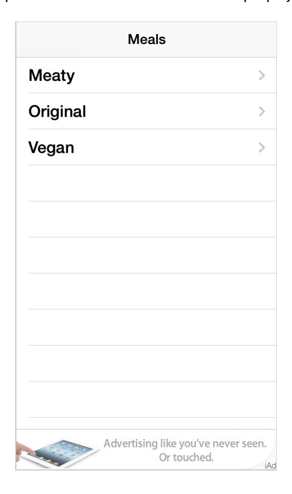

You host an ad served by the iAd Network in a specific view in your UI. Initially, this view can contain the ad's banner, which functions as the entrance into the full iAd experience. When people tap the banner, the ad performs a preprogrammed action, such as playing a movie, displaying interactive content, or launching Safari to open a webpage. The action can display content that covers your UI or it can cause your app to transition to the background.

There are three types of banners that you can display in your app: standard, medium rectangle, and full screen. All types of banners serve the same purpose—that is, to usher users into the ad—but they differ in their appearance and behavior.

A **standard banner** takes up a small area of the screen and is often visible for as long as the screen is visible. You choose the app screens that should display a standard banner and make room for the banner view in the layout.

All iOS apps can display standard banners. Use a view provided by the ADBannerView class to contain a standard banner in your app.

A **medium rectangle banner** is similar in behavior to a standard banner and—as with standard banners—you choose where a medium rectangle banner should be displayed.

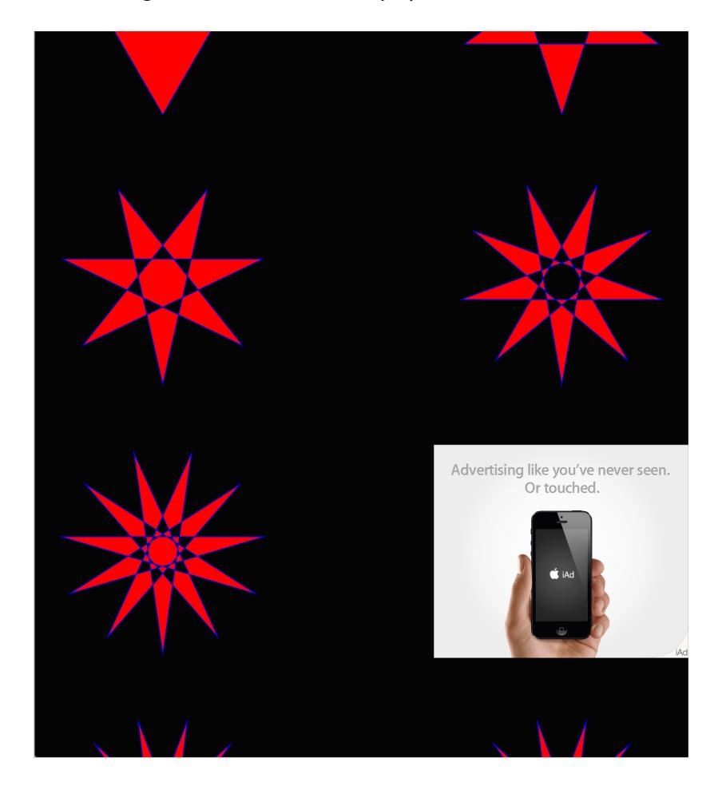

Medium rectangle banners are available only in iPad appsrunning in iOS 6.0 and later. You use a view provided by the ADBannerView class to contain a medium rectangle banner in your app.

A **full screen banner** occupies most or all of the screen and is usually visible at specific times during the app flow or in specific locations. You choose whether to display the banner modally or as a separate page within scrollable content. (In the example shown here, the app provides a magazine-reading experience and lets users turn the page away from or back to the full screen banner.)

Use a view provided by the ADInterstitialAd class to contain a full screen banner in your app.

All banner types appear inside the iAd frame, which displays the iAd mark in the lower-right corner. The iAd frame has been designed to look best when it is anchored to the bottom edge of your app screens.

To ensure seamlessintegration with banner ads and to provide the best user experience, follow these guidelines.

**Place a standard banner view at or near the bottom of the screen.** This placement differsslightly, depending on whether there is a bar at the bottom of the screen and if so, the kind of bar.

| Bar                                                     | Standard banner view placement             |
|---------------------------------------------------------|--------------------------------------------|
| No bar at the bottom of the screen | At the bottom of the screen |

| Bar                                           | Standard banner view placement             |
|-----------------------------------------------|--------------------------------------------|
| No bars anywhere on the screen | At the bottom of the screen |
| Toolbar or tab bar                   | Directly above the bottom bar  |

**Place a medium rectangle banner view where it doesn't interfere with the user's content.** As with the standard banner view, the medium banner view looks best at or near the bottom of the screen. Putting the banner near the bottom of the screen also increases the likelihood that it won't get in people's way.

**Present a full screen banner modally when there are interludes in the user experience.** If there are natural breaks or context changesin the flow of your iPad app, the modal presentation style can be appropriate. When you present a full screen banner modally (by using presentFromViewController:), the user must either enter the ad or dismiss it. For this reason, it's a good idea to use the modal presentation style when users are expecting a change in experience, such as after they complete a task.

**Present a full screen banner nonmodally when there are transitions between app views.** If users experience your app by making frequent screen transitions, such as paging through a magazine or flicking through a gallery of items, the nonmodal presentation style can be appropriate. When you present a full screen banner nonmodally (by using presentInView:), you can preserve the bars in your UI so that users can use app controls to move past or return to the ad. As with all banners, a full screen banner launches the iAd experience when a user taps it, but your app can respond to other gestures within the banner area (such as drag or swipe) if appropriate.

Be sure to use appropriate animations to reveal and hide a nonmodal full screen banner view. For example, a magazine reader app would probably present a banner using the same page-turn animation it uses to reveal other content pages.

**Ensure that all banners appear when and where it makes sense in your app.** People are more likely to enter the iAd experience when they don't feel like they're interrupting their workflow to do so. This is especially important for immersive apps such as games: You don't want to place banner views where they will conflict with playing a game.

**Avoid displaying banners on screens that users are likely to see only briefly.** If your app includes screens that users move through quickly as they drill down or navigate to the content they care about, it's best to avoid displaying banners on these screens. Users are more likely to tap a banner when it stays onscreen for more than a second or two.

**As much as possible, display banner ads in both orientations.** It's best when users don't have to change the orientation of the device to switch between using your app and viewing an ad. Also,supporting both orientations allows you to accept a wider range of advertisements. To learn how to make sure a banner view responds to orientation changes, see *iAd Programming Guide* .

**Don't allow standard or medium rectangle banners to scroll off the screen.** If your app displays scrolling content in the screen, make sure the banner view remains anchored in its position.

**While people view or interact with ads, pause activities that require their attention or interaction.** When people choose to view an ad, they don't want to feel that they're missing events in your app, and they don't want your app to interrupt the ad experience. A good rule of thumb is to pause the same activities you would pause when your app transitions to the background.

**Don't stop an ad, except in rare circumstances.** In general, your app continues running and receiving events while users view and interact with ads, so it's possible that an event will occur that urgently requires their immediate attention. However, there are very few scenarios that warrant the dismissal of an in-progress ad. One possibility is with an app that provides Voice over Internet Protocol (VoIP) service. In such an app, it probably makes sense to cancel a running ad when an incoming call arrives.

**Note:** Canceling an ad might adversely impact the kinds of advertisements your app can receive and the revenue you can collect.

# AirPrint

Using AirPrint, people can wirelessly print content from your app and use Print Center app to check on a print job.

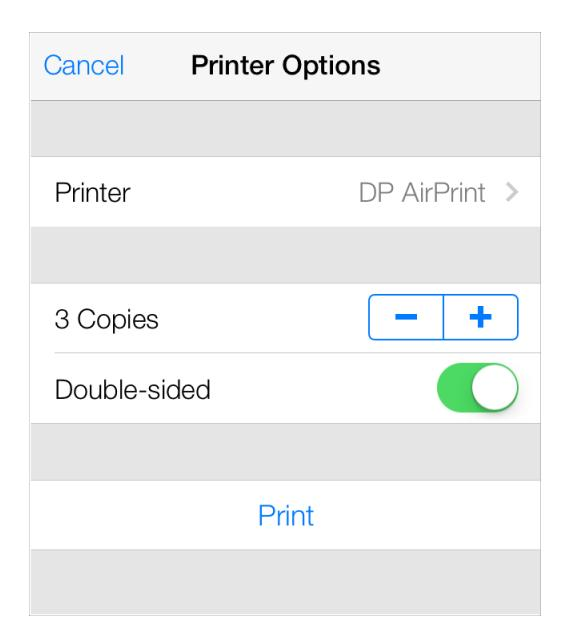

You can take advantage of built-in support for printing images and PDF content, or you can use printing-specific programming interfaces to do custom formatting and rendering. iOS handles printer discovery and the scheduling and execution of print jobs on the selected printer.

Typically, users tap the standard Share button in your app when they want to print something. When they choose the Print item in the view that appears, they can then select a printer, set available printing options, and tap the Print button to start the job. On iPhone, this view appears in an action sheet that slides up from the bottom of the screen; on iPad, the view appears in a popover that emerges from the button.

Users can check on the print job they requested in the Print Center app, which is a background system app that is available only while a print job is in progress. In Print Center, users can view the current print queue, get details about a specific print job, and even cancel the job.

You can support basic printing in your app with comparatively little additional code (to learn about adding printsupport to your code,see *Drawing and Printing Guide foriOS* ). To ensure that users appreciate the printing experience in your app, follow these guidelines:

**Use the system-provided Share button.** Users are familiar with the meaning and behavior of this button, so it's a good idea to use it when possible. The main exception to this is if your app does not contain a toolbar or navigation bar. When this is the case, you need to design a custom print button that can appear in the main UI of your app, because the Share button can only be used in a toolbar or navigation bar.

**Display the Print item when printing is a primary function in the current context.** If printing isinappropriate in the current context, or if users are not likely to want to print, don't include the Print item in the view revealed by the Share button.

**If appropriate, provide additional printing options to users.** For example, you might allow users to choose a page range or to request multiple copies.

**Don't display print-specific UI if users can't print.** Be sure to check whether the user's device supports printing before you display UI that offers printing as an option. To learn how to do this in your code, see *UIPrintInteractionController Class Reference* .

# Accessing User Data

Location Services allows appsto determine people's approximate location geographically, the direction they're pointing their device, and the direction in which they're moving. In iOS 6.0 and later, othersystem services—such as Contacts, Calendar, Reminders, and Photo Library—also allow apps to access the data people store in them.

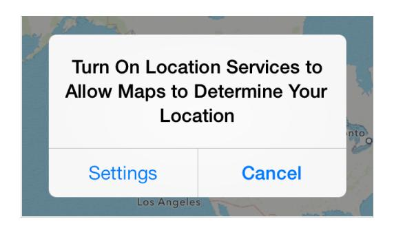

Although people appreciate the convenience of using an app that already knows a lot about them, they also expect to have the option of keeping their data private. For example, people like being able to automatically tag content with their physical location or find friends that are currently nearby, but they also want to be able to disable such features when they don't choose to share their location with others. (To learn more about how to make your app location-aware, see *Location and Maps Programming Guide* .)

The following guidelines can help you ask for user data in ways that help people feel comfortable.

**Make sure users understand why they're being asked to share their personal data.** It's natural for people to be suspicious of a request for their personal information if they don't see an obvious need for it. To avoid making users uncomfortable, make sure the alert appears only when they attempt to use a feature that clearly needs to know their information. For example, people can use Maps when Location Services is off, but they see an alert when they access the feature that finds and tracks their current location.

**Describe why your app needs the information, if it's not obvious.** You can provide text that appears in the alert, below a system-provided title such as ""App Name" Would Like to Access Your Contacts". You want this text to be specific and polite so that people understand why you're asking for access to their information and don't feel pressured. Your reason text should:

- Not include your app name. The system-provided alert title already includes your app name.
- Clearly describe why your app needs the data. If appropriate, you might also explain ways in which your app will not use the data.
- Use user-centric terminology and be localizable.

- Be as short as possible, while still being easy to understand. As much as possible, avoid supplying more than one sentence.
- Use sentence-style capitalization. (Sentence-style capitalization means that the first word is capitalized, and the rest of the words are lowercase unless they are proper nouns or proper adjectives.)

**Ask permission at app startup only if your app can't perform its primary function without the user's data.** People will not be bothered by this if it's obvious that the main function of your app depends on knowing their personal information.

**Avoid making programmatic calls that trigger the alert before the user actually selects the feature that needs the data.** This way, you avoid causing people to wonder why your app wants their personal information when they're doing something that doesn't appear to need it. (Note that getting the user's Location Services preference does not trigger the alert.)

**For location data, check the Location Services preference to avoid triggering the alert unnecessarily.** You can use Core Location programming interfaces to get this setting (to learn how to do this, see *Core Location Framework Reference* ). With this knowledge, you can trigger the alert as closely as possible to the feature that requires location information, or perhaps avoid an alert altogether.

# Quick Look

Using Quick Look, users can preview a document within your app, even if your app can't open the document. For example, you might allow users to preview documents that they download from the web or receive from other sources.

To learn more about how to support Quick Look document preview in your app, see *Document Interaction Programming Topics for iOS* .

Before users preview a document in your app, they can see information about the document in a custom view that you create. For example, after users download a document attached to an email message, Mail displays the document's icon, title, and size in a custom view within the message. Users can tap this view to preview the document.

You can present a document preview in a new view in your app, or in a full-screen, modal view. The presentation method you choose depends on which device your app runs on.

**On iPad, display a document preview modally.** The large iPad screen is appropriate for displaying a document preview in an immersive environment that users can easily leave. The zoom transition is especially well-suited to reveal the preview.

**On iPhone, display a document preview in a dedicated view, preferably a navigation view.** Doing this allows users to navigate to and from the document preview without losing context in your app. Although it's possible to display a document preview modally in an iPhone app, it's not recommended. (Note that the zoom transition is not available on iPhone.)

Also, note that displaying a document preview in a navigation view allows Quick Look to place preview-specific navigation controlsin the navigation bar. (If your view already contains a toolbar, Quick Look placesthe preview navigation controls in the toolbar, instead.)

# Sound

Whether sound is a primary part of your app's user experience or an optional enhancement, you need to know how users expect sound to behave and how to meet those expectations.

## Understand User Expectations

People can use device controlsto affectsound, and they might use wired or wireless headsets and headphones. People also have various expectations for how their actions impact the sound they hear. Although you might find some of these expectations surprising, they all follow the principle of user control in that the user, not the device, decides when it's appropriate to hear sound.

### **Users switch their devices to silent when they want to**:

- Avoid being interrupted by unexpected sounds, such as phone ringtones and incoming message sounds
- Avoid hearing sounds that are the byproducts of user actions, such as keyboard or other feedback sounds, incidental sounds, or app startup sounds
- Avoid hearing game soundsthat are not essential to using the game,such assound effects and soundtracks

**Note:** People switch their devices to silent using either the Ring/Silent switch (on iPhone) or the Silent switch (on iPad).

For example, in a theater users switch their devices to silent to avoid bothering other people in the theater. In this situation, users still want to be able to use apps on their devices, but they don't want to be surprised by sounds they don't expect or explicitly request, such as ringtones or new message sounds.

The Ring/Silent (or Silent) switch does *not* silence sounds that result from user actions that are solely and explicitly intended to produce sound. For example:

- Media playback in a media-only app is not silenced because the media playback was explicitly requested by the user.
- A Clock alarm is not silenced because the alarm was explicitly set by the user.
- A sound clip in a language-learning app is not silenced because the user took explicit action to hear it.

● Conversation in an audio chat app is not silenced because the user started the app for the sole purpose of having an audio chat.

**Users use the device's volume buttons to adjust the volume of all sounds their devices can play,** including songs, app sounds, and device sounds. Users can use the volume buttons to quiet any sound, regardless of the position of the Ring/Silent (or Silent) switch. Using the volume buttons to adjust an app's currently playing audio also adjusts the overall system volume, with the exception of the ringer volume.

**iPhone:** Using the volume buttons when no audio is currently playing adjusts the ringer volume.

**Users use headsets and headphones to hear sounds privately and to free their hands.** Regardless of whether these accessories are wired or wireless, users have specific expectations for the user experience.

When users plug in a headset or headphones, or connect to a wireless audio device, they intend to continue listening to the current audio, but privately. For this reason, they expect an app that is currently playing audio to continue playing without pause.

When users unplug a headset or headphones, or disconnect from a wireless device (or the device goes out of range or turns off), they don't want to automatically share what they've been listening to with others. For this reason, they expect an app that is currently playing audio to pause, allowing them to explicitly restart playback when they're ready.

## Define the Audio Behavior of Your App

**If necessary, you can adjust relative, independent volume levels to produce the best mix in your app's audio output.** But the volume of the final audio output should always be governed by the system volume, whether it's adjusted by the volume buttons or a volume slider. This means that control over an app's audio output remains in users' hands, where it belongs.

**Ensure that your app can display the audio route picker, if appropriate.** (An **audio route** is an electronic pathway for audio signals, such as from a device to headphone or from a device to speakers.) Even though people don't physically plug in or unplug a wireless audio device, they still expect to be able to choose a different audio route. To handle this, iOS automatically displays a control that allows users to pick an output audio route (use the MPVolumeView class to allow the control to display in your app). Because choosing a different audio route is a user-initiated action, users expect currently playing audio to continue without pause.

**If you need to display a volume slider,** be sure to use the system-provided volume slider available when you use the MPVolumeView class. Note that when the currently active audio output device does not support volume control, the volume slider is replaced by the appropriate device name.

**If your app produces only UI sound effects that aren't essential to its functionality, use System Sound Services.** System Sound Servicesisthe iOS technology that produces alerts and UIsounds and invokes vibration; it is unsuitable for any other purpose. When you use System Sound Services to produce sound, you cannot influence how your audio interacts with audio on the device, or how it should respond to interruptions and changesin device configuration. For a sample project that demonstrates how to use thistechnology,see *Audio UI Sounds (SysSound)*.

**If sound plays an important role in your app, use Audio Session Services** or the AVAudioSession class. These programming interfaces do not produce sound; instead, they help you express how your audio should interact with audio on the device and respond to interruptions and changes in device configuration.

**iPhone:** No matter what technology you use to produce audio or how you define its behavior, the phone can alwaysinterrupt the currently running app. Thisis because no app should prevent people from receiving an incoming call.

In Audio Session Services, the **audio session** functions as an intermediary for audio between your app and the system. One of the most important facets of the audio session isthe **category**, which definesthe audio behavior of your app.

To realize the benefits of Audio Session Services and provide the audio experience users expect, you need to select the category that best describes the audio behavior of your app. This is the case whether your app plays only audio in the foreground or can also play audio in the background. Follow these guidelines as you make this selection:

- **Select an audio session category based on its semantic meaning, not its precise set of behaviors.** By selecting a category whose purpose is clear, you ensure that your app behaves according to users' expectations. In addition, it gives your app the best chance of working properly if the exactset of behaviors is refined in the future.
- **In rare cases, add a property to the audio session to modify a category's standard behavior.** A category's standard behavior represents what most users expect,so you should consider carefully before you change that behavior. For example, you might add the ducking property to make sure your audio is louder than all other audio (except phone audio), if that's what users expect from your app. (To learn more about audio session properties, see "Fine-Tuning the Category" in *Audio Session Programming Guide* .)
- **Consider basing your category selection on the current audio environment of the device.** This might make sense if, for example, users can use your app while listening to other audio instead of to your soundtrack. If you do this, be sure to avoid forcing users to stop listening to their music or make an explicit soundtrack choice when your app starts.

● **In general, avoid changing categories while your app is running.** The primary reason for changing the category is if your app needs to support recording and playback at different times. In this case, it can be better to switch between the Record category and the Playback category as needed, than to select the Play and Record category. This is because selecting the Record category ensures that no alerts—such as an incoming text message alert—will sound while the recording is in progress.

Table 30-1 lists the audio session categories you can use. Different categories allow sounds to be silenced by the Ring/Silent or Silent switch (or device locking), to mix with other audio, or to play while the app is in the background. (For the actual category and property names as they appear in the programming interfaces, see *Audio Session Programming Guide* .)

**Table 30-1** Audio session categories and their associated behaviors

| Category              | Meaning                                                                                                    | Silenced | Mixes                                                                                       | In Background |
|-----------------------|------------------------------------------------------------------------------------------------------------|----------|---------------------------------------------------------------------------------------------|------------------|
| Solo Ambient       | Sounds enhance app functionality, and should silence other audio.                  | Yes      | No                                                                                          | No               |
| Ambient               | Sounds enhance app functionality but should not silence other audio.            | Yes      | Yes                                                                                         | No               |
| Playback              | Sounds are essential to app functionality and might mix with other audio. | No       | No (default) Yes (when the Mix With Others property is added) | Yes              |
| Record                | Audio is user-recorded.                                                                              | No       | No                                                                                          | Yes              |
| Play and Record | Sounds represent audio input and output, sequentially or simultaneously.           | No       | No (default) Yes (when the Mix With Others property is added) | Yes              |
| Audio Processing   | App performs hardware-assisted audio encoding (it does not play or record).  | N/A      | No                                                                                          | Yes *         |

\* If you select the Audio Processing category and you want to perform audio processing in the background, you need to prevent your app from suspending before you're finished with the audio processing. To learn how to do this, see "Implementing Long-Running Background Tasks" in *iOS App Programming Guide* .

Here are some scenarios that illustrate how to choose the audio session category that provides an audio experience users appreciate.

#### **Scenario 1: An educational app that helps people learn a new language.** You provide:

- Feedback sounds that play when users tap specific controls
- Recordings of words and phrases that play when users want to hear examples of correct pronunciation

In this app, sound is essential to the primary functionality. People use this app to hear words and phrases in the language they're learning, so the sound should play even when the device locks or is switched to silent. Because users need to hear the sounds clearly, they expect other audio they might be playing to be silenced.

To produce the audio experience users expect for this app, you'd use the Playback category. Although this category can be refined to allow mixing with other audio, this app should use the default behavior to ensure that other audio does not compete with the educational content the user has explicitly chosen to hear.

### **Scenario 2: A Voice over Internet Protocol (VoIP) app.** You provide:

- The ability to accept audio input
- The ability to play audio

In this app, sound is essential to the primary functionality. People use this app to communicate with others, often while they're currently using a different app. Users expect to be able to receive calls when they've switched their device to silent or the device is locked, and they expect other audio to be silent for the duration of a call. They also expect to be able to continue calls when the app is in the background.

To produce the expected user experience for this app, you'd use the Play and Record category, and you'd be sure to activate your audio session only when you need it so that users can use other audio between calls.

#### **Scenario 3: A game that allows users to guide a character through different tasks.** You provide:

- Various gameplay sound effects
- A musical soundtrack

In this app, sound greatly enhances the user experience, but isn't essential to the main task. Also, users are likely to appreciate being able to play the game silently or while listening to songsin their music library instead of to the game soundtrack.

The best strategy is to find out if users are listening to other audio when your app starts. Don't ask users to choose whether they want to listen to other audio or listen to your soundtrack. Instead, use the Audio Session Services function AudioSessionGetProperty to query the state of the

kAudioSessionProperty\_OtherAudioIsPlaying property. Based on the answer to this query, you can choose either the Ambient or Solo Ambient categories (both categories allow users to play the game silently):

- If users are listening to other audio, you should assume that they'd like to continue listening and wouldn't appreciate being forced to listen to the game soundtrack instead. In this situation, you'd choose the Ambient category.
- If users aren't listening to any other audio when your app starts, you'd choose the Solo Ambient category.

### **Scenario 4: An app that provides precise, real-time navigation instructions to the user's destination.** You provide:

- Spoken directions for every step of the journey
- A few feedback sounds
- The ability for users to continue to listen to their own audio

In this app, the spoken navigation instructions represent the primary task, regardless of whether the app is in the background. For this reason, you'd use the Playback category, which allows your audio to play when the device is locked or switched to silent, and while the app is in the background.

To allow people to listen to other audio while they use your app, you can add the kAudioSessionProperty\_OverrideCategoryMixWithOthers property. However, you also want to make sure that users can hear the spoken instructions above the audio they're currently playing. To do this, you can apply the kAudioSessionProperty\_OtherMixableAudioShouldDuck property to the audio session to ensuresthat your audio islouder than all currently playing audio, with the exception of phone audio on iPhone. These settings allow the app to reactivate its audio session while the app is in the background, which ensures

#### **Scenario 5: A blogging app that allows users to upload their text and graphics to a website.** You provide:

- A short startup sound file
- Variousshortsound effectsthat accompany user actions(such as a sound that plays when a post has been uploaded)
- An alert sound that plays when a posting fails

that users get navigation updates in real time.

In this app, sound enhances the user experience, but it's not essential. The main task has nothing to do with audio and users don't need to hear any sounds to successfully use the app. In this scenario, you'd use System Sound Services to produce sound. This is because the audio context of all sound in the app conforms to the intended purpose of this technology, which is to produce UI sound effects and alert sounds that obey device locking and the Ring/Silent (or Silent) switch in the way that users expect.

## Manage Audio Interruptions

Sometimes, currently playing audio is interrupted by audio from a different app. On iPhone, for example, an incoming phone call interruptsthe current app's audio for the duration of the call. In a multitasking environment, the frequency of such audio interruptions can be high.

To provide an audio experience users appreciate, iOS relies on you to:

- Identify the type of audio interruption your app can cause
- Respond appropriately when your app continues after an audio interruption ends

Every app needs to identify the type of audio interruption it can cause, but not every app needs to determine how to respond to the end of an audio interruption. This is because most types of apps should respond to the end of an audio interruption by resuming audio.Only appsthat are primarily or partly media playback apps—and that provide media playback controls—have to take an extra step to determine the appropriate response.

Conceptually, there are two types of audio interruptions, based on the type of audio that's doing the interrupting and the way users expect the particular app to respond when the interruption ends:

● A **resumable interruption** is caused by audio that users view as a temporary interlude in their primary listening experience.

After a resumable interruption ends, an app that displays controlsfor media playback should resume what it was doing when the interruption occurred, whether this is playing audio or remaining paused. An app that doesn't have media playback controls should resume playing audio.

For example, consider a user listening to an app for music playback on iPhone when a VoIP call arrives in the middle of a song. The user answers the call, expecting the playback app to be silent while they talk. After the call ends, the user expects the playback app to automatically resume playing the song, because the music—not the call—constitutes their primary listening experience *and* they had not paused the music before the call arrived. On the other hand, if the user had paused music playback before the call arrived, they would expect the music to remain paused after the call ends.

Other examples of apps that can cause resumable interruptions are apps that play alarms, audio prompts (such as spoken driving directions), or other intermittent audio.

● A **nonresumable interruption** is caused by audio that users view as a primary listening experience, such as audio from a media playback app.

After a nonresumable interruption ends, an app that displays media playback controls should not resume playing audio. An app that doesn't have media playback controls should resume playing audio.

For example, consider a user listening to a music playback app (music app 1) when a different music playback app (music app 2) interrupts. In response, the user decides to listen to music app 2 for some period of time. After quitting music app 2, the user wouldn't expect music app 1 to automatically resume playing because they'd deliberately made music app 2 their primary listening experience.

The following guidelines help you decide what information to supply and how to continue after an audio interruption ends.

**Identify the type of audio interruption your app caused.** You do this by deactivating your audio session in one of the following two ways when your audio is finished:

- If your app caused a resumable interruption, deactivate your audio session with the AVAudioSessionSetActiveFlags\_NotifyOthersOnDeactivation flag.
- If your app caused a nonresumable interruption, deactivate your audio session without any flags.

Providing, or not providing, the flags allows iOS to give interrupted apps the ability to resume playing their audio automatically, if appropriate.

**Determine whether you should resume audio when an audio interruption ends.** You base this decision on the audio user experience you provide in your app.

- If your app displays media playback controls that people use to play or pause audio, you need to check the AVAudioSessionInterruptionFlags\_ShouldResume flag when an audio interruption ends.
  - If your app receives the Should Resume flag, your app should:
  - Resume playing audio if your app was actively playing audio when it was interrupted
  - Not resume playing audio if your app was *not* actively playing audio when it was interrupted
- If your app doesn't display any media playback controls that people can use to play or pause audio, your app should alwaysresume previously playing audio when an audio interruption ends, regardless of whether the Should Resume flag is present.
  - For example, a game that plays a soundtrack should automatically resume playing the soundtrack after an interruption.

## Handle Media Remote Control Events, if Appropriate

Apps can receive remote control events when people use iOS media controls or accessory controls, such as headset controls. This allows your app to accept user input that doesn't come through your UI, whether your app is currently playing audio in the foreground or in the background.

Apps can send video to AirPlay-enabled hardware—such as Apple TV—and transition to the background while playback continues. Such an app can accept user input via remote control events, so that users can control video playback while the app is in the background. In addition, this type of app can also reactivate an audio session after an interruption while it's in the background.

A media playback app, in particular, needsto respond appropriately to media remote control events, especially if it plays audio or video while it's in the background.

To meet the responsibilities associated with the privilege of playing media while your app isin the background, be sure to follow these guidelines:

**Limit your app's eligibility to receive remote control events to times when it makes sense.** For example, if your app helps users read content, search for information, and listen to audio, it should accept remote control events only while the user isin the audio context. When the user leavesthe audio context, you should relinquish the ability to receive the events. If your app lets users play audio or video on an AirPlay-enabled device, it should accept remote control events for the duration of media playback. Following these guidelines allows usersto consume a different app's media—and control it with headset controls—when they're in the nonmedia contexts of your app.

**As much as possible, use system-provided controls to offer AirPlay support.** When you use the MPMoviePlayerController class to enable AirPlay playback, you can take advantage of a standard control that allows users to choose an AirPlay-enabled device that is currently in range. Or you can use the MPVolumeView class to display AirPlay-enabled audio or video devices from which users can choose. Users are accustomed to the appearance and behavior of these standard controls, so they'll know how to use them in your app.

**Don'trepurpose an event, even ifthe event has no meaning in your app.** Users expect the iOS media controls and accessory controls to function consistently in all apps. You do not have to handle the events that your app doesn't need, but the events that you do handle must result in the experience users expect. If you redefine the meaning of an event, you confuse users and risk leading them into an unknown state from which they can't escape without quitting your app.

# VoiceOver

VoiceOver increases accessibility for blind and low-vision users, and for users with certain learning challenges.

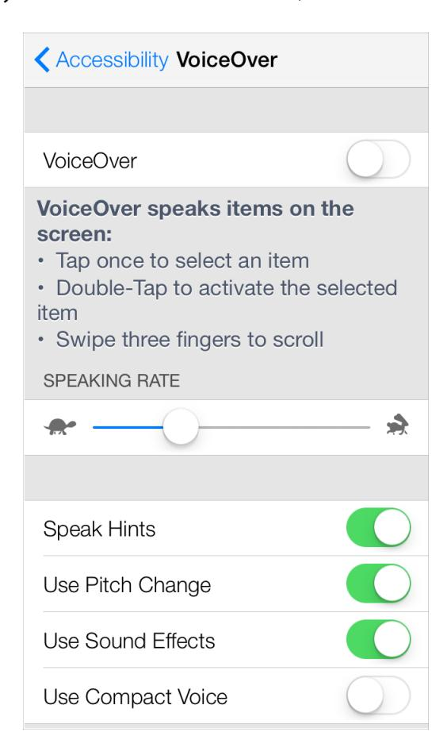

To make sure VoiceOver users can use your app, you might need to supply some descriptive information about the views and controls in your user interface. Supporting VoiceOver does *not* require you to change the visual design of your UI in any way.

When you use standard UI elements in a completely standard way, you have little (if any) additional work to do. The more custom your UI is, the more custom information you need to provide so that VoiceOver can accurately describe your app.

Making your iOS app accessible to VoiceOver users can increase your user base and help you enter new markets. Supporting VoiceOver can also help you address accessibility guidelines created by various governing bodies.

# Edit Menu

Users can reveal an edit menu to perform operations such as Cut, Paste, and Select in a text view, web view, or image view.

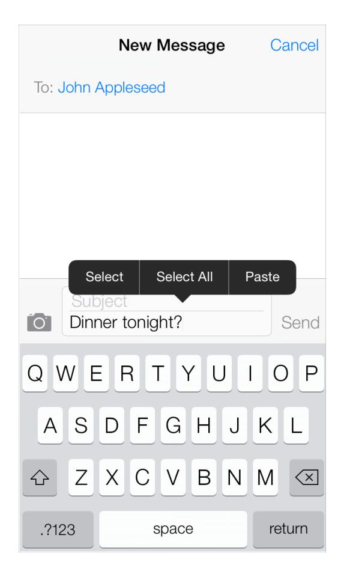

You can adjust some of the behaviors of the menu to give users more control over the content in your app. For example, you can:

- Specify which of the standard menu commands are appropriate for the current context
- Determine the position of the menu before it appears so that you can prevent important parts of your app's UI from being obscured
- Define the object that is selected by default when users double-tap to reveal the menu

You can't change the color or shape of the menu itself.

For information on how to implement these behaviors in code, see "Copy, Cut, and Paste Operations" in *iOS App Programming Guide* .

To ensure that the edit menu behaves as users expect in your app, you should:

**Display commands that make sense in the current context.** For example, if nothing is selected, the menu should not contain Copy or Cut because these commands act on a selection. Similarly, if something is selected, the menu should not contain Select. If you support an edit menu in a custom view, you're responsible for making sure that the commands the menu displays are appropriate for the current context.

**Accommodate the menu display in your layout.** iOS displays the edit menu above or below the insertion point or selection, depending on available space, and places the menu pointer so that users can see how the menu commands relate to the content. You can programmatically determine the position of the menu before it appears so that you can prevent important parts of your UI from being obscured, if necessary.

**Support both gestures that people can use to invoke the menu.** Although the touch and hold gesture is the primary way users reveal the edit menu, they can also double-tap a word in a text view to select the word and reveal the menu at the same time. If you support the menu in a custom view, be sure to respond to both gestures. In addition, you can define the object that is selected by default when the user double taps.

**Avoid creating a button in your UIthat performs a command that's available in the edit menu.** For example, it's better to allow users to perform a copy operation using the edit menu than to provide a Copy button, because users will wonder why there are two ways to do the same thing in your app.

**Consider enabling the selection of static text if it's useful to the user.** For example, a user might want to copy the caption of an image, but they're not likely to want to copy the label of a tab item or a screen title, such as Accounts. In a text view, selection by word should be the default.

**Don't make button titles selectable.** A selectable button title makes it difficult for users to reveal the edit menu without activating the button. In general, elements that behave as buttons don't need to be selectable.

**Combine support for undo and redo with your support of copy and paste.** People often expect to be able to undo recent operations if they change their minds. Because the edit menu doesn't require confirmation before its actions are performed, you should give users the opportunity to undo or redo these actions.

Follow these guidelines if you need to create custom edit menu items, such as the ones shown here:

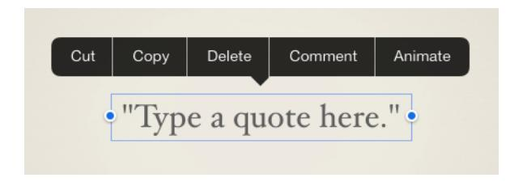

**Create edit menu items that edit, alter, or otherwise act directly upon the user's selection.** People expect the standard edit menu items to act upon text or objects within the current context, and it's best when your custom menu items behave similarly.

**List custom items together after all system-provided items.** Don't intersperse your custom items with the system-provided ones.

**Keep the number of custom menu items reasonable.** You don't want to overwhelm your users with too many choices.

**Use succinct names for your custom menu items** and make sure the names precisely describe what the commands do. In general, item names should be verbs that describe the action to be performed. Although you should generally use a single capitalized word for an item name, use title-style capitalization if you must use a short phrase. (Briefly, title-style capitalization meansto capitalize every word except articles, coordinating conjunctions, and prepositions of four or fewer letters.)

# Undo and Redo

Users initiate an Undo operation by shaking the device, which displays an alert that allows them to:

- Undo what they just typed
- Redo previously undone typing
- Cancel the undo operation

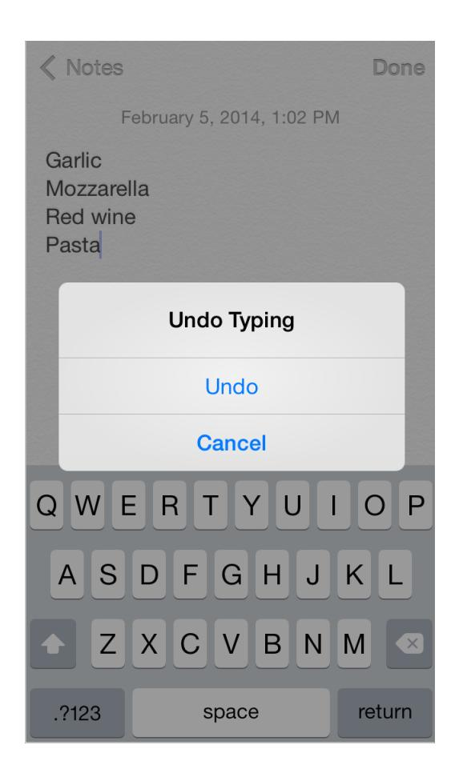

You can support the Undo operation in a more general way in your app by specifying:

- The actions users can undo or redo
- The circumstances under which your app should interpret a shake event as the shake-to-undo gesture
- How many levels of undo to support

To learn how to implement this behavior in code, see *Undo Architecture* . If you support undo and redo in your app, follow these guidelines to provide a good user experience.

**Supply brief descriptive phrases thattell users precisely whatthey're undoing orredoing.** iOS automatically supplies the strings "Undo " and "Redo " (including a space after the word) for the undo alert button titles, but you need to provide a word or two that describes the action users can undo or redo. For example, you might supply the text Name or Address Change, to create button titles such as "Undo Name" or "Redo Address Change." (Note that the Cancel button in the alert cannot be changed or removed.)

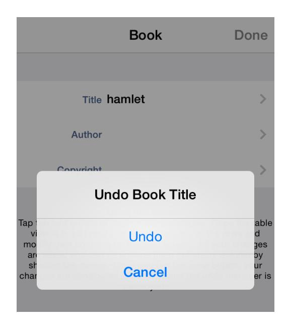

**Avoid supplying text that is too long.** A button title that is too long is truncated and is difficult for users to decipher. And because this text is in a button title, use title-style capitalization and do not add punctuation.

**Avoid overloading the shake gesture.** Even though you can programmatically set when your app interprets a shake event as shake to undo, you run the risk of confusing users if they also use shake to perform a different action. Analyze user interaction in your app and avoid creating situations in which users can't reliably predict the result of the shake gesture.

**Use the system-provided Undo and Redo buttons only if undo and redo are fundamental tasks in your app.** Remember that the shake gesture is the primary way users initiate undo and redo, and that it can be confusing to offer two different ways to perform the same task. If you decide it's important to provide explicit, dedicated controls for undo and redo, you can place the system-provided buttons in the navigation bar. (To learn more about these buttons, see "Toolbar and [Navigation](#page-147-0) Bar Buttons" (page 148).)

**Clearly relate undo and redo capability to the user's immediate context, and not to an earlier context.** Consider the context of the actions you allow to be undone or redone. In general, users expect their changes and actions to take effect immediately.

# Keyboards and Input Views

If appropriate, you can design a custom input view to replace the system-provided onscreen keyboard.

If you provide a custom input view, be sure its function is obvious to people.

You can also provide a custom input accessory view, which is a separate view that appears above the keyboard (or your custom input view).

Use the standard keyboard click sound to provide audible feedback when people tap the custom controls in your input view. To learn how to enable this sound in your code, see the documentation for playInputClick in *UIDevice Class Reference* .

**Note:** The standard click sound is available only for custom input views that are currently onscreen. People can turn off all keyboard clicks—including ones that come from your custom input view—in Settings > Sounds.

# UI Elements

- ["Bars"](#page-142-0) (page 143)
- ["Content](#page-155-0) Views" (page 156)
- ["Controls"](#page-181-0) (page 182)
- ["Temporary](#page-196-0) Views" (page 197)

# Bars

## The Status Bar

The **status bar** displays important information about the device and the current environment (shown below on iPhone).

| Default (dark) content |  | Light content |  |  |
|------------------------------|--|------------------|--|--|
|                              |  |                  |  |  |
| The status bar:        |  |                  |  |  |
| Is transparent ●       |  |                  |  |  |

● Always appears at the upper edge of the device screen

**API Note:** You can set the style of the status bar globally for the entire app or you can let individual view controllers set the style as appropriate. To learn more, read *UIApplication Class Reference* for information about the UIStatusBarStyle constant and *UIViewController Class Reference* for information about the preferredStatusBarStyle property.

**Don't create a custom status bar.** Users depend on the consistency of the system-provided status bar. Although you might hide the status bar in your app, it's not appropriate to create custom UI that takes its place.

**Prevent scrolling content from showing through the status bar.** As users scroll, you don't want them to see a confusing mix of app content and status bar items in the status bar area. To give users the impression of spaciousness while still ensuring maximum readability, make sure the status bar has a background that obscures the content behind it. Here are a few ways to keep scrolling content from showing through the status bar:

- Use a navigation controller to display content. A navigation controller automatically displays a status bar background and it ensures that its content views don't appear behind the status bar. (To learn more about navigation controllers, see "Navigation Controllers".)
- Create a nondistracting custom image—such as a gradient—and display it behind the status bar. To ensure that the image stays behind the status bar, you could use a view controller to keep the image above a scrolling view or you could use a scrolling view to keep it pinned to the top.

● Position content to avoid the status bar area (that is, the area defined by the app's statusBarFrame property). If you do this, you should use the window's background color to provide a solid color behind the status bar.

**Avoid putting distracting content behind the status bar.** In particular, you don't want to imply that users should tap the status bar to access content or activate controls in your app.

**Think twice before permanently hiding the status bar.** Because the status bar is transparent, it's not usually necessary to hide it. Permanently hiding the status bar means that users must switch away from your app to read the time or to find out whether they have a Wi-Fi connection.

**Consider hiding the status bar—and all other appUI—while people are actively viewing full-screen media.** If you hide the status bar, be sure to let people retrieve it (and the appropriate app UI) with a single tap. Unless you have a compelling reason to do so, avoid defining a custom gesture to redisplay the status bar because users are unlikely to discover such a gesture or to remember it.

**Choose a status bar content color that coordinates with your app.** The default appearance displays dark content, which looks good on top of light-colored app content. The light status bar content looks good on top of dark-colored app content.

**When appropriate, display the network activity indicator.** The network activity indicator can appear in the status bar to show users that lengthy network access is occurring. To learn how to implement this indicator in your code, see "Network Activity [Indicator"](#page-185-0) (page 186).

## Navigation Bar

A **navigation bar** enables navigation through an information hierarchy and, optionally, management ofscreen contents.

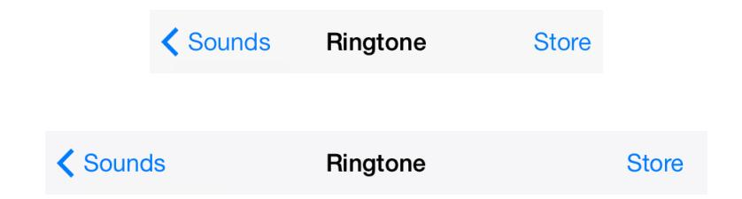

#### A navigation bar:

- Is translucent
- Generally appears at the top of an app screen, just below the status bar

On iPad, a navigation bar can also display within a view that doesn't extend across the screen, such as one pane of a split view controller.

● Can automatically change its height when an iPhone changes orientation Maintains the same height in all orientations on iPad

**API Note:** A navigation bar is contained in a navigation controller, which is a programmatic object that manages the display of a hierarchy of custom views. To learn more about defining a navigation bar in your code, see "Navigation Controllers" and "Navigation Bars".

Use a navigation bar to enable navigation among different views and—if appropriate—to provide a control that manages the items in a view. If you need to provide a larger set of controls and you don't need to enable navigation, consider using a toolbar instead (to learn more, see ["Toolbar"](#page-146-0) (page 147)).

When the user goes to a new level in a navigation hierarchy, two things should happen:

- The navigation bar title should change to the new level's title, if appropriate.
- A back button should appear in the left end of the bar, and it should be labeled with the previous level's title.

**When it adds value, use the title of the current view as the title of the navigation bar.** If titling a navigation bar seems redundant, you can leave the title empty. For example, Notes doesn't title the current note because the first line of content supplies all the context users need.

**Consider putting a segmented control in a navigation bar at the top level of an app.** This is especially useful if doing so helps to flatten your information hierarchy, making it easier for people to find what they're looking for. If you use a segmented control in a navigation bar, be sure to choose accurate back-button titles. (For usage guidelines, see ["Segmented](#page-190-1) Control" (page 191).)

**If necessary, consider using a prompt to clarify what users can do in the current screen.** A prompt is a brief sentence that appears near the top of the navigation bar. For example, Stocks uses a prompt to make sure users understand how to find the information they want.

If you need to use a prompt, write a succinct, one-line sentence that uses appropriate ending punctuation.

**Avoid crowding a navigation bar with additional controls, even if it looks like there's enough space.** In general, a navigation barshould contain no more than the view's current title, the back button, and one control that manages the view's contents. If you use a segmented control in the navigation bar, the bar shouldn't display a title and it shouldn't contain any controls other than the segmented control.

**Make sure text-titled buttons have enough space between them.** If there isn't enough space between multiple left or right bar button items in a navigation bar, the text titles can appear to run together, making it difficult for users to distinguish them. If button titles look too close together in your navigation bar, use UIBarButtonSystemItemFixedSpace to add the appropriate spacing between them. (To learn more about this constant, see *UIBarButtonItem Class Reference* .)

**As much as possible, make sure that the look of a customized navigation bar is consistent throughout your app.** For example, don't combine an opaque navigation bar with a translucent toolbar. Also, it's best to avoid changing the image, color, or translucency of the navigation bar in different screens in the same orientation.

**Make sure that a customized back button still looks like a back button.** Users know that the standard back button allows them to retrace their steps through a hierarchy of information. If you decide to replace the system-provided chevron with a custom image, be sure to supply a custom mask image, too. iOS 7 uses the mask to make the button title appear to emerge from—or disappear into—the chevron during transitions.

**Important:** Don't create a multisegment back button. The back button alwaystakesthe user to the current screen's parent. If you think users might get lost without a multisegment control that displays a type of breadcrumb path, it probably means that you should flatten the information hierarchy.

**On iPhone, be prepared forthe change in navigation bar heightthat occurs on device rotation.** In particular, make sure that your custom navigation bar iconsfit well in the thinner bar that appearsin landscape orientation. Don't specify the height of a navigation bar programmatically; instead, take advantage of the UIBarMetrics constants to ensure that your content fits well.

## Toolbar

A **toolbar** contains controls that perform actions related to objects in the screen or view.

#### A toolbar:

- Is translucent
- Always appears at the bottom edge of a screen or view on iPhone Can also appear at the top edge of the screen or view on iPad.
- Can automatically change its height when an iPhone changes orientation Maintains the same height in all orientations on iPad.

**API Note:** A toolbar istypically contained in a navigation controller, which is an object that manages the display of a hierarchy of custom views. To learn more about defining a toolbar in your code, see "Displaying a Navigation Toolbar" in *View Controller Catalog for iOS* and "Toolbar".

Use a toolbar to provide a set of actions users can take in the current context.

**Include the most frequently used commands that make sense in the current context.** As much as possible, avoid using a toolbar to provide commands that are only occasionally useful.

**Consider using a segmented control to provide access to different perspectives or modes in the current context.** It's not a good idea to use a segmented control in a toolbar to show app-level tasks or modes, because a toolbar is specific to the current screen or view. If you need to give people access to primary tasks, views, or modes in your app, use a tab bar instead. To learn more about segmented controls, see ["Segmented](#page-190-1) [Control"](#page-190-1) (page 191); to learn more about tab bars, see ["Tab](#page-149-0) Bar" (page 150).

**Use icons if you need to put more than three items in a toolbar.** Because text-titled buttons typically use more space than icons, it can be difficult to keep the titles from running together.

**Make sure text-titled buttons have enough space between them.** If there isn't enough space between two or more buttonsin a toolbar, the text titles can appear to run together and users can find it difficult to distinguish between them. If button titles look too close in your toolbar, use UIBarButtonSystemItemFixedSpace to add the appropriate spacing between them. (To learn more about this constant, see *UIBarButtonItem Class Reference* .)

**On iPhone, be prepared for the change in toolbar height that occurs on device rotation.** In particular, make sure your custom toolbar icons fit well in the thinner bar that appears in landscape orientation. Don't specify the height of a toolbar programmatically; instead, take advantage of the UIBarMetrics constants to ensure that your content fits well.

## Toolbar and Navigation Bar Buttons

iOS provides many of the standard toolbar and navigation bar buttons that are used in the built-in apps. To learn how to design custom bar icons, see "Bar [Button](#page-217-0) Icons" (page 218). Items in the toolbar and navigation bar can be tinted using the tintColor property.

To find out which symbol names to use to specify the buttons described in Table 35-1, see the documentation for UIBarButtonSystemItem in *UIBarButtonItem Class Reference* .

**Important:** As with all standard buttons and icons, it's essential that you base your usage of a button on its semantic meaning, not on its appearance. This will help your app's UI make sense even if the button associated with a specific meaning changes its appearance.

**Table 35-1** Standard buttons available for toolbars and navigation bars

| Button | Name      | Meaning                                                                                                                                               |
|--------|-----------|-------------------------------------------------------------------------------------------------------------------------------------------------------|
|        | Share     | Open an action sheet that listssystem-provided and app-specific services that act on the specified content. |
|        | Camera    | Open an action sheet that displays a photo picker in camera mode.                                                    |
|        | Compose   | Open a new message view in edit mode.                                                                                            |
|        | Bookmarks | Show app-specific bookmarks.                                                                                                                    |
|        | Search    | Display a search field.                                                                                                                      |
|        | Add       | Create a new item.                                                                                                                           |
|        | Trash     | Delete current item.                                                                                                                            |
|        | Organize  | Move or route an item to a destination within the app, such as a folder.                                    |
|        | Reply     | Send or route an item to another location.                                                                                       |
|        | Refresh   | Refresh contents (use only when necessary; otherwise, refresh automatically).                                                 |
|        | Play      | Begin media playback or slides.                                                                                                           |

| Button | Name        | Meaning                                                                                                     |
|--------|-------------|-------------------------------------------------------------------------------------------------------------|
|        | FastForward | Fast forward through media playback or slides.                                            |
|        | Pause       | Pause media playback or slides (note that this implies context preservation). |
|        | Rewind      | Move backwards through media playback or slides.                                          |

In addition to the buttons shown in Table 35-1, you can also use the system-provided Edit, Cancel, Save, Done, Redo, and Undo buttonsto support editing or other types of content manipulation in your app. The appearance of each of these buttons is provided by its text title. To find out which symbol names to use to specify these buttons, see the documentation for UIBarButtonSystemItem in *UIBarButtonItem Class Reference* .

Finally, you can also use the system-provided Info button in a toolbar:

## Tab Bar

A **tab bar** gives people the ability to switch between different subtasks, views, or modes in an app.

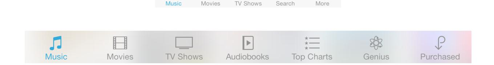

**API Note:** A tab bar is contained in a tab bar controller, which is an object that manages the display of a set of custom views. To learn more about defining a tab bar in your code,see "Tab Bar Controllers" and "Tab Bars".

### A tab bar:

● Is translucent

- Always appears at the bottom edge of the screen
- Displays no more than five tabs at one time on iPhone (if there are more tabs, the tab bar displays four of them and adds the More tab, which reveals the additional tabs in a list)
- Maintains the same height in all orientations
- Can display a badge on a tab to communicate app-specific information (a badge is a red oval containing white text and either a number or exclamation point)

Use a tab bar to give users access to different perspectives on the same set of data or different subtasks related to the overall function of your app.

**In general, use a tab bar to organize information at the app level.** A tab bar is well suited for use in the main app view because it's a good way to flatten your information hierarchy and provide access to several peer information categories or modes at one time.

**Don't use a tab bar to give users controls that act on elements in the current screen or app mode.** If you need to provide controls, including a control that displays a modal view, use a toolbar instead (for usage guidelines, see ["Toolbar"](#page-146-0) (page 147)).

**Don't remove a tab when its function is unavailable.** If you remove a tab in some cases but not in others, you make your app's UI unstable and unpredictable. The best solution is to ensure that all tabs are enabled, but explain why a tab's content is unavailable. For example, if the user doesn't have any songs on an iOS device, the Songs tab in the Music app displays a screen that explains how to download songs.

**Consider badging a tab bar icon to communicate unobtrusively.** You can display a badge on a tab bar icon to indicate that there is new information associated with that view or mode.

**On iPad, you might use a tab bar in a split view pane or a popover.** Do so if the tabs switch or filter the content within that view. However, it often works better to use a segmented control at the bottom edge of a popover or split view pane, because the appearance of a segmented control coordinates better with the popover or split view appearance. (For more information on using a segmented control, see ["Segmented](#page-190-1) [Control"](#page-190-1) (page 191).)

**On iPad, avoid crowding the tab bar with too many tabs.** Putting too many tabs in a tab bar can make it physically difficult for people to tap the one they want. And with each additional tab you display, you increase the complexity of your app. In general, try to limit the number of tabs in the main view or in the right pane of a split view to about seven. In a popover or in the left pane of a split view, up to about five tabs fit well.

**On iPad, avoid creating a More tab.** In an iPad app, a screen devoted solely to a list of additional tabs is a poor use of space.

**Display the same tabs in each orientation of an iPad app to increase visual stability.** In portrait orientation, the recommended seven tabs fit well across the width of the screen. In landscape orientation, you should center the same tabs along the width of the screen. This guidance also applies to the usage of a tab bar within a split view pane or a popover. For example, if you use a tab bar in a popover in portrait, it works well to display the same tabs in the left pane of a split view in landscape.

## Tab Bar Icons

iOS provides the standard icons described in Table 35-2 for use in tab bars. To learn how to design custom tab bar icons, see "Bar [Button](#page-217-0) Icons" (page 218). Tab bar icons can be tinted using the tintColor property.

To find out which symbol namesto use to specify these icons,see the documentation for UITabBarSystemItem in *UITabBarItem Class Reference* .

**Important:** As with all standard buttons and icons, it's essential that you base your usage of an icon on its semantic meaning, not its appearance. This will help your app's UI make sense even if the icon associated with a specific meaning changes its appearance.

**Table 35-2** Standard icons for use in the tabs of a tab bar

| Icon | Name      | Meaning                                          |
|------|-----------|--------------------------------------------------|
|      | Bookmarks | Show app-specific bookmarks.               |
|      | Contacts  | Show contacts.                                |
|      | Downloads | Show downloads.                               |
|      | Favorites | Show user-determined favorites.            |
|      | Featured  | Show content featured by the app. |

| Icon | Name       | Meaning                                                                                         |
|------|------------|-------------------------------------------------------------------------------------------------|
|      | History    | Show history of user actions.                                                       |
|      | More       | Show additional tab bar items.                                                      |
|      | MostRecent | Show the most recent item.                                                          |
|      | MostViewed | Show items most popular with all users.                                       |
|      | Recents    | Show the items accessed by the user within an app-defined period. |
|      | Search     | Enter a search mode.                                                                   |
|      | TopRated   | Show the highest-rated items, as determined by the user.                |

## Search Bar

A **search bar** accepts text from users, which can be used as input for a search (shown here with placeholder text).

**API Note:** To learn how to define a search bar in your code, see "Search Bars".

A search bar can display optional elements, such as these:

● **Placeholder text.** This text might state the function of the control (for example, "Search" as shown above) or remind users in what context they are searching (for example, "Google").

● **The Bookmarks button.** This button can provide a shortcut to information users want to easily find again. For example, the Bookmarks button in the Mapssearch mode gives accessto bookmarked locations, recent searches, and contacts.

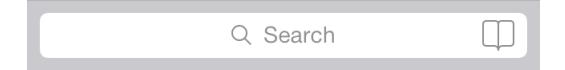

The Bookmarks button is visible only when there is no user-supplied or nonplaceholder text in the search bar. When the search bar contains such text, the Clear button appears so that users can erase the text.

● **The Clear button.** Most search bars include a Clear button that lets users erase the contents of the search bar with one tap.

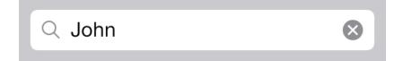

When the search bar contains any nonplaceholder text, the Clear button is visible so users can erase the text. If there is no user-supplied or nonplaceholder text in the search bar, the Clear button is hidden.

● **The results list icon.** This icon indicates the presence of search results. When users tap the results list icon, an app can display the results of their most recent search.

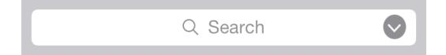

● **A prompt.** A descriptive title, called a *prompt*, can be placed above the search bar. A prompt is a short, complete sentence that provides introductory or app-specific context for the search bar.

Use a search bar to enable search in your app. Don't use a text field to enable search because it doesn't have the standard search bar appearance that users expect.

In iOS 7 and later, using UISearchDisplayController makes it easy to put a search bar in a navigation bar. Note that when a search display controller's view controller is contained within a navigation controller—as isthe case in Mail—the search bar automatically transitionsinto the navigation bar when usersinitiate a search.

**Choose a search bar style that complements the importance of search in your app.** If search is a primary function in your app, you may want to use the prominent style; if users don't need to search very often, you may want to use the minimal style.

The prominent search bar style (shown in Mail) The minimal search bar style (shown in Music)

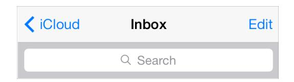

## Scope Bar

A **scope bar**—which is available only in conjunction with a search bar—helps users define the scope of a search.

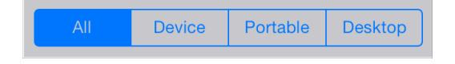

**API Note:** To learn more about defining a search bar and scope bar in your code, see "Search Bars".

When a search bar is present, a scope bar can appear near it. A scope bar adopts the same appearance that you specify for the search bar.

It can be useful to display a scope bar when there are clearly defined or typical categories in which users might want to search. However, it's even better to improve search results so that users don't need to scope their search.

# Content Views

## Activity

An **activity** represents a system-provided or custom service—accessible through an activity view controller—that can act on some specified content.

**API Note:** To learn more about defining an activity in your code, see *UIActivity Class Reference* ; to learn how incorporate an activity view controller into your app, see "Activity View [Controller"](#page-157-0) (page 158).

#### An **activity**:

● Is a customizable object representing a service that an app can perform while users are in the app

● Is represented by an icon that looks similar to a bar button icon

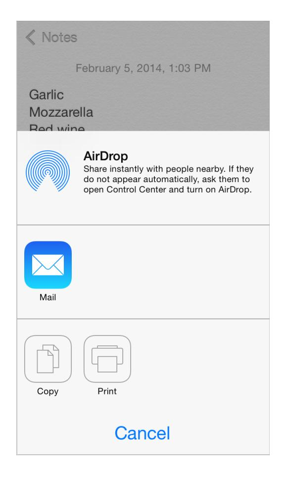

Users initiate a service by tapping its activity icon in the activity view controller. In response, the activity either performs the service immediately, or if the service is complicated, it can request more information before performing the service.

Use an activity to give users access to a custom service that your app can perform. Note that iOS provides several built-in services, such as Print, Twitter, Message, and AirPlay. You don't need to create a custom activity that performs a built-in service.

**Create a streamlined template image that represents your service.** A template image is an image that iOS uses as a mask to create the final icon that users see. To create a template image that looks good in the final icon, follow these guidelines:

- Use black or white with appropriate alpha transparency.
- Don't include a drop shadow.
- Use antialiasing.

An activity template image should be centered in an area that measures about 70 x 70 pixels (high resolution).

**Craft an activity title that succinctly describes your service.** The title is displayed below the activity's icon in the activity view controller. A short title is best, because it looks better onscreen and it's easier to localize. When a title is too long, iOS first shrinks the text and then—if the title is still too long—truncates it. In general, it's a good idea to avoid including your company or product name in the activity title.

## Activity View Controller

An **activity view controller** presents a transient view listing system-provided and custom services that can act on some specified content.

**API Note:** To learn more about defining an activity view controller in your code, see *UIActivityViewController Class Reference* ; to learn how to design an activity that provides a custom service, see ["Activity"](#page-155-1) (page 156).

### An activity view controller:

- Displays a configurable list of services that users can perform on the specified content
- Appears in an action sheet on iPhone; on iPad, it appears in a popover

Use an activity view controller to give people a list of services they can perform on content that is specified in some way. The services can be system-provided—such as Copy, Twitter, and Print—or custom. A common way to use an activity view controller is to allow users to post selected content to a social media account.

**Don't create a custom button that reveals an activity view controller.** People are accustomed to accessing system-provided services when they tap the Share button. You want to take advantage of thislearned behavior and avoid confusing users by providing an alternative way to do the same thing.

**Ensure that the listed services are appropriate in the current context.** You can change the services listed in an activity view controller by specifying system-provided servicesto exclude and by identifying custom services to include. For example, to prevent usersfrom printing an image, you exclude the Print activity from the activity view controller.

**Note:** You can't change the order in which the system-provided services are listed in an activity view controller. Also, all system-provided services appear above any custom services.

## Collection View

A **collection view** manages an ordered collection of items and presents them in a customizable layout.

**API Note:** To learn more about defining a collection view in your code, see *Collection View Programming Guide for iOS* .

#### A collection view:

● Can contain optional views that visually distinguish subsets of items or provide decorative items, such as custom backgrounds

- Supports custom animated transitions between layouts (by default, a collection view provides animations when users insert, move, or delete items)
- Supports the addition of gesture recognizers to perform custom actions. By default, a collection view recognizes tap (to select an item) and touch-and-hold (to edit an item).

Use a collection view to give users a way to view and manipulate a set of items that don't need to be displayed in a list. Because a collection view doesn't enforce a strictly linear layout, it's particularly well suited to display items that differ in size.

A collection view supports extensive customization, so it's essential to avoid becoming distracted by your ability to create radical new designs. You want a collection view to enhance the user's task; you don't want a collection view to become the focus of the user experience. The following guidelines can help you create collection views that people appreciate.

**Don't use a collection view when a table view is a better choice.** Sometimes it's easier for people to view and understand information when it's presented in a list. For example, it can be simpler and more efficient for people to view and interact with textual information when it's in a scrolling list.

**Make it easy for people to select an item.** If it's hard for users to tap an item in your collection view, they're lesslikely to enjoy using your app. As with all UI objectsthat users might want to tap, ensure that the minimum target area for each item in a collection view is 44 x 44 points.

**Use caution if you make dynamic layout changes.** A collection view allows you to change the layout of items while users are viewing and interacting with them. If you decide to dynamically adjust a collection view's layout, be sure that the change makes sense and is easy for users to track. Changing a collection view's layout without an obvious motivation can give people the impression that your app is unpredictable and hard to use. And if the current focus or context is lost during a dynamic layout change, users are likely to feel that they're no longer in control of your app.

## Container View Controller

A **container view controller** manages and presents its set of child views—or view controllers—in a custom way. Examples of system-defined container view controllers are tab bar view controllers, navigation view controllers, and split view controllers (you can learn more about these elements in ["Tab](#page-149-0) Bar" (page 150), ["Navigation](#page-143-0) Bar" (page 144), and "Split View [Controller](#page-170-0) (iPad Only)" (page 171)).

**API Note:** To learn more about defining a custom container view controller in your code, see *UIViewController Class Reference* .

A container view controller has no predefined appearance or behavior.

Use a container view controller to present content through which users navigate in a custom way.

**Ask yourself whether a custom container view controller is really necessary.** Users are comfortable with the appearance and behavior of standard container view controllers, such as split view controllers and tab bar view controllers. You need to be sure that the potential advantages of your custom container view outweigh the fact that users won't recognize it or instantly know how it works.

**Make sure that your custom container view controller works in both orientations.** It's important to design a container view controller that gives users a consistent experience in both portrait and landscape.

**In general, avoid flashy view transitions.** When you use storyboards to design a custom view controller, it's easy to define custom animations for the transitions between content views. But in most cases, flamboyant view transitions distract people from their task and often decrease the aesthetic appeal of your app.

## Image View

An **image view** displays one image or an animated series of images.

**API Note:** To learn more about defining an image view in your code, see "Image Views".

#### An image view:

- Has no predefined appearance and it doesn't enable user interaction by default
- Examines properties of both the image and its parent view to determine whether the image should be stretched, scaled, sized to fit, or pinned to a specific location

In iOS 7, an image view that contains a template image applies the current tint color to the image.

**As much as possible, ensure that all images in an image view have the same size and use the same scale.** If your images have different sizes, the image view will adjust them separately; if your images use different scale factors, they may render incorrectly.

## Map View

A **map view** presents geographical data and supports most of the functionality provided by the built-in Maps app (shown below in Photos).

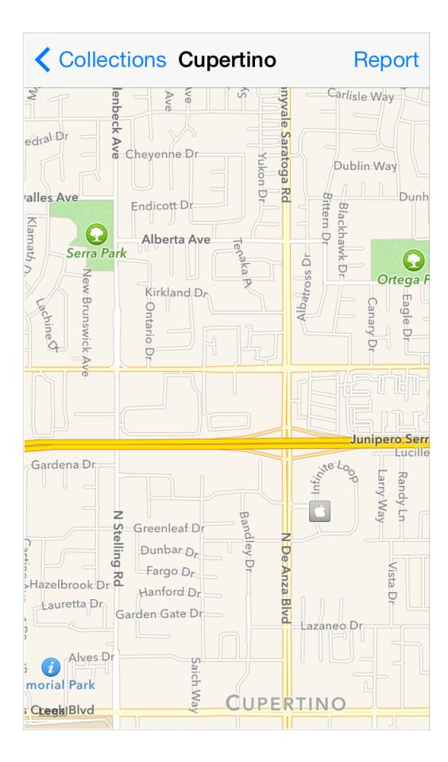

**API Note:** To learn more about defining a map view in your code, see *Map Kit Framework Reference* .

#### A map view:

- Displays a geographical area using standard map data, satellite imagery, or a combination of both
- Can display annotations(which mark single points) and overlays(which delineate paths or two-dimensional areas)
- Supports both programmatic and user-controlled zooming and panning

Use a map view to give users an interactive view of a geographical area. If you're developing a routing app, use a map view to display the user's route (for more information about creating a routing app, see ["Routing"](#page-96-0) (page 97)).

**In general, let users interact with the map.** People are accustomed to interacting with the built-in Maps app, and they expect to be able to interact with your map in similar ways.

**Use the standard pin colors in a consistent way.** A map pin shows the location of a point of interest in your map. People are familiar with the pin colorsin the built-in Maps app,so it's best to avoid redefining the meaning of these colors in your app. When you use the standard pin colors, be sure to use them in the following ways:

- Use red for a destination point
- Use green for a starting point
- Use purple for a user-specified point

## Page View Controller

A **page view controller** uses one of two styles to manage transitions through multipage content—scrolling or page-curl. Here's how a page curl looks in iOS 7 Simulator:

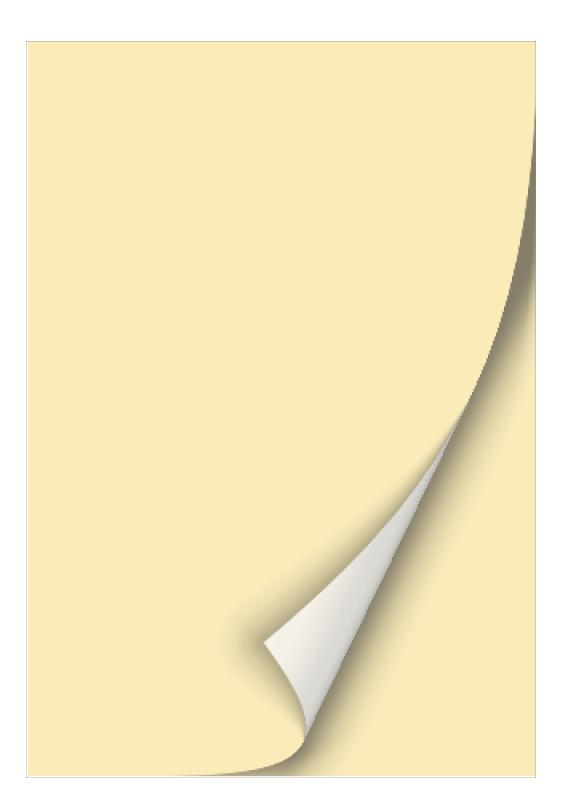

**API Note:** To learn more about defining a page view controller in your code, see "Page View Controllers".

#### A page view controller:

- Has no default appearance for the scrolling style For the page curl style, a page view controller can add the appearance of the inside of a book spine between pairs of pages
- Animates the transition from one page to another, according to the specified style For the scrolling style, the current page scrolls to the next page; for the page curl style, the current page appears to turn like a page in a book or a notepad.

Use a page view controller to present content that users access in a linear fashion (such as the text of a story) or content that naturally breaks into chunks (such as a calendar).

**If necessary, create a custom way to let users access content in a nonlinear way.** A page view controller lets users move from one page to the next or previous page; it doesn't give users a way to jump among nonadjoining pages. If you want to use a page view controller to present content that users might access in a nonlinear fashion—such as a dictionary or a book's table of contents—you must implement a custom way to let users move to different areas of the content.

## Popover (iPad Only)

A **popover** is a transient view that can be revealed when people tap a control or tap in an onscreen area.

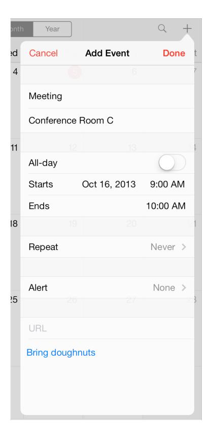

**API Note:** To learn more about defining a popover in your code, see *UIPopoverController Class Reference* and "Popovers".

**Important:** Popovers are available in iPad apps only.

#### A popover:

- Is a self-contained view that hovers above the contents of a screen
- Always displays an arrow that indicates the point from which it emerged
- Has a translucent background that blurs content behind it
- Can contain a wide variety of objects and views, such as:
  - Table, image, map, text, web, or custom views
  - Navigation bars, toolbars, or tab bars
  - Controls or objects that act upon objects in the current app view

(By default, table views, navigation bars, and toolbars in a popover use a transparent background to let the popover's blurring show through.)

In iPad apps, an action sheet always appears inside a popover.

#### Use a popover to:

- Display additional information or a list of items related to the focused or selected object.
- Display an action sheet containing a short list of options that are closely related to something on the screen.
- Display the contents of the left pane when a split-view–based app is in portrait. If you do this, you either provide an appropriately titled button that displaysthe popover—preferably in a navigation bar or toolbar at the top of the screen—or allow people to make the swipe gesture to hide and reveal it.

**Avoid providing a "dismiss popover" button.** A popover should close automatically when its presence is no longer necessary. To determine when a popover's presence is no longer necessary, consider the following scenarios:

| If a popover…                                                                                                   | Do this                                                                                                                                                                                                                                                                                                                                                                                                                                  |
|-----------------------------------------------------------------------------------------------------------------|------------------------------------------------------------------------------------------------------------------------------------------------------------------------------------------------------------------------------------------------------------------------------------------------------------------------------------------------------------------------------------------------------------------------------------------|
| Provides options that affect the main view, but doesn't implement an inspector | Close the popover as soon as people make a choice or when they tap anywhere outside its bounds, including the control that reveals the popover.                                                                                                                                                                                                                  |
| Implements an inspector                                                                                   | Close the popover when people tap anywhere outside its bounds, including the control that reveals the popover.                                                                                                                                                                                                                                                                           |
|                                                                                                                 | In this scenario, don't close the popover as soon as people make a choice, because they might want to make an additional choice or change the attributes of the current choice.                                                                                                                                                                |
| Enables a task                                                                                            | Close the popover when people complete or cancel the task by tapping a button in the popover, such as Done or Cancel.                                                                                                                                                                                                                                                     |
|                                                                                                                 | In this scenario, you may not want to close the popover when people tap outside its borders, because it might be important that people finish—or explicitly abandon—the task. Otherwise, save people's input when they tap outside a popover's borders, just as you would if they tapped Done. |

**In general, save users' work when they tap outside a popover's borders.** Not every popover requires an explicit dismissal, so people might dismiss them mistakenly. Discard the work people do in a popover only if they tap a Cancel button.

**Make the popover arrow point as directly as possible to the element that revealed it.** Doing this helps people remember where the popover came from and what task or object it's associated with.

**Make sure people can use a popover without seeing the app content behind it.** A popover obscures the content behind it, and people can't drag a popover to another location.

**Ensure that only one popover is visible onscreen at a time.** You shouldn't display more than one popover (or custom view designed to look and behave like a popover) at the same time. In particular, you should avoid displaying a cascade or hierarchy of popovers simultaneously, in which one popover emerges from another.

**Don't display a modal view on top of a popover.** Except for an alert, nothing should be displayed on top of a popover.

**When possible, allow people to close one popover and open a new one with one tap.** This behavior is especially desirable when several different bar buttons each open a popover, because it prevents people from having to make extra taps.

**Avoid making a popover too big.** A popovershouldn't appear to take over the entire screen. Instead, itshould be just big enough to display its contents and still point to the place it came from.

Ideally, the width of a popover should be at least 320 points, but no greater than 600 points. The height of a popover is not constrained, so you can use it to display a long list of items. In general, though, you should try to avoid scrolling in a popover that enables a task or that presents an action sheet. Note that the system might adjust both the height and the width of a popover to ensure that it fits well on the screen.

**Use standard UI controls and views within a popover.** In general, popovers look best, and are easier for users to understand, when they contain standard controls and views.

**Make sure a custom popover still looks like a popover.** Although it's easy to customize many of the visual aspects of a popover by using the UIPopoverBackgroundView APIs, avoid creating a design that people might not recognize as a popover. If you change the appearance of a popover too much, users can't rely on their prior experience to help them understand how to use it in your app.

**If appropriate, change a popover's size while it remains visible.** You might want to change a popover's size if you use it to display both a minimal and an expanded view of the same information. When you adjust the size of a visible popover, it's usually a good idea to animate the change because it avoids giving the impression that a new popover has replaced the old one.

## Scroll View

A **scroll view** helps people see content that is larger than the scroll view's boundaries (the image shown below is both taller and wider than the scroll view that contains it).

**API Note:** To learn more about defining a scroll view in your code, see "Scroll Views".

#### A scroll view:

- Has no predefined appearance
- Flashes transient scroll indicators when it first appears or when users interact with it
- Responds to the speed and direction of gestures to reveal content in a way that feels natural to people When users drag content in a scroll view, the content followsthe touch; when usersflick content, the scroll view reveals the content quickly and stops scrolling when the user touches the screen or when the end of the content is reached.
- Can operate in paging mode, in which each drag or flick gesture reveals one app-defined page of content

Use a scroll view to give people access to large views—or to large numbers of views—in a constrained space.

**Support zoom behavior appropriately.** If it makes sense in your app, let users pinch or double-tap to zoom into and out of a scroll view. When you enable zoom, you should also set maximum and minimum scale values that make sense in the context of the user's task. For example, letting users zoom in on text until one character fills the screen is unlikely to make it easier for them to read the content.

**Consider using a page control with a paging-mode scroll view.** When you want to display content that's divided into pages, screenfuls, or other chunks, you can use a page control to show users how many chunks are available and which one they're currently viewing.

When you use a page control with a paging-mode scroll view, it's a good idea to disable the scroll indicator that's on the same axis asthe page control. Removing the scroll indicator focuses attention on the page control and gives people one unambiguous way to page through the content. For more information about using a page control in your app, see "Page [Control"](#page-185-1) (page 186).

**In general, display only one scroll view at a time.** People often make large swipe gestures when they scroll, so it can be difficult for them to avoid interacting with a neighboring scroll view on the same screen. If you decide to put two scroll views on one screen, consider allowing them to scroll in different directions so that one gesture is less likely to scroll both views. For example, Stocks in portrait orientation on iPhone displays stock quotesin a vertically scrolling view above company-specific information, which isin a horizontally scrolling view.

## Split View Controller (iPad Only)

A **split view controller** is a full-screen view controller that manages the presentation of two side-by-side view controllers.

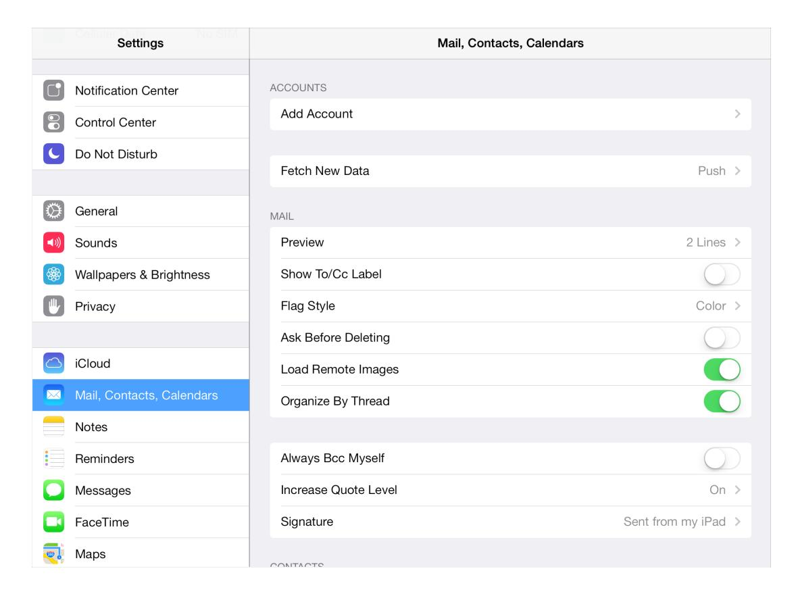

**API Note:** Each child view controller of a split view controller isresponsible for managing the display of one pane. The split view controller itself presents these child view controllers and manages transitions between different orientations. To learn more about defining a split view controller in your code, see *UISplitViewController Class Reference* and "Split View Controllers".

**Important:** Split view controllers are available in iPad apps only.

#### A split view controller:

- Displays two panes (the width of the left pane is fixed at 320 points in all orientations; you can customize the width of the right pane)
- Can optionally display the left pane in a popover when the device is in portrait orientation
- Can contain a wide variety of objects and views, such as:
  - Table, image, map, text, web, or custom views

● Navigation bars, toolbars, or tab bars

**Note:** Even though the left pane is often called the *master pane* and the right pane is often called the *detail pane* , this relationship is not enforced in code.

Use a split view controller to display persistent information in the left pane and related details or subordinate information in the right pane. In this design pattern, when people select an item in the left pane, the right pane should display the information related to that item. (You're responsible for making this happen in code.)

**Avoid creating a right pane that is narrower than the left pane.** If the right pane is narrower than the left pane, the split view controller no longer fills the width of the screen and the overall appearance is unbalanced.

**Avoid displaying a navigation bar in both panes at the same time.** Doing this would make it very difficult for users to discern the relationship between the two panes.

**In general, indicate the current selection in the left pane in a persistent way.** Even though the content of the right pane can change, it should always remain related to the item selected in the left pane. This viewing experience helps people understand the relationship between the item in the left pane and the contents of the right pane.

**Give people alternative ways to access the left pane, if appropriate.** By default, only the right pane is displayed in portrait orientation and you provide users with a button (typically located in a navigation bar) to reveal and hide the left pane. The split view controller also supportsthe swipe gesture to perform the reveal/hide action. Unless your app uses the swipe gesture to perform other functions, you should let people swipe to access the left pane.

## Table View

A **table view** presents data in a scrolling single-column list of multiple rows.

**API Note:** To learn more about defining a table view in your code, see *Table View Programming Guide for iOS* and "Table Views".

#### A table view:

- Displays data in rows that can be divided by section or separated into groups
- Provides controls that let users add or remove rows, select multiple rows, see more information about a row item, or reveal another table view

iOS defines two styles of table view:

**Plain.** In the plain style, rows can be separated into labeled sections and an optional index can appear vertically along the right edge of the view. A header can appear before the first item in a section, and a footer can appear after the last item.

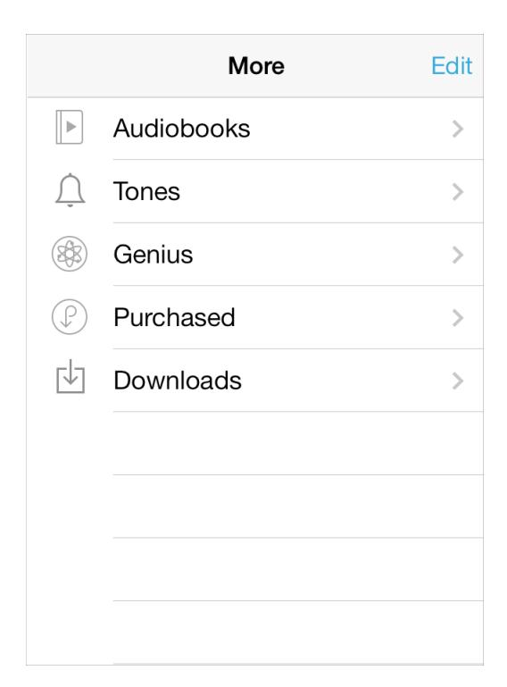

**Grouped.** In the grouped style, rows are displayed in groups, which can be preceded by a header and followed by a footer. A grouped table view always contains at least one group of list items—one list item per row—and each group always contains at least one item. A grouped table view doesn't include an index.

In both styles, a table row becomes highlighted briefly when a user taps a selectable item. If a row selection results in navigation to a new screen, the selected row becomes highlighted briefly as the new screen slides into place. When the user navigates back to the previous screen, the originally selected row again becomes highlighted briefly to remind the user of the earlier selection (it doesn't remain highlighted).

iOS includessome **table view elements** that can extend the functionality of table views. Unless noted otherwise, these elements are suitable for use with table views only.

| Table view element | Name                           | Meaning                                                                                                                                                                                                                                     |
|--------------------|--------------------------------|---------------------------------------------------------------------------------------------------------------------------------------------------------------------------------------------------------------------------------------------|
|                    | Checkmark                      | Indicates that the row is selected.                                                                                                                                                                                          |
|                    | Disclosure indicator        | Displays another table associated with the row.                                                                                                                                                                           |
|                    | Detail Disclosure button | Displays additional details about the row in a new view (for information on how to use this element outside of a table,see "Popover (iPad Only)" (page 166)). |
|                    | Row reorder                 | Indicates that the row can be dragged to another location in the table.                                                                                                                                 |
|                    | Row insert                  | Adds a new row to the table.                                                                                                                                                                                              |
|                    | Delete button control    | In an editing context, reveals and hidesthe Delete button for a row.                                                                                                                                       |
|                    | Delete button               | Deletes the row.                                                                                                                                                                                                                      |

In addition to the table-specific elements listed above, iOS defines the refresh control, which gives users the ability to refresh a table's contents. To learn more about using a refresh control with a table in your app, see ["Refresh](#page-189-0) Control" (page 190).

iOS defines four table cell styles that implement the most common layouts for table rows in both plain and grouped tables. Each cell style is best suited to display a different type of information.

**Note:** Programmatically, these styles are applied to a table view's cell, which is an object that tells the table how to draw its rows.

**Default**(UITableViewCellStyleDefault). The default cell style includes an optional image in the left end of the row, followed by a left-aligned title.

The defaultstyle is good for displaying a list of itemsthat don't need to be differentiated by supplementary information.

**Subtitle** (UITableViewCellStyleSubtitle). The subtitle style includes an optional image in the left end of the row, followed by a left-aligned title on one line and a left-aligned subtitle on the line below.

The left alignment of the text labels makes the list easy to scan. This table cell style works well when list items look similar, because users can use the additional information in the detail text labels to help distinguish items named in the text labels.

|       | Subtitle Cell Style              |
|-------|----------------------------------|
| 1     | Text Label Detail text label     |
| 於     | Dahlia This is a dahlia       |
|       | Daisies These are daisies     |
|       | Dandelion This is a dandelion |
|       | Echinacea This is echinacea   |
| D.Co. | Lavender                         |

| Value 1 Cell Style                                                                                                                                                                                                                                                                                                                                                                                                                                                                                                                                                                                                                                                                                                                                                                                                                                                                                                                                                                                                                                                                                                                                                                                                                                                                                                                                                                                                                                                                                                                                                                                                                                                                                                                                                                                                                                                                                                                                                                                                                                                                                                             |            |                       |
|--------------------------------------------------------------------------------------------------------------------------------------------------------------------------------------------------------------------------------------------------------------------------------------------------------------------------------------------------------------------------------------------------------------------------------------------------------------------------------------------------------------------------------------------------------------------------------------------------------------------------------------------------------------------------------------------------------------------------------------------------------------------------------------------------------------------------------------------------------------------------------------------------------------------------------------------------------------------------------------------------------------------------------------------------------------------------------------------------------------------------------------------------------------------------------------------------------------------------------------------------------------------------------------------------------------------------------------------------------------------------------------------------------------------------------------------------------------------------------------------------------------------------------------------------------------------------------------------------------------------------------------------------------------------------------------------------------------------------------------------------------------------------------------------------------------------------------------------------------------------------------------------------------------------------------------------------------------------------------------------------------------------------------------------------------------------------------------------------------------------------------|------------|-----------------------|
| 1                                                                                                                                                                                                                                                                                                                                                                                                                                                                                                                                                                                                                                                                                                                                                                                                                                                                                                                                                                                                                                                                                                                                                                                                                                                                                                                                                                                                                                                                                                                                                                                                                                                                                                                                                                                                                                                                                                                                                                                                                                                                                                                              | Text Label | Detail text label     |
| A CONTRACTOR OF THE PROPERTY OF THE PROPERTY OF THE PROPERTY OF THE PROPERTY OF THE PROPERTY OF THE PROPERTY OF THE PROPERTY OF THE PROPERTY OF THE PROPERTY OF THE PROPERTY OF THE PROPERTY OF THE PROPERTY OF THE PROPERTY OF THE PROPERTY OF THE PROPERTY OF THE PROPERTY OF THE PROPERTY OF THE PROPERTY OF THE PROPERTY OF THE PROPERTY OF THE PROPERTY OF THE PROPERTY OF THE PROPERTY OF THE PROPERTY OF THE PROPERTY OF THE PROPERTY OF THE PROPERTY OF THE PROPERTY OF THE PROPERTY OF THE PROPERTY OF THE PROPERTY OF THE PROPERTY OF THE PROPERTY OF THE PROPERTY OF THE PROPERTY OF THE PROPERTY OF THE PROPERTY OF THE PROPERTY OF THE PROPERTY OF THE PROPERTY OF THE PROPERTY OF THE PROPERTY OF THE PROPERTY OF THE PROPERTY OF THE PROPERTY OF THE PROPERTY OF THE PROPERTY OF THE PROPERTY OF THE PROPERTY OF THE PROPERTY OF THE PROPERTY OF THE PROPERTY OF THE PROPERTY OF THE PROPERTY OF THE PROPERTY OF THE PROPERTY OF THE PROPERTY OF THE PROPERTY OF THE PROPERTY OF THE PROPERTY OF THE PROPERTY OF THE PROPERTY OF THE PROPERTY OF THE PROPERTY OF THE PROPERTY OF THE PROPERTY OF THE PROPERTY OF THE PROPERTY OF THE PROPERTY OF THE PROPERTY OF THE PROPERTY OF THE PROPERTY OF THE PROPERTY OF THE PROPERTY OF THE PROPERTY OF THE PROPERTY OF THE PROPERTY OF THE PROPERTY OF THE PROPERTY OF THE PROPERTY OF THE PROPERTY OF THE PROPERTY OF THE PROPERTY OF THE PROPERTY OF THE PROPERTY OF THE PROPERTY OF THE PROPERTY OF THE PROPERTY OF THE PROPERTY OF THE PROPERTY OF THE PROPERTY OF THE PROPERTY OF THE PROPERTY OF THE PROPERTY OF THE PROPERTY OF THE PROPERTY OF THE PROPERTY OF THE PROPERTY OF THE PROPERTY OF THE PROPERTY OF THE PROPERTY OF THE PROPERTY OF THE PROPERTY OF THE PROPERTY OF THE PROPERTY OF THE PROPERTY OF THE PROPERTY OF THE PROPERTY OF THE PROPERTY OF THE PROPERTY OF THE PROPERTY OF THE PROPERTY OF THE PROPERTY OF THE PROPERTY OF THE PROPERTY OF THE PROPERTY OF THE PROPERTY OF THE PROPERTY OF THE PROPERTY OF THE PROPERTY OF THE PROPERTY OF THE PROPERTY OF THE PROPERTY OF THE PROPERTY OF THE PROPERTY OF THE PROPERTY OF THE PROPERTY O | Dahlia     | This is a dahlia      |
| 1                                                                                                                                                                                                                                                                                                                                                                                                                                                                                                                                                                                                                                                                                                                                                                                                                                                                                                                                                                                                                                                                                                                                                                                                                                                                                                                                                                                                                                                                                                                                                                                                                                                                                                                                                                                                                                                                                                                                                                                                                                                                                                                              | Daisies    | These are daisies     |
|                                                                                                                                                                                                                                                                                                                                                                                                                                                                                                                                                                                                                                                                                                                                                                                                                                                                                                                                                                                                                                                                                                                                                                                                                                                                                                                                                                                                                                                                                                                                                                                                                                                                                                                                                                                                                                                                                                                                                                                                                                                                                                                                | Dandelion  | This is a dandelion   |
|                                                                                                                                                                                                                                                                                                                                                                                                                                                                                                                                                                                                                                                                                                                                                                                                                                                                                                                                                                                                                                                                                                                                                                                                                                                                                                                                                                                                                                                                                                                                                                                                                                                                                                                                                                                                                                                                                                                                                                                                                                                                                                                                | Echinacea  | This is echinacea     |
|                                                                                                                                                                                                                                                                                                                                                                                                                                                                                                                                                                                                                                                                                                                                                                                                                                                                                                                                                                                                                                                                                                                                                                                                                                                                                                                                                                                                                                                                                                                                                                                                                                                                                                                                                                                                                                                                                                                                                                                                                                                                                                                                | Lavender T | his is a field of lav |

### **Value 1**

(UITableViewCellStyleValue1). The value 1 style displays a left-aligned title with, on the same line, a right-aligned subtitle in a lighter font.

**Value 2** (UITableViewCellStyleValue2). The value 2 style displays a right-aligned title in a blue font, followed on the same line by a left-aligned subtitle in a black font. Images don't fit well in this style.

In the value 2 layout, the crisp vertical margin between the text and the detail text helps users focus on the first words of the detail text label.

| Value 2 Cell Style                   |  |
|--------------------------------------|--|
| Text Label Detail text label         |  |
| Dahlia This is a dahlia              |  |
| Daisies These are daisies            |  |
| Dandelion This is a dandelion        |  |
| Echinacea This is echinacea          |  |
| Lavender This is a field of lavender |  |

**Note:** All fourstandard table-cellstyles allow the addition of table view elements,such as a checkmark or disclosure indicator. Adding these elements decreases the width of the cell available for the title and subtitle.

Use a table view to display large or small amounts of information cleanly and efficiently. For example:

- **Provide a list of options from which users can select.** You can use the checkmark to show users the currently selected options in the list.
  - Use either a plain or a grouped table view to display a list of choices that appears when users tap an item in a table row. Use a plain table view to display a list of choices that appears when users tap a button or other UI element that is *not* in a table row.
- **Display hierarchical information.** The plain table style is well suited for displaying a hierarchy of information. Each list item can lead to a different subset of information displayed in another list. Users follow a path through the hierarchy by selecting one item in each successive list. The disclosure indicator tells users that tapping anywhere in the row reveals the subset of information in a new list.
- **Display conceptually grouped information.** Both table view styles allow you to provide context by supplying header and footer views between sections of information.

In iOS 6.0 and later, you can use a header-footer view—that is, an instance of UITableViewHeaderFooterView—to display text or a custom view in a header or footer. To learn how to use a header-footer view in your code, see *UITableViewHeaderFooterView Class Reference* .

Follow these guidelines when you use table views:

**Always provide feedback when users select a list item.** Users expect a table row to become highlighted briefly when they tap a selectable item in it. After tapping, users expect a new view to appear (or the row to display a checkmark) to indicate that the item has been selected or enabled.

**If table content is extensive or complex, avoid waiting until all the data is available before displaying anything.** Instead, fill the onscreen rows with textual data immediately and display more complex data—such as images—as they become available. This technique gives users useful information right away and increases the perceived responsiveness of your app.

**Consider displaying "stale" data while waiting for new data to arrive.** Although this technique isn't recommended for appsthat handle frequently changing data, it can help more static apps give userssomething useful right away. Before you decide to do this, gauge how often the data changes and how much users depend on seeing fresh data quickly.

**If the data is slow loading or complex, show users that processing is continuing.** If a table contains only complex data, it may be difficult to display anything useful right away. In these rare cases, it's important to avoid displaying empty rows, because empty rows can imply that your app hasstalled. Instead, the table should display a spinning activity indicator, along with an informative label (such as "Loading…") centered in the screen. This behavior reassures users that processing is continuing.

**If appropriate, use a custom title for the Delete button.** If it helps users to better understand the way your app works, you can create a title to replace the system-provided Delete title.

**As much as possible, use succinct text labels to avoid truncation.** Truncated words and phrases can be difficult for users to scan and understand. Text truncation is automatic in all table cell styles, but it can present more or less of a problem, depending on which cell style you use and on where truncation occurs.

**Avoid combining an index with table view elements that are displayed on the right edge of the table.** Table view elementsthat are displayed on the right edge of the table—such asthe disclosure indicator—interfere with the index.

**Create a custom table cell style if you want to lay out your table rows in a nonstandard way.** It's better to create a custom table cell style than to significantly alter a standard one. To learn how to create your own cells, see "Customizing Cells" in *Table View Programming Guide for iOS* .

## Text View

A **text view** accepts and displays multiple lines of text.

**API Note:** To learn more about defining a text view in your code, see "Text Views".

#### A text view:

- Is a rectangle of any height
- Supports scrolling when the content is too large to fit inside its bounds
- Supports custom fonts, colors, and alignments (by default, a text view displays left-aligned system font in black)
- Can support editing, in which case a keyboard appears when the user taps inside the text view (the keyboard's input method and layout are determined by the user's language settings)

**Always make sure the text is easy to read.** Although you can use attributed stringsto combine multiple fonts, colors, and alignments in creative ways, it's essential to maintain the readability of the text. It's a good idea to support Dynamic Type and use the UIFont method preferredFontForTextStyle to get the text for display in a text view. For some guidelines on supporting Dynamic Type, see "Text Should Always Be [Legible"](#page-52-0) (page 53); for programmatic information, see "Text Styles" in *Text Programming Guide for iOS* .

**Specify different keyboard types to accommodate different types of content you expect users to enter.** For example, you might want to make it easy for usersto enter a URL, a PIN, or a phone number. Note, however, that you have no control over the keyboard's input method and layout, which are determined by the user's language settings.

iOS provides several keyboard types, each designed to facilitate a different type of input. To learn about the keyboard typesthat are available,see the documentation for UIKeyboardType. To learn more about managing the keyboard in your app, read "Managing the Keyboard" in *iOS App Programming Guide* .

## Web View

A **web view** is a region that can display rich HTML content (shown here between the navigation bar and toolbar in Mail on iPhone).

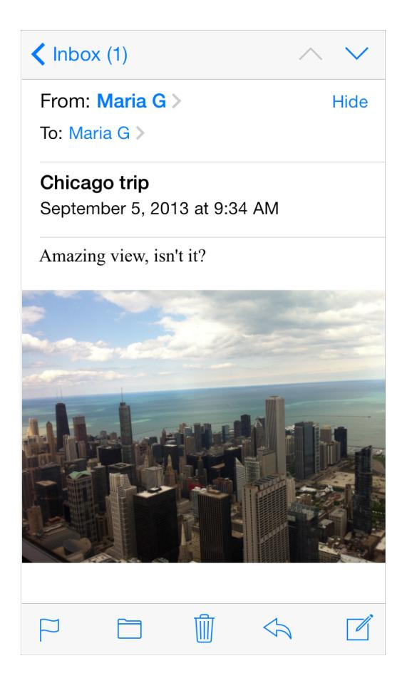

**API Note:** To learn more about defining a web view in your code, see "Web Views".

#### A web view:

- Displays web content
- Performs some automatic processing on web content, such as converting a phone number to a phone link

If you have a webpage or web app, you might decide to use a web view to implement a simple iOS app that provides a wrapper for your webpage or web app. If you plan to use a web view to access web content that you control, be sure to read *Safari Web Content Guide* .

**Avoid using a web view to create an app that looks and behaves like a mini web browser.** People expect to use Safari on iOS to browse web content, so replicating this broad functionality within your app is not recommended.

# Controls

## Activity Indicator

An **activity indicator** shows that a task or process is progressing (shown below with text labels).

**API Note:** To learn how to define an activity indicator in your code,see *UIActivityIndicatorView Class Reference* .

#### An activity indicator:

- Spins while a task is progressing and disappears when the task completes
- Doesn't allow user interaction

Use an activity indicator in a toolbar or a main view to show that processing is occurring, without suggesting when it will finish.

**Don't display a stationary activity indicator.** Users associate a stationary activity indicator with a stalled process.

**Use an activity indicator to reassure users that their task or process hasn't stalled.** Sometimes it's more important to simply reassure users than to suggest when processing will finish.

**Customize an activity indicator to harmonize with the view it's in.** If appropriate, coordinate the size and color of an activity indicator with the background of the view it's in.

## Contact Add Button

A **Contact Add button** lets the user add an existing contact to a text field or other text-based view.

**API Note:** To learn how to define a Contact Add button in your code, see "Buttons".

#### A Contact Add button:

- Displays a list of the user's contacts
- Helps users add a contact to the view that contains the Contact Add button

Use a Contact Add button to give users an easy way to access a contact without using the keyboard. For example, users can tap the Contact Add button in the To field of the Mail compose view instead of typing a recipient's name.

Because the Contact Add button functions as an alternative to typing contact information, it's not appropriate to use the button in a view that doesn't accept keyboard input.

## Date Picker

A **date picker** displays components of date and time, such as hours, minutes, days, and years.

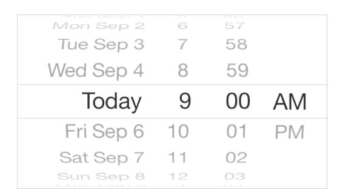

**API Note:** To learn how to define a date picker in your code, see "Date Pickers".

#### A date picker:

● Displays up to four independent wheels, each of which displays values in a single category, such as month or hour

- Uses dark text to display the current value in the middle of the view
- Can't be resized (the size of a date picker is the same size as the iPhone keyboard)
- Has four modes, each of which displays wheels containing a set of different values:
  - **Date and time.** The date and time mode (the default mode) displays wheels for the calendar date, hour, and minute values, and an optional wheel for the AM/PM designation.
  - **Time.** The time mode displays wheels for the hour and minute values, and an optional wheel for the AM/PM designation.
  - **Date.** The date mode displays wheels for the month, day, and year values.
  - **Countdown timer.** The countdown timer mode displays wheels for the hour and minute. You can specify the total duration of a countdown, up to a maximum of 23 hours and 59 minutes.

Use a date picker to let users pick—instead of type—a date or time value that consists of multiple parts, such as the day, month, and year.

**As much as possible, display a date picker inline with the content.** It's best when users can avoid navigating to a different view to use a date picker. On iPad, a date picker can appear within a popover or inline with content.

**If it makes sense in your app, change the interval in the minutes wheel.** By default, a minutes wheel displays 60 values (0 to 59). If you need to display a coarser granularity of choices, you can set a minutes wheel to display a larger minute interval, as long as the interval divides evenly into 60. For example, you might want to display the quarter-hour intervals 0, 15, 30, and 45.

## Detail Disclosure Button

A **Detail Disclosure button** reveals additional details or functionality related to an item.

**API Note:** To learn how to define a Detail Disclosure button in your code, see *UITableViewCell Class Reference* and "Buttons".

A Detail Disclosure button reveals a separate view that contains additional information or functionality related to a specific item.

When a Detail Disclosure button appears in a table row, tapping elsewhere in the row doesn't activate the Detail Disclosure button; instead, it selects the row item or results in app-defined behavior.

Typically, you use a Detail Disclosure button in a table view to give users a way to see more details or functionality related to a list item. However, you can also use this element in other types of views to give users a way to see more information or functionality related to an item in that view.

## Info Button

An **Info button** reveals configuration details about an app, sometimes on the back of the current view.

**API Note:** To learn more about defining an Info button in your code, see "Buttons".

iOS includestwo styles of Info button: a dark-colored button that looks good on light content and a light-colored button that looks good on dark content.

Use an Info button to reveal configuration details or options about an app. You can use the style of Info button that coordinates best with the UI of your app.

## Label

A **label** displays static text.

**API Note:** To learn more about defining labels in your code, see *UILabel Class Reference* .

#### A label:

- Displays any amount of static text
- Doesn't allow user interaction except, potentially, to copy the text

Use a label to name or describe parts of your UI or to provide short messages to the user. A label is best suited for displaying a relatively small amount of text.

**Take care to make your labels legible.** It's best to support Dynamic Type and use the UIFont method preferredFontForTextStyle to get the text for display in a label. If you choose to use custom fonts, don't sacrifice clarity for fancy lettering or showy colors. (For guidelines about using text in an app, see ["Color](#page-51-0) and [Typography"](#page-51-0) (page 52); to learn more about Dynamic Type, see "Text Styles" in *Text Programming Guide for iOS* .)

## Network Activity Indicator

A **network activity indicator** appears in the status bar and shows that network activity is occurring.

**APINote:** In your code, use the UIApplication method networkActivityIndicatorVisible to control the indicator's visibility.

The network activity indicator:

- Spins in the status bar while network activity proceeds and disappears when network activity stops
- Doesn't allow user interaction

Display the network activity indicator to provide feedback when your app accesses the network for more than a couple of seconds. If the operation finishes sooner than that, you don't have to show the network activity indicator, because the indicator is likely to disappear before users notice its presence.

## Page Control

A **page control** indicatesthe number of open views and which one is currently visible (shown here in Weather).

**API Note:** To learn more about defining a page control in your code, see "Page Controls".

#### A page control:

- Displays an indicator dot for each open view in an app (from left to right, the dots represent the order in which the views were opened)
- By default, uses an opaque dot to represent the currently visible view and translucent dots to represent all other open views
- Doesn't allow users to visit views nonsequentially
- Doesn't shrink or squeeze together dots as more views are opened (if you try to display more dots than will fit in the view, the dots are clipped)
- Doesn't enable navigation between views by default; you must implement view-to-view navigation and update the page control's state appropriately

Use a page control when it's more important to show users how many views are open than it is to help them choose a specific view. A page control is designed for apps in which each view is a peer of every other view.

**Don't use a page control to display views in a hierarchy or other complex arrangement.** A page control doesn't show how views are related to each other and it doesn't indicate which view corresponds to each dot, so it can't help users navigate to a specific view.

**Avoid displaying too many dots.** More than about 10 dots are hard for users to count at a glance and more than about 20 open views are time consuming to visit in sequence. If users can open more than about 20 peer views in your app, consider displaying the views in a different arrangement that provides more information about the views and enables nonsequential navigation.

**Vertically center a page control between an open view's bottom edge and the screen's bottom edge.** In this position, a page control is always visible without getting in users' way.

## Picker

A **picker** displays a set of values from which a user picks one.

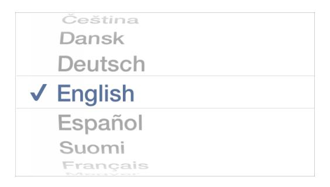

**API Note:** To learn more about defining a picker in your code, see *UIPickerView Class Reference* .

#### A picker:

- Is a generic version of the date picker (for more information about the date picker, see "Date [Picker"](#page-182-1) (page 183))
- Displays one or more wheels, each of which contains a list of values
- Uses dark text to display the current value in the middle of the view
- Can't be resized (the size of a picker is the same size as the iPhone keyboard)

Use a picker to make it easy for people to choose from a set of values.

**In general, use a picker when users are familiar with the entire set of values.** Because many of the values are hidden when the wheel is stationary, it's best when users can predict what the values are. If you need to provide a large set of choices that aren't well known to your users, a picker might not be the appropriate control.

**As much as possible, display a picker inline with the content.** It's best when users can avoid navigating to a different view to use a picker.

**Consider using a table view, instead of a picker, if you need to display a very large number of values.** This is because the greater height of a table view makes scrolling faster.

## Progress View

A **progress view** shows the progress of a task or process that has a known duration (shown here with the Mail toolbar).

**API Note:** To learn more about defining a progress view in your code, see *UIProgressView Class Reference* .

#### A progress view:

- Consists of a track that fills from left to right as the task or process proceeds
- Doesn't allow user interaction

iOS defines two styles of progress view:

- **Default.** The default style includes an unfilled track appearance so that it can stand alone in a content area.
- **Bar.** The bar style doesn't include the unfilled track appearance because it's intended to display with a bar, such as a navigation bar or a toolbar.

Use a progress view to give feedback on a task that has a well-defined duration, especially when it's important to indicate approximately how long the task will take.

**If appropriate, coordinate the appearance of a progress view with the style of your app.** By customizing a progress view, you can specify, for example, a custom tint or image for both the track and the fill of a progress view.

## Refresh Control

A **refresh control** performs a user-initiated content refresh—typically in a table (shown here above the mailbox list).

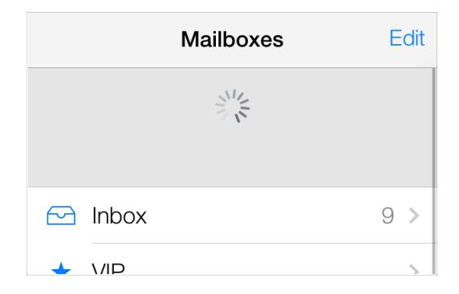

**API Note:** To learn more about defining a refresh control in your code, see *UIRefreshControl Class Reference* .

#### A refresh control:

- Looks similar to an activity indicator
- Can display a title
- Is hidden by default until the user initiates a refresh action by dragging down from the top edge of a table

Use a refresh control to give users a consistent way to tell a table or other view to update its contents immediately, without waiting for the next automatic update.

**Don't stop performing automatic content updates just because you provide a refresh control.** Even though users appreciate being able to request that an update be performed *now*, they still appreciate content that refreshes itself automatically. If you rely on users to initiate all refreshes, users who are unaware of the refresh control are likely to wonder why your app displays stale data. In general, you want to give users the option to refresh contents immediately; you don't want to make users responsible for every update.

**Supply a short title only if it adds value.** In particular, don't use the title to describe how to use the refresh control.

## Rounded Rectangle Button

The rounded rectangle button has been deprecated in iOS 7. Instead, use the system button—that is, a UIButton of type UIButtonTypeSystem. For guidelines, see ["System](#page-193-0) Button" (page 194).

## Segmented Control

A **segmented control** is a linearset ofsegments, each of which functions as a button that can display a different view.

**APINote:** To learn more about defining a segmented control in your code,see "Segmented Controls".

#### A segmented control:

- Consists of two or more segments whose widths are proportional, based on the total number ofsegments
- Can display text or images

Use a segmented control to offer choices that are closely related but mutually exclusive.

**Make sure that each segment is easy to tap.** To maintain a comfortable hit region of 44 x 44 points for each segment, limit the number of segments. On iPhone, a segmented control should have five or fewer segments.

**As much as possible, make the size of each segment's contents consistent.** Because all segments in a segmented control have equal width, it doesn't look good if the content fills some segments, but not others.

**Avoid mixing text and images in a single segmented control.** A segmented control can contain text or images. An individual segment can contain either text or an image, but not both. In general, it's best to avoid putting text in some segments and images in other segments of a single segmented control.

**If necessary, adjust the positioning of content in a customized segmented control.** If you customize the background appearance of a segmented control, make sure that the automatic centering of the control's content still looks good. Use the bar metrics APIs to adjust the positioning of the content inside a segmented control (to learn more about specifying bar metrics, see the appearance-customization APIs described in UISegmentedControl).

## Slider

A **slider** allows users to make adjustments to a value or process throughout a range of allowed values (shown here with custom images on the left and the right).

**API Note:** To learn more about defining a slider in your code, see "Sliders".

#### A slider:

- Consists of a horizontal track and a thumb (a circular control that users can slide)
- Can include optional images that convey the meaning of the right and left values
- Fills the portion of the track between the minimum value (typically on the left) and the thumb

Use a slider to give users fine-grained control over values they can choose or over the operation of the current process.

**If it adds value, create custom appearances for a slider.** For example, you can:

- Define the appearance of the thumb, so that users can see at a glance whether the slider is active
- Supply images to appear at both ends of the slider to help users understand what the slider does Typically, these custom images correspond to the minimum and maximum values of the value range that the slider controls. A slider that controls image size, for example, could display a very small image at the minimum end and a very large image at the maximum end.
- Define a different appearance for the track, depending on which side of the thumb it is on and which state the control is in

**Don't use a slider to display a volume control.** If you need to display a volume slider, use the system provided volume slider available when you use the MPVolumeView class. Note that when the currently active audio output device doesn't support volume control, the volume slider is replaced by the appropriate device name.

## Stepper

A **stepper** increases or decreases a value by a constant amount.

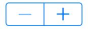

**API Note:** To learn more about defining a stepper in your code, see "Steppers".

#### A stepper:

- Is a two-segment control in which one segment displays a plus symbol and the other segment displays a minus symbol by default
- Supports custom images
- Doesn't display the value that the user changes

Use a stepper when users might need to make small adjustments to a value.

**Avoid using a stepper when users are likely to make large changes to a value.** It makes sense to use a stepper to set the number of copies in the Printer Options action sheet, because users rarely change this value by very much. On the other hand, it wouldn't make sense to use a stepper to help users choose a page range, because even a reasonable page range would require a lot of taps.

**Make it obvious which value the stepper affects.** A stepper doesn't display any values, so you need to make sure that users know which value they're changing when they use a stepper.

## Switch

A **switch** presents two mutually exclusive choices or states.

On Off

**API Note:** To learn more about defining a switch in your code, see "Switches".

#### A switch:

- Indicates the binary state of an item
- Is used in table views only

Use a switch in a table row to give users a way to specify one of two options, such as yes/no or on/off, that govern the state of an item.

You can use a switch control to change the state of other UI elements in the view. Depending on the choice users make, new list items might appear or disappear, or list items might become active or inactive.

## System Button

A system button performs an app-specific action.

**API Note:** In iOS 7, UIButtonTypeRoundedRect has been redefined as UIButtonTypeSystem. An app that uses a rounded rectangle button in iOS 6 automatically gets the system button appearance when it links against iOS 7.

To learn more about defining a system button in your code, see "Buttons".

#### A system button:

- Has no border or background appearance by default
- Can contain an icon or a text title
- Supports custom decoration, such as a border or background image (to add a custom appearance, use a button of type UIButtonTypeCustom and supply a custom background image)

Use a system button to initiate an action. When you supply a title for a system button, follow this approach:

- **Use a verb or verb phrase to describe the action the button performs.** An action-specific title shows users that the button is interactive and tells them what will happen when they tap it.
- **Use title-style capitalization.** Capitalize every word except articles, coordinating conjunctions, and prepositions of four or fewer letters.
- **Avoid creating a title that is too long.** Overly long text gets truncated, which can make it difficult for users to understand it.

**If appropriate, add a border or background appearance to a system button in a content region.** Most of the time, you can avoid adding ornamentation to a button by crafting a clear call-to-action title, defining a tint, and providing contextual clues. In some content areas, however, it can be appropriate to focus attention on a button by adding a border or background appearance.

In Phone, for example, the bordered number keys reinforce the mental model of making a call and the background of the Call button gives users an eye-catching target that's easy to hit.

## Text Field

A **text field** accepts a single line of user input (shown here with a purpose description and placeholder text).

**API Note:** To learn more about defining a text field and customizing it to display images and buttons, see "Text Fields".

#### A text field:

- Is a fixed-height field with rounded corners
- Automatically displays a keyboard when users tap within it
- Can include system provided buttons, such as the Bookmarks button

● Can display text that uses multiple styles (to learn more about this, see UITextView)

Use a text field to get a small amount of information from the user.

**Customize a text field if it helps users understand how they should use it.** For example, you can display custom images in the left or right sides of the text field, or you can add a system-provided button, such as the Bookmarks button. In general, you should use the left end of a text field to indicate its purpose and the right end to indicate the presence of additional features, such as bookmarks.

**Display the Clear button in the right end of a text field when appropriate.** When this element is present, tapping it clears the contents of the text field, regardless of any other image you might display over it.

**Display a hint in the text field if it helps users understand its purpose.** A text field can display placeholder text—such as Name (or Address)—when there is no other text in the field.

**Specify a keyboard type that's appropriate for the type of content you expect users to enter.** For example, you might want to make it easy for usersto enter a URL, a PIN, or a phone number. iOS providesseveral different keyboard types, each designed to facilitate a different type of input. To learn about the keyboard types that are available, see UIKeyboardType in *UITextInputTraits Protocol Reference* . To learn more about managing the keyboard in your app, read "Managing the Keyboard" in *iOS App Programming Guide* . Note that you have no control over the keyboard'sinput method and layout, because these attributes are determined by the user's language settings.

# Temporary Views

## Alert

An **alert** gives people important information that affects their use of an app or the device.

**API Note:** To learn about using an alert in your code, see *UIAlertView Class Reference* .

#### An alert:

- Displays a required title and an optional message
- Contains one or more buttons

The infrequency with which alerts appear helps users take them seriously. It's best to minimize the number of alerts your app displays, and make sure each one offers critical information and useful choices.

**Avoid creating unnecessary alerts.** In general, alerts are unnecessary in the following scenarios:

| If an alert does this                                                                         | Do this instead of using an alert                                                                                                                                                                                                                   |
|-----------------------------------------------------------------------------------------------|-----------------------------------------------------------------------------------------------------------------------------------------------------------------------------------------------------------------------------------------------------|
| Provides information related to the standard functioning of an app | Design an eye-catching way to display the information, one that harmonizes with the app's style.                                                                                                          |
| Updates users on tasks that are progressing normally                     | Use a progress view or activity indicator (described in "Progress View" (page 189) and "Activity Indicator" (page 182)) or integrate status information into the app UI. |
| Asks for confirmation of user-initiated tasks                                  | Use an action sheet (described in "Action Sheet" (page 200)).                                                                                                                                                            |

| If an alert does this                                                       | Do this instead of using an alert                                                                                                                 |
|-----------------------------------------------------------------------------|---------------------------------------------------------------------------------------------------------------------------------------------------|
| Informs users of problems they can do nothing about | If the problem isn't critical, integrate the information into the app's UI; otherwise, use an alert. |

As you read the guidelines for designing alert text, it's useful to know the following definitions:

- **Title-style capitalization** means that every word is capitalized, except articles, coordinating conjunctions, and prepositions of four or fewer letters when they aren't the first word.
- **Sentence-style capitalization** means that the first word is capitalized, and the rest of the words are lowercase unless they are proper nouns or proper adjectives.

**Succinctly describe the situation and explain what people can do about it.** Ideally, the text you write gives people enough context to understand why the alert has appeared and to decide which button to tap.

**Keep the title short enough to display on a single line, if possible.** A long alert title is difficult for people to read quickly, and it might get truncated or force the alert message to scroll.

**Avoid single-word titles.** Single-word titles, such as Error or Warning, rarely provide any useful information.

**When possible, use a sentence fragment.** A short, informative statement tends to be easier to understand than a complete sentence.

**As much as possible, write a title that makes it unnecessary to add a message.** For example, you might be able to avoid adding a message if you use a question—or, less frequently, two sentences—for the alert title.

**Don't hesitate to be negative.** People understand that most alerts tell them about problems or warn them about dangerous situations. It's better to be negative and direct than it is to be positive but oblique.

**As much as possible, avoid "you," "your," "me," and "my."** Sometimes, text that identifies people directly can be ambiguous and can even be interpreted as insulting or patronizing.

**Use capitalization and punctuation appropriately.** Specifically:

| When the alert title                                                                                   | Use                                                                                                        |
|--------------------------------------------------------------------------------------------------------|------------------------------------------------------------------------------------------------------------|
| Is a sentence fragment or a single sentence that is not a question | Title-style capitalization and no ending punctuation                                        |
| Is a single sentence that is a question                                           | Sentence-style capitalization and an ending question mark                                |
| Consists of two or more sentences                                                       | Sentence-style capitalization and appropriate ending punctuation for each sentence |

**If you must provide an optional alert message, write a short, complete sentence.** If possible, keep the message short enough to be displayed on one or two lines. If the message is too long, it will scroll, giving users a poor experience. Use sentence-style capitalization and appropriate ending punctuation in the message.

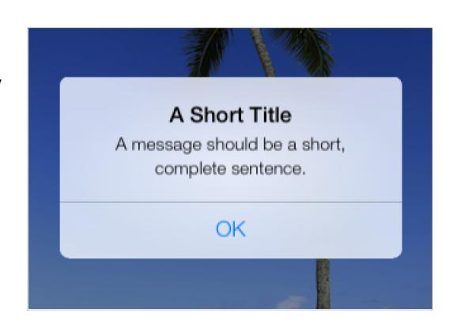

**Avoid lengthening alert text with descriptions of which button to tap.** Ideally, the combination of unambiguous alert text and logical button labels gives people enough information to understand the situation and their choices. If you must provide detailed guidance, follow these guidelines:

- Be sure to use the word "tap" (not "touch" or "click" or "choose") to describe the selection action.
- Don't enclose a button title in quotation marks, but do preserve its capitalization.

**Be sure to test the appearance of an alert in both orientations.** Because in landscape the height of an alert is constrained, the alert's appearance may differ from its appearance in portrait. It's recommended that you optimize the length of the alert text so that it can be read without scrolling no matter what the orientation.

**Generally, use a two-button alert.** A two-button alert is often the most useful, because it's easiest for people to choose between two alternatives. A single button alert is less likely to be helpful because it informs people without giving them any control over the situation. An alert that contains three or more buttonsissignificantly more complex than a two-button alert and should be avoided as much as possible. If you add too many buttons to an alert, it can cause the alert to scroll, which is a bad user experience.

**Note:** If you find that you need to offer people more than two choices, consider using an action sheet instead (to learn how to use an action sheet, see ["Action](#page-199-0) Sheet" (page 200)).

**Place buttons appropriately.** Ideally, the button that's most natural to tap should meet two criteria: It should perform the action that users are most likely to want and it should be the least likely to cause problems if a user taps it inadvertently. Specifically:

- When the most likely button performs a nondestructive action, it should be on the right in a two-button alert. The button that cancels this action should be on the left.
- When the most likely button performs a destructive action, it should be on the left in a two-button alert. The button that cancels this action should be on the right.

**Note:** Pressing the Home button while an alert is visible should quit the app, as expected. Doing so should also be identical to tapping the Cancel button—that is, the alert is dismissed and the action isn't performed.

**Give alert buttons short, logical titles.** The best button titles consist of one or two words that describe the result of tapping the button. Follow these guidelines as you create titles for alert buttons:

- As with all button titles, use title-style capitalization and no ending punctuation.
- As much as possible, use verbs and verb phrasesthat relate directly to the alert text—for example, "Cancel," "View All," "Reply," or "Ignore."
- Use "OK" for a simple acceptance option if there is no better alternative. Avoid using "Yes" or "No."
- ● Avoid "you," "your," "me," and "my" as much as possible. Button titles that use these words are often ambiguous and can appear patronizing.

## Action Sheet

An **action sheet** displays a set of choices related to a task the user initiates.

### On iPhone, an action sheet emerges from the bottom of the screen

### On iPad, an action sheet is always displayed in a popover

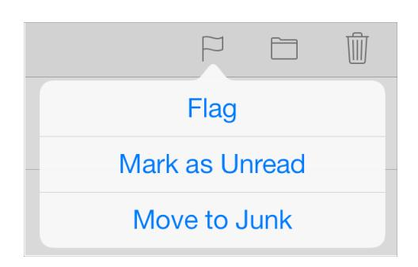

**API Note:** To learn how to define an action sheet in your code, see "Action Sheets".

#### An action sheet:

- Appears as the result of a user action
- Displays two or more buttons

#### Use an action sheet to:

- **Provide alternative ways to complete a task.** An action sheet lets you to provide a range of choices that make sense in the context of the current task, without giving these choices a permanent place in the UI.
- **Get confirmation before completing a potentially dangerous task.** An action sheet prompts users to think about the potentially dangerous effects of the step they're about to take and gives them some alternatives.

**On iPhone, include a Cancel button so that users can easily and safely abandon the task.** Place the Cancel button at the bottom of the action sheet to encourage usersto read through all the alternatives before making a choice.

**On iPad, base the way the action sheet is displayed on the way the user initiates the task.** Specifically:

| If the task is initiated from | Display the action sheet                                                                                | Include a Cancel button?                                                                                      |
|----------------------------------|---------------------------------------------------------------------------------------------------------|---------------------------------------------------------------------------------------------------------------|
| Outside of a popover    | Without animation—thatis,the action sheet and the popover appear simultaneously | No, because users can tap outside the popover to dismiss the action sheet |

| If the task is initiated from | Display the action sheet                                                                                                  | Include a Cancel button?                                                                                                                |
|----------------------------------|---------------------------------------------------------------------------------------------------------------------------|-----------------------------------------------------------------------------------------------------------------------------------------|
| Inside a popover           | With animation—that is, the action sheet slides up on top of the popover's content | Yes, because users need to be able to dismiss the action sheet without closing the popover |

**On all devices, use red for the button that performs a potentially destructive action.** Display a red button at the top of the action sheet, because the closer to the top of the action sheet a button is, the more eye-catching it is. And on iPhone, the farther a destructive button is from the bottom of an action sheet, the less likely users are to tap it when they're aiming for the Home button.

**Avoid making users scroll an action sheet.** If you include too many buttons in an action sheet, users must scroll to see all their choices. This is a disconcerting experience for users, because they must spend extra time to distinguish the choices. Also, it can be very difficult for usersto scroll without inadvertently tapping a button.

## Modal View

A **modal view**—that is, a view presented modally—provides self-contained functionality in the context of the current task or workflow.

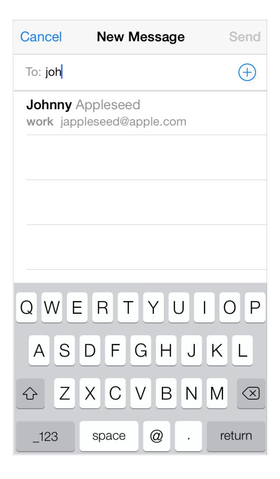

**API Note:** To learn more about defining a modal view in your code, see *UIViewController Class Reference* .

### A modal view:

- Occupies the entire screen or, on iPad, can occupy the entire area of a parent view (such as a popover)
- Contains the text and controls that are necessary to complete the task
- Usually displays a button that completesthe task and dismissesthe view and a Cancel button that abandons the task and dismisses the view

Use a modal view when you need to offer the ability to accomplish a self-contained task related to your app's primary function. A modal view is especially appropriate for a multistep subtask that requires UI elements that don't belong in the main app UI all the time.

**On iPad, choose a modal view style that suits the current task and the visual style of your app.** You can use any of these styles, defined here:

| Modal view style | Appearance                                                                                                                                                                                                                                                                                  | Recommended for                                                                                                                                   |
|---------------------|---------------------------------------------------------------------------------------------------------------------------------------------------------------------------------------------------------------------------------------------------------------------------------------------|---------------------------------------------------------------------------------------------------------------------------------------------------|
| Full screen      | Covers the entire screen.                                                                                                                                                                                                                                                          | Presenting a potentially complex task that people can complete within the context of the modal view. |
| Page sheet       | Has a fixed width of 768 points; the sheet height is the current height of the screen. In landscape, the area of the screen that's visible on both sides of the modal view is dimmed. | Presenting a potentially complex task that people can complete within the context of the modal view. |
| Form sheet       | Has fixed dimensions of 540 x 620 points and is centered in the screen. When the keyboard is visible in landscape, a form sheet modal view moves up to just below the status bar.        | Gathering structured information from the user.                                                                                    |
| Current context  | Uses the same size as its parent view.                                                                                                                                                                                                                                 | Displaying modal content within a split view pane, popover, or other non–full–screen view.                    |

**On iPad, don't display a modal view on top of a popover.** With the possible exception of an alert, nothing should display on top of a popover. In rare cases when you might need to display a modal view as a result of an action the user takes in a popover, close the popover before you open the modal view.

**On iPhone, coordinate the overall look of a modal view with the appearance of your app.** For example, a modal view often includes a navigation bar that contains a title and buttonsthat cancel or complete the modal view's task. When this is the case, the navigation bar should use the same appearance as the navigation bar in the app.

**On all devices, display a title that identifies the task, if appropriate.** You might also display text in other areas of the view that more fully describes the task or provides some guidance.

**On all devices, choose an appropriate transition style for revealing the modal view.** Use a style that coordinates with your app and enhances the user's awareness of the temporary context shift that the modal view represents. To do this, you can specify one of the following transition styles:

- **Vertical.** In the vertical style, the modal view slides up from the bottom edge of the screen and slides back down when dismissed (this is the default transition style).
- **Flip.** In the flip style, the current view flips horizontally from right to left to reveal the modal view. Visually, the modal view looks as if it is the back of the current view. When the modal view is dismissed, it flips horizontally from left to right, revealing the previous view.

**If you vary the transition styles for modal views in an app, do so in a way that makes sense to users.** Users are quick to notice behavioral differences in an app and will assume that they mean something. It's best to establish a logical, consistent pattern that users can easily detect and remember, and avoid changing transition styles without a good reason.

# Icon and Image Design

- "Icon and [Image](#page-206-0) Sizes" (page 207)
- "App [Icon"](#page-208-0) (page 209)
- ["Launch](#page-214-0) Images" (page 215)
- "Bar [Button](#page-217-0) Icons" (page 218)
- ["Newsstand](#page-220-0) Icons" (page 221)
- "Web Clip [Icons"](#page-223-0) (page 224)
- ["Creating](#page-224-0) Resizable Images" (page 225)

# Icon and Image Sizes

Every app needs an app icon and a launch image. In addition, some apps need custom icons to represent app-specific content, functions, or modes in navigation bars, toolbars, and tab bars.

Unlike other custom artwork in your app, the icons and images listed in Table 39-1 must meet specific criteria so that iOS can display them properly. In addition, some icon and image files have naming requirements (to learn about naming these files, see "App Icons" in *iOS App Programming Guide* and "App Launch (Default) Images" in *iOS App Programming Guide* ).

**Note:** If you need to support standard-resolution iPhone or iPod touch devices, divide by 2 the high-resolution sizes listed below.

**Table 39-1** Size (in pixels) of custom icons and images

| Description                                                                   | Size for iPhone 5 and iPod touch (high resolution) | Size for iPhone and iPod touch (high resolution) | Size for iPad and iPad mini (high resolution)              | Size for iPad 2 and iPad mini (standard resolution)      |
|-------------------------------------------------------------------------------|----------------------------------------------------------------|--------------------------------------------------------------|---------------------------------------------------------------------|-------------------------------------------------------------------|
| App icon (required for all apps)                               | 120 x 120                                                | 120 x 120                                              | 152 x 152                                                     | 76 x 76                                                     |
| App icon for the App Store (required for all apps) | 1024 x 1024                                              | 1024 x 1024                                            | 1024 x 1024                                                   | 1024 x 1024                                                 |
| Launch image (required for all apps)                           | 640 x 1136                                               | 640 x 960                                              | 1536 x 2048 (portrait) 2048 x 1536 (landscape) | 768 x 1024 (portrait) 1024 x 768 (landscape) |
| Spotlightsearch results icon (recommended)                           | 80 x 80                                                  | 80 x 80                                                | 80 x 80                                                       | 40 x 40                                                     |
| Settings icon (recommended)                                             | 58 x 58                                                  | 58 x 58                                                | 58 x 58                                                       | 29 x 29                                                     |

| Description                                                                                                   | Size for iPhone 5 and iPod touch (high resolution) | Size for iPhone and iPod touch (high resolution)  | Size for iPad and iPad mini (high resolution)        | Size for iPad 2 and iPad mini (standard resolution) |
|---------------------------------------------------------------------------------------------------------------|----------------------------------------------------------------|---------------------------------------------------------------|---------------------------------------------------------------|--------------------------------------------------------------|
| Toolbar and navigation bar icon (optional)                                                     | About 44 x 44                                         | About 44 x 44                                        | About 44 x 44                                        | About 22 x 22                                       |
| Tab bar icon (optional)                                                                              | About 50 x 50 (maximum: 96 x 64)          | About 50 x 50 (maximum: 96 x 64)         | About 50 x 50 (maximum: 96 x 64)         | About 25 x 25 (maximum: 48 x 32)        |
| Default Newsstand cover icon for the App Store (required for Newsstand apps) | At least 1024 pixels on the longest edge  | At least 1024 pixels on the longest edge | At least 1024 pixels on the longest edge | At least 512 pixels on the longest edge |
| Web clip icon (recommended for web apps and websites)                                 | 120 x 120                                                | 120 x 120                                               | 152 x 152                                               | 76 x 76                                                |

For all images and icons, the PNG format is recommended. You should avoid using interlaced PNGs.

The standard bit depth for icons and images is 24 bits—that is, 8 bits each for red, green, and blue—plus an 8-bit alpha channel.

You don't need to constrain your palette to web-safe colors.

# App Icon

Every app needs a beautiful, memorable app icon that attracts people in the App Store and stands out on their Home screen. iOS can use versions of the app icon in Game Center, search results, Settings, and to represent app-created documents.

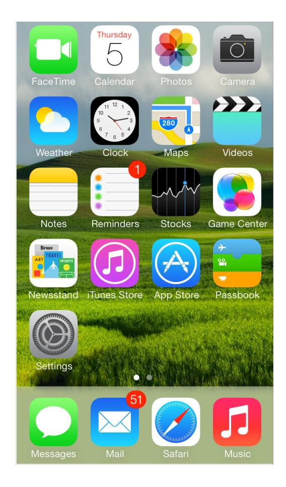

**Note:** An app uses the same app icon in all versions of iOS that it supports. If you decide to redesign the app icon for the iOS 7 version of your app, the new icon should replace the old one even if the app displays different UI in different versions of iOS.

**For the best results, enlist the help of a professional graphic designer.** An experienced graphic designer can help you develop an overall visual style for your app and apply that style to all the icons and images in it. **Use universal imagery that people will easily recognize.** In general, avoid focusing on a secondary or obscure aspect of an element. For example, the Mail app icon uses an envelope, not a rural mailbox, a mail carrier's bag, or a post office symbol.

**Embrace simplicity.** In particular, avoid cramming lots of different imagesinto your icon. Find a single element that capturesthe essence of your app and expressthat element in a simple, unique shape. Add details cautiously. If an icon's content or shape is overly complex, the details can become confusing and may appear muddy at smaller sizes.

**Tip:** To test the appearance of your app icon at small sizes, move it into a folder on the Home screen. Even better, move several app icons into a folder and see if your app icon looks good and remains distinctive.

**Create an abstract interpretation of your app's main idea.** It rarely works well to use a photo or screenshot in an app icon because photographic details can be very hard to see at small sizes. Typically, it's better to interpret reality in an artistic way, because doing so lets you emphasize the aspects of the subject that you want users to notice.

**If you want to portray real substances, do it accurately.** Icons that depict real objects should accurately replicate the characteristics ofsubstancessuch asfabric, glass, paper, and metal, and convey the object's weight and feel.

**Make sure the app icon looks good on a variety of backgrounds.** Don't just test your icon on a light or dark background because you can't predict which wallpaper people will choose.

**Avoid transparency.** An app icon should be opaque. If the icon's boundaries are smaller than the recommended sizes—or you use transparency to create "see-through" areas—the resulting icon can appear to float on a black background, which tends to look especially unattractive on the beautiful wallpapers that users choose.

**Don't use iOS interface elements in your artwork.** You don't want users to confuse your icons or images with the iOS UI.

**Don't use replicas of Apple hardware products in your artwork.** The symbols that represent Apple products are copyrighted and can't be reproduced in your icons or images. In general, it's a good idea to avoid replicas of any specific devices in your artwork, because these designs change frequently and icons that are based on them can quickly look dated.

**Don't reuse iOS app icons in your interface.** It can be confusing to users to see the same icon used to mean slightly different things in multiple locations throughout the system.

With the exception of the App Store icon—which must be named iTunesArtwork—you can name an app icon anything you want. As long as you use the CFBundleIcons key to declare the names and you add the @2x suffix to the names of all high-resolution icons, iOS chooses an icon based on whether itssize is appropriate for the intended usage. To learn more about icon naming, see "App Icons" in *iOS App Programming Guide* .

**Create different sizes of the app icon for different devices.** If you're creating a universal app, you need to supply app icons in all four sizes.

For iPhone and iPod touch, both of these sizes are required:

- 120 x 120 pixels
- 60 x 60 pixels (standard resolution)

For iPad, both of these sizes are required:

- 152 x 152
- 76 x 76 pixels (standard resolution)

When iOS displays an app icon on the Home screen of a device, it automatically applies a mask that rounds the corners. Make sure your icon has 90° corners so it looks good after the mask is applied. For example:

A 120 x 120 pixel icon before the mask is applied A 120 x 120 pixel icon after the mask is applied

**Create a large version of your app icon for display in the App Store.** Although it's important that this version be instantly recognizable as your app icon, it can be subtly richer and more detailed. There are no visual effects added to this version of your app icon.

For the App Store, create a large version of your app icon in two sizes so that it looks good on all devices:

- 1024 x 1024 pixels
- 512 x 512 pixels (standard resolution)

Be sure to name this version of your app icon iTunesArtwork@2x and iTunesArtwork, respectively.

**Note:** iOS might also use the large image in other ways. In an iPad app, for example, iOS uses the large image to generate the large document icon.

If you're developing an app for ad-hoc distribution (that is, to be distributed in-house only, not through the App Store), you must also provide the large versions of your app icon. This icon identifies your app in iTunes.

## Document Icons

If your iOS app creates documents of a custom type, you want users to be able to recognize these documents at a glance. You don't need to design a custom icon for this purpose because iOS uses your app icon to create document icons for you.

## Spotlight and Settings Icons

Every app should supply a small icon that iOS can display when the app name matches a term in a Spotlight search. Apps that supply settings should also supply a small icon to identify them in the built-in Settings app. These icons should clearly identify your app so that people can recognize it in a list of search results or in Settings. For example, the icons of the built-in apps are easy to discern in Settings, even though the icons are small:

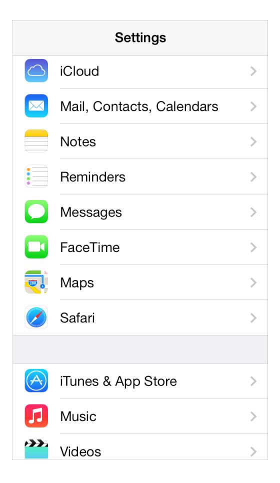

You can name these small icons anything you want as long as you use the CFBundleIcons key to declare the names and you add the @2x suffix to the names of all high-resolution icons. You can use custom names because iOS chooses an icon based on whether its size is appropriate for the intended usage. To learn more about icon naming, see "App Icons" in *iOS App Programming Guide* .

For all devices, supply separate icons for Spotlight search results and Settings. If you don't provide these icons, iOS might shrink your app icon for display in these locations.

For Spotlight search results on iPhone, iPod touch, and iPad create an icon in the following two sizes:

- 80 x 80 pixels
- 40 x 40 pixels (standard resolution)

For Settings on iPhone, iPod touch, and iPad create an icon in the following two sizes:

● 58 x 58 pixels

### ● 29 x 29 pixels (standard resolution)

**Note:** If the background of your icon is white, don't add a gray overlay in an effort to increase its visibility in Settings. iOS adds a 1-pixel border stroke so that all icons look good on the white background of Settings.

# Launch Images

A launch image is a simple placeholder image that iOS displays when your app starts up. The launch image gives users the impression that your app is fast and responsive because it appears instantly and is quickly replaced by the first screen of your app.

**Note:** You must provide at least one launch image. Typically, an iPhone app includes at least one launch image in portrait orientation; an iPad app includes at least one launch image in portrait orientation and at least one launch image in landscape orientation.

Because iOS lets you supply different launch images for different uses, you give each image a name that specifies how it should be used. The format of the launch image filename includes modifiers you use to specify the device, resolution, and orientation of the image. To learn how to name launch images appropriately, see "App Launch (Default) Images" in *iOS App Programming Guide* .

**Supply a plain launch image that improves the user experience.** In particular, the launch image isn't an opportunity to provide:

- An "app entry experience," such as a splash screen
- An About window
- Branding elements, unless they are a static part of your app's first screen

Because users are likely to switch among apps frequently, you should make every effort to cut launch time to a minimum, and you should design a launch image that downplaysthe experience rather than drawing attention to it.

#### **Design a launch image that is identical to the first screen of the app,** except for:

- **Text.** The launch image is static, so any text you display in it won't be localized.
- **UI elements that might change.** If you include elements that might look different when the app finishes launching, users can experience an unpleasant flash between the launch image and the first app screen.

If you think that following these guidelines will result in a plain, boring launch image, you're right. Remember, the launch image doesn't provide you with an opportunity for artistic expression. It'ssolely intended to enhance the user's perception of your app as quick to launch and immediately ready for use. For example, Settings and Weather each supply a launch image that is little more than a static background image.

**Create launch images in different sizes for different devices.** Launch images for all devices must include the status bar region. Create launch images in the following sizes:

For iPhone 5 and iPod touch (5th generation):

● 640 x 1136 pixels

For other iPhone and iPod touch devices:

- 640 x 960 pixels
- 320 x 480 pixels (standard resolution)

### For iPad portrait:

- 1536 x 2048 pixels
- 768 x 1024 pixels (standard resolution)

#### For iPad landscape:

- 2048 x 1536 pixels
- 1024 x 768 pixels (standard resolution)

# Bar Button Icons

iOS defines lots of standard bar-button icons, such as Refresh, Share, Add, and Favorites. As much as possible, you should use these buttons and icons to represent standard tasks in your app. (To learn more about the standard buttons and icons you can use, see "Toolbar and [Navigation](#page-147-0) Bar Buttons" (page 148) and ["Tab](#page-151-0) Bar [Icons"](#page-151-0) (page 152).)

If your app includes tasks or modes that can't be represented by a standard icon—or if the standard icons don't coordinate with your app's style—you can design your own bar button icons. At a high level, you should aim for an icon design that is:

- **Simple and streamlined.** Too many details can make an icon appear sloppy or indecipherable.
- **Not easily mistaken for one of the system-provided icons.** Users should be able to distinguish your custom icon from the standard icons at a glance.
- **Readily understood and widely acceptable.** Strive to create a symbol that most users will interpret correctly and that no users will find offensive.

**Important:** Be sure to avoid using images that replicate Apple products in your designs. These symbols are copyrighted and product designs can change frequently.

Whether you use only custom icons or a mix of custom and standard, all icons in your app should look like they belong to the same family in terms of perceived size, level of detail, and visual weight.

For example, take a look at the family of iOS bar icons and notice how the similarities in size, detail, and weight produce a sense of harmonious unity:

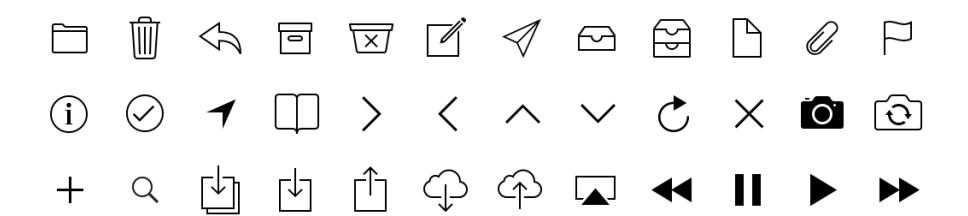

To create a coherent family of icons, consistency is key: As much as possible, each icon should use the same perspective and the same stroke weight. To ensure that all icons have a consistent perceived size, you may have to create some icons at different actual sizes. For example, the set of system provided icons shown here all have the same perceived size, even though the Favorites and Voicemail icons are actually a bit larger than the other three icons.

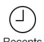

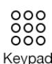

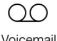

If you're designing a custom tab bar icon, you should provide two versions—one for the unselected appearance and one for the selected appearance. The selected appearance is often a filled-in version of the unselected appearance, but some designs call for variations on this approach.

To create a filled-in version of an icon that has interior details (such as the Radio icon) invert the details so they retain their prominence in the selected version. The Keypad icon also has interior details, but the selected version would be confusing and hard to recognize if its background was filled in and the circles became white outlines.

Sometimes, a design needs a slight alteration to look good when it's selected. For example, because the Timer and Podcasts icons include open areas, the selected versions condense the strokes a bit to fit into a circular enclosure.

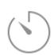

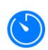

If an icon becomes less recognizable when it's filled in, a good alternative is to use a heavier stroke to draw the selected version. For example, the selected versions of the Voicemail and Reading List icons are drawn with a 4-pixel stroke, instead of the 2-pixel stroke that was used to draw the unselected versions.

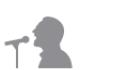

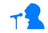

Sometimes, an icon's shape has details that don't look good in a stroked outline. When this is the case—as it is for the Music and Artists icons—you can use the filled-in appearance for both versions of the icon. It's easy for usersto distinguish the selected and unselected appearances of such icons because the selected appearance is darker and gets the tint.

A custom icon that you create for a toolbar, navigation bar, or tab bar is also known as a **template** image, because iOS usesit as a mask to produce the icon you see when your app runs. If you create a full-color template image, iOS ignores the color.

To design a custom bar icon, follow these guidelines:

- Use pure white with appropriate alpha transparency.
- Not include a drop shadow.
- Use antialiasing.

If you want to create a bar icon that looks like it's related to the iOS 7 icon family, use a very thin stroke to draw it. Specifically, a 2-pixel stroke (high resolution) works well for detailed icons and a 3-pixel stroke works well for less detailed icons.

Regardless of the icon's visual style, create a toolbar or navigation bar icon in the following sizes:

- About 44 x 44 pixels
- About 22 x 22 pixels (standard resolution)

Regardless of the icon's visual style, create a tab bar icon in the following sizes:

- About 50 x 50 pixels (96 x 64 pixels maximum)
- About 25 x 25 pixels (48 x 32 pixels maximum) for standard resolution

Don't include text in a custom tab bar icon. Instead, use the tab bar item APIs to set the title for each tab (for example, initWithTitle:image:tag:). If you need to adjust the automatic layout of the title, you can use the title adjustment APIs, such as setTitlePositionAdjustment:.

# Newsstand Icons

If your app uses Newsstand Kit to publish subscription-based periodical content, you need to provide icons for display in the App Store and on people's devices.

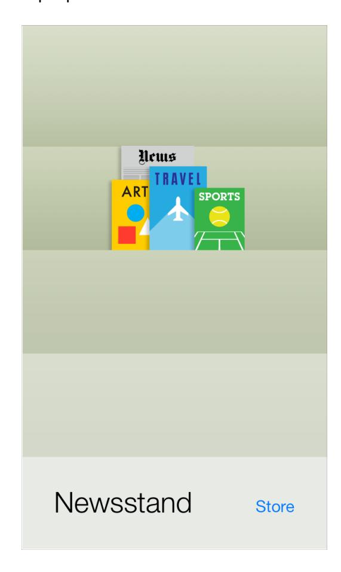

All Newsstand apps need to supply a Newsstand cover icon that represents the default cover art in the App Store. The long edge of thisicon should measure at least 1024 pixels(512 pixelsforstandard-resolution devices). Note that this icon is separate from the app icon that all iOS apps must provide.

**Important:** The aspect ratio of all Newsstand icons should be between 1:2 and 2:1.

All Newsstand icons must be flat and have 90° corners.

Don't add perspective to any of your Newsstand icons.

A default Newsstand cover icon should be a generalized facsimile of the cover of a typical issue, which focuses on the parts of the cover that are fairly consistent from issue to issue. For example:

- Avoid adding to the default cover icon elements that users would never see on an actual cover, such as a message to "tap here for the latest issue".
- Avoid using artwork or headlinesthat are seasonal or topical,such asimagesrelated to holidays or headlines that refer to current events.

In particular, don't reuse the cover of a previous issue for your default Newsstand cover icon, because users might confuse your app with a specific issue. For example, default magazine and newspaper icons could look something like this:

In addition to the default Newsstand cover icon, you also need to supply a separate icon that accurately represents each new issue so it can appear on the Newsstand shelf and in the multitasking UI on an iOS device. Unlike the default cover icon, each per-issue icon should display details about the contents of a specific issue.

It's recommended that you create a single large icon for each issue, and allow iOS to scale it for display in both places.

Specifically, you should create a per-issue icon whose long edge measures at least 1024 pixels (512 pixels for standard-resolution devices). To display the current issue'sicon on the Newsstand shelf and in the multitasking UI, iOS scales your large icon to the following sizes:

**Table 43-1** Maximum scaled sizes for per-issue icons

| Device                         | Scaled size (Newsstand shelf)                                                            | Scaled long-edge size (multitasking UI)                       |
|--------------------------------|------------------------------------------------------------------------------------------|------------------------------------------------------------------|
| iPhone and iPod touch | 180 x 160 pixels (90 x 80 pixels for standard resolution)  | 120 pixels (60 pixels for standard resolution) |
| iPad                           | 252 pixels for long edge (126 pixels for standard resolution) | 152 pixels (76 pixels for standard resolution) |

For additional information about setting up a Newsstand app, see *iTunes Connect Developer Guide* .

**Important:** iOS 7 doesn't add any visual enhancements—such as the appearance of a stapled edge or multiple pages—to a Newsstand icon.

If your app needs to support earlier versions of iOS, you can add the binding type and binding edge keys to the Info.plist file to define how Newsstand icons should appear on devices running iOS 6.1 and earlier. For more information about these keys and their values, see "Contents of the UINewsstandIcon Dictionary" in *Information Property List Key Reference* .

# Web Clip Icons

If you have a web app or a website, you can provide a custom icon that users can display on their Home screens using the web clip feature. Users tap the icon to reach your web content in one easy step. You can create an icon that represents your website as a whole or an icon that represents a single webpage.

iOS also displays web clip icons in Safari Favorites, which is the grid of icons that appears when users tap the URL field or open a new tab in Safari.

If your web content is distinguished by a familiar image or recognizable color scheme, it makes sense to incorporate it in your icon. However, to ensure that your icon looks great on the device, you should also follow the guidelines in this section. (To learn how to add code to your web content to provide a custom icon, see *Safari Web Content Guide* .)

For iPhone and iPod touch, create icons that measure:

- 120 x 120 pixels
- 60 x 60 pixels (standard resolution)

For iPad, create icons that measure:

- 152 x 152 pixels
- 76 x 76 pixels (standard resolution)

**Note:** You can prevent the addition of any effects by naming your icon apple-touch-icon-precomposed.png.

# Creating Resizable Images

You can create a resizable image to customize the background of several standard UI elements, such as popovers, buttons, navigation bars, tab bars, and toolbars (including the items on these bars). Providing resizable images for these elements can result in better app performance.

For many UI elements, you can also specify end caps in addition to a background appearance. An **end cap** defines an area of the image that should not be resized. For example, you might create a resizable image that includes four end caps that define the four corners of a button. When the image is resized to fill the button's background area, the portions defined by the end caps are drawn unchanged.

Depending on the dimensions of the resizable image you supply, iOS either stretches or tiles it as appropriate to fill a UI element's background area. To **stretch** an image means to scale up the image, without regard for its original aspect ratio. Stretching is performant, but it isn't usually desirable for a multipixel image that can distort. To **tile** an image is to repeat the original image as many times as necessary to fill the target area. Tiling is less performant than stretching, but it's the only way to achieve a textured or patterned effect.

As a general rule, you should supply the smallest image (excluding end caps) that will result in the look you want. For example:

- If you want a solid color with no gradient, create a 1 x 1 point image.
- If you want a vertical gradient, create an image that has a width of 1 point and a height that matches the height of the UI element's background.
- If you want to provide a repeating textured appearance, you need to create an image with dimensions that match the dimensions of the repeating portion of the texture.
- If you want to provide a nonrepeating textured appearance, you need to create a static image with dimensions that match the dimensions of the UI element's background area.

# Document Revision History

This table describes the changes to *iOS Human Interface Guidelines*.

| Date       | Notes                                                                                                                                                                               |
|------------|-------------------------------------------------------------------------------------------------------------------------------------------------------------------------------------|
| 2014-03-10 | Added guidelines about onboarding; made minor corrections and updated some artwork.                                                                   |
| 2014-02-11 | Corrected typos and replaced some outdated artwork.                                                                                                               |
| 2013-10-22 | Added app icon size for high resolution iPad mini, corrected Newsstand icon sizes, and reinstated iPhone 5 design guidelines. |
| 2013-09-18 | Reorganized and updated for iOS 7.                                                                                                                                   |

Apple Inc. Copyright © 2014 Apple Inc. All rights reserved.

No part of this publication may be reproduced, stored in a retrieval system, or transmitted, in any form or by any means, mechanical, electronic, photocopying, recording, or otherwise, without prior written permission of Apple Inc., with the following exceptions: Any person is hereby authorized to store documentation on a single computer for personal use only and to print copies of documentation for personal use provided that the documentation contains Apple's copyright notice.

No licenses, express or implied, are granted with respect to any of the technology described in this document. Apple retains all intellectual property rights associated with the technology described in this document. This document is intended to assist application developers to develop applications only for Apple-labeled computers.

Apple Inc. 1 Infinite Loop Cupertino, CA 95014 408-996-1010

Apple, the Apple logo, AirPlay, Apple TV, Finder, iPad, iPhone, iPod, iPod touch, iTunes, Keynote, OS X, Passbook, Safari, Shake, Siri, Spotlight, and Xcode are trademarks of Apple Inc., registered in the U.S. and other countries.

AirPrint, Multi-Touch, and Retina are trademarks of Apple Inc.

Genius, iAd, and iCloud are service marks of Apple Inc., registered in the U.S. and other countries.

App Store is a service mark of Apple Inc.

IOS is a trademark or registered trademark of Cisco in the U.S. and other countries and is used under license.

OpenGL is a registered trademark of Silicon Graphics, Inc.

Even though Apple has reviewed this document, APPLE MAKES NO WARRANTY OR REPRESENTATION, EITHER EXPRESS OR IMPLIED, WITH RESPECT TO THIS DOCUMENT, ITS QUALITY, ACCURACY, MERCHANTABILITY, OR FITNESS FOR A PARTICULAR PURPOSE. AS A RESULT, THIS DOCUMENT IS PROVIDED "AS IS," AND YOU, THE READER, ARE ASSUMING THE ENTIRE RISK AS TO ITS QUALITY AND ACCURACY.

IN NO EVENT WILL APPLE BE LIABLE FOR DIRECT, INDIRECT, SPECIAL, INCIDENTAL, OR CONSEQUENTIAL DAMAGES RESULTING FROM ANY DEFECT OR INACCURACY IN THIS DOCUMENT, even if advised of the possibility of such damages.

THE WARRANTY AND REMEDIES SET FORTH ABOVE ARE EXCLUSIVE AND IN LIEU OF ALL OTHERS, ORAL OR WRITTEN, EXPRESS OR IMPLIED. No Apple dealer, agent, or employee is authorized to make any modification, extension, or addition to this warranty.

Some states do not allow the exclusion or limitation of implied warranties or liability for incidental or consequential damages, so the above limitation or exclusion may not apply to you. This warranty gives you specific legal rights, and you may also have other rights which vary from state to state.