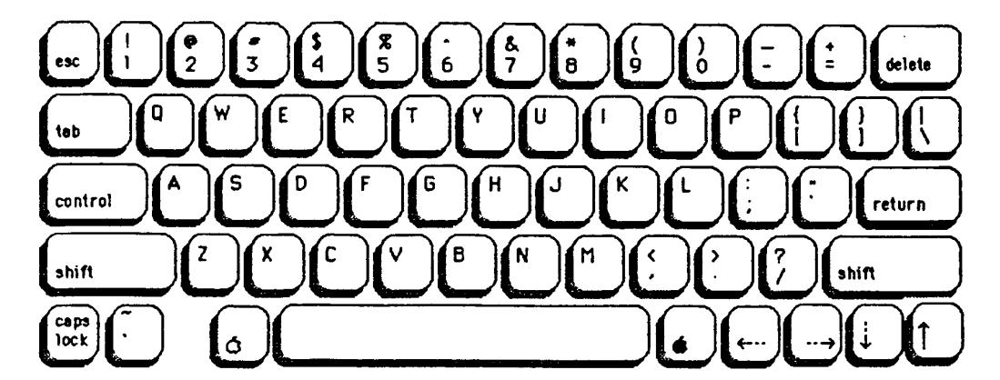
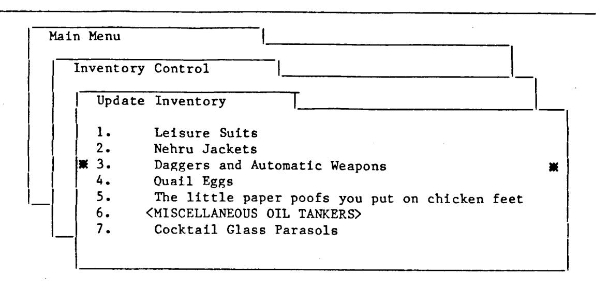
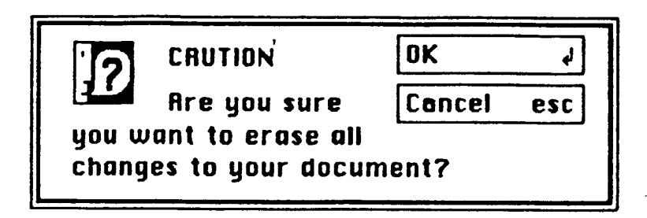
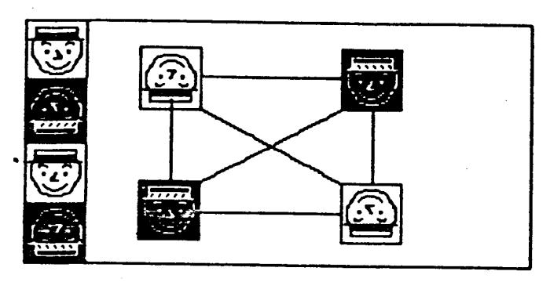
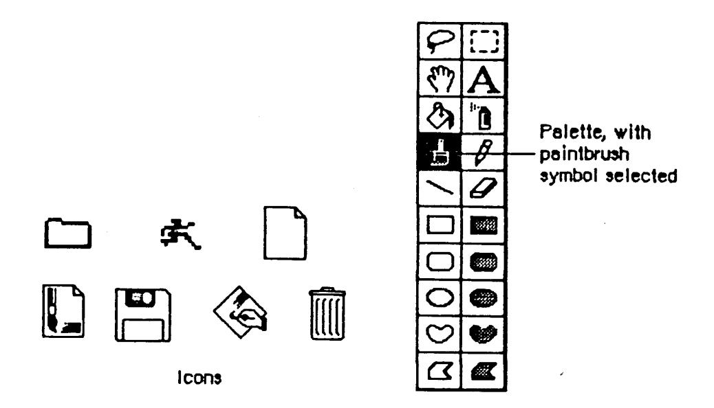
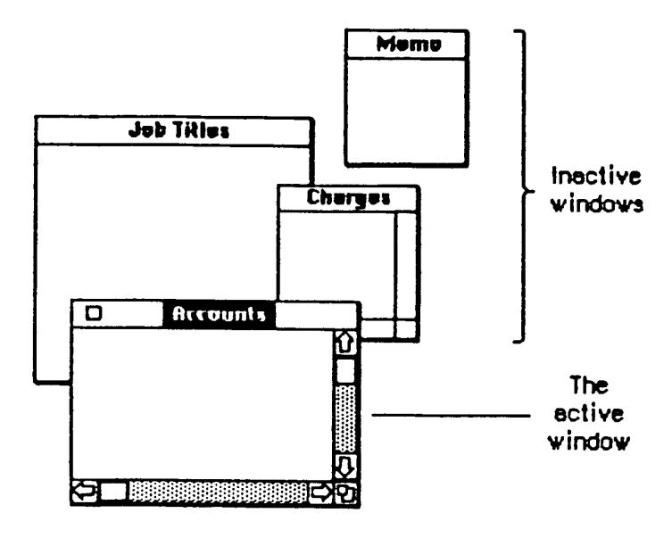
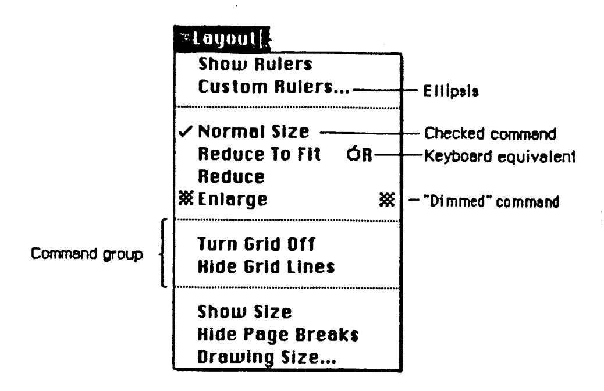
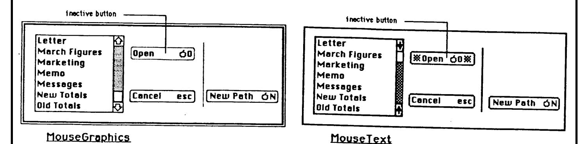
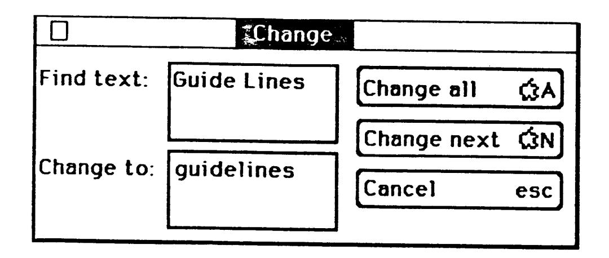

# INTRODUCTION

# What is this manual?

The Apple II Human Interface Guidelines manual describes the most basic common features of an Apple II computer application. Described are two different user interface metaphors:

- Desktop metaphor as used by the Macintosh computer
- FileCard metaphor as used by the AppleWorks application

This is a pre-release version of this manual.

# Facts about this manual

Author:

Apple Computer Inc

Document dates of record:

September 1978 - March 1985

Owner:

Organization: DigiBarn Computer Museum (www.digibarn.com)
Curator: Bruce Damer (http://www.damer.com/)

This digital rendition of this document is available for non-commercial, educational and research purposes with the requirement to provide attribution and share-alike under the Creative Commons license provided on page 4.

All other uses require the agreement of the DigiBarn Computer Museum (contact through www.digibarn.com).

( This page is not part of the original document )


# Attribution - Non Commercial - No Derivative Works 2.5

### You are free:

\* to copy, distribute, display, and perform the work

Under the following conditions:


# Attribution.

You must attribute the work in the manner specified by the author or licensor.


# Noncommercial.

You may not use this work for commercial purposes.


# **No Derivative Works.**

You may not alter, transform, or build upon this work.

- \* For any reuse or distribution, you must make clear to others the license terms of this work.
- \* Any of these conditions can be waived if you get permission from the copyright holder.

Your fair use and other rights are in no way affected by the above.

This is a human-readable summary of the Legal Code.

(This page is not part of the original document)

| Apple ][ Human Interface Guidelines (pre-release) 1985 DigiBarn Computer Museum Apple Computer, Inc. |
|------------------------------------------------------------------------------------------------------|
|                                                                                                      |
|                                                                                                      |
|                                                                                                      |
|                                                                                                      |
|                                                                                                      |
|                                                                                                      |
|                                                                                                      |
|                                                                                                      |
|                                                                                                      |

Distributed under the Creative Commons License on page 4 Page 0005 of 0130

Apple ][ Human Interface Guidelines (pre-release) -- 1985 -- DigiBarn Computer Museum -- Apple Computer, Inc.


| 1st Draft              | Bruce Tognazzini | 9/15/78  |
|------------------------|------------------|----------|
| 2nd Draft              | Bruce Tognazzini | 3/12/79  |
| 3rd Draft              | Bruce Tognazzini | 6/18/80  |
| 4th Draft              | Steve Smith      | 2/15/81  |
| 1st Draft, Macintosh   | Joanna Hoffman   | 3/17/82  |
| 2nd Draft, Macintosh   | Chris Espinosa   | 10/11/82 |
| 1st Release, II        | Bruce Tognazzini | 1/19/83  |
| Addendum               | Bruce Tognazzini | 8/ 5/83  |
| 1st Draft, 11 Mouse    | Bruce Tognazzini | 11/10/83 |
| 3rd Draft, Macintosh   | Andy Averill     | 7/31/84  |
| 4th Draft, Macintosh   | Andy Averill     | 11/30/84 |
| 2nd Draft, II Mouse    | Bruce Tognazzini | 1/15/85  |
| 2nd Release, II, Alpha | Bruce Tognazzini | 3/21/85  |
|                        |                  |          |

| Apple ][ Human Interface Guidelines (pre-release) 1985 DigiBarn Computer Museum Apple Computer, Inc. |
|------------------------------------------------------------------------------------------------------|
|                                                                                                      |
|                                                                                                      |
|                                                                                                      |
|                                                                                                      |

Distributed under the Creative Commons License on page 4 Page 0012 of 0130

Elements of Style: Designing an Interface that Works!

Goals

There are five goals to a program design:

- 1. Ease-of-Learning. 2. Ease-of-Use. 3. Satisfaction of human needs
- 4. Saleability 5. Power and expandability

Most of the science of human interface deals with increasing ease-of-learning and ease-of-use without seriously affecting power and expandability. Most of the art aims toward satisfying humans' need to feel warm, comfortable, and protected. All these, plus spark and flair, add up to products that sell and can be sold. We assume your competence as a designer or programmer in creating power and expandability in your program; the rest of this book will address how to fulfill the first four goals.

The Underlying Concepts

It is one thing to have the above goals in mind; it is another to be able to actively and effectively address them. The following basic concepts form an structure on which you can base both large-scale and day-to-day design decisions.

# 1. Familiarity

Familiarity is the single greatest factor in reducing the learning burden without affecting power and expandability. People feel comfortable with things they already know. You promote familiarity by using guidelines such as this, by conforming the flow of your product as closely as practical to the way your users did things before they "computerized," and by choosing familiar metaphors, such as desktops and file-folders, around which to build your programs.

### 2. Intuition

A few years ago, an engineer at Apple described the ideal interface as being "familiar and intuitive". During the preparation of this book, we asked the same engineer again, and he stated that while it was important for an interface to be familiar, it was no longer necessary for it to be intuitive. It turned out there was a good reason for this: computer scientists don't know what "intuitive" means, so we don't know how to deal with it.

Intuition is real, it has been researched, it has been defined. It is a powerful mental capability of both the designer and the user, and as such deserves practical understanding.

The Nature of Intuition

Stated perhaps over-simply, intuition is the ability to discern


the right hand, was nevertheless growing close to a solution when the right hand unexpectedly came over and, rather than helping out, scattered the pieces of the puzzle all over the table. This agressive act was witnessed repeatedly with other split-brain patients.

There was a war for supremacy going on in these people's heads, a war that seemed to reach a truce several months after the operation, with the left, logic-oriented lobe achieving dominance. When one couples this strange phenomenon with the empiricle evidence of Western society's bias against left-handedness, one begins to understand why we know so little about this profoundly powerful skill—our logical, concious mind doesn't want to know.

So what is intuition, what is it good for, and how do we use it? Intuition deals with patterns: pictures, chains of events, clustering of seemingly irrelevant information. Intuition is a non-verbal skill, and words cannot effectively describe it. We have to get to it through metaphor, example, and shared experience.

Intuition operates in leaps: it churns away with no concious thought and little concious control and then suddenly springs forth with what is often described as an "Aha!" experience. An example of this takes place when you learn a new board game: you keep hearing and attempting to memorize the rules of the game and suggested strategies, but it is all very compartmentalized and difficult to keep ahold of. Then, all at once, you "get it": the entire underlying strategy and purpose of the game is instantly and permanently obvious.

Those of you who are programmers have undoubtedly experienced working until 2:00 in the morning on a seemingly insoluable bug problem, finally giving up, and going home to sleep. Then, at 6:30 AM, you wake up knowing exactly what is wrong and kick yourself for not realizing it earlier—after all, it is perfectly obvious.

Reaching a useful conclusion through intuition is a three-stage process:

1. Gathering information 2. Allowing time for "incubation" 3. Judging the results

We recognize two kinds of intuition. The first is "women's intuition," a remarkable ability to understand human relationships and interactions. Men also use intuition, but they call it "hunches". While these two kinds of intuition are different, they arn't as gender-specific as our culture has declared them; in Eastern culture both men and women develop powerful abilities to "look through" people.

l. Gathering information. This data may be new sensory information, coupled with old memories. Because intuition works on drawing together what is often logically unrelatable data, you should make a concious effort to be non-judgemental during this stage. Take in everything.

Intuition is an ancient skill, both in evolution and personal development. Dogs are no intellectual giants when compared to man, but

information. They might be temporary help, or they might be people who normally performed a different job. Their needs were for an quick to learn, easy to use interface.

- 2. The decision-makers. These people would be expected to draw information from the system, both by calling up data on the display and generating reports. They could be expected to be habitual users of the system: they could handle a long but gentle learning-curve that would give them progressively more power.
- 3. The Key Operator. These people are the ones who, in real life, read the manuals. They can be expected to spend some time with the system initially and can be expected to learn how to perform the more technical operation and maintenance tasks of the system.

Once the users of the system were identified, once their individual needs were identified, the designers were able to "unbalance" their equally-difficult interface, so that each user had a level of difficulty consistent with their abilities and the amount of time they could spend learning the system.

A smiling, complaining administrative assistant is a rather obscure hint to a program design problem, but it is typical of the way the intuitive mind communicates its results. Keep in mind that the poor, "primitive" intuition is quite incapable of speech and logic. On the other hand, it knew the answer to the problem four days before the logical mind. The finest intuitive leaps are utterly useless if you fail to listen: learn to relax when things look the darkest; you may already know the answer.

The Jungian judgement skills are Logic and Feeling. Of the eight Jungian classifiers (of which four have been presented here), only one has shown any gender bias: approximately 60% of men depend primarily on logical conclusions, while 60% of women depend primarily on ethical considerations. (This explains a lot of insoluable domestic arguments.) So-called "women's intuition" is intuition with Feeling judgement, while traditional men's hunches are intuition with Logic judgement.

Intuition and the Programmer

Programmers and designers can make use of intuition on design and debugging problems (linked with Logic) and during user-testing (linked with Feeling). Programmers in a recent test were found to depend on Intuition as the primary perception skill twice as much as the general population. By following the above steps, you can increase the power and effectiveness of your own skill.

In the section on Testing, we will discuss how intuition can be used to detect problem areas of programs during user-testing, with a method far less expensive and more effective than computer-analysis of elaborate questionaires.

Intuition and the User

get to a part of a tutorial that tells you to just press Open-Apple-P to print out your document, but fails to mention that you should have already spent two hours configuring the ports, that's frustration. It happens because the designer, programmer, and documentor have become so familiar with the programmer that they have forgotten their own learning problems. It is always overcomable with user-testing.

Trust is a most fragile commodity. For a user to trust your program, you must be consistent and absolutely honest. The program with the right answer 99 times out of 100 is useless. The program which uses Open-Apple-E for Edit under all circumstances except that one undocumented one where it stands for Eradicate All Files will never be trusted again. If you say a document has been loaded, then the document should have been loaded. Your user will find you less than honest if he or she then removes the disk, only to be told that your program can't seem to find the document. You should try to make your program as safe an environment as possible (without frustrating the constant user), and you should partition off and clearly mark those operations that are of danger.

Next to a competent design, the most important attribute a program can display is a caring, polite, respectful attitude. The Apple II computer has a definite personality, as embodied in the tutorial disks and manuals supplied with the computer. Use these materials until you have grasped (intuitively) their flavor, and follow their lead. It is what your user feels comfortable with.

If you, in your personal and professional life, do not have to skills to be caring, polite, and respectful with people around you—and many great programmers do not—you probably should not be designing human interfaces. Team up with someone who is a good communicator and spend your time with the nuts—and—bolts issues on which you excel.

Putting the Concepts to Work

The last section covered theoretical aspects of some important underlying concepts. This section applies those concepts to cover practical design issues, such as selection of a metaphor (conceptual model), lowering the learning curve, and increasing productivity and salability.

# The Metaphor

The human interface is an illusion: the pattern of light and darkness that your user perceives as "real" on the display is a careful contrivance of you, its creator. The quality of the human interface can often be measured by nothing more than the effectiveness of the chosen illusion.

Visicalc (TM) was the first serious microcomputer program that depended on a metaphorical illusion. The user was operating on a giant, classical business spreadsheet, seen through the limiting viewport of the monitor. The user could move the viewport around to see parts of the spreadsheet that were currently hidden. This illusion was particularly effective: it was familiar

effort to be as comfortable as possible. (Armed with hindsight, one can argue that the target audience went far beyond the halls of the business schools, and that spreadsheets are not familiar to the typical user of these programs. But this unexpected success should not detract from the fact that the program conformed to the old knowledge and expectations of its original target audience.)

# Staged Learning

People can and do master some remarkably complex computer programs, such as AppleWorks (TM) and Apple Writer (TM). Other, far less powerful programs leave people so bewildered they often abandon even trying to learn them. With AppleWorks and Apple Writer, you learn a little bit and can then begin to do useful work; with these other programs, you must first learn virtually everything before you can do anything at all.

Design your programs and manuals so that a person can learn to do something useful within 30 minutes or less. Stage your learning out so that one can pick up tricks and shortcuts along the way, but needn't stumble over them at the beginning. Remember that you want a salesperson in a computer store to learn enough to be able to demo your program: with the thousands of programs on the market, he or she doesn't have more than half an hour to pick it up. And people won't demo something that is going to make them look like a fool.

It is all right to be redundant: in a word-processor, have a menu selection which turns on bold-facing, but also allow the experienced touch-typist to press CONTROL-B and get the same effect. In our blinking-bar input routine, the user quickly sees he can forward-delete by moving forward and then pressing Delete, but we have Control-F there for when he or she is ready to learn the "magic" forward-delete shortcut.

By sticking to your own and Apple's guidelines, by letting beginners do the most important things in the simplest, if not most efficient, way at the beginning, by considering the plight of the salesman who will promote this product for you, you are going to significantly increase the learnability and success of your product.

# Novice/Expert modes

The first time you use a program you have quite different needs from the tenth time you use it: In the beginning, you need as much information presented as possible so that you can use the program with a minimum of learning. Later on, with a program you use habitually, you want speed and simplicity. You want only information pertinent to the specific task you are carrying out, not a lot of instructions on how to delete an incorrect response.

Most large programs now have some sort of utility/configuration section. The configuration sections often enable the user to select date and time formats, color vs. B&W, and select whether or not to have sound. In that section, you can also enable the user to select a skill level. The rest of the program can then use the resulting flag, when set to expert, to simplify verbiage and perhaps enable more flexible branching within the

program — branching that would serve to get the novice into trouble but gives the expert the added flexibility she needs.

The skill level selection could be more sophisticated, perhaps with more than two levels, perhaps based on the type of user. For example, the same tax planner program might better bridge the gap between accountant and Apple owner if the accountant could select, "Expert at taxes, Novice at Apple" and the Apple owner could select "Novice at taxes, Expert at Apple". The possible combinations and permutations are truly boggling.

# Simplicity

The contemporary microcomputer user still may have no previous experience with a program. Therefore, you must dedicate a significant fraction of the programming effort to the creation of an intuitively natural human interface. The program must, in the simplest way possible, anticipate the user's questions and needs and be prepared to answer and fill them the moment they arise. Once the user has become basically familiar with the human interface, if she guesses at an unknown response, she should be correct 95% of the time.

- \* Keep the external appearance of the program is as simple as possible. The user should not get lost within a maze of branches. (You may safely assume that the first-time user has not read the manual.)
- \* Keep the number of screens and menus to a minimum. One of each is best, as in the Apple II windowing software. The user cannot "get lost" because there is only one place.
- \* If you choose to make the user move, make that movement easy and fluid. Maintain a structure simple enough to allow the user to move from place to place without becoming confused.
- \* Keep displays clean and simple. People need redundancy and reinforcement, so don't create displays so starkly bare that people question their own understanding of what is going on. But do strive to make everything count: layout and graphic design should be tied into and supportive of the task being accomplished. Pose questions that are clear and free of ambiguity.
- \* Provide the user with the tools necessary to work with the program. For example, in a personal finance program, an input requesting annual rent should allow an answer such as 435.00 \* 12 or  $435.00 \times 12$ , and not expect the user to work out the answer in his or her head. (Alternatively, you can provide a "desk accessory" calculator.) If a file name must be selected from the disk, display the valid names.
- \* Match the program to the skill level of the user. If you are doing a pricing program for a shopkeeper, do not ask her what her historic elasticity of demand has been without letting her know what it is and giving her the tools to estimate it. (Also, the question may be unnecessary: the fact that you asked it in a similar program you wrote for a Fortune 500 company is no reason to ask it of a shopkeeper.)

to perform the task. To reduce subjective time:

- \* Reduce objective time. Once a program is up and running, identify those parts that are perceivably slow and then do a design and code review. Before carrying out any of the following subjective time hints, look at what you can actually speed up through recoding or simplification.
- \* Speed up those parts of the program that are most obvious to the user. In particular, screen displays should be fast. If you have one letter to change, don't erase the whole display and write it over again. If you cannot work out a way to avoid updating the whole display, don't erase the old one: pad the new one out with blanks. At least the user won't be faced with the constant flashing.
- \* Break long operations into sections. During a long boot operation, put up a title page as soon as possible, so the user has something to do during the remainder of the boot.
- \* React to users' input immediately. A user will interpret any delay of more than a few tenths of a second after pressing Return or otherwise accepting to mean that either the program or the user has made an error. If you need to make a computation, first acknowledge that you have accepted the input.

In training or educational software, it is doubly important to react immediately to test questions. The greatest retention of knowledge occurs when response occurs either within one second or not until the end of the entire test. Apparently, waiting five to ten seconds for a correct/not correct judgement is so frustrating that people lose involvement with what is going on.

- \* Carry out housekeeping functions during "dead" time, e.g., between keystrokes
- \* Tell the user how long you will be away if you are going for a while, so he or she can spend the waiting time doing something else
- \* Get all information needed before you go away, so the user needn't sit around to enter information during the process.
- \* Animate the display during long disk or printer operations. The simplest way is to display a growing line of periods. A better way is to display information that is more intellectually engaging, such as track and sector counts. The user needn't understand it or even look at it, but if he or she is bored, it provides something to do. A countdown clock is also a nice touch.
- \* Provide a beep when you come back, so the user needn't stare at the display to avoid loosing time in returning to the task.

We work in an industry where programmers often spend a significant portion of their days reading commic books during interminable compilations. Because we get so used to this kind of enforced bordom, we often visit it

upon our users. Increase your sensitivity to this important factor.

A Planning and Testing Methodology

# Planning and the User Profile

In order to properly address the needs of the users, you must first know who they are and what their needs are. Software design should begin with a user-profile study. This study should cover the following three phases:

- Select the target audience. Begin your human interface design by identifying your target audience. Are you writing for businesspeople or children? Will your audience consist of people relaxing at home or accountants under severe time-constraints? Are there several different types of people who will use your program? If so, you need to identify each.
- 2. Ascertain the level and limitations of their pre-existing knowledge. You should have an understanding of how much the target users know about:
  - A. using the Apple II computer
  - B. the general subject matter your program deals with.
- 3. Identify their needs. Once you have an understanding of the knowledge and limitations of the users, you can then figure out what types of information and level of support the the program will have to supply.

The following are mythical examples of two possible user-profiles for a program which fills the exact same function: a tax planner. Even though the task performed, the formulas used, the raw data required are identical, the programs that would result from the two user-profiles might bear little external resemblance:

# Professional Tax Planner User Profile Study

User: CPA or Public Accountant

Anticipated knowledge of Apple computers: none. (The accountant may well have purchased the system just because of your program.)

Assumed knowledge of subject matter: Expert

### Needs:

- 1. Staged learning curve. Must feel comfortable in a minimum time. Extended features can be picked up later.
- Facility. Must be able to create and edit scenarios quickly.
   The windowing system should be considered first, as it enables the most freedom of movement (and looks the flashiest to the client).
- 3. Clear instructions and error messages. User may have never touched a computer before. Help should be aimed toward problems in the use of the system, rather than explanations of the difference between Short- and Long-term capital gains.
- 4. Professional appearance. Accountants will be using this package not only to help their clients, but to impress them. The vocabulary used on the display and in printed reports should be serious and professional. It may contain accounting jargon in areas that will not cause confusion to clients. The accountant must be protected against embarrassing errors (and alert messages); he may have a client sitting beside him.
- 5. Supplementary Features: accountants surveyed currently add or subtract amounts from the "accurate" figures produced by tax planners. Such items as a rough guesstimate of state tax liability may need to be figured into reports. Provide this facility.
- 6. Accountants are habitual users of adding machines: they may be expected to do all intermediate calculations on their own adder. No calculator need be provided.

# Personal Tax Planner User Profile Study

User: John Q. Middle- to Upper-income Public

Anticipated knowledge of Apple computers: owner with some experience.

(Research indicates that tax planning programs do not stimulate an initial computer purchase: people who already own the computer are buying the packages.)

Assumed knowledge of subject matter: None

### Needs:

- 1. The prompting and documentation needs to be tutorial: the user must be guided into finding the necessary information to enter into the program, carrying out the kind of explorations with the program that will be most beneficial, and then suggest where the user should go from here.
- Clear content verification and alert messages. "Unlikely" data should be confirmed by user. Help should be aimed toward problems in understanding the subject of taxes.
- 3. Appearance and use of accounting jargon. Non-professionals will be using this package. The vocabulary used on the display and in printed reports should be non-intimidating and not filled with accounting jargon.
- 4. User will probably only use the program a few times per year. There must be a minimum learning curve, even at the expense of reduced power and facility. A menu-driven format should be considered.
- 5. The user has to be asked for a lot of pre-computed figures: use an expression-evaluator input to allow them to add, subtract, multiply, and divide during input.

The "research" quoted in the above examples is ficticious — do not start writing a tax-planner based on it. (The rest of the examples in this book are real.)

Carrying out an early investigation such as the ones above requires a minimum of time and can save you man-months of work later on. The reports need not be works of art; it is only important that every member of the design team has a clear picture of who the audience for this product will be. The user profile should be included in your Market Requirments Document, along with more prosiac information on market-shares, product penetration, competitive analysis.

If you have a marketing department, these reports should be their responsibility. They should carry out surveys, conduct focus groups, and otherwise collect good, solid information to answer the above questions. Then and only then will you be in a position to create a design responsive to the needs of the market.

Once the abstract report is done, you can develop a good mental image of the target audience by creating characters with names, occupations, family-lives, and dreams who collectively embody the breadth and depth of the audience. You may "make up" people who don't exist, or you can build composites out of people you know. This exercise gives people who have trouble holding on to abstract mental images a concrete, "living" representation of the users. It ensures that everyone on the design team is clear about who the users are, what they need, and what their expectations will be. In short, it gives everyone a stable, consistent focus. Even if you are a sole designer/programmer, you will find this to be a useful dicipline in forcing you to think all the way through the abilities and needs of the user. As the project goes along, you will replace your imaginary users with real ones, the subjects of your testing program.

# Specifying the Human Interface

Once the target market is defined, you should design an appropriate human interface. The kind and sequence of steps to be followed are:

- 1. Identify and explore companion packages and competing packages. If 80% of the target audience owns and uses a given piece of software, one your proposed package is complementary to, it only makes sense to conform your package to the user interface of the other, already-familiar package. Competing packages give you a good grasp of what users already expect: unless your strength lies in marketing, your package should go beyond those already out. After all, they are probably preparing their own next generation.
- 2. Ferret out standards and guidelines. Get to know the computer on which you are developing. Read books like this. Look at the most popular packages. Make your design follow the philosophy you discover.
- 3. Select or design a metaphor. Make it familiar and make it intuitive. If you are doing personal-productivity software, we urge you to use the windowing interface. Not only have we spent millions of dollars researching, building, and testing it, but your users are familiar with it. If you are doing a different type of program, such as educational, select a metaphor these users will feel comfortable with and that is supportive of the task at hand.

Always keep in mind that this "illusion" need not be connected in any way with the hardware or operating-system requirements of the computer: the fact that loading and saving are companion calls to ProDOS does not mean they should appear together within a program. In terms of work-flow, they are usually at opposite ends. Avoid copying the interface of your favorite language or utility: there are a great many primitive interfaces that we become so used to we think they are good. They are not.

4. Writing the External Requirements Specification

This specification should represent everything the user will see. The

after a brief, 20-minute pause.

Part of the specification process is to estimate document requirements. Not only does this enable you to plan early for writing needs, but it keeps you conciously aware of the documentation costs of new features. If you figure it will take twenty pages to document some neat little shortcut, you are more likely to drop it early.

A final part is estimating scheduling. It is not within the scope of this book to cover scheduling, except to comment that invariably marketing, sales, and management want the project completed yesterday. A good rule of thumb for the real time that a project will take is to figure out how long it should take, double it, and go to the next higher time unit. In other words, if you can program this thing in three weeks (by programming 18 hours a day), then figure six months. This covers the five weeks your mother—in—law will visit, the total redesign after the coding is done, the publisher loosing the manuscript, and sales arguing they can't possibly sell it in that silly green package.

Always keep in mind that the last 10% of the program will require 50% of the time. Then walk the tightrope between the true time (above) and the time that everyone else will let you get away with. And best of luck.

The final function of a good External Reference Specification is to sell the design. Do not be afraid to explain why you have designed something the way you have. Remember that everyone everywhere is a self-proclaimed user-interface expert. The best way to keep from having to defend yourself and your design is to have dazzled everyone with your brilliant insights within the ERS.

### Testing

Once the users have been profiled and a prototype built, it is time to begin testing.

Human interfaces are not made; they are evolved. Software designers are simply too close to their product, their computer, and have put up with the most abysmal interfaces themselves to be able to outguess the naive user. Products must be repeatedly tested on "real people". ("Real people" means the target audience: as soon as you find yourself sitting in a meeting with other computerists, all announcing what users will or will not feel/think/do, you are in trouble — build the prototype and find out.)

The job of the designer is to do his or her best to predict the response of the user; the job of the user is to do just the opposite.

Human interface testing is quite different from the kind of exhaustive "boundary condition" testing used to uncover bugs. You should begin testing as early as possible, using drafted friends, relatives, and new employees, to uncover the really big holes in your design. As you get closer to a finished product, try it out on larger groups drawn from

the target population.

It is imperitive that the designers actually watch people use the program. Do not just send off copies of the program and expect written responses. Get the users and the designers in a quiet room together.

Our testing method is as follows: We set up a room with five to six computer systems. We invite groups of five to six users at a time to try out the systems (often without their knowing that it is the software rather than the system that we are testing). We have two of the designers in the room. Any less, and they miss a lot of what is going on. Any more and the users feel as though there is always someone breathing down their necks.

The initial ground rules are that no questions will be answered, as by the time the formal testing begins, we can supply a draft of the manual. (Usually by the second group, some glaring defects in the interface have shown up, and we have to give them help getting past the stumbling blocks.)

95% of the stumbling blocks found are found by watching the body language of the users. Watch for squinting eyes, hunched shoulders, shaking heads, and deep, heart-felt sighs. When a user hits a snag, he will assume it is his fault: he will not report it; he will hide it. Make notes of each problem and where it occured. Question the users at the end of the secession to explore why the problems occured. (You will often be surprised at what the user thought the program was doing at the time he got lost.)

We have found that prepared questionaires handed out at the end of a secession are of little value: you will seldom predict the problem areas before testing, and users will lie to spare everyone's feelings. (If you had figured out the problem areas, you would have already fixed them.)

Generally, two or three groups on one occasion is more than sufficient: patterns will emerge almost immediately. You should have at least one more bank of testing after any major revision; as the next example shows, one often jumps out of the frying pan, into the fire.

Herein follows a true anecdote which illustrates how difficult the most simple human interface issue can be, and why thorough testing on real people is so important.

As we tune in, the authors of the software, both of whom pride themselves on clever interface design, have anguished for hours over difficult passages in their program. It was to turn out their guesses were quite accurate in said difficult passages. It was the simplest question of all that caused all the problems...

Problem: in <u>Apple Presents...</u> <u>The Apple IIe</u>, the training program for teaching fundamentals of using the new Apple IIe computer, find out if the user is working with a color monitor.

User profile: new owner, customer in a computer store, or member of a class learning to use Apple computers.

Test user profile: customers in a computer store, non-computerists in a classroom environment, friends, and relatives.

First design: A color graphic would be displayed.

Prompt: "Are you using a color TV on the Apple?"

Anticipated problem: Those who were using a monochrome monitor in a classroom or computer store situation wouldn't know whether the monitor was black-and-white or was color with the color turned off.

First attempt: A color graphic was displayed.

Prompt: "Is the picture above in color?"

Failure rate: 25%

Reason: As anticipated, but incorrectly overcome, those seeing black and white thought their color might be turned down. They didn't answer the question wrong; they turned around and asked one of the authors whether the monitor in question was color or not. A decision was made that the authors could not be suppied with the disk:

Second attempt: A smaller graphic with large-letter words in their own vivid

colors was substituted: GREEN BLUE ORANGE MAGENTA

Prompt: "Are the words above in color?"

Failure rate: color TV users: none

black and white monitor users: none green-screen monitor users: 100%

Third attempt: the graphic remained the same.

Prompt: "Are the words above in more than one color?"

Failure rate: color TV users: none

black and white monitor users: 16% green-screen monitor users: 50%

Reasons: the black and white monitor users who answered incorrectly admitted that they did so on purpose. (Our methods for wringing their confessions shall remain proprietary.) 50% of the green-screen folk considered that they were looking at both black and green — two colors — and answered the question accordingly.

Fourth attempt: Same display of graphic and colored text

Prompt: "Are the words above in several different colors?"

Failure rate: color TV users: none

black and white monitor users: 20% green-screen monitor users: 23%

Reasons: By this time, the authors were prepared to supply everyone who bought an Apple with a free color monitor, just so we would not have to ask the question. It turns out that around 20% of the people were not really reading the question. They were responding to:

"Are the words above, several different colors?"

Fifth attempt: Same display of graphic and colored text

Prompt: "Do the words above appear in several different colors?"

Failure rate: none.

In case it appears the authors were simply dull fellows, be it known that this was a fully-interactive training program in excess of 100K, and this was the only interface issue that required more than one correction. It clearly exemplifies how even the most careful designers can totally miss when guessing at how users are going to respond.

Had the designers not tested the program, it is probable that dealers would not have used the program in their showrooms, as they would have wearied of telling potential customers that they were/were not using a color TV and that the Apple Presents... Apple program was being very stupid to ask the question like that. (Potential customers, of course, wouldn't fall for such an explanation: they know it was the computer that asked the question and that one should always buy the computer that asks good questions.)

It is vital that programs be tested early and often with users from the target audience; this testing should be an integral part of any testing plan. This testing seems like a lot of extra effort. In practice, it really isn't, beyond the mechanical difficulties of getting your equipment and test group together. (Computer stores, colleges, and shoppping centers are often good random-testing locations.) The above testing cycles took only four days: the first two days were on-site, using new Apple employees. Only two days of testing required any set-up work at all, and the over-all improvement to the product was clearly worth the effort.

Even if the interface had not changed at all, it would have been worth it just to be able to ward off all the self-proclaimed experts with their (day-after-going-to-production) comments of "Boy, I sure wouldn't have done that this way. A lot of people out there are gonna have trouble." What joy to turn to such people and announce with a clear conscience, "Well, we tried it out on 109 people, and they all sailed through with flying colors."

# High-budget Testing

You can hire market research firms to gather test subjects and conduct

| Apple ][ Human Interface Guidelines (pre-release) 1985 DigiBarn Computer Museum Apple Computer, Inc. |
|------------------------------------------------------------------------------------------------------|
|                                                                                                      |
|                                                                                                      |
|                                                                                                      |
|                                                                                                      |
|                                                                                                      |
|                                                                                                      |
|                                                                                                      |
|                                                                                                      |
|                                                                                                      |
|                                                                                                      |
|                                                                                                      |
|                                                                                                      |
|                                                                                                      |
|                                                                                                      |
|                                                                                                      |
|                                                                                                      |
|                                                                                                      |
|                                                                                                      |
|                                                                                                      |

Distributed under the Creative Commons License on page 4 Page 0042 of 0130

# THE KEYBOARD

The Apple II keyboard, unlike the Macintosh keyboard, is used for entering both text and commands.

The keys on the keyboard are arranged in familiar typewriter fashion. The U.S. keyboard is shown in Figure 3.



Figure 3. The Apple II U.S. Keyboard

There are two kinds of keys: character keys and modifier keys. A character key sends characters to the computer; a modifier key alters the meaning of a character key if it's held down while the character key is pressed.

### Character Keys

Character keys include keys for letters, numbers, and symbols, as well as the Space bar. If the user presses one of these keys while entering text, the corresponding character is added to the text. Other keys, such as the Tab, Return, Delete, and Escape keys, are also considered character keys. However, the result of pressing one of these keys depends on the application and the context.

The Tab key is a signal to proceed: It signals movement to the next item in a sequence. Tab often implies an Enter operation before the Tab motion is performed.

The Return key tells the application that the user is through entering information in a particular area of the document, such as a field in an array. Most applications add information to a document as soon as the user types or draws it. However, the application may need to wait until a whole collection of information is available before processing it. In this case, the user presses the Return key to signal that the information is complete. Return must do the job of both Enter and Return in the Apple II world. On the Macintosh, Enter accepts the information but causes no movement, whereas Return accepts the information, then moves down and to the left. On the Apple II, you

THE KEYBOARD

35

must consider what your users will expect. In two-dimentional arrays, have Return enter the information and move directly down one row. This gives the user the Tab key to enter and move right and the Return key to enter and move down. In text processing, have Return accept the information and move down and to the left in the traditional way.

Return and Space dismiss dialog and alert boxes (see "Dialogs and Alerts").

Delete is used to delete text or graphics. The exact use of Delete in text is described in the section on text editing.

# Modifier Keys: Shift, Caps Lock, Control, Open-Apple, and Solid-Apple

There are five keys on the keyboard that change the interpretation of keystrokes: two labeled Shift, one labeled Control, one labeled Caps Lock, one labeled with the "Open-Apple" symbol, and one labeled with the "Solid-Apple" symbol. These keys change the interpretation of keystrokes and sometimes mouse actions. When one of these keys is held down, the effect of the other keys (or the mouse button) may change.

The Shift key chooses among the characters on each character key. Shift gives the upper character on two-character keys, or the uppercase letter on alphabetic keys.

Caps Lock latches in the down position when pressed, and releases when pressed again. When down it gives the uppercase letter on alphabetic keys. The operation of Caps Lock on alphabetic keys is parallel to that of the Shift key, but the Caps Lock key has no effect whatsoever on any of the other keys.

Pressing a character key while holding down the Control or either Apple key usually tells the application to interpret the key as a command, not as a character (see "Commands").

Control keys are reserved for functions that the user must do repeatedly with little or no concious thought. You will find standard definitions for most of them in the "Commands" section. Because these definitions remain standard throughout applications, the user has only an initial learning burden, and, since all these definitions are either short-cuts or very advanced features, the user can pick them up at their leasure.

The Open-Apple key has only a few reserved functions (see "commands"). As a general rule, it is available for your special mnemonic commands for your specific application. It is also used in conjunction with the mouse for extending a selection (as the Shift key is on a Macintosh); see "Selecting".

The Solid-Apple key generally mimics the action of the Open-Apple key. Users have been found able to learn one mnemonic per letter, for example, E for Edit. Defining Open-Apple-E to mean Edit and

Solid-Apple-E to mean something else, such as E for "Eradicate This Document" invariably leads to problems. The user must have some powerful rule which logically separates all Open-Apple combinations from all Solid-Apple combinations, if you are to use them separately.

If you want to enable your user to define keyboard macros, tie them to the Solid-Apple key: the powerful rule here is that the program owns the Open-Apple key and the user owns the Solid-Apple key.

# Typeahead and Auto-Repeat

If the user types when a windowing application is unable to process the keystrokes immediately, or types more quickly than a toolkit can handle, the extra keystrokes are queued, to be processed later. This queuing is called typeahead. There's a limit in each toolkit to the number of keystrokes that can be queued, but the limit is usually not a problem unless the user types while the application is performing a lengthy operation.

The toolkits can be operated in two modes: with interupts or passive. When interrupts are on, queuing is done "automatically"; in passive-mode, queuing is done periodically, as described in the toolkit manuals. Remember in testing that the toolkits will shift to passive-mode automatically on an Apple IIe with no mouse card installed (as the interrupts are generated by the mouse card). So be sure to test your software for mouseless operation on a IIe without a card plugged in!

When the user holds down a character key for a certain amount of time, it starts repeating automatically. An application cannot tell whether a series of n keystrokes was generated by auto-repeat or by pressing the same key n times. Therefore, be sensitive to the discovery of a vast number of identical keystrokes—your user may have erred in holding the key down too long.

Holding down a modifier key has the same effect as pressing it once. However, if the user holds down a modifier key and a character key at the same time, the effect is the same as if the user held down the modifier key while pressing the character key repeatedly.

# Versions of the Keyboard

There is only one current physical versions of the Apple IIe and Apple IIc keyboard. The standard layout on the European version is designed to conform to the ISO (Internation Standards Organization) standard; the U.S. key layout mimics that of common American office typewriters. European keyboards have different labels on the keys in different countries, but the overall layout is the same.

THE KEYBOARD 37

# Reserved Key Combinations

Some characters are reserved for special purposes.

One Open-Apple keyboard command is reserved:

| Character | Command |  |
|-----------|---------|--|
| ?         | Help    |  |

Other Open-Apple keyboard equivalents are conditionally reserved. If an application enables these commands, it shouldn't use these characters for any other purpose, but if it doesn't, it can use them however it likes:

# Open-Apple combinations:

| Character | Command |
|-----------|---------|
| P         | Print   |
| Q         | Quit    |
| S         | Save    |

Windowing applications reserve these additional commands (see: Commands)

| Character | Command |  |
|-----------|---------|--|
| z         | Undo    |  |
| X         | Cut     |  |
| С         | Сору    |  |
| V         | Paste   |  |

(Note that these keys are the first four on the bottom row on the standard U.S. keyboard. If you translate a program to a keyboard with a different layout, you should change the actual characters typed so that they remain the first four keys on the bottom row.)

- D Drag or move the currently active window
- G Grow or shrink (size) the currently active window
- M Mark a selection

THE KEYBOARD 39

Typing any of these combinations will place the accent, followed by a backspace character, in your file, so that the next character typed will be accented. Display the accent and the character linked by the solid-dash MouseText character ("S"). As the user cannot type a solid dash, there is no ambiguity.

Your program should accept only valid accented characters, throwing away the dead-key character if, for example, a person types OPEN-APPLE-^ followed by an X.

# THE MOUSE

The mouse is a small device the size of a deck of playing cards, connected to the computer by a long, flexible cable. There's a button on the top of the mouse. The user holds the mouse and rolls it on a flat, smooth surface. A pointer on the screen follows the motion of the mouse.

The mouse is reserved for windowing and entertainment applications only.

It should not be installed into a menu program for purposes of advertising "mouseability".

A complete description of the actions and activities of the mouse may be found the description of the mouse within the Mouse Guidelines section.

Software Standards

### Input

The standard Apple II input routine is common across all Apple II series computers. There are added capabilities with the mouse within the windowing metaphor, but keyboard consistency is still maintained. All professional programs should be using this input. It is available as a tool to all registered developers, with a BASIC, Pascal, and Assembly Language front end.

The user should be able to tell the rules of the input from the kind of cursor being displayed. Users are confused when the computer speaks to them in a different way in each program, but they are confounded when the computer "understands" them differently in each program.

Of all the standards and guidelines presented in this book, this is the most important: use the standard input in exactly the standard way. If you need to use an entirely different kind of input scheme, select a different cursor character, and train your users to recognize it as yet another entity. If you wish to add to its capabilities, do so, but never twist the pre-existing definition. We have trained all new users with the tutorial material shipped with each computer. They know what the input looks like and expect it to always work the same.

Editing Operation

### Input Routine Standard Keys:

| Necessary:  |                                                                                         |
|-------------|-----------------------------------------------------------------------------------------|
| Left-Arrow  | moves cursor left within input                                                          |
| Right-Arrow | moves cursor right within input line.                                                   |
| Control-D   | deletes character to the left of the cursor position                                    |
| Delete      | deletes character to the left of the cursor position                                    |
| Control-E   | toggle between insert and replace (discussed below)                                     |
| Control-F   | deletes character forward (to the right) of the cursor position                         |
| Return      | accepts entire response, regardless of current cursor position.                         |
| Control-X   | deletes all characters on the input line (or all characters marked with mouse).         |
| Control-Y   | deletes all chars from present cursor position to end-of-line.                          |
| Control-Z   | recalls display of default response. If no default, then it acts the same as Control-X. |

### Notes:

Keystroke

Typing any printing character will automatically insert that character into the input line at the current cursor position.

Pressing Return with the cursor anywhere within the input line will accept the entire input.

Default responses are displayed with the cursor at the beginning or end of the response. Pressing Delete (or Control-D) as the first character will delete the entire response. Once any other key has been pressed, Delete and Control-D revert to their standard definitions.

The blinking-bar cursor is, theoretically, a vertical bar that lies between two characters, representing an insertion-point. Because of hardware limitations in the text mode of the Apple II, text-based applications use a blinking underscore that alternates with the character that is to the right of the theoretical position. Thus, what in graphics environments looks like this:

A turnbuckle A turnbuckle

in text-mode looks like this:

A t\_rnbuckle A turnbuckle

# The Overstrike Cursor

You may also provide an overstrike capability, through Control-E. When pressed, it changes the appearance of the cursor from a blinking bar to an inverse-color square over the character to the right of the insertion point. As characters are entered, the inverse box moves to the right, replacing the original character with the new character, neither shrinking nor expanding the

THE MOUSE 41

size of the line. With this single exception, all keys and features work the same.

### Using the standard input:

More specific guidelines for the windowing interface will be found in that section. While the windowing guidelines do not clash with the following information, they do go beyond it in power and performance. If you are working with the windowing software, refer to the appropriate sections for more specific information.

The program input statement asks the user for information by displaying a verbal prompt. Prompts should terminate in a colon (:) or greater-than sign (>) if a statement, a question-mark (?) if a question. The prompt is followed by 2 spaces on an 80-column display, 1 space on a 40-column display.

A default answer may be displayed, with the cursor following, in which no field length is denoted. If there is no default response offered, or the default is rejected by the user, the program can display a finite input field with a series of "ghost" underlines (MouseText character "I"). This character is a shortened underline with every other dot turned off. Since the user cannot type it, there can be no abiguity.

Leading and trailing spaces should be routinely stripped from input lines, unless they are specifically needed.

Keystroke errors are best trapped immediately: if you are accepting a number, do not accept a letter such as "A" or "B".

An example of the input:

What is a "drift"?

> A whole lot of cattle

(Consider the underline to be blinking — the printer was not able to quite capture the effect.) The user wants to change the answer to read:

> A herd of cattle

To edit the response, the user first moves back to the end of the word "lot," using the Left-Arrow. It looks like this:

> A whole lot of cattle\_

The user now moves the cursor to the left by pressing the Left-Arrow.

- > A whole lot of cattle
  > A whole lot of cattl
- Because the cursor alternates with the character to the right of the theoretical insertion point, that character is invisible half the time. In the rest of the sequence, we shall assume that we are looking during the time that the character is invisible and the cursor is visible.

The input buffer: You should maintain an input buffer larger than the field length of the input, with a pointer showing how much of it you should allow to be visible. Let's say you have a field length of 25 and the user has typed in:

What do you use if you want to turn left? A right-hand turn signal\_ A right-hand turn signal.

(In order to show the two phases of the blinking cursor, each example shows the user-response, both while the bar is showing and the character "under it" is showing.)

The user suddenly realizes the error of his answer and backtracks:

What do you use if you want to turn left? A \_ight-hand turn signal. A right-hand turn signal.

So far, the contents of the input buffer have not been changed. Now the user types in the correct answer:

What do you use if you want to turn left? A left\_ight-hand turn sig
A leftright-hand turn sig

Instead of either not allowing the user to enter any more characters, or shoving the "nal" part of "signal" off into oblivion, move all the characters ahead in your 250+ character input buffer. So, internally, you are now carrying the answer:

A leftright-hand turn signal

with a pointer that tells you only to display to the "g" in "signal". Now, when the user uses the right-delete key (CONTROL-F) to delete the word, "right", you can again show the characters that had been hidden:

What do you use if you want to turn left? A \_eft-hand turn signal.. A left-hand turn signal..

When the user presses RETURN, accept only those characters that are visible: this buffer is just there to make changes easier. You need not maintain a full 250+ character buffer if you only have short input fields. Try to have an input buffer at least twice as long as the longest field, and dump characters off the right end if the user keeps backing up and inserting: don't ever have the input simply lock up. A CONTROL-Y or CONTROL-X should clear to the end of the actual input buffer, not just the visible portion.

Cursor Movement with no action taken

Sometimes programs such as word processors require pure cursor movement with no action taken. The standard keys in such cases are as follows:

Keys for up, right, down, and left motion:

Apple IIe and newer computers: the four arrow keys

Apple II and Apple II+:

I=up J=left K=right M=down

These keys are often prefixed with an ESCape.

Keys for vertical, horizointal, and diagonal motion:

All Apple II computers:

U=up,left I=up O=up,right
 J=left K=right
N=down,left M=down ,=down,right

These keys are often prefixed with an ESCape.


- Stop: A situation that requires remedial action by the user. The situation could be either a serious problem, or something as simple as a request by the application to the user to change diskettes.

An application can define several stages for an alert, so that if the user persists in the same mistake, the application can issue increasingly more helpful (or sterner) messages. A typical sequence is for the first two occurrences of the mistake to result in a beep, and for subsequent occurrences to result in an alert box. This type of sequence is especially appropriate when the mistake is one that has a high probability of being accidental. An example is when the user chooses Cut when the selection is an insertion point.

Under no circumstances should an alert message refer the user to external documentation for further clarification. It should provide an adequate description of the information needed by the user to take appropriate action. Avoid at all costs such messages as:

Application error #1463

Error messages should not only provide information (in the user's native tongue -- not computerese) as to what the error was, but should offer solutions as to what the user can do to correct the situation. A better message might be:

The program here requires the name of the file you want to work from. You have not yet selected a file. Please type the name of one of the above files first.

So, generally, it's better to be polite than abrupt, even if it means lengthening the message. The role of the alert box is to be helpful, make constructive suggestions, and to help the user solve the problem, not to give an interesting but academic description of the problem itself.

# Error-trapping

In most situations, user inputs must be checked for validity. Account numbers, employee numbers, and dates are just a few examples of items that should be checked to see if the data requested is on file or plausible. Numeric inputs should be screened for values too small or too large, if extreme values are invalid or potentially damaging to the program.

Many types of errors can be circumvented through software design: If, in testing, you find users repeatedly making the same kind of errors, change the software.

Be careful of the details, both during design and boundary-testing: for example, make your program insensitive to upper/lower case when no distinction is necessary, and test your program to make sure it is making no such distinction anywhere. This is a good example of design

| Apple ][ Human Interface Guidelines (pre-release) 1985 DigiBarn Computer Museum Apple Computer, Inc. |  |                   |
|------------------------------------------------------------------------------------------------------|--|-------------------|
|                                                                                                      |  |                   |
|                                                                                                      |  |                   |
|                                                                                                      |  |                   |
|                                                                                                      |  |                   |
|                                                                                                      |  |                   |
|                                                                                                      |  |                   |
|                                                                                                      |  |                   |
|                                                                                                      |  |                   |
|                                                                                                      |  |                   |
|                                                                                                      |  |                   |
|                                                                                                      |  |                   |
|                                                                                                      |  |                   |
|                                                                                                      |  |                   |
|                                                                                                      |  |                   |
|                                                                                                      |  |                   |
|                                                                                                      |  |                   |
|                                                                                                      |  |                   |
|                                                                                                      |  |                   |
|                                                                                                      |  |                   |
|                                                                                                      |  |                   |
|                                                                                                      |  |                   |
|                                                                                                      |  |                   |
|                                                                                                      |  |                   |
|                                                                                                      |  |                   |
|                                                                                                      |  |                   |
|                                                                                                      |  |                   |
|                                                                                                      |  |                   |
| Distributed under the Creative Commons License on page 4                                             |  | Page 0058 of 0130 |

Apple ][ Human Interface Guidelines (pre-release) -- 1985 -- DigiBarn Computer Museum -- Apple Computer, Inc.

46 Human Interface Guidelines

Retail Store Manager

Escape: Main Menu

Main Menu

Inventory Control

- 1. 🕰 Enter new product category
- 2. CUPDATE INVENTORY FOR AN EXISTING PRODUCT>
- 3. 🗱 Work up explanation of last month's shrinkage
- 4. Calculate current value

Type number or use arrows, then press Return

[end of display]



# The Filecard Metaphor Without Filecards

The following example was taken from the original Apple IIc Utilities program. It was designed to work in either 40- or 80-column mode and is shown here in 40-column operation.

[Substitute with actual screen-shot for final]

# System Utilities

Main Menu

Work on Individual Files:

- 1. Copy Files
- 2. Delete Files
- 3. <RENAME FILES>
- 4. Lock/unlock Files

Work on an Entire Disk:

- 5. Duplicate a Disk
- 6. Format a Disk
- 7. Identify and Catalog a Disk
- 8. Advanced operations
- 9. Quit: Exit System Utilities

Type a number or press | or | to select an option. Then press Return.

Help: Press Open-Apple-?

[end of display]

# Menus: numbers vs. letters

We have shown the menu items sequentially numbered. Numbering has the advantage of not requiring the user to be typewriter-literate, an important consideration when writing for young children. You may want to work out a milemonic lettering scheme, but if you do so, use first letters only and do not repeat any letter more than once anywhere in the program. You should also consider future growth: most of the truly horrifying mmemonic systems started out small, but as the software evolved, they got out of hand.

Sequentially numbered menus should display the number followed by a period and two spaces. If you are using icons, follow the icon by two spaces:

- 1. Eat
- 2. Drink
- 3. <BE MERRY>

The highlighting scheme does not work well on numbered menus with more than 9 items: as it turns out, neither do people. If you have this many items, you should separate them into two or more categories and create more menus.

Sequentially lettered menus are usually quite difficult for non-touch-typists to handle, but should you use them, use the same format as for numbered menus:

- A. Do this
- B. <DO THAT>
- C. Do the other

Mnemonically lettered menus display hyphens instead of periods and look like this:

- C Create layout
- P <PRINT-OUT LAYOUT>
- B Bill the customer

Note that there is an extra space before the hyphen, but there are still two spaces after it, to allow room for the < or inverse space. Again, only the option itself is highlighted.

# How to write a menu entry.

Menu entries should be written so a novice can understand them, but an expert need read only a few keywords at the beginning. The examples below are a bit wordy, but illustrate the point: (the underlining shows the keywords an expert will use—it would not actually appear on the screen.)

- 1. Load a file from disk into memory.
- 2. Edit the file currently in memory.

- 3. Print the current document on the current printer.
- 4. Change printers: select a different printer to print your document.
- 5. Save the current file on disk.

The most fundamental design element for the filecard metaphor is the three regions defined by the two solid-horizontal lines. These three regions should appear on every display in the program, on any Apple II computer in any mode. As simple as such an element is, it gives the user a visual anchor-point.

The exact number of lines devoted to the three regions is not cast in stone: the real standard being striven for is that there be three regions with solid lines separating them, that these be devoted to titles, choices presented, and instructions. (The Apple II and Apple II+ can not produce a solid line in text mode; use either their hyphens or their short-underline characters.

The title region can have up to three titles (usually two in forty-column mode). The middle title (or left title, if only 2) should be the name of the display, and if it is a menu, it should contain the word, "menu". The other displays you will use, such as data-entry and information, will have a similar format, so make sure your user is clearly aware of what he is being asked to do: use a properly descriptive title and do not use the word menu. Similarly, on such information screens, do not number itemized lists; bullet them: otherwise, about 25% of your users will try to type in a "selection". All displays except the main menu should have the words:

Escape: [name of display]

in the top, left-hand corner, so the user knows where she or he will go by pressing it.

You may use or not use other titles as you see fit, but they should have a consistent meaning throughout a given application.

# Choosing an Option

Use for confirmation questions and choosing among three alternatives or fewer. This is the horizontal version of the scheme used on menus.

Is the above information correct? <YES> no
Do you want to delete the old file? <NO> yes
Select fill-pattern for printed graph: Cross-hatch <DOTS>
Solid

In forty column mode (shown), the standard (default) selection is bracketed and uppercased. In  $8\emptyset$ -column mode, it is displayed in inverse.

Pressing either Y or N on a confirmation question moves the pointer (highlighting) to that word, Yes or No. Pressing Return then accepts the selection. In any selection set where each word starts with a unique letter, allow the user to type that letter. Do not allow wrapping: if the user is on the left-most answer, require her to use the Right-Arrow key to get to the right-most answer. The reason for this seemingly unfriendly rule will be made clear below.

# How to Ask Confirmation Questions Safely

One of the problems with confirmation questions is that the user's response eventually becomes entirely automatic. The danger in this is that when you really need confirmation of a dangerous situation, the user idly selects Y Return, just as always. The following guidelines will help overcome that problem:

- 1. Do not ask for confirmation when it is not needed--most important.
- 2. If destruction is involved, default to the least-destrutive option.
- 3. Do not ring the bell for confirmation questions asked every time: save the bell for unusual cirmstances. 4. Place the default answer first in the list, unless an error in the user's choice can result in catastrophic damage.

The user's pattern of use will thus be that accepting the default means a simple Return, and rejecting the default means Right-Arrow Return. This automatic pattern will always make the computer work, except in one case:

This disk has active files. Reformatting will destroy them.

Do you want to re-format and destroy all files? Destroy <CANCEL>

In this case, the user must break normal pattern and can only destroy what may be one month's work by pressing <u>Left-Arrow</u> Return, or typing a letter other than Y or N. (This is the reason for not allowing wrap-around, which would let the user press the Right-Arrow key-the "habit key".

There is one cardinal rule that must be followed to make this sheme work: Do not harrass the user. If there is an activity which must be habitually handled, you must allow the user to fail. Excessive prompting leads people to totally ignore the meaning of every prompt in their efforts to escape from your clutches. Then, when something really important arises, they will bang their way through it without even looking at the words, destroying exactly what you were trying to keep them from destroying.

These kinds of difficulties arise out of the most altruistic of motives; they will show up when you begin to do long-term testing with people from your target audience. Get your program into test sites as early as possible, and listen to user-feedback on just these sorts of issues.

# Marking Groups of Selections:

Quite often, particularly in file-related functions and options, such as printer option screens, you have a group of names or options which the user needs to select or deselect, turn on or turn off.

[show with MouseText check-marks in place of -->'s]

Fred's Utilities Main Menu Copy a File

Escape: Exit to

| .d2/ FRED MODIFIED: | Na   | ame:        | TYPE:  | S   | IZE:   | DATE      |  |
|---------------------|------|-------------|--------|-----|--------|-----------|--|
|                     | Z    | ILLA.TEXT   | TEXT   | 1   | BLOCK  | 3-AUG-85  |  |
|                     | SI   | HAWN.TEXT   | TEXT   | 1 2 | BLOCKS | 4-AUG-85  |  |
|                     | HO   | OUSE.FOTO   | BINARY | 5   | BLOCKS | 29-JUL-82 |  |
|                     | L    | AZARUS      | SYS    | 1   | BLOCK  | 17-APR-85 |  |
|                     | SI   | HERI.FORMS  | TEXT   | 2   | BLOCKS | 6-AUG-85  |  |
|                     | > RI | UPERTS.LIST | TEXT   | 4   | BLOCKS | 3-JUL-85  |  |
|                     | RO   | ODS.NOTES   | TEXT   | 1   | BLOCK  | 12-JUN-85 |  |
|                     | JI   | DS.MISC.    | TEXT   | 14  | BLOCKS | 6-AUG-85  |  |
|                     | Al   | MY.MEMO     | TEXT   | 4   | BLOCKS | 14-JUL-86 |  |
|                     | TH   | HAD.MEMO    | TEXT   | 23  | BLOCKS | 18-JUL-85 |  |
|                     | > PI | ETER.MEMO   | TEXT   | 2   | BLOCKS | 3-AUG-85  |  |
|                     | L    | EE.MEMO.3   | TEXT   | 2   | BLOCKS | 3-AUG-85  |  |
|                     | LE   | EE.MEMO.4   | TEXT   | 1   | BLOCK  | 4-AUG-85  |  |

To Move: Press arrow keys To Mark/Unmark Documents: Press Solid-Apple To Accept Marked Documents: Press RETURN.

Help: OPEN-APPLE-?

[end of display]

If there is not enough room on the display for all names, scroll the display when the pointer (highlighting) reaches the bottom. When there are hidden file names, display a note at the bottom (or top, when files are hidden above) that says:

(Additional file names)

Because of the lack of special keys on the Apple II and Apple II Plus, there has never been a standard way of doing selections such as these. Use your imagination, and make the design you come up with conform to the rest of your program.

"Press Return to continue"

The user controls the movement from one display to the next by pressing

the Return key (or, optionally but consistently, Space bar). He is informed by a message such as, "Press the Return key to go on to the menu." on the bottom line of the screen. (Delay loops are difficult to judge as to the proper duration, and become somewhat insulting to the intelligence of the user.) The actual prompt message should give some indication as to what will happen next, rather than simply saying "Press Return to continue."

The educational software community has pretty much selected Space bar instead of Return to control movement: children were found to occasionally press Reset by accident on the older Apple II's and Apple II+'s. Please be consistent in your choice of Return key or Space bar, not only within a given program, but across your complete product line.

Do not tell the user to, "Press any key". On the Apple II series computers, you cannot currently read every key by itself: Reset, Shift, Control. We have also found in testing that new users panic when asked to press any key. Over 80% of them will turn around and say, "but what key should I press?" In questioning them about this response, we discovered that they are quite convinced that even though the prompt implied all keys were O.K. to press, some could be dangerous. Of course, they were usually quite right.

While you should not tell them to press any key, you may, in this specific case, accept more than the key specified. Both Return and Space bar can be accepted, even though only one is prompted for: users grow used to using one or the other. The exception to this lies in alert messages: use Space bar for dangerous, unusual alerts rather than Return. The habitual user will attempt to clear most alerts with scarcely a glance, but when Return fails to clear it, she or he will be forced to look further.

Never accept Escape instead of Return or Space bar, unless the latter two keys will result in the same thing the user would expect of Escape: moving up one level.

# Arrays and the Filecard Metaphor

Displays with several input statements:

- \* Movement from input to input is sequential: the user may move back and forth but not randomly skip around. (The exception is the spreadsheet sort of array, where the user can use the four arrow keys.)
- \* Pressing the Tab key automatically positions the user at the next input statement.
- \* Pressing Open-Apple-Tab automatically positions the user at the previous input statement. The prior response to the previous input will be displayed as that input's default.
- \* The last input on the display will normally ask if the user has completed all responses to her or his satisfaction.



Distributed under the Creative Commons License on page 4 Page 0072 of 0130


INTRODUCTION

59

# INTRODUCTION

Apple II windowing software is designed to appeal to an audience of nonprogrammers, including people who have previously feared and distrusted computers. To achieve this goal, Apple II windowing applications should be easy to learn and to use. To help people feel more comfortable with the applications, the applications should build on skills that people already have, not force them to learn new ones. The user should feel in control of the computer, not the other way around. This is achieved in applications that embody three qualities: responsiveness, permissiveness, and consistency, leading to the user's having a sense of autonomy.

Responsiveness means that the user's actions tend to have direct results. The user should be able to accomplish what needs to be done spontaneously and intuitively, rather than having to think: "Let's see; to do C, first I have to do A and B and then...". For example, with pull-down menus, the user can choose the desired command directly and instantaneously. This is a typical operation: The user moves the pointer to a location on the screen and presses the mouse button.

Permissiveness means that the application tends to allow the user to do anything reasonable. The user, not the system, decides what to do next. Also, error messages tend to come up infrequently. If the user is constantly subjected to a barrage of error messages, something is wrong somewhere.

The most important way in which an application is permissive is in avoiding modes. This idea is so important that it's dealt with in a separate section, "Avoiding Modes", below.

The third and most important principle is consistency. Since users usually divide their time among several applications, they have historically felt confusion and irritation as they faced learning a completely new interface for each application. The main purpose of this manual is to describe the shared interface ideas of windowing applications, so that developers of new applications can gain leverage from the time spent developing and testing existing applications both for Macintosh/Lisa and the Apple II.

With the MouseText and MouseGraphics windowing toolkits available from Apple, consistency has become an achievable goal. However, you should be aware that implementing the user interface guidelines in their full glory often requires writing additional code that isn't supplied.

Of course, you shouldn't feel that you're restricted to using existing features. The Macintosh/Apple II world is a growing system, and new ideas are essential. But the bread-and-butter features, the kind that every application has, should certainly work the same way so that the user can move easily back and forth between applications. The best rule to follow is that if your application has a feature that's described in these guidelines, you should implement the feature exactly as the guidelines describe it. It's better to do something completely

1/15/85 Tognazzini

/INTF/INTRO

different than to half-agree with the guidelines.

Illustrations of most of the features described in this manual can be found in various already-released Macintosh and Apple II applications. However, there is probably no one application that illustrates these guidelines in every particular. Although it's useful and important for you to get the feeling of the user interface by looking at existing Macintosh and Apple II applications, the guidelines in this manual are the ultimate authority. Wherever an existing application disagrees with the guidelines, follow the guidelines.

# Avoiding Modes

"But, gentlemen, you overdo the mode."

-- John Dryden, <u>The</u>
<u>Assignation</u>, <u>or Love in a</u>
<u>Nunnery</u>, 1672

A mode is a part of an application that the user has to formally enter and leave, and that restricts the operations that can be performed while it's in effect. Since people don't usually operate modally in real life, having to deal with modes in computer software reinforces the idea that computers are unnatural and unfriendly.

Modes are most confusing when you're in the wrong one. Unfortunately, this is the most common case. Being in a mode is confusing because it makes future actions contingent upon past ones; it changes the behavior of familiar objects and commands; and it makes habitual actions cause unexpected results.

It's tempting to use modes in a windowing application, since most existing software leans on them heavily. If you yield to the temptation too frequently, however, users will consider spending time with your application a chore rather than a satisfying experience.

This is not to say that modes are never used in windowing applications. Sometimes a mode is the best way out of a particular problem. Most of these modes fall into one of the following categories:

- Long-term modes with a procedural basis, such as doing word processing as opposed to graphics editing. Each application program is a mode in this sense.
- Short-term "spring-loaded" modes, in which the user is constantly doing something to perpetuate the mode. Holding down the mouse button or a key is the most common example of this kind of mode.
- Alert modes, where the user must rectify an unusual situation before proceeding. These modes should be kept to a minimum.

Other modes are acceptable if they meet one of the following requirements:

1/15/85 Tognazzini

/INTF/INTRO

INTRODUCTION 61

- They emulate a familiar real-life model that is itself modal, like picking up different-sized paintbrushes in a graphics editor.

  MousePaint and other palette-based applications are examples of this use of modes.
- They change only the attributes of something, and not its behavior, like the boldface and underline modes of text entry.
- They block most other normal operations of the system to emphasize the modality, as in error conditions incurable through software ("There's no disk in the disk drive", for example).

If an application uses modes, there must be a clear visual indication of the current mode, and the indication should be near the object being most affected by the mode. It should also be very easy to get into or out of the mode (such as by clicking on a palette symbol).

Several features of the keyboard (mouseless) interface are modal. For example, the cursor keys are usually redefined, along with Escape and Return being used as mode-terminators. However, every effort has been made to limit both the extent of this modality to only these keys, and to be consistent in the kind of behavior changes that the user can expect.

# TYPES OF APPLICATIONS

It's useful to make a distinction among three types of objects that an application deals with: text, graphics, and arrays. Examples of each of these are shown in Figure 1.

1/15/85 Tognazzini

/INTF/APPS

The rest to some faint meaning make pretence But Shadwell never deviates into sense. Some beams of wit on other souls may fell, Strike through and make a lucid interval; But Shadwell's genuine night admits no ray, His rising fogs prevail upon the day.

**MacFlecknoe** 

Page 1

# Text



Graphics.

| Advertising   | 132.9 |  |
|---------------|-------|--|
| Manufacturing | 121.3 |  |
| R & D         | 18.7  |  |
| Interest      | 12.2  |  |
| Total         | 285.1 |  |
|               |       |  |

# Array

Figure 1. Ways of Structuring Information

Text can be arranged in a variety of ways on the screen. Some applications, such as word processors, might consist of nothing but text, while others, such as graphics-oriented applications, use text almost incidentally. It's useful to consider all the text appearing together in a particular context as a block of text. The size of the block can range from a single field, as in a dialog box, to the whole document, as in a word processor. Regardless of its size or arrangement, the application sees each block as a one-dimensional string of characters. Text is edited the same way regardless of where

1/15/85 Tognazzini

/INTF/APPS

TYPES OF APPLICATIONS

it appears.

Graphics are pictures, drawn either by the user or by the application. Graphics in a document tend to consist of discrete objects, which can be selected individually. Graphics are discussed further below, under "Using Graphics".

Arrays are one— or two-dimensional arrangements of fields. If the array is one-dimensional, it's called a form; if it's two-dimensional it's called a table. Each field, in turn, contains a collection of information, usually text, but conceivably graphics. A table can be readily identified on the screen, since it consists of rows and columns of fields (often called cells), separated in graphics environments by horizontal and vertical lines. A form is something you fill out, like a credit-card application. A form may not be as obvious to the user as a table, since the fields can be arranged in any appropriate way. Nevertheless, the application regards the fields as in a definite linear order.

Each of these three ways of presenting information retains its integrity, regardless of the context in which it appears. For example, a field in an array can contain text. When the user is manipulating the field as a whole, the field is treated as part of the array. When the user wants to change the contents of the field, the contents are edited in the same way as any other text.

Another case is text that appears in a graphics application. Depending on the circumstances, the text can be treated as text or as graphics. In MousePaint, for example, the way text is treated depends on which palette symbol is in effect. If the text symbol is in effect, text can be edited in the usual way, but cannot be moved around on the screen. If the selecting arrow is in effect, a block of text can be moved around, but it cannot be edited.

# USING GRAPHICS

The MouseGraphics toolkit gives full access to the Apple II high-resolution graphics screen. To use this screen to its best advantage, MouseGraphics applications use graphics copiously, even in places where other applications use text. As much as possible, all commands, features, and parameters of an application, and all the user's data, appear as graphic objects on the screen. Figure 2 shows some of the ways in which applications can use graphics to communicate with the user.

1/15/85 Tognazzini

/INTF/GRAPHICS



USING GRAPHICS

### Icons

A fundamental object in windowing software is the icon, a small graphic object that is usually symbolic of an operation or of a larger entity such as a document.

Icons should be sprinkled liberally over the screen. Wherever an explanation or label is needed, first consider using an icon instead of using text as the label or explanation. Icons not only contribute to the clarity and attractiveness of the system, they don't need to be translated into foreign languages.

### Palettes

Some applications use palettes as a quick way for the user to change from one operation to another. A palette is a collection of small squares, each containing a symbol. A symbol can be an icon, a pattern, a character, or just a drawing, that stands for an operation. When the user clicks on one of the symbols, it's distinguished from the other symbols, such as by highlighting, and the previous symbol goes back to its normal state.

Typically, the symbol that's selected determines what operations the user can perform. Selecting a palette symbol puts the user into a mode. This use of modes can be justified because changing from one mode to another is almost instantaneous, and the use can always see at a glance which mode is in effect. Like all modal features, palettes should be used only when they're the most natural way to structure an application.

A palette can either be part of a window (as in MacDraw), or a separate window (as in MousePaint). Each system has its disadvantages. If the palette is part of the window, then parts of the palette might be concealed if the user makes the window smaller. On the other hand, if it's not part of the window, then it takes up extra space on the desktop. If an application supports multiple documents open at the same time, it might be better to put a separate palette in each window, so that a different palette symbol can be in effect in each document.

# COMPONENTS OF THE WINDOWING SYSTEMS

This section explains the relationship among the principal large-scale components of the windowing systems (from an external point of view).

The main vehicle for the interaction of the user and the system is the application. Only one application is active at a time. When an application is active, it's in control of all communications between the user and the system. The application's menus are in the menu bar, and the application is in charge of all windows as well as the desktop.

1/15/85 Tognazzini

/INTF/STRUC

To the user, the main unit of information is the document. Each document is a unified collection of information—a single business letter or spreadsheet or chart. A complex application, such as a data base, might require several related documents. Some documents can be processed by more than one application, but each document has a principal application, which is usually the one that created it. The other applications that process the document are called secondary applications.

The only way the user can actually see the document (except by printing it) is through a window. The application puts one or more windows on the screen; each window shows a view of a document or of auxiliary information used in processing the document. The part of the screen underlying all the windows is called the desktop.

At the time of this writing, we have not created tools for making a Macintosh-like Finder to change applications. With such a Finder active, if the user double-clicks on either the application's icon or the icon of a document belonging to that application (or opens the document or application by choosing Open from the File menu), the application becomes active and displays the document window. If you are using the MouseGraphics environment for a integrated software package, you still might want to emulate the Macintosh Finder. If you are writing a text-based integrated application or hard-disk filing system, please contact Apple II technical support to find out what kind of metaphor we are using/recommending.

Internally, applications and documents are both kept in files. However, the user never sees files as such, so they don't really enter into the windowing user interface.

# THE KEYBOARD MOUSE

At the time of this writing, the majority of Apple II owners did not have a mouse. While this situation was expected to change with the arrival of more and more mouseware, developers felt a need for an interface for text applications that would be fully functional without a mouse. The Apple II windowing interface has been developed to be a powerful, practical tool with or without a mouse.

# Figure 3A. The Twin Speres

Conceptually, the Keyboard and Mouse interfaces exist as overlapping spheres, with many operations, such as typing text, in common. They differ in how the non-mouse user performs the various pointing-and-choosing operations:

- Choosing from a menu: pressing Escape takes the user to the menu, the cursor keys moves around the menu, Return accepts the current item, and Escape cancels. See: "The menu bar".

1/15/85 Tognazzini

/INTF/STRUC

THE KEYBOARD MOUSE

67

- Moving and sizing a window: Open-Apple-D for drag redefines the cursor keys to move the window; Open-Apple-G for grow redefines the cursor keys to grow or shrink the window. See: "Moving a Window" and "Changing the size of a Window".
- Selecting text: Open-Apple-M for mark begins a text-selection mode. Moving the cursor keys marks the text, Return accepts, Escape cancels. See: "Selecting Text".
- Clicking on controls: Solid-Apple, by itself, acts as a mouse button to click on buttons, check boxes, and radio buttons. See: "Controls"
- Moving the insertion point: Pressing the cursor keys moves the insertion point. See: "Selecting".

As much keyboard support as is practical has been installed within the various mouse toolkits; where you must provide your own, follow the direction and philosophy of these guidelines and the toolkits themselves. When using a toolkit-based application, the keyboard user can directly emulate a mouse by holding down the Open-Apple key and pressing, then releasing Solid-Apple. The cursor keys then affect the mouse cursor so the user can move around the display, using Solid-Apple as the mouse button to click, press, or drag. When the Open-Apple key is released, mouse emulation is terminated.

The mouseless mouse is included as a safety net should a developer fail to discover in testing that there is a necessary feature that the keyboard user cannot get to without a mouse. It is also allows for rather flashy live demonstrations of your software's independence of the mouse. It is not intended as a substitute for the proper design of a keyboard-only interface: it was designed for ease of learning rather than ease of use, and to lower memory and documentation requirements.

# THE MOUSE

The mouse is a small device the size of a deck of playing cards, connected to the computer by a long, flexible cable. There's a button on the top of the mouse. The user holds the mouse and rolls it on a flat, smooth surface. A pointer on the screen follows the motion of the mouse.

Simply moving the mouse results only in a corresponding movement of the pointer and no other action. Most actions take place when the user positions the "hot spot" of the pointer over an object on the screen and presses and releases the mouse button. The hot spot should be intuitive, like the point of an arrow or the center of a crossbar.

1/15/85 Tognazzini

/INTF/MOUSE

### Mouse Actions

The three basic mouse actions are:

- <u>clicking</u>: positioning the pointer with the mouse, then briefly pressing and releasing the mouse button without moving the mouse
- pressing: positioning the pointer with the mouse, then holding down the mouse button without moving the mouse
- <u>dragging</u>: positioning the pointer with the mouse, holding down the mouse button, moving the mouse to a new position, and releasing the button

The Mouse Toolkits can provide "mouse-ahead"; that is, any mouse actions the user performs when the application isn't ready to process them are saved in a buffer and can be processed at the application's convenience. The application can then choose to ignore saved-up mouse actions, but should do so only to protect the user from possibly damaging consequences.

Clicking something with the mouse performs an instantaneous action, such as selecting a location within the user's document or activating an object.

For certain kinds of objects, pressing on the object has the same effect as clicking it repeatedly. For example, clicking a scroll arrow causes a document to scroll one line; pressing on a scroll arrow causes the document to scroll repeatedly until the mouse button is released or the end of the document is reached.

Dragging can have different effects, depending on what's under the pointer when the mouse button is pressed. The uses of dragging include choosing a menu item, selecting a range of objects, moving an object from one place to another, and shrinking or expanding an object.

Some objects, especially graphic objects, can be moved by dragging. In this case, the application attaches a dotted outline of the object to the pointer and redraws the outline continually as the user moves the pointer. When the user releases the mouse button, the application redraws the complete object at the new location.

An object being moved can be restricted to certain boundaries, such as the edges of a window frame. If the user moves the pointer outside of the boundaries, the application stops drawing the dotted outline of the object. If the user releases the mouse button while the pointer is outside of the boundaries, the object isn't moved. If, on the other hand, the user moves the pointer back within the boundaries again before releasing the mouse button, the outline is drawn again.

In general, moving the mouse changes nothing except the location, and possibly the shape, of the pointer. Pressing the mouse button indicates the intention to do something, and releasing the button

1/15/85 Tognazzini

/INTF/MOUSE

THE MOUSE 69

completes the action. Pressing by itself should have no effect except in well-defined areas, such as scroll arrows, where it has the same effect as repeated clicking.

# Multiple-Clicking

A variant of clicking involves performing a second click shortly after the end of an initial click. If the downstroke of the second click follows the upstroke of the first by a short amount of time, and if the locations of the two clicks are reasonably close together, the two clicks constitute a double-click.

Because of the difficulty of detecting time-between-clicks on the Apple II, it is permissible to define double-clicking simply as two clicks geographically close together and with no intervening events. Its most common use is as a faster or easier way to perform an action that can also be performed in another way. For example, clicking twice on an icon is a faster way to open it than choosing Open; clicking twice on a word to select it is faster than dragging through it.

An operation invoked by double-clicking an object must be an enhancement, superset, or extension of the feature invoked by single-clicking that object.

Triple-clicking is also possible; it should similarly represent an extension of a double-click.

# Changing Pointer Shapes

The pointer may change shape to give feedback on the range of activities that make sense in a particular area of the screen, in a current mode, or both.

- The result of any mouse action depends on the item under the pointer when the mouse button is pressed. To emphasize the differences among mouse actions, the pointer may assume different appearances in different areas to indicate the actions possible in each area.
- Where an application uses modes for different functions, the pointer can be a different shape in each mode. For example, in MousePaint, the pointer shape always reflects the active palette symbol.

Figure 5 shows some examples of pointers and their effect. An application can design additional pointers for other contexts.

1/15/85 Tognazzini

/INTF/MOUSE

### ber, desktop, and so on

| MouseGraphics<br>Pointer | MouseText<br>Pointer | Used for                                                                        |
|--------------------------|----------------------|---------------------------------------------------------------------------------|
| · <b>k</b>               | <b>K</b>             | Scroll ber and other controls, size box title ber, menu ber, desktop, and so on |
| I                        | L                    | Selecting text                                                                  |
| +                        | N/A                  | Drawing, shrinking, or stretching graphic objects                               |
| <b>&amp;</b>             | 4+                   | Selecting fields in en erray                                                    |
| X                        | X                    | Showing that a lengthy operation is in progress                                 |

Figure 5. Pointers

# SELECTING

The user selects an object to distinguish it from other objects just before performing an operation on it. Selecting the object of an operation before identifying the operation is a fundamental characteristic of windowing software.

Selecting an object has no effect on the contents of a document. Making a selection shouldn't commit the user to anything; the user is never penalized for making an incorrect selection. The user fixes an incorrect selection by making the correct selection.

Although there is a variety of ways to select objects, they fall into easily recognizable groups. Users get used to doing specific things to select objects, and applications that use these methods are therefore easier to learn. Some of these methods apply to every type of application, and some only to particular types of applications.

This section discusses first the general methods, and then the specific methods that apply to text applications, graphics applications, and arrays. Figure 6 shows a comparison of some of the general methods.

1/15/84 Tognazzini

SELECTING 71


Figure 6. Selection Methods

# Selection by Clicking

The most straightforward method of selecting an object is by clicking on it once. Most things that can be selected in windowing applications can be selected this way.

Some applications support selection by double-clicking and triple-clicking. As always with multiple clicks, the second click extends the effect of the first click, and the third click extends the effect of the second click. In the case of selection, this means that the second click selects the same sort of thing as the first click, only more of them. The same holds true for the third click.

For example, in text, the first click selects an insertion point, whereas the second click selects a whole word. The third click might select a whole block or paragraph of text. In graphics, the first click selects a single object, and double- and triple-clicks might select increasingly larger groups of objects.

# Range Selection

The user selects a range of objects by dragging through them. Although the exact meaning of the selection depends on the type of application, the procedure is always the same:

- The user positions the pointer at one corner of the range and presses the mouse button. This position is called the anchor point of the range.
- The user moves the pointer in any direction. As the pointer is moved, visual feedback keeps the user informed of the objects that

1/15/84 Tognazzini

would be selected if the mouse button were released. For text and arrays, the selected area is continually highlighted. For graphics, a dotted rectangle expands or contracts to show the range that will be selected.

3. When the feedback shows the desired range, the user releases the mouse button. The point at which the button is released is called the endpoint of the range.

### Extending a Selection

A user can change the extent of an existing selection by holding down the Open-Apple key and clicking the mouse button. (This is an unfortunate but unavoidable difference with MacIntosh, where Shift-click is used instead. Should Apple II hardware ever permit reading the shift key by itself, windowing software should accept either a Shift-click or an Open-Apple-click.) Exactly what happens next depends on the context.

In text or an array, the result of an Open-Apple-click is always a range. The position where the button is clicked becomes the new endpoint or anchor point of the range; the selection can be extended in any direction. If the user clicks within the current range, the new range will be smaller than the old range.

In graphics, a selection is extended by adding objects to it; the added objects do not have to be adjacent to the objects already selected. The user can add either an individual object or a range of objects to the selection by holding down the Open-Apple key before making the additional selection. If the user holds down the Open-Apple key and selects one or more objects that are already highlighted, the objects are deselected.

Extended selections can be made across the panes of a split window. (See "Splitting Windows".)

# Making a Discontinuous Selection

In graphics applications, objects aren't usually considered to be in any particular sequence. Therefore, the user can use Open-Apple-click to extend a selection by a single object, even if that object is nowhere near the current selection. When this happens, the objects between the current selection and the new object are not automatically included in the selection. This kind of selection is called a discontinuous selection. In the case of graphics, all selections are discontinuous selections.

This is not the case with arrays and text, however. In these two kinds of applications, an extended selection made by an Open-Apple-click always includes everything between the old selection and the new endpoint. To provide the possibility of a discontinuous selection in

1/15/84 Tognazzini


### Selecting with the Cursor Keys

The user can alternatively mark a selection using the cursor keys. To signal the system that a selection is about to be marked, the user presses Open-Apple-M. The current insertion-point then becomes the anchor of the selection, and the selection can be extended in any direction using the four cursor keys.

Pressing Open-Apple-M twice before using the cursor keys is equivalent to a mouse double-click; pressing Open-Apple-M three times is equivalent to a mouse triple-click. In the case of text, the anchor-point is always at the top-left point of the expanded insertion-point and the current cursor position is always at the bottom-right.

a selection, the user presses Solid-Apple-M as an equivalent of Open-Apple-click. There is no equivalent of Solid-Apple-click. Only provide Solid-Apple-M if it is really needed: One of the primary reasons for being able to extend a text selection in the mouse world is that the user needs to go to the scroll-bar to move any significant distance. The cursor-key user does not need to use the scroll bar. Reaching a window end will scroll the window's contents; pressing Open-Apple at the same time as a cursor key will move the cursor by an appropriately large chunk, such as one word horizontally or one page vertically.

Other than the method of signalling the beginning and end of a selection, selecting using the cursor keys follows the same general guidelines as selecting with a mouse. (Differences are noted.)

# Selecting Text

Text is used in most applications; it's selected and edited in a consistent way, regardless of where it appears.

A block of text is a string of characters. A text selection is a substring of this string, which can have any length from zero characters to the whole block. Each of the text selection methods selects a different kind of substring. Figure 8 shows different kinds of text selections.

SELECTING 75

Insertion point - HouseGraphics And springth the wude nu Insertion point - HouseText And springth the wude nu blinking —

Figure 8. Text Selections

# Insertion Point

The insertion point is a zero-length text selection. The user establishes the location of the insertion point by clicking between two characters. The insertion point then appears at the nearest character boundary. If the user clicks to the right of the last character on a line, the insertion point appears immediately after the last character. The converse is true if the user clicks to the left of the first character in the line.

The insertion point shows where text will be inserted when the user begins typing, or where the contents of the Clipboard will be pasted. After each character is typed, the insertion point is relocated to the right of the insertion.

If, between the mouse-down and the mouse-up, the user moves the pointer more than about half the width of a character, the selection is a range selection rather than an insertion point. The cursor-key user begins the same process with Open-Apple-M.

# Selecting Words

The user selects a whole word by double-clicking somewhere within that word. If the user begins a double-click sequence, but then drags the mouse between the mouse-down and the mouse-up of the second click, the selection becomes a range of words rather than a single word. As the pointer moves, the application highlights or unhighlights a whole word at a time. The cursor-key user cannot select a range of words, although she can select the whole first word or paragraph by pressing Open-Apple-M repeatedly.

A word, or range of words, can also be selected in the same way as any other range; whether this type of selection is treated as a range of

1/15/84 Tognazzini

characters or as a range of words depends on the operation. For example, in MacWrite, a range of individual characters that happens to coincide with a range of words is treated like characters for purposes of extending a selection, but is treated like words for purposes of intelligent cut and paste.

A word is defined as any continuous substring that contains only the following characters:

- a letter (including letters with diacritical marks)
- a digit
- a nonbreaking space (Open-Apple-Space)
- a dollar sign, cent sign, English pound symbol, or yen symbol
- a percent sign
- a comma between digits
- a period before a digit
- an apostrophe between letters or digits
- a hyphen, but not a minus sign (Open-Apple-hyphen)

This is the definition in the United States and Canada; in other countries, it would have to be changed to reflect local formats for numbers, dates, and currency.

If the user double-clicks over any character not on the list above, only that character is selected.

Examples of words:

```
$123,456.78
shouldn't
3 1/2 [with a nonbreaking space]
.5%
```

Examples of nonwords:

```
7/10/6
blue cheese [with a breaking space]
"Yoicks!" [the quotation
marks and exclamation point aren't part of the word]
```

# Selecting a Range of Text

The user selects a range of text by dragging through the range. A range is either a range of words or a range of individual characters, as described under "Selecting Words", above.

1/15/84 Tognazzini

SELECTING 77

If the user extends the range, the way the range is extended depends on what kind of range it is. If it's a range of individual characters, it can be extended one character at a time. If it's a range of words (including a single word), it's extended only by whole words.

# Graphics Selections

There are several different ways to select graphic objects and to show selection feedback in existing Macintosh and Apple II applications. MacDraw, MousePaint, and the Macintosh Finder all illustrate different possibilities. This section describes the MacDraw paradigm, which is the most extensible to other kinds of applications.

A MacDraw document is a collection of individual graphic objects. To select one of these objects, the user clicks once on the object, which is then shown with knobs. (The knobs are used to stretch or shrink the object, and won't be discussed in this manual.) Figure 9 shows some examples of selection in MacDraw.


Figure 9. Graphics Selections in MacDraw

To select more than one object, the user can select either a range or a multiple selection. A range selection includes every object completely contained within the dotted rectangle that encloses the range, while an extended selection includes only those objects explicitly selected.

# Selections in Arrays

As described above, under "Types of Applications", an array is a oneor two-dimensional arrangement of fields. If the array is one-dimensional, it's called a form; if it's two-dimensional, it's called a table. The user can select one or more fields, or part of the contents of a field.

To select a single field, the user clicks in the field. The user can also implicitly select a field by moving into it with the Tab or Return key.

1/15/84 Tognazzini


WINDOWS 79

MouseText

### WINDOWS

Windows are the rectangles on the desktop that display information. The most common types of windows are document windows, desk accessories, dialog boxes, and alert boxes. (Dialog and alert boxes are discussed under "Dialogs and Alerts".) Some of the features described in this section are applicable only to document windows. Figure 11 shows a typical active window and some of its components.


Figure 11. An Active Window

# Multiple Windows

Some applications may be able to keep several windows on the desktop at the same time. Each window is in a different plane. Windows can be moved around on the desktop much like pieces of paper can be moved around on a real desktop. Each window can overlap those behind it, and can be overlapped by those in front of it. Even when windows don't overlap, they retain their front-to-back ordering.

Different windows can represent:

**MouseGraphics** 

- different parts of the same document, such as the beginning and end of a long report
- different interpretations of the same document, such as the tabular and chart forms of a set of numerical data
- related parts of a logical whole, like the listing, execution, and debugging of a program
- separate documents being viewed or edited simultaneously

1/15/85 Tognazzini

Each application may deal with the meaning and creation of multiple windows in its own way.

The advantage of multiple windows is that the user can isolate unrelated chunks of information from each other. The disadvantage is that the desktop can become cluttered, especially if some of the windows can't be moved. Figure 12 shows multiple windows.



Figure 12. Multiple Windows

# Opening and Closing Windows

Windows come up onto the screen in different ways as appropriate to the purpose of the window. The application controls at least the initial size and placement of its windows.

Most windows have a close box that, when clicked, makes the window go away. The application in control of the window determines what's done with the window visually and logically when the close box is clicked. Visually, the window can either shrink to a smaller object such as an icon, or leave no trace behind when it closes. Logically, the information in the window is either retained and then restored when the window is reopened (which is the usual case), or else the window is reinitialized each time it's opened. When a document is closed, the user is given the choice whether to save any changes made to the document since the last time it was saved.

If an application doesn't support closing a window with a close box, it should not include a close box on the window.

1/15/85 Tognazzini

WINDOWS 81

### The Active Window

Of all the windows that are open on the desktop, the user can work in only one window at a time. This window is called the active window. All other open windows are inactive. To make a window active, the user clicks in it (or uses an Open-Apple short-cut). Making a window active has two immediate consequences:

- The window changes appearance: Its title bar is highlighted, the scrolling apparatus is shown in the scroll bars, and a size or grow box is shown. If the window is being reactivated, the selection that was in effect when it was deactivated is rehighlighted.
- The window is moved to the frontmost plane, so that it's shown in front of any windows that it overlaps.

Clicking in a window does nothing except activate it. To make a selection in the window, the user must click again. When the user clicks in a window that has been deactivated, the window should be reinstated just the way it was when it was deactivated, with the same position of the scroll box, and the same selection highlighted.

When a window becomes inactive, all the visual changes that took place when it was activated are reversed. The title bar becomes unhighlighted, the scrolling apparatus isn't shown in the scroll bars, the size box isn't shown, and no selection is shown in the window.

# Moving (Dragging) a Window

Each application initially places windows on the screen wherever it wants them. The user can move a window—to make more room on the desktop or to uncover a window it's overlapping—by dragging it by its title bar. As soon as the user presses in the title bar, that window becomes the active window. A dotted outline of the window follows the pointer until the user releases the mouse button. At the release of the button the full window is drawn in its new location. Moving a window doesn't affect the appearance of the document within the window.

If the user holds down the Open-Apple key while dragging the window outline, the window isn't made active; it moves in the same plane. (At the time of this writing, this feature had not been implemented in the Apple II mouse toolkits.)

The standard keyboard shortcut for dragging a window is Open-Apple-D . The user can then use the cursor keys to drag the window outline. The user exits by pressing ESC to cancel, RETURN to accept the new location, or any other valid Open-Apple combination to accept and begin the next operation.

The application should ensure that a window can never be moved completely off the screen.

1/15/85 Tognazzini

### Changing the Size of a Window

If a window has a size or grow box in its bottom right corner, where the scroll bars come together, the user can change (grow) the size of the window—enlarging or reducing it to the desired size.

Dragging the size box attaches a dotted outline of the window to the pointer. The outline's top left corner stays fixed, while the bottom right corner follows the pointer. When the mouse button is released, the entire window is redrawn in the shape of the dotted outline. The standard keyboard shortcut for growing a window is Open-Apple-G. The user can then use the cursor keys for growing or shrinking the window. The user exits by pressing ESC to cancel, RETURN to accept the new size, or any other valid Open-Apple combination to accept and move on.

Moving windows and growing them go hand in hand. If a window can be moved, but not shrunk or grown, then the user ends up constantly dragging windows on and off the screen. The reason for this is that if the user drags the window off the right or bottom edge of the screen, the scroll bars are the first thing to disappear. To scroll the window, the user must move the window back onto the screen again. If, on the other hand, the window can be resized, then the user can change its size instead of dragging it off the screen, and will still be able to scroll.

Growing a window doesn't change the position of the top left corner of the window over the document or the appearance of the part of the view that's still showing; it changes only how much of the view is visible inside the window. One exception to this rule is a command such as Reduce to Fit in MacDraw, which changes the scaling of the view to fit the size of the window. If, after choosing this command, the user resizes the window, the application changes the scaling of the view.

The application can define a minimum window size. Any attempt to shrink the window below this size is ignored.

### Scroll Bars

Scroll bars are used to change which part of a document view is shown in a window. Only the active window can be scrolled.

A scroll bar (see Figure 11 above) is a light gray shaft, capped on each end with square boxes labeled with arrows; inside the shaft is a white rectangle. The shaft represents one dimension of the entire document; the white rectangle (called the scroll box) represents the location of the portion of the document currently visible inside the window. As the user moves the document under the window, the position of the rectangle in the scroll bar moves correspondingly. If the document is no larger than the window, the scroll bars are inactive; they appear the same as they would in an inactive document.

1/15/85 Tognazzini

WINDOWS 83

There are three ways to use the mouse to move the document under the window: by sequential scrolling, by "paging" windowful by windowful through the document, and by directly positioning the scroll box.

Clicking a scroll arrow moves the document in the opposite direction from the scroll arrow. For example, when the user clicks the top scroll arrow, the document moves down, bringing the view closer to the top of the document. The scroll box moves towards the arrow being clicked.

Each click in a scroll arrow causes movement a distance of one unit in the chosen direction, with the unit of distance being appropriate to the application: one line for a word processor, one row or column for a spreadsheet, and so on. Within a document, units should always be the same size, for smooth scrolling. Pressing the scroll arrow causes continuous movement in its direction.

Clicking the mouse anywhere in the gray area of the scroll bar advances the document by windowfuls. The scroll box, and the document view, move toward the place where the user clicked. Clicking below the scroll box, for example, brings the user the next windowful towards the bottom of the document. Pressing in the gray area keeps windowfuls flipping by until the user releases the button, or until the location of the scroll box catches up to the location of the pointer. Each windowful is the height or width of the window, minus one unit overlap (where a unit is the distance the view scrolls when the scroll arrow is clicked once).

In both the above schemes the user moves the document incrementally until it's in the proper position under the window; as the document moves, the scroll box moves accordingly. The user can also move the document directly to any position simply by moving the scroll box to the corresponding position in the scroll bar. To move the scroll box, the user drags it along the scroll bar; an outline of the scroll box follows the pointer. When the mouse button is released, the scroll box jumps to the position last held by the outline, and the document jumps to the position corresponding to the new position of the scroll box.

If the user starts dragging the scroll box, then moves the pointer a certain distance outside the scroll bar, the scroll box detaches itself from the pointer and stops following it; if the user releases the mouse button, the scroll box returns to its original position and the document remains unmoved. But if the user still holds the mouse button and drags the pointer back into the scroll bar, the scroll box reattaches itself to the pointer and can be dragged as usual.

In graphics-based applications, if a document has a fixed size, and the user scrolls to the right or bottom edge of the document, the application displays a small amount of gray background (the same pattern as the desktop) between the edge of the document and the window frame.

1/15/85 Tognazzini

# Cursor-Key Scrolling

The Apple II interface also includes the ability to move and scroll using the cursor keys. Each press of a cursor key moves the insertion point one unit in the chosen direction, with the unit of distance being appropriate to the application. When the insertion point has been moved to a window edge, the insertion point locks, and the contents of the window begin to be shifted one unit in the opposite direction. At that point, that cursor key acts like the equivalent scroll arrow.

The user can increase the extent of the movement by holding down Open-Apple while pressing the cursor key. The insertion point will then move by the next larger contextual unit. For example, in a word-processor, Open-Apple-Left-Arrow moves one word at a time, Open-Apple-Up-Arrow moves one windowful at a time.

You may also provide a method to substitute for the large leaps the mouse user can make by dragging the scroll box. Text programs, for example, have historically used Open-Apple with the numbers 1 through 9 to move to an absolute position, with 1 being the first character in a file and 9 being the last. Array windows, such as spreadsheets, will probably want to allow the user to enter a column or row designation to move directly there.

# Automatic Scrolling

There are several instances when the application, rather than the user, scrolls the document. These instances involve some potentially sticky problems about how to position the document within the window after scrolling.

The first case is when the user moves the pointer out of the window while selecting by dragging. The window keeps up with the selection by scrolling automatically in the direction the pointer has been moved. The rate of scrolling is the same as if the user were pressing on the corresponding scroll arrow or arrows.

The second case is when the selection isn't currently showing in the window, and the user performs an operation on it. When this happens, it's usually because the user has scrolled the document after making a selection. In this case, the application scrolls the window so that the selection is showing before performing the operation.

The third case is when the application performs an operation whose side-effect is to make a new selection. An example is a search operation, after which the object of the search is selected. If this object isn't showing in the window, the application must scroll the window so as to show it.

The second and third cases present the same problem: Where should the selection be positioned within the window after scrolling? The primary rule is that the application should avoid unnecessary scrolling; users

1/15/85 Tognazzini

WINDOWS 85

prefer to retain control over the positioning of a document. The following guidelines should be helpful:

- If part of the new selection is already showing in the window, don't scroll at all. An exception to this rule is when the part of the selection that isn't showing is more important than the part that's showing.
- If scrolling in one orientation (horizontal or vertical) is sufficient to reveal the selection, don't scroll in both orientations.
- If the selection is smaller than the window, position the selection so that some of its context is showing on each side. It's better to put the selection somewhere near the middle of the window than right up against the corner.
- Even if the selection is too large to show in the window, it might be preferable to show some context rather than to try to fit as much as possible of the selection in the window.

### Splitting a Window

Sometimes it's desirable to be able to see disjoint parts of a document simultaneously. Applications that accommodate such a capability allow the window to be split into independently scrollable panes.

Applications that support splitting a window into panes place split bars at the top of the vertical scroll bar and to the left of the horizontal one. Pressing a split bar attaches it to the pointer. Dragging the split bar positions it anywhere along the scroll bar; releasing the mouse button moves the split bar to a new position, splits the window at that location, and divides the appropriate scroll bar (horizontal or vertical) into separate scroll bars for each pane. Figure 13 shows the ways a window can be split.


Figure 13. Types of Split Windows

1/15/85 Tognazzini

After a split, the document appears the same, except for the split line lying across it. But there are now separate scroll bars for each pane. The panes are still scrolled together in the orientation of the split, but can be scrolled independently in the other orientation. For example, if the split is horizontal, then horizontal scrolling (using the scroll bar along the bottom of the window), is still synchronous. Vertical scrolling is controlled separately for each pane, using the two scroll bars along the right of the window. This is shown in Figure 14.


The panes scroll independently in the horizontal orientation

Figure 14. Scrolling a Split Window

To remove a split, the user drags the split bar to the bottom or the right of the window.

The number of views in a document doesn't alter the number of selections per document: that is, one. The active selection appears highlighted in all views that show it. If the application has to scroll automatically to show the selection, the pane that should be scrolled is the last one that the user clicked in. If the selection is already showing in one of the panes, no automatic scrolling takes place.

# Panels

If a document window is more or less permanently divided into different regions, each of which has different content, these regions are called panels. Unlike panes, which show different parts of the same document but are functionally identical, panels are functionally different from each other but might show different interpretations of the same part of the document. For example, one panel might show a graphic version of the document while another panel shows a textual version.

1/15/85 Tognazzini

Apple ][ Human Interface Guidelines (pre-release) -- 1985 -- DigiBarn Computer Museum -- Apple Computer, Inc.

# COMMANDS

Once the information to be operated on has been selected, a command to operate on that information can be chosen from lists of commands called menus.

The Apple II's pull-down menus have the advantage that they're not visible until the user wants to see them; at the same time they're easy for the user to see and choose items from.

Most commands either do something, in which case they're verbs or verb phrases, or else they specify an attribute of an object, in which case they're adjectives. They usually apply to the current selection, although some commands apply to the whole document or window.

When you're designing your application, don't assume that everything has to be done through menu commands. Sometimes it's more appropriate for an operation to take place as a result of direct user manipulation of a graphic object on the screen, such as a control or icon. Alternatively, a single command can execute complicated instructions if it brings up a dialog box for the user to fill in.

### The Menu Bar

The menu bar is displayed at the top of the screen. It contains a number of words and phrases: These are the titles of the menus associated with the current application. Each application has its own menu bar. The names of the menus do not change, except when the user calls for a desk accessory that uses different menus.

Only menu titles appear in the menu bar. If all of the commands in a menu are currently disabled (that is, the user can't choose them), the menu title should be dimmed (in gray type or flanked by the ASCII 127 checkerboard). The user can pull down the menu to see the commands, but can't choose any of them.

### Choosing Menu Commands

### ... With A Mouse

To choose a command, the user positions the pointer over the menu title and presses the mouse button. The application highlights the title and displays the menu, as shown in Figure 15.

1/15/85 Tognazzini



selected by pressing Return. If the user is on the title of a menu or on a disabled item when Return is pressed, no action will be taken.

The user may also select an item when in the menu by pressing it's keyboard equivalent key (see: Keyboard Equivalents, below). The keyboard equivalent command will be carried out and the menu operation will be cancelled. The user can choose simply to cancel the menu operation by pressing Escape to return to the application.

Escape is normally defined on the Apple II as, "move me one level up in the program". This definition is retained in windowing software, as Escape will cancel dialog boxes, current inputs, and so forth. The only addition is that when the user is already at the top level (the application), it will toggle between application and menu.

If a command can be chosen directly from the keyboard, it's followed by the Open-Apple, Solid-Apple, or Control key (diamond) symbol and the character used to choose it. To choose a command this way, the user holds down the appropriate modifier key and then presses the character key.

Whenever practical, make all keyboard equivalents be Open-Apple combinations. If you want to provide a keyboard macro capability, let the user program macros to the Solid-Apple key. Otherwise, accept Solid-Apple keystrokes for Open-Apple commands. Avoid assigning two different commands to the same key, with only the use of Open- or Solid-Apple to differentiate. Generally, users do not recognize the difference between the two modifier keys.

While the toolkits enable you to use control characters for keyboard equivalents, we generally recommend against it for the following reasons:

- Most control keys are either tied to the hardware of the computer or are otherwise reserved. (See: Control combinations.)
- The diamond symbol for control is not generally recognized by users.
- Control keys are generally reserved for basic, simple, repetitive functions, such as moving by or deleting individual characters.

The advantage to control keys is their typeability: the current location of the Open- and Solid-Apple keys is such that they are difficult to touch-type with any speed or accuracy. We therefore recommend that you reserve control keys for only those things that must be done repetitively and unconciously. We suggest that even in these cases, you also enable the same key used with Open-Apple, as we have done with cut, copy, and paste. This tends to make documenting and learning easier, with the experienced user picking up the control shortcut at an appropriate time.

1/15/85 Tognazzini

COMMANDS 91

### Reserved Key Combinations

Some characters are reserved for special purposes, but there are different degrees of stringency. Since almost every application has a File menu and an Edit menu, the keyboard equivalents in those menus are strongly reserved, and should never be used for any other purpose. All these equivalents may be selected while pressing the Open-Apple key. (All but Quit are also selectable while pressing the Control key, to enable touch-typists to manipulate the mouse while using these editing keys simultaneously):

| Character | Command           |
|-----------|-------------------|
| Z         | Undo (Edit menu)  |
| X         | Cut (Edit menu)   |
| С         | Copy (Edit menu)  |
| V         | Paste (Edit menu) |
| Q         | Quit (File menu)  |

The following Open-Apple combinations are reserved for the keyboard equivalents of mouse operations:

| Character  | Command                                           |
|------------|---------------------------------------------------|
| D          | Drag or move the currently active window          |
| G          | Grow or shrink (size) the currently active window |
| , <b>M</b> | Mark a selection                                  |

One Open-Apple keyboard command doesn't have a menu equivalent:

# Character Command

Stop current operation

Other Open-Apple keyboard equivalents are conditionally reserved. If an application enables these commands, it shouldn't use these characters for any other purpose, but if it doesn't, it can use them however it likes:

# Open-Apple combinations:

| Character | Command |
|-----------|---------|
| P         | Print   |
| S         | Save    |

1/15/85 Tognazzini

| Character | Command                          |
|-----------|----------------------------------|
| В         | Bold                             |
| С         | Copy                             |
| D         | Delete                           |
| E         | Edit                             |
| F         | Forward Delete                   |
| * H       | Left Arrow                       |
| * I       | Tab                              |
| * J       | Down Arrow                       |
| * K       | Up Arrow                         |
| L         | Begin or End Underline           |
| * M       | Carriage Return                  |
| P         | Print the contents of the screen |
| S         | Save                             |
| * U       | Right Arrow                      |
| V         | Paste                            |
| X         | Cut                              |
| Z         | Undo                             |
| * [       | Escape                           |

COMMANDS 93

The most basic reason to group commands is to break up a menu so it's easier to read. Commands grouped for this reason are logically related, but independent. Commands that are actions are usually grouped this way, such as Cut, Copy, Paste, and Clear in the Edit menu.

Attribute commands that are interdependent are grouped to show this interdependence. Two kinds of attribute command groups are mutually exclusive groups and accumulating groups.

In a mutually exclusive attribute group, only one command in the group is in effect at the same time. The command that's in effect is preceded by a check mark. If the user chooses a different command in the group, the check mark is moved to the new command. An example is the Font menu in MacWrite; no more than one font can be in effect at a time.

In an accumulating attribute group, any number of attributes can be in effect at the same time. One special command in the group cancels all the other commands. An example is the Style menu in MacWrite: the user can choose any combination of Bold, Italic, Underline, Outline, or Shadow, but Plain Text cancels all the other commands.

# Toggles

Another way to show the presence or absence of an attribute is by a toggled command. In this case, the attribute has two states, and a single command allows the user to toggle between the states. For example, when rulers are showing in MacWrite, a command in the Format menu reads "Hide Rulers". If the user chooses this command, the rulers are hidden, and the command is changed to read "Show Rulers". This kind of group should be used only when the wording of the commands makes it obvious that they're opposites.

### Special Visual Features

In addition to the command names and how they're grouped, several other features of commands communicate information to the user:

- A check mark indicates whether an attribute command is currently in effect.
- An ellipsis (...) after a command name means that choosing that command brings up a dialog box. The command isn't actually executed until the user has finished filling in the dialog box and has clicked the OK button or its equivalent.
- The application dims a command (or flanks it with the ASCII 127 checkerboard) when the user can't choose it. If the user moves the pointer over a dimmed item, it isn't highlighted.
- If a command can be chosen from the keyboard, it's followed by the specific modifier key symbol (Open-Apple, Solid-Apple, or diamond

1/15/85 Tognazzini

symbol for Control) and the character used to choose it.

The application can draw its own type of menu. An example of this is the Fill menu in MacDraw.

# STANDARD MENUS

One of the strongest ways in which applications can take advantage of the consistency of the windowing user interface is by using standard menus. The operations controlled by these menus occur so frequently that it saves considerable time for users if they always match exactly. Three of these menus, the ? or Solid-Apple, File, and Edit menus, appear in almost every application.

# The Solid-Apple Menu

(4 in a MouseText-based application, Solid-Apple in a graphics-based application)

Desk accessories are mini-applications that you may make available to your user while using your application. You can enable a user to issue a command at any time to call up one of several desk accessories. More than one accessory can be on the desktop at a time. An example of a menu of accessories is shown in Figure 16.


Figure 16. Apple Menu

The ? menu also contains the "About xxx" menu item, where "xxx" is the name of the application. Choosing this item brings up a dialog box with the name and copyright information for the application, as well as any other information the application wants to display.

1/15/85 Tognazzini

STANDARD MENUS

95

### The File Menu

The File menu allows the user to perform certain simple filing operations. It also contains the commands for printing and for leaving the application. The standard File menu includes the commands shown in Figure 17.


Figure 17. File Menu

Other frequently used commands are Print Draft, Print Final, and Print One. All of these commands are described below.

# New

New opens a new, untitled document. The user names the document the first time it's saved. This command is disabled when the maximum number of documents allowed by the application is already open.

# Open

Open opens an existing document. To select the document, the user is presented with a dialog box (Figure 18). This dialog box shows a list of all the documents on the disk whose name is displayed that can be handled by the current application. The user can scroll this list forward and backward. The dialog box also gives the user the chance to look at the documents on other disks in other disk drives that belong to the current application.

1/15/85 Tognazzini

Apple | Human Interface Guidelines (pre-release) -- 1985 -- DigiBarn Computer Museum -- Apple Computer, Inc.

96



Figure 18. Open Dialog Box

Using the Open command, the user can only open a document that can be processed by the current application. Opening a document that can only be processed by a different application requires leaving the application.

This command is disabled when the maximum number of documents allowed by the application is already open.

### Close

Close closes the active document or desk accessory. If the user has changed the document since the last time it was saved, the command presents an alert box giving the user the choice of whether or not to save the changes.

Clicking in the close box of a window is the same as choosing Close.

# Save

Save makes permanent any changes to the active document since the last time it was saved. It leaves the document open.

If the user chooses Save for a new document that hasn't been named yet, the application presents the Save As dialog (see below) to name the document, and then continues with the save. The active document remains active.

If there's not enough room on the disk to save the document, the application asks if the user wants to save the document on another disk. If the answer is yes, the application goes through the Save As dialog to find out which disk.

1/15/85 Tognazzini

STANDARD MENUS

97

Save As saves a copy of the active document under a file name provided by the user.

If the document already has a name, Save As closes the old version of the document, creates a copy, and displays the copy in the window.

If the document is untitled, Save As saves the original document under the specified name. The active document remains active.

# Revert to Saved

Save As

Revert to Saved returns the document to the state it was in the last time it was saved. Before doing so, it puts up an alert box to confirm that this is what the user wants.

# Page Setup

Page Setup lets the user specify printing parameters such as what the document's paper size and printing orientation are. These parameters remain with the document.

# Print

Print lets the user specify various parameters such as print quality and number of copies, then prints the document. The parameters apply only to the current printing operation.

# Quit

Ouit leaves the application. If any open documents have been changed since the last time they were saved, the application presents the same alert box as for Close, once for each document.

### Other Commands

Other commands that are in the File menu in some applications include:

- Print Draft. This command prints one copy of a rough version of a document more quickly than Print. It's useful in applications and with printers where ordinary printing is slow. If an application has this command, it should change the name of the Print command to Print Final.
- Print One. This command saves time by printing one copy using default parameters without bringing up the Print dialog box. If an application has this command, Open-Apple-P should be its

1/15/85 Tognazzini

keyboard equivalent.

98

# The Edit Menu

The Edit menu contains the commands that delete, move, and copy objects, as well as commands such as Undo, Show Clipboard, and Select All. This section also discusses the Clipboard, which is controlled by the Edit menu commands. Text editing methods that don't use menu commands are discussed under "Text Editing".

The standard order of commands in the Edit menu is shown in Figure 19.


Figure 19. Edit Menu

# The Clipboard

The Clipboard is a special kind of window with a well-defined function: it holds whatever is cut or copied from a document. Its contents stay intact when the user changes documents, opens a desk accessory, or leaves the application. An application can choose whether to have the Clipboard open or closed when the application starts up.

The Clipboard looks like a document window, with a close box but with no scroll bars. Its contents cannot be edited.

Every time the user performs a Cut or Copy on the current selection, a copy of the selection replaces the previous contents of the Clipboard. The previous contents are kept around in case the user chooses Undo.

The user can see the contents of the Clipboard but can't edit them. In most other ways the Clipboard behaves just like any other window.

There is only one Clipboard, which is present for all applications that support Cut, Copy, and Paste. The user can see the Clipboard window by choosing Show Clipboard from the Edit menu. If the window is already

1/15/85 Tognazzini

STANDARD MENUS 99

showing, it's hidden by choosing Hide Clipboard. (Show Clipboard and Hide Clipboard are a single, toggled command.)

### Undo

Undo reverses the effect of the previous operation. Not all operations can be undone; the definition of an undoable operation is somewhat application-dependent. The general rule is that operations that change the contents of the document are undoable, and operations that don't are not. Most menu items are undoable, and so are typing sequences.

A typing sequence is any sequence of characters typed from the keyboard or numeric keypad, including Delete, Return, and Tab, but not including keyboard equivalents of commands.

Operations that aren't undoable include selecting, scrolling, and splitting the window or changing its size or location. None of these operations interrupts a typing sequence. That is, if the user types a few characters and then scrolls the document, the Undo command still undoes the typing. Whenever the location affected by the Undo operation isn't currently showing on the screen, the application should scroll the document so the user can see the effect of the Undo.

An application should also allow the user to undo any operations that are initiated directly on the screen, without a menu command. This includes operations controlled by setting dials, clicking check boxes, and so on, as well as drawing graphic objects with the mouse.

The actual wording of the Undo command as it appears in the Edit menu is "Undo xxx", where xxx is the name of the last operation. If the last operation isn't a menu command, use some suitable term after the word Undo. If the last operation can't be undone, the command reads "Undo", but is disabled.

If the last operation was Undo, the menu command says "Redo xxx", where xxx is the operation that was undone. If this command is chosen, the Undo is undone.

### Cut

The user chooses Cut either to delete the current selection or to move it. If it's a move, it's eventually completed by choosing Paste.

When the user chooses Cut, the application removes the current selection from the document and puts it in the Clipboard, replacing the Clipboard's previous contents. The place where the selection used to be becomes the new selection; the visual implications of this vary among applications. For example, in text, the new selection is an insertion point, while in an array, it's an empty but highlighted cell. If the user chooses Paste immediately after choosing Cut, the document should be just as it was before the cut; the Clipboard is unchanged.

1/15/85 Tognazzini

When the user chooses Cut, the application doesn't know if it's a deletion or the first step of a move. Therefore, it must be prepared for either possibility.

# Copy

Copy is the first stage of a copy operation. Copy puts a copy of the selection in the Clipboard, but the selection also remains in the document.

# Paste

Paste is the last stage of a copy or move operation. It pastes the contents of the Clipboard to the document, replacing the current selection. The user can choose Paste several times in a row to paste multiple copies. After a paste, the new selection is the object that was pasted, except in text, where it's an insertion point immediately after the pasted text. The Clipboard remains unchanged.

### Clear

When the user chooses Clear, the application removes the selection, but doesn't put it on the Clipboard. The new selection is the same as it would be after a Cut.

# Show Clipboard

Show Clipboard is a toggled command. Initially, the Clipboard isn't displayed, and the command is "Show Clipboard". If the user chooses the command, the Clipboard is displayed and the command changes to "Hide Clipboard".

# Select All

Select All selects every object in the document.

# Font-Related Menus

Three standard Macintosh menus affect the appearance of text: Font, which determines the font of a text selection; FontSize, which determines the size of the characters; and Style, which determines aspects of its appearance such as boldface, italics, and so on.

Because of the proliferation of printers on the Apple II family, you may find it too expensive to implement the kind of power and range of font options available on the Macintosh. We have still including the full specification; use that portion necessary for your particular application.

1/15/85 Tognazzini


If there's insufficient room in the menu bar for the word FontSize, it can be abbreviated to Size. If there's insufficient room for both a Font menu and a Size menu, the sizes can be put at the end of the Font or Style menu.

# Style Menu

The commands in the Style menu are Plain Text, Bold, Underline, Italic, Outline, and Shadow. The first three are reasonably implemented on most printers and should be considered standard on Apple. All the commands except Plain Text are accumulating attributes; the user can choose any combination. They are also toggled commands; a command that's in effect for the current selection is preceded by a check mark. Plain Text cancels all the other choices. Figure 22 shows these styles. II software.


Figure 22. Style Menu

# MouseText

If you are working in a MouseText-based toolkit, mark the beginning and end of a font-related change with the solid-diamond character. As the user passes over this character, open a view box to let the user see what the particular change is. (See: View Boxes under Dialogs and Alerts)

Figure 22A. MouseText Example

### TEXT EDITING

In addition to the operations described under "The Edit Menu" above, there are other ways to edit text that don't use menu items.

1/15/85 Tognazzini

TEXT EDITING 103

# Inserting Text

To insert text, the user selects an insertion point by clicking where the text is to go, then starts typing it. Alternatively, the user can move the current insertion point location, using the cursor keys, and then resume typing. As the user types, the application continually moves the insertion point to the right of each new character.

Applications with multiline text blocks should support word wraparound, according to the definition of a word detailed above under "Selecting a Word". The intent is that no word be broken between lines.

### Delete

When the user presses the Delete key (or Control-D), one of two things happens:

- If the current selection is one or more characters, it's deleted.
- If the current selection is an insertion point, the previous character is deleted.

In both cases, the deleted characters don't go into the Clipboard, and the insertion point replaces the deleted characters in the document.

# Forward Delete

When the user presses Control-F, one of two things happens:

- If the current selection is one or more characters, it's deleted (exactly as with Delete).
- If the current selection is an insertion point, the character to the right of the insertion point is deleted. (The cursor in a MouseText-based program is a blinking underscore. Since the underscore itself is to the right of the insertion-point, the effect is that the character immediately above the underscore is deleted.)

In both cases, the deleted characters don't go into the Clipboard.

# Replacing Text

If the user starts typing when the selection is one or more characters, the characters that are typed replace the selection. The deleted characters don't go into the Clipboard, but the replacement can be undone by immediately choosing Undo.

1/15/85 Tognazzini

# Intelligent Cut and Paste

An application that lets the user select a word by double-clicking should also see to it that the user doesn't regret using this feature. The only way to do this is by providing "intelligent" cut and paste.

To understand why this feature is necessary, consider the following sequence of events in an application that doesn't provide it:

- 1. A sentence in the user's document reads: "Returns are only accepted if the merchandise is damaged." The user wants to change this to: "Returns are accepted only if the merchandise is damaged."
- 2. The user selects the word "only" by double-clicking. The letters are highlighted, but not either of the adjacent spaces.
- The user chooses Cut, clicks just before the word "if", and chooses Paste.
- 4. The sentence now reads: "Returns are accepted onlyif the merchandise is damaged." To correct the sentence, the user has to remove a space between "are" and "accepted", and add one between "only" and "if". At this point he or she may be wondering why Apple computers are supposed to be easier to use than other computers.

If an application supports intelligent cut and paste, the rules to follow are:

- If the user selects a word or a range of words, highlight the selection, but not any adjacent spaces.
- When the user chooses Cut, if the character to the left of the selection is a space, discard it.
- When the user chooses Paste, if the character to the left of the current selection isn't a space, add a space. If the character to the right of the current selection isn't a punctuation mark or a space, add a space. Punctuation marks include the period, comma, exclamation point, question mark, apostrophe, colon, semicolon, and quotation mark.

This feature makes more sense if the application supports the full definition of a word (as detailed above under "Selecting a Word"), rather than the definition of a word as anything between two spaces.

These rules apply to any selection that's one or more whole words, whether it was chosen with a double-click or as a range selection.

Figure 23 shows some examples of intelligent cut and paste.

1/15/85 Tognazzini

TEXT EDITING

105

# Example 1:

1. Select a word. Drink to me only with thine eyes.

2. Choose Cut. Drink to me with thine eyes.

3. Select on insertion point. Drink to me with thine eyes.

4. Choose Paste. Drink to me with only thine eyes.

# Example 2:

1. Select a word. How, we brown cow

2. Choose Cut. How, brown cow

3. Select on insertion point How brown cow

4. Choose Paste. How now brown cow

Figure 23. Intelligent Cut and Paste

# Editing Fields

If an application isn't primarily a text application, but does use text in fields (such as in a dialog box), it may not be able to provide the full text editing capabilities described so far.

It's important, however, that whatever editing capabilities the application provides under these circumstances be upward-compatible with the full text editing capability. The following list shows the capabilities that can be provided, going from the minimal to the most sophisticated:

- The user can move around using the cursor keys or mouse.
- The user can select the whole field and type in a new value.
- The user can backspace delete.
- The user can forward delete.
- The user can select a substring of the field and replace it.
- The user can select a word by double-clicking.
- The user can choose Undo, Cut, Copy, Paste, and Clear, as described above under "The Edit Menu". In the most sophisticated version, the application implements intelligent cut and paste.

1/15/85 Tognazzini

An application should also perform appropriate edit checks. For example, if the only legitimate value for a field is a string of digits, the application might issue an alert if the user typed any nondigits. Alternatively, the application could wait until the user is through typing before checking the validity of the contents of the field. In this case, the appropriate time to check the field is when the user clicks anywhere other than within the field.

### **DIALOGS**

### **ALERTS**

The "select-then-choose" paradigm is sufficient whenever operations are simple and act on only one object. But occasionally a command will require more than one object, or will need additional parameters before it can be executed. And sometimes a command won't be able to carry out its normal function, or will be unsure of the user's real intent. For these special circumstances the windowing user interface includes three additional features:

- dialogs, to allow the user to provide additional information
   before a command is executed
- alerts, to notify the user whenever an unusual situation occurs
- view, to enable the user of a text-based program to "look inside" the diamond icon

Since all of these features lean heavily on controls, controls are described in this section, even though controls are also used in other places.

### Controls

Friendly systems act by direct cause-and-effect; they do what they're told. Performing actions on a system in an indirect fashion reduces the sense of direct manipulation. To give users the feeling that they're in control of their machines, many of a windowing application's features are implemented with controls: graphic objects that, when directly manipulated by the mouse, cause instant action with visible results.

There are four main types of controls: buttons, check boxes, radio buttons, and dials. These four kinds are shown in Figure 24.

1/15/85 Tognazzini

Apple | Human Interface Guidelines (pre-release) -- 1985 -- DigiBarn Computer Museum -- Apple Computer, Inc.

# **MouseGraphics**

MouseText

Figure 24. Controls

# Buttons

Buttons are small objects, usually inside a window, labeled with text. Clicking or pressing a button performs the action described by the button's label.

Buttons perform instantaneous actions, such as completing operations defined by a dialog box or acknowledging error messages. Conceivably they could perform continuous actions, in which case the effect of pressing on the button would be the same as the effect of clicking it repeatedly.

Two particular buttons, OK and Cancel, are especially important in dialogs and alerts; they're discussed under those headings below.

# Check Boxes and Radio Buttons

Whereas buttons perform instantaneous or continuous actions, check boxes and radio buttons let the user choose among alternative values for a parameter.

Check boxes act like toggle switches; they're used to indicate the state of a parameter that must be either off or on. The parameter is on if the box is checked, otherwise it's off. The check boxes appearing together in a given context are independent of each other; any number of them can be off or on.

Radio buttons typically occur in groups; they're round and are filled in with a black circle when on. (In a MouseText-based program, they

1/15/85 Tognazzini

are rectangular and are filled in with a white rectangle when on.)
They're called radio buttons because they act like the buttons on a car
radio. At any given time, exactly one button in the group is on.
Clicking one button in a group turns off the current button.

Both check boxes and radio buttons are accompanied by text that identifies what each button does.

### Dials

Dials display the value, magnitude, or position of something in the application or system, and optionally allow the user to alter that value. Dials are predominantly analog devices, displaying their values graphically and allowing the user to change the value by dragging an indicator; dials may also have a digital display.

The most common example of a dial is the scroll bar. The indicator of the scroll bar is the scroll box; it represents the position of the window over the length of the document. The user can drag the scroll box to change that position.

### Dialogs

Commands in menus normally act on only one object. If a command needs more information before it can be performed, it presents a dialog box to gather the additional information from the user. The user can tell which commands bring up dialog boxes because they're followed by an ellipsis (...) in the menu.

A dialog box is a rectangle that may contain text, controls, and icons. There should be some text in the box that indicates which command brought up the dialog box.

Other than explanatory text, the contents of a dialog box are all objects that the user sets to provide the needed information. These objects include controls and text fields. When the application puts up the dialog box, it should set the controls to some default setting and fill in the text fields with default values, if possible. One of the text fields (the "first" field) should be highlighted, so that the user can change its value just by typing in the new value. If all the text fields are blank, there should be an insertion point in the first field.

Editing text fields in a dialog box should conform to the guidelines detailed above, under "Text Editing".

When the user is through editing an item:

- Pressing Tab accepts the changes made to the item, and selects the next item in sequence.

1/15/85 Tognazzini

DIALOGS 109

 Clicking in another item accepts the changes made to the previous item and selects the newly clicked item.

Dialog boxes are either modal or modeless, as described below.

# Modal Dialog Boxes

A modal dialog box is one that the user must explicitly dismiss before doing anything else, such as making a selection outside the dialog box or choosing a command. Figure 25 shows a modal dialog box.


# **MouseGraphics**

# MouseText

Figure 25. A Modal Dialog Box

Because it restricts the user's freedom of action, this type of dialog box should be used sparingly. In particular, the user can't choose a menu item while a modal dialog box is up, and therefore can only do the simplest kinds of text editing.

For these reasons, the main use of a modal dialog box is when it's important for the user to complete an operation before doing anything else.

A modal dialog box usually has at least two buttons: OK and Cancel. clicking on OK or pressing Return dismisses the dialog box and performs the original command according to the information provided; it can be given a more descriptive name than "OK". Clicking on Cancel or pressing Escape dismisses the dialog box and cancels the original command; it must always be called "Cancel".

A dialog box can have other kinds of buttons as well; these may or may not dismiss the dialog box.

[Note to reviewers: Because of the needs of keyboard users, I have tentitively decided to make OK always be selectable with Return and Cancel always be selectable with Escape. This is in conflict with the MacIntosh guideline that follows:

"One of the buttons in the dialog box may be outlined boldly. The outlined button is the default button; if no button is outlined, then

1/15/85 Tognazzini

the OK button is the default button. The default button should be the safest button in the current situation. Pressing the Return or Enter key has the same effect as clicking the default button. If there is no default button, then Return and Enter have no effect."

If you have any ideas on how we could retain the MacIntosh guideline and still make the boxes reasonable for the keyboard user, please let me know.]

A special type of modal dialog box is one with no buttons. This type of box is just to inform the user of a situation without eliciting any response. Usually, it would describe the progress of an ongoing operation. Since it has no buttons, the user has no way to dismiss it. Therefore, the application must leave it up long enough for the user to read it before taking it down again.

# Modeless Dialog Boxes

A modeless dialog box allows the user to perform other operations without dismissing the dialog box. Figure 26 shows a modeless dialog box.



Figure 26. A Modeless Dialog Box

A modeless dialog box is dismissed by clicking in the close box or by choosing Close when the dialog is active. The dialog box is also dismissed implicitly when the user chooses Quit. It's usually a good idea for the application to remember the contents of the dialog box after it's dismissed, so that when it's opened again, it can be restored exactly as it was.

Controls work the same way in modeless dialog boxes as in modal dialog boxes, except that buttons never dismiss the dialog box. In this

1/15/85 Tognazzini

DIALOGS 111

context, the OK button means "go ahead and perform the operation, but leave the dialog box up", while Cancel usually terminates an ongoing operation.

A modeless dialog box can also have text fields; since the user can choose menu commands, the full range of editing capabilities can be made available.

Alerts

An alert box looks like a modal dialog box, except that it's somewhat narrower and appears lower on the screen. An alert box is primarily a one-way communication from the system to the user; the only way the user can respond is by clicking buttons. Therefore alert boxes might contain dials and buttons, but usually not text fields, radio buttons, or check boxes. Figure 27 shows a typical alert box.


Figure 27. An Alert Box

How the buttons in an alert box are labeled depends on the nature of the box. If the box presents the user with a situation in which no alternative actions are available, the box has a single button that says OK. Clicking this button means "I have read the alert." If the user is given alternatives, then typically the alert is phrased as a question that can be answered "yes" or "no". In this case, buttons labeled Yes and No are appropriate, although some variation such as Save and Don't Save is also acceptable. OK and Cancel can be used, as long as their meaning isn't ambiguous.

[As noted above, the following paragraph needs to be excised if we go with the "OK equals Return" scheme.]

The preferred (safest) button to use in the current situation is boldly outlined. This is the alert's default button; its effect occurs if the user presses Return or Enter.

For further information on beeps, the types of alert messages, and how and when to write one, read Alert Messages in the Generic Interface

1/15/85 Tognazzini

section.

# View Boxes - SUBJECT TO CHANGE! -

MouseText-based programs have a restricted ability to deliver what-you-see-is-what-you-get: standard printer features such as bold, underline, and super- and subscript are impossible to produce on the text screen. To enable the user to see where such changes begin and end, flank the changed area with a pair of solid-diamond icons. These icons let the user know that there is some control information at those locations, but not what the information is.

The user can "look through the keyhole" of the diamond icon by opening a view box. A view box looks like an alert box, except it has no buttons. It displays the information hidden within the solid-diamond icon:

"Begin Underline" "End Bold Text" "Begin Plain Text"

The view box is normally located beginning two lines below the icon's position, so that the user need look no further than necessary to see it. (The single unaffected line below the diamond enables the user to continue seeing the diamond in context.) Horizontally, approximately one-third of the view box should lie to the left of the diamond; two-thirds, to the right. This position relative to the icon should be as consistent as possible throughout your application: move it above or slide it toward one side only when you lack room on the display for its normal position.

The contents of a view box cannot be edited. The diamond icon itself (along with its contents) can be deleted in the same manner as any other text character, and a new icon can be created with the appropriate menu command.

The user can open a view box in one of two ways:

- By moving the insertion point to the left of the diamond icon. In this position, the blinking underscore is directly beneath the diamond icon. (Recall that the insertion point itself lies between characters; the blinking underscore is a necessary compromise with the text hardware and appears under the character to the right of the insertion point.) The view box remains open until the insertion point is moved away from the icon, the mouse cursor is moved, or any valid short-cut key is pressed. In all of these cases, the view box remains closed until the user formally reopens it: it is not suddenly reopened when the mouse stops moving.
- By covering the diamond with the mouse cursor. It is irrelevant whether the mouse button is pressed or not: if the mouse cursor is over the diamond, the view box is opened. This enables the user to quickly view all diamonds on the display without having to relocate the insertion point, and lets the user see the

1/15/85 Tognazzini

DIALOGS 113

information in the same way whether simply moving the cursor around or actively marking a selection. The view box remains open until either the mouse cursor or the insertion point moves, or until any valid shortcut key is pressed.

# DO'S AND DON'TS OF A FRIENDLY USER INTERFACE

### Do:

- Let the user have as much control as possible over the appearance of objects on the screen—their arrangement, size, and visibility.
- Use verbs as menu commands.
- Make alert messages self-explanatory.
- Use controls and other graphics instead of just menu commands.
- Take the time to use good graphic design; it really helps.

### Don't:

- Overuse modes, including modal dialog boxes.
- Require using the keyboard for an operation that would be easier with the mouse, or require using the mouse for an operation that would be easier with the keyboard.
- Change the way the screen looks unexpectedly, especially by scrolling automatically more than necessary.
- Make up your own menus and then give them the same names as standard menus.
- Take an old-fashioned prompt-based application and pass it off as a mouse-based application.

1/15/85 Tognazzini

/INTF/THOUS