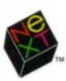

## **USER INTERFACE GUIDELINES**


*Object- Oriented Software* 

# NeXTSTEP<sup>™</sup> USER INTERFACE GUIDELINES

NeXTSTEP Developer's Library NeXT Computer, Inc.

Release 3


#### Addison-Wesley Publishing Company

Reading, Massachusetts • Menlo Park, California • New York • Don Mills, Ontario Wokingham, England • Amsterdam • Bonn • Sydney • Singapore • Tokyo • Madrid San Juan • Paris • Seoul • Milan • Mexico City • Taipei

NeXT and the publishers have tried to make the information contained in this manual as accurate and reliable as possible, but assume no responsibility for errors or omissions. They disclaim any warranty of any kind, whether express or implied, as to any matter whatsoever relating to this manual, including without limitation the merchantability or fitness for any particular purpose. In no event shall NeXT or the publishers be liable for any indirect, special, incidental, or consequential damages arising out of purchase or use of this manual or the information contained herein. NeXT will from time to time revise the software described in this manual and reserves the right to make such changes without obligation to notify the purchaser.

NeXTSTEP User Interface Guidelines Copyright © 1990-1992 by NeXT Computer, Inc. All rights reserved. No part of this publication may be reproduced, stored in a retrieval system, or transmitted, in any form or by any means, electronic, mechanical, photocopying, recording, or otherwise, without the prior written permission of the publisher or copyright owner. Printed in the United States of America. Published simultaneously in Canada.

NeXTSTEP 3.0 Copyright © 1988-1992 by NeXT Computer, Inc. All rights reserved. Certain portions of the software are copyrighted by third parties. U.S. Pat. No. 4,982,343. Other Patents Pending.

NeXT, the NeXT logo, NeXTSTEp, Application Kit, Digital Librarian, Digital Webster, Interface Builder, and Workspace Manager are trademarks of NeXT Computer, Inc. UNIX is a registered trademark of UNIX Systems Laboratories, Inc. All other trademarks mentioned belong to their respective owners.

Restricted Rights Legend: Use, duplication, or disclosure by the Government is subject to restrictions as set forth in subparagraph (c)(1 )(ii) of the Rights in Technical Data and Computer Software clause at DFARS 252.227-7013 [or, if applicable, similar clauses at FAR 52.227-19 or NASA FAR Supp. 52.227-86).

This manual describes NeXTSTEP Release 3.

Written by NeXT Publications.

This manual was designed, written, and produced on NeXT computers. Proofs were printed on a NeXT 400 dpi Laser Printer and NeXT Color Printer. Final pages were transferred directly from a NeXT optical disk to film using NeXT computers and an electronic imagesetter.

34 5 6 78 9 *lD-CR5-96959493*  Third printing, November 1993

ISBN 0-201-63250-0

## *Contents*

#### **xi Introduction**

| 1  | Chapter 1: A Visual Guide to the User Interface |
|----|-------------------------------------------------|
| 3  | An Application's Windows                        |
| 3  | Standard Windows                                |
| 4  | Panels                                          |
| 5  | Menus                                           |
| 6  | Miniwindows                                     |
| 6  | Application Icons                               |
| 7  | Controls                                        |
| 8  | Buttons                                         |
| 9  | Text Fields                                     |
| 9  | Sliders                                         |
| 10 | Color Wells                                     |
| 10 | Scrollers                                       |

**11** Browsers and Selection Lists

| 13 | Chapter 2: Design Philosophy                    |
|----|-------------------------------------------------|
| 14 | Basic Principles                                |
| 14 | Consistency                                     |
| 14 | User Control                                    |
| 15 | Modes                                           |
| 15 | Acting for the User                             |
| 15 | Naturalness                                     |
| 16 | Using the Mouse                                 |
| 17 | Action Paradigms                                |
| 17 | Direct Manipulation                             |
| 18 | Targeted Action                                 |
| 19 | Modal Tool                                      |
| 20 | Extensions                                      |
| 20 | Testing User Interfaces                         |
| 21 | Chapter 3: User Actions: The Keyboard and Mouse |
| 22 | How the Keyboard and Mouse Work                 |
| 22 | The Keyboard                                    |
| 22 | Modifier Keys                                   |
| 23 | Keyboard Alternatives                           |
| 24 | The Mouse                                       |
| 25 | Clicking                                        |
| 25 | Multiple-Clicking                               |
| 26 | Dragging                                        |
| 26 | Pressing                                        |
| 26 | Mouse Responsiveness                            |
| 26 | Left and Right Orientation                      |
| 27 | Selection                                       |
| 27 | Dragging to Select                              |
| 28 | . Clicking to Select                            |
| 28 | Multiple-Clicking to Select                     |
| 28 | Extending the Selection                         |
| 29 | Continuous Extension                            |
| 30 | Discontinuous Extension                         |
| 31 | How the Arrow Keys Affect a Text Selection      |

| 32 | Implementing Special Keys                           |
|----|-----------------------------------------------------|
| 32 | Special Character Keys                              |
| 33 | Handling Arrow Characters                           |
| 33 | Special Command-Key Combinations                    |
| 34 | Choosing Keyboard Alternatives                      |
| 34 | Reserved Keyboard Alternatives                      |
| 35 | Required Keyboard Alternatives                      |
| 36 | Recommended Keyboard Alternatives                   |
| 36 | Creating Application-Specific Keyboard Alternatives |
| 37 | Choosing the Character                              |
| 37 | Using the Alternate Key                             |
| 38 | Determining the Action that Is Performed            |
| 39 | Implementing Mouse Actions                          |
| 39 | Reacting to Clicking                                |
| 40 | The First Click in a Window                         |
| 40 | When Dragging Shouldn't Imply Clicking              |
| 41 | When to Use Multiple-Clicking                       |
| 42 | Dragging from a Multiple-Click                      |
| 42 | How to Use Dragging                                 |
| 43 | Moving an Object                                    |
| 43 | Defining a Range                                    |
| 44 | Sliding from Object to Object                       |
| 44 | When to Use Pressing                                |
| 45 | U sing Modifier Keys with the Mouse                 |
| 46 | Managing the Cursor                                 |
| 46 | Changing the Cursor                                 |
| 47 | Hiding the Cursor                                   |
| 47 | Implementing Selection                              |
| 48 | When Discontinuous Selection Isn't Implemented      |
| 48 | The Range that Dragging Should Select               |
| 49 | Implementing the Modified Arrow Keys                |
| 49 | Control-Arrow Combinations                          |
| 49 | Shift-Arrow Combinations                            |
| 50 | Alternate-Arrow Combinations                        |
| 50 | Other Arrow Key Combinations                        |

| 51   | Chapter 4: The Window Interface to Applications   |
|------|---------------------------------------------------|
| 52   | How Windows Work                                  |
| 53   | Window Order'                                     |
| 54   | Window Behavior                                   |
| . 55 | Reordering                                        |
| 56   | Moving                                            |
| 56   | Resizing                                          |
| 57   | Closing                                           |
| 58   | Miniaturizing                                     |
| 58   | Hiding and Retrieving Windows                     |
| 59   | Application and Window Status                     |
| 60   | The Active Application                            |
| 60   | Application Activation                            |
| 61   | Application Deactivation                          |
| 62   | The Key Window                                    |
| 63   | The Main Window                                   |
| 65   | How Windows Become the Key Window and Main Window |
| 65   | In the Active Application                         |
| 65   | When an Application Is Activated                  |
| 66   | The Results of Clicking in a Window               |
| 67   | Implementing Windows                              |
| 67   | Designing Windows                                 |
| 67   | Placing Windows                                   |
| 69   | Implementing Standard Windows                     |
| 69   | Choosing a Title                                  |
| 70   | Using the Resize Bar                              |
| 70   | Using the Miniaturize Button                      |
| 71   | Using the Close Button                            |
| 72   | Implementing Window and Application Status        |
| 72   | Choosing the Key Window                           |
| 73   | Activating an Application                         |
| 74   | Avoiding Activation when Dragging                 |

| 75 | Chapter 5: Panels                           |
|----|---------------------------------------------|
| 76 | How Panels Work                             |
| 76 | Ordinary Panels                             |
| 77 | Attention Panels                            |
| 78 | Implementing Ordinary Panels                |
| 78 | Window Considerations                       |
| 78 | Using the Resize Bar                        |
| 78 | Using the Miniaturize Button                |
| 78 | Using the Close Button                      |
| 79 | Becoming the Key Window                     |
| 80 | Relinquishing Key-Window Status             |
| 80 | Exceptions to Ordinary Panel Behavior       |
| 80 | Persisting Panels                           |
| 81 | Floating Panels                             |
| 81 | Panels with Variable Contents               |
| 82 | Multiform Panels                            |
| 83 | Inspector Panels                            |
| 84 | Implementing Attention Panels               |
| 84 | Naming an Attention Panel                   |
| 85 | The Default Option in an Attention Panel    |
| 85 | Dismissing an Attention Panel               |
| 86 | Naming Buttons in an Attention Panel        |
| 87 | Optional Explanations in an Attention Panel |
| 88 | Standard Panels                             |
| 91 | Implementing the Close Panel                |
| 92 | Implementing the Find Panel                 |
| 93 | U sing the Help Panel                       |
| 95 | Implementing the Info Panel                 |
| 95 | U sing the Link Inspector Panel             |
| 96 | U sing the Open Panel                       |
| 96 | Implementing the Preferences Panel          |
| 97 | Implementing the Quit Panel                 |
| 98 | Using the Save Panel                        |

| 99  | Chapter 6: Menus                        |  |
|-----|-----------------------------------------|--|
| 100 | How Menus Work                          |  |
| 100 | The Main Menu                           |  |
| 101 | Bringing the Main Menu to the Cursor    |  |
| 102 | Submenus                                |  |
| 103 | Keeping a Submenu Attached              |  |
| 103 | Tearing Off an Attached Submenu         |  |
| 104 | Removing a Submenu from the Screen      |  |
| 105 | Commands                                |  |
| 106 | Implementing Menus                      |  |
| 106 | Designing the Menu Hierarchy            |  |
| 107 | Choosing Command Names                  |  |
| 107 | Commands that Perform Actions           |  |
| 108 | Commands that Bring Up Panels           |  |
| 109 | Commands that Bring Up Submenus         |  |
| 109 | Commands that Bring Up Standard Windows |  |
| 109 | Sample Command Names                    |  |
| 110 | Disabling Invalid Commands              |  |
| 110 | Graphical Devices in Menu Commands      |  |
| 111 | Standard Menus and Commands             |  |
| 111 | The Main Menu                           |  |
| 114 | Adding to the Main Menu                 |  |
| 115 | The Info Menu                           |  |
| 116 | The Document Menu                       |  |
| 117 | Performing an Implicit New Command      |  |
| 118 | Uneditable Documents                    |  |
| 118 | The Edit Menu                           |  |
| 120 | The Paste As Menu                       |  |
| 120 | Checking Spelling                       |  |
| 121 | The Link Menu                           |  |
| 123 | The Find Menu                           |  |
| 124 | The Format Menu                         |  |
| 125 | The Font Menu                           |  |
| 128 | The Text Menu                           |  |
| 129 | The Windows Menu                        |  |
| 130 | The Services Menu                       |  |
| 131 | Providing Services                      |  |
| 132 | Adding a Tools Menu                     |  |

| 133 | Chapter 7: Controls                                  |
|-----|------------------------------------------------------|
| 135 | Buttons                                              |
| 135 | How Buttons Work                                     |
| 136 | Buttons that Bring Up Lists                          |
| 136 | Pop-Up Lists                                         |
| 137 | Pull-Down Lists                                      |
| 137 | Implementing Buttons                                 |
| 137 | Choosing the Button's Result                         |
| 138 | Choosing the Button's Image or Label                 |
| 140 | Changing the Button's Appearance during a Click      |
| 141 | Implementing Pop-Up and Pull-Down Lists              |
| 142 | Implementing Link Buttons                            |
| 142 | Implementing Stop Buttons                            |
| 143 | Text Fields                                          |
| 145 | Sliders                                              |
| 146 | Color Wells                                          |
| 147 | Scrollers                                            |
| 148 | How Scrollers Work                                   |
| 148 | The Knob and Bar                                     |
| 149 | The Scroll Buttons                                   |
| 150 | Automatic Scrolling                                  |
| 150 | Fine-Tuning Mode                                     |
| 150 | Implementing Scrollers                               |
| 152 | Browsers and Selection Lists                         |
| 153 | Choosing the Appropriate Control                     |
| 153 | Controls that Start Actions                          |
| 154 | Controls that Show State                             |
| 154 | Displaying a Single Option                           |
| 154 | Displaying a Group with an Unrestricted Relationship |

155 Displaying a Group with a One-of-Many Relationship

## **157 Chapter 8: The Interface to the File System** 158 How the File System Is Organized 158 Home Folders 159 NeXT Folders 160 Local and Personal Folders 160 Net 161 Paths 162 File Name Extensions 162 File Packages 162 Using Paths 163 U sing File N arne Extensions 164 U sing File Packages 164 Creating Unrequested Files and Folders 165 Displaying File Names **167 Suggested Reading**

**169 Glossary 179 Index** 

# *Introduction*

This manual discusses the NeXTSTEpn. user interface from the programmer's point of view. It's meant to serve as a bridge between your experience as a user of NeXTSTEP and your experience writing applications for other users.

- It explains the user interface and introduces some of its rationale so that it will be easier for you to design your application.
- It gives guidelines that all applications should follow. When the interface to your application is consistent with other NeXTSTEP applications, users will find it more familiar, quicker to learn, and easier to use.

A version of this manual is available on-line through Digital LibrarianT '" (which is described in the *User's Guide).* Digital Librarian also contains Release Notes that provide last-minute information about the latest release of the software.

## **How This Manual is Organized**

Much of the functionality and appearance of the NeXTSTEP user interface is built into the Window Server and Application Kif .... You won't need to program the complete interface for your application; windows, buttons, scrollers, and other graphic objects are provided for you. For this reason, discussions with detailed guidelines are divided into two major parts:

- The first part discusses the functionality that's built in.
- The second part describes what you have to do.

Some chapters also have a third part that lists standard objects (which you might or might not have to implement) that you can use in your application. For example, Chapter 5, "Panels," lists all the standard panels, such as the Info panel, Print panel, and Quit panel.

When thinking about putting a panel in your application, you should make sure to use a standard panel if it's appropriate.

The first two chapters of this book offer an overview of the NeXTSTEP user interface. Chapter 1, "A Visual Guide to the User Interface," shows what the standard objects in the user interface look like. Chapter 2, "Design Philosophy," discusses the guiding principles behind the user interface. You need a good understanding of these principles to be able to develop NeXTSTEP applications that have a great user interface.

The next two chapters give guidelines for the most basic aspects of communicating with the user. Chapter 3, "User Actions: The Keyboard and Mouse," discusses how to interpret mouse and keyboard actions. Chapter 4, "The Window Interface to Applications," discusses how windows (which contain the bulk of the information you present to the user) should work.

The next three chapters give detailed guidelines for implementing standard NeXTSTEP objects: panels, menus, and controls. Chapter 5, "Panels," gives guidelines about implementing panels, in general, and then goes into detail about what you have to do to implement standard panels. Chapter 6, "Menus," does the same for menus. Chapter 7, "Controls," discusses each control in tum, describing how it works and what you must do to implement it. It then summarizes what controls you should use under which circumstances.

Finally, the last chapter, "The Interface to the File System," gives details about how your application should treat files and folders.

## **Conventions**

**Note:** Paragraphs like this contain incidental information that may be of interest to curious readers but can safely be skipped.

**Important:** Paragraphs like this contain important information.

**Warning:** Paragraphs like this are extremely important to read.

Gray boxes like this contain information that you don't need to understand the guidelines discussed nearby, but that mightbe useful when you start to implement them. .

## 1 *A Visual Guide to the User Interface*

A user interface is more than the wayan application looks on-screen. It's all the ways the application communicates with the user, and the user with the application. Beeps and other sounds are part of the user interface, as is the speed with which the application reacts to a mouse click. Still, the appearance of an application is a large part of its user interface. This chapter concentrates on how things look. How things act is covered in detail elsewhere.

= =

=

The appearance of the NeXT STEP user interface is influenced by the following goals:

- A look and feel that's consistent across applications
- A simple, elegant appearance that uses shading to give a three-dimensional effect
- A color scheme based on black, white, and gray
- The mouse as the primary input device


The figure above shows a typical NeXTSTEP screen (the *workspace*). In it, two applications have standard windows visible. (One of them also has a menu and a panel visible.) Other applications are running but have no visible presence besides an application icon and perhaps a miniaturized window (a miniwindow).

Although many applications can run at once, only one is the *active application*—the application that accepts all user input such as typing and mouse clicks. The user can tell which application is active by checking the menu displayed in the upper left of the screen; this menu always belongs to the active application. In the figure above, Edit is the active application.

## **An Application's Windows**

Applications present their functionality to the user in three kinds of windows: standard windows, panels, and menus. Two other kinds of windows also appear on-screen: application icons and miniwindows.

All the user's typing goes to the current *key window,* which is one of the active application's standard windows or panels. The user can tell which is the key window by seeing which one has the black title bar. In the previous figure, the Find panel is the key window.

## **Standard Windows**

The parts of a standard window are labeled in the figure below. Not all standard windows need every part-for example, the first window displayed by the Workspace Manager'" has no close button, so that beginning users won't accidentally close the one window they need to use the Workspace Manager.


More information on standard windows, as well as windows in general, is in Chapter 4, "The Window Interface to Applications."

#### **Panels**

Although panels can look just like standard windows, they have a different role: They help perform secondary functionality, supporting the work done in standard windows. Often, they let the user manage the contents of standard windows in specific ways. For example, in a text editor, a standard window holds the document being edited, and panels appear as necessary to get information—for printing, saving, searching, and so on.


The Font panel shown above is an *ordinary panel*. Ordinary panels let the user work in other windows and panels of the application while the panel is displayed.

Sometimes, however, a panel requires the user's immediate attention—for example, when the user must confirm a possibly destructive command. In this case, an *attention panel* is used. While an attention panel is displayed, the user can't do anything else in the application (although the user can work in *other* applications). Because attention panels work so differently from ordinary panels, they look different, as shown below.


application icon at upper left

Some panels, such as those shown in this section, have been standardized and are used in many applications. Using standard panels in your application helps the user be more productive, since the user has less to learn. Chapter 5, "Panels," gives more information about the standard panels and about creating application-specific panels.

## **Menus**

Menus give the user access to the full breadth of an application's functionality. A user should be able to get a good idea of what an application does by looking at its menu commands. As shown below, the application's menu commands are grouped into a main menu and its submenus.

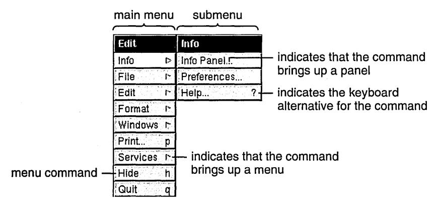

A keyboard alternative is a combination of keys that can be used instead of the mouse for choosing a command. To choose a command from the keyboard, the user holds down the Command key while typing the character shown in the menu command. For example, to quit, the user can either click the Quit menu command or hold down the Command key and press q.

The main menu and many submenus are standard-in almost any application, they should have many of the same commands in the same order. Chapter 6, "Menus," describes the standard menus and commands, and gives guidelines on creating application-specific menus and commands.

## **Miniwindows**

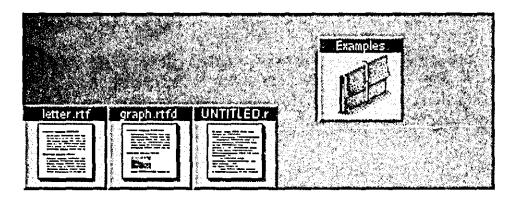

When the user clicks a window's miniaturize button (the left button in the title bar), the window shrinks down to become a miniwindow. To get the full-size window again, the user double-clicks the mini window

## **Application Icons**

Every running application is represented on-screen by an icon. This icon lets the user choose the application to work in. To choose an application, the user simply double-clicks its icon.

An application icon can be either freestanding or docked. Docked icons line up along the right edge of the screen. They stay on-screen even when the applications they represent aren't running; this makes it easy to start up commonly used applications (by double-clicking the docked icon). A freestanding icon stays on-screen only as long as the application is running. Users can customize their environment by dragging application icons into and out of the application dock.

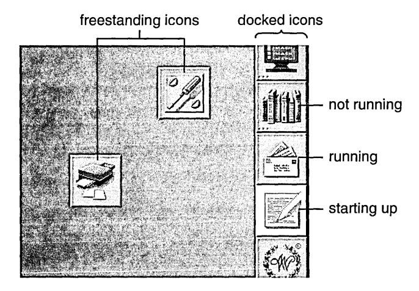

The Workspace Manager adds three small dots—similar to an ellipsis—in the lower left corner of a docked icon when the application the icon represents isn't running. The three dots disappear when the application is started up. While it's starting up, the icon is highlighted in white, as shown above.

#### **Controls**

Controls are devices that let users give information to or choose an action in an application. Controls are usually presented to users in panels or menus, although standard windows can also contain controls. The following figure shows some of the controls used in NeXTSTEP. (Although menu commands are controls, they're used only in menus, so they're illustrated in the "Menus" section, earlier).


The following sections describe each of the NeXTSTEP controls in more detail. If necessary, you can also create your own controls. Chapter 7, "Controls," has more information.

#### **Buttons**

Buttons are the primary controls for starting an action or setting a state. Users manipulate buttons by moving the mouse so that the cursor is over the button, and then clicking—pressing and releasing the mouse button.

Buttons can be very basic—with just a word or picture on a rectangular, raised-looking button—or they can be more complex. The following figure shows some simple buttons that are typical of those used to start actions.


Another kind of button that initiates actions is one that controls a *pull-down list*. A pull-down list is a combination of a button and a menulike list. The button itself doesn't cause an action (other than displaying the list), but it lets the user choose a list item that causes an action. For example:


Buttons that set a state, as opposed to initiating an action, tend to be a little more complex than action buttons. Typical state buttons are shown in the figure below.


A pop-up list, like a pull-down list, is a combination of a button and a list. A pop-up list's button doesn't actually set a state, but it brings up a menulike list from which the user can choose an option that sets the state. Unlike a pull-down list, the title of a pop-up list's button changes to display the list item that was chosen (such as from Inches to Centimeters).


## **Text Fields**


Text fields let the user enter data by typing. When the user presses Return or clicks a button associated with the text field, the application acts on the data.

## **Sliders**


A slider sets a value between some minimum and maximum. The user can change the value by dragging the slider's knob.

## **Color Wells**

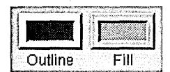

A color well lets the user set the color of an object or the color to use for drawing. Color wells are often used in groups-for example, so the user can choose one color for the outline of an object and another color for its interior fill. One of the ways the user can change the color in a color well is by dragging in a color from another well.

## **Scrollers**


Scrollers let the user control which part of a document or other data is displayed within a rectangular area. The user changes which part is displayed by dragging the scroller's knob or pressing its arrow buttons. The figure above shows two scrollers, a vertical scroller and a horizontal scroller.

## **Browsers and Selection Lists**


browser

A browser shows text data that's organized in a hierarchy, such as files and folders. A selection list is like a browser, but it has only a single level. The user moves down the browser's hierarchy by clicking items that have a after them. In both browsers and selection lists, the user can select items by clicking them.

## 2 *Design Philosophy*

=

A user interface must meet the needs of both novice and experienced users:

- For the novice or infrequent user, it must be simple and easy both to learn and to remember. It shouldn't require any relearning after an extended absence from the computer.
- For the more experienced user, it must be fast and efficient. Nothing in the user interface should get in the way or divert the user's attention from the task at hand.

The challenge is to accommodate both these goals in ways that don't conflict-to combine simplicity with efficiency.

A graphical (window-based) user interface is well suited to this task. Because graphical objects can be endowed with recognizable features of real objects, users can borrow on their everyday experience when they approach the computer. Graphical buttons work like you'd expect real buttons to work, windows behave much like separate tablets or sheets of paper, sliders and other graphical objects act like their physical counterparts off-screen. The computer becomes less an entirely new world with its own rules, and more an extension of the more familiar world away from the computer screen.

This not only makes the user interface easier to learn and remember, it also permits operations to be simpler and more straightforward. Picking an option is as easy as flicking a switch. Resizing a window is as direct and simple as pulling on a tab. The same attributes of the user interface that provide simplicity for novice users can also result in efficiency for more expert users.

## **Basic Principles**

The NeXTSTEP user interface is designed with certain basic principles in mind. Four are especially important:

- The interface should be consistent across all applications.
- The user is in charge of the workspace and its windows.
- The interface should feel natural to the user.
- The mouse (not the keyboard) is the primary instrument for user input.

Each of these principles is discussed in more detail in the sections that follow.

## **Consistency**

When all applications have the same basic user interface, every application benefits. Consistency makes each application easier to learn, thus increasing the likelihood of its acceptance and use.

Just as drivers become accustomed to a set of conventions on public highways, so users tend to learn and rely on a set of conventions for their interaction with a computer. Although different applications are designed to accomplish different tasks, they all share, to one degree or another, a set of common operations-selecting, editing, scrolling, setting options, making choices from a menu, managing windows, and so on. Reliable conventions are possible only when these operations are the same for all applications.

The conventions permit users (like drivers) to develop a. set of habits, and to act almost instinctively in familiar situations. Instead of being faced with special rules for each application (which would be like each town defining its own rules of the road), users can carry knowledge of how one application works on to the next application.

## **User Control**

The workspace and the tools for working in it (the keyboard and mouse) belong to the user, not to anyone application. Users should always be free to choose which application and which window they will work in, and to rearrange windows in the workspace to suit their own tastes and needs.

When working in an application, the user should be afforded the widest possible freedom of action. It's inappropriate for an application to arbitrarily restrict what the user can do. If an action makes sense, it should be allowed.

## **Modes**

In particular, applications should avoid setting up arbitrary modes, periods when only certain actions are permitted. Modes often make programming tasks easier, but they usurp the users' prerogative of deciding what will be done. They can thus feel annoying and unreasonable to users who aren't concerned with implementation details.

On occasion, however, modes are a reasonable approach to solving a problem. Because they let the same action have different results in different contexts, they can be used to extend functionality. When permitted, a mode should be freely chosen, provide an easy way out, be visually apparent, and keep the user in control. In the NeXTSTEP user interface, modes are used in only three situations:

- In the modal tool paradigm, discussed under "Action Paradigms" later in this chapter
- In attention panels, discussed in Chapter 5, "Panels"
- In "spring-loaded" modes that last only while the user holds a key or mouse button down

#### **Acting for the User**

Even though the user is in control, sometimes it's appropriate for an application to act on the user's behalf without waiting for the user's instructions. For example, if a user will always select an item after bringing up a panel, perhaps the panel should already have an item that's selected.

The purpose of acting on behalf of the user is to simplify the task at hand-to make a user action possibly unnecessary. Therefore, the end result of the application's action must be the same as if the user had performed the action. For example, if the panel's display changes whenever the user selects an item, then the display must also change when the application selects an item. Actions made on the user's behalf should be simple and convenient. Otherwise, they can be annoying or confusing, weakening the user's sense of control over the system.

If there's any doubt as to whether an application should act on the user's behalf, then it probably shouldn't. It's better for the application to do too little than too much.

## **Naturalness**

The great advantage of a graphical user interface is that it can feel natural to the user. The screen becomes a visual metaphor for the real world, and the objects it displays can be manipulated in ways that reflect the ways familiar objects in the real world are manipulated.

This is what's meant when a user interface is said to be "intuitive"-it behaves as we expect based on our experience with real objects in the real world.

The similarity of graphical to real objects is at a fundamental rather than a superficial level. Graphical objects don't need to resemble physical objects in every detail. But they do need to behave in ways that our experience with real objects would lead us to expect.

For example, objects in the real world stay where we put them; they don't disappear and reappear again, unless someone causes them to do so. The user should expect no less from graphical objects. Similarly, although a graphical dial or switch doesn't have to duplicate all the attributes of a real dial or switch, it should be immediately recognizable by the user and should be used for the sorts of operations that real dials and switches are used for.

Each application should try to maximize the intuitiveness of its user interface. Its choice of graphical objects should be appropriate to the tasks at hand, and users should feel at home with the operations they're asked to perform. The more natural and intuitive the user interface, the more successful an application can be.

## **Using the Mouse**

All aspects of the user interface are represented by graphical objects displayed on-screen, and all graphical objects are operated mainly by the mouse, not the keyboard. The keyboard is principally used for entering text. The mouse is the more appropriate instrument for a graphical interface.

Nevertheless, it's often a good idea to provide keyboard alternatives to mouse actions (see "Keyboard Alternatives" in Chapter 3, "User Actions: The Keyboard and Mouse"). They can be efficient shortcuts for experienced users. Keyboard alternatives are always optional, however. Visual representations on the screen never are. A keyboard operation without a corresponding mouse-oriented operation on-screen isn't appropriate.

One of the goals of the user interface is to extend to mouse operations the same naturalness and consistency that the keyboard provides for experienced typists. This is possible only if mouse operations follow established paradigms that users can come to rely on. The next section defines the paradigms used in the NeXTSTEP user interface.

## **Action Paradigms**

Graphical user interfaces such as NeXTSTEP work best when there are well-defined paradigms for using the mouse. The paradigms must be broad enough to encompassactions for the widest possible variety of applications, yet precise and limited enough so that users are always aware of what actions are possible and appropriate.

The NeXTSTEP user interface supports these three paradigms of mouse action:

- Direct manipulation
- Targeted action
- Modal tool

## **Direct Manipulation**

Most objects respond directly to manipulation with the mouse-a button is highlighted when pressed, a window comes forward when clicked, the knob of a slider moves when dragged. Direct manipulation is the most intuitive of the action paradigms and the one best suited for modifying the position and size of graphical objects. Windows, for example, are reordered, resized, and moved only through direct manipulation.

By directly manipulating icons that represent documents, applications, mail messages, or other objects stored in the computer's memory, users can manipulate the objects the icons represent. For example, dragging an icon to a new location can change the position of a file in the file system's hierarchy.

Even objects that use the targeted-action or modal-tool paradigm must respond to direct manipulation. For example, although buttons and menu commands can't be resized or moved, they nevertheless respond to direct manipulation as a way of giving feedback to the user. The response-mainly highlighting-shows that the user's action has successfully invoked one of the other paradigms.

## **Targeted Action**

Controls-buttons, scrollers, and the like-are vehicles for the user to give instructions to an application. By manipulating a control object, the user controls what the application does. Clicking a close button, for example, not only causes the button to become highlighted, it also removes the window from the screen. The button is simply a control device-like a light switch or a steering wheel-that lets the user carry out a certain action.

All controls have one thing in common: They act on a target. Some control objects (such as the Quit menu command) act on an entire application. Others (such as the close button in a window's title bar) act on a window. Still others (such as the Cut menu command) act on a subset of a window's contents (such as text) that the user has selected.

Sometimes the user must explicitly select the target, and sometimes not. When the user selects the target, it's usually editable graphics or text. However the target can also be another type of object, such as a window (the target of the Close Window menu command) or a file icon (the target of the Workspace Manager Destroy command).

When the user needs to explicitly select a target-no matter whether it's a window or a line of text-the user always selects the target before choosing the control. For example, a user might select a range of text in a file, then choose the Cut command from the Edit menu to remove it.

Targeted action with explicit selection is the normal paradigm for controlling or operating on objects. It has the advantage that a sequence of different actions can apply to the same target. For example, selected text can be changed first to a different font, then to a different point size, and then perhaps copied to the pasteboard. Another advantage is that a single control can act on a number of different user-selected targets, making it extremely efficient and powerful. The Cut command, for example, can delete text, as well as graphics, icons, and' other objects.

**In** situations where direct manipulation is the most natural way to do an operation, it's preferable to targeted action. However, since direct manipulation isn't sufficient for many operations, targeted action is the most commonly used paradigm. For example, although direct manipulation is an easy, natural way to resize a window (by dragging), it normally isn't easy or natural to set the size of text by dragging the letters to a new height.

## **Modal Tool**

In the modal-tool paradigm, users can change the meaning of subsequent mouse actions by selecting an appropriate tool, often displayed in a palette with several other tools. Each tool controls a certain set of operations that are enabled only after it's chosen. For example, a graphics editor might provide one tool for drawing circles and ovals, another for rectangles, and still another for simple lines. Depending on which tool is chosen, mouse actions (clicking and dragging) will produce very different visual results. The cursor assumes a different shape for each tool, so that it's apparent which one has been selected, and the tool itself remains highlighted.

Each tool sets up a *mode-a* period of time when the user's actions are interpreted in a special way. A mode limits the user's freedom of action to a subset of all possible actions, and for that reason is usually undesirable. But in the modal tool paradigm, the mode is mitigated by a number of factors:

- The mode isn't hidden. The altered shape of the cursor and highlighted state of the tool make it apparent which actions are appropriate.
- The mode isn't unexpected. It's the result of a direct user choice, not the by-product of some other action.
- The way out of the mode (usually clicking in another tool) is apparent and easy. It's available to the user at any time.
- The mode mimics the way things are done in the real world. Artists and workers choose an appropriate tool (whether it's a brush, a hammer, a pen, or a telephone) for the particular task at hand, finish the task, and choose the next tool.

The modal-tool paradigm is appropriate when a particular type of operation is likely to be repeated for some length of time (for example, drawing lines). It's not appropriate if the user would be put in the position of constantly choosing a new tool before each action.

Below is a typical palette of modal tools, along with the cursor that shows that a mode is in effect.


## **Extensions**

Users will come to count on a basic set of familiar operations throughout the user interface. It's each application's responsibility to make the action paradigms it uses apparent to the user-controls should look like controls (like objects that fit into the targeted-action paradigm), palettes of tools should be self-evident, and so on.

An application should also make certain that its paradigms fit the action. It wouldn't be appropriate, for example, to force users to choose a "moving tool" or a control just to move an object. Graphical objects should move, as real objects do, through direct manipulation.

Properly used, the paradigms described above can accommodate a wide variety of applications. Yet over time, as programmers develop innovative software, new and unanticipated operations might require extending the user interface.

An extension should be a last resort. All possible solutions within the standard user interface described in this chapter should be exhausted first. Added functionality must be carefully weighed against the ill effects of eroding interapplication consistency for the user. Any extension should be clearly different to the user from existing paradigms.

If an extension is required, it should be designed to grow naturally out of the standard user interface; and must adhere to the general principles discussed above.

## **Testing User Interfaces**

The success of an application's interface depends on real users. There's no substitute for having users try out the interface-even before there's any functionality behind it-to see whether it makes sense to them and lets them accomplish what they want. Some books with information on user testing are listed in the "Suggested Reading" section at the end of this book.

## 3 *User Actions: The Keyboard and Mouse*

Users give instructions to the computer through their actions on the mouse (or a comparable pointing device) and keyboard.

===========-==--\_ ... - \_.\_. ===========~===:::;;;;--:;,:.;:'-= -!-.-=-.~.~--..

**In** general, the keyboard is needed only to enter text. The mouse is used for all other operations, such as using controls and making selections. However, for the user's convenience, many operations can also be accomplished using the keyboard. The keyboard is also the only way to access certain computerwide functionality, such as turning the power on and off.

## **How the Keyboard and Mouse Work**

This section describes how the keyboard and mouse are used in NeXTSTEP. It also describes how the user can make selections using the mouse and keyboard.

## **The Keyboard**


A NeXTSTEP keyboard resembles a conventional typewriter, with the usual keys in their traditional locations. However, the keyboard also has many keys that aren't found on typewriters, including the Command, Alternate, Control, and Help keys and a set of keys arranged in a calculator-style numeric keypad. The behavior of each key is documented in the *User's Guide.* Behavior that plays an important role in the user interface is discussed below.

#### **Modifier Keys**

The keyboard's Shift, Command, Alternate, Control, and Help keys are *modifier keys:* They change the effect of a keyboard or mouse action. For example, Shift-3 yields #, and Command-c issues a Copy command. Unlike character keys, modifier keys by themselves don't generate characters.

To use a modifier key, the user must hold the key down and, while keeping it down, press the key (or perform the mouse action) to be modified. More than one modifier key may be used at a time-for example, Command-Shift-C.

The modifier keys and their effects when used with other keys are presented below.

- The Shift key modifies keystrokes to produce the uppercase character on letter keys and the upper character on two-character keys.
- The Alternate key modifies keystrokes to produce an alternate character to the one that appears on the key. In general, these are special characters that are used relatively infrequently. To find out which alternate characters are generated by which keys, see the *User's Guide.*
- The Control key modifies keystrokes to produce standard ASCII control characters. Some control characters are generated by single character keys-for example, Tab is Control-i, Return is Control-m, and backspace (Shift-Delete) is the same as Control-h.
- The Command key provides a way of choosing commands with the keyboard rather than the mouse. As an alternative to clicking a menu command with the mouse, the user can press the Command key in conjunction with the character displayed in the menu next to that command. For example, Command-c chooses the Copy command.
- The Help key doesn't modify keystrokes. It's used only to modify mouse actions, as described in "Using Modifier Keys with the Mouse" in this chapter.

#### **Keyboard Alternatives**

A graphical user interface is easy for most people to learn and remember. Objects have a familiar look on the screen and behave in a way that's reminiscent of the real-world objects they emulate. However, many users find it faster and easier to operate graphical objects using the keyboard rather than the mouse. For this reason, it's often appropriate to provide keyboard alternatives to the mouse, at least for common operations.

#### **Programming Note: The Keyboard**

For most applications, keyboard input is handled automatically. Text entry and display are handled by the Application Kit Text object, and keyboard alternatives are automatically converted into clicks on their associated control. All you have to do is choose the keyboard alternatives (as discussed later in this chapter) and specify them in Interface Builder"'.

You'll need to handle keyboard input if your application doesn't use the Text object for its text entry.

Keyboard alternatives consist of a single keystroke, modified by the Command key (and possibly another modifier key). The Command key is required so that keystrokes that make something happen (give commands) are clearly separated from those that enter data (cause typing to appear).

Keyboard alternatives are most often used for menu commands, although they're permitted in a panel's buttons and pull-down lists, as well.

Although keyboard alternatives are tied to a graphic representation, they don't require the representation to be on-screen. Keyboard alternatives for menu commands and panel buttons work even if the menu or panel is hidden.

## **The Mouse**

The mouse controls the movement of the cursor on-screen. Typically, the user moves the cursor over an object in the workspace and presses a mouse button to make something happen. With the mouse, the user can edit documents, rearrange windows, and operate any control. The mouse is the essential tool of a graphical interface.

Users can manipulate the mouse injust two ways:

- Move it to position the cursor. The standard arrow cursor "points to" the object touched by its tip. (The cursor is also said to be positioned "over" the object at its tip.)
- Press and release the mouse buttons. The NeXTTM mouse has two buttons, one on the right and one on the left. Initially, both buttons work alike, but they can be differentiated by the Preferences application (see "Left and Right Orientation" later in this chapter).

From these two simple actions, a few basic mouse operations are derived:

- Clicking
- Multiple-clicking
- Dragging
- Pressing

## **Clicking**

The user *clicks* an object by positioning the cursor over it, then pressing and releasing a mouse button. Usually the mouse isn't moved during a click, and the mouse button is quickly released after it's pressed. However, timing generally isn't important. What's important is what object the cursor is over when the mouse button is pressed and released.

Clicking is used to pick an object or a location on the screen. If the object is a window, the click brings it to the front and may select it to receive characters from the keyboard. If the object is a menu command, button, or other control, the click performs the control's action. In text, a click selects the *insertion point* (the place where the user's typing will be entered). In a graphics editor, it may select the location for a Paste command.

#### **Multiple-Clicking**

The user *double-clicks* an object by positioning the cursor over it, then quickly pressing and releasing a mouse button twice in succession. The mouse button must be pressed the second time within a short interval of the first, or the action will count as two successive clicks rather than a double-click. In addition, the cursor can't move significantly during the interval. This is to guarantee that the double-click remains focused on a single location on-screen.

With the Preferences application, users can set the maximum length of the time interval between clicks to suit their individual needs.

The user *triple-clicks* an object by rapidly pressing and releasing a mouse button three times in succession. The time interval between successive clicks and the distance the cursor can move between the first and the last click are subject to the same constraints that apply to a double-click.

#### **Programming Note: The Mouse**

All the controls provided by the Application Kit automatically turn the mouse actions they recognize (such as clicks) into the result specified by the programmer (such as bringing up a pane!). The Text object also automatically receives and reacts to mouse actions such as clicks, double-clicks, triple-clicks, and dragging actions.

If you implement a custom control or a custom content area, you'll probably have to write code to handle the mouse actions that the control or area responds to.

#### **Dragging**

The user *drags* by pressing a mouse button and moving the mouse (and cursor) while the button is down.

In general, every dragging action implies a click. Dragging a window, for example, also brings it to the front, as if it had been clicked. However, sometimes it's appropriate to separate an object's response to dragging from its response to clicking. See "When Dragging Shouldn't Imply Clicking," later in this chapter, for infonnation on when dragging should not imply a click.

#### **Pressing**

The user *presses* an object on-screen by positioning the cursor over it, pressing a mouse button, and holding the button down for a period of time. Although pressing implies clicking (since the mouse button must be released sometime), an object is said to be pressed rather than clicked if releasing the mouse button too soon would cut the action short.

Control objects that respond to pressing act immediately when the mouse button is pressed. They don't wait for the button to go up.

#### **Mouse Responsiveness**

The cursor moves on-screen when the us.er moves the mouse, but the ratio of the two movements isn't one-to-one. Rapid mouse movements move the cursor farther than slow ones. Users can set the *mouse scaling,* how responsive the cursor is to mouse movements at different speeds, with the Preferences application.

#### **Left and Right Orientation**

To start, the two buttons of the mouse work identically: Either button can be used for the ordinary operations of clicking, dragging, and pressing.

The two buttons can be differentiated with the Preferences application. Users can enable one of the buttons, either the right or the left, for the special function of bringing the main menu to the cursor. (See "Bringing the Main Menu to the Cursor" in Chapter 6, "Menus," for details.) Thereafter, the enabled button has only that function, and it can't be used for ordinary mouse operations. This leaves the other button as the one that will be primarily used.

## **Selection**

Users select graphical objects by clicking and dragging with the mouse. A variety of objects can be selected, including:

- Windows
- Tools in a palette
- Cells in a matrix or fields in a form
- Icons in a file viewer
- Items in a list (of files or mail messages, for example)
- Characters in editable text
- Graphical elements of editable artwork

Selecting an object simply picks it out and distinguishes it from others of the same type. It doesn't change the object in any way. Most selections pick out targets for subsequent actions in the targeted-action paradigm.

If users are allowed to insert new material into a display, they can select not only objects already displayed, but also locations for the insertions. For example, it's possible to select either characters that have already been typed into a text field or the point where new typing should appear.

This section concentrates on how selections are made in editable material, but the rules often carry over to other types of selection as well.

### **Dragging to Select**

Dragging selects everything in the range defined by the anchor point (where the cursor was located when the mouse button was pressed) and the end point (the cursor's location when the mouse button is released).

What "everything in the range" means depends on the type of material selected, as described in "The Range that Dragging Should Select," later in this chapter.

#### **Programming Note: Selection**

The Text object and browser implementation in the Application Kit both provide almost all the selection mechanisms described in "Selection." (The exception: The Text object doesn't implement discontinuous selection.) However, if you define your own selectable data, you'll have to implement selection yourself.

## **Clicking to Select**

If the anchor point and end point are substantially the same-as they are for a click-the user's action may sometimes select the item under the cursor and sometimes simply select that location. In a graphics editor, for example, a click can select an existing figure or a location to insert a new one.

In text, a click always selects a location-an insertion point-where characters can be entered from the keyboard. The insertion point is normally marked by a blinking vertical bar located between characters. If the user clicks on top of a character, the insertion point is adjusted to the nearest character boundary. Clicking in a margin, or in an empty area away from any text, puts the insertion point next to the nearest character in series.

### **Multiple-Clicking to Select**

Although a single click selects only an insertion point in text, multiple-clicking selects characters already inserted. A multiple-click always selects a linguistically meaningful unit. Normally, double-clicking selects a word, and triple-clicking selects a paragraph (all the text between return characters).

If the user drags from a multiple-click, additional units of the same type are selected. For example, double-clicking a word selects the word; dragging from the double-click then selects every other word that's even partially within the range defined by the anchor and end points.

#### **Extending the Selection**

Normally, as soon as users commit themselves to a new selection by pressing a mouse button (to begin clicking or dragging), the current selection is canceled in favor of the new one. However, when the Alternate or Shift key is held down, the current selection is extended, not canceled.

#### **Continuous Extension**

Clicking and dragging with the Alternate key down results in a new selection that's a continuation of the previous one. The new selection includes the previous selection and everything lying between it and the location of the cursor when the user releases the mouse button. The Alternate key is thus an alternative to dragging as a way of selecting a rangethe user can click to establish an anchor point, hold down the Alternate key, and click again to determine the end point.

If the previous selection is already a range, Alternate-clicking and Alternate-dragging move the edge of selection that's closest to the cursor when the mouse button goes down to the cursor's location when the mouse button goes up. The Alternate key thus also provides a way of adjusting the boundaries of the previous selection. Alternate-clicking outside a selected range extends the range to the point of the click. Alternate-clicking inside a selected range repositions the closest edge of the selection to the point of the click.


If the current selection is the result of a multiple-click, the Alternate key extends it just as dragging would. Double-clicking a word, holding the Alternate key down, and clicking another word elsewhere in the text extends the selection to include both words and all those between.

#### **Discontinuous Extension**

The Shift key lets users add to, or subtract from, the current selection. Additions don't have to be continuations of the current selection, so discontinuous selections can result.

**Note:** Discontinuous selection is common for editable graphics, icons, and items arranged in a list. It usually isn't implemented for normal text.

To add to the selection, the user clicks and drags as usual while holding the Shift key down. New material is selected, but the previous selection also remains. This is illustrated in the middle column of the following figure.

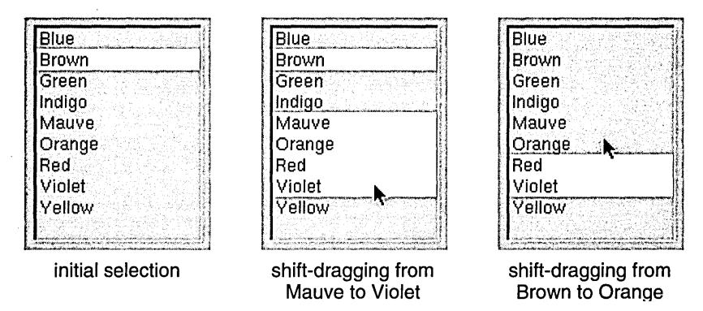

To subtract from the selection, the user holds the Shift key down while clicking or dragging over the current selection. Shift-clicking and Shift-dragging deselect material that's already been selected. While keeping the Shift key down, the user can first select material, then deselect it, then select it again.

Shift-dragging either selects or deselects; it never does both. Which it does depends on the item under the cursor when the mouse button goes down:

- If the item isn't currently part of the selection, Shift-dragging serves to select it and everything the user drags over. It won't deselect material that happens already to be selected.
- If the item is currently selected, Shift-dragging deselects it and any other selected material that's dragged over. It won't add unselected material to the selection.

## **How the Arrow Keys Affect a Text Selection**

In text, the keyboard's arrow keys are used to position the insertion point or, when modified by the Alternate key, alter the selection. But unlike the mouse, which can select anywhere within a document, the arrow keys operate only relative to the current selection. The descriptions below assume that the current selection, before the user touches an arrow key, is a range of text. The simpler case where the current selection is not a range but an insertion point is not directly addressed, but can easily be derived from the descriptions given.

**Note:** The arrow keys have nothing to do with the cursor, which is controlled only by the user's mouse movements.

When used alone (without a modifier key), the left arrow key positions the insertion point one character before the beginning of the current selection. The right arrow key puts the insertion point one character beyond the end of the current selection. These keys move the insertion point to the previous or next line if necessary.

The up arrow key puts the insertion point one line above the beginning of the current selection, and the down arrow key puts it one line below the end of the current selection. As the up and down arrow keys move it from line to line, the insertion point maintains the same approximate distance from the left margin. It falls at the end of any line that's shorter than that distance, but comes back out to the original distance when a line that's long enough is encountered.

More information on handling the arrow keys is in "Implementing Special Keys" in this chapter. Modified arrow keys-for example, Alternate-arrow-are discussed in "Implementing the Modified Arrow Keys," later in this chapter.

## **Implementing Special Keys**

This section describes how your application should handle certain special keys and key combinations, including keyboard alternatives.

## **Special Character Keys**

Several special character keys, listed below, generate characters that typically perform a function-the character causes the application to make something happen. Exactly what happens depends on the application. Some typical functions are mentioned here.

- The Return key moves the insertion point or prompt to the beginning of the next line, much like the carriage return of a typewriter. When data is entered in a text field or form, Return informs the application that the data is ready for processing.
- The Enter key, like Return, signals that data is ready for processing. It need not move an insertion point or prompt to the beginning of the next line. (Enter can also be generated with Command-Return.)
- The Delete key removes the preceding character in text or deletes the current selection. Shift-Delete generates the backspace character, which moves the insertion point back one character. In most applications, backspace performs the same functions as Delete.
- The Tab key moves forward to the next tab stop, or to the next text field in sequence. Shift-Tab moves backward to the previous tab stop or text field.
- The arrow keys move the symbol that's used in some contexts to track where the user is writing or entering data-for example, the insertion point in a document processor. The arrow keys' behavior is described in "How the Arrow Keys Affect a Text Selection," earlier in this chapter, and in "Implementing the Modified Arrow Keys," later in this chapter.

For UNIX® compatibility, the Esc key is used to complete file names (as described in the following section). It should not be used any other way in the user interface.

## **Handling Arrow Characters**

Because the arrow keys generate the same character codes as the Symbol font's arrow characters, text objects should check which key generated the character. The arrow keys never produce visible arrow characters. However, when a nonarrow key (perhaps modified by the Alternate key) produces an arrow character code, it *should* produce visible arrow characters, and not result in arrow key functionality.

For example, Alternate-F should produce a visible left arrow symbol, as shown in the *User's Guide,* instead of moving the insertion point left one character.

## **Special Command-Key Combinations**

A handful of Command-key combinations produce special effects. Some playa particular role in the user interface. Others, in effect, give commands to the computer itself, rather than to just one application. They can't be used for other functions than those listed below.

- Command-. (period) should let users abort the current operation in the active application. Although the Application Kit has code to support Command-., it isn't automatic. An application must ask for this functionality
- Command-space should be used for file name completion. In contexts where it's appropriate for the user to type a file name (such as in an Open panel), Command-space displays as many characters as match all possible file names in the directory. If the user first types enough characters to identify a particular file and then presses the space bar with the Command key down, the remaining characters of the file name are filled in. (In many applications, the Esc key also performs file name completion.)
- On keyboards that have no Caps Lock key, Command-Shift is the equivalent of Caps Lock (but only if the Shift key is released before another key is pressed).
- Command-Return is the same as Enter.
- Command-volume down turns the speaker off and on. (Volume down is a system control key on NeXT keyboards.)

- Command-Left Alternate--, produced by holding the Command key and the leftmost Alternate key and pressing the - key, generates an NMI (nonmaskable interrupt) on systems that have only one Command key. An NMI brings up the NMI mini-monitor window.
- Command-Command-- generates an NMI on systems that have two Command keys.
- Command--, produced with just the right Command key for keyboards that have two Command keys, displays a panel that gives the user the option of restarting the computer, turning the power off, or canceling the command.
- Command-Alternate-\*, produced by pressing the Command and Alternate keys at the lower left of the keyboard in conjunction with the \* key on the numeric keypad, performs a reset to reboot the machine. The reset is immediate: No panel or monitor gives the user the option of canceling the instruction.

**Note:** These Command-key combinations aren't keyboard alternatives, since they don't correspond to anyon-screen object.

## **Choosing Keyboard Alternatives**

Initially, until the user specifies a different preference, applications should follow the guidelines for keyboard alternatives described in this section. Users can use the Preferences application to alter the keyboard alternatives for every application at once. You're also encouraged to let the user choose and change keyboard alternatives using your application's Preferences panel.

The guidelines place keyboard alternatives into three groups-reserved, required, and recommended. These groups are listed in the tables that follow along with the commands they perform and the menus where the commands are located. (See "Standard Menus and Commands" in Chapter 6 for more information on the listed commands and menus.)

#### **Reserved Keyboard Alternatives**

Reserved keyboard alternatives must be used for the commands that follow, and cannot be used for any others. If your application implements the functionality that a command represents, it must provide both the command and the keyboard alternative.

For example, if your application opens files, it must have an Open command with Command-o as the keyboard alternative. If your application doesn't allow the user to open files, it won't have an Open command and must not use Command-o as a keyboard alternative.

| Keyboard Alternative | Command      | Menu          |
|----------------------|--------------|---------------|
| Command-?            | Help         | Info menu     |
| Command-a            | Select All   | Edit menu     |
| Command-c            | Copy         | Edit menu     |
| Command-h            | Hide         | main menu     |
| Command-n            | New          | Document menu |
| Command-o            | Open         | Document menu |
| Command-p            | Print        | main menu     |
| Command-q            | Quit         | main menu     |
| Command-s            | Save         | Document menu |
| Command-v            | Paste        | Edit menu     |
| Command-w            | Close Window | Windows menu  |
| Command-x            | Cut          | Edit menu     |
| Command-z            | Undo         | Edit menu     |

#### **Required Keyboard Alternatives**

These keyboard alternatives must be used if the application implements the command. For example, if your application has a Find panel, you must provide Command-f as a way of bringing the panel up.

However, if an application doesn't implement the particular functionality of an item (if it doesn't have a Find panel, for example), it can use the keyboard alternative (Command-f) for something else. Nevertheless, to preserve interapplication consistency, it's strongly recommended that you first try to use characters that don't overlap with those on this list.

| Keyboard Alternative | Command           | Menu          |
|----------------------|-------------------|---------------|
| Command-=            | Define in Webster | Services menu |
| Command-;            | Check Spelling    | Edit menu     |
| Command-b            | Bold (Unbold)     | Font menu     |
| Command-d            | Find Previous     | Find menu     |
| Command-e            | Enter Selection   | Find menu     |
| Command-f            | Find Panel        | Find menu     |
| Command-g            | Find Next         | Find menu     |
| Command-i            | Italic (Unitalic) | Font menu     |
| Command-t            | Font Panel        | Font menu     |
| Command-C            | Colors            | varies        |

## **Recommended Keyboard Alternatives**

These keyboard alternatives must be used for a command if the command has a keyboard alternative. If not, the key can be used for some other command. For example, if the Copy Ruler command has no keyboard alternative, Command-l can be used as a keyboard alternative for another command.

| Keyboard Alternative | Command            | Menu          |
|----------------------|--------------------|---------------|
| Command-l            | Copy Ruler         | Text menu     |
| Command-2            | Paste Ruler        | Text menu     |
| Command-3            | Copy Font          | Font menu     |
| Command-4            | Paste Font         | Font menu     |
| Command-j            | Jump to Selection  | Find menu     |
| Command-m            | Miniaturize Window | Windows menu  |
| Command-r            | Show Ruler         | Text menu     |
| Command-P            | Page Layout        | Format menu   |
| Command-S            | Save As            | Document menu |
| Command-V            | Paste and Link     | Link          |

## **Creating Application-Specific Keyboard Alternatives**

The NeXTSTEP user interface is visual, so all operations-all menu commands and scrolling operations, for example-have a graphical representation on-screen and can be performed using the mouse. Keyboard alternatives are just that: alternatives. They should never be used for operations that can't be performed using the mouse.

The main consideration in deciding which operations should have keyboard alternatives is frequency of use. It's better to assign a keyboard alternative to a frequently used command than to one that's used less often. Infrequently used commands-such as the Info Panel command-should never be assigned keyboard alternatives.

Keyboard alternatives are allowed only for the commands in a menu, the buttons in a panel, or the items in a pull-down list. The characters used as keyboard alternatives must be displayed to the user in the menu, panel, or list. Menus put them on the commands themselves, and pull-down lists follow this example. A panel can present the keyboard alternatives for its buttons in any way that's appropriate to the design of the panel.

It's usually a good idea to assign keyboard alternatives to command~ that are needed while working on the keyboard (for example, the commands in the Find menu). The keyboard alternative frees users from having to switch their attention from the keyboard to the mouse and back again.

You can also use keyboard alternatives to enable proficient users to work with one hand on the keyboard and the other on the mouse. For example, Command-x, Command-c, and Command-v allow users to select with the mouse while carrying out cut, copy, and paste operations from the keyboard. These keyboard alternatives free users from having to move the cursor out of the region where they're working just to click a command.

If keyboard alternatives are assigned to any in a set of parallel commands for formatting or viewing data (for example, commands that sort a list of items in various ways), the command that restores the default should also be assigned a keyboard alternative. The keyboard can then take the user to an alternative format and back to the default, rather than just half way.

**Note:** You don't need to assign a keyboard alternative to every command. Remember that users can create their own global keyboard alternatives by using the Preferences application.

#### **Choosing the Character**

Any character except period (.) and space can be used in a keyboard alternative. If the character is a letter, it can be either uppercase or lowercase, although lowercase characters are preferred because they don't require the user to press two modifier keys (Shift and Command) at once.

When choosing the character for a keyboard alternative, try to make it mnemonic. If possible, it should be the first letter of the command it performs. If it's closely related to a command that already has a keyboard alternative, then you might want to choose a character physically near the existing one.

For example, the Find command's keyboard alternative is Command-f, taken from the first letter of the command. The Find command has two related commands: Find Next and Find Previous. The Find Next command's keyboard alternative (Command-g) was chosen because it's just to the right of the Find command's keyboard alternative. Similarly, the Find Previous command's keyboard alternative (Command-d) is just to the left.

#### **Using the Alternate Key·**

If necessary, your application can use the Alternate key with the Command key for keyboard alternatives. Using the Alternate key is not desirable. You should first exhaust all reasonable possibilities using the Command key alone or in combination with the Shift key before resorting to the Alternate key.

But, when necessary, a keyboard alternative requiring the Alternate key can be used. It should be displayed in italic.


The character displayed in italic is the one that would be typed if the Command and Alternate keys were not held down, not the character that's produced when the Alternate key is held down.

**Note:** Recognizing keyboard alternatives produced with the Alternate key is difficult to implement, and the meaning of italic characters in menus isn't explained in the NeXTSTEP user documentation. If you nevertheless choose to implement keyboard alternatives with the Alternate key, make sure that the documentation for your application explains the meaning of the italicized character.

#### **Determining the Action that Is Performed**

A keyboard alternative should almost always accomplish exactly the same thing as the mouse action. Even slight variations between a mouse action and its keyboard alternative run counter to the principle that every keyboard operation must match a corresponding mouse operation. However, in some cases it's acceptable to have a keyboard alternative do just a bit more than the mouse operation. These cases are rare and often go unnoticed by users because the difference is both subtle and intuitive. The keyboard alternative simply does what the user wants, while also doing one or both of the following:

- Reducing the number of clicks or keystrokes the user needs to perform
- Eliminating the need to switch from the keyboard to the mouse and back again

For example, the Edit application has a Find panel that's brought up by the Find Panel menu command or its Command-fkeyboard alternative. Usually, the panel stays up until the user explicitly closes it, since it can be used many times in a row. However, a user who is concentrating on entering text often wants to find a word in a document but then doesn't want to use the Find panel for a while.

Edit accounts for both kinds of use by automatically closing the panel if the user is not likely to use the Find panel immediately. It assumes that this is the case if the user doesn't use the .mouse to conduct the search (instead, using Command-f to bring up the panel, and starting the search by pressing Return). Edit's behavior lets users find a word using a minimum number of actions, and relieves them of having to switch to the mouse to bring the document window back in front of the Find panel.

In general, you should start with all keyboard alternatives the same as their associated mouse action. In the rare case when a keyboard alternative should be different from its associated mouse action, the need becomes clear through everyday use.

## **Implementing Mouse Actions**

This section describes how to implement clicking and dragging for custom controls, application-specific document areas, and other custom objects. You shouldn't need the information in this section if you use only the standard Application Kit objects.

## **Reacting to Clicking**

When the user clicks an object on-screen, the object should provide immediate graphic feedback to the user when the mouse button goes down. However, depending on the intent of the click, the object may wait for the mouse button to go back up before doing anything more:

- If the click is intended to initiate a targeted action or choose a tool, then in general the object should act when the mouse button goes up. This gives users an opportunity to change their minds. If they move the cursor away from the object before releasing the button, the action is canceled. Suppose, for example, that a user presses the mouse button while the cursor points to the Cut command in the Edit menu. The command is highlighted, but nothing is cut until the mouse button is released. If the user moves the cursor outside the menu before releasing the mouse button, the command won't be carried out.
- If the click is intended to manipulate the object itself, the object should react immediately when the mouse button goes down. For example, when a window is clicked, it comes to the front of the screen without waiting for the mouse button to go up. Similarly, when editing text, the user is committed to a new selection as soon as the mouse button is pressed.

Note: You can implement multiple-clicks so that they act when the mouse button is pressed the second (or third) time, instead of waiting for the mouse button to go back up (as is usual for a single click). This implementation can help improve the perceived speed of your application.

## **The First Click in a Window**

Clicking can be used not only to operate an object, but also simply to bring a window forward. When the user clicks in a window that isn't already in front, a question arises concerning intent: Did the user intend the click just to bring the window forward, or was it also intended to do some work within the window? This question is addressed by the following guidelines:

- If the user chooses a particular control-for example, by clicking a button or clicking in a scroller-the click should not only bring the window forward, but should also operate the control. Since controls are small, it's reasonable to assume that the user chose to click the control, not just the window.
- If the click is just generally within the content area of the window, the click will bring the window forward but shouldn't have any result within the window. Specifically, it shouldn't alter the current selection.

However, if the user chooses to double-click within the content area of the window, the normal double-click action should be performed. Double-clicking on a word should select the word whether the window is in front or not.

## **When Dragging Shouldn't Imply Clicking**

In general, the main action associated with an object should be initiated on the basis of a single click, and dragging should perform a click. However, sometimes it's inconvenient for dragging to result in the object's action. There are three possible solutions to this problem:

- Require that a modifier key be pressed when dragging the object
- Implement the object so that dragging it doesn't perform a click
- Have a click do nothing, and have a double-click perform the object's action

For the second solution to work (having dragging not perform a click), all of the following must be true:

- The user gets clear visual feedback as to whether the object is reacting to a click or to dragging, and it's difficult for the user to do the wrong thing. For example, if the user starts to drag the object but then decides to put it back, the action should not be treated as a click.
- The single click's action matches similar uses of a single click elsewhere in the interface.

• The action initiated by the click doesn't have consequences that the user might want to avoid and that can't easily be stopped or reversed. (This condition is imposed because of the increased possibility that the user might erroneously click while intending to drag.)

For example, the main action associated with a docked application icon is the activation of the application, but the user can also move the icon by dragging it. Because the user doesn't always want to activate the application when moving its icon, it isn't practical to have both dragging and a single click activate the application.

The first solution listed above (requiring a modifier key when dragging) isn't appropriate in this case. Moving an icon is a basic, obvious operation, and unmodified dragging is the natural way to accomplish it.

The second solution (having dragging not perform a click) also doesn't work, mainly because the action (activating an application) has consequences that the user might want to avoid (such as creating windows that cover the user's work) and that can't be reversed until the application is fully started up. Also, having a single click perform the action doesn't match the behavior of application icons in the File Viewer. In the File Viewer, a single click merely selects the application's file. It isn't started up until the user double-clicks it.

So the only acceptable solution for docked application icons is for double-clicking to start up the application, while single-clicking does nothing.

An example of where dragging doesn't imply a single click is in the File Viewer shelf. When the user clicks the icon of a folder on the shelf, the File Viewer changes to show the folder's path. However, when the user drags the icon off the shelf, the File Viewer does *not*  perform the click's action-it doesn't change the current path. One of the reasons this solution works is that the shelf differentiates clicking from dragging by having a threshold for dragging. Until the user drags the icon a certain amount, it doesn't move. Once the user has committed to dragging the icon, it can't be clicked. The icon also looks very different when it's clicked (it's highlighted) from when it's dragged (it moves, and a dimmed copy is visible in its old location).

## **When to Use Multiple-Clicking**

You should use double-clicking only for actions that logically extend the action of a single click, and triple-clicking only for actions that extend a double-click. There are two reasons for this rule, one philosophical, the other programmatic:

• Complex mouse actions are best remembered and understood when they appear to grow naturally out of simpler actions.

• Every double-click includes a single click (the first click in the sequence), and every triple-click includes a double-click. At the time an application receives one click, it can't know that any others are on their way. So it must first act on the single click, then the double-click, then the triple-click.

For example, double-clicking an icon in a Workspace Manager window picks out that icon just as a single click would. It then goes on to open the application associated with the icon. A single click in text selects an insertion point, a double-click extends the selection to a word, and a triple-click extends it further to a full line, sentence, or paragraph.

Quadruple clicks (and above) become increasingly difficult for users to produce or understand. They're neither used nor recommended in the NeXTSTEP user interface. Triple-clicks should be used only sparingly.

## **Dragging from a Multiple-Click**

The act of pressing a mouse button to initiate dragging can be part (the last part) of a double-click or triple-click. If the user doesn't immediately release the mouse button and begins dragging at the end of a multiple-click, the dragging action can be assigned a meaning that's related to the meaning of the multiple-click.

For example, double-clicking selects a word in editable text, and dragging from a double-click selects additional words within a range of text. If triple-clicking selects a line, dragging from a triple-click will select additional lines within the range.

## **How to Use Dragging**

Dragging is used in a variety of situations, principally these three:

- To move an object, such as a window or the knob of a scroller
- To define a range, usually to select the objects falling within the range
- To slide from one object to another, in order to extend an action initiated in the first object to the second object

## **Moving an Object**

The user can drag a movable object by positioning the cursor over it, pressing the mouse button, and moving the mouse while the button is down. The object should move so that it remains aligned with the cursor on-screen. If the object is constrained within a particular area or track-as is a scroller knob, for example-it should remain as closely aligned with the cursor as possible.

The Application Kit contains support for moving objects between and within applications. It even changes the cursor to indicate whether the object is being moved, copied, or linked. See "Managing the Cursor," later in this chapter, for more information on changing the cursor.

#### **Defining a Range**

The user can also drag over an area or through a series of items (such as text characters) to define a range. The position of the cursor when the mouse button is pressed is the *anchor point.* Its position when the mouse button is released is the *end point.* The difference between the anchor point and end point determines the area or objects inside the range.

Dragging to define a range is mostly used to make a selection (such as a string of text characters or a group of icons) for the targeted-action paradigm.

When the user drags to define a rectangular range (as in a drawing program), applications often drag out-or "rubberband" -a rectangle to show the area covered between the anchor point and end point. See "The Range that Dragging Should Select," later in this chapter, for more information on dragging to define a rectangular range.


## **Sliding from Object to Object**

Sometimes, a group of closely related objects reacts to dragging as if the user clicked one of the objects. No matter which object in the group was under the cursor when the mouse button was pressed, the object under the cursor when the mouse button is released is the one that's chosen. (Normally, when an object isn't in a group, it's chosen only when the mouse button is both pressed and released while the cursor is over the object.)

For example, a user can choose a menu command by pressing the mouse button as the cursor points to one command and releasing it as it points to another. Users can similarly drag from one tool to another tool when they're displayed together in a palette, or from button to button in a set of radio buttons.

The grouped objects don't all have to be of the same type. For example, a user can drag from a button that controls a pop-up list through the list to make a selection, or from a menu command that controls a submenu into the submenu.

If the user can drag from one object to another in a group of objects, then this fact should be apparent from the way the objects are displayed. Usually, such objects are displayed in a single row or column, as close to each other as possible. For example, graphical radio buttons should be right up next to each other, to distinguish them from ordinary buttons. (Graphical radio buttons are discussed in detail in Chapter 7, "Controls.")

## **When to Use Pressing**

For the most part, pressing is an alternative to repeated clicking. It should be used wherever a control action can be repeated with incremental effect. For example, clicking a scroll button scrolls one line of text, clicking the button again scrolls another line, and so on. Pressing the scroll button scrolls lines repeatedly for a continuous action until the mouse button is released.

Pressing is also used to initiate the action of sliding from one object to another. If a button controls a pop-up list, the user presses the button and drags through the list to choose one of its options. After pressing a menu command to bring up a submenu, the user can drag into the submenu.

## **Using Modifier Keys with the Mouse**

Applications can choose to assign a different meaning to mouse actions that occur when the user is holding down a modifier key. Modified mouse actions should implement only optional or advanced features of the user interface (because they're harder to remember and require more coordination to produce). They typically extend or alter the effect of the unmodified mouse action. For example:

- Dragging a file icon from one directory window to another moves or copies the file to the new directory, depending on whether the directories are on the same disk or a different disk. Command-dragging moves the file always. Alternate-dragging copies the file always. Control-dragging is similar to copying, but the new "copy" of the file is simply a link to the old copy. The user can see what's going to happen because the cursor changes (to CO, for exainple, when Alternate-dragging).
- Clicking a scroll button scrolls a line of text. Alternate-clicking scrolls a larger amount.
- Dragging a window by its title bar moves the window, brings it to the front, and activates its application. Alternate-dragging moves the window and brings it to the front, but doesn't activate its application.
- Clicking selects a new insertion point in text. Alternate-clicking extends the selection . to include everything between the current insertion point and the point of the click. If an application implements discontinuous selection, Shift-clicking selects a new insertion point without dropping the old selection. If discontinuous selection isn't implemented, Shift-clicking acts like Alternate-clicking.
- Clicking selects an icon in a directory window. Shift-clicking adds new icons to the current selection.

**Note:** Caps Lock doesn't work for Shift-clicking or Shift-dragging-the Shift key must be held down manually. This way, users won't find themselves Shift-clicking by mistake when they intend only to click.

The Control key (with no other modifier keys) is often used for mouse actions that create or act on links. If your application's documents can receive linked information, then you need to implement the Control-double-click accelerator, as described in the discussion of the Link Inspector panel in Chapter 5, "Panels."

Some modifier keys should be used only in limited circumstances:

- The Help key should be used only for Help-clicking, which brings up help on the clicked object.
- The combination of Alternate and Control should be used only as a substitute for the Help key. (This is necessary because some keyboards don't have a Help key.)

Applications should avoid distinguishing between the left and right key of the Shift, Alternate, and Command pairs. Users don't expect such a distinction except for certain computerwide, potentially destructive operations, such as resetting the computer's processor. Also, there's no hardware-independent way to differentiate the left and right modifier keys.

## **Managing the Cursor**

Cursor handling is largely handled by the Application Kit. However, your application might need to hide the cursor or change its appearance.

## **Changing the Cursor** ~ I

An application can change the cursor from the standard arrow (shown above) to a'ny other image of an equal size (16 pixels by 16 pixels). When doing so, it must specify what point in the cursor acts like the tip of the arrow. That point, the cursor's *hot spot,* should be apparent to the user from the shape of the image. For example, if the cursor is an X, the hot spot would be where the two lines cross.

For some types of applications, a shape other than an arrow might be more convenient. For example, an I-beam cursor (shown above) is handier for positioning between characters. Its hot spot is in the center of the beam.

It's often a good idea to change the shape of the cursor to indicate that the user has entered a mode. In applications that use the modal-tool paradigm, the cursor should change to indicate which tool has been selected. For example, the cursor might look like a pencil while thin lines are being drawn in a graphics application, or like a wide brush when painting in broad strokes.

If mouse actions are valid only in a certain area, the cursor should revert to its normal shape when it leaves the area. It's best not to change the cursor too often, however. To avoid confusing the user, stick with the standard arrow wherever reasonable.

## **Hiding the Cursor**

A visible cursor is essential for mouse actions, but it can get in the way when the user is concentrating on using the keyboard. Therefore, the Text object automatically hides the cursor-making it disappear from the screen-when the user begins entering text. A hidden cursor returns to the screen as soon as the user moves the mouse, signaling a shift in attention away from the keyboard back to the mouse.

The cursor should also be hidden whenever the user selects an insertion point or a range of text. (This is not currently implemented by the Text object, so each application should do this for itself.) A new selection is a good indication that the user is ready to begin typing again. Hiding the cursor when the user selects a new insertion point avoids confusion between the I-beam cursor and the vertical bar representing the insertion point. Unless it's hidden, the I-beam can obscure the vertical bar. Again, the cursor reappears as soon as the user moves the mouse.

## **Implementing Selection**

If your application has editable text or allows selection of multiple custom objects, you need to read this section. In particl\lar, even if your application uses the Text object for its editable text areas, you still need to implement the modifier-arrow combinations described in "Implementing the Modified Arro~ Keys."

When implementing selection, make sure that your application never moves the selection out of the user's view. If necessary, the display must scroll to make the new selection visible. Of course, the user can choose to move the selection out of view, using a scroller. But as soon as the user makes a new selection, such as by pressing an arrow key, the selection should scroll back into view.

**Programming Note: Hiding the Cursor** 

To temporarily hide the cursor, use the single-operator function **PSobscurecursorO.** 

## **When Discontinuous Selection Isn't Implemented**

Sometimes an application implements selection for an area but doesn't implement discontinuous selection. In this case, the application should make the Shift key act like the Alternate key during selection, so that both keys cause continuous selection.

For example, discontinuous selection is not implemented in the Application Kit Text object, so both Shift-clicking and Alternate-clicking extend the selection continuously. This saves the user from making errors due to pressing the wrong key when trying to extend the selection.

## **The Range that Dragging Should Select**

When the user drags a rectangle for the purpose of selection, what is selected depends on the type of material. In serially arranged material-such as characters in connected textthe selection includes the entire series between the anchor and end points. For material consisting of objects that can be independently arranged-such as icons or the graphic elements that make up a picture-the selection generally includes everything that's even partially within the rectangle defined by the anchor and end points. The highlighted material below shows the difference between selection in text and graphics.

: to build up. Enormous press du~ed .. .!rrti~~~ were


Selecting text Selecting graphics

## **Implementing the Modified Arrow Keys**

Applications that allow text selection are encouraged to implement the modifier-arrow combinations described in this section. Modifier keys alter the basic behavior of the arrow keys, but retain the basic orientation of each of the four keys. Before reading this section, you should understand the existing behavior of the unmodified arrow keys, described in "How the Arrow Keys Affect a Text Selection" earlier in this chapter.

## **Control-Arrow Combinations**

Modified by the Control key, the arrow keys move the insertion point to the edge of the current display. The left arrow key puts the insertion point before the first visible character on the line where the current selection begins, and the right arrow key puts it after the last visible character on the line where the current selection ends.

The up arrow key positions the insertion point in the first visible line of the display, directly above the beginning of the current selection. The down arrow key puts the insertion point in the last visible line, directly below the end of the current selection.

When the insertion point is already at the edge of the currently visible display, the Control-arrow combination that would otherwise move it to that edge first scrolls the display (by the amount of a page scroll), then moves the insertion point to the edge of the new display. Once the insertion point reaches the beginning of a line, the right arrow key won't move it further (for example, to another line). The left arrow key won't move it once it reaches the end of a line.

## **Shift-Arrow Combinations**

Modified by the Shift key, the left arrow key positions the insertion point to the left of the current selection at the beginning of a word. The right arrow key positions it to the right of the current selection at the end of a word. Thus both keys move the insertion point from word to word.

The up arrow key puts the insertion point at the beginning of the word one line directly above the beginning of the current selection. The down arrow key puts it at the end of the word one line directly below the end of the current selection. As the up and down arrow keys move the insertion point from line to line; they choose words that lie directly above or below the original starting point. (In other words, the location of the insertion point can be calculated by the same rules that determine the edge of the selection when the user double-clicks and drags directly upward or directly downward.)

## **Alternate-Arrow Combinations**

Modified by the Alternate key, the arrow keys extend the current selection by one character or one line at a time. Users choose which edge of the selection to modify by the arrow key they press first.

When pressed first, the left arrow key moves the beginning of the current selection one character to the left (toward the beginning of the document). Subsequently, the left and right arrow keys both act on this same edge of the selection, moving it one character to the left or right. When pressed first, the right arrow key moves the end of the current selection one character to the right (toward the end of the document). Subsequently, the left and right arrow keys both act on the end of the seh~ction.

When pressed first, the up arrow key moves the beginning of the current selection up one line. Subsequently, the up and down arrow keys both move this same edge of the selection up and down a line. When pressed first, the down arrow key moves the end of the current selection down one line. Subsequently, the up and down arrow keys both move the end of the selection.

## **Other Arrow Key Combinations**

More than one modifier key can be used in combination with an arrow key, with additive results. Thus, Shift-Alternate-right arrow extends the selection to the end of a word, and Control-Shift-up arrow places the insertion point at the beginning of a word in the first visible line of the display. However, Alternate and Control can't be used together because that combination is reserved by the system as a substitute for the Help key.

# The Window Interface to Applications

The NeXTSTEP user interface is window-based. Each window is placed on the screen by a particular application, and each application typically owns a variety of different windows. The screen shown below has several kinds of windows belonging to several applications.


This chapter discusses windows in general-standard windows, panels, menus, pop-up and pull-down lists, miniwindows, and application icons-before going on to discuss standard windows in particular. For more information on panels and menus, see Chapter 5, "Panels," and Chapter 6, "Menus," respectively. For more information on pop-up and pull-down lists, see Chapter 7, "Controls." Miniwindows and application icons are described in Chapter 1, "A Visual Guide to the User Interface."

## **How Windows Work**

Every window has a content area, where the application is free to draw (although the Application Kit draws default miniwindows and application icons for you). Standard windows, panels, and menus also have a title bar above the content area, and a border surrounding both the content area and title bar.

The title bar is the center of control for the window. It holds the window's title, if it has one, and may contain buttons that can be used to dismiss it from the screen. If a window has a title bar, users move the window by dragging it by its title bar.

Panels and standard windows can also have a resize bar at the bottom, below the content area but within the border. By dragging any of the regions of the resize bar, the user can alter the size and shape of the window. The resize bar is the only window control located outside the title bar.

The parts of a window are illustrated below.

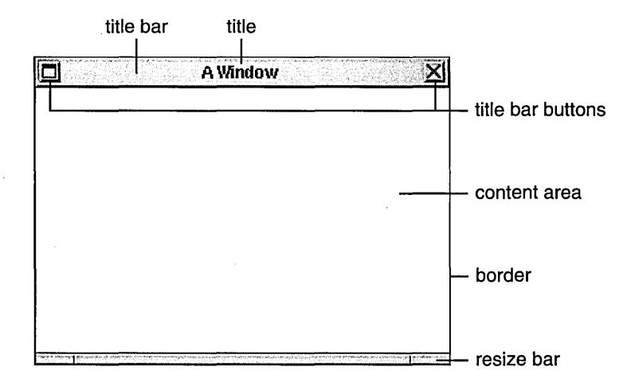

## **Window Order**

Windows on-screen are ordered from front to back. Like sheets of paper loosely stacked together, windows in front can overlap, or even completely cover, those behind them. Each window has a unique position in the order. When two windows are placed side-by-side, one is still technically in front of the other.

If any window could be in front of any other window, then small but important windowslike menus and docked icons-might get lost behind larger ones. Windows that require user action, like attention panels and pop-up lists, might disappear behind another window and go unnoticed. To prevent this, all the windows on-screen are organized into *tiers.* 

When two windows belong to the same tier, either one can be in front. When two windows belong to different tiers, however, the one in the higher tier will always be above the other. on-screen windows are divided into these seven tiers:

- Windows that appear in a spring-loaded mode-pop-up lists, pull-down lists, and menus that come to the cursor-are assigned the frontmost tier. (Having menus come to the cursor is an option that the user can enable with the Preferences application. It's described in "Bringing the Main Menu to the Cursor" in Chapter 6.) Spring-loaded windows remain on-screen only while the user holds a mouse button down, so they only momentarily obscure other windows. Putting them in the first tier guarantees that they won't appear in back of another window.
- Attention panels are assigned to the second tier. Like spring-loaded windows, they're only temporarily on-screen. But unlike spring-loaded windows, the user must do something to dismiss them, rather than continue an action to keep them visible. Keeping an attention panel in front, where it can't be covered by other windows, confronts the user with it until it's dismissed and thus encourages prompt user action.
- The main menu is assigned the next tier back. In the absence of an attention panel or spring-loaded window, the usual case, it's the frontmost window on-screen.

#### **Writing Note: The Meaning of Window**

In documentation for users, the term windowgenerally refers only to standard windows, though panels and menus are acknowledged to be windows of a special type. Miniwindows, lists, and icons are referred to only by their specific names; they should not be included within the generic term window as this would imply common behavior that's lacking.

- Other menus are assigned to a tier just below the main menu. They can cover each other, but not the main menu.
- Docked application icons occupy the fifth tier. They can be covered by lists, attention panels, and menus, but not by the ordinary windows of your application.
- Floating panels are in the sixth tier. Floating panels are defined and discussed in Chapter 5.
- All other windows are grouped in the seventh-the last and largest-tier. Most of the windows seen on-screen are in this tier. They can cover each other, but can't come in front of the dock, menus, attention panels, or spring-loaded windows.

This seven-tier system keeps attention panels, menus, and docked application icons in view, and thus readily available to the user; it prevents them from being inadvertently lost in a large pile of windows. Although attention panels, menus, and docked application icons can cover other windows, the user can get them out of the way when needed. Menus can be moved to the side or closed, and the dock can be slid mostly off-screen. Attention panels should be attended to and dismissed.

To get the user's attention, when a window is first placed on-screen it comes up at the front of its tier.

**Note:** Even when a window is totally obscured by other windows, it's still considered to be on-screen; it retains its ranking in the order and can be exposed by moving the windows in front to the side.

## **Window Behavior**

Windows respond to user actions in the following ways:

- Any window can be brought to the front of the screen, relative to other windows in its tier.
- Any window with a title bar can be moved to a new location on the screen, as can any miniwindow or application icon.
- Any window with a resize bar can be resized.
- A window with the appropriate buttons in its title bar can be closed or miniaturized.

A window's title bar can display two buttons:

Miniaturize button Clicking this replaces the window with its mini window

> counterpart. The miniwindow represents the window on-screen and gives the user access to it. Double-clicking the miniwindow causes it to disappear and the window that was

miniaturized to reappear.

Close button Clicking this removes the window from the screen.

When the user clicks a button in the title bar, the action of the button is performed. The click doesn't count as "clicking in a window" for the purpose of bringing the window to the front, making it the key window, or activating an application (the key window and active application are discussed in "Application and Window Status" in this chapter).

Title bar buttons are illustrated below. The window in front has both buttons as they normally appear. The miniaturize button is on the left and the close button is on the right. The window in back shows a *broken* close button. The close button should be broken when the user would lose work by closing the window-for example, when the window displays a document that the user has edited but not saved. More information on the miniaturize and close buttons is in "Implementing Windows" in this chapter.


## **Reordering**

Clicking in a window brings it to the front of its tier, provided that the click isn't in a title bar button. The window is reordered immediately as the mouse button is pressed. If the user is dragging the window to a new location, this lets the window assume its reordered position before being moved.

Another way the user can reorder windows is to press the Command key while pressing the up-arrow or down-arrow key. Command-up arrow moves the backmost panel (if it's in the lowest tier) or standard window to the front of the tier. Command-down arrow moves the frontmost one to the back.

## **Moving**

The user can drag any window by its title bar (if it has one). The action of pressing and releasing the mouse button to drag the window also counts as a click and brings the window to the front of its tier.

#### **Resizing**


If a window has a resize bar, the user can change the size of the window by dragging the resize bar. An outline of the window edge follows the cursor, as shown in the figure above. When the user releases the mouse button, the window resizes to the outline.

## **Closing**

The close button removes a window from the screen. What this means depends on the type of window:

Menus and panels

A menu that's closed is removed from the screen, but the user retains a way to retrieve it quickly through a command in another menu. Panels that are closed are retrievable in the same way. (See Chapter 6 for more information on menus.)

When a panel that was closed is returned to the screen, it assumes its former size and location, and it retains its former state. From the user's point of view, and programmatically, it's the same panel that was closed.

Standard windows

Closing a standard window usually removes it from the application as well as from the screen. From the user's point of view, the same window can't necessarily be made visible again. The application might create a new window with the same title and a similar display, but there might be differences. The selection might not be preserved, and the new window won't necessarily be located in the same place or have the same shape as the old one, especially if the user had moved or resized the window that was closed.

#### **Programming Note: Windows and the Application Kit**

Everything that this section, IIHow Windows Work," discusses is automatically handled by the Application Kit Window class and its subclasses. For example, when the user closes the key window, a new one is automatically chosen. The few decisions you must make are discussed later under IIlmplementing Windows."

## **Miniaturizing**

Miniaturizing a window removes it from the screen without destroying it or its contents. From the user's point of view, the window is transformed into a miniwindow. Double-clicking the mini window reverses the miniaturization.

Most standard windows and some panels have a miniaturize button. Windows that have a miniaturize button can be miniaturized using either the button or the standard Miniaturize Window menu command. A group of windows representing a single document can be miniaturized into a single miniwindow, as described under "The Document Menu" in Chapter 6.

Users can't work in a miniaturized window, but programs can continue to alter the window's display. For example, if you begin compiling a program in a Terminal window, and then miniaturize the window, you'll see any error messages written by the compiler when you return the window to the screen. '

Miniaturizing differs from closing in a number of ways:

- Miniaturizing preserves the window as it was last seen on-screen. A window that's closed can't necessarily be retrieved in the same state.
- Miniaturizing a window leaves behind a mini window so that it can be brought back to the screen. Closing a window doesn't provide the user with a way of getting it back.
- Miniaturizing a window that displays a file won't close the file or change the way it's displayed. Closing a window usually closes the file it displays.

#### **Hiding and Retrieving Windows**

The Hide menu command lets the user clear the screen of all the windows belonging to an application. This opens up the workspace so that it's easier to work in another application.

When an application is hidden, only its application icon remains on-screen. When the user double-clicks the icon, the hidden windows reappear on-screen. Users can resume working in the application, picking up again at exactly the point where they left off.

Double-clicking an application icon has one other effect: It activates the application (as discussed in the next section), and so may cause the menus and panels of another application to disappear, while those of the newly activated application reappear.

Double-clicking the icon for a running application activates it and brings its windows to the front, even if the application wasn't hidden. (The user can also bring covered windows forward using commands in the Windows menu, as described in Chapter 6.) The application's menus also return to the screen.

If the user holds down the' Command key while double-clicking an application icon, the application is activated as usual, but in addition all other applications are hidden.

**Note:** A window that's completely obscured by other windows is "covered," but not "hidden" in the sense used here. A covered window can be made visible by moving the windows in front of it to the side. A hidden window can't be-it's completely removed from the workspace.

## **Application and Window Status**

Since more than one application can run at a time, the screen is likely to display windows for a variety of different applications. The Workspace Manager is one application that will often have a window on-screen. Some users will also run Mail and a spreadsheet, or perhaps a word processor and Digital Webster'" (a dictionary and thesaurus application), at the same time as other applications.

The user must be able to pick a particular application, and a particular window in that application, to work in. The application that the user is currently working in is known as the *active application;* the windows that are the current focus of user attention in the active application are the *key window* and the *main window.* The key window and main window are usually one and the same. The two terms identify different functional roles that can be assumed by the same window:

- The key window is the window that receives characters from the keyboard.
- The main window is the window containing the selected target for controls.

These three concepts-the active application, key window, and main window-refer not to inherent properties of applications and windows, but to their status at a particular point in time. They're discussed more fully in the three sections that follow.

## **The Active Application**

Out of all running applications, at most one is selected to be the active application (the principal application the user is working in). An application must be activated-made to be the active application-before the user can type in its windows or use its menus.

The active application differs from other running applications in four ways:

- It's the only application with visible menus. When an application is deactivated, its menus are hidden from view. When it's reactivated, they're restored to the screen.
- It's the application that owns most, if not all, of the panels that are visible on-screen. In general, panels behave like menus: They hide when the application isn't active and return to the screen when the application is reactivated. In exceptional cases, however, you may choose to leave a panel on-screen even when the application isn't active. (See Chapter 5 for guidelines on when it's appropriate to allow a panel to persist.)
- It's the application that receives the user's keyboard actions. Typing and keyboard alternatives can affect only the active application. When there's no active application, the user's keystrokes have no effect.
- It's the application that contains the key window and main window (if there is a current key window or main window), and its windows are likely to be in front of the windows of other applications.

#### **Application Activation**

In general, the task of selecting the active application is left to the user. With one exception, an application never becomes active unless the user does something to activate it. The user's action can be direct, such as starting up the application or clicking in one of its windows, or indirect, such as having one application send a message to another application.

The exception is that when the user hides or terminates an application, the system guesses which application should be activated next (based on which applications have on-screen windows, as described below). This method saves the user from always having to click to choose the new active application.

An application is activated when:

• The user starts it up, unless the user activates another application while the first one is starting up.

- The user double-clicks a miniwindow belonging to the application, or double-clicks the application's freestanding or docked icon. Double-clicking a docked icon starts up the application if it's not already running.
- The user clicks within one of the windows belonging to the application, provided the window isn't a miniwindow or application icon.
- It receives a message from another application, if the message asks it to do something that may require interaction with the user. A message from the Workspace Manager asking the receiver to open a file is one such message. A message sent to Digital Webster asking it to define a word is another. (See "Activating an Application" later in this chapter for details.)
- It has the frontmost panel or standard window on-screen after the current application is hidden or terminated.

#### **Application Deactivation**

There can be only one active application per workspace (that is, one per Window Server) at a time. Whenever the user chooses a new active application, the previous one is automatically deactivated. The Application Kit and Workspace Manager take care of this task.

The active application is also deactivated when:

- The user hides its windows (by using the Hide command).
- The user terminates it (by choosing the Quit command).

In either case, if another application has panels or standard windows on-screen, then the Workspace Manager activates the application with the frontmost panel or window. If no other applications have panels or standard windows on-screen, then no application becomes active.

In addition, an application should deactivate itself just before sending a message to another application, if the intent of the message is to have the other application become active. (See "Activating an Application" later in this chapter for details.)

**Note:** A deactivated but running application can still do work. It's "deactivated" only in the sense that it no longer is the active application, so the user can't interact with it without activating it again.

## **The Key Window**

Users expect to see their actions on the keyboard and mouse take effect not only in a particular application, but also in a particular window of that application. Each user action is associated with a window by the Window Server and Application Kit. Before acting, the user needs to know which window will be affected-there should be no surprises.

Since the mouse controls a cursor, it's quite easy for the user to determine which window a mouse action is associated with. It's whatever window the cursor is over. But the keyboard doesn't have a cursor, so there's no natural way to determine where typing will appear.

The window associated with keyboard actions, the one where typing will appear, is known as the key window. To mark the key window for users, the Application Kit highlights its title bar (by turning it black).

Key window highlighting is illustrated below.


You can think of the highlighting as a kind of cursor for the keyboard. It shifts from window to window as the key window changes. Key-window status also moves from application to application as the active application changes. Only one window on the screen is marked at a time, and it must be in the active application. There's just one key window per machine and keyboard. Even a system that has two screens, but only one keyboard, has at most one key window.

**Note:** A window doesn't have to become the key window to receive, and act on, keyboard alternatives. It does, however, have to be in the active application.

Since the key window belongs to the active application, its black title bar has the secondary effect of helping to show which application is currently active. The key window is the most prominently marked window in the active application, making it "key" in a second sense: It's the main focus of the user's attention on the screen.

#### **The Main Window**

The *main window* is the standard window where the user is currently working. It's the focus of user actions carried out in panels and menus. The Find panel, for example, requires the user to supply information by typing it. Since the panel is the destination of the user's keystrokes, it's marked as the key window. But the panel is just an instrument through which users can do work in another window-the main window.

Whenever a standard window becomes the key window, it also becomes the main window. When key-window status shifts from a standard window to a panel, main-window status remains with the standard window.

So that users can pick out the main window when it's not the key window, the Application Kit highlights its title bar in dark gray. If the main window is also the key window, it has only the black highlighting of the key window. The following figure illustrates the main window when it's marked as the key window and when it's not.

A menu command might affect either the key window or the main window, depending on the command. For example, the Paste command can be used to enter text in a Find panel. But the Save command saves the document displayed in the main window, and the Bold command turns the current selection in the main window bold. For this reason, user actions in a panel or menu are associated with both the key window and the main window:

- An action is first associated with the key window.
- If the key window is a panel and it can't handle the action, the action is next associated with the main window.

Note that this order of precedence is reflected in the way windows are highlighted: The key window is always marked, but the main window is marked only when it's not the key window.

The main window is always in the same application as the key window, the active application. It follows the key window as the user's actions shift the focus from window to window and from application to application.


## **How Windows Become the Key Window and Main Window**

Whenever possible, the user, rather than the application, selects the key window and main window. This section describes how this happens and the part that the Application Kit plays. Later in this chapter, "Choosing the Key Window" describes when and how an application needs to choose its own key window.

#### **In the Active Application**

. In the active application, the user can select a new key window by clicking in it. If the window is a standard window, it's also made the main window. If it's a panel that accepts keystrokes, it's highlighted as the new key window, but the former main window retains its status and is highlighted in dark gray. The user can't select a main window without also making it the key window.

The Application Kit chooses a new key window (or main window) for the active application whenever the user closes or miniaturizes the window currently having that status. Even if the application has no more windows on-screen, and thus no new key window can be chosen, the application still remains active: It's up to the user to decide whether to continue working in it.

#### **When an Application Is Activated**

When an application is activated, one of its windows is made the key window and one (usually the same one) is made the main window. Again, whenever possible, the user makes the selection:

- If the user activates the application by clicking in a window that accepts keystrokes, it becomes the key window. If the window is a standard window, it's also made the main window.
- If the user activates the application by double-clicking a miniwindow, the window it represents again appears on-screen and becomes the key window and main window.

If an application is activated without the user directly selecting a new key window, the user's previous selections are honored. For example, if the user reactivates an application by double-clicking its icon, the previous key window and main window are restored.

**Note:** When a new application is activated, its key window may be highlighted before the former key window (in the deactivated application) loses its highlighting. This is a consequence of a multitasking environment. Users can begin working in one process (the new active application) before their instructions to another process (the previous active application) have been completed. Although the former key window may retain its highlighting for a short time, it's no longer the key window; all keyboard actions are associated with the new active application.

## **The Results of Clicking in a Window**

Clicking in a window has two separate, but related, results:

- The window usually becomes the key window (and usually also the main window), and its application is activated. Standard windows always become the key window when clicked, but panels might not, as described in Chapter 5.
- The window comes to the front of its tier.

The first is a change in the window's status, the second in its position on-screen.

Both results are required to make the window available to the user to work in. The window needs to be reordered in front of other windows so that its contents aren't covered. It also must become the key window for the user to be able to type in it and for it to receive menu commands. For a window to become the key window, its application must be activated.

In NeXTSTEP, however, these two results of a mouse click, while logically related, are not inseparable. If the click is in the window's title bar and is modified by the Alternate key, it brings the window to the front, but doesn't make it the key window or activate its application. Alternate-clicking in the title bar thus lets users rearrange and reorder windows on the screen without changing the current key window, main window, or active application.

## **Implementing Windows**

The section gives a few guidelines for designing and placing various kinds of windows.

## **Designing Windows**

The only windows that have a fixed size are miniwindows and icons. The initial size of all other windows is determined by the application. Generally, standard windows are larger than panels and panels are larger than menus, but there are no fixed rules.

When designing a panel or standard window, you should keep a substantial proportion of it free of objects that respond to the first click. It shouldn't be difficult for the user to find a place to click within the window to select it.

You should try to limit of the number of panels and standard windows that the user needs to use your application. Having too many windows results in a cluttered screen that can confuse the user. Even two windows can be too many if users can't tell which window they're supposed to work in. And a cluttered screen can frustrate the user's attempts to work in two or more applications at once.

## **Placing Windows**

One of the principles of the NeXTSTEP user interface is that users are in control of their own workspace. Part of this control is the freedom to rearrange windows to suit the users' own tastes and needs. However, if a window that's been dismissed and then brought up again doesn't appear in its previous location, the user's work of rearranging windows is thrown away. The user might have to move the window back to its previous location every time the window is brought up.

To avoid making the user rearrange windows unnecessarily, each panel and non-document standard window should remember its own location. The next time the window is brought up, it should appear in the location it last appeared in. For example, suppose the user brings up a Find panel, moves it to a new position, and then closes it. The next time the user brings up the Find panel, it should come up in the new position-even if the user has quit and restarted the application in the meantime.

Whether document windows should also remember their position depends on the application. For example, Digital Librarian document windows don't remember their positions because users typically open many documents at once, and thus need the application's help in positioning the windows. However, an application such as a drawing program that's typically used for editing one file at a time should probably let the user determine each document window's default location.

The first time a window comes up, its position is determined by the application. To ensure a consistent user interface, all applications should follow these guidelines for initial locations of windows:

- When an application starts up, its main menu should appear in the upper left corner of the screen, unless the user has specified a different location for it.
- Standard windows should come up to the right of the main menu, allowing enough room for submenus that might later be attached to the main menu. Some applications also allow room for panels to come up to the left of the standard window and below the main menu.
- Attention panels should come up centered in the upper part of the screen, where they won't be overlooked.
- No part of any window (other than miniwindows and icons) should be placed off-screen, unless the user has put it there.

#### **Programming Note: Saving Window Positions**

Three methods exist to help panels and non-document standard windows remember their window position. Calling the **setFrameAutosaveName:** method once per window makes the window save its position in the defaults system whenever necessary. The next time the window comes up, it automatically appears at the last-saved position. A less automated way of remembering the window position is to call **saveFrameUsingName:**  every time you wish to save the position, and call **setFrameUsingName:** to set the window's position when it's being brought up.

The methods discussed above aren't appropriate for document windows, since there's no easy way to guarantee unique names for documents. If your application saves the positions of its document windows, you should use the **saveFrameToString:** method to save a representation of the window's position into the document itself. When opening the document, you should position its window using **setFrameFromString:.** 

## **Implementing Standard Windows**

Standard windows are the most widely used type of window and the principal type for all applications. If an application lets the user edit files, each file should be displayed in a separate standard window. If the application is a game, the game board should be in a standard window, and if the application is a simple accessory like a clock, the clock face should occupy a small standard window of its own.

Every standard window has a title bar; most also have window controls—a resize bar, close button, and miniaturize button. This section discusses choosing the window's title and everything that you need to implement when the window controls are present. It also describes cases when it's acceptable to omit the window controls.

## **Choosing a Title**

If a window displays a document that can be saved, the title bar of the window should display the name of the document, followed by an em dash and the path of the folder where the document is located. The em dash is set off by two spaces on each side. For example:

jobRecords — /Net/machine/home/records

The title bar is not usually a good place to show status, such as what the application is currently doing. It's usually clearer to display this status in the window or in a panel. Status within a window is often displayed in small, dark gray text (as in the Workspace Manager File Viewer).

#### **Programming Note: Implementing Titles of Document Windows**

You should use the **setTitleAsFilename**: method of the Window class to set the title of a document window. For example, to produce the window title

jobRecords — /Net/machine/home/records

you should send a **setTitleAsFilename**: message with the argument "/Net/machine/home/records/jobRecords".

## **Using the Resize Bar**

Most standard windows-especially those with scrollable contents-should have a resize bar. It gives users control of their environment by letting them choose how much screen space to devote to the contents of th~ window.

If a window has a resize bar, you should be careful that the window remains as useful and attractive as possible, no matter how small or large it becomes. Each window can constrain its shape so that it doesn't become too big or too small, or so that it grows and shrinks in unit amounts. For example, the Workspace Manager File Viewer grows and shrinks only by the width of its browser columns, which eliminates the possibility of showing only a partial column.

## **Using the Miniaturize Button [CJ**

Except when an application is useless without a particular standard window, each standard window should have a miniaturize button. When a window is miniaturized, it should remain miniaturized until the user explicitly unminiaturizes it.

Because a miniaturized window isn't likely to be foremost in the user's thoughts, the application should never alter a miniaturized window without the user's knowledge. However, it's fine for an application to continue doing some work in a miniaturized window, as long as the user requested that the work be done. For example, the Terminal application completes commands that the user entered in a Terminal window. But it's unacceptable, for example, to change the font in a miniaturized window unless the user specified a font change for *all* windows.

The miniaturize button has a counterpart command in the Windows menu that miniaturizes the key window. You can also provide a command in the Document menu that miniaturizes several related windows into a single mini window. See "The Windows Menu" and "The Document Menu" in Chapter 6 for information on how these commands work.

## **Using the Close Button** ~

Most standard windows have a close button. However, sometimes the close button isn't necessary. For example, the Digital Webster application is useless if its only standard window isn't visible, so the window has no close button.

Your application should break the close button ~ whenever the user would lose work by closing the window. From the user's point of view, a broken close button means that the application won't let the user lose work by accidentally closing the window. If the user tries to close a window that has a broken close button or tries to quit its application, the application should bring up a Close or Quit panel, respectively. (See Chapter 5 for more information on these standard panels.)

**Note:** If an application uses multiple windows to display a single file, then all the windows' close buttons should break when unsaved work is in any window. However, the application shouldn't bring up a Close panel until the user closes the last window for the file.

An example of breaking the close button is in the Mail application. Mail breaks a Send window's close button as soon as the user types in the message area of the window. If the user then tries to close the window (either directly or by quitting the application), Mail puts up an attention panel that makes the user either confirm that the window should be closed or cancel the close.

If an application does no work that can be saved, but merely shows data that can change, then it can break the close button to show that the window isn't up-to-date. The application should also provide a way for the user to force the window to update. Workspace Manager uses the close button this way.

Like the miniaturize button, the close button has a matching command in the Windows menu. The command has a keyboard alternative, Command-w (for "window"). (See "The Windows Menu" in Chapter 6 for details.)

## **Implementing Window and Application Status**

Most aspects of window and application status are handled automatically. However, you still must choose the first key window and decide which windows can become key windows. (For information on when to make a panel the key window, see Chapter 5.) The application should also activate itself in the appropriate way, as discussed below.

## **Choosing the Key Window**

In general, all the standard windows in your application should be permitted to become the key window, even if they don't respond to keyboard actions. Giving key-window status to a window focuses attention on it and prevents the user from typing in any other window. If the key window doesn't do anything with the user's typing, it should beep as it receives the keystrokes to indicate to the user that typing isn't appropriate.

When an application is activated on startup, it should designate one of its windows to be the initial key (and main) window. If the application opens a document file for the user, the window that displays the document should be the key window.

## **Activating an Application**

Usually, an application doesn't have to explicitly activate or deactivate itself. When your application exchanges messages with the Workspace Manager, uses services, or provides services, application activation and deactivation are handled by the system. For example, when the user chooses the Mail Selection service from Edit's Services menu, the Edit application is deactivated. Mail is then activated on condition that no other application is currently active. Since the Edit has been deactivated, this condition will be met, unless the user has activated another application in the meantime. All this happens automatically.

The only time an application should need to explicitly activate or deactivate itself is when it communicates with another application without using the services system or the Workspace Manager. This might happen when two applications work together closely by sending messages directly to each other. If the intent of a message is to activate the receiving application, then the sender of the message should deactivate itself just before sending the message, and the receiver should conditionally activate itself when it receives the message. If the intent of a message is not to activate the other application, then neither application should activate or deactivate itself. In general, a message should conditionally activate the receiving application if the user might need to work in it-even if only to operate a scroller.

**Important:** Applications should avoid activating themselves unconditionally. Unconditional activation violates the principle of user control, since it ignores the user's desire to turn to something else.

#### **Programming Note: Activating and Deactivating an Application**

As described in the section "Activating an Application," most applications don't need to explicitly activate or deactivate themselves. However, when necessary, an application can conditionally activate itself with the following code:

[NXApp activateSelf:NO];

An application can deactivate itself as follows:

[NXApp deactivateSelf];

## **Avoiding Activation when Dragging**

When a user drags an object such as a color or file between two applications, both the area that originally contains the object (the source) and the area that the object is being dragged to (the destination) need to be visible. Sometimes the user needs to move the windows of one or both applications to make this true. Once the user starts to drag the object, it can be inconvenient for the applications' windows to change their ordering, since that can cause the destination to be covered. But if the source's application isn't active when the user starts dragging, the standard response would be to activate it, which would bring the application's windows forward and perhaps cover the destination.

To avoid covering the destination, an exception to the standard activation behavior is necessary: When a user drags an object from one application to another, the source's application should not become active as a result of the dragging operation. However, the source's application should activate as usual when the user clicks anywhere in the source's window or begins a drag anywhere in the window except the source area.

Avoiding activation when dragging objects is fairly simple to implement. First,each View that contains draggable objects shouldoverride **acceptsFirstMouse** so that it returns YES. This enables the View to receive events whether or not its window is the key window. Next, the View should override the **shouldDelayWindowOrderingForEvent:**  method so that it returns YES when the passed mouse-down event occurred over a draggable object. (The **shouldDelayWindowOrderingForEvent:** message is sent just before the **mouseDown:** message for the event.)

That's all you have to do if you use the dragging system. The dragging system automatically calls the **preventWindowOrdering** method (which prevents the window's application from being activated) if the object is dragged. Unless the **preventWiridowOrdering** method is called, the window's application is activated, as usual.

# 5 *Panels*

Panels support the work done in the principal windows of an application. Like menus, most panels are vehicles through which the user can give instructions to the application. But unlike menus, they aren't restricted to a single column of commands: A panel can provide the user with a variety of different control objects-buttons, sliders, text fields, and morearranged as best suits its purpose. The Font, Find, Page Layout, and Open panels are all examples. Such panels can be viewed as generalized and more versatile menus.

Some panels playa different role, however. Instead of letting the user give instructions to the application, they give information to the user. Help panels, the Info panel, and attention panels that display warnings are examples.

What unites all panels-whether they convey instructions from the user to the application or information from the application to the user-is that they play conventional, supporting roles. Unlike windows, none of them is a site for the user's main work in the application. In a panel, the dialog between the application and the user is highly structured in both form and content.

This chapter first describes the basic attributes of ordinary panels, and then describes how attention panels are different. The last section gives guidelines on creating your own panels and using the ones supplied by the Application Kit.

## **How Panels Work**

Because panels are a type of window, many of their characteristics are discussed in Chapter 4, "The Window Interface to Applications." Only the unique characteristics of panels are discussed in this section.

## **Ordinary Panels**

Ordinary panels-those that aren't attention panels-look and act very much like standard windows. They're typically in the same tier as standard windows, so they compete with them for screen space. They have title bars just like standard windows, although panels don't usually have miniaturize buttons. However, ordinary panels differ from windows in a number of ways:

- They can never be the main window.
- They shouldn't become the key window unless they accept characters from the keyboard.
- They generally aren't visible unless they belong to the active application-they rarely persist on-screen once the application has been deactivated.

In addition, some ordinary panels are in a tier above standard windows, as discussed later in "Floating Panels."

#### **Programming Note: Creating Panels**

The Application Kit contains several ready-made ordinary and attention panels that you can use, as well as functions that let you easily create basic attention panels. You can also create custom panels-either ordinary panels or more complex attention panels. If you create a custom attention panel, you are responsible for making sure that the panel looks like an attention panel. (Similarly, custom ordinary panels should look like ordinary panels, and not like attention panels.)

## **Attention Panels**

An attention panel demands attention from users by denying them the ability to work in any other window of the active application. Until it's explicitly dismissed, the panel limits what the user can do within the application to just rearranging windows. Nothing else-title bar buttons, text entry, miniwindows, or controls in other panels-will work. The only menu commands that work are those that can affect the panel itself-for example, Cut, Copy, and Paste, if the panel includes a text field.

It's possible to activate another application while an attention panel is on-screen, but when the user returns to the previous application, the mode created by the attention panel is still in effect.

An attention panel differs from ordinary panels in the following ways:

- It has an empty title bar.
- It's closed by one or more buttons in its content area, not by a button in the title bar.
- It stays on-screen-even when the application isn't active-until dismissed by the user.
- It's the key window whenever the application is active.
- It's isolated in a tier above everything on the screen except spring-loaded windows such as pop-up lists.

Attention panels come up centered in the upper part of the screen, so the user can't overlook them. (The user can move them out of the way, though.)

Because an attention panel sets an exclusive mode for itself, in effect disabling the rest of the application, it must be unmistakable and immediately apparent to the user. Some of the features that distinguish attention panels from other windows are illustrated below.


Attention panels are dismissed from the screen as soon as the user takes the required action, which can be as simple as typing Return. When dismissed, the panel's mode ends.

## **Implementing Ordinary Panels**

Ordinary panels can be used in many ways, so you have many choices when implementing them. This chapter discusses the conventions for ordinary panels that are different from those for standard windows.

## **Window Considerations**

Although ordinary panels are similar to standard windows, conventions for title bar buttons and key-window status differ slightly from those for standard windows. For more detailed information on the title bar buttons and on key windows, see "Implementing Windows" in Chapter 4.

## **Using the Resize Bar**

If resizing the panel might be useful, then it should have a resize bar. Like a standard window, a panel should constrain its shape if necessary to prevent the panel from becoming a size that's too large or too small.

#### **Using the Miniaturize Button**

A panel can have a miniaturize button, but it's rare that one would be needed. Like menus, panels can be closed and returned to the screen through a menu command. A miniaturize button is redundant unless a mini win dow would, for some reason, be more convenient for the user than the command, or unless the panel persists on-screen when the application isn't active (see "Persisting Panels," later in this chapter).

#### **Using the Close Button**

Every ordinary panel should have a close button so the user can dismiss the panel when it's not needed. The close button is never broken, since panels don't contain the main work of the application.

## **Becoming the Key Window**

An ordinary panel should become the key window only if it accepts keystrokes (typing) or if it's used independently of any other windows. For example, the Find panel becomes the key window so that the user can type in the word to be found. But the tools palette in a graphics application should never become the key window because it's operated only by the mouse and it's always used in conjunction with a document window. On the other hand, the standard Info panel should become the key window because it contains information that's independent of the application's other windows. In other words, it's the center of the user's attention and thus should be the key window.

A panel that accepts keystrokes can delay becoming the key window until the user indicates a readiness to begin typing (such as by clicking in a text field), provided that both of the following are true:

- Text entry is not essential to using the panel.
- Users typically don't enter text when using it.

This is likely to be the case if most of the control devices in the panel are not text fields (they are buttons, selection lists, and so on) and if the choices that can be made by entering text can also be made in an alternative way (for example, by selecting items from a list). The Font panel is an example. This kind of panel should not show any selection until the user indicates a readiness to begin typing.

#### **Programming Note: Avoiding Key-Window Status**

Panels that need to avoid becoming the key window until the user indicates a readiness to begin typing can use the **setBecomeKeyOnlylfNeeded:** method of the Panel class to do so.

However, panels that should never become key-a tools palette, for example-must use a different way to avoid becoming the key window. Each panel must remove key-down andkey-up events from itsevent mask.

## **Relinquishing Key-Window Status**

A panel should remain the key window only as long as necessary. If user actions within the panel affect the main window, key-window status should be returned to the main window as soon as those actions are completed.

For example, when the user clicks the Set button (or types Return) in a Font panel to change the font of the current selection in the main window, the panel gives up key-window status (if it had it). In all likelihood, the user is finished with the Font panel (at least until the selection has changed) and is ready to resume working in the main window. Under these circumstances, the user should be free to begin working in the main window immediately, without being forced to click in it just to make it the key window.

## **Exceptions to Ordinary Panel Behavior**

In general, ordinary panels are unobtrusive. They're in the lowest tier on-screen, and they disappear when their application is deactivated. Sometimes, though, an ordinary panel needs to be more prominent, as described in the following sections.

#### **Persisting Panels**

By default, an ordinary panel is removed from the screen when its application is deactivated. The user sees only panels related to the active application. This prevents confusion-such as might arise when similar Find panels for two different applications are on-screen at once.

An application can override this default behavior and allow a panel to remain on-screen after the application has been deactivated, but only if the panel contains information that would be pertinent to the user's activities in another application. This should be a rare occurrence.

An example is the Workspace Manager Info panel, which contains system-level information such as the amount of memory in the computer. Because the user might want to copy this information down-for example, into a mail message-this panel persists even when the Workspace Manager is deactivated.

#### **Floating Panels**

Ordinary panels are normally in the same tier as standard windows. Sometimes, though, it's useful to have a panel float above all other standard windows and ordinary panels. For example, a small panel containing a palette of drawing tools is most useful if it floats above the application's other windows. An example of a palette is below.


A panel should be allowed to float above standard windows only if it passes all four of the following tests:

- It's oriented to the mouse rather than the keyboard. Thus a panel that can become the key window should not be made a floating panel, unless it becomes the key window only when the user is ready to type (see "Becoming the Key Window" earlier in this chapter).
- It's important that the panel remain visible while the user works in the application's standard windows. This test is passed if the user must frequently move the cursor from a standard window to the panel and back again (as for a tool palette) or the panel gives information relevant to the user's actions in the standard window (as in some inspector panels).
- It's small enough not to obscure much of what's behind it.
- It doesn't persist (remain on-screen) when the application is deactivated.

Thus, panels float for some of the same reasons that menus do.

#### **Panels with Variable Contents**

Two types of ordinary panels—multiform panels and inspector panels—are used in many applications to show specialized information in a limited amount of space. Both multiform and inspector panels can be used for many different purposes, even within the same application.

## **Multiform Panels**

A multiform panel is a panel that has a pop-up list or set of graphical radio buttons at the top that lets the user choose which form the panel takes. For example, the following panel lets the user choose anyone of seven different forms.

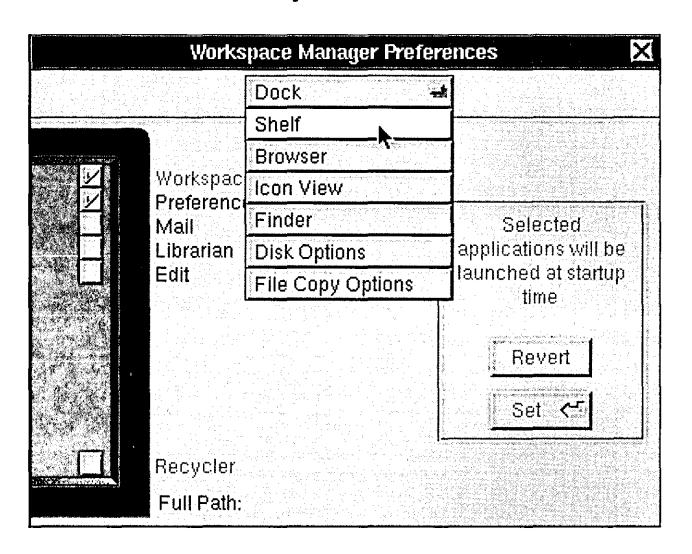


Multiform panels conserve screen space by combining many related panels into a single panel. Since all their contents aren't visible all the time, multiform panels shouldn't be used for an application's most basic functionality.

## **Inspector Panels**

An inspector panel is any panel that displays information about the object that's currently selected. Inspectors usually let the user set properties of the object, as well. The Font panel (described in "Standard Panels" later in this chapter) is an inspector panel. It displays information about the font of the current selection. The Workspace Manager Inspector panel (shown below) lets the user see and set information about the currently selected file or folder. Inspectors are often multiform panels, with each form displaying a different kind of information about an object.


## **Implementing Attention Panels**

Attention panels are appropriate in only a limited number of situations. Because they create a mode that severely limits the user's freedom of, action, their use should be restricted as much as possible. A panel can be made an attention panel when:

- It gives the user information about the current context. Such panels usually warn of an error, of a potentially dangerous or unexpected result of the user's current course of action, or of a condition that makes it impossible to carry out a requested action. But they may also simply supply information the user will need to proceed intelligently with the application.
- It interrupts an action to give the user an opportunity to take corrective steps-as, for example, the panel that interrupts the Quit command to let users save altered files before the application terminates.
- It clarifies or completes a user action-as, for example, the panel that completes the Save As and Save To menu commands. (In this case, the menu command must have three dots after its name-for example, "Save As ... ". This is discussed under "Commands that Bring Up Panels," in Chapter 6, "Menus.")

Attention panels that interrupt or complete an action must have a Cancel button. The Cancel button gives the user the option of canceling the action, in which case it should be as if the user had never initiated the action in the first place. Panels that inform or warn should, if possible, let the user choose what to do in response to the information they convey.

## **Naming an Attention Panel**

Attention panels that come up as the result of a command or a commandlike user action should be named after the action that brings them to the screen. For example, the panel that appears as the result of choosing a Save, Save As, Save To, or Save All command should be named *Save.* The panel that comes up when the user wants to close an edited but unsaved document should be named *Close,* whether it's invoked from the close button or through the Close or Close Window commands. The panel's name appears just to the right of the application icon, as shown in the following figure.

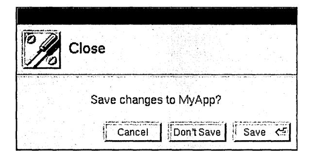

## **The Default Option in an Attention Panel**

When a user action brings up an attention panel with a variety of choices, the default button, the one in the lower right comer of the panel, should allow the user to easily carry through with the action. It should not contradict what the user set out to do. Specifically, it should not be the Cancel button.

The default button should not perform any additional action not implied by the user request that brought up the panel. In general, it should be the safest of the alternatives (for example, Open Copy rather than Open Anyway when the user tries to open a document that someone's already opened).

The default button in an attention panel should normally be operable by pressing the Return key on the keyboard (when the panel is the key window). If so, it should be marked by the Return symbol~. However, if the button has dangerous side effects, it's acceptable to require that the user press the button.

## **Dismissing an Attention Panel**

Each action that can dismiss an attention panel is represented by a separate button inside its content area. In contras"t, an ordinary panel is closed only by its close button (or the Close Window command), never by a button in the content- area.

The buttons that dismiss an attention panel should be located along the right and lower edges of the panel, with the default button in the lower right comer. No button except for the default button should be operable by the Return key.

## **Naming Buttons in an Attention Panel**

When naming buttons in an attention panel, you should label each one clearly with a verb or verb phrase describing the action it performs. The user shouldn't have to read the text of the attention panel to be able to choose the right button. Thus, generic labels (like *Yes*  and *No)* aren't appropriate, as they tend to cause user errors. Avoid using *OK* unless it's the only button in the attention panel.

Good names for attention panel buttons include:

Cancel

Close Anyway

Don't Close

Don't Save

Explain

Open

Open Copy

Open Anyway

Quit Anyway

Replace

Revert

Review Unsaved

Save

Save All

Set

## **Optional Explanations in an Attention Panel**

An Explain button can offer users a way of getting more information before dismissing the panel. A typical example is shown below.


## **Standard Panels**

Some panels show up in many different applications. For example, every application must have an Info panel, which gives certain kinds of general information about the application. Text processing applications also have a Font panel, which lets the user set the font of the text selection. .

This section describes all the standard panels. Some of them you have to create from scratch, using the guidelines in this section. Others are provided by the Application Kit. If a standard panel exists for functionality in your application, you should use it rather than designing your own.

You can customize Application Kit panels, if necessary, by adding controls and information to what the Application Kit provides. For example, the Open panel on the left, below, has a check box added to it. Compare it to the normal Open panel on the right.

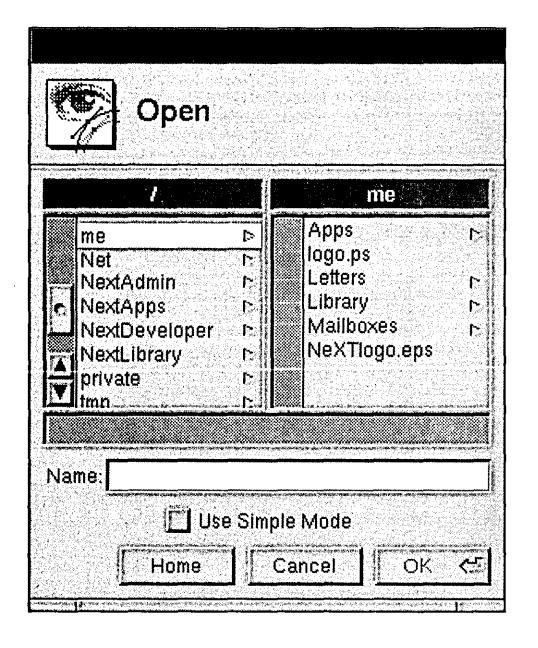


#### **Programming Note: Customizing Application Kit Panels**

To customize panels that are implemented by the Application Kit, you should first construct a View containing the information and controls you want to add. You can then add the View by sending it to the panel in a **setAccessoryView:** message.

The following table lists and describes the standard panels. After the table are sections describing how to implement each panel that isn't completely implemented by the Application Kit.

| Panel<br>Close | Description<br>An attention panel that should come up when the user tries to close<br>a document that has unsaved changes. See "Implementing the Close<br>Panel," later in this chapter, for more information.                                                                                                                                                             |
|----------------|----------------------------------------------------------------------------------------------------------------------------------------------------------------------------------------------------------------------------------------------------------------------------------------------------------------------------------------------------------------------------|
| Colors         | An ordinary panel that's provided by the Application Kit. It lets<br>the user preview and specify colors in any of the following<br>modes: color wheel, grayscale, red-green-blue (RGB),<br>cyan-magenta-yellow-black (CMYK), hue-saturation-brightness<br>(HSB), custom palette (which loads an image from which the user<br>can choose colors), and custom color lists . |
|                | . A Colors panel sometimes works with color wells. See "Color<br>Wells" in Chapter 7, "Controls," for information on color wells. See<br>"The Font Menu" in Chapter 6 for information on the command that<br>brings up the Colors panel.                                                                                                                                   |
| Find           | An ordinary panel that lets the user enter a string for an application<br>to search for. See "Implementing the Find Panel," later in this<br>chapter, for more information on this panel.                                                                                                                                                                                  |
| Font           | An ordinary panel that's provided by the Application Kit. It lets the<br>user preview fonts and change the font of the currently selected text.<br>See "The Font Menu" in Chapter 6 for more information on the<br>interface to fonts.                                                                                                                                     |
| Help           | An ordinary panel that's provided by the Application Kit. You<br>should use this panel to display anyon-line help provided by your<br>application. This panel displays information that can contain text,<br>graphics, and link buttons (which lead to other information). See<br>"U sing the Help Panel," later in this chapter, for information on<br>creating help.     |
| Info           | An ordinary panel that displays information about the application.<br>See "Implementing the Info Panel," later in this chapter, for more<br>information on this panel.                                                                                                                                                                                                     |

( *continued)* 

#### **Panel**

#### **Description**

Link Inspector

An ordinary panel that's provided by the Application Kit. It lets the user get and set attributes of the selected linked information. If your application's documents can receive linked information, then it should have this panel. See "Using the Link Inspector Panel," later in this chapter, for more information. "The Link Menu" in Chapter 6 has more information about links.

Open

An attention panel provided by the Application Kit. It lets the user specify the name of a file to open. See "Using the Open Panel," later in this chapter, for more information. The Document menu's Open command brings up this panel, as described in Chapter 6.

Page Layout

An Application Kit panel that queries the user for information that's needed for displaying the document on-screen, as well as for printing. It's brought up by a command in the Format menu, as described in "The Format Menu" in Chapter 6. This panel can be replaced by one more appropriate to your application, especially if your application has extensive page layout capabilities.

Preferences

An ordinary panel that allows the user to determine details of how the application looks and works. See the section, "Implementing the Preferences Panel," later in this chapter, for more information.

Print

An attention panel that's provided by the Application Kit. This panel comes up every time the user prints a document or other data. After specifying the information needed for printing, the user can do any of the following: send the output to a printer; save the output to a PostScript file, instead of printing it; send the output to a fax modem, instead of a printer; preview on-screen what will be printed; cancel any of the above actions, even after they've started. The main menu's Print command brings up this panel, as described under "The Main Menu" in Chapter 6.

Quit

An attention panel that should come up when the user tries to quit an application that has unsaved or uncompleted work. See "Implementing the Quit Panel," later in this chapter, for more information.

( *continued)* 

**Panel Description** 

Save An attention panel that's provided by the Application Kit. It queries

> the user for the name of a file to save to. See "Using the Save Panel," later in this chapter, for more information. See "The Document Menu" in Chapter 6 for information on when the Save panel is used.

Spelling An ordinary panel provided by the Application Kit to help the user

check the spelling of text. See "Checking Spelling" in Chapter 6 for

more information.

## **Implementing the Close Panel**

When the user closes a document that has been edited but not saved, the application must bring up a Close panel giving the user an opportunity to cancel the operation, save the document before closing, or confirm that it should be closed without saving. This attention panel should have at least these three buttons:

Cancel Don't Save Save

Save is the default option because many users don't think of closing a document and saving the most recent changes to it as separate operations-for many, closing implies saving.

If closing a document or window has consequences other than that unsaved changes would be lost, the application must still bring up a Close panel informing the user. For example, when the user closes a terminal emulation window, the application should notify the user that closing the window will cause the running command to be terminated. If the panel can't offer the user any way of avoiding the side effects, it should have these buttons:

Cancel Close Anyway

**Note:** Do *not* bring up a Close panel unless work is about to be lost.

## **Implementing the Find Panel**


This ordinary panel should have at least a text field to enter the search string and a button to find the next instance of the string. It's also good to have a button for finding the previous instance of the string.

**Note:** Although we recommend that buttons have verbs as titles, it isn't appropriate in the panel above, for two reasons. First, changing the titles to Find Previous and Find Next hides the real difference between the buttons; it's easy to miss the second word in a button. Second, since Find is already mentioned in the panel twice (and no other verb is), it's redundant to put Find in the button titles. See "Choosing the Button's Image or Label" in Chapter 7 for more information on naming buttons.

Many Find panels have more controls than the one shown above, such as the following:

- A check box that lets the user choose whether capitalization matters (by default, it shouldn't)
- A check box to choose whether partial words should be considered matches (by default, they should)
- A Replace With text field (and related buttons-see Edit for an example) so that the user can replace the selected string
- Radio buttons that determine the scope of global searches or replacements (by default, the scope should be global rather than just the selected region)
- Options for finding objects other than strings (such as paragraph characteristics)

Although the Find panel usually stays up until the user explicitly closes it, it's common to dismiss the panel early in one case. This case is described in "Determining the Action that Is Performed" in Chapter 3, "User Actions: The Keyboard and Mouse."

The Find Panel menu command brings up this panel. The Find Next and Find Previous commands correspond to its two buttons. (See "The Find Menu" in Chapter 6.)

## **Using the Help Panel**

The Application Kit Help panel is part of the NeXTSTEP help system. Some of the information displayed by this panel is already provided by the help system. For example, every application has available to it ready-made help on using the NeXTSTEP user interface. Besides help on basic tasks, such as using menus and scrollers, the help system has skeletal help that's automatically displayed when the user Help-clicks in menus and panels that are implemented by the Application Kit. For example, when the user Help-clicks in the Print panel, some basic information on using the panel appears in the Help panel.

To use the Help panel, you need to add information about the objects in your application and the tasks associated with them. You should also override the standard help for Application Kit panels and commands with new files containing links to more task-oriented help. Once you've added the information, you should modify the provided index and table of contents so that they refer to the information.

#### **Programming Note: Implementing On-Line Help**

The Help panel is one part of NeXTSTEP support for on-line help. Other support includes:

- A question mark cursor that appears when the user presses the Help key (or on keyboards without a Help key, when both the Alternate and Control keys are pressed)
- An easy way to connect interface objects with help text, so that when the user Help-clicks an object, information about the object automatically appears in the Help panel
- Built-in help for basic tasks (such as using menus and operating scrollers)

To add help to an application, you first add a help folder using Project Builder. This help folder includes template files for the Help panel's index and table of contents. You can create and modify these and other help files, along with the help links in them, with developer-mode Edit. Both Interface Builder and the Application Kit have support for associating help with the user interface objects in your application.

For more information on implementing on-line help, see the NXHelpPanel discussion in the NeXTSTEP General Reference.

If your application uses the Help panel, it should also support Help-clicking of its objects. (Otherwise, when the user Help-clicks an object, the Help panel will come up but will likely show inappropriate help.) Help-clicking an object results in the panel automatically displaying the most specific help available. For example, when the user Help-clicks a button, the help system first looks to see whether the button has help associated with it; if so, the Help panel displays it. If not, the help system looks for more general help, such as that associated with the window or even the application that the button is in.

#### **Writing Note: Creating On-Line Help**

You're encouraged to reuse the contents of the help in NeXT applications such as Edit, Mail, and Workspace Manager. After copying the contents from one ofthese applications' Help panels, you can paste the contents into a file in your application's- help folder. You should then modify the help text and update the help links it contains so that the help suits your application. For example, Edit has help on working with documents, text, graphics, and color, as well as on printing and faxing. With a few changes, much of this help is appropriate for other document-based applications.

You're also encouraged to use the design of NeXT's help. Help in NeXT applications is task-oriented, with Help-clicking serving as a way of discovering the tasks an object is used for. At the end of every help file is a list of related tasks, with links to the help for each task. The objects that have associated help are generally menu commands, standard windows, panels, and a few important buttons such as those in Mail's Compose window. If supplying this level of help isn't practical, then you should at least ensure that Help-clicking any object results in help on a relevant subject, even if the help is very general.

## **Implementing the Info Panel**


Each application must have an Info panel. This ordinary panel should display a small amount of basic information about the application:

- The name of the application
- The application icon
- Copyright information
- The current version of the application
- The names of the authors (optional)

The Info panel should not offer help for using the application or give an extensive amount of other information about it (such as its history or purpose).

Interface Builder provides a sample Info panel that you can use in your application. See "The Info Menu" in Chapter 6 for information on the command that brings up the Info panel.

## **Using the Link Inspector Panel**

When using this Application Kit panel, you should provide an accelerator for the panel's Open Source button: Double-clicking an item of linked information while pressing the Control key should have the same result as selecting the item and choosing the Open Source button.

## **Using the Open Panel**

If your application can open only certain types of files, then it should show only those files in this Application Kit panel.

The Open panel should come up showing the folder of the most recent main window (since the application started up). If the application has had no main window since it started up, then the Open panel should show the user's home folder.

## **Implementing the Preferences Panel**

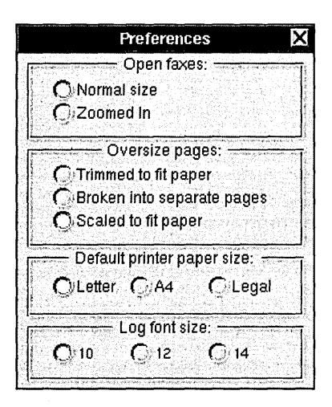

Most applications have a Preferences panel, an ordinary panel that allows the user to determine details of how the application looks and works. A user typically uses this panel only a few times. It should not be necessary to bring up the Preferences panel during normal use of the application.

Preferences typically include such things as:

- The default font size
- The format for displaying data
- Whether to make backup files
- The default size of windows
- Options that increase the power of the application
- The application's keyboard alternatives

Do *not* use the Preferences panel for anything the user might want to set from time to time during a session. Also, the contents of the Preferences panel should be valid applicationwide: They shouldn't change depending on which window or data is selected. All preferences should carry over from session to session; most will also affect the way the application works during the current session. All of an application's options must be settable in some way from within the application. For example, it isn't acceptable to have options that are settable only by using the **dwrite** command.

Preferences panels are often implemented as multiform panels to reduce their size and to organize their options. The Preferences panel is brought up by the Preferences command in the Info menu. See Chapter 6 for information on the Info menu.

## **Implementing the Quit Panel**

When the user tries to quit an application that has unsaved or uncompleted work, the application should bring up a Quit panel. For example, if the user has edited a document and not saved the changes, or if the application is still computing (for example, a command is executing in a UNIX shell), a Quit panel should appear. In both cases, one or more of the application's windows should have a broken close button, as described in "Using the Close Button" in Chapter 4.

The Quit panel should be an attention panel that has the following buttons:

- A Cancel button (only when the panel is brought up as the result of choosing the application's Quit command)
- A Quit Anyway button
- A Review Unsaved button (only for document-oriented applications) that cycles through unsaved documents, letting users decide which ones to save before quitting.

The buttons are arranged as follows:

Cancel Quit Anyway Review Unsaved

An application could also add a Save All button that saves every unsaved document, exactly as the Save All command does.

**Important:** Because applications can't cancellogouts and poweroffs, the Quit panel shouldn't have a Cancel button when it's brought up as the result of a logout or poweroff:

Quit Anyway Review Unsaved

Review Unsaved is the default button. It brings up a Review Unsaved panel for each unsaved document. This panel is essentially the same as the Close panel described above, though with a different name to reflect the different manner in which it's invoked.

The Cancel button in the Review Unsaved panel cancels the review process and returns the user to the Quit panel. Once the user has finished cycling through all the documents (without clicking Cancel), the application should quit.

Note: Do *not* bring up a Quit panel unless work is about to be lost.

## **Using the Save Panel**

This Application Kit panel should come up showing the folder of the document being saved (the document in the main window). A document's folder is reflected in its window's title bar. For example, if the title bar shows

UNTITLED-1 - INet/machine/home

then the Save panel should come up showing lNetimachinelhome.

## 6 *Menus*

=

Menus provide users a point of entry for all the functionality of an application, its obscure and common features alike. Because of this special role, they behave in a special way:

- All the visible menus for an application disappear when the user starts working in another application. They reappear when the user returns to the application. (Menus that weren't previously on-screen don't reappear.)
- Menus are segregated into two of the frontmost tiers of on-screen windows. They appear to float above everything else on-screen except attention panels and spring-loaded windows such as pop-up lists.
- Menus can't be miniaturized. They don't need to be, since they're small and can be easily retrieved after they've been closed.
- Menus are hierarchically arranged. Choosing a command in one menu can produce another menu with its own list of commands.

The first three of these points were discussed earlier in this manual. (See "The Active Application," "Window Order," and "Miniaturizing" in Chapter 4, "The Window Interface to Applications.")

Applications should make use of the menu system's hierarchy to arrange commands in distinct, functionally identifiable menus. A well-defined set of hierarchical menus aids users both in finding the commands they need and in understanding the structure of the application.

#### **How Menus Work**


The main purpose of menus is to provide commands for the user to choose. To choose a menu command, the user presses the mouse button as the cursor points anywhere within the content area of the menu and releases it as the cursor points to the desired command. This can be as simple as clicking the command, or the user can drag through the menu, from command to command. Each command that comes under the cursor while the mouse button is down is highlighted.

Instead of using the mouse, the user can often use a keyboard alternative to choose a command. A keyboard alternative is a combination of a character and the Command key. For example, holding down the Command key and pressing the **p** key is the standard keyboard alternative for the Print command. Keyboard alternatives are discussed in detail in Chapter 3, "User Actions: The Keyboard and Mouse."

#### The Main Menu

Every NeXTSTEP application has at least one menu, its main menu. If an application has just a main menu, it holds all the commands for the application. If the application has more than one menu, all but the main menu are submenus of another menu. Through the hierarchical arrangement of submenus, the main menu gives the user access to all the menus of the application.

Because the main menu is at the top of the menu hierarchy, it lacks a close button and always remains on-screen when its application is active.

By default, when an application first starts up, its main menu appears in the upper left corner of the screen. Users can change this default location by dragging the main menu to a new position. Another way to change the default location for all applications (except those whose main menus have already been moved) is with the Preferences application.

## **Bringing the Main Menu to the Cursor**

If the user enables one of the mouse buttons (with the Preferences application), it can be used to gain quick access to the main menu. When the user presses the enabled mouse button (except when the cursor is over an application icon), a copy of the main menu for the active application appears under the cursor. The copy stays on-screen until the mouse butten is released.

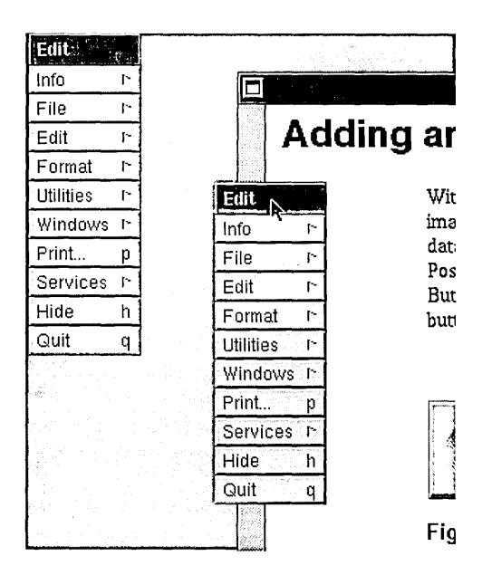

To begin, the cursor lies directly over the main menu's title bar. The user can drag down into the menu (and into its submenus) to choose a command. When the mouse button is released, the copy and any submenus disappear.

See "Left and Right Orientation" in Chapter 3, "User Actions: The Keyboard and Mouse," for more information on enabling mouse buttons.

## **Submenus**

The main menu is the only menu in an application that isn't a submenu. Every other menu is a submenu of another menu, which is its *supermenu* in the application's hierarchy of menus.

Each submenu is associated with a particular command in its supermenu. The submenu becomes visible and *attaches* to its supermenu when the user chooses the command that it's associated with.

The user can drag from a controlling command into a submenu to choose one of the submenu's commands. As long as the mouse button is held down, the submenu remains visible and the controlling command stays highlighted. But once the mouse button goes up and the command has been executed, the submenu disappears.

## **Programming Note: Menus and the Application Kit**

The Application Kit takes care of everything discussed in this section, IIHow Menus Work." Specifically, it provides the following functionality:

- All aspects of displaying and hiding menus and menu commands (although you must specify when a command should be disabled), including tearing off submenus
- Letting you associate menu commands with menus
- Making sure the keyboard alternative works
- Detecting when the user chooses a menu command and reacting appropriately (such as by highlighting and bringing up a panel)

Much of this functionality can also be accessed through Interface Builder. For example, to associate an application-specific command with a menu, the programmer can simply drag a menu command from the Palettes window into the menu. You can then change the name of the command, give it a keyboard alternative if necessary, and associate an action with the command.

## **Keeping a Submenu Attached**

The easiest way to attach a submenu is simply to click its controlling command, but the user can also drag to the controlling command and release the mouse button while the cursor is still above it. The controlling command for an attached submenu stays highlighted to indicate that the submenu is attached.

A supermenu and its attached submenu act like a single window. User actions that move or close the supermenu also move and close the submenu; an attached submenu has no close button of its own. A submenu attached to the main menu is assigned to the same window tier as the main menu.

An attached submenu can also have its own attached submenu. This is illustrated below. The Librarian menu is attached to Services, and Services is attached to the main menu. Moving the main menu serves to move all three.


#### **Tearing Off an Attached Submenu**

The user can *tear off* an attached submenu by dragging it away from its supermenu. Moving it free of its supermenu gives it an independent life on-screen. As a sign of its independence, it gets, for the first time, its own close button. The close button identifies the menu as a tom-off submenu. (Any submenus that were attached to the tom-off submenu move with it and remain attached.)

#### main menu


The idea is for users to bring up a submenu, then tear it off and move it to a desired location if they want it to stay on-screen. Once a submenu has been tom away from its supermenu, it stays where the user puts it. To reattach the submenu, the user must close it and then choose its controlling command.

If the user presses the mouse button while the cursor is over the command that controls the tom-off submenu, a copy of the submenu temporarily appears next to its supermenu.


#### **Removing a Submenu from the Screen**

Assuming its application is active, an attached submenu can be removed from the screen in three ways:

- By again choosing its controlling command. Choosing the Librarian command in the detached Services menu in the previous figure causes the Librarian submenu to disappear.
- By choosing any other command in the supermenu.
- By removing its supermenu from the screen. For example, when a tom-off supermenu is closed, its attached submenu disappears from the screen.

A tom-off submenu is removed from the screen by clicking its close button.

## **Commands**

A menu can display several different kinds of commands, all of which use the targeted-action paradigm. Some commands require the user to select the target-Copy, Paste, and Miniaturize Window, for example. Others-such as Hide, Quit, and Info-don't require a selection: The target is built into the program.

When a command is chosen-whether it's clicked or activated by a keyboard alternativeit's highlighted. Keyboard alternatives can also operate commands in off-screen menus. When they do, the menu's controlling command (or, if the supermenu isn't visible, the supermenu's controlling command) is highlighted. This ensures users of immediate, visual feedback that the keyboard alternative has in fact invoked the command.

Some commands control submenus. The action of the command is simply to attach the submenu to the menu. These commands are marked by the submenu symbol [~'.

Many commands cause panels or standard windows to appear on-screen:

- Some bring up a standard window-the New command in the Document menu, for example, or the Console command in the Workspace Manager Tools menu.
- Some put an attention panel on-screen to help clarify or complete the command. For example, the Save As command produces a panel that asks the user to type in the file name the user wants to use for the document.
- Others bring up a panel that can stand on its own, independent of the command that produced it. Sometimes the panel simply imparts information to the user-a Help panel, for example. But usually it acts as a control panel where the user can give instructions .to the application-the Font and Find panels, for example. Such panels are similar to submenus in that they open a range of options to the user.

If a menu command controls a submenu, it remains highlighted as long as the submenu is attached. If it controls an attention panel, it remains highlighted until the panel is dismissed from the screen. Commands don't stay highlighted if they bring up a panel that isn't an attention panel.

The programmer can disable a command, as described later in this chapter in "Disabling Invalid Commands." Disabled commands have dark gray text (instead of the usual black) on the usual light gray background. They're completely inoperative and don't highlight in response to user actions.

## **Implementing Menus**

The Application Kit provides much of the user interface to menus, leaving you the task of determining application-specific characteristics such as:

- The menu hierarchy
- The names of menu commands
- When each menu command is valid
- Keyboard alternatives

This section describes standards for the menu hierarchy and for naming menu commands. When a command isn't valid, it should be disabled, as described later in this chapter. Chapter 3 lists all the standard and recommended keyboard alternatives.

## **Designing the Menu Hierarchy**

When designing your application's menu hierarchy, you should start with the standard menus described later in this chapter-in particular, the main menu. Having standard menus, as much as possible, is one of the easiest and best ways to ensure consistency between applications.

Since menus need to be easily accessible to the user, you should try to keep your application's menu hierarchy as shallow as possible. In general, a menu should be located no more than two steps away from the main menu. It's even better to have menus no more than one step away, as long as they don't grow too long or confusing as a result.

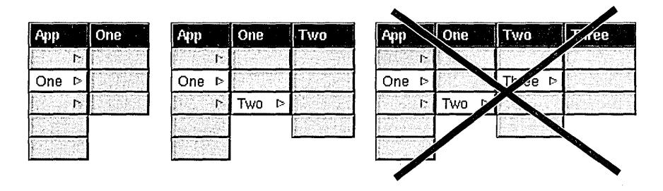

A menu should never have fewer than two commands unless it grows and shrinks dynamically and happens to shrink to fewer than two. If an application has a menu with only one item in it, that item should be bumped up one level and replace the command that brings up the menu. (A specific example of this is discussed later in this chapter under "The Info Menu.")

A menu can have as many submenus as it has commands, although only one at a time can be attached to the menu. A menu should appear only once in the menu hierarchy-it should not be the submenu of two menus.

## **Choosing Command Names**

Command names should be short, consisting of a single word if possible, a short phrase if not. Avoid abbreviations in commands, especially those that aren't standardized or widely used. Applications in the same language should follow the same capitalization rules. For English, commands are capitalized as they would be in a title-the first and last words begin with uppercase letters, as well as major words in between.

Each command name should be unique. No two comnlands, even if they're in different menus, should have the same name.

## **Commands that Perform Actions**

Wherever possible, the first word of an action command should be a verb, so the command reads like a short imperative sentence for the action it performs. Examples include Hide, Open, Save As, and Revert to Saved.

Some menu commands have different results, depending on the application's state. The name of such a command should change so that it always describes what the command will do. The clearest way to do this is to change the command's verb. Some examples of good names follow:

| First State | Second State | Notes                                        |
|-------------|--------------|----------------------------------------------|
| Show Ruler  | Hide Ruler   |                                              |
| Show Grid   | Hide Grid    |                                              |
| Use Grid    | Ignore Grid  | Don't use Grid On and Grid Off.              |
| Bold        | Unbold       | Bold is treated like a verb in this command. |

Avoid using two menu commands instead of changing the menu command's name. For example, you shouldn't have a Show Ruler command followed by a Hide Ruler command, where one of the commands is always disabled.

## **Commands that Bring Up Panels**

With one exception, a command that always brings up a panel must have three dots immediately following its name (for example, "Preferences ... "). The exception happens when the panel is a warning panel-such as one that comes up when the user tries to revert to a saved version of a document. Because the user could complete the action if the warning panel weren't there, it's inaccurate to imply that the command brings up a useful panel. Also, users who are new to an application sometimes tend to look at all of its panels (by choosing menu commands with " ... "). You don't want to encourage users to choose commands that are so dangerous that they require warning panels. For example, the Workspace Manager Log Out command doesn't have three dots, even though it always brings up a warning panel.

Do *not* put three dots after commands that only bring up a standard window (like the New Viewer command in the Workspace Manager, or the New command in the standard Document menu).

**Note:** Use three periods (not the ellipsis character) to produce the three dots.

If the purpose of a command is to perform an action, and the panel comes up only to help complete the action, then the command should be named for the action, not for the panel. (The panel is then given a name that reflects the command name.) In this case, use the guidelines for naming described earlier in "Commands that Perform Actions." For example, the standard Save, Save As, and Save To commands are action commands that happen to bring up a panel (which is called the Save panel).

If the purpose of the command is to bring up the panel, then the command is named after the panel. This usually results in a noun phrase as a name, instead of the verb phrase that's usually used for action commands. For example, the Preferences command brings up the Preferences panel, and the Spelling command brings up the Spelling panel.

A command that brings up a panel shouldn't usually have *Panel* in its name, since the three dots already indicate that it brings up a panel. However, you can add *Panel* if the command's name would otherwise be identical to another command's name. For example, when the command that brings up the Info panel is in the Info menu, the command is named Info ~anel. When an application has no Info menu, the command is named just Info.

## **Commands that Bring Up Submenus**

Commands that bring up submenus usually begin with nouns, but verbs or adjectives are acceptable if they're clearer. Every submenu command in a menu should have a name that's clearly different from every other command in the menu, so that the user can guess what each submenu contains by its name. For example, it's a bad idea to have under the main menu both a Tools menu and a Utilities menu, since most users won't be able to remember which is which.

If a command brings up a menu of actions, it might be appropriate to have the command name the "target" of the actions. The Document menu uses this scheme: the Open command can be read as Open Document, the New command can be read as New Document, and so on.

## **Commands that Bring Up Standard Windows**

A command that brings up a standard window should either start with *New* (as in the standard New command described under "The Document Menu," below) or match the title of the window. For example, the Workspace Manager has a New Viewer command under its View menu.

#### **Sample Command Names**

Some sample commands follow:

Cut (performs an action)

Font (attaches the Font menu)

Font PaneL .. (brings up the Font panel)

Hide (performs an action)

Info Panel... (brings up the Info panel; used only when Info is already used)

New (brings up a new document in a standard window)

Preferences ... (brings up the Preferences panel)

Save As ... (an action command that happens to bring up a panel)

Select All (performs an action)

Show Graphics (switches to Hide Graphics when graphics are already visible)

## **Disabling Invalid Commands**

When a menu command won't work, it should either be disabled or bring up an explanatory panel. For example, when a text editor has no documents open, it should disable its Save and Close commands, as shown below.

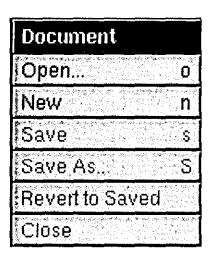

When a disabled command is chosen using a keyboard alternative, a beep occurs. This helps the user know that the command isn't valid, even if the command isn't visible.

If an invalid command brings up an explanatory panel, the panel should explain why the command is inappropriate and offer assistance. The panel must provide more information than just that the command won't work, since that information can more directly be conveyed by disabling the command.

## **Graphical Devices in Menu Commands**

The area to the right of a command can be used only to display a keyboard alternative or a submenu symbol. (Commands that control submenus can't have keyboard alternatives.) No other graphical devices are permitted in this area.

In addition, menu commands should not use arbitrary graphical devices, such as check marks, to show state. There's almost always a more appropriate way to display current state in our interface-for example, by using buttons or check boxes in a panel or by designing objects that can be directly manipulated (such as those in the Edit application's ruler).

#### **Programming Note:** Tools for **Creating Menus**

Project Builder creates your application's main menu. You can add commands and menus using Interface Builder. Some standard commands provided by Interface Builder have actions or submenus already associated with them. For example, by dragging the Windows command from the Palettes window of Interface Builder into your application's main menu, you give your application the full functionality described in I'The Windows Menu," later in this chapter.

## **Standard Menus and Commands**

There's a great deal to be gained if commands shared by most applications are arranged similarly in similar menus. This section gives the standard arrangement of menus and commands for NeXTSTEP applications.

**Note:** This chapter shows the U.S. English command names. For each language, the standard command names should be consistent. For example, *Quit* is *Quitter* in every French application.

## **The Main Menu**


Every application should layout its main menu as described in this section.

#### **Programming Note: Implementing Commands**

Many menu commands are standard, as described in this section, "Standard Menus and Commands." Many of these standard commands and much of their behavior are supplied by the Application Kit, Project Builder, and Interface Builder. The Application Kit even automatically changes the names of some commands, such as changing Bold to Unbold, and disables some commands when they're invalid, such as Heavier. (Both commands are in the Font menu, which is described later in this chapter.) However, you should double-check that each menu command works correctly.

The title of the main menu should be the name of the application, shortened somehow if the name is too long. For example, the main menu of Interface Builder is named IB because naming it Interface Builder would needlessly waste screen space.

| Command  | Action                                                                                                                                                                                                                                                                                                                                                                                                                                           |
|----------|--------------------------------------------------------------------------------------------------------------------------------------------------------------------------------------------------------------------------------------------------------------------------------------------------------------------------------------------------------------------------------------------------------------------------------------------------|
| Info     | Attaches the Info menu, which contains commands that give general<br>information about the application, as well as let the user set general<br>preferences about how the application works. Info is the first command<br>in the main menu in part because it can be read in conjunction with the<br>application name in the title bar (for example, Info about Edit, Info about<br>Draw, and so on). See "The Info Menu," later in this chapter. |
| Document | Attaches the Document menu, which has commands that affect a<br>document as a whole-opening, saving, and closing, for example. This<br>menu is named differently in different applications, so it's important that<br>the command be in a prominent, well-defined location (second). See<br>"The Document Menu," later in this chapter.                                                                                                          |
| Edit     | Attaches the Edit menu, which contains commands affecting the current<br>selection. Every application that can have editable documents or<br>selectable text must have this menu. See "The Edit Menu," later in<br>this chapter.                                                                                                                                                                                                                 |
| Format   | Attaches the Format menu, which contains commands affecting the<br>layout of documents, including the font and paragraph format of text and<br>the arrangement of graphic images. See "The Format Menu," later in<br>this chapter.                                                                                                                                                                                                               |

(continued)

| Command  | Action                                                                                                                                                                                                                                                                                                                                                                                                    |
|----------|-----------------------------------------------------------------------------------------------------------------------------------------------------------------------------------------------------------------------------------------------------------------------------------------------------------------------------------------------------------------------------------------------------------|
| Windows  | Attaches the Windows menu, which contains commands affecting the<br>windows that belong to the application. See "The Windows Menu," later<br>in this chapter.                                                                                                                                                                                                                                             |
| Print    | Brings up the Print panel, which permits the user to print or fax a<br>. document. You can omit the Print command if your application doesn't<br>print. In general, the Print command is assumed to print the document<br>in the main window. If a panel can be printed (for example, one that<br>contains a registration form), then to avoid confusion the panel might<br>contain its own Print button. |
| Services | Attaches the Services menu. This menu lets the user choose services<br>provided by the system or by other applications. See "The Services<br>. Menu," later in this chapter.                                                                                                                                                                                                                              |
| Hide     | Hides all the windows of the application. See "Hiding and Retrieving<br>Windows" in Chapter 4.                                                                                                                                                                                                                                                                                                            |
| Quit     | Terminates the application. If quitting the application might cause<br>the user to lose work, then the application should bring up a Quit<br>panel. Otherwise, the application should not require confirmation of<br>a Quit command.                                                                                                                                                                      |

The Info, Services, Hide, and Quit commands should be in the main menu of every application. The other commands described above should be included when appropriate.

## **Adding to the Main Menu**

The main menu works best when it's short (so that commands are easy to find) and narrow (so that it doesn't take up much screen space). Applications should generally have no more than 11 or 12 commands in the main menu.

The main menu is also, for the most part, a menu of menus. Commands that are added to the main menu should typically be ones that bring up submenus.

When designing your application's user interface, you can move a command that the guidelines place in a submenu up one level to the main menu, provided that:

- The main menu is short enough to accommodate another command.
- The command provides functionality that's considered central, even crucial, to the application. For example, a text editor might bring the Font command up to the main menu from the Format menu, but a spreadsheet would not.

Like any other command that's added to the main menu, a command that's raised from a submenu should generally control another submenu.

When a command is promoted to the main menu, it should, for continuity, be located immediately after the command for the submenu it would otherwise be in. For example, if the Font command is raised from the Format menu, it follows the Format command. If the Find command is promoted from the Edit menu, it follows the Edit command, as shown below.


## The Info Menu

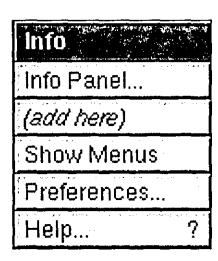

The Info menu contains commands that let the user get and set information about the application, as a whole. A License command is an example of the kind of command that could be added to this menu.

| Command     | Action                                                                                                                                                                                                                                                                                                                                                                                          |
|-------------|-------------------------------------------------------------------------------------------------------------------------------------------------------------------------------------------------------------------------------------------------------------------------------------------------------------------------------------------------------------------------------------------------|
| Info Panel  | Brings up a panel that displays a small amount of basic information about the application. This standard panel is described in Chapter 5, "Panels."                                                                                                                                                                                                                                             |
| Show Menus  | Displays and tiles all the application's menus. There's currently no support for this command in the Application Kit. You can implement it or not as you see fit.                                                                                                                                                                                                                               |
| Preferences | Brings up the application's Preferences panel, which permits the user to customize the application. This standard panel is described in Chapter 5.                                                                                                                                                                                                                                              |
| Help        | Brings up a panel with helpful information on how to use the application. If you implement this command, you should use the standard Help panel, which is described in Chapter 5. If you don't implement this command, then when the user Help-clicks an object in your application, the system brings up a panel informing the user that the application doesn't use the NeXTSTEP help system. |

If an application doesn't support any of the commands in the Info menu except Info Panel, it should omit the menu and make the Info command bring up the panel instead. (The command would then be followed by three dots.)

## **The Document Menu**

| Document        |
|-----------------|
| Open o          |
| New n           |
| Save s          |
| Save As S       |
| Save To         |
| Save All        |
| Revert to Saved |
| (add here)      |
| Close           |

This menu contains commands that affect a document as a whole. Commands affecting selected contents of a document are mainly in the Edit menu. Applications that don't open or save documents of some kind and don't have a New command don't have this menu.

The title of this menu (the second command in the main menu) should indicate the kind of thing that the Open command opens and the Save command saves. It might be Document, Project, File, Model (for spreadsheets), Game (for games), or Shell (for a terminal emulator). Never call this menu Window, since a Windows menu is standard in most applications.

| Command | Action                                                                                                                                                                                                                                                                                                                                                                      |
|---------|-----------------------------------------------------------------------------------------------------------------------------------------------------------------------------------------------------------------------------------------------------------------------------------------------------------------------------------------------------------------------------|
| Open    | Brings up the Open panel so the user can open a file. Opening a file<br>also opens a window (or windows) to display it in.                                                                                                                                                                                                                                                  |
| New     | Opens a new, unnamed file and a window to display it in. This new<br>document should be in the same folder as would be displayed in the<br>Open panel. (See the section "Using the Open Panel" in Chapter 5.)                                                                                                                                                               |
| Save    | Saves any changes in the document displayed in the current main<br>window to a file (writes them to the disk). If the document has never<br>been saved to disk, this command should have the same effect as the<br>Save As command.                                                                                                                                         |
| Save As | Saves the document displayed in the main window, as changed, by<br>writing it to a new file with a name supplied by the user. The<br>document displayed in the main window corresponds to the new file,<br>and the window's title is changed accordingly. This command<br>places a Save panel on-screen that asks the user to type in a file name<br>or cancel the command. |

*(continued)* 

| Command         | Action                                                                                                                                                                                                                                                                                                                                                                   |
|-----------------|--------------------------------------------------------------------------------------------------------------------------------------------------------------------------------------------------------------------------------------------------------------------------------------------------------------------------------------------------------------------------|
| Save To         | Saves the document displayed in the main window, as changed, by<br>writing it to a new file with a name supplied by the user. In this<br>respect, Save To is identical to the Save As command. However,<br>Save To doesn't replace the window's current file with the new one.<br>You can choose whether to implement Save As or Save To or both in<br>your application. |
| Save All        | Saves every document that's open in the application. This is a<br>shortcut for performing the Save command on every open document.                                                                                                                                                                                                                                       |
| Revert to Saved | Replaces the current version of the document displayed in the main<br>window with the version saved on disk. This undoes any changes<br>made to the document since it was last saved.                                                                                                                                                                                    |
| Close           | Closes the document in the main window, and all the windows used<br>to display that document. In other words, it's completely parallel to<br>the Open command. See "The Windows Menu," later in this chapter,<br>for information on a related command, Close Window.                                                                                                     |

If an application uses more than one window to display a document, it could add a Miniaturize command to miniaturize all the windows associated with the currently selected document (the document of the key window) into a single miniwindow. A standard command already exists (Miniaturize Window in the Windows menu) to miniaturize a single window.

## **Performing an Implicit New Command**

If the user starts up an application by double-clicking an application icon rather than a document icon, the application should, if appropriate, provide the user with a new document to work in (performing an implicit New command). This is much friendlier to a new user than simply putting a menu on-screen. Users should be permitted to disable this behavior through a preference.

It's almost always appropriate for general-purpose applications to perform an implicit New command. However, it's not appropriate if the application can't produce a new document without user input. It's also not appropriate if producing a new document has side effects, such as modifying the file system by creating a new folder or adding a file that might persist even if the user decided not to save the new document.

When an application is started up automatically at login or from another application, it should not perform an implicit New command.

If the user opens another document without touching the new one that was provided at startup, the application could automatically close the new one. But this is not a requirement of the user interface.

#### **Uneditable Documents**

If a document is opened that the application won't allow the user to save (even with a Save As command), it should not permit the user to edit the document on-screen. Waiting until the user is ready to save changes is too late.

## **The Edit Menu**

| Edit               |
|--------------------|
|                    |
|                    |
|                    |
|                    |
|                    |
|                    |
|                    |
|                    |
|                    |
|                    |
| 1 Check Spelling   |
| [seled A Ii<br>. a |

The Edit menu contains commands that alter the selection in the current key window (or in the main window if the key window doesn't respond to the command). Each command should be dimmed when it can't operate on the current selection.

| Command | Action                                                              |
|---------|---------------------------------------------------------------------|
| Cut     | Deletes the current selection and copies it to the pasteboard.      |
| Copy    | Copies the current selection to the pasteboard without deleting it. |
| Paste   | Replaces the current selection with the contents of the pasteboard. |
|         | ( continued)                                                        |

| Command        | Action                                                                                                                                                                                                                                               |
|----------------|------------------------------------------------------------------------------------------------------------------------------------------------------------------------------------------------------------------------------------------------------|
| Paste As       | Attaches a submenu that permits the user to paste the current<br>contents of the pasteboard into the document in a specified data type.<br>The submenu lists the possible data types, as discussed in "The Paste<br>As Menu," later in this chapter. |
| Link           | Attaches the Link menu, which contains commands for<br>manipulating linked information. See "The Link Menu," later in<br>this chapter.                                                                                                               |
| Delete         | Deletes the current selection without copying it to the pasteboard<br>(thus leaving the contents of the pasteboard intact). The Delete key<br>has the same effect.                                                                                   |
| Undo           | Undoes the last editing change. This usually means all changes<br>since the user last made a selection, including the selection of an<br>insertion point.                                                                                            |
| Find           | Attaches the Find menu, which contains commands related to the<br>Find panel. See "The Find Menu," later in this chapter.                                                                                                                            |
| Spelling       | Brings up the Spelling panel.                                                                                                                                                                                                                        |
| Check Spelling | Finds the next misspelled word without bringing up the Spelling<br>panel.                                                                                                                                                                            |
| Select All     | Makes the entire contents of the file the current selection.                                                                                                                                                                                         |

Applications that permit the user to edit text or graphics should support at least the Cut, Copy, Paste, and Select All commands. It's strongly recommended that you also implement the Undo command.

#### **Programming Note: The Edit Menu**

To get this menu, you can just drag it in from the Palettes window of Interface Builder. It's already hooked up to the Text object, which automatically provides all the menu's functionality except for Find, Paste As, Link, and Undo.

## **The Paste As Menu**

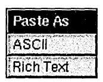

The Paste As menu is rarely needed because applications can take care of pasteboard data types without user intervention. However, sometimes it's useful for the user to be able to specify the format in which data is pasted. For example, the user of a page layout program might want to choose whether text is pasted as ASCII or Rich Text Format (RTF), or whether graphics are pasted as EPS or TIFF.

This menu should include only the types appropriate for its application. As usual, the programmer should disable invalid menu commands. For example, when the pasteboard contains only text data, any graphics formats should be disabled.

## **Checking Spelling**

The Spelling and Check Spelling commands in the Edit menu are intended to provide a uniform interface for checking spelling that in many ways parallels the interface for Find. (Find is discussed under "The Find Menu," below.) These commands for checking spelling are supported by the Application Kit's Text object; custom objects will need custom code for checking spelling.

The Spelling command brings up the Spelling panel, which is described in Chapter 5. The Check Spelling command is equivalent to the button on the panel that searches for and selects the next misspelled word in the main window. It permits the user to find the next misspelled word without bringing up the panel. If the application can't find the next misspelled word until the user takes some action within the Spelling panel (for example, loads a dictionary), Check Spelling brings up the panel. (This is parallel behavior to Save bringing up a panel when the user must first supply a file name, or Find Next bringing up the Find panel if the user needs to enter a text string to search for.)

If an application has spelling options that can't be accommodated in a panel, Spelling and Check Spelling should be replaced by a Spelling command that brings up a submenu. That menu might then have Spelling Panel and Check Spelling commands.

## **The Link Menu**

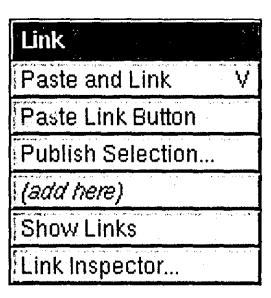

The Link menu provides a standard interface for receiving and supplying linked information. *Linked information* is copied information, such as a graphic image, that can be automatically updated when the original information is modified. See the *User's Guide*  for more information on working with links.

| Command           | Action                                                                                                                                                                                                                                                                                    |
|-------------------|-------------------------------------------------------------------------------------------------------------------------------------------------------------------------------------------------------------------------------------------------------------------------------------------|
| Paste and Link    | If the last Copy operation was performed in an application that can<br>supply linked information, this command pastes the contents of the<br>pasteboard and links it to the original information.                                                                                         |
| Paste Link Button | If the last Copy operation was performed in an application that can<br>supply links, this command pastes a button <) that, when clicked,<br>opens the document that contains the original information. Link<br>buttons are discussed in Chapter 7, "Controls."                            |
| Publish Selection | Creates a link file. When the link file is dragged into documents<br>that can receive linked information, the end result is as if a Paste<br>and Link command had been done. This command places a<br>panel on-screen that asks the user to type in a file name or cancel<br>the command. |
| Show Links        | Highlights or unhighlights all linked information in the current<br>document. The name of this command must alternate between Show<br>Links and Hide Links, depending on the state of the document.                                                                                       |
| Link Inspector    | Brings up the Link Inspector panel, which is discussed in Chapter 5.                                                                                                                                                                                                                      |

An application that can receive linked information (one that implements one or both of the Paste and Link and Paste Link Button commands) should also implement Show Links and Link Inspector.

When the user chooses the Show Links command, the application should highlight all the , linked information in the main window, as shown in the following figure. In the window shown below, the picture at the lower left is the only visible linked information, so it's the only picture that's highlighted with a chain pattern.


#### **Programming Note: Implementing Links**

The Application Kit supports links with its NXDataLinkManager and NXDataLink classes. See the NeXTSTEP General Reference (available through Digital Librarian) for detailed information on how to make your application receive and supply links,

## **The Find Menu**

| Find              |    |
|-------------------|----|
| Find Panel        | f  |
| Find Next         | g  |
| Find Previous     | d  |
| Enter Selection   | е  |
| Jump to Selection | j  |
| (add here)        | 1. |

Applications that display large amounts of text are encouraged to include a Find menu like the one illustrated above. Other applications might also find this menu useful, but because it's designed most specifically for text, a variation of it might better meet their needs.

| Command         | Action                                                                                                                                                                                                                                                                                       |
|-----------------|----------------------------------------------------------------------------------------------------------------------------------------------------------------------------------------------------------------------------------------------------------------------------------------------|
| Find Panel      | Brings up the Find panel, makes it the key window, and selects<br>everything in the text field labeled Find so that the user can easily<br>enter new text. If the panel is already on-screen, the command<br>brings it to the front, makes it the key window, and selects the<br>Find field. |
| Find Next       | Searches forwards for the next occurrence of the string in the panel's<br>Find field.                                                                                                                                                                                                        |
| Find Previous   | Searches backwards for the previous occurrence of the string in the<br>panel's Find field.                                                                                                                                                                                                   |
| Enter Selection | Enters the current selection into the panel's Find field so that Find<br>Next and Find Previous can search for it.                                                                                                                                                                           |

Find Next and Find Previous begin searching at the current selection. If the search is successful, the text that's found is selected and becomes the starting point for the subsequent search. Neither command requires the Find panel to be on-screen. However, if the panel's Find field is empty, Find Next and Find Previous both bring up the Find panel, make it the key window, and select its Find field. This is exactly what the Find Panel command does. These other commands do it as a convenience to the user, who has

Jump to Selection Scrolls to display the beginning of the current selection.

The Find panel is further described in Chapter 5.

indicated an intention to do a search.

## **The Format Menu**

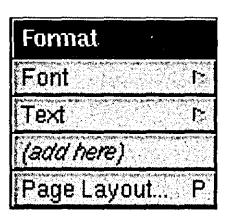

| Command     | Action                                                                                                                                         |
|-------------|------------------------------------------------------------------------------------------------------------------------------------------------|
| Font        | Brings up the Font menu, which has commands to alter the font of<br>the current selection. (See "The Font Menu," later in this chapter.)       |
| Text        | Attaches the Text menu, which lets the user choose the format of the<br>selected blocks of text. (See "The Text Menu," later in this chapter.) |
| Page Layout | Brings up the Page Layout panel, which lets users determine how<br>documents are to be printed and displayed on the screen.                    |

The Format menu should hold the principal formatting commands needed by users of the application. For applications that deal mainly in numbers, they may be commands that format the text display of floating-point numbers or the graphical display of numeric data. For text processors, they may include the commands that would otherwise go into the Text menu, plus others.

If an application promotes the Font command to the main menu and has no other commands to add to the Format menu, the Format menu would become little more than a container for the Text menu. In this circumstance, the commands that would otherwise go in the Text menu should be placed directly in the Format menu. A separate Text menu is needed only when there's reason to isolate these commands from other formatting commands or to shorten what would otherwise be an excessively long "Format menu.

When commands from the Text menu are placed in the Format menu, they should follow the Page Layout command, so that the Copy Ruler and Paste Ruler commands end the menu.

## **The Font Menu**

| Font        |       |
|-------------|-------|
| Font Panel  | t     |
| Bold        | þ     |
| Italic      | i     |
| Underline   |       |
| Larger      |       |
| Smaller     |       |
| Heavier     | - 1,4 |
| Lighter     | ·     |
| Superscript |       |
| Subscript   |       |
| Unscript    |       |
| (add here)  |       |
| Copy Font   | 3     |
| Paste Font  | 4     |
|             |       |

Applications that support text entry and editing should provide a Font menu and Font panel. The Font panel is described in Chapter 5. It contains controls that let users set and preview fonts. The Font menu has a command to bring up the panel, and commands to make common adjustments to a font.

Each command alters one aspect of the font, such as its size or style, while leaving other aspects intact. The Font menu and Font panel target currently selected text. The Preferences panel should be used to alter the default font.

| Command    | Action                                                                                                                                                                                                   |
|------------|----------------------------------------------------------------------------------------------------------------------------------------------------------------------------------------------------------|
| Font Panel | Brings up the Font panel.                                                                                                                                                                                |
| Bold       | Makes the current selection bold, if it's not bold already, and makes<br>it unbold if it is. The name of the command must alternate between<br>Bold and Unbold depending on the selection.               |
| Italic     | Makes the current selection italic or oblique, if it isn't already, and<br>makes it unitalic if it is. The name of the command must alternate<br>between Italic and Unitalic depending on the selection. |

( *continued)* 

| Command     | Action                                                                                                                                                                                                       |
|-------------|--------------------------------------------------------------------------------------------------------------------------------------------------------------------------------------------------------------|
| Underline   | Underlines the current selection, if it isn't already underlined, and<br>removes the underlining if it is. When the current selection is already<br>underlined, the command name must change to Ununderline. |
| Larger      | Makes the current selection one point larger.                                                                                                                                                                |
| Smaller     | Makes the current selection one point smaller.                                                                                                                                                               |
| Heavier     | Uses a heavier typeface to display the current selection.                                                                                                                                                    |
| Lighter     | Uses a lighter typeface to display the current selection.                                                                                                                                                    |
| Superscript | Moves the currently selected text up an appropriate amount for a<br>superscript. Choosing the command again moves the text that<br>much higher.                                                              |
| Subscript   | Moves the currently selected text down an appropriate amount for<br>a subscript. Choosing the command again moves the text that<br>much lower.                                                               |
| Unscript    | Returns the selected superscripted or subscripted text to the normal<br>baseline of the text.                                                                                                                |
| Copy Font   | Copies from the current selection all the text attributes listed in this<br>menu, including font family, font size, bold, italic, underlining,<br>superscript, and subscript.                                |
| Paste Font  | Alters the current selection so that it has all the font attributes<br>previously copied with the Copy Font command.                                                                                         |

#### **Programming Note: The Font Menu**

By dragging this menu in from Interface Builders Palettes window, you getthis menu and its functionality from the Text object with almost no additional work. Still, you should make sure that every command works, dims, and changes it name as it should.

**Note:** If the current selection is an insertion point, all the commands in the Font menu affect the next set of characters inserted, rather than any existing text, unless the text area can contain only one font. If an area of text can have only one font, then the Font menu and panel change the font of all the text in the area.

The only required commands in the Font menu are Font Panel, Copy Font, and Paste Font, although frequently used commands like Bold and Italic should almost always be present. Applications that are not text intensive may decide to omit some of the less frequently used commands, such as Heavier and Lighter.

Each command leaves the other font attributes intact. For example, Bold will change 11-point Times Roman to 11-point Times Bold and 24-point Courier Oblique to 24-point Courier Bold Oblique.

If there's more than one font in the selection, Larger and Smaller change each to be one point larger or smaller than its current size. The other commands make only the change that's appropriate for the first character in the selection. For example, if the first character in a multifont selection is italic, the Unitalic command will remove the italic trait from all the text in the selection, but won't change any text that isn't italic. If the first character isn't italic, the same command (but now called Italic) will italicize the entire selection, but won't alter any text that's already italic.

The Colors command, which brings up the Colors panel, often appears in the Font menu. However, it can appear elsewhere; each application should place the Colors command in a menu that indicates the kind of objects the Colors panel can affect. In Mail and Edit, colors can be applied only to characters (and not to their background), so the Colors command is in the Font menu.

## **The Text Menu**

| Tout        |         |
|-------------|---------|
| Text        |         |
| Align Left  |         |
| Center      |         |
| Align Right |         |
| Justify     | 9,147-2 |
| (add here)  |         |
| Show Ruler  |         |
| Copy Ruler  | 1       |
| Paste Ruler | 2       |

The Text menu is a collection of formatting commands that affect text. All the Text menu commands are supported by the Application Kit's Text object. These commands can be isolated into a Text submenu, as shown here, or be included directly in the Format menu. If you have other formatting commands that are more important to your application, those commands, rather than these, should go in the Format menu.

| Command<br>Align Left | Action<br>Aligns the text at the left margin, leaving a ragged right margin.                                                                                                                                                                                                                                                                 |
|-----------------------|----------------------------------------------------------------------------------------------------------------------------------------------------------------------------------------------------------------------------------------------------------------------------------------------------------------------------------------------|
| Center                | Centers the text between the left and right margins.                                                                                                                                                                                                                                                                                         |
| Align Right           | Aligns the text at the right margin, leaving a ragged left margin.                                                                                                                                                                                                                                                                           |
| Justify               | Aligns the text at both the left and right margins.                                                                                                                                                                                                                                                                                          |
| Show Ruler            | Displays a ruler in the text area, if the ruler isn't currently visible.<br>Otherwise, this command hides the ruler. The name must alternate<br>between Show Ruler and Hide Ruler, depending on the state of the<br>text area. The ruler is a scale containing controls that affect the<br>format of a paragraph (such as margins and tabs). |
| Copy Ruler            | Copies the ruler settings in the first paragraph of the selected text.                                                                                                                                                                                                                                                                       |
| Paste Ruler           | Alters the paragraphs containing the text selection to have the<br>settings most recently copied with the Copy Ruler command.                                                                                                                                                                                                                |

An application that has many other text-related commands, such as a word processor, can arrange all its text-formatting commands within the Format menu, as best fits its needs. (See also the discussion of the Format menu earlier.) However, for consistency, all applications should, as far as possible, retain the command names shown above for the Text menu, no matter how the commands are arranged.

## **The Windows Menu**


The Windows menu contains commands affecting the windows that belong to the application. You can replace this menu with one more suitable for your application. For example, an application that has multiple windows per document might have its own tools to organize the windows.

| Command            | Action                                                                                                                                                                                                                                                                          |
|--------------------|---------------------------------------------------------------------------------------------------------------------------------------------------------------------------------------------------------------------------------------------------------------------------------|
| Arrange in Front   | Stacks and offsets all the application's document windows<br>(those that can become the main window and are created using<br>Open and New commands) at the front of the screen. While this<br>command is recommended, it isn't mandatory.                                       |
| Miniaturize Window | Miniaturizes the key window (if it has a miniaturize button).<br>The affected window need not be a document window.                                                                                                                                                             |
| Close Window       | Closes the key window (if it has a close button). If the window<br>is the last one (or only one) open displaying a document, it also<br>closes the document, just as the Close command would.<br>(See "The Document Menu," earlier, for a description of the<br>Close command.) |

The commands in this menu bring windows to the front of the screen and, in the case of the last two commands, remove them. Other kinds of commands, even if they affect windows in some way, should be located elsewhere in the menu hierarchy.

You can replace Arrange in Front with an Arrange command that brings up a panel or menu giving the user more choices concerning which windows to arrange and how they should be tiled or stacked.

#### **Programming Note: The Windows Menu**

This menu and all of its functionality are provided for you. All you have to do is drag the Windows command into your main menu from the Palettes window of Interface Builder.

The commands inserted below Arrange in Front list document windows. Each command brings one window to the front and, if possible, makes it the key window. The Application Kit creates this list and dynamically adds a command for each document window when it's opened. An example of these dynamically created commands is below. Because the Application Kit creates the command names from the title bar of each window, improperly titled windows can lead to the Windows menu becoming confusing or too wide. Window titles are discussed in "Choosing a Title" in Chapter 4.

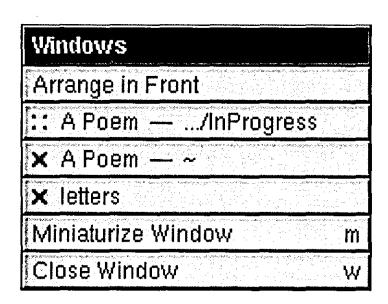

#### The Services Menu

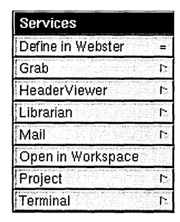

This required menu contains commands that invoke services provided by the system or by other applications. All the commands in the menu are placed there by the Application Kit from information furnished by service providers (so there's no need to specify where commands should be added).

## **Providing Services**

Applications can specify how commands that request their services should be worded. The following guidelines apply:

- Each command should begin with a verb and should name the application that will respond to the request. If the name of the application can be interpreted as a verb, it can be the first word of a command phrase (for example, Chart Selection for an application named Chart). Otherwise, the verb that begins the command should be followed by a preposition and the name of the responding application (Open from Workspace, Define in Webster).
- If an application responds to more than one service request, it can arrange the commands in a submenu under the application's name. Commands in the submenu don't have to name the application, but should, like all other commands, begin with a verb.

However, if the application name is commonly interpreted as a verb, the submenu commands can consist of words that would meaningfully follow the application name in a phrase, much as the commands in the Paste As menu. For example:


Service requests conditionally activate the other application, but only if user input might be required. For example, Digital Webster is likely to require the user to scroll the display, but the Workspace Manager doesn't need the user's help to get a file opened. The application that opens the file will become active, but the Workspace Manager won't.

#### **Programming Note: The Services Menu**

To take advantage of services provided by other applications, you should first drag the Services menu from the Palettes window of Interface Builder. Then, if you use the Text object in your application, your application automatically gets many services. Your application can get more kinds of services if you write a few lines of code.

To put its services into other applications, your application advertises its services in a section of its executable file or in its file package. (File packages are special folders that look and behave like files.) These services are automatically included in the menus of any applications that can accept them.

## **Adding a Tools Menu**

Since it's easiest for users to find a command if it's arranged in a submenu with other functionally related commands, commands that bring up panels and special, nondocument windows should be located throughout the menu hierarchy as appropriate. For example, the Font Panel command is in the Font menu, the Open command is in the Document menu, and Page Layout is in the Format menu.

However, if a window or panel is an independent tool that encapsulates a functional domain all its own, it may be difficult to group it with other commands. Examples are the palettes in a graphics program, the Inspector in Interface Builder, and the Console in the Workspace Manager. If your application has two or more such commands, you should consider collecting them together in a Tools menu. An example from the Workspace Manager is illustrated below.

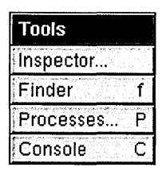

However, the Tools menu should not be considered a default location for commands that bring up windows or panels. If a window or panel isn't perceived to be a tool, its command should go elsewhere. If a command can be functionally grouped, it should be.

# 7! *Controls*

Controls are graphical objects that users manipulate with the keyboard and mouse to give instructions to an application. They're patterned after familiar control devices from everyday life-switches, knobs, forms, gauges, and the like-and perform analogous functions. Like the dials and levers on a machine, graphical control objects let the user "operate" an application.

Every control responds visually to direct manipulation by the user-a dial turns, a button pushes in or highlights, the knob of a slider slides. Controls go beyond this direct response, however, to cause the application to do something. They, in effect, translate the user's direct manipulation into an instruction for the application. A button sets a state or initiates a program action, a slider sets a value, and so on.

Which keyboard and mouse actions a control responds to and how it reacts visually are part of the definition of the control; they're discussed in this chapter. What the control causes an application to do is part of the definition of the application; it depends solely on how the application uses the control. In this respect, graphical controls are no different from control devices in the real world. For example, identical mass-produced switches can be installed on a variety of different machines. The manufacturer of the switch provides it with a user interface; the installer gives it specific meaning for a specific machine.

The NeXTSTEP user interface has several standard controls:

- Buttons
- Menu commands
- Text fields
- Sliders
- Color wells
- Scrollers
- Browsers and selection lists

Because they're widely used, each of these controls is described in some detail in its own section. Menu commands were described in Chapter 6, "Menus." The other controls are described in the sections below.

You can also design your own controls-the Application Kit makes this relatively easy-but they should adhere to these basic design principles:

- Every control must provide immediate feedback to let the user know that an action has "taken." Just as users can look at a dial on a stove to see whether it has been turned, a graphical control must alter its appearance in response to user actions. It shouldn't depend on a reaction elsewhere in the application to give the user feedback.
- Every control should have a distinctive appearance and behavior. Don't design controls that look so similar to the canonical controls that users will confuse one with the other.
- The behavior of a control should be apparent from its appearance. After a bit of familiarity with NeXTSTEP, users should be able to easily recognize a control object and know almost instinctively how to operate it.

#### **Buttons**

Buttons are the primary controls for setting a state or initiating an application action. They're used for the controls in title bars (the miniaturize and close buttons), for Cancel and the other choices that dismiss attention panels, and in most other situations where a basic control device is called for.

Buttons can assume a variety of different shapes and sizes, some of them standard. The figure below shows the standard types of buttons.


#### **How Buttons Work**

The Application Kit provides two basic kinds of buttons: *one-state* (or *action*) buttons and *two-state* buttons. Action buttons perform a single task, such as scrolling a document forward or starting a search. A two-state button sets a single characteristic on or off, such as whether to restrict a search to whole words. Standard two-state buttons include switches and radio buttons. Some buttons also bring up lists, as described in the following section.

All buttons respond to a click. Some also respond to being pressed. A button that responds to being pressed sends an instruction to the application as soon as the user pushes the mouse button down. Typically, it repeats the instruction at regular intervals-as long as the mouse button is held down and the cursor is kept over the button on-screen-for a continuous, iterative action. Users can drag away from the button and back again to stop and restart the action. A button that responds only to being clicked sends its instruction to the application when the user releases the mouse button, provided the cursor is over the button on-screen.

Whether it responds to being clicked or to being pressed, a button changes its appearance as soon as the mouse button goes down. It retains its altered appearance while it's under the cursor and the mouse button remains down. When the user releases the mouse button, the button on-screen keeps its altered appearance long enough for its instruction to be carried out. Usually this is momentary (though it need not be), so users generally notice the button changing as soon as the click is over.

## **Buttons that Bring Up Lists**

The Application Kit has support for two kinds of button-list combinations: pop-up lists and pull-down lists. A pop-up or pull-down list is a window that comes to the screen when the user presses a button. The user can drag through the list to choose an option or action. The list stays on-screen only as long as the user keeps the mouse button down. Although pop-up lists and pull-down lists look similar, they have very different roles in the user interface.

#### **Pop-Up Lists**

Pop-up lists are used in lieu of a series of radio buttons. They save screen space and prevent overcrowding in panels. Each list is controlled by a button that can be recognized by a special symbollQ, as shown below. The label on the button that precedes the symbol indicates the .current selection from the list. When the user makes a new selection, the button label changes.


Pressing the button pops the list up so that the item matching the button label appears on top of the button. The list remains up only while the user holds the mouse button down. When the user releases the mouse button after dragging to a different item in the list, the label on the button changes to that item.

#### **Pull-Down Lists**

Pull-down lists are similar to pop-up lists, but they're used to perform actions, rather than to set a state. In this respect, pull-down lists are somewhat like menus.

Visually, pull-down lists differ from pop-up lists in that the controlling button's label never changes, and it's marked by a different symbol  $\nabla$ .


## Implementing Buttons

When implementing any kind of button, you must make the following decisions:

- The end result of clicking the button
- The image or label (or both) on the button
- How the button's appearance changes during a click

Of course, before using a button, you should be sure that it's the best control for the job. "Choosing the Appropriate Control," at the end of this chapter, discusses which controls can be used for which types of functionality.

#### Choosing the Button's Result

A one-state (action) button shouldn't change the action it performs. Although it's sometimes tempting to alter the action with the application's state—to switch between Erase and Restore, for example—it's best to provide a different button for each action and disable those that aren't operable. This lets the user safely click in the accustomed place without having to consider which state the application is in. However, it's acceptable for buttons that perform time-consuming actions to have a stop state, as described in "Implementing Stop Buttons," later in this chapter.

One-state buttons are generally labeled with a verb or verb phrase (such as Find), but occasionally they have only a graphic image (such as the arrowhead in a scroll bar button). Labeling conventions are discussed in "Choosing the Button's Image or Label," below.

Two-state buttons should never perfonn actions, although the characteristic they affect might result in some visible change. For example, an inspector for a graph might have a set of radio buttons that control the graph's type (line, bar, and so on). Clicking one of the buttons resets the graph's type, which in tum results in the graph being redrawn. However, it wouldn't be acceptable for the radio button to, for example, create a second graph of the new type.

Ideally, as soon as the user clicks a two-state button, the visible consequences (if any) should be shown immediately. However, that's not always practical, as when changing the characteristic takes a long time or isn't easy to reverse. For example, if changing the type of a graph takes a long time, then the application might wait for the user to click a Redraw Graph button before redrawing the graph.

However, whether or not a two-state button's associated characteristic changes immediately, the button's appearance always changes immediately, as described in "Changing the Button's Appearance during a Click," later in this chapter.

Buttons with more than two states aren't recommended: It's very difficult to convey their result to the user.

#### **Choosing the Button's Image or Label**

A button's label should say, in a succinct shorthand, what action it causes the application to take. Even when a button purports to label a state (such as AM or PM), users are apt to think of it not as the current state, but as the state that will be set if the button is clicked. In other words, they're liable to interpret it as an action. An On button, for example, is more likely to be interpreted to mean "Press this to tum something on" than "This is now on."

It's best, therefore, to use images and highlighting to show the current state, and reserve the button's label as a brief statement of what the button does. Buttons that do label a state, such as a button that switches between AM and PM, should be used only where what they label is clearly visible. For example, AMIPM buttons can be used alongside a digital representation of the time, but they can't stand alone. These and other two-state buttons are shown in the figure in the following section.

**Note:** Make sure that the button clearly looks like either an action button or a two-state button. It's confusing to the user to see a two-state button that doesn't clearly have two states, or an action button that doesn't look like it perfonns an action.

You should always dim the label of a button (using gray text) whenever pushing the button will have no effect. A dimmed button is completely disabled-pushing it shouldn't cause it to highlight, push in, or change in any other way.

Button labels should be capitalized like menu commands: The first and last words begin with uppercase letters and the words between are capitalized as they would be in a title. Like menu commands, buttons that always bring up a panel (unless it's a warning panel) should have three dots ( ... ) at the end of the label.

When an action button can be chosen using the Return key, the button should contain the Return symbol to the right of its label, as shown below at the left. However, when pressing Return won't choose the button-for example, when the button's window isn't the key window-the Return symbol should disappear from the button (as shown at the right, below). Removing the Return symbol helps avoid user confusion over whether pressing Return will work.


#### Programming Note: Making the Return Symbol Disappear

All Application Kit panels automatically remove the Return symbol when the panel isn't the key window. Attention panels created with NXRunAlertPanel() and its related functions also remove the Return symbol automatically.

For other panels, you need to explicitly remove and add the Return symbol for the appropriate button. You can do so in your implementation of the windowDidResignKey: and windowDid8ecomeKey: delegate methods of the Window class.

## **Changing the Button's Appearance during a Click**

A button's appearance during a click (or while it's pressed) should change in one of the following ways:

- It can highlight.
- It can both highlight and appear to be pushed in.
- It can change the image it displays.

**Note:** Highlighting can be done either automatically by the Application Kit or by changing the image to a custom, "highlighted" image.

Buttons normally both push in and highlight. However, for aesthetic reasons, buttons that are right next to each other (such as scroll buttons and graphical radio buttons) shouldn't push in. This is because buttons that have no space around their bezeled edges look less three-dimensional than normal.

**Note:** Although it's possible to have a button only push in (without highlighting), this isn't recommended because it's hard to see.

The recommended changes for action (one-state) buttons are illustrated in the following figure. The scroll button in the bottom row doesn't push in, since it's very small and is right up against another scroll button.

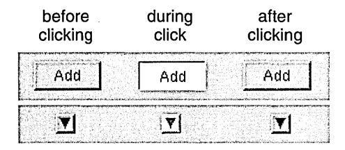

The possibilities for two-state buttons are illustrated in the following figure.


Note: In the figure showing two-state buttons, the button in the bottom row is a graphical radio button. It doesn't push in because it's right next to the other radio buttons in its group (although they aren't shown in this figure).

The figure of two-state buttons also illustrates some of the principles that determine how a button looks during a click:

- A button must change its appearance during a click, as soon as the mouse button goes down.
- The appearance of a button during a click should reflect what's about to happen. Buttons that display a state should reflect the new state both during and after the click.

#### Implementing Pop-Up and Pull-Down Lists

You must provide a title for each pop-up list. Usually this is done by putting a titled box around the pop-up list's button. The figure below shows a typical example, using a box with the title Units.

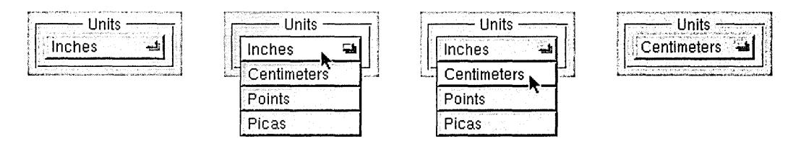

Because the label on a pull-down list's button doesn't change, pull-down lists don't need a titled box around them.

When using a pop-up or pull-down list, be careful that the open list doesn't blend in with the objects near it. If an item in the list pops up next to a label, for example, users might interpret them in combination. Take care, too, that the open list doesn't obscure any objects that help users understand its content.

#### Programming Note: Lists that Bring Up Attention Panels

When an item in a pop-up or pull-down list opens an attention panel, the list by default stays up until the panel is dismissed. Because lists are in a higher window tier than attention panels, they can obscure attention panels. To avoid this, you should dismiss the list before bringing up the attention panel. One way of doing this is to have the list item call the perform:with:afterDelay:canceIPrevious: method to schedule the execution of a method 1 millisecond in the future. This method should then bring up the attention panel.

## **Implementing Link Buttons**

Link buttons are different from most buttons because they're usually created by the user, instead of built into the application. Because link buttons often appear in custom content areas-areas that can be unique to each application that implements link buttons-link buttons require a little more support from the application than do other kinds of buttons. When implementing link buttons, you should be careful that they act in the following way:

- Clicking a link button highlights it briefly and brings up the document containing the information that the link refers to. An unmodified click should never select the link button.
- Shift-clicking a link button selects it.
- If the user presses the mouse button while the cursor is over the link button and then drags away without releasing the mouse button, the button should lose its highlight. However, if the user then drags back over the link button while still keeping the mouse button down, the link button should become highlighted again.

## **Implementing Stop Buttons**

If an action might take a while, then the user should be able to cancel it by holding the Command key while pressing the period (.) key (as described in Chapter 3, "User Actions: The Keyboard and Mouse"). In addition, sometimes it's convenient for buttons that perform a time-consuming action to have a stop state, to make it more obvious to users that they can interrupt the action.

If you implement a button with a stop state, the button's appearance should change as shown below.


before clicking


during first click


after first click

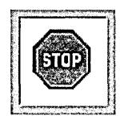

during second click (if any)


after action is finished or canceled

The button's action should be started when the user completes the first click (by releasing the mouse button). Similarly, the button's action should be stopped when the user finishes clicking the stop button.

#### **Text Fields**


A text field is a slot where the user can type in a single line of data—such as a file name, a part number, or an address. The text is editable and selectable. The data is entered only when the user types Return or clicks a button that's associated with the field. If the user enters more text than will fit in the field, the entry automatically scrolls so that the insertion point stays visible.

A text field should have a white background and be surrounded by a bezeled border that makes it appear inset from the surface of the screen. When the text field is temporarily disabled, the text becomes gray (just like the label of a button), but the background color doesn't change.

If a text field is not usually edited or selected but can be—as is, for example, the name associated with a file icon in the Workspace Manager File Viewer—the text should have a gray background with no bezeled border. When the user selects the text, the text field's background should turn white, and the selected text's background should be light gray.

Text fields can be titled and arranged in groups to produce an on-screen form, such as the one illustrated below.

| Name:     |          |
|-----------|----------|
| Street:   | 200000   |
| City:     |          |
| State:    |          |
| Zip Code: | 2000 WES |

When there's more than one text field in a window, the Tab key can move the selection—the point where typing will appear—from one field to another:

Tab Moves from one text field to the next one in the series. For example, in the form illustrated above, Tab would cause the current selection to jump from the Name field to the Street field to the City field, and so on.

Shift-Tab Moves from one text field to the previous one in the series.

When the user presses the Return key after typing in a text field, the field usually makes something happen. Data might be entered and processed, a search might begin for text that matches the string in the field, or a document might be saved to a file name the user typed. Exactly what happens is up to the application.

To let users know what to expect, it's recommended that you include a button in the display to act as the equivalent of Return. The button's label is an explicit reminder of what Return will do. From the user's point of view, Return is simply a shortcut for the action of the button.

The Print panel below has an example of using a button for the Return key's action. The user can start printing the document either by pressing the Print button or by pressing Return while editing any of the three text fields. If the user presses Return, the Print button pushes in and highlights as if it were pressed.


For the user's convenience, if the action associated with Return is repeatable, Return may select all the text in the same field so the user can easily replace it.

When a text field is part of a form, Return might not perform any particular action of its own. Instead, it will do just what Tab does-move the selection to the next field. Action on a button or other control is required to enter data typed into the form.

Generally, text fields accept unrestricted data, but sometimes an entry won't be acceptable if it's the wrong data type-if, for example, the user types in a floating-point number when an integer is called for. Typical examples of restricted data include the following:

- Unsigned or signed integers
- Unsigned or signed floating-point numbers
- Dates

If the user's entry isn't acceptable, all of the text in the field should be selected and highlighted. The user can make any necessary corrections and try again.

## **Sliders**

A slider is a device that sets a value. As illustrated below, it consists of a vertical or horizontal *bar* and a *knob* that moves on the bar.

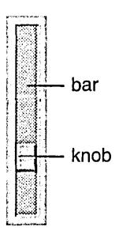

The position of the knob in the slider indicates its current value. Users can move the knob, and thus alter the value, by positioning the cursor anywhere over the bar (even the part of the bar that's covered by the knob) and pressing the mouse button. The knob immediately jumps to the location of the cursor. The user can release the mouse button to fix the knob in its new location, or begin dragging the knob along the bar.

A slider can set values on a continuous scale (between some maximum and minimum) or values at discrete intervals. If the latter, the knob jumps to the position of the nearest permitted value when the user releases the mouse button. When the user presses the Alternate key and drags the slider's knob, the slider should set values at precise, discrete increments that are smaller than the usual increment for unmodified dragging.

The user should always be able to detect a direct effect of manipulating the slider's knob-this is usually done in a text field or label next to the slider (as shown in the following figure).


#### **Programming Note: Implementing Alternate-Dragging for Sliders**

Your application should specify the increment amount to be used for Alternate-dragging. Otherwise, Alternate-dragging has the same effect as unmodified dragging.

## **Color Wells**


Color wells are controls that let the user choose a color. They're powerful but inherently indirect, so you should use them only when necessary. Color wells let the user choose many colors from the Colors panel simultaneously, one for each possible aspect of an object's color. For example, in the figure above, an object can have two colors-its fill color and the color of its outline.

**Note:** The Colors panel is an Application Kit panel discussed in Chapter 5, "Panels." The Colors panel is brought up by the Colors command; it also appears whenever the user selects a color well's border.

One alternative to using a color well, when the group of acceptable colors is small, is to use graphical radio buttons (as pictured in the "Buttons" section earlier in this chapter). Another alternative, when a wide range of colors is needed, is to use the Colors panel alone. The user can change an object's color by selecting it and then choosing the new color in the Colors panel. You can also use a new, customized control if it's more appropriate in appearance and functionality than a color well.

To choose a color for a color well, the user drags a color either from the Colors panel or from another color well. Another way to set the color is to select the border of the color well. The well's color then changes every time a new color is chosen in the Colors panel. Because the user might not realize a border is selected, this scheme can be confusing. You should be careful to deselect the border whenever the user isn't likely to want to change the color. For example, you should make sure'that color wells are deselected when their window is miniaturized.

When an object is selected, each visible color well should change its color to reflect the object's associated color. For example, if a white box with a red border is selected, then the Fill well shown in the previous figure should contain white, and the Line well should contain red. Once the user changes the color in a well, that change should be reflected in the selected object. For example, dragging a swatch of green from the Colors panel into the Line well should immediately make the outline of the selected box green.

Whether or not a color well's border is selected should have no effect on whether the well affects the object that's currently selected.

#### **Scrollers**

Scrollers are used to control what's displayed within a window or panel, or within a rectangular subsection of a window or panel. When the material to be displayed is larger than the opening available to display it, the user must scroll unseen portions into the opening in order to view them. The figure below shows, diagrammatically, a scrollable document, the area available to view it, and the scrollers that can move the opening around on the surface of the document.


## **How Scrollers Work**

As illustrated below, a scroller has just three parts, a *bar,* a *knob,* and an optional set of *scroll buttons.* This figure shows a vertical scroller, which scrolls information up and down. A horizontal scroller scrolls from side to side.


If the material to be displayed is provided with scrollers, but happens, perhaps temporarily, to fit within the opening, then the knob and scroll buttons disappear, so the scroller looks like a plain gray strip. The strip indicates that the material will be scrollable, should it grow larger than the opening.

#### **The Knob and Bar**

The bar of a scroller represents the entire scrollable area. The knob represents the part of the area that's visible. The placement of the knob in the bar shows which part is currently visible in the opening. On a vertical scroIler, the height of the knob relative to the height of the bar indicates how much of the material, from top to bottom, is visible. On a horizontal scroIler, the width of the knob indicates how much of the material is visible from side to side. The knob shrinks as the user adds to the material, and grows as material is deleted. However, the knob never shrinks to be smaller than a square.

Users scroll the display by moving the knob in the bar. The knob can be moved in four ways:

- By dragging it to a new location. The display is adjusted as the knob moves.
- By clicking in the bar (outside the knob). The knob jumps to the location of the click, and the display is adjusted accordingly. If the user doesn't immediately release the mouse button after pressing it, the knob can be dragged to a new location .. This permits users, in a single mouse action, to select the general part of a document they want to view (by clicking in the bar) and then to adjust the display (by dragging the knob).

- By clicking or pressing the scroll buttons. The arrows on the scroll buttons point in the direction the knob will move.
- By extending a selection outside the opening where it's displayed. This automatically scrolls unseen portions of the selection into view.

## **The Scroll Buttons**

The scroll buttons permit more precise scrolling than direct manipulation of the knob. When clicked, a vertical scroll button scrolls a single line of text. When pressed, it repeatedly scrolls one line after another. Horizontal scroll buttons work in a similar way, scrolling a small fixed amount in a horizontal direction.

The two scroll buttons on the same scroller form a related pair. When the user drags from one to the other without releasing the mouse button, each button acts as if it had been pressed. It's not possible to slide from the scroll buttons on one scroller to those on the other scroller, however.

When the Alternate key is held down, the scroll buttons scroll one viewful at a time. Generally, when scrolling down a document, the bottom line (or two) is redisplayed at the top of the opening each time the display changes. When scrolling toward the beginning of a document, the top line ( or two) is redisplayed at the bottom. This provides users with a bit of overlapping context and reassures them that nothing was skipped over when the display changed.

Sometimes scroll buttons appear alone, without the rest of the scroller. Since the knob and bar aren't present to indicate when it's impossible to scroll further in one direction or the other, the arrow on a scroll button must be dimmed when the button won't work.

#### **Programming Note: Scrolling**

Using Interface Builder, it's easy to put scrollers around an area. The Application Kit handles all scrolling behavior, including Alternate-clicking to scroll a large amount and Alternate-dragging to scroll a tiny amount. All you might want to do is adjust the amount that a click scrolls (even for graphics, it should be a distance comparable to a single line of text) and optimize drawing performance so that scrolling is as fast as possible.

## **Automatic Scrolling**

When the user begins a selection in the visible part of a document then drags outside the opening, the document will scroll continuously to bring more of the selection into view, until the user releases the mouse button. The farther the user drags outside the opening, the greater each repeated change in the display. It's as if the application tries repeatedly to bring the point under the cursor into view.

As the document scrolls, the scroller knob is adjusted to reflect the current position of the display.

## **Fine-Tuning Mode**

If a document is large, small movements of the knob may correspond to sweeping changes in the display. This makes it difficult for users to adjust the display with precision when dragging the knob.

To make fine adjustments possible even for large documents, scrollers have a fine-tuning mode. When the user holds down the Alternate key and drags the knob, the knob and display move only slightly in response to large movements of the mouse. In this mode, the knob moves in the direction it's dragged, but doesn't stay with the cursor. It continues to reflect the position of the document being displayed.

Once the Alternate key is released, any subsequent dragging action will cause the knob to jump to the position of the cursor.

## **Implementing Scrollers**

If the material to be displayed is taller than the opening available to view it, it should have a vertical scroller. If it's wider than the opening, it should have a horizontal scroller.

#### **Writing Note: The User's View of Scrolling**

By *moving* the knob in the bar, users metaphorically *move* an opening around on the surface of a document so that they can see the portions they desire. Visually, of course, it's the document that appears to *move,* not the opening. This means that the knob and the display *move* in opposite directions. To avoid confusion, the user interface and the application's documentation should concentrate on the metaphor of adjusting the portion of the document that's visible, rather than adjusting the document to make it visible.

The scroll buttons for both vertical and horizontal scrollers should occupy the lower left comer, where the two scrollers meet. Keeping all the scroll buttons in the same region makes it easy for users to move from one set to the other.

Controls that determine how a scrollable document is viewed can be placed within the area normally occupied by the scrollers (beneath and to the left of the document). Other sorts of controls should not be placed within this area.


Among the controls that can be placed in the scroller area are these:

- An editable text field to display the current page number can be located to the far right of the horizontal scroller (as shown above).
- A pop-up list that lets the user scale the display can be located in the area of the horizontal scroller (as shown above).
- A pop-up list used to control the viewing mode for the display (for example, preview versus drawing mode in a graphics application) can be similarly situated to the zoom pop-up list in the area of the vertical scroller.
- Page scroll buttons that scroll from page to page or by viewfuls can be grouped next to the line scroll buttons in the lower left comer where the vertical and horizontal scrollers meet. Since there is no Application Kit support for page scroll buttons, but there might be in the future, a precise arrangement is not currently specified. (Typical page scroll buttons are shown above.)

## **Browsers and Selection Lists**


Browsers and selection lists are similar-they both let the user select one or more names in a list. A browser shows text data that's organized in a hierarchy, such as:

- Files and folders
- Cities, counties, and states
- The managerial structure of a company

Selection lists look something like a single-level browser. They usually have scrollers, but they don't have to.

See "Selection" in Chapter 3 for information on how users should select items in a browser or scrolling list. In addition to selecting by clicking, a browser or selection list may have an associated text field, which lets the user select by typing. The Save panel, for example, has a text field that helps the user select files in the panel's browser.

If double-clicking an item within a selection list or browser does anything, it should perform the same action as pressing the Return key (that is, the same action as the button marked with the Return symbol).

## **Choosing the Appropriate Conto-oD**

For some situations, it's clear what control is appropriate:

- Scrollers are used only when material is displayed in an area that might be too small.
- Sliders are used when there's a need to graphically set a value that's in a bounded range (of colors, numbers, or sound levels, for example).
- Text fields are used whenever it's impossible or impractical to provide a list of all possible values.
- Color wells are used only with the Colors panel, and only where complex color characteristics are needed.
- Browsers are used only for data that's organized in a hierarchy.

Buttons and selection lists are flexible, though. They can be used in many ways. The following sections describe how to decide which type of button to use, and when to use a selection list.

## **ControDs that Start Actions**

Actions should usually be started by either a menu command or a button. If necessary, you can even duplicate a menu command in a button. Even though text fields can start actions as the result of pressing Return, they should always have a button nearby that appears to be clicked when Return is pressed.

Sometimes an action is relatively unimportant, and having a button for it takes up too much screen space. If the action isn't appropriate for a menu command for some reason, then another choice is to make it an item in a pull-down list.

The following figure shows how the same action (printing) might appear as a menu command, button, and pull-down list item. (It normally appears as a menu command.)


## **Controls that Show State**

Pop-up lists, selection lists, and two-state buttons are used to show state. (Menu commands should never be used to show state.) Sometimes a single control shows the state of a single option. Often, though, options are grouped. Such a group should have either a one-of-many relationship, where exactly one option is always selected, or an unrestricted relationship, where any number of options (or none at all) might be selected.

**Note:** A third relationship is currently possible only in selection lists: a relationship in which either no choice or one choice can be selected.

Controls that show state should be used strictly to show and set state, not to initiate actions. For example, although double-clicking an item in a selection list might cause an action to happen, the double-click is really a shortcut for selecting the item and then clicking a button. If setting state has visible consequences, such as causing the format of a document to change, then the consequences should merely be immediate feedback that the state has changed, and not a full action such as creating another document with the new format.

#### **Displaying a Single Option**

Often options are grouped together. Sometimes, however, a single option stands alone. In this case, a switch is the preferred control. Another possibility is a graphical two-state button, as long as it's very clear that the button has two states.


#### **Displaying a Group with an Unrestricted Relationship**

To show a group of choices with an unrestricted relationship, as opposed to a one-of-many relationship, you should use one of the following:

- A group of switches
- A group of graphical two-state buttons that don't look like graphical radio buttons
- A selection list

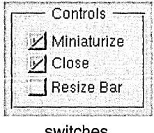

switches


two state buttons with space between them


a selection list

Switches and graphical two-state buttons are preferred, since selection lists are less attractive and don't give clues as to how many selections can be made at once. (If you use two-state buttons, be careful that they don't look like graphical radio buttons.) When space is tight or the list of choices can grow or shrink, a selection list might be more appropriate.

#### Displaying a Group with a One-of-Many Relationship

Several kinds of controls can be used to show a one-of-many relationship—that is, to let the user choose one and only one setting out of a list of possible choices:

- A group of radio buttons (standard or graphical)
- A pop-up list
- A selection list

The figure below shows these controls as if they were being used to set the background color of a text field. Because this use is inherently graphical and there are only a few valid choices, graphical radio buttons are the best choice, followed by standard radio buttons. A pop-up list is marginally acceptable for this use, and a selection list is the least appropriate choice.


In general, you should use radio buttons (standard or graphical) for one-of-many relationships unless there's a reason to use another type of control. If radio buttons aren't appropriate, then usually a pop-up list is appropriate. A selection list is the last choice, since it isn't as obvious to the user that exactly one item must be selected at all times.

The following considerations might help you decide which control to use:

- If the control will be used frequently, consider using radio buttons (standard or graphical), since they're easier to operate and more accessible to the user.
- If text doesn't adequately describe the choices, consider using a group of graphical radio buttons.
- If space is limited or the window or panel looks too complex, consider using a pop-up list.

- If the list of choices can grow or shrink, consider using a pop-up list or a selection list.
- If the list of choices can grow larger than the screen, use a selection list with a scroller.
- If the user needs to see more than one of the choices on-screen to understand them, avoid using a pop-up list.
- If the control will usually appear at the edge of the screen, you might want to avoid a pop-up list. The reason: A pop-up list usually pops up so that the current selection is under the cursor. But if the list is long and near the edge of the screen, it shifts so that the entire list can appear on-screen, which may change the selection under the cursor. Users might therefore unwittingly make a new selection while intending only to see what's in the list. When considering a pop-up list, think about whether it's important to avoid this behavior.
- If many ordinary, text-based buttons are in the panel, a pop-up list might fit in better graphically.

# *The I nterface to the File System*

One of the goals of the NeXTSTEP user interface is to provide a simple, graphical interface to the UNIX operating system. This is largely the responsibility of the Workspace Manager, the application that's brought to the screen after the user logs in. More specifically, the Workspace Manager provides a graphical interface to the file system. It's a substitute for a UNIX command interpreter (or shell) that locates files, displays folder contents, associates files with applications and icons, starts up applications, and keeps track of the user's home folder and working environment. It lets users manage files by manipulating their iconic representations.

For command-line interaction with the operating system, users can put up a window that emulates a VT-I 00 terminal and runs a standard shell. This window is provided by the Terminal application, which can be started up from the Workspace Manager.

Terminal is documented in the *NeXTSTEP Development Tools and Techniques* manual. The Workspace Manager is documented in the *User's Guide.* 

## **How the File System Is Organized**

The NeXTSTEP file system is arranged very much like a traditional UNIX file system. However, by default, when users view the file system in the Workspace Manager, they won't see many of the traditional UNIX folders. Instead, they'll see only a small number of folders that organize the tools and information they most need. Under the root (f) folder, they'll find the following folders:

LocalAdmin LocalApps LocalDeveloper LocalLibrary me Net NextAdmin NextApps NextDeveloper N extLibrary *user* 

## **Home Folders**

In the list above, the folder labeled *user* stands for the user's home folder. The hom~ folders of other users may also be visible. As is traditional, home folders bear the name of the user-the name that the user logs in under. By default, the user's name is me, and the home folder is fme.

If a machine is connected to a file server over a network, users' home folders are likely to be located somewhere on the file server. The figure above simply illustrates the default location for a home folder and where it would be located if it were on the startup disk. Home folders on remote machines are accessed through the **Net** folder described below.

When typing in a file name, users can specify their home folder as ..... For example, *....* f **Apps**  refers to the **Apps** folder that's in the home folder of the current user.

## **NeXT** Fo~derrs

Four of the top-level folders begin with a "Next" prefix-NextApps, NextAdmin, NextDeveloper, and NextLibrary. They contain documents, resources, and applications that are bundled with the computer.

The NextApps folder contains supported applications for NeXTSTEP users. In it are general-interest applications like Edit, Preferences, Mail, and PrintManager.

The NextAdmin folder also contains supported applications, but ones that will be used mainly by system administrators and network managers. They're not for general users like those in NextApps.

The main purpose of the NextDeveloper folder is to provide applications and files that are necessary for developing NeXTSTEP applications. Some of the folders that can appear in NextDeveloper include:

| Holds applications used by developers. This folder might not exist on<br>Apps |  |
|-------------------------------------------------------------------------------|--|
|-------------------------------------------------------------------------------|--|

all systems. Debuggers, profiling tools, language-specific editors, and other window-based programming tools belong here. Like all other applications in the four "Next" folders, these applications can be run from the Workspace Manager. Command-line debuggers and profiling

tools are in standard UNIX folders such as Ibin and lusrlbin.

Demos Contains programs that demonstrate the capabilities of NeXTSTEP.

These aren't full applications and aren't supported by NeXT. However, they include games and utilities that users, not just

developers, might find interesting.

Examples Contains source code for example programs. This folder might not

exist on all systems. Its folders contain source code that you can study

and compile.

The NextLibrary folder contains resource files organized into several folders. Some of the files and folders aren't on every system. Typical folders include

/NextLibrary/Documentation, which holds NeXTSTEP technical documentation, and /NextLibrary/Fonts, which holds the PostScript fonts available to all applications.

## **Local and Personal Folders**

The four folders with a "Next" prefix can be matched by four identical folders with a "Local" prefix. Internally, these four folders should be organized like their "Next" counterparts. But instead of containing files supplied by NeXT, they should hold information and applications provided for all users at a local site. Any user who logs in to a machine, or boots from it over a network, has access to its "Local" folders. If you add a new font for all users of your network, for example, it would reside in lLoealLibrarylFonts.

"Local" folders are created as they're needed. They aren't included on the release disk.

Users can add unprefixed Library and Apps folders in their home folders to hold information and applications that they alone have access to. Users who develop utilities for their own use or purchase private copies of a word processor and spreadsheet, for example, should put them in -/ Apps.

## **Net**

The Net folder gives the user access to file systems that are physically located on remote machines. The immediate folders under Net name the machines where the file systems are located. The next level of folders name the root folders of the file systems on those machines. For example, !Net/willow/mise is where the mise file system located on the willow computer would be mounted.

Net contains folders only if the user's computer is set up to be connected to other machines over a network.

All the folders in the root *(I)* folder, including Net, are physically located on the disk that the user's machine was booted from. If a user boots from a local hard disk, for example, NextLibrary and all its folders will be stored on the local disk. Remote folders are mounted only under Net.

## **Paths**

The Workspace Manager searches for executable files by using a *search path,* an ordered set of folders. The default path used by the Workspace Manager lists these six folders:

-IApps /LocalApps INextApps INextDeveloperl Apps INextAdmin INextDeve1operlDemos

The Workspace Manager uses this path for three tasks:

- To find the icons it should display for files associated with a particular application.
- To find the application it should start up when the user double-clicks a file.
- To find services offered by applications.

Before using the search path to find which application to start up, the Workspace Manager first looks in the dock. Each application icon in the dock represents a particular application residing in a particular folder on disk. By putting an icon in the dock, the user has indicated a preference for that version of the application over any others.

If an application isn't in the dock, the Workspace Manager looks next in the current working folder, the folder containing the file the user wants to open. Only after failing to find the application there does it tum to the path listed above.

In the path, the Workspace Manager looks first in the Apps folder of the current user's home folder. That's where the user's own applications would be. It next looks in the ILocalApps folder for sitewide software, then in the lNextApps, /NextDeveloper/Apps, lNextAdmin, and lNextDeveloperlDemos folders for NeXT-supplied software. This ordering of folders lets users customize their software to override sitewide software, and lets sitewide software override software supplied by NeXT.

Users can alter the path shown above for the Workspace Manager by setting a value for the ApplicationPaths parameter in their defaults database. You might do this, for example, to add a ILocalAdmin or ILocalDeveloperl Apps folder to the path.

## **File Name Extensions**

NeXTSTEP applications use file name extensions to identify types of files. The extension consists of the last period in the file name and all characters following it. For example, Mail uses the" .mbox" file name extension to identify its mailboxes. Typical mailbox names are Active.mbox and Outgoing.mbox.

The Workspace Manager uses file name extensions not only to identify particular types of files, but also to associate document files with applications. Every application that defines its own data file format appends an identifying extension to the names of its document files.

## **File Packages**

*Afile package* is a folder that the Workspace Manager presents to users as if it were a file. Because users normally don't look inside a file package (unless they explicitly open it as a folder), they're not likely to alter or reorganize its contents. "Using File Packages," later in this chapter, describes when you should use file packages.

## **Using Paths**

If your application needs to look up data that could be in several places on the system, it should use an ordered path similar to the one used by the Workspace Manager. For example, if an application requires a particular template file that might be supplied either by the user or by the system administrator, it should search for it first in a folder under .... !Library, and then in the same folder under !LocaILibrary.

## **Using FiDe Name !Extensions**

Your application should use its own unique file name extensions to identify (and help the Workspace Manager identify) its documents. Your extension (after its initial period) can include only alphabetic and numeric characters and should be at least three characters long. (NeXT reserves all extensions of under three characters for its own use.) For example, ".example" is an acceptable extension, but ".eg" is not, since it has only two characters after the period.

To request that an extension be registered and reserved for your use, write to:

NeXT Technical Services Extension Registry 900 Chesapeake Drive Redwood City, CA 94063

You can also send your request by electronic mail to ask\_next@NeXT.COM or .. .! next ! ask\_next.

The request should include the following information:

- The file name extension you want to register. List a first and a second choice.
- The name of the application the request is for.
- Your name and the name of your company.
- Your postal address and your electronic mail address, if you have one.
- Your telephone number.

You'll be informed when the extension is registered, or if it can't be for any reason. NeXT Technical Services will make the list of registered extensions available to you so that you can choose an extension not already assigned.

Registering a file name extension reserves it for your use. If you fail to register an extension that you intend to use, someone else may register and use it instead.

## **Using File Packages**

An application should create a file package when it has a group of files that it needs to keep together. For example, if your application displays information that's stored in independent text files, or if it makes use of a private utility program, or if it just loads archived objects from Interface Builder ".nib" files, you may want to keep these auxiliary files in close proximity to the application executable file. A file package (with the ".app" file name extension) is the way to do it.

Similarly, if your application creates documents that are split into more than one file-for example, if text is in one file and artwork in another-these files can also be grouped in a file package.

File packages for documents should bear the same extension that's assigned to the application's document files. For example, if a word processor uses a file package to store a document that has artwork, then the file package's extension should be the same as if the document had no artwork and was thus in a single file.

Opening and naming files within a document file package is entirely the application's responsibility.

## **Creating Unrequested Files and Folders**

Applications sometimes need to create files and folders for a user, other than as the result of a Save command.

If the files are associated with a particular document, they should be grouped with that document and placed in a file package.

Otherwise, where the files are located and what they're named depends on whether the user needs to have direct access to them:

• If the user never needs to get at the files or folders independently of using the application that creates them, they should be placed in a folder named .... /.Applnfo. If an application needs to create many such files, it should put them in its own folder in .... /.Applnfo. For example, if an application named My App needs to create many unrequested files, it should put them in a folder called .... /.Applnfo/My App. If the .... /.Applnfo folder doesn't already exist, the application should create it.

• If the user might sometimes need to get at the files or folders independently of the application that creates them (for example, template files), they should be placed under -/Library. You should name each file or folder so that the user can easily tell which application put it there.

The guiding principle here is that the user's home folder belongs to the user. An application shouldn't leave anything there that belongs to it, not to the user. When the application must create unrequested files and folders, it should put them where the user can find them but where they aren't likely to get in the user's way.

Note: You should generally use the defaults system instead of files to store small amounts of data.· The functions supporting the defaults system are described in the *NeXTSTEP General Reference* manual.

## **Displaying File Names**

File names are often displayed in a browser, where the user can see the path leading to the file. However, sometimes it's necessary to use only text for the file's name and path. In this case, the file's name should usually be displayed followed by two spaces, an em dash, two more spaces, and then the path. For example:

```
job Records - INet/machine/home/records
```

However, when there isn't much space to display the file name-as in a menu commandthe path can be shortened to the minimum necessary to differentiate the file name. The part of the path that isn't shown should be replaced with three dots.

For example, if one file called jobRecords is listed in limited space, it should be listed as:

```
jobRecords
```

If two files called jobRecords are listed in limited space, they might be listed as:

```
job Records - .. ./records 
job Records - .. ./backup
```

# *Suggested Reading*

## **User Interface Concepts**

A number of books, papers, and articles describe user interface concepts. A few books are listed below. Their bibliographies can lead you to other sources.

*The Art of Human-Computer Interface Design.* Brenda Laurel, editor. Addison-Wesley, 1990.

*The Design of Everyday Things.* Donald Norman. Doubleday, 1990.

*Designing the User Interface: Strategies for Effective Human-Computer Interaction.*  Ben Shneiderman. Addison-Wesley, 1987.

*Tog on Interface.* Bruce Tognazzini. Addison-Wesley, 1992.

Another resource is the Special Interest Group on Computer and Human Interaction (SIGCHI), a subgroup of the Association for Computing Machinery (ACM). For more information about ACMlSIGCHI, such as the chapter nearest you, contact them at the following address:

Association for Computing Machinery Membership Services Department 1515 Broadway New York, New York 10036 U.S.A.

Telephone: (212) 626-0500

Fax: (212) 944-1318

Electronic mail: ACMHELP@ACMVM.BITNET

## **NeXTSTEP Programming**

*NeXTSTEP General Reference: Release* 3. NeXT Publications. Addison-Wesley, 1992.

*NeXTSTEP Programming Inteiface Summary: Release* 3. NeXT Publications. Addison-Wesley, 1992.

The two books above present the programming interface for NeXTSTEP applications.

*NeXTSTEP Development Tools and Techniques: Release* 3. NeXT Publications. Addison-Wesley, 1992.

See the back cover of this manual for more titles in the *N eXTSTEP Developer's Library.* 

# *Glossary*

#### *active application*

The application currently associated with keyboard events. Menus are visible on-screen only for the active application, and only the active application can have the current key window and main window.

#### *anchor point*

When the user drags to define a range, the position of the cursor when the mouse button is pressed. See also *end point.* 

#### *application*

A program with a graphical user interface that the user can run from the workspace, such as Edit, FaxReader, or Preferences.

#### *application dock*

The column holding application icons at the right of the screen.

#### *Application Kir'*

The Objective C classes and C functions available for implementing the NeXT window-based user interface in an application. The Application Kit provides a basic program structure for applications that draw on the screen and respond to events.

#### *arrow key*

One of the four keys with arrows on them, to the left of the numeric keypad on the NeXT keyboard. They move the insertion point in the indicated direction.

#### *auach*

To choose a menu command that controls a submenu, causing the submenu to appear on-screen next to the supermenu (the menu with the controlling command). Moving or closing a supermenu also moves or closes its attached submenu; choosing the controlling command a second time detaches and hides the submenu.

#### *attention panel*

A panel that demands the user's attention. Until the user acts to dismiss the panel from the screen, no other action within the application is possible. Attention panels permit the user to rescind a command (such as Close), ask the user to complete a command (such as Save As), and give warnings that the user must acknowledge. See also *panel* and *ordinary panel.* 

#### *background color*

In the Application Kit, the color that fills the content area of a window and provides a background for all the drawing done within the window, or the color that fills a View as a background for any drawing the View or its subviews do.

#### *bar*

The part of a slider or a scroller that holds ~he moveable knob. See also *knob.* 

#### *busy cursor*

The cursor image (a spinning disk) that indicates that an application is busy.

#### *character code*

The code that identifies a character in a given character set; an index into the character set's encoding vector.

#### *character keys*

The keys that transmit characters to the NeXT computer. This includes not only the usual letters, numbers, and symbols, but also Return, Enter, Delete, Tab, Esc, and the arrow keys.

#### *character set*

The set of characters for a particular font or fonts; either the NeXTSTEP character set (an extension of ASCII) or Symbol.

#### *class*

In the Objective C language, a prototype for a particular kind of object. A class definition declares instance variables and defines methods for all members of the class. Objects that have the same types of instance variables and have access to the same methods belong to the same class. See also *class object.* 

#### *click*

To press and release a mouse button while the cursor is positioned over an object on-screen. Clicking an object may select it or cause it to act in some way. Users can also click to select a particular location (for the insertion point, for example).

#### *close button*

The button that can appear at the far right in a window's title bar. Clicking the button closes the window (removes it from the workspace).

#### *content area*

The area within a window that's available for the application to use. It excludes only the window's border, title bar, and resize bar.

#### *controls*

Graphical objects-such as buttons, sliders, text fields, and scrollers-that the user can operate to give instructions to an application.

#### *cursor*

The small image (usually an arrow) that moves on the screen correspondingly as you move the mouse.

#### *delegate*

In the Application Kit, an object that acts on behalf of another object. Window, Application, Text, Listener, NXBrowser, NXImage, and other objects can be assigned delegates.

#### *directory*

See *folder.* 

#### *dock*

See *application dock.* 

#### *docked icon*

An icon in the application dock.

#### *document window*

A window that displays the contents of a user-created file.

#### *double-click*

To press and release a mouse button twice in succession while the cursor is positioned over an object on-screen. To count as a double-click rather than as two separate clicks, the mouse cannot move and the mouse button must be pressed the second time within a short interval of the first.

#### *drag*

To move the mouse (and the cursor on screen) while a mouse button is held down.

#### *endpoint*

When the user drags to define a range, the position of the cursor when the mouse button is released. See also *anchor point.* 

#### *event*

The direct or indirect report of a user's action on the keyboard or mouse.

#### *event mask*

A long integer associated with a window. It controls which types of events will be associated with the window and passed to the application that owns the window. A 1 in the bit corresponding to a particular event type means the window will accept that type of event.

#### *file*

A collection of related information stored on a disk, such as a document, report, letter, or application.

#### *file package*

A folder that the Workspace Manager presents as a file, allowing the user to manipulate a group of files as if they were one file. A file package for an application executable should have the same name as the executable file, plus a ".app" extension. File packages for documents should bear the same extension as the one assigned to the application's document files.

#### *file system*

The collection of all the files the user can access through the computer.

## *floating panel*

A panel, such as a palette, that stays in front of standard windows and other panels. See also *tiers.* 

#### *folder*

A place in the file system that contains files and other folders. In documentation for programmers, folders are usually called *directories.* 

#### *freestanding icon*

An application icon standing alone in the workspace. Freestanding icons represent running applications and can be dragged into the dock. See also *docked icon.* 

#### *highlight*

To make something such as a command, text, icon, ottitle bar stand out visually. Highlighting usually indicates that something has been chosen to perform an action, or selected to receive an action.

#### *hot spot*

The point in the cursor image whose location on the screen is reported as the cursor's location. The cursor is said to be "over" the location at its hot spot.

#### *insertion point*

The point where whatever you type or paste in an application will be inserted. In text, it's typically marked by a blinking vertical bar.

#### *inspector panel*

A panel that displays information about the object that's currently selected.

#### *Interface BuilderTlA*

A tool that lets you graphically specify your application's user interface. It sets up the corresponding objects for you and makes it easy for you to establish connections between these objects and your own code where needed.

#### *key-down event*

An event that occurs when the user generates a character by pressing a key. Holding the key down generates subsequent key-down events at regular intervals.

#### *key equivalent*

In the Application Kit, the character that can be used as the keyboard alternative for a given object.

#### *key-up event*

An event that occurs when the user releases any key except Alternate, Shift, Control, or Command.

#### *key window*

The window in the active application that receives keyboard events. The title bar of the key window is highlighted in black.

#### *keyboard alternative*

A way of using the keyboard, rather than the mouse, to choose a menu command, operate a button in a panel, or pick an item from a pop-up or pull-down list. While holding a Command key down, the user types a character associated with the command, button, or item. See also *key equivalent.* 

#### *knob*

The part of a slider or scroller that the user can drag. See also *bar.* 

#### *linked information*

Copied infonnation, such as a graphic image, that can be automatically updated when the original information is modified.

#### *main menu*

The principal menu in an application, usually identified by the name of the application in its title bar. The main menu lacks a close button and cannot be made the submenu of another menu.

#### *main window*

The standard window that's affected by actions in a panel and certain menu commands. If the main window isn't also the key window, its title bar is highlighted in dark gray.

#### *menu*

A small window that displays a list of commands. Only menus for the active application are visible on-screen.

#### *message*

In object-oriented programming, the method selector (name) and arguments that are sent to an object; the message tells the receiving object what to do.

#### *method*

In object-oriented programming, a procedure that can be executed by an object.

#### *miniaturize button*

The button that can appear at the far left in a window's title bar. Clicking the button removes the window from the screen and replaces it with its miniwindow counterpart.

#### *miniwindow*

A small, icon-sized window that stands in for a window that has been miniaturized. Double-clicking the mini window reverses the miniaturization, returning the full window to the screen.

#### *mode*

A period of time when the user's actions are interpreted in a special way.

#### *modifier keys*

Keys that change the meaning of other keys or of the user's actions with the mouse; the Shift, Alternate, Command, Control, and Help keys.

#### *mouse-down event*

An event that occurs when the user presses a button on the mouse. There's one type of mouse-down event for the left (or only) mouse button and one for the right button.

#### *mouse-dragged event*

An event that occurs when the user moves the mouse while holding down a mouse button. There's one type of mouse-dragged event for when the mouse is moved with the left (or only) mouse button down, or with both buttons down, and another type for when it's moved with the right button down.

#### *mouse-moved event*

An event that occurs when the user moves the mouse without holding down a mouse button.

#### *mouse scaling*

The responsiveness of the cursor to movements of the mouse. Usually, the faster the mouse is moved, the farther the cursor travels.

#### *mouse-up event*

An event that occurs when the user releases a mouse button. There's one type of mouse-up event for the left (or only) mouse button and one for the right button.

#### *multiform panel*

A panel that has a pop-up list or set of graphical radio buttons at the top that lets the user choose which form the panel takes.

#### *multitasking*

Describes an operating system that allows the concurrent execution of multiple programs. Mach, the operating system of all NeXT computers, is multitasking.

#### *NeXTSTEpn.*

NeXT's application development and user environment, consisting of the Workspace Manager, various applications such as Project Builder and Interface Builder, various software kits such as the Application Kit and the Database Kit, and the Window Server.

#### *object*

A programming unit that groups together a data structure (instance variables) and the operations (methods) that can use or affect that data; the central focus of object-oriented programming.

#### *one-state button*

A button that initiates actions, as opposed to one that sets a state. Also known as an action button. See also *two-state button.* 

#### *ordinary panel*

Any panel that isn't an attention panel. See also *attention panel* and *panel.* 

#### *panel*

A window that holds objects that control what happens in other windows (such as a Font panel) or in the application generally (such as a Preferences panel), or a window that presents information about the application to the user (such as an information panel). See also *attention panel* and *ordinary panel.* 

#### *pixel*

The smallest unit that can be assigned a color or coverage value for showing images on the screen or printed page.

#### *pop-up list*

A menu-like list of items that appears over (or next to) an on-screen button when the button is pressed. The user can choose an item by dragging to it and releasing the mouse button. When the mouse button is released, the pop-up list disappears.

#### *press*

To press a mouse button and keep it down for a period of time while the cursor is positioned over an object on-screen. Pressing an on-screen object (such as a scroll button) may cause it to take repeated action, or may produce another object (such as a pop-up list) that the user can drag into.

#### *Project Builder*

A tool that lets you create and maintain your application's project and source file hierarchy. Project Builder provides a user interface for building your application from its source files., as well as connections with other NeXT developer applications for interactive debugging.

#### *pull-down list*

A menu-like list that appears under an on-screen button when the button is pressed. The user can drag into the list to choose an action from it. When the mouse button is released, the pull-down list disappears.

#### *resize bar*

The bar, located along the bottom of a window, that the user can grab and drag to resize the window.

#### *scroll buttons*

Any of the buttons that the user can press to scroll a display, such as the buttons in a scroller. Each scroll button is labeled by a small triangular arrow indicating the direction of scrolling.

#### *search path*

An ordered set of folders used by programs to search for files or folders.

#### *standard windows*

The principal windows of an application; the windows where its primary work is done. All windows are standard windows, except those with specialized functions (menus, panels, pop-up and pull-down lists, miniwindows, and docked and freestanding icons).

#### *submenu*

Any menu that can be brought to the screen through a command in another menu. All menus except the main menu are submenus of another menu. See also *supermenu, main menu,* and *attach.* 

#### *supermenu*

A menu containing a command that controls another menu, its submenu.

#### *system control keys*

The keys that control the computer's basic functions; the Power, brightness, and volume keys.

#### *target*

In the NeXTSTEP user interface, what the user selects to be acted on by a menu command or a control within a panel-for example, text that's to be deleted by the Cut command. In the Application Kit, the object that receives action messages from a Control.

#### *tear off*

To drag an attached submenu away from its supermenu. Tearing off a submenu detaches it from its supermenu and gives it an independent life on-screen. Tom-off menus are the only menus with close buttons.

#### *tiers*

The sections of the screen list. Each tier is occupied by a different type of window, with spring-loaded windows such as pop-up lists in the frontmost tier, attention panels in the second tier, menus in the next two tiers, docked icons in the tier below menus, and floating panels below docked icons. All other windows are in the bottom tier.

#### *triple-click*

To press and release a mouse button three times in succession while the cursor is positioned over an object on-screen. The mouse button must be pressed the second time within a short interval of the first, and the third time within a short interval of the second.

#### *two-state button*

A button that sets a state, as opposed to initiating an action. See also *one-state button.* 

#### *Window Server*

A process that dispatches user events to applications and renders PostScript code on behalf of applications.

#### *windows*

Page-like rectangular areas where applications can draw on-screen. Windows can be moved and reordered front to back.

#### *workspace*

The screen environment in which the user works on a NeXTSTEP computer.

#### *workspace window*

The window that fills the entire workspace on the screen and provides the dark gray background for other windows.

# *Index*

| Align Left command 128                       | arrow characters 33                           |
|----------------------------------------------|-----------------------------------------------|
| Align Right command 128                      | arrow keys                                    |
| Alternate key                                | use of 31,32                                  |
| as modifier key 23                           | use with Alternate key 50                     |
| use with arrow keys 50                       | use with Control key 49                       |
| using to extend selection 29                 | use with modifier keys 49-50                  |
| using with mouse 45                          | use with Shift key 49                         |
| anchor point 43                              | attention panels 4, 77. See also panels       |
| application icons 6-7                        | default option in 85                          |
| docked 6                                     | dismissing 85                                 |
| docked, tier of 54                           | features of 77                                |
| freestanding 6                               | implementing 84-87                            |
| Application Kit                              | naming 84-85                                  |
| programming note on menus and 102            | naming buttons in 86                          |
| programming note on windows and 57           | optional explanations in 87                   |
| provisions for implementing menus 106        | tier of 53                                    |
| application status, implementing 72-74       |                                               |
| applications                                 | Bold command 35,125                           |
| acting on user's behalf 15                   | browsers 11, 152                              |
| activating 60                                | buttons 8-9, 135-142. See also radio buttons, |
| active 2, 60-61                              | pop-up lists, and pull-down lists             |
| avoiding activation when dragging 74         | appearance of 8                               |
| deactivating 61                              | changing appearance of during a               |
| programming note on activating and           | click 140-141                                 |
| deactivating 73                              | choosing image or label for 138               |
| programming note on avoiding activation when | choosing results of using 137                 |
| dragging 74                                  | close 55                                      |
| window interface to 51-74                    | controlling lists 8,9, 136-137                |
| and window status 59-66                      | how they work 135-137                         |
| windows of 3-7                               | implementing 137-142                          |
| Arrange in Front command 129                 | link, implementing 142                        |
|                                              |                                               |

| buttons (continued)                         | standard 111-132                                              |
|---------------------------------------------|---------------------------------------------------------------|
| miniaturize 55                              | using graphical devices in 110                                |
| naming in attention panels 86               | using keyboard alternatives to choose 100                     |
| one-state 137                               | Control key                                                   |
| programming note on Return symbol 139       | as modifier key 23                                            |
| stop, implementing 142                      | use with arrow keys 49                                        |
| that set a state 8                          | using with mouse 45                                           |
| two-state 138                               | controls 7-11, 133-156                                        |
| types of 135                                | choosing the appropriate 153-156                              |
| used as switches 135                        | designing your own 134                                        |
| using instead of color wells 146            | displaying a group with aone-of-many<br>relationships 155-156 |
| Center command 128                          | displaying a group with an unrestricted                       |
| Check Spelling command 35,119               | relationship 154-155                                          |
| clicking 25                                 | displaying a single option with 154                           |
| in windows 40                               | principles of designing 134                                   |
| reactions to 39-40                          | that show state 154-156                                       |
| to select 28                                | that start actions 153                                        |
| clicking in windows, results of 66          | types of 134                                                  |
| close button 55, 71                         | uses of 133                                                   |
| broken 55                                   | Copy command 35, 118                                          |
| Close command 117                           | Copy Font command 36, 126                                     |
| Close panel 89,91                           | Copy Ruler command 36,128                                     |
| Close Window command 35, 129                | cursor                                                        |
| color wells 10, 146                         | bringing main menu to 101                                     |
| choosing colors for 146                     | changing 46                                                   |
| Colors command 35                           | hiding 47                                                     |
| Colors panel 89                             | managing 46-47                                                |
| colors, choosing for a color well 146       | programming note on hiding 47                                 |
| Command key                                 | Cut command 35, 118                                           |
| as modifier key 23                          |                                                               |
| special combinations with 33-34             | Delete command 119                                            |
| using with mouse 45                         | Delete key, use of 32                                         |
| commands 105. See also menus and specific   | direct manipulation 17                                        |
| commands                                    | Document menu 112, 116-118                                    |
| for checking spelling 120                   | documents, uneditable 118                                     |
| choosing from menus 100                     | double-clicking 25                                            |
| choosing names for 107-109                  | when to act on 40-42                                          |
| disabling invalid 110                       | dragging 26                                                   |
| naming for bringing up panels 108           | avoiding activation when 74                                   |
| naming for bringing up standard windows 109 | how to use 42-44                                              |
| naming for bringing up submenus 109         | moving objects by 43                                          |
| naming for performing actions 107           | over groups of objects 44                                     |
| naming in Services menu 131                 | range that should be selected by 48                           |
| program note on implementing 111            | to define a range 43                                          |
| sample names for 109                        | to select 27                                                  |
|                                             |                                                               |

| Edit menu 112, 118-119              | Info menu 112, 115                             |
|-------------------------------------|------------------------------------------------|
| programming notes on 119            | Info panel 89, 95                              |
| end point. 43                       | Info Panel command 115                         |
| Enter key, use of 32                | Italic command 35, 125                         |
| Enter Selection command 35, 123     |                                                |
| Esc key, use of 32                  | Jump to Selection command 36, 123              |
| extensions, file name 162           | Justify command 128                            |
|                                     |                                                |
| file name extensions 162            | key window 3,59,62-63,65                       |
| file packages 162                   | keyboard                                       |
| using 164                           | description of 22                              |
| file system                         | programming note on handling input 23          |
| interface to 157-165                | use of 22-24                                   |
| organization of 158-162             | user actions with 21-50                        |
| files                               | keyboard alternatives 5,23                     |
| creating unrequested 164            | choosing 34-39                                 |
| displaying names of 165             | choosing characters for 37                     |
| Find menu 119, 123                  | creating application-specific 36-39            |
|                                     | determining actions performed by 38-39         |
| Find Next command 35, 123           |                                                |
| Find panel 89,92                    | recommended 36                                 |
| Find Panel command 35, 123          | required 35                                    |
| Find Previous command 35, 123       | reserved 34-35                                 |
| folders                             | using the Alternate key in 37                  |
| creating unrequested 164            | keys, implementing special 32-39               |
| home 158                            |                                                |
| local 160                           | Larger command 126                             |
| Net 160                             | Lighter command 126                            |
| NeXT 159                            | link buttons, implementing 142                 |
| personal 160                        | Link Inspector command 121                     |
| root 160                            | Link Inspector panel 90, 95                    |
| Fontmenu 124,125-126                | Link menu 119,121-122                          |
| programming note on 126             | links, programming note on implementing 122    |
| Font panel 89                       |                                                |
| FontPanelcommand 35,125             | main menu 100, 111-114                         |
| Format menu 112, 124                | adding to 114                                  |
|                                     | bringing to cursor 101                         |
| Heavier command 126                 | standard commands in 111-113                   |
| Help command 35, 115                | tier of 53                                     |
| Help key                            | main window 59,63-64,65                        |
| alternative when keyboard has no 46 | menus 5,99-132. See also commands and specific |
| as modifier key 23                  | menus                                          |
| using with mouse 46                 | bringing main to cursor 101                    |
| Help panel 89, 93                   | closing 57                                     |
| Hide command 35, 113                | commands in 105                                |
| home folders 158                    | designing the hierarchy of 106                 |
|                                     | how they work 100-105                          |
|                                     |                                                |

| menus (continued)                           | Page Layout command 36,124                       |
|---------------------------------------------|--------------------------------------------------|
| implementing 106-110                        | Page Layout panel 90                             |
| programming note on the Application Kit     | panels 4-5, 75-98. See also attention panels and |
| and 102                                     | ordinary panels                                  |
| role of 5                                   | closing 57                                       |
| standard 111-132                            | customizing Application Kit 88                   |
| tier of 53, 54                              | floating 81                                      |
| uses of 99                                  | floating, tier of 54                             |
| miniaturize button 6,55, 70                 | how they work 76-77                              |
| Miniaturize Window command 36, 129          | implementing 78-87                               |
| mini windows 6                              | inspector 83                                     |
| modal tool 19                               | multiform 82                                     |
| modes                                       | naming commands that bring up 108                |
| avoiding use of 15                          | persisting 80                                    |
| when to use 15, 19                          | programming note on avoiding key-window          |
| modifier keys 22-23                         | status for 79                                    |
| use with arrow keys 49                      | programming note on creating 76                  |
| using with mouse 44, 46                     | relinquishing key-window status 80               |
| mouse                                       | role of 4                                        |
| implementing actions with 39-46             | standard 88-98                                   |
| paradigms for using in user interface 17-19 | when to use as key window 79                     |
| programming note on handling 25             | with variable contents 81-83                     |
| responsiveness of 26                        | Paste and Link command 36, 121                   |
| setting the scaling of 26                   | Paste As menu 119, 120                           |
| use of 24-31                                | Paste command 35, 118                            |
| use of buttons 26                           | Paste Font command 36, 126                       |
| use of in user interface 16                 | Paste Link Button command 121                    |
| user actions with 21-50                     | Paste Ruler command 36,128                       |
| using for selection 27-31                   | paths 161                                        |
| using modifier keys with 45-46              | using 162                                        |
| multiple-clicking 25                        | pop-up lists 136                                 |
| to select 28                                | buttons that control 9                           |
| when to use 41-42                           | implementing 141                                 |
|                                             | tier of 53                                       |
| Net folder 160                              | Preferences command 115                          |
| New command 35,116                          | Preferences panel 90, 96-97                      |
| performing an implicit 117-118              | pressing 26                                      |
| NeXT folders 159                            | when to use 44                                   |
|                                             | Print command 35, 113                            |
|                                             | Print panel 90                                   |
| Open command 35,116                         | Publish Selection command 121                    |
| Open panel 90, 96                           | pull-down lists 137                              |
| ordinary panels 4, 76. See also panels      | buttons that control 8                           |
| conventions for 78                          |                                                  |
| exception to behavior 80-81                 | implementing 141                                 |
| implementing 78-83                          | tier of 53                                       |

| Quit command 35, 113                                  | services, providing 131           |
|-------------------------------------------------------|-----------------------------------|
| Quit panel 90,97-98                                   | Shift key                         |
|                                                       | as modifier key 23                |
| radio buttons                                         | use with arrow keys 49            |
| graphical 135                                         | using to extend selection 30      |
| standard 135                                          | using with mouse 45               |
| resize bar 70                                         | Show Links command 121            |
| Return key                                            | Show Menus command 115            |
| use of 32                                             | Show Ruler command 36, 128        |
| using instead of a button 144                         | sliders 9, 145                    |
| Revert to Saved command 117                           | current value of 145              |
|                                                       | parts of 145                      |
| Save All command 117                                  | programming note on implementing  |
| Save As command 36, 116                               | Alternate-dragging for 145        |
| Save command 35,116                                   | Smaller command 126               |
| Save panel 91, 98                                     | special character keys 32-34      |
| Save To command 117                                   | Spelling command 119              |
| screen, typical NeXTSTEP 2                            | Spelling panel 91, 120            |
| scroll bar 148-149                                    | stop buttons, implementing 142    |
| scroll buttons 149                                    | submenus 102-104                  |
| scroll knob 148-149                                   | keeping attached 103              |
| scrollers 10, 147-151                                 | naming commands that bring up 109 |
| fine-tuning mode in 150                               | removing from screen 104          |
| how they work 148-150                                 | tearing off 103                   |
| implementing 150-151                                  | Subscript command 126             |
| parts of 148                                          | Superscript command 126           |
| the user's view 150                                   |                                   |
| uses of 147                                           | Tab key, use of 32                |
| scrolling                                             | targeted action 18                |
| automatically 150                                     | text fields 9, 143-145            |
| programming note on 149                               | moving between 143                |
| Select All command 35, 119                            | uses of 143                       |
| selection 27-31                                       | Textmenu 124,128                  |
| by clicking 28                                        | title bar 55                      |
| by dragging 27                                        | Tools menu 132                    |
|                                                       | triple-clicking 25                |
| by multiple-clicking 28<br>continuous extension of 29 |                                   |
| discontinuous extension of 30                         | Unbold command 35,125             |
| extending the 28-30                                   | Underline command 126             |
|                                                       |                                   |
| implementing 47-50                                    | Undo command 35,119               |
| of a range by dragging 43, 48                         | Unitalic command 35, 125          |
| when discontinuous not implemented 48                 | Unscript command 126              |
| selection lists 11, 152                               | Ununderline command 126           |
| Services menu 113, 130-131                            | user interface                    |
| naming commands in 131                                | basic principles of 14-16         |
| programming note on 131                               | consistency of 14                 |

```
user interface (continued) 
    design philosophy 13-20 
    direct manipulation paradigm 17 
    extensions to 20 
    'goals of 1, 13 
    modal-tool paradigm 19 
    naturalness of 15-16 
    paradigms for using mouse in 17-19 
    reasons for graphical 13 
    targeted-action paradigm 18 
    testing 20 
    use of mouse in 16 
    user control of 14 
    visual guide to 1-11 
users 
    control of user interface 14 
    when applications should act on behalf of 15 
window status 
    and applications 59-66 
    implementing 72-74 
windows 3-7 
    behavior of 54-59 
    choosing the key 72 
    choosing titles for 69 
   . clicking in 40 
    closing 57, 71 
    closing standard 57 
    designing 67 
    hiding 58 
    how they work 52-66 
    implementing 67-74 
    implementing standard 69-71 
    as interface to applications 51-74 
    key 62-63 
    main 63-64 
    miniaturizing 58, 70 
    moving 56 
    naming commands that bring up standard 109 
    note on meaning of 53 
    order of 53-54 
    parts of 52 
    placing 67-68 
    programming note on Application Kit and 57 
    programming note on implementing titles 
      of 69 
                                                                     programming note on saving position of 68 
                                                                     reordering 55 
                                                                     resizing 56, 70 
                                                                     results of clicking in 66 
                                                                     retrieving hidden 58 
                                                                     standard 3 
                                                                     tiers of 53-54 
                                                                     title bar of 55 
                                                                Windows menu 113, 129-130 
                                                                     programming note on 129 
                                                                workspace 2 
                                                                Workspace Manager 
                                                                     as interface to file system 157
```


## **NEXTSTEP USER INTERFACE GUIDEUNES: RELEASE 3**

NeXTSTEP is the object-oriented programming environment that speeds the development of all kinds of software-from missioncritical custom applications for business to advanced research projects for academia. NeXTSTEP offers building blocks that implement essential behavior in a variety of application areas- including database management, telecommunications and networking, and high-quality 2D and 3D graphics.

NeXTSTEP User Interface Guidelines provides an overview of the NeXTSTEP user interface, with special attention to the details that are important to designers of NeXTSTEP applications. It includes:

- The philosophy behind the NeXTSTEP user interface Instructions for using menus and panels
- Discussions of the appearance and behavior of windows
- Guidelines for interpreting user actions Help for choosing and implementing controls

The NeXTSTEP Developer's library is essential reading for every NeXTSTEP enthusiast, providing authoritative, in-depth descriptions of the NeXTSTEP programming environment. Other titles in the NeXTSTEP Developer's library include:

- NeXTSTEP Development Tools and Techniques: Release 3 NeXTSTEP Programming Interface Summary: Release 3
- NeXTSTEP Object-Oriented Programming and the Objective C language: Release 3
- NeXTSTEP General Reference: Release 3, Volumes 1 and 2 NeXTSTEP Operating System Software: Release 3

  - NeXTSTEP Network and System Administration: Release 3

NeXT develops and markets the industry-acclaimed NeXTSTEP object-oriented software for industry-standard computer architectures.

**NEXTSTEP**  *Obj ec t Ori <sup>e</sup> llt <sup>e</sup> d Soft <sup>w</sup> ar <sup>e</sup>*

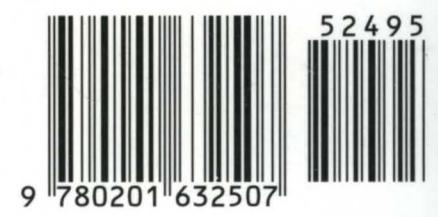

ISBN 0-201-63250-0

Addison-Wesley Publishing Company US \$24.95 CANADA \$31.95