# INSIDE MAC OS X

# Adopting the Aqua Interface

**Updated for Mac OS X Public Beta Release.**

9/8/00 © Apple Computer, Inc. 2000 Apple Computer, Inc. © 2000 Apple Computer, Inc. All rights reserved.

No part of this publication may be reproduced, stored in a retrieval system, or transmitted, in any form or by any means, mechanical, electronic, photocopying, recording, or otherwise, without prior written permission of Apple Computer, Inc., with the following exceptions: Any person is hereby authorized to store documentation on a single computer for personal use only and to print copies of documentation for personal use provided that the documentation contains Apple's copyright notice. The Apple logo is a trademark of

Apple Computer, Inc. Use of the "keyboard" Apple logo (Option-Shift-K) for commercial purposes without the prior written consent of Apple may constitute trademark infringement and unfair competition in violation of federal and state laws.

No licenses, express or implied, are granted with respect to any of the technology described in this book. Apple retains all intellectual property rights associated with the technology described in this book. This book is intended to assist application developers to develop applications only for Apple-labeled or Apple-licensed computers

Every effort has been made to ensure that the information in this document is accurate. Apple is not responsible for typographical errors.

Apple Computer, Inc. 1 Infinite Loop Cupertino, CA 95014 408-996-1010

Apple, the Apple logo, and Macintosh are trademarks of Apple Computer, Inc., registered in the United States and other countries. Simultaneously published in the

United States and Canada

**Even though Apple has reviewed this manual, APPLE MAKES NO WARRANTY OR REPRESENTATION, EITHER EXPRESS OR IMPLIED, WITH RESPECT TO THIS MANUAL, ITS QUALITY, ACCURACY, MERCHANTABILITY, OR FITNESS FOR A PARTICULAR PURPOSE. AS A RESULT, THIS MANUAL IS SOLD "AS IS," AND YOU, THE PURCHASER, ARE ASSUMING THE ENTIRE RISK AS TO ITS QUALITY AND ACCURACY.**

**IN NO EVENT WILL APPLE BE LIABLE FOR DIRECT, INDIRECT, SPECIAL, INCIDENTAL, OR CONSEQUENTIAL DAMAGES RESULTING FROM ANY DEFECT OR INACCURACY IN THIS MANUAL, even if advised of the possibility of such damages.**

**THE WARRANTY AND REMEDIES SET FORTH ABOVE ARE EXCLUSIVE AND IN LIEU OF ALL OTHERS, ORAL OR WRITTEN, EXPRESS OR IMPLIED. No Apple dealer, agent, or employee is authorized to make any modification, extension, or addition to this warranty.**

**Some states do not allow the exclusion or limitation of implied warranties or liability for incidental or consequential damages, so the above limitation or exclusion may not apply to you. This warranty gives you specific legal rights, and you may also have other rights which vary from state to state.**

This document describes what you need to do in order to design your application for the Mac OS X user interface (known as Aqua). This document is primarily intended for Carbon and Cocoa developers who want their application to look right and behave correctly for Mac OS X. This document assumes the reader is familiar with *Macintosh Human Interface Guidelines*, which can be found at <http://developer.apple.com/techpubs/macos8/HumanInterfaceToolbox/ HumanInterfaceGuide/humaninterfaceguide.html>

**Note:** This document applies as of Mac OS X Public Beta Release. Note that control sizes are compatible with platinum appearance metrics, but that layout guidelines for Mac OS X differ somewhat from Mac OS 8 and 9. Carbon developers, in particular, should review the material in ["Control Layout](#page-25-0)  [Guidelines" \(page 26\)](#page-25-0),["Menu Layout" \(page 33\),](#page-32-0) and ["Using the Appearance](#page-41-0)  [Manager" \(page 42\)](#page-41-0). Apple reserves the right to make changes in future releases.

# New in Aqua

This section describes the Aqua interface and highlights how it differs from the user interface found in Mac OS 8.

## Window Layering

The window layering model in Mac OS X is different from previous versions of Mac OS. In Mac OS 9 and earlier, all windows belonging to a particular application are in the same layer. In Mac OS X, document windows and an application's main

New in Aqua **3**

#### **CHAPTER 1**

#### Adopting the Aqua Interface

windows are in their own individual layers. This allows a user to have documents from different applications interleaved. Three or four TextEdit documents, three or four Preview documents, and so on, may be interleaved so that the user can click any one of them to bring it to the front and not disturb the layering of any other window. The user determines the layering order of windows; the depth of a particular window is determined by when the window was last accessed. It is possible to bring all windows of a given application forward by clicking on the application's icon in the Dock or by using the Bring All to Front command in the Window menu.

In the section ["Sheets" \(page 4\),](#page-3-0) a new type of dialog is introduced. This new type of dialog is designed to ensure that a dialog does not get lost when a user accesses windows from different applications.

### Sheets

Sheets are a new way to present certain dialogs to the user. Sheets are "attached" to a particular document or window; they are displayed as an animation that appears to emerge from the window's title bar. This attachment ensures that the user never loses track of the association of a sheet with its pertinent window, even when other windows are opened and closed. The ability to keep a dialog attached to its pertinent window enables users to take full advantage of Mac OS X's window layering model. [Figure 1-1](#page-4-0) shows an example of a sheet presenting a modal dialog.

**Figure 1-1** Example of using sheet to display a modal dialog

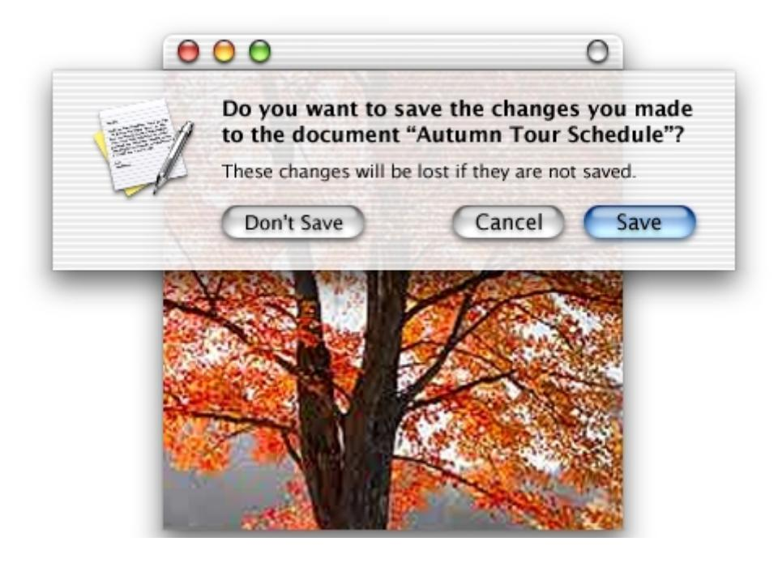

### Sheet Behavior

You lay out sheets like any other dialog in Mac OS X. Sheet behavior is determined by the Human Interface Toolkit, but sheets are basically modal dialogs that emerge from the title bar of a window. If a sheet is attached to a window near the edge of the screen, the sheet moves the window away from the edge until the dialog is dismissed, at which time the window returns to its previous position.

Only one sheet may be open for any window at any one time. A sheet presenting a modal dialog prevents any other operation on that window until the dialog is dismissed. If the user opens a sheet, then requests a second sheet, the first sheet closes before the second sheet opens.

New in Aqua **5**

### When to Use Sheets

You should use sheets for modal dialogs or for modeless dialogs when the user interacts with the dialog and dismisses it before proceeding with work. Here are some examples of when to use sheets:

- A modal dialog that is specific to a particular document, such as saving or printing.
- A modal dialog that is specific to a single-window application that does not create documents. A single-window utility program might use a sheet to request acceptance of a licensing agreement from the user, for example.
- Other window-specific dialogs typically dismissed by the user before proceeding. Use a sheet when these dialogs benefit from being attached to the window as a modal dialog, even if you might otherwise design the dialogs as a modeless dialog.

### When Not to Use Sheets

Do not use sheets for dialogs that apply to several windows. For example, the Save Changes alert that your application displays when the user attempts to quit with unsaved work should be a standard movable modal dialog (as shown in [Figure 1-2](#page-5-0)), because it may pertain to several open windows. Sheets are strictly intended to be used in situations when a particular dialog is associated only with the window to which it is attached.

**Figure 1-2** Example of a modal alert used in preference to a sheet

#### **CHAPTER 1**

#### Adopting the Aqua Interface

Sheets are not appropriate for modeless operations where the dialog should be left open to allow the user to observe the effects of changes applied. Such tasks are better suited to separate modeless dialogs or palettes.

Sheets should not be used in place of a preference dialog. Most applications use multiple panes to display preferences to the user. Application preferences should be presented in a consistent manner across all applications.

### Drawers

Mac OS X introduces a new user interface element called a drawer. A drawer is a pane that can be "opened" or "closed" (revealed or hidden) by the user. When a drawer is revealed, an animation makes it appear to be sliding from behind its parent window (hence the name drawer). It is tightly linked to its parent window, but its behavior makes it more like a part of its parent window than a sheet or palette. [Figure 1-3](#page-7-0) shows a drawer revealed next to its parent window.

New in Aqua **7**

#### **CHAPTER 1**

#### Adopting the Aqua Interface

**Figure 1-3** An open drawer

### When to Use Drawers

A drawer should be used only as a window pane containing supporting material that is used fairly frequently, but that does not need to be visible all the time. Contrast this with a palette, which should be visible and available whenever its main window is in the top layer. Some examples of uses of drawers include access to favorites lists, access to the mailboxes drawer in the Mail application, or access to favorites or bookmarks in a browser.

Although a drawer is somewhat similar to a sheet in that it attaches to a window and slides out, the two elements are not interchangeable. Sheets are primarily intended to replace modal dialogs, as described in ["When to Use Sheets" \(page 6\).](#page-5-1)

### Drawer Behavior

A drawer can be revealed or hidden by the user. The sliding animation occurs during both opening and closing operations. The revealing and hiding of a drawer is normally initiated by a button, a menu command, or some other control. In cases where a drawer contains a valid drop target, you may also wish to have a drawer open if the user drags an appropriate object to where the drawer appears. A drawer can appear from either the left or right side of its parent window. You should ensure that the default position of a parent window allows its drawer to open and remain in full view without disappearing offscreen.

When a drawer is visible, it is not larger than its parent window. This supports the illusion that the drawer is hidden behind its parent window when not visible. When the parent window is resized vertically, an open drawer resizes if necessary to ensure that it does not exceed the height of the parent window. (A drawer can, if you choose, be shorter than its parent window.) The illusion is further reinforced by the fact that the inner border of a drawer is hidden by the parent window and that the parent window's shadow is seen on the drawer when appropriate.

The user can resize an open drawer by dragging its outside border. The degree to which a drawer can be resized is determined by the content of the drawer. If the user resizes a drawer to the point where content is significantly obscured, the drawer should simply close. For example, if a drawer contains a scrolling list, the user should be able to resize the drawer to cover up the edge of the list. But if the user makes the drawer so small that the items in the list are difficult to identify, the drawer should close. If the user sets a new size (that is allowable) for a drawer, the new size is used the next time the drawer is opened.

New in Aqua **9**

### Using Controls in a Drawer

A drawer can contain any control that is appropriate to its intended use. You should follow normal layout guidelines, as stated in ["Control Layout Guidelines"](#page-25-0)  [\(page 26\).](#page-25-0) To ensure that the parent window's shadow does not affect any controls in the drawer, leave a border around the controls as shown in [Figure 1-3](#page-7-0).

A drawer should be considered part of the parent window for purposes of activating controls. This means that controls in a drawer should not be disabled simply because the parent window has focus, or vice versa.

## List and Column View

The Data Browser is a new component of the Carbon Toolbox that provides a standard, easily customized list and column view. Using the Data Browser (which is available only to Carbon applications) gives you a convenient way to provide a consistent user experience; standard keyboard shortcuts and Aqua compliance are built-in. The list view of the Data Browser provides multiple sortable, movable, and resizable columns with no extra programming required. For an example of the Data Browser's column view, see one of the Navigation Services dialogs in Mac OS X.

Similar functionality is available to Cocoa developers through three classes of interface objects:

- NSOutlineView. You can see an example in the Mailboxes drawer of the Mail application, which can show a multicolumn hierarchy with disclosure triangles.
- NSTableView. You can see an example in the list of contents of a mailbox in the Mail application. It is multicolumn and row-based.
- NSBrowser. You can see an example in the Open dialog of a Cocoa-based application. This class provides the same sort of hierarchical data as NSOutlineView in column format.

## Trash

The Trash is always the rightmost icon in the Dock and it cannot be moved or deleted by the user. Unlike in Mac OS 9, dragging an item to the Trash from an application does not cause a layer switch to the Finder. This means that you can use the Trash as a convenient way to delete items from within your application. For example, users can delete a message in the Mac OS X Mail application by using the

Delete toolbar button or by dragging the message to the Trash icon. (Note that in either case, the deleted message appears in the Deleted Messages folder, not the Trash.)

# Designing Alerts

This section describes how to design alerts for Mac OS X. [Figure 1-4](#page-10-0) shows an example of a standard alert and describes its dimensions.

**Figure 1-4** A standard alert with dimensions

Alert guidelines in Mac OS X are similar to those published in *Mac OS 8 Human Interface Guidelines* with several notable exceptions.

Designing Alerts **11**

■ The icon in a Mac OS X alert should be that of the application displaying the alert. The new window layering model described in ["Window Layering"](#page-2-0)  [\(page 3\)](#page-2-0) makes this change important. Without an identifying icon, it may not be obvious to the user which application is displaying the alert. One exception to this guideline: If there is a critical need to warn the user of a potentially data-damaging operation, you may wish to use the caution icon, as shown in [Figure 1-5.](#page-11-0)

**Figure 1-5** An alert using the caution icon

- Button names in alerts should correspond to the action the user performs when pressing the button—for example, Erase, Save, or Delete.
- We strongly encourage the inclusion of informative text in Mac OS X alerts, in addition to the standard message text. This text, which appears in the Small System Font, provides a fuller description of the situation and its consequences. Providing a warning that an action cannot be undone, for example, is an appropriate use of informative text.

**Figure 1-6** Example of Delete User alert

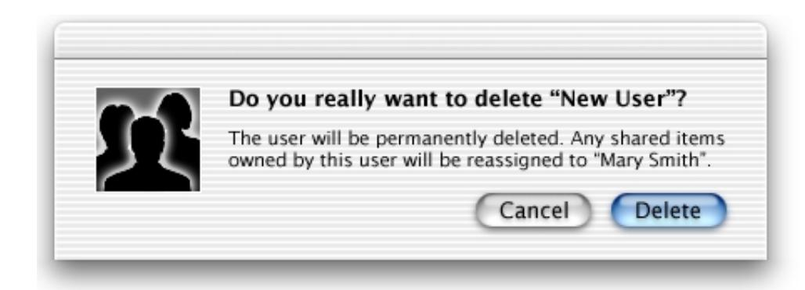

# Control Dimensions

For Carbon developers, the Human Interface Toolkit determines the height of all controls except for bevel buttons, group boxes, and text input fields. However, you must set the sizing for other aspects of the controls, including placement of text, according to the following guidelines.

### Using Small Versions of Controls

The Human Interface Toolkit includes smaller versions of some controls. These small versions should be used sparingly; your first choice in designing for Aqua should be to use the full-size controls. If you are designing windows such as palettes or utility windows, you may need to use small versions of a given control when space is at a premium and the window cannot be redesigned to allow the full-size version. You may also find it necessary to use smaller controls when converting existing designs for use with Aqua.

In the sections describing individual control types, a figure describing the small version of a given control (when a small version is available) immediately follows the figure that describe the full-size version. Again, you should use the smaller version of controls only when absolutely necessary.

Control Dimensions **13**

### Push Button Dimensions

Push buttons have a fixed height of 20 pixels. They have fixed-sized end caps (14 pixels wide) that clip text if you don't specify a button that is wide enough to accommodate the text string. [Figure 1-7](#page-13-0) illustrates push button dimensions. If you need to use a font that is larger than the system font, use a bevel button instead of a push button.

**Figure 1-7** Push button dimensions

**Push button:** The button height is 20 pixels.

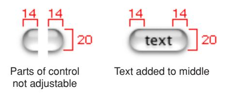

If stacked vertically the space should be10 pixels high.

[Figure 1-8](#page-14-0) shows the dimensions of the small version of push buttons. For information on when to use the small version, see ["Using Small Versions of](#page-12-0)  [Controls" \(page 13\)](#page-12-0).

**Figure 1-8** Small push button dimensions

**Small push button:** The button height is 17 pixels.

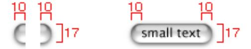

Non adjustable end caps should be 10 pixels.

The standard width for OK and Cancel buttons is 69 pixels, as shown in [Figure 1-9](#page-14-1). Push buttons used in other contexts may be sized differently if appropriate.

**Figure 1-9** Example of standard push buttons

**Standard push button:** button size is 69 pixels wide.

**Note:** All push buttons are clear except the default button (the button selected by pressing the Return key), which uses the default color (in addition to pulsing). For example, in a dialog containing a default OK button and a Cancel button, the Cancel button is clear and the OK button uses color and pulses. When the user presses a nondefault button such as Cancel, the button acquires color and the default button loses its coloring. [Figure 1-2](#page-5-0) shows an example of a default button that uses color.

### Pop-Up Button Dimensions

Pop-up buttons are 20 pixels high. The label portion of a pop-up button begins 9 pixels from the left edge of the button and ends 9 pixels from the control portion of the button, as illustrated in [Figure 1-10](#page-15-0). The label portion must be wide enough to accommodate the longest text that can appear in the label.

Control Dimensions **15**

**Figure 1-10** Pop-up button dimensions

**Pop-up:** The button height is 20 pixels.

If stacked vertically the space should be10 pixels high.

[Figure 1-11](#page-15-1) shows the dimensions of the small version of pop-up buttons. For information on when to use the small version, see ["Using Small Versions of](#page-12-0)  [Controls" \(page 13\)](#page-12-0).

**Figure 1-11** Small pop-up button dimensions

**Small pop-up:** The button height is 17 pixels.

### Radio Button and Checkbox Dimensions

Radio button dimensions are shown in [Figure 1-12](#page-16-0). Note that the size indicated for each control includes the shadow. The actual size of the hit-testing region is 12 x 12 pixels.

**Figure 1-12** Radio button dimensions

**Radio button:** The button size (red square) is 18 x 18 pixels.

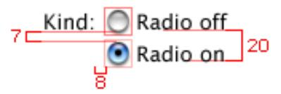

[Figure 1-13](#page-16-1) shows the dimensions of the small version of radio buttons. For information on when to use the small version, see ["Using Small Versions of](#page-12-0)  [Controls" \(page 13\)](#page-12-0).

**Figure 1-13** Small radio button dimensions

**Small radio button:** The button size is 14 x 15 pixels.

The hit-testing region is 10 x 10.

Checkbox dimensions are shown in [Figure 1-14](#page-17-0). Note that the size indicated for each control includes the shadow. The actual size of the hit-testing region is 12 x 12 pixels.

Control Dimensions **17**

#### **CHAPTER 1**

#### Adopting the Aqua Interface

**Figure 1-14** Checkbox dimensions

**Check box:** The button size (red square) is 18 x 18 pixels.

[Figure 1-15](#page-17-1) shows the dimensions of the small version of checkboxes. For information on when to use the small version, see ["Using Small Versions of](#page-12-0)  [Controls" \(page 13\)](#page-12-0).

**Figure 1-15** Small checkbox dimensions

**Small check box:** The size is 14 x 16 pixels.

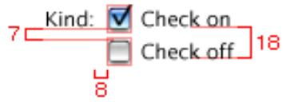

The hit-testing region is 10 x 10.

### Bevel Button Dimensions

Mac OS X bevel buttons use the same bevel height for all sizes of button. The Carbon Control Manager provides three different bevel height settings; Carbon programmers should specify the small bevel height when creating a bevel button in order to provide the largest area in which to draw icons. You should keep a border of 6 pixels around the icon; if your icon is too large, the button may appear dark or grayed-out because the icon obscures the button's highlighting. The minimum size for a bevel button is 20 x 20 pixels. [Figure 1-16](#page-18-0) shows examples of bevel buttons.

When you use a Carbon Control Manager function to specify a bevel button with an icon and a label, the Human Interface Toolkit automatically places the text label below the icon. Bevel buttons used in the Finder toolbar have 32 x 32 pixel icons and 10 point labels, as illustrated by the Home button in [Figure 1-16](#page-18-0).

**Figure 1-16** Bevel button dimensions

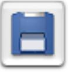

One bevel height but can be any size button. Keep a 6 pixel space around icons.

### Text Input Field Dimensions

Text input fields should be 22 pixels high to accommodate the system font (which is 16 pixels high without including line spacing). When the user selects text in a text input field, the selection rectangle is also 16 pixels high. The relationship of the text rectangle to the field is shown in [Figure 1-17.](#page-19-0) If you specify the small system font, the field dimensions are reduced proportionally. When a text input field has keyboard focus, a dark, translucent rectangle (which is 2 pixels wide at the top and 3 pixels wide on the other three sides) appears around the outside edge of the field. You should adjust your layout to make room for this focus ring.

Control Dimensions **19**

**Figure 1-17** Text input field dimensions

## List Element Dimensions

List elements, including browser and table views in Interface Builder, should be vertically sized to show only full lines of text. If you use the default font, this works out to (number of lines x 16) + 4 pixels.

### Slider Control Dimensions

Slider controls have a 7-pixel track. You can specify tick marks and labels. Several types of sliders (or "thumbs") are available. In each case, the slider size is 2 pixels larger than its equivalent in platinum appearance. Directional and non-directional sliders are available. Examples of vertical and horizontal slider controls are shown in [Figure 1-18.](#page-20-0)

**Figure 1-18** Slider dimensions

**Sliders:** The hit region on the directional thumbs is15 x18 pixels and 15 x15 on the non-directional thumbs.

[Figure 1-19](#page-21-0) shows the dimensions of the small version of sliders. For information on when to use the small version, see ["Using Small Versions of Controls" \(page 13\).](#page-12-0)

Control Dimensions **21**

#### **CHAPTER 1**

#### Adopting the Aqua Interface

**Figure 1-19** Small slider dimensions

**Small sliders:** The hit-testing region for all slider types is 11 x 12 pixels.

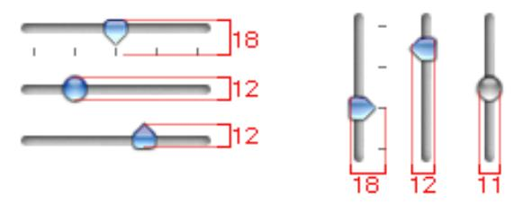

### Tab Control Dimensions

Tab controls are horizontally oriented and automatically centered at the top of the tab pane. The label text starts 12 pixels from the left edge and ends 12 pixels from the right edge of the tab control. The accent bar is 7 pixels high. Tab control dimensions are shown in [Figure 1-20.](#page-21-1)

**Figure 1-20** Tab control dimensions

Tabs using the system font.

[Figure 1-21](#page-22-0) shows the dimensions of the small version of tab controls. For information on when to use the small version, see ["Using Small Versions of](#page-12-0)  [Controls" \(page 13\)](#page-12-0).

**Figure 1-21** Small tab control dimensions

Small tabs using small system font.

Tab panes can extend from one edge of a window to the other, or they can be inset within a window. [Figure 1-22](#page-22-1) shows an example of tab panes that extend from one edge of a window to the other.

**Figure 1-22** Tab panes edge to edge

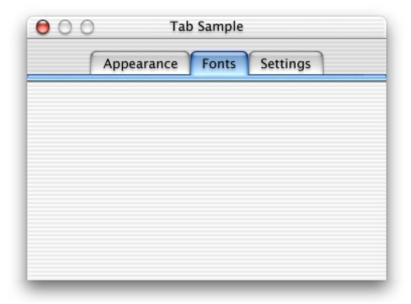

Control Dimensions **23**

For inset tab panes, the recommended inset is 24 pixels on each side within a window, although 20 or 16 is also allowed. You can define a window so that space remains below the tab pane for global controls such as push buttons. [Figure 1-23](#page-23-0) shows an example of tab panes inset within a window, with buttons below the panes.

**Figure 1-23** Tab panes inset from edge of window

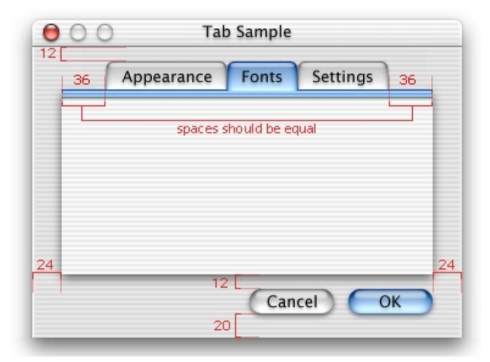

### Using Small Scroll Bars

Some windows require small scroll bars. These windows typically use the small versions of the title bar controls. They can have smaller versions of other controls, as well. [Figure 1-24](#page-24-0) shows an example of a window using small scroll bars and a small resize control.

**Figure 1-24** Example of window using small scroll bars and resize control

Small scroll bar width is 11 pixels.

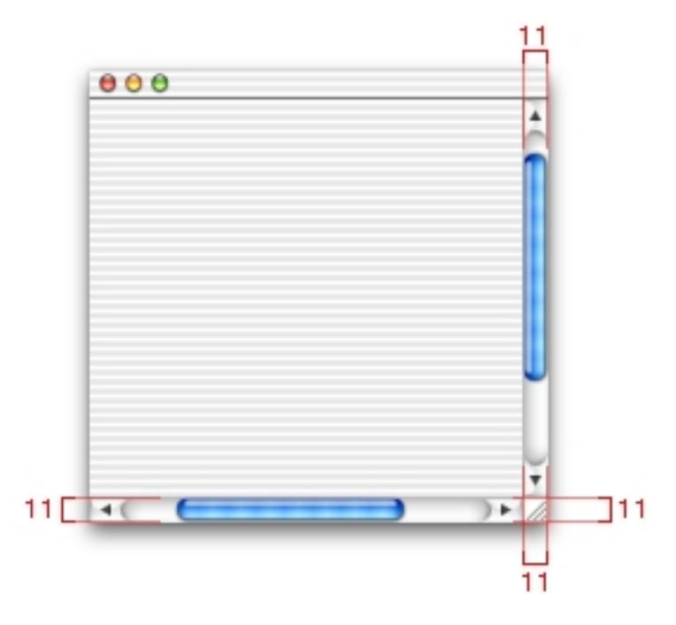

For more information on when to use small controls, see ["Using Small Versions of](#page-12-0)  [Controls" \(page 13\)](#page-12-0).

Control Dimensions **25**

# Control Layout Guidelines

This section describes a basic set of control layout guidelines. In an effort to simplify the process of resizing and repositioning existing layouts, most values are based on a multiple of 4 pixels. These guidelines use many of the default control sizes defined in Interface Builder; any exceptions are noted. When creating or changing dialog layouts, use the default fonts described in ["Standard Fonts" \(page 32\).](#page-31-0)

# Control Positioning in Dialogs

All spacing between dialog elements involves a multiple of 4 pixels— 4, 8, 12, 16, 20, or 24 pixels. Here are guidelines to keep in mind when laying out dialogs:

- For most document windows that contain a single view (scrolling text or tables, for example), do not specify any space between the window edge and scroll bars (when using the Carbon Control Manager) or the frame of the view (in Interface Builder).
- For dialogs that contain a mix of controls, set 16 pixels of vertical space between controls. Try to maintain a 24-pixel space between the left and right edge of the window and any controls. Keep 20 pixels of space between the bottom edge and any controls; this can include the shadow of any push buttons in that area. Top spacing is determined by which controls are placed closest to the top of the dialog. For example, [Figure 1-25](#page-28-0) uses a pop-up menu as the topmost control, so the spacing is set to 20 pixels. In contrast, [Figure 1-26](#page-29-0) uses a tab control as the topmost element, so the spacing is set to 16 pixels.
- In general, you should try for a more center-biased approach to dialog layout, as opposed to the strongly left-biased approach of the traditional Mac OS dialog. Most of the sample layouts in this document illustrate the center-biased approach.
- Whenever possible, use additional space between controls to create groups of controls, rather than group boxes. Excessive use of group boxes creates visual clutter, as the user is distracted by too many lines and edges. Within a group box, no control or label should be positioned within 16 pixels of the box's top, bottom, left, or right borders.

- Groups of controls should be separated by 20 pixels of vertical spacing and subgroups of controls within groups should be separated by 16 pixels.
- Vertical spacing between controls is determined by the tallest control in the row.
- Checkboxes and radio buttons are spaced 20 pixels baseline-to-baseline. Using this spacing automatically provides 7 pixels of separation between each control. For illustrations, see ["Radio Button and Checkbox Dimensions" \(page 16\)](#page-15-2) and [Figure 1-27.](#page-30-0)
- Text associated with controls like pop-up buttons, checkbox groups, and radio button groups should be spaced 8 pixels from the control.
- Bevel button spacing is based on the button's use. Toolbar bevel buttons, as used in the Finder or Mail applications, for example, are spaced 8 pixels apart. This spacing would not be appropriate for a set of smaller buttons, however. Don't overlap buttons in a palette.
- The OK or default button should be positioned in the lower-right corner of the window, dialog or alert. If you use a Cancel button, it should be positioned to the left of the default button. If you use a third, or alternate, button (Don't Save, for example), it should be positioned to the left of the Cancel button, as shown in [Figure 1-1](#page-4-0). The preferred ordering of buttons is alternate, Cancel and default. Push buttons should be spaced at least 12 pixels apart horizontally and 10 pixels apart if stacked vertically.

### Spacing Summary

### When to Use 8-Pixel Spacing

- Between a control and its text label
- Between a control and an icon used to identify the control's use

### When to Use 12-Pixel Spacing

- Horizontally between push buttons
- Horizontally between pop-up buttons
- Horizontally between text input fields

#### **CHAPTER 1**

#### Adopting the Aqua Interface

- Between text labels for groups of controls
- Between subgroups of controls in larger groups
- Between a tab control and the top of the window

### When to Use 16-Pixel Spacing

- Between the inside edge of a group box and enclosed controls
- Between the top and bottom edges of a group box and enclosed controls
- Between the left and right edges of a group box and any other group box
- Between primary groups of controls
- Between the top edge of a window and its topmost controls, when appropriate to the controls

### When to Use 20-Pixel Spacing

- Between the bottom edge of a window and its enclosed controls
- Between groups of controls when no group box is used or when the mixture of controls requires more space
- Between the baselines of text labels for radio buttons and checkboxes
- Between the top edge of a window and its topmost controls, when appropriate to the controls

### When to Use 24-Pixel Spacing

- Between the left or right edge of a window and its enclosed controls
- Between an inset tab pane and the edges of a window

### Sample Dialog Layouts

This section contains sample layouts illustrating how to position dialog elements and controls.

**Figure 1-25** Sample General Preferences dialog

#### **CHAPTER 1**

#### Adopting the Aqua Interface

**Figure 1-26** Sample Date dialog

B = 8 C = 12 D = 16 E = 20 F = 24 G = 28 \* = Items or areas that are centered.

**Figure 1-27** Sample View Options dialog

B = 8 C = 12 D = 16 E = 20 F = 24

# Standard Fonts

Mac OS X supports six standard font mappings, as described in [Table 1-1.](#page-31-1)

**Table 1-1** Mac OS X font usages

| Usage                          | Font                        |
|--------------------------------|-----------------------------|
| System Font                    | Lucida Grande Regular 13 pt |
| System Font (Emphasized)       | Lucida Grande Bold 13 pt    |
| Small System Font              | Lucida Grande Regular 11 pt |
| Small System Font (Emphasized) | Lucida Grande Bold 11 pt    |
| Application Font               | Lucida Grande Regular 13 pt |
| Label Font                     | Lucida Grande Regular 10 pt |

System font is used for message text, or the main text, in all dialogs. It is also the default font for lists and tables. Interface Builder shows a message text string in the Views Palette.

Small system font is used for informative text, as described in ["Designing Alerts"](#page-10-1)  [\(page 11\).](#page-10-1) This is the default font for headers in lists and for Help Tags. You can also use it to provide additional information about settings in various windows, such as the QuickTime pane in System Preferences. Interface Builder shows an informative text string in the Views Palette.

Label font is used for labels with controls such as sliders and icon bevel buttons. You should rarely need to use this font in dialogs. For an example of this font, see the Speech pane in System Preferences.

Use emphasized system font sparingly. You might choose to use it to title a group of settings that appear without a group box. For an example of this font, see the Date or Numbers section of the International pane in System Preferences.

# Menu Layout

This section describes differences between Mac OS 9 and Mac OS X menus.

### Notable Changes From Mac OS 9

The Apple menu has been replaced with an application menu containing general application items. Note that the familiar Quit and Preference" menu items have been moved to the application menu. By introducing the application menu in the left-most position in the menu bar (in left-to-right script systems), Mac OS X creates a logical progression of menu functions:

- The first menu (the application menu) provides items that pertain to the entire application, such as Hide and Quit.
- The second menu (the File menu) provides items for managing an individual document file, such as Open and Close Window.
- The third menu (the Edit menu) and all subsequent menus provide items for managing document content, such as Cut and Paste.

An optional Window menu has also been introduced to aid in managing multiple documents open within an application.

## The Application Menu

The Application menu, which is new in Mac OS X, replaces the Apple menu from previous versions of Mac OS. This menu is populated with menu items that are general to the application; that is, items that are not specific to a document or other window.

Menu Layout **33**

**Figure 1-28** An application menu

The title of the application menu is the name of the application. In [Figure 1-28](#page-33-0), for example, the menu title is "Mail." The limited space available for this name requires that you provide a short application name (16 characters or less) as part of the application package. You should ensure that your title does not exceed 128 pixels in width when drawn in the standard menu font. Note that the About item, the Hide command, and the Quit command should all use this short application name, as well.

**Note:** The user can use the System Preferences application to specify whether the application menu displays the application name or its icon.

The first item below the application menu title is the familiar About item. It provides access to the application's About dialog and should be named appropriately. For example, the Mail application's About item is About Mail. Any menu items that provide access to the application's preference dialogs should be installed below the About item. You should include any other application-specific items here, as well. If you specify a single "About" item and a single preference item, do not use a menu separator between them. If you include a number of application-specific items, you can use a menu separator to group them.

The Services menu, currently available only for Cocoa applications, is the next item in the application menu. This item is preceded by a menu separator. The Hide command, found in the process menu on Mac OS 9, is the next item in a Mac OS X

application menu. This command is preceded by a menu separator and followed by the Hide Others and Show All commands. The last menu item of the application menu is the Quit command. This menu item has been moved from its previous location, the File menu. Quit should be preceded by a menu separator.

# The File and Edit Menus

These menus should remain similar to their Mac OS 9 counterparts, with the exceptions of the relocated Preferences and Quit items described in ["The](#page-32-1)  [Application Menu" \(page 33\)](#page-32-1). If an application is not document-centered, you can rename the File menu to something more appropriate. For example, the System Preferences application's second menu is called Panes. If there are no relevant commands in the File menu, you can eliminate it altogether. For example, if your single-window application automatically quits when its window is closed, you do not have to provide a Close Window command; the Quit command in the application menu is sufficient.

### The Window and Help Menus

The Window menu (which is optional) provides a listing of open document window and provides keyboard shortcuts for minimizing windows and bringing an application's windows to the front. If you choose to implement the Window menu, you can add commands to show and hide auxiliary windows such as palettes and modeless dialogs.

If an application uses a single window, it is not necessary to create a Window menu simply to provide the Minimize Window command; you can simply provide a minimize in the window's title bar and support for the Command-M keyboard equivalent.

Menu Layout **35**

**Figure 1-29** A Window menu

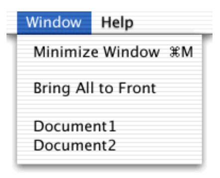

The ordering of items in the Window menu is Minimize Window, <separator>, Bring All to Front, <separator>, followed by the window list. The Close Window menu item has been relocated to the File menu; it was previously located in the Window menu in the menu layout guidelines for Mac OS X Server.

Every application has a Help menu, which is always the rightmost menu. The first item is the name of the application and the word "Help" (Mail Help, for example). As with Mac OS 8 and 9, you can add more items to the Help menu if needed. However, fewer choices are better and a single application help choice is the best approach.

### Using Ellipses in Menus

An ellipsis (…) after a menu item or button label indicates to the user that additional information is required to complete a command. You should use an ellipsis in the following cases:

- An action that requires further user input to complete, or presents an alert allowing the user to cancel the action. Examples include Open, Page Setup, and Print. Typically the windows displayed by these commands are modal and are dismissed after completing the action.
- An action that opens a nonmodal dialog that requires additional user input to complete task. Examples include Find, Go To, and Spelling.

■ An action that opens a settings window. The main function of settings windows is to allow the user to change some aspect of the application, not the document content. The main function of these dialogs is not to provide information. Examples include Set Title, Preferences, and Options.

You should not use an ellipsis in the following cases:

- An action that requires no further user input to complete and does not present an alert. Often the item to be acted upon is already selected. Examples: New, Cut, Bold, Print One, and Quit.
- An action that opens an informational, accessory or tool window. These windows can be implemented as either utility windows (as in the case of a color palette), or nonmodal windows. These windows provide tools that help create or manage the content in the main window and are frequently left open to assist in accomplishing the task of the main window.

### Reserved Keyboard Equivalents

Mac OS X reserves two key combinations as new equivalents to menu commands that affect all applications:

- Command-H is reserved as an equivalent to the "Hide <appname>" menu command that appears in the Application menu of all applications.
- Command-M is reserved as an equivalent to the "Minimize Window" menu command that appears in the Window menu. It applies to any active window that can be minimized.

# Icon Design

This section describes how to design icons for Mac OS X applications.

Icon Design **37**

### Icon Genres

A new concept in Mac OS X is the notion of icon genres. Classifying applications by role (such as user applications, utilities, and administrator's tools, for example) provides for simple, easy division of icons into visually distinct categories. Each genre is identified by a distinctive icon style. The value of this division becomes more apparent when you look at icons in juxtaposition. [Figure 1-30](#page-37-0) shows two rows of icons, with application icons in the top row and utility icons in the bottom row. These two icon genre categories are described in ["User Application Icons" \(page 39\)](#page-38-0) and ["Utility Icons" \(page 42\).](#page-41-1)

**Figure 1-30** Examples of different icon genres

The Dock, for example, can contain icons of several different genres, so it is crucial that you provide clear visual indication of an icon's genre. This indication allows the user to easily classify and organize each icon on the Dock.

### Application Icons

Icon design in Mac OS X is significantly different from previous versions of Mac OS. Icon design in Mac OS 8 and 9 is highly abstracted and conceptualized due to graphical limitations. These limitations constrained designers to use a style that emphasized straight lines rotated in increments of 45 degrees. A familiar example of this is the standard diamond-like application icon, as shown in [Figure 1-31.](#page-38-1)

**Figure 1-31** Standard application icon for Mac OS 8 and 9

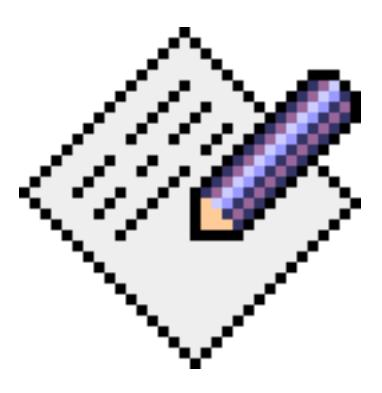

Building on the icon style defined in previous versions of Mac OS, Mac OS X offers icons that are stylistically vibrant and emotive. Icons can be represented in 128 x 128 pixels to allow ample room for detail. Anti-aliasing makes curves and nonrectilinear lines possible. Alpha channels and transparency allow for complex shading and dimensionality. All of these qualities pave the way for lush and vibrant imagery that allows you to create icons that communicate in ways never before possible.

### User Application Icons

A Mac OS X user application icon has a diamond-like rotation designed to reinforce the emotional quality of an icon. The rotated object carries a direct meaning for the application and should represent the media created or viewed by the application. The perspective can be compared to objects on a desk. If you look at an object on your desk as it appears when you are sitting in your chair, you see the perspective from which Mac OS X user application icons are designed. This perspective (that is, looking down at a layered set of elements), combined with the superior aesthetic

Icon Design **39**

capabilities of Mac OS X, allows the user to perceive icons as representing familiar objects. This familiarity helps the application become more approachable and non-threatening to novice users and enables you to design icons with the desired emotive quality; in other words, you can make an icon as fun or as serious as appropriate to its application. [Figure 1-32](#page-39-0) shows an example of a user application icon that clearly communicates its purpose in a way that invites the user to learn more about it.

**Figure 1-32** Example user application icon for Mac OS X

Observe the use of color, curve, and shading in [Figure 1-32.](#page-39-0) Alpha channels allow for complex, soft shadows that emphasize the effect of layered elements as well as perspective. Alpha channels can also be used for transparency, so you can provide the effect of translucency, as seen in [Figure 1-33](#page-40-0). 32-bit color provides a vibrant color palette.

**Figure 1-33** Sample application icon for Mac OS X

Aside from the overall shape and formal elements that you can use to design an application icon, you should also provide a supportive tool element whenever possible to communicate the type of task that an application allows the user to accomplish. The magnifying glass in [Figure 1-33](#page-40-0) is a good example of a tool element. The tool should closely relate to the base object that it rests upon and should be rotated in an opposite direction. Ideally, the user application icon should tell a story of how the application can be used. More examples of the supporting tool concept are shown in [Figure 1-34.](#page-40-1)

**Figure 1-34** Examples of user applicationicons with supporting tool elements

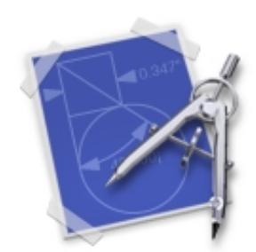

Icon Design **41**

### Utility Icons

In contrast to the "object on a desktop" approach discussed in ["User Application](#page-38-0)  [Icons" \(page 39\)](#page-38-0), utility application icons are designed to reinforce the typically serious nature of utility applications. This change in style shifts the visual perspective to that of an object on a shelf at eye level, directly in front of the user. Unlike richly colored user application icons, utility icons are generally grayscale, with color applied sparingly. [Figure 1-35](#page-41-2) shows an example of a utility icon.

**Figure 1-35** A utility icon

Since utility applications are normally focused on a narrow set of tasks, it's best to keep the number of elements to a minimum. The supporting tool should be an integrated element, as opposed to a layered object.

# Using the Appearance Manager

This section describes steps that Carbon developers should take to make their application Aqua-compliant. Cocoa developers do not need to concern themselves with this process if they use Interface Builder to create their applications.

If you design your Carbon application to be fully compliant with the Appearance Manager, your application should, in most cases, work with Aqua as well. The process of using the Appearance Manager does not involve any additional complexity; as *Programming With the Appearance Manager* states, "The key to making

#### **CHAPTER 1**

#### Adopting the Aqua Interface

your program Appearance-compliant is to allow the system to do as much of your interface work for you as possible." All Appearance Manager calls are Carbon-compliant, as well.

Here is a quick review of how to work with the Appearance Manager:

- Register with the Appearance Manager.
- Whenever possible, use the system-defined windows supplied by the Window Manager instead of creating your own.
- Whenever possible, use the system-defined menus supplied by the Menu Manager instead of creating your own.
- Whenever possible, use the wide assortment of system-defined controls available through the Control Manager instead of creating your own. At a minimum, you should revise any custom controls in your application so that they work in control hierarchies.
- Make your dialogs and alerts Appearance-compliant.
- When you absolutely cannot use standard interface elements, use Appearance Manager functions to make your custom elements Appearance-compliant.
- Remove color table resources for windows, controls, menus, dialogs, and alerts from your application.
- Make no assumptions about color values for your interface. Instead of hard-coding color values, use the Appearance Manager constants of type ThemeBrush and ThemeTextColor.
- Make no assumptions about the dimensions of menus, windows, or controls.

For more information on this process, see *Programming With the Appearance Manager.*

#### **CHAPTER 1**

Adopting the Aqua Interface

# A Document Revision History

This document has had the following revisions:

#### **Table A-1**

| Date        | Notes                                                                                 |
|-------------|---------------------------------------------------------------------------------------|
| 8 Sep 2000  | Updated for Mac OS X Public Beta Release.                                             |
|             | Added section on working with the Appearance Manager.                                 |
|             | Added section on designing alerts.                                                    |
|             | Added section on sheets.                                                              |
|             | Added section on drawers.                                                             |
|             | Added section on list and column view.                                                |
|             | Added material on small controls.                                                     |
|             | Added examples of font usage.                                                         |
|             | Clarified description of tab control usage.                                           |
| 19 Apr 2000 | Updated for Mac OS X Developer Preview 4 and retitled Adopting the Aqua Interface. |
|             | - Changed content and art to reflect new control metrics.                             |
|             | Added section on icon design.                                                         |
|             | Added section on window layering.                                                     |
|             | Added section on menu layout.                                                         |
|             | Added material on using ellipses in menus.                                            |

#### **APPENDIX A**

#### Document Revision History

#### **Table A-1**

| Date        | Notes                                         |
|-------------|-----------------------------------------------|
| 20 Jan 2000 | Document published as Aqua Layout Guidelines. |