# Inside Mac OS X

# Aqua Human Interface Guidelines


 Apple Computer, Inc. © 2002 Apple Computer, Inc. All rights reserved.

No part of this publication may be reproduced, stored in a retrieval system, or transmitted, in any form or by any means, mechanical, electronic, photocopying, recording, or otherwise, without prior written permission of Apple Computer, Inc., with the following exceptions: Any person is hereby authorized to store documentation on a single computer for personal use only and to print copies of documentation for personal use provided that the documentation contains Apple's copyright notice.

The Apple logo is a trademark of Apple Computer, Inc. Use of the "keyboard" Apple logo (Option-Shift-K) for commercial purposes without the prior written consent of Apple may constitute trademark infringement and unfair competition in violation of federal and state laws.

No licenses, express or implied, are granted with respect to any of the technology described in this book. Apple retains all intellectual property rights associated with the technology described in this book. This book is intended to assist application developers to develop applications only for Apple-labeled or Apple-licensed computers

Every effort has been made to ensure that the information in this document is accurate. Apple is not responsible for typographical errors.

Apple Computer, Inc. 1 Infinite Loop Cupertino, CA 95014 408-996-1010

Apple, the Apple logo, AirPort, AppleScript, AppleTalk, AppleWorks, Aqua, Cocoa, Final Cut Pro, FireWire, iMac, Keychain, Mac, Macintosh, QuickDraw, QuickTime, Sherlock, and WorldScript are

trademarks of Apple Computer, Inc., registered in the United States and other countries.

Balloon Help, Carbon, Finder, iMovie, iPhoto, iTunes, and ResEdit are trademarks of Apple Computer, Inc.

Objective-C is a trademark of NeXT Software, Inc., registered in the United States and other countries.

Java is a trademark of Sun Microsystems, Inc., registered in the U.S. and other countries. Simultaneously published in the

United States and Canada **Even though Apple has reviewed this manual, APPLE MAKES NO WARRANTY OR REPRESENTATION, EITHER EXPRESS OR IMPLIED, WITH RESPECT TO THIS MANUAL, ITS QUALITY, ACCURACY, MERCHANTABILITY, OR FITNESS FOR A PARTICULAR PURPOSE. AS A RESULT, THIS MANUAL IS SOLD "AS IS," AND YOU, THE PURCHASER, ARE ASSUMING THE ENTIRE RISK AS TO** 

**IN NO EVENT WILL APPLE BE LIABLE FOR DIRECT, INDIRECT, SPECIAL, INCIDENTAL, OR CONSEQUENTIAL DAMAGES RESULTING FROM ANY DEFECT OR INACCURACY IN THIS MANUAL, even if advised of the possibility of such damages.**

**ITS QUALITY AND ACCURACY.**

**THE WARRANTY AND REMEDIES SET FORTH ABOVE ARE EXCLUSIVE AND IN LIEU OF ALL OTHERS, ORAL OR WRITTEN, EXPRESS OR IMPLIED. No Apple dealer, agent, or employee is authorized to make any modification, extension, or addition to this warranty.**

**Some states do not allow the exclusion or limitation of implied warranties or liability for incidental or consequential damages, so the above limitation or exclusion may not apply to you. This warranty gives you specific legal rights, and you may also have other rights which vary from state to state.**

# Contents

[Figures and Tables](#page-12-0) 13

| Chapter 1 | Introduction to the Aqua Human Interface Guidelines<br>21                                                                                                                                                                                                                                                                                                                                                                                                                                                                                                                                 |
|-----------|-------------------------------------------------------------------------------------------------------------------------------------------------------------------------------------------------------------------------------------------------------------------------------------------------------------------------------------------------------------------------------------------------------------------------------------------------------------------------------------------------------------------------------------------------------------------------------------------|
|           | The Benefits of Applying the Interface Guidelines<br>22<br>Deciding What to Do First<br>23<br>Tools and Resources for Applying the Guidelines<br>24<br>If You Have a Need Not Covered by the Guidelines<br>25                                                                                                                                                                                                                                                                                                                                                                             |
| Chapter 2 | Human Interface Design<br>27                                                                                                                                                                                                                                                                                                                                                                                                                                                                                                                                                              |
|           | Human Interface Design Principles<br>27<br>Metaphors<br>27<br>See-and-Point<br>28<br>Direct Manipulation<br>28<br>User Control<br>29<br>Feedback and Communication<br>29<br>Consistency<br>30<br>WYSIWYG (What You See Is What You Get)<br>30<br>Forgiveness<br>31<br>Perceived Stability<br>31<br>Aesthetic Integrity<br>31<br>Modelessness<br>32<br>Knowledge of Your Audience<br>33<br>Worldwide Compatibility<br>33<br>Cultural Values<br>34<br>Language Differences<br>34<br>Text Display and Text Editing<br>35<br>Default Alignment of Interface Elements<br>36<br>Resources<br>36 |

[Universal Accessibility](#page-36-0) 37 [Visual Disabilities](#page-37-0) 38 [Hearing Disabilities](#page-37-1) 38 [Physical Disabilities](#page-38-0) 39

### **Chapter 3** [The Dock](#page-40-0) 41

[The Dock's Onscreen Position](#page-40-1) 41 [Dock Notification Behavior](#page-41-0) 42 [Dock Menus](#page-42-0) 43 [Clicking in the Dock](#page-43-0) 44

### **[Chapter 4](#page-44-0)** Menus 45

[Menu Elements](#page-44-1) 45 [Menu Titles](#page-45-0) 46 [Menu Items](#page-45-1) 46 [Grouping Items in Menus](#page-46-0) 47 [Hierarchical Menus \(Submenus\)](#page-47-0) 48 [Menu Behavior](#page-48-0) 49 [Scrolling Menus](#page-49-0) 50 [Toggled Menu Items](#page-49-1) 50 [Sticky Menus](#page-50-0) 51 [Standard Pull-Down Menus \(The Menu Bar\)](#page-51-0) 52 [The Apple Menu](#page-52-0) 53 [The Application Menu](#page-53-0) 54 [The Application Menu Title](#page-53-1) 54 [The Application Menu Contents](#page-54-0) 55 [The File Menu](#page-55-0) 56 [The Edit Menu](#page-58-0) 59 [The View Menu](#page-60-0) 61 [The Window Menu](#page-60-1) 61 [The Help Menu](#page-62-0) 63 [Menu Bar Status Items](#page-62-1) 63 [Other Menus](#page-62-2) 63 [Contextual Menus](#page-63-0) 64

[Using Special Characters and Text Styles in Menus](#page-64-0) 65 [Using Symbols in Menus](#page-64-1) 65 [Using Text Styles and Fonts in Menus](#page-66-0) 67 [Using Ellipses in Menus and Buttons](#page-66-1) 67 **Chapter 5** [Windows](#page-68-0) 69 [Window Layering](#page-69-0) 70 [Window Appearance and Behavior](#page-69-1) 70 [Textured Windows](#page-71-0) 72 [Opening and Naming Windows](#page-73-0) 74 [Positioning Windows](#page-75-0) 76 [Closing Windows](#page-78-0) 79 [Moving Windows](#page-79-0) 80 [Resizing and Zooming Windows](#page-79-1) 80 [Active and Inactive Windows](#page-80-0) 81 [Click-Through](#page-81-0) 82 [Scroll Bars and Scrolling Windows](#page-84-0) 85 [Automatic Scrolling](#page-86-0) 87 [Minimizing and Expanding Windows](#page-87-0) 88 [Windows With Changeable Panes](#page-87-1) 88 [Special Windows](#page-87-2) 88 [Drawers](#page-87-3) 88 [When to Use Drawers](#page-88-0) 89 [Drawer Behavior](#page-89-0) 90 [Utility Windows](#page-90-0) 91 [The About Window](#page-91-0) 92

### **Chapter 6** [Dialogs](#page-94-0) 95

[Types of Dialogs and When to Use Them](#page-94-1) 95 [Document-Modal Dialogs \(Sheets\)](#page-95-0) 96 [Sheet Behavior](#page-96-0) 97 [When to Use Sheets](#page-97-0) 98 [When Not to Use Sheets](#page-97-1) 98 [Alerts](#page--1-1) 98

[Dialog Behavior](#page-100-0) 101 [Accepting Changes](#page-100-1) 101 [The Open Dialog](#page-101-0) 102 [Saving, Closing, and Quitting Behavior](#page-104-0) 105 [Save Dialogs](#page-104-1) 105 [Closing a Document With Unsaved Changes](#page-108-0) 109 [Saving Documents During a Quit Operation](#page-109-0) 110 [Saving a Document With the Same Name as an Existing Document](#page-112-0) 113 [The Choose Dialog](#page-113-0) 114 [The Printing Dialogs](#page-114-0) 115

### **Chapter 7** [Controls](#page-118-0) 119

[Control Behavior and Appearance](#page-119-0) 120 [Push Buttons](#page-119-1) 120 [Push Button Specifications](#page-120-0) 121 [Radio Buttons and Checkboxes](#page-121-0) 122 [Radio Button and Checkbox Specifications](#page-122-0) 123 [Selections Containing More Than One Checkbox State](#page-123-0) 124 [Pop-Up Menus](#page-123-1) 124 [Pop-Up Menu Specifications](#page-125-0) 126 [Command Pop-Down Menus](#page-126-0) 127 [Command Pop-Down Menu Specifications](#page-126-1) 127 [Combination Boxes](#page-127-0) 128 [Combo Box Specifications](#page-128-0) 129 [The Text Entry Field](#page-128-1) 129 [The Scrolling List](#page-129-0) 130 [Placards](#page-129-1) 130 [Bevel Buttons](#page-130-0) 131 [Bevel Button Specifications](#page-131-0) 132 [Toolbars](#page-132-0) 133 [Pop-Up Icon Buttons and Pop-Up Bevel Buttons](#page-133-0) 134 [Slider Controls](#page-136-0) 137 [Slider Control Specifications](#page-136-1) 137 [Tab Controls](#page-137-0) 138 [Tab Control Specifications](#page-138-0) 139 [Progress Indicators](#page-140-0) 141

[Text Fields and Scrolling Lists](#page-143-0) 144 [Tools for Creating Lists](#page-143-1) 144 [Text Input Field Specifications](#page-144-0) 145 [Scrolling List Specifications](#page-145-0) 146 [Image Wells](#page-146-0) 147 [Disclosure Triangles](#page-147-0) 148

### **Chapter 8** [Layout Guidelines](#page-148-0) 149

[Positioning Controls in Dialogs and Windows](#page-148-1) 149 [Group Boxes](#page-150-0) 151 [Sample Dialog Layouts](#page-153-0) 154 [Using Small Versions of Controls](#page-159-0) 160

### **Chapter 9** [User Input](#page-162-0) 163

[The Mouse and Other Pointing Devices](#page-162-1) 163 [Using the Mouse](#page-163-0) 164 [Clicking](#page-163-1) 164 [Double-Clicking](#page-163-2) 164 [Pressing](#page-164-0) 165 [Dragging](#page-164-1) 165 [The Keyboard](#page-165-0) 166 [The Functions of Specific Keys](#page-165-1) 166 [Character Keys](#page-165-2) 166 [Modifier Keys](#page-168-0) 169 [Arrow Keys](#page-169-0) 170 [Function Keys](#page-173-0) 174 [Reserved and Recommended Keyboard Equivalents](#page-175-0) 176 [Key Combinations Reserved by the System](#page-175-1) 176 [Recommended Keyboard Equivalents](#page-178-0) 179 [Creating Your Own Keyboard Equivalents](#page-179-0) 180 [Keyboard Focus and Navigation](#page-181-0) 182 [Full Keyboard Access Mode](#page-183-0) 184 [Type-Ahead and Auto-Repeat](#page-184-0) 185

[Selecting](#page-184-1) 185 [Selection Methods](#page-185-0) 186 [Selection by Clicking](#page-185-1) 186 [Selection by Dragging](#page-186-0) 187 [Changing a Selection With Shift-Click](#page-186-1) 187 [Changing a Selection With Command-Click](#page-187-0) 188 [Selections in Text](#page-188-0) 189 [Selecting With the Mouse](#page-189-0) 190 [What Constitutes a Word](#page-189-1) 190 [Selecting Text With the Arrow Keys](#page-191-0) 192 [Selections in Graphics](#page-191-1) 192 [Selections in Arrays and Tables](#page-191-2) 192 [Editing Text](#page-192-0) 193 [Inserting Text](#page-192-1) 193 [Deleting Text](#page-192-2) 193 [Replacing a Selection](#page-193-0) 194 [Intelligent Cut and Paste](#page-193-1) 194 [Editing Text Fields](#page-194-0) 195 [Entering Passwords](#page-195-0) 196

### **Chapter 10** Fonts 197

### **[Chapter 11](#page-200-0)** Icons 201

[Icon Genres and Families](#page-201-0) 202 [Application Icons](#page-203-0) 204 [User Application Icons](#page-203-1) 204 [Viewer, Player, and Accessory Icons](#page-205-0) 206 [Utility Icons](#page-206-0) 207 [Non-Application Icons](#page-206-1) 207 [Document Icons](#page-206-2) 207 [Icons for Preferences and Plug-ins](#page-208-0) 209 [Icons for Hardware and Removable Media](#page-208-1) 209 [Toolbar Icons](#page-210-0) 211 [Icon Perspectives and Materials](#page-212-0) 213

[Conveying an Emotional Quality in Icons](#page-215-0) 216 [Suggested Process for Creating Aqua Icons](#page-215-1) 216 [Tips for Designing Aqua Icons](#page-217-0) 218

### **Chapter 12** [Drag and Drop](#page-218-0) 219

[Drag and Drop Design Overview](#page-218-1) 219 [Drag and Drop Semantics](#page-219-0) 220 [Move Versus Copy](#page-219-1) 220 [When to Check the Option Key State](#page-220-0) 221 [Selection Feedback](#page-221-0) 222 [Single-Gesture Selection and Dragging](#page-221-1) 222 [Background Selections](#page-221-2) 222 [Drag Feedback](#page-222-0) 223 [Destination Feedback](#page-222-1) 223 [Windows](#page-222-2) 223 [Text](#page-223-0) 224 [Multiple Dragged Items](#page-223-1) 224 [Automatic Scrolling](#page-224-0) 225 [Using the Trash as a Destination](#page-224-1) 225 [Drop Feedback](#page-224-2) 225 [Finder Icons](#page-225-0) 226 [Graphics](#page-225-1) 226 [Text](#page-225-2) 226 [Transferring a Selection](#page-225-3) 226 [Feedback for an Invalid Drop](#page-226-0) 227 [Clippings](#page-226-1) 227

### **Chapter 13** [Language](#page-228-0) 229

[Style](#page-228-1) 229 [Terminology](#page-229-0) 230 [Developer Terms and User Terms](#page-229-1) 230 [Labels for Interface Elements](#page-229-2) 230 [Capitalization of Interface Elements](#page-230-0) 231 [Using Contractions in the Interface](#page-231-0) 232 [Writing Good Alert Messages](#page-231-1) 232

### **Chapter 14** [User Help and Assistants](#page-234-0) 235

[Apple's Philosophy of Help](#page-234-1) 235 [Help Viewer](#page-236-0) 237 [Providing Access to Help](#page-236-1) 237 [Help Tags](#page-237-0) 238 [Help Tag Guidelines](#page-238-0) 239 [Setup Assistants](#page-240-0) 241

### **[Chapter 15](#page-244-0)** Files 245

[Installing Files](#page-244-1) 245 [Where to Put Files](#page-246-0) 247 [Handling Plug-ins](#page-248-0) 249 [Naming Files and Showing Filename Extensions](#page-248-1) 249 [Displaying Pathnames](#page-250-0) 251

### **Chapter 16** [Speech Recognition and Synthesis](#page-252-0) 253

[Speech Recognition](#page-253-0) 254 [Speakable Items](#page-254-0) 255 [The Speech Recognition Interface](#page-254-1) 255 [Speech-Recognition Errors](#page-256-0) 257 [Guidelines for Implementing Speech Recognition](#page-256-1) 257 [Speech Synthesis](#page-257-0) 258 [Guidelines for Implementing Speech Synthesis](#page-257-1) 258 [Spoken Dialogues and Delegation](#page-259-0) 260

### **Appendix A** Checklist for Creating Aqua Applications 261

[General Considerations](#page-260-0) 261 [Installation and File Location](#page-262-0) 263 [Graphic Design](#page-262-1) 263 [Menus](#page-262-2) 263 [Pop-Up Menus](#page-263-0) 264 [Windows](#page-264-0) 265

[Utility Windows](#page-265-0) 266 [Scrolling](#page-265-1) 266 [Dialogs](#page-266-0) 267 [Feedback and Alerts](#page-267-0) 268 [The Mouse](#page-268-0) 269 [Keyboard Equivalents](#page-268-1) 269 [Text](#page-269-0) 270 [Icons](#page-269-1) 270 [User Documentation](#page-270-0) 271 [Help Tags](#page-270-1) 271

### **Appendix B** [Mac OS X Terminology Guidelines](#page-272-0) 273

### **Appendix C** Document Revision History 285

[Glossary](#page-288-0) 289

Index 297

# <span id="page-12-0"></span>Figures and Tables

| Chapter 2 |             | Human Interface Design<br>27                                                  |
|-----------|-------------|-------------------------------------------------------------------------------|
|           | Figure 2-1  | Make text display rectangles the same size to facilitate<br>translation<br>36 |
| Chapter 3 | The Dock    | 41                                                                            |
|           | Figure 3-1  | An example of a badged Dock icon: The Mail application icon                   |
|           | Figure 3-2  | indicates there are unread messages<br>42<br>The iTunes Dock menu<br>43       |
| Chapter 4 | Menus       | 45                                                                            |
|           | Figure 4-1  | A pull-down menu and its parts<br>46                                          |
|           | Figure 4-2  | Grouping items in menus<br>48                                                 |
|           | Figure 4-3  | A hierarchical menu<br>49                                                     |
|           | Figure 4-4  | Avoid ambiguous toggled menu items<br>51                                      |
|           | Figure 4-5  | The menu bar displayed when the Finder is active<br>52                        |
|           | Figure 4-6  | The Apple menu<br>53                                                          |
|           | Figure 4-7  | The Mail application menu<br>54                                               |
|           | Figure 4-8  | The File menu<br>57                                                           |
|           | Figure 4-9  | The Edit menu<br>59                                                           |
|           | Figure 4-10 | A Window menu<br>62                                                           |
|           | Figure 4-11 | A contextual menu for a text selection in a document (left) and an            |
|           |             | icon in the Finder<br>64                                                      |
|           | Figure 4-12 | Don't use arbitrary symbols in menus<br>65                                    |
|           | Figure 4-13 | Symbols in menus<br>66                                                        |
|           | Figure 4-14 | A Font menu displayed with different fonts<br>67                              |

| Chapter 5 | Windows     | 69                                                                                              |
|-----------|-------------|-------------------------------------------------------------------------------------------------|
|           | Figure 5-1  | Standard window parts<br>71                                                                     |
|           | Figure 5-2  | The close button in its unsaved changes state<br>71                                             |
|           | Figure 5-3  | Document path pop-up menu, opened by Command-clicking the                                       |
|           |             | proxy icon<br>72                                                                                |
|           | Figure 5-4  | The "textured" window appearance<br>73                                                          |
|           | Figure 5-5  | Appropriate titles for a series of unnamed windows<br>74                                        |
|           | Figure 5-6  | Examples of correct and incorrect window titles<br>75                                           |
|           | Figure 5-7  | Position of new document window<br>76                                                           |
|           | Figure 5-8  | "Visually centered" placement of new nondocument window<br>77                                   |
|           | Figure 5-9  | Appropriate placement of a new window on a system with multiple                                 |
|           |             | monitors (the user moved the first window to span the                                           |
|           |             | screens))<br>79                                                                                 |
|           | Figure 5-10 | Window controls in active and inactive states<br>81                                             |
|           | Figure 5-11 | An inactive window with controls that support click-through<br>83                               |
|           | Figure 5-12 | The Save button on the inactive window does not support click<br>through<br>84                  |
|           | Figure 5-13 | The elements of a scroll bar<br>85                                                              |
|           | Figure 5-14 | An open drawer next to its parent window<br>89                                                  |
|           | Figure 5-15 | Examples of tool palettes (utility windows)<br>91                                               |
|           | Figure 5-16 | Utility window controls<br>92                                                                   |
|           | Figure 5-17 | Examples of About windows (all specifications apply to both                                     |
|           |             | versions)<br>93                                                                                 |
|           |             |                                                                                                 |
| Chapter 6 | Dialogs     | 95                                                                                              |
|           | Figure 6-1  | The Save Changes alert: An example of using a sheet to display a<br>document-modal dialog<br>97 |
|           | Figure 6-2  | A standard alert<br>99                                                                          |
|           | Figure 6-3  | A customized alert showing the caution icon badged with an                                      |
|           |             | application icon<br>100                                                                         |
|           | Figure 6-4  | An Open dialog<br>103                                                                           |
|           | Figure 6-5  | A customized Open dialog (column browser not shown)<br>105                                      |
|           | Figure 6-6  | The minimal (collapsed) Save dialog<br>106                                                      |
|           | Figure 6-7  | The expanded Save dialog<br>107                                                                 |
|           | Figure 6-8  | A Save Changes alert for a document-based application<br>109                                    |

|           | Figure 6-9  | A Save Changes alert for an application that is not document<br>based<br>110     |
|-----------|-------------|----------------------------------------------------------------------------------|
|           | Figure 6-10 | The Save Before Quitting alert (sheet) that appears when the user                |
|           |             | quits with only one unsaved document<br>111                                      |
|           | Figure 6-11 | The Review Changes alert (application modal) that appears when                   |
|           |             | the user quits with more than one unsaved document open<br>112                   |
|           | Figure 6-12 | Alert for confirming replacing a file<br>113                                     |
|           | Figure 6-13 | A Choose dialog<br>114                                                           |
|           | Figure 6-14 | A Print dialog (a sheet attached to a document window)<br>116                    |
|           | Figure 6-15 | Options for choosing paper type and print quality<br>116                         |
|           | Figure 6-16 | The expanded Color Options pane, showing advanced                                |
|           |             | options<br>117                                                                   |
|           |             |                                                                                  |
| Chapter 7 | Controls    | 119                                                                              |
|           |             |                                                                                  |
|           | Figure 7-1  | Example of standard push buttons<br>121                                          |
|           | Figure 7-2  | Stacked push buttons<br>121                                                      |
|           | Figure 7-3  | Push button dimensions<br>122                                                    |
|           | Figure 7-4  | Spacing of standard and small radio buttons<br>123                               |
|           | Figure 7-5  | Spacing of standard and small checkboxes<br>123                                  |
|           | Figure 7-6  | Dashes in checkboxes representing a selection with more than one<br>state<br>124 |
|           | Figure 7-7  | An open pop-up menu<br>124                                                       |
|           | Figure 7-8  | Pop-up menu spacing<br>126                                                       |
|           | Figure 7-9  | A command pop-down menu<br>127                                                   |
|           | Figure 7-10 | Command pop-down menu specifications<br>128                                      |
|           | Figure 7-11 | Combo box with scrolling list open<br>128                                        |
|           | Figure 7-12 | Combo box dimensions<br>129                                                      |
|           | Figure 7-13 | A placard pop-up menu<br>130                                                     |
|           | Figure 7-14 | Bevel button specifications<br>132                                               |
|           | Figure 7-15 | Bevel buttons as radio buttons and push buttons<br>133                           |
|           | Figure 7-16 | The toolbar control<br>134                                                       |
|           | Figure 7-17 | Pop-up icon button<br>135                                                        |
|           | Figure 7-18 | Pop-up bevel button with square corners<br>136                                   |
|           | Figure 7-19 | Pop-up bevel button with rounded corners<br>136                                  |
|           | Figure 7-20 | Slider control dimensions<br>137                                                 |
|           | Figure 7-21 | Small slider dimensions<br>137                                                   |
|           |             |                                                                                  |

|           | Figure 7-22       | Orientation of tab text on each side<br>138                       |
|-----------|-------------------|-------------------------------------------------------------------|
|           | Figure 7-23       | Tab control dimensions<br>139                                     |
|           | Figure 7-24       | Small tab control dimensions<br>139                               |
|           | Figure 7-25       | Tab panes edge to edge<br>140                                     |
|           | Figure 7-26       | Tab panes inset from edge of window<br>141                        |
|           | Figure 7-27       | Progress bars<br>142                                              |
|           | Figure 7-28       | Spinning arrows used instead of indeterminate progress bar<br>143 |
|           | Figure 7-29       | Relevance control<br>143                                          |
|           | Figure 7-30       | Text input field specifications<br>145                            |
|           | Figure 7-31       | Small text input field specifications<br>146                      |
|           | Figure 7-32       | Scrolling list dimensions<br>146                                  |
|           | Figure 7-33       | Image wells<br>147                                                |
|           | Figure 7-34       | Disclosure triangles in the Finder list view<br>148               |
|           |                   |                                                                   |
|           |                   |                                                                   |
| Chapter 8 | Layout Guidelines | 149                                                               |
|           | Figure 8-1        | Position of buttons at the bottom of a dialog<br>150              |
|           | Figure 8-2        | Dialog redesigned without group boxes (first example)<br>152      |
|           | Figure 8-3        | Dialog redesigned without group boxes (second example)<br>153     |
|           | Figure 8-4        | Dialog redesigned without a group box (third example)]<br>154     |
|           | Figure 8-5        | A standard alert with dimensions<br>155                           |
|           | Figure 8-6        | Sample application preferences dialog<br>156                      |
|           | Figure 8-7        | Sample dialogs with panes<br>157                                  |
|           | Figure 8-8        | Sample dialog with scrolling list<br>159                          |
|           | Figure 8-9        | Sample window using small scroll bars and resize control<br>160   |
|           | Figure 8-10       | Sample utility window using small controls<br>161                 |
|           |                   |                                                                   |
|           |                   |                                                                   |
| Chapter 9 | User Input        | 163                                                               |
|           | Figure 9-1        | Keyboard focus for a text field<br>182                            |
|           | Figure 9-2        | Keyboard focus for a scrolling list<br>183                        |
|           | Figure 9-3        | Primary and secondary highlight colors in columns<br>183          |
|           | Figure 9-4        | Selection techniques<br>186                                       |
|           | Figure 9-5        | Shift-clicking in the addition model and the fixed-point          |
|           |                   | model<br>188                                                      |
|           | Figure 9-6        | Discontinuous selection within an array<br>189                    |
|           |                   |                                                                   |

|            | Table 9-1<br>Table 9-2<br>Table 9-3 | Moving the insertion point with the arrow keys<br>172<br>Extending text selection with the Shift and arrow keys<br>173<br>Keyboard equivalents reserved by the operating system<br>176 |
|------------|-------------------------------------|----------------------------------------------------------------------------------------------------------------------------------------------------------------------------------------|
|            | Table 9-4                           | Key combinations reserved for international systems<br>177                                                                                                                             |
|            | Table 9-5                           | Key combinations used with screen zooming<br>177                                                                                                                                       |
|            | Table 9-6                           | Key combinations for moving focus in full keyboard access mode                                                                                                                         |
|            | Table 9-7                           | (mnemonic alternatives are in parentheses)<br>178<br>Recommended keyboard equivalents<br>179                                                                                           |
|            | Table 9-8                           | Some of the recommended keyboard equivalents using Shift to                                                                                                                            |
|            |                                     | complement other commands<br>181                                                                                                                                                       |
|            | Table 9-9                           | Example of using Option to modify a shortcut already using                                                                                                                             |
|            |                                     | Command<br>181                                                                                                                                                                         |
|            |                                     |                                                                                                                                                                                        |
|            |                                     |                                                                                                                                                                                        |
| Chapter 10 | Fonts                               | 197                                                                                                                                                                                    |
|            | Figure 10-1                         | Mac OS X standard fonts<br>197                                                                                                                                                         |
|            | Table 10-1                          | Font constants and methods in Carbon and Cocoa<br>199                                                                                                                                  |
|            |                                     |                                                                                                                                                                                        |
|            |                                     |                                                                                                                                                                                        |
|            |                                     |                                                                                                                                                                                        |
| Chapter 11 | Icons                               | 201                                                                                                                                                                                    |
|            |                                     |                                                                                                                                                                                        |
|            | Figure 11-1                         | Traditional application icon and Mac OS X icon<br>201                                                                                                                                  |
|            | Figure 11-2                         | Application icons of different genres—user applications and<br>utilities—shown as they might appear in the Dock<br>202                                                                 |
|            | Figure 11-3                         | Two icon genres: User application icons in top row, utility icons in                                                                                                                   |
|            |                                     | bottom row<br>203                                                                                                                                                                      |
|            | Figure 11-4                         | An icon family: The iTunes application icon and its associated                                                                                                                         |
|            |                                     | icons<br>204                                                                                                                                                                           |
|            | Figure 11-5                         | The TextEdit application icon makes it obvious what this application                                                                                                                   |
|            |                                     | is for<br>205                                                                                                                                                                          |
|            | Figure 11-6                         | The Preview application icon: An example of a tool element<br>205                                                                                                                      |
|            | Figure 11-7                         | The Stickies application icon: Effective without the addition of a                                                                                                                     |
|            |                                     | tool<br>206                                                                                                                                                                            |
|            | Figure 11-8<br>Figure 11-9          | The icons for QuickTime Player, Calculator, and Chess<br>206<br>Discriminating use of color in the Process Viewer and Print Center                                                     |
|            |                                     | icons<br>207                                                                                                                                                                           |

|              | Figure 11-11  | Incorrect and correct badging of a document icon<br>208                  |
|--------------|---------------|--------------------------------------------------------------------------|
|              | Figure 11-12  | Icons for a preferences application (System Preferences) and for a file  |
|              |               | that stores preferences (for the iTunes application)<br>209              |
|              | Figure 11-13  | A plug-in icon<br>209                                                    |
|              | Figure 11-14  | Icons for external (top row) and internal hardware devices<br>210        |
|              | Figure 11-15  | Icons for removable media<br>210                                         |
|              | Figure 11-16  | Finder toolbar icons<br>211                                              |
|              | Figure 11-17  | Toolbar icons and their dominant shapes<br>211                           |
|              | Figure 11-18  | The circled icons appear elsewhere in the interface; they retain their   |
|              |               | perspective when used in a toolbar<br>212                                |
|              | Figure 11-19  | The Mail toolbar<br>212                                                  |
|              | Figure 11-20  | Perspective for application icons: Sitting on a desk in front of         |
|              |               | you<br>213                                                               |
|              | Figure 11-21  | Perspective for flat utility icons: On a shelf in front of you, with a   |
|              |               | shadow on the wall behind<br>214                                         |
| Figure 11-22 |               | Perspective for three-dimensional object: Sitting on a shelf in front of |
|              |               | you, with the shadow below the object<br>214                             |
|              | Figure 11-23  | Perspective for toolbar icons: Straight-on, with subtle shadow on the    |
|              | Figure 11-24  | "floor"<br>215<br>Materials: Transparency used to convey meaning<br>215  |
|              | Figure 11-25  | Being emotive: The same message conveyed two ways<br>216                 |
|              |               |                                                                          |
|              |               |                                                                          |
| Chapter 12   | Drag and Drop | 219                                                                      |
|              | Table 12-1    | Common drag-and-drop operations and results<br>221                       |
|              |               |                                                                          |
|              |               |                                                                          |
| Chapter 13   | Language      | 229                                                                      |
|              | Figure 13-1   | A poorly written alert message<br>233                                    |
|              | Figure 13-2   | An improved alert message<br>233                                         |
|              | Figure 13-3   | A well-written alert message<br>234                                      |
|              | Table 13-1    | Translating developer terms into user terms<br>230                       |
|              | Table 13-2    | Proper capitalization of onscreen elements<br>231                        |
|              |               |                                                                          |

| Chapter 14 | User Help and Assistants<br>235           |                                                                                                                                    |  |
|------------|-------------------------------------------|------------------------------------------------------------------------------------------------------------------------------------|--|
|            | Figure 14-1<br>Figure 14-2<br>Figure 14-3 | A help tag and an expanded help tag<br>239<br>The icon for AirPort Setup Assistant<br>241<br>A typical setup assistant pane<br>242 |  |
| Chapter 16 |                                           | Speech Recognition and Synthesis<br>253                                                                                            |  |
|            | Figure 16-1<br>Figure 16-2                | The speech feedback window<br>256<br>The Speech Commands window<br>256                                                             |  |
| Appendix C |                                           | Document Revision History<br>285                                                                                                   |  |
|            | Table C-1                                 | Document revision history<br>285                                                                                                   |  |

<span id="page-20-0"></span>Mac OS X is the world's most advanced operating system, combining a powerful core foundation with a new and compelling user interface called Aqua. With brilliant new features and an aesthetically refined use of color, transparency, and animation, Aqua makes computing even easier for new users, while providing the productivity that professional users have come to expect of the Macintosh. The user interface features, behaviors, and appearances introduced in Aqua deliver a well organized and cohesive user experience available to all applications developed for Mac OS X.

This document, which covers features up to Mac OS X version 10.2, describes what you need to do to design your application for Aqua. Primarily intended for Carbon and Cocoa developers who want their applications to look right and behave correctly in Mac OS X, these guidelines provide examples of how to use Aqua interface elements. Java application developers will also find these guidelines useful.

This document assumes that you are familiar with basic software design principles. Specific principles of designing for the Mac OS are summarized in the next chapter, ["Human Interface Design Principles" \(page 27\)](#page-26-1).

#### **Important**

This document has been reviewed for technical accuracy, but the information herein is subject to change.

<span id="page-20-1"></span>[To receive notification of updates to this document and](http://developer.apple.com/membership/index.html)  [others, you can sign up for Apple Developer Connection's](http://developer.apple.com/membership/index.html)  free Online Program and receive the weekly ADC News email newsletter. For more details about the Online [Program, see http://developer.apple.com/membership/](http://developer.apple.com/membership/index.html) [index.html](http://developer.apple.com/membership/index.html).

# <span id="page-21-0"></span>The Benefits of Applying the Interface Guidelines

<span id="page-21-1"></span>These guidelines are designed to assist you in developing products that provide Mac OS X users with a consistent visual and behavioral experience across applications and the operating system. Following the guidelines is to your advantage because

- users will learn your application faster if the interface looks and behaves like applications they're already familiar with
- users will accomplish their tasks quickly, because well-designed applications don't get in the user's way
- users with special needs will find your product more accessible
- your application will have the same modern, elegant appearance as other Mac OS X applications
- your application will be easier to document, because an intuitive interface and standard behaviors don't require as much explanation
- customer support calls will be reduced (for the reasons cited above)
- your application will be easier to localize, because Apple has worked through many localization issues in the Aqua design process
- media reviews of your product will be more positive; reviewers easily target software that doesn't look or behave the way "true" Macintosh applications do

The implementation of Apple's human interface principles make the Macintosh what it is: intuitive, friendly, elegant, and powerful.

# <span id="page-22-0"></span>Deciding What to Do First

<span id="page-22-2"></span>If business reasons such as resource constraints or schedule commitments require you to adopt Aqua in stages, the following two lists can help you make decisions about which features to focus on first. To make your application feel at home on Mac OS X, it is most important for you to implement the following features (not in order of importance):

- Install files in the proper locations (see ["Installing Files" \(page 245\)](#page-244-1) and don't abuse the Documents folder (see ["Where to Put Files" \(page 247\).](#page-246-0))
- Adopt the Aqua appearance and follow the layout guidelines provided in this document.
- Abide by the filenaming conventions (see ["Naming Files and Showing Filename](#page-248-1)  [Extensions" \(page 249\)\)](#page-248-1).
- Provide user assistance (see ["User Help and Assistants" \(page 235\)](#page-234-0)).
- Be aware of the Dock (see ["The Dock" \(page 41\)](#page-40-0).)
- Respect the accessibility features built in to Mac OS X version 10.2.

To take full advantage of Mac OS X and to offer your customers the richest user experience possible, your application should also do the following:

- Implement sheets and drawers (see ["Document-Modal Dialogs \(Sheets\)"](#page-95-0) [\(page 96\)](#page-95-0) and ["Drawers" \(page 88\)](#page-87-3)).
- Use the Dock to provide meaningful feedback to users (see ["Dock Notification](#page-41-0)  [Behavior" \(page 42\)\)](#page-41-0).
- <span id="page-22-1"></span>■ Use the AddressBook framework provided with Mac OS X version 10.2 to access and create contact information entered by users. (See *Inside Mac OS X: System Overview,* available on the Mac OS X developer documentation website.)
- Be speech-enabled (see ["Speech Recognition and Synthesis" \(page 253\)](#page-252-0)).

# <span id="page-23-0"></span>Tools and Resources for Applying the Guidelines

<span id="page-23-6"></span>APIs, frameworks, and other tools are available to help you implement the design principles and interface specifications described in this document.

- **Interface Builder** provides a rich environment for creating application menus, windows, dialogs, palettes, and other standard Aqua interface elements. It provides full Cocoa support. Carbon developers can also make their applications Aqua-compliant by using Interface Builder to create nib files.
  - [Interface Builder is on the Mac OS X Developer Tools CD, or you can download](http://developer.apple.com/membership/index.html)  [it from the Apple Developer Connection website \(http://developer.apple.com/](http://developer.apple.com/membership/index.html) [membership/index.html\)](http://developer.apple.com/membership/index.html).
- <span id="page-23-4"></span><span id="page-23-3"></span><span id="page-23-2"></span>■ **The JFC/Swing Toolkit** provides the Aqua look and feel for applications written using Java. For more information, go to http://java.sun.com/products/jfc[/.](http://java.sun.com/SFC)
- **The Appearance Manager.** If your application is Carbon-based but uses custom controls, use the Appearance Manager to unify these elements with the rest of the Aqua interface. The Appearance Manager provides a variety of functions you can use to handle most aspects of drawing and tracking so that controls in your application look and behave correctly in both the Aqua and Graphite themes.

<span id="page-23-7"></span><span id="page-23-5"></span><span id="page-23-1"></span>For more information and code samples, see *Programming With the Appearance Manager* [and the source code for the Appearance Sample, available as part of the](http://developer.apple.com/sdk)  [Appearance Manager SDK available at http://developer.apple.com/sdk.](http://developer.apple.com/sdk)

The Mac OS X developer documentation website has many other useful documents. When appropriate, specific titles are given throughout this book. These documents are available at [http://developer.apple.com/techpubs/macosx.](http://developer.apple.com/techpubs/macosx)

# <span id="page-24-0"></span>If You Have a Need Not Covered by the Guidelines

If your application requires an element or a behavior that doesn't already exist, or has a need that this document doesn't address, you can extend the set of controls using these guidelines, provided that the new element or behavior supports Apple's interface design principles.

Be very cautious about creating new interface elements because you may introduce unnecessary complexity. Make sure that you can't use existing elements or a combination of them to achieve the desired result. Usability testing is essential for determining whether a new element works.

If you must invent a new element or behavior, consider the following recommendations:

- **Build on the existing interface.** Begin with the already-defined visual and behavioral language that users are familiar with. Think about what the appearance means to people (the look) and how they expect elements to behave (the feel). Visual cues, such as the drop shadow and arrow on a pop-up menu, help people recognize how to use an element.
- **Don't assign new behaviors to existing objects.** When you need a new behavior, design a new element for it, rather than changing the behavior of a standard element. If the same element behaves differently in different situations, the interface becomes unpredictable and harder to figure out.

#### **CHAPTER 1**

Introduction to the Aqua Human Interface Guidelines

<span id="page-26-3"></span><span id="page-26-0"></span>Products from Apple Computer are designed using a number of basic principles of human-computer interaction. This chapter presents these principles, and also points out what to consider for worldwide compatibility and universal access. Keep these considerations in mind as you design your product.

# <span id="page-26-1"></span>Human Interface Design Principles

This section provides a theoretical base for the wealth of practical information on implementing the Aqua interface elements presented in the rest of this book.

You'll undoubtedly find that you can't design in accordance with all of the principles all the time. In those situations, you'll have to make decisions based on which principle or set of principles is most important in the context of the task you're solving. User testing is often an excellent way to decide between conflicting principles in a particular context.

### <span id="page-26-4"></span><span id="page-26-2"></span>Metaphors

Take advantage of people's knowledge of the world by using metaphors to convey concepts and features of your application. Use metaphors that represent concrete, familiar ideas and make the metaphors obvious, so users can apply a set of expectations to the computer environment. For example, the Macintosh uses the metaphor of file folders for storing documents; people can organize their hard disks in a way that's analogous to the way they organize file cabinets.

Metaphors in the computer interface suggest a use for something, but that use doesn't necessarily define or limit the implementation of the metaphor. The Trash, for example, doesn't have to limit its contents to the number of items an actual wastebasket could contain. Try to strike a balance between the metaphor's suggested use and the computer's ability to support and extend the metaphor.

### <span id="page-27-3"></span><span id="page-27-0"></span>See-and-Point

People interact with the interface by pointing at onscreen objects with a device, typically a mouse. The Macintosh operating system works according to two fundamental paradigms, both of which assume that users can see what they're doing onscreen at all times and can point at what they see. The paradigms are based on a general form of user action: noun-then-verb.

In one paradigm, the user selects an object (the noun) and then chooses the action to be performed on the object (the verb). All actions available for a selected object are listed in the menus, so a user who is unsure of what to do next can scan through them. Users can choose an available action without having to remember a specific command.

In the second paradigm, the user directly manipulates an object (the noun) and performs an action (the verb) with it. A common example is dragging a document icon to a folder, for example. The user doesn't choose a menu command, but it's clear what happens to an object when it's placed on another one. For this paradigm to work, the user must recognize what objects are for; the fact that the Trash looks like its real-world counterpart makes the interface easier to use.

### <span id="page-27-2"></span><span id="page-27-1"></span>Direct Manipulation

Direct manipulation allows people to feel that they are controlling the objects represented by the computer. According to this principle, an onscreen object should remain visible while a user performs an action on it, and the impact of the action should be immediately visible. For example, a user moves a file by dragging its icon from one location to another. With drag and drop, the most common example of direct manipulation, users can drag selected text directly into another document.

Support direct manipulation when users expect it. Avoid forcing users to use controls to manipulate data. For example, you should be able to send a facsimile by dragging a document's icon to a fax machine icon in the Dock, instead of having to open a utility program, choose a file, and click a Fax button.

### <span id="page-28-3"></span><span id="page-28-0"></span>User Control

Allow the user, not the computer, to initiate and control actions. Some applications attempt to take care of the user by offering only alternatives judged good for the user or that protect the user from having to make detailed decisions. This approach mistakenly puts the computer, not the user, in control.

The key is to create a balance between providing users with the capabilities they need to get their work done and helping them avoid dangerous irreversible actions. For a situation in which a user may destroy data accidentally, for example, you should always provide a warning and still allow the user to proceed if desired.

### <span id="page-28-2"></span><span id="page-28-1"></span>Feedback and Communication

Keep users informed about what's happening with your product. Provide feedback as they do tasks. When a user initiates an action, provide an indication that your application has received the user's input and is operating on it.

Users want to know that a command is being carried out or, if it can't be carried out, they want to know why not and what they can do instead. When used sparingly, animation is one of the best ways to show a user that a requested action is being carried out. When a user clicks an icon in the Dock, for example, the icon bounces to let the user know that the application or document is in the process of opening. In Mac OS X, the kernel environment detects when your application doesn't respond to events for 2 seconds and automatically displays a busy cursor.

For operations that don't execute immediately, use a progress indicator to provide useful information about how long the operation will take. See ["Progress](#page-140-0)  [Indicators" \(page 141\).](#page-140-0) Users don't need to know precisely how many seconds an operation will take, but it helps to give an estimate. For example, the Mac OS uses statements such as "about a minute remains." It can also be helpful to communicate the total number of steps needed to complete a task—"Copying 30 of 850 files," for example.

Provide direct, simple feedback that people can understand. In error messages, for example, spell out exactly what situation caused the error ("There's not enough space on that disk to save the document") and possible actions the user can take to rectify it ("Try saving the document in another location"). For more information, see ["Writing Good Alert Messages" \(page 232\).](#page--1-2)

### <span id="page-29-2"></span><span id="page-29-0"></span>Consistency

Consistency in the interface allows people to transfer their knowledge and skills from one application to any other. Use the standard elements of the Aqua interface to ensure consistency within your application and to benefit from consistency across applications. Ask yourself the following questions when thinking about consistency in your product.

Is your product consistent

- within itself?
- with earlier versions of your product?
- with Mac OS standards? For example, does your application use the reserved and recommended keyboard equivalents? (See ["Reserved and Recommended](#page-175-0)  [Keyboard Equivalents" \(page 176\)](#page-175-0).)
- in its use of metaphors?
- with people's expectations?

Matching everyone's expectations is the most difficult kind of consistency to achieve, since your product is likely used by an audience with a wide range of expertise. You can address this problem by carefully weighing the consistency issues in the context of your target audience and their needs.

### <span id="page-29-3"></span><span id="page-29-1"></span>WYSIWYG (What You See Is What You Get)

In applications in which users can format data for printing, make sure there are no significant differences between what the user sees onscreen and what the user receives after printing. When the user makes changes to a document, display the results immediately; the user shouldn't have to wait for a printout or make mental calculations of how the document will look when printed. Use a print preview function if necessary.

WYSIWYG is not about only printing; all data experienced by users—movies, audio, and so on—should be faithfully represented in all media.

People should be able to find all the available features in your application. Don't hide features by using abstract commands. For example, menus present lists of commands so people can see their choices instead of having to remember command names.

### <span id="page-30-4"></span><span id="page-30-0"></span>Forgiveness

You can encourage people to explore your application by building in forgiveness that is, making most actions easily reversible. People need to feel that they can try things without damaging the system; create safety nets, such as the Undo and the Revert to Saved commands, so people feel comfortable learning and using your product.

Always warn users before they initiate a task that will cause irreversible loss of data. If alerts appear frequently, however, it may mean that the product has some design flaws; when options are presented clearly and feedback is timely, using an application should be relatively error-free.

### <span id="page-30-5"></span><span id="page-30-1"></span>Perceived Stability

The Macintosh interface is designed to provide an understandable, familiar, and predictable environment.

To give users a visual sense of stability, the interface defines many consistent graphics elements, such as the menu bar, window controls, and so on. Users encounter a familiar environment in which they know how things behave and what to do with them.

To give users a conceptual sense of stability, the interface provides a clear, finite set of objects and a clear, finite set of actions to perform on those objects. For example, when a menu command doesn't apply to a selected object or to the object in its current state, it is shown dimmed (grayed out) rather than being omitted.

<span id="page-30-6"></span>To help preserve the perception of stability, when a user sets up his or her onscreen environment in a certain layout, it should stay that way until the user changes it. Preserve user-modified settings such as window dimensions and locations.

### <span id="page-30-2"></span>Aesthetic Integrity

<span id="page-30-3"></span>Aesthetic integrity means that information is well organized and consistent with principles of visual design. Your product should look pleasant on screen even when viewed for a long time.

Keep graphics simple, and use them only when they truly enhance usability. Don't overload the user with icons or put dozens of buttons in windows or dialogs. Don't use arbitrary symbols to represent concepts; they may confuse or distract users.

Match a graphic element with users' expectations of its behavior. Don't change the meaning or behavior of standard items. For example, always use checkboxes for multiple choices; don't use them sometimes for exclusive choices.

### <span id="page-31-1"></span><span id="page-31-0"></span>Modelessness

As much as possible, allow people to do whatever they want at all times. Avoid using modes that lock the user into one operation and don't allow the user to work on anything else until that operation is completed.

Most acceptable uses of modes fall into one of the following categories:

- Short-term modes in which the user must constantly do something to maintain the mode. Examples are holding down the mouse button to scroll text or holding down the Shift key to extend a text selection.
- Alert modes, in which the user must rectify an unusual situation before proceeding. Keep these modes to a minimum. See ["Types of Dialogs and When](#page-94-1)  [to Use Them" \(page 95\)](#page-94-1) for more information.

Other modes are acceptable if they do one of the following:

- They emulate a familiar real-life situation that is itself modal. For example, choosing different tools in a graphics application resembles the real-life choice of physical drawing tools.
- They change only the attributes of something, not its behavior. The boldface and underline modes of text entry are examples.
- They block most other normal operation of the system to emphasize the modality. An example is a dialog that makes all menu commands unavailable except Cut, Copy, and Paste.

If an application uses modes, there must be a clear visual indicator of the current mode, and it should be very easy for users to get in and out of the mode. For example, in many graphics applications, the pointer can look like a pencil, a cross, a paintbrush, or an eraser, depending on the function (the mode) the user selects.

# <span id="page-32-0"></span>Knowledge of Your Audience

<span id="page-32-2"></span>Identifying and understanding your target audience are important first steps when designing your product. The best way to make sure your product meets the needs of your customers is by exposing your design to their scrutiny. You can do this during every phase of the design process to help reveal what works about your product as well as its flaws. The improvements you make as a result of prototype testing can translate into competitive advantages, increased sales, and enhanced customer satisfaction.

It's useful to create scenarios that describe a typical day in the life of a person you think uses the type of product you're designing. Think about the different environments, tools, and constraints that your users deal with. If possible, visit actual workplaces and study how people do their jobs.

Analyze the steps necessary to complete each task you anticipate people wanting to accomplish with your product. Look at how they perform similar tasks without a computer. Then design your product to facilitate those tasks. Don't replicate each step on the computer; your application should make the whole process *easier*.

Throughout the design process, use people who fit your audience description to test your prototypes. Listen to their feedback and try to address their concerns. Develop your product with people and their capabilities—not computers and their capabilities—in mind.

# <span id="page-32-1"></span>Worldwide Compatibility

<span id="page-32-3"></span>Macintosh system software is designed to address the complex problems you'll encounter when you create an application designed to be compatible with regional, linguistic, and writing system differences around the globe.

It's much easier to include worldwide compatibility from the beginning of your development process rather than try to incorporate support for script systems after your product is complete. Before you develop software for worldwide use, consider the issues discussed in the following sections.

## <span id="page-33-2"></span><span id="page-33-0"></span>Cultural Values

Make sure that visible interface elements can be localized (translated into other languages and adapted for use in other countries). Whenever you design a user interface, consider that various regions of the world may differ in their use of color, graphics, calendars, text, and the representation of time. Specific objects or symbols (such as wall outlets and the \$ sign) may also have a different appearance, or not be understood, in other countries.

Graphics can enhance your application, but certain images can be offensive to certain audiences. Cultures assign varying values and characteristics to living creatures, plants, and inanimate objects. For example, in the United States the owl is a symbol of wisdom and knowledge, whereas in Central America the owl represents witchcraft and black magic. It's a good idea to avoid the use of seasons, holidays, or calendar events in software that you expect to distribute worldwide. If you include images that represent holidays or seasons—such as Christmas trees, pumpkins, or snow—be sure they can be localized.

Different calendars are used to mark time around the world. The United States and most of Europe observe time according the Gregorian calendar. The traditional Arabic calendar, the Jewish calendar, and the Chinese calendar are lunar rather than solar. In many places, time is marked according to one calendar for business and government purposes and another for religious events. Make your application flexible in handling dates; you also may want to provide the user with a way to change the representation of time. Use the text utilities to handle numbers, dates, and sorting.

## <span id="page-33-3"></span><span id="page-33-1"></span>Language Differences

Translating text is a sophisticated, delicate task. Avoid using colloquial phrases or nonstandard usage and syntax. Carefully choose words for menu commands, dialogs, and help text. Translated text can grow up to 50 percent longer than U.S. English text.

<span id="page-34-2"></span>Potential grammar problems may arise with error messages. Use complete sentences whenever possible. Don't use phrases that you then concatenate to create sentences; the word order may become completely different in another language, rendering the message nonsensical when translated. For example, word order in German usually places the verb at the end of a sentence. For more information on handling text in other languages, see *Inside Mac OS X: System Overview,* and *Inside Macintosh: Text.*

### <span id="page-34-3"></span><span id="page-34-0"></span>Text Display and Text Editing

<span id="page-34-6"></span>Writing systems differ in the direction in which their characters and lines flow, the size of the character set used, and whether certain characters are context dependent. Mac OS 9 and earlier relied on WorldScript and the Script Manager, which used a different character set for each script system. Mac OS X supports Unicode, a single character set for most writing systems in the world. Unicode is a cross-platform, international standard for character encoding.

<span id="page-34-1"></span>Text handling for Cocoa is entirely based on Unicode. For Carbon developers, there is a new set of functions for manipulating Unicode text. For more information about localization tools, fonts, and international technologies, go to [http://](http://developer.apple.com/intl) [developer.apple.com/intl.](http://developer.apple.com/intl)

<span id="page-34-4"></span>No matter what level of worldwide text support you provide, it's important to avoid these common assumptions:

- Text isn't always left-aligned and read from left to right.
- <span id="page-34-5"></span>■ Text isn't always read by a person; it might be spoken through a text-to-speech converter.
- System and application fonts may change.

### <span id="page-35-0"></span>Default Alignment of Interface Elements

<span id="page-35-3"></span>When dialogs are localized, the text may become longer or shorter, and the alignment of controls may vary. For items to appear aligned in languages that read right to left, make sure the items' display rectangles are the same size, as shown in Figure 2-1.

<span id="page-35-2"></span>**Figure 2-1** Make text display rectangles the same size to facilitate translation


### <span id="page-35-4"></span><span id="page-35-1"></span>Resources

It's essential to store region-dependent information in separate resources so user-visible text can be translated during localization without modification of your application's code. When you create resources, consider text size, location, and direction. Text size varies in different languages. Also, depending on the script system, the direction of text may change. Most Middle Eastern languages read from right to left. Text location within a window should be easy to change. For more information, see *Inside Mac OS X: System Overview,* available at the Apple developer website, and the Apple International Technologies website at [http://](http://developer.apple.com/intl) [developer.apple.com/intl.](http://developer.apple.com/intl)

# <span id="page-36-0"></span>Universal Accessibility

<span id="page-36-1"></span>Millions of people have a disability or special need, and computers hold tremendous promise for increasing these people's productivity. Many countries, including the United States, have laws mandating that certain equipment provide access for users with a disability.

It's a good idea to build in support for universal access from the beginning of your design process rather than having to add it after your product is done.When you think about designing for the wide range of abilities in your target audience, think about increasing productivity for the entire audience; be careful not to overcompensate for the disabilities of certain members. Don't let accommodations for a particular disability create a burden for people who do not have that disability.

Mac OS X has many built-in functions designed to accommodate people with special needs. Users can access these functions in the Universal Access pane of System Preferences (introduced in Mac OS X 10.1).

#### **Important**

Your application should not override any of the accessibility features built into Mac OS X, such as the ability to access all interface functions using the keyboard instead of the mouse, or any preference that a user might select to assist with a disability.

<span id="page-36-2"></span>In general, if you follow the design principles in this chapter, and the guidelines in the rest of this book, you will meet the needs of most of your users. Here are several specific accessibility requirements you should be aware of:

- The frequency of a blinking item or display must not be in the range of 2 hertz to 55 hertz, inclusive (to prevent medical complications such as seizures that can be induced in some people with blinking lights).
- When a timed response is required—such as notification that a regularly scheduled action is about to take place—at least one response method that does not require users to respond within the timed interval should be provided. Alternatively, at least one method that allows users to adjust the response time to at least 5 times the default setting should be provided.
- Alerts and other feedback should be provided in both audio and visual formats.

The following sections describe the main categories of disabilities and give suggestions for specific design solutions and adaptations you can make. Keep in mind that there is a wide range of disabilities within each category, and many people have multiple disabilities.

## <span id="page-37-5"></span><span id="page-37-0"></span>Visual Disabilities

<span id="page-37-4"></span>People with a visual disability have the most trouble with the display (the screen). Some users need high contrast. Software that can handle different text sizes can make it easier to support people with a visual disability. Mac OS X (version 10.2 and later) provides an onscreen zooming option in Universal Access preferences. Following the layout guidelines can help users with low vision as well.

Color-vision deficiencies are problematic for some people. Don't create interfaces that use only color coding to convey important information. Color coding should always be redundant to other types of cues, such as text, position, or highlighting. If you allow users to select from a variety of colors to convey information, they can choose colors appropriate for their needs.

### <span id="page-37-3"></span><span id="page-37-2"></span><span id="page-37-1"></span>Hearing Disabilities

People with a hearing disability cannot hear auditory output at normal volume levels, or cannot hear it at all. Software should never rely solely on sound to provide information; if cues are given with sound, they should be available visually as well. When playing an alert or other sound intended to get the user's attention, your application should call the system alert to ensure that the audio cue also has a visual cue.

To indicate activity, hardware should have visible lights in addition to the sound generated by the mechanisms. Hardware that specifically produces sound should facilitate external amplification. For example, including a jack for external speakers or headphones allows people to amplify sound to an appropriate level.

### <span id="page-38-0"></span>Physical Disabilities

<span id="page-38-4"></span>People who have a physical disability that requires additional access methods include individuals who are without the use of a hand or an arm because of congenital anomalies, spinal cord injuries, or progressive diseases. People in this group mainly have difficulty with computer input devices, such as the mouse or keyboard, and with handling removable storage media.

<span id="page-38-5"></span>Some people have difficulty pressing more than one key at a time (required for many keyboard shortcuts, for example). With Sticky Keys, which can be turned on in the Keyboard pane of Universal Access preferences, users can press keys sequentially instead of simultaneously.

<span id="page-38-3"></span>Users who have difficulty with fine motor movements may be unable to use a conventional mouse or may require modifications to keyboard behavior. In Keyboard preferences, users can modify how long they must press a key before it repeats; it also supports users who need a delay between a keypress and when it is registered. Mac OS X also provides ways for users to complete actions using the keyboard instead of the mouse. When **full keyboard access** is on, users can navigate to and select interface items. Mouse Keys, which can be turned on in the Mouse pane of Universal Access preferences, enables users to control the mouse with the numeric keypad, so they can complete tasks such as dragging and resizing windows.

<span id="page-38-2"></span><span id="page-38-1"></span>Make sure that your application does not override any keyboard navigation setting. For more information, see ["Keyboard Focus and Navigation" \(page 182\).](#page-181-0)

If you create hardware, make sure not to impose physical barriers that would impede someone with limited or no use of the hands or arms. For example, a disk drive with a latch would be difficult to open for a user who interacts with the computer with a pencil held in the mouth.

### **CHAPTER 2**

Human Interface Design

<span id="page-40-3"></span><span id="page-40-2"></span><span id="page-40-0"></span>Designed to help combat onscreen clutter and aid in organizing work, the always-available Dock displays an icon for each open application and minimized document. It also contains icons for several common user applications, such as Mail and System Preferences, and for the Trash. The Dock provides an Aqua-compatible replacement for the Mac O 9 application menu.

Each item in the Dock has its own rectangular area called a tile. Within each tile is an icon that represents the application, document, folder, or other item in the Dock. For most purposes, you can think of the tile and icon as synonymous, even though the icon does not completely fill the tile.

When a user opens an application, its icon appears in the Dock; when a user opens a document and clicks its minimize button, the document's icon appears in the Dock. Users can permanently add icons to the Dock and can customize where and when the Dock appears.

For more information, Carbon developers should see *Dock Manager Reference,* available on the Mac OS X developer documentation website.

## <span id="page-40-1"></span>The Dock's Onscreen Position

<span id="page-40-4"></span>When opening new windows or resizing windows, position them so that they don't overlap with the user's current position of the Dock. Restrict users from resizing a window so that the resize control is behind the Dock.

If the user changes the Dock's size or position, don't move or resize application windows that are already open. Users should be able to change specific aspects of their environment without causing other unrequested changes.

Carbon developers can determine the Dock's size and location using the GetAvailableWindowPositioningBounds function, which returns a rectangle representing the available Desktop area, not including the menu bar and the space occupied by the Dock. Cocoa developers can use the frame and visibleFrame methods of the NSScreen class.

# <span id="page-41-0"></span>Dock Notification Behavior

<span id="page-41-5"></span>With Mac OS X 10.1 and later, an open application can use its Dock tile to convey important information if needed.

<span id="page-41-4"></span><span id="page-41-2"></span>When appropriate, your application's Dock tile icon can include a small badge superimposed on the icon. In Mail, for example, when a user has unread email, the Dock icon displays a red circle indicating the number of new messages. This type of badging provides important information without being obtrusive or distracting.

<span id="page-41-1"></span>**Figure 3-1** An example of a badged Dock icon: The Mail application icon indicates there are unread messages


<span id="page-41-3"></span>If an open and inactive application needs the user's attention right away and calls the Notification Manager, the application icon in the Dock bounces. This type of notification should be reserved for errors or problems that the user needs to address right away. If you implement this kind of notification, you should also provide a way for the user to turn off the animation.

To animate an application or document Dock tile in a Carbon application, look for functions in MacWindows.h that include DockTile. In Cocoa, use the setApplicationIcon: method of the NSApplication class or the setMiniWindowImage: method of the NSWindow class.

# <span id="page-42-0"></span>Dock Menus

<span id="page-42-3"></span><span id="page-42-2"></span>When a user presses and holds the mouse button on your application's tile in the Dock, a menu appears. The menu lists the application's open windows and contains the Show In Finder and Quit commands. If the tile has not been permanently added to the Dock, the command Keep In Dock also appears.

<span id="page-42-1"></span>**Figure 3-2** The iTunes Dock menu


Starting with Mac OS X 10.1, an open application can customize its Dock menu by adding to the default items provided by the Dock. Potential additional items include common commands to initiate actions in your application when it is not frontmost and commands that are applicable when there is no open document window. For example, a mail application could provide commands to initiate a new

Dock Menus **43**

message or to check for new messages. Any command you add to the Dock menu should also be available in your application's pull-down menus. Application-specific items appear above the standard Dock menu items.

<span id="page-43-4"></span>For information on implementing Dock menus, see *Inside Carbon: Customizing Your Application Dock Tile,* available at the Mac OS X developer documentation website.

# <span id="page-43-0"></span>Clicking in the Dock

<span id="page-43-2"></span>Clicking an application icon in the Dock should always result in a window—a document or another appropriate window—becoming active. In a document-based application that is not open when the user clicks the Dock icon, the application should open a new, untitled window.

<span id="page-43-5"></span>While an application is open, the Dock icon has a symbol below it. When a user clicks an open application's icon in the Dock, the application becomes active and all open unminimized windows are brought to the front; minimized document windows remain in the Dock. If there are no unminimized windows when the user clicks the Dock icon, the last minimized window should be expanded and made active. If no documents are open, the application should open a new window. (If your application is not document based, display the application's main window.)

<span id="page-43-3"></span><span id="page-43-1"></span>When the user quits the application, the icon no longer appears in the Dock (unless the user has chosen to always display it in the Dock). Users can add an application icon permanently to the Dock by choosing Keep In Dock from the Dock menu while the application is open or by dragging the item from the Finder to the Dock.

<span id="page-44-3"></span><span id="page-44-0"></span>Menus present lists of items—commands, attributes, or states—from which the user can choose. Menus are based on the interface principle of see-and-point: People don't have to remember command names because they can view all the available options at any time. Each application, including the Finder, has its own set of menus.

This chapter describes pull-down menus in the menu bar and contextual menus, which display when the user presses or clicks an object while pressing the Control key. For information about other kinds of menus, see ["Pop-Up Menus" \(page 124\)](#page-123-1), ["Combination Boxes" \(page 128\)](#page-127-0), ["Command Pop-Down Menus" \(page 127\)](#page-126-0), and ["Pop-Up Icon Buttons and Pop-Up Bevel Buttons" \(page 134\).](#page-133-0)

<span id="page-44-2"></span>The Mac OS has only one menu bar at the top of the screen; this feature makes it much easier for users to access menu content. Don't put menu bars in windows.

## <span id="page-44-1"></span>Menu Elements

Menu elements include the menu title, menu items, keyboard equivalents, submenu indicators, and separators.

Menu Elements **45**

<span id="page-45-6"></span><span id="page-45-2"></span>**Figure 4-1** A pull-down menu and its parts


**Note:** For information about reserved and suggested keyboard equivalents for menu items, see ["Reserved and Recommended Keyboard Equivalents"](#page-175-0) [\(page 176\).](#page-175-0)

### <span id="page-45-5"></span><span id="page-45-0"></span>Menu Titles

<span id="page-45-7"></span>Menu titles should be one word that appropriately represents the items in the menu. For example, a Font menu could contain names of font families such as Helvetica and Geneva, but shouldn't include editing commands such as Cut and Paste.

### <span id="page-45-4"></span><span id="page-45-1"></span>Menu Items

Menu item names should be one of the following:

- <span id="page-45-3"></span>■ **Actions** (verbs or verb phrases) that declare the action that occurs when the user chooses the item. For example, Save means *save my file* and Copy means *copy the selected data.* Your action menu commands should fit into similar sentences.
- **Attributes** (adjectives or adjective phrases) that describe the change the command implements. Adjectives in menus *imply* an action and should fit into the sentence "Change the selected object to …" —*Bold* or *Italic*, for example.

<span id="page-46-2"></span>When a menu item is unavailable—because it doesn't apply to the selected object or to the selected object in its current state, or because nothing is selected, for example—the item should appear dimmed (gray) in the menu and is not highlighted when the user moves the pointer over it.

Capitalize the first letter of the first and last words, and the important words in phrases. For more information on proper capitalization of menu items, see ["Capitalization of Interface Elements" \(page 231\)](#page-230-0).

### <span id="page-46-1"></span><span id="page-46-0"></span>Grouping Items in Menus

Logically grouping menu items is the most important aspect of arranging your menus. Grouping items in a menu makes it easier to quickly locate commands for related tasks.

In general, place the most frequently used items at the top of the menu, but create groups of related items rather than arranging them strictly by frequency of use. For example, although the Find Next or Find Again command may be used infrequently, it should appear right below the Find command. In a menu that contains both actions and attributes, don't put actions and attributes in the same group.

Group interdependent attributes. They can be in a **mutually exclusive attribute group** (the user can select only one item, such as font size) or an **accumulating attribute group** (the user can select multiple items, such as Bold and Italic).

If a menu repeats a term more than twice, consider dedicating a menu or hierarchical menu to the term instead. For example, if you need commands like Show Info, Show Colors, Show Layers, Show Toolbox, and so on, you could create a Show menu or a submenu off of a Show item.

How many separators to use is partly an aesthetic decision and partly a usability decision. [Figure 4-2](#page-47-2) shows a menu that depicts the right balance of grouping, contrasted with two menus showing insufficient grouping and too much grouping. Use this picture as a visual guide when trying to decide how many separators to use in your menus.

Menu Elements **47**

<span id="page-47-2"></span>**Figure 4-2** Grouping items in menus

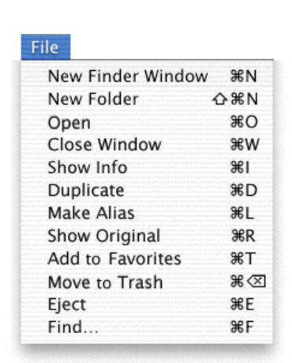

<span id="page-47-5"></span><span id="page-47-1"></span>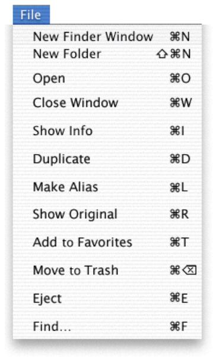


Not enough groups Too many groups Appropriate grouping

<span id="page-47-4"></span><span id="page-47-3"></span>

<span id="page-47-6"></span>In Mac OS X, a menu separator is a blank space (instead of a line). The menu-drawing code in Carbon and Cocoa automatically inserts the right amount of space between menu items to form a separator.

## <span id="page-47-0"></span>Hierarchical Menus (Submenus)

You can use **hierarchical menus** to offer additional menu item choices without taking up more space in the menu bar. When the user points to a menu item with a submenu indicator, a submenu appears. Submenus have all the features of menus, including keyboard equivalents, status markers (such as checkmarks), and so on.

**Figure 4-3** A hierarchical menu

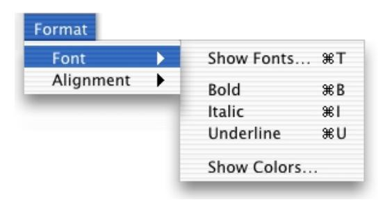

Because submenus add complexity to the interface and are physically more difficult to use, you should use them only when you have more menus than fit in the menu bar or for closely related commands. Use only *one level* of submenus. If a submenu contains more than five items, consider giving it its own menu.

When you use submenus, include them in a menu with a logical relationship to the choices they contain; the submenu title should clearly represent the choices it contains. Hierarchical menus work best for providing submenus of attributes (rather than actions).

# <span id="page-48-0"></span>Menu Behavior

<span id="page-48-2"></span>To choose an item in a menu, the user positions the pointer on the menu title and drags to the desired item. Each item is highlighted as it is selected. No action should actually happen until the user releases the mouse button. (See ["Using the Mouse"](#page-163-0) [\(page 164\).](#page-163-0)) By moving the pointer off a menu before releasing the mouse button, people can open and scan menus to find out what features are available, without having to actually perform an action. When a menu item has been activated, it blinks briefly.

<span id="page-48-1"></span>It may be appropriate in some cases to provide **dynamic menu items**—commands that change when the user presses a modifier key. For example, if the user opens the File menu in the Finder and then presses the Option key, the Close Window command changes to Close All. The system appropriately sizes the menu to hold the widest item, including Option-enabled commands.

Menu Behavior **49**

### <span id="page-49-4"></span><span id="page-49-0"></span>Scrolling Menus

A **scrolling menu** contains more items than are visible onscreen. Your application shouldn't have any scrolling menus; they should exist only when a user adds many items to a customizable menu.

If a menu becomes too long to fit onscreen, a downward-pointing indicator at the bottom of the menu indicates that there are more items. When the user starts to scroll, an upward-pointing indicator appears at the top of the menu to show that some items are no longer visible in that direction. When the user drags past the last visible item, the menu scrolls to show the additional items. When the last item is shown, the downward-pointing indicator disappears. This behavior happens automatically if you use the standard system menu definition procedure (MDEF).

<span id="page-49-3"></span>If the user drags back up to the top, the menu scrolls back down in the same manner. The next time the menu is opened, it appears in its original state (with the indicator at the bottom), unless the menu stores a setting, in which case the menu displays the last user-selected item.

### <span id="page-49-2"></span><span id="page-49-1"></span>Toggled Menu Items

A **toggled menu item** changes between two states each time a user chooses it. There are three types of toggled menu items:

- A group of two menu items that are opposite states; for example, Grid On and Grid Off. The state currently in effect has a checkmark next to it. If you have room in your menu, it's a good idea to display both items (rather than changing the name depending on its state) so there's less chance of confusion about each item's effect.
- One menu item whose name changes to reflect the current state; for example, Show Ruler and Hide Ruler. Use this type if your menu doesn't have room to show both states.

Use two verbs that express opposite actions. Make sure the command name is completely unambiguous. For example, Turn Grid On and Turn Grid Off is unambiguous. Choosing the command Use Grid, however, could turn the grid on (it describes what happens as a result of choosing the command) or off (it describes the current state).

<span id="page-50-1"></span>**Figure 4-4** Avoid ambiguous toggled menu items


<span id="page-50-2"></span>■ A menu item that has a checkmark next to it when it is in effect; for example, a style attribute such as Bold. Don't use this kind of toggled item to indicate the presence or absence of a feature like a grid or ruler. It's unclear whether the checkmark means that the feature is in effect or whether choosing the command turns the feature on.

<span id="page-50-3"></span>Also see ["Using Special Characters and Text Styles in Menus" \(page 65\)](#page-64-3).

### <span id="page-50-5"></span><span id="page-50-0"></span>Sticky Menus

Standard Aqua system menus and submenus are sticky: When a user clicks the menu title, the menu stays open without the user having to continue holding down the mouse button. The user can then move the pointer to an item to select it. In Mac OS X, once a menu is opened with a click, it remains open until another action forces it to close. Such actions include

- moving the pointer to another menu title
- a click elsewhere
- <span id="page-50-4"></span>■ a system-initiated alert
- a system-initiated application switch or quit

Menu Behavior **51**

# <span id="page-51-0"></span>Standard Pull-Down Menus (The Menu Bar)

<span id="page-51-3"></span>The **menu bar** extends across the top of the main screen and contains pull-down menus. The menu bar

- is always visible and available, except in circumstances such as a slide show (see discussion below)
- always has the Apple menu (provided by the operating system), the application menu containing items that apply to the active application as a whole, and a Window menu
- <span id="page-51-1"></span>■ can also contain File, Edit, and Help menus, as well as application-specific menus

**Figure 4-5** The menu bar displayed when the Finder is active


If there is insufficient room to display all of an application's menus, the menu bar status items are omitted. If there is still insufficient room to display all menus, the application's menus may be omitted, starting with the rightmost menu.

If your application can display full-screen images (such as slide shows), you may allow users to hide the menu bar. If you implement this feature, provide a clearly visible way, such as a button, for the user to make the menu bar reappear. If there is no button visible, pressing the Escape key or moving the mouse to the top of the screen should display the menu bar.

<span id="page-51-4"></span><span id="page-51-2"></span>If *all* of a menu's commands are unavailable (dimmed) at the same time, dim the menu title. (The Menu Manager in Carbon does this automatically if you set the kMenuAttrAutoDisable attribute.) Users should still be able to open a dimmed menu to see its contents.

For information about keyboard equivalents for pull-down menu commands, see ["Reserved and Recommended Keyboard Equivalents" \(page 176\).](#page-175-0)

The order in which menus and their contents appear is under developer control; your application should reflect the guidelines discussed in the following sections, which describe the standard pull-down menus in the menu bar.

### <span id="page-52-2"></span><span id="page-52-0"></span>The Apple Menu

The **Apple menu** provides items that are available to users at all times, regardless of which application is active. The Apple menu's contents are defined by the system and cannot be modified by users or developers.

<span id="page-52-1"></span>**Figure 4-6** The Apple menu


### <span id="page-53-4"></span><span id="page-53-0"></span>The Application Menu

The **application menu,** new in Mac OS X, contains items that apply to the application as a whole, rather than to a specific document or other window.

<span id="page-53-2"></span>**Figure 4-7** The Mail application menu


### <span id="page-53-3"></span><span id="page-53-1"></span>The Application Menu Title

To help users identify the active application, the application menu title is in boldface.

In order to fit within the allotted menu bar space, the application menu title should be one word, if possible, and a maximum of 16 characters (128 pixels wide in 14-point Lucida Grande Bold). If the application name is too long, provide a short name (16 characters or fewer) as part of the application package. The Hide, Quit, and About items should also use the short application name.

If you don't provide a short name, the application name is truncated from the end (and an ellipsis is added), if necessary. For more information about how to provide a short application name, see *Inside Mac OS X: System Overview,* available at the Mac OS X developer documentation website.

### <span id="page-54-0"></span>The Application Menu Contents

- <span id="page-54-1"></span>■ **About <Application Name>.** Opens your application's About window, which contains copyright information and version number. (For more information, see ["The About Window" \(page 92\)](#page-91-0). If you've specified a short name (see ["The](#page-53-3)  [Application Menu Title" \(page 54\)\)](#page-53-3), use it in the About menu item; use the full application name in the About window.
- **Preferences and other application-specific items.** Preference settings are user-defined parameters that your software remembers from session to session. Preferences can be a way for your application to offer users long-term choices about how the application works; examples include whether to automatically save files periodically and whether to check spelling as the user types.

<span id="page-54-2"></span>In the application menu, put all commands that provide access to your application's preference dialogs first, followed by application-specific items. Put a menu separator between the About command and the Preferences command. If your application provides document-specific preferences, make them available in the File menu (see ["The File Menu" \(page 56\)](#page-55-1)). Most document-specific preferences should have a unique name, such as Page Setup, rather than Preferences.

<span id="page-54-5"></span><span id="page-54-3"></span>Use Command-, (comma) as the keyboard equivalent for your application's Preferences command.

**Note:** Your application should present its own preferences dialogs. Applications may add panes to System Preferences only if the application's preferences apply to the system or to the user's environment as a whole. Such exceptions might include an input device that doesn't have its own interface or a server application that always runs in the background. For more information, see *Inside Mac OS X: Preference Panes,* available on the Mac OS X developer documentation website.

<span id="page-54-4"></span>■ **Services.** The Services submenu provides a way for one application to offer its capabilities to another application. For example, a user could select a name in a document and choose a Services command that looks up the name using an LDAP server, starts up an email application, and opens a new message window with the found email address in the To field.

For more information, Cocoa developers should see the Programming Topic "System Services" and Carbon developers should see *Inside Carbon: Setting Up Your Application to Use the Services Menu,* both available on the Mac OS X developer documentation website.

- <span id="page-55-3"></span>■ **Hide <Application Name>.** This command should be preceded by a menu separator and followed by Hide Others and Show All. If necessary (see ["The](#page-53-3)  [Application Menu Title" \(page 54\)\)](#page-53-3), use the short application title.
- <span id="page-55-4"></span>■ **Quit <Application Name>.** This last item in the application menu should be preceded by a separator. When a user chooses Quit and there are unsaved documents, present the necessary alerts (see ["Saving, Closing, and Quitting](#page-104-0)  [Behavior" \(page 105\)\)](#page-104-0). If necessary (see ["The Application Menu Title"](#page-53-3) [\(page 54\)\)](#page-53-3), use the short application title.

### <span id="page-55-5"></span><span id="page-55-2"></span><span id="page-55-1"></span><span id="page-55-0"></span>The File Menu

In general, each command in the **File menu** should apply to a single file (most commonly, a user-created document).

Note that the Preferences and Quit commands, which apply to a whole application, are in the application menu. If your application provides document-specific preferences, make them available in the File menu, preferably right above printing commands. If an application is not document-based, you can rename the File menu to something more appropriate or eliminate it.

Several items in the File menu—Save As, Print, and Page Setup, for example should open sheets. For more information, see ["Document-Modal Dialogs \(Sheets\)"](#page-95-0) [\(page 96\).](#page-95-0)

<span id="page-56-0"></span>**Figure 4-8** The File menu

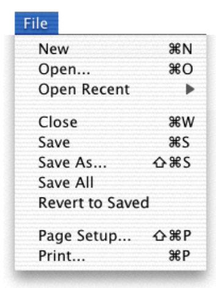

### Standard File menu commands include these:

- <span id="page-56-2"></span>■ **New:** Opens a new document named "untitled" (or "untitled 2," and so on, as appropriate). If your application requires documents to be named upon creation, you can display a Save dialog (see ["Saving, Closing, and Quitting](#page-104-0)  [Behavior" \(page 105\)\)](#page-104-0). For more information about naming new document windows, see ["Opening and Naming Windows" \(page 74\)](#page-73-0).
- <span id="page-56-3"></span>■ **Open:** Displays a dialog for choosing an existing document to open. For more information, see ["The Open Dialog" \(page 102\).](#page-101-0)
- <span id="page-56-4"></span>■ **Open Recent:** The Open command should be followed by Open Recent, so people can open recently opened documents without using the Open dialog. The Open Recent submenu displays documents in the order in which they were opened, with the most recent item at the top. Cocoa provides built-in support for populating the Open Recent submenu. (Carbon does not.)
- <span id="page-56-1"></span>■ **Close:** Closes the active window. When the user chooses this command and the active document has been changed since last saved, display the Save Changes alert (see ["Saving, Closing, and Quitting Behavior" \(page 105\)](#page-104-0)). When the user presses the Option key, Close changes to **Close All.** The keyboard equivalents Command-W and Option-Command-W should implement the Close and Close All commands, respectively. The Close command and Command-W should not close utility windows.

In a file-based application that supports multiple views of the same file, you can include a Close File command below Close Window, to close a file and all its associated windows. If possible, include the filename in the menu (for example, Close File "Jerry's Kids"). Shift-Command-W can be used as the keyboard equivalent for Close File.

- <span id="page-57-2"></span>■ **Save:** Saves the active document, leaves the document open, and provides feedback indicating that the document is being (or has been) saved. If the document has not previously been saved, display a Save dialog (see ["Saving,](#page-104-0)  [Closing, and Quitting Behavior" \(page 105\)](#page-104-0)). Use sheets for document-specific dialogs (see ["Document-Modal Dialogs \(Sheets\)" \(page 96\)\)](#page-95-0).
- <span id="page-57-3"></span>■ **Save As:** Displays the Save dialog, which allows the user to save a copy of the active document with a new user-defined name, a new location, or both. The newly saved document remains open and active. Shift-Command-S can be used as the keyboard equivalent for Save As.

<span id="page-57-6"></span><span id="page-57-5"></span>**Note:** Avoid using **Save a Copy** or **Save To** commands. Many users might not understand the distinction between them and Save As.

- **Save All:** Saves changes to all open documents.
- **Revert to Saved:** Discards all changes made to the active document since the last time it was saved or opened. When the user chooses Revert to Saved, display an alert that warns the user about the potential data loss the operation will cause.
- <span id="page-57-0"></span>■ **Page Setup:** Opens a dialog for specifying printing parameters such as paper size and printing orientation. These parameters are saved with the document.
- <span id="page-57-1"></span>■ **Print:** Opens a dialog for specifying such options as page range and number of copies and prints the active document. These parameters apply to only the current printing operation and are not saved with the document. For more information, see ["The Printing Dialogs" \(page 115\).](#page-114-0)

<span id="page-57-4"></span>**Note:** If you need to extend the standard Print dialog with features specific to your application or printer, you can add a pane, which users can choose from the features pop-up menu. For more information, see ["The Printing Dialogs"](#page-114-0) [\(page 115\).](#page-114-0)

### <span id="page-58-2"></span><span id="page-58-0"></span>The Edit Menu

The **Edit menu** provides commands that allow people to change (edit) the contents of documents and other text containers, such as fields. It also provides the commands that allow people to share data, within and between applications, via the Clipboard.

<span id="page-58-5"></span>The **Clipboard** stores whatever data is cut or copied from a document until the user replaces the contents by cutting or copying new data. The Clipboard is available to all applications and its contents don't change when the user switches from one application to another. The Clipboard provides excellent support for the exchange of different data types between applications. Your application should maintain formatting when it copies text to the Clipboard.

<span id="page-58-1"></span>**Figure 4-9** The Edit menu


Your application's Edit menu should provide the following commands. Even if your application doesn't handle text editing within its documents, these commands should be available for use in dialogs and wherever users can edit text:

<span id="page-58-4"></span>■ **Undo:** The Undo command reverses the effect of the user's previous operation. When the user chooses Undo, the command changes to **Redo,** which reverses the effect of the last Undo command.

<span id="page-58-3"></span>Support the Undo command for

■ operations that change the contents of a document

| ■ | operations that require a lot of effort to re-create |
|---|------------------------------------------------------|
| ■ | most menu items                                      |
| ■ | most keyboard input                                  |
|   | Operations that may not be undoable include          |
| ■ | selecting                                            |
| ■ | scrolling                                            |
| ■ | splitting a window                                   |
| ■ | changing a window's size or location                 |

Add the name of the last operation to the Undo and Redo commands. When possible, repeat the previously chosen command, as shown in Figure 4-9 (page 59). For example, if the user has just input some text, the command could read Undo Typing; if the user moves a file in the Finder, the command says Undo Move of "Filename." If the last operation can't be reversed, change the command to **Can't Undo** and display it dimmed to provide feedback about the current state.

<span id="page-59-4"></span>If a user attempts to perform an operation that could have a detrimental effect on data and that can't be undone, warn the user. See ["Alerts" \(page 98\).](#page-97-2)

<span id="page-59-5"></span><span id="page-59-2"></span>Command-Z should be reserved as a keyboard equivalent for the Undo/Redo command.

- **Cut:** Removes the selected data and stores it on the Clipboard, replacing the previous contents of the Clipboard.
  - Command-X should be reserved as a keyboard equivalent for the Cut command.
- <span id="page-59-1"></span>■ **Copy:** Makes a duplicate of the selected data, which is stored on the Clipboard. Command-C should be reserved as the keyboard equivalent for the Copy command.
- <span id="page-59-3"></span>■ **Paste:** Inserts the Clipboard contents at the insertion point. The Clipboard content remains unchanged, permitting the user to choose Paste multiple times.
  - Command-V should be reserved as the keyboard equivalent for the Paste command.
- <span id="page-59-0"></span>■ **Delete:** Removes selected data without storing the selection on the Clipboard. Choosing Delete is the equivalent of pressing the Delete key or the Clear key. Use Delete as the menu command, rather than Clear.

- <span id="page-60-3"></span>■ **Select All:** Highlights every object in the document or window, or all characters in a text field.
  - Command-A should be reserved as the keyboard equivalent for the Select All command.
- <span id="page-60-4"></span><span id="page-60-2"></span>■ **Find:** Finds specified text. In some cases—if the application is finding a file on the Internet, for example—it might make more sense to put this command in the File menu. When appropriate, your application should also contain **Find Again** and **Find/Replace** commands.

<span id="page-60-6"></span>Command-F should be reserved as the keyboard equivalent for the Find command; Command-G should be reserved for Find Again.

### <span id="page-60-0"></span>The View Menu

The **View menu** provides commands that affect what users see in a window. In the Finder, for example, the View menu contains commands for displaying windows as columns, icons, or lists.

<span id="page-60-7"></span>Commands for showing, hiding, and customizing a toolbar belong in the View menu. Create a View menu for these commands even if your application doesn't need to have other commands in the View menu. Show/Hide Toolbar should appear right above Customize Toolbar. The Show/Hide Toolbar commands are provided so that people using full keyboard access can implement these functions with the keyboard.

Avoid using the View menu to display utility windows (such as tool palettes); use the Window menu instead.

### <span id="page-60-5"></span><span id="page-60-1"></span>The Window Menu

The **Window menu** contains commands for managing an application's windows. The menu should list an application's open document windows, including minimized windows, in the order in which they were opened. If a document contains unsaved changes, a bullet should appear next to its name.

<span id="page-61-0"></span>**Figure 4-10** A Window menu

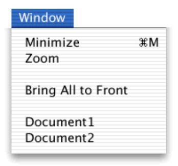

Mac OS X does not automatically add utility windows to the list in the Window menu. You can add a command to the Window menu to show or hide utility windows in your application.

The Minimize and Zoom commands are provided in the Window menu so that people using full keyboard access can implement these functions with the keyboard. Even if your application consists of only one window, include a Window menu for the Minimize command.

<span id="page-61-4"></span>Window menu items should appear in this order: Minimize, Zoom, <separator>, <application-specific window commands>, <separator>, Bring All to Front (optional), <separator>, <list of open documents>. The Close command should appear in the File menu, below the Open command.

<span id="page-61-2"></span><span id="page-61-1"></span>Bring All to Front brings forward all of an application's open windows, maintaining their onscreen location, size, and layering order. You can make this command an Option-enabled toggle with Arrange in Front, which brings forward all of the application's windows in their current layering order and changes their location and size so they are neatly tiled. Users can also bring all of an application's windows to the front by clicking its icon in the Dock. See ["Window Layering" \(page 70\)](#page-69-0).

<span id="page-61-5"></span><span id="page-61-3"></span>Starting with Mac OS X version 10.2, users can cycle forward or backward through active document windows using Command-~ (tilde) or Shift-Command-~. Cocoa applications automatically inherit this behavior; Carbon developers must handle appropriate menu commands.

### <span id="page-62-5"></span><span id="page-62-0"></span>The Help Menu

<span id="page-62-6"></span>If your application provides onscreen help, the Help menu should be the rightmost menu of your application's menus. The first item is the name of the application and the word "Help" (Mail Help, for example). If necessary, you can add more items to the Help menu. For information about creating help content, see ["User Help and](#page-234-0)  [Assistants" \(page 235\)](#page-234-0).

### <span id="page-62-1"></span>Menu Bar Status Items

Reserved for use by Apple, the right side of the menu bar may contain items that provide feedback on and access to certain hardware or network settings. The icon for the battery strength indicator, for example, dynamically displays the current state of the battery; clicking the icon displays a menu for changing common battery settings. Users can display or hide a menu bar status item in the appropriate preferences pane.

#### **Important**

Don't create your own menu bar status items. Use the Dock menu functions to open a menu from your application's icon in the Dock.

If there is not enough room in the menu bar to display all menus, menu bar status items are removed first.

### <span id="page-62-2"></span>Other Menus

<span id="page-62-8"></span><span id="page-62-7"></span><span id="page-62-4"></span><span id="page-62-3"></span>You can add your own application-specific menus as appropriate. If your application provides functions for formatting text, you can include a Format menu. The first item in the Format menu should be Show Fonts, which displays the Mac OS X Fonts window. If your application provides support for colors, it should use the system Colors window, accessible via a Show Colors menu command. (In Carbon applications, use the GetColor function; in Cocoa, use NSColorPanel.) Avoid creating your own windows for choosing fonts and colors.

## <span id="page-63-0"></span>Contextual Menus

<span id="page-63-2"></span>A **contextual menu** provides convenient access to often-used commands associated with an item. Contextual menus open when the user presses the Control key while clicking an appropriate interface element or selection.

<span id="page-63-1"></span>**Figure 4-11** A contextual menu for a text selection in a document (left) and an icon in the Finder

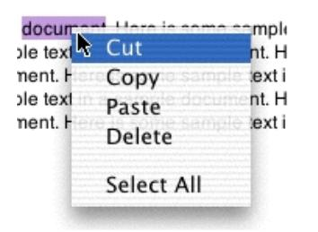

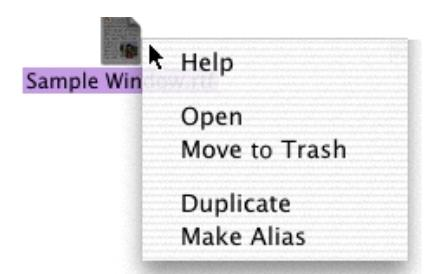

■ **Behavior:** A contextual menu behaves like a standard pull-down menu, except that moving the pointer off a contextual menu and onto a standard pull-down menu doesn't activate the second menu; the user must click once to close the contextual menu and again to open the second menu.

Contextual menus that are too long to display fully use the scrolling indicator (a downward-pointing triangle) and scroll like standard menus.

Don't set a default item. If the user opens the menu and closes it without selecting anything, no action should occur.

■ **Contents:** You define the items in your application's contextual menus. Include a small subset of the most commonly used commands in the appropriate context. For example, Edit menu commands should appear in the contextual menu for highlighted text, but not a Save or a Print command.

Never provide a contextual menu command that is not also accessible through the menu bar. Use submenus with caution and keep them to one level.

# <span id="page-64-3"></span><span id="page-64-0"></span>Using Special Characters and Text Styles in Menus

<span id="page-64-4"></span>You can use several standard characters (described below) to indicate additional information in menus. Don't use other, arbitrary symbols in menus because they add visual clutter and may confuse people.

<span id="page-64-2"></span>**Figure 4-12** Don't use arbitrary symbols in menus

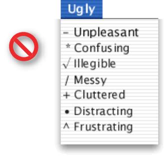

### <span id="page-64-5"></span><span id="page-64-1"></span>Using Symbols in Menus

In the Window menu, a **checkmark** should appear next to the active document's name. Checkmarks can also be used in other menus to indicate that the setting applies to the entire selection. You can use checkmarks for mutually exclusive attribute groups (the user can select only one item in the group, such as font size) or accumulating attribute groups (more than one item can be selected at once, such as Bold and Italic).

Use **dashes** to indicate that an attribute applies to only part of the selection. For example, if selected text has two styles applied to it, put a dash next to each style name. When it's appropriate, you can combine checkmarks and dashes in the same menu.

<span id="page-65-1"></span>**Note:** Include a menu command, such as Plain, for removing all formatting from mixed-state text.

<span id="page-65-0"></span>Use a **bullet** next to a document with unsaved changes, and a **diamond** for a document the user has minimized into the Dock. A minimized document with unsaved changes should have a diamond only. If the active window has unsaved changes, the checkmark should override the bullet in the Window menu.

**Figure 4-13** Symbols in menus

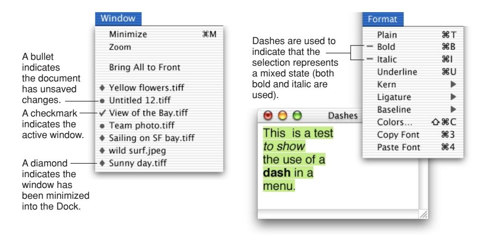

For Cocoa applications, these symbols are managed by the Cocoa framework. In Carbon, if you use the standard Window menu, these symbols are managed automatically. Otherwise, use the SetItemMark function with a char parameter of kCheckCharCode for the active document, kBulletCharCode for a document with unsaved changes, and kDiamondCharCode for a minimized document.

### <span id="page-66-2"></span><span id="page-66-0"></span>Using Text Styles and Fonts in Menus

<span id="page-66-5"></span><span id="page-66-4"></span>In a Style or Font menu, you can display menu items in the actual style or font so users can see what effect the text attribute will have.

Don't use text styles in menus other than a Style or Font menu.

**Figure 4-14** A Font menu displayed with different fonts


### <span id="page-66-3"></span><span id="page-66-1"></span>Using Ellipses in Menus and Buttons

An ellipsis character (…) after a menu item or button label indicates to the user that additional information is required to complete a command. You should use an ellipsis in the following cases:

- An action that requires further user input to complete or presents an alert allowing the user to cancel the action. Examples include Find, Go To, Open, Page Setup, and Print.
- An action that opens a settings window. The main function of settings windows is to allow the user to change some aspect of the application, not the document content. Examples include Set Title, Preferences, and Options.

#### **CHAPTER 4**

#### Menus

Don't use an ellipsis in the following cases:

- An action that requires no further user input to complete and does not present an alert. Often the item to be acted upon is already selected. Examples include New, Cut, Bold, and Quit.
- An action that opens an informational, accessory, or tool window. These windows can be implemented as either utility windows (as in the case of a color palette) or modeless windows. These windows provide tools that help create or manage the content in the main window and are frequently left open to assist in accomplishing the task of the main window. Examples include Get Info and Show Tools.

<span id="page-68-3"></span><span id="page-68-0"></span>Windows provide a way for people to view and interact with their data. There are various kinds of windows, each with its own function and appearance.

<span id="page-68-1"></span>**Document windows** contain file-based user data. They present a view into the content that people create and store. If the document is larger than the window, the window shows a portion of the document's contents, and provides users with the ability to scroll to other areas.

Other windows, commonly called **utility windows**, float above other windows and provide tools or controls that users can work with while documents are open. In Mac OS X, utility windows are either application-specific or systemwide. Application-specific utility windows disappear when the application is deactivated. These windows are available in Carbon with the kFloatingWindowClass constant and in Cocoa with NSUtilityWindowMask.

<span id="page-68-2"></span>Systemwide utility windows, such as the Colors window and the Fonts window, float above all open windows. These windows are available in Carbon using kUtilityWindowClass; in Cocoa, use NSNonactivatingPanelMask.

Some applications are not document-based. Such applications typically still have at least one main window, which can use the standard Aqua document window appearance and features. For Cocoa developers, Mac OS X version 10.2 provides a definition for a new window appearance. For information, see ["Textured](#page-71-1)  [Windows" \(page 72\).](#page-71-1)

**Note:** Dialogs and alerts are also types of windows; they are discussed in ["Dialogs" \(page 95\).](#page-94-0)

For implementation information, Carbon developers should see *Handling Carbon Windows and Controls,* available on the Mac OS X developer documentation website.

# <span id="page-69-0"></span>Window Layering

<span id="page-69-7"></span>In Mac OS 9 and earlier, all windows belonging to a particular application are in the same layer. In Mac OS X, each document exists in its own layer, so documents from different applications can be interleaved. Clicking a window to bring it to the front doesn't disturb the layering order of any other window.

A window's depth in the layers is determined by when the window was last accessed. When a user clicks an inactive document or chooses it from the Window menu, only that document, and all open utility windows, should be brought to the front. Users can bring all windows of an application forward by clicking its icon in the Dock or by choosing Bring All to Front in the application's Window menu. These actions should bring forward all of the application's open windows, maintaining their onscreen location, size, and layering order within the application. For more information, see ["The Window Menu" \(page 61\)](#page-60-1) and ["Clicking in the](#page-43-0)  [Dock" \(page 44\)](#page-43-0).

# <span id="page-69-1"></span>Window Appearance and Behavior

<span id="page-69-5"></span><span id="page-69-2"></span>Every document and utility window should have, at a minimum, a title bar and a close button. Even if the window does not have an actual title (a tools palette, for example), it should have a title bar so that users can move the window.

<span id="page-69-8"></span>A standard document window has

- <span id="page-69-4"></span>■ a title bar
- a resize control
- <span id="page-69-3"></span>■ scroll bars (if not all the window's contents are visible)
- <span id="page-69-6"></span>■ close, minimize, and zoom buttons, although only the close button must be present at all times

<span id="page-70-0"></span>**Figure 5-1** Standard window parts


<span id="page-70-2"></span>When a document has unsaved changes, the close button should display a dot. Carbon developers should set this control with the SetWindowModified function. In Cocoa, this behavior happens automatically if the application is NSDocument-based; otherwise, use the setDocumentEdited: method of the NSWindow class.

<span id="page-70-1"></span>**Figure 5-2** The close button in its unsaved changes state

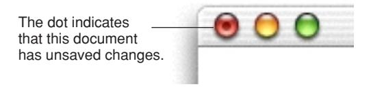

<span id="page-71-2"></span>After a document is saved for the first time, a **proxy icon** appears in the title bar. Users can manipulate this icon as if they were manipulating the corresponding file-system object. For example, you can drag a document's proxy icon to a folder in the Finder. A proxy icon appears in its normal state as long as the state of the document and the file system object are the same. When a document has unsaved changes, its proxy icon appears dimmed. Command-clicking the title or the proxy icon displays a pop-up menu illustrating the document path.

**Figure 5-3** Document path pop-up menu, opened by Command-clicking the proxy icon


### <span id="page-71-1"></span><span id="page-71-0"></span>Textured Windows

Mac OS X version 10.2 provides developers with a new "textured" window appearance (see Figure 5-4). This window style has been designed specifically for use by—and is therefore best suited to—applications that provide an interface for a digital peripheral, such as a camera, or an interface for managing data shared with digital peripherals, such as the Address Book application.

This appearance may also be appropriate for applications that strive to re-create a familiar physical device—the Calculator application, for example. Avoid using the textured window appearance in applications or utilities that are unrelated to digital peripherals or to the data associated with these devices.

Within an application, the textured window appearance should be limited to the primary application window. Supporting windows, such as preferences and other dialogs, should not use the textured window appearance. It is acceptable to have a mix of standard Aqua windows and textured windows within an application.

If a textured window has a drawer or a toolbar, they automatically inherit the textured appearance. Sheets, however, maintain the standard Aqua appearance.

**Figure 5-4** The "textured" window appearance

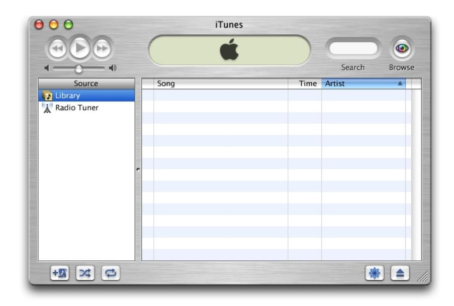

The textured window has four rounded corners and a beveled edge surrounding the entire window. The beveled edge requires that elements such as lists and other view-type controls be inset at least 10 pixels. Users can move textured windows by dragging anywhere on the textured surface (not just the title bar).

Avoid creating custom controls for use with textured windows; standard controls look and behave appropriately when used with this appearance.

To create a window with this appearance, Cocoa developers can apply the NSTexturedBackgroundWindowMask to a titled window. Avoid using a borderless window, which won't assume rounded corners. Carbon developers can use the new window type defined in MacWindows.h.

### <span id="page-73-2"></span><span id="page-73-0"></span>Opening and Naming Windows

Your application should open a document window when a user does any of the following:

- double-clicks a document icon in the Finder
- selects the document in the Finder and chooses open from the File menu (or selects the document and presses Command-O in the Finder)
- chooses a file from within an Open dialog
- chooses the New command from the File menu
- <span id="page-73-6"></span>■ clicks the application icon in the Dock when no documents are open

<span id="page-73-1"></span>When your application displays a new document window, name it "untitled"; leaving it lowercase makes it more obvious that the window doesn't have a name and encourages people to save the document. If the user chooses New again before saving the first untitled window, name the second window "untitled 2," and so on. Add numbers to window titles only when there is more than one open untitled window. Don't put a "1" on the first untitled window, even after the user opens other new windows.

<span id="page-73-7"></span>**Figure 5-5** Appropriate titles for a series of unnamed windows

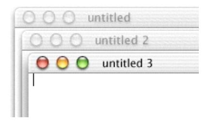

<span id="page-73-5"></span><span id="page-73-4"></span><span id="page-73-3"></span>If the user dismisses all untitled windows by saving or closing them, then the next new document should start over as "untitled," the next should be "untitled 2," and so on. If a user has chosen to display filename extensions in Finder Preferences, the extension should appear on the title of a new untitled window ("untitled.rtf," for example).

<span id="page-74-0"></span>**Figure 5-6** Examples of correct and incorrect window titles

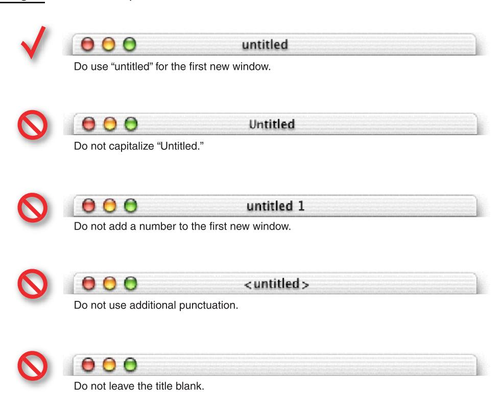

<span id="page-74-3"></span><span id="page-74-2"></span><span id="page-74-1"></span>When the user opens an existing document, make sure its title is the **display name,** which reflects the user's preference for showing or hiding its filename extension. For more information, see ["Naming Files and Showing Filename Extensions"](#page-248-1) [\(page 249\).](#page-248-1) Don't display pathnames in document titles (see ["Displaying](#page-250-0)  [Pathnames" \(page 251\)\)](#page-250-0).

### <span id="page-75-4"></span><span id="page-75-0"></span>Positioning Windows

Whenever your application displays a window, you must decide where to put it and how big to make it.

<span id="page-75-3"></span><span id="page-75-2"></span><span id="page-75-1"></span>New document windows should open horizontally centered, as shown in Figure 5-7, and should display as much of the document content as possible. The top of the document window should butt up against the menu bar (or the application's toolbar, if one is open and positioned below the menu bar). Subsequent windows are moved to the right 20 pixels and down 20 pixels. Make sure that no part of a new window is obscured by the Dock.

**Figure 5-7** Position of new document window

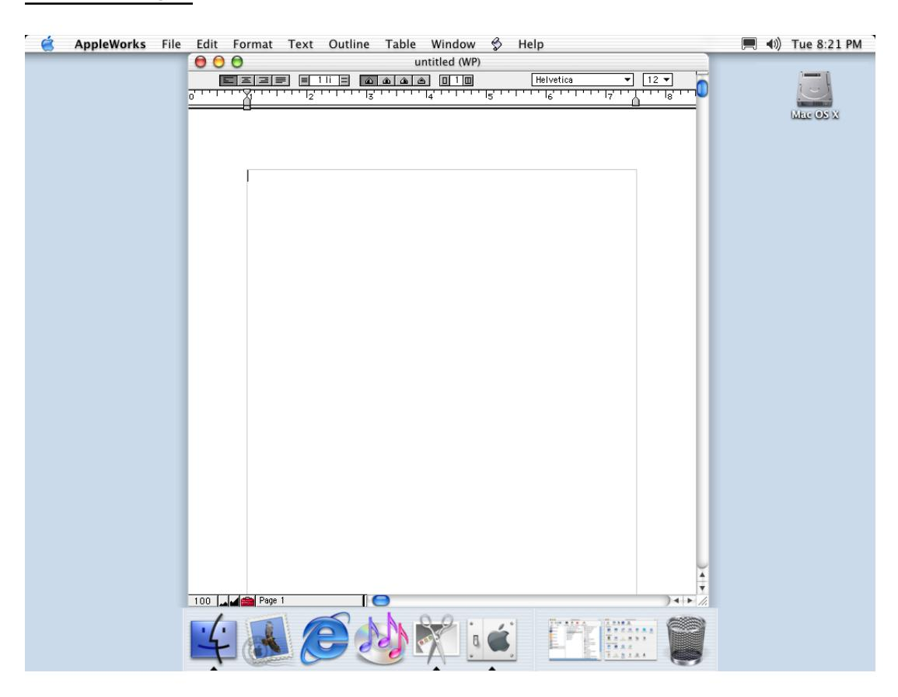

<span id="page-76-2"></span><span id="page-76-1"></span><span id="page-76-0"></span>For nondocument windows, the preference is to open new windows horizontally centered as shown in Figure 5-8. Vertical position should be visually centered: the distance from the bottom of the window to the top of the Dock should be approximately twice the distance as that from the bottom of the menu bar to the top of the window. Subsequent windows are moved to the right 20 pixels and down 20 pixels. Make sure that no part of a new window is obscured by the Dock. (See ["The](#page-40-1)  [Dock's Onscreen Position" \(page 41\)](#page-40-1).)

**Figure 5-8** "Visually centered" placement of new nondocument window

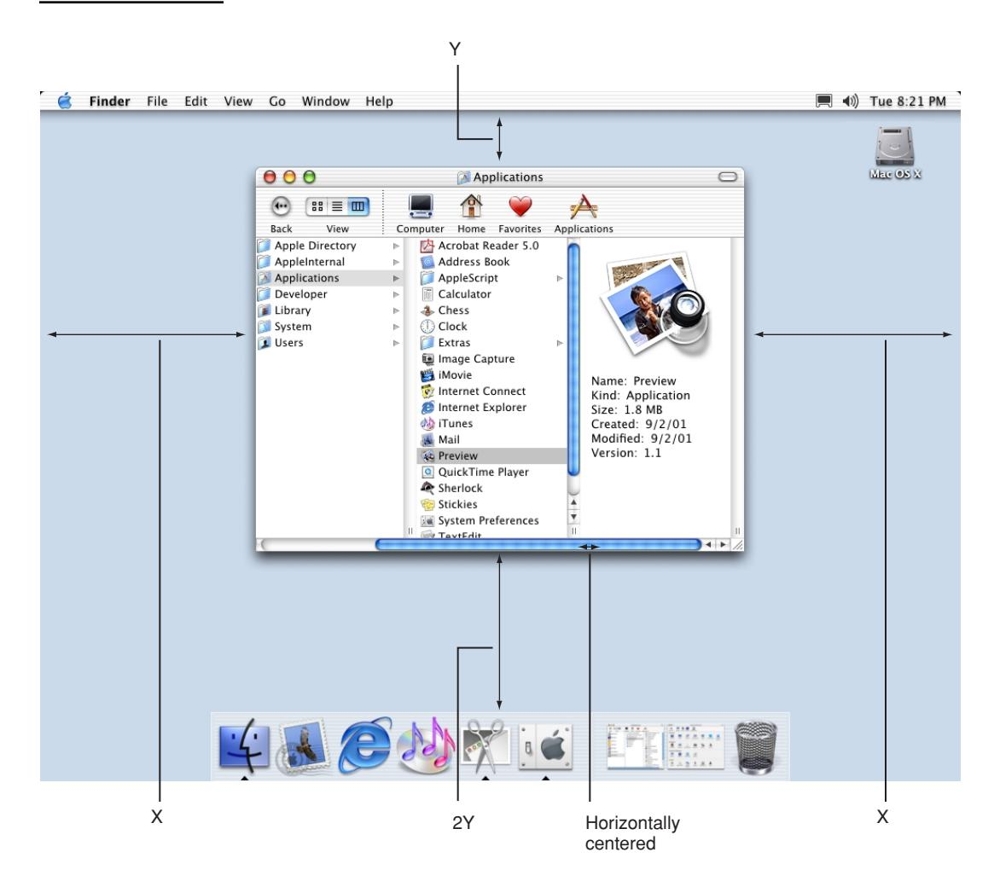

If a user changes a window's initial size or location, maintain the user's choices the next time the window opens. If a user opens, moves, and closes a document window without making any other changes, save the new window position but don't modify the file's date stamp.

Before reopening a window, make sure that the size and state are reasonable for the user's current monitor setup, which may not be the same as the last time the document was open. Try to maintain the window's previous location (the top-left corner of the window) and, if possible, its size. If you can't replicate both, maintain the location and reduce the window's size. If that is not possible, try to keep the window on the same monitor, open the window so that as much of the content as necessary is visible, and follow the guidelines for opening a new window, as described previously.

For example, if a user opens a document to full size on a wide aspect-ratio display, then next opens the file on an iMac, open the document in a window sized for the smaller monitor, rather than the saved size. For more information on appropriate window size, see ["Resizing and Zooming Windows" \(page 80\).](#page-79-2)

<span id="page-77-2"></span><span id="page-77-1"></span>On a computer with more than one monitor, display the first new window visually centered in the screen containing the menu bar. If the user doesn't move that first window, display each additional window below and to the right of its predecessor. If the user moves the window, display each additional window on the screen that contains the largest portion of the frontmost window, as shown in Figure 5-9. For example, if the user creates a window, drags it completely to a second monitor, and then creates a new window, display the new window on the second screen. If there is sufficient room on the screen, display subsequent windows to the lower right of the frontmost window. If there isn't enough room on the screen, display subsequent windows starting in the original visually centered position, and then continue to display additional windows slightly offset to the lower right.

<span id="page-77-0"></span>If the user moves a window so that it is entirely positioned on a second monitor, then opens the window on a single-monitor system, respect the window's previous size, if possible.

<span id="page-78-1"></span>**Figure 5-9** Appropriate placement of a new window on a system with multiple monitors (the user moved the first window to span the screens))


When you open several windows on multiple screens, continue to place the windows on the screen where the user is working, each new one below and to the right of its predecessor. Don't open a window so that it spans monitors; the *initial position* of a window should always be contained on a single screen.

## <span id="page-78-2"></span><span id="page-78-0"></span>Closing Windows

Users can close a window by

- choosing Close from the File menu
- pressing Command-W
- clicking the close button

When a user closes a document window, your application should

- decide what to do with unsaved data (see ["Saving, Closing, and Quitting](#page-104-0)  [Behavior" \(page 105\)\)](#page-104-0)
- store the window's onscreen position and size (so they can be used when the window is reopened)

### <span id="page-79-4"></span><span id="page-79-0"></span>Moving Windows

The user moves a window by dragging its title bar. As a user drags, the full window and its contents move (unlike in Mac OS 9, which dragged the window's outline).

Pressing the Command key while dragging an inactive window moves the window but does not make it active.

Your application should never allow users to move a window to a position from which they can't reposition it.

### <span id="page-79-3"></span><span id="page-79-2"></span><span id="page-79-1"></span>Resizing and Zooming Windows

Your application determines the minimum and maximum window size. Base these sizes on the resolution of the display and on the constraints of your interface. For document windows, try to show as much of the content as possible, or a reasonable unit, such as a page.

<span id="page-79-5"></span>Your application also sets the values for the initial size and position of a window, called the **standard state.** Don't assume that the standard state should be as large as possible; some monitors are much larger than the useful size for a window. Choose a standard state that is best suited for working on the type of document your application creates and that shows as much of the document's contents as possible.

The user can't change the standard size and location of a window, but your application can change the standard state when appropriate. For example, a word processor might define the standard size and location as wide enough to display a document whose width is specified in the Page Setup dialog.

The user changes a window's size by dragging the size control in the lower-right corner. As a user drags, the visible content in the window changes. The upper-left corner of the window remains in the same place and the appearance of the visible contents stays the same. In Mac OS X, the actual window contents are displayed at all times, rather than only the window outline displayed in Mac OS 9.

<span id="page-80-4"></span><span id="page-80-3"></span>If the user changes a window's size or location by at least 7 pixels, the new size and location is the **user state.** The user can toggle between the standard state and the user state by clicking the **zoom button.** When the user clicks the zoom button of a window in the user state, first determine the appropriate size of the standard state. Move the window as little as possible to make it the standard size, and keep the entire window on the screen.

When a user with more than one monitor zooms a window, the standard state should be on the monitor containing the largest portion of the window, not necessarily the monitor with the menu bar. This means that if the user moves a window between monitors, the window's position in the standard state could be on different monitors at different times. The standard state for any window must always be fully contained on a single monitor.

When zooming a window, make sure it doesn't overlap with the Dock. For more information, see ["The Dock's Onscreen Position" \(page 41\)](#page-40-1).

## <span id="page-80-2"></span><span id="page-80-0"></span>Active and Inactive Windows

Users should be able to open as many windows as they want, but they interact with only one at a time. The **active window** is frontmost and is visually distinct from the other windows onscreen. The controls in active windows have color; controls in inactive windows do not.

<span id="page-80-1"></span>**Figure 5-10** Window controls in active and inactive states


<span id="page-81-3"></span><span id="page-81-2"></span>Starting with Mac OS X version 10.2, users can cycle forward or backward through active document windows using Command-~ (tilde) and Shift-Command-~. Cocoa applications automatically inherit this behavior; Carbon developers must handle appropriate menu commands.

## <span id="page-81-1"></span><span id="page-81-0"></span>Click-Through

An item that provides click-through is one that a user can activate on an inactive window with one click, rather than clicking first to make the window active and then clicking the item. Click-through provides greater efficiency in performing such tasks as closing or resizing inactive windows, and copying or moving files. In many cases, however, click-through could confuse a user who clicks an item unintentionally.

Click-through is not a property of a class of controls; any control could support click-through in many contexts, but the same control could disable click-through when its use could be destructive in a particular context.

In an inactive window, an item that provides click-through should have its text or glyph (such as an arrow) in 100-percent black; if the item usually has color (such as a radio button), it should be colorless in its click-through state. Items that do not provide click-through should appear in their disabled state.

<span id="page-82-0"></span>**Figure 5-11** An inactive window with controls that support click-through


You can provide click-through for such items as

- pop-up menus
- text fields
- window controls in title bars (close, minimize, and zoom buttons)
- title bars, including proxy icons
- toolbar buttons (when the button's action is not potentially harmful)
- scroll bars

Don't provide click-through for items or actions that

■ are potentially harmful (for example, the Delete button in Mail)

### **CHAPTER 5**

#### Windows

- are difficult to recover from, such as
  - actions that are difficult or impossible to cancel (the Send button in Mail)
  - dismissing a dialog without knowing what action was taken (for example, it's not easy to "unsave" a document)
  - removing the user from the current context (selecting a new item in a column, for example, can change the target of the Finder window)

<span id="page-83-0"></span>Clicking in one of these situations should result in the window being brought forward but no action being taken.

**Figure 5-12** The Save button on the inactive window does not support click-through

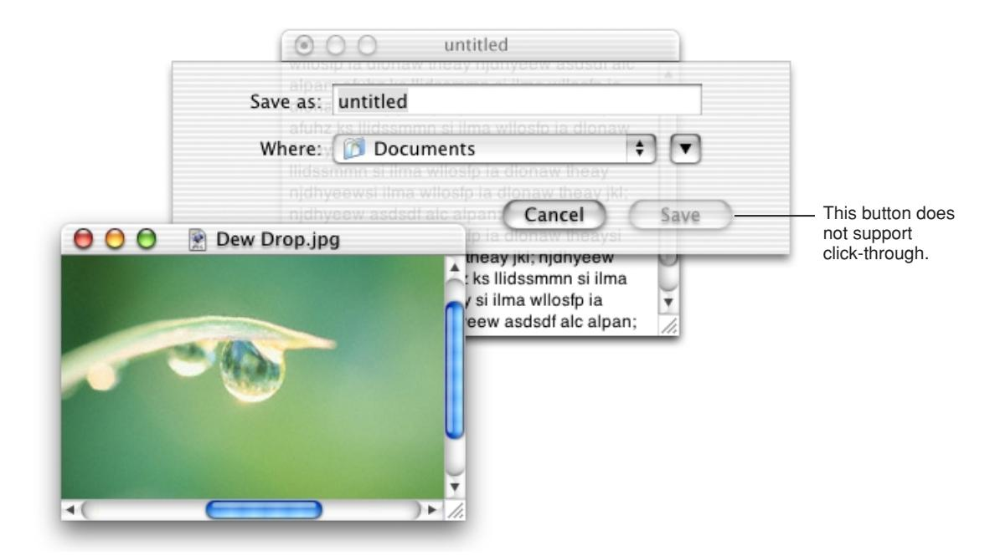

In general, you can implement click-through for an item that provides confirmation feedback before taking place—in other words, the user can cancel the action—such as deleting a user in Accounts preferences. If you want to implement click-through on an item that doesn't provide confirmation feedback, consider how difficult it will

<span id="page-84-2"></span>be for the user to undo the action. For example, in Mail, it would be inadvisable to implement click-through for the Delete button, which deletes a message without providing feedback first, because its resulting action is harmful. You could, however, provide click-through for the Add to Favorites button in the Save dialog because its resulting action is not harmful and is fairly easy to undo.

### <span id="page-84-3"></span><span id="page-84-0"></span>Scroll Bars and Scrolling Windows

<span id="page-84-4"></span>People use **scroll bars** to view areas of a document or a list that is larger than can fit in the current window. Only the active window can be scrolled. A window can have a horizontal scroll bar, a vertical scroll bar, both, or neither.

<span id="page-84-1"></span>**Figure 5-13** The elements of a scroll bar


The **scroller** size reflects how much of the document is visible; the smaller the scroller, the less of the content the user can see at that time. The scroller represents the relative location, in the whole document, of the portion that can be seen in the window.

If the entire contents of a document is visible in a window, the scroll bars do not contain scrollers. Scroll bars in inactive windows have an inactive appearance. See Figure 5-10 (page 81).

### **CHAPTER 5**

#### Windows

The user can use scroll bars by doing the following:

- <span id="page-85-1"></span>■ Dragging the scroller: This method is usually the fastest way to move around a document. In Mac OS X, the window's contents changes in "real time" as the user drags the scroller.
- Clicking a scroll arrow: This means, "Show me more of the document that's hidden in this direction." The scroller moves in the direction of the arrow. Each scroll arrow click moves the content one unit; your application determines what one unit equals. For example, a word processor would move a line of text per click, a spreadsheet could move one row or column. To ensure smooth scrolling effects, specify units of the same size throughout a document.
- <span id="page-85-2"></span>■ Clicking or pressing in the scroll track: Clicking advances the document by a windowful (the default) or to the pointer's hot spot, depending on the user's choice in General preferences. A "windowful" is the height or width of the window, minus at least one unit of overlap to maintain the user's context. This unit of overlap should be the same as one scroll arrow unit (for example, a line of text, a row of icons, or part of a picture). The Page Up and Page Down keys also move the document view by a windowful.

<span id="page-85-0"></span>Pressing in the scroll track displays consecutive windowfuls of the document, until the location of the indicator catches up to the location of the pointer (or until the user releases the mouse button).

It's best not to add controls to the scroll-bar area of a window. If you add more than one control to this area, it's hard for people to distinguish among controls and click the right one. Acceptable additions to the scroll area include a **splitter bar** and a status bar that shows, for example, the current page. To ensure that window controls are easy to use and understand, it's best to place the majority of your features in the menus as commands. If you really want to provide additional access to features, consider creating a utility window such as a palette with buttons. Only frequently accessed features that significantly benefit users' productivity should be elevated to the primary interface.

Utility windows that coexist with other windows and need to use the least amount of screen space possible may use small scroll bars. If a window uses small scroll bars, all other controls within the window content area should also be the smaller version. For more information, see ["Using Small Versions of Controls" \(page 160\).](#page-159-0)

<span id="page-86-2"></span>Make sure you don't use a scroll bar when you should really use a slider. Use sliders to change settings; use scroll bars only for representing the relative position of the visible portion of a document or list. For information about sliders, see ["Slider](#page-136-0)  [Controls" \(page 137\)](#page-136-0).

### <span id="page-86-1"></span><span id="page-86-0"></span>Automatic Scrolling

Most of the time, the user should be in control of scrolling. Your application must perform automatic scrolling in these four cases:

- When your application performs an operation that results in making a new selection or moving the insertion point (for example, when the user searches for some text and your application locates it), scroll the document to show the new selection.
- When the user enters information from the keyboard at a location not visible within the window (for example, the insertion point is on one page and the user has navigated to another page), scroll the document automatically to incorporate and display the new information.
  - Your application determines the distance to scroll. In general, a word processor scrolls vertically by a line of text, a database or spreadsheet scrolls by one field, a graphics application scrolls to display an entire object, if possible.
- When the user moves the pointer past the edge of the window while holding down the mouse button to make an extended selection, scroll the document automatically in the direction the pointer moves.
- When the user selects something, scrolls to a new location, and then tries to perform an operation on the selection, scroll so the selection is showing before your application performs the operation.

Whenever your application scrolls a document automatically, move the document only as much as necessary. That is, if part of a selection is showing after the user performs an operation, don't scroll at all. If your application can scroll in only one direction to reveal the selection, don't scroll in both.

<span id="page-86-3"></span>When autoscrolling to a selection, try to show the selection in context. When the selection is too large to show in its entirety, it might be a good idea to show some context rather than having the selection fill the window.

### <span id="page-87-4"></span><span id="page-87-0"></span>Minimizing and Expanding Windows

<span id="page-87-7"></span><span id="page-87-5"></span>When the user clicks the **minimize button** or double-clicks the title bar, the window minimizes into the Dock. The window's icon remains in the Dock until the user clicks it again or, if it is the application's only open window, until the user clicks the application icon in the Dock. For more information, see ["Clicking in the Dock"](#page-43-0) [\(page 44\).](#page-43-0)

### <span id="page-87-9"></span><span id="page-87-1"></span>Windows With Changeable Panes

The content of some windows changes depending on the user's selection. For example, when the user clicks one of the icons at the top of the Mail Preferences window, the display at the bottom of the window changes. Some windows, such as Displays in System Preferences, switch panes using a **tab control** (see ["Tab](#page-137-0)  [Controls" \(page 138\)](#page-137-0)).

<span id="page-87-10"></span><span id="page-87-6"></span>Windows with changeable panes should reopen in their previous state as long as the application is open, and return to their default views when the user quits. A tabbed preferences window, for example, should open in its previous state until the user quits the application; the next time the user opens the application, the leftmost tab in the preferences window should be active.

# <span id="page-87-2"></span>Special Windows

<span id="page-87-11"></span>This section describes special types of windows—including drawers, utility windows, and About windows—and how each type differs from what's described elsewhere in this chapter.

### <span id="page-87-8"></span><span id="page-87-3"></span>Drawers

A **drawer** is a child window that slides out from a parent window and that the user can open or close (show or hide) while the parent window is open. A drawer should contain frequently accessed controls that don't need to be visible at all times. A drawer's contents should be closely related to the contents of its parent window.

<span id="page-88-2"></span>Built-in support for drawers is available to Cocoa developers via the NSDrawer class. Carbon developers can create a drawer using the CreateNewWindow function with the kDrawerWindowClass constant, and associate it with its parent window using SetDrawerParent. The Carbon Window Manager also provides other drawer-related functions. In both Carbon and Cocoa, a drawer automatically inherits the textured appearance if its parent window is textured (see ["Textured Windows" \(page 72\)](#page-71-1).

<span id="page-88-1"></span>**Figure 5-14** An open drawer next to its parent window

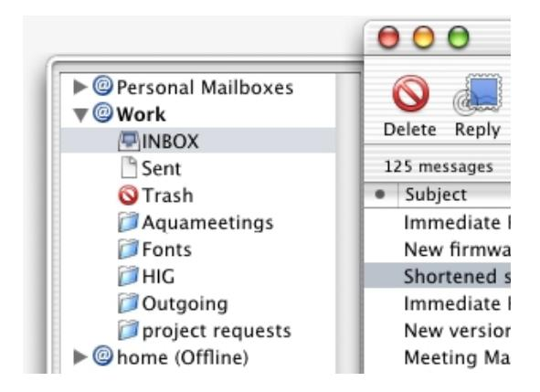

### <span id="page-88-0"></span>When to Use Drawers

Use drawers only for controls that need to be accessed fairly frequently but that don't need to be visible all the time. (Contrast this criterion with a utility window, which should be visible and available whenever its main window is in the top layer.) Some examples of uses of drawers include access to favorites lists, the Mailbox drawer (in the Mail application), or browser bookmarks.

Although a drawer is somewhat similar to a sheet in that it attaches to a window and slides out, the two elements are not interchangeable. Sheets are primarily intended to replace modal dialogs, as described in ["When to Use Sheets" \(page 98\)](#page-97-0), whereas drawers provide additional functionality. When a sheet is open, it is the focus of the window and it obscures the window contents; when a drawer is open, the entire parent window is still visible and accessible.

Special Windows **89**

### <span id="page-89-0"></span>Drawer Behavior

The user shows or hides a drawer, typically by pressing a button or choosing a command. If a drawer contains a valid drop target, you may also wish to have the drawer open when the user drags an appropriate object to where the drawer appears.

When a drawer opens or closes, it appears to be sliding from behind its parent window, to the left, right, or down. You should ensure that a parent window's default position allows its drawer to open fully without disappearing offscreen. If a user moves a parent window to the edge of the screen and then opens a drawer, it should open on the side of the window that has room. If the user makes a window so big that there's no room on either side, the drawer opens off the screen.

To support the illusion that a closed drawer is hidden behind its parent window, an open drawer should be smaller than its parent window. When the parent window is resized vertically, an open drawer resizes if necessary to ensure that it does not exceed the height of the parent window. (A drawer can be shorter than its parent window.) The illusion is further reinforced by the fact that the inner border of a drawer is hidden by the parent window and that the parent window's shadow is seen on the drawer when appropriate.

The user can resize an open drawer by dragging its outside border. The degree to which a drawer can be resized is determined by the content of the drawer. If the user resizes a drawer to the point where content is significantly obscured, the drawer should simply close. For example, if a drawer contains a scrolling list, the user should be able to resize the drawer to cover up the edge of the list. But if the user makes the drawer so small that the items in the list are difficult to identify, the drawer should close. If the user sets a new size (if that is possible) for a drawer, the new size should be used the next time the drawer is opened.

A drawer should maintain its state (open or closed) when its parent window becomes inactive, or when the window is closed and then reopened. When a parent window with an open drawer is minimized, the drawer should close; the drawer should reopen when the window is made active again.

A drawer can contain any control that is appropriate to its intended use. Follow normal layout guidelines, as stated in ["Positioning Controls in Dialogs and](#page-148-1)  [Windows" \(page 149\).](#page-148-1)

<span id="page-90-2"></span>Consider a drawer part of the parent window; don't dim a drawer's controls when the parent window has focus, and vice versa. When full keyboard access is on, a drawer's contents should be included in the window components that the user can select by pressing Tab.

### <span id="page-90-4"></span><span id="page-90-0"></span>Utility Windows

<span id="page-90-1"></span>You can create a modeless utility window, such as a tools palette, to present controls or settings that affect the active document window. Utility windows are useful for keeping extremely important controls or information accessible at all times in the context of a user task. Because utility windows take up screen space, however, don't use them when you can solve the need with a modeless dialog (the user changes settings and then closes the dialog) or by adding a few appropriate controls to a window frame.

A user can open several utility windows at a time; they float on top of document windows. When a user makes a document active, all of the application's utility windows should be brought to the front, regardless of which document was active when the user opened the utility window. When your application is inactive, its utility windows should be hidden. Utility windows should not be listed in the Window menu as documents, but you may put commands to show or hide utility windows in the Window menu.

<span id="page-90-3"></span>**Figure 5-15** Examples of tool palettes (utility windows)


Special Windows **91**

A utility window may have a title. An untitled utility window should nonetheless have an 11-pixel title-bar region for dragging the window.

<span id="page-91-4"></span><span id="page-91-3"></span>Utility windows cannot be minimized (the minimize button is always unavailable in utility windows). If you don't want users to access the zoom button, you could show only the close button. Don't hide only the zoom or only the minimize button; a utility window should have either all three title-bar controls or only the close button, as shown in Figure 5-15. Carbon developers can specify which of these controls is visible with the ChangeWindowAttributes function.

**Figure 5-16** Utility window controls


<span id="page-91-2"></span>For information about designing palette windows for Mac OS X, see ["Using Small](#page-159-0)  [Versions of Controls" \(page 160\).](#page-159-0)

### <span id="page-91-1"></span><span id="page-91-0"></span>The About Window

The **About window,** also called the About box, is a window that contains your application's version and copyright information. It should be modeless so the user can leave it open and perform other tasks in the application.

At a minimum, your application's About window should

- <span id="page-92-2"></span>■ have a title bar and be movable
- include the close button as the only active window control (if you include the minimize and zoom buttons, dim them)
- display a centered application icon and the full application title

It is recommended to also provide text that briefly describes what the application does, as shown in Figure 5-17.

<span id="page-92-1"></span><span id="page-92-0"></span>**Figure 5-17** Examples of About windows (all specifications apply to both versions)

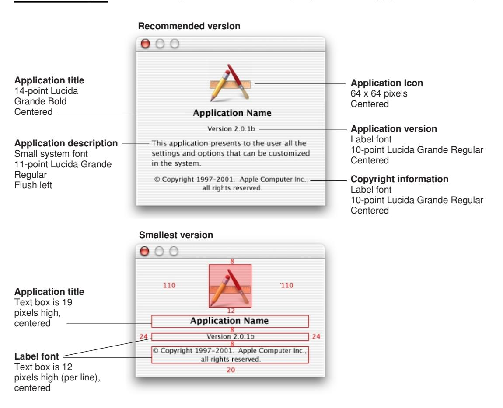

#### **CHAPTER 5**

#### Windows

All text in an About window should be centered, except for the optional descriptive text, which is flush left. If you want to include a scrolling list (for credits, for example), put it between the descriptive text and the copyright information.

An About window (or splash screen) is the appropriate place for product branding elements; avoid putting them in document windows and dialogs.

For Cocoa developers, About windows are automatically defined by the Application Kit. Carbon developers need to create their own (using a .nib file, for example).

<span id="page-94-3"></span><span id="page-94-0"></span>A **dialog** is a window designed to elicit a response from the user. Many dialogs the Print dialog, for example—permit the user to provide many responses at one time.

<span id="page-94-2"></span>**Alerts** are dialogs that appear when the system or an application needs to communicate information to the user. They provide messages about error conditions and warn users about potentially hazardous situations or actions.

For information about using the keyboard to interact with dialogs, see ["Keyboard](#page-181-0)  [Focus and Navigation" \(page 182\).](#page-181-0)

For specific design information on how to lay out dialogs, see ["Layout Guidelines"](#page-148-0) [\(page 149\).](#page-148-0)

<span id="page-94-5"></span>For implementation information, Carbon developers should see *Handling Carbon Windows and Controls,* available on the Mac OS X developer documentation website.

# <span id="page-94-1"></span>Types of Dialogs and When to Use Them

<span id="page-94-4"></span>Mac OS X applications can use these types of dialogs:

■ **Modeless:** Enables users to change settings in a dialog while still interacting with document windows; the "find and replace" feature in many word processors is an example of a modeless dialog. Modeless dialogs have title bar controls (close, minimize, and zoom buttons).

- **Document modal:** Prevents the user from doing anything else within a particular document. The user can switch to other documents in the application, and to other applications. Document-modal dialogs should be sheets, which are discussed in ["Document-Modal Dialogs \(Sheets\)" \(page 96\)](#page-95-1).
- <span id="page-95-3"></span>■ **Application modal:** Prevents the user from doing anything else within the owner application; the user can still switch applications. Most application-modal dialogs do not have the standard title bar controls (close, minimize, zoom); the user dismisses these dialogs by clicking a push button, such as OK or Cancel. Application-modal dialogs that appear as the result of the user choosing a command, such as the Open dialog in Figure 6-4 (page 103), should display a title that matches the command.

An alert can be nonmodal, document modal, or application modal. If the error condition or notification applies to a single document, the alert should be document modal (a sheet). See the Save Changes alert in Figure 6-8 (page 109) for an example. If the alert applies to the state of the application as a whole, or to more than one document or window belonging to that application, the alert should be application modal. Both the Review Changes alert for multiple unsaved documents (Figure 6-11 (page 112)) and the Save Changes alert for applications that are not document-based (Figure 6-9 (page 110)) are application modal.

### <span id="page-95-4"></span><span id="page-95-1"></span><span id="page-95-0"></span>Document-Modal Dialogs (Sheets)

A **sheet** is a modal dialog attached to a particular document or window, ensuring that the user never loses track of which window the dialog applies to. The ability to keep a dialog attached to its pertinent window helps users take full advantage of the Mac OS X window layering model (see ["Window Layering" \(page 70\)\)](#page-69-0). Sheets also allow users to perform other tasks before dismissing the dialog, so there's no longer the sense of the system being "hijacked" by the application.

<span id="page-95-2"></span>You lay out sheets like any other dialog in Mac OS X. Carbon developers are responsible for creating, showing, handling the events for, and closing sheets. Other sheet behavior, such as the animation when it appears, is handled automatically by the Window Manager. Cocoa developers are responsible for loading, showing, and closing sheets. While a sheet it displayed, events are handled by the Application Kit just as for any other window. Other sheet behavior, such as the animation when it appears and is dismissed, is handled automatically by the Application Kit.

<span id="page-96-1"></span>**Figure 6-1** The Save Changes alert: An example of using a sheet to display a document-modal dialog


### <span id="page-96-2"></span><span id="page-96-0"></span>Sheet Behavior

Sheets are displayed as an animation that appears to emerge from the window's title bar. When a sheet opens on a window near the edge of the screen, and the sheet is wider than the window it's attached to, the sheet moves the window away from the edge; when the sheet is dismissed, the window returns to its previous position.

Only one sheet may be open for a window at any one time. A sheet prevents any other operation on that window until the sheet is dismissed. If, when the user responds to a sheet, another sheet for that document must open, the first sheet closes before the second one opens.

A sheet on an active document window should cover (appear on top of) any active utility windows (if necessary). However, if the user leaves a sheet open and clicks another document in the same application, the inactive window and its sheet should go *behind* any open utility windows.

<span id="page-96-3"></span>In an application that provides multiple windows for the same document (so that the user can see different parts of a document simultaneously), a sheet would open on the active window, and the user must dismiss the sheet before interacting with other open views of the file.

### <span id="page-97-0"></span>When to Use Sheets

Use sheets for dialogs specific to a document when the user interacts with the dialog and dismisses it before proceeding with work. Some examples of when to use sheets:

- A modal dialog that is specific to a particular document, such as saving or printing.
- A modal dialog that is specific to a single-window application that does not create documents. A single-window utility program might use a sheet to request acceptance of a licensing agreement from the user, for example.
- Other window-specific dialogs typically dismissed by the user before proceeding. Use a sheet when a dialog benefits from being attached to the window as a modal dialog, even if you might otherwise design the dialog as a modeless dialog.

### <span id="page-97-1"></span>When Not to Use Sheets

- Don't use sheets for dialogs that apply to several windows. Sheets are strictly intended to be used in situations when a particular dialog is associated only with the window to which it is attached.
- Sheets are not appropriate for modeless operations where the dialog should be left open to allow the user to observe the effects of changes applied. Such tasks (find and replace operations, for example) are better suited to modeless dialogs, utility windows (palettes), or drawers.
- <span id="page-97-4"></span>■ Don't use a sheet on a window that doesn't have a title bar. Sheets should emerge from a definite visual edge.

### <span id="page-97-3"></span><span id="page-97-2"></span>Alerts

Alerts display messages to inform users of situations that are notable or potentially dangerous.

<span id="page-98-0"></span>**Figure 6-2** A standard alert


An alert should contain only the following elements:

- *Alert message text.* This text, in emphasized (bold) system font, provides a short, simple summary of the error or condition that summoned the alert. Often the message is presented as a question.
- *Informative text.* This text appears in the small system font and provides a fuller description of the situation, its consequences, and how to get out of it. For example, a warning that an action cannot be undone is an appropriate use of informative text.
- <span id="page-98-2"></span>■ *Buttons* for addressing the alert. Button names should correspond to the action the user performs when pressing the button—for example, Erase, Save, or Delete. For more information, see ["Push Buttons" \(page 120\)](#page-119-1).
- *The application icon.* Because of the Mac OS X window layering model (described in ["Window Layering" \(page 70\)](#page-69-0)), an icon is necessary to make it clear to the user which application is displaying the alert.

<span id="page-98-1"></span>In rare cases, you may want to display a caution icon in your alert, badged with the application icon as shown in Figure 6-3. A badged alert is appropriate only if the user is performing a task, such as installing software, and a possible side effect of that task would be the inadvertent destruction of data. Don't use a

<span id="page-99-1"></span>caution icon for tasks whose only purpose is to overwrite or remove data, such as Save or Empty Trash; too-frequent use of the caution icon dilutes its significance.

#### **Important**

Mac OS X dialogs should not use the different icons for "note," "caution," and "stop" alerts, as was done in Mac OS 9. Most alerts should simply show the application icon.

<span id="page-99-0"></span>**Figure 6-3** A customized alert showing the caution icon badged with an application icon

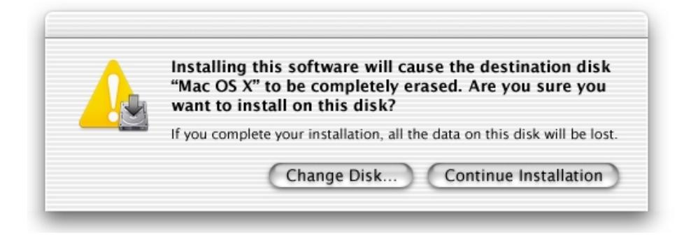

To display an alert with the application icon, Carbon developers should use a standard alert, and Cocoa developers should use the alert and sheet functions in NSPanel.h. To produce the caution icon, Carbon developers should use the kAlertCautionAlert with the StandardAlert function; Cocoa developers should use the NSBeginCriticalAlertSheet function.

Also see ["Layout Guidelines" \(page 149\)](#page-148-0), especially [Figure 8-5 \(page 155\)](#page-154-0), and ["Writing Good Alert Messages" \(page 232\).](#page-231-1)

# <span id="page-100-0"></span>Dialog Behavior

<span id="page-100-2"></span>When appropriate, your application's dialogs should display default values for controls and text fields so the user can verify information rather than generating it from scratch. Display a selection or an insertion point in the first location—a text entry field or a list, for example—that accepts user input.

When it provides an obvious user benefit, static text in a dialog should be selectable. Some error message text, for example, could be selectable. Facilitating the copying of text (such as a serial number or a hostname) so it can be pasted accurately into another context is another example.

In dialogs that display columns and are user resizable, such as the Open dialog, as the dialog is made bigger, the columns grow and additional columns appear. All other elements remain the same size and anchor to the right, center, or left side of the dialog.

### <span id="page-100-3"></span><span id="page-100-1"></span>Accepting Changes

In general, all changes a user makes in a dialog should appear to take effect immediately. There are three possible opportunities for data validation in a dialog:

- 1. When the user types data
- 2. When the user moves out of a data field (by pressing Tab, for example)
- 3. When the user clicks a button to apply changes

It is your responsibility to make the three states as clear as possible to the user. For example, checkboxes and radio buttons update immediately and display the appropriate results.

Dialog Behavior **101**

<span id="page-101-4"></span>You need to decide when your application does error checking of user input. Possible approaches:

- Evaluate the input and check for errors as the user tabs from one field to the next. The drawback is that it isn't clear to the user that the changes are taking effect as he or she tabs among items. The user doesn't click a button, and so isn't aware of completing an action.
- Save user input in a queue and apply it when the user clicks a button, closes the dialog, or switches to another application. If your application waits to check user-input errors until the user tries to dismiss the dialog, you may have to present an alert, thereby forcing the user to revisit the dialog. If you do error checking as the user enters input, it takes more time up front, but you can warn the user immediately when invalid data is entered.

In most cases, validating input after each keystroke is annoying and unnecessary. It's better to design your interface to automatically disallow invalid input. For example, your application could automatically convert lowercase characters to uppercase when appropriate.

In addition to error checking, you need to decide when to apply user input. In some cases, changes can take effect immediately—for example, View Options for Finder windows. In other cases, it may be appropriate to wait until the user performs an action, such as clicking an Apply button.

In a dialog that has multiple panes (selected by tabs or a pop-up menu), avoid validating data when a user switches from one pane to another.

Finally, you need to determine whether your application should automatically perform an operation based on user input or whether the user should initiate the operation, for example, by clicking a button. It's acceptable to automatically perform an operation that completes quickly and returns user control within a couple of seconds. For an operation that takes a longer time to execute, it's best to warn the user of the estimated time required and let the user initiate it.

### <span id="page-101-0"></span>The Open Dialog

<span id="page-101-5"></span><span id="page-101-3"></span><span id="page-101-2"></span><span id="page-101-1"></span>The Open dialog appears when the user chooses the Open command or presses Command-O. The Open dialog is application modal (the user can switch to other applications).

#### **CHAPTER 6**

### Dialogs

If you implement an Open command, you should also include an Open Recent command so users can access recently opened documents without going through the dialog.

<span id="page-102-1"></span>**Note:** Navigation Services, introduced in Mac OS 8.5, has been enhanced to add support for Mac OS X. Its predecessor, the Standard File Package, is not supported in Mac OS X.

<span id="page-102-0"></span>**Figure 6-4** An Open dialog


The Open dialog contains these elements:

- A default title ("Open"); you should add your application's name to the Open dialog title—"TextEdit: Open," for example.
- A From pop-up menu that contains Favorite Places (all containers in the user's Favorites folder) and Recent Places (the five most recent folders the user opened or saved documents to). Your application specifies the default location, typically one of the predefined folders in the user's home folder. (For recommended default locations, see ["Files" \(page 245\)](#page-244-0).) If the user selects another folder, the dialog should "remember" the user's selection the next time the dialog appears.
- A column browser for navigating the file system.
- A "Go to" text field, in which expert users can type file-system paths to navigate in the dialog. Pathnames must begin with "/" or "~". (For guidelines about pathnames, see ["Displaying Pathnames" \(page 251\)](#page-250-0).)
- <span id="page-103-0"></span>■ An Add to Favorites button, which adds an alias of the chosen folder to the user's Favorites folder and immediately updates the Favorite Places list in the From pop-up menu. The Add to Favorites button is always active.
- A Cancel button and an Open (default) button.
- A resize control in the lower-right corner.

You can extend the Open dialog as appropriate for your application. For example, you could include a pop-up menu allowing users to filter the type of files that appear in the list (see Figure 6-5). Items that do not meet the filtering criteria would appear dimmed. The system creates a list of native file types supported by the application to populate the menu. You can supplement this list with custom types and specify the default to show when the dialog opens. You should include an All Applicable Files item, but it does not have to be the default.

<span id="page-104-2"></span>**Figure 6-5** A customized Open dialog (column browser not shown)


Open dialogs should support document preview and can support multiple selection if your application allows more than one document to be open at a time.

### <span id="page-104-3"></span><span id="page-104-0"></span>Saving, Closing, and Quitting Behavior

<span id="page-104-4"></span>As described in ["Naming Files and Showing Filename Extensions" \(page 249\),](#page-248-1) your application should pass in a filename extension as part of every filename. Users can control its visibility using the "Hide extension" checkbox in the expanded Save dialog; for more information, see ["The Expanded Save Dialog" \(page 107\)](#page-106-1). Existing documents do not get extensions added to or removed from their filenames unless the user chooses Save As and changes the setting in the Save dialog.

### <span id="page-104-1"></span>Save Dialogs

An application that saves the contents of individual windows—which would be most text and graphics applications—should use document-specific sheets for its Save dialogs. In Aqua, the Save dialog has two states: minimal and expanded. Clicking the disclosure button toggles between these states. If the user changes the state, the next Save dialog should open in the selected state.

Dialog Behavior **105**

### <span id="page-105-2"></span>**The Minimal Save Dialog**

<span id="page-105-0"></span>In the minimal Save dialog, users can save changes to a particular document, name or rename the document, and choose a frequently accessed location to store it.

**Figure 6-6** The minimal (collapsed) Save dialog

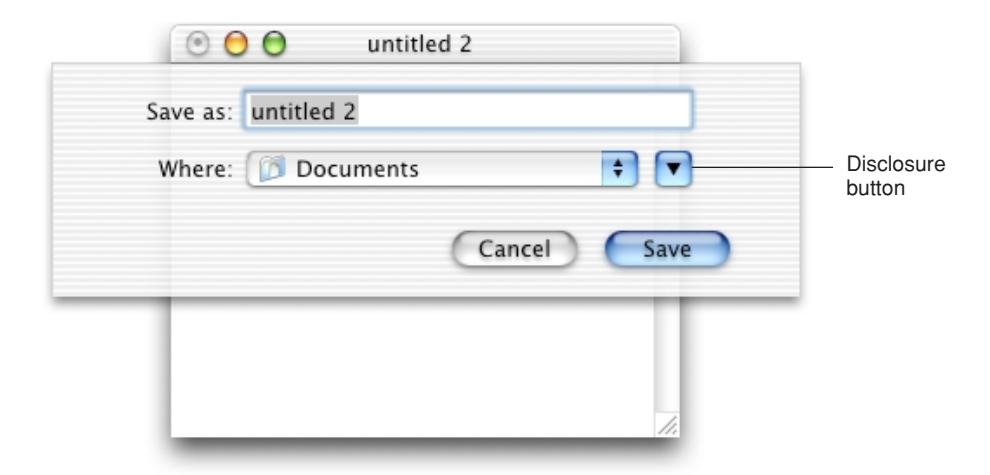

The minimal Save dialog contains these elements:

- <span id="page-105-3"></span>■ "Save as" text field for the document name. (Expert users can enter pathnames by typing "/" or "~" as the first character.)
  - If the document has not been saved previously, your application should put the default name (such as "untitled") in this field, and the filename should be selected. If the user has chosen to make the filename extension visible, the extension is not selected.
  - If the document has been saved previously and the user chooses Save As, the Save dialog should open with the document name, highlighted, in the "Save as" field. The filename extension (if it is visible) is not selected.
- <span id="page-105-1"></span>■ Where pop-up menu, containing Favorite Places (all folders in the user's Favorites folder) and Recent Places (the five most recent folders the user opened or saved documents to). Your application specifies the default location, typically

<span id="page-106-3"></span>the predefined Documents folder in the user's home folder. (For recommended default locations, see ["Files" \(page 245\)](#page-244-0).) If the user selects another folder, the dialog should "remember" the user's selection the next time the dialog appears.

- Save button (default).
- Cancel button. Dismisses the dialog and returns to the application's previous state.
- <span id="page-106-4"></span>■ A disclosure button. Clicking it displays the expanded Save dialog.

### <span id="page-106-2"></span><span id="page-106-1"></span>**The Expanded Save Dialog**

With the expanded Save dialog, users can save a document in a location not accessible in the Where pop-up menu in the minimal Save dialog.

<span id="page-106-0"></span>**Figure 6-7** The expanded Save dialog

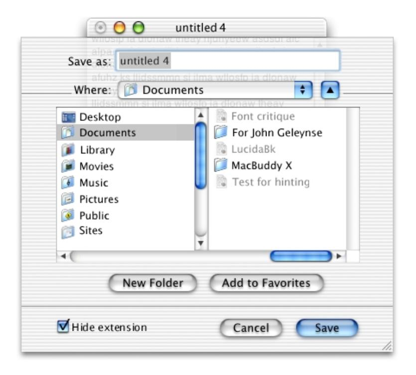

Clicking the disclosure button in the minimal Save dialog displays the following:

- A column browser for navigating the file system.
- A New Folder button, which displays an application-modal dialog that asks the user to name the new folder, and then creates it.
- An Add to Favorites button, which adds an alias of the chosen folder to the user's Favorites folder and immediately updates the Favorite Places list in the Where pop-up menu. The Add to Favorites button is always active.
- <span id="page-107-2"></span>■ A "Hide extension" checkbox, which allows the user to control whether or not the filename's extension (.jpg, for example) is visible. The "Hide extension" checkbox should be selected as the default (that is, filename extensions should not appear in user-visible filenames unless the user requests them).

<span id="page-107-0"></span>If the user changes the state of the checkbox for a particular document, the next new document should match the last user-selected state, even after the user quits and reopens the application. The filename in the "Save as" field updates in real time as the checkbox is selected or deselected.

Don't provide your own options for handling filename extensions; use the standard Open and Save dialogs. Carbon developers should set the PreserveSaveFileExtension flag when calling the Save dialog, and use NavCompleteSave to set the flag to hide the filename extension.

If you want to add a Format pop-up menu so that users can specify a document's file format, place it between the "Save as" text field and the Where pop-up menu. The system creates a list of native file types supported by the application to populate the menu. You can supplement this list with custom types and specify the default format to show when the dialog opens. When a user changes a document's type with the Format menu, the filename extension (visible or hidden) should change accordingly. Cocoa applications handle this updating automatically.

If you add other elements to customize the expanded Save dialog, they should appear above the Cancel and Save buttons. All custom elements should be visible in the dialog's minimal (collapsed) state, below the Where pop-up menu. When the dialog is expanded, custom elements should appear below the New Folder and Add to Favorites buttons.

<span id="page-107-1"></span>In default keyboard navigation mode, pressing Tab in the expanded Save dialog shifts the keyboard focus from the "Save as" text field to the visible columns, and then back to the text field.

### <span id="page-108-3"></span><span id="page-108-0"></span>Closing a Document With Unsaved Changes

When the user attempts to close a document that has unsaved changes, present a Save Changes alert. An application that saves the contents of individual windows like most text and graphics applications—should use document-specific sheets, like the one shown in Figure 6-8, for its Save Changes alert. In an application that can display multiple views of the same file, if the user chooses the Close File command (instead of Close Window; see ["The File Menu" \(page 56\)](#page-55-0)), open the sheet on the frontmost window and change the alert message text from "document" to "file"; after the user clicks Save or Don't Save, close all open views of the file.

<span id="page-108-1"></span>**Figure 6-8** A Save Changes alert for a document-based application

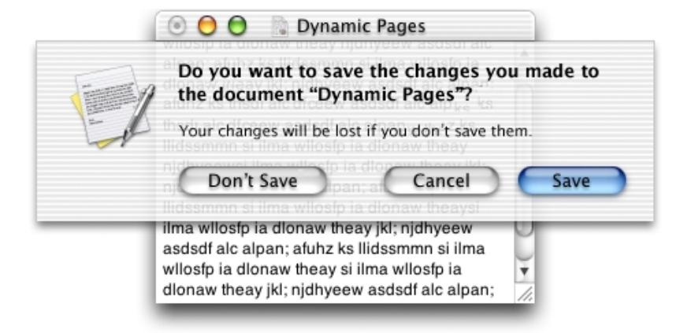

When a Save Changes sheet is open, the document's close button and the Close command in the File menu are unavailable; the user can't close the document until the Save Changes sheet is addressed.

<span id="page-108-2"></span>As described in ["Sheet Behavior" \(page 97\)](#page-96-2), if an application provides multiple views of the same document, the sheet should open on the active window and prevent the user from interacting with other open views of the file.

### <span id="page-109-2"></span><span id="page-109-0"></span>Saving Documents During a Quit Operation

In Mac OS X, users can interrupt a quit operation with documents still unsaved. For example, if a user chooses Quit and a save alert (a sheet) opens for a document, the user can work on other documents or switch to another application without addressing the save alert. To minimize the impact of such interruptions, all save alerts initiated by a Quit command should include a message that alerts users that they are in the midst of a quit operation. See Figure 6-10 (page 111) for an example.

When a user quits an application in which all open documents have been saved, all documents close immediately and the application quits.

### **Quitting an Application That is Not Document-Based**

When a user attempts to quit an application that is not document-based (the contents of many windows are saved simultaneously), present an application-modal Save Changes alert, such as the one shown in Figure 6-9.

<span id="page-109-1"></span>**Figure 6-9** A Save Changes alert for an application that is not document-based


### **Quitting an Application With One Unsaved Document Open**

When a user attempts to quit a document-based application and there is only one document with unsaved changes open, present a Save Before Quitting alert (such as the one shown in Figure 6-10) as a sheet attached to the unsaved document, perform the actions described in "The Minimal Save Dialog" (page 106), and then quit the application as appropriate.

Note that the Don't Save button, which can result in data loss, is positioned away from the "safe" buttons (Cancel and Save). The keyboard combination Command-D should be implemented for the Don't Save button.

<span id="page-110-0"></span>**Figure 6-10** The Save Before Quitting alert (sheet) that appears when the user quits with only one unsaved document

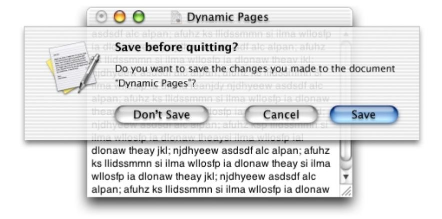

Dialog Behavior **111**

### **Quitting an Application With Multiple Unsaved Documents Open**

When a user attempts to quit a document-based application and there is more than one document with unsaved changes open, present an application-modal Review Changes alert, such as the one shown in Figure 6-11.

<span id="page-111-0"></span>**Figure 6-11** The Review Changes alert (application modal) that appears when the user quits with more than one unsaved document open


The appropriate action for each button is as follows:

- **Discard Changes.** Closes all documents without saving changes and quits the application.
- **Cancel.** Cancels the Quit command.
- <span id="page-111-1"></span>■ **Review Changes.** All open documents (including those minimized in the Dock) come forward, with the unsaved documents on top. The active document presents the Save Before Quitting alert (see Figure 6-10 (page 111)). If the user clicks Save, the Save dialog appears (if the document has not previously been saved). If the user clicks Don't Save, the next unsaved document comes forward with its Save Before Quitting alert. If the user dismisses the last Save Before Quitting alert with Save or Don't Save, all documents close and the application quits.

During the review, if the user activates another unsaved document, it should come forward with its Save Before Quitting sheet open. Already-opened Save Before Quitting sheets on other documents remain open. During the review, if the user activates a saved document, the review process continues when the next unsaved document becomes active.

<span id="page-112-1"></span>If, in the midst of a quit operation, the user clicks the application icon in the Dock or chooses Bring All to Front from the Window menu, documents should appear in this order: documents with open sheets on top, unsaved documents next, and then saved documents.

<span id="page-112-2"></span>At any time during the review process, the user can click Cancel to stop the quit operation. If the user initiates a Quit command while in the review state, the process begins again with the application-modal alert shown in Figure 6-11 (page 112).

### <span id="page-112-0"></span>Saving a Document With the Same Name as an Existing Document

<span id="page-112-3"></span>If the user types the name of a document that already exists in the same location into the "Save as" field of a Save dialog, and then clicks Save, present an application-modal alert in which the user can confirm whether or not to replace the previous document.

**Figure 6-12** Alert for confirming replacing a file

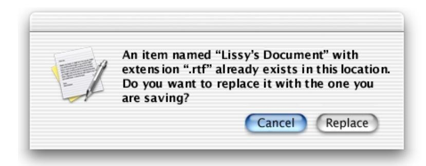

### <span id="page-113-1"></span><span id="page-113-0"></span>The Choose Dialog

A Choose dialog lets a user select an item as the target of a customized task. For example, when a user attempts to open a broken alias, the Fix Alias dialog lets the user choose another item for the alias to open. An application can have more than one Choose dialog, but only one can be open at a time. In some situations, it may be appropriate for a Choose dialog to be a sheet.

**Figure 6-13** A Choose dialog


### A Choose dialog

- can be opened by various commands
- can support multiple selection

- supports document preview
- can be resized with the resize control in the lower-right corner
- can include a Show pop-up menu, which allows the user to filter the type of files that appear in the list. Items that do not meet the filtering criteria appear dimmed. The system creates a list of native file types supported by the application to populate the menu. You can supplement this list with custom types and specify the default to show when the dialog opens. You should include an "All applicable files" item, but it does not have to be the default.

The dialog's default title is "Choose," but you should change it to include the name of the task. For example, if the command that brings up the dialog is Choose Picture, the dialog should be titled "Choose Picture." Also include some instructional text at the top, such as "Choose a picture to display in the background of the folder 'Documents.'" If it's helpful, also change the Choose button to something more specific.

The default location is the user's home folder. If the dialog is targeted to only volumes, the default location is the Computer directory. Files and folders not appropriate for the target selection should be dimmed.

**Note:** Recent Places (in the Where pop-up menu of a Save dialog) does not record folders selected in Choose dialogs.

<span id="page-114-1"></span>Cocoa developers can use a variation of the Open dialog (NSOpenPanel class). The Choose dialog is available to Carbon developers through Navigation Services. For more information, see the documentation for Navigation Services, available on the Mac OS X developer documentation website.

### <span id="page-114-3"></span><span id="page-114-2"></span><span id="page-114-0"></span>The Printing Dialogs

<span id="page-114-5"></span><span id="page-114-4"></span>Printing dialogs include the Print dialog and the Page Setup dialog. In the Print dialog, user options are provided via the features pop-up menu, which contains panes drawn and controlled by printing dialog extensions (PDEs). PDEs are provided by the operating system, printer modules, and applications.

Apple provides a number of printing panes. The standard Print dialog is shown in Figure 6-14.

Dialog Behavior **115**

#### **CHAPTER 6**

Dialogs

**Figure 6-14** A Print dialog (a sheet attached to a document window)

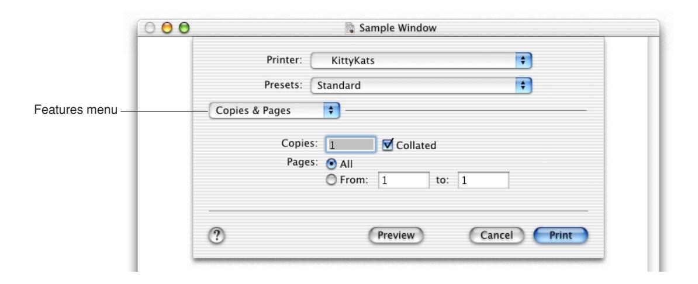

Options for choosing paper type and print quality should look like the dialog in Figure 6-15. You can customize the quality descriptions. If you want to provide more options, make them visible only when the user clicks a disclosure triangle.

**Figure 6-15** Options for choosing paper type and print quality


Figure 6-16 shows an example of a Print dialog with its advanced features visible. Most users won't need access to controls for specifying precise percentages of cyan, yellow, and magenta; the dialog opens initially displaying only the top portion of the dialog. The user must click a disclosure triangle to display the advanced options.

<span id="page-116-0"></span>Advanced options should always have a title. Use help tags when necessary to explain options (see ["Help Tags" \(page 238\)\)](#page-237-0).

**Figure 6-16** The expanded Color Options pane, showing advanced options

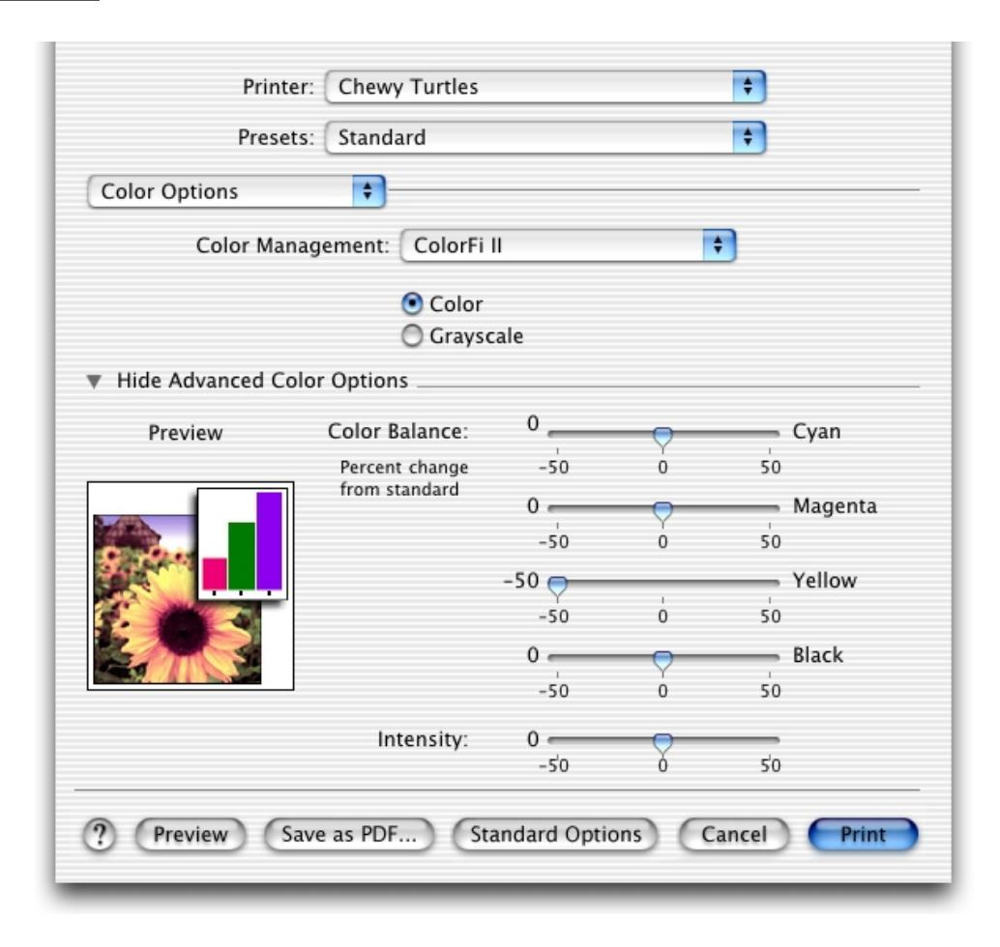

If you create custom printing dialogs, follow the interface guidelines provided throughout this book and the layout guidelines described in ["Positioning Controls](#page-148-1)  [in Dialogs and Windows" \(page 149\).](#page-148-1) Here are some specific guidelines to keep in mind if you implement custom printing features.

- Make sure the item name that appears in the features pop-up menu doesn't conflict with already existing menu items.
- Make sure the menu item (the pane name) helps users easily determine the options the pane contains.
- Make sure the features you implement are appropriate for your application. For example, an option to print in reverse order should be provided by the operating system, not your application. (Implementing this feature requires the application to know the hardware's capabilities.)
- Make interdependencies among options clear to users. For example, if a user selects double-sided printing, the option to print on transparencies should become unavailable.
- Separate more advanced features from frequently used features. When the user chooses to display the advanced features, there should be an "advanced options" title above the advanced controls.
- Provide visual feedback (such as the preview in the Layout pane of the Print dialog) when appropriate. A thumbnail showing the effect of changing a tone control, for example, helps users determine desired settings.
- Save a user's printing preferences for a document, at least while the document is open. Provide a way for users to save custom settings.

<span id="page-117-1"></span><span id="page-117-0"></span>If you are a Carbon application developer, you can write a PDE to customize panes in the Page Setup or Print dialogs. For more information, see *Inside Mac OS X: Extending Printing Dialogs,* [available on the Mac OS X developer documentation](http://developer.apple.com/techpubs/macosx/Carbon/graphics/CarbonPrintingManager/carbonprintingmgr.html)  [website. If you are a Cocoa application developer, you can implement an accessory](http://developer.apple.com/techpubs/macosx/Carbon/graphics/CarbonPrintingManager/carbonprintingmgr.html)  view by using NSPageLayout and NSPrintPanel, both Application Kit classes.

<span id="page-118-4"></span><span id="page-118-0"></span>**Controls** are graphic objects that cause instant actions or visible results when the user manipulates them with the mouse. Standard controls include push buttons, scroll bars, radio buttons, checkboxes, sliders, and pop-up menus.

<span id="page-118-3"></span><span id="page-118-2"></span><span id="page-118-1"></span>For Carbon developers, the Control Manager determines the overall appearance of all controls. For Cocoa developers, the overall appearance of interface elements is provided by the Application Kit. You are responsible for positioning the controls within your windows, according to the guidelines given here.

For implementation information, Carbon developers should see *Inside Mac OS X: Handling Carbon Windows and Controls,* available on the Mac OS X developer documentation website.

# <span id="page-119-0"></span>Control Behavior and Appearance

<span id="page-119-8"></span><span id="page-119-6"></span>**Note:** The Control Manager (Carbon) and Application Kit (Cocoa) include smaller versions of the most commonly used controls, for use in utility windows when necessary. The specifications listed here are for the standard size controls. If a small version of a control is available, it's shown (with its dimensions) after the standard-size version. For more information, see ["Using Small Versions of](#page-159-0)  [Controls" \(page 160\)](#page-159-0).

### <span id="page-119-5"></span><span id="page-119-1"></span>Push Buttons

<span id="page-119-7"></span>A **push button** is a rounded rectangle with a text label on it. Clicking a push button performs an instantaneous action, such as saving a document, completing operations defined by a dialog, or acknowledging an error message. If a button initiates an indeterminate process, the button should be dimmed until the process is complete, or status feedback should be provided.

Button names should be verbs that describe the action performed—Save, Close, Print, Delete, and so on. If a button acts on a single setting, label the button as specifically as possible; "Choose Picture…," for example, is more helpful than "Choose…" Because most buttons initiate an immediate action, it shouldn't be necessary to use "now" ("Scan Now," for example) in the label. Don't use push buttons to indicate a state such as On or Off.

<span id="page-119-2"></span>In some circumstances, it's appropriate to implement an Apply button—for example, to permit a user to see the effect of multiple text attributes before committing to them. In cases like these, clicking Cancel should undo any of the applied changes. Be cautious about using an Apply button for operations that take a long time to implement or undo; it might not be obvious to users that they can interrupt or reverse the process.

<span id="page-119-4"></span><span id="page-119-3"></span>All push buttons should be clear except the default button—the button selected by pressing the Return key—which should use the default color (in addition to pulsing). For example, in a dialog containing a default OK button and a Cancel button, the Cancel button is clear and the OK button uses color and pulses. When

the user presses a nondefault button such as Cancel, the button acquires color and the default button loses its color. If you use standard controls, this behavior is automatic.

For information about proper capitalization of button labels, see ["Capitalization of](#page-230-0)  [Interface Elements" \(page 231\)](#page-230-0). For information about when it is appropriate to use ellipses in buttons, see ["Using Ellipses in Menus and Buttons" \(page 67\)](#page-66-1).

### <span id="page-120-3"></span><span id="page-120-0"></span>Push Button Specifications

**Figure 7-1** Example of standard push buttons


**Figure 7-2** Stacked push buttons

#### <span id="page-120-1"></span>**Standard push button Small push button**

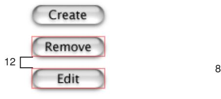

If stacking vertically, leave a minimum of 12 pixels in between.

<span id="page-120-2"></span>

If stacking vertically, leave a minimum of 8 pixels in between.

<span id="page-121-1"></span>**Figure 7-3** Push button dimensions

**Push button:** The button height is 20 pixels. End caps are not adjustable. Text goes between end caps. **Small push button:** The button height is 17 pixels. 17 17 10 10 10 10 20 14 14 20 14 14

- **Height:** 20 pixels (fixed), not including the shadow. For small push buttons, height is 17 pixels.
- **End caps:** 14 pixels wide (fixed). For small push buttons, 10 pixels.
- **Width:** Depends on button text. If you don't specify a wide enough button, the end caps clip the text. The standard width for OK and Cancel buttons is 69 pixels, as shown in Figure 7-1 (page 121). Push buttons used in other contexts may be sized differently if appropriate.
- **Text:** System font (13-point Lucida Grande Regular). If you need to use a font larger than the system font, use a bevel button instead. For small push buttons, use the small system font (11-point Lucida Grande Regular).
- <span id="page-121-3"></span>■ **Color:** All push buttons are clear except the default button, which uses the default color (in addition to pulsing).
- **Spacing:** Leave at least 12 pixels of space between buttons placed horizontally or stacked. For small push buttons, leave at least 8 pixels.

### <span id="page-121-2"></span><span id="page-121-0"></span>Radio Buttons and Checkboxes

Use **radio buttons** for a set of mutually exclusive, but related, choices. A set of radio buttons should contain at least two items and a maximum of about seven. (For more than seven items, consider using a pop-up menu.) A set of radio buttons is never dynamic (changing contents depending on the context). A radio button should never initiate an action.

Use **checkboxes** to indicate one or more options that must be either on or off. Each checkbox label should clearly imply two opposite states so it's clear what happens when the box is checked or unchecked. If you can't find an unambiguous label, consider using radio buttons so you can clarify the states with two different labels.

### <span id="page-122-0"></span>Radio Button and Checkbox Specifications

**Figure 7-4** Spacing of standard and small radio buttons


Align the baselines of the label and the first button's text. The box indicates the hit region.

**Figure 7-5** Spacing of standard and small checkboxes


Align the baselines of the label and the first checkbox's text. The hit region includes the checkbox border.

- **Size:** 18 x 18 pixels, including the shadow. Small radio buttons are 14 x 15 pixels. Small checkboxes are 14 x 16 pixels.
- **Label:** 8 pixels from label (colon) to control
- **Spacing:** 8 pixels of space between controls when stacked.
- **Text:** System Font (13-point Lucida Grande Regular). Small: Small system font (11-point Lucida Grande Regular).
- **Positioning:** Typically stacked vertically to clearly show relationships among button states.

### <span id="page-123-4"></span><span id="page-123-0"></span>Selections Containing More Than One Checkbox State

When a user selection comprises more than one state, use a dash in the appropriate checkboxes. (This symbol is consistent with the mixed-state indicator in menus, as described in ["Using Symbols in Menus" \(page 65\)](#page-64-1).)

<span id="page-123-2"></span>**Figure 7-6** Dashes in checkboxes representing a selection with more than one state


### <span id="page-123-5"></span><span id="page-123-1"></span>Pop-Up Menus

<span id="page-123-6"></span>Use **pop-up menus** to present a list of mutually exclusive choices in a dialog or window. Pop-up menus are used as a means of selecting one choice from a list of many. If you have a dialog with five or more radio buttons in one section, consider using a pop-up menu instead.

<span id="page-123-3"></span>**Figure 7-7** An open pop-up menu


### A pop-up menu

- has a label to the left (in left-to-right scripts)
- has a drop shadow and a double-triangle indicator
- contains nouns (things) or adjectives (states or attributes), but not verbs (commands); use pull-down menus for commands
- has a checkmark beside the current value when open

A pop-up menu behaves like other menus: Users drag to choose an item—which then flashes briefly and appears as the current choice—or move outside the menu to leave the current value active. An exploratory press in the menu to see what's available doesn't select a new value.

In special cases, you may want to include a command that affects the contents of the pop-up menu itself. For example, in the Print dialog, the Printer pop-up menu contains Edit Printer List, so users can add a printer to the menu; the new printer becomes the menu's default selection. Put such commands at the bottom of a pop-up menu, below a separator.

Use pop-up menus to present up to 12 mutually exclusive choices that the user doesn't need to see all the time.

Don't use pop-up menus

- for more than 12 items; use a scrolling list
- for 4 or fewer items; use radio buttons
- when more than one selection is appropriate, such as text styles (in which you can select bold and italic, for example); use checkboxes or a pull-down menu in which checkmarks appear

Be very cautious about creating a pop-up menu with submenus. Doing so hides choices too deeply and is physically difficult to use.

Bevel buttons and icon buttons can also be pop-up menus. See ["Pop-Up Icon](#page-133-1)  [Buttons and Pop-Up Bevel Buttons" \(page 134\)](#page-133-1).

### <span id="page-125-2"></span><span id="page-125-0"></span>Pop-Up Menu Specifications

<span id="page-125-3"></span><span id="page-125-1"></span>**Figure 7-8** Pop-up menu spacing

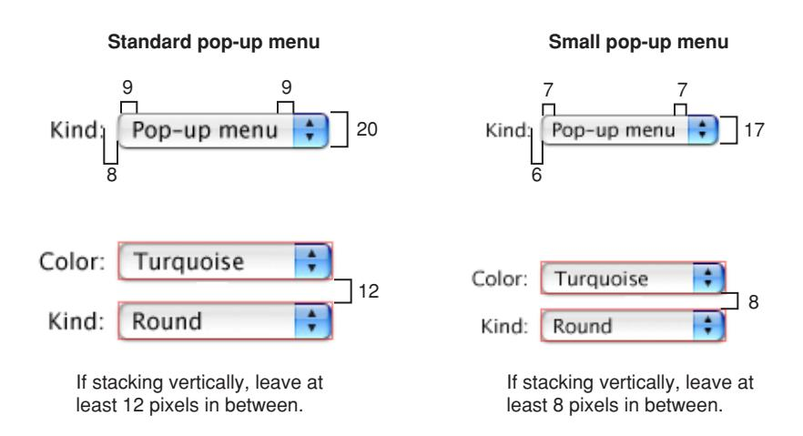

- **Height:** 20 pixels. Small: 17 pixels.
- **Width:** Wide enough to accommodate the longest menu item.
- **Spacing:** Leave at least 12 pixels of space between stacked controls. Small: Leave at least 8 pixels of space.
- **Menu item text:** System font (13-point Lucida Grande Regular), 9 pixels from left edge and at least 9 pixels from the double-triangle section. Small: Small system font (11-point Lucida Grande Regular), 7 pixels from left edge and at least 7 pixels of space on the right.
- **Menu label text:** Emphasized system font (13-point Lucida Grande Bold), 8 pixels from text (colon) to left edge of menu. Small: Emphasized small system font (11-point Lucida Grande Bold), 6 pixels from text (colon) to left edge of menu.

### <span id="page-126-3"></span><span id="page-126-0"></span>Command Pop-Down Menus

A command pop-down menu is similar to a pull-down menu, but it appears in a window rather than in the menu bar. Use of this control is limited to cases where the window is shared among multiple applications and the menu contains commands that affect the window's contents. For example, the Colors utility window, which can be used in any application, contains a List menu with commands that can be used to change the contents of the Colors window itself. Each application that uses the Colors window doesn't have to populate a menu with these commands.

Cocoa developers can create a command pop-down menu with the NSPopUpButton class. Carbon developers can mimic the appearance and behavior with a bevel button.

<span id="page-126-2"></span>**Figure 7-9** A command pop-down menu

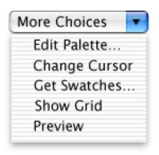

Command pop-down menus should contain between 3 and 12 commands. A closed command menu always displays the same text, which acts as the menu title.

### <span id="page-126-1"></span>Command Pop-Down Menu Specifications

The specifications for command pop-down menus are the same as those for pop-up menus (see ["Pop-Up Menu Specifications" \(page 126\)](#page-125-2)).

**Figure 7-10** Command pop-down menu specifications

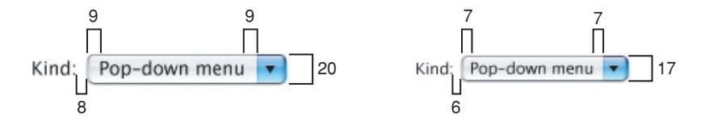

### <span id="page-127-3"></span><span id="page-127-2"></span><span id="page-127-0"></span>Combination Boxes

A **combination box** (or combo box) is a text entry field combined with a drop-down scrolling list. Combo boxes are useful for displaying a list of likely choices while still allowing the user to type in an item not in the list.

<span id="page-127-1"></span>**Figure 7-11** Combo box with scrolling list open


The default state of the combo box is closed, with the text field empty or displaying a default selection. The default selection (not necessarily the first item in the list) should provide a meaningful clue to the hidden choices. The combo box should also have a useful label.

To create a combo box, Carbon developers can use the HIComboBoxCreate function and DrawThemeButton with the appropriate constant. Cocoa developers can use the NSComboBox class.

### <span id="page-128-0"></span>Combo Box Specifications

<span id="page-128-2"></span>**Figure 7-12** Combo box dimensions


- **Height:** 20 pixels. Small: 17 pixels.
- **Width:** Wide enough to accommodate the longest menu item.
- **Spacing:** Leave at least 12 pixels of space between stacked controls. Small: Leave at least 8 pixels of space.
- **Menu item text:** System font (13-point Lucida Grande Regular), 9 pixels from left edge and at least 9 pixels from the double-triangle section. Small: Small system font (11-point Lucida Grande Regular), 7 pixels from left edge and at least 7 pixels of space on the right.
- **Menu label text:** Emphasized system font (13-point Lucida Grande Bold), 8 pixels from text (colon) to left edge of menu. Small: Emphasized small system font (11-point Lucida Grande Bold), 6 pixels from text (colon) to left edge of menu.

### <span id="page-128-1"></span>The Text Entry Field

The user can type any appropriate characters into the text field. If the user types in an item already in the menu or list, or types in a few characters that match the first characters of an item in the list, the item is highlighted when the user opens the list. A user-typed item does *not* get added to the permanent list.

### <span id="page-129-6"></span><span id="page-129-0"></span>The Scrolling List

The user opens the list by pressing or clicking the arrows to the right of the text field. The list is a window that descends from the text field; the window is the same width as the text field and has a drop shadow. Don't extend the right edge of the list beyond the right edge of the arrow box; if an item is too long, it gets truncated.

When the user selects an item in the list, the item replaces whatever is in the text entry field and the list closes. If the user presses the Up Arrow or Down Arrow key to move through the items, the selected item is highlighted and appears in the text entry field. The user can accept an item by pressing the Space bar, Enter, or Return.

<span id="page-129-4"></span>If the list is open and the user clicks outside it, including within the text entry field, the list closes.

### <span id="page-129-5"></span><span id="page-129-1"></span>Placards

<span id="page-129-3"></span>A **placard** is a control you can use to display information, such as the current page number. You can also use a placard to create the striped background behind other controls.

Typically placards are used in document windows as a way to quickly modify the view of the contents—for example, to change the current page or the magnification. The most familiar use of the placard is as a pop-up menu placed at the bottom of a window to the left of the horizontal scroll bar. You can extend the functionality of a placard by, for example, having it provide a pop-up menu so that users can choose from pre-defined options.

<span id="page-129-2"></span>**Figure 7-13** A placard pop-up menu


Placards are 15 pixels high and use either 10-point or 11-point Lucida Grande Regular.

Carbon developers can use the Carbon Control Manager CreatePlacardControl call or DrawThemePlacard in the Carbon Appearance Manager to create a placard.

### <span id="page-130-1"></span><span id="page-130-0"></span>Bevel Buttons

A **bevel button** has a beveled edge that gives the button a three-dimensional appearance.

- Bevel buttons can display text, an icon, or a picture
- They mimic the behavior of other button types; for example, a bevel button can behave like a standard push button. Bevel buttons can be grouped and used like radio buttons or checkboxes.
- Bevel buttons can have a menu attached, so the button behaves like a pop-up menu. See ["Pop-Up Icon Buttons and Pop-Up Bevel Buttons" \(page 134\)](#page-133-1)
- They can have rounded or square corners. The square buttons work well for tiling together in groups, to be used as radio buttons, for example.

### <span id="page-131-0"></span>Bevel Button Specifications

<span id="page-131-1"></span>**Figure 7-14** Bevel button specifications

#### **Rounded corners**


Leave at least 5 pixels between edge of icon and edge of button.

#### **Rounded corners with label below icon**


#### **Square corners**


- **Size of button:** 20 x 20 pixels minimum
- **Size of icon:** 32 x 32 pixels recommended, with at least 5 pixels between icon and button edge

- **Spacing:** For buttons with rounded corners that contain a 24 x 24 (or larger) icon, leave at least 8 pixels between buttons, stacked vertically or aligned horizontally. Otherwise, buttons should butt up against each other.
- **Text:** Label font (10-point Lucida Grande Regular)

If a bevel button has an icon and a label, you can put the text anywhere in relation to the icon. Carbon and Cocoa developers can specify the location in Interface Builder or programmatically. Cocoa developers can create square bevel buttons with the NSButton class. Carbon developers can use the CreateBevelButtonControl function or, in Appearance Manager, the DrawThemeButton function with the kThemeBevelButton constant.

In some situations—providing text-alignment options in a toolbar, for example—it is appropriate to use bevel buttons to graphically represent several mutually exclusive choices. You can also use bevel buttons for nonstandard-size push buttons.

<span id="page-132-1"></span>**Figure 7-15** Bevel buttons as radio buttons and push buttons

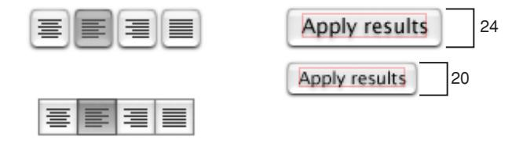

### <span id="page-132-0"></span>Toolbars

<span id="page-132-2"></span>Toolbars are useful for giving users immediate access to the most frequently used commands. Any item in a toolbar should also be available as a menu command. An application-wide toolbar in its own window is also called a **tool palette;** for more information, see ["Utility Windows" \(page 91\).](#page-90-0) This section focuses on toolbars that are part of a window with other content. Carbon developers can create a toolbar with the HIToolBarCreate function; Cocoa developers can use the NSToolbar class.

The set of toolbar items you provide should fit in the default window size; users should be able to customize which items appear in the toolbar, and in what order. As the default, a toolbar should display icons with text labels; users should be able to change the display to icons only or text only. You can provide these options with a Customize Toolbar command in the View menu.

<span id="page-133-5"></span>If your application uses toolbars as part of a window with other content, include a control in the window's title bar for showing and hiding the toolbar, as shown in [Figure 7-16.](#page-133-2) You should also put commands for showing and hiding the toolbar in the View menu (see ["The View Menu" \(page 61\)\)](#page-60-0).

<span id="page-133-2"></span>**Figure 7-16** The toolbar control


For information about designing icons for toolbars, see ["Toolbar Icons" \(page 211\)](#page-210-0).

## <span id="page-133-4"></span><span id="page-133-1"></span><span id="page-133-0"></span>Pop-Up Icon Buttons and Pop-Up Bevel Buttons

<span id="page-133-3"></span>An **icon button** does not have a rectangular edge around it; the clickable area is the graphic itself (for example, the toolbar buttons in Finder windows). An icon button or a bevel button containing a pop-up menu has a single downward-pointing arrow, as shown in Figure 7-17. The button can behave like a standard pop-up menu, in which the image on the button is the current selection, or the button can represent the menu title and always display the same image.

The menu and the button (or the bounding rectangle around the icon) are left-aligned, with no space between the top of the menu window and the bottom of the button. The arrow is 7 pixels wide at the top. The tip of the arrow is positioned 1 pixel below the icon's bottom edge. There should be 3 pixels from the tip of the arrow to the top of the menu window.

<span id="page-134-0"></span>**Figure 7-17** Pop-up icon button


<span id="page-135-0"></span>**Figure 7-18** Pop-up bevel button with square corners

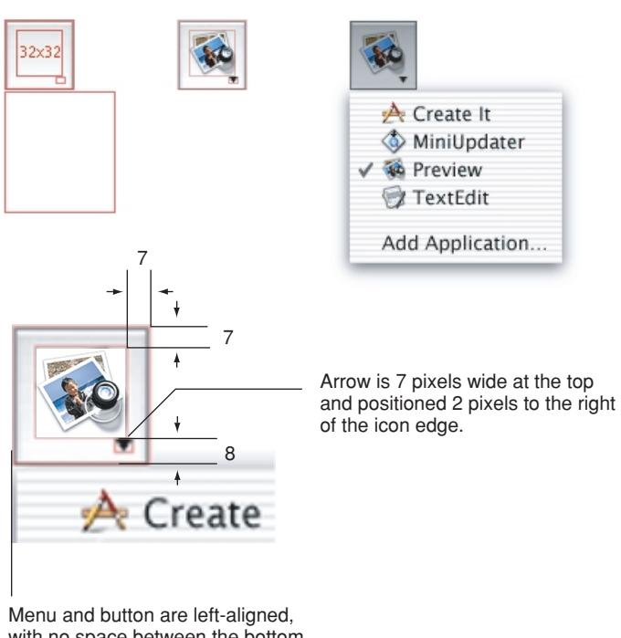

with no space between the bottom of the button and the top of the menu.

<span id="page-135-2"></span><span id="page-135-1"></span>**Figure 7-19** Pop-up bevel button with rounded corners


### <span id="page-136-5"></span><span id="page-136-4"></span><span id="page-136-0"></span>Slider Controls

<span id="page-136-6"></span>A **slider control** lets users choose from a continuous range of allowable values. Slider controls can be horizontal or vertical and can display labeled tick marks to represent increments you specify. The slider itself (the thumb) can be directional or round. In deciding whether a slider should be horizontal or vertical, try to meet users' expectations of similar real-world controls.

Slider controls support live feedback (live dragging), so users can see the effect of moving the slider as it is dragged. Dock preferences, for example, shows the effect of moving the Dock Size slider.

### <span id="page-136-1"></span>Slider Control Specifications

<span id="page-136-2"></span>**Figure 7-20** Slider control dimensions

**Sliders:** The control region is 15 x 18 pixels on directional sliders and 15 x 15 on nondirectional sliders.


<span id="page-136-3"></span>**Figure 7-21** Small slider dimensions

**Small sliders:** The control region for all slider types is 11 x 12 pixels.

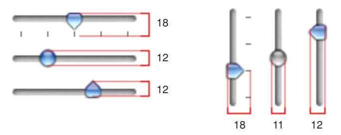

### <span id="page-137-2"></span><span id="page-137-0"></span>Tab Controls

The **tab control** provides a convenient way to present information in a multipage format. Tabs can display centered horizontally across the top or bottom edge, or centered vertically along the left or right side. Figure 7-22 shows the proper orientation of text on tabs on each of the four sides.

<span id="page-137-1"></span>**Figure 7-22** Orientation of tab text on each side


<span id="page-137-3"></span>The content area below a tab is called a **pane.** You can use other controls, such as push buttons and text entry fields, in tabbed windows too. The controls can be global—affecting the settings of all panes—or specific to an individual pane; make it clear through labeling and placement (within or outside of a tab pane's boundary) whether a control affects one pane or all panes.

### <span id="page-138-3"></span><span id="page-138-0"></span>Tab Control Specifications

<span id="page-138-1"></span>**Figure 7-23** Tab control dimensions

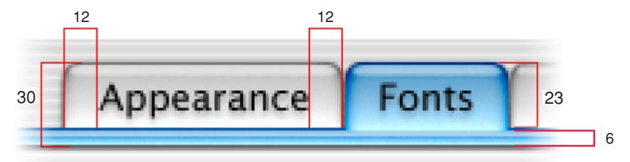

Tabs use the system font.

<span id="page-138-2"></span>**Figure 7-24** Small tab control dimensions


Small tabs use the small system font.

- **Text**: System font (13-point Lucida Grande), centered in tab with 12 pixels on each side. Small tabs: Small system font (11-point Lucida Grande), centered in tab with 10 pixels on each side.
- **Tab height:** 23 pixels. Small: 20 pixels
- **Accent bar height:** 6 pixels. Small: 5 pixels.

Tab panes can extend from one edge of a window to the other, or they can be inset within a window. Figure 7-25 shows an example of tab panes that extend from one edge of a window to the other.

<span id="page-139-0"></span>**Figure 7-25** Tab panes edge to edge

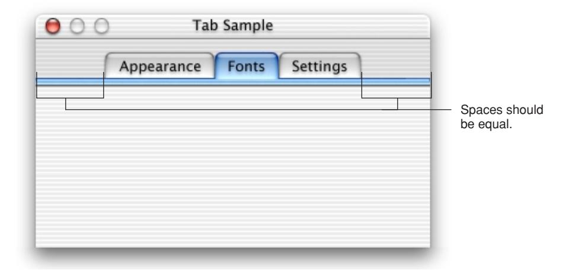

For inset tab panes, the recommended inset is 20 pixels on each side within a window, although 16 is also allowed. You can define a window so space remains below the tab pane for global controls such as push buttons. Figure 7-26 shows an example of tab panes inset within a window, with buttons below the panes.

<span id="page-140-3"></span><span id="page-140-1"></span>**Figure 7-26** Tab panes inset from edge of window


### <span id="page-140-2"></span><span id="page-140-0"></span>Progress Indicators

**Progress indicators** inform users about the status of lengthy operations. (For guidelines on when to provide such information, see ["Feedback and](#page-28-1)  [Communication" \(page 29\)\)](#page-28-1). There are two types of progress indicators:

- **Determinate:** Use when the full length of an operation can be determined and the user can see how much of the process has been completed. You could use a determinate progress indicator to show the progress of a file conversion, for example.
- **Indeterminate:** Use when the duration of a process can't be determined. You might use an indeterminate progress indicator to let the user know that the application is attempting a dialup communication connection, for example, when there's no way to accurately determine how long it will take to complete. If an indeterminate process reaches a point where its duration can be determined, switch to a determinate progress indicator.

Typical progress indicators look like the bars shown in Figure 7-27. In a determinate progress bar, the "fill" moves from left to right, and should fill in completely before it is dismissed. An indeterminate progress bar displays a spinning striped cylinder to indicate an ongoing process.

<span id="page-141-0"></span>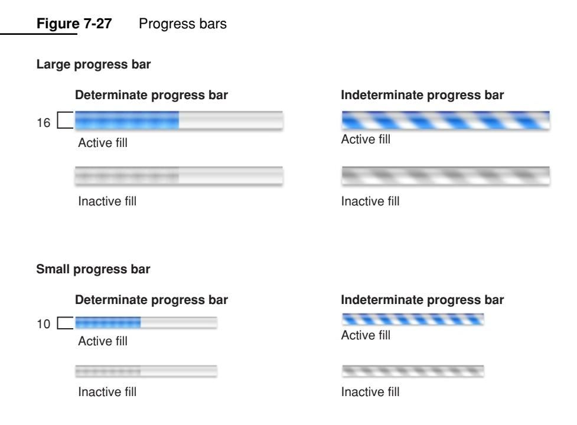

Determinate progress bars should associate progress with time. A progress bar that becomes 90-percent complete in 5 seconds but takes 5 minutes for the remaining 10 percent, for example, would be annoying and lead users to think that something is wrong.

Progress indicators typically appear within a progress dialog. When the process being performed can be interrupted, the progress dialog should contain a Cancel button (and support the Escape key). If interrupting the process will result in possible side effects, the button should say Stop instead of Cancel.

<span id="page-142-2"></span>An alternative to the indeterminate progress bar, **spinning arrows** (see Figure 7-28) can be used when space is very constrained. They are best used for asynchronous events that take place in the background, such as retrieving messages from a server. Don't use spinning arrows in operations that start out indeterminate but could become determinate.

In Cocoa, spinning arrows are included as an alternate style of the NSProgressIndicator function. In Carbon, the function to create these arrows is CreateChasingArrowsControl.

<span id="page-142-0"></span>**Figure 7-28** Spinning arrows used instead of indeterminate progress bar


<span id="page-142-3"></span>Don't use a progress bar to display relevance. Instead, use the **relevance control** (available in Carbon via the CreateRelevanceBarControl in the Control Manager or DrawThemeTrack in Appearance Manager) shown in Figure 7-29.

<span id="page-142-1"></span>**Figure 7-29** Relevance control


### <span id="page-143-5"></span><span id="page-143-0"></span>Text Fields and Scrolling Lists

There are various kinds of controls that incorporate text:

- A **text input field**, also called an editable text field, is a rectangular area in which the user enters text or modifies existing text. The text input field can be active or disabled. It supports keyboard focus and password entry.
  - Your application's text input fields should perform appropriate edit checks. For example, if the only legitimate value for a field is a string of digits, the application issues an alert if the user types nondigits. In most cases, the appropriate time to check the data in the field is when the user clicks outside the field or presses the Return, Enter, or Tab key.
  - Combination boxes are text input fields that also contain a menu or a list of choices. See ["Combination Boxes" \(page 128\).](#page-127-2)
- <span id="page-143-9"></span><span id="page-143-2"></span>■ Use a **static text field** for informational text in a dialog (text not intended to be modified by users). Static text fields have two states: active and dimmed.
  - When it provides an obvious user benefit, static text should be selectable. Error message text, for example, should be selectable. Text that is likely to be copied so that it can be pasted accurately into another context (such as a serial number or a host name) is another example.
- <span id="page-143-7"></span>■ A **scrolling list** can contain as many items as necessary. Users can scroll through the list without selecting anything, or can click an item to select it, use Shift-click to select more than one continuous item, or use Command-click for a discontinuous selection. Users can press the arrow keys to navigate through the list and can quickly select an item by typing the first few characters.
  - If an item is too long to fit in the list box, insert ellipses in the middle and preserve the beginning and end of the item. Users often add version numbers to the end of document names, so both the beginning and end should be visible.

<span id="page-143-8"></span><span id="page-143-6"></span><span id="page-143-4"></span>Don't use scrolling lists to provide choices in a limited range. Because the full range may not be visible all at once, it can be difficult for users to understand the scope of their choices. Use sliders, discussed in ["Slider Controls" \(page 137\),](#page-136-4) instead.

### <span id="page-143-1"></span>Tools for Creating Lists

<span id="page-143-3"></span>Functions, data types, and constants for creating and managing the new **data browser** control have been added to the Control Manager. The data browser

<span id="page-144-2"></span>(available to Carbon applications) provides a convenient way to create easily customized lists and consistent sortable, movable, and resizable columns. If your application uses the data browser functions to display lists, they will always look right in Mac OS 9 and Mac OS X.

The data browser control has two versions: list view and column view. Finder windows have examples of both, selectable with the View control (in the upper-left area of the toolbar). The middle button is the list-view button; the button on the right is the column-view button.

Similar functionality is available to Cocoa developers through three classes of interface objects:

- **NSOutlineView.** You can see an example in the Mailboxes drawer of the Mail application, which can show a list hierarchy with disclosure triangles.
- **NSTableView.** You can see an example in the list of contents of a mailbox in the Mail application. It is multicolumn and row-based.
- **NSBrowser.** You can see an example in the Open dialog of a Cocoa-based application. This class provides the same sort of hierarchical data as NSOutlineView in column format.

[For more information, see the data browser control technical note, available at](http://developer.apple.com/technotes/tn/tn2009.html)  <http://developer.apple.com/technotes/tn/tn2009.html>.

### <span id="page-144-0"></span>Text Input Field Specifications

<span id="page-144-1"></span>**Figure 7-30** Text input field specifications


<span id="page-145-1"></span>**Figure 7-31** Small text input field specifications


- **Height:** 22 pixels (to accommodate the system font, which is 16 pixels high without line spacing). If you specify the small system font, the text input field dimensions are reduced proportionally. To accommodate the small system font, the text field height is 19 pixels.
- **Selection rectangle:** 16 pixels high. Small: 13 pixels.
- **Spacing:** Leave a minimum of 10 pixels between stacked text input fields (8 pixels between stacked small text input fields).
- **Text:** System font (13-point Lucida Grande Regular). Small: Small system font (11-point Lucida Grande Regular).

For more information about highlighting selections in text fields, see ["Keyboard](#page-181-0)  [Focus and Navigation" \(page 182\)](#page-181-0) and ["Selections in Text" \(page 189\)](#page-188-0).

### <span id="page-145-0"></span>Scrolling List Specifications

<span id="page-145-2"></span>**Figure 7-32** Scrolling list dimensions


When you define dimensions, make sure that the list displays only full lines of text (don't cut text off vertically), and make sure that the scrolling increment is one list element.

■ **Text:** 12 points

■ **Frame:** 3 pixels wide

### <span id="page-146-1"></span><span id="page-146-0"></span>Image Wells

Use an **image well** to display an icon or picture that serves as a drag-and-drop target. You could use a set of image wells to manage thumbnails in a clip-art catalog, for example. Don't use image wells in place of push buttons or bevel buttons.

**Figure 7-33** Image wells


Some image wells (the user picture in the Edit User pane of Accounts preferences, for example) must always contain an image. If the user can clear an image well (leaving it empty) in your application, provide standard Edit menu commands and Clipboard support.

### <span id="page-147-4"></span><span id="page-147-0"></span>Disclosure Triangles

A **disclosure triangle** allows the display, or disclosure, of information that elaborates on the primary information in a window. Disclosure triangles are used in the Finder's list view, where clicking a triangle displays a folder's contents.

<span id="page-147-1"></span>**Figure 7-34** Disclosure triangles in the Finder list view

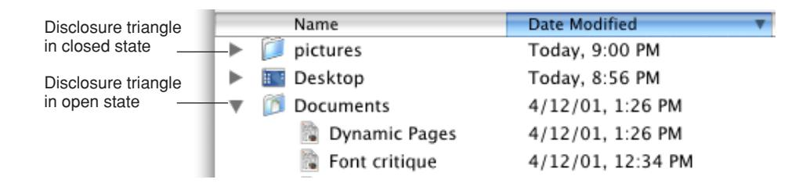

<span id="page-147-3"></span><span id="page-147-2"></span>Disclosure triangles are available to Carbon developers through the Control Manager (CreateDisclosureTriangleControl) or the Appearance Manager (DrawThemeButton). Cocoa provides this control only as part of the NSOutlineView class.

<span id="page-148-0"></span>This chapter provides basic suggestions for arranging controls in dialogs and windows. These guidelines use many of the default control sizes defined in Interface Builder; any exceptions are noted. To simplify the process of resizing and repositioning existing dialogs and windows, most values are based on a multiple of 2 pixels. All user-visible text should use the standard fonts described in "Fonts" (page 197).

The Control Manager (Carbon) and Application Kit (Cocoa) include smaller versions of the most commonly used controls, for use in utility windows when necessary. For utility window layout information, see ["Using Small Versions of](#page-159-2)  [Controls" \(page 160\)](#page-159-2).

## <span id="page-148-1"></span>Positioning Controls in Dialogs and Windows

<span id="page-148-2"></span>Keep these guidelines in mind when designing dialogs and windows:

- <span id="page-148-3"></span>■ In general, try for a more centered approach to dialog layout, as opposed to the strongly left-biased approach of the traditional Mac OS 9 dialog. Most of the sample layouts in this document illustrate the center-biased approach.
- All spacing between dialog elements involves a multiple of 2 pixels—2, 4, 6, 8, and so on.

- Maintain a 20-pixel space between the left and right edge of the window and any controls. Keep 20 pixels of space between the bottom edge and any controls; this can include the shadow of any push buttons in that area. Top spacing is determined by which controls are placed closest to the top of the dialog. For example, Figure 8-6 (page 156) uses a radio button as the topmost control, so the spacing is set to 14 pixels. In contrast, [Figure 8-7 \(page 157\)](#page-156-1) uses a tab control as the topmost element, so the spacing is set to 12 pixels.
- For dialogs that contain a mix of controls, set 16 pixels of vertical space between groups of controls. Vertical spacing between controls is determined by the tallest control in the row.
- Groups of controls should be separated by 20 pixels of vertical spacing and subgroups of controls within groups should be separated by 16 pixels.
- The default button for dismissing a dialog should go in the lower-right corner. If there's a Cancel button, it should be to the left of the default button.

If there's a third button for dismissing the dialog, it should go to the left of the Cancel button. If the third button could result in data loss—Don't Save, for example—position it at least 12 pixels away from the "safe" buttons (Cancel and Save, for example).

<span id="page-149-0"></span>A button that affects the contents of the dialog itself, such as Reset, should have its left edge aligned with the main dialog text or 12 pixels to the right of the help button (if there is one).

**Figure 8-1** Position of buttons at the bottom of a dialog


### **CHAPTER 8**

### Layout Guidelines

- The minimum screen resolution a dialog needs to accommodate is 800 by 600. (Support for 640 by 480 is provided for games.)
- <span id="page-150-1"></span>■ For most document windows that contain a single view (scrolling text or tables, for example), do not specify any space between the window edge and scroll bars (when using the Control Manager) or the frame of the view (in Interface Builder).

## <span id="page-150-0"></span>Group Boxes

<span id="page-150-2"></span>A **group box** is used to associate a set of related items—such as radio buttons or pop-up menus—in a dialog.

As much as possible, *use additional space between controls to create groups of controls, rather than group boxes.* Excessive use of group boxes creates visual clutter; too many lines and edges can distract users. Also use space or separator lines, rather than secondary group boxes, for subgroupings. The following figures show examples of how to successfully re-create dialogs using space rather than group boxes. When space alone isn't enough to clearly divide areas, use a label and a separator, as shown in the following "after" examples.

Within a group box, no control or label should be positioned within 16 pixels of the box's top, bottom, left, or right borders.

Group boxes can be untitled or titled. Titles can be static text, a checkbox label, or text in a pop-up menu.

Group Boxes **151**

<span id="page-151-0"></span>**Figure 8-2** Dialog redesigned without group boxes (first example)

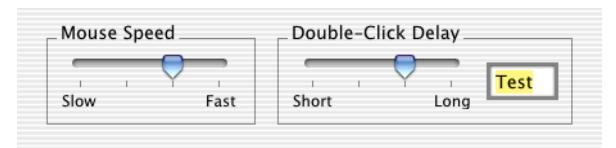

Before (with group boxes)


After (example 1, with separator)

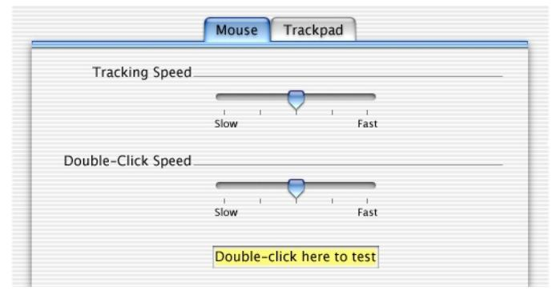

After (example 2)

In the second "after" example, the group boxes have been replaced by horizontal lines that serve as separators; the lines are 2 pixels to the right of the label and base-aligned with the label text. Although the overall look of the dialog is centered, the two labels, as well as the lines, are right-aligned; flush-left controls would imply an inappropriate hierarchy. The distance from the left edge of the pane to the label text and from the end of the line to the right edge of the pane should be equal.

<span id="page-152-0"></span>**Figure 8-3** Dialog redesigned without group boxes (second example)


Before

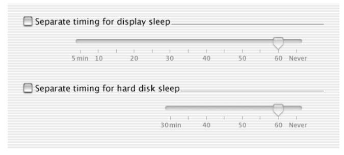

After

In the "after" example, the labels are left-aligned, since they are next to checkboxes, which are most commonly stacked vertically.

Group Boxes **153**

<span id="page-153-1"></span>**Figure 8-4** Dialog redesigned without a group box (third example)]

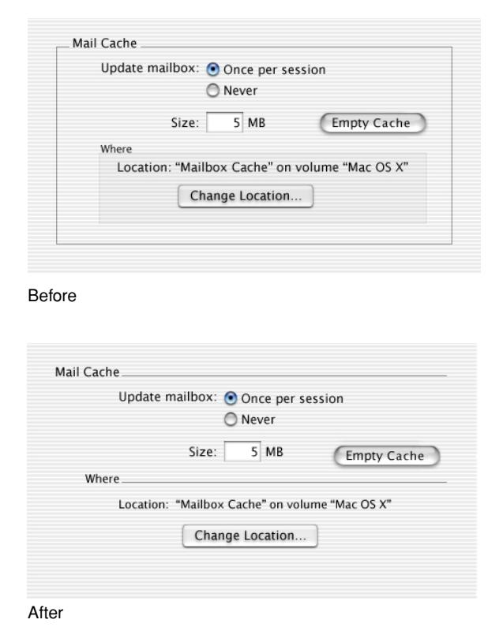

# <span id="page-153-0"></span>Sample Dialog Layouts

<span id="page-153-2"></span>This section contains sample layouts illustrating how to position various types of controls. Unless specified otherwise, all measurements are in pixels.

<span id="page-154-0"></span>**Figure 8-5** A standard alert with dimensions


<span id="page-155-0"></span>**Figure 8-6** Sample application preferences dialog

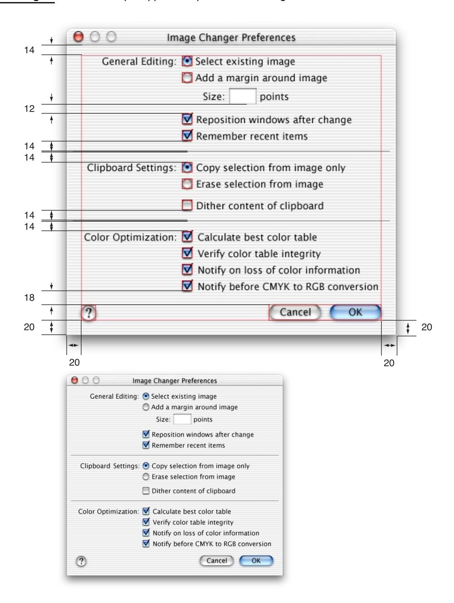

### **CHAPTER 8**

<span id="page-156-2"></span><span id="page-156-0"></span>**Figure 8-7** Sample dialogs with panes

<span id="page-156-1"></span>

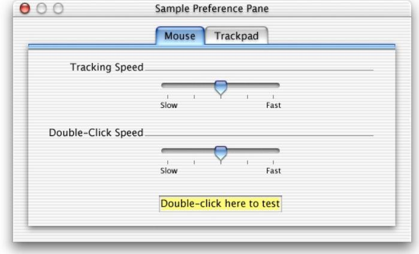

#### **CHAPTER 8**

### Layout Guidelines

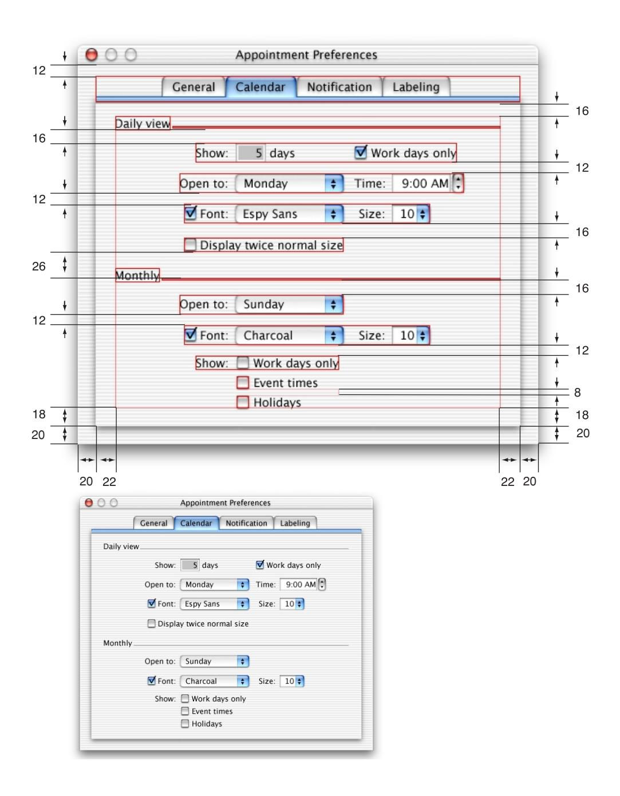

 **Apple Computer, Inc. June 2002** 

<span id="page-158-0"></span>**Figure 8-8** Sample dialog with scrolling list

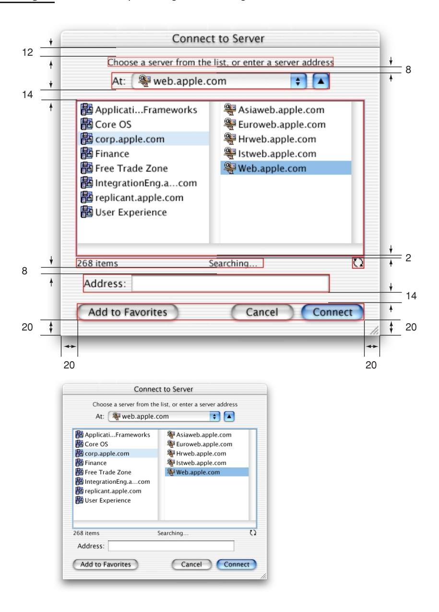

# <span id="page-159-2"></span><span id="page-159-0"></span>Using Small Versions of Controls

<span id="page-159-3"></span>Small versions of controls are available in Carbon and Cocoa. Use the smaller versions only when absolutely necessary, and use them sparingly. When converting existing dialogs for use with Aqua, redesign layouts as necessary, rather than relying on the smaller versions of controls. Your first choice in designing for Aqua should always be to use the full-size controls.

You can use small versions of controls when space is at an extreme premium, such as in tool palettes or other utility windows. Avoid mixing full-size and small versions of controls in the same window. In a tabbed window, it is acceptable to use small controls within the pane and standard controls outside the pane. However, all panes of a tabbed window should use the same-size controls.

<span id="page-159-4"></span>Figure 8-9 shows the specifications for small scroll bars and the resize control. [Figure 8-10](#page-160-1) shows a sample utility window using small controls.

<span id="page-159-1"></span>**Figure 8-9** Sample window using small scroll bars and resize control


<span id="page-160-0"></span>**Figure 8-10** Sample utility window using small controls

<span id="page-160-1"></span>

<span id="page-160-2"></span>

#### **CHAPTER 8**

<span id="page-162-5"></span><span id="page-162-0"></span>Like other graphical user interfaces, Mac OS X is optimized for use with a pointing device, such as a mouse. Many users, however, prefer or need to interact with the computer using the keyboard instead of the mouse. In Mac OS X (version 10.1 and later), users have the option of enabling keyboard access for all functions available using a point-and-click device.

# <span id="page-162-1"></span>The Mouse and Other Pointing Devices

<span id="page-162-4"></span>In the Macintosh interface the standard pointing device is the mouse. Users can substitute other devices—such as trackballs and stylus pens—that maintain the behavior of direct manipulation of objects on screen.

<span id="page-162-3"></span>Moving the mouse without pressing the mouse button moves the **pointer.** The onscreen pointer can assume different shapes according to the context of the application and the pointer's position. For example, in a word processor, the pointer takes the I-beam shape while it's over the text and changes to an arrow when it's over a tools palette. Change the pointer's shape *only* to provide information to the user about changes in the pointer's function.

<span id="page-162-2"></span>Each pointer has a **hot spot**—the portion of the pointer that must be positioned over a screen object before mouse clicks have an effect on the object. The hot spot should be intuitive, such as the tip of an arrow pointer or the center point of a crosshair. Screen objects have a **hot zone**—the area that the pointer's hot spot must be within in order for mouse clicks to have an effect.

### <span id="page-163-5"></span><span id="page-163-0"></span>Using the Mouse

Just *moving* the mouse changes only the pointer's location, and possibly its shape. *Pressing* the mouse button indicates the intention to do something, and *releasing* the mouse button completes the action. Pressing by itself should have no more effect than clicking does, except in well-defined areas, such as scroll arrows, where it has the same effect as repeated clicking. For example, pressing a Finder icon should select the icon but not open it.

The mouse devices provided with Macintosh computers have only one button, and these guidelines apply to single-button mice. Other input devices may include additional buttons that can be programmed to replicate functionality provided in Mac OS X through keystrokes.

### <span id="page-163-3"></span><span id="page-163-1"></span>Clicking

Clicking has two components: pushing down on the mouse button and releasing it without moving the mouse. (If the mouse moves between button down and button up, it's *dragging,* not clicking.)

The effect of a click should be immediate and obvious. If the function of the click is to cause an action (such as clicking a button), the *selection is made* when the button is pressed, and the *action takes place* when the button is released. For example, if a user presses down the mouse button while the pointer is over an onscreen button, thereby putting the button in a selected state, and then moves the pointer *off* the button before releasing the mouse button, the onscreen button is not clicked. If the user presses an onscreen button and rolls over another button before releasing the mouse, neither button is clicked.

### <span id="page-163-4"></span><span id="page-163-2"></span>Double-Clicking

Double-clicking involves a second click that follows immediately after the first click. If the two clicks are close enough to each other in terms of time (as set by the user in Mouse preferences) and location (usually within a couple of pixels), they constitute a double click.

Double-clicking is most commonly used as a shortcut for other actions, such as pressing Command-O to open a document or dragging to select a word. Because not everyone is physically able to perform a double click, it should *never* be the only way to perform an action.

Some applications support triple-clicking. For example, in a word processor, the first click sets the insertion point, the second click selects the whole word, and the third click selects the whole sentence or paragraph. Supporting more than three clicks is inadvisable.

### <span id="page-164-4"></span><span id="page-164-0"></span>Pressing

Pressing means holding down the mouse button while the mouse remains stationary. Pressing certain objects, such as scroll arrows, has the same effect as repeatedly clicking the object.

### <span id="page-164-2"></span><span id="page-164-1"></span>Dragging

Dragging means pressing the mouse button, moving the mouse to a new position, and releasing the mouse button. The uses of dragging include selecting blocks of text, choosing a menu item, selecting a range of objects, moving an icon from one place to another, and shrinking or expanding an object.

Dragging a graphic object should move the entire object (or a transparent representation of it), not just the object's outline.

Your application can restrict an object from being moved past certain boundaries, such as the edge of a window. If the user drags an object and releases the mouse button outside the boundary, the object stays in the original location. If the user drags the item out of the boundary and then back in before releasing the mouse button, the object moves to the new location. Your application can also automatically scroll a document if the user moves an object beyond the boundary of a window (see ["Automatic Scrolling" \(page 87\)\)](#page-86-0).

<span id="page-164-3"></span>Also see ["Drag and Drop" \(page 219\)](#page-218-0) for some more information about dragging and automatic scrolling.

# <span id="page-165-0"></span>The Keyboard

<span id="page-165-4"></span>The keyboard's primary use is to enter text. The keyboard may also be used for navigation, but it should always be an alternative to using the mouse. For more information about using the keyboard instead of the mouse, see ["Keyboard Focus](#page-181-2)  [and Navigation" \(page 182\)](#page-181-2).

#### **Important**

Avoid assigning any key combinations listed in the tables in this section to commands other than those specified in the tables. Even if your application doesn't support all the keyboard equivalents shown, don't assign unused combinations to commands that conflict with those specified in this section.

### <span id="page-165-1"></span>The Functions of Specific Keys

There are four kinds of keys: character keys, modifier keys, arrow keys, and function keys. A **character key** sends a character to the computer. When the user holds down a **modifier key,** it alters the meaning of the character key being pressed or the meaning of a mouse action.

<span id="page-165-5"></span>**Note:** Not all the keys described here exist on all Macintosh keyboards. Don't depend on a key as the only way for users to accomplish a task.

### <span id="page-165-3"></span><span id="page-165-2"></span>Character Keys

Character keys include letters, numbers, punctuation, the Space bar, and nonprinting characters—Tab, Enter, Return, Delete (or Backspace), Clear, and Escape (Esc). It is essential that your application use these keys consistently.

### **Space Bar**

<span id="page-166-2"></span>In text, pressing the Space bar enters a space between characters.

When full keyboard access is turned on, pressing the Space bar selects the item that currently has the keyboard navigation focus (the equivalent of clicking the mouse button).

### <span id="page-166-3"></span>**Tab**

In text-oriented applications, the Tab key moves the insertion point to the next tab stop. In other contexts, Tab is a signal to proceed; it means "move to the next item in a sequence." The next item can be a table cell or a dialog text field. Shift-Tab navigates in the reverse direction. Pressing Tab can cause data to be entered before focus moves to the next item. For more details about navigating with the Tab key, see ["Keyboard Focus and Navigation" \(page 182\)](#page-181-2).

### <span id="page-166-0"></span>**Enter**

Most applications add information to a document as soon as the user enters it. In some cases, however, the application may need to wait until a whole collection of information is available before processing it. The Enter key tells the application that the user is through entering information in a particular area of the document, such as a text field. While the user is entering text into a *text* document, pressing Enter has no effect.

If a dialog has a default button, pressing Enter (or Return) is the same as clicking it.

### <span id="page-166-1"></span>**Return**

In text, the Return key inserts a carriage return (a line break) and moves the insertion point to the beginning of the next line. In arrays, the Return key signals movement to the leftmost field one step lower (like a carriage return on a typewriter). Like Tab, pressing Return can cause data to be entered before focus moves to the next item.

If a dialog has a default button, pressing Return (or Enter) is the same as clicking it.

The Keyboard **167**

### <span id="page-167-0"></span>**Delete (or Backspace)**

Generally, if an item is selected, pressing Delete (or Backspace) removes the selection without putting it on the Clipboard. If nothing is selected, pressing Delete removes the character preceding the insertion point, without putting it on the Clipboard. The Delete key has the same effect as the Delete command in the Edit menu.

<span id="page-167-3"></span>**Note:** The Delete key is different from the Forward Delete key (labeled *Del*), which removes characters following the insertion point. See "Forward Delete (Del)" (page 175).

The Option key can be used to extend a deletion to the next semantic unit (such as a word). The Command key can extend a deletion to the next semantic unit beyond that supported by Option. Recommended key combinations for text applications are Command-Delete to delete the previous word and Command–Forward Delete to delete the next word. Option-Delete could delete either the word containing the insertion point or the part of the word to the left of the insertion point, depending on what makes the most sense in your application; Option–Forward Delete could delete the part of the word right of the insertion point.

#### <span id="page-167-1"></span>**Clear**

The Clear key has the same effect as the Delete command in the Edit menu: It removes the selection without putting it on the Clipboard. Not all keyboards have a Clear key, so don't require its use in your application.

### <span id="page-167-2"></span>**Escape**

The Escape (Esc) key basically means "let me out of here." It has specific meanings in certain contexts. The user can press Escape in the following situations:

- in a dialog, instead of clicking Cancel
- to stop an operation in progress (such as printing), instead of pressing Command-period
- to cancel renaming a file or an item in a list
- to cancel a drag in progress

<span id="page-168-2"></span>Pressing Escape should never cause the user to back out of an operation that would require extensive time or work to reenter. When the user presses Escape during a lengthy operation, display a confirmation dialog to be sure that the key wasn't pressed accidentally.

### <span id="page-168-3"></span><span id="page-168-0"></span>Modifier Keys

Modifier keys alter the way other keystrokes or mouse clicks are interpreted. You should use these keys—Shift, Caps Lock, Option, Command, and Control consistently as described here.

### <span id="page-168-5"></span>**Shift**

When pressed at the same time as a character key, the Shift key produces the uppercase alphabetic letter or the upper symbol on the key.

The Shift key is also used with the mouse for extending a selection or for constraining movements in graphics applications. For example, in some applications pressing Shift while using a rectangle tool draws squares.

### <span id="page-168-1"></span>**Caps Lock**

When activated, the Caps Lock key has the same effect on alphabetic keys as the Shift key, but it has no effect on nonalphabetic keys. When the Caps Lock key is down, the user must press Shift to type the upper character on a nonalphabetic key.

### <span id="page-168-4"></span>**Option**

When used with other keys, the Option key produces special symbols. The Key Caps application shows which keys generate each symbol.

The Option key can also be used with the mouse to modify the effect of a click or drag. For example, in some applications pressing Option while dragging an object makes a copy of the object.

The Keyboard **169**

### <span id="page-169-4"></span><span id="page-169-1"></span>**Command**

On most keyboards, the Command key is labeled with a cloverleaf symbol ( ) and an Apple logo (). Pressing the Command key at the same time as a character key tells the application to interpret the key as a command rather than a character. These key combinations are described in ["Reserved and Recommended Keyboard](#page-175-3)  [Equivalents" \(page 176\)](#page-175-3).

In some applications, the Command key is used with other keys to provide special functions or shortcuts. It can also be used with the mouse to modify the effect of a click or drag.

### <span id="page-169-5"></span>**Control**

<span id="page-169-6"></span>The Control key is used to modify the functions of other keys, with terminal-emulation programs for Control-key sequences, and, with a mouse click, to display contextual menus (see ["Contextual Menus" \(page 64\)\)](#page-63-0).

In Mac OS X 10.1 and later, Control-F7 temporarily overrides a user's preference for simple navigation or full keyboard navigation in windows and dialogs. For more information, see ["Keyboard Focus and Navigation" \(page 182\).](#page-181-2)

Cocoa developers should also consider additional behaviors, as described in the Programming Topic "Text System Defaults and Key Bindings," available on the Mac OS X developer documentation website.

### <span id="page-169-2"></span><span id="page-169-0"></span>Arrow Keys

Apple keyboards have four arrow keys: Up Arrow, Down Arrow, Left Arrow, and Right Arrow. They can be used alone or in combination with other keys. Keyboard combinations using the arrow keys should be used only for shortcuts for mouse actions. It is *never* appropriate to implement only a keyboard combination and not provide a mouse-based way to perform the same action.

### <span id="page-169-3"></span>**Appropriate Uses for the Arrow Keys**

You can use arrow keys in these ways:

■ In text, the arrow keys move the insertion point. When used with the Shift key, they extend or shrink the selection. If the user makes a selection and then presses the Right Arrow or Left Arrow, shrink the selection to zero length and place the insertion point at the right or left edge of the selection.

- In lists, the arrow keys change the selection.
- In a graphics application, the arrow keys can be used to move a selected object the smallest possible increment (one pixel or one grid unit).
- In full keyboard access mode, the arrow keys move between values within a control. This behavior is described in ["Keyboard Focus and Navigation"](#page-181-2) [\(page 182\).](#page-181-2)

Don't use the arrow keys to

- move the mouse pointer onscreen
- duplicate the function of the scroll bars

If it's important for your application to make use of the numeric keypad, don't use the Shift–arrow key combinations to extend text selections; the keypad's codes for the four Shift–arrow key combinations are the same as those for the keypad's +, \*, /, and = keys.

### **Moving the Insertion Point**

<span id="page-170-0"></span>When the insertion point moves vertically in a text document, its horizontal position is maintained in terms of screen pixels, not characters (in other words, the insertion point could move from the twenty-fifth character in a line down to the fiftieth character, depending on the font and size). As the insertion point moves from line to line, keep it as close as possible to its original horizontal position, moving it slightly left or right to the nearest new character boundary.

The Option and Command keys are used as semantic modifiers with the arrow keys. As a general rule, the Option key increases the size of the semantic unit by one compared to the arrow keys alone, and Command key enlarges the semantic unit again. The application determines what the semantic units are. In a word processor, typically the units are characters, words, lines, paragraphs, and documents. In a spreadsheet, a basic semantic unit could be a cell.

The Keyboard **171**

### **CHAPTER 9**

#### User Input

Table 9-1 describes the appropriate behavior of the arrow keys in text documents and fields. In some cases, the behavior describes what happens when the indicated keys are pressed more than once in succession.

<span id="page-171-1"></span><span id="page-171-0"></span>**Table 9-1** Moving the insertion point with the arrow keys

<span id="page-171-10"></span><span id="page-171-9"></span><span id="page-171-8"></span><span id="page-171-7"></span><span id="page-171-6"></span>

| Key                 | Moves insertion point                                                                                                                         |
|---------------------|-----------------------------------------------------------------------------------------------------------------------------------------------|
| Right Arrow         | One character to the right                                                                                                                    |
| Left Arrow          | One character to the left                                                                                                                     |
| Up Arrow            | To the line above, to the nearest character boundary<br>at the same horizontal location                                                       |
| Down Arrow          | To the line below, to the nearest character boundary<br>at the same horizontal location                                                       |
| Option–Right Arrow  | To end of current word, then to the end of the next<br>word                                                                                   |
| Option–Left Arrow   | To the beginning of the current word, then to the<br>beginning of the previous word                                                           |
| Option–Up Arrow     | To the beginning of the current paragraph, then to<br>the beginning of the previous paragraph                                                 |
| Option–Down Arrow   | To the end of the current paragraph, then to the end<br>of the next paragraph (not to the blank line after the<br>paragraph, if there is one) |
| Command–Right Arrow | To the next semantic unit, typically the end of the<br>current line, then the end of the next line                                            |
| Command–Left Arrow  | To the previous semantic unit, typically the<br>beginning of the current line, then the previous unit                                         |
| Command–Up Arrow    | Upward in the next semantic unit, typically the<br>beginning of the document                                                                  |
| Command–Down Arrow  | Downward in the next semantic unit, typically the<br>end of the document                                                                      |

<span id="page-171-11"></span><span id="page-171-5"></span><span id="page-171-4"></span><span id="page-171-3"></span><span id="page-171-2"></span>**Note:** For non-Roman script systems, Command–Left Arrow and Command–Right Arrow are reserved for changing the direction of keyboard input.

### <span id="page-172-1"></span>**Extending Text Selection With the Shift and Arrow Keys**

Table 9-2 describes how to extend text selection by pressing the Shift key with the arrow keys.

If no text is selected, the extension begins at the insertion point. If text is selected by dragging, then the extension begins at the selection boundary. For example, in the phrase *stop time,* if the user places the insertion point between the "s" and "t" and then presses Shift–Option–Right Arrow, *top* is selected. However, if the user double-clicks so the whole word is selected, and then extends the selection left or up, it's as if the insertion point were before the "s." If the user extends the selection right or down, it's as if the insertion point were between the "p" and the space after the word.

Reversing the direction of the selection deselects the appropriate unit. In the previous example, if the word *stop* is selected and the user presses Shift–Option–Right Arrow, so *stop time* is selected, and then presses Shift–Option–Left Arrow, *time* is deselected and *stop* remains selected.

<span id="page-172-2"></span><span id="page-172-0"></span>**Table 9-2** Extending text selection with the Shift and arrow keys

<span id="page-172-3"></span>

| Keys                     | Extends selection                                                                         |
|--------------------------|-------------------------------------------------------------------------------------------|
| Shift–Right Arrow        | One character to the right                                                                |
| Shift–Left Arrow         | One character to the left                                                                 |
| Shift–Up Arrow           | To the line above, to the nearest character<br>boundary at the same horizontal location   |
| Shift–Down Arrow         | To the line below, to the nearest character<br>boundary at the same horizontal location   |
| Shift–Option–Right Arrow | To the end of the current word, then to the end<br>of the next word                       |
| Shift–Option–Left Arrow  | To the beginning of the current word, then to<br>the beginning of the previous word       |
| Shift–Option–Up Arrow    | To the beginning of the current paragraph, then<br>to the beginning of the next paragraph |
|                          |                                                                                           |

The Keyboard **173**

### **CHAPTER 9**

User Input

**Table 9-2** Extending text selection with the Shift and arrow keys (continued)

<span id="page-173-4"></span>

| Keys                      | Extends selection                                                                                                                                                  |
|---------------------------|--------------------------------------------------------------------------------------------------------------------------------------------------------------------|
| Shift–Option–Down Arrow   | To the end of the current paragraph, then to the<br>end of the next paragraph (include the blank<br>line between paragraphs in cut, copy, and paste<br>operations) |
| Shift–Command–Right Arrow | To the next semantic unit, typically the end of<br>the current line                                                                                                |
| Shift–Command–Left Arrow  | To the previous semantic unit, typically the<br>beginning of the current line                                                                                      |
| Shift–Command–Up Arrow    | Upward in the next semantic unit, typically the<br>beginning of the document                                                                                       |
| Shift–Command–Down Arrow  | Downward in the next semantic unit, typically<br>the end of the document                                                                                           |

### <span id="page-173-3"></span>**Moving the Insertion Point in "Empty" Documents**

Various text-editing programs treat empty documents in different ways. Some assume that an empty document contains no characters, in which case clicking at the bottom of a blank screen causes the insertion point to appear at the top. In this situation, Down Arrow cannot move the insertion point into the blank space because there are no characters there.

Other applications treat an empty document as a page of space characters, in which case clicking at the bottom of a blank screen puts the insertion point where the user has clicked and lets the user type characters there, overwriting the spaces. Whichever of these methods you choose for your application, it's essential that you be consistent throughout.

### <span id="page-173-2"></span><span id="page-173-1"></span><span id="page-173-0"></span>Function Keys

There are fifteen nondedicated function keys on desktop Macintosh keyboards (F1 through F15). Default function key combinations are listed in Table 9-6 (page 178). Desktop Macintosh keyboards provide the following six dedicated function keys with standard behaviors. Because not all Macintosh computers have all function keys, don't rely on these keys for critical keyboard shortcuts.

### **Help**

Pressing the Help key (or Command-? or Command-/) invokes the application's help, if it's available. If a help system isn't available, the Help key should at least display some sort of helpful screen.

### **Forward Delete (Del)**

Pressing this key deletes the character *after* the insertion point, shifting everything following the removed character one position back. The effect is that the insertion point remains stationary while it "vacuums" the character or selection ahead of it.

If something is selected when Del is pressed, it has the same effect as pressing Delete (Backspace) or choosing Delete from the Edit menu.

You can support Option-Del to delete the next larger semantic unit, as described in "Moving the Insertion Point" (page 171), but deleting more than one word at a time is inadvisable. Users prefer to select large amounts of text with the mouse so they have more control over what they're deleting.

### **Home, End**

Pressing the Home key is equivalent to moving the scrollers all the way to the top and to the left. In a text document, for example, pressing Home scrolls to the beginning of the document; in a spreadsheet, it may scroll to the beginning of the spreadsheet or to the beginning of a row. These keys should also work in scrolling lists to display the top or bottom of the list.

End is the opposite of Home: It scrolls to the end of a document.

If the beginning or end of the document is already reached, pressing Home or End produces a system alert sound. Pressing the Home or End key has no effect on the location of the insertion point or selected data.

### **Page Up, Page Down**

Pressing Page Up or Page Down scrolls the document up or down one page (the equivalent of clicking in the gray area of the scroll bar). If an entire page can't be displayed in the window, these keys first scroll incrementally up or down, until the top or bottom of the page is visible, before scrolling to the next page. These keys should also work in scrolling lists.

The Keyboard **175**

<span id="page-175-5"></span>If the beginning or end of the document is reached, pressing Page Up or Page Down produces a system alert sound. Pressing the Page Up or Page Down key has no effect on the location of the insertion point or selected data.

### <span id="page-175-4"></span><span id="page-175-3"></span><span id="page-175-0"></span>Reserved and Recommended Keyboard Equivalents

<span id="page-175-6"></span>Mac OS X reserves certain keys and keyboard combinations for use by the system. These combinations, listed in Table 9-3 through Table 9-6, affect all applications and should not be used for any other function. To maintain a consistent and familiar user experience across applications, the keyboard equivalents listed in all other tables in this document are strongly recommended.

### <span id="page-175-1"></span>Key Combinations Reserved by the System

Don't use these keys and combinations for actions other than those specified below.

<span id="page-175-2"></span>**Table 9-3** Keyboard equivalents reserved by the operating system

| Keys                           | Action                                                                  |
|--------------------------------|-------------------------------------------------------------------------|
| Esc                            | Cancel the current action                                               |
| Command-Tab                    | Activate the next open application (according to tile<br>order in Dock) |
| Shift-Command-Tab              | Activate the previous open Dock application                             |
| Command-Option-D               | Show or hide the Dock                                                   |
| Command-H                      | Hide the active application                                             |
| Command-Option-H               | Hide other applications (all but the active one)                        |
| Shift-Command-Q                | Log out                                                                 |
| Shift-Command-Option-Q         | Log out without confirmation                                            |
| Control-Shift-Command-Option-Q | Force log out without confirmation                                      |
| Command-Option-Escape          | Open Force Quit dialog                                                  |
| Control-F1                     | Turn full keyboard navigation on or off                                 |

### **CHAPTER 9**

#### User Input

Table 9-4 shows several key combinations that are reserved for use with localized versions of system software, localized keyboards, keyboard layouts, and input methods. These key combinations don't correspond directly to menu commands.

<span id="page-176-5"></span>**Table 9-4** Key combinations reserved for international systems

<span id="page-176-4"></span><span id="page-176-3"></span><span id="page-176-2"></span><span id="page-176-1"></span>

| Keys                           | Action                                                               |
|--------------------------------|----------------------------------------------------------------------|
| Command–Space bar              | Rotate through enabled script systems                                |
| Command–Option–Space bar       | Rotate through keyboard layouts and input<br>methods within a script |
| Command–modifier key–Space bar | Apple reserved                                                       |
| Command–Right Arrow            | Changes keyboard layout to current layout<br>of Roman script         |
| Command–Left Arrow             | Changes keyboard layout to current layout<br>of system script        |

<span id="page-176-6"></span><span id="page-176-0"></span>Mac OS X (version 10.2 and later) provides a way for users to enlarge onscreen objects. Users can turn on the screen-zooming feature in the Seeing pane of Universal Access preferences. If your application uses any of the keyboard combinations in Table 9-5, they are overridden when zooming is turned on.

**Table 9-5** Key combinations used with screen zooming

| Key combination          | Action                        |
|--------------------------|-------------------------------|
| Option–Command–*         | Turn screen zooming on or off |
| Option–Command–+         | Zoom in                       |
| Option–Command (hyphen)  | Zoom out                      |
| Control-Option-Command-* | Invert the screen colors      |
| Option-Command-/         | Turn smoothing on or off      |
|                          |                               |

The Keyboard **177**

### **CHAPTER 9**

#### User Input

<span id="page-177-6"></span>Mac OS X 10.1 and later provides the option of **full keyboard access mode,** in which users can navigate through windows and dialogs. (See ["Full Keyboard Access](#page-183-1)  [Mode" \(page 184\).](#page-183-1))

#### **Important**

Your application should not override the implementation of keyboard focus and navigation in Mac OS X. These features provide functionality for users with special needs.

<span id="page-177-0"></span>**Table 9-6** Key combinations for moving focus in full keyboard access mode (mnemonic alternatives are in parentheses)

<span id="page-177-5"></span><span id="page-177-4"></span><span id="page-177-3"></span><span id="page-177-2"></span><span id="page-177-1"></span>

| Key combinations                      | Action                                                                                                                |
|---------------------------------------|-----------------------------------------------------------------------------------------------------------------------|
| Control-F1                            | Turn full keyboard access on or off                                                                                   |
| Control-F7                            | Temporarily override the current keyboard access mode in<br>windows and dialogs                                       |
| Control-F2 (Control-m)*               | Move focus to the menu bar                                                                                            |
| Control-F3 (Control-d)*               | Move focus to the Dock                                                                                                |
| Control-F4 (Control-w)                | Move focus to the active (or next) window                                                                             |
| Control-F5 (Control-t)*               | Move focus to the toolbar                                                                                             |
| Control-F6 (Control-u)*               | Move focus to the first (or next) utility window (palette)                                                            |
| Shift-Control-F6<br>(Shift-Control-w) | Move focus to the previous utility window                                                                             |
| Control-Tab                           | Move focus to the next grouping of controls in a dialog or the<br>next table (when Tab moves to next cell)            |
| Shift-Control-Tab                     | Move focus to the previous grouping of controls                                                                       |
| Command-Tab                           | Movs focus to the first (or next) open application's Dock icon                                                        |
| Shift-Command-Tab                     | Move focus to the previous open application's Dock icon                                                               |
| Arrow key                             | Move focus to the next or previous value in a text field or certain<br>controls, such as menus; also opens Dock menus |

<sup>\*</sup> Users can change these default combinations in the Full Keyboard Access pane of Keyboard preferences. When full keyboard access is on, user-defined combinations override any combinations used in applications.

**Table 9-6** Key combinations for moving focus in full keyboard access mode (mnemonic alternatives are in parentheses) (continued)

| Key combinations  | Action                                                                                                                                            |
|-------------------|---------------------------------------------------------------------------------------------------------------------------------------------------|
| Control–arrow key | Move focus to another value or cell within a control such as a<br>table                                                                           |
| Command-~         | Activate the next open window in the frontmost application                                                                                        |
| Shift-Command-~   | Activate the previous open window in the frontmost application                                                                                    |
| Space bar         | Select the highlighted control (equivalent to clicking the mouse<br>button)                                                                       |
| Return (Enter)    | Select the default button                                                                                                                         |
| Escape            | Cancel a dialog or a selection in a pop-up menu or list; in a Dock<br>menu, Escape closes the menu and moves the focus to the<br>frontmost window |

<sup>\*</sup> Users can change these default combinations in the Full Keyboard Access pane of Keyboard preferences. When full keyboard access is on, user-defined combinations override any combinations used in applications.

### <span id="page-178-0"></span>Recommended Keyboard Equivalents

Avoid using these keyboard equivalents for functions other than those listed here.

<span id="page-178-9"></span><span id="page-178-1"></span>**Table 9-7** Recommended keyboard equivalents

<span id="page-178-7"></span><span id="page-178-6"></span><span id="page-178-5"></span><span id="page-178-4"></span><span id="page-178-2"></span>

| Menu        | Keys      | Command                               |
|-------------|-----------|---------------------------------------|
| Application | Command-Q | Quit                                  |
| Window      | Command-M | Minimize                              |
| File        | Command-N | New                                   |
| File        | Command-O | Open                                  |
| File        | Command-W | Close                                 |
| File        | Command-S | Save                                  |
|             | Command-D | Don't Save (in a confirmation dialog) |
|             |           |                                       |

<span id="page-178-8"></span><span id="page-178-3"></span>The Keyboard **179**

### **CHAPTER 9**

User Input

**Table 9-7** Recommended keyboard equivalents

<span id="page-179-13"></span><span id="page-179-11"></span><span id="page-179-10"></span><span id="page-179-9"></span><span id="page-179-8"></span><span id="page-179-6"></span><span id="page-179-5"></span><span id="page-179-4"></span><span id="page-179-3"></span>

| Menu        | Keys            | Command                                                           |
|-------------|-----------------|-------------------------------------------------------------------|
| File        | Command-P       | Print                                                             |
| Edit        | Command-Z       | Undo                                                              |
| Edit        | Command-X       | Cut                                                               |
| Edit        | Command-C       | Copy                                                              |
| Edit        | Command-V       | Paste                                                             |
| Edit        | Command-A       | Select All                                                        |
| Edit        | Command-F       | Find                                                              |
| Edit        | Command-G       | Find Again                                                        |
| Format      | Command-T       | Open Fonts window                                                 |
| Format      | Command-B       | Bold                                                              |
| Format      | Command-I       | Italic                                                            |
| Format      | Command-U       | Underline                                                         |
|             | Command-~       | Activate the next open window in the<br>frontmost application     |
|             | Shift-Command-~ | Activate the previous open window in the<br>frontmost application |
| Application | Command-,       | Preferences                                                       |

## <span id="page-179-14"></span><span id="page-179-12"></span><span id="page-179-7"></span><span id="page-179-2"></span><span id="page-179-1"></span><span id="page-179-0"></span>Creating Your Own Keyboard Equivalents

Apple reserves the right to reserve other keyboard equivalents in the future, so be careful about adding your own, and add them *only for frequently used commands.*

Use the Command key as the main modifier key for keyboard equivalents. For a command that complements another more common command, you can add Shift. The table below shows some recommended keyboard equivalents using Shift.

**Table 9-8** Some of the recommended keyboard equivalents using Shift to complement other commands

| Keys             | Command                              | Complemented command   |
|------------------|--------------------------------------|------------------------|
| Shift-Command-A  | Deselect All                         | Command-A (Select All) |
| Shift-Command-G  | Find Previous                        | Command-G (Find Again) |
| Shift-Command-P  | Page Setup                           | Command-P (Print)      |
| Shift-Command-S  | Save As                              | Command-S (Save)       |
| Shift-Command-V  | Paste as (Quotation, for<br>example) | Command-V (Paste)      |
| Shift-Command-Z* | Redo                                 | Command-Z (Undo)       |

<sup>\*</sup> This combination would be used only if Undo and Redo are separate commands (rather than toggled using Command-Z).

If there's a third, less common command that's related to a pair of commands that use Command and Shift-Command, you can use Option-Command for the third command's keyboard equivalent. In the example in Table 9-9, Save All could be a dynamic menu item (see ["Menu Behavior" \(page 49\)](#page-48-0)) that appears in place of Save when the user presses the Option key (rather than a separate menu item). Use combinations like these very rarely.

<span id="page-180-0"></span>**Table 9-9** Example of using Option to modify a shortcut already using Command

| Keys             | Command  |
|------------------|----------|
| Command-S        | Save     |
| Shift-Command-S  | Save As  |
| Option-Command-S | Save All |

The Keyboard **181**

Also use Option for a keyboard equivalent that is a convenience or power user feature. For example, the Finder uses Option-Command-W for Close All Windows and Option-Command-M for Minimize All Windows.

Remember that other languages may require modifier keys to generate certain characters. For example, on a French keyboard, you generate the "{" character by pressing Option-5. You can safely modify any character with the Command key, but avoid using Command and an additional modifier with characters not available on all keyboards. If you must use a modifier key in addition to the Command key, use them only with the alphabetic characters (*a* through *z*).

### <span id="page-181-4"></span><span id="page-181-3"></span><span id="page-181-2"></span><span id="page-181-0"></span>Keyboard Focus and Navigation

When using the mouse is undesirable, difficult, or impossible, users can move the onscreen focus (highlight) with the keyboard to access controls, menus, the Dock, toolbars, and so on. In Roman systems, focus always begins at the first field that accepts keyboard input and follows a reading path from upper left to bottom right.

<span id="page-181-1"></span>Focus is indicated with a ring in the appearance color (Aqua or Graphite).

**Figure 9-1** Keyboard focus for a text field


<span id="page-182-0"></span>**Figure 9-2** Keyboard focus for a scrolling list


<span id="page-182-1"></span>In list and column views, a selected item should be highlighted across the full row. In column view, the selected item has a dark highlight and the folders containing the item have a lighter highlight. When a window becomes inactive, all selections inside it should become the lighter highlight color.

**Figure 9-3** Primary and secondary highlight colors in columns


The Keyboard **183**

<span id="page-183-10"></span><span id="page-183-8"></span>Navigation between most controls in achieved by pressing the Tab key and the arrow keys. Shift-Tab navigates in reverse direction.

### <span id="page-183-1"></span><span id="page-183-0"></span>Full Keyboard Access Mode

<span id="page-183-7"></span><span id="page-183-5"></span>In **default keyboard access mode,** focus moves only between fields that receive keyboard input, such as text entry fields, list boxes that support type-ahead, and scrolling lists. Mac OS X 10.1 and later provides the option of **full keyboard access mode,** in which users can navigate through windows and dialogs. Cocoa and Carbon applications that use system controls get this functionality automatically in Mac OS X version 10.2. For a complete list of the key combinations reserved in full keyboard access mode, see Table 9-6 (page 178).

<span id="page-183-4"></span>Users can turn on full keyboard access in the Full Keyboard Access pane of Keyboard preferences. Control-F1 is a reserved keyboard equivalent for turning full keyboard access on or off; don't use this combination for any other purpose. Control-F7 temporarily overrides the current mode in windows and dialogs.

<span id="page-183-2"></span>In full keyboard access mode, the arrow keys move between values within a control. For example, if the user selects a slider with the Tab key, the arrow keys move the slider control along the slider track. For vertically oriented choices, such as menu items, the Up Arrow and Down Arrow keys move the selection. For horizontally oriented choices, such as a row of tabs, the Right Arrow and Left Arrow keys move the selection. In some cases, it makes sense to support both orientations. For example, a vertical slider could use both the Up Arrow and the Right Arrow to increase the value.

<span id="page-183-9"></span>In some cases, such as radio buttons, moving the focus to an item selects it as well. In other cases, such as push buttons, the user chooses a selected item by pressing the Space bar. In full keyboard access mode, pressing the Space bar is equivalent to clicking the mouse button.

<span id="page-183-6"></span>The Escape key is used to cancel a dialog and to cancel a selection in a pop-up menu or list. In a Dock pop-up menu, Escape dismisses the menu and moves focus to the frontmost window.

<span id="page-183-3"></span>The user can also quickly place focus in the menu bar, the Dock, toolbars, and utility windows using the key combinations described in Table 9-6.

### <span id="page-184-2"></span><span id="page-184-0"></span>Type-Ahead and Auto-Repeat

If the user types faster than the computer can handle or when the computer is unable to process the keystrokes, the keystrokes are queued for later processing. This queuing is called **type-ahead.** There is a limit (varying with the computer) to the number of keystrokes that can be queued, but it's usually not reached unless the user types while the application is performing a lengthy operation.

When a character key is held down for a certain amount of time, it starts repeating automatically. The user can make adjustments to this feature, called **auto-repeat,** in Keyboard preferences.

An application can tell whether keystrokes are generated by auto-repeat or by the same key being pressed numerous times. Your application can disregard auto-repeat keystrokes; it should ignore them in keyboard equivalents.

<span id="page-184-3"></span>Auto-repeat works only when the application is ready to accept keyboard input; it does not function during type-ahead.

# <span id="page-184-1"></span>Selecting

Before performing an operation on an object, the user must select it to distinguish it from other objects. There is always immediate visual feedback to show that something is selected.

Selecting an object never alters the object itself, and a selection is always undoable by clicking outside the selection.

How something is selected depends on what it is. It's useful to distinguish among three types of objects that are each dealt with in a different way when selected:

- **Text.** An application considers all text appearing together in a particular context as a block of text—a one-dimensional string of characters. A block of text can range from a single field, as in a dialog, to an entire document, as in a word processor. Regardless of where it appears, text is edited in the same way.
- **Arrays** are tabular arrangements of fields. A one-dimensional array is a *list* and a two-dimensional array is a *table*. Each field contains information such as text or graphics.

Selecting **185**

■ **Graphics.** For the purposes of this discussion, a graphic, or picture, is a discrete object that can be selected individually.

The following sections discuss the general methods of selecting and the specific methods that apply to text, arrays, and graphics.

### <span id="page-185-0"></span>Selection Methods

<span id="page-185-2"></span>This section describes various selection techniques.

**Figure 9-4** Selection techniques


### <span id="page-185-3"></span><span id="page-185-1"></span>Selection by Clicking

The most straightforward method of selecting an object is by clicking it once. Icons, for example, are selected in this way.

### <span id="page-186-4"></span><span id="page-186-0"></span>Selection by Dragging

The user can select a range of some objects by following this procedure:

- 1. The user positions the pointer at one corner of the range and presses the mouse button. This position is called the **anchor point** of the range.
- 2. Without releasing the mouse button, the user moves the pointer in any direction.
  - As the pointer moves, visual feedback indicates the objects that would be selected if the mouse button were released. For text and arrays, the selected area is continuously highlighted. For graphics, a dotted rectangle expands or contracts to show the selected area. If appropriate, the view should scroll to allow extending the selection beyond a window.
- 3. When the desired range is selected, the user releases the mouse button. The point at which the button is released is called the **active end** of the range.

### <span id="page-186-5"></span><span id="page-186-1"></span>Changing a Selection With Shift-Click

A user can extend a selection by holding down the Shift key and clicking the mouse button. This action is called **Shift-clicking.**

<span id="page-186-3"></span><span id="page-186-2"></span>A Shift-click should result in a **continuous selection**—the selection is extended to include everything between the old anchor point and the new active end. Graphics applications typically support **discontinuous selection,** in which the user can extend a selection by adding nonadjacent objects to already selected objects, and the objects *between* the current selection and the new object are *not* included in the selection. A Command-click should result in a discontinuous selection.

In text, if the user Shift-clicks within an already selected range, the new range is smaller than the old range.

In an array, a Shift-click can extend the selected range or it can move the selection from the current cell to wherever the user Shift-clicks.

Selecting **187**

### **CHAPTER 9**

#### User Input

There are two models for extending a continuous selection using Shift-click. In the **addition model,** new text is added to a current selection. In the **fixed-point model,** the user can extend the selection on either side of the insertion point. Figure 9-5 illustrates the results of three consecutive steps in both models.

<span id="page-187-1"></span>**Figure 9-5** Shift-clicking in the addition model and the fixed-point model

|                         | Addition<br>model           | Fixed-point<br>model        |
|-------------------------|-----------------------------|-----------------------------|
| Setting insertion point | This is some<br>sample text | This is some<br>sample text |
| Extending selection     | This is some                | This is some                |
| to the right.           | sample text                 | sample text                 |
| Extending selection     | This is some                | This is some                |
| to the left.            | sample text                 | sample text                 |

When considering which model to use in your application, keep in mind that the addition model provides more flexibility by allowing users to extend a selection in *both* directions.

### <span id="page-187-2"></span><span id="page-187-0"></span>Changing a Selection With Command-Click

In arrays and text in which Shift-click extends a continuous selection, the user can make discontinuous selections by holding down the Command key and clicking. Each Command-click adds the new object to the existing selection. If one of the objects selected with Command-click is already within an existing part of the selection, then it is removed from the selection instead of being added.

<span id="page-188-1"></span>**Figure 9-6** Discontinuous selection within an array

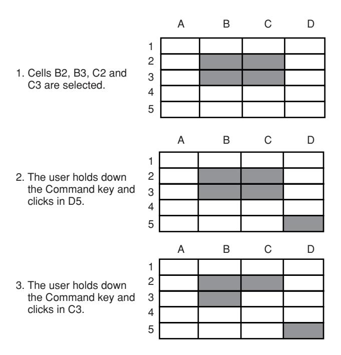

Not all applications support discontinuous selections, and those that do might restrict the operations a user can perform on them. For example, a word processor might allow the user to choose a font after making a discontinuous selection, but not allow the user to type replacement characters, because it wouldn't be obvious which part of the selection the characters would replace.

### <span id="page-188-2"></span><span id="page-188-0"></span>Selections in Text

A block of text is a string of characters. A text selection is a substring of this string, which has any length from zero characters to the whole block.

The **insertion point** (a zero-length text selection) shows where text will be inserted when the user starts typing, or where the contents of the Clipboard will be pasted. The user establishes the location of the insertion point by clicking somewhere in the text; the insertion point appears at the nearest character boundary. If the user clicks

Selecting **189**

anywhere to the right of the last character on a line, the insertion point appears immediately after the last character. If the user clicks to the left of the first character on a line, the insertion point appears immediately before the first character.

Selected text in an active window displays the highlight color chosen by the user in General preferences. When the window becomes inactive, the text should remain highlighted, but in the secondary color, which is a percentage of the original highlight color. When the window becomes active again, the text selection displays in the primary highlight color. Both Carbon and Cocoa contain functions that return the current highlight color, as well as other important colors in the user interface. Your application should use these defined colors in any custom controls you create, rather than hard-coding in specific color values.

### <span id="page-189-0"></span>Selecting With the Mouse

The user can select a range of text by dragging. A range can consist of characters, words, lines, or paragraphs, as defined by the application.

In text fields, clicking should perform the following actions:

- Single-clicking places the insertion point at the pointer's location in the text.
- <span id="page-189-3"></span>■ Double-clicking within a word selects the word. The selection should provide "smart" behavior; if the user deletes the selected word, for example, the space after the word should also be deleted.
- Double-clicking in a space selects the space.
- <span id="page-189-5"></span>■ Triple-clicking selects the next logical unit, as defined by the application. In a word-processing document, triple-clicking in a word selects the paragraph containing the word. In a table, triple-clicking selects the cell.

### <span id="page-189-4"></span><span id="page-189-2"></span><span id="page-189-1"></span>What Constitutes a Word

The following definition of a word applies in the United States, Canada, and some other countries. In many countries, the definition differs to reflect local formats for numbers, dates, and currency. Double-clicking a character *not* in the list below results in the selection of only that character.

### **CHAPTER 9**

#### User Input

A word is defined as any continuous string that contains any of the following characters:

- a letter
- a digit
- a nonbreaking space (Option-space or Command-space)
- a currency symbol (\$, ¢, £, ¥)
- a percent sign
- a comma between digits
- a period before a digit
- an apostrophe between letters or digits
- a hyphen, but not Option-hyphen (–) or Option-Shift-hyphen (—)

These are examples of words:

- \$123,456.78
- shouldn't
- 3 1/2 (with a nonbreaking space)
- .5%

These are examples of strings treated as more than one word:

- 7/10/6
- blue cheese (with a regular space)
- "Wow!" (The quotation marks and exclamation point are not part of the word.)

In some contexts—in a programming language, for example—it may be appropriate to allow users to select both the left and right parentheses (or braces or brackets) in a pair, as well as all the characters between them, by double-clicking either one of them. That would mean that a user could select the entire expression

$$[x+y-(4*3)^{n-1}]$$

by double-clicking [ or ].

For more information about defining strings as words, see *Inside Macintosh: Text.*

Selecting **191**

### <span id="page-191-6"></span><span id="page-191-0"></span>Selecting Text With the Arrow Keys

See "Extending Text Selection With the Shift and Arrow Keys" (page 173).

### <span id="page-191-5"></span><span id="page-191-1"></span>Selections in Graphics

There are several conventions for selecting graphic objects. This section describes two ways to show selection feedback; other situations may require other solutions.

An object-based graphics document is a collection of individual graphic objects. To select an object, the user clicks it once. The object is then bracketed with handles, which the user can use to move or resize the item.

In object-based graphics applications, there are two ways to select more than one object at a time. A user can drag a dotted rectangle and select every object that falls completely within the rectangle's outline, or the user can use the Shift key to select particular objects.

In a bitmap-based graphics document—where images are a series of pixels rather than discrete objects—a user selects the range of pixels enclosed within a selection tool.

### <span id="page-191-4"></span><span id="page-191-2"></span>Selections in Arrays and Tables

To select a single field (cell), the user clicks in it. The user can also select a field by moving to it with the Tab or Return key.

To select part of the contents of a field, the user must first select the field, then click again to select the desired part.

A user should be able to select a row or column in a table by clicking a header, for example. Tables can also support Command-click for selecting discontinuous fields.

Pressing the Tab key cycles through the fields in an order determined by your application, and Shift-Tab navigates in the opposite direction. Typically, the sequence is from left to right, then from top to bottom. Pressing Tab from the last field selects the first field.

<span id="page-191-3"></span>The Return key selects the first field in the next row; Shift-Return selects the previous row. If the concept of rows doesn't make sense in a particular context, the Return key should have the same effect as the Tab key.

# <span id="page-192-0"></span>Editing Text

<span id="page-192-3"></span>In addition to the methods for selecting text, there are a number of ways to edit text.

### <span id="page-192-5"></span><span id="page-192-1"></span>Inserting Text

To insert text, the user positions the insertion point by clicking where the text is to go, then starts typing. The application moves the insertion point to the right (or left, depending on the language) as each new character is added.

Applications with multiple-line text blocks should support **word wrap,** the automatic continuation of text from the end of one line to the beginning of the next without breaking in the middle of a word.

### <span id="page-192-4"></span><span id="page-192-2"></span>Deleting Text

When the user presses the Delete (or Backspace) key, one of two things happens:

- If text is selected, the entire selection is deleted.
- If there is no current selection, the character preceding the insertion point is deleted.

In either case, the insertion point replaces the deleted character or characters in the document. The deleted characters don't go on to the Clipboard, but the user can undo the deletion by immediately choosing Undo from the Edit menu.

You can also implement the keyboard combination Option-Delete (or Option-Backspace) to delete the word that currently contains the insertion point or to delete the part of the word to the left of the insertion point. Be sure to document this behavior if you implement it.

If a keyboard has a Forward Delete (Del) key, the character following the insertion point is deleted each time the user presses the key.

Editing Text **193**

### <span id="page-193-3"></span><span id="page-193-0"></span>Replacing a Selection

If the user starts typing when one or more characters are selected, the typed characters replace the selection. The deleted characters don't go on to the Clipboard, but the user can undo the replacement by immediately choosing Undo from the Edit menu.

### <span id="page-193-2"></span><span id="page-193-1"></span>Intelligent Cut and Paste

Intelligent cut and paste is a set of editing features that takes into account the need for spaces between words. To understand why this feature is helpful, consider the following sequence of events in a text application *without* intelligent cut and paste:

1. A sentence in the user's document reads

*Returns are only accepted if the merchandise is damaged.*

The user wants to change this to

*Returns are accepted only if the merchandise is damaged.*

- 2. The user selects the word *only* by double-clicking. The letters are highlighted, but neither adjacent space is selected.
- 3. The user chooses Cut from the Edit menu, clicks just before the word *if,* and chooses Paste.
- 4. The sentence now reads

*Returns are accepted onlyif the merchandise is damaged.*

To correct the sentence, the user has to remove the extra space between *are* and *accepted,* and add a space between *only* and *if.*

If your application supports intelligent cut and paste, follow these guidelines:

- If the user selects a word or a range of words, the selection itself is highlighted, but spaces adjacent to the selection are not highlighted.
- When the user chooses Cut, if the character preceding the selection is a space, cut that space along with the selection. If the character preceding the selection is not a space, but the character following the selection is a space, cut that space along with the selection.

■ When the user chooses Paste, if the character to the left or right of the current selection is part of a word (but not inside a word), insert a space before pasting.

Use intelligent cut and paste only if the application supports the definition of a word as described in ["What Constitutes a Word" \(page 190\)](#page-189-2). These rules apply to any selection consisting of one or more whole words, no matter how the user made the selection.

<span id="page-194-1"></span>**Note:** Intelligent cut and paste doesn't apply to all languages. Thai, Chinese, and Japanese, for example, don't contain spaces.

### <span id="page-194-0"></span>Editing Text Fields

If your application isn't primarily a text application, but it has text entry fields in dialogs, for example, you may not need to provide the full text-editing features described in this section. The application should, however, be forward-compatible with the full text-editing capabilities. The application should support the following capabilities:

- The user can select the whole field and type in a new value, delete text, select a substring of the field and replace it, and select a word by double-clicking.
- The user can choose Undo, Cut, Copy, Paste, and Delete, as described in ["The](#page-58-0)  [Edit Menu" \(page 59\)](#page-58-0).

Your application can also support intelligent cut and paste.

Even applications with only minimal text editing should perform appropriate edit checks. For example, if the only legitimate value for a field is a string of digits, the application should alert the user if any nondigits are typed. For a more complete discussion of when to check for errors and apply changes in text fields, see ["Accepting Changes" \(page 101\).](#page-100-1)

Editing Text **195**

### <span id="page-195-1"></span><span id="page-195-0"></span>Entering Passwords

When a user types a password into a text field, each typed character should appear as a bullet, matching the number of characters typed by the user. If the user deletes a character with the Delete key, one bullet is deleted from the text field and the insertion point moves back one bullet, as if the bullet represented an actual character. Double-clicking bulleted text in a password field selects all the bullets in the text field.

When the user leaves the text field (by pressing Tab, for example), the number of bullets in the text field should be modified so that the field does not reflect the actual number of characters in the password.

# <span id="page-196-3"></span>10 Fonts

Mac OS X supports seven standard fonts for interface elements (in Roman systems). Whenever your application specifies a font, use the system-defined constants shown in Table 10-1 (page 199); avoid naming a specific font and point size. Using the system constants ensures that your application always displays the appropriate fonts, regardless of changes to the OS.

<span id="page-196-0"></span>**Figure 10-1** Mac OS X standard fonts

| Use                            | Font and size |  |
|--------------------------------|---------------|--|
| System font                    |               |  |
| System font (emphasized)       |               |  |
| Small system font              |               |  |
| Small system font (emphasized) |               |  |
| Application font               |               |  |
| Label font                     |               |  |
| Mini system font               |               |  |
|                                |               |  |

<span id="page-196-4"></span><span id="page-196-1"></span>The **system font** is used for text in menus, modeless dialogs, and titles of document windows. For an example of this font, open a Finder menu.

<span id="page-196-2"></span>**Note:** For text in lists and tables, you can use 12-point Lucida Grande Regular instead of the system font.

Fonts

<span id="page-197-3"></span><span id="page-197-2"></span>The **small system font** is used for informative text in alerts (see [Figure 6-2](#page-98-0) [\(page 99\)\)](#page-98-0). It is also the default font for headings in lists, for help tags, and for text in the small versions of many controls. You can also use it to provide additional information about settings in various windows, such as the QuickTime pane in System Preferences.

If your application creates text documents, use the **application font** as the default for user-created content.

<span id="page-197-5"></span><span id="page-197-4"></span>The **label font** is used for labels with controls such as sliders and icon bevel buttons. You should rarely need to use this font in dialogs, but may find it useful in utility windows when space is at a premium. For an example of this font used to label a slider control, click the Text-to-Speech tab in Speech preferences.

If necessary, the **mini system font** can be used for utility window labels and text. (Use it wherever you used 9-point Geneva in Mac OS 9.)

Use **emphasized system fonts** sparingly. Emphasized (bold) system font is used in only two places in the interface: the application name in an About window (see ["The About Window" \(page 92\)](#page-91-0)) and the message text in an alert (see [Figure 6-2](#page-98-0) [\(page 99\)\)](#page-98-0). You might use emphasized small system font to title a group of settings that appear without a group box, or for brief informative text below a text field. For an example of the emphasized small system font, click the Date or Numbers tab in International preferences.

<span id="page-197-1"></span><span id="page-197-0"></span>To have the Aqua look and feel, all user-visible text in your application should be anti-aliased. this can be achieved by using one of the system fonts listed. Carbon developers creating nonstandard interface elements with text or displaying any user-visible text are responsible for drawing their own anti-aliased text via the Appearance Manager DrawThemeTextBox functions or the Control Manager static text control. In Cocoa, all text is anti-aliased by default.

#### **CHAPTER 10**

#### Fonts

<span id="page-198-2"></span><span id="page-198-1"></span>For user-created text, Carbon developers should use the Multilingual Text Engine (MLTE) functions and Apple Type Services for Unicode Imaging (ATSUI) to provide text-editing support. Carbon developers can use the NSTextField or NSTextView classes. Table 10-1 shows the constants to use in Carbon functions and the NSFont methods to use in Cocoa.

<span id="page-198-0"></span>**Table 10-1** Font constants and methods in Carbon and Cocoa

| Font                            | Appearance Manager constants    | Application Kit methods                                          |
|---------------------------------|---------------------------------|------------------------------------------------------------------|
| System font                     | kThemeSystemFont                | [NSFont systemFontOfSize:[NSFont<br>systemFontSize]]             |
| Emphasized system<br>font       | kThemeEmphasizedSystemFont      | [NSFont<br>boldsystemFontOfSize:[NSFont<br>systemFontSize]]      |
| Small system font               | kThemeSmallSystemFont           | [NSFont systemFontOfSize:[NSFont<br>smallSystemFontSize]]        |
| Emphasized small<br>system font | kThemeSmallEmphazisedSystemFont | [NSFont<br>boldSystemFontOfSize:[NSFont<br>smallSystemFontSize]] |
| Label font                      | kThemeLabelFont                 | [NSFont labelFontOfSize:[NSFont<br>labelFontSize]]               |
| Mini system font                | kThemeUtilityWindowTitleFont    | [NSFont paletteFontOfSize:0]                                     |

**CHAPTER 10**

Fonts

<span id="page-200-1"></span><span id="page-200-0"></span>This chapter describes the overall philosophy behind Aqua icons and how to design application, document, toolbar, and other types of icons for Mac OS X.

Icon design in Mac OS X is significantly different from previous versions of the Mac OS. In Mac OS 9 and earlier, graphic limitations constrained designers to use a highly symbolic style. Icons consisted of "jaggy" illustrations that emphasized straight lines rotated in increments of 45 degrees.

**Figure 11-1** Traditional application icon and Mac OS X icon


Aqua offers a new photo-illustrative icon style—it approaches the realism of photography, but uses the features of illustrations to convey a lot in a small space. Icons can be represented in 128 x 128 pixels to allow ample room for detail. Anti-aliasing makes curves and nonrectilinear lines possible. Alpha channels and translucency allow for complex shading and dimensionality. All of these qualities pave the way for lush imagery that enables you to create vibrant icons that communicate in ways never before possible.

<span id="page-201-1"></span>To represent your application in Mac OS X, it's essential to create high-quality Aqua-style application icons that scale well in the various places the icon appears the Dock, Finder previews, alert dialogs, and so on.

# <span id="page-201-0"></span>Icon Genres and Families

<span id="page-201-3"></span><span id="page-201-2"></span>A new concept in Mac OS X is the notion of icon genres, which help communicate what you can do with an application before you open it. Applications are classified by role—user applications, software utilities, and so on—and each category has its own icon style. This differentiation is very important for helping users easily distinguish between types of icons in the Dock.

**Figure 11-2** Application icons of different genres—user applications and utilities—shown as they might appear in the Dock


For example, the icons for user applications are colorful and inviting, while utilities have a more serious appearance. Figure 11-3 shows user application icons in the top row and utility icons in the bottom row. These genres are further described in ["User](#page-203-2)  [Application Icons" \(page 204\)](#page-203-2) and ["Utility Icons" \(page 207\).](#page-206-3)

**Figure 11-3** Two icon genres: User application icons in top row, utility icons in bottom row

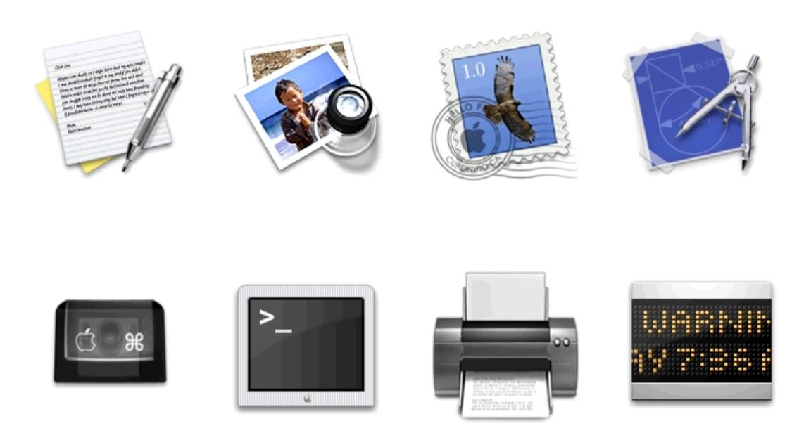

The graphic flexibility of Aqua icons can also help users identify files associated with an application. In iTunes, for example, a visual cue provided in the application icon is carried over into icons for other files associated with iTunes, forming an icon family, as shown in [Figure 11-4](#page-203-3).

<span id="page-203-3"></span>**Figure 11-4** An icon family: The iTunes application icon and its associated icons


### <span id="page-203-4"></span><span id="page-203-0"></span>Application Icons

### <span id="page-203-2"></span><span id="page-203-1"></span>User Application Icons

Mac OS X user application icons should be vibrant and inviting, and should immediately convey the application's purpose. The TextEdit icon, for example, indicates clearly that you would use this application to create text documents.

**Figure 11-5** The TextEdit application icon makes it obvious what this application is for


If the primary function of your application is creating or handling media, its icon should display the media the application creates or views. If appropriate, the icon should also contain a tool that communicates the type of task the application allows the user to accomplish. The Preview icon, for example, uses a magnification tool to help convey that the application can be used to view pictures. If you include a supportive tool element, it should closely relate to the base object that it rests upon.

**Figure 11-6** The Preview application icon: An example of a tool element


In the Stickies application icon, however, the yellow rectangles are easily identifiable as sticky notes; the icon doesn't include a tool because it isn't necessary to tell the icon's story.

**Figure 11-7** The Stickies application icon: Effective without the addition of a tool


Notice that the text in the Stickies icon is actual text, not simply wavy lines representing text. If you want to "greek" text in an Aqua icon, use actual text and make it unreadable by shrinking it or doubling the layers.

Generally, Mac OS X user application icons are designed to appear as if they're sitting on a desk in front of you. They have a slightly diminishing perspective (they are wider at the bottom). For more information, see ["Icon Perspectives and](#page-212-2)  [Materials" \(page 213\).](#page-212-2)

### <span id="page-205-0"></span>Viewer, Player, and Accessory Icons

Some applications that represent objects, such as QuickTime Player and Calculator, are most easily recognized by the objects themselves. When creating icons for such applications, it's more aesthetically pleasing to create a simplified, idealized representation of the object, rather than using an actual screen shot of the software. Re-creating the object is particularly important when users could confuse the icon with the actual interface.

**Figure 11-8** The icons for QuickTime Player, Calculator, and Chess


These icons, many of which are a precursor of what you'll see when you open the application, use a straight-on perspective (rather than the "on a desktop" user application style). You never see the Calculator on screen in three dimensions, for example, so its icon doesn't depict it that way.

### <span id="page-206-3"></span><span id="page-206-0"></span>Utility Icons

Icons for utility applications—which are used less often and not simply for fun or creative activities— convey a more serious tone than those for user applications. Color in these icons is desaturated, predominantly gray, and added only when necessary to clearly communicate what the applications do.

**Figure 11-9** Discriminating use of color in the Process Viewer and Print Center icons


<span id="page-206-4"></span>

Because utility applications are normally focused on a narrow set of tasks, it's best to keep the number of elements in the icon to a minimum. The focus should be a single object that represents what the utility does. The perspective of utility icons is straight-on, as if they are on a shelf in front of you. For more information, see ["Icon](#page-212-2)  [Perspectives and Materials" \(page 213\).](#page-212-2)

# <span id="page-206-5"></span><span id="page-206-1"></span>Non-Application Icons

### <span id="page-206-2"></span>Document Icons

Traditionally, a document icon looks like a piece of paper with its top-right corner folded down. As previously suggested, Aqua document icons should make it obvious which application they are associated with. Preview documents, for

example, include a graphic of the media (the pictures) used in the application icon. For simplicity and to avoid confusing the document with the application itself, the viewing tool is not repeated in the document icon.

**Figure 11-10** Icons for the Preview application and a Preview document


Document icons are presented as if they are hovering on the desktop, with the shadow behind the document. For more information, see ["Icon Perspectives and](#page-212-2)  [Materials" \(page 213\).](#page-212-2)

In cases where you want to put an identifying badge over a document icon, treat the badge as an integrated element within the document, instead of putting it over the top of the base image and breaking out of the overall document shape.

**Figure 11-11** Incorrect and correct badging of a document icon


### <span id="page-208-3"></span><span id="page-208-0"></span>Icons for Preferences and Plug-ins

The files that store user preferences are identified by a light switch on the left side.

**Figure 11-12** Icons for a preferences application (System Preferences) and for a file that stores preferences (for the iTunes application)


Plug-in icons look like stackable components, with the associated application identifier on the left side and a plug-in–specific image on the right.

**Figure 11-13** A plug-in icon


### <span id="page-208-2"></span><span id="page-208-1"></span>Icons for Hardware and Removable Media

Hardware icons represent devices as you most often see them: on your desk. Because these devices are also frequently handled and carried, people are familiar with them as three-dimensional objects with weight. The Aqua treatment of hardware icons reinforces their association with real objects.

**Figure 11-14** Icons for external (top row) and internal hardware devices


To help users distinguish between external devices, their icons provide a region for an identifying symbol (FireWire, SCSI, and so on).

<span id="page-209-0"></span>Removable media such as CDs, floppy disks, and PC cards are depicted the way they look when you hold them in front of you—that is, the perspective is straight on.

**Figure 11-15** Icons for removable media

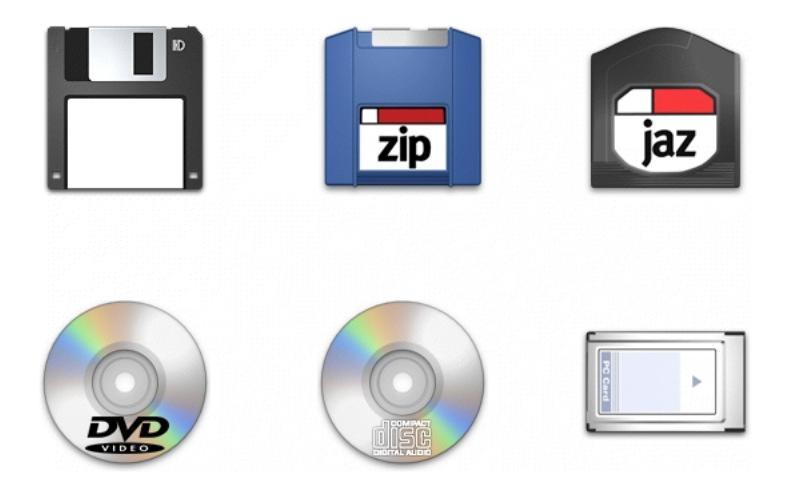

### <span id="page-210-1"></span><span id="page-210-0"></span>Toolbar Icons

The concept behind toolbars is that they provide access to items as if they were sitting on a shelf in front of you. Toolbars should conserve screen real estate while still being inviting and easily clickable; 32 pixels by 32 pixels is the recommended size for toolbar icons.

**Figure 11-16** Finder toolbar icons


Each toolbar icon should be easily and quickly distinguishable from the other items in the toolbar. Toolbar icons emphasize their outline form. As shown in Figure 11-17, each Finder toolbar icon's shape is unique.

**Figure 11-17** Toolbar icons and their dominant shapes

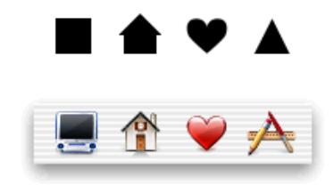

Note that although each Finder toolbar icon has a unique shape, the icons harmonize together in their perspective, use of color, size, and visual weight.

Although icons designed specifically for use in a toolbar appear as if they are sitting on a shelf in front of you, if you place a very recognizable object from elsewhere in the interface in a toolbar, the object should retain its perspective. That is, don't redesign a toolbar version of a well-known interface element.

**Figure 11-18** The circled icons appear elsewhere in the interface; they retain their perspective when used in a toolbar


<span id="page-211-0"></span>For toolbars in applications, you can start with a consistent "look" when it makes sense, and introduce differences when necessary. In the Mail application toolbar, for example, the Reply, Reply All, Forward, and Bounce buttons—all for actions the user can apply to a selected received message—use a stamp as the dominant symbol. Because the Bounce button is potentially destructive (the user can no longer read the bounced message), its icon is red. The pencil is depicted in recognizable and realistic yellow.

**Figure 11-19** The Mail toolbar

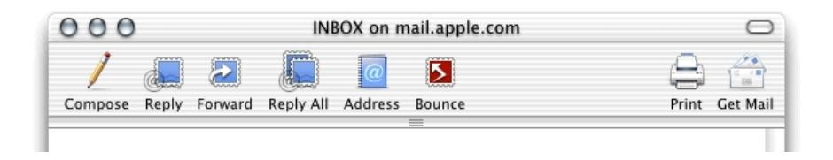

Creating a family of toolbar icons helps make an application recognizable and unique. Mail, for example, uses blue and white as dominant colors in its toolbar icons.

Also see ["Toolbars" \(page 133\).](#page-132-0)

# <span id="page-212-2"></span><span id="page-212-0"></span>Icon Perspectives and Materials

<span id="page-212-3"></span>The angles and shadows used for depicting various kinds of icons are intended to reflect how the objects would appear in reality. All Aqua interface elements have a common light source from directly above, not from the upper-left corner as in Mac OS 9 and earlier. The various perspectives are achieved by changing the position of the camera capturing the icon.

<span id="page-212-1"></span>Application icons look like they are sitting on a desk in front of you.

**Figure 11-20** Perspective for application icons: Sitting on a desk in front of you


Utility icons are depicted as if they are on a shelf in front of you. Flat objects appear as if there is a wall behind them with an appropriate shadow behind the object.

<span id="page-213-0"></span>**Figure 11-21** Perspective for flat utility icons: On a shelf in front of you, with a shadow on the wall behind

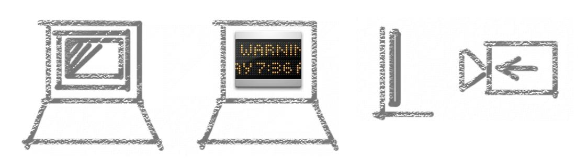

<span id="page-213-1"></span>An actual three-dimensional object such as a rocket, however, would more realistically be viewed sitting on the ground; its icon shows the rocket sitting on a shelf, with its shadow below it.

**Figure 11-22** Perspective for three-dimensional object: Sitting on a shelf in front of you, with the shadow below the object

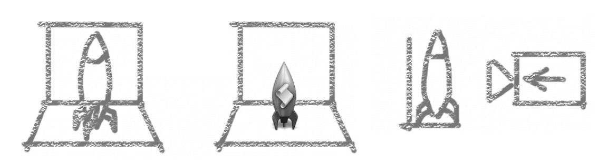

For toolbar icons, the perspective is also straight-on, as if the object is on a shelf in front of you.

**Figure 11-23** Perspective for toolbar icons: Straight-on, with subtle shadow on the "floor"


<span id="page-214-0"></span>


<span id="page-214-1"></span>

Icons that represent actual objects should look as though they are made of real materials. Examine various objects to study the characteristics of plastic, glass, paper, and metal. Your icon will look more realistic if you successfully convey the item's weight and feel, as well as its appearance.

Use transparency only when it is convincing and when it helps complete the story the icon is telling. You would never see a transparent sneaker, for example, so don't use one in your icon.

**Figure 11-24** Materials: Transparency used to convey meaning


# <span id="page-215-0"></span>Conveying an Emotional Quality in Icons

Figure 11-25 illustrates the difference between communicating a message in a straightforward way compared with presenting the same message with an emotive quality. In an appropriate context, we would recognize the figure on the left as the symbol for men's bathroom. The figure on the right, however, tells a story even when it is viewed outside of its context.

<span id="page-215-2"></span>**Figure 11-25** Being emotive: The same message conveyed two ways


<span id="page-215-4"></span><span id="page-215-3"></span>

## <span id="page-215-1"></span>Suggested Process for Creating Aqua Icons

You need to provide at least the following files:

- a 128 by 128 image (for Finder icons)
- a mask that defines the image's edges, so the operating system can determine which regions are clickable

Icons that display in the Finder are viewed at different sizes: they can be magnified in the Dock, they can be previewed at full size, and users can specify a preferred size. For the best-looking icons at all sizes, you should also provide customized image files ("hints") at three other sizes: 64 x 64, 32 x 32, and 16 x 16. Although the Dock doesn't use hints (it uses a sophisticated algorithm on the 128 x 128 version), hints are important for preserving crucial details in Finder icons.

If you are creating an icon that will never change size—on a bevel button, for example—you can supply the image only at actual size.

Here are the suggested steps for creating an icon:

### 1. Sketch the icon.

Work out the concept and details of your design on paper, not with software. You should be ready to execute the idea by the time you open an application.

### 2. Create a software illustration of the icon.

Although you may want the final icon to look like a photograph, in most cases it's inadvisable to start with an actual photograph. An illustration provides much more flexibility for conveying a concept in a very small space. An illustration also gives you necessary control over details, perspective, light and shadow, texture, and so on.

### 3. Add detail and color.

For each enhancement you make to a larger-version icon, consider whether it is truly adding something to the icon's usability, or whether it is just adding complexity or clutter.

### 4. Add shadows.

Shadows give objects dimensionality and realism. They also help tie the elements of an icon together so it doesn't look like a collage. The light source should be above and slightly in front of the object. The resulting shadow should create the sense that the icon is resting on a surface.

- 5. In an image-editing program, manipulate the image to get precise effects and create the icon mask.
- 6. Convert the icon to a .icns file.

You can complete this step with Icon Composer, included on the Mac OS X Developer Tools CD. There are also several third-party tools available for completing this step.

# <span id="page-217-0"></span>Tips for Designing Aqua Icons

<span id="page-217-2"></span>Many of the suggestions listed here also apply to graphics you develop for your application, for example, to augment a label or list item.

- For great-looking Aqua icons, have a professional graphic designer create them.
- Perspective and shadows are the most important components of making good Aqua icons. Use a single light source with the light coming from above the icon.
- Use universal imagery that people will easily recognize. Avoid focusing on a secondary aspect of an element. For example, for a mail icon, a rural mailbox would be less recognizable than a postage stamp.
- Strive for simplicity. Try to use a single object that captures the icon's action or represents the control. Start with a basic shape.
- Use color judiciously to help the icon tell its story; don't add color just to make the icon more colorful. Smooth gradients typically work better than sharp delineations of color.
- Avoid using Aqua interface elements in your icons; they could be confused with the actual interface.
- Don't use replicas of Apple hardware products in your icons. These symbols are copyrighted and hardware designs change frequently.
- <span id="page-217-1"></span>■ Design toolbar icons at their actual size (32 by 32). For other icons, concentrate on perfecting your icon's look at 128 by 128 and work down from there. It usually works best if you scale down elements independently and then combine them, rather than scaling the entire icon at once.

<span id="page-218-3"></span><span id="page-218-0"></span>The technique of dragging an item and dropping it on a suitable destination is called **drag and drop.**

In this chapter, an item is anything that the user can select, such as text, graphics, and icons. For convenience, this chapter assumes that the user is dragging with the mouse, but these guidelines also apply to other input devices such as pens and trackballs.

<span id="page-218-4"></span>In Aqua, the Finder provides a new focus to indicate the target for a drop.

# <span id="page-218-1"></span>Drag and Drop Design Overview

<span id="page-218-2"></span>Ideally, users should be able to drag any content from any window to any other window that accepts the content's type. If the source and destination are not visible at the same time, the user can create a **clipping** by dragging data to a Finder window; the clipping can then be dragged into another application window at another time.

Drag and drop should be considered an ease-of-use technique. Except in cases where drag and drop is so intrinsic to an application that no suitable alternative methods exist—dragging icons in the Finder, for example—there should always be another method for accomplishing a drag-and-drop task.

The basic steps of the drag-and-drop interaction model parallel a copy-and-paste sequence in which you select an item, choose Copy from the Edit menu, specify a destination, and then choose Paste. However, drag and drop is a distinct technique

<span id="page-219-9"></span><span id="page-219-2"></span>in itself, and the Drag Manager does not use the Clipboard. Users can take advantage of both the Clipboard and drag and drop without side effects from each other.

A drag-and-drop operation should provide immediate feedback at the significant points: when the data is selected, during the drag, when an appropriate destination is reached, and when the data is dropped. The data that is pasted should be target-specific. For example, if a user drags an Address Book entry to the "To" text field in Mail, only the email address is pasted, not all of the person's address information.

<span id="page-219-4"></span><span id="page-219-3"></span>You should implement Undo for any drag-and-drop operation you enable in your application. If you implement a drag-and-drop operation that is not undoable, display a confirmation dialog before implementing the drop. A confirmation dialog appears, for example, when the user attempts to drop an icon into a write-only drop box on a shared volume, because the user does not have privileges to open the drop box and undo the action.

# <span id="page-219-0"></span>Drag and Drop Semantics

### <span id="page-219-7"></span><span id="page-219-5"></span><span id="page-219-1"></span>Move Versus Copy

Your application must determine whether to move or copy a dragged item after it is dropped on a destination. The appropriate behavior depends on the context of the drag-and-drop operation, as described here.

<span id="page-219-8"></span><span id="page-219-6"></span>If the source and destination are in the same container (for example, a window or a volume), a drag-and-drop operation is interpreted as a move (that is, cut and paste). Dragging an item from one container to another initiates a copy (copy and paste). The user can perform a copy operation within the same container by pressing the Option key while dragging.

<span id="page-219-10"></span>You can't assume that a window is always a container; you must consider the underlying data structure of the contents in the window. For example, if your application allows two windows to display the same document (multiple views of the same data), a drag-and-drop operation between these two windows should result in a move.

#### **CHAPTER 12**

### Drag and Drop

<span id="page-220-4"></span><span id="page-220-2"></span>The principle driving these drag-and-drop guidelines is to prevent the user from accidental data loss. Moving data across applications may result in potential data loss because an Undo command in the destination application does not trigger an Undo in the source application. Moving data within the same window (or same volume, as in the case of the Finder) does not lead to data loss.

<span id="page-220-3"></span><span id="page-220-1"></span>**Table 12-1** Common drag-and-drop operations and results

<span id="page-220-5"></span>

| Dragged item       | Destination             | Result                    |
|--------------------|-------------------------|---------------------------|
| Data in a document | The same document       | Move                      |
| Data in a document | Another document        | Copy                      |
| Data in a document | The Finder              | Copy (creates a clipping) |
| Finder icon        | An open document window | Copy                      |
| Finder icon        | The same volume         | Move                      |
| Finder icon        | Another volume          | Copy                      |

### <span id="page-220-7"></span><span id="page-220-0"></span>When to Check the Option Key State

<span id="page-220-6"></span>Your application should check whether the Option key is pressed at drop time. This behavior gives the user the flexibility of making the move-or-copy decision at a later point in the drag-and-drop sequence. Pressing the Option key during the drag-and-drop sequence should not "latch" for the remainder of the sequence.

**Note:** The Option key does not act as a toggle switch; Option-dragging between containers always initiates a copy operation. This guideline allows users to learn that Option means copy.

# <span id="page-221-0"></span>Selection Feedback

<span id="page-221-5"></span>This section covers issues that deserve special mention in the context of drag and drop. Selection feedback is discussed in more detail in ["Selecting" \(page 185\)](#page-184-1).

### <span id="page-221-8"></span><span id="page-221-1"></span>Single-Gesture Selection and Dragging

<span id="page-221-6"></span>Because dragging is defined as moving the mouse while the mouse button is held down, a mouse-down event must occur before dragging can take place. A selection may be made as a result of this mouse-down event, just before the user starts dragging. For example, the user can select and drag a folder icon in a single gesture; the user does not have to click the folder icon first, release the mouse button, and then press again to begin dragging the icon. Your application should ensure that implicit selection occurs, when appropriate, when the user starts dragging.

<span id="page-221-7"></span>Single-gesture selection and dragging is possible only when the process of selecting an item does not require dragging. Range-selection operations—such as selecting text or dragging a marquee around graphic objects—don't lend themselves to single-gesture selection and dragging because the range-selection operation itself requires dragging.

### <span id="page-221-4"></span><span id="page-221-2"></span>Background Selections

<span id="page-221-9"></span>When a window containing a highlighted selection becomes inactive, your application should maintain the selection so that users can drag previously selected data from inactive windows to the active window.

<span id="page-221-3"></span>Background selections are not required if the dragged item is discrete, such as an icon or graphical object, because implicit selection can occur when an item is dragged. However, items selected only by range-selection operations such as text or a group of icons must have a background selection to allow the user to drag these items out of inactive windows. Whenever an inactive window is made active, the background selection, if any, becomes highlighted as a normal selection.

# <span id="page-222-0"></span>Drag Feedback

<span id="page-222-4"></span>Your application should provide drag feedback as soon as the user drags an item at least three pixels. If a user holds the mouse button down on an object or selected text, it should become draggable immediately and stay draggable as long as the mouse remains down. Typically, applications have to provide an image to drag and have to handle the receiver frame. In Aqua, dragged items are transparent.

# <span id="page-222-1"></span>Destination Feedback

<span id="page-222-3"></span>If the user drags an item to a destination in your application, your application provides feedback that indicates whether it will accept that item. Destination feedback should not occur simply because your application is "drag-aware"; rather, it should depend on the destination's ability to accept the type of data contained in the dragged item. For example, a text entry field that accepts only text should not be highlighted when the dragged item is a graphic.

<span id="page-222-7"></span><span id="page-222-5"></span>The actual appearance of destination feedback depends on the type of destination. The Drag Manager provides some utilities for simple highlighting; if your application needs more complex highlighting, you must provide your own highlighting utilities.

### <span id="page-222-6"></span><span id="page-222-2"></span>Windows

The valid **destination region** of a document window is usually the window's content area minus the title bar and areas used for controls (such as scroll bars, resize controls, tool palettes, rulers, and placards). When there are multiple destination regions within a window, only one destination region is highlighted at a time.

Drag Feedback **223**

When the user drags an acceptable item from one destination region to another, your application highlights the destination region as soon as the pointer enters it, and removes the highlighting when the pointer leaves the region. You can use the Drag Manager to specify your destination regions.

If a drag-and-drop operation takes place entirely within one destination region (moving a document icon to a different location in the same folder window, for example), don't highlight the destination region, to avoid distracting the user. However, if the user drags an item completely out of a destination region and then drags the same item back to the same destination region, the destination region should be highlighted.

You can provide more specific destination feedback within a larger destination region. For example, when the user drags text from one document window to another, the inactive window should display an insertion point where the dragged text would go if the user releases the mouse button.

<span id="page-223-2"></span>In many situations, highlighting a more narrowly defined area of a window is more appropriate than highlighting the entire content region; examples are spreadsheets, text boxes, fill-in forms, and panes. In these cases, the destination region must be tailored to more precisely indicate the specific destination.

### <span id="page-223-4"></span><span id="page-223-0"></span>Text

<span id="page-223-3"></span>While the user is dragging an item to a text area, an insertion indicator (a vertical bar) should appear in the text where the dragged item would be inserted if the user releases the mouse button.

### <span id="page-223-1"></span>Multiple Dragged Items

If the user drags multiple items, the destination feedback should occur only if it can accept all of the dragged items. If the destination cannot accept all of the dragged items, the user's attempt results in feedback as described in ["Feedback for an](#page-226-2)  [Invalid Drop" \(page 227\)](#page-226-2).

When the destination can accept all of the dragged items, the destination should accept them in the order specified by the source. The source application should organize the dragged items in the order in which they were selected, except in two cases. If the dragged items come from ordered views (such as View by Date or an

alphabetized list), that view's ordering takes precedence over the selection order. If both the source and destination provide a spatial ordering (such as in graphic applications), the spatial ordering takes precedence over the selection order.

### <span id="page-224-3"></span><span id="page-224-0"></span>Automatic Scrolling

When an item is being dragged, your application must determine whether to scroll the contents or allow the item to "escape" the window. If your application allows items to be dragged outside of windows, you should define an autoscrolling region. Automatically scroll a destination window only if it is also the source window and is frontmost. Don't autoscroll inactive windows.

### <span id="page-224-6"></span><span id="page-224-1"></span>Using the Trash as a Destination

The Drag Manager makes the Trash available to applications.

Dragging items to the Trash results in moving the item from the source to the Trash. For example, dragging a text selection from a word-processing application and dropping it on the Trash icon (or in the Trash window) results in the text being deleted from the application and a clipping containing that text being created inside the Trash. Note that the item is moved, although it is dragged between two containers. This exception to the rules described earlier is appropriate because the user can undo the operation by dragging the clipping out of the Trash back to its original source; it is consistent with the principle of preventing accidental data loss.

<span id="page-224-5"></span><span id="page-224-4"></span>It is important to preserve the Trash's container property; do not simply delete the source without creating a clipping or other item in the Trash.

# <span id="page-224-2"></span>Drop Feedback

When the user releases the mouse button after dragging an item to a destination, feedback should inform the user that the drag-and-drop operation was successful. While this feedback can be visual, it is primarily behavioral in nature. The behavior comes from the semantic operation indicated by the drag-and-drop sequence. Examples of this behavior are given below.

Drop Feedback **225**

### <span id="page-225-6"></span><span id="page-225-0"></span>Finder Icons

<span id="page-225-8"></span>When the user moves an item by dropping its icon on a folder icon, the dropped icon disappears and the highlighting is removed from the destination folder icon.

<span id="page-225-7"></span>If an icon represents a task, such as printing, you may want to provide progress feedback to indicate that the task is being carried out.

### <span id="page-225-1"></span>Graphics

When dropping graphics, the drop feedback is usually the movement of the actual item to the location of the mouse-up event.

### <span id="page-225-9"></span><span id="page-225-2"></span>Text

After text is dropped, it is shown highlighted at its destination.

When text is dropped in a destination that supports styled text, the dropped text should maintain its font, typeface, and size attributes. If the destination does not support styled text, the dropped text should assume the font, typeface, and size attributes specified by the destination insertion point.

Drag-and-drop operations involving text should support intelligent cut-and-paste rules, as explained in ["Intelligent Cut and Paste" \(page 194\)](#page-193-1).

### <span id="page-225-10"></span><span id="page-225-3"></span>Transferring a Selection

After a successful drag-and-drop sequence involving a single window, the selection feedback is maintained at the new location. This behavior provides an important user cue and allows the user to reposition the selection without having to make the selection again.

<span id="page-225-11"></span><span id="page-225-5"></span><span id="page-225-4"></span>If the user drags an item from an active window to an inactive window, the dragged item becomes a **background selection** at the destination; the selection in the active window remains selected. This guideline also applies in the reverse situation, where an item is dragged from an inactive window to an active window.

When content is dropped into a window in which something is selected, your application should deselect everything in the destination before the drop, rather than replacing the selection with the dragged item.

## <span id="page-226-8"></span><span id="page-226-2"></span><span id="page-226-0"></span>Feedback for an Invalid Drop

If a user attempts to drop an item on a destination that does not accept it, the item zooms from its mouse-up location back to its source location (a "zoomback"). The zoomback behavior should also occur when a drop inside a valid destination does not result in a successful operation. The Drag Manager provides this feedback when it determines that no receiver requested the sender's information.

<span id="page-226-9"></span><span id="page-226-7"></span>If the user attempts to drag multiple items to a destination that does not accept all of the items, none of the items should be accepted. In such cases you could display a dialog informing the user of the type of data the destination accepts and which items in the dragged set cannot be accepted.

# <span id="page-226-1"></span>Clippings

<span id="page-226-6"></span><span id="page-226-4"></span><span id="page-226-3"></span>When an item is dragged from an application or a Finder window to the desktop, the Finder creates a clipping that contains the data in the dragged item. If discontinuous selections are dragged from a source to the Finder, a separate clipping is created for each selected item.

<span id="page-226-5"></span>Your application should provide a number of representations (such as TEXT, PICT, and native formats) to ensure flexibility with different subsequent destinations. Regardless of which representations are stored, round-trip data integrity should be preserved; a clipping dragged back into its source should be identical to the original item.

Clippings **227**

#### **CHAPTER 12**

Drag and Drop

<span id="page-228-3"></span><span id="page-228-0"></span>Although Mac OS X uses graphics as a primary means of user-computer interaction, text is still very prevalent throughout the interface for such things as button names, pop-up menu labels, dialog messages, and onscreen help. Using text consistently and clearly is a critical component of interface design.

Your product team should include a skilled writer who is responsible for reviewing all user-visible onscreen text as well as creating the instructional documentation.

## <span id="page-228-4"></span><span id="page-228-1"></span>Style

<span id="page-228-2"></span>The *Apple Publications Style Guide (APSG)* defines style and usage issues, and is the key reference for how Apple uses language. This document is available at the Mac OS X developer documentation website; consult it whenever you have a question about the preferred style of particular terms.

For information about specific Mac OS X interface terms, see ["Mac OS X](#page-272-0)  [Terminology Guidelines" \(page 273\)](#page-272-0).

For issues that aren't covered in the *APSG* or the Mac OS X terminology appendix, Apple recommends three other works: *The American Heritage Dictionary, The Chicago Manual of Style,* and *Words Into Type*. In cases where these books give conflicting rules, *The Chicago Manual of Style* takes precedence for questions of usage and the *American Heritage Dictionary* for questions of spelling.

Style **229**

# <span id="page-229-0"></span>Terminology

### <span id="page-229-8"></span><span id="page-229-4"></span><span id="page-229-1"></span>Developer Terms and User Terms

<span id="page-229-7"></span>Don't use technical jargon or programming terms in interface elements or user documentation. Table 13-1 shows a few examples; for a more complete list, see the *Apple Publications Style Guide* (available at the Mac OS X developer documentation website).

<span id="page-229-3"></span>**Table 13-1** Translating developer terms into user terms

| Developer term    | User term equivalent                              |
|-------------------|---------------------------------------------------|
| Data browser      | Scrolling list or multicolumn list                |
| Dirty document    | Document with unsaved changes                     |
| Focus ring        | Highlighted area; area ready to accept user input |
| User-visible text | Onscreen text                                     |
| Mouse-up event    | Mouse click                                       |
| Reboot            | Restart                                           |
| Byte length       | Number of characters                              |
|                   |                                                   |

### <span id="page-229-6"></span><span id="page-229-2"></span>Labels for Interface Elements

Make labels for interface elements easy to understand and in the user's language. Try to be as specific as possible in any element that requires the user to make a choice, such as radio buttons, checkboxes, and push buttons. It's important to be concise, but don't sacrifice clarity for space.

<span id="page-229-5"></span>Menu items and buttons that produce a dialog should include an ellipses character (…). The menu command and the dialog title should match.

### <span id="page-230-8"></span><span id="page-230-3"></span><span id="page-230-0"></span>Capitalization of Interface Elements

**Title style** means that you capitalize every word except

- articles (*a, an, the*)
- coordinating conjunctions (*and, or*)
- prepositions of three or fewer letters, except when the preposition is part of a verb phrase, as in Starting Up the Computer.

In title style, always capitalize the first and last word, even if it is an article, a conjunction, or a preposition of three or fewer letters.

<span id="page-230-7"></span><span id="page-230-4"></span>**Sentence style** means that the first word is capitalized, and the rest of the words are lowercase, unless they are proper nouns or proper adjectives. Use periods in dialogs only after complete sentences.

<span id="page-230-1"></span>**Table 13-2** Proper capitalization of onscreen elements

<span id="page-230-6"></span><span id="page-230-5"></span><span id="page-230-2"></span>

| Element      | Capitalization style | Examples                                                                                     |
|--------------|----------------------|----------------------------------------------------------------------------------------------|
| Menu titles  | Title                | See the Highlight Color pop-up menu in<br>General preferences.                               |
| Menu items   | Title                | Save as Draft<br>Save As…<br>Log Out<br>Make Alias<br>Go To…<br>Go to Page…<br>Outgoing Mail |
| Push buttons | Title                | Add to Favorites<br>Don't Save                                                               |

Terminology **231**

### **CHAPTER 13**

Language

**Table 13-2** Proper capitalization of onscreen elements (continued)

<span id="page-231-3"></span>

| Element                                                                                                                         | Capitalization style | Examples                                                                                                                                |
|---------------------------------------------------------------------------------------------------------------------------------|----------------------|-----------------------------------------------------------------------------------------------------------------------------------------|
| Labels that are not full<br>sentences (for example, group<br>box or list headings)                                              | Title                | Mouse Speed<br>Total Connection Time<br>Account Type                                                                                    |
| Options that are not strictly<br>labels (for example, radio<br>button or checkbox text), even<br>if they are not full sentences | Sentence             | Enable polling for remote mail.<br>Cache DNS information every<br>minutes.<br>Show displays in menu bar.<br>Maximum number of downloads |
| Dialog messages                                                                                                                 | Sentence             | Are you sure you want to quit?                                                                                                          |

### <span id="page-231-4"></span><span id="page-231-0"></span>Using Contractions in the Interface

In cases where space is at a premium, such as in pop-up menus, contractions may be used, as long as the contracted words are not critical to the meaning of the phrase. For example, a menu could contain the following items:

Don't allow printing Don't allow modifying Don't allow copying

<span id="page-231-2"></span>In each case, the contraction does not contain the operative word for the item. But in Sherlock, for example, menu items enabling users to choose between text that "contains" and "does not contain" are communicated more clearly without the use of contractions.

# <span id="page-231-1"></span>Writing Good Alert Messages

A good alert message states clearly what caused the alert to appear and what the user can do about it. Express everything in the user's vocabulary. Here's an example of an alert message that provides little useful information:

<span id="page-232-0"></span>**Figure 13-1** A poorly written alert message


You could improve this message by describing the problem in the user's vocabulary:

<span id="page-232-1"></span>**Figure 13-2** An improved alert message


<span id="page-232-2"></span>To really make the alert useful, provide a suggestion about what the user can do to get out of the current situation:

<span id="page-233-0"></span>**Figure 13-3** A well-written alert message


<span id="page-233-1"></span>For information about when to use alerts, see ["Types of Dialogs and When to Use](#page-94-1)  [Them" \(page 95\).](#page-94-1)

<span id="page-234-4"></span><span id="page-234-2"></span><span id="page-234-0"></span>Mac OS X supports two user help components: Apple Help and help tags. CarbonLib-based applications can also use these facilities back to Mac OS 8.6.

With Apple Help, you can display HTML files in Help Viewer, a browser-like application designed for displaying onscreen help documents. Help Viewer can also display documents with QuickTime content, open AppleScript-based automations, retrieve updated help content from the Internet, and provide context-sensitive assistance.

<span id="page-234-5"></span><span id="page-234-3"></span>Help tags, which replace the help balloons introduced in System 7, give your application the ability to identify its interface elements and provide basic help information without forcing the user to leave the primary interface.

# <span id="page-234-1"></span>Apple's Philosophy of Help

When users refer to help, it is usually because they are having difficulty accomplishing a task—they know what they want to do, but not how to accomplish it. When faced with an impasse, most users first try to figure it out for themselves by exploring and experimenting with the interface. If that fails, they ask someone else for assistance; if no one is available, they may consult the onscreen help.

Users come to help with a specific goal in mind, bringing their cumulative Macintosh experience and the recent and cumulative experience of using the product. In all likelihood, they are somewhat impatient and frustrated at having failed to figure out how to accomplish their goal.

#### **CHAPTER 14**

### User Help and Assistants

To assist users in quickly locating their information and getting back to work, onscreen help should do the following:

- Focus on real-world user tasks.
- Get to the point quickly, so users can return to work.
- Be organized by task, not the layout or functionality of the software.

<span id="page-235-1"></span>In large help systems, searching is often the most efficient way to locate a particular topic, particularly when users have turned to help with a specific idea about what they are trying to accomplish. To facilitate usable search results, do the following:

- Cover one topic per page, to avoid burying some tasks.
- Title the page descriptively, using words that relate to real-world goals.
- Use Apple Help keywords to ensure synonyms and common misspellings get appropriate search results.
- Write steps and descriptions using words that appear in the interface.

Write your help so that users can quickly find the steps on the page and can follow the steps without having to repeatedly switch between the product and the Help Viewer.

- Don't repeat notes and warnings enforced by the interface. For example, if you have to click OK to confirm a setting, don't describe it in the steps—it will be apparent as the users follow the instructions.
- Tailor descriptions to the probable experience of users. For example, a user who wants to adjust kerning is likely to be already familiar with selecting a typeface and font size. A user who looks for help with basics such as opening a document may require more detailed instructions.
- <span id="page-235-0"></span>■ Automate common tasks using AppleScript. For example, if a task requires opening a preferences pane, provide an automation that opens it for users. If you can automate the entire task, do so.
- Emphasize trouble identification and resolution. Users might already know how to accomplish a task but turn to help because of a condition or requirement they can't identify. If a step or task might be impossible because of an error condition, remind users to check for it early in your instructions.

# <span id="page-236-0"></span>Help Viewer

<span id="page-236-9"></span><span id="page-236-8"></span><span id="page-236-7"></span><span id="page-236-3"></span><span id="page-236-2"></span>Use Help Viewer to display onscreen documentation. **Help Viewer** displays HTML documents, fully supports QuickTime media, provides full-text searching of help with relevancy-ranked results, and provides for task automation using AppleScript. Additionally, Help Viewer allows you to integrate Internet-based help files, permitting you to update and improve your instructions as often as necessary.

<span id="page-236-4"></span>The collection of your HTML help files is called a **help book**. When you use Help Viewer, your help book automatically becomes accessible via the Help Center, an Apple-provided location that allows users to easily browse and search all of the help available on their system.

A help book should be the primary location for your application's user instructions and information. If you provide other instructional resources, such as full-screen tutorials or "how to" articles on your website, include hyperlinks to them in your help book. Users can find these other resources by searching or browsing the help, reinforcing its usefulness as a reference.

# <span id="page-236-1"></span>Providing Access to Help

<span id="page-236-6"></span>Users can access the help system in three ways:

<span id="page-236-5"></span>■ **The Help menu.** The Help menu is the far-right item in the application region of the menu bar. The first item in the Help menu should be Application Name Help, which should open Help Viewer to the first page of your help content. It's best to have only one item in the Help menu, but if you want to add additional items that are distinct from your help content, such as tutorials or website links, they should appear below the Application Name Help item.

Help Viewer **237**

Avoid adding items to the Help menu that essentially lead to the same place your help book. Multiple entries that open Help Viewer can be confusing; differences between sections of your help book may not be as obvious to users as you think they are. Navigating between sections of a help book is typically best handled by providing links in the Help Viewer window.

- <span id="page-237-2"></span>■ **Help buttons.** When necessary, you can use a Help button, typically placed in the lower-left corner of a dialog or window, to provide easy access to specific sections of your help. When a user clicks a Help button, send either a search term or an anchor lookup (which leads to a specific page or pages) to Help Viewer.
  - It's not necessary for every dialog and window in your application to have a Help button. If there is no contextually relevant information in the help, don't display a Help button.
- <span id="page-237-5"></span><span id="page-237-3"></span><span id="page-237-1"></span>■ **Contextual Help menu item.** If contextually appropriate help content is available for an object being pointed to, the first item in the contextual menu is Help. As with help buttons, the menu item can send either a search term or an anchor lookup to Help Viewer.

# <span id="page-237-0"></span>Help Tags

<span id="page-237-4"></span>Help tags are short messages that appear when the user leaves the pointer hovering over an interface element for a few seconds. When the pointer leaves the object, the tag vanishes. Use help tags to assist users in identifying the purpose of interface elements. You can define an object's help tag in Interface Builder for Carbon and Cocoa applications.

The text of the help tags should

- name an object only if the name is relevant to its function and does not have a text label
- briefly describe what the object does
- reflect the current state of the interface item or be state-independent. You can check the state of the item (dimmed, selected, and so on) before displaying the tag.

For example, the help tag for a button labeled "Forward" in an email program might read "Send the selected message to someone else." This provides more detail than the button label, but does not repeat it, and it explains that a message must be selected to enable the button.

It is not necessary for every object to have a help tag. Don't provide them for common interface elements, menu items, or items that are self-explanatory or obvious.

If necessary, Carbon developers can implement expanded help tags—text that replaces the original help tag and that further explains the control's function. Users display an expanded help tag by pressing the Command key. Not every tag needs an expanded state.

**Figure 14-1** A help tag and an expanded help tag


<span id="page-238-1"></span>

Help tags should always appear in the same place, regardless of the pointer location. The default position for help tags in Carbon applications is below the control, centered horizontally (if necessary, this position can be changed on a per-tag basis).

### <span id="page-238-0"></span>Help Tag Guidelines

Here are some guidelines to help you create effective tag messages.

- Use the fewest words possible. Try to keep your tags to a maximum of 60 to 75 characters. Since help tags are always on, it is important to keep your tag text unobtrusive—that is, *short*—and useful. Present one concept per tag and make sure the concept is directly related to the item. Localization lengthens the text by 20 to 30 percent, which is another good reason to keep the tag short.
- Write the main help tag in any of these ways, depending on the interface you're documenting:

Help Tags **239**

#### **CHAPTER 14**

### User Help and Assistants

- Describe what the user will accomplish by using the control. Examples: "Add or remove a language from your list." "Reduce red tint in the selected area." Most help tags can use this format.
- Give extra information to explain the results of the user's action. This kind of tag is most effective in an interface that already includes some instructional text, because the tag and the interface text work together to describe what the control does and how the user manipulates it.
- Define terms that may be unknown to the user. This kind of tag should be used only if the interface already contains instructions to the user.
- You can create contextually sensitive help tags but you don't have to; the same text can appear when an item is selected, dimmed, and so on. By describing what the item accomplishes, you may help the user understand the current state of the control even if the tag is applicable to all situations.
- Use help tags to provide functional information for controls that are unique to your application. Don't tag window controls, scroll bars, and other parts of the standard Mac OS X interface.
- Don't put the item's name in the tag unless the name helps the user and isn't available onscreen. If an item is referred to by name in the documentation and in the tag, make sure the names match.
- You can use a sentence fragment beginning with a verb, for example, "Restores default settings." You can also omit articles to limit the size of the tag. If the tag text is a complete sentence, end it with a period.
- Describe only the item the user points to.
- Use help tags primarily to provide necessary information, rather than incidental tips.
- If you implement an expanded tag to add another layer of information, don't repeat the text in the original tag. An expanded tag should do one of the following:
  - More fully explain or describe the results of the action described in the small help tag.

*Help tag:* Shuffles the play order.

*Expanded tag:* Plays the current list of songs in random order.

■ Explain when or why the user would do the action described in the original tag.

<span id="page-240-2"></span>*Help tag:* Creates folder on player. *Expanded tag:* Creates folders to help you organize music on the player.

If the main tag is an explanation or a definition that helps supplement instructions in the interface, you're less likely to need an expanded tag.

<span id="page-240-3"></span>Carbon developers should see *Inside Mac OS X: Providing Help Tags in Carbon,* available on the Mac OS X developer documentation website, for implementation information.

# <span id="page-240-0"></span>Setup Assistants

For products with complex setup procedures, a **setup assistant,** a small application that guides users through the setup options, can be helpful.

You can open a setup assistant automatically when appropriate—when the system detects a new hardware device or the first time the user opens your application, for example. Ideally, the user should use the assistant only once. Store the assistant in your application's Utilities folder.

<span id="page-240-4"></span>For an icon, use the setup assistant icon with an application badge superimposed in the lower-right corner, as shown in Figure 14-2.

<span id="page-240-1"></span>**Figure 14-2** The icon for AirPort Setup Assistant


Setup Assistants **241**

<span id="page-241-0"></span>Figure 14-3 shows the layout for a sample setup assistant window. Notice that the text is flush left within the inset area, and controls are indented.

**Figure 14-3** A typical setup assistant pane

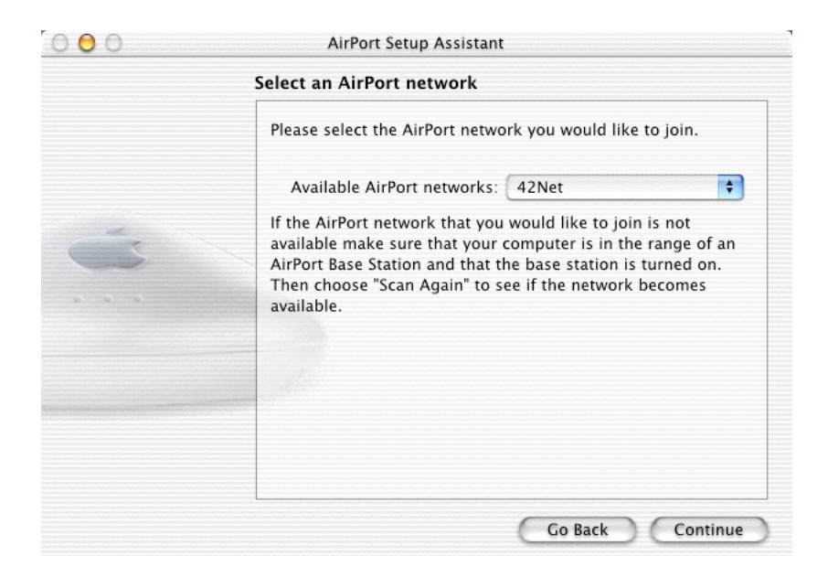

Keep the following guidelines in mind when designing a setup assistant:

- While the assistant is active, display only the application menu, containing About and Quit items, and the Edit menu, containing standard items to assist users in entering text. Don't provide a Help menu (or a help button); the setup assistant *is* help.
- Provide Go Back and Continue buttons for navigation.
- The assistant window title bar should contain a dimmed close button, an available minimize button, and a dimmed zoom button.
- Title the first pane "Introduction." This pane should explain the purpose of subsequent panes.

#### **CHAPTER 14**

#### User Help and Assistants

- Title the last pane "Conclusion." This pane should tell users what changes were made to their system and how to modify these settings. This pane should have a default Done button and a dimmed Go Back button.
- In most cases, it's best to ask only one question per pane.
- Provide relevant feedback when appropriate. If needed, you can display a progress bar to the left of the Go Back button (the left edge aligned with the text box).
- <span id="page-242-0"></span>■ Don't fill the entire screen; users should be able to access other parts of their system while the assistant is open.

Setup Assistants **243**

### **CHAPTER 14**

User Help and Assistants

<span id="page-244-4"></span><span id="page-244-3"></span><span id="page-244-2"></span><span id="page-244-0"></span>This chapter contains guidelines for installing applications—including where to locate application-support files and user-created files—and handling filename extensions.

# <span id="page-244-1"></span>Installing Files

Installing your software is the first task users must accomplish before they can use your application, and you should ensure that it is a quick and painless experience. The best method is a simple drag install: The user drags an icon or a folder from your CD, for example, to a chosen destination on another disk. The easiest way to achieve such a process is to create an application bundle (for more information, see *Inside Mac OS X: System Overview,* available on the Mac OS X developer documentation website). If files need to be installed in various locations, you'll need to create an installer; follow the guidelines described in this section.

If components of your application must be installed in locations that require authentication, you should use Package Maker, the Mac OS X application for creating installation packages (available on the Mac OS X Developer Tools CD).

For an update to an already-installed application, you should provide an installer that modifies only the files required for the new version. Remember that files may have been renamed or moved; don't look only in the Applications folders, and don't rely exclusively on filenames to identify your application files; check for creation and modification dates, version numbers, file size, and so on to uniquely identify

Installing Files **245**

your application. If you detect multiple versions of your application, provide information such as the location and creation date of each, and let the user choose which one to update.

If users can download your application from the Internet, help simplify the installation process by making it a disk image. Make sure to clean up after a successful installation by moving unneeded files to the Trash.

When designing your product's installation procedure, keep the following guidelines in mind:

- Before installing anything, your installer should check the destination volume for previously installed application components. When searching for files, follow the guidelines described previously for software updates.
- Always provide users with a simple default install (an "Easy Install"). Most products should also provide a custom install; if a user has accidentally thrown away a particular file, for example, he should be able to restore it without having to reinstall the whole application.
- Always let users choose a specific folder (or the Desktop) as the installation destination. Don't require your application to be installed in a particular location.
- Install files only in the locations recommended in ["Where to Put Files"](#page-246-1) [\(page 247\).](#page-246-1) If users want to delete your application for some reason, most users will simply drag its icon to the Trash; avoid littering the user's hard disk with remnant files. If your product uses an installer, it should include an uninstall option that lets the user delete all associated files.
- Advise users about data that might be overwritten during the installation and provide a way for them to back it up first. Don't overwrite previous user preferences; deal with version and format differences the first time the user opens the updated application.
- Provide choices and explain their impact. For example, one installation option could result in faster performance but consume more disk space; another might use less space but result in slower performance.
- Provide help where appropriate. For example, in a custom install pane, clicking a More Info button should help the user understand why she would want to install the component and the consequences of not installing it. Make dependencies between components clear, but don't force the user to install anything, even recommended files.

 **Apple Computer, Inc. June 2002** 

- Don't uninstall Apple system software.
- If your application installs Apple system software—such as QuickTime, CarbonLib, or Help Viewer—make sure the version you install is newer than any version the user already has; otherwise, don't install it. Make it clear to users which version they already have and which version your application needs, and provide an option for skipping installation of those items.
- During installation, indicate progress, such as the current stage and the time remaining. (See ["Feedback and Communication" \(page 29\).](#page-28-1))
- Provide a Cancel or Stop button; if cancelling the installation would compromise the system's stability, disable the button during those times. If a user cancels an installation, leave the destination disk in the same state it was in before the install (in other words, delete any files installed before the process was cancelled).
- Consider performing your installation the first time the user opens the application, rather than when the user copies the program. This technique is especially well suited for children's games.
- <span id="page-246-3"></span>■ Consider your application's audience. It's likely, for example, that elementary school children install their own games, so tailor your instructions for them (don't use confusing or technical terms like *directory*) and make installation as easy as possible for that audience.

# <span id="page-246-1"></span><span id="page-246-0"></span>Where to Put Files

Mac OS X creates a suite of directories for each new user account. This structure is provided to assist users in organizing related types of files, maintain a default location for task-specific applications (such as iMovie), and facilitate transferring files to and from iDisks.

<span id="page-246-2"></span>There are eight predefined top-level user directories. With the exception of certain subdirectories in the user's home directory (Desktop and Library), users can move or delete these directories.

The **Library** folder in the user's home directory contains system or application-support files. Within the Library directory is an Application Support directory, in which you can create a developer-specific or application-specific

Where to Put Files **247**

directory to contain all files such as document templates, databases, user preferences, nonsystem fonts, product licenses, and plug-ins (see ["Handling](#page-248-2)  [Plug-ins" \(page 249\)\)](#page-248-2). You may want your application to provide its own interface for accessing and managing the contents of this directory.

Three of the predefined folders in the user's home directory support basic system functionality:

- <span id="page-247-6"></span>■ **Desktop:** Contains all files visible on the desktop when the user logs in. By default, the contents aren't visible to other accounts. This directory is the default location for files downloaded with a Web browser (the user can change the location in Internet preferences).
- <span id="page-247-4"></span>■ **Public:** Allows the user to share files with local and remote users. By default, the contents are visible to other user accounts. This directory contains a drop box, where others can put files for the owner that aren't visible to other users.
- <span id="page-247-15"></span><span id="page-247-13"></span><span id="page-247-12"></span><span id="page-247-11"></span>■ **Sites:** Allows users to host a website. When the user turns on Web Sharing (in Sharing preferences), other users can access Web pages in this folder. A sample Web page is provided in this directory.

The remaining directories are intended to provide default locations for storing files. They are not intended to contain files whose primary access is through the application. For example, AppleWorks templates and iTunes music databases should go in the Library directory. The provided directories are the following:

- <span id="page-247-3"></span>■ **Documents:** The default for storing user-created files not better served by the other directories. Examples include AppleWorks text or spreadsheet documents and TextEdit documents. Don't put application support files—including user preference settings—here; put them in the user's Library directory.
- <span id="page-247-8"></span>■ **Movies:** The default for storing moving images created by the user or exchanged with other users. Examples include QuickTime Player files, iMovie projects, and imported digital video sequences.
- <span id="page-247-9"></span><span id="page-247-7"></span>■ **Music:** The default for storing music, sound, or MIDI files created by the user or exchanged with other users. Applications that generate music or sound-related files should use this directory as the default storage location. Examples include iTunes user playlists and converted MP3 files.
- <span id="page-247-10"></span><span id="page-247-5"></span>■ **Pictures:** The default for storing still images created by the user or exchanged with other users—images downloaded from a digital camera, for example.

<span id="page-247-14"></span><span id="page-247-2"></span><span id="page-247-1"></span><span id="page-247-0"></span>When a user saves a file to a destination other than the default directory, your application should keep the user's selection as the default location for saving files.

# <span id="page-248-2"></span><span id="page-248-0"></span>Handling Plug-ins

<span id="page-248-4"></span>Third-party plug-ins needn't deter you from providing a drag-installable bundle; the Finder in Mac OS X (version 10.2 and later) provides built-in support for managing plug-ins within your application's bundle. A Plug-ins pane added to your application's Info window in the Finder provides a user interface for adding and removing these files, as well as turning them on and off.

If your application supports plug-ins, use this feature instead of creating your own plug-in management method. Create a folder for them in your application bundle (<AppName>.app/Contents/Plugins); each item in this folder appears in the Plug-ins pane. You may want to provide user documentation explaining how to use this feature.

# <span id="page-248-1"></span>Naming Files and Showing Filename Extensions

<span id="page-248-3"></span>Mac OS X 10.1 introduced a new model for handling filename extensions. Your application should follow the guidelines described in this section.

Any file that has a specific format can have a filename extension indicating that format. When a user copies a file to a computer that uses another operating system, the filename extension gives the system the information it needs to handle the file correctly.

Users, however, don't need to be aware of a filename's extension. Filename extensions are hidden by default, but users can choose to display a document's filename extension by deselecting the "Hide extension" checkbox in the expanded Save dialog, and can choose to show all filename extensions in Finder Preferences. Your application should always display filenames that respect the user's preference.

Applications that already write out filename extensions for interoperability purposes now provide an enhanced user experience; these filename extensions can be hidden in Mac OS X but automatically get transferred with the file as it moves to a non-HFS file system. For example, when a user uploads a website containing HTML and movie files, because the movie files already have filename extensions, they don't need to be renamed, and links in associated Web pages function properly.

To preserve the "what you see is what you typed" user experience, while supporting robust interoperability by using filename extensions to indicate file format, applications have several responsibilities. Apple recommends that applications adopt the following behavior:

- All document files should have an extension indicating the file's format.
- <span id="page-249-0"></span>■ Any user-visible filename—in a list, an Info window, or any other situation should always use the file's **display name**. Mac OS X 10.1 and later includes a function to get the display name.
- When saving files, users should be able to control whether filename extensions are hidden. For more information, see ["Saving, Closing, and Quitting Behavior"](#page-104-0) [\(page 105\).](#page-104-0)
- Applications should save newly created document files with a filename extension, for easy exchange with other operating systems and other users over the Internet. This filename extension can be hidden, as described above.
- When opening and saving a document file, applications should preserve the value of the document filename extension hidden flag and should preserve the existing filename extension unless the user creates a new document file by choosing Save As.
- When saving a document file without an extension as a new file in a Save As operation, applications should add an extension, as they would when creating a new document file.

#### **Important**

<span id="page-249-1"></span>Don't provide your own options for handling filename extensions; use the standard Open and Save dialogs. The behaviors described above happen automatically for Cocoa developers using NSDocument. Carbon developers should set a new flag, PreserveSaveFileExtension, when calling the Save dialog, and use NavCompleteSav to set the flag to hide the filename extension.

# <span id="page-250-0"></span>Displaying Pathnames

<span id="page-250-1"></span>Some dialogs, such as Save and Open, provide a text field in which expert users can type file-system paths to navigate in the dialog. The slash symbol (/) is used as the path separator.

<span id="page-250-2"></span>Avoid displaying pathnames in your application (in document titles, for example). If it's necessary to display a pathname, avoid truncating it.

<span id="page-252-1"></span><span id="page-252-0"></span>Mac OS X version 10.2 contains speech technologies that recognize and speak U.S. English. These technologies provide benefits for all users and present the possibility of a new paradigm for human-computer interaction. This chapter discusses various approaches for implementing these technologies and provides guidelines for doing so.

**Speech recognition** is the ability for the computer to recognize and respond to a person's speech. Using speech recognition, users can accomplish tasks comprising multiple steps—for example, "Schedule a meeting next Friday at 3 P.M. with John, Paul, and George" or "Create a 3-by-3 table"—with one spoken command. Mac OS X users can control the computer by voice, rather than being limited to the mouse or keyboard; consequently, speech-recognition technology is very important for people with special needs, as well as for general users. Developers can take advantage of the speech engine and API included with Mac OS X, as well as the built-in user-interface.

**Speech synthesis,** also called text-to-speech (TTS), converts text into audible speech. It provides a way to deliver information to users without forcing them to shift attention from their current task. For example, the computer could, in the background, deliver such messages as "Your download is complete; one of the files has been corrupted" and "You have email from your boss; would you like to read it now?" TTS is also crucial for users with vision or attention disabilities. As with speech recognition, Mac OS X TTS provides both an API and several user interface features.

For more information about implementing these technologies, see *Inside Mac OS X: Speech Recognition Manager Reference* and *Inside Mac OS X: Speech Synthesis Manager Reference,* both available on the Mac OS X developer documentation website.

# <span id="page-253-0"></span>Speech Recognition

It's important to distinguish between the speech engine and the applications that call the engine. The Mac OS X speech-recognition engine

- is speaker independent. Users don't have to invest any time training it to recognize their voice before they can use it.
- supports continuous speech. Users don't have to pause between words.
- has a large vocabulary (more than 120,000 words) and linguistic analysis to predict the correct pronunciation of words not in its dictionary.
- works with "far-field" microphones, so users don't have to tether themselves to the computer with a headset. In addition, most Macintosh computers have a built-in microphone. All microphones in Macintosh computers are optimized to work well with the Mac OS X speech-recognition engine.
- works with a finite-state grammar. This is the most successful general-purpose speech technology and is optimal for uses such as interactive dialogs, command-and-control, and language/literacy. It is not optimal, however, for unrestricted dictation.

In order to have the most flexibility in using speech recognition, an application should call the speech engine functions directly. Doing so requires the following steps:

- 1. Tell the engine what to listen for (that is, define what users can say).
- 2. Start listening.
- 3. Act on the message sent to the application when the engine hears a defined command.

Alternatively, you can easily provide basic speech control of your application by taking advantage of Apple's Speakable Items application (see ["Speakable Items"](#page-254-2) [\(page 255\)\)](#page-254-2).

### <span id="page-254-2"></span><span id="page-254-0"></span>Speakable Items

Speakable Items, an application built in to the Mac OS X user interface, calls the speech-recognition engine and provides all users with the ability to control their computer by voice. It does this by creating a folder in the user's Library folder (Library/Speech/Speakable Items). Anything in the Speakable Items folder is launched when the user speaks its name; saying its name is equivalent to double-clicking that item's icon, except that it works even if the folder is not visible or the Finder is not active.

Developers can add their own items to the Speakable Items folder—such as AppleScript scripts, documents, templates, applications, or aliases—and when the user speaks the item's name it executes.

The Speakable Items folder can also contain XML files that associate spoken commands with keyboard shortcuts. "Make this bold," for example, sends Command-B; "Copy this to the Clipboard" sends Command-C.

The Speakable Items folder also contains an Application Speakable Items folder, which contains a subfolder for each application, so that you can create spoken commands that apply only to your application. Items in your application's folder are speakable only when your application is active (frontmost). Alternatively, you can include application-specific speakable items in a folder within your application bundle.

### <span id="page-254-1"></span>The Speech Recognition Interface

Mac OS X provides a consistent, well-integrated user interface for speech-recognition across all applications. This interface comprises the following items:

■ **The Speech pane** of System Preferences is where users can control general speech-recognition settings, regardless of which application is using it. These settings include microphone volume (helpful for using non-Apple microphones) and the listening mode (push-to-talk versus continuous listening). Developers get these interface features for free regardless of how they use the speech-recognition engine.

The Speech pane also contains controls specific to the Speakable Items application, such as whether Speakable Items is on or off and whether it applies to menus and window controls.

#### **CHAPTER 16**

### Speech Recognition and Synthesis

■ **The speech feedback window** provides information about the level of sound input, whether the system is actively listening, and which listening method the user has chosen.

**Figure 16-1** The speech feedback window


■ **The Speech Commands window** shows users what they can say at a specific time. It also displays what the speech-recognition engine "heard" and what it spoke to the user in response.

**Figure 16-2** The Speech Commands window


### <span id="page-256-0"></span>Speech-Recognition Errors

Because speech and sounds can be ambiguous, the speech-recognition process sometimes produces errors. Two such errors are the following:

- A **rejection error** occurs when the system hears something it considers speech (rather than noise) but can't match the sound to a known command. By default, this kind of error returns "???"; your application can specify its own rejection word or other response.
- A **substitution error** occurs when the system incorrectly interprets a sound recognizing the command "cut" as "quit," for example.

Because substitution errors are generally more annoying to users than rejection errors, the speech-recognition engine has been tuned to prefer to reject rather than substitute.

With the "Listen for" AppleScript command, you can easily test your application's spoken commands without writing any code. Consult the Mac OS X Developer Tools CD for examples of using the speech-recognition server's "Listen for" command.

### <span id="page-256-1"></span>Guidelines for Implementing Speech Recognition

To minimize speech-recognition errors, observe the following guidelines in designing your spoken interface.

- Avoid commands that sound similar but have different meanings. For example, "Turn backups on" and "Turn backups off" differ by only one phoneme and might be confused by the recognizer in a noisy environment.
- Avoid single-word commands; they are less distinctive and can be confused by the recognizer. "Cut" sounds similar to "Quit," for example. Phrases that are from three to six words long are more distinctive and will be better recognized.
- Define commands that are easy to remember, feel natural to say, and don't conflict with menu items or controls.
- Provide speech-recognition commands that add value by doing more than can be accomplished through a single click or keyboard equivalent.

- If a certain action is made available through speech, make sure that tasks involving this action can be completed via speech. If confirmation is required, make sure the user can speak the response (instead of forcing the user to type something, for example). Users prefer to stay in one mode rather than switching back and forth depending on the task.
- For commands that could result in data loss, ask for confirmation before executing the command.
- Don't make speech the only way for the user to accomplish a task; always provide an alternative method.

# <span id="page-257-0"></span>Speech Synthesis

The Mac OS X speech-synthesis engine converts any text into highly intelligible, natural-sounding speech. The engine speaks any text sent to it. Developers can send their own text to it using one line of code. In addition, some speech synthesis is automatically integrated into the interface via Talking Alerts, spoken Dock notification, saying the name of certain controls when the mouse points to them, and speaking selected text. Developers should not rely on those features alone, however, because users may not have turned them on in Speech preferences.

Whenever your application uses a system alert sound or other aural cue to deliver specific feedback to users, consider providing the option of using speech synthesis instead. For many users, a spoken phrase is a much more natural and accessible means of communication; it's a cognitive burden to remember that a particular sound means a particular action has occurred. You can augment the user experience by providing speech feedback in addition to other forms of feedback. In order to accommodate people with special needs, any feedback to the user should be provided in audio as well as visual formats. (See ["Universal Accessibility"](#page-36-0) [\(page 37\).](#page-36-0))

### <span id="page-257-1"></span>Guidelines for Implementing Speech Synthesis

As much as possible, you should observe the following guidelines when designing your application to support TTS.

- Use speech synthesis to notify the user of something that happened in the background, such as, "Your download is finished" or "You have a meeting in 15 minutes."
- When using speech synthesis to notify users that an event has occurred, consider pausing for a few seconds between the visual display of the event—such as a sheet—and the spoken message. Speech is an effective way to get users' attention only if they are not already looking at the screen, and the delay gives users the opportunity to respond to the notification without hearing any speech. If such a pause is appropriate, provide a way for users to customize its length.
- Provide a way for users to turn TTS on or off within your application and to control such things as volume, voice, and speaking rate.
- Information users enter, such as typing in text fields or selections from long lists, should be spoken back by the computer. For example, if a user types an amount of money, it's helpful to speak it back immediately to confirm it. Similarly, sometimes users select the wrong item from a list; speech synthesis is a good way to bring this mistake to the user's attention.
- Speak in response to spoken commands to confirm what was recognized and what action is being performed. For example:

*User:* Disconnect from the Internet. *Computer:* Disconnecting now.

*User:* Schedule a meeting. *Computer:* For what time?

- When testing your application, test with speech on and be sure to listen to all spoken text in your interface. You can override the default TTS of a control by providing an alternative text string.
- Make spoken text sound best by breaking up long sentences and using punctuation effectively, and by using embedded speech commands such as [[emph+]] to focus users' attention on important information. For technical information, see the Apple developer documentation website.
- Make sure your alerts are well-written and clear. (See ["Writing Good Alert](#page-231-1)  [Messages" \(page 232\)](#page-231-1).) Avoid long sentences and awkward phrasing.
- In applications that make use of characters (human or otherwise) or running commentary, such as games, consider using text-to-speech instead of digitizing voices.

Speech Synthesis **259**

# <span id="page-259-0"></span>Spoken Dialogues and Delegation

The most powerful, successful, and compelling way to use speech technology is to engage users in spoken dialogues. Spoken dialogues are multi-turn conversational interactions in which the computer asks a question, the user speaks an answer, the computer asks another question, and so on. When the computer asks a question, the user automatically knows how to answer, and the speech engine has a better chance of recognizing what was said. For example:

*User:* Schedule a meeting.

*Computer:* What day would you like to meet?

*User:* Friday.

*Computer:* What time?

*User:* 6 P.M.

*Computer:* Whom do you want to invite?

*User:* Tom, Jerome, Devang, Kevin, Matthias, and Kim.

*Computer:* OK. Scheduling a meeting on Friday at 6 P.M. with Tom, Jerome,

<span id="page-259-1"></span>Devang, Kevin, Matthias, and Kim.

With spoken dialogues of this form, it's possible to provide users with a means of delegating a goal to the computer (scheduling a meeting, in the previous example), rather than performing a sequence of steps that each involves the keyboard and mouse. The computer can ask the user for any extra information it needs to reach that goal. Speech is an ideal way to delegate a goal to an intelligent assistant.

# A Checklist for Creating Aqua Applications

<span id="page-260-1"></span>This checklist is designed to help guide you in the process of making a great Aqua application. Use it to remind yourself of important interface-related issues.

Consider the questions in the checklist as you review your software. Answering every question with a "yes" will ensure that your product conforms to the Aqua human interface guidelines. Even if you can't answer "yes" to every question, this checklist can help your product maintain the spirit of the guidelines and principles.

Although business realities (such as product schedules and budgets) often force you to make design tradeoffs, remember that, for many users and product reviewers, the extent to which you adopt Aqua is the most visible means of measuring how "Mac-like" your product is. (You may also want to refer to ["Deciding What to Do](#page-22-0)  [First" \(page 23\).](#page-22-0))

# <span id="page-260-0"></span>General Considerations

- <span id="page-260-2"></span>■ Do you use standard Aqua controls provided by the system, instead of inventing custom ones? Do you avoid assigning new behaviors to existing interface elements?
- Does the application have the Mac OS X "feel," including window minimization, live scrolling, live window dragging, and sheets?
- If a metaphor is being used, is it suitable for the application? Does the metaphor match a "real" visual and behavioral representation?
- Is the user always able to find an object or action on the screen? In other words, does your interface follow the see-and-point principle of design?

### Checklist for Creating Aqua Applications

- Do document printouts exactly replicate what the user sees on the screen? Do movies, sounds, and other types of data reproduce faithfully regardless of what medium they're in? In other words, is the application WYSIWYG?
- Is your application forgiving and explorable by supporting Undo? Are there warnings about risky actions? Are users allowed to back away gracefully from risky territory?
- If an operation can be interrupted, do you provide a Cancel or Stop button? Can Escape or Command-period be used to cancel or stop these operations?
- Does the application feel stable?
- Do you respect all of the accessibility features in Mac OS X, such as keyboard navigation and focus?
- Have you made a clear, consistent distinction between basic and advanced features?
- If your application has modes, is there a clear visual indication of the current mode? Does the visual indication of the mode appear near the object most affected by the mode? Are there enough landmarks to remind the user what area of the application he or she is in? For example, many graphics applications change the pointer to an eraser in erase mode.
- Is each mode absolutely necessary? Do the modes within the application properly track the user's own modes? Do users consistently avoid the kind of errors caused by the program being in a mode other than what the user wants or expects? Making a mode visually apparent is no guarantee that the user will track it: Test the application on users and find out what sorts of mistakes they are making. If the errors are caused by modes, find ways to communicate the modes more clearly, or eliminate them.
- Can the user save a document or quit an application at any time?
- Are the widest possible range of user activities available at any time? The user should spend most of his or her time being able to interact with the application not waiting for it to complete a process.
- Does your application always use the file's display name when the filename is visible to users, except in expanded help tags?
- Is your application speech-enabled?
- Has all user-visible text been reviewed by a professional writer?
- <span id="page-261-0"></span>■ Does all user-visible text use "curly" apostrophes and quotation marks rather than straight ones (except for measurements or in code examples)?

# <span id="page-262-0"></span>Installation and File Location

- Can a user install your application by dragging a single file or folder? Did you provide an application bundle so that users can manipulate only certain files? Are you using the Mac OS X interface to handle plug-ins?
- <span id="page-262-3"></span>■ Does your application put application support files—user preference settings, plug-ins, databases, and so on—in the user's Library folder? Does it avoid putting files in the Documents folder (except for user-created files)?

# <span id="page-262-1"></span>Graphic Design

- Does the application have the overall Mac OS X "look," including high-quality Aqua-style icons, controls, anti-aliased text, windows, and menus?
- Do windows, dialogs, and palettes look "clean" and free from clutter?
- Does the user have control over the design of the workspace (location and sizing of windows, toolbar customization), allowing him or her to individualize it?
- Is the information in windows organized so the most important information can be read first?
- <span id="page-262-4"></span>■ Do you use white space and graphics to break up long pieces of text?

## <span id="page-262-2"></span>Menus

- Are the application, File, Edit, and Window menus present, with at least the standard items?
- Does the application support Undo, Cut, Copy, and Paste, and are these items in the Edit menu?

### Checklist for Creating Aqua Applications

- Does your application menu contain About, Preferences, Hide, and Quit?
- Do the unique menus of the application have appropriate names? Are the names sufficiently different from the standard system menu names? Can the user understand and remember their meaning?
- Are frequently used menu items available at the top level rather than in a submenu or a dialog? If not, can the user change their location?
- Are currently unavailable items dimmed (rather than being omitted)? Are dimmed items unselectable? If all items in a menu are unavailable, is the menu title dimmed? Can the user still pull down the menu and see the dimmed names of the operations?
- Are toggled menu items unambiguously named?
- Are menu titles and items in caps/lowercase unless there is a compelling reason to have a different style, such as an ALL CAPS item in a Style menu?
- Do menu items have an ellipsis character (…) if more information is required from the user before completing the command?
- Are the menu items truly menu items? Menu items should not be used as text, section titles, or status indicators.
- In a hierarchical menu, does the title of the submenu have a right-pointing triangle? Are submenus used only for lists of related items?
- <span id="page-263-1"></span>■ Can the user see all the commands, items, and submenu titles in a menu without scrolling? Scrolling should be necessary only for menus that users have added to or for menus that spill over because the user has selected a large system font.

# <span id="page-263-0"></span>Pop-Up Menus

- While the menu is open, is the current value checked?
- Are pop-up menus used to allow the user to choose only one of a set of choices? Pop-up menus should not be used for choosing more than one item from a set of several choices.
- Do you avoid using menu items that contain verbs (commands) in pop-up menus?
- Does each menu have a label to the left (for left-to-right scripts)?

### <span id="page-264-1"></span>Checklist for Creating Aqua Applications

# <span id="page-264-0"></span>Windows

- Do the standard window size and position take into account the dimensions of the screen and the location of the Dock?
- Is the standard state of a window best suited to working on the document (such as no wider than the page width), and not necessarily as large as the full screen?
- Does your application sensibly open new windows in either the standard or the user state?
- Can each resizable window be made as large as the smaller of either the maximum document size or the maximum size of the displays, including multiple monitor displays?
- Is the default position of a window contained on a single screen?
- Is each additional window opened below and to the right of its predecessor?
- If a user drags a window from one monitor to another monitor, does your application open subsequent windows on the second monitor?
- Do you use the lowercase letters "untitled," without additional punctuation, in a new window title? Do you add a number to the second and subsequent new windows, but not to the first? Do you avoid using blank titles?
- Do document titles display or hide filename extensions appropriately?
- Do document windows with unsaved changes display a dot in the close button?
- Before closing a window, do you check to see if the user has changed its size or position? Do you save window positions, and then reopen windows in the size and position in which the user left them?
- Before reopening a window, do you make sure that the size and position are reasonable for the user's current monitor or monitors, which may not be the same as the monitor on which the document was last open?
- When zooming from the user state to the standard state, do you check if the size of the standard state would fit completely on the screen without moving the upper-left corner? If so, is the upper-left corner anchored? If not, is the window moved to an appropriate default location?
- Do you appropriately display controls and selected items in inactive windows?

Windows **265**

### <span id="page-265-3"></span>Checklist for Creating Aqua Applications

# <span id="page-265-0"></span>Utility Windows

- Do your utility windows use the right window type (kFloatingWindowClass or NSPanel)?
- If a tool palette is present, is the selected symbol (icon, pattern, character, or drawing) highlighted?
- Do palettes provide tracking feedback when the mouse button is down? Does any change in selection in palettes occur only when the mouse button is released?
- <span id="page-265-2"></span>■ If you use any small controls in a utility window, are all the controls in the window the small versions (that is, you haven't mixed standard size and small controls in the same window)?

# <span id="page-265-1"></span>Scrolling

- Does the window use either the standard scroll bar mechanism or the hand for scrolling? If it uses the hand, does the pointer either always become a hand in the window or appear highlighted in a tool palette?
- Does clicking a scroll arrow cause the document to move a distance of one unit in the chosen direction? (The unit should be appropriate and meaningful for the application.)
- Does clicking in the gray area move the document by a windowful (or to the pointer location, if the user has selected that option)?
- Are the scroll bars inactive when the entire document fits in the window?
- Are the scrolling keys on the keyboard (Page Up, Page Down, Home, End) supported? Note that these keys do not move the insertion point and do not affect the selection.
- Does the scroller indicate the approximate position of the visible part of the document in comparison to the whole document?

### <span id="page-266-1"></span>Checklist for Creating Aqua Applications

# <span id="page-266-0"></span>Dialogs

- Are questions in dialogs posed in a straightforward and positive way—for example, "Do you want to erase everything on the disk named "Macintosh HD?" rather than "Do you not want to alter the contents of this disk?"
- Do you use sheets for document-specific dialogs?
- Are dialogs designed with a centered look (rather than flush left)?
- Are dialogs horizontally centered either on the screen or over the active window if the window is on a large screen or on a screen other than the one the menu bar appears on?
- Do you use modal dialogs only when necessary? If a movable modal dialog is displayed, can the application run in the background? Can the system Help menu be used when a modal dialog is displayed?
- If there is an active text input field in a modal dialog, can the Cut, Copy, Paste, and Undo menu commands in the Edit menu be used?
- Do keyboard equivalents of the standard Edit menu commands operate correctly in a modal dialog containing editable text items?
- Do you use the new data browser control for lists?
- Can type selection be used in scrolling lists? Can the arrow keys be used to move the selection by one item in the direction of the arrow?
- Does the active area of a dialog (the "focus") have an indicator if there is more than one possible focus? (Focus areas are those that accept keyboard input.)
- Does pressing the Tab key cycle through the available elements? Does Shift-Tab cycle in the reverse direction?
- When appropriate, are buttons named with a verb that describes the action that it performs, such as Erase, rather than OK?
- Do you provide a Cancel button wherever possible, especially in progress dialogs? Does pressing Escape or Command-period indicate Cancel? (Pressing Escape should never cause the user to lose information.)

Dialogs **267**

### Checklist for Creating Aqua Applications

- If an operation can be halted midstream, with possible side effects, is the button named Stop instead of Cancel?
- Do the Return and Enter keys map to the default button, which is usually the button with the safest result or the most likely response?
- Do default buttons have color and pulse?
- Are buttons wide enough to accommodate their text names?
- Are buttons placed in functional and consistent locations, both within your application and across all applications that you develop? Is the action button placed in the lower-right corner with the Cancel button to its left or above (for Western readers)?
- Are hidden filename extensions supported? Does the application display a file's display name instead of its filename, and does the Save dialog support filename extension hiding?
- Do Save dialogs place a default name in the Save As text field, and is the name (but not its filename extension) selected?
- When a dialog refers to a document or an application, do you use the name of the document or application in the message text?
- Has room been left to allow the dialog to grow during localization? Most languages require more characters than English to convey equivalent messages.
- <span id="page-267-1"></span>■ Are the bounding rectangles of interface elements (for example, radio buttons and checkboxes) the same size? When the alignment of dialog elements is reversed, they should align on the opposite side.

# <span id="page-267-0"></span>Feedback and Alerts

- Does the application always provide some indication that an activity is being carried out in response to a command?
- Does the application provide suitable feedback during task processing? Does it somehow indicate the completion of a task? Does it provide information about the duration of the task?

### Checklist for Creating Aqua Applications

- Is an explanation offered if a particular action cannot be carried out? Are alternatives offered?
- Do you make all changes clearly visible?
- Do you call the system alert sound when you want the user's attention? Do you provide all feedback in visual as well as auditory formats?
- Do you use the new standard alert functions for displaying alerts?
- Do you display your application icon in all dialogs? Do you also show the caution icon in potentially data-damaging alerts?
- Does the alert have an informative title and text that not only tell the user what is wrong, but also offer suggestions as to what to do to correct it? The best alert messages answer the following questions: What happened? Why did it happen? What can I do about it?
- <span id="page-268-3"></span>■ Are all your alerts necessary? You can prevent many user errors with good or preventative interface design. For example, if the application cannot handle an 80-character filename, don't display an 80-character field in which to enter it.

## <span id="page-268-0"></span>The Mouse

- If the user initiates an action by pressing the mouse button, does the action take place only when the button is released (except for drags)?
- <span id="page-268-2"></span>■ Are there ways other than double-clicking to perform a given action? Double-clicking should never be the only way to do something; it should be a shortcut only.

# <span id="page-268-1"></span>Keyboard Equivalents

■ Are Apple-reserved keyboard equivalents used properly? Even if your application doesn't support one of these menu commands, it shouldn't use these keyboard equivalents for another function.

The Mouse **269**

### Checklist for Creating Aqua Applications

- Do you avoid using Command–Space bar and Command–modifier key–Space bar in your application, since they are reserved for use by international systems?
- Do keyboard equivalents appear where appropriate? Are the keyboard equivalents case-independent? (This second rule does not apply if the product uses both cases in the keyboard equivalents and lets the user decide which case to use.)

## <span id="page-269-3"></span><span id="page-269-0"></span>Text

- Can arrow keys be used in all text boxes (including in dialogs)? Can the Shift key be used with the arrow keys to extend the selection (including in dialogs)?
- If text is selected, does pressing an arrow key cause the insertion point to go to the corresponding end of the range and deselect it?
- Are discontinuous selections made with the Command key modifier (for lists and arrays)? The Shift key is used for graphics selections and continuous text extensions.
- Do you use Command–arrow key and Option–arrow key for moving the insertion point in larger semantic units? (Note that when multiple script systems are available, Command–Left Arrow and Command–Right Arrow are intercepted by the system and used for changing the keyboard layout.)
- Does the active font size in a menu have a checkmark next to it?
- Do you avoid making assumptions about font sizes? For example, the system font may have a different size in other countries.

## <span id="page-269-2"></span><span id="page-269-1"></span>Icons

- Do your icons represent objects that users are familiar with and that are universally recognizable?
- Do you use a common theme for icons associated with your application?

### Checklist for Creating Aqua Applications

- Do you avoid using replicas of Apple hardware (which change often) in your icons?
- Do your icons fit in with the Aqua style—that is, high-quality, realistic, emotive?
- Are icon shadows realistic? Do you use a single center-top light source?
- <span id="page-270-3"></span>■ Do all your icons use the appropriate perspective for their types?

# <span id="page-270-0"></span>User Documentation

- Is the instructional suite written for the right audience?
- Do you provide HTML help viewable in Help Viewer and a Help command in the Help menu?
- Does your documentation focus on real-world user tasks and troubleshooting?
- When appropriate, do your dialogs have help buttons that open relevant help text?
- Does your help automate common tasks using AppleScript?
- <span id="page-270-2"></span>■ If any part of the documentation refers the user to another document, is the reference more appropriate than including the information right there?

# <span id="page-270-1"></span>Help Tags

- Do you provide help tags to help users identify interface elements?
- Are your help tags very brief? Do they describe what the user will accomplish by using the object?
- Do expanded help tags for a file display the filename extension, even if the user has chosen to hide it on that file?

Checklist for Creating Aqua Applications

<span id="page-272-1"></span><span id="page-272-0"></span>This appendix describes usage guidelines for terms found in Mac OS X. For ease of use, it contains some terms from the *Apple Publications Style Guide*. For any item that contradicts an *APSG* entry, use the guideline provided here.

For terms not included here, or for more information, see the *APSG* [\(http://](http://developer.apple.com/techpubs/faq.html) [developer.apple.com/techpubs/faq.html](http://developer.apple.com/techpubs/faq.html)) and the *American Heritage Dictionary*.

Apple has standard translations for some of these terms in other languages. Check <http://developer.apple.com/intl/localization.html>.

Apple reserves the right to change terms and guidelines at any time.

**abbreviations and acronyms:** Spell out the following on first use (on a page or in a document):

ISP (Internet service provider) FTP (File Transfer Protocol)

You don't have to spell out *CD-ROM, HTML,* or *MIME*.

**abort:** Don't use; use **cancel**.

**Address Book:** Two words. An application, separate from Mail.

**administrator:** Use to refer to people who can do such tasks as create users and groups, assign privileges to files and folders, and so on. Don't use **Owner**. You can say, for example, "You need to log in with an administrator password" or "Only administrator users can make changes." Don't shorten to "admin user."

**analog-to-digital (adj.):** Note hyphens.

**Apple key:** Don't use; the key with the cloverleaf and the Apple logo is "the Command key."

**application:** It is not necessary to say "application program" on first use. (This entry is different from the current APSG.) "Application" is OK to use alone.

**application menu:** The menu to the right of the Apple menu. Refer to it as "the [application name] application menu" ("the Mail application menu," "the Grab application menu").

**application names:** Unless the official product name contains an internal cap, twoword application names should contain spaces, even if the filename in the file system appears without a space. Examples of correctly spelled names:

Address Book

Disk Utility

Help Viewer

Image Capture

Key Caps

Keychain Access

NetInfo Manager

Network Utility

Print Center

Process Viewer

Script Editor

Setup Assistant

System Preferences

TextEdit

WorldText

In general, don't use "the" with application names.

*Correct:* Open QuickTime Player.

*Incorrect:* Open the QuickTime Player.

*Correct:* Open Print Center.

*Correct:* Open the Print Center application.

*Incorrect:* Open the Print Center.

**the Applications folder:** There is only one, which is displayed when you click the Applications button in a Finder window.

**Aqua:** Uppercase (an Apple trademark). Use mainly as an adjective ("the Aqua user interface").

**attach:** Don't use to mean **connect** (as in "Connect your USB device to your computer").

**boot:** Don't use for *start up* (except in technical documentation).

**box:** Don't use "dialog box" anymore; OK to say "dialog."

**bus-powered, self-powered:** Try to avoid when indicating whether devices draw power from a power cord or from another USB device. When possible, describe the device, don't give it a label: "A device that plugs into an electrical outlet" (instead of "a self-powered device"); "a device that gets its power from another USB device" (instead of "a bus-powered device").

**button states:** In a dialog, the default button has color and pulses, but avoid references that say "blue"; call it "the default button." Window buttons "have color" or "don't have color"; don't refer to buttons as "clear."

**canceled/canceling:** Note our style is one "l."

**Carbon application:** Refers to an application written and compiled using the Carbon API specification interfaces (Universal Interfaces 3.3.2 or later). Don't say "Carbonized"; instead say something like "update your application for Carbon." The term "Carbon" should be used only in developer documentation.

A Carbon application executes as a native process in Mac OS X if it is compiled as either a Mach-O or CFM/PEF binary, and can be a single file binary or application package. A Carbon application executes in Mac OS 8.1 to Mac OS 9.x with CarbonLib installed if it is compiled as a CFM-executable binary, as either a singlefile binary or an application package.

**CD-ROM disc:** Don't shorten to "a CD-ROM." It's either "a CD-ROM disc" or "a CD."

**chain:** OK to use when you mean a series of USB devices connected together. See **hierarchy**.

#### **Classic:**

1. A Classic application is one originally created for Mac OS 9 (or earlier) that has not been rewritten for Carbon. More specifically, a Classic application is one written and compiled to the Mac OS Universal Interfaces prior to versions including the Carbon API specification interfaces (version 3.3.1 or earlier). Classic applications are single-file binaries containing both executable code and Resource Manager code components in the Preferred Executable Format (PEF) used by the Code Fragment Manager. In Mac OS X, Classic applications execute in the **Classic environment**. Don't use "Classic" alone.

2. A pane in System Preferences for automatically starting up the Classic environment.

**Classic application/Classic environment:** Don't refer to "the Classic application" (Classic.app); instead say, for example, "When you open a Classic application, the Classic environment starts up."

**Classic Mac OS:** Avoid; instead say "Mac OS 9 and earlier" or whatever is applicable. ("Classic" describes applications, not the operating system.)

**Clipboard:** The correct term in user documentation; don't use "pasteboard" or "scrap" in user documentation. In developer documentation, it's OK to use "pasteboard" when discussing the NSPasteboard class, but point out that users view the contents of the pasteboard in the Clipboard.

**close button:** The leftmost (red) button of the three window controls at the left of the title bar.

**Cocoa application:** Refers to an application written and compiled using the Cocoa API frameworks. The term "Cocoa" should be used only in developer documentation.

Cocoa applications written in Objective-C and C are compiled into Mach-O binaries and application packages, and execute as native processes in Mac OS X. They cannot execute in Mac OS 9 or earlier. Cocoa applications written in Java execute only in the Mac OS X Java VM environment.

**column-view button:** The rightmost button in the view control.

**connect:** Use to refer to the general act of hooking devices together. (Don't use "attach.") You can connect USB devices to a computer; you can connect computers to an Ethernet network. Use "plug in" to refer to the specific action of plugging a connector into a port.

*Correct:* Connect the USB device to a power source.

*Correct:* Plug the square end of the USB cable into the USB device.

**Darwin:** An operating system that includes some, but not all, of the components of Mac OS X. Darwin comprises the kernel plus the BSD libraries and commands essential to the BSD Commands application environment. The term "Darwin" doesn't appear in the Mac OS X interface.

**Date & Time:** A pane in System Preferences.

**dialog:** Use instead of "dialog box."

**directory:** In user documentation, don't use directory when you can say *folder*.

#### **APPENDIX B**

Mac OS X Terminology Guidelines

**disable:** Avoid in user documentation; say *dimmed* or *turned off* (or simply *off*).

**disclosure button:** The triangle that reveals more options when clicked (not "the detail button"). You can also call it "the disclosure triangle."

**Disk First Aid:** Has been replaced by Disk Utility. (But Disk First Aid may be included on the Mac OS X CD, in the Mac OS 9 section.)

**Disk Utility:** Two words.

**Dock:** Don't use as a verb. Items are "in the Dock," not "on the Dock."

*Correct:* Click an icon in the Dock.

*Correct:* Click the Mail application icon in the Dock.

*Correct:* Click a minimized window in the Dock.

*Correct:* To put a window in the Dock, click the minimize button.

*Correct:* When an item is in the Dock… *Incorrect:* You can dock any window. *Incorrect:* When an item is docked ….

**drawer:** A window that slides out from a parent window when you click a button or choose a command, such as the Mailbox button in Mail ("the Mailboxes drawer").

**enable:** Avoid in user documentation; say *available* or *turned on* (or simply *on*) or *selected*.

**Favorites button:** In the Finder toolbar.

**favorites toolbar:** Use to refer to the user-customizable area at the top of the System Preferences window.

**filename:** One word. **file server:** Two words. **file sharing:** Two words. **file system:** Two words.

**FireWire:** Apple's version of high-speed serial data link technology. IEEE 1394 is a synonym. Don't use i.LINK.

**folders:** When referring to folders on a computer used by more than one person, you need to distinguish only the folders that are not accessible to all users. For example, the top-level (global) applications folder is "the Applications folder." An individual user's applications folder is "your Applications folder" or "a person's Applications folder."

**Grab:** A screen-capture application that comes with Mac OS X.

**Help Viewer:** Two words.

**help tags:** Lowercase. Use instead of "Tool Tips" to refer to the instructional text that appears when the pointer hovers over an interface element in Mac OS X.

**hierarchy:** Avoid this term when you mean a series of USB devices connected to one another (and to a computer) in a branching structure using hubs. Simply describe, if possible: "You can connect many USB devices to one computer using a series of hubs," or similar language.

**home folder:** Always lowercase ("Each user gets his or her own home folder"); there is nothing actually called "the Home folder" (it's named with the user's name).

**HomePage:** When you're referring to the iTool available at mac.com, it's one word with an internal cap.

**hot-pluggable:** Try to avoid in user documentation.

**hub:** FireWire hub or USB hub. See also **bus-powered, self-powered.**

**icon-view button:** The leftmost button in the view control.

**IEEE 1394:** Synonym for **FireWire**.

**i.LINK:** Don't use. Use **FireWire.** i.LINK is Sony's version.

**Image Capture:** Two words.

**Internet service provider (ISP):** Spell out the first time this term appears on a help page or in a document. After that, it's OK to use the abbreviation.

**Keychain Access:** The application name is two words. You use the application to create keychains (lowercase).

**Language:** One of the tabs in the International pane of System Preferences.

**log in (v.):** You log in to a computer or server (not log on). You log out, not off.

**login items:** Items that open when you log in. In user documentation, it's preferable to use descriptive language (for example, "items that start up automatically") instead of this term.

**Login Items:** One of the tabs in the Login pane of System Preferences.

**login screen:** The dialog that appears when a new user logs in to Mac OS X.

**Mac:** Avoid when referring generally to a Macintosh computer (it could be confused with more specific names such as "Power Mac" or "iMac"). Use "computer." You can, however, use "Mac" judiciously as an adjective ("the Mac desktop").

**Mac Help:** The onscreen help for the Mac OS and hardware. The help system itself is Apple Help, but you shouldn't have to use that term in user documentation.

**Mac OS Extended, Mac OS Standard:** Disk formats.

**Mac OS 9:** Always use the full name; don't shorten to "OS 9" or "9." Note spacing between each "word." Don't say "Mac OS 8/9"; instead say "Mac OS 8 and Mac OS 9."

**Mac OS X:** Always say "Mac OS X"; don't shorten to "OS X" or "X." Note spacing.

**Mail:** An application that comes with Mac OS X. Address Book is a separate application.

**mailbox:** One word. In Mail, a mailbox is essentially a folder, which can contain messages (received email) and other mailboxes.

**Mailbox:** The button you click in the Mail application to see the Mailboxes drawer (which slides out on the left or right).

**mailboxes drawer:** In the Mail application, when you click the Mailbox button, the mailboxes drawer slides out. It displays your mailboxes.

**mass storage (adj.):** No hyphen (as in "mass storage device").

**maximize:** Don't use. Instead, say something like, "To make an item in the Dock active, click it."

**menu bar:** Two words.

**MIME format:** An email format (as opposed to plain text format). You don't have to spell it out.

**minimize button:** The middle (yellow) button of the three window controls at the left of the title bar. You click this button to put a window in the Dock.

**minimized:** OK to use to describe a window in the Dock: "Windows in the Dock are minimized."

**Mouse:** A pane in System Preferences.

**name server:** Two words.

**Network:** A pane in System Preferences and an icon you see when you click the Computer button in a Finder window.

**network time server:** Not capped, but "Network Time" (the tab in the Date & Time pane of System Preferences) is. So is Network Time Synchronization.

**non-USB devices:** Use to refer to devices that don't use USB.

**Owner:** Don't use. See **administrator**.

**pane:** Use to refer to different views within a window (views that can be changed with a tab, a pop-up menu, a button, or by selecting an item, or views that change automatically, as in Installer). In most cases in user documentation, you can avoid using "pane" by describing how to get to a particular place: "Click System Preferences, click Network, click AppleTalk…."

Examples of how to use "pane":

Type your name in the Login Window pane of Login preferences.

Choose an item from the Configure pop-up menu in the TCP/IP pane of Network preferences.

You can set a document's access privileges in the Privileges pane of the file's Info window.

When you click Network in System Preferences, the TCP/IP pane appears. To display the AppleTalk pane, click the AppleTalk tab.

Click the Workgroups tab, then click the Options tab and select "Check for email when members log in."

You choose a workgroup storage volume and set options for the volume in the Volumes pane of the Workgroups pane.

Make sure "Play audio CDs" is selected in the "Group members may" section of the Privileges pane of the Workgroups pane.

You can specify an RGB default in the Document Profiles pane of ColorSync preferences.

Note that each of the system preferences panes can be shortened to, for example, "Network preferences." See also **preferences.**

**panel:** Don't use; see **pane** and **dialog.**

**pasteboard:** Don't use in user documentation. OK to use in developer documentation that discusses the NSPasteboard class, but point out that users view the contents of the pasteboard in the Clipboard.

**pathname:** Most user documentation does not need to refer to specific pathnames ("TextEdit is in the Applications folder on your hard disk"). But when necessary if a user has to type a pathname in a dialog, for example—you can refer to it as "the path" or "the pathname."

**plug in (v.):** Use only when referring to the specific act of plugging a connector into a port or outlet. For example, a power cord plugs into an electrical outlet; you can plug a USB connector into a USB port. See **connect.**

**preferences:** Mac OS X has two types of preferences:

- System Preferences: The general preferences application (it has an icon in the default Dock).
- application preferences: Use the application name, capped ("Mail Preferences").

It's OK to call the things you set in preferences "settings" ("You can change settings with System Preferences").

*Correct:* Click System Preferences (in the Dock) and click Sound.

*Correct:* Use the Sound pane of System Preferences to choose an alert sound.

*Correct:* Open System Preferences, click Network, and click the AppleTalk tab.

*Correct:* In Mail Preferences, click Accounts.

You can shorten the name of each of the system preferences "modules" to "<Name> preferences," as in "Startup Disk preferences."

**Preview:** An application that comes with Mac OS X.

**Print Center:** Two words, capped. Because it's an application, it's correct to say "Open Print Center" (not "the Print Center").

**resize control:** The area in the lower-right corner of a window that you drag to resize the window.

**screen shot:** Two words. Don't use "screen dump."

**scroll bar:** The whole control is "the scroll bar"; the former "scroll box" is the "scroller." Note that "scroll bar" is two words.

**scroll box:** Call what used to be called the "scroll box" the *scroller* (in Aqua it's no longer a box).

**Setup Assistant:** The application you use to set up your computer. Don't call it "the Mac OS Setup Assistant."

**sheet:** Refers to a modal dialog attached to a specific document window (when you choose Print, the Print sheet appears). In user documentation, call them "dialogs" ("sheet" is mainly for marketing and developer purposes).

**Sherlock:** You don't have to say "Sherlock 2."

**slider:** The widget you drag to set a value on a continuum (a range of values). The whole control is called "the slider control."

**Startup Disk:** A pane in System Preferences (not "System Disk"). If you need to distinguish between the Mac OS 9 version and the Mac OS X version, you can refer to them as "the Startup Disk pane of Mac OS X System Preferences" and "the Classic Startup Disk control panel" or "the Startup Disk control panel included with Mac OS 9."

**system:** Usually "computer" is preferable to "system," as in "The computer requires a folder named 'Applications' in this location."

**System Preferences:** The user-modifiable set of preferences at the top is the "favorites toolbar." When you click a preferences button, the "[button name] pane" appears (for example, "the Network pane"). See also **preferences**.

**tab:** In a dialog, the tab itself is called the "<tabname> tab," but the content you see when you click a tab is the "pane." Don't say "under the <tabname> tab." Examples:

You can specify your home page in the Web pane of Internet preferences.

To set up automatic login, click Login, then click the Login Window tab.

You disconnect from the network time server in the Network Time pane of Date & Time preferences.

**Terminal:** An application for using the command-line interface. Don't say "the Terminal"; "the Terminal application" is OK.

**TextEdit:** One word with an internal cap. A word-processing application that comes with Mac OS X.

**toolbar:** An area containing buttons, such as in Finder windows and the Mail application. Don't call them "shortcuts."

**Tool Tips:** Don't use. Use **help tags**.

**Type A connector:** A type of USB connector. Use once and describe what it looks like ("rectangular").

**Type B connector:** A type of USB connector. Use once and describe what it looks like ("square").

**UNIX:** Don't use when referring to the Mac OS X architecture. The correct term to use instead depends on the context. Darwin ("With the Terminal application, you can enter Darwin system commands") and "BSD utilities" are possible alternatives.

**UNIX File System (UFS):** One of the file formats available in Disk Utility.

**USB:** Abbreviation for "Universal Serial Bus." Provide spelled-out term only once; otherwise, use simply "USB."

**USB adapter:** Use to refer to a device that lets you connect non-USB devices to USB ports.

**user name:** Two words.

**view control:** The three-button unit you use to change your view of Finder windows. The view control comprises the icon-view button, the list-view button, and the column-view button.

**Users::** The name of this preferences pane has been changed to "Accounts."

**window controls:** Standard controls for windows include the close button, the minimize button, the zoom button, and the resize control.

**workspace:** Don't use as a synonym for desktop or Finder.

<span id="page-282-0"></span>**zoom button:** The rightmost (green) button of the three window controls at the left of the title bar. Clicking this button toggles between the standard window size and the user-resized size.

#### **APPENDIX B**

Mac OS X Terminology Guidelines

# C Document Revision History

This document has had the revisions described in Table C-1.

**Table C-1** Document revision history

| Date         | Notes                                                                                                                                                                                                                                                                                                                     |
|--------------|---------------------------------------------------------------------------------------------------------------------------------------------------------------------------------------------------------------------------------------------------------------------------------------------------------------------------|
| 11 June 2002 | Updated for version 10.2. Deleted "What's New in Aqua" sections<br>from Chapter 1 and beginning of each chapter.                                                                                                                                                                                                          |
|              | Speech chapter added.                                                                                                                                                                                                                                                                                                     |
|              | New controls: command pop-down menus, toolbar control, spin<br>ning arrows, small image wells.                                                                                                                                                                                                                            |
|              | Other additions/changes include: accessibility features, installers,<br>metal windows, new document window position, utility window<br>controls, font constants.                                                                                                                                                          |
| 1 Oct. 2001  | Updated for Mac OS X 10.1.                                                                                                                                                                                                                                                                                                |
|              | Added information about filename extension hiding, Dock menus<br>and notification, setup assistants, new focus ring specifications,<br>accessibility guidelines, full keyboard access, customizing Print<br>dialogs, window positioning on multiple monitors, proxy icons.<br>Various other editorial changes throughout. |
| 21 May 2001  | Updated for WWDC.                                                                                                                                                                                                                                                                                                         |
|              | Changes made to many illustrations.                                                                                                                                                                                                                                                                                       |
|              | Slight engineering comments and changes throughout.                                                                                                                                                                                                                                                                       |
|              | Icons chapter expanded.                                                                                                                                                                                                                                                                                                   |
|              | File Location chapter added.                                                                                                                                                                                                                                                                                              |

### **APPENDIX C**

### Document Revision History

**Table C-1** Document revision history (continued)

| Date        | Notes                                                                                                                                                                                                       |
|-------------|-------------------------------------------------------------------------------------------------------------------------------------------------------------------------------------------------------------|
|             | "What's New in Aqua" chapter appended to Intro chapter.                                                                                                                                                     |
|             | "Layout Guidelines" broken out from "Controls" chapter.                                                                                                                                                     |
|             | Other additions include "Additional Considerations" section in<br>principles chapter; windows with different panes.                                                                                         |
| 11 Dec 2000 | Updated for Jan 2001 Macworld; now called Inside Mac OS X:<br>Aqua Human Interface Guidelines.                                                                                                              |
|             | Document divided into chapters. TOC added.                                                                                                                                                                  |
|             | Major content added to entire document. Added many screen<br>shots.                                                                                                                                         |
|             | Added Human Interface principles chapter.                                                                                                                                                                   |
|             | Added Help chapter.                                                                                                                                                                                         |
|             | Added Language chapter.                                                                                                                                                                                     |
|             | Added Drag and Drop chapter.                                                                                                                                                                                |
|             | Added Checklist appendix.                                                                                                                                                                                   |
|             | Added Mac OS X terminology appendix.                                                                                                                                                                        |
|             | Added index.                                                                                                                                                                                                |
|             | Content revisions include click-through, icon creation process,<br>combo boxes, sheets, Save-Close-Quit behavior, keyboard equiva<br>lents, About boxes, pop-up bevel buttons, and pop-up icon but<br>tons. |
| 8 Sep 2000  | Updated for Mac OS X Public Beta Release.                                                                                                                                                                   |
|             | Added section on working with the Appearance Manager.                                                                                                                                                       |
|             | Added section on designing alerts.                                                                                                                                                                          |
|             | Added section on sheets.                                                                                                                                                                                    |
|             | Added section on drawers.                                                                                                                                                                                   |
|             | Added section on list and column view.                                                                                                                                                                      |

#### **APPENDIX C**

### Document Revision History

**Table C-1** Document revision history (continued)

| Date        | Notes                                                                                 |  |
|-------------|---------------------------------------------------------------------------------------|--|
|             | Added material on small controls.                                                     |  |
|             | Added examples of font usage.                                                         |  |
|             | Clarified description of tab control usage.                                           |  |
| 19 Apr 2000 | Updated for Mac OS X Developer Preview 4 and retitled Adopting<br>the Aqua Interface. |  |
|             | Changed content and art to reflect new control metrics.                               |  |
|             | Added section on icon design.                                                         |  |
|             | Added section on window layering.                                                     |  |
|             | Added section on menu layout.                                                         |  |
|             | Added material on using ellipses in menus.                                            |  |
| 20 Jan 2000 | Document published as Aqua Layout Guidelines.                                         |  |

#### **APPENDIX C**

Document Revision History

# <span id="page-288-0"></span>17 Glossary

**About window** A modeless window that displays an application's version and copyright information.

**accumulating attribute group** A set of attribute choices in which the user can select multiple items, such as Bold and Italic. See also **mutually exclusive attribute group**.

**active end** The location at which the user releases the mouse button when selecting a range of objects.

**active window** The frontmost window, which accepts user input.

**addition model** A model for extending a continuous selection using Shift-click, in which new text is added to a selection. See also **fixed-point model**.

**alert** A dialog that appears when the system or an application needs to communicate information to the user. Alerts provide messages about error conditions and warn users about potentially hazardous situations or actions.

**anchor point** The location at which the user presses the mouse button when selecting a range of objects.

**Apple Help** The component that enables applications to display HTML files in Help Viewer, a simple browser.

**Apple menu** A menu that provides items that are available to users at all times, regardless of which application is active. It is the leftmost menu in the menu bar.

**application font** The font used as the default for user-created content. It is 13-point Lucida Grande Regular.

**application menu** A menu that contains items that apply to the application as a whole, rather than to a specific document or other window. The application menu is immediately to the right of the Apple menu.

**application-modal dialog** A dialog that prevents the user from doing anything else within the owner application. See also **document-modal dialog**; **sheet**.

**arrow keys** The four keys on Apple keyboards (up, down, left, right) used to move the insertion point or change the selection. They can also be used with the Shift key to extend or shrink a selection.

**auto-repeat** A feature that lets users to produce numerous instances of the same character by holding down its key rather than pressing it over and over. Users can make adjustments to this feature in Keyboard preferences.

**background selection** A selection in an inactive window. In Aqua, such selections are in the secondary highlight color.

**bevel button** A button with a beveled edge that gives the button a three-dimensional appearance.

**bullet** In a Window menu, a bullet indicates that the document has unsaved changes.

**button** See **bevel button**; **icon button**; **push button**; **radio button**.

**character key** A keyboard key that sends a character to the computer. Character keys include letters, numbers, punctuation, the Space bar, and nonprinting characters such as Tab and Return.

**checkbox** A control for an option that must be either on or off.

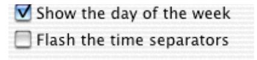

**checkmark** In the **Window menu,** a checkmark appears next to the active document's name. In other menus, checkmarks can be used to indicate that the setting applies to the entire selection. Checkmarks can be used for **mutually exclusive attribute groups** or **accumulating attribute groups**.

**Clipboard** A storage location for data the user cuts or copies from a document. The Clipboard is available to all applications and its contents don't change when the user switches between applications.

**clipping** Data dragged from an application to the Finder desktop.

**close button** A window control (the red one in the upper left) that users can click to close the window.

**combination box** A text entry field combined with a pop-up menu or a drop-down scrolling list. Combo boxes are useful for displaying a list of likely choices while still allowing the user to type in an item not in the list.

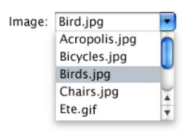

**contextual menu** A menu that appears when the user presses the Control key and clicks an interface item. A contextual menu provides convenient access to often-used commands associated with the item.

**continuous selection** A selection that includes everything between the anchor point and the active end.

**control** A graphic object that causes instant actions or visible results when the user manipulates the object with the mouse. Standard controls include **buttons, scroll bars, checkboxes, sliders, and pop-up menus.**

**dash** In a menu, a dash indicates that an attribute applies to only part of the selection. For example, if a highlighted selection contains text with different styles applied to it, a dash appears next to each style name in the menu.

**data browser** A control that provides a standardized look for column browsers (such as seen in the column view of a Finder window or in an Open dialog) and scrolling lists (such as seen in the list view of a Finder window).

**default keyboard access mode** The mode in which tabbing and other keystrokes move keyboard focus only between fields that receive keyboard input, such as text entry fields and scrolling lists. See also **full keyboard access mode**.

**destination region** The part of a document that can accept data dragged to it. In a document window, the destination region is usually the content area minus the title bar and areas used for controls such as scroll bars and rulers.

**dialog** A window designed to elicit a response from the user. See also **alert**.

**diamond** In a Window menu, a diamond means that the document has been minimized into the Dock.

**dimmed** An item that is dimmed, or grayed out, is currently unavailable. Menu items, for example, are dimmed rather than omitted when they aren't applicable at a particular moment.

**disclosure triangle** A control that allows the display, or disclosure, of information that elaborates on the primary information in a window. Disclosure triangles are used in the Finder's list view; clicking a triangle displays a folder's contents.

**discontinuous selection** A selection in which unselected objects are between selected objects.

**display name** The name of a file as it appears to the user. The display name reflects the user's preference for hiding or showing the filename extension.

**document-modal dialog** A dialog that prevents the user from doing anything else in the document until dismissing the dialog. All sheets are document modal and all Aqua document-modal dialogs should be sheets. See also **application-modal dialog**; **sheet**.

**document window** A window containing file-based data that users create and store. See also **utility window**.

**drag and drop** The technique of dragging an item, such as a graphic or selected text, and dropping it on a suitable destination, such as another document.

**drawer** A child window that slides out from a parent window, and which the user can open or close (show or hide) while the parent window is open. Drawers contain controls that are fairly frequently accessed but don't need to be visible at all times.

**dynamic menu item** A menu command that changes when the user presses a modifier key. For example, in the File menu (in the Finder), if the user presses the Option key, the Close Window command changes to Close All. See also **toggled menu item**.

**Edit menu** A menu that provides commands for changing, or editing, the contents of documents. It contains commands such as Cut, Copy, and Paste.

**emphasized system font** The bold version of the system font. It is used for the application name in an About window and the message text in an alert.

**File menu** A menu that contains commands that provide housekeeping tasks, such as Save As, for files.

**fixed-point model** A model for extending a continuous selection using Shift-click, in which the user can extend the selection on either side of the insertion point. See also **addition model**.

**focus ring** Highlighting around the onscreen area that is ready to accept user input.


**full keyboard access mode** The mode in which tabbing and other keystrokes move keyboard focus to more interface elements than is possible in **default keyboard access mode.**

**function key** One of the keys F1 through F15 on Apple desktop computer keyboards, plus the Help, Home, Page Up, Page Down, Del, and End keys.

**group box** In a dialog, a visual indication that certain controls belong together. In Aqua, this indication is typically accomplished with blank space rather than lines.

**help book** The collection of HTML files that provide onscreen help for a particular product.

**Help Center** A window where users can access any help book installed on their system.

**Help Viewer** The simple browser used to display Apple Help HTML files.

**help tag** A brief text explanation that appears when the user leaves the pointer hovering over an interface element for a few seconds.

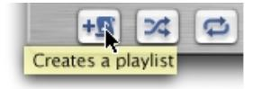

**hierarchical menu** A menu that includes a menu item from which a **submenu** descends. Submenus offer additional menu item choices without taking up more space in the menu bar. Hierarchical menus are indicated with a triangle indicator.

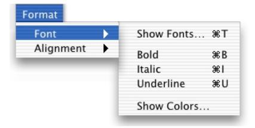

**hot spot** The portion of the pointer that must be positioned over a screen object for mouse clicks to have an effect on the object.

**hot zone** The area of an onscreen object that the pointer's hot spot must be within for mouse clicks to have an effect.

**icon button** A button that does not have a rectangular edge around it; the clickable region is the graphic (for example, the toolbar buttons in Finder windows).

**image well** A rectangular, recessed area that displays an icon or picture and that serves as a drag-and-drop target.

**insertion point** The point at which data will be inserted in response to a user's typing or pasting.

**Interface Builder** An application that helps you easily create application menus, windows, dialogs, palettes, and other standard Aqua interface elements.

**label font** The font used for labels with controls such as sliders and icon bevel buttons. It is 10-point Lucida Grande Regular.

**minimize button** A window control (the middle yellow one at the top left) that the user clicks to put a window into the Dock.

**modeless dialog** A dialog that does not require the user to dismiss it before interacting with anything else onscreen. The "find and replace" feature in many word processors is an example of a modeless dialog.

**modifier key** A key the user can hold down to alter the meaning of another key being pressed simultaneously or to alter the meaning of a mouse action. The Option and Command () keys are examples of modifier keys.

**mutually exclusive attribute group** A set of attribute choices in which the user can select only one item, such as font size. See also **accumulating attribute group**.

**palette** A window that is independent of documents and that provides items to be used when other windows are open, such as a palette that provides drawing tools.

**pane** An area of changeable content in a dialog or other window. Panes usually change as the result of the user clicking a tab or a button, or choosing an item from a pop-up menu. In some cases, panes change as a process takes place, such as while the Installer application is running.

**placard** A control that displays information. Typically placards are used in document windows as a way to quickly modify the view of the contents—for example, to change the current page or the magnification.

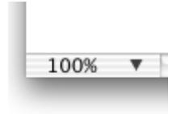

**pointer** The onscreen representation of the mouse's location. The pointer commonly looks like an arrow, but can also assume such shapes as a pencil, a cross, or a paintbrush, depending on the application and the user's selection.

**pop-down menu** A menu that contains commands and appears in a window rather than in the menu bar. Use of this control is limited to cases where the window is shared among multiple applications and the menu contains commands that affect the window's contents. A closed pop-down menu always displays the same text, which is the menu title. Pop-down menus have a single, downward-pointing triangle.

**pop-up menu** A menu that, when closed, displays the current choice and can be opened to present a list of mutually exclusive choices in a dialog or window. Pop-up menus have a double triangle indicator.

**progress indicator** A control that lets the user know that a task is in progress.


**proxy icon** An icon in a document title bar that users can manipulate as if they were manipulating the corresponding file-system object. Users can Command-click the proxy icon to display a pop-up menu illustrating the document path.

**push button** A rounded rectangle with a text label on it, which the user clicks to perform an instantaneous action, such as saving a document, completing operations defined by a dialog, or acknowledging an error message.


**radio button** A control for one of a set of mutually exclusive, but related, choices.


**relevance control** A control that indicates the relative ranking of search results—the longer the bar, the more relevant the item is to the search criteria.


**scroll bar** A control for viewing areas of a document or a list that is larger than can fit in the current window. Only the active window can be scrolled. A window can have a horizontal scroll bar, a vertical scroll bar, both, or neither.

**scroller** The part of a **scroll bar** that the user drags to view other parts of a document. The scroller size reflects how much of the document is visible; the smaller the scroller, the less of the content the user can see at that time. The scroller represents the relative location, in the whole document, of the portion that can be seen in the window.

**scrolling list** A list in a dialog that uses **scroll bars** to reveal its contents.

**scrolling menu** A menu that contains more items than are visible onscreen. Scrolling menus have triangle symbols that indicate the presence of hidden menu items.

**setup assistant** A small application that guides users through the setup options for a hardware device or software component.

**sheet** A dialog attached to a specific window, ensuring that the user never loses track of which window the dialog belongs to. A Print dialog is an example of a sheet. See also **document-modal dialog**.

**Shift-click** To click while the Shift key is down. This combination is used to select multiple objects or to extend a selection.

**slider control** A control enabling users to choose among a continuous range of allowable values. Slider controls can be horizontal or vertical and can display incremental tick marks.

**small system font** The font used for informative text in alerts, headers in lists, help tags, and text in the small versions of many controls. It is 11-point Lucida Grande Regular.

**speech recognition** The ability for the computer to understand spoken commands or responses.

**spinning arrows** An indeterminate status indicator that can be used when space is very constrained.


**splitter bar** A control for dividing a document window into sections so that more than one part of the file can be viewed at the same time, or a control that divides a nondocument window into sections.

**standard state** A new window's initial size and position (determined by the application). See also **[user state](#page-295-0)**; **zoom button**.

**static text field** Text in a dialog that users can't modify.

**submenu** A menu that descends from another menu. The title of the submenu is a menu item in the parent menu. See also **hierarchical menu**.

**system font** The font used for text in menus and in modeless dialogs, and for titles of document windows. It is 13-point Lucida Grande Regular.

**tab control** A control that looks like a file folder tab and that provides a convenient way to present dialog information in a multipage format.


**text input field** A rectangular area in which the user enters text or modifies existing text. Also called an editable text field, it supports keyboard focus and password entry.

**text to speech (TTS)** The ability of the computer to convert text into spoken words.

**toggled menu item** A menu item or a set of two menu items that change between two states (for example, Turn Grid On and Turn Grid Off).

**type-ahead** Queuing of keystrokes for processing later. It occurs when the user types faster than the computer can handle or when the computer is unable to process the keystrokes.

<span id="page-295-0"></span>**user state** A window's user-defined size and position. See also **standard state**; **zoom button**.

**utility window** A window that floats above other windows and provides tools or controls that users can work with while documents are open. See also **document window**.

**View menu** A menu that provides commands that affect what users see in a window. In the Finder, for example, the View menu contains commands for displaying windows as columns, icons, or lists.

**Window menu** A menu that contains commands for managing document windows. The menu lists an application's open document windows, including minimized windows, in the order in which they were opened.

**word wrap** The automatic continuation of text from the end of one line to the beginning of the next without breaking in the middle of a word.

**zoom button** A control that toggles a window between its **standard state** and its **user state.**

# Index

| A                                                               | applying guidelines 22                                |
|-----------------------------------------------------------------|-------------------------------------------------------|
|                                                                 | Arrange in Front command (Window menu) 62             |
| About command (application menu) 55                             | arrow keys 170–174                                    |
| About windows 92–93                                             | appropriate uses for 170                              |
| accessibility, as design principle 37–39<br>actions in menus 46 | behaviors of 172<br>extending text selection with 173 |
| active windows                                                  | and keyboard navigation 184                           |
| appearance of controls 81                                       | moving the insertion point with 171                   |
| background selections in 222                                    | with Shift key 173                                    |
| dragging to 222, 226                                            | arrows, spinning 143                                  |
| Add to Favorites button 104, 108                                | ATSUI 199                                             |
| AddressBook framework 23                                        | attributes in menus 47–48                             |
| alert dialogs 95, 98, 268                                       | audience, knowledge of 33                             |
| alert message text, writing 232                                 | automatic scrolling 87, 225                           |
| anti-aliased text 198                                           | automatic typing. See type-ahead                      |
| Appearance Manager                                              | automation, of user tasks 236                         |
| and disclosure triangles 148                                    | auto-repeat 185                                       |
| using, for Aqua compliance 24                                   |                                                       |
| Apple Developer Connection 24                                   |                                                       |
| Apple Help 235–238                                              |                                                       |
| Apple Help Viewer 237                                           | B                                                     |
| Apple key. See Command key                                      |                                                       |
| Apple menu 53                                                   | background selections 222, 226                        |
| Apple Publications Style Guide (APSG) 229                       | background, striped 130                               |
| AppleScript and task automation 237                             | Backspace key. See Delete key                         |
| application fonts 197                                           | benefits of applying Aqua guidelines 22               |
| application icons 204–207                                       | bevel buttons 131–136                                 |
| adding permanently to the Dock 44                               | as pop-up menus 134                                   |
| in alert dialogs 99                                             | specifications 131                                    |
| classifying 202                                                 | Bold command (Format menu) 180                        |
| in the Dock 43, 44, 88                                          | boldface fonts 198                                    |
| notification behavior of 42                                     | boxes                                                 |
| Application Kit 96, 119                                         | About 92                                              |
| application menu 54–56                                          | checkboxes 122–124                                    |
| application-modal dialogs 96, 96–99                             | combination 128–130, 144                              |
| application-support files 245                                   | group 151–154                                         |
| application-wide commands (application menu)                    | Bring All to Front command (Window menu) 62,          |
| 55                                                              | 113                                                   |
| Apply button 120                                                | bullets in menus 66                                   |

| buttons                                      | Clear key 168                                  |
|----------------------------------------------|------------------------------------------------|
| Add to Favorites 104, 108                    | clicking 164, 186                              |
| bevel 131–136                                | click-through 82–85                            |
| Cancel 120                                   | Clipboard 59–61, 220                           |
| default 120, 122                             | clippings in drag-and-drop operations 219, 227 |
| Help 238                                     | close button 70, 93                            |
| pop-up bevel 134                             | Close command (File menu) 57, 179              |
| pop-up icon 134                              | Close dialogs 105                              |
| push 120–121, 231                            | cloverleaf symbol. See Command key             |
| radio 122                                    | Cocoa                                          |
| Review Changes 112                           | guidelines for interface elements 119          |
|                                              | color coding 38                                |
|                                              | Colors window 63                               |
|                                              | column view lists 145                          |
| C                                            | combination boxes 128–130, 144                 |
|                                              | Command key 170                                |
| Cancel button 120                            | command pop-down menus 127                     |
| capitalization, of interface elements 231    | Command-, 55, 180                              |
| Caps Lock key 169                            | Command-~ 62, 82                               |
| caution icons 100                            | Command-A 61, 180                              |
| centering windows 76–78                      | Command-B 180                                  |
| character keys 166–169                       | Command-C 60, 180                              |
| characters in menus 65–67                    | Command-click 188                              |
| chasing arrows. See spinning arrows          | Command-D 179                                  |
| checkboxes 122–124                           | Command–Down Arrow 172                         |
| checklists for creating applications 261–271 | Command-F 180                                  |
| alert dialogs 268                            | Command-G 180                                  |
| dialogs 267                                  | Command-I 180                                  |
| documentation 271                            | Command-key equivalents 176–184                |
| general considerations 261–262               | Command–Left Arrow 172, 177                    |
| graphic design 263                           | Command-M 179                                  |
| help tags 271                                | Command–modifier key–Space bar 177             |
| icons 270                                    | Command-N 179                                  |
| keyboard equivalents 269                     | Command-O 102, 179                             |
| menus 263                                    | Command–Option–Space bar 177                   |
| mouse events 269                             | Command-P 180                                  |
| pop-up menus 264                             | Command-Q 179                                  |
| scrolling 266                                | Command–Right Arrow 172, 177                   |
| text 270                                     | Command-S 179                                  |
| user documentation 271                       | commands, menu                                 |
| utility windows 266                          | About (application menu) 55                    |
| windows 265                                  | application-wide items (application menu) 55   |
| checkmarks in menus 51, 65                   | Arrange in Front (Window menu) 62              |
| Choose dialogs 114–115                       | Bold (Format menu) 180                         |
| Clear command 60                             | Bring All to Front (Window menu) 62, 113       |

| commands, menu (continued)                  | Control key 170                        |
|---------------------------------------------|----------------------------------------|
| Close (File menu) 57, 179                   | Control Manager 119                    |
| Copy (Edit menu) 60, 180                    | Control-F1 key combination 184         |
| Cut (Edit menu) 60, 180                     | Control-F2 key combination 178         |
| Find (Edit menu) 61, 180                    | Control-F3 key combination 178         |
| Find Again (Edit menu) 180                  | Control-F4 key combination 178         |
| Hide (application menu) 56                  | Control-F5 key combination 178         |
| Italic (Format menu) 180                    | Control-F6 key combination 178         |
| Minimize (Window menu) 179                  | controls 119–148                       |
| New (File menu) 57, 179                     | appearance of 120–148                  |
| Open (File menu) 57, 102, 179               | behavior of 120–148                    |
| Open Font dialog (Format menu) 180          | bevel buttons 131–136                  |
| Open Recent (File menu) 57, 102             | checkboxes 122–124                     |
| Page Setup (File menu) 58                   | click-through behavior of 82           |
| Paste (Edit menu) 60, 180                   | close button 70, 93                    |
| Print (File menu) 58, 180                   | disclosure triangles 148               |
| Quit (application menu) 56, 179             | grouping in dialogs 151–154            |
| Redo (Edit menu)) 59                        | image wells 147                        |
| Save (File menu) 58, 179                    | layout guidelines for 149–157          |
| Save As (File menu) 58                      | minimize button 70, 88                 |
| Select All (Edit menu) 61, 180              | pop-up bevel buttons 134               |
| Services (application menu) 55              | pop-up icon buttons 134                |
| Underline (Format menu) 180                 | pop-up menus 124–126                   |
| Undo (Edit menu) 59, 180, 220               | progress indicators 141                |
| Undo/Redo (Edit menu) 60                    | push buttons 120–121, 231              |
| Zoom (Window menu) 62                       | radio buttons 122                      |
| Command–Space bar 177                       | resize control 70                      |
| Command-T 180                               | scroll bars 85–87                      |
| Command-U 180                               | scrolling lists 146                    |
| Command–Up Arrow 172                        | sliders 87, 137                        |
| Command-V 60, 180                           | small versions of 160–161              |
| Command-W 179                               | tabs 88, 138–141, 157                  |
| Command-X 60, 180                           | using in utility windows 160–161       |
| Command-Z 60, 180                           | window controls 70–71, 85–87, 92       |
| compatibility, as design principle 33       | zoom button 70, 80                     |
| confirmation dialogs 220                    | copy and paste 220                     |
| consistency                                 | Copy command (Edit menu) 60, 180       |
| as design principle 30                      | copy operations with drag and drop 220 |
| of user experience 22                       | cultural considerations 34             |
| containers for drag-and-drop operations 220 | cut and paste 194, 220                 |
| contextual menus 64, 238                    | Cut command (Edit menu) 60, 180        |
| continuous selection 187                    |                                        |

| D                                             | document modal 96–98                        |
|-----------------------------------------------|---------------------------------------------|
|                                               | error checking in 102                       |
| dashes                                        | expanded Save 107–108                       |
| in checkboxes 124                             | grouping items in 151–154                   |
| in menus 65                                   | icons in 99                                 |
| data browser 144                              | laying out 149                              |
| data loss, preventing in drag-and-drop        | localizing 36                               |
| operations 221                                | minimal Save 106–107                        |
| default button 120, 122                       | modeless 91, 95, 197                        |
| default directories 245–248                   | Open 102                                    |
| default keyboard access mode 184              | Page Setup 115–118                          |
| default location for saving documents 106,    | pop-up menus in 124                         |
| 245–248                                       | positioning controls in 149–160             |
| default titles for new documents 74           | Print 58, 115–118                           |
| Delete (Backspace) key 168                    | Quit 105, 110–113                           |
| design principles 22, 27–39                   | save 105–113                                |
| aesthetic integrity 31                        | sheets 96–98                                |
| consistency 30                                | text in 197                                 |
| direct manipulation 28                        | types and usage of 95–99                    |
| feedback and dialog 29                        | using tabs in 157                           |
| forgiveness 31                                | writing text for 232–233                    |
| modelessness 32                               | diamonds in menus 66                        |
| perceived stability 31                        | digital camera images, storing 248          |
| see-and-point 28                              | dimmed items 31, 47                         |
| use of metaphors 27                           | direct manipulation, as design principle 28 |
| user control 29                               | directories, user domain 245–248            |
| WYSIWYG 30                                    | disabilities 37–39                          |
| Desktop directory 247                         | disabled items. See dimmed items            |
| desktop, dragging to 227                      | disclosure triangles 107, 148               |
| destination feedback, for drag-and-drop       | discontinuous selection 187                 |
| operations 223–225                            | display name 75, 250                        |
| destinations for drag-and-drop operations 220 | Dock 41–44                                  |
| developer resources 21                        | activating windows from 44                  |
| developer terms, terminology for 230          | animating icons in 42                       |
| dialogs 95–118                                | application icons in 43, 44, 88             |
| advanced options in 117                       | icon badging in 42                          |
| alert 95, 98, 268                             | icon genres and 202                         |
| application modal 96, 96–99                   | icon menus 43                               |
| behavior of 101–118                           | icon notification behavior in 42            |
| changes in, accepting 101                     | and positioning of windows 76, 77           |
| checklist for creating 267                    | document names 144                          |
| Choose 114–115                                | document updates 21                         |
| Close 105                                     | document windows                            |
| confirmation 220                              | defined 69                                  |
| displaying filename extensions in 105         | opening 74                                  |

| document windows (continued)<br>unsaved changes in 71<br>untitled 74<br>documentation, checklist for creating 271<br>document-modal dialogs (sheets) 96–98<br>Documents directory 248<br>documents, storing 248<br>double-clicking 164, 190<br>Down Arrow key 172<br>drag feedback 223<br>Drag Manager 220, 223<br>drag-and-drop operations 219–227                                                                                                                                                                             | Enter key 167<br>error checking in dialogs 102<br>error messages. See alert dialogs<br>Escape (Esc) key 168, 184<br>expanded Save dialog 107–108<br>extensions. See filename extensions, printing<br>dialog extensions<br>F                                                                                                                                                                                                                                                                                                                                                                                         |
|---------------------------------------------------------------------------------------------------------------------------------------------------------------------------------------------------------------------------------------------------------------------------------------------------------------------------------------------------------------------------------------------------------------------------------------------------------------------------------------------------------------------------------|---------------------------------------------------------------------------------------------------------------------------------------------------------------------------------------------------------------------------------------------------------------------------------------------------------------------------------------------------------------------------------------------------------------------------------------------------------------------------------------------------------------------------------------------------------------------------------------------------------------------|
| clippings in 227<br>common operations and results 221<br>copying data in 220<br>destination feedback for 223–225<br>drag feedback for 223<br>drop feedback for 225–227<br>feedback for 222–227<br>Finder and 221, 226<br>moving data in 220<br>overview of 219<br>preventing data loss with 221<br>windows and 220, 222, 223–224<br>dragging 165, 187<br>See also drag-and-drop operations<br>drawers 88–91<br>Drop Box (Public directory) 248<br>drop feedback 225–227<br>dynamic menu items 49<br>See also toggled menu items | feedback and dialog, as design principle 29<br>feedback for drag-and-drop operations 222–227<br>drag 223<br>drop 225–227<br>for invalid drops 227<br>selection 222<br>file location 245–248<br>File menu 56–58<br>filename extensions 249–250<br>in dialogs 105, 106, 108<br>in documents 74–75<br>files, installing 245–247<br>file-system paths 251<br>Find Again command (Edit menu) 180<br>Find command (Edit menu) 61, 180<br>Finder<br>as destination for drag-and-drop operations<br>221, 226<br>drag-and-drop clippings in 227<br>progress feedback for drag and drop 226<br>Finder icons<br>See also icons |
| E                                                                                                                                                                                                                                                                                                                                                                                                                                                                                                                               | in drag-and-drop operations 226<br>drop feedback for 226                                                                                                                                                                                                                                                                                                                                                                                                                                                                                                                                                            |
| Edit menu 59–61<br>editable text fields. See text input fields<br>editing text 193–195<br>ellipses character<br>in menus and buttons 230<br>ellipsis character<br>in menus and buttons 67<br>in scrolling lists 144<br>emphasized system fonts 198<br>End key 174–176                                                                                                                                                                                                                                                           | focus, keyboard 182–184<br>Font menu 67<br>Fonts window 63<br>fonts, standard 197–198<br>foreign languages 34–37<br>forgiveness, as design principle 31<br>Forward Delete (Del) key 168, 174–176<br>full keyboard access mode 178, 184<br>function keys 174–176                                                                                                                                                                                                                                                                                                                                                     |

| G                                                                                                             | HTML, displaying in Help Viewer 237                         |
|---------------------------------------------------------------------------------------------------------------|-------------------------------------------------------------|
| global compatibility, as design principle 33<br>graphic design in applications, checklist for<br>creating 263 | human interface design principles. See design<br>principles |
| graying out. See dimmed items<br>group boxes 151–154                                                          | I                                                           |
| grouping items                                                                                                | icons 201–218                                               |
| in dialogs 151–154                                                                                            | application icons. See application icons                    |
| in menus 47, 65                                                                                               | caution 100                                                 |
|                                                                                                               | checklist for creating 270                                  |
|                                                                                                               | conveying with emotional qualities 216                      |
| H                                                                                                             | design tips for 218                                         |
|                                                                                                               | in dialogs 99                                               |
| hardware, icons for 209                                                                                       | in Dock 42–44                                               |
| headings, text in 198                                                                                         | families of 202                                             |
| hearing disabilities 38                                                                                       | Finder, in drag-and-drop operations 226                     |
| help balloons. See help tags                                                                                  | genres of 202                                               |
| Help button 238                                                                                               | non-application 207–210                                     |
| Help Center 237                                                                                               | notification behavior of 42                                 |
| Help key 174–176                                                                                              | perspective for 213–215                                     |
| Help menu 63, 237                                                                                             | as pop-up menus 134                                         |
| help systems 235–243                                                                                          | proxy 72                                                    |
| accessing 237                                                                                                 | for setup assistants 241                                    |
| Apple's philosophy of 235                                                                                     | steps to create 216                                         |
| help tags 198, 238–241, 271                                                                                   | in toolbars 211                                             |
| Help Viewer 237                                                                                               | types of 202–212                                            |
| searching within 236                                                                                          | image wells 147                                             |
| setup assistants 241–243                                                                                      | images, storing 248                                         |
| help tags 238–241                                                                                             | inactive windows                                            |
| checklist for creating 271                                                                                    | clicking in 82–85                                           |
| text in 198<br>Help Viewer 237                                                                                | controls in 81<br>dragging from 222, 226                    |
| Hide command (application menu) 56                                                                            | dragging to 224                                             |
| hierarchical menus 48                                                                                         | initial capital style 231                                   |
| highlighting                                                                                                  | insertion indicator for dragged text 224                    |
| in destination regions 223                                                                                    | insertion points 171, 174, 224                              |
| Finder icons in drag and drop 226                                                                             | installing files 245–247                                    |
| of selections 185–192                                                                                         | intelligent cut and paste 194                               |
| text in drag-and-drop operations 226                                                                          | Interface Builder 24                                        |
| Home key 174–176                                                                                              | interface design principles. See design principles          |
| hot spots 163                                                                                                 |                                                             |

| interface elements<br>capitalization of 231<br>default alignment of 149<br>guidelines for Carbon developers 119<br>guidelines for Cocoa developers 119<br>help tags and 235<br>labels for 230<br>localizing 34<br>terminology for 230<br>international considerations 33, 35, 177<br>Internet preferences 248<br>invalid drops, feedback for 227<br>Italic command (Format menu) 180                              | capitalization of 232<br>for checkboxes 122<br>for combo boxes 128<br>for pop-up menus 124<br>for push buttons 120<br>for radio buttons 122<br>for tabs 139<br>terminology for 230<br>language 229–234<br>alert messages, writing 232<br>design principles for 34<br>style and usage 229, 273–283<br>terminology in the interface 230–232<br>translation considerations 35<br>layering of windows 61, 70, 113     |
|-------------------------------------------------------------------------------------------------------------------------------------------------------------------------------------------------------------------------------------------------------------------------------------------------------------------------------------------------------------------------------------------------------------------|-------------------------------------------------------------------------------------------------------------------------------------------------------------------------------------------------------------------------------------------------------------------------------------------------------------------------------------------------------------------------------------------------------------------|
| J                                                                                                                                                                                                                                                                                                                                                                                                                 | laying out dialogs 149–157<br>Left Arrow key 172                                                                                                                                                                                                                                                                                                                                                                  |
| Java tools for applying Aqua guidelines 24                                                                                                                                                                                                                                                                                                                                                                        | Library directory 247<br>lists 144, 146<br>localization of interface elements 34                                                                                                                                                                                                                                                                                                                                  |
| K                                                                                                                                                                                                                                                                                                                                                                                                                 |                                                                                                                                                                                                                                                                                                                                                                                                                   |
| keyboard equivalents 176–184<br>checklist for creating 269<br>creating your own 180<br>for international systems 177<br>reserved and recommended 179<br>keyboard focus 182–184<br>keyboard navigation 182<br>keyboards 166–182<br>keys<br>arrow 170–174, 184<br>character 166–169<br>function 174–176<br>modifier 166, 169–170<br>kMenuAttrAutoDisable attribute 52<br>kUtilityWindowClass utility window 69<br>L | M<br>Mac OS X developer documentation website 24<br>magnifying the screen 38<br>MDEF (standard system menu definition<br>procedure) 50<br>menu bars 52–63<br>menu elements 45–48<br>menu items 46–51<br>capitalization of 46, 231<br>dynamic 49<br>grouping of 47–48<br>naming of 46<br>text styles in 67<br>toggled 50<br>Menu Manager 52<br>menu titles 46, 231<br>menus 45–67<br>Apple 53<br>application 54–56 |
| label font 198<br>labels                                                                                                                                                                                                                                                                                                                                                                                          | attribute groups in 47–48<br>behavior of 49–51                                                                                                                                                                                                                                                                                                                                                                    |

| menus (continued)                                  | N                                           |  |
|----------------------------------------------------|---------------------------------------------|--|
| checklist for creating 263<br>checkmarks in 51, 65 | Navigation Services 103                     |  |
| command pop-down 127                               | New command (File menu) 57                  |  |
| contextual 64, 238                                 | NSDrawer class 89                           |  |
| dashes in 65                                       |                                             |  |
| Edit 59–61                                         |                                             |  |
| File 56–58                                         |                                             |  |
| Font 67                                            | O                                           |  |
| grouping items in 48                               |                                             |  |
| Help 63, 237                                       | onscreen elements. See interface elements   |  |
| hierarchical 48                                    | onscreen help. See help systems             |  |
| nonstandard characters in 65–67                    | onscreen zooming 38                         |  |
| pop-up 124–126, 264                                | Open command (File menu) 57, 102            |  |
| pull-down 52–63                                    | Open dialogs 102                            |  |
| scrolling 50                                       | Open Font dialog command (Format menu) 180  |  |
| separators in 48                                   | Open Recent command (File menu) 57, 102     |  |
| sticky 51                                          | Option key                                  |  |
| Style 67                                           | drag-and-drop operations and 220–221        |  |
| symbols in 65                                      | uses of 169                                 |  |
| text styles in 65–67                               | Option–Arrow key combinations 172           |  |
| View 61                                            |                                             |  |
| Window 61                                          |                                             |  |
| metaphors, use of as design principle 27           | P                                           |  |
| MIDI files, storing 248                            |                                             |  |
| minimal Save dialog 106–107                        | Page Down key 86, 174–176                   |  |
| minimize button 70, 88                             | Page Setup command (File menu) 58           |  |
| MLTE 199                                           | Page Setup dialog 115–118                   |  |
| modeless dialogs 91, 95, 197                       | Page Up key 86, 174–176                     |  |
| modelessness, as design principle 32               | palettes. See utility windows               |  |
| modifier keys 166, 169–170                         | panes 88, 115–118, 138–141                  |  |
| monitors and window size 78                        | passwords, entering 196                     |  |
| mouse devices 164–165                              | Paste command (Edit menu) 60, 180           |  |
| mouse events, checklist for handling 269           | pasteboard. See Clipboard                   |  |
| Mouse Keys 39                                      | pathnames 251                               |  |
| mouse-down events                                  | PDEs (printing dialog extensions) 115       |  |
| Option key modifier with 221                       | perceived stability, as design principle 31 |  |
| single-gesture selection and dragging and 222      | physical disabilities 39                    |  |
| move operations with drag and drop 220             | Pictures directory 248                      |  |
| Movies directory 248                               | placards 130                                |  |
| moving windows 80                                  | Plain command 66                            |  |
| multiple windows for the same document 97,         | plug-ins 249                                |  |
| 109                                                | plug-ins, icons for 209                     |  |
| Music directory 248                                | pointers 163                                |  |
| music files, storing 248                           |                                             |  |

| pointing devices 163<br>pop-up bevel buttons 134<br>pop-up icon buttons 134<br>pop-up menus 124–126, 130, 264<br>See also combination boxes<br>preferences<br>dialogs 55<br>Preferences command 55, 180<br>preferences, icons for 209<br>pressing the mouse button 165<br>principles of human interface design. See design<br>principles<br>Print command (File menu) 58, 180<br>Print dialog 58, 115–118<br>printing dialog extensions (PDEs) 115<br>priorities for implementing the guidelines 23 | range-selection for drag-and-drop operations<br>222<br>recessed buttons. See image wells<br>Redo command (Edit menu) 59<br>region-dependent information, storing 36<br>relevance control 143<br>removable media, icons for 209<br>replace document dialog 113<br>Reset button 150<br>resize control 70<br>resources for storing region-dependent<br>information 36<br>Return key 167<br>Review Changes button 112<br>Right Arrow key 172 |
|-----------------------------------------------------------------------------------------------------------------------------------------------------------------------------------------------------------------------------------------------------------------------------------------------------------------------------------------------------------------------------------------------------------------------------------------------------------------------------------------------------|------------------------------------------------------------------------------------------------------------------------------------------------------------------------------------------------------------------------------------------------------------------------------------------------------------------------------------------------------------------------------------------------------------------------------------------|
| programming tools for applying Aqua guidelines<br>24<br>Programming With the Appearance Manager 24                                                                                                                                                                                                                                                                                                                                                                                                  | S                                                                                                                                                                                                                                                                                                                                                                                                                                        |
| progress feedback for drag-and-drop operations<br>226<br>progress indicators 141<br>proxy icons 72<br>Public directory 248<br>pull-down menus 45–67<br>behavior of 49–51<br>elements of 46<br>push buttons 120–121<br>capitalization of labels 231<br>specifications for 121<br>stacking 121                                                                                                                                                                                                        | Save a Copy command, avoiding 58<br>Save As command (File menu) 58<br>Save command (File menu) 58, 179<br>save dialogs 105–113<br>Save To command, avoiding 58<br>screen-zooming feature 177<br>scroll arrows 85<br>scroll bars 85–87<br>See also sliders<br>scroll tracks 85<br>scrollers 85<br>scrolling lists<br>defined 144<br>specifications for 146                                                                                |
| Q                                                                                                                                                                                                                                                                                                                                                                                                                                                                                                   | versus pop-up menus 130<br>versus sliders 144                                                                                                                                                                                                                                                                                                                                                                                            |
| QuickTime and Apple Help 237<br>Quit command (application menu) 56<br>quit operations, dialogs for 110–113                                                                                                                                                                                                                                                                                                                                                                                          | scrolling menus 50<br>scrolling windows 85–87<br>automatically 87<br>checklist for proper behavior 266<br>by position 86                                                                                                                                                                                                                                                                                                                 |
| R                                                                                                                                                                                                                                                                                                                                                                                                                                                                                                   | by unit 86<br>by windowful 86                                                                                                                                                                                                                                                                                                                                                                                                            |
| radio buttons 122                                                                                                                                                                                                                                                                                                                                                                                                                                                                                   | see-and-point, as design principle 28<br>Select All command (Edit menu) 61, 180                                                                                                                                                                                                                                                                                                                                                          |

| selecting 185–192                                  | Style menu 67                       |
|----------------------------------------------------|-------------------------------------|
| in arrays 192                                      | styled text in menus 65–67          |
| changing selections 173, 187–188                   | submenus. See hierarchical menus    |
| by clicking 186                                    | symbols in menus 65                 |
| by dragging 187                                    | system fonts 197                    |
| graphics 192                                       |                                     |
| in tables 192                                      |                                     |
| in text 189–192                                    |                                     |
| word boundaries and 190                            | T                                   |
| selection feedback, and dragging 222, 226          |                                     |
| sentence style capitalization 231                  | tab controls 88, 138–141, 157       |
| separators, menu 48                                | Tab key 167, 184                    |
| Services command (application menu) 55             | tables, selecting text in 192       |
| setup assistants 241–243                           | target audience, knowledge of 33    |
| Sharing preferences 248                            | terminology 230–232, 273–283        |
| sheets (document-modal dialogs) 96–98              | text                                |
| Shift key 169, 173                                 | See also fonts; labels              |
| Shift-Command-~ 62, 82                             | in alerts 98                        |
| Shift–Command–arrow key combinations 174           | anti-aliasing 198                   |
| Shift–Option–arrow key combinations 173            | checklist for working with 270      |
| Shift-Tab key 184                                  | design principles for displaying 35 |
| shortcuts, keyboard. See keyboard equivalents      | destination feedback in 224         |
| Show Colors command 63                             | drop feedback in 226                |
| Show Fonts command 63                              | global support of 35                |
| single-gesture selection and dragging 222          | in labels 198                       |
| Sites directory 248                                | text editing 193–195                |
| sliders 87, 137                                    | deleting 193                        |
| See also scroll bars                               | inserting 193                       |
| small versions of controls 120, 160–161            | intelligent cut and paste 194       |
| smart cut and paste 194                            | and keyboard focus 182              |
| sound files, storing 248                           | for localization 35                 |
| Space bar 167, 184                                 | replacing selections 194            |
| speech recognition and synthesis 253–260           | in text entry fields 195            |
| spinning arrows 143                                | using Shift and arrow keys 173      |
| standard fonts 197–198                             | text input fields 144, 195          |
| standard pull-down menus 52–63                     | See also combination boxes          |
| standard state of a window 80                      | text styles in menus 65–67          |
| standard system menu definition procedure          | text-to-speech converters 35        |
| (MDEF) 50                                          | tick marks in slider controls 137   |
| static text fields 144                             | title bars 70                       |
|                                                    | title style capitalization 231      |
| Sticky Keys 39                                     | titles for menus 46                 |
| sticky menus 51<br>strings and word boundaries 189 | toggled menu items 50               |
| style and usage of language 229, 273–283           | See also dynamic menu items         |
|                                                    | tool palettes. See utility windows  |

| toolbars 133–134                                                                                  | V                                                                                  |
|---------------------------------------------------------------------------------------------------|------------------------------------------------------------------------------------|
| commands for 61<br>customizing 61<br>icons in 211                                                 | video files, storing 248<br>View menu 61                                           |
| tools for applying Aqua guidelines 24<br>Trash icon 41<br>Trash, as drag-and-drop destination 225 | visual disabilities 38                                                             |
| triangles, disclosure 148<br>triple-clicking 190                                                  | W                                                                                  |
| truncating pathnames 251<br>type-ahead 185                                                        | Web Sharing 248<br>window controls<br>close button 70, 93<br>in utility windows 92 |
| U                                                                                                 | minimize button 70, 88<br>proxy icons 72                                           |
| unavailable items. See dimmed items<br>Underline command (Format menu) 180                        | scroll bars 85–87<br>zoom button 70, 81                                            |
| Undo/Redo command (Edit menu) 60, 180, 220                                                        | Window menu 61                                                                     |
| Unicode 35<br>universal accessibility, as design principle 37–39                                  | windows 69–93<br>See also alert dialogs; dialogs                                   |
| unsaved changes, handling on Close or Quit 109                                                    | activating from the Dock 44                                                        |
| Up Arrow key 172<br>updates to this book 21                                                       | active 81<br>appearance 70–88                                                      |
| user control, as design principle 29                                                              | automatic scrolling in 87, 225                                                     |
| user documentation, checklist for creating 271                                                    | behavior 70–88                                                                     |
| user domain directories 245–248                                                                   | checklist for 265                                                                  |
| user input 163–195<br>editing text 193–195                                                        | closing 79<br>controls for 70–71, 85–87, 92                                        |
| keyboards 166–182                                                                                 | displaying on multiple monitors 78                                                 |
| mouse devices 164–165                                                                             | document 69                                                                        |
| non-Roman script systems 172                                                                      | as drag-and-drop destinations 220, 222,                                            |
| pointing devices 163                                                                              | 223–224, 226                                                                       |
| selecting 185–192<br>user state of a window 80                                                    | expanding 44, 88<br>in relation to the Dock 41                                     |
| user terms, terminology for 230                                                                   | inactive 81                                                                        |
| user-created files, default locations 248                                                         | layering of 61, 70, 113                                                            |
| user-friendly language 230                                                                        | minimizing 88                                                                      |
| utility windows 91–92                                                                             | modeless 92–93                                                                     |
| checklist for creating 266                                                                        | moving 80                                                                          |
| defined 69<br>using small controls in 160–161                                                     | multiple views of same document 97, 109<br>naming 74–75                            |

```
windows (continued)
  nondocument 77
  opening 74
  positioning of 76
  resizing 80
  scrolling 85–87
  special 88–93
  standard state 80
  titles for 74
  user state 81
  zooming 80
words, selecting 189
worldwide compatibility, as design principle 33
WYSIWYG, as design principle 30
```

### Z

zoom button [70,](#page-69-3) [81](#page-80-3) in utility windows [92](#page-91-4) Zoom command (Window menu) [62](#page-61-4) zoomback behavior [227](#page-226-9) zooming feature [38](#page-37-4), [177](#page-176-6)