# iPhone Human Interface Guidelines

**User Experience**

ď

Apple Inc. © 2010 Apple Inc. All rights reserved.

No part of this publication may be reproduced, stored in a retrieval system, or transmitted, in any form or by any means, mechanical, electronic, photocopying, recording, or otherwise, without prior written permission of Apple Inc., with the following exceptions: Any person is hereby authorized to store documentation on a single computer for personal use only and to print copies of documentation for personal use provided that the documentation contains Apple's copyright notice.

The Apple logo is a trademark of Apple Inc.

Use of the "keyboard" Apple logo (Option-Shift-K) for commercial purposes without the prior written consent of Apple may constitute trademark infringement and unfair competition in violation of federal and state laws

No licenses, express or implied, are granted with respect to any of the technology described in this document. Apple retains all intellectual property rights associated with the technology described in this document. This document is intended to assist application developers to develop applications only for Apple-labeled computers.

Every effort has been made to ensure that the information in this document is accurate. Apple is not responsible for typographical errors.

Apple Inc. 1 Infinite Loop Cupertino, CA 95014 408-996-1010

App Store is a service mark of Apple Inc.

Apple, the Apple logo, iPhoto, iPod, iPod touch, iTunes, Mac, Mac OS, Safari, and Spotlight are trademarks of Apple Inc., registered in the United States and other countries.

iPhone and Multi-Touch are trademarks of Apple Inc.

Java and all Java-based trademarks are trademarks or registered trademarks of Sun Microsystems, Inc. in the U.S. and other countries.

Simultaneously published in the United States and Canada.

Even though Apple has reviewed this document, APPLE MAKES NO WARRANTY OR REPRESENTATION, EITHER EXPRESS OR IMPLIED, WITH RESPECT TO THIS DOCUMENT, ITS QUALITY, ACCURACY, MERCHANTABILITY, OR FITNESS FOR A PARTICULAR PURPOSE. AS A RESULT, THIS DOCUMENT IS PROVIDED "AS IS," AND YOU, THE READER, ARE ASSUMING THE ENTIRE RISK AS TO ITS QUALITY AND ACCURACY.

IN NO EVENT WILL APPLE BE LIABLE FOR DIRECT, INDIRECT, SPECIAL, INCIDENTAL, OR CONSEQUENTIAL DAMAGES RESULTING FROM ANY DEFECT OR INACCURACY IN THIS DOCUMENT, even if advised of the possibility of such damages.

THE WARRANTY AND REMEDIES SET FORTH ABOVE ARE EXCLUSIVE AND IN LIEU OF ALL OTHERS, ORAL OR WRITTEN, EXPRESS OR IMPLIED. No Apple dealer, agent, or employee is authorized to make any modification, extension, or addition to this warranty.

Some states do not allow the exclusion or limitation of implied warranties or liability for incidental or consequential damages, so the above limitation or exclusion may not apply to you. This warranty gives you specific legal rights, and you may also have other rights which vary from state to state.

# Contents

| Introduction 11                                                                                 |
|----------------------------------------------------------------------------------------------------|
| Organization of This Document 11 See Also 11                                              |
| Planning Your iPhone Software Product 13                                            |
| The iPhone OS Platform: Rich with Possibilities 15                            |
| Platform Differences to Keep in Mind 15                                                         |
| Compact Screen Size 15                                                                          |
| Memory is Not Unlimited 16                                                                      |
| One Screen at a Time 16                                                                         |
| One Application at a Time 16                                                                    |
| Minimal User Help 17                                                                            |
| What Are Your Options? 17                                                                       |
| iPhone Applications 17                                                                          |
| Web-only Content 17                                                                             |
| Hybrid Applications 18                                                                          |
| Three Application Styles 18                                                                     |
| Productivity Applications 19                                                                    |
| Utility Applications 21                                                                         |
| Immersive Applications 23                                                                       |
| Choosing an Application Style 24                                                                |
| When You Have an Existing Computer Application 25                                               |
| Case Studies: Bringing a Desktop Application to iPhone OS 25                                    |
| Mail 25                                                                                         |
| iPhoto 27                                                                                       |
| Human Interface Principles: Creating a Great User Interface 31             |
| Metaphors 31                                                                                    |
| Direct Manipulation 31                                                                          |
| See and Point 32                                                                                |
| Feedback 32                                                                                     |
| User Control 32                                                                                 |
| Aesthetic Integrity 33                                                                          |
| Designing an iPhone Application: From Product Definition to Branding 35 |
|                                                                                                    |

Create a Product Definition [Statement](#page-34-1) 35

Build in [Simplicity](#page-35-1) and Ease of Use 36 Focus on the [Primary](#page-38-0) Task 39 [Communicate](#page-39-0) Effectively 40 Support Gestures [Appropriately](#page-40-0) 41 [Incorporate](#page-42-0) Branding Elements Cautiously 43 **Chapter 4 [Handling](#page-44-0) Common Tasks 45** [Starting](#page-44-1) 45 [Stopping](#page-44-2) 45 Managing Settings or [Configuration](#page-45-0) Options 46 [Supporting](#page-46-0) Copy and Paste 47 [Supporting](#page-47-0) Undo and Redo 48 Enabling Push [Notifications](#page-48-0) 49 Making Your [Application](#page-49-0) Accessible 50 Providing Search and [Displaying](#page-50-0) Search Results 51 Using the User's [Location](#page-51-0) 52 Handling [Orientation](#page-51-1) Changes 52 Using [Sound](#page-52-0) 53 The Ring/Silent [Switch—What](#page-52-1) Users Expect 53 Volume [Buttons—What](#page-53-0) Users Expect 54 Headsets and [Headphones—What](#page-54-0) Users Expect 55 Wireless [Audio—What](#page-54-1) Users Expect 55 Defining the Audio Behavior of Your [Application](#page-54-2) 55 Putting it All [Together](#page-56-0) 57 [Providing](#page-58-0) Choices 59 Providing a License [Agreement](#page-58-1) or a Disclaimer 59 **Part II Designing the User Interface of Your iPhone [Application](#page-60-0) 61 Chapter 5 A Brief Tour of the [Application](#page-62-0) User Interface 63** [Application](#page-62-1) Screens and Their Contents 63 Using Views and Controls in [Application](#page-64-0) Screens 65 **Chapter 6 [Navigation](#page-66-0) Bars, Tab Bars, Toolbars, and the Status Bar 67** The [Status](#page-66-1) Bar 67 [Navigation](#page-67-0) Bars 68 [Navigation](#page-68-0) Bar Contents 69 [Navigation](#page-70-0) Bar Size and Color 71 [Toolbars](#page-70-1) 71 Toolbar [Contents](#page-71-0) 72 [Toolbar](#page-72-0) Size and Color 73

Incorporate [Characteristics](#page-35-0) of Great iPhone Applications 36

Tab [Bars](#page-72-1) 73 Providing [Additional](#page-73-0) Tabs 74 [Badging](#page-75-0) a Tab in a Tab Bar 76

### **Chapter 7 Alerts, Action [Sheets,](#page-78-0) and Modal Views 79**

Usage and [Behavior](#page-78-1) 79 Using [Alerts](#page-79-0) 80 Using Action [Sheets](#page-80-0) 81 Using [Modal](#page-80-1) Views 81 [Designing](#page-81-0) an Alert 82 [Designing](#page-83-0) an Action Sheet 84 [Designing](#page-85-0) a Modal View 86

### **Chapter 8 Table [Views,](#page-88-0) Text Views, and Web Views 89**

Table [Views](#page-88-1) 89 Usage and [Behavior](#page-88-2) 89 [Table-View](#page-89-0) Styles 90 [Table-Cell](#page-91-0) Styles 92 [Table-View](#page-97-0) Elements 98 Switch [Controls](#page-98-0) 99 Using Table Views to Enable [Common](#page-99-0) User Actions 100 Text [Views](#page-102-0) 103 Web [Views](#page-103-0) 104

### **Chapter 9 [Application](#page-106-0) Controls 107**

Activity [Indicators](#page-106-1) 107 Date and Time [Pickers](#page-107-0) 108 Detail [Disclosure](#page-109-0) Buttons 110 Info [Buttons](#page-109-1) 110 [Labels](#page-110-0) 111 Page [Indicators](#page-111-0) 112 [Pickers](#page-113-0) 114 [Progress](#page-114-0) Views 115 Rounded [Rectangle](#page-115-0) Buttons 116 [Search](#page-115-1) Bars 116 [Segmented](#page-117-0) Controls 118 [Sliders](#page-118-0) 119 Text [Fields](#page-119-0) 120

### **Chapter 10 [System-Provided](#page-122-0) Buttons and Icons 123**

Using [System-Provided](#page-122-1) Buttons and Icons 123 Standard Buttons for Use in Toolbars and [Navigation](#page-123-0) Bars 124 [Standard](#page-125-0) Icons for Use in Tab Bars 126 Standard Buttons for Use in Table Rows and Other User Interface [Elements](#page-126-0) 127

### **Chapter 11 [Creating](#page-128-0) Custom Icons and Images 129**

[Application](#page-128-1) Icons 129 [Small](#page-130-0) Icons 131 [Launch](#page-130-1) Images 131

Icons for [Navigation](#page-132-0) Bars, Toolbars, and Tab Bars 133

**[Document](#page-134-0) Revision History 135**

# Figures and Tables

| Chapter 1 | The iPhone OS Platform: Rich with Possibilities 15 |                                                                                          |  |
|-----------|-------------------------------------------------------------------------|------------------------------------------------------------------------------------------|--|
|           | Figure 1-1                                                              | Productivity applications tend to organize information hierarchically 20              |  |
|           | Figure 1-2                                                              | Weather is an example of a utility application 21                                     |  |
|           | Figure 1-3                                                              | Utility applications tend to present data in a flattened list 22                      |  |
|           | Figure 1-4                                                              | Users can make adjustments on the back of Weather 22                                  |  |
|           | Figure 1-5                                                              | An immersive application doesn't have to be a game 23                                 |  |
|           | Figure 1-6                                                              | Mail on the desktop offers a wide range of powerful featuresin a couple of windows 26 |  |
|           | Figure 1-7                                                              | Mail in iPhone OS makes it easy to view and send email 27                             |  |
|           | Figure 1-8                                                              | The iPhoto user interface 28                                                          |  |
|           | Figure 1-9                                                              | Three screens in the Photos application 29                                            |  |
|           | Figure 1-10                                                             | Photos gives users options in an action sheet 29                                      |  |
| Chapter 3 | Designing                                                               | an iPhone Application: From Product Definition to Branding 35    |  |
|           | Figure 3-1                                                              | The built-in Stopwatch function makes its usage obvious 37                            |  |
|           | Figure 3-2                                                              | The built-in Calculator application displays fingertip-size controls 39               |  |
|           | Figure 3-3                                                              | The built-in Calendar application is focused on days and events 40                    |  |
|           | Figure 3-4                                                              | Use user-centric terminology in your application's user interface 41                  |  |
|           | Table 3-1                                                               | Gestures users make to interact with iPhone OS–based devices 42                       |  |
| Chapter 4 | Handling                                                                | Common Tasks 45                                                                    |  |
|           | Table 4-1                                                               | Audio session categories you can use to define sound behavior in your application 57  |  |
| Chapter 5 | A Brief Tour                                                      | of the Application User Interface 63                                      |  |
|           | Figure 5-1                                                              | An application screen that contains a status bar, a navigation bar, and a tab bar 64  |  |
|           | Figure 5-2                                                              | Two types of content-area views 65                                                    |  |
| Chapter 6 | Navigation                                                              | Bars, Tab Bars, Toolbars, and the Status Bar 67                  |  |
|           | Figure 6-1                                                              | A status bar contains important information for users 67                              |  |
|           | Figure 6-2                                                              | Three styles of status bars 68                                                        |  |
|           | Figure 6-3                                                              | Navigation bars can contain navigational controls and controls to manage content 69   |  |
|           | Figure 6-4                                                              | A navigation bar displays the title of the current view 69                            |  |
|           | Figure 6-5                                                              | A navigation bar can contain a navigational control 69                                |  |
|           | Figure 6-6                                                              | A multi-segment back button is not recommended 70                                     |  |

|           | Figure 6-7        | A navigation bar can contain controls that manage the content in the view 70         |
|-----------|-------------------|-----------------------------------------------------------------------------------------|
|           | Figure 6-8        | A toolbar provides functionality within the context of a task 72                     |
|           | Figure 6-9        | Appropriately spaced toolbar items 72                                                |
|           | Figure 6-10       | A tab bar switches views in an application 74                                        |
|           | Figure 6-11       | A selected tab in a tab bar 74                                                       |
|           | Figure 6-12       | iPhone OS displays up to five tabs in a tab bar 74                                   |
|           | Figure 6-13       | Additional tabs are displayed when users tap the More tab 75                         |
|           | Figure 6-14       | When an application has more than five tabs, users can select their favorite tabs to    |
|           |                   | display in the tab bar 76                                                            |
|           | Figure 6-15       | A badge conveys information in a tab bar 77                                          |
| Chapter 7 | Alerts, Action | Sheets, and Modal Views 79                                                  |
|           | Figure 7-1        | An action sheet, a modal view, and an alert 79                                       |
|           | Figure 7-2        | A typical action sheet 84                                                            |
|           | Figure 7-3        | A button that performs a destructive action should be red and located at the top        |
|           |                   | of the action sheet 85                                                               |
|           | Figure 7-4        | An action sheet with four buttons 86                                                 |
|           | Figure 7-5        | A modal view should coordinate with the application screen 87                        |
| Chapter 8 | Table Views,   | Text Views, and Web Views 89                                             |
|           | Figure 8-1        | Three ways to display lists using table views 89                                     |
|           | Figure 8-2        | A simple list in a plain table 91                                                    |
|           | Figure 8-3        | A list of four groups in a grouped table 92                                          |
|           | Figure 8-4        | The default table-cell style in a grouped table (left) and a plain table (right) 93  |
|           | Figure 8-5        | The subtitle table-cell style in a grouped table (left) and a plain table (right) 94 |
|           | Figure 8-6        | The value 1 table-cell style in a grouped table (left) and a plain table (right) 95  |
|           | Figure 8-7        | The value 1 table-cell style looks best in a grouped table 96                        |
|           | Figure 8-8        | The value 2 table-cell style in a grouped table (left) and a plain table (right) 96  |
|           | Figure 8-9        | The value 2 table-cell style looks best in a grouped table 97                        |
|           | Figure 8-10       | A table view can display the Delete button and the delete control button 99          |
|           | Figure 8-11       | Switch controls in a table view 99                                                   |
|           | Figure 8-12       | A checkmark indicates the current selection in a list 100                            |
|           | Figure 8-13       | A disclosure indicator indicates that a subset of information is on the next screen     |
|           |                   | 101                                                                                     |
|           | Figure 8-14       | Header text in a plain table divides a list into sections 102                        |
|           | Figure 8-15       | A grouped table can contain many separate groups 102                                 |
|           | Figure 8-16       | A plain table can include an index 103                                               |
|           | Figure 8-17       | A text view displays multiple lines of text 104                                      |
|           | Figure 8-18       | A web view can display web-based content 105                                         |
| Chapter 9 | Application       | Controls 107                                                                         |
|           | Figure 9-1        | Two types of activity indicators 108                                                 |
|           | Figure 9-2        | A date and time picker 109                                                           |

|            | Figure 9-3      | A detail disclosure button reveals additional details or functionality 110                    |
|------------|-----------------|--------------------------------------------------------------------------------------------------|
|            | Figure 9-4      | An Info button reveals information, often configuration details 111                           |
|            | Figure 9-5      | A label gives users information 112                                                           |
|            | Figure 9-6      | A page indicator 113                                                                          |
|            | Figure 9-7      | A picker as displayed in Safari on iPhone 114                                                 |
|            | Figure 9-8      | A bar-style progress view in a toolbar 115                                                    |
|            | Figure 9-9      | Rounded rectangle buttons perform application-specific actions 116                            |
|            | Figure 9-10     | A search bar with optional placeholder text and a Bookmarks button 117                        |
|            | Figure 9-11     | A segmented control with three segments 118                                                   |
|            | Figure 9-12     | A slider 119                                                                                  |
|            | Figure 9-13     | Four parts of a slider 120                                                                    |
|            | Figure 9-14     | A text field can accept user input 121                                                        |
| Chapter 10 | System-Provided | Buttons and Icons 123                                                                   |
|            | Figure 10-1     | Standard buttons in the Mail toolbar 123                                                      |
|            | Table 10-1      | Standard buttons available for toolbars and navigation bars (shown in the plain style) 125 |
|            | Table 10-2      | Bordered action buttons for use in navigation bars 126                                        |
|            | Table 10-3      | Standard icons for use in tab bar tabs 126                                                    |
|            | Table 10-4      | Standard buttons for use in table rows and user interface elements 127                        |
| Chapter 11 | Creating        | Custom Icons and Images 129                                                          |
|            | Figure 11-1     | A simple application icon before it is displayed on a Home screen 130                         |
|            | Figure 11-2     | A simple application icon displayed on a Home screen 130                                      |
|            | Figure 11-3     | The launch image for the Settings application 132                                             |
|            | Figure 11-4     | The launch image for the Stocks application 133                                               |
|            |                 |                                                                                                  |

# Introduction

iPhone and iPod touch are sophisticated devices that combine the revolutionary Multi-Touch interface with powerful features, such as email and instant-messaging capability, a full-featured web browser, iPod, and, in iPhone, a mobile phone. iPhone OS is the system software that runs on iPhone and iPod touch. With the advent of the iPhone SDK, these powerful features are extended to include significant developer opportunities. In addition to creating web content for use on iPhone OS–based devices, developers can use the iPhone SDK to create native applications people can store and use on their devices.

Read this document to learn about the range of application types you can develop for iPhone OS and the human interface design principles that form the foundation of great iPhone applications. In this document you learn how to follow those principles as you design a superlative user interface and user experience for your iPhone application. Whether you're an experienced computer application developer, an experienced mobile-device application developer, or a newcomer to the field, the guidelines in this document will help you produce iPhone applications users want.

**Note:** This document briefly summarizes web-based development for iPhone OS–based devices. For more in-depth information specific to designing web content for these devices,see *iPhoneHuman InterfaceGuidelines for Web Applications*.

# Organization of This Document

*iPhone Human Interface Guidelines* is divided into two parts, each of which contains several chapters:

- The first part, ["Planning](#page-12-0) Your iPhone Software Product" (page 13) describes the iPhone OS environment and the types of software you can develop for it. It also covers fundamental human interface design principles and describes how to apply these principles to the design of your iPhone application.
- ■ The second part, "Designing the User Interface of Your iPhone [Application"](#page-60-0) (page 61), delves into the components you use to create the user interface of your iPhone application. It describes the various views and controls that are available to you and provides guidance on how to use them effectively.

# See Also

To learn how to code your iPhone application, read:

■ *iPhone Application Programming Guide*

To learn about designing a web application for iPhone OS–based devices, read:

■ *iPhone Human Interface Guidelines for Web Applications*

#### **INTRODUCTION**

Introduction

# Planning Your iPhone Software Product

This part of *iPhone Human Interface Guidelines* describes ways to think about designing and developing software for iPhone OS. Read the chapters in Part I to learn about the different types of software you can develop for iPhone OS and the design principles you can use to inform your work. You'll also learn how to apply those principlesto specific aspects and tasksin your application,so you can create a superlative product that provides an intuitive and compelling user interface.

### **PART I**

Planning Your iPhone Software Product

# The iPhone OS Platform: Rich with Possibilities

iPhone OS supports numerous types of software, ranging from webpages that users view in Safari on iPhone to iPhone applications that run natively on iPhone OS–based devices. This chapter outlines the different types of software solutions you can create for iPhone OS–based devices.

If you're new to the platform, be sure to begin with the summary of differences between iPhone OS–based devices and computers given in the first section, "Platform Differences to Keep in Mind." Although the information in that section is not comprehensive, it touches on the issues you need to be aware of as you design an iPhone application.

Then, to help you plan an iPhone application, this chapter describes waysto think about different application styles and the characteristics that define them. This chapter also describes how some of the bundled Mac OS X applications were transformed into versions appropriate for iPhone OS. If you have an existing computer application you'd like to refashion for iPhone OS, understanding this process is key.

# Platform Differences to Keep in Mind

An iPhone OS–based device is not a desktop or laptop computer, and an iPhone application is not the same as a desktop application. Although these seem merely common-sense statements, it is nonetheless paramount to keep them in mind as you embark on developing software for these devices.

Designing software for iPhone OS–based devices requires a state of mind that may or may not be second nature to you. In particular, if the bulk of your experience lies in developing desktop applications, you should be aware of the significant differences between designing software for a mobile platform and for a computer.

This section summarizes the concrete differences that have the highest potential impact on your design decisions. For detailed information on how to handle these and other issues in your iPhone application development process, see *iPhone Application Programming Guide*.

## Compact Screen Size

The small, high-resolution screens of iPhone OS–based devices make them powerful display devices that fit into users' pockets. But that very advantage to users may be challenging to you, the developer, because it means that you must design a user interface that may be very different from those you're accustomed to designing.

Keep in mind the screen size of 480 x 320 pixels and use that as a motivation to focus the user interface on the essentials. You don't have the room to include design elements that aren't absolutely necessary, and crowding user interface elements makes your application unattractive and difficult to use.

## Memory is Not Unlimited

Memory is a critical resource in iPhone OS, so managing memory in your application is crucial. Because the iPhone OS virtual memory model does not include disk swap space, you must take care to avoid allocating more memory than is available on the device. When low-memory conditions occur, iPhone OS warns the running application and may terminate the application if the problem persists. Be sure your application is responsive to memory usage warnings and cleans up memory in a timely manner.

As you design your application,strive to reduce the application's memory footprint by, for example, eliminating memory leaks, making resource files as small as possible, and loading resources lazily. See *iPhone Application Programming Guide* for extensive information about how to design iPhone applications that handle memory appropriately.

## One Screen at a Time

One of the biggest differences between the iPhone OS environment and the computer environment is the window paradigm. With the exceptions of some modal views, users see a single application screen at a time on an iPhone OS–based device. iPhone applications can contain as many different screens as necessary, but users access and see them sequentially, never simultaneously.

If the desktop version of your application requires users to see several windows simultaneously, you need to decide if there's a different way users can accomplish the same task in a single screen or a sequence of screens. If not, you should focus your iPhone application on a single subtask of your computer application, instead of trying to replicate a wider feature set.

## One Application at a Time

Only one iPhone application can run at a time, and third-party applications never run in the background. This means that when users switch to another application, answer the phone, or check their email, the application they were using quits. It's important to make sure that users do not experience any negative effects because of this reality. In other words, users should not feel that leaving your iPhone application and returning to it later is any more difficult than switching among applications on a computer.

The most effective thing you can do to ensure that users have a positive application-switching experience is to pare the launch time of your application to the minimum. See *iPhone Application Programming Guide* for guidance on how to make your application's launch time as short as possible.

In general, users quit your application by switching to another application or service on the device; they take no specific action to close your application. Therefore, do not expect users to select Quit from a menu or click a close button. This means that your application is likely to quit without much warning, so you should be prepared to save user changes as they are made, as quickly as possible. Doing so allows a fast, smooth transition between applications and ensures that your application can reflect the user's most recent changes the next time it starts.

Another important facet of the single application model isthe way you handle application-specific preferences. On iPhone OS–based devices, users set preferences in the Settings application. Your iPhone application can supply such preferences, but this meansthat they must quit your application when they want to accessthem in Settings. If you follow the standard guidelines and offer settings that users need to set once, and then rarely, if ever, again, the user experience of your application should be smooth.

## Minimal User Help

Mobile users don't have the time to read through a lot of help content before they can use your application. What's more, you don't want to give up valuable space to display or store it. A hallmark of the design of iPhone OS–based devices is ease of use, so it's crucial that you meet users' expectations and make the use of your application immediately obvious. There are a few things you can do to achieve this:

- Use standard controls correctly. Users are familiar with the standard controls they see in the built-in applications, so they already know how to use them in your application.
- Be sure the path through the information you present is logical and easy for users to predict. In addition, be sure to provide markers, such as back buttons, that users can use to find out where they are and how to retrace their steps.

# What Are Your Options?

Before you decide how to present your product to iPhone OS users, you need to understand the range of options you have. Depending on the implementation details of your proposed product and its intended audience, some types of software may be better suited to your needs than others.

This section divides software for iPhone OS–based devices into three broad categories, primarily based on implementation method. Roughly speaking, you can create:

- An **iPhone application**, which is an application you develop using the iPhone SDK to run natively on iPhone OS–based devices.
- **Web-only content**, including web applications, which are websites that behave like built-in iPhone applications.
- ■ A **hybrid application**, which is an iPhone application that provides access to web content primarily through a web-content viewing area, but includes some iPhone OS user interface elements.

## iPhone Applications

**iPhone applications** resemble the built-in applications on iPhone OS–based devices in that they reside on the device itself and take advantage of features of the iPhone OS environment. Usersinstall iPhone applications on their devices and use them just as they use built-in applications, such as Stocks, Maps, Calculator, and Mail.

An iPhone application is quick to launch and easy to use. Whether the application enables a task like sending email or provides entertainment to users, it is characterized by responsiveness, simplicity, and a beautiful, streamlined user interface.

## Web-only Content

You have a few different options when it comes to providing **web-only content** to iPhone OS users:

■ **Web applications**

The iPhone OS Platform: Rich with Possibilities

Webpagesthat provide a focused solution to a task and conform to certain display guidelines are known as web applications, because they behave similarly to the built-in iPhone OS applications. A web application, like all web-only content, runs in Safari on iPhone; users do not install it on their devices, instead they go to the web application's URL.

### ■ **Optimized webpages**

Webpages that are optimized for Safari on iPhone display and operate as designed (with the exception of any elements that rely on unsupported technologies, such as plug-ins, Flash, and Java). In addition, an optimized webpage correctly scales content for the device screen and is often designed to detect when it is being viewed on iPhone OS–based devices, so that it can adjust the content it provides accordingly.

### ■ **Compatible webpages**

Webpagesthat are compatible with Safari on iPhone display and operate as designed (with the exception of any elements that rely on unsupported technologies, such as plug-ins, Flash, and Java). A compatible webpage does not tend to take extra steps to optimize the viewing experience on iPhone OS–based devices, but the device usually displays the page successfully.

If you have an existing website or web application, first ensure that it works well on iPhone OS–based devices. Also, you should consider creating a custom icon users can put on their Home screens using the Web Clip feature. In effect, this allows users to keep on their Home Screens a bookmark to your website that looks like a native application icon. To learn more about creating a custom icon and how to make web content look great on iPhone OS–based devices, see *iPhone Human Interface Guidelines for Web Applications*.

## Hybrid Applications

With iPhone OS, you can create an application that combines features of native applications and webpages. A **hybrid application** is a native iPhone application that provides most of its structure and functionality through a web viewing area, but also tends to contain standard iPhone OS user interface elements.

A hybrid application gives users accessto web content with an element called a web view (described in ["Web](#page-103-0) [Views"](#page-103-0) (page 104)). Precisely how you use a web view in your application is up to you, but it's important to avoid giving users the impression that your application is merely a mini web browser. A hybrid application should behave and appear like a native iPhone application; it should not draw attention to the fact that it depends upon web sources.

# Three Application Styles

This document identifies three application styles, based on visual and behavioral characteristics, data model, and user experience. Before you read further, it's important to emphasize that these varieties are named and described to help you clarify some of your design decisions, not to imply that there is a rigid classification scheme that all iPhone software must follow. Instead, these styles are described to help you see how different approaches can be suitable for different types of information and functionality.

The iPhone OS Platform: Rich with Possibilities

**Note:** Bear in mind that application style does not dictate implementation method. This document focuses on designing native iPhone applications, but the application styles explored here can be implemented in web or hybrid applications for iPhone OS–based devices.

As you read about these three application styles, think about how the characteristics of each might enhance your proposed feature set and the overall user experience you plan to deliver in your iPhone application. To help you discover the combination of characteristics that best suit your application, keep the following questions in mind as you learn about different design styles for iPhone applications:

- What do you expect to be the user's motivation for using the application?
- What do you intend to be the user's experience while using the application?
- What is the goal or focus of your application?
- ■ How does your application organize and display the information people care about? Is there a natural organization associated with the main task of the application?

## Productivity Applications

A **productivity application** enables tasks that are based on the organization and manipulation of detailed information. People use productivity applications to accomplish important tasks. Mail is a good example of a productivity application.

Seriousness of purpose does not mean that productivity applications should attempt to appear serious by providing a dry, uninspiring user experience, but it does mean that users appreciate a streamlined approach that does not hinder them. To this end,successful productivity applications keep the user experience focused on the task, so people can quickly find what they need, easily perform the necessary actions, complete the task, and move on to something else.

Productivity applications often organize user data hierarchically. In this way, people can find information by making progressively more specific choices until they arrive at the desired level of detail. iPhone OS provides table elements that make this process extremely efficient on iPhone OS devices (see "Table [Views"](#page-88-1) (page 89) for more information about these user interface elements). Figure 1-1 shows an example of this type of data organization.

**Application** Top level Detail level

**Figure 1-1** Productivity applications tend to organize information hierarchically

Typically, the user interaction model in a productivity application consists of:

- Organizing the list
- Adding to and subtracting from the list
- Drilling down through successive levels of detail until the desired level is reached, then performing tasks with the information on that level

Productivity applications tend to use multiple views, usually displaying one level of the hierarchy per view. The user interface tendsto be simple, uncluttered, and composed ofstandard views and controls. Productivity applications do not tend to customize the interface much, because the focus is on the information and the task, and not as much on the environment or the experience.

Among all types of iPhone applications, a productivity application is the most likely to supply preferences, or settings, the user can specify in the Settings application. This is because productivity applications work with lots of information and, potentially, many ways to access and manage it. It's important to emphasize, however, that the usershould seldom need to change these settings,so the settingsshould not targetsimple configuration changes that could be handled in the main user interface.

## Utility Applications

A **utility application** performs a simple task that requires a minimum of user input. People open a utility application to see a quick summary of information or to perform a simple task on a limited number of objects. The Weather application (shown in Figure 1-2) is a good example of a utility application because it displays a narrowly focused amount of information in an easy-to-scan summary.

**Figure 1-2** Weather is an example of a utility application

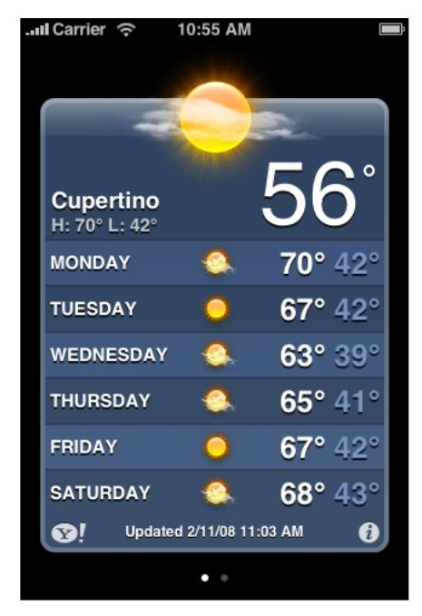

Utility applications are visually attractive, but in a way that enhances the information they display without overshadowing it. People use utility applications to check the status of something or to look something up, so they want to be able to spot the information they're interested in quickly and easily. To facilitate this, a utility application's user interface is uncluttered and provides simple, often standard, views and controls.

A utility application tends to organize information into a flattened list of items; users do not usually need to drill down through a hierarchy of information. Typically, each view in a utility application provides the same organization of data and depth of detail, but can be served by a different source. In this way, users can open a single utility application to see similar treatments of multiple subjects. Some utility applications indicate the number of open views; users can navigate through them sequentially, selecting one view after another. Figure 1-3 shows an example of this type of data organization.

**Figure 1-3** Utility applications tend to present data in a flattened list

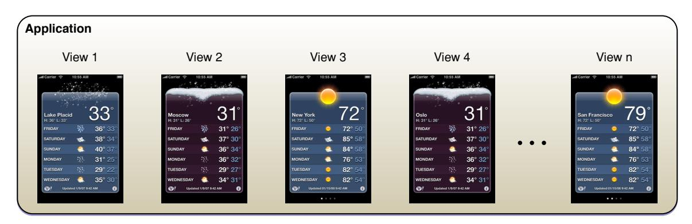

The user interaction model for a utility application is very simple: Users open the application to scan a summary of information and, optionally, change the configuration or source of that information. Utility applications may need to support frequent changes to configuration or information source, so they often provide a small set of such options on the back of the main view. Users tap the familiar Info button in the lower-right corner of the main view to see the back. After making adjustments, users tap the Done button to return to the front of the main view. In a utility application, the options on the back of the main view are part of the functioning of the application, not a group of preference-style settings users access once and then rarely, if ever, again. For thisreason, utility applicationsshould notsupply application-specific settingsin the Settings application. Figure 1-4 shows how the Weather application provides configuration options on the back of the main view.

**Figure 1-4** Users can make adjustments on the back of Weather

## Immersive Applications

An **immersive application** offers a full-screen, visually rich environment that's focused on the content and the user's experience with that content. People often use immersive applicationsto have fun, whether playing a game, viewing media-rich content, or performing a simple task.

It's easy to see how games fit this style of iPhone application, but you can also imagine how characteristics of immersive applications can enhance other types of tasks. Tasks that present a unique environment, don't display large amounts of text-based information, and reward users for their attention are good candidates for the immersive approach. For example, an application that replicates the experience of using a bubble level works well in a graphics-rich, full-screen environment, even though it doesn't fit the definition of a game. In such an application, as in a game, the user's focus is on the visual content and the experience, not on the data behind the experience. Figure 1-5 shows an example of an immersive application that replicates an actual experience and enables a simple task.

**Figure 1-5** An immersive application doesn't have to be a game

**Note:** Although applications that launch in landscape orientation should launch so that the Home button is on the right, the Bubble Level application shown above in Figure 1-5 launches in the opposite orientation. This ensures that the physical buttons on the edge of the device don't interfere with the measurement. See ["Starting"](#page-44-1) (page 45) for more launch guidelines.

An immersive application tends to hide much of the device's user interface, replacing it with a custom user interface that strengthens the user's sense of entering the world of the application. Users expect seeking and discovery to be part of the experience of an immersive application, so the use of nonstandard controls is often appropriate.

Immersive applications may work with large amounts of data, but they do not usually organize and expose it so that users can view it sequentially or drill down through it. Instead, immersive applications present information in the context of the game-play,story, or experience. Also for thisreason, immersive applications often present custom navigational methods that complement the environment, rather than the standard, data-driven methods used in utility or productivity applications.

The iPhone OS Platform: Rich with Possibilities

The user interaction model for an immersive application is determined by the experience the application provides. Although it's not likely that a game would need to offer application-specific settings in Settings, other types of immersive applications might. Immersive applications might also furnish configuration options on the back of the main view.

# Choosing an Application Style

After reading about productivity, utility, and immersive application styles, think about the type of information your application displays and the task it enables. In theory, the type of application you should create is obvious to you and you're ready to get started; in practice, it's not always that simple. Here is a hypothetical scenario to consider as you make your decision.

If you have a subject you'd like to explore, think about the objects and tasksrelated to it. Imagine the different perceptions people have of that subject. For example, consider the subject of baseball. Baseball brings to mind, among other things, teams, games, statistics, history, and players. Baseball is probably too extensive a subject for a single application, so consider just the players. Now imagine how you might create an application that relates to players—for example, using their likenesses on baseball cards.

You could develop a productivity application that helps serious collectors manage their baseball card collections. Using list-based formats, you could display cards in a hierarchy of teams, then players, then seasons. In the most detailed view, you could give users the ability to note where they acquired the card, how much they paid for it, its current market value, and how many copies they have. Because the focus of this application is on the data that defines the collection, the user interface streamlines the tasks of seeking and adding information.

You could also develop a utility application that displaysthe current market value of particular baseball cards. Each view could look like a baseball card with its current value added to the picture, and the back of the view could allow users to select specific cards to track and display. The focus of this application is on individual cards, so the user interface emphasizes the look of the cards and provides a simple control or two that allows users to look for new cards.

Or, of course, you could develop a game. Perhaps the game would focus on the user's knowledge of certain statistics on individual baseball cards or ability to recognize famous cards. Or perhaps it would simply use baseball cards as icons in another type of game, such as a sliding puzzle. In each of these cases, the focus of the application is on the images on the baseball cards and the game play. The user interface complements this by displaying a few baseball-themed controls and hiding the iPhone OS user interface.

It's important to reiterate that you're not restricted to a single application style. You may find that your application idea is best served by a combination of characteristics from different application styles.

When in doubt, make it simple. Pare the feature list to the minimum and create an application that does one simple thing (see "Create a Product Definition [Statement"](#page-34-1) (page 35) for advice on how to focus your application). When you see how people use and respond to the application, you might choose to create another version of the application with a slightly shifted focus or altered presentation. Or, you might discover a need for a more (or less) detail-oriented version of the same concept.

# When You Have an Existing Computer Application

If you have an existing computer application, don't just port it to iPhone OS. People use iPhone OS–based devices very differently than they use desktop and laptop computers, and they have different expectations for the user experience.

Remember that people use iPhone OS–based devices while on the go, and often in environments filled with distractions. This generally means that they want to open your application, use it briefly, and move on to something else. If your application relies on the user's undivided attention for long stretches of time, you need to rethink its structure and goals if you want to bring it to iPhone OS.

If your desktop application enables a complex task or set of tasks, examine how people use it in order to find a couple of subtasks they might appreciate being able to accomplish while they're mobile. For example, a business-oriented application that supports project scheduling, billing, and expense reporting could spawn an iPhone utility application thatshows progresssummariesfor a project, or an iPhone productivity application that allows mobile users to keep track of their business-related expenses.

As you think about how to bring ideas from your desktop application to an iPhone application, apply the 80-20 rule to the design of your application. Estimate that the largest percentage of users(at least 80 percent) will use a very limited number of features in an application, while only a small percentage (no more than 20 percent) will use all the features. Then, consider carefully whether you want to load your iPhone application with the power features that only a small percentage of users want. Be aware that a desktop computer application might be the better environment in which to offer those features, and that it's usually a good idea to focus your iPhone application on the features that meet the needs of the greatest number of people.

# Case Studies: Bringing a Desktop Application to iPhone OS

To help you visualize ways you can create an iPhone OS version of a desktop computer application, this section describes some of the design differences between familiar Mac OS X applications and their iPhone OS counterparts. As you learn about which features and functions in each application were adapted for its iPhone OS version, you will gain insight into the types of design decisions you need to make for your own iPhone application.

## Mail

Mail is one of the most highly visible, well-used, and appreciated applications in Mac OS X. It is also a very powerful program, one that allows users to create, receive, prioritize, and store email, track action items and events, and create notes and invitations. Mail provides most of thisfunctionality in a single multipane window. Thisis convenient for people using a desktop computer, because they can leave a Mail window on the display screen (or minimized to the Dock) all the time and switch to it whenever they choose. Figure 1-6 illustrates many of the features available in the Mail message-viewing and compose windows on the desktop.

**Figure 1-6** Mail on the desktop offers a wide range of powerful features in a couple of windows

But when people are mobile, their needs for an email application are simpler, and they want access to core functionality quickly. For thisreason, Mail on iPhone OS–based devicesfocuses on the most important things people do with their email: receive, create, send, and organize messages. To do this, it displays a pared-down user interface that makes the organization of the user's accounts and mailboxes clear and centers the user's attention on the messages.

Mail in iPhone OS is a perfect example of a productivity style application: To ease navigation through the content, Mail in iPhone OS takes advantage of the naturally hierarchical organization of people's email and displays on successive pages accounts, mailboxes, message lists, and individual messages. Users drill down from the general (the list of accounts) to the specific (a message) by selecting an item in a list and viewing the things associated with that item. To learn more about the productivity style of iPhone applications, see "Productivity [Applications"](#page-18-0) (page 19).

In addition, Mail in iPhone OS enables actions, such as create and send, by displaying a handful of familiar controls that are easy to tap. Figure 1-7 shows how Mail makes it simple to view and send email in iPhone OS. Note how elements at the top of each screen make it easy for users to know both their current and previous location in the application.

**Figure 1-7** Mail in iPhone OS makes it easy to view and send email

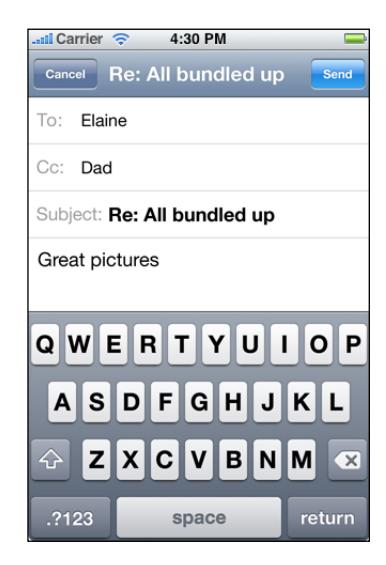

## iPhoto

Another instructive example of a Mac OS X application that was reimagined for iPhone OS is iPhoto. On the desktop, iPhoto supports comprehensive searching and organization, powerful editing capabilities, and creative printing options. When people use iPhoto on their desktop or laptop computers, they appreciate being able to see and organize their entire collection, make adjustments to photos, and manipulate them in various ways. Although the main focus of iPhoto is on the user's content, the application also offers extensive functionality in its window. Figure 1-8 shows the iPhoto user interface on the desktop.

**Figure 1-8** The iPhoto user interface

But when they're mobile, people don't have time to edit their photos (and they don't expect to print them); instead, they want to be able to quickly see and share their photos.

To meet this need on iPhone OS–based devices, Apple has provided the Photos application, which focuses on viewing photos and sharing them with others. The Photos user interface revolves around photos;so much so, in fact, that even parts of the device user interface can be hidden. When users choose to view a slideshow of their photos, the Photos application hides the navigation bar, toolbar, and even status bar, and displays translucent versions of these elements when users need to see them.

Photos makes it easy for users to organize and find their photos by using a hierarchical arrangement: Users select an album, which contains a collection of photos, and then they select a single photo from the collection. In this way, Photos is an example of an application that combines features of the productivity style and the immersive style (to learn more about these styles, see "Three [Application](#page-17-1) Styles" (page 18)). Figure 1-9 shows how users can view photos in the Photos application.

**Figure 1-9** Three screens in the Photos application

In addition, Photos uses a transient view, called an action sheet (described in "Alerts, Action [Sheets,](#page-78-0) and Modal [Views"](#page-78-0) (page 79)), to give users additional functionality without taking them out of the photo-viewing experience. Figure 1-10 shows how Photos provides options for using an individual photo.

**Figure 1-10** Photos gives users options in an action sheet

#### **CHAPTER 1**

The iPhone OS Platform: Rich with Possibilities

# Human Interface Principles: Creating a Great User Interface

A great user interface follows human interface design principles that are based on the way people—users—think and work, not on the capabilities of the device. A user interface that is unattractive, convoluted, or illogical can make even a great application seem like a chore to use. But a beautiful, intuitive, compelling user interface enhances an application'sfunctionality and inspires a positive emotional attachment in users.

You should read this chapter even if you are already familiar with these fundamental principles, because it focuses on how to apply them to iPhone applications.

# Metaphors

When possible, model your application's objects and actions on objects and actions in the real world. This technique especially helps novice users quickly grasp how your application works. Folders are a classic software metaphor. People file things in folders in the real world, so they immediately understand the idea of putting data into folders on a computer.

Metaphors in iPhone OS include iPod playback controls, tapping controls to make things happen, sliding on-off switches, and flicking through the data shown on picker wheels.

Although metaphors suggest a use for objects and actions in the iPhone OS interface, that use does not limit the software implementation of the metaphor. To return to the folder example, a folder object implemented in software has a capacity that's completely unrelated to the physical capacity of its real-world counterpart.

As you design your application, be aware of the metaphors that exist in iPhone OS and don't redefine them. At the same time, examine the task your application performs to see if there are natural metaphors you can use. Bear in mind, though, that it's better to use standard controls and actions than to stretch a real-world object or action just to fit your application's user interface. Unless the metaphors you choose are likely to be recognized by most of your users, including them will increase confusion instead of decrease it.

# Direct Manipulation

Direct manipulation meansthat people feel they are controlling something tangible, not abstract. The benefit of following the principle of direct manipulation is that users more readily understand the results of their actions when they can directly manipulate the objects involved.

iPhone OS users enjoy a heightened sense of direct manipulation because of the Multi-Touch interface. Using gestures, people feel a greater affinity for, and sense of control over, the objects they see on screen, because they do not use any intermediate device (such as a mouse) to manipulate them.

To enhance the sense of direct manipulation in your iPhone application, make sure that:

Metaphors **31**

### **CHAPTER 2**

Human Interface Principles: Creating a Great User Interface

- Objects on the screen remain visible while the user performs actions on them
- The result of the user's action is immediately apparent

# See and Point

An iPhone application is better than a person at remembering lists of options, commands, data, and so on. Take advantage of this by presenting choices or options in list form, so users can easily scan them and make a choice. Keeping text input to a minimum frees users from having to spend a lot of time typing and frees your application from having to perform a lot of error checking.

Presenting choicesto the user, instead of asking for more open-ended input, also allowsthem to concentrate on accomplishing tasks with your application, instead of remembering how to operate it.

# Feedback

In addition to seeing the results of their actions, users need immediate feedback when they operate controls and status reports during lengthy operations. Your application should respond to every user action with some visible change. For example, make sure list items highlight briefly when users tap them. Audible feedback also helps, but it can't be the primary or sole feedback mechanism because people may use iPhone OS–based devices in places where they can't hear or where they must turn off the sound. In addition, you don't want to compete with the iPhone OS system sounds users already associate with system alerts.

iPhone OS automatically provides feedback when it's temporarily busy by displaying the activity indicator. During operations that last more than a few seconds, your application should show elapsing progress and, if appropriate, display an explanatory message.

Animation is a great way to provide feedback to users, as long as it's both subtle and meaningful. Animation pervades iPhone OS, even in nonimmersive applications. As a means of providing feedback, however, it is used to enhance the user's experience, not as the focus of the user's experience.

# User Control

Allow users, not your application, to initiate and control actions. Keep actions simple and straightforward so users can easily understand and remember them. Whenever possible, use standard controls and behaviors that users are already familiar with.

Provide ample opportunity to cancel operations before they begin, and be sure to get confirmation when the user initiates a potentially destructive action. Whenever possible, allow users to gracefully stop an operation that's underway.

# Aesthetic Integrity

Although the ultimate purpose of an application is to enable a task, even if that task is playing a game, the importance of an application's appearance should not be underestimated. This is because appearance has a strong impact on functionality: An application that appears cluttered or illogical is hard to understand and use.

Aesthetic integrity is not a measure of how beautiful your application is. It's a measure of how well the appearance of your application integrates with its function. For example, a productivity application should keep decorative elements subtle and in the background, while giving prominence to the task by providing standard controls and behaviors.

An immersive application is at the other end of the spectrum, and users expect a beautiful appearance that promisesfun and encourages discovery. Although an immersive application tendsto be focused on providing diversion, its appearance still needsto integrate with the task. Be sure you design the user interface elements of such an application carefully, so that they provide an internally consistent experience.

#### **CHAPTER 2**

Human Interface Principles: Creating a Great User Interface

# Designing an iPhone Application: From Product Definition to Branding

As you develop an iPhone application you need to learn how iPhone OS and various aspects of the mobile environment impact your design decisions. This chapter covers a range of guidelines for application design issues, from product definition to branding, and describes how to address them in an iPhone application.

# Create a Product Definition Statement

Before you begin designing your application, it's essential to define precisely what your application does. A good way to do this is to craft a **product definition statement**—a concise declaration of your application's main purpose and its intended audience. Creating a product definition statement isn't merely an exercise. On the contrary, it's one of the best ways to turn a list of features into a coherent product.

To begin with, spend some time defining your user audience: Are they experienced or novice, serious or casual, looking for help with a specific task or looking for entertainment? Knowing these things about your users helps you customize the user experience and user interface to their particular needs and wants.

Because you're designing an iPhone application, you already know a lot about your users. For example:

- They're mobile.
- They want to be able to open your application quickly and see useful content immediately.
- They need to be able to accomplish things in your application with just a few taps.

Now ask yourself what traits might set your users apart from all other iPhone OS users. Are they business people, teenagers, or retirees? Will they use your application at the end of every day, every time they check their email, or whenever they have a few extra moments? The more accurately you define your audience, the more accurate are your decisions about the look, feel, and functionality of your user interface.

For example, if your application helps business people keep track of their expenses, your user interface should focus on providing the right categories and making it easy to enter costs, without asking for a lot of details that aren't central to the task. In addition, you might choose a subtle color palette that appears professional and is pleasant to look at several times a day.

Or, if your application is a game for a target audience of teenagers, you might instead want a user interface that is exciting, language that imparts a feeling of exclusivity, and a color palette that evokes current fashions.

Finally, examine the set of features you intend to deliver. With the image of your user audience in mind, try to distill the list of featuresinto a single statement, a product definition statement, that describesthe solution your product offers and who your users are. For example, the desktop iPhoto application allows users to, among other things, organize, edit, share, print, and view photos. But a good product definition statement doesn't just focus on features, it also describes the intended audience. Therefore a sound product definition statement for iPhoto could be "An easy-to-use photo management application for amateur photographers." Notice how important it is to include a definition of your user audience in the product definition statement: Imagine how different an application iPhoto would be if it was designed to be "an easy-to-use photo management application for professional photographers."

A good product definition statement is a tool you should use throughout the development process to determine the suitability of features, tools, and terminology. It's especially important to eliminate those elements that don't support the product definition statement, because iPhone applications have no room to spare for functionality that isn't focused on the main task.

Imagine, for example, that you're thinking of developing an iPhone application people can use when they shop for groceries. In the planning stage, you might consider including a wide range of activities users might like to perform, such as:

Getting nutritional information about specific foods Finding coupons and special offers Creating and using shopping lists Locating stores Looking up recipes Comparing prices Keeping a running total of prices

However, you believe that your users are most concerned with remembering everything they need to buy, that they would like to save money if possible, and that they're probably in a hurry to get home with their purchases. Using this audience definition, you craft a product definition statement for your application, such as "A shopping list creation and coupon-finding tool for people in a hurry." Filtering your list of potential features through this product definition statement, you decide to focus primarily on making shopping lists easy to create, store, and use. You also offer users the ability to find coupons for the items on their list. Even though the other features are useful (and might become primary features of other applications), they don't fit the product definition statement for this application.

When you've settled on a solid product definition statement and you've started to use it as a filter for your proposed features, you might also want to use it to make sure your initial decision on application type is still the right one. If you began your development process with a specific application type in mind, you might find that the process of defining a product definition statement has changed the landscape. (See ["Three](#page-17-1) [Application](#page-17-1) Styles" (page 18) for more on different types of applications you can develop.)

# Incorporate Characteristics of Great iPhone Applications

Great iPhone applications do precisely what users need while providing the experience users want. To help you achieve this balance in your application, thissection examinessome of the characteristics of great iPhone applications and provides advice on how to build them into your product.

## Build in Simplicity and Ease of Use

Simplicity and ease of use are fundamental principles for all types of software, but in iPhone applications they are critical. iPhone OS users are probably doing other things while they simultaneously use your application. If users can't quickly figure out how to use your application, they're likely to move on to a competitor's application and not come back.

As you design the flow of your application and its user interface, follow these guidelines to build in simplicity and ease of use:

■ Make it obvious how to use your application.

Designing an iPhone Application: From Product Definition to Branding

- Concentrate frequently used, high-level information near the top of the screen.
- Minimize text input.
- Express essential information succinctly.
- Provide a fingertip-size target area for all tappable elements.

The following sections explain each guideline for simplicity and ease of use in more detail.

### Make It Obvious

You can't assume that users have the time (or can spare the attention) to figure out how your application works. Therefore, you should strive to make your application instantly understandable to users.

The main function of your application should be immediately apparent. You can make it so by minimizing the number of controls from which users have to choose and labeling them clearly so users understand exactly what they do. For example, in the built-in Stopwatch function (part of the Clock application), shown in Figure 3-1, users can see at a glance which button stops and startsthe stopwatch and which button records lap times.

**Figure 3-1** The built-in Stopwatch function makes its usage obvious

### Think Top Down

People can tap the screen of an iPhone OS–based device with their fingers or their thumbs. When they use a finger, people tend to hold the device in their nondominant hand (or lay it on a surface) and tap with a finger of the dominant hand. When they use thumbs, people either hold the device in one hand and tap with that thumb, or hold the device between their hands and tap with both thumbs. Whichever method people use, the top of the screen is most visible to them.

### **CHAPTER 3**

Designing an iPhone Application: From Product Definition to Branding

Because of these usage patterns, you should design your application's user interface so that the most frequently used (usually higher level) information is near the top, where it is most visible and accessible. As the user scans the screen from top to bottom, the information displayed should progress from general to specific and from high level to low level.

### Minimize Required Input

Inputting information takes users' time and attention, whether they tap controls or use the keyboard. If your application requires a lot of user input before anything useful happens, itslows users down and can discourage them from persevering with it.

Of course, you often need some information from users, but you should balance this with what you offer them in return. In other words, strive to provide as much information or functionality as possible for each piece of information users provide. That way, users feel they are making progress and are not being delayed as they move through your application.

When you ask for input from users, consider using a type of table view (or a picker) instead of text fields. It's usually easier for users to select an item from a list than to type words. For details on table views and pickers, see "Table [Views"](#page-88-1) (page 89) and ["Pickers"](#page-113-0) (page 114), respectively.

### Express Information Succinctly

When your user interface text is short and direct, users can absorb it quickly and easily. Therefore, identify the most important information, express it concisely, and display it prominently so users don't have to read too many words to find what they're looking for or to figure out what to do next.

To help you do this, think like a newspaper editor and strive to convey information in a condensed, headline style. Give controls short labels (or use well-understood symbols) so that users understand how to use them at a glance.

### Provide Fingertip-Size Targets

If your layout places controls too close together, users must spend extra time and attention being careful where they tap, and they are more likely to tap the wrong element. A simple, easy-to-use user interface spaces controls and other user-interaction elements so that users can tap accurately with a minimum of effort.

For example, the built-in Calculator application displays large, easy-to-tap controls that each have a target area of about 44 x 44 pixels. Figure 3-2 shows the Calculator application.

**Figure 3-2** The built-in Calculator application displays fingertip-size controls

## Focus on the Primary Task

An iPhone application that establishes and maintains focus on its primary functionality is satisfying and enjoyable to use. As you design your application, therefore,stay focused on your product definition statement and make sure every feature and user interface element supports it. See "Create a Product [Definition](#page-34-1) [Statement"](#page-34-1) (page 35) for some advice on how to create a product definition statement.

A good way to achieve focus is to determine what's most important in each context. As you decide what to display in each screen always ask yourself, Is this critical information or functionality users need right now? Or, to think of it in more concrete terms, Is this information or functionality the user needs while shopping in a store or while walking between meetings? If not, decide if the information or functionality is critical in a different context or if it's not that important after all. For example, an application that helps users keep track of car mileage loses focus on this functionality if it also keeps track of car dealer locations.

When you follow the guidelines for making your application simple and easy to use, you help make your solution focused. In particular, you want to make the use of your application obvious and minimize user input. This makes it easier for users to arrive quickly at the most important parts of your application, which tightens the focus on your solution (for specifics on these guidelines, see "Build in [Simplicity](#page-35-1) and Ease of [Use"](#page-35-1) (page 36)).

For example, the built-in Calendar application (shown in Figure 3-3) is focused on days and the events that occur on them. Users can use the clearly labeled buttonsto highlight the current day,select a viewing option, and add events. The most important information, that is, the days and the events associated with them, is the most prominent. User input is simplified by allowing users to choose from lists of event times, repetition intervals, and alert options, instead of requiring keyboard entry for all input.

**Figure 3-3** The built-in Calendar application is focused on days and events

## Communicate Effectively

Communication and feedback are as important in iPhone applications as they are in desktop computer applications. Users need to know whether their requests are being processed and when their actions might result in data loss or other problems. That said, it's also important to avoid overdoing communication by, for example, alerting the user to conditions that aren't really serious or asking for confirmation too often.

Animation is a great way to communicate effectively, as long as it doesn't get in the way of users' tasks or slow them down. Subtle and appropriate animation can communicate status, provide useful feedback, and help users visualize the results of their actions. Excessive or gratuitous animation can obstruct the flow of your application, decrease its performance, and annoy users.

In all your text-based communication with users, be sure to use user-centric terminology; in particular, avoid technical jargon in the user interface. Use what you know about your users to determine whether the words and phrases you plan to use are appropriate. For example, the Wi-Fi Networks preferences screen uses clear, nontechnical language to describe how the device connects to networks, as shown in Figure 3-4.

**Figure 3-4** Use user-centric terminology in your application's user interface

# Support Gestures Appropriately

People use their fingers to operate the unique Multi-Touch interface of iPhone OS–based devices, tapping, flicking, and pinching to select, navigate, and read web content and use applications. There are real advantages to using fingersto operate a device: They are always available, they are capable of many different movements, and they give users a sense of immediacy and connection to the device that's impossible to achieve with an external input device, such as a mouse.

However, fingers have one major disadvantage: They are much bigger than a mouse pointer, regardless of their size, their shape, or the dexterity of their owner. In the context of a display screen, fingers can never be as precise as a mouse pointer.

Fortunately, you can meet the challenges of a finger-based input system by having a good user interface design. For the most part, this means making sure your layout accommodates the average size of a fingertip It also means responding to finger movements with the actions users expect.

Users perform specific movements, called **gestures**, to get particular results. For example, users tap a button to select it and flick or drag to scroll a long list. iPhone users understand these gestures because the built-in applications use them consistently. To benefit from users' familiarity, therefore, and to avoid confusing them, you should use these gestures appropriately in your application.

The more complex gestures,such asswipe or pinch open, are also used consistently in the built-in applications, but they are less common. In general these gestures are used as shortcuts to expedite a task, not as the only way to perform a task. When viewing a list of messages in Mail, for example, users delete a message by revealing and then tapping the Delete button in the preview row for the message. Users can reveal the Delete button in two different ways:

Designing an iPhone Application: From Product Definition to Branding

- Tap the Edit button in the navigation bar, which reveals a delete control in each preview row. Then, tap the delete control in a specific preview row to reveal the Delete button for that message.
- Make the swipe gesture across a specific preview row to reveal the Delete button for that message.

The first method takes an extra step, but is easily discoverable because it requires only the tap and begins with the clearly labeled Edit button. The second method is faster, but it requires the user to learn and remember the more specialized swipe gesture.

To ensure that your application is discoverable and easy to use, therefore, try to limit the gestures you require to the most familiar, that is, tap and drag. You should also avoid making one of the less common gestures, such as swipe or pinch open, the only way to perform an action. There should always be a simple, straightforward way to perform an action, even if it means an extra tap or two.

In most applications, it's equally important to avoid defining new gestures, especially if these gestures perform actions users already associate with the standard gestures. The primary exception to this recommendation is an immersive application, in which custom gestures can be appropriate. For example, a productivity application that requires users to make a circular gesture to reveal the Delete button in a table row would be confusing and difficult to use. On the other hand, a game might reasonably require usersto make a circular gesture to spin a game piece.

Table 3-1 lists the standard gestures users can perform. Be sure to avoid redefining the meaning of these gestures; conversely, if you support these actions in your application, be sure to respond appropriately to the gestures that correspond to them. For more information on how to handle events created by gestures, see *iPhone Application Programming Guide*.

**Table 3-1** Gestures users make to interact with iPhone OS–based devices

| Gesture        | Action                                                                                       |
|----------------|----------------------------------------------------------------------------------------------|
| Tap            | To press or select a control or item (analogous to a single mouse click).                    |
| Drag           | To scroll or pan.                                                                            |
| Flick          | To scroll or pan quickly.                                                                    |
| Swipe          | In a table-view row, to reveal the Delete button.                                            |
| Double tap     | To zoom in and center a block of content or an image. To zoom out (if already zoomed in). |
| Pinch open     | To zoom in.                                                                                  |
| Pinch close    | To zoom out.                                                                                 |
| Touch and hold | In editable text, to display a magnified view for cursor positioning.                        |

# Incorporate Branding Elements Cautiously

Branding is most effective when it issubtle and understated. People use your iPhone application to get things done or to be entertained; they don't want to feel as if they're being forced to watch an advertisement. Therefore, you should strive to incorporate your brand's colors or images in a refined, unobtrusive way. For example, you might use a custom color scheme in views and controls.

The exception to this is your application icon, which should be focused on your brand. (The application icon is the icon users can see on their Home screens after they install your application.) Because users see your application icon frequently, it's important to spend some time balancing eye-appeal with brand recognition. For some guidelines on creating an application icon, see ["Application](#page-128-1) Icons" (page 129).

### **CHAPTER 3**

Designing an iPhone Application: From Product Definition to Branding

# Handling Common Tasks

iPhone applications handle many common tasks in ways that may seem different to you, if your experience is with desktop or laptop computer applications. Thissection describesthese tasksfrom the human interface perspective; for the technical details you need to implement these guidelines in code, see *iPhone Application Programming Guide*.

# Starting

iPhone applicationsshould start instantly so users can begin using them without delay. When starting, iPhone applications should:

- Specify the appropriate status barstyle (see "The [Status](#page-66-1) Bar" (page 67) for information about the available styles).
- Display a launch image that closely resembles the first screen of the application. This decreases the perceived launch time of your application. For more information, see ["Launch](#page-130-1) Images" (page 131).
- Avoid displaying an About window, a splash screen, or providing any other type of startup experience that prevents people from using your application immediately.
- By default, launch in portrait orientation. If you intend your application to be used only in landscape orientation, launch in landscape regardless of the current device orientation. Allow users to rotate the device to landscape orientation if necessary.
  - A landscape-only application should support both landscape orientations—that is, with the Home button on the right or on the left. If the device is already physically in a landscape orientation, a landscape-only application should launch in that orientation. Otherwise, a landscape-only application should launch in the orientation with the Home button on the right by default.
- Restore state from the last time your application ran.

**Important:** Don't tell usersto reboot or restart their devices after installing your application. If your application has memory-usage or other issues that make it difficult to run unless the system has just booted, you need to addressthose issues. For example,see "Using Memory Efficiently"in *iPhone Application ProgrammingGuide* for some guidance on developing a well-tuned application.

# Stopping

iPhone applications stop when users open a different application or use a device feature, such as the phone. In particular, note that users don't tap an application close button or select Quit from a menu. iPhone applications should:

- Be prepared to receive an exit or terminate notification at any time. Therefore, save user data as soon as possible and as often as reasonable.
- Save the currentstate when stopping, at the finest level of detail possible. For example, if your application displays scrolling data, save the current scroll position.

iPhone applications should never quit programmatically because doing so looks like a crash to the user. There may be times, however, when external circumstances prevent your application from functioning as intended. The best way to handle this is to display an attractive screen that describes the problem and suggests how users can correct it. This helps users in two ways:

- It provides feedback that reassures users that there's nothing wrong with your application
- It puts users in control, letting them decide whether they want to take corrective action and continue using your application or press the Home button and open a different application

If certain circumstances prevent only some of your application'sfeaturesfrom working, you can display either a screen or an alert when users activate the feature. Although an alert doesn't allow much flexibility in design, it can be a good choice if you can:

- Describe the situation very succinctly
- Supply a button that performs a corrective action
- Display the alert *only* when users try to access the feature that isn't functioning

As with all alerts, the less users see them, the more effective they are. See "Using [Alerts"](#page-79-0) (page 80) for more information about creating alerts.

# Managing Settings or Configuration Options

iPhone applications can offer settings that define preferred application behaviors or configuration options users can set to change some functionality of the application. Settings should represent information, such as an account name, that users set once and rarely (if ever) change. Users view application-specific settings in the built-in Settings application. Configuration options are values that users might want to change frequently, such as category types displayed in a list; configuration options should be available within the application itself.

You should considersettings and optionsto be mutually exclusive. That is, you should not offer both settings and configuration options in your application.

It's best when iPhone applications do not ask users to specify any settings at all. Users can begin to use these applicationsright away without being asked to supply set-up information. To achieve thisin your application, there are a few design decisions you can make:

- **Focus your solution on the needs of 80 percent of your users**. When you do this, the majority of users do not need to supply settings because your application is already set up to behave the way most users expect. If there is functionality that only a handful of users might want, or that most users might want only once, leave it out.
- **Get as much information as possible from other sources**. If you can use any of the information users supply in built-in application or device settings, query the system for these values; don't ask users to enter them again.

■ **If you must ask for set-up information, prompt users to enter it within your application**. Then, as soon as possible, store this information in your application's settings. This way, users aren't forced to quit your application and open Settings before they begin to benefit from your application. If users need to make changes to this information later, they can go to your application's settings at any time.

It's not possible for users to open the Settings application without first quitting your application, and you should not encourage them to take this action. There is no system-provided icon or control that supports this action, and it's recommended that you avoid creating a custom icon or control that does. If you decide you must provide settings in your iPhone application, see "The Settings Bundle" in *iPhone Application Programming Guide* to learn how to support them in your code.

**Note:** Application-specific settings should not include user help content.

Unlike settings, configuration options are likely to be changed frequently as users choose to see information from new sources or in different arrangements. You can react dynamically to changes users make to these options, because users do not leave your application to access them.

You can offer configuration options in the main user interface or on the back of a screen. To decide which technique makes sense, determine if the options represent primary functionality and how often users might want to set them.

For example, Calendar allows users to view their schedules by day, week, or month. These options could have been offered on the back of the screen, but viewing different parts of a calendar is primary functionality and users are likely to change their focus frequently.

On the other hand, the primary functionality of Weather is to display a city's current conditions and 6-day forecast. Although it's important to be able to choose whether temperatures are displayed in Celsius or Fahrenheit, users are not likely to change this option very often, so it would not make sense to put it in the main user interface. Offering the temperature-scale option on the back of the Weather screen makes it conveniently available, but not obtrusive.

# Supporting Copy and Paste

iPhone OS provides an edit (or pasteboard) menu that supports Cut, Copy, Paste, Select, and Select All operations in text views, web views, and image views. One of the ways users can reveal the menu is to first touch and hold to display the magnified view (which allows them to move the insertion or selection point to the correct location) and then release. If the menu is supported in the current context, it appears when the finger is lifted. Choosing Select in the menu selects the word or application-defined item in the view. Users can extend their selection by dragging the handles on the currently selected area. After a selection is made, the menu can display Cut, Copy, or Paste, as appropriate.

You can adjust some of the behaviors of the edit menu to suit your application. (For information on how to implement these behaviors in code, see "Copy and Paste Operations" in *iPhone Application Programming Guide*.) For example, you can specify the subset of commandsthe menu displays and you can influence where the menu appears. You have no control over the color or shape of the menu itself.

The commands visible in the edit menu make sense in the current context. For example, if nothing isselected, the menu does not contain Copy or Cut because these commands act on a selection. Similarly, if something isselected, the menu does not contain Select. If you support an edit menu in a custom view, you're responsible for making sure that the commands the menu displays are appropriate for the current context. Note that you cannot specify custom commands to display in the menu.

UIKit displays the edit menu above or below the insertion point or selection, depending on available space, and places the menu pointer so that users can see how the menu commands relate to the content. You can programmatically determine the position of the menu before it appears, so you can prevent important parts of your application's user interface from being obscured, if necessary.

Note that although the touch and hold gesture is the primary way users reveal the edit menu, they can also double-tap a word in a text view to select it and reveal the menu at the same time. If you support the menu in a custom view, you should respond to both gestures. In addition, you can define the object that is selected by default when the user double taps.

Avoid creating a button that performs a command that's available in the edit menu. For example, it's better to allow users to perform a copy operation using the edit menu than to provide a Copy button, because users will wonder why there are two ways to do the same thing in your application.

You can enable selection of static text, but only when the static text represents content that's useful to the user. For example, a user might want to copy the caption of an image, but they're not likely to want to copy the label of a tab item or a screen title, such as Accounts. In a text view, selection by word should be the default.

Button titles should not be selectable because it would be difficult for users to reveal the edit menu without activating the button. In general, elements that behave as buttons don't need to be selectable.

If you support the Cut, Copy, and Paste commands in your application, you should also support undo and redo (described in ["Supporting](#page-47-0) Undo and Redo" (page 48)). This is because the edit menu does not require confirmation before the actions are performed and users often expect to be able to undo recent operations if they change their minds.

# Supporting Undo and Redo

iPhone OS gives usersthe ability to undo and redo their typing in text views. Usersinitiate an undo by shaking the device, which displays an alert that allows users to undo what they just typed, redo previously undone typing, or cancel the undo.

UIKit allows you to support undo in a more general way in your application (for information on how to implement this behavior in code, see *Undo Architecture*). You can specify:

- The actions users can undo or redo
- When your application should interpret a shake event as the shake to undo gesture
- How many levels of undo to support

To provide a great user experience for the undo and redo capability in your application, you should:

- **Supply brief descriptive phrases that tell users precisely what they're undoing or redoing**. UIKit automatically supplies the strings "Undo " and "Redo " for the undo alert button titles, but you need to provide a word or two that describes the action users can undo or redo. (Note that the Cancel button cannot be changed.) For example, you might supply the text "Delete Name" or "Address Change," to create buttons titles such as "Undo Delete Name" or "Redo Address Change."
  - Be sure to avoid supplying text that is too long: A button title that is too long is truncated and is difficult for users to decipher. Also, because this text is in a button title, use title-style capitalization and do not add punctuation. (Briefly, title-style capitalization means to capitalize every word except articles, coordinating conjunctions, and prepositions of four or fewer letters.)
- **Avoid overloading the shake gesture**. Even though you can programmatically set when your application interprets a shake event as shake to undo, you run the risk of confusing users if they also use shake to perform a different action.
  - The shake gesture is the primary way users expect to initiate undo and redo, but you can also include the system-provided Undo and Redo buttons in a navigation bar, if appropriate. You might do this if it's essential that you display an explicit, dedicated button to perform these functions within the context of your application, but this is unusual.
- **Consider the context of the actions you allow to be undone or redone**. In general, users expect their changes and actions to take effect immediately. As much as possible, the undo and redo capability should be clearly related to the user's immediate context, and not to an earlier context.

# Enabling Push Notifications

When you register your application with Apple Push Notification Service, you can arrange to alert users when new data arrives, even if your application isn't running. When a device receives a message for an application that isn't running, it can notify the user by:

- Updating a badge on the application's Home screen icon
- Playing an alert sound
- Displaying an alert message

or some combination of these. The user might respond by starting the application to manage the new data or merely acknowledging its arrival. (To learn how to handle push notifications in code, see *Apple Push Notification Service Programming Guide*.)

**Note:** Delivery of push notifications is not guaranteed. Also, users can refuse to receive notifications system-wide. Push notifications are intended to notify users of new data, not to deliver critical data to your application.

The Notifications section in the built-in Settings application hosts push notification settings for every application that registers for the Apple Push Notification Service. For each application, iPhone OS provides settings for users to allow or disallow badging, sounds, and alert messages.

Take some time to think about the types of eventsfor which users would appreciate notification. A notification should give users useful, actionable information they want to receive, even when they're not using your application.

After you've identified the events your users are likely to care about, you should also allow users to decide which events should generate what type of notification, if any. If you don't allow users to customize the push notification experience in your application, you're liable to pester users with notificationsthey're not interested in.

Users can choose which types of notifications they want to receive, so you should support all three types:

- **Badge**. Badging is the least intrusive way to tell users that there is new content they might be interested in. The badge is a small red oval that appears over the upper-right corner of your Home screen icon. You do not have any control over the appearance of the badge and it contains only numbers, not letters or punctuation.
  - Badging works well when you want to tell users how many items are waiting for their attention. For example, the number in a badge might indicate unread messages, newly assigned tasks, or how many remote players are currently playing a game.
- **Sound**. You can supply a custom alert sound, or you can use a built-in alert sound. If you create a custom sound, be sure it is short, distinctive, and professionally produced. (To learn about the technical requirements for this sound, see "Preparing Custom Alert Sounds" in *Apple Push Notification Service Programming Guide*.) Note that you cannot force the device to vibrate when a notification is delivered; the user has control over whether alerts are accompanied by vibration.
  - An easily recognized sound is ideal for situations in which the notification arrival itself provides enough information for users to act. For example, a collaborative task management system might use a unique sound to accompany the completion of a member's assignment. Merely hearing thissound tellsthe user that the assignment has been completed.
- **Alert**. An alert is the most intrusive way to notify users of new content. An alert displays your application name at the top, your message below that, and one or two buttons at the bottom. If you specify two buttons, the alert displays the Close button on the left and the View button on the right (users can tap the View button to simultaneously dismiss the alert and launch your application). If you specify one button, the alert displays an OK button. The Close button and the OK button both dismiss the alert without opening your application.
  - Alerts interrupt the user's workflow, so they're best used sparingly to deliver a short, important message about an event. In particular, be sure to avoid including any advertising content in your alert message.

# Making Your Application Accessible

An application is accessible when users with disabilities can use it successfully, perhaps with the help of an assistive application or device. iPhone OS–based devices include many features that make it easier for all users, including disabled users, to use the device, such as visual voicemail, zoom, and voice control. You do not have to take any steps in your application to ensure that your users can benefit from these features.

With VoiceOver, the story is a little different. VoiceOver is Apple's innovative screen-reading technology, which gives users control over their devices without requiring them to see the screen. To make sure VoiceOver users can use your application to its fullest, you might need to provide some custom information about the views and controls in the user interface.

Fortunately, UIKit controls and views are accessible by default, so when you use standard elements in a completely standard way, you have little (if any) additional work to do. The more custom your user interface is, the more custom information you need to provide,so that VoiceOver can properly describe your application to users with visual impairments.

**Important:** The job of making your application accessible consists of giving VoiceOver the information it needs to help people use your application. The job does *not* include changing the visual design of the user interface to accommodate VoiceOver.

Making your iPhone application accessible to VoiceOver users is the right thing to do. It can also increase your user base and it might help you address accessibility guidelines created by various governing bodies.

# Providing Search and Displaying Search Results

UIKit provides the search bar control you can use to display a consistent interface to initiate searching, but you are responsible for implementing search in your application. (To learn more about the search bar, see ["Search](#page-115-1) Bars" (page 116); to learn more about handling search results in code, see *UISearchDisplayController Class Reference*.) To ensure that search is a useful and convenient experience users appreciate, take some time to consider how to implement the process and how to display the results.

In general, you should:

- Build indexes of your data so you are always prepared for search.
- Live-filter local data so you can display results as soon as users begin to type, and narrow the results as users continue typing.
- When possible, also filter remote data as users type, but be sure to get the user's permission if the response time is likely to delay the results by more than a second or two.
- Display a search bar above a list or the index in a list.
- Avoid using a tab for search unless it is a primary function in your application that should be featured as a distinct mode.

Although live-filtering data usually produces a superior user experience, it's not always practical. When this is the case, you can begin the search process after the user taps the Search button in the keyboard. If you do this, be sure to provide feedback on the search's progress so users know that the process has not stalled. One way to do this is to display textual results as soon as possible and display placeholder content for data that might take longer to retrieve.

In YouTube, for example, users initiate a search for videos by tapping the Search button. If the network connection is slow, YouTube first displays the Loading... message along with a spinning activity indicator so users know that search is proceeding. Then, YouTube displays a results list in which each row is populated with textual results, such as video title and viewer rating, and a custom image of a box with a dotted outline. As users scan the list of video titles, the video thumbnails replace the dotted boxes as they are downloaded. Displaying partial search results while additional data is still downloading gives users useful information promptly.

If you handle data that sorts naturally into different categories, you can provide a scope bar. A scope bar contains up to four scope buttons, each representing a category. For example, Mail provides a scope bar that allows users to focus their search on the From, To, or Subject fields of messages, or broaden the search to include all fields. Consider providing a scope bar if it helps usersfocustheirsearch or if itsignificantly reduces the number of results. (To learn how to implement a scope bar in your code, see *UISearchBar Class Reference*.)

# Using the User's Location

Users appreciate application featuresthat allow them to automatically tag content with their physical location, or to find friends that are currently nearby. Users also appreciate being able to disable features like these when they don't want to share their location with others. Users can grant (or deny) system-wide access to their physical location with the Location Services setting in Settings > General.

If users turn off Location Services, and later use an application feature that requires their location, they see an alert that tells them they must change their preference before they can use the feature. The alert does not allow them to make this change within the application; instead, they must go to Settings and change their preference. This ensures that users are fully aware that they are granting system-wide permission to use their location information.

To help users understand why they might need to turn Location Services on, it's best if they see the alert only when they attempt to use a feature that clearly needs to know their current location. For example, people can use Maps when Location Services is off, but they see the alert when they access the feature that finds and tracks their current location.

If Location Services is turned off, iPhone OS displays the alert the first time your application tries to access location information. The Core Location framework provides a way for you to get the user's preference so that you can avoid triggering this alert unnecessarily or inappropriately. (See *Core Location Framework Reference* to learn more about this programming interface.)

With knowledge of the user's preference, you can trigger the alert as closely as possible to the feature that requires location information, or perhaps avoid it altogether.

- If your application cannot perform its primary function without this information, it's best if users see the alert as soon as they start your application. Users will not be bothered by this, because they understand that the main function of your application depends on knowing their location.
- If the user's location is not part of the essential function of your application, you might choose to simply restrict the feature that uses it. For example, when Location Services is turned off, Camera automatically turns off the feature that adds the user's location to the photos they take. It does not prevent users from taking photos unless they change their preference, because adding location information to photos is appreciated, but not essential.
- ■ If a feature needs location information to function, be sure to avoid making any programmatic calls that trigger the alert before the user actually selectsthe feature. (The call that getsthe user's preference does not trigger the alert.) This way, you avoid causing users to wonder why your application wants their location information when they're doing something that doesn't appear to need it.

# Handling Orientation Changes

Users can rotate iPhone OS–based devices at any time, and they expect the content they're viewing to respond appropriately. In your iPhone application, be sure to:

■ Be aware of accelerometer values (for more information on the accelerometer and references to accelerometer programming interfaces, see *iPhone Application Programming Guide*). If appropriate, your application should respond to all changes in device orientation.

- If there's a part of your application's user interface that displays in one orientation only, it's appropriate for that area to appear in that orientation and not respond to changesin device orientation. For example, when a user selects an iPod video to view, the video displays in landscape orientation, regardless of the current device orientation. This signals the user to physically rotate the device to view the video. The important point about this example is that iPod does not provide a "rotate now" button; instead, the user knows to rotate the device because the video appears in landscape orientation.
  - Allow users to physically rotate the device to correctly view the parts of your application's user interface that require a specific orientation. Avoid creating a control or defining a gesture that tells users to rotate the device.
- Take advantage of the one-step orientation-change process to perform smoother, often faster rotations. However, if your screen layout is very complicated, you might choose instead to perform a cross-fade transition when an orientation-change occurs. To learn how to support the one-step process in your code, see *UIViewController Class Reference*.
- Users often rotate their devicesto landscape orientation because they want to "see more." If you respond by merely scaling up your content, you fail to meet users' expectations. Instead, you should respond by rewrapping lines of text and, if necessary, rearranging the layout of the user interface so that more content fits on the screen.

# Using Sound

Users expect great sound from iPhone OS–based devices, whether they're hearing system sounds, such as ringtones and alertsounds, or application sounds,such as media playback, ambientsounds, and soundtracks. In addition, users expect sounds from their devices to obey both their preferences and their intentions.

Users decide how loud sounds should be and whether they want to hear them at all. Sometimes, however, users expect to hear certain sounds even when their current settings indicate that they prefer silence. For example, users always expect to hear alarms that they have set. Essentially, users want to hear sounds they ask for, but avoid hearing sounds they don't ask for.

To help you accommodate this, iPhone OS provides programming interfaces you can use to:

- Describe how your application's sounds should fit in with other sounds on the device
- Ensure that your application's sounds play according to users' expectations

Before you decide how to handle sound in your application, you need to understand how users expect applications and the device to behave when they adjust device controls and use external devices, such as headphones and headsets.

## The Ring/Silent Switch—What Users Expect

Users use the Ring/Silent switch to silence their devices when they want to:

- Avoid being interrupted by unexpected sounds,such as Phone ringtones and incoming message sounds.
- Avoid hearing soundsthat are the byproducts of user actions,such as keyboard or other feedback sounds, incidental sounds, or application startup sounds.

■ Avoid hearing game sounds, including incidentalsounds and soundtracks, that are not essential to using the game.

For example, in a theater users switch their devices to silent to avoid bothering other people in the theater. In this situation, users still want to be able to use applications on their devices, but they don't want to be surprised by sounds they don't expect or explicitly request, such as ringtones or new message sounds.

However, the Ring/Silent switch does *not* silence sounds that result from user actions that are solely and explicitly intended to produce sound. For example:

- Media playback in a media-only application is not silenced by the Ring/Silent switch because the media playback was explicitly requested by the user.
- A Clock alarm is not silenced by the Ring/Silent switch because the alarm was explicitly set by the user.
- A sound clip in a language-learning application is not silenced by the Ring/Silent switch because the user took explicit action to hear it.
- Conversation in an audio chat application is not silenced by the Ring/Silent switch because the user started such an application for the sole purpose of having an audio chat.

This behavior follows the principle of user control because it is up to the user, not the device, to decide whether it's appropriate to hear sounds the user explicitly requests.

## Volume Buttons—What Users Expect

Users use the device's volume buttons to adjust the volume of all sounds their devices can play, including songs, application sounds, and device sounds. This means that users can always use the volume buttons to quiet any sound, regardless of the position of the Ring/Silent switch.

In some cases, it might be appropriate for an application to give users volume-setting capability in the application's user interface. For example, YouTube displays a volume slider users can use to adjust the volume of the video they're watching. While YouTube is running, users can use the slider and the volume buttons interchangeably to affect the video's volume. Thisis because the slider acts as a proxy for the volume buttons while the application is running: The slider affects both the application's volume and overall system volume, with the exception of the ringer volume.

If you need to display a volume slider, be sure to use the system-provided volume slider available when you use the MPVolumeView class. Note that when the currently active audio output device does not support volume control (such as an A2DP device), the volume slider is replaced by the appropriate device name.

Using the volume buttons to adjust an application's currently playing audio also adjusts the overall system volume, with the exception of the ringer volume. (Using the volume buttons when no audio is currently playing adjusts the ringer volume.)

This behavior follows the principle of user control because the user always decides how loud sounds from their device should be.

Sometimes, an application might need to adjust relative, independent volume levels to produce the best mix in its audio output. But the volume of the final audio output should always be governed by the system volume, whether it's adjusted by the volume buttons or a volume slider. This means that control over the application's audio output remains in users' hands, where it belongs.

## Headsets and Headphones—What Users Expect

Users plug in headsets and headphonesto hearsounds privately and to free their hands. Users have different expectations for application behavior, depending on whether they're plugging in or unplugging these accessories.

When users plug in a headset or headphones, they intend to continue listening to the current audio, but privately. For this reason, they expect an application that is currently playing audio to continue playing without pause.

When users unplug a headset or headphones, they don't want to automatically share what they've been listening to with others. For this reason, they expect an application that is currently playing audio to pause, allowing them to explicitly restart playback when they're ready.

## Wireless Audio—What Users Expect

Users appreciate the convenience of wireless headsets, such as Bluetooth A2DP devices. People use wireless headsets and headphones for the same reasons they use wired headsets and headphones: they want to hear sounds privately and they want to free their hands.

Users also have very similar expectations for the user experience of wireless headsets:

- When users connect to a wireless audio device, they intend to continue listening to the current audio, but privately. In this situation, they expect the audio to continue playing without pause.
- When users disconnect from a wireless device (or the device goes out of range or turns off), they don't want to automatically share what they've been listening to with others. In this situation, they expect currently playing audio to pause, allowing them to explicitly restart playback when they're ready.

Even though people don't physically plug in or unplug a wireless audio device, they still expect to be able to choose a different audio route. To handle this, iPhone OS automatically displays a control that allows users to pick an output audio route. Because choosing a different audio route is a user-initiated action, users expect currently playing audio to continue without pause.

## Defining the Audio Behavior of Your Application

If sound enhances or is essential to the user experience or functionality of your application, you need to decide how your audio should fit in with the audio environment of the device and how it should respond to user actions. For example, you need to decide whether:

- Your audio should continue playing when the device locks or is switched to silent
- Your audio should mix with other audio that is currently playing (such as a song in iPod)
- Your application needs to handle both audio input and output, either sequentially or simultaneously
- Your audio should automatically resume playing after an interruption

### **CHAPTER 4**

Handling Common Tasks

To influence how your application's audio should behave in situations such as these, use Audio Session Services or the AVAudioSession class. These programming interfaces do not produce sound; instead, they help you express how your audio should interact with audio on the device and respond to interruptions and changes in device configuration. Audio Session Services governs sound produced using technologies such as the AV Foundation framework, Audio Queue Services, OpenAL, and the I/O audio unit.

**Note:** If your application produces only user-interface sound effects that are incidental to its functionality, you can use System Sound Services. System Sound Servicesisthe iPhone OS technology that produces alerts and user-interface sounds and invokes vibration; it is unsuitable for any other purpose and the sounds it produces are not governed by Audio Session Services. See the *SysSound* sample project for an example of using this technology.

**Important:** No matter what technology you use to produce audio or how you define its behavior, the phone can always interrupt the currently running application. This is because no application should prevent users from receiving an incoming call.

The audio session is an intermediary for audio between your application and the system. From a user-experience perspective, the most important facet of the audio session is the **category** that defines the audio behavior of your application.

To provide a great audio user experience,select the category that best describesthe audio in your application. Be sure to make your choice based on the semantic meaning of a category, not its precise set of behaviors. This ensures that your application behaves according to users' expectations. In addition, it gives your application the best chance of working properly if the exact set of behaviors is refined in the future.

In rare cases, you might need to enhance or refine a category's standard behavior by adding a property to the audio session. For example, you can add the

kAudioSessionProperty\_OtherMixableAudioShouldDuck property to make sure your application's audio is louder than all other audio (except phone audio). You might do this if it's important for the user to hear the audio from your application while other audio is playing. However, you should be aware that a category's standard behavior represents what most users expect, so you should consider carefully before you add a property to refine that behavior. To learn more about audio session properties, see "Fine-Tuning the Category" in *Audio Session Programming Guide*.

You can base your category selection on the current audio environment of the device. You might want to do thisif, for example, users can use your application while listening to other audio instead of the soundtrack you provide. If this makes sense for your application, be sure to avoid forcing users to stop listening to their music or make an explicit soundtrack choice when your application starts. See Scenario 2 in ["Putting](#page-56-0) it All [Together"](#page-56-0) (page 57) to learn how to do this.

It's also possible to change categories while your application is running, although this is seldom necessary. The primary reason for doing thisis when an application needsto support recording and playback at different times. In such an application, it can be better to switch between the Record category and the Playback category as needed, than to choose the Play and Record category. This is because choosing the Record category ensures that no alerts (such as an incoming text message alert) will sound while the recording is in progress.

Table 4-1 lists the audio session categories you can use. iPhone OS assigns the Solo Ambient category to an audio session by default.

**Note:** In the interest of space, Table 4-1 displays only the last part of each category name. The actual symbol name of each category begins with AVAudioSessionCategory. The actual symbol name of the MixWithOthers property is kAudioSessionProperty\_OverrideCategoryMixWithOthers.

**Table 4-1** Audio session categories you can use to define sound behavior in your application

| Category        | Meaning                                                                                  | Silenced by Ring/Silent switch and locking | Mixes with other audio                                               |
|-----------------|------------------------------------------------------------------------------------------|-----------------------------------------------------|----------------------------------------------------------------------|
| SoloAmbient     | Sounds enhance application functionality, and should silence other audio              | Yes                                                 | No                                                                   |
| Ambient         | Sounds enhance application functionality, but should not silence other audio          | Yes                                                 | Yes                                                                  |
| Playback        | Sounds are essential to application functionality, and might mix with other audio  | No                                                  | No (default) Yes (when the MixWithOthers property is added) |
| Record          | Audio is user-recorded                                                                   | No                                                  | No                                                                   |
| PlayAndRecord   | Soundsrepresent audio input and output, sequentially or simultaneously                | No                                                  | No (default) Yes (when the MixWithOthers property is added) |
| AudioProcessing | Application performs hardware-assisted audio encoding (it does not play or record) | -                                                   | No                                                                   |

## Putting it All Together

Here are some scenarios that illustrate how to choose the audio session category that provides an audio experience users appreciate.

**Scenario 1**. Imagine that you're developing an educational application that helps people learn a new language. You provide feedback soundsthat play when userstap specific controls and recordings of words and phrases that play when users want to hear examples of correct pronunciation.

In this application, sound is essential to the primary functionality. People use this application to hear words and phrases in the language they're learning, so the sound should play even when the Ring/Silent switch is set to silent or the device locks. Because users need to hear the sounds clearly, they expect other audio they might be playing to be silenced.

To produce the audio experience users expect for this application, you would use the Playback category. Although this category can be refined to allow mixing with other audio (as described in [Table](#page-56-1) 4-1 (page 57)), this application should use the default behavior to ensure that other audio does not compete with the educational content the user has explicitly chosen to hear.

### **CHAPTER 4**

Handling Common Tasks

**Scenario 2**. Imagine that you're developing a game that allows usersto guide an onscreen character through many different tasks. You provide various gameplay sound effects and a musical soundtrack.

In this application, sound greatly enhances the user experience, but is not essential to the main task. Also, users are likely to appreciate being able to play the game silently or while listening to songs in their music library instead of to the game soundtrack.

The best strategy is to find out if users are listening to other audio when your application starts. Don't ask users to choose whether they want to listen to other audio or listen to your soundtrack. Instead, use the Audio Session Services function AudioSessionGetProperty to query the state of the kAudioSessionProperty\_OtherAudioIsPlaying property. Based on the answer to this query, you can choose either the Ambient or Solo Ambient categories(both categories allow usersto play the game silently):

- If users are listening to other audio, you should assume that they'd like to continue listening and would not appreciate being forced to listen to the game soundtrack instead. In thissituation, you would choose the Ambient category.
- If users are not listening to any other audio when your application starts, choose the Solo Ambient category.

**Scenario 3**. Imagine that you're developing an application that provides precise, real-time navigation instructions to the user's chosen destination. You provide spoken directions for every step of the journey and a few feedback sounds. In addition, you think people would appreciate being able to listen to their own audio while they use your application.

In this application, the spoken navigation instructions represent the primary task. For this reason, you would use the Playback category, which allows your audio to play when the device is locked or the Ring/Silent switch is set to silent.

To allow people to listen to other audio while they use your application, you can add the kAudioSessionProperty\_OverrideCategoryMixWithOthers property. However, you also want to make sure that users can hear the spoken instructions above the audio they're currently playing. To do this, you can apply the kAudioSessionProperty\_OtherMixableAudioShouldDuck property to the audio session. This ensures that your audio is louder than all currently playing audio (except phone audio).

**Scenario 4**. Imagine that you're developing a blogging application that allows users to upload their text and graphics to a central website. You might have a short startup sound file, various short sound effects that accompany user actions (such as a sound that plays when a post has been uploaded), and an alert sound that plays when a posting fails.

In this application, sound enhances the user experience, but it is incidental. The main task has nothing to do with audio and users do not need to hear any sounds to successfully use the application. In this scenario, you would use System Sound Services to produce sound. This is because the audio context of all sound in the application conforms to the intended purpose of this technology, which is to produce user interface sound effects and alert sounds that obey device locking and the Ring/Silent switch as users expect.

# Providing Choices

iPhone OS includes a few elements that help users make selections. When you need to offer choices in your application, you should use these selection methods because users are already familiar with their behavior. In general, you should not try to replicate the appearance and behavior of selection controls you might see in a desktop computer application,such as an application menu or a set of radio buttons. iPhone OS provides the following elements you can use to offer choices to users:

- **Lists** (that is, table views). Userstap a row in a list to select an item. Lists are suitable for displaying almost any number of choices. For details on the ways you can use table views in your application, see ["Table](#page-88-1) [Views"](#page-88-1) (page 89).
- **Pickers**, including date and time pickers. Users spin the wheels in a picker until each wheel displays the desired part of a multipart value, such as a calendar date that comprises year, month, and day. For more information about using pickers in your iPhone application, see "Date and Time [Pickers"](#page-107-0) (page 108) and ["Pickers"](#page-113-0) (page 114).
- **Switch controls**. Users slide a switch control from one side to the other, revealing one of two values. A switch control is intended to offer a simple choice within a list. For more information about switch controls, see "Switch [Controls"](#page-98-0) (page 99).

# Providing a License Agreement or a Disclaimer

If you provide an end-user license agreement (or EULA) with your iPhone application, be aware that the App Store displays it, so that people can read it before they get your application.

If possible, try to avoid requiring users to indicate their agreement to your EULA when they first start your application. This allows users to enjoy your application without delay. However, even though this is the preferred user experience, it might not be feasible in all cases. If you must display a license agreement within your application, try to do so in a way that harmonizes with your user interface and causes the least inconvenience to users.

Similarly, if you need to provide a disclaimer, be sure to balance your business needs with maintaining a great user experience. If you can, provide your disclaimer within your application description or EULA, so that it is available in the App Store.

#### **CHAPTER 4**

Handling Common Tasks

# Designing the User Interface of Your iPhone Application

User interface elements in iPhone OS include views and controls. **Views** provide content regions with well-defined sets of functionality. **Controls** are graphic objects that cause instant actions or visible results. Although all an application's views and controls are contained in the application's single window, users see and interact with them in **screens**, which roughly correspond to different visual states in the application.

iPhone OS definesthe standard appearance of these user interface elements, and delivers consistent behaviors that users expect. Read the chapters in Part II to learn about the types of user interface elements available and how to use them to build the user interface of your application.

#### **PART II**

Designing the User Interface of Your iPhone Application

# A Brief Tour of the Application User Interface

Before you delve into the details about specific views and controls, it's helpful to gain a high-level understanding of the way these elements can work together and how users expect them to behave. This chapter introduces the views that comprise the building blocks of most applications, describing where they belong and touching on how they're used.

To learn more about the appearance, behavior, and usage guidelines of individual user interface elements, be sure to read the chapters following this one. Understanding how each user interface element is designed to be used helps you use it correctly in your application and, if appropriate, customize it to meet your needs.

# Application Screens and Their Contents

Every application, regardless of type, has an application window. Programmatically, the window provides the background on which you present all your application's information. But users are not aware of this window; instead, they experience your application as a collection of screens through which they navigate.

Although it's not a programmatic construct, you can think of a screen as corresponding to a distinct visual state or mode in your application. Users can see individualscreens when they navigate through an information hierarchy, tap different tabs in a tab bar, or tap an Info button to view flip-side configuration options.

Depending on the style of your application, you might have a large number of screens or just a few. For example, Mail can display an accounts screen, screens that list the mailboxes in each account, screens that list the contents of each mailbox, and a screen for each message, in addition to a message composition screen. On the other hand, the Stocks application displaystwo screens: One screen displays a list of companies and a stock-performance graph and the second screen displays application configuration information.

For the most part, users think of an application screen and the device screen as identical. However, an application screen's content can extend beyond the bounds of the device screen, requiring users to scroll. For example, the Contacts screen is a single screen in the Phone application, even though it's likely to list enough names to fill the device screen several times over.

Each application screen can contain various combinations of views and controls. Some views include specific controls that do not belong anywhere else, and some controls can be used in a variety of views.

Alerts, action sheets, and modal views are distinct types of views that do not exist in an application screen like most other views; instead, they float above application screens and their views. See "Alerts, Action [Sheets,](#page-78-0) and Modal [Views"](#page-78-0) (page 79) for more information about these views.

Four types of views have special status in the user interface of an application, although they do not need to be included or always be visible in every application. These are:

■ **The status bar**. This is a unique view that isn't technically part of the application window, although an application can customize the appearance of the status bar to some extent. See "The [Status](#page-66-1) Bar" (page 67) for more information.

- **The navigation bar**. This optional view appearsjust beneath the status bar and can include titles, buttons, and segmented controls. See ["Navigation](#page-67-0) Bars" (page 68) for more information.
- **The tab bar**. This optional view appears at the bottom edge of a screen and contains segments that activate different modes in the application. See "Tab [Bars"](#page-72-1) (page 73) for more information.
- **The toolbar**. This optional view appears at the bottom edge of a screen and includes controls that perform specific actions in the current context of the application. See ["Toolbars"](#page-70-1) (page 71) for more information.

Figure 5-1 shows three of these views in an application screen. Note that if this application used a toolbar, it would appear in place of the tab bar.

In an application that displays some combination of these four views, you can think of the area between the bottom of the navigation bar and the top of the toolbar or tab bar as the **content area**. In this area, an application screen can contain arbitrary views to display content, such as table views, web views, and image views. Figure 5-2 shows examples of two of the content-area views available in iPhone OS: a style of table view and image views. To learn more about the behavior and appearance of some of these views, in addition to the controls associated with them, see "Table Views, Text Views, and Web [Views"](#page-88-0) (page 89).

**Figure 5-2** Two types of content-area views

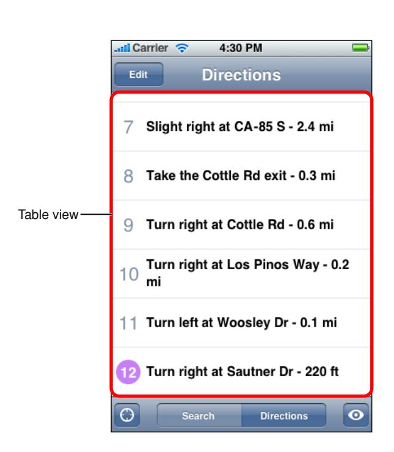

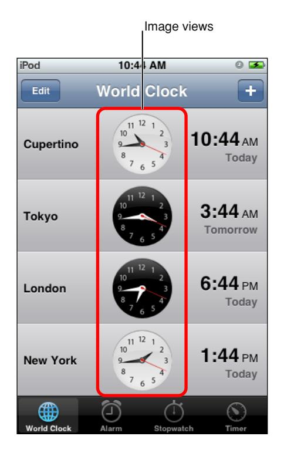

As mentioned above, there are some controls that are available only in specific views. An example of such a control is the disclosure indicator, which has a specific use in a table view. You can see an example of the disclosure indicator (it looks like >) in the left-hand list in [Figure](#page-88-3) 8-1 (page 89). These controls are described in the sectionsthat cover their associated views. In addition to these, however, there are a handful of controls, such as the detail disclosure indicator, that have a wider usage. See ["Application](#page-106-0) Controls" (page 107) for more information on the controls available to you.

# Using Views and Controls in Application Screens

In iPhone OS, UIKit determines the behavior and default appearance of views and controls. As much as possible, you should use the standard user interface elements UIKit provides and follow their recommended usages. Doing this helps you in two important ways:

- Users are accustomed to the look and behavior of standard views and controls. When you use familiar user interface elements, users can depend on their prior experience to help them as they learn to use your application.
- If iPhone OS changes the look or behavior of standard views or controls, your application continues to work and automatically looks up to date with little, if any, work on your part.

Many controls support some kind of customization, usually in color or content (such as the addition of a text label or an image). If you're developing an immersive application, it's reasonable to create controls that are completely different from the default controls. This is because you're creating a unique environment, and discovering how to control that environment is an experience users expect in immersive applications.

### **CHAPTER 5**

A Brief Tour of the Application User Interface

In general, though, you should avoid radically changing the appearance of a control that performs a standard action. If you use unfamiliar controls to perform standard actions, users will have to spend time discovering how to use them and will wonder what, if anything, your controls do that the standard ones do not.

# Navigation Bars, Tab Bars, Toolbars, and the Status Bar

The status bar, navigation bar, tab bar, and toolbar are views that have specifically defined appearances and behaviorsin an iPhone application. These bars are not required to be present in every application (immersive applications often don't display any of them), but if they are present, it's important to use them correctly. The reason is that these bars provide familiar anchors to users of iPhone OS–based devices, who are accustomed to the information they display and the types of functions they perform.

# The Status Bar

The status bar shows users important information about their device, including cell signal strength, the current network connection, and battery charge. Figure 6-1 shows an example of a status bar.

**Figure 6-1** A status bar contains important information for users

Although a full-screen, immersive application can hide the status bar, you should carefully consider the ramifications of this design decision. People expect to be able to see the current battery charge of their devices; hiding this information, and requiring users to quit your application to get it, is not an ideal user experience.

For example, Photos displays individual photos from a camera roll in a full-screen view that fades out the status bar, navigation bar, and toolbar after a few seconds. This is appropriate because in Photos, users focus on viewing the content, not interacting with it. However, users can bring back the status bar, navigation bar, and toolbar with a single tap on the screen.

If you sometimes hide the status bar in your application, you should take advantage of users' experience of this behavior and allow them to redisplay it with a single tap. Unless you have a very compelling reason to do so, it's best to avoid defining a custom gesture to redisplay the status bar because users are unlikely to discover such a gesture or remember it.

Although you have little control over the contents of the status bar, you can customize its appearance and, to some extent, its behavior. Specifically, you can:

- Indicate whether the network activity indicatorshould be visible. You should display the network activity indicator if your application is performing a network operation that will take more than a couple of seconds. If the operation will finish sooner than that, you don't have to show the network activity indicator, because it would be likely to disappear before users notice its presence. (In your code, you use the UIApplication method networkActivityIndicatorVisible to control the indicator's visibility.)
- Specify the color of the status bar. You can choose gray (the default color), opaque black, or translucent black (that is, black with an alpha value of 0.5). Figure 6-2 shows these styles. (Note that you set a value in your Info.plist file to specify the status bar style; see *iPhone Application Programming Guide* for more information on how to do this.)
- ■ Set whether the change from the current status bar color to the new color should be animated. (Note that the animation causes the old status bar to slide up until it disappears off the screen, while the new status bar slides into place.)

**Figure 6-2** Three styles of status bars

Be sure to choose a status bar appearance that coordinates with the rest of your application. For example, avoid using a translucent status bar if the navigation bar is opaque.

# Navigation Bars

A navigation bar appears at the upper edge of an application screen, just below the status bar. A navigation bar usually displays the title of the current view and can contain controls that act on the view's contents, in addition to navigational controls when appropriate. Navigation bars are especially useful in productivity applications(described in "Productivity [Applications"](#page-18-0) (page 19)), because these applicationstypically arrange information in a hierarchy.

Navigation bars have two purposes:

■ To enable navigation among different views in an application

Navigation Bars, Tab Bars, Toolbars, and the Status Bar

■ To provide controls that manage the items in a view

Figure 6-3 shows examples of both these uses.

**Figure 6-3** Navigation bars can contain navigational controls and controls to manage content

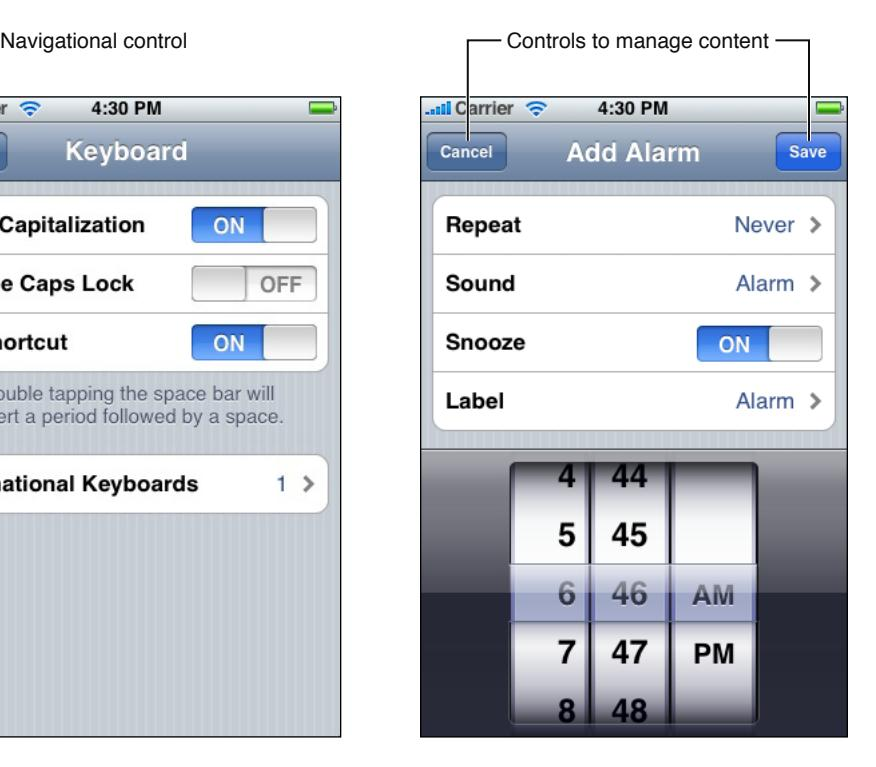

## Navigation Bar Contents

A navigation bar can display just the title of the current view, centered along its width, as shown in Figure 6-4. The initial view in a productivity application should include a navigation bar that displays only the title of the first view because the user hasn't yet navigated to another location.

**Figure 6-4** A navigation bar displays the title of the current view

As soon as the user navigates to another view, the navigation bar should change its title to the title of the new location, and should provide a back button labeled with the title of the previous location. For example, Figure 6-5 shows the navigation bar in Date & Time settings, which is in General settings.

**Figure 6-5** A navigation bar can contain a navigational control

Navigation Bars, Tab Bars, Toolbars, and the Status Bar

The standard back button gives users a reliable way to return to the previous screen, so it's important to avoid altering the button's behavior. In particular, you should avoid creating a multi-segment back button, such as the one shown in Figure 6-6.

**Figure 6-6** A multi-segment back button is not recommended

Using a multi-segment back button causes several problems:

- The extended width of a multi-segment back button does not leave room for the title of the current screen.
- There is no way to indicate the selected state of an individual segment.
- The more segments there are, the smaller the hit region for each one, which makes it difficult for users to tap a specific one.
- Choosing which levels to display as users navigate deeper in the hierarchy is problematic.

If you think users might get lost without a multi-segment back button that displays a type of breadcrumb path, it probably means that users must go too deeply into the information hierarchy to find what they need. To address this, you should flatten your information hierarchy.

In addition to a back button, a navigation bar can also contain a second button to the right of the title. If you do not need to display a back button (because your application does not support hierarchical navigation), you can opt instead to display a button that affects the contents of the view, such as an Edit button, to the left of the title. Figure 6-7 shows an example of this.

**Figure 6-7** A navigation bar can contain controls that manage the content in the view

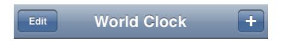

To learn how to implement a navigation bar in your application, see "Navigation Controllers".

As you can see in the illustrations above, buttons in a navigation bar include a bezel around them. In iPhone OS, this style is called the bordered style. All controls in a navigation bar should use the bordered style. In fact, if you place a plain (borderless) control in a navigation bar, it will automatically convert to the bordered style.

You can design your own iconsfor use in navigation-bar buttons, or you can take advantage of the predefined buttons iPhone OS provides. See "Standard Buttons for Use in Toolbars and [Navigation](#page-123-0) Bars" (page 124) for more information on the buttons available to you.

Although you can specify a font for all text displayed in a navigation bar, it's recommended that you use the system font for maximum readability. When you use the appropriate UIKit programming interfaces to create your navigation bar, the system font is used automatically to display the title.

## Navigation Bar Size and Color

Changing the device orientation from portrait to landscape can change the height of the navigation bar automatically (you should not specify the height programmatically). In landscape orientation, the thinner navigation bar provides more space for your screen contents. Be sure to take the difference in heights into account when you design icons for navigation bar controls and when you design the layout of your screens.

You can specify the color and translucency of a navigation bar to coordinate with the overall look of your application and with the other bars in it (that is, toolbars, tab bars, and the status bar). You can use a custom color or choose one of the standard colors:

- Blue (the default color)
- Black

If it complements the look of your application, you can add translucency to the navigation bar. When you use a translucent navigation bar, the screen gives the impression of having a larger visible area, which is especially desirable in landscape orientation. Be sure to avoid mixing a translucent navigation bar with an opaque black status bar (although you can display a translucent navigation bar with an opaque gray status bar).

Strive for consistency in the appearance of navigation bars and other bars in your application. If you use a translucent navigation bar, for example, don't combine it with an opaque toolbar. Also, avoid changing the color or translucency of the navigation bar in different screens in the same orientation.

# Toolbars

If your application provides a number of actions users can take in the current context, it might be appropriate to provide a toolbar. A toolbar appears at the bottom edge of the screen and contains buttons that perform actions related to objects in the current view. A toolbar should not be used to switch among different modes in an application; if you need to do this, use a tab bar instead (see "Tab [Bars"](#page-72-1) (page 73) for more information).

For example, when users view a message in Mail, the application provides a toolbar that contains items for deleting, replying to, and moving the message, in addition to checking for new mail and composing a new message. In this way, users can stay within the message-viewing context and still have accessto the commands they need to manage their email. Figure 6-8 shows what this looks like.

**Figure 6-8** A toolbar provides functionality within the context of a task

## Toolbar Contents

The toolbar displaystoolbar items equally spaced acrossthe width of the toolbar. It's a good idea to constrain the number of items you display in a toolbar, so users can easily tap the one they want. Remember that the hit-region of a user interface element is recommended to be 44 x 44 pixels, so providing five or fewer toolbar items is reasonable. Figure 6-9 shows an example of appropriate spacing of toolbar items in a toolbar.

**Figure 6-9** Appropriately spaced toolbar items

The items in both [Figure](#page-71-1) 6-8 (page 72) and Figure 6-9 do not include a bezel. In iPhone OS this style is called the plain style. (For an example of the bordered style, look at the buttons in [Figure](#page-69-1) 6-7 (page 70).) Although you can use either the bordered or plain style for buttons in a toolbar, you should not mix both styles in the same toolbar.

You can design your own icons for use in toolbar buttons, or you can take advantage of the predefined buttons iPhone OS provides. (See "Standard Buttons for Use in Toolbars and [Navigation](#page-123-0) Bars" (page 124) for more information on the buttons available to you.) If you choose to create custom toolbar buttons, be sure to make them as similar in size as possible to achieve a balanced, attractive appearance.

## Toolbar Size and Color

Changing the device orientation from portrait to landscape can change the height of the toolbar automatically (you should not specify the height programmatically). The thinner toolbar available in landscape orientation leaves more room for your screen contents. Be aware of the difference in heights when you design icons for toolbar buttons and when you design the layout of your screens.

You can specify the color and translucency of a toolbar to coordinate with the overall look of your application and with the other bars in it (that is, navigation bars, tab bars, and the status bar). You can use a custom color or choose one of the standard colors:

- Blue (the default color)
- Black

If it complements the look of your application, you can add translucency to the toolbar. When you use a translucent toolbar, the screen gives the impression of having a larger visible area, which is especially advantageous in landscape orientation.

Strive for consistency in the appearance of toolbars and other barsin your application. If you use a translucent toolbar, for example, don't combine it with an opaque navigation bar. And, avoid changing the color or translucency of the toolbar in different screens in the same orientation.

# Tab Bars

If your application provides different perspectives on the same set of data, or different subtasks related to the overall function of the application, you might want to use a tab bar. A tab bar appears at the bottom edge of the screen.

A tab bar gives usersthe ability to switch among different modes or viewsin an application, and usersshould be able to access these modes from everywhere in the application. However, a tab bar should never be used as a toolbar, which contains buttons that act on elements in the current mode (see ["Toolbars"](#page-70-1) (page 71) for more information on toolbars).

For example, on iPhone, iPod uses a tab bar to allow users to choose which part of their media collection to focus on, such as Podcasts, artists, videos, or playlists. The Clock application, on the other hand, uses a tab bar to give users access to the four functions of the application, namely, World Clock, Alarm, Stopwatch, and Timer. Figure 6-10 shows how selecting a tab in a tab bar changes the view in Clock. Notice how the tab bar remains visible in the different Clock modes shown in Figure 6-10. This makes it easy for users to see which mode they're in, and allows them to access all Clock modes regardless of the current mode.

**Figure 6-10** A tab bar switches views in an application

The tab bar displays icons and text in tabs, all of which are equal in width and display a black background. When a tab is selected, its background lightens and the image in the tab is highlighted. Figure 6-11 shows how this looks.

**Figure 6-11** A selected tab in a tab bar

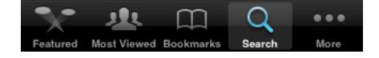

**Note:** A tab bar does not change its opacity or height, regardless of orientation.

iPhone OS provides a number of icons for tabs, such as the items labeled Featured and Bookmarks in Figure 6-11. If you choose to use these icons, be sure to use them in accordance with their documented meaning. For more information on the tab bar icons available to you, see ["Standard](#page-125-0) Icons for Use in Tab Bars" (page 126).

## Providing Additional Tabs

If your application's tab bar contains five or fewer tabs, iPhone OS displays all of them, equally spaced within the tab bar, as shown in Figure 6-12.

**Figure 6-12** iPhone OS displays up to five tabs in a tab bar

#### **CHAPTER 6**

Navigation Bars, Tab Bars, Toolbars, and the Status Bar

If your application's tab bar contains more than five tabs, iPhone OS displays four of them in the tab bar and adds a More tab, as shown in [Figure](#page-73-2) 6-11 (page 74).

Users tap the More tab to see a list of additional tabs in a separate screen, as shown in Figure 6-13.

**Figure 6-13** Additional tabs are displayed when users tap the More tab

The More screen can also include an Edit button that users can tap to configure the tab bar so that it displays the tabs they use most often. For example, Figure 6-14 shows the Configure screen users see after they tap the Edit button in the iPod application's More screen.

**Figure 6-14** When an application has more than five tabs, users can select their favorite tabs to display in the tab bar

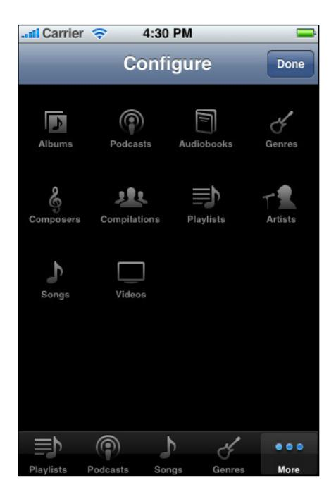

Notice how iPod uses the same tab icons in all three places (the tab bar, the More screen, and the Configure screen). This helps users be confident that each icon meansthe same thing, regardless of where it's displayed.

## Badging a Tab in a Tab Bar

You can display a badge on a tab to communicate with users in a nonintrusive, understated way. This type of feedback is suitable for communicating information that isn't critical to the user's task or context, but that is useful to know. The badge looks similar to the one Phone displays on the Voicemail tab to indicate the number of unheard messages: it is a red oval that appears near the upper right corner of the tab. The white text inside the oval provides the information.

Associating a badge with a specific tab allows you to connect the information in the badge with a particular mode in your application, even when that mode is not the current one. Figure 6-15 shows an example of a badge on a tab.

Navigation Bars, Tab Bars, Toolbars, and the Status Bar

**Figure 6-15** A badge conveys information in a tab bar

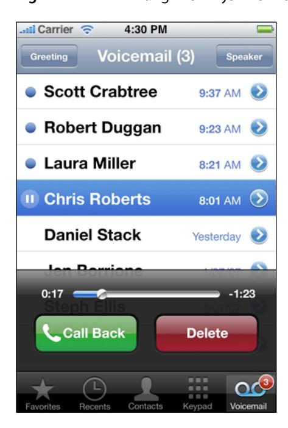

Note that a badge can also be displayed on your application icon in the Home screen if you register for Apple Push Notification Service and users agree to allow badging. See "Enabling Push [Notifications"](#page-48-0) (page 49) for more information on how this works.

#### **CHAPTER 6**

Navigation Bars, Tab Bars, Toolbars, and the Status Bar

# Alerts, Action Sheets, and Modal Views

Alerts, action sheets, and modal views are types of views that appear when something requires the user's attention or when additional choices or functionality need to be offered. Figure 7-1 shows examples of these types of views.

**Figure 7-1** An action sheet, a modal view, and an alert

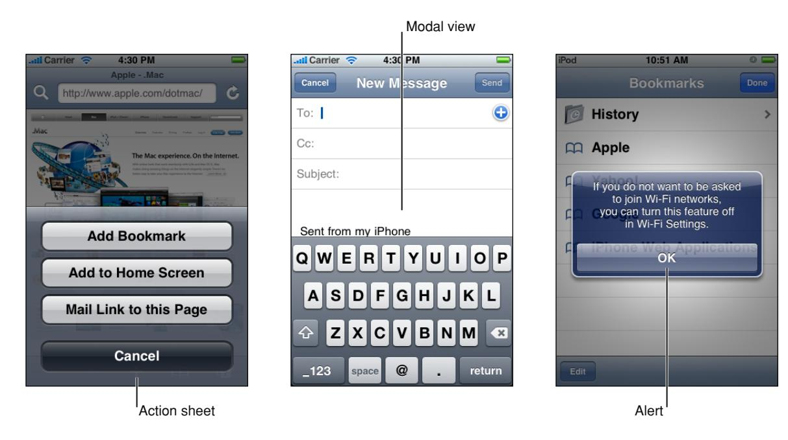

To learn about implementing these types of views programmatically, see "Modal View Controllers".

# Usage and Behavior

Alerts, action sheets, and modal views are all modal, which means that users must explicitly dismiss them, by tapping a button, before they can continue to use the application. Although there are times when you need to warn users of potentially dangerous actions or provide extra choices, it'simportant to avoid overusing these views. This is because:

- All types of modal views interrupt the user's workflow.
- The too-frequent appearance of a view requesting confirmation or acknowledgment is likely to be more annoying than helpful.

Alerts, in particular,should be used only rarely. When alerts appear too frequently, people are likely to dismiss them without reading them, just to get them out of the way.

Alerts, action sheets, and modal views are designed to communicate different things:

- **Alerts give people important information that affects their use of the application (or the device)**. The arrival of an alert is usually unexpected, because it generally tells people about a problem or a change in the current situation that might require them to take action.
- **Action sheets give people additional choices related to the action they are currently taking**. People learn to expect the appearance of an action sheet when they tap a toolbar button that begins either a potentially destructive action (such as deleting all recent calls) or an action that can be completed in different ways (such as a send action for which users can specify one of several destinations).
- **Modal views provide more extensive functionality in the context of the current task**. Modal views can also provide a way to perform a subtask directly related to the user's workflow.

These types of views also differ in appearance and behavior, which underscoresthe difference in the messages they send. Because users are accustomed to the appearance and behavior of these views, it's important to use them consistently and correctly in your application.

## Using Alerts

An alert pops up in the middle of the application screen and floats above its views to give users critical information in a highly visible way. The unattached appearance of an alert emphasizes the fact that its arrival is due to some change in the application or the device, not necessarily as the result of the user's most recent action. An alert should display text that describes the situation and, ideally, give users a way to choose an appropriate course of action.

Users are accustomed to seeing alertsfrom the device or from built-in applicationsthat run in the background, such as Messages, but you should seldom need to use them in your application. For example, you might use an alert to tell usersthat the task they initiated is blocked. It makessense to display an alert with this message, because it's important to tell users what the problem is and give them a choice of ways to handle it.

You can also use an alert to give users a chance to accept or reject an outcome that is potentially dangerous. When this is the case, the alert should display two buttons: one that dismisses the alert and performs the action and one that dismisses the alert without performing the action. Often, it makes sense to use the label "Cancel" for the button that dismisses the alert without performing the action. Note that if users press the Home button while such an alert is visible, the result, in addition to quitting the application, should be identical to tapping the Cancel button: That is, the alert is dismissed and the action is not performed.

The infrequency with which alerts appear helps users take them seriously. Be sure to minimize the number of alerts your application displays and ensure that each one offers critical information and useful choices. In general, try to avoid creating alerts that:

- Update users on tasks that are progressing normally. Instead, consider using a progress view or an activity indicator to provide progress-related feedback to users (these controls are described in ["Progress](#page-114-0) Views" (page 115) and "Activity [Indicators"](#page-106-1) (page 107)).
- Ask for confirmation of user-initiated actions. To get confirmation for an action the user initiated, even a potentially risky action such as deleting a contact, you should use an action sheet (described next in "Using Action [Sheets"](#page-80-0) (page 81)).
- Inform users of errors or problems about which they can do nothing.

Although it might be necessary to use an alert to tell users about a critical problem they can't fix, it's better to integrate such information into the user interface, if possible. For example, instead of telling users every time a server connection fails, display the time of the last successful connection.

## Using Action Sheets

An action sheet displays a collection of alternatives that are associated with a task users initiate by tapping a button in an application's toolbar. An action sheet is an appropriate way to:

- Provide a selection of ways the task can be completed. In Photos, for example, users can tap the Send button when viewing an individual photo. An action sheet appears, giving users a choice of three destinations for the photo (in addition to a Cancel button, which cancels the send).
  - It's useful to display an action sheet in a situation like this, because it allows you to provide a range of choices that make sense in the context of the current task, without giving these choices a permanent place in the user interface.
- Get confirmation before completing a potentially dangerous task. For example, depending on Mail settings, an action sheet appears when users tap the Trash button in the Mail toolbar, allowing them to proceed with the deletion or cancel it.
  - When you display an action sheet in a situation like this you ensure that users understand the dangerous effects of the step they're about to take and you can provide some alternatives. This type of communication is particularly important on iPhone OS–based devices because sometimes users tap controls without meaning to.

An action sheet always emerges from the bottom of the application screen and hovers over its views (as shown in the far left of [Figure](#page-78-2) 7-1 (page 79)). Unlike an alert, however, the side edges of an action sheet are anchored to the sides of the screen, reinforcing its connection to the application and the user's most recent action.

An action sheet contains a few buttons that allow users to choose how to complete their task. You should not have to add a message to an action sheet because the button labels, in conjunction with the task being performed,should provide enough context for the user to understand their choices. When userstap a button, the action sheet disappears. Because an action sheet should provide users with a choice of actions, an action sheet always provides more than one button.

## Using Modal Views

By default, a modal view slides up from the bottom edge of the screen and always coversthe entire application screen (as shown in the middle of [Figure](#page-78-2) 7-1 (page 79)). Because a modal view hides the current application screen, itstrengthensthe user's perception of entering a different, transient mode in which they can accomplish something.

A modal view can display text if appropriate, and contains the controls necessary to perform the task. In addition, a modal view generally displays a button that completes the task and dismisses the view, and a Cancel button users can tap to abandon the task.

A modal view supports more extensive user interaction than an action sheet. Unlike an action sheet, which accepts a single choice, a modal view supports multistep user interaction, such as the selection of more than one option or the inputting of information.

Use a modal view when you need to offer the ability to accomplish a self-contained task related to your application's primary function. A modal view is especially appropriate for a multistep subtask that requires user interface elements that don't belong in the main application user interface all the time. A good example of a modal view is the compose view in Mail. When users tap the Compose button, a modal view appears that contains text areas for the addresses and message, a keyboard for input, a Cancel, and a Send button.

# Designing an Alert

You can specify the text, the number of buttons, and the button contents in an alert. You can't customize the width or the background appearance of the alert view itself, or the alignment of the text (it's center-aligned).

**Note:** As you read these guidelines, be aware of the following definitions:

- **Title-style capitalization** meansthat every word is capitalized, except articles, coordinating conjunctions, and prepositions of four or fewer letters.
- **Sentence-style capitalization** means that the first word is capitalized, and the rest of the words are lowercase, unless they are proper nouns or proper adjectives.

The alert title (and optional message) should succinctly describe the situation and explain what people can do about it. Ideally, the text you write gives people enough context to understand why the alert has appeared and to decide which button to tap.

### **As you compose the required alert title**:

- Keep the title short enough to display on a single line, if possible. A long alert title is difficult for people to read quickly, and it might force the alert message to scroll.
- Avoid single-word titles that don't provide any useful information, such as "Error" or "Warning."
- Prefer a sentence fragment. A short, informative statement is often easier to understand than a complete sentence.
- Don't hesitate to be negative. People understand that most alerts tell them about problems or warn them about dangeroussituations. It's better to be negative and direct than it isto be positive but oblique.
- Avoid using "you," "your," and "me" as much as possible. Sometimes, text that identifies people directly can be ambiguous and can even be interpreted as an insult.
- Use title-style capitalization and no ending punctuation when:
  - ❏ The title is a sentence fragment
  - ❏ The title consists of a single sentence that is not a question
- Use sentence-style capitalization and an ending question mark if the title consists of a single sentence that is a question. In general, consider using a question for an alert title if it allows you to avoid adding a message.
- Use sentence-style capitalization and appropriate ending punctuation for each sentence if the title consists of two or more sentences. A two-sentence alert title should seldom be necessary, although you might consider it if it allows you to avoid adding a message.

### **If you provide an optional alert message**:

- Keep the message short enough to display on one or two lines, if possible. If the message is too long, it will scroll.
- Always use sentence-style capitalization and appropriate ending punctuation. The alert message should be a complete sentence.

**Avoid lengthening your alert text with descriptions of which button to tap**, such as "Tap View to see the information." Ideally, the combination of unambiguous alert text and logical button labels gives people enough information to understand the situation and their choices. However, if you must provide detailed guidance, follow these guidelines:

- Be sure to use the word "tap" (not "touch" or "click" or "choose") to describe the selection action.
- Don't enclose a button title in quotes, but do preserve its capitalization.

**Be sure to testthe appearance of your alertin both orientations**. Because the height of an alert is constrained in landscape, it might look different than it does in portrait. It's recommended that you optimize the length of the alert text so that it looks good (and avoids scrolling) in both orientations.

**Prefer a two-button alert**. A two-button alert is often the most useful, because it is easiest for people to choose between two alternatives. It is rarely a good idea to display an alert with a single button because such an alert is merely informative; it does not give people any control over the situation. An alert that containsthree or more buttonsissignificantly more complex than a two-button alert, and should be avoided if possible. In fact, if you find that you need to offer people more than two choices, you should consider using an action sheet instead (see "Using Action [Sheets"](#page-80-0) (page 81) and ["Designing](#page-83-0) an Action Sheet" (page 84) for more information on this type of view).

**Use alert button colors appropriately**. Alert buttons are colored either dark or light. In an alert with two buttons, the button on the left is always dark-colored and the button on the right is always light-colored. In a one-button alert, the button is always light-colored.

- In a two-button alert that proposes a potentially risky action, the button that cancels the action should be on the right (and light-colored).
- In a two-button alert that proposes a benign action that people are likely to want, the button that cancels the action should be on the left (and dark-colored).

**Note:** A Cancel button may be either light-colored or dark-colored and it may be on the right or the left, depending on whether the alternate choice is destructive. Be sure to properly identify which button is the Cancel button in your code (for more information, see *UIAlertView Class Reference*).

**Give alert buttons short, logical titles**. The best titles consist of one or two words that make sense in the context of the alert text. Follow these guidelines as you create titles for alert buttons:

- As with all button titles, use title-style capitalization and no ending punctuation.
- Prefer verbs and verb phrases, such as "Cancel," "Allow," "Reply," or "Ignore" that relate directly to the alert text.
- Prefer "OK" for a simple acceptance option if there is no better alternative. Avoid using "Yes" or "No."
- Avoid "you," "your," and "me" as much as possible. Button titles that use these words are often both ambiguous and patronizing.

# Designing an Action Sheet

You choose the background of an action sheet to coordinate with the look of your application, and you can specify the number of buttons and their contents.

Unlike an alert, an action sheet should not need to display a textual message. This is because an action sheet appears as the result of a user action, such as tapping a Delete or Send button, so there should be no need to explain its arrival.

Action sheets can have two different background appearances. You need to ensure that the background of the action sheets in your application coordinates with the appearance of your application's toolbars or navigation bars. If your application uses black navigation bars and toolbars, for example, the action sheet background should be translucent black. By default, iPhone OS displays action sheets with a standard blue background, which coordinates with the standard blue toolbars and navigation bars. All action sheetsin your application should have the same background color, and that color should coordinate with the color of the navigation bars and toolbars.

Be sure to display the Cancel button at the bottom of an action sheet. This encourages the user to read through all the alternatives before reaching the Cancel option.

Figure 7-2 shows an action sheet with the default background appearance and a Cancel button in the recommended location.

**Figure 7-2** A typical action sheet

If you need to provide a button that performs a potentially destructive action, such as deleting all the items in a user'sshopping list, you should use the red button color. It'simportant to display such destructive buttons at the top of the action sheet for two reasons:

■ The closer to the top of the action sheet a button is, the more visible it is.

■ Sometimes users mistakenly tap the bottom of the device screen when they're aiming for the Home button. By placing a destructive button away from the bottom of an action sheet, users are less likely to cause undesirable results if they mistakenly tap the screen instead of the Home button.

Figure 7-3 shows an action sheet with the translucent black background appearance and both a Cancel and a destructive button in their recommended positions.

**Figure 7-3** A button that performs a destructive action should be red and located at the top of the action sheet

You can display several buttonsin an action sheet, aslong as you make sure each button is easily distinguished from the others. Figure 7-4 shows an action sheet with a background that matches the standard blue toolbar and that provides three alternatives in addition to Cancel.

**Figure 7-4** An action sheet with four buttons

# Designing a Modal View

The overall look of a modal view should coordinate with the application that displaysit. For example, a modal view often includes a navigation bar that contains a title and buttons that cancel or complete the modal view's task. The navigation bar should have the same background appearance as the navigation bar in the application.

A modal view should usually display a title that identifies the task in some way. If appropriate, you can also display text in other areas of the view that more fully describes the task or provides some guidance. For example, the Messages application provides a modal view when users want to compose a text message. This modal view, shown in Figure 7-5, displays a navigation bar with the same background as the application navigation bar and with the title New Message.

**Figure 7-5** A modal view should coordinate with the application screen

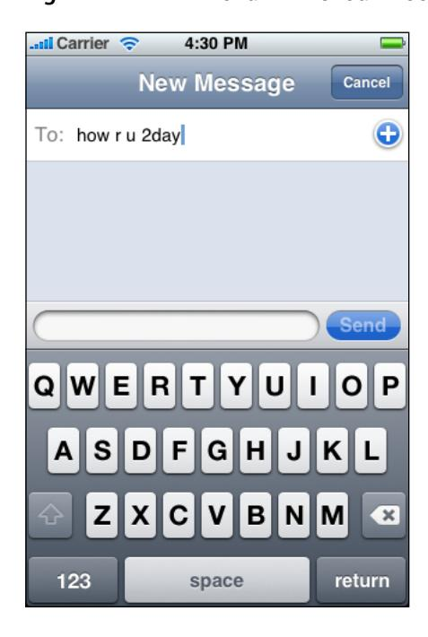

In a modal view, you can use whichever controls are required to accomplish the task. For example, you can include text fields, buttons, and table views.

You can choose to reveal a modal view in a way that coordinates with your application and enhances the user's awareness of the temporary context shift the view represents. To do this, you can specify one of the following transition styles:

- **Vertical**. The modal view slides up from the bottom edge of the screen and slides back down when dismissed. (This is the default transition style.)
- **Flip**. The current view flips horizontally from right to left to reveal the modal view. Visually, the modal view looks as if it is the back of the current view. When the modal view is dismissed, it flips horizontally from left to right, revealing the previous view.

If you decide to vary the transition styles of the modal views in your application, avoid doing so merely for the sake of variety. Be aware that users notice such differences and will assume that they mean something. For this reason, it's best to establish a logical, consistent pattern that users can easily detect and remember, and avoid changing transition styles gratuitously.

#### **CHAPTER 7**

Alerts, Action Sheets, and Modal Views

# Table Views, Text Views, and Web Views

Table views, text views, and web views are versatile elements that lend themselves to different uses in your iPhone application. For example, table views can be configured to display short lists of choices, grouped lists of detailed information, or long, indexed lists of items. Text views and web views are relatively unconstrained containers you can use to accept and display content.

# Table Views

A **table view** presents data in a single-column list of multiple rows. Rows can be divided into sections or groups and each row can contain some combination of text, images, and controls. Users flick or drag to scroll through rows or groups of rows. Figure 8-1 shows how different styles of table views can display lists in different ways.

**Figure 8-1** Three ways to display lists using table views

A simple list in a plain table view An indexed list in a plain table view A grouped list in a grouped

table view

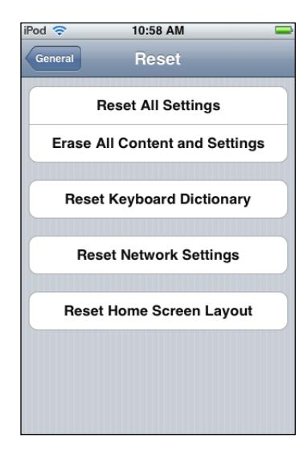

## Usage and Behavior

Table views are extremely useful in iPhone applications because they provide attractive ways to organize both large and small amounts of information. Table views are most useful in productivity applications that tend to handle lots of user items, although utility applications can make use of smaller-scale table views, as well. An immersive application would probably not use a table view to display information, but it might use one to display a short list of options.

Table Views, Text Views, and Web Views

Table views provide built-in elements that allow users to navigate and manipulate information. In addition, table views support:

- The display of header and footer information. You can display descriptive text above or below each section or group in a list, and above or below the list as a whole.
- List editing. You can allow users to add, remove, and reorder list items in a consistent way. Table views also support the selection and manipulation of multiple list items, which you might use to give users a convenient way to delete more than one list item at a time.

**A table should always provide feedback when users select a list item**. When an item can be selected, the row containing the item highlights briefly when the user selects it, providing feedback that the selection has been received. Then, an immediate action occurs: Either a new view isrevealed or the row displays a checkmark to indicate that the item has been selected or enabled.

In rare cases, a row might remain highlighted when secondary details or controls related to the row item are displayed in the same screen. However, thisis not encouraged because it is difficult to display a list of choices, a selected item, and related details or controls without creating an uncomfortably crowded layout.

If a row selection results in navigation to a new screen, the selected row highlights briefly as the new screen slides into place. When the user navigates back to the previous screen, the originally selected row again highlights briefly to remind the user of their earlier selection.

Note that you can also animate the changes users make to list items. Doing so is a good way to provide feedback and strengthen the user's sense of direct manipulation. In Settings, for example, when you turn off the automatic date and time setting (by selecting Off in Date & Time > Set Automatically), the list group expands smoothly to display two new items, Time Zone and Set Date & Time.

**A table should display content immediately**. If the table's content is extensive or complex, avoid waiting until all the data is available before displaying anything. Instead, fill the onscreen rows with textual data immediately and display more complex data (such asimages) asthey become available. Thistechnique gives users useful information right away and increases the perceived responsiveness of your application.

If your application displays data that changes infrequently, you might consider displaying "stale" data while waiting for new data to become available. This technique also allows users to see something useful right away, but it is not recommended for applicationsthat handle data that changesfrequently. Before you decide to do this, gauge how often the data changes and how much users depend on seeing fresh data quickly.

If it's difficult to display anything useful right away, it's important to avoid displaying empty rows, because this can imply that the application has stalled. Instead, the table should display a spinning activity indicator along with an informative label, such as "Loading...", centered in the screen. If you can display older data, you don't have to worry about blank rows, but you should update onscreen rows as soon as possible. Both techniques provide feedback to users, letting them know that processing is continuing.

## Table-View Styles

iPhone OS defines two styles of table views, which are distinguished mainly by appearance:

**Plain** (UITableViewStylePlain). This table-view style displays rows that extend from side edge to side edge of the screen. The background of the rows is white. The rows can be separated into labeled sections and the table view can display an optional index that appears vertically along the right edge of the view.

Figure 8-2 shows a list in a plain table (without headers, footers, or an index) in the iPod application.

**Figure 8-2** A simple list in a plain table

**Grouped** (UITableViewStyleGrouped). This table-view style displays groups of rows that are inset from the side edges of the screen. The groups are displayed on a distinctive vertically striped background, while inside the groups the background is white. A grouped table can contain an arbitrary number of groups, and each group can contain an arbitrary number of rows. Each group can be preceded by header text and followed by footer text. This style of table view does not provide an index.

Figure 8-3 shows a list in a grouped table, in which each group contains one row. This list, in the Settings application, does not include header or footer text.

**Figure 8-3** A list of four groups in a grouped table

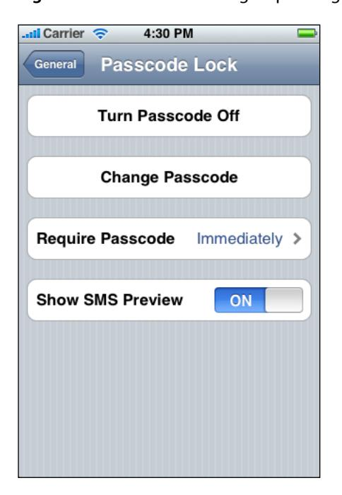

## Table-Cell Styles

iPhone OS 3.0 and later includes four predefined table-cell styles you can use to quickly and easily produce the most common layouts for table rows in both plain and grouped tables. Note that, programmatically, these styles are applied to a table view's cell, which is an object that tells the table how to draw its rows.

When you use the standard table-cell styles, your application is consistent with the built-in applications, which benefits you in a couple of ways:

- Users more quickly understand how your application works
- Your application remains consistent without a lot of extra work on your part, if the standard table-cell styles are enhanced in the future

If you want to lay out your table rows in a nonstandard way, it's better to create a custom table-cell style than to significantly alter a standard one. "Customizing Cells" in *Table View Programming Guide for iPhone OS* helps you learn how to create your own cells.

Be aware that text truncation is automatic in all table-cell styles. Generally speaking, you should ensure that your text is as succinct as possible to avoid displaying truncated words or phrases that are difficult for users to understand. Specifically, text truncation can be more or less of a problem, depending on which cell style you use and on where truncation occurs.

iPhone OS provides the following standard table-cell styles:

■ The **default** table-cell style (UITableViewCellStyleDefault) includes an optional image on the left, followed by a left-aligned text label in black.

**Figure 8-4** The default table-cell style in a grouped table (left) and a plain table (right)

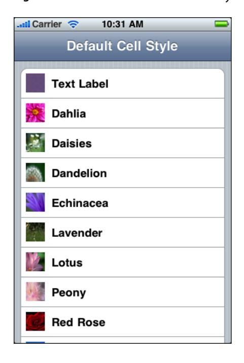

The text label's appearance implies that it represents an item name or title and its left-alignment makes the list easy to scan. This makes the default style good for displaying a list of items that do not need to be differentiated by supplementary information.

Short text labels are best, but if truncation is unavoidable, try to ensure that the most important information is contained in the first few words.

■ The **subtitle** table-cell style (UITableViewCellStyleSubtitle) includes an optional image on the left, followed by a left-aligned text label on one line and a left-aligned detail text label on the line below. The text label is in black and the detail text label is in a smaller, gray font.

**Figure 8-5** The subtitle table-cell style in a grouped table (left) and a plain table (right)

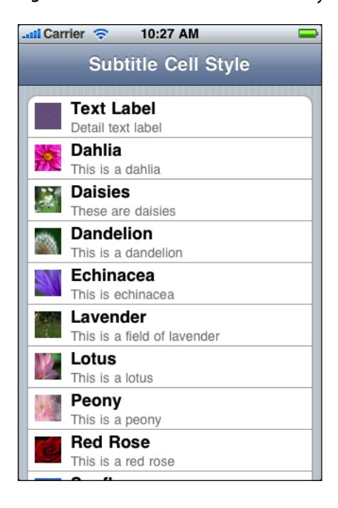

The prominent appearance of the text label implies that it represents an item name or title, while the subtle appearance of the detail text label implies that it contains subsidiary information related to the item. The left-alignment of the text labels makes the list easy to scan. This table-cell style works well when list items might look similar, because users can use the additional information in the detail text labels to help distinguish items named in the text labels.

Text labels should be short to avoid truncation. If truncation is unavoidable, focus on putting the most important information in the first few words. If the detail text label is truncated, users are not likely to mind too much because they view it as information that enhances or supplements the item named by the text label.

■ The **value 1** table-cell style (UITableViewCellStyleValue1) displays a left-aligned text label in black on the same line with a right-aligned detail text label in a smaller, blue font. Images do not fit well in this style.

**Figure 8-6** The value 1 table-cell style in a grouped table (left) and a plain table (right)

The appearance of the text label implies that it represents an item name or title, while the appearance of the detail text label implies that it provides important information that is closely associated with the item.

The left-alignment and font of the text label help users scan the list for the item they want, and the right-alignment of the detail text label draws their attention to the related information it provides. This table-cell style works well to display an item's current value, possibly selected from a sublist.

Text truncation can be difficult to avoid in this layout (because both labels are on the same line), but it's worth the effort. Otherwise, you lose the active space between the labels that helps users understand the relationship between the two pieces of information.

Although you can use the value 1 table-cell style in either a plain or a grouped table, its appearance is better suited to a grouped table. For example, the Usage screen in Settings uses the value 1 style in grouped tables:

**Figure 8-7** The value 1 table-cell style looks best in a grouped table

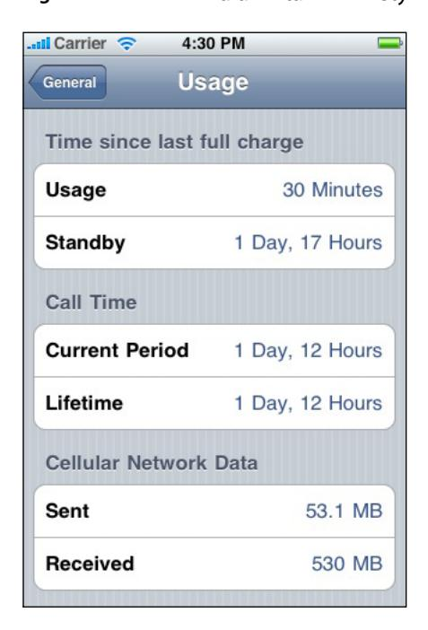

■ The **value 2** table-cell style (UITableViewCellStyleValue2) displays a right-aligned text label in a small blue font, followed on the same line by a left-aligned detail text label in a larger, black font. Images do not fit well in this style.

**Figure 8-8** The value 2 table-cell style in a grouped table (left) and a plain table (right)

The right-alignment, constrained width, and font of the text label imply that it functions as a heading or caption for the important information in the more prominent, left-aligned detail text label.

In this layout, the labels are aligned towards each other at the same location in every row. This creates a crisp, vertical margin between the text labels and the detail text labels in the list, which helps users focus on the first words of the detail text label. If you allow the text labels to be truncated, you lose the sharpness of this vertical strip, which can make it harder for users to scan the information in the detail text labels.

Although you can use the value 2 table-cellstyle in either a plain or a grouped table, it looks much better in a grouped table. For example, the Info screen in Contacts uses the value 2 table-cell style in grouped tables:

**Figure 8-9** The value 2 table-cell style looks best in a grouped table

**Note:** All standard table-cell styles also allow the addition of a table-view element, such as the checkmark or the disclosure indicator. Be aware that adding these elements decreases the width of the cell available for the title and subtitle.

You might be able to avoid text truncation by increasing the height of a table row to accommodate text wrapping, but this can be problematic:

- You have to programmatically check the text length and decide if wrapping might occur. You must make this determination for both portrait and landscape orientation, because the table width affects text wrapping.
- You should avoid displaying wrapped text in one orientation, but not the other.
- Variable row heights can negatively impact the overall table view performance in your application, regardless of table-view style.

Table Views, Text Views, and Web Views

Finally, although variable row heights are acceptable in grouped tables, they can make a plain table look cluttered and uneven.

## Table-View Elements

iPhone OS includes a handful of **table-view elements** that can extend the functionality of table views. Unless noted otherwise, these elements are suitable for use in table views only. Be sure to use these elements correctly in your application, because users are accustomed to their appearance and behavior in the built-in applications.

**Note:** Programmatically, table-view elements are implemented in different ways. Some are accessory views of the table cell (an object that tells the table how to draw its rows) and others can be displayed when the table view enters an editing mode. See *Table View Programming Guide for iPhone OS* to learn about the different ways to manage these elements.

- **Disclosure indicator**. When this element is present, users know they can tap anywhere in the row to see the next level in the hierarchy or the choices associated with the list item.
  - Use a disclosure indicator in a row when selecting the row results in the display of another list. Don't use a disclosure indicator to reveal detailed information about the list item; instead, use a detail disclosure button for this purpose.
- **Detail disclosure button**. Users tap this element to see detailed information about the list item. (Note that you can use this element in views other than table views, to reveal additional details aboutsomething; see "Detail [Disclosure](#page-109-0) Buttons" (page 110) for more information.)
  - In a table view, use a detail disclosure button in a row to display details about the list item. Note that the detail disclosure button, unlike the disclosure indicator, can perform an action that is separate from the selection of the row. For example, in Phone Favorites, tapping the row initiates a call to the contact; tapping the detail disclosure button in the row reveals more information about the contact.
- **Delete button**. Users tap this element to delete the list item. This element appears to the right of a list item when usersswipe in the row or when they tap the delete control button while in an editing context. (See Figure 8-10 for an example of this element.)
- **Delete control button**. Users tap this element to reveal and hide the Delete button for each list item. To give additional feedback to users, the horizontal minus symbol inside this button becomes vertical when users tap it to reveal the Delete button. See Figure 8-10 for an example of this element.
  - In a grouped table that supports a transitory editing mode, the delete control appears outside the table view, on the left. You can see this, for example, when editing an individual's information in Contacts. In a grouped table that is in a permanent editing mode (such as the grouped tables on the back of Stocks and Weather), the delete control appears inside the table, on the left.
  - In a plain table, the delete control always appears inside the table, on the left, as shown in Figure 8-10.
- **Row insert button**. Users tap this element to add a row to the list.
- **Row reorder control**. When this element is present, users can drag the row to another location in the list.
- **Checkmark**. This element appears next to a list item to show that it is currently selected.

**Figure 8-10** A table view can display the Delete button and the delete control button

## Switch Controls

A **switch control** presents to the user two mutually exclusive choices or states, such as yes/no or on/off. A switch control shows only one of the two possible choices at a time; users slide the control to reveal the hidden choice or state. Figure 8-11 shows examples of switch controls.

**Figure 8-11** Switch controls in a table view

Table Views, Text Views, and Web Views

Use a switch control in a grouped table view when you need to offer the user two simple, diametrically opposed choices. Because one choice is always hidden, it's best to use a switch control when the user already knows what both values are. In other words, don't make the user slide the switch control just to find out what the other option is.

You can use a switch control to change the state of other user interface elements in the view. Depending on the choice users make, new list items might appear or disappear, or list items might become active or inactive.

## Using Table Views to Enable Common User Actions

Table views are particularly versatile user interface elements, because they can be configured in different ways to support different user actions, such as:

### ■ **Selecting options**.

iPhone OS does not include multi-item selection controls analogous to menus or pop-up menus, but a table view works well to display a list of options from which the user can choose. This is because table views display items in a simple, uncluttered way. In addition, the table view provides a checkmark image that shows users the currently selected option (or options) in a list, as shown in [Figure](#page-99-1) 8-12 (page 100).

**Figure 8-12** A checkmark indicates the current selection in a list

If you need to display a list of choices users see when they tap an item in a table row, you can use either style of table view. But if you need to display a list of choices users see when they tap a button or other user interface element that is not in a table row, use the plain style.

■ **Navigating hierarchical information**.

A table view works well to display a hierarchy of information in which each node (that is, list item) can contain its own subset of information, because each subset can be displayed in a separate list. This makes it easy for users to follow a path through the hierarchy by selecting one item in each successive list. The disclosure indicator element tells usersthat tapping anywhere in the row revealsthe subset of information in a new list, as shown in [Figure](#page-100-0) 8-13 (page 101).

**Figure 8-13** A disclosure indicator indicates that a subset of information is on the next screen

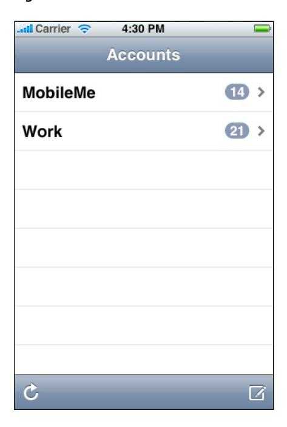

When a table is used for navigation, previously selected table rows do not remain highlighted when users retrace their steps through the hierarchy.

### ■ **Viewing conceptually grouped information**.

You can use either table-view style to cluster information into logical groups, such as work, home, or school. Both plain and grouped tables allow you to provide context for each section by supplying header and footer text, as shown in [Figure](#page-101-0) 8-14 (page 102).

**Figure 8-14** Header text in a plain table divides a list into sections

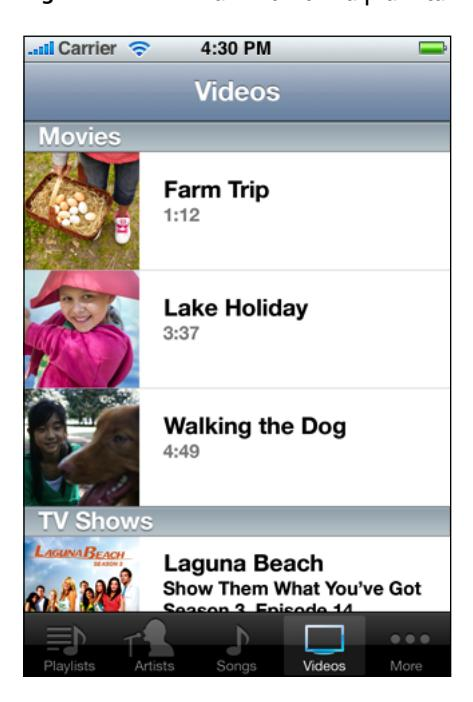

Generally speaking, grouped tables provide a clearer visual indication of grouping because it's easy for users to distinguish the rounded corners of the groups, even when scrolling quickly. [Figure](#page-101-1) 8-15 (page 102) shows several conceptual groups of values in iPod settings.

**Figure 8-15** A grouped table can contain many separate groups

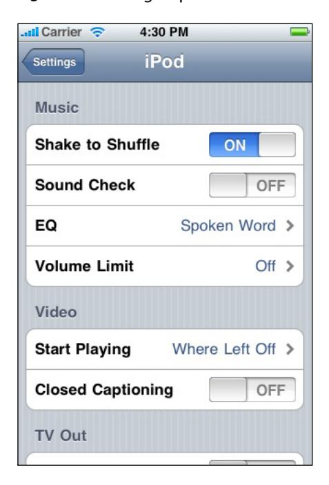

■ **Looking up indexed information**.

If you're using a plain table, you can display an index that helps users quickly find what they need. The index consists of a column of entries (usually letters in an alphabet) that floats on the right edge of the screen, asshown in [Figure](#page-102-1) 8-16 (page 103). Userstap (or drag to) an index entry to reveal the corresponding area in the list. An index is most useful in a list that might span more than a few screenfuls.

**Figure 8-16** A plain table can include an index

If you include an index in a plain table, avoid using table-view elements that display on the right edge of the table (such as the disclosure indicator), because these elements interfere with the index.

# Text Views

A **text view** is a region that displays multiple lines of text and supports scrolling when the content is too large to fit inside its bounds. Mail uses a text view to allow users to create a signature that appears at the end of each email message they compose, as shown in Figure 8-17.

**Figure 8-17** A text view displays multiple lines of text

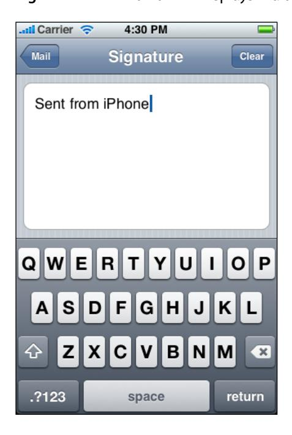

Although you might use a text view to display many lines of text,such asthe content of a large text document, you can also use a text view to support user editing. If you make a text view editable, a keyboard appears when the user taps inside the text view. The keyboard's input method and layout are determined by the user's language settings. When users tap the button labeled ".?123" (shown in Figure 8-17), the keyboard changes to facilitate the entry of numbers and punctuation. You can also specify different keyboard styles, depending on the type of content you expect users to enter. See "Text [Fields"](#page-119-0) (page 120) for a description of the styles you can use.

You have control over the font, color, and alignment of the text in a text view, but only as they apply to the entirety of the text. In other words, you can't change any of these properties for only part of the text. The defaults for the font and color properties are, as you would expect, the system font and black, because they tend to be the most readable. The default for the alignment property is left (you can change this to center or right).

If you must enable variable fonts, colors, or alignments within a view that displays text, you can use a web view instead of a text view, and style the text using HTML.

# Web Views

A **web view** is a region that can display rich, HTML content in your application screen. For example, Mail uses a web view to display message content, because it can contain elements in addition to plain text (Figure 8-18 shows an example of this).

**Figure 8-18** A web view can display web-based content

In addition to displaying web content, a web view provides elements that support navigation through open webpages. Although you can choose to provide webpage navigation functionality, it's best to avoid creating an application that looks and behaves like a mini web browser.

If you have a webpage or web application, you might choose to use a web view to implement a simple iPhone application that provides a wrapper for it. If you plan to access web content that you control, be sure to read *Safari Web Content Guide* to learn how to create web content that is compatible with and optimized for display on iPhone OS–based devices.

#### **CHAPTER 8**

Table Views, Text Views, and Web Views

# Application Controls

iPhone OS provides several controls you can use in your application, most of which are already familiar to users of iPhone OS–based devices. Many of these controls are intended for use in specific places, such as in a table view, but some are available for more general usage. This chapter describes the controls that you can use in arbitrary views in your application.

As you design the user interface of your application, always remember that users expect familiar controls to behave as they do in the built-in applications. This is to your advantage, as long as you use these controls appropriately in your application.

# Activity Indicators

An **activity indicator** shows the progress of a task or process that is of unknown duration. If you need to display progress for a task of known duration, use a progress view instead (see ["Progress](#page-114-0) Views" (page 115) for more information about this control). The "spinning gear" appearance of the activity indicator shows users that processing is occurring, but does not suggest when it will finish.

Figure 9-1 showstwo types of activity indicators. The activity indicator in the status bar isthe network activity indicator; it should be displayed when your application accesses the network for more than a couple of seconds. The larger activity indicator in the toolbar should be displayed if it will take more than a second or two for your application to perform the current task.

**Figure 9-1** Two types of activity indicators

An activity indicator is a good feedback mechanism to use when it's more important to reassure users that their task or process has not stalled than it is to suggest when processing will finish.

You can choose the size and color of an activity indicator to coordinate with the background of the view in which it appears. By default, an activity indicator is white.

An activity indicator disappears when the task or process has completed. This default behavior is recommended, because users expect to see an activity indicator when something is happening and they associate a stationary activity indicator with a stalled process.

To learn how to display the network activity indicator, see the networkActivityIndicatorVisible method in *UIApplication Class Reference*. To learn how to display the larger, non-network activity indicator in your code, see *UIActivityIndicatorView Class Reference*.

# Date and Time Pickers

A **date and time picker** gives users an easy way to select a specific date or time. A date and time picker can have up to four independent spinning wheels, each of which displays values in a single category, such as month or hour. Users flick or drag to spin each wheel until it displays the desired value beneath the clear selection bar that stretches across the middle of the picker. The final value comprises the values displayed in each wheel. Figure 9-2 shows an example of a date and time picker.

**Figure 9-2** A date and time picker

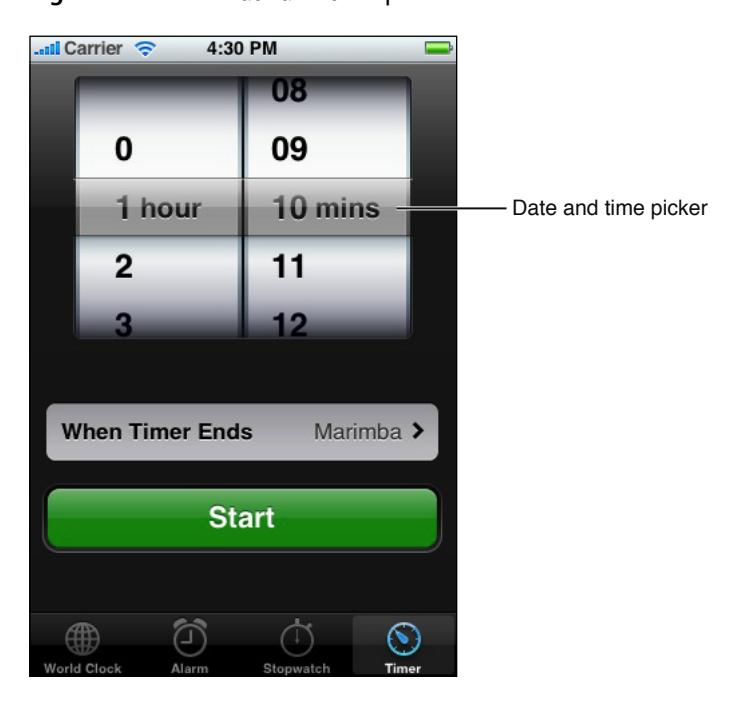

Use a date and time picker to allow users to avoid typing values that consist of multiple parts, such as the day, month, and year of a date. A date and time picker works well because the values in each part have a relatively small range and users already know what the values are.

Depending on the mode you specify, a date and time picker displays a different number of wheels, each with a set of different values. The date and time picker defines the following modes:

- **Time**. The time mode displays wheels for the hour and minute values, with the optional addition of a wheel for the AM/PM designation.
- **Date**. The date mode displays wheels for the month, day, and year values.
- **Date and time**. The date and time mode displays wheels for the calendar date, hour, and minute values, with the optional addition of a wheel for the AM/PM designation. This is the default mode.
- **Countdown timer**. The countdown timer mode displays wheelsfor the hour and minute. You can specify the total duration of a countdown, up to a maximum of 23 hours and 59 minutes.

By default, a minutes wheel displays 60 values (0 to 59). However, if you need to display a coarser granularity of choices, you can set a minutes wheel to display intervals of minutes, as long as the interval divides evenly into 60. For example, you might want to display the quarter-hour intervals 0, 15, 30, and 45.

Regardless of its configuration, the overall size of a date and time picker is fixed, and is the same size as the keyboard. You might choose to make a date and time picker a focal element in your view, or cause it to appear only when needed. For example, the timer mode of the built-in Clock application displays an always-visible date and time picker because the selection of a time is central to the function of the Timer. On the other hand, the Set Date & Time preference (available in Settings > General > Date & Time, when you turn off Set Automatically) displays transient date and time pickers, depending on whether users want to set the date or the time.

To learn more about using a date and time picker in your code, see *UIDatePicker Class Reference*.

# Detail Disclosure Buttons

A **detail disclosure button** reveals additional or more detailed information about something. Usually, you use detail disclosure buttons in table views, where they give users a way to see detailed information about a list item (for more information about this usage, see ["Table-View](#page-97-0) Elements" (page 98)). However, you can use this element in other types of views to provide a way to reveal more information or functionality.

For example, the Maps application displays a detail disclosure button users can tap to access more functionality related to the dropped pin. Figure 9-3 shows an example of a detail disclosure button.

**Figure 9-3** A detail disclosure button reveals additional details or functionality

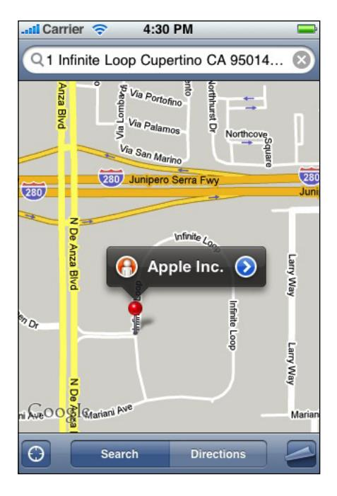

To learn more about using a detail disclosure button in your code, see *UIButton Class Reference*.

# Info Buttons

An **Info button** provides a way to reveal configuration details about an application, often on the back of the screen. For this reason, Info buttons are especially well suited to utility applications. You can see an example of an Info button in the lower-right corner of the Weather application (shown in Figure 9-4).

**Figure 9-4** An Info button reveals information, often configuration details

Info buttons are available with a light background and a dark background. The light background style (which is shown in Figure 9-4) looks good on a view with a dark background. Conversely, an Info button with a dark background shows up well on a view with a light background.

An Info button glows briefly when users tap it. When you use the Info button iPhone OS provides, you get this pressed-state appearance automatically.

To learn more about using an Info button in your code, see *UIButton Class Reference*.

# Labels

A **label** is a variably sized amount of static text. Figure 9-5 shows an example of a label.

**Figure 9-5** A label gives users information

You can use a label to name parts of your user interface or to provide limited help to the user. A label is best suited to display a relatively small amount of text.

You can determine various properties of the label's text, such as font, text color, and alignment, but above all, you should take care to make your labels legible. Don't sacrifice clarity for fancy fonts or showy colors.

As you compose the text of your labels, be sure to use the user's vocabulary. Examine the text in your application for developer-centric terms and replace them with user-centric terms.

To learn more about using labels in your code, see *UILabel Class Reference*.

# Page Indicators

A **page indicator** displays a dot for each currently open view in an application. From left to right, the dots represent the order in which the views were opened (the leftmost dot representsthe first view). The currently visible view isindicated by a glow on the dot that representsit. Userstap to the left or the right of the glowing dot to view the previous or next open view. Figure 9-6 shows an example of a page indicator.

**Figure 9-6** A page indicator

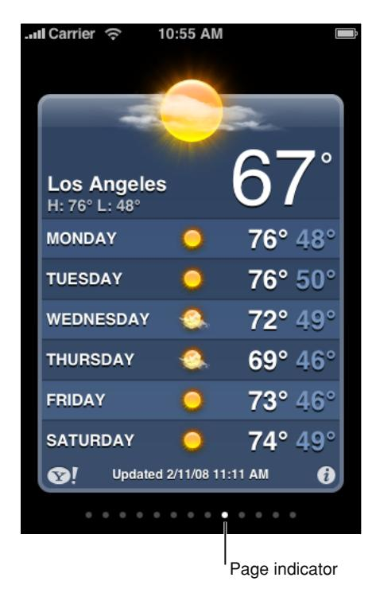

A page indicator gives users a quick way to see how many views are open and an indication of the order in which they were opened; it does not help users keep track of the steps they took through a hierarchy of views. Because the views in a utility application tend to be peers of each other, a page indicator is sufficient to help users navigate through them. A productivity application that displays hierarchical information, on the other hand, should offer navigation through the elements in the navigation bar (for more on this, see ["Navigation](#page-67-0) Bars" (page 68)).

Typically, page indicators work well near the bottom edge of the application screen, below the views it contains. This leaves the more important information (the view itself) in the upper part of the screen where users can see it easily. Be sure to vertically center a page indicator between the bottom edge of the view and the bottom edge of the screen.

Although there is no programmatic limit to the number of dots you can display in a page indicator, be aware that the dots do not shrink or squeeze together as more appear. For example, in portrait orientation, you can display at most 20 dots in a page indicator before clipping occurs. Therefore, you should provide logic in your application to avoid this situation.

Although you can hide a page indicator when there is only one open view, the default behavior is to display it.

To learn more about using a page indicator in your code, see *UIPageControl Class Reference*.

# Pickers

A **picker** is a generic version of the date and time picker (see "Date and Time [Pickers"](#page-107-0) (page 108) for more information about this control). You can use a picker to display any set of values. As with a date and time picker, users spin the wheel (or wheels) of a picker until the desired value appears. Figure 9-7 shows a picker with a single wheel.

**Figure 9-7** A picker as displayed in Safari on iPhone

As you decide whether to use a picker in your application, consider that many, if not most, of the values in a wheel are hidden from the user when the wheel is stationary. This is not necessarily a problem, especially if users already know what those values are. For example, in a date and time picker, users understand that the hidden valuesin the month wheel can only be numbers between 1 and 12. If you need to provide choices that aren't members of such a well-known set, however, a picker might not be the appropriate control.

If you need to display a very large number of values, you might want to list them in a table view instead of in a picker. This is because the greater height of a table view makes scrolling faster.

If you need to provide context for a value in a picker, such as a unit of measurement, display it in the translucent selection bar horizontally across the center of the control. Do not display such labels above the picker or on the wheelsthemselves. For an example of the correct way to display labels,see the Timer function of the built-in Clock application, which displays "hours" and "mins" (or "min") next to the values users select.

As with a date and time picker, a generic picker can be visible all the time (as a focal point of your user interface) or it can appear only when needed. The overall size of a picker, including its background, is fixed, and is the same size as a keyboard.

To learn more about using a picker in your code, see *UIPickerView Class Reference*.

# Progress Views

A **progress view** shows the progress of a task or process that has a known duration. If you need to display progressfor a task of unknown duration, use an activity indicator instead (see "Activity [Indicators"](#page-106-1) (page 107) for more information about this control).

iPhone OS providestwo styles of progress view, which are the defaultstyle and the barstyle. The appearance of each style is very similar, except for height:

- The default style is intended for use in an application's main content area.
- The barstyle isthinner than the defaultstyle, which makesit well-suited for use in a toolbar. For example, in Mail a bar-style progress view appears in the toolbar when users download new messages or send an email message.

The behavior of both styles of progress view is the same. As the task or process proceeds, the track of the progress view is filled from left to right. At any given time, the proportion of filled to unfilled area in the view gives the user an indication of how soon the task or process will finish. Figure 9-8 shows an example of a bar-style progress bar.

**Figure 9-8** A bar-style progress view in a toolbar

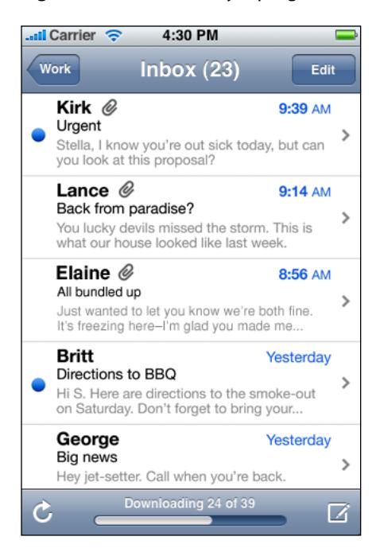

A progress view is a good way to provide feedback to users on tasks that have a well-defined duration, especially when it's important to show users approximately how long the task will take. When you display a progress view, you tell the user that their task is being performed and you give them enough information to decide if they want to wait until the task is complete or cancel it.

To learn more about using a progress view in your code, see *UIProgressView Class Reference*.

# Rounded Rectangle Buttons

A **rounded rectangle button** is a versatile button you can use in a view to perform an action. You can see examples of this type of button at the bottom of an individual's Contacts view: The Text Message and Add to Favorites buttons are rounded rectangle buttons, as shown in Figure 9-9.

**Figure 9-9** Rounded rectangle buttons perform application-specific actions

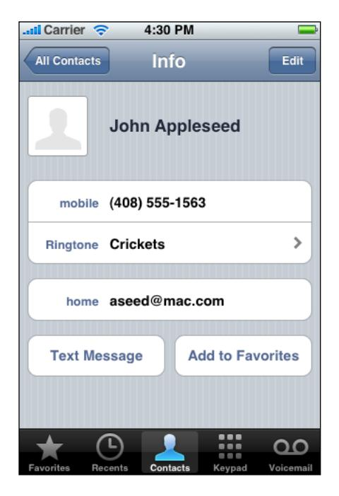

When you supply a title for a rounded rectangle button, be sure to:

- Use title-style capitalization (that is, capitalize every word except articles, coordinating conjunctions, and prepositions of four or fewer letters)
- ■ Avoid creating a title that is too long. Overly long text gets truncated, which can make it difficult for users to understand it.

To learn more about using a rounded rectangle button in your code, see *UIButton Class Reference*.

# Search Bars

A search bar is a field that acceptstext from users, which your application can use asinput for a search. When the user taps a search bar, a keyboard appears; when the user is finished typing search terms, the input is handled in an application-specific way. (For guidelines on handling search in your application,see ["Providing](#page-50-0) Search and [Displaying](#page-50-0) Search Results" (page 51).)

By default, a search bar displays the search icon on the left side. In addition, a search bar can display a few optional elements:

- Placeholder text. This text might state the function of the control (for example, "Search") or remind users in what context they are searching (for example, "YouTube" or "Google").
- The Bookmarks button. This button can provide a shortcut to information users want to easily find again. For example, the Bookmarks button in the Maps search mode gives access to bookmarked locations, recent searches, and contacts.
- The Clear button. Most search bars include a Clear button that allows users to erase the contents of the search bar with one tap.
- A descriptive title, called a prompt, that appears above the search bar. For example, a prompt can be a short phrase that provides introductory or application-specific context for the search bar.

Figure 9-10 shows a search bar that includes customized placeholder text, a Bookmarks button, and the default search icon.

By default, the Bookmarks and Clear buttons interact in the following ways:

- When the search bar contains any non-placeholder text, the Clear button is visible so users can erase the text. If there is no user-supplied or non-placeholder text in the search bar, the Clear button is hidden because there is no need to erase the contents of the search bar.
- The Bookmarks button is visible only when there is no user-supplied or non-placeholder text in the search bar. Thisis because the Clear button is visible when there istext in the search bar that users might want to erase.

You can customize a search bar by specifying one of the standard-color background styles, such as:

■ Blue (the default gradient that coordinates with the default appearance of toolbars and navigation bars). The default background style is shown in Figure 9-10.

### ■ Black

In addition, you can display a scope bar below the search bar, which contains buttons that users tap to select a scope for the search. The scope bar adopts the same appearance you specify for the search bar, and you supply custom titles for the scope buttons.

The scope bar displays below the search bar, regardless of orientation, unless you use a search display controller in your code (see *UISearchDisplayController Class Reference* for more information). When you use a search display controller, the scope bar is displayed within the search bar to the right of the search field when the device is in landscape orientation (in portrait orientation, it's below the search bar).

To learn more about using a search bar and scope bar in your code, see *UISearchBar Class Reference*.

# Segmented Controls

A **segmented control** is a linear set of segments, each of which functions as a button that can display a different view. When users tap a segment in a segmented control, an instantaneous action or visible result should occur. For example, Settings displays different information when users use the segmented control to select an email protocol, as shown in Figure 9-11.

**Figure 9-11** A segmented control with three segments

The length of a segmented control is determined by the number of segments you display and by the size of the largest segment. The height of a segmented control is fixed. Although you can specify the number of segmentsto display, be aware that users must be able to comfortably tap a segment without worrying about tapping a neighboring segment. Because hit regions should be 44 x 44 pixels, it's recommended that a segmented control have five or fewer segments.

A segmented control can contain text or images; an individual segment can contain either text or an image, but not both. In general, it's best to avoid mixing text and images in a single segmented control.

A segmented control ensures that the width of each segment is proportional, based on the total number of segments. This means that you need to ensure that the content you design for each segment is roughly equal in size.

To learn more about using a segmented control in your code, see *UISegmentedControl Class Reference*.

# Sliders

A **slider** allows users to make adjustments to a value or process throughout a range of allowed values. When users drag a slider, the value or process is updated continuously. Figure 9-12 shows an example of a slider with minimum and maximum images.

**Figure 9-12** A slider

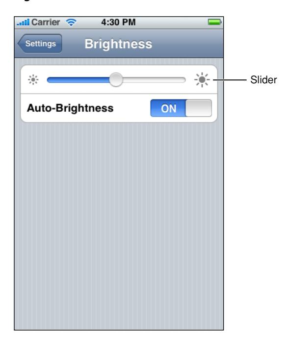

Sliders are useful in two main situations:

- When you want to allow users to have fine-grained control over the values they choose
- When you want to allow users to have fine-grained control over the current process

A slider consists of a track, a thumb, and optional right and left value images. Figure 9-13 shows these parts of a slider.

**Figure 9-13** Four parts of a slider

You can set the width of a slider to fit in with the user interface of your application. In addition, you can display a slider either horizontally or vertically.

There are several ways to customize a slider:

- You can define the appearance of the thumb, so users can see at a glance whether the slider is active.
- You can supply images to appear at either end of the slider (typically, these correspond to minimum and maximum values), to help users understand what the slider does.
  - A slider that controls font size, for example, could display a very small character at the minimum end and a very large character at the maximum end.
- You can define a different appearance for the track, depending on which side of the thumb it is on and which state the control is in.

To learn more about using a slider in your code, see *UISlider Class Reference*.

# Text Fields

A **text field** is a rounded rectangular field that accepts user input. When the user taps a text field a keyboard appears; when the user taps Return in the keyboard, the text field handlesthe input in an application-specific way. A text field can contain a single line of input. Figure 9-14 shows two text fields in the Maps application.

**Figure 9-14** A text field can accept user input

You can customize a text field to help users understand how they should use it in your application. For example, you can display custom images in the left or right sides of the text field, or a system-provided button, such as the Bookmarks button shown in Figure 9-14. In general, you should use the left end of a text field to indicate its purpose and the right end to indicate the presence of additional features, such as bookmarks.

You can also cause the Clear button to appear in the right end of a text field. When this element is present, tapping it clears the contents of the text field, regardless of any other image you might display over it.

Sometimes, it helps users understand the purpose of a text field if it displays a hint, such as "Name." A text field supports the display of such placeholder text, which can appear when there is no other text in the field. To learn more about using a text field and customizing it to display images and buttons, see *UITextField Class Reference*.

You can specify different keyboard styles to accommodate different types of content you expect users to enter. (Note that you have no control over the keyboard's input method and layout, which are determined by the user's language settings.) For example, you might want to make it easy for users to enter a URL, a PIN, or a phone number. iPhone OS providesseveral different keyboard types, each designed to facilitate a different type of input. To learn about the keyboard types that are available, see UIKeyboardType. To learn more about managing the keyboard in your application, read "Managing the Keyboard" in *iPhone Application Programming Guide*.

#### **CHAPTER 9**

Application Controls

# System-Provided Buttons and Icons

To promote a consistent user experience (and to make your job easier), iPhone OS provides numerous standard buttons for use in navigation bars and toolbars, and icons for use in tab bars.

This chapter describes the standard icons and buttons available to you and provides guidelines on how to use them appropriately. You should familiarize yourself with the buttons and icons in this chapter regardless of the type of application you're developing, so that you can:

- Use the system-provided items correctly
- Avoid designing a custom icon that looks too similar to a system-provided icon

# Using System-Provided Buttons and Icons

iPhone OS makes available many of the standard toolbar and navigation bar buttons, tab bar items, and general-use buttons used throughout the built-in applications. You can see a handful of standard toolbar buttons in the Mail toolbar, shown in Figure 10-1.

**Figure 10-1** Standard buttons in the Mail toolbar

Buttons such as the Refresh, Organize, Trash, Reply, and Compose buttons shown in Figure 10-1 are used consistently in many of the built-in applications, so users are well-acquainted with what they mean and how to use them. This means that if your application supports these functions, you can take advantage of users' familiarity to streamline the application's user interface. It also meansthat if you associate these buttons with other tasks, you're likely to confuse and irritate users by promising functionality they expect, but delivering something else.

In addition to the benefit of leveraging users' prior experience, using system-provided buttons and icons imparts two other substantial advantages, specifically:

- Decreased development time, because you don't have to create custom art to represent standard functions.
- Increased stability of your user interface, even if future iPhone OS updates change the appearances of standard icons. In other words, you can rely on the semantic meaning of a standard icon remaining the same, even if its appearance changes.

It bears repeating that to realize the advantages of user familiarity, shorter development time, and semantic consistency of the user interface, you must use the buttons and icons appropriately. Specifically, this means that you should use a button or icon in accordance with its documented meaning and recommended placement, and *not* according to your interpretation of its appearance. See ["Standard](#page-123-0) Buttons for Use in Toolbars and [Navigation](#page-123-0) Bars" (page 124), ["Standard](#page-125-0) Icons for Use in Tab Bars" (page 126), and ["Standard](#page-126-0) Buttons for Use in Table Rows and Other User Interface [Elements"](#page-126-0) (page 127) for meaning and placement information for the system-provided buttons and icons.

Interface Builder makes it easy to use the system-provided buttons and apply system-provided icons to your controls. See the appearance-related information in "iPhone OS Interface Objects" in *Interface Builder User Guide* for guidance.

If you can't find a system-provided toolbar or navigation bar button or tab bar item icon that has the appropriate meaning for a specific function in your application, you should design a custom button or icon. "Icons for [Navigation](#page-132-0) Bars, Toolbars, and Tab Bars" (page 133) gives some guidelines to help you do this.

# Standard Buttons for Use in Toolbars and Navigation Bars

iPhone OS makes many of the standard buttons users see in toolbars and navigation bars available to you. These buttons, shown in [Table](#page-124-0) 10-1 (page 125), are available in two styles, each of which is appropriate for the specific usages described here:

- Bordered style—for example, the Add button in the Phone Contacts navigation bar. This style is suitable for both navigation bars and toolbars.
- Plain style—for example, the Compose button in the Mail toolbar. This style is suitable for toolbars only. In fact, if you specify the plain style for a button in the navigation bar, it will be converted to the bordered style.

As with allsystem-provided buttons, you should avoid using the buttons described in Table 10-1 to represent actions other than those for which they are designed. In particular, avoid choosing a button based on its appearance, without regard for its documented meaning. See "Using [System-Provided](#page-122-1) Buttons and Icons" (page 123) for a discussion of the reasons why it's important to use these icons correctly. (Information on symbol names and availability for these buttons is available in documentation for UIBarButtonSystemItem.)

**Table 10-1** Standard buttons available for toolbars and navigation bars (shown in the plain style)

| Button | Meaning                                                                         | Name        |
|--------|---------------------------------------------------------------------------------|-------------|
|        | Opens an action sheet that allows users to take an application-specific action  | Action      |
|        | Opens an action sheet that displays a photo picker in camera mode               | Camera      |
|        | Opens a new message view in edit mode                                           | Compose     |
|        | Show application-specific bookmarks                                             | Bookmarks   |
|        | Display a search field                                                          | Search      |
|        | Create a new item                                                               | Add         |
|        | Delete current item                                                             | Trash       |
|        | Move or route an item to a destination within the application, such as a folder | Organize    |
|        | Send or route an item to another location                                       | Reply       |
|        | Stop current process or task                                                    | Stop        |
|        | Refresh contents (use only when necessary; otherwise, refresh automatically)    | Refresh     |
|        | Begin media playback or slides                                                  | Play        |
|        | Fast forward through media playback or slides                                   | FastForward |
|        | Pause media playback or slides (note that this implies context preservation)    | Pause       |
|        | Move backwards through media playback or slides                                 | Rewind      |

In addition to the buttons shown in Table 10-1, you can also use the system-provided Edit, Cancel, Save, and Done buttons shown in Table 10-2 to support editing or other types of content manipulation in your application. (Information on symbol names and availability for these buttons is available in documentation for UIBarButtonSystemItem.) These buttons are suitable for both navigation bars and toolbars, and are available in the bordered style only. If you specify the plain style for one of these buttons, it will be converted to the bordered style.

**Table 10-2** Bordered action buttons for use in navigation bars

| Button | Meaning                                                                         | Name   |
|--------|---------------------------------------------------------------------------------|--------|
|        | Enter an editing or content-manipulation mode                                   | Edit   |
|        | Exit the editing or content-manipulation mode without saving changes            | Cancel |
|        | Save changes and, if appropriate, exit the editing or content-manipulation mode | Save   |
|        | Exit the current mode and save changes, if any                                  | Done   |

# Standard Icons for Use in Tab Bars

iPhone OS provides the standard icons described in Table 10-3 for use in tab bars. Information on symbol names and availability for these icons is in documentation for UITabBarSystemItem.

As with all standard buttons and icons, it's essential to use these icons in accordance with their documented meanings. In particular, take care to base your usage of an icon on its semantic meaning, not its appearance. This will help your application's user interface make sense even if the icon associated with a specific meaning changes its appearance. See "Using [System-Provided](#page-122-1) Buttons and Icons" (page 123) for further reasons why it's important to use these icons correctly.

**Table 10-3** Standard icons for use in tab bar tabs

| Icon | Meaning                                  | Name      |
|------|------------------------------------------|-----------|
|      | Show application-specific bookmarks      | Bookmarks |
|      | Show Contacts                            | Contacts  |
|      | Show downloads                           | Downloads |
|      | Show user-determined favorites           | Favorites |
|      | Show content featured by the application | Featured  |
|      | Show history of user actions             | History   |

| Icon | Meaning                                                                  | Name       |
|------|--------------------------------------------------------------------------|------------|
|      | Show additional tab bar items                                            | More       |
|      | Show the most recent item                                                | MostRecent |
|      | Show items most popular with all users                                   | MostViewed |
|      | Show the items accessed by the user within an application-defined period | Recents    |
|      | Enter a search mode                                                      | Search     |
|      | Show the highest-rated items, as determined by the user                  | TopRated   |

# Standard Buttons for Use in Table Rows and Other User Interface Elements

iPhone OS provides a few buttons for use in table rows and other elements. These buttons, described in Table 10-4, should be used semantically correctly, as with all standard buttons and icons. In particular, avoid choosing a button based on its appearance, without regard for its documented meaning. See ["Using](#page-122-1) [System-Provided](#page-122-1) Buttons and Icons" (page 123) for a discussion of the reasons why it'simportant to use these buttons correctly.

Although the detail disclosure button is usually used in table rows, it can be used elsewhere. For more information about this button, see "Detail [Disclosure](#page-109-0) Buttons" (page 110). iPhone OS also provides a set of controls for use in table rows only; for more information about these, see ["Table-View](#page-97-0) Elements" (page 98).

For more information on symbol names and availability for these buttons, see documentation for UIButtonType. (For information on the symbol name and availability for the detail disclosure table-view element, see documentation for UITableViewCellAccessoryDetailDisclosureButton.)

**Table 10-4** Standard buttons for use in table rows and user interface elements

| Button | Meaning                                                                                                                  | Name             |
|--------|--------------------------------------------------------------------------------------------------------------------------|------------------|
|        | Display a people picker to add a contact to an item                                                                      | ContactAdd       |
|        | Display a new view that contains details about the current item                                                          | DetailDisclosure |
|        | Flip to the back of the view (usually in a utility application) to display configuration options or more information. | Info             |
|        | Note that the Info button is also available as a light-colored "i" in a dark circle.                                     |                  |

#### **CHAPTER 10**

System-Provided Buttons and Icons

# Creating Custom Icons and Images

The user interfaces of iPhone applications are characterized by beautiful images and lush color. As an application designer, you want to fit into this environment by providing an aesthetically pleasing user interface. Although iPhone OS provides a wide range of elegant and attractive user interface elements, there are two custom elements every application needs: an application icon and a launch image. In addition, applications should provide a small icon for iPhone OS to display in Spotlight search results.

Some applications need custom icons to represent application-specific functions and modes in navigation bars, toolbars, and tab bars. When you follow the guidelines for creating these icons, you can achieve results that both harmonize with the built-in icons and subtly accentuate your application's style.

**Note:** The standard bit depth for icons and images is 24 bits (8 bits each for red, green, and blue), plus an 8-bit alpha channel. The PNG format is recommended, because it preserves color depth and supports an embedded alpha channel. You can use the Preview application to produce the final PNG file.

You do not need to constrain your palette to web-safe colors. Although you can use alpha transparency in the icons you create for navigation bars, toolbars, and tab bars, do not use it in application icons.

# Application Icons

An **application icon** is an icon users put on their Home screens and tap to start an application. This is a place where branding and strong visual design should come together into a compact, instantly recognizable, attractive package.

Users choose which application icons they want to display on their Home screens, so you should design an icon that is:

- Attractive, so users feel compelled to keep it on their Home screens
- Distinctive, so users can easily find it among all other icons

Try to balance eye appeal and clarity of meaning in your icon so that it's rich and beautiful, but still conveys the essence of your application's purpose. Also, it's a good idea to investigate how your choice of image and color might be interpreted by people from different cultures.

When a user decides to display your application icon on the Home screen, iPhone OS automatically adds some visual effects so that it coordinates with the built-in icons. Specifically, iPhone OS adds:

- Rounded corners
- Drop shadow
- Reflective shine

For example, Figure 11-1 shows a simple icon as it might be provided by an application.

**Figure 11-1** A simple application icon before it is displayed on a Home screen

Figure 11-2 shows the same icon as it is displayed on a Home screen by iPhone OS.

**Figure 11-2** A simple application icon displayed on a Home screen

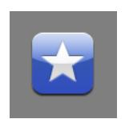

Application icons that include a discernible background look best on the Home screen. This is primarily because of the rounded corners iPhone OS adds: uniformly rounded corners ensure that all the icons on a user's Home screen have a consistent appearance that invites tapping. If you create an icon with a black background that disappears when it's viewed on the Home screen, users don'tsee the rounded corners. Such icons often don't look tappable and tend to interfere with the orderly symmetry of the Home screen that users appreciate.

To ensure that your icon can take advantage of the visual enhancements iPhone OS provides, produce an image in PNG format that:

- Measures 57 x 57 pixels, with 90 degree corners (if the image measures other than this size, iPhone OS scales it)
- Does not have any shine or gloss
- Does not use alpha transparency

Name your icon file Icon.png and place it at the top level of your application bundle. To learn more about the contents of the application bundle, see "The Application Bundle" in *iPhone Application Programming Guide*.

**Note:** If you choose, you can prevent iPhone OS from adding the shine to your icon. To do this, you need to add the UIPrerenderedIcon key to your application's Info.plist file (read "The Information Property List" in *iPhone Application Programming Guide* to learn about this file).

Your icon should still measure 57 x 57 pixels, regardless of whether you take advantage of the added shine.

When you submit your application, you must include a 512 x 512 pixel version of your application icon for display in the App Store. Although it'simportant that this version be instantly recognizable as your application icon, it should be subtly richer and more detailed. In other words, you should not simply scale up your application icon to create an icon for the App Store.

You must also provide a 512 x 512 pixel version of your application icon if you're developing an application for ad-hoc distribution (that is, to be distributed in-house only, not through the App Store). In the ad-hoc case, name the icon file iTunesArtwork (no file extension) and place it at the top level of your application bundle. This icon identifies your application in iTunes.

# Small Icons

Every application should supply a small icon that iPhone OS can display when the application name matches a term in a Spotlight search.

Applications that supply settings should also supply this icon to identify them in the built-in Settings application.

Your small icon should clearly identify your application so that users can easily recognize it in a list of search results. To do this, create a streamlined, attractive icon that:

- Uses the PNG format.
- Measures about 29 x 29 pixels.

Name your icon file Icon-Small.png and place it at the top level of your application bundle. To learn more about the contents of the application bundle,see "The Application Bundle" in *iPhone Application Programming Guide*.

**Note:** If you do not provide an icon named Icon-Small.png, and your application bundle does not contain a previous version of a small icon named Icon-Settings.png, iPhone OS shrinks your application icon for display in search results and in Settings.

If your application bundle already contains a small icon named Icon-Settings.png, and does not contain an icon named Icon-Small.png, iPhone OS displays the settings icon in the search results. However, you should update the application bundle so that it contains only the Icon-Small.png file.

# Launch Images

To enhance the user's experience at application launch, you should provide a launch image. A **launch image** looks very similar to the first screen your application displays. iPhone OS displays this image instantly when the user taps your application icon on the Home screen. Assoon asit'sready for use, your application displays its first screen, replacing the launch placeholder image.

It's important to emphasize that the reason to supply a launch image is to improve user experience; it is *not* an opportunity to provide:

- An "application entry experience," such as a splash screen
- An About window
- Branding elements, unless they are a static part of your application's first screen

Because users are likely to switch among applications frequently and quickly, you should make every effort to cut launch time to a minimum, and you should design a launch image that downplays the experience rather than drawing attention to it.

To do this, you should design an image in PNG format that:

■ Measures 320 x 480 pixels. Including the status bar area allows you to display the status bar color you've chosen immediately, instead of displaying it after your application has finished starting.

- Is identical to the first screen of the application, except for:
  - ❏ Text. The launch image is static, so any text you display in it will not be localized.
  - ❏ User interface elementsthat might change. Avoid including elementsthat might look different when the application finishes launching, so that users don't experience a flash between the launch image and the first application screen.

Name your launch image file Default.png and place it at the top level of your application bundle. To learn more about the contents of the application bundle, see *iPhone Application Programming Guide*.

If you think that following these guidelines will result in a very plain, boring launch image, you're right. Remember, the launch image is not meant to provide an opportunity for artistic expression; it is solely intended to enhance the user's perception of your application as quick to launch and immediately ready for use. The following examples show you how plain a launch image can be.

The first example is the launch image for the built-in Settings application, shown in Figure 11-3. The Settings launch image displays only the background of the application, because no other content in the application is guaranteed to be static.

**Figure 11-3** The launch image for the Settings application

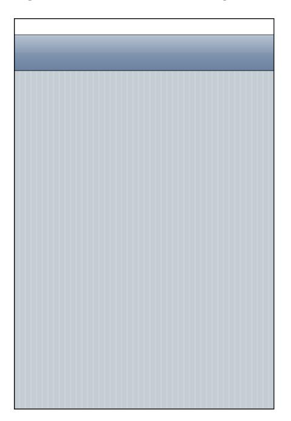

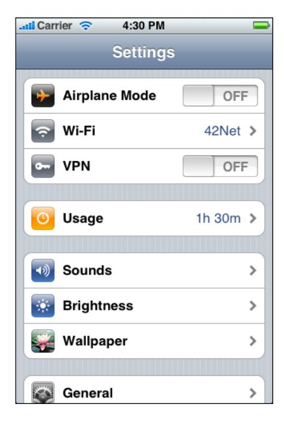

Another launch image example comes from the built-in Stocks application, shown in Figure 11-4. Note that the only images included in the launch image are static images, which are always visible in the front view of the Stocks application.

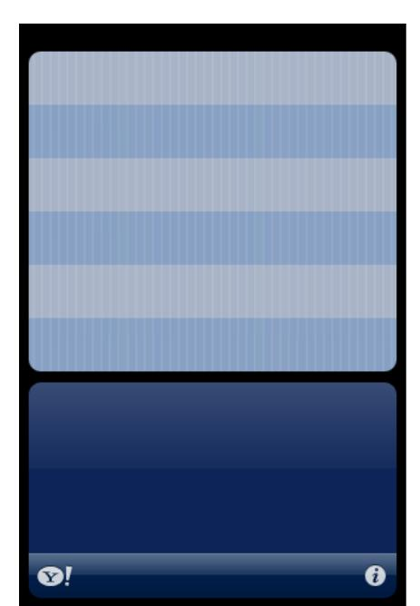

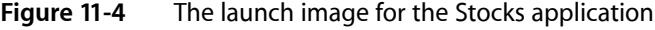

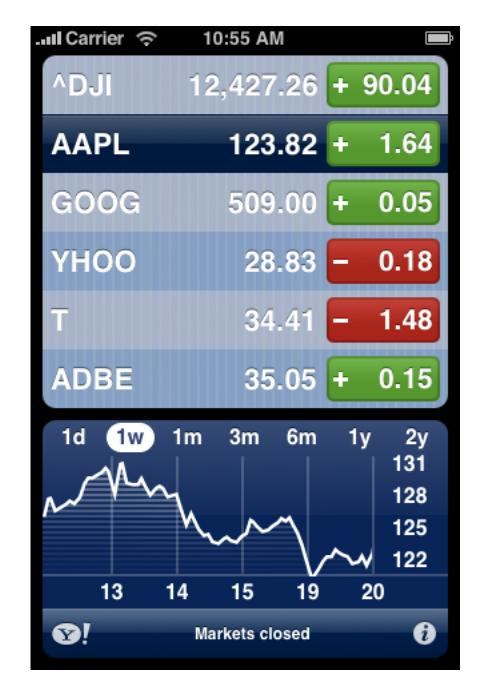

# Icons for Navigation Bars, Toolbars, and Tab Bars

When possible, you should use the system-provided buttons and icons in navigation bars, toolbars, and tab bars. iPhone OS provides a wide range ofstandard buttons and iconsthat users associate with standard tasks and modes supported in the built-in applications. If your application supports standard functions, such as refreshing a content-area view or deleting an item, or displays different subsets of data, such as contacts or bookmarks, be sure to use the appropriate system-provided button or icon to represent it. For a complete list of standard buttons and icons, and guidelines on how to use them, see ["System-Provided](#page-122-0) Buttons and [Icons"](#page-122-0) (page 123).

Of course, not every task your application performs is a standard one. If your application supports custom tasks users need to perform frequently, you need to create custom icons that represent these tasks in your toolbar or navigation bar. Similarly, if your application displays a tab bar that allows users to switch among custom application modes or custom subsets of data, you need to design tab bar icons that clearly describe these modes or subsets. This section gives you some guidance on how to design icons that work well in navigation bars, toolbars, and tab bars.

Before you create the art for your icon, you need to spend some time thinking about what it should convey. As you consider designs, aim for an icon that is:

- Simple and streamlined. Too many details can make an icon appear sloppy or indecipherable.
- Not easily mistaken for one of the system-provided icons. Usersshould be able to distinguish your custom icon from the standard icons at a glance.
- Readily understood and widely acceptable. Strive to create a symbol that most users will interpret correctly and that no users will find offensive.

After you've decided on the appearance of your icon, follow these guidelines as you create it:

#### **CHAPTER 11**

Creating Custom Icons and Images

- Use the PNG format.
- Use pure white with appropriate alpha.
- Do not include a drop shadow.
- Use anti-aliasing.
- If you decide to add a bevel, be sure that it is 90° (to help you do this, imagine a light source positioned at the top of the icon).
- For toolbar and navigation bar icons, create an icon that measures about 20 x 20 pixels. For tab bar icons, create an icon that measures about 30 x 30 pixels.

**Note:** The icon you provide for toolbars, navigation bars, and tab bars is used as a mask to create the icon you see in your application. It is not necessary to create a full-color icon.

iPhone OS automatically provides the pressed or selected appearance for items in navigation bars, toolbars, and tab bars,so you only need to provide a single version of an icon. Because these visual effects are automatic, you cannot change their appearance.

# Document Revision History

This table describes the changes to *iPhone Human Interface Guidelines*.

| Date       | Notes                                                                                                                                                                     |
|------------|---------------------------------------------------------------------------------------------------------------------------------------------------------------------------|
| 2010-03-24 | Enhanced guidelines for designing an alert.                                                                                                                               |
| 2010-02-19 | Added guidance on using table-cell styles.                                                                                                                                |
| 2009-11-20 | Fixed minor errors and rearranged table view content.                                                                                                                     |
| 2009-09-09 | Updated guidelines for using sound; made additional minor corrections.                                                                                                    |
| 2009-06-04 | Added guidelines for using the user's location and making an application accessible; updated guidelines for settings, search, and bar appearances.                     |
| 2009-03-27 | Made minor corrections.                                                                                                                                                   |
| 2009-03-12 | Added guidelines for handling editing and undo functionality, searching, push notifications, and modal view transitions.                                               |
| 2009-02-04 | Enhanced guidelines for tabs in a tab bar.                                                                                                                                |
| 2008-11-21 | Expanded guidelines for using sound in iPhone applications and made minor corrections.                                                                                 |
| 2008-09-09 | Transferred web-specific guidelines to iPhone Human Interface Guidelines for Web Applications.                                                                         |
| 2008-06-27 | New document that describes how to design the user interface of an iPhone application and provides guidelines for creating web content for iPhone OS-based devices. |

#### **REVISION HISTORY**

Document Revision History