# OS X Human Interface Guidelines


# Contents

#### **About the [Guidelines](#page-9-0) for Creating Great Mac Apps** 10 At a [Glance](#page-9-1) 10 Great Apps Begin with an [Understanding](#page-10-0) of the Fundamentals 11 People Expect a Great User Experience that Integrates OS X [Technologies](#page-10-1) 11 Attention to Detail Pays Off in a [Superlative](#page-10-2) UI 11 Gorgeous Graphics and the Right Words Make a Positive [Impression](#page-10-3) 11

How to Use This [Document](#page-11-0) 12

See [Also](#page-11-1) 12

#### **The OS X [Environment](#page-12-0)** 13

OS X Helps Users Focus on Their [Content](#page-12-1) 13

Full-Screen Windows Help Users [Concentrate](#page-13-0) 14

OS X Supports Multiple Displays with Different [Resolutions](#page-14-0) 15

All Apps Use the [Single](#page-15-0) Menu Bar 16

Apps Respond to Gestures, Clicks, and [Keystrokes](#page-16-0) 17

Users Can Customize Their Experience in [Preferences](#page-19-0) 20

User Help Is [Unobtrusively](#page-20-0) Available 21

[Multiple](#page-22-0) Users Can Use a Single System 23

Accessibility and [Internationalization](#page-23-0) Are Fully Supported 24

Clean, Beautiful [Typography](#page-24-0) Pervades the UI 25

Apps Use Bundles to Manage Code and [Resources](#page-25-0) 26

#### **The Philosophy of UI Design: [Fundamental](#page-26-0) Principles** 27

[Metaphors](#page-26-1) 27

[Mental](#page-26-2) Model 27

Explicit and [Implied](#page-28-0) Actions 29

Direct [Manipulation](#page-29-0) 30

See and [Point](#page-29-1) 30

User [Control](#page-30-0) 31

Feedback and [Communication](#page-30-1) 31

[Consistency](#page-32-0) 33

[WYSIWYG](#page-32-1) (What You See Is What You Get) 33

[Forgiveness](#page-33-0) 34

[Perceived](#page-33-1) Stability 34

#### [Aesthetic](#page-34-0) Integrity 35

#### **User [Experience](#page-35-0) Guidelines** 36

Avoid Burdening Users with [App-Management](#page-35-1) Tasks 36

Focus on [Solutions,](#page-36-0) Not Features 37

Embrace [Modelessness](#page-36-1) 37

[Make](#page-37-0) Your App Easy to Use 38

Allow Users to Go Full Screen (if [Appropriate\)](#page-40-0) 41

Handle Gestures [Appropriately](#page-42-0) 43

Captivate with [Gorgeous](#page-43-0) Graphics 44

Be [Responsive](#page-45-0) 46

Give Users Alternate Ways to [Accomplish](#page-46-0) Tasks 47

Use Standard UI [Elements](#page-47-0) Correctly 48

Help Users Be Productive [Immediately](#page-47-1) 48

Clarify and [Communicate](#page-48-0) with Subtle Animation 49

Consider Adding [Physicality](#page-50-0) and Realism 51

Make [Exploration](#page-51-0) Safe 52

Earn Users' Trust with Reliability, [Predictability,](#page-52-0) and Stability 53

Adapt to Changes in the User's [Environment](#page-52-1) 53

Design for [Interoperability](#page-54-0) 55

Use the Right [Pointer](#page-55-0) for the Job 56

Reach as Many Users as [Possible](#page-57-0) 58

Make Help Available, but [Unobtrusive](#page-59-0) 60

Make User Input [Convenient](#page-59-1) 60

Use User-Centric [Terminology](#page-60-0) 61

Be Cautious When [Extending](#page-61-0) the Interface 62

Brand [Appropriately](#page-62-0) 63

Provide Keyboard Shortcuts for Frequently Used [Commands](#page-63-0) 64

#### **OS X [Technology](#page-64-0) Usage Guidelines** 65

[Mission](#page-64-1) Control 65

The [Dock](#page-65-0) 66

The [Finder](#page-67-0) 68

[Dashboard](#page-69-0) 70

[Gatekeeper](#page-70-0) 71

iCloud [Storage](#page-70-1) 71

[Notification](#page-74-0) Center 75

[Sharing](#page-78-0) Service 79

Game [Center](#page-80-0) 81

In-App [Purchase](#page-81-0) 82

[Calendar](#page-82-0) 83

[Reminders](#page-82-1) 83

[Contacts](#page-82-2) 83

[Accessibility](#page-83-0) 84

[Internationalization](#page-84-0) 85

The Colors [Window](#page-86-0) 87

The Fonts [Window](#page-87-0) 88

[Automator](#page-89-0) 90

[Printing](#page-90-0) 91

[Security](#page-91-0) 92

[Preferences](#page-92-0) 93

[Bonjour](#page-93-0) 94

[Services](#page-93-1) 94

[Speech](#page-95-0) 96

Auto [Layout](#page-96-0) 97

Drag and [Drop](#page-96-1) 97

Auto Save and [Versions](#page-102-0) 103

[Spotlight](#page-105-0) 106

User [Assistance](#page-106-0) 107

#### **Icon Design [Guidelines](#page-110-0)** 111

About App Icon Genres and [Families](#page-110-1) 111

Tips for [Designing](#page-111-0) Icons 112

Using [Perspective](#page-113-0) and Texture to Reflect Reality 114

Creating Great Icons for Any [Resolution](#page-115-0) 116

Take Advantage of [High-Resolution](#page-115-1) Display 116

Provide the Correct [Resources](#page-116-0) and Let OS X Do the Work 117

Create [High-Resolution](#page-118-0) Artwork from Existing Assets 119

Create [High-Resolution](#page-119-0) Artwork from Scratch 120

[Redesign](#page-120-0) Your iOS Artwork for OS X 121

[Packaging](#page-120-1) Your Icon Resources 121

[Designing](#page-121-0) Toolbar Icons 122

[Designing](#page-124-0) Sidebar Icons 125

Designing [Document](#page-126-0) Icons 127

Icon [Gallery](#page-128-0) 129

#### **UI Element [Guidelines:](#page-131-0) Menus** 132

Menu [Appearance](#page-132-0) and Behavior 133

Titling [Menus](#page-133-0) 134

[Naming](#page-134-0) Menu Items 135

```
Grouping Items in Menus 135
Providing Dynamic Menu Items 138
Providing Toggled Menu Items 139
Using Icons in Menus 141
Using Symbols in Menus 143
Creating Hierarchical Menus 145
Designing Menus for the Menu Bar 146
    The Apple Menu 147
    The App Menu 148
    The File Menu 149
    The Edit Menu 153
    The Format Menu 156
    The View Menu 158
    App-Specific Menus 159
    The Window Menu 159
    The Help Menu 161
    Menu Bar Extras 162
Designing Contextual Menus 162
Designing a Dock Menu 166
UI Element Guidelines: Windows 168
About Window Appearance and Behavior 169
    Window Components 170
    Scrolling 172
    Moving 174
    Layering 174
    Main, Key, and Inactive Windows 175
Going Full Screen 176
Displaying Items in the Title Bar 177
    The Window Title 177
    Title Bar Buttons 178
    The Full-Screen Button 179
    The Proxy Icon and Versions Menu 179
Designing a Toolbar 180
Enabling Scrolling 184
Using a Scope Bar to Enable Searching and Filtering 187
Providing a Source List 189
Providing a Bottom Bar 193
Providing a Drawer 194
```

```
Opening Windows 196
Naming New Windows 197
Positioning and Repositioning Windows 198
Resizing and Zooming Windows 200
Minimizing and Expanding Windows 201
Closing Windows 202
Enabling Click-Through 202
Popovers 205
Panels 209
    Inspectors 211
    Transparent Panels 212
    About Windows 214
Dialogs 215
    Using Sheets (Document-Modal Dialogs) 216
    Accepting and Applying User Input in a Dialog 217
    Expanding Dialogs 218
    Dismissing Dialogs 219
    Preferences Windows 220
    The Open Dialog 222
    The Choose Dialog 226
    The Print and Page Setup Dialogs 228
    Find Windows 232
    Save Dialogs 232
Alerts 236
UI Element Guidelines: Controls 240
Guidelines that Apply Generally to Controls 240
Window-Frame Controls 241
Buttons 244
    Push Button 244
    Icon Button 247
    Scope Button 248
    Gradient Button 250
    The Help Button 251
    Bevel Button 252
    Round Button 254
Selection Controls 255
    Radio Buttons 255
    Checkbox 257
```

```
Segmented Control 259
    Icon Button or Bevel Button Containing a Pop-Up Menu 260
    Pop-Up Menu 261
    Action Menu 263
    Share Menu 266
    Combination Box 267
    Path Control 268
    Color Well 269
    Image Well 270
    Date Picker 271
    Command Pop-Down Menu 272
    Slider 273
    The Stepper Control (Little Arrows) 276
    Placard 276
Indicators 277
    Progress Indicators 277
    Level Indicators 280
Text Controls 283
    Static Text Field 283
    Text Input Field 284
    Token Field 285
    Search Field 286
    Scrolling List 288
View Controls 289
    Disclosure Triangle 290
    Disclosure Button 291
    List View 292
    Column View 294
    Split View 295
    Tab View 297
    Group Box 298
Text Style Guidelines 300
```

Inserting Spaces Between [Sentences](#page-299-1) 300 Using the Ellipsis [Character](#page-299-2) 300 Using the Colon [Character](#page-301-0) 302 Labeling Interface [Elements](#page-304-0) 305 [Capitalizing](#page-305-0) Labels and Text 306 Using [Contractions](#page-306-0) 307

#### Using [Abbreviations](#page-307-0) and Acronyms 308

#### **Keyboard [Shortcuts](#page-309-0)** 310

Creating New [Keyboard](#page-309-1) Shortcuts 310 Keyboard Shortcuts Quick [Reference](#page-310-0) 311

#### **[System-Provided](#page-319-0) Icons** 320

[System-Provided](#page-320-0) Images for Use in Controls 321 [System-Provided](#page-322-0) Images for Use as Standalone Buttons 323 [System-Provided](#page-323-0) Images for Use as Toolbar Items 324 [System-Provided](#page-325-0) Images that Indicate Privileges 326 A [System-Provided](#page-325-1) Drag Image 326

#### **[Document](#page-326-0) Revision History** 327

# Tables

**The OS X [Environment](#page-12-0)** 13

[Table](#page-18-0) 1-1 Key [combinations](#page-18-0) reserved for international systems 19

| User<br>Experience | Guidelines<br>36                                                                                                |  |  |  |
|--------------------|-----------------------------------------------------------------------------------------------------------------|--|--|--|
| Table<br>3-1       | Standard<br>pointers<br>in<br>OS<br>X<br>56                                                                     |  |  |  |
| Table<br>3-2       | Some<br>developer<br>terms<br>and<br>their<br>user<br>term<br>equivalents<br>62                                 |  |  |  |
| Icon<br>Design     | Guidelines<br>111                                                                                               |  |  |  |
| Table<br>5-1       | App<br>icon<br>resource<br>sizes<br>118                                                                         |  |  |  |
| UI<br>Element      | Guidelines:<br>Menus<br>132                                                                                     |  |  |  |
| Table<br>6-1       | Standard<br>symbols<br>for<br>use<br>in<br>menus<br>143                                                         |  |  |  |
| UI<br>Element      | Guidelines:<br>Controls<br>240                                                                                  |  |  |  |
| Table<br>8-1       | Control<br>and<br>style<br>combinations<br>designed<br>for<br>use<br>in<br>the<br>window<br>frame<br>241        |  |  |  |
| Text<br>Style      | Guidelines<br>300                                                                                               |  |  |  |
| Table<br>9-1       | Proper<br>capitalization<br>of<br>onscreen<br>elements<br>306                                                   |  |  |  |
| Keyboard           | Shortcuts<br>310                                                                                                |  |  |  |
| Table<br>A-1       | Examples<br>of<br>keyboard<br>shortcuts<br>that<br>use<br>Shift<br>to<br>complement<br>other<br>commands<br>310 |  |  |  |
| Table<br>A-2       | Keyboard<br>shortcuts<br>312                                                                                    |  |  |  |
| System-Provided    | Icons<br>320                                                                                                    |  |  |  |
| Table<br>B-1       | Template<br>images<br>that<br>represent<br>common<br>tasks<br>322                                               |  |  |  |
| Table<br>B-2       | Free-standing<br>images<br>that<br>represent<br>common<br>actions<br>324                                        |  |  |  |
| Table<br>B-3       | Images<br>that<br>represent<br>system<br>entities<br>324                                                        |  |  |  |
| Table<br>B-4       | Images<br>that<br>represent<br>common<br>preferences<br>categories<br>325                                       |  |  |  |
| Table<br>B-5       | Images<br>that<br>represent<br>standard<br>toolbar<br>items<br>325                                              |  |  |  |
| Table<br>B-6       | Images<br>that<br>represent<br>categories<br>of<br>user<br>permissions<br>326                                   |  |  |  |
|                    |                                                                                                                 |  |  |  |
|                    |                                                                                                                 |  |  |  |

# <span id="page-9-0"></span>About the Guidelines for Creating Great Mac Apps

*OS X Human Interface Guidelines* describes the characteristics of the OS X platform and the guidelines and principles that help you design an outstanding user interface and user experience for your Mac app.


<span id="page-9-1"></span>*OS X Human Interface Guidelines* does not describe how to implement your designsin code. When you're ready to code, start by reading *Mac App Programming Guide* .

### At a Glance

Aqua is the overall appearance and behavior of OS X. Adopting the Aqua look and feel helps you provide the best possible user experience for your customers.

Interface Builder (a graphical UI editor in Xcode) is the best way to begin building an Aqua-compliant user interface. All the standard UI elements and system-provided icons are available in Interface Builder. To learn more about Interface Builder, see "Designing User Interfaces in Xcode 4".

#### <span id="page-10-0"></span>Great Apps Begin with an Understanding of the Fundamentals

Before you begin designing your app, you need to get a feel for the OS X environment. Understanding how things work in OS X helps you produce an app that integrates seamlessly with the environment and delights users.

Most people are not acquainted with the principles of human interface design, but they can tell when apps follow the guidelines and when they don't. Become familiar with these fundamental principles so that you can use them to inform your app design.

**Relevant Chapters:** "The OS X [Environment"](#page-12-0) (page 13) and "The [Philosophy](#page-26-0) of UI Design: [Fundamental](#page-26-0) Principles" (page 27)

#### <span id="page-10-1"></span>People Expect a Great User Experience that Integrates OS X Technologies

OS X users have high standards for the apps they run. Meet these high expectations by designing a user experience that is enjoyable, streamlined, easy, and adaptable.

You want people to feel that your app was designed expressly for the OS X platform. Make sure that you understand the technologies that OS X makes available to you, so that you can incorporate them in your app and give users the features they want.

<span id="page-10-2"></span>**Relevant Chapters:** "User Experience [Guidelines"](#page-35-0) (page 36) and "OS X [Technology](#page-64-0) Usage [Guidelines"](#page-64-0) (page 65)

#### Attention to Detail Pays Off in a Superlative UI

There are myriad details you need to handle as you design the UI of your app, including choosing the right menu items, naming new windows correctly, and using the appropriate controlsin a toolbar. Don't be tempted to ignore the guidelines that govern the use of these UI elements, because users tend to notice even subtle differences in appearance and behavior.

<span id="page-10-3"></span>**Relevant Chapters:** "UI Element [Guidelines:](#page-131-0) Menus" (page 132), "UI Element [Guidelines:](#page-167-0) [Windows"](#page-167-0) (page 168), and "UI Element [Guidelines:](#page-239-0) Controls" (page 240)

### Gorgeous Graphics and the Right Words Make a Positive Impression

Every app, regardless of how much custom artwork it uses, needs a beautiful, eye-catching icon for the App Store. Some apps also need custom icons for toolbar buttons or to represent the documents that users can create. Ensure that you know how to design these icons so that they look great on the user's desktop.

Every app, even the most graphical, needs to display at least some text. Make sure that your app feels at home in OS X by writing text that is clear and concise and that follows Apple's style guidelines.

**Relevant Chapters:** "Icon Design [Guidelines"](#page-110-0) (page 111) and "Text Style [Guidelines"](#page-299-0) (page 300)

### <span id="page-11-0"></span>How to Use This Document

In addition to the chapters listed above, *OS X Human Interface Guidelines* contains two appendixes:

- ["Keyboard](#page-309-0) Shortcuts" (page 310) provides some guidance on creating custom keyboard shortcuts in your app and lists the system-reserved and commonly used keyboard shortcuts in OS X.
- ["System-Provided](#page-319-0) Icons" (page 320) lists the icons and images that OS X provides and describes how you should use them in your app.

### <span id="page-11-1"></span>See Also

To get an overview of the technologies available in OS X, read *Mac Technology Overview*.

The *Apple Publications Style Guide* provides information helpful for choosing the correct language and terminology to use throughout your app in text displays and dialogs as well as your documentation.

# <span id="page-12-0"></span>The OS X Environment

Mac computers are stylish, flexible, easy to set up, easy to maintain, and powerful. OS X builds on thisfoundation, combining a reliable core with an intuitive design, stunning graphics, excellent security, and the features users want.

To develop a great Mac app, you first need to understand the OS X environment and why users love it. With this understanding, you can ensure that your app takes advantage of platform features and provides a user experience that seamlessly integrates with the environment.

### <span id="page-12-1"></span>OS X Helps Users Focus on Their Content

OS X is founded on the understanding that people use computers to create and experience the content they care about. On a Mac, people are free to focus on their content because OS X performs many of the routine app-management tasks that users shouldn't have to handle. As you consider how your app fits into the OS X environment, it's instructive to see how this perspective pervades every ingredient of the Mac experience.

OS X includes many features that relieve users of common app-management tasks. These features instead help them concentrate on the tasks they want to accomplish. For example, popovers appear when users need them and disappear when users are finished with them (in effect, popovers manage themselves). Another example is the fact that Launchpad and the Dock do not need to show whether an app is currently running. When users click an app's icon in Launchpad or the Dock, a window opens; users don't need to know whether the app started or simply brought a window into view.

Many OS X features (such as iCloud, Auto Save, and Resume) help users avoid two of the most frequent app-management tasks: saving a document and reopening windows that were open the last time an app was running.

**iCloud** frees users from worrying about where their content is stored. They can access their content from multiple devices through different instances of your app. With iCloud, users make changes to a document and can view those changes on another device without transferring files.

**Auto Save** and **Versions** make document saving and version control easy for users. After users title a new document and give it a location, they don't have to worry about explicitly saving it when they make changes because Auto Save keeps the working document up to date. In addition, users can save specific versions of

their work for later reference. Document-based apps can use Versions to display a Time Machine–like interface in which users can browse their earlier document versions and, if they choose, replace the current document with a different version.

**Resume** allows apps to reopen in the same state in which users left them. After restart or log in, OS X automatically relaunches the apps that were last running and restores the windows that were last opened. When an app provides the necessary support, reopened windows have the same size and location as before; in addition, their contents are scrolled to the previous position and their selections are restored.

To learn more about enhancing the user experience of your app by rethinking the some of the tasks that users typically perform, see "Avoid Burdening Users with [App-Management](#page-35-1) Tasks" (page 36).

### <span id="page-13-0"></span>Full-Screen Windows Help Users Concentrate

Sometimes, it makes sense for an app to offer an immersive, full-screen window experience that allows users to focus on a task and avoid distractions. For example, Mail helps users read mail, manage their messages, and compose new messages within a full-screen environment.


When an app uses APIs to support full-screen windows, the standard full screen button (that is, ) is added to the upper-right corner of the title bar. The app also adds the Enter Full Screen menu item to the View menu (to learn more about this menu, see "The View [Menu"](#page-157-0) (page 158)).

When users click the full screen button or choose View > Enter Full Screen, the app moves the window into a new space, increasing the window's size during the transition. While users are in the full-screen window, they can reveal the menu bar and the Dock (if they are hidden) and activate Mission Control. They can also move to a different desktop or full-screen window, or they might choose to take the window back to its standard size by clicking the full screen button again or choosing View > Exit Full Screen.

Because a window remains full screen even when users switch away from it, users can leave an immersive task and come back to it later (including after a log out). Users appreciate this behavior because it allows them to create several different environments on one system.

Note that opening a full-screen window to perform a focused task differs from the full-screen experience provided by Time Machine or Versions. These system features temporarily commandeer the user's current desktop to enable a brief user-initiated task (that is, viewing Time Machine backups or different versions of a document). Mac apps do not generally need to enable this type of full-screen experience.

<span id="page-14-0"></span>To learn about when and how to provide a great full-screen window experience, see ["Allow](#page-40-0) Users to Go Full Screen (if [Appropriate\)"](#page-40-0) (page 41).

### OS X Supports Multiple Displays with Different Resolutions

OS X runs on systems with displays of varying size, resolution, and number. For example, some users prefer to spread their work across one main screen and a couple of auxiliary screens. Other users might use a display that rotates. Users expect their apps to run smoothly and look great, regardless of the number or type of displays they're using.

Users can expand their workspace by adding displaysto the system. Mac users have always enjoyed the option of using more than one display plugged into a single computer. Successful Mac apps accommodate this usage pattern by paying attention to the location of the menu bar and opening new windows where the user expects. To learn more about opening and positioning a window appropriately, see "UI Element [Guidelines:](#page-167-0) [Windows"](#page-167-0) (page 168).

Some users have the ability to rotate their displays, which reverses the aspect ratio of the screen. For example, if a user's display is set to a screen resolution of 1024 x 768 (an aspect ratio of 1.33:1), after rotation the screen resolution is 768 x 1024 (an aspect ratio of .75:1). A good Mac app pays attention to screen-update events and responds appropriately.

High-resolution displays call attention to app graphics. In particular, a high-resolution display can make an unprepared app look bad, especially one that specifies drawing measurements in pixels instead of points. For an overview of issues to address in your code, see *High Resolution Guidelines for OS X* . To learn more about creating graphics that look great at any resolution, see "Creating Great Icons for Any [Resolution"](#page-115-0) (page 116).

**Note: Pixel** is the appropriate unit of measurement to use when referring to the size of a display screen or the size of an icon you create in an image-editing app. **Point** is the appropriate unit of measurement to use when discussing the size of an area that is drawn onscreen.

On a standard-resolution display, one point equals one pixel, but other resolutions might dictate a different relationship. To learn more about this topic, see *High Resolution Guidelines for OS X* .

### <span id="page-15-0"></span>All Apps Use the Single Menu Bar

The **menu bar** extends across the top of the main screen and contains the current app's menus, among other items. The location of the menu bar is always the same, but users can change its opacity and, under some circumstances, the menu bar can be hidden.

The system, the active app, and the user define the items that appear in the menu bar. For example, when the Finder is active, the Finder menus are in the left of the menu bar and some user-specified items are in the right.


The menu bar always contains:

- The Apple menu at the far left end (provided by the operating system)
- The Spotlight icon at the far right end (provided by the operating system)
- The app menu (titled with the active app's name or an appropriate abbreviation if space is limited)
- A Window menu

In addition, the menu bar might contain the following menus, if they make sense in the active app:

- A File menu
- An Edit menu
- A Format menu
- A View menu
- A Help menu
- Additional app-specific menus

Finally, users can specify **menu bar extras**, which are items such as date and time, battery charge, and current locale, that are displayed in the right end of the menu bar.

**Note:** If there isn't enough room to display all of the active app's menus, OS X can omit some menu bar extras. If there is still insufficient room to display all menus, some of the app's menus may be omitted, starting with the rightmost menu.

All apps put their menus in the menu bar; they never provide a bar of menus within a window. This ensures that users always know where to look for app commands. To learn more about how menus behave, see ["Menu](#page-132-0) [Appearance](#page-132-0) and Behavior" (page 133).

The menu bar is always visible, except in specific, temporary circumstances. For example, during a slideshow or as an option when a window is full screen, the menu bar can be hidden. If the menu bar is hidden, users can reveal it by moving the pointer to the upper edge of the screen. In rare circumstances, such as when users view Time Machine backups or browse earlier versions of a document, the menu bar is unavailable until users finish the task.

<span id="page-16-0"></span>To learn how to design your app's menu bar menus, see ["Designing](#page-145-0) Menus for the Menu Bar" (page 146).

### Apps Respond to Gestures, Clicks, and Keystrokes

Users expect to be able to interact with their Mac using the input device of their choice. Some users might use a one-button or multibutton mouse, others might be more comfortable with a trackpad, and still others might use their voice or an assistive device to control their computer. As with the built-in apps, the best apps make no assumptions about the type of input device the user is using.

The trackpad offers an alternative way to interact with Mac apps and the system. People use their fingers on the trackpad to perform actionsthey might otherwise perform using a mouse,such as move the pointer,select or activate a UI element, and scroll.

In addition to such actions, a Multi-Touch trackpad can support gesturesthat perform more complex behaviors, such as:

- Zoom in or out on the active image or view under the pointer
- Rotates the active view under the pointer in the direction of the user's movement
- Navigate forward or backward through a set of views or pages in the active window
- Show Mission Control, Launchpad, and App Exposé
- Switch between desktops and full-screen windows

To perform some of these actions, users can change the gesture they want to use in Trackpad preferences. For example, a user might prefer to swipe with two or three fingers (instead scroll left or right with two fingers) to swipe between pages.

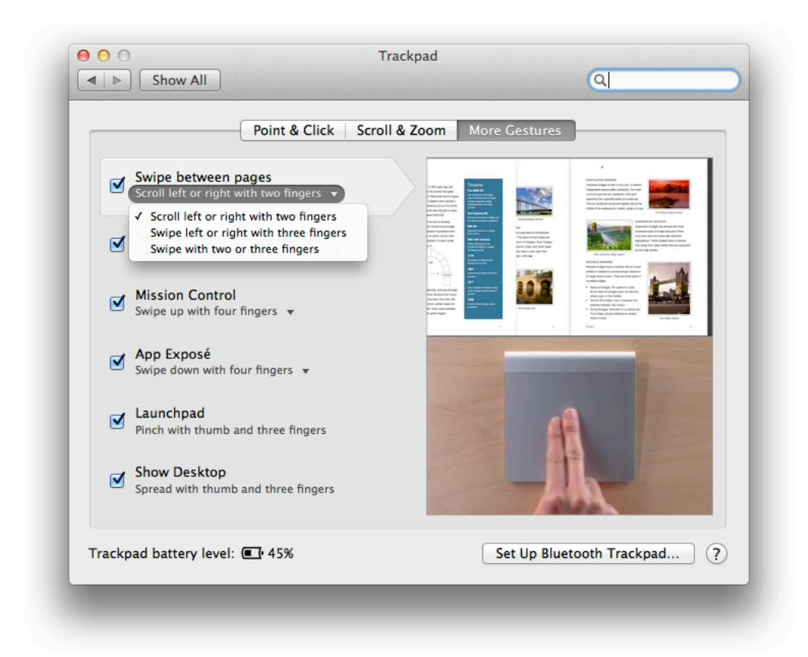

Users expect to be able to activate systemwide features, such as Mission Control and switching between desktops and full-screen windows, regardless of the app they're currently using. Great Mac apps pay attention to the behavior associated with a gesture, in addition to the physical gesture itself, so that users can enjoy a consistent gesture experience throughout the system. To learn about supporting gestures in your app, see "Handle Gestures [Appropriately"](#page-42-0) (page 43).

All users need to use the keyboard sometimes, and some users prefer using the keyboard to using a mouse or trackpad. Other users, such as VoiceOver users, might use only the keyboard. All keyboard users expect the system-defined and common keyboard shortcuts they're familiar with to work seamlessly in all apps. To learn more about the system-reserved and commonly used keyboard shortcuts, see ["Keyboard](#page-309-0) Shortcuts" (page 310).

OS X also provides full keyboard access mode, in which users can navigate through windows and dialogs. When this mode is active, other keyboard combinations may be reserved by default. (Usersturn on full keyboard access in Keyboard preferences.)

Finally, OS X reserves several key combinations for use with localized versions of system software, localized keyboards, keyboard layouts, and input methods. These key combinations(listed in Table 1-1) don't correspond directly to menu commands.

<span id="page-18-0"></span>**Table 1-1** Key combinations reserved for international systems

| Keys                                     | Action                                                                                       |
|------------------------------------------|----------------------------------------------------------------------------------------------|
| Command–Space<br>bar                     | Rotate<br>through<br>enabled<br>script<br>systems                                            |
| Command–Option–Space<br>bar              | Rotate<br>through<br>keyboard<br>layouts<br>and<br>input<br>methods<br>within<br>a<br>script |
| Command–modifier<br>key<br>–Space<br>bar | Apple<br>reserved                                                                            |
| Command–Right<br>Arrow                   | Change<br>keyboard<br>layout<br>to<br>current<br>layout<br>of<br>Roman<br>script             |
| Command–Left<br>Arrow                    | Change<br>keyboard<br>layout<br>to<br>current<br>layout<br>of<br>system<br>script            |

To learn about creating keyboard shortcuts for commands in your app, see "Provide [Keyboard](#page-63-0) Shortcuts for Frequently Used [Commands"](#page-63-0) (page 64).

### <span id="page-19-0"></span>Users Can Customize Their Experience in Preferences

OS X providesthe built-in System Preferences app, in which users can specify system behaviors and appearances. For example, users can set a different desktop picture in Desktop & Screen Saver preferences.

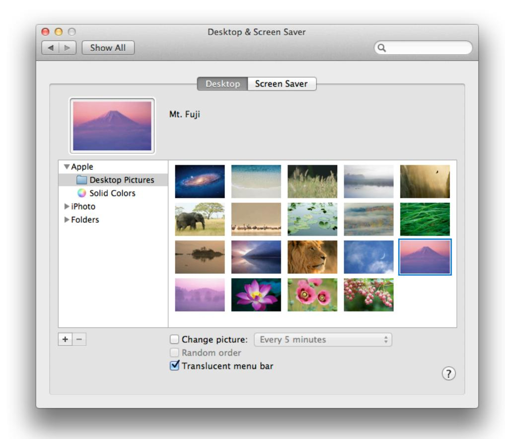

In addition, each Mac app can supply its own preferences, which allow usersto customize app-specific behaviors and appearances. As with OS X itself, great apps combine default settings that give most users what they want with a convenient way to make changes to those settings. For example, the General preferences pane in Mail allows users to adjust a range of settings, such as the sound that accompanies the arrival of a new message and the folder that contains downloaded attachments.


For some guidance on how to provide preferences in your app, see ["Preferences"](#page-92-0) (page 93).

<span id="page-20-0"></span>Users expect to use the Preferences command in the app menu to access app-specific preferences. The consistent location of this command ensuresthat users always know how they can fine-tune the current app, if necessary. To learn more about the Preferences command, see "The App [Menu"](#page-147-0) (page 148).

### User Help Is Unobtrusively Available

Occasionally, users need help understanding how to use a control or perform a task. OS X provides two help mechanisms that supply help to users without getting in their way.

UI element–specific help is provided in a short message that appears when users allow the pointer to rest on the element for a few seconds. This message, called a **help tag**, is a brief description of what the UI element does. For example, Mail displays help tags for most of its controls, such as the Format button.


For some guidelines on how to craft good help tags, see "User [Assistance"](#page-106-0) (page 107).

OS X also provides a systemwide Help window that all apps use to display in-depth, task-focused help content. The Help window floats above the main windows of an app in the same layer as the app's dialogs and alerts (to learn more about window layering, see ["Layering"](#page-173-1) (page 174)). This position allows users to follow the instructions in the Help window while they use the app. For example, Mail supplies extensive help content in the Help window, such as instructions on how to add attachments to a message.


<span id="page-22-0"></span>Users open the Help window by choosing an item in the app's Help menu, pressing Command-?, or in some cases clicking the Help button in a window (to learn how to include the Help button in a window, see ["The](#page-250-0) Help [Button"](#page-250-0) (page 251)). Apps supply help content to display in the Help window by including a help book in their app bundle (to learn how to do this, see *Apple Help Programming Guide* ).

### Multiple Users Can Use a Single System

OS X is a multiple-user system. Not only does the system support multiple user accounts, it allows multiple usersto be logged in simultaneously so that they can share the same computer in quick succession. Thisfeature employs a technique known as fast user switching, in which users trade use of the computer without logging out.

The fast user switching menu is displayed by clicking the current user's name in the menu bar. The menu lists the names of the other users who have accounts on the computer (and whether they're currently logged in).


When a different user's name is chosen in the fast user switching menu, the current desktop (or full-screen window) is veiled and a login window appears. The new user logs in, sees the system exactly as they left it, and immediately gets access to their content.

With multiple users accessing the computer, conflicts can arise if apps are not careful about how they use shared resources. Great apps take care to avoid making assumptions about the current user's privileges and access to system resources and external devices.

<span id="page-23-0"></span>To learn more about the ramifications of a multiuser system, see *Multiple User Environment Programming Topics*. To learn about some ways to provide a good multiuser experience in your app, see "Adapt to [Changes](#page-52-1) in the User's [Environment"](#page-52-1) (page 53).

### Accessibility and Internationalization Are Fully Supported

Accessibility meansthat individuals with disabilities can have full use ofsystem features, perhaps with the help of an assistive device, such as a screen reader. Internationalization means that an app's text, layout, and images can be adapted to the user's locale. Great Mac apps integrate both of these qualities so that they can appeal to a worldwide audience.

OS X includes many built-in features that help individuals with disabilities use their Mac, such as:

- VoiceOver screen-reading technology
- Braille display support
- Customizable keyboard shortcuts, trackpad gestures, and an onscreen keyboard
- Speakable items

The OS X accessibility programming interfaces make it easy for apps to be fully accessible. To find out more about designing your app with accessibility in mind, see ["Accessibility"](#page-83-0) (page 84). To learn about the easy programmatic steps you need to take to make your app accessible, see *Accessibility Overview for OS X* .

Great apps use the language and images that make their users feel at home, regardless of the country they're in. OS X provides several features that make localization easier, including Autolayout in Interface Builder. Using Autolayout, you can define how text and layout are related, so that an app's appearance can remain consistent regardless of the length of the text. To learn more about Autolayout, see "Cocoa Autolayout" in *Mac Technology Overview*. To learn more about designing your app with internationalization in mind, see ["Internationalization"](#page-84-0) (page 85).

### <span id="page-24-0"></span>Clean, Beautiful Typography Pervades the UI

OS X makesit easy for appsto use the same anti-aliased, easy-to-read fontsthat users are accustomed to seeing throughout the system. OS X makesthese fonts available through Interface Builder and the NSFont class. Great apps use the system-provided fonts appropriately, which helps the UI stay subordinate to the user's content.

The **system font** (Lucida Grande Regular 13 point) is used for text in menus, dialogs, and full-size controls.

The **emphasized system font** (Lucida Grande Bold 13 point) is used sparingly, most often in the message of an alert.

The **small system font** (Lucida Grande Regular 11 point) is used for the informative text in alerts. It is also the default font for column headings in lists, for help tags, and for small controls.

The **emphasized small system font** (Lucida Grande Bold 11 point) is used occasionally, most often to title a group of settings that appear without a group box, or for brief informative text below a text field.

The **mini system font** (Lucida Grande Regular 9 point) is used for mini controls. It is also used for panel labels and text.

An **emphasized mini system font** (Lucida Grande Bold 9 point) is used in cases in which the emphasized small system font is too large.

The **app font** (Lucida Grande Regular 13 point) is used as the default font for user-created content.

The **label font** (Lucida Grande Regular 10 point) is used for the labels on toolbar buttons and to label tick marks on full-size sliders.

The **view font** (Lucida Grande Regular 12 point) is the default font used for text in lists and tables.

The Lucida Grande font family also includes mono-spaced numeric characters and variably-spaced alphabetics.

Interface Builder automatically supplies the correct default font, based on the size and type of control being used. For more information about using fonts, see *Font Handling* .

### <span id="page-25-0"></span>Apps Use Bundles to Manage Code and Resources

App bundles are the preferred mechanism for software distribution because they simplify installation and are easy for the user to move around in the Finder. In addition, if you want to submit your app to the App Store, it is expected that your app will use bundles.

A bundle includes all an app's required resources and it helps manage the coordination of global and localized resources. Bundles also allow apps to avoid storing data in a resource fork, which is no longer an appropriate way to store app resources. To learn more about app bundles, see "The OS X Application Bundle" in *Mac App Programming Guide* .

# <span id="page-26-0"></span>The Philosophy of UI Design: Fundamental Principles

Good product design incorporates a number of timeless principles for human-computer interaction. The principles described in this chapter are critical to the design of elegant, efficient, intuitive, and Aqua-compliant user interfaces. In fact, they drive the design of the OS X user interface.

### <span id="page-26-1"></span>Metaphors

Take advantage of people's knowledge of the world by using metaphors to convey concepts and features of your app. Metaphors are the building blocksin the user's mental model of a task. Use metaphorsthat represent concrete, familiar ideas, and make the metaphors obvious, so that users can apply a set of expectations to the computer environment. For example, OS X uses the metaphor of file folders for storing documents; people can organize their hard disks in a way that is analogous to the way they organize file cabinets. Other metaphor examples include iTunes playlists and iPhoto albums, which represent real-world music playlists and photo albums. A Dashboard widget can also be a metaphor for the task it performs because it instantly conveys its purpose to the user.

<span id="page-26-2"></span>Metaphorsshould suggest a use for a particular element, but that use doesn't have to limit the implementation of the metaphor. It is important to strike a balance between the metaphor's suggested use and the computer's ability to support and extend the metaphor. For example, the number of items a user puts in the Trash is not limited to the number of items a physical wastebasket could hold.

### Mental Model

The user already has a mental model that describes the task your software is enabling. This model arises from a combination of real-world experiences, experience with other software, and with computers in general. For example, users have real-world experience writing and mailing letters and most users have used email apps to write and send email. Based on this, a user has a conceptual model of this task that includes certain expectations, such as the ability to create a new letter, select a recipient, and send the letter. An email app that ignores the user's mental model and does not meet at least some of the user's expectations would be difficult and even unpleasant to use. This is because such an app imposes an unfamiliar conceptual model on its users instead of building on the knowledge and experiences those users already have.

Before you design your app's user interface, try to discover your users' mental model of the task your app helps them perform. Be aware of the model's inherent metaphors, which represent conceptual components of the task. In the letter-writing example, the metaphors include letters, mail boxes, and envelopes. In the mental model of a task related to photography, the metaphors include photographs, cameras, and albums. Strive to reflect the user's expectations of task components, organization, and workflow in your window layout, menu and toolbar organization, and use of panels.

A good example of how reflecting the appropriate mental model results in a clean, intuitive user interface is the iTunes app. Apple designed iTunes to reflect the mental models people associate with playing music and managing their music collections. In an uncluttered window, iTunes displays individual songs, playlists, and playback and search controls in a song-centric arrangement. The largest pane displays a list of songs, clearly sortable by categories such as title, artist, and album. The smaller pane displays the playlists and collections, which control the list ofsongs currently displayed, just asthe disk and folder iconsin the Findersidebar control the display of files, folders, and apps. The prominent playback controls look like similar controls on radios, CD players, and the iPod. The search field is identical to the search field in Finder, Mail, and countless other Aqua-compliant apps. Because the iTunes user interface reflects a well-defined mental model, instead of forcing users to adopt unfamiliar concepts, even novice users find iTunes intuitive and easy to use.

The mental model your users have should infuse the design of your app's user interface. It should inform the layout of your app's windows, the selection and organization of icons and controls in the toolbars, and the functionality of panels. In addition, you should support the user's mental model by striving to incorporate the following characteristics:

- **Familiarity.** The user's mental model is based primarily on experience. When possible, enhance user interface componentsto reflect the model'ssymbology and display labelsthat use the model'sterminology. Then, where appropriate, use familiar OS X user interface componentsto offerstandard functionality,such as searching and navigating hierarchical sets of data.
  - As described above, the iTunes app displays playback controlsthat use well-known symbols users associate with play, pause, and rewind. Then, to offer searching and help, for example, iTunes uses standard Aqua user interface components. An OS X user automatically knows how to use such standard user interface elements, regardless of the app in which they appear.
- **Simplicity.** A mental model of a task istypically streamlined and focused on the fundamental components of the task. Although there may be myriad optional details associated with a given task, the basic components should not have to compete with the details for the user's attention.
  - In the iTunes app, for example, the basic task components of playing songs,selecting playlists, and searching are prominently featured. However, these are supplemented by easily accessible menu items and controls that perform additional tasks, such as ejecting a disk, shuffling a playlist, and displaying song artwork.
- **Availability.** A corollary of simplicity is availability. An uncluttered user interface is essential, but the availability of certain key features and settingsthe user needsis equally so. Avoid hiding such components too deeply in submenus or making them accessible only from a contextual menu.

The Calendar app, for example, has commands for subscribing to a new calendar and for publishing a calendar in the Calendar menu. These tasks are easily accessible, but are not so frequently performed that they warrant dedicated controls on the app's main window.

● **Discoverability.** Encourage your users to discover functionality by providing cues about how to use user interface elements. If an element is clickable, for example, it must appear that way, or a user may never try clicking it. Be sure to use Aqua controls properly and avoid making controls invisible to inexperienced users.

Well-designed toolbar icons make the commands they portray recognizable to users. This familiarity gives users the confidence to explore the functionality of a new app.

Don't discourage discovery by making actions difficult to reverse or recover from. For more information on this, see ["Forgiveness"](#page-33-0) (page 34).

### <span id="page-28-0"></span>Explicit and Implied Actions

Each OS X operation involvesthe manipulation of an object using an action. In the firststep of this manipulation, the user sees the desired object onscreen. In the second step, the user selects or designates that object. In the final step, the user performs an action, either using a menu command or by direct manipulation of the object with the mouse or other device. This leads to two paradigms for manipulating objects: explicit and implied actions.

Explicit actions clearly state the result of manipulating an object. For example, menus list the commands that can be performed on the currently selected object. The name of the menu command clearly indicates what the action is and the current state of the command (dimmed or enabled) indicates whether that action is valid in the current context. Explicit actions do not require the user to memorize the commandsthat can be performed on a given object.

Implied actions convey the result of an action through visual cues or context. A drag-and-drop operation is a common example of an implied action. Dragging one object onto another object constitutes a relationship between the objects and an action to be performed by the drag operation. For example, dragging a file icon to the Trash implies the imminent removal of the underlying file from the file system. For implied actions to be apparent, the user must be able to recognize the objects involved, the manipulation to be performed, and the consequences of the action.

Keep these two paradigms in mind as you design your user interface. Examine the user's mental model of your app's task to help you determine when each type of action is appropriate. For example, Automator supports implied actions when the user drags actions into the workflow pane, creating relationships between them. Automator conveysthese relationships by displaying connection points between actions, warning of potentially undesirable consequences, and suggesting types of input and output. When it requires the user to provide specific information, however, Automatorsupports explicit actions with the display of checkboxes and editable text fields.

### <span id="page-29-0"></span>Direct Manipulation

Direct manipulation is an example of an implied action that allows users to feel that they are controlling the objects represented by the computer. According to this principle, an onscreen object should remain visible while a user performs an action on it, and the impact of the action should be immediately visible. For example, with a drag-and-drop operation (the most common example of direct manipulation) users can move a file by dragging its icon from one location to another, or drag selected text directly into another document. Other examples of direct manipulation are the resizing of a graphic object in a drawing app and the positioning of an object or camera view in a three-dimensional scene.

Support direct manipulation when users are likely to expect it. Avoid forcing usersto use controlsto manipulate data. For example, an app that manages a virtual library might allow the user to drag a book icon onto a patron's name to check it out. Such direct manipulation supports the user's mental model of the task and is much more natural than opening a window, selecting a book title, selecting a patron name, and clicking a Check Out button. (For more information on the concept of a mental model, see ["Mental](#page-26-2) Model" (page 27).)

### <span id="page-29-1"></span>See and Point

On the desktop, users perform actions by choosing from alternatives presented on the screen. Users interact directly with the screen, selecting objects and performing activities by using a pointing device, typically a mouse, to point at elements on the desktop.

The Mac desktop works according to two fundamental paradigms. Both paradigmsshare two basic assumptions: that users can see on the screen what they're doing and that users can point at what they see. The paradigms are based on a general form of user action: noun-then-verb.

In one paradigm, the userselects an object of interest (the noun) and then choosesthe actionsto be performed on the object (the verb). All actions available for the selected object are listed in the menus, so users who are unsure of what to do next can refresh their memory by scanning through the menus. At any time, users can choose any available action without having to remember any particular command or name. For example, a user clicks a document icon (the noun) and then prints (the verb) the document by choosing Print from the File menu.

In the second paradigm, the user drags an object (the noun) onto some other object that has an action (the verb) associated with it. On the desktop, for example, the user can drag icons to the Trash, to folders, or to disks. The user doesn't choose an action from the menus, but it's clear what happens to one object when it's placed on another object. For example, dragging a document icon to the Trash means that the user wants to discard that document. For this metaphor to work, the user must recognize what an object such as the Trash is for, so it is especially important that objects look like what they do in the real world. If the document icon didn't look like a piece of paper with text and the Trash didn't look like the place to discard something, the interface would be more difficult to use.

### <span id="page-30-0"></span>User Control

Allow the user, not the computer, to initiate and control actions. Some apps attempt to assist the user by offering only those alternatives deemed good for the user or by protecting the user from having to make detailed decisions. Because this approach puts the computer, not the user, in control, it is best confined to parts of the user interface aimed at novice users. Provide the level of user control that is appropriate for your audience.

<span id="page-30-1"></span>The key is to provide users with the capabilities they need while helping them avoid dangerous, irreversible actions. For example, in situations where the user might destroy data accidentally, you should always provide a warning, but allow the user to proceed if they choose.

### Feedback and Communication

Feedback and communication encompassfar more than merely displaying alerts when something goes wrong. Instead, it involves keeping users informed about what's happening by providing appropriate feedback and enabling communication with your app.

When a user initiates an action, always provide an indication that your app has received the user's input and is operating on it. Users want to know that a command is being carried out. If a command can't be carried out, they want to know why it can't and what can be done instead. When used sparingly, animation is one of the best ways to show a user that a requested action is being carried out. For example, when a user clicks an icon in the Dock, the icon bounces to let the user know that the app is in the process of opening.

Often, you can use animation to make clear the relationships between objects and the consequences of actions. OS X uses animation to subtly but clearly communicate with the user in many different ways, a few of which are listed here:

● When a user minimizes a window, it doesn't just disappear. Instead, it smoothly slips into the Dock, clearly telling the user where to find it again.

- To communicate the relationship between a sheet and a window, the sheet unfurls from the window's title bar.
- To emphasize the relationship between a drawer and a window, the drawer slides out from beneath the window, displaying shadowing that makes it look like a desk drawer.

You should consider using subtle animation effects such as these to enhance feedback in your user interface.

For potentially lengthy operations, use a progress indicator to provide useful information about how long the operation will take. Users don't need to know precisely how many seconds an operation will take, but an estimate is helpful. For example, OS X uses statements such as "about a minute remains" to indicate an approximate time frame. It can also be helpful to communicate the total number of steps needed to complete a task—for example, you might include text that says "Copying 30 of 850 files."

**Note:** A good reason to provide feedback during lengthy operations is that if your app fails to respond to events for 2 seconds, the system automatically displays the spinning wait cursor for your app. Users who see this cursor without any other feedback might think that your app is frozen and quit it using the Force Quit window.

Provide direct, simple feedback that people can understand. For example, error messages should spell out exactly what situation caused the error ("There's not enough space on that disk to save the document") and possible actions the user can take to rectify it ("Try saving the document in another location"). For more information on how to compose useful alert messages, see ["Alerts"](#page-235-0) (page 236).

If your app consists of a foreground process that displays a user interface and a background process that performs some or all of the app's main tasks, take special care to conduct all communication with the user through the UI of the foreground process. In particular, a background process should never display a dialog or window in which the user is required to change settings or supply information. If a background process must communicate with the user, itshould start or bring forward the foreground app. Thisisimportant because the user may not know (or remember) that a background process is running and receiving communication from it would be confusing.

For example, consider a backup app consisting of a foreground process that displays a user interface and a background process that performs the scheduled backups. The user starts the app, sets the backup frequency and provides the data and backup locations, and quits the app, secure in the knowledge that backups will proceed as scheduled. If, at some time in the future, the backup disk becomes full, the background process must tell the user immediately; otherwise, the user may lose data. To do this, the background process should start the app and cause its Dock icon to bounce. Drawing the user's attention to a familiar app, instead of displaying an alert from an invisible process, prepares the user to receive the information and take appropriate action.

**Note:** A background-only app (also called a faceless background app) is not associated with a user-visible app. When communication with a user is essential, a background-only app can display an alert describing the situation, but the alert should direct the user to open some other app (such as System Preferences) to handle the problem.

### <span id="page-32-0"></span>Consistency

Consistency in the interface allows users to transfer their knowledge and skills from one app to another. Use the standard elements of the Aqua interface to ensure consistency within your app and to benefit from consistency across apps. Ask yourself the following questions when thinking about consistency in your product:

- **Is it consistent with OS X standards?** For example, does the app use the reserved and recommended keyboard equivalents(see ["Keyboard](#page-309-0) Shortcuts" (page 310)) for their correct purposes?Isit Aqua-compliant? Does it use the solutions to standard tasks OS X provides? (For more information on these solutions, see "OS X [Technology](#page-64-0) Usage Guidelines" (page 65).)
- **Is it consistent within itself?** Does it use consistent terminology for labels and features? Do icons mean the same thing every time they are used? Are concepts presented in similar ways across all modules? Are similar controls and other user interface elements located in similar places in windows and dialogs?
- **Is it consistent with earlier versions of the product?** Have the terms and meanings remained the same between releases? Are the fundamental concepts essentially unchanged?
- **Is it consistent with people's expectations?** Does it meet the needs of the user without extraneous features? Does it conform to the user's mental model? (For more information on this concept, see ["Mental](#page-26-2) [Model"](#page-26-2) (page 27).)

<span id="page-32-1"></span>Meeting everyone's expectations is the most difficult kind of consistency to achieve, especially if your product is likely to be used by an audience with a wide range of expertise. You can address this problem by carefully weighing the consistency issues in the context of your target audience and their needs.

### WYSIWYG (What You See Is What You Get)

In apps in which users can format data for printing, publish to the web, or write to film, DVD, or other formats, make sure there are no significant differences between what users see onscreen and what they receive in the final output. When the user makes changes to a document, display the results immediately; the user shouldn't have to wait for the final output or make mental calculations about how the document will look later. Use a preview function if necessary.

People should be able to find all the available features in your app. Don't hide features by failing to make commands available in a menu. Menus present lists of commands so that people can see their choices rather than try to remember command names. Avoid providing access to features only in toolbars or contextual menus. Because toolbars and contextual menus may be hidden, the commands they contain should always be available in menu bar menus as well.

### <span id="page-33-0"></span>Forgiveness

Encourage people to explore your app by building in forgiveness—that is, making most actions easily reversible. People need to feel that they can try things without damaging the system or jeopardizing their data. Create safety nets, such as the Undo and Revert to Saved commands, so that people will feel comfortable learning and using your product.

Warn users when they initiate a task that will cause irreversible loss of data. If alerts appear frequently, however, it may mean that the product has some design flaws. When options are presented clearly and feedback is timely, using an app should be relatively error-free.

<span id="page-33-1"></span>Anticipate common problems and alert users to potential side effects. Provide extensive feedback and communication at every stage so users feel that they have enough information to make the right choices. For an overview of different types of feedback you can provide, see "Feedback and [Communication"](#page-30-1) (page 31).

### Perceived Stability

The Aqua interface is designed to provide an understandable, familiar, and predictable environment. To give users a visual sense of stability, the interface defines many standard graphical elements, such as the menu bar, window controls, and so on. These standard elements provide users with a familiar environment in which they know how things behave and what to do with them.

To give users a conceptual sense of stability, the interface provides a clear, finite set of objects and a set of actions to perform on those objects. For example, when a menu command doesn't apply to a selected object or to the object in its current state, the command is dimmed rather than omitted.

To help convey the perception of stability, preserve user-modifiable settings such as window dimensions and locations. When a user sets up his or her onscreen environment to have a certain layout, the settings should stay that way until the user changes them.

Providing status and feedback also contributes to perceived stability by letting users know that the app is performing the specified task.

### <span id="page-34-0"></span>Aesthetic Integrity

Aesthetic integrity means that information is well organized and consistent with principles of good visual design. Your product should look pleasant on the screen, even when viewed for a long time.

Keep graphics simple, and use them only when they truly enhance usability. Don't overload windows and dialogs with dozens of icons or buttons. Don't use arbitrary symbols to represent concepts; they may confuse or distract users. The overall layout of your windows and design of user interface elements should reflect the user's mental model of the task your app performs. See ["Mental](#page-26-2) Model" (page 27) for more information on this concept.

When implementing your user interface, there are many things you can do to ensure high quality. For example:

- All icons should be rendered at the highest quality (see "Icon Design [Guidelines"](#page-110-0) (page 111) for extensive guidelines for icon design).
- All text should be anti-aliased, which is automatic when you use the standard system fonts.
- The font size and type should be consistent within a window (see "Text Style [Guidelines"](#page-299-0) (page 300) for more information on the font sizes and styles available to you).
- The controlsize should be consistent within a window—for example, don't mix small and standard controls (see "UI Element [Guidelines:](#page-239-0) Controls" (page 240) for more information on the controls OS X supplies).

Match a graphic element with a user'slikely expectations of its behavior. Don't change the meaning or behavior of standard items. For example:

- Always use checkboxes for multiple choices, not for mutually exclusive choices
- Use push buttons for immediate commands such as "Open"
- Avoid using push buttons to display pop-up menus or serve as tabs
- Avoid using bevel buttons as tabs

# <span id="page-35-0"></span>User Experience Guidelines

The OS X user experience is streamlined, powerful, and elegant. To ensure that your app feels at home in OS X, keep the following guidelines in mind.

### <span id="page-35-1"></span>Avoid Burdening Users with App-Management Tasks

It's worth emphasizing an obvious fact: Users view your app differently than you do. Nowhere is this difference more striking than in the performance of common app-management tasks, such as finding and opening documents, opening and closing windows, and managing document state. Although there are many ways that apps can make such tasks easier for users to perform, a more important question is, Why should users have to perform them at all?

Take this opportunity to step back and reconsider the division of labor between users and apps. For example, if your app is a single-window app that does not perform background tasks, do users really need to explicitly quit your app after they close the window? In fact, should users care whether your app is currently running if its window is either closed or on a different desktop? In OS X, users can turn off the open-app indicator lights in the Dock so that when they click a Dock icon, they don't need to know whether the app is starting or simply bringing an open window into view. When this experience is combined with Resume, users don't need to differentiate between the app opening experience and the window opening experience.

Changes in how users view the state and location of their content should prompt you to begin thinking about how your app presents the tasks that are related to these concepts. As you consider these issues, you should also follow the guidelines in this section to ensure that your app provides an experience that users appreciate.

**As much as possible, restore the user's previous state.** Users should not have to remember which windows were open (and which were full screen) when they log in or start their computer. For the best user experience, opt into the Resume feature so that users can pick up where they left off in your app. To learn more about how to take to take advantage of Resume in your app, see "Resume" in *Mac Technology Overview*.

**Support Auto Save and Versions, if appropriate.** Users expect their content to be saved continuously and mostly without their intervention. If users can create documents in your app, be sure to opt in to Auto Save so that they can rely on these behaviors in your app. (To learn more about how these technologies should work in your app, see "Auto Save and [Versions"](#page-102-0) (page 103).)

**Consider using iCloud storage to help users access their content on all of their devices.** For some tips on how to provide a great iCloud experience in your app, see "iCloud [Storage"](#page-70-1) (page 71).

**Decide whether users need to explicitly quit your app.** In particular, if your app displays only a single window it's often appropriate to quit automatically when users close the window.

**Avoid calling attention to file formats.** It's best when users don't have to think about file formats (recall that users can turn off the display of filename extensions in Finder preferences). In addition, users tend to expect to be able to open other documents in your app and to share with others the documents they create in your app. Be sure to include a filename extension appropriate to the contents of the document. At the same time, take care to respect the user'sfilename extension preferences when displaying the names of files and documents within your app.

### <span id="page-36-0"></span>Focus on Solutions, Not Features

When people use your app, they do so with a goal in mind; people rarely use an app for the sole purpose of exploring its features. To help ensure that your app enables people to achieve their goal in the most efficient, easiest way possible, see to it that every feature is tightly integrated with the solution you provide.

**Avoid feature cascade.** It can be very tempting to add features that aren't wholly relevant to the main focus of your app, but doing so can lead to a bloated interface that is slow, complex, and difficult to use. Always ask yourself if a proposed feature directly supports the user's goal, and if it doesn't, leave it out.

**Heed the 80-20 rule.** The 80-20 rule states that roughly 80% of users use only a handful of an app's features, while only about 20% of users might use most or all of the features. Thinking of your user audience in this way encourages you to emphasize the features that enable the main task and helps you identify the features that power users are more likely to appreciate.

### <span id="page-36-1"></span>Embrace Modelessness

Users appreciate apps that allow them to be in control and they generally dislike apps that wrest control away from them too often. One of the most common ways that apps take control away from users is by overusing modes that require users to follow a specific path.

Occasionally, modality is unavoidable, such as when a serious condition arises that jeopardizes the user's data or when the user initiates a task that must be completed before they can continue interacting with the app or their content. It's also reasonable to use a mode that emulates a familiar real-life situation that isitself modal. For example, choosing different toolsin a graphics app resemblesthe real-life choice of physical drawing tools. And sometimes, providing a mode is an effective way to help the user focus on a task and avoid distractions. (Note that a full-screen window is a type of modal experience, but it is one that remains active when users switch away from it.) As you design the user experience of your app, follow the guidelines in this section so that users don't feel constrained by modality.

**Think carefully about an app design that requires users to enter modes frequently.** In general, you don't want usersto experience your app as a series of disjointed tasks. You also want to avoid chopping up the user's workflow by requiring too-frequent transitions into and out of modes. As much as possible, reserve modes for small, self-contained tasks that users are likely to want to finish all at once.

**Balance modelessness with the need for a distraction-free experience.** Sometimes, users appreciate an isolated, self-contained environment in which to accomplish a task. Your challenge is to provide a mode that's both discrete and full-featured. Users do not appreciate finding that they need to exit a mode to get information (or perform a subtask) that'srequired to accomplish the modal task. As much as possible, allow usersto perform tasks in a way that integrates with the rest of your app's functionality, and use a mode only when it provides value.

**Clearly indicate the current mode.** If users can enter different modes in your app, make it easy for them to tell at a glance which mode they're in. For example, a graphics app might use different pointerstylesto indicate whether the user is currently in drawing, erasing, orselection mode. A segmented control can also show which mode the user is in; for example the View segmented control in the Finder toolbar indicates whether users are in icon, list, column, or Cover Flow view. And a popover offers a very strong visual indication of a self-contained task. (To learn more about using a popover in your app, see ["Popovers"](#page-204-0) (page 205).)

<span id="page-37-0"></span>**Make modes easy to leave.** Users should not feel that they're trapped in a mode or that it takes effort to leave it. For example, you can enable a transient mode by using a popover, which can close automatically when users click outside of it. Be sure to save the user's work, in case they leave a mode without meaning to.

### Make Your App Easy to Use

An easy-to-use app offers a well-designed, intuitive interface that supports elegant solutions to complex problems. In addition, easy-to-use apps give users tools that are relevant in the current context, eliminating or disabling irrelevant tools.

**When appropriate, use metaphors that represent concrete, familiar ideas.** Appropriate metaphors allow people to apply their existing knowledge and experience to the usage of your app. (To learn more about the principle of metaphors, see ["Metaphors"](#page-26-1) (page 27).) For example, OS X uses the familiar metaphor of a file folder to represent a container for storing documents. Be sure to use metaphors that fit the tasks in your app: If you have to distort a metaphor to make it apply to a task, you're more likely to confuse people than to help them.

**Make sure your app description clearly states what users need in order to use your app.** This applies to any packaging you supply, too. Users need to know your app's system requirements before they install it, so that they can begin using it right away. For example, the App Store description for Garage Band mentions operating system and processor requirements, among other things.

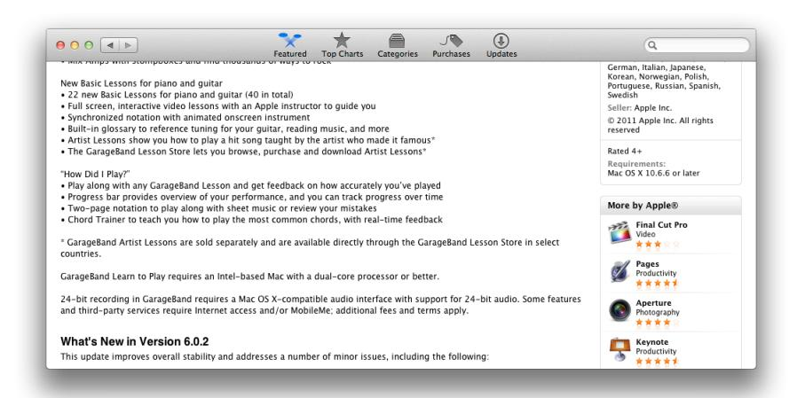

**Use progressive disclosure to presentthe most common choices first.** The technique of **progressive disclosure** consists of hiding additional information or more complex UI until the user needs or requestsit. Using progressive disclosure can improve your app in two ways: It helps novice users understand your app without being overwhelmed with information or features they don't need, while at the same time giving more experienced users access to the advanced features they want.

**When appropriate, use panels to simplify the UI.** An uncluttered user interface is essential, but the availability of certain key features and settings the user needs is equally so. A **panel** can be a good way to offer frequently needed controls and options that affect the current document or selection. For example, Keynote offers an inspector panel that gives users a convenient way to adjust objects in a slide.

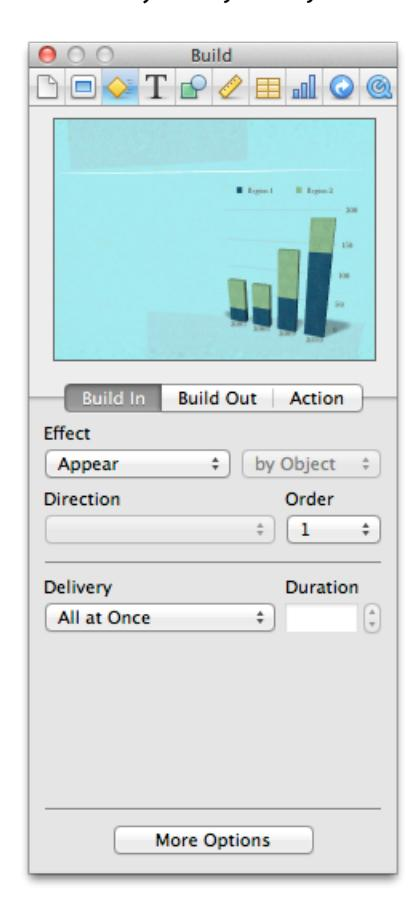

Because panels remain open until users close them, it's important to weigh their utility against the screen space they take up. To learn more about using panels in your app, see ["Panels"](#page-208-0) (page 209).

**As much as possible, arrange menus so that they reflect the hierarchy of objects in your app.** For example, if your app helps users create computer animation, the app-specific menus might be Scenes, Characters, Backgrounds, and Projects. Because a user probably seesthe project as a high-level entity that containsscenes, each of which contains backgrounds and characters, a natural ordering of these menus might be Projects, Scenes, Backgrounds, and Characters.

In general, place the menus that display commands to handle high-level, more universal objects toward one end of the menu bar and the menus that focus on the more specific entities toward the opposite end. When your app is used in countries that use left-to-right scripts, the high-level menus should appear on the left; in countries that use right-to-left scripts, the high-level menus should appear on the right. For more information about designing the menus in your app, see "UI Element [Guidelines:](#page-131-0) Menus" (page 132).

**Don't use dynamic menu items merely to shorten app menus.** A dynamic menu item (that is, a menu item that changes when the user presses a modifier key) can be a good way to provide a shortcut for sophisticated users, but it can be difficult for inexperienced users to discover. In general, it's better to list all important commands in a menu, even if it makes the menu a bit longer.

**Display an informative, actionable alert message when something goes wrong.** An alert should clearly convey what happened, why it happened, and the options for proceeding. Describe a workaround if one is available and do whatever you can to prevent the user from losing any data. Avoid using an alert to deliver information that the user can't act upon. For detailed guidelines on creating good alert messages, see ["Alerts"](#page-235-0) (page 236).

**Use display names in place ofraw pathnames and filenames.** In general, it does not help usersto be exposed to the way apps handle files and data. It's better to use the terms that users define for their content and to hide filesystem details unless users explicitly choose to see them. Be sure to pay attention to the user's established language and filename extension preferences so that you can display their content as they expect.

<span id="page-40-0"></span>**Use Bonjour to automatically discover devices and network services on IP networks.** Don't make the user type in an IP address or configure a DNS server.

### Allow Users to Go Full Screen (if Appropriate)

Full-screen windows make it easy for users to enter a distraction-free environment that helps them focus on a task. Follow the guidelines in this section to ensure that your app enables windows to go full screen when and how it's appropriate. To learn more about how the full-screen window experience works in OS X, see "Full-Screen Windows Help Users [Concentrate"](#page-13-0) (page 14).

**Determine whetherit makes sense for a window to go full screen.** Full-screen windows help usersto immerse themselves in a task, so they're not as useful in apps that users don't need to spend much time in, such as Contacts or Calculator. If your app enables brief utilitarian tasks, it probably doesn't make sense to allow app windows to go full screen. In particular, if you've designed apps for iOS-based devices, don't assume that your Mac app should automatically be full screen.

**Bring into the full-screen window all the features users need to complete the task.** Above all, you want to avoid forcing usersto exit the full-screen window in order to complete the task. To help you avoid thissituation, first evaluate why users might appreciate using your app in a full-screen window. For example, do they want a distraction-free way to consume media or a way to focus on performing a creative task? Then, identify all the tools required for the task and make them available within the full-screen window. If some of the tools are in an auxiliary window, be sure to designate this window as a full-screen auxiliary window, which means that

it can be opened in the same space as the full-screen window (to do this, you specify the constant NSWindowCollectionBehaviorFullScreenAuxiliary). Or, consider making the tools available within the UI of the full-screen window instead of in an auxiliary window.

**Show the toolbar if the full-screen task requires it.** When a window goesfullscreen, it can display the toolbar or it can allow users to reveal the toolbar, along with the menu bar, by moving the pointer to the top edge of the screen. (A full-screen window never shows its title bar.) If the task that users want to accomplish relies on functionality that's available in the toolbar, it makes sense to show it. For example, the full-screen Calendar window displaysthe toolbar because it contains controlsthat are essential to the task of viewing and managing the user's schedule. On the other hand, a full-screen Preview window does not display the toolbar, because users are more likely to want to focus on reading the content, than on annotating or selecting it.

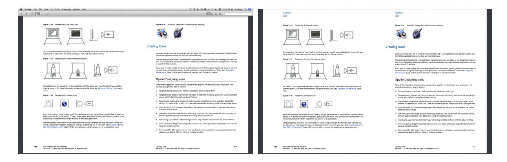

**Avoid requiring users to interact with the Finder while they're in a full-screen window.** Opening a Finder window might cause the user to exit the full-screen window. Instead, provide other ways for users to bring content into the window, such as a source list or a customized Open dialog (to learn more about Open dialogs, see "The Open [Dialog"](#page-221-0) (page 222)).

**Take advantage ofthe increased screen space, but don't shiftthe focus away from the main task.** In general, a window grows more in width than in height when users take it full screen. If appropriate, you can subtly adjust the proportions of the UI, so that the window fits better into the space and elevates the areas of the UI that are essential for performing the main task.

At the same time, don't make the full screen version of your window so different from the standard version that users don't recognize it. You want users to be able to stay focused on their task, even while they watch the window enlarge and perhaps alter a little in appearance. For example, the Photo Booth window gains decorative elements when it is full screen, but users never lose sight of themselves in the main viewing area. (Note that the red drapes that appear in full screen are also foreshadowed in the Photo Booth app icon, so users already associated them with the app.)

**Don't disable or override system-reserved gestures while a window is full screen.** Even though your app is the current focus of the user's attention, users should still be able to reveal Mission Control and move between other desktops and full-screen windows.

**Note:** This guideline appliesto games as much asit doesto other types of apps. If you're developing a game, you can think of respecting the system-reserved gestures as a way of offering a "boss button" that users can use to quickly hide the game.

**Respond appropriately when users switch away from your full-screen window.** For example, a game should pause its action when users switch away from the full-screen experience so that they don't miss important game events. Similarly, a slide show could pause when users switch away from it. In addition, be sure to let users decide when to take a window out of full screen. That is, don't discontinue a full-screen window when users switch away from it.

**In general, don't prevent users from revealing the Dock.** It's important to preserve users's access to the Dock even while they're in a full-screen window, because they should always be able to open other apps and view stacks. An exception to this is in a game, in which the user might expect to be able to move the pointer to the bottom edge of the screen without revealing the Dock.

### <span id="page-42-0"></span>Handle Gestures Appropriately

A trackpad gives users another way to move the pointer and activate UI elements. OS X includes support for Multi-Touch gestures, which allow usersto perform actionssuch asreveal Mission Control,switch to a different full-screen window or desktop, and return to the previous page in an app. Users expect to be able to use these familiar gestures throughout the system and the apps they download. Follow the guidelines in this section so that you can provide a great Multi-Touch gesture experience in your app.

**Pay attention to the meaning of a gesture, not to the physical movements users make.** In other words, instead of preparing to respond to a three-finger swipe, be prepared to respond to a "go to the previous page" gesture. Users can also change the physical movements that perform the system-supported actions, so your app should listen to the gesture the system reports.

**As much as possible, respond to gestures in a way that's consistent with other apps on the platform.** For the most part, users expect gesturesto work the same regardless of the app they're currently using. For example, users should be able to use the "go back" gesture whether the app displays content in document pages, webpages, or images.

It's especially important to avoid redefining the systemwide, inter-app gestures, such as reveal Mission Control and switch between desktops and spaces. (Note that users can change the precise gesturesthat perform these actions in Trackpad system preferences.) Even when users are playing a game that might use app-specific gestures in a custom way, they expect to be able to reveal Mission Control or switch to another desktop or full-screen window.

**Handle gestures as responsively as possible.** Gesturesshould heighten the user'ssense of direct manipulation and provide immediate, live feedback. To achieve this, aim to perform relatively inexpensive operations for the duration of the gesture.

**Ensure that gestures apply to UI elements of the appropriate granularity.** In general, gestures are most effective when they target a specific object or view in a window, because such views are usually the focus of the user's attention. Start by identifying the most specific object or view the user is likely to manipulate and make it the target of a gesture. Make a higher level or containing object a gesture target only if it makes sense in your app.

OS X 10.8 supports a smart zoom gesture (that is, a two-finger double-tap on a trackpad). By providing a semantic layout of your content, NSScrollView can intelligently magnify the content that the user is most likely interested in. See *NSScrollView Class Reference* for more information.

**Define custom gestures cautiously.** A custom gesture can be difficult for users to discover and remember. And, if a custom gesture seems gratuitous or awkward to perform, users are likely to avoid using it. If you feel you must define a custom gesture, be sure to make it easy to perform and not too similar to the gestures users already know.

<span id="page-43-0"></span>**Avoid relying on the availability of a specific gesture as the only way to perform an action.** You can't be sure that all your users have a trackpad or want to use it. In addition, trackpad users can disable some gestures, or change their meaning, in Trackpad preferences.

### Captivate with Gorgeous Graphics

High-quality graphics not only improve the appearance of your app, they also help convey information to users and enhance the overall experience of your app. OS X users are accustomed to beautiful, meaningful graphics and they look for the same level of quality in the apps they use.

**Make sure your graphics look professionally designed.** Don't underestimate the impact that beautiful, high-quality graphics have on your users. More than ever, people see gorgeous, professionally produced graphics all around them, and most people can readily discern differencesin quality. Low-quality graphics give people a bad impression and can negatively affect their perception an app's overall quality. To help ensure that users are delighted with your app, make graphics a priority in your design and development process.

**Make sure your graphics look great in full screen.** If you allow users to take a window full screen, make sure you don't just scale up your graphics to fit. As a rule of thumb, always start with artwork that is larger than you need and then scale it down. (For some guidelines on scaling artwork, see ["Creating](#page-115-0) Great Icons for Any [Resolution"](#page-115-0) (page 116).)

**When appropriate, consider adding the appearance of real-world materials.** In some cases, real-world textures, such as wood, leather, metal, or paper, can enhance the experience of an app and convey meaning to users. If this makes sense in your app, make sure that the texture you create:

- Is authentic and expressive, and looks great at all resolutions
- Coordinates with the overall appearance of your app and does not look like it was added as an afterthought
- Enhances the user's experience and understanding

For more guidelines related to using real-world appearances in your UI, see "Consider Adding [Physicality](#page-50-0) and [Realism"](#page-50-0) (page 51).

**Make a great first impression with a beautiful app icon.** Your app icon is the first experience users have with your app, and it can have a marked effect on their expectations. Think of your app icon as your calling card, and spend the resources necessary to ensure that it makes the right impression on users. For example, the Garage Band app icon is a beautiful rendering of a guitar.


For some specific guidance on creating a great app icon, see "Icon Design [Guidelines"](#page-110-0) (page 111).

**If they are needed, create control icons that are unambiguously expressive.** OS X provides many built-in icons that apps can use in controls to represent standard actions, such as unlock an object or stop the current process. As much as possible, you should use the standard icons in your app because users already know what they mean (to learn more about the built-in icons, see ["System-Provided](#page-319-0) Icons" (page 320)). If you need to represent an action for which there is no standard icon, you must create a custom icon that clearly conveys its meaning to users. For detailed guidance on creating custom icons, see ["Designing](#page-121-0) Toolbar Icons" (page 122).

**Prepare for high resolution.** In version 10.7, OS X extended its support for high resolution. To take advantage of this, you should adapt your app by using the appropriate APIs and provide higher-resolution versions of your artwork, among other things. To learn more about supporting high resolution in your app, see *High Resolution Guidelines for OS X* ; for some guidance on scaling custom artwork, see ["Creating](#page-115-0) Great Icons for Any [Resolution"](#page-115-0) (page 116).

### <span id="page-45-0"></span>Be Responsive

Responsiveness is how users measure the performance of your software. Your app might use the best data-processing algorithms and performance-boosting techniques available, but if it does not instantly respond to the user, it will seem slow. During app development, pay attention to both the factors that influence the user's perceptions and the actual, measurable performance metrics that your app generates.

**Instantly acknowledge the user's commands and input.** Users expect to receive some type of feedback every time they interact with your app (for more on the principle of feedback, see ["Feedback](#page-30-1) and [Communication"](#page-30-1) (page 31)). For example, buttons highlight when users click them and the pointer changes appropriately as users move it over different controls and areas. Similarly, if a command can't be carried out, users want to know why it can't and what they can do instead. The quicker you provide feedback for the user's interactions, the more responsive your app appears.

**Don't wait until a long task completes before you display any results to users.** If you display nothing until you have all the results, users might interpret this as sluggishness. Instead, display partial results as soon as possible after users initiate a long task so that they have something useful to view while the rest of the task completes.

**Use a progress indicator to help users gauge how long a process will take to complete.** Users don't always need to know precisely how long a task will take, but it's important to give them an estimate. For example, you can use a progress indicator, optionally combined with informative text such as "About a minute remains" or "Copying 30 of 850 files." For example, the Finder gives users an indication of how long a copy operation will take in a copy progress window.


To learn about the types of progress indicators you can use, see "Progress [Indicators"](#page-276-1) (page 277).

**Follow performance best practices.** For example, avoid polling for information or events, load resourceslazily, minimize drive accesses, and eliminate unnecessary I/O operations. To learn how to develop a performant Mac app, start by reading *Performance Overview*.

**Use metrics and tools to tune the performance of your app throughout development.** Be sure to use metrics, not assumptions, to quantify the performance of your app before you begin trying to improve it. For example, you can use Instruments (which is part of Xcode) to help you identify and address performance issues in your code.

### <span id="page-46-0"></span>Give Users Alternate Ways to Accomplish Tasks

Different people interact with apps in different ways, depending on personal preference and circumstance. Because you can't predict exactly how users will use your app, it's a good idea to offer a few different ways to perform each task.

**Support accessibility.** All apps should be accessible to people with disabilities and those who might use assistive devices to interact with their computer. As much as possible, make sure that every action users can take in your app can also be taken using VoiceOver or an assistive device. For more guidelines related to accessibility concerns, see "Reach as Many Users as [Possible"](#page-57-0) (page 58).

**Make app commands available in menus.** The menu bar is the first place people tend to look for commands, especially when they're new to an app. It's a good idea to list all important commands in the appropriate app menus so that people can find them easily. It can be appropriate to omit infrequently used or power-user commands from your app's menus (instead making them available in a contextual menu, for example), but you should be wary of doing thistoo often. Even experienced users can fail to find commandsthat are essentially hidden in this way. To learn more about providing menusin your app,see "UI Element [Guidelines:](#page-131-0) Menus" (page 132).

**Provide keyboard-only alternatives.** Many people prefer using a keyboard to using a mouse or a trackpad. Others, such as VoiceOver users, need to use the keyboard. There are two main ways to support keyboard users:

- Respect the standard keyboard shortcuts and create app-specific shortcutsfor frequently used commands. (For guidelines on how to do this,see "Provide Keyboard [Shortcutsfor](#page-63-0) Frequently Used Commands" (page 64).)
- Add support for full keyboard access mode to all your custom UI elements. Full keyboard access mode allows usersto navigate and activate windows, menus, UI elements, and system features using the keyboard alone. To learn more about this mode, see "Accessibility Keyboard Shortcuts".

### <span id="page-47-0"></span>Use Standard UI Elements Correctly

OS X provides a wide range of built-in UI elements, such as controls, menus, and dialogs. Using these elements in your app confers several important benefits:

- Users are familiar with the built-in elements, so they already know how to use them in your app.
- Your development time is shorter because you don't have to design a full set of custom elements.
- The system-provided elements help ensure consistency within your app and with the rest of the system.
- When there are changes to the appearance of system-provided controls, your app automatically acquires the updated look.

To realize these benefits, it's crucial that you use the built-in elements correctly. Follow these guidelines as you use Aqua UI elements in your app.

**Don't assign new behaviors to built-in UI elements.** It's essential to use the system-provided elements according to the guidelinesin this document. If you misuse standard elements, you make your UI unpredictable and hard for users to figure out.

**In general, don't create a custom UI element to replicate the behavior of a built-in element.** Unless you're designing a game or other completely custom experience, it's not appropriate to replace familiar elements with custom ones. This is because when users see a custom control, they generally expect it to behave in a custom way. Outside of a game-like context, a custom control that behaves the same as a built-in control causes users to wonder why the control isn't standard.

<span id="page-47-1"></span>**If you really need a new behavior, design a new element forit.** Don't try to stretch the behavior of an existing UI element. For some tips on how to create a custom UI element, see "Be Cautious When [Extending](#page-61-0) the [Interface"](#page-61-0) (page 62).

### Help Users Be Productive Immediately

Users expect to be able to benefit from your app as soon as they install it. Meet this expectation by following these guidelines.

**Don't ask users to restart.** After installation, your app should be ready for immediate use. If your app relies on a restart to work correctly, you should rethink its design.

**Avoid requiring users to supply a lot of setup information before they can do anything else.** Instead, let users get started right away and defer asking for setup or configuration information until it's actually needed. Get as much information as possible from other sources, such as system preferences or Contacts, so that you can avoid asking users for information they've already supplied. When you must ask users for information, try to give users something in return for each piece of information they provide.

**Establish intelligent default settings.** Determine how most users are likely to use your app and set the default configuration accordingly. When you gauge the needs of your user audience accurately, it's rarely necessary for users to adjust the default settings in your app's preferences.

**Make sure the functionality in your app is easily discoverable.** When the usage of your app is obvious, users feel empowered and they can be successful right away. Although you should make help content available in case users need it, users should not feel that they must read a manual before they can begin using your app. (For guidelines on how to provide good help content, see "User [Assistance"](#page-106-0) (page 107).)

### <span id="page-48-0"></span>Clarify and Communicate with Subtle Animation

Animation can be one of the best ways to provide feedback and to clarify the results of the user's actions. For example, users understand exactly what the Duplicate command does because they can watch the document copy spring from the original.

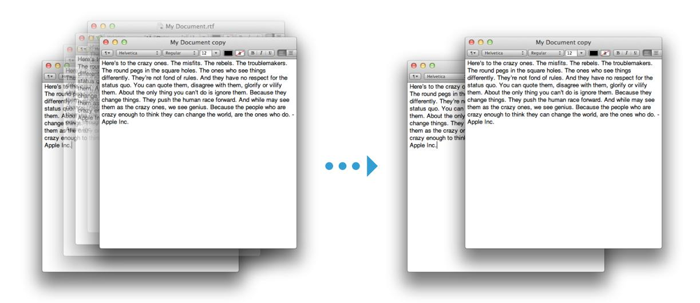

Typically, animation is also one of the easiest parts of UI design to get wrong. Use the following guidelines to help you enhance your app with polished, useful animation.

**Avoid gratuitous animation.** Animation that serves no purpose or is illogical quickly becomes tiresome and irritating to users. Be sure that the animation you add enhances the user's understanding of your app's functionality.

**In general, avoid using animation as the focus of the user experience.** Unless you're developing a game in which animation plays a major role, you should use animation to subtly enhance the user experience. If you place too much focus on animation in your app, users are likely to become distracted from their task. The best animation helps users understand what's going on, without drawing attention to itself.

**Use animation to clarify the consequences of user actions.** Showing users the results of an action before they commit to it helps them be sure of themselves and avoid mistakes. For example, items in the Dock move aside when users drag an object into the Dock area, showing where the new object will reside when they drop it.

**Animate a window's transition to and from full screen.** It's a good idea to supply a smooth, high-quality animation to replace the default transition. Creating a custom animation is especially important if your window contains custom elements that might not be able to participate in the default transition. For example, if you display a secondary bar below the toolbar (such as a "favorites" bar), you need to make sure that this bar transitions along with the toolbar when the window goes full screen.

**Use animation to enhance realism.** If you create custom elements that look like real, physical objects, be sure to animate their movements so that they respond realistically, too. For example, if the user can spin an object in the UI, a large or heavy object should appear to slow down quicker than a small or lightweight object. For more guidelines related to adding realism to your UI, see "Consider Adding [Physicality](#page-50-0) and Realism" (page 51).

**Use animation when an object changes its properties.** Showing an object's transition from one state to another, instead of showing only the beginning and ending states, helps users understand what's happening and gives them a greater sense of control over the process.

**Use animation when an action occurs so quickly, users can'ttrack it.** When it'simportant that users understand a connection or a process, animation can help them watch actions occur in a more human time frame. For example, when the user minimizes a window it doesn't just disappear from the desktop and reappear in the Dock; instead, it moves fluidly from the desktop to the Dock so that users know exactly where it went.

**Avoid animating everything.** Although it's tempting to think that more animation results in great clarification and better feedback, it's not generally true. Most tasks and actions in an app are best performed quickly and with a minimum of fanfare.

**Avoid animating routine actions supported by system-provided controls.** Users understand how common UI elements work, and they don't appreciate being forced to spend extra time watching unnecessary animation every time they click a button or switch tabs.

### <span id="page-50-0"></span>Consider Adding Physicality and Realism

Sometimes, suggesting or replicating the look and feel of the real world in your app can improve the user's experience. The guidelines in this section can help you decide whether it's appropriate to add realism to your app, and if it is, how to incorporate it successfully.

**Determine whether depicting a real-world task helps users understand its virtual version.** The key is to make sure that adding realism enhances both understanding and usability: Improving one at the expense of the other does not make your app better. For example, even though writing and posting letters is a real-world activity that most people understand, Mail does not expect users to fold a virtual note or affix a stamp to a virtual envelope.

**Feel free to modify a real-world depiction if doing so enhances the user's understanding.** In other words, don't feel that you must be scrupulously accurate in your rendering of realistic objects or experiences. Often, you can express your point better when you fine-tune or leave out some of the details of a real-world object or behavior.

**Don't sacrifice clarity for artistic expression.** For example, it might make sense to show notes or photos pinned to a cork board, but it might be confusing to use a cork board background in an app that helps people create a floor plan for their home. If users need to stop and think about what your images are trying to communicate, you've decreased the usability of your app. (This concept is related to the principle of aesthetic integrity; to learn more about it, see ["Aesthetic](#page-34-0) Integrity" (page 35).)

**Aim for realistic motion, too.** Sometimes, realistic movement can help people understand how something works even more than realistic imagery can. For example, OS X uses the rubber band effect to show users that they've scrolled to the end of a window's content or come to the last full-screen window or desktop. Take the time to investigate the physics that dictates how the objects in your UI might move so that you can enhance the user's understanding.

**Consider enhancing physicality and realism in full-screen mode.** In Photo Booth, for example, the depiction of red velvet drapes, woodgrain, and brass controls occurs only in full-screen mode. But it's important to note that the addition of these peripheral elements does not distract users from their task, because the focus of the window remains on the main viewing area.


### <span id="page-51-0"></span>Make Exploration Safe

Encourage people to explore your app by building in forgiveness—that is, making most actions easily reversible. People need to feel that they can try things without damaging the system or jeopardizing their data. Ideally, your app provides users with the capabilities they need while helping them avoid dangerous, irreversible actions.

**Create safety nets so that users feel comfortable learning how to use your app.** For example, support Undo as much as possible (for some guidelines on how to do this, see "The Edit [Menu"](#page-152-0) (page 153)). Also, consider allowing users to make changes to their content, but defer committing to the changes until a later time. For example, iPhoto allows users to perform all sorts of modifications to a photo without actually changing the photo file until they want to.

**Warn users when they initiate a task that will cause an unexpected and irreversible loss of data.** Such warnings are important, but they can become annoying—and users tend to ignore them—if they appear too often. Make sure you don't warn users when data loss is an expected outcome of an action. For example, the Finder doesn't display an alert when the user throws away a file because the user intends to delete the file. For more guidelines on how to use alerts in your app, see ["Alerts"](#page-235-0) (page 236).

**Provide plenty ofinformative feedback and communication throughout your app.** Relevant, reliable feedback helps users feel confident that they have enough information to make the right choices.

**In most cases, avoid constraining user actions.** Unless you're creating a children's app in which it can be appropriate to restrict the user's scope of action, you don't want users to feel that your app is paternalistic. As much as possible, let users do what they want without unnecessary interference.

### <span id="page-52-0"></span>Earn Users' Trust with Reliability, Predictability, and Stability

A reliable, stable app behaves in predictable ways and maintains the integrity of the user's data, while doing everything possible to prevent data loss or corruption. It also has a certain amount of maturity to it and can handle complex situations without crashing.

**Reopen in the same state in which users left your app.** Preserving user-modifiable settings, such as window dimension and location, enhances users' perception of the stability of your app. OS X makesstate-preservation easy to achieve when you enable Resume. To learn how to support Resume in your code, see "User Interface Preservation" in *Mac App Programming Guide* .

**Make sure UI elements behave the way users expect them to.** When UI elements work as expected, users are more likely to trust your app to do what it promises. In particular, it's crucial to avoid altering the meaning of the standard UI elements that users are familiar with.

**Provide status and feedback to show that your app is performing the specified task.** Users need to be able to trust that your app is acting upon their commands and they appreciate knowing how long a process will take. One way to provide status feedback is by using a progress indicator; to learn how to use a progress indicator in your app, see "Progress [Indicators"](#page-276-1) (page 277).

**Make sure users receive predictable output from their content.** If your app enables users to format data for printing, web publishing, or writing to film, DVD, or other formats, make sure there are no significant differences between what users see onscreen and what they receive in the final output.

<span id="page-52-1"></span>**Anticipate errors and help users avoid them when possible.** A stable, reliable app minimizes the potential for error by, for example, validating user input before processing it. The more you can help users avoid triggering errors, the fewer problems you have to handle.

### Adapt to Changes in the User's Environment

An adaptable program is one that adjusts appropriately to its surroundings; that is, it does not stop working when the current conditions change. One of the strengths of OS X isits ability to adapt to configuration changes quickly and easily. For example, if the user changes a computer's network configuration in System Preferences, the changes are automatically picked up by apps such as Safari and Mail. Follow the guidelines in this section to ensure that your app is similarly adaptable.

**Expect people to be mobile.** First of all, be prepared for network configuration changes and make sure that users can benefit from your app when their network connection isslow or nonexistent. For example, be flexible when accessing the file system, in case network volumes go offline. If a network volume disappears, show users that it is unavailable and provide an option to save files to a different volume. (If you want to learn about using Bonjour to publish and discover services, see *Bonjour Overview*.)

Second, be conservative with your app's power usage so that mobile users can use their computer as long as possible before recharging. For example, avoid polling for events and accessing the hard disk as much as possible. Also, make sure that your app is completely idle unless it is actively processing a user's request. (To start learning how to optimize your app's performance, see *Performance Overview*.)

**Anticipate variations in display size, resolution, and number.** OS X users can plug in and unplug displays at any time, and these displays might have different sizes and resolutions. Your app should respond gracefully when a display goes away or when a new display has a different size or resolution. Make sure your graphics look good at all resolutions and be prepared to adjust window locations and dimensions.

**Be prepared for multiple users with different privileges.** The OS X fast user switching feature allows multiple usersto be logged in simultaneously and to switch quickly between accounts. To ensure that your app behaves appropriately when there are multiple users logged in or when the current user has limited privileges, keep the following things in mind:

Some users may be working under limited privileges and have limited access to some parts of the system. For example, only administrator users can write filesin /Applications. In particular, users with limited privileges may not be able to:

- Access all panes in System Preferences
- Modify the Dock
- Change their password
- Burn DVDs and CDs
- Open certain apps
- Visit certain websites

Users on a computer can include both local and network users, so don't assume that a user's home directory is on a local volume. Be prepared for the possibility that you are accessing a network volume instead.

Named resourcesthat might potentially be accessible to an app from multiple usersessionsshould incorporate the session ID into the name of the resource. This applies to cache files, shared memory, semaphores, and named pipes, among others.

**Avoid depending on the availability of specific hardware.** Hardware configurations can vary greatly based on the computer, country, and user. For example, not every Macintosh hasthe same graphics card or processor. Similarly, not all keyboards have the same set of keys. Hardware can also be added or removed at runtime. To detect available device configurations, you can use the I/OKitinterfacesthat are described in *Accessing Hardware From Applications*.

**Avoid making assumptions based on the current user's locale.** Be prepared to handle different date, time, and number formats. Also, don't assume that the address format of the current user is the only address format in use. For example, in Contacts the user may store contacts with foreign addresses.

To make sure your user interface adapts gracefully to changes in locale (especially when users switch to right-to-left languages), use Cocoa Auto Layout as described in "Auto [Layout"](#page-96-0) (page 97).

### <span id="page-54-0"></span>Design for Interoperability

An interoperable app communicates seamlessly with other apps and services so that users can open their content in different apps and exchange information with other users. Users appreciate interoperability because it means that they can focus on their content, without having to pay attention to details such as file formats and data-exchange protocols.

**As much as possible, avoid using custom file formats.** Instead, use standard file formats so that users can easily exchange documents with other users or open them in different apps. If you must use a custom file format, be sure to provide import and export capabilities so that users can exchange data with other apps and the system. If necessary, you should also include a Quick Look generator to convert your native document format into a format the Finder and Spotlight can display. (For more information about integrating well with the Finder and with Spotlight, see "The [Finder"](#page-67-0) (page 68) and ["Spotlight"](#page-105-0) (page 106).)

**Use the same file format on all platforms you support.** Using the same format on all platforms ensures that users can use your app to view their content regardless of the device or platform they're using.

**Support filename extensions.** A filename extension identifies the document's type in a way that all platforms understand. Although OS X users can hide the display of filename extensions, you should support them so that apps on other platforms can recognize and open the files that your app creates.

**Use the user defaults system to store preferences.** When you use the user defaults system to manage your app's configuration information, the data is generally stored in property list files. In your app, you use the shared NSUserDefaults object to access and modify this information (on the command line, you can use the defaults tool to examine the contents of the user defaults database).

**Use standard protocols for data interchange.** XML is the preferred format for exchanging data among apps and platforms because it is cross-platform and widely supported. OS X also supports numerous network protocols, as listed in "Core OS Layer".

### <span id="page-55-0"></span>Use the Right Pointer for the Job

OS X providesseveralstandard pointersthat provide well-defined feedback to users. It'simportant to use these pointers correctly because users already know what they mean.

**Use standard pointers according to their intended purpose.** OS X users are accustomed to the meaning of the pointers shown in Table 3-1. If you change the meaning of a standard pointer, users aren't able to predict the results of their actions.

<span id="page-55-1"></span>**Table 3-1** Standard pointers in OS X

| Pointer            | Meaning                                                                                                                                                                                                                           |
|--------------------|-----------------------------------------------------------------------------------------------------------------------------------------------------------------------------------------------------------------------------------|
| Arrow              | The<br>user<br>can<br>activate<br>the<br>control<br>or<br>switch<br>to<br>the<br>area.                                                                                                                                            |
| Contextual<br>menu | A<br>contextual<br>menu<br>is<br>available<br>for<br>an<br>item.<br>Shown<br>when<br>the<br>user<br>presses<br>the<br>Control<br>key<br>while<br>the<br>pointer<br>is<br>over<br>an<br>object<br>with<br>a<br>contextual<br>menu. |
| Alias              | The<br>drag<br>destination<br>will<br>have<br>an<br>alias<br>for<br>the<br>original<br>object<br>(the<br>original<br>object<br>will<br>not<br>moved).                                                                             |
| Poof               | The<br>proxy<br>object<br>being<br>dragged<br>will<br>go<br>away,<br>without<br>deleting<br>the<br>original<br>object,<br>when<br>the<br>user<br>releases<br>the<br>drag.<br>Used<br>only<br>for<br>proxy<br>objects.             |
| Copy               | The<br>drag<br>destination<br>will<br>have<br>a<br>copy<br>of<br>the<br>original<br>object<br>(the<br>original<br>object<br>is<br>not<br>moved).                                                                                  |

| Pointer                  | Meaning                                                                                                          |  |  |
|--------------------------|------------------------------------------------------------------------------------------------------------------|--|--|
| Not<br>allowed           | An<br>invalid<br>drag<br>destination.                                                                            |  |  |
| I beam                   | Selection<br>and<br>insertion<br>of<br>text<br>is<br>available.                                                  |  |  |
| Crosshair                | Precise<br>rectangular<br>selection<br>is<br>available.                                                          |  |  |
| Pointing<br>hand         | The<br>content<br>is<br>a<br>URL<br>link.                                                                        |  |  |
| Open<br>hand             | The<br>item<br>can<br>be<br>manipulated<br>within<br>its<br>containing<br>view.                                  |  |  |
| Closed<br>hand           | Pushing,<br>sliding,<br>or<br>adjusting<br>an<br>object<br>within<br>a<br>containing<br>view<br>is<br>occurring. |  |  |
| Move<br>left             | The<br>object<br>can<br>only<br>be<br>moved<br>or<br>resized<br>to<br>the<br>left.                               |  |  |
| Move<br>right            | The<br>object<br>can<br>only<br>be<br>moved<br>or<br>resized<br>to<br>the<br>right.                              |  |  |
| Move<br>left or<br>right | The<br>object<br>can<br>be<br>moved<br>or<br>resized<br>to<br>the<br>left<br>or<br>the<br>right.                 |  |  |
| Move<br>up               | The<br>object<br>can<br>only<br>be<br>moved<br>or<br>resized<br>upward.                                          |  |  |

| Pointer               | Meaning                                                                           |
|-----------------------|-----------------------------------------------------------------------------------|
| Move<br>down          | The<br>object<br>can<br>only<br>be<br>moved<br>or<br>resized<br>downward.         |
| Move<br>up or<br>down | The<br>object<br>can<br>be<br>moved<br>or<br>resized<br>upward<br>or<br>downward. |

The spinning wait cursor (shown below) is also standard, but it is displayed automatically by the window server when an app can't handle all of the events it receives. In general, if an app does not respond for about 2 to 4 seconds, the spinning wait cursor appears. If the app continues to be unresponsive, users often react by force-quitting it.


**Create a custom pointer cautiously.** Before you design a custom pointer for your app (especially a custom version of a standard pointer), be sure the new pointer actually improves the usability of your app and doesn't confuse users. If you've determined that you need a custom pointer, follow these guidelines as you design it:

- Your design needs to make clear where the hot spot of the pointer is (briefly, a pointer's **hot spot** is the part of the pointer that must be positioned over an onscreen object before clicking has an effect).
- <span id="page-57-0"></span>● If your custom pointer is a version of a standard pointer, you also need to create custom versions of related pointers. For example, if you create a custom version of the arrow pointer you also need to create custom versions of the related arrow pointers, such as copy, move, alias, and poof.

### Reach as Many Users as Possible

As early as possible in the design process, start thinking about accessibility and worldwide compatibility so that the market for your app is as large as possible. It's much easier to build in support for accessibility and internationalization from the beginning than it is to add support to a finished app.

Making your app usable by people with disabilities (that is, making your app accessible) is the right thing to do. Making your app accessible benefits you, too, because in many places accessible apps are the only apps that governments and some institutions can purchase.

OS X includes many assistive features, including VoiceOver, zoom, and full keyboard access mode. When your app is accessible, users can interact with it using the assistive device or feature of their choice. For example, in addition to speaking the UI to VoiceOver users, VoiceOver can also show the current focus and output to the user's sighted colleagues.

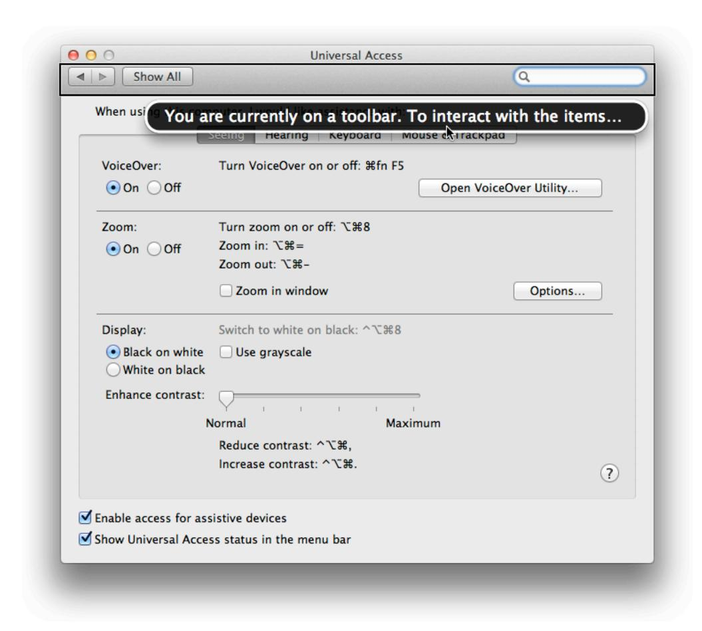

To learn about some of the user experience issues you should keep in mind, see ["Accessibility"](#page-83-0) (page 84). To learn what programming steps you need to take to make your app accessible, start by reading *Accessibility Overview for OS X* .

It's a good idea to prepare your app for localization by internationalizing it. Internationalization involves separating any user-visible text and imagesfrom your executable code. When you isolate this data into resource files, you make it easier to localize your app, which is the process of adapting an internationalized app for culturally distinct markets.

For details on how to internationalize your app and prepare for localization, see ["Internationalization"](#page-84-0) (page 85).

### <span id="page-59-0"></span>Make Help Available, but Unobtrusive

Ideally, users can easily figure out how to use your app without ever needing to read the user guide. But sometimes users need a little help understanding how to use an advanced feature or how to perform a variation of the main task. The guidelines in this section help you provide app help that doesn't get in the user's way; for detailed guidance on how to compose help content, see "User [Assistance"](#page-106-0) (page 107).

**Provide help tags that describe how to use UI elements.** Help tags can appear when the user allows the pointer to rest over a UI element for a few seconds. A help tag consists of a small view that displays a succinct description of what the UI element does. Although it's best when the usage of your app's UI isinstantly apparent to users, help tags can be a good way to help novice users without annoying experienced users. Because a help tag's message is short and directly linked to a specific UI element, a help tag is not the appropriate place to describe a higher-level task.

**Provide a help book that describes how to accomplish tasks in your app.** Users open an app's help book when they can't figure out how to accomplish their goal. Although users might also refer to a help book to find out how to use a specific control, they're more likely to be seeking help with a higher-level task. For this reason, your help book should be task-based, and for the most part, it should describe control usage in the context of accomplishing a task.

### <span id="page-59-1"></span>Make User Input Convenient

There are several ways in which users might have to enter information into your app, such as filling out a form, entering a password, orsupplying an email address. Follow the guidelinesin thissection to make this experience as easy as possible for users.

**When possible (and appropriate), automatically fill in text fields as users type.** Users appreciate the convenience of having some information supplied for them, as long as it's correct. If you can't guarantee the accuracy of the information you provide, it's better to leave text fields empty. If you supply text, be sure to indicate the fields you are filling in (perhaps by highlighting them), so that the user can easily distinguish the information your app provides from the information they provide. Note that a password field should always be empty.

**Perform appropriate edit checks as users enter information.** For example, if the only legitimate value for a field is a string of digits, the app should alert users as soon as they type a nondigit character. Verifying user input as your app receives it helps avoid errors caused by unexpected data. For a more complete discussion of when to check for errors and apply changes in text fields, see ["Accepting](#page-216-0) and Applying User Input in a [Dialog"](#page-216-0) (page 217).

**Defer displaying a "required" icon next to a required field until users leave the context without handling it.** Preemptively displaying an asterisk or a custom icon next to each required text field and selection control can make your UI appear cluttered and unappealing. Instead, assume that users will fill in all the required fields; if they forget one, display an asterisk or custom icon next to the forgotten field when they attempt to exit the current context. This strategy helps you maintain an attractive UI, while at the same time helping you avoid treating users as if they were children.

**Preserve users's privacy as they input a password.** In this situation, each character the user types should appear as a bullet. If the user deletes a character with the Delete key, one bullet is deleted from the text field and the insertion point moves back one bullet, as if the bullet represented an actual character. Double-clicking bulleted text in a password field selects all the bullets in the text field. When the user leaves the text field (by pressing Tab, for example), the number of bullets in the text field should be modified so that the field does not reflect the actual number of characters in the password.


### <span id="page-60-0"></span>Use User-Centric Terminology

Almost all apps need to use some words to communicate with users, even if the only words are in button labels. It'simportant to choose all of your app's words carefully so that you can ensure that your communication with users is unambiguous and accurate.

**In general, avoid jargon.** Above all, you want to use the terminology your users are comfortable with. If your app targets sophisticated users who frequently use a set of specialized, technical terms, it makes sense to use these terms in your app. On the other hand, if your user audience consists of mostly novice or casual users, it's better to use simpler, more generally understood terms.

**Avoid developer terms.** As a developer, you refer to UI elements and app processes in ways that most users don't understand. Be sure to scrutinize your UI and replace any developer terms with appropriate user terms. For example, Table 3-2 lists several common developer terms, along with equivalent user terms you should use instead.

<span id="page-61-1"></span>**Table 3-2** Some developer terms and their user term equivalents

| Developer term    | Equivalent user term                                                   |
|-------------------|------------------------------------------------------------------------|
| Cursor            | Pointer                                                                |
| Data<br>browser   | Scrolling<br>list<br>or<br>multicolumn<br>list                         |
| Dirty<br>document | Document<br>with<br>unsaved<br>changes;<br>unsaved<br>document         |
| Focus<br>ring     | Highlighted<br>area;<br>area<br>ready<br>to<br>accept<br>user<br>input |
| Control           | Button,<br>checkbox,<br>slider,<br>menu,<br>etc.                       |
| Launch            | Start                                                                  |
| Mouse-up<br>event | Click                                                                  |
| Override          | Take<br>the<br>place<br>of;<br>take<br>precedence<br>over              |
| Reboot            | Restart                                                                |
| String            | Text                                                                   |
| String<br>length  | Number<br>of<br>characters                                             |

<span id="page-61-0"></span>**Use proper Apple terminology.** If you need to refer to standard parts of the UI or to system features, be sure to use the terms that Apple defines. For example, if you need to describe the use of a checkbox in your UI, tell the user to "select" the checkbox, not to "check," "click," or "turn on" the checkbox. Or, if you mention how to start your app by clicking your app icon in the Dock, be sure to capitalize "Dock."

### Be Cautious When Extending the Interface

OS X provides many UI elements that you can use to enable a wide range of actions in your app. Users are comfortable with these elements and they appreciate finding them in new apps, because they already know how to use them. In rare cases, however, your app might need to enable an action for which there is no Aqua element. If you need to design a custom UI element, follow the guidelines in this section.

**Important:** A custom UI element does not receive automatic updates if Aqua changes in the future. When you create a custom UI element, you must also accept the responsibility for revising it appropriately when Aqua changes.

**Don't assign new behaviors to standard UI elements.** It's better to create a custom element than to change the behavior of a familiar Aqua element. If UI elements behave differently in different situations, the interface becomes unpredictable and harder for users to figure out.

**Don't create a custom UI element that looks or behaves like an Aqua UI element.** If your custom element looks too much like an Aqua element users might not notice the difference, and they will be confused when it does not behave as they expect. Similarly, if your custom element behaves the same way an Aqua element behaves, users will wonder what, if anything, is different about the custom element.

**Make sure your custom UI element enhances the usability of your app.** A custom UI elementshould provide users with a unique benefit that is difficult to achieve in any other way. If a new UI element doesn't help users, they're likely to feel that they wasted the time they spent learning about it.

<span id="page-62-0"></span>**Avoid replicating a UI element from another platform.** Users aren't necessarily familiar with other platforms, so you can't assume that they recognize nonAqua UI elements. It's better to design a new UI element that coordinates with the design of your app and that supplies the precise behavior you need.

### Brand Appropriately

A well-designed app incorporates branding in subtle, memorable ways. The guidelines in this section outline some strategies for adding branding that doesn't overwhelm or annoy users.

**Make sure branding is subordinate to the user's content and the main task.** People don't use an app to learn more about about a related product or company, so it's best to keep branding elements unobtrusive. For example, consider using the relevant colorsfrom the company logo throughout the UI, or using recognizable brand elements as the basis for custom toolbar icons.

**As much as possible, make your app into a brand.** Strive to create an app brand, rather than just displaying company branding in an app. One way to do thisisto develop a subtle design language that you use consistently throughout your app. Allow this language to guide your use of color, shape, terminology, movement, and behavior so that users perceive your app as a coherent statement.

**Create a memorable app icon.** Your app icon is the place where branding elements can take center stage. If your app is associated with a well-known brand, or if your app represents a brand, incorporate its visual elements in your app icon. For additional guidelines on icon creation, see "Icon Design [Guidelines"](#page-110-0) (page 111).

### <span id="page-63-0"></span>Provide Keyboard Shortcuts for Frequently Used Commands

Keyboard shortcuts are combinations of two or more keys that users can press to initiate certain actions. OS X reserves several keyboard shortcuts to support both general usability needs and accessibility needs. For example, Command-Space reveals the Spotlight search bar, and Command-Option-8 turns zoom on or off. In addition to the system-reserved shortcuts,several keyboard shortcuts are so commonly used forspecific actions that users expect them to be available in most apps. And, when users enable full keyboard access mode, other key combinations may be reserved by default.

**Don't override the system-reserved keyboard shortcuts.** Users expect these shortcuts to work regardless of the app they're currently using. You'll find a list of these shortcuts (each marked with the symbol) in [Table](#page-311-0) [A-2](#page-311-0) (page 312).

**Avoid overriding the standard keyboard shortcuts users are familiar with.** Users expect these shortcuts to mean the same thing in each app they use. The standard shortcuts are also listed in [Table](#page-311-0) A-2 (page 312) (they are *not* marked with the symbol).

In rare cases, it can be acceptable to redefine a common keyboard shortcut. For example, if users spend the majority of their time in your app, it can make sense to redefine shortcuts that don't apply to the tasks your app enables. Or, if most of your users have used your app on a different platform, you might not want to change the keyboard shortcuts they already know.

**Don't feel that you must create a shortcut for every command in your app.** If you try to do this, you'll probably end up with some shortcutsthat are unintuitive, hard to remember, and physically difficult to perform. Instead, identify the most frequently used commandsin your app and create logicalshortcutsfor them. Examine [Table](#page-311-0) A-2 (page 312) for characters and combinations that are not reserved by OS X or commonly used.

# <span id="page-64-0"></span>OS X Technology Usage Guidelines

OS X provides a wealth of highly developed technologies that users appreciate. Taking advantage of these fully integrated technologies enhances the way your app interacts with the system and with other apps on the platform.

### <span id="page-64-1"></span>Mission Control

Mission Control gives users an easy way to see all their desktops and full-screen windows, in addition to Dashboard and the Dock, at one time. In Mission Control, users can create a new desktop, switch between desktops and full-screen windows, or choose a specific window on the current desktop.


In System Preferences, users can set how they want to enter Mission Control,such as with a couple of keystrokes, a gesture, a hot corner, or all three.

Apps do not influence the way Mission Control displays the user's desktops and full-screen windows, but apps need to ensure that users can enter Mission Control whenever they want.

**Respect the "enter Mission Control" gesture.** No matter which gesture users choose for this action, you need to ensure that it works all the time, regardless of what your app is doing.

### <span id="page-65-0"></span>The Dock

The Dock provides a convenient place for users to keep the apps they use most often. In addition, users can use the Dock to store webpage bookmarks, documents, folders, and stacks(which are collections of documents or other content). Users expect the Dock to be always available and to behave according to their preferences.

**If appropriate, customize your app's Dock menu.** Users can click and hold (or Control-click) an app's Dock icon to reveal the Dock menu. A Dock menu can contain app commands such as Open, Quit, and Hide, in addition to high-level options such as Show in Finder, Open at Login, and Assign to this Desktop. When your app is running, users can see a customized version of the Dock menu that can contain items such as:

- Commands that initiate actions in your app when it is not frontmost, such as New Window
- Commands that are applicable when there is no open document window, such as New Document
- Status and informational text

For example, the customized Mail Dock menu includesthe Get New Mail and Compose New Message commands.

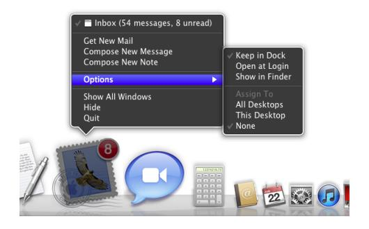

To learn how to customize your Dock menu in code, see *Dock Tile Programming Guide* .

**Take Dock position into account when you create new windows or resize existing windows.** If window boundaries are behind the Dock, or too near the edge of the screen that hides the Dock, users have difficulty dragging or resizing the window without inadvertently interacting with the Dock. In particular, you should not create new windows that overlap the boundaries of the Dock. Similarly, you should prevent users from moving or resizing windows so that they are behind the Dock.

**Respond appropriately when the user clicks your Dock icon.** Generally, a window should become active when the user clicks on an app's Dock icon. The precise behavior depends on whether the app is currently running and on whether the user has minimized any windows.

If the app is not running, a new window should open. In a document-based app, a new untitled window should open. In an app that is not document-based, the main app window should open.

If the app is running when the user clicks its Dock icon, the app becomes active and all open unminimized windows are brought to the front; minimized document windows remain in the Dock. If there are no unminimized windows, the last minimized window should be expanded and made active. If no windows are open, the app should open a new window—a new untitled window for document-based apps, otherwise the main app window.

**Note:** A running app does not necessarily display the running indicator below its Dock icon (users can specify this behavior in General preferences). Don't assume that users want to see running indicators in the Dock.

**Use badging to give users noncritical status information in an unobtrusive way.** A badge is a small red oval that appears over the upper-right corner of an app's Dock icon. For example, Calendar displays the number of new events in a badge; when there are no new events, the badge disappears (it does not display 0).


**Use bouncing to notify users of serious information that requires their attention.** A bouncing Dock icon is very noticeable, so you should use this method only when the user really needs to know about something. Also, make sure you disable bouncing as soon as the user has addressed the problem.

### <span id="page-67-0"></span>The Finder

The Finder gives users accessto the file system. Although it's best to minimize users' interaction with the Finder while they're in your app, you need to make sure your app integrates well with it.


**Make sure your app bundle has the correct extension.** The Finder looks for the .app extension and treats your app appropriately when it finds it. The Finder also shows or hides this extension, depending on the state of the "Show all filename extensions" preference in the Advanced pane of Finder preferences.

**Use an information property list to supply information to the Finder.** The information property list (that is, an Info.plist file) is the standard place to store information about your app and document types. For information on what to put in this file, see *Runtime Configuration Guidelines*.

**Add the appropriate filename extension to documents users can create in your app.** Accurate extensions help ensure platform interoperability. You can also set a file type and optionally a creator type for a file, although this is not strictly necessary. For more information about filename extensions, file types, and creator types, see *File System Overview*.

**Avoid changing the creatortype of existing documents.** The creator type implies a distinctsense of ownership over a file. Your app can assign a creator type for files it creates, but it should not change creator types for documents that are created by other apps unless the user gives explicit consent. Note that the user can still associate files with a specific app by using the Info window.


**Include a Quick Look generator if your app creates documents in an uncommon or custom format.** A Quick Look generator converts an uncommon format into a format that the Finder can display in Cover Flow view and in a Quick Look preview. Specifically, if your app produces documents in content types other than HTML, RTF, plain text, TIFF, PNG, JPEG, PDF, and QuickTime movies, it's a good idea to provide a Quick Look generator so that users can view your documents they way they expect. To learn how to create a Quick Look generator, see *Quick Look Programming Guide* .

**If necessary, report disk size or usage information appropriately.** If your app needs to display this type of information, it's important to provide values that are consistent with values reported by the Finder and other system apps,such as Activity Monitor. Otherwise, users can become confused if your app and the system report different values for the same quantity.

To ensure consistent values, be sure to calculate all disk size statistics using GB, not GiB. A GB is defined as 1,000,000,000 bytes, whereas a GiB is defined as 1,073,741,824 bytes (which is the value of 2 <sup>30</sup>).

### <span id="page-69-0"></span>Dashboard

Dashboard gives users a way to get information and perform simple tasks quickly and easily. Appearing and disappearing with a single keystroke or gesture, Dashboard presents a default or user-defined set of widgets in a format reminiscent of a heads-up display, as shown below.


Each Dashboard component, called a **widget**, is small, visually appealing, and narrowly focused on the task it enables. You can develop a standalone widget that performs a lightweight task or a widget whose task is actually performed by your larger, more functional app. In-depth instructionsfor how to implement a Dashboard widget, including plentiful code examples and UI guidance, are available in *Dashboard Programming Topics*.

### <span id="page-70-0"></span>Gatekeeper


Gatekeeper helps protect users from malware. In OS X v10.8, users can choose between three settings. Users can set Gatekeeper to download and install:

- All apps
- Only apps from the Mac App Store
- Apps from the Mac App Store and apps signed with a Developer ID (this is the default setting)

With the default setting, if an app is unsigned, Gatekeeper blocks the app from installing and warns users that the app did not come from an identified developer. Users can choose to override Gatekeeper or change the settings.

To ensure the best possible experience for your users, you should:

**Vend your app from the Mac App Store.** By offering your app in the Mac App Store, users automatically know that your app has been reviewed by Apple and has not been tampered with.

<span id="page-70-1"></span>**Sign your app with a valid Developer ID.** If you choose to distribute your app outside of the Mac App Store, sign your app with a Developer ID. Thisidentifies you as an Apple developer and ensuresthat your app launches on Macs with Gatekeeper enabled. See "Distributing Outside the Mac App Store" for more information.

### iCloud Storage

iCloud storage helps people access the content they care about regardless of which device they're currently using. When you support iCloud storage in your app, users can use different instances of your app on different devices to view and edit their content without performing explicit synchronization. To enable this user experience, it'slikely that you'll need to reexamine the waysin which you store, access, and present information (especially user-created content) in your app.

All iCloud-enabled document-based apps have a modified open panel, as shown below with TextEdit. New documents are stored in iCloud by default, but users can choose to store a document on their computer only. You cannot change the behavior or appearance of the panel.

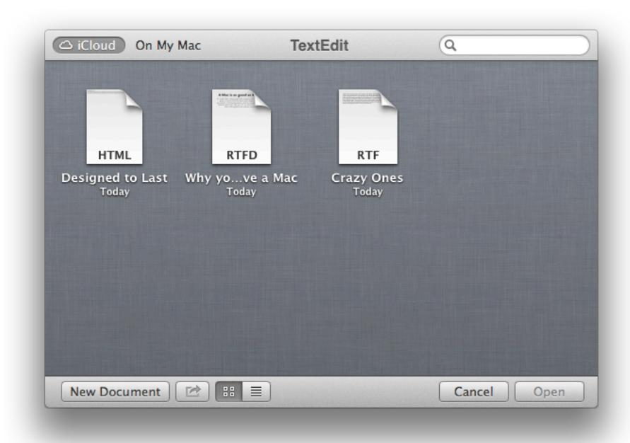

A fundamental aspect of the iCloud storage user experience is transparency: Ideally, users don't need to know where their content is located, and they should seldom have to think about which version of the content they're currently viewing. The following guidelines can help you provide this user experience in your app. Although there are a few guidelines that are platform specific, in general, the underlying motivation applies to iCloud storage for iOS and Mac apps.

**Respect the user's iCloud account.** It's important to remember that iCloud storage is a finite resource that users pay for. You should use iCloud storage to store information that users create, and avoid using it to store app resources or content that you can regenerate.

**Determine which types of information to store in iCloud storage.** In addition to storing documents and other user content, you can also store small amounts of key-value data in iCloud storage. For example, if users choose to sync iCloud Contacts, Mail stores their VIPs and Previous Recipients lists. These preferences are available to them on all Mac computers with OS X v10.8 installed.

If you store preferences in iCloud key-value storage, be sure that the preferences are ones that users are likely to want to have applied to all their devices. For example, Mail does not sync users' Downloads folder because it probably contains large files and users can still access these files through Mail on their other computers as needed. Additionally, it may makes sense for your app to keep track of which files are open, but not the exact window positions of those files. Note that in some cases, it can make sense to store preferences on your app's server, instead of in the user's iCloud account, so that the preferences are available regardless of whether iCloud is available.

**Make sure that your app behaves reasonably when iCloud storage is unavailable.** For example, if users sign out of their iCloud account or are not connected to the Internet, iCloud storage becomes unavailable. For document-based apps, the open panel shows that a document is Waiting if there are unsaved changes that have not yet been stored in iCloud. Your app does not need to inform users that iCloud storage is unavailable.

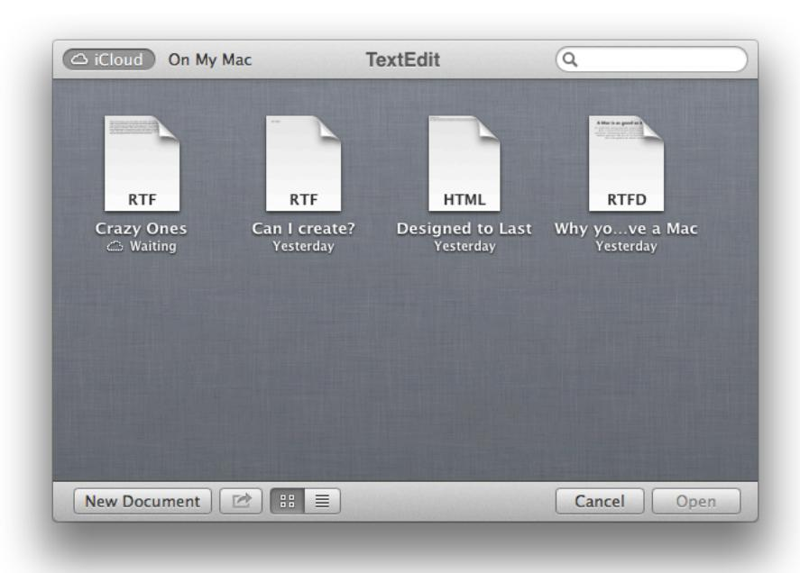

For non-document-based apps, it can be appropriate to show users that the changes they make will not be visible on other devices until they restore access to iCloud storage.

**If appropriate, make it easy for users to enable iCloud storage for your app.** On their Mac computers, users sign in to their iCloud account in iCloud Settings, and for the most part, they expect their apps to work with iCloud storage automatically. If you think users might want to choose whether to use iCloud storage with your app, you can provide a simple option that they set when your app opens. In most cases, a simple choice between using iCloud Storage or not for all user content should be sufficient.

**Allow users to choose which documents to store in iCloud.** When users have iCloud enabled, their documents are stored in iCloud by default. However, because iCloud storage is finite, users may choose to store content in iCloud on a file-by-file basis. To provide the appropriate user experience, users should be able to save a document on their Mac only, but iCloud should still be the default location.

**Warn users about the consequences of deleting a document.** When a user deletes a document in an app that uses iCloud storage, the document is removed from the user's iCloud account and all other devices. It's appropriate to display an alert that describesthisresult and to get confirmation before you perform the deletion.

**Tell users about conflicts as soon as possible, but only when necessary.** For document-based apps, OS X handles conflict resolution for you; you do not need to do additional work to warn users about conflicts. For other apps, first try to resolve most conflicts between different versions without involving the user using the iCloud storage programming interfaces. When this is not possible, make sure that you detect conflicts as soon as possible so that you can help users avoid wasting time on the wrong version of their content. You need to design an unobtrusive way to show users that a conflict exists; then, make it easy for users to differentiate between versions and make a decision.

**Be sure to include the user's iCloud content in searches.** Users with iCloud accounts tend to think of their content as being universally available, and they expect search results to reflect this view. If your app allows people to search their content, make sure you use the appropriate APIsto extend search to their iCloud accounts. See "Searching iCloud and the Desktop" to learn more.

### <span id="page-74-0"></span>Notification Center

Notification Center gives users a single, convenient place in which to view notifications from their apps. Users appreciate the unobtrusive interface of Notification Center, and they value the ability to customize the way each app can present its notifications.


Notification Center uses a sectioned list to display recent notification items from the apps that users are interested in.

Mac apps can use local or push notifications to let people know when interesting things happen, such as:

- A message has arrived.
- An event is about to occur.
- New data is available for download.
- The status of something has changed.

A **local notification** is scheduled by an app and delivered by OS X on the same device, regardless of whether the app is currently running in the foreground. For example, a calendar or to-do app can schedule a local notification to alert people of an upcoming meeting or due date.

A **push notification** is sent by an app's remote server to the Apple Push Notification Service, which pushes the notification to all devices that have the app installed. For example, a game that a user can play against remote opponents can update all players with the latest move.

You can still receive local and push notifications when your app is running in the foreground, but you pass the information to your users in an app-specific way.

Mac apps that support local or push notifications can participate in Notification Center in various ways, depending on the user's preferences. To ensure that users can customize their notification experience, you should support as many as possible of the following notification styles:

- Banner
- Alert
- Badge
- Sound

A **banner** is a small view that appears in the upper-right corner and then disappears after a few seconds. In addition to displaying your notification message, OS X displays the small version of your app icon in a banner, so that people can see at a glance which app is notifying them (to learn more about app icons, see ["About](#page-110-1) App Icon Genres and [Families"](#page-110-1) (page 111)).

An **alert** is a standard alert view that appears onscreen and requires user interaction to dismiss. An alert contains the alert message, informative text, action buttons, and your app icon. You have no control over the background appearance of the alert or the buttons. See ["Alerts"](#page-235-0) (page 236) for more information about using alerts.

A **badge** is a small red oval that displays the number of pending notification items (a badge appears over the upper-right corner of an app's icon in the Dock, similar to the unread messages badge in Mail shown here).


A badge contains only numbers, not letters or punctuation. You have no control over the size or color of a badge.

A custom or system-provided **sound** can accompany any of the other three notification delivery styles.

**Note:** Apps that use local notifications can provide banners, alerts, badges, and sounds. But an app that uses push notifications instead of local notifications can provide only the notification types that correspond to the push categoriesfor which the app isregistered. For example, if a push-notification app registers for alerts only, users aren't given the choice to receive badges or sounds when a notification arrives.

As you design the content that your notifications can deliver, be sure to observe the following guidelines.

**Respect users' Notification Center preferences.** In System Preferences, users can choose their preferred notification style for your app from the available formats. If your app uses all styles, users can choose whether to receive notifications as alerts, banners, or neither. They can choose whether to show badges and play sounds for your app. Additionally, users can choose to turn off all notifications. Respect users' notification preferences to ensure that your app provides information unobtrusively.

**Do not useNotification Centerto display error messages.** Although users can launch your app from Notification Center, notifications do not provide a way for usersto resolve a problem. If you need to display an error message or a message requiring some action, use an application-driven alert dialog. For example, if users need to be connected to the Internet in order to complete a task, you could inform users through an alert dialog with an action button labeled Turn WiFi On.

**Keep badge contents up to date.** It's especially important to update a badge as soon as users have attended to the new information, so that they don't think additional notifications have arrived. Note that setting the badge contents to zero also removes the related notification items from Notification Center.

**Don't use a badge to indicate information other than a pending notification.** Users can choose to turn off badges for your app. If your app uses a badge to provide critical information, these users will miss out.

**Don't try to copy the appearance of a badge.** If you mimic the appearance of a badge, users who have turned off badges may be frustrated that they appear to be receiving badge notifications anyway.

**Don't send multiple notifications for the same event.** Users can attend to notification items when they choose; the items don't disappear until users handle them in some way. If you send multiple notifications for the same event, you fill up the Notification Center list and users are likely to turn off notifications from your app.

**Choose an appropriate default style for your notifications.** Use an alert when you need to deliver information that users need to know about right now. Because banners disappear after a few seconds, do not use banners for information that is critical for users to see. And because alerts interrupt the user's workflow, it's best to use them only when users would rather be interrupted than miss your notification. If users become annoyed with alerts, they may turn off notifications for your app.

**Provide a custom message that does not include your app name.** Your custom message is displayed in alerts and banners, and in Notification Center list items. You should not include your app's name in your custom message, because OS X automatically displays the name with your message.

To be useful, a local or push notification message should:

- Not rely on alert buttons for users to understand the notification message. Because users can decide whether to receive your app's notifications as banners or alerts, make sure your message is clear in either style.
- Focus on the information, not on user actions. Avoid telling people which alert button to click or how to open your app.
- Be short enough to display in one or two lines. Long messages are difficult for users to read quickly, and they can force alerts to scroll.
- Use sentence-style capitalization and appropriate ending punctuation. When possible, use a complete sentence.

**Note:** In general, a Notification Center item can display more of a notification message than a banner can. If necessary, OS X truncates your message so that it fits well in each notification delivery style; for best results, you should not truncate your message.

**Label alert buttons with actions that clearly describe what the buttons do.** Provide custom titlesfor buttons in a notification alert if you provide custom behavior. For example, Reminders uses Snooze to allow you to repeat the alert at a later time. Remember that OS X may truncate the label to fit.

**Provide a sound that users can choose to hear when a notification arrives.** A sound can get people's attention when they're not looking at the device screen. Users might want to enable sounds when they're expecting a notification that they consider important. For example, a calendar app might play a sound with an alert that reminds people about an imminent event. Or a collaborative task management app might play a sound with a badge update to signal that a remote colleague has completed an assignment.

You can supply a custom sound, or you can use a built-in alert sound. If you create a custom sound, be sure it is short, distinctive, and professionally produced.

### <span id="page-78-0"></span>Sharing Service

Sharing allows users to share content directly from your app. The Share menu automatically includes some built-in services like AirDrop and Mail, but it only displays the services that make sense to share with that specific service. For example, Flickr (a photo-sharing service) appearsin the Share menu only if you are viewing a photo. You can also customize the menu to allow users to share to other services. In Safari, users can add a webpage to their reading list, bookmark it, or share it via Mail, Message, or Twitter, as shown here.

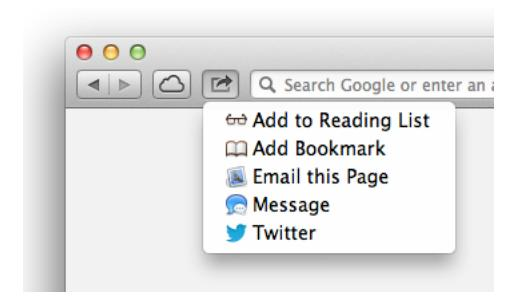

As you implement and customize the Share menu in your app, consider the following guidelines.

**In general, use the Share button for content users wantto share with other people.** When deciding whether to add a Share button in your app, consider whether users want to share their content with other people. This includes sending content directly via AirDrop, Mail, and Message, or posting it to a social sharing service such as Facebook, YouTube, or Flickr.

In particular, do not use the Share menu to edit content or to pass content between apps. For example, QuickTime Player uses a separate Export menu to send files to iTunes and iMovie or to reformat a file. Use an Action Menu for other actions that users may want to perform with their content, such as Duplicate, Move to Trash, or Get Info. The Share menu should not replace the Action menu. See ["Action](#page-262-0) Menu" (page 263) for more information.

**Add a Share item in your File menu.** Users should be able to share their content from the File menu as well as with the Share button. Make sure to provide the same menu items in both places. It's also best to use the same wording so that users readily recognize the available options.

**List built-in OS X services first in the Share menu.** If you add other services to the Share menu, make sure to list them after OS X apps (such as Mail, Message, and AirDrop). This order ensures a consistent user experience across all apps.

**Use a verb to label actions in the share menu (and a verb phrase for the first action).** For example, you might label your actions: Email this Page (not Mail), followed by Message, AirDrop, and so forth.

**Use title-style capitalization to label services.** As with all menu-item names, use title-style capitalization for the service title and, in general, avoid including definite or indefinite articles. (For more information about capitalization in the UI, see ["Capitalizing](#page-305-0) Labels and Text" (page 306).)

With Sharing Service on OS X, you can also integrate features of a specific social networking service directly into your app. For example, users can view the Facebook profile and photos of their contacts from a menu item in the Contacts app (as shown here). You can also generate HTTP requests to get and push content from available social services. Users appreciate when they can share content they care about and can view relevant social information from within your app.


Use the AppKit and Social frameworksto make sharing easierfor your users. See the *Social Framework Reference* for more information.

### <span id="page-80-0"></span>Game Center

Game Center allows user to track scores on a leaderboard, compare in-game achievements, invite friends to play a game, and start a multiplayer game through automatic matching.


Game Center functionality is provided in two parts:

- The Game Center app, where users sign in to their account, discover new games, add new friends, and browse leaderboards and achievements
- Game Center features that your app provides, such as multiplayer or turn-based games, in-game voice chat, and leaderboards

In your game, use the Game Kit APIsto postscores and achievementsto the Game Centerservice and to display leaderboards in your user interface. You can also use Game Kit APIs to help users find others to play with in a multiplayer game. . Note that to support Game Center in your Mac app, you must sign the app with a provisioning profile that enables Game Center.

**For most games, it's best to use the standard Game Center UI.** Although it may make sense for some games with a distinct aesthetic to customize the Game Center user interface, in general, it's appropriate to use the standard UI. This creates a consistent experience for users, because they recognize the look of Game Center features. Creating a custom Game Center UI to match your game's aesthetic is not necessarily a better experience for users.

**Use a consistent user interface for all versions of your game.** If you have an iOS version of your game, make sure that achievements and any other custom Game Center features have a similar appearance for all versions.

Keep in mind that your Mac app should still be designed specifically for the platform and should not be simply a copy of your iOS app. For example, your app icon, which appears in Game Center, should not be the same rounded rectangle icon from iOS. For more information about designing a great app icon, see "Icon [Design](#page-110-0) [Guidelines"](#page-110-0) (page 111).

**Do not add custom UI to prompt users to sign in to Game Center.** When users first launch your Game Center–enabled app, they are prompted to log in to Game Center (if they are not already logged in). Game Center takes care of presenting UI to the users and authenticating their account for you. You should not write your own code.

### <span id="page-81-0"></span>In-App Purchase

In-App Purchase allows users to purchase digital products within your app. For example, users could:

- Upgrade a basic version of an app to include premium features
- Renew a subscription for new monthly content
- Purchase virtual property, such as a new weapon in a fighting game
- Buy and download new books

With In-App Purchase, users can complete transactions in only a few clicks because their payment information is tracked and stored by the App Store. Your app can implement In-App Purchase to take advantage of the App Store's searcher payment processing. Use the Store Kit framework to embed a store directly in your app.

Store Kit prompts usersto authorize a purchase and then notifies your app so that you can provide the purchased items to the users. Store Kit does not provide functionality for presenting your store to the users, you must design this yourself. Note that all products you sell via In-App Purchase must be registered in the App Store. See the *In-App Purchase Programming Guide* for more information.

As you design the purchasing experience in your app, consider the following guidelines.

**Elegantly integrate your purchasing interface with your app.** When presenting productsfor usersto purchase and handling their transactions, create a seamless experience for your users. To entice users to purchase more, try to make In-App Purchase a thoughtfully designed aspect of your app and not a clumsy addition.

**Do not alter the default confirmation dialog.** When users choose to purchase a product, Store Kit presents a confirmation dialog. You should not try to override this dialog. It helps users avoid an accidental purchase.

### <span id="page-82-0"></span>Calendar

Calendar allows users to manage their schedules. They can create events, specify the time and location of an event, and invite others to join. You can integrate Calendar information directly into your app so that users do not need to look up or reenter information. With the Event Kit framework, you can access users' events and create, edit, or delete new events. See *Calendar and Reminders Programming Guide* for more information.

**Do not modify a user's Calendar data without permission.** Before creating, editing, or deleting a user's event, make sure you get permission from the user. Additionally, when you perform operations on a group of events that result in significant changes to the user's Calendar, make sure the user is fully informed of the action your app is about to perform.

### <span id="page-82-1"></span>Reminders

With Reminders, users keep track of tasks, to-dos, and events. Usersspecify the time and location of a reminder and mark it completed when it's finished. They can set alarms for their reminders that go off at a certain time or location. You can integrate information from Reminders directly into your app. Using the Event Kit framework, you can access users' reminders, and create, edit, or delete new reminders. Reminders and Calendars use the same framework and access the same Calendar database. See *Calendar and Reminders Programming Guide* for more information.

<span id="page-82-2"></span>**Do not modify a user's Reminder data without permission.** Before creating, editing, or deleting a user's reminder, make sure you get permission from the user. Additionally, when you perform operations on a group of reminders that result in significant changes to the user's data, make sure the user is fully informed of the action your app is about to perform.

### Contacts

Contacts helps users keep track of their contacts, storing information such as names, phone numbers, fax numbers, and email addresses. Users appreciate apps that access this information automatically so that they don't have to look it up or reenter it more than necessary.

When you use the Address Book framework, you can access contact information from the user's database or display it in a customizable window within your app. You can also customize the user's Contacts experience by supplying a plug-in that performs an action when users Control-click a labeled item, such as a name or phone number.

One way to customize a contact-information window is to display only the data relevant to your app. For example, Mail customizes this window to focus on the email addresses of the contacts, as shown below.

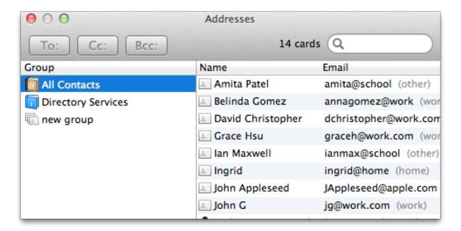

The following guidelines help you provide a good user experience as you integrate Contacts information in your app and develop action plug-ins.

**Don't use developer terms in your UI.** In particular, don't use the terms *people picker* or *picker*. Although the Address Book framework uses these terms, they are not suitable user terms. In particular, you should name a custom contact-information window in a way that describes its contents as they relate to your app, such as Addresses or Contacts. (To learn about additional terms that you should avoid in your UI, see "Use [User-Centric](#page-60-0) [Terminology"](#page-60-0) (page 61).)

**Limit to a single window new UI that is displayed by an action plug-in.** For example, the Large Type action uses a very large font to display the selected phone number in a single window. If you develop an action that needs to do more than display information in a single window, it should launch a separate app.

**Don't add UI to the Contacts app itself.** In particular, there is no reason to add a pane to Contacts preferences. Instead, use the Contacts programming interfaces to make sure that your action plug-in name appears in the contextual menu users see when they Control-click an item.

<span id="page-83-0"></span>To learn more about working with the Address Book framework,see *Address Book Programming Guide for Mac* .

### Accessibility

OS X integrates many accessibility features that help people with disabilities or special needs customize their Mac experience.

As you incorporate accessibility into your app, keep the following guidelines in mind.

**Focus first on ease of use.** An easy-to-use app provides the best experience for all users. To make sure that users who use assistive technologies (such as VoiceOver or a braille display) can benefit fully from your app, you might need to supply some descriptive information about the UI. To learn about the programmatic steps you need to take to supply accessibility information, see *Accessibility Overview for OS X* .

**Don't override the built-in OS X accessibility features.** Users expect to be able to use accessibility features, such as the ability to perform all UI functions using the keyboard, regardless of the app they're currently using. Users can access these features in the Universal Access and Keyboard panes of System Preferences.

**Avoid relying solely on one type of cue to convey importantinformation in your app.** For example, although the judicious use of color can enhance the UI, color coding should always be redundant to other types of cues, such as text, position, or highlighting. Allowing users to select from a variety of colors to convey information enables them to choose colors appropriate for their needs. Similarly, it's best when sound cues are available visually as well. Because

7 allows usersto specify a visual cue in addition to the standard audible system alert, be sure to use the standard system alert when you need to get the user's attention.

**Don't override keyboard navigation settings.** In addition, don't override the keyboard shortcuts used by assistive technologies. When an assistive technology is enabled, keyboard shortcuts used by that technology take precedence over the ones defined in your app. To learn more about system-defined keyboard shortcuts, see ["Keyboard](#page-309-0) Shortcuts" (page 310).

### <span id="page-84-0"></span>Internationalization

As early as possible in the design process, build in support for internationalization and localization so that as many people as possible can use your app. Internationalization and localization can take a significant amount of time to do well; follow the guidelines in this section to help streamline the process. To get more details about internationalization and localization, read *Internationalization Programming Topics*.

**Plan to localize visible UI elements.** That is, make sure the UI elements in your app can be translated into other languages and otherwise adapted for use in other countries. Note that when you use the Autolayout feature in Interface Builder, you can specify how text and other UI elements are related so that localizers don't have to redesign your layout to accommodate different lengths of text. To learn more about the advantages of Autolayout, see "Cocoa Autolayout" in *Mac Technology Overview*.

In addition to translating text, be prepared to adjust your use of color, graphics, and representations of time and money. Examine your use ofspecific objects orsymbols(such as electrical outlets and the currency symbol) as they may have a different appearance, or not be understood, in other countries.

**Pay attention to the possible meanings of the graphics and symbols in your app.** Make sure your graphics and symbols are unambiguous and inoffensive to all, or prepare to localize them. For example, if you use images of American holidays to represent seasons—such as Christmas trees, pumpkins, or fireworks—be sure to localize them for cultures that are not familiar with those holidays.

**Be aware of the user's locale preferences.** In the Formats pane of Language & Text preferences, OS X allows users to customize the way dates, times, and number-based data (such as monetary values or measurements) are displayed. Most APIstake these preferencesinto account when getting or formatting thistype of information, so you should not have to perform custom formatting or conversion tasks.

**Support different address formats.** Don't assume that all of the user's contacts have addresses that are in the same format as the user's address. Contacts helps users keep track of contacts all over the world by supporting different regions and allowing customization of any format. If you support or display Contacts data, be prepared to handle different address formats and postal code information.

**Make your text easy to translate.** Translating text is a sophisticated, delicate task. Avoid using colloquial phrases or nonstandard usage and syntax that can be difficult to translate. Carefully choose words for menu commands, dialogs, and help text. Be aware that text in U.S. English can grow up to 50 percent longer when translated to other languages.

**Use complete sentences in string resources whenever possible.** Grammar problems may arise when you concatenate multiple strings to create sentences; the word order may become completely different in another language, rendering the message nonsensical when translated. For example, word order in German sometimes places the verb at the end of a sentence. For more information on handling text in other languages, see "Guidelines for Internationalization".

**As much as possible, identify the logical flow of content and use that to determine the layout of your UI.** For example, the more important or higher level objects are usually placed near the upper left of a window that is designed for regions associated with left-to-right languages. In a version of the window that targets users who read right-to-left languages, it makes sense to reverse this layout. The more you can characterize user interface objects according to their logical, not visual, position, the more easily you can extend your app to other markets.

### <span id="page-86-0"></span>The Colors Window

OS X provides a standard panel for picking colors. The Colors window (shown below) lets users enter color data using any of five different color models.


If your app deals with color, you may need a way for the user to enter color information. Be sure to use the Colors window rather than create a custom interface for color selection. For information on how to use this window in your app, see *Color Programming Topics*.

### <span id="page-87-0"></span>The Fonts Window

OS X provides a standard panel for picking fonts. As shown below, the standard Fonts window also includes several controls for adjusting a font's characteristics. (The minimal version of the Fonts window allows users to choose a font, typeface, and size.)

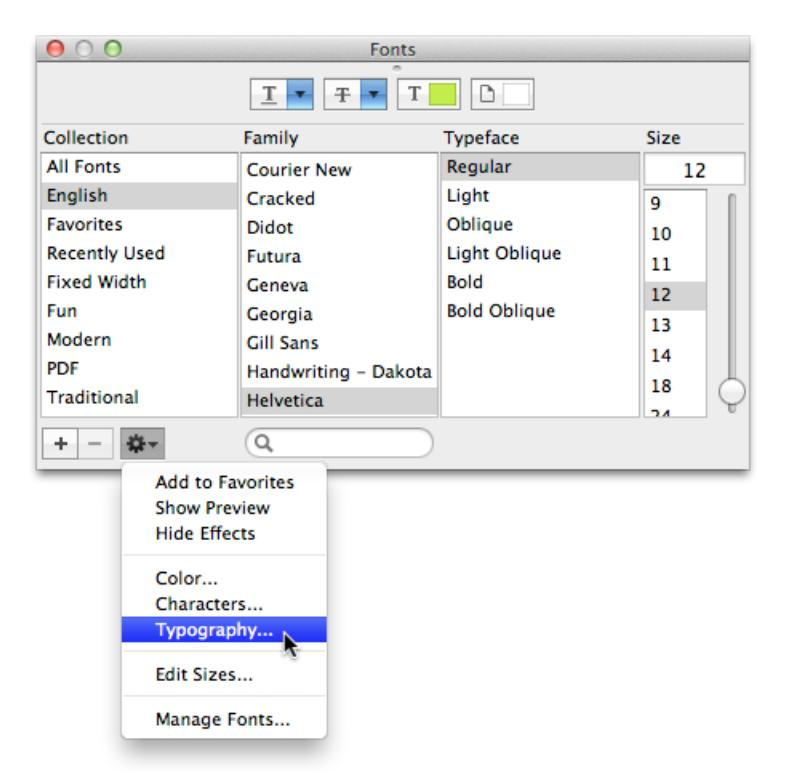

If your app supports typography and text layout using user-selectable fonts, you should use the Fonts window to obtain the user's font selection rather than create a custom font-picker window.

The standard Fonts window also provides advanced typography controls for fonts that support those options. The user can open a Typography inspector by choosing Typography from the action menu (shown above). For example, the Typography inspector shows the typography controls for the Zapfino font.


For more information about enabling fontselection and management in your app,see *Font Panel Programming Topics* and *Font Handling* .

### <span id="page-89-0"></span>Automator

Automator helps users automate common procedures and build workflows by arranging processes from different apps into a desired order. Familiar Apple apps, such as Mail, iPhoto, and Safari make their tasks available to users to organize into a workflow. These tasks (called *actions*) are simple and narrowly defined, such as opening a file or applying a filter, so a user can include them in different workflows.

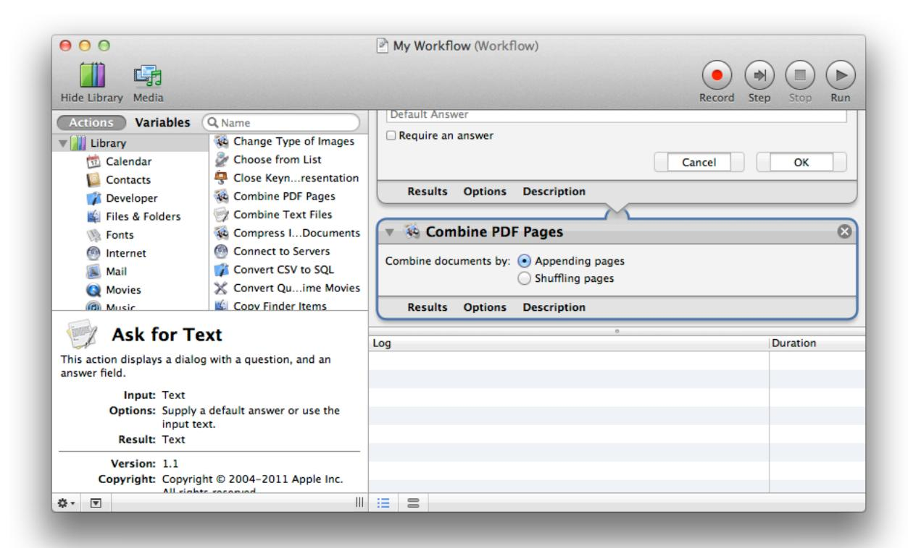

As an app developer, you can define Automator actionsthat represent discrete tasksthat your app can perform. You make an action available to users by creating an action plug-in, which contains a nib file and code that manages the action's user interface and implements its behavior. You might consider creating a set of basic actions to ship with your app so that users have a starting point for using your app's tasks with Automator. For more information on developing Automator actions, see *Automator Programming Guide* .

As you design the UI of an action, keep the following guidelines in mind.

**Minimize the height of an action.** Users stack actions on top of each other in Automator. Because display screens are wider than they are tall, you should minimize an action's use of vertical space. One way to do this is to use a pop-up menu instead of radio buttons, even if there are only two choices.

**Don't use group boxes.** An action does not need to separate or group controls with a group box.

**Avoid tab views.** Instead, use hidden tab views to alternate between different sets of controls.

**Avoid using labels to repeatthe action's title or description.** Labelsthat repeat information available elsewhere take up space without providing value.

**Conserve space by using the appropriate controls and layout.** For example, you can use a disclosure triangle to hide and display optional settings. (For more information on disclosure triangles, see ["Disclosure](#page-289-0) [Triangle"](#page-289-0) (page 290).) Overall, you should use the small size of Aqua controls and 10-point margins to make the best use of space.

**Provide feedback.** Use the appropriate progress indicator when an action needs time to complete (for more information about different types of progress indicators, see "Progress [Indicators"](#page-276-1) (page 277)).

### <span id="page-90-0"></span>Printing

OS X includes an advanced printing system. Users appreciate the extensive printing options that are available and they expect to be able to access them regardless of the app they're using. Fortunately, when you use the OS X printing system in your app, the printing features are easy to make available to users.

**Use the standard printing dialog instead of creating a custom dialog.** Because of all the options the OS X printing system provides, it is important to use the standard printing dialog with which users are familiar.


For information about the standard printing dialog, see "The Print and Page Setup [Dialogs"](#page-227-0) (page 228). For general information about the printing system, see *OS X Printing System Overview*. For information on how to extend the Print dialog to include additional options, see *Extending Printing Dialogs*.

### <span id="page-91-0"></span>Security

Users appreciate the security of the OS X environment and they expect their apps to be equally secure. When you take advantage of OS X security technologies, you can store secret information locally, authorize a user for specific operations, or transport information securely across a network.

Keep the following guidelines in mind when your app needs to work with sensitive information or perform tasks in a secure environment.

**Factor out code that requires privileged access into a separate process.** Factoring isolates the secure code from the nonsecure code and makes it easier to verify that no rogue operations are occurring that could do damage, whether intentionally or unintentionally.

**Avoid storing passwords and secrets in plain-text files.** Even if you restrict access to the file using file permissions, sensitive information is much safer in a keychain.

**Avoid inventing your own authentication schemes.** If you want a client-server operation to be secure, use the authorization APIs to guarantee the identity of the client.

**Be wary of the code you load or call from privileged code.** For example, you should avoid loading plug-ins from privileged code, because plug-ins receive the same privileges as the parent process. You should also avoid calling potentially dangerous functions, such as system or popen, from privileged code.

**Avoid making inappropriate assumptions.** For example, you should not assume that only one user is logged in. Because of fast user switching, multiple users may be active on the same system (for more information, see *Multiple User Environment Programming Topics*). Also, you should not assume that keychains are always stored as files.

**When feasible, avoid relying solely on passwords for authentication.** Be prepared to take advantage of other technologies, such as smart cards or biometric devices.

**Use Keychain Services to store sensitive information, such as credit card numbers and passwords.** The keychain mechanism in OS X provides the following benefits:

- It provides a secure, predictable, consistent experience for users when dealing with their private information.
- Users can modify settings for all of their passwords as a group or create separate keychains for different activities, with each keychain having its own activation settings. (By default, passwords are modified as a group.)

● The Keychain Access app provides a simple UI for managing keychains and their settings, relieving you of this task.

To get started learning about security in OS X, see *Security Overview*.

### <span id="page-92-0"></span>Preferences

Preferences are user-defined settings that your app remembers from session to session. Users expect to be able to customize the appearance and behavior of your app in preferences. For example, in Finder preferences, users can customize the contents of Finder windows and the behavior of File > New Finder Window, among other things.


**Be picky about which app features should have preferences.** Avoid implementing all the preferences you can think of. Instead, be decisive and focus your preferences on the features users might really want to modify. **Don't provide preferences that affect systemwide settings.** For example, if users want to change the size of sidebar icons or change the visibility of the running-app indicator in the Dock, they can do so in System Preferences. In particular, your app should not encourage usersto change the way your app handles automatic saving of their content; this is a system feature that users expect to rely on in all the apps they use.

**As much as possible, ensure that users rarely need to reset preferences.** Ideally, preferencesinclude settings that users might want to change only once. If there are settings users might want to change every time they open your app, or every time they perform a certain task, don't put these settings in preferences. Instead, you could use a menu item or a control in a panel to gives user modeless access to these settings.

**Don't provide a preferences toolbar item.** Because the toolbar should contain only frequently used items, it does not make sense to include a preferences item in it. Instead, make app-level preferences available in the app menu (for more information, see "The App [Menu"](#page-147-0) (page 148)); and make document-specific preferences available in the File menu (for more information, see "The File [Menu"](#page-148-0) (page 149)).

To learn more about implementing preferences using Cocoa,see *Preferences and Settings Programming Guide* . For information on implementing preferences using Core Foundation, see *Preferences Programming Topics for Core Foundation* .

### <span id="page-93-0"></span>Bonjour

Bonjour enables automatic discovery of computers, devices, and services on IP networks, and makes file and media sharing easy. If your app needs to communicate with other computers and processes on the Internet or a local area network, you should avoid making assumptions about the user's network settings. In particular, you should not save settings based on the user's IP address, because it might change many times during a single session.

<span id="page-93-1"></span>Use Bonjour to support user mobility and free users from the app-management task of having to enter an IP address. For more information about Bonjour, see *Bonjour Overview*.

### Services

OS X services are features that apps can make available to each other. Using services, you can share your app's resources and capabilities with other apps and, in turn, allow your users to take advantage of resources and capabilities that other apps provide.

By default, the app menu contains a Services submenu that lists services that are appropriate for the currently selected or targeted content in your app. Thissubmenu automatically includes a command that opens Services preferences in Keyboard Shortcuts preferences. The services listed in the submenu can be provided by apps installed anywhere on the system. For example, the Services that are available when an image file is selected in a Finder window can include options for using it as the desktop picture and opening with a specific app.

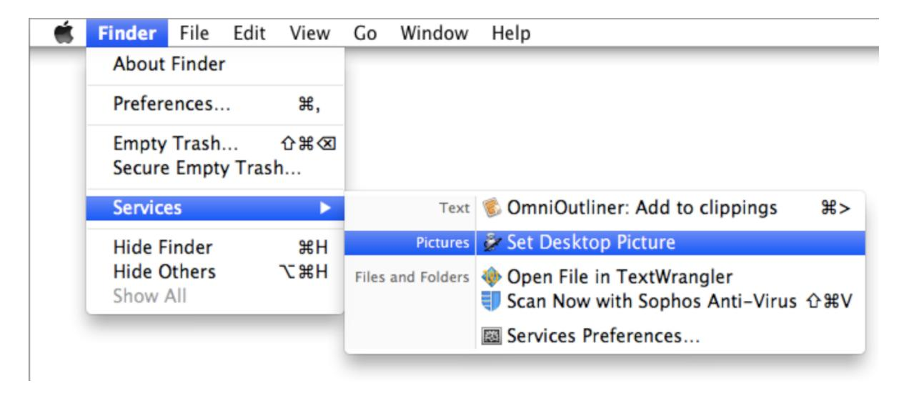

To vend services to other apps, your app provides information about each service, such as:

- The data types on which it operates
- The command that can appear in the Services menu
- The keyboard shortcut for invoking the command, if appropriate. Note that if the keyboard shortcut you choose conflicts with a keyboard shortcut used by the current "host" app, the host app'sshortcut is always used.

To learn the programmatic steps you need to take both to provide services and to take advantage of them, read *Services Implementation Guide* .

To ensure a good user experience, follow these guidelines when defining the servicesthat your app can provide.

**Give each service a short, focused title that describes exactly what it does.** Strive to create a unique service title. If there are two or more services with identical names, the app name is automatically displayed after each service to distinguish them.

**Use proper capitalization in your service title.** As with all menu-item names, use title-style capitalization for the service title and, in general, avoid including definite or indefinite articles. Good examples are "Look Up in Dictionary" and "Make New Sticky Note." (For more information about capitalization in the UI,see ["Capitalizing](#page-305-0) [Labels](#page-305-0) and Text" (page 306).)

**Avoid providing an "Open in My App" service.** Instead, users can view the apps that can open a selected file in the Open With menu item of the Finder.

**Don't use services for sharing users content.** For sharing to other apps and social services, use a ["Sharing](#page-78-0) [Service"](#page-78-0) (page 79).

### <span id="page-95-0"></span>Speech

OS X providesspeech technologiesthat allow software to recognize and speak U.S. English. These technologies provide benefits for all users and enable new paradigms in human-computer interaction.

**Speech recognition** is the ability for the computer to recognize and respond to a person's speech. OS X users can choose to control their computer by voice; consequently,speech-recognition technology is very important for both people with special needs and general users.

Using speech recognition, users can accomplish tasks comprising multiple steps—for example, "Schedule a meeting next Friday at 3 p.m. with John, Paul, and George" or "Create a 3-by-3 table"—with one spoken command. Developers can take advantage of the speech engine and API included with OS X, as well as the built-in user interface. (The system-provided speech feedback window is shown here.)


**Speech synthesis**, also called text-to-speech (TTS), converts text into audible speech. You might want to use speech synthesis to deliver information to users without forcing them to shift attention from their current task. For example, an app could, in the background, deliver messages such as "Your download is complete; one of the files has been corrupted" or "You have email from your boss; would you like to read it now?"

TTS is also crucial for users with vision or attention disabilities. As with speech recognition, OS X TTS provides both an API and several UI features.

For information about implementing speech synthesis and recognition, see *Speech Synthesis Programming Guide* and *Speech Recognition Manager Reference* .

### <span id="page-96-0"></span>Auto Layout

Consider how you would want a text label in your app to adapt when users resize a window, adjust the font size, or switch to a different language. With Cocoa Auto Layout, you create user interface constraints to ensure that your app adjusts gracefully to changes. Constraints allow you to design elements of your user interface in relation to each other.

You specify constraintsin Interface Builder with Xcode or create them programmatically using ASCII-art inspired format strings. See *Cocoa Auto Layout Guide* for more information about how to design your app with Auto Layout.

### <span id="page-96-1"></span>Drag and Drop

Drag and drop is a fundamental direct-manipulation technology that makes it easy for users to interact with their content. Users expect to be able to drag any selectable item—such as a section of text, a file, an image, or an icon—and drop it in a new location.

In addition to handling users' data without loss, supporting drag and drop is largely a matter of providing appropriate feedback. Specifically, users need to know:

- Whether drag and drop is possible for an item (indicated by drag feedback)
- What the results of a drag-and-drop operation will be (indicated by destination feedback)
- Whether a drag-and-drop operation was successful (indicated by drop feedback)

The following guidelines help you provide a drag-and-drop experience that users appreciate.

**As much as possible, provide alternative methods for accomplishing drag-and-drop tasks.** For some users, especially those who use assistive technologiesto interact with your app, drag and drop is difficult or impossible to perform. Except in cases where drag and drop is so intrinsic to an app that no suitable alternative methods exist—dragging icons in the Finder, for example—there should always be another method for accomplishing a drag-and-drop task.

**Determine whether a drag-and-drop operation should result in a move or a copy.** In general, if the source and destination are in the same container, such as the same window or volume, a drag-and-drop operation is interpreted as a **move** (that is, cut and paste). If the source and destination are in different containers, a drag-and-drop operation is interpreted as a **copy** (that is, copy and paste).

As much as possible, you should also consider the underlying data structure of the contents in the destination container. For example, if your app allows two windows to display the same document (multiple views of the same data), a drag-and-drop operation between these two windows should result in a move.

**Note:** Users can force a drag-and-drop operation within the same container to behave like a copy by pressing the Option key while dragging. If users press the Option key while dragging content between two different containers it has no effect; that is, the drag-and-drop operation is still interpreted as a copy because the source and destination are not the same.

Dragging an item to the Trash is considered a move operation, even though the Trash is a separate container. However, users can still avoid data loss because they can undo the action by dragging the item out of the Trash and back to its original location.

**Check forthe Option key at drop time.** This behavior givesthe user the flexibility of making the move-or-copy decision at a later point in the drag-and-drop sequence. Pressing the Option key during the drag-and-drop sequence should not "latch" for the remainder of the sequence.

**Support single-gesture selection and dragging, when appropriate.** Using a mouse or a trackpad, users can drag an item by selecting it and immediately beginning to drag, instead of by selecting the item, pausing, and then dragging. (The automatic selection of the item that can occur in thissituation is called **implicit selection**.) Note thatsingle-gesture selection and dragging is *not* possible when the userselects multiple items by dragging or by clicking individual items while holding the Command key, because multiple selection cannot be implicit. **Allow users to drag a selection from an inactive window.** Users expect to be able to drag items they selected previously into the currently active window. To support this action, your app should maintain the user'sselection when the containing window becomes inactive. A persistent selection in an inactive window is called a **background selection** and it has a different appearance from a selection in an active window.

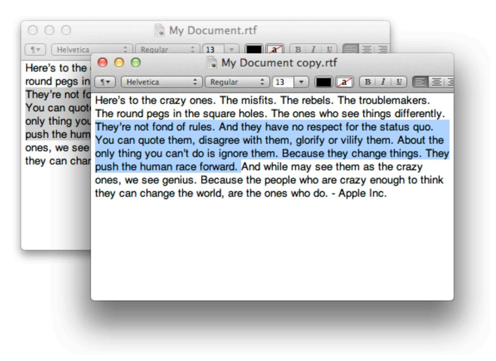

In particular, support background selection for items that users must select by range, such as text or a group of icons. If you don't support background selection for range-selected items, the user must reactivate the window and reselect the items before dragging them. Support for background selection is not required if the item the user wants to drag is discrete—for example, an icon or graphical object—because implicit selection can occur when a discrete item is dragged. Note that when an inactive window is made key, the appearance of a background selection changesto the appearance of a standard selection. To learn more about the different states a window can have, see "Main, Key, and Inactive [Windows"](#page-174-0) (page 175).

**Provide drag feedback as soon as users drag an item at least three points.** Display a translucent image of the item at the beginning of the drag so that users can confirm the item that they're dragging. After the user begins a drag, the item should stay draggable, and the drag image should stay visible, until the user drops the item. For example, as soon as the user begins to drag a PDF document, an image of the document appears to lift up under the pointer.


**Display a drag image composed of multiple items, if appropriate.** If the user selects multiple items to drag, you should display a drag image composed of images that represent each item. In addition, you should badge the aggregate drag image with the number of items being dragged so that users can confirm how many items they're dragging. For example, dragging five files into a Mail message might look like this:


**Change the drag image to show the dropped form of the item, if appropriate.** If it helps users understand how your app can handle an item, you can change its drag image when it enters a destination region in your app. For example, when the user drags a picture file from the desktop into a TextEdit document, the picture expands to show how it will look after the user drops it in the document.

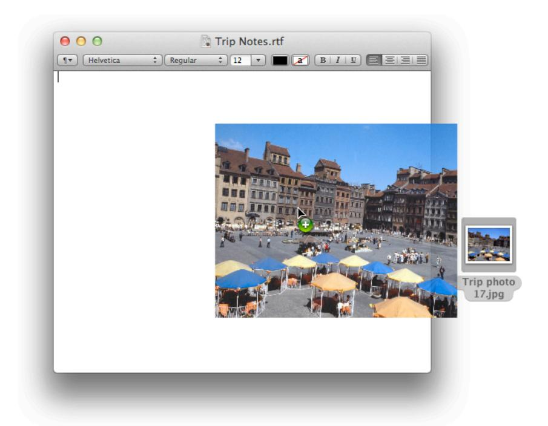

Although changing the drag image can provide valuable feedback, you want to avoid creating a distracting drag-and-drop experience in which drag images are constantly (and radically) changing form.

**Use the appropriate pointer to indicate what will happen when the user drops an item.** For example, when users drag an icon into a toolbar, the copy pointer appears to indicate that if they let go of it there, the item will be added to the toolbar. Other pointers that provide useful destination feedback include the alias, poof, and not allowed pointers. (For more information about system-provided pointers, see "Use the Right [Pointer](#page-55-0) for the [Job"](#page-55-0) (page 56).)

**Update the badge of a multi-item drag when appropriate.** If the destination can accept only a subset of a multi-item drag, change the number in the badge to indicate how many of the items will be accepted.

**Highlight the destination region as soon as the pointer enters it and stop highlighting when the pointer leaves the region.** If there are multiple destination regions within a window, highlight one destination region at a time.

**Don't highlight the destination region if the drag-and-drop operation takes place entirely within it.** For example, moving a document icon to a different location in the same folder window does not highlight the folder window because this would be confusing to the user. Do highlight the destination region if the user drags an item completely out of the region and then drags the same item back into the same region again.

**In text, use a vertical insertion indicator to show where the dragged item will be inserted.** Note that an insertion indicator is separate from the pointer. The pointer indicates to users whether the drag is valid and whether it is interpreted as a copy.

**In a list, use a horizontal insertion indicator to show where the item will be inserted.** For example, when a user drags an item into the Finder sidebar, a horizontal insertion indicator appears.


**In a table, consider highlighting specific cells to show where the item will end up.** When you provide highly targeted destination feedback such as this, you help users avoid having to rearrange their content later.

**Highlight dropped text at its destination.** If the destination supports styled text, the dropped text should maintain its font, typeface, and size attributes. If the destination does not support styled text, the dropped text should assume the font, typeface, and size attributes specified by the destination insertion point.

**Provide additional feedback if the drop initiates a process.** For example, if the user drops an item onto an icon that represents a task (such as printing), show that the task has begun and keep the user informed of the task's progress.

**Make sure users know when a dropped item cannot be accepted.** When the user drops an item on a destination that does not accept it, the item zooms from the pointer location back to its source location (this behavior is called a **zoomback**). A zoomback should also occur when a drop inside a valid destination does not result in a successful operation.

**At the destination, accept the portion of the dragged item that makes sense.** In your app, a destination should be able to extract the relevant data from the item the user drops. For example, if a user drags an Contacts entry to the "To" text field in Mail, only the email address is accepted, not the rest of the contact's address information.

**Display the appropriate post-drag selection state.** After a successful drag-and-drop operation involving a single window, the selection state is maintained at the new location. This behavior shows the location of the dropped item and allows the user to reposition the item without having to select it again. Also:

- If the user drags an item from an active window to an inactive window, the dragged item becomes a background selection at the destination. The active window should maintain the item's selected state.
- When content is dropped into a window in which something is already selected, you should deselect everything in the destination before the drop rather than replace the selection with the dragged item. Deselecting everything in the destination helps the user avoid accidental data loss.

**Automatically scroll a destination window when appropriate.** When an item is being dragged, your app must determine whether to scroll the contents or allow the item to "escape" the window. If your app allows items to be dragged outside of windows, you should define an automatic scrolling region. Automatically scroll a destination window only if it is also the source window and is frontmost. Don't automatically scroll inactive windows.

**Display a confirmation dialog when a drag-and-drop operation is not undoable.** Although it's best to support undo for the drag-and-drop operations in your app, it's not always possible. For example, if the user attempts to drop an icon into a write-only drop box on a shared volume, the action is not undoable because the user doesn't have privileges to open the drop box and reverse the drag. In such cases, it's important to use a confirmation dialog to tell the user that their drag-and-drop operation cannot be reversed.

**Create a clipping or other item to contain content that users drag from your app to the Trash.** A **clipping** is an intermediate form of content that has been dragged from a source location but has not yet been dragged to its final destination. For example, OS X allows users to drag content to a Finder window (or to the desktop) and then, in a later step, drag the content to another destination. (Note that a clipping has no relation to the Clipboard: Copying to the Clipboard and creating drag-and-drop clippings do not interfere with each other.)

### <span id="page-102-0"></span>Auto Save and Versions

Document-based apps can free users from having to save their work explicitly or worry about losing unsaved changes. When document-based apps enable Auto Save, the system automatically writes document data to disk as needed, without necessarily creating additional copies.

Versions displays an immersive interface in which users can browse earlier versions of their document and replace their working document with a previous version. Auto Save and Versions work together to reduce file-management tasks and help users focus on creating content.


If your app is document-based, you can enable Auto Save with comparatively little effort. (When you adopt Auto Save, version browsing is enabled automatically.) To learn the programmatic steps you need to take to opt in to Auto Save, see "Documents Are Automatically Saved" in *Mac App Programming Guide* .

In OS X v.10.8, if your document-based app is iCloud-enabled, untitled documents are automatically saved in iCloud as soon as the users begins editing. (If your app is not iCloud-enabled, these documents are saved in the user's Documents folder.) See "iCloud [Storage"](#page-70-1) (page 71) to learn more about iCloud.

To help users enjoy the full benefits of Auto Save and Versions in your app, follow these guidelines:

**Avoid implying that users will lose their work unless they choose File > Save.** You want to help users understand that your app will always save their work unless they explicitly choose to discard it. In particular, you want to help users learn that the primary use for the Save command is to give them the opportunity to specify the name and location of a document, not to save their content. A good way to emphasize this point is to automatically save content in an untitled document unless the user closes the window and declines to name the document.

**As much as possible, avoid displaying a dot in the document window's close button.** In earlier versions of OS X, a document with unsaved changes always displayed a dot in the close button, which indicated the "dirty state." To encourage users to embrace the Auto Save experience, you want them to get out of the habit of checking the close button to see if they need to save their work. In general, only apps that are not document-based should regularly display a dot to indicate unsaved changes.

**Note:** In rare case when Auto Save is unavailable for some reason—for example, the user's disk is full—a document-based app might need to display a dot in the close button. In such cases, the versions menu that appears to the right of the document title also changes to display "Not Saved."

When possible, you should also avoid displaying a dot next to a document's name in the Window menu. To learn more about the contents of the Window menu, see "The [Window](#page-158-1) Menu" (page 159).

**Don't ask users to save when they log out, restart, or quit your app.** Users should not be presented with a Save dialog unless they explicitly close a document window that contains content that has never been named. When a document window closes as the result of another action (such as when the user logs out) the content should be automatically saved even if the user has never titled it. In this way, the user's work is automatically saved in all circumstances, unless the user explicitly chooses to throw it away.

### <span id="page-105-0"></span>Spotlight

Spotlight is a powerful OS X search technology that makes searching for files on the computer as easy as searching the web. Using Spotlight, users can search for things using attributes that have meaning for them, such as the intended audience for a document, the orientation of an image, or the key signature of the music in an audio file. Information like this (called metadata) is embedded in a file by the app that created it.

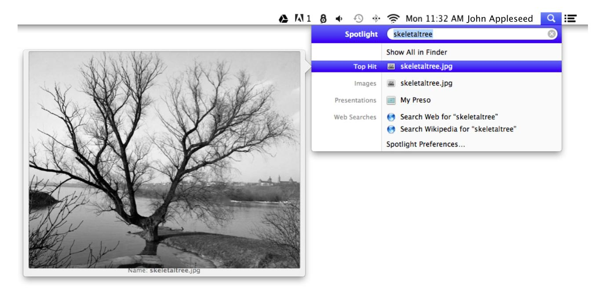

Spotlight is also available to developers to help them find files to display, plug-ins to load, and data to use in their apps. The guidelinesin thissection help you extend Spotlight capabilitiesto your users and take advantage of its benefits in your app.

**Use Spotlightto give advanced file-search capabilities to users within the context of your app.** For example, you might choose to replicate the Spotlight contextual-menu item, using a button that initiates a Spotlight search for the user's selected text. You might then display a custom window that contains all the search results or a filtered subset of them.

**Consider providing Spotlight-powered search instead of a Finder-based Open dialog.** Users often need to work on a file that was saved in an atypical place or given an unexpected or forgotten name. If you offer only a Finder-based Open dialog, it might force the user to waste time navigating the file system, trying to remember what the file was named and where it wassaved. Instead, provide a Spotlight-powered search that allows users to search the entire file system, using attributes that are meaningful to them.

**Consider using Spotlight behind the scenes to find needed files or plug-ins.** For example, an app that provides a back-up service might allow usersto choose a broad category of file type to back up,such asimages. Instead of asking users to identify all the folders that contain their images or only backing up a Pictures folder, the app could perform a Spotlight search to find every image file in the file system, regardless of its location.

**Use Search Kit (not Spotlight) to do fine-grained textual searching within a document.** Spotlight is tuned to search for files; it's not intended to do extensive text-based searching within a document. An app thatstores data in database records, for example, should not base its database search on Spotlight because the data are not stored in separate files. For more information on using Search Kit in your app, see *Search Kit Programming Guide* .

**Include aQuick Look generatorif your app creates documents in an uncommon or custom format.** Spotlight uses Quick Look technology to display thumbnails and full-size previews of the documentsreturned in a search. If your app produces documents in common content types, such as HTML, RTF, plain text, TIFF, PNG, JPEG, PDF, and QuickTime movies, Spotlight can display the thumbnails and previews automatically. Otherwise, you should include a Quick Look generator to convert your native document format into a format Spotlight can display. To learn how to create a Quick Look generator, see *Quick Look Programming Guide* .

**Be sure to supply a plug-in that describes the types of metadata your file format contains.** Supplying this plug-in (called a Spotlight importer) ensures that users can search for the files your app creates using the attributes described by the metadata your files contain. For comprehensive information on how to create a Spotlight importer, see *Spotlight Importer Programming Guide* .

### <span id="page-106-0"></span>User Assistance

OS X supports two user help features: Help tags and Apple Help. **Help tags** allow you to provide temporary context-sensitive help whereas **Apple Help** allows you to provide a more thorough discussion of a topic or task.

**For the best user experience, don't create a custom help feature**. When users refer to help, it is usually because they are having difficulty accomplishing a task, which means they might be frustrated. This is not a good time to make them learn yet another task, such as figuring out a help viewing mechanism that differs from the one they use in all the other apps on their computer.

Using Apple Help, you can display HTML files in **Help Viewer**, a browser-like app designed for displaying and searching help documents. Help Viewer can also display documents containing QuickTime content, open AppleScript-based automations, retrieve updated help content from the Internet, and provide context-sensitive assistance.

Although users can access Apple Help by launching the Help Viewer app, they will more commonly access it from your app, in one of the following three ways:

- **The Help menu.** The Help menu is the last app menu item in the menu bar (in left-to-right systems, the Help menu is on the right). When you register your help book with Help Viewer, the first item in the Help menu is the system-provided Spotlight For Help search field. The second item in the menu should be *AppName* Help, which opens Help Viewer to the first page of your help content. For more information on the Help menu, see "The Help [Menu"](#page-160-0) (page 161).
- **Help buttons.** A Help button provides easy access to specific sections of your help book. When a user clicks a Help button in your UI, you send to Help Viewer either a search term or an anchor lookup.
- **From a contextual menu item.** If contextually appropriate help content is available for the object the user has Control-clicked, the first item in the contextual menu is Help. As with Help buttons, this menu item can send either a search term or an anchor lookup to Help Viewer.

**Only display a Help button in a window when there is contextually relevant help available.** It's not necessary for every dialog and window in your app to include a Help button. Because the Help menu is available, users always have another way to access your help content. For more information on writing Apple Help content and providing it with your app, see *Apple Help Programming Guide* .

Help tags allow you to provide basic help information for interface elements in your app without requiring users to shift their focus away from the primary interface.

Help tags are short messages that appear when the user allows the pointer to rest on an interface element for a few seconds. When the pointer leaves the object, the tag vanishes. If the pointer is not moved, the operating system hides the help tag after about 10 seconds. For example, the Finder displays a help tag that describes the behavior of the Quick Look toolbar control.

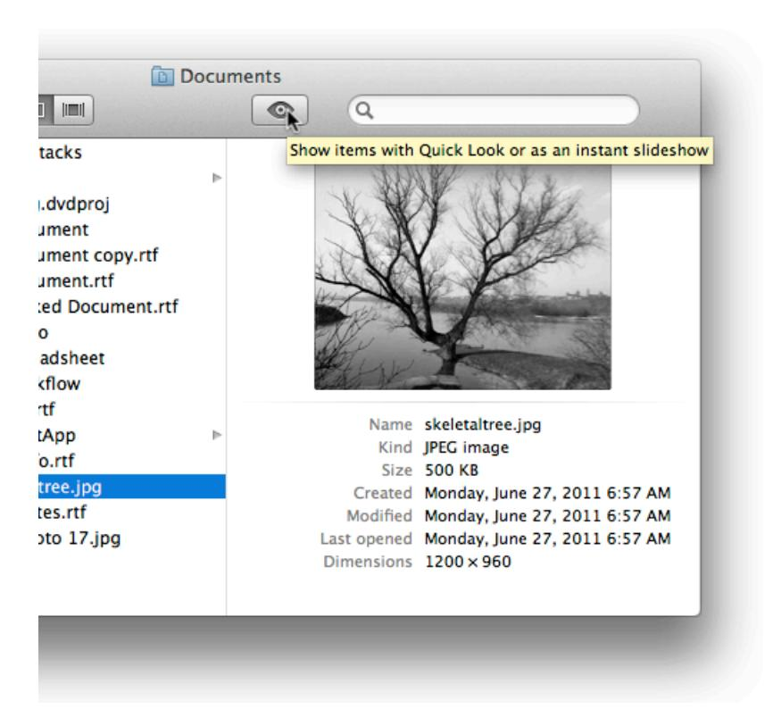

The text of a help tag should briefly describe what an interface element does. If you find that you need more than a few words to describe the function of a control, you might want to reconsider the design of your app's user interface.

You can define help tags in Interface Builder, where they are called **tooltips**. Here are some guidelines to help you create effective help tag messages.

**In general, don't name the interface element in the tag.** Because a help tag is specific to a UI element, it should not be necessary to refer to it by name, unless the name helps the user and isn't available onscreen. If you do need to refer to an element by name, make sure you use the same name throughout all of your documentation.

**Describe only the element that the pointer is resting on.** Users expect a help tag to describe what they can do with the control; they do not expect to read about other controls or about how to perform a larger task.

**Describe controls that are unique to your app.** Don't provide help tags that describe window resize controls, scrollers, or other standard Aqua controls.

**Focus on the action users can perform using the control.** A good way to stay focused on the action is to begin the tag with a verb, for example, "Restores default settings" or "Add or remove a language from the list".

**Use the fewest words possible.** Try to keep your tags to a maximum of 60 to 75 characters. Because help tags are always on, it is important to keep your tag text unobtrusive—that is, *short*—and useful. A tag should present only one concept and that concept should be directly related to the interface element. You can also omit articles to limit the length of the tag. Note that localization can lengthen the text by 20 to 30 percent, which is another good reason to keep the tag short.

**Use sentence-style capitalization.** Sentence-style capitalization tendsto appear more friendly and lessformal to users (to learn more about this capitalization style, see ["Capitalizing](#page-305-0) Labels and Text" (page 306)).

**In general, use a sentence fragment.** A sentence fragment emphasizes the brevity of the help tag's message. If the tag text must form a complete sentence, end it with the appropriate punctuation.

**Consider creating contextually sensitive help tags.** You can provide different text for differentstates a control can have, or you can provide the same text for all states. When you describe what the interface element accomplishes, you help the user understand the current state of the control even if the tag isn't applicable to all situations.

# <span id="page-110-0"></span>Icon Design Guidelines

Beautiful, compelling icons are a fundamental part of the OS X user experience. Far from being merely decorative, icons play an essential role in communicating with users.

Every app must include several size variations of the app icon for display in the Finder, Dock, Launchpad, and elsewhere. Many apps need to supply additional icons, such as toolbar and document icons. To look at home on OS X, all of these icons should be meticulously designed, informative, and aesthetically pleasing.

Unlike other custom artwork in your app, these icons must meet specific criteria so that OS X can display them properly. In addition, icon files have sizing and naming requirements. To support resolution independence, you should provide standard- and high-resolution versions of your icons. For guidelines on how to create icons, see "Creating Great Icons for Any [Resolution"](#page-115-0) (page 116).

### <span id="page-110-1"></span>About App Icon Genres and Families

Apps are classified by role—user app,software utility, and so on—and each role is associated with a recognizable icon style, or **icon genre**. An icon genre helps convey what users can do with an app before they open it. You can see a couple of different icon genres represented in the Dock.


Two icon genres that are easy to distinguish are user apps and utilities. In general, the icons for user apps are colorful and inviting, whereas the icons for utilities have a more serious appearance. For example, compare the bright colors used in the user app icons (shown in the top row of the figure below) to the grayer coloration of the utility icons (shown in the bottom row).

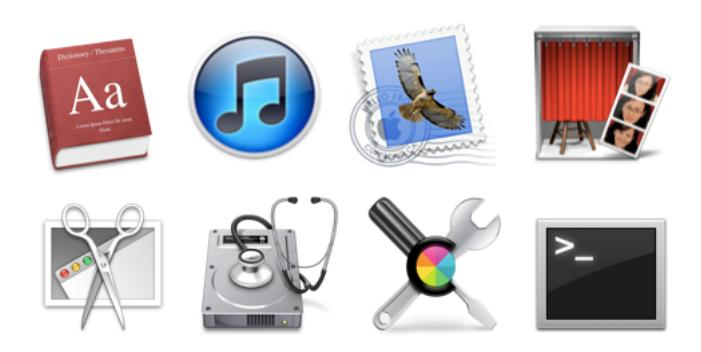

An **icon family** is a set of icons that reuse certain graphic elements. An app might create an icon family to help users identify files and other entities that are associated with the app. For example, iTunes reuses visual cues from its app icon in a plug-in icon:


and in a playlist icon:


### <span id="page-111-0"></span>Tips for Designing Icons

For the best results, enlist a professional graphic designer to help you develop an overall visual style for your app, and apply that style to all the icons and images in it.

The tips in this section help you design a great app icon, but many of them also apply to the design of other icons, such as toolbar icons.

**Give your app icon a realistic, unique shape.** On OS X, app icons should have the shape of the objects they depict, including cutouts. A unique outline focuses attention on the depicted object and makes it easier for users to recognize the icon at a glance.

If necessary, you can use a circular shape to encapsulate a set of images. In particular, you should avoid using the "rounded tile" shape that users associate with iOS app icons.

**Don't reuse your iOS app icon, if you have one.** If you're developing an OS X version of an iOS app, you should not reuse your iOS app icon. Although you want users to recognize your app, you don't want to imply that your app isn't tailored for the OS X environment. Start by reexamining the way you use images and metaphors in your iOS app icon. Then, remove the rounded rectangular outline of the iOS app icon and focus on the main images within it. For example, if your iOS app icon shows a tree inside the rectangle, use the tree itself for your OS X app icon.

**Use universal imagery that people will easily recognize.** Avoid focusing on a secondary aspect of an element. For example, for a mail icon, users are less likely to recognize a rural mailbox than a postage stamp.

**Strive for simplicity.** In particular, avoid cramming lots of images into your icon. Try to use a single object that expresses the essence of your app. Start with a basic shape and add details strategically. If an icon's content or shape is overly complex, the details can become confusing and may appear blurry at smaller sizes.

**Use color and shadow judiciously to help the icon tell its story.** Don't add color just to make the icon brighter. Also, smooth gradients typically work better than sharp delineations of color. (Note that sidebar icons and icons inside toolbar buttons should not use color; for more information, see ["Designing](#page-121-0) Toolbar Icons" (page 122) and ["Designing](#page-124-0) Sidebar Icons" (page 125).)

Shadows give objects dimensionality and realism. They also help tie the elements of an icon together so that it doesn't look like a collage.

**Choose the right perspective for your icon.** You want the perspective of your icon to match the perspective of other icons in the same genre. For example, a user app icon should look like it's resting on a desk in front of you, whereas most utility app icons use a straight-on perspective. Regardless of the perspective that's appropriate for your icon genre, always use a single light source with the light coming from above the icon. To learn more about light, shadows, and different icon perspectives, see "Using [Perspective](#page-113-0) and Texture to Reflect [Reality"](#page-113-0) (page 114).

**Avoid mixing actual text with "Greek" text or wavy lines to suggest text.** If you want to show text in your icon but you don't want to draw attention to the words, start with actual text and make it hard to read by shrinking it or doubling the layers. Shrinking text also makes the details in your icon sharper for Retina display.

For example, it's hard to read the text in the TextEdit app icon unless you increase its size. Although the text in this icon has meaning, users don't need to read it to see that TextEdit is a text-editing app.

If your app is available in multiple languages, you may want to use "Greek" text or wavy linesto suggest generic text instead of using words in a specific language. Do not mix fake text with real text.

**Create an idealized version of the subject rather than using a photo.** Although it can be appropriate to use a photo (or a screenshot) in an app icon, it's often better to augment reality in an artistic way. Creating an idealized version can help you emphasize the aspects of the subject that you want users to notice.

If your app has a very recognizable UI, consider creating a refined representation of it instead of using an actual screenshot of your software in the app icon. Creating an enhanced version of the UI is particularly important when users could confuse a large version of the icon with the actual interface of the app.

**Note:** If an app icon depicts an image that is effectively a precursor of what users see when they open the app, it should use the straight-on, "flat against the wall" perspective. It makes sense to use this perspective because users would never see the UI as if it were sitting on a desk.

**Avoid using Aqua interface elements in your icons.** You don't want users to confuse your icons with the OS X UI.

**Don't use replicas of Apple hardware products in your icons.** The symbols that represent Apple products are copyrighted and cannot be reproduced in your icons. In general, it's a good idea to avoid replicas of any specific devices in your icons. These designs change frequently, and icons that are based on them can look dated.

<span id="page-113-0"></span>**Don't reuse OS X system icons in your interface.** It can confuse users to see the same icon used to mean slightly different things in multiple locations.

### Using Perspective and Texture to Reflect Reality

The angles and shadows used in various kinds of icons are intended to reflect how the objects would appear in the real world. It'simportant to learn which perspective is associated with each icon genre so that your icons look at home on the platform.

Different perspectives are achieved by changing the position of an imaginary camera that captures the icon. The perceived light source that is causing the shadows is always directly above the object.

An app icon depicts an object that looks like it is sitting on a desk in front of you.


Utility icons are depicted as if they were on a shelf in front of you. Flat objects appear as if there were a wall behind them, with an appropriate shadow behind the object.


A three-dimensional object, such as a rocket, is more realistically viewed as resting on the ground. To depict the rocket, an icon shows it sitting on a shelf with its shadow below it.

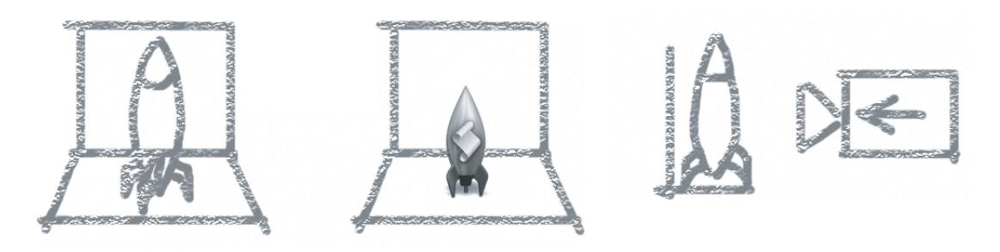

For toolbar icons, the perspective is also straight-on, asif the object is on a shelf in front of you, with the shadow below it. (For more information on designing toolbar icons, see ["Designing](#page-121-0) Toolbar Icons" (page 122).)


**Portray real objects accurately.** Icons that represent real objects should also look as though they are made of real materials and have real mass. Realistic icons accurately replicate the characteristics of substances such as fabric, glass, paper, and metal, and convey an object's weight and feel.

**Make your drop shadow fully black.** In the Finder Cover Flow view, icons are displayed against a black background, set above a highly reflective surface. If your icon has a drop shadow that contains any gray tones, the gray will make the shadow look more like a glow.

**Consider adding a slight glow justinside the edges of youricon.** If your icon includes a dark reflective surface, such as glass or metal, add an inner glow to make the icon stand out against the black background. If you don't add a glow to make the edges of your icon prominent, it might appear to dissolve into the black background of the Finder Cover Flow view.

**Use transparency when it makes sense.** Transparency in an icon can help depict glass or plastic, but it can be tricky to use convincingly. You would never see a transparent tree, for example, so don't use one in your icon. The Preview and Pages app icons incorporate transparency effectively.


### <span id="page-115-1"></span><span id="page-115-0"></span>Creating Great Icons for Any Resolution

#### Take Advantage of High-Resolution Display

Retina display allows you to show high-resolution versions of your art and icons. If you merely scale up your existing artwork, you miss out on the opportunity to provide the beautiful, captivating images users expect. Instead, you should rework your existing image resources to create large, higher-quality versions that are:

● **Richer in texture.** For example, in the high-resolution versions of the System Preferences and Contacts icons, the metal and paper textures are clearly visible.

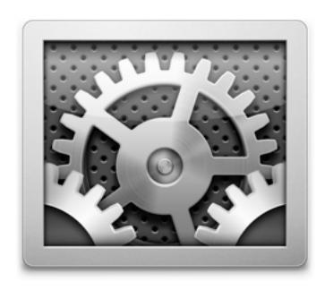


● **More detailed.** For example, in the high-resolution versions of the Safari and Preview icons, you can see details such as the accurate contours of the continents behind the compass and the etching on the magnifying glass.


● **More realistic.** For example, the high-resolution versions of the Keynote and Pages icons combine rich textures and fine details to create realistic portrayals of a podium and an inkwell.


#### <span id="page-116-0"></span>Provide the Correct Resources and Let OS X Do the Work

Your app icon is displayed in the Finder, Dock, Launchpad, and elsewhere. For OS X to display your icon appropriately, create your app icon in different sizes and resolutions, and follow specific naming conventions. In particular, use the format:

- icon\_<file\_size>.<filename\_extension> for standard icons
- icon\_<file\_size>@2x.<filename\_extension> for high-resolution icons

For example, you should supply icon\_512x512.png and icon\_512x512@2x.png. For more details about naming conventions, see "Adopt the @2x Naming Convention" in *High Resolution Guidelines for OS X* .

To ensure that your app icon looks great in all the places that users see it, you need to provide resources in the sizes listed in [Table](#page-117-0) 5-1 (page 118).

<span id="page-117-0"></span>**Table 5-1** App icon resource sizes

| Filename        | Size of canvas (in pixels) |
|-----------------|----------------------------|
| icon_512x512@2x | 1024x1024                  |
| icon_512x512    | 512x512                    |
| icon_256x256@2x | 512x512                    |
| icon_256x256    | 256x256                    |
| icon_128x128@2x | 256x256                    |
| icon_128x128    | 128x128                    |
| icon_32x32@2x   | 64x64                      |
| icon_32x32      | 32x32                      |
| icon_16x16@2x   | 32x32                      |
| icon_16x16      | 16x16                      |

**Note:** PNG with an sRGB color profile is the recommended format for app icons.

As you create your artwork for high-resolution display, be sure to treat each image as its own resource. Even though the high-resolution version of one icon might use the same canvas size as the standard version of another, make sure to redraw each image. For example, do not use the 32x32 standard-resolution icon as the 16x16@2x icon, even though they both have a canvas size of 32x32 pixels. App icons should look the same on standard- and high-resolution displays, because a user can set up multiple displays with different resolutions and drag the app from one display to the next.

As the canvas size decreases, you have fewer pixels to draw, which means that smaller sizes should be less detailed. For instance, the smaller size Calendar app icon is not as detailed as the larger size, where you can see numbers for the days of the month, highlights in the metal rings, and lines at the bottom of the pile to indicate more pages. Each image is appropriately drawn for the canvas size.


#### <span id="page-118-0"></span>Create High-Resolution Artwork from Existing Assets

If you have an existing set of app icon resources, the following techniques can help you get great results as you create high-resolution versions of your artwork.

**Scale up your original artwork and then redraw.** Using the nearest-neighbor scaling algorithm, scale your original artwork to 200%. This works well if the original artwork was not created with vector shapes and does not include layer effects. The result is a large, pixelated image on top of which you can draw matching high-resolution art. This is a good way to begin because it allows you to preserve the original layout of your design.

If the original artwork was created with vector shapes or includes layer effects, you can use the default scaling algorithm instead of the nearest-neighbor algorithm.

**Add detail and depth.** Don't hesitate to draw very small elements, because the high-resolution version of your artwork allows much more room for fine details. For example, a 1-pixel dot in your original image becomes a 4-pixel dot (that is, 2x2 pixels) in the larger version.

**Consider softening scaled-up elements.** If, for example, you have a sharp, 1-pixel dividing line in your original artwork, it might have the boldness you want when it isscaled to a 2-pixel line. But forsome lines and elements, you might want to soften the scaled results by feathering or even leaving the element at the smaller size.

**Consider adding blur for better results in effects such as engravings and drop shadows.** For example, text engraving istypically done by shifting a duplicate image of the text by 1 pixel. Scaled up, thisshift would result in an engraving width of 2 pixels, which is likely to look very sharp and unrealistic at a higher resolution. To improve this, you can leave the shift as-is (that is, at 1 pixel), but add a 1-pixel blur to soften the engraving. This still results in a 2-pixel-wide engraving effect, but the outer pixel now looks more like it is only half a pixel wide, which results in a better sense of dimensionality.

#### <span id="page-119-0"></span>Create High-Resolution Artwork from Scratch

If you do not have an existing set of icon resources, the following tips can help you create standard- and high-resolution versions of your app icon.

**Start with a large master art file and scale it down to the smaller sizes.** It's especially useful to create your master image in a dimension that is a multiple of the icon sizes you need. For example, to create icons in the recommended sizes listed in [Table](#page-117-0) 5-1 (page 118), first create a 1024x1024 pixel version of your master file.

**Use an appropriate grid size.** As you create the master image, using a grid ensures that you get sharp lines on important pieces of the design, like the outline. As you scale down, you'll be able to keep each smaller icon version crisp, and reduce the amount of retouching and sharpening you need to do.

In your image-editing app, set up an 8-pixel grid, which means each block in the grid measures 8x8 pixels and represents 1 pixel in the 128x128 pixel icon. As you create your master file, "snap" the image to the grid and keep it within the boundaries to minimize the half pixels and blurry details that can result when you scale it down.

**Redraw art as you scale down.** If you're not satisfied with the results when you scale down art to the 32x32 pixel and 16x16 pixel sizes, redraw the image at these sizes instead. If you decide to do this, setting up the proper grid can still help reduce extra work. For example, using a 32-pixel grid works well for creating the 32x32 pixel size, and a 64-pixel grid works well for creating the 16x16 pixel size.

#### <span id="page-120-0"></span>Redesign Your iOS Artwork for OS X

If you are creating an OS X version of an iOS app, design an icon that users recognize. Do not simply reuse your iOS app icon. In particular, your icon should not appear in a rounded rectangle. App Store, Calendar, and Contacts use icons for OS X and iOS that are recognizable, yet distinct from one another.

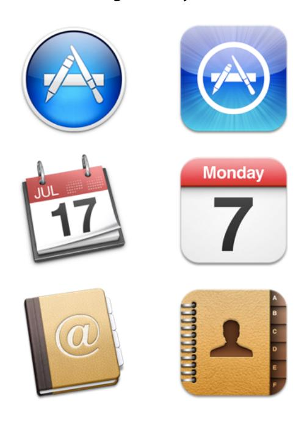

### <span id="page-120-1"></span>Packaging Your Icon Resources

After you've created the necessary app icon assets, place them in folder a named icon.iconset. You can preview your .iconset folder to ensure the proper alignment and resolution handling of all your app icon resources. Select the folder in Finder and press Space bar to open Quick Look. You should see a slider at the bottom of the window. By adjusting the slider, you can view the various assets as though they are one icon.

Use the system-provided tools to convert your .iconset folder into a single .icns file. First, use an image-editing program to output your app iconsin the PNG format, which preserves your design's alpha values. Your source art files should use sRGB and retain their color profiles. You don't need to compress image files because the tools used to package them take care of compression for you.

To create an .icns file, use iconutil in Terminal. Terminal is located in /Applications/Utilities/Terminal. Enter the command iconutil -c icns <iconset filename>, where <iconset filename> isthe path to the .iconset folder. You must use iconutil, not Icon Composer, to create high-resolution .icns files. For more information, see "Provide High-Resolution Versions of All App Graphics Resources" in *High Resolution Guidelines for OS X* .

There are also several third-party tools available for completing thisstep. Note that an .icns file is appropriate for app icons and document icons only; it is not an acceptable format to use for other types of icons in your app. (To learn more about creating document iconsfor your app,see ["Designing](#page-126-0) Document Icons" (page 127).)

### <span id="page-121-0"></span>Designing Toolbar Icons

Toolbar items give users easy access to frequently used commands (to learn more about the concepts behind toolbar design, see ["Designing](#page-179-0) a Toolbar" (page 180)). To represent these commands in a toolbar, you need small, unambiguous icons that users can easily distinguish and remember.

To accommodate different app styles and usages, OS X provides two styles of toolbar items: toolbar controls and freestanding icons that behave as buttons. Do not mix styles of toolbar items—use one or the other in your app. To learn more about the toolbar controlsthat can contain icons,see ["Window-Frame](#page-240-0) Controls" (page 241). To learn more about freestanding icons, see "Icon [Button"](#page-246-0) (page 247).

In general, main and document windows achieve a subtle appearance by using streamlined icons within toolbar buttons controls. For example, the Mail toolbar uses several small icons in toolbar buttons and segmented controls.

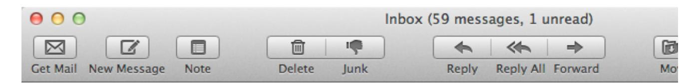

Freestanding icons are occasionally used in the toolbar of a main or document window, such as the Keynote toolbar shown here.


Freestanding icons tend to be more common in the toolbars of preferences windows, where they are often used as pane switchers. For example, the Safari preferences window displays several icons that give users access to different preferences categories.


The best toolbar icons use familiar visual metaphors that are directly related to the app commands they represent. When a toolbar icon depicts an identifiable, real-world object or recognizable UI element, it gives first-time users a clue to its function and helps experienced users remember it.

**Identify parts of the user's mental model that lend themselves to visual representation.** Users often form a mental model of your app'stask based on real-world actions. (To learn more about the mental model concept, see ["Mental](#page-26-2) Model" (page 27).) For example, the iTunes toolbar shown below displays rewind, play, and fast-forward controls that use symbols similar to those users see and touch on physical devices.


**Make toolbar icons distinct, yet harmonious.** When each icon is easily distinguishable from the others, users learn to associate it with its purpose and locate it quickly. Variations in shape and image help to differentiate one toolbar icon from another. At the same time, an app's toolbar icons should harmonize as much as possible in their perspective, size, and visual weight. This holds true whether the icon is freestanding or in a toolbar control.

**For icons to put inside toolbar controls, create streamlined template images.** These images should convey meaning through outline and contour, and they should include very little internal detail.

It's best to make your icon as solid as possible (that is, with very little transparency or alpha values) so that it will look good when the system applies effects, such as the inactive appearance. An icon that uses too much transparency can look disabled when the system applies either the active or inactive appearance to it. To help you create a solid icon, start by imagining the shadow your object would cast. If the contours of the shadow clearly show what the object is, you don't need to add any transparency.

To help you understand how the system-applied effects can change the appearance of an icon, consider the Send icon in Mail, shown here in its unprocessed state:


When the Send icon is in a toolbar button and the system applies the active, enabled appearance to it, it looks like this:


As you design an icon to put inside a toolbar control, such as a button or segmented control, follow these guidelines:

● Create icons that measure no more than 19x19 pixels.

- Make the outline sharp and clear.
- Use a straight-on perspective.
- Use black (add transparency only as necessary to suggest dimensionality).
- Use anti-aliasing.
- Use the PDF format.
- Make sure the image is visually centered in the control (note that visually centered might not be the same as mathematically centered).

**Note:** When you're designing an icon for a toolbar control, it's recommended that you use black, which makes it easier to discern details and outlines. However, you can use any color to create your icons, because the system ignores the color and pays attention only to the alpha values you add.

When you create an icon to put inside a toolbar control in PDF format, OS X will automatically scale your icon for high-resolution display. You do not need to provide a high-resolution version.

You might be able to use a system-provided icon or image to represent a common task or a standard interface element in your toolbar controls, such as the connect via Bluetooth icon (that is, ). OS X provides many icons that can be used inside toolbar controls and a few icons that can be used as icon buttons in a toolbar. For more information about the images that are available and what they mean, see ["System-Provided](#page-319-0) Icons" (page 320).

**For freestanding icons in a toolbar, create inviting images that are easy to identify.** Because freestanding toolbar icons do not need to fit within a toolbar control, you have a little more room to express them. As you design a freestanding icon for your toolbar, follow these guidelines:

- Use a straight-on perspective.
- Make the outline sharp and clear.
- Use anti-aliasing.
- Use color judiciously to add meaning.
- Create icons for standard- and high-resolution displays. You need to supply two resources: 32x32 and 32x32@2x. See [Table](#page-117-0) 5-1 (page 118) for the corresponding canvas sizes.
- Use the PNG format.

Although you use the straight-on perspective for the freestanding toolbar icons you design, if you use a recognizable icon from elsewhere in the interface in your toolbar, you should not change its appearance or perspective. That is, don't redesign a toolbar version of a well-known interface element.

### <span id="page-124-0"></span>Designing Sidebar Icons

If your app includes a sidebar (or source list), you need to design icons to display in it. For example, the Mail app contains several icons that represent the user's mailboxes, RSS feeds, and reminders.


Sidebar icons are small and streamlined, but they provide more internal detail and a more realistic outline than the icons that go inside of toolbar controls. To achieve this look, try imagining an X-ray of the object you have in mind, then use transparency to capture the details.

As with the icons that can be used inside toolbar controls, the system applies various effects to sidebar icons. To help you understand how these effects can change the appearance of a sidebar icon, consider the Finder Home icon, shown here in its unprocessed state:


After the system applies the inactive appearance to the Home icon, it looks like this:


Follow these guidelines as you design your sidebar icons:

- Use black combined with transparency (that is, alpha values) to suggest details.
- Make the outline sharp and clear.
- Use a straight-on perspective.
- PDF format is recommended.
- Create your icons in three sizes: 16x16, 18x18, and 32x32 pixels (if using PDF).

**Note:** When you're designing a sidebar icon, it's recommended that you use black, which makes it easier to discern details and outlines. However, you can use any color to create your icons, because the system ignores the color and pays attention only to the alpha values that you add.

If you create yoursidebar iconsin PDF format, OS X will automatically scale your icon for high-resolution display. You do not need to provide high-resolution versions. However, if you use PNG format for your icons, you will need to supply the following resources: 16x16, 16x16@2x, 18x18, 18x18@2x, 32x32, and 32x32@2x. PNG format is only recommended for designsthat are very intricate and require effectslike shading, textures, and highlights.

Be sure to invert yoursidebar icon to make sure it looks good and still makessense when the values are flipped. You need to check this because a sidebar icon'sselected appearance isthe inverse of its unselected appearance. For example, the Trash icon in the Mail sidebar has the following appearance when it is unselected:


But when it is selected, the Trash icon is inverted:


If necessary, provide an alternate design for the selected appearance of your sidebar icon. For example, the Desktop icon in the Finder sidebar is represented by two separate images to ensure that the icon conveys the same message in both selection states. Specifically, the unselected version of the Desktop icon shows a row of white Dock icons along the bottom edge:


If this icon were inverted, the Dock icons would become hollow black squares with white outlines, and they would no longer convey the same meaning. So the Desktop icon also includes a version that's designed to preserve the appearance of the Dock icons when the colors are inverted:


### <span id="page-126-0"></span>Designing Document Icons

Traditionally, a document icon looks like a piece of paper with its top-right corner folded down. This distinctive appearance makes it easy for users to distinguish their documents from their apps and other content, even when the icon sizes are small.

Follow these guidelines as you design document icons for your app.

**Make it obvious that your app and the documents it produces are related.** In addition to using the familiar folded-corner outline, you can add an image that reminds users of your app. In general, use your app icon for this purpose. For example, it's easy for users to tell which documents they created in Pages.


**Present a document icon as if it were hovering on the desktop.** This perspective helps you reproduce the appropriate shadow behind the document.

**Provide a set of documenticons in the same set of sizes you provide for your app icon.** For the recommended standard- and high-resolution sizes, see [Table](#page-117-0) 5-1 (page 118).

As you do with your app icons, create an .icns file for your document icons. To learn more about how to create this type of file, see "Tips for [Designing](#page-111-0) Icons" (page 112).

**Integrate a badge into the document shape (if one is necessary).** If you want to put an identifying badge over a document icon, treat the badge as an integrated element within the icon. Don't spoil the document icon shape by adding a badge that extends beyond the outline and appears to be above the document.


**Move the image appropriately to accommodate the badge.** You need to allow enough space at the bottom edge of the document icon to display the badge. As a result, the upper-right corner of your image might be obscured by the folded-corner appearance of the background.


**Use the appropriate font and font sizes for the badge.** For all sizes, use Lucida Grande Bold, in color sRGB 0,0,0, and with 66% opacity. If you are using iconutil to generate your .icns files, you don't have to worry about font sizes.

However, if you create your own .icns files, use the following font sizes to add a badge to all sizes of your document icon:

- 144 point text for the 512x512@2x pixel document icon
- 72 point text for the 512x512 pixel document icon
- 36 point text for the 256x256 pixel document icon
- 18 point text for the 128x128 pixel document icon
- 9 point text for the 64x64 pixel document icon

● 6.5 point text for the 32x32 pixel document icon

Note that you should "Greek" the badge text in the 16x16 pixel version of your document icon.

If a document badge has a lot of characters, show as many of them as possible in the larger icon sizes, without shrinking the font too much. In the smaller sizes, simply truncate the badge text (don't add an ellipsis). For example, the badge text "Archive" does not fit completely in the 32x32 pixel version of this document icon:


### <span id="page-128-0"></span>Icon Gallery

A great app icon is not only gorgeous and inviting, it also conveys the main purpose of the app and hints at the user experience. As you decide how to best represent your app through its icon, it's helpful to examine some successful icon designs.

User app icons are vibrant and inviting, and should immediately convey the app's purpose. For example, the Photo Booth icon clearly indicates that this app helps users take pictures of themselves.


In an app that primarily helps users create or view media, it makes sense for the icon to include the media. If appropriate, the icon might also depict a tool to communicate the type of task that the app helps the user accomplish. The Preview icon (shown below) uses a magnification tool to help convey that the app can be used to view pictures. The proximity of the magnifier to the pictures makes it clear that the tool's function is directly related to the content the app handles.


In the Stickies app icon, the yellow rectangles are easily identifiable as sticky notes. In a sense, the sticky note itself functions as a tool, so the icon doesn't include a pen or other writing utensil because it isn't necessary to tell the icon's story.


Some appsthat represent objects or well-known products,such as QuickTime Player, Dashboard, and FaceTime, are most easily recognized by enhanced versions of the symbols or objects themselves. Note that these app icons (shown below) use the straight-on perspective because users never see these objects from the three-dimensional, "on a desktop" perspective.


Icons for utility apps tend to convey a more serious tone than those for user apps. Color in utility app icons is desaturated, predominantly gray, and added only when necessary to clearly communicate what the apps do. For example, notice the prevalence of gray and the discriminating use of color in the System Information, Activity Monitor, and Keychain icons shown below:


# <span id="page-131-0"></span>UI Element Guidelines: Menus

Menus present lists of items—commands, attributes, or states—from which the user can choose.

Users refer to menus frequently, especially when they are seeking a function for which they know of no other interface. Ensuring that menus are correctly organized, are worded clearly, and behave correctly is crucial to the user's ability to explore and access the functionality of your app.

Menus have a few different forms in the OS X interface:

- A **menu bar menu** displays the current app's commands in the single menu bar at the top of the display. An app typically displays several menus in the menu bar (for an overview of the menu bar, see "All [Apps](#page-15-0) Use the [Single](#page-15-0) Menu Bar" (page 16)).
- A **Dock menu** contains system-defined commands (such as Reveal in Finder and Keep in Dock) and, optionally, app-specific commands (such as New Window). To reveal a Dock menu, users Control-click or press and hold an app's Dock icon.
- A **contextual menu** displays commands that are directly related to an item. To reveal a contextual menu, users Control-click an onscreen area or a selection.

You can see examples of these menu types in the TextEdit Edit menu, the Mail Dock menu, and a Finder contextual menu (from left to right).

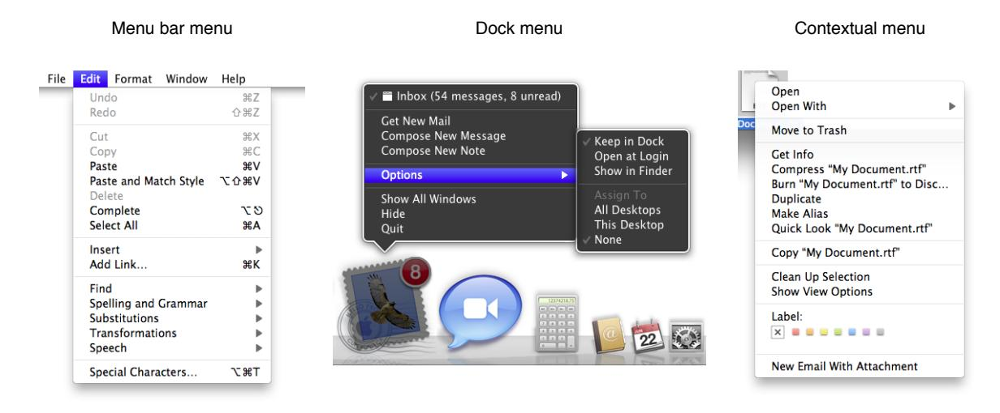

There are also a few controls that display menus, such as pop-up menus, command pop-down menus, and pop-up icon buttons and bevel buttons. Many of the guidelines in this chapter also apply to these control menus because they share several characteristics with app menus. To learn how to use the controlsthemselves, see the control-specific sections in "UI Element [Guidelines:](#page-239-0) Controls" (page 240).

### <span id="page-132-0"></span>Menu Appearance and Behavior

At a minimum, a menu displays a list of menu items. Most menus also include a title that indicates the types of items that are in the list. In addition, menus can include some optional components, such as keyboard shortcut symbols, hierarchical menus (also known as submenus), toggled menu items, separators, icons, and symbols (such as the checkmark). For example, the TextEdit Edit menu includes a list of commands, a title ("Edit"), keyboard shortcuts, hierarchical menus, and separators that indicate different groups of items.


A menu bar menu might include examples of all of these components, but not all of them are suitable for every type of menu. For example, a contextual menu does not need a title because it is automatically related to the user's current selection. For guidelines on providing a contextual menu in your app, see ["Designing](#page-161-1) [Contextual](#page-161-1) Menus" (page 162).

Menus are an example of the see-and-point paradigm: People identify what needs to be acted on and then specify the action by choosing a menu item.

To choose an item in a menu, the user reveals the menu and moves the pointer to the desired item. Each active menu item highlights as the pointer passes over it and opens its submenu (if it has one). No action happens until the user chooses an item. This behavior allows people to open and scan menus to find out what features are available without having to actually perform an action. When the user chooses a menu item, it blinks briefly to confirm the user's choice and then performs the action.

After the user opens a menu, it remains open until another action forces it to close. Such actions include:

- Choosing an item in the menu
- Moving the pointer to another menu title in the menu bar
- Clicking outside of the menu
- A system-initiated alert
- <span id="page-133-0"></span>● A system-initiated app switch or quit

### Titling Menus

In addition to the system-provided menus, such as File and Window, most apps provide a few app-specific menus to display in the menu bar so that users have access to useful commands. Users choose which menu to open based on the menu's title, so it's important to make your menu titles accurate and informative. Note that contextual and Dock menus don't need titles because users open these menus after focusing on a selection or an area in a window or by choosing an app in the Dock.

Follow these guidelines as you create titles for your menus.

**Use menu titles that accurately represent the items in the menu.** Users should be able to use a menu's title to predict the types of items they'll find in the menu. For example, users would expect a Font menu to contain names of font families,such as Helvetica and Geneva, but they wouldn't expect it to include editing commands, such as Cut and Paste.

**Make menu titles as short as possible without sacrificing clarity.** One-word menu titles are best because they take up very little space in the menu bar and they're easy for users to scan.

**Avoid using an icon for a menu title.** You don't want users to confuse a menu-title icon with a menu bar extra. Also, it's not acceptable to mix text and icons in menu bar menu titles.

**Ensure that a menu's title is undimmed even when all of the menu's commands are unavailable.** Users should always be able to view a menu's contents, whether or not they are currently available. Ensuring that your menu items are always visible (even when they are not available) helps users learn what they can do in your app.

### <span id="page-134-0"></span>Naming Menu Items

As with menu titles, it's important to choose menu item names that are accurate and informative so that users can predict the result of choosing an item.

Menu item names describe actions that are performed on an object or attributes that are applied to an object. Specifically:

- *Actions* are verbs or verb phrases that declare the action that occurs when the user chooses the item. For example, Print means *print my document* and Copy means *copy my selection* .
- *Attributes* are adjectives or adjective phrasesthat describe the change the command implements. Adjectives in menusimply an action and they can often fit into the sentence "Change the selected object to …" —for example, *Bold* or *Italic* .

Follow these guidelines as you create menu items.

**In general, avoid including definite or indefinite articles in the menu item name.** Including an article is rarely necessary because the user has already made a selection or entered a context to which the command applies. Good examples are "Add Account" instead of "Add an Account" and "Hide Toolbar" instead of "Hide the Toolbar." Be sure that you use this style consistently in all your menu item names.

**Use an ellipsis to show users thatfurther action is required to complete the command.** The **ellipsis character** (…) means that a dialog or a separate window will open in which users need to make additional choices or supply additional information in order to complete the action. For details on when to use an ellipsis in menu items, see "Using the Ellipsis [Character"](#page-299-2) (page 300).

**Use title-style capitalization for menu item names.** For more information on thisstyle,see ["Capitalizing](#page-305-0) Labels and [Text"](#page-305-0) (page 306).

<span id="page-134-1"></span>**Dim unavailable menu items.** When a menu item is dimmed (that is, gray), it helps users understand that the item is unavailable because, for example, it doesn't apply to the selected object or in the current context. A dimmed menu item does not highlight when the user moves the pointer over it.

### Grouping Items in Menus

Arranging menu items in logical groups makes it easy for users to quickly locate commands for related tasks. The guidelines in this section can help you list menu items in ways that make sense to users.

**In general, place the most frequently used items at the top of the menu.** The top of the menu tends to be the most visible part of the menu because users often see it first. At the same time, you should avoid arranging all of a menu's items strictly by frequency of use. A better strategy is to create groups of related items and place the more frequently used groups above the less frequently used groups. For example, although the Find Next (or Find Again) command might be used infrequently, it should appear right below the Find command.

**Avoid combining actions and attributes in the same group.** Userstend to view choosing an action differently from choosing an attribute to apply to a selection, so it's best to put these items in different groups.

**Group interdependent attributes.** Users expect to find related attributes in the same group. Attributes can be in a **mutually exclusive attribute group** (the user can select only one item, such as font size) or an **accumulating attribute group** (the user can select multiple items, such as Bold and Italic).

**Group the commands that act upon a smart container.** If your app allows the creation of smart data groups or containers, such as a smart folder in the Finder, group all commands related to the smart group in the same menu. Doing this makes it easy for users to find the commands for creating, modifying, and destroying a smart group.

**Look for opportunities to consolidate related menu items.** If a menu repeats a term more than twice, consider dedicating a separate menu (or submenu) to the term. For example, if you need commands like Show Info, Show Colors, Show Layers, Show Toolbox, and so on, you could create a Show menu or a Show item that includes a submenu.

**As much as possible, create the "right" number of groups.** The number of groupsto use is partly an aesthetic decision and partly a usability decision. For example, the leftmost menu shown below depicts a good balance of grouping, contrasted with the menus in the middle and on the right, which show too much grouping and insufficient grouping, respectively. Use this picture as a visual guide when trying to decide how many groups to use in your menus.

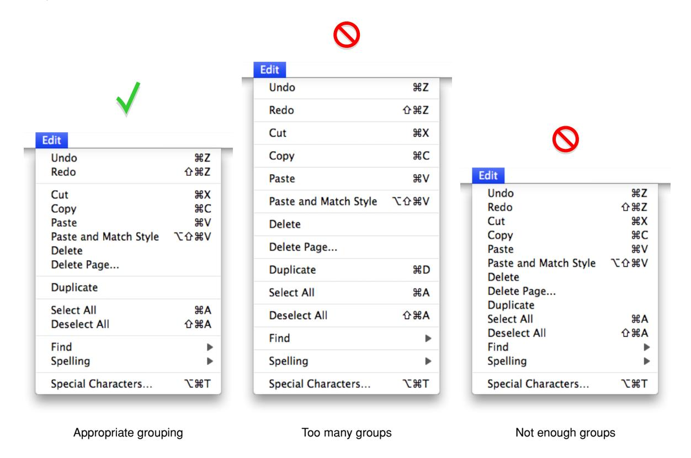

**In general, avoid creating very long menus.** Long menus are difficult for users to scan and can be overwhelming. If you find that there are too many items in a single menu, try redistributing them; you might find that some of the items fit more naturally in other menus or that you need to create a new menu. You can also consider creating submenus for some related sets of items, but this isn't appropriate in all cases; for some guidance on creating a submenu, see "Creating [Hierarchical](#page-144-0) Menus" (page 145).

Note that in some menus, users might add enough items to make the menu very long. For example, the Safari History menu can grow very long, depending on how many websites users visit. In some cases, a long menu can become a **scrolling menu**, which displays a downward-pointing arrow at the bottom edge. Scrolling menus should exist only when users add many items to a customizable menu or when the menu's function causes it to have items added to it (such as an app's Window menu). You should not intentionally design a scrolling menu.

### <span id="page-137-0"></span>Providing Dynamic Menu Items

A **dynamic menu item** is a command that changes when the user presses a modifier key. For example, when the user opens the Window menu in the Finder and then presses the Option key, the Minimize and Zoom menu items change.


You can define dynamic menu items using Interface Builder. To define dynamic menu items in code, you can use the setAlternate: method of NSMenuItem to designate one menu item as the alternate of another.

Follow these guidelines if you decide to use dynamic menu items in your app.

**Avoid making a dynamic menu item the only way to accomplish a task.** Because dynamic menu items are hidden by default, they can be an appropriate way to offer a shortcut to sophisticated users. In particular, be sure that you don't require users to discover a dynamic menu item before they can use your app effectively. For example, a user who hasn't discovered the Minimize All dynamic menu item in the Finder Window menu (shown above) can still minimize all open Finder windows by minimizing each one individually.

Although you can enable dynamic menu items in a contextual or Dock menu, you should probably consider such items to be doubly hard for users to discover. As with app menus, make sure that the functionality of the contextual or Dock menu does not depend on the discovery of dynamic menu items.

**Require only a single modifier key to reveal the dynamic menu items in a menu.** Users are apt to find it physically awkward to press more than one key while simultaneously opening and choosing a menu item. Also, requiring more than one additional key press greatly decreases the user's chances of discovering the dynamic menu items.

**Note:** OS X automatically sizes the menu to hold the widest item, including Option-enabled commands.

### <span id="page-138-0"></span>Providing Toggled Menu Items

A **toggled menu item** changes between two states each time a user choosesit. There are three types of toggled menu items:

- A set of two menu items that indicate opposite states or actions; for example, Grid On and Grid Off. The menu item currently in effect can be identified by a checkmark or by being inactive.
- One menu item whose name changes to reflect the current state; for example, Show Ruler and Hide Ruler.
- A menu item that has a checkmark next to it when it is in effect; for example, a style attribute such as Bold.

Toggled menu items can be convenient, but they are rarely necessary. If you want to use toggled menu items in your app, use the following guidelines to make sure that they provide value to users.

**Display both items in a set, if you have room in your menu.** When users can see both states or actions at the same time, there's less chance of confusion about each item's effect. For example, the Mailbox menu in Mail includes both the Take All Accounts Online and Take All Accounts Offline items. When the user's accounts are online, only the Take All Accounts Offline menu item is available, which leaves no doubt about the effect of this action.

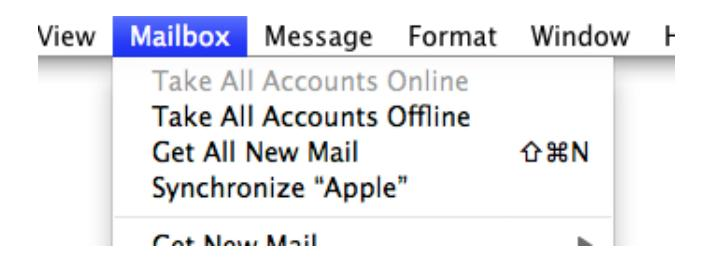

**Use a changeable menu item name if there isn't enough room to show both items.** You might also choose to use this type of toggled menu item if you're confident that users will reopen the menu and see the opposite item. The best way to make sure that the command names are completely unambiguous is to use two verbs that express opposite actions.

For example, the commands Turn Grid On and Turn Grid Off are unambiguous. By contrast, it's unclear what the opposite of the command Use Grid might be. Some users might expect the opposite command to be Don't Use Grid, because they interpret the command as an action. Other users might expect to see a checkmark next to Use Grid after choosing the command, because they interpret Use Grid as a description of the current state.

For example, Mail uses changeable toggled menu items in the View menu to allow users to show or hide features such as the mailbox list and toolbar.

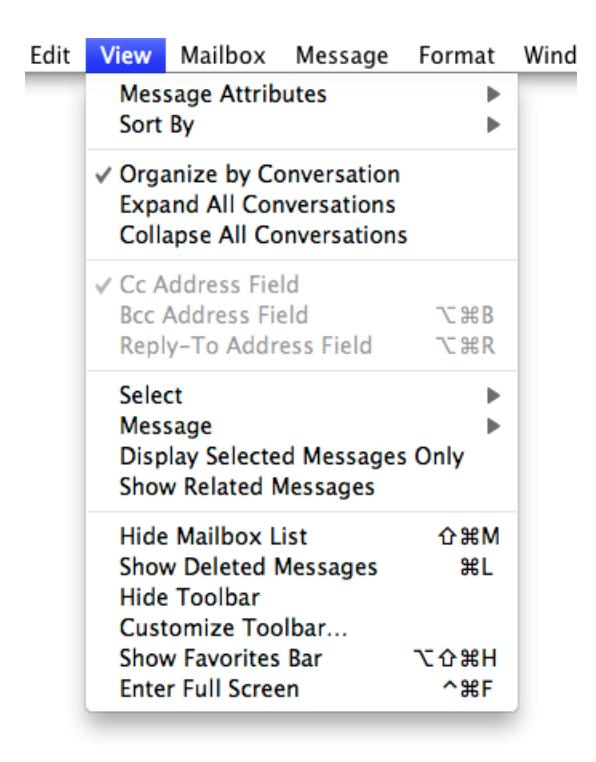

**Use a checkmark when the toggled items represents an attribute that is currently in effect.** It's easy for users to scan for checkmarks in a list of attributes to find the ones that are in effect. For example, in the Mail Format menu, users can see at a glance which styles have been applied to the selected text.


<span id="page-140-0"></span>**Don't use a checkmark when the toggled item indicates the presence or absence of a feature.** In such a case, users can't be sure whether the checkmark means that the feature is currently in effect or that choosing the command turns the feature on.

### Using Icons in Menus

Sometimes, displaying icons in menus can help users recognize menu items and relate them to other items they know about. As with all icons, you need to make sure that using them does not add confusion or ambiguity. Follow the guidelines in this section if you decide to use icons in your menus.

**Don't use an icon without any text.** Even if you use an icon you think all users will recognize, it's best to reinforce the icon's meaning by including a textual menu item name.

**Use only familiaricons.** You can use iconsin menu itemsif the icon issomething the user can learn to associate with specific functionality in your app or if the icon represents something unique. For example, the Finder uses icons in the Go menu because users can associate them with the icons they see in the sidebar.

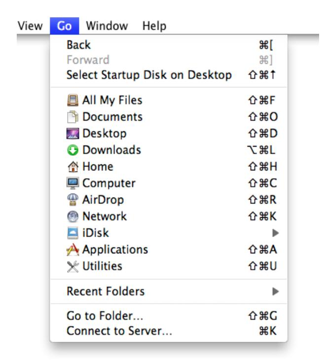

In another example, Safari uses the icons displayed by some webpages to help users make the connection between the webpage and the menu item for that webpage.


<span id="page-142-0"></span>**Avoid displaying an icon for every menu item.** If you include icons in your menus, include them only for menu items for which they add significant value. A menu that includes too many icons (or poorly designed ones) can appear cluttered and be hard to read.

### Using Symbols in Menus

<span id="page-142-1"></span>There are a few standard symbols you can use to provide additional information in menus. These symbols are used consistently throughout OS X, so users are accustomed to their meaning.

Table 6-1 lists the standard symbols and what they mean.

**Table 6-1** Standard symbols for use in menus

| Symbol | Meaning                                                                                                                                                    |  |
|--------|------------------------------------------------------------------------------------------------------------------------------------------------------------|--|
|        | In<br>the<br>Window<br>menu,<br>the<br>active<br>document;<br>in<br>other<br>menus,<br>a<br>setting<br>that<br>applies<br>to<br>the<br>entire<br>selection |  |
|        | A<br>setting<br>that<br>applies<br>to<br>only<br>part<br>of<br>the<br>selection                                                                            |  |
|        | A<br>window<br>with<br>unsaved<br>changes<br>(typically,<br>when<br>Auto<br>Save<br>is<br>not<br>available)                                                |  |

| Symbol | Meaning                                                                                                    |
|--------|------------------------------------------------------------------------------------------------------------|
|        | In<br>the<br>Window<br>menu,<br>a<br>document<br>that<br>is<br>currently<br>minimized<br>in<br>the<br>Dock |

To use symbols appropriately in your menus, follow these guidelines.

**Avoid using custom symbols in a menu.** If you use other, arbitrary symbols in menus, users are unlikely to know what they mean. Also, additional symbols tend to add visual clutter.

**Use a checkmark to indicate that something is currently active.** In an app's Window menu, a checkmark appears next to the active window's name. In other menus, a checkmark can indicate that a setting applies to the entire selection. As described in ["Providing](#page-138-0) Toggled Menu Items" (page 139), you can use checkmarks within mutually exclusive attribute groups (the user can select only one item in the group, such as font size) or accumulating attribute groups (more than one item can be selected at once, such as Bold and Italic).

**Use a dash to indicate that an attribute applies to only part of the selection.** For example, if the selected text has two styles applied to it, you can put a dash next to each style name. Or, you can display a checkmark to every style currently in effect. When it's appropriate, you can combine checkmarks and dashes in the same menu.

**Note:** If you allow users to apply several types of styles to selected text, it can be convenient to include a menu command,such as Plain,so that users can remove all formatting using one command.

**As much as possible, use a dot only when Auto Save is not available.** When you support Auto Save, users should not have to be aware of the saved state of their documents. However, you might need to display a dot if, for example, the user's disk is full and Auto Save cannot complete. For more information about supporting Auto Save in your app, see "Auto Save and [Versions"](#page-102-0) (page 103).

**Allow the diamond and the checkmark to replace the dot(if itis used).** A minimized document with unsaved changesshould have a diamond only. If the active window has unsaved changes, the checkmark should override the dot in the Window menu.

**Use actual text styles only in a Style menu.** If you have a Style menu, you can display menu itemsin the actual styles that are available, so that users can see what effect the menu item has. Don't use text styles in menus other than a Style menu. Also, it would not make sense to apply a list or indentation style to a menu item.

### <span id="page-144-0"></span>Creating Hierarchical Menus

A **hierarchical menu** (also called a **submenu**) contains a set of choices that are related to a menu item without increasing the length of the menu. A menu item that contains a submenu, such as the Find menu item in the Mail Edit menu, displays the submenu indicator to show users that there are additional choices. It's easy for users to discover the existence of submenus because they open automatically when the pointer passes over the menu item.


Submenus can have all the features of menus, including keyboard shortcuts,status markers(such as checkmarks), and so on. If you use submenus in your app, follow these guidelines.

**Ensure that a submenu's title is undimmed even when all its commands are unavailable.** As with menu titles, it's important for users to be able to view a submenu's contents, even if none of them are available in the current context.

**Use submenus cautiously.** Submenus add complexity to the interface and are physically more difficult to use, so you should take care not to overuse them. In general, it's appropriate to use submenus when you have sets of closely related commands (or alternative ways to perform one type of command, such as Find) and when you need to save space.

**As much as possible, use only one level of submenus.** A submenu that contains other submenus can be very difficult for users to use. Also, if a submenu contains more than five items, consider giving it its own menu.

**Title a submenu so that it accurately describes the items it contains.** Make sure the a submenu's contents have a logical relationship with the submenu title. For example, the Mark menu item in the Mail Message menu reveals a submenu that allows users to mark a message in different ways, such as junk or high priority. In general, hierarchical menus work best for providing submenus of attributes (rather than actions).

**Always use a hierarchical menu instead of indenting menu items.** Indentation does not express the interrelationships among menu items as clearly as a submenu does.

### <span id="page-145-0"></span>Designing Menus for the Menu Bar

The single menu bar at the top of the main display screen provides a home for the top-level menus in your app. In addition to the system-provided and user-assigned items (described in "All Apps Use the [Single](#page-15-0) Menu [Bar"](#page-15-0) (page 16)), you determine the menus that appear in the menu bar. For some guidance on how to arrange your app-specific menus, see ["Make](#page-37-0) Your App Easy to Use" (page 38).

The following sections provide guidelinesthat help you choose which menus you need and which menu items you should include.

**Important:** If a menu item is marked as expected, you should provide it in your app, unless your app cannot support it. A menu item that is not designated as expected is not necessarily appropriate in all apps, but if it is appropriate in yours, you should implement and label it as described.

If there is an appropriate keyboard shortcut for a menu item, it is listed. In general, you should enable the appropriate keyboard shortcut for every expected menu item in your app. Provide a keyboard shortcut for other items only if the item will be frequently used. For more discussion on providing keyboard shortcuts for menu items, see ["Keyboard](#page-309-0) Shortcuts" (page 310).

#### <span id="page-146-0"></span>The Apple Menu

The **Apple menu** provides items that are available to users at all times, regardless of which app is active. The Apple menu's contents are defined by the system and cannot be modified by users or developers.


### <span id="page-147-0"></span>The App Menu

The **app menu** contains items that apply to the app as a whole rather than to a specific document or other window. To help users identify the active app, the app menu title (which is the app's name) is displayed in a bold font in the menu bar.

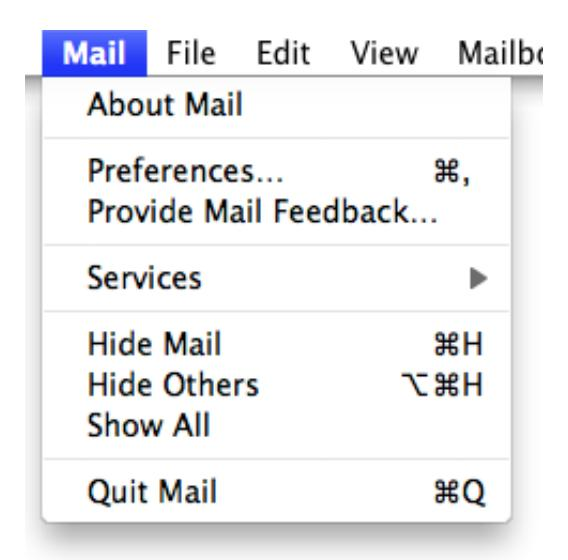

**If possible, use one word for the app menu title, and a maximum of 16 characters.** Adhering to this limit helps make room for the rest of your app's menus. If your app's name is too long, provide a short name (16 characters or fewer) as part of the app package. If you don't provide a short name, the system might truncate the name from the end and add an ellipsis when the name is displayed in the menu bar.

**Don't include the app version number in the name.** Version information belongs in the About window.

The app menu contains the following standard menu items, listed in the order in which they should appear:

| Menu item        | Expected | Keyboard shortcut | Meaning                                                                                                                                                                   |
|------------------|----------|-------------------|---------------------------------------------------------------------------------------------------------------------------------------------------------------------------|
| About<br>AppName | Yes      |                   | Opens<br>the<br>About<br>window,<br>which<br>contains<br>the<br>app's<br>copyright<br>information<br>and<br>version<br>number.                                            |
|                  |          |                   | To<br>learn<br>more<br>about<br>About<br>windows,<br>see<br>"About<br>Windows"<br>(page<br>214).                                                                          |
| Preferences…     | Yes      | Command-,         | Opens<br>a<br>preferences<br>window<br>for<br>your<br>app.<br>To<br>learn<br>about<br>defining<br>preferencesfor<br>your<br>app,<br>see<br>"Preferences"<br>(page<br>93). |

| Menu item       | Expected | Keyboard shortcut | Meaning                                                                                                                                                                                                                        |
|-----------------|----------|-------------------|--------------------------------------------------------------------------------------------------------------------------------------------------------------------------------------------------------------------------------|
| Services        | Yes      |                   | Displays<br>a<br>submenu<br>of<br>services<br>that<br>are<br>available<br>in<br>the<br>current<br>context.<br>For<br>more<br>information<br>on<br>providing<br>and<br>using<br>services,<br>see<br>"Services"<br>(page<br>94). |
| Hide<br>AppName | Yes      | Command-H         | Hides<br>all<br>of<br>the<br>windows<br>of<br>the<br>currently<br>running<br>app<br>and<br>brings<br>the<br>most<br>recently<br>used<br>app<br>to<br>the<br>foreground.                                                        |
| Hide<br>Others  | Yes      | Command-Option-H  | Hides<br>the<br>windows<br>of<br>all<br>the<br>other<br>apps<br>currently<br>running.                                                                                                                                          |
| Show<br>All     | Yes      |                   | Shows<br>all<br>windows<br>of<br>all<br>currently<br>running<br>apps.                                                                                                                                                          |
| Quit<br>AppName | Yes      | Command-Q         | Quits<br>the<br>app.                                                                                                                                                                                                           |

**Use the short app name in menu items that display it.** If you supplied a short app name, use it in the About, Hide, and Quit menu items.

**Put a separator between the About item and the Preferences item.** These two commands are very different and should be in different groups. Note that if your app provides document-specific preferences, you should make them available in the File menu (described in "The File [Menu"](#page-148-0) (page 149)).

**In general, place the Preferences menu item before any app-specific items.** For example, Mail places its app-specific Provide Mail Feedback item after Preferences. You can add a separator between Preferences and your app-specific items if it makes sense (for advice on grouping menu items, see ["Grouping](#page-134-1) Items in [Menus"](#page-134-1) (page 135)).

**Don't include a Help menu item with other app-specific items.** All app help items belong in the Help menu (described in "The Help [Menu"](#page-160-0) (page 161)).

<span id="page-148-0"></span>**Place the Quit menu item last.** Precede the Quit item with a separator and don't combine it with any other items. For a discussion about some ways to think about the need for a Quit command in your app, see ["Avoid](#page-35-1) Burdening Users with [App-Management](#page-35-1) Tasks" (page 36).

### The File Menu

In general, each command in the **File menu** appliesto a single file (most commonly, a user-created document).

If your app is not document-based, you can rename the File menu to something more appropriate or eliminate it.


The File menu includes the following standard menu items, listed in the order in which they should appear:

| Menu<br>item | Expected | Keyboard shortcut | Meaning                                                                                                                                                                                                                                                                                                                                                                                                                                    |
|--------------|----------|-------------------|--------------------------------------------------------------------------------------------------------------------------------------------------------------------------------------------------------------------------------------------------------------------------------------------------------------------------------------------------------------------------------------------------------------------------------------------|
| New          | Yes      | Command-N         | Opens<br>a<br>new<br>document.<br>For<br>more<br>information<br>about<br>naming<br>new<br>document<br>windows,<br>see<br>"Naming<br>New<br>Windows"<br>(page<br>197).                                                                                                                                                                                                                                                                      |
| Open…        | Yes      | Command-O         | Displays<br>a<br>dialog<br>for<br>choosing<br>an<br>existing<br>document<br>to<br>open.<br>(Note<br>that<br>in<br>the<br>Finder,<br>the<br>Open<br>command<br>is<br>not<br>followed<br>by<br>an<br>ellipsis<br>character<br>because<br>the<br>user<br>performs<br>navigation<br>and<br>documentselection<br>before<br>selecting<br>theOpen<br>command.)<br>For<br>more<br>information,<br>see<br>"The<br>Open<br>Dialog"<br>(page<br>222). |

| Menu<br>item   | Expected | Keyboard shortcut | Meaning                                                                                                                                                                                                                                                                                                                                                                                                                                   |
|----------------|----------|-------------------|-------------------------------------------------------------------------------------------------------------------------------------------------------------------------------------------------------------------------------------------------------------------------------------------------------------------------------------------------------------------------------------------------------------------------------------------|
| Open<br>Recent | No       |                   | Opens<br>a<br>submenu<br>that<br>displays<br>a<br>list<br>of<br>the<br>most<br>recently<br>opened<br>documents.<br>(Note<br>that<br>the<br>Apple<br>menu<br>provides<br>the<br>ability<br>to<br>open<br>recent<br>documents<br>and<br>apps<br>in<br>the<br>Recent<br>Items<br>menu<br>item.)                                                                                                                                              |
| Close          | Yes      | Command-W         | Closes<br>the<br>active<br>window.<br>When<br>the<br>user<br>presses<br>the<br>Option<br>key,<br>Close<br>changes<br>to<br>Close<br>All.<br>The<br>keyboard<br>shortcuts<br>Command-W<br>and<br>Command-Option-W<br>should<br>implement<br>the<br>Close<br>and<br>Close<br>All<br>commands,<br>respectively.                                                                                                                              |
| Close<br>File  | No       | Command-Shift-W   | Closes<br>a<br>file<br>and<br>all<br>its<br>associated<br>windows.<br>Typically<br>used<br>in<br>file-based<br>apps<br>that<br>support<br>multiple<br>views<br>of<br>the<br>same<br>file.                                                                                                                                                                                                                                                 |
| Save           | No       | Command-S         | Displays<br>the<br>Save<br>dialog,<br>in<br>which<br>users<br>provide<br>a<br>name<br>and<br>location<br>for<br>their<br>content.<br>The<br>Save<br>command<br>can<br>become<br>the<br>Save<br>a<br>Version<br>command<br>after<br>users<br>have<br>provided<br>a<br>name<br>and<br>location<br>for<br>their<br>content.<br>(For<br>more<br>information<br>about<br>the<br>Save<br>dialog,<br>see<br>"Save<br>Dialogs"<br>(page<br>232).) |
| Duplicate      | Yes      |                   | Duplicates<br>the<br>current<br>document,<br>leaving<br>both<br>documents<br>open.                                                                                                                                                                                                                                                                                                                                                        |
| Save<br>As     | No       | Command-Shift-S   | Legacy<br>command.<br>In<br>document-based<br>apps,<br>this<br>functionality<br>is<br>provided<br>by<br>the<br>Duplicate<br>command<br>instead.                                                                                                                                                                                                                                                                                           |
| Export<br>As   | No       |                   | Displays<br>the<br>Save<br>dialog,<br>in<br>which<br>the<br>user<br>can<br>save<br>a<br>copy<br>of<br>the<br>active<br>file<br>in<br>a<br>format<br>your<br>app<br>does<br>not<br>handle.                                                                                                                                                                                                                                                 |
|                |          |                   | After<br>the<br>user<br>completes<br>an<br>Export<br>As<br>command,<br>the<br>original<br>file<br>remains<br>open<br>so<br>that<br>the<br>user<br>can<br>continue<br>working<br>in<br>the<br>current<br>format;<br>the<br>exported<br>file<br>does<br>not<br>automatically<br>open.                                                                                                                                                       |
| Save<br>All    | No       |                   | Saves<br>changes<br>to<br>all<br>open<br>files.                                                                                                                                                                                                                                                                                                                                                                                           |

| Menu<br>item          | Expected | Keyboard shortcut | Meaning                                                                                                                                                                                                                                                                                                                  |
|-----------------------|----------|-------------------|--------------------------------------------------------------------------------------------------------------------------------------------------------------------------------------------------------------------------------------------------------------------------------------------------------------------------|
| Revert<br>to<br>Saved | Yes      |                   | Displays<br>all<br>available<br>versions<br>of<br>the<br>document<br>in<br>the<br>version<br>browser<br>(when<br>Auto<br>Save<br>is<br>enabled).<br>Users<br>choose<br>a<br>version<br>to<br>restore<br>and<br>the<br>current<br>version<br>of<br>the<br>document<br>is<br>replaced<br>by<br>the<br>restored<br>version. |
| Print                 | Yes      | Command-P         | Opens<br>the<br>standard<br>Print<br>dialog,<br>which<br>allows<br>users<br>to<br>print<br>to<br>a<br>printer,<br>to<br>send<br>a<br>fax,<br>or<br>to<br>save<br>as<br>a<br>PDF<br>file.                                                                                                                                 |
|                       |          |                   | For<br>more<br>information,<br>see<br>"The<br>Print<br>and<br>Page<br>Setup<br>Dialogs"<br>(page<br>228).                                                                                                                                                                                                                |
| Page<br>Setup         | No       | Command-Shift-P   | Opens<br>a<br>dialog<br>forspecifying<br>printing<br>parameters<br>such<br>as<br>paper<br>size<br>and<br>printing<br>orientation<br>(these<br>parameters<br>are<br>saved<br>with<br>the<br>document).                                                                                                                    |

**In the Open Recent command, display document names only.** In particular, don't display file paths. Users have their own ways of keeping track of which documents are which and file paths are inappropriate to display unless specifically requested by the user.

**Use the Save command to give users the opportunity to specify a name and a location for their content.** As much as possible, you want to help users separate the notion of saving their work from the task of giving it a name and location. Above all, you want users to feel comfortable with the fact that their work is safe even when they don't choose File > Save. To learn more about how to free users from frequently using the Save command to save their work, see "Auto Save and [Versions"](#page-102-0) (page 103).

**Use the Duplicate command to replace the Save As and Export As commands.** Many users are confused by the Save As and Export As experiences because the relationship between the two document versions isn't always obvious. The Duplicate command shows users precisely where the document copy comes from (it emergesfrom the original) and indicates which version is which (the copy includes Copy in itstitle). In addition, the Duplicate command leaves both document versions open, giving users control over which document they want to work in.

**If you provide document-specific preferences items, place them above printing commands.** Also, be sure to give your document-specific preferences a unique name, such as Page Setup, rather than Preferences. Note that the Preferences and Quit commands, which apply to the app as a whole, are in the app menu.

**Avoid providing multiple Save As Format commands.** If necessary, you can instead use the Format pop-up menu in the Save dialog to give the user a selection of file formats. For example, the Format pop-up menu in Preview's Save dialog allows a user to specify many different formats, such as TIFF, PNG, and JPG.

If you need to allow users to continue working on the active document, but save a copy of the document in a format your app doesn't handle, you can provide an Export As command.

**Avoid providing Save a Copy or Save To commands.** The functionality that users associate with these commands is provided by the Duplicate command.

#### <span id="page-152-0"></span>The Edit Menu

The **Edit menu** provides commands that allow people to change (that is, edit) the contents of documents and other text containers, such as fields. It also provides commands that allow people to share data, within and between apps, via the Clipboard.

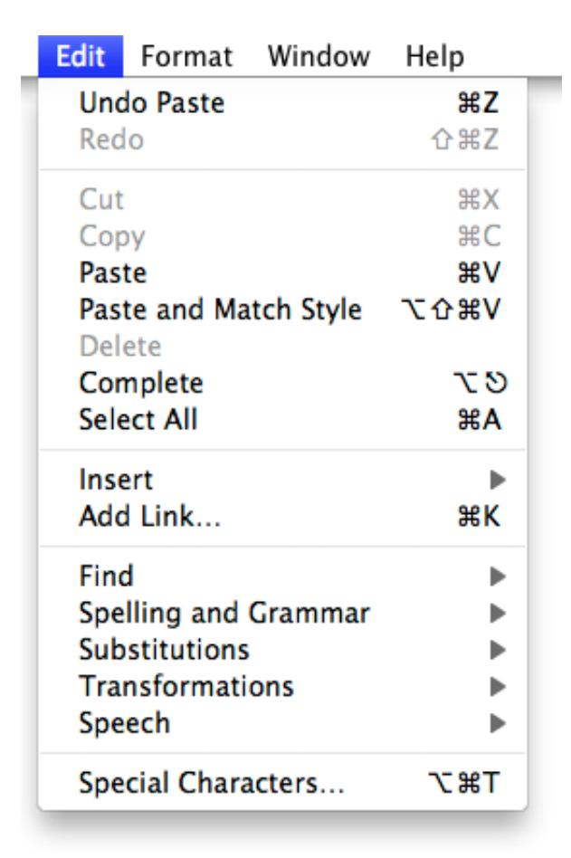

Even if your app doesn't handle text editing within its documents, the expected Edit commands should be available for use in dialogs and wherever users can edit text.

The Edit menu includes the following standard menu items, listed in the order in which they should appear:

| Menu item                      | Expected | Keyboard shortcut      | Meaning                                                                                                                                                                                                                                           |
|--------------------------------|----------|------------------------|---------------------------------------------------------------------------------------------------------------------------------------------------------------------------------------------------------------------------------------------------|
| Undo                           | Yes      | Command-Z              | Reversesthe<br>effect<br>of<br>the<br>user's<br>previous<br>operation.                                                                                                                                                                            |
| Redo                           | Yes      | Command-Shift-Z        | Reverses<br>the<br>effect<br>of<br>the<br>last<br>Undo<br>command.                                                                                                                                                                                |
| Cut                            | Yes      | Command-X              | Removes<br>the<br>selected<br>data<br>and<br>stores<br>it<br>on<br>the<br>Clipboard,<br>replacing<br>the<br>previous<br>contents<br>of<br>the<br>Clipboard.                                                                                       |
| Copy                           | Yes      | Command-C              | Makes<br>a<br>duplicate<br>of<br>the<br>selected<br>data,<br>which<br>is<br>stored<br>on<br>the<br>Clipboard.                                                                                                                                     |
| Paste                          | Yes      | Command-V              | Inserts<br>the<br>Clipboard<br>contents<br>at<br>the<br>insertion<br>point.<br>The<br>Clipboard<br>contents<br>remain<br>unchanged,<br>permitting<br>the<br>user<br>to<br>choose<br>Paste<br>multiple<br>times.                                   |
| Paste<br>and<br>Match<br>Style | No       | Command-Option-Shift-V | Inserts<br>the<br>Clipboard<br>contents<br>at<br>the<br>insertion<br>point,<br>matching<br>the<br>style<br>of<br>the<br>inserted<br>text<br>to<br>the<br>surrounding<br>text.                                                                     |
| Delete                         | Yes      |                        | Removes<br>selected<br>data<br>without<br>storing<br>the<br>selection<br>on<br>the<br>Clipboard.                                                                                                                                                  |
| Select<br>All                  | Yes      | Command-A              | Highlights<br>every<br>object<br>in<br>the<br>document<br>or<br>window,<br>or<br>all<br>characters<br>in<br>a<br>text<br>field.                                                                                                                   |
| Find                           | Yes      | Command-F              | Opens<br>an<br>interface<br>for<br>finding<br>items.                                                                                                                                                                                              |
| Find<br>Next                   | No       | Command-G              | Performs<br>the<br>last<br>Find<br>operation<br>again.                                                                                                                                                                                            |
| Spelling                       | No       | Command-:              | Performs<br>a<br>spell-check<br>of<br>the<br>selected<br>text<br>and<br>opens<br>an<br>interface<br>in<br>which<br>users<br>can<br>correct<br>the<br>spelling,<br>view<br>suggested<br>spellings,<br>and<br>find<br>other<br>misspelled<br>words. |
| Speech                         | No       |                        | Displays<br>a<br>submenu<br>containing<br>the<br>Start<br>Speaking<br>and<br>Stop<br>Speaking<br>commands.<br>Users<br>choose<br>this<br>command<br>to<br>hear<br>any<br>app<br>text<br>spoken<br>aloud<br>by<br>the<br>system.                   |

| Menu item             | Expected | Keyboard shortcut | Meaning                                                                                                                                                                                                                                                                                                                       |
|-----------------------|----------|-------------------|-------------------------------------------------------------------------------------------------------------------------------------------------------------------------------------------------------------------------------------------------------------------------------------------------------------------------------|
| Special<br>Characters | Yes      |                   | Displaysthe<br>Special<br>Characters<br>window,<br>which<br>allows<br>users<br>to<br>input<br>characters<br>from<br>any<br>character<br>set<br>supported<br>by<br>OS<br>X<br>into<br>text<br>entry<br>fields.<br>This<br>menu<br>item<br>is<br>automatically<br>inserted<br>at<br>the<br>bottom<br>of<br>the<br>Edit<br>menu. |

**As much as possible, support undo and redo functionality.** In particular, you should support the Undo command for:

- Operations that change the contents of a document
- Operations that require a lot of effort to re-create
- Most menu items
- Most keyboard input

It might not be possible to support undo for every operation users can perform in your app. For example, selecting, scrolling, splitting a window, and changing a window's size and location aren't necessarily undoable.

**Let the user know when Undo isn't possible.** If the last operation can't be reversed, change the command to Can't Undo and display it dimmed to help the user understand that the action isn't available.

If a user attempts to perform an operation that could have a detrimental effect on data and that can't be undone, warn the user (for more information on how to do this, see ["Alerts"](#page-235-0) (page 236)).

**Add the name of the last undo or redo operation to the Undo and Redo commands, respectively.** If the last operation was a menu command, add the command name. For example, if the user has just input some text, the Undo command could read Undo Typing. If the user chooses Undo Typing, the Redo command should then read Redo Typing and the Undo command should include the name of the operation the user performed *before* typing.

**Don't change the Delete menu item name.** Choosing Delete is the equivalent of pressing the Delete key or the Clear key. Use Delete as the menu command, not Clear or Erase or anything else.

**Determine the best placement for the Find command.** For example, the Find command could be in the File menu, instead of the Edit menu, if the object of the search is files. When appropriate, your app should also contain a Find/Replace command. For more information about providing find functionality, see ["Find](#page-231-0) [Windows"](#page-231-0) (page 232).

**Provide a Find submenu, if appropriate.** You might want to include a Find submenu if find is important functionality in your app. Typically, a Find submenu contains Find (Command-F), Find Next (Command-G), Find Previous (Command-Shift-G), Use Selection for Find (Command-E), and Jump to Selection (Command-J). If you include a Find submenu, the Find menu item name should not include an ellipsis character.

**Group Find Next with Find.** Whether you place the Find command in the File menu or the Edit menu, this item should be grouped with the Find command because users think of them together.

**Provide a Spelling submenu, if appropriate.** If your app provides multiple spelling-related commands, you might want to include a Spelling submenu that contains Check Spelling (Command-;) and Check Spelling as You Type commands. If you include a Spelling submenu, the Spelling menu item name should not include an ellipsis character.

#### <span id="page-155-0"></span>The Format Menu

If your app provides functions for formatting text, you can include a **Format menu** as a top-level menu or as a submenu of the Edit menu. It might be appropriate to group some items that are in the Format menu into submenus, such as Font, Text, or Style.


The Format menu includesthe following standard menu items, listed in the order in which they should appear:

| Menu item      | Expected | Keyboard shortcut | Meaning                                                                                                                                           |
|----------------|----------|-------------------|---------------------------------------------------------------------------------------------------------------------------------------------------|
| Show<br>Fonts  | Yes      | Command-T         | Displays<br>the<br>Fonts<br>window.<br>The<br>Show<br>Fonts<br>menu<br>item<br>should<br>be<br>displayed<br>first<br>in<br>the<br>Format<br>menu. |
| Show<br>Colors | Yes      | Command-Shift-C   | Displays<br>the<br>Colors<br>window.                                                                                                              |

| Menu item      | Expected | Keyboard shortcut                                                                                              | Meaning                                                                                                                                                                                           |
|----------------|----------|----------------------------------------------------------------------------------------------------------------|---------------------------------------------------------------------------------------------------------------------------------------------------------------------------------------------------|
| Bold           | No       | Command-B                                                                                                      | Boldfaces<br>the<br>selected<br>text<br>or<br>toggles<br>boldfaced<br>text<br>on<br>and<br>off.                                                                                                   |
| Italic         | No       | Command-I                                                                                                      | Italicizes<br>the<br>selected<br>text<br>or<br>toggles<br>italic<br>text<br>on<br>and<br>off.                                                                                                     |
| Underline      | No       | Command-U<br>Underlines<br>the<br>selected<br>text<br>or<br>toggles<br>underlined<br>text<br>on<br>and<br>off. |                                                                                                                                                                                                   |
| Bigger         | No       | Command–Shift–equal<br>sign                                                                                    | Causesthe<br>selected<br>item<br>to<br>increase<br>in<br>size<br>in<br>defined<br>increments.                                                                                                     |
| Smaller        | No       | Command-hyphen                                                                                                 | Causes<br>the<br>selected<br>item<br>to<br>decrease<br>in<br>size<br>in<br>defined<br>increments.                                                                                                 |
| Copy<br>Style  | No       | Command-Option-C                                                                                               | Copies<br>the<br>style—font,<br>color,<br>and<br>size<br>for<br>text—of<br>the<br>selected<br>item.                                                                                               |
| Paste<br>Style | No       | Command-Option-V                                                                                               | Applies<br>the<br>style<br>of<br>one<br>object<br>to<br>the<br>selected<br>object.                                                                                                                |
| Align<br>Left  | No       | Command-{                                                                                                      | Left-aligns<br>a<br>selection.                                                                                                                                                                    |
| Center         | No       | Command-                                                                                                       | Center-aligns<br>a<br>selection.                                                                                                                                                                  |
| Justify        | No       |                                                                                                                | Evenly<br>spaces<br>a<br>selection.                                                                                                                                                               |
| Align<br>Right | No       | Command-}                                                                                                      | Right-aligns<br>a<br>selection.                                                                                                                                                                   |
| Show<br>Ruler  | No       |                                                                                                                | Displays<br>a<br>formatting<br>ruler.                                                                                                                                                             |
| Copy<br>Ruler  | No       | Command-Control-C                                                                                              | Copies<br>formatting<br>settings<br>such<br>as<br>tabs<br>and<br>alignment<br>for<br>a<br>selection<br>to<br>apply<br>to<br>a<br>anotherselection<br>and<br>storesthem<br>on<br>the<br>Clipboard. |
| Paste<br>Ruler | No       | Command-Control-V                                                                                              | Appliesformatting<br>settings(that<br>have<br>been<br>saved<br>to<br>the<br>Clipboard)<br>to<br>the<br>selected<br>object.                                                                        |

#### <span id="page-157-0"></span>The View Menu

The **View menu** provides commands that affect how users see a window's content; it does *not* provide commandsto selectspecific document windowsto view or to manage a specific document window. Commands to organize, select, and manage windows are in the Window menu (described in "The [Window](#page-158-1) Menu" (page 159)).

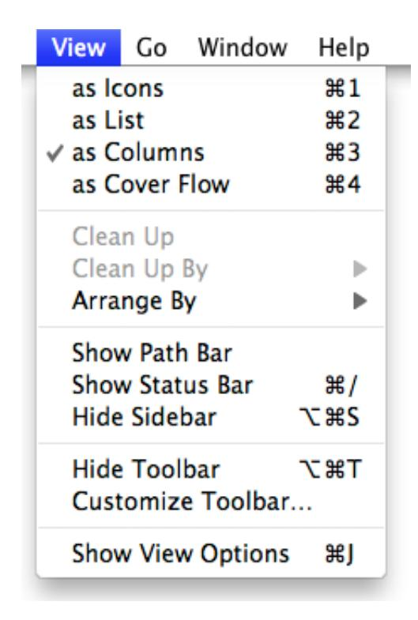

The View includes the following standard menu items, listed in the order in which they should appear:

| Menu item               | Expected | Keyboard shortcut | Meaning                                                                                                                                               |
|-------------------------|----------|-------------------|-------------------------------------------------------------------------------------------------------------------------------------------------------|
| Show/Hide<br>Toolbar    | Yes      | Command-Option-T  | Shows<br>or<br>hides<br>a<br>toolbar.                                                                                                                 |
| Customize<br>Toolbar    | Yes      |                   | Opens<br>a<br>dialog<br>that<br>allows<br>the<br>user<br>to<br>customize<br>which<br>items<br>are<br>present<br>in<br>the<br>toolbar.                 |
| Enter<br>Full<br>Screen | No       | Command-Control-F | Opensthe<br>window<br>at<br>full-screen<br>size<br>in<br>a<br>new<br>space.<br>Available<br>when<br>the<br>app<br>supports<br>full-screen<br>windows. |

**Include the View menu if a window can go full screen or if it contains a toolbar.** Create a View menu for these commands even if your app doesn't need to have other commands in the View menu. Note that the Enter Full Screen command toggles with the Exit Full Screen command.

**Avoid using the View menu to display panels (such as tool palettes).** Use the Window menu to display open windows and panels instead.

**Implement the Show/Hide Toolbar command as a dynamic toggled menu item.** If the toolbar is currently visible, the menu item says Hide Toolbar. If the toolbar is not visible, it says Show Toolbar.

### <span id="page-158-0"></span>App-Specific Menus

You can add your own app-specific menus as appropriate. These menus should be between the View menu and the Window menu. For example, the Safari-specific History and Bookmarks menus appear between the View and Window menus.


#### <span id="page-158-1"></span>The Window Menu

The **Window menu** contains commands for organizing and managing an app's windows.

Other than Minimize and Zoom (discussed below), the Window menu does not contain commands that affect the way a user views a window's contents. The View menu (described in "The View [Menu"](#page-157-0) (page 158)) contains all commands that adjust how a user views a window's contents.


The Window menu includes the following standard items, listed in the order in which they should appear:

| Menu item | Expected | Keyboard shortcut | Meaning                                                    |  |
|-----------|----------|-------------------|------------------------------------------------------------|--|
| Minimize  | Yes      | Command-M         | Minimizes<br>the<br>active<br>window<br>to<br>the<br>Dock. |  |

| Menu item                   | Expected | Keyboard shortcut | Meaning                                                                                                                                                                                                                                                                                                                                                                               |
|-----------------------------|----------|-------------------|---------------------------------------------------------------------------------------------------------------------------------------------------------------------------------------------------------------------------------------------------------------------------------------------------------------------------------------------------------------------------------------|
| Minimize<br>All             | No       | Command-Option-M  | Minimizes<br>all<br>the<br>windows<br>of<br>the<br>active<br>app<br>to<br>the<br>Dock.                                                                                                                                                                                                                                                                                                |
| Zoom                        | Yes      |                   | Toggles<br>between<br>a<br>predefined<br>size<br>appropriate<br>to<br>the<br>window's<br>content<br>and<br>the<br>window<br>size<br>the<br>user<br>has<br>set.                                                                                                                                                                                                                        |
| Bring<br>All<br>to<br>Front | No       |                   | Brings<br>forward<br>all<br>of<br>an<br>app's<br>open<br>windows,<br>maintaining<br>their<br>onscreen<br>location,<br>size,<br>and<br>layering<br>order.<br>(This<br>should<br>happen<br>when<br>the<br>user<br>clicks<br>the<br>app<br>icon<br>in<br>the<br>Dock.)<br>Note<br>that<br>this<br>item<br>can<br>be<br>an<br>Option-enabled<br>toggle<br>with<br>Arrange<br>in<br>Front. |
| Arrange<br>in<br>Front      | No       |                   | Bringsforward<br>all<br>of<br>the<br>app's<br>windowsin<br>their<br>current<br>layering<br>order<br>and<br>changes<br>their<br>location<br>and<br>size<br>so<br>that<br>they<br>are<br>neatly<br>tiled.<br>Note<br>that<br>this<br>item<br>can<br>be<br>an<br>Option-enabled<br>toggle<br>with<br>Bring<br>All<br>to<br>Front.                                                        |

**Note:** When you use the programming interfaces to allows users to take windows full screen, you add the Enter Full Screen menu item to the View menu. If you do not include a View menu, you can add the Enter Full Screen menu item to the Window menu instead.

The following guidelines help you provide a Window menu that helps users organize windows in your app.

**List open windows appropriately.** The Window menu should list your app's open windows(including minimized windows) in the order in which they were opened, with the most recently opened window first. If a document contains unsaved changes, a dot can appear next to its name.

**Avoid listing open panels in the Window menu.** You can, however, add a command to the Window menu to show or hide panels in your app. (For more information about panels, see ["Panels"](#page-208-0) (page 209).)

**Include a Window menu for the Minimize and Zoom commands.** Even if your app consists of only one window, you should provide the Minimize and Zoom commands so that people using full keyboard access can implement these functions with the keyboard.

**Use the correct order for items in the Window menu.** Specifically, items should appear in this order:

Minimize

Zoom

A separator

App-specific window commands

Bring All to Front (optional)

A separator

A list of open windows

Note that the Close command should appear in the File menu, below the Open command (see ["The](#page-148-0) File [Menu"](#page-148-0) (page 149)).

**Avoid using Zoom to expand the window to the full screen size.** Users expect Zoom to toggle the window between two useful sizes. For more information about implementing zoom, see "Resizing and [Zooming](#page-199-0) [Windows"](#page-199-0) (page 200).

#### <span id="page-160-0"></span>The Help Menu

If your app provides onscreen help, the **Help menu** should be the rightmost menu of your app's menus.

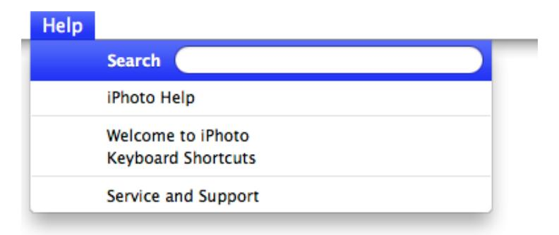

If you have registered your help book, the system provides the Spotlight For Help search field as the first item in the menu (for information on how to register your help book, see *Apple Help Programming Guide* ).

The next menu item is *AppName* **Help**, which opens Help Viewer to the first page of your app's help book. For some guidelines on creating useful help content, see "User [Assistance"](#page-106-0) (page 107).

**As much as possible, display only one custom item in the Help menu.** That is, it's best to display only the *AppName* Help item. If you do have more items, display them below this item. If you have additional items that are unrelated to help content, such as arbitrary website links, registration information, or release notes, link to these within your help book instead of listing them as separate items in the Help menu.

**Avoid using the Help menu as a table of contents for your help book.** When users choose the *AppName* Help item, they can see the sections in your help book in the Help Viewer window. If you choose to provide additional links into your help content within the Help menu, be sure they are distinct.

#### <span id="page-161-0"></span>Menu Bar Extras

As described in "All Apps Use the [Single](#page-15-0) Menu Bar" (page 16), users decide to place menu bar extras in the menu bar. Typically, users decide to hide or show a menu bar extra by changing a setting in the appropriate preferences pane.

If there is not enough room in the menu bar to display all menus, OS X automatically removes menu bar extras to make room for app menus, which take precedence. Similarly, if there are too many menu bar extras, OS X may remove some of them to avoid crowding app menus.

**Don't rely on the presence of menu bar extras.** The system might change which menu bar extras are visible, and you can't be sure which menu bar extras users have chosen to show or hide.

**Avoid creating a popover that emerges from a menu bar extra.** Popovers emerge from controls and specific window areas (for guidelines on how to use a popover in your app, see ["Popovers"](#page-204-0) (page 205)). A menu bar extra can open a menu, such as the Keyboard & Character Viewer menu.

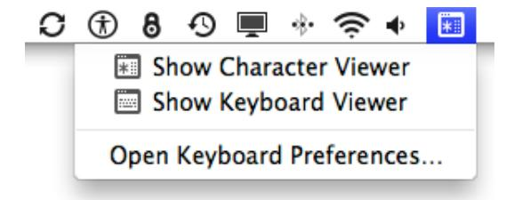

<span id="page-161-1"></span>**Consider alternatives to creating a menu bar extra.** For example, you can use the Dock menu functions to open a menu from your app's icon in the Dock. For some guidelines on how to create a Dock menu, see ["Designing](#page-165-0) a Dock Menu" (page 166).

### Designing Contextual Menus

A **contextual menu** provides convenient access to often-used commands associated with an item. You can think of a contextual menu as a shortcut to a small set of commands that make sense in the context of the current task. An object or selection can display a contextual menu when the user Control-clicks the object or selection.

For example, Control-clicking a document icon displays a contextual menu that allows usersto perform several file-specific Finder actions.

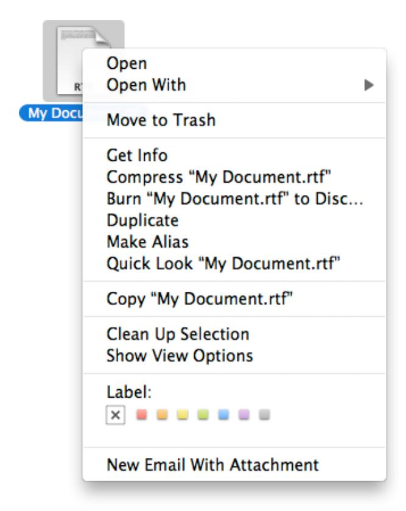

Control-clicking a text selection displays a different contextual menu and one that is focused on text-specific actions. For example, the contextual menu displayed when users Control-click a text selection in a TextEdit document lists commands that allow them to change the font or check the spelling of the text.

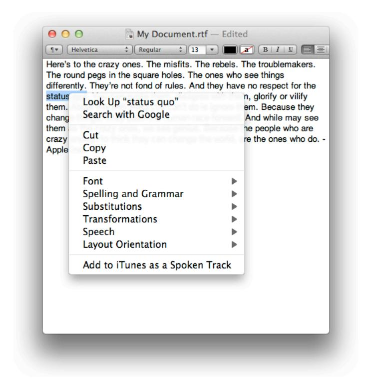

**If appropriate, use an Action menu to make contextual menu functionality easier to access.** You can use an Action menu to provide an app-wide contextual menu control in a toolbar. For example, the Finder provides an Action menu toolbar control that allows users to get the same commands that are displayed in a contextual menu for the selected item. Forsome guidelines on how to use an Action menu,see ["Action](#page-262-0) Menu" (page 263).

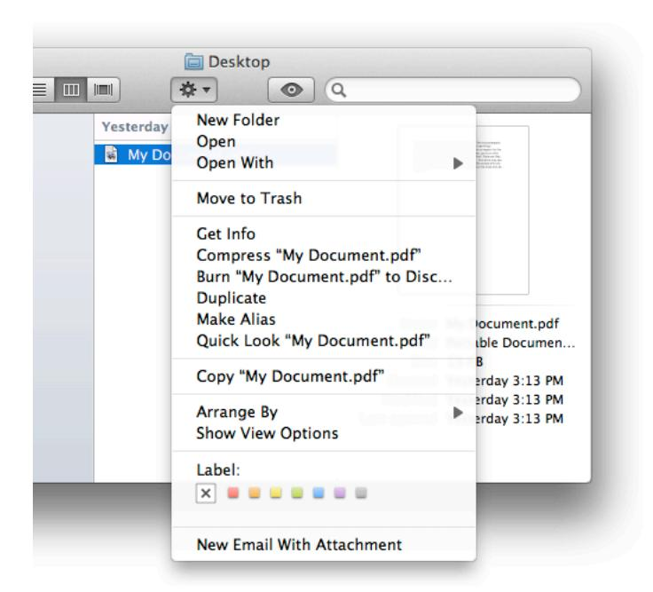

**Include only the most commonly used commands that are appropriate in the current context.** For example, Edit menu commandsshould appear in the contextual menu for highlighted text, but a Save or a Print command should not.

**Use caution when adding a submenu to a contextual menu.** Although you don't want a contextual menu to grow too long (too-long contextual menus display the scrolling indicator and scroll like standard menus), you also don't want to make them hard to use. Sometimes, users can find it difficult to maneuver the pointer so that the submenu stays open. If you decide to add submenus to your contextual menu, be sure to keep them to one level.

**Don't set a default item in a contextual menu.** If the user opens the menu and closes it without selecting anything, no action should occur.

**Always ensure that contextual menu items are also available as menu commands.** A contextual menu is hidden by default and a user might not know it exists,so itshould never be the only way to access a command. In particular, you should not use a contextual menu as the only way to access an advanced or power-user feature.

**Don't display keyboard shortcuts in a contextual menu.** A contextual menu is a shortcut to a set of task-specific commands, so it's redundant to display the keyboard shortcuts for those commands. Note that you should continue to display keyboard shortcuts in your app menus, as described in ["Designing](#page-145-0) Menus for the Menu [Bar"](#page-145-0) (page 146).

### <span id="page-165-0"></span>Designing a Dock Menu

When users Control-click a running app's Dock icon, a customizable Dock menu appears. By default, this menu displays the same items as the minimal Dock menu that is displayed when users press and hold the Dock icon (for more information about different styles of Dock menus, see "The [Dock"](#page-65-0) (page 66)). In addition, this menu can contain app-specific items,such asthe playback-focused commandsin the customized iTunes Dock menu.


The custom itemsthat you add appear in the Dock menu only when your app is open and the user Control-clicks the Dock icon. You might consider adding items such as:

- Common commands to initiate actions in your app when it is not frontmost
- Commands that are applicable when there is no open document window
- Status and informational text

For example, Mail provides commands to initiate a new message or to check for new messages. To learn how to customize the Dock menu for your app, see *Dock Tile Programming Guide* .

**Be sure that all Dock menu commands are also available in your app's menus.** Users might not know about the Dock menu, so it should not be the only way to do something.


# <span id="page-167-0"></span>UI Element Guidelines: Windows

A **window** provides a frame for viewing and interacting with apps and data.

Although users tend to view most rectangular areas on the screen as "windows," developers need to know about the main varieties of windows in OS X.

- A **document window** contains file-based user data.
- An **app window** is the main window of an app that is not document-based.
- A **panel** floats above other windows and provides tools or controls that users can work with while documents are open. In some cases, a panel can be transparent. (For more information about panels, see ["Panels"](#page-208-0) (page 209).)
- A **dialog** appears in response to a user action and typically provides ways users can complete the action. A dialog requires a response from the user before it can close. (For more information about dialogs, see ["Dialogs"](#page-214-0) (page 215).)
- An **alert** is a special type of dialog that appears when a serious problem occurs, such as an error. Because an alert is a dialog, it also requires a user response before it can close. (For more information about alerts, see ["Alerts"](#page-235-0) (page 236).)

Examples of these window types are shown here.


As you can see in the window examples above, the overall appearance of windows on OS X is subtle and understated. This muted appearance helps users focus on the content that's important to them.

**Note:** A popover is not a window per se, but users might think of it as one (especially if they can detach it from its parent UI element or area). To learn more about how to use popovers in your app, see ["Popovers"](#page-204-0) (page 205).

### <span id="page-168-0"></span>About Window Appearance and Behavior

A window consists of window-frame areas and a window body. The **window-frame areas** are the title bar and unified toolbar (and, in rare cases, a bottom bar). The **window body** extends from the bottom edge of the title bar (or toolbar, if present) to the bottom edge of the window (not including the bottom bar, if one is present). The window body represents the main **content area** of the window. For example, in a Mail message viewer window, the window body contains the mailbox list, the message list, and the selected message.

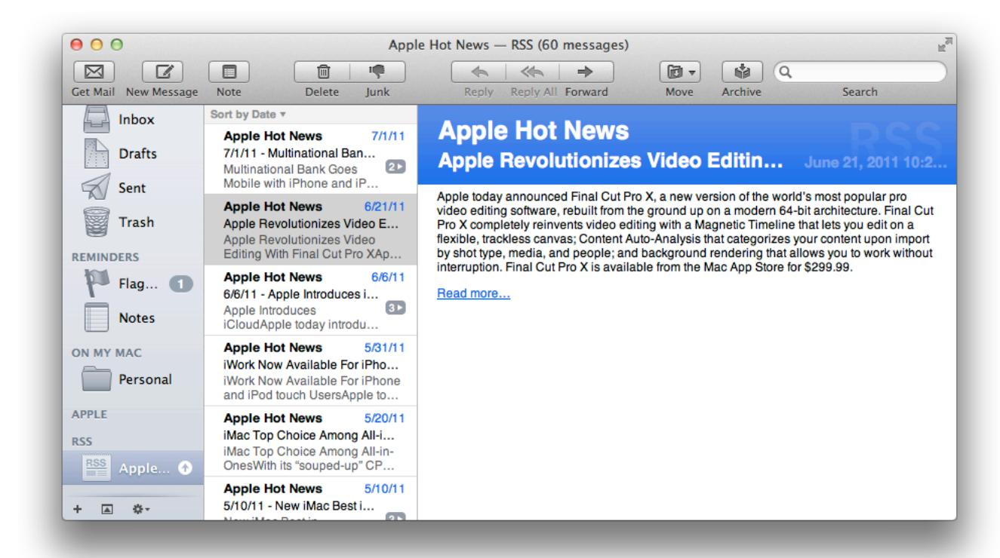

The window-frame areas have a light gray gradient surface. OS X provides toolbar controls that are specifically designed to look good on the toolbar. To learn about the controls you can use in a toolbar,see ["Window-Frame](#page-240-0) [Controls"](#page-240-0) (page 241).

In the window body, content views (such as text or column views) display a white background by default; the surrounding window-body background is usually a shade of light gray.

#### <span id="page-169-0"></span>Window Components

Every document and app window and panel has, at a minimum:

- A title bar. Even if a window does not have an actual title (a tools panel, for example), it needs a title bar so that users can move the window.
- A close button, so that users have a consistent way to dismiss the window.

A standard document window may also have the following additional elements that an app window or panel might not have:

- Transient horizontal or vertical scroll bars, or both (if not all the window's contents are visible)
- Minimize and zoom buttons
- A proxy icon and a versions menu (after the user has given a document a name and save location for the first time)
- The title of the document
- Transient resize controls

For example, the TextEdit document window shown here contains a title, a proxy icon, the close, minimize, and zoom buttons, and a scroller. You can't see the resize controls in this window, because they are visible only when the pointer rests above a window edge. Similarly, you can't see the versions menu because the document is not locked (and has not been recently edited) and the pointer is not resting in the title bar to the right of the document title.

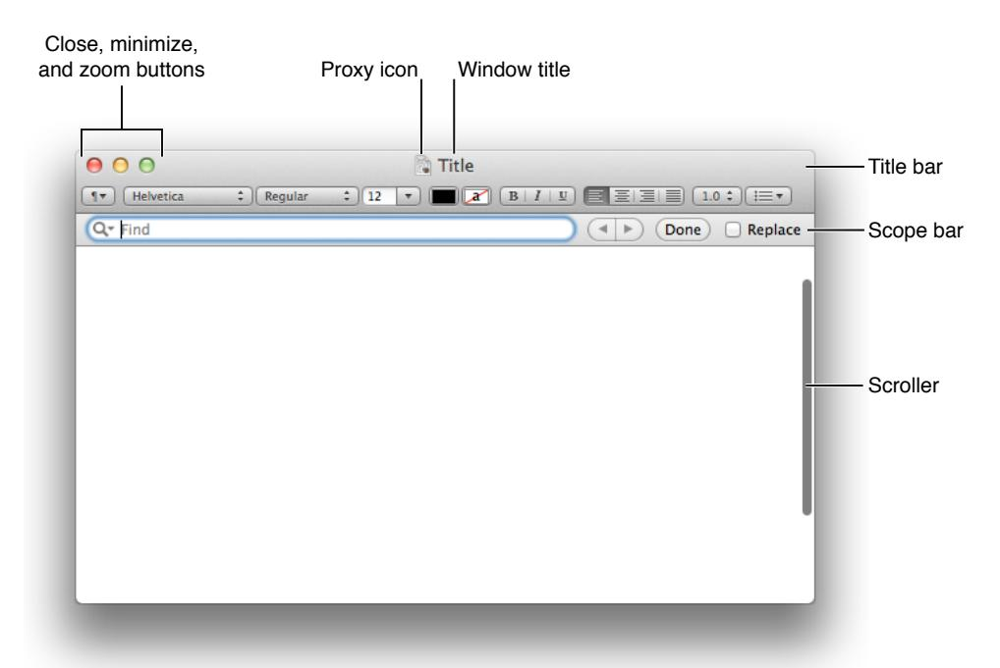

The TextEdit window shown above also includes an optional window element called the scope bar. A **scope bar** appears below the toolbar and allows users to narrow down a search operation or to filter objects or other operations by identifying specific sets of characteristics. To learn more about scope bars, see ["Using](#page-186-0) a Scope Bar to Enable [Searching](#page-186-0) and Filtering" (page 187).

Rarely, a window might display a **bottom bar**, which is a window frame area that extends below the main content area of the window body. A bottom bar contains controls that directly affect the contents and organization of the window, such as the add a buddy and chat controls at the bottom of the iChat window.

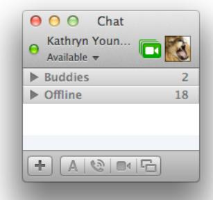

### <span id="page-171-0"></span>Scrolling

People scroll to view content that is larger than can fit in the current window. Scroll bars are not persistently visible by default.

In general, scroll bars appear when users:

- Open or resize a window that contains scrolling content
- Open content within a window that is too small to display all of the content at once
- Place two fingers on a trackpad or mouse surface
- Actively scroll content

In all of these cases, scroll bars appear briefly and then disappear shortly after users stop interacting with the window or the content. This behavior helps users see that the content exceeds the size of the window body, without requiring the scroll bar to occupy valuable space in the content area.

**Important:** Users can choose to make scroll bars visible all the time by changing the "Show scroll bars" setting in General preferences. A persistently visible scroll bar has a width of 15 points, which extends into the content area of a window.

An app that was developed to run in an earlier version of OS X might display legacy scroll bars when it runs in OS X. In addition, an app that includes a placard or a control inline with the scroll bar area also displays legacy scroll bars.

Finally, scroll bars can be persistently visible if there is a connected pointing device that doesn't support scrolling.

To learn how to use scroll bars in your app, see ["Enabling](#page-183-0) Scrolling" (page 184).

For example, you can see the scroll track of the horizontal scroll bar in the Safari window shown here, because it was recently resized.


The **scroller** size (relative to the length of the track) reflects how much of the content is visible. For example, a small scroller means that a small fraction of the total content is currently visible. The scroller also represents the relative location, in the whole document, of the portion that can be seen in the window.

Users scroll content in a window by doing one of the following:

- Scrolling on a trackpad. This is an easy, natural gesture that strengthens the user's sense of direct manipulation (to learn about the principle of direct manipulation, see "Direct [Manipulation"](#page-29-0) (page 30)). Note that users can also specify whether the content should move in the same direction that their fingers move in, or in the opposite direction.
- Rolling the scroll ball on a mouse. Users can adjust how fast or slow scrolling occurs in Mouse preferences.

- Dragging the scroller. This method can be the fastest way to move around a large document. The window's contents changes in "real time" as the user drags the scroller.
  - When a scroll bar is currently invisible, users must cause it to appear before they can drag the scroller. After a scroller appears, it remains visible for a few seconds so that users have a chance to interact with it.
- Clicking or pressing in the scroll track. Clicking moves the document by a windowful (the default) or to the pointer's hot spot, depending on the user's choice in General preferences. A "windowful" is the height or width of the window, minus at least one unit of overlap to maintain the user's context. The Page Up and Page Down keys also move the document view by a windowful.
  - Pressing in the scroll track displays consecutive windowfuls of the document until the location of the scroller catches up to the location of the pointer (or until the user stops pressing).

When a scroll bar is currently invisible, users must cause it to appear before they can click or press in the scroll track. There is a delay between the appearance and disappearance of the scroll bar, so that users have time to interact with the scroll track.

<span id="page-173-0"></span>Most of the time, the user controls scrolling. But sometimes, scrolling happens automatically while the user is performing a different task, such as extending a selection past the edge of a window. To learn when your app should support this action, known as **automatic scrolling**, see ["Enabling](#page-183-0) Scrolling" (page 184).

### Moving

The user moves a window by dragging any part of the window frame (for more information about the parts of a window,see "About Window [Appearance](#page-168-0) and Behavior" (page 169)). Asthe user drags a window, the entire window and its contents move. Users can drag a window from one desktop to another by dragging it to the left or the right of the screen until the current space is pushed away by the neighboring space.

<span id="page-173-1"></span>If the user presses the Command key while dragging an inactive window, the window moves, but does not become active. For more information about active and inactive windows, see "Main, Key, and [Inactive](#page-174-0) [Windows"](#page-174-0) (page 175).

#### Layering

Each app and document window exists in its own layer on a desktop, so that windows and documents from different apps can be interleaved. Clicking a window to bring it to the front doesn't disturb the layering order of any other window on the desktop.

A window's depth in the layers is determined by when the user last accessed it. When a user clicks an inactive document or chooses it from the Window menu, only that document, and any open panel, is brought to the front.

Users can bring all of an app's windows forward by clicking the app icon in the Dock or by choosing Bring All to Front in the app's Window menu. These actions bring forward all of the app's open windows, maintaining their onscreen location, size, and layering order within the app.

Panels are always in the top layer. They are visible only when their app is active, and they float on top of any open document windows in the app.

Users can view all of an app's open windows by activating App Exposé. In App Exposé view, users can choose one of the open windows on the current desktop or scroll to find an open window on a different desktop. Users can also cycle forward or backward through an app's open windows on the current desktop by using Command-Backquote (Command-`) and Command-Shift-Backquote (Command-Shift-`). If full keyboard access is on, they can cycle through all windows by using Control-F4 and Shift-Control-F4.

#### <span id="page-174-0"></span>Main, Key, and Inactive Windows

Windows have different appearances based on how the user is interacting with them. The foremost document or app window that is the focus of the user's attention is called the **main window**. The main window is often also the **key window**, which is the window that accepts user input. For example, the "close window" keyboard shortcut, Command-W, always targets the key window.

Typically, the main window is also the key window, but this is not always the case. Sometimes a window other than the main window takes the focus of the input device, while the main window remains the focus of the user's attention. For example, a user might be working in a document window when they need to open an inspector or the Colors window to make adjustments. In this situation, the document is still the main window, but the inspector or Colors window is the key window.

Both main and key windows are always in the foreground, but only the controls of the key window have color.

Main and key windows are both active windows. In an **active window**, the title bar (and toolbar, if one is present) displays the standard window-frame color. An active window that is not key has active, but clear, controls.

Inactive windows are windows the user has open, but that are not in the foreground. In an **inactive window**, the title bar (and toolbar) displays a lightershade of the window-frame color. You can see the visual distinctions between main, key, and inactive windows in the figure below.


<span id="page-175-0"></span>**Note:** A transparent panel that is key displays a subtly reflective title bar and a white title, whereas a non-key transparent panel displays a darker title bar and a light gray title. (For more information about transparent panels, see ["Transparent](#page-211-0) Panels" (page 212).)

### Going Full Screen

Apps can allow users to take a window full screen, so that they can immerse themselves in an experience or perform a task without distractions. When users take a window full screen, the app moves the window into a new space.

**Use modern APIs to enable a full-screen window.** If your app enabled a full-screen window in earlier versions of OS X, you should update your code to take advantage of the full-screen behavior introduced in OS X v10.7. Users expect to see windows transition to a new space and they expect to be able to switch between them and see them displayed in Mission Control. When you use the modern APIs, you can take advantage of the system-provided support for these behaviors,so that you can give users a consistent experience. For an overview of these programming interfaces, see "Implementing the Full-Screen Experience".

**Avoid creating a custom control that takes your window full screen.** When you use the full-screen APIs, the appropriate dual-state button (that is, and ) automatically appears in the right end of the title bar, giving users a consistent way to take your window full screen. You should also add the Enter Full Screen item to your View menu. (For more information about the View menu, see "The View [Menu"](#page-157-0) (page 158).) To learn how to enable full-screen windows in your code, see "Implementing the Full-Screen Experience".

**Create custom animations for your window's transition to and from full-screen mode.** It's recommended that you design a smooth, subtle animated transition to replace the default transition. In particular, you need to make sure that all parts of your window move smoothly together and no parts appear to break apart or lag behind. For example, the torn-paper area below the Calendar toolbar moves with the toolbar when an Calendar window transitions to full screen.

### <span id="page-176-0"></span>Displaying Items in the Title Bar

All windows should have a title bar even if the window doesn't have a title (which should be a very rare exception). In a full-screen window, the title bar is hidden.

<span id="page-176-1"></span>There are only four elementsthat can appear in the title bar: the window title, the title bar buttons, the full-screen button, and a proxy icon (in document windows). For the most part, you directly control only the window title; the system provides the other title-bar elements, depending on how you define your app's behavior.

#### The Window Title

The window title is centered in the title bar. If the title is too long for the width of the window, it is truncated and an ellipsis is added, if necessary.

**Name each window appropriately.** The title of a document window should be the name of the document that it displays. The title of an app window isthe app name. Panelsshould display a descriptive title appropriate for that window, such as Media or Layout.

**If necessary, change the title of the window to reflect the current context.** This might be appropriate if, for example, users can change the contents of the window. For example, in the Keynote inspector panel, the title of the window changes to reflect which pane the user has selected.

**Separate multiple items in a title with an em dash (—) with space on either side.** For example, when users select a mailbox the Mail message viewer window displays the name of the mailbox followed by the account name. When users open a message in its own window, the message title (that is, the subject) is displayed, followed by the mailbox name.

**Don't display pathnames in window titles.** When displaying document titles, use the display name and show the extension if the user has elected to show extensions. If you need to display a path in the body of a window you can use the path control, described in "Path [Control"](#page-267-0) (page 268).

#### <span id="page-177-0"></span>Title Bar Buttons

The close, minimize, and zoom buttons, which are known collectively as the **title bar buttons**, appear in all windows except alerts and modal dialogs.

Document and app windows always display active close and minimize buttons. (For details on what these buttons do,see "Closing [Windows"](#page-201-0) (page 202) and ["Minimizing](#page-200-0) and Expanding Windows" (page 201).) The zoom button appearsif the window can be adjusted in size. (Information on how the zoom button worksisin ["Resizing](#page-199-0) and Zooming [Windows"](#page-199-0) (page 200).)

Panels always display an active close button but never an active minimize button, because an open panel hides or minimizes together with its associated app or document window.

In general, inactive title bar buttons are visible in their inactive state; that is, they don't disappear when they're inactive. The exception isin panels, where it is acceptable to display only the close button. To learn more about panels and their title bar buttons, see ["Panels"](#page-208-0) (page 209).

You can see the appropriate configurations of title bar buttons for app and document windows (and alerts and modal dialogs) below.

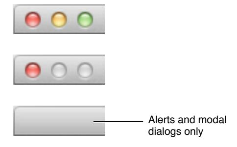

Note that in an app that is not document-based, the close button might display a dot to indicate that the window contains unsaved changes. Document-based apps rarely need to do this, because Auto Save allows users to stop worrying about the saved state of their documents. For more information about Auto Save, see "Auto Save and [Versions"](#page-102-0) (page 103).

#### <span id="page-178-0"></span>The Full-Screen Button

If you use the standard AppKit programming interfacesto enable a window to go fullscreen, the system-provided full-screen button appears in the right end of the title bar by default (shown here in Mail).


Users can click the full screen button to take a window full screen; in the full-screen window, they click the button again to return the window to its standard size. To learn more about enabling full-screen windows in your app, see "Allow Users to Go Full Screen (if [Appropriate\)"](#page-40-0) (page 41).

#### <span id="page-178-1"></span>The Proxy Icon and Versions Menu

Document windows can include a proxy icon in the title bar after the content is saved for the first time. In apps that support Auto Save, a versions menu can also appear in the title bar, which allows users to browse earlier versions or lock the document.

A **proxy icon** is a small icon that represents the document itself. After pressing a proxy icon for a brief period, users can manipulate it as if they were manipulating the actual document. For example, users can attach a document to an email message by dragging its proxy icon into the email message, as shown below.


Users can Command-click the document title or the proxy icon to view a pop-up menu thatshowsthe document path. (Note that you do not place a standard pop-up menu control in the title bar to provide this behavior). Because OS X is a multiuser environment, it's especially important to show the complete path of a document to avoid confusion. For example, in the Preview document shown here, the document path displays the document itself and all its containing folders, including the volume that contains the user's home directory.

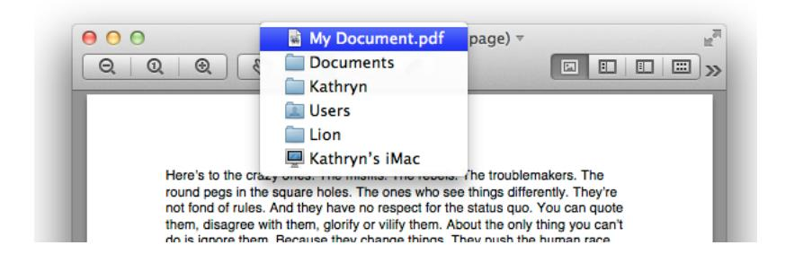

The versions menu gives users a shortcut way to lock a document (which prevents unauthorized editing), duplicate it, replace it with a different version, or browse all earlier versions. The versions menu also displays the current status of the document, such as Edited, Locked, or—in rare cases—Not Saved. For example, the TextEdit document shown here has been edited since it was saved the first time, and earlier versions are available.


### <span id="page-179-0"></span>Designing a Toolbar

A **toolbar** gives users convenient access to the most frequently used commands and features in an app. For example, the default Mail toolbar includes the commands people use most often as they view, compose, and manage their email.


Users often rely on the presence of a toolbar, but you can hide it in a full-screen window if users don't need it to accomplish the focused task. For example, Preview hides the toolbar in a full-screen window because users are more likely to be focused on reading content than on annotating it. If you hide the toolbar in a full-screen window, users should be able to reveal it (along with the menu bar) when they move the pointer to the top of the screen.

Because a toolbar in an app or document window contains frequently used items, it tends to be a prominent part of the user's experience with your app. The guidelines in this section help you to design a toolbar that enhances the usability of your app.

**Note:** Other types of windows, such as panels and preferences windows, can also contain toolbars. In general, the style and usage of toolbars in these types of windows differ from the style and usage of a toolbar in an app or document window. To learn how to design a panel, see ["Panels"](#page-208-0) (page 209); to learn how to design a preferences window, see ["Preferences](#page-219-0) Windows" (page 220).

**Create toolbar items that represent the functionality users need most often.** To help you decide which items to include in your toolbar, consider the user's mental model of the task they perform in your app (to learn more about the mental model, see ["Mental](#page-26-2) Model" (page 27)).

**Arrange toolbar items so that they support the main task users accomplish in your app.** In general, you want to use the left end of the toolbar for commands that should have the highest visibility. (In a localized version of your app, the commands that you've identified as being high-visibility might appear in the right end of the toolbar.) "High visibility" can mean different things in different apps. In some apps, for example, frequency of use should determine visibility; in other apps, it makes more sense to rank items according to importance, significance, or their place in an object hierarchy. The figure below illustrates three possible ways to arrange toolbar items.


#### **If appropriate, separate toolbar items into subsets and then arrange the subsets according to importance.**

Sometimes, you can define logical subsets of your app's features and objects, such as one subset of document-manipulation commands and another subset of commands for manipulating page-level objects such as paragraphs, lists, and tables. When this is the case, you can arrange the items in each subset according to importance or frequency of use, and then use the same criteria to position each subset in the toolbar.

The default Keynote toolbar is an example of this type of arrangement. Keynote groups items according to functionality and then positions the groups so that the items that handle slide decks and slides are to the left of items that provide inspection and selection of object attributes. You can see about half of these groups below:


**Don't use standard Aqua controls in a toolbar.** Standard Aqua controls look bad on the toolbar background. Instead, you should use the controls that have been specifically designed for use in toolbars, such as the round textured button (shown here used for the Quick Look button in the Finder toolbar). To learn more about the controls you can use in a toolbar, see ["Window-Frame](#page-240-0) Controls" (page 241).

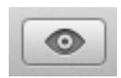

**Important:** Don't use the toolbar-specific controls anywhere else in your window. The toolbar controls include a translucency that makes them look good on the toolbar background; but on a window-body background, these controls can disappear or look inactive.

**Ensure that your toolbar controls clearly communicate their meaning to users.** It's best when users can tell what a toolbar control does without experimentation (or waiting to see a help tag). You can use system-provided icons in your toolbar controls to represent a wide range of common commands and features, such as the

Action menu and Quick Look; that is, and . Users are familiar with the meanings of these items, and using them frees you from having to design custom icons. (For more information about the system-provided images you can use, see ["System-Provided](#page-319-0) Icons" (page 320).)

**Important:** If you use system-provided images in your toolbar controls, be sure to use them according to their documented meanings. For example, use the Action gear symbol in an Action menu only; don't use it to represent "build" or "advanced."

**If necessary, you can design custom icons to represent toolbar items.** If you have to do this, be sure to follow the guidelines in ["Designing](#page-121-0) Toolbar Icons" (page 122).

**Avoid displaying a persistent selected appearance for a toolbar item.** When the user clicks an item in an app or document window toolbar the item highlights briefly, and an immediate action occurs,such as opening a new window, switching to a different view, displaying a menu, or inserting (or removing) an object. Because the result of the click is an action, it does not make sense to imply that there is a change in state. The exception to this is a segmented control that shows a persistent selected appearance within the context of the control, such as the view controls in the Finder toolbar:


**Make every toolbar item available as a menu command.** Because users can customize the toolbar (and it can be hidden under some circumstances), the toolbar should not be the only place to find a command.

It's important to emphasize that the converse of this guideline is *not* true. That is, you should not create a toolbar item for every menu command, because not all commands are important enough (or used frequently enough) to warrant inclusion in a toolbar.

**In general, allow users to show or hide the toolbar.** Users might want to hide the toolbar to minimize distractions or reveal more of their content. (Note that you can cause the toolbar to hide automatically in a full-screen window.) The commands for showing and hiding the toolbar belong in the View menu (for more information about this menu, see "The View [Menu"](#page-157-0) (page 158)).

**In general, allow users to customize the toolbar.** Although the default toolbar should include the commands that most users want, you should allow users to customize this set of commands to support their individual working styles. In addition, users should be able to specify whether toolbar items are displayed as controls only, text only, or controls with text (by default, display both controls and text). Place the Customize Toolbar command in the View menu (for more information about this menu,see "The View [Menu"](#page-157-0) (page 158)). Although you can also allow usersto adjust the size of toolbar items, most users don't expect this capability (if you decide to do this, you must supply different sizes of toolbar icons).

In addition, you can enable a contextual menu that is revealed when users Control-click the toolbar itself. In this menu, users can choose to customize the appearance and contents of the toolbar in various ways.

**Avoid putting an app-specific contextual menu in your toolbar.** Users reveal the contextual toolbar customization menu by Control-clicking anywhere in the toolbar. Additionally, in document windows, users can reveal the document path menu by Control-clicking the window title. This does not leave any areas in the toolbar that users could Control-click to reveal a third contextual menu. If you need to offer a set of commands that act upon an object the user selects, use an Action menu control instead (this item is described in ["Action](#page-262-0) [Menu"](#page-262-0) (page 263)).

**Enable click-through for toolbar items when appropriate.** Click-through means that the user can activate the item when the containing window is inactive. You can support click-through for any subset of toolbar items. In general, you want to allow click-through for nondestructive actions that users might want to perform when they're focused on a task in a different window. For additional guidelines on supporting click-through, see "Enabling [Click-Through"](#page-201-1) (page 202).

### <span id="page-183-0"></span>Enabling Scrolling

Scrolling is one of the most common ways that users interact with their content. Follow the guidelines in this section to help you enable convenient, intuitive scrolling that takes advantage of the translucent, transiently visible scroll bars in OS X.

**Avoid causing the legacy scroll barto display.** Users expectscroll barsto be only transiently visible by default. Although users can change the appearance of scroll bars in General preferences, you should not force users to see scroll bars if they don't want to. Be sure to avoid using a placard or placing a control inline with a scroll bar, because including these elements in your UI causes legacy scroll bars to appear in your app.

**Don't move window content when scroll bars appear.** Scroll bars are both transient and translucent, so users can see the window content that is beneath them. It should not be necessary to adjust the layout of content in your window, and doing so risks confusing users.

**Help users discover when a window's content is scrollable.** Because scroll bars are not always visible, it can be helpful to make it obvious when content extends beyond the window. In a table or list view, for example, you can display the middle of a row at the bottom edge of the window instead of displaying a complete row. Displaying partial content at the bottom edge of a window in this way shows users that there's more to see.

Don't feel that you must always indicate when text doesn't fit within a document window by, for example, displaying a partial line of text at the bottom edge. Remember that scrolling is an intuitive and nondestructive action that users don't mind experimenting with. When faced with a window full of text, the vast majority of users will instinctively scroll in the window to see if more content is available.

**If necessary, adjust the layout of your window so that important UI elements do not appear beneath scrollers.** Occasionally, there might be cases in which you want to avoid having a scroller appear on top of specific parts of your UI. In Mail, for example, the position of an unread message badge in the Mailbox List leaves enough room for the scrollers to display without visually interfering with the badge. If you need to do this, note that the overall width of a regular-size scroll bar is 10 points (the overall width of a small-size scroll bar is 8 points). If necessary, you can adjust your layout so that there are no important UI elements within 10 points of the edge of the content area (or within 8 points of the edge, if you're using a small-size scroll bar).

**Choose the scroller color that best coordinates with your UI.** If your UI is very dark, for example, you might want to specify the light-colored scrollers so that users can see them easily. You can specify light, dark, or default. Mail, for example, uses the default scroller color:


**Determine how much to scroll when users click in the scroll track.** Clicking in the scroll track advances the document by a windowful (the default) or to the pointer's hot spot, depending on the user's choice in General preferences. (Recall that users must first scroll the content to reveal the scroll track, as described in ["Scrolling"](#page-171-0) (page 172).) A "windowful" is the height or width of the window, minus at least one unit of overlap to maintain the user's context. You define the unit of overlap so that it makessense for the content you display. For example, one unit might equal a line of text, a row of icons, or part of a picture. Note that you should respond to the Page Up and Page Down keys in the same way that you respond to a click in the scroll track; that is, pressing these keys should also move the content by a windowful.

When users pressin the scroll track, you should display consecutive windowfuls of the content until the location of the scroller catches up to the location of the pointer (or until the user stops pressing).

**Scroll automatically when appropriate.** Most of the time, the user should be in control of scrolling, but your app should perform automatic scrolling in the following cases:

● When your app performs an operation that results in making a new selection or moving the insertion point. For example, when the user searches for some text and your app locates it, scroll the document to show the new selection.

- When the user enters information from the keyboard at a location not visible within the window. For example, if the insertion point is on one page and the user has navigated to another page, scroll the document automatically to incorporate and display the new information.
  - Your app determines the distance to scroll.
- When the user moves the pointer past the edge of the window while making an extended selection, scroll the document in the direction the pointer moves.
- When the user selects something, scrolls to a new location, and then tries to perform an operation on the selection, your app should scroll the content so that the selection is showing before performing the user's operation.

**Move the document only as much as necessary during automatic scrolling.** Minimizing the amount of automatic scrolling helps users keep their place in the content. For example, if part of a selection is showing after the user performs an operation, don't scroll at all. If your app can reveal the selection by scrolling in only one direction, don't scroll in both.

**If possible, show a selection in context when automatically scrolling to it.** If the entire window shows only the selected content, it can be difficult for users to remember the position of the selection within the overall content.

**Consider using small or mini scroll bars in a panel, if necessary.** If space is tight, it can be acceptable to use smaller scroll bars in panels that need to coexist with other windows. Note that if a window uses small or mini scroll bars, all other controls in that window's content area should also be the smaller version.

**Avoid using a scroll bar when you should instead use a slider.** Use sliders to change settings; use scroll bars only for representing the relative position of the visible portion of a document or list. For information about sliders, see ["Slider"](#page-272-0) (page 273).

**Don't override the default gesture to make scrollers appear.** Users of OS X v10.8 and later are accustomed to the systemwide scrolling behavior. Scrollers appear automatically when users place two fingers on a trackpad or appropriate mouse surface. You should not override this behavior.

### <span id="page-186-0"></span>Using a Scope Bar to Enable Searching and Filtering

A **scope bar** allows usersto specify locations or rulesin a search or to filter objects by specific criteria. In general, scope bars are not visible all the time, but appear when the user initiates a search or similar operation. For example, the figure below shows the scope bar Safari displays when the user performs a find.

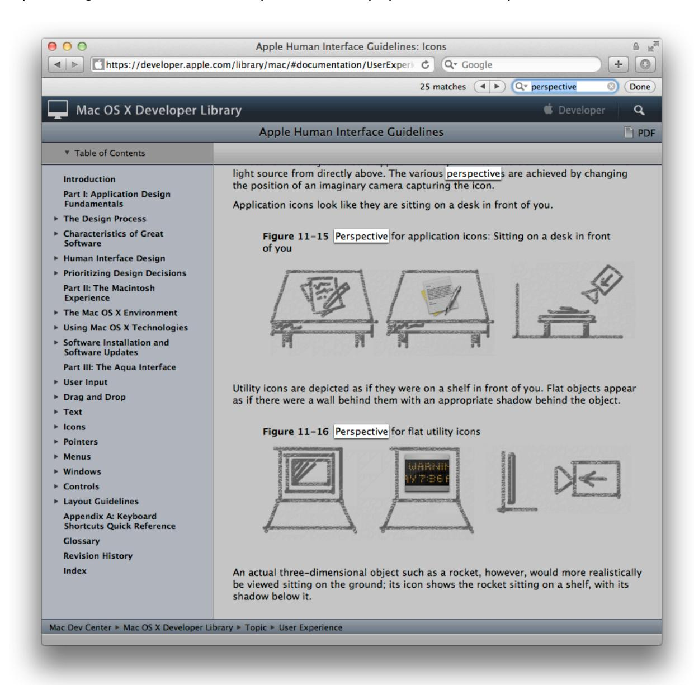

**Use a scope bar to help users specify and narrow a search, or to filter items.** You might provide a scope bar if you want users to be able to specify and refine a search while maintaing their focus in the window. If you need to give users a way to navigate or to select collections of items or data that should appear in the window, however, you should use a source list instead (described in ["Providing](#page-188-0) a Source List" (page 189)). For example, the Dictionary app uses a scope bar to allow users to dynamically filter results by reference type (such as dictionary, thesaurus, or Apple dictionary), as shown below.


**If appropriate, allow users to refine a scoping operation.** Users can specify additional rules to refine their scoping operation in filter rows that appear below a scope bar. A filter row can contain text fields that accept user input and round rectangle–style scope buttons(used forselecting orsaving scoping criteria). For example, when users search in the Finder, they can click the Add button to view a new filter row with supplementary rules they can use to refine their search, as shown below.

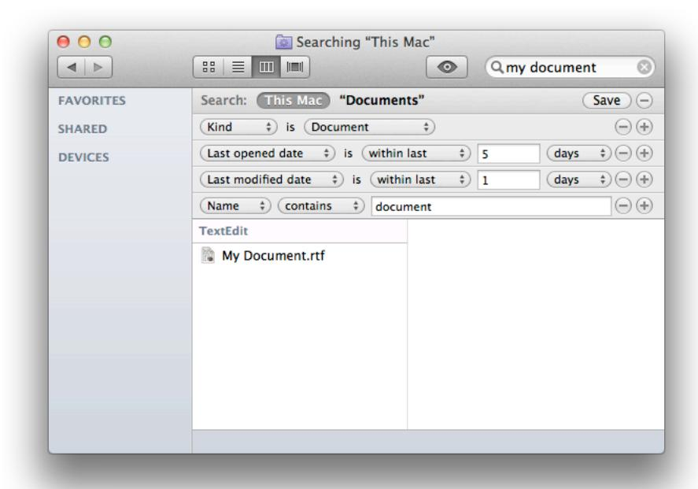

**Use the appropriate controls in a scope bar.** In addition to the search field control, you should only use the controlsthat are specifically designed for use in a scope bar. These controls are the recessed-style scope button and the round rectangle–style scope button. The recessed-style scope button can display scoping locations and categories and the round rectangle–style scope button allows users to save or manipulate a scoping operation. To learn more about these controls, see "Scope [Button"](#page-247-0) (page 248).

<span id="page-188-0"></span>**Allow users to save their searches.** Users appreciate being able to perform specific searches again, especially if they spent time defining (and refining) a useful search.

### Providing a Source List

A **source list** (also called a **sidebar**) is an area of a window, usually set off by a movable splitter, that provides users with a way to navigate orselect objectsin an app (for more information on splitters,see "Split [View"](#page-294-0) (page 295)). Typically, users select an object in the source list that they act on in the main part of the window.

You can provide a source list as the primary means of navigating or viewing within your app, as the Finder and Mail do, or as a way to select a view in a part of the app, as the Network preferences pane does. Each of these usage patterns is associated with a different source list appearance. Specifically:

- A source list that provides the primary navigation or selection mechanism for the app as a whole displays a blue background.
- A source list that provides selection functionality for the window, but not the app as a whole, displays a white background.

For example, the Finder sidebar, which helps users navigate the file system, uses the blue background.


To learn how to design icons to display in a sidebar similar to the Finder sidebar, see ["Designing](#page-124-0) Sidebar [Icons"](#page-124-0) (page 125).

In the figure below, you can see the white background of the source list in Network preferences, which allows users to select a network service to configure.


The following guidelines help you use a source list appropriately in your app.

**Consider using a source list to give users a file-system abstraction.** A source list can shield users from the details of file and document management, and allow them to work with user-customizable, app-specific containers that hold related items. Source lists can be especially useful in single-window apps that aren't necessarily document-based, but that allow users to create and manage content. For example, iTunes allows users to ignore the file-system locations of their songs, podcasts, and movies, and instead work with libraries and playlists. Similarly, iWeb focuses on website creation, not on file management.

In particular, you might consider using a source list in your app when:

- Navigation and selection of content are primary tasks.
- Collections of objects are key to the user's mental model (to learn more about the mental model, see ["Mental](#page-26-2) Model" (page 27)).
- The hierarchical arrangement of objects presents a natural way to navigate.
- Arranging objects hierarchically removes complexity.

**If necessary, display titles inside the source list.** Source lists don't generally have headers like lists can, but they can display titles to distinguish subsets of objects or data. For example, the Finder displays several useful subsets of locations in its sidebar, such as Devices, Shared, and Places.


**Avoid displaying more than two levels of hierarchy in a source list.** If the data you need to display is organized in more than two levels of hierarchy, you can use a second source list, but you should not use additional disclosure triangles to expose additional levels of hierarchy in a single source list. If, however, your app is centered on the navigation of deeply nested objects, you should consider using a browser view instead of multiple source lists.

**Use the appropriate background appearance in your source list.** If your app contains a single source list that provides primary navigation and selection functionality, you can use the blue background. In all other cases, however, you should use the white background. Specifically, use the white background when:

- Your window contains more than one source list.
- You use a source list in a panel or preferences window.

**As much as possible, allow users to customize the contents of a source list.** It's best when users can decide which object containers are most important to them. You should also consider using Spotlight to support smart data containers. For more information on using Spotlight in your app, read *Spotlight Overview*.

If you need to allow users to add, remove, manipulate, or get information about items in a source list, you can use gradient buttons at the bottom edge of the source list. Gradient buttons look good on the window-body area. (For details about using gradient buttons, see ["Gradient](#page-249-0) Button" (page 250).)

**Consider using a popover instead of a source list.** If your source list does not represent primary functionality in your app you might consider replacing it with a popover, because a popover can appear only when users need it. To learn more about using a popover in your app, see ["Popovers"](#page-204-0) (page 205).

### <span id="page-192-0"></span>Providing a Bottom Bar

A **bottom bar** is a window-frame area that is below the window body. Bottom bars are rarely used in modern Mac apps. If an earlier version of your app includes a bottom bar, consider redesigning the UI so that the controls are offered elsewhere, such as in the toolbar. If you're creating a new app, it's best to avoid using a bottom bar.

In general, controls in a bottom bar are frequently used, but are somewhat less important than controls in a toolbar. For example, the bottom-bar controlsin iChat allow usersto add buddiesto the list and to text message, call, or video chat with a selected buddy, whereas the controls in the toolbar are focused on the user of the app.


Because a bottom bar is considered a window-frame area, it has the same gray gradient surface that is visible in the toolbar–title bar area.

Bottom bars can contain either regular or small window-frame controls; bottom bars should not contain icon buttons, custom controls, or any Aqua controls that are designed for use in the window body. See ["Window-Frame](#page-240-0) Controls" (page 241) for more information about controls that are suitable for use in a bottom bar.

**Avoid using a bottom bar to provide frequently used commands.** Users don't typically look at the bottom area of a window more often than they look at the top area, so placing the most important controls at the bottom makes them harder to find.

**As much as possible, use the system-provided icons within bottom-bar controls.** Users are already familiar with the meaning of the system-provided images (for more information about them, see ["System-Provided](#page-319-0) [Icons"](#page-319-0) (page 320)). Note that you can also use text inside a bottom-bar control,such as"Edit." If you must design an icon for a bottom-bar control, try to imitate the clean lines of the system-provided images (for more information on designing icons for use in bottom-bar controls, see ["Designing](#page-121-0) Toolbar Icons" (page 122)).

**Important:** If you choose to use system-provided images in your bottom-bar controls, be sure to avoid redefining their meanings. For example, use the Quick Look symbol to mean "preview with Quick Look" only; don't use it to mean "magnify."

**Make sure that every bottom-bar item is also available as a menu command.** Also, bottom bars should not contain contextual menus. If you need to offer a collection of commands that users can perform on a selected item in the window body, provide an Action menu control that displays the system-provided Action image (for more information on this control, see ["Action](#page-262-0) Menu" (page 263)).

<span id="page-193-0"></span>**Use Interface Builder to create a bottom bar of the appropriate size.** If you decide to include a bottom bar in your app, select the window object on the Interface Builder canvas and open the size inspector. Choose large or small bottom border in the Content Border pop-up menu. Use regular controls in the large bottom bar; use small controls in the small bottom bar.

### Providing a Drawer

A **drawer** is a child window that slides out from a parent window and that the user can open or close (show or hide) while the parent window is open. Drawers are rarely used in modern Mac apps. As much as possible, redesign your UI to avoid using drawers; if you're creating a new app, avoid adding a drawer to the design.

Typically, a drawer contains frequently accessed controls that don't need to be visible at all times. For example, the Keynote Build inspector uses a drawer to provide additional details about slide builds, as shown below.


Although a drawer is somewhat similar to a sheet in that it attaches to a window and slides into view, the two elements are not interchangeable. Sheets are modal dialogs, whereas drawers provide additional functionality. When a sheet is open, it is the focus of the window and it obscures the window contents; when a drawer is open, the entire parent window is still visible and accessible.

Drawers aren't widely used in modern Mac apps, and they are rarely attached to a main window. If your app design includes a drawer, you might consider replacing it with a panel or perhaps a popover. (For more information about panels, see ["Panels"](#page-208-0) (page 209); to learn about popovers, see ["Popovers"](#page-204-0) (page 205).) If you really need to provide a drawer, follow the guidelines in this section.

**Don't enable a drawer on a window that can go full screen.** Because a drawer slides out from an edge of its parent window, a full-screen window doesn't have room to display a drawer.

**Use drawers only for controls that need to be accessed fairly frequently but that don't need to be visible all the time.** This is in contrast to the criterion for a panel, which should be visible and available whenever its main window is in the top layer. (For more information about panels, see ["Panels"](#page-208-0) (page 209).)

**Don't use a drawer to enable navigation.** If you need to give users a way to navigate hierarchically arranged content in your window, you should use a source list instead. To learn more about source lists, see ["Providing](#page-188-0) a [Source](#page-188-0) List" (page 189).

**If appropriate, automatically open a drawer when the user drags an object near it.** Typically, users click a button or choose a command to show or hide a drawer. But if a drawer contains a valid drop target, you might want to open the drawer when the user drags an appropriate object to where the drawer appears.

**Ensure that a drawer can open fully without disappearing offscreen.** When a drawer opens, it appears to be sliding from behind its parent window, to the left, right, or down. If the user moves a parent window to the edge of the screen and then opens a drawer, the drawershould open on the side of the window that hasroom. If the user makes a window so big that there's no room on either side, the drawer opens off the screen.

**Ensure that a draweris smallerthan its parent window.** Thissize difference supportsthe illusion that a closed drawer is hidden behind its parent window. If the user vertically resizes the parent window, an open drawer resizes, if necessary, to ensure that it does not exceed the height of the parent window.

**Automatically close a drawer if the user makes it too small to see the contents.** The user can resize an open drawer by dragging its outside border. If the user drags a drawer's border to the point where its content is mostly obscured, the drawer should simply close. For example, if a drawer contains a scrolling list, the user should be able to resize the drawer to cover up the edge of the list. But if the user makes the drawer so small that the items in the list are difficult to identify, the drawer should close. If the user resizes a drawer, your app should remember the new size and use it the next time the drawer is opened.

**Maintain a drawer's state when its parent window becomes inactive or reopens.** For example, an open drawer should remain open when its parent window becomes inactive or when it's closed and then reopened. When the user minimizes a parent window with an open drawer, the drawer should close; the drawer should reopen when the parent window is unminimized.

**Treat a drawer as part of the parent window.** That is, don't dim a drawer's controls when the parent window has focus, and vice versa. When full keyboard access is on, a drawer's contents should be included in the window components that users can select by pressing Tab.

<span id="page-195-0"></span>**Use standard Aqua controls in a drawer.** A drawer can contain any control that is appropriate to its intended use.

### Opening Windows

Users expect a window to open when they:

- Double-click the icon for a document in the Finder
- Double-click an app icon
- Select a document in the Finder and choose open from the File menu (or select the document and press Command-O in the Finder)

- Choose a file from within an Open dialog
- Choose the New command from the File menu
- Click the app icon in the Dock (when no windows are currently open)

Most users expect app windows that were open when they logged out to reopen when they log back in. To meet this expectation, be sure to opt in to the Resume feature; to learn the programmatic steps you need to take to adopt Resume, see "User Interface Preservation" in *Mac App Programming Guide* . (Note that users can opt out of this feature in General preferences.)

**Make sure windows display changeable panes as users expect.** For the most part, users expect windows to reopen the pane that was open previously. Specifically, windows with changeable panes should reopen in their previous state as long as the app is open; if the user quits the app, these windows should return to their default state.

In a window with multiple toolbars, if the toolbar represents only a subset of multiple possible views (such as favorites), the default state should be to show all of the options below the toolbar, not a particular pane. If the toolbar displays all of the possible selections, then the default state of the window should be to display the pane that the user last selected. For example, when System Preferences opens, all of the possible selections are visible, but when Mail preferences opens, it displays the last pane selected by the user.

**Title a newly opened window appropriately.** When the user opens an existing document, make sure its title is the **display name**, which reflects the user's preference for showing or hiding its filename extension. Don't display pathnamesin document titles. To learn how to name new windows,see "Naming New [Windows"](#page-196-0) (page 197).

### <span id="page-196-0"></span>Naming New Windows

Most windows display a title, whether it's the name of the app, the name of a document, or the name of a specific type of functionality, such as Inspector. A window's title helps users instantly identify the window and its contents. Follow the guidelines in this section as you name new windows that users can open in your app.

**Use your app name for the title of a main, nondocument window.** If your app has a short name, use it as the title (for more information about the short name, see "The App [Menu"](#page-147-0) (page 148)).

**Name a new document window "untitled."** Leave "untitled" lowercase to make it more obvious that the window contains untitled content. Don't put a "1" on the first untitled window, even after the user opens other new windows.

If the user chooses New again before titling the first untitled document window, name the second window "untitled 2," and so on.

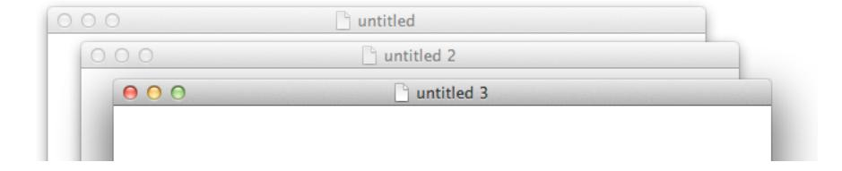

If the user dismisses all untitled windows, the next new document window they open should start over as "untitled," the next should be "untitled 2," and so on.

### <span id="page-197-0"></span>Positioning and Repositioning Windows

When your app displays a window, you must decide where to put it and how big to make it. You must also respond appropriately when users move your app's windows.

**Horizontally center new document windows and display as much of the content as possible.** The top of the document window should butt up against the menu bar (or the toolbar, if one is open and positioned below the menu bar). Subsequent windows on the same desktop should open to the right 20 points and down 20 points. Make sure that no part of a new window overlaps with the Dock (for more information about the Dock, see "The [Dock"](#page-65-0) (page 66)).

**In general, horizontally center a new nondocument window.** The vertical position should be visually centered: The distance from the bottom of the window to the top of the Dock (if it's at the bottom of the screen) should be approximately twice the distance as that from the bottom of the menu bar to the top of the window. Subsequent windows are moved to the right 20 points and down 20 points. Make sure that no part of a new window overlaps with the Dock.

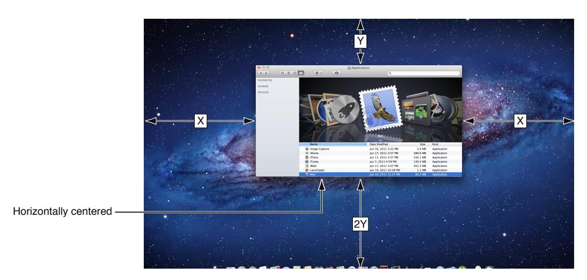

**As much as possible, reopen a window in the same location, and at the same size, that the user last specified.** Users appreciate being able to predict where a window will open. Before reopening a window, make sure that the size and state are feasible for the user's current display setup, which may have changed since the last time the window was open. If you can't reproduce both the size and location of the window, maintain the window's location, but reduce its size as necessary. If you can't reproduce either the location or the size, try to keep the window on the same display, and open the window so that as much of the content as possible is visible. If the user moves a window so that it is entirely positioned on a second display and later opens the window on a single-display system, respect the window's previous size, if possible.

Note that if a user opens, moves, and closes a document window without making any other changes, you should save the new window position but you should not modify the file's date stamp.

**On a multidisplay system, visually center the first new window in the screen that contains the menu bar.** If the user doesn't move that first window, display each additional window below and to the right of its predecessor. If the user moves the window, display each additional window on the screen that contains the largest portion of the frontmost window, as shown below.


In particular, you want to avoid opening a window so that it spans more than one display. The *initial position* of a window should always be contained on a single screen. If the user opensseveral windows on a multidisplay system, continue to place the windows on the screen where the user is working, each new one below and to the right of its predecessor.

<span id="page-199-0"></span>**Don't allow users to move a window to a position from which they can'treposition it.** For example, itshould not be possible for users to "lose" a window below the Dock or on a second display that they unplug at a later time.

### Resizing and Zooming Windows

Your app determines the initial size and position of a window, which is called the **standard state**. If the user changes a window's size or location by at least 7 points, the new size and location is the called the **user state**. The user can toggle between the standard state and the user state by clicking the **zoom button** in the title bar. Follow the guidelines in this section so that users can have the zoom experience they expect.

**Choose a standard state thatis best suited forthe tasks your app enables.** A document window, for example, should show as much as possible of the document's content. Don't assume that the standard state should be as large as the current display permits; instead, determine a size that makes it convenient for users to use your app. If appropriate, you can allow users to take some app windows full screen if they want more space.

**Adjustthe standard state when appropriate.** The user can't change the standard state that defines a window's initial position and size, but your app can do so, based on other settings. For example, a word processor might define a standard that accommodates the display of a document whose width is specified in the Page Setup dialog.

**Respond appropriately when the user zooms.** When the user zooms a window that is in the user state, your app should make sure that size defined by the standard state is appropriate in the current context. Specifically, move the window as little as possible to make it the standard size, while at the same time keeping the entire window on the screen. The zoom button should not cause the window to fill the entire screen unless that was the last state the user set.

If the user zooms a window in a multidisplay system, the standard state should be on the display that contains the largest portion of the window, not necessarily on the display that contains the menu bar. This means that if the user moves a window between displays, the window's position in the standard state could be on different displays at different times. The standard state for any window must always be fully contained on a single display.

<span id="page-200-0"></span>**Don't allow a zoomed window to overlap the Dock.** You always want to make sure that users have full use of both your windows and the Dock. For more information about the Dock, see "The [Dock"](#page-65-0) (page 66).

### Minimizing and Expanding Windows

When the user clicks the **minimize button** in the title bar, double-clicks the title bar, or presses Command-M, the window minimizes into the Dock. The window's icon remains in the Dock until the user clicks it or, if it is the app's only open window, until the user clicks the app icon in the Dock. (To learn more more about the Dock, see "The [Dock"](#page-65-0) (page 66).) The action of "unminimizing" a window that's minimized in the Dock is called expanding.

Clicking an app icon in the Dock should always result in a window—a document or another appropriate window—becoming active. If a document-based app is not open when the user clicks the Dock icon, the app should open a new, untitled window.

When a user clicks an open app'sicon in the Dock, the app becomes active and all open unminimized windows are brought to the front; minimized document windows remain in the Dock. If there are no unminimized windows when the user clicksthe Dock icon, the last minimized window should be expanded and made active. If no documents are open, the app should open a new window. (If your app is not document-based, display the main window.)

### <span id="page-201-0"></span>Closing Windows

Users can close windows by choosing Close from the File menu, pressing Command-W, or clicking the close button. Follow the guidelines in this section to ensure that your app closes windows as users expect.

**Use modern APIs to preserve the window's state.** Regardless of whether you support Resume, you should remember a window's onscreen size and position so that you can restore the user's state when they reopen the window (or reopen your app). To learn more about how to use modern APIs to do this, see "User Interface Preservation" in *Mac App Programming Guide* .

**In general, quit when users close the last open window in your app.** In apps that are not document-based, users generally expect the app to quit when they close the main window. If an app continues to perform some function when the main window is closed, it might be appropriate to leave it running after the user closes the main window. For example, iTunes continues to play after the user closes the main window. If users close the last remaining document window in a document-based app and switch to another app, it's appropriate to quit the app.

**Display a close confirmation save dialog when users close a document window that contains unsaved data.** Note that this behavior is automatic in document-based appsthat adopt Auto Save. The close confirmation save dialog is similar to the standard Save dialog, but it adds a message that asks the user if they want to save their work. The reason for the message is that the action of closing the window implies that the user wants to discard their changes; if this is not the case, the user can respond by saving the data or canceling the close. Note that the close confirmation save dialog is *not* displayed if the document window closes as the result of some other action, such as the user quitting the app. In these other situations, you should automatically save the user's work so that the user can choose to save or discard it at a later time.

<span id="page-201-1"></span>After a document has been saved the first time, the close confirmation save dialog is not displayed when users close the document window, because users expect their changes to be saved continuously and without their intervention. (For learn more about save dialogs, see "Save [Dialogs"](#page-231-1) (page 232).)

### Enabling Click-Through

An item that provides **click-through** is one that a user can activate with one click, even though the item is in an inactive window. (To activate an item that does not support click-through, the user must first make the containing window active and then click the item.) Although click-through can make some user tasks easier, it can also confuse users if they click items unintentionally.

Click-through is not a property of a class of controls; any control, including toolbar items, can support click-through. This also means that you can support click-through for any subset of items; you do not have to choose between supporting click-through for all items in a window or none. Follow the guidelines in this section so that you can support click-through when it's appropriate.

**Note:** Programmatically, supporting click-through is a matter of disabling click-through for items thatshould not provide it. Thisis because click-through issupported by default in all Cocoa controls.

**Avoid providing click-through for an item or action whose result might be dangerous or undesirable.** Specifically, avoid enabling click-through for an item that:

- Performs a potentially harmful action that users can't cancel (for example, the Delete button in Mail)
- Performs an action that is difficult or impossible to cancel (such as the Send button in Mail)
- Dismisses a dialog without telling the user what action was taken (for example, the Save button in a Save dialog that overwrites an existing file and automatically dismisses the dialog)
- Removes the user from the current context (for example, selecting a new item in a Finder column that changes the target of the Finder window)

Clicking in any one of these situations should cause the window that contains the item to be brought forward, but no other action to be taken.

**In general, it's safe to provide click-through for an item that asks the userfor confirmation before executing**, even if the command ultimately results in destruction of data. For example, you can provide click-through for a delete button if you also make sure to give users the opportunity to cancel or confirm the action before it proceeds.

**Think twice before supporting click-through foritems that don't provide confirmation feedback.** Specifically, consider how dangerous the action might be, and determine how difficult it will be for the user to undo the action after it's performed. For example, the Mail Delete button does not provide click-through because it deletes a message without asking for confirmation, which is a potentially harmful action that can be difficult to undo. On the other hand, click-through for the New button in Mail is fine because its resulting action is not harmful and is easy to undo.

**Ensure that items that do not support click-through appear disabled when their window is inactive.** The disabled appearance helps users understand that these controls are unavailable. For example, the delete and mark as junk buttons in the inactive Mail window shown below do not support click-through.


### <span id="page-204-0"></span>Popovers

A **popover** is a transient UI element that provides functionality that is directly related to a specific context, such as a control or an onscreen area. Popovers appear when users need them and (usually) disappear automatically when users finish interacting with them. For example, Calendar displays a popover in which users can create and edit a meeting.

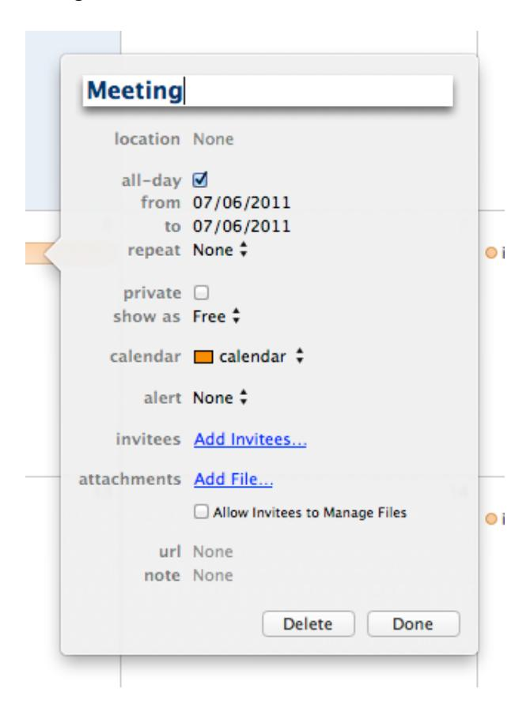

A popover floats above the window that contains the control or area that it's related to, and its border includes an arrow (sometimes referred to as an anchor) that indicates the point from which it emerged. In some cases, users can detach a popover from itsrelated element, which causesthe popover to become a panel. For example, Calendar allows users to detach the meeting-editing popover so that they can make changes to it while they refer to other windows.


To learn how to define a popover in your code, see NSPopover. Follow the guidelines in this section to use popovers appropriately in your app.

**Use a popover to display UI that users need occasionally.** Popovers are perfectly suited to provide small amounts of focused functionality that users need. For example, when usersselect a term and open a contextual menu, they can choose the Look Up "*term*" menu item to see the Dictionary definition (in addition to information related to the term) in a popover.

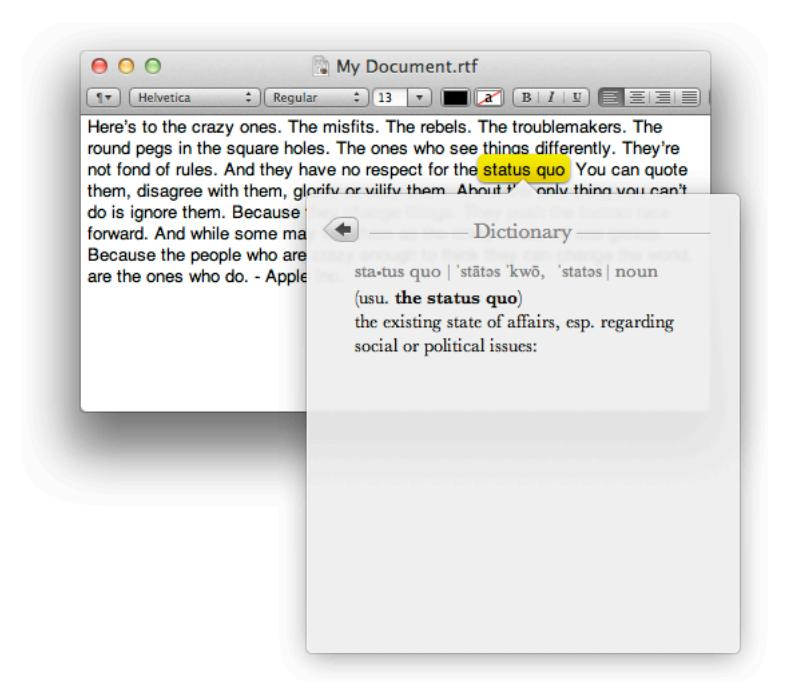

Because popovers can disappear when users finish interacting with them, users can spend more time focusing on their content and less time removing clutter from their workspace.

**Consider using popovers instead of source lists, panels, or changeable panes.** You might want to use a popover instead of these UI elements because doing so allows you to present a more focused and stable UI. For example, users might not need to navigate or select objects in your window's source list very often. If you use a popover to display the source list's content, you can use the window space for more important UI that directly relates to the user's task.

Using a popover to replace a panel that contains auxiliary information can also make sense, because you can ensure that the popover disappears when users click outside of it. For example, users appreciate that they don't have to explicitly dismiss the Safari Downloads popover before they continue interacting with the Safari browser window.

Finally, using a popover to replace changeable panes in a main window can help your UI seem more stable. For example, if you offer secondary or transient functionality in a pane that users can hide and reveal, you can instead offer the functionality in a popover. Because a popover appears only when it's needed, it doesn't alter the look of the window. Users tend to be most comfortable with a window layout that does not change very often.

**Allow users to detach a popover if appropriate.** Users might appreciate being able to convert a popover into a panel if they want to view other content or other windows while the popover content remains visible.

**Don't use a popover as an alert.** Popovers and alerts are very different UI elements. For one thing, users choose to see a popover; they never choose to see an alert. If you use popovers and alerts interchangeably, you blur the distinctions between them and confuse users. In particular, if you use a popover to warn users about a serious problem or to help them avoid imminent, unintentional data loss, they are likely to dismiss the popover without reading it, and blame your app when negative results occur. If you really need to alert users(which should happen only rarely), use an alert; for guidelines on how to design an alert,see ["Alerts"](#page-235-0) (page 236).

**As much as possible, ensure that the popover arrow points directly to the element that revealed it.** The arrow helps people remember where the popover came from and with what task or object it's associated.

**In general, use the standard popover appearance.** The standard appearance is identified by the NSPopoverAppearanceMinimal constant. You can also use the "HUD" appearance, but this is generally only suited to an app that uses a dark UI and enables an immersive, media-centric experience.

**Avoid including a "close popover" button.** In general, a popover should close automatically when the user doesn't need it anymore. This behavior helps users focus on their task without worrying about cluttering their desktop. For example, after users finish editing an Calendar event, they can click Done or they can click outside the event-editing popover to close it. Regardless of the method users choose, Calendar saves the edits they made.

**Choose a closure behavior that makes sense in the context of the task the popover enables.** A popover can close in response to a user interaction (transient behavior), in response to a user's interaction with the view or element from which the popover emerged (semitransient behavior), or in an app-defined way. If a popover merely presents a set of choices, it can be appropriate to close it as soon as the user makes a choice (that is, using the transient behavior). Because this behavior mirrors the behavior of a menu, users are comfortable with it. If, on the other hand, you use a popover to enable a task that requires multiple user interactions, such as the Calendar event editing popover, you can use the semitransient behavior to close the popover when the user interacts with the area outside of it.

**Avoid nesting popovers.** A popover that emergesfrom a control inside a different popover is physically difficult for users to interact with and confusing to see. In addition, users can't predict what will happen when they click outside of both popovers.

**Avoid making a popover too big.** A popover should not appear to take over the entire screen. Instead, it should be just big enough to display its contents and still point to the area from which it emerged.

**Avoid making significant appearance changes in a detachable popover.** If you allow users to detach a popover, you should ensure that the resulting panel looks similar to the original popover. If the new panel looks too different, users might forget where it came from.

**If appropriate, change a popover's size while it remains visible.** You might want to change a popover's size if you use it to display both a minimal and an expanded view of the same information. For example, Calendar displays a minimal popover when users double-click a meeting they've created. If the user wants to edit the meeting, the minimal popover expandsto accommodate more information about the meeting and the editing controls. The transition from one popover size to another should be smoothly animated, so that users can be sure that they're still interacting with the same popover.

### <span id="page-208-0"></span>Panels

A **panel** is an auxiliary window that contains controls and options that affect the active document or selection. An app-wide toolbar in its own window is also called a **tool panel** or, less frequently, a **tool palette**.

Panels are either app-specific or systemwide. App-specific panels float on top of the app's windows and disappear when the app is deactivated. Systemwide panels, such as the Colors window and the Fonts window, float on top of all open windows. (To learn more about the Colors window, see "The Colors [Window"](#page-86-0) (page 87); to learn more about the Fonts window, see "The Fonts [Window"](#page-87-0) (page 88).)

Most panels are standard panels, which means that they use the same textures in the window body and title bar that a standard window does. Also, a standard panel tendsto use small versions of the standard UI controls. A few panels are translucent, which means that they use a dark, translucent texture in the window body and title bar, and they use small white and gray UI elements. You can see a few examples of different types of panels in the figure below.


**In general, use a standard panel.** For some apps, such as highly visual, immersive apps, transparent panels can be appropriate, but for most apps, standard panels are best. Users don't expect to see a transparent panel unless it contains image adjustment tools or it is displayed by an immersive app that uses a dark UI. To learn more about when transparent panels are appropriate, and how to design one, see ["Transparent](#page-211-0) Panels" (page 212).

#### **Use a panel to give users easy access to important controls or information that directly affects their task.**

For example, you can create a modeless panel, such as a tools panel, to offer controls or settings that affect the active document window. Because panels take up screen space, however, don't use them when you can meet the need by using a popover, a modeless dialog, or by adding a few appropriate controls to a toolbar.

**Hide and show panels appropriately.** When a user makes a document active, all of the app's panels should be brought to the front, regardless of which document was active when the user opened the panel. When an app is inactive, its panels should be hidden.

Panels should not be listed in the Window menu as documents, but you can put commands to show or hide all panels in the Window menu.

**Make sure a panel includes a title bar.** Even if a panel doesn't need a title, it should have a title bar so that users can drag it.

**Avoid including an active minimize button in a panel.** A user should not need to minimize a panel because it is displayed only when needed and disappears when its app is inactive. Instead, a panel should include the close and zoom buttons or, more commonly, only the close button. The correct configurations are shown below, followed by some incorrect configurations.

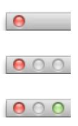

#### <span id="page-210-0"></span>Inspectors

An **inspector** is a panel that allows users to view the attributes of a selection. Inspectors (sometimes called inspector windows) can also provide ways to modify these attributes. Pages, Keynote, and Preview are just a few of the apps that use inspectors (an inspector window in Numbers is shown below).


**Ensure that an inspector updates dynamically based on the current selection.** Users expect an inspector's view to always be up to date. Similarly, they expect the changes they make in an inspector to immediately affect their content. Contrast this behavior with that of an Info window, which shows the attributes of the item that was selected when the window was opened, even after the focus has been changed to another item. Also, an Info window is not a panel; it islisted in the app's Window menu and it does not hide when the app becomes inactive.

You can provide both inspectors and Info windows in your app, because in some cases users want to have one window in which context changes with each new item they select (an inspector) and in other cases users want to be able to see the attributes of more than one item at the same time (a set of Info windows). Note that users can open multiple inspector windows and Info windows in the same app at the same time.

#### <span id="page-211-0"></span>Transparent Panels

A **transparent panel** gives users a way to make quick adjustments to their content or task without being distracted from their work. Although the behavior of a transparent panel issimilar to the behavior of a standard panel, its appearance is designed to complement apps that focus on highly visual content or that provide an immersive experience, such as a full-screen slide show. For example, iMovie provides a transparent panel that enables users to adjust several settings in the movie.


**Have a good reason to use a transparent panel instead of a standard panel.** Users can be distracted or confused by a transparent panel when there is no logical reason for its presence. In general, you should use transparent panels only when at least one of the following statements is true:

- Your app is media-centric, that is, focused on movies, photos, or slides.
- Users use your app in a dark environment or in an immersion mode (frequently, this type of app also uses a dark, custom UI).
- Users make only quick adjustments in the panel and dismiss it quickly.

● A standard panel would obscure the content that users need to adjust.

**Use a combination of standard and transparent panels, if appropriate.** If your app focuses on highly visual content only at specific times or only in some modes, use the panel type that is best suited to the current task and environment. For example, the Keynote inspector allows user to setslide transitions, edit tables and graphs, and make complex adjustmentsto text and formatting. Keynote uses a standard panel for the inspector because none of its functions are focused solely on adjustments to media.

But Keynote also provides an image-adjustment panel, which helps users make simple adjustments to slide images. The image-adjustment panel istransparent, because users use it while they are focusing on the image, watching the effect of the adjustments they make.

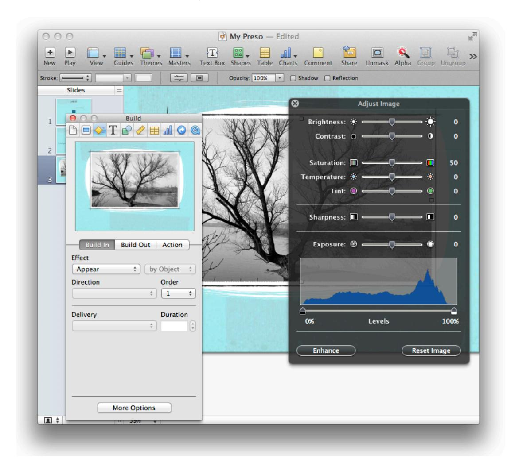

**Don't change a panel's type when your app changes its mode.** For example, if you use a transparent panel when your app is in an immersive mode, don't transform it into a standard panel when your app switches to a nonimmersive mode.

**As much as possible, use simple adjustment controls in a transparent panel.** In particular, you want to avoid using controls that require users to type or to select items, because these controls force users to shift their attention from their content to the panel. Instead, consider using controlssuch assliders and steppers, because they're easy for users to use without focusing on them.

**Use white controls with gray accents and white or gray text in a transparent panel.** Light-colored controls and text are easier for users to see on the dark translucent background of a transparent panel. And, as users focus on the content behind the panel, the white text and controls appear to be floating above it.

**Use color sparingly.** In the dark UI of a transparent panel, too much color can lessen its impact and distract users. Often, you only need small amounts of color to enhance the information you provide in a transparent panel. For example, the morsels of color in the Keynote image adjustment panel (shown in above) communicate ranges in white balance and exposure, in addition to color-specific settings, in a clear and unobtrusive way. Make sure that these small amounts of color have high contrast so that they look good on the dark translucent background.

**In general, keep transparent panels (and their contents) small.** Transparent panels are designed to be unobtrusively useful, so allowing them to grow too big defeats their primary purpose. You don't want a transparent panel to obscure the content that the user is trying to adjust, and you don't want it to compete with the content for the user's attention.

#### <span id="page-213-0"></span>About Windows

An **About window**, also called an About box, is an optional window that displays your app's version and copyright information. The Calendar About window is shown here.


Unlike other windows, an About window combinessome of the behaviors of panels and windows: Like a panel, an About window is not listed in the app's Window menu and like a window, it remains visible when the app is inactive.

An About window should be modeless so the user can leave it open and perform other tasks in the app. If you decide to provide an About window, be sure that it:

- Has a title bar with no title
- Is movable
- Includes the close button as the only active window control
- Displays your app icon
- Includes the full app name and version number (the version number should be the same as the version number displayed by the Finder)
- Includes copyright information, technical support contact information, a brief description of what the app does

**Use buttons in an About window if you want to give users a way to contact you.** For example, you might provide a button that opens your website in a browser window or opens a blank email message that is pre-addressed to you. It's good idea to avoid providing a clickable URL or email address in an About window because users can't be sure that there is an action associated with the text. Of course, it's best to provide most of your company contact information in the first page of your help documentation (for more information on Help menu items, see "The Help [Menu"](#page-160-0) (page 161)).

<span id="page-214-0"></span>**Consider putting branding elements, such as logos or slogans, in your About window.** An About window isthe appropriate place for these elements because users expect it to provide information about your company and product. It's best to avoid putting such elements in document windows and dialogs.

### Dialogs

A **dialog** is a window that is designed to elicit a response from the user. Many dialogs—the Print dialog, for example—allow users to provide many responses at one time.

OS X provides three main ways to present dialogs:

- **Document modal.** A document-modal dialog preventsthe user from doing anything else within a particular document. The user can switch to other documentsin the app and to other apps. Document-modal dialogs should be sheets, which are described in "Using Sheets [\(Document-Modal](#page-215-0) Dialogs)" (page 216).
- **App modal.** An app-modal dialog prevents the user from interacting fully with the current app, although the user can switch to another app. An example of an app-modal dialog is the Open dialog (described in "The Open [Dialog"](#page-221-0) (page 222)).
- **Modeless.** A modeless dialog enables users to change settings in the dialog while still interacting with document windows. The Find window in many word processors is an example of a modeless dialog.

In addition, OS X provides an alert, which is a special type of dialog that can be document modal or app modal. In general, if the error condition or notification appliesto a single document, the alert is document modal (that is, a sheet). If the alert applies to the state of the app as a whole, or to more than one document or window belonging to the app, the alert is app modal. For guidelines on when to use alerts and how to design them, see ["Alerts"](#page-235-0) (page 236).

#### <span id="page-215-0"></span>Using Sheets (Document-Modal Dialogs)

A **sheet**is a modal dialog that is attached to a particular document or window, preventing usersfrom interacting with the document or window until they dismiss the dialog. To avoid annoying users, you should use a sheet only when necessary.

Because a sheet is attached to the window from which it emerges, users never lose track of which window the dialog applies to. The TextEdit "locked" dialog shown here is an example of a sheet.


A sheet animates into view as if it were emerging from a window's toolbar (or title bar, if no toolbar is present). When a sheet opens on a window near the edge of the screen and the sheet is wider than the window it's attached to, the sheet causes the window to move away from the edge. When the sheet is dismissed, the window returns to its previous position.

Only one sheet can be open for a window at any one time. If the user's response to a sheet causes another sheet to open for that document, the first sheet closes before the second one opens.

In general, a sheet is a good way to present:

- A modal dialog for an activity that is specific to a particular document, such as exporting, attaching files, or printing.
- A modal dialog that is specific to a single-window app that does not create documents. For example, a single-window utility app might use a sheet to request acceptance of a licensing agreement from the user.

● Other window-specific dialogs that are typically dismissed by users before they proceed with their task.

Follow the guidelines in this section to ensure that the sheets you display behave as users expect.

**If necessary, display a sheet on top of any active panels that are related to the current document window.** However, if the user leaves a sheet open and clicks another document in the same app, the inactive window and its sheet should go *behind* any open panels.

**Avoid using sheets if multiple open windows can show different parts of the same document at the same time.** A sheet is not useful in this situation, because it implies that the changes users make apply only to one portion of the document. In thistype ofsituation, it's better to use an app modal dialog to help users understand that changes in one window affect the content in other windows.

**Use a sheet when multiple documents can appear in a single window at different times.** For example, a tabbed browser can display different documents in a single window at different times. A sheet is appropriate in this situation, even though it applies to only the document that is currently visible in the window. Because users must in effect dismiss the current document before viewing a different document in the same window, they should first dismiss the sheet.

**Don't use a sheet if users need to see or interact with the window in order to address the dialog.** For example, if the dialog requests information that the user must get from the window, the dialog should not be a sheet. In this case, a modeless dialog would allow users to see or copy information in the window and apply it to the dialog.

**Don't use a sheet for a modeless operation in which users need to observe the effects of their changes.** In this situation, a panel is a better choice because users can leave it open while they make changes to their content.

<span id="page-216-0"></span>**Don't use a sheet on a window that doesn't have a title bar.** Sheets should emerge from a definite visual edge.

#### Accepting and Applying User Input in a Dialog

Because dialogs are small, transient UI elements, users don't expect to have in-depth interactions with them. Dialogs are most effective when they make it easy for users to input information and respond immediately to the changes users make.

As you design a dialog, keep the following points in mind to help you make user interaction easy:

- When appropriate, display default valuesfor controls and text fieldsso that the user can verify information rather than enter it from scratch.
- Display a selection or an insertion point in the first location that accepts user input—a text entry field or a list, for example.

● When it provides an obvious user benefit, ensure that static text is selectable. For example, a user should be able to copy an error message, a serial number, or IP address to paste elsewhere.

For the most part, changes that a user makes in a dialog should appear to take effect immediately. To support the appearance of immediate effect, you need to validate the information users enter and you need to decide when to apply their changes. The following guidelines can help you provide a good dialog experience.

**As much as possible, do error checking as the user inputs information.** If you wait to check for errors until the user tries to dismiss the dialog, you might have to present an alert, which is not a good user experience. It's better to check for errors as soon as possible, because it allows users to fix the problem before they leave the context of the dialog.

**Avoid validating input after each keystroke.** Too-frequent validation can annoy users and slow down your app. It's better to design your interface to automatically disallow invalid input. For example, your app could automatically convert lowercase characters to uppercase when appropriate.

**Use the length of an operation to determine whetherto perform it automatically.** Sometimes, it's appropriate for your app to automatically perform an operation based on user input; other times, it's better when the user initiates the operation—for example, by clicking a button. In general, it's acceptable to automatically perform an operation that completes quickly and returns user control within a couple of seconds. For an operation that takes a longer time to execute, it's best to display an estimate of the time required to complete the operation and let the user initiate it.

**Provide an Apply button when it makes sense.** An Apply button can be appropriate in a dialog that displays multiple settingsthat affect the user's view of data. In thissituation, an Apply button allowsthe user to preview the effect of the selected settings without committing to the changes.

Be cautious about using an Apply button for operations that take a long time to implement or undo; it might not be obvious to users that they can interrupt or reverse the process. In particular, save dialogs or dialogs that allow users to make changes that can't be previewed easily should not include an Apply button.

<span id="page-217-0"></span>**Don't use an Apply button to mean the same thing as the OK button.** In particular, clicking an Apply button should not dismiss a dialog because the user should first decide whether to accept the previewed changes (by clicking OK) or to reject them (by clicking Cancel). When the user dismisses the dialog without clicking OK, all previewed changes should be discarded.

### Expanding Dialogs

Sometimes you need to provide the user with additional information or functionality in a dialog, but you don't want to display it all the time. To do this, you use one of the disclosure controlsto expand the dialog and reveal the additional information or capability to the user.

**Use a disclosure button to provide additional choices in a dialog.** In particular, the disclosure button is the appropriate choice when the additional choices are directly related to selections that are offered in a pop-up or command pop-down menu in a dialog. When users click the disclosure button the dialog expands to reveal selectionsin addition to those listed in the pop-up or command pop-down menu. (For more information about how to use a disclosure button in your dialog, see ["Disclosure](#page-290-0) Button" (page 291).)

**Use a disclosure triangle to reveal details that elaborate on the primary information in a dialog.** When users open the disclosure triangle the dialog expands, revealing additional information and, if appropriate, extra functionality. (For more information about how to use a disclosure triangle in your dialog,see ["Disclosure](#page-289-0) [Triangle"](#page-289-0) (page 290).)

**Respond appropriately when users can resize a dialog that contains columns of data.** If users can resize a dialog that displays columns (such as the Open dialog), the columns should grow and additional columns should appear. All other elements should remain the same size and be anchored to the right, center, or left side of the dialog.

#### <span id="page-218-0"></span>Dismissing Dialogs

Users expect all the buttons at the bottom right of a dialog to dismiss the dialog. A button that initiates an action is furthest to the right. This rightmost button, called the **action button**, confirms the main point of the dialog. The Cancel button is to the left of the action button.

Usually the rightmost button or the Cancel button is the **default button**. A default button has color and pulses to let the user know that when they press Return or Enter, the default button is activated.

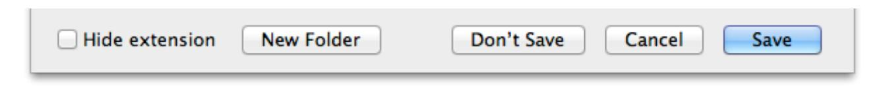

Follow the guidelines in this section to ensure that your dialogs look and behave as users expect.

**Use a default button only if the user's most likely action is harmless.** The default button should represent the action that the user is most likely to perform *if* that action isn't potentially dangerous. Users sometimes press Return merely to dismiss a dialog, without taking the time to read its content, so it's crucial to ensure that the default button performs a harmless action.

**Don't use a default button at all if the user's most likely action is dangerous**—for example, if it causes a loss of user data. When there is no default button, pressing Return or Enter has no effect; the user must explicitly click a button to dismiss the dialog. This guideline protects users from accidentally damaging their work by pressing Return or Enter without fully understanding the dialog's message. You can consider using a safe default button, such as Cancel, or not using a default button at all.

**Don't use a default button if you use the Return key in the dialog's text fields.** Having two behaviors for one key can confuse users and make the interface less predictable. Also, users might press Return one too many times and dismiss the dialog (and activate the default button) without meaning to.

**In general, include a Cancel button.** The Cancel button returns the computer to the state it was in before the dialog appeared. It means"forget I mentioned it." Also, make sure that the keyboard shortcut Command-period and the Esc (Escape) key are mapped to the Cancel button.

**Ensure that Cancel undoes applied changes.** If your dialog incudes an Apply button that helps users see the effect of changes before committing to them, make sure that clicking Cancel undoes all of the applied changes. Cancel should never silently commit the changes the user previewed by clicking Apply. For more guidelines on using an Apply button, see ["Accepting](#page-216-0) and Applying User Input in a Dialog" (page 217).

**Place a third button for dismissing the dialog to the left of the Cancel button.** If the third button could result in data loss—Don't Save, for example—try to position it at least 24 points away from the "safe" buttons (Cancel and Save, for example).

**Place a button that affects the contents of the dialog itself in the left end of the dialog.** If there is no Help button, such a button should have its left edge aligned with the main dialog text; if there is a Help button, it should be placed to the right of the Help button. For example, the Help button isto the left of the Show Details button in the Print dialog, which expands the dialog to display more information about the print job.

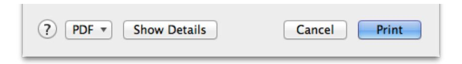

#### <span id="page-219-0"></span>Preferences Windows

A preferences window is a modeless dialog that contains settings the user changes infrequently. In general, the user opens a preferences window to change the default way an app displays an item or performs a task, then closes the window, and expects the new settings to have taken effect. (For some guidance on how to provide a good preferences experience in your app, see ["Preferences"](#page-92-0) (page 93).)

Often, a preferences window has a toolbar that contains items that function as pane switchers. When the user clicks an item in this type of toolbar, the content area of the preferences window switches to display a different view, called a **pane**. This design is useful for apps that need to provide multiple settings in each of several different categories. For example, the Safari preferences window contains a toolbar that allows user to choose among categories of settings, such as bookmarks, appearance, and RSS.


**Don't enable customization of a pane-switcher toolbar in a preferences window.** A pane-switcher toolbar in a preferences window does not provide a shortcut to frequently used commands, but instead acts as a convenient way to group settings. If users customize thistype of toolbar, they might forget that hidden settings are still available. For the same reason, it makes sense to disable the ability to hide the toolbar in a preferences window, too.

**Maintain the selected appearance of an item in a pane-switcher toolbar.** When the user clicks an item in a pane-switcher toolbar, the window displays a different pane. It's important to indicate which item is currently selected by maintaining the item's selected appearance. For example, in the RSS pane of the Mail preferences window, you can see the background highlighting that indicates which toolbar item is the active one.

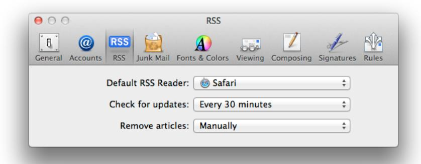

**Don't allow resizing or include active minimize or zoom buttons in a preferences window.** Remember that preferences windows are intended to give users a place to make occasional adjustments to the way an app behaves, so there should be no need for a preferences window to be resized or to remain open for a long time.

**Use the title of the current pane to title the preferences window.** The preferences window title should be the same as the title of the currently selected pane even if you don't use a pane-switcher toolbar to change panes. (Note that if your preferences window does not contain multiple panes, its title should be "*App Name* Preferences".) In addition, a changeable-pane preferences window should remember which pane the user selected the last time the window was open.

<span id="page-221-0"></span>**Use the standard menu item and keyboard shortcut to open your preferences window.** Users expect most apps to include a Preferences command in the app menu. In addition, most users expect to be able to use the Command-comma keyboard shortcut to open an app's preferences window.

#### The Open Dialog

The Open dialog gives users a consistent way to find and open an item in an app. Its appearance varies slightly depending on whether or not the app uses the iCloud Open dialog.

If your app is document based and iCloud enabled, it has an iCloud Open dialog that opens in its own window. Other apps have an Open dialog that is app modal, which means that users can't interact with the app until they dismiss the dialog, although they can switch to other apps.

The iCloud Open dialog contains these elements:

● In the title bar: Tabs for iCloud and On My Mac, the app's title—for example, "Preview"—and a search field

● In the bottom bar: A Share menu, a thumbnail or list view for navigating the file system, and a Cancel and Open buttons

You can see most of the required elements in the iCloud Open dialog for Preview in iCloud.

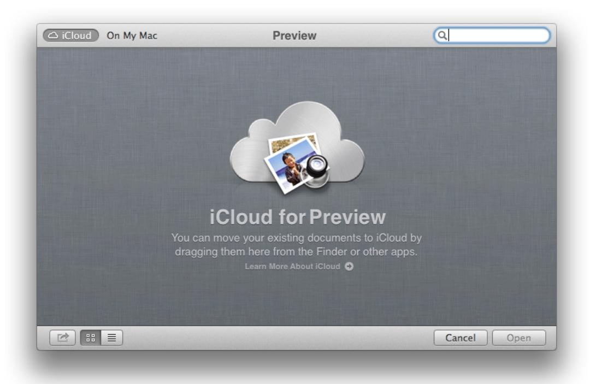

The On My Mac tab replaces the window body contents with a source list that mirrors the Finder sidebar as shown here:


The Open dialog for non-document-based apps contains these elements:

- The title, "Open"
- In the tool bar: Back and forward buttons, different views for navigating the file system, a pop-up menu that contains common places a user might save things and Recent Places (the five most recent folders the user opened or saved documents to), and a search field
- In the window body: A source list that mirrors the Finder sidebar
- In the bottom bar: Cancel and Open buttons (the Open button is the default button)
- The ability for expert users to specify a pathname by pressing Command-Shift-G (note that the pathname separator is the slash (/) character)

You can see most of the required elements in the Open File dialog for Safari.

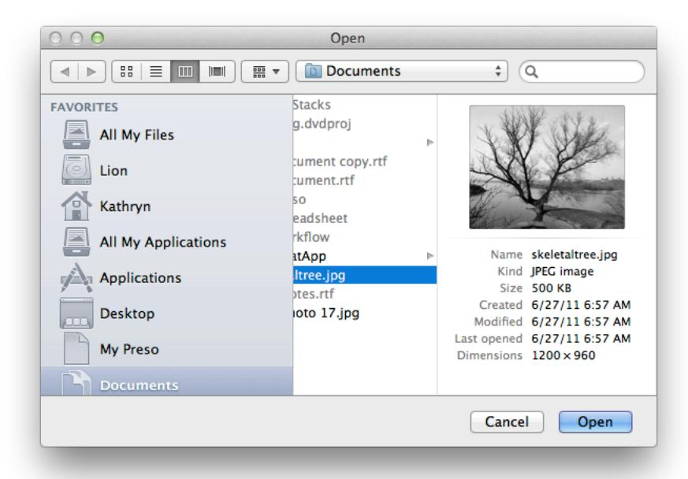

You can extend the Open dialog as appropriate for your app. For example, the TextEdit Open dialog contains an additional section that allows users to specify different encodings.

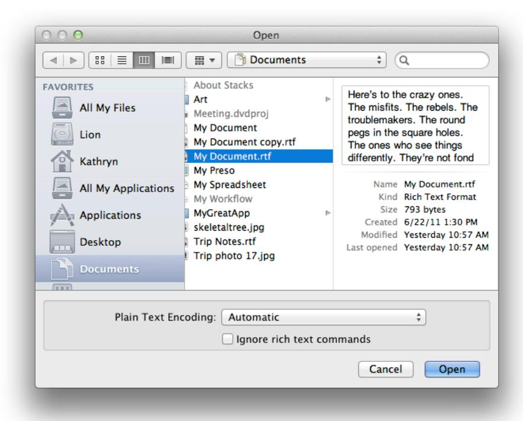

The following guidelines help you use and customize an Open dialog appropriately.

**As much as possible, use the Open command to mean "open," and not "act upon."** The Open dialog is best suited to help usersfind an item to open in your app. If you need to help usersfind itemsto use in an app-specific task, it's generally better to use a Choose dialog instead (for guidance on using a Choose dialog, see ["The](#page-225-0) [Choose](#page-225-0) Dialog" (page 226)).

**Make sure users can use the Open command to display the Open dialog.** Users expect the Open command to display an Open dialog. Contrast this with the Choose dialog, which can be displayed by different commands in different apps. It's also a good idea to provide the standard Command-O keyboard shortcut to display the Open dialog, because most users are accustomed to it.

**Specify a reasonable default location.** For the iCloud Open dialog, iCloud is the default location. You should not change this behavior. See "iCloud [Storage"](#page-70-1) (page 71) for more information.

Otherwise, the default location is typically one of the predefined folders in the user's home folder. If the user selects a different folder, make sure you remember the user's selection so that it appears the next time the dialog is displayed.

**Considerincluding a pop-up menu that allows users to filterthe types of files that appearin the list.** Display items that do not meet the filtering criteria as dimmed. You can supplement this list with custom types and specify the default to show when the dialog opens. You should include an All Applicable Files item, but it does not have to be the default item.

**Include an Open Recent command to accompany the Open command.** The Open Recent command allows users to reopen recently opened documents without using the Open dialog.

<span id="page-225-0"></span>**Extend the functionality oftheOpen dialog, if appropriate.** For example, it's a good idea to support document preview so that users can be sure they're opening the document they intend. In addition, you can enable multiple selection if your app allows more than one document to be opened at one time.

#### The Choose Dialog

A Choose dialog gives users a consistent way to select an item as the target of a task. An app can have more than one Choose dialog, but only one can be open at a time.

A Choose dialog:

- Can be opened by various commands
- Can support multiple selection
- Supports document preview
- Can be resized

For example, Calendar displays a choose dialog that allows users to choose a calendar to import.


**Note:** Recent Places does not record folders that users select in Choose dialogs.

The following guidelines help you use a Choose dialog appropriately in your app.

**Use a sheet for the Choose dialog when the chosen items are specific to the document.** For example, Mail displays a Choose dialog in a sheet to help users to find items to attach to the current message.

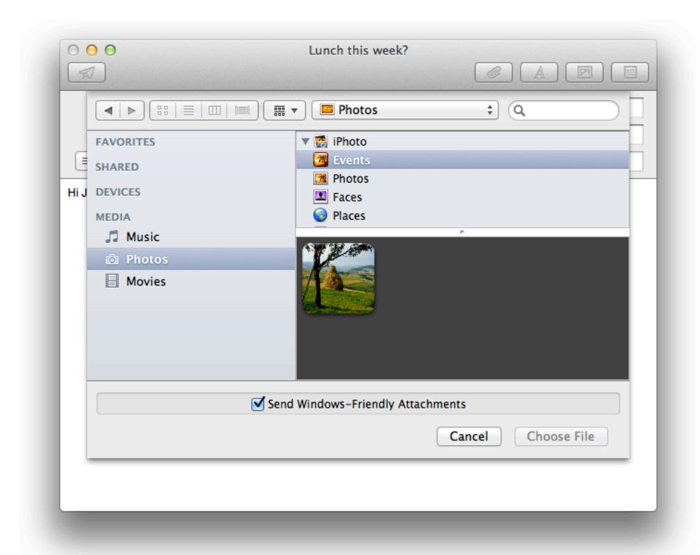

**Customize the Choose dialog title to reflect the task (if the dialog is not a sheet).** By default, the dialog's title is "Choose." If, for example, the command that displays the dialog is Choose Picture, the dialog should be titled "Choose Picture." If it's helpful, also change the Choose button to something more specific.

<span id="page-227-0"></span>**Considerincluding a pop-up menu that allows users to filterthe types of files that appearin the list.** Display items that do not meet the filtering criteria as dimmed. You can supplement this list with custom types and specify the default to show when the dialog opens. You should include an All Applicable Files item, but it does not have to be the default.

### The Print and Page Setup Dialogs

Users expect most documentsto be printable, or to include a printable version. OS X providesstandard dialogs that your app can display so that users can have a consistent printing experience in every app they use.

The Print dialog isfocused on printing the current document, but it also includesfeaturesthat can be provided by individual apps and by printer modules. The Page Setup dialog gives users a way to set the scaling and orientation options for a document, based on the intended output paper size and the printer.

By default, the Print dialog appears in its minimal form (shown here in the dialog attached to a TextEdit document). Users can get additional functionality in the expanded Print dialog by clicking Show Details.

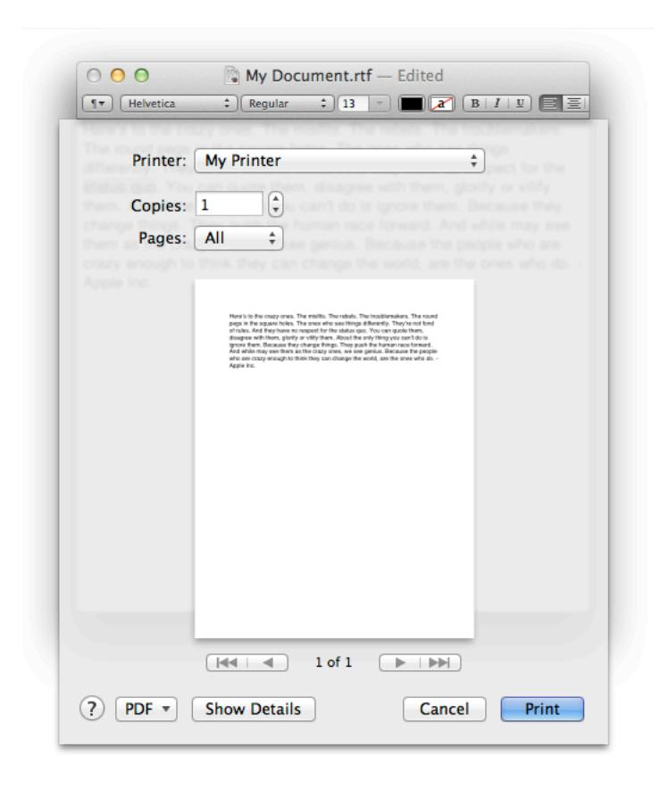

In the expanded Print dialog, user options are provided via the features pop-up menu, which displays panes that are drawn and controlled by printing dialog extensions(PDEs). PDEs are provided by the operating system, printer modules, and apps. Apple provides a number of printing panes. In the expanded Print dialog shown here, you can see the "Print header and footer" and "Rewrap contentsto fit page" optionsthat TextEdit provides.

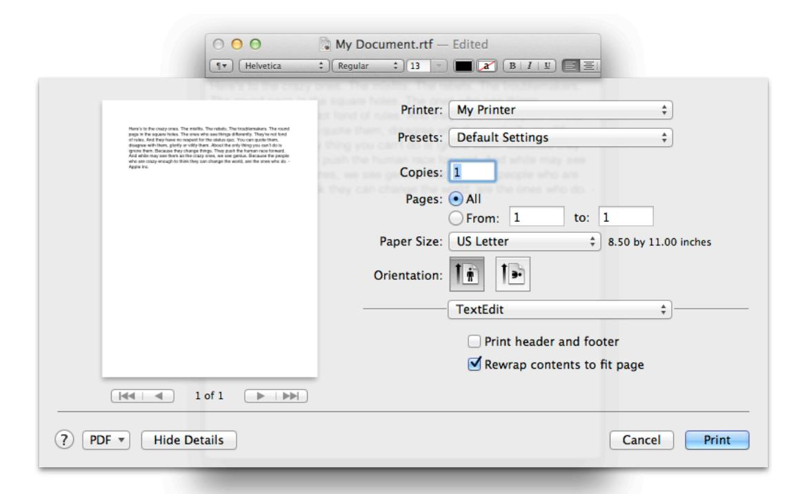

You might want to provide custom print panes that give users options that are relevant to the types of content your app handles. For example, Contacts helps users print their contact information in different styles, such as mailing label, envelope, and list. Here are some specific guidelines to keep in mind if you implement custom printing features:

- Choose a menu item name that doesn't conflict with menu items already in the features pop-up menu, and that accurately describesthe content of the pane. For an app, the menu item should be the app name.
- Make sure the features you implement are appropriate for your app. For example, an option to print in reverse order should be provided by the operating system, not by your app. (Implementing this feature requires the app to know the hardware's capabilities.)
- Make interdependencies among options clear to users. For example, if a userselects double-sided printing, the option to print on transparencies should become unavailable.
- Separate more advanced features from frequently used features. When the user chooses to display the advanced features, there should be an "advanced options" title above the advanced controls.

- When appropriate, show users what effect their choices will have. For example, a thumbnail image that shows the effect of changing a tone control helps users determine desired settings.
- Save a user's printing preferences for a document, at least while the document is open, and provide a way for users to save custom settings.

If you think users would appreciate being able to set printing attributes for different printers or different paper sizes, it makes sense to provide a Page Setup dialog in your app. Be sure to save the settings that users make in this dialog with the document. Below, you can see the Page Setup dialog that TextEdit provides.

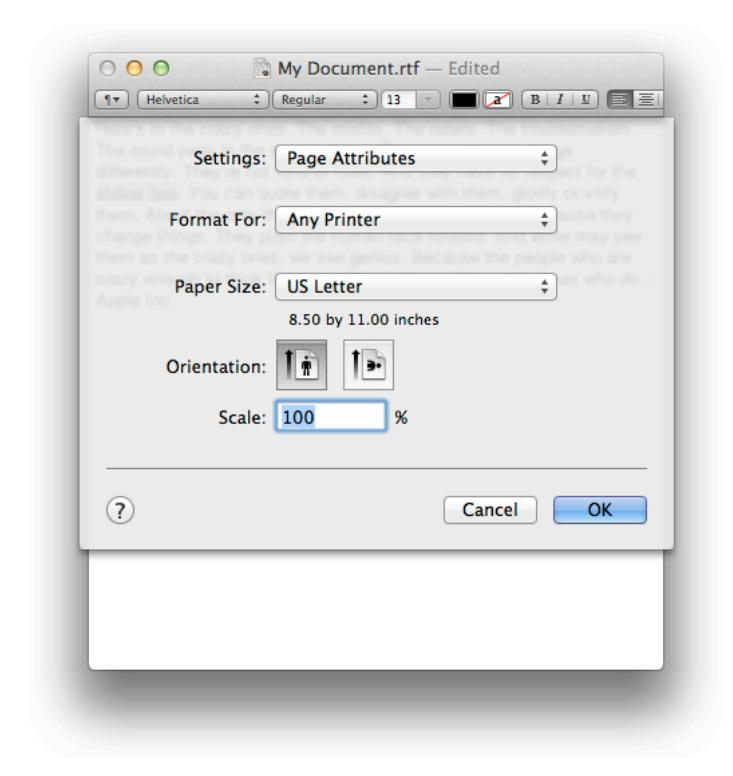

#### <span id="page-231-0"></span>Find Windows

A Find window is a modeless dialog that opensin response to the Find command and that provides an interface for specifying items to search for. For example, Mail displays the Find dialog so that users can find (and, optionally, replace) text within a message.


Find windows are useful in document-creation apps, because users can use one Find window to search for a term in several different documents. If it makes sense in your UI, however, you can offer find functionality in a scope bar. A scope bar is attached to a window and provides both search and filtering capabilities to users. For more information about scope bars and how to use them in your app, see "Using a Scope Bar to [Enable](#page-186-0) [Searching](#page-186-0) and Filtering" (page 187).

### <span id="page-231-1"></span>Save Dialogs

Users expect to be able to specify a title and save location when they choose to save a document for the first time. To perform the initial save, users expect to see the standard Save dialog.

**Note:** As much as possible, you want help users stop worrying about the save state of their content. In particular, you want them to stop thinking that they must continually choose File > Save in order to avoid losing their work.

Although users see a Save dialog the first time they want to name and place their document, they should seldom—if ever—see a Save dialog while they continue to work on the document.

The Save dialog hastwo states: minimal (also known as collapsed) and expanded. Clicking the disclosure button toggles between these states. For example, in the minimal Save dialog (shown here displayed by TextEdit), you can see the closed disclosure button to the right of the document title.

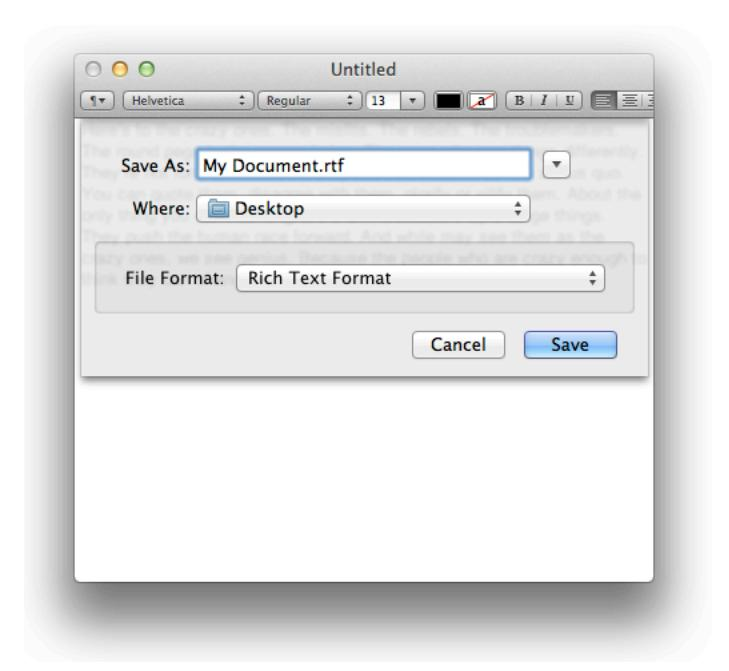

The minimal Save dialog contains these elements:

- The Save As text field in which users enter the document name. Expert users can enter pathnames by pressing Command-Shift-G. (Note that the pathname separator is the "/" character.)
- The Where pop-up menu, which contains mounted volumes, folders in the Finder sidebar, and Recent Places (which are the five most recent folders the user opened or saved documents to).
- A Save button (this is the default button).
- A Cancel button, which dismisses the dialog and returns the app to its previous state.
- A disclosure button. Clicking it displays the expanded Save dialog. (For more information about how to use disclosure buttons, see ["Disclosure](#page-290-0) Button" (page 291).)
- An optional accessory view, which can contain information such as text encoding settings. (In general, the accessory view should not be necessary.)

The expanded Save dialog gives users a broader view of the file system than they get in the minimal Save dialog's Where pop-up menu. For example, the expanded TextEdit Save dialog displaysthe browsable file-system view.


In addition to the items in the minimal Save dialog, the expanded Save dialog includes the following:

- Back and forward buttons to navigate back and forth between selections made in the list or column view.
- A source list that mirrors the Finder sidebar.
- A column or list view for navigating the file system.
- A File Format (or Format) pop-up menu, which displays a list of file formatsfrom which the user can choose.
- A New Folder button, which displays an app-modal dialog that asks the user to name the new folder, and then creates it.
- A "Hide extension" checkbox, which allows the user to control whether or not the filename's extension (.jpg, for example) is visible.

In addition to the Save dialog, a document-based app can display the close confirmation save dialog. The close confirmation save dialog (shown when users close a document window that contains data that has never been saved) has the same minimal and expanded states as the standard Save dialog. For example, TextEdit displays the close confirmation save dialog when the user closes a new document window with unsaved changes.


As with the standard Save dialog, the close confirmation save dialog includes a disclosure button to the right of the Save As text field. Clicking this button expands the dialog to show a similar browsable file system view. The differences between the close confirmation save dialog and the standard Save dialog are due to the fact that it's unclear whether the user intends to discard their work. For this reason, the text at the top of the dialog explains why it has appeared, and the Don't Save button at the bottom of the dialog allows the user to decline to save their work.

There are a few ways in which you can customize a Save dialog so that it provides a better user experience. Keep the following guidelines in mind as you customize the save dialogs your app displays.

**Specify a reasonable defaultlocation.** The default location appearsin the Where pop-up menu (in the minimal Save dialog) and in the Finder view (in the expanded Save dialog). Typically, the default location is one of the predefined folders in the user's home folder. If the user selects a different folder, make sure you remember the user's selection so that it appears the next time the dialog is displayed.

**Allow users to choose whether to view the file extension.** The "Hide extension" checkbox should be selected as the default (that is, filename extensions should not appear in user-visible filenames unless the user requests them). If the user changes the state of the checkbox for a particular document, the next new document should match the last user-selected state, even after the user quits and reopens the app. The filename in the Save As field updates in real time as the checkbox is selected or deselected.

**Display the default new document name before users save the document for the first time.** In general, this should be "untitled." In the Save As field, display the default name as selected so that users can easily replace it with a custom name. If the user has chosen to make the filename extension visible, the extension is not selected.

**Display custom UI elements below the location-selection elements.** In the minimal Save dialog, custom UI elements go between the Where pop-up menu and the buttons at the bottom of the dialog. In the expanded Save dialog, custom elements go between the file-system browser and the buttons at the bottom of the dialog.

**Note:** In default keyboard navigation mode, pressing Tab in the expanded Save dialog shifts the keyboard focus from the Save As text field to the source list, to the visible columns, and then back to the text field.

### <span id="page-235-0"></span>Alerts

An **alert** is a dialog that appears when the system or an app needs to give users an important message about an error condition or warn them about potentially hazardous situations or consequences. An alert that applies to a single document or window is displayed as a sheet.

Alerts interrupt users and must be dismissed before users can return to their task. For the best user experience, it's essential that you avoid displaying an alert unless it's absolutely necessary. The guidelines in this section help you determine when to display an alert and, if one is required, how to ensure that it's useful.

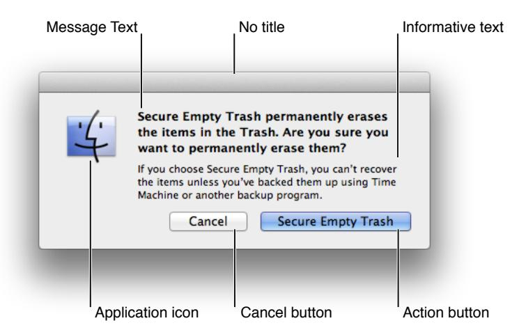

As you can see in the Finder alert shown above, an alert contains the following elements:

● The **alert message** (which uses emphasized system font) provides a short, simple summary of the error or condition that summoned the alert.

- The **informative text** (which uses small system font) provides a fuller description of the situation, its consequences, and ways in which users can address it.
- Buttons for addressing the alert appear at the bottom of the dialog. The rightmost button in the dialog, the action button, is the button that confirms the alert message text. The action button is usually, but not always, the default button. (For more information about action and default buttons, see ["Dismissing](#page-218-0) [Dialogs"](#page-218-0) (page 219).)
- The **app icon** appears to the left of the text and shows users which app is displaying the alert.

**Important:** Do not leave out the informative text. What you think of as an intuitive alert message might be far from intuitive to your users. Use informative text to reword and expand on the alert message text.

When an alert is necessary, your most important job is to explain the situation clearly and give users a way to handle it. The following guidelines can help you decide when to display an alert, and how to make sure it communicates appropriately with users.

**Avoid using an alert merely to give users information.** Although it's important to tell users about serious problems, such as the potential for data loss, users don't appreciate being interrupted by alerts that are informative but not actionable. Instead of displaying an alert that merely informs, give users the information in another way, such as in an altered status indicator. For example, when a mail server connection has been lost, Mail displays a warning indicator in the sidebar. Instead of being forced to handle an alert when the connection is lost, users can click the warning indicator if they want more information about the situation.

**Avoid displaying an alert for common, undoable actions, even when they cause data loss.** When users delete Mail messages or throw files away, they don't need to see an alert that warns them about the loss of data. Because users take these actions with the intention of discarding data (and because these actions are easy to undo), an alert isinappropriate. On the other hand, if the user initiates an uncommon action that cannot be undone, such as Secure Empty Trash, it's appropriate to display an alert in case the user didn't mean to take the action.

**If a situation is worthy of an alert, don't use any other UI element to display it.** It might be tempting to use a different element to display alert information, but it would be very confusing for users. Users are familiar with the standard alert and they're not likely to take the information in a different element as seriously.

**Use the caution icon in rare cases.** It's possible to display a caution icon in your alert, badged with your app icon. This type of badged alert is appropriate only if the user is performing a task that might result in the inadvertent and unexpected destruction of data. Don't use a caution icon for tasks whose only purpose is to overwrite or remove data,such as Save or Empty Trash because the too-frequent use of the caution icon dilutes its significance. For example, TextEdit displays a badged alert when the user attempts to change a document's format from RTF to RTFD, because the user might not realize that the resulting document isn't as widely compatible with other apps.

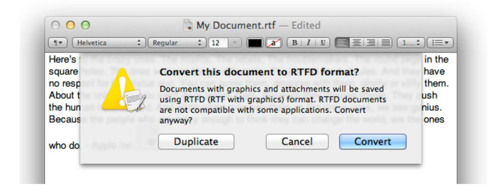

**Write an alert message that clearly and succinctly describes the alert situation.** An alert message such as "An error occurred" is mystifying to all users and islikely to annoy experienced users. It's best to be as complete and asspecific as possible, without being verbose. When possible, identify the error that occurred, the document or file it occurred in, and why it occurred.

When it's possible that users are unaware that their action might have negative consequences, it can be appropriate to phrase the alert message as a question. For example, a question such as "Are you sure you want to clear history?" pinpoints the action users took and prompts them to consider the results. Be sure that you don't overuse this type of alert; users tire quickly of being asked if they're sure they want to do something.

**Write informative text that elaborates on the consequences and suggests a solution or alternative.** Give as much information as necessary to explain why the user should care about the situation. If it's appropriate, use the informative text to remind users that the action they initiated cannot be undone.

Informative text is best when it includes a suggestion for fixing the problem. For example, when the Finder can't use the user's input to rename a file, it tells them to try using fewer characters or avoid including punctuation marks.

**Express everything in the user's vocabulary.** An alert is an especially bad place to be cryptic or to use esoteric language, because the arrival of an alert can be very unsettling. Even though you want to be succinct, it's important that you use clear, simple language and avoid jargon. (For some examples of jargon to avoid, see "Use User-Centric [Terminology"](#page-60-0) (page 61).)

**Ensure that the default button name corresponds to the action you describe.** In particular, it's a good idea to avoid using OK for the default button. The meaning of OK can be unclear even in alerts that ask if the user is sure they want to do something. For example, does OK mean "OK, I want to complete the action" or "OK, I now understand the negative results my action would have caused"?

Using a more focused button name, such as Erase, Convert, Clear, or Delete, helps make sure that users understand the action they're taking.

# <span id="page-239-0"></span>UI Element Guidelines: Controls

**Controls** are graphic objects that cause instant actions or visible results when users manipulate them. In OS X, the Application Kit (or AppKit) framework provides the standard Aqua controls you can use in your app, such as push buttons, radio buttons, checkboxes, text fields, and list views.

### <span id="page-239-1"></span>Guidelines that Apply Generally to Controls

You are strongly encouraged to use the standard Aqua controls in your app. When you do this, you benefit in three important ways:

- When users see familiar controls, they can begin to enjoy your app immediately, rather than spend time figuring out how it works.
- Aqua controls are automatically updated whenever the OS X UI is refreshed, which means that you don't have to produce a new version of your app to take advantage of the new look.
- Standard AppKit controls automatically render correctly at any resolution, which means you do not have to provide separate resources for standard and high resolution displays.

**Avoid mixing control sizes in the same view.** Many controls are available in three sizes: regular, small, and mini. In most cases, you want to use regular-size controls in your windows. When space is at a premium, such as in a panel or within a pane, you might want to use small or (less often) mini controls. Although in rare cases a pane might contain small controls while the surrounding window contains regular controls, it's best to avoid mixing different sizes of controls in the same window. (Note that all panes in a window should use controls of the same size.)

**In general, avoid resizing controls vertically.** Many controls can be resized horizontally, but most controls are fixed vertically for each available size. If you vertically resize some controls, you might trigger unexpected results, such as a change in control style.

**Use the proper text size and font within a control.** For example, a regular-size control generally uses the regular system font for text that appears within it, such as "OK" in a button or a menu item name in a pop-up menu. When you create your UI in Interface Builder, you automatically get the proper font and size for each standard control you use.

**Use the proper spacing between controls.** When controls are spaced evenly in a window, the window is more attractive and easier for usersto use. The layout guidesin Interface Buildershow you the recommended spacing between controls and between UI elements and window edges.

**Note:** Every control described in this chapter is accompanied by at least one illustration that shows an example of the control. These images do not necessarily exhibit the precise measurements or colors you would observe in a running app.

For thisreason, you should never measure the imagesin this document and use those measurements to create custom controls or other UI elements. Note that when you use Interface Builder to create your user interface, you automatically get the proper control sizes.

### <span id="page-240-0"></span>Window-Frame Controls

<span id="page-240-1"></span>A small subset of Aqua controls can use a display style that makes them suitable for use in the window-frame areas(that is, in the toolbar or bottom bar). The control and style combinationsthat you can use in window-frame areas are listed in Table 8-1.

**Table 8-1** Control and style combinations designed for use in the window frame

| Control (API name)                                                                        | Style                                                                         | Example |
|-------------------------------------------------------------------------------------------|-------------------------------------------------------------------------------|---------|
| Round<br>textured<br>button<br>(NSButton)                                                 | NSTexturedRounded<br>BezelStyle                                               |         |
| Textured<br>rounded<br>segmented<br>control<br>(NSSegmentedControl)                       | NSSegmentStyle<br>TexturedRounded                                             |         |
| Round<br>textured<br>pop-up<br>menu<br>(NSPopUpButton<br>with<br>PopUp<br>attribute<br>*) | NSTexturedRounded<br>BezelStyle                                               |         |
| Round<br>textured<br>pop-down<br>menu<br>(NSPopUpButton<br>with<br>PopDown<br>attribute)  | NSTexturedRounded<br>BezelStyle                                               |         |
| Search<br>bar<br>(NSSearchField)                                                          | Not<br>applicable<br>(the<br>correct<br>style<br>is<br>used<br>automatically) |         |

\*Note that you can use the NSTexturedRoundedBezelStyle style of pop-up menu to place an Action menu in a toolbar (for more information about Action menus, see ["Action](#page-262-0) Menu" (page 263)).

You can see examples of most of these types of window-frame controls in the Mail toolbar.


**Do not use the window frame–specific control styles in the window body.** The control and style combinations listed Table 8-1 have been specially designed to look good on the window-frame surface of the toolbar (or bottom bar). *These control styles do not look good in the window body* . Specifically, these control styles have a translucency that is designed to coordinate with the window-frame surface, and they include inactive and other appearances that do not harmonize with other controls and styles.

**In general, do not use window-body controls or styles in the window frame.** All Aqua controls and styles other than those listed in Table 8-1 have been designed to look good in the window body and its content regions, and *should not be used in the window frame* . The exception is the icon button, which can be used in both window-frame and window-body areas. In general, appsreserve thistype of toolbar control for preferences windows. To learn more about designing icons for toolbar icon buttons, see ["Designing](#page-121-0) Toolbar Icons" (page 122). To learn more about using an icon button in general, see "Icon [Button"](#page-246-0) (page 247).

If your window includes a bottom bar (which is not typical), you can use window-frame controls in the bottom bar. For some guidelines on creating a bottom bar, see ["Providing](#page-192-0) a Bottom Bar" (page 193).

**Avoid combining text and icons within a toolbar control.** A toolbar button can contain either text or an icon. And, although each segment in a segmented toolbar control can contain either text or an icon, it's best to avoid combining text segments with icon segments in the same segmented control.

Interface Builder makes it easy to add one of the system-provided images to a toolbar control, such as the plus sign, the accounts symbol, or the locked symbol. Some of these symbols are shown here in the controls in the Finder toolbar. For more information about the system-provided images, see ["System-Provided](#page-319-0) Icons" (page 320). If you need to design your own image to place in a toolbar control, see ["Designing](#page-121-0) Toolbar Icons" (page 122) for some metrics and guidelines.

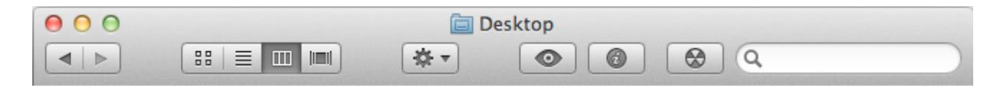

**Important:** You must supply a descriptive label for each toolbar control you create so that users can customize the toolbar to display both icons and text. Users see a descriptive label below each toolbar control when they customize a toolbar to use the Icon & Text or Text Only display options. (Window-frame controls used in a bottom bar do not need external descriptive labels.)

If you want to display text inside a toolbar control, be sure it is either a noun (or noun phrase) that describes an object, setting, or state, or that it is a verb (or verb phrase) that describes an action. Text inside toolbar controls should have title-style capitalization (for more on this style, see ["Capitalizing](#page-305-0) Labels and Text" (page 306)).

**Be sure to accurately indicate the current state of a two-state control.** If you use a toolbar control that behaves like a checkbox or a toggle button, you may be able to benefit from the automatic highlighting that signifies the on state of the control. If you do this, be very sure that the control clearly indicates the correct state in the correct situation.

Also, if you put such a two-state control in a toolbar, you should provide two descriptive labels that can be displayed below the control. One label should describe the on (or pressed) state and one should describe the off (or unpressed) state. Finally, be sure to describe both of the states in the control's help tag, whether the control appears in a toolbar or a bottom bar. To learn more about the on-state appearance, see ["Appearance](#page-249-1) and [Behavior"](#page-249-1) (page 250).

For example, Mail includes a toggled toolbar button that users can use to take their accounts online or offline (shown here in its pressed state). Note that the "Go Offline" label that accompanies the pressed state changes to "Go Online" when the control is in its unpressed state.


To provide a toggle-style toolbar button that displays an on-state appearance, use an NSButton object with style NSTexturedRoundedBezelStyle, with which you've associated an image. Be sure the button cell's showsStateBy mask contains NSContentsCellMask. This means that AppKit uses the alternate image and title when the cell's state is NSOnState. However, to get the on-state effect do *not* provide an alternate image. If you're using Interface Builder, place a Rounded Textured Button object in your toolbar or bottom bar; in the Attributes pane of the inspector, set the mode to Toggle, provide an image, and do not provide an alternate image.

To provide a segmented toolbar control that displays an on-state appearance, use an NSSegmentedControl object with style NSSegmentStyleTexturedRounded and mode NSSegmentSwitchTrackingSelectAny. If you're using Interface Builder, place a Segmented Control object in your toolbar or bottom bar; in the

Attributes pane of the inspector, set the style to Textured Rounded and the mode to Select Any. Be sure to provide an image for the control (in Interface Builder, select an image from the Image combo box in the Attributes inspector).

### <span id="page-243-0"></span>Buttons

Buttons initiate an immediate action. There are several types of buttons in OS X, each of which is well suited to a certain set of tasks. As you design your app's user interface, be sure to select the appropriate button for each job. The guidelines in the following sections help you use each type of button correctly.

**Important:** The buttons described in the following sections are suitable for use in the window body; they should not be used in the toolbar or bottom bar. The single exception is the icon button, which can also be used in a preferences window toolbar. To learn about controls that are designed specifically for use in the toolbar and bottom-bar areas in your window, see ["Window-Frame](#page-240-0) Controls" (page 241).

### <span id="page-243-1"></span>Push Button

A **push button** performs an app-specific action.

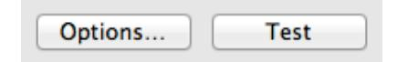

Push buttons are designed for use in the window body only, not in the window-frame areas. To learn about the controls that you can use in a toolbar or bottom bar, see ["Window-Frame](#page-240-0) Controls" (page 241).

<span id="page-243-2"></span>Push buttons are available in Interface Builder. To create one programmatically, create an NSButton object of type NSMomentaryPushInButton or NSMomentaryLightButton. Note that the NSTexturedRoundedBezelStyle style of NSButton is designed for use in the window frame.

#### Appearance and Behavior

A push button always contains text, it does not contain an image.

All push buttons are clear in appearance, that is, without color, except the default button in a dialog. (The default button performs a safe action and is activated when users press Return or Enter; for more information, see ["Dismissing](#page-218-0) Dialogs" (page 219)). You can see the two different button colorsin the standard OK and Cancel buttons.

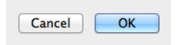

When the user clicks a nondefault button, such as Cancel, that button acquires color and the default button loses its color. This behavior is automatically implemented by the system-provided push buttons.

#### Guidelines

Use a push button in the window body to perform an instantaneous action, such as Print or Delete. A push button can also open another window to complete its operation.

**Avoid using a push button to mimic the behavior of other controls.** Users expect an immediate action to occur when they click a push button, including the opening of another window or the dismissal of a dialog. In particular:

- Do not use a push button to indicate a state, such as on or off. Instead, you can use checkboxes to indicate state, as described in ["Checkbox"](#page-256-0) (page 257).
- Do not use a push button as a label. Instead, use static text to label elements and provide information in the interface (for more information, see ["Static](#page-282-1) Text Field" (page 283)).
- Avoid associating a menu with a push button.

**Provide enough space between buttons so that users can click a specific one easily.** In particular, if a push button can lead to a potentially dangerous or destructive action (such as Delete), it should be far enough away from safe buttons so that users are unlikely to click it accidentally.

**Avoid displaying an icon in a button.** A push button should contain text that describes the action it performs.

**Use a verb or verb phrase for the title of a push button.**The title you create should describe the action the button performs—Save, Close, Print, Delete, Change Password, and so on. If a push button acts on a single setting or entity, name the button as specifically as possible; "Choose Picture…," for example, is more helpful than "Choose…" Because buttons initiate an immediate action, it shouldn't be necessary to use "now" (Scan Now, for example) in the button title.

**Use title-style capitalization for the button title and add an ellipsis if necessary.** To learn more about title-style capitalization, see ["Capitalizing](#page-305-0) Labels and Text" (page 306).

If the push button immediately opens another window, dialog, or app to perform its action, use an ellipsis in the title. An ellipsis prepares users to expect another window to open in which they complete the action the button initiates. For example, Print & Scan preferences uses ellipsis characters in the names of buttons that open the print queue window and show information about the printer's options and supplies.


**Be sure to resize a button's width to accommodate the title.** If you don't make a button wide enough, the end caps clip the text. Note that the height of a push button is fixed for each size.

**In general, avoid supplying a static text label to introduce a push button.** You should be able to avoid an introductory label by clearly describing the push button action in the button title.

#### <span id="page-246-0"></span>Icon Button

An **icon button**, or freestanding icon, performs an app-specific action, often in a toolbar. For example, System Preferences uses icon buttons to represent its preferences panes.


You can use an icon button in a toolbar or in the window body. (Icon buttons are not suitable for use in a bottom bar.)

To create an icon button in Interface Builder, drag a bevel button or a square button into your window, add your icon, and deselect the Bordered checkbox in the Attributes pane of the inspector. To create one using AppKit programming interfaces, use the setBezelStyle: method of NSButtonCell with NSShadowlessSquareBezelStyle as the argument.

#### Appearance and Behavior

An icon button does not have a visible rectangular edge around it. In other words, the entire button is clickable, not just the icon.

An icon button can have a pop-up menu attached to it, which is indicated by the presence of a single downward-pointing arrow. For more information about this usage,see "Icon Button or Bevel Button [Containing](#page-259-0) a [Pop-Up](#page-259-0) Menu" (page 260).

#### Guidelines

Use an icon button to perform an app-specific action in either the toolbar or the window body. You can also use an icon button to provide mode-switching functionality in a preferences window toolbar.

**Avoid mixing icon buttons with toolbar controls in a toolbar.** Toolbars look best, and are easiest for users to understand, when they contain controls of the same type.

**Make sure the meaning of an icon button is clear and unambiguous.** Because users might view the icon without its label, it's especially important to choose an icon that accurately communicates its meaning. For tips on designing attractive and expressive toolbar icons, see ["Designing](#page-121-0) Toolbar Icons" (page 122).

**Create a label that names a thing or describes an action; also, use title-style capitalization.** An icon button that functions as a pane-switchershould name a thing,such as Network or Accounts. If an icon button performs an action, its label should describe it succinctly, such as Mask or Show Art. Use title-style capitalization for both types of icon button label (for more information about thisstyle,see ["Capitalizing](#page-305-0) Labels and Text" (page 306)).

**Avoid making the icon too big for the button.** Even though the outer dimensions of an icon button are not visible, they determine the hit target area. In general, it works well to size the icon button so that you leave a margin of about 10 pixels all the way around an icon.

If you include a label, place it below the icon, as shown here in the Sound icon button. (Use the small system font for a label.)


<span id="page-247-0"></span>**Avoid putting an icon button too close to other UI elements.** Don't forget that the entire button area is clickable (not just the icon). When you use Interface Builder, the layout guides help you see where the edges of an unbordered icon button are.

#### Scope Button

A **scope button** specifies the scope of an operation, such as a search, or defines a set of scoping criteria.


**Important:** Scope buttons are designed to be used in scope bars and related filter rows only. They are not intended to be used in the toolbar or bottom-bar areas or outside of a scope bar in the window body.

To learn more about scope bars, see "Using a Scope Bar to Enable [Searching](#page-186-0) and Filtering" (page 187).

Scope buttons are available in Interface Builder. To create a recessed scope button using AppKit programming interfaces, use the setBezelStyle: method of NSButtonCell with NSRecessedBezelStyle as the argument. To create a round rectangle scope button, pass NSRoundRectBezelStyle as the argument to the setBezelStyle: method.

#### Appearance and Behavior

Scope buttons are available in two different styles:

The **recessed scope button**:

The **round rectangle scope button**:

Typically, round rectangle and recessed scope buttons contain text, but they can instead contain images.

#### Guidelines

Use a recessed scope button to display types or groups of objects or locations that users select to narrow the focus of a search or other operation.

Use a round rectangle scope button to allow users to save a set of search criteria and to change or set scoping criteria.

For example, the Finder uses round rectangle scope buttons to display search criteria, such as creation and last opened dates, and to provide a save search button. The Finder location buttons, such as This Mac and Shared, are recessed scope buttons.


If you want to display an image in a scope button, be sure to consider the system-provided images before you spend time designing your own. If you decide to design a custom icon for use in a scope button,see ["Designing](#page-121-0) [Toolbar](#page-121-0) Icons" (page 122).

#### <span id="page-249-0"></span>Gradient Button

A **gradient button** performs an instantaneous action related to a view, such as a source list.


Gradient buttons are available in Interface Builder. To create one using AppKit programming interfaces, use the setBezelStyle: method of NSButtonCell with NSSmallSquareBezelStyle as the argument.

#### <span id="page-249-1"></span>Appearance and Behavior

Gradient buttons can have push-button, toggle, and pop-up menu behavior. For example, Mail uses gradient buttons below the sidebar to offer New Mailbox, Show/Hide Mail Activity, and Action menu functionality:


Gradient buttons contain images; they do not contain text.

#### Guidelines

Use a gradient button to offer functionality that is directly related to a source list or other view, such as a column view.

Because the function of a gradient button is closely tied to the view with which it's associated, there's little need to describe its action using a label.

When possible, use system-provided images, such as the Action and the Add images, because their meaning is familiar to users. For more information on the system-provided images, see ["System-Provided](#page-319-0) Icons" (page 320). If you need to create your own iconsto use in a gradient button,see ["Designing](#page-121-0) Toolbar Icons" (page 122) for some guidance.

#### <span id="page-250-0"></span>The Help Button

The **Help button** opens a window that displays app-specific help.


The standard Help button is available in Interface Builder. To create a Help button using AppKit programming interfaces, use the setBezelStyle: method of NSButtonCell with NSHelpButtonBezelStyle as the argument.

#### Appearance and Behavior

The Help button is always a clear, circular button. The Help button is available in a single size and it always contains the standard OS X question mark graphic.

When users click a Help button, the system-provided Help Viewer app opens to a page in the current app's help book. An app can determine whether the help book should open to a top-level page or to a page that is appropriate for the context of the button.

#### Guidelines

Don't create a custom button to perform the function of the standard Help button.

In dialogs(including preferences windows) and drawers, the Help button can be located in either the lower-left or lower-right corner. In a dialog that includes OK and Cancel buttons (or other buttons used to dismiss the dialog), the Help button should be in the lower-left corner, vertically aligned with the buttons. In a dialog that does not include OK and Cancel buttons, such as a preferences window, the Help button should be in the lower-right corner. For example, the Mail Fonts & Colors preference displays a Help button in the lower-right corner.


<span id="page-251-0"></span>For information on providing help in your app, see "User [Assistance"](#page-106-0) (page 107).

#### Bevel Button

A **bevel button** is a multipurpose button designed for use in the window-body area.

**Note:** Bevel buttons are not recommended for use in apps that run in OS X v10.7 and later. You should consider alternatives,such as gradient buttons and segmented controls(described in ["Gradient](#page-249-0) [Button"](#page-249-0) (page 250) and ["Segmented](#page-258-0) Control" (page 259), respectively).

You can use bevel buttons singly (as a push button) or in groups (as a set of radio buttons or checkboxes). The Preview inspector window uses bevel buttons as push buttons that rotate and crop the current content.


Bevel buttons are available in Interface Builder. To create one using AppKit programming interfaces, use the setBezelStyle: method of NSButtonCell with NSRegularSquareBezelStyle as the argument. (To create a square-cornered bevel button, use NSShadowlessSquareBezelStyle as the argument for the setBezelStyle: method.)

#### Appearance and Behavior

Bevel buttons can have square or rounded corners. They can display text, icons, or other images. Bevel buttons can also display a single downward-pointing arrow in addition to text or an image, which indicatesthe presence of a pop-up menu (for more information about this usage, see "Icon Button or Bevel Button [Containing](#page-259-0) a [Pop-Up](#page-259-0) Menu" (page 260)).

Bevel buttons can behave like push buttons or can be grouped and used like radio buttons or checkboxes.

#### Guidelines

You can use a square-cornered bevel button when space is limited or when adjoining a set of bevel buttons.

If you use a bevel button as a push button, its label should be a verb or verb phrase that describes the action it performs. If you provide a set of bevel buttons to be used as radio buttons or checkboxes, you might label each with a noun that describes a setting or a value.

If you choose to display an icon or image instead of a text label, be sure the meaning of the image is clear and unambiguous. It's recommended that you create an icon no larger than 32 x 32 pixels. Maintain a margin of between 5 and 15 pixels between the icon and the outer edges of the button. A button that contains both an icon and a label may need a margin around the edge that's closer to 15 pixels than to 5 pixels. Use label font (10-point Lucida Grande Regular) for text labels.

#### **Rounded corners**

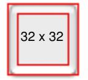

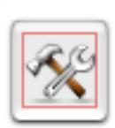


Leave at least 5 pixels between edge of icon and edge of button.

#### **Rounded corners with label below icon**


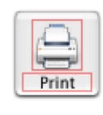

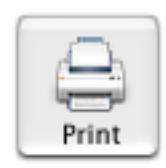

Bevel button as a push button

You can also use Interface Builder to add a pop-up menu to a bevel button. First, drag a pop-up button into your window then, in the Attributes pane of the inspector, change the type to Pull Down. Finally, in the same pane, change the style to Bevel (for a standard bevel button look) or Square (for a square-cornered bevel button look).

#### <span id="page-253-0"></span>Round Button

A **round button** initiates an immediate action.

**Note:** Round buttons are not recommended for use in apps that run in OS X v10.7 and later. You should consider an alternative,such as a gradient button (described in ["Gradient](#page-249-0) Button" (page 250)).


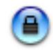

Round buttons are available in Interface Builder. To create one using AppKit programming interfaces, use the setBezelStyle: method of NSButtonCell with NSCircularBezelStyle as the argument.

#### Appearance and Behavior

Round buttons contain images only, not text.

#### Guidelines

Round buttons, like bevel buttons, are seldom used in modern Mac apps. You might want to use a gradient button that contains a system-provided (or custom) image as an alternative. For more information about gradient buttons, see ["Gradient](#page-249-0) Button" (page 250); for more information about system-provided images, see ["System-Provided](#page-319-0) Icons" (page 320).

**Don't use a round button to create a Help button.** If you provide onscreen help, use the standard Help button instead (to learn more about this control, see "The Help [Button"](#page-250-0) (page 251)).

**Don't use round buttons as radio buttons or as checkboxes.** If you need to provide functionality of these types, use radio buttons (see "Radio [Buttons"](#page-254-1) (page 255)) or checkboxes (see ["Checkbox"](#page-256-0) (page 257)).

If you need to display a single letter in a round button you should treat the letter as an icon.

### <span id="page-254-0"></span>Selection Controls

Selection controls provide waysfor usersto make selectionsfrom multiple items. Some selection controls allow only a single selection, others can be configured to allow a single selection or multiple selections.

**Important:** The controls described in this section are suitable for use in the window body; they should not be used in the window-frame areas. The single exception is the icon button with a pop-up menu, which can also be used in a toolbar. To learn more about the controls that are designed specifically for use in the toolbar (and bottom-bar), see ["Window-Frame](#page-240-0) Controls" (page 241).

#### <span id="page-254-1"></span>Radio Buttons

A group of **radio buttons** displays a set of mutually exclusive, but related, choices.

| Open all files in one window                                |
|-------------------------------------------------------------|
| <ul> <li>Open groups of files in the same window</li> </ul> |
| Open each file in its own window                            |

Radio buttons are available in Interface Builder. To create one using AppKit programming interfaces, create an NSButton object with type NSRadioButton.

#### Appearance and Behavior

The selected and unselected appearances of a radio button are provided automatically; you do not display any text or images in a radio button.

A set of radio buttonsis never dynamic; that is, the contents and labels don't change depending on the context.

#### Guidelines

Use a group of radio buttons when you need to display a set of choices from which the user can choose only one.

**Use checkboxes, instead of radio buttons, to display a set of choices from which the user can choose more than one at the same time.** Also, if you need to display a single setting, state, or choice that the user can either accept or reject, don't use a single radio button; instead you can use a checkbox. To learn more about checkboxes, see ["Checkbox"](#page-256-0) (page 257).

**Consider using a pop-up menu if you need to display more than five items.** It's best when a group of radio buttons contains at least two items and a maximum of about five. (To learn more about pop-up menus, see ["Pop-Up](#page-260-0) Menu" (page 261).)

**Don't use a radio button to initiate an action.** Instead, use a push button to initiated an action. Note that the choice of a radio button can change the state of the app. In Speech preferences, for example, the user must choose the second listening method ("Listen continuously with keyword"), to enable the keyword setup preferences.


**Give each radio button a text label that describes the choice it represents.** Users need to know precisely what they're choosing when they select a radio button. Radio button labels should have sentence-style capitalization, as described in ["Capitalizing](#page-305-0) Labels and Text" (page 306). In addition, you should introduce a group of radio buttons with a label that describes the choices represented by the group.

**In a horizontal group of radio buttons, make the space between each pair of radio buttons consistent.** It works well to measure the space needed to accommodate the longest radio button label and use that measurement consistently. Also, use the Interface Builder guidesto ensure that the baseline of the introductory label is aligned with the baseline of the label of the first button in a group.

#### <span id="page-256-0"></span>Checkbox

A **checkbox** describes a state, action, or value that can be either on or off.

Checkboxes are available in Interface Builder. To create one using AppKit programming interfaces, create an NSButton object of type NSSwitchButton.

#### Appearance and Behavior

The selected and unselected appearances of a checkbox are provided automatically; you do not display any text or images in a checkbox.

#### Guidelines

Use a checkbox when you want to allow users to choose between two opposite states, actions, or values.

**Use radio buttons, instead of checkboxes, to provide a set of choices from which users can choose only one.** To learn more about using radio buttons in your app, see "Radio [Buttons"](#page-254-1) (page 255).

**Use the alignment of a group of checkboxes to show how they're related.** If there are several independent values or states you want users to control, you can provide a group of checkboxes that are all left-aligned. If, on the other hand, you need to allow usersto make an on-off type of choice that can lead to additional, related on-off choices, you can display checkboxes in a hierarchy that indicates the relationship.

For example, in the Clock pane of Date & Time preferences, the options for customizing the display of date and time in the menu bar are inactive unless the user selects "Show date and time in menu bar." In addition to using unambiguous labels, the Clock pane uses this indentation to show users that some settings are dependent on others.

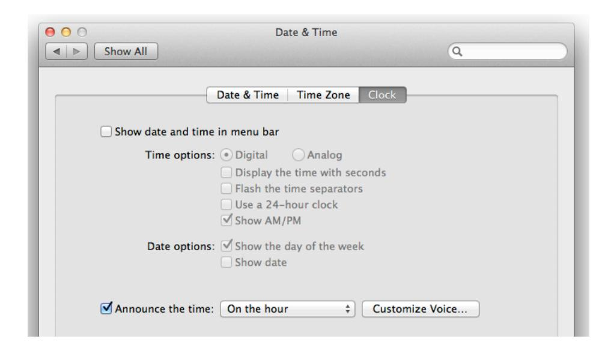

**Provide a label for each checkbox that clearly implies two opposite states.** The label should make it clear what happens when the option is selected or deselected. If you can't find an unambiguous label, consider using a pair of radio buttons instead, so you can clarify the two states with two different labels. Checkbox labelsshould have sentence-style capitalization (for more on thisstyle,see ["Capitalizing](#page-305-0) Labels and Text" (page 306)), unless the state or value is the title of some other element in the interface that is capitalized.

In addition, it's a good idea to provide a label that introduces a group of checkboxes and clearly describes the set of choices they represent. Use the Interface Builder guides to ensure that the baseline of the introductory label is aligned with the baseline of the label of the first button in a group.

**If appropriate, display a dash inside a checkbox.** A dash means that the selection comprises more than one state, in a way that issimilar to the use of a dash in a menu (for more information about this,see "Using [Symbols](#page-142-0) in [Menus"](#page-142-0) (page 143)).

**In general, arrange checkboxes in a column.** When checkboxes are arranged vertically, it's easier for users to distinguish one state from another.

#### <span id="page-258-0"></span>Segmented Control

A **segmented control** is a linear set of two or more segments, each of which functions as a button.


**Important:** The segmented control described in this section is suitable for use in the window body only; it should not be used in the window-frame areas. For information about the segmented control that can be used in the toolbar (or bottom bar), see ["Window-Frame](#page-240-0) Controls" (page 241).

The segmented control is available in Interface Builder. To create one using AppKit programming interfaces, use the NSSegmentedControl class.

#### Appearance and Behavior

A segmented control contains either icons or text, but not a mixture of both. The segments in a segmented control can behave as a collection of radio buttons or checkboxes.

#### Guidelines

Use a segmented control to offer users a few closely related choices that affect a selected object. You can also use a segmented control to change views or panes in a window. (Note that a view-changer segmented control looks similar to a tab view control, it does not behave the same; for more information about tab views, see "Tab [View"](#page-296-0) (page 297).)

**Don't use a segmented control to enable addition or deletion of objects in a source list or split view.** If you need to provide a way for users to add and delete objects in a source list or other split view, use a gradient button (described in ["Gradient](#page-249-0) Button" (page 250)) in the window body. (If you need to put an add-delete control in a bottom bar, use a toolbar control (described in ["Appearance](#page-243-2) and Behavior" (page 244).)

**Make the width of each segment the same.** If segments have different widths, users are likely to wonder if different segments have different behaviors or different degrees of importance.

**Use a noun or short noun phrase for the text inside each segment.** The text you provide should describe a view or an object and use title-style capitalization (for more on thisstyle,see ["Capitalizing](#page-305-0) Labels and Text" (page 306)). A segmented control that contains text inside each segment probably does not need an introductory label.

**As much as possible, use the system-provided icons, instead of custom icons, inside a segmented control.** If you need to design your own images, try to imitate the clarity and simple lines of the system-provided images. For some tips on how to create custom images of this type, see ["Designing](#page-121-0) Toolbar Icons" (page 122). (To learn more about the system-provided images, see ["System-Provided](#page-319-0) Icons" (page 320).) If you decide to design custom icons for a segmented control, use the following sizes:

● Regular size: 17 x 15 pixels.

● Small: 14 x 13 pixels.

● Mini: 12 x 11 pixels.

<span id="page-259-0"></span>Note that if you choose to put icons inside the segments of a segmented control, you can provide a text label below the control.

#### Icon Button or Bevel Button Containing a Pop-Up Menu

An icon button or a bevel button that contains a pop-up menu provides a menu of choices. For example, the Keynote Chart inspector uses a bevel button that contains a pop-up menu to give users a menu of chart styles:

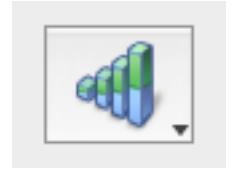

Keynote also includes several icon buttons that contain pop-up menus in its toolbar (the Masters toolbar icon is shown here).

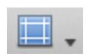

**Important:** An icon button with a pop-up menu can be used in a window-frame area, as well as in the window body. To learn more about controls that are designed specifically for use in window-frame areas, see ["Window-Frame](#page-240-0) Controls" (page 241).

An icon or bevel button with a pop-up menu is easy to create in Interface Builder. First, drag a pop-up button (an NSPopUpButton object) into your window. Select the button and in the Attributes pane of the inspector, change its type to Pull Down. Finally, for a Rounded or Square Bevel Button, change the style to Square or Shadowless Square, respectively. For an icon button, it doesn't matter which style you choose, but you must deselect the Bordered checkbox. Resize the button as needed.

Both types of buttons can behave like a standard pop-up menu, in which the image on the button isthe current selection, or like a menu title, in which the image on the button is always the same.

To learn more about bevel buttons, see "Bevel [Button"](#page-251-0) (page 252); to learn more about icon buttons, see ["Icon](#page-246-0) [Button"](#page-246-0) (page 247).

#### <span id="page-260-0"></span>Pop-Up Menu

A **pop-up menu** presents a list of mutually exclusive choices in a dialog or window.


**Important:** The pop-up menu described in this section is suitable for use in the window-body only. If you need to provide pop-up menu functionality in a window-frame area, see ["Window-Frame](#page-240-0) Controls" (page 241).

Pop-up menus are available in Interface Builder. To create one using AppKit programming interfaces, use the NSPopUpButton class.

#### Appearance and Behavior

A pop-up menu:

- Has a double-arrow indicator.
- Contains nouns (things) or adjectives (states or attributes), but not verbs (commands).
- Displays a checkmark to the left of the currently selected value when open.

You can see most of these components in the Highlight color pop-up menu in General preferences (the double-arrow indicator isn't completely visible because the menu is open).

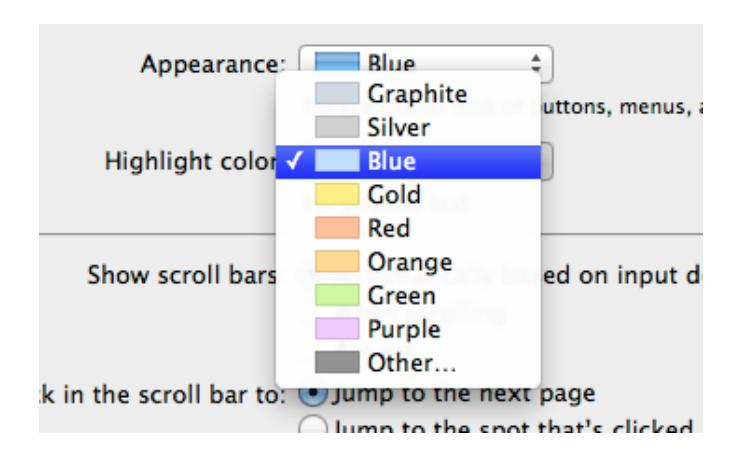

A pop-up menu behaves like other menus: Users press to open the menu and then drag to choose an item. The chosen item flashes briefly and is displayed in the closed pop-up menu. If users move the pointer outside the open menu without releasing the mouse button, the current value remains active. An exploratory press in the menu to see what's available doesn't select a new value.

#### Pop-Up Menu Usage

Use a pop-up menu to present up to 12 mutually exclusive choices that users don't need to see all the time.

**Consider using a pop-up menu as an alternative to other types of selection controls.** For example, if you have a dialog that contains a set ofsix or more radio buttons, you might consider replacing them with a pop-up menu to save space.

**Use a pop-up menu to provide a menu of things or states.** If you need to provide a menu of commands (that is, verbs), use a pull-down menu instead (to learn more about menus,see "UI Element [Guidelines:](#page-131-0) Menus" (page 132)). Use title-style capitalization for the label of each item in a pop-up menu.

**In general, provide an introductory label to the left of the pop-up menu (in left-to-right scripts).** The label should have sentence-style capitalization (for more information on this capitalization style, see ["Capitalizing](#page-305-0) [Labels](#page-305-0) and Text" (page 306)).

**Avoid adding a submenu to an item in a pop-up menu.** A submenu tends to hide choices too deeply and can be physically difficult for users to use.

**Avoid using a pop-up menu to display a variable number of items.** Because users must open a pop-up menu to see its contents, they should be able to rely on the contents remaining the same.

**Consider using a scrolling list, instead of a pop-up menu, for a large number of items.** If space is not restricted, use a scrolling list to display more than 12 items.

**Don't use a pop-up menu when more than one simultaneous selection is appropriate.** For example, a list of text styles, from which users might choose both bold and italic, should not be displayed in a pop-up menu. In this situation, you should instead use checkboxes or a pull-down menu in which checkmarks appear.

**In rare cases, include a command that affects the contents of the pop-up menu itself.** For example, in the Print dialog, the Printer pop-up menu contains the Add Printer item, which allows users to add a printer to the menu. If users add a new printer, it becomes the menu's default selection. If you need to add such commands to a pop-up menu, put them at the bottom of the menu, below a separator. (A separator—called a Separator Menu Item in Interface Builder—is a horizontal line.)

**Ensure that all pop-up menus in a stack have the same width.** Even if the visible contents of each pop-up menu varies, the width of the controls themselves should be equal.

#### <span id="page-262-0"></span>Action Menu

An **Action menu** is a specific type of pop-up menu that functions as an app-wide contextual menu.

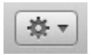

**Important:** An Action menu can be used in a window-frame area or the window body. To learn more about controls that are designed specifically for use in window-frame areas, see ["Window-Frame](#page-240-0) Controls" (page 241).

To create an Action menu in Interface Builder use the control that's appropriate for the window area. Then, in the Attributes pane of the inspector, specify NSActionTemplate for the image.

#### Appearance and Behavior

An Action menu displays the system-provided Action icon and the standard downward-pointing arrow. (This is the same arrow used in an icon button with an attached pop-up menu; for more information about this controls, see "Icon Button or Bevel Button [Containing](#page-259-0) a Pop-Up Menu" (page 260).)

An Action menu does not display a label, because users are familiar with the meaning of the Action icon. The only exception is the label that accompanies an Action menu button in a toolbar, because users can customize the toolbar to view toolbar items asicons with text or astext instead of icons(for more information on toolbars, see ["Designing](#page-179-0) a Toolbar" (page 180)).

#### Guidelines

Use an Action pop-up menu to provide a visible shortcut to a handful of useful commands. An Action menu hasthe advantage of a contextual menu, without the disadvantage of being hidden. (You can learn more about contextual menus in ["Designing](#page-161-1) Contextual Menus" (page 162).)

In particular, you can use an Action menu in a toolbar to replace an app-wide contextual menu. For example, in its default set of toolbar controls, the Finder includes an Action menu that performs tasks related to the currently selected item.


**Don't create a custom version of the Action icon.** It's essential that you use the system-provided Action icon so that users understand what the control does (for more information on the system-provided icons, see ["System-Provided](#page-319-0) Icons" (page 320)).

**Follow the guidelines for contextual menu items as you design the contents of an Action menu.** For example, you should ensure that each Action menu item is also available as a menu command and avoid displaying keyboard shortcuts. For more information on the guidelines that govern contextual menus, see ["Designing](#page-161-1) [Contextual](#page-161-1) Menus" (page 162).

**Use an Action menu at the bottom of a list to provide commands that apply to items in the list.** An Action menu works well beneath a list view or a source list. For example, the Action menu at the bottom of the Mail source list contains commands that act on the account or mailbox selected in the source list.


Use a gradient button to provide an Action menu at the bottom of a source list or list view (for information on gradient buttons, see ["Gradient](#page-249-0) Button" (page 250)).

**Avoid placing an Action menu control anywhere else in the body of a window.** An Action menu needs to be visually connected to a context, such as a list or a toolbar. An Action menu can't replace a contextual menu that users reveal by Control-clicking anywhere in a window, because placing the Action menu in a specific area implies that it applies to that area.

#### <span id="page-265-0"></span>Share Menu

A **Share menu** is a specific type of pop-up menu that displays a list of services that users can choose to share content.

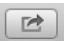

To create a Share menu in Interface Builder, select the appropriate button. Then, in the Attributes pane of the inspector, specify NSImageNameShareTemplate for the image. To create one using AppKit programming interfaces, use NSImageNameShareTemplate to add an image to a button (NSButton). If you create a Share button programmatically, in order for the Share menu to behave as users expect, you need to set sendActionOn:NSLeftMouseDownMask.

**Important:** A Share menu should be used in a window-frame area. To learn more about controls that are designed specifically for use in window-frame areas, see ["Window-Frame](#page-240-0) Controls" (page 241).

#### Appearance and Behavior

A Share menu displays the system-provided Share icon. A Share menu does not display a label because users are familiar with the meaning of the Share icon.

Users reveal the menu by clicking on the Share menu button. A list descends from the button, and its width is dictated by the longest menu item.

#### Guidelines

Sharing Service is an integral part of the OS X experience. A Share menu enables users to share content they care about with others. For general guidelines about Sharing, see ["Sharing](#page-78-0) Service" (page 79).

Use a Share pop-up menu to provide a visible shortcut to a handful of useful sharing options. A Share menu hasthe advantage of a contextual menu, without the disadvantage of being hidden. (You can learn more about contextual menus in ["Designing](#page-161-1) Contextual Menus" (page 162).

**Don't create a custom version of the Share icon.** It's essential that you use the system-provided Share icon so that users understand what the control does (for more information on the system-provided icons, see ["System-Provided](#page-319-0) Icons" (page 320).

**Follow the guidelines for contextual menu items as you design the contents of a Share menu.** For example, you should ensure that each Share menu item is also available as a menu command and avoid displaying keyboard shortcuts. For more information on the guidelines that govern contextual menus, see ["Designing](#page-161-1) [Contextual](#page-161-1) Menus" (page 162).

#### <span id="page-266-0"></span>Combination Box

A **combination box** (or combo box) provides a list of choices and allows users to specify custom choices.

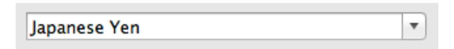

Combo boxes are available in Interface Builder. To create one using the AppKit programming interfaces, use the NSComboBox class.

#### Appearance and Behavior

A combo box is a text entry field combined with a drop-down list. The default state of the combo box is closed, with the text field empty or displaying a default selection.

Users open the list by clicking the arrow to the right of the text field. The list descends from the text field and is the same width as the text field plus the arrow box.

Users can type any appropriate characters into the text field. If a user types in an item already in the list, or types in a few characters that match the first characters of an item in the list, that item is highlighted when the user opens the list. A user-typed item is *not* added to the permanent list.

#### Guidelines

Use a combo box to give users the convenience of selecting an item from a list combined with the freedom of specifying their own custom item.

**List only items that users can choose singly.** A combo box does not allow multiple selections, so be sure to offer users a list of items from which they can choose only one at a time.

**Display a meaningful default selection.** It's best when the default selection (which may not be the first item in the list) provides a clue to the hidden choices. It's also a good idea to introduce a combo box with a label that helps users know what types of items to expect.

**Don't extend the right edge of the list beyond the right edge of the arrow box.** If an item is too long, it is truncated.

**Display the most likely choices, even though users can enter their own.** Users appreciate being able to specify custom choices, but they also appreciate the convenience of choosing from a list. For example, Safari allows users to set a preference for the minimum font size to display. In its Advanced preferences pane (shown here), Safari lists several font sizes in a combo box, and users can supply a custom font size if none of the listed choices is suitable.


#### <span id="page-267-0"></span>Path Control

A **path control** displays the file-system path of the currently selected item.


The path control is available in Interface Builder (you can change itsstyle in the Attributes pane of the inspector panel). To create this control using AppKit programming interfaces, use the NSPathControl class.

For example, the Finder uses one style of path control to display the path of the currently selected item at the bottom of the window, as shown in "A path control displays the path of the current item."

#### Appearance and Behavior

There are three styles of path control, all of which are suitable for use in the window body:

- Standard
- Navigation bar
- Pop up

All three path-controlstyles display text in addition to iconsfor apps, folders, and document types. When users click the pop-up style path control, a pop-up menu appears, which lists all locations in the path and a Choose menu item. Users can use the Open dialog opened by the Choose item to view the contents of the selected folder (for more information on the Open dialog, see "The Open [Dialog"](#page-221-0) (page 222)).

If the displayed path is too long to fit in the control, the folder names between the first location and the last are hidden, as shown here in the path control in a Finder window.


#### Guidelines

Use a path control to display the file-system location of the currently selected item in a way that is not overly technical. You can also use a path control to allow users to retrace their steps along a path and open folders they visited earlier.

<span id="page-268-0"></span>**Use a path control only when necessary.** For most apps, a path control is unlikely to be useful, because few apps need to provide a file-system browsing experience the way the Finder does.

#### Color Well

A **color well** indicates the current color of the selected object and, when clicked, displays the Colors window, in which users can specify a color. (To learn more about the Colors window, see "The Colors [Window"](#page-86-0) (page 87).)

Multiple color wells can appear in a window. For example, the Graphic pane of the Pages inspector contains three color wells that allow users to change the color of an object's fill, stroke, and shadow.


<span id="page-269-0"></span>Color wells are available in Interface Builder. To create one using AppKit programming interfaces, use the NSColorWell class.

#### Image Well

An **image well** is a drag-and-drop target for an icon or picture.

For example, the Password pane in Accounts preferences uses an image well to allow users to choose a picture to represent them.


Some image wells,such asthe user picture in the Password pane of Accounts preferences, must always contain an image. If you allow users to clear an image well (that is, leave it empty), be sure to provide standard Edit menu commands and Clipboard support for the contents of the image well.

Image wells are available in Interface Builder. To create one using AppKit programming interfaces, use the NSImageView class.

#### <span id="page-270-0"></span>Date Picker

A **date picker** displays components of date and time, such as hours, minutes, days, and years.

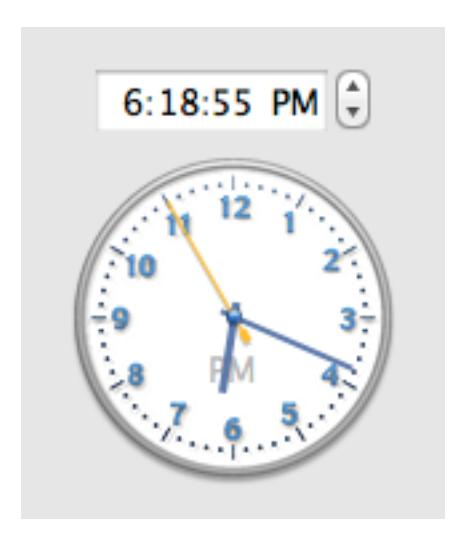

The date-picker control is available in Interface Builder (you can change its style in the Attributes pane of the inspector). To create one using AppKit programming interfaces, use the NSDatePicker class.

#### Appearance and Behavior

The date-picker control provides two main styles:

- **Textual**. This style consists of a text field or text field combined with a stepper control.
- **Graphical**. This style consists of a graphical representation of a calendar or a clock.

Using the textual style, users can enter date and time information in the text field or use the stepper. Using the graphical style, users can move the clock hands or choose specific days, months, or years in the calendar.

#### Guidelines

Use a date picker to provide time and date setting functionality in a window.

**Choose the date-picker style that suits your app.** The text field and stepper date picker is useful when space is constrained and you expect users to be making specific date and time selections. A graphical date picker can be useful when you want to give users the option of browsing through days in a calendar or when the look of a clock face is appropriate for the UI of your app.

#### <span id="page-271-0"></span>Command Pop-Down Menu

A **command pop-down menu** provides pull-down menu functionality within a window.


You can use Interface Builder to create a command pop-down menu: Select an NSPopUpButton object and change its type to Pull Down in the Attributes pane of the inspector. To create a command pop-down menu using AppKit programming interfaces, use the NSPopUpButton class.

#### Appearance and Behavior

A closed command pop-down menu always displays the same text, which acts as the menu title. This is in contrast to a closed pop-up menu, which displays the currently selected item (to learn more about pop-up menus, see ["Pop-Up](#page-260-0) Menu" (page 261)).

A command pop-down menu contains a single, downward-pointing arrow and can display checkmarks to the left of all currently active selections.

Users open a command pop-down menu by clicking anywhere in the control.

#### Guidelines

Use a command pop-down menu to present a list of commands that affect the containing window's contents. For example, the Colors window contains a menu with commands that can be used to change the contents of the Colors window itself.


**In general, use a command pop-down menu in a window that is shared among other windows or apps.** For example, the Colors window can be used in any app. The items in its command pop-down menu allow users to make new palettes of colors available in the Colors window.

**Avoid listing too many items in a command pop-down menu.** Command pop-down menus should contain between 3 and 12 commands. The items in a command pop-down menu do not have to be mutually exclusive.

<span id="page-272-0"></span>**In general, don't supply an introductory label for a command pop-down menu.** The text in the control should be sufficient to tell users what they can expect to find in the menu.

#### Slider

A **slider** lets users choose from a continuousrange of allowable values(shown here with tick marks and labels).


Sliders are available in Interface Builder. To create one using AppKit programming interfaces, use the NSSlider class.

#### Appearance and Behavior

A slider can be linear or circular.

The movable part of a linear slider is called the **thumb**, and it can be either directional or round. The slider shown here has a directional thumb


A circular slider displays a small circular dimple that provides the same functionality as the thumb of a linear slider: Users drag the dimple clockwise or counter-clockwise to change the values.


If a circular slider includes tick marks, they appear as dots that are evenly spaced around the circumference of the slider.

#### Guidelines

Use a slider to allow users to make fine-grained adjustments or choices throughout a range of values. Sliders support live feedback (live dragging), so they're especially useful when you want users to be able to see the effects of moving a slider in real time. For example, users can watch the size of Dock icons change as they move the Dock Size slider in Dock preferences.

**Ensure that the slider moves as users expect.** By default, users scroll content in the "natural" manner (that is, the content moves in the same direction as the user's fingers on a trackpad). But users can change this setting so that the content moves in the opposite direction of the gesture. You need to make sure that a slider always moves in the direction that makes the most sense, regardless of the user's setting. For example, the user should be able to move a vertical volume slider upwards for greater volume and downwards for lower volume.

**In general, use a directional thumb in a linear slider with tick marks.** The point of the thumb helps show users the current value. (Note that you can also display a directional-thumb slider without tick marks.)

**In general, use a round thumb in a linear slider without tick marks.** The rounded lower edge of the thumb works well in a slider without tick marks because it does not appear to point to a specific value.

**In general, label at least the starting and ending values in a linear slider with tick marks.** You can create labels that use numbers or words, depending on what the values represent. If each tick mark represents an equal fraction of the entire range, it might not be necessary to label each one. However, if users can't deduce the value of each tick mark from its position in the range, you probably should label each one to prevent confusion. For example, it's important to label some of the interior tick marks in Energy Saver preferences.


In addition, it's a good idea to set the context for a slider with an introductory label so users know what they're changing.

**As much as possible, match the slider style to the values it represents.** For example, a linear slider is appropriate in Energy Saver preferences (shown above) because the values range from very small (the screen saver should start after 3 minutes) to very large (the screen saver should never start) and do not increase at consistent intervals. In this case, a linear slider brings to mind a number line that stretches from the origin to infinity.

On the other hand, the circular slider in the Keynote Graphic inspector (shown below) allows users to choose the angle of the drop shadow displayed for an object. The circular slider not only displays the full range of values (0 to 360 degrees) in a compact way, it also mirrors the placement of the drop shadow itself as it is displayed on different sides of the object.

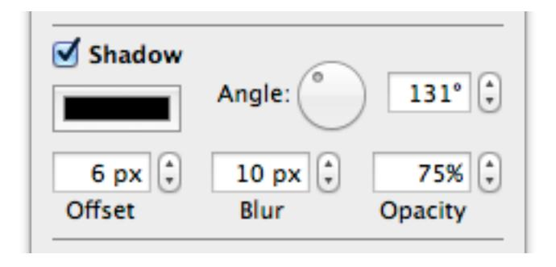

**Display tick marks when it helps users understand their choices.** In general, you should display tick marks when it's important for users to understand the scale of the measurements or when users need to be able to select specific values. If, on the other hand, users don't need to be aware of the specific values the slider passes through (as in the Dock size and magnification preferences, for example), you might choose to display a slider without tick marks.

#### <span id="page-275-0"></span>The Stepper Control (Little Arrows)

The **stepper control** (also known as little arrows) allows users to increment or decrement values, usually in conjunction with a text field that indicates the current value.


The text field may or may not be editable.

<span id="page-275-1"></span>The stepper control is available in Interface Builder. To create one using AppKit programming interfaces, use the NSStepper class.

#### Placard

A **placard** displays information at the bottom edge of a window.


**Note:** Placards are not recommended for use in apps that run in OS X v10.7 and later.

Placards are not available in Interface Builder. To create one using AppKit programming interfaces, subclass NSScrollView.

Typically, placards are used in document windows as a way to enable quick modifications to the view of the contents—for example, to change the current page or the magnification. The most familiar use of the placard is as a pop-up menu placed at the bottom of a window, to the left of the horizontal scroll bar.

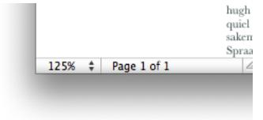

**Don't add to the placard menu commands that affect the contents of the window in other ways.** Instead, you should use an Action menu (for more information on Action menus, see ["Action](#page-262-0) Menu" (page 263)).

### <span id="page-276-0"></span>Indicators

Indicators are controls that show users the status of something. For the most part, users don't interact with indicators.

**Important:** The controls described in this section are suitable for use in the window body; they should not be used in the window-frame areas. See ["Window-Frame](#page-240-0) Controls" (page 241) for controls designed specifically for use in the toolbar (and bottom bar).

#### <span id="page-276-1"></span>Progress Indicators

A **progress indicator** informs users about the status of a lengthy operation.

**Be sure to locate all types of progress indicators in consistent locations in your windows and dialogs.** For example, the Mail app displays the asynchronous progress indicator in the right end of the To field as it finds and displays email addresses that match what the user types. Choosing a consistent location for a progress indicator allows users to quickly check a familiar place for the status of an operation. (For more information on the importance of providing consistency in your app, see ["Consistency"](#page-32-0) (page 33).)

There are three types of progress indicators, each of which is suitable for a specific situation:

- Determinate progress bar
- Indeterminate progress bar
- <span id="page-276-2"></span>● Asynchronous progress indicator

#### Determinate Progress Bar

A **determinate progress bar** provides feedback on a process with a known duration.


Determinate progress bars are available in Interface Builder. In the Attributes pane of the inspector, select Bar for the style and deselect the Indeterminate checkbox. To create a determinate progress bar using AppKit programming interfaces, use the NSProgressIndicator class with style NSProgressIndicatorBarStyle.

#### **Appearance and Behavior**

In a determinate progress bar, the "fill" movesfrom left to right. The fill is provided automatically (you determine the minimum and maximum values that should be represented).

Users generally expect a determinate progress bar to disappear as soon as the fill completes.

#### **Determinate Progress Bar Usage**

Use a determinate progress bar when the full length of an operation can be determined and you want to tell the user how much of the process has been completed. For example, you could use a determinate progress bar to show the progress of a file conversion.

**Ensure that a determinate progress bar accurately associates progress with time.** A progress bar that becomes 90 percent complete in 5 seconds but takes 5 minutes for the remaining 10 percent, for example, would be annoying and lead users to think that something is wrong.

**Be sure to allow the fill to complete before dismissing the progress bar.** If you dismiss the progress bar too soon, users are likely to wonder if the process really finished.

**Allow users to interrupt or stop the process, if appropriate.** If the process being performed can be interrupted, the progress dialog should contain a Cancel button (and support the Esc key). If interrupting the process will result in possible side effects, the button should say Stop instead of Cancel. To learn more about dialogs in general, see ["Dialogs"](#page-214-0) (page 215). To supply a Cancel button, you use a push button (for more information about this control, see "Push [Button"](#page-243-1) (page 244)). To supply a Stop control, you can use the standalone version of the stop progress image (to learn more about this system-provided image, see ["System-Provided](#page-322-0) Images for Use as [Standalone](#page-322-0) Buttons" (page 323)).

**If appropriate, provide a label for a determinate progress bar in a dialog.** You can do this so that users understand the context in which the processis occurring. Such a labelshould have sentence-style capitalization (for more information on this style, see ["Capitalizing](#page-305-0) Labels and Text" (page 306)).

#### Indeterminate Progress Bars

An **indeterminate progress bar** provides feedback on a process of unknown duration.


Indeterminate progress bars are available in Interface Builder. In the Attributes pane of the inspector, select Bar for the style and be sure the Indeterminate checkbox is selected. To create an indeterminate progress bar using AppKit programming interfaces, use the NSProgressIndicator class with style NSProgressIndicatorBarStyle.

#### **Appearance and Behavior**

An indeterminate progress bar displays a spinning striped fill that indicates an ongoing process. OS X provides this appearance automatically.

#### **Guidelines**

Use an indeterminate progress bar when the duration of a process can't be determined.

**Switch to a determinate progress bar when appropriate.** If an indeterminate process reaches a point where its duration can be determined, switch to a determinate progress bar (for more on determinate progress bars, see ["Determinate](#page-276-2) Progress Bar" (page 277)).

**In general, use an indeterminate progress bar in a dialog or window that focuses on the process.** For example, you might display an indeterminate progress bar in a dialog that focuses on the opening of the file. This usage helps users understand which process is ongoing.

**Allow users to interrupt or stop the process, if appropriate.** If the process being performed can be interrupted, the progress dialog should contain a Cancel button (and support the Esc key). If interrupting the process will result in possible side effects, the button should say Stop instead of Cancel. To learn more about dialogs in general, see ["Dialogs"](#page-214-0) (page 215). To supply a Cancel button, you use a push button (for more information about this control, see "Push [Button"](#page-243-1) (page 244)). To supply a Stop control, you can use the standalone version of the stop progress image (to learn more about this system-provided image, see ["System-Provided](#page-322-0) Images for Use as [Standalone](#page-322-0) Buttons" (page 323)).

**If appropriate, provide a label for an indeterminate progress bar in a dialog.** You can do this so that users know what process is occurring. Such a label should have sentence-style capitalization (for more information on this style, see ["Capitalizing](#page-305-0) Labels and Text" (page 306)). Also, you can end the label with an ellipsis (...) to emphasize the ongoing nature of the processing.

<span id="page-278-0"></span>**Consider using an asynchronous progress indicator, instead of an indeterminate progress bar, in some cases.** If, for example, you need to provide an indication of an indeterminate process that's associated with a part of a window, such as a control, or if space is limited, you might want to use an asynchronous progress indicator instead. (For more information on asynchronous progress indicators, see ["Asynchronous](#page-278-0) Progress [Indicator"](#page-278-0) (page 279).)

#### Asynchronous Progress Indicator

An **asynchronous progress indicator** provides feedback on an ongoing process.


Asynchronous progress indicators are available in Interface Builder. In the Attributes pane of the inspector, select Spinning for the style and be sure the Indeterminate checkbox is selected. To create an asynchronous progress indicator using AppKit programming interfaces, use the NSProgressIndicator class with style NSProgressIndicatorSpinningStyle.

#### **Appearance and Behavior**

The appearance of the asynchronous progress indicator is provided automatically. The asynchronous progress indicator always spins at the same rate.

#### **Guidelines**

Use an asynchronous progressindicator when space is very constrained,such asin a text field or near a control. Because this indicator is small and unobtrusive, it is especially useful for asynchronous events that take place in the background, such as retrieving messages from a server.

**If the process might change from indeterminate to determinate, start with an indeterminate progress bar.**

You don't want to start with an asynchronous progress indicator because the determinate progress bar is a different shape and takes up much more space. Similarly, if the process might change from indeterminate to determinate, use an indeterminate progress bar instead of an asynchronous progress indicator, because it is the same shape and size as the determinate progress bar.

**In general, avoid supplying a label.** Because an asynchronous progress indicator typically appears when the user initiates a process, a label is not usually necessary. If you decide to provide a label that appears with the indicator, create a complete or partial sentence that briefly describes the process that is occurring. You should use sentence-style capitalization (for more information on this style, see ["Capitalizing](#page-305-0) Labels and Text" (page 306)) and you can end the label with an ellipsis (...) to emphasize the ongoing nature of the processing.

#### <span id="page-279-0"></span>Level Indicators

A **level indicator** provides graphical information about the level or amount of something. Level indicators can be configured to display different colors to warn users when values are reaching critical levels.

There are three styles of level indicator:

- Capacity
- Rating
- Relevancy

#### Capacity Indicator

A **capacity indicator** provides graphical information about the current state of something that has a finite capacity (shown here with labels and tick marks).


Capacity indicators are available in Interface Builder (you can change its style in the Attributes pane of the inspector). To create one using AppKit programming interfaces, use the NSLevelIndicator class with style NSDiscreteCapacityLevelIndicatorStyle or NSContinuousCapacityLevelIndicatorStyle.

#### **Appearance and Behavior**

There are two styles of capacity indicator:

**Continuous.** The continuous capacity indicator consists of a translucent track that is filled with a colored bar that indicates the current value.

**Discrete.** The discrete capacity indicator consists of a row of separate, rectangular segments equal in number to the maximum value set for the control.

The default color of the fill in both styles is green. Depending on app-specific definitions, the fill can change to yellow or red.

The continuous capacity indicator can display tick marks above or below the indicator control to give context to the level shown by the fill.

The segments in the discrete capacity indicator are either completely filled or empty; they are never partially filled. If you stretch a discrete capacity indicator, the number of segments remains constant, but the width of each segments increases.

#### **Capacity Indicator Usage**

Use a capacity indicator to provide information about the level or amount of something that has well defined minimum and maximum values.

**Change the fill color to give users more information, if appropriate.** You can configure a capacity indicator to display a different color fill when the current value enters a warning or critical range. Because capacity indicators provide a clear, easily understood picture of a current state, they're especially useful in dialogs and preferences windows that users tend to view briefly.

If you define a critical value that is less than the warning value, the fill is red below the critical value, yellow between the critical and warning values, and green above the warning value (up to the maximum). This orientation is useful if you need to warn the user when a capacity is approaching the minimum value, such as the end of battery charge.

**Use a discrete capacity indicator to show relatively coarse-grained values.** The discrete capacity indicator displaysthe current value rounded to the nearest integer and the segments are stretched orshrunk to a uniform width to fit the specified length of the control. Visually, this makes a discrete capacity indicator better for showing coarser-grained values than a continuous capacity indicator.

**In general, use tick marks with the continuous capacity indicator only.** This is because the number and width of the segments in the discrete capacity indicator provide similar context, making tick marks redundant (and potentially confusing). If you find that you need to display very small segments in a discrete capacity indicator to appropriately represent the scale of values, you might want to use a continuous capacity indicator instead.

**In general, label at least the first and last tick marks.** Even if you don't label any other tick marks, labeling the beginning and end of the scale provides useful context for the user.

#### Rating Indicator

A **rating indicator** shows the rating of something.


Rating indicators are available in Interface Builder. Start with a discrete level indicator object and change its style to Rating in the Attributes pane of the inspector. To create one using AppKit programming interfaces, use the NSLevelIndicator class with style NSRatingLevelIndicatorStyle.

#### **Appearance and Behavior**

By default, the rating indicator displays stars.

A rating indicator does not display partial stars. Instead, it rounds the current value to the nearest integer to display only whole stars. The stars in a rating indicator are not expanded or shrunk to fit the specified length of the control and no space is added between them.

#### **Guidelines**

Use a rating indicator to provide a graphic representation of the rating of an object. Because a rating indicator conveysthe ranking of one item relative to all other itemsin a category,such asfavorite images or most-visited webpages, it's most useful in a list or table view that contains many items.

**Allow users to set ranking criteria, if appropriate.** Or, you can make a rating indicator editable so the user can increase or decrease the ranking of an item in a table or list.

**Supply a custom image to replace the star, if it makes sense.** You can use any image in place of the star, but you should make sure that it makes sense in the context of your app and the task it enables.

#### Relevance Indicator

A **relevance indicator** displays the relevance of something.


Relevance indicators are especially useful as part of a list or table view. This is because relevance as a quantity is easier for users to understand when it is shown in comparison with the relevance of several items.

### <span id="page-282-0"></span>Text Controls

Text controls either display text or accept text as input. The combination box, which combines a text input field with a menu, is not covered in this section; instead, see ["Combination](#page-266-0) Box" (page 267).

<span id="page-282-1"></span>**Important:** The controls described in thissection are suitable for use in the window body only; they should not be used in the window-frame areas. The single exception is the search field, which can also be used in a toolbar. To learn about the controls that are specifically designed for use in a toolbar (or bottom bar), see ["Window-Frame](#page-240-0) Controls" (page 241).

#### Static Text Field

A **static text field** displays text that cannot be modified by the user.

Static text fields are available in Interface Builder (where they're called labels). To create a static text field using AppKit programming interfaces, use the NSTextField class.

Static text fields have two states: active and dimmed.

**Make static text selectable when it provides an obvious user benefit.** For example, a user should be able to copy an error message, a serial number, or an IP address to paste elsewhere.

#### <span id="page-283-0"></span>Text Input Field

A **text input field** accepts user-entered text.

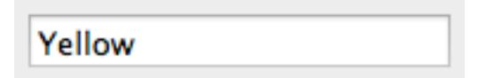

Text input fields are available in Interface Builder. To create one using AppKit programming interfaces, use the NSTextField class.

#### Appearance and Behavior

A text input field (also called an editable text field) is a rectangular area in which the user enterstext or modifies existing text. A text input field displays user-supplied text in a system font that is appropriate for the size of the control. In addition, a text input field can contain a token field control, which displays the user input in the form of a draggable token (for more information on tokens, see ["Token](#page-284-0) Field" (page 285)).

By default, a text input field supports keyboard focus and password entry.

#### Guidelines

Use a text input field to get information from the user.

**Be sure to perform appropriate edit checks when you receive user input.** For example, if the only legitimate value for a field is a string of digits, an app should issue an alert if the user types characters other than digits. In most cases, the appropriate time to check the data in the field is when the user clicks outside the field or presses the Return, Enter, or Tab key.

**Be sure to use a combo box if you want to combine a menu or list of choices with a text input field.** Don't try to create one by putting a text input field and a menu together. For more information about combo boxes, see ["Combination](#page-266-0) Box" (page 267).

**In general, display an introductory label with a text input field.** A label helps users understand what type of information they should enter. Generally, these labels should have title-style capitalization (for more information on this style, see ["Capitalizing](#page-305-0) Labels and Text" (page 306)).

**In general, ensure that the length of a text input field comfortably accommodates the length of the expected input.** The length of a text input field helps users gauge whether they're inputting the appropriate information.

**Space multiple text input fields evenly.** If you want to use more than one text input field in a window, you need to leave enough space between them so users can easily see which input field belongs with each introductory label. If you need to position more than one text input field at the same height (that is, in a

horizontal line), be sure to leave plenty of space between the end of one text field and the introductory label of the next. Typically, however, multiple text input fields are stacked vertically, as in a form users fill out. In addition, if you display multiple text input fields in a window, be sure they all have the same length.

#### <span id="page-284-0"></span>Token Field

A **token field** creates a movable token out of text.

Token field controls are available in Interface Builder. To create one using AppKit programming interfaces, use the NSTokenField class.

#### Guidelines

**In general, use a token field control in a text input field.** As the user types in the text input field, the token field control invokes text completion after a delay that you specify. When the user types the comma character or presses Return, the preceding text input is transformed into a token. (For more information about text input fields, see "Text Input [Field"](#page-283-0) (page 284)).

**If appropriate, add a contextual menu to a token.**(Note that you have to add code to support the addition of a contextual menu.) In a token field's menu, you might offer more information about the token and ways to manipulate it. In Mail, for example, the token menu displays information about the token (the email address associated with the name) and items that allow the user to edit the token or add its associated information to Contacts.


#### <span id="page-285-0"></span>Search Field

A **search field** accepts text from users, which can be used as input for a search (shown here in a toolbar).

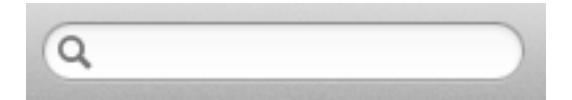

**Important:** A search field can be used in the window-frame area or in the window body. To learn more about controls that are designed specifically for use in window-frame areas, see ["Window-Frame](#page-240-0) [Controls"](#page-240-0) (page 241).

Search field controls are available in Interface Builder. To create one using AppKit programming interfaces, use the NSSearchField class.

#### Appearance and Behavior

A search field looks like a text field with rounded ends. Users enter text (or modify existing text) that specifies itemsthey want to search for. A search field can be configured to begin searching while the user isstill entering text, or to wait until the user is finished.

By default, a search field displays the magnifying icon in its left end. A search field can also contain an icon the user clicks to cancel the search or clear the field.

#### Guidelines

Use a search field to enable search functionality within your app.

**Decide when to start the search.** You can begin searching as soon as the user starts typing, or wait until the user presses Return or Enter. If searching occurs while the user is still typing, the behavior is more like a find in which results are filtered as the entered text becomes more specific. This behavior is especially useful when the search field is in a scope bar that focuses on a window's contents. If search should occur after the user finishes typing, you might want to enable a search term completion menu so that users can choose from commonly searched terms.

**In general, avoid using a menu to display search history.** For privacy reasons, users might not appreciate having their search history displayed. You might instead use the menu to allow users to choose different types of searches or define the context or scope of a search. Note that a scope bar is well-suited to enabling this type of searching (for more information, see "Using a Scope Bar to Enable [Searching](#page-186-0) and Filtering" (page 187)).

**Avoid supplying an introductory label.** Users are familiar with the distinctive appearance of a search field, so there is no need to label it. The exception to this is when you place a search field in a toolbar; in this case, you need to supply the label "Search" to be displayed when users customize the toolbar to show icons and text or text only.

**Display placeholder text, if it helps users understand how search works in your app.** A search field can display light gray placeholder text in its left end. For example, the search field in the Safari toolbar can display one of three common search engines (users can choose the search engine they want to use in the search field menu).

#### <span id="page-287-0"></span>Scrolling List

A **scrolling list** is a list that uses scroll bars to reveal its contents.


Scrolling lists are available in Interface Builder. Start with a table view object and ensure that it is sized so that only the verticalscroller can be visible. Then, in the Attributes pane of the inspector,set the number of columns to 1 and deselect the Headers checkbox. To create a scrolling list using AppKit programming interfaces, use the NSTableView class.

#### Appearance and Behavior

A scrolling list is a single-column rectangular view of any height. The background of a scrolling list can be white or white striped with light blue.

**Note:** Scrolling lists, like other scrolling areas, are governed by the user's scroll direction setting in System Preferences.

Users can scroll through a scrolling list without selecting anything, or they can click an item to select it, use Shift-click to select more than one contiguous item, or use Command-click for a discontinuous selection. Users can press the arrow keys to navigate through the list and can quickly select an item by typing the first few characters.

#### Guidelines

Use a scrolling list to display an arbitrarily large number of items from which users can choose. Although scrolling lists aren't directly editable, you can provide editing functionality that allows usersto provide additional list items.

**In general, don't use a scrolling list to provide choices in a limited range.** A scrolling list might not display all items at once, which can make it difficult for users to grasp the scope of their choices. If you need to display a limited range of choices, a pop-up menu (described in ["Pop-Up](#page-260-0) Menu" (page 261)) might be a better choice.

**Insert an ellipsis in the middle of an item that is too long to fit in the list.** Inserting the ellipsis in the middle allows you to preserve the beginning and end of the item name, so that users can more easily recognize it. For example, users sometimes add the most specific information (such as a date) to the end of a document name, so it's helpful when both the beginning and the end of the name are visible.

**Use a striped background when it helps users distinguish list items.** For example, users can lose their place in a very long list in which most of the items look similar. In this case, it can be easier for users to scan the list and find specific items when the background is striped.

<span id="page-288-0"></span>**In general, provide an introductory label for a scrolling list.** A label helps users understand the types of items that are available to them.

### View Controls

View controls allow users to modify how information is presented to them in a window. Some view controls allow you to provide additional information or functionality that remains hidden until users choose to see it, and others give you a frame for organizing and displaying data, such as a list.

**Important:** The controls described in thissection are suitable for use in the window body only; they should not be used in the window-frame areas. For more information about controls that are designed specifically for the toolbar (and bottom bar), see ["Window-Frame](#page-240-0) Controls" (page 241).

#### <span id="page-289-0"></span>Disclosure Triangle

A **disclosure triangle** displays(or discloses) information or functionality associated with the primary information in a window.


Disclosure triangles are available in Interface Builder. To create one using AppKit programming interfaces, use NSButton and set the bezel style to NSDisclosureBezelStyle and the button type to NSPushOnPushOffButton.

#### Appearance and Behavior

A disclosure triangle is in the closed position (that is, pointing to the right) by default. When the user clicks a disclosure triangle, it points down and the additional information is displayed.

#### Guidelines

Use a disclosure triangle when you want to provide a simple default view ofsomething but need to allow users to view more details or perform additional actions at specific times.

In general, you can use a disclosure triangle in the following two ways:

● To reveal more information in dialogs that have a minimal state and an expanded state. For example, you might want to use a disclosure triangle to hide explanatory information about a choice that most users aren't interested in seeing.

● To revealsubordinate itemsin a hierarchical list. For example, the Mail Photo Browser panel uses a disclosure triangle to reveal specific iPhoto categories.

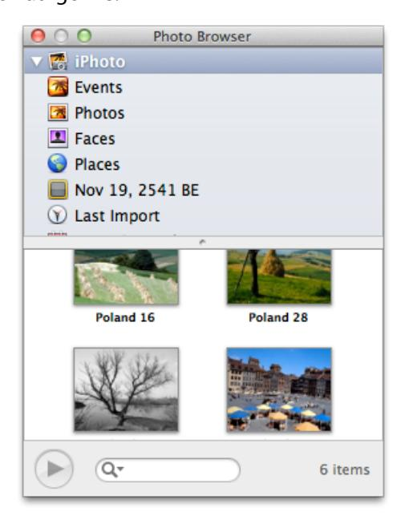

**Supply a label for a disclosure triangle in a dialog.** The label should indicate what is disclosed or hidden and it should change, depending on the position of the disclosure triangle. For example, when the disclosure triangle is closed the label might be "Show advanced settings;" when the disclosure triangle is open the label can change to "Hide advanced settings."

<span id="page-290-0"></span>**Don't use a disclosure triangle to display additional choices associated with a specific control.** If you need to do this, use a disclosure button instead (for more information about this control,see ["Disclosure](#page-290-0) Button" (page 291)).

#### Disclosure Button

A **disclosure button** expands a dialog or panel to display a wider range of choicesrelated to a specific selection control.


Disclosure buttons are available in Interface Builder. To create one using AppKit programming interfaces, use NSButton and set the bezel style to NSRoundedDisclosureBezelStyle and the button type to NSPushOnPushOffButton.

#### Appearance and Behavior

A disclosure button is button that contains a small triangular icon. By default, a disclosure button is in the closed position (that is, pointing down). When the user clicks a disclosure button, the window expands to reveal the additional choices and the disclosure button changes to point up.

#### Guidelines

Use a disclosure button when you need to provide additional options that are closely related to a specific list of choices.

**Don't use a disclosure button to display additional information or functionality or subordinate items in a list.** If you need to display additional information or functionality related to the contents of a window or a section of a window, or if you need a way to reveal subordinate items in a hierarchical list, use a disclosure triangle instead. For more information on this control, see ["Disclosure](#page-289-0) Triangle" (page 290).

**Place a disclosure button close to the control to which it's related.** Users need to understand how the expanded choices are related to their current task. For example, the Preview Export As dialog puts a disclosure button close to the Export Astext field,so that users understand that the expanded view will help them choose a location for their document.

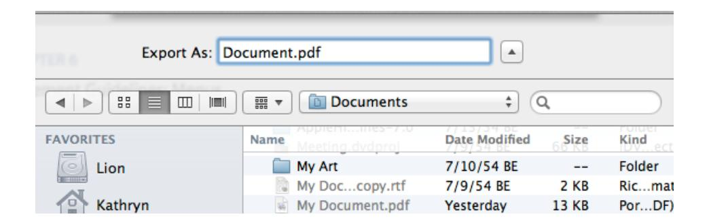

#### <span id="page-291-0"></span>List View

A **list view** displays data in a one-column list, with optional additional columnsthat display attributes associated with the data.

List views are available in Interface Builder. To create a simple list view using AppKit programming interfaces, use the NSTableView class. To get disclosure triangles in a list, use an NSOutlineView object in column format.

#### Appearance and Behavior

A list view displays the entire set of data in the leftmost column (in systems that use left-to-right script). When the data is hierarchical, the child objects are revealed within the primary column, not in other columns (list views use disclosure triangles to indicate objects that contain other objects).

Additional columns in a list view display attributes that apply to the data in the primary column; they do not contain data that isspecific to a different level of hierarchy. In general, users can resize, rearrange, and sometimes add and subtract the columns that represent attributes of the list data.

When users click a disclosure triangle to reveal the child items contained within another item, the list lengthens and the leftmost column can widen. If the primary column widens, other columns might shift to the right, but they do not change their headings or order.

**Note:** List views, like other scrolling areas, are governed by the user's scroll direction setting in System Preferences.

#### Guidelines

Use a list view to display a list items along with various attributes of each item. If you need to display a simple list of items, and you don't need to display associated attributes, you might want to use a scrolling list instead (for more information about scrolling lists, see ["Scrolling](#page-287-0) List" (page 288)). Using a list view, you can create a column for each attribute that is associated with the items you display.

**Sort the rows in the list view by the selected column heading.** You can implement sorting on secondary attributes behind the scenes, but the user should see only one column selected at a time. If the user clicks an already selected column heading, change the direction of the sort.

**Determine whether list items should be editable.** In the Finder, for example, items in the Name column (the leftmost column) are editable when in list view, but nothing else is. This makes sense because it allows users to select and edit a file or folder name in the same way that they do in all the other Finder view modes (that is, icon, column, and Cover Flow).

**Create column headers that are nouns or short noun phrases that describe an attribute of the data.** When you use clear,succinct attribute names, users quickly understand what information is available in each column.

### <span id="page-293-0"></span>Column View

A **column view** displays a hierarchy of data, in which each level of the hierarchy is displayed in one column.

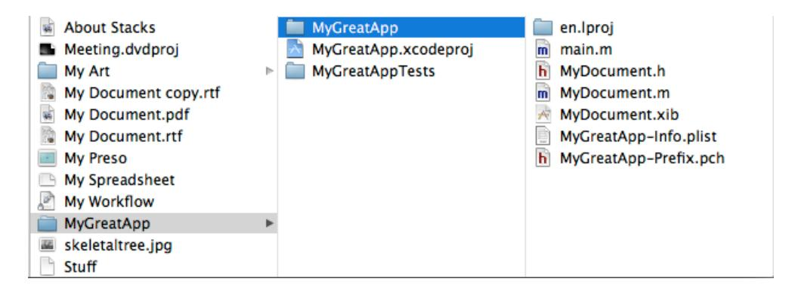

Column views are available in Interface Builder. To create one using AppKit programming interfaces, use the NSBrowser class or an NSOutlineView object in column format.

#### Appearance and Behavior

Column views do not display disclosure triangles. The triangle displayed to the right of an item is an indicator that means the item contains other objects (to reveal those objects, users click anywhere on the item's row).

Users scroll vertically within columns and horizontally between columns. When users click an object in one column, its contents (its descendants in the hierarchy) are revealed in a column to the right. Each column displays only those objectsthat are descendants of the item selected in the previous column. If the item selected in the previous column has no descendants, the column to the right might display details about the item.

Columnsin column views do not have headings, because a column view does not behave like a table. A column in a column view contains the objects that exist at a particular node in the hierarchy; it does not contain an attribute of every object in the hierarchy.

**Note:** Column views, like other scrolling areas in OS X, are governed by the user's scroll direction setting in System Preferences.

#### Guidelines

Use a column view when there is only one way the data can be sorted or when you want to present only one way of sorting the data. A column view is also useful for displaying a deep hierarchy of data in which users frequently move back and forth among levels.

#### **Display the first or root level of the hierarchy in the leftmost column (in systems that use left-right script).**

As users select items, the focus moves to the right, displaying either the child objects at that node or, if there are no more children, the terminal object (a leaf node in the hierarchy). When the userselects a terminal object, you can display additional information about it in the rightmost column.

**In general, allows users to resize columns.** This is especially helpful when the names of some items might be too long to display in the default width of a column.

#### <span id="page-294-0"></span>Split View

A **split view** groups together two or more other views, such as column or list views, and allows the user to adjust the relative width or height of those views (shown here with a "move" pointer resting on it).


Split views are available in Interface Builder (you can specify the splitter width in the Style pop-up menu in the Attributes pane of the inspector). To create one using AppKit programming interfaces, use the NSSplitView class (note that the splitter bars are horizontal by default).

#### Appearance and Behavior

A split view includes a **splitter bar**, or **splitter**, between each of its subviews; for example, a split view with five subviews would have four splitters. Each subview is generally known as a **pane**. A split view can arrange views horizontally or vertically, but not both.

**Note:** The standard splitter is known as a "zero-width" splitter, although it is actually 1 point wide. There is also a wider splitter available, which measures 9 points in width, but it is not frequently used.

The entire splitter bar is a hot zone. In other words, when the pointer passes over any part of the splitter, the pointer changes to one of the move or resize pointers. (To learn more about the different pointers that are available, see "Use the Right [Pointer](#page-55-0) for the Job" (page 56).) For zero-width splitters, the hot zone includes two points on both sides of the splitter.

#### Guidelines

Use a split view to display two or more resizable content views.

**In general, use the zero-width splitter.** Users are accustomed to the appearance of the zero-width splitter. You might want to use a wide splitter bar if you need to indicate a stronger visual distinction between panes, but this is unusual.

**Don't let users lose the splitter.** A zero-width splitter can disappear when the user drags it far enough to hide the subview. To avoid this, you can define minimum and maximum sizes for the subviews so that the splitter remains visible. Alternatively, if you want to allow usersto completely hide a subview by dragging a zero-width splitter, you should provide a button that re-opens the subview.

#### <span id="page-296-0"></span>Tab View

A **tab view** presents information in a multipane format.

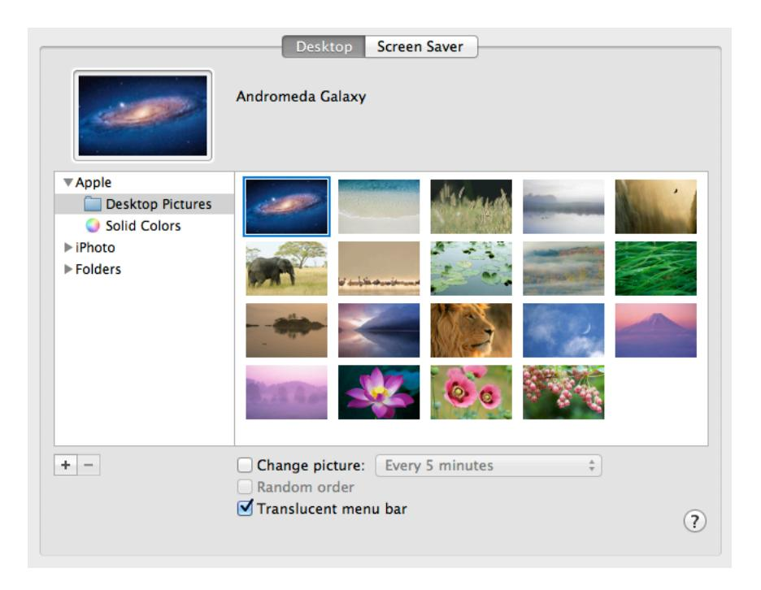

Tab views are available in Interface Builder. To create one using AppKit programming interfaces, use the NSTabView class.

#### Appearance and Behavior

A tab view consists of a tab view control (which looks similar to a segmented control) combined with a set of views. Each segment in the tab view control is called a **tab**. The content area below a tab is called a **pane**, and each tab is attached to a specific pane. The tab view control is horizontally centered at the top edge of the view.

Users click a tab to view the pane associated with that tab. Although different panes can contains different amounts of content, switching tabs does not change the overall size of the tab view or the window.

#### Guidelines

Use a tab view to present a small number of different content views in one place within a window. Depending on the size of the window, you can create a tab view that contains between two and about six tabs.

**Use a tab view to present a few peer areas of content that are closely related.** The outline of a tab view provides a strong visual indication of enclosure. Users expect each tab to display content that is in some way similar or related to the content in the other tabs.

**Ensure that each pane contains controls that affect only the contents ofthat pane.** Controls and information in one pane should not affect objects in the rest of the window or in other panes.

**In general, inset the tab view so that a margin of window-body area is visible on all sides of the tab view.** The inset layout looks good and it allows you to provide additional controls that can affect the window itself (or other tabs). For example, the "Enable access for assistive devices" and "Show Universal Access status in the menu bar" checkboxesin Universal Access preferences are outside of the inset tab view, because they represent settings that affect accessibility generally.

It's also possible to extend the side and bottom edges of a tab view so that they meet the window edges, although this is unusual.

**Provide a label for each tab that describes the contents of the pane.** It's best when users can accurately predict the contents of a pane before they click the tab. Nouns or very short noun phrases work well for tab labels, although a verb (or short verb phrase) might make sense in some contexts. Tab labels should have title-style capitalization (for more information on this style, see ["Capitalizing](#page-305-0) Labels and Text" (page 306)).

<span id="page-297-0"></span>**Avoid using a pop-up menu as a tab-switcher.** This arrangement is not encouraged in modern Mac apps. If you have too many tabsto fit into a single tab view, you should investigate other waysto factor your information hierarchy.

#### Group Box

A **group box** provides a visual way to break a window into distinct logical areas.

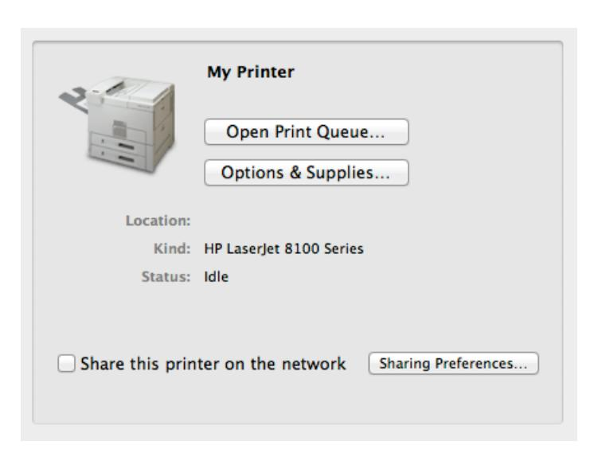

Group boxes are available in Interface Builder. To create one using AppKit programming interfaces, use the NSBox class.

#### Appearance and Behavior

The outline of a group box is similar in appearance to the outline of a tab view, except that a group box does not include a tab view control (for more information about tab views, see "Tab [View"](#page-296-0) (page 297)). Users do not interact with a group box (for example, they can't directly resize it), but they can interact with the controls inside it.

Group boxes tend to be untitled, but they can include a text title that appears above the outline of the box.

#### Guidelines

Group boxes are seldom used in modern Mac apps. You might want to use a group box when you want users to understand logical groupings of controls in a window.

**Avoid nesting group boxes.** Nested group boxes take up a lot of space, and it can be difficult for users to perceive individual boundaries when group boxes are nested too deeply. Instead, consider using white space to group content within a group box.

**Use sentence-style capitalization in the title of a group box.** For more information on this style, see ["Capitalizing](#page-305-0) Labels and Text" (page 306).

# <span id="page-299-0"></span>Text Style Guidelines

Text is prevalent throughout the OS X interface forsuch things as button names, menu labels, dialog messages, and help tags. Using text consistently and clearly is a critical component of UI design.

In the same way that it is best to work with a professional graphical designer on the icons and images in your app, it's best to work with a professional writer on your app's user-visible text. A skilled writer can help you develop a style of expression that reflects your app's design, and can apply that style consistently throughout your app.

For guidance on Apple-specific terminology, the writer should refer to the *Apple Publications Style Guide* . That document covers style and usage issues, and is the key reference for how Apple uses language.

For issues that aren't covered in the *Apple Publications Style Guide* , Apple recommends three other works: *The American Heritage Dictionary* , *The Chicago Manual of Style* , and *Words Into Type* . When these books give conflicting rules, *The Chicago Manual of Style* takes precedence for questions of usage and *The American Heritage Dictionary* for questions of spelling.

### <span id="page-299-1"></span>Inserting Spaces Between Sentences

If any part of your app's user interface displays two or more sentences in a paragraph, be sure to insert only a single space between the ending punctuation of one sentence and the first word of the next sentence.

<span id="page-299-2"></span>Although much of the text in an app's user interface is in the form of labels and short phrases, app help, alerts, and dialogs often contain longer blocks of text. You should examine these blocks of text to make sure that extra spaces do not appear between sentences.

### Using the Ellipsis Character

When it appears in the name of a button or a menu item, an **ellipsis** character (…) indicates to the user that additional information is required before the associated operation can be performed. Specifically, it prepares the user to expect the appearance of a window or dialog in which to make selections or enter information before the command executes.

Because users expect instant action from buttons and menu items (as described in ["Buttons"](#page-243-0) (page 244) and "Menu [Appearance](#page-132-0) and Behavior" (page 133)), it's especially important to prepare them for this alternate behavior by appropriately displaying the ellipsis character. The following guidelines and examples will help you decide when to use an ellipsis in menu item and button names.

Use an ellipsis in the name of a button or menu item when the associated action:

- Requires specific input from the user.
  - For example, the Open, Find, and Print commands all use an ellipsis because the user must select or input the item to open, find, or print.
  - You can think of commands of thistype as needing the answer to a specific question (such as"Find what?") before executing.
- Is performed by the user in a separate window or dialog.
  - For example, Preferences, Customize Toolbar, and App Store all use an ellipsis because they open a window or dialog in which the user sets preferences, customizes the toolbar, or shops for new apps.
  - To see why such commands must include an ellipsis, consider that the absence of an ellipsis implies that the app performsthe action for the user. For example, if the Customize Toolbar command does not include an ellipsis, it implies that there is only one way to customize the toolbar and the user has no choice in the matter.
- *Always* displays an alert that warns the user of a potentially dangerous outcome and offers an alternative.
  - For example, Restart, Shut Down, and Log Out all use an ellipsis because they always display an alert that asks the user for confirmation and allows the user to cancel the action. Note that Close does not have an ellipsis because it displays an alert only in certain circumstances (specifically, only when the document or file being closed has unsaved changes).
  - Before you consider providing a command that always displays an alert, determine if it's really necessary to get the user's approval every time. Displaying too many alerts asking for user confirmation can dilute the effectiveness of alerts.

Don't use an ellipsis in the name of a button or menu item when the associated action:

- Does not require specific input from the user.
  - For example, the New, Save a Version, and Duplicate commands do not use an ellipsis because either the user has already provided the necessary information or no user input is required. That is, New always opens a new document or window, Save a Version saves a snapshot of the current document, and Duplicate creates a new copy of the current document.
- Is completed by the opening of a panel.

A user opens a panel to view information about an item or to keep essential, task-oriented controls available at all times (for more information about panels, see ["Panels"](#page-208-0) (page 209)). A command to open a panel, therefore, is completed by the display of the window and should not have an ellipsisin its name. Examples of such commands are Get Info, About This App, and Show Inspector.

● *Occasionally* displays an alert that warns the user of a potentially dangerous outcome.

If you use an ellipsis in the name of a button or menu item that only sometimes displays an alert, you cause the user to expect something that will not always happen. This makes your app's user interface inconsistent and confusing. For example, even though Close displays an alert if the user has never named the current document, it does not display an alert at other times, and so it does not include an ellipsis.

An ellipsis character can also show that there is more text than there is room to display in a document title or list item. If, for example, the name of an item is too long to fit in a menu or list box, you should insert an ellipsis character in the middle of the name, preserving the beginning and the end of the name. This ensures that the parts of the name that are most likely to be unique are still visible.

**Important:** Be sure to create the ellipsis character using the key combination Option-; (that is, Option-semicolon). This ensuresthat an assistive app can provide the correct interpretation of the character to a disabled user. If you use 3 period characters to simulate an ellipsis, many assistive apps will be unable to make sense of them. Also, 3 period characters and an ellipsis do not look the same because the periods are spaced differently than the points of an ellipsis.

### <span id="page-301-0"></span>Using the Colon Character

Use the **colon** character (:) in text that introduces and provides context for controls. The text can describe what the controls do or a task the user can perform with them. The combination of introductory text, colon, and controls forms a visually distinct grouping that helps users find the controls that apply to a particular task and understand what the controls do.

Because a colon implies a direct connection between the descriptive text and a particular control or set of controls, it does not belong in the text that appears in a control, such as a push button name or a command pop-down menu title. Similarly, you should not use a colon in the text that appears in the following user interface elements:

- Menu items (unless the colon is part of a user-created menu item) and menu titles
- Tab and segmented controls
- List view column headings

**Note:** The colon is not used as a pathname separator in OS X. If it is necessary to display a raw pathname (which should almost never be the case), use the forward slash character (/). Always be sure to avoid displaying a pathname in a window title.

Although the colon is a good way to associate introductory text with related controls, be aware that you can depict this connection in other ways. For example, you might use a tab view to display different groups of related controls (for guidelines on how to use this control, see "Tab [View"](#page-296-0) (page 297)).

**Don't use a colon in the text that serves as a group box title.** In these cases, the group box itself takes the place of the colon and makes explicit the relationship of the introductory text to the controls that follow it.

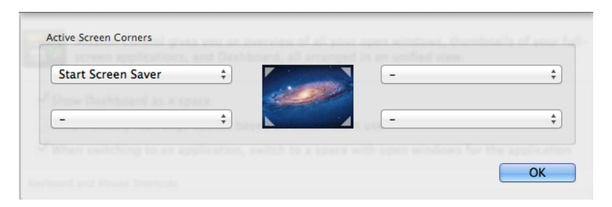

If you choose to use a colon to show the relationship between introductory text and controls, the following guidelines and examples will help you use it appropriately.

**Use a colon in introductory text that precedes a control or set of related controls.** The text can be a noun or phrase that describes either the target of the control or the task the user can perform. The following examples illustrate some variations on this arrangement of text and controls:

● Use a colon in text that precedes a control on the same line.

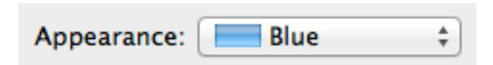

● Use a colon in text that precedes the first control in a vertical list of controls.

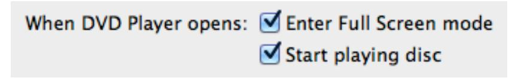

Use a colon in text that precedes the first control in a horizontal list of controls.

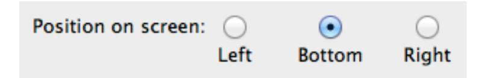

● Use a colon in introductory text that appears above a control.


● Use a colon in checkbox or radio button text that introduces a second control. (Note that if the text describing a checkbox or radio button state does not introduce a second control, it should not include a colon.)

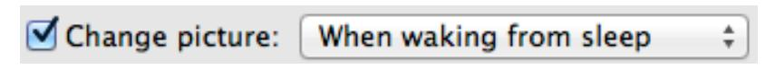

**Note:** If you use the type of layout shown above be sure to disable the second control when the preceding checkbox or radio button is unselected.

**A colon is optional before a control that is part of a sentence or phrase.** This guideline is flexible because it depends on how much of the text follows the control and how the sentence or phrase can be interpreted. Consider the specific combination of text and controls and the overall layout of your window as you decide whether to use the colon in the following situations.

If, for example, none of the text follows the control, then the control's value supplies the end of the sentence or phrase. A colon is recommended in this case, because this is another variation of the guideline to include a colon in text that precedes a control. For example, the term "Genie effect" completesthe sentence that begins "Minimize windows using:"

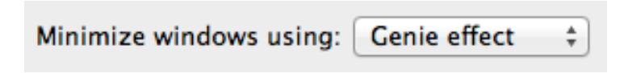

If, on the other hand, a substantial portion of the sentence or phrase follows the control a colon is optional.


Similarly, if there is some text following the control, but that text does not represent a substantial portion of the sentence or phrase, the colon is optional. To help you decide whether a colon is appropriate in these cases, determine if the presence of a colon breaks the sentence or phrase (including the value of the control) in an awkward or unnatural way.

### <span id="page-304-0"></span>Labeling Interface Elements

Make labels for interface elements easy to understand and avoid technical jargon as much as possible. Try to be as specific as possible in any element that requires the user to make a choice, such as radio buttons, checkboxes, and push buttons. Although it's important to be concise, don't sacrifice clarity for space.

When the context of a label is clear, it's usually best to avoid repeating the context in the label. For example, within the context of an extended Save dialog, it's clear that the dialog acts upon a file or document, so there's no need to add the words "File" or "Document" to the Format pop-up label. Similarly, users understand that the items in an app's Edit menu act upon the current editing context, so there is seldom a need to make this explicit in the menu item names.

The capitalization style you should use in the label for an interface element depends on the type of element. For information on the proper way to capitalize the words in labels for different types of interface elements, see ["Capitalizing](#page-305-0) Labels and Text" (page 306).

The names of menu items and buttons that produce a dialog should include an ellipsis (…). For details on when to use an ellipsis, see "Using the Ellipsis [Character"](#page-299-2) (page 300). The dialog title should be the same as the menu command or button label (except for the ellipsis) used to invoke it.

### <span id="page-305-0"></span>Capitalizing Labels and Text

All interface element labels should use either title style capitalization or sentence style capitalization.

**Title style capitalization** means that you capitalize every word except:

- Articles (*a, an, the* )
- Coordinating conjunctions (*and, or*)
- Prepositions of four or fewer letters, except when the preposition is part of a verb phrase, as in "Starting Up the Computer."

In title style, always capitalize the first and last word, even if it is an article, a conjunction, or a preposition of four or fewer letters.

**Sentence style capitalization** means that the first word is capitalized, and the rest of the words are lowercase, unless they are proper nouns or proper adjectives. If the text forms a complete sentence, end the sentence with proper punctuation; otherwise, do not add ending punctuation.

<span id="page-305-1"></span>Table 9-1 lists several examples of ways to capitalize text within UI elements.

**Table 9-1** Proper capitalization of onscreen elements

| Element        | Capitalization<br>style | Examples                                                                                                                                     |
|----------------|-------------------------|----------------------------------------------------------------------------------------------------------------------------------------------|
| Menu<br>titles | Title                   | Highlight<br>Color<br>Number<br>of<br>Recent<br>Items<br>Location<br>Refresh<br>Rate                                                         |
| Menu<br>items  | Title                   | Save<br>a<br>Version<br>Add<br>Sender<br>to<br>Contacts<br>Log<br>Out<br>Make<br>Alias<br>Go<br>To…<br>Go<br>to<br>Page…<br>Outgoing<br>Mail |

| Element                                                                                                                                                                         | Capitalization<br>style | Examples                                                                                                                                                                           |
|---------------------------------------------------------------------------------------------------------------------------------------------------------------------------------|-------------------------|------------------------------------------------------------------------------------------------------------------------------------------------------------------------------------|
| Push<br>buttons                                                                                                                                                                 | Title                   | Add<br>to<br>Favorites<br>Don't<br>Save<br>Set<br>Up<br>Printers<br>Restore<br>Defaults<br>Set<br>Key<br>Repeat                                                                    |
| Toolbar<br>item<br>labels                                                                                                                                                       | Title                   | Reading<br>List<br>Zoom<br>to<br>Fit<br>New<br>Folder<br>Reply<br>All<br>Get<br>Mail                                                                                               |
| Labelsthat<br>are<br>not<br>fullsentences(for<br>example,<br>group<br>box<br>or<br>list<br>headings)                                                                            | Title                   | Mouse<br>Speed<br>Total<br>Connection<br>Time<br>Account<br>Type                                                                                                                   |
| Options<br>that<br>are<br>not<br>strictly<br>labels<br>(for<br>example,<br>radio<br>button<br>or<br>checkbox<br>text),<br>even<br>if<br>they<br>are<br>not<br>full<br>sentences | Sentence                | Enable<br>polling<br>for<br>remote<br>mail<br>Cache<br>DNS<br>information<br>every<br><br>minutes<br>Show<br>displays<br>in<br>menu<br>bar<br>Maximum<br>number<br>of<br>downloads |
| Dialog<br>messages                                                                                                                                                              | Sentence                | Checking<br>for<br>new<br>software…<br>Are<br>you<br>sure<br>you<br>want<br>to<br>quit?                                                                                            |

### <span id="page-306-0"></span>Using Contractions

When space is at a premium, such as in pop-up menus, contractions can be used, as long as the contracted words are not critical to the meaning of the phrase. For example, a menu could contain the following items:

Don't Allow Printing

Don't Allow Modifying

Don't Allow Copying

In each case, the contraction does not alter the operative word for the item. If a contraction does alter the significant word in a phrase, such as "contains" and "does not contain," it is clearer to avoid the contraction. You should also avoid using uncommon contractionsthat may be difficult to interpret and localize. In particular, you should:

- Avoid forming a contraction using a noun and a verb, such as in the sentence "Apple's going to announce a new computer today."
- Avoid using less common contractions, such as "it'll" and "should've."

### <span id="page-307-0"></span>Using Abbreviations and Acronyms

Abbreviations and acronyms can save space in a user interface, but they can be confusing if users do not know what they mean. Conversely, some abbreviations and acronyms are better known than the words or phrases they stand for, and an app that uses the spelled-out version can seem out-of-date and unnecessarily wordy.

To balance these two considerations, you should gauge an acronym or abbreviation in terms of its appropriateness for your app's users. Therefore, before you decide which abbreviations and acronyms to use, you need to define your user audience and understand the user's mental model of the task your app performs. (For more information about this concept, see ["Mental](#page-26-2) Model" (page 27).)

To help you decide whether or not to use a specific abbreviation or acronym in your app's user interface, consider the following questions:

- Is this an acronym or abbreviation that your users understand and feel comfortable with? For example, almost all users are used to using CD as the abbreviation for compact disc, so even apps intended for novice users can use this abbreviation.
  - On the other hand, an app intended for users who work with colorspaces and color printing can use CMYK (which stands for cyan magenta yellow key), even though this abbreviation might not be familiar to a broader range of users.
- Is the spelled-out word or phrase less recognizable than the acronym or abbreviation? For example, many users are unaware that Cc originally stood for the phrase carbon copy, the practice of using carbon paper to produce multiple copies of paper documents. In addition, the meanings of Cc and carbon copy have diverged so that they are no longer synonymous. Using carbon copy in place of Cc, therefore, would be confusing to users.
  - For some abbreviations and acronyms, the precise spelled-out word or phrase is equivocal. For example, DVD originally stood for both digital video disc and digital versatile disc. Because of this ambiguity, it's not helpful to use either phrase; it's much clearer to use DVD.

If you use a potentially unfamiliar acronym or abbreviation in the user help book for your app, be sure to define it when you first use it. In addition, you should enable searching on your help book so users can easily find definitions of unfamiliar terms. For an overview of help technologies, see "User [Assistance"](#page-106-0) (page 107); for details on working with Apple Help, see *Apple Help Programming Guide* .

# <span id="page-309-0"></span>Keyboard Shortcuts

Keyboard shortcuts provide an easy way for sophisticated users to perform actions. Be sure to respect the system-reserved keyboard shortcuts in your app so that users aren't confused when the shortcuts they know work differently in your app.

### <span id="page-309-1"></span>Creating New Keyboard Shortcuts

**As much as possible, use the Command key as the main modifier key in a keyboard shortcut.** For example, Command-P uses Command to modify the P key. For a command that complements another more common command, you can add Shift to the shortcut. For example, the shortcut for the complementary Page Setup command adds Shift to the shortcut for Print to give Command-Shift-P. Table A-1 gives additional examples of this technique.

<span id="page-309-2"></span>**Table A-1** Examples of keyboard shortcuts that use Shift to complement other commands

| Keys            | Command                                                      | Complemented command         |
|-----------------|--------------------------------------------------------------|------------------------------|
| Command-Shift-A | Deselect<br>All                                              | Command-A<br>(Select<br>All) |
| Command-Shift-G | Find<br>Previous                                             | Command-G<br>(Find<br>Again) |
| Command-Shift-P | Page<br>Setup                                                | Command-P<br>(Print)         |
| Command-Shift-S | Save<br>As                                                   | Command-S<br>(Save)          |
| Command-Shift-V | Paste<br>as<br>(Paste<br>as<br>Quotation,<br>for<br>example) | Command-V<br>(Paste)         |
| Command-Shift-Z | Redo                                                         | Command-Z<br>(Undo)          |

**Note:** Command-Shift-Z would be used for Redo only if Undo and Redo are separate commands (rather than toggled using Command-Z).

If there's a third, less common command that's related to a pair of commands that use Command and Command-Shift, you can use Command-Option for the third command's keyboard equivalent. Use combinations like these very rarely.

Also use Option for a keyboard shortcut that is a convenience or power-user feature. For example, the Finder uses Command-Option-W for Close All Windows and Command-Option-M for Minimize All Windows.

Because the Control key is already used by some of the universal access features as well as in Cocoa text fields where Emacs-style key bindings are often used, it should be used as a modifier key only when necessary.

Remember that other languages may require modifier keys to generate certain characters. For example, on a French keyboard, Option-5 generates the "{" character. You can safely use the Command key as a modifier, but avoid using Command and an additional modifier with characters not available on all keyboards. If you must use a modifier key in addition to the Command key, try to use it only with the alphabetic characters (*a* through *z* ).

When adding custom keyboard shortcuts, try to avoid shortcuts that add a modifier key (such as Option or Shift) to an existing shortcut if the shortcuts have an unrelated function. For example, don't use Shift-Command-Z as a keyboard shortcut for a command that is unrelated to Undo. Using that shortcut for Redo is appropriate, but using it for something like Calculate or Check Mail is confusing. If you can't find a unique and easy-to-use keyboard shortcut for a command, don't use one at all; keep in mind that users may have difficulty pressing multiple modifier keys anyway.

### <span id="page-310-0"></span>Keyboard Shortcuts Quick Reference

Table A-2 lists the system-reserved and commonly used keyboard shortcuts mentioned in the rest of this document.

As you implement keyboard shortcuts in your app, use this table to find:

- Key sequences that are reserved by OS X. Users rely on these shortcuts to perform the specified actions no matter which app is currently running (these include shortcuts reserved for accessibility purposes). *Do not override these shortcuts*.
- Key sequences that are recommended for common app tasks.
  - Users expect these shortcuts to mean the same thing from app to app. Provide these shortcuts *if your app performs the associated tasks*.

If your app does not perform the task associated with a recommended shortcut, think very carefully before you consider overriding it. Remember that although reassigning an unused shortcut might make sense in your app, your users are likely to know and expect the original, established meaning.

If a keyboard sequence is not listed in Table A-2 you can use it for a frequently used command in your app, if a shortcut is appropriate. Be aware, however, that Apple may reserve other keyboard shortcuts in the future.

**Note:** With the exception of the system-reserved function keys F9, F10, F11, and F12, Table A-2 lists only combinations of two or more keys.

Table A-2 groups together the primary key that is modified and variations of key sequences based on the primary key. In the interests of space, the table uses the following symbols to represent the modifier keys (these are the same symbols menus display):

- (Command)
- (Control)
- (Option)
- (Shift)

Some shortcuts in Table A-2 are accompanied by an icon. This means that you should not override the shortcut because OS X uses it in some way.

<span id="page-311-0"></span>A shortcut in Table A-2 that is not accompanied by an icon is recommended for apps that perform the associated task.

**Table A-2** Keyboard shortcuts

| Primary key  | Key<br>sequence | Associated action                                                                                                                                                                                                       |
|--------------|-----------------|-------------------------------------------------------------------------------------------------------------------------------------------------------------------------------------------------------------------------|
| Space<br>bar | Space           | Show<br>or<br>hide<br>the<br>Spotlight<br>search<br>field<br>(when<br>multiple<br>languages<br>are<br>installed,<br>may<br>rotate<br>through<br>enabled<br>script<br>systems).                                          |
|              | Space           | Apple<br>reserved.                                                                                                                                                                                                      |
|              | Space           | Show<br>the<br>Spotlight<br>search<br>results<br>window<br>(when<br>multiple<br>languages<br>are<br>installed,<br>may<br>rotate<br>through<br>keyboard<br>layouts<br>and<br>input<br>methods<br>within<br>a<br>script). |
|              | Space           | Apple<br>reserved.                                                                                                                                                                                                      |
| Tab          | Tab             | Navigate<br>through<br>controls<br>in<br>a<br>reverse<br>direction.                                                                                                                                                     |
|              | Tab             | Move<br>forward<br>to<br>the<br>next<br>most<br>recently<br>used<br>app<br>in<br>a<br>list<br>of<br>open<br>apps.                                                                                                       |

| Primary key | Key<br>sequence | Associated action                                                                                                                                                                                                                 |
|-------------|-----------------|-----------------------------------------------------------------------------------------------------------------------------------------------------------------------------------------------------------------------------------|
|             | Tab             | Move<br>backward<br>through<br>a<br>list<br>of<br>open<br>apps(sorted<br>by<br>recent<br>use).                                                                                                                                    |
|             | Tab             | Move<br>focus<br>to<br>the<br>next<br>grouping<br>of<br>controls<br>in<br>a<br>dialog<br>or<br>the<br>next<br>table<br>(when<br>Tab<br>moves<br>to<br>the<br>next<br>cell).<br>See<br>Accessibility<br>Overview<br>for<br>OS<br>X |
|             | Tab             | Move<br>focus<br>to<br>the<br>previous<br>grouping<br>of<br>controls.<br>See<br>Accessibility<br>Overview<br>for<br>OS<br>X                                                                                                       |
| Esc         | Esc             | Open<br>the<br>Force<br>Quit<br>dialog.                                                                                                                                                                                           |
| Eject       | Eject           | Quit<br>all<br>apps<br>(after<br>giving<br>the<br>user<br>a<br>chance<br>to<br>save<br>changes<br>to<br>open<br>documents)<br>and<br>restart<br>the<br>computer.                                                                  |
|             | Eject           | Quit<br>all<br>apps<br>(after<br>giving<br>the<br>user<br>a<br>chance<br>to<br>save<br>changes<br>to<br>open<br>documents)<br>and<br>shut<br>the<br>computer<br>down.                                                             |
| F1          | F1              | Toggle<br>full<br>keyboard<br>access<br>on<br>or<br>off.<br>See<br>Accessibility<br>Overview<br>for<br>OS<br>X                                                                                                                    |
| F2          | F2              | Move<br>focus<br>to<br>the<br>menu<br>bar.<br>See<br>Accessibility<br>Overview<br>for<br>OS<br>X                                                                                                                                  |
| F3          | F3              | Move<br>focus<br>to<br>the<br>Dock.<br>See<br>Accessibility<br>Overview<br>for<br>OS<br>X                                                                                                                                         |
| F4          | F4              | Move<br>focus<br>to<br>the<br>active<br>(or<br>next)<br>window.<br>See<br>Accessibility<br>Overview<br>for<br>OS<br>X                                                                                                             |
|             | F4              | Move<br>focusto<br>the<br>previously<br>active<br>window.<br>See<br>Accessibility<br>Overview<br>for<br>OS<br>X                                                                                                                   |
| F5          | F5              | Move<br>focus<br>to<br>the<br>toolbar.<br>See<br>Accessibility<br>Overview<br>for<br>OS<br>X                                                                                                                                      |
|             | F5              | Turn<br>VoiceOver<br>on<br>or<br>off.<br>See<br>Accessibility<br>Overview<br>for<br>OS<br>X                                                                                                                                       |
| F6          | F6              | Move<br>focus<br>to<br>the<br>first<br>(or<br>next)<br>panel.<br>See<br>Accessibility<br>Overview<br>for<br>OS<br>X                                                                                                               |
|             | F6              | Move<br>focus<br>to<br>the<br>previous<br>panel.<br>See<br>Accessibility<br>Overview<br>for<br>OS<br>X                                                                                                                            |

| Primary key             | Key<br>sequence | Associated action                                                                                                                                                    |
|-------------------------|-----------------|----------------------------------------------------------------------------------------------------------------------------------------------------------------------|
| F7                      | F7              | Temporarily<br>override<br>the<br>current<br>keyboard<br>access<br>mode<br>in<br>windows<br>and<br>dialogs.<br>See<br>Accessibility<br>Overview<br>for<br>OS<br>X    |
| F8                      |                 | Apple<br>reserved.                                                                                                                                                   |
| F9                      |                 | Apple<br>reserved.                                                                                                                                                   |
| F10                     |                 | Apple<br>reserved.                                                                                                                                                   |
| F11                     |                 | Show<br>desktop.                                                                                                                                                     |
| F12                     |                 | Hide<br>or<br>display<br>Dashboard.                                                                                                                                  |
| `(grave<br>accent)      | `               | Activate<br>the<br>next<br>open<br>window<br>in<br>the<br>frontmost<br>app.<br>See<br>"Layering"<br>(page<br>174).                                                   |
|                         | `               | Activate<br>the<br>previous<br>open<br>window<br>in<br>the<br>frontmost<br>app.<br>See<br>"Layering"<br>(page<br>174).                                               |
|                         | `               | Move<br>focus<br>to<br>the<br>window<br>drawer.                                                                                                                      |
| -<br>(hyphen)           | -               | Decrease<br>the<br>size<br>of<br>the<br>selected<br>item<br>(equivalent<br>to<br>the<br>Smaller<br>command).<br>See<br>"The<br>Format<br>Menu"<br>(page<br>156).     |
|                         | -               | Zoom<br>out<br>when<br>screen<br>zooming<br>is<br>on.<br>See<br>Accessibility<br>Overview<br>for<br>OS<br>X                                                          |
| {<br>(left<br>bracket)  | {               | Left-align<br>a<br>selection<br>(equivalent<br>to<br>the<br>Align<br>Left<br>command).<br>See<br>"The<br>Format<br>Menu"<br>(page<br>156).                           |
| }<br>(right<br>bracket) | }               | Right-align<br>a<br>selection<br>(equivalent<br>to<br>the<br>Align<br>Right<br>command).<br>See<br>"The<br>Format<br>Menu"<br>(page<br>156).                         |
| <br>(pipe)              |                 | Center-align<br>a<br>selection<br>(equivalent<br>to<br>the<br>Align<br>Center<br>command).<br>See<br>"The<br>Format<br>Menu"<br>(page<br>156).                       |
| :<br>(colon)            | :               | Display<br>the<br>Spelling<br>window<br>(equivalent<br>to<br>the<br>Spelling<br>command).<br>See<br>"The<br>Edit<br>Menu"<br>(page<br>153).                          |
| ;<br>(semicolon)        | ;               | Find<br>misspelled<br>words<br>in<br>the<br>document<br>(equivalent<br>to<br>the<br>Check<br>Spelling<br>command).<br>See<br>"The<br>Edit<br>Menu"<br>(page<br>153). |

| Primary key             | Key<br>sequence | Associated action                                                                                                                                                                                                                     |
|-------------------------|-----------------|---------------------------------------------------------------------------------------------------------------------------------------------------------------------------------------------------------------------------------------|
| ,<br>(comma)            | ,               | Open<br>the<br>app's<br>preferences<br>window<br>(equivalent<br>to<br>the<br>Preferences<br>command).<br>See<br>"The<br>App<br>Menu"<br>(page<br>148).                                                                                |
|                         | ,               | Decrease<br>screen<br>contrast.<br>See<br>Accessibility<br>Overview<br>for<br>OS<br>X                                                                                                                                                 |
| (period)                |                 | Increase<br>screen<br>contrast.<br>See<br>Accessibility<br>Overview<br>for<br>OS<br>X                                                                                                                                                 |
| ?<br>(question<br>mark) | ?               | Open<br>the<br>app's<br>Help<br>menu.<br>See<br>"The<br>Help<br>Menu"<br>(page<br>161).                                                                                                                                               |
| /<br>(forward<br>slash) | /               | Turn<br>font<br>smoothing<br>on<br>or<br>off.                                                                                                                                                                                         |
| =<br>(equal<br>sign)    | =               | Increase<br>the<br>size<br>of<br>the<br>selected<br>item<br>(equivalent<br>to<br>the<br>Bigger<br>command).<br>See<br>"The<br>Format<br>Menu"<br>(page<br>156).                                                                       |
|                         | =               | Zoom<br>in<br>when<br>screen<br>zooming<br>is<br>on.<br>See<br>Accessibility<br>Overview<br>for<br>OS<br>X                                                                                                                            |
| 3                       | 3               | Capture<br>the<br>screen<br>to<br>a<br>file.                                                                                                                                                                                          |
|                         | 3               | Capture<br>the<br>screen<br>to<br>the<br>Clipboard.                                                                                                                                                                                   |
| 4                       | 4               | Capture<br>a<br>selection<br>to<br>a<br>file.                                                                                                                                                                                         |
|                         | 4               | Capture<br>a<br>selection<br>to<br>the<br>Clipboard.                                                                                                                                                                                  |
| 8                       | 8               | Turn<br>screen<br>zooming<br>on<br>or<br>off.<br>See<br>Accessibility<br>Overview<br>for<br>OS<br>X                                                                                                                                   |
|                         | 8               | Invert<br>the<br>screen<br>colors.<br>See<br>Accessibility<br>Overview<br>for<br>OS<br>X                                                                                                                                              |
| A                       | A               | Highlight<br>every<br>item<br>in<br>a<br>document<br>or<br>window,<br>or<br>all<br>characters<br>in<br>a<br>text<br>field<br>(equivalent<br>to<br>the<br>Select<br>All<br>command).<br>See<br>"The<br>Edit<br>Menu"<br>(page<br>153). |
| B                       | B               | Boldface<br>the<br>selected<br>text<br>or<br>toggle<br>boldfaced<br>text<br>on<br>and<br>off<br>(equivalent<br>to<br>the<br>Bold<br>command).<br>See<br>"The<br>Edit<br>Menu"<br>(page<br>153).                                       |
| C                       | C               | Duplicate<br>the<br>selected<br>data<br>and<br>store<br>on<br>the<br>Clipboard<br>(equivalent<br>to<br>the<br>Copy<br>command).<br>See<br>"The<br>Edit<br>Menu"<br>(page<br>153).                                                     |

| Primary key | Key<br>sequence | Associated action                                                                                                                                                                                                              |
|-------------|-----------------|--------------------------------------------------------------------------------------------------------------------------------------------------------------------------------------------------------------------------------|
|             | C               | Display<br>the<br>Colors<br>window<br>(equivalent<br>to<br>the<br>Show<br>Colors<br>command).<br>See<br>"The<br>Format<br>Menu"<br>(page<br>156).                                                                              |
|             | C               | Copy<br>the<br>style<br>of<br>the<br>selected<br>text<br>(equivalent<br>to<br>the<br>Copy<br>Style<br>command).<br>See<br>"The<br>Format<br>Menu"<br>(page<br>156).                                                            |
|             | C               | Copy<br>the<br>formatting<br>settings<br>of<br>the<br>selected<br>item<br>and<br>store<br>on<br>the<br>Clipboard<br>(equivalent<br>to<br>the<br>Copy<br>Ruler<br>command).<br>See<br>"The<br>Format<br>Menu"<br>(page<br>156). |
| D           | D               | Show<br>or<br>hide<br>the<br>Dock.<br>See<br>"The<br>Dock"<br>(page<br>66).                                                                                                                                                    |
|             | D               | Display<br>the<br>definition<br>of<br>the<br>selected<br>word<br>in<br>the<br>Dictionary<br>app.                                                                                                                               |
| E           | E               | Use<br>the<br>selection<br>for<br>a<br>find<br>operation.<br>See<br>"Find<br>Windows"<br>(page<br>232).                                                                                                                        |
| F           | F               | Open<br>a<br>Find<br>window<br>(equivalent<br>to<br>the<br>Find<br>command).<br>See<br>"The<br>Edit<br>Menu"<br>(page<br>153).                                                                                                 |
|             | F               | Jump<br>to<br>the<br>search<br>field<br>control.<br>See<br>"Search<br>Field"<br>(page<br>286).                                                                                                                                 |
|             | F               | Enter<br>full<br>screen.                                                                                                                                                                                                       |
| G           | G               | Find<br>the<br>next<br>occurrence<br>of<br>the<br>selection<br>(equivalent<br>to<br>the<br>Find<br>Next<br>command).<br>See<br>"The<br>Edit<br>Menu"<br>(page<br>153).                                                         |
|             | G               | Find<br>the<br>previous<br>occurrence<br>of<br>the<br>selection<br>(equivalent<br>to<br>the<br>Find<br>Previous<br>command).<br>See<br>"The<br>Edit<br>Menu"<br>(page<br>153).                                                 |
| H           | H               | Hide<br>the<br>windows<br>of<br>the<br>currently<br>running<br>app<br>(equivalent<br>to<br>the<br>Hide<br>AppName<br>command).<br>See<br>"The<br>App<br>Menu"<br>(page<br>148).                                                |
|             | H               | Hide<br>the<br>windows<br>of<br>all<br>other<br>running<br>apps<br>(equivalent<br>to<br>the<br>Hide<br>Others<br>command).<br>See<br>"The<br>App<br>Menu"<br>(page<br>148).                                                    |
| I           | I               | Italicize<br>the<br>selected<br>text<br>or<br>toggle<br>italic<br>text<br>on<br>or<br>off<br>(equivalent<br>to<br>the<br>Italic<br>command).<br>See<br>"The<br>Format<br>Menu"<br>(page<br>156).                               |
|             | I               | Display<br>an<br>Info<br>window.<br>See<br>"Inspectors"<br>(page<br>211).                                                                                                                                                      |
|             | I               | Display<br>an<br>inspector<br>window.<br>See<br>"Inspectors"<br>(page<br>211).                                                                                                                                                 |

| Primary key | Key<br>sequence | Associated action                                                                                                                                                                                            |
|-------------|-----------------|--------------------------------------------------------------------------------------------------------------------------------------------------------------------------------------------------------------|
| J           | J               | Scroll<br>to<br>a<br>selection.                                                                                                                                                                              |
| M           | M               | Minimize<br>the<br>active<br>window<br>to<br>the<br>Dock<br>(equivalent<br>to<br>the<br>Minimize<br>command).<br>See<br>"The<br>Window<br>Menu"<br>(page<br>159).                                            |
|             | M               | Minimize<br>all<br>windows<br>of<br>the<br>active<br>app<br>to<br>the<br>Dock<br>(equivalent<br>to<br>the<br>Minimize<br>All<br>command).<br>See<br>"The<br>Window<br>Menu"<br>(page<br>159).                |
| N           | N               | Open<br>a<br>new<br>document<br>(equivalent<br>to<br>the<br>New<br>command).<br>See<br>"The<br>File<br>Menu"<br>(page<br>149).                                                                               |
| O           | O               | Display<br>a<br>dialog<br>for<br>choosing<br>a<br>document<br>to<br>open<br>(equivalent<br>to<br>the<br>Open<br>command).<br>See<br>"The<br>File<br>Menu"<br>(page<br>149).                                  |
| P           | P               | Display<br>the<br>Print<br>dialog<br>(equivalent<br>to<br>the<br>Print<br>command).<br>See<br>"The<br>File<br>Menu"<br>(page<br>149).                                                                        |
|             | P               | Display<br>a<br>dialog<br>forspecifying<br>printing<br>parameters(equivalent<br>to<br>the<br>Page<br>Setup<br>command).<br>See<br>"The<br>File<br>Menu"<br>(page<br>149).                                    |
| Q           | Q               | Quit<br>the<br>app<br>(equivalent<br>to<br>the<br>Quit<br>command).<br>See<br>"The<br>App<br>Menu"<br>(page<br>148).                                                                                         |
|             | Q               | Log<br>out<br>the<br>current<br>user<br>(equivalent<br>to<br>the<br>Log<br>Out<br>command).                                                                                                                  |
|             | Q               | Log<br>out<br>the<br>current<br>user<br>without<br>confirmation.                                                                                                                                             |
| S           | S               | Save<br>a<br>new<br>document<br>or<br>save<br>a<br>version<br>of<br>a<br>document.<br>See<br>"The<br>File<br>Menu"<br>(page<br>149).                                                                         |
|             | S               | Not<br>used(legacy<br>equivalent<br>to<br>the<br>Save<br>As<br>command).<br>See<br>"The<br>File<br>Menu"<br>(page<br>149).                                                                                   |
| T           | T               | Display<br>the<br>Fonts<br>window<br>(equivalent<br>to<br>the<br>Show<br>Fonts<br>command).<br>See<br>"The<br>Format<br>Menu"<br>(page<br>156).                                                              |
|             | T               | Show<br>or<br>hide<br>a<br>toolbar<br>(equivalent<br>to<br>the<br>Show/Hide<br>Toolbar<br>command).<br>See<br>"The<br>View<br>Menu"<br>(page<br>158)<br>and<br>"Designing<br>a<br>Toolbar"<br>(page<br>180). |
| U           | U               | Underline<br>the<br>selected<br>text<br>or<br>turn<br>underlining<br>on<br>or<br>off<br>(equivalent<br>to<br>the<br>Underline<br>command).<br>See<br>"The<br>Format<br>Menu"<br>(page<br>156).               |

| Primary key      | Key<br>sequence | Associated action                                                                                                                                                                                                         |
|------------------|-----------------|---------------------------------------------------------------------------------------------------------------------------------------------------------------------------------------------------------------------------|
| V                | V               | Insert<br>the<br>Clipboard<br>contents<br>at<br>the<br>insertion<br>point<br>(equivalent<br>to<br>the<br>Paste<br>command).<br>See<br>"The<br>File<br>Menu"<br>(page<br>149).                                             |
|                  | V               | Apply<br>the<br>style<br>of<br>one<br>object<br>to<br>the<br>selected<br>object<br>(equivalent<br>to<br>the<br>Paste<br>Style<br>command).<br>See<br>"The<br>Format<br>Menu"<br>(page<br>156).                            |
|                  | V               | Apply<br>the<br>style<br>of<br>the<br>surrounding<br>text<br>to<br>the<br>inserted<br>object<br>(equivalent<br>to<br>the<br>Paste<br>and<br>Match<br>Style<br>command).<br>See<br>"The<br>Edit<br>Menu"<br>(page<br>153). |
|                  | V               | Apply<br>formatting<br>settings<br>to<br>the<br>selected<br>object<br>(equivalent<br>to<br>the<br>Paste<br>Ruler<br>command).<br>See<br>"The<br>Format<br>Menu"<br>(page<br>156).                                         |
| W                | W               | Close<br>the<br>active<br>window<br>(equivalent<br>to<br>the<br>Close<br>command).<br>See<br>"The<br>File<br>Menu"<br>(page<br>149).                                                                                      |
|                  | W               | Close<br>a<br>file<br>and<br>its<br>associated<br>windows<br>(equivalent<br>to<br>the<br>Close<br>File<br>command).<br>See<br>"The<br>File<br>Menu"<br>(page<br>149).                                                     |
|                  | W               | Close<br>all<br>windows<br>in<br>the<br>app<br>(equivalent<br>to<br>the<br>Close<br>All<br>command).<br>See<br>"The<br>File<br>Menu"<br>(page<br>149).                                                                    |
| X                | X               | Remove<br>the<br>selection<br>and<br>store<br>on<br>the<br>Clipboard<br>(equivalent<br>to<br>the<br>Cut<br>command).<br>See<br>"The<br>Edit<br>Menu"<br>(page<br>153).                                                    |
| Z                | Z               | Reverse<br>the<br>effect<br>of<br>the<br>user's<br>previous<br>operation<br>(equivalent<br>to<br>the<br>Undo<br>command).<br>See<br>"The<br>Edit<br>Menu"<br>(page<br>153).                                               |
|                  | Z               | Reverse<br>the<br>effect<br>of<br>the<br>last<br>Undo<br>command<br>(equivalent<br>to<br>the<br>Redo<br>command).<br>See<br>"The<br>Edit<br>Menu"<br>(page<br>153).                                                       |
| (right<br>arrow) |                 | Change<br>the<br>keyboard<br>layout<br>to<br>current<br>layout<br>of<br>Roman<br>script.                                                                                                                                  |
|                  |                 | Extend<br>selection<br>to<br>the<br>next<br>semantic<br>unit,<br>typically<br>the<br>end<br>of<br>the<br>current<br>line.                                                                                                 |
|                  |                 | Extend<br>selection<br>one<br>character<br>to<br>the<br>right.                                                                                                                                                            |
|                  |                 | Extend<br>selection<br>to<br>the<br>end<br>of<br>the<br>current<br>word,<br>then<br>to<br>the<br>end<br>of<br>the<br>next<br>word.                                                                                        |

| Primary key     | Key<br>sequence | Associated action                                                                                                                                                                                                                                                      |
|-----------------|-----------------|------------------------------------------------------------------------------------------------------------------------------------------------------------------------------------------------------------------------------------------------------------------------|
|                 |                 | Move<br>focus<br>to<br>another<br>value<br>or<br>cell<br>within<br>a<br>view,<br>such<br>as<br>a<br>table.<br>See<br>Accessibility<br>Overview<br>for<br>OS<br>X                                                                                                       |
| (left<br>arrow) |                 | Change<br>the<br>keyboard<br>layout<br>to<br>current<br>layout<br>ofsystem<br>script.                                                                                                                                                                                  |
|                 |                 | Extend<br>selection<br>to<br>the<br>previous<br>semantic<br>unit,<br>typically<br>the<br>beginning<br>of<br>the<br>current<br>line.                                                                                                                                    |
|                 |                 | Extend<br>selection<br>one<br>character<br>to<br>the<br>left.                                                                                                                                                                                                          |
|                 |                 | Extend<br>selection<br>to<br>the<br>beginning<br>of<br>the<br>current<br>word,<br>then<br>to<br>the<br>beginning<br>of<br>the<br>previous<br>word.                                                                                                                     |
|                 |                 | Move<br>focus<br>to<br>another<br>value<br>or<br>cell<br>within<br>a<br>view,<br>such<br>as<br>a<br>table.<br>See<br>Accessibility<br>Overview<br>for<br>OS<br>X                                                                                                       |
| (up<br>arrow)   |                 | Extend<br>selection<br>upward<br>in<br>the<br>next<br>semantic<br>unit,<br>typically<br>the<br>beginning<br>of<br>the<br>document.                                                                                                                                     |
|                 |                 | Extend<br>selection<br>to<br>the<br>line<br>above,<br>to<br>the<br>nearest<br>character<br>boundary<br>at<br>the<br>same<br>horizontal<br>location.                                                                                                                    |
|                 |                 | Extend<br>selection<br>to<br>the<br>beginning<br>of<br>the<br>current<br>paragraph,<br>then<br>to<br>the<br>beginning<br>of<br>the<br>next<br>paragraph.                                                                                                               |
|                 |                 | Move<br>focus<br>to<br>another<br>value<br>or<br>cell<br>within<br>a<br>view,<br>such<br>as<br>a<br>table.<br>See<br>Accessibility<br>Overview<br>for<br>OS<br>X                                                                                                       |
| (down<br>arrow) |                 | Extend<br>selection<br>downward<br>in<br>the<br>nextsemantic<br>unit,<br>typically<br>the<br>end<br>of<br>the<br>document.                                                                                                                                             |
|                 |                 | Extend<br>selection<br>to<br>the<br>line<br>below,<br>to<br>the<br>nearest<br>character<br>boundary<br>at<br>the<br>same<br>horizontal<br>location.                                                                                                                    |
|                 |                 | Extend<br>selection<br>to<br>the<br>end<br>of<br>the<br>current<br>paragraph,<br>then<br>to<br>the<br>end<br>of<br>the<br>next<br>paragraph<br>(include<br>the<br>paragraph<br>terminator,such<br>as<br>Return,<br>in<br>cut,<br>copy,<br>and<br>paste<br>operations). |
|                 |                 | Move<br>focus<br>to<br>another<br>value<br>or<br>cell<br>within<br>a<br>view,<br>such<br>as<br>a<br>table.<br>See<br>Accessibility<br>Overview<br>for<br>OS<br>X                                                                                                       |

# <span id="page-319-0"></span>System-Provided Icons

Throughout OS X, you can see quantities ofsmall, black imagesin toolbar controls, gradient buttons, and scope buttons. Some of the most familiar of these images, such as go back, set object view to icons, list, columns, or Cover Flow, view Action menu, view in Quick Look, and show path, and are shown here in the Finder toolbar.


In addition to these images, many OS X apps display full-colorstandard imagesin preferences window toolbars. For example, the toolbar in the Calendar preferences window contains the general, accounts, and advanced images.

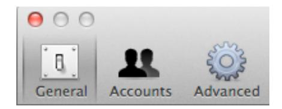

The standard images of the first type (including, for example, the view in Quick Look symbol ) are known as template images. A **template image** is a black and clear image that can be used inside a control (such as a toolbar button). Template images are expected to receive additional processing,such as displaying an inverted variation. For a list of these images, see ["System-Provided](#page-320-0) Images for Use in Controls" (page 321); to learn more about toolbar buttons, see ["Window-Frame](#page-240-0) Controls" (page 241).

Standard images of the second type (including, for example, the general preferences symbol ) can be used as standalone icon buttons in a preferences window's toolbar. Because these images are not template images, they cannot be used inside an app window's toolbar controls (or any other controls). For a list of these images, see ["System-Provided](#page-323-0) Images for Use as Toolbar Items" (page 324).

OS X also provides a handful of standard images that can appear in the window body, such as the invalid data image . For a list of these images, see ["System-Provided](#page-322-0) Images for Use as Standalone Buttons" (page 323).

Every system-provided image has a specific meaning that users know. To avoid confusing users, *it is essential that you use each image in accordance with its documented meaning and recommended usage* .

When you use standard images correctly in your app, you also benefit from:

- Shorter development time and less effort spent on creating custom images.
- Automatic updating of images if appearance changes occur in future operating system updates.

To understand why it's important to use these images correctly, consider the following hypothetical example. Imagine that the "go forward" image (that is, ) is changed to look like a capital letter "F." If you correctly use this image in a control that performs a "go forward" action, the control still makes sense when it uses the new appearance. But if you incorrectly use the image to mean "play," your play control is suddenly nonsensical and confusing when it displays the "F."

If you can't find a system-provided image that has the appropriate meaning for a specific purpose in your app, it's better to design your own than to misuse a system-provided image. To learn how to design icons, see ["Designing](#page-121-0) Toolbar Icons" (page 122).

**Note:** Each image described in the following sections is listed with its constant name, as defined in the NSImage programming interface. However, the string value for each constant consists of the constant name without the "ImageName" portion. For example, the constant NSImageNameAddTemplate has "NSAddTemplate" as its string value. You might need to use the string value, rather than the constant name, to locate images by name in Interface Builder.

### <span id="page-320-0"></span>System-Provided Images for Use in Controls

OS X provides many small, black imagesintended for use primarily in toolbar controls. These images are known astemplate imagesin AppKit, because they are expected to receive additional processing by an NSButtonCell object before being displayed. The additional processing can, for example, make such an image look different when its control is pressed. Because these images require the presence of a bounding box (which is supplied by the control), they are not as useful for standalone buttons or free-standing toolbar icons. Instead, see ["System-Provided](#page-322-0) Images for Use as Standalone Buttons" (page 323) for images you can use as standalone buttons, and see ["System-Provided](#page-323-0) Images for Use as Toolbar Items" (page 324) for images you can use as free-standing toolbar icons.

As with all system-provided images, you should avoid using the template images to represent actions other than those they are designed for. Table B-1 shows the standard template images available in OS X, along with the actions they represent and their names.

<span id="page-321-0"></span>**Table B-1** Template images that represent common tasks

| Image | Meaning                                                                                               | Constant name                      |
|-------|-------------------------------------------------------------------------------------------------------|------------------------------------|
|       | View<br>in<br>Quick<br>Look                                                                           | NSImageNameQuickLookTemplate       |
|       | Connect<br>via<br>Bluetooth                                                                           | NSImageNameBluetoothTemplate       |
|       | Open<br>iChat<br>Theater                                                                              | NSImageNameIChatTheaterTemplate    |
|       | View<br>in<br>a<br>slide<br>show                                                                      | NSImageNameSlideshowTemplate       |
|       | Action<br>pop-up<br>menu                                                                              | NSImageNameActionTemplate          |
|       | Create<br>smart<br>item                                                                               | NSImageNameSmartBadgeTemplate      |
|       | Share<br>menu                                                                                         | NSImageNameShareTemplate           |
|       | View<br>objects<br>as<br>icons                                                                        | NSImageNameIconViewTemplate        |
|       | View<br>objects<br>in<br>a<br>list                                                                    | NSImageNameListViewTemplate        |
|       | View<br>objects<br>in<br>columns                                                                      | NSImageNameColumnViewTemplate      |
|       | View<br>objects<br>in<br>a<br>Cover<br>Flow<br>mode<br>*                                              | NSImageNameFlowViewTemplate        |
|       | View<br>the<br>path<br>of<br>the<br>object                                                            | NSImageNamePathTemplate            |
|       | Unlock<br>the<br>object<br>(this<br>image<br>indicates<br>the<br>object<br>is<br>currently<br>locked) | NSImageNameLockLockedTemplate      |
|       | Lock<br>the<br>object<br>(this<br>image<br>indicates<br>the<br>object<br>is<br>currently<br>unlocked) | NSImageNameLockUnlockedTemplate    |
|       | Go<br>to<br>the<br>right<br>or<br>go<br>forward                                                       | NSImageNameGoRightTemplate         |
|       | Go<br>to<br>the<br>left<br>or<br>go<br>back                                                           | NSImageNameGoLeftTemplate          |
|       | Add<br>an<br>item<br>(to<br>a<br>list,<br>for<br>example)                                             | NSImageNameAddTemplate             |
|       | Remove<br>an<br>item<br>(from<br>a<br>list,<br>for<br>example)                                        | NSImageNameRemoveTemplate          |
|       | Enter<br>full-screen<br>mode<br>(deprecated<br>)                                                      | NSImageNameEnterFullScreenTemplate |
|       | Exit<br>full-screen<br>mode<br>(deprecated<br>)                                                       | NSImageNameExitFullScreenTemplate  |

| Image | Meaning                                                              | Constant name                   |
|-------|----------------------------------------------------------------------|---------------------------------|
|       | Stop<br>progress<br>on<br>the<br>current<br>process                  | NSImageNameStopProgressTemplate |
|       | Refresh<br>the<br>current<br>view<br>or<br>restart<br>the<br>process | NSImageNameRefreshTemplate      |

\*OS X does not provide programming interfaces that support adding a custom cover flow experience to your app.

**Note:** The NSImageNameEnterFullScreenTemplate and

NSImageNameExitFullScreenTemplate images are deprecated. If windows in your app can go full screen, be sure to use the appropriate full-screen programming interfaces so that the correct button gets added to the title bar. For an overview of these programming interfaces,see "Implementing the Full-Screen Experience". To learn more about how to support the experience of a full-screen window, see "Going Full [Screen"](#page-175-0) (page 176).

### <span id="page-322-0"></span>System-Provided Images for Use as Standalone Buttons

OS X provides a handful of free-standing images that can be used as borderless buttons. These images do not require further processing by an NSButtonCell object.

Two of the free-standing images are standalone versions of similar template images. To see why you might need both versions of such an image, consider how Safari offers stop-progress functionality to users. In the downloads popover, Safari uses the free-standing NSImageNameStopProgressFreestandingTemplate image inline with a progress indicator to allow users to stop an in-progress download.


Because the Safari downloads popover can display several separate download processes at the same time, it's important to display a stop-progress control for each individual process.

As with all system-provided images, each free-standing image must be used according to its documented meaning and recommended usage. Table B-2 lists each image, along with its meaning and name.

<span id="page-323-1"></span>**Table B-2** Free-standing images that represent common actions

| Image | Meaning                                                                                                                                                     | Constant name                                   |
|-------|-------------------------------------------------------------------------------------------------------------------------------------------------------------|-------------------------------------------------|
|       | The<br>data<br>on<br>the<br>left<br>is<br>invalid<br>(for<br>example,<br>the<br>user<br>entered<br>a<br>zip<br>code<br>in<br>a<br>phone<br>number<br>field) | NSImageNameInvalidDataFreestanding<br>Template  |
|       | Reveal<br>contents<br>or<br>details<br>about<br>the<br>object                                                                                               | NSImageNameReveal<br>FreestandingTemplate       |
|       | Open<br>the<br>link<br>in<br>a<br>new<br>window<br>or<br>page                                                                                               | NSImageNameFollowLinkFreestanding<br>Template   |
|       | Stop<br>progress<br>on<br>the<br>current<br>process                                                                                                         | NSImageNameStop<br>ProgressFreestandingTemplate |
|       | Refresh<br>the<br>current<br>view<br>or<br>restart<br>the<br>process                                                                                        | NSImageNameRefresh<br>FreestandingTemplate      |

### <span id="page-323-0"></span>System-Provided Images for Use as Toolbar Items

OS X provides several images you can use as standalone icons in toolbars. These images represent three types of items:

- System entities or elements
- Preferences categories
- Common toolbar items

<span id="page-323-2"></span>Use the first set of images (shown in Table B-3) to give users access to system entities, such as the network. For the most part, the images in Table B-3 identify system entities, they do not represent actions. However, if you needed to represent an action, such as "create a new smart folder," you could add a plus sign badge to the smart folder icon.

**Table B-3** Images that represent system entities

| Image | System element            | Constant name      |
|-------|---------------------------|--------------------|
|       | Bonjour                   | NSImageNameBonjour |
|       | Network<br>or<br>Internet | NSImageNameNetwork |

| Image | System element                                       | Constant name             |
|-------|------------------------------------------------------|---------------------------|
|       | Dot<br>Mac                                           | NSImageNameDotMac         |
|       | The<br>Macintosh<br>computer<br>currently<br>running | NSImageNameComputer       |
|       | A<br>burnable<br>folder                              | NSImageNameFolderBurnable |
|       | A<br>smart<br>folder                                 | NSImageNameFolderSmart    |

<span id="page-324-0"></span>The second set of images is intended for use as standalone icons in preferences window toolbars. Use these images to give users access to familiar preferences categories, such as user-account settings and advanced settings. Table B-4 shows the images you can use in a preferences window toolbar.

**Table B-4** Images that represent common preferences categories

| Image | Preferences category | Constant name                 |
|-------|----------------------|-------------------------------|
|       | Advanced             | NSImageNameAdvanced           |
|       | General              | NSImageNamePreferencesGeneral |
|       | User<br>accounts     | NSImageNameUserAccounts       |

<span id="page-324-1"></span>The third set of images is suitable for toolbar items in windows other than preferences windows. You can use these images as standalone icons in a window or panel toolbar to give users access to the system-provided Colors and Fonts windows or to an Info or inspector window you supply. Table B-5 shows the images you can use in a non-preferences window toolbar.

**Table B-5** Images that represent standard toolbar items

| Image | Toolbar item                  | Constant name         |
|-------|-------------------------------|-----------------------|
|       | Show/hide<br>information      | NSImageNameInfo       |
|       | Show/hide<br>Fonts<br>window  | NSImageNameFontPanel  |
|       | Show/hide<br>Colors<br>window | NSImageNameColorPanel |

### <span id="page-325-0"></span>System-Provided Images that Indicate Privileges

OS X provides images that represent the standard "user," "group," and "all" categories of permissions or privileges, including access control lists (or ACLs). Each of these images is shown in Table B-6, along with its meaning and name. It is recommended that you use these images to clarify which users have permissions to read, write, or execute an item. These images allow you to avoid displaying Unix-style permissions indicators, such as rwxr-xrw-, which are suitable only for very sophisticated users.

Note that the "user group" permissions image shown in Table B-6 looks similar to the image for the "user accounts" preferences category, shown in [Table](#page-324-0) B-4 (page 325). As with all system-provided images, however, similar appearance does not imply similar meaning or usage. Be sure to avoid using system-provided images incorrectly.

<span id="page-325-2"></span>**Table B-6** Images that represent categories of user permissions

| Image | Permissions category | Constant name        |
|-------|----------------------|----------------------|
|       | User                 | NSImageNameUser      |
|       | A<br>user<br>group   | NSImageNameUserGroup |
|       | All<br>users         | NSImageNameEveryone  |

### <span id="page-325-1"></span>A System-Provided Drag Image

OS X provides an image you can display when a user drags multiple documents or items. However, it's best if you can provide more meaningful drag images (to learn more about this, see "Drag and [Drop"](#page-96-1) (page 97)).

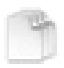

As with all system-provided images, you should use the multiple-documents image in accordance with its intended meaning. (The constant name of the drag image is NSImageNameMultipleDocuments.)

# <span id="page-326-0"></span>Document Revision History

This table describes the changes to *OS X Human Interface Guidelines*.

| Date       | Notes                                                                                                                                                   |
|------------|---------------------------------------------------------------------------------------------------------------------------------------------------------|
| 2012-07-23 | Added<br>guidelines<br>for<br>new<br>OS<br>X<br>technology<br>features<br>and<br>made<br>minor<br>changes<br>throughout.                                |
|            | Added<br>guidelines<br>for<br>"iCloud<br>Storage"<br>(page<br>71).                                                                                      |
|            | Added<br>guidelines<br>for<br>"Notification<br>Center"<br>(page<br>75).                                                                                 |
|            | Added<br>guidelines<br>for<br>"Sharing<br>Service"<br>(page<br>79).                                                                                     |
|            | Added<br>guidelines<br>for<br>"Game<br>Center"<br>(page<br>81).                                                                                         |
|            | Added<br>guidelines<br>for<br>"In-App<br>Purchase"<br>(page<br>82).                                                                                     |
|            | Added<br>guidelines<br>for<br>"Calendar"<br>(page<br>83).                                                                                               |
|            | Added<br>guidelines<br>for<br>"Reminders"<br>(page<br>83).                                                                                              |
|            | Added<br>technology<br>descriptions<br>for<br>new<br>features<br>such<br>as<br>"Gatekeeper"<br>(page<br>71)<br>and<br>"Auto<br>Layout"<br>(page<br>97). |
|            | Updated<br>the<br>guidelines<br>for<br>"The<br>Open<br>Dialog"<br>(page<br>222)<br>to<br>include<br>the<br>new<br>iCloud<br>open<br>dialog.             |
|            | Added<br>guidelines<br>for<br>a<br>new<br>UI<br>element,<br>the<br>"Share<br>Menu"<br>(page<br>266).                                                    |
| 2012-06-11 | Updated<br>for<br>high-resolution<br>graphic<br>displays.                                                                                               |
| 2012-02-16 | Made<br>minor<br>corrections.                                                                                                                           |
| 2011-07-26 | Added<br>guidelines<br>for<br>capitalizing<br>toolbar<br>item<br>names;<br>made<br>minor<br>corrections.                                                |
| 2011-07-20 | Updated<br>for<br>OS<br>X<br>v10.7;<br>changed<br>the<br>title<br>from<br>Apple<br>Human<br>Interface<br>Guidelines.                                    |

| Date       | Notes                                                                                                                                                                      |
|------------|----------------------------------------------------------------------------------------------------------------------------------------------------------------------------|
| 2011-05-31 | Added<br>guidelinesforsupporting<br>trackpad<br>gestures<br>and<br>supplying<br>services,<br>and<br>made<br>updates<br>throughout.                                         |
|            | Changed<br>guideline<br>for<br>displaying<br>a<br>search<br>history<br>in<br>a<br>search<br>field.                                                                         |
|            | Updated<br>layout<br>guidelines<br>for<br>bottom<br>bars.                                                                                                                  |
|            | Added<br>layout<br>guidelines<br>for<br>dialogs<br>that<br>display<br>list<br>views.                                                                                       |
|            | Clarified<br>guideline<br>discouraging<br>preferences<br>windows<br>that<br>can<br>resize<br>or<br>minimize.                                                               |
|            | Described<br>the<br>different<br>appearances<br>of<br>window-frame<br>controls.                                                                                            |
|            | Updated<br>guidelines<br>for<br>menu<br>bar<br>extras.                                                                                                                     |
|            | Provided<br>some<br>additional<br>guidance<br>on<br>designing<br>the<br>user<br>interface<br>with<br>worldwide<br>compatibility<br>in<br>mind.                             |
| 2008-06-09 | Fixed<br>minor<br>errors.                                                                                                                                                  |
| 2008-03-11 | Fixed<br>minor<br>errors.                                                                                                                                                  |
| 2008-01-15 | Updated<br>for<br>OS<br>X<br>v10.5.                                                                                                                                        |
| 2006-10-03 | Made<br>minor<br>corrections.                                                                                                                                              |
| 2006-06-28 | Made<br>minor<br>corrections.                                                                                                                                              |
| 2006-05-23 | Added<br>information<br>about<br>communication<br>from<br>background<br>processes<br>and<br>handling<br>text<br>fields<br>that<br>require<br>user<br>input.                |
| 2006-04-04 | Added<br>guidelines<br>for<br>using<br>the<br>colon<br>character<br>and<br>updated<br>guidelines<br>for<br>using<br>the<br>ellipsis<br>character.                          |
| 2006-02-07 | Updated<br>the<br>toolbar<br>icon<br>section<br>and<br>made<br>some<br>minor<br>corrections.                                                                               |
| 2005-12-06 | Added<br>an<br>appendix<br>containing<br>guidelines<br>on<br>how<br>to<br>prioritize<br>design<br>decisions<br>and<br>updated<br>the<br>Keyboard<br>Shortcuts<br>appendix. |
| 2005-11-09 | Made<br>minor<br>bug<br>fixes.                                                                                                                                             |
|            |                                                                                                                                                                            |

| Date       | Notes                                                                                                                                                                          |
|------------|--------------------------------------------------------------------------------------------------------------------------------------------------------------------------------|
| 2005-09-08 | Made<br>minor<br>bug<br>fixes.                                                                                                                                                 |
| 2005-08-11 | Made<br>minor<br>bug<br>fixes.<br>Changed<br>guidelines<br>for<br>dimming<br>of<br>menu<br>titles<br>for<br>menus<br>containing<br>inactive<br>commands.                       |
| 2005-07-07 | Made<br>minor<br>bug<br>fixes.                                                                                                                                                 |
| 2005-06-04 | Made<br>minor<br>bug<br>fixes.                                                                                                                                                 |
| 2005-04-29 | Made<br>minor<br>bug<br>fixes.                                                                                                                                                 |
|            | Updated<br>for<br>OS<br>X<br>version<br>10.4.<br>Also<br>contains<br>information<br>that<br>was<br>previously<br>available<br>in<br>Apple<br>Software<br>Design<br>Guidelines. |
| 2004-11-02 | Minor<br>bug<br>fixes.                                                                                                                                                         |
| 2004-10-05 | Minor<br>bug<br>fixes.                                                                                                                                                         |
| 2004-08-31 | Minor<br>bug<br>fixes.                                                                                                                                                         |
| 2004-05-27 | Removed<br>Part<br>I<br>and<br>Part<br>II.<br>This<br>information<br>is<br>now<br>available<br>in<br>Apple<br>Software<br>Design<br>Guidelines.                                |
|            | Updated<br>Introduction<br>to<br>reflect<br>new<br>structure<br>of<br>the<br>document.                                                                                         |
|            | Minor<br>bug<br>fixes.                                                                                                                                                         |
| 2004-03-29 | Clarifications<br>to<br>font<br>guidelines<br>in<br>Text.                                                                                                                      |
|            | Corrected<br>minor<br>errors<br>in<br>artwork<br>in<br>Figure<br>13-21<br>and<br>Figure<br>13-24.                                                                              |
| 2004-02-26 | Minor<br>revisions<br>throughout<br>including<br>updating<br>some<br>artwork.                                                                                                  |
|            | Reworked<br>organization<br>of<br>Layout<br>Examples<br>and<br>added<br>more<br>specific<br>guidelines<br>and<br>examples.                                                     |
|            | Minor<br>corrections<br>to<br>some<br>of<br>the<br>specifications<br>in<br>the<br>Controls.                                                                                    |

| Date       | Notes                                                                                                                                                                                                                                                                                                                                                                                                                  |
|------------|------------------------------------------------------------------------------------------------------------------------------------------------------------------------------------------------------------------------------------------------------------------------------------------------------------------------------------------------------------------------------------------------------------------------|
| 2003-10-18 | Updated<br>for<br>OS<br>X<br>version<br>10.3<br>by<br>updating<br>artwork<br>and<br>including<br>new<br>controls.                                                                                                                                                                                                                                                                                                      |
|            | Divided<br>the<br>document<br>into<br>parts.                                                                                                                                                                                                                                                                                                                                                                           |
|            | Added<br>all<br>of<br>content<br>in<br>Part<br>II.                                                                                                                                                                                                                                                                                                                                                                     |
|            | Added<br>Cursors.                                                                                                                                                                                                                                                                                                                                                                                                      |
|            | Added<br>a<br>list<br>of<br>all<br>keyboard<br>shortcuts.                                                                                                                                                                                                                                                                                                                                                              |
|            | Called<br>out<br>differences<br>between<br>Carbon<br>and<br>Cocoa<br>where<br>appropriate.                                                                                                                                                                                                                                                                                                                             |
|            | Reorganized<br>Windows.                                                                                                                                                                                                                                                                                                                                                                                                |
|            | Reorganized<br>Menus.                                                                                                                                                                                                                                                                                                                                                                                                  |
|            | Added<br>content<br>and<br>fixed<br>various<br>bugs<br>throughout.                                                                                                                                                                                                                                                                                                                                                     |
| 2002-06-11 | Updated<br>for<br>OS<br>X<br>version<br>10.2.<br>Deleted<br>"What's<br>New<br>in<br>Aqua"<br>sections<br>from<br>Chapter<br>1<br>and<br>beginning<br>of<br>each<br>chapter.                                                                                                                                                                                                                                            |
|            | Speech<br>chapter<br>added.                                                                                                                                                                                                                                                                                                                                                                                            |
|            | New<br>controls:<br>command<br>pop-down<br>menus,<br>toolbar<br>control,<br>spinning<br>arrows,<br>small<br>image<br>wells.                                                                                                                                                                                                                                                                                            |
|            | Other<br>additions/changes<br>include:<br>accessibility<br>features,<br>installers,<br>metal<br>windows,<br>new<br>document<br>window<br>position,<br>utility<br>window<br>controls,<br>font<br>constants.                                                                                                                                                                                                             |
| 2001-10-01 | Updated<br>for<br>OS<br>X<br>version<br>10.1.                                                                                                                                                                                                                                                                                                                                                                          |
|            | Added<br>information<br>about<br>filename<br>extension<br>hiding,<br>Dock<br>menus<br>and<br>notification,<br>setup<br>assistants,<br>new<br>focus<br>ring<br>specifications,<br>accessibility<br>guidelines,<br>full<br>keyboard<br>access,<br>customizing<br>Print<br>dialogs,<br>window<br>positioning<br>on<br>multiple<br>monitors,<br>proxy<br>icons.<br>Various<br>other<br>editorial<br>changes<br>throughout. |
| 2001-05-21 | Updated<br>for<br>WWDC.                                                                                                                                                                                                                                                                                                                                                                                                |

| Date       | Notes                                                                                                                                                                                                                                                              |
|------------|--------------------------------------------------------------------------------------------------------------------------------------------------------------------------------------------------------------------------------------------------------------------|
|            | Changes<br>made<br>to<br>many<br>illustrations.                                                                                                                                                                                                                    |
|            | Slight<br>engineering<br>comments<br>and<br>changes<br>throughout.                                                                                                                                                                                                 |
|            | Icons<br>chapter<br>expanded.                                                                                                                                                                                                                                      |
|            | File<br>Location<br>chapter<br>added.                                                                                                                                                                                                                              |
|            | "What's<br>New<br>in<br>Aqua"<br>chapter<br>appended<br>to<br>Intro<br>chapter.                                                                                                                                                                                    |
|            | "Layout<br>Guidelines"<br>broken<br>out<br>from<br>"Controls"<br>chapter.                                                                                                                                                                                          |
|            | Other<br>additions<br>include<br>"Additional<br>Considerations"<br>section<br>in<br>principles<br>chapter;<br>windows<br>with<br>different<br>panes.                                                                                                               |
| 2000-12-11 | Updated<br>for<br>Jan<br>2001<br>Macworld;<br>now<br>called<br>Inside<br>OS<br>X:<br>Aqua<br>Human<br>Interface<br>Guidelines.                                                                                                                                     |
|            | Document<br>divided<br>into<br>chapters.<br>TOC<br>added.                                                                                                                                                                                                          |
|            | Major<br>content<br>added<br>to<br>entire<br>document.<br>Added<br>many<br>screen<br>shots.                                                                                                                                                                        |
|            | Added<br>Human<br>Interface<br>principles<br>chapter.                                                                                                                                                                                                              |
|            | Added<br>Help<br>chapter.                                                                                                                                                                                                                                          |
|            | Added<br>Language<br>chapter.                                                                                                                                                                                                                                      |
|            | Added<br>Drag<br>and<br>Drop<br>chapter.                                                                                                                                                                                                                           |
|            | Added<br>Checklist<br>appendix.                                                                                                                                                                                                                                    |
|            | Added<br>OS<br>X<br>terminology<br>appendix.                                                                                                                                                                                                                       |
|            | Added<br>index.                                                                                                                                                                                                                                                    |
|            | Content<br>revisions<br>include<br>click-through,<br>icon<br>creation<br>process,<br>combo<br>boxes,<br>sheets,<br>Save-Close-Quit<br>behavior,<br>keyboard<br>equivalents,<br>About<br>boxes,<br>pop-up<br>bevel<br>buttons,<br>and<br>pop-up<br>icon<br>buttons. |
| 2000-09-08 | Updated<br>for<br>OS<br>X<br>Public<br>Beta<br>Release.                                                                                                                                                                                                            |
|            | Added<br>section<br>on<br>working<br>with<br>the<br>Appearance<br>Manager.                                                                                                                                                                                         |
|            | Added<br>section<br>on<br>designing<br>alerts.                                                                                                                                                                                                                     |
|            |                                                                                                                                                                                                                                                                    |
|            |                                                                                                                                                                                                                                                                    |

| Date       | Notes                                                                                                             |
|------------|-------------------------------------------------------------------------------------------------------------------|
|            | Added<br>section<br>on<br>sheets.                                                                                 |
|            | Added<br>section<br>on<br>drawers.                                                                                |
|            | Added<br>section<br>on<br>list<br>and<br>column<br>view.                                                          |
|            | Added<br>material<br>on<br>small<br>controls.                                                                     |
|            | Added<br>examples<br>of<br>font<br>usage.                                                                         |
|            | Clarified<br>description<br>of<br>tab<br>control<br>usage.                                                        |
| 2000-04-19 | Updated<br>for<br>OS<br>X<br>Developer<br>Preview<br>4<br>and<br>retitled<br>Adopting<br>the<br>Aqua<br>Interface |
|            | Changed<br>content<br>and<br>art<br>to<br>reflect<br>new<br>control<br>metrics.                                   |
|            | Added<br>section<br>on<br>icon<br>design.                                                                         |
|            | Added<br>section<br>on<br>window<br>layering.                                                                     |
|            | Added<br>section<br>on<br>menu<br>layout.                                                                         |
|            | Added<br>material<br>on<br>using<br>an<br>ellipsis<br>in<br>menus.                                                |
| 2000-01-20 | Document<br>published<br>as<br>Aqua<br>Layout<br>Guidelines.                                                      |

#### Ú

Apple Inc. © 1992, 2001-2003, 2012 Apple Inc. All rights reserved.

No part of this publication may be reproduced, stored in a retrieval system, or transmitted, in any form or by any means, mechanical, electronic, photocopying, recording, or otherwise, without prior written permission of Apple Inc., with the following exceptions: Any person is hereby authorized to store documentation on a single computer for personal use only and to print copies of documentation for personal use provided that the documentation contains Apple's copyright notice.

No licenses, express or implied, are granted with respect to any of the technology described in this document. Apple retains all intellectual property rights associated with the technology described in this document. This document is intended to assist application developers to develop applications only for Apple-labeled computers.

Apple Inc. 1 Infinite Loop Cupertino, CA 95014 408-996-1010

Apple, the Apple logo, AppleScript, Aqua, Bonjour, Carbon, Chicago, Cocoa, Cover Flow, Exposé, FaceTime, Finder, Geneva, iChat, iMovie, Instruments, iPhoto, iPod, iTunes, Keychain, Keynote, Mac, Macintosh, Numbers, OS X, Pages, Photo Booth, QuickTime, Safari, Spaces, Spotlight, Time Machine, and Xcode are trademarks of Apple Inc., registered in the U.S. and other countries.

AirDrop, iWeb, Launchpad, Mission Control, Multi-Touch, and Retina are trademarks of Apple Inc.

.Mac and iCloud are service marks of Apple Inc., registered in the U.S. and other countries.

App Store and Mac App Store are service marks of Apple Inc.

Helvetica is a registered trademark of Heidelberger Druckmaschinen AG, available from Linotype Library GmbH.

iOS is a trademark or registered trademark of Cisco in the U.S. and other countries and is used under license.

Even though Apple has reviewed this document, APPLE MAKES NO WARRANTY OR REPRESENTATION, EITHER EXPRESS OR IMPLIED, WITH RESPECT TO THIS DOCUMENT, ITS QUALITY, ACCURACY, MERCHANTABILITY, OR FITNESS FOR A PARTICULAR PURPOSE. AS A RESULT, THIS DOCUMENT IS PROVIDED "AS IS," AND YOU, THE READER, ARE ASSUMING THE ENTIRE RISK AS TO ITS QUALITY AND ACCURACY.

IN NO EVENT WILL APPLE BE LIABLE FOR DIRECT, INDIRECT, SPECIAL, INCIDENTAL, OR CONSEQUENTIAL DAMAGES RESULTING FROM ANY DEFECT OR INACCURACY IN THIS DOCUMENT, even if advised of the possibility of such damages.

THE WARRANTY AND REMEDIES SET FORTH ABOVE ARE EXCLUSIVE AND IN LIEU OF ALL OTHERS, ORAL OR WRITTEN, EXPRESS OR IMPLIED. No Apple dealer,

agent, or employee is authorized to make any modification, extension, or addition to this warranty.

Some states do not allow the exclusion or limitation of implied warranties or liability for incidental or consequential damages, so the above limitation or exclusion may not apply to you. This warranty gives you specific legal rights, and you may also have other rights which vary from state to state.