# OS X Human Interface Guidelines

## Contents

**UI [Design](#page-10-0) Basics** 11

**[Designing](#page-11-0) for Yosemite** 12

| App Styles and Anatomy 18                                             |
|-----------------------------------------------------------------------------------|
| Starting and Stopping 22                                                 |
| Start Instantly 22                                                          |
| Always Be Prepared to Stop and to Restart 23              |
|                                                                                   |
| Modality 24                                                                    |
| Interoperability 26                                                            |
|                                                                                   |
| Feedback and Assistance 28                                               |
| Keep Users Informed of Progress 28                                 |
| Occasionally, Users Need Help 29                                      |
| Interaction and Input 31                                                 |
| Support the Keyboard 31                                                  |
| Gestures Can Enhance the User Experience 33                     |
| Make Entering Text Easy 34                                            |
|                                                                                   |
| Animation 36                                                                   |
| Branding 38                                                                    |
|                                                                                   |
| Color and Typography 39                                                  |
| Use System Colors to Integrate with System Appearances 39 |
| Text Should Always Be Legible 41                                   |
| Icons and Graphics 42                                                    |
| Terminology and Wording 44                                               |
| Use User-Oriented Terminology 44                                         |

Create Succinct Labels for UI [Elements](#page-45-0) 46 Use the Right [Capitalization](#page-46-0) Style in Labels and Text 47 Use [Contractions](#page-47-0) Cautiously 48 Use [Abbreviations](#page-48-0) and Acronyms That Users Understand 49 Use an Ellipsis When More Input Is [Required](#page-48-1) 49 Use a Colon to [Connect](#page-50-0) a Label with Controls 51 Remove [Extraneous](#page-53-0) Space Between Sentences 54

#### **[Integrating](#page-54-0) with OS X** 55

Use Standard UI [Elements](#page-54-1) Correctly 55 Reach as Many Users as [Possible](#page-55-0) 56 Provide an OS X [Experience](#page-57-0) 58

#### **Design [Strategies](#page-59-0)** 60

#### **Design [Principles](#page-60-0)** 61

[Mental](#page-60-1) Model 61 [Metaphors](#page-61-0) 62 Explicit and [Implied](#page-61-1) Actions 62 Direct [Manipulation](#page-62-0) 63 User [Control](#page-62-1) 63 Feedback and [Communication](#page-63-0) 64 [Consistency](#page-63-1) 64 [Forgiveness](#page-64-0) 65 [Aesthetic](#page-65-0) Integrity 66

#### **[User-Centered](#page-66-0) Design** 67

Know Your [Audience](#page-66-1) 67 [Analyze](#page-66-2) User Tasks 67 Build [Prototypes](#page-67-0) 68 Do User [Testing](#page-67-1) 68 Focus on [Solutions,](#page-67-2) Not Features 68

#### **[Menus](#page-69-0)** 70

**About [Menus](#page-70-0)** 71 Menu [Anatomy](#page-72-0) 73 Menu [Behavior](#page-73-0) 74

#### **[Naming](#page-74-0) Menus and Items** 75

#### A Menu Title [Describes](#page-74-1) a Set of Items 75 A Menu Item Names a [Command](#page-75-0) or Action 76

#### **[Grouping](#page-76-0) Menu Items** 77

#### **[Changing](#page-78-0) a Menu's Items** 79

[Dynamic](#page-78-1) Menu Items 79 [Toggled](#page-79-0) Menu Items 80

#### **Icons and [Symbols](#page-83-0) in Menus** 84

Icons Can Help Users [Identify](#page-83-1) Items 84 Symbols Can Give Users [Information](#page-84-0) About State 85

#### **Menu Bar [Menus](#page-86-0)** 87

The [Apple](#page-87-0) Menu 88

The App [Menu](#page-87-1) 88

The File [Menu](#page-89-0) 90

The Edit [Menu](#page-93-0) 94

The [Format](#page-96-0) Menu 97

The View [Menu](#page-98-0) 99

[App-Specific](#page-99-0) Menus 100

The [Window](#page-99-1) Menu 100

The Help [Menu](#page-102-0) 103

Menu Bar [Extras](#page-102-1) 103

#### **[Hierarchical](#page-104-0) Menus** 105

#### **[Contextual](#page-106-0) Menus** 107

**Dock [Menus](#page-110-0)** 111

**[Windows](#page-112-0)** 113

#### **About [Windows](#page-113-0)** 114

Window [Anatomy](#page-117-0) 118

Window [Layering](#page-121-0) 122

Main, Key, and Inactive [Windows](#page-122-0) 123

#### **Opening [Windows](#page-123-0)** 124

#### **Naming [Windows](#page-124-0)** 125

**Scrolling [Windows](#page-126-0)** 127

**[Searching](#page-130-0) In a Window** 131

**[Full-Screen](#page-133-0) Windows** 134

**[Toolbars](#page-136-0)** 137

**Source Lists [\(Sidebars\)](#page-141-0)** 142

#### **[Panels](#page-144-0)** 145

[Inspectors](#page-146-0) 147

[Translucent](#page-147-0) Panels 148

The About [Window](#page-148-0) 149

#### **[Dialogs](#page-150-0)** 151

Using [Document-Modal](#page-151-0) Dialogs (Sheets) 152

[Accepting](#page-153-0) and Applying User Input in a Dialog 154

[Expanding](#page-154-0) Dialogs 155

[Dismissing](#page-155-0) Dialogs 156

[Preferences](#page-156-0) Windows 157

The Open [Dialog](#page-159-0) 160

The [Choose](#page-161-0) Dialog 162

The Print and Page Setup [Dialogs](#page-162-0) 163

Find [Windows](#page-165-0) 166

Save [Dialogs](#page-166-0) 167

#### **[Alerts](#page-171-0)** 172

#### **[Controls](#page-174-0) and Views** 175

#### **About [Controls](#page-175-0) and Views** 176

Use AppKit Controls and Views [Correctly](#page-176-0) 177 Some [Controls](#page-176-1) Can Be Used in the Window Frame 177

**[Buttons](#page-178-0)** 179

Push [Button](#page-178-1) 179

Radio [Buttons](#page-179-0) 180

[Checkbox](#page-181-0) 182 [Gradient](#page-183-0) Button 184 [Disclosure](#page-183-1) Triangle 184 [Disclosure](#page-185-0) Button 186 Scope [Button](#page-186-0) 187 The Help [Button](#page-187-0) 188

#### **Menu [Controls](#page-189-0)** 190

[Pop-Up](#page-189-1) Menu 190 [Action](#page-191-0) Menu 192 [Share](#page-193-0) 194 [Scrolling](#page-194-0) List 195 Command [Pop-Down](#page-195-0) Menu 196 [Combination](#page-196-0) Box 197

#### **[Selection](#page-198-0) Controls** 199

[Segmented](#page-198-1) Control 199 [Slider](#page-199-0) 200 Path [Control](#page-201-0) 202 [Color](#page-202-0) Well 203 [Image](#page-203-0) Well 204 Date [Picker](#page-203-1) 204 [Stepper](#page-204-0) 205

#### **[Indicator](#page-205-0) Controls** 206

Progress [Indicators](#page-205-1) 206 [Determinate](#page-205-2) Progress Bar 206 [Indeterminate](#page-206-0) Progress Bar 207 [Asynchronous](#page-207-0) Progress Indicator 208 Level [Indicators](#page-208-0) 209 Capacity [Indicator](#page-208-1) 209 Rating [Indicator](#page-210-0) 211

[Relevance](#page-210-1) Indicator 211

**Text [Controls](#page-212-0)** 213 [Static](#page-212-1) Text Field 213 Text [Input](#page-212-2) Field 213 [Token](#page-213-0) Field 214 [Search](#page-214-0) Field 215

#### **[Content](#page-216-0) Views** 217

[Popover](#page-216-1) 217 [Table](#page-219-0) View 220 Column [\(Browser\)](#page-221-0) View 222 Split [View](#page-223-0) 224 Tab [View](#page-226-0) 227 [Group](#page-228-0) Box 229

#### **[Infrequently](#page-229-0) Used Controls** 230

Bevel [Button](#page-229-1) 230 Round [Button](#page-230-0) 231 Icon [Button](#page-231-0) 232 [Placard](#page-232-0) 233

#### **OS X [Technologies](#page-233-0)** 234

**App [Extensions](#page-234-0)** 235

Today [Widgets](#page-236-0) 237 Share [Extensions](#page-238-0) 239 Action [Extensions](#page-239-0) 240 Finder Sync [Extensions](#page-241-0) 242

**[Notification](#page-242-0) Center** 243

**[iCloud](#page-248-0)** 249

**[Mission](#page-250-0) Control** 251

**Auto Save and [Versions](#page-251-0)** 252

**The [Finder](#page-253-0)** 254

**The [Dock](#page-255-0)** 256

**Game [Center](#page-257-0)** 258

**In-App [Purchase](#page-259-0)** 260

**[Accessing](#page-261-0) User Data** 262

[Calendar](#page-261-1) Data 262

[Contacts](#page-261-2) Data 262 **[Preferences](#page-263-0)** 264 **VoiceOver and [Accessibility](#page-265-0)** 266 **Colors and Fonts [Windows](#page-267-0)** 268 **[Printing](#page-269-0)** 270 **User [Assistance](#page-270-0)** 271 **[Dashboard](#page-274-0)** 275 **[Gatekeeper](#page-275-0)** 276 **[Security](#page-276-0)** 277 **The Multiuser [Environment](#page-278-0)** 279 **[Spotlight](#page-280-0)** 281 **[Automator](#page-282-0)** 283 **[Services](#page-284-0)** 285 **[Sharing](#page-286-0)** 287 **Drag and [Drop](#page-288-0)** 289 **Keyboard [Shortcuts](#page-296-0)** 297 [Providing](#page-296-1) Keyboard Shortcuts 297 Reserved and [Recommended](#page-298-0) Keyboard Shortcuts 299 **[Pointers](#page-307-0)** 308 **Icon and Image [Design](#page-310-0)** 311 **App Icon [Gallery](#page-311-0)** 312

**[Designing](#page-314-0) App Icons** 315

Tips for [Designing](#page-314-1) App Icons 315 Use Perspective and Textures [Appropriately](#page-315-0) 316 Provide the Correct [Resources](#page-318-0) and Let OS X Do the Work 319 Tips for Creating [High-Resolution](#page-320-0) Artwork 321 [Redesign](#page-320-1) Your iOS Artwork for OS X 321 Package Your Icon [Resources](#page-322-0) 323

#### **[Toolbar](#page-323-0) Items** 324

Create [Template](#page-324-0) Images to Put Inside Toolbar Controls 325 Create Fullcolor Images to Use as [Freestanding](#page-325-0) Toolbar Icons 326

#### **[Sidebar](#page-326-0) Icons** 327

#### **[System-Provided](#page-328-0) Images** 329

[System-Provided](#page-329-0) Images for Use in Controls 330 [System-Provided](#page-331-0) Images for Use as Standalone Buttons 332 [System-Provided](#page-333-0) Images for Use as Toolbar Items 334 [System-Provided](#page-335-0) Images that Indicate Privileges 336 A [System-Provided](#page-336-0) Drag Image 337

#### **[Document](#page-337-0) Revision History** 338

## Tables

| Terminology       | and Wording 44                                                                                            |  |  |  |
|-------------------|-----------------------------------------------------------------------------------------------------------------|--|--|--|
| Table 12-1     | Some developer terms and their user term equivalents 45                                 |  |  |  |
| Icons and      | Symbols in Menus 84                                                                                    |  |  |  |
| Table 20-1     | Standard menu symbols 85                                                                               |  |  |  |
| About             | Controls and Views 176                                                                                 |  |  |  |
| Table 36-1     | Control and style combinations designed for use in window-frame areas 177         |  |  |  |
| App Extensions | 235                                                                                                             |  |  |  |
| Table 44-1     | Types of app extensions 235                                                                         |  |  |  |
| Keyboard          | Shortcuts 297                                                                                                |  |  |  |
| Table 68-1     | Key combinations reserved for international systems 297                                       |  |  |  |
| Table 68-2     | Examples of keyboard shortcuts that use Shift to complement other commands 298 |  |  |  |
| Table 68-3     | Keyboard shortcuts in OS X 300                                                                   |  |  |  |
| Pointers          | 308                                                                                                             |  |  |  |
| Table 69-1     | Standard pointers in OS X 308                                                                    |  |  |  |
| Designing         | App Icons 315                                                                                             |  |  |  |
| Table 71-1     | App icon resource sizes 320                                                                         |  |  |  |
| System-Provided   | Images 329                                                                                                   |  |  |  |
| Table 74-1     | Template images that represent common tasks 330                                               |  |  |  |
| Table 74-2     | Free-standing images that represent common actions 333                                        |  |  |  |
| Table 74-3     | Images that represent system entities 334                                                        |  |  |  |
| Table 74-4     | Images that represent common preferences categories 335                                       |  |  |  |
| Table 74-5     | Images that represent standard toolbar items 335                                              |  |  |  |
| Table 74-6     | Images that represent categories of user permissions 336                                   |  |  |  |
|                   |                                                                                                                 |  |  |  |

## UI Design Basics

- [Designing](#page-11-0) for Yosemite (page 12)
- App Styles and [Anatomy](#page-17-0) (page 18)
- Starting and [Stopping](#page-21-0) (page 22)
- [Modality](#page-23-0) (page 24)
- [Interoperability](#page-25-0) (page 26)
- Feedback and [Assistance](#page-27-0) (page 28)
- [Interaction](#page-30-0) and Input (page 31)
- [Animation](#page-35-0) (page 36)
- [Branding](#page-37-0) (page 38)
- Color and [Typography](#page-38-0) (page 39)
- Icons and [Graphics](#page-41-0) (page 42)
- [Terminology](#page-43-0) and Wording (page 44)
- [Integrating](#page-54-0) with OS X (page 55)

## Designing for Yosemite

People love OS X because it givesthem the tools and environment they need to create, manage, and experience the content they care about. A great OS X app integrates seamlessly into this environment, while at the same time providing custom functionality and a unique user experience.

Before you dive into the guidelines that help you design a great app, take a few moments to explore how OS X Yosemite uses simplicity, consistency, and depth to give users a content-focused experience.

Yosemite simplifies many parts of the user interface (UI) to emphasize core functionality. For example, app icons simplify and clarify ornamentation, while remaining gorgeous and instantly recognizable.

#### Calendar app icon in Yosemite Calendar app icon in Mavericks

The system font is a specially optimized version of Helvetica Neue, which displays textual content with beauty, clarity, and sharpness.

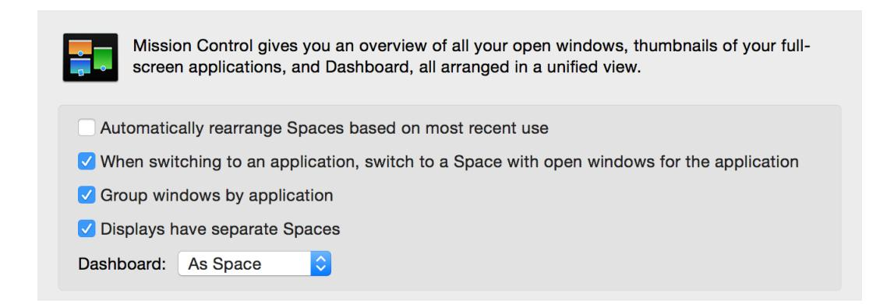

The combined title bar and toolbar area removes clutter from the window UI without decreasing functionality.

Yosemite refreshes and refines the OS X UI, without losing the consistency that helps people feel at home in the environment.

Icon styles are freshly balanced to communicate a sense of harmony and stability.

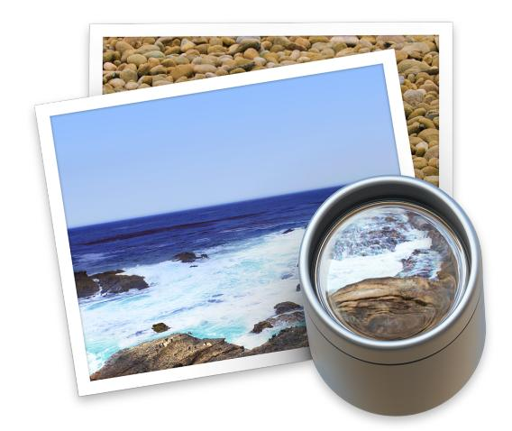

The realistic icon style—used by Preview, Mail, Photo Booth, and Dictionary, among others—employs a consistent level of detail, perspective, light source, and rendering style.

In icons that use the round graphical style—such as those in iTunes, iBooks, App Store, and Safari—the symbols use the same embossed effect, and the overall shape and use of color are consistent.

Using an optimized version of Helvetica Neue asthe system font meansthat both apps and the system present all text consistently. The use of Helvetica Neue also gives users a consistent experience when they switch between iOS and OS X.

#### Reminders in OS X Reminders in iOS

Yosemite refines the impression of plausible, physical dimensionality in the UI. In particular, Yosemite uses translucency and vibrancy to help usersfocus on what'simportant to them. (Vibrancy is a sophisticated blending mode that lets UI elements absorb color from content that's underneath them.)

Drop shadows, translucency, and vibrant colors help the active window stand out so that users instantly notice it.

A translucent toolbar helps the window UI recede, letting the user's content appear more prominent.

Sidebars and overlays can use vibrancy to defer to the user's content in two different ways.

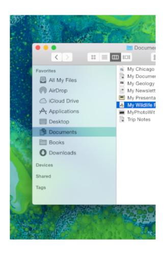

A sidebar that enables app-level navigation, such as the Finder sidebar, lets users see the content behind the window.

An overlay that provides selection and other controls that are focused on window content,such asthe Maps Directions view, gives users a more expansive view of the window's content.

Notification Center helps people stay anchored to their previous context by using a vibrant, dark appearance that automatically complements the desktop beneath it.

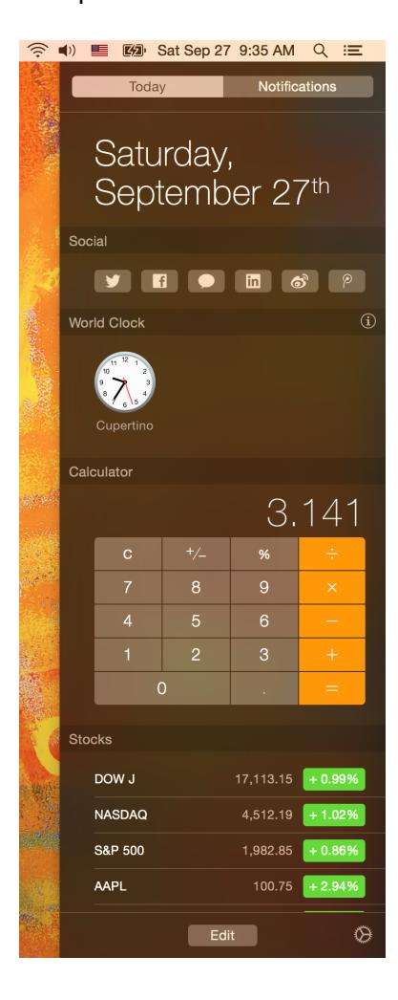

## App Styles and Anatomy

Broadly speaking, there are three main styles of OS X apps:

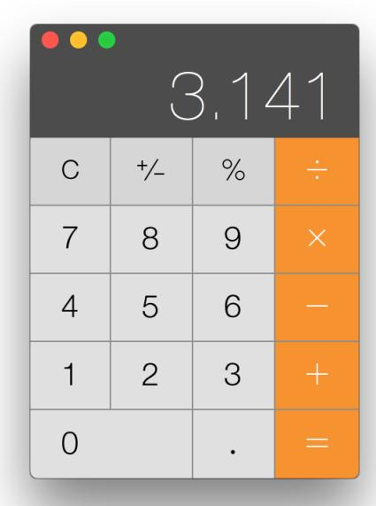

**Single-window utility.** A single-window utility app, such as Calculator or Dictionary, helps users perform the primary task within one window. Although a single-window utility app might also open an additional window—such as a preferences window—the user remains focused on the main window.

# **Single-window**

**"shoebox."** A single-window shoebox app tends to give users an app-specific way to view and manage their content. For example, Photos users don't find or organize their photos in the Finder; instead, they manage their photo collections entirely within the app.

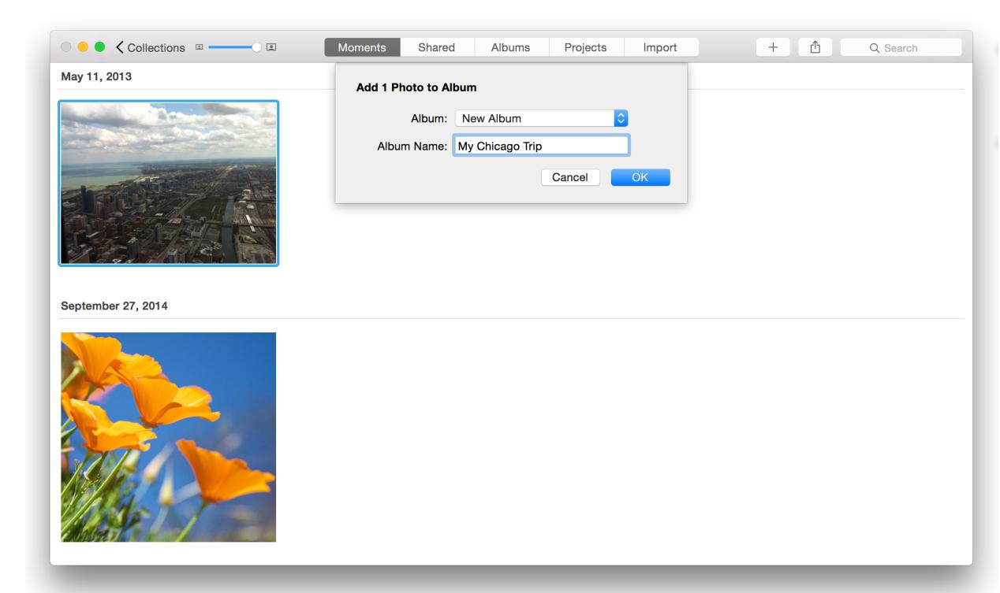

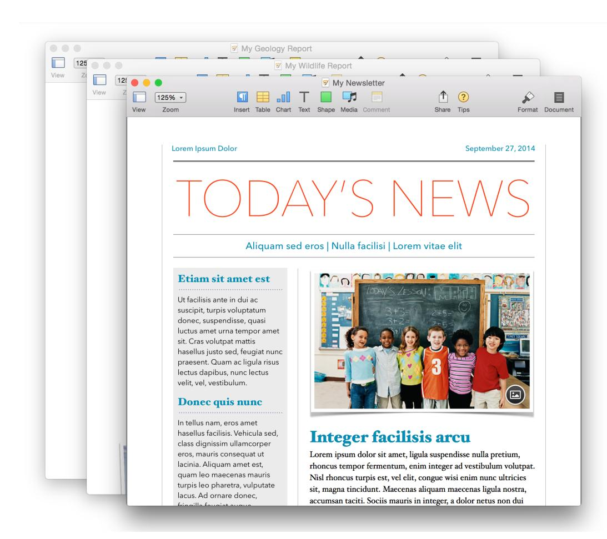

#### **Multiwindow document-based.**

A multiwindow document-based app, such as Pages, opens a new window for each document the user creates or views. This style of app does not need a main window (although it might open a preferences or other auxiliary window).

Regardless of style, an OS X app presents content in one or more windows and app-specific commands in the systemwide menu bar.

The AppKit framework defines the windows, menus, controls, and other objects that you use to present your app's UI, and it supports many app-level features, such as gesture recognition, font management, image handling, accessibility, and speech synthesis and recognition. AppKit also defines the light and dark vibrant appearances in Yosemite, in addition to a visual effect view you can use to create custom vibrant views (to learn more about this view, see NSVisualEffectView).

Setting aside programmatic inheritance, you can think of the UI objects that AppKit provides as belonging in the following broad conceptual categories:

- **Windows.** A window provides the frame in which the app's content is displayed.
- **Menus.** A menu, such as File, Edit, or Window, contains commands that people use to control the app.
- **Content views.** A content view, such as a table view, text view, or popover, displays the user's content and can contain controls that people use to manage the content.

● **Controls.** People use controls, such as a buttons, sliders, and checkboxes, to provide input and perform tasks in the app.

To manage many of these UI objects programmatically, you use various types of controllers, such as a window controller, a tab view controller, or a split view controller. Typically, a window controller contains one or more view controllers, each of which manages a set of views and controls.

A storyboard is a great way to visualize the basic anatomy of an app. In a storyboard, a **scene** represents a controller and the views it manages, and a **segue** represents a relationship between two scenes. Two scenes can be related by containment (a window controller can contain a tab view controller) or by presentation (a view controller can present a popover).

**Note:** If you've used storyboards to create an iOS app, you might notice that OS X apps tend to have fewer presentation segues, and many more containmentsegues, than iOS apps do. The difference in segue usage reflects the fact that OS X apps have much more screen space available to them, which means they have less need to present one view controller on top of another.

Viewing an app in a storyboard makes it easy to grasp its anatomy. Here, in the storyboard for an app similar to Pages, you can see the views contained in various view controllers and the relationships between the view controllers.

## Starting and Stopping

### Start Instantly

Users expect to benefit from your app assoon asthey install it. Meet this expectation by helping users accomplish things right away.

**Avoid requiring users to supply a lot of setup information before they can do anything else.** Instead, let users get started right away and defer asking for setup or configuration information until it's actually needed. As much as possible, query sources such as system preferences and Contacts so that you can avoid asking users for information they may have already supplied elsewhere. When you must ask users for information, try to give them something in return for each piece of information they provide.

**Think twice before providing an onboarding experience.** (**Onboarding** introduces an app's features and explains how to perform common tasks.) Before you consider onboarding, make every effort to design your app so that all its features and tasks are intuitive and easily discoverable. *Onboarding is not a substitute for good app design* . If you still feel that onboarding is necessary, follow these guidelinesto create a brief, targeted experience that doesn't get in the user's way.

- **Give users only the information they need to get started.** A good onboarding experience shows users what to do first or briefly demonstrates a few of the features that most users are interested in. If you give too much information to users before they have a chance to explore your app, you make usersresponsible for remembering details they don't need right away and you may send the message that your app is hard to use. If additional help is needed for specific tasks, provide that help only when the user is performing those tasks.
- **Use animation and interactivity to engage users and help them learn by doing.** Add text sparingly and only if it enriches the experience; don't expect users to read long passages. For example, don't describe how to perform a simple task when you can use animation to show users what to do. To lead usersthrough a more complex task, you might add transient overlay views that briefly describe each step as the user is about to do it. As much as possible, avoid displaying screenshots of your app because they're not interactive and users can confuse them with app UI.
- **Make it easy to dismiss or skip the onboarding experience.** After users view the onboarding experience, they probably don't want to view it again; other users may not want to view it at all. Be sure to remember the choice users make and don't force them to make it every time they open your app.

**Establish intelligent default settings.** Determine how most users are likely to use your app and set the default configuration accordingly. When you gauge the needs of your user audience accurately, it's rarely necessary for users to adjust the default settings in your app's preferences.

**Make sure the functionality in your app is easily discoverable.** When the usage of your app is obvious, users feel empowered and they can be successful right away. Although you should make help content available in case users need it, you don't want users to feel that they must read a manual before they can begin using your app. (For guidelines on how to provide good help content, see User [Assistance](#page-270-0) (page 271).)

**Don't ask users to restart.** After installation, your app should be ready for immediate use. If your app relies on a restart to work correctly, rethink its design.

### Always Be Prepared to Stop and to Restart

Most users don't distinguish between closing an app's main window and quitting the app. Unless there are good reasons for drawing attention to the difference, it's best to respond to both events in the same way. Follow these guidelines to give users a good experience as they leave and return to your app.

**Decide whether users need to explicitly quit your app.** If your app displays only a single window, it's often appropriate to quit automatically when users close the window.

**Reopen in the same state in which users left your app.** Preserving user-modifiable settings, such as window dimension and location, enhances users's perception of the stability of your app. OS X makesstate-preservation easy to achieve when you enable Resume. To learn how to support Resume in your code, see User Interface Preservation in *Mac App Programming Guide* .

**Support Auto Save and Versions, if appropriate.** Users expect their content to be saved continuously and mostly without their intervention. If users can create documents in your app, be sure to opt in to Auto Save so that they can rely on these behaviors in your app. (To learn more about how these technologies should work in your app, see Auto Save and [Versions](#page-251-0) (page 252).)

## Modality

Modality is a mode in which something exists or is experienced. In apps, modes can give users waysto complete a task or get information without distractions, but they may do so by temporarily preventing users from interacting with the rest of the app. Your job is to balance the advantages and disadvantages of modality so that users can focus on things that are important to them without feeling constrained.

For example, when users are in the sketch mode in Preview, they can't select portions of the document or add text, contrary to what they can do in other modes.

**As much as possible, use a mode only when the situation calls for it.** For example, when:

- It's critical to get the user's attention
- Users initiate a task that must be completed before they do anything else in the app
- The current task is modal in some way—for example, using a drawing tool in a graphics app or a font style in a document-editing app

**Think carefully about an app design that requires users to enter modes frequently.** In general, you don't want usersto experience your app as a series of disjointed tasks. You also want to avoid chopping up the user's workflow by requiring too-frequent transitions into and out of modes. As much as possible, reserve modes for small, self-contained tasks that users are likely to want to finish all at once.

**Balance modelessness with the need for a distraction-free experience.** Sometimes, users appreciate an isolated, self-contained environment in which to accomplish a task. Your challenge is to provide a mode that's both discrete and full-featured. Users don't appreciate finding that they need to exit a mode to get information or perform a subtask that'srequired to accomplish the modal task. As much as possible, let users perform tasks in a way that integrates with the rest of your app's functionality, and use a mode only when it provides value.

**Scope the modality appropriately.** In general, choose the least restrictive mode that makessense. For example, if users should finish a task in a document window before doing anything else in that window, use a document-modal dialog (also called a sheet). A sheet prevents users from interacting with the window it's attached to, but it doesn't prevent users from interacting with other parts of the app. To learn more about using sheets, see [Dialogs](#page-150-0) (page 151).

**Clearly indicate the current mode.** If users can enter different modes in your app, make it easy for them to tell at a glance which mode they're in. For example, a graphics app might use different pointerstylesto indicate whether the user is currently in drawing, erasing, orselection mode. A segmented control can also show which mode the user is in; for example, the View segmented control in the Finder toolbar indicates whether users are in icon, list, column, or Cover Flow view. And a popover offers a very strong visual indication of a self-contained task. To learn more about using a popover in your app, see [Popover](#page-216-1) (page 217).

**Make modes easy to leave.** You don't want users to feel that they're trapped in a mode or that it takes effort to leave it. For example, you can enable a transient mode by using a popover, which can close automatically when users click outside of it. Be sure to save the work done in a modal environment, in case users leave the mode without meaning to.

**Use an alert only when necessary.** In particular, avoid using an alert to deliver information that the user can't act upon. An alert should clearly describe the problem, why it happened, and the options for proceeding. Describe a workaround if one is available and do whatever you can to prevent the user from losing any data. For detailed guidelines on creating good alert messages, see [Alerts](#page-171-0) (page 172).

## Interoperability

An interoperable app communicatesseamlessly with other apps and features. Users appreciate interoperability because it means that they can focus on their content, without having to pay attention to app-management details.

**Be prepared for app extensions.** Users expect to be able to use app extensions to perform targeted tasks while they're pursuing a larger goal within your app. For example, users can view an image in TextEdit and edit the image by opening it in the system-provided Markup app extension. To learn more about app extensions, see App [Extensions](#page-284-0) and Services (page 285).

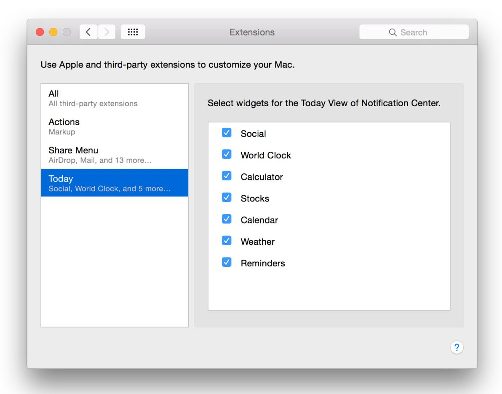

**Incorporate Handoff, if appropriate.** Handoff lets users begin an activity on one device, then switch to another device and resume the same activity on the other device. Because Handoff is based on the concept of user activities, you identify the activities in your app that users might want to continue on another device. To learn more about Handoff, see *Handoff Programming Guide* .

**As much as possible, avoid using custom file formats.** Instead, use standard file formats so that users can easily exchange documents with other users or open them in different apps. If you must use a custom file format, be sure to provide import and export capabilities so that users can exchange data with other apps and the system. If necessary, also include a Quick Look generator to convert your native document format into a format the Finder and Spotlight can display. For more information about integrating well with the Finder and with Spotlight, see The [Finder](#page-253-0) (page 254) and [Spotlight](#page-280-0) (page 281).

**Avoid calling attention to file formats.** It's best when users don't have to think about file formats (note that users can turn off the display of filename extensions in Finder preferences). In general, users expect to be able to open other documents in your app and to share with others the documents they create in your app. Be sure to include a filename extension appropriate to the contents of the document. At the same time, respect the user's filename extension preferences when displaying the names of files and documents within your app.

**Use the same file format on all platforms you support.** Using the same format on all platforms ensures that users can use your app to view their content regardless of the device or platform they're using.

**Support filename extensions.** A filename extension identifies the document's type in a way that all platforms understand. Although OS X users can hide the display of filename extensions, you support them so that apps on other platforms can recognize and open the files that your app creates.

**Use the user defaults system to store preferences.** When you use the user defaults system to manage your app's configuration information, the data is generally stored in property list files. In your app, you use the shared NSUserDefaults object to access and modify this information. To learn more about this object, see *NSUserDefaults Class Reference* .

**Use standard protocols for data interchange.** XML is the preferred format for exchanging data among apps and platforms because it is cross-platform and widely supported.

**Use Bonjour to automatically discover devices and network services on IP networks.** Don't make the user type in an IP address or configure a DNS server.

## Feedback and Assistance

### Keep Users Informed of Progress

Users want an app that acts upon their commands and tells them how long the process will take. If your app doesn't do a good job of giving feedback to users, they may think that your app is unresponsive or difficult to use.

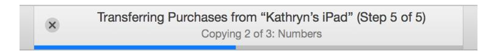

**Instantly acknowledge the user's commands and input.** Users expect to receive some type of feedback every time they interact with your app. In OS X, buttons respond visually when users click them, and the pointer changes appropriately as users move it over different controls and areas. Similarly, if a command can't be carried out, users want to know why it can't and what they can do instead. The quicker you provide feedback for the user'sinteractions, the more responsive your app appears. To learn more about the principle of feedback, see Feedback and [Communication](#page-63-0) (page 64).

**Note:** Animation can be a great way to show users what they can do and how their actions can affect onscreen items. To learn more about using animation, see [Animation](#page-35-0) (page 36).

**Don't wait until a long task completes before you display any results to users.** If you display nothing until you have all the results, users might interpret this as sluggishness. Instead, display partial results as soon as possible after users initiate a long task so that they have something useful to view while the rest of the task completes.

**Use an indicator to help users gauge how long a process will take to complete.** Users don't always need to know precisely how long a task will take, but it's important to give them an estimate. For example, the Finder combines a progress indicator with optional explanatory text to show users about how long a copy operation will take.

**Warn users when they initiate a task that can cause an unexpected and irreversible loss of data.** Such warnings are important, but they can become annoying—and users tend to ignore them—if they appear too often. Make sure you don't warn users when data loss is an expected outcome of an action. For example, the Finder doesn't display an alert when the user throws away a file because the user intends to delete the file. For more guidelines on how to use alerts in your app, see [Alerts](#page-171-0) (page 172).

**Note:** If your app consists of a foreground processthat displays UI and a faceless background process that performs some or all of the app's main tasks, be sure to conduct all communication with the user through the UI of the foreground process. In particular, a background process should never display a dialog or window that asks the user to change settings or supply information, because the user may not know (or remember) that the background process is running and receiving communication from it would be confusing. If a background process must communicate with the user, it should start or bring forward the foreground app.

### Occasionally, Users Need Help

Ideally, users can easily figure out how to use your app without reading a user guide, but sometimes they need a little help understanding how to use an advanced or secondary feature. Follow the guidelines in this section to provide app help that doesn't get in the user's way. For detailed guidance on how to compose help content, see User [Assistance](#page-270-0) (page 271); for guidance on creating an onboarding experience, see Start [Instantly](#page-21-1) (page 22).

**In general, provide help tags that describe how to use UI elements.** Help tags can appear when the user allows the pointer to rest over a UI element for a few seconds. A help tag consists of a small view that displays a succinct description of what the UI element does (shown here in Dictionary). Although it's best when the usage of your app's UI is instantly apparent to users, help tags can be a good way to help novice users without annoying experienced users. Because a help tag's message is short and directly linked to a specific UI element, a help tag is not the appropriate place to describe a higher-level task.

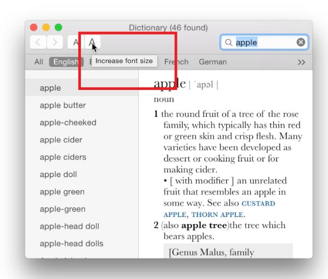

**Provide a help book that describes how to accomplish tasks in your app.** Users open an app's help book when they can't figure out how to accomplish their goal. Although users might also refer to a help book to find out how to use a specific control, they're more likely to be seeking help with a higher-level task. For this reason, your help book should be task-based, and for the most part, it should describe control usage in the context of accomplishing a task.

**In most cases, avoid constraining user actions.** Unless you're creating a children's app in which it can be appropriate to restrict the user's scope of action, you don't want users to feel that your app is paternalistic. As much as possible, let users do what they want without unnecessary interference.

## Interaction and Input

### Support the Keyboard

All users need to use the keyboard sometimes, and some users prefer using the keyboard to using a mouse or trackpad. VoiceOver users often use only the keyboard.

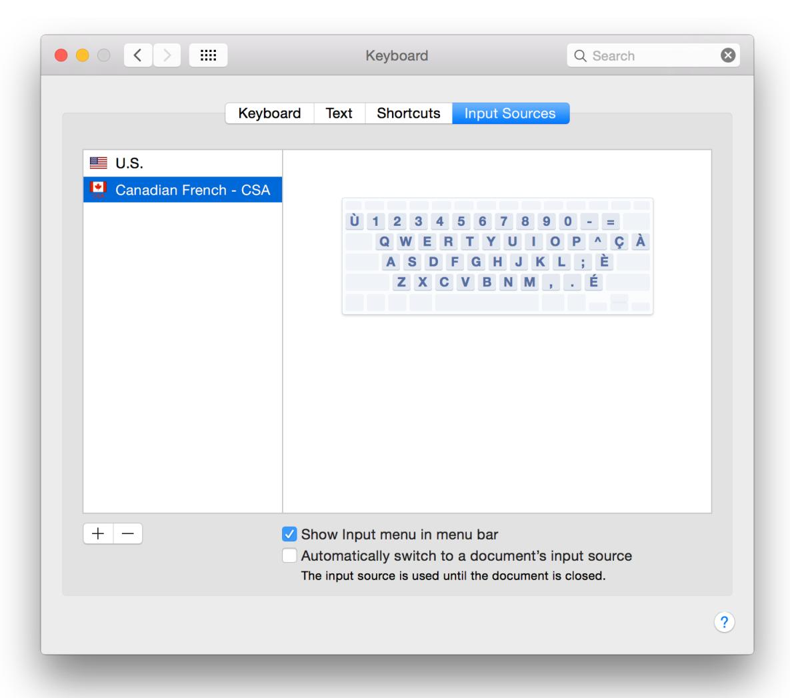

**Note:** OS X also provides full keyboard access mode, in which users can navigate through windows and dialogs. When this mode is active, other keyboard combinations may be reserved by default. (Users turn on full keyboard access in Keyboard preferences.)

**Provide keyboard-only alternatives.** Many people prefer using a keyboard to using a mouse or a trackpad. Others, such as VoiceOver users, need to use the keyboard. There are two main ways to support keyboard users:

- Respect the standard keyboard shortcuts and create app-specific shortcutsfor frequently used commands.
- Add support for full keyboard access mode to all your custom UI elements. Full keyboard access mode allows usersto navigate and activate windows, menus, UI elements, and system features using the keyboard alone.

**Avoid overriding the standard keyboard shortcuts users are familiar with.** Users expect these shortcuts to mean the same thing in each app they use. The standard shortcuts are also listed in [Table](#page-299-0) 68-3 (page 300). Standard shortcuts are *not* marked with the Apple symbol shown here.

In rare cases, it is acceptable to redefine a common keyboard shortcut. For example, if users spend most of their time in your app, it can make sense to redefine shortcuts that don't apply to the tasks your app enables. Or, if most of your users have used your app on a different platform, you might not want to change the keyboard shortcuts they already know.

**Don't feel that you must create a shortcut for every command in your app.** If you try to do this, you'll probably end up with some shortcutsthat are unintuitive, hard to remember, and physically difficult to perform. Instead, identify the most frequently used commandsin your app and create logicalshortcutsfor them. Examine [Table](#page-299-0) 68-3 (page 300) for characters and combinations that are not reserved by OS X or commonly used.

### Gestures Can Enhance the User Experience

A trackpad gives people another way to move the pointer and activate UI elements. In addition, OS X supports Multi-Touch gestures, which lets people use a trackpad to perform actions such as revealing Mission Control, switching to a different full-screen window or desktop, and returning to the previous page in an app. Users expect to be able to use these familiar gestures throughout the system and in the apps they download.

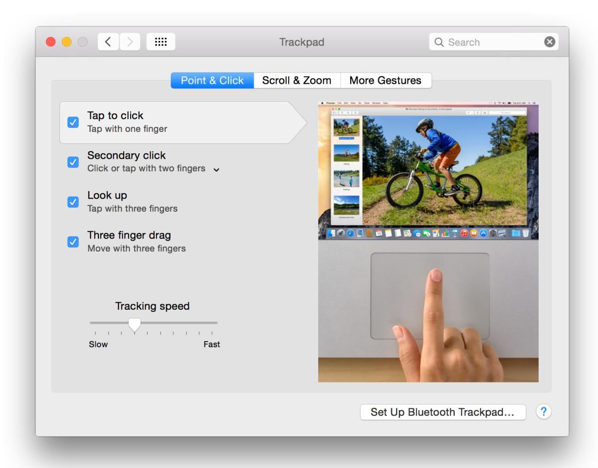

**Pay attention to the meaning of a gesture, not to the physical movements users make.** In other words, instead of preparing to respond to a three-finger swipe, be prepared to respond to a "go to the previous page" gesture. Users can also change the physical movements that perform the system-supported actions, so your app should listen to the gesture that OS X reports.

**As much as possible, respond to gestures in a way that's consistent with other apps on the platform.** For the most part, users expect gesturesto work the same regardless of the app they're currently using. For example, users should be able to use the "go back" gesture whether the app displays content in document pages, webpages, or images.

**Avoid redefining the systemwide, inter-app gestures.** Even when users are playing a game that might use app-specific gestures in a custom way, they expect to be able to use systemwide gestures to perform actions, such as revealing Mission Control or switching to another desktop or full-screen window. (Note that users can change the precise gestures that perform these actions in Trackpad system preferences.)

**Handle gestures as responsively as possible.** Gesturesshould heighten the user'ssense of direct manipulation and provide immediate, live feedback. To achieve this, aim to perform relatively inexpensive operations for the duration of the gesture.

**Ensure that gestures apply to UI elements of the appropriate granularity.** In general, gestures are most effective when they target a specific object or view in a window, because such views are usually the focus of the user's attention. Start by identifying the most specific object or view the user is likely to manipulate and make it the target of a gesture. Make a higher level or containing object a gesture target only if it makes sense in your app.

**Note:** OS X supports a smart zoom gesture (that is, a two-finger double-tap on a trackpad). By providing a semantic layout of your content, NSScrollView can intelligently magnify the content that the user is most likely interested in. For more information, see *NSScrollView Class Reference* .

**Define custom gestures cautiously.** A custom gesture can be difficult for users to discover and remember. If a custom gesture seems gratuitous or awkward to perform, users are likely to avoid using it. If you feel you must define a custom gesture, be sure to make it easy to perform and not too similar to the gestures users already know.

**Avoid relying on the availability of a specific gesture as the only way to perform an action.** You can't be sure that all your users have a trackpad or want to use it. In addition, trackpad users can disable some gestures, or change their meaning, in Trackpad preferences.

### Make Entering Text Easy

Most apps need to support text entry in some form. It's a good idea to make the process as easy and convenient as possible.

**When possible and appropriate, automatically fill in text fields as users type.** Users appreciate the convenience of having some information supplied for them, as long as it's correct. If you can't guarantee the accuracy of the information you provide, it's better to leave text fields empty. If you supply text, be sure to indicate the fields you are filling in (perhaps by highlighting them), so that the user can easily distinguish the information your app provides from the information they provide. *Note that a password field should always be empty.*

**Perform appropriate edit checks as users enter information.** For example, if the only legitimate value for a field is a string of digits, the app should alert users as soon as they type a nondigit character. Verifying user input as your app receives it helps avoid errors caused by unexpected data. For a more complete discussion of when to check for errors and apply changes in text fields, see [Accepting](#page-153-0) and Applying User Input in a [Dialog](#page-153-0) (page 154).

**Defer displaying a "required" icon next to a required field until users leave the context without handling it.** Preemptively displaying an asterisk or a custom icon next to each required text field and selection control can make your UI appear cluttered and unappealing. Instead, assume that users will fill in all the required fields; if they forget one, display an asterisk or custom icon next to the forgotten field when they attempt to exit the current context. This strategy helps you maintain an attractive UI, while at the same time helping you avoid treating users as if they were children.

**Preserve users' privacy as they enter a password.** In this situation, each character the user types should appear as a bullet. If the user deletes a character with the Delete key, one bullet is deleted from the text field and the insertion point moves back one bullet, as if the bullet represented an actual character. Double-clicking bullets in a password field selects all the bullets, but does not allow them to be copied. When the user leaves the text field (by pressing Tab, for example), the number of bullets in the text field should be modified so that the field doesn't reflect the actual number of characters in the password.

## Animation

OS X usessubtle, meaningful animation to give people feedback and help them understand the results of their actions. When you use system-provided UI elements, you automatically benefit from the animations that OS X builds in. If you want to create custom animations, approach the designs with the goal of enhancing clarity and communication in your app.

For example, when users duplicate a TextEdit document, the copy springs from the original and becomes the active, key window.

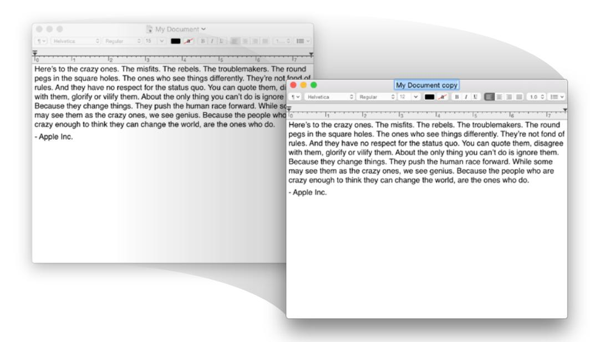

**Avoid gratuitous animation.** Animation that serves no purpose or is illogical quickly becomes tiresome and irritating to users. Be sure that the animation you add enhances the user's understanding of your app's functionality.

**In general, avoid using animation as the focus of the user experience.** Unless you're developing a game in which animation plays a major role, use animation to enhance the user experience subtly. If you place too much focus on animation in your app, users are likely to become distracted from their task. The best animation helps users understand what's going on, without drawing attention to itself.

**Use animation to clarify the consequences of user actions.** Showing users the results of an action before they commit to it helps them build confidence and avoid mistakes. For example, items in the Dock move aside when users drag an object into the Dock area, showing where the new object will reside when they drop it.

**Animate a window's transition to and from full screen, if appropriate.** It can be a good idea to supply a smooth, high-quality animation to replace the default transition. Creating a custom animation works especially well when your window contains custom elementsthat might not be able to participate in the default transition. For example, if you display a secondary bar below the toolbar (such as a "favorites" bar), make sure that this bar transitions along with the toolbar when the window goes full screen.

**Aim for realistic motion.** Sometimes, realistic movement can help people understand how something works even more than realistic imagery can. For example, OS X usesthe rubber band effect to show usersthat they've scrolled to the end of a window's content or come to the last full-screen window or desktop. Take the time to investigate the physics that dictates how the objects in your UI might move so that you can enhance the user's understanding.

**Use animation when an object changes its properties.** Showing an object's transition from one state to another, instead of showing only the beginning and ending states, helps users understand what's happening and gives them a greater sense of control over the process.

**Use animation when an action occurs so quickly that users can't track it.** When it's important that users understand a connection or a process, animation can help them watch actions occur in a more human time frame. For example, when the user minimizes a window, it doesn't just disappear from the desktop and reappear in the Dock; instead, it moves fluidly from the desktop to the Dock so that users know exactly where it went.

**Avoid animating routine actions supported by system-provided controls.** Users understand how common UI elements work, and they don't appreciate being forced to spend extra time watching unnecessary animation every time they click a button or switch tabs.

**Avoid animating everything.** Although it's tempting to think that more animation results in great clarification and better feedback, it's not generally true. Most tasks and actions in an app are best performed quickly and with a minimum of fanfare.

## Branding

A well-designed app incorporates branding in subtle, memorable ways that don't overwhelm or annoy users.

**Make sure branding is subordinate to the user's content and the main task.** People don't use an app to learn more about a related product or company,so keep branding elements unobtrusive. For example, consider using the relevant colors from the company logo throughout the UI, or using recognizable brand elements as the basis for custom toolbar icons.

**As much as possible, make your app into a brand.** Strive to create an app brand, rather than just displaying company branding in an app. One way to do thisisto develop a subtle design language that you use consistently throughout your app. Allow this language to guide your use of color, shape, terminology, movement, and behavior so that users perceive your app as a coherent statement. For example, the consistent visual language and user experience in Pages, Keynote, and Numbers create a recognizable app brand.

**Create a memorable app icon.** Your app icon is the place where branding elements can take center stage. If your app is associated with a well-known brand, or if your app represents a brand, incorporate its visual elements in your app icon. For additional guidelines on icon creation, see [Designing](#page-314-0) Icons (page 315).

## Color and Typography

### Use System Colors to Integrate with System Appearances

The system colors are designed to look good in the system-defined appearances. For example, in a menu or a popover, the system colors automatically adapt to the view's vibrant light appearance, blending in the colors from the window content behind the view. Similarly, many system colors, such as textColor and controlTextColor, automatically look great in the vibrant dark appearance of Notification Center. When you use system-provided colors instead of custom colors, you don't have to worry about how the colors will look in different contexts.

The Finder sidebar is another example of a vibrant light appearance: In this case, the system blends in colors from behind the window.

**Important:** Using the system-provided colors helps you respond appropriately when users change the "Increase contrast" and "Reduce transparency" accessibility preferences. In your code, you can listen for the NSWorkspaceAccessibilityDisplayOptionsDidChangeNotification notification to find out when accessibility settings have changed.

**Meet users' expectations and prepare for vibrancy.** Vibrancy and translucency affect all apps—even ones that don't display any translucent or vibrant views—because some elements, such as menus, are vibrant by default. When you adopt vibrancy in your app, use system-provided colors and template images instead of custom colors and full-color images so that your views look great in vibrant and translucent contexts. (If you choose to display nonvibrant content, make sure you opt out of vibrancy; for example, by specifying NSAppearanceNameAqua.)

**Important:** Template images can be vibrant, but full-color images can't be. Think carefully before you decide to use full-color imagesin an area such as a toolbar orsidebar. (To learn more about creating toolbars and sidebars, see [Designing](#page-136-0) a Toolbar (page 137) and Using a [Source](#page-141-0) List (page 142).)

**Use system-provided label colors to communicate the relative importance of content.** Yosemite defines four colors that use different levels of contrast to imply different levels of importance. Although the colors listed here are known as label colors, they can also be used with nontext elements.

- labelColor
- secondaryLabelColor
- tertiaryLabelColor
- quaternaryLabelColor

In the examples here, you can see the same four label colors as they appear in light and dark vibrant contexts.

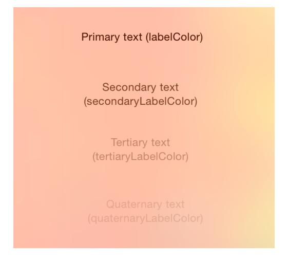

For example, Mail uses labelColor to display the sender and subject of a message, because these items represent the most important content in the message list. To display the horizontal lines between messages, which represent the least important content, Mail uses quaternaryLabelColor.

**Pay attention to the semantic meanings of system colors.** In addition to several literal colors,such as redColor and blueColor, OS X provides many colors for specific purposes, such as controlTextColor and selectedTextColor. When you use a system color according to its semantic meaning, your UI continues to look good and make sense when OS X updates its appearance.

**Pay attention to color contrast in different contexts.** For example, if there's not enough contrast between foreground and background elements, they may be hard for users to see. A quick but unscientific way to find out if your colors have sufficient contrast is to view your app in different lighting conditions, including in direct sunlight.

Although viewing your app in different lighting conditions can help you find some of the areas you need to work on, it's no substitute for a more objective approach that yields reliable results. A better method involves determining the ratio between the luminance values of the foreground and background colors. To get this ratio, use an online contrast ratio calculator or perform the calculation yourself using the formula established in the WCAG 2.0 standard. Ideally, the color contrast ratio in your app is 4.5:1 or higher.

### Text Should Always Be Legible

The system font is a specially optimized version of Helvetica Neue that gives your text unmatched legibility, clarity, and consistency. Yosemite tunes Helvetica Neue to balance aesthetics and layout compatibility so that most apps can look great without making any changes. In particular, apps that use Auto Layout to express the relationships among views in the UI can respond automatically to slight changes in font metrics.

**Important:** Always designate a system font by name, such as systemFontOfSize: or boldSystemFontOfSize:. If you instead specify "Helvetica Neue" in code or in Interface Builder, you get the nonoptimized version of the font, which is suitable only for the content of a document. Using the nonoptimized font in your UI can have unexpected results.

## Icons and Graphics

High-quality graphics not only improve the appearance of your app, they also help convey information and enhance the overall user experience. OS X users are accustomed to beautiful, meaningful graphics and they look for the same level of quality in the apps they use.

**Make sure your graphics look professionally designed.** Don't underestimate the impact that beautiful, high-quality graphics have on your users. Low-quality graphics give people a bad impression and can negatively affect their perception an app's overall quality. To help ensure that users are delighted with your app, make graphics a priority in your design and development process.

**Make sure your graphics look great in full screen.** If you allow users to take a window full screen, make sure you don't just scale up your graphics to fit. As a general rule, start with artwork that is larger than you need and then scale it down.

**Make a great first impression with a beautiful app icon.** Your app icon is the first experience users have with your app, and it can have a marked effect on their expectations. Think of your app icon as your calling card, and spend the resources necessary to ensure that it makes the right impression on users. Decide whether your app is best represented by a realistic or graphic style icon. For example, the Garage Band app icon is a beautiful rendering of a guitar.

**Aim for realism if you create the appearance of real-world materials.** In some cases, real-world textures, such as wood, leather, metal, or paper, can enhance the experience of an app and convey meaning to users. If this makes sense in your app, make sure that the texture you create:

- Is authentic and expressive, and looks great at all resolutions
- Coordinates with the overall appearance of your app and does not look like it was added as an afterthought
- Enhances the user's experience and understanding

**Determine whether depicting a real-world task helps users understand its virtual version.** Make sure that adding realism enhances both understanding and usability: Improving one at the expense of the other does not make your app better. For example, even though writing and posting letters is a real-world activity that most people understand, Mail does not expect usersto fold a virtual note or affix a stamp to a virtual envelope.

**Feel free to modify a real-world depiction if doing so enhances the user's understanding.** In other words, don't feel that you must be scrupulously accurate in your rendering of realistic objects or experiences. Often, you can express your point better when you fine-tune or leave out some of the details of a real-world object or behavior.

**Don't sacrifice clarity for artistic expression.** For example, it might make sense to show notes or photos pinned to a cork board, but it might be confusing to use a cork board background in an app that helps people create a floor plan for their home. If users need to stop and think about what your images are trying to communicate, you've decreased the usability of your app. (This concept is related to the principle of aesthetic integrity; see [Aesthetic](#page-65-0) Integrity (page 66).)

## Terminology and Wording

Text is prevalent throughout the OS X interface forsuch things as button names, menu labels, dialog messages, and help tags. Using text consistently and clearly is a critical component of UI design.

In the same way that it's best to work with a professional graphical designer on the icons and images in your app, it's best to work with a professional writer on your app's user-visible text. A skilled writer can help you develop a style of expression that reflects your app's design, and can apply that style consistently throughout your app.

For guidance on Apple-specific terminology, the writer should refer to the *Apple Style Guide* . That document covers style and usage issues, and is the key reference for how Apple uses language.

For issues that aren't covered in the *Apple Style Guide* , Apple recommends three other works: *The American Heritage Dictionary* , *The Chicago Manual of Style* , and *Words Into Type* . When these books give conflicting rules, *TheChicagoManualof Style* takesprecedence forquestionsofusage and*TheAmericanHeritageDictionary* for questions of spelling.

### Use User-Oriented Terminology

Almost all apps need to use some words to communicate with users, even if the only words are in button labels. It'simportant to choose all of your app's words carefully so that you can ensure that your communication with users is unambiguous and accurate.

**In general, avoid jargon.** Above all, you want to use the terminology your users are comfortable with. If your app targets sophisticated users who frequently use a set of specialized, technical terms, it may make sense to use these terms in your app. But if your user audience consists of mostly novice or casual users, it's usually better to use simple, widely understood terms. For example, the Parental Controls preferences pane uses simple, straightforward language to describe the feature and explain what the user can do.

**Avoid developer terms.** As a developer, you refer to UI elements and app processes in ways that most of your users don't understand. Be sure to scrutinize the UI and replace any developer terms with appropriate user terms. For example, Table 12-1 lists several common developer terms, along with equivalent user terms you should use if you need to refer to these items in the UI.

**Table 12-1** Some developer terms and their user term equivalents

| Developer term    | Equivalent user term                                                   |
|-------------------|------------------------------------------------------------------------|
| Cursor            | Pointer                                                                |
| Data browser   | Scrolling list or multicolumn list                         |
| Dirty document | Document with unsaved changes; unsaved document         |
| Error message  | Alert message; message                                           |
| Focus ring     | Highlighted area; area ready to accept user input |
| Control           | Button, checkbox, slider, menu, and so forth.        |

| Developer term    | Equivalent user term                                      |
|-------------------|-----------------------------------------------------------|
| Launch            | Start                                                     |
| Mouse-up event | Click                                                     |
| Override          | Take the place of; take precedence over |
| Reboot            | Restart                                                   |
| Sheet             | Dialog                                                    |
| String            | Text                                                      |
| String length  | Number of characters                                |

**Use proper Apple terminology.** If you need to refer to standard parts of the UI or to system features, use the terms that Apple defines. For example, to describe the use of a checkbox in your UI, tell the user to "select" the checkbox, not to "check," "click," or "turn on" the checkbox. If you mention how to start your app by clicking the app icon in the Dock, be sure to capitalize "Dock." You can learn more about Apple terminology by reading *Apple Style Guide* .

### Create Succinct Labels for UI Elements

Make labels for UI elements concise and easy to understand, but don't sacrifice clarity for space.

**When the context of a label is clear, avoid repeating the contextin the label.** For example, within the context of a document-modal dialog, it's clear that the dialog acts upon a file or document, so there's no need to add the words "File" or "Document" to the Format pop-up label. Similarly, users understand that the items in an app's Edit menu act upon the current editing context, so there is seldom a need to make this explicit in the menu item names.

**Use the correct capitalization style.** The capitalization style to use in the label for an interface element depends on the type of element. For information on the proper way to capitalize the words in labels for different types of interface elements, see [Capitalizing](#page-46-0) Labels and Text (page 47).

**Use an ellipsis in the name of a menu item or button that produces a dialog.** The ellipsis (…) indicates that the user must take further action to complete the task. The dialog title should be the same as the menu command or button label (except for the ellipsis) used to invoke it. To learn more about using an ellipsis, see Using the [Ellipsis](#page-48-1) (page 49).

### Use the Right Capitalization Style in Labels and Text

All interface element labels should use either title style capitalization or sentence style capitalization.

**Title style capitalization.** Capitalize every word except:

- Articles (*a, an, the* )
- Coordinating conjunctions (*and, or*)
- Prepositions of four or fewer letters, except when the preposition is part of a verb phrase, as in "Starting Up the Computer."

*However*, always capitalize the first and last word, even if it is an article, a conjunction, or a preposition of four or fewer letters.

**Sentence style capitalization.** Capitalize the first word, and make the rest of the words lowercase, unless they are proper nouns or proper adjectives.

| Element         | Capitalization style | Examples                                                                                                                                     |
|-----------------|-------------------------|----------------------------------------------------------------------------------------------------------------------------------------------|
| Menu titles  | Title                   | Highlight Color Number of Recent Items Location Refresh Rate                                                         |
| Menu items   | Title                   | Save a Version Add Sender to Contacts Log Out Make Alias Go To… Go to Page… Outgoing Mail |
| Push buttons | Title                   | Add to Favorites Don't Save Set Up Printers Restore Defaults Set Key Repeat                              |

| Element                                                                                                                                                                         | Capitalization style | Examples                                                                                                                                                                           |
|---------------------------------------------------------------------------------------------------------------------------------------------------------------------------------|-------------------------|------------------------------------------------------------------------------------------------------------------------------------------------------------------------------------|
| Toolbar item labels                                                                                                                                                       | Title                   | Reading List Zoom to Fit New Folder Reply All Get Mail                                                                                               |
| Labelsthat are not fullsentences(for example, group box or list headings)                                                                            | Title                   | Mouse Speed Total Connection Time Account Type                                                                                                                   |
| Options that are not strictly labels (for example, radio button or checkbox text), even if they are not full sentences | Sentence                | Enable polling for remote mail Cache DNS information every  minutes Show displays in menu bar Maximum number of downloads |
| Dialog messages                                                                                                                                                              | Sentence                | Checking for new software… Are you sure you want to quit?                                                                                            |

## Use Contractions Cautiously

When space is at a premium, such as in a pop-up menu, you can use contractions, as long as the contracted words aren't critical to the meaning of the phrase. For example, a menu could contain the following items:

Don't Allow Printing

Don't Allow Modifying

Don't Allow Copying

In these examples, the contraction doesn't alter the operative word for the item. If a contraction does alter the significant word in a phrase, such as "contains" and "does not contain," it's clearer to avoid the contraction.

As much as possible, avoid using uncommon contractions that may be difficult to interpret and localize. In particular:

● Avoid forming a contraction using a noun and a verb, such as in the sentence "Apple's going to announce a new computer today."

● Avoid using less common contractions, such as "it'll" and "should've."

### Use Abbreviations and Acronyms That Users Understand

Abbreviations and acronyms save space in the UI, but they can be confusing if users don't know what they mean. Conversely, some abbreviations and acronyms are better known than the words or phrases they stand for, and an app that uses the spelled-out version can seem out-of-date and unnecessarily wordy.

To balance these two considerations, gauge an acronym or abbreviation in terms of its appropriateness for your app's intended users. To help you decide whether to use a specific abbreviation or acronym, consider the following questions:

- Is the acronym or abbreviation one that your users understand and feel comfortable with? For example, everyone uses CD as the abbreviation for compact disc, so even apps intended for novice users can use this abbreviation.
  - On the other hand, an app intended for users who work with colorspaces and color printing can use CMYK (which stands for cyan magenta yellow key), even though this abbreviation might not be familiar to a broader range of users.
- Is the spelled-out word or phrase less recognizable than the acronym or abbreviation? For example, many users are unaware that Cc originally stood for the phrase carbon copy (that is, the practice of using carbon paper to produce multiple copies of paper documents). In addition, the meanings of Cc and carbon copy have diverged so that they are no longer synonymous. Using carbon copy in place of Cc, therefore, would be confusing to users.

For some abbreviations and acronyms, the precise spelled-out word or phrase is equivocal. For example, DVD originally stood for both digital video disc and digital versatile disc. Because of this ambiguity, it's not helpful to use either phrase; it's much clearer to use DVD.

If you use a potentially unfamiliar acronym or abbreviation in the user help book for your app, be sure to define it when you first use it. To learn more about the help technologies available to your app, see [User](#page-270-0) [Assistance](#page-270-0) (page 271).

### Use an Ellipsis When More Input Is Required

When it appears in the name of a button or a menu item, an ellipsis character (…) indicates to the user that additional information is required before the associated operation can be performed. Specifically, it prepares the user to expect the appearance of a window or dialog in which to make selections or enter information before the command executes.

Because users expect instant action from buttons and menu items, it's important to prepare them for this different behavior by appropriately displaying the ellipsis character. Use the guidelines and examples here to help you decide when to use an ellipsis in menu item and button names.

#### **Use an ellipsis in the name of a button or menu item when the associated action:**

- Requires specific input from the user.
  - For example, the Open, Find, and Print commands all use an ellipsis because the user must select or input the item to open, find, or print.
  - You can think of commands of thistype as needing the answer to a specific question (such as"Find what?") before executing.
- Is performed by the user in a separate window or dialog.
  - For example, Preferences, Customize Toolbar, and App Store all use an ellipsis because they open a window or dialog in which the user sets preferences, customizes the toolbar, or shops for new apps.
  - To see why such commands must include an ellipsis, consider that the absence of an ellipsis implies that the app performsthe action for the user. For example, if the Customize Toolbar command does not include an ellipsis, it implies that there is only one way to customize the toolbar and the user has no choice in the matter.
- *Always* displays an alert that warns the user of a potentially dangerous outcome and offers an alternative. For example, Restart, Shut Down, and Log Out all use an ellipsis because they always display an alert that asks the user for confirmation and allows the user to cancel the action. Note that Close does not have an ellipsis because it displays an alert only in certain circumstances (specifically, only when the document or file being closed has unsaved changes).
  - Before you consider providing a command that always displays an alert, determine if it's really necessary to get the user's approval every time. Displaying too many alerts asking for user confirmation can dilute the effectiveness of alerts.

#### **Don't use an ellipsis in the name of a button or menu item when the associated action:**

- Does not require specific input from the user.
  - For example, the New, Save a Version, and Duplicate commands don't use an ellipsis because either the user has already provided the necessary information or no user input is required. That is, New always opens a new document or window, Save a Version saves a snapshot of the current document, and Duplicate creates a new copy of the current document.
- Is completed by the opening of a panel.

A user opens a panel to view information about an item or to keep essential, task-oriented controls available at all times. A command to open a panel, therefore, is completed by the display of the window and should not have an ellipsis in its name. Examples of such commands are Get Info, About This App, and Show Inspector. To learn more about panels, see [Panels](#page-144-0) (page 145).

● *Occasionally* displays an alert that warns the user of a potentially dangerous outcome.

If you use an ellipsis in the name of a button or menu item that only sometimes displays an alert, you cause the user to expect something that will not always happen. This makes your app's user interface inconsistent and confusing. For example, even though Close displays an alert if the user has never named the current document, it does not display an alert at other times, and so it does not include an ellipsis.

An ellipsis character can also show that there is more text than there is room to display in a document title or list item. In general, it's best to use an ellipsis to take the place of text in the middle of a title or name, because this preserves the beginning and end of the text, which tend to be the most recognizable parts.

**Important:** Be sure to create the ellipsis character using the key combination Option-; (Option-semicolon). This ensures that an assistive app can provide the correct interpretation of the character to a disabled user. If you use three period characters to simulate an ellipsis, many assistive apps will be unable to make sense of them. Also, three period characters and an ellipsis don't look the same because the periods are spaced differently than the points of an ellipsis.

### Use a Colon to Connect a Label with Controls

Use the colon character (:) in text that introduces and provides context for controls. The text can describe what the controls do or a task the user can perform with them. The combination of introductory text, colon, and controls forms a visually distinct grouping that helps users find the controls that apply to a particular task and understand what the controls do.

A colon implies a direct connection between the descriptive text and a particular control or set of controls, so it doesn't belong in the text that appears in:

- A control label, such as a push button name or a command pop-down menu title
- Menu items (unless the colon is part of a user-created menu item) and menu titles
- Tab and segmented controls
- Table view column headings

**Note:** The colon is not used as a pathname separator in OS X. If it's necessary to display a raw pathname (which should almost never be the case), use the forward slash character (/). Always be sure to avoid displaying a pathname in a window title.

The colon is a good way to associate introductory text with related controls, but it's not the only way to do so. For example, you might use a tab view to display different groups of related controls. For guidelines on how to use this view, see Tab [View](#page-226-0) (page 227).

**Don't use a colon in the text that serves as a group box title.** (A **group box** is a control that lets you create a visually distinct area of content, such as the set of screen corner controls shown here.) In these cases, the group box itself takes the place of the colon and makes explicit the relationship of the introductory text to the controls that follow it. To learn more about the group box control, see [Group](#page-228-0) Box (page 229).

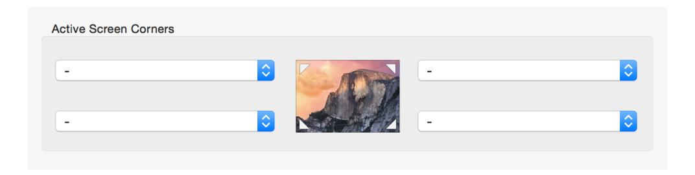

**Use a colon in introductory text that precedes a control or set of related controls that aren't in a group box.** The text can be a noun or phrase that describes either the target of the control or the task the user can perform. The following examples illustrate some variations on this arrangement of text and controls:

● Use a colon in text that precedes a control on the same line.

● Use a colon in text that precedes the first control in a vertical list of controls.

Use a colon in text that precedes the first control in a horizontal list of controls.

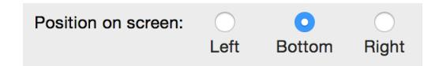

● Use a colon in introductory text that appears above a control.

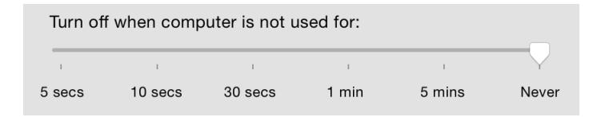

● Use a colon in checkbox or radio button text that introduces a second control. (Note that if the text describing a checkbox or radio button state doesn't introduce a second control, it should not include a colon.)

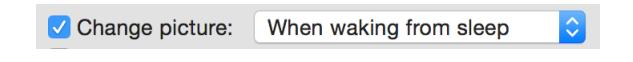

**Note:** If you use the type of layout shown above, be sure to disable the second control when the preceding checkbox or radio button is unselected.

**A colon is optional before a control that is part of a sentence or phrase.** This guideline is flexible because it depends on how much of the text follows the control and how the sentence or phrase can be interpreted. Consider the specific combination of text and controls and the overall layout of your window as you decide whether to use the colon in the following situations.

If none of the text follows the control, then the control's value supplies the end of the sentence or phrase. A colon is recommended in this case, because this is another variation of the guideline to include a colon in text that precedes a control. For example, the term "Genie effect" completes the sentence that begins "Minimize windows using:"

If a substantial portion of the sentence or phrase follows the control, a colon is optional.

Similarly, the colon is optional when some text followsthe control, but that text does not represent a substantial portion of the sentence or phrase. To help you decide whether a colon is appropriate in these cases, determine if the presence of a colon breaks the sentence or phrase (including the value of the control) in an awkward or unnatural way.

### Remove Extraneous Space Between Sentences

If any part of your app's UI displays two or more sentences in a paragraph, be sure to insert only a single space between the ending punctuation of one sentence and the first word of the next sentence.

Although much of the text in an app's UI is in the form of labels and short phrases, app help, alerts, and dialogs often contain longer blocks of text. Examine these blocks of text to make sure that extra spaces don't appear between sentences.

## Integrating with OS X

### Use Standard UI Elements Correctly

OS X provides a wide range of built-in UI elements, such as controls, menus, and dialogs. When you use the system-provided elements correctly, you benefit in several important ways:

- Users are familiar with the built-in elements, so they already know how to use them in your app.
- The system-provided elements help ensure consistency within your app and with the rest of the system.
- System-provided UI elements look and behave appropriately in various translucent contexts (such as light or dark vibrancy).
- When there are changes to the system-provided controls, your app automatically acquires the updated appearance and behavior.

To realize these benefits, it's crucial that you use the built-in elements correctly. Follow these guidelines as you use OS X UI elements in your app.

**Don't assign new behaviors to built-in UI elements.** It's essential to use the system-provided elements according to the guidelines in this document. If you misuse OS X elements, you make your UI unpredictable and hard for users to figure out.

**In general, don't create a custom UI element that looks or behaves like an OS X UI element.** If your custom element looks too much like an OS X element, users might not notice the difference, and they will be confused when it does not behave as they expect. Similarly, if your custom element behaves the same way an OS X element behaves, users will wonder what, if anything, is different about the custom element.

**If you really need a new behavior, design a new element for it.** Don't redefine the behavior of an existing UI element. A custom UI element should provide users with a unique benefit that is difficult to achieve in any other way. If a new UI element doesn't help users, they're likely to feel that they wasted the time they spent learning about it.

**Avoid replicating a UI element from another platform.** Users aren't necessarily familiar with other platforms, so you can't assume that they recognize non OS X UI elements. It's better to design a new UI element that coordinates with the design of your app and that supplies the precise behavior you need.

**Important:** A custom UI element does not receive automatic updates if the OS X UI changes in the future. When you create a custom UI element, you also accept the responsibility for revising it appropriately when OS X changes.

Don't worry that using standard controls and views will cause your app to get lost in the crowd and be indistinguishable from other OS X apps. In reality, using standard UI elements lets you differentiate your app in ways that really matter to users, while giving them a stable foundation of consistency and familiarity.

### Reach as Many Users as Possible

Early in the design process, start thinking about accessibility and worldwide compatibility so that the market for your app is as large as possible. It's much easier to build in support for accessibility and internationalization from the beginning than it is to add support to a finished app.

OS X includes many assistive features, including VoiceOver, zoom, and full keyboard access mode. When your app is accessible, users can interact with it using the assistive device or feature of their choice. For example, in addition to speaking the UI to VoiceOver users, VoiceOver can also show the current focus and output to the user's sighted colleagues. To learn more about supporting accessibility in your app, see [VoiceOver](#page-265-0) and [Accessibility](#page-265-0) (page 266).

**Note:** Using the system-provided colors lets you respond appropriately when users change the "Increase contrast" and "Reduce transparency" accessibility preferences. (In your code, you can listen for the NSWorkspaceAccessibilityDisplayOptionsDidChangeNotification notification to find out when accessibility settings have changed.)

**Prepare your app forlocalization by internationalizing it. Internationalization** involvesseparating user-visible text and images from your executable code. When you isolate this data, you make it easier to localize your app, which is the process of adapting an internationalized app for culturally distinct markets. To get more details about internationalization and localization, read *Internationalization and Localization Guide* .

**Plan to localize visible UI elements.** That is, make sure the UI elements in your app can be translated into other languages and otherwise adapted for use in other countries. When you use the Auto Layout, you can specify how text and other UI elements are related so that localizers don't have to redesign your layout to accommodate different lengths of text. To learn more about the advantages of Auto Layout, see Cocoa Auto Layout in *Mac Technology Overview*.

**Pay attention to the possible meanings of the graphics and symbols in your app.** Make sure your graphics and symbols are unambiguous and inoffensive to all, or prepare to localize them. For example, if you use images of American holidays to represent seasons—such as Christmas trees, pumpkins, or fireworks—be sure to localize them for cultures that are not familiar with those holidays.

**Be aware of the user's locale preferences.** In the Formats pane of Language & Text preferences, OS X helps users customize the way dates, times, and number-based data (such as monetary values or measurements) are displayed. Most APIstake these preferencesinto account when getting or formatting thistype of information, so you shouldn't have to perform custom formatting or conversion tasks.

**Support different address formats.** Don't assume that all of the user's contacts have addresses that are in the same format as the user's address. Contacts helps users keep track of contacts all over the world by supporting different regions and allowing customization of any format. If you support or display Contacts data, be prepared to handle different address formats and postal code information.

**Make your text easy to translate.** Translating text is a sophisticated, delicate task. Avoid using colloquial phrases or nonstandard usage and syntax that can be difficult to translate. Carefully choose words for menu commands, dialogs, and help text. Be aware that text in U.S. English can grow up to 50 percent longer when translated to other languages.

**Use complete sentences in string resources whenever possible.** Grammar problems may arise when you concatenate multiple strings to create sentences; the word order may become completely different in another language, rendering the message nonsensical when translated. For example, word order in German sometimes places the verb at the end of a sentence. For more information on handling text in other languages, see Guidelines for Internationalization.

**Consider text size, location, and direction when creating window layouts.** Text size varies in different languages. Also, depending on the script system, the direction of the text may change. Most Middle Eastern languages read from right to left. Text location and alignment within a window should be easy to change.

**As much as possible, identify the logical flow of content and use that to determine the layout of your UI.** For example, the more important or higher level objects are usually placed near the upper left of a window that is designed for regions associated with left-to-right languages. In a version of the window that targets users who read right-to-left languages, it makes sense to reverse this layout. The more you can characterize user interface objects according to their logical, not visual, position, the more easily you can extend your app to other markets.

### Provide an OS X Experience

People don't experience your app in isolation. The user experience of your app is affected by myriad system features and the way people configure the OS X environment. For example, people may want to use your app in fullscreen mode, switching to other apps in different spaces. Or people might use an app extension to perform an action related to the task they're accomplishing within your app. And some people may interact with your app using VoiceOver and an assistive input device.

The better an app integrates with OS X features and technologies, the more people will feel that the app belongs in the system. To learn how to adopt specific features and technologies, read sections such as [App](#page-234-0) [Extensions](#page-234-0) (page 235), [iCloud](#page-248-0) (page 249), Game [Center](#page-257-0) (page 258), and [Notification](#page-242-0) Center (page 243).

At a minimum, be sure to meet people's expectations by incorporating the items listed here.

- **Embrace vibrancy.** Vibrancy is the sophisticated blending of foreground and background content that lets UI elements in Notification Center, window sidebars, menus, and popovers appear to absorb color from the content beneath them. Standard AppKit UI elements behave appropriately when they're in a vibrant context.
  - To support vibrancy in a custom view, use the NSVisualEffectView class.
- **Respect the single menu bar and avoid putting menu bars in your app's windows.** OS X provides a single menu bar acrossthe top of the screen, which gives apps a consistent location to display commands. Learn more about how your app interacts with the menu bar in Menu Bar [Menus](#page-86-0) (page 87).
- **Integrate Spotlight.** Spotlight helps users find things anywhere in the system, using criteria they define. Be sure to supply a Spotlight importer if your app uses a custom file format, so that users can easily search for the files your app creates. To learn more about supporting Spotlight in your app, see [Spotlight](#page-280-0) (page 281).
- **Cooperate with the Dock to provide information and utility to users.** The Dock is an essential part of OS X and users expect it to behave according to their preferences. At the very least, your app must not interfere with the Dock's position on the screen. Learn more about the Dock in The [Dock](#page-255-0) (page 256).
- **Create high-quality icons.** Part of the allure of OS X is the abundance of beautiful, high-resolution, meticulously rendered icons, including app icons. To learn about designing these icons, see [Designing](#page-314-0) App [Icons](#page-314-0) (page 315), [Toolbar](#page-323-0) Items (page 324), and [Sidebar](#page-326-0) Icons (page 327).
- **Respect the multilayered window environment of OS X.** Be sure you know which types of windows your app should display and how they should look and behave (to start learning more,see About [Windows](#page-113-0) (page 114)).

- **Support modelessness.** As much as possible, avoid forcing the user to complete the current task before they can do anything else. Use sheets and popoversto allow the user more freedom (for more information aboutsheets,see Using [Document-Modal](#page-151-0) Dialogs(Sheets) (page 152) and [Popover](#page-216-1) (page 217)). If you must use modes in your app, be sure to clearly communicate the current status and make it easy for users to get into and out of a mode.
- **Put the files your app creates in the proper locations.** OS X defines particular locations for app-specific files,such as preferences and user-created documents. Don't place files associated with your app in arbitrary locations because they will clutter the file system and users won't know where to look for them. For guidelines on how to interact with the file system, see *File System Overview*.
- **Support the multiuser environment and fast user switching.** OS X allows multiple users to use a single computer at the same time. With fast user switching, one user's login session is active while the sessions of other users continue to run in the background. In this multiuser environment, be sure to avoid relying on exclusive access to resources or assuming that there is only one instance of a per-user service running at any one time. For more information on how to supportfast userswitching,see *MultipleUser Environment Programming Topics*.
- **Support gestures.** Multi-Touch gestures in OS X let people use a trackpad to reveal Notification Center, switch to a different full-screen window or desktop, and show the desktop, among other things. For more information on supporting gestures in your app, see Gestures Can Enhance the User [Experience](#page-32-0) (page 33).
- **Use display names.** OS X lets users customize how file, directory, and app names are displayed. Be sure to respect the user's display name preference in your app (note that this also makes internationalization much easier). For more information about filename extensions, see [Interoperability](#page-25-0) (page 26).
- **Don't override the system-reserved keyboard shortcuts, and respecttheApple-recommended keyboard shortcuts.** Users don't generally distinguish between system-reserved and Apple-recommended keyboard shortcuts, but they tend to expect the shortcuts they know to enable specific behaviors regardless of the app they're using. To learn more about supporting the keyboard appropriately, see [Keyboard](#page-296-0) (page 297).
- **Support drag and drop.** Drag-and-drop functionality is ubiquitous in OS X, making it one of the most appreciated and well-known features of the platform. Although it's important to provide keyboard alternativesto drag-and-drop operations, it's essential to fully support this direct manipulation technology. To learn more about it, see Drag and [Drop](#page-288-0) (page 289).
- **Support the Clipboard.** Users rely on the Clipboard's contents remaining unchanged when they switch between apps. Be sure to support the Clipboard and implement cut, copy, and paste operations in your app. For more information on operations that access the Clipboard, see The Edit [Menu](#page-93-0) (page 94) and [The](#page-96-0) [Format](#page-96-0) Menu (page 97).

## Design Strategies

- Design [Principles](#page-60-0) (page 61)
- [User-Centered](#page-66-0) Design (page 67)

## Design Principles

Great software design incorporates a number of timeless principles for human-computer interaction. The principles described here form the foundation of elegant, efficient, intuitive, and delightful apps.

### Mental Model

A mental model is the concept of an object or experience that people carry in their heads. As people learn and experience things—in both the real and digital worlds—they refine their mental models and build new ones.

It'simportant to acknowledge the mental modelsthat people bring to your app, because these modelsinfluence people's expectations. If you're developing an email app, for example, you need to understand how people think about email tasks (such as composing, reading, sending, and managing) and objects (such as messages, mailboxes, and addresses). But if you delve deeper, you might discover that people approach the email task with mental models that are rooted in the nondigital world. For example, people are likely to have mental models that are informed by writing, sending, and receiving physical letters. A great email app could use these insights to provide a highly intuitive and delightful user experience.

Although you should understand the user's mental models, don't feel that you must treat them as blueprints for your app. A great app builds on existing mental models and extendsthem appropriately,so that the unique and exciting experience it offers balances familiar experiences with new ones.

### Metaphors

Metaphors are building blocksin the user's mental model of a task or experience. A good way to take advantage of people's knowledge of the world is to use metaphors to convey objects and actions in your app. Metaphors that represent concrete, familiar ideas, can help users understand a new experience. For example, OS X uses the metaphor of file foldersforstoring documents, which meansthat people can organize their digital documents in a way that's analogous to the way they organize physical documents in file cabinets.

Metaphors also extend to motions. People have strong expectations about the way objects can move and behave, and it's usually best to work with these expectations rather than against them. For example, users can be confused or disoriented by onscreen objects that appear to defy gravity or other natural laws without a good reason.

Note that a metaphor can suggest how a particular element should appear or behave, but it shouldn't be used as an implementation specification. It's important to strike a balance between the experience suggested by a metaphor and the computer's ability to extend that experience for greater utility. For example, the number of items a user puts in the Trash is not limited to the number of items a physical wastebasket can hold.

### Explicit and Implied Actions

Nearly every user operation involvesthe manipulation of an object using an action. Typically, an action involves these three steps:

- **1.** Identify an object onscreen.
- **2.** Select or designate the object.
- **3.** Perform an action, either by invoking a command or by direct manipulation of the object.

These steps lead to two paradigms for manipulating objects: explicit actions and implied actions.

An **explicit action** clearly states the result of applying an action to an object. For example, menus list the commands that can be performed on the currently selected object. The name of each menu command clearly indicates what the action is; the current state of the command (such as dimmed or enabled) indicates whether that action is valid in the current context. Explicit actions don't require users to memorize the commands that can be performed on a given object.

An **implied action** conveysthe result of an action through visual cues or context. A good example of an implied action is a drag-and-drop operation: Dragging one object onto another object can have various results, but none of them are explicitly stated. Users rely on visual cues, such as changes to the appearance of the pointer or the destination, to predict the result of a drag operation. For implied actions to be useful, users must be able to recognize the objectsinvolved, the manipulation to be performed, and the consequences of the action. Typically, an app supports both explicit and implied actions, often for the same task. Depending on the mental model of a task, and the sophistication and expectations of the user audience, one action style can be more appropriate than the other.

### Direct Manipulation

Direct manipulation is an example of an implied action that helps usersfeel that they are controlling the objects represented by the computer. According to this principle, an onscreen object should remain visible while a user performs an action on it, and the impact of the action should be immediately visible. For example, users can move a file by dragging its icon from one location to another, or drag selected text directly into another document. Another example of direct manipulation is the use of pinching and zooming gestures to resize an onscreen object.

Direct manipulation often supports the user's mental model of a task, because it can feel more natural than explicit actions. For example, an app that manages a virtual library might allow users to drag a book icon onto a patron's name to check it out, instead of requiring them to open a window, select a book title, select a patron name, and choose a Check Out menu command. (To learn more about the concept of a mental model and explicit actions, see [Mental](#page-60-1) Model (page 61) and Explicit and [Implied](#page-61-1) Actions (page 62).)

### User Control

The principle of user control presumes that the user, not the computer, should initiate and control actions. This principle can be challenging to follow for two reasons:

- The ideal user experience lies somewhere between expecting users to provide instructions for every step of every action and preventing users from initiating any but the most basic actions.
- The right amount of user control depends on the sophistication of the user audience.

For example, novice users often appreciate apps that shield them from the details associated with a task, whereas experienced users tend to appreciate apps that give them as much control as possible.

The technique of **progressive disclosure**—that is, hiding additional information or more complex UI until the user needs or requests it—can help you provide the right level of user control. In a nutshell, progressive disclosure helps novice users understand an app without being overwhelmed with information or features they don't need, while at the same time giving more experienced users access to the advanced features they want.

### Feedback and Communication

Feedback and communication encompassfar more than labeling buttons and displaying alerts when something goes wrong. Instead, these concepts are about establishing and maintaining a continuous conversation with users that keeps them informed about what's happening and gives them a sense of control.

For example, when users initiate an action, they need to know that the app has received their input and is operating on it. When a command can't be carried out, users need to know why it can't and what they can do instead. Subtle animation can be a great way to communicate responsiveness and show usersthat a requested action is being carried out. For example, when a user clicks an icon in the Dock, the icon bounces to let the user know that the app is opening.

Animation can also clarify the relationships between objects and the consequences of user actions. For example:

- When a user minimizes a window, it doesn't just disappear. Instead, it smoothly slips into the Dock, clearly telling the user where to find it again.
- To communicate the relationship between a sheet and a window, the sheet unfurls from the window's title bar.
- To emphasize the relationship between a popover and content in a window, the popover emerges from the user's point of contact and floats above the window to show that it contains a separate task.

Discoverability is closely related to feedback and communication. In its conversation with users, an app encourages users to discover functionality by providing cues about how to use UI elements. For example, active elements appear clickable, the pointer can show where keyboard input will go, and informative labels and menu items describe what users can do. Standard OS X controls and views automatically communicate their purpose and usability to users.

### Consistency

Consistency in the interface allows users to transfer their knowledge and skills from one app to another. Applying the principle of consistency does not mean that your app must look and behave the same as all other apps. Rather, the principle of consistency holds that an app should respect its users and avoid forcing them to learn new ways to do things for no other reason than to be different.

When thinking about how your app handles consistency, consider the principle in the following contexts. Specifically, is your app consistent with:

- **OS X standards?** For example, does the app use the reserved and recommended keyboard equivalents for their correct purposes? Does it use standard UI elements correctly and integrate well with the Finder, the Dock, and other OS X features that users appreciate? For more information about these items, see [Keyboard](#page-296-0) Shortcuts (page 297) and [Integrating](#page-54-0) with OS X (page 55).
- **The app itself?** Does it use consistent terminology for labels and features? Do icons mean the same thing every time they are used? Are concepts presented in similar ways across all modules? Are similar controls and other UI elements located in similar places in windows and dialogs?
- **Earlier versions of the app?** Have the terms and meanings remained the same between releases? Are the fundamental concepts essentially unchanged?
- **People's expectations?** Does it meet the needs of the user without extraneous features? Does it conform to the user's mental model? For more information on this concept, see [Mental](#page-60-1) Model (page 61).

### Forgiveness

Forgiveness encourages people to explore without fear, because it means that most actions can easily be reversed. People need to feel that they can try things without damaging the system or jeopardizing their data.

Forgiveness can also give an app the impression of reliability. When people know that it's not easy for them to make mistakes that result in data loss or corruption, they're more likely to trust the app.

Safety nets, such as the Undo and Revert To commands, can help people feel comfortable learning and using apps. Deferring the commitment of the user's edits can also help. For example, iPhoto allows users to perform all sorts of modifications to a photo without actually changing the photo file until they want to.

Users also need to know when they initiate a task that will cause irreversible loss of data. To be forgiving, an app should give users the option to cancel a potentially dangerous action, but still perform the action after users confirm their intent.

### Aesthetic Integrity

Aesthetic integrity means that the visual and behavioral design of an app is consistent with the content and tasksit presents. Aesthetic integrity does *not* mean that every app should adhere to a particularstyle or design.

People care about whether an app delivers the functionality it promises, but they're also affected by the app's appearance and behavior in strong—sometimes subliminal—ways. For example, an app that helps people perform a serious task can put the focus on the task by keeping decorative elements subtle and unobtrusive and by using standard controls and predictable behaviors. This app sends a clear, unified message about its purpose and its identity that helps people trust it. But if this app sends mixed signals by presenting the task in a UI that's intrusive, frivolous, or arbitrary, people might question the app's reliability or trustworthiness.

On the other hand, in an app that encourages a fun, immersive task—such as a game—users expect a captivating appearance that promises entertainment and encourages discovery. People don't expect to accomplish a serious or productive task in a game, but they expect the game's appearance and behavior to integrate with its purpose.

## User-Centered Design

When you stay focused on your users throughout the design process, you have the best chance of delivering a product that meets their needs. After you determine who your target audience is and what, precisely, your app helps them do, it works well to use that knowledge as a tool to shape every design decision.

### Know Your Audience

It's useful to create scenarios that each describe a typical day of a person who might use your app. Think about the different environments, tools, and constraintsthat these people deal with. If possible, visit actual workplaces and study how people perform the tasks that you want your product to help them do.

Throughout the design process, find people who fit your target audience to test your prototypes. Listen to their feedback and try to addresstheir concerns. Develop your product with people and their capabilities—not computers and their capabilities—in mind.

Recognize that, as an app developer or interface designer, you have a greater wealth of knowledge and a more intricate understanding of your app than your customers are likely to have. Although you should use that knowledge to choose the best default settings or decide the best presentation of information, remember that you are not designing the program for yourself. It is not *your* needs or *your* usage patterns that you are designing for, but those of your (potential) customers.

### Analyze User Tasks

After you define your audience, define and analyze the tasks that your users might perform. Discover the mental or conceptual model people associate with the task your product will help them perform. A mental model paints a picture of a task and defines expectations about the components of the task, the organization of those components, and the overall workflow.

To help you discover the mental models people associate with your product's tasks, look at how they perform similar tasks without a computer. What terminology do they use? What concepts, objects, and gestures do your users associate with this task? Design your product to reflect these things, but don't insist on replicating each step a user might take when performing the task without a computer. Take advantage of the inherent strengths of the computing environment to make the whole process easier or more streamlined.

### Build Prototypes

Use the information about tasks and their component steps to create an initial design, and then create a prototype of your design. Prototyping is a good way to test aspects of your design and verify how well they will work for your users. You can use a variety of techniques to construct prototypes, not all of which involve writing code. For example, you can create storyboards that visually show the appearance of your product as users go through the steps of a specific task. You can also use prototyping software to simulate some features of your product or demonstrate how it will operate.

### Do User Testing

Once you have a prototype, let some target users try it out and observe their reactions to it. Watch and listen carefully to these users, and try to videotape their reactions as they work through specific tasks you've defined for your prototype. User observations can help you determine how well your design works or where there are problems. If product designers and engineers are available, encourage them to watch the tests, but prevent them from interacting with the users so that they do not influence the test results.

During user testing, be sure to limit the scope of your tests to key areas of your product. Focus on the tasks you identified during your task analysis. Your instructions to the participants should be clear and complete but should not explain how to do things you're trying to test.

Use the information recorded from your user tests to analyze your design, and use that information to revise your prototype. When you have a second prototype, conduct a second set of user observations to test the workability of your design changes. You can repeat this process as often as you like until you feel confident that you've addressed the needs of your target audience and created a delightful, usable product.

### Focus on Solutions, Not Features

When people use your app, they do so with a goal in mind; people rarely use an app for the sole purpose of exploring itsfeatures. To ensure that your app enables people to achieve their goal in the most efficient, easiest way possible, make every feature tightly integrated with the solution you provide.

**Avoid feature cascade.** It can be very tempting to add features that aren't wholly relevant to the main focus of your app, but doing so can lead to a bloated interface that is slow, complex, and difficult to use. Always ask yourself if a proposed feature directly supports the user's goal, and if it doesn't, leave it out.

**Follow the 80-20 rule.** The 80-20 rule states that roughly 80% of users use only a handful of an app's features, while only about 20% of users might use most or all of the features. Thinking of your user audience in this way encourages you to emphasize the features that enable the main task and helps you identify the features that power users are more likely to appreciate.

## Menus

- About [Menus](#page-70-0) (page 71)
- [Naming](#page-74-0) Menus and Items (page 75)
- [Grouping](#page-76-0) Menu Items (page 77)
- [Changing](#page-78-0) a Menu's Items (page 79)
- Using Icons and [Symbols](#page-83-0) (page 84)
- Menu Bar [Menus](#page-86-0) (page 87)
- [Hierarchical](#page-104-0) Menus (page 105)
- [Contextual](#page-106-0) Menus (page 107)
- Dock [Menus](#page-110-0) (page 111)

## About Menus

A menu presents a list of items—commands, attributes, or states—from which a user can choose.

Menus have a few different forms in OS X.

A **menu bar menu** displays the current app's commands in the single menu bar at the top of the display. An app typically displays several menus in the menu bar. For an overview of the menu bar, see Menu Bar [Menus](#page-86-0) (page 87).

A **contextual menu** displays commands that are directly related to an item. To reveal a contextual menu, users Control-click an onscreen area or a selection.

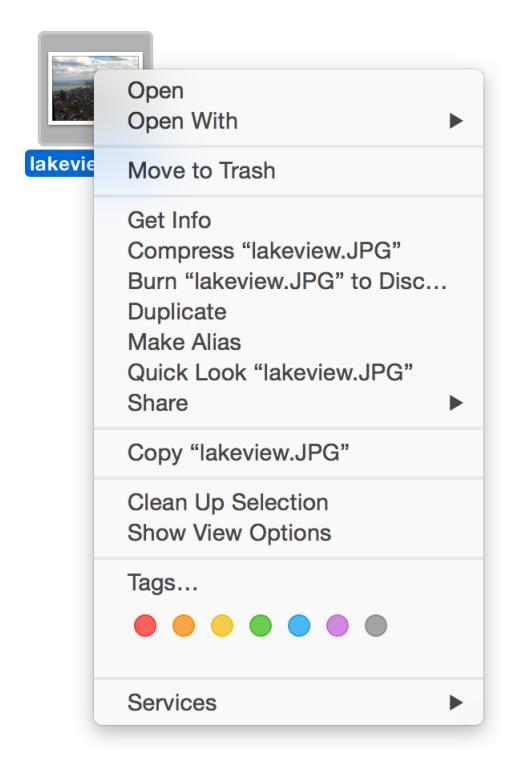

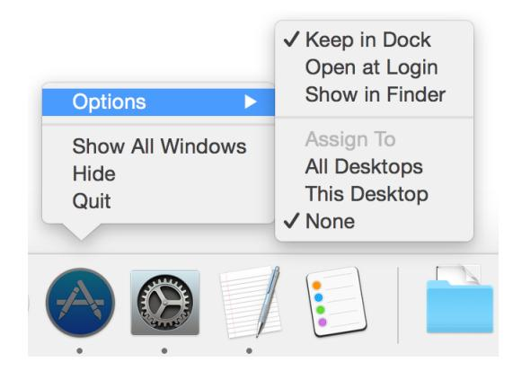

A **Dock menu** contains system-defined commands (such as Reveal in Finder and Keep in Dock) and, optionally, app-specific commands (such as New Window). To reveal a Dock menu, users Control-click or press and hold an app's Dock icon.

By default, all types of menus in Yosemite use vibrancy.

**Note:** Pop-up menus and command pop-down menus are controlsthat also display menus(to learn more about these controls,see Menu [Controls](#page-189-0) (page 190)). Because the menusin these controlsshare several characteristics with app menus, some menu guidelines apply to both.

### Menu Anatomy

At a minimum, a menu displays a list of menu items. Most menus also include a title that indicates the types of items that are in the list. In addition, menus can include some optional components, such as keyboard shortcut symbols, hierarchical menus (also known as submenus), toggled menu items, separators, icons, and symbols (such as the checkmark). For example, the TextEdit Edit menu includes a list of commands, a title ("Edit"), keyboard shortcuts, hierarchical menus, and separators that indicate different groups of items.

A menu bar menu might include examples of all of these components, but not all components are suitable for every type of menu. For example, a contextual menu doesn't need a title because it's automatically associated with the user's currentselection. To learn more about providing a contextual menu in your app,see [Contextual](#page-106-0) [Menus](#page-106-0) (page 107).

### Menu Behavior

All menusimplement the explicit action paradigm: People identify what needsto be acted on and then specify the action by choosing a menu item. (To learn more about this paradigm,see Explicit and [Implied](#page-61-1) Actions (page 62).)

To choose an item in a menu, the user opens the menu and moves the pointer to the desired item. As the pointer passes over each active menu item, it highlights and opensitssubmenu (if it has one). No action occurs until the user chooses an item. This behavior lets people open and scan menus to find out what features are available without having to actually perform an action. When the user chooses a menu item, it blinks briefly to confirm the user's choice and then performs the action.

After the user opens a menu, it remains open until another action causes it to close. Such actions include:

- Choosing an item in the menu
- Moving the pointer to another menu title in the menu bar
- Clicking outside of the menu
- A system-initiated alert
- A system-initiated app switch or quit

## Naming Menus and Items

### A Menu Title Describes a Set of Items

In addition to the system-provided menus, such as File and Window, most apps add a few app-specific menus to the menu bar so that users have access to useful commands. Users choose which menu to open based on the menu's title, so it's important to make your menu titles accurate and informative. For example, users can easily predict the types of items they'll find in the iTunes Controls and Store menus.

**Note:** Contextual and Dock menus don't need titles because users open these menus after focusing on a selection or an area in a window or by choosing an app in the Dock. For more information about these types of menus, see [Contextual](#page-106-0) Menus (page 107) and Dock [Menus](#page-110-0) (page 111).

A pop-up menu or command pop-down menu doesn't generally include a title, but it might display one of its menu items or an introductory label that functions as a title. For more information controls that include menus, see Menu [Controls](#page-189-0) (page 190).

Follow these guidelines as you create titles for your menus.

**Use menu titles that accurately represent the items in the menu.** Users should be able to use a menu's title to predict the types of items they'll find in the menu. For example, users would expect a Font menu to contain names of font families,such as Helvetica and Geneva, but they wouldn't expect it to include editing commands, such as Cut and Paste.

**Make menu titles as short as possible without sacrificing clarity.** One-word menu titles are best because they take up very little space in the menu bar and they're easy for users to scan. If you must use more than one word in a menu title, be sure to use title-style capitalization (to learn more about this style, see [Use](#page-46-0) the Right [Capitalization](#page-46-0) Style in Labels and Text (page 47)).

**Avoid using an icon for a menu title.** You don't want users to confuse a menu-title icon with a menu bar extra. Also, it's not acceptable to mix text and icons in menu bar menu titles.

**Ensure that a menu's title is undimmed even when all of the menu's commands are unavailable.** Users should always be able to view a menu's contents, whether or not the items are currently available. Ensuring that your menu items are always visible (even when they are not available) helps users learn what they can do in your app.

### A Menu Item Names a Command or Action

As with menu titles, it's important to choose menu item names that are accurate and informative so that users can predict the result of choosing an item.

Menu item names describe actions that are performed on an object or attributes that are applied to an object. Specifically:

- **Actions** are verbs or verb phrases that declare the action that occurs when the user chooses the item. For example, Print means *print my document* and Copy means *copy my selection* .
- **Attributes** are adjectives or adjective phrases that describe the change the command implements. Adjectives in menus imply an action and they can often fit into the sentence "Change the selected object to …" —for example, *Bold* or *Italic* .

Follow these guidelines as you create names for menu items.

**In general, avoid including definite or indefinite articles in the menu item name.** Including an article is rarely helpful because the user has already made a selection or entered a context to which the command applies. Good examples are "Add Account" instead of "Add an Account" and "Hide Toolbar" instead of "Hide the Toolbar." Be sure that you use this style consistently in all your menu item names.

**Use an ellipsis to show users thatfurther action is required to complete the command.** The ellipsis character (…) means that a dialog or a separate window will open in which users need to make additional choices or supply additional information in order to complete the action. For details on when to use an ellipsis in menu items, see Use an Ellipsis When More Input Is [Required](#page-48-1) (page 49).

**Use title-style capitalization for menu item names.** For more information on this style, see Use the [Right](#page-46-0) [Capitalization](#page-46-0) Style in Labels and Text (page 47).

**If appropriate, define a keyboard shortcut for a frequently used menu item.** A keyboard shortcut, such as Command-C for Copy, can make common tasks easier for sophisticated users. Before you create a keyboard shortcut for a custom menu item, be sure to read the guidelines in Providing [Keyboard](#page-296-1) Shortcuts (page 297).

**Dim unavailable menu items.** When a menu item is dimmed (that is, gray), it helps users understand that the item is unavailable because, for example, it doesn't apply to the selected object or in the current context. A dimmed menu item does not highlight when the user moves the pointer over it.

## Grouping Menu Items

Arranging menu items in logical groups helps users locate commands quickly. As you figure out how to group menu items, it often works well to refer to the user's mental model of your app's task. To learn more about this concept, see [Mental](#page-60-1) Model (page 61).

**As much as possible, create the "right" number of groups.** The number of groupsto use is partly an aesthetic decision and partly a usability decision. The TextEdit Edit menu (shown here) is a good example of using task-specific concepts to group menu items.

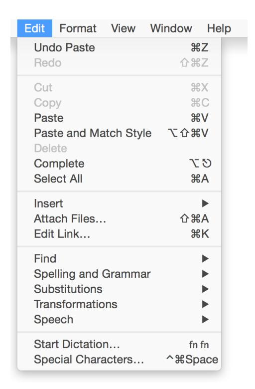

**In general, place the most frequently used items at the top of the menu.** The top of the menu tends to be the most visible part of the menu because users often see it first. At the same time, avoid arranging all of a menu's items strictly by frequency of use. A better tactic is to create groups of related items and place the more frequently used groups above the less frequently used groups. For example, although the Find Next (or Find Again) command might be used infrequently, it should appear right below the Find command.

**Avoid combining actions and attributes in the same group.** Userstend to view choosing an action differently from choosing an attribute to apply to a selection, so it's best to put these items in different groups.

**Group interdependent attributes.** Users expect to find related attributes in the same group. Attributes can be in a **mutually exclusive attribute group** (the user can select only one item, such as font size) or an **accumulating attribute group** (the user can select multiple items, such as Bold and Italic).

**Group the commands that act upon a smart container.** If your app allows the creation of smart data groups or containers, such as a smart folder in the Finder, group all commands related to the smart group in the same menu. Doing this makes it easy for users to find the commands for creating, modifying, and destroying a smart group.

**Look for opportunities to consolidate related menu items.** If a menu repeats a term more than twice, consider dedicating a separate menu (or submenu) to the term. For example, if you need commands like Show Info, Show Colors, Show Layers, Show Toolbox, and so on, you could create a Show menu or a Show item that includes a submenu.

**In general, avoid creating very long menus.** Long menus are difficult for users to scan and can be overwhelming. If you find that there are too many items in a single menu, try redistributing them; you might find that some of the items fit more naturally in other menus or that you need to create a new menu. You can also consider creating submenus for some related sets of items, but this isn't appropriate in all cases. For some guidance on creating a submenu, see [Hierarchical](#page-104-0) Menus (page 105).

Note that in some menus, users might add enough items to make the menu very long. For example, the Safari History menu can grow very long, depending on how many websites users visit. In some cases, a long menu can become a **scrolling menu**, which displays a downward-pointing arrow at the bottom edge. Scrolling menus should exist only when users add a large number of itemsto a customizable menu or when the menu'sfunction causes it to have items added to it (such as an app's Window menu). You should not intentionally design a scrolling menu.

## Changing a Menu's Items

Sometimes it makes sense to offer a single menu that displays slightly different items depending on the user's action. OS X supports two ways to do this: Dynamic menu items and toggled menu items.

### Dynamic Menu Items

A **dynamic menu item** is a command that changes when the user presses a modifier key. For example, when the user opens the Window menu in the Finder and then presses the Option key, the Minimize and Zoom menu items change.

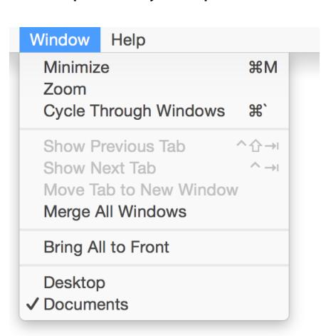

**API Note:** To define dynamic menu items in code, you can use the setAlternate: method of NSMenuItem to designate one menu item as the alternate of another.

Follow these guidelines if you decide to use dynamic menu items in your app.

**Avoid making a dynamic menu item the only way to accomplish a task.** Dynamic menu items are hidden by default, so they're an appropriate way to offer a shortcut to sophisticated users. In all cases, don't make users discover a dynamic menu item before they can use your app effectively. For example, a user who hasn't discovered the Minimize All dynamic menu item in the Finder Window menu (shown above) can still minimize all open Finder windows by minimizing each one individually.

Although you can enable dynamic menu items in a contextual or Dock menu, these items can be doubly hard for users to discover. As with app menus, make sure that the functionality of the contextual or Dock menu does not depend on the discovery of dynamic menu items.

**Require only a single modifier key to reveal the dynamic menu items in a menu.** Users are apt to find it physically awkward to press more than one key while simultaneously opening and choosing a menu item. Also, requiring more than one additional key press greatly decreases the user's chances of discovering the dynamic menu items.

**Note:** OS X automatically sizes the menu to hold the widest item, including Option-enabled commands.

### Toggled Menu Items

A **toggled menu item** changes between two states each time a user choosesit. There are three types of toggled menu items:

- A set of two menu items that indicate opposite states or actions, for example, Grid On and Grid Off. Users know which menu item is currently in effect because it displays a checkmark or it appears inactive.
- One menu item whose name changes to reflect the current state, for example, Show Ruler and Hide Ruler.
- A menu item that has a checkmark next to it when it is in effect, for example, a style attribute such as Bold.

Toggled menu items can be convenient, but they are rarely necessary. If you want to use toggled menu items in your app, use the following guidelines to make sure that they provide value to users.

**As much as possible, display both items in a set.** When users can see both states or actions at the same time, there's less chance of confusion about each item's effect. For example, the Mailbox menu in Mail includes both the Take All Accounts Online and Take All Accounts Offline items. When the user's accounts are online, only the Take All Accounts Offline menu item is available, which leaves no doubt about the effect of this action.

**Use a changeable menu item name if there isn't enough room to show both items.** You might also choose to use this type of toggled menu item if you're confident that users will reopen the menu and see the opposite item. The best way to make sure that the command names are completely unambiguous is to use two verbs that express opposite actions.

For example, the commands Turn Grid On and Turn Grid Off are unambiguous. By contrast, it's unclear what the opposite of the command Use Grid might be. Some users might expect the opposite command to be Don't Use Grid, because they interpret the command as an action. Other users might expect to see a checkmark next to Use Grid after choosing the command, because they interpret Use Grid as a description of the current state. For example, Mail uses changeable toggled menu items in the View menu to allow users to show or hide features such as the mailbox list and toolbar.

**Use a checkmark when the toggled items represent an attribute that is currently in effect.** It's easy for users to scan for checkmarks in a list of attributes to find the ones that are in effect. For example, in the Mail Format menu, users can see at a glance which styles have been applied to the selected text.

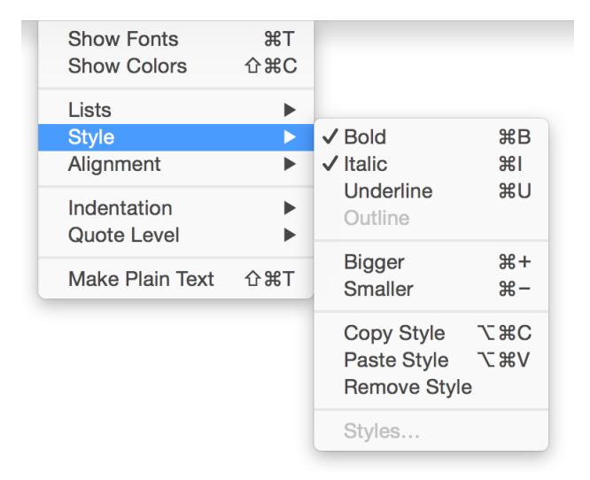

**Don't use a checkmark when the toggled item indicates the presence or absence of a feature.** In such a case, users can't be sure whether the checkmark means that the feature is currently in effect or that choosing the command turns the feature on.

## Icons and Symbols in Menus

### Icons Can Help Users Identify Items

Sometimes, displaying icons in menus can help users recognize menu items and relate them to other items they know about. As with all icons and images, make sure that using symbols instead of text doesn't add confusion or ambiguity.

**Don't use an icon without any text.** Even if you use an icon you think all users will recognize, it's best to reinforce the icon's meaning by including a textual menu item name.

**Use only familiar icons.** Use an icon in a menu item to represent something the user can learn to associate with specific functionality in your app or to represent something recognizable from other parts of the system. For example, the Finder uses icons in the Go menu because users associate them with the icons they see in the Finder sidebar.

In another example, Safari uses the icons displayed by some webpages to help users make the connection between the webpage and the menu item for that webpage.

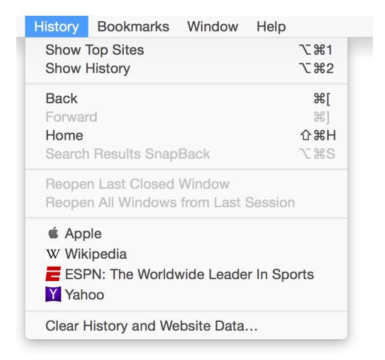

**Avoid displaying an icon for every menu item.** If you include icons in your menus, include them only for menu items for which they add significant value. A menu that includes too many icons (or poorly designed ones) can appear cluttered and be hard to read.

### Symbols Can Give Users Information About State

There are a few standard symbols you can use to provide additional information in menus. The symbols listed in Table 20-1 are used consistently throughout OS X, so users are accustomed to their meaning.

**Table 20-1** Standard menu symbols

| Symbol | Meaning                                                                                                                                                     |
|--------|-------------------------------------------------------------------------------------------------------------------------------------------------------------|
|        | In the Window menu, the active document; in other menus, a setting that applies to the entire selection. |
|        | A setting that applies to only part of the selection.                                                                            |
|        | A window with unsaved changes (typically, when Auto Save is not available).                                                |
|        | In the Window menu, a document that is currently minimized in the Dock.                                                 |

**Avoid using custom symbols in a menu.** If you use other, arbitrary symbols in menus, users are unlikely to know what they mean. Also, additional symbols tend to add visual clutter.

**Use a checkmark to indicate that something is currently active.** In an app's Window menu, a checkmark appears next to the active window's name. In other menus, a checkmark can indicate that a setting applies to the entire selection. As described in [Toggled](#page-79-0) Menu Items (page 80), you can use checkmarks within mutually exclusive attribute groups (the user can select only one item in the group, such as font size) or accumulating attribute groups (more than one item can be selected at once, such as Bold and Italic).

**Use a dash to indicate that an attribute applies to only part of the selection.** For example, if the selected text has two styles applied to it, you can put a dash next to each style name. Or, you can display a checkmark to every style currently in effect. When it's appropriate, you can combine checkmarks and dashes in the same menu.

**Note:** If you allow users to apply several types of styles to selected text, it can be convenient to include a menu command,such as Plain,so that users can remove all formatting using one command.

**As much as possible, use a dot only when Auto Save is not available.** When you support Auto Save, users don't have to think about the saved state of their documents. However, you might need to display a dot if, for example, the user's disk is full and Auto Save can't complete. For more information about supporting Auto Save in your app, see Auto Save and [Versions](#page-251-0) (page 252).

**Allow the diamond and the checkmark to replace the dot(if itis used).** A minimized document with unsaved changesshould have only a diamond. If the active window has unsaved changes, the checkmark should override the dot in the Window menu.

**Use actual text styles only in a Style menu.** If you have a Style menu, you can display menu itemsin the actual styles that are available, such as bold or italic, so that users can see what effect the menu item has. Don't use text styles in menus other than a Style menu.

## Menu Bar Menus

The single menu bar at the top of the main display screen provides a home for the top-level menus in your app. In addition to system-provided and user-assigned items, you determine the menus that appear in the menu bar.

As you can see here, menu bar menus use the current appearance of the menu bar.

The following sections contain guidelinesthat help you choose which menus you need and which menu items you should include.

**Important:** Some menu items are marked as expected, which means that you should include them in your app, unless it's impossible to support them. Include other menu items when they make sense in your app.

When there's an appropriate keyboard shortcut for a menu item, it islisted. In general, enable the appropriate keyboard shortcut for every expected menu item in your app. Provide a keyboard shortcut for other items only if the item will be frequently used. (To learn more about providing keyboard shortcuts for menu items, see [Providing](#page-296-1) Keyboard Shortcuts (page 297).)

### The Apple Menu

The **Apple menu** provides items that are available to users at all times, regardless of which app is active. The Apple menu's contents are defined by the system and can't be modified by users or developers.

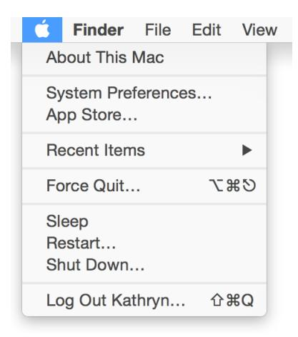

### The App Menu

The **app menu** contains items that apply to the app as a whole rather than to a specific document or other window. To help users identify the active app, the app menu title (which is the app's name) is displayed in a bold font in the menu bar.

The app menu contains the following standard menu items, listed in the order in which they should appear.

| Menu item        | Expected | Keyboard shortcut | Meaning                                                                                                                                                                                                                       |
|------------------|----------|-------------------|-------------------------------------------------------------------------------------------------------------------------------------------------------------------------------------------------------------------------------|
| About AppName | Yes      |                   | Opens the About window, which contains the app's copyright information and version number. For more about About windows, see About Windows (page 149).      |
| Preferences…     | Yes      | Command-,         | Opens a preferences window for your app. To learn about defining preferencesfor your app, see Preferences (page 264).                                                      |
| Services         | Yes      |                   | Displays a submenu of services that are available in the current context. For more information on providing and using services, see Services (page 285). |
| Hide AppName  | Yes      | Option-Command-H  | Hides all of the windows of the currently running app and brings the most recently used app to the foreground.                                                       |
| Hide Others   | Yes      | Command-H         | Hides the windows of all the other apps currently running.                                                                                                                                         |
| Show All      | Yes      |                   | Shows all windows of all currently running apps.                                                                                                                                                         |
| Quit AppName  | Yes      | Command-Q         | Quits the app.                                                                                                                                                                                                          |

**If possible, use one word for the app menu title.** Using a short name helps make room for the rest of your app's menus. If your app's name is too long, provide a short name that's about 16 characters or fewer. If you don't provide a short name, the system might truncate the name from the end and add an ellipsis when the name is displayed in the menu bar.

**Don't include the app version number in the name.** Version information belongs in the About window.

**Use the short app name in menu items that display it.** If you supplied a short app name, use it in the About, Hide, and Quit menu items.

**Put a separator between the About item and the Preferences item.** These two commands are very different and should be in different groups. If your app provides document-specific preferences, make them available in the File menu. See The File [Menu](#page-89-0) (page 90).

**In general, place the Preferences menu item before any app-specific items.** For example, Mail places its app-specific Provide Mail Feedback item after Preferences. You can add a separator between Preferences and your app-specific items if it makes sense (for advice on grouping menu items, see [Grouping](#page-76-0) Menu Items (page 77)).

**Don't include a Help menu item with other app-specific items.** All app help items belong in the Help menu. See The Help [Menu](#page-102-0) (page 103).

**Place the Quit menu item last.** Precede the Quit item with a separator and don't combine it with any other items.

## The File Menu

In general, each command in the **File menu** appliesto a single file (most commonly, a user-created document).

If your app is not document-based, you can rename the File menu to something more appropriate or eliminate it.

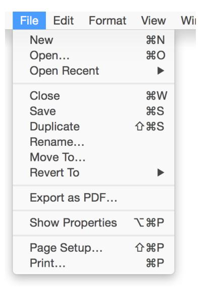

The File menu includes the following standard menu items, listed in the order in which they should appear.

| Menu item   | Expected | Keyboard shortcut | Meaning                                                                                                                                                                                                                                                                                                                                                                                                                         |
|----------------|----------|-------------------|---------------------------------------------------------------------------------------------------------------------------------------------------------------------------------------------------------------------------------------------------------------------------------------------------------------------------------------------------------------------------------------------------------------------------------|
| New            | Yes      | Command-N         | Opens a new document. For more information about naming new document windows, see Naming Windows (page 125).                                                                                                                                                                                                                                                                    |
| Open…          | Yes      | Command-O         | Displays a dialog for choosing an existing document to open. (Note that in the Finder, the Open command is not followed by an ellipsis character because the user performs navigation and documentselection before selecting theOpen command.) For more information, see The Open Dialog (page |
| Open Recent | No       |                   | 160). Opens a submenu that displays a list of the most recently opened documents. (The Apple menu provides the ability to open recent documents and apps in the Recent Items menu item.)                                                                                                                                           |

| Menu item          | Expected | Keyboard shortcut | Meaning                                                                                                                                                                                                                                                                                                                                                                                                                                                                          |
|-----------------------|----------|-------------------|----------------------------------------------------------------------------------------------------------------------------------------------------------------------------------------------------------------------------------------------------------------------------------------------------------------------------------------------------------------------------------------------------------------------------------------------------------------------------------|
| Close                 | Yes      | Command-W         | Closes the active window. When the user presses the Option key, Close changes to Close All. The keyboard shortcuts Command-W and Command-Option-W should implement the Close and Close All commands, respectively.                                                                                                                                                                     |
| Close File         | No       | Shift-Command-W   | Closes a file and all its associated windows. The Close File command is typically used in file-based appsthatsupport multiple views of the same file.                                                                                                                                                                                                                                                       |
| Save                  | No       | Command-S         | Displays the Save dialog, in which users provide a name and location for their content. The Save command can become the Save a Version command after users provide a name and location for their content. (For more information about the Save dialog, see Save Dialogs (page 167).)                                                   |
| Duplicate             | Yes      |                   | Duplicates the current document, leaving both documents open.                                                                                                                                                                                                                                                                                                                                                                                               |
| Save As            | No       | Shift-Command-S   | Legacy command. In document-based apps, this functionality is provided by the Duplicate command instead.                                                                                                                                                                                                                                                                                                                                  |
| Export As          | No       |                   | Displays the Save dialog, in which the user can save a copy of the active file in a format your app does not handle. After the user completes an Export As command, the original file remains open so that the user can continue working in the current format; the exported file does not automatically open. |
| Save All           | No       |                   | Saves changes to all open files.                                                                                                                                                                                                                                                                                                                                                                                                                                  |
| Revert to Saved | Yes      |                   | Displays all available versions of the document in the version browser (when Auto Save is enabled). Users choose a version to restore and the current version of the document is replaced by the restored version.                                                                                                                                                         |

| Menu item  | Expected | Keyboard shortcut | Meaning                                                                                                                                                                                               |
|---------------|----------|-------------------|-------------------------------------------------------------------------------------------------------------------------------------------------------------------------------------------------------|
| Print         | Yes      | Command-P         | Opens the standard Print dialog, which allows users to print to a printer, to send a fax, or to save as a PDF file.              |
|               |          |                   | For more information, see The Print and Page Setup Dialogs (page 163).                                                                                               |
| Page Setup | No       | Shift-Command-P   | Opens a dialog forspecifying printing parameters such as paper size and printing orientation (these parameters are saved with the document). |

**In the Open Recent command, display document names only.** In particular, don't display file paths. Users have their own ways of keeping track of which documents are which and file paths are inappropriate to display unless specifically requested by the user.

**Use the Save command to give users the opportunity to specify a name and a location for their content.** As much as possible, you want to help users separate the notion of saving their work from the task of giving it a name and location. Above all, you want users to feel comfortable with the fact that their work is safe even when they don't choose File > Save. To learn more about how to free users from frequently using the Save command to save their work, see Auto Save and [Versions](#page-251-0) (page 252).

**Use the Duplicate command to replace the Save As and Export As commands.** Many users are confused by the Save As and Export As experiences because the relationship between the two document versions isn't always obvious. The Duplicate command shows users precisely where the document copy comes from (it emerges from the original) and differentiates the versions (the copy includes Copy in its title). In addition, the Duplicate command leaves both document versions open, giving users control over which document they want to work in.

**If you provide document-specific preferences items, place them above printing commands.** Also, be sure to give your document-specific preferences a unique name, such as Page Setup, rather than Preferences. Note that the Preferences and Quit commands, which apply to the app as a whole, are in the app menu.

**Avoid providing multiple Save As Format commands.** If necessary, you can instead use the Format pop-up menu in the Save dialog to give the user a selection of file formats. For example, the Format pop-up menu in Preview's Save dialog allows a user to specify many different formats, such as TIFF, PNG, and JPG.

If you need to allow users to continue working on the active document, but save a copy of the document in a format your app doesn't handle, you can provide an Export As command.

**Avoid providing Save a Copy or Save To commands.** The functionality that users associate with these commands is provided by the Duplicate command.

### The Edit Menu

The **Edit menu** commands allow people to change (that is, edit) the contents of documents and other text containers, such as fields. It also provides commands that allow people to share data, within and between apps, through the Clipboard.

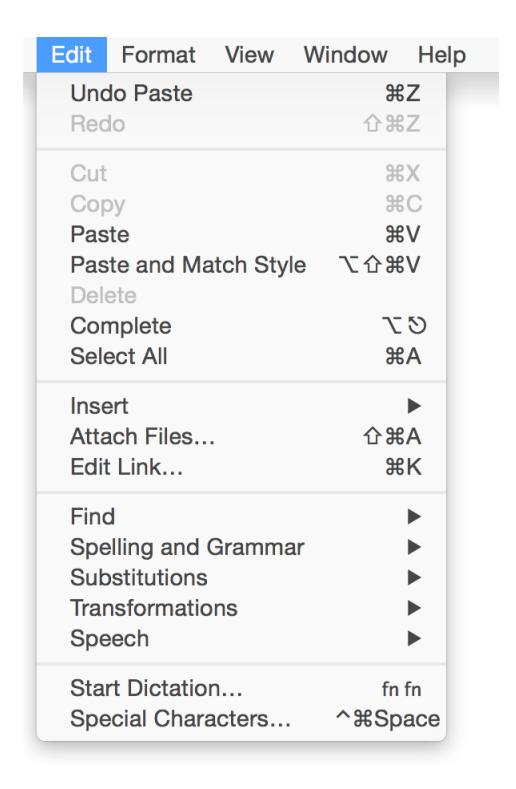

Even if your app doesn't handle text editing within its documents, the expected Edit commands should be available for use in dialogs and wherever users can edit text.

The Edit menu includes the following standard menu items, listed in the order in which they should appear.

| Menu item | Expected | Keyboard shortcut | Meaning                                                                                                                                                     |
|-----------|----------|-------------------|-------------------------------------------------------------------------------------------------------------------------------------------------------------|
| Undo      | Yes      | Command-Z         | Reversesthe effect of the user's previous operation.                                                                                      |
| Redo      | Yes      | Shift-Command-Z   | Reverses the effect of the last Undo command.                                                                                          |
| Cut       | Yes      | Command-X         | Removes the selected data and stores it on the Clipboard, replacing the previous contents of the Clipboard. |

| Menu item                      | Expected | Keyboard shortcut      | Meaning                                                                                                                                                                                                                                                                                                                       |
|--------------------------------|----------|------------------------|-------------------------------------------------------------------------------------------------------------------------------------------------------------------------------------------------------------------------------------------------------------------------------------------------------------------------------|
| Copy                           | Yes      | Command-C              | Makes a duplicate of the selected data, which is stored on the Clipboard.                                                                                                                                                                                                                 |
| Paste                          | Yes      | Command-V              | Inserts the Clipboard contents at the insertion point. The Clipboard contents remain unchanged, permitting the user to choose Paste multiple times.                                                                                                               |
| Paste and Match Style | No       | Option-Shift-Command-V | Inserts the Clipboard contents at the insertion point, matching the style of the inserted text to the surrounding text.                                                                                                                                                 |
| Delete                         | Yes      |                        | Removes selected data without storing the selection on the Clipboard.                                                                                                                                                                                                                              |
| Select All                  | Yes      | Command-A              | Highlights every object in the document or window, or all characters in a text field.                                                                                                                                                                                               |
| Find                           | Yes      | Command-F              | Opens an interface for finding items.                                                                                                                                                                                                                                                                          |
| Find Next                   | No       | Command-G              | Performs the last Find operation again.                                                                                                                                                                                                                                                                        |
| Spelling                       | No       | Command-:              | Performs a spell check of the selected text and opens an interface in which users can correct the spelling, view suggested spellings, and find other misspelled words.                                                                          |
| Speech                         | No       |                        | Displays a submenu containing the Start Speaking and Stop Speaking commands. Users choose this command to hear any app text spoken aloud by the system.                                                                                               |
| Special Characters          | Yes      | Control-Command-Space  | Displaysthe Special Characters window, which allows users to input characters from any character set supported by OS X into text entry fields. This menu item is automatically inserted at the bottom of the Edit menu. |

**As much as possible, support undo and redo functionality.** In particular, support the Undo command for:

- Operations that change the contents of a document
- Operations that require a lot of effort to re-create
- Most menu items
- Most keyboard input

It might not be possible to support undo for every operation users can perform in your app. For example, selecting, scrolling, splitting a window, and changing a window's size and location aren't necessarily undoable.

**Let the user know when Undo isn't possible.** If the last operation can't be reversed, change the command to Can't Undo and display it dimmed to help the user understand that the action isn't available.

If a user attempts to perform an operation that could have a detrimental effect on data and that can't be undone, warn the user. For more information on how to do this, see [Alerts](#page-171-0) (page 172).

**Add the name of the last undo or redo operation to the Undo and Redo commands, respectively.** If the last operation was a menu command, add the command name. For example, if the user has just entered some text, the Undo command could read Undo Typing. If the user chooses Undo Typing, the Redo command should then read Redo Typing, and the Undo command should include the name of the operation the user performed *before* typing.

**Don't change the Delete menu item name.** Choosing Delete is the equivalent of pressing the Delete key or the Clear key. Use Delete as the menu command, not Clear or Erase or anything else.

**Determine the best placement for the Find command.** For example, the Find command could be in the File menu, instead of the Edit menu, if the object of the search is files. When appropriate, your app should also contain a Find/Replace command.

**Provide a Find submenu, if appropriate.** You might want to include a Find submenu if find is important functionality in your app. Typically, a Find submenu contains Find (Command-F), Find Next (Command-G), Find Previous (Shift-Command-G), Use Selection for Find (Command-E), and Jump to Selection (Command-J). If you include a Find submenu, the Find menu item name should not include an ellipsis character.

**Group Find Next with Find.** Whether you place the Find command in the File menu or the Edit menu, this item should be grouped with the Find command because users think of them together.

**Provide a Spelling submenu, if appropriate.** If your app provides multiple spelling-related commands, you might want to include a Spelling submenu that contains Check Spelling (Command-;) and Check Spelling as You Type commands. If you include a Spelling submenu, the Spelling menu item name should not include an ellipsis character.

### The Format Menu

If your app provides functions for formatting text, you can include a **Format menu** as a top-level menu or as a submenu of the Edit menu. It might be appropriate to group some items that are in the Format menu into submenus, such as Font, Text, or Style.

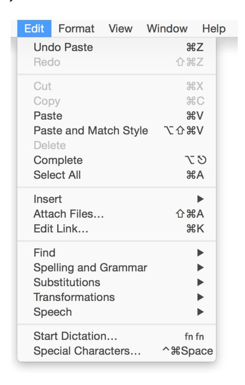

The Format menu includesthe following standard menu items, listed in the order in which they should appear.

| Menu item      | Expected | Keyboard shortcut | Meaning                                                                                                              |
|----------------|----------|-------------------|----------------------------------------------------------------------------------------------------------------------|
| Show Fonts  | Yes      | Command-T         | Displays the Fonts window. The Show Fonts menu item should be the first item. |
| Show Colors | Yes      | Shift-Command-C   | Displays the Colors window.                                                                                 |
| Bold           | No       | Command-B         | Boldfaces the selected text or toggles boldfaced text on and off.                      |
| Italic         | No       | Command-I         | Italicizes the selected text or toggles italic text on and off.                        |
| Underline      | No       | Command-U         | Underlines the selected text or toggles underlined text on and off.                    |

| Menu item      | Expected | Keyboard shortcut           | Meaning                                                                                                                                                                                       |
|----------------|----------|-----------------------------|-----------------------------------------------------------------------------------------------------------------------------------------------------------------------------------------------|
| Bigger         | No       | Shift-Command–equal sign | Causesthe selected item to increase in size in defined increments.                                                                                                 |
| Smaller        | No       | Command-hyphen              | Causesthe selected item to decrease in size in defined increments.                                                                                                 |
| Copy Style  | No       | Option-Command-C            | Copies the style—font, color, and size for text—of the selected item.                                                                                           |
| Paste Style | No       | Option-Command-V            | Applies the style of one object to the selected object.                                                                                                            |
| Align Left  | No       | Command-{                   | Left-aligns a selection.                                                                                                                                                                |
| Center         | No       | Command-                    | Center-aligns a selection.                                                                                                                                                              |
| Justify        | No       |                             | Evenly spaces a selection.                                                                                                                                                           |
| Align Right | No       | Command-}                   | Right-aligns a selection.                                                                                                                                                               |
| Show Ruler  | No       |                             | Displays a formatting ruler.                                                                                                                                                         |
| Copy Ruler  | No       | Control-Command-C           | Copiesformatting settingssuch astabs and alignment for a selection to apply to a another selection and stores them on the Clipboard. |
| Paste Ruler | No       | Control-Command-V           | Appliesformatting settings(that have been saved to the Clipboard) to the selected object.                                                                    |

### The View Menu

The **View menu** provides commands that affect how users see a window's content; it does *not* provide commandsto selectspecific document windowsto view or to manage a specific document window. Commands to organize, select, and manage windows are in the Window menu (described in The [Window](#page-99-1) Menu (page 100)).

The View menu includes the following standard menu items, listed in the order in which they should appear.

| Menu item               | Expected | Keyboard shortcut | Meaning                                                                                                                                               |
|-------------------------|----------|-------------------|-------------------------------------------------------------------------------------------------------------------------------------------------------|
| Show/Hide Toolbar    | Yes      | Option-Command-T  | Shows or hides a toolbar.                                                                                                                 |
| Customize Toolbar    | Yes      |                   | Opens a dialog that allows the user to customize which items are present in the toolbar.                 |
| Enter Full Screen | No       | Control-Command-F | Opensthe window at full-screen size in a new space. Available when the app supports full-screen windows. |

**Include the View menu if a window can go full screen or if it contains a toolbar.** Create a View menu for these commands even if your app doesn't need to have other commands in the View menu. Note that the Enter Full Screen command toggles with the Exit Full Screen command.

**Avoid using the View menu to display panels (such as tool palettes).** Use the Window menu to display open windows and panels instead.

**Implement the Show/Hide Toolbar command as a dynamic toggled menu item.** If the toolbar is currently visible, the menu item says Hide Toolbar. If the toolbar is not visible, it says Show Toolbar.

### App-Specific Menus

Add your own app-specific menus as appropriate. Place these menus between the View menu and the Window menu. For example, the Safari-specific History and Bookmarks menus appear between the View and Window menus.

**Make app commands available in menus.** The menu bar is the first place people tend to look for commands, especially when they're new to an app. It's a good idea to list all important commands in the appropriate app menus so that people can find them easily. It can be appropriate to omit infrequently used or power user commands from your app's menus (instead making them available in a contextual menu, for example), but be wary of doing this too often. Even experienced users can fail to find commands that are essentially hidden in this way.

**As much as possible, arrange menus so that they reflect the hierarchy of objects in your app.** For example, if your app helps users create animated stories, the app-specific menus might be Scenes, Characters, Backgrounds, and Projects. Because a user probably seesthe project as a high-level entity that containsscenes, each of which contains backgrounds and characters, a natural ordering of these menus might be Projects, Scenes, Backgrounds, and Characters. In general, place the menusthat display commandsto handle high-level, more universal objectstoward one end of the menu bar and the menusthat focus on the more specific entities toward the opposite end. When your app is used in countriesthat use left-to-rightscripts, the high-level menus should appear on the left; in countries that use right-to-left scripts, the high-level menus should appear on the right.

### The Window Menu

The **Window menu** contains commands for organizing and managing an app's windows.

Other than Minimize and Zoom (discussed below), the Window menu does not contain commands that affect the way a user views a window's contents. The View menu (described in The View [Menu](#page-98-0) (page 99)) contains all commands that adjust how a user views a window's contents.

The Window menu includes the following standard items, listed in the order in which they should appear.

| Menu item                   | Expected | Keyboard shortcut Meaning |                                                                                                                                                                                                                                                                                                                                |
|-----------------------------|----------|------------------------------|--------------------------------------------------------------------------------------------------------------------------------------------------------------------------------------------------------------------------------------------------------------------------------------------------------------------------------|
| Minimize                    | Yes      | Command-M                    | Minimizes the active window to the Dock.                                                                                                                                                                                                                                                                     |
| Minimize All             | No       | Option-Command-M             | Minimizes all the windows of the active app to the Dock.                                                                                                                                                                                                                                         |
| Zoom                        | Yes      |                              | Toggles between a predefined size appropriate to the window's content and the window size the user has set.                                                                                                                                                                 |
| Bring All to Front | No       |                              | Brings forward all of an app's open windows, maintaining their onscreen location, size, and layering order. (This should happen when the user clicks the app icon in the Dock.)                                                            |
|                             |          |                              | Note that this item can be an Option-enabled toggle with Arrange in Front.                                                                                                                                                                                                                 |
| Arrange in Front      | No       |                              | Bringsforward all of the app's windowsin their current layering order and changes their location and size so that they are neatly tiled. Note that this item can be an Option-enabled toggle with Bring All to Front. |

**Note:** When you enable users to take windows full screen, you add the Enter Full Screen menu item to the View menu. If you don't include a View menu, add the Enter Full Screen menu item to the Window menu instead, placing it after the app-specific commands and before the Bring All to Front menu item.

The following guidelines help you provide a Window menu that helps users organize windows in your app.

**List open windows appropriately.** The Window menu should list your app's open windows(including minimized windows) in the order in which they were opened, with the most recently opened window first. If a document contains unsaved changes, a dot can appear next to its name.

**Avoid listing open panels in the Window menu.** You can, however, add a command to the Window menu to show or hide panels in your app. (For more information about panels, see [Panels](#page-144-0) (page 145).)

**Include a Window menu for the Minimize and Zoom commands.** Even if your app consists of only one window, you should provide the Minimize and Zoom commands so that people using full keyboard access can implement these functions with the keyboard.

**Use the correct order for items in the Window menu.** Specifically, items should appear in this order:

Minimize

Zoom

A separator

App-specific window commands

A separator

Bring All to Front (optional)

A separator

A list of open windows

Note that the Close command should appear in the File menu, below the Open command (see [The](#page-89-0) File [Menu](#page-89-0) (page 90)).

**Avoid using Zoom to expand the window to the full screen size.** Users expect Zoom to toggle the window between two useful sizes.

### The Help Menu

If your app provides onscreen help, the **Help menu** should be the rightmost menu of your app's menus.

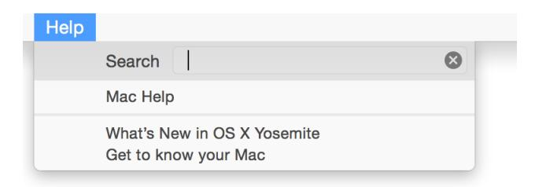

If you have registered your help book, the system provides the Spotlight For Help search field as the first item in the menu. For information on how to register your help book, see *Apple Help Programming Guide* .

The next menu item is *AppName* **Help**, which opens Help Viewer to the first page of your app's help book. For some guidelines on creating useful help content, see User [Assistance](#page-270-0) (page 271).

**As much as possible, display only one custom item in the Help menu.** That is, it's best to display only the *AppName* Help item. If you do have more items, display them below this item. If you have additional items that are unrelated to help content, such as arbitrary website links, registration information, or release notes, link to these within your help book instead of listing them as separate items in the Help menu.

**Avoid using the Help menu as a table of contents for your help book.** When users choose the *AppName* Help item, they can see the sections in your help book in the Help Viewer window. If you choose to provide additional links into your help content within the Help menu, be sure they are distinct.

### Menu Bar Extras

Users, and not apps, place menu bar extras in the menu bar. Typically, users decide to hide or show a menu bar extra by changing a setting in the appropriate preferences pane.

If there isn't enough room in the menu bar to display all menus, OS X automatically removes menu bar extras to make room for app menus. Similarly, if there are too many menu bar extras, OS X may remove some of them to avoid crowding app menus.

**Don't rely on the presence of menu bar extras.** The system might change which menu bar extras are visible, and you can't be sure which menu bar extras users have chosen to show or hide.

**Avoid creating a popover that emerges from a menu bar extra.** Popovers emerge from controls and specific window areas. For guidelines on how to use a popover in your app, see [Popover](#page-216-1) (page 217). A menu bar extra can open a menu, such as the Keyboard & Character Viewer menu.

**Use a template image to represent a menu bar extra.** In General system preferences, users can change the menu bar (and Dock) to a dark appearance. If you don't use a template image to represent your menu bar extras, they might not look good in both menu bar appearances.

**Consider alternatives to creating a menu bar extra.** For example, you can use the Dock menu functions to open a menu from your app's icon in the Dock. For some guidelines on how to create a Dock menu, see [Dock](#page-110-0) [Menus](#page-110-0) (page 111).

## Hierarchical Menus

A **hierarchical menu** displays a set of choices that are related to a menu item in a separate menu area known as a **submenu**. A menu item that contains a submenu, such as the Find menu item in the Mail Edit menu, displays the submenu indicator to show users that there are additional choices. It's easy for users to discover the existence of submenus because they open automatically when the pointer passes over the menu item.

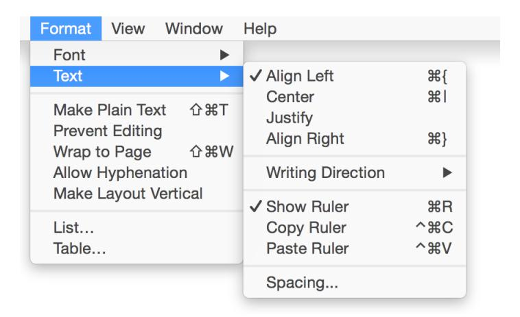

Submenus can have all the features of menus, including keyboard shortcuts,status markers(such as checkmarks), and so on.

**Ensure that a submenu's title is undimmed even when all its commands are unavailable.** A submenu's title is the title of the menu item to which the submenu is attached. As with menu titles, it's important for users to be able to view a submenu's contents, even if none of them are available in the current context.

**Use submenus cautiously.** Submenus add complexity to the interface and are physically more difficult to use, so you don't want to overuse them. In general, it's appropriate to use submenus when you have sets of closely related commands (or alternative ways to perform one type of command, such as Find) and when you need to save space.

**Avoid using more than one level of submenus.** A submenu that contains other submenus can be difficult for users to use. Also, if a submenu contains more than five items, consider giving it its own menu.

**Ensure that a submenu's contents have a logical relationship with the submenu title.** For example, the Mark menu item in the Mail Message menu reveals a submenu that allows usersto mark a message in different ways,such asjunk or high priority. In general, hierarchical menus work best for providing submenus of attributes (rather than actions).

## Contextual Menus

A **contextual menu** provides convenient access to frequently used commands associated with an item. From the user's perspective, a contextual menu is a shortcut to a small set of commands that make sense in the context of the current task. A user can reveal a contextual menu by Control-clicking an object or selection.

For example, a document icon can display a contextual menu that helps users perform several file-specific Finder actions. (Note that contextual menus use the vibrant light appearance by default.)

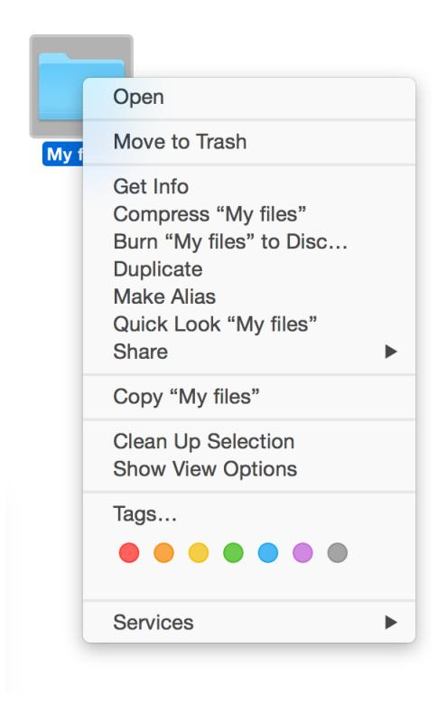

Control-clicking a text selection displays a contextual menu that's focused on text-specific actions, such as changing the font or checking the spelling of the text.

**If appropriate, use an Action menu to make contextual menu functionality easier to access.** You can use an Action menu to provide an app-wide contextual menu control in a toolbar. For example, the Finder provides an Action menu toolbar control that gives users accessto the same commandsthat are displayed in a contextual menu for the selected item. For some guidelines on how to use an Action menu, see [Action](#page-191-0) Menu (page 192).

**Include only the most commonly used commands that are appropriate in the current context.** For example, it makes sense for editing commands to appear in the contextual menu for highlighted text, but it doesn't make sense to include a Save or Print command.

**Use caution when adding a submenu to a contextual menu.** Although you don't want a contextual menu to grow too long (too-long contextual menus display the scrolling indicator and scroll like standard menus), you also don't want to make them hard to use. Sometimes, users can find it difficult to maneuver the pointer so that the submenu stays open. If you decide to add submenus to your contextual menu, be sure to keep them to one level. To learn more aboutsubmenus, also called hierarchical menus,see [Hierarchical](#page-104-0) Menus (page 105).

**Don't set a default item in a contextual menu.** If the user opens the menu and closes it without selecting anything, no action should occur.

**Always ensure that contextual menu items are also available as menu commands.** A contextual menu is hidden by default and a user might not know it exists,so itshould never be the only way to access a command. In particular, you want to avoid using a contextual menu as the only way to access an advanced or power-user feature.

| Don't display keyboard shortcuts in a contextual menu. A contextual menu is a shortcut to a set of task-specific commands, so it's redundant to display the keyboard shortcuts for those commands. |  |
|----------------------------------------------------------------------------------------------------------------------------------------------------------------------------------------------------------------------------------------------------------------------------------------------|--|
|                                                                                                                                                                                                                                                                                              |  |
|                                                                                                                                                                                                                                                                                              |  |
|                                                                                                                                                                                                                                                                                              |  |
|                                                                                                                                                                                                                                                                                              |  |
|                                                                                                                                                                                                                                                                                              |  |
|                                                                                                                                                                                                                                                                                              |  |
|                                                                                                                                                                                                                                                                                              |  |
|                                                                                                                                                                                                                                                                                              |  |
|                                                                                                                                                                                                                                                                                              |  |
|                                                                                                                                                                                                                                                                                              |  |
|                                                                                                                                                                                                                                                                                              |  |
|                                                                                                                                                                                                                                                                                              |  |
|                                                                                                                                                                                                                                                                                              |  |
|                                                                                                                                                                                                                                                                                              |  |
|                                                                                                                                                                                                                                                                                              |  |
|                                                                                                                                                                                                                                                                                              |  |
|                                                                                                                                                                                                                                                                                              |  |

## Dock Menus

When users Control-click a running app's Dock icon, a customizable Dock menu appears. By default, this menu displays the same items as the minimal Dock menu that's displayed when users press and hold the Dock icon. For more information about different styles of Dock menus, see The [Dock](#page-255-0) (page 256). In addition, this menu can contain app-specific items, such as the playback-focused commands in the customized iTunes Dock menu you see here. (Note that the Dock and Dock menus use the current appearance that the userspecifiesin General preferences.)

Light menu bar and Dock appearance Dark menu bar and Dock appearance

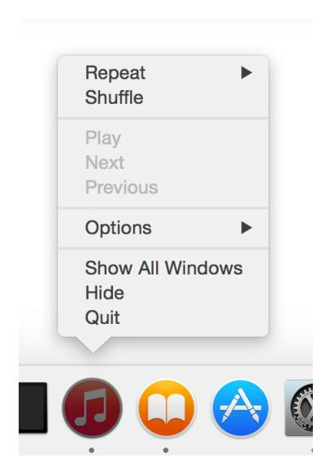

The custom itemsthat you add appear in the Dock menu only when your app is open and the user Control-clicks the Dock icon. You might consider adding items such as:

- Common commands to initiate actions in your app when it is not frontmost
- Commands that are applicable when there is no open document window
- Status and informational text

For example, Mail provides commands to compose a message and check for new messages. (To learn how to customize the Dock menu in code, see *Dock Tile Programming Guide* .)

**Be sure that all Dock menu commands are also available in your app's menus.** Users might not know about the Dock menu, so it should not be the only way to do something.

**Place your app-specific items above the standard Dock menu items.** Users should always know where to look for the system-provided Dock menu commands.

## Windows

- About [Windows](#page-113-0) (page 114)
- Opening [Windows](#page-123-0) (page 124)
- Naming [Windows](#page-124-0) (page 125)
- Scrolling [Windows](#page-126-0) (page 127)
- [Searching](#page-130-0) In a Window (page 131)
- [Full-Screen](#page-133-0) Windows (page 134)
- [Toolbars](#page-136-0) (page 137)
- Source Lists [\(Sidebars\)](#page-141-0) (page 142)
- [Panels](#page-144-0) (page 145)
- [Dialogs](#page-150-0) (page 151)
- [Alerts](#page-171-0) (page 172)

## About Windows

A **window** provides a frame for viewing and interacting with content in an app.

Although userstend to view most rectangular areas on the screen as"windows," developers need to understand the differences in the five main varieties of windows in OS X.

A **document window** contains file-based user data.

An **app window** is the main window of an app that is not document-based.

A **panel** floats above other windows and provides tools or controls that users can work with while documents are open. In some cases, a panel can be translucent. For more information about panels, see [Panels](#page-144-0) (page 145).

A **dialog** appears in response to a user action and typically provides ways users can complete the action. A dialog requires a response from the user before it can close. For more information about dialogs, see [Dialogs](#page-150-0) (page 151).

An **alert** is a special type of dialog that appears when a serious problem occurs, such as an error. Because an alert is a dialog, it also requires a user response before it can close. For more

information about alerts, see [Alerts](#page-171-0) (page 172).

As you can see in these examples of windows, the overall look of a window in OS X is subtle and understated. In addition,some areas of a window can be translucent,such asthe toolbar and the sidebar. The visually muted effect of a window helps users focus on the content that's important to them.

**Note:** A popover is not a window per se, but users might think of it as one (especially if they can detach it from its parent UI element or area). To learn more about popovers, see [Popover](#page-216-1) (page 217).

### Window Anatomy

A window consists of window-frame areas and a window body. The **window-frame areas** are the title bar and toolbar, which are typically combined. (In rare cases, a window might also have a bottom bar, which is a window-frame area that appears at the bottom edge of the window.) The **window body** can extend from the top edge of the window (that is, underneath the combined title bar/toolbar area) to the bottom edge of the window.

The window body represents the main **content area** of the window. For example, in a Mail message viewer window, the window body contains the mailbox list, the message list, and the selected message.

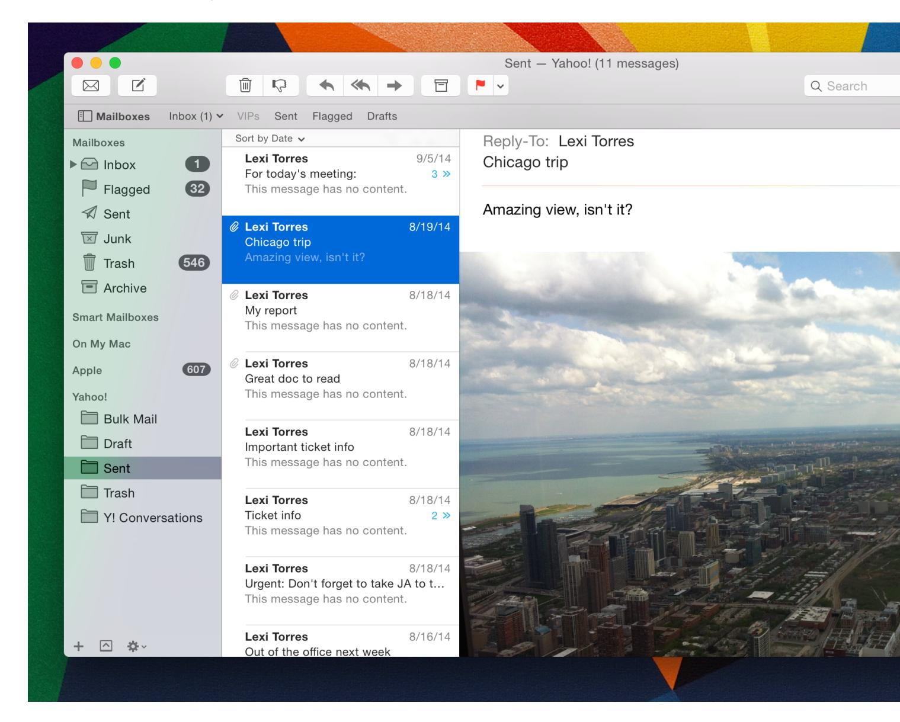

OS X defines appearancesthat can affect the look of controls and viewsin particular contexts,such as a window's sidebar. For example, the Mail window shown here uses the vibrant light appearance in the sidebar area. To learn more about this appearance, see NSAppearanceNameVibrantLight.

The Mail sidebar uses a "behind window" blending mode, which brings colors from the content behind the window into the sidebar. In contrast, the toolbar uses an "in window" blend mode, which means that content within the window can blend with content in the toolbar. To learn more about these blending modes, see NSVisualEffectBlendingMode.

OS X specifies a set of control/style combinations that are designed to look good on the toolbar, whether the toolbar is translucent or opaque. You can learn more about these controls in Some [Controls](#page-176-1) Can Be Used in the [Window](#page-176-1) Frame (page 177). OS X also defines system colors that are designed to look good on the system-provided appearances. You can learn about these colorsin Use System [Colorsto](#page-38-1) Work Well With System [Appearances](#page-38-1) (page 39).

Every document window, app window, and panel has, at a minimum:

- A title bar (or a combined title bar and toolbar), so that users can move the window.
- A close button, so that users have a consistent way to dismiss the window.

A standard document window may also have the following additional elements that an app window or panel might not have:

- Transient horizontal or vertical scroll bars, or both (if not all the window's contents are visible)
- Minimize and fullscreen buttons (note that the fullscreen button changes to a zoom button if the window doesn't support fullscreen mode or when users hold down the Option key)
- A proxy icon and a versions menu (after the user has given a document a name and save location for the first time)
- The title of the document (that functions as the title of the window)
- Transient resize controls

For example, the TextEdit document window shown here contains a title, a proxy icon, the close, minimize, and fullscreen buttons, and the title bar Versions menu. You can'tsee the resize controlsin this window, because they are visible only when the pointer rests above a window edge. Similarly, the only part of the Versions menu that's visible in this window is the disclosure control that's to the right of the document title.

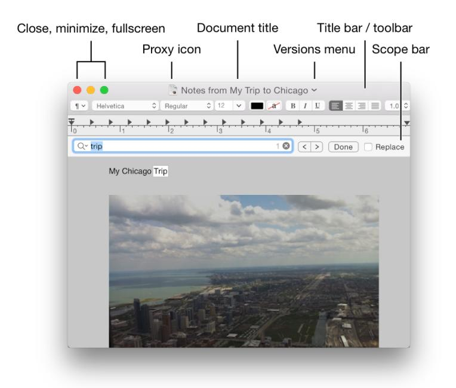

The TextEdit window shown above also includes an optional window element called the scope bar. A **scope bar** appears below the toolbar and allows users to narrow down a search operation or to filter objects or other operations by identifying specific sets of characteristics. To learn more about scope bars, see [Searching](#page-130-0) In a [Window](#page-130-0) (page 131).

Rarely, a window displays a **bottom bar**, which is a window frame area that appears below the main content area of the window body. A bottom bar contains controls that directly affect the contents and organization of the window, such as the "Add a buddy" and chat controls at the bottom of the Messages window.

### Window Layering

Each app and document window exists in its own layer on a desktop, so that windows and documents from different apps can be interleaved. Clicking a window to bring it to the front doesn't disturb the layering order of any other window on the desktop.

A window's depth in the layers is determined by when the user last accessed it. When a user clicks an inactive document window or chooses it from the app's Window menu, only that document—and any open panel associated with it—is brought to the front.

Users can bring all of an app's windows forward by clicking the app icon in the Dock or by choosing Bring All to Front in the app's Window menu. These actions bring forward all of the app's open windows, maintaining their onscreen location, size, and layering order within the app.

Panels are always in the top layer. They are visible only when their app is active, and they float on top of any open document windows in the app.

Users can view all of an app's open windows by activating App Exposé. In App Exposé view, users can choose one of the open windows on the current desktop or scroll to find an open window on a different desktop. Users can also cycle forward or backward through an app's open windows on the current desktop by using Command-Backquote (Command-`) and Command-Shift-Backquote (Command-Shift-`). If full keyboard access is on, they can cycle through all windows by using Control-F4 and Shift-Control-F4.

### Main, Key, and Inactive Windows

Windows can look different based on how the user is interacting with them. The foremost document or app window that is the focus of the user's attention is called the **main window**. The main window is often also the **key window**, which isthe window that accepts user input. For example, the "close window" keyboard shortcut, Command-W, always targets the key window.

Although the main window is often also the key window, this is not always the case. Sometimes a window other than the main window takes the focus of the input device, while the main window remains the focus of the user's attention. For example, users might be working in a document window when they need to open a standalone inspector or the Colors window to make adjustments. In this situation, the document window remains the main window, but the inspector or Colors window is the key window.

Main and key windows are both active windows. By default, only an **active window** uses any translucency. In other words, UI elements that can be translucent, such as toolbars, title bars, and sidebars, appear translucent only when their window is active.

Inactive windows are open windows that are not in the foreground. In an **inactive window**, translucent UI elements are opaque by default. Here you can see the visual distinctions between main, key, and inactive windows.

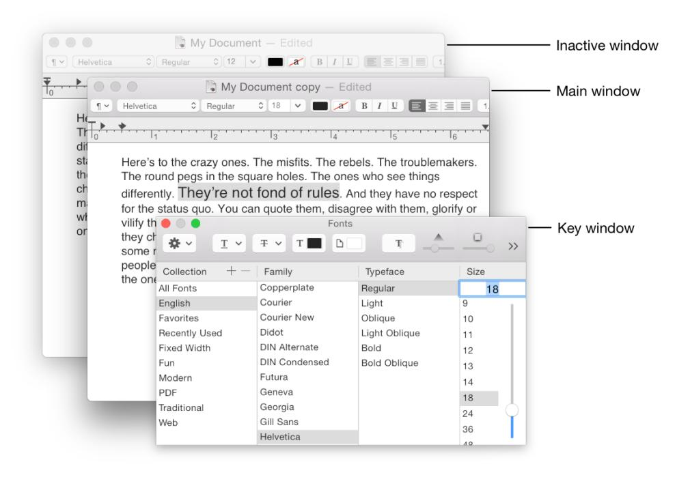

## Opening Windows

Users expect a window to open when they:

- Double-click the icon for a document in the Finder
- Double-click an app icon
- Select a document in the Finder and choose Open from the File menu (or select the document and press Command-O in the Finder)
- Choose a file from within an Open dialog
- Choose the New command from the File menu
- Click the app icon in the Dock (when no windows are currently open)

Most users expect app windows that were open when they logged out to reopen when they log back in. To meet this expectation, be sure to opt in to the Resume feature. To learn the programmatic steps you need to take to adopt Resume, see User Interface Preservation. (Note that users can opt out of this feature in General preferences.)

**Make sure windows display changeable panes as users expect.** For the most part, users expect windows to reopen the pane that was open previously. Specifically, windows with changeable panes should reopen in their previous state as long as the app is open; if the user quits the app, these windows should return to their default state.

In a window with multiple toolbars, if the toolbar represents only a subset of multiple possible views (such as favorites), the default state should be to show all of the options below the toolbar, not a particular pane. If the toolbar displays all of the possible selections, then the default state of the window should be to display the pane that the user last selected. For example, when System Preferences opens, all of the possible selections are visible, but when Mail preferences opens, it displays the last pane selected by the user.

**Title a newly opened window appropriately.** When the user opens an existing document, make sure its title is the **display name**, which reflects the user's preference for showing or hiding its filename extension. Don't display pathnames in document titles. To learn how to name new windows, see Naming [Windows](#page-124-0) (page 125).

## Naming Windows

Windows can display a title in a title bar or in the combined title bar/toolbar area. When a title is displayed, it's typically the name of the app, the name of a document, or the name of a specific type of functionality, such as Inspector.

Forsome windows, a title isn't necessary because there are other elementsthat help usersidentify the window. For example, Game Center (shown here), App Store and iBooks all display recognizable toolbar iconsthat make a title unnecessary.

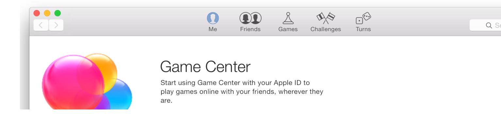

If you want to use a hidden title bar, be sure that users can still get the information they need from other areas in your window. Also, users need to be able to move a window by dragging a window-frame area, so you want to make sure that the toolbar doesn't become too crowded. For example, Safari hides the title bar, but it displays webpage titles in the URL bar and lets users move the window by dragging from the area around the URL bar.

If you decide to display a title in your window, follow these guidelines.

**Use your app name for the title of a main, nondocument window.** If your app has a short name, use it as the title. For more information about the short name, see The App [Menu](#page-87-1) (page 88).

**Name a new document window "untitled."** Leave "untitled" lowercase to make it more obvious that the window contains untitled content. Don't put a "1" on the first untitled window, even after the user opens other new windows.

If the user chooses New again before titling the first untitled document window, name the second window "untitled 2," and so on.

If the user dismisses all untitled windows, the next new document window they open should start over as "untitled," the next should be "untitled 2," and so on.

## Scrolling Windows

Scrolling is one of the most common ways that users interact with their content. Follow the guidelines in this section to help you enable convenient, intuitive scrolling that takes advantage of the translucent, transiently visible scroll bars in OS X.

Scroll bars are not persistently visible by default. In general, scroll bars can appear when users:

- Open or resize a window that contains scrolling content
- Open content within a window that is too small to display all of the content at once
- Place two fingers on a trackpad or mouse surface
- Actively scroll content

For example, you can see the scrollers in the Safari window shown here, because it was recently resized.

When users take an action that causes scroll bars to appear, the scroll bars disappear shortly after users stop interacting with the window or the content. This behavior helps users see that the content exceeds the size of the window body, without requiring the scroll bar to occupy valuable space in the content area.

**Important:** Users can make scroll bars visible all the time by changing the "Show scroll bars" setting in General preferences. A persistently visible scroll bar has a width of 15 points, which extendsinto the content area of a window.

Note that scroll bars can be persistently visible if there is a connected pointing device that doesn't support scrolling.

The **scroller** size (relative to the length of the track) reflects how much of the content is visible. For example, a small scroller means that a small fraction of the total content is currently visible. The scroller also represents the relative location, in the whole document, of the portion that can be seen in the window.

**Avoid causing the legacy scroll barto display.** Users expectscroll barsto be only transiently visible by default. Although users can change the appearance of scroll bars in General preferences, don't force users to see scroll bars if they don't want to. Be sure to avoid using a placard or placing a control inline with a scroll bar, because including these elements in your UI causes legacy scroll bars to appear in your app.

**Don't move window content when scroll bars appear.** Because scroll bars are both transient and translucent, users can see the window content that is beneath them. It shouldn't be necessary to adjust the layout of content in your window, and doing so risks confusing users.

**Help users discover when a window's content is scrollable.** Because scroll bars aren't always visible, it can be helpful to make it obvious when content extends beyond the window. In a table or list view, for example, you can display the middle of a row at the bottom edge of the window instead of displaying a complete row. Displaying partial content at the bottom edge of a window in this way shows users that there's more to see.

Don't feel that you must always indicate when text doesn't fit within a document window by, for example, displaying a partial line of text at the bottom edge. Remember that scrolling is an intuitive and nondestructive action that users don't mind experimenting with. When faced with a window full of text, the vast majority of users will instinctively scroll in the window to see if more content is available.

**If necessary, adjustthe layout of your window so thatimportantUI elements don't appear beneath scrollers.** Occasionally, there might be cases in which you want to avoid having a scroller appear on top of specific parts of your UI. In Mail, for example, the position of an unread message badge in the Mailbox List leaves enough room for the scrollers to display without visually interfering with the badge. If you need to do this, note that the overall width of a regular-size scroll bar is 10 points (the overall width of a small-size scroll bar is 8 points). If necessary, you can adjust your layout so that there are no important UI elements within 10 points of the edge of the content area (or within 8 points of the edge, if you're using a small-size scroll bar).

**Choose the scroller color that best coordinates with your UI.** If your UI is very dark, for example, you might want to specify the light-colored scrollers so that users can see them easily. You can specify light, dark, or default.

**Determine how much to scroll when users click in the scroll track.** Clicking in the scroll track advances the document by a windowful (the default) or to the pointer's hot spot, depending on the user's choice in General preferences. A "windowful" is the current height or width of the window, minus at least one unit of overlap to maintain the user's context. You define the unit of overlap so that it makes sense for the content you display. For example, one unit might equal a line of text, a row of icons, or part of a picture. Note that you should respond to the Page Up and Page Down keys in the same way that you respond to a click in the scroll track; that is, pressing these keys should also move the content by a windowful.

When users press in the scroll track, consecutive windowfuls of the content should display until the location of the scroller catches up to the location of the pointer (or until the user stops pressing).

**Scroll automatically when appropriate.** Most of the time, the user should be in control of scrolling, but your app should perform automatic scrolling in the following cases:

- When your app performs an operation that results in making a new selection or moving the insertion point. For example, when the user searches for some text and your app locates it, scroll the document to show the new selection.
- When the user enters information from the keyboard at a location not visible within the window. For example, if the insertion point is on one page and the user has navigated to another page, scroll the document automatically to incorporate and display the new information.
  - Your app determines the distance to scroll.
- When the user moves the pointer past the edge of the window while making an extended selection, scroll the document in the direction the pointer moves.
- When the user selects something, scrolls to a new location, and then tries to perform an operation on the selection, your app should scroll the content so that the selection is showing before performing the user's operation.

**Move the document only as much as necessary during automatic scrolling.** Minimizing the amount of automatic scrolling helps users keep their place in the content. For example, if part of a selection is showing after the user performs an operation, don't scroll at all. If your app can reveal the selection by scrolling in only one direction, don't scroll in both.

**If possible, show a selection in context when automatically scrolling to it.** If the entire window shows only the selected content, it can be difficult for users to remember the position of the selection within the overall content.

**Consider using small or mini scroll bars in a panel, if necessary.** If space is tight, it can be acceptable to use smaller scroll bars in panels that need to coexist with other windows. Note that if a window uses small or mini scroll bars, all other controls in that window's content area should also be the smaller version. (You can specify different sizes for most controls in Interface Builder.)

**Avoid using a scroll bar when you should instead use a slider.** Use sliders to change settings; use scroll bars only for representing the relative position of the visible portion of a document or list. For information about sliders, see [Slider](#page-199-0) (page 200).

**Don't override the default gesture to make scrollers appear.** Users are accustomed to the systemwide scrolling behavior. Scrollers appear automatically when users place two fingers on a trackpad or appropriate mouse surface. Don't override this behavior.

## Searching In a Window

A **scope bar** helps users specify locations or rules in a search, or filter objects by specific criteria. In general, scope bars are not always visible, but appear when the user initiates a search orsimilar operation. For example, when the user performs a find in Safari (shown here), a scope bar appears.

**Use a scope bar to help users specify and narrow a search, or to filter items.** You might provide a scope bar if you want users to be able to specify and refine a search while maintaing their focus in the window. If you need to give users a way to navigate or to select collections of items or data that should appear in the window, however, use a source list instead (described in Using a [Source](#page-141-0) List (page 142)). For example, the Dictionary app uses a scope bar to allow usersto dynamically filter results by reference type (such as dictionary, thesaurus, or Apple dictionary), as shown here.

**If appropriate, let users refine a scoping operation.** Users can specify additional rules to refine their scoping operation in filter rows that appear below a scope bar. A filter row can contain text fields that accept user input and round rectangle–style scope buttons (used for selecting or saving scoping criteria). For example, when users search in the Finder, they can click the Add button to view a new filter row with supplementary rules they can use to refine their search.

**Use the appropriate controls in a scope bar.** In addition to the search field control, use only the recessed-style scope button and the round rectangle–style scope buttons, which are specifically designed for use in a scope bar. The recessed-style scope button can display scoping locations and categories, and the round rectangle–style scope button allows users to save or manipulate a scoping operation. To learn more about these controls, see Scope [Button](#page-186-0) (page 187).

**Allow users to save their searches.** Users appreciate being able to perform specific searches again, especially if they spent time defining (and refining) a useful search.

## Full-Screen Windows

Full-screen windows make it easy for users to enter a distraction-free environment that helps them focus on a task. Follow the guidelines in this section to ensure that your app enables windows to go full screen when and how it's appropriate.

**Determine whether it makes sense for a window to go full screen.** Full-screen windows immerse users in a task. Therefore, they're not as useful in apps that users don't need to spend much time in, such as Contacts or Calculator. If your app enables brief utilitarian tasks, it probably doesn't make sense to allow app windows to go full screen. In particular, if you've designed apps for iOS devices, don't assume that your OS X app should automatically be full screen.

**Show the toolbar if the full-screen task requires it.** When a window goesfullscreen, it can display the toolbar or it can allow users to reveal the toolbar, along with the menu bar, by moving the pointer to the top edge of the screen. (A full-screen window never shows its title bar.)

For example, the full-screen Calendar window displaysthe toolbar because it contains controlsthat are essential to the task of viewing and managing the user's schedule.

On the other hand, a full-screen Preview window doesn't display the toolbar, because users are more likely to want to focus on reading the content, than on annotating or selecting it.

**Bring into the full-screen window all the features users need to complete the task.** Above all, avoid forcing users to exit the full-screen window in order to complete the task. In particular, identify all the tools required for the task and make them available within the full-screen window, in a toolbar if necessary. If some of the required tools are in an auxiliary window, be sure to designate this window as a full-screen auxiliary window, which means that it can be opened in the same space as the full-screen window (to do this, you specify the constant NSWindowCollectionBehaviorFullScreenAuxiliary). Or, consider making the tools available within the UI of the full-screen window instead of in an auxiliary window.

**Avoid requiring users to interact with the Finder while they're in a full-screen window.** Opening a Finder window might cause the user to exit the full-screen window. Instead, provide other ways for users to bring content into the window, such as a source list or a customized Open dialog. To learn more about Open dialogs, see The Open [Dialog](#page-159-0) (page 160).

**Take advantage ofthe increased screen space, but don't shiftthe focus away from the main task.** In general, a window grows more in width than in height when users take it full screen. If appropriate, you can subtly adjust the proportions of the UI, so that the window fits better into the space and elevates the areas of the UI that are essential for performing the main task.

At the same time, don't make the full screen version of your window so different from the standard version that users don't recognize it. You want users to be able to stay focused on their task, even while they watch the window enlarge and perhaps alter a little in appearance. For example, when users take the Photo Booth window full screen, they never lose sight of themselves in the main viewing area.

**Don't disable or override system-reserved gestures while a window is full screen.** Even though your app is the current focus of the user's attention, users should still be able to reveal Mission Control and move between other desktops and full-screen windows.

**Note:** This guideline appliesto games as much asit doesto other types of apps. If you're developing a game, you can think of respecting the system-reserved gestures as a way of offering a "boss button" that users can use to quickly hide the game.

**Respond appropriately when users switch away from your full-screen window.** For example, a game should pause its action when users switch away from the full-screen experience so that they don't miss important game events. Similarly, a slide show should pause when users switch away from it. In addition, be sure to let users decide when to take a window out of full screen. That is, don't take a window out of full-screen mode when users switch away from it.

**In general, don't prevent users from revealing the Dock.** It's important to preserve users' access to the Dock even while they're in a full-screen window, because they should always be able to open other apps and view stacks. An exception to this is in a game, in which the user might expect to be able to move the pointer to the bottom edge of the screen without revealing the Dock.

## Toolbars

A **toolbar** (which is often combined with a title bar) gives users convenient access to the most frequently used commands and features in an app. For example, the default Mail toolbar includes the commands people use most often as they view, compose, and manage their email.

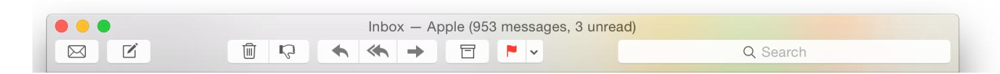

A toolbar can blur the scrolling content that appears behind it, giving users a greater sense of depth and context. (You automatically get this blurring behavior when you place a scroll view adjacent to a toolbar or a title bar; to get this behavior in other scenarios, you can use NSFullSizeContentViewWindowMask.) To learn about the style of controls that are appropriate for a toolbar, see Some [Controls](#page-176-1) Can Be Used in the [Window](#page-176-1) Frame (page 177).

Users often rely on the presence of a toolbar, but you can hide it in a full-screen window if users don't need it to accomplish the focused task. For example, Preview hides the toolbar in a full-screen window because users are more likely to be focused on reading content than on annotating it. If you hide the toolbar in a full-screen window, users should be able to reveal it (along with the menu bar) when they move the pointer to the top of the screen.

**Note:** Other types of windows, such as panels and preferences windows, can also contain toolbars. In general, the style and usage of toolbars in these types of windows differ from the style and usage of a toolbar in an app or document window. To learn how to design a panel, see [Panels](#page-144-0) (page 145); to learn how to design a preferences window, see [Preferences](#page-156-0) Windows (page 157).

**Create toolbar items that represent the functionality users need most often.** To help you decide which items to include in your toolbar, consider the user's mental model of the task they perform in your app (to learn more about the mental model, see [Mental](#page-60-1) Model (page 61)).

**Arrange toolbar items so that they support the main task that users accomplish in your app.** In general, use the leading end of the toolbar for commands that should have the highest visibility. (In a localized version of your app, the leading end of the toolbar might be on the right or the left.) "High visibility" can mean different things in different apps. In some apps, for example, frequency of use should determine visibility; in other apps, it makes more sense to rank items according to importance, significance, or their place in an object hierarchy. The figure below illustrates three possible ways to arrange toolbar items.

#### **If appropriate, separate toolbar items into subsets and then arrange the subsets according to importance.**

Sometimes, you can define logical subsets of your app's features and objects, such as one subset of document manipulation commands and another subset of commands for manipulating page-level objects such as paragraphs, lists, and tables. When you define subsets, you can arrange the items in each subset according to importance or frequency of use, and then use the same criteria to position each subset in the toolbar.

The default Keynote toolbar is an example of this type of arrangement. Keynote groups items according to functionality and then positions the groups so that the items that handle slide decks and slides are to the left of items that provide inspection and selection of object attributes. You can see about half of these groups in this toolbar.

**Use window-frame controls in a toolbar.** Standard controls look bad on the toolbar background, whether it's translucent or opaque. Instead, use the controls that have been specifically designed for use in toolbars, such as the round textured button (shown here used for the Quick Look button in the Finder toolbar). To learn more about the controls you can use in a toolbar, see Some [Controls](#page-176-1) Can Be Used in the Window Frame (page 177).

**Important:** Don't use the toolbar-specific controlstyles anywhere else in your window. The toolbar control styles are designed to look good on the toolbar; but on a window-body background, these controls can disappear or look inactive.

**Avoid mixing icon buttons with toolbar controls in a toolbar.** Toolbars look best, and are easiest for users to understand, when they contain controls of the same type. If you want to use freestanding icons instead of controls in a toolbar, use NSToolbarItem.

**Ensure that your toolbar controls clearly communicate their meaning to users.** It's best when users can tell what a toolbar control does without experimentation (or waiting to see a help tag). You can use system-provided images in your toolbar controls to represent a wide range of common commands and features, such as the Action menu and Quick Look. Users are familiar with the meanings of these items, and using them frees you from having to design custom images. (For more information about the system-provided images you can use, see [System-Provided](#page-328-0) Images (page 329).)

**Important:** If you use system-provided images in your toolbar controls, be sure to use them according to their documented meanings. For example, use the Action gear symbol in an Action menu only; don't use it to represent "build" or "advanced."

**Avoid displaying a persistent selected appearance for a toolbar item.** An immediate action occurs when the user clicks a toolbar item—such as opening a new window, switching to a different view, displaying a menu, or inserting (or removing) an object—so it doesn't make sense to imply that there is also a change in state. The exception to this is a segmented control that shows a persistent selected appearance within the context of the control, such as the view controls in the Finder toolbar.

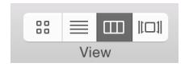

**Make every toolbar item available as a menu command.** Because users can customize the toolbar (and it can be hidden under some circumstances), the toolbar should not be the only place to find a command.

It's important to emphasize that the converse of this guideline is *not* true. That is, you don't create a toolbar item for every menu command, because not all commands are important enough (or used frequently enough) to warrant inclusion in a toolbar.

**In general, allow users to show or hide the toolbar.** Users might want to hide the toolbar to minimize distractions or reveal more of their content. (Note that you can cause the toolbar to hide automatically in a full-screen window.) The commands for showing and hiding the toolbar belong in the View menu. For more information about this menu, see The View [Menu](#page-98-0) (page 99).

**In general, let users customize the toolbar.** Although the default toolbar should include the commands that most users want, you should let users customize this set of commands to support their individual working styles. In addition, users should be able to specify whether toolbar items are displayed as controls only, text only, or controls with text (by default, display both controls and text). Place the Customize Toolbar command in the View menu (for more information about this menu, see The View [Menu](#page-98-0) (page 99)). Although you can also allow users to adjust the size of toolbar items, most users don't expect this capability (if you decide to do this, you must supply different sizes of toolbar icons).

You can also enable a contextual menu that's revealed when users Control-click the toolbar itself. In this menu, users can choose to customize the appearance and contents of the toolbar in various ways.

**Avoid putting an app-specific contextual menu in your toolbar.** Users reveal the contextual toolbar customization menu by Control-clicking in the toolbar. Additionally, in document windows, users can reveal the document path menu by Control-clicking the window title. The presence of these two menus doesn't leave any areas in the toolbar that users could Control-click to reveal a third contextual menu. If you need to offer a set of commands that act upon an object the user selects, use an Action menu control instead. This item is described in [Action](#page-191-0) Menu (page 192).

**Enable click-through for toolbar items when appropriate.** Click-through enables the user to activate the item when the containing window is inactive. You can support click-through for any subset of toolbar items. In general, you want to allow click-through for nondestructive actions that users might want to perform when they're focused on a task in a different window.

**Avoid combining text and images within a toolbar control.** A toolbar button can contain either text or an image. And, although each segment in a segmented toolbar control can contain either text or an image, it's best to avoid combining text segments with image segments in the same segmented control.

Interface Builder makes it easy to add one of the system-provided images to a toolbar control, such as the plus sign, the accounts symbol, or the locked symbol. Some of these symbols are shown here in the controls in the Finder toolbar. For more information about the system-provided images, see [System-Provided](#page-328-0) Images (page 329). If you need to design your own image to place in a toolbar control, see [Toolbar](#page-323-0) Icons (page 324) for some metrics and guidelines.

**Important:** Supply a descriptive label for each toolbar control you create so that users can customize the toolbar to display both images and text. Users see a descriptive label of each toolbar item when they customize a toolbar to use the Icon & Text or Text Only display options. (Window-frame controls used in a bottom bar don't need external descriptive labels.)

If you want to display text inside a toolbar control, be sure it's either a noun (or noun phrase) that describes an object, setting, or state, or that it's a verb (or verb phrase) that describes an action. Text inside toolbar controls should have title-style capitalization. For more on this style, see Use the Right [Capitalization](#page-46-0) Style in [Labels](#page-46-0) and Text (page 47).

**Accurately indicate the current state of a two-state control in a toolbar.** If you use a toolbar control that behaves like a checkbox or a toggle button, you may be able to benefit from the automatic highlighting that signifies the On state of the control. If you do this, be very sure that the control clearly indicates the correct state in the correct situation.

If you put a two-state control in a toolbar, also provide two descriptive labels that can be displayed below the control. One label should describe the On (or pressed) state, and one should describe the Off (or unpressed) state. Finally, be sure to describe both of the states in the control's help tag, whether the control appears in a toolbar or a bottom bar.

For example, Mail includes a toggled toolbar button that users can use to take their accounts online or offline (shown here in its pressed state). The Go Offline label that accompaniesthe pressed state changesto Go Online when the control is in its unpressed state.

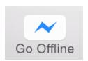

## Source Lists (Sidebars)

A **source list** (also called a **sidebar**) is an area of a window, usually set off by a movable splitter, that lets users navigate orselect objectsin an app. For more information on splitters,see Split [View](#page-223-0) (page 224). Typically, users select an object in the source list and then act upon that object in the main part of the window.

**APINote:** By default, a source list istranslucent when you use an NSOutlineView or NSTableView object and set the highlight style to NSTableViewSelectionHighlightStyleSourceList.

You can provide a source list as the primary means of navigating or viewing within your app, or as a way to select a view in a part of the app. Each usage pattern is associated with a different appearance, as illustrated here.

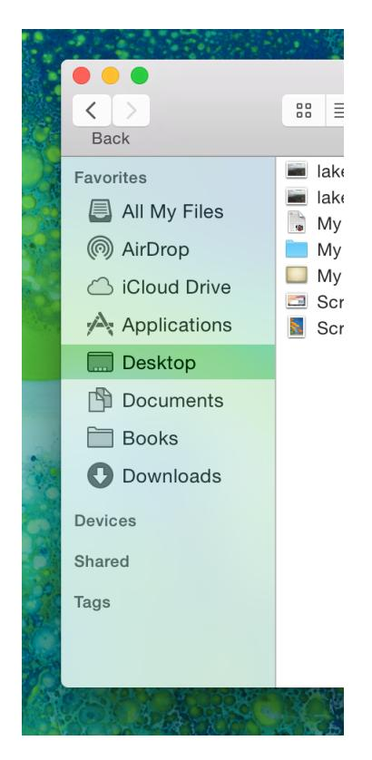

A source list that provides the primary navigation or selection mechanism for the app as a whole istranslucent. For example, the Findersidebar, which helps users navigate the file system, uses translucency.

A source list that provides selection functionality for the window, but not the app as a whole, uses an opaque background. Here, you can see the opaque background of the source list in Network preferences, in which users select a network service to configure.

The following guidelines can help you use a source list appropriately in your app.

**Consider using a source list to give users a file-system abstraction.** A source list can shield users from the details of file and document management, and allow them to work with user-customizable, app-specific containers that hold related items. Source lists can be especially useful in single-window "shoebox" style apps that allow users to create and manage content. For example, iTunes users can ignore the file-system locations of their songs, podcasts, and movies, and instead work with libraries and playlists..

Consider using a source list in your app when:

- Navigation and selection of content are primary tasks.
- Collections of objects are key to the user's mental model. To learn more about the mental model, see [Mental](#page-60-1) Model (page 61).
- The hierarchical arrangement of objects suggests a natural way to navigate.
- Arranging objects hierarchically removes complexity.

**If necessary, display titles inside the source list.** Source lists don't generally have headers like lists can, but they can display titles to distinguish subsets of objects or data. For example, the Finder displays several useful subsets of locations and items in its sidebar, such as Devices, Shared, and Tags.

**Avoid displaying more than two levels of hierarchy in a source list.** If the data you need to display is organized in more than two levels of hierarchy, you can use a second source list, but don't use additional disclosure triangles to expose additional levels of hierarchy in a single source list. If, however, your app is centered on the navigation of deeply nested objects, consider using a browser view instead of multiple source lists. To learn more about browser views, see Column [\(Browser\)](#page-221-0) View (page 222).

**Use the appropriate background appearance in your source list.** If your app contains a single source list that provides primary navigation and selection functionality, you can use the translucent background. In all other cases, however, use the opaque background. Specifically, use the opaque background when:

- Your window contains more than one source list
- You use a source list in a panel or preferences window

**As much as possible, allow users to customize the contents of a source list.** It's best when users can decide which object containers are most important to them. You should also consider using Spotlight to support smart data containers. For more information on using Spotlight in your app, read *Spotlight Overview*.

To help users add, remove, manipulate, or get information about items in a source list, modern OS X apps tend to create buttons that float at the bottom of the list. Or, you can use gradient buttons below the bottom edge of the source list, because these buttons look good on the window-body area. For details about using gradient buttons, see [Gradient](#page-183-0) Button (page 184).

**Consider using a popover instead of a source list.** If your source list doesn't represent primary functionality in your app, consider replacing it with a popover, because a popover appears only when users need it. To learn more about using a popover in your app, see [Popover](#page-216-1) (page 217).

## Panels

A **panel** is an auxiliary window that contains controls and options that affect the active document or selection. An app-wide toolbar in its own window is also called a **tool panel** or, less frequently, a **tool palette**.

**Note:** Modern OS X apps often present auxiliary information and tools in a section of the main window instead of in a panel.

Panels are either app-specific or systemwide.

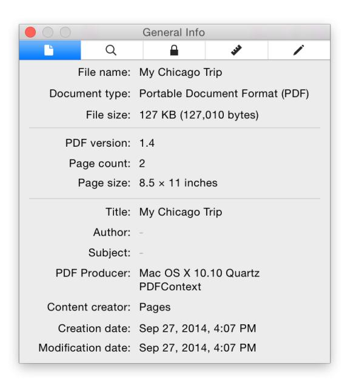

App-specific panels float on top of the app's windows and disappear when the app is deactivated. For example, the Preview Inspector panel is visible only when a Preview window is main or key.

Systemwide panels, such as the Fonts window shown here, float on top of all open windows. (To learn more about the Fonts window, see [Colors](#page-267-0) and Fonts [Windows](#page-267-0) (page 268).)

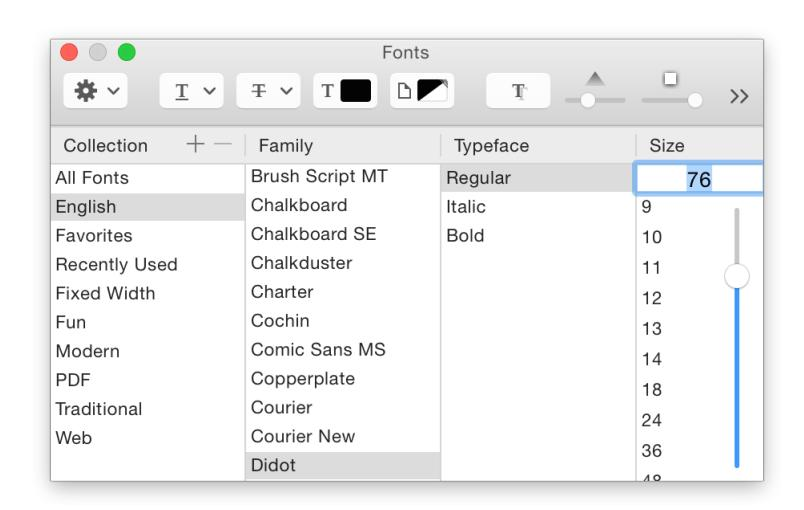

**In general, use a standard panel.** For some apps, such as highly visual, immersive apps, translucent panels (sometimes called HUD panels) can be appropriate, but for most apps, standard panels are best. Users don't expect to see a translucent panel unless it contains image adjustment tools or it is displayed by an immersive app that uses a dark UI. To learn more about when translucent panels are appropriate, and how to design one, see [Translucent](#page-147-0) Panels (page 148).

**Consider using a panel to give users easy access to important controls or information that directly affects their task.** For example, you can create a modeless panel, such as a tools panel, to offer controls or settings that affect the active document window. Because panels take up screen space, however, don't use them when you can meet the need by using a popover, a modeless dialog, or by adding a few appropriate controls to a toolbar.

**Hide and show panels appropriately.** When a user makes a document active, all of the app's panels should be brought to the front, regardless of which document was active when the user opened the panel. When an app is inactive, its panels should be hidden.

Don't list panels in the Window menu as documents, but you can put commands to show or hide all panels in the Window menu.

**Make sure a panel includes a title bar.** Even if a panel doesn't need a title, give it a title bar so that users can drag the panel.

**Avoid including an active minimize button in a panel.** Users shouldn't need to minimize a panel, because it's displayed only when needed and disappears when its app is inactive. Instead, include the close and zoom buttons or, more commonly, only the close button.

### Inspectors

An **inspector** is a panel that allows users to view the attributes of a selection. Inspectors (sometimes called inspector windows) can also provide ways to modify these attributes.

Modern OS X apps often present inspector information within a main window instead of a separate inspector window. For example, Keynote displays multiple inspector panes within the main window.

**Ensure that an inspector updates dynamically based on the current selection.** Users expect an inspector's view to always be up to date. Similarly, they expect the changes they make in an inspector to immediately affect their content. Contrast this behavior with that of an Info window, which shows the attributes of the item that was selected when the window was opened, even after the focus has been changed to another item. Also, an Info window is not a panel; it islisted in the app's Window menu, and it does not hide when the app becomes inactive.

**Consider providing both inspectors and Info windows in your app.** In some cases users want one window in which context changes with each new item they select (an inspector), and in other cases they want to see the attributes of more than one item at the same time (a set of Info windows). Note that users can open multiple inspector windows and Info windows in the same app at the same time.

## Translucent Panels

The behavior of a **translucent panel** issimilar to the behavior of a standard panel, but its appearance is designed to complement apps that focus on highly visual content or that provide an immersive experience, such as a full-screen slide show. For example, QuickTime Player uses a translucent panel to display inspector information without obstructing too much of the user's content.

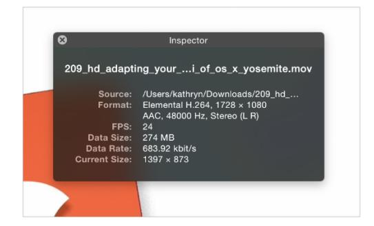

**Have a good reason to use a translucent panel instead of a standard panel.** Users can be distracted or confused by a translucent panel when there is no logical reason for its presence. In general, use translucent panels only when at least one of the following statements is true:

- Your app is media-oriented, that is, focused on movies, photos, or slides.
- Users use your app in a dark environment or in an immersion mode (frequently, this type of app also uses a dark, custom UI).
- Users make only quick adjustments in the panel and dismiss it quickly.
- A standard panel would obscure the content that users need to adjust.

**Use a combination of standard and translucent panels, if appropriate.** If your app focuses on highly visual content only at specific times or only in some modes, use the panel type that is best suited to the current task and environment.

**Don't change a panel's type when your app changes its mode.** For example, if you use a translucent panel when your app is in an immersive mode, don't transform it into a standard panel when your app switches to a nonimmersive mode.

**As much as possible, use simple adjustment controls in a translucent panel.** In particular, avoid using controls that require users to type or to select items, because these controls force users to shift their attention from their content to the panel. Instead, consider using controls such as sliders and steppers, because they're easy for users to use without focusing on them.

**Use color sparingly.** In the dark UI of a translucent panel, too much color can lessen its impact and distract users. Often, you need only small amounts of high-contrast color to enhance the information you display in a translucent panel.

**In general, keep translucent panels (and their contents) small.** Translucent panels are designed to be unobtrusively useful, so allowing them to grow too big defeats their primary purpose. Don't let a translucent panel obscure the content that the user is trying to adjust, and don't let it compete with the content for the user's attention.

### The About Window

An **About window** (sometimes called an About box) is an optional window that displays your app's version and copyright information. The Safari About window is shown here.

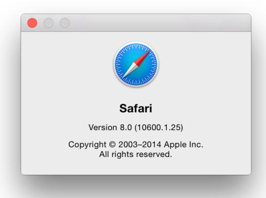

Unlike other windows, an About window combinessome of the behaviors of panels and windows: Like a panel, an About window is not listed in the app's Window menu, and like a window, it remains visible when the app is inactive.

Make an About window modeless so the user can leave it open and perform other tasks in the app. If you decide to provide an About window, be sure that it:

- Has a title bar with no title
- Is movable

- Includes the close button as the only active window control
- Displays your app icon
- Includesthe full app name and version number, which should be the same asthe version number displayed by the Finder
- Includes copyright information, technical support contact information, and a brief description of what the app does

**Use buttons in an About window if you want to give users a way to contact you.** For example, you might provide a button that opens your website in a browser window or opens a blank email message that is preaddressed to you. Of course, it's best to provide most of your company contact information in the first page of your help documentation. For more information on Help menu items, see The Help [Menu](#page-102-0) (page 103).

**Consider putting branding elements, such as logos or slogans, in your About window.** An About window isthe appropriate place for these elements because users expect it to provide information about your company and product. Avoid putting such elements in document windows and dialogs.

## Dialogs

A **dialog** is a window that is designed to elicit a response from the user. Many dialogs—the Print dialog, for example—allow users to provide several responses at one time.

OS X provides three main ways to present dialogs.

**Document modal.** A document-modal dialog prevents the user from doing anything else within a particular document. The user can switch to other documents in the app and to other apps. Document-modal dialogs should be sheets, which are described in [Using](#page-151-0) [Document-Modal](#page-151-0) Dialogs (Sheets) (page 152).

#### **App modal.**

An app modal dialog prevents the user from interacting fully with the current app, although the user can switch to another app. An example of an app-modal dialog is the Open dialog

(described in

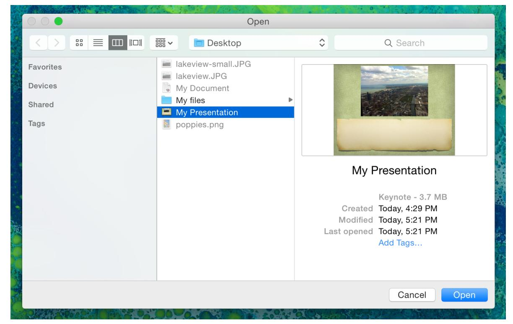

The [Open](#page-159-0) [Dialog](#page-159-0) (page 160)).

**Modeless.** A modeless dialog enables users to change settings in the dialog while still interacting with document windows. The Find window in many word processors is an example of a modeless dialog.

In addition to these main dialog types, OS X provides an alert, which is a special type of dialog that can be document modal or app modal. In general, if the error condition or notification applies to a single document, the alert is document modal (that is, a sheet). If the alert applies to the state of the app as a whole, or to more than one document or window belonging to the app, the alert is app modal. For guidelines on when to use alerts and how to design them, see [Alerts](#page-171-0) (page 172).

### Using Document-Modal Dialogs (Sheets)

A **sheet**is a modal dialog that is attached to a particular document or window, preventing usersfrom interacting with the document or window until they dismiss the dialog. To avoid annoying users, use a sheet only when necessary.

Because a sheet is attached to the window from which it emerges, users never lose track of which window the dialog applies to. The TextEdit locked dialog shown here is an example of a sheet.

A sheet animates into view as if it were emerging from a window's toolbar (or title bar, if no toolbar is present). When a sheet opens on a window near the edge of the screen and the sheet is wider than the window it's attached to, the sheet causes the window to move away from the edge. When the sheet is dismissed, the window returns to its previous position.

Only one sheet can be open for a window at any one time. If the user's response to a sheet causes another sheet to open for that document, the first sheet closes before the second one opens.

In general, a sheet is a good way to present:

- A modal dialog for an activity that is specific to a particular document, such as exporting, attach files, or print files.
- A modal dialog that is specific to a single-window app that does not create documents. For example, a single-window utility app might use a sheet to request acceptance of a licensing agreement from the user.
- Other window-specific dialogs that are typically dismissed by users before they proceed with their task.

**If necessary, display a sheet on top of any active panels that are related to the current document window.** However, if the user leaves a sheet open and clicks another document in the same app, the inactive window and its sheet should go *behind* any open panels.

**Avoid using sheets if multiple open windows can show different parts of the same document at the same time.** A sheet is not useful in this situation, because it implies that the changes users make apply only to one portion of the document. In thistype ofsituation, it's better to use an app modal dialog to help users understand that changes in one window affect the content in other windows.

**Use a sheet when multiple documents can appear in a single window at different times.** For example, a tabbed browser can display different documents in a single window at different times. A sheet is appropriate in this situation, even though it applies to only the document that is currently visible in the window. Because users must in effect dismiss the current document before viewing a different document in the same window, they should first dismiss the sheet.

**Don't use a sheet if users need to see or interact with the window in order to address the dialog.** For example, if the dialog requests information that the user must get from the window, the dialog should not be a sheet. In this case, a modeless dialog allows users to see or copy information in the window and apply it to the dialog.

**Don't use a sheet for a modeless operation in which users need to observe the effects of their changes.** In this situation, a panel is a better choice because users can leave it open while they make changes to their content.

**Don't use a sheet on a window that doesn't have a title bar.** Sheets should emerge from a definite visual edge.

### Accepting and Applying User Input in a Dialog

Because dialogs are small, transient UI elements, users don't expect to have in-depth interactions with them.

**Make it easy for users to enter information.** As you design a dialog, keep the following points in mind to help you make user interaction easy:

- When appropriate, display default valuesfor controls and text fieldsso that the user can verify information rather than enter it from scratch.
- Display a selection or an insertion point in the first location that accepts user input—a text entry field or a list, for example.
- When it provides an obvious user benefit, ensure that static text is selectable. For example, a user should be able to copy an error message, a serial number, or IP address to paste elsewhere.

**In general, changes that a user makes in a dialog should appear to take effect immediately.** To support the appearance of immediate effect, you need to validate the information users enter and you need to decide when to apply their changes.

**As much as possible, do error checking as the user enters information.** If you wait to check for errors until the user tries to dismiss the dialog, you might have to present an alert, which is not a good user experience. It's better to check for errors as soon as possible, because it allows users to fix the problem before they leave the context of the dialog.

**Avoid validating input after each keystroke.** Too-frequent validation can annoy users and slow down your app. It's better to design your interface to automatically disallow invalid input. For example, your app could automatically convert lowercase characters to uppercase when appropriate.

**Use the length of an operation to determine whetherto perform it automatically.** Sometimes, it's appropriate for your app to automatically perform an operation based on user input; other times, it's better when the user initiates the operation—for example, by clicking a button. In general, it's acceptable to automatically perform an operation that completes quickly and returns user control within a couple of seconds. For an operation that takes a longer time to execute, display an estimate of the time required to complete the operation and let the user initiate it.

**Provide an Apply button when it makes sense.** An Apply button can be appropriate in a dialog that displays multiple settingsthat affect the user's view of data. In thissituation, an Apply button allowsthe user to preview the effect of the selected settings without committing to the changes.

Be cautious about using an Apply button for operations that take a long time to implement or undo; it might not be obvious to users that they can interrupt or reverse the process. In particular, save dialogs or dialogs that allow users to make changes that can't be previewed easily should not include an Apply button.

**Don't use an Apply button to mean the same thing as the OK button.** In particular, clicking an Apply button should not dismiss a dialog because the user should first decide whether to accept the previewed changes (by clicking OK) or to reject them (by clicking Cancel). When the user dismisses the dialog without clicking OK, all previewed changes should be discarded.

### Expanding Dialogs

Sometimes you need to provide the user with additional information or functionality in a dialog, but you don't want to display it all the time. To do this, you use one of the disclosure controlsto expand the dialog and reveal the additional information or capability to the user.

**Use a disclosure button to provide additional choices in a dialog.** In particular, the disclosure button is the appropriate choice when the additional choices are directly related to selections that are offered in a pop-up or command pop-down menu in a dialog. When users click the disclosure button, the dialog expands to reveal selectionsin addition to those listed in the pop-up or command pop-down menu. (For more information about how to use a disclosure button in your dialog, see [Disclosure](#page-185-0) Button (page 186).)

**Use a disclosure triangle to reveal details that elaborate on the primary information in a dialog.** When users open the disclosure triangle, the dialog expands, revealing additional information and, if appropriate, extra functionality. (For more information about how to use a disclosure triangle in your dialog, see [Disclosure](#page-183-1) [Triangle](#page-183-1) (page 184).)

**Respond appropriately when users can resize a dialog that contains columns of data.** If users can resize a dialog that displays columns (such as the Open dialog), the columns should grow and additional columns should appear. All other elements should remain the same size and be anchored to the right, center, or left side of the dialog.

### Dismissing Dialogs

Users expect all the buttons at the bottom right of a dialog to dismiss the dialog. A button that initiates an action is furthest to the right. This rightmost button, called the **action button**, confirms the main point of the dialog. The Cancel button is to the left of the action button.

Usually the rightmost button or the Cancel button is the **default button**. A default button has color to let users know that when they press Return or Enter, the default button is activated.

**Use a default button only if the user's most likely action is harmless.** Make the default button represent the action that the user is most likely to perform *if* that action isn't potentially dangerous. Users sometimes press Return merely to dismiss a dialog, without reading its content, so it's crucial to ensure that the default button performs a harmless action.

**Don't use a default button if the user's most likely action is dangerous.** An example of a dangerous action is one that causes a loss of user data. When there is no default button, pressing Return or Enter has no effect; the user must explicitly click a button to dismiss the dialog. This guideline protects users from accidentally damaging their work by pressing Return or Enter without fully understanding the dialog's message. You can consider using a safe default button, such as Cancel, or not using a default button at all.

**Don't use a default button if you use the Return key in the dialog's text fields.** Having two behaviors for one key can confuse users and make the interface less predictable. Also, users might press Return one too many times and dismiss the dialog (and activate the default button) without meaning to.

**In general, include a Cancel button.** The Cancel button returns the computer to the state it was in before the dialog appeared. It means"forget I mentioned it." Also, make sure that the keyboard shortcut Command-period and the Esc (Escape) key are mapped to the Cancel button.

**Ensure that Cancel undoes applied changes.** If your dialog includes an Apply button that helps users see the effect of changes before committing to them, make sure that clicking Cancel undoes all of the applied changes. Cancel should never silently commit the changes the user previewed by clicking Apply. For more guidelines on using an Apply button, see [Accepting](#page-153-0) and Applying User Input in a Dialog (page 154).

**Place a third button for dismissing the dialog to the left of the Cancel button.** If the third button could result in data loss—Don't Save, for example—try to position it at least 24 points away from the "safe" buttons (Cancel and Save, for example).

**Place a button that affects the contents of the dialog itself in the left end of the dialog.** If there is no Help button, locate a button that affects dialog contents so that its left edge is aligned with the main dialog text. If there is a Help button, place the button to the right of the Help button. For example, the Help button is to the left of the Show Details button in the Print dialog, which expands the dialog to display more information about the print job.

### Preferences Windows

A preferences window is a modeless dialog that containssettingsthat the user changesinfrequently. In general, the user opens a preferences window to change the default way an app displays an item or performs a task, then closes the window, and expects the new settings to have taken effect. To provide a good preferences experience in your app, see [Preferences](#page-263-0) (page 264).

Often, a preferences window has a toolbar that contains items that function as pane switchers. When the user clicks an item in this type of toolbar, the content area of the preferences window switches to display a different view, called a **pane**. This design is useful for apps that need to provide multiple settings in each of several different categories. For example, the Safari preferences window contains a toolbar that allows user to choose among categories of settings, such as bookmarks, appearance, and RSS.

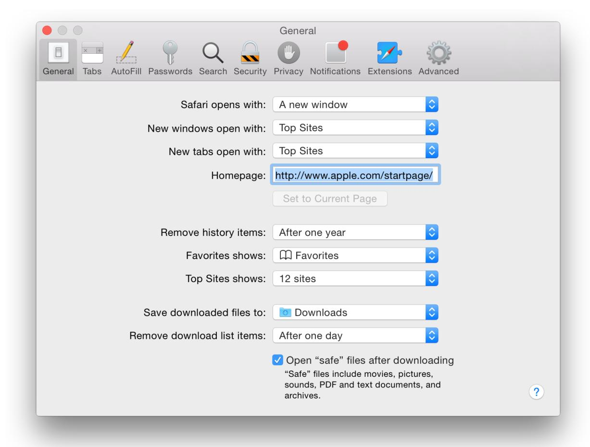

**Don't enable customization of a pane-switcher toolbar in a preferences window.** A pane-switcher toolbar in a preferences window does not provide a shortcut to frequently used commands, but instead acts as a convenient way to group settings. If users customize thistype of toolbar, they might forget that hidden settings are still available. For the same reason, it makes sense to disable the ability to hide the toolbar in a preferences window, too.

**Maintain the selected appearance of an item in a pane-switcher toolbar.** When the user clicks an item in a pane-switcher toolbar, the window displays a different pane. It's important to indicate which item is currently selected by maintaining the item's selected appearance. For example, in the Safari preferences window, you can see the background highlighting that indicates the Tabs item is the active one.

**Don't allow resizing or include active minimize or zoom buttons in a preferences window.** Remember that preferences windows are intended to give users a place to make occasional adjustments to the way an app behaves, so there should be no need for a preferences window to be resized or to remain open for a long time.

**Use the title of the current pane to title the preferences window.** The preferences window title should be the same as the title of the currently selected pane even if you don't use a pane-switcher toolbar to change panes. (Note that if your preferences window does not contain multiple panes, its title should be "*App Name* Preferences".) In addition, a changeable-pane preferences window should remember which pane the user selected the last time the window was open.

**Use the standard menu item and keyboard shortcut to open your preferences window.** Users expect most apps to include a Preferences command in the app menu. In addition, most users expect to be able to use the Command-comma keyboard shortcut to open an app's preferences window.

### The Open Dialog

The Open dialog gives users a consistent way to find and open an item in an app.

You can extend the Open dialog as appropriate for your app. For example, the TextEdit Open dialog contains an additional section that allows users to specify different encodings.

**As much as possible, use the Open command to mean "open," and not "act upon."** The Open dialog is best suited to helping users find an item to open in your app. To help users find items to use in an app-specific task, use a Choose dialog instead. For guidance on using a Choose dialog, see The [Choose](#page-161-0) Dialog (page 162).

**Make sure users can use the Open command to display the Open dialog.** Users expect the Open command to display an Open dialog. Contrast this with the Choose dialog, which can be displayed by different commands in different apps. It's also a good idea to provide the standard Command-O keyboard shortcut to display the Open dialog, because most users are accustomed to it.

**Specify a reasonable default location.** For the iCloud Open dialog, iCloud is the default location. You should not change this behavior. See [iCloud](#page-248-0) (page 249) for more information.

For other dialogs, the default location is typically one of the predefined folders in the user's home folder. If the user selects a different folder, make sure you remember the user's selection so that it appears the next time the dialog is displayed.

**Considerincluding a pop-up menu that allows users to filterthe types of files that appearin the list.** Display items that don't meet the filtering criteria as dimmed. You can supplement this list with custom types and specify the default to show when the dialog opens. Include an All Applicable Files item, which doesn't have to be the default item.

**Include an Open Recent command to accompany the Open command.** The Open Recent command allows users to reopen recently opened documents without using the Open dialog.

**Extend the functionality oftheOpen dialog, if appropriate.** For example, it's a good idea to support document preview so that users can be sure they're opening the document they intend. In addition, you can enable multiple selection if your app allows more than one document to be opened at one time.

### The Choose Dialog

A Choose dialog gives users a consistent way to select an item as the target of a task. An app can have more than one Choose dialog, but only one can be open at a time.

#### A Choose dialog:

- Can be opened by various commands
- Can support multiple selection
- Supports document preview
- Can be resized

**Note:** Recent Places doesn't record folders that users select in Choose dialogs.

**Customize the Choose dialog title to reflect the task (if the dialog is not a sheet).** By default, the dialog's title is"Choose." If, for example, the command that displaysthe dialog is Choose Picture, title the dialog "Choose Picture." If it's helpful, also change the Choose button to something more specific.

**Considerincluding a pop-up menu that allows users to filterthe types of files that appearin the list.** Display items as dimmed that don't meet the filtering criteria. You can supplement this list with custom types and specify the default to show when the dialog opens. Include an All Applicable Files item, but it does not have to be the default.

### The Print and Page Setup Dialogs

Users expect most documentsto be printable, or to include a printable version. OS X providesstandard dialogs that your app can display so that users can have a consistent printing experience in every app they use.

The Print dialog isfocused on printing the current document, but it also includesfeaturesthat can be provided by individual apps and by printer modules. The Page Setup dialog gives users a way to set the scaling and orientation options for a document, based on the intended output paper size and the printer.

By default, the Print dialog appears in its minimal form (shown here in the dialog attached to a TextEdit document). Users can get additional functionality in the expanded Print dialog by clicking Show Details.

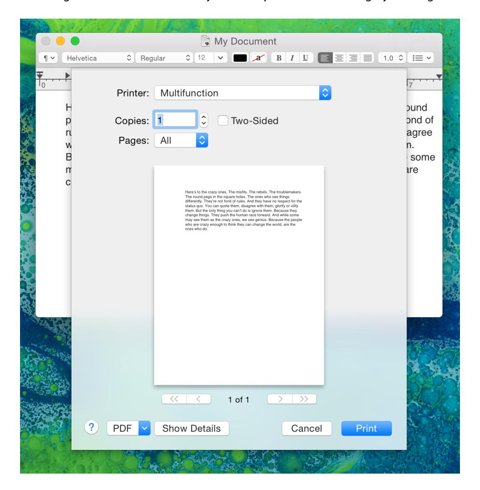

In the expanded Print dialog, user options are provided through the features pop-up menu, which displays panes that are drawn and controlled by printing dialog extensions (PDEs). PDEs are provided by the operating system, printer modules, and apps. Apple provides a number of printing panes. In the expanded Print dialog shown here, you can see the "Print header and footer" and "Rewrap contents to fit page" options that TextEdit provides.

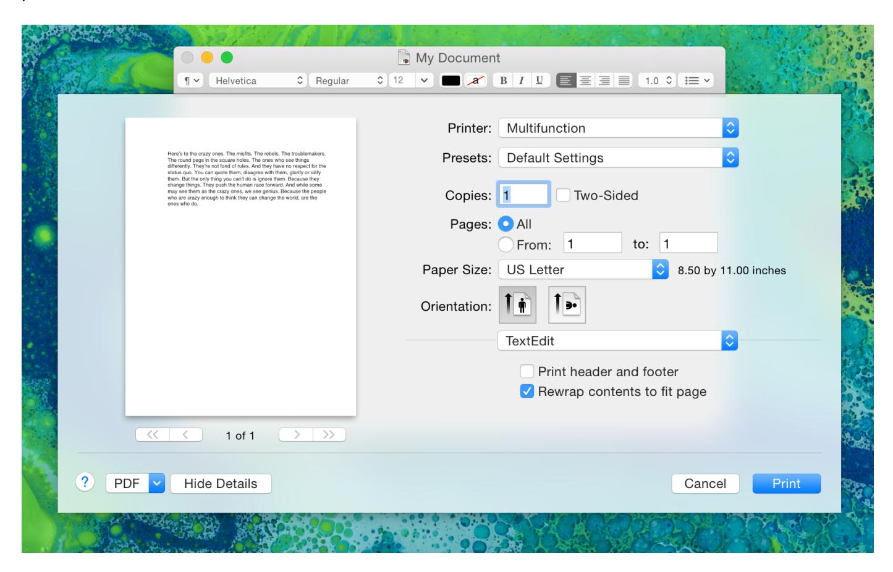

You might want to provide custom print panes that give users options that are relevant to the types of content your app handles. For example, Contacts helps users print their contact information in different styles, such as mailing label, envelope, and list. Here are some specific guidelines to keep in mind if you implement custom printing features:

- Choose a menu item name that doesn't conflict with menu items already in the features pop-up menu, and that accurately describesthe content of the pane. For an app, the menu item should be the app name.
- Make sure the features you implement are appropriate for your app. For example, an option to print in reverse order should be provided by the operating system, not by your app. (Implementing this feature requires the app to know the hardware's capabilities.)
- Make interdependencies among options clear to users. For example, if a userselects double-sided printing, the option to print on transparencies should become unavailable.

- Separate more advanced features from frequently used features. When the user chooses to display the advanced features, there should be an "advanced options" title above the advanced controls.
- When appropriate, show users what effect their choices will have. For example, a thumbnail image that shows the effect of changing a tone control helps users determine desired settings.
- Save a user's printing preferences for a document, at least while the document is open, and provide a way for users to save custom settings.

If you think users would appreciate being able to set printing attributes for different printers or different paper sizes, provide a Page Setup dialog in your app. Be sure to save the settings that users make in this dialog with the document. Below, you can see the Page Setup dialog that TextEdit provides.

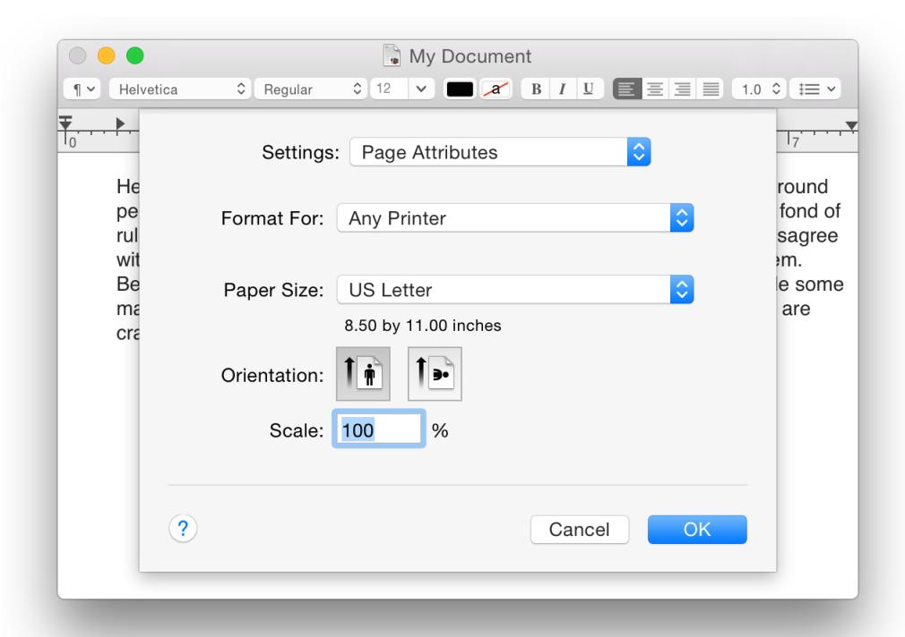

### Find Windows

A Find window is a modeless dialog that opensin response to the Find command and that provides an interface for specifying items to search for.

Find windows can be useful in document-creation apps, because users can use one Find window to search for a term in several different open documents. If it makes sense in your UI, however, offer find functionality in a scope bar. A scope bar is attached to a window and provides both search and filtering capabilities to users. For more information about scope bars and how to use them in your app, see [Searching](#page-130-0) In a Window (page 131).

### Save Dialogs

Users expect to be able to specify a title and save location when they choose to save a document for the first time. To perform the initial save, users expect to see the standard Save dialog.

**Note:** As much as possible, help users stop worrying about the save state of their content. In particular, you want them to stop thinking that they must continually choose File > Save in order to avoid losing their work.

Although users see a Save dialog the first time they want to name and place their document, they should seldom—if ever—see a Save dialog while they continue to work on the document.

The Save dialog hastwo states: minimal (also known as collapsed) and expanded. Clicking the disclosure button toggles between these states. For example, in the minimal Save dialog (shown here displayed by TextEdit), you can see the closed disclosure button to the right of the document title.

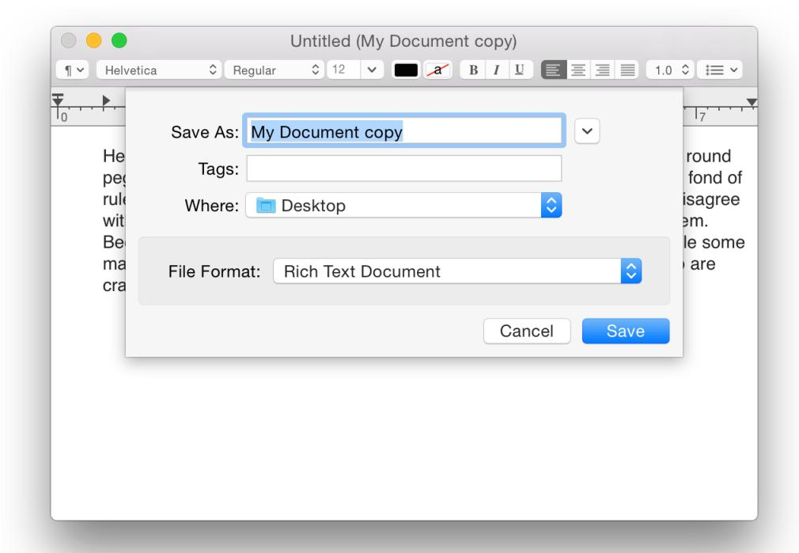

The minimal Save dialog contains these elements:

- The Save As text field, in which users enter the document name. Expert users can enter pathnames by pressing Command-Shift-G. (Note that the pathname separator is the "/" character.)
- The Where pop-up menu, which contains mounted volumes, folders in the Finder sidebar, and Recent Places (which are the five most recent folders the user opened or saved documents to).
- A Save button (this is the default button).
- A Cancel button, which dismisses the dialog and returns the app to its previous state.

- A disclosure button. Clicking it displays the expanded Save dialog. (For more information about how to use disclosure buttons, see [Disclosure](#page-185-0) Button (page 186).)
- An optional accessory view, which can contain information such as text encoding settings. (In general, the accessory view should not be necessary.)

The expanded Save dialog gives users a broader view of the file system than they get in the minimal Save dialog's Where pop-up menu. For example, the expanded TextEdit Save dialog displaysthe browsable file-system view.

In addition to the items in the minimal Save dialog, the expanded Save dialog includes the following:

- Back and Forward buttons to navigate back and forth between selections made in the list or column view.
- A source list that mirrors the Finder sidebar.

- Options for navigating the file system.
- A File Format (or Format) pop-up menu, which displays a list of file formatsfrom which the user can choose.
- A New Folder button, which displays an app-modal dialog that asks the user to name the new folder, and then creates it.
- A "Hide extension" checkbox, which allows the user to control whether or not the filename's extension (.jpg, for example) is visible.

In addition to the Save dialog, a document-based app can display the close confirmation save dialog. The close confirmation save dialog (shown when users close a document window that contains data that has never been saved) has the same minimal and expanded states as the standard Save dialog. For example, TextEdit displays the close confirmation save dialog when the user closes a new document window with unsaved changes.

As with the standard Save dialog, the close confirmation save dialog includes a disclosure button to the right of the Save As text field. Clicking this button expands the dialog to show a similar browsable file system view. The differences between the close confirmation save dialog and the standard Save dialog are due to the fact that it's unclear whether the user intends to discard their work. For this reason, the text at the top of the dialog explains why it has appeared, and the Don't Save button at the bottom of the dialog allows the user to decline to save their work.

There are a few ways in which you can customize a Save dialog so that it provides a better user experience.

**Specify a reasonable defaultlocation.** The default location appearsin the Where pop-up menu (in the minimal Save dialog) and in the Finder view (in the expanded Save dialog). Typically, the default location is one of the predefined folders in the user's home folder. If the user selects a different folder, make sure you remember the user's selection so that it appears the next time the dialog is displayed.

**Allow users to choose whetherto view the file extension.** Select the "Hide extension" checkbox asthe default (that is, filename extensions should not appear in user-visible filenames unless the user requests them). If the user changes the state of the checkbox for a particular document, the next new document should match the last user-selected state, even after the user quits and reopensthe app. The filename in the Save Asfield updates in real time as the checkbox is selected or deselected.

**Display the default new document name before users save the document for the first time.** In general, this name should be "untitled." In the Save As field, display the default name as selected so that users can easily replace it with a custom name. If the user chooses to make the filename extension visible, the extension is not selected.

**Display custom UI elements below the location-selection elements.** In the minimal Save dialog, custom UI elements go between the Where pop-up menu and the buttons at the bottom of the dialog. In the expanded Save dialog, custom elements go between the file-system browser and the buttons at the bottom of the dialog.

**Note:** In default keyboard navigation mode, pressing Tab in the expanded Save dialog shifts the keyboard focus from the Save As text field to the source list, to the visible columns, and then back to the text field.

## Alerts

An **alert** is a dialog that appears when the system or an app needs to give users an important message about an error condition or warn them about potentially hazardous situations or consequences. An alert that applies to a single document or window is displayed as a sheet.

Alerts interrupt users and must be dismissed before users can return to their task. For the best user experience, it's essential that you avoid displaying an alert unless it's absolutely necessary. The guidelines in this section help you determine when to display an alert and, if one is required, how to ensure that it's useful.

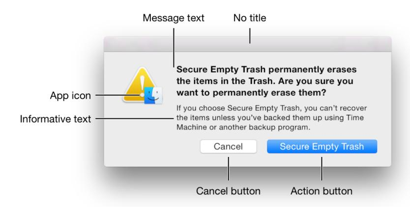

As you can see in the Finder alert shown above, an alert contains the following elements:

- The **alert message** provides a short, simple summary of the error or condition that summoned the alert.
- The **informative text** provides a fuller description of the situation, its consequences, and ways in which users can address it.
- Buttons for addressing the alert appear at the bottom of the dialog. The rightmost button in the dialog, the action button, confirmsthe alert message text. The action button is usually, but not always, the default button. (For more information about action and default buttons, see [Dismissing](#page-155-0) Dialogs (page 156).)
- The **app icon** appears to the left of the text and shows users which app is displaying the alert.

**Important:** Don't leave out the informative text. What you think of as an intuitive alert message might be far from intuitive to your users. Use informative text to reword and expand on the alert message text.

When an alert is necessary, your most important job is to explain the situation clearly and give users a way to handle it.

**Avoid using an alert merely to give users information.** Users don't appreciate being interrupted by alerts that are informative, but not actionable. Instead of displaying an alert that merely informs, give users the information in another way, such as in an altered status indicator. For example, when a mail server connection has been lost, Mail displays a warning indicator in the sidebar. Users can click the warning indicator if they want more information about the situation.

**Avoid displaying an alert for common, undoable actions, even when they cause data loss.** When users delete Mail messages or throw files away, they don't need to see an alert that warns them about the loss of data. Because users take these actions with the intention of discarding data (and because these actions are easy to undo), an alert is inappropriate. On the other hand, if the user initiates an uncommon action that can't be undone, such as Secure Empty Trash, it's appropriate to display an alert in case the user didn't mean to take the action.

**If a situation is worthy of an alert, don't use any other UI element to display it.** It might be tempting to use a different element to display alert information, but it would be very confusing for users. Users are familiar with the standard alert and they're not likely to take the information in a different element as seriously.

**Use the Caution icon in rare cases.** It's possible to display a Caution icon in your alert, badged with your app icon. This type of badged alert is appropriate only if the user is performing a task that might result in the inadvertent and unexpected destruction of data. Don't use a caution icon for tasks whose only purpose is to overwrite or remove data,such as Save or Empty Trash, because the too-frequent use of the caution icon dilutes its significance.

**Write an alert message that describes the alert situation clearly and succinctly.** An alert message such as "An error occurred" is mystifying to all users and is likely to annoy experienced users. Be as complete and as specific as possible, without being verbose. When possible, identify the error that occurred, the document or file it occurred in, and why it occurred.

When it's possible that users are unaware that their action might have negative consequences, it can be appropriate to phrase the alert message as a question. For example, a question such as "Are you sure you want to clear history?" pinpoints the action users took and prompts them to consider the results. However, don't overuse this type of alert; users tire quickly of being asked if they're sure they want to do something.

**Write informative text that elaborates on the consequences and suggests a solution or alternative.** Give as much information as necessary to explain why the user should care about the situation. If it's appropriate, use the informative text to remind users that the action they initiated can't be undone.

Informative text is best when it includes a suggestion for fixing the problem. For example, when the Finder can't use the user's input to rename a file, it tells them to try using fewer characters or avoid including punctuation marks.

**Express everything in the user's vocabulary.** An alert is an especially bad place to be cryptic or to use esoteric language, because the arrival of an alert can be very unsettling. Even though you want to be succinct, it's important that you use clear, simple language and avoid jargon. (For some examples of jargon to avoid, see [Terminology](#page-43-0) and Wording (page 44).)

**Ensure that the default button name corresponds to the action you describe.** In particular, it's a good idea to avoid using OK for the default button. The meaning of OK can be unclear even in alerts that ask if users are sure they want to do something. For example, does OK mean "OK, I want to complete the action" or "OK, I now understand the negative results my action would have caused"?

Using a more focused button name, such as Erase, Convert, Clear, or Delete, helps make sure that users understand the action they're taking.

## Controls and Views

- About [Controls](#page-175-0) and Views (page 176)
- [Buttons](#page-178-0) (page 179)
- Menu [Controls](#page-189-0) (page 190)
- [Selection](#page-198-0) Controls (page 199)
- [Indicator](#page-205-0) Controls (page 206)
- Text [Controls](#page-212-0) (page 213)
- [Content](#page-216-0) Views (page 217)
- [Infrequently](#page-229-0) Used Controls (page 230)

## About Controls and Views

**Controls** are graphic objects that cause instant actions or visible results when users manipulate them. **Views** are UI elements that display content to users. The AppKit framework defines the controls and views you can use in your app, such as push buttons, radio buttons, text fields, table views, tab views, and popovers. Here you can see some of the controls and views (among other objects) that Interface Builder makes available in the Object library.

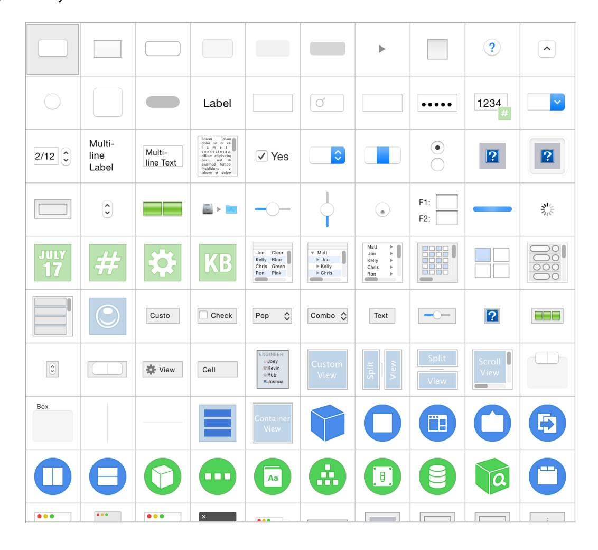

### Use AppKit Controls and Views Correctly

All AppKit controls and views have a standard appearance that's appropriate for most uses. For some AppKit controls, you can also specify an alternate appearance for use in a window-frame area or in a vibrant context, such as in a sidebar area or in a Notification Center widget. To learn more about these appearances, see [Some](#page-176-1) [Controls](#page-176-1) Can Be Used on the Window Frame (page 177) and Some Controls and Views Can Be Vibrant (page ?).

**Avoid mixing control sizes in the same view.** Many controls are available in three sizes: regular, small, and mini. In most cases, use regular-size controls in your windows. When space is at a premium, such as in a panel or within a pane, you can use small or (less often) mini controls. In general, it's best to avoid mixing different sizes of controls in the same window.

**In general, avoid resizing controls vertically.** Many controls can be resized horizontally, but most controls are fixed vertically for each available size. If you vertically resize some controls, you might trigger unexpected results, such as a change in control style.

**Use the system font and the proper text size within a control.** For example, a regular-size control generally uses the regular system font for text that appears within it, such as "OK" in a button or a menu item name in a pop-up menu. When you create your UI in Interface Builder, you automatically get the proper font and size for each standard control you use.

**Use the proper spacing between controls.** When controls are spaced evenly in a window, the window is more attractive and easier for usersto use. The layout guidesin Interface Buildershow you the recommended spacing between controls and between UI elements and window edges. Using Auto Layout helps you maintain your layout when the window resizes or UI elements change size (for example, as a result of localization).

### Some Controls Can Be Used in the Window Frame

A small subset of controls have a display style that makes them suitable for use in the window-frame areas (that is, in the toolbar or a bottom bar); these controls are listed in Table 36-1.

**Table 36-1** Control and style combinations designed for use in window-frame areas

| Control (API name)                                                  | Style                             | Example |
|---------------------------------------------------------------------|-----------------------------------|---------|
| Round textured button (NSButton)                           | NSTexturedRounded BezelStyle   |         |
| Textured rounded segmented control (NSSegmentedControl) | NSSegmentStyle TexturedRounded |         |

\*Note that you can use the NSTexturedRoundedBezelStyle style of pop-up menu to place an Action menu in a toolbar. For more information about Action menus, see [Action](#page-191-0) Menu (page 192).

You can see examples of most of these types of window-frame controls in the Mail toolbar.

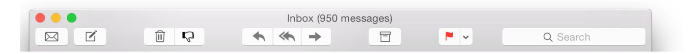

**Don't use the window frame–specific control styles in the window body.** The control and style combinations listed Table 36-1 are specially designed to look good on the window-frame, whether it's translucent or opaque. *These control styles don't look good in the window body* . In particular, these control styles can use inactive and other appearances that don't harmonize with standard control styles.

**Don't use window-body controls or styles in the window frame.** All system-provided controls and styles other than those listed in Control and style combinations designed for use in the window frame are designed to look good in the window body and its content regions, and *should not be used in the window frame* . (If you want to create a freestanding, full-color toolbar icon button, use NSToolbarItem; for additional guidelines on designing toolbars, see [Designing](#page-136-0) a Toolbar (page 137).)

If your window includes a bottom bar (which is not typical), you can use window-frame controls in the bottom bar.

## Buttons

### Push Button

A **push button** performs an app-specific action.

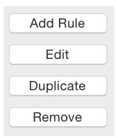

**API Note:** To define a push button in your code, create an NSButton object of type NSMomentaryPushInButton or NSMomentaryLightButton. (Note that the NSTexturedRoundedBezelStyle style of NSButton is designed for use in the window frame.)

#### A push button:

- Is designed for use in the window body only, not in the window-frame areas. To learn about controls that you can use in window-frame areas, see Some [Controls](#page-176-1) Can Be Used in the Window Frame (page 177).
- Always contains text, never an image.
- Is white, unlessit'sthe default button in a dialog. For more information about dialog controls,see [Dismissing](#page-155-0) [Dialogs](#page-155-0) (page 156).
- May open another window to complete its operation.

Use a push button in the window body to perform an instantaneous action, such as Print or Delete.

**Avoid using a push button to mimic the behavior of other controls.** Users expect an immediate action to occur when they click a push button, including the opening of another window or the dismissal of a dialog. In particular:

- Don't use a push button to indicate a state, such as on or off. Instead, you can use checkboxes to indicate state, as described in [Checkbox](#page-181-0) (page 182).
- Don't use a push button as a label. Instead, use static text to label elements and provide information in the interface, as described in [Static](#page-212-1) Text Field (page 213).

● Avoid associating a menu with a push button.

**Use enough space between buttons so that users can click a specific one easily.** In particular, if a push button can lead to a potentially dangerous or destructive action (such as Delete), place it far enough away from safe buttons so that users are unlikely to click it accidentally.

**Avoid displaying an image in a standard push button.** A standard push button should contain text that describes the action it performs.

**Use a verb or verb phrase and title-style capitalization forthe title of a push button.** The title should describe the action the button performs—Save, Close, Print, Delete, Change Password, and so on. If a push button acts on a single setting or entity, name the button as specifically as possible; "Choose Picture…," for example, is more helpful than "Choose…" Because buttons initiate an immediate action, there's no need to include "now" in the button title. To learn more about title-style capitalization, see Use the Right [Capitalization](#page-46-0) Style in Labels and [Text](#page-46-0) (page 47).

**Add an ellipsis to the title if the button immediately opens another window, dialog, or app to perform its action.** An ellipsis prepares users to expect another window to open in which they complete the action the button initiates. For example, the Print & Scan preferences pane uses ellipsis charactersin the names of buttons that open the print queue window and show information about the printer's options and supplies.

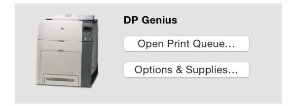

**Resize a button's width to accommodate the title.** If you don't make a button wide enough, the end caps clip the text. Note that the height of a push button is fixed for each size.

**In general, don't use a static text label to introduce a push button.** Avoid an introductory label by clearly describing the push button action in the button title.

## Radio Buttons

A group of **radio buttons** displays a set of mutually exclusive, but related, choices.

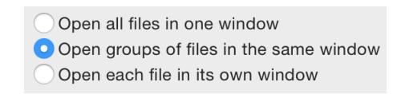

**APINote:** To define a radio button in your code, create an NSButton object of type NSRadioButton.

#### A radio button:

- Is designed for use in the window body only, not in the window-frame areas. To learn about controls that you can use in window-frame areas, see Some [Controls](#page-176-1) Can Be Used in the Window Frame (page 177).
- Is not dynamic; that is, the button's content and label don't change depending on the context.
- Doesn't display custom text or images.

Use a group of radio buttons when you need to display a set of choices from which the user can choose only one.

**Use checkboxes, instead of radio buttons, to display a set of choices from which the user can choose more than one at the same time.** Also, if you need to display a single setting, state, or choice that the user can either accept or reject, don't use a single radio button; use a checkbox instead. To learn more about checkboxes, see [Checkbox](#page-181-0) (page 182).

**Consider using a pop-up menu if you need to display more than five items.** It's best when a group of radio buttons contains at least two items and a maximum of about five. To learn more about pop-up menus, see [Pop-Up](#page-189-1) Menu (page 190).

**Don't use a radio button to initiate an action.** Instead, use a push button to initiate an action. Note that the choice of a radio button can change the state of the app. In Speech preferences, for example, the user must choose the second listening method ("Listen continuously with keyword"), to enable the keyword setup preferences.

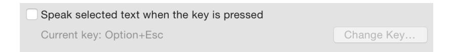

**Give each radio button a text label that describes the choice it represents.** Users need to know precisely what they're choosing when they select a radio button. Give radio button labels sentence-style capitalization, as described in Use the Right [Capitalization](#page-46-0) Style in Labels and Text (page 47). In addition, introduce a group of radio buttons with a label that describes the choices represented by the group.

**In a horizontal group of radio buttons, make the space between each pair of radio buttons consistent.** It works well to measure the space needed to accommodate the longest radio button label and use that measurement consistently. Also, use the Interface Builder guidesto ensure that the baseline of the introductory label is aligned with the baseline of the label of the first button in a group.

### Checkbox

A **checkbox** describes a state, action, or value that can be either on or off.

| Double-click a window's title bar to minimize |
|-----------------------------------------------|
| Minimize windows into application icon        |
| Animate opening applications                  |
| Automatically hide and show the Dock          |
| Show indicators for open applications         |
|                                               |

**API Note:** To define a checkbox in your code, create an NSButton object of type NSSwitchButton.

#### A checkbox:

- Is designed for use in the window body only, not in the window-frame areas. To learn about controls that you can use in window-frame areas, see Some [Controls](#page-176-1) Can Be Used in the Window Frame (page 177).
- Doesn't display custom text or images

Use a checkbox to allow users to choose between two opposite states, actions, or values.

**Use radio buttons, not checkboxes, to provide a set of choices from which users can choose only one.** To learn more about using radio buttons in your app, see Radio [Buttons](#page-179-0) (page 180).

**Use the alignment of a group of checkboxes to show how they're related.** If there are several independent values or states that you want users to control, you can provide a group of checkboxes that are all left-aligned. If, on the other hand, you need to allow users to make an on-off type of choice that can lead to additional, related on-off choices, you can display checkboxes in a hierarchy that indicates the relationship.

For example, in the Clock pane of Date & Time preferences, the options for customizing the display of date and time in the menu bar are inactive unless the user selects "Show date and time in menu bar." In addition to using unambiguous labels, the Clock pane uses this indentation to show users that some settings are dependent on others.

**Provide a label for each checkbox that clearly implies two opposite states.** The label should make it clear what happens when the option is selected or deselected. If you can't find an unambiguous label, consider using a pair of radio buttons instead, so you can clarify the two states with two different labels. Give checkbox labels sentence-style capitalization, unless the state or value is the title of another element in the interface that is capitalized. For more on this style, see Use the Right [Capitalization](#page-46-0) Style in Labels and Text (page 47).

In addition, it's a good idea to provide a label that introduces a group of checkboxes and clearly describes the set of choices they represent. Use the Interface Builder guides to ensure that the baseline of the introductory label is aligned with the baseline of the label of the first button in a group.

**If appropriate, display a dash inside a checkbox.** A dash indicates that the selection represents more than one state, in a way that is similar to the use of a dash in a menu. For more information about this, see [Symbols](#page-84-0) Can Give Users [Information](#page-84-0) About State (page 85).

**In general, arrange checkboxes in a column.** When checkboxes are arranged vertically, it's easier for users to distinguish one state from another.

### Gradient Button

A **gradient button** performs an instantaneous action related to a view, such as a source list.

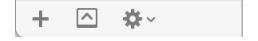

**API Note:** To define a gradient button in your code, use the setBezelStyle: method of NSButtonCell with NSSmallSquareBezelStyle as the argument.

#### A gradient button:

- Can have push-button, toggle, or pop-up menu behavior
- Contains only images; in particular, a gradient button doesn't contain text

Use a gradient button to offer functionality that's directly related to a source list or other view,such as a browser or column view.

Because the function of a gradient button is closely tied to the view with which it's associated, there's little need to describe its action in a label.

When possible, use system-provided images, such as the Action and the Add images, because their meaning is familiar to users. For more information on the system-provided images, see [System-Provided](#page-328-0) Images (page 329).

### Disclosure Triangle

A **disclosure triangle** displays(or discloses) information or functionality associated with the primary information in a window.

**API Note:** To define a disclosure button in your code, create an NSButton object of type NSPushOnPushOffButton and set the bezel style to NSDisclosureBezelStyle.

A disclosure triangle is in the closed position (that is, pointing to the right) by default. When the user clicks a disclosure triangle, it points down and the additional information is displayed.

Use a disclosure triangle when you want to provide a simple default view of something while also allowing usersto view more details or perform additional actions atspecific times. For example, you can use a disclosure triangle to:

- Reveal more information in dialogs that have a minimal state and an expanded state. For example, you might want to use a disclosure triangle to hide explanatory information about a choice that most users aren't interested in seeing.
- Revealsubordinate itemsin a hierarchical list. For example, the Mail Photo Browser panel uses a disclosure triangle to reveal specific iPhoto categories.

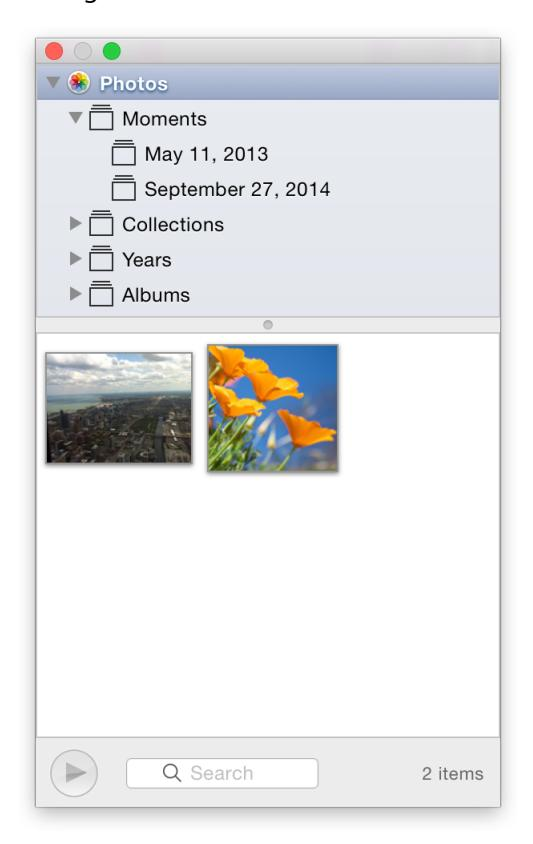

**Supply a label for a disclosure triangle in a dialog.** The label should indicate what is disclosed or hidden and it should change, depending on the position of the disclosure triangle. For example, when the disclosure triangle is closed the label might be "Show advanced settings;" when the disclosure triangle is open the label can change to "Hide advanced settings."

**Don't use a disclosure triangle to display additional choices associated with a specific control.** If you need to do this, use a disclosure button instead. For more information about this control, see Disclosure Button.

### Disclosure Button

A **disclosure button** expands a dialog or panel to display a wider range of choicesrelated to a specific selection control.

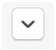

**API Note:** To define a disclosure button in your code, create an NSButton object of type NSPushOnPushOffButton and set the bezel style to NSRoundedDisclosureBezelStyle.

#### A disclosure button:

- Contains a small triangular icon.
- Is in the closed position—that is, pointing down—by default. When the user clicks a disclosure button, the window expands to reveal the additional choices, and the disclosure button changes to point up.

Use a disclosure button when you need to provide additional options that are closely related to a specific list of choices.

**Don't use a disclosure button to display additional information or functionality, or to display subordinate items in a list.** If you need to display additional information or functionality related to the contents of a window or a section of a window, or if you need a way to reveal subordinate items in a hierarchical list, use a disclosure triangle instead. For more information on this control, see [Disclosure](#page-183-1) Triangle (page 184).

**Place a disclosure button close to the control to which it's related.** Users need to understand how the expanded choices are related to their current task. For example, TextEdit puts a disclosure button close to the Save As text field, so that users understand that the expanded view of the dialog will help them choose a location for their document.

### Scope Button

A **scope button** specifies the scope of an operation, such as a search, or defines a set of scoping criteria.

**Important:** Scope buttons are designed to be used in scope bars and related filter rows only. They are not intended to be used in window-frame areas or outside of a scope bar in the window body.

To learn more about scope bars, see [Searching](#page-130-0) In a Window (page 131).

**API Note:** To define a recessed scope button in your code, use the setBezelStyle: method of NSButtonCell with NSRecessedBezelStyle asthe argument. To create a round rectangle scope button, pass NSRoundRectBezelStyle as the argument to the setBezelStyle: method.

Scope buttons are available in two different styles:

The **recessed scope button**:

The **round rectangle scope button**:

Typically, round rectangle and recessed scope buttons contain text, but they can instead contain images.

Use a recessed scope button to display types or groups of objects or locations that users select to narrow the focus of a search or other operation.

Use a round rectangle scope button to allow users to save a set of search criteria and to change or set scoping criteria.

For example, the Finder uses round rectangle scope buttons to display search criteria, such as creation and last opened dates, and to provide a save search button. The Finder location buttons, such as This Mac and Shared, are recessed scope buttons.

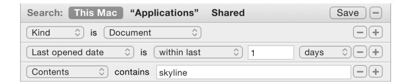

If you want to display an image in a scope button, be sure to consider the system-provided images before you spend time designing your own. If you decide to design a custom icon for use in a scope button, see [Toolbar](#page-323-0) [Items](#page-323-0) (page 324).

### The Help Button

The **Help button** opens a window that displays app-specific help.

**APINote:** To define a Help button in your code, use the setBezelStyle: method of NSButtonCell with NSHelpButtonBezelStyle as the argument.

The Help button is always a clear, circular button. The Help button is available in a single size and it always contains the standard OS X question mark graphic.

When users click a Help button, the system-provided Help Viewer app opens to a page in the current app's help book. An app can determine whether the help book should open to a top-level page or to a page that is appropriate for the context of the button.

Don't create a custom button to perform the function of the standard Help button.

In dialogs (including preferences windows) and drawers, the Help button can be located in either bottom corner. In a dialog that includes OK and Cancel buttons (or other buttons used to dismiss the dialog), the Help button should be in the lower-left corner, vertically aligned with the buttons. In a dialog that doesn't include OK and Cancel buttons, such as a preferences window, the Help button should be in the lower-right corner. For example, the Mail Signatures preference pane displays a Help button in the lower-right corner.

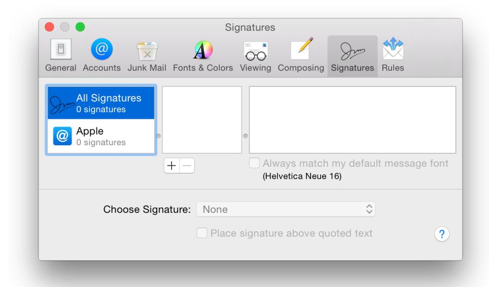

For information on providing help in your app, see User [Assistance](#page-270-0) (page 271).

## Menu Controls

### Pop-Up Menu

A **pop-up menu** presents a list of mutually exclusive choices in a dialog or window.

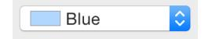

**Important:** The pop-up menu described here is suitable for use in the window-body only. If you need to provide pop-up menu functionality in a window-frame area,see Some [Controls](#page-176-1) Can Be Used on the Window [Frame](#page-176-1) (page 177).

**API Note:** To define a pop-up menu in your code, use the NSPopUpButton class.

#### A pop-up menu:

- Has a double-arrow indicator
- Contains nouns (things) or adjectives (states or attributes), but not verbs (commands)
- Displays a checkmark to the left of the currently selected value when open

You can see most of these components in the Highlight color pop-up menu in General preferences (the double-arrow indicator isn't completely visible because the menu is open).

A pop-up menu behaves like other menus: Users press to open the menu and then drag to choose an item. The chosen item flashes briefly and is displayed in the closed pop-up menu. If users move the pointer outside the open menu without releasing the mouse button, the current value remains active. An exploratory press in the menu to see what's available doesn't select a new value.

Use a pop-up menu to present up to 12 mutually exclusive choices that users don't need to see all the time.

**Consider using a pop-up menu as an alternative to other types of selection controls.** For example, if you have a dialog that contains a set ofsix or more radio buttons, you might consider replacing them with a pop-up menu to save space.

**Use a pop-up menu to provide a menu of things or states.** If you need to provide a menu of commands (that is, verbs), use a pull-down menu instead. Use title-style capitalization for the label of each item in a pop-up menu. To learn more about menus, see About [Menus](#page-70-0) (page 71).

**In general, provide an introductory label to the left of the pop-up menu (in left-to-right scripts).** The label should have sentence-style capitalization For more information on this capitalization style, see Use the [Right](#page-46-0) [Capitalization](#page-46-0) Style in Labels and Text (page 47).

**Avoid adding a submenu to an item in a pop-up menu.** A submenu tends to hide choices too deeply and can be physically difficult for users to use.

**Avoid using a pop-up menu to display a variable number of items.** Because users must open a pop-up menu to see its contents, they should be able to rely on the contents remaining the same.

**Consider using a scrolling list, instead of a pop-up menu, for a large number of items.** If space is not restricted, use a scrolling list to display more than 12 items.

**Don't use a pop-up menu when more than one simultaneous selection is appropriate.** For example, a list of text styles, from which users might choose both bold and italic, should not be displayed in a pop-up menu. In this situation, you should instead use checkboxes or a pull-down menu in which checkmarks appear.

**In rare cases, include a command that affects the contents of the pop-up menu itself.** For example, in the Print dialog, the Printer pop-up menu contains the Add Printer item, which allows users to add a printer to the menu. If users add a new printer, it becomes the menu's default selection. If you need to add such commands to a pop-up menu, put them at the bottom of the menu, below a separator. (A separator—called a Separator Menu Item in Interface Builder—is a horizontal line.)

**Ensure that all pop-up menus in a stack have the same width.** Even if the visible contents of each pop-up menu varies, the width of the controls themselves should be equal.

### Action Menu

An **Action menu** is a specific type of pop-up menu that functions as an app-wide contextual menu.

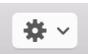

**Important:** An Action menu can be used in a window-frame area or the window body. To learn more about controls that are designed specifically for use in window-frame areas, see Some [Controls](#page-176-1) Can Be Used on the [Window](#page-176-1) Frame (page 177).

**API Note:** To create an Action menu in Interface Builder use the control that's appropriate for the window area. Then, in the Attributes pane of the inspector, specify NSActionTemplate for the image.

#### An Action menu:

- Displays the system-provided Action image and the standard downward-pointing arrow
- Does not display a label (because users are familiar with the meaning of the Action image)

Use an Action pop-up menu to provide a visible shortcut to a handful of useful commands. An Action menu hasthe advantage of a contextual menu, without the disadvantage of being hidden. You can learn more about contextual menus in [Contextual](#page-106-0) Menus (page 107).

In particular, you can use an Action menu in a toolbar to replace an app-wide contextual menu. For example, in its default set of toolbar controls, the Finder includes an Action menu that performs tasks related to the currently selected item.

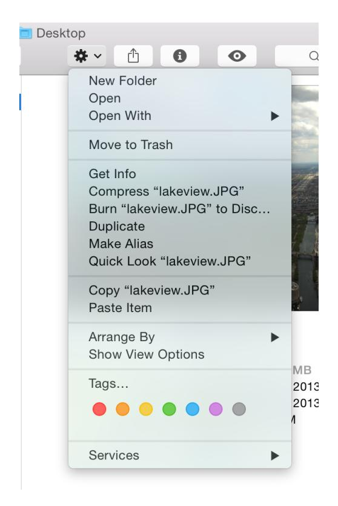

**Don't create a custom version of the Action image.** It's essential that you use the system-provided Action image so that users understand what the control does. For more information on the system-provided images, see [System-Provided](#page-328-0) Images (page 329).

**Follow the guidelines for contextual menu items as you design the contents of an Action menu.** For example, you should ensure that each Action menu item is also available as a menu command and avoid displaying keyboard shortcuts. For more information on the guidelines that govern contextual menus, see [Contextual](#page-106-0) [Menus](#page-106-0) (page 107).

**Use an Action menu at the bottom of a list to provide commands that apply to items in the list.** An Action menu works well beneath a list view or a source list. For example, the Action menu at the bottom of the Mail source list contains commands that act on the account or mailbox selected in the source list.

Use a gradient button to provide an Action menu at the bottom of a source list or table view. For information on gradient buttons, see [Gradient](#page-183-0) Button (page 184).

**Avoid placing an Action menu control anywhere else in the body of a window.** An Action menu needs to be visually connected to a context, such as a list or a toolbar. An Action menu can't replace a contextual menu that users reveal by Control-clicking anywhere in a window, because placing the Action menu in a specific area implies that it applies to that area.

### Share

A **Share menu** is a specific type of pop-up menu that displays a list of app extensions and system services, such as AirDrop, that users can use to share content. To learn more about app extensions, see [App](#page-234-0) [Extensions](#page-234-0) (page 235). Users reveal a Share menu by clicking the Share button shown here.

**API Note:** To create a Share button in Interface Builder, first select the appropriate button. Then, in the Attributes pane of the inspector,specify NSImageNameShareTemplate for the image. To define a Share button in your code, use NSImageNameShareTemplate to add an image to a button (NSButton). If you create the button programmatically, be sure to set sendActionOn:NSLeftMouseDownMask so that the button behaves as users expect.

**Important:** A Share menu should be used in a window-frame area. To learn more about controls that are designed specifically for use in window-frame areas, see Some [Controls](#page-176-1) Can Be Used on the Window [Frame](#page-176-1) (page 177).

A Share button displays the system-provided Share image. The button does not display a label because users are familiar with the meaning of the Share image.

**Don't create a custom version of the Share image.** It's essential that you use the system-provided Share image so that users understand what the control does. For more information on the system-provided images, see [System-Provided](#page-328-0) Images (page 329).

### Scrolling List

A **scrolling list** is a list that uses scroll bars to reveal its contents.

**API Note:** To define a scrolling list in your code, use the NSTableView class.

A scrolling list is a single-column rectangular view of any height.

**Note:** Scrolling lists, like other scrolling areas, are governed by the user's scroll direction setting in System Preferences.

Use a scrolling list to display an arbitrarily large number of items from which users can choose. Although scrolling lists aren't directly editable, you can implement editing functionality that allows users to provide additional list items.

**In general, don't use a scrolling list to provide choices in a limited range.** A scrolling list might not display all items at once, which can make it difficult for users to grasp the scope of their choices. If you need to display a limited range of choices, a pop-up menu (described in [Pop-Up](#page-189-1) Menu (page 190)) might be a better choice.

**Insert an ellipsis in the middle of an item that is too long to fit in the list.** Inserting the ellipsis in the middle allows you to preserve the beginning and end of the item name, which tend to be more distinct and recognizable.

**Consider using a striped background to help users scan a long list.** For example, users can lose their place in a very long list in which most of the items look similar. In this case, it can be easier for users to scan the list and find specific items when the background is striped.

**In general, provide an introductory label for a scrolling list.** A label helps users understand the types of items that are available to them.

### Command Pop-Down Menu

A **command pop-down menu** provides pull-down menu functionality within a window.

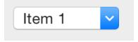

**API Note:** To define a command pop-down menu in your code, use the NSPopUpButton class and specify the pull down type.

#### A command pop-down menu:

- Always displays the same text when it's closed, which acts as the menu title (in contrast, a closed pop-up menu displays the currently selected item). To learn more about pop-up menus, see [Pop-Up](#page-189-1) Menu (page 190).
- Contains a single, downward-pointing arrow and can display checkmarks to the left of all currently active selections.

● Opens when users click anywhere in the control.

**Avoid listing too many items in a command pop-down menu.** Command pop-down menus should contain between 3 and 12 commands. The items in a command pop-down menu don't have to be mutually exclusive.

**In general, don't supply an introductory label for a command pop-down menu.** The text in the control should be sufficient to tell users what they can expect to find in the menu.

### Combination Box

A **combination box** (or combo box) provides a list of choices and allows users to specify custom choices.

**API Note:** To define a combo box in your code, use the NSComboBox class.

A combo box is a text entry field combined with a drop-down list. The default state of the combo box is closed, with the text field empty or displaying a default selection.

Users can type any appropriate characters into the text field. If a user types in an item already in the list, or types in a few characters that match the first characters of an item in the list, that item is highlighted when the user opens the list. A user-typed item is *not* added to the permanent list.

Use a combo box to give users the convenience of selecting an item from a list combined with the freedom of specifying their own custom item.

**List only items that users can choose singly.** A combo box does not allow multiple selections, so be sure to offer users a list of items from which they can choose only one at a time.

**Display a meaningful default selection.** It's best when the default selection (which may not be the first item in the list) provides a clue to the hidden choices. It's also a good idea to introduce a combo box with a label that helps users know what types of items to expect.

**Don't extend the right edge of the list beyond the right edge of the arrow box.** If an item is too long, it's truncated.

**Display the most likely choices, even though users can enter their own.** Users appreciate being able to specify custom choices, but they also appreciate the convenience of choosing from a list. For example, Safari allows users to set a preference for the minimum font size to display. In its Advanced preferences pane (shown here), Safari lists several font sizes in a combo box, and users can supply a custom font size if none of the listed choices is suitable.

## Selection Controls

### Segmented Control

A **segmented control** is a linear set of two or more segments, each of which functions as a button.

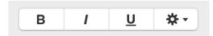

**Important:** The segmented control described in this section is suitable for use in the window body only; it should not be used in the window-frame areas. For information about the segmented control that can be used in the toolbar (or bottom bar), see Some [Controls](#page-176-1) Can Be Used on the Window Frame (page 177).

To define a segmented control in your code, use the NSSegmentedControl class.

A segmented control:

- Contains either images or text, but not a mixture of both
- Can behave as either a collection of radio buttons or checkboxes(that is,segmentselection can be mutually exclusive or inclusive)

Use a segmented control to offer users a few closely related choices that affect a selected object, or to help users change views or panes in a window. (Note that a view-changer segmented control looks similar to a tab view control, but it doesn't behave the same; for more information about tab views, see Tab [View](#page-226-0) (page 227).)

**Don't use a segmented control to enable addition or deletion of objects in a source list or split view.** If you need to provide a way for users to add and delete objects in a source list or other split view, use a gradient button (described in [Gradient](#page-183-0) Button (page 184)) in the window body. If you need to put an add-delete control in a bottom bar, use a toolbar control (described in Some [Controls](#page-176-1) Can Be Used on the Window Frame (page 177)).

**Make the width of each segment the same.** If segments have different widths, users are likely to wonder if different segments have different behaviors or different degrees of importance.

**Use a noun or short noun phrase for the text inside each segment.** The text you provide should describe a view or an object and use title-style capitalization (described in [Capitalizing](#page-46-0) Labels and Text (page 47)). A segmented control that contains text inside each segment probably doesn't need an introductory label.

**As much as possible, use the system-provided images, instead of custom images, inside a segmented control.** If you need to design your own images, try to imitate the clarity and simple lines of the system-provided images. Forsome tips on how to create custom images of thistype,see [Toolbar](#page-323-0) Icons (page 324). To learn more about the system-provided images, see [System-Provided](#page-328-0) Icons (page 329).

If you decide to design custom images for a segmented control, use the following sizes:

● Regular size: 17 x 15 pixels.

● Small: 14 x 13 pixels.

● Mini: 12 x 11 pixels.

If you choose to put images inside the segments of a segmented control, you can provide a text label below the control.

### Slider

A **slider** lets users choose from a continuousrange of allowable values(shown here with tick marks and labels).

A slider can be linear or circular.

The movable part of a linear slider is called the **thumb**, and it can be either directional or round. The slider shown above has a directional thumb.

By default, a linear slider that has a round thumb (and no tick marks) is tinted.

A circular slider displays a small circular dimple that provides the same functionality as the thumb of a linear slider: Users drag the dimple clockwise or counter-clockwise to change the values.

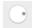

If a circular slider includes tick marks, they appear as dots that are evenly spaced around the circumference of the slider.

Use a slider to allow users to make fine-grained adjustments or choices throughout a range of values. Sliders support live feedback (live dragging), so they're especially useful when you want users to be able to see the effects of moving a slider in real time. For example, users can watch the size of Dock icons change as they move the Dock Size slider in Dock preferences.

**Ensure that the slider moves as users expect.** By default, users scroll content in the "natural" manner (that is, the content moves in the same direction as the user's fingers on a trackpad). But users can change this setting so that the content moves in the opposite direction of the gesture. You need to make sure that a slider always moves in the direction that makes the most sense, regardless of the user's setting. For example, the user should be able to move a vertical volume slider upwards for greater volume and downwards for lower volume.

**In general, use a directional thumb in a linear slider with tick marks.** The point of the thumb helps show users the current value. (Note that you can also display a directional-thumb slider without tick marks.)

**In general, use a round thumb in a linear slider without tick marks.** The rounded lower edge of the thumb works well in a slider without tick marks because it does not appear to point to a specific value.

**In general, label at least the starting and ending values in a linear slider with tick marks.** You can create labels that use numbers or words, depending on what the values represent. If each tick mark represents an equal fraction of the entire range, it might not be necessary to label each one. However, if users can't deduce the value of each tick mark from its position in the range, you probably should label each one to prevent confusion. For example, it's important to label some of the interior tick marks in Energy Saver preferences.

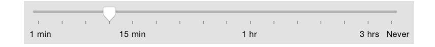

In addition, it's a good idea to set the context for a slider with an introductory label so users know what they're changing.

**As much as possible, match the slider style to the values it represents.** For example, a linear slider is appropriate in Energy Saver preferences (shown above) because the values range from very small (the screen saver should start after 3 minutes) to very large (the screen saver should never start) and don't increase at consistent intervals. In this case, a linear slider brings to mind a number line that stretches from the origin to infinity.

**Display tick marks when it helps users understand their choices.** In general, you should display tick marks when it's important for users to understand the scale of the measurements or when users need to be able to select specific values. If, on the other hand, users don't need to be aware of the specific values the slider passes through (as in the Dock size and magnification preferences, for example), you might choose to display a slider without tick marks.

### Path Control

A **path control** displays the file-system path of the currently selected item. For example, when you choose Show Path Bar, Finder uses one style of path control to display the path of the currently selected item at the bottom of the window.

**API Note:** To define a path control in your code, use the NSPathControl class.

There are three styles of path control, all of which are suitable for use in the window body:

- Standard
- Navigation bar
- Pop up

All three path-controlstyles display text in addition to iconsfor apps, folders, and document types. When users click the pop-up style path control, a pop-up menu appears, which lists all locations in the path and a Choose menu item. Users can use the Open dialog opened by the Choose item to view the contents of the selected folder. For more information on the Open dialog, see The Open [Dialog](#page-159-0) (page 160).

If the displayed path is too long to fit in the control, the folder names between the first location and the last are hidden, as shown here in the path control in a Finder window.

Use a path control to display the file-system location of the currently selected item in a way that is not overly technical. You can also use a path control to allow users to retrace their steps along a path and open folders they visited earlier.

**Use a path control only when necessary.** For most apps, a path control is unlikely to be useful, because few apps need to provide a file-system browsing experience the way the Finder does.

### Color Well

A **color well** indicates the current color of the selected object and, when clicked, displays the Colors window, in which users can specify a color. To learn more about the Colors window,see Colors and Fonts [Windows](#page-267-0) (page 268).

**API Note:** To define a color well in your code, use the NSColorWell class.

Multiple color wells can appear in a window. For example, Rulers preferences in Keynote contains two color wells that allow users to change the colors of guides.

### Image Well

An **image well** is a drag-and-drop target for an icon or image.

**API Note:** To define an image well in your code, use the NSImageView class.

For example, the Password pane in Accounts preferences uses an image well to allow users to choose a picture to represent them.

Some image wells,such asthe user picture in the Password pane of Accounts preferences, must always contain an image. If you allow users to clear an image well (that is, leave it empty), be sure to provide standard Edit menu commands and Clipboard support for the contents of the image well.

### Date Picker

A **date picker** displays components of date and time, such as hours, minutes, days, and years.

**API Note:** To define a date picker in your code, use the NSDatePicker class.

The date-picker control provides two main styles:

- **Textual**. This style consists of a text field or text field combined with a stepper control.
- **Graphical**. This style consists of a graphical representation of a calendar or a clock.

Using the textual style, users can enter date and time information in the text field or use the stepper. Using the graphical style, users can move the clock hands or choose specific days, months, or years in the calendar.

Use a date picker to provide time and date setting functionality in a window.

**Choose the date-picker style that suits your app.** The text field and stepper date picker is useful when space is constrained and you expect users to be making specific date and time selections. A graphical date picker can be useful when you want to give users the option of browsing through days in a calendar or when the look of a clock face is appropriate for the UI of your app.

### Stepper

The **stepper** control (also known as little arrows) helps users increment or decrement values, and is usually displayed near a text field that indicates the current value.

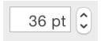

The text field may or may not be editable.

The stepper control is available in Interface Builder. To create one using AppKit programming interfaces, use the NSStepper class.

## Indicator Controls

### Progress Indicators

A **progress indicator** informs users about the status of a lengthy operation.

**Important:** The controls described in this section are suitable for use in the window body; they should not be used in the window-frame areas. See Some [Controls](#page-176-1) Can Be Used on the Window Frame (page 177) for controls designed specifically for use in the toolbar (and bottom bar).

**Put progress indicators in consistentlocations.** For example, the Mail app displaysthe asynchronous progress indicator in the right end of the To field asit finds and displays email addressesthat match what the user types. Choosing a consistent location for a progress indicator allows users to quickly check a familiar place for the status of an operation. For more information on the importance of providing consistency in your app, see [Consistency](#page-63-1) (page 64).

There are three types of progress indicators, each of which is suitable for a specific situation:

- Determinate progress bar
- Indeterminate progress bar
- ● Asynchronous progress indicator

#### Determinate Progress Bar

A **determinate progress bar** provides feedback on a process with a known duration.

**API Note:** To define a determinate progress bar in your code, use the NSProgressIndicator class with style NSProgressIndicatorBarStyle.

In a determinate progress bar, the "fill" movesfrom left to right. The fill is provided automatically (you determine the minimum and maximum values that should be represented).

Users generally expect a determinate progress bar to disappear as soon as the fill completes.

Use a determinate progress bar when the full length of an operation can be determined and you want to tell the user how much of the process has been completed. For example, you could use a determinate progress bar to show the progress of a file conversion.

**Ensure that a determinate progress bar accurately associates progress with time.** A progress bar that becomes 90 percent complete in 5 seconds but takes 5 minutes for the remaining 10 percent, for example, would be annoying and lead users to think that something is wrong.

**Be sure to allow the fill to complete before dismissing the progress bar.** If you dismiss the progress bar too soon, users are likely to wonder if the process really finished.

**Allow users to interrupt or stop the process, if appropriate.** If the process being performed can be interrupted, the progress dialog should contain a Cancel button (and support the Esc key). If interrupting the process will result in possible side effects, the button should say Stop instead of Cancel. To learn more about dialogs in general,see [Dialogs](#page-150-0) (page 151). To supply a Cancel button, you use a push button (for more information about this control, see Push [Button](#page-178-1) (page 179)). To supply a Stop control, you can use the standalone version of the stop progress image (to learn more about this system-provided image, see [System-Provided](#page-331-0) Images for Use as [Standalone](#page-331-0) Buttons (page 332)).

**If appropriate, provide a label for a determinate progress bar in a dialog.** You can do this so that users understand the context in which the processis occurring. Such a labelshould have sentence-style capitalization. For more information on this style, see [Capitalizing](#page-46-0) Labels and Text (page 47).

#### Indeterminate Progress Bar

An **indeterminate progress bar** provides feedback on a process of unknown duration.

**API Note:** To define an indeterminate progress bar in your code, use the NSProgressIndicator class with style NSProgressIndicatorBarStyle.

An indeterminate progress bar displays a spinning striped fill that indicates an ongoing process. OS X provides this appearance automatically.

Use an indeterminate progress bar when the duration of a process can't be determined.

**Switch to a determinate progress bar when appropriate.** If an indeterminate process reaches a point where its duration can be determined, switch to a determinate progress bar. For more on determinate progress bars, see [Determinate](#page-205-2) Progress Bar (page 206).

**In general, use an indeterminate progress bar in a dialog or window that focuses on the process.** For example, you might display an indeterminate progress bar in a dialog that focuses on the opening of the file. This usage helps users understand which process is ongoing.

**Allow users to interrupt or stop the process, if appropriate.** If the process being performed can be interrupted, the progress dialog should contain a Cancel button (and support the Esc key). If interrupting the process will result in possible side effects, the button should say Stop instead of Cancel. To learn more about dialogs in general,see [Dialogs](#page-150-0) (page 151). To supply a Cancel button, you use a push button (for more information about this control, see Push [Button](#page-178-1) (page 179)). To supply a Stop control, you can use the standalone version of the stop progress image. To learn more about this system-provided image, see [System-Provided](#page-331-0) Images for Use as [Standalone](#page-331-0) Buttons (page 332).

**If appropriate, provide a label for an indeterminate progress bar in a dialog.** You can do this so that users know what processis occurring. Such a labelshould have sentence-style capitalization (described in [Capitalizing](#page-46-0) [Labels](#page-46-0) and Text (page 47)). Also, you can end the label with an ellipsis (...) to emphasize the ongoing nature of the processing.

**Consider using an asynchronous progress indicator, instead of an indeterminate progress bar, in some cases.** If, for example, you need to provide an indication of an indeterminate process that's associated with a part of a window, such as a control, or if space is limited, you might want to use an asynchronous progress indicator instead. For more information on asynchronous progress indicators, see Asynchronous Progress Indicator.

#### Asynchronous Progress Indicator

An **asynchronous progress indicator** provides feedback on an ongoing process.

**API Note:** To define an asynchronous progress indicator in your code, use the NSProgressIndicator class with style NSProgressIndicatorSpinningStyle.

The appearance of the asynchronous progress indicator is provided automatically. The asynchronous progress indicator always spins at the same rate.

Use an asynchronous progressindicator when space is very constrained,such asin a text field or near a control. Because this indicator is small and unobtrusive, it is especially useful for asynchronous events that take place in the background, such as retrieving messages from a server.

#### **If the process might change from indeterminate to determinate, start with an indeterminate progress bar.**

You don't want to start with an asynchronous progress indicator because the determinate progress bar is a different shape and takes up much more space. Similarly, if the process might change from indeterminate to determinate, use an indeterminate progress bar instead of an asynchronous progress indicator, because it is the same shape and size as the determinate progress bar.

**In general, avoid supplying a label.** Because an asynchronous progress indicator typically appears when the user initiates a process, a label is not usually necessary. If you decide to provide a label that appears with the indicator, create a complete or partial sentence that briefly describes the process that is occurring. You should use sentence-style capitalization (described in [Capitalizing](#page-46-0) Labels and Text (page 47)) and you can end the label with an ellipsis (...) to emphasize the ongoing nature of the processing.

### Level Indicators

A **level indicator** provides graphical information about the level or amount of something. Level indicators can be configured to display different colors to warn users when values are reaching critical levels.

**Important:** The controls described in this section are suitable for use in the window body; they should not be used in the window-frame areas. See Some [Controls](#page-176-1) Can Be Used on the Window Frame (page 177) for controls designed specifically for use in the toolbar (and bottom bar).

There are three styles of level indicator:

- Capacity
- ● Rating
- Relevancy

#### Capacity Indicator

A **capacity indicator** provides graphical information about the current state of something that has a finite capacity (shown here with labels and tick marks).

**API Note:** To define a capacity indicator in your code, use the NSLevelIndicator class with style NSDiscreteCapacityLevelIndicatorStyle or NSContinuousCapacityLevelIndicatorStyle.

There are two styles of capacity indicator:

**Continuous.** The continuous capacity indicator consists of a translucent track that is filled with a colored bar that indicates the current value.

**Discrete.** The discrete capacity indicator consists of a row of separate, rectangular segments equal in number to the maximum value set for the control.

The default color of the fill in both styles is green. Depending on app-specific definitions, the fill can change to yellow or red.

The continuous capacity indicator can display tick marks above or below the indicator control to give context to the level shown by the fill.

The segments in the discrete capacity indicator are either completely filled or empty; they are never partially filled. If you stretch a discrete capacity indicator, the number of segments remains constant, but the width of each segments increases.

Use a capacity indicator to provide information about the level or amount of something that has well defined minimum and maximum values.

**Change the fill color to give users more information, if appropriate.** You can configure a capacity indicator to display a different color fill when the current value enters a warning or critical range. Because capacity indicators provide a clear, easily understood picture of a current state, they're especially useful in dialogs and preferences windows that users tend to view briefly.

If you define a critical value that is less than the warning value, the fill is red below the critical value, yellow between the critical and warning values, and green above the warning value (up to the maximum). This orientation is useful if you need to warn the user when a capacity is approaching the minimum value, such as the end of battery charge.

**Use a discrete capacity indicator to show relatively coarse-grained values.** The discrete capacity indicator displaysthe current value rounded to the nearest integer and the segments are stretched orshrunk to a uniform width to fit the specified length of the control. Visually, this makes a discrete capacity indicator better for showing coarser-grained values than a continuous capacity indicator.

**In general, use tick marks with the continuous capacity indicator only.** This is because the number and width of the segments in the discrete capacity indicator provide similar context, making tick marks redundant (and potentially confusing). If you find that you need to display very small segments in a discrete capacity indicator to appropriately represent the scale of values, you might want to use a continuous capacity indicator instead.

**In general, label at least the first and last tick marks.** Even if you don't label any other tick marks, labeling the beginning and end of the scale provides useful context for the user.

#### Rating Indicator

A **rating indicator** shows the rating of something.

**API Note:** To define a rating indicator in your code, use the NSLevelIndicator class with style NSRatingLevelIndicatorStyle.

By default, the rating indicator displays stars.

A rating indicator does not display partial stars. Instead, it rounds the current value to the nearest integer to display only whole stars. The stars in a rating indicator are not expanded or shrunk to fit the specified length of the control and no space is added between them.

Use a rating indicator to provide a graphic representation of the rating of an object. Because a rating indicator conveysthe ranking of one item relative to all other itemsin a category,such asfavorite images or most-visited webpages, it's most useful in a list or table view that contains many items.

**Allow users to set ranking criteria, if appropriate.** Or, you can make a rating indicator editable so the user can increase or decrease the ranking of an item in a table or list.

**Supply a custom image to replace the star, if it makes sense.** You can use any image in place of the star, but you should make sure that it makes sense in the context of your app and the task it enables.

#### Relevance Indicator

A **relevance indicator** displays the relevance of something.

**API Note:** To define a relevancy indicator in your code, use the NSLevelIndicator class with style NSRelevancyLevelIndicatorStyle.

Relevance indicators are especially useful as part of a list or table view. This is because relevance as a quantity is easier for users to understand when it is shown in comparison with the relevance of several items.

## Text Controls

### Static Text Field

A **static text field** displays text that can't be modified by the user.

**API Note:** To define a static text field in your code, use the NSTextField class. (In Interface Builder, a static text field is called a label.)

Static text fields have two states: active and dimmed.

**Make static text selectable when it provides an obvious user benefit.** For example, a user should be able to copy an error message, a serial number, or an IP address to paste elsewhere.

### Text Input Field

A **text input field** accepts user-entered text.

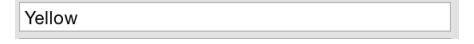

**API Note:** To define a text input field in your code, use the NSTextField class.

A text input field (also called an editable text field) is a rectangular area in which the user enterstext or modifies existing text. A text input field displays user-supplied text in a system font that is appropriate for the size of the control. In addition, a text input field can contain a token field control, which displays the user input in the form of a draggable token. For more information on tokens, see [Token](#page-213-0) Field (page 214).

By default, a text input field supports keyboard focus and password entry.

Use a text input field to get information from the user.

**Be sure to perform appropriate edit checks when you receive user input.** For example, if the only legitimate value for a field is a string of digits, an app should issue an alert if the user types characters other than digits. In most cases, the appropriate time to check the data in the field is when the user clicks outside the field or presses the Return, Enter, or Tab key.

**Be sure to use a combo box if you want to combine a menu or list of choices with a text input field.** Don't try to create one by putting a text input field and a menu together. For more information about combo boxes, see [Combination](#page-196-0) Box (page 197).

**In general, display an introductory label with a text input field.** A label helps users understand what type of information they should enter. Generally, these labels should have title-style capitalization (described in [Capitalizing](#page-46-0) Labels and Text (page 47)).

**In general, ensure that the length of a text input field comfortably accommodates the length of the expected input.** The length of a text input field helps users gauge whether they're inputting the appropriate information.

**Space multiple text input fields evenly.** If you want to use more than one text input field in a window, you need to leave enough space between them so users can easily see which input field belongs with each introductory label. If you need to position more than one text input field at the same height (that is, in a horizontal line), be sure to leave plenty of space between the end of one text field and the introductory label of the next. Typically, however, multiple text input fields are stacked vertically, as in a form users fill out. In addition, if you display multiple text input fields in a window, be sure they all have the same length.

### Token Field

A **token field** creates a movable token out of text.

**API Note:** To define a token field in your code, use the NSTokenField class.

**In general, use a token field control in a text input field.** As the user types in the text input field, the token field control invokes text completion after a delay that you specify. When the user types the comma character or presses Return, the preceding text input is transformed into a token. For more information about text input fields, see Text [Input](#page-212-2) Field (page 213).

**If appropriate, add a contextual menu to a token.** (Note that you have to add code to support the addition of a contextual menu.) In a token field's menu, you might offer more information about the token and ways to manipulate it. In Mail, for example, the token menu displays information about the token (the email address associated with the name) and items that allow the user to edit the token or add its associated information to Contacts.

### Search Field

A **search field** accepts text from users, which can be used as input for a search (shown here in a toolbar).

**Important:** A search field can be used in the window-frame area or in the window body. To learn more about controlsthat are designed specifically for use in window-frame areas,see Some [Controls](#page-176-1) Can Be Used on the [Window](#page-176-1) Frame (page 177).

**API Note:** To define a search field in your code, use the NSSearchField class.

#### A search:

- Looks like a text field with rounded ends
- Can be configured to begin searching while the user isstill entering text, or to wait until the user isfinished
- Displays the magnifying icon in its left end by default
- Can also contain an icon the user clicks to cancel the search or clear the field

Use a search field to enable search functionality within your app.

**Decide when to start the search.** You can begin searching as soon as the user starts typing, or wait until the user presses Return or Enter. If searching occurs while the user is still typing, the behavior is more like a find in which results are filtered as the entered text becomes more specific. This behavior is especially useful when the search field is in a scope bar that focuses on a window's contents. If search should occur after the user finishes typing, you might want to enable a search term completion menu so that users can choose from commonly searched terms.

**In general, avoid using a menu to display search history.** For privacy reasons, users might not appreciate having their search history displayed. You might instead use the menu to allow users to choose different types of searches or define the context or scope of a search. Note that a scope bar is well-suited to enabling this type of searching. For more information, see [Searching](#page-130-0) In a Window (page 131).

**Avoid supplying an introductory label.** Users are familiar with the distinctive appearance of a search field, so there is no need to label it. The exception to this is when you place a search field in a toolbar; in this case, you need to supply the label "Search" to be displayed when users customize the toolbar to show icons and text or text only.

**Display placeholder text, if it helps users understand how search works in your app.** A search field can display a placeholder text in its left end. For example, the search field in the Safari toolbar can display one of three common search engines (users can choose the search engine they want to use in the search field menu).

## Content Views

### Popover

A **popover** is a transient UI element that provides functionality that is directly related to a specific context, such as a control or an onscreen area. Popovers appear when users need them and (usually) disappear automatically when users finish interacting with them. For example, Calendar displays a popover in which users can create and edit a meeting.

A popover floats above the window that contains the control or area that it's related to, and its border includes an arrow (sometimes referred to as an anchor) that indicates the point from which it emerged. In some cases, users can detach a popover from itsrelated element, which causesthe popover to become a panel. For example, Calendar allows users to detach the meeting-editing popover so that they can make changes to it while they refer to other windows.

To learn how to define a popover in your code, see NSPopover. Follow the guidelines in this section to use popovers appropriately in your app.

**Use a popover to display UI that users need occasionally.** Popovers are perfectly suited to provide small amounts of focused functionality that users need. For example, when usersselect a term and open a contextual menu, they can choose the Look Up "*term*" menu item to see the Dictionary definition (in addition to information related to the term) in a popover.

Because popovers can disappear when users finish interacting with them, users can spend more time focusing on their content and less time removing clutter from their workspace.

**Consider using popovers instead of source lists, panels, or changeable panes.** You might want to use a popover instead of these UI elements because doing so allows you to present a more focused and stable UI. For example, users might not need to navigate or select objects in your window's source list very often. If you use a popover to display the source list's content, you can use the window space for more important UI that directly relates to the user's task.

Using a popover to replace a panel that contains auxiliary information can also make sense, because you can ensure that the popover disappears when users click outside of it. For example, users appreciate that they don't have to explicitly dismiss the Safari Downloads popover before they continue interacting with the Safari browser window.

Finally, using a popover to replace changeable panes in a main window can help your UI seem more stable. For example, if you offer secondary or transient functionality in a pane that users can hide and reveal, you can instead offer the functionality in a popover. Because a popover appears only when it's needed, it doesn't alter the look of the window. Users tend to be most comfortable with a window layout that does not change very often.

**Allow users to detach a popover if appropriate.** Users might appreciate being able to convert a popover into a panel if they want to view other content or other windows while the popover content remains visible.

**Don't use a popover as an alert.** Popovers and alerts are very different UI elements. For one thing, users choose to see a popover; they never choose to see an alert. If you use popovers and alerts interchangeably, you blur the distinctions between them and confuse users. In particular, if you use a popover to warn users about a serious problem or to help them avoid imminent, unintentional data loss, they are likely to dismiss the popover without reading it, and blame your app when negative results occur. If you really need to alert users(which should happen only rarely), use an alert; for guidelines on how to design an alert,see [Alerts](#page-171-0) (page 172).

**As much as possible, ensure that the popover arrow points directly to the element that revealed it.** The arrow helps people remember where the popover came from and with what task or object it's associated.

**In general, use the standard popover appearance.** The standard appearance is identified by the NSPopoverAppearanceMinimal constant. You can also use the "HUD" appearance, but this is generally only suited to an app that uses a dark UI and enables an immersive, media-centric experience.

**Avoid including a "close popover" button.** In general, a popover should close automatically when the user doesn't need it anymore. This behavior helps users focus on their task without worrying about cluttering their desktop. For example, after users finish editing an Calendar event, they can click Done or they can click outside the event-editing popover to close it. Regardless of the method users choose, Calendar saves the edits they made.

**Choose a closure behavior that makes sense in the context of the task the popover enables.** A popover can close in response to a user interaction (transient behavior), in response to a user's interaction with the view or element from which the popover emerged (semitransient behavior), or in an app-defined way. If a popover merely presents a set of choices, it can be appropriate to close it as soon as the user makes a choice (that is, using the transient behavior). Because this behavior mirrors the behavior of a menu, users are comfortable with it. If, on the other hand, you use a popover to enable a task that requires multiple user interactions, such as the Calendar event editing popover, you can use the semitransient behavior to close the popover when the user interacts with the area outside of it.

**Avoid nesting popovers.** A popover that emergesfrom a control inside a different popover is physically difficult for users to interact with and confusing to see. In addition, users can't predict what will happen when they click outside of both popovers.

**Avoid making a popover too big.** A popover should not appear to take over the entire screen. Instead, it should be just big enough to display its contents and still point to the area from which it emerged.

**Avoid making significant appearance changes in a detachable popover.** If you allow users to detach a popover, ensure that the resulting panel looks similar to the original popover. If the new panel looks too different, users might forget where it came from.

**If appropriate, change a popover's size while it remains visible.** You might want to change a popover's size if you use it to display both a minimal and an expanded view of the same information. For example, Calendar displays a minimal popover when users double-click a meeting they've created. If the user wants to edit the meeting, the minimal popover expandsto accommodate more information about the meeting and the editing controls. The transition from one popover size to another should be smoothly animated, so that users can be sure that they're still interacting with the same popover.

## Table View

A **table view** displays data in a one-column list, with optional additional columns that display attributes associated with the data.

**API Note:** To define a simple table view in your code, use the NSTableView class. To get disclosure triangles in a list, use an NSOutlineView object in column format.

A table view displays the entire set of data in the leftmost column (in systems that use left-to-right script). When the data is hierarchical, the child objects are revealed within the primary column, not in other columns (table views use disclosure triangles to indicate objects that contain other objects).

Additional columns in a table view display attributes that apply to the data in the primary column; they don't contain data that isspecific to a different level of hierarchy. In general, users can resize, rearrange, and sometimes add and subtract the columns that represent attributes of the table data.

When users click a disclosure triangle to reveal the child items contained within another item, the table lengthens and the leftmost column can widen. If the primary column widens, other columns might shift to the right, but they don't change their headings or order.

In an editable table view, users begin editing by clicking once on a selected table row. This behavior allows the table view to respond differently to a double click. In the Finder, for example, users can double-click a file to open it or single-click a selected file to edit its name.

**Note:** Table views, like other scrolling areas, are governed by the user's scroll direction setting in System Preferences.

Use a table view to display a list of items along with various attributes of each item. If you need to display a simple list of items, and you don't need to display associated attributes, you might want to use a scrolling list instead. For more information about scrolling lists, see [Scrolling](#page-194-0) List (page 195). Using a table view, you can create a column for each attribute that is associated with the items you display.

**Sort the rows in a table view by the selected column heading.** You can implement sorting on secondary attributes behind the scenes, but the user should see only one column selected at a time. If the user clicks an already selected column heading, change the direction of the sort.

**Create column headers that are nouns or short noun phrases that describe an attribute of the data.** When you use clear,succinct attribute names, users quickly understand what information is available in each column.

### Column (Browser) View

A **column view** (also known as a **browser view**) displays a hierarchy of data, in which each level of the hierarchy is displayed in one column.

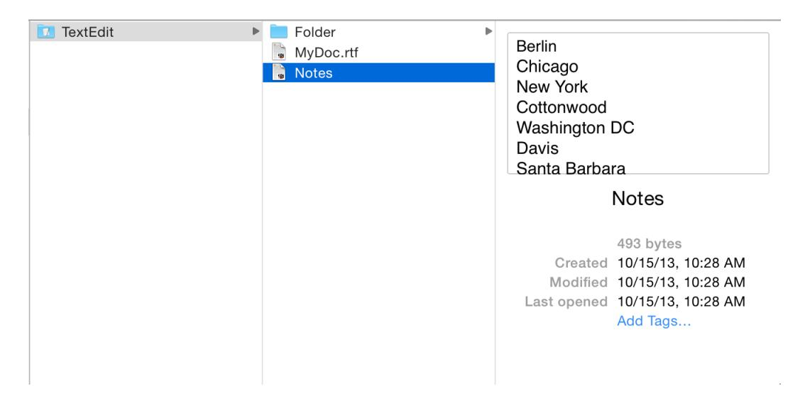

**API Note:** To define a column or browser view in your code, use the NSBrowser class or an NSOutlineView object in column format.

Column views don't use disclosure triangles that reveal content within a column. The triangle displayed to the right of an item shows that the item contains other objects (to reveal those objects, users click anywhere on the item's row).

Users scroll vertically within columns and horizontally between columns. When users click an object in one column, its contents(that is, its descendantsin the hierarchy) are revealed in a column to the right. Each column displays only those objectsthat are descendants of the item selected in the previous column. If the item selected in the previous column has no descendants, the column to the right might display details about the item.

Columns in column views don't have headings, because a column view doesn't behave like a table. A column in a column view contains the objects that exist at a particular node in the hierarchy; it doesn't contain an attribute of every object in the hierarchy.

**Note:** Column views, like other scrolling areas in OS X, are governed by the user's scroll direction setting in System Preferences.

Use a column or browser view when there is only one way the data can be sorted or when you want to present only one way of sorting the data. A column view is also useful for displaying a deep hierarchy of data in which users frequently move back and forth among levels.

**Display the first or root level of the hierarchy in the leftmost column (in systems that use left-right script).** As users select items, the focus moves to the right, displaying either the child objects at that node or, if there are no more children, the terminal object (a leaf node in the hierarchy). When the userselects a terminal object, you can display additional information about it in the rightmost column.

**In general, allows users to resize columns.** This is especially helpful when the names of some items might be too long to display in the default width of a column.

### Split View

A **split view** groups together two or more other views, such as column or table views, and allows the user to adjust the relative width or height of those views. Automator (shown here) uses more than one split view to give users a customizable work area.

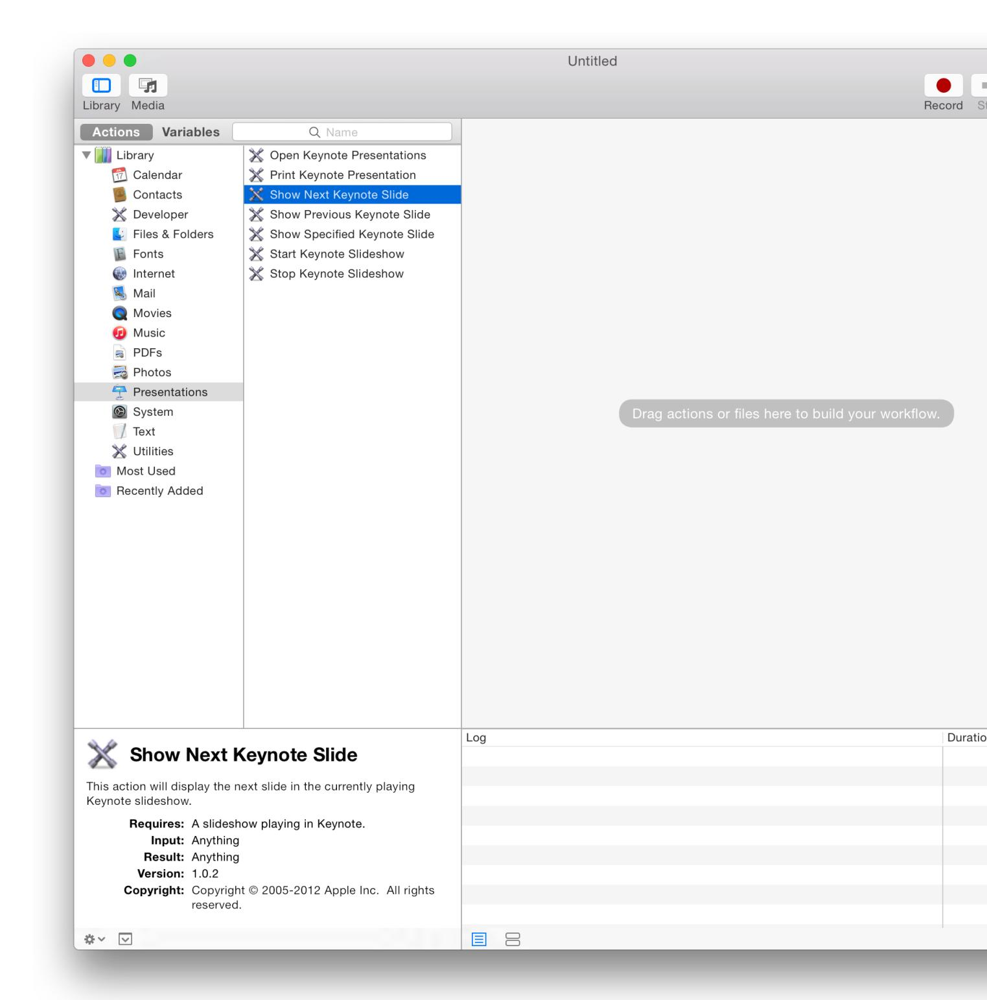

**API Note:** To define a split view in your code, use the NSSplitView class (note that the splitter bars are horizontal by default).

A split view includes a **splitter bar**, or **splitter**, between each of its subviews; for example, a split view with five subviews would have four splitters. Each subview is generally known as a **pane**. A split view can arrange views horizontally or vertically, but not both.

**Note:** The standard splitter is known as a "zero-width" splitter, although it is actually 1 point wide. There is also a wider splitter available, which measures 9 points in width, but it is not frequently used.

The entire splitter bar is a hot zone. In other words, when the pointer passes over any part of the splitter, the pointer changes to one of the move or resize pointers. To learn more about the different pointers that are available, see [Pointers](#page-307-0) (page 308). For zero-width splitters, the hot zone includes two points on both sides of the splitter.

Use a split view to display two or more resizable content views.

**In general, use the zero-width splitter.** Users are accustomed to the appearance of the zero-width splitter. You might want to use a wide splitter bar if you need to indicate a stronger visual distinction between panes, but this is unusual.

**Don't let users lose the splitter.** A zero-width splitter can disappear when the user drags it far enough to hide the subview. To avoid this, you can define minimum and maximum sizes for the subviews so that the splitter remains visible. Alternatively, if you want to allow usersto completely hide a subview by dragging a zero-width splitter, you should provide a button that re-opens the subview.

### Tab View

A **tab view** presents information in a multipane format.

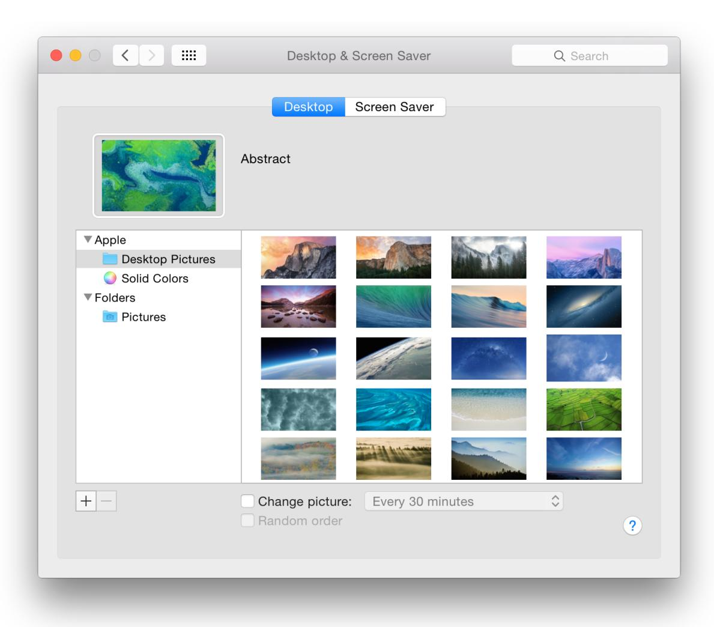

**API Note:** To define a tab view in your code, use the NSTabView class.

A tab view consists of a tab view control (which looks similar to a segmented control) combined with a set of views. Each segment in the tab view control is called a **tab**. The content area below a tab is called a **pane**, and each tab is attached to a specific pane. The tab view control is horizontally centered at the top edge of the view.

Users click a tab to view the pane associated with that tab. Although different panes can contains different amounts of content, switching tabs does not change the overall size of the tab view or the window.

Use a tab view to present a small number of different content views in one place within a window. Depending on the size of the window, you can create a tab view that contains between two and about six tabs.

**Use a tab view to present a few peer areas of content that are closely related.** The outline of a tab view provides a strong visual indication of enclosure. Users expect each tab to display content that is in some way similar or related to the content in the other tabs.

**Ensure that each pane contains controls that affect only the contents ofthat pane.** Controls and information in one pane should not affect objects in the rest of the window or in other panes.

**In general, inset the tab view so that a margin of window-body area is visible on all sides of the tab view.** The inset layout looks good and it allows you to provide additional controls that can affect the window itself (or other tabs). For example, the "Enable access for assistive devices" and "Show Universal Access status in the menu bar" checkboxesin Universal Access preferences are outside of the inset tab view, because they represent settings that affect accessibility generally.

It's also possible to extend the side and bottom edges of a tab view so that they meet the window edges, although this is unusual.

**Provide a label for each tab that describes the contents of the pane.** It's best when users can accurately predict the contents of a pane before they click the tab. Nouns or very short noun phrases work well for tab labels, although a verb (or short verb phrase) might make sense in some contexts. Tab labels should have title-style capitalization (described in [Capitalizing](#page-46-0) Labels and Text (page 47)).

**Avoid using a pop-up menu as a tab-switcher.** This arrangement is not encouraged in modern Mac apps. If you have too many tabsto fit into a single tab view, you should investigate other waysto factor your information hierarchy.

### Group Box

A **group box** provides a visual way to break a window into distinct logical areas.

**API Note:** To define a group box in your code, use the NSBox class.

The outline of a group box is similar in appearance to the outline of a tab view, except that a group box does not include a tab view control (for more information about tab views, see Tab [View](#page-226-0) (page 227)). Users don't interact with a group box (for example, they can't directly resize it), but they can interact with the controls inside it.

Group boxes tend to be untitled, but they can include a text title that appears above the outline of the box.

Group boxes are seldom used in modern Mac apps. You might want to use a group box when you want users to understand logical groupings of controls in a window.

**Avoid nesting group boxes.** Nested group boxes take up a lot of space, and it can be difficult for users to perceive individual boundaries when group boxes are nested too deeply. Instead, consider using white space to group content within a group box.

**Use sentence-style capitalization in the title of a group box.** For more information on thisstyle,see [Capitalizing](#page-46-0) [Labels](#page-46-0) and Text (page 47).

## Infrequently Used Controls

The controls described here are not generally recommended for use in modern OS X apps.

### Bevel Button

A **bevel button** is a multipurpose button designed for use in the window-body area.

**Note:** Bevel buttons are not recommended for use in apps that run in OS X v10.7 and later. As an alternative, consider using a segmented control instead (described in [Segmented](#page-198-1) Control (page 199)).

You can use bevel buttons singly (as a push button) or in groups (as a set of radio buttons or checkboxes). The Preview inspector window uses bevel buttons as push buttons that rotate and crop the current content.

Bevel buttons are available in Interface Builder. To create one using AppKit programming interfaces, use the setBezelStyle: method of NSButtonCell with NSRegularSquareBezelStyle as the argument. (To create a square-cornered bevel button, use NSShadowlessSquareBezelStyle as the argument for the setBezelStyle: method.)

Bevel buttons can have square or rounded corners. They can display text, icons, or other images. Bevel buttons can also display a single downward-pointing arrow in addition to text or an image, which indicatesthe presence of a pop-up menu.

Bevel buttons can behave like push buttons or can be grouped and used like radio buttons or checkboxes.

You can use a square-cornered bevel button when space is limited or when adjoining a set of bevel buttons.

If you use a bevel button as a push button, its label should be a verb or verb phrase that describes the action it performs. If you provide a set of bevel buttons to be used as radio buttons or checkboxes, you might label each with a noun that describes a setting or a value.

If you choose to display an icon or image instead of a text label, be sure the meaning of the image is clear and unambiguous. It's recommended that you create an icon no larger than 32 x 32 pixels. Maintain a margin of between 5 and 15 pixels between the icon and the outer edges of the button. A button that contains both an icon and a label may need a margin around the edge that's closer to 15 pixels than to 5 pixels. Use label font (10-point Lucida Grande Regular) for text labels.

#### **Rounded corners**

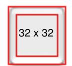

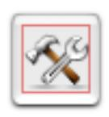

Leave at least 5 pixels between edge of icon and edge of button.

#### **Rounded corners with label below icon**

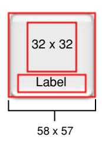

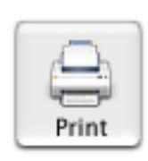

Bevel button as a push button

You can also use Interface Builder to add a pop-up menu to a bevel button. First, drag a pop-up button into your window then, in the Attributes pane of the inspector, change the type to Pull Down. Finally, in the same pane, change the style to Bevel (for a standard bevel button look) or Square (for a square-cornered bevel button look).

### Round Button

A **round button** initiates an immediate action.

Round buttons are available in Interface Builder. To create one using AppKit programming interfaces, use the setBezelStyle: method of NSButtonCell with NSCircularBezelStyle as the argument.

Round buttons contain images only, not text.

**Don't use a round button to create a Help button.** If you provide onscreen help, use the standard Help button instead (to learn more about this control, see The Help [Button](#page-187-0) (page 188)).

**Don't use round buttons as radio buttons or as checkboxes.** If you need to provide functionality of these types, use radio buttons (see Radio [Buttons](#page-179-0) (page 180)) or checkboxes (see [Checkbox](#page-181-0) (page 182)).

If you need to display a single letter in a round button you should treat the letter as an icon.

### Icon Button

An **icon button** (or **image button**) is a freestanding icon that behaveslike a push button in a window's content area.

**Note:** If you want to create a freestanding icon button for use as a toolbar item, see [Designing](#page-136-0) a [Toolbar](#page-136-0) (page 137).

To create an icon button in Interface Builder, drag a bevel button or a square button into your window, add your icon, and deselect the Bordered checkbox in the Attributes pane of the inspector. To create an icon button using AppKit programming interfaces, use the setBezelStyle: method of NSButtonCell with NSShadowlessSquareBezelStyle as the argument.

An icon button does not have a visible rectangular edge around it. In other words, the entire button is clickable, not just the icon.

**Avoid making the icon too big for the button.** Even though the outer dimensions of an icon button are not visible, they determine the hit target area. In general, it works well to size the icon button so that you leave a margin of about 10 pixels all the way around an icon.

If you include a label, place it below the icon, as shown here in the Sound icon button. (Use the small system font for a label.)

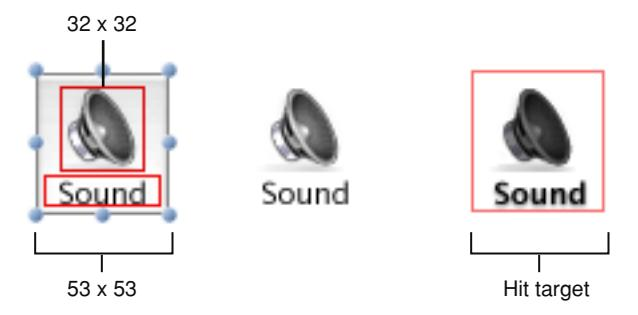

**Avoid putting an icon button too close to other UI elements.** Don't forget that the entire button area is clickable (not just the icon). Use Interface Builder layout guides to help you see where the edges of an unbordered icon button are.

An icon button can also have a pop-up menu attached to it, which is indicated by the presence of a single downward-pointing arrow.

To create an icon button with a pop-up menu in Interface Builder, drag a pop-up button (that is, an NSPopUpButton object) into your window. Select the button and in the Attributes pane of the inspector, change its type to Pull Down. Finally, for a Rounded or Square Bevel Button, change the style to Square or Shadowless Square, respectively. For an icon button, it doesn't matter which style you choose, but you must deselect the Bordered checkbox. Resize the button as needed.

An icon button with a menu can behave like a standard pop-up menu, in which the image on the button is the current selection, or like a menu title, in which the image on the button is always the same.

To learn more about bevel buttons, see Bevel [Button](#page-229-1) (page 230).

### Placard

A **placard** displays information at the bottom edge of a window.

Placards are not available in Interface Builder. To create one using AppKit programming interfaces, subclass NSScrollView.

Typically, placards are used in document windows as a way to enable quick modifications to the view of the contents—for example, to change the current page or the magnification. The most familiar use of the placard is as a pop-up menu placed at the bottom of a window, to the left of the horizontal scroll bar.

**Don't add to the placard menu commands that affect the contents of the window in other ways.** Instead, you should use an Action menu (for more information on Action menus, see [Action](#page-191-0) Menu (page 192)).

## OS X Technologies

- App [Extensions](#page-234-0) (page 235)
- [Notification](#page-242-0) Center (page 243)
- [iCloud](#page-248-0) (page 249)
- [Mission](#page-250-0) Control (page 251)
- Auto Save and [Versions](#page-251-0) (page 252)
- The [Finder](#page-253-0) (page 254)
- The [Dock](#page-255-0) (page 256)
- Game [Center](#page-257-0) (page 258)
- In-App [Purchase](#page-259-0) (page 260)
- [Accessing](#page-261-0) User Data (page 262)
- [Preferences](#page-263-0) (page 264)
- VoiceOver and [Accessibility](#page-265-0) (page 266)
- Colors and Fonts [Windows](#page-267-0) (page 268)
- [Printing](#page-269-0) (page 270)
- User [Assistance](#page-270-0) (page 271)
- [Dashboard](#page-274-0) (page 275)
- [Gatekeeper](#page-275-0) (page 276)
- [Security](#page-276-0) (page 277)
- The Multiuser [Environment](#page-278-0) (page 279)
- [Spotlight](#page-280-0) (page 281)
- [Automator](#page-282-0) (page 283)
- [Services](#page-284-0) (page 285)
- [Sharing](#page-286-0) (page 287)
- Drag and [Drop](#page-288-0) (page 289)
- [Keyboard](#page-296-0) Shortcuts (page 297)
- [Pointers](#page-307-0) (page 308)

## App Extensions

App extensions increase the reach of your app, giving users access to focused parts of its functionality while they use other apps. For example, while viewing websites in Safari, people can use your Share extension to post an image or an article to your social website. Or while using the Finder, people can use your Finder Sync extension to choose documents that you synchronize with a remote data source. (In these scenarios, Safari and the Finder are called **host apps** because they give users access to extensions.)

You deliver an app extension inside an app that you submit to the App Store (an app that contains extensions is called a **containing app**). After enabling the extension in your containing app, people can use it to perform a quick task while they're using other apps. For example, while reading about a product in an email message, people might use your Action extension to add the product to a shopping list without having to leave Mail.

Table 44-1 lists the types of app extensions you can create.

**Table 44-1** Types of app extensions

| App extension type | People use the extension to…                                                                                                     |
|--------------------|----------------------------------------------------------------------------------------------------------------------------------|
| Today widget    | Get a quick update or perform a quick task in the Today view of Notification Center |
| Share              | Post to a website or share content with others                                                           |
| Action             | Manipulate or view content within the context of another app                                          |
| Finder Sync     | Get information about file sync status within the Finder                                                 |

The following guidelines apply to app extensions of all types; for guidance that's specific to a particular type of app extension, see the sections below. (To learn how to develop, debug, and distribute an extension, see *App Extension Programming Guide* .)

**Enable a single task.** An app extension is not a mini version of your app. Instead, an extension performs a narrowly scoped task in the context of the user's larger goal. And because users typically perform the task within the app extension's dedicated view, the extension user experience is a lot like the experience of other modal tasks.

**Keep user interactions limited and streamlined.** The best app extensions let people perform the task in just a few clicks or gestures so that they can return to their earlier context as soon as possible. For example, a Share extension might let people post an image with a single click.

**Incorporate the name of your containing app into the name of each extension it provides.** Although multiple extensionsin one containing app should each have a unique name, you want to make sure that users understand the relationship between your extensions and your app. People encounter extensionsin many different contexts, and they're unlikely to trust an extension if they don't recognize it.

**In most cases, use the icon of the containing app.** Displaying a familiar icon is another way an extension can gain users's trust.

**Important:** As with all icons and graphics you design, don't replicate OS X icons or images and don't create images of Apple products and designs.

**Avoid displaying a modal view on top of an extension.** Many extensions are displayed within a modal view by default, and it's best to avoid layering modal views. Although there are cases where users might see an alert on top of an extension, avoid designing an extension workflow that requires a modal view.

### Today Widgets

People view Today widgets in the Today area of Notification Center. Because people configure the Today area so that it displays the information they value most, it works well to approach the design of your widget with the goal of earning a place among the user's most important items.

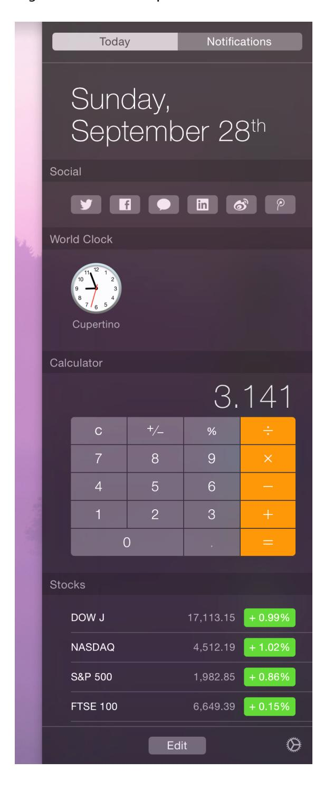

**Design an appearance that looks at home in Notification Center.** Notification Center uses the vibrant dark appearance, and your widget content should, too. Also, when you use the default margins provided by Notification Center, your Today widget gives users a consistent experience. In general, focus on drawing your content and not on drawing backgrounds or custom materials.

**Note:** OS X automatically displays your app icon and title above your custom widget content (the icon appears in the leading margin).

**In general, use the system font in the appropriate color to display text.** Specifically, choose the color that reflectsthe semantic meaning of your text,such as labelColor (for primary text) and secondaryLabelColor (for lessimportant text). When you use the system-provided colors, your text automatically getsthe appropriate vibrancy (to learn more about the system-provided colors, see Use System Colors to [Integrate](#page-38-1) With System [Appearances](#page-38-1) (page 39)).

**Provide a Notification Center experience.** People visit Notification Center to get brief updates or to perform a very simple task, so it's best when your Today widget displays the right amount of information and limits interactivity. Specifically:

- Avoid making users vertically shift the view to see all the information in your Today widget. A widget can expand vertically to show more information, but it's not a good experience when a widget's height takes up too much of Notification Center, because it interferes with scrolling to see other Today widgets.
- Avoid making users horizontally shift the view, because it might interfere with the dismiss Notification Center gesture. If you need a table view in your widget, be sure to use a fixed-size table view (that is, a table view that doesn't include a scroll view).
- Help users perform a task with as little interaction as possible. The keyboard is available to OS X widgets, but you don't want to encourage users to do a lot of typing.
- Optimize performance so that people get useful information immediately. It's a good idea to cache information locally so that you can display recent information while you get updates. People expect to spend very little time in the Today view, and iOS may terminate Today widgets that don't use memory wisely.

**If appropriate, let people open your app from your Today widget.** Because your Today widget provides a narrowly focused experience, it can work well to direct people to your app for more information or functionality. It's not a good idea to provide an "Open App" button, so one solution is to make your entire Today widget clickable. Or you might let users click an appropriate UI object within the widget so that it opens your app to a view that's focused on that object. For example, the Calendar widget shows today's events; if users want to get more information about an event, they click the event in the widget to view it in the Calendar app.

**Note:** Giving users a way to open your app from your Today widget can work well, but it's essential that you continue to provide useful, timely information in the widget. People may not appreciate a Today widget whose only function is to launch your app.

### Share Extensions

People access Share extensionsin the Share menu—which usersreveal by clicking the Share button or choosing the Share item in a contextual menu—or in the Social area in Notification Center. In the Share menu (shown here in Safari), people can use the More button to manage the Share extensionsthat are displayed in the menu shown here.

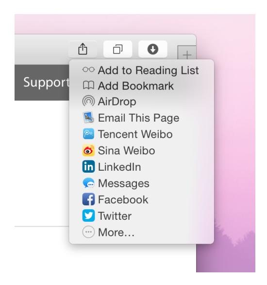

A Share extension typically takes asinput the user's current context or currently selected content. While reading an article in Safari, for example, a user might click the Share button and use a Share extension to post the webpage to a sharing website. Or while editing a document, a user mightselect a passage, open the contextual menu, and choose the Messages extension to share the selection with a contact.

**As much as possible, use the system-provided UI in a Share extension.** The system-provided compose view controller gives users a consistent experience and automatically supports common tasks, such as previewing and validating standard items, synchronizing content and view animation, and configuring a post. To learn more about using the system-provided compose view controller, see Share in *App Extension Programming Guide* .

**Consider displaying the progress of a lengthy upload in a Share extension's containing app.** People expect to return to their previous context immediately after tapping an extension's Post or Share button, even when the shared content is large. You need to make progress updates available, but people don't want to get a

notification every time an upload completes, and there's no way to programmatically relaunch an extension. In this scenario, it can work well to display the progress of the upload in the containing app, which can handle the task in the background and send a notification if there's a problem.

### Action Extensions

People can choose an Action extension in a few different ways. Specifically, people can:

- Open the Share menu and choose the extension
- Click the extension's toolbar button
- Hold the pointer over selected content or an attachment, click the button that appears, and choose the extension in the menu (shown here in TextEdit)

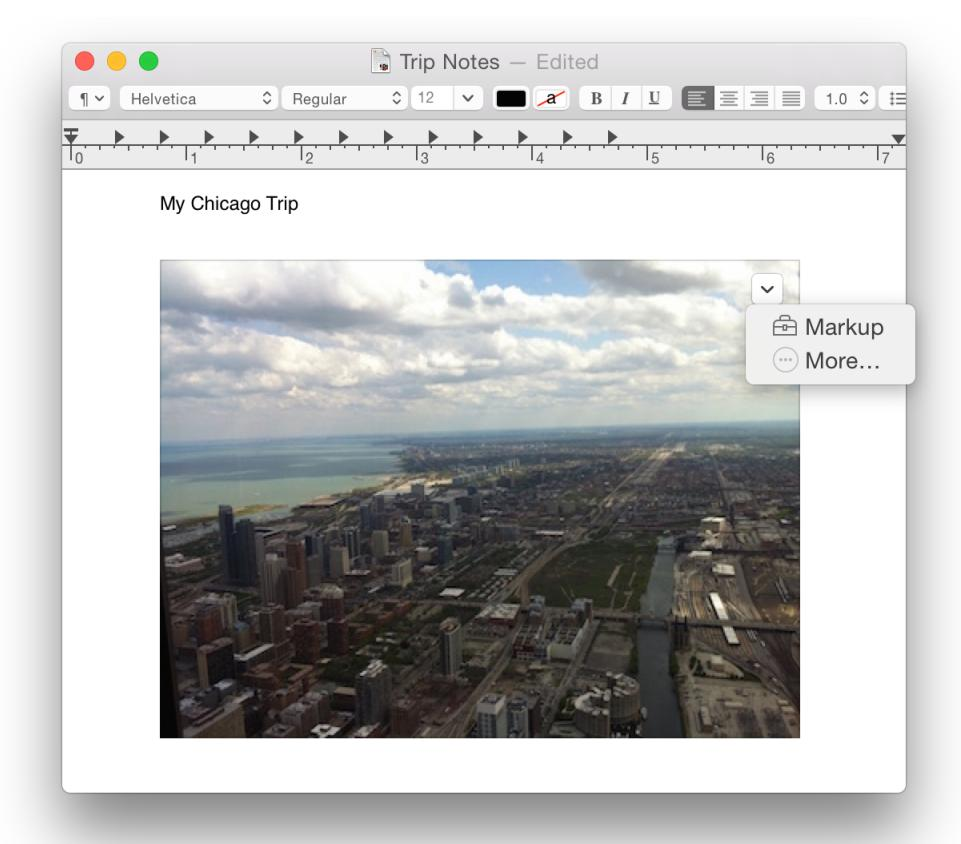

There are two types of Action extensions:

● **Viewer.** A viewer Action extension displays the current content in a custom way, but doesn't modify it.

● **Editor.** An editor Action extension can let users edit the current content. After users confirm their edits, the extension replaces the original content in the host app with the edited version. The system-provided Markup extension is an example of an editor Action extension.

**Note:** In the Share and contextual menus, OS X lists only the Action extensions that can work with the current content type. For example, when the user's current content is a video, OS X doesn't list Action extensions that support only text.

**If appropriate, display your Action extension UI within the context ofthe host app.** For example, the built-in Markup action extension letsthe user edit the image without leaving the primary app (shown here in TextEdit).

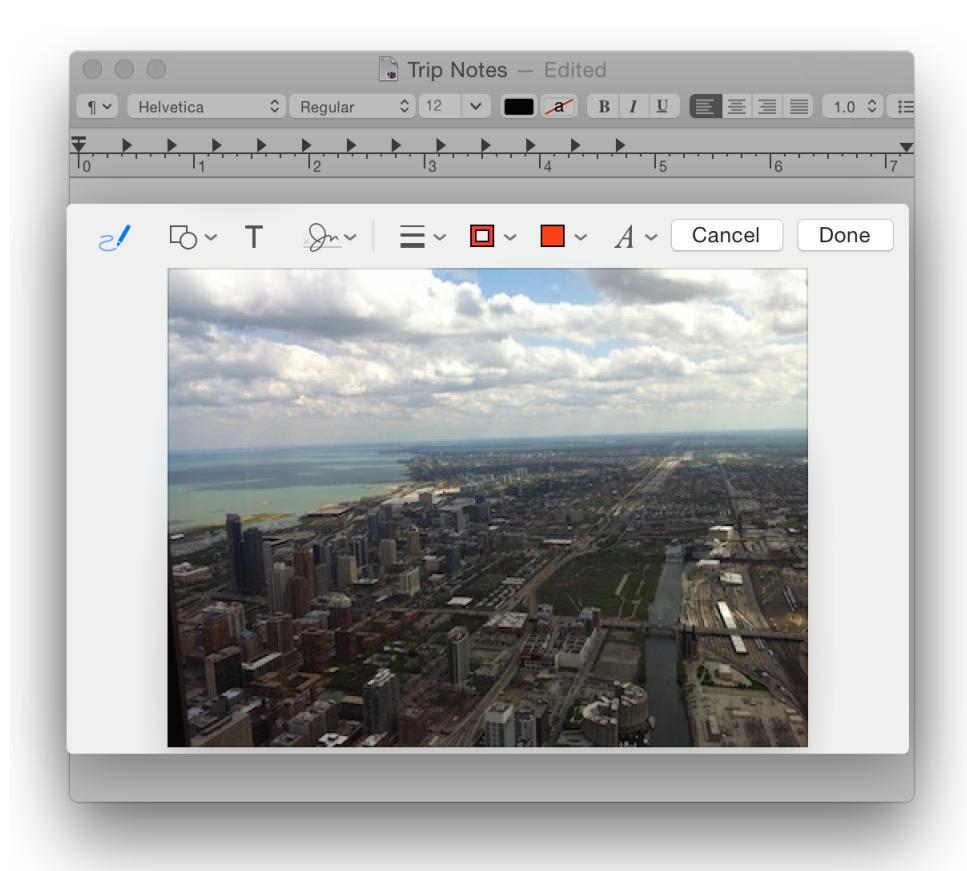

**Use a monochromatic version of the app icon for an Action extension.** (In contrast, a Share extension uses its containing app's full-color app icon.) To create an icon for an Action extension, you might start by creating a stencil version of your app icon. If necessary, simplify the design by focusing on the elements that make your icon unique.

If you provide multiple Action extensions in your containing app, it can work well to create a family of icons for them. Be sure to make every icon in the family look related to the containing app's icon.

**Note:** You can also register an Action extension as a toolbar item, which means that host apps can display your monochromatic Action icon in the toolbar.

### Finder Sync Extensions

Typically, Finder Sync extensions are provided by apps that synchronize the contents of a local folder with a remote data source. People use a Finder Sync extension to check on the sync status of their files and manage folder contents within a Finder window.

A Finder Sync extension provides badges that indicate the sync status of each item, and contextual menus that contain folder-management menu items, such as Copy and Open. In addition, a Finder Sync extension can provide custom buttonsfor the Finder toolbar that can perform global actions,such as opening a monitored folder or forcing a sync operation.

**Use badges sparingly.** For example, it can be better to show users which files are not synced if the alternative is to clutter the Finder window by badging every file with your "synced" badge.

## Notification Center

| Notification Center gives users a single, convenient place in which users can view and interact with Today widgets and get notifications from their apps. |  |
|--------------------------------------------------------------------------------------------------------------------------------------------------------------------------------------------------------------------------------|--|
|                                                                                                                                                                                                                                |  |
|                                                                                                                                                                                                                                |  |
|                                                                                                                                                                                                                                |  |
|                                                                                                                                                                                                                                |  |
|                                                                                                                                                                                                                                |  |
|                                                                                                                                                                                                                                |  |
|                                                                                                                                                                                                                                |  |
|                                                                                                                                                                                                                                |  |
|                                                                                                                                                                                                                                |  |
|                                                                                                                                                                                                                                |  |
|                                                                                                                                                                                                                                |  |
|                                                                                                                                                                                                                                |  |
|                                                                                                                                                                                                                                |  |

The Today view displays an editable list of system-provided and third-party Today widgets. A Today widget is an app extension that displays a small amount of timely, high-value information or functionality that's provided by an app the user cares about. For example, the Reminders widget displays currently scheduled items and lets users mark them complete within the widget.

The Notifications view uses a sectioned list to display recent notification items from the apps that users are interested in. Users visit Notifications preferencesto choose whether to view an app's notificationsin Notification Center and how many recent items should be displayed.

Apps can use local or remote notifications to let people know when interesting things happen, such as:

- A message has arrived.
- An event is about to occur.
- New data is available for download.
- The status of something has changed.

A **local notification** is scheduled by an app and delivered by OS X on the same device, regardless of whether the app is currently running in the foreground. For example, a calendar or to-do app can schedule a local notification to alert people of an upcoming meeting or due date.

A **remote notification** is sent by an app's remote server to the Apple Push Notification Service, which pushes the notification to all devices that have the app installed. For example, a game that a user can play against remote opponents can update all players with the latest move.

You can still receive local and remote notifications when your app is running in the foreground, but you pass the information to your users in an app-specific way.

OS X apps that support local or remote notifications can participate in Notification Center in various ways, depending on the user's preferences. To ensure that users can customize their notification experience, you should support as many as possible of the following notification styles:

- Banner
- Alert
- Badge
- Sound

A **banner** is a small view that appears in the upper-right corner and then disappears after a few seconds. In addition to displaying your notification message, OS X displays the small version of your app icon in a banner, so that people can see at a glance which app is notifying them (to learn more about app icons, see [Designing](#page-314-0) App [Icons](#page-314-0) (page 315)).

An **alert** is a standard alert view that appears onscreen and requires user interaction to dismiss. An alert contains the alert message, informative text, action buttons, and your app icon. You have no control over the background appearance of the alert or the buttons. See [Alerts](#page-171-0) (page 172) for more information about using alerts.

A **badge** is a small red oval that displays the number of pending notification items (a badge appears over the upper-right corner of an app's icon in the Dock, similar to the unread messages badge in Mail shown here).

A badge contains only numbers, not letters or punctuation. You have no control over the size or color of a badge.

A custom or system-provided **sound** can accompany any of the other three notification delivery styles.

**Note:** Apps that use local notifications can provide banners, alerts, badges, and sounds. But an app that uses remote notifications instead of local notifications can provide only the notification types that correspond to the push categories for which the app is registered. For example, if a remote-notification app registers for alerts only, users aren't given the choice to receive badges or sounds when a notification arrives.

As you design the content that your notifications can deliver, be sure to observe the following guidelines.

**Respect users' Notification Center preferences.** In System Preferences, users can choose their preferred notification style for your app from the available formats. If your app uses all styles, users can choose whether to receive notifications as alerts, banners, or neither. They can choose whether to show badges and play sounds for your app. Additionally, users can choose to turn off all notifications. Respect users' notification preferences to ensure that your app provides information unobtrusively.

**Don't useNotification Centerto display error messages.** Although users can launch your app from Notification Center, notifications don't provide a way for usersto resolve a problem. If you need to display an error message or a message requiring some action, use an application-driven alert dialog. For example, if users need to be connected to the Internet in order to complete a task, you could inform users through an alert dialog with an action button labeled Turn WiFi On.

**Keep badge contents up to date.** It's especially important to update a badge as soon as users have attended to the new information, so that they don't think additional notifications have arrived. Note that setting the badge contents to zero also removes the related notification items from Notification Center.

**Don't use a badge to indicate information other than a pending notification.** Users can choose to turn off badges for your app. If your app uses a badge to provide critical information, these users will miss out.

**Don't try to copy the appearance of a badge.** If you mimic the appearance of a badge, users who have turned off badges may be frustrated that they appear to be receiving badge notifications anyway.

**Don't send multiple notifications for the same event.** Users can attend to notification items when they choose; the items don't disappear until users handle them in some way. If you send multiple notifications for the same event, you fill up the Notification Center list and users are likely to turn off notifications from your app.

**Choose an appropriate default style for your notifications.** Use an alert when you need to deliver information that users need to know about right now. Because banners disappear after a few seconds, don't use banners for information that is critical for users to see. And because alerts interrupt the user's workflow, it's best to use them only when users would rather be interrupted than miss your notification. If users become annoyed with alerts, they may turn off notifications for your app.

**Provide a custom message that does not include your app name.** Your custom message is displayed in alerts and banners, and in Notification Center list items. You should not include your app's name in your custom message, because OS X automatically displays the name with your message.

To be useful, a local or remote notification message should:

- Not rely on alert buttons for users to understand the notification message. Because users can decide whether to receive your app's notifications as banners or alerts, make sure your message is clear in either style.
- Focus on the information, not on user actions. Avoid telling people which alert button to click or how to open your app.
- Be short enough to display in one or two lines. Long messages are difficult for users to read quickly, and they can force alerts to scroll.
- Use sentence-style capitalization and appropriate ending punctuation. When possible, use a complete sentence.

**Note:** In general, a Notification Center item can display more of a notification message than a banner can. If necessary, OS X truncates your message so that it fits well in each notification delivery style; for best results, you should not truncate your message.

**Label alert buttons with actions that clearly describe what the buttons do.** Provide custom titlesfor buttons in a notification alert if you provide custom behavior. For example, Reminders uses Snooze to allow you to repeat the alert at a later time. Remember that OS X may truncate the label to fit.

**Provide a sound that users can choose to hear when a notification arrives.** A sound can get people's attention when they're not looking at the device screen. Users might want to enable sounds when they're expecting a notification that they consider important. For example, a calendar app might play a sound with an alert that reminds people about an imminent event. Or a collaborative task management app might play a sound with a badge update to signal that a remote colleague has completed an assignment.

| You can supply a custom sound, or you can use a built-in alert sound. If you create a custom sound, be sure it is short, distinctive, and professionally produced. |
|--------------------------------------------------------------------------------------------------------------------------------------------------------------------------------------------------------------------------------------------------------|
|                                                                                                                                                                                                                                                        |
|                                                                                                                                                                                                                                                        |
|                                                                                                                                                                                                                                                        |
|                                                                                                                                                                                                                                                        |
|                                                                                                                                                                                                                                                        |
|                                                                                                                                                                                                                                                        |
|                                                                                                                                                                                                                                                        |
|                                                                                                                                                                                                                                                        |
|                                                                                                                                                                                                                                                        |
|                                                                                                                                                                                                                                                        |
|                                                                                                                                                                                                                                                        |
|                                                                                                                                                                                                                                                        |
|                                                                                                                                                                                                                                                        |
|                                                                                                                                                                                                                                                        |
|                                                                                                                                                                                                                                                        |
|                                                                                                                                                                                                                                                        |

## iCloud

iCloud helps people access the content they care about regardless of which device they're currently using. When you support iCloud in your app, users can use different instances of your app on different devices to view and edit their content without performing explicit synchronization. To enable this user experience, it's likely that you'll need to reexamine the ways in which you store, access, and present information (especially user-created content) in your app. Forsome tips on waysto structure your app so that it works well with iCloud, and to learn about the iCloud programming interfaces, see *iCloud Design Guide* .

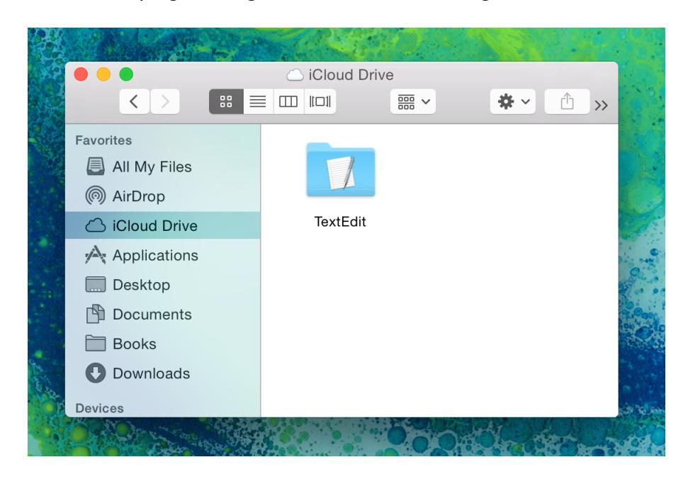

A fundamental aspect of the iCloud storage user experience is transparency: Ideally, users don't need to think about where their content is located or which version of the content they're currently viewing. The following guidelines can help you provide this user experience in your app.

**Respect the user's iCloud account.** It's important to remember that iCloud storage is a finite resource that users pay for. You should use iCloud storage to store information that users create, and avoid using it to store app resources or content that you can regenerate.

**Determine which types of information to store in iCloud storage.** In addition to storing documents and other user content, you can also store small amounts of key-value data in iCloud storage. For example, if users choose to sync iCloud Contacts, Mail stores their VIPs and Previous Recipients lists. These preferences are available to them on all Mac computers with OS X v10.8 installed.

If you store preferences in iCloud key-value storage, be sure that the preferences are ones that users are likely to want to have applied to all their devices. For example, Mail doesn't sync users' Downloads folder because it probably contains large files and users can still access these files through Mail on their other computers as needed. Additionally, it may makes sense for your app to keep track of which files are open, but not the exact window positions of those files. Note that in some cases, it can make sense to store preferences on your app's server, instead of in the user's iCloud account, so that the preferences are available regardless of whether iCloud is available.

**Make sure that your app behaves reasonably when iCloud storage is unavailable.** For example, if users sign out of their iCloud account or aren't connected to the Internet, iCloud storage becomes unavailable. For document-based apps, the Open dialog shows that a document is Waiting if there are unsaved changes that haven't yet been stored in iCloud. Your app doesn't need to inform users that iCloud storage is unavailable. For non-document-based apps, it can be appropriate to show users that the changes they make won't be visible on other devices until they restore access to iCloud storage.

**If appropriate, make it easy for users to enable iCloud storage for your app.** On their Mac computers, users sign in to their iCloud account in iCloud Settings, and for the most part, they expect their apps to work with iCloud storage automatically. If you think users might want to choose whether to use iCloud storage with your app, you can provide an option that they set when your app opens. In most cases, a simple choice between using iCloud Storage or not for all user content should be sufficient.

**Allow users to choose which documents to store in iCloud.** When users have iCloud enabled, their documents are stored in iCloud by default. However, because iCloud storage is finite, users may choose to store content in iCloud on a file-by-file basis. To provide the appropriate user experience, users should be able to save a document on their Mac only, but iCloud should still be the default location.

**Warn users about the consequences of deleting a document.** When a user deletes a document in an app that uses iCloud storage, the document is removed from the user's iCloud account and all other devices. It's appropriate to display an alert that describesthisresult and to get confirmation before you perform the deletion.

**Tell users about conflicts as soon as possible, but only when necessary.** For document-based apps, OS X handles conflict resolution for you; you don't need to do additional work to warn users about conflicts. For other apps, first determine if you can use iCloud storage APIs to resolve the conflict without involving the user. When this isn't possible, make sure that you detect conflicts as soon as possible so that you can help users avoid wasting time on the wrong version of their content. You need to design an unobtrusive way to show users that a conflict exists; then, make it easy for users to distinguish between versions and make a decision.

**Be sure to include the user's iCloud content in searches.** Users with iCloud accounts tend to think of their content as being universally available, and they expect search results to reflect this perception. If your app helps people to search their content, make sure you use the appropriate APIs to extend search to their iCloud accounts. See Searching iCloud and the Desktop in *File Metadata Search Programming Guide* to learn more.

## Mission Control

Mission Control gives users an easy way to see all their desktops and full-screen windows, in addition to Dashboard and the Dock, at one time. In Mission Control, users can create a new desktop, switch between desktops and full-screen windows, or choose a specific window on the current desktop.

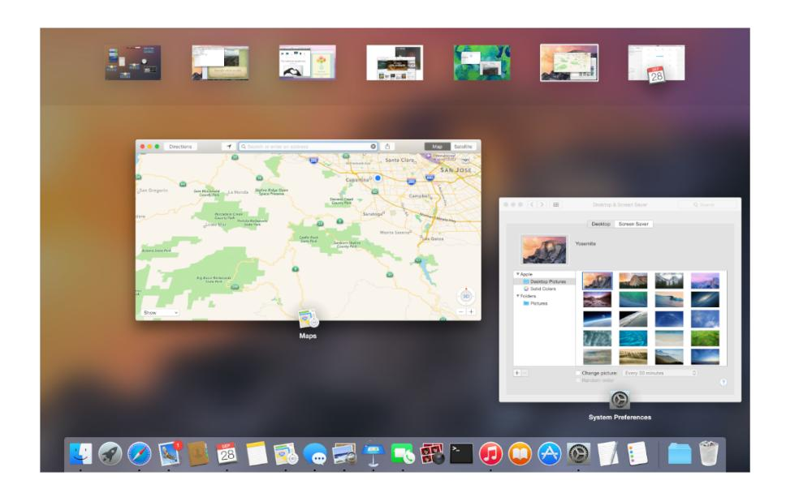

In System Preferences, users can set how they want to enter Mission Control,such as with a couple of keystrokes, a gesture, a hot corner, or all three.

Apps don't influence the way Mission Control displays the user's desktops and full-screen windows, but apps need to ensure that users can enter Mission Control whenever they want.

**Respect the "enter Mission Control" gesture.** No matter which gesture users choose for this action, you need to ensure that it works all the time, regardless of what your app is doing.

## Auto Save and Versions

Document-based apps can free users from having to save their work explicitly or worry about losing unsaved changes. When document-based apps enable Auto Save, the system automatically writes document data to disk as needed, without necessarily creating additional copies.

Versions displays an immersive interface in which users can browse earlier versions of their document and replace their working document with a previous version. Auto Save and Versions work together to reduce file-management tasks and help users focus on creating content.

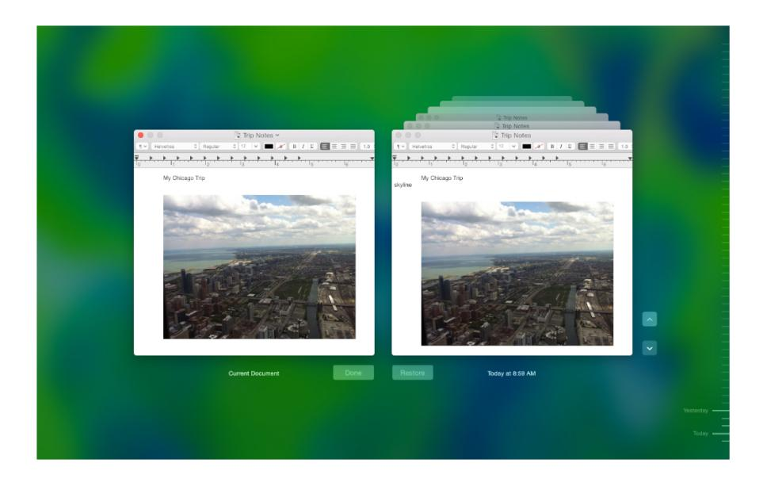

If your app is document-based, you can enable Auto Save with comparatively little effort. (When you adopt Auto Save, version browsing is enabled automatically.) To learn the programmatic steps you need to take to opt in to Auto Save, see Documents Are Automatically Saved in *Document-Based App Programming Guide for Mac* .

To help users enjoy the full benefits of Auto Save and Versions in your app, follow these guidelines:

**Avoid implying that users will lose their work unless they choose File > Save.** You want to help users understand that your app will always save their work unless they explicitly choose to discard it. In particular, you want to help users learn that the primary use for the Save command is to give them the opportunity to

specify the name and location of a document, not to save their content. A good way to emphasize this point is to automatically save content in an untitled document unless the user closes the window and declines to name the document.

**As much as possible, avoid displaying a dot in the document window's close button.** In earlier versions of OS X, a document with unsaved changes always displayed a dot in the close button, which indicated the "dirty state." To encourage users to embrace the Auto Save experience, you want them to get out of the habit of checking the close button to see if they need to save their work. In general, only apps that are not document-based should regularly display a dot to indicate unsaved changes.

**Note:** In rare case when Auto Save is unavailable for some reason—for example, the user's disk is full—a document-based app might need to display a dot in the close button. In such cases, the title bar menu that appears to the right of the document title also changes to display "Not Saved."

When possible, you should also avoid displaying a dot next to a document's name in the Window menu. To learn more about the contents of the Window menu, see The [Window](#page-99-1) Menu (page 100).

**Don't ask users to save when they log out, restart, or quit your app.** Users should not be presented with a Save dialog unless they explicitly close a document window that contains content that has never been named. When a document window closes as the result of another action (such as when the user logs out) the content should be automatically saved even if the user has never titled it. In this way, the user's work is automatically saved in all circumstances, unless the user explicitly chooses to throw it away.

## The Finder

The Finder gives users accessto the file system. Although it's best to minimize users' interaction with the Finder while they're in your app, you need to make sure your app integrates well with it.

**Make sure your app bundle has the correct filename extension.** The Finder looks for the .app filename extension and treats your app appropriately when it finds it. The Finder also shows or hides the filename extension, depending on the state of the "Show all filename extensions" preference in the Advanced pane of Finder preferences.

**Use an information property list to supply information to the Finder.** The information property list (that is, an Info.plist file) is the standard place to store information about your app and document types. For information on what to put in this file, see *Runtime Configuration Guidelines*.

**Add the appropriate filename extension to documents users can create in your app.** Accurate filename extensions help ensure platform interoperability. You can also set a file type and optionally a creator type for a file, although this is not strictly necessary.

**Avoid changing the creatortype of existing documents.** The creator type implies a distinctsense of ownership over a file. Your app can assign a creator type for files it creates, but it should not change creator types for documents that are created by other apps unless the user gives explicit consent. Note that the user can still associate files with a specific app by using the Info window.

**Include a Quick Look generator if your app creates documents in an uncommon or custom format.** A Quick Look generator converts an uncommon format into a format that the Finder can display in Cover Flow view and in a Quick Look preview. Specifically, if your app produces documents in content types other than HTML, RTF, plain text, TIFF, PNG, JPEG, PDF, and QuickTime movies, it's a good idea to provide a Quick Look generator so that users can view your documents they way they expect. To learn how to create a Quick Look generator, see *Quick Look Programming Guide* .

**If necessary, report disk size or usage information appropriately.** If your app needs to display this type of information, it's important to provide values that are consistent with values reported by the Finder and other system apps,such as Activity Monitor. Otherwise, users can become confused if your app and the system report different values for the same quantity.

To ensure consistent values, be sure to calculate all disk size statistics using GB, not GiB. A GB is defined as 1,000,000,000 bytes, whereas a GiB is defined as 1,073,741,824 bytes (which is the value of 2 30).

## The Dock

The Dock provides a convenient place for users to keep the apps they use most often. In addition, users can use the Dock to store webpage bookmarks, documents, folders, and stacks(which are collections of documents or other content). Users expect the Dock to be always available and to behave according to their preferences.

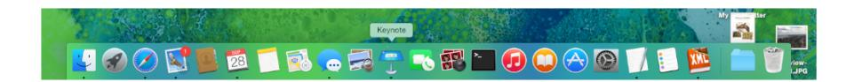

**Take Dock position into account when you create new windows or resize existing windows.** If window boundaries are behind the Dock, or too near the edge of the screen that hides the Dock, users have difficulty dragging or resizing the window without inadvertently interacting with the Dock. In particular, you should not create new windows that overlap the boundaries of the Dock. Similarly, you should prevent users from moving or resizing windows so that they are behind the Dock.

**Respond appropriately when the user clicks your Dock icon.** Generally, a window should become active when the user clicks on an app's Dock icon. The precise behavior depends on whether the app is currently running and on whether the user has minimized any windows.

If the app is not running, a new window should open. In a document-based app, a new untitled window should open. In an app that is not document-based, the main app window should open.

If the app is running when the user clicks its Dock icon, the app becomes active and all open unminimized windows are brought to the front; minimized document windows remain in the Dock. If there are no unminimized windows, the last minimized window should be expanded and made active. If no windows are open, the app should open a new window—a new untitled window for document-based apps, otherwise the main app window.

**Note:** A running app doesn't necessarily display the running indicator below its Dock icon (users can specify this behavior in Dock preferences). Don't assume that users want to see running indicators in the Dock.

**Use badging to give users noncritical status information in an unobtrusive way.** A badge is a small red oval that appears over the upper-right corner of an app's Dock icon. For example, App Store displays the number of app updates in a badge; when there are no new updates, the badge disappears (it doesn't display 0).

**Use bouncing to notify users of serious information that requires their attention.** A bouncing Dock icon is very noticeable, so you should use this method only when the user really needs to know about something. Also, make sure you disable bouncing as soon as the user has addressed the problem.

## Game Center

Game Center allows user to track scores on a leaderboard, compare in-game achievements, invite friends to play a game, and start a multiplayer game through automatic matching.

Game Center functionality is provided in two parts:

- The Game Center app, where users sign in to their account, discover new games, add new friends, and browse leaderboards and achievements
- Game Center features that your app provides, such as multiplayer or turn-based games, in-game voice chat, and leaderboards

In your game, use the Game Kit APIsto postscores and achievementsto the Game Centerservice and to display leaderboards in your user interface. You can also use Game Kit APIs to help users find others to play with in a multiplayer game. Note that to support Game Center in your OS X app, you mustsign the app with a provisioning profile that enables Game Center. To learn more about adding Game Center support to your app, see *Game Center Programming Guide* .

**For most games, it's best to use the standard Game Center UI.** Although it may make sense for some games with a distinct aesthetic to customize the Game Center user interface, in general, it's appropriate to use the standard UI. This creates a consistent experience for users, because they recognize the look of Game Center features. Creating a custom Game Center UI to match your game's aesthetic is not necessarily a better experience for users.

**Use a consistent user interface for all versions of your game.** If you have an iOS version of your game, make sure that achievements and any other custom Game Center features have a similar appearance for all versions.

Keep in mind that your OS X app should still be designed specifically for the platform and should not be simply a copy of your iOS app. For example, your app icon, which appears in Game Center, should not be the same rounded rectangle icon from iOS. For more information about designing a great app icon, see [Designing](#page-314-0) [Icons](#page-314-0) (page 315).

**Don't add custom UI to prompt users to sign in to Game Center.** When users first launch your Game Center–enabled app, they're prompted to log in to Game Center, if they aren't already logged in. Game Center takes care of presenting UI to the users and authenticating their account for you (you should not write your own code to do this).

**Let users turn off voice chat.** It's a good idea to disable voice chat by default so that users aren't overheard without their knowledge. When users turn on voice chat, make sure there's an obvious way for them to turn it off.

**Indicate when voice chat is on.** When a player's microphone is turned on, a game should make this clear to the user. As much as possible, it's also a good idea to show which user is currently speaking.

## In-App Purchase

In-App Purchase allows users to purchase digital products within your app. For example, users could:

- Upgrade a basic version of an app to include premium features
- Renew a subscription for new monthly content
- Purchase virtual property, such as a new weapon in a fighting game
- Buy and download new books

For example, GarageBand uses In-App Purchase to offer sounds, instruments, and lessons to users.

With In-App Purchase, users can complete transactions in only a few clicks because their payment information is tracked and stored by the App Store. Your app can implement In-App Purchase to take advantage of the App Store's searcher payment processing. Use the Store Kit framework to embed a store directly in your app.

Store Kit prompts usersto authorize a purchase and then notifies your app so that you can provide the purchased items to the users. Store Kit does not provide functionality for presenting your store to the users, you must design this yourself. Note that all products you sell via In-App Purchase must be registered in the App Store. To learn more, see *In-App Purchase Programming Guide* .

As you design the purchasing experience, follow these guidelines.

**Elegantly integrate the purchasing interface with your app.** When presenting productsfor usersto purchase and handling their transactions, create a seamless experience for your users. When you make In-App Purchase a thoughtfully designed aspect of your app, and not a clumsy addition, you may entice usersto purchase more.

**Don't alter the default confirmation dialog.** When users choose a product to purchase, Store Kit presents a confirmation dialog that helps them avoid accidental purchases.

## Accessing User Data

### Calendar Data

Calendar helps people manage their schedules and create and respond to events. You can integrate Calendar information into your app so that users don't need to look up or reenter information. With the Event Kit framework, you can access users' events and create, edit, or delete new events. See *Calendar and Reminders Programming Guide* for more information.

**Don't modify a user's Calendar data without permission.** Before creating, editing, or deleting a user's event, make sure you get permission from the user. Additionally, when you perform operations on a group of events that result in significant changes to the user's Calendar, make sure the user is fully informed of the action your app is about to perform.

Using Reminders, people keep track of tasks, to-do items, and events. Users specify the time and location of a reminder,set an alarm, and mark it completed when it'sfinished. Using the Event Kit framework, you can access users' reminders, and create, edit, or delete new reminders. Reminders and Calendars use the same framework and accessthe same Calendar database. See *Calendar and Reminders ProgrammingGuide* for more information.

**Don't modify a user's Reminder data without permission.** Before creating, editing, or deleting a user's reminder, make sure you get permission from the user. Additionally, when you perform operations on a group of reminders that result in significant changes to the user's data, make sure the user is fully informed of the action your app is about to perform.

### Contacts Data

Contacts helps users keep track of their contacts, storing information such as names, phone numbers, fax numbers, and email addresses. Users appreciate apps that access this information automatically so that they don't have to look it up or reenter it more than necessary.

When you use the Address Book framework, you can access contact information from the user's database or display it in a customizable window within your app. You can also customize the user's Contacts experience by supplying a plug-in that performs an action when users Control-click a labeled item, such as a name or phone number.

One way to customize a contact-information window is to display only the data relevant to your app. For example, Mail customizes this window to focus on the email addresses of the contacts.

The following guidelines help you provide a good user experience as you integrate Contacts information in your app and develop action plug-ins.

**Don't use developer terms in your UI.** In particular, don't use the terms *people picker* or *picker*. Although the Address Book framework uses these terms, they are not suitable user terms. Additionally, you should name a custom contact-information window in a way that describes its contents as they relate to your app, such as Addresses or Contacts. (To learn about additional terms that you should avoid in your UI, see Use [User-Centric](#page-43-1) [Terminology](#page-43-1) (page 44).)

**Limit to a single window new UI that's displayed by an action plug-in.** For example, the Large Type action uses a very large font to display the selected phone number in a single window. If you develop an action that needs to do more than display information in a single window, it should launch a separate app.

**Don't add UI to the Contacts app itself.** In particular, there is no reason to add a pane to Contacts preferences. Instead, use the Contacts programming interfaces to make sure that your action plug-in name appears in the contextual menu users see when they Control-click an item.

To learn more about working with the Address Book framework,see *Address Book Programming Guide for Mac* .

## Preferences

Preferences are user-defined settings that your app remembers from session to session. Users expect to be able to customize the appearance and behavior of your app in preferences. For example, in Finder preferences, users can customize the contents of Finder windows and the behavior of File > New Finder Window, among other things.

**Be picky about which app features should have preferences.** Avoid implementing all the preferences you can think of. Instead, be decisive and focus your preferences on the features users might really want to modify.

**Don't provide preferences that affect systemwide settings.** For example, if users want to change the size of sidebar icons or change the visibility of the running-app indicator in the Dock, they can do so in System Preferences. In particular, your app should not encourage usersto change the way your app handles automatic saving of their content; this is a system feature that users expect to rely on in all the apps they use.

**As much as possible, ensure that users rarely need to reset preferences.** Ideally, preferencesinclude settings that users might want to change only once. If there are settings users might want to change every time they open your app, or every time they perform a certain task, don't put these settings in preferences. Instead, you could use a menu item or a control in a panel to gives user modeless access to these settings.

**Don't provide a preferences toolbar item.** Because the toolbar should contain only frequently used items, it does not make sense to include a preferences item in it. Instead, make app-level preferences available in the app menu (for more information, see The App [Menu](#page-87-1) (page 88)); and make document-specific preferences available in the File menu (for more information, see The File [Menu](#page-89-0) (page 90)).

To learn more about implementing preferences using Cocoa,see *Preferences and Settings Programming Guide* . For information on implementing preferences using Core Foundation, see *Preferences Programming Topics for Core Foundation* .

## VoiceOver and Accessibility

OS X integrates many accessibility features that help people with disabilities or special needs customize their experience.

As you incorporate support for accessibility into your app, keep the following guidelines in mind.

**Focus first on ease of use.** An easy-to-use app provides the best experience for all users. To make sure that users who use assistive technologies (such as VoiceOver or a braille display) can benefit fully from your app, you might need to supply some descriptive information about the UI. To learn about the programmatic steps you need to take to supply accessibility information, see *Accessibility Overview for OS X* .

**Don't override the built-in OS X accessibility features.** Users expect to be able to use accessibility features, such as the ability to perform all UI functions using the keyboard, regardless of the app they're currently using. Users can access these features in the Universal Access and Keyboard panes of System Preferences.

**Avoid relying solely on one type of cue to convey importantinformation in your app.** For example, although the judicious use of color can enhance the UI, color coding should always be redundant to other types of cues, such as text, position, or highlighting. Allowing users to select from a variety of colors to convey information enables them to choose colors appropriate for their needs. Similarly, it's best when sound cues are available visually as well. Because OS X allows users to specify a visual cue in addition to the standard audible system alert, be sure to use the standard system alert when you need to get the user's attention.

**Provide keyboard-only alternatives.** Many people prefer using a keyboard to using a mouse or a trackpad; others, such as VoiceOver users, need to use the keyboard. Add support for full keyboard access mode to all your custom UI elements. Full keyboard access mode lets users navigate and activate windows, menus, UI elements, and system features using the keyboard alone.

**Don't override keyboard navigation settings.** In addition, don't override the keyboard shortcuts used by assistive technologies. When an assistive technology is enabled, keyboard shortcuts used by that technology take precedence over the ones defined in your app. To learn more about system-defined keyboard shortcuts, see Keyboard [Shortcuts](#page-296-0) (page 297).

**As much as possible, provide alternatives to drag and drop.** Except in cases where drag and drop is so intrinsic to an app that no suitable alternative methods exist—dragging iconsin the Finder, for example—there should always be another method for accomplishing a drag-and-drop task.

## Colors and Fonts Windows

OS X provides standard panels for picking colors and fonts. Users are accustomed to the appearance, behavior, and availability of these panels throughout the system.

The system-provided Colors window (shown below) lets users enter color data using any of five different color models.

If your app deals with color, you may need a way for the user to enter color information. Be sure to use the Colors window rather than create a custom interface for color selection. For information on how to use this window in your app, see *Color Programming Topics*.

The standard version of the system-provided Fonts window (shown below) includesseveral controlsfor adjusting a font's characteristics. The minimal version of the Fonts window allows users to choose a font, typeface, and size.

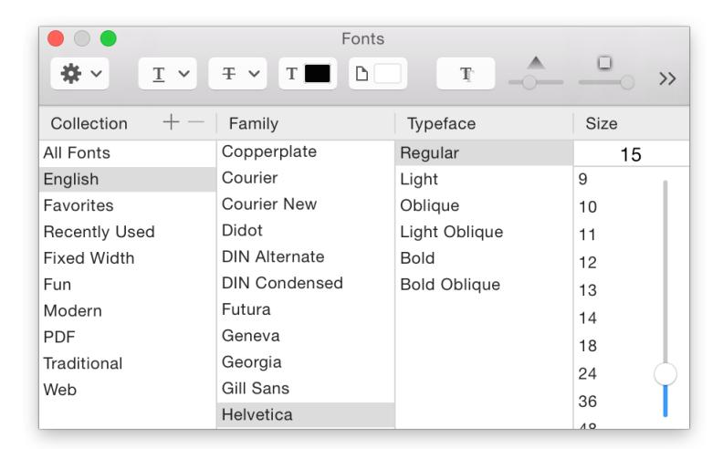

If your app supports typography and text layout using user-selectable fonts, you should use the Fonts window to obtain the user's font selection rather than create a custom font-picker window.

The standard Fonts window also provides advanced typography controls for fonts that support those options. The user can open a Typography inspector by choosing Typography from the action menu (shown above).

## Printing

OS X includes an advanced printing system. Users appreciate the extensive printing options that are available and they expect to be able to access them regardless of the app they're using. Fortunately, when you use the OS X printing system in your app, the printing features are easy to make available to users.

**Use the standard printing dialog instead of creating a custom dialog.** Because of all the options the OS X printing system provides, it is important to use the standard printing dialog with which users are familiar.

For information about the standard printing dialog,see The Print and Page Setup [Dialogs](#page-162-0) (page 163). For general information about the printing system, see *Printing Programming Guide for Mac* .

## User Assistance

OS X supports two user help features: Help tags and Apple Help. **Help tags** allow you to provide temporary context-sensitive help whereas **Apple Help** allows you to provide a more thorough discussion of a topic or task.

**Forthe best user experience, don't create a custom help viewer.** When usersrefer to help, it's usually because they are having difficulty accomplishing a task, which means they might be frustrated. This isn't a good time to make them learn yet another task, such as figuring out a help viewing mechanism that differs from the one they use in all the other apps on their computer.

Using Apple Help, you can display HTML files in Help Viewer, a browser-like app designed for displaying and searching help documents. Help Viewer can also display documents containing QuickTime content, open AppleScript-based automations, retrieve updated help content from the Internet, and provide context-sensitive assistance.

Although users can access Apple Help by launching the Help Viewer app, they will more commonly access it from your app, in one of the following three ways:

- **The Help menu.** The Help menu is the last app menu item in the menu bar (in left-to-right systems, the Help menu is on the right). When you register your help book with Help Viewer, the first item in the Help menu is the system-provided Spotlight For Help search field. The second item in the menu should be *AppName* Help, which opens Help Viewer to the first page of your help content. For more information on the Help menu, see The Help [Menu](#page-102-0) (page 103).
- **Help buttons.** A Help button provides easy access to specific sections of your help book. When a user clicks a Help button in your UI, you send to Help Viewer either a search term or an anchor lookup.
- **From a contextual menu item.** If contextually appropriate help content is available for the object the user has Control-clicked, the first item in the contextual menu is Help. As with Help buttons, this menu item can send either a search term or an anchor lookup to Help Viewer.

**Only display a Help button in a window when there is contextually relevant help available.** It's not necessary for every dialog and window in your app to include a Help button. Because the Help menu is available, users always have another way to access your help content. To learn how to write Apple Help content and provide it with your app, see *Apple Help Programming Guide* .

Help tags allow you to provide basic help information for UI elements in your app without requiring users to shift their focus away from the primary interface.

Help tags appear when the user allows the pointer to rest on a UI element for a few seconds. When the pointer leaves the object, the tag vanishes. If the pointer isn't moved, the system hides the help tag after about 10 seconds. For example, the Finder displays a help tag that describes the behavior of the Share toolbar control.

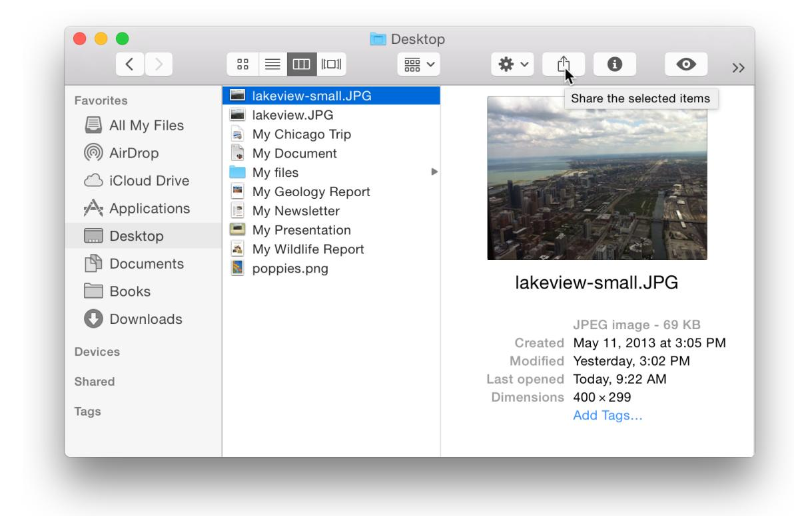

Note that help tags look similar to expansion tooltips, but they aren't the same. An **expansion tooltip** can appear when users position the pointer over truncated text in a table, outline, or browser view's cell. For example, when a filename is too long to display without truncation in a Finder window, an expansion tooltip displays the complete text. (To learn more about enabling expansion tooltips in your app, see allowsExpansionToolTips.)

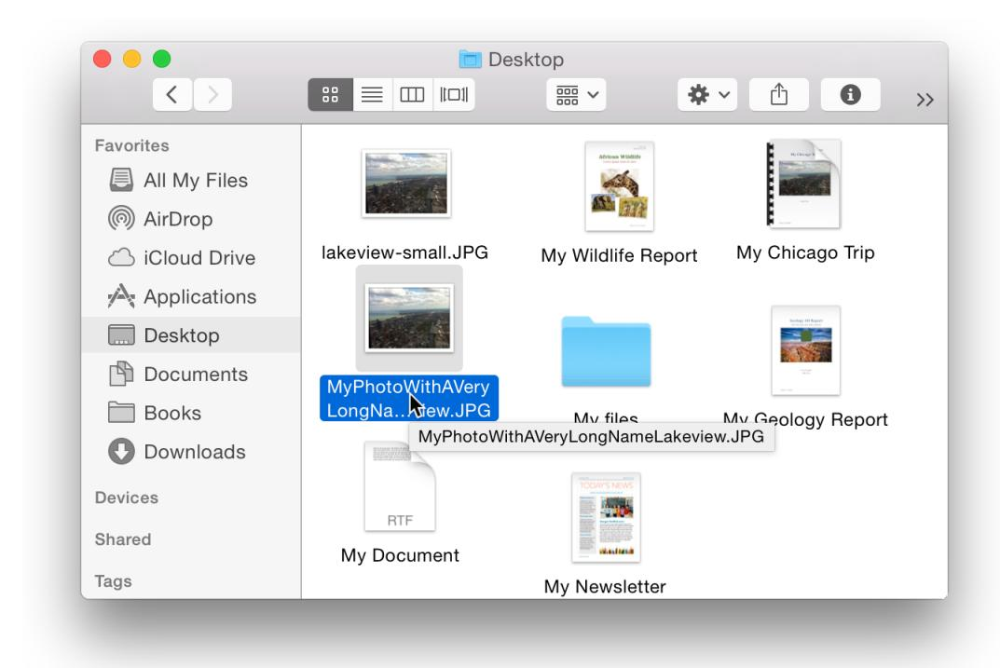

The text of a help tag should briefly describe what an interface element does. If you find that you need more than a few words to describe the function of a control, you might want to reconsider the design of your app's user interface.

You can define help tags in Interface Builder, where they are called **tooltips**. Here are some guidelines to help you create effective help tag messages.

**In general, don't name the interface element in the tag.** Because a help tag is specific to a UI element, it shouldn't be necessary to refer to it by name, unless the name helps the user and isn't available onscreen. If you do need to refer to an element by name, make sure you use the same name throughout all of your documentation.

**Describe only the element that the pointer is resting on.** Users expect a help tag to describe what they can do with the control; they don't expect to read about other controls or about how to perform a larger task.

**Describe controls that are unique to your app.** Don't provide help tags that describe window resize controls, scrollers, or other system-provided controls.

**Focus on the action users can perform using the control.** A good way to stay focused on the action is to begin the tag with a verb, for example, "Restores default settings" or "Add or remove a language from the list".

**Use the fewest words possible.** Help tags are always on, so it's important to keep your tag text unobtrusive—that is,*short*—and useful. As much as possible, keep tag text to a maximum of 60 to 75 characters. A tag should present only one concept and that concept should be directly related to the interface element. You can also omit articles to limit the length of the tag. Note that localization can lengthen the text by 20 to 30 percent, which is another good reason to keep the tag short.

**Use sentence-style capitalization.** Sentence-style capitalization tendsto appear more friendly and lessformal to users (to learn more about this capitalization style, see Use the Right [Capitalization](#page-46-0) Style in Labels and [Text](#page-46-0) (page 47)).

**In general, use a sentence fragment.** A sentence fragment emphasizes the brevity of the help tag's message. If the tag text must form a complete sentence, end it with the appropriate punctuation.

**Consider creating contextually sensitive help tags.** You can provide different text for differentstates a control can have, or you can provide the same text for all states. When you describe what the interface element accomplishes, you help the user understand the current state of the control even if the tag isn't applicable to all situations.

## Dashboard

Dashboard gives users a way to get information and perform simple tasks quickly and easily. Appearing and disappearing with a single keystroke or gesture, Dashboard presents a default or user-defined set of widgets in a format reminiscent of a heads-up display, as shown below.

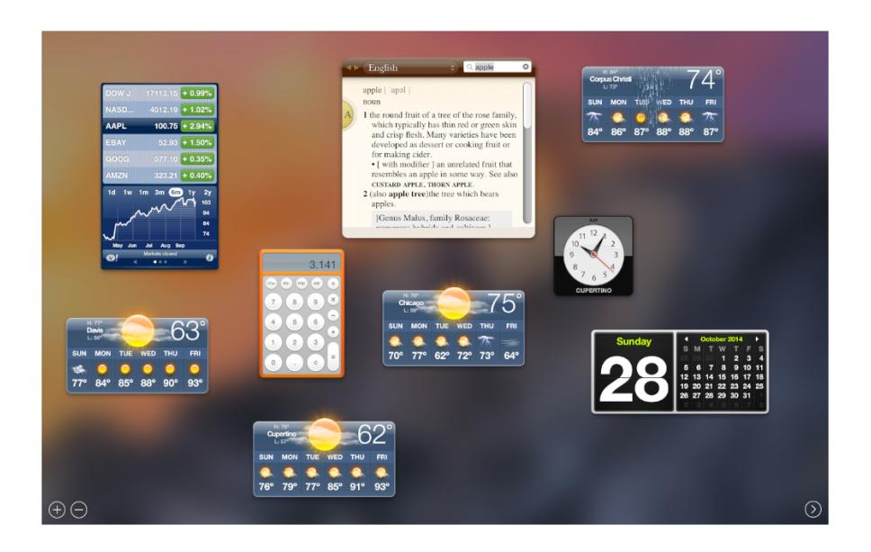

Each Dashboard component, called a **widget**, is small, visually appealing, and narrowly focused on the task it enables. You can develop a standalone widget that performs a lightweight task or a widget whose task is actually performed by your larger, more functional app. In-depth instructionsfor how to implement a Dashboard widget, including plentiful code examples and UI guidance, are available in *Dashboard Programming Topics*.

## Gatekeeper

Gatekeeper helps protect users from malware.

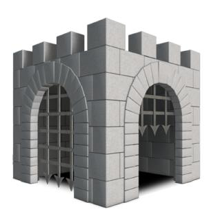

Users can set Gatekeeper to download and install:

- All apps
- Only apps from the Mac App Store
- Apps from the Mac App Store and apps signed with a Developer ID (this is the default setting)

With the default setting, if an app is unsigned, Gatekeeper blocks the app from installing and warns users that the app did not come from an identified developer. Users can choose to override Gatekeeper or change the settings.

To ensure the best possible experience for your users, you should:

**Vend your app from the Mac App Store.** By offering your app in the Mac App Store, users automatically know that your app has been reviewed by Apple and has not been tampered with.

**Sign your app with a valid Developer ID.** If you choose to distribute your app outside of the Mac App Store, sign your app with a Developer ID. Thisidentifies you as an Apple developer and ensuresthat your app launches on Macs with Gatekeeper enabled. For more information, see *App Distribution Guide* .

## Security

Users appreciate the security of the OS X environment and they expect their apps to be equally secure. When you take advantage of OS X security technologies, you can store secret information locally, authorize a user for specific operations, or transport information securely across a network.

Keep the following guidelines in mind when your app needs to work with sensitive information or perform tasks in a secure environment.

**Factor out code that requires privileged access into a separate process.** Factoring isolates the secure code from the nonsecure code and makes it easier to verify that no rogue operations are occurring that could do damage, whether intentionally or unintentionally.

**Avoid storing passwords and secrets in plain-text files.** Even if you restrict access to the file using file permissions, sensitive information is much safer in a keychain.

**Avoid inventing your own authentication schemes.** If you want a client-server operation to be secure, use the authorization APIs to guarantee the identity of the client.

**Be wary of the code you load or call from privileged code.** For example, you should avoid loading plug-ins from privileged code, because plug-ins receive the same privileges as the parent process. You should also avoid calling potentially dangerous functions, such as system or popen, from privileged code.

**Avoid making inappropriate assumptions.** For example, you should not assume that only one user is logged in. Because of fast user switching, multiple users may be active on the same system (for more information, see *Multiple User Environment Programming Topics*). Also, you should not assume that keychains are always stored as files.

**When feasible, avoid relying solely on passwords for authentication.** Be prepared to take advantage of other technologies, such as smart cards or biometric devices.

**Use Keychain Services to store sensitive information, such as credit card numbers and passwords.** The keychain mechanism in OS X provides the following benefits:

- It provides a secure, predictable, consistent experience for users when dealing with their private information.
- Users can modify settings for all of their passwords as a group or create separate keychains for different activities, with each keychain having its own activation settings. (By default, passwords are modified as a group.)

| ●  | The Keychain Access app provides a simple UI for managing keychains and their settings, relieving you of this task. |
|----|---------------------------------------------------------------------------------------------------------------------------------------------------------------------------|
| To | get started learning about security in OS X, see Security Overview.                                                                         |
|    |                                                                                                                                                                           |
|    |                                                                                                                                                                           |
|    |                                                                                                                                                                           |
|    |                                                                                                                                                                           |
|    |                                                                                                                                                                           |
|    |                                                                                                                                                                           |
|    |                                                                                                                                                                           |
|    |                                                                                                                                                                           |
|    |                                                                                                                                                                           |
|    |                                                                                                                                                                           |
|    |                                                                                                                                                                           |
|    |                                                                                                                                                                           |
|    |                                                                                                                                                                           |
|    |                                                                                                                                                                           |
|    |                                                                                                                                                                           |
|    |                                                                                                                                                                           |
|    |                                                                                                                                                                           |
|    |                                                                                                                                                                           |
|    |                                                                                                                                                                           |

## The Multiuser Environment

OS X is a multiple-user system. Not only does the system support multiple user accounts, it allows multiple usersto be logged in simultaneously so that they can share the same computer in quick succession. Thisfeature employs a technique known as fast user switching, in which users trade use of the computer without logging out.

The fast user switching menu is displayed by clicking the current user's name in the menu bar. The menu lists the names of the other users who have accounts on the computer (and whether they're currently logged in).

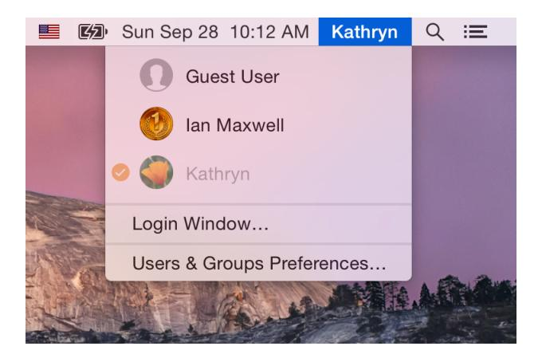

When a different user's name is chosen in the fast user switching menu, the current desktop (or full-screen window) is veiled and a login window appears. The new user logs in, sees the system exactly as they left it, and immediately gets access to their content.

With multiple users accessing the computer, conflicts can arise if apps are not careful about how they use shared resources. Great apps take care to avoid making assumptions about the current user's privileges and access to system resources and external devices.

**Be prepared for multiple users with different privileges.** The OS X fast user switching feature allows multiple usersto be logged in simultaneously and to switch quickly between accounts. To ensure that your app behaves appropriately when there are multiple users logged in or when the current user has limited privileges, keep the following things in mind:

Some users may be working under limited privileges and have limited access to some parts of the system. For example, only administrator users can write filesin /Applications. In particular, users with limited privileges may not be able to:

- Access all panes in System Preferences
- Modify the Dock
- Change their password
- Burn DVDs and CDs
- Open certain apps
- Visit certain websites

Users on a computer can include both local and network users, so don't assume that a user's home directory is on a local volume. Be prepared for the possibility that you are accessing a network volume instead.

Named resourcesthat might potentially be accessible to an app from multiple usersessionsshould incorporate the session ID into the name of the resource. This applies to cache files, shared memory, semaphores, and named pipes, among others.

To learn more about the ramifications of a multiuser system, see *Multiple User Environment Programming Topics*.

## Spotlight

Spotlight is a powerful OS X search technology that makes searching for files on the computer as easy as searching the web. Using Spotlight, users can search for things using attributes that have meaning for them, such as the intended audience for a document, the orientation of an image, or the key signature of the music in an audio file. Information like this(called metadata) is embedded in a file by the app that created it. Spotlight's power comes from being able to extract, store, update, and organize the metadata of files to allow fast, comprehensive searches.

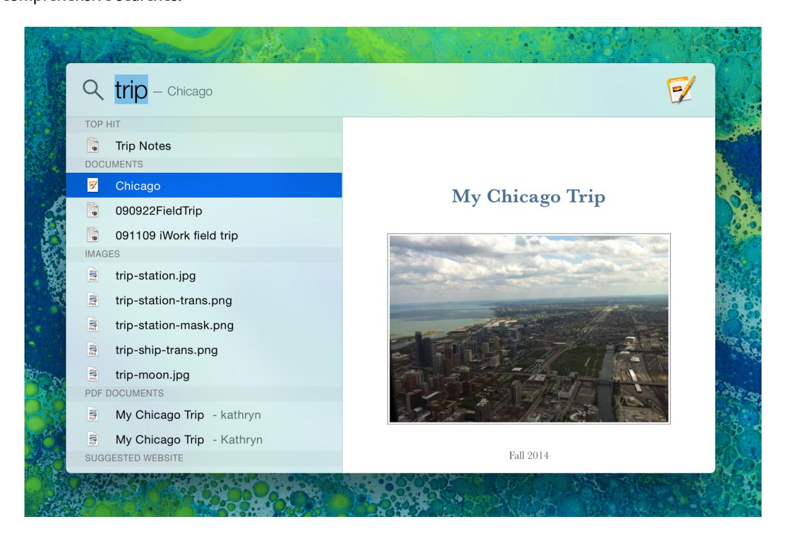

Spotlight is also available to you, the developer, to find filesto display and data to use in your app. The guidelines in this section help you extend Spotlight capabilities to your users and take advantage of its benefits in your app.

**Use Spotlightto give advanced file-search capabilities to users within the context of your app.** For example, you might choose to replicate the Spotlight contextual-menu item, using a button that initiates a Spotlight search for the user's selected text. You might then display a custom window that contains all the search results or a filtered subset of them.

**Consider providing Spotlight-powered search instead of a Finder-based Open dialog.** Users often need to work on a file that was saved in an atypical place or given an unexpected or forgotten name. If you offer only a Finder-based Open dialog, it might force the user to waste time navigating the file system, trying to remember what the file was named and where it wassaved. Instead, provide a Spotlight-powered search that allows users to search the entire file system, using attributes that are meaningful to them.

**Consider using Spotlight behind the scenes to find needed files.** For example, an app that provides a back-up service might allow users to choose a broad category of file type to back up, such as images. Instead of asking users to identify all the folders that contain their images or only backing up a Pictures folder, the app could perform a Spotlight search to find every image file in the file system, regardless of its location.

**Use Search Kit (not Spotlight) to do fine-grained textual searching within a document.** Spotlight is tuned to search for files; it's not intended to do extensive text-based searching within a document. An app thatstores data in database records, for example, should not base its database search on Spotlight because the data are not stored in separate files. For more information on using Search Kit in your app, see *SearchKit Programming Guide* .

**Include aQuick Look generatorif your app creates documents in an uncommon or custom format.** Spotlight uses Quick Look technology to display thumbnails and full-size previews of the documentsreturned in a search. If your app produces documents in common content types, such as HTML, RTF, plain text, TIFF, PNG, JPEG, PDF, and QuickTime movies, Spotlight can display the thumbnails and previews automatically. Otherwise, you should include a Quick Look generator to convert your native document format into a format Spotlight can display. To learn how to create a Quick Look generator, see *Quick Look Programming Guide* .

**Supply a Spotlight importer that describes the types of metadata your file format contains.** Supplying an importer (also called a plug-in) ensures that users can search for the files your app creates using the attributes described by the metadata your files contain. For comprehensive information on how to create a Spotlight importer, see *Spotlight Importer Programming Guide* .

## Automator

Automator helps users automate common procedures and build workflows by arranging processes from different apps into a desired order. Familiar Apple apps, such as Mail, iPhoto, and Safari make their tasks available to users to organize into a workflow. These tasks (called **actions**) are simple and narrowly defined, such as opening a file or applying a filter, so a user can include them in different workflows.

As an app developer, you can define Automator actionsthat represent discrete tasksthat your app can perform. You make an action available to users by creating an action plug-in, which contains a nib file and code that manages the action's user interface and implements its behavior. You might consider creating a set of basic actions to ship with your app so that users have a starting point for using your app's tasks with Automator. For more information on developing Automator actions, see *Automator Programming Guide* .

As you design the UI of an action, keep the following guidelines in mind.

**Minimize the height of an action.** Users stack actions on top of each other in Automator. Because display screens are wider than they are tall, you should minimize an action's use of vertical space. One way to do this is to use a pop-up menu instead of radio buttons, even if there are only two choices.

**Don't use group boxes.** An action does not need to separate or group controls with a group box.

**Avoid tab views.** Instead, use hidden tab views to alternate between different sets of controls.

**Avoid using labels to repeatthe action's title or description.** Labelsthat repeat information available elsewhere take up space without providing value.

**Conserve space by using the appropriate controls and layout.** For example, you can use a disclosure triangle to hide and display optionalsettings. (For more information on disclosure triangles,see [Disclosure](#page-216-1) Triangle (page 217).) Overall, you should use the small size of standard OS X controls and 10-point margins to make the best use of space.

**Provide feedback.** Use the appropriate progress indicator when an action needs time to complete (for more information about different types of progress indicators, see Progress [Indicators](#page-205-1) (page 206)).

## Services

OS X services are features that apps can make available to each other. Using services, you can share your app's resources and capabilities with other apps and, in turn, allow your users to take advantage of resources and capabilities that other apps provide.

**Note:** App extensions also provide various services to apps, but in a much more integrated way. To learn more about app extensions, see App [Extensions](#page-234-0) (page 235).

By default, the app menu contains a Services submenu that lists services that are appropriate for the currently selected or targeted content in your app. Thissubmenu automatically includes a command that opens Services preferences in Keyboard Shortcuts preferences. The services listed in the submenu can be provided by apps installed anywhere on the system. For example, the Services that are available when an image file is selected in a Finder window can include options for using it as the desktop picture and opening with a specific app.

To vend services to other apps, your app provides information about each service, such as:

- The data types on which it operates
- The command that can appear in the Services menu
- The keyboard shortcut for invoking the command, if appropriate. Note that if the keyboard shortcut you choose conflicts with a keyboard shortcut used by the current "host" app, the host app'sshortcut is always used.

To learn the programmatic steps you need to take both to provide services and to take advantage of them, read *Services Implementation Guide* .

To ensure a good user experience, follow these guidelines when defining the servicesthat your app can provide.

**Give each service a short, focused title that describes exactly what it does.** Strive to create a unique service title. If there are two or more services with identical names, the app name is automatically displayed after each service to distinguish them.

**Use proper capitalization in your service title.** As with all menu-item names, use title-style capitalization for the service title and, in general, avoid including definite or indefinite articles. Good examples are "Look Up in Dictionary" and "Make New Sticky Note." (For more information about capitalization in the UI, see [Use](#page-46-0) the Right [Capitalization](#page-46-0) Style in Labels and Text (page 47).)

**Avoid providing an "Open in My App" service.** Instead, users can view the apps that can open a selected file in the Open With menu item of the Finder.

**Don't use services for sharing user content.** For sharing user content with other apps and social services, use a Share extension (described in Share [Extensions](#page-238-0) (page 239)).

## Sharing

Sharing lets usersshare content from your app with social websites and other apps,such as Mail and Messages. The Share menu automatically displays the built-in features and app extensions that make sense in the current context. For example, a photo-sharing website appearsin the Share menu only if the user hasselected a photo.

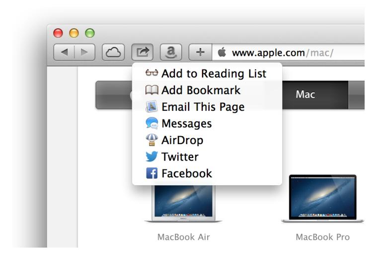

As you implement and customize the Share menu in your app, consider the following guidelines. (To learn more about the app extensions that can appear in the Share menu, see App [Extensions](#page-234-0) (page 235).)

**In general, use the Share button for content users wantto share with other people.** When deciding whether to include a Share button in your app, consider whether users want to share their content with other people. This includes sending content directly via AirDrop, Mail, and Message, or posting it to a social sharing service such as Facebook, YouTube, or Flickr.

In particular, don't use the Share menu to edit content or to pass content between apps. For example, QuickTime Player uses a separate Export menu to send files to iTunes and iMovie or to reformat a file. Use an Action Menu for other actions that users may want to perform with their content, such as Duplicate, Move to Trash, or Get Info. The Share menu should not replace the Action menu. See [Action](#page-202-1) Menu (page 203) for more information.

**Add a Share item to the File menu.** Users should be able to share their content from the File menu as well as with the Share button. Make sure to provide the same menu items in both places. It's also best to use the same wording so that users readily recognize the available options.

With Sharing Service on OS X, you can also integrate features of a specific social networking service directly into your app. For example, users can view the Facebook profile and photos of their contacts from a menu item in the Contacts app (as shown here). You can also generate HTTP requests to get and push content from available social services. Users appreciate when they can share content they care about and can view relevant social information from within your app.

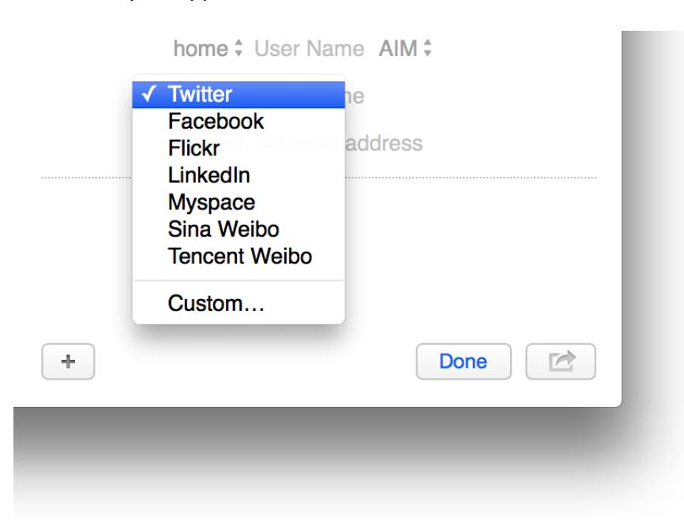

Use the AppKit and Social frameworksto make sharing easierfor your users. See the *Social Framework Reference* for more information.

## Drag and Drop

Drag and drop is a fundamental direct-manipulation technology that makes it easy for users to interact with their content. Users expect to be able to drag any selectable item—such as a section of text, a file, an image, or an icon—and drop it in a new location.

In addition to handling users' data without loss, supporting drag and drop is largely a matter of providing appropriate feedback. Specifically, users need to know:

- Whether drag and drop is possible for an item (indicated by drag feedback)
- What the results of a drag-and-drop operation will be (indicated by destination feedback)
- Whether a drag-and-drop operation was successful (indicated by drop feedback)

The following guidelines help you provide a drag-and-drop experience that users appreciate.

**As much as possible, provide alternative methods for accomplishing drag-and-drop tasks.** For some users, especially those who use assistive technologiesto interact with your app, drag and drop is difficult or impossible to perform. Except in cases where drag and drop is so intrinsic to an app that no suitable alternative methods exist—dragging icons in the Finder, for example—there should always be another method for accomplishing a drag-and-drop task.

**Determine whether a drag-and-drop operation should result in a move or a copy.** In general, if the source and destination are in the same container, such as the same window or volume, a drag-and-drop operation is interpreted as a **move** (that is, cut and paste). If the source and destination are in different containers, a drag-and-drop operation is interpreted as a **copy** (that is, copy and paste).

As much as possible, you should also consider the underlying data structure of the contents in the destination container. For example, if your app allows two windows to display the same document (multiple views of the same data), a drag-and-drop operation between these two windows should result in a move.

**Note:** Users can force a drag-and-drop operation within the same container to behave like a copy by pressing the Option key while dragging. If users press the Option key while dragging content between two different containers it has no effect; that is, the drag-and-drop operation is still interpreted as a copy because the source and destination are not the same.

Dragging an item to the Trash is considered a move operation, even though the Trash is a separate container. However, users can still avoid data loss because they can undo the action by dragging the item out of the Trash and back to its original location.

**Check forthe Option key at drop time.** This behavior givesthe user the flexibility of making the move-or-copy decision at a later point in the drag-and-drop sequence. Pressing the Option key during the drag-and-drop sequence should not "latch" for the remainder of the sequence.

**Support single-gesture selection and dragging, when appropriate.** Using a mouse or a trackpad, users can drag an item by selecting it and immediately beginning to drag, instead of by selecting the item, pausing, and then dragging. (The automatic selection of the item that can occur in thissituation is called **implicit selection**.) Note thatsingle-gesture selection and dragging is *not* possible when the userselects multiple items by dragging or by clicking individual items while holding the Command key, because multiple selection can't be implicit.

**Allow users to drag a selection from an inactive window.** Users expect to be able to drag items they selected previously into the currently active window. To support this action, your app should maintain the user'sselection when the containing window becomes inactive. A persistent selection in an inactive window is called a **background selection** and it has a different appearance from a selection in an active window.

In particular, support background selection for items that users must select by range, such as text or a group of icons. If you don't support background selection for range-selected items, the user must reactivate the window and reselect the items before dragging them. Support for background selection is not required if the item the user wants to drag is discrete—for example, an icon or graphical object—because implicit selection can occur when a discrete item is dragged. Note that when an inactive window is made key, the appearance of a background selection changesto the appearance of a standard selection. To learn more about the different states a window can have, see Main, Key, and Inactive [Windows](#page-122-0) (page 123).

**Provide drag feedback as soon as users drag an item at least three points.** Display a translucent image of the item at the beginning of the drag so that users can confirm the item that they're dragging. After the user begins a drag, the item should stay draggable, and the drag image should stay visible, until the user drops the item.

**Display a drag image composed of multiple items, if appropriate.** If the user selects multiple items to drag, you should display a drag image composed of images that represent each item. In addition, you should badge the aggregate drag image with the number of items being dragged so that users can confirm how many items they're dragging. For example, dragging five files into a Mail message might look like this:

**Change the drag image to show the dropped form of the item, if appropriate.** If it helps users understand how your app can handle an item, you can change its drag image when it enters a destination region in your app. For example, when the user drags a picture file from the desktop into a TextEdit document, the picture expands to show how it will look after the user drops it in the document.

Although changing the drag image can provide valuable feedback, you want to avoid creating a distracting drag-and-drop experience in which drag images are constantly (and radically) changing form.

**Use the appropriate pointer to indicate what will happen when the user drops an item.** For example, when users drag an icon into a toolbar, the copy pointer appears to indicate that if they let go of it there, the item will be added to the toolbar. Other pointers that provide useful destination feedback include the alias, poof, and not allowed pointers. (For more information about system-provided pointers, see [Pointers](#page-307-0) (page 308).)

**Update the badge of a multi-item drag when appropriate.** If the destination can accept only a subset of a multi-item drag, change the number in the badge to indicate how many of the items will be accepted.

**Highlight the destination region as soon as the pointer enters it and stop highlighting when the pointer leaves the region.** If there are multiple destination regions within a window, highlight one destination region at a time.

**Don't highlight the destination region if the drag-and-drop operation takes place entirely within it.** For example, moving a document icon to a different location in the same folder window does not highlight the folder window because this would be confusing to the user. Do highlight the destination region if the user drags an item completely out of the region and then drags the same item back into the same region again.

**In text, use a vertical insertion indicator to show where the dragged item will be inserted.** Note that an insertion indicator is separate from the pointer. The pointer indicates to users whether the drag is valid and whether it is interpreted as a copy.

**In a list, use a horizontal insertion indicator to show where the item will be inserted.** For example, when a user drags a file into the Xcode navigator, a horizontal insertion indicator appears.

**In a table, consider highlighting specific cells to show where the item will end up.** When you provide highly targeted destination feedback such as this, you help users avoid having to rearrange their content later.

**Highlight dropped text at its destination.** If the destination supports styled text, the dropped text should maintain its font, typeface, and size attributes. If the destination does not support styled text, the dropped text should assume the font, typeface, and size attributes specified by the destination insertion point.

**Provide additional feedback if the drop initiates a process.** For example, if the user drops an item onto an icon that represents a task (such as printing), show that the task has begun and keep the user informed of the task's progress.

**Make sure users know when a dropped item can't be accepted.** When the user drops an item on a destination that does not accept it, the item zooms from the pointer location back to its source location (this behavior is called a **zoomback**). A zoomback should also occur when a drop inside a valid destination does not result in a successful operation.

**At the destination, accept the portion of the dragged item that makes sense.** In your app, a destination should be able to extract the relevant data from the item the user drops. For example, if a user drags an Contacts entry to the "To" text field in Mail, only the email address is accepted, not the rest of the contact's address information.

**Display the appropriate post-drag selection state.** After a successful drag-and-drop operation involving a single window, the selection state is maintained at the new location. This behavior shows the location of the dropped item and allows the user to reposition the item without having to select it again. Also:

- If the user drags an item from an active window to an inactive window, the dragged item becomes a background selection at the destination. The active window should maintain the item's selected state.
- When content is dropped into a window in which something is already selected, you should deselect everything in the destination before the drop rather than replace the selection with the dragged item. Deselecting everything in the destination helps the user avoid accidental data loss.

**Automatically scroll a destination window when appropriate.**When an item is being dragged, your app must determine whether to scroll the contents or allow the item to "escape" the window. If your app allows items to be dragged outside of windows, you should define an automatic scrolling region. Automatically scroll a destination window only if it is also the source window and is frontmost. Don't automatically scroll inactive windows.

**Display a confirmation dialog when a drag-and-drop operation is not undoable.** Although it's best to support undo for the drag-and-drop operations in your app, it's not always possible. For example, if the user attempts to drop an icon into a write-only drop box on a shared volume, the action is not undoable because the user doesn't have privileges to open the drop box and reverse the drag. In such cases, it's important to use a confirmation dialog to tell the user that their drag-and-drop operation can't be reversed.

**Create a clipping or other item to contain content that users drag from your app to the Trash.** A **clipping** is an intermediate form of content that has been dragged from a source location but has not yet been dragged to its final destination. For example, OS X allows users to drag content to a Finder window (or to the desktop) and then, in a later step, drag the content to another destination. (Note that a clipping has no relation to the Clipboard: Copying to the Clipboard and creating drag-and-drop clippings don't interfere with each other.)

## Keyboard Shortcuts

OS X reserves several key combinations for use with localized versions of system software, localized keyboards, keyboard layouts, and input methods. These key combinations (listed in Table 68-1) don't correspond directly to menu commands.

**Table 68-1** Key combinations reserved for international systems

| Key combination                          | Action                                                                                       |
|------------------------------------------|----------------------------------------------------------------------------------------------|
| Command–Space bar                     | Rotate through enabled script systems                                            |
| Option–Command–Space bar              | Rotate through keyboard layouts and input methods within a script |
| modifier key –Command–Space bar | Apple reserved                                                                            |
| Command–Right Arrow                   | Change keyboard layout to current layout of Roman script             |
| Command–Left Arrow                    | Change keyboard layout to current layout of system script            |

### Providing Keyboard Shortcuts

Keyboard shortcuts can provide an easy way for sophisticated users to perform actions, but don't feel that you must create a shortcut for every command. If you can't find a unique and easy-to-use keyboard shortcut for a command, don't use one at all; keep in mind that users may have difficulty pressing multiple modifier keys anyway.

**Important:** Alwaysrespect the system-reserved keyboard shortcutsin your app so that users aren't confused when the shortcuts they know work differently in your app.

**Avoid creating a shortcut by adding a modifier key to an existing shortcut, unless the shortcuts are related.** For example, don't use Shift-Command-Z as a keyboard shortcut for a command that is unrelated to Undo. Using Shift-Command-Z for Redo is appropriate, but using it for something like Calculate or Check Mail is confusing.

**As much as possible, use the Command key as the main modifier key in a keyboard shortcut.** For example, Command-P uses Command to modify the P key. For a command that complements another more common command, you can add Shift to the shortcut. For example, the shortcut for the complementary Page Setup command adds Shift to the shortcut for Print to give Shift-Command-P. Examples of keyboard shortcuts that use Shift to complement other commands gives additional examples of this technique.

**Table 68-2** Examples of keyboard shortcuts that use Shift to complement other commands

| Complementary command shortcut | Complementary command                                                                                                   | Complemented command shortcut |
|-----------------------------------|-------------------------------------------------------------------------------------------------------------------------|----------------------------------|
| Shift-Command-A                   | Deselect All                                                                                                         | Command-A (Select All)     |
| Shift-Command-G                   | Find Previous                                                                                                        | Command-G (Find Again)     |
| Shift-Command-P                   | Page Setup                                                                                                           | Command-P (Print)             |
| Shift-Command-S                   | Save As                                                                                                              | Command-S (Save)              |
| Shift-Command-V                   | Paste as (Paste as Quotation, for example)                                                            | Command-V (Paste)             |
| Shift-Command-Z                   | Redo (when Undo and Redo are separate commands rather than toggled using Command-Z) | Command-Z (Undo)              |

**Note:** Other languages may require modifier keys to generate certain characters. For example, on a French keyboard, Option-5 generates the "{" character. It's usually safe to use the Command key as a modifier, but avoid using Command and an additional modifier key with characters not available on all keyboards. If you must use a modifier key in addition to the Command key, try to use it only with the alphabetic characters (*a* through *z* ).

**Use the Option key sparingly.** If there's a third, less common command that's related to a pair of commands that use Command and Shift-Command, you can use Option-Command for the third command's keyboard equivalent. Use combinations like these very rarely. You can also use Option for a keyboard shortcut that's a convenience or power-user feature. For example, the Finder uses Option-Command-W for Close All Windows and Option-Command-M for Minimize All Windows.

**As much as possible, avoid using the Control key.** Because the Control key is already used by some of the universal access features—as well as in Cocoa text fields where Emacs-style key bindings are often used—it should be used as a modifier key only when necessary.

**List multiple modifier keys in the correct order.** If you use more than one modifier key in a shortcut, always list them in this order: Control, Option, Shift, Command.

**Identify a key with two characters by the lower character, unless Shift is part of the shortcut.** For example, the keyboard shortcut for Hide Status Bar is Command-Slash (that is, Command-/). If the Shift key is part of the keyboard shortcut, identify the key by the upper of the two characters. For example, the keyboard shortcut for Help is Shift-Command-Question Mark, not Shift-Command-Slash.

### Reserved and Recommended Keyboard Shortcuts

As you implement keyboard shortcuts in your app, use [Table](#page-299-0) 68-3 (page 300) to find:

- Key sequences that are reserved by OS X. Users rely on these shortcuts to perform the specified actions no matter which app is currently running (these include shortcuts reserved for accessibility purposes). *Don't override these shortcuts*.
- Key sequences that are recommended for common app tasks. Users expect these shortcuts to mean the same thing from app to app. Provide these shortcuts *if your app performs the associated tasks*.

If your app doesn't perform the task associated with a recommended shortcut, think very carefully before you consider overriding it. Remember that although reassigning an unused shortcut might make sense in your app, your users are likely to know and expect the original, established meaning.

If a keyboard sequence isn't listed in Table 68-3 you can use it for a frequently used command in your app, if a shortcut is appropriate. Be aware, however, that Apple may reserve other keyboard shortcuts in the future.

**Note:** With the exception of the system-reserved function keys F9, F10, F11, and F12, Table 68-3 lists only combinations of two or more keys.

Table 68-3 groups together the primary key that is modified and variations of key sequences based on the primary key. In the interests of space, the table uses the following symbols to represent the modifier keys (these are the same symbols that menus display):

| Control |
|---------|
| Option  |
| Shift   |
| Command |

You should not override the shortcuts in Table 68-3 that are accompanied by the Apple symbol shown here, because OS X uses the shortcut in some way.

Supporting a shortcut in Table 68-3 that isn't accompanied by the Apple symbol is recommended for apps that perform the associated task.

**Table 68-3** Keyboard shortcuts in OS X

| Primary key  | Key sequence | Associated action                                                                                                                                                                                                                 |
|--------------|-----------------|-----------------------------------------------------------------------------------------------------------------------------------------------------------------------------------------------------------------------------------|
| Space bar | Space           | Show or hide the Spotlight search field (when multiple languages are installed, may rotate through enabled script systems).                                                    |
|              | Space           | Apple reserved.                                                                                                                                                                                                                |
|              | Space           | Show the Spotlight search results window (when multiple languages are installed, may rotate through keyboard layouts and input methods within a script).           |
|              | Space           | Show the Special Characters window.                                                                                                                                                                                   |
| Tab          | Tab             | Navigate through controls in a reverse direction.                                                                                                                                                               |
|              | Tab             | Move forward to the next most recently used app in a list of open apps.                                                                                                                 |
|              | Tab             | Move backward through a list of open apps (sorted by recent use).                                                                                                                                |
|              | Tab             | Move focus to the next grouping of controls in a dialog or the next table (when Tab moves to the next cell). See Accessibility Overview for OS X |
|              | Tab             | Move focus to the previous grouping of controls. See Accessibility Overview for OS X                                                                                                       |
| Esc          | Esc             | Open the Force Quit dialog.                                                                                                                                                                                           |
| Eject        | Eject           | Quit all apps (after giving the user a chance to save changes to open documents) and restart the computer.                                                                  |

| Primary key        | Key sequence | Associated action                                                                                                                                                     |
|--------------------|-----------------|-----------------------------------------------------------------------------------------------------------------------------------------------------------------------|
|                    | Eject           | Quit all apps (after giving the user a chance to save changes to open documents) and shut the computer down. |
| F1                 | F1              | Toggle full keyboard access on or off. See AccessibilityOverview for OS X                                                            |
| F2                 | F2              | Move focus to the menu bar. See Accessibility Overview for OS X                                                                      |
| F3                 | F3              | Move focus to the Dock. See Accessibility Overview for OS X                                                                             |
| F4                 | F4              | Move focus to the active (or next) window. See Accessibility Overview for OS X                                                 |
|                    | F4              | Move focus to the previously active window. See Accessibility Overview for OS X                                                   |
| F5                 | F5              | Move focus to the toolbar. See Accessibility Overview for OS X                                                                          |
|                    | F5              | Turn VoiceOver on or off. See Accessibility Overview for OS X                                                                           |
| F6                 | F6              | Move focus to the first (or next) panel. See Accessibility Overview for OS X                                                   |
|                    | F6              | Move focus to the previous panel. See Accessibility Overview for OS X                                                                |
| F7                 | F7              | Temporarily override the current keyboard access mode in windows and dialogs. See Accessibility Overview for OS X     |
| F8                 |                 | Apple reserved.                                                                                                                                                    |
| F9                 |                 | Apple reserved.                                                                                                                                                    |
| F10                |                 | Apple reserved.                                                                                                                                                    |
| F11                |                 | Show desktop.                                                                                                                                                      |
| F12                |                 | Hide or display Dashboard.                                                                                                                                   |
| `(grave accent) | `               | Activate the next open window in the frontmost app. See Window Layering (page 122).                                            |

| Primary key             | Key sequence | Associated action                                                                                                                                                 |
|-------------------------|-----------------|-------------------------------------------------------------------------------------------------------------------------------------------------------------------|
|                         | `               | Activate the previous open window in the frontmost app. See Window Layering (page 122).                                    |
|                         | `               | Move focus to the window drawer.                                                                                                                   |
| - (hyphen)           | -               | Decrease the size of the selected item (equivalent to the Smaller command). See The Format Menu (page 97).     |
|                         | -               | Zoom out when screen zooming is on. See Accessibility Overview for OS X                                                       |
| { (left bracket)  | {               | Left-align a selection (equivalent to the Align Left command). See The Format Menu (page 97).                           |
| } (right bracket) | }               | Right-align a selection (equivalent to the Align Right command). See The Format Menu (page 97).                         |
|  (pipe)              |                 | Center-align a selection (equivalent to the Align Center command). See The Format Menu (page 97).                       |
| : (colon)            | :               | Display the Spelling window (equivalent to the Spelling command). See The Edit Menu (page 94).                          |
| ; (semicolon)        | ;               | Find misspelled words in the document (equivalent to the Check Spelling command). See The Edit Menu (page 94). |
| , (comma)            | ,               | Open the app's preferences window (equivalent to the Preferences command). See The App Menu (page 88).               |
|                         | ,               | Decrease screen contrast. See Accessibility Overview for OS X                                                                             |
| (period)                |                 | Increase screen contrast. See Accessibility Overview for OS X                                                                             |
| ? (question mark) | ?               | Open the app's Help menu. See The Help Menu (page 103).                                                                             |
| / (forward slash) | /               | Turn font smoothing on or off.                                                                                                                     |
| = (equal sign)    | =               | Increase the size of the selected item (equivalent to the Bigger command). See The Format Menu (page 97).      |
|                         | =               | Zoom in when screen zooming is on. See AccessibilityOverview for OS X                                                            |

| Primary key | Key sequence | Associated action                                                                                                                                                                                                                  |
|-------------|-----------------|------------------------------------------------------------------------------------------------------------------------------------------------------------------------------------------------------------------------------------|
| 3           | 3               | Capture the screen to a file.                                                                                                                                                                                       |
|             | 3               | Capture the screen to the Clipboard.                                                                                                                                                                                |
| 4           | 4               | Capture a selection to a file.                                                                                                                                                                                      |
|             | 4               | Capture a selection to the Clipboard.                                                                                                                                                                               |
| 8           | 8               | Turn screen zooming on or off. See Accessibility Overview for OS X                                                                                                                                |
|             | 8               | Invert the screen colors. See Accessibility Overview for OS X                                                                                                                                           |
| A           | A               | Highlight every item in a document or window, or all characters in a text field (equivalent to the Select All command). See The Edit Menu (page 94). |
| B           | B               | Boldface the selected text or toggle boldfaced text on and off (equivalent to the Bold command). See The Edit Menu (page 94).                                       |
| C           | C               | Duplicate the selected data and store on the Clipboard (equivalent to the Copy command). See The Edit Menu (page 94).                                                     |
|             | C               | Display the Colors window (equivalent to the Show Colors command). See The Format Menu (page 97).                                                                                     |
|             | C               | Copy the style of the selected text (equivalent to the Copy Style command). See The Format Menu (page 97).                                                                   |
|             | C               | Copy the formatting settings of the selected item and store on the Clipboard (equivalent to the Copy Ruler command). See The Format Menu (page 97).        |
| D           | D               | Show or hide the Dock. See The Dock (page 256).                                                                                                                                                         |
|             | D               | Display the definition of the selected word in the Dictionary app.                                                                                                                                   |
| E           | E               | Use the selection for a find operation. See The Edit Menu (page 94).                                                                                                                           |
| F           | F               | Open a Find window (equivalent to the Find command). See The Edit Menu (page 94).                                                                                                        |

| Primary key | Key sequence | Associated action                                                                                                                                                                             |
|-------------|-----------------|-----------------------------------------------------------------------------------------------------------------------------------------------------------------------------------------------|
|             | F               | Jump to the search field control. See Search Field (page 215).                                                                                                  |
|             | F               | Enter full screen.                                                                                                                                                                      |
| G           | G               | Find the next occurrence of the selection (equivalent to the Find Next command). See The Edit Menu (page 94).                           |
|             | G               | Find the previous occurrence of the selection (equivalent to the Find Previous command). See The Edit Menu (page 94).                   |
| H           | H               | Hide the windows of the currently running app (equivalent to the Hide AppName command). See The App Menu (page 88).                  |
|             | H               | Hide the windows of all other running apps (equivalent to the Hide Others command). See The App Menu (page 88).                      |
| I           | I               | Italicize the selected text or toggle italic text on or off (equivalent to the Italic command). See The Format Menu (page 97). |
|             | I               | Display an Info window. See Inspectors (page 147).                                                                                                                       |
|             | I               | Display an inspector window. See Inspectors (page 147).                                                                                                                  |
| J           | J               | Scroll to a selection.                                                                                                                                                               |
| M           | M               | Minimize the active window to the Dock (equivalent to the Minimize command). See The Window Menu (page 100).                               |
|             | M               | Minimize all windows of the active app to the Dock (equivalent to the Minimize All command). See The Window Menu (page 100).   |
| N           | N               | Open a new document (equivalent to the New command). See The File Menu (page 90).                                                                   |
| O           | O               | Display a dialog for choosing a document to open (equivalent to the Open command). See The File Menu (page 90).                      |
| P           | P               | Display the Print dialog (equivalent to the Print command). See The File Menu (page 90).                                                            |
|             | P               | Display a dialog forspecifying printing parameters(equivalent to the Page Setup command). See The File Menu (page 90).                        |

| Primary key | Key sequence | Associated action                                                                                                                                                                                                      |
|-------------|-----------------|------------------------------------------------------------------------------------------------------------------------------------------------------------------------------------------------------------------------|
| Q           | Q               | Quit the app (equivalent to the Quit command). See The App Menu (page 88).                                                                                                      |
|             | Q               | Log out the current user (equivalent to the Log Out command).                                                                                                                            |
|             | Q               | Log out the current user without confirmation.                                                                                                                                                       |
| S           | S               | Save a new document or save a version of a document. See The File Menu (page 90).                                                                                      |
|             | S               | Not used (legacy equivalent to the Save As command). See The File Menu (page 90).                                                                                            |
| T           | T               | Display the Fonts window (equivalent to the Show Fonts command). See The Format Menu (page 97).                                                                           |
|             | T               | Show or hide a toolbar (equivalent to the Show/Hide Toolbar command). See The View Menu (page 99) and Designing a Toolbar (page 137).                |
| U           | U               | Underline the selected text or turn underlining on or off (equivalent to the Underline command). See The Format Menu (page 97).                            |
| V           | V               | Insert the Clipboard contents at the insertion point (equivalent to the Paste command). See The File Menu (page 90).                                             |
|             | V               | Apply the style of one object to the selected object (equivalent to the Paste Style command). See The Format Menu (page 97).                            |
|             | V               | Apply the style of the surrounding text to the inserted object (equivalent to the Paste and Match Style command). See The Edit Menu (page 94). |
|             | V               | Apply formatting settings to the selected object (equivalent to the Paste Ruler command). See The Format Menu (page 97).                                         |
| W           | W               | Close the active window (equivalent to the Close command). See The File Menu (page 90).                                                                                      |
|             | W               | Close a file and its associated windows(equivalent to the Close File command). See The File Menu (page 90).                                                         |

| Primary key      | Key sequence | Associated action                                                                                                                                                        |
|------------------|-----------------|--------------------------------------------------------------------------------------------------------------------------------------------------------------------------|
|                  | W               | Close all windows in the app (equivalent to the Close All command). See The File Menu (page 90).                      |
| X                | X               | Remove the selection and store on the Clipboard (equivalent to the Cut command). See The Edit Menu (page 94).      |
| Z                | Z               | Reverse the effect of the user's previous operation (equivalent to the Undo command). See The Edit Menu (page 94). |
|                  | Z               | Reverse the effect of the last Undo command (equivalent to the Redo command). See The Edit Menu (page 94).         |
| (right arrow) |                 | Change the keyboard layout to current layout of Roman script.                                                                                 |
|                  |                 | Extend selection to the next semantic unit, typically the end of the current line.                                                |
|                  |                 | Extend selection one character to the right.                                                                                                           |
|                  |                 | Extend selection to the end of the current word, then to the end of the next word.                                       |
|                  |                 | Move focus to another value or cell within a view, such as a table. See Accessibility Overview for OS X         |
| (left arrow)  |                 | Change the keyboard layout to current layout ofsystem script.                                                                                    |
|                  |                 | Extend selection to the previous semantic unit, typically the beginning of the current line.                                      |
|                  |                 | Extend selection one character to the left.                                                                                                            |
|                  |                 | Extend selection to the beginning of the current word, then to the beginning of the previous word.                       |
|                  |                 | Move focus to another value or cell within a view, such as a table. See Accessibility Overview for OS X         |
| (up arrow)    |                 | Extend selection upward in the next semantic unit, typically the beginning of the document.                                       |

| Primary key     | Key sequence | Associated action                                                                                                                                                                                                                                                      |
|-----------------|-----------------|------------------------------------------------------------------------------------------------------------------------------------------------------------------------------------------------------------------------------------------------------------------------|
|                 |                 | Extend selection to the line above, to the nearest character boundary at the same horizontal location.                                                                                                                    |
|                 |                 | Extend selection to the beginning of the current paragraph, then to the beginning of the next paragraph.                                                                                                               |
|                 |                 | Move focus to another value or cell within a view, such as a table. See Accessibility Overview for OS X                                                                                                       |
| (down arrow) |                 | Extend selection downward in the nextsemantic unit, typically the end of the document.                                                                                                                                             |
|                 |                 | Extend selection to the line below, to the nearest character boundary at the same horizontal location.                                                                                                                    |
|                 |                 | Extend selection to the end of the current paragraph, then to the end of the next paragraph (include the paragraph terminator,such as Return, in cut, copy, and paste operations). |
|                 |                 | Move focus to another value or cell within a view, such as a table. See Accessibility Overview for OS X                                                                                                       |

## Pointers

OS X providesseveralstandard pointersthat provide well-defined feedback to users. It'simportant to use these pointers correctly because users already know what they mean.

**Use system-provided pointers according to their intended purpose.** Users are accustomed to the meaning of the pointers they see in OS X. If you change the meaning of a system-provided pointer, users can't predict the results of their actions. In addition to the arrow pointer, OS X provides the pointers listed in Table 69-1

**Table 69-1** Standard pointers in OS X

| Pointer | Meaning                                                                                                                                                                                                                           |
|---------|-----------------------------------------------------------------------------------------------------------------------------------------------------------------------------------------------------------------------------------|
|         | A contextual menu is available for an item. Shown when the user presses the Control key while the pointer is over an object with a contextual menu. |
|         | The drag destination will have an alias for the original object (the original object is not moved).                                                                               |
|         | The proxy object being dragged will go away, without deleting the original object, when the user releases the drag. Used only for proxy objects.             |
|         | The drag destination will have a copy of the original object (the original object is not moved).                                                                                  |
|         | An invalid drag destination.                                                                                                                                                                                             |
|         | Selection and insertion of text is available.                                                                                                                                                                   |

| Pointer | Meaning                                                                                                          |
|---------|------------------------------------------------------------------------------------------------------------------|
|         | Precise rectangular selection is available.                                                          |
|         | The content is a URL link.                                                                        |
|         | The item can be manipulated within its containing view.                                  |
|         | Pushing, sliding, or adjusting an object within a containing view is occurring. |
|         | The object can only be moved or resized to the left.                               |
|         | The object can only be moved or resized to the right.                              |
|         | The object can be moved or resized to the left or the right.                 |
|         | The object can only be moved or resized upward.                                          |
|         | The object can only be moved or resized downward.                                        |
|         | The object can be moved or resized upward or downward.                                |

The spinning wait cursor (shown below) is also standard, but it is displayed automatically by the window server when an app can't handle all of the events it receives. In general, if an app doesn't respond for a few moments, the spinning wait cursor appears. If the app continues to be unresponsive, users often react by force-quitting it.

**Create a custom pointer cautiously.** Before you design a custom pointer for your app (especially a custom version of a standard pointer), be sure the new pointer actually improves the usability of your app and doesn't confuse users. If you've determined that you need a custom pointer, follow these guidelines as you design it:

- Your design needs to make clear where the hot spot of the pointer is (briefly, a pointer's **hot spot** is the part of the pointer that must be positioned over an onscreen object before clicking has an effect).
- If your custom pointer is a version of a standard pointer, you also need to create custom versions of related pointers. For example, if you create a custom version of the arrow pointer you also need to create custom versions of the related arrow pointers, such as copy, move, alias, and poof.

## Icon and Image Design

- App Icon [Gallery](#page-311-0) (page 312)
- [Designing](#page-314-0) App Icons (page 315)
- [Toolbar](#page-323-0) Items (page 324)
- [Sidebar](#page-326-0) Icons (page 327)
- [System-Provided](#page-328-0) Icons (page 329)

## App Icon Gallery

A great app icon is not only gorgeous and inviting, it also conveys the main purpose of the app and hints at the user experience. As you decide how to best represent your app through its icon, it's helpful to examine some successful icon designs.

User app icons are vivid and inviting, and should immediately convey the app's purpose. For example, the Photo Booth icon communicatesfun and clearly indicatesthat this app helps userstake pictures of themselves.

In an app that primarily helps users create or view media, it makes sense for the icon to include the media. If appropriate, the icon can include a tool to communicate the type of task that the app helpsthe user accomplish. The Preview icon shown here uses a magnification tool to convey that the app can be used to view pictures. The proximity of the magnifier to the pictures makes it clear that the tool's function is directly related to the content the app handles.

Some apps that represent objects or well-known products, such as Dashboard and QuickTime Player, are most easily recognized by enhanced versions of the symbols or objects themselves.

Icons for utility apps tend to convey a more serious tone than those for user apps. Color in utility app icons is desaturated, predominantly gray, and added only when necessary to clearly communicate what the apps do. For example, notice the prevalence of gray and the discriminating use of color in the Activity Monitor and Keychain icons shown here:

## Designing App Icons

Beautiful, compelling icons are a fundamental part of the OS X user experience. Far from being merely decorative, icons play an essential role in communicating with users.

Every app must include several sizes of its app icon for display in the Finder, Dock, Launchpad, and elsewhere. To look at home in OS X, an app icon should be meticulously designed, informative, and aesthetically pleasing.

Some apps might need to supply additional icons, such as toolbar and document icons. Although some of the high-level guidance for designing app icons applies to designing toolbar, sidebar, and document icons, these icons have different purposes. To learn how to design icons other than the app icon, see [Toolbar](#page-323-0) Icons (page 324), [Sidebar](#page-326-0) Icons (page 327), and Document Icons (page \$@).

### Tips for Designing App Icons

For the best results, enlist a professional graphic designer to help you develop an overall visual style for your app, and apply that style to the app icon and all the other icons and images in the app.

**Consider giving your app icon a realistic, unique shape.** In OS X, app icons can have the shape of the objects they depict, including cutouts. A unique outline focuses attention on the depicted object and makes it easier for users to recognize the icon at a glance. If necessary, you can use a circular shape to encapsulate a set of images.

**Important:** Avoid using the "rounded tile" shape that users associate with iOS app icons.

**Don't reuse your iOS app icon, if you have one.** If you're developing an OS X version of an iOS app, you should not reuse your iOS app icon. Although you want users to recognize your app, you don't want to imply that your app isn't tailored for the OS X environment. Start by reexamining the way you use images and metaphors in your iOS app icon. For example, if the iOS app icon shows a tree inside the rectangle, consider using the tree itself for your OS X app icon. For more information, see [Redesign](#page-320-1) Your iOS Artwork for OS X (page 321).

**Use universal imagery that people can easily recognize.** Avoid focusing on a secondary or lessfamiliar aspect of an element.

**Strive for simplicity.** In particular, avoid cramming lots of images into an icon. Try to use a single object that expresses the essence of your app. Start with a basic shape and add details strategically. If an icon's content or shape is overly complex, the details can become confusing and may appear blurry at smaller sizes.

**Use color and shadow judiciously to help the icon tell its story.** Don't add color just to make the icon brighter. Also, smooth gradients typically work better than sharp delineations of color. Subtle shadows can give objects dimensionality and realism, and can help tie the elements of an icon together so that the result doesn't look like a collage.

**Avoid mixing actual text with "greek" text or wavy lines to suggest text.** If you want to show text in your icon but you don't want to draw attention to the words, start with actual text and make it hard to read by shrinking it or doubling the layers. Shrinking text also makesthe detailsin your icon sharper for high-resolution displays.

**Note:** If your app is available in multiple languages, you may want to use "greek" text or wavy lines to suggest generic text instead of using words in a specific language. Don't mix fake text with real text.

**Create an idealized version of the subject rather than using a photo.** Although it can be appropriate to use a photo (or a screenshot) in an app icon, it's often better to augment reality in an artistic way. Creating an idealized version can help you emphasize the aspects of the subject that you want users to notice.

If your app has a very recognizable UI, consider creating a refined representation of it instead of using an actual screenshot of your product in the app icon. Creating an enhanced version of the UI is particularly important when users could confuse a large version of the icon with the actual interface of the app.

**Note:** If an app icon depicts an image that is effectively a precursor of what users see when they open the app, it should use the straight-on, "flat against the wall" perspective. It makes sense to use this perspective because users would never see the app UI as if it were sitting on a desk.

**Avoid using OS X UI elements (including icons) in your icons.** You don't want users to confuse your icons with the OS X UI.

**Don't use replicas of Apple products in youricons.** The symbolsthat represent Apple products are copyrighted and can't be reproduced in your icons. In general, it's a good idea to avoid replicas of any specific products or devices in your icons. These designs change frequently, and icons that are based on them can look dated.

### Use Perspective and Textures Appropriately

Different perspectives are achieved by changing the position of an imaginary camera that captures the icon. It's important to position the camera and a light source so that you get the right amount of shadow and avoid distortion.

In general, an app icon depicts an object that looks like it's sitting on a desk in front of you. The imaginary camera is always above the object, tilted slightly towards the lower edge of the object. You don't want to position the camera too close to the desk, because when the camera is too close, it distorts the perspective of the icon. You want the icon to be nearly isometric.

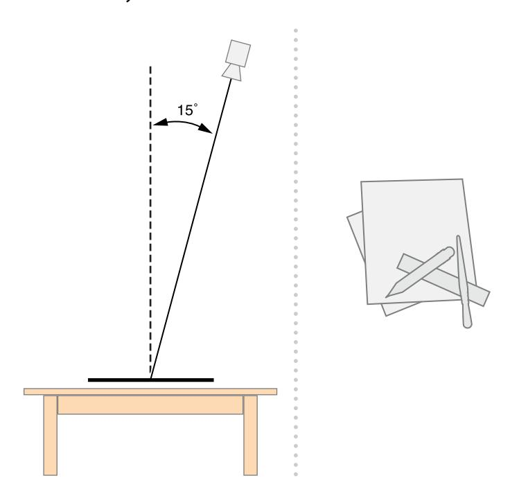

Like the camera, the perceived light source should also be tilted slightly from the perpendicular, but in the opposite direction (that is, towards the top edge of the object) so that a subtle shadow appears at its bottom edge.

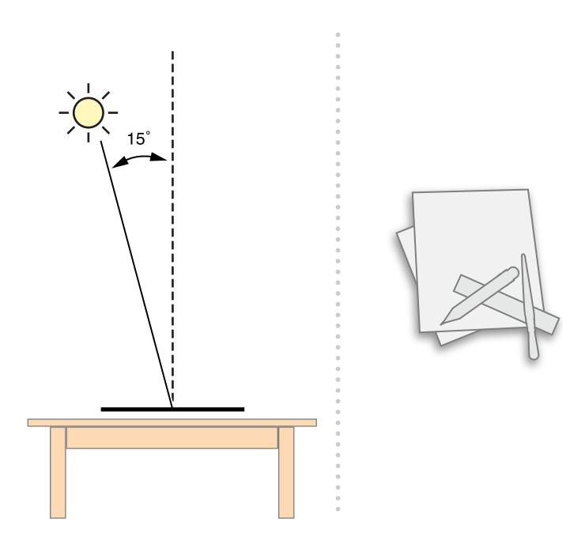

When appropriate, you can add a slight tilt to your icon after you render it. A tilt of 9 degrees works well.

**Portray real objects accurately.** Icons that represent real objects should also look as though they are made of real materials and have real mass. Realistic icons accurately replicate the characteristics of substances such as fabric, glass, paper, and metal, and convey an object's weight and feel.

**Make your drop shadow fully black.** In the Finder Cover Flow view, app icons are displayed against a black background, set above a highly reflective surface. If your icon has a drop shadow that contains any gray tones, the gray will make the shadow look more like a glow.

**Consider adding a slight glow just inside the edges of your icon.** If your app icon includes a dark reflective surface, such as glass or metal, add an inner glow to make the icon stand out against the black background. If you don't add a glow to make the edges of your icon prominent, it might appear to dissolve into the black background of the Finder Cover Flow view.

**Use transparency when it makes sense.** Transparency in an icon can help depict glass or plastic, but it can be tricky to use convincingly. You would never see a transparent tree, for example, so don't use one in your icon. The Preview app icon incorporates transparency effectively.

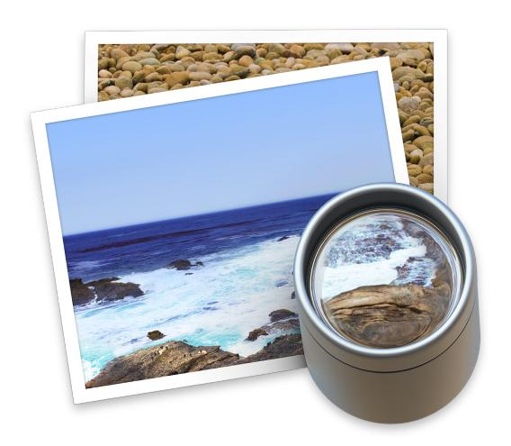

### Provide the Correct Resources and Let OS X Do the Work

An app icon is displayed in many places, such as the Finder, Dock, Launchpad, and App Store. To ensure that OS X can display your app icon appropriately in each context, you create the icon in different sizes and resolutions, and follow specific naming conventions.

As you create artwork for high-resolution displays, be sure to treat each image asits own resource. Even though the high-resolution version of one icon might use the same canvas size as the standard version of another, you should redraw each image. For example, don't use the 32 x 32 standard-resolution icon for the icon\_16x16@2x resource even though they both have a canvas size of 32 x 32 pixels. It's best when an app's icon looksthe same on both standard- and high-resolution displays, because a user can set up multiple displays with different resolutions and drag windows from one display to the next.

As the canvas size decreases, you have fewer pixels to draw, which means that smaller sizes should be less detailed. In the Keynote app icon shown here, for example, the smaller size is not as detailed as the larger size, where you can read the list items, discern separate pages on the podium, and and see the texture of the metal stand. Each image is appropriately drawn for the canvas size.

To name an app icon, use this format:

- icon\_<file\_size>.<filename\_extension> for standard icons
- icon\_<file\_size>@2x.<filename\_extension> for high-resolution icons

For example, to supply the 512 x 512 version of an app icon, name the files icon\_512x512.png and icon\_512x512@2x.png. For more details about naming conventions,see Adopt the @2x Naming Convention in *High Resolution Guidelines for OS X* .

To ensure that your app icon looks great in all the places that users see it, you need to provide resources in the sizes listed in Table 71-1.

**Table 71-1** App icon resource sizes

| Filename        | Canvas size (in pixels) |
|-----------------|-------------------------|
| icon_512x512@2x | 1024 x 1024       |
| icon_512x512    | 512 x 512         |
| icon_256x256@2x | 512 x 512         |
| icon_256x256    | 256 x 256         |
| icon_128x128@2x | 256 x 256         |
| icon_128x128    | 128 x 128         |
| icon_32x32@2x   | 64 x 64           |

| Filename      | Canvas size (in pixels) |
|---------------|-------------------------|
| icon_32x32    | 32 x 32           |
| icon_16x16@2x | 32 x 32           |
| icon_16x16    | 16 x 16           |

**Note:** PNG with an sRGB color profile is the recommended format for app icons.

### Tips for Creating High-Resolution Artwork

If you don't have an existing set of icon resources, the following tips can help you create standard- and high-resolution versions of your app icon.

**Start with a large master art file and scale it down to the smaller sizes.** It's especially useful to create your master image in a dimension that's a multiple of the icon sizes you need. For example, to create icons in the recommended sizes listed in [Table](#page-319-0) 71-1 (page 320), first create a 1024 x 1024 pixel version of your master file.

**Use an appropriate grid size.** As you create the master image, using a grid ensures that you get sharp lines on important pieces of the design, such as the outline. As you scale down, you'll be able to keep each smaller icon version crisp, and reduce the amount of retouching and sharpening you need to do.

In your image-editing app, set up an 8-pixel grid, which means each block in the grid measures 8 x 8 pixels and represents 1 pixel in the 128 x 128 pixel icon. As you create your master file, "snap" the image to the grid and keep it within the boundaries to minimize the half pixels and blurry details that can result when you scale it down.

**Redraw art as you scale down.** If you're not satisfied with the results when you scale down art to the 32 x 32 pixel and 16 x 16 pixel sizes, redraw the image at these sizes instead. If you decide to do this, setting up the proper grid can still help reduce extra work. For example, using a 32-pixel grid works well for creating the 32 x 32 pixel size, and a 64-pixel grid works well for creating the 16 x 16 pixel size.

### Redesign Your iOS Artwork for OS X

If you're creating an OS X version of an iOS app, you want an icon that users recognize, but you don't want a carbon copy of the iOS app icon. In particular, the OS X app icon shouldn't use the same rounded rectangle shape that the iOS app icon uses. App Store, Calendar, and Contacts provide icons for OS X and iOS that are recognizable, yet distinct from one another. (iOS 8 app icons shown here.)

### Package Your Icon Resources

After you've created the necessary app icon assets, place them in a folder named icon.iconset.

**Tip:** To preview the .iconset folder and ensure the proper alignment and resolution handling of all your app icon resources, select the folder in Finder and press the Space bar to view it in Quick Look. Adjust the slider at the bottom of the Quick Look window to view the various assets as though they are one icon.

Use the system-provided tools to convert your .iconset folder into a single .icns file. First, use an image-editing program to output app icons in the PNG format, which preserves your design's alpha values. Your source art files should use sRGB and retain their color profiles. You don't need to compress image files because the tools used to package them take care of compression for you.

To create an .icns file, use iconutil in Terminal. Terminal is located in /Applications/Utilities/Terminal. Enter the command iconutil -c icns <iconset filename>, where <iconset filename> isthe path to the .iconset folder. You must use iconutil, not Icon Composer, to create high-resolution .icns files. For more information, see Provide High-Resolution Versions of All App Graphics Resources in *High Resolution Guidelines for OS X* .

There are also several third-party tools available for completing thisstep. Note that an .icns file is appropriate for app icons and document icons only; it is not an acceptable format to use for other types of icons in your app. To learn more about creating document icons for your app, see Document Icons (page \$@).

## Toolbar Items

Toolbar items give users easy access to frequently used commands (to learn more about the concepts behind toolbar design,see [Designing](#page-136-0) a Toolbar (page 137)). To represent these commandsin a toolbar, you need small, unambiguous icons that users can easily distinguish and remember.

To accommodate different app styles and usages, OS X supports two styles of toolbar items: toolbar controls and freestanding icons that behave as buttons. Don't mix these styles of toolbar items—use one or the other in a toolbar.

In general, main and document windows achieve a subtle appearance by using streamlined icons within toolbar controls. For example, the Finder toolbar uses several small icons in toolbar buttons and segmented controls.

Freestanding icons are occasionally used in the toolbar of a main or document window, such as in the portion of the Keynote toolbar shown here.

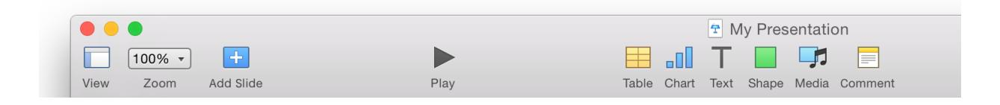

Freestanding icons tend to be more common in the toolbars of preferences windows, where they are often used as pane switchers. For example, the iTunes preferences window displays several icons that give users access to different preferences categories.

In all cases, the best toolbar icons use familiar visual metaphors that are directly related to the app commands they represent. When a toolbar icon depicts an identifiable, real-world object or recognizable app task, it gives first-time users a clue to its function and helps experienced users remember it.

**Make toolbar items distinct, yet harmonious.** When each item is easily distinguishable from the others, users learn to associate it with its purpose and locate it quickly. Variations in shape and image help to differentiate one toolbar item from another. At the same time, an app'stoolbar itemsshould harmonize as much as possible in their perspective, size, and visual weight. This holds true whether the item is represented by a freestanding icon button or in an image in a toolbar control.

### Create Template Images to Put Inside Toolbar Controls

A template image is a streamlined, monochromatic image that can acquire different visual effects, such as selection highlighting and vibrancy. The best template images convey meaning through outline and contour, and include very little internal detail.

You want to make your template image assolid as possible (that is, with very little transparency or alpha values) so that it will look good when the system applies effects, such as the inactive appearance. An image that uses too much transparency can look disabled when the system applies either the active or inactive appearance to it.

To create a solid image, you might start by imagining the shadow your object would cast. If the contours of the shadow clearly show what the object is, you don't need to add any transparency.

As you design a template image to put inside a toolbar control, such as a button or segmented control, follow these guidelines:

- Create images that measure no more than 19 x 19 pixels.
- Make the outline sharp and clear.
- Use a straight-on perspective.
- Use black (add transparency only as necessary to suggest dimensionality).
- Use anti-aliasing.
- Use the PDF format.
- Make sure the image is visually centered in the control (note that visually centered might not be the same as mathematically centered).

**Note:** When you're designing a template image for a toolbar control, it's recommended that you use black, which makes it easier to discern details and outlines. However, you can use any color to create your images, because the system ignoresthe color and pays attention only to the alpha values you add.

When you create a template image to put inside a toolbar control in PDF format, OS X automatically scales the icon for high-resolution display, so you don't need to provide a high-resolution version.

You might be able to use a system-provided image to represent a common task or a standard interface element in your toolbar controls, such as the connect via Bluetooth icon. To learn about the images that are available and what they mean, see [System-Provided](#page-328-0) Images (page 329).

### Create Fullcolor Images to Use as Freestanding Toolbar Icons

Because a freestanding toolbar icon doesn't need to fit within a toolbar control, you have a little more room to express a concept. In general, you want to create an inviting image that clearly communicates its purpose to users.

Although you use the straight-on perspective for the freestanding toolbar icons you design, if you use a recognizable icon from elsewhere in the interface in your toolbar, don't change its appearance or perspective. That is, don't redesign a toolbar version of a well-known interface element.

If you need to design a freestanding icon for your toolbar, follow these guidelines:

- Use a straight-on perspective.
- Make the outline sharp and clear.
- Use anti-aliasing.
- Use color judiciously to add meaning.
- Create icons for standard and high-resolution displays. You need to supply two resources: 32x32 (32 x 32 pixel canvas size) and 32x32@2x (64 x 64 pixel canvas size).
- Use the PNG format.

## Sidebar Icons

If your app includes a sidebar (or source list), you may need to design icons to display in it. For example, Mail contains several icons that represent the user's mailboxes, VIPs, and archived messages.

Sidebar icons are small and streamlined, but they provide more internal detail and a more realistic outline than the icons that go inside of toolbar controls (to learn more about designing this type of toolbar control, see Create [Template](#page-324-0) Images to Put Inside Toolbar Controls (page 325)). To achieve the sidebar item look, try imagining an X-ray of the object you have in mind, then use transparency to capture the details.

As with the template images that can be used inside toolbar controls, OS X applies various effects to sidebar icons. Follow these guidelines as you design your sidebar icons:

- Use black combined with transparency (that is, alpha values) to suggest details.
- Make the outline sharp and clear.
- Use a straight-on perspective.

- PDF format is recommended.
- Create your icons in three sizes: 16 x 16, 18 x 18, and 32 x 32 pixels (if using PDF).

**Note:** When you're designing a sidebar icon, it's recommended that you use black, which makes it easier to discern details and outlines. However, you can use any color to create your icons, because the system ignores the color and pays attention only to the alpha values that you add.

If you create your sidebar icons in PDF format, OS X automatically scales your icon for high-resolution displays, so you don't need to provide high-resolution versions. However, if you use PNG format for your icons, you need to supply the following resources: 16x16, 16x16@2x, 18x18, 18x18@2x, 32x32, and 32x32@2x. (PNG format isrecommended only for designsthat are very intricate and require effectslike shading, textures, and highlights.)

## System-Provided Images

Throughout OS X, you can see quantities ofsmall, monochromatic imagesin toolbar controls and scope buttons. Some of the most familiar of these images, such as go back, set object view to icons, list, columns, or Cover Flow, view Action menu, view in Quick Look, and show path, and are shown here in the Finder toolbar.

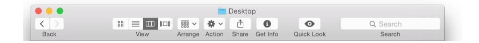

In addition to these images, many OS X apps display full-colorstandard imagesin preferences window toolbars. For example, the toolbar in the Calendar preferences window contains the general, accounts, and advanced images.

The standard images of the first type (such as the view in Quick Look symbol) are known as template images. A **template image** is a black and clear image that can be used inside a control (such as a toolbar button). Template images are expected to receive additional processing, such as displaying an inverted variation. For a list of these images, see [System-Provided](#page-329-0) Images for Use in Controls (page 330); to learn more about toolbar buttons, see Some [Controls](#page-176-1) Can Be Used in the Window Frame (page 177).

Standard images of the second type (such as the general preferences symbol) can be used as standalone icon buttons in a preferences window's toolbar. Because these images are not template images, they can't be used inside an app window's toolbar controls (or any other controls). For a list of these images, see [System-Provided](#page-333-0) Images for Use as [Toolbar](#page-333-0) Items (page 334).

OS X also provides a handful of standard images that can appear in the window body, such as the invalid data image. For a list of these images, see [System-Provided](#page-331-0) Images for Use as Standalone Buttons (page 332).

Every system-provided image has a specific meaning that users know. To avoid confusing users, *it is essential that you use each image in accordance with its documented meaning and recommended usage* .

When you use standard images correctly in your app, you also benefit from:

- Shorter development time and less effort spent on creating custom images.
- Automatic updating of images if appearance changes occur in future operating system updates.

To understand why it's important to use these images correctly, consider the following hypothetical example. Imagine that the "go forward" image (that is, the right-pointing angle) is changed to look like a capital letter "F." If you correctly use this image in a control that performs a "go forward" action, the control still makes sense when it uses the new appearance. But if you incorrectly use the image to mean "play," your play control is suddenly nonsensical and confusing when it displays the "F."

If you can't find a system-provided image that has the appropriate meaning for a specific purpose in your app, it's better to design your own than to misuse a system-provided image. To learn how to design items for a toolbar, see [Toolbar](#page-323-0) Items (page 324).

**Note:** Each image described in the following sections is listed with its constant name, as defined in the NSImage programming interface. However, the string value for each constant consists of the constant name without the "ImageName" portion. For example, the constant NSImageNameAddTemplate has "NSAddTemplate" as its string value. You might need to use the string value, rather than the constant name, to locate images by name in Interface Builder.

### System-Provided Images for Use in Controls

OS X provides many template images intended for use primarily in toolbar controls. Because these images require the presence of a bounding box (which issupplied by the control), they are not as useful forstandalone buttons or free-standing toolbar icons. Instead,see [System-Provided](#page-331-0) Imagesfor Use as Standalone Buttons (page 332) for images you can use as standalone buttons, and see [System-Provided](#page-333-0) Images for Use as Toolbar [Items](#page-333-0) (page 334) for images you can use as free-standing toolbar icons.

As with all system-provided images, avoid using the template images to represent actions other than those they are designed for. Table 74-1 shows the standard template images available in OS X, along with the actions they represent and their names.

**Table 74-1** Template images that represent common tasks

| Image | Meaning                     | Constant name                |
|-------|-----------------------------|------------------------------|
|       | View in Quick Look | NSImageNameQuickLookTemplate |
|       | Connect via Bluetooth | NSImageNameBluetoothTemplate |

| Image | Meaning                                                                                               | Constant name                   |
|-------|-------------------------------------------------------------------------------------------------------|---------------------------------|
|       | View in a slide show                                                                      | NSImageNameSlideshowTemplate    |
|       | Action pop-up menu                                                                              | NSImageNameActionTemplate       |
|       | Create smart item                                                                               | NSImageNameSmartBadgeTemplate   |
|       | Share menu                                                                                         | NSImageNameShareTemplate        |
|       | View objects as icons                                                                        | NSImageNameIconViewTemplate     |
|       | View objects in a list                                                                    | NSImageNameListViewTemplate     |
|       | View objects in columns                                                                      | NSImageNameColumnViewTemplate   |
|       | View objects in a Cover Flow mode *                                              | NSImageNameFlowViewTemplate     |
|       | View the path of the object                                                            | NSImageNamePathTemplate         |
|       | Unlock the object (this image indicates the object is currently locked) | NSImageNameLockLockedTemplate   |
|       | Lock the object (this image indicates the object is currently unlocked) | NSImageNameLockUnlockedTemplate |
|       | Go to the right or go forward                                                       | NSImageNameGoRightTemplate      |
|       | Go to the left or go back                                                           | NSImageNameGoLeftTemplate       |

| Image | Meaning                                                              | Constant name                          |
|-------|----------------------------------------------------------------------|----------------------------------------|
|       | Add an item (to a list, for example)            | NSImageNameAddTemplate                 |
|       | Remove an item (from a list, for example)       | NSImageNameRemoveTemplate              |
|       | Enter full-screen mode (deprecated )                     | NSImageNameEnterFull ScreenTemplate |
|       | Exit full-screen mode (deprecated )                      | NSImageNameExitFullScreenTemplate      |
|       | Stop progress on the current process                  | NSImageNameStopProgressTemplate        |
|       | Refresh the current view or restart the process | NSImageNameRefreshTemplate             |

\*OS X does not provide programming interfaces that support adding a custom cover flow experience to your app.

**Note:** The NSImageNameEnterFullScreenTemplate and

NSImageNameExitFullScreenTemplate images are deprecated. If windows in your app can go full screen, be sure to use the appropriate full-screen programming interfaces so that the correct button gets added to the title bar. For an overview of these programming interfaces,see Implementing the Full-Screen Experience in *Mac App Programming Guide* . To learn more about how to support the experience of a full-screen window, see [Full-Screen](#page-133-0) Windows (page 134).

### System-Provided Images for Use as Standalone Buttons

OS X provides a handful of free-standing images that can be used as borderless buttons. These images don't require further processing by an NSButtonCell object.

Two of the free-standing images are standalone versions of similar template images. To see why you might need both versions of such an image, consider how Safari offers stop-progress functionality to users. In the downloads popover, Safari uses the free-standing NSImageNameStopProgressFreestandingTemplate image inline with a progress indicator to allow users to stop an in-progress download.

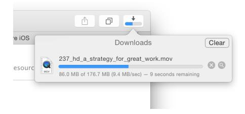

Because the Safari downloads popover can display several separate download processes at the same time, it's important to display a stop-progress control for each individual process.

As with all system-provided images, each free-standing image must be used according to its documented meaning and recommended usage. Table 74-2 lists each image, along with its meaning and name.

**Table 74-2** Free-standing images that represent common actions

| Image | Meaning                                                                                                                                                 | Constant name                                   |
|-------|---------------------------------------------------------------------------------------------------------------------------------------------------------|-------------------------------------------------|
|       | The data on the left isinvalid (for example, the user entered a zip code in a phone number field) | NSImageNameInvalid DataFreestandingTemplate  |
|       | Reveal contents or details about the object                                                                                           | NSImageNameReveal FreestandingTemplate       |
|       | Open the link in a new window or page                                                                                           | NSImageNameFollowLinkFreestanding Template   |
|       | Stop progress on the current process                                                                                                     | NSImageNameStop ProgressFreestandingTemplate |
|       | Refresh the current view or restart the process                                                                                    | NSImageNameRefresh FreestandingTemplate      |

### System-Provided Images for Use as Toolbar Items

OS X provides several images you can use as standalone icons in toolbars. These images represent three types of items:

- System entities or elements
- Preferences categories
- Common toolbar items

Use the images shown in Table 74-3 to represent system entities, such as the network and the user's computer. For the most part, these entities don't have related actions. However, if you needed to represent an action, such as "create a new smart folder," you could add a plus sign badge to the smart folder icon.

**Table 74-3** Images that represent system entities

| Image | System element                                       | Constant name                 |
|-------|------------------------------------------------------|-------------------------------|
|       | Bonjour                                              | NSImageNameBonjour            |
|       | Network or Internet                            | NSImageNameNetwork            |
|       | The Macintosh computer currently running | NSImageNameComputer           |
|       | A burnable folder                              | NSImageNameFolder Burnable |
|       | A smart folder                                 | NSImageNameFolder Smart    |

The images in Table 74-4 are intended for use as standalone icons in preferences window toolbars. Use these images to give users access to familiar preferences categories, such as user-account settings and advanced settings.

**Table 74-4** Images that represent common preferences categories

| Image | Preferences category | Constant name                 |
|-------|----------------------|-------------------------------|
|       | Advanced             | NSImageNameAdvanced           |
|       | General              | NSImageNamePreferencesGeneral |
|       | User accounts     | NSImageNameUserAccounts       |

The images in Table 74-5 are suitable for toolbar items in windows other than preferences windows. You can use these images asstandalone iconsin a window or panel toolbar to give users accessto the system-provided Colors and Fonts windows or to an Info or inspector window that you supply.

**Table 74-5** Images that represent standard toolbar items

| Image | Toolbar item                 | Constant name        |
|-------|------------------------------|----------------------|
|       | Show/hide information     | NSImageNameInfo      |
|       | Show/hide Fonts window | NSImageNameFontPanel |

| Image | Toolbar item                  | Constant name             |
|-------|-------------------------------|---------------------------|
|       | Show/hide Colors window | NSImageName ColorPanel |

### System-Provided Images that Indicate Privileges

OS X provides images that represent the standard "user," "group," and "all" categories of permissions or privileges, including access control lists (or ACLs). Each of these images is shown in Table 74-6, along with its meaning and name. It's recommended that you use these images to clarify which users have permissions to read, write, or execute an item. These images allow you to avoid displaying Unix-style permissions indicators, such as rwxr-xrw-, which are suitable only for very sophisticated users.

Note that the "user group" permissions image shown in Table 74-6 looks similar to the image for the "user accounts" preferences category, shown in [Table](#page-334-0) 74-4 (page 335). As with all system-provided images, however, similar appearance does not imply similar meaning or usage. Always use system-provided images according to their semantic meaning.

**Table 74-6** Images that represent categories of user permissions

| Image | Permissions category | Constant name        |
|-------|----------------------|----------------------|
|       | User                 | NSImageNameUser      |
|       | A user group   | NSImageNameUserGroup |
|       | All users         | NSImageNameEveryone  |

### A System-Provided Drag Image

OS X provides an image you can display when a user drags multiple documents or items. However, it's best if you can provide more meaningful drag images (to learn more about this, see Drag and [Drop](#page-288-0) (page 289)).

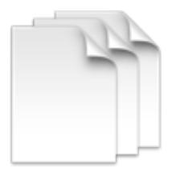

As with all system-provided images, use the multiple-documents image in accordance with its intended meaning. (The constant name of the drag image is NSImageNameMultipleDocuments.)

## Document Revision History

This table describes the changes to *OS X Human Interface Guidelines*.

| Date       | Notes                                             |
|------------|---------------------------------------------------|
| 2014-10-16 | Reorganized and updated for Yosemite. |

Apple Inc. Copyright © 2014 Apple Inc. All rights reserved.

No part of this publication may be reproduced, stored in a retrieval system, or transmitted, in any form or by any means, mechanical, electronic, photocopying, recording, or otherwise, without prior written permission of Apple Inc., with the following exceptions: Any person is hereby authorized to store documentation on a single computer or device for personal use only and to print copies of documentation for personal use provided that the documentation contains Apple's copyright notice.

No licenses, express or implied, are granted with respect to any of the technology described in this document. Apple retains all intellectual property rights associated with the technology described in this document. This document is intended to assist application developers to develop applications only for Apple-branded products.

Apple Inc. 1 Infinite Loop Cupertino, CA 95014 408-996-1010

Apple, the Apple logo, AppleScript, Aqua, Bonjour, Chicago, Cocoa, Cover Flow, Exposé, Finder, GarageBand, Geneva, iBook, iBooks, iMovie, iPhoto, iTunes, Keychain, Keynote, Mac, Macintosh, Numbers, OS X, Pages, Photo Booth, QuickTime, Safari, Spotlight, and Xcode are trademarks of Apple Inc., registered in the U.S. and other countries.

AirDrop, Launchpad, Mission Control, and Multi-Touch are trademarks of Apple Inc.

iCloud is a service mark of Apple Inc., registered in the U.S. and other countries.

App Store and Mac App Store are service marks of Apple Inc.

Helvetica is a registered trademark of Heidelberger Druckmaschinen AG, available from Linotype Library GmbH.

IOS is a trademark or registered trademark of Cisco in the U.S. and other countries and is used under license.

APPLE MAKES NO WARRANTY OR REPRESENTATION, EITHER EXPRESS OR IMPLIED, WITH RESPECT TO THIS DOCUMENT, ITS QUALITY, ACCURACY, MERCHANTABILITY, OR FITNESS FOR A PARTICULAR PURPOSE. AS A RESULT, THIS DOCUMENT IS PROVIDED "AS IS," AND YOU, THE READER, ARE ASSUMING THE ENTIRE RISK AS TO ITS QUALITY AND ACCURACY.

IN NO EVENT WILL APPLE BE LIABLE FOR DIRECT, INDIRECT, SPECIAL, INCIDENTAL, OR CONSEQUENTIAL DAMAGES RESULTING FROM ANY DEFECT, ERROR OR INACCURACY IN THIS DOCUMENT, even if advised of the possibility of such damages.

Some jurisdictions do not allow the exclusion of implied warranties or liability, so the above exclusion may not apply to you.