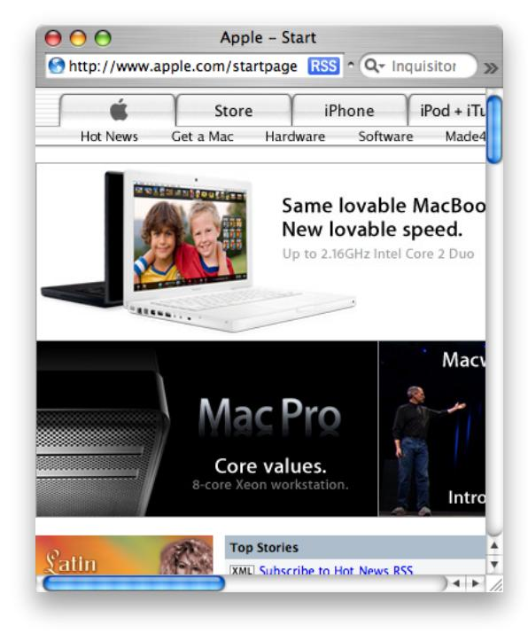
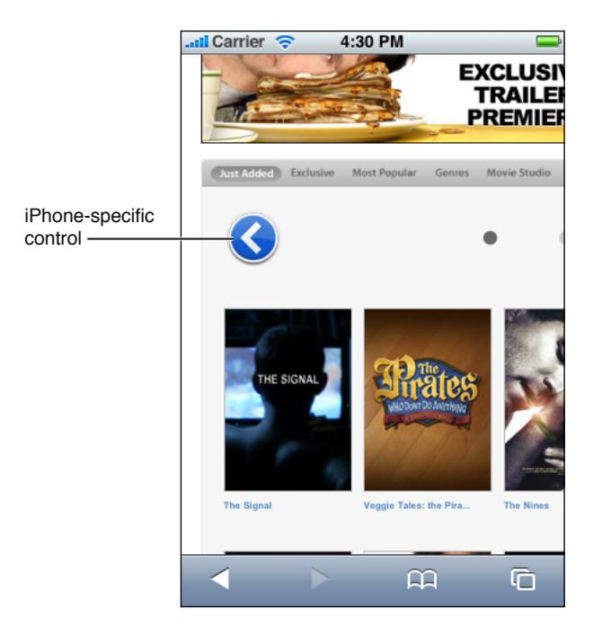
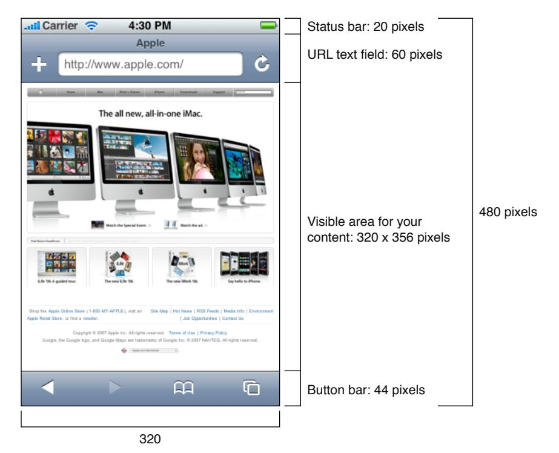
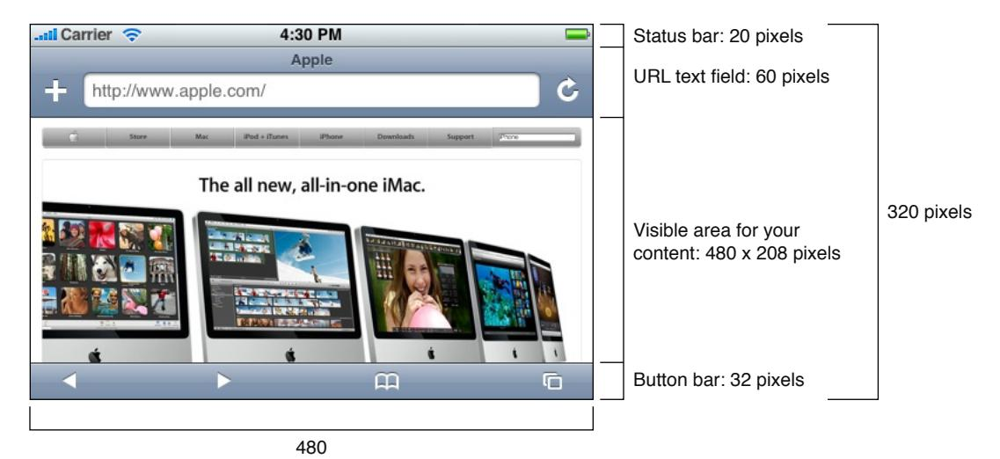
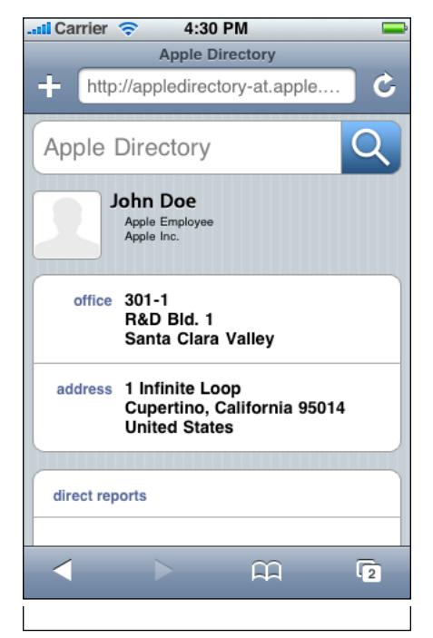
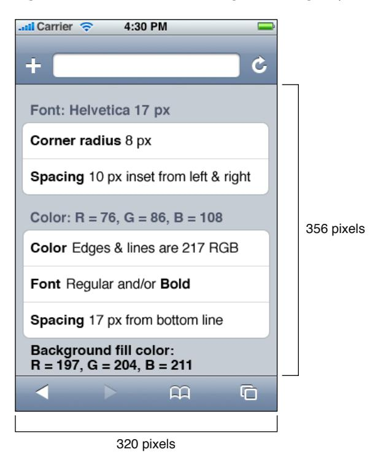

# iPhone Human Interface Guidelines for Web Applications

**User Experience**

ď

Apple Inc. © 2009 Apple Inc. All rights reserved.

No part of this publication may be reproduced, stored in a retrieval system, or transmitted, in any form or by any means, mechanical, electronic, photocopying, recording, or otherwise, without prior written permission of Apple Inc., with the following exceptions: Any person is hereby authorized to store documentation on a single computer for personal use only and to print copies of documentation for personal use provided that the documentation contains Apple's copyright notice.

The Apple logo is a trademark of Apple Inc.

Use of the "keyboard" Apple logo (Option-Shift-K) for commercial purposes without the prior written consent of Apple may constitute trademark infringement and unfair competition in violation of federal and state laws.

No licenses, express or implied, are granted with respect to any of the technology described in this document. Apple retains all intellectual property rights associated with the technology described in this document. This document is intended to assist application developers to develop applications only for Apple-labeled computers.

Every effort has been made to ensure that the information in this document is accurate. Apple is not responsible for typographical errors.

Apple Inc. 1 Infinite Loop Cupertino, CA 95014 408-996-1010

Apple, the Apple logo, Aqua, Dashcode, iPod, Mac, Mac OS, and Safari are trademarks of Apple Inc., registered in the United States and other countries.

iPhone is a trademark of Apple Inc.

Helvetica is a registered trademark of Heidelberger Druckmaschinen AG, available from Linotype Library GmbH.

Java and all Java-based trademarks are trademarks or registered trademarks of Sun Microsystems, Inc. in the U.S. and other countries.

Simultaneously published in the United States and Canada.

Even though Apple has reviewed this document, APPLE MAKES NO WARRANTY OR REPRESENTATION, EITHER EXPRESS OR IMPLIED, WITH RESPECT TO THIS DOCUMENT, ITS QUALITY, ACCURACY, MERCHANTABILITY, OR FITNESS FOR A PARTICULAR PURPOSE. AS A RESULT, THIS DOCUMENT IS PROVIDED "AS IS," AND YOU, THE READER, ARE ASSUMING THE ENTIRE RISK AS TO ITS QUALITY AND ACCURACY.

IN NO EVENT WILL APPLE BE LIABLE FOR DIRECT, INDIRECT, SPECIAL, INCIDENTAL, OR CONSEQUENTIAL DAMAGES RESULTING FROM ANY DEFECT OR INACCURACY IN THIS DOCUMENT, even if advised of the possibility of such damages.

THE WARRANTY AND REMEDIES SET FORTH ABOVE ARE EXCLUSIVE AND IN LIEU OF ALL OTHERS, ORAL OR WRITTEN, EXPRESS OR IMPLIED. No Apple dealer, agent, or employee is authorized to make any modification, extension, or addition to this warranty.

Some states do not allow the exclusion or limitation of implied warranties or liability for incidental or consequential damages, so the above limitation or exclusion may not apply to you. This warranty gives you specific legal rights, and you may also have other rights which vary from state to state.

## Contents

| Introduction | Introduction 7                                                                      |  |
|--------------|----------------------------------------------------------------------------------------|--|
|              | Organization of This Document 7                                                     |  |
|              | See Also 8                                                                          |  |
| Chapter 1    | iPhone and the User's Environment 9                                     |  |
|              | It's a Browser-Based World 9                                                        |  |
|              | iPhone and Its Place in the User's World 10                                         |  |
|              | iPhone as Web Platform 10                                                           |  |
|              | Network Connectivity 10                                                             |  |
|              | Safari on iPhone 11                                                                 |  |
|              | The iPhone Viewport 11                                                              |  |
|              | The iPhone User Interaction Model 13                                                |  |
| Chapter 2    | Content on iPhone: Is It a Webpage or an Application? 15 |  |
|              | Types of iPhone Content 15                                                          |  |
|              | Decide How to Position Your Content 16                                              |  |
|              | Design for Your Users 17                                                            |  |
| Chapter 3    | Principles and Guidelines for Creating Great iPhone Content 21 |  |
|              | Simplicity and Ease of Use 21                                                       |  |
|              | Make It Obvious 22                                                                  |  |
|              | Avoid Clutter 23                                                                    |  |
|              | Minimize Required Input 23                                                          |  |
|              | Express Information Succinctly 24                                                   |  |
|              | Provide Fingertip-Sized Targets 24                                                  |  |
|              | Avoid Unnecessary Interactivity 25                                                  |  |
|              | Focus 25                                                                            |  |
|              | Communication 26                                                                    |  |
|              | Consistency 28                                                                      |  |
|              | Responsiveness 29                                                                   |  |
|              | Interoperability 29                                                                 |  |
|              | Adaptability 30                                                                     |  |
| Chapter 4    | Metrics, Layout Guidelines, and Tips 31                                 |  |
|              | Create an Icon for Your Web Application or Webpage 31                               |  |
|              | Use Custom CSS 32                                                                   |  |
|              | Lay Out Content for Safari on iPhone 33                                             |  |

Consider the List [Approach](#page-35-0) 36 [Edge-to-Edge](#page-37-0) List Metrics 38 [Rounded-Rectangle](#page-38-0) List Metrics 39 [Accommodate](#page-39-0) the Built-in Form Interface 40 [Keyboards](#page-39-1) 40 The [Pop-up](#page-40-0) Menu 41 Create Custom Form [Controls](#page-41-0) 42 Be Aware of Default [Control](#page-42-0) Styles 43 Provide a Custom [Navigation](#page-44-0) Solution 45 Pay [Attention](#page-45-0) to Text 46

#### **[Glossary](#page-48-0) 49**

#### **[Document](#page-50-0) Revision History 51**

## Figures and Tables

| Chapter 1 | iPhone and the User's Environment 9                                     |                                                                                                                           |  |  |
|-----------|----------------------------------------------------------------------------------------|---------------------------------------------------------------------------------------------------------------------------|--|--|
|           | Figure 1-1 Table 1-1                                                                | Differences between Safari on iPhone and Safari on the desktop 12 Gestures users make to interact with iPhone 13 |  |  |
| Chapter 2 | Content on iPhone: Is It a Webpage or an Application? 15 |                                                                                                                           |  |  |
|           | Figure 2-1                                                                             | Safari on iPhone displays the missing plug-in icon when third-party plug-ins are present 15                         |  |  |
|           | Figure 2-2                                                                             | The built-in Weather application focuses on a single task 16                                                           |  |  |
| Chapter 3 | Principles and Guidelines for Creating Great iPhone Content 21 |                                                                                                                           |  |  |
|           | Figure 3-1                                                                             | The most important information should be the most prominent 22                                                         |  |  |
|           | Figure 3-2                                                                             | The built-in Stopwatch function makes its usage obvious 23                                                             |  |  |
|           | Figure 3-3                                                                             | The built-in Calculator application displays fingertip-sized controls 25                                               |  |  |
|           | Figure 3-4                                                                             | The built-in Calendar application is focused on days and events 26                                                     |  |  |
|           | Figure 3-5                                                                             | An alert in Safari on iPhone 27                                                                                        |  |  |
|           | Figure 3-6                                                                             | The controls and list of the built-in World Clock function make it consistent with other built-in applications 28   |  |  |
| Chapter 4 | Metrics, Layout Guidelines, and Tips 31                                 |                                                                                                                           |  |  |
|           | Figure 4-1                                                                             | A simple icon before it is displayed as a Web Clip 32                                                                  |  |  |
|           | Figure 4-2                                                                             | A simple icon displayed as a Web Clip on the Home screen 32                                                            |  |  |
|           | Figure 4-3                                                                             | The additional trailers controls on the Apple movie trailers webpage when viewed in Safari on the desktop 32        |  |  |
|           | Figure 4-4                                                                             | The previous trailers control on the Apple movie trailers webpage when viewed in Safari on iPhone 33                |  |  |
|           | Figure 4-5                                                                             | Portrait orientation layout metrics in pixels 34                                                                       |  |  |
|           | Figure 4-6                                                                             | Landscape orientation layout metrics in pixels 34                                                                      |  |  |
|           | Figure 4-7                                                                             | Setting the width property of a narrow webpage 35                                                                      |  |  |
|           | Figure 4-8                                                                             | Setting the width property to display an application correctly 36                                                      |  |  |
|           | Figure 4-9                                                                             | An iPhone web application that displays a list of names using the edge-to-edge layout 37                            |  |  |
|           | Figure 4-10                                                                            | Edge-to-edge list design layout 38                                                                                     |  |  |
|           | Figure 4-11                                                                            | Rounded-rectangle list design layout 39                                                                                |  |  |
|           | Figure 4-12                                                                            | Screen metrics when a keyboard is displayed in portrait orientation 41                                                 |  |  |
|           | Figure 4-13                                                                            | Safari on iPhone displays a scrolling list for pop-up menu style selection controls 42                                 |  |  |
|           | Figure 4-14                                                                            | Default control styles rendered by Safari on iPhone 43                                                                 |  |  |

| Figure 4-15 | Checkboxes, radio buttons, and selection controls rendered by Safari on iPhone have a translucent background by default 45 |
|-------------|----------------------------------------------------------------------------------------------------------------------------------|
| Figure 4-16 | Providing a custom navigational control 46                                                                                    |
| Table 4-1   | Values to specify some default form control types 43                                                                          |

# Introduction

Apple's iPhone presents a revolutionary user interface and interaction model. Users can view webpages, use web applications, and use built-in iPhone features, such as Mail, iPod, and Camera, wherever they go. Safari on iPhone, a unique implementation of Safari, isthe application users use to browse the web on both iPhone and iPod touch.

**Note:** Safari on iPhone behavesthe same on iPhone and iPod touch except when userstap linksto iPhone-only applications. See *Apple URL Scheme Reference* for more information about using URL schemesto link to Apple applications.

This document introduces you to the iPhone environment and how it shapes the user experience of iPhone content. Then, it explains how to design a superlative user interface for your web content so it displays and works well on iPhone. It does this by first examining different types of iPhone content and exploring how you can decide which type to create. It then discusses how to apply user interface design principlesto iPhone content, and finally provides numerous metrics and guidelines to help you handle specific design issues. For the implementation details and guidance you need to write the code for your iPhone product, see the "See Also" section below.

Whether you're an experienced web content developer or an application developer unfamiliar with web content creation, you should read this document to find out what users expect of iPhone content and how to design content that exceeds those expectations.

If you have user interface development experience, you might be tempted to skip the sections on human interface design principles and desirable application characteristics. Although your prior knowledge of these topics is extremely useful, you're encouraged to read these sections to learn how to apply your experience to the design of iPhone content.

## Organization of This Document

*iPhone Human Interface Guidelines for Web Applications* contains the following chapters:

- "iPhone and the User's [Environment"](#page-8-0) (page 9) introduces iPhone and describes how the user's environment influences the design and usage of iPhone content. This chapter also describes features of the iPhone user interface that have a bearing on the design of iPhone content.
- "Content on iPhone: Is It a Webpage or an [Application?"](#page-14-0) (page 15) defines the different types of iPhone content you can develop and how that influences what you decide to do with your existing content. It also discusses how to define your user audience so you can customize your user experience and user interface design.
- "Principles and [Guidelines](#page-20-0) for Creating Great iPhone Content" (page 21) covers the principles of human interface design as they apply to iPhone content and provides guidelines to help you realize these principles in your design.

#### **INTRODUCTION**

Introduction

■ "Metrics, Layout [Guidelines,](#page-30-0) and Tips" (page 31) presents layout and user interface metrics and tips you should use as you develop an iPhone web application or webpage.

At the end of the document is a glossary that defines iPhone and web-application development terms; see ["Glossary"](#page-48-0) (page 49).

## See Also

To learn how to implement your design in code, read:

■ *Safari Web Content Guide for iPhone OS*

# iPhone and the User's Environment

Apple's iPhone introduces a revolutionary platform for your web content. With an innovative user interaction model and exceptional interoperability, iPhone offers significant new opportunities and a few unique challenges to web content developers.

The goal of this chapter is to orient you to the iPhone platform and properly set your web-development expectations. To do this, this chapter describes how the environment in which users use iPhone, combined with iPhone features and infrastructure, influences your design decisions.

## It's a Browser-Based World

Obviously, users use and perceive iPhone very differently than they do a desktop or even a laptop computer. This may seem like an unnecessary statement, but it is an observation that is crucial to keep in mind as you create content for iPhone, especially if you're an experienced application developer. This is because you may have to work to shift your perspective away from a computer-centric world view, even if your expertise lies in web content creation. It's essential to keep in mind, for example, that instead of the layered windows, desktop, mouse, and file system with which you're familiar, iPhone has a small, fixed screen size, a browser interface supplied by Safari on iPhone, a touch-based input system, and no accessible file system.

Regardless of these differencesin platform, however, your main goal as a web content developer isthe same: to capture users' imagination and earn their loyalty with a solution that is functional, focused, and enjoyable to use.

iPhone users are accepting of, and even anticipating, an experience different from the one they are accustomed to on a desktop computer, a laptop, or even a mobile phone. Although this affords you a certain latitude for experimentation, be aware that iPhone users are likely to be even less tolerant of sluggish performance and a complicated user interface than they are when it comes to software running in a computer. In addition, users quickly become accustomed to the elegant, functional, and streamlined user interface of the built-in applications and features, which sets a standard by which they're apt to judge other content.

There are, of course, similarities between the computer and iPhone environments, too. The most notable similarity, from the perspective of user experience and the user interface, is that most of the characteristics that define great computer applications also define great iPhone webpages and applications, whether built-in or external. Qualitiessuch asresponsiveness,simplicity, ease of use, and consistency are at least asimportant in iPhone content as they are in computer applications. To learn more about these qualities and how to build them into your web content, see "Principles and [Guidelines](#page-20-0) for Creating Great iPhone Content" (page 21).

Othersimilarities are evident at the content implementation level. Accepted best practicesfor website design and implementation are wholly applicable to iPhone content design and implementation (for an overview of these guidelines, see Creating Compatible Web Content). If you're in the habit of following web design best practices when you target desktop browsers, you're well on your way to creating content that displays well on iPhone. Following the user experience and user interface guidelines in the rest of this document will help you build on that expertise so you can create best-in-class iPhone content.

Ultimately, iPhone users may determine additional qualities that characterize the most successful iPhone products. As iPhone content evolves and you discover new ways to provide functionality to users, new best practices will emerge.

# iPhone and Its Place in the User's World

Almost by definition, users use iPhone while they are mobile. Whether they're in a car or a train, sitting in a cafe or on a park bench, taking a walk, shopping, or waiting for an appointment, users use iPhone in environments that are likely to be filled with distractions. This does not mean that your iPhone solution can't or shouldn't perform important tasks that require users to concentrate. But it does mean that you must be prepared for the probability that users will not be giving their undivided attention to your content, at least not for long.

Above all, therefore, your iPhone content must be quick and extremely easy to use. You need to grab the user's attention immediately and help them access the most valuable parts of your content quickly.

Users not only use iPhone differently, they also feel differently about it. For example, users have a much more personal relationship with iPhone than they have with their computer and thisinfluences which user experience characteristics are most important. One aspect of this bond is the fact that iPhone is a small device that can accompany users wherever they go. This view encourages the development of a broad range of products that provide quick, easy access to things users need and want no matter where they are, such as shopping lists, movie reviews, maps and directions, email, and games.

The user interaction model also informs content design. Because there is no external physical device that comes between the user and iPhone, the user interface of iPhone content must be especially streamlined and inviting.

## iPhone as Web Platform

Although iPhone combines camera, phone, iPod, and email functionality, as far as your web content is concerned iPhone is a mobile web platform on which users view your webpage or use your web application. How users access web content, using iPhone network connectivity, browser capabilities, and the view screen, has a significant impact on both the behavior of your web content and users' perception of it.

The following sections briefly describe these parts of the iPhone web infrastructure, emphasizing how each part influences the design of your web content. For details on how to implement your webpage or web application to work well with this infrastructure, see *Safari Web Content Guide for iPhone OS*.

#### Network Connectivity

iPhone connects to either an available Wi-Fi network, which can be very fast, or the EDGE network, which is slower. As users move about, iPhone automatically switches to the service currently available to provide the fastest possible connection speed.

As you design your web content, you should keep the adaptable connectivity of iPhone in mind. You can't predict what connection speeds users have at a given moment or know when iPhone switches from one network to another, so your content should be designed to work well at any connection speed. And when

you optimize your content to be responsive at the slowest connection speed, users enjoy even better performance at higher connection speeds. See Creating Compatible Web Content for some specific optimization techniques you can use to enhance the performance and responsiveness of your iPhone content.

#### Safari on iPhone

Safari on iPhone provides the interface for all web content on iPhone. Although Safari on iPhone is similar in many ways to Safari on the computer desktop, it is not the same. You need to work within the feature set Safari on iPhone makes available and provide workarounds if you typically use Safari features available on the desktop that are unavailable on iPhone. For information on all the differences between Safari on iPhone and Safari on the desktop and how to accommodate them, see Creating Compatible Web Content.

Most Safari on iPhone features influence the implementation of your web content, but some have an impact on the design of your user interface. The following list describes those features you should keep in mind as you design the user experience and user interface of your web content.

- Safari on iPhone supports cookies.
  - This meansthat you can use cookiesto save the user's context, preferences, and previously entered data, which can streamline the user's interaction with your content by minimizing the amount of information users must supply.
- Safari on iPhone does not support Flash or Java (including Java applets) in iPhone content.
  - In particular, be sure you avoid recommending that users download the latest Flash to their iPhone because neither Flash nor file downloads are supported by Safari on iPhone. Because of this constraint, the user interface of your web content should not rely on Flash animation to communicate with users.
- Safari on iPhone interprets most of the user's finger movements as targeting the way iPhone displays your content, not the content itself.
  - The main exception to this is the tap, which is analogous to a single mouse click, and which can cause Safari on iPhone to send the onclick event to your webpage. As you design your user interface, keep in mind that the users should be able to use a tap to access and drive all functionality in your content ("The iPhone User [Interaction](#page-12-0) Model" (page 13) describesthe touch-based interface of iPhone). For more information on the events Safari on iPhone generates, see Handling Events.

Currently, Safari on iPhone does not support third party plug-ins. For a complete list of web technologies that Safari on iPhone does not support, see Creating Compatible Web Content.

#### The iPhone Viewport

For Safari on iPhone, the **viewport** is a rectangular area that determines how content is laid out and where text wraps on a webpage. On the desktop, the viewport is defined by the size of the browser window. Users resize the viewport on the desktop by resizing the window and they scroll to see more of the webpage, if necessary. But Safari on iPhone does not have resizable windows,so there are no scroll bars or resize controls. Figure 1-1 shows how the viewport differs between Safari on iPhone and Safari on the desktop.

**Figure 1-1** Differences between Safari on iPhone and Safari on the desktop

Safari on iPhone Safari on the desktop

As you design the user experience and user interface of your webpage, it's important to remember that iPhone users can change the scale of the viewport by zooming in and out, but not the size. The only exception to this is that when users change iPhone from portrait to landscape orientation, the viewport size changes. Under certain circumstances, Safari on iPhone may adjust the viewport width and change the webpage layout. Note that you can set the viewport size and other properties to improve the presentation of your webpage the first time it is rendered on iPhone. "Lay Out [Content](#page-32-0) for Safari on iPhone" (page 33) provides an introduction to configuring the viewport; Configuring the Viewport provides implementation details.

When iPhone users pan or scroll to see more of a webpage, a gray bar appears at the right side or bottom of the iPhone screen to give a visual indication of how much more of the webpage there is to see. Although this is similar to the way the size of a scroller on the desktop indicates how much of the content is hidden, the gray bars Safari on iPhone displays are indicators only; they cannot be dragged.

For webpages, there's nothing wrong with expecting users to zoom in to read text, but there are things you can do to make the zoom effective, such as presenting your text in relatively narrow columns of small, easily digestible blocks. This allows users to avoid panning back and forth to read long lines of text. For example, most online newspaper websites are designed to mimic the easy-to-read column layout used on paper, and this translates very well to iPhone.

For a webpage that isintended to behave as an iPhone web application, however, you should avoid requiring usersto zoom in at all, because it impedes accessto your content and weakensthe perception of the webpage as a standalone application. To learn about how webpages on iPhone and iPhone web applications are defined, see "Content on iPhone: Is It a Webpage or an [Application?"](#page-14-0) (page 15).

# The iPhone User Interaction Model

Users use their fingersto operate the iPhone user interface, tapping, flicking, and pinching to select, navigate, and read web content and use built-in applications. There are real advantages to using fingers to operate a device: They are always available, they are capable of many different movements, and they give users a sense of immediacy and connection to the device that's impossible to achieve with an external input device, such as a mouse.

However, fingers have one major disadvantage: They are much bigger than a mouse pointer, regardless of their size, their shape, or the dexterity of their owner. In the context of a display screen, fingers can never be as precise as a mouse pointer. Additionally, there are some actions users can take with the combination of a mouse and keyboard that are difficult to replicate using fingers alone,such astextselection, drag-and-drop operations, and cut, copy, and paste actions.

Fortunately, you can meet the challenges of a finger-based input system by good user interface design. For the most part, this means making sure your layout accommodates the average size of a fingertip and finding alternatives to drag-and-drop and cut, copy, and paste. For specific guidelines on how to lay out your user interface to make it easy to use, see "Metrics, Layout [Guidelines,](#page-30-0) and Tips" (page 31).

iPhone users perform specific movements, called **gestures**, to get particular results. Table 1-1 liststhe gestures users can perform. It's vital to realize, however, that you do not receive an event for most of these gestures. Instead, the majority of these gestures are interpreted by Safari on iPhone and applied to the way iPhone displays content, instead of being passed directly to your content. For more information on how to handle events created on iPhone, see Handling Events.

**Table 1-1** Gestures users make to interact with iPhone

| Gesture           | Action                                                                                                                                           |
|-------------------|--------------------------------------------------------------------------------------------------------------------------------------------------|
| Tap               | To press or select a control or link (analogous to a single mouse click).                                                                        |
|                   | You receive the onclick event for this gesture.                                                                                                  |
| Double tap        | To zoom in and center a block of content or an image.                                                                                            |
|                   | To zoom out (if already zoomed in).                                                                                                              |
| Flick             | To scroll or pan quickly.                                                                                                                        |
| Drag              | To move the viewport or pan.                                                                                                                     |
| Pinch open        | To zoom in.                                                                                                                                      |
| Pinch close       | To zoom out.                                                                                                                                     |
| Touch and hold    | To display an information bubble, magnify content under the finger, or perform specific actions in built-in iPhone applications and features. |
| Two-finger scroll | To scroll up or down within a text area, an inline frame, or an element with overflow capability, depending on the direction of the movement. |
|                   | You can receive a mousewheel event for this gesture.                                                                                             |

#### **CHAPTER 1**

iPhone and the User's Environment

# Content on iPhone: Is It a Webpage or an Application?

As you prepare your web content to display successfully on iPhone, you face a decision. Should you modify your webpage (if necessary) so that it looks great on iPhone or create an iPhone web application? Before you make this decision, you need to understand what distinguishes a webpage and an iPhone web application. This chapter defines three types of third-party content that users can access on iPhone and outlines some of the steps you take to develop them.

You should read this chapter if you're considering how to display your web content on iPhone. After you decide what type of iPhone content you want to deliver, be sure to read ["Design](#page-16-0) for Your Users" (page 17) to gain insight into this first important step in the user experience and user interface design process.

## Types of iPhone Content

When is a webpage an iPhone web application? It may be that the best answer is "when the user thinks it is." But when it comes to design and development and the choice of appropriate metrics, guidelines, and techniques, that answer isn't very helpful. In a document that provides material help to developers, such as this one, definitions are required for clarity and disambiguation, even if they might seem a bit arbitrary.

As described in "Safari on [iPhone"](#page-10-0) (page 11), Safari on iPhone provides the interface for all web content on iPhone. Not surprisingly, therefore, the way a webpage works in Safari on iPhone determines how the page is defined.

This document distinguishes three types of webpage. The first type is a W3C (World Wide Web Consortium)–compliant webpage in which all elements display and operate as designed, with the exception of any elements that rely on unsupported technologies, in particular, plug-ins, Flash, or Java. This type of webpage isreferred to in this document as **compatible with Safari on iPhone**. Webpagesthat are compatible with Safari on iPhone display successfully on iPhone, even if some content is missing or the missing plug-in icon is displayed (Figure 2-1 shows this icon). However, the user interface of a webpage that is compatible with Safari on iPhone does not necessarily take into account the iPhone user interaction model (described in "The iPhone User [Interaction](#page-12-0) Model" (page 13)) and may require users to pan and zoom extensively.

**Figure 2-1** Safari on iPhone displays the missing plug-in icon when third-party plug-ins are present

The second type of webpage is a W3C compliant–webpage that displays and operates as designed, correctly scales content for the iPhone screen, and has no elementsthat rely on unsupported technologies, in particular, plug-ins, Flash, or Java. Often, this type of webpage is designed to detect when it is being viewed on iPhone and adjusts the content it provides accordingly. This document refers to this type of webpage as **optimized for Safari on iPhone**. Webpages that are optimized for Safari on iPhone may integrate with built-in iPhone features and services, such as email and phone, where appropriate.

In addition to meeting the requirements for a webpage that is optimized for Safari on iPhone, the third type of webpage provides discrete functionality to users and is often implemented using modern web technologies, such as AJAX. This type of webpage is referred to in this document as an **iPhone web application**. An iPhone web application emulates built-in iPhone applications by providing a focused solution to users, integrating with iPhone features and services where appropriate, and minimizing the user's awareness of the browser experience.

Even though, at the implementation level, all three types of iPhone content are webpages, it's helpful to be able to discuss an iPhone web application as something different from a webpage that is compatible with, or optimized for, Safari on iPhone. This is because users have expectations of an application that are different from those they have of a webpage, which means that some user experience and user interface design guidelines are better suited to an application than they are to a webpage.

# Decide How to Position Your Content

If you followed standard website design and implementation best practices when you developed your web content, it's likely that your content is at least compatible with Safari on iPhone. Now, you need to decide if you want to optimize your webpages for Safari on iPhone or use your content to create an iPhone web application. To help you make this decision, this section elaborates on the main attributes of an iPhone web application, as defined in "Types of iPhone [Content"](#page-14-1) (page 15).

Most importantly, an iPhone web application provides a focused solution to a well-defined problem: Users prefer an application that performs one task perfectly to an application that tries to perform many tasks but excels at none of them. Thisis especially true for iPhone web applications, because users expect to accomplish things quickly on iPhone and they don't want to waste time either figuring out what an application does or wading through unnecessary functionality. For example, the built-in Weather application (shown in Figure 2-2) displays a focused, easy-to-understand answer to the question "What's the weather forecast for my chosen location?".

**Figure 2-2** The built-in Weather application focuses on a single task

If you can easily identify the primary task your webpage performs, you should consider developing an iPhone web application that offers that functionality to users. For example, if the primary purpose of your webpage is to aggregate information on a single topic, you could design an iPhone web application that presents that information in a way that looks at home on iPhone.

If, however, your website includes a combination of different functions and types of information, you have two options: You can optimize it for iPhone or you can create an iPhone web application using only one feature of your content. For example, a website that displays an up-to-date list of bestselling novels, provides news about authors and book reviews, hosts book discussions, and allows usersto order books has a unifying theme but no single purpose. However, an iPhone web application that allows users to order a book from a list of current bestsellers would be a focused and useful application. Another possibility using this example is an iPhone web application that allows users to keep track of a personal reading list, adding new books and checking off others when they're finished.

If you've decided to design an iPhone web application, it's worth revisiting the main attributes of iPhone web applications. Specifically, an iPhone web application emulates the look and feel of built-in iPhone applications in three ways:

- An iPhone web application minimizes the user's awareness of the browser experience.
  - Although an iPhone web application is, by definition, a web application that users open in Safari on iPhone, itsuppressesthe browser's presence in its user interface. As a result, users perceive the application as a standalone solution. One way to achieve this effect is to set viewport properties so that the iPhone web application displays correctly in Safari on iPhone and requires no zooming or panning. Another way isto provide custom navigation controls embedded in the webpage so users don't have to use the Safari on iPhone navigation controls.
- An iPhone web application reproduces the control style, layout, and behavior of the built-in iPhone applications.
  - Users are accustomed to the user experience offered by built-in iPhone applications, which means that they recognize the function ofspecific controls and expect a clean, easy-to-use layout. Additionally, users expect scrolling to be minimized and constrained to the vertical direction, color usage to be subtle, and branding to be discreet.
- An iPhone web application integrates with built-in iPhone features and services.
  - Users expect to be able to access built-in iPhone functionality, such as the phone and Google maps, while they are using an iPhone web application.

# Design for Your Users

Before you begin to work on your iPhone web application, be sure you know precisely who your users are. Although you may have defined the functionality you want to provide, if you don't know who your users are and how they're likely to use your product, it's very difficult to deliver that functionality appropriately. Understanding your usersis an important requirement for designing a successful website, but it is even more important for designing a successful iPhone web application. This is because, to be useful, an iPhone web application must deliver a focused solution to a well-defined problem.

As you begin to design your product, therefore, spend some time defining your user audience: Are they experienced or novice, serious or casual, looking for help with a specific task or looking for entertainment? Knowing these things about your users helps you customize the user experience and user interface to their particular needs and wants.

Content on iPhone: Is It a Webpage or an Application?

When you design a webpage or application for iPhone users, you already know a lot about them. For example:

- They are probably mobile right now.
- They want quick and easy access to your content.
- They need to be able to jump in and out of your webpage or application when a phone call comes in, an email message arrives, or they decide to listen to a song.
- They expect to be able to initiate a phone call, open their email, and view a Google map while they're in your content.

If you're designing a webpage (as opposed to an iPhone web application), this may be all you need to know about your audience. In addition to ensuring that your webpage is at least compatible with Safari on iPhone, you should concentrate on building in as many of the characteristics of great iPhone content as possible (see "Principles and [Guidelines](#page-20-0) for Creating Great iPhone Content" (page 21) for advice on how to do this).

If you're designing an iPhone web application, it's appropriate to go further in defining your audience and ask yourself what traits might set your users apart from all other iPhone users. Are they business people, teenagers, or retirees? Will they use your application at the end of every day, every time they check their email, or whenever they have a few extra moments? The more accurately you define your audience, the more accurate are your decisions about the look, feel, and functionality of your user interface.

For example, if your application helps business people keep track of their billing time, your user interface should focus on making it easy to enter times and rates, without asking for a lot of details that aren't central to the task. In addition, you might choose a subtle color palette that appears professional and is pleasant to look at several times a day.

Or, if your iPhone web application provides entertainment to a target audience of teenagers, you might instead want a user interface that is exciting, language that imparts a feeling of exclusivity, and a color palette that evokes current fashions.

Finally, examine the set of features you intend to deliver. With the image of your user audience in mind, try to distill the list of features into a single statement, a product definition statement, that describes the most important functionality of your product and how it benefits your users. For example, the built-in Calendar application (shown in [Figure](#page-25-1) 3-4 (page 26)) is an easy-to-use tool that allows users to see dates and associate events with specific days. The product definition statement for this application could be "A date and event tracking tool for all users."

As you design your content, use your product definition statement to help you decide which features are critical (and should be prominent) and which are secondary. It's especially important to eliminate those featuresthat don'tsupport the product definition statement, because iPhone web applications have no room to spare for functionality that isn't focused on the main task.

Imagine, for example, that you're thinking of developing an iPhone web application that people can use when they shop for groceries. In the planning stage, you might consider including a wide range of activities users might like to perform, such as:

Getting nutritional information about specific foods Finding coupons and special offers Creating and using shopping lists Locating stores Looking up recipes Comparing prices Keeping a running total of prices

#### **CHAPTER 2**

Content on iPhone: Is It a Webpage or an Application?

However, you believe that your users are most concerned with remembering everything they need to buy, they would like to save money if possible, and they're probably in a hurry to get home with their purchases. Using this audience definition, you craft a product definition statement for your application, such as "A shopping list creation and coupon-finding tool for people in a hurry." Filtering your list of potential features through this product definition statement, you decide to focus primarily on making shopping lists easy to create, store, and use. You also offer users the ability to find coupons for the items on their list. Even though the other features are useful (and might become primary features of other applications), they don't fit the product definition statement for this application.

#### **CHAPTER 2**

Content on iPhone: Is It a Webpage or an Application?

# Principles and Guidelines for Creating Great iPhone Content

Great iPhone content embodies many of the characteristics of great computer applications and is informed by many of the same design principles. One such principle, understanding your users, is a cornerstone of user experience and user interface design, whether you are designing a webpage, an iPhone web application, or a computer application. (Read ["Design](#page-16-0) for Your Users" (page 17) for more information on how to define your user audience and create a product definition statement.) This chapter describesthe essential principles of human interface design behind great iPhone content and provides guidelines that help you incorporate these characteristics in your webpage or iPhone web application.

At a high level, the advice and guidelines in this chapter are applicable to both webpages and iPhone web applications. After all, characteristicssuch assimplicity, focus, and clear communication are essential ingredients of a great user experience, whether that experience involves reading a webpage or using an application. The differences lie primarily in the interpretation and implementation of the guidelines.

For example, one of the ways to achieve simplicity is to avoid the clutter of too many visual elements that compete for the user's attention. In a webpage, you might do this by reducing the number of ads, images, and links. In an iPhone web application, you might do this by reducing the number of controls, shortening the displayed text, avoiding purely decorative elements, and ensuring adequate spacing between controls.

# Simplicity and Ease of Use

Simplicity and ease of use are fundamental principlesfor creating all types ofsoftware, but in iPhone content they are critical. As described in ["iPhone](#page-9-0) and Its Place in the User's World" (page 10), iPhone users are probably doing other things while they simultaneously view or use your content on iPhone. If users can't quickly figure out how to use your content, they're likely to move on to something else and not come back.

As you design the flow of your content and its user interface, follow these guidelines to build in simplicity and ease of use:

- Make it obvious how to use your content.
- Avoid clutter, unused blank space, and busy backgrounds.
- Minimize required user input.
- Express essential information succinctly.
- Provide a fingertip-sized target area for all links and controls.
- Avoid unnecessary interactivity.

The following sections explain each guideline for simplicity and ease of use in more detail.

#### Make It Obvious

You can't assume that users have the time (or can spare the attention) to figure out how your content works. Therefore, you should strive to make your web content instantly understandable to users.

In a webpage, you should display the most important information and functionality prominently. Remember that users view your webpage in a small screen, probably with some of their attention elsewhere. As a result, panning, scrolling, or paging past irrelevant elements to find valuable information can be irritating.

For example, Apple's main website, shown in Figure 3-1, prominently displays featured products; users can get more information about them with a tap.

**Figure 3-1** The most important information should be the most prominent

In an iPhone web application, the main function should be immediately apparent. You can do this by minimizing the number of controls from which users have to choose and labeling them clearly so users understand exactly what they do. For example, in the built-in Stopwatch function (part of the Clock application), shown in Figure 3-2, users can see at a glance which button stops and startsthe stopwatch and which button records lap times.

**Figure 3-2** The built-in Stopwatch function makes its usage obvious

#### Avoid Clutter

A webpage that is cluttered with many different sizes and styles of elements, different sizes and colors of text, and gratuitous images presents an unpleasant user experience. Viewed in the small iPhone screen, the negative effects of clutter are magnified, making webpagesthat might be acceptable on the desktop difficult to use on iPhone.

In both webpages and iPhone web applications, it's important to avoid overloading users with a profusion of images and elements. Space is at a premium in the iPhone screen, so you should display only those elements that provide essential information or functionality in the current context. For the most part, avoid displaying elements and images that are purely decorative.

It's also important to avoid leaving too much blank space around your content. If blank space separates important content, users must pan orscroll past it to reach that content. If a lot of blank space is concentrated around the edges of your webpage, it makes your webpage look poorly laid out. Whether you're designing a webpage or an iPhone web application, you should use only enough blank space to make controls easy to tap accurately and to make images and text look uncrowded.

#### Minimize Required Input

Inputting information takes time and attention, whether users tap your controls or use the iPhone keyboard. If your application requires a lot of user input, either all at once or before users can begin using your content, it slows users down and can discourage them from persevering with your site.

#### **CHAPTER 3**

Principles and Guidelines for Creating Great iPhone Content

Of course, you often need some information from users to tailor the content or task to their needs, but you should balance this with what you offer users in return. In other words, strive to provide as much information or functionality as possible for each piece of information users provide. That way, users feel they are making progress and are not being delayed as they attempt to reach the important parts of your content.

For example, a website that helps users purchase concert tickets might first ask usersfor input—such as artist name, concert dates, and locations—before displaying a list of concerts that meet these criteria. Finally, the website would give users a way to purchase the tickets they've selected. In an iPhone web application that performsthe same function, however, it's better to avoid requiring usersto supply a lot of information before they can get to the main purpose, which is to buy tickets. Therefore, this iPhone web application might first display a short list of the most popular concerts scheduled in the next few weeks. In this way, most users can make progress toward their goal before they have to supply the information required to make a purchase.

Consider using cookies to store previously input information to avoid asking for it again. You can also use cookies to remember where users were the last time they accessed your webpage or application. Cookies can help you tailor your content to users as soon as they arrive at your content.

When you ask for input from users, consider using lists (or pop-up menus) instead of text fields whenever possible. It's usually easier for users to select an item from a list than to type words. By default, Safari on iPhone displays pop-menus in an easy-to-use, aesthetically pleasing way. See [Figure](#page-41-1) 4-13 (page 42) for an example.

#### Express Information Succinctly

When your user interface text is short and direct, users can quickly and easily absorb it. Therefore, identify the most important information, express it concisely, and display it prominently so users don't have to read too many words to find what they're looking for or to figure out what to do next.

To help you do this, think like a newspaper editor and strive to convey information in a condensed, headline style. Give controls short labels (or use well-understood symbols) so users understand how to use them at a glance.

#### Provide Fingertip-Sized Targets

If your layout places links and controls too close together, users must spend extra time and attention being careful where they tap and are more likely to tap the wrong element. A simple, easy-to-use user interface spaces controls and other user-interaction elements so that users can tap accurately with a minimum of effort. "Metrics, Layout [Guidelines,](#page-30-0) and Tips" (page 31) contains some specific metrics you can use in your layout.

For example, the built-in Calculator application displays large, easy-to-tap controls that each have a target area of about 44 x 44 pixels. Figure 3-3 shows the Calculator iPhone application.

**Figure 3-3** The built-in Calculator application displays fingertip-sized controls

#### Avoid Unnecessary Interactivity

Interactivity, not including required user input, is often used to engage users' interest and imagination. For example,some webpages present elaborate entry pages users must passthrough before getting to the main content. Although an entry page might be acceptable in a webpage viewed on the desktop, when viewed on iPhone it merely prevents users from reaching your content quickly. In your iPhone solution, make sure you use interactivity to get users closer to their goal and avoid interactivity thatserves no functional purpose.

Another form of interactivity in a webpage is the use of elements and images that hide their functionality until users interact with them by, for example, mousing over them. This design doesn't work well on iPhone for two reasons. The first is that you do not receive an event equivalent to a mouseover, so such elements and images do not reveal their functionality to iPhone users. The second is that this type of interactivity adds an unnecessary layer of indirection between users and the content they want to view. Therefore, you should avoid interactivity that can be replaced by simple, straightforward elements.

If you're designing an iPhone web application, your content is, by definition, interactive. However, you should examine your design and eliminate those interactive elements that don't provide essential functionality and consider replacing others with simple, clearly labeled controls.

## Focus

A webpage or iPhone web application that establishes and maintains focus on its prime functionality is rewarding and enjoyable to use. Especially critical for iPhone web applications, focus strengthens the user's perception of your content as a standalone solution. As you design your content, therefore, stay focused on your product definition statement and make sure every feature and user interface element supports it. See ["Design](#page-16-0) for Your Users" (page 17) for some advice on how to create a product definition statement.

In an iPhone web application, a good way to achieve focus is to determine what's most important in each context. As you decide what to display on each page always ask yourself, is this critical information or functionality users need right now? If not, decide if the information or functionality is critical in a different context or if it's not that important after all. For example, an iPhone web application that helps users keep track of car mileage loses focus on this functionality if it also displays the car's maintenance history.

Following the guidelines for making your content simple and easy to use also helps make your content focused. In particular, avoiding clutter and unnecessary interactivity, and minimizing user input make it easier for users to arrive quickly at the most important parts of your content, which tightens the focus on your solution (for specifics on these guidelines, see ["Simplicity](#page-20-1) and Ease of Use" (page 21)).

For example, the built-in Calendar application (shown in Figure 3-4) is focused on days and the events that occur on them. Users can use the clearly labeled buttonsto highlight the current day,select a viewing option, and add events. The most important information, days and the events associated with them, is the most prominent. User input is simplified by allowing users to choose from lists of event times, repetition intervals, and alert options, instead of requiring keyboard entry for all input.

**Figure 3-4** The built-in Calendar application is focused on days and events

## Communication

Communication and feedback are as important in webpages and web applications are they are in desktop applications. Users need to know that their requests are being processed and when their actions might result in data loss or other problems. On the other hand, it's also important to avoid overdoing it by, for example, alerting the user to conditions that aren't really serious or asking for confirmation too often.

Here are some guidelines to help you provide the right level of communication and feedback:

■ Use user-centric terminology.

Avoid technical jargon in the user interface. Use what you know about your users to determine whether the words and phrases you plan to use are appropriate. For example, if your content targets soccer fans, it might be appropriate to use terms and abbreviations that are commonly used in the sport. On the other hand, if your user audience includes fans of many different sports, it's better to avoid relying on terms that are specific to only one sport.

- In an iPhone web application, provide embedded navigational functionality, when appropriate.
  - In iPhone web applications that preserve their own context and contain multiple pages through which users can navigate, it's a good idea to provide custom navigation controls. This minimizes the browser experience and helps users avoid inadvertently jumping to a different website. For information on how to do this, see "Provide a Custom [Navigation](#page-44-0) Solution" (page 45).
- Provide feedback when necessary.

If you need to tell the user something important, such as asking for confirmation of input data before the user taps a submit button, you can use the JavaScript alert element. (Safari on iPhone displays such a JavaScript alert as shown in [Figure](#page-26-0) 3-5 (page 27).)

If your webpage or iPhone web application is communicating with the server or downloading itsresources, it might be appropriate to let users know that progress is being made, so they don't think that your content has stopped responding. You can create and display a progress indicator for this purpose. If possible, display the progress indicator next to the element that is associated with the processing. You should avoid displaying a progress indicator in a JavaScript alert, however, unless the entire website or iPhone web application is busy.

**Figure 3-5** An alert in Safari on iPhone

# Consistency

Consistency across user interfaces allows users to apply knowledge they've gained from other webpages and applicationsto new content. For webpages, there are many examples of good website design with which to be consistent. But for web applications, iPhone presents a different platform and a different way of doing things. With what should you be consistent?

To the extent that you can, emulate the clean lines and layout of the built-in iPhone applications. Use a color palette that subtly unifies your content. And, where appropriate, design controls to look and behave like the controls in the built-in iPhone applications. See "Metrics, Layout [Guidelines,](#page-30-0) and Tips" (page 31) for some specific guidelines to help you do these things.

For example, the World Clock function of the built-in Clock application (shown in Figure 3-6) uses the same style of button and the same fonts and font attributes used in many other built-in applications. In addition, World Clock displays the user-selected locations in a scrollable list, which works like the lists in other built-in applications. Consistency of appearance and function helps users know what to expect when they tap a button or see a list.

**Figure 3-6** The controls and list of the built-in World Clock function make it consistent with other built-in applications

Consistency within a user interface is at least asimportant as consistency with other user interfaces. Remember that iPhone users don't want to spend time discovering and working around the idiosyncrasies of your user interface; they want to be able to use your content as soon as they view it on iPhone. Therefore, you should reward their attention by ensuring that controls and features work as users have learned to expect.

If, for example, you use the same control to perform different actions, you make it impossible for users to apply what they've learned from their earlier encounter with the control and predict the outcome of their gesture. Because iPhone users may have little patience with an application that doesn't behave consistently, an inconsistent user interface can alienate your audience.

## Responsiveness

Responsiveness means that an iPhone web application or webpage is perceived to respond quickly and accurately to users' requests and gestures. Responsiveness in an iPhone web application or webpage is even more important than it is in an application or webpage on the desktop, because users are constantly aware of the passage of time, both in terms of the flow of real-world events and in the usage of the battery.

As described in "Network [Connectivity"](#page-9-2) (page 10), you can't predict what network speed users experience at any given time, because iPhone automatically switches to the currently available network. As a general rule, therefore, you should design your solution so that it loads quickly and works well at the slowest connection speed. In addition, be sure to provide adequate feedback on potentially lengthy processes (as described in ["Communication"](#page-25-0) (page 26)) so that users know your content is still responding.

If your webpage or iPhone web application seems unresponsive, users may not give it a second chance. Here are some things you can do to increase perceived performance:

- Optimize images.
  - Be mindful of the recommended limits on image sizes (for specifics on these limits, see Creating Compatible Web Content) and supply reduced-size images whenever possible.
  - Consider using JavaScript to draw elements,such as controls and backgrounds, instead of adding existing images to your resources.
- Handle video and audio content correctly.
  - iPhone streams movies and audio using HTTP over EDGE and Wi-Fi networks. See Creating Video for details on how to ensure a great audio and video experience on iPhone.
- Make sure JavaScript execution does not exceed 5 seconds for each top-level entry point. Execution longer than 5 seconds raises an exception and makes your webpage seem unresponsive.
- Be mindful of resource limits.
  - Make sure your webpage or application does not contain unneeded JavaScript, which consumes memory resources without providing any benefit.

## Interoperability

An iPhone webpage or application isinteroperable when it worksseamlessly with built-in iPhone applications and features. It's natural to focus only on your own content, but it's important to remember the other things users can do with their iPhones and the larger environment in which they're operating. The better your content handles interruptions and, when appropriate, integrates with iPhone features, the more useful your webpage or application is.

The iPhone environment includes features such as phone, iPod, email, and web browser functionality. There are two main ways to take this environment into account as you design your webpage or iPhone web application:

■ Make sure your content can handle frequent interruptions.

#### **CHAPTER 3**

Principles and Guidelines for Creating Great iPhone Content

Users are likely to quickly switch between webpages, applications(both built-in and external), and iPhone functions, so you should perform frequent server-side saves of user data and state. Because there is no concept of quitting an application on iPhone, you won't get any notification when users decide to switch from your webpage to another webpage or to a built-in application.

Remember that there is no local storage on iPhone that is available to your application. Therefore, you need to make sure you save important information when you can. And, if users are in the midst of providing information to your webpage (by filling in a form, for example), you should alert them to the possibility of data loss if they navigate away from your webpage before they are finished. (See ["Communication"](#page-25-0) (page 26) for more information on communicating with users.)

■ Make it easy for users to use built-in iPhone features and applications.

Where appropriate, you can include linksthat allow usersto make a phone call, open Mail, look at Google maps, or view YouTube videos. See *Apple URL Scheme Reference* for details on how to add these links to your content.

# Adaptability

Users can view iPhone content in landscape or portrait orientation, and they can be connected through Wi-Fi or EDGE. Your webpage or application, however, probably won't know when these things change. Fundamentally, this means two things:

- Avoid making assumptions about the way users view your content or the speed of the connection. Design and optimize your webpage or application to work well at slower connection speeds and in both portrait and landscape orientations.
- If possible, avoid absolute positioning in your layout. This is because text that appears in absolute-positioned elements can overflow the screen after users zoom in.

# Metrics, Layout Guidelines, and Tips

This chapter provides specific layout guidelines and metrics you can use to design the user interface of your web content so it looks great and works well on iPhone OS–based devices. Some guidelines and metrics are more applicable to iPhone web applications than to webpages, but you should read them all and follow the ones that make the most sense for your needs.

If you're new to web content design, be sure to familiarize yourself with accepted best practices; for an overview, see Creating Compatible Web Content. Then, read this chapter to find out how to adjust your content so it works well with the unique features of iPhone.

**Note:** This chapter describes metrics and other specifics you need when you create web content "by hand" for display on iPhone OS–based devices. As an alternative, you might choose to take advantage of the comprehensive and intuitive web application development environment in Dashcode 2.0. To learn more about the facilities Dashcode provides, see *Dashcode User Guide*.

## Create an Icon for Your Web Application or Webpage

You can provide a custom icon that users can display on their Home screens using the Web Clip feature. You can create an icon that represents your website as a whole or an icon that represents a single webpage. Users tap the icon to reach your web content in one easy step.

Users can display as many custom icons on their Home screens as they want, so you should design an icon that is:

- Attractive, so users want to keep it on their Home screens
- Distinctive, so users can easily find it among all other icons

If your web content is distinguished by a familiar image or memorable color scheme, it makes sense to incorporate it in your icon. However, to ensure that your icon looks great on iPhone you should also follow the guidelines in this section. (To learn how to add code to your web content to provide a custom icon, see "Specifying a Webpage Icon for Web Clip" in *Safari Web Content Guide for iPhone OS*.)

When a user decides to display your icon on the Home screen, iPhone 1.1.3 and later automatically adds some visual effects so that it coordinates with the built-in icons. Specifically, iPhone 1.1.3 adds:

- Rounded corners
- Drop shadow
- Reflective shine

For example, Figure 4-1 shows a simple icon as it might be provided by a webpage:

**Figure 4-1** A simple icon before it is displayed as a Web Clip

Figure 4-2 shows the same icon as it is displayed on a Home screen by iPhone 1.1.3:

**Figure 4-2** A simple icon displayed as a Web Clip on the Home screen

To ensure that your icon can take advantage of these visual enhancements, provide an image in PNG format that:

- Measures 57 x 57 pixels, with 90 degree corners (if the image measures other than this size, iPhone 1.1.3 scales it)
- Does not have any shine or gloss

As with other user interface elements on iPhone, icons that use bold shapes and lines and pleasing color combinations work best. It's advisable to spend some time simplifying your icon design so it clearly conveys the essence of your web content. Also, it's a good idea to investigate how your choice of image and color might be interpreted by people from different cultures.

## Use Custom CSS

To ensure that your content is readable and well laid out when it displays on iPhone, you can provide a style sheet that adapts to iPhone. For example, you might want to do this if your text looks better in Safari on iPhone when it is displayed at 200%. Or, you might change the display of a set of items from a horizontal orientation to a vertical one, to accommodate the smaller screen.

You can also use custom CSS to style controls or provide alternative controls. For example, the Apple website includes a page that displays movie trailers users can watch. When viewed in Safari on the desktop, users can click the numbers or the previous and next controls (shown in Figure 4-3) to see additional trailers.

**Figure 4-3** The additional trailers controls on the Apple movie trailers webpage when viewed in Safari on the desktop

When viewed on iPhone, however, the next, previous, and number controls are replaced by prominent, easy-to-use buttons with symbols that echo the style of built-in controls. Figure 4-4 shows one of these custom controls.

**Figure 4-4** The previous trailers control on the Apple movie trailers webpage when viewed in Safari on iPhone

To provide a style sheet specifically for iPhone, use the CSS 3 media query. For more information on how to do this, including code samples, see Customizing Style Sheets.

## Lay Out Content for Safari on iPhone

As you design the user interface of your webpage or iPhone web application, you need to know how much display space Safari on iPhone makes available to you. By default, Safari on iPhone displays a status bar, a URL text field, and a button bar, all of which extend across the full width of the screen, in both portrait and landscape orientation. The status bar can show battery charge, network status, and time. The URL text field displays a bookmark button and a refresh button, in addition to a text field in which users can type a URL. The **button bar** at the bottom of the screen displays buttonsthat act on the current iPhone feature or built-in application. The button bar is the toolbar of the Safari on iPhone application.

Safari on iPhone displays your content between the lower edge of the URL text field and the top edge of the button bar. Figure 4-5 shows the metrics of the Safari on iPhone controls and the visible area in which you can display your content when iPhone is in portrait orientation.

**Figure 4-5** Portrait orientation layout metrics in pixels

When iPhone isin landscape orientation the metrics change, although the relative arrangement of the status bar, URL text field, and button bar is the same. Figure 4-6 shows the dimensions of the visible area available for your content when iPhone is in landscape orientation.

**Figure 4-6** Landscape orientation layout metrics in pixels

**Note:** Although it is possible for your iPhone web application to scroll the URL text field off the top edge of the screen, it cannot change the position of the button bar or the status bar. You can, however, change the appearance of the status bar. See "Changing the Status Bar Appearance" in *Safari Web Content Guide for iPhone OS* for information on how to do this.

As mentioned in "The iPhone [Viewport"](#page-10-1) (page 11), the iPhone viewport determines how your content is laid out on iPhone. When Safari on iPhone loads a webpage, it sets the viewport's initial scale property so that the full width of the webpage fits the width of the iPhone screen. It also sets the viewport's width property to 980 pixels, which is the width of most webpages.

You might need to change the default values of these properties if the width of your webpage is much different from 980 pixels, especially if it is narrower. This is because if the width of your webpage is less than 980 pixels, your content scales too small, making it very difficult for users to see without zooming. If the width of your webpage is greater than 980 pixels, users must pan to see all the content on the page. Figure 4-7 shows a narrow webpage before and after its width property is set appropriately.

**Figure 4-7** Setting the width property of a narrow webpage

Default width Custom width

980 pixels 590 pixels

It's especially important for iPhone web applications to specify the correct values for viewport width and height, because it means that the user interface fits the screen precisely, without requiring users to zoom or pan. This strengthens the user's perception of the content as a standalone application and reduces the user's awareness of Safari on iPhone. For example, Figure 4-8 shows how an application looks when it incorrectly sets the width to 980 pixels (on the left) and how it looks when the width is corrected to equal the width of the iPhone screen (on the right).

**Figure 4-8** Setting the width property to display an application correctly

Default width Width set to **device-width**

980 pixels 320 pixels

If you're developing an iPhone web application using Safari on iPhone 1.1.1 and later, you should use the device-width and device-height constants to set the viewport width and height properties to the size of the iPhone screen. This ensuresthat Safari on iPhone rendersthe application with a scale of 1.0 and doesn't change the layout of the user interface when users switch from portrait to landscape orientation.

It is also recommended that you turn off user scaling in your iPhone web application. This means that Safari on iPhone does not zoom in your content when users double-tap or pinch open.

To supply values for viewport properties, use the viewport metatag. In addition to width and height, you can also use the metatag to specify values that control scaling. For more information about using the metatag to set viewport properties, including sample code, see Configuring the Viewport.

# Consider the List Approach

As you lay out your webpage or iPhone web application, you often find that you need to display information in a list-like format. Lists are a natural way to present information organized by date, popularity, name, location, or any othersorting scheme. Lists are based on the principles ofsimplicity and ease of use (described in ["Simplicity](#page-20-1) and Ease of Use" (page 21)) and consistency (described in ["Consistency"](#page-27-0) (page 28)) and they are an especially effective way for iPhone web applications to display information. This is because lists encourage a simple, uncluttered layout and, because they are similar to menus, users already understand how they work. Thissection describestwo waysto lay out lists and providesthe metrics you need to organize your content so that it looks good on iPhone and is easy for users to read and use.

For code examples showing how to implement these guidelines, see *iPhoneListPatterns*.

One style of list layout, the edge-to-edge list layout, displays all items in equally sized rows. It is well suited to iPhone web applicationsthat need to display a large number of items,such aslocations, names, or objects, from which users can choose. When users choose an item from the list, an iPhone web application might respond by:

- Displaying details about the item,such as contact information for the chosen person or theater information associated with the chosen concert.
- Performing an action associated with the item. For example, if the list displaysitemsforsale, the selection of an item might result in the display of an order form.
- Displaying another, more focused list of items that helps users drill down to the desired content. In this way, you can present a large amount of hierarchically organized information in a simple, efficient way. For example, an iPhone web application that helps users decide which books to buy might first display a list of literary genres, followed by a list of authors in each genre, followed by a list of book titles for each author.

Figure 4-9 shows an example of an edge-to-edge layout used to display a list of names. Note that the last names are displayed in bold font to make it clear that the list is alphabetized by last name (see ["Edge-to-Edge](#page-37-0) List [Metrics"](#page-37-0) (page 38) for details on the display of text in lists).

**Figure 4-9** An iPhone web application that displays a list of names using the edge-to-edge layout

The otherstyle of list layout, the rounded rectangle list layout, displaysinformation in separate, rounded-corner boxes that are visually distinct from the background. This type of layout is useful for displaying small groups of information related to a single topic. To display a person's contact information, for example, you might list home, work, mobile, and fax numbers in one box, email addresses in another box, and street addresses in a third box. The "After" illustration in [Figure](#page-35-1) 4-8 (page 36) shows one way this can look.

The rounded-rectangle design is well suited for use as the destination screen displayed at the end of some number of preceding edge-to-edge lists. For example, as described above, an iPhone web application that helps users find books can use edge-to-edge lists that allow users to make increasingly specific choices, drilling down through genres, authors, and book titles. To display details about a specific book, however, the application can use the rounded-rectangle layout to display groups of related information, such as the book's publication information, links to reviews, and titles of similar books.

#### Edge-to-Edge List Metrics

To display a flat list of items, use the edge-to-edge design, which yields the most space for your content. Each row, or cell, is 44 pixels high (including the line at the bottom of the cell) and 320 pixels wide.

Use Helvetica, 20-pixel size, in black for all text. By default, you should make your text bold for optimum readability, but you can use regular font for content that'slessimportant. You can also use bold to emphasize a portion of the text that's used for sorting. For example, if you display a list of full names alphabetized by last name, you can use bold font for the last name and regular font for the rest of the name. Text should be inset 10 pixels from the left edge and 14 pixels from the line at the bottom edge of the cell.

The background fill color of the list is white, and the lines between items are R = 217, G = 217, B = 217.

If you need to provide a control, design a rounded rectangular button that is 29 pixels high and has a corner radius of 5 pixels but that has a target area that is 44 pixels high. Use Helvetica, 12-pixel size, for the label on the button. Place the button 10 pixels from the right edge of a cell and center it vertically. Figure 4-10 shows this style of layout (without a button).

356 pixels

**Figure 4-10** Edge-to-edge list design layout

320 pixels

#### Rounded-Rectangle List Metrics

To display items in groups, use the rounded-rectangle design. Each rounded rectangle has a corner radius of 8 pixels, a width of 300 pixels, and white background fill. The edges of the rounded rectangles and the horizontal lines between the cells inside them are R = 217, G = 217, B = 217.

Because there is slightly less space for content in this design, use Helvetica, 17-pixel size, in black for all text. As with the edge-to-edge design, you should use bold font by default, but you can use regular font for secondary or de-emphasized text. Within a rounded rectangle, text should be inset 10 pixels from the left edge and 14 pixels from the bottom edge of a cell.

A rounded rectangle should be inset 10 pixels from both right and left edges of the iPhone screen and 17 pixels from the top of the button bar. Figure 4-11 shows the layout of this design.

**Figure 4-11** Rounded-rectangle list design layout

The design shown in Figure 4-11 allows you to display text between the rounded rectangles that you can use aslabelsfor the groups of content. Thistextshould be Helvetica, 17-pixelsize, and should be bold. Instead of black, however, the color of this text is R = 76, G = 86, B = 108. The size of the area behind the rounded rectangles is 320 pixels wide and 356 pixels high and its background fill color is R = 197, G = 204, B = 211.

# Accommodate the Built-in Form Interface

Under certain circumstances, Safari on iPhone provides to users some built-in conveniences, such as a keyboard, a navigation bar, and a form assistant. The fact that these user interface components are built in means you don't have to replicate them in your content, but it also means that you may need to take them into account when you design your layout. Thisis especially true for the layout of an iPhone web application's user interface.

An **HTML form** is a section of an HTML document that contains special elements that users interact with, such as buttons, checkboxes, and text fields. Userstypically enter text,select menu items, or check checkboxes and then submit the form to a web server for processing. The following sections describe how to work with the user interface objects that Safari on iPhone displays for some of the controls in HTML forms.

#### Keyboards

When users tap an input element in a webpage form, Safari on iPhone automatically displays the keyboard and the form assistant in place of the button bar. The form assistant contains iPhone controls users tap to move among form controls and to dismiss the keyboard.

There are two ways you can handle the display of forms in your content. One way is to allow Safari on iPhone to automatically zoom in and center each form control in turn as the user taps it. The other way is to specify a form layout that fits the available area of the screen when the keyboard and form assistant are displayed.

The first method is suitable for webpages that don't look and behave like an iPhone web application. When you define a form in such a webpage, you can count on Safari on iPhone to automatically zoom in on and center an individual form control when the user taps it and simultaneously display a keyboard and the form assistant. When the user taps Next or Previous in the form assistant, Safari on iPhone automatically centers and displays the next or previous form control.

**Note:** If you choose to turn off userscaling, be aware that you also lose the automatic zoom on form controls. User scaling is one of the viewport properties you can set using the viewport metatag, introduced in ["Lay](#page-32-0) Out [Content](#page-32-0) for Safari on iPhone" (page 33).

The second method of handling formsin your content issuitable for an iPhone web application. As described in"Lay Out [Content](#page-32-0) for Safari on iPhone" (page 33), you've already set the viewport width and height properties to ensure your content fitsthe screen precisely. In addition, you've turned off user-scaling so your application looks right in both portrait and landscape orientation. Then, if your application needs to display a form, you need to determine the screen size that's available when the keyboard and form assistant are visible, and lay out your content to fit.

When a keyboard and the form assistant are visible, Safari on iPhone displays your webpage in the area below the URL text field and above the keyboard and form assistant, as shown in Figure 4-12.

Status bar: 20 pixels URL text field: 60 pixels Remaining space: 140 pixels Form assistant: 44 pixels

**Figure 4-12** Screen metrics when a keyboard is displayed in portrait orientation

When a keyboard and the form assistant are not displayed, there is an additional 216 pixels of vertical space available (in portrait orientation) for the display of your webpage (as shown in [Figure](#page-33-0) 4-5 (page 34)).

Keyboard: 216 pixels

In landscape orientation, two of the values differ: The keyboard height is 162 pixels, and the form assistant height is 32 pixels.

**Note:** In iPhone OS 1.1 and earlier, the keyboard height in landscape orientation is 180 pixels.

Notice that the keyboard in [Figure](#page-40-1) 4-12 (page 41) displays a return button in the lower-right corner. The label of this button can change, depending on the type of the input control. For example, a search field causes the lower-right button to be labeled Search.

For information on available configuration options for forms and the keyboard, see Designing Forms.

#### The Pop-up Menu

When users tap a pop-up menu style selection control in a webpage or iPhone web application, Safari on iPhone displays a custom user interface control that differs from the corresponding control Safari displays on the desktop. In Safari on the desktop, a pop-up menu that contains a large number of items displays as it does in a Mac OS X application; that is, the menu opens to display all items, extending past the window boundaries, if necessary. Users can scroll through the list itself to see each item.

On the small iPhone screen, however, it's too difficult for users to scroll through an open menu without also scrolling the surrounding page. Therefore, Safari on iPhone automatically displays a unique style of list when users tap a pop-up menu control. Figure 4-13 shows the list Safari on iPhone displays when a user taps the Apple.com Worldwide pop-up menu on the Apple website.

**Figure 4-13** Safari on iPhone displays a scrolling list for pop-up menu style selection controls

# Create Custom Form Controls

The WebKit engine that Safari on iPhone uses allows you to style your own form controls. Using CSS, you can create custom checkboxes, text fields, selection elements, and other form controls specifically for display on iPhone.

Although you can style form controls any way you want, you should focus on designing controls that are easy to use, attractive, and consistent both within your content and, as much as possible, with built-in iPhone controls. (For more information on the principles of ease of use and consistency,see "Principles and [Guidelines](#page-20-0) for Creating Great iPhone [Content"](#page-20-0) (page 21).) In particular, keep in mind the following:

- Create controls that are at least 29 pixels high and provide a target area that's 44 pixels high.
  - Users tap controls with their fingers, so controls that are too small are frustrating and difficult to use. Following this recommendation for control size ensures that users can successfully tap a control without mistakenly tapping a nearby control.
- Design your controls to be consistent with each other.
  - Different instances of the same type of control should not be greatly dissimilar in size and style unless you need to use the differences to communicate something to users. Users assume there is a reason for user interface elementsto look different,so it's a good idea to work with this assumption and not against it. See ["Consistency"](#page-27-0) (page 28) for more information about the principle of consistency.
- Style your controls to coordinate with the design of your user interface and enhance the message you present to users.

A pleasing user interface design encourages users to return to your webpage or application. Knowing as much as possible about your user audience helps you design the best controls for your webpage's user interface. See ["Design](#page-16-0) for Your Users" (page 17) for more information about defining your user audience.

# Be Aware of Default Control Styles

As with Safari on the desktop, Safari on iPhone provides default styles for form controls in your webpage or iPhone web application. Whereas Safari on the desktop supplies Aqua controls by default, Safari on iPhone supplies default control styles that are specific to iPhone. Before you design custom form control styles, look at the default control styles you get automatically, shown in Figure 4-14:

Standard text field Search field Checkboxes Radio buttons File upload control (always disabled on iPhone) Select element Multiple select element

**Figure 4-14** Default control styles rendered by Safari on iPhone

The first five form control types shown in Figure 4-14 are produced by specifying different values for the type attribute of the input HTML tag (to learn more about the input tag, see *Safari HTML Reference*). Table 4-1 shows the value used for each type.

**Table 4-1** Values to specify some default form control types

| Control description | Value of type attribute                                                                                                            |
|---------------------|------------------------------------------------------------------------------------------------------------------------------------|
| Standard text field | text Note that the standard text field isthe default type of the input tag, so you do not have to specify text to get it. |
| Search field        | search                                                                                                                             |

#### **CHAPTER 4**

Metrics, Layout Guidelines, and Tips

| Control description                                                                                                            | Value of type attribute |
|--------------------------------------------------------------------------------------------------------------------------------|-------------------------|
| Checkbox                                                                                                                       | checkbox                |
| Radio button                                                                                                                   | radio                   |
| File upload control Note that this control is always disabled on iPhone, because iPhone does not support file uploading. | file                    |

**Note:** Safari on iPhone does not display the text "Placeholder String" in the search field control by default; it is added by specifying this text in the placeholder attribute.

The two selection controls shown in [Figure](#page-42-1) 4-14 (page 43) are both created using the select HTML tag. To display a list of items from which users can choose only one at a time, use the select tag and supply a set of option elements that represent the items. By default, Safari on iPhone displays the closed state of this control in a style that resembles a closed pop-up menu on the desktop.

To display a list of items from which users can choose more than one at a time, use the select tag with the multiple attribute and supply a set of option elements that represent the items. By default, Safari on iPhone displays the closed state of this control in the same way it displays a closed single selection control, except that it displays an ellipsis character (…) in place of the downward triangle to indicate additional selections.

When users tap either the single or multiple selection control, Safari on iPhone reveals the list of items in a custom scrolling list, as shown in [Figure](#page-41-1) 4-13 (page 42). See "The [Pop-up](#page-40-0) Menu" (page 41) for more information on how users interact with this type of control.

Although the checkbox, radio button, and selection controls shown in [Figure](#page-42-1) 4-14 (page 43) appear to have a white background, by default the background of these controls is translucent. As a result, the controls blend better with the background of your webpage. Using CSS properties, however, you can change this default translucency or set a specific background color. Figure 4-15 shows the translucency of the checkbox, radio button, and selection controls by placing them on a blue background.

**Figure 4-15** Checkboxes, radio buttons, and selection controls rendered by Safari on iPhone have a translucent background by default

## Provide a Custom Navigation Solution

Navigation is a necessity in both webpages and iPhone web applications. The combination of the way users interact with iPhone and the size of the iPhone screen makes easy, accurate navigation essential.

In accordance with webpage design best practices and the principles of simplicity and focus (described in ["Simplicity](#page-20-1) and Ease of Use" (page 21) and ["Focus"](#page-24-1) (page 25)), you should avoid requiring users to move through too many pagesto get to what they're interested in. Tapping too many times on iPhone is as annoying as clicking too many times in a desktop browser. It is also irritating if your webpage requires users to pan to a different location on the page to reveal the control that takes them to the next page.

Safari on iPhone, like Safari on the desktop, provides a back button (it's the left-pointing arrow on the left end of the button bar, as shown in [Figure](#page-33-0) 4-5 (page 34)). When users tap this back button, Safari on iPhone opens the previously visited URL. Under certain circumstances, this behavior may present a problem. For example, if your webpage or iPhone web application preserves its own context and displays different pages with a single URL, users may assume that tapping the Safari on iPhone back button will return them to the previously viewed page, when in fact it returns them to the previously viewed website. This is an especially important problem for iPhone web applications to solve, because an iPhone web application strives to emphasize its similarities to built-in iPhone applications and to downplay the fact that it is a web application viewed in Safari on iPhone.

If you're developing an iPhone web application or if your webpage maintainsits own context, you can address this issue by designing a custom control that helps users navigate your content, as described next.

**Important:** This is *not* a recommendation to design another back button; providing redundant controls is a user interface design error.

To enable custom navigation, follow these steps:

- On each page, including the first page, clearly and succinctly title each link to a subsequent page. If possible, use a one-word title.
- Be sure the title of each subsequent page is identical to the title you used in the text that links to it.
- Add a custom navigational control to the upper-left corner of every page except the first page, and label it with the title of the page the user visited previously.

When users move from one page to another, they can easily return to the previous page because your custom navigational control always displays the title of the previous page. Figure 4-16 shows how this looks in a few pages of the built-in Settings application.

**Figure 4-16** Providing a custom navigational control

Providing a custom navigational control encourages users to ignore the built-in button bar while they are in your application, decreasing the possibility that they will mistakenly tap the Safari on iPhone back button and strengthening the feeling that they are using a standalone application. The built-in iPhone applications use this method to good effect, which means that users are already accustomed to it.

## Pay Attention to Text

For most webpages, the automatic zooming that Safari on iPhone performs in response to user gestures is sufficient to allow users to read the content with ease. For in-depth information on how Safari on iPhone zooms and centers content, see Creating Compatible Web Content. In addition, following web-design best practices, such as avoiding fonts, font colors, and font sizes that are difficult to read, and displaying text in a column format, is probably all you need to do to display clear, easily readable text in your webpage.

#### **CHAPTER 4**

Metrics, Layout Guidelines, and Tips

**Note:** Even though Safari on iPhone supports a wide range of built-in fonts, it's best to use the most readable fonts, such as Helvetica, for most of the text you display. For example, you may have a good design reason to display a word or two in Zapfino, but using it for all the text on your webpage can make your content difficult to read.

If you're developing an iPhone web application, on the other hand, you might want to go a bit further to ensure your text is easy to read and helps focus the user's attention on your content. The following list presents guidelines that help you save space and make text more readable in your application:

- Use a 17-pixel to 22-pixel font.
- Use bold for emphasis, to delineate list items, or to show hierarchy or sort order (see [Figure](#page-37-1) 4-10 (page 38) and [Figure](#page-38-1) 4-11 (page 39) for examples).
- Make each label as succinct as possible, begin it with a capital letter, and do not follow it with a colon.
- Left align text, especially in a list layout.
- Consider avoiding the underlined style for displaying links, because it can make the text appear crowded.

#### **CHAPTER 4**

Metrics, Layout Guidelines, and Tips

# Glossary

**AJAX (Asynchronous JavaScript and XML)** A cross-platform web development technique used to create interactive web applications. Typically, AJAX is understood to comprise the use of some combination of HTML [\(Hypertext](#page-48-1) Markup Language), CSS [\(Cascading](#page-48-2) Style Sheets), the DOM [\(Document](#page-48-3) Object [Model\),](#page-48-3) XML [\(Extensible](#page-49-0) Markup Language), [JavaScript](#page-48-4), and the XMLHttpRequest object.

**button bar** A built-in iPhone user interface component. The button bar extends across the bottom of the screen in Safari on iPhone and some built-in applications. It provides buttons that act on the currently displayed iPhone feature or application.

**compatible with Safari on iPhone** A webpage that is W3C (World Wide Web [Consortium\)–](#page-49-1)compliant and in which all elements display and operate as designed, with the exception of any elements that rely on unsupported technologies,such as plug-ins, Flash, or Java.

**CSS (Cascading Style Sheets)** A style sheet language used to define the visual presentation of a document written in a markup language, such as [HTML](#page-48-1) [\(Hypertext](#page-48-1) Markup Language).

#### **DOM (Document Object Model)** A

platform-independent interface, typically implemented in JavaScript, that provides a structured set of objects that correspond to a document's elements. Developers can take advantage of the DOM to dynamically access and change the content, structure, and style of a document written in a markup language,such asHTML [\(HypertextMarkup](#page-48-1) Language) or XML [\(Extensible](#page-49-0) Markup Language).

**double tap** A user gesture used to zoom in or out on web content. A double tap consists of two quick taps. Safari on [iPhone](#page-49-2) interprets a double tap as targeting iPhone itself, not the web content. Compare [tap.](#page-49-3)

**drag** A user gesture used to [scroll](#page-49-4) or [pan.](#page-49-5) To drag, users place a finger on the iPhone screen and move it in the desired direction without lifting it from the screen.

**flick** A user gesture used to [scroll](#page-49-4) or [pan](#page-49-5) quickly. To flick, users place a finger on the iPhone screen and quickly swipe it in the desired direction.

**form assistant** A Safari on iPhone user interface component displayed when users fill out web forms. The form assistant contains buttons that users tap to move among form controls and to dismiss the keyboard.

**HTML (Hypertext Markup Language)** The standard scripting language used to create web content.

**iPhone web application** A W3C [\(World](#page-49-1) Wide Web [Consortium\)](#page-49-1)–compliant webpage or web application that provides a focused solution to users and contains no elements that rely on unsupported technologies, such as plug-ins, Flash, or Java. An iPhone web application emulates the look and behavior of the built-in iPhone applications and minimizes the user's awareness of the browser experience.

**JavaScript** A scripting language used in web content development, primarily to create functions that can be embedded in or included from HTML [\(Hypertext](#page-48-1) Markup [Language\)](#page-48-1) documents and that interact with the DOM [\(Document](#page-48-3) Object Model).

**optimized for Safari on iPhone** A W3C [\(World](#page-49-1) Wide Web [Consortium\)–](#page-49-1)compliant webpage that displays and operates as designed, correctly scales content for the iPhone screen, and contains no elementsthat rely on unsupported technologies,such as plug-ins, Flash, or Java.

**pan** To move content displayed on iPhone from side to side (horizontally) with the [drag](#page-48-5) gesture. Compare [scroll](#page-49-4).

**pinch close** A two-finger user gesture used to zoom out. To pinch close, users place the thumb and a finger (or two fingers) a little distance apart on the iPhone screen and move them toward each other without lifting them from the screen. Compare [pinch](#page-49-6) [open](#page-49-6).

**pinch open** A two-finger user gesture used to zoom in. To pinch open, users place the thumb and a finger (or two fingers) close together on the iPhone screen and move them apart without lifting them from the screen. Compare [pinch](#page-49-7) close.

**Safari on iPhone** A unique implementation of Safari that is native to iPhone. Safari on iPhone interprets user gestures, scales web content to fit the iPhone screen, and contains built-in features that support PDF viewing, video playback, and linking to iPhone features, such as phone, Mail, and Maps.

**Safari on the desktop** The version of Safari that runs on the computer desktop.

**scroll** To move content displayed on iPhone up and down (vertically) with the [drag](#page-48-5) gesture. Compare [pan.](#page-49-5)

**single tap** See [tap.](#page-49-3)

**status bar** A built-in iPhone user interface component. The status bar displaysinformation about iPhone, such as battery charge, network status, lock status, and time. The status bar is always visible.

**tap** A user gesture used to select a control or element, analogous to a single click in a desktop application. To tap, users make a quick up-and-down motion with a finger, lightly striking the screen. [Safari](#page-49-2) on [iPhone](#page-49-2) interprets a tap as targeting the web content, not iPhone itself. Compare [double](#page-48-6) tap.

**touch and hold** A user gesture used to display an enhanced view or additional information,such asthe address of a link, or to perform specific actions in built-in iPhone applications and features. To touch and hold, userstouch the iPhone screen, leaving their finger motionless until the information is displayed or the action occurs.

**two-finger scroll** A user gesture used to scroll content in an element with overflow capability or a scrollable inline frame element. A two-finger scroll is a [drag](#page-48-5) performed with two fingers moving together in the same direction.

**viewport** The rectangular area that determines how content is laid out and where text wraps on the webpage when viewed on iPhone.

**visible area** The area of the iPhone screen that is available for the display of web content.

**W3C (World Wide Web Consortium)** An international consortium in which member organizations,staff, and the public participate to develop web standards and protocols. See [www.w3.org.](http://www.w3.org)

**WebKit** (1) An open source source web browser engine. (2) A Mac OS X application framework that provides classes to display web content, and that simplifies webpage loading and the display of content that contains various MIME types.

**XML (Extensible Markup Language)** A markup language used to represent structured information in a standard way.

# Document Revision History

This table describes the changes to *iPhone Human Interface Guidelines for Web Applications*.

| Date       | Notes                                                                    |
|------------|--------------------------------------------------------------------------|
| 2009-01-06 | Made minor corrections.                                                  |
| 2008-09-09 | Describes how to design the user interface of an iPhone web application. |

#### **REVISION HISTORY**

Document Revision History